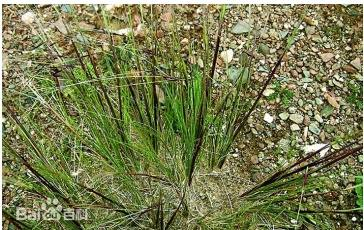
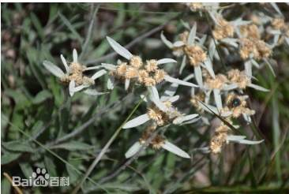
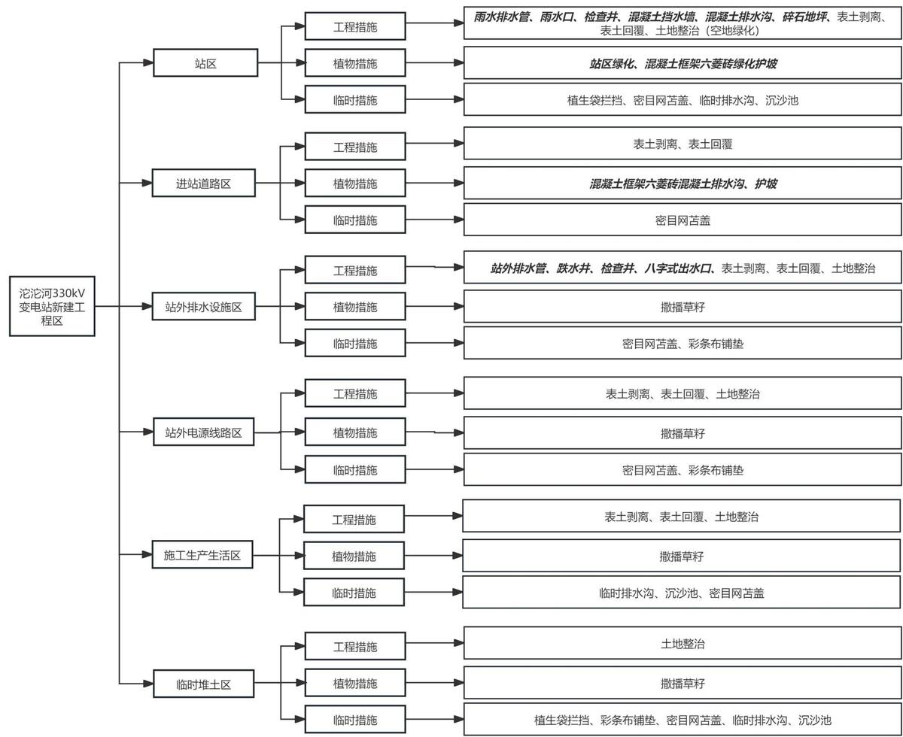
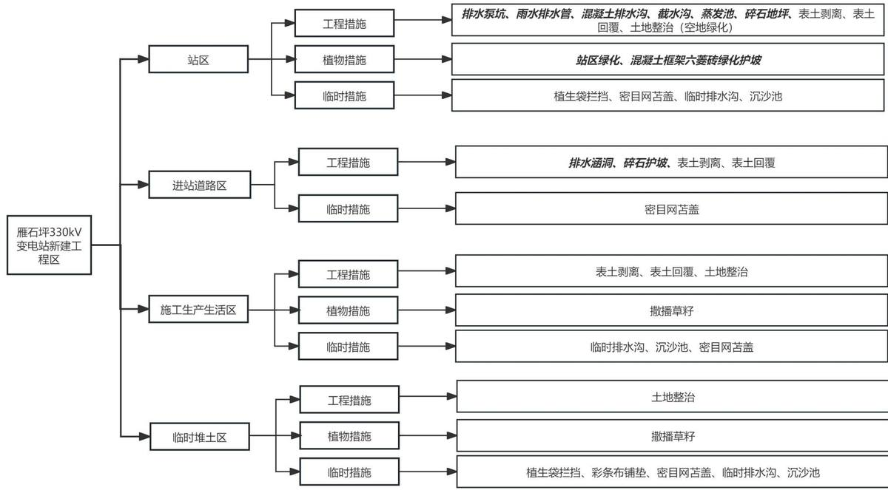
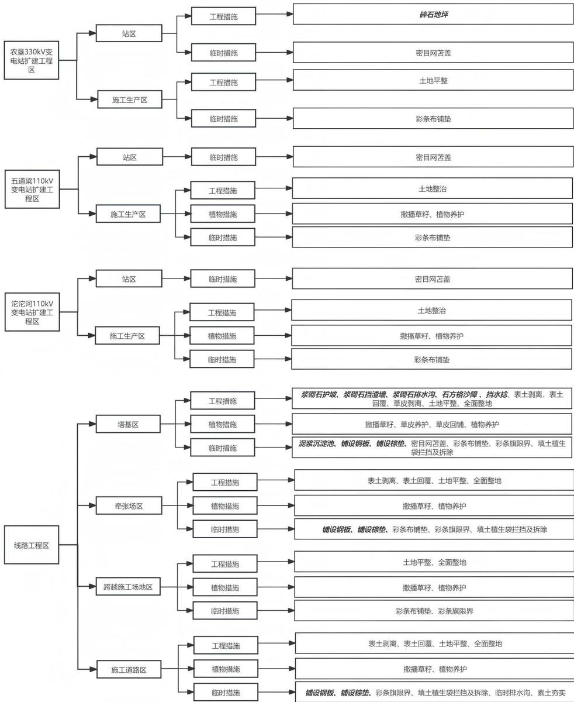

> **Zone C（应用范例层）使用边界**——仅可用于**写作风格、章节展开方式、表达逻辑、表格设计**的参考。
> **不得**用于合规判断；**不得**引入其项目数据（名称／地点／数字／单位名）；
> **不得**因其"曾经通过审批"而推定其做法在当前标准下仍然合规。
> 与 Zone A 冲突时**一律以 Zone A 为准**；Zone A 未明确规定时输出
> 「**Zone A 未明确规定，以下为参考写法，需人工判断**」。
>
> **坐标系警告**：本范例为**老八章结构**（GB 50433—2018 附录B），与 2026 版 10 章模板**同号不同义**
> （老 `1.5`＝防治目标，新 `1.5`＝水土流失预测结果；老 4→新 6 …偏移 +2；新版第 4/5 章老结构无独立章）。
> 因此 **`chapter_mapping: pending`——不得按章节号挂载**，检索一律走 `topic_tags`。
>
> **待加工**：`topic_tags`（主题标签）、`approval_basis_list`（编制依据逐字清单）、
> `structure_summary`（只提取结构：章节展开顺序／段落功能／表格栏目结构／句式模板／论证链步骤）。

<!-- 本文件由原方案 PDF 分段转换后拼接：共 2 段，原 297 页（MinerU 云单文件上限 200 页） -->

1 综合说明 ....  
1.1. 项目简况 ...  
1.2. 编制依据 .... .10  
1.3. 设计水平年 .... ..12  
1.4. 水土流失防治责任范围... ..12  
1.5. 水土流失防治目标.... ..13  
1.6. 项目水土保持评价结论... ..16  
1.7. 水土流失预测结果 ..... ... 18  
1.8. 水土保持措施布设成果.. ... 18  
1.9. 水土保持监测方案 ....... .... 27  
1.10. 水土保持投资及效益分析成果..... ... 28  
1.11. 结论 ...... .... 28  
2 项目概况 ...... ..... 33  
2.1. 项目组成及工程布置... ... 33  
2.2. 施工组织 .... ... 66  
2.3. 工程占地 ... ..82  
2.4. 土石方平衡 ... ... 89  
2.5. 拆迁（移民）安置及专项设施改（迁）建..... ...102  
2.6. 施工进度 .... ...103  
2.7. 自然概况 .... ...105  
3 项目水土保持评价..... .... 132  
3.1. 主体工程选址（线）水土保持评价.. ...132  
3.2. 建设方案与布局水土保持分析评价.. .... 139  
3.3. 主体工程设计中水土保持措施界定.. ...169  
4 水土流失分析与预测....... ..... 172  
4.1. 水土流失现状 .... ...172  
4.2. 水土流失影响因素分析... ...173  
4.3. 土壤流失量预测 .... ...175  
4.4. 水土流失危害分析... ...181  
4.5. 指导性意见 .. ...181  
5 水土保持措施..... .... 183  
5.1. 防治区划分 ... .... 183  
5.2. 措施总体布局.. .... 184  
5.3. 分区措施布设.. ...196  
5.4. 施工要求 ..... .... 232  
6 水土保持监测 ............ ...... 244  
6.1. 监测范围和时段. ...244  
6.2. 监测内容和方法 ..... ...244  
6.3. 点位布设 .... ...252  
6.4. 实施条件和成果 .... ...253  
7 水土保持投资估算及效益分析........ .... 256  
7.1. 投资估算 .. ...256  
7.2. 效益分析 ... ...286  
8 水土保持管理.... .... 289  
8.1. 组织管理 . ...289  
8.2. 后续设计 ..... ...290  
8.3. 水土保持监测 .... ...291  
8.4. 水土保持监理 ... ...292  
8.5. 水土保持施工.. ...293  
8.6. 水土保持设施验收.. ..293

## 1 综合说明

## 1.1. 项目简况

## 1.1.1. 项目基本情况

## （1）项目建设必要性

促进沿线地区经济发展，维护藏区稳定及国家安全。工程的建设将为铁路运行提供可靠的电力保障，有效地支持铁路沿线地区社会经济发展，有利于维护藏区的长治久安。

保障青藏铁路格拉段青海境内牵引站供电需求。工程的建设可为青藏铁路格拉段青海境内14 座牵引站提供符合要求的供电能力和接入条件，保障其供电需求。

满足铁路通信及保障电源用电需求，提高供电能力及可靠性。工程的建设可解决供电容量和出线间隔不足问题，满足牵引站通信及保障电源新增负荷用电需求，缩短沿线110kV供电半径，提高供电能力及可靠性。

综上所述，建设青藏铁路电气化外电配套工程项目（青海段）是必要的。

本工程前期阶段的工程名称曾使用“青藏铁路电气化外电配套工程（青海侧）”、“青藏铁路电气化外电配套工程二期（青海段）”，本报告依据工程可研批复将工程名称统一为“青藏铁路电气化外电配套工程项目（青海段）”。

## （2）基本情况

本工程主要分为变电工程和线路工程，涉及青海省海西蒙古族藏族自治州（以下简称“海西州”）格尔木市、玉树藏族自治州（以下简称“玉树州”）治多县、曲麻莱县，西藏自治区那曲市安多县。

变电工程包括9个站，分别是：望昆330kV变电站新建工程（以下简称“望昆330kV变电站”）、风火山 330kV 变电站新建工程（以下简称“风火山 330kV 变电站”）、沱沱河 330kV 变电站新建工程（以下简称“沱沱河 330kV 变电站”）、雁石坪 330kV变电站新建工程（以下简称“雁石坪 330kV 变电站”）、柴达木 750kV 变电站扩建工程（以下简称“柴达木750kV变电站”）、农垦330kV变电站扩建工程（以下简称“农垦330kV 变电站”）、纳赤台 110kV 变电站扩建工程（以下简称“纳赤台 110kV 变电站”）、五道梁 110kV 变电站扩建工程（以下简称“五道梁 110kV 变电站”）、沱沱河110kV变电站扩建工程（以下简称“沱沱河110kV变电站”）。

线路工程包括28条线路，分别是：农垦\~望昆 330kV 线路工程、农垦\~甘隆牵330kV线路工程、柴达木\~望昆330kV线路工程、望昆\~甘隆牵330kV线路工程、玉珠峰牵\~纳赤台牵330kV线路工程、望昆\~玉珠峰牵330kV 线路工程、望昆\~昆仑山牵330kV 线路工程、望昆\~清水桥牵330kV线路工程、望昆\~风火山330kV线路工程、望昆\~纳赤台牵330kV 线路工程、清水桥牵\~可可西里牵 330kV 线路工程、风火山\~可可西里牵 330kV线路工程、风火山\~曲吾牵 330kV线路工程、风火山\~风火山牵 330kV 线路工程、风火山\~沱沱河330kV线路工程、风火山牵～日阿尺曲牵330kV 线路工程、沱沱河～日阿尺曲牵 330kV线路工程、沱沱河\~沱沱河牵330kV 线路工程、沱沱河\~通天河牵330kV 线路工程、沱沱河\~雁石坪330kV 线路工程、雁石坪～通天河牵330kV 线路工程、雁石坪\~雁石坪牵330kV线路工程、雁石坪\~布强格牵330kV线路工程、雁石坪\~唐古拉牵330kV线路工程、唐古拉牵～布强格牵 330kV 线路工程、望昆 330kV 变电站 110kV 送出线路工程、风火山330kV变电站110kV送出线路工程、沱沱河330kV变电站110kV送出线路工程。

## 一、变电工程

## 1）望昆330kV变电站新建工程

望昆 330kV 变电站位于青海省海西州格尔木市郭勒木德镇。主变容量本期 2×150MVA，330kV 出线本期 10 回，110kV 出线本期 2 回。进站道路从站址南侧的 G109国道引接，长度约 1674m。竖向采用全平布置，设计标高 4488.75m。站区西侧为挖方边坡，采用毛石混凝土挡土墙，挖方区围墙外设置混凝土排水沟；东侧为填方边坡，采用混凝土框架六菱砖绿化护坡，填方边坡坡底设混凝土排水沟。

站内用水采用打井取水。站区排水采用雨污分流。站区雨水经站内道路两侧排水沟汇集，部分通过地下排水管网排入站区围墙外东侧雨水集蓄池；部分通过排水泵坑，经雨水提升泵加压排至围墙外东侧雨水集蓄池。备用电源采用柴油发电机。施工生产生活区布置站区东北侧，占地面积1.50hm2；施工期于变电站站内设置一处0.2hm2的临时堆土场地，此外于站外布置1处临时堆土区，位于站址东北侧，站外临时堆土区占地面积共 0.50hm2。

## 2）风火山330kV变电站新建工程

风火山 330kV 变电站位于青海省玉树州治多县索加乡莫曲村。主变容量本期 2×150MVA，330kV 出线本期 8 回，110kV 出线本期 2 回。进站道路从站址南侧 G109 国道引接，长度492m。竖向采用平坡式布置，设计标高4697.10m～4697.93m。站区西北侧为挖方边坡，东南侧为填方边坡，均采用混凝土格构绿化护坡，坡脚设排水沟。

站内用水采用水车拉水。站区排水采用雨污分流。站区雨水部分经站区道路两侧边沟和场地排水沟就近排入站外排水沟，最终向东沿进站道路排入 G109国道西侧排水通道，部分通过排水沟排入排水泵坑，经雨水提升泵加压排至西南侧雨水集蓄池。站用电源从五道梁站引接 1 回 10kV 供电电源，线路长度约 18km，施工电源永临结合。施工生产生活区布置站区东南侧，占地面积 1.50hm2；施工期于变电站站内设置一处0.2hm2的临时堆土场地，此外于站外布置1处临时堆土区，位于站址西北侧，站外临时堆土区占地面积共 0.45hm2。

## 3）沱沱河330kV变电站新建工程

沱沱河 330kV 变电站位于青海省海西州格尔木市唐古拉山镇。主变容量本期 2×150MVA，330kV 出线本期 8 回，110kV 出线本期 1 回。进站道路从站址东南侧 G109国道引接，长度840m。竖向采用平坡式布置，设计标高4570.90～4571.15m。站区西北侧为挖方边坡，东南侧为填方边坡，均采用混凝土框架六菱砖绿化护坡。

站内用水采用打井取水。站区排水采用雨污分流。站区雨水经道路两侧排水沟汇集，沟内每隔50m设置雨水口，并接入雨水检查井，通过地下管道排入站外排水管，通过管道排入西南侧天然冲沟。站用电源自沱沱河 110kV变电站引接一回 10kV线路，线路长7.15km，施工电源永临结合。施工生产生活区布置进站道路西侧，占地面积 1.50hm2；施工期于变电站站内设置一处 0.2hm2 的临时堆土场地，此外于站外布置 1 处临时堆土区，位于进站道路东侧，站外临时堆土区占地面积共0.55hm2。

## 4）雁石坪330kV变电站新建工程

雁石坪 330kV 变电站位于青海省海西州格尔木市唐古拉山镇。主变容量本期 2×150MVA，330kV出线本期7回。进站道路从站址南侧雁雅线公路引接，长度270m。竖向采用平坡式布置，设计标高为4716.60\~4718.35m；站区西侧为挖方边坡，东侧为填方边坡，采用混凝土框架六菱砖绿化护坡。挖方边坡坡顶设混凝土排水沟。

站内用水采用站内深井取水。站区排水采用雨污分流。站区雨水通过站内道路迎水侧设置的排水沟收集地面雨水，西侧通过排水沟就近导排至围墙外截水沟，沿进站道路排至燕雅线附近冲沟；东侧排入排水泵坑，经雨水提升泵加压排至排入雨水集蓄池。备用电采用柴油发电机。施工生产生活区布置站区北侧和进站道路西侧，占地面积1.50hm2；施工期于变电站站内设置一处 0.2hm2的临时堆土场地，此外于站外布置 1处临时堆土区，位于站址北侧，站外临时堆土区占地面积共0.60hm2。

## 5）柴达木750kV变电站扩建工程

柴达木变电站位于青海省海西州格尔木市以东南约 27.5km 的西城区郭勒木德乡。本期扩建1回330kV出线，利用站内已有备用间隔，无土建施工。

## 6）农垦330kV变电站扩建工程

农垦变电站位于青海省海西州格尔木市郭勒木德镇新乐村。本期扩建2回330kV出线，并在已建#1、#4主变 35kV 侧分别扩建 1 组30Mvar 低压电容器。站区竖向布置与地面排水系统一期已形成，一期竖向设计采用平坡式布置。站区场地地面排水采用雨水下水道的有组织排水。扩建工程在站内预留区域扩建，不新征地。本次扩建占地0.20hm2。施工生产区布置在站区东北侧，占地面积 0.05hm2。

## 7）纳赤台110kV变电站扩建工程

纳赤台变电站位于青海省海西州格尔木市纳赤台地区。本期改造纳五Ⅰ线间隔、母联间隔电流互感器，无土建施工。

## 8）五道梁110kV变电站扩建工程

五道梁变电站位于青海玉树州曲麻莱县曲麻河乡五道梁兵站东侧。本期工程对主变进行增容改造，并在每台主变低压侧新建 2×3Mvar电容器组，扩建1 回110kV 出线，改造 35kV出线间隔。站区竖向布置与地面排水系统一期已形成，一期竖向设计采用平坡式布置。站区场地地面排水采用雨水下水道的有组织排水。扩建工程在站内预留区域扩建，不新征地。本次扩建占地0.13hm2。施工生产区布置在站区西侧，占地面积0.05hm2。

## 9）沱沱河110kV变电站扩建工程

沱沱河110kV变电站建于青海省海西州沱沱河盆地中部。本期工程对主变进行增容改造，并在每台主变低压侧新建2×3Mvar 电容器组，扩建1回110kV出线、4回10kV出线，改造 35kV出线间隔。站区竖向布置与地面排水系统一期已形成，一期竖向设计采用平坡式布置。站区场地地面排水采用雨水下水道的有组织排水。扩建工程在站内预留区域扩建，不新征地。本次扩建占地 0.10hm2。施工生产区布置在站区北侧，占地面积 0.05hm2。

## 二、线路工程

## 1）农垦\~望昆 330kV线路工程

线路起于农垦变电站，止于望昆变电站，位于青海省海西州格尔木市，共1个省（自治区）级行政区，1个地级行政区，1个县级行政区。线路全长150.70km，共架设铁塔

330基（其中直线塔268基、耐张塔 62基）。

## 2）农垦\~甘隆牵330kV线路工程

线路起于农垦变电站，止于甘隆牵引站，位于青海省海西州格尔木市，共1个省（自治区）级行政区，1 个地级行政区，1 个县级行政区。线路全长 62.70km，共架设铁塔160基（其中直线塔134基、耐张塔 26基）。

## 3）柴达木\~望昆330kV线路工程

线路起于柴达木变电站，止于望昆变电站，位于青海省海西州格尔木市，共1个省（自治区）级行政区，1个地级行政区，1个县级行政区。线路全长167.20km，共架设铁塔 399基（其中直线塔318基、耐张塔 81基）。

## 4）望昆\~甘隆牵330kV线路工程

线路起于望昆变电站，止于甘隆牵引站，位于青海省海西州格尔木市，共1个省（自治区）级行政区，1 个地级行政区，1 个县级行政区。线路全长 93.60km，共架设铁塔216基（其中直线塔151基、耐张塔 65基）。

## 5）玉珠峰牵\~纳赤台牵 330kV线路工程

线路起于玉珠峰牵引站，止于纳赤台牵引站，位于青海省海西州格尔木市，共1个省（自治区）级行政区，1个地级行政区，1 个县级行政区。线路全长41.40km，共架设铁塔 100基（其中直线塔61基、耐张塔 39基）。

## 6）望昆\~玉珠峰牵330kV线路工程

线路起于望昆变电站，止于玉珠峰牵引站，位于青海省海西州格尔木市，共1个省（自治区）级行政区，1个地级行政区，1个县级行政区。线路全长25.50km，共架设铁塔54基（其中直线塔33基、耐张塔 21基）。

## 7）望昆\~昆仑山牵330kV线路工程

线路起于望昆变电站，止于昆仑山牵引站，位于青海省海西州格尔木市，共1个省（自治区）级行政区，1个地级行政区，1个县级行政区。线路全长2×13.43km，共架设铁塔66 基（其中直线塔42基、耐张塔 24基）。

## 8）望昆\~清水桥牵330kV线路工程

线路起于望昆变电站，止于清水桥牵引站，途经青海省海西州格尔木市、玉树州治多县、曲麻莱县，共 1 个省（自治区）级行政区，2 个地级行政区，3个县级行政区。线路全长53.20km，共架设铁塔123基（其中直线塔100 基、耐张塔23基）。

## 9）望昆\~风火山330kV线路工程

线路起于望昆变电站，止于风火山变电站，途经青海省海西州格尔木市、玉树州治多县、曲麻莱县，共 1 个省（自治区）级行政区，2 个地级行政区，3个县级行政区。线路全长2×137.84km，共架设铁塔635基（其中直线塔535基、耐张塔100基）。

## 10）望昆\~纳赤台牵330kV线路工程

线路起于望昆变电站，止于纳赤台变电站，位于青海省海西州格尔木市，共1个省（自治区）级行政区，1个地级行政区，1个县级行政区。线路全长63.76km，共架设铁塔148基（其中直线塔 100基、耐张塔 48基）。

## 11）清水桥牵\~可可西里牵330kV线路工程

线路起于清水桥牵引站，止于可可西里牵引站，途经青海省玉树州治多县、曲麻莱县，共1个省（自治区）级行政区，1个地级行政区，2 个县级行政区。线路全长46.00km，共架设铁塔110基（其中直线塔101基、耐张塔9基）。

## 12）风火山\~可可西里牵330kV线路工程

线路起于风火山变电站，止于可可西里牵引站，途经青海省玉树州治多县、曲麻莱县，共1个省（自治区）级行政区，1个地级行政区，2 个县级行政区。线路全长43.70km，共架设铁塔98基（其中直线塔85基、耐张塔 13基）。

## 13）风火山\~曲吾牵330kV线路工程

线路起于风火山变电站，止于曲吾牵引站，途经青海省玉树州治多县、曲麻莱县，共1 个省（自治区）级行政区，1 个地级行政区，2 个县级行政区。线路全长5.60km，共架设铁塔18基（其中直线塔5基、耐张塔 13基）。

## 14）风火山\~风火山牵 330kV线路工程

线路起于风火山变电站，止于风火山牵引站，位于青海省玉树州治多县，共1个省（自治区）级行政区，1个地级行政区，1个县级行政区。线路全长38.60km，共架设铁塔84基（其中直线塔63基、耐张塔 21基）。

## 15）风火山\~沱沱河330kV线路工程

线路起于风火山变电站，止于沱沱河变电站，途经青海省海西州格尔木市、玉树州治多县，共1 个省（自治区）级行政区，2个地级行政区，2个县级行政区。线路全长2×117.40km，共架设铁塔487 基（其中直线塔400基、耐张塔87 基）。

## 16）风火山牵～日阿尺曲牵330kV线路工程

线路起于风火山牵引站，止于日阿尺曲牵引站，位于青海省玉树州治多县，共1个省（自治区）级行政区，1个地级行政区，1 个县级行政区。线路全长43.80km，共架设铁塔 96基（其中直线塔66基、耐张塔 30基）。

## 17）沱沱河～日阿尺曲牵330kV线路工程

线路起于沱沱河变电站，止于日阿尺曲牵引站，途经青海省海西州格尔木市、玉树州治多县，共 1 个省（自治区）级行政区，2 个地级行政区，2 个县级行政区。线路全长37.40km，共架设铁塔85基（其中直线塔60基、耐张塔25 基）。

## 18）沱沱河\~沱沱河牵 330kV线路工程

线路起于沱沱河变电站，止于沱沱河牵引站，位于青海省海西州格尔木市，共1个省（自治区）级行政区，1个地级行政区，1 个县级行政区。线路全长2×5.60km，共架设铁塔28 基（其中直线塔14基、耐张塔 14基）。

## 19）沱沱河\~通天河牵 330kV线路工程

线路起于沱沱河变电站，止于通天河牵引站，位于青海省海西州格尔木市，共1个省（自治区）级行政区，1个地级行政区，1 个县级行政区。线路全长48.30km，共架设铁塔 111基（其中直线塔 85基、耐张塔26基）。

## 20）沱沱河\~雁石坪330kV线路工程

线路起于沱沱河变电站，止于雁石坪变电站，位于青海省海西州格尔木市，共1个省（自治区）级行政区，1个地级行政区，1个县级行政区。线路全长2×87.05km，共架设铁塔403 基（其中直线塔317基、耐张塔 86基）。

## 21）雁石坪～通天河牵330kV线路工程

线路起于通天河牵引站，止于雁石坪变电站，位于青海省海西州格尔木市，共1个省（自治区）级行政区，1个地级行政区，1 个县级行政区。线路全长39.60km，共架设铁塔 92基（其中直线塔70基、耐张塔 22基）。

## 22）雁石坪\~雁石坪牵 330kV线路工程

线路起于雁石坪变电站，止于雁石坪牵引站，位于青海省海西州格尔木市，共1个省（自治区）级行政区，1个地级行政区，1个县级行政区。线路全长2×12.10km，共架设铁塔54基（其中直线塔36基、耐张塔 18基）。

## 23）雁石坪\~布强格牵 330kV线路工程

线路起于雁石坪变电站，止于布强格牵引站，位于青海省海西州格尔木市，共1个

省（自治区）级行政区，1个地级行政区，1 个县级行政区。线路全长60.00km，共架设铁塔 136基（其中直线塔103基、耐张塔 33基）。

## 24）雁石坪\~唐古拉牵 330kV线路工程

线路起于雁石坪变电站，止于唐古拉牵引站，途径青海省海西州格尔木市、西藏自治区那曲市安多县，共2个省（自治区）级行政区，2 个地级行政区，2 个县级行政区。线路全长98.80km，共架设铁塔220基（其中直线塔173 基、耐张塔47基）。

## 25）唐古拉牵～布强格牵330kV线路工程

线路起于唐古拉牵引站，止于布强格牵引站，途径青海省海西州格尔木市、西藏自治区那曲市安多县，共2个省（自治区）级行政区，2 个地级行政区，2 个县级行政区。线路全长39.50km，共架设铁塔90基（其中直线塔70基、耐张塔20基）。

## 26）望昆 330kV 变电站 110kV 送出线路工程

线路从已建 110kV 纳五线开π点向北走线接入新建望昆330kV 变电站，位于青海省海西州格尔木市，共1个省（自治区）级行政区，1 个地级行政区，1 个县级行政区。线路全长3.20km，共架设铁塔15基（其中直线塔2基、耐张塔13基）。

## 27）风火山330kV变电站110kV送出线路工程

线路起自五道梁～沱沱河 110kV 线路开π点，止于拟建风火山 330kV 变电站，途经青海省玉树州治多县、曲麻莱县，共1个省（自治区）级行政区，1个地级行政区，2个县级行政区。线路全长2.30km，共架设铁塔10基（全部为耐张塔）。

## 28）沱沱河330kV变电站110kV送出线路工程

线路起于沱沱河330kV变电站，止于沱沱河110kV变电站，位于海西州格尔木市，共1 个省（自治区）级行政区，1 个地级行政区，1 个县级行政区。线路全长6.50km，共架设铁塔24基（其中直线塔16基、耐张塔 8基）。

线路工程途经青海省海西州格尔木市、玉树州治多县、曲麻莱县、西藏自治区那曲市安多县。线路全长1915.90km，共架设铁塔4392 基（其中直线塔3408基、耐张塔984基）。本工程线路在钻越±400kV 柴拉线时需对直流塔进行加高改造，共拆除铁塔 29基、新建30基。

工程总占地为 699.85hm2，永久占地 88.23hm2，临时占地 611.62hm2。本工程土石方挖填总量为 156.70 万 m3，总挖方 78.35 万 m3（含表土剥离 13.11 万 m3），总填方 78.35万 m3（含表土回覆13.11万 m3）。

本工程计划2025年12月开工，完工时间为 2028年9月，建设总工期为34 个月。本工程投资单位与出资比例为超长期特别国债 50%、国网青海省电力公司银行贷款50%。工程静态投资722244 万元，其中土建投资229014 万元。

## 1.1.2. 项目前期工作进展情况

## （1）主体设计情况

2023年12月，本工程可行性研究工作由国网经济技术研究院有限公司牵头，中国电力工程顾问集团西北电力设计院有限公司、中国电力工程顾问集团西南电力设计院有限公司、中国电力建设集团青海省电力设计院有限公司、四川电力设计咨询有限责任公司、国核电力规划设计研究院有限公司、西宁宁光工程咨询有限公司6家设计院分工合作完成。

2025 年5 月 26 日，国家发展和改革委员会以发改能源〔2025〕659号对本工程可行性研究报告进行了批复。

2025年7月，本工程初步设计工作由中国电力工程顾问集团西北电力设计院有限公司牵头，中国电力工程顾问集团西南电力设计院有限公司、中国电建集团青海省电力设计院有限公司、中国电建集团河南省电力勘测设计院有限公司、四川电力设计咨询有限责任公司、国网河南能源互联网电力设计院有限公司、国核电力规划设计研究院有限公司、中国能源建设集团新疆电力设计院有限公司、湖北省电力规划设计研究院有限公司、南瑞工程技术有限公司、西宁宁光工程咨询有限公司 11家设计院分工合作完成。

## （2）方案编制情况

2024年1月，中国电力工程顾问集团西南电力设计院有限公司（以下简称“西南院”）中标本工程水土保持方案编制工作。接受工作任务后，西南院成立了水土保持专题项目组，对工程设计资料进行全面分析研究，并于2024年5月和9月进行了两次现场勘查，对项目沿线的自然环境、生态环境、水土流失及水土保持现状等进行了调查，同时征求了地方水行政主管部门的意见，收集了项目建设区所在地的相关水土保持现状和规划资料，在水土流失预测的基础上，制定了本工程水土流失防治措施、水土保持监测方案以及投资估算，编制完成了《青藏铁路电气化外电配套工程项目（青海段）水土保持方案报告书》。

## （3）其他相关专题进展

本工程的环境影响评价、地质灾害危险性评估、压覆矿产评价、文物调查、节能评

估、行洪等专项报告均在开展中。中国青海昆仑山世界地质公园、青海格尔木昆仑山国家地质公园、沱沱河和楚玛尔河特有鱼类国家级水产种质资源保护区已取得评审意见。

## 1.1.3. 自然简况

项目区属青藏高原区，沿线海拔在 2800～5100m之间。青海省海西州属典型的高原温带大陆性气候区，干旱少雨，日照强烈，蒸发量大，气压低，多大风、霜冻、沙暴等天气，冬季寒冷漫长，夏季凉爽短促，昼夜温差大。风季多集中于 10月\~翌年4月，雨季集中于5月\~9 月。玉树州属高原温带半干旱季风气候区，冬季寒冷、干燥，昼夜温差大；夏季温暖湿润，雨热同期，干湿季分明，天气变化大，雨季为每年的 7月～9月。西藏自治区那曲市安多县属高原亚寒带季风半湿润气候区，高寒缺氧，气候干燥，昼夜温差大，四季不分明，多风雪天气。风季多集中于10 月\~翌年4月，雨季集中于6月\~9月。项目区多年降水量 275.5mm～446.5mm，多年平均蒸发量 1340.4mm～1599.6mm，年平均风速 2.3～4.2m/s，≥10℃积温为 $1 7 0 ^ { \circ } \mathrm { C } \sim 1 2 3 2 . 2 ^ { \circ } \mathrm { C }$ ，无霜期 35天～121天。

工程沿线土壤以盐土、沙土、荒漠土、高山草甸土为主，项目区表层土厚度在15cm～20cm 不等，土壤抗蚀性一般。植被类型以温带亚寒带高寒草原和灌丛草原、荒漠灌丛、高寒草甸、高原草原、高山灌丛草原、高寒草原为主。工程沿线林草覆盖率约为0～60%。

本工程沿线水土流失情况：工程所在区域青海省格尔木市部分地区以轻度风力侵蚀为主、青海省格尔木市唐古拉山镇部分、玉树州和西藏自治区那曲市以轻度水力侵蚀为主。根据全国水土保持区划成果，项目土壤侵蚀类型区为青藏高原区。项目区沿线风力侵蚀区域容许土壤流失量为 $2 5 0 0 \mathrm { t } / ( \mathrm { k m } ^ { 2 } { \cdot } \mathrm { a } )$ 、水力侵蚀区域容许土壤流失量为1000t/(km2·a)；侵蚀模数背景值为 1000～2500t/(km2·a)。

本工程线路路径经过优化后已避开了多处生态敏感区，在线路优化的基础上，本工程线路仍需穿（跨）越三江源国家公园、中国青海昆仑山世界地质公园、青海格尔木昆仑山国家地质公园、可可西里世界自然遗产地、沱沱河和楚玛尔河特有鱼类国家级水产种质资源保护区等6处水土保持敏感区。目前已取得相关部门的原则同意意见。线路工程不可避让穿（跨）生态保护红线113.18km。

## 1.2. 编制依据

## 1.2.1. 法律、法规

（1）《中华人民共和国水土保持法》（主席令第 39号，1991年 6 月29 日颁布，2010 年 12 月 25 日修订，2011 年 3 月 1 日实施）；

（2）《青海省实施〈中华人民共和国水土保持法〉办法》（2016年3月25日修订，2016 年6月1日实施）；

（3）《西藏自治区实施〈中华人民共和国水土保持法〉办法》（1997 年 3 月 29日通过，2013年7月25日修订，2013 年10月1日施行）；

（4）《中华人民共和国青藏高原生态保护法》（主席令第 5 号，2023 年 4 月 26日颁布，2023年9月1 日实施）；

（5）《中华人民共和国长江保护法》（2020年12 月26日第十三届全国人民代表大会常务委员会第二十四次会议通过，2021年3月1 日施行）；

（6）《中华人民共和国黄河保护法》（2022年10 月30日第十三届全国人民代表大会常务委员会第三十七次会议通过，2023年4月1 日起施行）。

## 1.2.2. 部委规章、规范性文件

（1）《生产建设项目水土保持方案管理办法》（水利部令第53 号）；

（2）《水利部办公厅关于印发生产建设项目水土保持方案审查要点的通知》（办水保〔2023〕177 号）；

（3）《水利部办公厅关于印发生产建设项目水土保持设施自主验收规程（试行）的通知》（办水保〔2018〕133号）；

（4）《水利部办公厅关于印发生产建设项目水土保持技术文件编写和印制格式规定（试行）的通知》（办水保〔2018〕135号）；

（5）《水利部办公厅关于印发生产建设项目水土保持监督管理办法的通知》（办水保〔2019〕172 号）；

（6）《水利部关于进一步深化“放管服”改革全面加强水土保持监管的意见》（水保〔2019〕160 号）；

（7）《水利部办公厅关于实施生产建设项目水土保持信用监管“两单”制度的通知》（办水保〔2020〕157号）；

（8）《水利部办公厅关于进一步加强生产建设项目水土保持监测工作的通知》（办水保〔2020〕161 号）；

（9）《水利部关于实施水土保持信用评价的意见》（水保〔2023〕359号）；

（10）《水利部关于加强事中事后监管规范生产建设项目水土保持设施自主验收的通知》（办水保（2017）365号）；

## 1.2.3. 技术标准

（1）《生产建设项目水土保持技术标准》（GB50433-2018）；

（2）《生产建设项目水土流失防治标准》（GB/T50434-2018）；

（3）《水土保持工程设计规范》（GB51018-2014）；

（4）《水土保持工程施工监理规范》（SL/T523-2024）；

（5）《土壤侵蚀分类分级标准》（SL190-2007）；

（6）《土地利用现状分类》（GB/T21010-2017）；

（7）《生产建设项目水土保持监测与评价标准》（GB/T51240-2018）；

（8）《生产建设项目土壤流失量测算导则》（SL773-2018）；

（9）《水利水电工程制图标准 水土保持图》（SL73.6-2015）；

（10）《输变电工程水土保持技术规程》（Q/GDW11970.1--2023）；

（11）《输变电项目水土保持技术规范》（SL640-2013）；

（12）《水土保持工程调查与勘测标准》（GB/T51297-2018）。

## 1.2.4. 技术资料

（1）《青藏铁路电气化外电配套工程项目（青海段）》可研、初设等设计资料；

（2）全国水土保持规划（2015-2030 年）；

（3）青海省水土保持规划（2016-2030 年）；

（4）西藏自治区水土保持规划（2019-2030 年）。

## 1.3. 设计水平年

本工程计划2025 年12月开工，2028年9 月完工，总工期 34 个月。根据《生产建设项目水土保持技术标准》（GB 50433-2018）有关规定，水土保持方案设计水平年应为主体工程完工水土保持措施实施及发挥效益的当年或后一年，根据本工程工期安排，本方案设计水平年确定为工程完工后当年，即为2028年。

## 1.4. 水土流失防治责任范围

本工程水土流失防治责任范围面积共 699.85hm2，其中永久占地 88.23hm2，临时占地 611.62hm2，详见下表。

表 1.4-1 工程水土流失防治责任范围表 单位：hm2
<table><tr><td colspan="1" rowspan="2">序号</td><td colspan="1" rowspan="2">行政区划</td><td colspan="3" rowspan="1">项目建设区</td><td colspan="1" rowspan="2">防治责任范围</td></tr><tr><td colspan="1" rowspan="1">永久占地</td><td colspan="1" rowspan="1">临时占地</td><td colspan="1" rowspan="1">小计</td></tr><tr><td colspan="1" rowspan="1">1</td><td colspan="1" rowspan="1">青海省</td><td colspan="1" rowspan="1">88.12</td><td colspan="1" rowspan="1">610.60</td><td colspan="1" rowspan="1">698.72</td><td colspan="1" rowspan="1">698.72</td></tr><tr><td colspan="1" rowspan="1">1.1</td><td colspan="1" rowspan="1">海西州</td><td colspan="1" rowspan="1">60.97</td><td colspan="1" rowspan="1">372.21</td><td colspan="1" rowspan="1">433.18</td><td colspan="1" rowspan="1">433.18</td></tr><tr><td colspan="1" rowspan="1"></td><td colspan="1" rowspan="1">格尔木市</td><td colspan="1" rowspan="1">60.97</td><td colspan="1" rowspan="1">372.21</td><td colspan="1" rowspan="1">433.18</td><td colspan="1" rowspan="1">433.18</td></tr><tr><td colspan="1" rowspan="1">1.2</td><td colspan="1" rowspan="1">玉树州</td><td colspan="1" rowspan="1">27.15</td><td colspan="1" rowspan="1">238.39</td><td colspan="1" rowspan="1">265.54</td><td colspan="1" rowspan="1">265.54</td></tr><tr><td colspan="1" rowspan="1"></td><td colspan="1" rowspan="1">治多县</td><td colspan="1" rowspan="1">26.57</td><td colspan="1" rowspan="1">232.62</td><td colspan="1" rowspan="1">259.19</td><td colspan="1" rowspan="1">259.19</td></tr><tr><td colspan="1" rowspan="1"></td><td colspan="1" rowspan="1">曲麻莱县</td><td colspan="1" rowspan="1">0.58</td><td colspan="1" rowspan="1">5.77</td><td colspan="1" rowspan="1">6.35</td><td colspan="1" rowspan="1">6.35</td></tr><tr><td colspan="1" rowspan="1">2</td><td colspan="1" rowspan="1">西藏自治区</td><td colspan="1" rowspan="1">0.11</td><td colspan="1" rowspan="1">1.02</td><td colspan="1" rowspan="1">1.13</td><td colspan="1" rowspan="1">1.13</td></tr><tr><td colspan="1" rowspan="1">2.1</td><td colspan="1" rowspan="1">那曲市</td><td colspan="1" rowspan="1">0.11</td><td colspan="1" rowspan="1">1.02</td><td colspan="1" rowspan="1">1.13</td><td colspan="1" rowspan="1">1.13</td></tr><tr><td colspan="1" rowspan="1"></td><td colspan="1" rowspan="1">安多县</td><td colspan="1" rowspan="1">0.11</td><td colspan="1" rowspan="1">1.02</td><td colspan="1" rowspan="1">1.13</td><td colspan="1" rowspan="1">1.13</td></tr><tr><td colspan="2" rowspan="1">合计</td><td colspan="1" rowspan="1">88.23</td><td colspan="1" rowspan="1">611.62</td><td colspan="1" rowspan="1">699.85</td><td colspan="1" rowspan="1">699.85</td></tr></table>

## 1.5. 水土流失防治目标

## 1.5.1. 执行标准等级

根据《生产建设项目水土流失防治标准》（GB/T 50434-2018）的规定，本工程涉及4 个县水土流失防治标准均执行青藏高原区一级标准。

表1.5-1 本工程水土流失防治标准等级表
<table><tr><td rowspan=1 colspan=1>行政区</td><td rowspan=1 colspan=2>市（县、区）</td><td rowspan=1 colspan=1>水保区划</td><td rowspan=1 colspan=1>国家级“两区”</td><td rowspan=1 colspan=1>省级“两区”</td><td rowspan=1 colspan=1>市级“两区”</td><td rowspan=1 colspan=1>环境敏感区</td><td rowspan=1 colspan=1>执行标准</td></tr><tr><td rowspan=3 colspan=1>青海省</td><td rowspan=1 colspan=1>海西州</td><td rowspan=1 colspan=1>格尔木市</td><td rowspan=4 colspan=1>青藏高原区</td><td rowspan=1 colspan=1>1</td><td rowspan=1 colspan=1>柴达木盆地省级水土流失重点治理区（不含唐古拉山镇）</td><td rowspan=1 colspan=1>1</td><td rowspan=3 colspan=1>三江源国家公园、中国青海昆仑山世界地质公园、青海格尔木昆仑山国家地质公园、可可西里世界自然遗产地</td><td rowspan=4 colspan=1>青藏高原区一级</td></tr><tr><td rowspan=2 colspan=1>玉树州</td><td rowspan=1 colspan=1>治多县</td><td rowspan=1 colspan=1>三江源国家级水土流失重点预防区12个小流域，合计89.05km（折单长度）</td><td rowspan=1 colspan=1>1</td><td rowspan=1 colspan=1>1</td></tr><tr><td rowspan=1 colspan=1>曲麻莱县</td><td rowspan=1 colspan=1>1</td><td rowspan=1 colspan=1>/</td><td rowspan=1 colspan=1>1</td></tr><tr><td rowspan=1 colspan=1>西藏自治区</td><td rowspan=1 colspan=1>那曲市</td><td rowspan=1 colspan=1>安多县</td><td rowspan=1 colspan=1>/</td><td rowspan=1 colspan=1>/</td><td rowspan=1 colspan=1>那曲市市级重点治理区</td><td rowspan=1 colspan=1>/</td></tr></table>

## 1.5.2. 防治目标

根据《生产建设项目水土流失防治标准》（GB/T50434-2018）的有关要求，本工程水土流失防治目标为：

（1）项目建设范围内的新增水土流失应得到有效控制，原有水土流失得到治理；

（2）水土保持设施应安全有效；

（3）水土资源、林草植被应得到最大限度的保护与恢复；

（4）水土流失治理度、土壤流失控制比、渣土防护率、表土保护率、林草植被恢复率、林草覆盖率等指标应符合现行国家标准《生产建设项目水土流失防治标准》（GB/T50434-2018）的规定。

指标值应结合项目区干旱程度、侵蚀强度、地貌类型及水土流失两区等因素进行调整，综合确定设计水平年各防治区应达到的水土流失防治目标值。

## （1）干旱程度修正

标准规定：位于干旱地区的，水土流失治理度、林草植被恢复率、林草覆盖率可降低 3%\~5%。本工程区属于干旱区，水土流失治理度、林草植被恢复率、林草覆盖率可降低 3%\~5%，考虑本工程区涉及国家级水土流失重点预防区、那曲市水土流失重点预防区，水土流失治理度、林草植被恢复率、林草覆盖率不按干旱程度进行降低修正。

## （2）原地貌侵蚀强度修正

标准规定：土壤流失控制比在轻度侵蚀为主的区域不应小于 1，中度以上侵蚀为主的区域可降低0.1\~0.2。项目区所在区域现状土壤侵蚀强度以轻度风力、水力侵蚀为主，土壤流失控制比应不小于1.0。

## （3）地貌修正

标准规定：在中山区的项目，渣土防护率可减少 1%\~3%；在极高山、高山区的项目渣土防护率可减少 3%\~5%。本工程涉及高原山地地貌，但项目区涉及国家级水土流失重点预防区、那曲市市级重点治理区、三江源国家公园、中国青海昆仑山世界地质公园、青海格尔木昆仑山国家地质公园、可可西里世界自然遗产地，且项目土石方优先挖填平衡，项目渣土防护率不进行降低修正。

## （4）重点防治区修正

本工程区涉及国家级水土流失重点预防区、那曲市水土流失重点预防区，根据《生产建设项目水土保持技术标准》（GB50433-2018）规定，将林草覆盖率提高2%。

按照《生产建设项目水土流失防治标准》（GB/T50434-2018），项目区所处水土流失防治区防治标准执行青藏高原区一级标准。望昆变电站以北区域，地貌主要为戈壁荒漠，因此对表土保护率、林草植被恢复率、林草覆盖率不做要求。对各指标值进行修正后，本工程设计水平年水土流失防治目标值为：水土流失治理度85%、土壤流失控制比1.0、渣土防护率87%、表土保护率90%、林草植被恢复率95%、林草覆盖率18%。

本工程水土流失综合防治目标见表 1.5-2。

表 1.5-2 本工程水土流失防治标准等级表
<table><tr><td rowspan=2 colspan=1>防治指标</td><td rowspan=1 colspan=2>标准值</td><td rowspan=1 colspan=2>修正</td><td rowspan=1 colspan=2>方案确定目标值</td></tr><tr><td rowspan=1 colspan=1>施工期</td><td rowspan=1 colspan=1>设计水平年</td><td rowspan=1 colspan=1>按原地貌土壤侵蚀强度修正</td><td rowspan=1 colspan=1>按“两区”修正</td><td rowspan=1 colspan=1>施工期</td><td rowspan=1 colspan=1>设计水平年</td></tr><tr><td rowspan=1 colspan=1>水土流失治理度（%）</td><td rowspan=1 colspan=1>*</td><td rowspan=1 colspan=1>85</td><td rowspan=1 colspan=1></td><td rowspan=1 colspan=1></td><td rowspan=1 colspan=1>*</td><td rowspan=1 colspan=1>85</td></tr><tr><td rowspan=1 colspan=1>土壤流失控制比</td><td rowspan=1 colspan=1>*</td><td rowspan=1 colspan=1>0.8</td><td rowspan=1 colspan=1>不小于1.0</td><td rowspan=1 colspan=1></td><td rowspan=1 colspan=1>*</td><td rowspan=1 colspan=1>1.0</td></tr><tr><td rowspan=1 colspan=1>渣土防护率（%）</td><td rowspan=1 colspan=1>85</td><td rowspan=1 colspan=1>87</td><td rowspan=1 colspan=1></td><td rowspan=1 colspan=1></td><td rowspan=1 colspan=1>85</td><td rowspan=1 colspan=1>87</td></tr><tr><td rowspan=1 colspan=1>表土保护率（%）</td><td rowspan=1 colspan=1>90</td><td rowspan=1 colspan=1>90</td><td rowspan=1 colspan=1></td><td rowspan=1 colspan=1></td><td rowspan=1 colspan=1>90</td><td rowspan=1 colspan=1>90</td></tr><tr><td rowspan=1 colspan=1>林草植被恢复率（%）</td><td rowspan=1 colspan=1>*</td><td rowspan=1 colspan=1>95</td><td rowspan=1 colspan=1></td><td rowspan=1 colspan=1></td><td rowspan=1 colspan=1>*</td><td rowspan=1 colspan=1>95</td></tr><tr><td rowspan=1 colspan=1>林草覆盖率（%）</td><td rowspan=1 colspan=1>*</td><td rowspan=1 colspan=1>16</td><td rowspan=1 colspan=1></td><td rowspan=1 colspan=1>+2</td><td rowspan=1 colspan=1>*</td><td rowspan=1 colspan=1>18</td></tr></table>

说明：望昆变电站以北地貌主要为戈壁荒漠，此区域表土保护率、林草植被恢复率、林草覆盖率不做要求。

## 1.6. 项目水土保持评价结论

## 1.6.1. 主体工程选址（线）评价

通过与《中华人民共和国水土保持法》、《中华人民共和国青藏高原生态保护法》、《中华人民共和国黄河保护法》、《中华人民共和国长江保护法》、《青海省〈中华人民共和国水土保持法〉实施办法》、《西藏自治区实施<中华人民共和国水土保持法>办法》以及《生产建设项目水土保持技术标准》（GB 50433-2018）相关规定进行相符性分析，主体工程选址（线）未涉及崩塌和滑坡危险区、易引起严重水土流失和生态恶化地区，不占用全国水土保持监测网络中的水土保持监测站点、重点试验区及国家确定的水土保持长期定位观测站。对于无法避让的水土流失重点预防区和重点治理区，主体设计建设方案已按《生产建设项目水土保持技术标准》（GB 50433-2018）中的 3.2.2的第4 条规定优化了建设方案，提高了拦挡、截排水、防洪工程等级及林草覆盖率等标准，符合相关规定。

本工程无法避让三江源国家级水土流失重点预防区，原方案穿越 12 处小流域，穿越长度为93.35km、立塔206基；经过优化选线和塔位优化后，本工程共减少在三江源国家级水土流失重点预防区内穿越长度 4.30km、立塔数量 18基，现方案穿越预防区长度为 89.05km、立塔188 基。本工程路径选择中无法避让可可西里世界自然遗产地、三江源国家公园、中国青海昆仑山世界地质公园、格尔木昆仑山国家地质公园、可可西里世界自然遗产地、沱沱河和楚玛尔河特有鱼类国家级水产种质资源保护区，并穿（跨）越了部分生态红线，主体设计通过无害化穿（跨）越方式，通过采取相应的生态影响和恢复措施，均按照规定取得了相关的同意性文件，符合县级以上国土相关规划。主体工程选（址）线存在制约性因素，本方案通过提高防治标准指标值及水保措施布设量，加强预防保护，优化施工工艺，尽量减少地表扰动和植被损坏范围，同时采取科学可行的水土流失防治措施，可满足水土保持要求，工程建设可行。

## 1.6.2. 建设方案与布局评价

本工程变电站指标符合《电力工程项目建设用地指标》（建标〔2010〕78号），建设方案充分考虑资源节约和环境友好因素，变电站布置紧凑，尽量减少占地面积，竖向标高充分考虑地形条件，减少土石方工程量，主体工程布置了雨水排水管、混凝土排水沟等措施，线路工程山区铁塔基础设计采用全方位高低腿，减少土石方开挖，并采用无人机放线等先进施工架线工艺，减少林区破坏，施工道路尽量充分利用现有道路，尽量减少地表扰动和植被破坏，对无法避让水土流失重点预防区和重点治理区、国家公园等水土保持敏感区，建设方案落实主体工程设计要求和本方案补充相应水土流失防治要求后，满足水土保持要求。

本工程占地类型以草地为主。主体考虑的变电站、线路工程永久占地符合工程实际建设需要，不存在多占用土地的情况，临时占地完全满足施工阶段各项目建设区的施工用地需要，不存在多占情况。变电站占地以永久占地为主，占地相对集中，工程建成后四周有围墙防护，除站前区、配电装置区绿化外基本硬化，对四周的生态环境影响很小；线路工程以临时占地为主，占地较为分散，不存在集中大量占用土地的情况，对生态环境的影响仅限于施工期，并且影响较小。

本工程挖、填方优先考虑就地平衡，临时堆土防护及表土剥离、利用方案经方案补充后能够满足水土保持要求。

根据主体工程特点，本工程施工方案以尽量减少扰动面积、尽量减少拆迁为原则。施工时合理安排工序，采用机械和人工配合进行，工程基础开挖、放线、牵张、架线等过程中都将采用有利于水土保持的施工工艺，符合水土保持要求。

工程主体设计对变电站的站内道路及广场进行了硬化，站内设置排水泵坑、雨水排水管、混凝土排水沟、雨水集蓄池、站区绿化、边坡绿化等措施，线路工程塔基区布设石方格沙障、护坡、排水沟、挡渣墙等措施，以上措施具有水土保持功能，纳入到水保措施体系中，同时本方案完善补充施工前的表土及草皮剥离措施，施工期间及施工结束后各防治分区的临时挡护、苫盖、铺垫、排水、土地整治、表土及草皮回铺、植被恢复等措施，上述措施具有水土保持功能，可减少水土流失。为更好地防止施工中产生的水土流失。

本方案针对不同地貌类型，采取表土及草皮剥离及临时铺垫防护措施，施工结束后回填（铺）利用，为后期迹地恢复利用创造先行条件。

通过从水土保持角度对主体工程选址（线）、建设方案、工程占地、土石方平衡、施工组织、施工方法及工艺、施工时序等方面分析评价，本工程在优化施工工艺、提高防治标准指标值、采取各项水土保持措施后，水土流失防治效果可达到水土保持要求，项目建设是可行的。

## 1.7. 水土流失预测结果

本工程水土流失总量为 2910273.4t，其中原地貌土壤侵蚀量 2836963.1t，新增水土流失量73310.3t。本工程水土流失重点时段是土建施工期，水土流失防治和监测重点区域为变电站站区和线路工程塔基区、施工道路区。

本工程水土流失危害主要表现为影响生态环境，加剧水土流失、降低土地生产力以及降低水利工程效益。项目区属青藏高原区，施工过程中由于土石方开挖形成开挖边坡，损坏了塔位原有土体结构，易导致边坡失稳，若施工过程中不采取有效措施进行挡护，极易发生土石方溜坡现象，对塔基下方的草地造成一定的影响。在河道附近施工时，若得不到及时有效的防护治理，水土流失将会随地表径流汇入河网，影响水质。因此工程在施工过程中应加强边坡防护、临时拦挡等措施。

## 1.8. 水土保持措施布设成果

## 1.8.1. 水土流失防治分区

本工程全线位于青藏高原区。

一级分区按照工程组成及特点，划分为8个一级分区，即望昆330kV变电站新建工程区、风火山330kV变电站新建工程区、沱沱河330kV变电站新建工程区、雁石坪330kV变电站新建工程区、农垦330kV变电站扩建工程区、五道梁110kV变电站扩建工程区、沱沱河110kV变电站扩建工程区和线路工程区。

二级分区按项目布局划分，望昆 330kV变电站新建工程区划分为 4个区：①站区、②进站道路区、③施工生产生活区、④临时堆土区；风火山330kV变电站新建工程区划分为 5个区：①站区、②进站道路区、③施工生产生活区、④临时堆土区、⑤站外电源线路区；沱沱河330kV变电站新建工程区划分为6个区：①站区、②进站道路区、③施工生产生活区、④临时堆土区、⑤站外排水设施区、⑥站外电源线路区；雁石坪330kV变电站新建工程区划分为4个区：①站区、②进站道路区、③施工生产生活区、④临时堆土区；农垦330kV变电站扩建工程区划分为2 个区：①站区、②施工生产区；五道梁110kV变电站扩建工程区划分为2个区：①站区、②施工生产区；沱沱河110kV变电站扩建工程区划分为2个区：①站区、②施工生产区；线路工程区划分4个区，即①塔基区、②牵张场区、③跨越施工场地区、④施工道路区。其中，塔基区包含塔基永久占地和塔基施工场地；牵张场区包含牵张场和材料站；施工道路区包含汽运道路（新修施工道路和拓宽施工道路）、人抬道路和索道。

## 1.8.2. 水土保持措施总体布局

根据本工程建设过程中各地貌地形单元水土流失的特点、危害程度以及水土流失防治目标，在对主体工程中具有水土保持功能的防护措施的基础上，结合工程的特点和已有的防治措施，对工程进行水土流失防治分区，合理、全面、系统的规划，提出各种工程地貌地形单元新增的一些水土保持措施，使之形成一个完整的水土流失防治体系。水土流失防治措施总体布局如下（加粗字体为主体已列措施）：

## （1）望昆 330kV变电站新建工程区

## ①站区

施工前剥离表土并集中堆放，施工过程中，围墙内侧及临时堆土区域设置临时排水沟，排水沟末端设置临时沉沙池。临时堆土顶部采用密目网苫盖，四周采用填土袋装土拦挡，站区裸露区域根据施工时序进行苫盖。站内设雨水排水管网、排水泵坑、混凝土排水沟、雨水集蓄池，填方边坡坡底及挖方区围墙外设置混凝土排水沟，在站区西侧、南侧设置混凝土挡水墙，边坡设置混凝土框架六菱砖绿化护坡。施工结束后，巡检站设碎石地坪；对边坡、站区绿化区域表土回覆后绿化。

工程措施：雨水排水管 779m，排水泵坑 1个，检查井 62座，混凝土挡水墙 1150m3，站内排水沟2558m，站外排水沟 1833m，雨水集蓄池 250m3，碎石地坪 660m2，表土剥

离 4.68hm2，表土回覆 0.71 万 m3。

植物措施：站区绿化 24000m2，混凝土框架六菱砖绿化护坡 4200m2。

临时措施：植生袋装土拦挡工程量 383m3，密目网苫盖 7000m2，临时排水沟170m/23m3，临时沉沙池 2 座。

②进站道路区

施工前剥离表土，集中堆放于站外临时堆土区域，施工过程中对进站道路两侧裸露边坡采用密目网苫盖。进站道路两侧修筑混凝土排水沟，边坡设置混凝土框架六菱砖绿化护坡。施工结束后，对边坡区域进行表土回覆后绿化。

工程措施：混凝土排水沟1544m，站外排水管 60m，表土剥离1.08hm2，表土回覆0.02万m3。

植物措施：混凝土框架六菱砖绿化护坡 600m2。

临时措施：密目网苫盖600m2。

③施工生产生活区

施工前剥离表土并集中堆放至站外临时堆土区域，施工过程中布置临时排水沟、临时沉沙池，并对地表裸露区域采用密目网苫盖。施工结束后进行表土回覆并对临时占地区域进行撒播草籽绿化。

工程措施：表土剥离1.50hm2，表土回覆0.36万m3，土地整治1.50hm2。

植物措施：撒播草籽、植物养护 1.50hm2。

植物措施：临时排水沟490m/66m3，临时沉沙池2 座，密目网苫盖6000m2。

④临时堆土区

施工过程中，对临时堆土底部采取彩条布铺垫，顶部采取密目网苫盖，坡脚采取填土袋拦挡，四周设置临时排水沟，排水沟末端设置临时沉沙池。施工结束后对临时占地区域进行撒播草籽绿化。

工程措施：土地整治0.50hm2。

植物措施：撒播草籽、植物养护 0.50hm2。

临时措施：植生袋装土拦挡637m3，彩条布铺垫面积5000m2，密目网苫盖10000m2，临时排水沟283m/38m3，临时沉沙池 2座。

## （2）风火山 330kV变电站新建工程区

①站区

施工前剥离表土并集中堆放，施工过程中，围墙内侧及临时堆土区域设置临时排水沟，排水沟末端设置临时沉沙池。临时堆土顶部采用密目网苫盖，四周采用填土袋装土进行拦挡，站区裸露区域根据施工时序进行苫盖。站内设排水泵坑、雨水排水管、雨水集蓄池、混凝土排水沟，边坡设置混凝土格构绿化护坡，坡脚设置混凝土排水沟。施工结束后，对边坡、站区绿化区域表土回覆后绿化。

工程措施：排水泵坑2座，雨水排水管220m，雨水集蓄池380m3，站内排水沟1830m，站外排水沟 934m，表土剥离 4.31hm2，表土回覆 0.60 万 m3。

植物措施：站区绿化 16662m2，混凝土格构绿化护坡 4733m2。

临时措施：植生袋装土拦挡383m3，密目网苫盖7000m2，临时排水沟170m/23m3，临时沉沙池2 座。

②进站道路区

施工前剥离表土，集中堆放于站外临时堆土区域，施工过程中对进站道路两侧裸露边坡采用密目网苫盖。进站道路与 G109 国道引接处设排水涵管，边坡坡脚设混凝土排水沟，边坡采用碎石护坡。

工程措施：混凝土排水沟916m，排水涵管30m，碎石护坡4700m2，表土剥离0.93hm2。

临时措施：密目网苫盖4700m2。

③施工生产生活区

施工前剥离表土并集中堆放至站外临时堆土区域，施工过程中布置临时排水沟、临时沉沙池，并对地表裸露区域采用密目网苫盖。施工结束后进行表土回覆并对临时占地区域进行撒播草籽绿化。

工程措施：表土剥离1.50hm2，表土回覆0.42万m3，土地整治面积约1.50hm2。

植物措施：撒播草籽、植物养护 1.50hm2。

临时措施：临时排水沟490m/66m3，临时沉沙池2 座，密目网苫盖6000m2。

④临时堆土区

施工过程中，对临时堆土底部采取彩条布铺垫，顶部采取密目网苫盖，坡脚采取填土袋拦挡，四周设置临时排水沟，排水沟末端设置临时沉沙池。施工结束后对临时占地区域进行撒播草籽绿化。

工程措施：土地整治0.45hm2。

植物措施：撒播草籽、植物养护 0.45hm2。

临时措施：植生袋装土拦挡603m3，彩条布铺垫面积 4500m2，密目网苫盖9000m2，临时排水沟268m/36m3，临时沉沙池 2座。

## ⑤站外电源线路区

施工前剥离表土并集中堆放，开挖其他土石方集中堆放，对堆土进行彩条布铺垫、密目网苫盖。施工结束后将表土回覆至开挖扰动区域，对可绿化区域进行土地整治并恢复植被。

工程措施：表土剥离0.04hm2，表土回覆0.01万m3，土地整治面积约0.72hm2。

植物措施：撒播草籽、植物养护 0.76hm2。

临时措施：彩条布铺垫7200m2，密目网苫盖8640m2。

## （3）沱沱河 330kV变电站新建工程区

## ①站区

施工前剥离表土并集中堆放，施工过程中，围墙内侧及临时堆土区域设置临时排水沟，排水沟末端设置临时沉沙池。临时堆土顶部采用密目网苫盖，四周采用填土袋装土进行拦挡，站区裸露区域根据施工时序进行苫盖。站内设雨水排水管、检查井、雨水口、混凝土排水沟，站区西北侧挖方边坡外设混凝土挡水墙，边坡设置混凝土框架六菱砖绿化护坡。施工结束后，巡检站设碎石地坪；对边坡、站区绿化区域表土回覆后绿化；对征地红线与边坡之间空地表土回覆后绿化。

工程措施：雨水排水管 1200m，雨水口 50个，检查井 80座，混凝土挡水墙 300m，混凝土排水沟 2700m，碎石地坪 1750m2，表土剥离 5.14hm2，表土回覆 0.69 万 m3，空地绿化（土地整治）0.16hm2。

植物措施：站区绿化 26500m2，混凝土框架六菱砖绿化护坡 3460m2，空地绿化撒播草籽、植物养护0.16hm2。

临时措施：植生袋装土拦挡383m3，密目网苫盖7000m2，临时排水沟170m/23m3，临时沉沙池2 座。

## ②进站道路区

施工前剥离表土，集中堆放于站外临时堆土区域，施工过程中对进站道路两侧裸露边坡采用密目网苫盖。进站道路边坡设置混凝土框架六菱砖绿化护坡。施工结束后，对边坡区域进行表土回覆后绿化。

工程措施：表土剥离1.54hm2，表土回覆0.10万m3。

植物措施：混凝土框架六菱砖绿化护坡 4500m2。

临时措施：密目网苫盖面积4500m2。

③施工生产生活区

施工前剥离表土并集中堆放至站外临时堆土区域，施工过程中布置临时排水沟、临时沉沙池，并对地表裸露区域采用密目网苫盖。施工结束后进行表土回覆并对临时占地区域进行撒播草籽绿化。

工程措施：表土剥离1.50hm2，表土回覆0.44万m3，土地整治1.50hm2。

植物措施：撒播草籽、植物养护 1.50hm2。

植物措施：临时排水沟490m/66m3，临时沉沙池2 座，密目网苫盖6000m2。

④临时堆土区

施工过程中，对临时堆土底部采取彩条布铺垫，顶部采取密目网苫盖，坡脚采取填土袋拦挡，四周设置临时排水沟，排水沟末端设置临时沉沙池。施工结束后对临时占地区域进行撒播草籽绿化。

工程措施：土地整治0.55hm2。

植物措施：撒播草籽、植物养护 0.55hm2。

临时措施：植生袋装土拦挡668m3，彩条布铺垫面积5500m2，密目网苫盖11000m2，临时排水沟297m/40m3，临时沉沙池 2座。

⑤站外排水设施区

施工前剥离表土，表土与开挖其他土石方分开堆放于排水管线一侧，临时堆土采取彩条布铺垫、密目网苫盖的方式进行防护。排水管线区敷设站外排水管、跌水井、检查井、八字式排水口等与站区雨水排水系统相连接。施工结束后进行土地整治，对可绿化区域进行植被恢复。

工程措施：钢筋混凝土排水管（DN800）1000m，跌水井 1 座，检查井 20 座，八字式出水口 15m2，表土剥离 1.16hm2，表土回覆 0.17 万 m3，土地整治 1.76hm2。

植物措施：撒播草籽、植物养护 1.76hm2。

临时措施：彩条布铺垫6000m2，密目网苫盖7200m2。

⑥站外电源线路区

施工前剥离表土并集中堆放，开挖其他土石方集中堆放，对堆土进行彩条布铺垫、密目网苫盖。施工结束后将表土回覆至开挖扰动区域，对可绿化区域进行土地整治并恢

复植被。

工程措施：表土剥离 0.01hm2，表土回覆 0.002 万 m3，土地整治 0.62hm2。

植物措施：撒播草籽、植物养护 0.62hm2。

临时措施：彩条布铺垫6200m2，密目网苫盖7440m2。

## （4）雁石坪 330kV变电站新建工程区

## ①站区

施工前剥离表土并集中堆放，施工过程中，围墙内侧及临时堆土区域设置临时排水沟，排水沟末端设置临时沉沙池。临时堆土顶部采用密目网苫盖，四周采用填土袋装土进行拦挡，站区裸露区域根据施工时序进行苫盖。站内设雨水排水管、排水泵坑、混凝土排水沟、雨水集蓄池，挖方边坡坡顶设混凝土排水沟，站区西侧围墙外设置混凝土截水沟，边坡设置混凝土框架六菱砖绿化护坡，挖方边坡坡顶设混凝土排水沟。施工结束后，巡检站设碎石地坪；对边坡、站区绿化区域表土回覆后绿化；对征地红线和边坡之间空地表土回覆后绿化。

工程措施：排水泵坑 10 个，雨水排水管 300m，站内排水沟 1890m，站外排水沟1140m，混凝土截水沟 800m，雨水集蓄池 500m3，碎石地坪 2000m2，表土剥离 6.48hm2，表土回覆0.85万m3，空地绿化（土地整治）0.14hm2。

植物措施：站区绿化 25985m2，混凝土框架六菱砖绿化护坡 7976m2，空地绿化0.14hm2。

临时措施：植生袋装土拦挡工程量 383m3，密目网苫盖 7000m2，临时排水沟170m/23m3，临时沉沙池 2 座。

## ②进站道路区

施工前剥离表土，集中堆放于站外临时堆土区域，施工过程中对进站道路两侧裸露边坡采用密目网苫盖。进站道路靠燕雅线段下设排水涵洞，边坡采用碎石护坡。

工程措施：排水涵洞 120m，碎石护坡 2814m2，表土剥离0.50hm2。

临时措施：密目网苫盖2814m2。

③施工生产生活区

施工前剥离表土并集中堆放至站外临时堆土区域，施工过程中布置临时排水沟、临时沉沙池，并对地表裸露区域采用密目网苫盖。施工结束后进行表土回覆并对临时占地区域进行撒播草籽绿化。

工程措施：表土剥离1.50hm2，表土回覆0.43万m3，土地整治1.50hm2。

植物措施：撒播草籽、植物养护 1.50hm2。

植物措施：临时排水沟 $4 9 0 \mathrm { m } / 6 6 \mathrm { m } ^ { 3 }$ ，临时沉沙池2 座，密目网苫盖6000m2。

④临时堆土区

施工过程中，对临时堆土底部采取彩条布铺垫，顶部采取密目网苫盖，坡脚采取填土袋拦挡，四周设置临时排水沟，排水沟末端设置临时沉沙池。施工结束后对临时占地区域进行撒播草籽绿化。

工程措施：土地整治0.60hm2。

植物措施：撒播草籽、植物养护 0.60hm2。

临时措施：植生袋装土拦挡 $6 9 8 \mathrm { m } ^ { 3 }$ ，彩条布铺垫面积 $6 0 0 0 \mathrm { m } ^ { 2 }$ ，密目网苫盖 $1 2 0 0 0 \mathrm { m } ^ { 2 }$ 临时排水沟 $3 1 0 \mathrm { m } / 4 2 \mathrm { m } ^ { 3 }$ ，临时沉沙池 2座。

## （5）农垦 330kV变电站扩建工程区

①站区

施工过程中对开挖土方进行苫盖，边缘硬物压盖，施工结束后配电装置区铺碎石。

工程措施：碎石地坪 1500m2。

临时措施：密目网苫盖1080m2。

②施工生产区

施工过程中，对临时占压区域铺垫保护，施工结束后土地平整恢复原地貌。

工程措施：土地平整0.05hm2。

临时措施：彩条布铺垫500m2。

## （6）五道梁 110kV变电站扩建工程区

①站区

施工过程中对开挖土方进行苫盖，边缘硬物压盖，施工结束后硬化。

临时措施：密目网苫盖120m2。

②施工生产区

施工过程中，对临时占压区域铺垫保护，施工结束后土地整治撒播草籽恢复植被。

工程措施：土地整治0.05hm2。

植物措施：撒播草籽、植物养护 0.05hm2。

临时措施：彩条布铺垫面积 $5 0 0 \mathrm { m } ^ { 2 }$

## （7）沱沱河 110kV变电站扩建工程区

## ①站区

施工过程中对开挖土方进行苫盖，边缘硬物压盖，施工结束后硬化。

临时措施：密目网苫盖480m2。

②施工生产区

施工过程中，对临时占压区域铺垫保护，施工结束后土地整治撒播草籽恢复植被。

工程措施：土地整治0.05hm2。

植物措施：撒播草籽、植物养护 0.05hm2。

临时措施：彩条布铺垫面积500m2。

## （8）线路工程区

## ①塔基区

施工前在塔基施工场地周围设置彩条旗限界，严格限制施工机械和人员活动范围，位于草地的塔基永久占地进行表土剥离，位于草甸的塔基永久占地进行草皮剥离，位于山区的部分塔位布设浆砌石护坡、浆砌石挡渣墙、浆砌石排水沟，对于采用灌注桩基础的塔基布设泥浆沉淀池；施工期间临时堆土压占及其他轻微扰动区域铺垫彩条布、钢板、棕垫，堆土苫盖密目网等临时措施，在临时堆土下方布设填土植生袋拦挡。对剥离的草皮进行草皮养护。施工结束后进行土地整治、表土回覆、草皮回铺、植被恢复及养护，位于冲沟附近的塔基布设挡水捻，位于沙地的塔基永久占地范围内布设石方格沙障。

工程措施：浆砌石护坡580.0m3，浆砌石挡渣墙 1437.5m3，浆砌石排水沟 563.0m、380.0m3，石方格沙障 37608m2，挡水捻 25m3，表土剥离 25.36hm2，表土回覆 3.81 万m3，草皮剥离 28.27hm2，土地平整 27.16hm2，全面整地 153.60hm2。

植物措施：草皮养护 28.27hm2，草皮回铺 28.27hm2，撒播草籽 153.60hm2，植物养护 153.60hm2。

临时措施：泥浆沉淀池 1863 座，铺设钢板 481320m2，铺设棕垫 233280m2，密目网苫盖 351360m2，彩条布铺垫878400m2，彩条旗限界 263520m，填土植生袋拦挡及拆除 17460m3。

## ②牵张场区

施工前在牵张场周围设置彩条旗限界、严格限制施工机械和人员活动范围，对于需要局部场平的牵张场，扰动深度大于 20cm 的区域进行表土剥离，剥离的表土装土植生

袋。施工期场地内采取彩条布铺垫、铺设钢板、棕垫等临时防护措施，将填土植生袋置于牵张场边坡坡脚进行拦挡。施工结束后进行拆除植生袋、表土回覆、土地整治、植被恢复及养护。

工程措施：表土剥离2.88hm2，表土回覆0.43 万m3，土地平整7.92hm2，全面整地48.24hm2。

植物措施：撒播草籽 48.24hm2，植物养护 48.24hm2。

临时措施：铺设钢板 74800m2，铺设棕垫 33000m2，彩条布铺垫194800m2，彩条旗限界 38200m，填土植生袋拦挡及拆除120m3。

## ③跨越施工场地区

施工前在牵张场周围设置彩条旗限界，严格限制施工机械和人员活动范围。工期场地内采取彩条布铺垫临时防护措施。施工结束后进行土地整治、植被恢复及养护。

工程措施：土地平整2.36hm2，全面整地6.76hm2。

植物措施：撒播草籽6.76hm2，植物养护6.76hm2。

临时措施：彩条布铺垫11400m2，彩条旗限界13680m。

④施工道路区

施工前在道路两侧设置彩条旗限界，严格限制施工机械和人员活动范围，对于整修道路扰动深度大于 20cm 区域进行表土剥离，将剥离的表土装土植生袋放置在道路边坡坡脚处进行拦挡。位于山区的施工道路在道路来水侧布设临时排水沟，并进行素土夯实。施工简易道路和拓宽道路路面铺设钢板、棕垫。施工结束后，进行拆除植生袋、表土回覆、土地整治、植被恢复及养护。

工程措施：土地平整 45.27hm2，全面整地 371.63hm2。

植物措施：撒播草籽 371.63hm2，植物养护 371.63hm2。

临时措施：铺设钢板2867178m2，铺设棕垫1402741m2，彩条旗限界2140065m，填土植生袋拦挡及拆除 4300m3，临时排水沟22212m、4442m3，素土夯实4442m3。

## 1.9. 水土保持监测方案

本工程水土保持监测范围即水土流失防治责任范围，水土流失重点监测时段为施工准备期开始至设计水平年结束，即从2025年12月开始，止于2028年12月，并在施工准备期前进行本底值监测。水土保持监测内容包括：水土流失影响因素、水土流失状况监测、水土流失危害和水土保持措施监测等。监测方法主要采用遥感监测、无人机监测、地面观测、调查监测及资料分析、巡查监测相结合的方式。根据工程水土流失特点，确定变电站站区和线路工程塔基区、施工道路区为重点监测区域。根据工程特点及施工布置，本方案考虑在项目沿线选择具有代表性的地段或场地布设监测点位，共设置水土流失监测点位282 处，其中108个固定监测点和 174 个巡查监测点。

## 1.10. 水土保持投资及效益分析成果

本工程水土保持措施总投资61358.27 万元，其中工程措施6493.62 万元，植物措施7749.55 万元，监测措施 547.87 万元，施工临时工程 43326.08 万元，独立费用 1746.67万元，水土保持监理费419.53万元，预备费444.47万元，水土保持补偿费1050.01万元。

水土保持总投资中青海省措施费 58037.71万元，西藏自治区措施费79.41万元。

水土保持补偿费中青海省水土保持补偿费1048.09万元，西藏自治区水土保持补偿费 1.92 万元。

方案实施后，设计水平年各项防治目标均可达到目标值。方案各项水土保持措施建成并发挥效益后，可有效防治项目建设新增水土流失，提高土壤蓄水保土能力，最大程度补偿项目建设对当地生态环境的影响。

## 1.11. 结论

通过水土保持的分析论证，主体工程选址（线）避开易引起严重水土流失和生态恶化地区，避让了国家水土保持监测网络中的水土保持监测站点、重点试验区及国家确定的水土保持长期定位观测站，兼顾了水土保持要求。对于无法避让的水土保持重点预防区和重点治理区以及水土保持敏感区，主体设计采取先进施工工艺、严格控制施工范围等措施，尽量减少地表扰动和植被损坏范围，本方案已相应提高了防治标准，并对敏感区内提高了防治措施工程量，项目建设方案可行，且符合水土保持法律法规、技术标准的相关规定。在工程建设过程中建设单位实施一系列的水土保持措施后，能有效地控制水土流失，达到方案所确定的防治目标及防治水土流失的目的，实现项目区环境的恢复和改善，从水土保持角度分析，本工程建设是可行的。

工程下阶段设计时进一步落实水保措施，尽量减少施工临时占地面积，减少土石方挖填方量。施工过程中加强表土剥离保护和回覆利用，加强临时堆土过程管护。建设单位招标时明确承包商承担防治水土流失的责任、义务。施工单位应做好施工期间的水土流失防治措施。监理单位应对水土保持措施进行全过程的监督管理。监测单位应对水土保持措施进行全过程监督管理。建设单位应依据监测结果和防治目标，提出意见，组织

相关单位进行完善和改进，达到方案要求。

项目区生态环境较为脆弱，建设单位在后续工作中应开展表土（草皮）剥离保护、堆存及利用，生态植被恢复修复等专项设计和科研。

青藏铁路电气化外电配套工程项目（青海段）水土保持方案特性表
<table><tr><td colspan="2" rowspan="1">项目名称</td><td colspan="10" rowspan="1">青藏铁路电气化外电配套工程项目（青海段）</td><td colspan="5" rowspan="1">流域管理机构</td><td colspan="1" rowspan="1">水利部黄河水利委员会、水利部长江水利委员会</td></tr><tr><td colspan="2" rowspan="1">涉及省份</td><td colspan="4" rowspan="1">青海省、西藏自治区</td><td colspan="2" rowspan="1">涉及地市或个数</td><td colspan="6" rowspan="1">海西蒙古族藏族自治州、玉树藏族自治州、那曲市</td><td colspan="3" rowspan="1">涉及县或个数</td><td colspan="1" rowspan="1">格尔木市、治多县、曲麻莱县、安多县</td></tr><tr><td colspan="2" rowspan="1">项目规模</td><td colspan="12" rowspan="1">望昆 330kV变电站新建工程、风火山330kV变电站新建工程、沱沱河330kV变电站新建工程、雁石坪330kV变电站新建工程、柴达木750kV变电站扩建工程、农垦330kV变电站扩建工程、纳赤台110kV变电站扩建工程、五道梁110kV变电站扩建工程、沱沱河110kV变电站扩建工程、农垦~望昆 330kV线路工程、农垦~甘隆牵330kV线路工程、柴达木~望昆 330kV 线路工程、望昆~甘隆牵 330kV 线路工程、玉珠峰牵~纳赤台牵330kV线路工程、望昆~玉珠峰牵 330kV线路工程、望昆~昆仑山牵 330kV线路工程、望昆~清水桥牵330kV线路工程、望昆~风火山330kV线路工程、望昆~纳赤台牵 330kV线路工程、清水桥牵~可可西里牵330kV线路工程、风火山~可可西里牵330kV线路工程、风火山~曲吾牵330kV线路工程、风火山~风火山牵330kV线路工程、风火山~沱沱河330kV线路工程、风火山牵～日阿尺曲牵330kV线路工程、沱沱河~日阿尺曲牵330kV线路工程、沱沱河~沱沱河牵330kV线路工程、沱沱河~通天河牵330kV线路工程、沱沱河~雁石坪330kV线路工程、雁石坪～通天河牵330kV线路工程、雁石坪~雁石坪牵330kV线路工程、雁石坪~布强格牵330kV线路工程、雁石坪~唐古拉牵330kV线路工程、唐古拉牵~布强格牵 330kV线路工程、望昆 330kV变电站110kV送出线路工程、风火山 330kV变电站110kV送出线路工程、沱沱河 330kV变电站 110kV送出线路工程。</td><td colspan="3" rowspan="1">总投资(万元)</td><td colspan="1" rowspan="1">722244</td></tr><tr><td colspan="4" rowspan="1">动工时间</td><td colspan="5" rowspan="1">2025年12月</td><td colspan="4" rowspan="1">完工时间</td><td colspan="3" rowspan="1">2028年9月</td><td colspan="1" rowspan="1">设计水平年</td><td colspan="1" rowspan="1">2028</td></tr><tr><td colspan="4" rowspan="1">工程占地（hm²）</td><td colspan="5" rowspan="1">699.85</td><td colspan="4" rowspan="1">永久占地（hm²）</td><td colspan="3" rowspan="1">88.23</td><td colspan="1" rowspan="1">临时占地(hm²)</td><td colspan="1" rowspan="1">611.62</td></tr><tr><td colspan="9" rowspan="2">土石方量（万m³）</td><td colspan="4" rowspan="1">挖方</td><td colspan="3" rowspan="1">填方</td><td colspan="1" rowspan="1">借方</td><td colspan="1" rowspan="1">余（弃）方</td></tr><tr><td colspan="4" rowspan="1">78.35</td><td colspan="3" rowspan="1">78.35</td><td colspan="1" rowspan="1">1</td><td colspan="1" rowspan="1">/</td></tr><tr><td colspan="5" rowspan="1">重点防治区名称</td><td colspan="13" rowspan="1">三江源国家级水土流失重点预防区、柴达木盆地省级水土流失重点治理区、那曲市市级重点治理区</td></tr><tr><td colspan="3" rowspan="1">地貌类型</td><td colspan="7" rowspan="1">戈壁、荒漠、低山丘陵和河谷、河漫滩和阶地以及冲洪积平原等。</td><td colspan="5" rowspan="1">水土保持区划</td><td colspan="3" rowspan="1">青藏高原区</td></tr><tr><td colspan="3" rowspan="1">土壤类型</td><td colspan="7" rowspan="1">盐土、沙土、高山草甸土等</td><td colspan="5" rowspan="1">气候类型</td><td colspan="3" rowspan="1">高原温带大陆性气候区、高原温带半干旱季风气候区、高原亚寒带季风半湿润气候区</td></tr><tr><td colspan="3" rowspan="1">土壤侵蚀类型</td><td colspan="7" rowspan="1">水力侵蚀、风力侵蚀</td><td colspan="5" rowspan="1">土壤侵蚀强度</td><td colspan="3" rowspan="1">轻度为主</td></tr><tr><td colspan="6" rowspan="1">防治责任范围面积（hm²）</td><td colspan="4" rowspan="1">699.85</td><td colspan="7" rowspan="1">容许土壤流失量[t/(km²·a)]</td><td colspan="1" rowspan="1">2500、1000</td></tr><tr><td colspan="6" rowspan="1">土壤流失预测总量（t）</td><td colspan="4" rowspan="1">2910273.4</td><td colspan="7" rowspan="1">新增土壤流失量（t）</td><td colspan="1" rowspan="1">73310.3</td></tr><tr><td colspan="7" rowspan="1">水土流失防治标准执行等级</td><td colspan="11" rowspan="1">青藏高原区一级</td></tr><tr><td colspan="1" rowspan="3">防治指标</td><td colspan="6" rowspan="1">水土流失治理度（%）</td><td colspan="4" rowspan="1">85</td><td colspan="5" rowspan="1">土壤流失控制比</td><td colspan="2" rowspan="1">1.0</td></tr><tr><td colspan="6" rowspan="1">渣土防护率（%）</td><td colspan="4" rowspan="1">87</td><td colspan="5" rowspan="1">表土保护率（%）</td><td colspan="2" rowspan="1">90</td></tr><tr><td colspan="6" rowspan="1">林草植被恢复率（%）</td><td colspan="4" rowspan="1">95</td><td colspan="5" rowspan="1">林草覆盖率（%）</td><td colspan="2" rowspan="1">18</td></tr><tr><td colspan="1" rowspan="1">防治</td><td colspan="4" rowspan="1">分区</td><td colspan="6" rowspan="1">工程措施</td><td colspan="5" rowspan="1">植物措施</td><td colspan="2" rowspan="1">临时措施</td></tr><tr><td colspan="1" rowspan="3">措施及工程量</td><td colspan="4" rowspan="1">望昆330kV变电站新建工程区</td><td colspan="6" rowspan="1">站区：雨水排水管779m，排水泵坑1个，检查井62座，混凝土挡水墙1150m³，站内排水沟2558m，站外排水沟1833m，雨水集蓄池250m³，碎石地坪660m²，表土剥离 4.68hm²，表土回覆 0.71 万 m³;进站道路区：混凝土排水沟1544m，站外排水管60m，表土剥离1.08hm²，表土回覆0.02万m³；施工生产生活区：表土剥离1.50hm²，表土回覆0.36万m³，土地整治 1.50hm²;临时堆土区：土地整治0.50hm²。</td><td colspan="5" rowspan="1">站区：站区绿化24000m²，混凝土框架六菱砖绿化护坡4200m2;进站道路区：混凝土框架六菱砖绿化护坡 600m2;施工生产生活区：撒播草籽、植物养护1.50hm²;临时堆土区：撒播草籽、植物养护0.50hm²。</td><td colspan="2" rowspan="1">站区：植生袋装土拦挡工程量383m³，密目网苫盖7000m²，临时排水沟170m/23m³，临时沉沙池2座；进站道路区：密目网苫盖600m2;施工生产生活区：临时排水沟490m/66m³，临时沉沙池2座，密目网苫盖 6000m2;临时堆土区：植生袋装土拦挡637m³，彩条布铺垫面积5000m²，密目网苫盖10000m²，临时排水沟283m/38m³，临时沉沙池2座。</td></tr><tr><td colspan="1" rowspan="1">风火山330kV 变电站新建工程区</td><td colspan="1" rowspan="1">站区：排水泵坑2座，雨水排水管220m，雨水集蓄池380m³，站内排水沟1830m，站外排水沟934m，表土剥离 4.31hm²，表土回覆0.60万 m³;进站道路区：混凝土排水沟916m，排水涵管30m，碎石护坡4700m²，表土剥离 0.93hm²;站外电源线路区：表土剥离0.04hm²，表土回覆 0.01万m³，土地整治面积约 0.72hm2;施工生产生活区：表土剥离1.50hm²，表土回覆 0.42万m³，土地整治 1.50hm²;临时堆土区：土地整治0.45hm²。</td><td colspan="1" rowspan="1">站区：站区绿化16662m²，混凝土格构绿化护坡4733m²;站外电源线路区：撒播草籽、植物养护 0.76hm²;施工生产生活区：撒播草籽、植物养护1.50hm2;临时堆土区：撒播草籽、植物养护0.45hm²。</td><td colspan="14" rowspan="1">站区：植生袋装土拦挡383m³，密目网苫盖7000m²，临时排水沟170m/23m³，临时沉沙池2座；进站道路区：密目网苫盖4700m²；站外电源线路区：彩条布铺垫7200m²，密目网苫盖8640m²;施工生产生活区：临时排水沟490m/66m³，临时沉沙池2座，密目网苫盖 6000m2;临时堆土区：植生袋装土拦挡603m³，彩条布铺垫面积4500m²，密目网苫盖9000m2，临时排水沟268m/36m³，临时沉沙池2座。</td></tr><tr><td colspan="1" rowspan="1">沱沱河330kV 变电站新建工程区</td><td colspan="1" rowspan="1">站区：雨水排水管1200m，雨水口50个，检查井80座，混凝土挡水墙300m，混凝土排水沟2700m，碎石地坪1750m2，表土剥离5.14hm²，表土回覆 0.69万m³，空地绿化（土地整治）0.16hm²;进站道路区：表土剥离1.54hm²，表土回覆 0.10万 m3;站外排水设施区：钢筋混凝土排水管（DN800）1000m，跌水井1座，检查井20座，八字式出水口15m³，表土剥离1.16hm²，表土回覆0.17万m³，土地整治 1.76hm²;站外电源线路区：表土剥离0.01hm²，表土回覆0.002万m³，土地整治 0.62hm²;施工生产生活区：表土剥离1.50hm²，表土回覆 0.44 万m³，土地整治 1.50hm²;临时堆土区：土地整治 0.55hm²。</td><td colspan="1" rowspan="1">站区：站区绿化26500m²，混凝土框架六菱砖绿化护坡3460m²，空地绿化撒播草籽、植物养护 0.16hm2;进站道路区：混凝土框架六菱砖绿化护坡 4500m²;站外排水设施区：撒播草籽、植物养护1.50hm²;站外电源线路区：撒播草籽、植物养护0.62hm²;施工生产生活区：撒播草籽、植物养护1.500hm²;临时堆土区：撒播草籽、植物养护0.55hm²。</td><td colspan="14" rowspan="1">站区：植生袋装土拦挡383m³，密目网苫盖7000m²，临时排水沟170m/23m³，临时沉沙池2座；进站道路区：密目网苫盖面积2640m2;站外排水设施区：彩条布铺垫6000m²，密目网苫盖7200m²;站外电源线路区：彩条布铺垫6200m²，密目网苫盖7440m²;施工生产生活区：临时排水沟490m/66m³，临时沉沙池2座，密目网苫盖 6000m2;临时堆土区：植生袋装土拦挡668m³，彩条布铺垫面积5500m²，密目网苫盖11000m2，临时排水沟297m/40m³，临时沉沙池2座。</td></tr><tr><td colspan="1" rowspan="5"></td><td colspan="1" rowspan="1">雁石坪330kV 变电站新建工程区</td><td colspan="2" rowspan="1">站区：排水泵坑10个，雨水排水管300m，站内排水沟1890m，站外排水沟1140m，混凝土截水沟800m，雨水集蓄池500m³，碎石地坪 2000m²，表土剥离 6.48hm²，表土回覆0.85万m³，空地绿化(土地整治）0.14hm²；进站道路区：排水涵洞30m，碎石护坡2814m²，表土剥离0.50hm2;施工生产生活区：表土剥离1.50hm²，表土回覆 0.43万 m³，土地整治1.50hm²;临时堆土区：土地整治0.60hm²。</td><td colspan="1" rowspan="1">站区：站区绿化25985m²，混凝土框架六菱砖绿化护坡7976m²，空地绿化0.14hm2;施工生产生活区：撒播草籽、植物养护1.50hm²;临时堆土区：撒播草籽、植物养护0.60hm²。</td><td colspan="13" rowspan="1">站区：植生袋装土拦挡工程量383m³，密目网苫盖7000m²，临时排水沟170m/23m³，临时沉沙池2座；进站道路区：密目网苫盖2814m²;施工生产生活区：临时排水沟490m/66m³，临时沉沙池2座，密目网苫盖 6000m2;临时堆土区：植生袋装土拦挡698m³，彩条布铺垫面积6000m²，密目网苫盖12000m²，临时排水沟310m/42m³，临时沉沙池2座。</td></tr><tr><td colspan="1" rowspan="1">农垦330kV变电站扩建工程区</td><td colspan="2" rowspan="1">站区：碎石地坪1500m²；施工生产区：土地平整0.05hm²。</td><td colspan="1" rowspan="1">1</td><td colspan="13" rowspan="1">站区：密目网苫盖1080m²；施工生产区：彩条布铺垫500m²。</td></tr><tr><td colspan="1" rowspan="1">五道梁110kV变电站扩建工程区</td><td colspan="2" rowspan="1">施工生产区：土地整治 0.05hm²。</td><td colspan="1" rowspan="1">施工生产区：撒播草籽、植物养护、植物养护 0.05hm²。</td><td colspan="13" rowspan="1">站区：密目网苫盖120m2;施工生产区：彩条布铺垫面积500m²。</td></tr><tr><td colspan="1" rowspan="1">沱沱河110kV变电站扩建工程区</td><td colspan="2" rowspan="1">施工生产区：土地整治 0.05hm²。</td><td colspan="1" rowspan="1">施工生产区：撒播草籽、植物养护0.05hm²。</td><td colspan="13" rowspan="1">站区：密目网苫盖480m²；施工生产区：彩条布铺垫面积500m²。</td></tr><tr><td colspan="1" rowspan="1">线路工程区</td><td colspan="2" rowspan="1">塔基区：浆砌石护坡580.0m³，浆砌石挡渣墙1437.5m³，浆砌石排水沟563.0m、380.0m³，石方格沙障37608m²，挡水捻25m³，表土剥离 25.36hm²，表土回覆 3.81万m³，草皮剥离 28.27hm²，土地平整 27.16hm²，全面整地 153.60hm;牵张场区：表土剥离2.88hm²，表土回覆 0.43万 m³，土地平整7.92hm²，全面整地 48.24hm²;跨越施工场地区：土地平整2.36hm²，全面整地 6.76hm²;施工道路区：土地平整45.27hm²，全面整地 371.63hm²。</td><td colspan="1" rowspan="1">塔基区：草皮养护28.27hm²，草皮回铺 28.27hm²，撒播草籽 153.60hm²，植物养护153.60hm²;牵张场区：撒播草籽 48.24hm²，植物养护 48.24hm²;跨越施工场地区：撒播草籽 6.76hm²，植物养护 6.76hm2;施工道路区：撒播草籽 371.63hm²，植物养护371.63hm²。</td><td colspan="13" rowspan="1">塔基区：泥浆沉淀池1863座，铺设钢板481320m²，铺设棕垫233280m²，密目网苫盖351360m²，彩条布铺垫878400m²，彩条旗限界263520m，填土植生袋拦挡及拆除17460m³;牵张场区：铺设钢板74800m²，铺设棕垫33000m²，彩条布铺垫194800m²，彩条旗限界38200m，填土植生袋拦挡及拆除120m³;跨越施工场地区：彩条布铺垫11400m²，彩条旗限界13680m;施工道路区：铺设钢板2867178m²，铺设棕垫1402741m²，彩条旗限界2140065m，填土植生袋拦挡及拆除4300m³，临时排水沟22212m、4442m³，素土夯实 4442m³。</td></tr><tr><td colspan="2" rowspan="1">投资（万元）</td><td colspan="2" rowspan="1">6493.62</td><td colspan="1" rowspan="1">7749.55</td><td colspan="13" rowspan="1">43326.08</td></tr><tr><td colspan="2" rowspan="1">水土保持总投资(万元）</td><td colspan="2" rowspan="1">61358.27</td><td colspan="1" rowspan="1">独立费用（万元）</td><td colspan="13" rowspan="1">1746.67</td></tr><tr><td colspan="2" rowspan="1">监理费（万元）</td><td colspan="1" rowspan="1">419.53</td><td colspan="1" rowspan="1">监测费（万元）</td><td colspan="1" rowspan="1">547.87</td><td colspan="13" rowspan="1">补偿费（万元）        1050.01</td></tr><tr><td colspan="2" rowspan="1">分省措施费(万元)</td><td colspan="2" rowspan="1">青海省 58037.71，西藏自治区 79.41</td><td colspan="1" rowspan="1">分省补偿费（万元）</td><td colspan="13" rowspan="1">青海省 1048.09，西藏自治区1.92</td></tr><tr><td colspan="2" rowspan="1">方案编制单位</td><td colspan="2" rowspan="1">中国电力工程顾问集团西南电力设计院有限公司</td><td colspan="1" rowspan="1">建设单位</td><td colspan="13" rowspan="1">国网青海省电力公司</td></tr><tr><td colspan="2" rowspan="1">法定代表人</td><td colspan="2" rowspan="1">王强</td><td colspan="1" rowspan="1">法定代表人</td><td colspan="13" rowspan="1">钱庆林</td></tr><tr><td colspan="2" rowspan="1">地址</td><td colspan="2" rowspan="1">四川省成都市成华区东风路16号</td><td colspan="1" rowspan="1">地址</td><td colspan="13" rowspan="1">青海省西宁市城西区胜利路89号</td></tr><tr><td colspan="2" rowspan="1">邮编</td><td colspan="2" rowspan="1">610021</td><td colspan="1" rowspan="1">邮编</td><td colspan="13" rowspan="1">810001</td></tr><tr><td colspan="2" rowspan="1">联系人及电话</td><td colspan="2" rowspan="1">姜雅辛/028-84402957</td><td colspan="1" rowspan="1">联系人及电话</td><td colspan="13" rowspan="1">王文昌/13997236594</td></tr><tr><td colspan="2" rowspan="1">传真</td><td colspan="2" rowspan="1">028-84402512</td><td colspan="1" rowspan="1">传真</td><td colspan="13" rowspan="1">/</td></tr><tr><td colspan="2" rowspan="1">电子信箱</td><td colspan="2" rowspan="1">jiangyaxin@swepdi.com</td><td colspan="1" rowspan="1">电子信箱</td><td colspan="13" rowspan="1">657316225@qq.com</td></tr></table>

## 2 项目概况

## 2.1. 项目组成及工程布置

工程名称：青藏铁路电气化外电配套工程项目（青海段）

建设单位：国网青海省电力公司

建设地点：本工程途经 2个省（自治区）级行政区（青海省、西藏自治区），3个地级行政区（海西州、玉树州、那曲市），4个县级行政区（格尔木市、治多县、曲麻莱县、安多县）。

建设性质：新建、扩建建设类项目

主要建设内容：主要分为变电工程和线路工程，变电工程包括：望昆330kV变电站新建工程、风火山330kV变电站新建工程、沱沱河330kV变电站新建工程、雁石坪330kV变电站新建工程、柴达木 750kV 变电站扩建工程、农垦 330kV 变电站扩建工程、纳赤台110kV 变电站扩建工程、五道梁 110kV 变电站扩建工程、沱沱河 110kV 变电站扩建工程；线路工程包括：农垦\~望昆 330kV 线路工程、农垦\~甘隆牵 330kV 线路工程、柴达木\~望昆330kV线路工程、望昆\~甘隆牵330kV线路工程、玉珠峰牵\~纳赤台牵330kV线路工程、望昆\~玉珠峰牵 330kV线路工程、望昆\~昆仑山牵330kV线路工程、望昆\~清水桥牵330kV线路工程、望昆\~风火山330kV 线路工程、望昆\~纳赤台牵330kV 线路工程、清水桥牵\~可可西里牵 330kV线路工程、风火山\~可可西里牵 330kV 线路工程、风火山\~曲吾牵330kV线路工程、风火山\~风火山牵330kV线路工程、风火山\~沱沱河330kV线路工程、风火山牵～日阿尺曲牵 330kV 线路工程、沱沱河～日阿尺曲牵 330kV 线路工程、沱沱河\~沱沱河牵330kV线路工程、沱沱河\~通天河牵330kV线路工程、沱沱河\~雁石坪330kV线路工程、雁石坪～通天河牵330kV线路工程、雁石坪\~雁石坪牵330kV线路工程、雁石坪\~布强格牵 330kV 线路工程、雁石坪\~唐古拉牵 330kV 线路工程、唐古拉牵～布强格牵330kV线路工程、望昆330kV变电站110kV送出线路工程、风火山330kV变电站 110kV送出线路工程、沱沱河330kV 变电站110kV送出线路工程。

总投资及土建投资：工程静态投资722244万元，其中土建投资229014万元。

投资单位及出资比例：超长期特别国债50%，国网青海省电力公司银行贷款50%。

建设工期：本工程计划 2025 年 12 月开工，2028 年9月完工，总工期为34个月。

工程组成及主要特性：工程组成及主要特性表详见表2.1-1。

表2.1-1 工程组成及主要特性表
<table><tr><td colspan="2">一、项目基本情况</td></tr><tr><td>1 项目名称</td><td>青藏铁路电气化外电配套工程项目（青海段） ①变电工程：望昆 330kV变电站新建工程、风火山 330kV变电站新建工程、沱沱河 330kV变电站新</td></tr><tr><td>2 项目组成</td><td>建工程、雁石坪330kV变电站新建工程、柴达木750kV变电站扩建工程、农垦330kV变电站扩建工 程、纳赤台110kV变电站扩建工程、五道梁110kV变电站扩建工程、沱沱河110kV变电站扩建工程； ②线路工程：农垦~望昆330kV线路工程、农垦~甘隆牵330kV线路工程、柴达木~望昆 330kV线路工 程、望昆~甘隆牵330kV线路工程、玉珠峰牵~纳赤台牵330kV线路工程、望昆~玉珠峰牵330kV线路 工程、望昆~昆仑山牵330kV线路工程、望昆~清水桥牵330kV线路工程、望昆~风火山330kV线路工 程、望昆~纳赤台牵330kV线路工程、清水桥牵~可可西里牵330kV线路工程、风火山~可可西里牵 330kV线路工程、风火山~曲吾牵330kV线路工程、风火山~风火山牵330kV线路工程、风火山~沱沱 河330kV线路工程、风火山牵~日阿尺曲牵330kV线路工程、沱沱河~日阿尺曲牵330kV线路工程、 沱沱河~沱沱河牵330kV线路工程、沱沱河~通天河牵330kV线路工程、沱沱河~雁石坪330kV线路工 程、雁石坪～通天河牵330kV线路工程、雁石坪~雁石坪牵330kV线路工程、雁石坪~布强格牵330kV 线路工程、雁石坪~唐古拉牵 330kV线路工程、唐古拉牵～布强格牵 330kV线路工程、望昆 330kV变 电站110kV送出线路工程、风火山 330kV变电站110kV送出线路工程、沱沱河 330kV变电站110kV 送出线路工程。 望昆330kV变电站：青海省海西州格尔木市郭勒木德镇。 风火山330kV变电站：青海省玉树州治多县索加乡。</td></tr><tr><td>3 建设地点</td><td>沱沱河330kV变电站：青海省海西州格尔木市唐古拉山镇。 雁石坪330kV变电站：青海省海西州格尔木市唐古拉山镇。 柴达木750kV变电站：青海省海西州格尔木市郭勒木德镇。 农垦330kV变电站：青海省海西州格尔木市郭勒木德镇。 纳赤台110kV变电站：青海省海西州格尔木市郭勒木德镇。 五道梁110kV变电站：青海玉树州曲麻莱县曲麻河乡。 沱沱河110kV变电站：青海省海西州格尔木市唐古拉山镇。 农垦~望昆330kV线路工程：线路途经青海省海西州格尔木市。 农垦~甘隆牵330kV线路工程：线路途经青海省海西州格尔木市。 柴达木~望昆330kV线路工程：线路途经青海省海西州格尔木市。 望昆~甘隆牵330kV线路工程：线路途经青海省海西州格尔木市。 玉珠峰牵~纳赤台牵330kV线路工程：线路途经青海省海西州格尔木市。 望昆~玉珠峰牵330kV线路工程：线路途经青海省海西州格尔木市。 望昆~昆仑山牵330kV线路工程：线路途经青海省海西州格尔木市、玉树州治多县、曲麻莱县。 望昆~清水桥牵330kV线路工程：线路途经青海省海西州格尔木市、玉树州治多县、曲麻莱县。 望昆~风火山330kV线路工程：线路途经青海省海西州格尔木市、玉树州治多县、曲麻莱县。 望昆~纳赤台牵330kV线路工程：线路途经青海省海西州格尔木市。 清水桥牵~可可西里牵330kV线路工程：线路途经青海省玉树州治多县、曲麻莱县。 风火山~可可西里牵330kV线路工程：线路途经青海省玉树州治多县、曲麻莱县。 风火山~曲吾牵330kV线路工程：线路途经青海省玉树州治多县、曲麻莱县。 风火山~风火山牵330kV线路工程：线路途经青海省玉树州治多县。 风火山~沱沱河330kV线路工程：线路途经青海省海西州格尔木市、玉树州治多县。 风火山牵～日阿尺曲牵330kV线路工程：线路途经青海省玉树州治多县。 沱沱河～日阿尺曲牵330kV线路工程：线路途经青海省海西州格尔木市、玉树州治多县。</td></tr></table>

<table><tr><td colspan="1" rowspan="1"></td><td colspan="2" rowspan="1"></td><td colspan="3" rowspan="1">沱沱河~沱沱河牵330kV线路工程：线路途经青海省海西州格尔木市。沱沱河~通天河牵330kV线路工程：线路途经青海省海西州格尔木市。沱沱河~雁石坪330kV线路工程：线路途经青海省海西州格尔木市。雁石坪～通天河牵330kV线路工程：线路途经青海省海西州格尔木市。雁石坪~雁石坪牵330kV线路工程：线路途经青海省海西州格尔木市。雁石坪~布强格牵330kV线路工程：线路途经青海省海西州格尔木市。雁石坪~唐古拉牵330kV线路工程：线路途经青海省海西州格尔木市、西藏自治区那曲市安多县。唐古拉牵～布强格牵330kV线路工程：线路途经青海省海西州格尔木市、西藏自治区那曲市安多县。望昆330kV变电站110kV送出线路工程：线路途经青海省海西州格尔木市。风火山330kV变电站110kV送出线路工程：线路途经青海省玉树州治多县、曲麻莱县。沱沱河330kV变电站110kV送出线路工程：线路途经青海省海西州格尔木市。本工程共经过2个省（自治区）级行政区，3个地级行政区，4个县级行政区。</td></tr><tr><td colspan="1" rowspan="1">4</td><td colspan="2" rowspan="1">工程性质</td><td colspan="3" rowspan="1">新建、扩建建设类项目</td></tr><tr><td colspan="1" rowspan="1">5</td><td colspan="2" rowspan="1">建设单位</td><td colspan="3" rowspan="1">国网青海省电力公司</td></tr><tr><td colspan="2" rowspan="6">建设规 变电6工模  程</td><td colspan="1" rowspan="1">望昆 330kV 变电站</td><td colspan="3" rowspan="1">330kV主变：远期2×150MVA，本期2×150MVA;330kV出线：远期12回，本期10回；110kV出线：远期10回，本期2回；330kV高抗：农垦、柴达木和风火山Ⅱ出线各建1组90Mvar高抗，本期一次建成；35kV无功补偿：远期每台主变按照1组常规低压无功补偿+2组动态无功补偿装置；本期每台主变新建1×30Mvar低压电抗器+1×（±25）Mvar的 SVG。</td></tr><tr><td colspan="1" rowspan="1">风火山 330kV变电站</td><td colspan="3" rowspan="1">330kV主变：远期2×150MVA，本期2×150MVA;330kV出线：远期10回，本期8回；110kV出线：远期10回，本期2回；330kV高抗：望昆I、沱沱河Ⅱ出线各建1组 90Mvar高抗，本期一次建成。35kV无功补偿：远期每台主变按照1组常规低压无功补偿+2组动态无功补偿装置；本期每台主变新建1×20Mvar低压电抗器+1×（±20）Mvar的 SVG。</td></tr><tr><td colspan="1" rowspan="1">沱沱河 330kV变电站</td><td colspan="3" rowspan="1">330kV主变：远期2×150MVA，本期2×150MVA;330kV出线：远期10回，本期8回；110kV出线：远期10回，本期1回；330kV 高抗：风火山 I出线建 1 组 90Mvar高抗，雁石坪Ⅱ出线建 1 组 60Mvar 高抗，本期一次建成；35kV无功补偿：远期每台主变按照2组常规低压无功补偿+2组动态无功补偿装置；本期每台主变新建1×15Mvar低压电抗器+1×（±20）Mvar的 SVG。</td></tr><tr><td colspan="1" rowspan="1">雁石坪 330kV变电站</td><td colspan="3" rowspan="1">330kV主变：远期2×150MVA，本期2×150MVA；330kV出线：远期10回，本期7回；110kV出线：远期10回，本期无；330kV高抗：沱沱河I、唐古拉牵出线各建1 组 60Mvar高抗，本期一次建成；35kV无功补偿：远期每台主变按照2组常规低压无功补偿+2组动态无功补偿装置；本期每台主变新建2×15Mvar低压电抗器+1×（±20）Mvar的 SVG。</td></tr><tr><td colspan="1" rowspan="1">柴达木 750kV变电站</td><td colspan="3" rowspan="1">330kV出线：本期1回，利用站内已有备用间隔。</td></tr><tr><td colspan="1" rowspan="1">农垦 330kV 变电站</td><td colspan="3" rowspan="1">330kV出线：远期10回，已建3回，本期扩建2回；35kV无功补偿：远期每台主变按照 2 组 30Mvar 低压电容器+2组 30Mvar 低压电抗器；本期#1、#4 主变低压侧各扩建1组 30Mvar低压电容器。</td></tr><tr><td rowspan="5"></td><td colspan="2">纳赤台 110kV 改造纳五Ⅰ线间隔、母联间隔电流互感器。 变电站 主变：已建2×10MVA，本期更换为2×31.5MVA; 110kV出线：远期4回，已建2回，本期1回； 五道梁 110kV</td><td colspan="3"></td></tr><tr><td colspan="2">变电站 110kV出线：远期2回，已建1回，本期1回；</td><td colspan="3">35kV出线：已建3回，本期将电容器、电抗器间隔改造为3回出线，改造后共6回； 10kV出线：远期10回，已建0回，本期6回； 10kV无功补偿：本期每台主变低压侧新建2×3Mvar电容器组。 主变：已建2×6.3MVA，本期更换为2×31.5MVA;</td></tr><tr><td colspan="5">沱沱河 110kV 35kV出线：已建3回，本期将电容器间隔改造为1回出线，改造后共4回； 变电站 10kV出线：远期10回，已建4回，本期4回；</td></tr><tr><td colspan="3">工程名称 农垦~望昆 330kV 线路工程</td><td>10kV无功补偿：本期每台主变低压侧新建2×3Mvar电容器组。 线路长度（km）</td><td>塔基数量（个）</td></tr><tr><td colspan="3"></td><td>150.70</td><td>330</td></tr><tr><td colspan="3">农垦~甘隆牵 330kV线路工程</td><td>62.70</td><td>160</td></tr><tr><td colspan="3">柴达木~望昆 330kV 线路工程</td><td>167.20</td><td>399</td></tr><tr><td colspan="3">望昆~甘隆牵 330kV 线路工程</td><td>93.60</td><td>216</td></tr><tr><td colspan="3">玉珠峰牵~纳赤台牵 330kV 线路工程</td><td>41.40</td><td>100</td></tr><tr><td colspan="3">望昆~玉珠峰牵 330kV 线路工程</td><td>25.50</td><td>54</td></tr><tr><td colspan="3">望昆~昆仑山牵 330kV 线路工程</td><td>2×13.43</td><td>66</td></tr><tr><td colspan="3">望昆~清水桥牵 330kV线路工程</td><td>53.20</td><td>123</td></tr><tr><td colspan="3">望昆~风火山 330kV 线路工程</td><td>2×137.84</td><td>635</td></tr><tr><td colspan="3">望昆~纳赤台牵 330kV 线路工程</td><td>63.76</td><td>148</td></tr><tr><td colspan="3">清水桥牵~可可西里牵 330kV线路工程</td><td>46.00</td><td>110</td></tr><tr><td colspan="3">风火山~可可西里牵 330kV线路工程</td><td>43.70</td><td>98</td></tr><tr><td colspan="3">线 风火山~曲吾牵 330kV线路工程 风火山~风火山牵 330kV线路工程</td><td>5.60</td><td>18</td></tr><tr><td colspan="3">路 工 风火山~沱沱河 330kV 线路工程</td><td>38.60</td><td>84</td></tr><tr><td colspan="3">程 风火山牵～日阿尺曲牵330kV线路工程</td><td>2×117.40</td><td>487</td></tr><tr><td colspan="3">沱沱河～日阿尺曲牵 330kV线路工程</td><td>43.80</td><td>96</td></tr><tr><td colspan="3">沱沱河~沱沱河牵 330kV 线路工程</td><td>37.40</td><td>85</td></tr><tr><td colspan="3"></td><td>2×5.60</td><td>28</td></tr><tr><td colspan="3">沱沱河~通天河牵 330kV 线路工程</td><td>48.30</td><td>111</td></tr><tr><td colspan="3">沱沱河~雁石坪 330kV 线路工程</td><td>2×87.05</td><td>403</td></tr><tr><td colspan="3">雁石坪～通天河牵 330kV线路工程 雁石坪~雁石坪牵 330kV线路工程</td><td>39.60</td><td>92</td></tr><tr><td colspan="3">雁石坪~布强格牵 330kV 线路工程</td><td>2×12.10 60.00</td><td>54</td></tr><tr><td colspan="3">雁石坪~唐古拉牵 330kV 线路工程</td><td>97.00</td><td>136</td></tr><tr><td colspan="3">唐古拉牵～布强格牵 330kV线路工程</td><td>39.00</td><td>220 90</td></tr><tr><td colspan="3">望昆 330kV 变电站 110kV 送出线路工程</td><td>3.20</td><td>15</td></tr><tr><td colspan="3">风火山 330kV 变电站 110kV 送出线路工程</td><td>2.30</td><td>10</td></tr><tr><td colspan="3">沱沱河 330kV 变电站 110kV 送出线路工程</td><td>6.50</td><td>24</td></tr><tr><td colspan="3">电压等级</td><td>330kV、110kV</td><td></td></tr></table>

<table><tr><td rowspan=5 colspan=1></td><td rowspan=5 colspan=1></td><td rowspan=5 colspan=2></td><td rowspan=1 colspan=4>铁塔型式</td><td rowspan=1 colspan=12>均为自立铁塔，包括直线塔、转角塔、耐张塔和跨越塔。</td></tr><tr><td rowspan=1 colspan=4>基础型式</td><td rowspan=1 colspan=12>直柱板式基础、挖孔基础和灌注桩基础。</td></tr><tr><td rowspan=1 colspan=4>地貌类型</td><td rowspan=1 colspan=12>戈壁、荒漠、低山丘陵和河谷、河漫滩和阶地以及冲洪积平原等。</td></tr><tr><td rowspan=1 colspan=4>工程拆迁</td><td rowspan=1 colspan=12>拆迁由建设单位出资，地方政府结合新农村建设统一安置。</td></tr><tr><td rowspan=1 colspan=4>跨越</td><td rowspan=1 colspan=12>跨越电力线、铁路、公路（高速、等级、一般）、河流等共398次。</td></tr><tr><td rowspan=1 colspan=1>7</td><td rowspan=1 colspan=4>总投资（万元）</td><td rowspan=1 colspan=1>722244</td><td rowspan=1 colspan=5>土建投资（万元）</td><td rowspan=1 colspan=2>229014</td><td rowspan=1 colspan=3>建设期</td><td rowspan=1 colspan=4>2025年12月~2028年9月</td></tr><tr><td rowspan=1 colspan=20>二、项目组成及主要技术指标</td></tr><tr><td rowspan=2 colspan=9>项目组成</td><td rowspan=1 colspan=6>占地面积（hm²）</td><td rowspan=1 colspan=5>主要技术指标</td></tr><tr><td rowspan=1 colspan=2>永久</td><td rowspan=1 colspan=2>临时</td><td rowspan=1 colspan=2>合计</td><td rowspan=1 colspan=2>数量</td><td rowspan=1 colspan=1>长度(km)</td><td rowspan=1 colspan=2>宽度（m）</td></tr><tr><td rowspan=8 colspan=3>变电工程</td><td rowspan=1 colspan=6>望昆 330kV 变电站</td><td rowspan=1 colspan=2>5.76</td><td rowspan=1 colspan=2>2.00</td><td rowspan=1 colspan=2>7.76</td><td rowspan=1 colspan=2></td><td rowspan=1 colspan=1></td><td rowspan=1 colspan=2></td></tr><tr><td rowspan=1 colspan=6>风火山 330kV 变电站</td><td rowspan=1 colspan=2>5.28</td><td rowspan=1 colspan=2>2.67</td><td rowspan=1 colspan=2>7.95</td><td rowspan=1 colspan=2></td><td rowspan=1 colspan=1></td><td rowspan=1 colspan=2></td></tr><tr><td rowspan=1 colspan=6>沱沱河 330kV 变电站</td><td rowspan=1 colspan=2>6.72</td><td rowspan=1 colspan=2>4.43</td><td rowspan=1 colspan=2>11.15</td><td rowspan=1 colspan=2></td><td rowspan=1 colspan=1></td><td rowspan=1 colspan=2></td></tr><tr><td rowspan=1 colspan=6>雁石坪 330kV 变电站</td><td rowspan=1 colspan=2>6.98</td><td rowspan=1 colspan=2>2.10</td><td rowspan=1 colspan=2>9.08</td><td rowspan=1 colspan=2></td><td rowspan=1 colspan=1></td><td rowspan=1 colspan=2></td></tr><tr><td rowspan=1 colspan=6>农垦330kV变电站</td><td rowspan=1 colspan=2>0.20</td><td rowspan=1 colspan=2>0.05</td><td rowspan=1 colspan=2>0.20</td><td rowspan=1 colspan=2></td><td rowspan=1 colspan=1></td><td rowspan=1 colspan=2></td></tr><tr><td rowspan=1 colspan=6>五道梁110kV变电站</td><td rowspan=1 colspan=2>0.10</td><td rowspan=1 colspan=2>0.05</td><td rowspan=1 colspan=2>0.10</td><td rowspan=1 colspan=2></td><td rowspan=1 colspan=1></td><td rowspan=1 colspan=2></td></tr><tr><td rowspan=1 colspan=6>沱沱河 110kV 变电站</td><td rowspan=1 colspan=2>0.13</td><td rowspan=1 colspan=2>0.05</td><td rowspan=1 colspan=2>0.13</td><td rowspan=1 colspan=2></td><td rowspan=1 colspan=1></td><td rowspan=1 colspan=2></td></tr><tr><td rowspan=1 colspan=6>小计</td><td rowspan=1 colspan=2>25.17</td><td rowspan=1 colspan=2>11.35</td><td rowspan=1 colspan=2>36.52</td><td rowspan=1 colspan=2></td><td rowspan=1 colspan=1></td><td rowspan=1 colspan=2></td></tr><tr><td rowspan=1 colspan=3>线路工程</td><td rowspan=1 colspan=6>线路工程</td><td rowspan=1 colspan=2>63.06</td><td rowspan=1 colspan=2>600.27</td><td rowspan=1 colspan=2>663.33</td><td rowspan=1 colspan=2></td><td rowspan=1 colspan=1>1915.90</td><td rowspan=1 colspan=2></td></tr><tr><td rowspan=1 colspan=9>合计</td><td rowspan=1 colspan=2>88.23</td><td rowspan=1 colspan=2>611.62</td><td rowspan=1 colspan=2>699.85</td><td rowspan=1 colspan=2></td><td rowspan=1 colspan=1></td><td rowspan=1 colspan=2></td></tr><tr><td rowspan=1 colspan=20>三、项目土石方量（单位：万m³）</td></tr><tr><td rowspan=1 colspan=7>项目组成</td><td rowspan=1 colspan=3>挖方</td><td rowspan=1 colspan=2>填方</td><td rowspan=1 colspan=2>调入</td><td rowspan=1 colspan=1>调出</td><td rowspan=1 colspan=2>借方</td><td rowspan=1 colspan=2>综合利用</td><td rowspan=1 colspan=1>余方</td></tr><tr><td rowspan=8 colspan=3>变电工程</td><td rowspan=1 colspan=4>望昆 330kV 变电站</td><td rowspan=1 colspan=3>5.53</td><td rowspan=1 colspan=2>5.53</td><td rowspan=1 colspan=2></td><td rowspan=1 colspan=1></td><td rowspan=1 colspan=2></td><td rowspan=1 colspan=2></td><td rowspan=1 colspan=1></td></tr><tr><td rowspan=1 colspan=4>风火山 330kV变电站</td><td rowspan=1 colspan=3>3.44</td><td rowspan=1 colspan=2>3.44</td><td rowspan=1 colspan=2></td><td rowspan=1 colspan=1></td><td rowspan=1 colspan=2></td><td rowspan=1 colspan=2></td><td rowspan=1 colspan=1></td></tr><tr><td rowspan=1 colspan=4>沱沱河 330kV 变电站</td><td rowspan=1 colspan=3>6.85</td><td rowspan=1 colspan=2>6.85</td><td rowspan=1 colspan=2></td><td rowspan=1 colspan=1></td><td rowspan=1 colspan=2></td><td rowspan=1 colspan=2></td><td rowspan=1 colspan=1></td></tr><tr><td rowspan=1 colspan=4>雁石坪 330kV 变电站</td><td rowspan=1 colspan=3>6.78</td><td rowspan=1 colspan=2>6.78</td><td rowspan=1 colspan=2></td><td rowspan=1 colspan=1></td><td rowspan=1 colspan=2></td><td rowspan=1 colspan=2></td><td rowspan=1 colspan=1></td></tr><tr><td rowspan=1 colspan=4>农垦 330kV变电站</td><td rowspan=1 colspan=3>0.24</td><td rowspan=1 colspan=2>0.231</td><td rowspan=1 colspan=2></td><td rowspan=1 colspan=1>0.009</td><td rowspan=1 colspan=2></td><td rowspan=1 colspan=2></td><td rowspan=1 colspan=1></td></tr><tr><td rowspan=1 colspan=4>五道梁 110kV变电站</td><td rowspan=1 colspan=3>0.075</td><td rowspan=1 colspan=2>0.067</td><td rowspan=1 colspan=2></td><td rowspan=1 colspan=1>0.008</td><td rowspan=1 colspan=2></td><td rowspan=1 colspan=2></td><td rowspan=1 colspan=1></td></tr><tr><td rowspan=1 colspan=4>沱沱河 110kV 变电站</td><td rowspan=1 colspan=3>0.15</td><td rowspan=1 colspan=2>0.141</td><td rowspan=1 colspan=2></td><td rowspan=1 colspan=1>0.009</td><td rowspan=1 colspan=2></td><td rowspan=1 colspan=2></td><td rowspan=1 colspan=1></td></tr><tr><td rowspan=1 colspan=4>小计</td><td rowspan=1 colspan=3>23.07</td><td rowspan=1 colspan=2>23.04</td><td rowspan=1 colspan=2></td><td rowspan=1 colspan=1>0.026</td><td rowspan=1 colspan=2></td><td rowspan=1 colspan=2></td><td rowspan=1 colspan=1></td></tr><tr><td rowspan=1 colspan=3>线路工程</td><td rowspan=1 colspan=4>线路工程</td><td rowspan=1 colspan=3>55.28</td><td rowspan=1 colspan=2>55.31</td><td rowspan=1 colspan=2>0.026</td><td rowspan=1 colspan=1></td><td rowspan=1 colspan=2></td><td rowspan=1 colspan=2></td><td rowspan=1 colspan=1></td></tr><tr><td rowspan=1 colspan=7>合计</td><td rowspan=1 colspan=3>78.35</td><td rowspan=1 colspan=2>78.35</td><td rowspan=1 colspan=2>0.026</td><td rowspan=1 colspan=1>0.026</td><td rowspan=1 colspan=2></td><td rowspan=1 colspan=2></td><td rowspan=1 colspan=1></td></tr></table>

## 2.1.1. 变电工程

## 2.1.1.1. 望昆 330kV 变电站

## （1）地理位置

望昆变电站站址位于青海省海西蒙古族藏族自治州格尔木市郭勒木德镇，G109 北侧100m，南侧距离青藏铁路（青藏线）约0.3km，距格尔木市约 150km，交通便利。

## （2）站址现状

站址位于多年岛状冻土区的融区内，场地属小南川河的河流阶地，地形开阔，地势

平坦，地形呈西南高东北低状，地表植被稀少。自然标高约4484.74\~4491.37m，场地最大相对高差约6.63m。

## （3）建设规模

330kV 主变：远期 2×150MVA，本期 2×150MVA；

330kV出线：远期12回，本期10回；

110kV出线：远期10回，本期2回；

330kV高抗：农垦、柴达木和风火山Ⅱ出线各建1 组90Mvar 高抗，本期一次建成；  
35kV无功补偿：远期每台主变按照1组常规低压无功补偿+2 组动态无功补偿装置；  
本期每台主变新建 1×30Mvar 低压电抗器+1×（±25）Mvar 的 SVG。

## （4）站区总平面布置

站区总平面采用三列式布置，由北向南依次为 330kV 配电装置区、主变压器区（SVG成套装置及综合电气设备间）、110kV 配电装置区。站区东侧布置主控通信室及辅助用房等辅助设施，主入口位于站区东侧。进站道路从站址南侧 G109 国道引接，长1674m。巡检站布置于望昆330kV变电站大门外进站道路南侧，与变电站之间采用铁艺围栏分隔。

变电站征地面积5.76hm2，其中围墙内面积4.31hm2，站区围墙外边坡、挡墙、排水沟等用地面积0.37hm2，进站道路用地面积1.08hm2。站区绿化面积2.40hm2，巡检站碎石地坪面积660m2。

## （5）竖向布置

站址场地自然标高约 4484.74\~4491.37m，设计标高 4488.75m。站区竖向布置采用全平方案。

站区雨水经站内道路两侧排水沟汇集，部分通过地下排水管网排入站区围墙外东侧雨水集蓄池；部分通过排水泵坑，经雨水提升泵加压排至东侧围墙外雨水集蓄池。

站区西侧为挖方边坡，挖方边坡最大高度约2.7m，采用毛石混凝土挡土墙；站区东侧为填方边坡，填方边坡最大高度约3.7m，边坡放坡坡比为1:1.75，采用混凝土框架六菱砖绿化护坡，护坡面积 4200m2。填方边坡坡底和挖方区围墙外设混凝土排水沟，总长度约1833m，断面为 $\mathrm { B } { \times } \mathrm { H } { = } 0 . 6 \mathrm { m } \times 0 . 6 \mathrm { m }$ ，壁厚200mm；排水沟将坡面雨水汇水收集后排至站区东侧围墙外雨水集蓄池。

## （6）防排洪情况

站址区域不受小南川河百年一遇洪水影响。站址西侧、南侧可能会受小流域洪水及漫水冲刷影响，因此在站址西侧、南侧修建混凝土挡水墙，挡水墙高出原始地面1.0m，挡水墙长度523m，截面尺寸2.2m×1m，混凝土量1150m3。

## （7）进站道路

进站道路从站址南侧的G109国道引接，长度约1674m，建设标准为厂矿道路四级，路面宽4.5m，转弯半径大于12m，郊区型混凝土路面。进站道路占地面积1.08hm2。

进站道路靠站区段东侧标高高于自然地面标高，为顺接雨水，进站道路下方设6条排水管并列，每条长10m，总长60m，管径DN600。

进站道路边坡坡面采用混凝土框架六菱砖绿化护坡，护坡面积共计600m2。进站道路一侧布设混凝土排水沟1544m，断面尺寸为0.6m×0.6m。

## （8）外接电源工程

变电站无外接电源，备用电源采用柴油发电机。

（9）供排水工程区

## 1）供水系统

站区供水采用站内打井取水，站内建设综合泵房一座，泵房内设深井及相应的生活蓄水设备、水处理设备、生活供水设备、消防供水设备。

## 2）站外排水工程

排水采用雨、污分流制排水系统，设置雨水排水系统、污水排水系统和事故排油系统共三个独立的排水系统。

①雨水排水系统：站区雨水采用有组织排水方式，雨水管沟将站区内雨水收集后与边坡排水沟内雨水汇合，排入站区围墙外东侧雨水集蓄池。

②污水排水系统：站内生活污水汇集排至地埋式化粪池内，定期清掏外运，不外排。

③事故排油系统：主变及高抗场地设事故排油系统，事故排油经收集储存后交由有危废处理资质的单位处理，不外排。

望昆变电站主要技术指标见下表。

表 2.1-2 望昆变电站主要技术指标表
<table><tr><td colspan="1" rowspan="1">序号</td><td colspan="1" rowspan="1">名称</td><td colspan="1" rowspan="1">单位</td><td colspan="1" rowspan="1">数量</td><td colspan="1" rowspan="1">备注</td></tr><tr><td colspan="1" rowspan="1">1</td><td colspan="1" rowspan="1">站址征地面积</td><td colspan="1" rowspan="1">hm²</td><td colspan="1" rowspan="1">5.76</td><td colspan="1" rowspan="1"></td></tr><tr><td colspan="1" rowspan="1">(1)</td><td colspan="1" rowspan="1">站区占地面积</td><td colspan="1" rowspan="1">hm²</td><td colspan="1" rowspan="1">4.68</td><td colspan="1" rowspan="1">包括围墙内用地面积4.31hm²；围墙外其他用地面积 0.37hm²。</td></tr><tr><td colspan="1" rowspan="1">(2)</td><td colspan="1" rowspan="1">进站道路占地面积</td><td colspan="1" rowspan="1">hm²</td><td colspan="1" rowspan="1">1.08</td><td colspan="1" rowspan="1">长 1674m</td></tr><tr><td colspan="1" rowspan="1">2</td><td colspan="1" rowspan="1">场地自然标高</td><td colspan="1" rowspan="1">m</td><td colspan="1" rowspan="1">4484.74~4491.37</td><td colspan="1" rowspan="1">1985 国家高程基准。</td></tr><tr><td colspan="1" rowspan="1">3</td><td colspan="1" rowspan="1">站区设计标高</td><td colspan="1" rowspan="1">m</td><td colspan="1" rowspan="1">4488.75</td><td colspan="1" rowspan="1">1985 国家高程基准。</td></tr><tr><td colspan="1" rowspan="1">4</td><td colspan="1" rowspan="1">站区围墙长度</td><td colspan="1" rowspan="1">m</td><td colspan="1" rowspan="1">958.73</td><td colspan="1" rowspan="1"></td></tr><tr><td colspan="1" rowspan="1">5</td><td colspan="1" rowspan="1">站内总建筑面积</td><td colspan="1" rowspan="1"> $\mathrm { m } ^ { 2 }$ </td><td colspan="1" rowspan="1">8012.02</td><td colspan="1" rowspan="1"></td></tr><tr><td colspan="1" rowspan="1">6</td><td colspan="1" rowspan="1">站内道路及广场面积</td><td colspan="1" rowspan="1"> $\mathrm { m } ^ { 2 }$ </td><td colspan="1" rowspan="1">6600</td><td colspan="1" rowspan="1"></td></tr><tr><td colspan="1" rowspan="1">7</td><td colspan="1" rowspan="1">站区绿化</td><td colspan="1" rowspan="1"> $\mathrm { h m } ^ { 2 }$ </td><td colspan="1" rowspan="1">2.40</td><td colspan="1" rowspan="1"></td></tr><tr><td colspan="1" rowspan="1">8</td><td colspan="1" rowspan="1">碎石地坪</td><td colspan="1" rowspan="1"> $\mathrm { m } ^ { 2 }$ </td><td colspan="1" rowspan="1">660</td><td colspan="1" rowspan="1"></td></tr></table>

## 2.1.1.2. 风火山 330kV 变电站

## （1）地理位置

风火山变电站站址位于青海省玉树藏族自治州治多县索加乡莫曲村，位于 G109 西侧约 500m，距青藏公路约0.8km，距七十四道班直线距离10km，东北距五道梁直线距离约 15km，西南距北麓河左岸23km。

## （2）站址现状

站址区域地貌类型为高海拔洪积扇，站址地面高程 4693.08～4698.66m，场地最大高差约4.5m，场地呈西高东低状。站址植被分布稀少，多以牧草为主，草原群落稀疏、单调。场地周边无较大河流、湖泊。

## （3）建设规模

330kV 主变：远期 2×150MVA，本期 2×150MVA；

330kV出线：远期10回，本期8回；

110kV出线：远期10回，本期2回；

330kV高抗：望昆Ⅰ、沱沱河Ⅱ出线各建1组90Mvar 高抗，本期一次建成。

35kV无功补偿：远期每台主变按照1组常规低压无功补偿+2 组动态无功补偿装置；本期每台主变新建1×20Mvar低压电抗器+1×（±20）Mvar 的SVG。

## （4）站区总平面布置

总平面布置为北偏东41°，总平面功能划分为：全站设置1 座主控通信室位于场地南侧；330kV 配电装置采用户内 GIS 布置于场地东侧，向东架空出线；110kV 配电装置采用户内GIS 布置于场地西侧，向西架空出线；主变压器布置于场地中央，在330kV配电装置与110kV 配电装置之间；35kV配电装置进线回路采用户外敞开式设备，其余回路及母线采用户内充气式开关柜布置于 35kV 配电装置室；低压无功补偿 SVG 和并联电抗器设备户外布置于场地中间；变电站警卫室布置在辅助用房里。变电站大门布置在站区南侧，新建进站道路从站区南侧G109 国道引接。巡检站布置于风火山330kV变电站围墙外大门南侧，与变电站之间采用铁艺围栏分隔。

变电站征地面积5.24hm2，其中围墙内面积3.61hm2，站区围墙外边坡、排水设施等用地面积 0.70hm2，进站道路用地面积 0.93hm2。站区绿化面积 16662m2。

## （5）竖向布置

站址自然标高 4693.08～4698.66m，站区场地设计标高 4697.10m～4697.93m。站区竖向布置采用平坡式布置。

站内场地根据竖向设计和现场实际情况，总体场地排水方向采取由东北向西南0.5%单向场地排水，场地雨水部分经站区道路两侧边沟和场地排水沟就近排入站外排水沟，最终向东沿进站道路排入G109国道西侧排水通道，部分通过排水沟排入排水泵坑，经雨水提升泵加压排至西南侧雨水集蓄池。

站区西北侧为挖方边坡，挖方边坡最大高度约 0.45m；站区东南侧为填方边坡，填方边坡最大高度约4.69m。挖填方边坡均按 1:1.75 放坡，挖、填方边坡均采用混凝土格构绿化护坡，护坡面积 4733m2；坡脚设排水沟，总长度约934m，断面为B×H=0.5m×0.5m，壁厚 200mm；排水沟将坡面雨水汇水收集后，向东沿进站道路通过一座消力池排入 G109国道西侧排水通道。

## （6）防排洪情况

站址周边无较大河流，不受河流设计洪水影响。站址区域场地排水顺畅，无内涝影响。站址西北侧有小面积坡面汇水，围墙外边坡坡脚设排水沟934m，断面为B×H=0.5m×0.5m，壁厚 200mm。场地排水向东沿进站道路排入G109国道西侧排水通道。

## （7）进站道路

进站道路从站址南侧G109国道引接，长度492m，建设标准为厂矿道路四级，路面宽6m，转弯半径 12m，郊区型沥青混凝土路面。进站道路占地面积0.93hm2。

进站道路为全填方，填方最大高度约为 4.69m，与站区填方边坡一致，按1:1.75 放坡。此处为富冰冻土区域，为防路面塌陷，进站道路边坡坡面采用碎石护坡，护坡面积4700m2，坡脚设排水沟，长度916m，断面为 $\mathrm { B } \times \mathrm { H } { = } 0 . 5 \mathrm { m } \times 0 . 5 \mathrm { m }$ ，壁厚200mm。进站道路与 G109国道连接处设一条30m 的排水涵管连通原有天然排水通道。

## （8）外接电源工程

变电站站外电源从五道梁站引接 1回10kV供电电源，长18km。施工电源采用永临结合方式。

## （9）供排水工程区

## 1）供水系统

变电站用水采用水车拉水的方式。

## 2）站外排水工程

排水采用雨、污分流制排水系统，设置雨水排水系统、污水排水系统和事故排油系统共三个独立的排水系统。

①雨水排水系统：站区雨水采用有组织排水方式，雨水管沟将站区内雨水收集后与边坡排水沟内雨水汇合，向东沿进站道路通过一座消力池排入G109国道西侧排水通道。

②污水排水系统：站内生活污水汇集排至地埋式化粪池内，定期清掏外运，不外排。

③事故排油系统：主变及高抗场地设事故排油系统，事故排油经收集储存后交由有危废处理资质的单位处理，不外排。

风火山变电站主要技术指标见下表。

表 2.1-3 风火山变电站主要技术指标表
<table><tr><td rowspan=1 colspan=1>序号</td><td rowspan=1 colspan=1>名称</td><td rowspan=1 colspan=1>单位</td><td rowspan=1 colspan=1>数量</td><td rowspan=1 colspan=1>备注</td></tr><tr><td rowspan=1 colspan=1>1</td><td rowspan=1 colspan=1>站址征地面积</td><td rowspan=1 colspan=1> $\mathrm { h m } ^ { 2 }$ </td><td rowspan=1 colspan=1>5.24</td><td rowspan=1 colspan=1></td></tr><tr><td rowspan=1 colspan=1>(1)</td><td rowspan=1 colspan=1>站区占地面积</td><td rowspan=1 colspan=1> $\mathrm { h m } ^ { 2 }$ </td><td rowspan=1 colspan=1>4.31</td><td rowspan=1 colspan=1>包括围墙内用地面积3.61hm²；围墙外其他用地面积 0.70hm²。</td></tr><tr><td rowspan=1 colspan=1>(2)</td><td rowspan=1 colspan=1>进站道路占地面积</td><td rowspan=1 colspan=1> $\mathrm { h m } ^ { 2 }$ </td><td rowspan=1 colspan=1>0.93</td><td rowspan=1 colspan=1>长492m</td></tr><tr><td rowspan=1 colspan=1>2</td><td rowspan=1 colspan=1>场地自然标高</td><td rowspan=1 colspan=1>m</td><td rowspan=1 colspan=1>4693.08~4698.66</td><td rowspan=1 colspan=1>1985 国家高程基准。</td></tr><tr><td rowspan=1 colspan=1>3</td><td rowspan=1 colspan=1>站区设计标高</td><td rowspan=1 colspan=1>m</td><td rowspan=1 colspan=1>4697.10~4697.93</td><td rowspan=1 colspan=1>1985 国家高程基准。</td></tr><tr><td rowspan=1 colspan=1>4</td><td rowspan=1 colspan=1>站区围墙长度</td><td rowspan=1 colspan=1>m</td><td rowspan=1 colspan=1>871.17</td><td rowspan=1 colspan=1></td></tr><tr><td rowspan=1 colspan=1>5</td><td rowspan=1 colspan=1>站内总建筑面积</td><td rowspan=1 colspan=1> $\mathrm { m } ^ { 2 }$ </td><td rowspan=1 colspan=1>6922</td><td rowspan=1 colspan=1></td></tr><tr><td rowspan=1 colspan=1>6</td><td rowspan=1 colspan=1>站内道路及广场面积</td><td rowspan=1 colspan=1> $\mathrm { m } ^ { 2 }$ </td><td rowspan=1 colspan=1>5808</td><td rowspan=1 colspan=1></td></tr><tr><td rowspan=1 colspan=1>7</td><td rowspan=1 colspan=1>站区绿化</td><td rowspan=1 colspan=1> $\mathrm { m } ^ { 2 }$ </td><td rowspan=1 colspan=1>16662</td><td rowspan=1 colspan=1></td></tr></table>

## 2.1.1.3. 沱沱河 330kV 变电站

## （1）地理位置

沱沱河变电站位于青海省海西蒙古族藏族自治州格尔木市唐古拉山镇，站址位于唐古拉山镇以北约7.6km，G109 国道西侧约 800m。

## （2）站址现状

站址属于河流侵蚀堆积地貌，为山前冲洪积平原，整体地形平坦、开阔。地表植被为草地。自然标高约4568～4573m之间，相对高差小于5m。

## （3）建设规模

330kV 主变：远期 2×150MVA，本期 2×150MVA；

330kV出线：远期10回，本期8回；

110kV出线：远期10回，本期1回；

330kV 高抗：风火山Ⅰ出线建 1 组 90Mvar 高抗，雁石坪Ⅱ出线建 1 组 60Mvar 高抗，本期一次建成；

35kV无功补偿：远期每台主变按照2组常规低压无功补偿+2 组动态无功补偿装置；本期每台主变新建 1×15Mvar 低压电抗器+1×（±20）Mvar 的 SVG。

## （4）站区总平面布置

总平面规划按4 个功能分区考虑：330kV 配电装置布置在站区西北侧；主变及35kV配电装置布置在站区中部；站前区布置在站区东侧；110kV 配电装置布置在站区东南侧。出入口设在站区东侧，进站道路从东南侧 G109国道引接，新建进站道路长度约840m。巡检站布置于沱沱河330kV变电站东侧、进站道路南侧，与变电站之间采用铁艺围栏分隔。

变电站征地面积6.68hm2，其中围墙内面积4.27hm2，站区围墙外边坡、排水设施等用地面积0.87hm2，进站道路用地面积1.54hm2。站区绿化面积2.65hm2，巡检站碎石地坪面积 1750m2。

## （5）竖向布置

站址自然标高 4568～4573m，设计标高 4570.90～4571.15m。站区竖向布置采用平坡式布置。

站内场地根据竖向设计和现场实际情况，站区场地设 0.5%的排水坡度，在站区道路两侧设置排水沟汇集场地雨水，沟内每隔50m设置雨水口，并接入雨水检查井，通过地下管道排入站外排水管，最终通过一座八字式出水口排至西南侧天然冲沟。

站区西北侧为挖方边坡，挖方边坡最大高度约2.5m；站区东南侧为填方边坡，填方边坡最大高度约 2.5m。挖填方边坡均按 1:1.75 放坡。挖填方边坡均采用混凝土框架六菱砖绿化护坡，护坡面积3460m2。

## （6）防排洪情况

站址区域不受沱沱河百年一遇洪水影响，西北侧受少量坡面汇流影响，西北侧挖方边坡外设挡水墙，挡水墙高出原始地面 0.5m，长300m，截面尺寸 1.2m×0.5m，混凝土量 180m3。

## （7）进站道路

进站道路从站址东南侧G109国道引接，长度840m，建设标准为厂矿道路四级，路面宽 6m，两侧各设0.5m 路肩，郊区型沥青混凝土路面。进站道路占地面积 $1 . 5 4 \mathrm { h m } ^ { 2 }$

进站道路边坡采用混凝土框架六菱砖绿化护坡，护坡面积4500m2。

## （8）外接电源工程

变电站站外电线路自沱沱河110kV变电站引接一回10kV线路，备用电源采用柴油发电机。站外电源线路长7.15km，其中架空线路6.65km，电缆敷设0.5km。

## （9）供排水工程区

## 1）供水系统

变电站用水采用站内打井取水，站内建设综合泵房一座，泵房内设深井及相应的生活蓄水设备、水处理设备、生活供水设备、消防供水设备。

## 2）站外排水工程

排水采用雨、污分流制排水系统，设置雨水排水系统、污水排水系统和事故排油系统共三个独立的排水系统。

①雨水排水系统：站区雨水采用有组织排水方式，雨水管沟将站区内雨水收集后，排至站区西南侧站外排水管，最终通过一座八字式出水口排至站外西南侧天然冲沟内。站外排水管长1000m，管径为DN800。

②污水排水系统：站内生活污水汇集排至地埋式化粪池内，定期清掏外运，不外排。

③事故排油系统：主变及高抗场地设事故排油系统，事故排油经收集储存后交由有危废处理资质的单位处理，不外排。

沱沱河变电站主要技术指标见下表。

表 2.1-4 沱沱河变电站主要技术指标表
<table><tr><td rowspan=1 colspan=1>序号</td><td rowspan=1 colspan=1>名称</td><td rowspan=1 colspan=1>单位</td><td rowspan=1 colspan=1>数量</td><td rowspan=1 colspan=1>备注</td></tr><tr><td rowspan=1 colspan=1>1</td><td rowspan=1 colspan=1>站址征地面积</td><td rowspan=1 colspan=1> $\mathrm { h m } ^ { 2 }$ </td><td rowspan=1 colspan=1>6.69</td><td rowspan=1 colspan=1></td></tr><tr><td rowspan=1 colspan=1>(1)</td><td rowspan=1 colspan=1>站区占地面积</td><td rowspan=1 colspan=1> $\mathrm { h m } ^ { 2 }$ </td><td rowspan=1 colspan=1>5.14</td><td rowspan=1 colspan=1>包括围墙内用地面积4.27hm²，围墙外边坡、排水设施等用地面积 0.87hm²。</td></tr><tr><td rowspan=1 colspan=1>(2)</td><td rowspan=1 colspan=1>进站道路占地面积</td><td rowspan=1 colspan=1> $\mathrm { h m } ^ { 2 }$ </td><td rowspan=1 colspan=1>1.54</td><td rowspan=1 colspan=1>长840m</td></tr><tr><td rowspan=1 colspan=1>2</td><td rowspan=1 colspan=1>场地自然标高</td><td rowspan=1 colspan=1>m</td><td rowspan=1 colspan=1>4568~4573</td><td rowspan=1 colspan=1>1985国家高程基准。</td></tr><tr><td rowspan=1 colspan=1>3</td><td rowspan=1 colspan=1>站区设计标高</td><td rowspan=1 colspan=1>m</td><td rowspan=1 colspan=1>4571.15</td><td rowspan=1 colspan=1>1985 国家高程基准。</td></tr><tr><td rowspan=1 colspan=1>4</td><td rowspan=1 colspan=1>站区围墙长度</td><td rowspan=1 colspan=1>m</td><td rowspan=1 colspan=1>814</td><td rowspan=1 colspan=1></td></tr><tr><td rowspan=1 colspan=1>5</td><td rowspan=1 colspan=1>站内总建筑面积</td><td rowspan=1 colspan=1> $\mathrm { m } ^ { 2 }$ </td><td rowspan=1 colspan=1>6612</td><td rowspan=1 colspan=1></td></tr><tr><td rowspan=1 colspan=1>6</td><td rowspan=1 colspan=1>站内道路广场面积</td><td rowspan=1 colspan=1> $\mathrm { m } ^ { 2 }$ </td><td rowspan=1 colspan=1>7950</td><td rowspan=1 colspan=1></td></tr><tr><td rowspan=1 colspan=1>7</td><td rowspan=1 colspan=1>站区绿化</td><td rowspan=1 colspan=1> $\mathrm { h m } ^ { 2 }$ </td><td rowspan=1 colspan=1>2.65</td><td rowspan=1 colspan=1></td></tr><tr><td rowspan=1 colspan=1>8</td><td rowspan=1 colspan=1>碎石地坪</td><td rowspan=1 colspan=1> $\mathrm { m } ^ { 2 }$ </td><td rowspan=1 colspan=1>1750</td><td rowspan=1 colspan=1></td></tr></table>

## 2.1.1.4. 雁石坪 330kV 变电站

## （1）地理位置

雁石坪变电站位于青海省海西蒙古族藏族自治州格尔木市唐古拉山镇，距离格尔木市约 396km。

## （2）站址现状

站址地貌为高山缓坡（坡面向南），场地地表有苔藓分布、鼠洞较多、表层植被有冻融拉裂的现象，程度轻微，地势倾斜、总体北高南低，高程为4710\~4724m。

## （3）建设规模

330kV 主变：远期 2×150MVA，本期 2×150MVA；

330kV出线：远期10回，本期7回；

110kV出线：远期10回，本期无；

330kV 高抗：沱沱河Ⅰ、唐古拉牵出线各建1 组60Mvar 高抗，本期一次建成；

35kV无功补偿：远期每台主变按照2组常规低压无功补偿+2 组动态无功补偿装置；本期每台主变新建2×15Mvar低压电抗器+1×（±20）Mvar 的SVG。

## （4）站区总平面布置

330kV配电装置区布置在站区西侧，采用户内GIS 方案，分别向西（主要方向）、东两侧出线；110kV 配电装置区布置在站区东侧，采用户内GIS 方案，向东出线；主变设在站区中部；辅助生产区位于站区南侧。出入口设在站区南侧中部，进站道路从站址南侧雁雅线公路引接，进站道路长约270m。巡检站布置于雁石坪 330kV 变电站大门外进站道路东侧，与变电站之间采用铁艺围栏分隔。

变电站征地面积6.98hm2，其中围墙内面积4.38hm2，站区围墙外边坡、排水沟等用地面积2.10hm2，进站道路用地面积0.50hm2。站区绿化面积2.60hm2，巡检站碎石地坪面积 0.20hm2。

## （5）竖向布置

站区自然标高为 4710\~4724m，设计标高为 4716.60\~4718.35m。站区竖向采用平坡式布置。

站区长边平行地形等高线，站区场地设 1%的排水坡度，西高东低。站区雨水通过站内道路迎水侧设置的排水沟收集地面雨水，西侧通过排水沟就近导排至围墙外截水沟，沿进站道路通过一座消力池排至燕雅线附近冲沟；东侧排入排水泵坑，经雨水提升

泵加压排至排入雨水集蓄池。

站区场地平整后，站区西侧为挖方边坡，最大挖方深度 4.18m；站区东侧为填方边坡，最大填方高度5.11m。挖填方边坡均按 1:1.75放坡，采用混凝土框架六菱砖绿化护坡，护坡面积7976m2。挖方边坡坡顶设混凝土排水沟1140m，截面尺寸0.5m×0.5m，壁厚 200mm；排水沟将坡面雨水汇水收集后，沿进站道路通过一座消力池排至燕雅线附近冲沟。

## （6）防排洪情况

站址自然地势高于布曲河河道25m以上，且河道宽阔，站址不受布曲河100年一遇洪水影响。由于站址地势西北高东南低，站址西侧受坡面洪水影响，在站区西侧挖方区坡顶设置截水沟，长800m，截面尺寸1.6m×1m，壁厚200mm。

## （7）进站道路

进站道路从站址南侧雁雅线公路引接，长度 270m，建设标准为厂矿道路四级，路面宽 6m，转弯半径30m，郊区型沥青混凝土路面。进站道路占地面积0.50hm2。

此处为富冰冻土区域，为防路面塌陷，进站道路边坡坡面采用碎石护坡，护坡面积共计 2814m2。进站道路靠燕雅线段下设 9 条并列布设的涵管顺接自然沟道。涵管每条长 13.33m，总长 120m。

## （8）外接电源工程

变电站无外接电源，备用电源采用柴油发电机。

## （9）供排水工程区

## 1）站外供水系统

变电站用水采用站内打井取水，站内建设综合泵房一座，泵房内设深井及相应的生活蓄水设备、水处理设备、生活供水设备、消防供水设备。

## 2）站外排水工程

排水采用雨、污分流制排水系统，设置雨水排水系统、污水排水系统和事故排油系统共三个独立的排水系统。

①雨水排水系统：站区雨水采用有组织排水方式，雨水管沟将站区内雨水收集后与边坡排水沟内雨水汇入站外西侧截水沟，沿进站道路通过一座消力池排至燕雅线附近冲沟。

②污水排水系统：站内生活污水汇集排至地埋式化粪池内，定期清掏外运，不外排。

③事故排油系统：主变及高抗场地设事故排油系统，事故排油经收集储存后交由有危废处理资质的单位处理，不外排。

雁石坪变电站主要技术指标见下表。

表2.1-5雁石坪变电站主要技术指标表
<table><tr><td rowspan=1 colspan=1>序号</td><td rowspan=1 colspan=1>名称</td><td rowspan=1 colspan=1>单位</td><td rowspan=1 colspan=1>数量</td><td rowspan=1 colspan=1>备注</td></tr><tr><td rowspan=1 colspan=1>1</td><td rowspan=1 colspan=1>站址征地面积</td><td rowspan=1 colspan=1> $\mathrm { h m } ^ { 2 }$ </td><td rowspan=1 colspan=1>6.98</td><td rowspan=1 colspan=1></td></tr><tr><td rowspan=1 colspan=1>(1)</td><td rowspan=1 colspan=1>站区占地面积</td><td rowspan=1 colspan=1> $\mathrm { h m } ^ { 2 }$ </td><td rowspan=1 colspan=1>6.48</td><td rowspan=1 colspan=1>包括围墙内占地面积4.38hm²，围墙外其他用地面积 2.10hm²。</td></tr><tr><td rowspan=1 colspan=1>(2)</td><td rowspan=1 colspan=1>进站道路占地面积</td><td rowspan=1 colspan=1> $\mathrm { h m } ^ { 2 }$ </td><td rowspan=1 colspan=1>0.50</td><td rowspan=1 colspan=1>长 270m</td></tr><tr><td rowspan=1 colspan=1>2</td><td rowspan=1 colspan=1>场地自然标高</td><td rowspan=1 colspan=1>m</td><td rowspan=1 colspan=1>4710~4724</td><td rowspan=1 colspan=1>1985 国家高程基准。</td></tr><tr><td rowspan=1 colspan=1>3</td><td rowspan=1 colspan=1>站区设计标高</td><td rowspan=1 colspan=1>m</td><td rowspan=1 colspan=1>4716.60~4718.35</td><td rowspan=1 colspan=1>1985 国家高程基准。</td></tr><tr><td rowspan=1 colspan=1>4</td><td rowspan=1 colspan=1>站区围墙长度</td><td rowspan=1 colspan=1>m</td><td rowspan=1 colspan=1>936</td><td rowspan=1 colspan=1></td></tr><tr><td rowspan=1 colspan=1>5</td><td rowspan=1 colspan=1>站内总建筑面积</td><td rowspan=1 colspan=1> $\mathrm { m } ^ { 2 }$ </td><td rowspan=1 colspan=1>8554</td><td rowspan=1 colspan=1></td></tr><tr><td rowspan=1 colspan=1>6</td><td rowspan=1 colspan=1>站内道路广场面积</td><td rowspan=1 colspan=1> $\mathrm { m } ^ { 2 }$ </td><td rowspan=1 colspan=1>7800</td><td rowspan=1 colspan=1></td></tr><tr><td rowspan=1 colspan=1>7</td><td rowspan=1 colspan=1>站区绿化</td><td rowspan=1 colspan=1> $\mathrm { h m } ^ { 2 }$ </td><td rowspan=1 colspan=1>2.60</td><td rowspan=1 colspan=1></td></tr><tr><td rowspan=1 colspan=1>8</td><td rowspan=1 colspan=1>碎石地坪</td><td rowspan=1 colspan=1> $\mathrm { h m } ^ { 2 }$ </td><td rowspan=1 colspan=1>0.20</td><td rowspan=1 colspan=1></td></tr></table>

## 2.1.1.5. 柴达木 750kV 变电站

## （1）地理位置

柴达木变电站位于青海省海西州格尔木市以东南约 27.5km 的郭勒木德镇，距离格尔木市中心约24km。

## （2）建设规模及内容

本期扩建1 回330kV出线，利用站内已有备用间隔，本期无土建施工。

## （3）前期工程水土保持实施情况

柴达木750V变电站于2011年建设完成。前期工程包含在“格尔木～库尔勒电气化铁路供电工程”，青海省水利厅以青水保〔2016〕262号对其进行了批复，并出具了验收回执〔2020〕009 号。

柴达木 750kV 变电站已实施的水土保持措施主要包括防洪排导工程、土地整治工程、临时防护工程等。本工程扩建区场地现布置有硬化覆盖，各项水土保持措施运行正常。

## 2.1.1.6. 农垦 330kV 变电站

## （1）地理位置

农垦330kV变电站位于青海省海西州格尔木市郭勒木德镇新乐村，距格芒公路约0.3km，距西北侧待建格库铁路约0.7km。

## （2）建设规模及内容

330kV出线：远期10回，已建3回，本期扩建2回；

35kV无功补偿：远期每台主变按照2 组30Mvar 低压电容器+2组30Mvar低压电抗器；本期#1、#4 主变低压侧各扩建 1组30Mvar低压电容器。

## （3）总平面布置

站区总平面布局一期工程建设中已经形成。330kV配电装置区布置在站区南侧；主变场地及 35kV配电装置区布置在站区中部；主控综合楼等生产和辅助设施布置在站前区。站区主入口位于站区东侧，变电站进站道路从东北侧接入。

本期扩建仍延续一期工程时已确定的总平面布置格局，本期扩建场地位于站区南侧，在原站区规划预留场地内进行，不需新征地，占地面积约0.20hm2。

## （4）竖向布置

站区竖向布置与地面排水系统一期已形成，一期竖向设计采用平坡式布置。站区场地地面排水采用雨水下水道的有组织排水。

农垦变电站扩建工程场地平整及基础工程在一期工程中已一次完成。本期土建建设内容为：扩建2个330kV 出线间隔，新建2组电容器基础及事故油池，并在出线间隔及电容器区域新建电缆沟。产生基槽余土约 90m3，运至终端塔永久占地范围内摊平。本期工程待完工后扩建区域恢复原有硬化地坪。

## （5）前期工程水土保持实施情况

农垦 330V 变电站（原名“格尔木西 330kV 变电站”）于 2011 年建设完成。前期工程包含在“格尔木～库尔勒电气化铁路供电工程”，青海省水利厅以青水保〔2016〕262号对其进行了批复，并出具了验收回执〔2020〕009号。

柴达木 750kV 变电站已实施的水土保持措施主要包括防洪排导工程、土地整治工程、临时防护工程等。本工程扩建区场地现布置有硬化覆盖，各项水土保持措施运行正常。

## 2.1.1.7. 纳赤台 110kV 变电站

## （1）地理位置

纳赤台110kV变电站位于青海省海西州格尔木市郭勒木德镇纳赤台地区，南邻109国道，距格尔木市约90km，站址海拔约3800m。

## （2）建设规模及内容

本期扩建工程改造纳五Ⅰ线间隔、母联间隔电流互感器，本期无土建施工。

## （3）前期工程水土保持实施情况

纳赤台110V变电站于2005年建设完成。已实施的水土保持措施主要包括防洪排导工程、土地整治工程、临时防护工程等。本工程扩建区场地现布置有硬化覆盖，各项水土保持措施运行正常。

## 2.1.1.8. 五道梁 110kV 变电站

## （1）地理位置

五道梁110kV变电站位于青海玉树州曲麻莱县曲麻河乡五道梁兵站东侧，距离格尔木市约280km，距离玉树市城区中心约430km，站址紧靠青藏公路，距青藏公路约300m，位于青藏铁路西侧，距青藏铁路约1000m，交通便利。

## （2）建设规模及内容

主变：已建 2×10MVA，本期更换为 2×31.5MVA；

110kV出线：远期4回，已建2回，本期1回；

35kV 出线：已建 3 回，本期将电容器、电抗器间隔改造为 3 回出线，改造后共 6回；

10kV出线：远期 10 回，已建0回，本期6回；

10kV无功补偿：本期每台主变低压侧新建2×3Mvar 电容器组。

## （3）总平面布置

站区总平面布局一期工程建设中已经形成。全站设置4m 宽由南向北一字型道路，与进站道路连接，以道路为界，35kV配电装置布置在西侧；主变压器布置在站区中部；110kV配电装置布置在站区东侧；主控制室布置在站区中部，与110kV配电装置室采用连廊连接。

本期扩建仍延续一期工程时已确定的总平面布置格局，本期扩建在原站区规划预留场地内进行，不需新征地，占地面积约 0.13hm2。

## （4）竖向布置

站区竖向布置与地面排水系统一期已形成，一期竖向设计采用平坡式布置。

五道梁变电站扩建工程场地平整及基础工程在一期工程中已一次完成。本期扩建在主变区原位置进行主变增容，在东北角新建事故油池1 座；在站区西北角新建10kV预制舱 1 座；站区西侧新建 4 组并联电容器和 1 座站用变，110kV 配电室内新扩建 1 组

GIS 出线间隔,新建 GIS 出线间隔所对应的设备支架。产生基槽余土约 80m3，全部运至终端塔永久占地范围内摊平。本期工程待完工后扩建区域恢复原有硬化地坪。

## （5）前期工程水土保持实施情况

五道梁110V变电站于2005年建设完成。已实施的水土保持措施主要包括防洪排导工程、土地整治工程、临时防护工程等。本工程扩建区场地现布置有硬化覆盖，各项水土保持措施运行正常。

## 2.1.1.9. 沱沱河 110kV 变电站

## （1）地理位置

沱沱河110kV变电站建于青海省海西州唐古拉山镇沱沱河盆地中部，距离格尔木市420km，是唐古拉乡所在地。

## （2）建设规模及内容

主变：已建 2×6.3MVA，本期更换为 2×31.5MVA；

110kV出线：远期2回，已建1回，本期1回；

35kV出线：已建 3回，本期将电容器间隔改造为1 回出线，改造后共4回；

10kV出线：远期 10 回，已建4回，本期4回；

10kV无功补偿：本期每台主变低压侧新建2×3Mvar 电容器组。

## （3）总平面布置

站区总平面布局一期工程建设中已经形成。全站设置 4m 宽由北向南一字型道路，与进站道路连接，以道路为界， 35kV 配电装置布置在西侧；主变压器布置在站区中部；110kV配电装置布置在站区东侧；主控制室布置在站区东北侧，与 110kV配电装置室采用连廊连接。

本期扩建仍延续一期工程时已确定的总平面布置格局，本期扩建在原站区规划预留场地内进行，不需新征地，占地面积约 0.10hm2。

## （4）竖向布置

站区竖向布置与地面排水系统一期已形成，一期竖向设计采用平坡式布置。站区场地地面排水采用雨水下水道的有组织排水。

沱沱河变电站扩建工程场地平整及基础工程在一期工程中已一次完成。本期扩建在主变区原位置进行主变增容，改造主变间设置防火墙；将站区南侧消弧线圈设备搬迁至35kV户外设备区；站区南侧新建10kV预制舱、站用变设备基础、总事故油池、电容器

等设备基础等，110配电室东南侧站区新设置1颗25m 高独立避雷针。产生基槽余土约80m3，全部运至终端塔永久占地范围内摊平。本期工程待完工后扩建区域恢复原有硬化地坪。

## （5）前期工程水土保持实施情况

沱沱河110V变电站于2005年建设完成。已实施的水土保持措施主要包括防洪排导工程、土地整治工程、临时防护工程等。本工程扩建区场地现布置有硬化覆盖，各项水土保持措施运行正常。

## 2.1.2. 线路工程

## 2.1.2.1. 线路路径方案

## 1）农垦\~望昆 330kV线路工程

线路起于农垦变电站，止于望昆变电站，位于青海省海西州格尔木市。线路全长150.70km，除 1基双回路终端塔，其余均单回路架设。共架设铁塔 330基（其中直线塔268基、耐张塔62基）。

线路自农垦330kV变电站向南出线后，线路左转平行330kV柴达木-农垦II 回线路向东南方向走线，跨越格库铁路后线路右转继续平行330kV 柴达木-农垦II 回线路向南走线，钻越在建的750kV柴达木-昆仑山I、II 回输电线路，后线路左转平行750kV柴达木-昆仑山I回输电线路在其南侧向北走线至格尔木河西侧，在此线路右转沿格尔木河西侧向南走线至南山口一级水电站南侧，在此线路平行±400kV柴达木～拉萨直流输电线路在其西侧向南走线，穿越军事训练区后经小干沟、大干沟水电站至昆仑河与雪水河交汇处，后线路右转在昆仑河西侧山梁向西南方向走线至一线天一级水电站北侧，后线路右转沿G109 国道在其北侧山体向西走向，经五十四道班、瑶池水电站、纳赤台、万保沟至三岔口北侧，避让中国白玉格尔木生产基地矿区后线路左转向西南走线，经温泉沟至野牛沟二道沟，在野牛沟二道沟沟口处线路左转进入野牛沟二道沟向南走线至西大滩北侧山梁，后线路右转沿山梁向西走线至拟建的望昆330kV 变电站北侧山梁，线路向南走线进入拟建的望昆330kV变电站。

## 2）农垦\~甘隆牵330kV线路工程

线路起于农垦变电站，止于甘隆牵引站，位于青海省海西州格尔木市，线路全长62.70km，与330kV柴达木-农垦II 回线路共用1基终端铁塔，其余均单回路架设。共架设铁塔 160 基（其中直线塔 134 基、耐张塔 26 基），涉及±400kV 柴达木～拉萨直流

输电线路升高改造2基。

农垦-甘隆牵 330kV 线路自农垦 330kV 变电站出线后平行 330kV 柴达木-农垦 II 回线路向南方向走线，先后跨越格库铁路、钻越 750kV柴达木-昆仑山I、II 回输电线路，后左转平行 750kV 柴达木-昆仑山 I 回输电线路南侧向东走线至格尔木河西侧，右转沿格尔木河西侧向南走线穿越军事训练区至南山口检查站西北侧，左转先后钻越柴达木-望昆 330kV 线路（同期建设）、跨越 110kV格尔木-纳赤台 I 回线路、钻越±400kV 柴达木～拉萨直流输电线路（0095#-0096#），后线路右转平行±400kV 柴达木～拉萨直流输电线路东侧向东南走线跨越 110kV 大干沟-小干沟线路至小干沟南侧，左转向后跨越格尔木河、110kV格尔木-纳赤台 II 回线路、青藏铁路、110kV 小方/白方双回线路、G109国道至 G109 国道东侧，后线路右转平行G109 国道东侧向南走线至金圆水泥厂北侧，后线路右转向西南走线再次跨越110kV小方/白方双回线路及 G109 国道后右转向西走线进入甘隆330kV牵引站。

## 3）柴达木\~望昆330kV线路工程

线路起于柴达木变电站，止于望昆变电站，位于青海省海西州格尔木市，线路全长167.20km，线路中2.3km 与柴达木\~昆开330kV线路同塔双回架设，其余采用单回路架设。共架设铁塔 399 基（其中直线塔 318 基、耐张塔 81 基），涉及±400kV 柴达木～拉萨直流输电线路升高改造2基。

线路自柴达木330kV间隔向北出线后，与柴达木昆开330kV线路同塔向西南走线，穿过光伏园区后，线路改为单回路向南走线，跨越聚民～格尔木东汇集站110kV线路及G109国道后线路左转平行 G109 国道向东走线，钻越柴达木-农垦双回330kV 线路和柴达木～拉萨±400kV直流线路后右转跨越G6京藏高速，线路平行柴达木～昆仑山750kVI 回线路北侧向西走线，钻越柴达木-昆仑山 750kVI 回线路和柴达木-昆仑山 750kV II回线路后，平行青藏直流线路走至南山口旅游景点东北侧先后跨越格尔木～纳赤台110kVII 回线路、白杨～芳园水泥厂110kV线路及小干沟水电站～兑泽变110kV线路，后线路先跨越农垦-甘隆牵 330kV 线路后钻越柴达木～拉萨±400kV 直流线路（0119#-0120#）、跨越青藏铁路、G109 国道及格尔木河走至青藏直流线路西侧跨越格尔木～纳赤台I回 330kV线路，继续平行青藏直流线路走线至南山口西侧军事禁区道路起点处。穿越军事训练区后经小干沟、大干沟水电站至昆仑河与雪水河交汇处，后线路右转在昆仑河西侧山梁向西南方向走线至一线天一级水电站北侧，后线路右转沿 G109国道在其北侧山体向西走向跨越两次格尔木～纳赤台 110kVII 回线路，经五十四道班、瑶池水电站、纳赤台、万保沟至三岔口北侧，后线路左转在中国白玉格尔木生产基地的北矿区北侧向西走线，为避让无极龙凤宫风景区和白玉格尔木矿区，线路在其北侧走线，经温泉沟至野牛沟二道沟跨越望昆～甘隆牵 330kV线路，在野牛沟二道沟沟口处线路左转进入野牛沟二道沟向南走线至西大滩北侧山梁，后线路沿山梁向南走线至拟建的望昆330kV 变电站。

## 4）望昆\~甘隆牵330kV线路工程

线路起于望昆变电站，止于甘隆牵引站，位于青海省海西州格尔木市，线路全长93.60km，采用单回路架设。共架设铁塔216基（其中直线塔151 基、耐张塔65基），涉及±400kV柴达木～拉萨直流输电线路升高改造2 基。。

线路自待建望昆330kV变电站出线后，线路向北走线进入二道沟，在二道沟沟口右转钻越柴达木～望昆330kV线路进入野牛沟向东走线，为避让无极龙凤宫风景区和白玉格尔木矿区，线路左转在白玉格尔木北矿区北侧向东走线，经三岔口、万保沟、瑶池水电站、五十四道班北侧，后线路左转沿G109 国道在其北侧山体向东走线，钻越柴达木～拉萨±400kV 直流线路（0209#-0210#）、跨越格尔木～纳赤台 110kVII 回线路和小干沟水电站～芳圆水泥厂、格尔木～纳赤台 II 回 330kV 双回线路、两次格尔木～纳赤台110kVI 回线路，后走线至一线天一级水电站南侧后，跨越昆仑河、G109 国道后上山，在鹏润选矿厂北侧山梁走线，后线路左转向东北走线至雪水河桥跨越青藏铁路，后左转向北走线沿G109国道走线，再次跨越G109 国道后进入待建的甘隆330kV牵引站。

## 5）玉珠峰牵\~纳赤台牵 330kV线路工程

线路起于玉珠峰牵引站，止于纳赤台牵引站，位于青海省海西州格尔木市，线路全长41.40km，采用单回路架设，共架设铁塔100基（其中直线塔61基、耐张塔39基），涉及±400kV柴达木～拉萨直流输电线路升高改造2 基。

线路自待建玉珠峰 330kV牵引站出线后，线路右转向东北走线，先后钻越柴达木～拉萨±400kV 直流线路（0283#-0284#）、跨越 G109 国道，后线路沿 G109 国道西侧山梁向北走线，避开矿场线路右转钻越青藏直流线路，再次跨越G109 国道后线路跨越青藏铁路，后平行青藏直流线路向东南走线进入待建330kV纳赤台牵引站。

## 6）望昆\~玉珠峰牵330kV线路工程

线路起于望昆变电站，止于玉珠峰牵引站，位于青海省海西州格尔木市，线路全长

25.50km，采用单回路架设。共架设铁塔54基（其中直线塔33基、耐张塔21基），涉及±400kV柴达木～拉萨直流输电线路升高改造1 基。

线路自规划望昆330kV变电站向北出线，后右转向东北走线，后右转沿G109 国道北侧山梁避开训练驻地、油气泵站向东走线至昆仑山矿泉水厂东北侧，后线路右转跨越G109国道、钻越柴达木～拉萨±400kV直流线路（0322#-0323#），后右转向西南方向走线进入330kV玉珠峰牵引站。

## 7）望昆\~昆仑山牵330kV线路工程

线路起于望昆变电站，止于昆仑山牵引站，位于青海省海西州格尔木市，线路全长26.86km，2个单回路并行架设。共架设铁塔66基（其中直线塔42基、耐张塔24基），涉及±400kV柴达木～拉萨直流输电线路升高改造3 基。

线路由新建望昆变电站向南侧出线右转绕过望昆站西侧向北走线，左转与望昆～清水桥 330kV线路、望昆～风火山Ⅰ、Ⅱ回平行走线，线路接着平行±400kV柴拉线北侧向西架设2.2km后，左转连续跨越青藏铁路2 次，沿±400k柴拉线西侧向南走线，线路在昆仑关西北侧约1.6km处左转钻越柴达木～拉萨±400kV 直流线路（0394#-0395#），并跨越110kV纳五线、G109 国道和格拉输油管线，然后接入昆仑山330kV 牵引站。

## 8）望昆\~清水桥牵330kV线路工程

线路起于望昆变电站，止于清水桥牵引站，途经青海省海西州格尔木市、玉树州治多县、曲麻莱县，线路全长53.20km，采用单回路架设。共架设铁塔123基（其中直线塔100基、耐张塔23基）。

线路从望昆330kV变电站出线构架起，出线后跨越小南川，然后连续左转，跨越青藏铁路，平行于±400kV柴拉线走线，于不冻泉转向西南走线，避让可可西里雪山观景台，然后跨越G109 国道，再平行于青藏铁路走线，最后钻越±400kV柴拉线、跨越G109国道，进入清水桥牵引站止。

## 9）望昆\~风火山330kV线路工程

线路起于望昆变电站，止于风火山变电站，途经青海省海西州格尔木市、玉树州治多县、曲麻莱县，线路全长 275.68km，全线为 2 个单回路并行架设。共架设铁塔 635基（其中直线塔535基、耐张塔100 基）。

线路由新建望昆330kV变电站向北出线，左转跨越小南川继续向西北走线，左转并平行±400kV 柴拉线北侧向西架设 2.4km，左转连续跨越青藏铁路 2次，沿±400kV柴拉线西侧向南走线，途经昆仑山口，昆仑山车站西侧继续向南走线，跨越南口河，途经不冻泉站，左转跨越G109 国道，右转并行±400kV 柴拉线北侧向西走线，右转向西架设跨越巴拉大才曲、经过清水桥牵引站西侧向西南走线，并行清水桥牵～可可西里牵330kV线路、±400kV柴拉线走线，跨越清水河至可可西里牵引站西侧继续向西南走线，接着并行风火山～可可西里牵330kV线路、±400kV柴拉线走线，跨越楚玛尔河，经五道梁保护站继续向西南走线、左转跨越五道梁河，途经七十二道班、七十三道班、五道梁、七十四道班，由风火山330kV变电站北侧接入风火山330kV构架。

## 10）望昆\~纳赤台牵330kV线路工程

线路起于望昆变电站，止于纳赤台变电站，位于青海省海西州格尔木市，线路全长63.76km，采用单回路架设。共架设铁塔148基（其中直线塔100 基、耐张塔48基）。

线路由新建望昆变电站向北出线后，途经小南川，右转穿越山脉向北走线途经二道沟，右转沿奈金河南侧向东走线，线路跨越奈金河后左转跨越通讯线、公路沿温泉沟向北架设，为躲避昆仑玉矿开采范围，右转在昆仑宝玉北侧走线，接着右转跨越万宝沟向南走线，跨越 35kV 纳三线（#60-#61）、35kV 无名线路、110kV 纳五线（#45-#46）、G109国道、35kV纳三T泉线、35kV无名线路、35kV鑫鼎矿业线路及35kV纳管线后，跨越奈金河，右转钻越±400k 柴拉线（#261-#262），左转向南 200m 跨越青藏铁路和35kV纳五线，左转并行±400kV柴拉线、玉珠峰牵-纳赤台牵向东走线，由纳赤台330kV牵引站南侧接入纳赤台 330kV出线构架。

## 11）清水桥牵\~可可西里牵330kV线路工程

线路起于清水桥牵引站，止于可可西里牵引站，途经青海省玉树州治多县、曲麻莱县，线路全长 46.00km，采用单回路架设。共架设铁塔 110基（其中直线塔101基、耐张塔 9基），涉及±400kV柴达木～拉萨直流输电线路升高改造2基。

线路从清水桥牵引站起，出线后依次跨越拟建青藏高速、跨越 G109 国道、跨越已建 110kV 线路、钻越柴达木～拉萨±400kV 直流线路（0481#-0482#），然后转向西南方向平行于±400kV柴拉线走线，跨越清水河，行至七十一道班东北侧依次钻越±400kV柴拉线、跨越已建 110kV线路、跨越拟建青藏高速、跨越G109国道，最后进入可可西里牵引站止。

## 12）风火山\~可可西里牵330kV线路工程

线路起于风火山变电站，止于可可西里牵引站，途经青海省玉树州治多县、曲麻莱县，线路全长43.70km，采用单回路架设。共架设铁塔 98 基（其中直线塔85 基、耐张塔13基），涉及±400kV柴达木～拉萨直流输电线路升高改造2基。

本工程起于拟建330kV风火山变电站，出线后2条新建单回线路平行向东走线，钻越改造之后的柴达木～拉萨±400kV 直流线路（0583#-0584#），再依次跨越地埋石油管道、110kV 五沱线、通信光缆、国防光缆、G109 国道后，转至东南方向走线，进入拟建 330kV曲吾牵引站。

## 13）风火山\~曲吾牵330kV线路工程

线路起于风火山变电站，止于曲吾牵引站，途经青海省玉树州治多县、曲麻莱县，线路全长 5.60km，2 个单回路并行架设。共架设铁塔 18 基（其中直线塔 5 基、耐张塔13基），涉及±400kV柴达木～拉萨直流输电线路升高改造3基。

本工程起于拟建330kV风火山变电站，出线后2条新建单回线路平行向东走线，钻越改造之后的柴达木～拉萨±400kV 直流线路（0679#-0681#），再依次跨越地埋石油管道、110kV 五沱线、通信光缆、国防光缆、G109 国道后，转至东南方向走线，进入拟建 330kV曲吾牵引站。

## 14）风火山\~风火山牵 330kV线路工程

线路起于风火山变电站，止于风火山牵引站，位于青海省玉树州治多县，线路全长38.60km，采用单回路架设。共架设铁塔84 基（其中直线塔63基、耐张塔21基）。

本工程起于拟建330kV风火山变电站，出线后向西南方向平行于拟建的风火山～沱沱河双回 330kV线路，在其东侧走线。平行于青藏铁路、G109 国道，在其西侧走线，依次跨过扎秀尕尔曲左支二河、扎秀尕尔曲、北麓河等河流后继续向南走线，穿过三江源国家公园一般控制区，经敦宰加拢附近转向东，跨过青藏铁路后转向南进入拟建330kV风火山牵引站。

## 15）风火山\~沱沱河330kV线路工程

线路起于风火山变电站，止于沱沱河变电站，途经青海省海西州格尔木市、玉树州治多县，线路全长234.80km，全线为2个单回路并行架设。共架设铁塔487 基（其中直线塔 400基、耐张塔87基）。

起于青海省玉树州治多县拟建风火山 330kV变电站，按两个单回路自变电站架构向南出线，并沿青藏铁路和G109 国道在其西侧走线，至七十七道班跨越勒马曲、北麓河后第一次穿越三江源国家公园一般控制区继续向南走线，经八十二道班、夏仓加车曲后

平行沱沱河～日阿曲尺牵330千伏线路走线，第二次穿越可可西里国家级自然保护区一般控制区，经八十四道班、八十五道班、安志堆陇巴后由北侧接入拟建沱沱河330千伏变电站。

## 16）风火山牵～日阿尺曲牵330kV线路工程

线路起于风火山牵引站，止于日阿尺曲牵引站，位于青海省玉树州治多县，线路全长43.80km，采用单回路架设。共架设铁塔 96 基（其中直线塔66基、耐张塔30基），涉及±400kV柴达木～拉萨直流输电线路升高改造2 基。

本工程线路在青海省玉树藏族自治州境内走线。线路从玉树州治多县索加乡风火山牵330kV牵引站向西南出线，跨过青藏铁路后向南走线，线路路径平行于青藏铁路在西侧走线，在跨过日阿曲尺河继续向南走线，在日阿曲尺火车站附近，向东钻越柴达木～拉萨±400kV 直流线路（0863#-0864#）和跨越 110kV 五沱线、青藏铁路最终至日阿曲尺 330kV 牵引站。

## 17）沱沱河～日阿尺曲牵330kV线路工程

线路起于沱沱河变电站，止于日阿尺曲牵引站，途经青海省海西州格尔木市、玉树州治多县，线路全长37.40km，采用单回路架设。共架设铁塔85 基（其中直线塔60 基、耐张塔25 基），涉及±400kV柴达木～拉萨直流输电线路升高改造2 基。

从治多县境内的日阿尺曲牵引站向南出线，跨越青藏铁路后继续向西南，先跨越110kV 五沱线，后钻越柴达木～拉萨±400kV 直流线路（0882#-0884#），之后与±400kV青藏直流输电线路平行往西南，接入格尔木市境内的沱沱河变电站。

## 18）沱沱河\~沱沱河牵 330kV线路工程

线路起于沱沱河变电站，止于沱沱河牵引站，位于青海省海西州格尔木市，线路全长11.20km，采用2个单回路并行架设。共架设铁塔28基（其中直线塔14基、耐张塔14基）。

线路从沱沱河330kV变电站向东北出线，采用两个单回路架设。线路全线与青藏铁路和国道G109平行向东北走线，最终接入沱沱河330kV牵引站。

## 19）沱沱河\~通天河牵 330kV线路工程

线路起于沱沱河变电站，止于通天河牵引站，位于青海省海西州格尔木市，线路全长48.30km，采用单回路架设。

线路路径从沱沱河 330kV变电站向西南出线，向西南跨过沱沱河，避开唐古拉山镇

城区，继续伴随G109 国道向西南前进，之后在90号道班处线路转向南前进。最后线路在通天河火车站附近向东跨过青藏铁路最终接入通天河牵引站。

## 20）沱沱河\~雁石坪330kV线路工程

线路起于沱沱河变电站，止于雁石坪变电站，位于青海省海西州格尔木市，线路全长174.10km，全线为2个单回路并行架设。共架设铁塔403 基（其中直线塔317基、耐张塔 86基）。

线路从格尔木市唐古拉山镇沱沱河 330kV变电站站向南出线，与G109 国道、青藏铁路平行向南走线，线路位于青藏铁路西侧，跨过沱沱河、加茸曲河、尕乃曲继续向南走线，平行新建沱沱河—通天河牵、通天河牵—雁石坪330千伏线路最终接入至雁石坪330kV 变电站。

## 21）雁石坪～通天河牵330kV线路工程

线路起于通天河牵引站，止于雁石坪变电站，位于青海省海西州格尔木市，线路全长39.60km，采用单回路架设。共架设铁塔 92 基（其中直线塔70基、耐张塔22基）。

线路从格尔木市雁石坪镇的雁石坪 330kV 变电站向北出线，向西先后跨越了国道G109、跨越青藏铁路、钻越青藏直流、跨越柴拉油气管线后向北走线。之后线路一直在G109 西侧伴随公路向北前进。沿线避开了青海省长江源水源涵养与生物多样性维护生态保护红线。在跨过通天河及其支流后，线路向东跨过青藏铁路最终从南侧接入通天河牵引站。

## 22）雁石坪\~雁石坪牵 330kV线路工程

线路起于雁石坪变电站，止于雁石坪牵引站，位于青海省海西州格尔木市，线路全长24.20km，采用2 个单回路并行架设。共架设铁塔54基（其中直线塔36基、耐张塔18基），涉及±400kV柴达木～拉萨直流输电线路升高改造2基。

从格尔木市雁石坪镇的雁石坪330kV变电站向南出线。线路自雁石坪变电站向南出线后，沿着 109国道西侧山丘继续向南，跨越 G109 国道和青藏铁路并钻越柴达木～拉萨±400kV直流线路（1163#-1165#），绕开雁石坪镇旧城区后，向东南跨越布曲河。最终接至雁石坪牵引站进线。

## 23）雁石坪\~布强格牵 330kV线路工程

线路起于雁石坪变电站，止于布强格牵引站，位于青海省海西州格尔木市，线路全长60.00km，采用单回路架设。共架设铁塔136基（其中直线塔103基、耐张塔33基），

涉及±400kV柴达木～拉萨直流输电线路升高改造2 基。

线路工程起于雁石坪镇拟建的雁石坪 330kV变电站，出线后跨越柏油公路，继续向南走线，与雁石坪-唐古拉牵线路平行，之后再次钻越柴达木～拉萨±400kV 直流线路（1277#-1278#），并跨越G109 公路接入布强格牵引站。

## 24）雁石坪\~唐古拉牵 330kV线路工程

线路起于雁石坪变电站，止于唐古拉牵引站，途经青海省海西州格尔木市、西藏自治区那曲市安多县，线路全长98.80km，采用单回路架设。共架设铁塔220 基（其中直线塔 173基、耐张塔47基）。

本工程线路在格尔木市雁石坪镇的雁石坪 330kV变电站向西北出线，向西跨越了柏油路。之后线路一直在G109 西侧伴随公路前进。跨过多条布曲河的支流在布曲大桥附近线路路径和 G109 国道分开向西继续沿着青藏铁路走线，跨过青藏铁路后最终从东侧接入唐古拉牵引站。

## 25）唐古拉牵～布强格牵330kV线路工程

线路起于唐古拉牵引站，止于布强格牵引站，途经青海省海西州格尔木市、西藏自治区那曲市安多县，线路全长39.50km，采用单回路架设。共架设铁塔90 基（其中直线塔70基、耐张塔20基），涉及±400kV柴达木～拉萨直流输电线路升高改造3基。

线路起自拟建唐古拉山牵引站，止于布强格330kV 牵引站。线路自唐古拉牵引站出线之后向东走线，线路伴随青藏铁路前进。在布曲河附近向北走线在西侧与 G109、青藏铁路并行。线路在温泉石油加油站附近向东跨越国道 G109，钻越柴达木～拉萨±400kV 直流线路（1288#-1289#）之后继续向北前进，最终从南侧接入布强格 330kV 牵引站。

## 26）望昆 330kV 变电站 110kV 送出线路工程

线路起于已建 110kV 纳五线开π点，止于新建望昆 330kV 变电站，位于青海省海西州格尔木市，线路全长 3.20km，采用单回路架设。共架设铁塔 15 基（其中直线塔 2基、耐张塔13基）。

新建线路从已建 110kV 纳五线 194#耐张塔处断开，π接线路为新建两个单回路110kV线路平行向北走线，跨越35kV纳五线、G109国道、青藏铁路，钻越±400kV柴拉直流线路后转为双回走线，最终右转架空分别进入新建望昆330kV变电站西数第5、6 个 110kV 出线间隔。

## 27）风火山330kV变电站110kV送出线路工程

线路起自五道梁～沱沱河 110kV 线路开π点，止于拟建风火山 330kV 变电站，途经青海省玉树州治多县、曲麻莱县，线路全长 2.30km，采用单回路架设。共架设铁塔10基（全部为耐张塔）。

线路起于风火山330kV变电站东侧已建110kV五沱线55#直线杆开π点，止于青海省玉树藏族自治州治多县新建风火山 330kV变电站。π接线路为新建两个单回路110kV线路平行向西走线，钻越±400kV柴拉直流线路后，最终右转架空分别进入新建风火山330kV变电站东数第 1、7个 110kV出线间隔。

## 28）沱沱河330kV变电站110kV送出线路工程

线路起于沱沱河 330kV 变电站，止于沱沱河 110kV 变电站，位于青海省海西州格尔木市，线路全长 6.50km，采用单回路架设。共架设铁塔24基（其中直线塔16基、耐张塔 8基）。

新建线路从沱沱河 330kV 变电站110kV 间隔西数第 4 间隔向南出线，右转后平行青藏铁路走线约 2km，而后左转跨越依次跨越青藏铁路、35kV 五沱线，右转平行国道G109走线约 1.5km 而后右转接入至沱沱河 110kV变电站。

## 2.1.2.2. 线路长度、地形及铁塔数量

本工程输电线路长度为1915.9km，按照工程组成划分见下表。

本工程输电线路共新建铁塔 4392 基，按照工程组成划分见下表。本工程沿线各市（县）路径分段长度及铁塔分布表详见表 2.1-6 和表2.1-7。

表 2.1-6 线路工程各行政区长度及塔基分布表
<table><tr><td colspan="1" rowspan="2">序号</td><td colspan="1" rowspan="2">线路名称</td><td colspan="1" rowspan="2">行政区</td><td colspan="1" rowspan="2">线路长度(km)</td><td colspan="3" rowspan="1">塔基数量</td></tr><tr><td colspan="1" rowspan="1">直线塔</td><td colspan="1" rowspan="1">转角、耐张塔</td><td colspan="1" rowspan="1">合计</td></tr><tr><td colspan="1" rowspan="1">1</td><td colspan="1" rowspan="1">农垦~望昆 330kV 线路工程</td><td colspan="1" rowspan="1">格尔木市</td><td colspan="1" rowspan="1">150.70</td><td colspan="1" rowspan="1">268</td><td colspan="1" rowspan="1">62</td><td colspan="1" rowspan="1">330</td></tr><tr><td colspan="1" rowspan="1">2</td><td colspan="1" rowspan="1">农垦~甘隆牵 330kV 线路工程</td><td colspan="1" rowspan="1">格尔木市</td><td colspan="1" rowspan="1">62.70</td><td colspan="1" rowspan="1">134</td><td colspan="1" rowspan="1">26</td><td colspan="1" rowspan="1">160</td></tr><tr><td colspan="1" rowspan="1">3</td><td colspan="1" rowspan="1">柴达木~望昆 330kV 线路工程</td><td colspan="1" rowspan="1">格尔木市</td><td colspan="1" rowspan="1">167.20</td><td colspan="1" rowspan="1">318</td><td colspan="1" rowspan="1">81</td><td colspan="1" rowspan="1">399</td></tr><tr><td colspan="1" rowspan="1">4</td><td colspan="1" rowspan="1">望昆~甘隆牵 330kV 线路工程</td><td colspan="1" rowspan="1">格尔木市</td><td colspan="1" rowspan="1">93.60</td><td colspan="1" rowspan="1">151</td><td colspan="1" rowspan="1">65</td><td colspan="1" rowspan="1">216</td></tr><tr><td colspan="1" rowspan="1">5</td><td colspan="1" rowspan="1">玉珠峰牵~纳赤台牵 330kV线路工程</td><td colspan="1" rowspan="1">格尔木市</td><td colspan="1" rowspan="1">41.40</td><td colspan="1" rowspan="1">61</td><td colspan="1" rowspan="1">39</td><td colspan="1" rowspan="1">100</td></tr><tr><td colspan="1" rowspan="1">6</td><td colspan="1" rowspan="1">望昆~玉珠峰牵 330kV 线路工程</td><td colspan="1" rowspan="1">格尔木市</td><td colspan="1" rowspan="1">25.50</td><td colspan="1" rowspan="1">33</td><td colspan="1" rowspan="1">21</td><td colspan="1" rowspan="1">54</td></tr><tr><td colspan="1" rowspan="1">7</td><td colspan="1" rowspan="1">望昆~昆仑山牵 330kV线路工程</td><td colspan="1" rowspan="1">格尔木市</td><td colspan="1" rowspan="1">2×13.43</td><td colspan="1" rowspan="1">42</td><td colspan="1" rowspan="1">24</td><td colspan="1" rowspan="1">66</td></tr><tr><td colspan="1" rowspan="3">8</td><td colspan="1" rowspan="3">望昆~清水桥牵 330kV线路工程</td><td colspan="1" rowspan="1">格尔木市</td><td colspan="1" rowspan="1">13.60</td><td colspan="1" rowspan="1">20</td><td colspan="1" rowspan="1">8</td><td colspan="1" rowspan="1">28</td></tr><tr><td colspan="1" rowspan="1">治多县</td><td colspan="1" rowspan="1">37.00</td><td colspan="1" rowspan="1">74</td><td colspan="1" rowspan="1">13</td><td colspan="1" rowspan="1">87</td></tr><tr><td colspan="1" rowspan="1">曲麻莱县</td><td colspan="1" rowspan="1">2.60</td><td colspan="1" rowspan="1">6</td><td colspan="1" rowspan="1">2</td><td colspan="1" rowspan="1">8</td></tr><tr><td colspan="1" rowspan="1">9</td><td colspan="1" rowspan="1">望昆~风火山 330kV线路工程</td><td colspan="1" rowspan="1">格尔木市</td><td colspan="1" rowspan="1">2×13.92</td><td colspan="1" rowspan="1">33</td><td colspan="1" rowspan="1">27</td><td colspan="1" rowspan="1">60</td></tr><tr><td colspan="1" rowspan="2"></td><td colspan="1" rowspan="2"></td><td colspan="1" rowspan="1">治多县</td><td colspan="1" rowspan="1">2×122.23</td><td colspan="1" rowspan="1">497</td><td colspan="1" rowspan="1">71</td><td colspan="1" rowspan="1">568</td></tr><tr><td colspan="1" rowspan="1">曲麻莱县</td><td colspan="1" rowspan="1">2× 1.69</td><td colspan="1" rowspan="1">5</td><td colspan="1" rowspan="1">2</td><td colspan="1" rowspan="1">7</td></tr><tr><td colspan="1" rowspan="1">10</td><td colspan="1" rowspan="1">望昆~纳赤台牵 330kV 线路工程</td><td colspan="1" rowspan="1">格尔木市</td><td colspan="1" rowspan="1">63.76</td><td colspan="1" rowspan="1">100</td><td colspan="1" rowspan="1">48</td><td colspan="1" rowspan="1">148</td></tr><tr><td colspan="1" rowspan="2">11</td><td colspan="1" rowspan="2">清水桥牵~可可西里牵 330kV线路工程</td><td colspan="1" rowspan="1">治多县</td><td colspan="1" rowspan="1">45.10</td><td colspan="1" rowspan="1">100</td><td colspan="1" rowspan="1">7</td><td colspan="1" rowspan="1">107</td></tr><tr><td colspan="1" rowspan="1">曲麻莱县</td><td colspan="1" rowspan="1">0.90</td><td colspan="1" rowspan="1">1</td><td colspan="1" rowspan="1">2</td><td colspan="1" rowspan="1">3</td></tr><tr><td colspan="1" rowspan="2">12</td><td colspan="1" rowspan="2">风火山~可可西里牵 330kV线路工程</td><td colspan="1" rowspan="1">治多县</td><td colspan="1" rowspan="1">43.60</td><td colspan="1" rowspan="1">85</td><td colspan="1" rowspan="1">12</td><td colspan="1" rowspan="1">97</td></tr><tr><td colspan="1" rowspan="1">曲麻莱县</td><td colspan="1" rowspan="1">0.10</td><td colspan="1" rowspan="1">0</td><td colspan="1" rowspan="1">1</td><td colspan="1" rowspan="1">1</td></tr><tr><td colspan="1" rowspan="2">13</td><td colspan="1" rowspan="2">风火山~曲吾牵 330kV线路工程</td><td colspan="1" rowspan="1">治多县</td><td colspan="1" rowspan="1">2.00</td><td colspan="1" rowspan="1">2</td><td colspan="1" rowspan="1">6</td><td colspan="1" rowspan="1">8</td></tr><tr><td colspan="1" rowspan="1">曲麻莱县</td><td colspan="1" rowspan="1">3.60</td><td colspan="1" rowspan="1">3</td><td colspan="1" rowspan="1">7</td><td colspan="1" rowspan="1">10</td></tr><tr><td colspan="1" rowspan="1">14</td><td colspan="1" rowspan="1">风火山~风火山牵330kV线路工程</td><td colspan="1" rowspan="1">治多县</td><td colspan="1" rowspan="1">38.60</td><td colspan="1" rowspan="1">63</td><td colspan="1" rowspan="1">21</td><td colspan="1" rowspan="1">84</td></tr><tr><td colspan="1" rowspan="2">15</td><td colspan="1" rowspan="2">风火山~沱沱河 330kV 线路工程</td><td colspan="1" rowspan="1">格尔木市</td><td colspan="1" rowspan="1">2×10.40</td><td colspan="1" rowspan="1">38</td><td colspan="1" rowspan="1">8</td><td colspan="1" rowspan="1">46</td></tr><tr><td colspan="1" rowspan="1">治多县</td><td colspan="1" rowspan="1">2× 107.00</td><td colspan="1" rowspan="1">362</td><td colspan="1" rowspan="1">79</td><td colspan="1" rowspan="1">441</td></tr><tr><td colspan="1" rowspan="1">16</td><td colspan="1" rowspan="1">风火山牵～日阿尺曲牵330kV线路工程</td><td colspan="1" rowspan="1">治多县</td><td colspan="1" rowspan="1">43.80</td><td colspan="1" rowspan="1">66</td><td colspan="1" rowspan="1">30</td><td colspan="1" rowspan="1">96</td></tr><tr><td colspan="1" rowspan="2">17</td><td colspan="1" rowspan="2">沱沱河～日阿尺曲牵330kV线路工程</td><td colspan="1" rowspan="1">格尔木市</td><td colspan="1" rowspan="1">12.30</td><td colspan="1" rowspan="1">21</td><td colspan="1" rowspan="1">7</td><td colspan="1" rowspan="1">28</td></tr><tr><td colspan="1" rowspan="1">治多县</td><td colspan="1" rowspan="1">25.10</td><td colspan="1" rowspan="1">39</td><td colspan="1" rowspan="1">18</td><td colspan="1" rowspan="1">57</td></tr><tr><td colspan="1" rowspan="1">18</td><td colspan="1" rowspan="1">沱沱河~沱沱河牵 330kV线路工程</td><td colspan="1" rowspan="1">格尔木市</td><td colspan="1" rowspan="1">2×5.60</td><td colspan="1" rowspan="1">14</td><td colspan="1" rowspan="1">14</td><td colspan="1" rowspan="1">28</td></tr><tr><td colspan="1" rowspan="1">19</td><td colspan="1" rowspan="1">沱沱河~通天河牵 330kV线路工程</td><td colspan="1" rowspan="1">格尔木市</td><td colspan="1" rowspan="1">48.30</td><td colspan="1" rowspan="1">85</td><td colspan="1" rowspan="1">26</td><td colspan="1" rowspan="1">111</td></tr><tr><td colspan="1" rowspan="1">20</td><td colspan="1" rowspan="1">沱沱河~雁石坪 330kV 线路工程</td><td colspan="1" rowspan="1">格尔木市</td><td colspan="1" rowspan="1">2×87.05</td><td colspan="1" rowspan="1">317</td><td colspan="1" rowspan="1">86</td><td colspan="1" rowspan="1">403</td></tr><tr><td colspan="1" rowspan="1">21</td><td colspan="1" rowspan="1">雁石坪～通天河牵 330kV线路工程</td><td colspan="1" rowspan="1">格尔木市</td><td colspan="1" rowspan="1">39.60</td><td colspan="1" rowspan="1">70</td><td colspan="1" rowspan="1">22</td><td colspan="1" rowspan="1">92</td></tr><tr><td colspan="1" rowspan="1">22</td><td colspan="1" rowspan="1">雁石坪~雁石坪牵 330kV线路工程</td><td colspan="1" rowspan="1">格尔木市</td><td colspan="1" rowspan="1">2× 12.10</td><td colspan="1" rowspan="1">36</td><td colspan="1" rowspan="1">18</td><td colspan="1" rowspan="1">54</td></tr><tr><td colspan="1" rowspan="1">23</td><td colspan="1" rowspan="1">雁石坪~布强格牵 330kV 线路工程</td><td colspan="1" rowspan="1">格尔木市</td><td colspan="1" rowspan="1">60.00</td><td colspan="1" rowspan="1">103</td><td colspan="1" rowspan="1">33</td><td colspan="1" rowspan="1">136</td></tr><tr><td colspan="1" rowspan="2">24</td><td colspan="1" rowspan="2">雁石坪~唐古拉牵330kV线路工程</td><td colspan="1" rowspan="1">格尔木市</td><td colspan="1" rowspan="1">95.50</td><td colspan="1" rowspan="1">171</td><td colspan="1" rowspan="1">45</td><td colspan="1" rowspan="1">216</td></tr><tr><td colspan="1" rowspan="1">安多县</td><td colspan="1" rowspan="1">1.50</td><td colspan="1" rowspan="1">2</td><td colspan="1" rowspan="1">2</td><td colspan="1" rowspan="1">4</td></tr><tr><td colspan="1" rowspan="2">25</td><td colspan="1" rowspan="2">唐古拉牵～布强格牵 330kV线路工程</td><td colspan="1" rowspan="1">格尔木市</td><td colspan="1" rowspan="1">95.50</td><td colspan="1" rowspan="1">69</td><td colspan="1" rowspan="1">17</td><td colspan="1" rowspan="1">86</td></tr><tr><td colspan="1" rowspan="1">安多县</td><td colspan="1" rowspan="1">1.50</td><td colspan="1" rowspan="1">1</td><td colspan="1" rowspan="1">3</td><td colspan="1" rowspan="1">4</td></tr><tr><td colspan="1" rowspan="1">26</td><td colspan="1" rowspan="1">望昆 330kV变电站 110kV送出线路工程</td><td colspan="1" rowspan="1">格尔木市</td><td colspan="1" rowspan="1">3.20</td><td colspan="1" rowspan="1">2</td><td colspan="1" rowspan="1">13</td><td colspan="1" rowspan="1">15</td></tr><tr><td colspan="1" rowspan="2">27</td><td colspan="1" rowspan="2">风火山 330kV变电站 110kV送出线路工程</td><td colspan="1" rowspan="1">治多县</td><td colspan="1" rowspan="1">1.00</td><td colspan="1" rowspan="1">0</td><td colspan="1" rowspan="1">3</td><td colspan="1" rowspan="1">3</td></tr><tr><td colspan="1" rowspan="1">曲麻莱县</td><td colspan="1" rowspan="1">1.30</td><td colspan="1" rowspan="1">0</td><td colspan="1" rowspan="1">7</td><td colspan="1" rowspan="1">7</td></tr><tr><td colspan="1" rowspan="1">28</td><td colspan="1" rowspan="1">沱沱河 330kV 变电站 110kV 送出线路工程</td><td colspan="1" rowspan="1">格尔木市</td><td colspan="1" rowspan="1">6.50</td><td colspan="1" rowspan="1">16</td><td colspan="1" rowspan="1">8</td><td colspan="1" rowspan="1">24</td></tr><tr><td colspan="1" rowspan="1"></td><td colspan="1" rowspan="1">合计</td><td colspan="1" rowspan="1"></td><td colspan="1" rowspan="1">1915.90</td><td colspan="1" rowspan="1">3408</td><td colspan="1" rowspan="1">984</td><td colspan="1" rowspan="1">4392</td></tr></table>

表 2.1-7 线路工程各市（县、区）总长度及塔基数量表
<table><tr><td colspan="1" rowspan="1">序号</td><td colspan="1" rowspan="1">行政区</td><td colspan="1" rowspan="1">线路长度</td><td colspan="1" rowspan="1">直线塔</td><td colspan="1" rowspan="1">转角、耐张塔</td><td colspan="1" rowspan="1">合计</td></tr><tr><td colspan="1" rowspan="1">1</td><td colspan="1" rowspan="1">青海省</td><td colspan="1" rowspan="1">1912.90</td><td colspan="1" rowspan="1">3405</td><td colspan="1" rowspan="1">979</td><td colspan="1" rowspan="1">4384</td></tr><tr><td colspan="1" rowspan="1">1.1</td><td colspan="1" rowspan="1">海西州</td><td colspan="1" rowspan="1">1206.36</td><td colspan="1" rowspan="1">2105</td><td colspan="1" rowspan="1">703</td><td colspan="1" rowspan="1">2808</td></tr><tr><td colspan="1" rowspan="1">1.1.1</td><td colspan="1" rowspan="1">格尔木市</td><td colspan="1" rowspan="1">1206.36</td><td colspan="1" rowspan="1">2105</td><td colspan="1" rowspan="1">703</td><td colspan="1" rowspan="1">2808</td></tr><tr><td colspan="1" rowspan="1">1.2</td><td colspan="1" rowspan="1">玉树州</td><td colspan="1" rowspan="1">706.54</td><td colspan="1" rowspan="1">1303</td><td colspan="1" rowspan="1">281</td><td colspan="1" rowspan="1">1584</td></tr><tr><td colspan="1" rowspan="1">1.2.1</td><td colspan="1" rowspan="1">治多县</td><td colspan="1" rowspan="1">694.66</td><td colspan="1" rowspan="1">1288</td><td colspan="1" rowspan="1">260</td><td colspan="1" rowspan="1">1548</td></tr><tr><td colspan="1" rowspan="1">1.2.2</td><td colspan="1" rowspan="1">曲麻莱县</td><td colspan="1" rowspan="1">11.88</td><td colspan="1" rowspan="1">15</td><td colspan="1" rowspan="1">21</td><td colspan="1" rowspan="1">36</td></tr><tr><td colspan="1" rowspan="1">2</td><td colspan="1" rowspan="1">西藏自治区</td><td colspan="1" rowspan="1">3.00</td><td colspan="1" rowspan="1">3</td><td colspan="1" rowspan="1">5</td><td colspan="1" rowspan="1">8</td></tr><tr><td colspan="1" rowspan="1">2.1</td><td colspan="1" rowspan="1">那曲市</td><td colspan="1" rowspan="1">3.00</td><td colspan="1" rowspan="1">3</td><td colspan="1" rowspan="1">5</td><td colspan="1" rowspan="1">8</td></tr><tr><td colspan="1" rowspan="1">2.1.1</td><td colspan="1" rowspan="1">安多县</td><td colspan="1" rowspan="1">3.00</td><td colspan="1" rowspan="1">3</td><td colspan="1" rowspan="1">5</td><td colspan="1" rowspan="1">8</td></tr><tr><td colspan="2" rowspan="1">合计</td><td colspan="1" rowspan="1">1915.90</td><td colspan="1" rowspan="1">3408</td><td colspan="1" rowspan="1">984</td><td colspan="1" rowspan="1">4392</td></tr></table>

## 2.1.2.3. 塔基概况

本工程输电线路铁塔包括直线塔，转角塔、耐张和跨越塔。依据《国家电网有限公司企业标准》（Q/GDW11970.1—2023），本工程塔基永久占地按照（铁塔根开+主柱宽度+外扩 2m）2计列，塔基临时施工场地结合铁塔分布和组塔方式，按照单回路（根开+外扩10m）2－永久占地、双回路（根开+外扩15m）2－永久占地计列，采用机械化施工的塔基，塔基施工临时占地面积\*1.3倍。本工程输电线路使用铁塔型式及占地面积详见附表2。

## 2.1.2.4. 基础结构型式

根据输电线路沿线的地质条件、水文情况及各型塔基础作用力的特点，同时按照减少土石方量、减少水土流失的原则，不同的基础型式具有不同的特点，承载能力、材料耗量、土石方量以及对环境的影响等各不相同，对输电线路而言，各个塔位的微地形相当复杂，这需要设计根据塔位不同的地质、地形及周边环境来选择适宜的基础型式，充分利用每个基础的优点，达到安全、经济、环保的目的。

本工程塔基基础主要采用直柱板式基础、挖孔基础和灌注桩基础。

表2.1-8 塔基基础型式及适用范围一览表
<table><tr><td rowspan=1 colspan=1>序号</td><td rowspan=1 colspan=1>基础型式</td><td rowspan=1 colspan=1>基础特点</td><td rowspan=1 colspan=1>适用地区</td></tr><tr><td rowspan=1 colspan=1>1</td><td rowspan=1 colspan=1>直柱板式基础</td><td rowspan=1 colspan=1>该基础采用直立式主柱及钢筋混凝土底板，比适较充分地利用了基础及上覆土重力的作用。</td><td rowspan=1 colspan=1>用于地质条件较差，地基承载力较低，基坑无法深挖的直线塔位。</td></tr><tr><td rowspan=1 colspan=1>2</td><td rowspan=1 colspan=1>挖孔基础</td><td rowspan=1 colspan=1>该基础以土代模，直接将钢筋骨架和混凝土浇入掏挖成形的土胎内，充分利用了原状土承载位力高、变形小的优点。</td><td rowspan=1 colspan=1>适用于陡坡地形及狭窄的山脊的塔，利用其基础露出高度较大的特点来满足塔位地形要求。</td></tr><tr><td rowspan=1 colspan=1>3</td><td rowspan=1 colspan=1>灌注桩基础</td><td rowspan=1 colspan=1>该基础型式通过机械成孔浇筑钢筋混凝土，通过作用于桩端的地层阻力和桩周土层的摩阻力来支撑轴向荷载，依靠桩侧土层的侧向阻力来支撑水平荷载。</td><td rowspan=1 colspan=1>适用于基础作用力很大、地质条件极差或有特殊要求，普通浅埋基础不能满足要求的塔位。</td></tr></table>

上表介绍了本工程采用的基础型式及适用范围，根据沿线的地质、水文条件和多年来在线路工程中各种基础型式的设计、试验等资料，下面将塔基基础在本工程中的应用分述如下：

## 1）直柱板式基础

直柱板式基础采用直立式主柱及钢筋混凝土底板，综合造价比普通混凝土刚性基础低。另外，它要求的施工精度比斜柱板式基础低。

## 2）挖孔基础

挖孔基础属于柔性基础，位于陡坡地形及狭窄的山脊的塔位，可采用挖孔基础，利用其基础露出高度较大的特点来满足塔位地形的要求。根据基础型式对比分析，本工程档距较大的直线塔及耐张塔采用该基础型式，系本工程的主要基础型式。

## 3）灌注桩基础

该种基础型式通过作用于桩端的地层阻力和桩周土层的摩阻力来支撑轴向荷载，依靠桩侧土层的侧向阻力来支撑水平荷载。该型基础钢筋和混凝土用量都较大，造价很高，对于本工程位于草地等地质湿软区域的塔位可采用该类基础。

表2.1-9 线路基础型式、尺寸及土石方量一览表
<table><tr><td rowspan=2 colspan=1>项目</td><td rowspan=2 colspan=1>主要技术指标</td><td rowspan=1 colspan=3>基础型式</td></tr><tr><td rowspan=1 colspan=1>直柱板式基础</td><td rowspan=1 colspan=1>挖孔基础</td><td rowspan=1 colspan=1>灌注桩基础</td></tr><tr><td rowspan=6 colspan=1>线路工程</td><td rowspan=1 colspan=1>底宽/桩径（m）</td><td rowspan=1 colspan=1>3.2-4.8</td><td rowspan=1 colspan=1>0.8-1.4</td><td rowspan=1 colspan=1>0.8~ 1.4</td></tr><tr><td rowspan=1 colspan=1>埋深（m）</td><td rowspan=1 colspan=1>3.4-4.6</td><td rowspan=1 colspan=1>6.5-12.5</td><td rowspan=1 colspan=1>13.0-17.0</td></tr><tr><td rowspan=1 colspan=1>挖方 $\left( \mathbf { m } ^ { 3 } \right)$ </td><td rowspan=1 colspan=1>34.9-106.0</td><td rowspan=1 colspan=1>3.38-15.22</td><td rowspan=1 colspan=1>6.5-26.2</td></tr><tr><td rowspan=1 colspan=1>填方 $\left( \mathbf { m } ^ { 3 } \right)$ </td><td rowspan=1 colspan=1>5.1-20.2</td><td rowspan=1 colspan=1>0</td><td rowspan=1 colspan=1>0</td></tr><tr><td rowspan=1 colspan=1>利用方 $\left( \mathbf { m } ^ { 3 } \right)$ </td><td rowspan=1 colspan=1>29.8-85.8</td><td rowspan=1 colspan=1>3.38-15.22</td><td rowspan=1 colspan=1>6.5-26.2</td></tr><tr><td rowspan=1 colspan=1>基础数（基）</td><td rowspan=1 colspan=1>2084</td><td rowspan=1 colspan=1>445</td><td rowspan=1 colspan=1>1863</td></tr></table>

## 2.1.2.5. 主要交叉跨越

线路需跨越铁路、公路、电力线路等设施，共计 398次，全部位于青海省。其中，跨越电力线路 129 次，铁路 34 次，公路 65 次，河流 134次，油气管道 36 次。线路工程跨越35kV 及以上电压等级线路、铁路、公路时需搭设跨越架。主要交叉跨越情况详见下表。

表2.1-10 线路工程主要交叉跨越一览表
<table><tr><td colspan="1" rowspan="2">线路名称</td><td colspan="1" rowspan="2">行政区</td><td colspan="10" rowspan="1">被跨越物</td><td colspan="1" rowspan="2">合计</td></tr><tr><td colspan="1" rowspan="1">330kV线路</td><td colspan="1" rowspan="1">220kV线路</td><td colspan="1" rowspan="1">110kV线路</td><td colspan="1" rowspan="1">110kV 以下线路</td><td colspan="1" rowspan="1">铁路(含待建)</td><td colspan="1" rowspan="1">高速公路</td><td colspan="1" rowspan="1">等级公路</td><td colspan="1" rowspan="1">一般公路</td><td colspan="1" rowspan="1">河流（不通航）</td><td colspan="1" rowspan="1">油气管道</td></tr><tr><td colspan="1" rowspan="1">农垦~望昆 330kV 线路工程</td><td colspan="1" rowspan="1">格尔木市</td><td colspan="1" rowspan="1"></td><td colspan="1" rowspan="1"></td><td colspan="1" rowspan="1"></td><td colspan="1" rowspan="1"></td><td colspan="1" rowspan="1">1</td><td colspan="1" rowspan="1"></td><td colspan="1" rowspan="1"></td><td colspan="1" rowspan="1">8</td><td colspan="1" rowspan="1">1</td><td colspan="1" rowspan="1"></td><td colspan="1" rowspan="1">10</td></tr><tr><td colspan="1" rowspan="1">农垦~甘隆牵 330kV 线路工程</td><td colspan="1" rowspan="1">格尔木市</td><td colspan="1" rowspan="1"></td><td colspan="1" rowspan="1"></td><td colspan="1" rowspan="1">8</td><td colspan="1" rowspan="1"></td><td colspan="1" rowspan="1">2</td><td colspan="1" rowspan="1"></td><td colspan="1" rowspan="1">2</td><td colspan="1" rowspan="1">5</td><td colspan="1" rowspan="1">1</td><td colspan="1" rowspan="1"></td><td colspan="1" rowspan="1">18</td></tr><tr><td colspan="1" rowspan="1">柴达木~望昆 330kV 线路工程</td><td colspan="1" rowspan="1">格尔木市</td><td colspan="1" rowspan="1">2</td><td colspan="1" rowspan="1"></td><td colspan="1" rowspan="1">5</td><td colspan="1" rowspan="1">31</td><td colspan="1" rowspan="1">1</td><td colspan="1" rowspan="1">1</td><td colspan="1" rowspan="1">2</td><td colspan="1" rowspan="1"></td><td colspan="1" rowspan="1">15</td><td colspan="1" rowspan="1">2</td><td colspan="1" rowspan="1">59</td></tr><tr><td colspan="1" rowspan="1">望昆甘隆牵 330kV 线路工程</td><td colspan="1" rowspan="1">格尔木市</td><td colspan="1" rowspan="1"></td><td colspan="1" rowspan="1"></td><td colspan="1" rowspan="1">4</td><td colspan="1" rowspan="1">15</td><td colspan="1" rowspan="1">1</td><td colspan="1" rowspan="1"></td><td colspan="1" rowspan="1">1</td><td colspan="1" rowspan="1">11</td><td colspan="1" rowspan="1">7</td><td colspan="1" rowspan="1">8</td><td colspan="1" rowspan="1">47</td></tr><tr><td colspan="1" rowspan="1">玉珠峰牵~纳赤台牵 330kV线路工程</td><td colspan="1" rowspan="1">格尔木市</td><td colspan="1" rowspan="1"></td><td colspan="1" rowspan="1"></td><td colspan="1" rowspan="1">1</td><td colspan="1" rowspan="1"></td><td colspan="1" rowspan="1">3</td><td colspan="1" rowspan="1"></td><td colspan="1" rowspan="1">4</td><td colspan="1" rowspan="1">2</td><td colspan="1" rowspan="1">1</td><td colspan="1" rowspan="1"></td><td colspan="1" rowspan="1">11</td></tr><tr><td colspan="1" rowspan="1">望昆~玉珠峰牵 330kV 线路工程</td><td colspan="1" rowspan="1">格尔木市</td><td colspan="1" rowspan="1"></td><td colspan="1" rowspan="1"></td><td colspan="1" rowspan="1">1</td><td colspan="1" rowspan="1"></td><td colspan="1" rowspan="1"></td><td colspan="1" rowspan="1"></td><td colspan="1" rowspan="1">1</td><td colspan="1" rowspan="1">2</td><td colspan="1" rowspan="1"></td><td colspan="1" rowspan="1"></td><td colspan="1" rowspan="1">4</td></tr><tr><td colspan="1" rowspan="1">望昆~昆仑山牵 330kV 线路工程</td><td colspan="1" rowspan="1">格尔木市</td><td colspan="1" rowspan="1"></td><td colspan="1" rowspan="1"></td><td colspan="1" rowspan="1">2</td><td colspan="1" rowspan="1">6</td><td colspan="1" rowspan="1">4</td><td colspan="1" rowspan="1"></td><td colspan="1" rowspan="1">2</td><td colspan="1" rowspan="1"></td><td colspan="1" rowspan="1">8</td><td colspan="1" rowspan="1">2</td><td colspan="1" rowspan="1">24</td></tr><tr><td colspan="1" rowspan="3">望昆~清水桥牵 330kV 线路工程</td><td colspan="1" rowspan="1">格尔木市</td><td colspan="1" rowspan="1"></td><td colspan="1" rowspan="1"></td><td colspan="1" rowspan="1"></td><td colspan="1" rowspan="1">1</td><td colspan="1" rowspan="1">2</td><td colspan="1" rowspan="1"></td><td colspan="1" rowspan="1"></td><td colspan="1" rowspan="1"></td><td colspan="1" rowspan="1">2</td><td colspan="1" rowspan="1"></td><td colspan="1" rowspan="1">5</td></tr><tr><td colspan="1" rowspan="1">治多县</td><td colspan="1" rowspan="1"></td><td colspan="1" rowspan="1"></td><td colspan="1" rowspan="1">1</td><td colspan="1" rowspan="1"></td><td colspan="1" rowspan="1"></td><td colspan="1" rowspan="1"></td><td colspan="1" rowspan="1">3</td><td colspan="1" rowspan="1"></td><td colspan="1" rowspan="1"></td><td colspan="1" rowspan="1">1</td><td colspan="1" rowspan="1">5</td></tr><tr><td colspan="1" rowspan="1">曲麻莱县</td><td colspan="1" rowspan="1"></td><td colspan="1" rowspan="1"></td><td colspan="1" rowspan="1"></td><td colspan="1" rowspan="1"></td><td colspan="1" rowspan="1"></td><td colspan="1" rowspan="1"></td><td colspan="1" rowspan="1"></td><td colspan="1" rowspan="1"></td><td colspan="1" rowspan="1"></td><td colspan="1" rowspan="1">2</td><td colspan="1" rowspan="1">2</td></tr><tr><td colspan="1" rowspan="3">望昆~风火山 330kV 线路工程</td><td colspan="1" rowspan="1">格尔木市</td><td colspan="1" rowspan="1"></td><td colspan="1" rowspan="1"></td><td colspan="1" rowspan="1"></td><td colspan="1" rowspan="1">2</td><td colspan="1" rowspan="1">4</td><td colspan="1" rowspan="1"></td><td colspan="1" rowspan="1"></td><td colspan="1" rowspan="1"></td><td colspan="1" rowspan="1">6</td><td colspan="1" rowspan="1"></td><td colspan="1" rowspan="1">12</td></tr><tr><td colspan="1" rowspan="1">治多县</td><td colspan="1" rowspan="1"></td><td colspan="1" rowspan="1"></td><td colspan="1" rowspan="1"></td><td colspan="1" rowspan="1"></td><td colspan="1" rowspan="1"></td><td colspan="1" rowspan="1"></td><td colspan="1" rowspan="1">4</td><td colspan="1" rowspan="1"></td><td colspan="1" rowspan="1">20</td><td colspan="1" rowspan="1">4</td><td colspan="1" rowspan="1">28</td></tr><tr><td colspan="1" rowspan="1">曲麻莱县</td><td colspan="1" rowspan="1"></td><td colspan="1" rowspan="1"></td><td colspan="1" rowspan="1"></td><td colspan="1" rowspan="1"></td><td colspan="1" rowspan="1"></td><td colspan="1" rowspan="1"></td><td colspan="1" rowspan="1"></td><td colspan="1" rowspan="1"></td><td colspan="1" rowspan="1"></td><td colspan="1" rowspan="1"></td><td colspan="1" rowspan="1">0</td></tr><tr><td colspan="1" rowspan="1">望昆~纳赤台牵 330kV线路工程</td><td colspan="1" rowspan="1">格尔木市</td><td colspan="1" rowspan="1"></td><td colspan="1" rowspan="1"></td><td colspan="1" rowspan="1">1</td><td colspan="1" rowspan="1">14</td><td colspan="1" rowspan="1">1</td><td colspan="1" rowspan="1"></td><td colspan="1" rowspan="1">1</td><td colspan="1" rowspan="1">1</td><td colspan="1" rowspan="1">4</td><td colspan="1" rowspan="1">2</td><td colspan="1" rowspan="1">24</td></tr><tr><td colspan="1" rowspan="2">清水桥牵~可可西里牵 330kV线路工程</td><td colspan="1" rowspan="1">治多县</td><td colspan="1" rowspan="1"></td><td colspan="1" rowspan="1"></td><td colspan="1" rowspan="1">2</td><td colspan="1" rowspan="1"></td><td colspan="1" rowspan="1"></td><td colspan="1" rowspan="1"></td><td colspan="1" rowspan="1">2</td><td colspan="1" rowspan="1"></td><td colspan="1" rowspan="1"></td><td colspan="1" rowspan="1">1</td><td colspan="1" rowspan="1">5</td></tr><tr><td colspan="1" rowspan="1">曲麻莱县</td><td colspan="1" rowspan="1"></td><td colspan="1" rowspan="1"></td><td colspan="1" rowspan="1"></td><td colspan="1" rowspan="1"></td><td colspan="1" rowspan="1"></td><td colspan="1" rowspan="1"></td><td colspan="1" rowspan="1"></td><td colspan="1" rowspan="1"></td><td colspan="1" rowspan="1"></td><td colspan="1" rowspan="1">1</td><td colspan="1" rowspan="1">1</td></tr><tr><td colspan="1" rowspan="2">风火山~可可西里牵 330kV 线路工程</td><td colspan="1" rowspan="1">治多县</td><td colspan="1" rowspan="1"></td><td colspan="1" rowspan="1"></td><td colspan="1" rowspan="1">1</td><td colspan="1" rowspan="1"></td><td colspan="1" rowspan="1"></td><td colspan="1" rowspan="1"></td><td colspan="1" rowspan="1">1</td><td colspan="1" rowspan="1"></td><td colspan="1" rowspan="1">1</td><td colspan="1" rowspan="1">1</td><td colspan="1" rowspan="1">4</td></tr><tr><td colspan="1" rowspan="1">曲麻莱县</td><td colspan="1" rowspan="1"></td><td colspan="1" rowspan="1"></td><td colspan="1" rowspan="1"></td><td colspan="1" rowspan="1"></td><td colspan="1" rowspan="1"></td><td colspan="1" rowspan="1"></td><td colspan="1" rowspan="1"></td><td colspan="1" rowspan="1"></td><td colspan="1" rowspan="1"></td><td colspan="1" rowspan="1"></td><td colspan="1" rowspan="1">0</td></tr><tr><td colspan="1" rowspan="2">风火山~曲吾牵 330kV线路工程</td><td colspan="1" rowspan="1">治多县</td><td colspan="1" rowspan="1"></td><td colspan="1" rowspan="1"></td><td colspan="1" rowspan="1">2</td><td colspan="1" rowspan="1"></td><td colspan="1" rowspan="1"></td><td colspan="1" rowspan="1"></td><td colspan="1" rowspan="1">2</td><td colspan="1" rowspan="1"></td><td colspan="1" rowspan="1"></td><td colspan="1" rowspan="1">4</td><td colspan="1" rowspan="1">8</td></tr><tr><td colspan="1" rowspan="1">曲麻莱县</td><td colspan="1" rowspan="1"></td><td colspan="1" rowspan="1"></td><td colspan="1" rowspan="1"></td><td colspan="1" rowspan="1">2</td><td colspan="1" rowspan="1"></td><td colspan="1" rowspan="1"></td><td colspan="1" rowspan="1"></td><td colspan="1" rowspan="1"></td><td colspan="1" rowspan="1"></td><td colspan="1" rowspan="1"></td><td colspan="1" rowspan="1">2</td></tr><tr><td colspan="1" rowspan="1">风火山~风火山牵 330kV线路工程</td><td colspan="1" rowspan="1">治多县</td><td colspan="1" rowspan="1"></td><td colspan="1" rowspan="1"></td><td colspan="1" rowspan="1"></td><td colspan="1" rowspan="1"></td><td colspan="1" rowspan="1">1</td><td colspan="1" rowspan="1"></td><td colspan="1" rowspan="1"></td><td colspan="1" rowspan="1"></td><td colspan="1" rowspan="1">6</td><td colspan="1" rowspan="1"></td><td colspan="1" rowspan="1">7</td></tr><tr><td colspan="1" rowspan="1">风火山~沱沱河 330kV 线路工程</td><td colspan="1" rowspan="1">格尔木市</td><td colspan="1" rowspan="1"></td><td colspan="1" rowspan="1"></td><td colspan="1" rowspan="1"></td><td colspan="1" rowspan="1"></td><td colspan="1" rowspan="1"></td><td colspan="1" rowspan="1"></td><td colspan="1" rowspan="1"></td><td colspan="1" rowspan="1"></td><td colspan="1" rowspan="1"></td><td colspan="1" rowspan="1"></td><td colspan="1" rowspan="1">0</td></tr><tr><td colspan="1" rowspan="1"></td><td colspan="1" rowspan="1">治多县</td><td colspan="1" rowspan="1"></td><td colspan="1" rowspan="1"></td><td colspan="1" rowspan="1"></td><td colspan="1" rowspan="1"></td><td colspan="1" rowspan="1"></td><td colspan="1" rowspan="1"></td><td colspan="1" rowspan="1"></td><td colspan="1" rowspan="1"></td><td colspan="1" rowspan="1"></td><td colspan="1" rowspan="1"></td><td colspan="1" rowspan="1">0</td></tr><tr><td colspan="1" rowspan="1">风火山牵～日阿尺曲牵330kV线路工程</td><td colspan="1" rowspan="1">治多县</td><td colspan="1" rowspan="1"></td><td colspan="1" rowspan="1"></td><td colspan="1" rowspan="1">1</td><td colspan="1" rowspan="1">1</td><td colspan="1" rowspan="1">2</td><td colspan="1" rowspan="1"></td><td colspan="1" rowspan="1"></td><td colspan="1" rowspan="1"></td><td colspan="1" rowspan="1">2</td><td colspan="1" rowspan="1"></td><td colspan="1" rowspan="1">6</td></tr><tr><td colspan="1" rowspan="2">沱沱河~日阿尺曲牵 330kV线路工程</td><td colspan="1" rowspan="1">格尔木市</td><td colspan="1" rowspan="1"></td><td colspan="1" rowspan="1"></td><td colspan="1" rowspan="1"></td><td colspan="1" rowspan="1"></td><td colspan="1" rowspan="1"></td><td colspan="1" rowspan="1"></td><td colspan="1" rowspan="1"></td><td colspan="1" rowspan="1"></td><td colspan="1" rowspan="1"></td><td colspan="1" rowspan="1"></td><td colspan="1" rowspan="1">0</td></tr><tr><td colspan="1" rowspan="1">治多县</td><td colspan="1" rowspan="1"></td><td colspan="1" rowspan="1"></td><td colspan="1" rowspan="1">1</td><td colspan="1" rowspan="1">1</td><td colspan="1" rowspan="1">1</td><td colspan="1" rowspan="1"></td><td colspan="1" rowspan="1"></td><td colspan="1" rowspan="1"></td><td colspan="1" rowspan="1">2</td><td colspan="1" rowspan="1"></td><td colspan="1" rowspan="1">5</td></tr><tr><td colspan="1" rowspan="1">沱沱河~沱沱河牵 330kV 线路工程</td><td colspan="1" rowspan="1">格尔木市</td><td colspan="1" rowspan="1"></td><td colspan="1" rowspan="1"></td><td colspan="1" rowspan="1"></td><td colspan="1" rowspan="1">2</td><td colspan="1" rowspan="1">2</td><td colspan="1" rowspan="1"></td><td colspan="1" rowspan="1"></td><td colspan="1" rowspan="1"></td><td colspan="1" rowspan="1">0</td><td colspan="1" rowspan="1"></td><td colspan="1" rowspan="1">4</td></tr><tr><td colspan="1" rowspan="1">沱沱河~通天河牵 330kV 线路工程</td><td colspan="1" rowspan="1">格尔木市</td><td colspan="1" rowspan="1"></td><td colspan="1" rowspan="1"></td><td colspan="1" rowspan="1"></td><td colspan="1" rowspan="1"></td><td colspan="1" rowspan="1">1</td><td colspan="1" rowspan="1"></td><td colspan="1" rowspan="1"></td><td colspan="1" rowspan="1"></td><td colspan="1" rowspan="1">1</td><td colspan="1" rowspan="1"></td><td colspan="1" rowspan="1">2</td></tr><tr><td colspan="1" rowspan="1">沱沱河~雁石坪 330kV 线路工程</td><td colspan="1" rowspan="1">格尔木市</td><td colspan="1" rowspan="1"></td><td colspan="1" rowspan="1"></td><td colspan="1" rowspan="1"></td><td colspan="1" rowspan="1"></td><td colspan="1" rowspan="1"></td><td colspan="1" rowspan="1"></td><td colspan="1" rowspan="1"></td><td colspan="1" rowspan="1"></td><td colspan="1" rowspan="1">14</td><td colspan="1" rowspan="1"></td><td colspan="1" rowspan="1">14</td></tr><tr><td colspan="1" rowspan="1">雁石坪～通天河牵 330kV线路工程</td><td colspan="1" rowspan="1">格尔木市</td><td colspan="1" rowspan="1"></td><td colspan="1" rowspan="1"></td><td colspan="1" rowspan="1"></td><td colspan="1" rowspan="1"></td><td colspan="1" rowspan="1">1</td><td colspan="1" rowspan="1"></td><td colspan="1" rowspan="1"></td><td colspan="1" rowspan="1"></td><td colspan="1" rowspan="1">2</td><td colspan="1" rowspan="1"></td><td colspan="1" rowspan="1">3</td></tr><tr><td colspan="1" rowspan="1">雁石坪~雁石坪牵 330kV线路工程</td><td colspan="1" rowspan="1">格尔木市</td><td colspan="1" rowspan="1"></td><td colspan="1" rowspan="1"></td><td colspan="1" rowspan="1"></td><td colspan="1" rowspan="1"></td><td colspan="1" rowspan="1">2</td><td colspan="1" rowspan="1"></td><td colspan="1" rowspan="1">2</td><td colspan="1" rowspan="1"></td><td colspan="1" rowspan="1"></td><td colspan="1" rowspan="1">2</td><td colspan="1" rowspan="1">6</td></tr><tr><td colspan="1" rowspan="1">雁石坪~布强格牵 330kV 线路工程</td><td colspan="1" rowspan="1">格尔木市</td><td colspan="1" rowspan="1"></td><td colspan="1" rowspan="1"></td><td colspan="1" rowspan="1"></td><td colspan="1" rowspan="1">2</td><td colspan="1" rowspan="1"></td><td colspan="1" rowspan="1"></td><td colspan="1" rowspan="1">1</td><td colspan="1" rowspan="1">2</td><td colspan="1" rowspan="1">13</td><td colspan="1" rowspan="1">1</td><td colspan="1" rowspan="1">19</td></tr><tr><td colspan="1" rowspan="1">雁石坪~唐古拉牵 330kV 线路工程</td><td colspan="1" rowspan="1">格尔木市</td><td colspan="1" rowspan="1"></td><td colspan="1" rowspan="1"></td><td colspan="1" rowspan="1"></td><td colspan="1" rowspan="1">3</td><td colspan="1" rowspan="1">1</td><td colspan="1" rowspan="1"></td><td colspan="1" rowspan="1">1</td><td colspan="1" rowspan="1">1</td><td colspan="1" rowspan="1">20</td><td colspan="1" rowspan="1"></td><td colspan="1" rowspan="1">26</td></tr><tr><td colspan="1" rowspan="1">唐古拉牵~布强格牵 330kV线路工程</td><td colspan="1" rowspan="1">格尔木市</td><td colspan="1" rowspan="1"></td><td colspan="1" rowspan="1"></td><td colspan="1" rowspan="1"></td><td colspan="1" rowspan="1">2</td><td colspan="1" rowspan="1">1</td><td colspan="1" rowspan="1"></td><td colspan="1" rowspan="1">1</td><td colspan="1" rowspan="1"></td><td colspan="1" rowspan="1">6</td><td colspan="1" rowspan="1">1</td><td colspan="1" rowspan="1">11</td></tr><tr><td colspan="1" rowspan="1">望昆 330kV 变电站 110kV 送出线路工程</td><td colspan="1" rowspan="1">格尔木市</td><td colspan="1" rowspan="1"></td><td colspan="1" rowspan="1"></td><td colspan="1" rowspan="1"></td><td colspan="1" rowspan="1">2</td><td colspan="1" rowspan="1">2</td><td colspan="1" rowspan="1"></td><td colspan="1" rowspan="1">2</td><td colspan="1" rowspan="1"></td><td colspan="1" rowspan="1"></td><td colspan="1" rowspan="1">2</td><td colspan="1" rowspan="1">8</td></tr><tr><td colspan="1" rowspan="2">风火山330kV变电站110kV送出线路工程</td><td colspan="1" rowspan="1">治多县</td><td colspan="1" rowspan="1"></td><td colspan="1" rowspan="1"></td><td colspan="1" rowspan="1"></td><td colspan="1" rowspan="1"></td><td colspan="1" rowspan="1"></td><td colspan="1" rowspan="1"></td><td colspan="1" rowspan="1"></td><td colspan="1" rowspan="1"></td><td colspan="1" rowspan="1"></td><td colspan="1" rowspan="1"></td><td colspan="1" rowspan="1">0</td></tr><tr><td colspan="1" rowspan="1">曲麻莱县</td><td colspan="1" rowspan="1"></td><td colspan="1" rowspan="1"></td><td colspan="1" rowspan="1">2</td><td colspan="1" rowspan="1">6</td><td colspan="1" rowspan="1"></td><td colspan="1" rowspan="1"></td><td colspan="1" rowspan="1"></td><td colspan="1" rowspan="1"></td><td colspan="1" rowspan="1">2</td><td colspan="1" rowspan="1">2</td><td colspan="1" rowspan="1">12</td></tr><tr><td colspan="1" rowspan="1">沱沱河330kV变电站110kV送出线路工程</td><td colspan="1" rowspan="1">格尔木市</td><td colspan="1" rowspan="1"></td><td colspan="1" rowspan="1"></td><td colspan="1" rowspan="1"></td><td colspan="1" rowspan="1">5</td><td colspan="1" rowspan="1">1</td><td colspan="1" rowspan="1"></td><td colspan="1" rowspan="1"></td><td colspan="1" rowspan="1"></td><td colspan="1" rowspan="1"></td><td colspan="1" rowspan="1"></td><td colspan="1" rowspan="1">6</td></tr><tr><td colspan="1" rowspan="1">合计</td><td colspan="1" rowspan="1"></td><td colspan="1" rowspan="1">2</td><td colspan="1" rowspan="1">0</td><td colspan="1" rowspan="1">32</td><td colspan="1" rowspan="1">95</td><td colspan="1" rowspan="1">34</td><td colspan="1" rowspan="1">1</td><td colspan="1" rowspan="1">32</td><td colspan="1" rowspan="1">32</td><td colspan="1" rowspan="1">134</td><td colspan="1" rowspan="1">36</td><td colspan="1" rowspan="1">398</td></tr></table>

## 2.2. 施工组织

## 2.2.1. 施工场地布设

施工场地主要用以堆放土建施工阶段的砂石、砖、钢筋、模板等材料，木工和钢筋加工场，以及安装阶段的构支架和电气设备材料堆场等。

## 2.2.1.1. 变电工程施工场地概况

## （1）望昆330kV变电站

## ①施工生产生活区

望昆变电站在站外设置施工生产生活区，位于站址东北侧，沿进站道路布设，自然标高在 4489\~4490m 之间，占地面积共计 $1 . 5 0 \mathrm { h m } ^ { 2 }$ ，占地为临时占地，占地类型以其他草地为主。施工前进行表土剥离；施工后期拆除后按照原地貌进行土地整治、撒播草籽恢复原地貌。

施工生产生活区整体地势平坦，整体与周边地形衔接良好。场地布设临时排水、沉沙措施，场地内雨水经沉沙池沉沙后分别就近散排。

## ②临时堆土区

主体设计考虑到表土剥离保护的要求，于站外布置1处临时堆土区，位于站址东北侧，占地类型均为其他草地，占地面积共 0.50hm2。自然高程在 4489\~4490m 之间，平均堆高按3m考虑，共可集中堆放土方 1.09万m3（松方），变电站、施工生产生活区、施工道路剥离表土可集中堆放于此。站外临时堆土区域仅用于施工期表土堆存，不进行场地平整及土石方挖填。临时堆土采取拦挡、铺垫、苫盖及临时排水、沉沙等防护措施。临时排水沟沿外围布设，雨水经临时沉沙池后分别就近汇入站区边坡排水沟。目前站外临时堆土区的选址已取得相关部门意见。

此外，站区内设置一处0.2hm2的临时堆土区，平均堆高按3.5m 考虑共可集中堆放土方 0.70万m3（松方），用于站区基础土石方周转。

## （2）风火山330kV变电站

## ①施工生产生活区

风火山变电站在站外设置施工生产生活区，位于站址东南侧，沿进站道路布设，自然标高在 4693\~4694m 之间，占地面积共计 $1 . 5 0 \mathrm { h m } ^ { 2 }$ ，占地为临时占地，占地类型以天然牧草地为主。施工前进行表土剥离；施工后期拆除后按照原地貌进行土地整治、撒播草籽恢复原地貌。

施工生产生活区整体地势平坦，整体与周边地形衔接良好。场地布设临时排水、沉沙措施，场地内雨水经沉沙池沉沙后分别就近散排。

## ②临时堆土区

主体设计考虑到表土剥离保护的要求，于站外布置1处临时堆土区，位于站址西北侧，占地类型均为天然牧草地，占地面积共 $0 . 4 5 \mathrm { h m } ^ { 2 }$ 。自然高程在 4693\~4694m 之间，平均堆高按 3m 考虑，共可集中堆放土方 1.02 万 m3（松方），变电站、施工生产生活区、施工道路剥离表土可集中堆放于此。站外临时堆土区域仅用于施工期表土堆存，不进行场地平整及土石方挖填。临时堆土采取拦挡、铺垫、苫盖及临时排水、沉沙等防护措施。临时排水沟沿外围布设，雨水经临时沉沙池后分别就近汇入站区边坡排水沟。目前站外临时堆土区的选址已取得相关部门意见。

此外，站区内设置一处0.2hm2的临时堆土区，平均堆高按3.5m 考虑共可集中堆放土方 0.70万m3（松方），用于站区基础土石方周转。

## ③外接电源工程

外接电源工程与新建站同期建设。

风火山变电站站外电源线路长度约 18km，采用水泥杆架设方式，每隔50m 架设1根，新立砼杆 360 基，单杆电杆占地面积为1m2，施工临时占地面积为20m2。经统计，架空线路占地面积共计 0.76hm2，其中永久占地为0.04hm2，临时占地为0.72hm2。

## （3）沱沱河330kV变电站

## ①施工生产生活区

沱沱河变电站在站外设置施工生产生活区，位于进站道路西侧，沿进站道路布设，自然标高在4568.3\~4568.9m之间，占地面积共计1.50hm2，占地为临时占地，占地类型以天然牧草地为主。施工前进行表土剥离；施工后期拆除后按照原地貌进行土地整治、撒播草籽恢复原地貌。

施工生产生活区整体地势平坦，整体与周边地形衔接良好。场地布设临时排水、沉沙措施，场地内雨水经沉沙池沉沙后分别就近散排。

## ②临时堆土区

主体设计考虑到表土剥离保护的要求，于站外布置1处临时堆土区，位于进站道路东侧，占地类型均为天然牧草地，占地面积共0.55hm2。自然高程在4568.6\~4569.1m 之间，平均堆高按 3m 考虑，共可集中堆放土方 1.23 万 m3（松方），变电站、施工生产生活区、施工道路剥离表土可集中堆放于此。站外临时堆土区域仅用于施工期表土堆存，不进行场地平整及土石方挖填。临时堆土采取拦挡、铺垫、苫盖及临时排水、沉沙等防护措施。临时排水沟沿外围布设，雨水经临时沉沙池后分别就近汇入站外冲沟。目前站外临时堆土区的选址已取得相关部门意见。

此外，站区内设置一处0.2hm2的临时堆土区，平均堆高按3.5m 考虑共可集中堆放土方 0.70万m3（松方），用于站区基础土石方周转。

## ③站外排水设施区

站外排水喇叭口、检查井占地251m2。

站外排水管线总长度1km，排水管线按梯形断面开挖， DN600 管线开挖边坡比为1:1，开挖断面底宽1.6m，顶宽11.6m，挖深5m，考虑排水管线两侧施工临时用地，临时占地宽度按17.6m范围计列。

经统计：排水设施总占地面积1.79hm2，永久占地0.03hm2，临时占地1.76hm2，本方案将站外排水设施全部纳入站外排水设施区。

## ④外接电源工程

外接电源工程与新建站同期建设。

沱沱河变电站站外电源线路长 7.15km，其中架空线路6.65km，电缆敷设0.5km。

新建架空线路采用水泥杆架设方式，每隔50m 架设1 根，新立砼杆133 基，单杆电杆占地面积为 1m2，施工临时占地面积为 20m2。经统计，架空线路占地面积共计0.28hm2，其中永久占地为 0.01hm2，临时占地为 0.27hm2。

电缆沟道开挖断面为梯形，上底边3.0m、下底边1.0m、挖深为 4.0m，沟槽一侧2m范围为临时堆土带用于堆放剥离表土及开挖的沟槽生土，另一侧2m 范围为施工作业带，用于挖沟机械通行及管材堆放。经统计，电缆沟占地面积共计0.35hm2，均为临时占地。

## （4）雁石坪330kV变电站

## ①施工生产生活区

雁石坪变电站在站外设置2处施工生产生活区，分别位于站址北侧和进站道路西侧，自然标高在 4718\~4719m 之间，占地面积共计 1.50hm2，占地为临时占地，占地类型以天然牧草地为主。施工前进行表土剥离；施工后期拆除后按照原地貌进行土地整治、撒播草籽恢复原地貌。

施工生产生活区整体地势平坦，整体与周边地形衔接良好。场地布设临时排水、沉

沙措施，场地内雨水经沉沙池沉沙后分别就近散排。

## ②临时堆土区

主体设计考虑到表土剥离保护的要求，于站外布置1 处临时堆土区，位于站址北侧，占地类型均为天然牧草地，占地面积共 0.60hm2。自然高程在 4718\~4719m 之间，平均堆高按 3m 考虑，共可集中堆放土方 $1 . 2 8 \mathrm { ~ \textmu ~ } \mathrm { m } ^ { 3 }$ （松方），变电站、施工生产生活区、施工道路剥离表土可集中堆放于此。站外临时堆土区域仅用于施工期表土堆存，不进行场地平整及土石方挖填。临时堆土采取拦挡、铺垫、苫盖及临时排水、沉沙等防护措施。临时排水沟沿外围布设，雨水经临时沉沙池后分别就近汇入站区边坡排水沟。目前站外临时堆土区的选址已取得相关部门意见。

此外，站区内设置一处0.2hm2的临时堆土区，平均堆高按3.5m 考虑共可集中堆放土方 0.70万m3（松方），用于站区基础土石方周转。

表2.2-1 变电站临时堆土场布置情况一览表
<table><tr><td rowspan=1 colspan=1>序号</td><td rowspan=1 colspan=1>项目分区</td><td rowspan=1 colspan=1>功能</td><td rowspan=1 colspan=1>位置</td><td rowspan=1 colspan=1>面积(hm²)</td><td rowspan=1 colspan=1>堆高（m）</td><td rowspan=1 colspan=1>堆土量 $( \mathcal { F } \mathrm { ~ m } ^ { 3 } )$ </td></tr><tr><td rowspan=2 colspan=1>1</td><td rowspan=2 colspan=1>望昆330kV变电站</td><td rowspan=1 colspan=1>临时堆放表土</td><td rowspan=1 colspan=1>站区东北侧围墙外</td><td rowspan=1 colspan=1>0.50</td><td rowspan=1 colspan=1>3</td><td rowspan=1 colspan=1>1.09</td></tr><tr><td rowspan=1 colspan=1>临时中转土方</td><td rowspan=1 colspan=1>站内 330kV 配电装置区</td><td rowspan=1 colspan=1>0.20</td><td rowspan=1 colspan=1>3.5</td><td rowspan=1 colspan=1>0.70</td></tr><tr><td rowspan=2 colspan=1>2</td><td rowspan=2 colspan=1>风火山 330kV变电站</td><td rowspan=1 colspan=1>临时堆放表土</td><td rowspan=1 colspan=1>站区西北侧围墙外</td><td rowspan=1 colspan=1>0.45</td><td rowspan=1 colspan=1>3</td><td rowspan=1 colspan=1>1.02</td></tr><tr><td rowspan=1 colspan=1>临时中转土方</td><td rowspan=1 colspan=1>站内 330kV 配电装置区</td><td rowspan=1 colspan=1>0.20</td><td rowspan=1 colspan=1>3.5</td><td rowspan=1 colspan=1>0.70</td></tr><tr><td rowspan=2 colspan=1>3</td><td rowspan=2 colspan=1>沱沱河 330kV变电站</td><td rowspan=1 colspan=1>临时堆放表土</td><td rowspan=1 colspan=1>进站道路东侧</td><td rowspan=1 colspan=1>0.55</td><td rowspan=1 colspan=1>3</td><td rowspan=1 colspan=1>1.23</td></tr><tr><td rowspan=1 colspan=1>临时中转土方</td><td rowspan=1 colspan=1>站内 330kV 配电装置区</td><td rowspan=1 colspan=1>0.20</td><td rowspan=1 colspan=1>3.5</td><td rowspan=1 colspan=1>0.70</td></tr><tr><td rowspan=2 colspan=1>4</td><td rowspan=2 colspan=1>雁石坪 330kV变电站</td><td rowspan=1 colspan=1>临时堆放表土</td><td rowspan=1 colspan=1>站区北侧围墙外</td><td rowspan=1 colspan=1>0.60</td><td rowspan=1 colspan=1>3</td><td rowspan=1 colspan=1>1.28</td></tr><tr><td rowspan=1 colspan=1>临时中转土方</td><td rowspan=1 colspan=1>站内 330kV 配电装置区</td><td rowspan=1 colspan=1>0.20</td><td rowspan=1 colspan=1>3.5</td><td rowspan=1 colspan=1>0.70</td></tr></table>

## （5）柴达木750kV变电站

柴达木变电站本期扩建的建设规模较小，且前期工程已完成电气设备基础的建设，因此本期扩建工程的施工生产用地可充分利用站内预留空地灵活布置，生活用地可利用站内已建成的综合楼，站外不单独租用施工场地。

## （6）农垦330kV变电站

农垦变电站站区内扩建区域施工场地有限，其余区域为已建构架和电气设备，变电站内各电压等级的带电设备密集，带电安全距离严格，为保证变电站的安全稳定运行，站内不设施工生产生活区。

本期扩建生活用地可租用附近民房，生产区布设在站区围墙外东北侧空地，自然标高约 2809m，占地面积共计 0.05hm2，占地为临时占地，占地类型以沙地为主，施工过程中采取铺垫保护措施，施工结束后按照原地貌进行土地平整恢复原地貌。

## （7）纳赤台110kV变电站

纳赤台变电站本期扩建的建设规模较小，且前期工程已完成电气设备基础的建设，因此本期扩建工程的施工生产用地可充分利用站内预留空地灵活布置，生活用地可利用站内已建成的综合楼，站外不单独租用施工场地。

## （8）五道梁110kV变电站

五道梁变电站为在运变电站，本次扩建作业区分布零散，站内预留空间极为有限；站内各电压等级的带电设备密集，带电安全距离严格；巡检站区域是青藏直流运行安全的保障场所，须严格隔离施工物料区与生活休息区，因此站内不设施工生产生活区。

本期扩建生活用地可租用附近民房，生产区布设在站区围墙外南侧空地，自然标高约4615m，占地面积共计0.05hm2，占地为临时占地，占地类型以天然牧草地为主，施工过程中采取铺垫保护措施，施工结束后按照原地貌进行土地整治、撒播草籽恢复原地貌。

## （9）沱沱河110kV变电站

沱沱河变电站为在运变电站，本次扩建作业区分布零散，站内预留空间极为有限；站内各电压等级的带电设备密集，带电安全距离严格；巡检站区域是青藏直流运行安全的保障场所，须严格隔离施工物料区与生活休息区，因此站内不设施工生产生活区。

本期扩建生活用地可租用附近民房，生产区布设在站区围墙外北侧空地，自然标高约4542m，占地面积共计0.05hm2，占地为临时占地，占地类型以天然牧草地为主，施工过程中采取铺垫保护措施，施工结束后按照原地貌进行土地整治、撒播草籽恢复原地貌。

## 2.2.1.2. 线路工程施工场地概况

线路工程施工场地主要有塔基施工场地、施工放线牵引的牵张场地、沿线集中堆放施工材料的材料站、跨越电力线路、公路等重要设施的跨越施工场地。

## （1）塔基施工场地

塔基基础施工临时场地以单个塔基为单位零星布置。在塔基施工过程中每处塔基都有一处施工临时占地作为施工场地，用来临时堆置土方、砂石料、水、材料和工具等。若采用灌注桩基础，则需在塔基设置泥浆沉淀池，用于临时沉淀塔基施工泥浆和钻渣。铁塔接地工程位于塔基基础四周，其占地面积包含在塔基施工场地内，同时土石方量较小，计入塔基基础中，不单独计列。

线路工程塔基施工场地占地根据不同地貌类型和不同塔基类型、基础形式确定，按单回路（根开+外扩10m）2－永久占地、双回路（根开+外扩15m）2－永久占地计列，采用机械化施工的塔基，塔基施工临时占地面积\*1.3倍计列，以满足设计要求及施工需求。

## （2）牵张场

为满足施工放线需要，输电线路沿线需设置牵引场和张力场（本方案统称牵张场），牵张场应满足牵引机、张力机能直接运达到位，地形应平坦，能满足布置牵张设备、布置导线及施工操作等要求。经现场实地踏勘，本工程线路为避开居民区、风景区、城镇规划区等区域，青藏高原区塔位多定位在荒草地，为满足牵引机、张力机工作，本工程根据沿线实际情况各施工标段内每隔 4km～6km 设置一处牵张场地，330kV线路、110kV线路平均每处牵张场占地面积分别约为 1200m2和400m2。

牵张场平面布置包括施工通道、机械布置区、导线集放区、锚线区、压接区、工具集放区、工棚布置区、休息区、油料区和标志牌布置区。各区域四周采用彩条旗或者硬围栏封闭。为方便机械设备和导线的运输与吊装，在牵张场地内规划出施工通道，通道宽度在3.0m左右，一般满足一辆大卡车通行便可，通道做适当平整后铺设6mm厚钢板等，钢板铺设做到横平竖直，钢板搭头无上翘。

## （3）跨越施工场地

线路工程跨越公路、电力线路等设施需要搭设跨越架。线路平均每处跨越架临时占地面积约 400m2，交叉跨越角尽量接近 90°，以减少临时占地的面积。跨越场地一般位于平缓区域，型式为钢架或竹木塔架，不涉及土方工程。

## （4）材料站

根据沿线的交通情况，本工程沿线拟租用已有库房或民房作为材料站，具体地点将由施工单位选定，便于塔材、钢材、线材、水泥、金具和绝缘子的集散。线路沿线无可供租用的场地时，设材料站。线路医疗、后勤、通信等保障用地一并列入材料站面积计列。330kV线路、110kV线路平均每处材料站占地面积分别约为1200m2和400m2。

本工程输电线路沿线施工作业场地布置情况见下表2.2-2。

表2.2-2 线路工程沿线施工作业场地布置一览表
<table><tr><td rowspan="2">序 号</td><td rowspan="2">线路名称</td><td rowspan="2">行政区</td><td colspan="2">牵张场</td><td colspan="2">材料站</td><td colspan="2">跨越施工场地</td></tr><tr><td>个数 (个)</td><td>面积 (hm²)</td><td>个数 (个)</td><td>面积 (hm²)</td><td>个数 (个)</td><td>面积 (hm²)</td></tr><tr><td>一</td><td>青海省</td><td></td><td>372</td><td>44.32</td><td>100</td><td>11.60</td><td>228</td><td>9.12</td></tr><tr><td>1</td><td>农垦~望昆 330kV 线</td><td>格尔木市</td><td>32</td><td>3.84</td><td>6</td><td>0.72</td><td>9</td><td>0.36</td></tr><tr><td colspan="1" rowspan="1"></td><td colspan="1" rowspan="1">路工程</td><td colspan="1" rowspan="1"></td><td colspan="1" rowspan="1"></td><td colspan="1" rowspan="1"></td><td colspan="1" rowspan="1"></td><td colspan="1" rowspan="1"></td><td colspan="1" rowspan="1"></td><td colspan="1" rowspan="1"></td></tr><tr><td colspan="1" rowspan="1">2</td><td colspan="1" rowspan="1">农垦~甘隆牵 330kV线路工程</td><td colspan="1" rowspan="1">格尔木市</td><td colspan="1" rowspan="1">11</td><td colspan="1" rowspan="1">1.32</td><td colspan="1" rowspan="1">1</td><td colspan="1" rowspan="1">0.12</td><td colspan="1" rowspan="1">17</td><td colspan="1" rowspan="1">0.68</td></tr><tr><td colspan="1" rowspan="1">3</td><td colspan="1" rowspan="1">柴达木~望昆 330kV线路工程</td><td colspan="1" rowspan="1">格尔木市</td><td colspan="1" rowspan="1">30</td><td colspan="1" rowspan="1">3.60</td><td colspan="1" rowspan="1">6</td><td colspan="1" rowspan="1">0.72</td><td colspan="1" rowspan="1">42</td><td colspan="1" rowspan="1">1.68</td></tr><tr><td colspan="1" rowspan="1">4</td><td colspan="1" rowspan="1">望昆~甘隆牵 330kV线路工程</td><td colspan="1" rowspan="1">格尔木市</td><td colspan="1" rowspan="1">17</td><td colspan="1" rowspan="1">2.04</td><td colspan="1" rowspan="1">4</td><td colspan="1" rowspan="1">0.48</td><td colspan="1" rowspan="1">32</td><td colspan="1" rowspan="1">1.28</td></tr><tr><td colspan="1" rowspan="1">5</td><td colspan="1" rowspan="1">玉珠峰牵~纳赤台牵330kV 线路工程</td><td colspan="1" rowspan="1">格尔木市</td><td colspan="1" rowspan="1">10</td><td colspan="1" rowspan="1">1.20</td><td colspan="1" rowspan="1">2</td><td colspan="1" rowspan="1">0.24</td><td colspan="1" rowspan="1">10</td><td colspan="1" rowspan="1">0.40</td></tr><tr><td colspan="1" rowspan="1">6</td><td colspan="1" rowspan="1">望昆~玉珠峰牵330kV 线路工程</td><td colspan="1" rowspan="1">格尔木市</td><td colspan="1" rowspan="1">7</td><td colspan="1" rowspan="1">0.84</td><td colspan="1" rowspan="1">3</td><td colspan="1" rowspan="1">0.36</td><td colspan="1" rowspan="1">4</td><td colspan="1" rowspan="1">0.16</td></tr><tr><td colspan="1" rowspan="1">7</td><td colspan="1" rowspan="1">望昆~昆仑山牵330kV线路工程</td><td colspan="1" rowspan="1">格尔木市</td><td colspan="1" rowspan="1">4</td><td colspan="1" rowspan="1">0.48</td><td colspan="1" rowspan="1">3</td><td colspan="1" rowspan="1">0.36</td><td colspan="1" rowspan="1">14</td><td colspan="1" rowspan="1">0.56</td></tr><tr><td colspan="1" rowspan="3">8</td><td colspan="1" rowspan="3">望昆~清水桥牵330kV 线路工程</td><td colspan="1" rowspan="1">格尔木市</td><td colspan="1" rowspan="1">3</td><td colspan="1" rowspan="1">0.36</td><td colspan="1" rowspan="1">2</td><td colspan="1" rowspan="1">0.24</td><td colspan="1" rowspan="1">3</td><td colspan="1" rowspan="1">0.12</td></tr><tr><td colspan="1" rowspan="1">治多县</td><td colspan="1" rowspan="1">8</td><td colspan="1" rowspan="1">0.96</td><td colspan="1" rowspan="1">1</td><td colspan="1" rowspan="1">0.12</td><td colspan="1" rowspan="1">4</td><td colspan="1" rowspan="1">0.16</td></tr><tr><td colspan="1" rowspan="1">曲麻莱县</td><td colspan="1" rowspan="1">1</td><td colspan="1" rowspan="1">0.12</td><td colspan="1" rowspan="1">1</td><td colspan="1" rowspan="1">0.12</td><td colspan="1" rowspan="1">0</td><td colspan="1" rowspan="1"></td></tr><tr><td colspan="1" rowspan="3">9</td><td colspan="1" rowspan="3">望昆~风火山 330kV线路工程</td><td colspan="1" rowspan="1">格尔木市</td><td colspan="1" rowspan="1">4</td><td colspan="1" rowspan="1">0.48</td><td colspan="1" rowspan="1">1</td><td colspan="1" rowspan="1">0.12</td><td colspan="1" rowspan="1">6</td><td colspan="1" rowspan="1">0.24</td></tr><tr><td colspan="1" rowspan="1">治多县</td><td colspan="1" rowspan="1">40</td><td colspan="1" rowspan="1">4.80</td><td colspan="1" rowspan="1">12</td><td colspan="1" rowspan="1">1.44</td><td colspan="1" rowspan="1">4</td><td colspan="1" rowspan="1">0.16</td></tr><tr><td colspan="1" rowspan="1">曲麻莱县</td><td colspan="1" rowspan="1">0</td><td colspan="1" rowspan="1"></td><td colspan="1" rowspan="1">1</td><td colspan="1" rowspan="1">0.12</td><td colspan="1" rowspan="1">0</td><td colspan="1" rowspan="1"></td></tr><tr><td colspan="1" rowspan="1">10</td><td colspan="1" rowspan="1">望昆~纳赤台牵330kV 线路工程</td><td colspan="1" rowspan="1">格尔木市</td><td colspan="1" rowspan="1">10</td><td colspan="1" rowspan="1">1.20</td><td colspan="1" rowspan="1">2</td><td colspan="1" rowspan="1">0.24</td><td colspan="1" rowspan="1">18</td><td colspan="1" rowspan="1">0.72</td></tr><tr><td colspan="1" rowspan="2">11</td><td colspan="1" rowspan="2">清水桥牵~可可西里牵 330kV 线路工程</td><td colspan="1" rowspan="1">治多县</td><td colspan="1" rowspan="1">10</td><td colspan="1" rowspan="1">1.20</td><td colspan="1" rowspan="1">2</td><td colspan="1" rowspan="1">0.24</td><td colspan="1" rowspan="1">4</td><td colspan="1" rowspan="1">0.16</td></tr><tr><td colspan="1" rowspan="1">曲麻莱县</td><td colspan="1" rowspan="1">1</td><td colspan="1" rowspan="1">0.12</td><td colspan="1" rowspan="1">1</td><td colspan="1" rowspan="1">0.12</td><td colspan="1" rowspan="1">0</td><td colspan="1" rowspan="1"></td></tr><tr><td colspan="1" rowspan="2">12</td><td colspan="1" rowspan="2">风火山~可可西里牵330kV 线路工程</td><td colspan="1" rowspan="1">治多县</td><td colspan="1" rowspan="1">9</td><td colspan="1" rowspan="1">1.08</td><td colspan="1" rowspan="1">2</td><td colspan="1" rowspan="1">0.24</td><td colspan="1" rowspan="1">2</td><td colspan="1" rowspan="1">0.08</td></tr><tr><td colspan="1" rowspan="1">曲麻莱县</td><td colspan="1" rowspan="1">1</td><td colspan="1" rowspan="1">0.12</td><td colspan="1" rowspan="1">1</td><td colspan="1" rowspan="1">0.12</td><td colspan="1" rowspan="1">0</td><td colspan="1" rowspan="1"></td></tr><tr><td colspan="1" rowspan="2">13</td><td colspan="1" rowspan="2">风火山~曲吾牵330kV 线路工程</td><td colspan="1" rowspan="1">治多县</td><td colspan="1" rowspan="1">1</td><td colspan="1" rowspan="1">0.12</td><td colspan="1" rowspan="1">1</td><td colspan="1" rowspan="1">0.12</td><td colspan="1" rowspan="1">4</td><td colspan="1" rowspan="1">0.16</td></tr><tr><td colspan="1" rowspan="1">曲麻莱县</td><td colspan="1" rowspan="1">2</td><td colspan="1" rowspan="1">0.24</td><td colspan="1" rowspan="1">1</td><td colspan="1" rowspan="1">0.12</td><td colspan="1" rowspan="1">2</td><td colspan="1" rowspan="1">0.08</td></tr><tr><td colspan="1" rowspan="1">14</td><td colspan="1" rowspan="1">风火山~风火山牵330kV 线路工程</td><td colspan="1" rowspan="1">治多县</td><td colspan="1" rowspan="1">7</td><td colspan="1" rowspan="1">0.84</td><td colspan="1" rowspan="1">2</td><td colspan="1" rowspan="1">0.24</td><td colspan="1" rowspan="1">1</td><td colspan="1" rowspan="1">0.04</td></tr><tr><td colspan="1" rowspan="2">15</td><td colspan="1" rowspan="2">风火山~沱沱河330kV 线路工程</td><td colspan="1" rowspan="1">格尔木市</td><td colspan="1" rowspan="1">5</td><td colspan="1" rowspan="1">0.60</td><td colspan="1" rowspan="1">1</td><td colspan="1" rowspan="1">0.12</td><td colspan="1" rowspan="1">0</td><td colspan="1" rowspan="1"></td></tr><tr><td colspan="1" rowspan="1">治多县</td><td colspan="1" rowspan="1">43</td><td colspan="1" rowspan="1">5.16</td><td colspan="1" rowspan="1">8</td><td colspan="1" rowspan="1">0.96</td><td colspan="1" rowspan="1">0</td><td colspan="1" rowspan="1"></td></tr><tr><td colspan="1" rowspan="1">16</td><td colspan="1" rowspan="1">风火山牵～日阿尺曲牵 330kV 线路工程</td><td colspan="1" rowspan="1">治多县</td><td colspan="1" rowspan="1">9</td><td colspan="1" rowspan="1">1.08</td><td colspan="1" rowspan="1">4</td><td colspan="1" rowspan="1">0.48</td><td colspan="1" rowspan="1">4</td><td colspan="1" rowspan="1">0.16</td></tr><tr><td colspan="1" rowspan="2">17</td><td colspan="1" rowspan="2">沱沱河～日阿尺曲牵 330kV 线路工程</td><td colspan="1" rowspan="1">格尔木市</td><td colspan="1" rowspan="1">5</td><td colspan="1" rowspan="1">0.60</td><td colspan="1" rowspan="1">2</td><td colspan="1" rowspan="1">0.24</td><td colspan="1" rowspan="1">0</td><td colspan="1" rowspan="1"></td></tr><tr><td colspan="1" rowspan="1">治多县</td><td colspan="1" rowspan="1">5</td><td colspan="1" rowspan="1">0.60</td><td colspan="1" rowspan="1">2</td><td colspan="1" rowspan="1">0.24</td><td colspan="1" rowspan="1">3</td><td colspan="1" rowspan="1">0.12</td></tr><tr><td colspan="1" rowspan="1">18</td><td colspan="1" rowspan="1">沱沱河~沱沱河牵330kV线路工程</td><td colspan="1" rowspan="1">格尔木市</td><td colspan="1" rowspan="1">3</td><td colspan="1" rowspan="1">0.36</td><td colspan="1" rowspan="1">2</td><td colspan="1" rowspan="1">0.24</td><td colspan="1" rowspan="1">4</td><td colspan="1" rowspan="1">0.16</td></tr><tr><td colspan="1" rowspan="1">19</td><td colspan="1" rowspan="1">沱沱河~通天河牵330kV 线路工程</td><td colspan="1" rowspan="1">格尔木市</td><td colspan="1" rowspan="1">7</td><td colspan="1" rowspan="1">0.84</td><td colspan="1" rowspan="1">1</td><td colspan="1" rowspan="1">0.12</td><td colspan="1" rowspan="1">1</td><td colspan="1" rowspan="1">0.04</td></tr><tr><td colspan="1" rowspan="1">20</td><td colspan="1" rowspan="1">沱沱河~雁石坪330kV 线路工程</td><td colspan="1" rowspan="1">格尔木市</td><td colspan="1" rowspan="1">30</td><td colspan="1" rowspan="1">3.60</td><td colspan="1" rowspan="1">5</td><td colspan="1" rowspan="1">0.60</td><td colspan="1" rowspan="1">0</td><td colspan="1" rowspan="1"></td></tr><tr><td colspan="1" rowspan="1">21</td><td colspan="1" rowspan="1">雁石坪～通天河牵330kV线路工程</td><td colspan="1" rowspan="1">格尔木市</td><td colspan="1" rowspan="1">8</td><td colspan="1" rowspan="1">0.96</td><td colspan="1" rowspan="1">2</td><td colspan="1" rowspan="1">0.24</td><td colspan="1" rowspan="1">1</td><td colspan="1" rowspan="1">0.04</td></tr><tr><td colspan="1" rowspan="1">22</td><td colspan="1" rowspan="1">雁石坪~雁石坪牵330kV 线路工程</td><td colspan="1" rowspan="1">格尔木市</td><td colspan="1" rowspan="1">5</td><td colspan="1" rowspan="1">0.60</td><td colspan="1" rowspan="1">2</td><td colspan="1" rowspan="1">0.24</td><td colspan="1" rowspan="1">4</td><td colspan="1" rowspan="1">0.16</td></tr><tr><td colspan="1" rowspan="1">23</td><td colspan="1" rowspan="1">雁石坪~布强格牵330kV 线路工程</td><td colspan="1" rowspan="1">格尔木市</td><td colspan="1" rowspan="1">12</td><td colspan="1" rowspan="1">1.44</td><td colspan="1" rowspan="1">3</td><td colspan="1" rowspan="1">0.36</td><td colspan="1" rowspan="1">5</td><td colspan="1" rowspan="1">0.20</td></tr><tr><td colspan="1" rowspan="1">24</td><td colspan="1" rowspan="1">雁石坪~唐古拉牵330kV线路工程</td><td colspan="1" rowspan="1">格尔木市</td><td colspan="1" rowspan="1">19</td><td colspan="1" rowspan="1">2.28</td><td colspan="1" rowspan="1">3</td><td colspan="1" rowspan="1">0.36</td><td colspan="1" rowspan="1">6</td><td colspan="1" rowspan="1">0.24</td></tr><tr><td colspan="1" rowspan="1">25</td><td colspan="1" rowspan="1">唐古拉牵～布强格牵 330kV 线路工程</td><td colspan="1" rowspan="1">格尔木市</td><td colspan="1" rowspan="1">7</td><td colspan="1" rowspan="1">0.84</td><td colspan="1" rowspan="1">1</td><td colspan="1" rowspan="1">0.12</td><td colspan="1" rowspan="1">4</td><td colspan="1" rowspan="1">0.16</td></tr><tr><td colspan="1" rowspan="1">26</td><td colspan="1" rowspan="1">望昆 330kV 变电站110kV 送出线路工程</td><td colspan="1" rowspan="1">格尔木市</td><td colspan="1" rowspan="1">2</td><td colspan="1" rowspan="1">0.24</td><td colspan="1" rowspan="1">2</td><td colspan="1" rowspan="1">0.24</td><td colspan="1" rowspan="1">6</td><td colspan="1" rowspan="1">0.24</td></tr><tr><td colspan="1" rowspan="2">27</td><td colspan="1" rowspan="2">风火山 330kV 变电站 110kV送出线路工程</td><td colspan="1" rowspan="1">治多县</td><td colspan="1" rowspan="1">0</td><td colspan="1" rowspan="1"></td><td colspan="1" rowspan="1">1</td><td colspan="1" rowspan="1">0.04</td><td colspan="1" rowspan="1">0</td><td colspan="1" rowspan="1"></td></tr><tr><td colspan="1" rowspan="1">曲麻莱县</td><td colspan="1" rowspan="1">2</td><td colspan="1" rowspan="1">0.08</td><td colspan="1" rowspan="1">2</td><td colspan="1" rowspan="1">0.08</td><td colspan="1" rowspan="1">8</td><td colspan="1" rowspan="1">0.32</td></tr><tr><td colspan="1" rowspan="1">28</td><td colspan="1" rowspan="1">沱沱河 330kV 变电站 110kV 送出线路工程</td><td colspan="1" rowspan="1">格尔木市</td><td colspan="1" rowspan="1">2</td><td colspan="1" rowspan="1">0.08</td><td colspan="1" rowspan="1">2</td><td colspan="1" rowspan="1">0.08</td><td colspan="1" rowspan="1">6</td><td colspan="1" rowspan="1">0.24</td></tr><tr><td colspan="1" rowspan="1">二</td><td colspan="2" rowspan="1">西藏自治区</td><td colspan="1" rowspan="1">2</td><td colspan="1" rowspan="1">0.24</td><td colspan="1" rowspan="1">0</td><td colspan="1" rowspan="1">0.00</td><td colspan="1" rowspan="1">0</td><td colspan="1" rowspan="1">0.00</td></tr><tr><td colspan="1" rowspan="1">1</td><td colspan="1" rowspan="1">雁石坪~唐古拉牵330kV 线路工程</td><td colspan="1" rowspan="1">安多县</td><td colspan="1" rowspan="1">1</td><td colspan="1" rowspan="1">0.12</td><td colspan="1" rowspan="1">0</td><td colspan="1" rowspan="1">0.00</td><td colspan="1" rowspan="1">0</td><td colspan="1" rowspan="1">0.00</td></tr><tr><td colspan="1" rowspan="1">2</td><td colspan="1" rowspan="1">唐古拉牵～布强格牵 330kV 线路工程</td><td colspan="1" rowspan="1">安多县</td><td colspan="1" rowspan="1">1</td><td colspan="1" rowspan="1">0.12</td><td colspan="1" rowspan="1">0</td><td colspan="1" rowspan="1">0.00</td><td colspan="1" rowspan="1">0</td><td colspan="1" rowspan="1">0.00</td></tr><tr><td colspan="1" rowspan="1"></td><td colspan="1" rowspan="1">合计</td><td colspan="1" rowspan="1"></td><td colspan="1" rowspan="1">374</td><td colspan="1" rowspan="1">44.56</td><td colspan="1" rowspan="1">100</td><td colspan="1" rowspan="1">11.60</td><td colspan="1" rowspan="1">228</td><td colspan="1" rowspan="1">9.12</td></tr></table>

注：线路跨越 35kV 及以上电压等级线路、铁路、公路时布设跨越施工场地。

经统计，本工程共布设牵张场374 处，占地约44.56hm2，布设 100处材料站，占地约 $1 1 . 6 0 \mathrm { h m } ^ { 2 }$ ，布设228 处跨越场地，占地约9.12hm2。

## （5）施工生活场地

输电线路施工时由于线路塔基及牵张场较分散，施工周期较长，沿线主要为无人区，因此工程临时施工生活用房需搭设临时施工营地，该部分面积已纳入材料站占地面积内。

## 2.2.2. 施工材料运输

## 2.2.2.1. 变电工程施工材料运输

施工材料均就近采购运输，通过站址附近的国道、省道及县道运输至扩建站址区。

望昆330kV变电站大件运输均采用“铁路＋公路”联合运输方案，铁路运输卸货站采用格尔木火车站，公路运输距离150km。

风火山330kV变电站大件运输均采用“铁路＋公路”联合运输方案，铁路运输卸货站采用格尔木火车站，公路运输距离300km。

沱沱河330kV变电站大件运输均采用“铁路＋公路”联合运输方案，铁路运输卸货站采用格尔木火车站，公路运输距离 11km。

雁石坪330kV变电站大件运输均采用“铁路＋公路”联合运输方案，铁路运输卸货站采用格尔木火车站，公路运输距离 90km。

柴达木750kV变电站、农垦330kV变电站、纳赤台110kV 变电站、五道梁110kV变电站、沱沱河110kV变电站本期扩建不涉及大件运输。

## 2.2.2.2. 线路工程施工材料运输

输电线路工程对外交通主要解决建筑材料和牵引张拉设备等运输问题。本工程大型设备运输尽量利用项目沿线已有的高速公路、国道、省道、县道。当现有道路不能满足工程设施运输要求时，需要在原有的乡、村道路上拓宽或加固以满足运行要求，在无现有道路可利用的情况下，需开辟新的施工道路。

根据地形、地貌条件，综合设计要求和施工的需要，结合以往同类工程施工经验和监测情况，本工程开辟简易施工道路。

本方案施工道路区包括新修施工道路、拓宽施工道路、人抬道路、索道四部分。新修施工道路：当现有道路不能满足运输要求时，需开辟新的简易道路。考虑到线路并行情况较多，并行道路修路原则如下：

1、两条线路并行：两条线路工程并行，修一条主路，主路建议修筑在两条线路中间，主路的长度每个线路工程各计列一半，到塔位的支路分别计列在对应线路工程中。

2、三条线路并行：三条线路工程并行，按照一条主路，主路建议修筑在靠近中间线路，主路每个线路工程各计列1/3，到塔位的支路分别计列在对应线路工程中。

新修施工道路分为铺垫通行道路和整修新修道路，铺垫通行道路主要应用于地形平整区域，在沙地和草地地表铺设钢板通行，在草甸区域地表先铺设棕垫、棕垫上方铺设钢板通行，路面宽度按照 3.5m 计列，无需修筑边坡和临时排水沟；整修新修道路适用于山区及地面不平整区域，需要进行表土剥离后采用挖机、推土机等对地面进行平整及压实，路面宽度按照 3.5m 计列，根据实际情况考虑修筑道路边坡，路肩宽度约0.5\~1.0m；道路位于山地时需在道路一侧布设临时排水沟，排水沟宽度约 0.5m，路基宽度约3.5\~4.5m。两种新修施工道路长度及平均宽度见表2.2-3。拓宽施工道路：当已有道路不能满足运输宽度要求时在原有道路旁拓宽道路，平均拓宽宽度约1.5m。人抬道路：在施工道路不能修筑至塔位时需结合人抬道路，平均宽度约1.0m。索道：部分区域山坡坡度较大而无法修筑施工道路时，采取索道运输方式进行施工，索道起始站、中转站按150m2/个计列，门架按5m2/个计列。

本工程线路施工新修施工道路 1073.07km，拓宽施工道路 71.70km，人抬道路260.71km，索道28条。沿线施工道路布设情况见下表。

表2.2-3 施工简易道路面积计算表
<table><tr><td rowspan=3 colspan=1>序号</td><td rowspan=3 colspan=2>线路名称</td><td rowspan=3 colspan=1>行政区</td><td rowspan=1 colspan=6>新修施工道路</td><td rowspan=1 colspan=2>拓宽施工道路</td><td rowspan=1 colspan=2>人抬道路</td><td rowspan=1 colspan=4>索道</td><td rowspan=3 colspan=1>合计(hm²)</td></tr><tr><td rowspan=2 colspan=1>铺垫通行道路（km）</td><td rowspan=2 colspan=1>平均宽度（m）</td><td rowspan=1 colspan=1>整修新修</td><td rowspan=1 colspan=1>平均宽</td><td rowspan=1 colspan=1>长度</td><td rowspan=1 colspan=1>面积</td><td rowspan=1 colspan=1>长度</td><td rowspan=1 colspan=1>面积</td><td rowspan=2 colspan=1>长度(km)</td><td rowspan=2 colspan=1>面积(hm²)</td><td rowspan=2 colspan=1>条数</td><td rowspan=2 colspan=1>起始站、中转站数量</td><td rowspan=2 colspan=1>门架数量</td><td rowspan=2 colspan=1>面积(hm²)</td></tr><tr><td rowspan=1 colspan=1>道路（km）</td><td rowspan=1 colspan=1>度（m）</td><td rowspan=1 colspan=1>(km)</td><td rowspan=1 colspan=1>(hm²)</td><td rowspan=1 colspan=1>(km)</td><td rowspan=1 colspan=1>(hm²)</td></tr><tr><td rowspan=1 colspan=1>1</td><td rowspan=1 colspan=2>农垦～望昆 330kV 线路工程</td><td rowspan=1 colspan=1>格尔木市</td><td rowspan=1 colspan=1>28.00</td><td rowspan=1 colspan=1>3.50</td><td rowspan=1 colspan=1>10.00</td><td rowspan=1 colspan=1>4.00</td><td rowspan=1 colspan=1>38.00</td><td rowspan=1 colspan=1>13.80</td><td rowspan=1 colspan=1></td><td rowspan=1 colspan=1></td><td rowspan=1 colspan=1></td><td rowspan=1 colspan=1></td><td rowspan=1 colspan=1></td><td rowspan=1 colspan=1></td><td rowspan=1 colspan=1></td><td rowspan=1 colspan=1></td><td rowspan=1 colspan=1>13.80</td></tr><tr><td rowspan=1 colspan=1>2</td><td rowspan=1 colspan=2>农垦～甘隆牵330kV线路工程</td><td rowspan=1 colspan=1>格尔木市</td><td rowspan=1 colspan=1>7.00</td><td rowspan=1 colspan=1>3.50</td><td rowspan=1 colspan=1></td><td rowspan=1 colspan=1></td><td rowspan=1 colspan=1>7.00</td><td rowspan=1 colspan=1>2.45</td><td rowspan=1 colspan=1>40.00</td><td rowspan=1 colspan=1>6.00</td><td rowspan=1 colspan=1></td><td rowspan=1 colspan=1></td><td rowspan=1 colspan=1></td><td rowspan=1 colspan=1></td><td rowspan=1 colspan=1></td><td rowspan=1 colspan=1></td><td rowspan=1 colspan=1>8.45</td></tr><tr><td rowspan=1 colspan=1>3</td><td rowspan=1 colspan=2>柴达木～望昆 330kV线路工程</td><td rowspan=1 colspan=1>格尔木市</td><td rowspan=1 colspan=1>70.00</td><td rowspan=1 colspan=1>3.50</td><td rowspan=1 colspan=1></td><td rowspan=1 colspan=1></td><td rowspan=1 colspan=1>70.00</td><td rowspan=1 colspan=1>24.50</td><td rowspan=1 colspan=1></td><td rowspan=1 colspan=1></td><td rowspan=1 colspan=1>80.00</td><td rowspan=1 colspan=1>8.00</td><td rowspan=1 colspan=1></td><td rowspan=1 colspan=1></td><td rowspan=1 colspan=1></td><td rowspan=1 colspan=1></td><td rowspan=1 colspan=1>32.50</td></tr><tr><td rowspan=1 colspan=1>4</td><td rowspan=1 colspan=2>望昆～甘隆牵330kV线路工程</td><td rowspan=1 colspan=1>格尔木市</td><td rowspan=1 colspan=1>40.00</td><td rowspan=1 colspan=1>3.50</td><td rowspan=1 colspan=1></td><td rowspan=1 colspan=1></td><td rowspan=1 colspan=1>40.00</td><td rowspan=1 colspan=1>14.00</td><td rowspan=1 colspan=1></td><td rowspan=1 colspan=1></td><td rowspan=1 colspan=1>70.00</td><td rowspan=1 colspan=1>7.00</td><td rowspan=1 colspan=1></td><td rowspan=1 colspan=1></td><td rowspan=1 colspan=1></td><td rowspan=1 colspan=1></td><td rowspan=1 colspan=1>21.00</td></tr><tr><td rowspan=1 colspan=1>5</td><td rowspan=1 colspan=2>玉珠峰牵～纳赤台牵330kV线路工程</td><td rowspan=1 colspan=1>格尔木市</td><td rowspan=1 colspan=1>5.00</td><td rowspan=1 colspan=1>3.50</td><td rowspan=1 colspan=1>10.00</td><td rowspan=1 colspan=1>4.20</td><td rowspan=1 colspan=1>15.00</td><td rowspan=1 colspan=1>5.95</td><td rowspan=1 colspan=1></td><td rowspan=1 colspan=1></td><td rowspan=1 colspan=1></td><td rowspan=1 colspan=1></td><td rowspan=1 colspan=1></td><td rowspan=1 colspan=1></td><td rowspan=1 colspan=1></td><td rowspan=1 colspan=1></td><td rowspan=1 colspan=1>5.95</td></tr><tr><td rowspan=1 colspan=1>6</td><td rowspan=1 colspan=2>望昆～玉珠峰牵330kV线路工程</td><td rowspan=1 colspan=1>格尔木市</td><td rowspan=1 colspan=1>3.00</td><td rowspan=1 colspan=1>3.50</td><td rowspan=1 colspan=1>10.00</td><td rowspan=1 colspan=1>4.20</td><td rowspan=1 colspan=1>13.00</td><td rowspan=1 colspan=1>5.25</td><td rowspan=1 colspan=1></td><td rowspan=1 colspan=1></td><td rowspan=1 colspan=1></td><td rowspan=1 colspan=1></td><td rowspan=1 colspan=1></td><td rowspan=1 colspan=1></td><td rowspan=1 colspan=1></td><td rowspan=1 colspan=1></td><td rowspan=1 colspan=1>5.25</td></tr><tr><td rowspan=1 colspan=1>7</td><td rowspan=1 colspan=2>望昆～昆仑山牵330kV线路</td><td rowspan=1 colspan=1>格尔木市</td><td rowspan=1 colspan=1>11.20</td><td rowspan=1 colspan=1>3.50</td><td rowspan=1 colspan=1>3.00</td><td rowspan=1 colspan=1>4.20</td><td rowspan=1 colspan=1>14.20</td><td rowspan=1 colspan=1>5.18</td><td rowspan=1 colspan=1></td><td rowspan=1 colspan=1></td><td rowspan=1 colspan=1>1.04</td><td rowspan=1 colspan=1>0.10</td><td rowspan=1 colspan=1></td><td rowspan=1 colspan=1></td><td rowspan=1 colspan=1></td><td rowspan=1 colspan=1></td><td rowspan=1 colspan=1>5.28</td></tr><tr><td rowspan=3 colspan=1>8</td><td rowspan=3 colspan=2>望昆～清水桥牵 330kV 线路工程</td><td rowspan=1 colspan=1>格尔木市</td><td rowspan=1 colspan=1>4.80</td><td rowspan=1 colspan=1>3.50</td><td rowspan=1 colspan=1>1.20</td><td rowspan=1 colspan=1>4.20</td><td rowspan=1 colspan=1>6.00</td><td rowspan=1 colspan=1>2.18</td><td rowspan=1 colspan=1></td><td rowspan=1 colspan=1></td><td rowspan=1 colspan=1></td><td rowspan=1 colspan=1></td><td rowspan=1 colspan=1></td><td rowspan=1 colspan=1></td><td rowspan=1 colspan=1></td><td rowspan=1 colspan=1></td><td rowspan=1 colspan=1>2.18</td></tr><tr><td rowspan=1 colspan=1>治多县</td><td rowspan=1 colspan=1>16.00</td><td rowspan=1 colspan=1>3.50</td><td rowspan=1 colspan=1>1.50</td><td rowspan=1 colspan=1>3.50</td><td rowspan=1 colspan=1>17.50</td><td rowspan=1 colspan=1>6.13</td><td rowspan=1 colspan=1></td><td rowspan=1 colspan=1></td><td rowspan=1 colspan=1></td><td rowspan=1 colspan=1></td><td rowspan=1 colspan=1></td><td rowspan=1 colspan=1></td><td rowspan=1 colspan=1></td><td rowspan=1 colspan=1></td><td rowspan=1 colspan=1>6.13</td></tr><tr><td rowspan=1 colspan=1>曲麻莱县</td><td rowspan=1 colspan=1>1.50</td><td rowspan=1 colspan=1>3.50</td><td rowspan=1 colspan=1></td><td rowspan=1 colspan=1></td><td rowspan=1 colspan=1>1.50</td><td rowspan=1 colspan=1>0.53</td><td rowspan=1 colspan=1></td><td rowspan=1 colspan=1></td><td rowspan=1 colspan=1></td><td rowspan=1 colspan=1></td><td rowspan=1 colspan=1></td><td rowspan=1 colspan=1></td><td rowspan=1 colspan=1></td><td rowspan=1 colspan=1></td><td rowspan=1 colspan=1>0.53</td></tr><tr><td rowspan=3 colspan=1>9</td><td rowspan=3 colspan=2>望昆～风火山 330kV 线路工程</td><td rowspan=1 colspan=1>格尔木市</td><td rowspan=1 colspan=1>15.20</td><td rowspan=1 colspan=1>3.50</td><td rowspan=1 colspan=1>4.20</td><td rowspan=1 colspan=1>4.20</td><td rowspan=1 colspan=1>19.40</td><td rowspan=1 colspan=1>7.08</td><td rowspan=1 colspan=1></td><td rowspan=1 colspan=1></td><td rowspan=1 colspan=1>1.80</td><td rowspan=1 colspan=1>0.18</td><td rowspan=1 colspan=1></td><td rowspan=1 colspan=1></td><td rowspan=1 colspan=1></td><td rowspan=1 colspan=1></td><td rowspan=1 colspan=1>7.26</td></tr><tr><td rowspan=1 colspan=1></td><td rowspan=1 colspan=1>治多县</td><td rowspan=1 colspan=1>150.90</td><td rowspan=1 colspan=1>3.50</td><td rowspan=1 colspan=1>6.40</td><td rowspan=1 colspan=1>3.50</td><td rowspan=1 colspan=1>157.30</td><td rowspan=1 colspan=1>55.06</td><td rowspan=1 colspan=1></td><td rowspan=1 colspan=1></td><td rowspan=1 colspan=1>0.30</td><td rowspan=1 colspan=1>0.03</td><td rowspan=1 colspan=1></td><td rowspan=1 colspan=1></td><td rowspan=1 colspan=1></td><td rowspan=1 colspan=1></td><td rowspan=1 colspan=1>55.09</td></tr><tr><td rowspan=1 colspan=1>曲麻莱县</td><td rowspan=1 colspan=1>1.70</td><td rowspan=1 colspan=1>3.50</td><td rowspan=1 colspan=1></td><td rowspan=1 colspan=1></td><td rowspan=1 colspan=1>1.70</td><td rowspan=1 colspan=1>0.60</td><td rowspan=1 colspan=1></td><td rowspan=1 colspan=1></td><td rowspan=1 colspan=1></td><td rowspan=1 colspan=1></td><td rowspan=1 colspan=1></td><td rowspan=1 colspan=1></td><td rowspan=1 colspan=1></td><td rowspan=1 colspan=1></td><td rowspan=1 colspan=1>0.60</td></tr><tr><td rowspan=1 colspan=1>10</td><td rowspan=1 colspan=2>望昆～纳赤台牵330kV线路工程</td><td rowspan=1 colspan=1>格尔木市</td><td rowspan=1 colspan=1>40.00</td><td rowspan=1 colspan=1>3.50</td><td rowspan=1 colspan=1>4.00</td><td rowspan=1 colspan=1>4.20</td><td rowspan=1 colspan=1>44.00</td><td rowspan=1 colspan=1>15.68</td><td rowspan=1 colspan=1>7.20</td><td rowspan=1 colspan=1>1.08</td><td rowspan=1 colspan=1>31.90</td><td rowspan=1 colspan=1>3.19</td><td rowspan=1 colspan=1></td><td rowspan=1 colspan=1></td><td rowspan=1 colspan=1></td><td rowspan=1 colspan=1></td><td rowspan=1 colspan=1>19.95</td></tr><tr><td rowspan=2 colspan=1>11</td><td rowspan=2 colspan=2>清水桥牵～可可西里牵 330kV线路工程</td><td rowspan=1 colspan=1>治多县</td><td rowspan=1 colspan=1>22.70</td><td rowspan=1 colspan=1>3.50</td><td rowspan=1 colspan=1></td><td rowspan=1 colspan=1></td><td rowspan=1 colspan=1>22.70</td><td rowspan=1 colspan=1>7.95</td><td rowspan=1 colspan=1></td><td rowspan=1 colspan=1></td><td rowspan=1 colspan=1></td><td rowspan=1 colspan=1></td><td rowspan=1 colspan=1></td><td rowspan=1 colspan=1></td><td rowspan=1 colspan=1></td><td rowspan=1 colspan=1></td><td rowspan=1 colspan=1>7.95</td></tr><tr><td rowspan=1 colspan=1>曲麻莱县</td><td rowspan=1 colspan=1>0.37</td><td rowspan=1 colspan=1>3.50</td><td rowspan=1 colspan=1></td><td rowspan=1 colspan=1></td><td rowspan=1 colspan=1>0.37</td><td rowspan=1 colspan=1>0.13</td><td rowspan=1 colspan=1></td><td rowspan=1 colspan=1></td><td rowspan=1 colspan=1></td><td rowspan=1 colspan=1></td><td rowspan=1 colspan=1></td><td rowspan=1 colspan=1></td><td rowspan=1 colspan=1></td><td rowspan=1 colspan=1></td><td rowspan=1 colspan=1>0.13</td></tr><tr><td rowspan=2 colspan=1>12</td><td rowspan=2 colspan=2>风火山～可可西里牵 330kV线路工程</td><td rowspan=1 colspan=1>治多县</td><td rowspan=1 colspan=1>23.50</td><td rowspan=1 colspan=1>3.50</td><td rowspan=1 colspan=1></td><td rowspan=1 colspan=1></td><td rowspan=1 colspan=1>23.50</td><td rowspan=1 colspan=1>8.23</td><td rowspan=1 colspan=1></td><td rowspan=1 colspan=1></td><td rowspan=1 colspan=1></td><td rowspan=1 colspan=1></td><td rowspan=1 colspan=1></td><td rowspan=1 colspan=1></td><td rowspan=1 colspan=1></td><td rowspan=1 colspan=1></td><td rowspan=1 colspan=1>8.23</td></tr><tr><td rowspan=1 colspan=1>曲麻莱县</td><td rowspan=1 colspan=1>0.03</td><td rowspan=1 colspan=1>3.50</td><td rowspan=1 colspan=1></td><td rowspan=1 colspan=1></td><td rowspan=1 colspan=1>0.03</td><td rowspan=1 colspan=1>0.01</td><td rowspan=1 colspan=1></td><td rowspan=1 colspan=1></td><td rowspan=1 colspan=1></td><td rowspan=1 colspan=1></td><td rowspan=1 colspan=1></td><td rowspan=1 colspan=1></td><td rowspan=1 colspan=1></td><td rowspan=1 colspan=1></td><td rowspan=1 colspan=1>0.01</td></tr><tr><td rowspan=2 colspan=1>13</td><td rowspan=2 colspan=2>风火山～曲吾牵330kV线路工程</td><td rowspan=1 colspan=1>治多县</td><td rowspan=1 colspan=1>1.70</td><td rowspan=1 colspan=1>3.50</td><td rowspan=1 colspan=1></td><td rowspan=1 colspan=1></td><td rowspan=1 colspan=1>1.70</td><td rowspan=1 colspan=1>0.60</td><td rowspan=1 colspan=1>0.20</td><td rowspan=1 colspan=1>0.03</td><td rowspan=1 colspan=1></td><td rowspan=1 colspan=1></td><td rowspan=1 colspan=1></td><td rowspan=1 colspan=1></td><td rowspan=1 colspan=1></td><td rowspan=1 colspan=1></td><td rowspan=1 colspan=1>0.63</td></tr><tr><td rowspan=1 colspan=1>曲麻莱县</td><td rowspan=1 colspan=1>2.30</td><td rowspan=1 colspan=1>3.50</td><td rowspan=1 colspan=1></td><td rowspan=1 colspan=1></td><td rowspan=1 colspan=1>2.30</td><td rowspan=1 colspan=1>0.81</td><td rowspan=1 colspan=1>0.30</td><td rowspan=1 colspan=1>0.05</td><td rowspan=1 colspan=1></td><td rowspan=1 colspan=1></td><td rowspan=1 colspan=1></td><td rowspan=1 colspan=1></td><td rowspan=1 colspan=1></td><td rowspan=1 colspan=1></td><td rowspan=1 colspan=1>0.86</td></tr><tr><td rowspan=1 colspan=1>14</td><td rowspan=1 colspan=2>风火山~风火山牵330kV线路工程</td><td rowspan=1 colspan=1>治多县</td><td rowspan=1 colspan=1>28.00</td><td rowspan=1 colspan=1>3.50</td><td rowspan=1 colspan=1>3.00</td><td rowspan=1 colspan=1>3.50</td><td rowspan=1 colspan=1>31.00</td><td rowspan=1 colspan=1>10.85</td><td rowspan=1 colspan=1>3.00</td><td rowspan=1 colspan=1>0.45</td><td rowspan=1 colspan=1></td><td rowspan=1 colspan=1></td><td rowspan=1 colspan=1></td><td rowspan=1 colspan=1></td><td rowspan=1 colspan=1></td><td rowspan=1 colspan=1></td><td rowspan=1 colspan=1>11.30</td></tr><tr><td rowspan=2 colspan=1>15</td><td rowspan=2 colspan=2>风火山~沱沱河 330kV 线路工程</td><td rowspan=1 colspan=1>格尔木市</td><td rowspan=1 colspan=1>12.00</td><td rowspan=1 colspan=1>3.50</td><td rowspan=1 colspan=1>1.00</td><td rowspan=1 colspan=1>3.50</td><td rowspan=1 colspan=1>13.00</td><td rowspan=1 colspan=1>4.55</td><td rowspan=1 colspan=1>1.50</td><td rowspan=1 colspan=1>0.23</td><td rowspan=1 colspan=1>2.00</td><td rowspan=1 colspan=1>0.20</td><td rowspan=1 colspan=1></td><td rowspan=1 colspan=1></td><td rowspan=1 colspan=1></td><td rowspan=1 colspan=1></td><td rowspan=1 colspan=1>4.98</td></tr><tr><td rowspan=1 colspan=1>治多县</td><td rowspan=1 colspan=1>142.00</td><td rowspan=1 colspan=1>3.50</td><td rowspan=1 colspan=1>5.00</td><td rowspan=1 colspan=1>3.50</td><td rowspan=1 colspan=1>147.00</td><td rowspan=1 colspan=1>51.45</td><td rowspan=1 colspan=1>19.50</td><td rowspan=1 colspan=1>2.93</td><td rowspan=1 colspan=1>43.00</td><td rowspan=1 colspan=1>4.30</td><td rowspan=1 colspan=1></td><td rowspan=1 colspan=1></td><td rowspan=1 colspan=1></td><td rowspan=1 colspan=1></td><td rowspan=1 colspan=1>58.68</td></tr><tr><td rowspan=1 colspan=1>16</td><td rowspan=1 colspan=2>风火山牵～日阿尺曲牵330kV线路工程</td><td rowspan=1 colspan=1>治多县</td><td rowspan=1 colspan=1>30.00</td><td rowspan=1 colspan=1>3.50</td><td rowspan=1 colspan=1>5.00</td><td rowspan=1 colspan=1>3.50</td><td rowspan=1 colspan=1>35.00</td><td rowspan=1 colspan=1>12.25</td><td rowspan=1 colspan=1></td><td rowspan=1 colspan=1></td><td rowspan=1 colspan=1>10.00</td><td rowspan=1 colspan=1>1.00</td><td rowspan=1 colspan=1></td><td rowspan=1 colspan=1></td><td rowspan=1 colspan=1></td><td rowspan=1 colspan=1></td><td rowspan=1 colspan=1>13.25</td></tr><tr><td rowspan=2 colspan=1>17</td><td rowspan=2 colspan=2>沱沱河～日阿尺曲牵 330kV 线路工程</td><td rowspan=1 colspan=1>格尔木市</td><td rowspan=1 colspan=1>9.19</td><td rowspan=1 colspan=1>3.50</td><td rowspan=1 colspan=1></td><td rowspan=1 colspan=1></td><td rowspan=1 colspan=1>9.19</td><td rowspan=1 colspan=1>3.22</td><td rowspan=1 colspan=1></td><td rowspan=1 colspan=1></td><td rowspan=1 colspan=1>1.20</td><td rowspan=1 colspan=1>0.12</td><td rowspan=1 colspan=1></td><td rowspan=1 colspan=1></td><td rowspan=1 colspan=1></td><td rowspan=1 colspan=1></td><td rowspan=1 colspan=1>3.34</td></tr><tr><td rowspan=1 colspan=1>治多县</td><td rowspan=1 colspan=1>18.70</td><td rowspan=1 colspan=1>3.50</td><td rowspan=1 colspan=1></td><td rowspan=1 colspan=1></td><td rowspan=1 colspan=1>18.70</td><td rowspan=1 colspan=1>6.55</td><td rowspan=1 colspan=1></td><td rowspan=1 colspan=1></td><td rowspan=1 colspan=1>1.20</td><td rowspan=1 colspan=1>0.12</td><td rowspan=1 colspan=1></td><td rowspan=1 colspan=1></td><td rowspan=1 colspan=1></td><td rowspan=1 colspan=1></td><td rowspan=1 colspan=1>6.67</td></tr><tr><td rowspan=1 colspan=1>18</td><td rowspan=1 colspan=2>沱沱河～沱沱河牵 330kV线路工程</td><td rowspan=1 colspan=1>格尔木市</td><td rowspan=1 colspan=1>8.00</td><td rowspan=1 colspan=1>3.50</td><td rowspan=1 colspan=1></td><td rowspan=1 colspan=1></td><td rowspan=1 colspan=1>8.00</td><td rowspan=1 colspan=1>2.80</td><td rowspan=1 colspan=1></td><td rowspan=1 colspan=1></td><td rowspan=1 colspan=1></td><td rowspan=1 colspan=1></td><td rowspan=1 colspan=1></td><td rowspan=1 colspan=1></td><td rowspan=1 colspan=1></td><td rowspan=1 colspan=1></td><td rowspan=1 colspan=1>2.80</td></tr><tr><td rowspan=1 colspan=1>19</td><td rowspan=1 colspan=2>沱沱河～通天河牵 330kV线路工程</td><td rowspan=1 colspan=1>格尔木市</td><td rowspan=1 colspan=1>29.00</td><td rowspan=1 colspan=1>3.50</td><td rowspan=1 colspan=1></td><td rowspan=1 colspan=1></td><td rowspan=1 colspan=1>29.00</td><td rowspan=1 colspan=1>10.15</td><td rowspan=1 colspan=1></td><td rowspan=1 colspan=1></td><td rowspan=1 colspan=1>3.11</td><td rowspan=1 colspan=1>0.31</td><td rowspan=1 colspan=1></td><td rowspan=1 colspan=1></td><td rowspan=1 colspan=1></td><td rowspan=1 colspan=1></td><td rowspan=1 colspan=1>10.46</td></tr><tr><td rowspan=1 colspan=1>20</td><td rowspan=1 colspan=2>沱沱河～雁石坪330kV线路工程</td><td rowspan=1 colspan=1>格尔木市</td><td rowspan=1 colspan=1>99.25</td><td rowspan=1 colspan=1>3.50</td><td rowspan=1 colspan=1></td><td rowspan=1 colspan=1></td><td rowspan=1 colspan=1>99.25</td><td rowspan=1 colspan=1>34.74</td><td rowspan=1 colspan=1></td><td rowspan=1 colspan=1></td><td rowspan=1 colspan=1>15.00</td><td rowspan=1 colspan=1>1.50</td><td rowspan=1 colspan=1></td><td rowspan=1 colspan=1></td><td rowspan=1 colspan=1></td><td rowspan=1 colspan=1></td><td rowspan=1 colspan=1>36.24</td></tr><tr><td rowspan=1 colspan=1>21</td><td rowspan=1 colspan=2>雁石坪～通天河牵 330kV线路工程</td><td rowspan=1 colspan=1>格尔木市</td><td rowspan=1 colspan=1>24.00</td><td rowspan=1 colspan=1>3.50</td><td rowspan=1 colspan=1></td><td rowspan=1 colspan=1></td><td rowspan=1 colspan=1>24.00</td><td rowspan=1 colspan=1>8.40</td><td rowspan=1 colspan=1></td><td rowspan=1 colspan=1></td><td rowspan=1 colspan=1></td><td rowspan=1 colspan=1></td><td rowspan=1 colspan=1></td><td rowspan=1 colspan=1></td><td rowspan=1 colspan=1></td><td rowspan=1 colspan=1></td><td rowspan=1 colspan=1>8.40</td></tr><tr><td rowspan=1 colspan=1>22</td><td rowspan=1 colspan=2>雁石坪～雁石坪牵330kV线路工程</td><td rowspan=1 colspan=1>格尔木市</td><td rowspan=1 colspan=1>17.02</td><td rowspan=1 colspan=1>3.50</td><td rowspan=1 colspan=1></td><td rowspan=1 colspan=1></td><td rowspan=1 colspan=1>17.02</td><td rowspan=1 colspan=1>5.96</td><td rowspan=1 colspan=1></td><td rowspan=1 colspan=1></td><td rowspan=1 colspan=1>0.16</td><td rowspan=1 colspan=1>0.02</td><td rowspan=1 colspan=1></td><td rowspan=1 colspan=1></td><td rowspan=1 colspan=1></td><td rowspan=1 colspan=1></td><td rowspan=1 colspan=1>5.98</td></tr><tr><td rowspan=1 colspan=1>23</td><td rowspan=1 colspan=2>雁石坪～布强格牵 330kV线路工程</td><td rowspan=1 colspan=1>格尔木市</td><td rowspan=1 colspan=1>26.30</td><td rowspan=1 colspan=1>3.50</td><td rowspan=1 colspan=1>6.54</td><td rowspan=1 colspan=1>4.20</td><td rowspan=1 colspan=1>32.84</td><td rowspan=1 colspan=1>11.95</td><td rowspan=1 colspan=1></td><td rowspan=1 colspan=1></td><td rowspan=1 colspan=1></td><td rowspan=1 colspan=1></td><td rowspan=1 colspan=1>8</td><td rowspan=1 colspan=1>10</td><td rowspan=1 colspan=1>20</td><td rowspan=1 colspan=1>0.16</td><td rowspan=1 colspan=1>12.11</td></tr><tr><td rowspan=1 colspan=1>24</td><td rowspan=1 colspan=2>雁石坪～唐古拉牵 330kV线路工程</td><td rowspan=1 colspan=1>格尔木市</td><td rowspan=1 colspan=1>59.84</td><td rowspan=1 colspan=1>3.50</td><td rowspan=1 colspan=1>7.96</td><td rowspan=1 colspan=1>4.20</td><td rowspan=1 colspan=1>67.80</td><td rowspan=1 colspan=1>24.29</td><td rowspan=1 colspan=1></td><td rowspan=1 colspan=1></td><td rowspan=1 colspan=1></td><td rowspan=1 colspan=1></td><td rowspan=1 colspan=1>11</td><td rowspan=1 colspan=1>13</td><td rowspan=1 colspan=1>27</td><td rowspan=1 colspan=1>0.21</td><td rowspan=1 colspan=1>24.50</td></tr><tr><td rowspan=1 colspan=1>25</td><td rowspan=1 colspan=2>唐古拉牵～布强格牵 330kV线路工程</td><td rowspan=1 colspan=1>格尔木市</td><td rowspan=1 colspan=1>33.55</td><td rowspan=1 colspan=1>3.50</td><td rowspan=1 colspan=1>1.42</td><td rowspan=1 colspan=1>4.20</td><td rowspan=1 colspan=1>34.97</td><td rowspan=1 colspan=1>12.34</td><td rowspan=1 colspan=1></td><td rowspan=1 colspan=1></td><td rowspan=1 colspan=1></td><td rowspan=1 colspan=1></td><td rowspan=1 colspan=1>9</td><td rowspan=1 colspan=1>11</td><td rowspan=1 colspan=1>20</td><td rowspan=1 colspan=1>0.18</td><td rowspan=1 colspan=1>12.52</td></tr><tr><td rowspan=1 colspan=1>26</td><td rowspan=1 colspan=2>望昆 330kV 变电站 110kV 送出线路工程</td><td rowspan=1 colspan=1>格尔木市</td><td rowspan=1 colspan=1>3.15</td><td rowspan=1 colspan=1>3.50</td><td rowspan=1 colspan=1></td><td rowspan=1 colspan=1></td><td rowspan=1 colspan=1>3.15</td><td rowspan=1 colspan=1>1.10</td><td rowspan=1 colspan=1></td><td rowspan=1 colspan=1></td><td rowspan=1 colspan=1></td><td rowspan=1 colspan=1></td><td rowspan=1 colspan=1></td><td rowspan=1 colspan=1></td><td rowspan=1 colspan=1></td><td rowspan=1 colspan=1></td><td rowspan=1 colspan=1>1.10</td></tr><tr><td rowspan=2 colspan=1>27</td><td rowspan=2 colspan=2>风火山 330kV 变电站 110kV 送出线路工程</td><td rowspan=1 colspan=1>治多县</td><td rowspan=1 colspan=1></td><td rowspan=1 colspan=1></td><td rowspan=1 colspan=1></td><td rowspan=1 colspan=1></td><td rowspan=1 colspan=1></td><td rowspan=1 colspan=1></td><td rowspan=1 colspan=1></td><td rowspan=1 colspan=1></td><td rowspan=1 colspan=1></td><td rowspan=1 colspan=1></td><td rowspan=1 colspan=1></td><td rowspan=1 colspan=1></td><td rowspan=1 colspan=1></td><td rowspan=1 colspan=1></td><td rowspan=1 colspan=1>0.00</td></tr><tr><td rowspan=1 colspan=1>曲麻莱县</td><td rowspan=1 colspan=1>2.70</td><td rowspan=1 colspan=1>3.50</td><td rowspan=1 colspan=1></td><td rowspan=1 colspan=1></td><td rowspan=1 colspan=1>2.70</td><td rowspan=1 colspan=1>0.95</td><td rowspan=1 colspan=1></td><td rowspan=1 colspan=1></td><td rowspan=1 colspan=1></td><td rowspan=1 colspan=1></td><td rowspan=1 colspan=1></td><td rowspan=1 colspan=1></td><td rowspan=1 colspan=1></td><td rowspan=1 colspan=1></td><td rowspan=1 colspan=1>0.95</td></tr><tr><td rowspan=1 colspan=1>28</td><td rowspan=1 colspan=2>沱沱河 330kV 变电站 110kV 送出线路工程</td><td rowspan=1 colspan=1>格尔木市</td><td rowspan=1 colspan=1>5.25</td><td rowspan=1 colspan=1>3.50</td><td rowspan=1 colspan=1></td><td rowspan=1 colspan=1></td><td rowspan=1 colspan=1>5.25</td><td rowspan=1 colspan=1>1.84</td><td rowspan=1 colspan=1></td><td rowspan=1 colspan=1></td><td rowspan=1 colspan=1></td><td rowspan=1 colspan=1></td><td rowspan=1 colspan=1></td><td rowspan=1 colspan=1></td><td rowspan=1 colspan=1></td><td rowspan=1 colspan=1></td><td rowspan=1 colspan=1>1.84</td></tr><tr><td rowspan=1 colspan=4>合计</td><td rowspan=1 colspan=1>992.85</td><td rowspan=1 colspan=1>129.50</td><td rowspan=1 colspan=1>80.22</td><td rowspan=1 colspan=1>62.80</td><td rowspan=1 colspan=1>1073.07</td><td rowspan=1 colspan=1>379.51</td><td rowspan=1 colspan=1>71.70</td><td rowspan=1 colspan=1>10.77</td><td rowspan=1 colspan=1>260.71</td><td rowspan=1 colspan=1>26.07</td><td rowspan=1 colspan=1>28</td><td rowspan=1 colspan=1>34</td><td rowspan=1 colspan=1>67</td><td rowspan=1 colspan=1>0.55</td><td rowspan=1 colspan=1>416.90</td></tr></table>

## 2.2.2.3. 工程所需建筑材料

为了便于调度和保管施工材料，线路工程一般采用分标段设立工程项目部和材料站，各标段项目部和材料站应设在离线路较近、交通方便、通讯便利的地区，一般租用现有民房，线路施工过程分标段进行，施工管理不新征地，不新建设施。施工材料均就近采购，通过施工点附近的国道、省道及县道运输至塔基附近。

## 2.2.2.4. 材料来源及防治责任

本工程所需建筑材料主要有砂料、石料等，主要通过市场采购解决，由有资质的专供企业提供，材料生产期间的水土流失防治责任由材料生产单位负责，运输期间的水土流失防治责任由运输单位负责。

工程建筑材料取料场地均应在施工招投标阶段由施工方与供应方签订有关供需及运输协议，取用当地有关部门统一指定地点的土方、石料，禁止随地取用土方、石料，并明确取料场水土流失防治责任范围属供应方，供应方应该在供应土方和石料过程中采取临时防护、恢复植被等措施防治水土流失。

## 2.2.3. 施工力能供应

## 2.2.3.1. 变电工程

## （1）望昆330kV变电站

施工用水：前期拉水，后期成井具备使用条件后采用井水。

施工电源：采用柴油发电机。

施工通讯：考虑配置市话及网络、对讲机等设备。

（2）风火山330kV变电站

施工用水：水车拉水。

施工用电：采用柴油发电机。

施工通讯：考虑配置市话及网络、对讲机等设备。

## （3）沱沱河330kV变电站

施工用水：前期拉水，后期成井具备使用条件后采用井水。

施工用电：采用柴油发电机。

施工通讯：考虑配置市话及网络、对讲机等设备。

## （4）雁石坪330kV变电站

施工用水：前期拉水，后期成井具备使用条件后采用井水。

施工用电：采用柴油发电机。

施工通讯：考虑配置市话及网络、对讲机等设备。

## （5）柴达木750kV变电站

施工用电利用变电站站用电源作为本期扩建施工电源。施工用水利用站内已有水源作为本期扩建施工水源。施工通讯采用无线移动通讯的方式。

## （6）农垦330kV变电站

施工用电利用变电站站用电源作为本期扩建施工电源。施工用水利用站内已有水源作为本期扩建施工水源。施工通讯采用无线移动通讯的方式。

## （7）纳赤台110kV变电站

施工用电利用变电站站用电源作为本期扩建施工电源。施工用水利用站内已有水源作为本期扩建施工水源。施工通讯采用无线移动通讯的方式。

## （8）五道梁110kV变电站

施工用电利用变电站站用电源作为本期扩建施工电源。施工用水利用站内已有水源作为本期扩建施工水源。施工通讯采用无线移动通讯的方式。

## （9）沱沱河110kV变电站

施工用电利用变电站站用电源作为本期扩建施工电源。施工用水利用站内已有水源作为本期扩建施工水源。施工通讯采用无线移动通讯的方式。

## 2.2.3.2. 线路工程

线路工程施工过程中用电根据周边设施情况安排，周围已有用电用户区，可按照安全用电规定引接用于施工用电，无用电用户区可采用自备小型柴油发电机提供施工电源。线路工程每个塔基施工用水量较少，施工过程中根据塔基周边水源情况确定取水方案，塔基附近有水源的，可就近取用，如塔基附近无任何水源，则可考虑采用水车就近输送水源来满足施工用水。通讯设施均依托项目所在区域附近已有的通讯设施，通常采用无线电通信方式。

## 2.2.4. 主要施工方法与施工工艺

## 2.2.4.1. 变电工程

本工程在施工过程中采用机械施工和人工施工相结合的方法，具体见表2.2-4。

表2.2-4 变电站工程主要施工工艺、方法
<table><tr><td colspan="1" rowspan="1">序号</td><td colspan="1" rowspan="1">施工场所</td><td colspan="1" rowspan="1">施工工艺、方法</td></tr><tr><td colspan="1" rowspan="1">1</td><td colspan="1" rowspan="1">三通一</td><td colspan="1" rowspan="1">本工程三通一平部分属于变电站部分的前期准备工程，为确保该工程紧张有序</td></tr><tr><td colspan="1" rowspan="1"></td><td colspan="1" rowspan="1">平</td><td colspan="1" rowspan="1">地施工，科学合理地利用人力、物力资源及确保工程安全、质量和工期要求，将三通一平工程划分为三个施工段，其中以场内土、石方开挖工程为一个施工段，以土、石方回填工程为一个施工段，以围墙及进站道路施工为一个施工段，组织三个土建施工队分段流水作业，严格按照批准的施工组织设计安排施工进度，合理调配，不延误工期，确保本工程如期交工。</td></tr><tr><td colspan="1" rowspan="1">2</td><td colspan="1" rowspan="1">站区场地平整</td><td colspan="1" rowspan="1">本工程施工过程中采用机械施工与人工施工相结合的方法，统筹、合理、科学安排施工工序，避免重复施工和土方乱流。对挖填方较为集中的区域，单独进行施工组织大纲编制，施工组织大纲中增加水土保持要求，施工单位严格按照施工组织大纲施工。变电站场地整平可利用大型机械挖掘、填筑、推平，并使厚度满足要求，振动碾压密实，边角部位采用平板振动夯实。清基及表土剥离：变电站占地类型主要为草地，表土剥离厚度为15cm。表土与开挖土方分区堆放，土方堆存高度最高不宜超过3.5m，堆放过程中需对土方进行拍实，周边设置植生袋进行挡护，并设密目网苫盖。开挖回填时，挖方区按设计标高进行开挖，开挖宜从上到下分层分段依次进行，随时作一定的坡度以利泄水；填方区的填土分层夯实填平，整个场地按设计进行填方平整。由于填土较深，为保证质量，回填土的含水率应严格控制，防止形成橡皮土；如土质过干，应洒水湿润再压实。回填土最佳含水率（重量比）：19%~23%，最大干密度（g/cm³）：1.58~1.70。分层填土后，经检查合格方可铺填上层土。场地整平过程中宜避开雨季施工，严禁大雨期进行回填施工，并应做好防雨及排水措施。</td></tr><tr><td colspan="1" rowspan="1">3</td><td colspan="1" rowspan="1">建（构）筑物</td><td colspan="1" rowspan="1">采用人工开挖基槽，钢模板浇筑钢筋混凝土。砖混、混凝土、预制构件等建材采用塔吊垂直提升，水平运输采用人力推车搬运。基础挖填施工工艺流程为：测量定位、放线→土方开挖→清理→垫层施工→基础模板安装→基础钢筋绑扎→浇捣基础砼→模板拆除→人工养护→回填土夯实→成品保护。</td></tr><tr><td colspan="1" rowspan="1">4</td><td colspan="1" rowspan="1">屋外配电网架</td><td colspan="1" rowspan="1">采用人工开挖基槽，钢模板浇制基础，钢管人字柱及螺栓角钢梁构架均在现场组装，采用吊车；设备支架为浇制基础，预制构件在现场组立。</td></tr><tr><td colspan="1" rowspan="1">5</td><td colspan="1" rowspan="1">排水管线、管沟</td><td colspan="1" rowspan="1">采用机械和人工相结合的方式开挖沟槽，管道敷设顺序为：测量定线-清除障碍物-平整工作带-管沟开挖-钢管运输、布管-组装焊接-下沟-回填-竣工验收。开挖前先剥离表层土，临时堆土一侧铺设防尘网，防止堆土扰动地表，剥离的表层土置于最底层，开挖的土方置于顶层，堆土外侧采用植生袋进行拦挡，土方顶部采用密目网进行苫盖。土方回填时按照后挖先填、先挖后填的原则进行施工。站外排水管线区施工占地宽度能够满足土方堆放、开挖放坡及施工的要求。</td></tr><tr><td colspan="1" rowspan="1">6</td><td colspan="1" rowspan="1">站内外道路</td><td colspan="1" rowspan="1">站内外道路可永临结合，土建施工期间宜暂铺泥结砾石面层，待土建施工、构支架吊装施工基本结束，大型施工机具退场后，再铺筑永久路面层。</td></tr></table>

## 2.2.4.2. 线路工程

线路工程施工方法和工艺包括塔基施工、铁塔组装、架线工程、交叉跨越施工、自立式塔拆除施工、表土剥离及回覆、草皮剥离、养护及回铺等7部分。

表2.2-5 线路工程主要施工工艺、方法
<table><tr><td>序号</td><td>施工步骤</td><td>施工工艺、方法</td></tr><tr><td>1</td><td>塔基施工</td><td>1）基坑开挖 —一般基坑开挖：土质基坑基础采用明挖方式，在挖掘前首先清理基面及基 面附近的浮石等杂物，开挖自上而下进行，基坑四壁保持稳定放坡或用挡土板支 护。 ①施工准备：施工前做好施工图纸会检，基础施工原材料的取样、检验，施</td></tr><tr><td colspan="1" rowspan="1"></td><td colspan="1" rowspan="1"></td><td colspan="1" rowspan="1">工人员的配备等。②基坑分坑：采用单腿分坑，基础分坑前测量并校核铁塔基塔基断面；坑口放样，基坑放样前计算基坑坑口放样尺寸，减少开挖土石方量。③钻孔及清孔：基坑开挖之前进行基面平整、表土剥离、场地清理。钻机钻头中心应与桩机中心重合，钻头旋转平稳，钻孔施工过程中加强泥浆管理，及时清理循环系统。清孔方法主要有正循环和反循环两种，清孔完毕合格后方可进入下一工序。④钢筋绑扎及模板安装：钢筋绑扎原则上先进行底板钢筋的绑扎，再进行立柱钢筋绑扎；模板组装、模板安装、模板固定牢靠，模板吊装的各索具应连接可靠，且均匀受力。⑤灌注混凝土：混凝土搅拌采用机械搅拌，混凝土拌和合格后应立即进行浇筑，浇筑时应先从一角或一边开始，逐渐浇到四周。⑥基础养护及拆模：拆模前后进行基础浇筑养护，基础达到拆模强度后方可拆模，拆模后应及时在基础内角进行支撑，以防止基础回填过程中根开及高差发生变化。⑦基础回填：基础回填时应均匀回填，且应在内角侧进行必要的支撑，防止基础发生位移；基础回填时应清除杂根、杂草等异物。⑧施工现场恢复：基础回填后剩余回填土在塔基征地范围内平摊，回覆表土，清理施工现场，恢复施工现场原有地形地貌。-灌注桩基础泥浆沉淀池：灌注桩基础需要设置泥浆沉淀池，泥浆沉淀干化后，深埋于塔基施工场地内，不考虑外运，施工结束后进行土地整治。2）混凝土浇筑购买成品混凝土或现场拌和的混凝土，需及时进行浇筑，浇筑先从一角或一处开始，延入四周。混凝土倾倒入模盒内，其自由倾落高度不超过2m，超过2m时设置溜管、斜槽或串筒倾倒，以防离析。混凝土分层浇筑和捣固，每层厚度为20cm，留有振捣窗口的地方在振捣后及时封严。</td></tr><tr><td colspan="1" rowspan="1">2</td><td colspan="1" rowspan="1">铁塔组装</td><td colspan="1" rowspan="1">工程铁塔安装施工采用分解组塔的施工方法。在实际施工过程中，根据铁塔的形式、高度、重量以及施工场地、施工设备等施工现场情况，确定正装分解组塔或倒装分解组塔。利用支立抱杆，吊装铁塔构件，抱杆通过牵引绳的连接拉动，随铁塔高度的增高而上升，各个构件顶端和底部支脚采用螺栓连接。</td></tr><tr><td colspan="1" rowspan="1">3</td><td colspan="1" rowspan="1">架线工程</td><td colspan="1" rowspan="1">线路架线采用张力架线方法施工，不同地形采取不同的放线方法，目前多采用无人机架线，施工人员可充分利用施工道路等场地进行操作，不需新增占地，在线路穿越山区和江河跨越段。施工方法依次为：架空地线展放及收紧、展放导引绳、牵放牵引绳、牵放导线、锚固导线、紧线临锚、附件安装、压接升空、间隔棒安装、耐张塔平衡挂线和跳线安装等。无人机放线一般是在机身下悬挂一平衡重物，导引绳连接其上，在地面展放机械的配合下牵引飞过塔位。由塔上人员配合或机上操作人员借助导杆将导引绳放入牵引滑车槽内，再用导引绳牵牵引绳，通过相与相间渡绳等操作，最后用牵引绳牵放导线。</td></tr><tr><td colspan="1" rowspan="1">4</td><td colspan="1" rowspan="1">交叉跨越施工</td><td colspan="1" rowspan="1">跨越架交叉跨越角尽量接近90°，以减少临时占地的面积。1）跨越架搭设：立杆—小横杆—大横杆—剪刀撑，搭设应横平竖直。2）跨越放线施工：跨越架等搭设完毕，在点内通过迪尼玛绳贯通跨越物两侧牵引绳，并腾空。通过牵引绳与准备好的导线、地线连接，带张力缓缓收回牵引绳过跨越物，使用跨越塔代替跨越架作为支撑。3）拆除跨越架：跨越架拆除顺序是由上而下，后绑者先拆，先绑者后拆。</td></tr><tr><td colspan="1" rowspan="1">5</td><td colspan="1" rowspan="1">自立式塔拆除施工</td><td colspan="1" rowspan="1">部分线路涉及铁塔加高改造，需将原铁塔拆除，塔基拆除采用气焊切割塔腿的方法整体拆除自立塔。在现场选好铁塔倾倒的方向，倾倒方向要求地形开阔，在铁塔高度1.5倍的距离内，无任何障碍物。将绞磨机布置在铁塔倾倒距离1.5倍外，∅15钢丝绳一头用U型环缠绕固定在铁塔塔头主材上，一头连接到绞磨机，并在铁塔倾倒方向的两个侧面用∅13的钢丝绳打两根临时拉线，用导链收紧两根临时拉线，以控制铁塔的倾倒方向。塔材全部落到地面后，将塔材螺栓全部</td></tr><tr><td colspan="1" rowspan="1"></td><td colspan="1" rowspan="1"></td><td colspan="1" rowspan="1">拆除，并分类组装打包，运回材料站。塔材拆除完毕后，对塔基基础地上部分进行拆除。</td></tr><tr><td colspan="1" rowspan="1">6</td><td colspan="1" rowspan="1">表土剥离及回覆</td><td colspan="1" rowspan="1">1）施工准备建好施工平面控制网、高程系统，按设计要求放出开挖高程及开挖边线。2）测量放样表土剥离前，利用全站仪及水准仪进行测量放样，确定开挖范围、高程，并打（放）开挖范围、开挖深度控制桩线。3）表土剥离根据测量放样，线路工程表土剥离采用人工剥离，采用铁锹、锄头清除施工场地表层土，就近堆放于存储区。考虑项目区表土厚度及施工条件等因素，表土剥离的厚度按15cm~20cm。4）堆存保护由于表土存储无压实度要求，因此按要求堆放在存储地后进行拍实即可，采取拦挡、苫盖等措施。5）表土回覆土地平整后将表土运至回覆场地进行铺料、整平、压实，根据原占地类型、立地条件及环境绿化等需要，表土回覆厚度按10cm~20cm的标准。</td></tr><tr><td colspan="1" rowspan="1">7</td><td colspan="1" rowspan="1">草皮剥离、养护及回铺</td><td colspan="1" rowspan="1">1）施工准备建好施工平面控制网、高程系统，按设计要求放出开挖高程及开挖边线。2）测量放样草皮剥离前，利用全站仪及水准仪进行测量放样，确定开挖范围、高程，并打（放）开挖范围、开挖深度控制桩线。3）草皮剥离按照0.5m（长）×0.5m（宽）×0.20m（厚）的尺寸规格，将原生地表植被切割剥离为立方体的草皮块，移至草皮养护点；剥离草皮时，应连同根部土壤一并剥离，尽量保证切割边缘的平整；草皮剥离和运输过程中，要避免根部土壤脱落，要对草皮下的薄层腐殖土集中堆放，用于后期草皮回移时的覆土需要。4）草皮养护草皮养护点可选择周边空地或覆盖土工布的邻近草地上，剥离草皮的堆积厚度控制在3层之内。采用分层堆放的方式。要经常洒水，以保持养护草皮处于湿润状态。养护草皮的堆放时间不宜过长，回填完成后，应立即进行回移。5）草皮回铺剥离的草皮经堆放和运输，根系会受到一定损伤，铺植前要弃去破碎的草皮块。完成回填后，应尽快进行土地整治。铺植时，将草皮块（含5cm草皮层和10cm腐殖质层）顺次摆放在已平整好的土地上，铺植后压平，使草皮与土壤紧密接触。铺植草皮过程中，应减少人为原因造成草皮损坏，影响成活率；同时，尽量缩小草皮块之间的缝隙，并利用脱落草皮进行补缝；为提高成活率，应当尽量保证回移草皮与周边原生草皮处于同一平面。6）回移草皮管护完成草皮回移铺植后，应及时洒水，以固定草皮并促进根系的生长；采取定期压平、浇水，防止人畜破坏等管护措施。同时，可根据成活情况，在短期内进行补植，草种可研选择当地优势草种。</td></tr></table>

## （3）水土保持敏感区内施工

水土保持敏感区内施工时需注意以下事项：

施工道路：材料运输过程中对施工道路及人抬便道进行合理的选择，施工运输道路一般为单行道，尽量避免过多扰动原始地面，避免在植被完好的地段进行道路修筑工作。对运至塔位的塔材，选择合适的位置进行堆放，减少场地的占用。

塔基及施工场地：施工时应在工期安排上合理有序，先设置拦挡措施，后进行工程建设，尽量减少对地表和植被的破坏，除施工必须不得不铲除或碾压植被外，不允许以其他任何理由铲除植被，以减少对生态环境的破坏。临时堆土采取四周拦挡、下铺上盖的措施，回填后及时整平。施工中要严格控制临时占地，减少破坏原地貌、植被的面积。基坑开挖尽量保持坑壁成型完好，并做好临时堆土的挡护及苫盖，基础坑开挖好后应尽快浇筑混凝土。严格控制施工范围，穿越水土保持敏感区段，应尽量控制作业面，以保持生态系统的完整性。水土保持敏感区施工应按照本方案措施布设要求，增加临时苫盖、临时拦挡、临时排水的措施实施量，降低施工造成的水土流失影响，并在施工后期增大草籽撒播实施密度，增大生态恢复力度。

工程根据水土保持敏感区保护目标不同，有针对性地采用相关水土保持施工方式，减少施工建设对水土保持敏感区的扰动强度，本工程仅涉及自然保护区，水土保持施工方式见表 2.2-6。

表 2.2-6 水土保持敏感区内的水土保持施工方式
<table><tr><td>水土保持 敏感区</td><td>主要水保施工要求</td></tr><tr><td>可可西里世界自 然遗产地、三江 源国家公园、中 国青海昆仑山世 界地质公园、格 尔木昆仑山国家 地质公园、沱沱 河和楚玛尔河特 有鱼类国家级水 产种质资源保护 区 条件。</td><td>(1)材料运输过程中对施工道路及人抬道路进行合理的选择，施工运输道路一 般为单行道，尽量避免过多扰动原始地面，避免在植被完好的地段进行道路修 筑工作。 （2）对运至塔位的塔材，选择合适的位置进行堆放，减少场地的占用。 （3）合理控制施工作业范围，尽量减少对地表和植被的破坏，除施工必须不得 不铲除或碾压植被外，不允许以其他任何理由铲除植被，以减少对生态环境的 破坏。 (4）基坑开挖尽量保持坑壁成型完好，并做好临时堆土的挡护及苫盖，基础坑 开挖好后应尽快浇筑混凝土。塔基基坑尽量采用原状土开挖基础。 （5）施工过程按照水保方案措施实施要求，提高临时苫盖、拦护等措施，并增 加绿化恢复措施，减轻工程施工过程中的扰动同时及时恢复或提升原地貌生态</td></tr></table>

## 2.3. 工程占地

本工程占地包括永久占地和临时占地，占地类型按照《土地利用现状分类标准》（GB/T 21010-2017）一级类别划分，本工程土地类型划分为草地（天然牧草地、沼泽草地、其他草地）、其他土地（沙地、裸土地）、公共管理与公共服务用地（公用设施

用地）等类型。

本工程总占地面积为 699.85hm2，永久占地 88.23hm2，临时占地 611.62hm2。占地类型中草地 616.566hm2、其他土地 82.86hm2、公共管理与公共服务用地 0.43hm2。

本工程占地面积统计见表2.3-1～表2.3-3，线路工程占地详表见附表3。

表2.3-1 工程占地面积汇总表 单位：hm2
<table><tr><td rowspan=3 colspan=1>序号</td><td rowspan=3 colspan=1>行政区划</td><td rowspan=1 colspan=8>按占地类型</td><td rowspan=1 colspan=2>占地性质</td><td rowspan=3 colspan=1>合计</td></tr><tr><td rowspan=1 colspan=4>草地</td><td rowspan=1 colspan=3>其他土地</td><td rowspan=1 colspan=1>公共管理与公共服务用地</td><td rowspan=2 colspan=1>永久</td><td rowspan=2 colspan=1>临时</td></tr><tr><td rowspan=1 colspan=1>天然牧草地</td><td rowspan=1 colspan=1>沼泽草地</td><td rowspan=1 colspan=1>其他草地</td><td rowspan=1 colspan=1>小计</td><td rowspan=1 colspan=1>沙地</td><td rowspan=1 colspan=1>裸土地</td><td rowspan=1 colspan=1>小计</td><td rowspan=1 colspan=1>公用设施用地</td></tr><tr><td rowspan=1 colspan=1>1</td><td rowspan=1 colspan=1>青海省</td><td rowspan=1 colspan=1>241.55</td><td rowspan=1 colspan=1>303.59</td><td rowspan=1 colspan=1>70.29</td><td rowspan=1 colspan=1>615.43</td><td rowspan=1 colspan=1>33.15</td><td rowspan=1 colspan=1>49.71</td><td rowspan=1 colspan=1>82.86</td><td rowspan=1 colspan=1>0.43</td><td rowspan=1 colspan=1>88.12</td><td rowspan=1 colspan=1>610.60</td><td rowspan=1 colspan=1>698.72</td></tr><tr><td rowspan=1 colspan=1>1.1</td><td rowspan=1 colspan=1>海西州</td><td rowspan=1 colspan=1>84.51</td><td rowspan=1 colspan=1>195.22</td><td rowspan=1 colspan=1>70.29</td><td rowspan=1 colspan=1>350.02</td><td rowspan=1 colspan=1>33.15</td><td rowspan=1 colspan=1>49.71</td><td rowspan=1 colspan=1>82.86</td><td rowspan=1 colspan=1>0.30</td><td rowspan=1 colspan=1>60.97</td><td rowspan=1 colspan=1>372.21</td><td rowspan=1 colspan=1>433.18</td></tr><tr><td rowspan=1 colspan=1></td><td rowspan=1 colspan=1>格尔木市</td><td rowspan=1 colspan=1>84.51</td><td rowspan=1 colspan=1>195.22</td><td rowspan=1 colspan=1>70.29</td><td rowspan=1 colspan=1>350.02</td><td rowspan=1 colspan=1>33.15</td><td rowspan=1 colspan=1>49.71</td><td rowspan=1 colspan=1>82.86</td><td rowspan=1 colspan=1>0.30</td><td rowspan=1 colspan=1>60.97</td><td rowspan=1 colspan=1>372.21</td><td rowspan=1 colspan=1>433.18</td></tr><tr><td rowspan=1 colspan=1>1.2</td><td rowspan=1 colspan=1>玉树州</td><td rowspan=1 colspan=1>157.04</td><td rowspan=1 colspan=1>108.37</td><td rowspan=1 colspan=1>0.00</td><td rowspan=1 colspan=1>265.41</td><td rowspan=1 colspan=1></td><td rowspan=1 colspan=1></td><td rowspan=1 colspan=1></td><td rowspan=1 colspan=1>0.13</td><td rowspan=1 colspan=1>27.15</td><td rowspan=1 colspan=1>238.39</td><td rowspan=1 colspan=1>265.54</td></tr><tr><td rowspan=1 colspan=1></td><td rowspan=1 colspan=1>治多县</td><td rowspan=1 colspan=1>153.24</td><td rowspan=1 colspan=1>105.95</td><td rowspan=1 colspan=1>0.00</td><td rowspan=1 colspan=1>259.19</td><td rowspan=1 colspan=1></td><td rowspan=1 colspan=1></td><td rowspan=1 colspan=1></td><td rowspan=1 colspan=1>0.00</td><td rowspan=1 colspan=1>26.57</td><td rowspan=1 colspan=1>232.62</td><td rowspan=1 colspan=1>259.19</td></tr><tr><td rowspan=1 colspan=1></td><td rowspan=1 colspan=1>曲麻莱县</td><td rowspan=1 colspan=1>3.80</td><td rowspan=1 colspan=1>2.42</td><td rowspan=1 colspan=1></td><td rowspan=1 colspan=1>6.22</td><td rowspan=1 colspan=1></td><td rowspan=1 colspan=1></td><td rowspan=1 colspan=1></td><td rowspan=1 colspan=1>0.13</td><td rowspan=1 colspan=1>0.58</td><td rowspan=1 colspan=1>5.77</td><td rowspan=1 colspan=1>6.35</td></tr><tr><td rowspan=1 colspan=1>2</td><td rowspan=1 colspan=1>西藏自治区</td><td rowspan=1 colspan=1>0.15</td><td rowspan=1 colspan=1>0.98</td><td rowspan=1 colspan=1></td><td rowspan=1 colspan=1>1.13</td><td rowspan=1 colspan=1></td><td rowspan=1 colspan=1></td><td rowspan=1 colspan=1></td><td rowspan=1 colspan=1></td><td rowspan=1 colspan=1>0.11</td><td rowspan=1 colspan=1>1.02</td><td rowspan=1 colspan=1>1.13</td></tr><tr><td rowspan=1 colspan=1>2.1</td><td rowspan=1 colspan=1>那曲市</td><td rowspan=1 colspan=1>0.15</td><td rowspan=1 colspan=1>0.98</td><td rowspan=1 colspan=1></td><td rowspan=1 colspan=1>1.13</td><td rowspan=1 colspan=1></td><td rowspan=1 colspan=1></td><td rowspan=1 colspan=1></td><td rowspan=1 colspan=1></td><td rowspan=1 colspan=1>0.11</td><td rowspan=1 colspan=1>1.02</td><td rowspan=1 colspan=1>1.13</td></tr><tr><td rowspan=1 colspan=1></td><td rowspan=1 colspan=1>安多县</td><td rowspan=1 colspan=1>0.15</td><td rowspan=1 colspan=1>0.98</td><td rowspan=1 colspan=1></td><td rowspan=1 colspan=1>1.13</td><td rowspan=1 colspan=1></td><td rowspan=1 colspan=1></td><td rowspan=1 colspan=1></td><td rowspan=1 colspan=1></td><td rowspan=1 colspan=1>0.11</td><td rowspan=1 colspan=1>1.02</td><td rowspan=1 colspan=1>1.13</td></tr><tr><td rowspan=1 colspan=2>合计</td><td rowspan=1 colspan=1>241.70</td><td rowspan=1 colspan=1>304.57</td><td rowspan=1 colspan=1>70.29</td><td rowspan=1 colspan=1>616.56</td><td rowspan=1 colspan=1>33.15</td><td rowspan=1 colspan=1>49.71</td><td rowspan=1 colspan=1>82.86</td><td rowspan=1 colspan=1>0.43</td><td rowspan=1 colspan=1>88.23</td><td rowspan=1 colspan=1>611.62</td><td rowspan=1 colspan=1>699.85</td></tr></table>

表2.3-2 变电工程占地面积统计表 单位： $\mathrm { h m } ^ { 2 }$
<table><tr><td colspan="2" rowspan="3">项目</td><td colspan="5" rowspan="1">占地类型</td><td colspan="1" rowspan="3">合计</td></tr><tr><td colspan="3" rowspan="1">草地</td><td colspan="1" rowspan="1">其他土地</td><td colspan="1" rowspan="1">公共管理与公共服务用地</td></tr><tr><td colspan="1" rowspan="1">天然牧草地</td><td colspan="1" rowspan="1">其他草地</td><td colspan="1" rowspan="1">小计</td><td colspan="1" rowspan="1">沙地</td><td colspan="1" rowspan="1">公用设施用地</td></tr><tr><td colspan="1" rowspan="1">1</td><td colspan="1" rowspan="1">海西州</td><td colspan="1" rowspan="1">20.28</td><td colspan="1" rowspan="1">7.76</td><td colspan="1" rowspan="1">28.04</td><td colspan="1" rowspan="1">0.05</td><td colspan="1" rowspan="1">0.30</td><td colspan="1" rowspan="1">28.39</td></tr><tr><td colspan="1" rowspan="1">1.1</td><td colspan="1" rowspan="1">格尔木市</td><td colspan="1" rowspan="1">20.28</td><td colspan="1" rowspan="1">7.76</td><td colspan="1" rowspan="1">28.04</td><td colspan="1" rowspan="1">0.05</td><td colspan="1" rowspan="1">0.30</td><td colspan="1" rowspan="1">28.39</td></tr><tr><td colspan="1" rowspan="1">1.1.1</td><td colspan="1" rowspan="1">望昆 330kV 变电站</td><td colspan="1" rowspan="1"></td><td colspan="1" rowspan="1">7.76</td><td colspan="1" rowspan="1">7.76</td><td colspan="1" rowspan="1"></td><td colspan="1" rowspan="1"></td><td colspan="1" rowspan="1">7.76</td></tr><tr><td colspan="1" rowspan="3">永久占地</td><td colspan="1" rowspan="1">站区</td><td colspan="1" rowspan="1"></td><td colspan="1" rowspan="1">4.68</td><td colspan="1" rowspan="1">4.68</td><td colspan="1" rowspan="1"></td><td colspan="1" rowspan="1"></td><td colspan="1" rowspan="1">4.68</td></tr><tr><td colspan="1" rowspan="1">进站道路区</td><td colspan="1" rowspan="1"></td><td colspan="1" rowspan="1">1.08</td><td colspan="1" rowspan="1">1.08</td><td colspan="1" rowspan="1"></td><td colspan="1" rowspan="1"></td><td colspan="1" rowspan="1">1.08</td></tr><tr><td colspan="1" rowspan="1">小计</td><td colspan="1" rowspan="1"></td><td colspan="1" rowspan="1">5.76</td><td colspan="1" rowspan="1">5.76</td><td colspan="1" rowspan="1"></td><td colspan="1" rowspan="1"></td><td colspan="1" rowspan="1">5.76</td></tr><tr><td colspan="1" rowspan="3">临时占地</td><td colspan="1" rowspan="1">施工生产生活区</td><td colspan="1" rowspan="1"></td><td colspan="1" rowspan="1">1.50</td><td colspan="1" rowspan="1">1.50</td><td colspan="1" rowspan="1"></td><td colspan="1" rowspan="1"></td><td colspan="1" rowspan="1">1.50</td></tr><tr><td colspan="1" rowspan="1">临时堆土区</td><td colspan="1" rowspan="1"></td><td colspan="1" rowspan="1">0.50</td><td colspan="1" rowspan="1">0.50</td><td colspan="1" rowspan="1"></td><td colspan="1" rowspan="1"></td><td colspan="1" rowspan="1">0.50</td></tr><tr><td colspan="1" rowspan="1">小计</td><td colspan="1" rowspan="1"></td><td colspan="1" rowspan="1">2.00</td><td colspan="1" rowspan="1">2.00</td><td colspan="1" rowspan="1"></td><td colspan="1" rowspan="1"></td><td colspan="1" rowspan="1">2.00</td></tr><tr><td colspan="1" rowspan="1">1.1.2</td><td colspan="1" rowspan="1">沱沱河 330kV 变电站</td><td colspan="1" rowspan="1">11.15</td><td colspan="1" rowspan="1"></td><td colspan="1" rowspan="1">11.15</td><td colspan="1" rowspan="1"></td><td colspan="1" rowspan="1"></td><td colspan="1" rowspan="1">11.15</td></tr><tr><td colspan="1" rowspan="5">永久占地</td><td colspan="1" rowspan="1">站区</td><td colspan="1" rowspan="1">5.14</td><td colspan="1" rowspan="1"></td><td colspan="1" rowspan="1">5.14</td><td colspan="1" rowspan="1"></td><td colspan="1" rowspan="1"></td><td colspan="1" rowspan="1">5.14</td></tr><tr><td colspan="1" rowspan="1">进站道路区</td><td colspan="1" rowspan="1">1.54</td><td colspan="1" rowspan="1"></td><td colspan="1" rowspan="1">1.54</td><td colspan="1" rowspan="1"></td><td colspan="1" rowspan="1"></td><td colspan="1" rowspan="1">1.54</td></tr><tr><td colspan="1" rowspan="1">站外排水设施区</td><td colspan="1" rowspan="1">0.03</td><td colspan="1" rowspan="1"></td><td colspan="1" rowspan="1">0.03</td><td colspan="1" rowspan="1"></td><td colspan="1" rowspan="1"></td><td colspan="1" rowspan="1">0.03</td></tr><tr><td colspan="1" rowspan="1">站外电源线路区</td><td colspan="1" rowspan="1">0.01</td><td colspan="1" rowspan="1"></td><td colspan="1" rowspan="1">0.01</td><td colspan="1" rowspan="1"></td><td colspan="1" rowspan="1"></td><td colspan="1" rowspan="1">0.01</td></tr><tr><td colspan="1" rowspan="1">小计</td><td colspan="1" rowspan="1">6.72</td><td colspan="1" rowspan="1"></td><td colspan="1" rowspan="1">6.72</td><td colspan="1" rowspan="1"></td><td colspan="1" rowspan="1"></td><td colspan="1" rowspan="1">6.72</td></tr><tr><td colspan="1" rowspan="5">临时占地</td><td colspan="1" rowspan="1">施工生产生活区</td><td colspan="1" rowspan="1">1.50</td><td colspan="1" rowspan="1"></td><td colspan="1" rowspan="1">1.50</td><td colspan="1" rowspan="1"></td><td colspan="1" rowspan="1"></td><td colspan="1" rowspan="1">1.50</td></tr><tr><td colspan="1" rowspan="1">临时堆土区</td><td colspan="1" rowspan="1">0.55</td><td colspan="1" rowspan="1"></td><td colspan="1" rowspan="1">0.55</td><td colspan="1" rowspan="1"></td><td colspan="1" rowspan="1"></td><td colspan="1" rowspan="1">0.55</td></tr><tr><td colspan="1" rowspan="1">站外排水设施区</td><td colspan="1" rowspan="1">1.76</td><td colspan="1" rowspan="1"></td><td colspan="1" rowspan="1">1.76</td><td colspan="1" rowspan="1"></td><td colspan="1" rowspan="1"></td><td colspan="1" rowspan="1">1.76</td></tr><tr><td colspan="1" rowspan="1">站外电源线路区</td><td colspan="1" rowspan="1">0.62</td><td colspan="1" rowspan="1"></td><td colspan="1" rowspan="1">0.62</td><td colspan="1" rowspan="1"></td><td colspan="1" rowspan="1"></td><td colspan="1" rowspan="1">0.62</td></tr><tr><td colspan="1" rowspan="1">小计</td><td colspan="1" rowspan="1">4.43</td><td colspan="1" rowspan="1"></td><td colspan="1" rowspan="1">4.43</td><td colspan="1" rowspan="1"></td><td colspan="1" rowspan="1"></td><td colspan="1" rowspan="1">4.43</td></tr><tr><td colspan="1" rowspan="1">1.1.3</td><td colspan="1" rowspan="1">雁石坪 330kV 变电站</td><td colspan="1" rowspan="1">9.08</td><td colspan="1" rowspan="1"></td><td colspan="1" rowspan="1">9.08</td><td colspan="1" rowspan="1"></td><td colspan="1" rowspan="1"></td><td colspan="1" rowspan="1">9.08</td></tr><tr><td colspan="1" rowspan="3">永久占地</td><td colspan="1" rowspan="1">站区</td><td colspan="1" rowspan="1">6.48</td><td colspan="1" rowspan="1"></td><td colspan="1" rowspan="1">6.48</td><td colspan="1" rowspan="1"></td><td colspan="1" rowspan="1"></td><td colspan="1" rowspan="1">6.48</td></tr><tr><td colspan="1" rowspan="1">进站道路区</td><td colspan="1" rowspan="1">0.50</td><td colspan="1" rowspan="1"></td><td colspan="1" rowspan="1">0.50</td><td colspan="1" rowspan="1"></td><td colspan="1" rowspan="1"></td><td colspan="1" rowspan="1">0.50</td></tr><tr><td colspan="1" rowspan="1">小计</td><td colspan="1" rowspan="1">6.98</td><td colspan="1" rowspan="1"></td><td colspan="1" rowspan="1">6.98</td><td colspan="1" rowspan="1"></td><td colspan="1" rowspan="1"></td><td colspan="1" rowspan="1">6.98</td></tr><tr><td colspan="1" rowspan="3">临时占地</td><td colspan="1" rowspan="1">施工生产生活区</td><td colspan="1" rowspan="1">1.50</td><td colspan="1" rowspan="1"></td><td colspan="1" rowspan="1">1.50</td><td colspan="1" rowspan="1"></td><td colspan="1" rowspan="1"></td><td colspan="1" rowspan="1">1.50</td></tr><tr><td colspan="1" rowspan="1">临时堆土区</td><td colspan="1" rowspan="1">0.60</td><td colspan="1" rowspan="1"></td><td colspan="1" rowspan="1">0.60</td><td colspan="1" rowspan="1"></td><td colspan="1" rowspan="1"></td><td colspan="1" rowspan="1">0.60</td></tr><tr><td colspan="1" rowspan="1">小计</td><td colspan="1" rowspan="1">2.10</td><td colspan="1" rowspan="1"></td><td colspan="1" rowspan="1">2.10</td><td colspan="1" rowspan="1"></td><td colspan="1" rowspan="1"></td><td colspan="1" rowspan="1">2.10</td></tr><tr><td colspan="1" rowspan="1">1.1.4</td><td colspan="1" rowspan="1">农垦 330kV 变电站</td><td colspan="1" rowspan="1"></td><td colspan="1" rowspan="1"></td><td colspan="1" rowspan="1"></td><td colspan="1" rowspan="1">0.05</td><td colspan="1" rowspan="1">0.20</td><td colspan="1" rowspan="1">0.25</td></tr><tr><td colspan="1" rowspan="1">永久占地</td><td colspan="1" rowspan="1">站区</td><td colspan="1" rowspan="1"></td><td colspan="1" rowspan="1"></td><td colspan="1" rowspan="1"></td><td colspan="1" rowspan="1"></td><td colspan="1" rowspan="1">0.20</td><td colspan="1" rowspan="1">0.20</td></tr><tr><td colspan="1" rowspan="1">临时占地</td><td colspan="1" rowspan="1">施工生产区</td><td colspan="1" rowspan="1"></td><td colspan="1" rowspan="1"></td><td colspan="1" rowspan="1"></td><td colspan="1" rowspan="1">0.05</td><td colspan="1" rowspan="1"></td><td colspan="1" rowspan="1">0.05</td></tr><tr><td colspan="1" rowspan="1">1.1.5</td><td colspan="1" rowspan="1">沱沱河 110kV 变电站</td><td colspan="1" rowspan="1">0.05</td><td colspan="1" rowspan="1"></td><td colspan="1" rowspan="1">0.05</td><td colspan="1" rowspan="1"></td><td colspan="1" rowspan="1">0.10</td><td colspan="1" rowspan="1">0.15</td></tr><tr><td colspan="1" rowspan="1">永久占地</td><td colspan="1" rowspan="1">站区</td><td colspan="1" rowspan="1"></td><td colspan="1" rowspan="1"></td><td colspan="1" rowspan="1"></td><td colspan="1" rowspan="1"></td><td colspan="1" rowspan="1">0.10</td><td colspan="1" rowspan="1">0.10</td></tr><tr><td colspan="1" rowspan="1">临时占地</td><td colspan="1" rowspan="1">施工生产区</td><td colspan="1" rowspan="1">0.05</td><td colspan="1" rowspan="1"></td><td colspan="1" rowspan="1">0.05</td><td colspan="1" rowspan="1"></td><td colspan="1" rowspan="1"></td><td colspan="1" rowspan="1">0.05</td></tr><tr><td colspan="1" rowspan="1">2</td><td colspan="1" rowspan="1">玉树州</td><td colspan="1" rowspan="1">8.00</td><td colspan="1" rowspan="1"></td><td colspan="1" rowspan="1">8.00</td><td colspan="1" rowspan="1"></td><td colspan="1" rowspan="1">0.13</td><td colspan="1" rowspan="1">8.13</td></tr><tr><td colspan="1" rowspan="1">2.1</td><td colspan="1" rowspan="1">治多县</td><td colspan="1" rowspan="1">7.95</td><td colspan="1" rowspan="1"></td><td colspan="1" rowspan="1">7.95</td><td colspan="1" rowspan="1"></td><td colspan="1" rowspan="1"></td><td colspan="1" rowspan="1">7.95</td></tr><tr><td colspan="1" rowspan="1">2.1.1</td><td colspan="1" rowspan="1">风火山 330kV 变电站</td><td colspan="1" rowspan="1">7.95</td><td colspan="1" rowspan="1"></td><td colspan="1" rowspan="1">7.95</td><td colspan="1" rowspan="1"></td><td colspan="1" rowspan="1"></td><td colspan="1" rowspan="1">7.95</td></tr><tr><td colspan="1" rowspan="1">永久占地</td><td colspan="1" rowspan="1">站区</td><td colspan="1" rowspan="1">4.31</td><td colspan="1" rowspan="1"></td><td colspan="1" rowspan="1">4.31</td><td colspan="1" rowspan="1"></td><td colspan="1" rowspan="1"></td><td colspan="1" rowspan="1">4.31</td></tr><tr><td colspan="1" rowspan="3"></td><td colspan="1" rowspan="1">进站道路区</td><td colspan="1" rowspan="1">0.93</td><td colspan="1" rowspan="1"></td><td colspan="1" rowspan="1">0.93</td><td colspan="1" rowspan="1"></td><td colspan="1" rowspan="1"></td><td colspan="1" rowspan="1">0.93</td></tr><tr><td colspan="1" rowspan="1">站外电源线路区</td><td colspan="1" rowspan="1">0.04</td><td colspan="1" rowspan="1"></td><td colspan="1" rowspan="1">0.04</td><td colspan="1" rowspan="1"></td><td colspan="1" rowspan="1"></td><td colspan="1" rowspan="1">0.04</td></tr><tr><td colspan="1" rowspan="1">小计</td><td colspan="1" rowspan="1">5.28</td><td colspan="1" rowspan="1"></td><td colspan="1" rowspan="1">5.28</td><td colspan="1" rowspan="1"></td><td colspan="1" rowspan="1"></td><td colspan="1" rowspan="1">5.28</td></tr><tr><td colspan="1" rowspan="4">临时占地</td><td colspan="1" rowspan="1">施工生产生活区</td><td colspan="1" rowspan="1">1.50</td><td colspan="1" rowspan="1"></td><td colspan="1" rowspan="1">1.50</td><td colspan="1" rowspan="1"></td><td colspan="1" rowspan="1"></td><td colspan="1" rowspan="1">1.50</td></tr><tr><td colspan="1" rowspan="1">临时堆土区</td><td colspan="1" rowspan="1">0.45</td><td colspan="1" rowspan="1"></td><td colspan="1" rowspan="1">0.45</td><td colspan="1" rowspan="1"></td><td colspan="1" rowspan="1"></td><td colspan="1" rowspan="1">0.45</td></tr><tr><td colspan="1" rowspan="1">站外电源线路区</td><td colspan="1" rowspan="1">0.72</td><td colspan="1" rowspan="1"></td><td colspan="1" rowspan="1">0.72</td><td colspan="1" rowspan="1"></td><td colspan="1" rowspan="1"></td><td colspan="1" rowspan="1">0.72</td></tr><tr><td colspan="1" rowspan="1">小计</td><td colspan="1" rowspan="1">2.67</td><td colspan="1" rowspan="1"></td><td colspan="1" rowspan="1">2.67</td><td colspan="1" rowspan="1"></td><td colspan="1" rowspan="1"></td><td colspan="1" rowspan="1">2.67</td></tr><tr><td colspan="1" rowspan="1">2.2</td><td colspan="1" rowspan="1">曲麻莱县</td><td colspan="1" rowspan="1">0.05</td><td colspan="1" rowspan="1"></td><td colspan="1" rowspan="1">0.05</td><td colspan="1" rowspan="1"></td><td colspan="1" rowspan="1">0.13</td><td colspan="1" rowspan="1">0.18</td></tr><tr><td colspan="1" rowspan="1">2.2.1</td><td colspan="1" rowspan="1">五道梁 110kV变电站</td><td colspan="1" rowspan="1">0.05</td><td colspan="1" rowspan="1"></td><td colspan="1" rowspan="1">0.05</td><td colspan="1" rowspan="1"></td><td colspan="1" rowspan="1">0.13</td><td colspan="1" rowspan="1">0.18</td></tr><tr><td colspan="1" rowspan="1">永久占地</td><td colspan="1" rowspan="1">站区</td><td colspan="1" rowspan="1"></td><td colspan="1" rowspan="1"></td><td colspan="1" rowspan="1">0</td><td colspan="1" rowspan="1"></td><td colspan="1" rowspan="1">0.13</td><td colspan="1" rowspan="1">0.13</td></tr><tr><td colspan="1" rowspan="1">临时占地</td><td colspan="1" rowspan="1">施工生产区</td><td colspan="1" rowspan="1">0.05</td><td colspan="1" rowspan="1"></td><td colspan="1" rowspan="1">0.05</td><td colspan="1" rowspan="1"></td><td colspan="1" rowspan="1"></td><td colspan="1" rowspan="1">0.05</td></tr><tr><td colspan="2" rowspan="1">合计</td><td colspan="1" rowspan="1">28.28</td><td colspan="1" rowspan="1">7.76</td><td colspan="1" rowspan="1">36.04</td><td colspan="1" rowspan="1">0.05</td><td colspan="1" rowspan="1">0.43</td><td colspan="1" rowspan="1">36.52</td></tr></table>

表2.3-3 线路工程占地面积统计表 单位：hm2
<table><tr><td colspan="1" rowspan="3">用地性质</td><td colspan="1" rowspan="3">项目</td><td colspan="5" rowspan="1">按占地类型</td><td colspan="1" rowspan="3">合计</td></tr><tr><td colspan="3" rowspan="1">草地</td><td colspan="2" rowspan="1">其他土地</td></tr><tr><td colspan="1" rowspan="1">天然牧草地</td><td colspan="1" rowspan="1">沼泽草地</td><td colspan="1" rowspan="1">其他草地</td><td colspan="1" rowspan="1">沙地</td><td colspan="1" rowspan="1">裸土地</td></tr><tr><td colspan="1" rowspan="1">一</td><td colspan="1" rowspan="1">青海省</td><td colspan="1" rowspan="1">213.27</td><td colspan="1" rowspan="1">303.59</td><td colspan="1" rowspan="1">62.53</td><td colspan="1" rowspan="1">33.10</td><td colspan="1" rowspan="1">49.71</td><td colspan="1" rowspan="1">662.20</td></tr><tr><td colspan="1" rowspan="1">1</td><td colspan="1" rowspan="1">海西州</td><td colspan="1" rowspan="1">64.23</td><td colspan="1" rowspan="1">195.22</td><td colspan="1" rowspan="1">62.53</td><td colspan="1" rowspan="1">33.10</td><td colspan="1" rowspan="1">49.71</td><td colspan="1" rowspan="1">404.79</td></tr><tr><td colspan="1" rowspan="1">1.1</td><td colspan="1" rowspan="1">格尔木市</td><td colspan="1" rowspan="1">64.23</td><td colspan="1" rowspan="1">195.22</td><td colspan="1" rowspan="1">62.53</td><td colspan="1" rowspan="1">33.10</td><td colspan="1" rowspan="1">49.71</td><td colspan="1" rowspan="1">404.79</td></tr><tr><td colspan="1" rowspan="1">永久占地</td><td colspan="1" rowspan="2">塔基区</td><td colspan="1" rowspan="1">5.91</td><td colspan="1" rowspan="1">18.92</td><td colspan="1" rowspan="1">6.95</td><td colspan="1" rowspan="1">3.81</td><td colspan="1" rowspan="1">5.62</td><td colspan="1" rowspan="1">41.21</td></tr><tr><td colspan="1" rowspan="6">临时占地</td><td colspan="1" rowspan="1">11.11</td><td colspan="1" rowspan="1">34.58</td><td colspan="1" rowspan="1">12.45</td><td colspan="1" rowspan="1">7.45</td><td colspan="1" rowspan="1">10.38</td><td colspan="1" rowspan="1">75.97</td></tr><tr><td colspan="1" rowspan="1">牵张场</td><td colspan="1" rowspan="1">4.17</td><td colspan="1" rowspan="1">12.34</td><td colspan="1" rowspan="1">4.55</td><td colspan="1" rowspan="1">2.66</td><td colspan="1" rowspan="1">4.08</td><td colspan="1" rowspan="1">27.80</td></tr><tr><td colspan="1" rowspan="1">材料站</td><td colspan="1" rowspan="1">1.13</td><td colspan="1" rowspan="1">3.24</td><td colspan="1" rowspan="1">1.25</td><td colspan="1" rowspan="1">0.46</td><td colspan="1" rowspan="1">0.72</td><td colspan="1" rowspan="1">6.80</td></tr><tr><td colspan="1" rowspan="1">跨越施工场地</td><td colspan="1" rowspan="1">0.56</td><td colspan="1" rowspan="1">2.66</td><td colspan="1" rowspan="1">2.10</td><td colspan="1" rowspan="1">0.96</td><td colspan="1" rowspan="1">1.40</td><td colspan="1" rowspan="1">7.68</td></tr><tr><td colspan="1" rowspan="1">施工道路区</td><td colspan="1" rowspan="1">41.35</td><td colspan="1" rowspan="1">123.48</td><td colspan="1" rowspan="1">35.23</td><td colspan="1" rowspan="1">17.76</td><td colspan="1" rowspan="1">27.51</td><td colspan="1" rowspan="1">245.33</td></tr><tr><td colspan="1" rowspan="1">临时占地小计</td><td colspan="1" rowspan="1">58.32</td><td colspan="1" rowspan="1">176.30</td><td colspan="1" rowspan="1">55.58</td><td colspan="1" rowspan="1">29.29</td><td colspan="1" rowspan="1">44.09</td><td colspan="1" rowspan="1">363.58</td></tr><tr><td colspan="1" rowspan="1"></td><td colspan="1" rowspan="1">合计</td><td colspan="1" rowspan="1">64.23</td><td colspan="1" rowspan="1">195.22</td><td colspan="1" rowspan="1">62.53</td><td colspan="1" rowspan="1">33.10</td><td colspan="1" rowspan="1">49.71</td><td colspan="1" rowspan="1">404.79</td></tr><tr><td colspan="1" rowspan="1">2</td><td colspan="1" rowspan="1">玉树州</td><td colspan="1" rowspan="1">149.04</td><td colspan="1" rowspan="1">108.37</td><td colspan="1" rowspan="1"></td><td colspan="1" rowspan="1"></td><td colspan="1" rowspan="1"></td><td colspan="1" rowspan="1">257.41</td></tr><tr><td colspan="1" rowspan="1">2.1</td><td colspan="1" rowspan="1">治多县</td><td colspan="1" rowspan="1">145.29</td><td colspan="1" rowspan="1">105.95</td><td colspan="1" rowspan="1"></td><td colspan="1" rowspan="1"></td><td colspan="1" rowspan="1"></td><td colspan="1" rowspan="1">251.24</td></tr><tr><td colspan="1" rowspan="1">永久占地</td><td colspan="1" rowspan="2">塔基区</td><td colspan="1" rowspan="1">12.21</td><td colspan="1" rowspan="1">9.08</td><td colspan="1" rowspan="1"></td><td colspan="1" rowspan="1"></td><td colspan="1" rowspan="1"></td><td colspan="1" rowspan="1">21.29</td></tr><tr><td colspan="1" rowspan="6">临时占地</td><td colspan="1" rowspan="1">23.55</td><td colspan="1" rowspan="1">17.47</td><td colspan="1" rowspan="1"></td><td colspan="1" rowspan="1"></td><td colspan="1" rowspan="1"></td><td colspan="1" rowspan="1">41.02</td></tr><tr><td colspan="1" rowspan="1">牵张场</td><td colspan="1" rowspan="1">9.13</td><td colspan="1" rowspan="1">6.71</td><td colspan="1" rowspan="1"></td><td colspan="1" rowspan="1"></td><td colspan="1" rowspan="1"></td><td colspan="1" rowspan="1">15.84</td></tr><tr><td colspan="1" rowspan="1">材料站</td><td colspan="1" rowspan="1">2.27</td><td colspan="1" rowspan="1">1.85</td><td colspan="1" rowspan="1"></td><td colspan="1" rowspan="1"></td><td colspan="1" rowspan="1"></td><td colspan="1" rowspan="1">4.12</td></tr><tr><td colspan="1" rowspan="1">跨越施工场地</td><td colspan="1" rowspan="1">0.50</td><td colspan="1" rowspan="1">0.54</td><td colspan="1" rowspan="1"></td><td colspan="1" rowspan="1"></td><td colspan="1" rowspan="1"></td><td colspan="1" rowspan="1">1.04</td></tr><tr><td colspan="1" rowspan="1">施工道路区</td><td colspan="1" rowspan="1">97.63</td><td colspan="1" rowspan="1">70.30</td><td colspan="1" rowspan="1"></td><td colspan="1" rowspan="1"></td><td colspan="1" rowspan="1"></td><td colspan="1" rowspan="1">167.93</td></tr><tr><td colspan="1" rowspan="1">临时占地小计</td><td colspan="1" rowspan="1">133.08</td><td colspan="1" rowspan="1">96.87</td><td colspan="1" rowspan="1"></td><td colspan="1" rowspan="1"></td><td colspan="1" rowspan="1"></td><td colspan="1" rowspan="1">229.95</td></tr><tr><td colspan="2" rowspan="1">合计</td><td colspan="1" rowspan="1">145.29</td><td colspan="1" rowspan="1">105.95</td><td colspan="1" rowspan="1"></td><td colspan="1" rowspan="1"></td><td colspan="1" rowspan="1"></td><td colspan="1" rowspan="1">251.24</td></tr><tr><td colspan="1" rowspan="1">2.2</td><td colspan="1" rowspan="1">曲麻莱县</td><td colspan="1" rowspan="1">3.75</td><td colspan="1" rowspan="1">2.42</td><td colspan="1" rowspan="1"></td><td colspan="1" rowspan="1"></td><td colspan="1" rowspan="1"></td><td colspan="1" rowspan="1">6.17</td></tr><tr><td colspan="1" rowspan="1">永久占地</td><td colspan="1" rowspan="2">塔基区</td><td colspan="1" rowspan="1">0.28</td><td colspan="1" rowspan="1">0.17</td><td colspan="1" rowspan="1"></td><td colspan="1" rowspan="1"></td><td colspan="1" rowspan="1"></td><td colspan="1" rowspan="1">0.45</td></tr><tr><td colspan="1" rowspan="6">临时占地</td><td colspan="1" rowspan="1">0.55</td><td colspan="1" rowspan="1">0.33</td><td colspan="1" rowspan="1"></td><td colspan="1" rowspan="1"></td><td colspan="1" rowspan="1"></td><td colspan="1" rowspan="1">0.88</td></tr><tr><td colspan="1" rowspan="1">牵张场</td><td colspan="1" rowspan="1">0.20</td><td colspan="1" rowspan="1">0.48</td><td colspan="1" rowspan="1"></td><td colspan="1" rowspan="1"></td><td colspan="1" rowspan="1"></td><td colspan="1" rowspan="1">0.68</td></tr><tr><td colspan="1" rowspan="1">材料站</td><td colspan="1" rowspan="1">0.32</td><td colspan="1" rowspan="1">0.36</td><td colspan="1" rowspan="1"></td><td colspan="1" rowspan="1"></td><td colspan="1" rowspan="1"></td><td colspan="1" rowspan="1">0.68</td></tr><tr><td colspan="1" rowspan="1">跨越施工场地</td><td colspan="1" rowspan="1">0.32</td><td colspan="1" rowspan="1">0.08</td><td colspan="1" rowspan="1"></td><td colspan="1" rowspan="1"></td><td colspan="1" rowspan="1"></td><td colspan="1" rowspan="1">0.40</td></tr><tr><td colspan="1" rowspan="1">施工道路区</td><td colspan="1" rowspan="1">2.08</td><td colspan="1" rowspan="1">1.00</td><td colspan="1" rowspan="1"></td><td colspan="1" rowspan="1"></td><td colspan="1" rowspan="1"></td><td colspan="1" rowspan="1">3.08</td></tr><tr><td colspan="1" rowspan="1">临时占地小计</td><td colspan="1" rowspan="1">3.47</td><td colspan="1" rowspan="1">2.25</td><td colspan="1" rowspan="1"></td><td colspan="1" rowspan="1"></td><td colspan="1" rowspan="1"></td><td colspan="1" rowspan="1">5.72</td></tr><tr><td colspan="2" rowspan="1">合计</td><td colspan="1" rowspan="1">3.75</td><td colspan="1" rowspan="1">2.42</td><td colspan="1" rowspan="1"></td><td colspan="1" rowspan="1"></td><td colspan="1" rowspan="1"></td><td colspan="1" rowspan="1">6.17</td></tr><tr><td colspan="1" rowspan="1">二</td><td colspan="1" rowspan="1">西藏自治区</td><td colspan="1" rowspan="1">0.15</td><td colspan="1" rowspan="1">0.98</td><td colspan="1" rowspan="1"></td><td colspan="1" rowspan="1"></td><td colspan="1" rowspan="1"></td><td colspan="1" rowspan="1">1.13</td></tr><tr><td colspan="2" rowspan="1">1             那曲市</td><td colspan="1" rowspan="1">0.15</td><td colspan="1" rowspan="1">0.98</td><td colspan="1" rowspan="1"></td><td colspan="1" rowspan="1"></td><td colspan="1" rowspan="1"></td><td colspan="1" rowspan="1">1.13</td></tr><tr><td colspan="2" rowspan="1">1.1            安多县</td><td colspan="1" rowspan="1">0.15</td><td colspan="1" rowspan="1">0.98</td><td colspan="1" rowspan="1"></td><td colspan="1" rowspan="1"></td><td colspan="1" rowspan="1"></td><td colspan="1" rowspan="1">1.13</td></tr><tr><td colspan="1" rowspan="1">永久占地</td><td colspan="1" rowspan="2">塔基区</td><td colspan="1" rowspan="1">0.01</td><td colspan="1" rowspan="1">0.10</td><td colspan="1" rowspan="1"></td><td colspan="1" rowspan="1"></td><td colspan="1" rowspan="1"></td><td colspan="1" rowspan="1">0.11</td></tr><tr><td colspan="1" rowspan="2">临时占地</td><td colspan="1" rowspan="1">0.03</td><td colspan="1" rowspan="1">0.19</td><td colspan="1" rowspan="1"></td><td colspan="1" rowspan="1"></td><td colspan="1" rowspan="1"></td><td colspan="1" rowspan="1">0.22</td></tr><tr><td colspan="1" rowspan="1">牵张场</td><td colspan="1" rowspan="1">0.03</td><td colspan="1" rowspan="1">0.21</td><td colspan="1" rowspan="1"></td><td colspan="1" rowspan="1"></td><td colspan="1" rowspan="1"></td><td colspan="1" rowspan="1">0.24</td></tr><tr><td colspan="1" rowspan="4"></td><td colspan="1" rowspan="1">材料站</td><td colspan="1" rowspan="1">0.00</td><td colspan="1" rowspan="1">0.00</td><td colspan="1" rowspan="1"></td><td colspan="1" rowspan="1"></td><td colspan="1" rowspan="1"></td><td colspan="1" rowspan="1">0.00</td></tr><tr><td colspan="1" rowspan="1">跨越施工场地</td><td colspan="1" rowspan="1">0.00</td><td colspan="1" rowspan="1">0.00</td><td colspan="1" rowspan="1"></td><td colspan="1" rowspan="1"></td><td colspan="1" rowspan="1"></td><td colspan="1" rowspan="1">0.00</td></tr><tr><td colspan="1" rowspan="1">施工道路区</td><td colspan="1" rowspan="1">0.08</td><td colspan="1" rowspan="1">0.48</td><td colspan="1" rowspan="1"></td><td colspan="1" rowspan="1"></td><td colspan="1" rowspan="1"></td><td colspan="1" rowspan="1">0.56</td></tr><tr><td colspan="1" rowspan="1">临时占地小计</td><td colspan="1" rowspan="1">0.14</td><td colspan="1" rowspan="1">0.88</td><td colspan="1" rowspan="1"></td><td colspan="1" rowspan="1"></td><td colspan="1" rowspan="1"></td><td colspan="1" rowspan="1">1.02</td></tr><tr><td colspan="2" rowspan="1">合计</td><td colspan="1" rowspan="1">0.15</td><td colspan="1" rowspan="1">0.98</td><td colspan="1" rowspan="1"></td><td colspan="1" rowspan="1"></td><td colspan="1" rowspan="1"></td><td colspan="1" rowspan="1">1.13</td></tr><tr><td colspan="2" rowspan="1">总计</td><td colspan="1" rowspan="1">213.42</td><td colspan="1" rowspan="1">304.57</td><td colspan="1" rowspan="1">62.53</td><td colspan="1" rowspan="1">33.10</td><td colspan="1" rowspan="1">49.71</td><td colspan="1" rowspan="1">663.33</td></tr></table>

## 2.4. 土石方平衡

本工程土石方平衡的原则：施工过程中土石方原则上考虑挖方、填方、调出调入利用方最终平衡。基础挖方全部摊平在原地。土石方中不包括工程建设所需的混凝土、砂石料等建筑材料。

本工程土石方挖填总量为 156.70 万 $\mathrm { m } ^ { 3 }$ ，总挖方 78.35 万 $\mathrm { m } ^ { 3 }$ （含表土剥离 13.11万$\mathbf { m } ^ { 3 } )$ ，总填方 78.35 万 $\mathrm { m } ^ { 3 }$ （含表土回覆13.11万 $\mathrm { m } ^ { 3 } \mathrm { ~ . ~ }$ ）。

## 2.4.1. 变电工程土石方平衡

变电站站区主要是场地平整及基础挖填而产生较大量土方，进站道路、站外电源线路区、站外排水设施区等主要是施工挖填土方，施工生产生活区主要是场地平整土方以及生活区建筑基础挖填土方。

望昆330kV变电站新建工程挖方5.53万 $\mathrm { m } ^ { 3 }$ ，填方 5.53 万 $\mathrm { m } ^ { 3 }$ ，无余方，无借方。

风火山330kV变电站新建工程挖方3.44万 $\mathrm { m } ^ { 3 }$ ，填方 3.44 万 $\mathrm { m } ^ { 3 }$ ，无余方，无借方。

沱沱河330kV变电站新建工程挖方6.85万 $\mathrm { m } ^ { 3 }$ ，填方 6.85 万 $\mathrm { m } ^ { 3 }$ ，无余方，无借方。

雁石坪330kV变电站新建工程挖方6.78万 $\mathrm { m } ^ { 3 }$ ，填方 6.78 万 $\mathrm { m } ^ { 3 }$ ，无余方，无借方。

农垦330kV变电站扩建工程挖方0.24万 $\mathrm { m } ^ { 3 }$ ，填方 0.231 万 $\mathrm { m } ^ { 3 }$ ，调出土方 0.009 万$\mathrm { m } ^ { 3 }$ 在变电站终端塔永久占地范围内摊平。

五道梁110kV变电站扩建工程挖方0.075万 $\mathrm { m } ^ { 3 }$ ，填方 0.067 万 $\mathrm { m } ^ { 3 }$ ，调出土方 0.008万 $\mathrm { m } ^ { 3 }$ 在变电站终端塔永久占地范围内摊平。

沱沱河 110kV 变电站扩建工程挖方 0.15 万 $\mathrm { m } ^ { 3 }$ ，填方 0.141 万 $\mathrm { m } ^ { 3 }$ ，调出土方 0.009万 $\mathrm { m } ^ { 3 }$ 在变电站终端塔永久占地范围内摊平。

## 2.4.2. 线路工程土石方平衡

塔基土石方开挖填筑活动主要集中在基坑、接地槽和施工基面的开挖、填筑，基坑开挖回填根据基础型式确定土石方量，接地槽开挖宽度×深度尺寸一般为 300mm×300mm，长度 5\~10m，接地槽呈射线状开挖，单塔接地槽土石方开挖量 $1 . 8 { \sim } 3 . 6 \mathrm { m } ^ { 3 }$ ，接地槽土石方通常挖填平衡，土石方量计入塔基土石方工程量中。本工程还有部分塔基采用了灌注桩基础，需要设置泥浆沉淀池，泥浆沉淀干化后进行合理利用，施工结束后进行土地整治。塔基基础开挖产生的土方施工结束后在塔位永久占地范围内平摊，平摊厚度约 18\~30cm。在河道管理范围内的塔基临时堆土需运至河道管理范围之外的临近塔基施工场地堆存，施工结束后在河道管理范围外的临近塔基永久占地范围内平摊处理。

牵张场占地区一般选择地形平缓的区域，仅位于山区且局部需要场平的牵张场涉及土石方挖填，其余采用铺设钢板、铺设棕垫或铺垫彩条布进行防护。

跨越施工场地占地区一般依地形搭建铁架，故跨越施工场地一般不涉及土石方挖填。

施工道路区以临时占压为主，仅局部山区涉及土石方挖填，其余部分采取铺设棕垫和钢板的方式进行防护。

线路工程挖方 55.28 万 m3，填方 55.31 万 m3。接收农垦 330kV 变电站、五道梁 110kV变电站、沱沱河110kV 变电站调运土方0.026万m3，在变电站终端塔永久占地范围内摊平。

## 2.4.3. 表土（草皮）剥离（保护）情况

本工程对占地类型为草地的扰动开挖区域进行表土剥离，并保存和利用；草甸区域进行草皮剥离并集中养护。

## 1、望昆 330kV 变电站

（1）站区：站区施工前，对占用其他草地的区域进行表土剥离，剥离厚度根据地表情况按 13\~15cm 考虑，剥离面积共 4.68hm2，表土剥离量为 0.70 万 m3，表土根据施工情况，临时堆放在站区东北侧围墙外临时堆土区范围内，临时堆土场面积约0.50hm2，堆高按3m考虑，施工结束后，回覆表土至站内和边坡区域用于绿化覆土。

（2）进站道路区：施工前，对进站道路区占用其他草地的区域进行表土剥离，剥离厚度根据地表情况按 13\~15cm 考虑。表土剥离面积为1.08hm2，表土剥离量为0.16万m3，临时堆放在站区东北侧围墙外临时堆土区范围内，施工结束后，回覆表土至道路边坡及施工生产生活区用于绿化用土。

（3）施工生产生活区：场地平整前，对施工生产生活区中的办公、生活、生产临建场地占用其他草地进行表土剥离，剥离厚度根据地表情况按13\~15cm 考虑，表土剥离面积 1.50hm2，表土剥离量为0.23万m3，剥离的表土临时堆放在站区东北侧围墙外临时堆土区范围内。施工结束后将表土全部回覆至施工生产生活扰动区域用于恢复草地。

## 2、风火山330kV变电站

（1）站区：站区施工前，对占用天然牧草地的区域进行表土剥离，剥离厚度根据地表情况按 15\~20cm 考虑，剥离面积共 4.31hm2，表土剥离量为 0.65 万 m3，表土根据施工情况，临时堆放在站区西北侧围墙外临时堆土区范围内，临时堆土场面积约

0.45hm2，堆高按3m 考虑，施工结束后，回覆表土至站内、边坡区域及施工生产生活区用于绿化覆土。

（2）进站道路区：施工前，对进站道路区占用天然牧草地的区域进行表土剥离，剥离厚度根据地表情况按15\~20cm 考虑。表土剥离面积为0.93hm2，表土剥离量为0.14万 m3，临时堆放在站区西北侧围墙外临时堆土区范围内，施工结束后，回覆表土至施工生产生活区用于绿化覆土。

（3）施工生产生活区：场地平整前，对施工生产生活区中的办公、生活、生产临建场地占用天然牧草地进行表土剥离，剥离厚度根据地表情况按15\~20cm 考虑，表土剥离面积1.50hm2，表土剥离量为0.23万 m3，剥离的表土临时堆放在站区西北侧围墙外临时堆土区范围内。施工结束后将表土全部回覆至施工生产生活扰动区域用于恢复草地。

（4）站外电源线路区：施工前，对杆塔永久占地进行表土剥离，剥离厚度根据地表情况按 15\~20cm 考虑。表土剥离面积为 0.04hm2，表土剥离量为 0.01 万 m3，施工结束后将0.01万m3回覆至站外电源线路区用于恢复植被。剥离的表土临时堆放在站外电源线路区临时施工场地内，并加以防护。

## 3、沱沱河330kV变电站

（1）站区：站区施工前，对占用天然牧草地的区域进行表土剥离，剥离厚度根据地表情况按 15\~20cm 考虑，剥离面积共 5.14hm2，表土剥离量为 0.77 万 m3，表土根据施工情况，临时堆放在进站道路东侧临时堆土区范围内，临时堆土场面积约 0.55hm2，堆高按3m 考虑，施工结束后，回覆表土至站内、边坡区域及施工生产生活区用于绿化覆土。

（2）进站道路区：施工前，对进站道路区占用天然牧草地的区域进行表土剥离，剥离厚度根据地表情况按15\~20cm 考虑。表土剥离面积为1.54hm2，表土剥离量为0.23万 m3，临时堆放在进站道路东侧临时堆土区范围内，施工结束后，回覆表土至进站道路边坡及施工生产生活区用于绿化覆土。

（3）施工生产生活区：场地平整前，对施工生产生活区中的办公、生活、生产临建场地占用天然牧草地进行表土剥离，剥离厚度根据地表情况按15\~20cm 考虑，表土剥离面积1.50hm2，表土剥离量为0.23万 m3，剥离的表土临时堆放在进站道路东侧临时堆土区范围内。施工结束后将表土全部回覆至施工生产生活扰动区域用于恢复草地。

（4）站外排水设施区：施工前，对管线开挖区进行表土剥离，剥离厚度根据地表情况按15\~20cm 考虑。施工结束后进行表土回覆，为植被恢复提供条件。表土剥离面积为1.16hm2，表土剥离量为0.17万m3，表土回覆量为 0.18万m3。剥离的表土就近堆放在管线一侧，并加以防护。

（5）站外电源线路区：施工前，对杆塔永久占地进行表土剥离，剥离厚度根据地表情况按15\~20cm 考虑。表土剥离面积为 0.01hm2，表土剥离量为0.002万m3，施工结束后将0.002 万m3回覆至站外电力设施区用于恢复植被。剥离的表土临时堆放在外接电源区临时施工场地内，并加以防护。

## 4、雁石坪330kV变电站

（1）站区：站区施工前，对占用天然牧草地的区域进行表土剥离，剥离厚度根据地表情况按 15\~20cm 考虑，剥离面积共 6.48hm2，表土剥离量为 0.97 万 m3，表土根据施工情况，临时堆放在站区北侧围墙外临时堆土区范围内，临时堆土场面积约0.60hm2，堆高按3m 考虑，施工结束后，回覆表土至站内、边坡区域及施工生产生活区用于绿化覆土。

（2）进站道路区：施工前，对进站道路区占用天然牧草地的区域进行表土剥离，剥离厚度根据地表情况按15\~20cm 考虑。表土剥离面积为0.50hm2，表土剥离量为0.08万 m3，临时堆放在站区北侧围墙外临时堆土区范围内，施工结束后，回覆表土至施工生产生活区用于绿化覆土。

（3）施工生产生活区：场地平整前，对施工生产生活区中的办公、生活、生产临建场地占用天然牧草地进行表土剥离，剥离厚度根据地表情况按15\~20cm 考虑，表土剥离面积1.50hm2，表土剥离量为0.23万 m3，剥离的表土临时堆放在站区北侧围墙外临时堆土区范围内。施工结束后将表土全部回覆至施工生产生活扰动区域用于恢复草地。

## 5、农垦 330kV 变电站

农垦330kV变电站扩建区域位于站内预留扩建位置，现状为硬化地面覆盖状态，无表土资源，因此不再考虑表土剥离。

## 6、五道梁110kV变电站

五道梁110kV变电站扩建区域位于站内预留扩建位置，现状为硬化地面覆盖状态，无表土资源，因此不再考虑表土剥离。

## 7、沱沱河110kV变电站

沱沱河110kV变电站扩建区域位于站内预留扩建位置，现状为硬化地面覆盖状态，

无表土资源，因此不再考虑表土剥离。

## 8、线路工程

（1）塔基区：在施工前，本工程对草地的塔基永久占地区域进行表土剥离，对占用草甸的塔基永久占地区域进行草皮剥离。剥离厚度根据沿线实际表土层情况，按15cm\~20cm 综合考虑，其中天然牧草地、其他草地剥离厚度为15cm，草甸剥离厚度为20cm。剥离后分别堆放在塔基施工场地，施工期间对草皮进行洒水养护，待施工结束后平整施工场地并回覆表土、回铺草皮。塔基施工场地以临时占压为主，扰动程度较轻，将采取彩条布铺垫、铺设钢板、铺设棕垫进行临时防护，不再进行表土剥离，以减少扰动破坏。

（2）牵张场区：牵张场宜选择地形相对平缓的区域，占地方式以压占为主，仅需要场平的牵张场内扰动深度超过20cm 的区域进行表土剥离，剥离厚度为15cm，将剥离的表土装入植生袋堆放在牵张场边坡坡脚处进行拦挡，施工结束后平整牵张场地并回覆表土。其他区域采取铺垫彩条布、铺设钢板、铺设棕垫等进行临时防护，以减少扰动破坏。

（3）跨越施工场地：该区域以临时占压为主，采取铺垫彩条布进行临时防护，不再进行表土剥离。

（4）施工道路：施工简易道路包括新修道路、拓宽道路、人抬道路三部分。工程沿线现有交通条件较差，工程施工道路以新修道路为主。已有道路和乡村小道的情况下采取拓宽、平整等方式加以利用，扰动程度较轻，局部山区新建道路时需进行土石方开挖，扰动深度大于 20cm 的区域进行表土剥离，将剥离的表土装入植生袋，堆放至道路边坡坡脚处进行拦挡，待施工结束平整场地后回覆表土。其余部分采取铺垫彩条布、铺设钢板、铺设棕垫等进行临时防护，不再进行表土剥离。

经现场调查，沿线草甸分布范围主要为望昆变电站北侧、清水桥牵\~可可西里牵、风火山变电站北侧、风火山牵南侧、日阿尺曲牵南侧、沱沱河牵南侧、通天河牵\~唐古拉牵北侧。

本工程表土可剥离量计算表见表 2.4-1，本工程表土剥离及回覆量平衡及表土保护情况见表2.4-2，本工程土石方平衡一览表见表2.4-3，土石方平衡图见图2.4-1。

表2.4-1 表土、草皮剥离量计算表 单位：万m3
<table><tr><td rowspan=2 colspan=2>项目分区</td><td rowspan=1 colspan=5>占地类型</td><td rowspan=1 colspan=1>可剥离</td><td rowspan=1 colspan=1>实际剥</td><td rowspan=2 colspan=1>可剥离厚度(cm)</td><td rowspan=2 colspan=1>表土实际剥离量(万m³)</td><td rowspan=2 colspan=1>草皮实际剥离面积(hm²)</td><td rowspan=2 colspan=1>铺垫保护面积(hm²)</td><td rowspan=2 colspan=1>备注</td></tr><tr><td rowspan=1 colspan=4>占地类型</td><td rowspan=1 colspan=1>面积(hm²)</td><td rowspan=1 colspan=1>面积(hm²)</td><td rowspan=1 colspan=1>离面积(hm²)</td></tr><tr><td rowspan=1 colspan=2>一、变电工程</td><td rowspan=1 colspan=4></td><td rowspan=1 colspan=1>36.37</td><td rowspan=1 colspan=1>35.89</td><td rowspan=1 colspan=1>31.90</td><td rowspan=1 colspan=1></td><td rowspan=1 colspan=1>4.81</td><td rowspan=1 colspan=1>0</td><td rowspan=1 colspan=1>3.99</td><td rowspan=1 colspan=1></td></tr><tr><td rowspan=4 colspan=1>望昆 330kV 变电站</td><td rowspan=1 colspan=1>站区</td><td rowspan=1 colspan=4></td><td rowspan=1 colspan=1>4.68</td><td rowspan=1 colspan=1>4.68</td><td rowspan=1 colspan=1>4.68</td><td rowspan=1 colspan=1>15</td><td rowspan=1 colspan=1>0.70</td><td rowspan=1 colspan=1>1</td><td rowspan=1 colspan=1>/</td><td rowspan=1 colspan=1>存放在临时堆土区集中防护</td></tr><tr><td rowspan=1 colspan=1>进站道路区</td><td rowspan=1 colspan=4></td><td rowspan=1 colspan=1>1.08</td><td rowspan=1 colspan=1>1.08</td><td rowspan=1 colspan=1>1.08</td><td rowspan=1 colspan=1>15</td><td rowspan=1 colspan=1>0.16</td><td rowspan=1 colspan=1>1</td><td rowspan=1 colspan=1>/</td><td rowspan=1 colspan=1>存放在临时堆土区集中防护</td></tr><tr><td rowspan=1 colspan=1>施工生产生活区</td><td rowspan=1 colspan=4></td><td rowspan=1 colspan=1>1.50</td><td rowspan=1 colspan=1>1.50</td><td rowspan=1 colspan=1>1.50</td><td rowspan=1 colspan=1>15</td><td rowspan=1 colspan=1>0.23</td><td rowspan=1 colspan=1>1</td><td rowspan=1 colspan=1>1</td><td rowspan=1 colspan=1>存放在临时堆土区集中防护</td></tr><tr><td rowspan=1 colspan=1>临时堆土区</td><td rowspan=1 colspan=4></td><td rowspan=1 colspan=1>0.50</td><td rowspan=1 colspan=1>0.50</td><td rowspan=1 colspan=1>1</td><td rowspan=1 colspan=1></td><td rowspan=1 colspan=1>/</td><td rowspan=1 colspan=1>1</td><td rowspan=1 colspan=1>0.50</td><td rowspan=1 colspan=1></td></tr><tr><td rowspan=6 colspan=1>风火山 330kV变电站</td><td rowspan=1 colspan=1>站区</td><td rowspan=1 colspan=4></td><td rowspan=1 colspan=1>4.31</td><td rowspan=1 colspan=1>4.31</td><td rowspan=1 colspan=1>4.31</td><td rowspan=1 colspan=1>15</td><td rowspan=1 colspan=1>0.65</td><td rowspan=1 colspan=1>1</td><td rowspan=1 colspan=1>1</td><td rowspan=1 colspan=1>存放在临时堆土区集中防护</td></tr><tr><td rowspan=1 colspan=1>进站道路区</td><td rowspan=1 colspan=4>永久</td><td rowspan=1 colspan=1>0.93</td><td rowspan=1 colspan=1>0.93</td><td rowspan=1 colspan=1>0.93</td><td rowspan=1 colspan=1>15</td><td rowspan=1 colspan=1>0.14</td><td rowspan=1 colspan=1>1</td><td rowspan=1 colspan=1>1</td><td rowspan=1 colspan=1>存放在临时堆土区集中防护</td></tr><tr><td rowspan=1 colspan=1>站外电源线路区</td><td rowspan=1 colspan=4></td><td rowspan=1 colspan=1>0.04</td><td rowspan=1 colspan=1>0.04</td><td rowspan=1 colspan=1>0.04</td><td rowspan=1 colspan=1>15</td><td rowspan=1 colspan=1>0.01</td><td rowspan=1 colspan=1>1</td><td rowspan=1 colspan=1>1</td><td rowspan=1 colspan=1>存放在塔基施工区集中防护</td></tr><tr><td rowspan=1 colspan=1>施工生产生活区</td><td rowspan=2 colspan=4></td><td rowspan=1 colspan=1>1.50</td><td rowspan=1 colspan=1>1.50</td><td rowspan=1 colspan=1>1.50</td><td rowspan=1 colspan=1>15</td><td rowspan=1 colspan=1>0.23</td><td rowspan=1 colspan=1>1</td><td rowspan=1 colspan=1>1</td><td rowspan=1 colspan=1>存放在临时堆土区集中防护</td></tr><tr><td rowspan=1 colspan=1>临时堆土区</td><td rowspan=1 colspan=2>临</td><td rowspan=1 colspan=1></td><td rowspan=1 colspan=1>0.45</td><td rowspan=1 colspan=1>0.45</td><td rowspan=1 colspan=1>1</td><td rowspan=1 colspan=1></td><td rowspan=1 colspan=1>/</td><td rowspan=1 colspan=1>1</td><td rowspan=1 colspan=1>0.45</td><td rowspan=1 colspan=1></td></tr><tr><td rowspan=1 colspan=1>站外电源线路区</td><td rowspan=1 colspan=4></td><td rowspan=1 colspan=1>0.72</td><td rowspan=1 colspan=1>0.72</td><td rowspan=1 colspan=1>1</td><td rowspan=1 colspan=1></td><td rowspan=1 colspan=1>1</td><td rowspan=1 colspan=1>1</td><td rowspan=1 colspan=1>0.72</td><td rowspan=1 colspan=1>仅压占，采取铺垫保护</td></tr><tr><td rowspan=10 colspan=1>沱沱河 330kV变电站</td><td rowspan=1 colspan=1>站区</td><td rowspan=2 colspan=4></td><td rowspan=1 colspan=1>5.14</td><td rowspan=1 colspan=1>5.14</td><td rowspan=1 colspan=1>5.14</td><td rowspan=1 colspan=1>15</td><td rowspan=1 colspan=1>0.77</td><td rowspan=1 colspan=1>1</td><td rowspan=1 colspan=1>/</td><td rowspan=1 colspan=1>存放在临时堆土区集中防护</td></tr><tr><td rowspan=1 colspan=1>进站道路区</td><td rowspan=1 colspan=1>1.54</td><td rowspan=1 colspan=1>1.54</td><td rowspan=1 colspan=1>1.54</td><td rowspan=1 colspan=1>15</td><td rowspan=1 colspan=1>0.23</td><td rowspan=1 colspan=1>1</td><td rowspan=1 colspan=1>1</td><td rowspan=1 colspan=1>存放在临时堆土区集中防护</td></tr><tr><td rowspan=1 colspan=1>站外排水设施区</td><td rowspan=1 colspan=4>永久</td><td rowspan=1 colspan=1>0.03</td><td rowspan=1 colspan=1>0.03</td><td rowspan=1 colspan=1>0.03</td><td rowspan=1 colspan=1>15</td><td rowspan=1 colspan=1>0.005</td><td rowspan=1 colspan=1>1</td><td rowspan=1 colspan=1>1</td><td rowspan=1 colspan=1>存放在管线一侧集中防护</td></tr><tr><td rowspan=1 colspan=1>站外电源线路区</td><td rowspan=1 colspan=4></td><td rowspan=1 colspan=1>0.01</td><td rowspan=1 colspan=1>0.01</td><td rowspan=1 colspan=1>0.01</td><td rowspan=1 colspan=1>15</td><td rowspan=1 colspan=1>0.002</td><td rowspan=1 colspan=1>1</td><td rowspan=1 colspan=1>1</td><td rowspan=1 colspan=1>存放在塔基施工区集中防护</td></tr><tr><td rowspan=1 colspan=1>施工生产生活区</td><td rowspan=1 colspan=4></td><td rowspan=1 colspan=1>1.50</td><td rowspan=1 colspan=1>1.50</td><td rowspan=1 colspan=1>1.50</td><td rowspan=1 colspan=1>15</td><td rowspan=1 colspan=1>0.23</td><td rowspan=1 colspan=1>1</td><td rowspan=1 colspan=1>1</td><td rowspan=1 colspan=1>存放在临时堆土区集中防护</td></tr><tr><td rowspan=3 colspan=1>临时堆土区</td><td rowspan=3 colspan=2></td><td></td><td></td><td></td><td></td><td></td><td></td><td></td><td></td><td></td><td></td></tr><tr><td rowspan=2 colspan=2></td><td></td><td></td><td></td><td></td><td></td><td></td><td></td><td></td><td></td></tr><tr><td rowspan=1 colspan=1></td><td></td><td rowspan=1 colspan=1>0.55</td><td rowspan=1 colspan=1>0.55</td><td rowspan=1 colspan=1>1</td><td rowspan=1 colspan=1></td><td rowspan=1 colspan=1>1</td><td rowspan=1 colspan=1>1</td><td rowspan=1 colspan=1>0.55</td><td rowspan=1 colspan=1></td></tr><tr><td rowspan=1 colspan=1>站外排水设施区</td><td rowspan=1 colspan=2></td><td rowspan=1 colspan=2>临时</td><td rowspan=1 colspan=1></td><td rowspan=1 colspan=1>1.76</td><td rowspan=1 colspan=1>1.76</td><td rowspan=1 colspan=1>1.16</td><td rowspan=1 colspan=1>15</td><td rowspan=1 colspan=1>0.17</td><td rowspan=1 colspan=1>1</td><td rowspan=1 colspan=1>0.60</td><td rowspan=1 colspan=1>存放在管线一侧集中防护</td></tr><tr><td rowspan=1 colspan=1>站外电源线路区</td><td rowspan=1 colspan=4></td><td rowspan=1 colspan=1>0.62</td><td rowspan=1 colspan=1>0.62</td><td rowspan=1 colspan=1>1</td><td rowspan=1 colspan=1></td><td rowspan=1 colspan=1>/</td><td rowspan=1 colspan=1>/</td><td rowspan=1 colspan=1>0.62</td><td rowspan=1 colspan=1>仅压占，采取铺垫保护</td></tr><tr><td rowspan=4 colspan=1>雁石坪 330kV变电站</td><td rowspan=1 colspan=1>站区</td><td rowspan=2 colspan=4>永久</td><td rowspan=1 colspan=1>6.48</td><td rowspan=1 colspan=1>6.48</td><td rowspan=1 colspan=1>6.48</td><td rowspan=1 colspan=1>15</td><td rowspan=1 colspan=1>0.97</td><td rowspan=1 colspan=1>1</td><td rowspan=1 colspan=1>/</td><td rowspan=1 colspan=1>存放在临时堆土区集中防护</td></tr><tr><td rowspan=1 colspan=1>进站道路区</td><td rowspan=1 colspan=1>0.50</td><td rowspan=1 colspan=1>0.50</td><td rowspan=1 colspan=1>0.50</td><td rowspan=1 colspan=1>15</td><td rowspan=1 colspan=1>0.08</td><td rowspan=1 colspan=1>1</td><td rowspan=1 colspan=1>1</td><td rowspan=1 colspan=1>存放在临时堆土区集中防护</td></tr><tr><td rowspan=1 colspan=1>施工生产生活区</td><td rowspan=2 colspan=4>临时</td><td rowspan=1 colspan=1>1.50</td><td rowspan=1 colspan=1>1.50</td><td rowspan=1 colspan=1>1.50</td><td rowspan=1 colspan=1>15</td><td rowspan=1 colspan=1>0.23</td><td rowspan=1 colspan=1>1</td><td rowspan=1 colspan=1>1</td><td rowspan=1 colspan=1>存放在临时堆土区集中防护</td></tr><tr><td rowspan=1 colspan=1>临时堆土区</td><td rowspan=1 colspan=1>0.45</td><td rowspan=1 colspan=1>0.45</td><td rowspan=1 colspan=1>1</td><td rowspan=1 colspan=1></td><td rowspan=1 colspan=1>1</td><td rowspan=1 colspan=1>1</td><td rowspan=1 colspan=1>0.45</td><td rowspan=1 colspan=1></td></tr></table>

<table><tr><td rowspan=2 colspan=2>项目分区</td><td rowspan=1 colspan=2>占地类型</td><td rowspan=1 colspan=1>可剥离</td><td rowspan=1 colspan=1>实际剥</td><td rowspan=1 colspan=1>可剥离</td><td rowspan=1 colspan=1>表土实际</td><td rowspan=2 colspan=1>草皮实际剥离面积 $( \mathrm { h m } ^ { 2 } )$ </td><td rowspan=2 colspan=1>铺垫保护面积(hm²)</td><td rowspan=2 colspan=1>备注</td></tr><tr><td rowspan=1 colspan=1>占地类型</td><td rowspan=1 colspan=1>面积(hm²)</td><td rowspan=1 colspan=1>面积(hm²)</td><td rowspan=1 colspan=1>离面积(hm²)</td><td rowspan=1 colspan=1>厚度(cm)</td><td rowspan=1 colspan=1>剥离量 $( \mathcal { F } \mathrm { ~ m } ^ { 3 } )$ </td></tr><tr><td rowspan=2 colspan=1>农垦 330kV 变电站</td><td rowspan=1 colspan=1>站区</td><td rowspan=1 colspan=1>永久</td><td rowspan=1 colspan=1>0.20</td><td rowspan=1 colspan=1>1</td><td rowspan=1 colspan=1>1</td><td rowspan=1 colspan=1></td><td rowspan=1 colspan=1>1</td><td rowspan=1 colspan=1>1</td><td rowspan=1 colspan=1>1</td><td rowspan=1 colspan=1>现状为硬化区域，无表土资源</td></tr><tr><td rowspan=1 colspan=1>施工生产区</td><td rowspan=1 colspan=1>临时</td><td rowspan=1 colspan=1>0.05</td><td rowspan=1 colspan=1>1</td><td rowspan=1 colspan=1>1</td><td rowspan=1 colspan=1></td><td rowspan=1 colspan=1>1</td><td rowspan=1 colspan=1>1</td><td rowspan=1 colspan=1>/</td><td rowspan=1 colspan=1></td></tr><tr><td rowspan=2 colspan=1>五道梁110kV变电站</td><td rowspan=1 colspan=1>站区</td><td rowspan=1 colspan=1>永久</td><td rowspan=1 colspan=1>0.13</td><td rowspan=1 colspan=1>1</td><td rowspan=1 colspan=1>1</td><td rowspan=1 colspan=1></td><td rowspan=1 colspan=1>1</td><td rowspan=1 colspan=1>1</td><td rowspan=1 colspan=1>1</td><td rowspan=1 colspan=1>现状为硬化区域，无表土资源</td></tr><tr><td rowspan=1 colspan=1>施工生产区</td><td rowspan=1 colspan=1>临时</td><td rowspan=1 colspan=1>0.05</td><td rowspan=1 colspan=1>0.05</td><td rowspan=1 colspan=1>1</td><td rowspan=1 colspan=1></td><td rowspan=1 colspan=1>1</td><td rowspan=1 colspan=1>1</td><td rowspan=1 colspan=1>0.05</td><td rowspan=1 colspan=1></td></tr><tr><td rowspan=2 colspan=1>沱沱河 110kV变电站</td><td rowspan=1 colspan=1>站区</td><td rowspan=1 colspan=1>永久</td><td rowspan=1 colspan=1>0.10</td><td rowspan=1 colspan=1>1</td><td rowspan=1 colspan=1>1</td><td rowspan=1 colspan=1></td><td rowspan=1 colspan=1>1</td><td rowspan=1 colspan=1>/</td><td rowspan=1 colspan=1>/</td><td rowspan=1 colspan=1>现状为硬化区域，无表土资源</td></tr><tr><td rowspan=1 colspan=1>施工生产区</td><td rowspan=1 colspan=1>临时</td><td rowspan=1 colspan=1>0.05</td><td rowspan=1 colspan=1>0.05</td><td rowspan=1 colspan=1>1</td><td rowspan=1 colspan=1></td><td rowspan=1 colspan=1>1</td><td rowspan=1 colspan=1>1</td><td rowspan=1 colspan=1>0.05</td><td rowspan=1 colspan=1></td></tr><tr><td rowspan=1 colspan=2>二、线路工程</td><td rowspan=1 colspan=1></td><td rowspan=1 colspan=1>663.33</td><td rowspan=1 colspan=1>580.52</td><td rowspan=1 colspan=1>83.59</td><td rowspan=1 colspan=1></td><td rowspan=1 colspan=1>8.30</td><td rowspan=1 colspan=1>28.27</td><td rowspan=1 colspan=1>449.21</td><td rowspan=1 colspan=1></td></tr><tr><td rowspan=6 colspan=1>线路工程</td><td rowspan=2 colspan=1>塔基区</td><td rowspan=1 colspan=1>永久</td><td rowspan=1 colspan=1>63.06</td><td rowspan=1 colspan=1>53.63</td><td rowspan=1 colspan=1>53.63</td><td rowspan=1 colspan=1>15~20</td><td rowspan=1 colspan=1>3.81</td><td rowspan=1 colspan=1>28.27</td><td rowspan=1 colspan=1>1</td><td rowspan=2 colspan=1>塔基永久占地范围扰动，采用剥离集中防护，塔基施工区临时堆土区域的表土采取铺垫保护</td></tr><tr><td rowspan=1 colspan=1>临时</td><td rowspan=1 colspan=1>118.09</td><td rowspan=1 colspan=1>100.26</td><td rowspan=1 colspan=1>1</td><td rowspan=1 colspan=1></td><td rowspan=1 colspan=1>1</td><td rowspan=1 colspan=1>1</td><td rowspan=1 colspan=1>135.97</td></tr><tr><td rowspan=1 colspan=1>牵张场</td><td rowspan=1 colspan=1>临时</td><td rowspan=1 colspan=1>44.56</td><td rowspan=1 colspan=1>37.82</td><td rowspan=1 colspan=1>2.88</td><td rowspan=1 colspan=1>15~20</td><td rowspan=1 colspan=1>0.43</td><td rowspan=1 colspan=1>1</td><td rowspan=1 colspan=1>14.96</td><td rowspan=1 colspan=1>仅压占，采取铺垫保护</td></tr><tr><td rowspan=1 colspan=1>材料站</td><td rowspan=1 colspan=1>临时</td><td rowspan=1 colspan=1>11.60</td><td rowspan=1 colspan=1>10.42</td><td rowspan=1 colspan=1>/</td><td rowspan=1 colspan=1></td><td rowspan=1 colspan=1>1</td><td rowspan=1 colspan=1>1</td><td rowspan=1 colspan=1>10.42</td><td rowspan=1 colspan=1></td></tr><tr><td rowspan=1 colspan=1>跨越施工场地</td><td rowspan=1 colspan=1>临时</td><td rowspan=1 colspan=1>9.12</td><td rowspan=1 colspan=1>6.76</td><td rowspan=1 colspan=1>1</td><td rowspan=1 colspan=1></td><td rowspan=1 colspan=1>1</td><td rowspan=1 colspan=1>1</td><td rowspan=1 colspan=1>1.14</td><td rowspan=1 colspan=1>仅压占，扰动轻微</td></tr><tr><td rowspan=1 colspan=1>施工道路</td><td rowspan=1 colspan=1>临时</td><td rowspan=1 colspan=1>416.90</td><td rowspan=1 colspan=1>371.63</td><td rowspan=1 colspan=1>27.08</td><td rowspan=1 colspan=1>15~20</td><td rowspan=1 colspan=1>4.06</td><td rowspan=1 colspan=1>1</td><td rowspan=1 colspan=1>286.72</td><td rowspan=1 colspan=1>仅压占，采取铺垫保护</td></tr><tr><td rowspan=1 colspan=3>三、合计</td><td rowspan=1 colspan=1>699.70</td><td rowspan=1 colspan=1>616.41</td><td rowspan=1 colspan=1>115.49</td><td rowspan=1 colspan=1></td><td rowspan=1 colspan=1>13.11</td><td rowspan=1 colspan=1>28.27</td><td rowspan=1 colspan=1>453.20</td><td rowspan=1 colspan=1></td></tr></table>

表2.4-2 表土剥离及回覆量平衡及表土保护情况一览表
<table><tr><td colspan="1" rowspan="1">项目</td><td colspan="1" rowspan="1">分区</td><td colspan="1" rowspan="1">表土剥离(万m³)</td><td colspan="1" rowspan="1">表土回覆 $( \mathcal { F } \mathrm { ~ m } ^ { 3 } )$ </td><td colspan="1" rowspan="1">草皮剥离 $\left( \mathrm { h m } ^ { 2 } \right)$ </td><td colspan="1" rowspan="1">草皮回铺 $( \mathrm { h m } ^ { 2 } )$ </td><td colspan="1" rowspan="1">回填区域</td><td colspan="1" rowspan="1">调入量 $( \mathcal { F } \mathrm { ~ m } ^ { 3 } )$ </td><td colspan="1" rowspan="1">调出量 $( \mathcal { F } \mathrm { ~ m } ^ { 3 } )$ </td><td colspan="1" rowspan="1">临时堆存场地</td></tr><tr><td colspan="2" rowspan="1">一、变电工程</td><td colspan="1" rowspan="1">4.81</td><td colspan="1" rowspan="1">4.81</td><td colspan="1" rowspan="1"></td><td colspan="1" rowspan="1"></td><td colspan="1" rowspan="1"></td><td colspan="1" rowspan="1">0.74</td><td colspan="1" rowspan="1">0.74</td><td colspan="1" rowspan="1"></td></tr><tr><td colspan="1" rowspan="2">望昆 330kV变电站</td><td colspan="1" rowspan="1">站区</td><td colspan="1" rowspan="1">0.70</td><td colspan="1" rowspan="1">0.71</td><td colspan="1" rowspan="1"></td><td colspan="1" rowspan="1"></td><td colspan="1" rowspan="1">站内、站区边坡</td><td colspan="1" rowspan="1">0.01</td><td colspan="1" rowspan="1"></td><td colspan="1" rowspan="1">站外临时堆土区域</td></tr><tr><td colspan="1" rowspan="1">进站道路区</td><td colspan="1" rowspan="1">0.16</td><td colspan="1" rowspan="1">0.02</td><td colspan="1" rowspan="1"></td><td colspan="1" rowspan="1"></td><td colspan="1" rowspan="1">进站道路边坡、施工生产生活区</td><td colspan="1" rowspan="1"></td><td colspan="1" rowspan="1">0.14</td><td colspan="1" rowspan="1">站外临时堆土区域</td></tr><tr><td colspan="1" rowspan="1">项目</td><td colspan="1" rowspan="1">分区</td><td colspan="1" rowspan="1">表土剥离(万m³)</td><td colspan="1" rowspan="1">表土回覆(万m³)</td><td colspan="1" rowspan="1">草皮剥离(hm²)</td><td colspan="1" rowspan="1">草皮回铺(hm²)</td><td colspan="1" rowspan="1">回填区域</td><td colspan="1" rowspan="1">调入量(万m³)</td><td colspan="1" rowspan="1">调出量(万m³)</td><td colspan="1" rowspan="1">临时堆存场地</td></tr><tr><td colspan="1" rowspan="1"></td><td colspan="1" rowspan="1">施工生产生活区</td><td colspan="1" rowspan="1">0.23</td><td colspan="1" rowspan="1">0.36</td><td colspan="1" rowspan="1"></td><td colspan="1" rowspan="1"></td><td colspan="1" rowspan="1">施工生产生活区</td><td colspan="1" rowspan="1">0.13</td><td colspan="1" rowspan="1"></td><td colspan="1" rowspan="1">站外临时堆土区域</td></tr><tr><td colspan="1" rowspan="4">风火山330kV变电站</td><td colspan="1" rowspan="1">站区</td><td colspan="1" rowspan="1">0.65</td><td colspan="1" rowspan="1">0.60</td><td colspan="1" rowspan="1"></td><td colspan="1" rowspan="1"></td><td colspan="1" rowspan="1">站内、站区边坡、施工生产生活区</td><td colspan="1" rowspan="1"></td><td colspan="1" rowspan="1">0.05</td><td colspan="1" rowspan="1">站外临时堆土区域</td></tr><tr><td colspan="1" rowspan="1">进站道路区</td><td colspan="1" rowspan="1">0.14</td><td colspan="1" rowspan="1"></td><td colspan="1" rowspan="1"></td><td colspan="1" rowspan="1"></td><td colspan="1" rowspan="1">施工生产生活区</td><td colspan="1" rowspan="1"></td><td colspan="1" rowspan="1">0.14</td><td colspan="1" rowspan="1">站外临时堆土区域</td></tr><tr><td colspan="1" rowspan="1">施工生产生活区</td><td colspan="1" rowspan="1">0.23</td><td colspan="1" rowspan="1">0.42</td><td colspan="1" rowspan="1"></td><td colspan="1" rowspan="1"></td><td colspan="1" rowspan="1">施工生产生活区</td><td colspan="1" rowspan="1">0.19</td><td colspan="1" rowspan="1"></td><td colspan="1" rowspan="1">站外临时堆土区域</td></tr><tr><td colspan="1" rowspan="1">站外电源线路区</td><td colspan="1" rowspan="1">0.01</td><td colspan="1" rowspan="1">0.01</td><td colspan="1" rowspan="1"></td><td colspan="1" rowspan="1"></td><td colspan="1" rowspan="1">站外电源线路区</td><td colspan="1" rowspan="1"></td><td colspan="1" rowspan="1"></td><td colspan="1" rowspan="1">施工场地临时堆土区</td></tr><tr><td colspan="1" rowspan="5">沱沱河330kV变电站</td><td colspan="1" rowspan="1">站区</td><td colspan="1" rowspan="1">0.77</td><td colspan="1" rowspan="1">0.69</td><td colspan="1" rowspan="1"></td><td colspan="1" rowspan="1"></td><td colspan="1" rowspan="1">站内、站区边坡、施工生产生活区</td><td colspan="1" rowspan="1"></td><td colspan="1" rowspan="1">0.08</td><td colspan="1" rowspan="1">站外临时堆土区域</td></tr><tr><td colspan="1" rowspan="1">进站道路区</td><td colspan="1" rowspan="1">0.23</td><td colspan="1" rowspan="1">0.10</td><td colspan="1" rowspan="1"></td><td colspan="1" rowspan="1"></td><td colspan="1" rowspan="1">进站道路边坡、施工生产生活区</td><td colspan="1" rowspan="1"></td><td colspan="1" rowspan="1">0.13</td><td colspan="1" rowspan="1">站外临时堆土区域</td></tr><tr><td colspan="1" rowspan="1">施工生产生活区</td><td colspan="1" rowspan="1">0.23</td><td colspan="1" rowspan="1">0.44</td><td colspan="1" rowspan="1"></td><td colspan="1" rowspan="1"></td><td colspan="1" rowspan="1">施工生产生活区</td><td colspan="1" rowspan="1">0.21</td><td colspan="1" rowspan="1"></td><td colspan="1" rowspan="1">站外临时堆土区域</td></tr><tr><td colspan="1" rowspan="1">站外排水设施区</td><td colspan="1" rowspan="1">0.18</td><td colspan="1" rowspan="1">0.18</td><td colspan="1" rowspan="1"></td><td colspan="1" rowspan="1"></td><td colspan="1" rowspan="1">站外排水设施区</td><td colspan="1" rowspan="1"></td><td colspan="1" rowspan="1"></td><td colspan="1" rowspan="1">管线一侧集中防护区</td></tr><tr><td colspan="1" rowspan="1">站外电源线路区</td><td colspan="1" rowspan="1">0.002</td><td colspan="1" rowspan="1">0.002</td><td colspan="1" rowspan="1"></td><td colspan="1" rowspan="1"></td><td colspan="1" rowspan="1">站外电源线路区</td><td colspan="1" rowspan="1"></td><td colspan="1" rowspan="1"></td><td colspan="1" rowspan="1">施工场地临时堆土区</td></tr><tr><td colspan="1" rowspan="3">雁石坪330kV变电站</td><td colspan="1" rowspan="1">站区</td><td colspan="1" rowspan="1">0.97</td><td colspan="1" rowspan="1">0.85</td><td colspan="1" rowspan="1"></td><td colspan="1" rowspan="1"></td><td colspan="1" rowspan="1">站内、站区边坡、施工生产生活区</td><td colspan="1" rowspan="1"></td><td colspan="1" rowspan="1">0.12</td><td colspan="1" rowspan="1">站外临时堆土区域</td></tr><tr><td colspan="1" rowspan="1">进站道路区</td><td colspan="1" rowspan="1">0.08</td><td colspan="1" rowspan="1"></td><td colspan="1" rowspan="1"></td><td colspan="1" rowspan="1"></td><td colspan="1" rowspan="1">施工生产生活区</td><td colspan="1" rowspan="1"></td><td colspan="1" rowspan="1">0.08</td><td colspan="1" rowspan="1">站外临时堆土区域</td></tr><tr><td colspan="1" rowspan="1">施工生产生活区</td><td colspan="1" rowspan="1">0.23</td><td colspan="1" rowspan="1">0.43</td><td colspan="1" rowspan="1"></td><td colspan="1" rowspan="1"></td><td colspan="1" rowspan="1">施工生产生活区</td><td colspan="1" rowspan="1">0.20</td><td colspan="1" rowspan="1"></td><td colspan="1" rowspan="1">站外临时堆土区域</td></tr><tr><td colspan="1" rowspan="1">二、线</td><td colspan="1" rowspan="1">路工程</td><td colspan="1" rowspan="1">8.30</td><td colspan="1" rowspan="1">8.30</td><td colspan="1" rowspan="1">28.27</td><td colspan="1" rowspan="1">28.27</td><td colspan="1" rowspan="1"></td><td colspan="1" rowspan="1">0</td><td colspan="1" rowspan="1">0</td><td colspan="1" rowspan="1"></td></tr><tr><td colspan="1" rowspan="3">线路工程</td><td colspan="1" rowspan="1">塔基区</td><td colspan="1" rowspan="1">3.81</td><td colspan="1" rowspan="1">3.81</td><td colspan="1" rowspan="1">28.27</td><td colspan="1" rowspan="1">28.27</td><td colspan="1" rowspan="1">塔基区</td><td colspan="1" rowspan="1"></td><td colspan="1" rowspan="1"></td><td colspan="1" rowspan="1">塔基施工场地</td></tr><tr><td colspan="1" rowspan="1">牵张场</td><td colspan="1" rowspan="1">0.43</td><td colspan="1" rowspan="1">0.43</td><td colspan="1" rowspan="1"></td><td colspan="1" rowspan="1"></td><td colspan="1" rowspan="1">牵张场</td><td colspan="1" rowspan="1"></td><td colspan="1" rowspan="1"></td><td colspan="1" rowspan="1">牵张场内</td></tr><tr><td colspan="1" rowspan="1">施工道路</td><td colspan="1" rowspan="1">4.06</td><td colspan="1" rowspan="1">4.06</td><td colspan="1" rowspan="1"></td><td colspan="1" rowspan="1"></td><td colspan="1" rowspan="1">施工道路</td><td colspan="1" rowspan="1"></td><td colspan="1" rowspan="1"></td><td colspan="1" rowspan="1">装入植生袋用于道路边坡拦挡</td></tr><tr><td colspan="2" rowspan="1">三、工程合计</td><td colspan="1" rowspan="1">13.11</td><td colspan="1" rowspan="1">13.11</td><td colspan="1" rowspan="1">28.27</td><td colspan="1" rowspan="1">28.27</td><td colspan="1" rowspan="1"></td><td colspan="1" rowspan="1">0.74</td><td colspan="1" rowspan="1">0.74</td><td colspan="1" rowspan="1"></td></tr></table>

表2.4-3 本工程土石方平衡一览表 单位：万m3
<table><tr><td colspan="1" rowspan="2">项目</td><td colspan="1" rowspan="2">分区</td><td colspan="4" rowspan="1">开挖量</td><td colspan="4" rowspan="1">回填量</td><td colspan="1" rowspan="2">调入</td><td colspan="1" rowspan="2">调出</td><td colspan="1" rowspan="2">余方</td></tr><tr><td colspan="1" rowspan="1">表层土</td><td colspan="1" rowspan="1">土石方</td><td colspan="1" rowspan="1">钻渣</td><td colspan="1" rowspan="1">小计</td><td colspan="1" rowspan="1">表层土</td><td colspan="1" rowspan="1">土石方</td><td colspan="1" rowspan="1">钻渣</td><td colspan="1" rowspan="1">小计</td></tr><tr><td colspan="2" rowspan="1">一、变电工程</td><td colspan="1" rowspan="1">4.81</td><td colspan="1" rowspan="1">18.26</td><td colspan="1" rowspan="1">0</td><td colspan="1" rowspan="1">23.07</td><td colspan="1" rowspan="1">4.81</td><td colspan="1" rowspan="1">18.23</td><td colspan="1" rowspan="1">0</td><td colspan="1" rowspan="1">23.04</td><td colspan="1" rowspan="1">3.23</td><td colspan="1" rowspan="1">3.26</td><td colspan="1" rowspan="1">0</td></tr><tr><td colspan="1" rowspan="4">望昆 330kV 变电站</td><td colspan="1" rowspan="1">站区</td><td colspan="1" rowspan="1">0.70</td><td colspan="1" rowspan="1">3.75</td><td colspan="1" rowspan="1"></td><td colspan="1" rowspan="1">4.45</td><td colspan="1" rowspan="1">0.71</td><td colspan="1" rowspan="1">4.28</td><td colspan="1" rowspan="1"></td><td colspan="1" rowspan="1">4.99</td><td colspan="1" rowspan="1">0.54</td><td colspan="1" rowspan="1"></td><td colspan="1" rowspan="1">0</td></tr><tr><td colspan="1" rowspan="1">进站道路区</td><td colspan="1" rowspan="1">0.16</td><td colspan="1" rowspan="1">0.69</td><td colspan="1" rowspan="1"></td><td colspan="1" rowspan="1">0.85</td><td colspan="1" rowspan="1">0.02</td><td colspan="1" rowspan="1">0.16</td><td colspan="1" rowspan="1"></td><td colspan="1" rowspan="1">0.18</td><td colspan="1" rowspan="1"></td><td colspan="1" rowspan="1">0.67</td><td colspan="1" rowspan="1">0</td></tr><tr><td colspan="1" rowspan="1">施工生产生活区</td><td colspan="1" rowspan="1">0.23</td><td colspan="1" rowspan="1"></td><td colspan="1" rowspan="1"></td><td colspan="1" rowspan="1">0.23</td><td colspan="1" rowspan="1">0.36</td><td colspan="1" rowspan="1"></td><td colspan="1" rowspan="1"></td><td colspan="1" rowspan="1">0.36</td><td colspan="1" rowspan="1">0.13</td><td colspan="1" rowspan="1"></td><td colspan="1" rowspan="1">0</td></tr><tr><td colspan="1" rowspan="1">小计</td><td colspan="1" rowspan="1">1.09</td><td colspan="1" rowspan="1">4.44</td><td colspan="1" rowspan="1">0</td><td colspan="1" rowspan="1">5.53</td><td colspan="1" rowspan="1">1.09</td><td colspan="1" rowspan="1">4.44</td><td colspan="1" rowspan="1">0</td><td colspan="1" rowspan="1">5.53</td><td colspan="1" rowspan="1">0.67</td><td colspan="1" rowspan="1">0.67</td><td colspan="1" rowspan="1">0</td></tr><tr><td colspan="1" rowspan="5">风火山 330kV 变电站</td><td colspan="1" rowspan="1">站区</td><td colspan="1" rowspan="1">0.65</td><td colspan="1" rowspan="1">2.40</td><td colspan="1" rowspan="1"></td><td colspan="1" rowspan="1">3.05</td><td colspan="1" rowspan="1">0.60</td><td colspan="1" rowspan="1">1.89</td><td colspan="1" rowspan="1"></td><td colspan="1" rowspan="1">2.49</td><td colspan="1" rowspan="1"></td><td colspan="1" rowspan="1">0.56</td><td colspan="1" rowspan="1">0</td></tr><tr><td colspan="1" rowspan="1">进站道路区</td><td colspan="1" rowspan="1">0.14</td><td colspan="1" rowspan="1"></td><td colspan="1" rowspan="1"></td><td colspan="1" rowspan="1">0.14</td><td colspan="1" rowspan="1"></td><td colspan="1" rowspan="1">0.51</td><td colspan="1" rowspan="1"></td><td colspan="1" rowspan="1">0.51</td><td colspan="1" rowspan="1">0.51</td><td colspan="1" rowspan="1">0.14</td><td colspan="1" rowspan="1">0</td></tr><tr><td colspan="1" rowspan="1">施工生产生活区</td><td colspan="1" rowspan="1">0.23</td><td colspan="1" rowspan="1"></td><td colspan="1" rowspan="1"></td><td colspan="1" rowspan="1">0.23</td><td colspan="1" rowspan="1">0.42</td><td colspan="1" rowspan="1"></td><td colspan="1" rowspan="1"></td><td colspan="1" rowspan="1">0.42</td><td colspan="1" rowspan="1">0.19</td><td colspan="1" rowspan="1"></td><td colspan="1" rowspan="1">0</td></tr><tr><td colspan="1" rowspan="1">站外电源线路区</td><td colspan="1" rowspan="1">0.01</td><td colspan="1" rowspan="1">0.01</td><td colspan="1" rowspan="1"></td><td colspan="1" rowspan="1">0.02</td><td colspan="1" rowspan="1">0.01</td><td colspan="1" rowspan="1">0.01</td><td colspan="1" rowspan="1"></td><td colspan="1" rowspan="1">0.02</td><td colspan="1" rowspan="1"></td><td colspan="1" rowspan="1"></td><td colspan="1" rowspan="1">0</td></tr><tr><td colspan="1" rowspan="1">小计</td><td colspan="1" rowspan="1">1.03</td><td colspan="1" rowspan="1">2.41</td><td colspan="1" rowspan="1">0</td><td colspan="1" rowspan="1">3.44</td><td colspan="1" rowspan="1">1.03</td><td colspan="1" rowspan="1">2.41</td><td colspan="1" rowspan="1">0</td><td colspan="1" rowspan="1">3.44</td><td colspan="1" rowspan="1">0.70</td><td colspan="1" rowspan="1">0.70</td><td colspan="1" rowspan="1">0</td></tr><tr><td colspan="1" rowspan="6">沱沱河 330kV 变电站</td><td colspan="1" rowspan="1">站区</td><td colspan="1" rowspan="1">0.77</td><td colspan="1" rowspan="1">1.92</td><td colspan="1" rowspan="1"></td><td colspan="1" rowspan="1">2.69</td><td colspan="1" rowspan="1">0.69</td><td colspan="1" rowspan="1">1.25</td><td colspan="1" rowspan="1"></td><td colspan="1" rowspan="1">1.94</td><td colspan="1" rowspan="1"></td><td colspan="1" rowspan="1">0.75</td><td colspan="1" rowspan="1">0</td></tr><tr><td colspan="1" rowspan="1">进站道路区</td><td colspan="1" rowspan="1">0.23</td><td colspan="1" rowspan="1"></td><td colspan="1" rowspan="1"></td><td colspan="1" rowspan="1">0.23</td><td colspan="1" rowspan="1">0.10</td><td colspan="1" rowspan="1">0.67</td><td colspan="1" rowspan="1"></td><td colspan="1" rowspan="1">0.77</td><td colspan="1" rowspan="1">0.67</td><td colspan="1" rowspan="1">0.13</td><td colspan="1" rowspan="1">0</td></tr><tr><td colspan="1" rowspan="1">施工生产生活区</td><td colspan="1" rowspan="1">0.23</td><td colspan="1" rowspan="1"></td><td colspan="1" rowspan="1"></td><td colspan="1" rowspan="1">0.23</td><td colspan="1" rowspan="1">0.44</td><td colspan="1" rowspan="1"></td><td colspan="1" rowspan="1"></td><td colspan="1" rowspan="1">0.44</td><td colspan="1" rowspan="1">0.21</td><td colspan="1" rowspan="1"></td><td colspan="1" rowspan="1">0</td></tr><tr><td colspan="1" rowspan="1">站外排水设施区</td><td colspan="1" rowspan="1">0.18</td><td colspan="1" rowspan="1">3.12</td><td colspan="1" rowspan="1"></td><td colspan="1" rowspan="1">3.30</td><td colspan="1" rowspan="1">0.18</td><td colspan="1" rowspan="1">3.12</td><td colspan="1" rowspan="1"></td><td colspan="1" rowspan="1">3.30</td><td colspan="1" rowspan="1"></td><td colspan="1" rowspan="1"></td><td colspan="1" rowspan="1">0</td></tr><tr><td colspan="1" rowspan="1">站外电源线路区</td><td colspan="1" rowspan="1">0.002</td><td colspan="1" rowspan="1">0.40</td><td colspan="1" rowspan="1"></td><td colspan="1" rowspan="1">0.40</td><td colspan="1" rowspan="1">0.002</td><td colspan="1" rowspan="1">0.40</td><td colspan="1" rowspan="1"></td><td colspan="1" rowspan="1">0.40</td><td colspan="1" rowspan="1"></td><td colspan="1" rowspan="1"></td><td colspan="1" rowspan="1">0</td></tr><tr><td colspan="1" rowspan="1">小计</td><td colspan="1" rowspan="1">1.41</td><td colspan="1" rowspan="1">5.44</td><td colspan="1" rowspan="1">0</td><td colspan="1" rowspan="1">6.85</td><td colspan="1" rowspan="1">1.41</td><td colspan="1" rowspan="1">5.44</td><td colspan="1" rowspan="1">0</td><td colspan="1" rowspan="1">6.85</td><td colspan="1" rowspan="1">0.88</td><td colspan="1" rowspan="1">0.88</td><td colspan="1" rowspan="1">0</td></tr><tr><td colspan="1" rowspan="4">雁石坪 330kV 变电站</td><td colspan="1" rowspan="1">站区</td><td colspan="1" rowspan="1">0.97</td><td colspan="1" rowspan="1">5.50</td><td colspan="1" rowspan="1"></td><td colspan="1" rowspan="1">6.47</td><td colspan="1" rowspan="1">0.85</td><td colspan="1" rowspan="1">4.72</td><td colspan="1" rowspan="1"></td><td colspan="1" rowspan="1">5.57</td><td colspan="1" rowspan="1"></td><td colspan="1" rowspan="1">0.90</td><td colspan="1" rowspan="1">0</td></tr><tr><td colspan="1" rowspan="1">进站道路区</td><td colspan="1" rowspan="1">0.08</td><td colspan="1" rowspan="1"></td><td colspan="1" rowspan="1"></td><td colspan="1" rowspan="1">0.08</td><td colspan="1" rowspan="1"></td><td colspan="1" rowspan="1">0.78</td><td colspan="1" rowspan="1"></td><td colspan="1" rowspan="1">0.78</td><td colspan="1" rowspan="1">0.78</td><td colspan="1" rowspan="1">0.08</td><td colspan="1" rowspan="1">0</td></tr><tr><td colspan="1" rowspan="1">施工生产生活区</td><td colspan="1" rowspan="1">0.23</td><td colspan="1" rowspan="1"></td><td colspan="1" rowspan="1"></td><td colspan="1" rowspan="1">0.23</td><td colspan="1" rowspan="1">0.43</td><td colspan="1" rowspan="1"></td><td colspan="1" rowspan="1"></td><td colspan="1" rowspan="1">0.43</td><td colspan="1" rowspan="1">0.20</td><td colspan="1" rowspan="1"></td><td colspan="1" rowspan="1">0</td></tr><tr><td colspan="1" rowspan="1">小计</td><td colspan="1" rowspan="1">1.28</td><td colspan="1" rowspan="1">5.50</td><td colspan="1" rowspan="1">0</td><td colspan="1" rowspan="1">6.78</td><td colspan="1" rowspan="1">1.28</td><td colspan="1" rowspan="1">5.50</td><td colspan="1" rowspan="1">0</td><td colspan="1" rowspan="1">6.78</td><td colspan="1" rowspan="1">0.98</td><td colspan="1" rowspan="1">0.98</td><td colspan="1" rowspan="1">0</td></tr><tr><td colspan="1" rowspan="1">农垦 330kV 变电站</td><td colspan="1" rowspan="1">站区</td><td colspan="1" rowspan="1"></td><td colspan="1" rowspan="1">0.240</td><td colspan="1" rowspan="1"></td><td colspan="1" rowspan="1">0.240</td><td colspan="1" rowspan="1"></td><td colspan="1" rowspan="1">0.231</td><td colspan="1" rowspan="1"></td><td colspan="1" rowspan="1">0.231</td><td colspan="1" rowspan="1"></td><td colspan="1" rowspan="1">0.009</td><td colspan="1" rowspan="1"></td></tr><tr><td colspan="1" rowspan="1">五道梁 110kV变电站</td><td colspan="1" rowspan="1">站区</td><td colspan="1" rowspan="1"></td><td colspan="1" rowspan="1">0.075</td><td colspan="1" rowspan="1"></td><td colspan="1" rowspan="1">0.075</td><td colspan="1" rowspan="1"></td><td colspan="1" rowspan="1">0.067</td><td colspan="1" rowspan="1"></td><td colspan="1" rowspan="1">0.067</td><td colspan="1" rowspan="1"></td><td colspan="1" rowspan="1">0.008</td><td colspan="1" rowspan="1"></td></tr><tr><td colspan="1" rowspan="1">沱沱河 110kV 变电站</td><td colspan="1" rowspan="1">站区</td><td colspan="1" rowspan="1"></td><td colspan="1" rowspan="1">0.150</td><td colspan="1" rowspan="1"></td><td colspan="1" rowspan="1">0.150</td><td colspan="1" rowspan="1"></td><td colspan="1" rowspan="1">0.141</td><td colspan="1" rowspan="1"></td><td colspan="1" rowspan="1">0.141</td><td colspan="1" rowspan="1"></td><td colspan="1" rowspan="1">0.009</td><td colspan="1" rowspan="1"></td></tr><tr><td colspan="2" rowspan="1">二、线路工程</td><td colspan="1" rowspan="1">8.30</td><td colspan="1" rowspan="1">37.11</td><td colspan="1" rowspan="1">9.87</td><td colspan="1" rowspan="1">55.28</td><td colspan="1" rowspan="1">8.30</td><td colspan="1" rowspan="1">29.92</td><td colspan="1" rowspan="1">9.87</td><td colspan="1" rowspan="1">48.09</td><td colspan="1" rowspan="1">0.026</td><td colspan="1" rowspan="1">0</td><td colspan="1" rowspan="1">0</td></tr><tr><td colspan="1" rowspan="1">线路工程</td><td colspan="1" rowspan="1">塔基区</td><td colspan="1" rowspan="1">3.81</td><td colspan="1" rowspan="1">25.18</td><td colspan="1" rowspan="1">9.87</td><td colspan="1" rowspan="1">38.86</td><td colspan="1" rowspan="1">3.81</td><td colspan="1" rowspan="1">25.21</td><td colspan="1" rowspan="1">9.87</td><td colspan="1" rowspan="1">38.89</td><td colspan="1" rowspan="1">0.026</td><td colspan="1" rowspan="1"></td><td colspan="1" rowspan="1">0</td></tr><tr><td colspan="1" rowspan="3"></td><td colspan="1" rowspan="1">牵张场</td><td colspan="1" rowspan="1">0.43</td><td colspan="1" rowspan="1">2.45</td><td colspan="1" rowspan="1"></td><td colspan="1" rowspan="1">2.88</td><td colspan="1" rowspan="1">0.43</td><td colspan="1" rowspan="1">2.45</td><td colspan="1" rowspan="1"></td><td colspan="1" rowspan="1">2.88</td><td colspan="1" rowspan="1"></td><td colspan="1" rowspan="1"></td><td colspan="1" rowspan="1">0</td></tr><tr><td colspan="1" rowspan="1">施工道路</td><td colspan="1" rowspan="1">4.06</td><td colspan="1" rowspan="1">9.48</td><td colspan="1" rowspan="1"></td><td colspan="1" rowspan="1">13.54</td><td colspan="1" rowspan="1">4.06</td><td colspan="1" rowspan="1">9.48</td><td colspan="1" rowspan="1"></td><td colspan="1" rowspan="1">13.54</td><td colspan="1" rowspan="1"></td><td colspan="1" rowspan="1"></td><td colspan="1" rowspan="1">0</td></tr><tr><td colspan="1" rowspan="1">小计</td><td colspan="1" rowspan="1">8.30</td><td colspan="1" rowspan="1">37.11</td><td colspan="1" rowspan="1">9.87</td><td colspan="1" rowspan="1">55.28</td><td colspan="1" rowspan="1">8.30</td><td colspan="1" rowspan="1">37.14</td><td colspan="1" rowspan="1">9.87</td><td colspan="1" rowspan="1">55.31</td><td colspan="1" rowspan="1">0.026</td><td colspan="1" rowspan="1">0</td><td colspan="1" rowspan="1">0</td></tr><tr><td colspan="2" rowspan="1">三、工程合计</td><td colspan="1" rowspan="1">13.11</td><td colspan="1" rowspan="1">55.37</td><td colspan="1" rowspan="1">9.87</td><td colspan="1" rowspan="1">78.35</td><td colspan="1" rowspan="1">13.11</td><td colspan="1" rowspan="1">55.37</td><td colspan="1" rowspan="1">9.87</td><td colspan="1" rowspan="1">78.35</td><td colspan="1" rowspan="1">3.26</td><td colspan="1" rowspan="1">3.26</td><td colspan="1" rowspan="1">0</td></tr></table>

表土剥离2.12万m³表土回覆2.12万m³土方开挖6.85万m³土方回填6.85万m³

  
图 2.4-1（1） 土石方平衡一览图

  
图 2.4-1（2） 土石方平衡一览图

  
图 2.4-1（3） 土石方平衡一览图

## 2.5. 拆迁（移民）安置及专项设施改（迁）建

本工程线路工程因路径走向需要局部需钻越柴拉±400kV线路，钻越段柴拉线路杆塔高度不足，需对该部分杆塔进行加高改造，本工程涉及钻越的线路名称、区域、±400kV线路加高杆塔数量及占地如表2.5-1 所示。

改造±400kV 线路杆塔共拆除 29基，新建 30 基，永久占地面积按（根开+主柱宽+2m）2计列，临时占地面积按按单回路（根开+外扩10m）2－永久占地计列，采用机械化施工的塔基，塔基施工临时占地面积\*1.3倍。该部分占地面积计入本工程线路工程塔基区。

表 2.5-1 ±400kV 加高改造杆塔一览表
<table><tr><td rowspan=1 colspan=1>序号</td><td rowspan=1 colspan=1>±400kV 青藏直流线路杆塔号</td><td rowspan=1 colspan=1>拆除塔基数量（基）</td><td rowspan=1 colspan=1>新建塔基数量（基）</td><td rowspan=1 colspan=1>改造段路径长度（km）</td><td rowspan=1 colspan=1>所属线路名称</td></tr><tr><td rowspan=1 colspan=1>1</td><td rowspan=1 colspan=1>0095#-0096#</td><td rowspan=1 colspan=1>2</td><td rowspan=1 colspan=1>2</td><td rowspan=1 colspan=1>1.4</td><td rowspan=1 colspan=1>柴达木～望昆 330kV线路工程</td></tr><tr><td rowspan=1 colspan=1>2</td><td rowspan=1 colspan=1>0119#-0120#</td><td rowspan=1 colspan=1>2</td><td rowspan=1 colspan=1>2</td><td rowspan=1 colspan=1>0.7</td><td rowspan=1 colspan=1>农垦～甘隆牵 330kV线路工程</td></tr><tr><td rowspan=1 colspan=1>3</td><td rowspan=1 colspan=1>0209#-0210#</td><td rowspan=1 colspan=1>2</td><td rowspan=1 colspan=1>2</td><td rowspan=1 colspan=1>0.6</td><td rowspan=1 colspan=1>望昆～甘隆牵 330kV线路工程</td></tr><tr><td rowspan=1 colspan=1>4</td><td rowspan=1 colspan=1>0283#-0284#</td><td rowspan=1 colspan=1>2</td><td rowspan=1 colspan=1>2</td><td rowspan=1 colspan=1>1.3</td><td rowspan=1 colspan=1>玉珠峰牵～纳赤台牵 330kV 线路工程</td></tr><tr><td rowspan=1 colspan=1>5</td><td rowspan=1 colspan=1>0322#-0323#</td><td rowspan=1 colspan=1>1</td><td rowspan=1 colspan=1>1</td><td rowspan=1 colspan=1>1.4</td><td rowspan=1 colspan=1>望昆～玉珠峰牵 330kV线路工程</td></tr><tr><td rowspan=1 colspan=1>6</td><td rowspan=1 colspan=1>0394#-0395#</td><td rowspan=1 colspan=1>4</td><td rowspan=1 colspan=1>4</td><td rowspan=1 colspan=1>1.6</td><td rowspan=1 colspan=1>望昆～昆仑山牵 330kV线路工程</td></tr><tr><td rowspan=1 colspan=1>7</td><td rowspan=1 colspan=1>0481#-0482#</td><td rowspan=1 colspan=1>2</td><td rowspan=1 colspan=1>2</td><td rowspan=1 colspan=1>0.5</td><td rowspan=1 colspan=1>清水桥牵～可可西里牵330kV线路工程</td></tr><tr><td rowspan=1 colspan=1>8</td><td rowspan=1 colspan=1>0583#-0584#</td><td rowspan=1 colspan=1>1</td><td rowspan=1 colspan=1>2</td><td rowspan=1 colspan=1>0.5</td><td rowspan=1 colspan=1>风火山～可可西里牵330kV线路工程</td></tr><tr><td rowspan=1 colspan=1>9</td><td rowspan=1 colspan=1>0679#-0681#</td><td rowspan=1 colspan=1>2</td><td rowspan=1 colspan=1>2</td><td rowspan=1 colspan=1>0.8</td><td rowspan=1 colspan=1>风火山～曲吾牵 330kV线路工程</td></tr><tr><td rowspan=1 colspan=1>10</td><td rowspan=1 colspan=1>0863#-0864#</td><td rowspan=1 colspan=1>2</td><td rowspan=1 colspan=1>2</td><td rowspan=1 colspan=1>1.2</td><td rowspan=1 colspan=1>风火山牵～日阿尺曲牵330kV线路工程</td></tr><tr><td rowspan=1 colspan=1>11</td><td rowspan=1 colspan=1>0882#-0884#</td><td rowspan=1 colspan=1>2</td><td rowspan=1 colspan=1>2</td><td rowspan=1 colspan=1>1.2</td><td rowspan=1 colspan=1>沱沱河～日阿尺曲牵 330kV线路工程</td></tr><tr><td rowspan=1 colspan=1>12</td><td rowspan=1 colspan=1>1163#-1165#</td><td rowspan=1 colspan=1>2</td><td rowspan=1 colspan=1>2</td><td rowspan=1 colspan=1>1.4</td><td rowspan=1 colspan=1>雁石坪～雁石坪牵330kV 线路工程</td></tr><tr><td rowspan=1 colspan=1>13</td><td rowspan=1 colspan=1>1277#-1278#</td><td rowspan=1 colspan=1>2</td><td rowspan=1 colspan=1>2</td><td rowspan=1 colspan=1>0.8</td><td rowspan=1 colspan=1>雁石坪～布强格牵 330kV线路工程</td></tr><tr><td rowspan=1 colspan=1>14</td><td rowspan=1 colspan=1>1288#-1289#</td><td rowspan=1 colspan=1>3</td><td rowspan=1 colspan=1>3</td><td rowspan=1 colspan=1>0.8</td><td rowspan=1 colspan=1>唐古拉牵～布强格牵 330kV 线路工程</td></tr><tr><td rowspan=1 colspan=2>合计</td><td rowspan=1 colspan=1>29</td><td rowspan=1 colspan=1>30</td><td rowspan=1 colspan=1>14.2</td><td rowspan=1 colspan=1></td></tr></table>

## 2.6. 施工进度

本工程为建设类项目，本工程计划于2025年12 月开工，2028年9月完工，总工期34个月。本工程进度安排见表2.6-1。

表2.6-1 本工程施工进度一览表 单位：月
<table><tr><td rowspan=2 colspan=2>项目</td><td rowspan=1 colspan=1>2025年</td><td rowspan=1 colspan=6>2026年</td><td rowspan=1 colspan=6>2027年</td><td rowspan=1 colspan=5>2028年</td></tr><tr><td rowspan=1 colspan=1>12</td><td rowspan=1 colspan=1>1~2</td><td rowspan=1 colspan=1>3~4</td><td rowspan=1 colspan=1>5~6</td><td rowspan=1 colspan=1>7~8</td><td rowspan=1 colspan=1>9~10</td><td rowspan=1 colspan=1>11~12</td><td rowspan=1 colspan=1>1~2</td><td rowspan=1 colspan=1>3~4</td><td rowspan=1 colspan=1>5~6</td><td rowspan=1 colspan=1>7~8</td><td rowspan=1 colspan=1>9~10</td><td rowspan=1 colspan=1>11~12</td><td rowspan=1 colspan=1>1~2</td><td rowspan=1 colspan=1>3~4</td><td rowspan=1 colspan=1>5~6</td><td rowspan=1 colspan=1>7~8</td><td rowspan=1 colspan=1>9</td></tr><tr><td rowspan=1 colspan=2>1、变电站</td><td rowspan=1 colspan=1></td><td rowspan=1 colspan=1></td><td rowspan=1 colspan=1></td><td rowspan=1 colspan=1></td><td rowspan=1 colspan=1></td><td rowspan=1 colspan=1></td><td rowspan=1 colspan=1></td><td rowspan=1 colspan=1></td><td rowspan=1 colspan=1></td><td rowspan=1 colspan=1></td><td rowspan=1 colspan=1></td><td rowspan=1 colspan=1></td><td rowspan=1 colspan=1></td><td rowspan=1 colspan=1></td><td rowspan=1 colspan=1></td><td rowspan=1 colspan=1></td><td rowspan=1 colspan=1></td><td rowspan=1 colspan=1></td></tr><tr><td rowspan=4 colspan=1>站区</td><td rowspan=2 colspan=1>施工准备及土建工程</td><td rowspan=1 colspan=1></td><td rowspan=1 colspan=1></td><td rowspan=1 colspan=1></td><td rowspan=1 colspan=1></td><td rowspan=1 colspan=1></td><td rowspan=1 colspan=1></td><td rowspan=1 colspan=1></td><td rowspan=1 colspan=1></td><td rowspan=1 colspan=1></td><td rowspan=1 colspan=1></td><td rowspan=1 colspan=1></td><td rowspan=1 colspan=1></td><td rowspan=1 colspan=1></td><td rowspan=2 colspan=1></td><td rowspan=2 colspan=1></td><td rowspan=2 colspan=1></td><td rowspan=2 colspan=1></td><td rowspan=2 colspan=1></td></tr><tr><td rowspan=1 colspan=1></td><td rowspan=1 colspan=1></td><td rowspan=1 colspan=1></td><td rowspan=1 colspan=1></td><td rowspan=1 colspan=1></td><td rowspan=1 colspan=1></td><td rowspan=1 colspan=1></td><td rowspan=1 colspan=1></td><td rowspan=1 colspan=1></td><td rowspan=1 colspan=1></td><td rowspan=1 colspan=1></td><td rowspan=1 colspan=1></td><td rowspan=1 colspan=1></td></tr><tr><td rowspan=2 colspan=1>设备安装调试</td><td rowspan=2 colspan=1></td><td rowspan=1 colspan=1></td><td rowspan=1 colspan=1></td><td rowspan=1 colspan=1></td><td rowspan=1 colspan=1></td><td rowspan=1 colspan=1></td><td rowspan=1 colspan=1></td><td rowspan=1 colspan=1></td><td rowspan=1 colspan=1></td><td rowspan=1 colspan=1></td><td rowspan=1 colspan=1></td><td rowspan=1 colspan=1></td><td rowspan=1 colspan=1></td><td rowspan=1 colspan=1></td><td rowspan=1 colspan=1></td><td rowspan=1 colspan=1></td><td rowspan=1 colspan=1></td><td rowspan=1 colspan=1></td></tr><tr><td rowspan=1 colspan=1></td><td rowspan=1 colspan=1></td><td rowspan=1 colspan=1></td><td rowspan=1 colspan=1></td><td rowspan=1 colspan=1></td><td rowspan=1 colspan=1></td><td rowspan=1 colspan=1></td><td rowspan=1 colspan=1></td><td rowspan=1 colspan=1></td><td rowspan=1 colspan=1></td><td rowspan=1 colspan=1></td><td rowspan=1 colspan=1></td><td rowspan=1 colspan=1></td><td rowspan=1 colspan=1></td><td rowspan=1 colspan=1></td><td rowspan=1 colspan=1></td><td rowspan=1 colspan=1></td></tr><tr><td rowspan=2 colspan=1>进站道路区、站外排水设施区、站外电源线路区</td><td rowspan=2 colspan=1>施工准备及土建工程</td><td rowspan=1 colspan=1></td><td rowspan=1 colspan=1></td><td rowspan=1 colspan=1></td><td rowspan=1 colspan=1></td><td rowspan=1 colspan=1></td><td rowspan=2 colspan=1></td><td rowspan=2 colspan=1></td><td rowspan=2 colspan=1></td><td rowspan=2 colspan=1></td><td rowspan=2 colspan=1></td><td rowspan=2 colspan=1></td><td rowspan=2 colspan=1></td><td rowspan=2 colspan=1></td><td rowspan=2 colspan=1></td><td rowspan=2 colspan=1></td><td rowspan=2 colspan=1></td><td rowspan=2 colspan=1></td><td rowspan=2 colspan=1></td></tr><tr><td rowspan=1 colspan=1></td><td rowspan=1 colspan=1></td><td rowspan=1 colspan=1></td><td rowspan=1 colspan=1></td><td rowspan=1 colspan=1></td></tr><tr><td rowspan=2 colspan=1>站外临时堆土区</td><td rowspan=2 colspan=1>施工准备及土建工程</td><td rowspan=1 colspan=1></td><td rowspan=1 colspan=1></td><td rowspan=1 colspan=1></td><td rowspan=1 colspan=1></td><td rowspan=1 colspan=1></td><td rowspan=1 colspan=1></td><td rowspan=1 colspan=1></td><td rowspan=1 colspan=1></td><td rowspan=1 colspan=1></td><td rowspan=1 colspan=1></td><td rowspan=1 colspan=1></td><td rowspan=1 colspan=1></td><td rowspan=1 colspan=1></td><td rowspan=1 colspan=1></td><td rowspan=1 colspan=1></td><td rowspan=1 colspan=1></td><td rowspan=2 colspan=1></td><td rowspan=2 colspan=1></td></tr><tr><td rowspan=1 colspan=1></td><td rowspan=1 colspan=1></td><td rowspan=1 colspan=1></td><td rowspan=1 colspan=1></td><td rowspan=1 colspan=1></td><td rowspan=1 colspan=1></td><td rowspan=1 colspan=1></td><td rowspan=1 colspan=1></td><td rowspan=1 colspan=1></td><td rowspan=1 colspan=1></td><td rowspan=1 colspan=1></td><td rowspan=1 colspan=1></td><td rowspan=1 colspan=1></td><td rowspan=1 colspan=1></td><td rowspan=1 colspan=1></td><td rowspan=1 colspan=1></td></tr><tr><td rowspan=2 colspan=1>施工生产生活区</td><td rowspan=2 colspan=1>施工准备及土建工程</td><td rowspan=1 colspan=1></td><td rowspan=1 colspan=1></td><td rowspan=1 colspan=1></td><td rowspan=1 colspan=1></td><td rowspan=1 colspan=1></td><td rowspan=1 colspan=1></td><td rowspan=1 colspan=1></td><td rowspan=1 colspan=1></td><td rowspan=1 colspan=1></td><td rowspan=1 colspan=1></td><td rowspan=1 colspan=1></td><td rowspan=1 colspan=1></td><td rowspan=1 colspan=1></td><td rowspan=1 colspan=1></td><td rowspan=1 colspan=1></td><td rowspan=1 colspan=1></td><td rowspan=2 colspan=1></td><td rowspan=2 colspan=1></td></tr><tr><td rowspan=1 colspan=1></td><td rowspan=1 colspan=1></td><td rowspan=1 colspan=1></td><td rowspan=1 colspan=1></td><td rowspan=1 colspan=1></td><td rowspan=1 colspan=1></td><td rowspan=1 colspan=1></td><td rowspan=1 colspan=1></td><td rowspan=1 colspan=1></td><td rowspan=1 colspan=1></td><td rowspan=1 colspan=1></td><td rowspan=1 colspan=1></td><td rowspan=1 colspan=1></td><td rowspan=1 colspan=1></td><td rowspan=1 colspan=1></td><td rowspan=1 colspan=1></td></tr><tr><td rowspan=1 colspan=1>2、线路工</td><td rowspan=1 colspan=1>程</td><td rowspan=1 colspan=1></td><td rowspan=1 colspan=1></td><td rowspan=1 colspan=1></td><td rowspan=1 colspan=1></td><td rowspan=1 colspan=1></td><td rowspan=1 colspan=1></td><td rowspan=1 colspan=1></td><td rowspan=1 colspan=1></td><td rowspan=1 colspan=1></td><td rowspan=1 colspan=1></td><td rowspan=1 colspan=1></td><td rowspan=1 colspan=1></td><td rowspan=1 colspan=1></td><td rowspan=1 colspan=1></td><td rowspan=1 colspan=1></td><td rowspan=1 colspan=1></td><td rowspan=1 colspan=1></td><td rowspan=1 colspan=1></td></tr><tr><td rowspan=4 colspan=1>塔基区</td><td rowspan=2 colspan=1>施工准备及土建工程</td><td rowspan=1 colspan=1></td><td rowspan=1 colspan=1></td><td rowspan=1 colspan=1></td><td rowspan=1 colspan=1></td><td rowspan=1 colspan=1></td><td rowspan=1 colspan=1></td><td rowspan=1 colspan=1></td><td rowspan=1 colspan=1></td><td rowspan=1 colspan=1></td><td rowspan=1 colspan=1></td><td rowspan=1 colspan=1></td><td rowspan=1 colspan=1></td><td rowspan=1 colspan=1></td><td rowspan=1 colspan=1></td><td rowspan=1 colspan=1></td><td rowspan=1 colspan=1></td><td rowspan=2 colspan=1></td><td rowspan=2 colspan=1></td></tr><tr><td rowspan=1 colspan=1></td><td rowspan=1 colspan=1></td><td rowspan=1 colspan=1></td><td rowspan=1 colspan=1></td><td rowspan=1 colspan=1></td><td rowspan=1 colspan=1></td><td rowspan=1 colspan=1></td><td rowspan=1 colspan=1></td><td rowspan=1 colspan=1></td><td rowspan=1 colspan=1></td><td rowspan=1 colspan=1></td><td rowspan=1 colspan=1></td><td rowspan=1 colspan=1></td><td rowspan=1 colspan=1></td><td rowspan=1 colspan=1></td><td rowspan=1 colspan=1></td></tr><tr><td rowspan=2 colspan=1>立塔、架线、调试、清场、验收、消缺</td><td rowspan=1 colspan=1></td><td rowspan=1 colspan=1></td><td rowspan=1 colspan=1></td><td rowspan=1 colspan=1></td><td rowspan=1 colspan=1></td><td rowspan=1 colspan=1></td><td rowspan=1 colspan=1></td><td rowspan=1 colspan=1></td><td rowspan=1 colspan=1></td><td rowspan=1 colspan=1></td><td rowspan=1 colspan=1></td><td rowspan=1 colspan=1></td><td rowspan=1 colspan=1></td><td rowspan=1 colspan=1></td><td rowspan=1 colspan=1></td><td rowspan=1 colspan=1></td><td rowspan=1 colspan=1></td><td rowspan=1 colspan=1></td></tr><tr><td rowspan=1 colspan=1></td><td rowspan=1 colspan=1></td><td rowspan=1 colspan=1></td><td rowspan=1 colspan=1></td><td rowspan=1 colspan=1></td><td rowspan=1 colspan=1></td><td rowspan=1 colspan=1></td><td rowspan=1 colspan=1></td><td rowspan=1 colspan=1></td><td rowspan=1 colspan=1></td><td rowspan=1 colspan=1></td><td rowspan=1 colspan=1></td><td rowspan=1 colspan=1></td><td rowspan=1 colspan=1></td><td rowspan=1 colspan=1></td><td rowspan=1 colspan=1></td><td rowspan=1 colspan=1></td><td rowspan=1 colspan=1></td></tr><tr><td rowspan=2 colspan=1>牵张场区、跨越施工场地区、施工道路区</td><td rowspan=2 colspan=1>施工准备及土建工程</td><td rowspan=2 colspan=1></td><td rowspan=1 colspan=1></td><td rowspan=1 colspan=1></td><td rowspan=1 colspan=1></td><td rowspan=1 colspan=1></td><td rowspan=1 colspan=1></td><td rowspan=1 colspan=1></td><td rowspan=1 colspan=1></td><td rowspan=1 colspan=1></td><td rowspan=1 colspan=1></td><td rowspan=1 colspan=1></td><td rowspan=1 colspan=1></td><td rowspan=1 colspan=1></td><td rowspan=1 colspan=1></td><td rowspan=1 colspan=1></td><td rowspan=1 colspan=1></td><td rowspan=1 colspan=1></td><td rowspan=1 colspan=1></td></tr><tr><td rowspan=1 colspan=1></td><td rowspan=1 colspan=1></td><td rowspan=1 colspan=1></td><td rowspan=1 colspan=1></td><td rowspan=1 colspan=1></td><td rowspan=1 colspan=1></td><td rowspan=1 colspan=1></td><td rowspan=1 colspan=1></td><td rowspan=1 colspan=1></td><td rowspan=1 colspan=1></td><td rowspan=1 colspan=1></td><td rowspan=1 colspan=1></td><td rowspan=1 colspan=1></td><td rowspan=1 colspan=1></td><td rowspan=1 colspan=1></td><td rowspan=1 colspan=1></td><td rowspan=1 colspan=1></td></tr></table>

## 2.7. 自然概况

## 2.7.1. 地质

## （1）望昆330kV变电站

望昆变电站站址区域内东昆仑西大滩及邻区地层自元古界至第四系除缺失侏罗系、白垩系与新近系外，均有出露。研究区及周边邻区元古界、古生界地层主要分布出露在西大滩盆地北部，三叠系地层在西大滩盆地南北部均有出露，第四系主要出露在西大滩盆地、昆仑山垭口盆地及柴达木盆地地区，其中前新生界地层岩石发育有变质作用。近场区出露的地层主要为三叠系(T)、第四系(Q)和二叠-石炭系，站址区域主要地层以第四系上更新统冰碛层（Qp3gl）、冰水堆积和洪冲积层（ $\mathrm { Q p 3 g f l + p a l } \ .$ ）地层为主。站址地下水位埋深大于25m，可不考虑地下水对建筑物基础及施工的影响。地震基本烈度Ⅷ度。地质灾害未发现泥石流、地面塌陷、地裂缝和地面沉降等不良地质现象。综上判断该站址场地稳定性较好，适宜建设。

## （2）风火山330kV变电站

风火山变电站站址区域经过青藏“歹”字形构造体系头部，大部分为强烈抬升的地槽，线性构造成束出现。自震旦亚界以来，经历了多次褶皱和断裂，新构造明显对老构造有承袭和再造作用，主干断裂多为走向断裂，站址区主要断裂为风火山北麓压性断裂，且该在全新世有明显活动。站址区域地层为第四系全新统冲洪积堆积层(Q41al-pl)粉细砂，局部存在厚度不大的角砾，下伏基岩为第三系渐新统（E3yx）雅西措群砂泥岩互层，个别钻孔揭露局部呈透镜体形式埋藏粘土岩及钙质粉砂岩。站址区与主要发育冻结层上水、冻结层间水和冻结层下水，可不考虑地下水对建筑物基础及施工的影响。地震基本烈度Ⅶ度。地质灾害未发现泥石流、地面塌陷、地裂缝和地面沉降等不良地质现象。综上判断该站址场地稳定性较好，适宜建设。

## （3）沱沱河330kV变电站

沱沱河变电站站址位于青藏高原北缘，属华南板块，为北羌塘-昌都陆块的开心岭-杂多岛弧带（II5-5）。主干断裂多为走向断裂，主要有乌丽盆北活动断裂、通天河断裂等，区内断裂以NWW向和EW 向活动断裂为主。站址区域地层主要为白垩系（K2）砂岩、第四系晚更新世冲洪积层 $( \mathsf { Q } _ { 3 } \mathsf { P } ^ { \mathrm { l } } )$ ）粉质黏土，上覆第四系全新统冲洪积层 $( { \sf Q } _ { 4 } { \sf p l } )$ 角砾。站址地下水主要为松散岩类孔隙水，可不考虑地下水对建筑物基础及施工的影响。地震基本烈度Ⅶ度。地质灾害未发现泥石流、地面塌陷、地裂缝和地面沉降等不良地质现象。综上判断该站址场地稳定性较好，适宜建设。

## （4）雁石坪330kV变电站

雁石坪变电站站址位于青藏“歹”字形构造体系头部，大部分为强烈抬升的地槽，线性构造成束出现。自震旦亚界以来，经历了多次褶皱和断裂，新构造明显对老构造有承袭和再造作用，主干断裂多为走向断裂，多呈正交和斜交关系。地层岩性主要为冲洪积角砾（Qal+pl）、粉土夹碎石、下覆砂岩、泥岩等。站址地下水主要为松散岩类孔隙水、冻结层水，可不考虑地下水对建筑物基础及施工的影响。地震基本烈度Ⅷ度。地质灾害未发现泥石流、地面塌陷、地裂缝和地面沉降等不良地质现象。综上判断该站址场地稳定性较好，适宜建设。

## （5）柴达木750kV变电站

柴达木变电站扩建工程在原变电站内扩建。地质灾害未发现泥石流、地面塌陷、地裂缝和地面沉降等不良地质现象。

## （6）农垦330kV变电站

农垦变电站扩建工程在原变电站内扩建。地质灾害未发现泥石流、地面塌陷、地裂缝和地面沉降等不良地质现象。

## （7）纳赤台110kV变电站

纳赤台变电站扩建工程在原变电站内扩建。地质灾害未发现泥石流、地面塌陷、地裂缝和地面沉降等不良地质现象。

## （8）五道梁110kV变电站

五道梁变电站扩建工程在原变电站内扩建。地质灾害未发现泥石流、地面塌陷、地裂缝和地面沉降等不良地质现象。

## （9）沱沱河110kV变电站

沱沱河变电站扩建工程在原变电站内扩建。地质灾害未发现泥石流、地面塌陷、地裂缝和地面沉降等不良地质现象。

## （10）线路工程

线路工程最北端为农垦 330kV 变电站和柴达木 750kV 变电站，位于柴达木盆地中部，盆地基底为前寒武纪结晶变质岩系。地势由西北向东南微倾，海拔自 3000 米渐降至2600米左右，地层岩性主要为第四系全新统Q4 的粉细砂、中粗砂和碎石土组成；随后向南进入昆仑山峡谷，局部线路布置在山坡上，为坡积碎石、粉质粘土、粉质粘土夹碎石，下部为泥质砂岩，风化严重；地震基本烈度为Ⅶ度。

线路出昆仑山后进入可可西里，表层多为风积砂，碎石，下部为泥质砂岩，基本为中粗砂和砂砾，砂砾下层为卵石，青灰色、灰白色，稍湿，中密。成分由石英岩、花岗岩及其它暗色变质岩组成。表面具有轻微风化现象，厚度大。地震基本烈度为Ⅶ度。

随后线路进入唐古拉山镇北侧沱沱河附近，地层以粉土、粘性土等为主，局部为卵石砾石等碎石类土；碎石下方为砾砂层，颗粒排列十分混杂,母岩成分以变质岩为主，强风化程度，其余充填物为各级砂、砾充填，该层中分布有粉细砂夹层。地震基本烈度为Ⅶ度。

线路最南端为唐古拉山区及山间盆地，第四系覆盖薄，主要为角砾和圆砾，局部为粘性土和砂土；下层为细砂，黄色、松散—稍密、潮，主要矿物成分为石英、长石、云母等，平均层厚 3.43m。地震基本烈度Ⅶ度。

线路工程沿线总体上地质灾害以小规模及单点分布为主，线路工程选线在地质灾害相对密集区已避开。

## 2.7.2. 地貌

## （1）望昆330kV变电站

站址位于多年片状冻土区的融区内，场地属小南川河的河流阶地，地形开阔，地势平坦，地形呈西南高东北低状，地表植被稀少，勘察范围内海拔4484.74\~4491.37m，相对最大高差约6.63m。

## （2）风火山330kV变电站

站址区域地貌类型为高海拔洪积扇，站址地面高程4693.08～4698.66m，场地最大高差约4.5m，场地呈西高东低状。站址植被分布稀少，多以牧草为主，草原群落稀疏、单调。

## （3）沱沱河330kV变电站

站址属于河流侵蚀堆积地貌，为山前冲洪积平原，整体地形平坦、开阔，站址地面高程在4568～4573m 之间，场地平均海拔约4570m，相对高差小于5m，地形坡度多在0～5°之间，场地现为草场，植被以杂草为主。

## （4）雁石坪330kV变电站

站址地貌为高山缓坡（坡面向南），场地地表有苔藓分布、鼠洞较多、表层植被有冻融拉裂的现象，程度轻微，地势倾斜、总体北高南低，地表高程为4710.00m\~4724.00m。站址现状为牧民草场。

## （5）柴达木750kV变电站

柴达木变电站扩建工程在站内扩建，场地平坦。

## （6）农垦330kV变电站

农垦变电站扩建工程在站内扩建，场地平坦。

## （7）纳赤台110kV变电站

纳赤台变电站站址属昆仑河西岸高阶地地貌，后经河流下切，高阶地产生滑坡，形成台坎状地形，在所址区范围内，地形有一定的起伏，所址区及周围无不良地质现象。

## （8）五道梁110kV变电站

五道梁变电站扩建工程在站内扩建，场地平坦。

## （9）沱沱河110kV变电站

沱沱河变电站扩建工程在站内扩建，场地平坦。

## （10）线路工程

线路工程最北端为农垦 330kV 变电站和柴达木 750kV 变电站，位于柴达木盆地中部，地貌呈同心环状分布，自边缘至中心，洪积砾石扇形地(戈壁)、冲积一洪积粉砂质平原、湖积一冲积粉砂粘土质平原、湖积淤泥盐土平原有规律地依次递变；随后向南进入昆仑山峡谷，局部线路布置在山坡上，地貌主要为戈壁、荒漠等；线路出昆仑山后进入可可西里，地形较为平坦，地貌多为低山丘陵和河谷、河漫滩和阶地；随后线路进入唐古拉山镇北侧沱沱河附近，地貌主要为冲洪积平原；线路最南端为唐古拉山区及山间盆地，地貌为唐古拉山以北布曲河源头峡谷区，山坡陡峻，阶地残缺，冲沟发育，草皮稀疏。线路工程途经海西州格尔木市，玉树州治多县、曲麻莱县和西藏自治区那曲市安多县，沿线海拔高程在 2800～5100m之间。

## 2.7.3. 气象

本工程经过青海省海西州和玉树州。青海省海西州属典型的高原温带大陆性气候区，干旱少雨，日照强烈，蒸发量大，气压低，多大风、霜冻、沙暴等天气，冬季寒冷漫长，夏季凉爽短促，昼夜温差大。风季多集中于 10 月\~翌年 4 月，雨季集中于 5 月\~9 月。玉树州属高原温带半干旱季风气候区，冬季寒冷、干燥，昼夜温差大；夏季温暖湿润，雨热同期，干湿季分明，天气变化大，雨季为每年的 7 月～9月。西藏自治区那曲市安多县属高原亚寒带季风半湿润气候区，高寒缺氧，气候干燥，昼夜温差大，四季不分明，多风雪天气。根据工程沿线经过各行政区有代表性的气象站近 30年（1988～2017 年）的实测气象资料，本工程沿线各行政区基本气象要素特征值统计见表2.7-1。

表 2.7-1 工程沿线各主要行政区基本气象要素特征值表
<table><tr><td rowspan=3 colspan=1>序号</td><td rowspan=3 colspan=1>项目</td><td rowspan=3 colspan=1>单位</td><td rowspan=1 colspan=3>青海省</td><td rowspan=1 colspan=1>西藏自治区</td></tr><tr><td rowspan=1 colspan=1>海西州</td><td rowspan=1 colspan=2>玉树州</td><td rowspan=1 colspan=1>那曲市</td></tr><tr><td rowspan=1 colspan=1>格尔木市</td><td rowspan=1 colspan=1>治多县</td><td rowspan=1 colspan=1>曲麻莱县</td><td rowspan=1 colspan=1>安多县</td></tr><tr><td rowspan=1 colspan=1>1</td><td rowspan=1 colspan=1>多年平均气温</td><td rowspan=1 colspan=1>℃</td><td rowspan=1 colspan=1>-4.2</td><td rowspan=1 colspan=1>-1.0</td><td rowspan=1 colspan=1>-2.2</td><td rowspan=1 colspan=1>-8.1</td></tr><tr><td rowspan=1 colspan=1>2</td><td rowspan=1 colspan=1>多年平均降水量</td><td rowspan=1 colspan=1>mm</td><td rowspan=1 colspan=1>275.5</td><td rowspan=1 colspan=1>321.5</td><td rowspan=1 colspan=1>301.4</td><td rowspan=1 colspan=1>446.5</td></tr><tr><td rowspan=1 colspan=1>3</td><td rowspan=1 colspan=1>多年平均风速</td><td rowspan=1 colspan=1>m/s</td><td rowspan=1 colspan=1>4.2</td><td rowspan=1 colspan=1>2.3</td><td rowspan=1 colspan=1>2.7</td><td rowspan=1 colspan=1>3.54</td></tr><tr><td rowspan=1 colspan=1>4</td><td rowspan=1 colspan=1>主导风向</td><td rowspan=1 colspan=1>二</td><td rowspan=1 colspan=1>W</td><td rowspan=1 colspan=1>N</td><td rowspan=1 colspan=1>WN</td><td rowspan=1 colspan=1>NE</td></tr><tr><td rowspan=1 colspan=1>5</td><td rowspan=1 colspan=1>年大风日数</td><td rowspan=1 colspan=1>d</td><td rowspan=1 colspan=1>168.2</td><td rowspan=1 colspan=1>42.1</td><td rowspan=1 colspan=1>32</td><td rowspan=1 colspan=1>58</td></tr><tr><td rowspan=1 colspan=1>6</td><td rowspan=1 colspan=1>最大冻土深度</td><td rowspan=1 colspan=1>cm</td><td rowspan=1 colspan=1>105</td><td rowspan=1 colspan=1>260</td><td rowspan=1 colspan=1>135</td><td rowspan=1 colspan=1>350</td></tr><tr><td rowspan=1 colspan=1>7</td><td rowspan=1 colspan=1>无霜期</td><td rowspan=1 colspan=1>d</td><td rowspan=1 colspan=1>121</td><td rowspan=1 colspan=1>35</td><td rowspan=1 colspan=1>50</td><td rowspan=1 colspan=1>61</td></tr><tr><td rowspan=1 colspan=1>8</td><td rowspan=1 colspan=1>年蒸发量</td><td rowspan=1 colspan=1>mm</td><td rowspan=1 colspan=1>1599.6</td><td rowspan=1 colspan=1>1416.7</td><td rowspan=1 colspan=1>1373.3</td><td rowspan=1 colspan=1>1840.4</td></tr><tr><td rowspan=1 colspan=1>9</td><td rowspan=1 colspan=1>≥10℃积温</td><td rowspan=1 colspan=1>℃</td><td rowspan=1 colspan=1>1232.2</td><td rowspan=1 colspan=1>580.1</td><td rowspan=1 colspan=1>170</td><td rowspan=1 colspan=1>728</td></tr><tr><td rowspan=1 colspan=1>10</td><td rowspan=1 colspan=1>雨季时段</td><td rowspan=1 colspan=1>二</td><td rowspan=1 colspan=1>7~9月</td><td rowspan=1 colspan=1>7~9月</td><td rowspan=1 colspan=1>7~9月</td><td rowspan=1 colspan=1>6~9</td></tr><tr><td rowspan=1 colspan=1>11</td><td rowspan=1 colspan=1>风季时段</td><td rowspan=1 colspan=1>一</td><td rowspan=1 colspan=1>10月~翌年4月</td><td rowspan=1 colspan=1>10月~翌年4月</td><td rowspan=1 colspan=1>10月~翌年4月</td><td rowspan=1 colspan=1>10月~翌年4月</td></tr></table>

## 2.7.4. 水文

项目区涉及黄河流域、长江流域。

## （1）变电工程

对于受洪水影响的，主体设计考虑设计挡水墙或截洪沟。

## ①望昆330kV变电站

站址北侧紧邻小南川河，属小南川河的河流阶地，地形开阔，地势平坦，地形呈西南高东北低状，地表植被稀少，勘察范围内海拔4482.42～4492.27m。

小南川为奈金河右岸一级支流，发源于格尔木市郭勒木德镇托拉海昆仑山脉，于纳赤台水文站以西约18km 处汇入奈金河，河流长度约为74km，流域面积636km²，河源高程约 5600m，河口高程约 3700m，河道天然落差 1900m，平均比降 25.68‰。多年平均降雨量约224mm，多年平均径流深93mm，河道径流主要为冰山融水。站址区设计断面以上流域面积176.29km2，河长31.9km。站址段河道宽而浅，河水自西向东呈扇形扩散，水流散漫，且分为多股，无固定河槽，砂砾石质河床，床面较为平整，自然草甸岸坡，局部河段低洼处岸坡水流痕迹明显。通过现场踏勘调查、河道历史卫星影像资料对比分析，站址区河道近年来形态基本稳定，冲淤变化基本平衡。

## ②风火山330kV变电站

站址周边最大河流为北麓河，直线距离 10km以上。

北麓河又名勒池勒玛曲，意为“红铜色的河”，为通天河左岸的一级支流，发源于治多县西部苟鲁山克错东北的勒迟嘛久玛山西端南麓 8km 处，东流约 71km 至青藏公路北麓河大桥，又东流约15km 纳左岸支流扎秀尕尔曲。日阿池以上河段称日阿池曲，为季节河，自此以下始常年有水流，流经大面积沙地戈壁滩先后纳白日巴玛曲、白日富玛曲后注入通天河。北麓河全长约 205km，流域面积 7966km2，年平均径流量约 4 亿m3。河床多为砂砾石，两岸有沙漠戈壁分布。

## ③沱沱河330kV变电站

站址南侧有沱沱河流过，沱沱河变电站不受沱沱河百年一遇洪水影响。

沱沱河有东、西二支、东支发源于唐古拉山主峰各拉丹东雪山(海拔 6621m)西南侧的姜根迪如冰川，西支发源于尕恰迪如岗雪山(海拔6513m)西侧，东支较西支略长，故认为长江源头为东支，沱沱河全长约 350km，流域面积 17616km2，在囊极巴陇与当曲汇合后称通天河，沱沱河源头海拔5480m，河口海拔 4470m，多年平均径流量9.279亿m3，其中唐古拉山镇流域面积13518km2，多年平均径流量7.9407亿m3。

## ④雁石坪330kV变电站

雁石坪变电站站址以东约760m有布曲河自西南向东北流过。

布曲河为长江源（通天河）五条源流之一，发源于门走甲日冰川，流经雁石坪镇。布曲有东、西两源，东源为支勒曲（长约 22km），出自唐古拉山中段唐古拉山口附近海拔 5754m的崩错日山门走甲日冰川，西源为日阿回曲主曲，发源于唐古拉山中段冬索山。布曲河河长 235km，流域面积 14083km2。

## ⑤变电站扩建工程

柴达木750kV变电站、农垦330kV变电站、纳赤台110kV 变电站、五道梁110kV变电站、沱沱河 110kV变电站均为扩建工程，工程防排洪设施均在前期已建设，可不考虑百年一遇洪水影响。

（2）线路工程

线路工程沿线共跨越59条河流（湖泊），其中26条河流需在河道管理范围内立塔，分别为：西农场沟、西清水河左支一河、西清水河、南山口西沟、哈木斯特东河、哈木斯特东河左支二河、哈木斯特河、东农场河、南山口沟、奈金河、万宝沟、小南川、小南川右支一河、开心岭河、尕日曲、多岛湖、加茸洛玛曲、雀巧陇巴、南口河、路北滩河、巴拉大才曲、清水河、楚玛尔河、北麓河、夏仓尼圪曲、沱沱河；其余 33 条河流均为一档跨越。

本工程共编制7本洪水影响评价报告，审批进度如下：

①、《青藏铁路电气化外电配套工程（青海段）330kV线路3 次跨越格尔木河洪水影响评价类报告》已于2025年9月12 日取得专家审查意见，目前正在向青海省水利厅申请批复中；

②、《青藏铁路电气化外电配套工程（青海段）330kV线路跨玉树州10条州管河流洪水影响评价类报告》已于2025年9月26日取得专家审查意见，目前已取得玉树州水利局批复；

③、《青藏铁路电气化外电配套工程（青海段）330kV线路跨治多县6 条县管河流洪水影响评价类报告》已于2025年9月26日取得专家审查意见，目前正在向长江源（可可西里）国家公园治多管理处生态环境和自然资源管理局申请批复中；

④、《青藏铁路电气化外电配套工程（青海段）330kV线路跨越沱沱河建设项目洪水影响评价报告》已于 2025年10月 11日报至长江水利委员会，计划于25年10月31日组织审查会；

⑤、《青藏铁路电气化外电配套工程影响沱沱河水文站水文监测分析评价报告》已于2025年9月29日取得青海省水利厅的行政许可；

⑥、《青藏铁路电气化外电配套工程影响纳赤台水文站水文监测分析评价报告》已于2025年7月31日取得青海省水文水资源测报中心同意建设的复函；

⑦、《青藏铁路电气化外电配套工程（青海段）330kV 线路跨格尔木市 41 条市管河湖洪水影响评价类报告》已于2025年9月24日开完审查会，初步通过评审，目前修

改完善中。

330kV输电线路塔基防洪标准为30年一遇，110kV输电线路塔基防洪标准为20年一遇。工程沿线主要河流概况及重要跨越情况详见下表。

表2.7-2 工程沿线主要河流概况及重要跨越情况汇总表
<table><tr><td colspan="1" rowspan="1">序号</td><td colspan="1" rowspan="1">跨越河流</td><td colspan="1" rowspan="1">河流概况</td><td colspan="1" rowspan="1">穿/跨越情况</td></tr><tr><td colspan="1" rowspan="1">1</td><td colspan="1" rowspan="1">格尔木河</td><td colspan="1" rowspan="1">格尔木河从源头至昆仑河口全长316.6公里。其中干流长 215km，落差 1440m。多年平均径流量（格尔木站）5.69亿m³。由于地下水补给量占66%以上，径流的年内分配比较均匀，径流年际变化较小，是一条水量变化小而稳定的河流。最终流入达布逊盐湖。</td><td colspan="1" rowspan="1">①柴达木-望昆线路于增业水电站水库大坝上游835m处跨越格尔木河：增业电站库区跨越段水面宽150m~200m。输电线路为单回路，1档跨越库区，档距为545m；②农垦-甘隆线路跨越格尔木河，位于小干沟水库坝址下游4.17km处：小干沟水库坝下跨越段为自然河道，河宽200m~300m。输电线路为单回路，1档跨越河道，档距为451m；③望昆-甘隆线路于雪水河口上游870m处跨越河道：雪水河口上游跨越段为自然河道，河宽280m。输电线路为单回路，1档跨越河道，档距为700m。</td></tr><tr><td colspan="1" rowspan="1">2</td><td colspan="1" rowspan="1">西农场沟</td><td colspan="1" rowspan="1">盆地内陆河流。全长45km，流域面积221km²，河流全段位于青海省格尔木市郭勒木德镇托拉海村，河道平均比脚 2.61%o，多年平均年降水深44.1mm，多年平均年径流深5.1mm。</td><td colspan="1" rowspan="1">格尔木市，跨西农场沟中心坐标：94.5417°E，36.3358°N。①农垦—甘隆线2 档跨河，档距布置为427+413m；②农垦—望昆线3档跨河，档距布置为411+438+432m。</td></tr><tr><td colspan="1" rowspan="1">3</td><td colspan="1" rowspan="1">西清水河左支一河</td><td colspan="1" rowspan="1">西清水河支流。全长43km，流域面积276km²，源头位于青海省格尔木市郭勒木德镇新乐村沙松乌拉山，河口位于青青海省格尔木市郭勒木德镇清水河村，河道平均比降18.2%o。多年平均年降水深 60.1mm，多年平均年径流深 6.3mm。</td><td colspan="1" rowspan="1">格尔木市，跨西清水河左支一河中心坐标：94.5695°E，36.3309°N①农垦—甘隆3挡跨河，档距布置为446+417+416m;②农垦—望昆3挡跨河，档距布置为445+417+406m。</td></tr><tr><td colspan="1" rowspan="1">4</td><td colspan="1" rowspan="1">西清水河</td><td colspan="1" rowspan="1">盆地内陆河流。全长109km，流域面积 1207km²，源头位于青海省格尔木市郭勒木德镇清水河村沙松乌拉山，河口位于青青海省格尔木市郭勒木德镇清水河村，河道平均比降4.73%o。多年平均年降水深43.3mm，多年平均年径流深 5.6mm。</td><td colspan="1" rowspan="1">格尔木市，跨西清水河中心坐标：94.6764°E，36.3129°N。①农垦—甘隆线以7档跨越河道，档距布置为430+421+426+399+410+402+378m;②农垦—望昆线以7档跨越河道，档距布置为493+492+390+424+405+436+458m。</td></tr><tr><td colspan="1" rowspan="1">5</td><td colspan="1" rowspan="1">南山口西沟</td><td colspan="1" rowspan="1">跨河处河道管理范围宽1970m，流量28m³/s，洪水位 2988.27m。</td><td colspan="1" rowspan="1">格尔木市，跨南山口西沟中心坐标：94.7454E，36.2601°N。①农垦—甘隆线以8档跨越河道，档距布置为422+424+430+429+402+425+456+434m;②农垦—望昆线以7档跨越河道，档距布置为440+442+417+431+424+448+453m。</td></tr><tr><td colspan="1" rowspan="1">6</td><td colspan="1" rowspan="1">低山头河</td><td colspan="1" rowspan="1">跨河处河道管理范围宽330m，流量68.3m³/s，洪水位：3057.02m</td><td colspan="1" rowspan="1">格尔木市，跨低山头河中心坐标：94.7427°E，36.1927°N。1档跨越，河道管理范围线内未布置杆塔。①农垦—甘隆档距布置为 390m。②农垦—望昆档距布置为536m。</td></tr><tr><td colspan="1" rowspan="1">7</td><td colspan="1" rowspan="1">哈木斯特东河</td><td colspan="1" rowspan="1">跨河处河道管理范围宽735m，流量29.2m³/s，洪水位：2946.70m。</td><td colspan="1" rowspan="1">①格尔木市，跨哈木斯特东河中心坐标：95.1692°E，36.3481°N。柴达木—望昆线路1档跨越河道，档距布置为570m，河道管理范围线内未布置杆塔。②格尔木市，跨哈木斯特东河中心坐标：95.1825°E，36.3031°N。柴达木—望昆线路在公路下游处以2档跨越河道，档距布置为 386+356m;③格尔木市，跨哈木斯特东河中心坐标：95.1837°E，36.3048°N。柴达木—望昆线路在公路上游处以3档跨越河道，档距布置为 469+438+440m。</td></tr><tr><td colspan="1" rowspan="1">8</td><td colspan="1" rowspan="1">哈木斯特东河左支二河</td><td colspan="1" rowspan="1">跨河处河道管理范围宽500m，流量16.9m³/s，洪水位 2964.83m。</td><td colspan="1" rowspan="1">格尔木市，跨哈木斯特东河左支二河中心坐标：95.1417°E，36.2885°N。柴达木—望昆线路以2档跨越河道，档距布置为412+483m。</td></tr><tr><td colspan="1" rowspan="1">9</td><td colspan="1" rowspan="1">哈木斯特河</td><td colspan="1" rowspan="1">跨河处河道管理范围宽1220m，流量50.1m³/s，洪水位 2998.37m</td><td colspan="1" rowspan="1">格尔木市，跨哈木斯特河中心坐标：95.0888°E，36.2959°N。柴达木—望昆线路以4档跨越河道，涉河档距布置为434+475+402m。</td></tr><tr><td colspan="1" rowspan="1">10</td><td colspan="1" rowspan="1">东农场河</td><td colspan="1" rowspan="1">盆地内陆河流。全长96km，流域面积 986km²，源头位于青海省格尔木市郭勒木德镇鱼水河村骆驼岭，流入察尔汗团结湖，河道平均比降3.74%o。多年平均年降水深49.5mm，多年平均年径流深5.5mm。</td><td colspan="1" rowspan="1">格尔木市，跨东农场河中心坐标：95.0647°E，36.2993°N。柴达木—望昆线路以3档跨越河道，涉河档距布置为434+452m。</td></tr><tr><td colspan="1" rowspan="1">11</td><td colspan="1" rowspan="1">东农场河左支二河</td><td colspan="1" rowspan="1">跨河处河道管理范围宽60m，流量 25.5m³/s，洪水位2921.84m。</td><td colspan="1" rowspan="1">格尔木市，跨东农场河左支二河中心坐标：94.9600°E，36.2954°N。柴达木—望昆线路以1档跨越河道，档距布置为434m。</td></tr><tr><td colspan="1" rowspan="1">12</td><td colspan="1" rowspan="1">东农场河左支一河</td><td colspan="1" rowspan="1">跨河处河道管理范围宽120m，流量15.3m³/s，洪水位 2964.88m。</td><td colspan="1" rowspan="1">格尔木市，跨东农场河左支一河中心坐标：94.8437°E，36.2648°N。柴达木—望昆线路以1档跨越河道，档距布置为377m。</td></tr><tr><td colspan="1" rowspan="1">13</td><td colspan="1" rowspan="1">南山口沟</td><td colspan="1" rowspan="1">格尔木河支流。全长40km，流域面积218km²，源头位于青海省格尔木市郭勒木德镇秀沟村布尔汗布达山，河道平均比降 23.6%o。多年平均年降水深90.4mm，多年平均年径流深 14.2mm。</td><td colspan="1" rowspan="1">格尔木市，跨南山口沟中心坐标：94.8033°E，36.2418°N。柴达木—望昆线路以3档跨越河道，档距布置为365+316+174m。</td></tr><tr><td colspan="1" rowspan="1">14</td><td colspan="1" rowspan="1">低山头南一河</td><td colspan="1" rowspan="1">跨河处河道管理范围宽1265m，流量30.2m³/s，洪水位3172.41m。</td><td colspan="1" rowspan="1">格尔木市，跨低山头南一河中心坐标：94.7636°E，36.1231°N。①农垦—望昆4档跨越，档距布置为435+391+465m;②柴达木—望昆4档跨越，档距布置为356+429+414m;③农垦—甘隆4档跨越，档距布置为352+359+409m。</td></tr><tr><td colspan="1" rowspan="1">15</td><td colspan="1" rowspan="1">低山头南二河</td><td colspan="1" rowspan="1">跨河处河道管理范围宽195m，流量20.9m³/s，洪水位 3190.85m</td><td colspan="1" rowspan="1">格尔木市，跨低山头南二河中心坐标：94.7888°E，36.0737°N。1档跨越，河道管理范围线内未布置杆塔。①农垦—望昆档距布置为 531m。②柴达木—望昆档距布置为352m。③农垦—甘隆档距布置为 356m。</td></tr><tr><td colspan="1" rowspan="1">16</td><td colspan="1" rowspan="1">三道湾北沟</td><td colspan="1" rowspan="1">跨河处河道管理范围宽60m，流量19.4m³/s，洪水位3308.37m。</td><td colspan="1" rowspan="1">格尔木市，跨三道湾北沟中心坐标：94.8056°E，36.0003°N。1 档跨越，河道管理范围线内未布置杆塔。①农垦—望昆档距布置为 627m。②柴达木—望昆档距布置为390m。</td></tr><tr><td colspan="1" rowspan="1">17</td><td colspan="1" rowspan="1">大干沟</td><td colspan="1" rowspan="1">跨越处河道管理范围宽280m，流量62m³/s，洪水位3282.14m。</td><td colspan="1" rowspan="1">格尔木市，跨大干沟中心坐标：94.8269°E，35.9991°N。农垦—甘隆1 档跨越，档距布置为 561m。</td></tr><tr><td colspan="1" rowspan="1">18</td><td colspan="1" rowspan="1">奈金河</td><td colspan="1" rowspan="1">格尔木河上游一级支流。全长 248km，流域面积7745km²，源头位于青海省格尔木市郭勒木德镇托拉海村昆仑山脉狼牙山，河口位于</td><td colspan="1" rowspan="1">①格尔木市，跨奈金河中心坐标：94.7508°E，35.9016°N。望昆—甘隆线路1档跨越，档距布置为482m；②格尔木市，跨奈金河中心坐标：94.4490°E，35.8837°N。</td></tr><tr><td colspan="1" rowspan="1"></td><td colspan="1" rowspan="1"></td><td colspan="1" rowspan="1">青青海省格尔木市郭勒木德镇秀沟村，河道平均比降6.24%o。多年平均年降水深208mm，多年平均年径流深62.6mm。</td><td colspan="1" rowspan="1">玉珠峰—纳赤台线路1档跨越河道，档距布置为603m;③格尔木市，跨奈金河中心坐标：94.4412°E，35.8807°N。望昆—纳赤台线路1档跨越河道，档距布置为540m;④格尔木市，跨奈金河中心坐标：94.3777°E，35.8876°N。玉珠峰—纳赤台线路2档跨越河道，档距布置为483+440m;⑤格尔木市，跨奈金河中心坐标：94.2847°E，35.8788°N。农垦—望昆线路3档跨河，档距布置为448+589+425m;柴达木—望昆线路3挡跨河，档距265+568+346m;望昆—甘隆线路 3 挡跨河，档距356+517+381m；望昆—纳赤台线路 2 挡跨河，档距 637+660m；</td></tr><tr><td colspan="1" rowspan="1">19</td><td colspan="1" rowspan="1">三道湾沟</td><td colspan="1" rowspan="1">跨河处河道管理范围宽70m，流量 25.9m³/s，洪水位3457.98m。</td><td colspan="1" rowspan="1">格尔木市，跨三道湾沟中心坐标：94.7034°E，35.9178°N。1档跨越，河道管理范围线内未布置杆塔。①望昆—甘隆牵档距布置为 543m。②柴达木-望昆牵档距布置为430m。③农垦-望昆牵档距布置为713m。</td></tr><tr><td colspan="1" rowspan="1">20</td><td colspan="1" rowspan="1">铜川沟</td><td colspan="1" rowspan="1">跨河处河道管理范围宽55m，流量 29.5m³/s，洪水位3690.71m。</td><td colspan="1" rowspan="1">格尔木市，跨铜川沟中心坐标：94.5533°E，35.8975°N。1 档跨越，河道管理范围线内未布置杆塔。①望昆—甘隆牵档距布置为 681m。②柴达木-望昆牵档距布置为669m。③农垦-望昆牵档距布置为 626m。</td></tr><tr><td colspan="1" rowspan="1">21</td><td colspan="1" rowspan="1">磨石沟</td><td colspan="1" rowspan="1">跨河处河道管理范围宽85m，流量35.3m³/s，洪水位3619.64m。</td><td colspan="1" rowspan="1">格尔木市，跨磨石沟中心坐标：94.5533°E，35.8975°N。1 档跨越，河道管理范围线内未布置杆塔。①望昆-纳赤台牵档距布置为425m。②玉珠峰-纳赤台牵档距布置为705m。</td></tr><tr><td colspan="1" rowspan="1">22</td><td colspan="1" rowspan="1">万宝沟</td><td colspan="1" rowspan="1">奈金河支流。全长22km，流域面积 214km²，源头位于青海省格尔木市郭勒木德镇托拉海村沙松乌拉山，河道平均比降 34.7%。多年平均年降水深152.3mm，多年平均年径流深 40.3mm。</td><td colspan="1" rowspan="1">①格尔木市，跨万宝沟中心坐标：94.4348E，35.8892°N。玉珠峰—纳赤台线路1档跨越河道，档距布置为446m，河道管理范围线内未布置杆塔。②格尔木市，跨万宝沟中心坐标：94.4274E，35.9179°N。农垦—望昆线路以2档跨越河道，档距布置为488+569m，河道管理范围线内杆塔为NWG228。</td></tr><tr><td colspan="1" rowspan="1"></td><td colspan="1" rowspan="1"></td><td colspan="1" rowspan="1"></td><td colspan="1" rowspan="1">柴达木—望昆线路1档跨越，档距605。望昆—甘隆线路1 档跨越，档距525m。望昆—纳赤台线路1档跨越，档距789m。</td></tr><tr><td colspan="1" rowspan="1">23</td><td colspan="1" rowspan="1">小南川</td><td colspan="1" rowspan="1">奈金河支流。全长72km，流域面积 682km²，源头位于青海省格尔木市郭勒木德镇托拉海村昆仑山脉，河口位于三岔口，河道平均比降19.5%o。多年平均年降水深243mm，多年平均年径流深96.2mm。</td><td colspan="1" rowspan="1">①格尔木市，跨小南川中心坐标：94.3685°E，35.8837°N。玉珠峰—纳赤台线路1档跨越河道，档距布置为760m;②格尔木市，跨小南川中心坐标：94.3256°E，35.7481°N。玉珠峰—纳赤台线路1档跨河，档距布置为651m。望昆—玉珠峰线路2档跨河，档距布置为671+174m;③格尔木市，跨小南川中心坐标：94.0920°E，35.7265°N。农垦-望昆线路1 档跨越，档距布置为645m。望昆-甘隆线路1 档跨越，档距布置为649m。柴达木-望昆线路1档跨越，档距布置为608m。望昆-玉珠峰线路1档跨越，档距布置为485m。望昆-纳赤台线路2挡跨越，档距布置为249+284m。望昆—风火山牵I回5档跨河，档距布置为474+342+360+402+425m。望昆—风火山牵Ⅱ回5档跨河，档距布置为498+293+330+365+407m。望昆—昆仑山牵I回4档跨河，档距布置为511+392+425+348m。望昆—昆仑山牵Ⅱ回4档跨河，档距布置为439+387+363+429m。望昆—清水桥牵4档跨河，档距布置为612+468+378+206m。</td></tr><tr><td colspan="1" rowspan="1">24</td><td colspan="1" rowspan="1">温泉沟</td><td colspan="1" rowspan="1">跨越处河道管理范围宽115m。流量32m³/s，洪水位3877.64m。</td><td colspan="1" rowspan="1">格尔木市，跨温泉沟中心坐标：94.2973°E，35.9152°N。1 档跨越，河道管理范围线内未布置杆塔。①农垦—望昆线路档距布置为546m。②柴达木—望昆线路档距 586m。③望昆—甘隆线路档距534m。④望昆—纳赤台线路档距573m。</td></tr><tr><td colspan="1" rowspan="1">25</td><td colspan="1" rowspan="1">一道沟</td><td colspan="1" rowspan="1">跨越处河道管理范围宽70m，流量39.1m³/s，洪水位3793.86m。</td><td colspan="1" rowspan="1">格尔木市，跨一道沟中心坐标：94.2070°E，35.8533°N。1档跨越，河道管理范围线内未布置杆塔。①农垦—望昆线档距布置为469m。②柴达木—望昆线路档距布置为461m。③望昆—甘隆线路档距布置为408m。</td></tr><tr><td colspan="1" rowspan="1"></td><td colspan="1" rowspan="1"></td><td colspan="1" rowspan="1"></td><td colspan="1" rowspan="1">④望昆—纳赤台线路档距624m。</td></tr><tr><td colspan="1" rowspan="1">26</td><td colspan="1" rowspan="1">小南川右支一河</td><td colspan="1" rowspan="1">跨越处河道管理范围宽2300m，流量 25.6m³/s，洪水位 4117.73m。</td><td colspan="1" rowspan="1">格尔木市，跨小南川右支一河中心坐标：94.3232°E，35.7431°N。①玉珠峰—纳赤台线路2档跨河，档距布置为536+298+303m。②望昆—玉珠峰线路2档跨河，档距布置为340+383+324m。</td></tr><tr><td colspan="1" rowspan="1">27</td><td colspan="1" rowspan="1">诺日苟曲</td><td colspan="1" rowspan="1">长江支流。河流全长46km，流域面积 569km²，源头位于青海省治多县索加乡当曲村罗日苟山，河口位于青海省治多县索加乡当曲村雅西错(湖)下游 6km，河道平均比降2.20%o。多年平均年降水深291.9mm，多年平均年径流深 47.5mm。</td><td colspan="1" rowspan="1">①风火山～沱沱河双回 330kV线路工程I回于G109 国道上游1.22km 处1 档跨河，档距为 572m。②风火山～沱沱河Ⅱ回于 G109国道上游 1.06km处1档跨河，档距为617m；③日阿尺曲牵~沱沱河变于G109国道上游900m处1 档跨河，档距为 505m。</td></tr><tr><td colspan="1" rowspan="1">28</td><td colspan="1" rowspan="1">开心岭河</td><td colspan="1" rowspan="1">布曲支流。河流全长41km，流域面积163km²，源头位于青海省格尔木市唐古拉山镇扎日根山，河口位于青海省格尔木市唐古拉山镇通天河沿(地名）下游6km，河道平均比降4.76%o。多年平均年降水深302.0mm，多年平均年径流深 51.2mm。</td><td colspan="1" rowspan="1">沱沱河~雁石坪牵I、Ⅱ以1档跨河，沱沱河~通天河牵以3档跨河。其中沱沱河~雁石坪牵双回330kV线路工程 Ⅰ 回于青藏铁路 1.91km 处跨河，1 挡跨越，档距为545m；②沱沱河~雁石坪牵双回330kV线路工程Ⅱ回于青藏铁路1.27km 处跨河，1 挡跨越，档距为 516m。③沱沱河~通天河牵单回330kV线路工程于青藏铁路 578km 处跨河，3 挡跨越，档距421m+340m+445m。</td></tr><tr><td colspan="1" rowspan="1">29</td><td colspan="1" rowspan="1">空介查曲</td><td colspan="1" rowspan="1">加茸曲支流。河流全长22.3km，源头位于青海省格尔木市唐古拉山镇扎日根山，河口汇入加茸曲。</td><td colspan="1" rowspan="1">①格尔木代管区唐古拉山镇，跨空介查曲中心坐标：92.3325°E，34.0165°N。1档跨越。沱沱河~雁石坪牵 330kV 线路工程档距为 416m。沱沱河~雁石坪牵 330kV 线路工程 Ⅱ 回档距为432m。沱沱河~通天河牵档距为406m。②格尔木代管区唐古拉山镇，跨空介查曲中心坐标：92.3344°E，33.9882°N。沱沱河～雁石坪双回330kV线路工程I回于青藏铁路下游1.7km 处 1 档跨河档距 470m；沱沱河～雁石坪双回 330kV线路工程Ⅱ回于青藏铁路下游1.46km 处 1 档跨河，档距 447m；沱沱河～通天河牵330kV线路工程于青藏铁路下游1.25km 处1 档跨河，档距 435m。</td></tr><tr><td colspan="1" rowspan="1">30</td><td colspan="1" rowspan="1">尕日曲</td><td colspan="1" rowspan="1">又名尕尔曲，布曲支流。河流全长162km，流域面积</td><td colspan="1" rowspan="1">①沱沱河—雁石坪330kV线路I回于青藏铁路上游1.03km 处 3 档跨河，档距 340m+455m+614m；</td></tr><tr><td colspan="1" rowspan="1"></td><td colspan="1" rowspan="1"></td><td colspan="1" rowspan="1">4194km²，源头位于青海省格尔木市唐古拉山镇各拉丹冬以南无名雪山，河口位于青海省格尔木市唐古拉山镇通天河沿，河道平均比降3.64%o。多年平均年降水深272.5mm，多年平均年径流深112.4mm。</td><td colspan="1" rowspan="1">②沱沱河—雁石坪 330kV 线路 Ⅱ回于青藏铁路上游910m 处 3 挡跨河，档距 390m+490m+582m；③雁石坪—通天河牵330kV线路于青藏铁路上游772m 处 3 挡跨河，档距 340m+455m+604m。</td></tr><tr><td colspan="1" rowspan="1">31</td><td colspan="1" rowspan="1">加茸曲</td><td colspan="1" rowspan="1">布曲支流。河流全长64km，流域面积 576km²，源头位于青海省格尔木市唐古拉山镇尼日多卡山，河口位于青海省格尔木市唐古拉山镇通天河沿(地名）下游4km，河道平均比降 2.27%o。多年平均年降水深308.6mm，多年平均年径流深 60.0mm。</td><td colspan="1" rowspan="1">①沱沱河～雁石坪双回330kV线路工程I回于青藏铁路下游1.45km 处 1 挡跨河，档距 565m；②沱沱河～雁石坪双回 330kV线路工程Ⅱ回于青藏铁路下游1.28km 处 1 挡跨河，档距 540m；③雁石坪～通天河牵 330kV线路工程于青藏铁路下游415m处1挡跨河，档距390m。</td></tr><tr><td colspan="1" rowspan="1">32</td><td colspan="1" rowspan="1">多岛湖</td><td colspan="1" rowspan="1">湖泊管理范围面积 2.9km²。根据多期卫星影像分析，其湖水面积在 0.58~1.95km²。经卫星影像及数字高程分析，湖水来源为布曲，高水时流入湖泊，入口位于加茸洛玛曲入布曲河口处，河水经公路、铁路桥下流入湖泊。</td><td colspan="1" rowspan="1">格尔木代管区唐古拉山镇，涉多岛湖坐标：92.3141°E，33.8222°N。沱沱河—雁石坪I回线路有1 基杆塔进入湖泊管理范围线内。</td></tr><tr><td colspan="1" rowspan="1">33</td><td colspan="1" rowspan="1">加茸洛玛曲</td><td colspan="1" rowspan="1">布曲支流。河流全长22km，流域面积123km²，源头位于青海省格尔木市唐古拉山镇加茸洛玛曲山，河口位于青海省格尔木市唐古拉山镇青藏公路九十四道班，河道平均比降2.97%o。多年平均年降水深342.0mm，多年平均年径流深 86.5mm。</td><td colspan="1" rowspan="1">①沱沱河—雁石坪330kV线路I回于青藏铁路上游1.2km 处 2 挡跨河，档距 505m+575m；②沱沱河—雁石坪 330kV 线路 I 回于青藏铁路上游 880m 处2 挡跨河，档距 390m+470m；③雁石坪—通天河牵 330kV线路于青藏铁路上游585m 处 2 挡跨河，档距 485m+395m。</td></tr><tr><td colspan="1" rowspan="1">34</td><td colspan="1" rowspan="1">布曲</td><td colspan="1" rowspan="1">当曲支流。河流全长232km，流域面积 13815km²，源头位于青海省格尔木市唐古拉山镇各拉丹冬雪山群以东15公里冬索山，河口位于青海省格尔木市唐古拉山镇盖巴些尕草滩，河道平均比降2.30%o。多年平均年降水深</td><td colspan="1" rowspan="1">①格尔木代管区唐古拉山镇，跨布曲中心坐标：92.0751°E，33.6009°N。雁石坪—雁石坪 330kV 线路Ⅰ回于青藏铁路上游412m处1挡跨河，档距 520m；雁石坪—雁石坪 330kV线路 Ⅱ回于青藏铁路上游323m处1挡跨河，档距568m。②格尔木代管区唐古拉山镇，跨布曲中心坐标：91.8516°E，33.2033°N。</td></tr><tr><td colspan="1" rowspan="1"></td><td colspan="1" rowspan="1"></td><td colspan="1" rowspan="1">390.2mm，多年平均年径流深123.6mm。</td><td colspan="1" rowspan="1">雁石坪—唐古拉牵330kV线路于青藏铁路781m处1 挡跨河，档距 382m；布强格—唐古拉牵于青藏铁路 674m 处 1 挡跨河，档距451m。</td></tr><tr><td colspan="1" rowspan="1">35</td><td colspan="1" rowspan="1">碾延曲</td><td colspan="1" rowspan="1">布曲支流。河流全长22km，流域面积117km²，源头位于青海省格尔木市唐古拉山镇碾延山，河口位于青海省格尔木市唐古拉山镇青藏公路一00道班，河道平均比降13.9%0。多年平均年降水深400.9mm，多年平均年径流深 134.7mm。</td><td colspan="1" rowspan="1">①雁石坪—唐古拉牵 330kV线路于青藏铁路上游487m 处 1 挡跨河，档距 619m；②雁石坪—布强格牵于青藏铁路上游383m处1挡跨河，档距 585m。</td></tr><tr><td colspan="1" rowspan="1">36</td><td colspan="1" rowspan="1">延鄂阿加布隆</td><td colspan="1" rowspan="1">布曲支流。河流全长22km，流域面积 72.2km²，源头位于青海省格尔木市唐古拉山镇碾延山，于下游布曲交汇。</td><td colspan="1" rowspan="1">①雁石坪—唐古拉牵 330kV 线路于青藏铁路上游1km 处 1 挡跨河，档距 695m；②雁石坪—布强格牵于青藏铁路上游885m处1挡跨河，档距680m。</td></tr><tr><td colspan="1" rowspan="1">37</td><td colspan="1" rowspan="1">邦尕陇巴</td><td colspan="1" rowspan="1">布曲支流。河流全长38km，流域面积 330km²，源头位于青海省格尔木市唐古拉山镇赛多浦岗日雪山东缘，河口位于青海省格尔木市唐古拉山镇温泉兵站以南2公里，河道平均比降9.35%o。多年平均年降水深411.8mm，多年平均年径流深151.2mm。</td><td colspan="1" rowspan="1">①雁石坪—唐古拉牵 330kV线路于青藏铁路上游1.49km 处 1 挡跨河，档距 507m；②雁石坪—布强格牵于青藏铁路上游1.37km处1挡跨河，档距 595m。</td></tr><tr><td colspan="1" rowspan="1">38</td><td colspan="1" rowspan="1">布曲左支河</td><td colspan="1" rowspan="1">布曲支流。河流全长16km，流域面积 55.4km²，源头高程5289.96m，河口高程4784.52m，与布曲交汇。</td><td colspan="1" rowspan="1">①雁石坪—唐古拉牵330kV线路于G109国道上游883m处1挡跨河，档距510m；②雁石坪—布强格牵于 G109 国道上游 705m 处1挡跨河，档距465m。</td></tr><tr><td colspan="1" rowspan="1">39</td><td colspan="1" rowspan="1">雀巧陇巴</td><td colspan="1" rowspan="1">布曲支流。河流全长50km，流域面积372km²，源头位于青海省格尔木市唐古拉山镇赛多浦岗日雪山南缘，河口位于青海省格尔木市唐古拉山镇温泉（地名）以北7公里，河道平均比降 8.75%o。多年平均年降水深418.3mm，多年平均年径流深 156.0mm。</td><td colspan="1" rowspan="1">①雁石坪—唐古拉牵330kV线路于G109国道上游472m 处 2 挡跨河，档距 517m+462m；②雁石坪—布强格牵于 G109 国道上游 369m 处2挡跨河，档距514m+480m。</td></tr><tr><td colspan="1" rowspan="1">40</td><td colspan="1" rowspan="1">多通蒙陇巴</td><td colspan="1" rowspan="1">布曲支流。河流全长15km，流域面积 55.8km²，源头高程</td><td colspan="1" rowspan="1">①雁石坪—唐古拉牵330kV线路于G109国道上游702m处1挡跨河，档距415m；</td></tr><tr><td colspan="1" rowspan="1"></td><td colspan="1" rowspan="1"></td><td colspan="1" rowspan="1">5396.58m，河口高程4841.67m，河道出谷后呈扇形分布。</td><td colspan="1" rowspan="1">②布强格—唐古拉牵于 G109 国道上游 443m 处 1挡跨河，档距426m。</td></tr><tr><td colspan="1" rowspan="1">41</td><td colspan="1" rowspan="1">巴日依赛布隆</td><td colspan="1" rowspan="1">布曲支流。河流全长22km，流域面积101km²，源头位于青海省格尔木市唐古拉山镇巴斯康根雪山北部，河口位于青海省格尔木市唐古拉山镇茸玛日山西北部，河道平均比降11.9%o。多年平均年降水深436.7mm，多年平均年径流深 158.4mm。</td><td colspan="1" rowspan="1">①雁石坪—唐古拉牵330kV线路于青藏铁路上游1.5km 处 1 挡跨河，档距 665m；②布强格—唐古拉牵于青藏铁路上游1.38km处1挡跨河，档距615m。</td></tr><tr><td colspan="1" rowspan="1">42</td><td colspan="1" rowspan="1">卡木塞麦曲</td><td colspan="1" rowspan="1">布曲支流。河流全长23km，流域面积148km²，源头位于青海省格尔木市唐古拉山镇巴斯康根雪山西北部，河口位于青海省格尔木市唐古拉山镇卡木赛玛山东部，河道平均比降10.6%o.多年平均年降水深434.6mm，多年平均年径流深 154.9mm。</td><td colspan="1" rowspan="1">①雁石坪—唐古拉牵 330kV线路于青藏铁路上游760m处1挡跨越，档距 665m；②布强格—唐古拉牵于青藏铁路上游634m处1挡跨越，档距718m。</td></tr><tr><td colspan="1" rowspan="1">43</td><td colspan="1" rowspan="1">南口河</td><td colspan="1" rowspan="1">汇入阿青岗欠陇巴。河流全长25km，流域面积152km²，源头位于青海省治多县索加乡莫曲村昆仑山脉昆仑山口以西22km 山峰，河口位于青海省曲麻莱县曲麻河乡多秀村狼洞沟沟口以东1km，河道平均比降 8.08%0。多年平均年降水深240.7mm，多年平均年径流深 89.1mm。</td><td colspan="1" rowspan="1">①望昆—风火山 330kV 线路I回于青藏铁路上游1.1km 处 2 档跨河，档距 441m+477m；②望昆—风火山 330kV线路 Ⅱ回于青藏铁路上游995m 处 3 档跨河，档距 414m+455m+345m；③望昆—清水桥牵 330kV线路于青藏铁路上游865m处 2 挡跨河，档距 502m+600m。</td></tr><tr><td colspan="1" rowspan="1">44</td><td colspan="1" rowspan="1">阿青岗欠陇巴</td><td colspan="1" rowspan="1">汇入楚玛尔河。河流全长87km，流域面积 934km²，源头位于青海省曲麻莱县曲麻河乡多秀村昆仑山脉阿青岗欠日旧雪山南麓，河口位于青海省曲麻莱县曲麻河乡多秀村阿青湖东南3km，河道平均比降 5.06%o。多年平均年降水深242.1mm，多年平均年径流深74.5mm。</td><td colspan="1" rowspan="1">①望昆—风火山 330kV 线路I回于青藏铁路上游1.04km 处 1 挡跨河，档距 572m；②望昆—风火山 330kV 线路 Ⅱ 回于青藏铁路上游875m 处1挡跨河，档距 570m；③望昆—清水桥牵 330kV线路于青藏铁路上游734m处1挡跨河，档距490m。</td></tr><tr><td colspan="1" rowspan="1">45</td><td colspan="1" rowspan="1">路北滩河</td><td colspan="1" rowspan="1">汇入巴拉大才曲。河流全长27km，流域面积213km²，源头位于青海省治多县索加乡莫曲村路北滩以北山峰，河口位于青海省曲麻莱县曲麻河乡多秀村架子低山西北6km，河道平均比降 7.93%o。多年平均年降水深233.1mm，多年平均年径流深 68.4mm。</td><td colspan="1" rowspan="1">①望昆—风火山 330kV 线路 I 回于 G109 国道上游1.3km 处 3 挡跨河，档距314m+359m+455m；②望昆—风火山 330kV线路Ⅱ回于 G109 国道上游1.2km处 4 挡跨河，档距 373+332m+343m+411m；③望昆—清水桥牵 330kV 线路于 G109 国道上游1.1km处 3 挡跨河，档距 313m+382m+444m。</td></tr><tr><td colspan="1" rowspan="1">46</td><td colspan="1" rowspan="1">巴拉大才曲</td><td colspan="1" rowspan="1">楚玛尔河中游左岸一级支流，青藏铁路以南的下游地区属于三江源国家级自然保护区的索加-曲麻河功能区。河流全长 67km，流域面积1335km²，源头位于青海省治多县索加乡莫曲村昆仑山脉雷克塔格雪山东端，海拔5150m，河口位于青海省曲麻莱县曲麻河乡多秀村清水湖东南16km，海拔4436m，河道平均比降 5.99%o。多年平均年径流量0.8亿m³，多年平均流量 2.55m³/s，多年平均年降水深234.4mm，多年平均年径流深 60.2mm。</td><td colspan="1" rowspan="1">①望昆—风火山 330kV 线路 I 回于 G109 国道上游660m处2 挡跨河，档距470m+379m；②望昆—风火山 330kV线路Ⅱ回于 G109 国道上游560m 处 2 挡跨河，档距486m+399m；③望昆—清水桥牵 330kV 线路于 G109 国道上游460m处 2 挡跨河，档距510m+312m。</td></tr><tr><td colspan="1" rowspan="1">47</td><td colspan="1" rowspan="1">清水河</td><td colspan="1" rowspan="1">汇入巴拉大才曲。河流全长65km，流域面积863km²，源头位于青海省治多县索加乡莫曲村昆仑山脉雷克塔格雪山南麓，河口位于青海省曲麻莱县曲麻河乡多秀村，河道平均比降 2.43%0。多年平均年降水深235.0mm，多年平均年径流深 57.2mm。</td><td colspan="1" rowspan="1">①望昆—风火山 330kV 线路 I 回于 G109 国道上游1.5km处8挡跨河，档距412m+420m+427m+410m+387m+336m+427m+389m;②望昆—风火山 330kV线路Ⅱ回于 G109 国道上游1.4km 处8挡跨河，档距428m+414m+427m+424m+370m+367m+363m+368m;③望昆—清水桥牵 330kV 线路于 G109 国道上游1.3km处8挡跨河，档距462m+305m+485m+388m+303m+356m+379m+604m。</td></tr><tr><td colspan="1" rowspan="1">48</td><td colspan="1" rowspan="1">楚玛尔河</td><td colspan="1" rowspan="1">长江通天河段左岸最大支流，位于江源区北部，流经玉树州治多县和曲麻莱县，青藏铁路以东流域属于三江</td><td colspan="1" rowspan="1">①望昆—风火山 330kV 线路 I 回于 G109 国道上游4.0km处 2 挡跨河，档距 560m+547m；②望昆—风火山 330kV线路Ⅱ回于 G109 国道上游3.8km 处 2 挡跨河，档距 554m+520m；</td></tr><tr><td colspan="1" rowspan="1"></td><td colspan="1" rowspan="1"></td><td colspan="1" rowspan="1">源国家级自然保护区的索加-曲麻河功能区。河流全长541km，流域面积31311km²，源头位于青海省治多县索加乡莫曲村可可西里湖东南30km山峰，河口位于青海省曲麻莱县叶格乡龙麻村拉栽尕薄棚安山，河道平均比降1.31%o。径流补给以昆仑山南坡冰雪融水和降水为主，多年平均年径流量10.21亿m³，多年平均流量32.38m³/s，多年平均年降水深260.0mm，多年平均年径流深 49.0mm。</td><td colspan="1" rowspan="1">③可可西里—风火山牵330kV线路于G109 国道上游3.6km处 2 挡跨河，档距413m+600m。</td></tr><tr><td colspan="1" rowspan="1">49</td><td colspan="1" rowspan="1">马鞍山曲左支一河</td><td colspan="1" rowspan="1">河流全长27km，流域面积127km²，源头位于青海省治多县索加乡莫曲村贡冒日玛山西端，河口位于青海省曲麻莱县曲麻河乡措池村青藏公路七十七道班以东6km，河道平均比降 7.59%o。多年平均年降水深 265.4mm，多年平均年径流深 45.8mm。</td><td colspan="1" rowspan="1">①风火山～沱沱河 330kV 线路 I 回于 G109 国道上游 1.5km处 1 挡跨越，档距 551m；②风火山～沱沱河 330kV线路Ⅱ回于 G109 国道上游 1.4km 处 1 挡跨越，档距 568m；③风火山～风火山牵330kV线路于G109国道上游1.3km处1 挡跨越，档距 585m。</td></tr><tr><td colspan="1" rowspan="1">50</td><td colspan="1" rowspan="1">马鞍山曲</td><td colspan="1" rowspan="1">扎秀尕尔曲支流。河流全长50km，流域面积376km²，源头位于青海省治多县索加乡莫曲村马鞍山，河口位于青海省曲麻莱县曲麻河乡措池村秀水河大桥下游6km，河道平均比降 3.09%o。多年平均年降水深265.3mm，多年平均年径流深 45.7mm。</td><td colspan="1" rowspan="1">①风火山～沱沱河 330kV 线路I回于 G109 国道上游 1.2km 处 1 挡跨越，档距 594m；②风火山～沱沱河 330kV 线路 ⅡI 回于 G109 国道上游 1.1km 处1 挡跨越，档距 602m；③风火山～风火山牵330kV线路于G109国道上游1.0km 处1 挡跨越，档距 557m。</td></tr><tr><td colspan="1" rowspan="1">51</td><td colspan="1" rowspan="1">扎秀尕尔曲</td><td colspan="1" rowspan="1">北麓河左岸支流，由西向东流经治多县和曲麻莱县。河流全长79km，流域面积1305km²，源头位于青海省治多县索加乡莫曲村查香结德山，源头海拔5359m，河口位于青海省曲麻莱县曲麻河乡措池村秀水河大桥下游14km，河口海拔4520m，河</td><td colspan="1" rowspan="1">①风火山～沱沱河330kV线路I回于青藏铁路上游1.5km 处 1 挡跨越，档距 609m；②风火山～沱沱河 330kV线路Ⅱ回于青藏铁路上游 1.4km 处 1 挡跨越，档距 625m；③风火山～风火山牵330kV线路于青藏铁路上游1.3km 处 1 挡跨越，档距 645m。</td></tr><tr><td colspan="1" rowspan="1"></td><td colspan="1" rowspan="1"></td><td colspan="1" rowspan="1">道平均比降 3.30%o。多年平均年径流量0.59m³，多年平均流量1.87m³/s，多年平均年降水深267.6mm，多年平均年径流深 45.3mm。</td><td colspan="1" rowspan="1"></td></tr><tr><td colspan="1" rowspan="1">52</td><td colspan="1" rowspan="1">北麓河</td><td colspan="1" rowspan="1">长江通天河段左岸一级支流，因其位于风火山北麓而得名。位于青海省西南部，干流由西北向东南流经玉树州治多县和曲麻莱县。河流全长209km，流域面积8003km²，源头位于青海省治多县境内勒迟嘛久玛山西端，源头海拔5081m，河口位于青海省曲麻莱县境内日玛果山以西6km，河口海拔4325m，河道平均比降1.31%o。多年平均年径流量3.60亿m³，多年平均流量11.42m³/s，多年平均年降水深 288.2mm，多年平均年径流深 45.0mm。</td><td colspan="1" rowspan="1">①风火山～沱沱河330kV线路I回于青藏铁路上游880m 处 2 挡跨河，档距 715m+594m；②风火山～沱沱河 330kV线路Ⅱ回于青藏铁路上游 780m 处2 挡跨河，档距 668m+603m；③风火山～风火山牵330kV线路于青藏铁路上游680m 处 2 挡跨河，档距 777m+469m。</td></tr><tr><td colspan="1" rowspan="1">53</td><td colspan="1" rowspan="1">五道梁河</td><td colspan="1" rowspan="1">汇入楚玛尔河。河流全长24km，流域面积138km²，源头位于青海省治多县索加乡莫曲村贡冒日玛山脉以北，河口位于青海省治多县索加乡莫曲村五道梁以北 6km，河道平均比降 6.56%o。多年平均年降水深 259.5mm，多年平均年径流深 46.4mm。</td><td colspan="1" rowspan="1">①望昆—风火山330kV线路I回于五道梁河入楚玛尔河河口上游3.5km处1挡跨河，档距 707m；②望昆—风火山 330kV线路Ⅱ回于五道梁河入楚玛尔河河口上游 3.63km处1挡跨河，档距 623m;③可可西里—风火山牵330kV线路于五道梁河入楚玛尔河河口上游4.2km处1挡跨河，档距807m。④望昆—风火山 330kV 线路 I 回于 G109 国道上游2.1km处1 挡跨河，档距 567m；⑤望昆—风火山 330kV 线路 IⅡI 回于 G109 国道上游 2.0km 处 1 挡跨河，档距 702m；⑥可可西里—风火山牵330kV线路于G109国道上游1.4km 处 2 挡跨河，档距 373m+313m。</td></tr><tr><td colspan="1" rowspan="1">54</td><td colspan="1" rowspan="1">扎秀尕尔曲左支二河</td><td colspan="1" rowspan="1">扎秀尕尔曲支流。河流全长36km，流域面积156km²，源头位于青海省治多县索加乡莫曲村马鞍山以南，河口位于青海省治多县索加乡莫曲村秀水河大桥下游3km，河道平均比降3.34%o。多年平均年降水深268.3mm，多年</td><td colspan="1" rowspan="1">①风火山～沱沱河 330kV线路I回于G109 国道上游 580m 处1 挡跨河，档距 479m；②风火山～沱沱河 330kV线路 Ⅱ 回于 G109 国道上游 450m 处1 挡跨河，档距 573m；③风火山～风火山牵330kV线路于G109国道上游340m处1挡跨河，档距584m。</td></tr><tr><td colspan="1" rowspan="1"></td><td colspan="1" rowspan="1"></td><td colspan="1" rowspan="1">平均年径流深 45.2mm。</td><td colspan="1" rowspan="1"></td></tr><tr><td colspan="1" rowspan="1">55</td><td colspan="1" rowspan="1">左支日阿迟曲</td><td colspan="1" rowspan="1">汇入日阿迟曲。河流全长29km，流域面积208km²，源头位于青海省治多县索加乡莫曲村托托贡尕山，河口位于青海省治多县索加乡莫曲村青藏公路八十三道班，河道平均比降 8.75%o。多年平均年降水深283.6mm，多年平均年径流深 44.7mm。</td><td colspan="1" rowspan="1">①风火山～沱沱河330kV线路I回于左支日阿迟曲入河口上游180m处1挡跨河，档距 660m；②风火山～沱沱河330kV线路Ⅱ回于左支日阿迟曲入河口上游 280m处1挡跨河，档距583m；③风火山—日阿曲尺牵330kV线路于左支日阿迟曲入河口上游520m处1挡跨河，档距600m。</td></tr><tr><td colspan="1" rowspan="1">56</td><td colspan="1" rowspan="1">日阿迟曲</td><td colspan="1" rowspan="1">汇入长江。位于玉树州治多县境内，中下游处于三江源国家级自然保护区的索加-曲麻河功能区。河流全长118km，流域面积 2909km²，源头位于青海省治多县境内倒加迟可山以西，源头海拔5080m，河口位于青海省治多县境内扎苏山以南扎苏尼通，河口海拔4440m，河道平均比降 2.51%o。多年平均年径流量1.33亿m³，多年平均流量 4.22m³/s，多年平均年降水深285.8mm，多年平均年径流深 45.8mm。</td><td colspan="1" rowspan="1">①风火山～沱沱河330kV线路I回于青藏铁路上游3.5km 处 1 挡跨河，档距 586m；②风火山～沱沱河 330kV线路 Ⅱ回于青藏铁路上游 3.4km处1挡跨河，档距 631m；③风火山—日阿曲尺牵330kV线路于青藏铁路上游 3.3km 处1 挡跨河，档距 716m。</td></tr><tr><td colspan="1" rowspan="1">57</td><td colspan="1" rowspan="1">夏仓尼圪曲</td><td colspan="1" rowspan="1">日阿迟曲支流。河流全长43km，流域面积358km²，源头位于青海省治多县索加乡当曲村桑恰山北麓，河口位于青海省治多县索加乡当曲村青藏公路八十四道班东南3km，河道平均比降 5.33%o。多年平均年降水深283.9mm，多年平均年径流深 46.2mm。</td><td colspan="1" rowspan="1">①风火山～沱沱河330kV线路I回于青藏铁路上游1.7km 处 1 挡跨越，档距 637m；②风火山～沱沱河 330kV线路Ⅱ回于青藏铁路上游1.61km 处 1 挡跨越，档距 644m；③日阿曲尺牵—沱沱河 330kV线路于青藏铁路上游1.25km 处 2 挡跨越，档距 446m+455m。</td></tr><tr><td colspan="1" rowspan="1">58</td><td colspan="1" rowspan="1">脑多桌柔曲</td><td colspan="1" rowspan="1">诺日苟曲支流。河流全长23km，流域面积155km²，源头位于青海省治多县索加乡当曲村脑多卓柔山，河口位于青海省治多县索加乡当曲村雅西错（湖）西北岸，河</td><td colspan="1" rowspan="1">①风火山～沱沱河330kV线路I回于青藏铁路上游1.2km 处1 挡跨河，档距 791m；②风火山～沱沱河330kV线路Ⅱ回于青藏铁路上游1.08km 处 1 挡跨河，档距 788m；③日阿曲尺牵—沱沱河 330kV线路于青藏铁路上游960m处1挡跨河，档距625m。</td></tr><tr><td colspan="1" rowspan="1"></td><td colspan="1" rowspan="1"></td><td colspan="1" rowspan="1">道平均比降 6.29%o。多年平均年降水深290.3mm，多年平均年径流深47.0mm。</td><td colspan="1" rowspan="1"></td></tr><tr><td colspan="1" rowspan="1">59</td><td colspan="1" rowspan="1">沱沱河</td><td colspan="1" rowspan="1">长江正源，发源于唐古拉山主峰海拔 6621m的各拉丹冬雪山西南麓的姜根迪如冰川。多年平均洪峰流量341m³/s，实测最大洪峰流量1040m³/s。多年平均实测径流量 9.26亿m³。各月中8月流量最大，平均流量107.2m³/s，2月流量最小，平均流量0.22m³/s，特别寒冷年份会出现连底冻，最小流量为0。</td><td colspan="1" rowspan="1">①沱沱河～雁石坪Ⅰ回线路于青藏铁路上游1.05km 处 4 挡跨河，档距490m+450m+405m+435m;②沱沱河～雁石坪Ⅱ回线路于青藏铁路上游750m处4挡跨河，档距550m+493m+300m+507m；③沱沱河～通天河牵线路于青藏铁路上游450m处4 挡跨河，档距410m+440m+437m+440m。</td></tr></table>

## 2.7.5. 土壤

## 2.7.5.1. 土壤类型及分布

结合中国土壤类型图，根据现场调查情况，工程沿线土壤以盐土、沙土、荒漠土、高山草甸土为主。沿线表层土可剥离厚度在15cm～20cm 不等，土壤抗蚀性一般。工程沿线土壤分布见表2.7-3。

表2.7-3 工程沿线土壤分布表
<table><tr><td rowspan=1 colspan=2>行政区</td><td rowspan=1 colspan=1>土壤类型</td><td rowspan=1 colspan=1>土壤特性</td></tr><tr><td rowspan=2 colspan=1>青海省</td><td rowspan=1 colspan=1>海西州</td><td rowspan=1 colspan=1>土壤类型主要为盐土、沙土、荒漠土，伴有栗钙土、棕钙土和淡棕钙土。</td><td></td></tr><tr><td rowspan=1 colspan=1>玉树州</td><td rowspan=1 colspan=1>土壤类型主要为高山草甸土，伴有高山寒漠土、高山草原土、山地草甸土、灰褐土、栗钙土。</td><td></td></tr><tr><td rowspan=1 colspan=1>西藏自治区</td><td rowspan=1 colspan=1>那曲市</td><td rowspan=1 colspan=1>高山草甸土</td><td></td></tr></table>

<table><tr><td colspan="2">行政区</td><td>土壤特性</td></tr><tr><td></td><td>土壤类型</td><td>鲜草产量达2600kg/hm²以上。宜作牲畜四季草场。 高山灌丛草甸土：分布于林区乔木线以上、海拔3400~4200m的 阴坡半阴坡的冷湿地带，植被类型为密集高寒灌丛，主要建群种 类为百里香杜鹃、头花杜鹃、山生柳、金露梅、鬼箭锦鸡儿等， 草本有蒿草属、苔草属等。草本根系较多，腐殖质厚约5cm，有 机质含量多在10%以下。</td></tr></table>

## 2.7.5.2. 表土资源调查

通过土壤剖面法对新建变电站及线路工程抽样进行表土资源情况调查，变电站在站址区及附近寻找取样点，线路工程则根据沿线土壤类型自然分布特点，选择不同坡度的典型地类进行调查，据此分析可剥离表土/草皮区域及表土量。现场调查情况见下表。

表2.7-4 表土层厚度调查量测表
<table><tr><td rowspan=1 colspan=1>取土照片编号</td><td rowspan=1 colspan=1>调查点地类</td><td rowspan=1 colspan=1>行政区域</td><td rowspan=1 colspan=1>工程位置</td><td rowspan=1 colspan=1>表土厚度(cm)</td><td rowspan=1 colspan=1>量测分析</td></tr><tr><td rowspan=1 colspan=1>(1)</td><td rowspan=1 colspan=1>草地</td><td rowspan=1 colspan=1>格尔木市</td><td rowspan=1 colspan=1>望昆站站区</td><td rowspan=1 colspan=1>15</td><td rowspan=4 colspan=1>草地表层有较薄的草根盘集，根系浅，腐殖质层厚度约 13~17cm</td></tr><tr><td rowspan=1 colspan=1>(2)</td><td rowspan=1 colspan=1>草地</td><td rowspan=1 colspan=1>治多县</td><td rowspan=1 colspan=1>风火山站站区</td><td rowspan=1 colspan=1>17</td></tr><tr><td rowspan=1 colspan=1>(3)</td><td rowspan=1 colspan=1>草地</td><td rowspan=1 colspan=1>格尔木市</td><td rowspan=1 colspan=1>沱沱河站站区</td><td rowspan=1 colspan=1>13</td></tr><tr><td rowspan=1 colspan=1>(4)</td><td rowspan=1 colspan=1>草地</td><td rowspan=1 colspan=1>格尔木市</td><td rowspan=1 colspan=1>雁石坪站站区</td><td rowspan=1 colspan=1>14</td></tr><tr><td rowspan=1 colspan=1>(5)</td><td rowspan=1 colspan=1>草地</td><td rowspan=1 colspan=1>格尔木市</td><td rowspan=5 colspan=1>线路工程塔基区</td><td rowspan=1 colspan=1>15</td><td rowspan=4 colspan=1>草地表层有较薄的草根盘集，根系浅，腐殖质层厚度约 14~18cm</td></tr><tr><td rowspan=1 colspan=1>(6)</td><td rowspan=1 colspan=1>草地</td><td rowspan=1 colspan=1>治多县</td><td rowspan=1 colspan=1>14</td></tr><tr><td rowspan=1 colspan=1>(7)</td><td rowspan=1 colspan=1>草地</td><td rowspan=1 colspan=1>格尔木市(唐古拉山镇)</td><td rowspan=1 colspan=1>18</td></tr><tr><td rowspan=1 colspan=1>(8)</td><td rowspan=1 colspan=1>草地</td><td rowspan=1 colspan=1>曲麻莱县</td><td rowspan=1 colspan=1>18</td></tr><tr><td rowspan=1 colspan=1>(9)</td><td rowspan=1 colspan=1>草甸</td><td rowspan=1 colspan=1>治多县、曲麻莱县</td><td rowspan=1 colspan=1>20</td><td rowspan=1 colspan=1>表面明显有可剥离草皮层，草皮层平均厚度约 5cm，下方腐殖质层厚度约15cm</td></tr></table>

经现场调查，线路最北侧柴达木盆地内部主要沙漠土，昆仑山谷内侧主要为荒漠土，昆仑山南侧至线路最南端唐古拉牵引站中间为植被区，表土资源丰富，主要为高山草甸土。植被类型主要为高山草原和高山草甸。其中，草甸分布范围主要为望昆变电站北侧、清水桥牵\~可可西里牵、风火山变电站北侧、风火山牵南侧、日阿尺曲牵南侧、沱沱河牵南侧、通天河牵\~唐古拉牵北侧。沿线草甸分布及保护情况见表 2.7-5。

表 2.7-5 沿线草甸分布及保护情况一览表
<table><tr><td colspan="3" rowspan="1">行政区</td><td colspan="1" rowspan="1">分布区域</td><td colspan="1" rowspan="1">总面积(hm²)</td><td colspan="1" rowspan="1">剥离保护面积（hm²）</td><td colspan="1" rowspan="1">铺垫保护面积（hm²）</td><td colspan="1" rowspan="1">保护措施</td></tr><tr><td colspan="1" rowspan="1">青海省</td><td colspan="1" rowspan="1">海西州</td><td colspan="1" rowspan="1">格尔木市</td><td colspan="1" rowspan="1">望昆变电站北侧、沱沱河牵南侧、通天河牵~唐古拉牵</td><td colspan="1" rowspan="1">195.22</td><td colspan="1" rowspan="1">18.92</td><td colspan="1" rowspan="1">161.38</td><td colspan="1" rowspan="1">草皮剥离及回铺、草皮养</td></tr><tr><td colspan="1" rowspan="2"></td><td colspan="1" rowspan="2">玉树州</td><td colspan="1" rowspan="1">治多县</td><td colspan="1" rowspan="1">清水桥牵~可可西里牵、风火山变电站北</td><td colspan="1" rowspan="1">105.95</td><td colspan="1" rowspan="1">9.08</td><td colspan="1" rowspan="1">87.58</td><td colspan="1" rowspan="3">护；铺设彩条布、钢板、棕垫；撒播草籽及植物养护</td></tr><tr><td colspan="1" rowspan="1">曲麻莱县</td><td colspan="1" rowspan="1">侧、风火山牵南侧、日阿尺曲牵南侧</td><td colspan="1" rowspan="1">2.42</td><td colspan="1" rowspan="1">0.17</td><td colspan="1" rowspan="1">2.00</td></tr><tr><td colspan="1" rowspan="1">西藏自治区</td><td colspan="1" rowspan="1">那曲市</td><td colspan="1" rowspan="1">安多县</td><td colspan="1" rowspan="1">唐古拉牵北侧</td><td colspan="1" rowspan="1">0.98</td><td colspan="1" rowspan="1">0.10</td><td colspan="1" rowspan="1">0.81</td></tr><tr><td colspan="3" rowspan="1">合计</td><td colspan="1" rowspan="1"></td><td colspan="1" rowspan="1">304.57</td><td colspan="1" rowspan="1">28.27</td><td colspan="1" rowspan="1">251.78</td><td colspan="1" rowspan="1"></td></tr></table>

草甸的剥离、养护及回铺方法见 2.2.4.2。

## 2.7.6. 植被

根据中国植被类型图，海西州境内以温带亚寒带高寒草原为主，玉树州境内植被区为青南高原北部高寒草原、中部高寒灌丛草甸。自然植被为草原、草甸和灌丛，代表性物种有芨芨草、紫花针茅、山生柳、高山嵩草、大花嵩草、珠芽蓼、麻花艽、美丽凤毛菊、黑褐苔草；栽培植被极少，主要为燕麦等禾本科饲草作物。工程沿线林草覆盖率约为0～60%。植被类型见表 2.7-6。

表2.7-6 工程沿线植被类型表
<table><tr><td rowspan=1 colspan=2>行政区</td><td rowspan=1 colspan=1>植被类型</td><td rowspan=1 colspan=1>林草植被覆盖率（%）</td></tr><tr><td rowspan=2 colspan=1>青海省</td><td rowspan=1 colspan=1>海西州</td><td rowspan=1 colspan=1>植被类型以温带亚寒带高寒草原为主。</td><td rowspan=1 colspan=1>0~40</td></tr><tr><td rowspan=1 colspan=1>玉树州</td><td rowspan=1 colspan=1>植被类型以青南高原北部高寒草原、中部高寒灌丛草甸为主</td><td rowspan=1 colspan=1>60</td></tr><tr><td rowspan=1 colspan=1>西藏自治区</td><td rowspan=1 colspan=1>那曲市</td><td rowspan=1 colspan=1>土壤类型主要分布有高原草甸土，植被类型以高原草原、高山灌丛草原和高寒草原为主。</td><td rowspan=1 colspan=1>47</td></tr></table>

根据当地气候特点结合现场考察情况、查阅资料，优选本工程线路沿线主要的适生树种、草种见表2.7-7。

表2.7-7 工程沿线主要适生树种、草种一览表
<table><tr><td>类型</td><td>草种</td><td>植物学、生态学特征</td><td>图片示例</td></tr><tr><td></td><td>草本高山蒿草</td><td>高山蒿草为莎草科草本植物，花序简单穗状，支 小穗单性，为根茎密丛型多年生草，生活力强， 能耐低温寒冷的气候，生于高山灌丛草甸和高山 草甸，海拔约3200~5400m，在青藏高原及喜马 拉雅山区常为草甸带的建群种，也为常用绿化物 种。</td><td></td></tr><tr><td colspan="1" rowspan="4"></td><td colspan="1" rowspan="1">披碱草</td><td colspan="1" rowspan="1">披碱草为多年生草本，疏丛型，须根状，根深可达100cm，秆直立，高70~160cm，叶缘被疏纤毛，穗状花序直立，耐寒冷，耐干旱，绿期长，耐践踏。</td><td colspan="1" rowspan="1"></td></tr><tr><td colspan="1" rowspan="1">紫花针茅</td><td colspan="1" rowspan="1">多年生密丛草本，须根较细而坚韧。秆细瘦，高20-45厘米，具1-2节，基部宿存枯叶鞘。叶鞘平滑无毛，长于节间；叶片纵卷如针状，下面微粗糙，基生叶长为秆高1/2。多生于海拔4500-5000米的砂砾地。</td><td colspan="1" rowspan="1"></td></tr><tr><td colspan="1" rowspan="1">火绒草</td><td colspan="1" rowspan="1">多年生草本。地下茎粗壮，分枝短，为枯萎的短叶鞘所包裹，有多数簇生的花茎和根出条，无莲座状叶丛。花茎直立，高5-45厘米，较细。叶直立，长2-4.5厘米，宽0.2-0.5厘米。喜阳，耐寒、耐旱、耐瘠薄，稍耐湿。</td><td colspan="1" rowspan="1"></td></tr><tr><td colspan="1" rowspan="1">高山羊茅</td><td colspan="1" rowspan="1">高山羊茅是禾本科羊茅属的密丛型多年生草本植物，株高10-30厘米，具有直立细弱的茎秆和线形内卷叶片，花果期6—9月。主要分布于海拔1600~3600米的高山草甸带的风化碎石坡地等地。</td><td colspan="1" rowspan="1"></td></tr></table>

## 2.7.7. 水土保持敏感区

本工程线路路径在优化的基础上，本工程输电线路仍需穿（跨）越三江源国家公园和中国青海昆仑山世界地质公园等6 处敏感区和生态红线，目前已取得穿越相应敏感区的原则同意文件。

线路工程不可避让穿（跨）青海省生态保护红线 109.34km。目前所在地自然资源主管部门意见办理中。

涉及水土保持敏感区列表详见下表。

表2.7-8 本工程涉及的生态敏感区
<table><tr><td colspan="1" rowspan="1">序号</td><td colspan="1" rowspan="1">敏感区名称</td><td colspan="1" rowspan="1">级别</td><td colspan="1" rowspan="1">审批情况</td><td colspan="1" rowspan="1">分布</td><td colspan="1" rowspan="1">规模</td><td colspan="1" rowspan="1">保护对象</td><td colspan="1" rowspan="1">工程与敏感区的相对位置关系</td><td colspan="1" rowspan="1">协议情况</td></tr><tr><td colspan="1" rowspan="1">1</td><td colspan="1" rowspan="1">三江源国家公园长江源园区（一般控制区）</td><td colspan="1" rowspan="1">国家级</td><td colspan="1" rowspan="1">《国务院关于同意设立三江源国家公园的批复》（国函(2021)101号）</td><td colspan="1" rowspan="1">三江源国家公园总面积19.07万 km²，地理范围为东经89°24′6″—99°6′46″,北纬32°26′4″—36°16′49″,涉及青海省4个州（市）、8个县（市）28个乡（镇）。</td><td colspan="1" rowspan="1">三江源国家公园分为核心保护区和一般控制区。</td><td colspan="1" rowspan="1">原始的高寒沼泽、高寒草甸、高寒草原、湿地、森林灌丛和荒漠生态系统，珍稀濒危野生动植物物种、种群及栖息地，国家级地质遗迹，高原沼泽湖泊河网原始景观，冰川雪山及其独特的冰蚀景观，固态水源等。</td><td colspan="1" rowspan="1">本工程穿越三江源国家公园长江源园区一般控制区约109.34km、立塔 245基。</td><td colspan="1" rowspan="1">已取得《三江源国家公园管理局关于同意青藏铁路电气化外电配套工程建设的函》（三江源管函（2024）182号）及《三江源国家公园管理局关于对青藏铁路电气化外电配套110千伏新建和±400千伏改造工程建设的函》（三江源管函（2025）10号。</td></tr><tr><td colspan="1" rowspan="1">2</td><td colspan="1" rowspan="1">中国青海昆仑山世界地质公园</td><td colspan="1" rowspan="1">世界级</td><td colspan="1" rowspan="1">联合国教科文组织</td><td colspan="1" rowspan="1">地理坐标为东经93°09'35″—94°36'37"；北纬35°37'53″—36°03'35"，海拔3540～6178.6m。公园面积7036.15km²。</td><td colspan="1" rowspan="1">由纳赤台景区、西大滩景区、瑶池景区，三个风格各异的景区组成。</td><td colspan="1" rowspan="1">昆仑山 8.1 级地震主活动断裂、泥火山型冰丘；玉珠峰现代冰川、惊仙谷石冰川、8.1 级地震破裂带、西王母瑶池等重要地质遗迹及保护范围。</td><td colspan="1" rowspan="1">本工程穿越中国青海昆仑山世界地质公园总长度约 542.77km、立塔1239基；新建望昆 330kV 变电站 1座。</td><td colspan="1" rowspan="1">专题报告已通过格尔木市林业和草原局(格尔木昆仑山地质公园管理服务中心)评审，并取得评审意见。</td></tr><tr><td colspan="1" rowspan="1">3</td><td colspan="1" rowspan="1">青海格尔木昆仑山国家地质公园</td><td colspan="1" rowspan="1">国家级</td><td colspan="1" rowspan="1">《关于批准山东泰山等53 处国家地质公园的</td><td colspan="1" rowspan="1">地理坐标为东经93°09'35″—94°36'37"；北纬35°37'53″—36°03'35"</td><td colspan="1" rowspan="1">由纳赤台景区、西大滩景区、瑶池景区，三个风格</td><td colspan="1" rowspan="1">昆仑山 8.1 级地震主活动断裂、泥火山型冰丘；玉珠峰现代冰川、惊仙谷</td><td colspan="1" rowspan="1">本工程穿越青海格尔木昆仑山国家地质公园总长度约253.72km、立塔 580</td><td colspan="1" rowspan="1">专题报告已通过格尔木市林业和草原局(格尔木昆仑山地质公园管理服务中心)评审，并取得评审意见。</td></tr><tr><td colspan="1" rowspan="1"></td><td colspan="1" rowspan="1"></td><td colspan="1" rowspan="1"></td><td colspan="1" rowspan="1">通知》（国土资发(2005)187号）</td><td colspan="1" rowspan="1">，海拔3540～6178.6m。公园面积1178.35km²。</td><td colspan="1" rowspan="1">各异的景区组成。</td><td colspan="1" rowspan="1">石冰川、8.1 级地震破裂带、西王母瑶池等重要地质遗迹及保护范围。</td><td colspan="1" rowspan="1">基；新建望昆 330kV变电站1座。</td><td colspan="1" rowspan="1"></td></tr><tr><td colspan="1" rowspan="1">4</td><td colspan="1" rowspan="1">沱沱河特有鱼类国家级水产种质资源保护区</td><td colspan="1" rowspan="1">国家级</td><td colspan="1" rowspan="1">中华人民共和国农业部第1684号公告（第五批）</td><td colspan="1" rowspan="1">地理坐标为东经90°59′17.85″—92°54′57.94″；北纬33°28′31.92″—34°05'28.16″，海拔 4473～5249m。总面积 44.72km²。</td><td colspan="1" rowspan="1">沱沱河特有鱼类国家级水产种质资源保护区分为核心区和实验区。</td><td colspan="1" rowspan="1">核心区主要保护鱼类的洄游通道、产卵场和索饵场，实验区主要保护珍稀、特有鱼类的产卵场和索饵场。重点保护的水生生物物种主要有长丝裂腹鱼、裸腹叶须鱼、前腹裸裂尻等。</td><td colspan="1" rowspan="1">本工程2 项子线路(沱沱河~通天河牵330kV线路、沱沱河~雁石坪双回 330kV 线路）并行穿越沱沱河特有鱼类国家级水产种质资源保护区长度分别约 1.38km、2.80km，每条线路在保护区内立塔3基，合计9基。</td><td colspan="1" rowspan="1">专题报告已通过农业农村厅评审，并取得评审意见。</td></tr><tr><td colspan="1" rowspan="2">5</td><td colspan="1" rowspan="2">楚玛尔河特有鱼类国家级水产种质资源保护区</td><td colspan="1" rowspan="2">国家级</td><td colspan="1" rowspan="2">中华人民共和国农业部1873号公告(第六批)</td><td colspan="1" rowspan="2">地理坐标为东经92°17'34″—94°56'32"；北纬35°12'51″—34°40'39″，海拔4473~5249m。总面积 27.11 km²。</td><td colspan="1" rowspan="1">楚玛尔河特有鱼类国家级水产种质</td><td colspan="1" rowspan="2">核心区主要保护鱼类的洄游通道、产卵场和索饵场，实验区主要保护珍稀、特有鱼类的产卵场和索饵场。重点保护的水生生物物种主要有长丝裂腹鱼、裸腹叶须鱼等。</td><td colspan="1" rowspan="2">本工程2项子线路(望昆~风火山双回330kV线路、可可西里牵~风火山 330kV线路）并行穿越楚玛尔河特有鱼类国家级水产种质资源保护区长度分别约 1.71km、0.79km，在保护区内共立塔3基。</td><td colspan="1" rowspan="2">专题报告已通过农业农村厅评审，并取得评审意见。</td></tr><tr><td colspan="1" rowspan="1">资源保护区分为核心区和实验区。</td></tr><tr><td colspan="1" rowspan="1">6</td><td colspan="1" rowspan="1">可可西里世界自然遗产地</td><td colspan="1" rowspan="1">世界级</td><td colspan="1" rowspan="1">联合国教科文组织</td><td colspan="1" rowspan="1">地理坐标为东经89°24′4″—94°34′44";北纬34°29′28″—36°16′48"，平均海拔 4500m 以上。总面积6万km²以上。</td><td colspan="1" rowspan="1">可可西里世界自然遗产地分为遗产地、缓冲区。</td><td colspan="1" rowspan="1">藏羚完整迁徙通道、青藏高原特有野生动植物、高原湖泊、地质景观。</td><td colspan="1" rowspan="1">本工程穿越可可西里世界自然遗产地699.23km，其中线路穿越遗产地188.43km、穿越缓冲区 510.79km，立塔1592 基；新建风火山330kV变电站1座，位于缓冲区。</td><td colspan="1" rowspan="1">三江源国家公园管理局有可可西里世界自然遗产地的管理职责，已取得《三江源国家公园管理局关于同意青藏铁路电气化外电配套工程建设的函》（三江源管函（2024）182号）及《三江源国家公园管理局关于对青藏铁路电气化外电配套110千伏新建和±400千伏改造工程建设的函》（三江源管函（2025）10号。</td></tr></table>

表2.7-9 本工程穿越生态保护红线情况一览表
<table><tr><td rowspan=1 colspan=1>序号</td><td rowspan=1 colspan=1>敏感区名称</td><td rowspan=1 colspan=1>级别</td><td rowspan=1 colspan=1>审批情况</td><td rowspan=1 colspan=1>分布</td><td rowspan=1 colspan=1>保护对象</td><td rowspan=1 colspan=1>工程与敏感区的相对位置关系</td></tr><tr><td rowspan=1 colspan=1>1</td><td rowspan=1 colspan=1>青海省生态保护红线</td><td rowspan=1 colspan=1>/</td><td rowspan=1 colspan=1>自然资办函(2022)2027号</td><td rowspan=1 colspan=1>空间布局上总体呈现“一屏一带三区”格局，“一屏”为三江源草原草甸湿地生态屏障，“一带”为祁连山冰川与水源涵养生态带，“三区”为青海湖草原湿地生态功能区、柴达木荒漠湿地生态功能区、东部丘陵生物多样性生态功能区。</td><td rowspan=1 colspan=1>保护对象主要为国家公园、自然保护区等国家级和省级禁止开发区域；长江、黄河、澜沧江，祁连山河西走廊内陆水系黑河、石羊河、疏勒河，柴达木内陆水系那陵格勒河、格尔木河、柴达木河等大江大河的发源地，以及水源涵养功能极重要区；青海湖、扎陵湖、鄂陵湖、可鲁克湖、托素湖，以及可可西里湖泊群等重要湖泊湿地；长江、黄河、澜沧江、可可西里、祁连山、柴达木地区的冰山雪山群；藏羚、雪豹、黑颈鹤等国家重点保护动物的栖息地、青海湖裸鲤洄游通道，以及生物多样性维护功能极重要区。</td><td rowspan=1 colspan=1>本工程变电站不涉及青海省生态保护红线，线路穿越青海省生态保护红线长约109.34km、立塔245基。</td></tr></table>

## 3 项目水土保持评价

## 3.1. 主体工程选址（线）水土保持评价

## 3.1.1. 制约性因素分析

依据新修订的《中华人民共和国水土保持法》、《中华人民共和国青藏高原生态保护法》、《中华人民共和国黄河保护法》、《中华人民共和国长江保护法》、《青海省实施〈中华人民共和国水土保持法〉办法》、《西藏自治区实施<中华人民共和国水土保持法>办法》以及《生产建设项目水土保持技术标准》（GB50433-2018）的规定和要求，对工程选址（线）进行了分析与评价并提出相应要求，具体详见表 3.1-1\~表 3.1-4。

表3.1-1 主体工程选址（线）水土保持制约性因素分析
<table><tr><td colspan="1" rowspan="1">序号</td><td colspan="1" rowspan="1">约束性条件</td><td colspan="1" rowspan="1">相符性分析</td><td colspan="1" rowspan="1">分析结果</td></tr><tr><td colspan="2" rowspan="1">《中</td><td colspan="2" rowspan="1">华人民共和国水土保持法》</td></tr><tr><td colspan="1" rowspan="1">1</td><td colspan="1" rowspan="1">第十七条：禁止在崩塌、滑坡危险区和泥石流易发区从事取土、挖砂、采石等可能造成水土流失的活动。</td><td colspan="1" rowspan="1">本工程不在崩塌和滑坡危险区从事取土、挖砂、采石。</td><td colspan="1" rowspan="1">符合</td></tr><tr><td colspan="1" rowspan="1">2</td><td colspan="1" rowspan="1">第十八条：水土流失严重、生态脆弱的地区，应当限制或者禁止可能造成水土流失的生产建设活动，严格保护植物、沙壳、结皮、地衣等</td><td colspan="1" rowspan="1">本工程局部涉及生态脆弱地区。本方案通过加强工程管理、优化施工工艺、施工过程中加强防护的方法减少水土流失。</td><td colspan="1" rowspan="1">符合</td></tr><tr><td colspan="1" rowspan="1">3</td><td colspan="1" rowspan="1">第二十四条：生产建设项目选址、选线应当避让水土流失重点预防区和重点治理区；无法避让的，应当提高防治标准，优化施工工艺，减少地表扰动和植被损坏范围，有效控制可能造成的水土流失。</td><td colspan="1" rowspan="1">因线路工程路径方案唯一，线路不可避免的穿（跨）越三江源国家级水土流失重点预防区12个小流域。本方案通过优化施工工艺，提高防治标准指标值，如塔基施工时限定施工范围、山丘区铁塔采用不等高基础、提高林草覆盖率、塔基开挖土方优先平摊在永久占地范围内、设置金属或彩旗绳限界，限定施工便道，严禁施工人员越界活动和施工机械下道行驶；施工时应在工期安排上合理有序，合理安排工期，避免大风、暴雨天气施工；加强对施工人员的培训，提高水土保持防护意识，有效控制可能新增的水土流失。</td><td colspan="1" rowspan="1">经本方案补充完善后，无约束</td></tr><tr><td colspan="1" rowspan="1">4</td><td colspan="1" rowspan="1">第二十五条：在山区、丘陵区、风沙区以及水土保持规划确定的容易发生水土流失的其他区域开办可能造成水土流失的生产建设项目，生产建设单位应当编制水土保持方案，报县级以上人民政府水行政主管部门审批，并按照经批准的水土保持方案，采取水土流失预防和治理措施。没有能力编制水土保持方案的，应当委托具备相应技术条件的机构编制。</td><td colspan="1" rowspan="1">建设单位已通过招标确定具有水土保持方案编制技术能力的单位编制本工程水保方案，并履行相关审批手续。</td><td colspan="1" rowspan="1">符合</td></tr><tr><td colspan="1" rowspan="1">5</td><td colspan="1" rowspan="1">第二十八条：依法应当编制水土保持方案的生产建设项目，其生产建设活动中排弃的砂、石、土、矸石、尾矿、废渣等应当综合利用；不能综合利用，确需废弃的，应当堆放在水土保持方案确定的专门存放地，并采取措施保证不产生新的危害。</td><td colspan="1" rowspan="1">工程建设区域不存在永久弃土场，其他临时堆土均设置了临时堆土场地，本方案也将增设临时防护措施，不产生新的危害。</td><td colspan="1" rowspan="1">符合</td></tr><tr><td colspan="1" rowspan="1">6</td><td colspan="1" rowspan="1">第三十二条：在山区、丘陵区、风沙区以及水土保持规划确定的容易发生水土流失的其他区域开办生产建设项目或者从事其他生产建设活动，损坏水土保持设施、地貌植被，不能恢复原有水土保持功能的，应当缴纳水土保持补偿费，专项用于水土流失预防和治理。</td><td colspan="1" rowspan="1">本方案计列水土保持补偿费等相关水土流失防治费用，经本方案完善后可满足水土保持要求。</td><td colspan="1" rowspan="1">符合</td></tr><tr><td colspan="1" rowspan="1">7</td><td colspan="1" rowspan="1">第三十八条：对生产建设活动所占用土地的地表土应当进行分层剥离、保存和利用，做到土石方挖填平衡，减少地表扰动范围；对废弃的砂、石、土、矸石、尾矿、废渣等存放地，应当采取拦挡、坡面防护、防洪排导等措施。</td><td colspan="1" rowspan="1">本方案设计中，已对工程占地范围内的表土进行表土剥离、保存和利用，便于后期绿化；临时堆土采取防护措施。</td><td colspan="1" rowspan="1">符合</td></tr><tr><td colspan="1" rowspan="1"></td><td colspan="1" rowspan="1">《青海省实施〈中华人民共和国水土保</td><td colspan="1" rowspan="1">持法〉办法》（2016年3月25日修订，2016年6月1日实施）</td><td colspan="1" rowspan="1"></td></tr><tr><td colspan="1" rowspan="1">1</td><td colspan="1" rowspan="1">第十五条在山区、丘陵区、风沙区以及水土保持规划确定的容易发生水土流失的其他区域开办涉及土石方挖填、扰动地表等可能造成水土流失的生产建设项目，生产建设单位应当编制水土保持方案，并按照经批准的水土保持方案，采取水土流失预防和治理措施。</td><td colspan="1" rowspan="1">建设单位已通过招标确定了具有水土保持方案编制技术能力的单位编制本工程水保方案，并履行相关审批手续。</td><td colspan="1" rowspan="1">符合</td></tr><tr><td colspan="1" rowspan="1">2</td><td colspan="1" rowspan="1">第十六条依法应当编制水土保持方案的生产建设项目中的水土保持设施，应当与主体工程同时设计、同时施工、同时投产使用。</td><td colspan="1" rowspan="1">已开展水土保持方案报告书编制工作，未开工建设。</td><td colspan="1" rowspan="1">符合</td></tr><tr><td colspan="1" rowspan="1">3</td><td colspan="1" rowspan="1">第二十一条生产建设单位进行开挖、填筑、转运、堆存等土石方施工的，应当采取拦、挡、排、蓄、覆盖等措施，减少施工范围地表径流，增加地表抗蚀性。</td><td colspan="1" rowspan="1">采取临时拦挡、苫盖措施。施工结束后施工迹地植被恢复。</td><td colspan="1" rowspan="1">符合</td></tr><tr><td colspan="1" rowspan="1">4</td><td colspan="1" rowspan="1">第二十二条在草原区从事生产建设活动，应当保护现有植被和地表结皮，需剥离天然草皮的，应当妥善保存，及时移植修复。</td><td colspan="1" rowspan="1">考虑表土剥离，后期回覆表土恢复地表植被。</td><td colspan="1" rowspan="1">符合</td></tr><tr><td colspan="1" rowspan="1">5</td><td colspan="1" rowspan="1">第二十三条开办生产建设项目或者从事其他生产建设活动造成水土流失的，应当进行治理。水土保持补偿费的收取、使用和管理按照国家和本省有关规定执行。</td><td colspan="1" rowspan="1">已开展水土保持方案报告书编制工作。建设过程依据批复方案落实各项措施。本方案计列水土保持补偿费，由建设单位缴纳，专项用于水土流失预防和治理。</td><td colspan="1" rowspan="1">符合</td></tr><tr><td colspan="1" rowspan="1"></td><td colspan="1" rowspan="1">《西藏自治区实施〈中华人民</td><td colspan="1" rowspan="1">共和国水土保持法〉办法》（2013年10月1日施行）</td><td colspan="1" rowspan="1"></td></tr><tr><td colspan="1" rowspan="1">1</td><td colspan="1" rowspan="1">第十七条：禁止在崩塌、滑坡危险区和泥石流易发区从事取土、挖砂、采石等可能造成水土流失的活动。</td><td colspan="1" rowspan="1">本工程不涉及崩塌、滑坡危险区和泥石流易发区。</td><td colspan="1" rowspan="1">符合要求</td></tr><tr><td colspan="1" rowspan="1">2</td><td colspan="1" rowspan="1">第十八条：在水土流失严重、生态脆弱的地区，应当限制或者禁止可能造成水土流失的生产建设活动，严格保护植物、沙壳、结皮、地衣等原地貌，对生产建设需剥离高山草甸和植被等，应当妥善保护，及时移植。在冻融侵蚀区，应当采取预防保护为主，严格控制生产建设活动，减少人为扰动，禁止无序开采。在农牧区积极推广可再生新能源，禁止在水土流失重点预防区砍灌木、挖树兜等可能造成水土流失的行为，促进植被的恢复和发展。</td><td colspan="1" rowspan="1">本工程通过优化施工方案和工艺，减少地表扰动范围，减轻对植被等具有水土保持功能原生地貌的破坏和扰动，并采取铺垫保护措施，最大程度保护原生地貌。</td><td colspan="1" rowspan="1">符合要求</td></tr><tr><td colspan="1" rowspan="1">3</td><td colspan="1" rowspan="1">第十九条：生产建设项目选址、选线应当避让水土流失重点预防区和重点治理区。无法避让的，应当征求同级水行政主管部门的意见，提高水土流失防治标准、减少工程永久或者临时占地面积，加强工程管理，优化施工工艺，减少地表扰动和植被损坏范围，保护现有水土保持设施，有效控制可能造成的水土流失。</td><td colspan="1" rowspan="1">本工程不可避免地涉及了水土流失重点防治区，本方案通过优化施工工艺，如塔基施工时限定施工范围、铁塔采用不等高基础、设置彩旗绳限界；施工时在工期安排上合理有序，避免大风、暴雨天气施工；加强对施工人员的培训，提高水土保持防护意识，有效控制可能新增的水土流失。此外，涉及“两区”、水土保持敏感区区域主体设计已提高截排水与拦挡工程级别和防洪标准，本方案已在执行水土流失防治一级标准的基础上提高指标值。</td><td colspan="1" rowspan="1">存在约束性因素，主体工程及本方案优化施工工艺，提高防治指标后符合</td></tr><tr><td colspan="1" rowspan="1"></td><td colspan="3" rowspan="1">《中华人民共和国青藏高原生态保护法》（2023年9月1日施行）</td></tr><tr><td colspan="1" rowspan="1">1</td><td colspan="1" rowspan="1">第三十二条：禁止在青藏高原水土流失严重、生态脆弱的区域开展可能造成水土流失的生产建设活动。确因国家发展战略和国计民生需要建设的，应当经科学论证，并依法办理审批手续，严格控制扰动范围。</td><td colspan="1" rowspan="1">本工程局部涉及生态脆弱区，工程在前期设计中严格按保护沿线植物进行控制，施工前对林草地进行表土/草皮剥离保护；在材料及土石方堆放前先对原地表进行铺垫隔离保护；施工时合理安排工期，挖填土石方避开雨季和风季；除施工必须不得不铲除或碾压植被外，不允许以其它任何理由铲除植被；加强对施工人员的培训，施工过程中禁止随意踩踏非施工区域；施工结束后及时进行迹地恢复。</td><td colspan="1" rowspan="1">存在约束性因素，主体工程及本方案优化施工工艺，提高防治指标后符合</td></tr><tr><td colspan="1" rowspan="1">2</td><td colspan="1" rowspan="1">第三十三条：依法禁止在长江、黄河、澜沧江、雅鲁藏布江、怒江等江河源头自然保护地内从事不符合生态保护管控要求的采砂、采矿活动。</td><td colspan="1" rowspan="1">本工程不涉及。</td><td colspan="1" rowspan="1">符合要求</td></tr></table>

表 3.1-2 《中华人民共和国黄河保护法》中水土保持制约性因素分析
<table><tr><td colspan="2" rowspan="1">黄河保护法的约束性条件</td><td colspan="1" rowspan="1">相符性分析</td><td colspan="1" rowspan="1">分析结果</td></tr><tr><td colspan="1" rowspan="3">工程选址（线）方面</td><td colspan="1" rowspan="1">第三十二条禁止在二十五度以上陡坡地开垦种植农作物。黄河流域省级人民政府根据本行政区域的实际情况，可以规定小于二十五度的禁止开垦坡度。</td><td colspan="1" rowspan="1">本工程不属于在陡坡地开垦种植农作物工程，于塔基陡坡地区采取了修建排水沟措施。</td><td colspan="1" rowspan="1">符合</td></tr><tr><td colspan="1" rowspan="1">第三十五条禁止在黄河流域水土流失严重、生态脆弱区域开展可能造成水土流失的生产建设活动。确因国家发展战略和国计民生需要建设的，应当进行科学论证，并依法办理审批手续。生产建设单位应当依法编制并严格执行经批准的水土保持方案。从事生产建设活动造成水土流失的，应当按照国家规定的水土流失防治相关标准进行治理。</td><td colspan="1" rowspan="1">本工程局部涉及生态脆弱地区。生产建设单位已开展水土保持方案报告书编制工作，并承诺施工过程中严格按照水土保持方案执行，按照国家规定的水土流失防治相关标准进行治理。</td><td colspan="1" rowspan="1">符合</td></tr><tr><td colspan="1" rowspan="1">第四十四条黄河流域生产建设活动损毁的土地，由生产建设者负责复垦。因历史原因无法确定土地复垦义务人以及因自然灾害损毁的土地，由黄河流域县级以上地方人民政府负责组织复垦。</td><td colspan="1" rowspan="1">本工程沿线不占用耕地、农用地等。</td><td colspan="1" rowspan="1">符合</td></tr><tr><td>施。</td><td>第六十七条国家加强黄河流域河道、湖泊管理和保护。禁止在河道、 湖泊管理范围内建设妨碍行洪的建筑物、构筑物以及从事影响河势稳 定、危害河岸堤防安全和其他妨碍河道行洪的活动。禁止违法利用、占 用河道、湖泊水域和岸线。河道、湖泊管理范围由黄河流域管理机构和 有关县级以上地方人民政府依法科学划定并公布。 建设跨河、穿河、穿堤、临河的工程设施，应当符合防洪标准等要求， 不得威胁堤防安全、影响河势稳定、擅自改变水域和滩地用途、降低行 洪和调蓄能力、缩小水域面积：确实无法避免降低行洪和调蓄能力、缩 小水域面积的，应当同时建设等效替代工程或者采取其他功能补救措</td><td>本工程路径唯一，不可避免的需在河道管理范围内立 塔，本工程行洪报告已由中标单位进行编制。本工程 涉河部分主要在冬季施工，避免威胁堤防安全、影响 河势稳定。本工程不会擅自改变水域和滩地用途、降 低行洪和调蓄能力、缩小水域面积。</td><td>符合</td></tr></table>

表 3.1-3 《中华人民共和国长江保护法》中相关条款分析与评价
<table><tr><td rowspan=1 colspan=1>序号</td><td rowspan=1 colspan=1>约束性条件</td><td rowspan=1 colspan=1>相符性分析</td><td rowspan=1 colspan=1>分析结果</td></tr><tr><td rowspan=1 colspan=1>1</td><td rowspan=1 colspan=1>第四章、第四十九条禁止在长江流域河湖管理范围内倾倒、填埋、弃置、处理固体废弃物。</td><td rowspan=1 colspan=1>本工程项目区不涉及左侧所述行为。</td><td rowspan=1 colspan=1>符合</td></tr><tr><td rowspan=1 colspan=1>2</td><td rowspan=1 colspan=1>第八章、第八十八条违反本法规定，有下列行为之一的：（一）在长江干支流岸线一公里范围内新建、扩建化工园区和化工项目的；(二)在长江干流岸线三公里范围内和重要支流岸线一公里范围内新建、改建、扩建尾矿库的；（三）违反生态环境准入清单的规定进行生产建设活动的。</td><td rowspan=1 colspan=1>本工程不涉及左栏所列项目。</td><td rowspan=1 colspan=1>符合</td></tr></table>

表3.1-4 与《生产建设项目水土保持技术标准》水土保持制约性因素分析
<table><tr><td colspan="2" rowspan="1">GB 50433-2018 的约束性条件</td><td colspan="1" rowspan="1">相符性分析</td><td colspan="1" rowspan="1">分析结果</td></tr><tr><td colspan="1" rowspan="1">工程选址</td><td colspan="1" rowspan="1">选址（线）应让水土流失重点预防区和重点治理区</td><td colspan="1" rowspan="1">本工程无法避让水土流失重点预防区和重点治理区，本方案通过优化施工工艺，山区铁塔采用不等高基础，提高防治标准指标值，提高林</td><td colspan="1" rowspan="1">存在约束性因素，主体工程及</td></tr><tr><td colspan="1" rowspan="2">(线)方面</td><td colspan="1" rowspan="1"></td><td colspan="1" rowspan="1">草覆盖率、塔基开挖土方平摊在永久占地范围内、设置金属或彩旗绳限界，限定施工便道，合理安排工期，避免大风、暴雨天气施工；提高水土保持防护意识，有效控制可能新增的水土流失。</td><td colspan="1" rowspan="1">本方案优化施工工艺，提高防治指标值后符合。</td></tr><tr><td colspan="1" rowspan="1">选址（线）应避让全国水土保持监测网络中的水土保持监测站点、重点试验区及国家确定的水土保持长期定位观测站。</td><td colspan="1" rowspan="1">本工程已避让了左栏所列站点及试验区。</td><td colspan="1" rowspan="1">符合</td></tr></table>

综上所述，本工程部分区域涉及水土保持敏感区，在选址（线）及建设中虽有一定的限制性因素，通过提高防治标准，加强预防保护，优化设计及施工工艺，尽量减少地表扰动和植被损坏范围，采取科学可行的水土流失防治措施后，可满足水土保持要求，工程建设可行。

## 3.1.2.特定水土流失类型区的特殊性分析

依据《生产建设项目水土保持技术标准》（GB 50433-2018），结合本工程建设特征和区域现状，对照规范进行符合性分析，满足规范相关要求，详见下表。

表 3.1-5 不同水土流失类型区的水土流失特殊规定分析表
<table><tr><td rowspan=1 colspan=1>序号</td><td rowspan=1 colspan=1>制约性因素条款</td><td rowspan=1 colspan=1>本工程情况</td><td rowspan=1 colspan=1>相符性</td></tr><tr><td rowspan=1 colspan=4>青藏高原区</td></tr><tr><td rowspan=1 colspan=1>1</td><td rowspan=1 colspan=1>应严格控制施工扰动范围，保护地表、植被。</td><td rowspan=1 colspan=1>本方案采用彩条旗限界措施来控制施工便道及施工场地的扰动范围，采取铺垫棕垫及钢板措施保护原地表植被。</td><td rowspan=1 colspan=1>符合本类型区特殊规定。</td></tr><tr><td rowspan=1 colspan=1>2</td><td rowspan=1 colspan=1>高原草甸区应注重草皮的剥离、保护和利用。</td><td rowspan=1 colspan=1>本工程沿线涉及高山草甸区，对于土石方开挖区域，如塔基区，施工前采取草皮剥离措施，施工过程中对剥离的草皮进行养护，施工结束后草皮回铺，并进行撒草。</td><td rowspan=1 colspan=1>符合本类型区特殊规定。</td></tr><tr><td rowspan=1 colspan=1>3</td><td rowspan=1 colspan=1>防护措施应考虑冻害影响。</td><td rowspan=1 colspan=1>主体工程设计中对基础工程的施工防冻采取回植非冻胀性的中砂和粗砂、基底换填砂砾等粗颗粒垫层。防冻胀措施，对于地下水以上的基础，在基础侧面回填不冻胀的中、粗砂，其厚度不小于200mm；对于地下水位以下的基础，可采用灌注桩基础，并在设计冻深范围内设置钢护筒或玻璃钢护筒等，降低切向冻胀力；塔基做好排水设施，施工和使用期间防止水浸入地基等。防融沉措施，采用底面积较小的桩基础，减小基础施工开挖量、缩短开挖面的暴露时间；应用预制桩避免混凝土水化热的不利影响；成孔工艺采用旋挖钻机施工，并选择在寒季冻结期施工；采用低水化热胶凝材料、设置热棒等辅助措施保持多年冻土层的冻结等。</td><td rowspan=1 colspan=1>符合本类型区特殊规定。</td></tr></table>

## 3.2. 建设方案与布局水土保持分析评价

## 3.2.1. 建设方案评价

## （1）建设方案相符性分析

本方案对照《生产建设项目水土保持技术标准》（GB 50433-2018）中关于工程建设方案与布局的相关规定进行水土保持分析与评价，并提出相应要求，详见表 3.2-1。

表3.2-1《生产建设项目水土保持技术标准》关于工程建设方案与布局的分析评价
<table><tr><td rowspan=1 colspan=2>GB50433-2018的约束性条件</td><td rowspan=1 colspan=1>相符性分析</td><td rowspan=1 colspan=1>分析结果</td></tr><tr><td rowspan=4 colspan=1>建设方案应符合下列规定</td><td rowspan=1 colspan=1>山丘区输电工程塔基应采用不等高基础，经过林区的应采用加高铁塔跨越方式。</td><td rowspan=1 colspan=1>根据主体工程设计资料，本工程为减少基面土石方开挖量和破坏山区植被，在山丘区塔基采用全方位高低腿塔及主柱加高基础。本工程沿线不涉及林区。</td><td rowspan=1 colspan=1>符合</td></tr><tr><td rowspan=1 colspan=1>对无法避让水土流失重点预防区和重点治理区的生产建设项目，建设方案应符合下列规定：</td><td rowspan=1 colspan=1>根据主体工程设计资料，本工程为减少基面土石方开挖量和破坏山区植被，在山丘区塔基采用全方位高低腿塔及主柱加高基础。本工程沿线不涉及林区。</td><td rowspan=3 colspan=1>符合</td></tr><tr><td rowspan=1 colspan=1>①应优化方案，减少工程占地和土石方量。</td><td rowspan=1 colspan=1>①变电站新建方案：总平面在主体设计中满足电气设备要求基础上，布置紧凑，功能分区明确，尽量减少永久占地面积。竖向布置充分考虑地形条件，采用抬高场平标高的方式避免内涝，土石方平衡。②变电站扩建方案：变电站扩建区均位于变电站内预留空地，基础开挖剩余少量土方在终端塔占地范围内摊平。综上，现建设方案已在总平面设计中满足电气设备要求基础上，采取布置紧凑，功能分区明确，尽量减少新增永久占地面积的设计方案。竖向布置充分考虑地形条件，采用平坡式布置，尽量较少土石方工程量。③线路工程优化了线路路径方案，比项目建议书及设计初期已尽量减少了新建铁塔数量，选择适宜的铁塔根开，减少永久占地，丘陵区铁塔优先选择使用挖孔基础，所有丘陵区塔型均设计了全方位长短腿，各塔四条腿可根据实际地形调节组合，并配合高低基础使用以适应塔位原地形，进而减少了输电线路工程总体占地面积及塔基基础土石方挖填工程量。优化施工组织方案，充分利用已有道路运输，在多条线路并行时采取合并共用主施工道路的方式，减少施工简易道路开挖扰动，合理安排架线施工，采用无人机放线等先进施工架线工艺，减少牵张场地设置数量，临时施工场地设置彩条旗围栏，严格控制临时施工扰动范围。</td></tr><tr><td rowspan=1 colspan=1>②截排水工程、拦挡工程的工程等级和防洪标准应提高一级。</td><td rowspan=1 colspan=1>①变电站工程主体设计根据相关规范，防洪标准为100年一遇。②根据主体设计资料，本工程主要考虑在部分坡地型塔基区设置截排水沟，以防止上坡侧雨水冲刷基面，根据规范要求，塔基排水沟设计标准由3年一遇提高至5年一遇10min降水量设计；经本方案分析补充，本工程设计的拦挡工程主要为塔基区临时</td></tr></table>

3. 项目水土保持评价
<table><tr><td rowspan=1 colspan=2>GB50433-2018的约束性条件</td><td rowspan=1 colspan=1>相符性分析</td><td rowspan=1 colspan=1>分析结果</td></tr><tr><td rowspan=3 colspan=1></td><td rowspan=1 colspan=1></td><td rowspan=1 colspan=1>土方拦挡，根据规范要求，本方案补充设计的临时防护措施对临时堆土采取了彩条布铺垫、密目网苫盖等措施，对施工期的临时堆土密闭防护，严控水土流失。</td><td rowspan=3 colspan=1></td></tr><tr><td rowspan=1 colspan=1>③宜布设雨洪集蓄、沉沙设施。</td><td rowspan=1 colspan=1>①变电站新建工程站区内布设雨水集蓄、沉沙等设施；②变电站扩建工程站区内雨洪集蓄、沉沙设施等依托站内现有设施，本期无新增；③输电线路工程铁塔分散且占地较小，不需布设左列设施。</td></tr><tr><td rowspan=1 colspan=1>④提高植物措施标准，林草覆盖率应提高1个~2个百分点。</td><td rowspan=1 colspan=1>经本方案分析补充，结合工程特点确定植被恢复与建设工程级别为2级，同时提高林草覆盖率2个百分点。</td></tr></table>

根据上述分析，经主体设计优化和本方案补充完善，本工程建设方案总体合理，符合水土保持相关规定与要求。

## （2）水土保持敏感区情况

根据《生产建设项目水土保持技术标准》（GB50433-2018）中关于水土保持敏感区的相关规定，结合主体工程设计资料和现场调查，本方案对本工程涉及的水土保持敏感区情况详见下文。

## 1）水土保持重点预防区和重点治理区

根据《水利部办公厅关于做好国家级水土流失重点预防区和重点治理区落地上图成果应用的通知》（办水保〔2025〕170 号），本工程不可避免的穿（跨）越三江源国家级水土流失重点预防区 12个小流域，国网青海省电力公司组织设计单位和方案编制单位对此情况开展了不可避让论证。

原设计方案穿越长度为93.35km，立塔206基；经过设计方案优化后，本工程共减少在三江源国家级水土流失重点预防区内穿越长度4.30km、立塔18基，现方案穿越预防区长度为89.05km、立塔188基。优化线路共涉及5 处小流域，优化内容如下：

## ①小流域3：

在小流域3内原方案线路附近存在热融湖和冻胀丘等不良地质区域，线路位于小流域3 边缘位置。通过选线调整，3条线路穿越长度由 4.1km减少至 0.6km（一档跨越），立塔数量由10基减少至无立塔，共减少10基。

## ②小流域4

清水桥牵\~可可西里牵330kV线路原方案在小流域4内最南侧塔位为NB44，

恰好位于小流域边界，现通过设计优化，将NB44 塔沿线路走线方向向南侧移出小流域，移动距离约40m。优化后，该线路在小流域4内穿越长度不变，立塔数量由 8基减少至7 基，共减少1基。

## ③小流域5

风火山\~可可西里牵330kV线路最东侧塔位NC91刚好位于小流域5东侧边界，附近地质条件良好，具备优化条件。将NC91塔沿线路走向向东移动至小流域外侧约 30m，优化后该线路在小流域5内穿越长度不变，立塔数量由2基减少至1基，共减少1 基。

## ④小流域11

风火山～沱沱河 330kV线路Ⅰ、Ⅱ回线路和风火山～风火山牵 330kV 线路在小流域 11 内最北侧塔位距离边界较近，具备优化条件。经过塔位优化后，将 3条线路最北侧塔位向北移出小流域范围，优化后穿越长度不变，立塔数量由各6基优化至各5基，共减少3基。

## ⑤小流域12

风火山～沱沱河330kV线路Ⅰ、Ⅱ回线路和日阿尺曲牵～沱沱河330kV 线路。在小流域 12内最北侧塔位距离边界较近，具备优化条件。经过塔位优化后，将3条线路最北侧塔位向北移出小流域范围，优化后穿越长度不变，立塔数量由各5基优化至各4 基，共减少3基。

综上，本工程原方案穿越 12处三江源国家级水土流失重点预防区小流域，穿越长度为93.35km、立塔206基；经过设计方案优化后，本工程共减少在三江源国家级水土流失重点预防区内穿越长度4.30km、立塔数量18基，现方案穿越预防区长度为89.05km、立塔188基。线路工程穿越三江源国家级水土流失重点预防区小流域情况及优化成果见表3.2-2。

表3.2-2 工程穿越三江源国家级水土流失重点预防区小流域情况及优化成效一览表
<table><tr><td colspan="1" rowspan="1">序号</td><td colspan="1" rowspan="1">两区编码</td><td colspan="1" rowspan="1">行政区</td><td colspan="1" rowspan="1">穿越该区线路名称</td><td colspan="1" rowspan="1">穿（跨）越长度(km)</td><td colspan="1" rowspan="1">立塔数量(基)</td><td colspan="1" rowspan="1">不可避让原因</td><td colspan="1" rowspan="1">优化成效</td></tr><tr><td colspan="1" rowspan="2">1</td><td colspan="1" rowspan="2">GY-09-632724-005</td><td colspan="1" rowspan="12">出员</td><td colspan="1" rowspan="1">望昆~风火山330kV线路工程I、I回线路</td><td colspan="1" rowspan="1">2</td><td colspan="1" rowspan="1">4</td><td colspan="1" rowspan="4">①电力线路通道位于西侧，向西绕行则脱离三江源国家公园规划基础设施通道，向东侧绕行则穿越其他小流域范围；②边缘塔位收到地形限制，无法优化移出</td><td colspan="1" rowspan="4">永久占地面积不变</td></tr><tr><td colspan="1" rowspan="1">望昆~清水桥牵330kV线路</td><td colspan="1" rowspan="1">1.1</td><td colspan="1" rowspan="1">3</td></tr><tr><td colspan="1" rowspan="2">2</td><td colspan="1" rowspan="2">GY-09-632724-006</td><td colspan="1" rowspan="1">望昆~风火山330kV 线路工程I、Ⅱ回线路</td><td colspan="1" rowspan="1">12</td><td colspan="1" rowspan="1">25</td></tr><tr><td colspan="1" rowspan="1">望昆~清水桥牵330kV 线路</td><td colspan="1" rowspan="1">6</td><td colspan="1" rowspan="1">13</td></tr><tr><td colspan="1" rowspan="2">3</td><td colspan="1" rowspan="2">GY-09-632724-348</td><td colspan="1" rowspan="1">望昆~风火山I、Ⅱ回 330kV 线路</td><td colspan="1" rowspan="1">0.4</td><td colspan="1" rowspan="1">0</td><td colspan="1" rowspan="2">已通过选线进行避让，仅一档跨越小流域</td><td colspan="1" rowspan="2">①穿越长度减少3.5km;②立塔数量减少10基；③永久占地面积减少1066.76m2</td></tr><tr><td colspan="1" rowspan="1">清水桥牵~可可西里牵 330kV 线路</td><td colspan="1" rowspan="1">0.4</td><td colspan="1" rowspan="1">0</td></tr><tr><td colspan="1" rowspan="2">4</td><td colspan="1" rowspan="2">GY-09-632724-349</td><td colspan="1" rowspan="1">望昆~风火山I、I回 330kV 线路</td><td colspan="1" rowspan="1">6.2</td><td colspan="1" rowspan="1">16</td><td colspan="1" rowspan="2">①电力线路通道位于西侧，向西绕行则进入三江源国家公园核心保护区，向东侧绕行则穿越其他小流域范围；②边缘塔位已优化移出</td><td colspan="1" rowspan="2">①穿越长度不变；②立塔数量减少1基；③永久占地面积减少126.70m2</td></tr><tr><td colspan="1" rowspan="1">清水桥牵~可可西里牵 330kV线路</td><td colspan="1" rowspan="1">3.1</td><td colspan="1" rowspan="1">7</td></tr><tr><td colspan="1" rowspan="2">5</td><td colspan="1" rowspan="2">GY-09-632724-343</td><td colspan="1" rowspan="1">望昆~风火山I、Ⅱ回 330kV 线路</td><td colspan="1" rowspan="1">0.8</td><td colspan="1" rowspan="1">2</td><td colspan="1" rowspan="4">①电力线路通道位于西侧，向西绕行则进入三江源国家公园核心保护区，向东侧绕行则穿越其他小流域范围；②边缘塔位已优化移出</td><td colspan="1" rowspan="2">①穿越长度不变；②立塔数量减少1基；③永久占地面积减少109.10m2</td></tr><tr><td colspan="1" rowspan="1">风火山~可可西里牵 330kV 线路</td><td colspan="1" rowspan="1">0.5</td><td colspan="1" rowspan="1">1</td></tr><tr><td colspan="1" rowspan="2">6</td><td colspan="1" rowspan="2">GY-09-632724-344</td><td colspan="1" rowspan="1">望昆~风火山I、Ⅱ回 330kV 线路</td><td colspan="1" rowspan="1">3.8</td><td colspan="1" rowspan="1">8</td><td colspan="1" rowspan="2">永久占地面积不变</td></tr><tr><td colspan="1" rowspan="1">风火山~可可西里牵 330kV 线路</td><td colspan="1" rowspan="1">1.6</td><td colspan="1" rowspan="1">3</td></tr><tr><td colspan="1" rowspan="2">7</td><td colspan="1" rowspan="2">GY-09-632724-345</td><td colspan="1" rowspan="12"></td><td colspan="1" rowspan="1">望昆~风火山I、Ⅱ回 330kV 线路</td><td colspan="1" rowspan="1">10.4</td><td colspan="1" rowspan="1">24</td><td colspan="1" rowspan="6"></td><td colspan="1" rowspan="2">永久占地面积不变</td></tr><tr><td colspan="1" rowspan="1">风火山~可可西里牵 330kV 线路</td><td colspan="1" rowspan="1">5.2</td><td colspan="1" rowspan="1">12</td></tr><tr><td colspan="1" rowspan="2">8</td><td colspan="1" rowspan="2">GY-09-632724-346</td><td colspan="1" rowspan="1">望昆~风火山I、II回 330kV 线路</td><td colspan="1" rowspan="1">3.4</td><td colspan="1" rowspan="1">6</td><td colspan="1" rowspan="2">永久占地面积不变</td></tr><tr><td colspan="1" rowspan="1">风火山~可可西里牵 330kV线路</td><td colspan="1" rowspan="1">1.7</td><td colspan="1" rowspan="1">3</td></tr><tr><td colspan="1" rowspan="2">9</td><td colspan="1" rowspan="2">GY-09-632724-347</td><td colspan="1" rowspan="1">望昆~风火山I、ⅡI回 330kV 线路</td><td colspan="1" rowspan="1">4.6</td><td colspan="1" rowspan="1">10</td><td colspan="1" rowspan="2">①穿越长度不变；②立塔数量减少1基；③永久占地面积减少88.90m2</td></tr><tr><td colspan="1" rowspan="1">风火山~可可西里牵 330kV 线路</td><td colspan="1" rowspan="1">2.5</td><td colspan="1" rowspan="1">6</td></tr><tr><td colspan="1" rowspan="2">10</td><td colspan="1" rowspan="2">GY-09-632724-059</td><td colspan="1" rowspan="1">望昆~风火山I、Ⅱ回 330kV 线路</td><td colspan="1" rowspan="1">6.4</td><td colspan="1" rowspan="1">12</td><td colspan="1" rowspan="2">①电力线路通道位于西侧，向西绕行则脱离三江源国家公园规划基础设施通道，向东侧绕行则穿越其他小流域范围；②边缘塔位收到地形限制，无法优化移出</td><td colspan="1" rowspan="2">永久占地面积不变</td></tr><tr><td colspan="1" rowspan="1">风火山～可可西里牵 330kV线路</td><td colspan="1" rowspan="1">3.2</td><td colspan="1" rowspan="1">6</td></tr><tr><td colspan="1" rowspan="2">11</td><td colspan="1" rowspan="2">GY-09-632724-337</td><td colspan="1" rowspan="1">风火山~沱沱河I、II回 330kV 线路</td><td colspan="1" rowspan="1">6</td><td colspan="1" rowspan="1">10</td><td colspan="1" rowspan="2">①电力线路通道位于西侧，向西绕行则进入三江源国家公园核心保护区，向东侧绕行则穿越其他小流域范围；②边缘塔位已优化移出</td><td colspan="1" rowspan="2">①穿越长度不变；②立塔数量减少3基；③永久占地面积减少609.80m2</td></tr><tr><td colspan="1" rowspan="1">风火山~风火山牵330kV 线路</td><td colspan="1" rowspan="1">3</td><td colspan="1" rowspan="1">5</td></tr><tr><td colspan="1" rowspan="2">12</td><td colspan="1" rowspan="2">GY-09-632724-695</td><td colspan="1" rowspan="1">风火山~沱沱河I、II回 330kV 线路</td><td colspan="1" rowspan="1">3.7</td><td colspan="1" rowspan="1">8</td><td colspan="1" rowspan="2">①电力线路通道位于西侧，向西绕行则进入三江源国家公园核心保护区，向东侧绕行则穿越其他小流域范围；②边缘塔位已优化移出</td><td colspan="1" rowspan="2">①穿越长度不变；②立塔数量减少3基；③永久占地面积减少401.10m2</td></tr><tr><td colspan="1" rowspan="1">沱沱河～日阿尺曲牵 330kV 线路</td><td colspan="1" rowspan="1">1.85</td><td colspan="1" rowspan="1">4</td></tr><tr><td colspan="4" rowspan="1">合计</td><td colspan="1" rowspan="1">89.05</td><td colspan="1" rowspan="1">188</td><td colspan="1" rowspan="1"></td><td colspan="1" rowspan="1"></td></tr></table>

## 2）水土保持敏感区

本工程穿越了可可西里世界自然遗产地、三江源国家公园、中国青海昆仑山世界地质公园、格尔木昆仑山国家地质公园、沱沱河和楚玛尔河特有鱼类国家级水产种质资源保护区、青海省生态保护红线。其中中国青海昆仑山世界地质公园和格尔木昆仑山国家地质公园部分范围重叠，可可西里世界自然遗产地、三江源国家公园、和青海省生态保护红线部分范围重叠。

工程穿越三江源国家公园长江源园区（一般控制区），已取得《三江源国家公园管理局关于同意青藏铁路电气化外电配套工程建设的函》（三江源管函2024〕182号）及《三江源国家公园管理局关于对青藏铁路电气化外电配套110千伏新建和±400 千伏改造工程建设的函》（三江源管函〔2025〕10号）。

工程穿越中国青海昆仑山世界地质公园，专题报告已通过格尔木市林业和草原局（格尔木昆仑山地质公园管理服务中心）评审，并取得评审意见。

工程穿越青海格尔木昆仑山国家地质公园，专题报告已通过格尔木市林业和草原局（格尔木昆仑山地质公园管理服务中心）评审，并取得评审意见。

工程穿越可可西里世界自然遗产地，三江源国家公园管理局有可可西里世界自然遗产地的管理职责，已取得《三江源国家公园管理局关于同意青藏铁路电气化外电配套工程建设的函》（三江源管函〔2024〕182号）及《三江源国家公园管理局关于对青藏铁路电气化外电配套 110 千伏新建和±400 千伏改造工程建设的函》（三江源管函〔2025〕10 号。

工程穿越沱沱河和楚玛尔河特有鱼类国家级水产种质资源保护区，专题报告已通过农业农村厅评审，并取得评审意见。

## 3.2.2. 工程占地评价

本工程用地不属于《限制用地项目目录（2012 年本）》和《禁止用地项目目录（2012 年本）》中用地项目，符合《电力工程项目建设用地指标》（建标〔2010〕78 号）标准。

## （1）占地类型分析评价

本工程总占地面积为 699.85hm2，永久占地 88.23hm2，临时占地 611.62hm2。占地类型中草地 616.56hm2、其他土地 82.86hm2、公共管理与公共服务用地0.43hm2。

本工程主要占地类型为草地，其次为其他土地。不属于《限制用地项目目录（2012年本）》和《禁止用地项目目录（2012年本）》中用地项目。

## （2）占地面积分析评价

根据《电力工程项目建设用地指标》(建标〔2010〕78号)及本工程新建变电站的最终规模，望昆330kV变电站用地指标为 6.1601hm2，望昆330kV 变电站永久占地5.76hm2，符合电力工程建设用地指标要求；风火山330kV 变电站用地指标为 5.2903hm2，风火山 330kV 变电站永久占地 5.28hm2，符合电力工程建设用地指标要求；沱沱河330kV变电站用地指标为 6.8322hm2，沱沱河330kV 变电站永久占地 6.72hm2，符合电力工程建设用地指标要求；雁石坪330kV 变电站用地指标为 7.24hm2，雁石坪 330kV 变电站永久占地 6.98hm2，符合电力工程建设用地指标要求。综上，新建变电站均满足《电力工程项目建设用地指标》（建标〔201078 号）的相关标准。

农垦 330kV本期扩建区永久占地面积为0.20hm2，五道梁 110kV 变电站本期扩建区永久占地面积为0.13hm2，沱沱河110kV 变电站本期扩建区永久占地面积为0.10hm2，本期均在站区围墙内扩建，无新增征地。施工用电用水等均利用站内已有设施，施工生活区租用附近民房等，施工生产区由于站内场地限制及施工安全考虑，均需在站外租地0.05hm2。以上安排可满足施工需要，工程占地面积无需增减。扩建变电站均满足《电力工程项目建设用地指标》（建标〔2010〕78号）的相关标准。

线路工程主体考虑了塔基占地、塔基施工场地占地、牵张场地占地、跨越场地占地和施工道路占地，塔基永久占地根据塔基根开尺寸确定，临时占地依据输变电工程可行性研究阶段临时施工场地核算规定。部分线路为双回线路，均采用两条单回路架设，主要原因为：电铁属于一类负荷，对可靠性要求高，正常运行时铁路牵引线都是一运一备，也就是公网呈现双回链式供电结构，如果采用同塔双回，在N-2 故障下，将同时失去两回线，造成整个铁路沿线失电，因此工程全线采用单回路架设。线路工程机械化施工道路采用多条线路路径合并利用一条施工道路再分支的设置原则，极大地减少了施工道路扰动范围。从工程总体布置，施工方法、调查同类工程施工经验及实地测量等方面分析确定，在严格控制施工场地范围的前提下，充分考虑施工期间堆放材料、临时堆土、人员活动可能扰动的区域，输电线路各区占地即可满足施工需要，又不存在漏项和冗余占地，输电线路占地面积无需增减。

从水土保持角度分析，变电站征地严格执行相关行业标准，在保证其能够正常、安全运行的同时，尽量减少土地征用，减少地表扰动面积。项目永久占地符合工程实际建设需要，不存在多占用土地的情况，临时占地完全满足施工阶段各项目建设区的施工用地需要，不存在多占情况，经核算，本工程主体设计占地面积合理，满足工程施工要求，不存在漏项，本方案无需增减。

## （3）占地性质分析评价

本工程总占地面积 699.85hm2，其中永久占地 88.23hm2，约占 12.60%，临时占地 611.62hm2，约占 87.40%。

变电站占地较为集中，在工程建成后四周有围墙防护，站内空地基本硬化或绿化，对四周的生态环境影响很小。输电线路工程占地较为分散，施工临时占地较多，不存在集中大量占用土地的情况，且临时占地施工结束后均予恢复植被，对生态环境的影响仅限于施工期，并且影响较小。施工临时用地选址和使用期限符合《关于规范临时用地管理的通知》（自然资规〔2021〕2号），项目完工至设计水平年时对生态环境基本无影响。

## 3.2.3. 土石方平衡评价

## 3.2.3.1. 表土剥离分析与评价

## （1）可剥离表土量分析评价

主体工程设计中未考虑表土的剥离及防护措施，本方案从保护表土资源角度出发，根据地形条件，施工方法及表土层厚度情况，综合确定项目建设区可剥离表土量。

变电站站区和进站道路永久占地、施工生产生活区、站外排水设施区、站外电源线路塔基等涉及开挖区域的草地均可剥离表土，剥离厚度根据实际情况综合考虑；线路工程塔基永久占地开挖区域的草地均可剥离表土（草皮），剥离厚度根据实际情况综合考虑。

变电站临时堆土区、站外电源线路和站外排水设施临时施工场地、扩建站临时生产区以临时占压为主，建设期主要采取铺设彩条布的措施进行表土防护。

线路工程塔基区施工场地以临时占压为主，建设期将采取铺垫彩条布、棕垫、钢板进行表土防护。牵张场区以临时占压为主，仅场平开挖区域剥离表土，其余区域采取铺垫彩条布、棕垫、钢板等进行表土防护。跨越施工场地以临时占压为主，施工期对地表扰动较轻，采取铺垫彩条布措施，不进行表土剥离。施工道路区仅需要开挖整修的道路剥离表土，人抬便道和施工简易道路优先利用原有道路和乡村小道，新修施工道路地形多平坦，占地以临时占压为主，施工期将采取铺垫彩条布、铺设棕垫、铺设钢板等进行表土防护。可剥离表土量详见表2.4-1。

## （2）表土及草皮剥离保护、集中防护及利用分析评价

本方案从保护表土资源角度出发，对草地进行表土及草皮剥离、保存和利用，剥离厚度根据现场情况计列。塔基施工场地、牵张场、跨越施工场地、施工道路区扰动轻微，为尽量减少地表扰动范围，主要采取彩条布铺垫、棕垫铺垫、钢板铺垫等防护措施。

变电站剥离表土集中堆放在临时堆土区并临时防护，后期用于站区、边坡及施工生产生活区绿化覆土。塔基区剥离表土施工结束后回覆于永久占地范围内。

经计算，本工程草皮剥离面积28.27hm2，表土剥离面积115.49hm2，表土剥离量13.11万m3，表土回覆量13.11万m3。本工程隔离保护表土面积为 $4 5 3 . 2 0 \mathrm { h m } ^ { 2 }$ 从水土保持的角度考虑，本工程表土剥离保护与利用措施合理。

## 3.2.3.2. 土石方平衡水土保持分析与评价

本工程土石方挖填总量为156.70万m3，总挖方78.35万m（3 含表土剥离13.11万 m3），总填方 78.35 万 m3（含表土回覆 13.11 万 m3）。

新建变电站土石方自平衡，扩建变电站有少量余方，在变电站终端塔占地范围内摊平处理，挖方利用率 100%。塔基土石方开挖填筑活动主要集中在基坑、接地槽和施工基面的开挖、填筑。本工程塔基基础以灌注桩基础和挖孔基础为主,土方量较小,平缓的塔位均可以在塔基范围内平铺压实,将塔基垫高 15cm 左右:板式基础待施工结束后将土方在塔基用地范围内平整压实，将塔基垫高约25cm左右;线路工程挖方利用率 100%。塔基范围内平铺的处置方式即可避免设置弃渣场，亦不影响铁塔运行安全，符合水土保持要求。

本工程土方平衡，不需设置取土场及弃土场，挖方利用率 100%。主体工程计列的土石方量已为最优方案，本方案不需新增或核减土石方量，但主体工程未考虑表层土壤的剥离及保护措施，本方案提出土方开挖前先行剥离表层土壤的措施。在土石方施工挖方时，先将表土剥离后，再进行下一步基础土方开挖，开挖表土堆放于临时场地内，采用填土袋拦挡、密目网苫盖等临时防护措施进行防护。

线路工程塔位分散，单个杆塔基础主要采用灌注桩、挖孔桩基础，局部采用板式基础，最大限度适应地形，减少开基面，破坏范围小，产生的渣量相对较小，基坑土石方可通过在基面及塔脚回填处理。土石方无需调运。

线路工程土石方平衡后产生的余方主要来自塔基区，通过塔基区二次平整全部回填利用，不对外产生弃方。本工程在塔型设计和基础选型时已充分优化配置，本工程均不设计大开挖基础，单基础开挖量很小，主体设计考虑2 种方式处理塔基基坑土石方：①作为塔基排水沟等的建筑材料综合利用；②塔基区开挖土方进行塔基范围内整平处理。沿线地形地貌相对平缓区域在基面内直接压实处置即可。

本工程的土石方通过各项优化，开挖土方在工程区范围内进行消纳，不产生余土或弃土。

本工程回填的土石方均来源于项目开挖的土、石方，无需外借。

塔基区的基础浇筑工期短，临时堆土堆放时间很短，均在每处塔位设置临时堆放点位，平均按规划 35m2/处。主体未对临时堆土采取防护措施，本方案将予以补充。

变电工程主体设计根据站址区域地形地貌特点，结合电气设备安全需要，合理确定场地，尽量减少土石方开挖量，同时充分考虑后期回填土方和绿化覆土需要，减少外运土石方量。新建站均做到土石方挖填平衡，无借方和余方，符合弃渣处置减量化、资源化的水土保持要求；扩建站少量土方运至终端塔永久占地范围内摊平处理，符合弃渣处置减量化、资源化的水土保持要求。

线路工程通过山丘区采用高低腿塔、不开挖大平台减少土石方开挖，基础主要采用挖孔桩、灌注桩。相比于全部采用板式基础等大开挖基础，土石方开挖量可减少约 65%；施工道路主要采用钢板铺垫通行机械和运输车辆，多条线路并行时仅铺设一条主路，到塔位附近分开辅路；部分沙漠、山区采用小运道路或索道运输来减少开挖新修道路，土石方量可减少约80%。线路工程通过设计优化，共减少土石方开挖量约98万 m3，符合弃渣处置减量化、资源化的水土保持要求。

## 3.2.4. 取土（石、砂）场设置评价

变电站及线路工程所需的砾石、沙子等建筑材料可从砂石厂直接购买，材料生产期间的水土流失防治责任由生产单位负责，运输期间的水土流失防治责任由运输单位负责；工程开工前，建设单位需同相关的生产企业、运输公司签订购买及运输合同，合同中需落实水土保持相关责任。本工程不设置专用取土场，可降低取土过程中新增的水土流失量，符合水土保持要求。

## 3.2.5. 弃土（石、渣、灰、矸石、尾矿）场设置评价

本工程不设置弃土（石、渣、灰、矸石、尾矿）场。

## 3.2.6. 施工方法与工艺评价

本工程施工过程中采用先进的施工方法与工艺，加强施工组织管理。施工过程中采用机械施工与人工施工相结合的方法，统筹、合理、科学安排施工工序，避免重复施工和土方乱流，施工组织大纲中增加水土保持要求，施工单位严格按照施工组织大纲施工。与《生产建设项目水土保持技术标准》（GB50433-2018）中施工组织等要求符合性分析见表 3.2-3，工程施工方法（工艺）分析评价见表3.2-4。

表3.2-3与《生产建设项目水土保持技术标准》（GB50433-2018）中施工组织等要求符合性分析
<table><tr><td colspan="2" rowspan="1">GB50433-2018的约束性条件</td><td colspan="1" rowspan="1">相符性分析</td><td colspan="1" rowspan="1">分析结果</td></tr><tr><td colspan="1" rowspan="5">主体工程挖施工组织居设计方面宜</td><td colspan="1" rowspan="1">应控制施工场地占地，避开植被相对良好的区域和基本农田区。</td><td colspan="1" rowspan="1">本工程施工场地占地面积均进行了优化设计，在满足工程施工需要的情况下，尽可能少占地，在占地类型方面，尽量避让植被相对良好的区域和基本农田区。</td><td colspan="1" rowspan="1">符合</td></tr><tr><td colspan="1" rowspan="1">应合理安排施工，防止重复开挖本和多次倒运，减少裸露时间和范围。</td><td colspan="1" rowspan="1">工程施工安排合理有序，一定程度上减少了工程重复开挖和土（石、渣）多次倒运等情况的发生。</td><td colspan="1" rowspan="1">符合</td></tr><tr><td colspan="1" rowspan="1">在河岸陡坡开挖土石方，以及开边坡下方有河渠、公路、铁路、民点和其他重要基础设施时，设计渣石渡槽、溜渣洞等专门设施，将开挖的土石导出。</td><td colspan="1" rowspan="1">本工程施工过程中尽量避免左栏所列区域开挖土石方。</td><td colspan="1" rowspan="1">符合</td></tr><tr><td colspan="1" rowspan="1">弃土、弃石、弃渣应分类堆放类</td><td colspan="1" rowspan="1">工程施工过程中产生的临时堆土（石）分堆放于施工作业场地内，并采取临时防护措施，施工结束后回覆利用。</td><td colspan="1" rowspan="1">符合</td></tr><tr><td colspan="1" rowspan="1">外借土石方应优先考虑利用其它工程废弃的土（石、渣），外购土（石、料）应选择合规的料</td><td colspan="1" rowspan="1">本工程不需外购土（石、料）。</td><td colspan="1" rowspan="1">符合</td></tr><tr><td colspan="1" rowspan="4"></td><td colspan="1" rowspan="1">场。</td><td colspan="1" rowspan="1"></td><td colspan="1" rowspan="1"></td></tr><tr><td colspan="1" rowspan="1">大型料场宜分台阶开采，控制开挖深度。爆破开挖应控制装药量和爆破范围。</td><td colspan="1" rowspan="1">本工程不设置取土（石、料）场。</td><td colspan="1" rowspan="1">不涉及</td></tr><tr><td colspan="1" rowspan="1">应优化场地、路面设计标高，或采取其他措施，减少外借土石方量。</td><td colspan="1" rowspan="1">本工程主体设计根据变电站站址区域地形地貌特点，结合电气设备安全需要，合理确定场地，尽量减少土石方开挖量，同时充分考虑后期回填土方和绿化覆土需要，减少外运土石方量。本工程无外借土石方量。</td><td colspan="1" rowspan="1">符合</td></tr><tr><td colspan="1" rowspan="1">生产建设项目施工破坏原地表水系的，应布设截排水措施。根据项目具体情况和所在区域特点，因地制宜地采取截水沟、排水沟、排洪渠（沟）等形式。</td><td colspan="1" rowspan="1">部分山丘区塔基上坡侧易形成汇水区域，主体设计已根据地形及水文条件布设排水沟。两个措施均可起到挡水、截排水的作用。</td><td colspan="1" rowspan="1">符合</td></tr><tr><td colspan="1" rowspan="5">主体工程施工方面</td><td colspan="1" rowspan="1">施工活动应控制在设计的施工道路、施工场地内。</td><td colspan="1" rowspan="1">本工程施工过程中严格按照设计资料控制施工道路、施工场地范围，本方案在施工道路和施工场地周围设置彩条旗围护，有效控制施工活动范围。</td><td colspan="1" rowspan="1">符合</td></tr><tr><td colspan="1" rowspan="1">施工开始前应首先对表土进行剥离或保护，剥离的表土应集中堆放，并采取防护措施。</td><td colspan="1" rowspan="1">主体设计未考虑表土剥离及保护措施。本方案将予以补充和完善表土剥离及临时堆放保护的相关防护措施，通过本方案新增措施后是相符的。</td><td colspan="1" rowspan="1">符合</td></tr><tr><td colspan="1" rowspan="1">高原草甸区应注重草皮的剥离、保护和利用。</td><td colspan="1" rowspan="1">本工程在占用高原草甸且扰动深度大于20cm的区域进行草皮及下层腐殖质土剥离、养护及回铺措施，对于扰动深度不足20cm的区域采取铺设棕垫、钢板等措施，有效起到对高原草甸的保护作用。</td><td colspan="1" rowspan="1"></td></tr><tr><td colspan="1" rowspan="1">裸露地表应及时防护，减少地表本裸露时间；填筑土方时应随挖、案随运、随填、随压。</td><td colspan="1" rowspan="1">方案新增裸露地表防护措施。通过本方新增措施后相符要求，工程施工过程中填筑土方做到随挖、随运、随填、随压。</td><td colspan="1" rowspan="1">符合</td></tr><tr><td colspan="1" rowspan="1">临时堆土(石、渣)及应集中堆放，并采取临时拦挡、苫盖、排水、沉沙等措施。</td><td colspan="1" rowspan="1">变电站根据施工组织规划，专门设置临时土(石、渣)堆放场地，但主体工程未设计防护措施。本方案新增临时堆土场地的临时拦挡、苫盖等措施。山丘区线路塔基根据主体设计布设浆砌石挡渣墙措施，用于拦挡基础开挖及回填后产生的余土，起到了较好的防护余土的作用。</td><td colspan="1" rowspan="1">符合</td></tr></table>

3. 项目水土保持评价
<table><tr><td rowspan=1 colspan=2>GB50433-2018的约束性条件</td><td rowspan=1 colspan=1>相符性分析</td><td rowspan=1 colspan=1>分析结果</td></tr><tr><td rowspan=5 colspan=1></td><td rowspan=1 colspan=1>施工产生的泥浆应先通过泥浆沉淀池沉淀，再采取其他处理措施。</td><td rowspan=1 colspan=1>本工程主体工程对采用灌注桩基础的铁塔设置泥浆沉淀池，待工程完工后，泥浆晾干后就地深埋处理。</td><td rowspan=1 colspan=1>符合</td></tr><tr><td rowspan=1 colspan=1>围堰填筑、拆除应采取减少流失本的有效措施。</td><td rowspan=1 colspan=1>工程不涉及大江大河跨越，因此不涉及围堰作业。</td><td rowspan=1 colspan=1>不涉及</td></tr><tr><td rowspan=1 colspan=1>弃土（石、渣）场地应事先设置拦挡措施，弃土（石、渣）应有序堆放。</td><td rowspan=1 colspan=1>本工程不设弃土（石、渣）场。</td><td rowspan=1 colspan=1>符合</td></tr><tr><td rowspan=1 colspan=1>取土（石、砂）场开挖前应设置截（排）水、沉沙等措施。</td><td rowspan=1 colspan=1>本工程不设置取土（石、料）场。</td><td rowspan=1 colspan=1>不涉及</td></tr><tr><td rowspan=1 colspan=1>土（石、料、渣、矸石）方在运输过程中应采取保护措施，防止沿途散溢。</td><td rowspan=1 colspan=1>本工程运输过程中采用封闭式的专用拉土车。</td><td rowspan=1 colspan=1>不涉及</td></tr></table>

表3.2-4 本工程施工方法（工艺）水土保持分析与评价
<table><tr><td colspan="1" rowspan="1">序号</td><td colspan="3" rowspan="1">评价内容</td><td colspan="1" rowspan="1">项目情况</td><td colspan="1" rowspan="1">水土保持分析与评价结论</td></tr><tr><td colspan="2" rowspan="7">施工方法是否符合1    减少水土流失的要求</td><td colspan="1" rowspan="2">变电站新建工程</td><td colspan="1" rowspan="1">场地平整</td><td colspan="1" rowspan="1">整个场地按设计进行填方平整，挖方区按设计标高进行开挖，开挖宜从上到下分层分段依次进行，随时作一定的坡度以利泄水，尽量做到当天土方挖填平衡，减少临时堆土量。</td><td colspan="1" rowspan="1">符合要求，需加强土方临时堆放地及临时防护措施。</td></tr><tr><td colspan="1" rowspan="1">基础开挖</td><td colspan="1" rowspan="1">采用机械及人工结合开挖、人工清理的方式，待浇筑基础前再清余土，并从速浇筑基础。填方采取分层碾压回填。灌注桩基础成孔设备就位后，必须平正、稳固、确保在施工操作时不发生倾斜、移动。成孔完毕后应清除孔底虚土，孔底沉渣厚度&lt;100mm，随后尽快灌注混凝土，混凝土应连续灌注。</td><td colspan="1" rowspan="1">符合要求，需注意挖方回填、余土去向。加强临时堆土的拦挡防护措施。</td></tr><tr><td colspan="1" rowspan="2">变电站扩建工程</td><td colspan="1" rowspan="1">场地平整</td><td colspan="1" rowspan="1">整个场地已按设计进行平整，按设计标高进行开挖，开挖宜从上到下分层分段依次进行，尽量做到当天土方挖填平衡，减少临时堆土量。</td><td colspan="1" rowspan="1">符合要求，需加强土方临时堆放地及临时防护措施。</td></tr><tr><td colspan="1" rowspan="1">基础开挖</td><td colspan="1" rowspan="1">采用机械及人工结合开挖、人工清理的方式，待浇筑基础前再清余土，并从速浇筑基础。填方采取分层碾压回填。</td><td colspan="1" rowspan="1">符合要求，需注意挖方回填、余土去向。加强临时堆土的拦挡防护措施。</td></tr><tr><td colspan="1" rowspan="3">线路工程</td><td colspan="1" rowspan="1">基础施工</td><td colspan="1" rowspan="1">基坑开挖主要有人工开挖、机械开挖。浇筑混凝土基础时在挖好的基坑放置钢筋笼、支好钢模板，进行混凝土浇筑。基础拆除模板，测试砼强度达到设计强度后进行土方回填。灌注桩基础成孔设备就位后，必须平正、稳固、确保在施工操作时不发生倾斜、移动。成孔完毕后应清除孔底虚土，孔底沉渣厚度&lt;100mm，随后尽快灌注混凝土，混凝土应连续灌注。</td><td colspan="1" rowspan="1">符合要求，应增加施工过程中塔基剥离表土与基础土方的分层堆放措施，开挖土方的临时拦挡、苫盖、减少因雨水冲刷和大风造成的水土流失。</td></tr><tr><td colspan="1" rowspan="1">组塔</td><td colspan="1" rowspan="1">工程铁塔安装施工采用分解组塔的施工方法。在施工过程中，根据铁塔的形式、高度、重量以及施工场地、施工设备等施工现场情况，确定正装分解组塔或倒装分解组塔。</td><td colspan="1" rowspan="1">符合要求，注意组塔过程中组装器具、塔材的堆放、拦挡措施，尽量减少对地表的扰动。</td></tr><tr><td colspan="1" rowspan="1">架线</td><td colspan="1" rowspan="1">线路架线采用张力架线方法施工，施工方法依次为：放线通道处理、架空地线展放及收紧、展放导引绳、牵放牵引绳、牵放导线、锚固导线、紧线临锚、附件安装、压接升空、间隔棒安装、耐张塔平衡挂线和跳线安装等。</td><td colspan="1" rowspan="1">本工程架线施工中，结合国内先进架线施工工艺和本工程沿线地形地貌情况，选择适宜的架线工艺。先进工艺的架线施工方式虽然投资较高，但是利用施工简易道路及牵张场地即可实施，能大大减少对沿线植被的破坏，减少工程临时占地，减少可能造成的水土流失。</td></tr><tr><td colspan="1" rowspan="1">2</td><td colspan="3" rowspan="1">施工场地是否避让植被相对良好的区域和</td><td colspan="1" rowspan="1">施工道路尽量利用当地已有的道路，在汽车运</td><td colspan="1" rowspan="1">符合要求，尽量避免新建施工道路。工程建设区域无基本农田。</td></tr><tr><td colspan="1" rowspan="1"></td><td colspan="3" rowspan="1">基本农田。</td><td colspan="1" rowspan="1">输无法到达的地段开辟人抬便道，采用畜力和人力运输，尽量避免新建施工道路，尽量避让植被相对良好的区域，已避让基本农田。</td><td colspan="1" rowspan="1">避让植被相对良好的区域。施工过程中需严格控制施工场地范围，不占用植被相对良好的区域。</td></tr><tr><td colspan="1" rowspan="1">3</td><td colspan="3" rowspan="1">在河岸陡坡开挖土石方，以及开挖边坡下方有河渠、公路、铁路、居民点和其他重要基础设施时，是否设计渣石渡槽、溜渣洞等专门导渣或防护设施。</td><td colspan="1" rowspan="1">不涉及左栏内容。选址中避让河岸陡坡以及开挖边坡下方有河渠、公路、铁路、居民点和其他重要基础设施。</td><td colspan="1" rowspan="1">符合要求。</td></tr><tr><td colspan="1" rowspan="1">4</td><td colspan="3" rowspan="1">大型料场宜分台阶开采，控制开挖深度。爆破开挖应控制装药量和爆破范围。</td><td colspan="1" rowspan="1">不涉及左栏内容。施工材料均就近采购运输。</td><td colspan="1" rowspan="1">符合要求。</td></tr><tr><td colspan="1" rowspan="1">5</td><td colspan="3" rowspan="1">土石方在运输是否采取防止沿途散溢等保护措施。</td><td colspan="1" rowspan="1">土石方在运输车辆采用密封环保车辆，防止沿途散逸。</td><td colspan="1" rowspan="1">符合要求。</td></tr><tr><td colspan="1" rowspan="1">6</td><td colspan="3" rowspan="1">是否采取表土剥离或保护措施及具体施工方法。</td><td colspan="1" rowspan="1">场平采用机械与人工相结合的施工方式进行平整。清基表土单独堆放，用于边坡后期绿化覆土或表层压盖。</td><td colspan="1" rowspan="1">符合要求，需加强表土的隔离和覆盖等防护措施，以保证回覆需要。</td></tr><tr><td colspan="1" rowspan="1">7</td><td colspan="3" rowspan="1">裸露地表是否及时采取防护措施，填筑土方是否做到随挖、随运、随填、随压。</td><td colspan="1" rowspan="1">裸露地表及时苫盖，避免产生扬尘等。填筑土方及时挖运填压，做好防护措施。</td><td colspan="1" rowspan="1">符合要求。裸露地表及时苫盖，填筑土方及时挖运填压。</td></tr><tr><td colspan="1" rowspan="1">8</td><td colspan="3" rowspan="1">临时堆土应集中堆放，并采取临时拦挡、苫盖、排水、沉沙等措施。</td><td colspan="1" rowspan="1">本工程将临时堆土集中堆放，并布设了临时拦挡、苫盖等措施。</td><td colspan="1" rowspan="1">符合要求。</td></tr><tr><td colspan="1" rowspan="1">9</td><td colspan="3" rowspan="1">施工产生的泥浆是否设置泥浆沉淀池，泥浆沉淀后的处置措施是否明确。</td><td colspan="1" rowspan="1">部分塔基采取灌注桩基础，基础施工采用钻机钻进成孔，成孔过程有泥浆排出，在施工场地设置泥浆沉淀池对泥浆进行收集、沉淀，待工程完工后，泥浆晾干拍实回填在塔基区占地范围内。</td><td colspan="1" rowspan="1">符合要求。</td></tr><tr><td colspan="1" rowspan="1">10</td><td colspan="3" rowspan="1">围堰填筑、拆除是否采取减少流失的有效措施。</td><td colspan="1" rowspan="1">不涉及左栏内容。本工程无围堰填筑及拆除工作</td><td colspan="1" rowspan="1">符合要求。</td></tr><tr><td colspan="1" rowspan="1">11</td><td colspan="3" rowspan="1">弃渣场是否满足“先拦后弃”原则。</td><td colspan="1" rowspan="1">本工程不设置弃土（石、渣）场。</td><td colspan="1" rowspan="1">符合要求。</td></tr><tr><td colspan="1" rowspan="1">12</td><td colspan="3" rowspan="1">取土场开挖前是否按要求设置截（排、挡）水、沉沙等措施。</td><td colspan="1" rowspan="1">不涉及左栏内容。本工程不设置取土场。</td><td colspan="1" rowspan="1">符合要求。</td></tr></table>

## 3.2.7. 主体工程设计中具有水土保持功能工程的评价

## 3.2.7.1. 望昆330kV变电站具有的水土保持功能工程分析与评价

## （1）站区

——站内混凝土排水沟、雨水排水管、排水泵坑、检查井、雨水集蓄池

站区雨水经站内道路两侧排水沟汇集，部分通过地下排水管网排入站区围墙外东侧雨水集蓄池；部分通过排水泵坑，经雨水提升泵加压排至东侧围墙外雨水集蓄池。站区排水系统设计按照《室外排水设计规范》（GB50014-2021）中室外排水规定设计，设计重现期为 5 年。站区设混凝土排水沟，长 2558m，断面尺寸为 $0 . 6 \mathrm { m } \times 0 . 6 \mathrm { m }$ ；雨水排水管长 779m，管径 DN100、DN300mm、DN400mm；排水泵坑 1 个，容量 $2 0 \mathrm m ^ { 3 }$ ；雨水集蓄池 1个，尺寸 $5 \mathrm { m } { \times } 2 0 \mathrm { m } { \times } 2 . 5 \mathrm { m }$ ，容量 $2 5 0 \mathrm { m } ^ { 3 } ;$ 检查井62座。

站区集水区面积为 $4 3 1 0 0 \mathrm { m } ^ { 2 }$ ，取最大的 8月降水量上限约7.87mm。集水量=集水区面积×降水 $\scriptstyle { \frac { \Xi } { \Xi } } = 4 3 1 0 0 \mathrm { m } ^ { 2 } \times 0 . 0 0 7 8 \mathrm { m } = 3 3 6 \mathrm { m } ^ { 3 }$ 。考虑计算月均蒸发损失量取年蒸发量下限6000mm 进行保守估算，雨水集蓄池月均蒸发量约为 0.501m。雨水集蓄池水面面积为$2 5 0 \mathrm { m } ^ { 2 }$ ，考虑站内汇水层自然蒸发 0.112m，排水沟自然蒸发 0.86m，总计 $3 7 6 \mathrm { m } ^ { 3 }$ 。雨水集蓄池容量满足要求。

根据水土保持工程措施界定原则分析，上述措施具有水土保持功能，属于水土保持工程，满足水土保持要求。

## ——混凝土挡水墙

站址区域受雨季及丰水期小南川河影响，可能会受小流域洪水及漫水冲刷影响，因此在站址西侧、南侧修建混凝土挡水墙，挡水墙高出原始地面1.0m，挡水墙长度523m，截面尺寸 $2 . 2 \mathrm { m } \times 1 \mathrm { m }$ ，混凝土量 $1 1 5 0 \mathrm { m } ^ { 3 }$ 。根据水土保持工程措施界定原则分析，该措施具有水土保持功能，属于水土保持工程，满足水土保持要求。

## ——站外混凝土排水沟

填方边坡坡底设混凝土排水沟，长 420m；挖方区围墙外设置混凝土排水沟，排水沟长 1413m，断面尺寸均为 $0 . 6 \mathrm { m } \times 0 . 6 \mathrm { m }$

站区四周排水沟截面大小： $0 . 6 \mathrm { m } \times 0 . 6 \mathrm { m }$ ，坡度 1.0%，曼宁粗糙系数 0.014，排水沟安全超高0.1m，按照曼宁公式计算排水沟截面。

湿周 $\mathrm { P = } 0 . 6 \substack { . 6 + 2 \times } \ ( 0 . 6 \mathrm { - } 0 . 1 ) \ \mathrm { = } 1 . 6 \mathrm { m }$ ，水流有效截面积 $\mathrm { A } { = } 0 . 6 { \times } 0 . 5 { = } 0 . 3 0 \mathrm { m } ^ { 2 }$ ，水力半径 $\mathrm { R { = } A / P { = } 0 . 1 8 7 5 m }$ ，流速 $\mathrm { V } { = } 2 . 3 4 \mathrm { m } / \mathrm { s }$ ，流量 $\mathrm { Q } { = } 2 . 3 4 { \times } 0 . 3 { = } 0 . 7 0 2 \mathrm { m } ^ { 3 } / \mathrm { s }$ o

根据水文气象报告，站址西南侧 100年一遇洪峰流量为0.65m3/s，满足过流要求。

主体工程设计的排水沟可满足边坡雨水排放需要，根据水土保持工程措施界定原则分析，该措施具有水土保持功能，能够满足水土保持要求。

## ——碎石地坪

本期工程结束后，巡检站采用碎石地坪覆盖，铺设厚度10cm，碎石覆盖面积660m2。主体工程设计的碎石地坪可增加地表透水性，根据水土保持工程措施界定原则分析，碎石地坪具有水土保持功能，属于水土保持工程。

## ——站区绿化

施工结束后，对站区可绿化区域采用微生物生态纤维喷播绿化技术，绿化面积2.40hm2。根据水土保持工程措施界定原则分析，该措施具有水土保持功能，属于水土保持工程，满足水土保持要求。

## ——混凝土框架六菱砖绿化护坡

站区填方边坡采用混凝土框架六菱砖绿化护坡，绿化形式采用微生物生态纤维喷播绿化技术，边坡护坡面积共计 4200m2。根据水土保持工程措施界定原则分析，该措施具有水土保持功能，属于水土保持工程，满足水土保持要求。

## （2）进站道路区

## ——混凝土排水沟

进站道路一侧设矩形混凝土排水沟，长 1544m，断面尺寸 0.6m×0.6m。根据水土保持工程措施界定原则分析，该措施具有水土保持功能，属于水土保持工程，满足水土保持要求。

## ——站外排水管

进站道路靠站区段东侧标高高于自然地面标高，为顺接雨水，进站道路下方设排水管60m，管径DN600。根据水土保持工程措施界定原则分析，该措施具有水土保持功能，属于水土保持工程，满足水土保持要求。

## ——混凝土框架六菱砖绿化护坡

进站道路区边坡采用混凝土框架六菱砖绿化护坡，绿化形式采用微生物生态纤维喷播绿化技术，边坡护坡面积共计600m2。根据水土保持工程措施界定原则分析，该措施具有水土保持功能，属于水土保持工程，满足水土保持要求。

## 3.2.7.2. 风火山330kV变电站具有的水土保持功能工程分析与评价

## （1）站区

——站内混凝土排水沟、雨水排水管、排水泵坑、雨水集蓄池

站区雨水部分经站区道路两侧边沟和场地排水沟就近排入站外排水沟，最终向东沿进站道路通过一座消力池排入G109国道西侧排水通道，部分通过排水沟排入排水泵坑，经雨水提升泵加压排至西南侧雨水集蓄池。站区排水系统设计按照《室外排水设计规范》（GB50014-2021）中室外排水规定设计，设计重现期为5 年。站区设混凝土排水沟，长1830m，断面尺寸为 0.6m×0.6m；雨水排水管，长 220m，管径 DN600mm；雨水集蓄池1 座，尺寸 14×9×3m，容量 $3 8 0 \mathrm m ^ { 3 }$ ；排水泵坑 2个，容量 $4 \mathrm { m } ^ { 3 }$

根据风火山站《水文气象报告》，年平均降雨量301.4mm，雨水集蓄池服务面积约$6 0 0 0 \mathrm { m } ^ { 2 }$ ，则收集径流量约为 $0 . 2 { \times } 3 0 1 . 4 / 1 0 0 0 { \times } 6 0 0 0 { = } 3 6 1 . 6 8 \mathrm { m } ^ { 3 }$ 。本站主变消防采用水喷雾消防系统，一次消防灭火用水量约 $3 2 0 \mathrm { m } ^ { 3 }$ ，主变消防灭火后的消防废水最终排至雨水集蓄池。因此，本站雨水集蓄池容积取 $3 8 0 \mathrm m ^ { 3 }$ o

根据水土保持工程措施界定原则分析，该措施具有水土保持功能，属于水土保持工程，满足水土保持要求。

——站外混凝土排水沟

站区挖、填方边坡坡脚均设排水沟，排水沟长度 934m，尺寸 $0 . 5 \mathrm { m } \times 0 . 5 \mathrm { m }$

根据《水土保持工程设计规范》(GB51018-2014)，排水沟按1 级标准进行校核，边坡排水沟汇水面边坡最大汇流面积为 $0 . 0 0 5 \mathrm { k m } ^ { 2 }$ ，设计重现期和降雨历时内的平均降雨强度参考玉树州暴雨强度公式计算：

$$
q = ~ ( 5 . 6 4 0 6 + 6 . 9 5 3 0 1 \mathrm { g } P ) ~ / ~ ( t + 5 . 9 8 2 1 ) ~ ^ { 0 . 9 0 8 6 }\tag{公式 3.2-1}
$$

坡面洪水设计径流量公式：

$$
Q m { = } { \psi } q F\tag{公式 3.2-2}
$$

式中：q－设计暴雨强度，计算得 0.85L/（s·hm²）；

P－暴雨重现期，取5年；

t－降雨历时（min），取10min；

Qm－雨水设计流量（L/s）；

Ψ－径流系数，取0.80；

F－汇水面积（hm2）。

经计算，5年一遇短历时暴雨洪峰流量约为 $0 . 3 4 \mathrm { m } ^ { 3 } / \mathrm { s }$

排水管过流能力校核：

排水管过流能力采用明渠均匀流公式计算：

$$
Q { = } A \times V\tag{公式 3.2-3}
$$

式中：Q——设计流量（m³/s）；

A——过水断面面积（m²）；

V——流速（m/s）；

$$
V = \frac { 1 } { n } { \times } R ^ { \frac { 2 } { 3 } } { \times } i ^ { \frac { 1 } { 2 } }\tag{公式 3.2-4}
$$

式中：R——水力半径（m）；

i——水力坡度，取0.005；

n——粗糙系数，取0.013；

经计算，边坡排水沟设计过流流量为 0.41m3/s，大于洪峰流量 0.34m3/s，满足过流要求。

主体工程设计的排水沟可满足边坡雨水排放需要，根据水土保持工程措施界定原则分析，该措施具有水土保持功能，能够满足水土保持要求。

——站区绿化

施工结束后，对站区可绿化区域采用微生物生态纤维喷播绿化技术进行绿化，绿化面积 16662m2。根据水土保持工程措施界定原则分析，该措施具有水土保持功能，属于水土保持工程，满足水土保持要求。

——混凝土格构绿化护坡

站区围墙外挖、填方边坡采用混凝土格构绿化护坡，绿化形式采用微生物生态纤维喷播绿化技术，边坡护坡面积共计 $4 7 3 3 \mathrm { m } ^ { 2 }$ 。根据水土保持工程措施界定原则分析，该措施具有水土保持功能，属于水土保持工程，满足水土保持要求。

（2）进站道路区

——排水涵管

进站道路与G109国道引接处阻断了天然排水通道，此处设排水涵管，涵管长30m。根据水土保持工程措施界定原则分析，该措施具有水土保持功能，属于水土保持工程，满足水土保持要求。

——混凝土排水沟

进站道路边坡坡脚均设排水沟，排水沟长度916m，尺寸0.5m×0.5m。根据水土保持工程措施界定原则分析，该措施具有水土保持功能，属于水土保持工程，满足水土保持要求。

## ——碎石护坡

进站道路边坡坡面采用碎石护坡，护坡面积 4700m2。根据水土保持工程措施界定原则分析，该措施具有水土保持功能，属于水土保持工程。

## 3.2.7.3. 沱沱河330kV变电站具有的水土保持功能工程分析与评价

## （1）站区

## ——雨水排水管、雨水口、检查井、混凝土排水沟

站区道路两侧设置排水沟汇集场地雨水，沟内每隔50m设置雨水口，并接入雨水检查井，通过地下管道排入站外排水管，最终通过一座八字式出水口排至西南侧天然冲沟。站区排水系统设计按照《室外排水设计规范》（GB50014-2021）中室外排水规定设计，设计重现期为 5 年。站区设混凝土排水沟，长 2700m，断面尺寸为 0.3m×0.3m；雨水排水管 1200m，管径 DN300、DN400、DN600、DN800；雨水口 50 个；检查井 80 座。根据水土保持工程措施界定原则分析，该措施具有水土保持功能，属于水土保持工程，满足水土保持要求。

## ——混凝土挡水墙

站址西北侧挖方边坡外设挡水墙，长300m，地上高度0.5m，宽度0.5m，埋深深度0.7m，混凝土量180m3。根据水土保持工程措施界定原则分析，该措施具有水土保持功能，属于水土保持工程，满足水土保持要求。

## ——碎石地坪

本期工程结束后，巡检站采用碎石地坪覆盖，铺设厚度10cm，碎石覆盖面积1750m2。主体工程设计的碎石地坪可增加地表透水性，根据水土保持工程措施界定原则分析，碎石地坪具有水土保持功能，属于水土保持工程。

## ——站区绿化

施工结束后，站前区采用微生物生态纤维喷播绿化技术进行绿化，绿化面积26500m2。根据水土保持工程措施界定原则分析，该措施具有水土保持功能，属于水土保持工程，满足水土保持要求。

## ——混凝土框架六菱砖绿化护坡

站区挖、填方边坡均采用混凝土框架六菱砖绿化护坡，绿化形式采用微生物生态纤维喷播绿化技术，边坡护坡面积共计 $3 4 6 0 \mathrm { m } ^ { 2 }$ 。根据水土保持工程措施界定原则分析，该措施具有水土保持功能，属于水土保持工程，满足水土保持要求。

## （2）进站道路区

## ——混凝土框架六菱砖绿化护坡

进站道路边坡采用混凝土框架六菱砖绿化护坡，绿化形式采用微生物生态纤维喷播绿化技术，边坡护坡面积共计 $4 5 0 0 \mathrm { m } ^ { 2 }$ 。根据水土保持工程措施界定原则分析，该措施具有水土保持功能，属于水土保持工程，满足水土保持要求。

## （3）站外排水设施区

——站外排水管、跌水井、检查井、八字式排水口

站区雨水经过站外排水管排至站址西南侧的自然沟道，其中排水管（DN800）长度为1000m，跌水井 1 座，检查井 20 座，在排水钢管出口处设置八字式出水口，八字式出水口15m2。根据水土保持工程措施界定原则分析，上述排水设施具有水土保持功能，属于水土保持工程，满足水土保持要求。

## 3.2.7.4. 雁石坪330kV变电站具有的水土保持功能工程分析与评价

## （1）站区

——站内混凝土排水沟、排水泵坑、雨水排水管、雨水调蓄池

站区雨水通过站内道路迎水侧设置的排水沟收集地面雨水，西侧通过排水沟就近导排至围墙外截水沟，沿进站道路通过一座消力池排至燕雅线附近冲沟；东侧排入排水泵坑，经雨水提升泵加压排至排入雨水集蓄池。站区排水系统设计按照《室外排水设计规范》（GB50014-2021）中室外排水规定设计，设计重现期为5年。站区设雨水排水沟，长1890m，断面尺寸为 $0 . 5 \mathrm { m } \times 0 . 5 \mathrm { m } ;$ ；排水泵坑10 个，容量3m3；雨水排水管300m，管径DN150；雨水调蓄池1座，尺寸 $1 0 \times 2 0 \times 2 . 5 \mathrm { m }$ ，容量 500m3。

根据雁石坪站《水文气象报告》，当地年均降水量为275.5mm，根据站区绿化，考虑场地径流系数0.2，雨水集蓄池服务面积约 $6 9 0 0 \mathrm { m } ^ { 2 }$ ，则年均收集雨水量约$0 . 2 { \times } 2 7 5 . 5 / 1 0 0 0 { \times } 6 9 0 0 { = } 3 8 0 . 1 9 \mathrm { m } ^ { 3 }$ ；主变事故油池事故废水，即为一次最大消防用水量约$3 5 0 \mathrm { m } ^ { 3 } .$ 。因此，雨水集蓄池容量取 $5 0 0 \mathrm { m } ^ { 3 }$ o

根据水土保持工程措施界定原则分析，该措施具有水土保持功能，属于水土保持工程，满足水土保持要求。

——站外混凝土排水沟

挖方边坡坡顶设混凝土排水沟1140m，截面尺寸 0.5m×0.5m。根据水土保持工程措施界定原则分析，该措施具有水土保持功能，属于水土保持工程，满足水土保持要求。

——混凝土截水沟

站址西北侧受坡面洪水影响，考虑在迎水面（站区西侧挖方区坡顶）设置截水沟，长 800m，截面尺寸 1.6m×1m。

根据《水土保持工程设计规范》(GB51018-2014)，截水沟按1 级标准进行校核，西北侧截水沟汇水面边坡最大汇流面积为 $0 . 2 1 \mathrm { k m } ^ { 2 }$ ，设计重现期和降雨历时内的平均降雨强度参考海西州暴雨强度公式计算：

$$
q = ~ ( 5 . 6 4 0 6 + 6 . 9 5 3 0 1 \mathrm { g } P ) ~ / ~ ( t + 5 . 9 8 2 1 ) ~ ^ { 0 . 9 0 8 6 }\tag{公式 3.2-1}
$$

坡面洪水设计径流量公式：

$$
Q m { = } { \psi } q F\tag{公式 3.2-2}
$$

式中：q－设计暴雨强度，计算得 0.85L/（s·hm²）；

P－暴雨重现期，取5年；

t－降雨历时（min），取10min；

Qm－雨水设计流量（L/s）；

Ψ－径流系数，取0.80；

F－汇水面积（hm2）。

经计算，5年一遇短历时暴雨洪峰流量约为 $0 . 0 1 \mathrm { m } ^ { 3 } / \mathrm { s }$ o

排水管过流能力校核：

排水管过流能力采用明渠均匀流公式计算：

$$
Q { = } A \times V\tag{公式 3.2-3}
$$

式中：Q——设计流量（m³/s）；

A——过水断面面积（m²）；

V——流速（m/s）；

$$
V = \frac { 1 } { n } \times R ^ { \frac { 2 } { 3 } } \times i ^ { \frac { 1 } { 2 } }\tag{公式 3.2-4}
$$

式中：R——水力半径（m）；

i——水力坡度，取0.001；

## n——粗糙系数，取0.013；

经计算，西北侧截水沟设计过流流量为0.056m3/s，大于洪峰流量0.01m3/s，截排水沟满足过流要求。

主体工程设计的截水沟可满足边坡雨水排放需要，根据水土保持工程措施界定原则分析，该措施具有水土保持功能，能够满足水土保持要求。

## ——碎石地坪

本期工程结束后巡检站采用碎石地坪覆盖，铺设厚度10cm，碎石覆盖面积2000m2。主体工程设计的碎石地坪可增加地表透水性，根据水土保持工程措施界定原则分析，碎石地坪具有水土保持功能，属于水土保持工程。

## ——站区绿化

施工结束后，站前区采用微生物生态纤维喷播绿化技术进行绿化，绿化面积25985m2。根据水土保持工程措施界定原则分析，该措施具有水土保持功能，属于水土保持工程，满足水土保持要求。

## ——混凝土框架六菱砖绿化护坡

站区挖、填方边坡均采用混凝土框架六菱砖绿化护坡，绿化形式采用微生物生态纤维喷播绿化技术，边坡护坡面积共计 7976m2。根据水土保持工程措施界定原则分析，该措施具有水土保持功能，属于水土保持工程，满足水土保持要求。

## （2）进站道路区

## ——排水涵洞

进站道路靠燕雅线段设一涵洞顺接自然沟道，长 120m，尺寸 1m×1m。根据水土保持工程措施界定原则分析，该措施具有水土保持功能，属于水土保持工程，满足水土保持要求。

## ——碎石护坡

进站道路区边坡采用碎石护坡形式，边坡护坡面积共计 2814m2。根据水土保持工程措施界定原则分析，该措施具有水土保持功能，属于水土保持工程。

## 3.2.7.5.农垦330kV变电站具有的水土保持功能工程分析与评价

## （1）站区

## ——碎石地坪

本期工程结束后，配电装置区场地采用碎石地坪覆盖，铺设厚度 10cm，碎石覆盖

面积 1500m2。主体工程设计的碎石地坪可增加地表透水性，根据水土保持工程措施界定原则分析，碎石地坪具有水土保持功能，属于水土保持工程。

## 3.2.7.6.线路工程水土保持功能工程分析与评价

## （1）塔基区

## ——浆砌石护坡

护坡通常沿塔位周围自然山坡或基面挖方后的缓坡面用MU20 块石砌筑，对塔基边坡起保护作用。塔位护坡可能是大面积的，也可能是局部范围的，根据现场具体情况而定。

经统计，浆砌石护坡为1052.0m3。

## ——浆砌石挡渣墙

当杆塔位于山包或斜坡，塔位四周或下坡侧为陡坡时，降低基面与基坑开挖的土石方无法就地堆稳，主体设计考虑在堆土的下方修一道挡渣墙，将土堆放在挡渣墙内，避免水土流失和影响周边生态环境。

经统计，塔基区浆砌石挡渣墙工程量共 1947.5m3。

——浆砌石排水沟及消能措施

塔位有坡度时，为防止上山坡侧汇水面的雨水、山洪及其他地表水对基面的冲刷影响，除塔位位于面包形山顶或山脊外，均需在塔位上坡侧（如果基面有降基挖方， 距挖方坡顶水平距离≥4m 处），依山势设置环状排水沟，以拦截和排除周围山坡汇水面内的地表水。排水沟末端与自然沟道顺接在较平缓区域，排水沟出口设八字式消能散水措施。排水沟末端与自然沟道顺接在地形坡度较陡的区域时，在排水沟末端设置消力池措施，以减轻汇水对地表的冲刷。

表3.2-5 塔基区浆砌石排水沟规格尺寸及工程量一览表
<table><tr><td rowspan=1 colspan=1>型号</td><td rowspan=1 colspan=1>上口宽B1(mm)</td><td rowspan=1 colspan=1>下口宽B2(mm)</td><td rowspan=1 colspan=1>锁口宽C(mm)</td><td rowspan=1 colspan=1>深度H(mm)</td><td rowspan=1 colspan=1>壁厚t(mm)</td><td rowspan=1 colspan=1>浆砌石工程量(m³/m)</td></tr><tr><td rowspan=1 colspan=1>I型</td><td rowspan=1 colspan=1>500</td><td rowspan=1 colspan=1>400</td><td rowspan=1 colspan=1>400</td><td rowspan=1 colspan=1>500</td><td rowspan=1 colspan=1>200</td><td rowspan=1 colspan=1>0.441</td></tr></table>

  
图3.2-1 塔基区浆砌石排水沟断面图

浆砌石排水沟设计流量和流速校核过程如下：

设计流量计算采用如下径流量公式计算：

$$
\mathrm { Q { = } } 1 6 . 6 7 \mathrm { K } { \times } \mathrm { i } { \times } \mathrm { F }
$$

Q——设计流量， $\mathrm { m } ^ { 3 } / \mathrm { s }$

K——径流系数，根据地形坡度及覆盖度得出，本工程位于中山区，径流系数取0.6；

i——设计5 年一遇降雨强度，根据格尔木气象局资料，得到项目区5年一遇10min降雨强度为 1.00mm/min；

F——汇水面积，取最大值0.01025km2。

表3.2-6 排水设计流量计算表
<table><tr><td rowspan=1 colspan=1>项目</td><td rowspan=1 colspan=1>径流系数K</td><td rowspan=1 colspan=1>5年一遇10min降雨强度i(mm/min)</td><td rowspan=1 colspan=1>汇水面积F $\left( \mathrm { k m } ^ { 2 } \right)$ </td><td rowspan=1 colspan=1>设计流量 $\mathrm { ~ Q ~ } ( \mathrm { m } ^ { 3 } / \mathrm { s } )$ </td></tr><tr><td rowspan=1 colspan=1>排水沟</td><td rowspan=1 colspan=1>0.6</td><td rowspan=1 colspan=1>1.00</td><td rowspan=1 colspan=1>0.01025</td><td rowspan=1 colspan=1>0.106</td></tr></table>

排水措施过水能力按明渠均匀流公式验算：

$$
\pmb { Q } = \pmb { A } \times \pmb { C } \times \sqrt { \pmb { R } \bullet \dot { \imath } } = \frac { 1 } { \pmb { n } } \times \pmb { A } \times \pmb { R } ^ { 2 / 3 } \times \dot { \imath } ^ { 1 / 2 }
$$

n——渠道糙率；

A——断面面积， $\mathbf { m } ^ { 2 } ;$ ；

R——水利半径，m；

i——坡降。

表3.2-7 过水流量验算表
<table><tr><td rowspan=1 colspan=1>项目</td><td rowspan=1 colspan=1>规格</td><td rowspan=1 colspan=1>断面A(m²)</td><td rowspan=1 colspan=1>湿周 X(m)</td><td rowspan=1 colspan=1>水力半径R(m)</td><td rowspan=1 colspan=1>糙率n</td><td rowspan=1 colspan=1>比降i</td><td rowspan=1 colspan=1>平均流速(m/s)</td><td rowspan=1 colspan=1>校核流量Q(m³/s)</td></tr><tr><td rowspan=1 colspan=1>I型排水沟</td><td rowspan=1 colspan=1>底宽 0.4m，高0.5m，按超高0.2m 计列</td><td rowspan=1 colspan=1>0.129</td><td rowspan=1 colspan=1>1.003</td><td rowspan=1 colspan=1>0.1286</td><td rowspan=1 colspan=1>0.017</td><td rowspan=1 colspan=1>0.05</td><td rowspan=1 colspan=1>3..35</td><td rowspan=1 colspan=1>0.432</td></tr></table>

通过以上分析可知排水沟校核流量 0.432m3/s 大于设计流量0.106m3/s，满足地面排水要求。

经统计，浆砌石排水沟为 563.0m、380.0m3。

## ——石方格沙障

线路部分塔基位于荒漠地貌区域，易受风沙危害，施工完成后在塔基永久占地范围内布设石方格沙障，在流动沙丘上扎成挡风墙，以削弱风力的侵蚀。

经统计，石方格沙障面积为37608m2。

——泥浆沉淀池

针对塔基灌注桩基础主体工程布设了泥浆沉淀池措施。灌注桩基础由于施工时会产生钻渣泥浆，因此需采取措施对塔基基础产生的钻渣泥浆进行处理。每个采用灌注桩基础的塔位布设1个泥浆沉淀池。按平均每基灌注桩钻渣泥浆为20m3设计泥浆沉淀池，泥浆沉淀池采用半挖半填方式，其尺寸根据钻渣泥浆量确定，每个沉淀池地下部分池口尺寸为5m（长）×5m（宽）×1.0m（深），池壁开挖坡比控制在1：0.5，以保持边坡的稳定，每个沉淀池地下部分容量超过10m3，足以容纳钻孔灌注桩产生的钻渣泥浆。待工程完工后，泥浆晾干后拍实堆放在塔基征地范围内。

经统计，泥浆沉淀池共1863座。

——铺设钢板及棕垫

因全线塔基采取机械化施工，占用草地区域的塔基在其施工场地中重型机械下方采取铺设钢板措施，以起到隔离防护地表的作用。其中，占用草甸区域在钢板下方铺设棕垫以减缓对草甸的碾压。每基塔铺设钢板、棕垫均为120m2。

经统计，铺设钢板面积共481320m2、铺设棕垫面积共233280m2。

## （2）牵张场区

——铺设钢板、棕垫

占地类型为沙地、草地的牵张场区，重型机械施工区域底部钢板进行防护，其中，占用草甸区域需先铺设棕垫、后铺设钢板以缓冲对草甸的碾压。铺垫措施可减缓机械运行期间对原地貌的扰动。单个牵张场平均铺垫棕垫和钢板均为200m2。

经统计，铺设钢板面积共74800m2、铺设棕垫面积共33000m2。

## （3）施工道路区

## ——铺设钢板及棕垫

对于占用草地区域的新修道路、拓宽道路拓宽部分铺设钢板，新修道路路面铺设2\*1.5m宽钢板，拓宽道路拓宽部分路面铺设1.5m宽钢板。其中，占用草甸区域的道路在钢板下方铺设棕垫以减缓对草甸的碾压，铺设宽度与钢板相同。

经统计，铺设钢板面积共2867178m2、铺设棕垫面积共1402741m2。

## 3.2.7.7. 主体工程设计的水土保持措施综合分析评价

主体工程从自身功能和安全角度考虑，布置了一系列具有水土保持功能的设施，在充分发挥主体工程自身作用的同时，有效地防治了水土流失。本方案将从全面防治水土流失的角度出发，对主体工程设计中具有水土保持功能的各项工程进行分析论证，对不能满足水土保持要求的，本方案将进行补充设计。为更好地防止施工中产生的水土流失，方案需完善补充施工期间各防治分区的临时挡护、苫盖、铺垫措施、排水、土地整治及绿化、植被恢复等措施。

本工程主体工程设计的水保措施分析评价见表3.2-8。

表3.2-8 主体工程水保措施分析与评价表
<table><tr><td colspan="1" rowspan="2">项目</td><td colspan="1" rowspan="2">分区</td><td colspan="1" rowspan="2">主体已有</td><td colspan="1" rowspan="2">存在问题及不足</td><td colspan="3" rowspan="1">方案补充完善</td></tr><tr><td colspan="1" rowspan="1">工程措施</td><td colspan="1" rowspan="1">临时措施</td><td colspan="1" rowspan="1">植物措施</td></tr><tr><td colspan="1" rowspan="3">望昆330kV变电站</td><td colspan="1" rowspan="1">站区</td><td colspan="1" rowspan="1">雨水排水管、排水泵坑、检查井、混凝土挡水墙、混凝土排水沟、雨水集蓄池、碎石地坪、站区绿化、混凝土框架六菱砖绿化护坡</td><td colspan="1" rowspan="1">未考虑施工前表土剥离和防护，施工过程中临时堆土防护</td><td colspan="1" rowspan="1">表土剥离、表土回覆</td><td colspan="1" rowspan="1">植生袋拦挡、密目网苫盖、临时排水沟、沉沙池</td><td colspan="1" rowspan="1">1</td></tr><tr><td colspan="1" rowspan="1">进站道路区</td><td colspan="1" rowspan="1">站外排水管、混凝土排水沟、混凝土框架六菱砖绿化护坡</td><td colspan="1" rowspan="1">未考虑施工前表土剥离和防护，施工过程中裸露边坡的防护</td><td colspan="1" rowspan="1">表土剥离、表土回覆</td><td colspan="1" rowspan="1">密目网苫盖</td><td colspan="1" rowspan="1">/</td></tr><tr><td colspan="1" rowspan="1">施工生产生活区</td><td colspan="1" rowspan="1">1</td><td colspan="1" rowspan="1">未考虑施工过程中表土剥离和防护，施工结束</td><td colspan="1" rowspan="1">表土剥离、土地整治、表土回覆</td><td colspan="1" rowspan="1">临时排水沟、沉沙池、密目网苫盖</td><td colspan="1" rowspan="1">撒播草籽、植物养护</td></tr><tr><td colspan="1" rowspan="2"></td><td colspan="1" rowspan="1"></td><td colspan="1" rowspan="1"></td><td colspan="1" rowspan="1">后土地整治及施工迹地恢复措施</td><td colspan="1" rowspan="1"></td><td colspan="1" rowspan="1"></td><td colspan="1" rowspan="1"></td></tr><tr><td colspan="1" rowspan="1">临时堆土区</td><td colspan="1" rowspan="1">/</td><td colspan="1" rowspan="1">未考虑施工过程中临时堆土防护措施，施工结束后土地整治及施工迹地恢复措施</td><td colspan="1" rowspan="1">土地整治</td><td colspan="1" rowspan="1">植生袋拦挡、密目网苫盖、临时排水沟、沉沙池</td><td colspan="1" rowspan="1">撒播草籽、植物养护</td></tr><tr><td colspan="1" rowspan="5">风火山330kV变电站</td><td colspan="1" rowspan="1">站区</td><td colspan="1" rowspan="1">排水泵坑、雨水排水管、雨水集蓄池、混凝土排水沟、站区绿化、混凝土格构绿化护坡</td><td colspan="1" rowspan="1">未考虑施工前表土剥离和防护，施工过程中临时堆土防护</td><td colspan="1" rowspan="1">表土剥离、表土回覆</td><td colspan="1" rowspan="1">植生袋拦挡、密目网苫盖、临时排水沟、沉沙池</td><td colspan="1" rowspan="1">1</td></tr><tr><td colspan="1" rowspan="1">进站道路区</td><td colspan="1" rowspan="1">混凝土排水沟、排水涵管、碎石护坡</td><td colspan="1" rowspan="1">未考虑施工前表土剥离和防护，施工过程中裸露边坡的防护</td><td colspan="1" rowspan="1">表土剥离、表土回覆</td><td colspan="1" rowspan="1">密目网苫盖</td><td colspan="1" rowspan="1">1</td></tr><tr><td colspan="1" rowspan="1">站外电源线路区</td><td colspan="1" rowspan="1"></td><td colspan="1" rowspan="1">未考虑施工过程中临时堆土位置及防护措施，施工结束后土地整治及施工迹地恢复措施</td><td colspan="1" rowspan="1">表土剥离、表土回覆、土地整治</td><td colspan="1" rowspan="1">密目网苫盖、彩条布铺垫</td><td colspan="1" rowspan="1">撒播草籽、植物养护</td></tr><tr><td colspan="1" rowspan="1">施工生产生活区</td><td colspan="1" rowspan="1"></td><td colspan="1" rowspan="1">未考虑施工过程中表土剥离和防护，施工结束后土地整治及施工迹地恢复措施</td><td colspan="1" rowspan="1">表土剥离、土地整治、表土回覆</td><td colspan="1" rowspan="1">临时排水沟、沉沙池、密目网苫盖</td><td colspan="1" rowspan="1">撒播草籽、植物养护</td></tr><tr><td colspan="1" rowspan="1">临时堆土区</td><td colspan="1" rowspan="1"></td><td colspan="1" rowspan="1">未考虑施工过程中临时堆土防护措施，施工结束后土地整治及施工迹地恢复措施</td><td colspan="1" rowspan="1">土地整治</td><td colspan="1" rowspan="1">植生袋拦挡、密目网苫盖、临时排水沟、沉沙池</td><td colspan="1" rowspan="1">撒播草籽、植物养护</td></tr><tr><td colspan="1" rowspan="3">沱沱河330kV变电站</td><td colspan="1" rowspan="1">站区</td><td colspan="1" rowspan="1">雨水排水管、检查井、雨水口、检查井、混凝土挡水墙、混凝土排水沟、碎石地坪、站区绿化、混凝土框架六菱砖绿化护坡</td><td colspan="1" rowspan="1">未考虑施工前表土剥离和防护，施工过程中临时堆土防护</td><td colspan="1" rowspan="1">表土剥离、表土回覆</td><td colspan="1" rowspan="1">植生袋拦挡、密目网苫盖、临时排水沟、沉沙池</td><td colspan="1" rowspan="1">空地绿化</td></tr><tr><td colspan="1" rowspan="1">进站道路区</td><td colspan="1" rowspan="1">混凝土框架六菱砖绿化护坡</td><td colspan="1" rowspan="1">未考虑施工前表土剥离和防护，施工过程中裸露边坡的防护</td><td colspan="1" rowspan="1">表土剥离、表土回覆</td><td colspan="1" rowspan="1">密目网苫盖</td><td colspan="1" rowspan="1">1</td></tr><tr><td colspan="1" rowspan="1">站外排水设施区</td><td colspan="1" rowspan="1">站外排水管、跌水井、检查井、八字式出水口</td><td colspan="1" rowspan="1">未考虑施工过程中临时堆土位置及防护措施，施工结束后</td><td colspan="1" rowspan="1">表土剥离、表土回覆、土地整治</td><td colspan="1" rowspan="1">密目网苫盖、彩条布铺垫</td><td colspan="1" rowspan="1">撒播草籽、植物养护</td></tr><tr><td colspan="1" rowspan="4"></td><td colspan="1" rowspan="1"></td><td colspan="1" rowspan="1"></td><td colspan="1" rowspan="1">土地整治及施工迹地恢复措施</td><td colspan="1" rowspan="1"></td><td colspan="1" rowspan="1"></td><td colspan="1" rowspan="1"></td></tr><tr><td colspan="1" rowspan="1">站外电源线路区</td><td colspan="1" rowspan="1">1</td><td colspan="1" rowspan="1">未考虑施工过程中临时堆土位置及防护措施，施工结束后土地整治及施工迹地恢复措施</td><td colspan="1" rowspan="1">土地整治、表土回覆</td><td colspan="1" rowspan="1">密目网苫盖、彩条布铺垫</td><td colspan="1" rowspan="1">撒播草籽、植物养护</td></tr><tr><td colspan="1" rowspan="1">施工生产生活区</td><td colspan="1" rowspan="1">/</td><td colspan="1" rowspan="1">未考虑施工过程中表土剥离和防护，施工结束后土地整治及施工迹地恢复措施</td><td colspan="1" rowspan="1">表土剥离、土地整治、表土回覆</td><td colspan="1" rowspan="1">临时排水沟、沉沙池、密目网苫盖</td><td colspan="1" rowspan="1">撒播草籽、植物养护</td></tr><tr><td colspan="1" rowspan="1">临时堆土区</td><td colspan="1" rowspan="1">/</td><td colspan="1" rowspan="1">未考虑施工过程中临时堆土防护措施，施工结束后土地整治及施工迹地恢复措施</td><td colspan="1" rowspan="1">土地整治</td><td colspan="1" rowspan="1">植生袋拦挡、密目网苫盖、临时排水沟、沉沙池</td><td colspan="1" rowspan="1">撒播草籽、植物养护</td></tr><tr><td colspan="1" rowspan="4">雁石坪330kV变电站</td><td colspan="1" rowspan="1">站区</td><td colspan="1" rowspan="1">排水泵坑、雨水排水管、混凝土排水沟、混凝土截水沟、雨水集蓄池、碎石地坪、站区绿化、混凝土框架六菱砖绿化护坡</td><td colspan="1" rowspan="1">未考虑施工前表土剥离和防护，施工过程中临时堆土防护</td><td colspan="1" rowspan="1">表土剥离、表土回覆</td><td colspan="1" rowspan="1">植生袋拦挡、密目网苫盖、临时排水沟、沉沙池</td><td colspan="1" rowspan="1">空地绿化</td></tr><tr><td colspan="1" rowspan="1">进站道路区</td><td colspan="1" rowspan="1">道路涵洞、碎石护坡</td><td colspan="1" rowspan="1">未考虑施工前表土剥离和防护，施工过程中裸露边坡的防护</td><td colspan="1" rowspan="1">表土剥离、表土回覆</td><td colspan="1" rowspan="1">密目网苫盖</td><td colspan="1" rowspan="1">/</td></tr><tr><td colspan="1" rowspan="1">施工生产生活区</td><td colspan="1" rowspan="1">/</td><td colspan="1" rowspan="1">未考虑施工过程中表土剥离和防护，施工结束后土地整治及施工迹地恢复措施</td><td colspan="1" rowspan="1">表土剥离、土地整治、表土回覆</td><td colspan="1" rowspan="1">临时排水沟、沉沙池、密目网苫盖</td><td colspan="1" rowspan="1">撒播草籽、植物养护</td></tr><tr><td colspan="1" rowspan="1">临时堆土区</td><td colspan="1" rowspan="1">/</td><td colspan="1" rowspan="1">未考虑施工过程中临时堆土防护措施，施工结束后土地整治及施工迹地恢复措施</td><td colspan="1" rowspan="1">土地整治</td><td colspan="1" rowspan="1">植生袋拦挡、密目网苫盖、临时排水沟、沉沙池</td><td colspan="1" rowspan="1">撒播草籽、植物养护</td></tr><tr><td colspan="1" rowspan="2">农垦330kV变电站</td><td colspan="1" rowspan="1">站区</td><td colspan="1" rowspan="1">碎石地坪</td><td colspan="1" rowspan="1">未考虑施工过程中临时堆土及防护措施</td><td colspan="1" rowspan="1">/</td><td colspan="1" rowspan="1">密目网苫盖</td><td colspan="1" rowspan="1">/</td></tr><tr><td colspan="1" rowspan="1">施工生产区</td><td colspan="1" rowspan="1">1</td><td colspan="1" rowspan="1">未考虑施工过程中临时铺垫保护措施</td><td colspan="1" rowspan="1">土地平整</td><td colspan="1" rowspan="1">彩条布铺垫</td><td colspan="1" rowspan="1">1</td></tr><tr><td colspan="1" rowspan="1">五道梁110kV</td><td colspan="1" rowspan="1">站区</td><td colspan="1" rowspan="1">1</td><td colspan="1" rowspan="1">未考虑施工过程中临时堆土及防护措</td><td colspan="1" rowspan="1">/</td><td colspan="1" rowspan="1">密目网苫盖</td><td colspan="1" rowspan="1">1</td></tr><tr><td colspan="1" rowspan="2">变电站</td><td colspan="1" rowspan="1"></td><td colspan="1" rowspan="1"></td><td colspan="1" rowspan="1">施</td><td colspan="1" rowspan="1"></td><td colspan="1" rowspan="1"></td><td colspan="1" rowspan="1"></td></tr><tr><td colspan="1" rowspan="1">施工生产区</td><td colspan="1" rowspan="1">/</td><td colspan="1" rowspan="1">未考虑施工过程中临时铺垫保护措施</td><td colspan="1" rowspan="1">土地整治</td><td colspan="1" rowspan="1">彩条布铺垫</td><td colspan="1" rowspan="1">撒播草籽、植物养护</td></tr><tr><td colspan="1" rowspan="2">沱沱河110kV变电站</td><td colspan="1" rowspan="1">站区</td><td colspan="1" rowspan="1">/</td><td colspan="1" rowspan="1">未考虑施工过程中临时堆土及防护措施</td><td colspan="1" rowspan="1">1</td><td colspan="1" rowspan="1">密目网苫盖</td><td colspan="1" rowspan="1">/</td></tr><tr><td colspan="1" rowspan="1">施工生产区</td><td colspan="1" rowspan="1">/</td><td colspan="1" rowspan="1">未考虑施工过程中临时铺垫保护措施</td><td colspan="1" rowspan="1">土地整治</td><td colspan="1" rowspan="1">彩条布铺垫</td><td colspan="1" rowspan="1">撒播草籽、植物养护</td></tr><tr><td colspan="1" rowspan="4">线路工程</td><td colspan="1" rowspan="1">塔基区</td><td colspan="1" rowspan="1">浆砌石护坡、浆砌石挡渣墙、浆砌石排水沟、挡水捻、石方格沙障、泥浆沉淀池、铺设钢板、铺设棕垫</td><td colspan="1" rowspan="1">未考虑施工前表土剥离和防护，原地貌的保护、施工过程临时堆土的防护，施工结束后表土回覆、土地整治及施工迹地恢复措施。</td><td colspan="1" rowspan="1">表土剥离、草皮剥离、表土回覆、土地整治</td><td colspan="1" rowspan="1">密目网苫盖、彩条旗围护、彩条布铺设、铺设钢板</td><td colspan="1" rowspan="1">草皮养护、草皮回铺、撒播草籽、植物养护</td></tr><tr><td colspan="1" rowspan="1">牵张场</td><td colspan="1" rowspan="1">铺设钢板、铺设棕垫</td><td colspan="1" rowspan="1">未考虑施工前牵张场范围的明确，施工过程原地貌的保护，施工结束后施工迹地恢复、土地整治措施。</td><td colspan="1" rowspan="1">表土剥离、表土回覆、土地整治</td><td colspan="1" rowspan="1">彩条旗限界、彩条布铺设、填土植生袋拦挡及拆除</td><td colspan="1" rowspan="1">撒播草籽、植物养护</td></tr><tr><td colspan="1" rowspan="1">跨越施工场地</td><td colspan="1" rowspan="1">/</td><td colspan="1" rowspan="1">未考虑施工结束后施工迹地恢复、土地整治措施。</td><td colspan="1" rowspan="1">土地整治</td><td colspan="1" rowspan="1">彩条布铺垫、彩条旗限界</td><td colspan="1" rowspan="1">撒播草籽、植物养护</td></tr><tr><td colspan="1" rowspan="1">施工道路</td><td colspan="1" rowspan="1">铺设钢板、铺设棕垫</td><td colspan="1" rowspan="1">未考虑施工前的临时排水设施、施工过程中的限界，施工后扰动地表的迹地恢复、土地整治措施。</td><td colspan="1" rowspan="1">表土剥离、表土回覆、土地整治</td><td colspan="1" rowspan="1">彩条旗限界、填土植生袋拦挡及拆除、临时排水沟、素土夯实</td><td colspan="1" rowspan="1">撒播草籽、植物养护</td></tr></table>

## 3.3. 主体工程设计中水土保持措施界定

根据《生产建设项目水土保持技术标准》（GB 50433-2018）的界定原则，将变电站排水泵坑、雨水排水管、检查井、雨水口、雨水集蓄池、站区绿化、混凝土排水沟，线路工程护坡、挡渣墙、排水沟等界定为水土保持措施，其投资纳入本方案投资估算中。主体工程设计中具有的水土保持功能工程的措施工程量及投资见表3.3-1。

表3.3-1 主体工程设计中具有水土保持功能工程一览表
<table><tr><td colspan="1" rowspan="1">行政区划</td><td colspan="2" rowspan="1">项目分区</td><td colspan="2" rowspan="1">水保措施</td><td colspan="1" rowspan="1">单位</td><td colspan="1" rowspan="1">数量</td><td colspan="1" rowspan="1">单价（元）</td><td colspan="1" rowspan="1">工程投资(万元)</td></tr><tr><td colspan="1" rowspan="34">青海省</td><td colspan="1" rowspan="13">望昆330kV变电站新建工程</td><td colspan="1" rowspan="10">站区</td><td colspan="1" rowspan="8">工程措施</td><td colspan="1" rowspan="1">雨水排水管</td><td colspan="1" rowspan="1">m</td><td colspan="1" rowspan="1">779</td><td colspan="1" rowspan="1">1734.15</td><td colspan="1" rowspan="1">135.09</td></tr><tr><td colspan="1" rowspan="1">排水泵坑</td><td colspan="1" rowspan="1">个</td><td colspan="1" rowspan="1">1</td><td colspan="1" rowspan="1">60750.00</td><td colspan="1" rowspan="1">6.08</td></tr><tr><td colspan="1" rowspan="1">检查井</td><td colspan="1" rowspan="1">座</td><td colspan="1" rowspan="1">62</td><td colspan="1" rowspan="1">9295.16</td><td colspan="1" rowspan="1">57.63</td></tr><tr><td colspan="1" rowspan="1">混凝土挡水墙</td><td colspan="1" rowspan="1"> $\mathrm { m } ^ { 3 }$ </td><td colspan="1" rowspan="1">1150</td><td colspan="1" rowspan="1">1613.48</td><td colspan="1" rowspan="1">185.55</td></tr><tr><td colspan="1" rowspan="1">站内排水沟</td><td colspan="1" rowspan="1">m</td><td colspan="1" rowspan="1">2558</td><td colspan="1" rowspan="1">1081.00</td><td colspan="1" rowspan="1">276.52</td></tr><tr><td colspan="1" rowspan="1">站外排水沟</td><td colspan="1" rowspan="1">m</td><td colspan="1" rowspan="1">1833</td><td colspan="1" rowspan="1">1081.01</td><td colspan="1" rowspan="1">198.15</td></tr><tr><td colspan="1" rowspan="1">雨水集蓄池</td><td colspan="1" rowspan="1"> $\mathrm { m } ^ { 3 }$ </td><td colspan="1" rowspan="1">250</td><td colspan="1" rowspan="1">872.40</td><td colspan="1" rowspan="1">21.81</td></tr><tr><td colspan="1" rowspan="1">碎石地坪</td><td colspan="1" rowspan="1"> $\mathrm { m } ^ { 2 }$ </td><td colspan="1" rowspan="1">660</td><td colspan="1" rowspan="1">196.97</td><td colspan="1" rowspan="1">13.00</td></tr><tr><td colspan="1" rowspan="2">植物措施</td><td colspan="1" rowspan="1">站区绿化</td><td colspan="1" rowspan="1"> $\mathrm { m } ^ { 2 }$ </td><td colspan="1" rowspan="1">24000</td><td colspan="1" rowspan="1">120.00</td><td colspan="1" rowspan="1">288.00</td></tr><tr><td colspan="1" rowspan="1">混凝土框架六菱砖绿化护坡</td><td colspan="1" rowspan="1"> $\mathrm { m } ^ { 2 }$ </td><td colspan="1" rowspan="1">4200</td><td colspan="1" rowspan="1">208.35</td><td colspan="1" rowspan="1">87.51</td></tr><tr><td colspan="1" rowspan="3">进站道路区</td><td colspan="1" rowspan="2">工程措施</td><td colspan="1" rowspan="1">排水沟</td><td colspan="1" rowspan="1">m</td><td colspan="1" rowspan="1">1544</td><td colspan="1" rowspan="1">1081.02</td><td colspan="1" rowspan="1">166.91</td></tr><tr><td colspan="1" rowspan="1">站外排水管</td><td colspan="1" rowspan="1">m</td><td colspan="1" rowspan="1">60</td><td colspan="1" rowspan="1">740.00</td><td colspan="1" rowspan="1">4.44</td></tr><tr><td colspan="1" rowspan="1">植物措施</td><td colspan="1" rowspan="1">混凝土框架六菱砖绿化护坡</td><td colspan="1" rowspan="1"> $\mathrm { m } ^ { 2 }$ </td><td colspan="1" rowspan="1">600</td><td colspan="1" rowspan="1">208.00</td><td colspan="1" rowspan="1">12.48</td></tr><tr><td colspan="1" rowspan="10">风火山330kV变电站新建工程</td><td colspan="1" rowspan="7">站区</td><td colspan="1" rowspan="5">工程措施</td><td colspan="1" rowspan="1">排水泵坑</td><td colspan="1" rowspan="1">座</td><td colspan="1" rowspan="1">2</td><td colspan="1" rowspan="1">19850.00</td><td colspan="1" rowspan="1">3.97</td></tr><tr><td colspan="1" rowspan="1">雨水排水管</td><td colspan="1" rowspan="1">m</td><td colspan="1" rowspan="1">220</td><td colspan="1" rowspan="1">638.85</td><td colspan="1" rowspan="1">14.05</td></tr><tr><td colspan="1" rowspan="1">雨水集蓄池</td><td colspan="1" rowspan="1"> $\mathrm { m } ^ { 3 }$ </td><td colspan="1" rowspan="1">380</td><td colspan="1" rowspan="1">1372.04</td><td colspan="1" rowspan="1">52.14</td></tr><tr><td colspan="1" rowspan="1">站内排水沟</td><td colspan="1" rowspan="1">m</td><td colspan="1" rowspan="1">1830</td><td colspan="1" rowspan="1">959.80</td><td colspan="1" rowspan="1">175.64</td></tr><tr><td colspan="1" rowspan="1">站外排水沟</td><td colspan="1" rowspan="1">m</td><td colspan="1" rowspan="1">934</td><td colspan="1" rowspan="1">1084.48</td><td colspan="1" rowspan="1">101.29</td></tr><tr><td colspan="1" rowspan="2">植物措施</td><td colspan="1" rowspan="1">站区绿化</td><td colspan="1" rowspan="1"> $\mathrm { m } ^ { 2 }$ </td><td colspan="1" rowspan="1">16662</td><td colspan="1" rowspan="1">120.00</td><td colspan="1" rowspan="1">199.94</td></tr><tr><td colspan="1" rowspan="1">混凝土格构绿化护坡</td><td colspan="1" rowspan="1"> $\mathrm { m } ^ { 2 }$ </td><td colspan="1" rowspan="1">4733</td><td colspan="1" rowspan="1">471.27</td><td colspan="1" rowspan="1">223.05</td></tr><tr><td colspan="1" rowspan="3">进站道路区</td><td colspan="1" rowspan="3">工程措施</td><td colspan="1" rowspan="1">排水沟</td><td colspan="1" rowspan="1">m</td><td colspan="1" rowspan="1">916</td><td colspan="1" rowspan="1">1077.03</td><td colspan="1" rowspan="1">98.66</td></tr><tr><td colspan="1" rowspan="1">排水涵管</td><td colspan="1" rowspan="1">m</td><td colspan="1" rowspan="1">30</td><td colspan="1" rowspan="1">2080.00</td><td colspan="1" rowspan="1">6.24</td></tr><tr><td colspan="1" rowspan="1">碎石护坡</td><td colspan="1" rowspan="1"> $\mathrm { m } ^ { 2 }$ </td><td colspan="1" rowspan="1">4700</td><td colspan="1" rowspan="1">420.45</td><td colspan="1" rowspan="1">197.61</td></tr><tr><td colspan="1" rowspan="11">沱沱河330kV变电站新建工程</td><td colspan="1" rowspan="8">站区</td><td colspan="1" rowspan="6">工程措施</td><td colspan="1" rowspan="1">雨水排水管</td><td colspan="1" rowspan="1">m</td><td colspan="1" rowspan="1">1200</td><td colspan="1" rowspan="1">1447.58</td><td colspan="1" rowspan="1">173.71</td></tr><tr><td colspan="1" rowspan="1">检查井</td><td colspan="1" rowspan="1">座</td><td colspan="1" rowspan="1">80</td><td colspan="1" rowspan="1">19881.25</td><td colspan="1" rowspan="1">159.05</td></tr><tr><td colspan="1" rowspan="1">雨水口</td><td colspan="1" rowspan="1">个</td><td colspan="1" rowspan="1">50</td><td colspan="1" rowspan="1">600.00</td><td colspan="1" rowspan="1">3.00</td></tr><tr><td colspan="1" rowspan="1">混凝土挡水墙</td><td colspan="1" rowspan="1">m</td><td colspan="1" rowspan="1">300</td><td colspan="1" rowspan="1">1310.67</td><td colspan="1" rowspan="1">39.32</td></tr><tr><td colspan="1" rowspan="1">混凝土排水沟</td><td colspan="1" rowspan="1">m</td><td colspan="1" rowspan="1">2700</td><td colspan="1" rowspan="1">651.04</td><td colspan="1" rowspan="1">175.78</td></tr><tr><td colspan="1" rowspan="1">碎石地坪</td><td colspan="1" rowspan="1"> $\mathrm { m } ^ { 2 }$ </td><td colspan="1" rowspan="1">1750</td><td colspan="1" rowspan="1">152.17</td><td colspan="1" rowspan="1">26.63</td></tr><tr><td colspan="1" rowspan="2">植物措施</td><td colspan="1" rowspan="1">站区绿化</td><td colspan="1" rowspan="1"> $\mathrm { m } ^ { 2 }$ </td><td colspan="1" rowspan="1">26500</td><td colspan="1" rowspan="1">120.00</td><td colspan="1" rowspan="1">318.00</td></tr><tr><td colspan="1" rowspan="1">混凝土框架六菱砖绿化护坡</td><td colspan="1" rowspan="1"> $\mathrm { m } ^ { 2 }$ </td><td colspan="1" rowspan="1">3460</td><td colspan="1" rowspan="1">233.99</td><td colspan="1" rowspan="1">80.96</td></tr><tr><td colspan="1" rowspan="1">进站道路区</td><td colspan="1" rowspan="1">植物措施</td><td colspan="1" rowspan="1">混凝土框架六菱砖绿化护坡</td><td colspan="1" rowspan="1"> $\mathrm { m } ^ { 2 }$ </td><td colspan="1" rowspan="1">4500</td><td colspan="1" rowspan="1">234.00</td><td colspan="1" rowspan="1">105.30</td></tr><tr><td colspan="1" rowspan="2">站外排水设施</td><td colspan="1" rowspan="2">工程措施</td><td colspan="1" rowspan="1">站外排水管</td><td colspan="1" rowspan="1">m</td><td colspan="1" rowspan="1">1000</td><td colspan="1" rowspan="1">2128.00</td><td colspan="1" rowspan="1">212.8</td></tr><tr><td colspan="1" rowspan="1">跌水井</td><td colspan="1" rowspan="1">座</td><td colspan="1" rowspan="1">1</td><td colspan="1" rowspan="1">41400.00</td><td colspan="1" rowspan="1">4.14</td></tr><tr><td colspan="1" rowspan="27"></td><td colspan="1" rowspan="2"></td><td colspan="1" rowspan="2">区</td><td colspan="1" rowspan="2"></td><td colspan="1" rowspan="1">检查井</td><td colspan="1" rowspan="1">座</td><td colspan="1" rowspan="1">20</td><td colspan="1" rowspan="1">38690.00</td><td colspan="1" rowspan="1">77.38</td></tr><tr><td colspan="1" rowspan="1">八字式出水口</td><td colspan="1" rowspan="1"> $\mathrm { m } ^ { 2 }$ </td><td colspan="1" rowspan="1">15</td><td colspan="1" rowspan="1">200.00</td><td colspan="1" rowspan="1">0.30</td></tr><tr><td colspan="1" rowspan="11">雁石坪330kV变电站新建工程</td><td colspan="1" rowspan="9">站区</td><td colspan="1" rowspan="7">工程措施</td><td colspan="1" rowspan="1">排水泵坑</td><td colspan="1" rowspan="1">个</td><td colspan="1" rowspan="1">10</td><td colspan="1" rowspan="1">14430.00</td><td colspan="1" rowspan="1">14.43</td></tr><tr><td colspan="1" rowspan="1">雨水排水管</td><td colspan="1" rowspan="1">m</td><td colspan="1" rowspan="1">300</td><td colspan="1" rowspan="1">940.00</td><td colspan="1" rowspan="1">28.20</td></tr><tr><td colspan="1" rowspan="1">站内排水沟</td><td colspan="1" rowspan="1">m</td><td colspan="1" rowspan="1">1890</td><td colspan="1" rowspan="1">809.42</td><td colspan="1" rowspan="1">152.98</td></tr><tr><td colspan="1" rowspan="1">站外排水沟</td><td colspan="1" rowspan="1">m</td><td colspan="1" rowspan="1">1140</td><td colspan="1" rowspan="1">682.89</td><td colspan="1" rowspan="1">77.85</td></tr><tr><td colspan="1" rowspan="1">截水沟</td><td colspan="1" rowspan="1">m</td><td colspan="1" rowspan="1">800</td><td colspan="1" rowspan="1">5463.88</td><td colspan="1" rowspan="1">437.11</td></tr><tr><td colspan="1" rowspan="1">雨水集蓄池</td><td colspan="1" rowspan="1"> $\mathrm { m } ^ { 3 }$ </td><td colspan="1" rowspan="1">500</td><td colspan="1" rowspan="1">1258.60</td><td colspan="1" rowspan="1">62.93</td></tr><tr><td colspan="1" rowspan="1">碎石地坪</td><td colspan="1" rowspan="1"> $\mathrm { m } ^ { 2 }$ </td><td colspan="1" rowspan="1">2000</td><td colspan="1" rowspan="1">330.25</td><td colspan="1" rowspan="1">66.05</td></tr><tr><td colspan="1" rowspan="2">植物措施</td><td colspan="1" rowspan="1">站区绿化</td><td colspan="1" rowspan="1"> $\mathrm { m } ^ { 2 }$ </td><td colspan="1" rowspan="1">25985</td><td colspan="1" rowspan="1">120.00</td><td colspan="1" rowspan="1">311.82</td></tr><tr><td colspan="1" rowspan="1">混凝土框架六菱砖绿化护坡</td><td colspan="1" rowspan="1"> $\mathrm { m } ^ { 2 }$ </td><td colspan="1" rowspan="1">7976</td><td colspan="1" rowspan="1">233.82</td><td colspan="1" rowspan="1">186.50</td></tr><tr><td colspan="1" rowspan="2">进站道路区</td><td colspan="1" rowspan="2">工程措施</td><td colspan="1" rowspan="1">道路涵洞</td><td colspan="1" rowspan="1">m</td><td colspan="1" rowspan="1">120</td><td colspan="1" rowspan="1">10193.33</td><td colspan="1" rowspan="1">122.32</td></tr><tr><td colspan="1" rowspan="1">碎石护坡</td><td colspan="1" rowspan="1"> $\mathrm { m } ^ { 2 }$ </td><td colspan="1" rowspan="1">2814</td><td colspan="1" rowspan="1">451.00</td><td colspan="1" rowspan="1">126.91</td></tr><tr><td colspan="1" rowspan="1">农垦330kV变电站扩建工程</td><td colspan="1" rowspan="1">站区</td><td colspan="1" rowspan="1">工程措施</td><td colspan="1" rowspan="1">碎石地坪</td><td colspan="1" rowspan="1"> $\mathrm { m } ^ { 2 }$ </td><td colspan="1" rowspan="1">1500</td><td colspan="1" rowspan="1">66.60</td><td colspan="1" rowspan="1">9.99</td></tr><tr><td colspan="1" rowspan="12">线路工程区</td><td colspan="1" rowspan="8">塔基区</td><td colspan="1" rowspan="5">工程措施</td><td colspan="1" rowspan="1">浆砌石护坡</td><td colspan="1" rowspan="1"> $\mathrm { m } ^ { 3 }$ </td><td colspan="1" rowspan="1">580.0</td><td colspan="1" rowspan="1">1100.00</td><td colspan="1" rowspan="1">63.80</td></tr><tr><td colspan="1" rowspan="1">浆砌石挡渣墙</td><td colspan="1" rowspan="1"> $\mathrm { m } ^ { 3 }$ </td><td colspan="1" rowspan="1">1437.5</td><td colspan="1" rowspan="1">1900.00</td><td colspan="1" rowspan="1">273.13</td></tr><tr><td colspan="1" rowspan="1">浆砌石排水沟</td><td colspan="1" rowspan="1"> $\mathrm { m } ^ { 3 }$ </td><td colspan="1" rowspan="1">380.0</td><td colspan="1" rowspan="1">1300.00</td><td colspan="1" rowspan="1">49.40</td></tr><tr><td colspan="1" rowspan="1">挡水捻</td><td colspan="1" rowspan="1"> $\mathrm { m } ^ { 3 }$ </td><td colspan="1" rowspan="1">25.0</td><td colspan="1" rowspan="1">3027.00</td><td colspan="1" rowspan="1">7.57</td></tr><tr><td colspan="1" rowspan="1">石方格沙障</td><td colspan="1" rowspan="1"> $\mathrm { m } ^ { 2 }$ </td><td colspan="1" rowspan="1">37608.0</td><td colspan="1" rowspan="1">170.00</td><td colspan="1" rowspan="1">639.34</td></tr><tr><td colspan="1" rowspan="3">临时措施</td><td colspan="1" rowspan="1">泥浆沉淀池</td><td colspan="1" rowspan="1">座</td><td colspan="1" rowspan="1">1860</td><td colspan="1" rowspan="1">20000.00</td><td colspan="1" rowspan="1">3720.00</td></tr><tr><td colspan="1" rowspan="1">铺设钢板</td><td colspan="1" rowspan="1"> $\mathrm { m } ^ { 2 }$ </td><td colspan="1" rowspan="1">480360</td><td colspan="1" rowspan="1">87.00</td><td colspan="1" rowspan="1">4179.13</td></tr><tr><td colspan="1" rowspan="1">铺设棕垫</td><td colspan="1" rowspan="1"> $\mathrm { m } ^ { 2 }$ </td><td colspan="1" rowspan="1">233280</td><td colspan="1" rowspan="1">30.00</td><td colspan="1" rowspan="1">699.84</td></tr><tr><td colspan="1" rowspan="2">牵张场区</td><td colspan="1" rowspan="2">临时措施</td><td colspan="1" rowspan="1">铺设钢板</td><td colspan="1" rowspan="1"> $\mathrm { m } ^ { 2 }$ </td><td colspan="1" rowspan="1">74400</td><td colspan="1" rowspan="1">87.00</td><td colspan="1" rowspan="1">647.28</td></tr><tr><td colspan="1" rowspan="1">铺设棕垫</td><td colspan="1" rowspan="1"> $\mathrm { m } ^ { 2 }$ </td><td colspan="1" rowspan="1">33000</td><td colspan="1" rowspan="1">30.00</td><td colspan="1" rowspan="1">99.00</td></tr><tr><td colspan="1" rowspan="2">施工道路区</td><td colspan="1" rowspan="2">临时措施</td><td colspan="1" rowspan="1">铺设钢板</td><td colspan="1" rowspan="1"> $\mathrm { m } ^ { 2 }$ </td><td colspan="1" rowspan="1">2862378</td><td colspan="1" rowspan="1">87.00</td><td colspan="1" rowspan="1">24902.69</td></tr><tr><td colspan="1" rowspan="1">铺设棕垫</td><td colspan="1" rowspan="1"> $\mathrm { m } ^ { 2 }$ </td><td colspan="1" rowspan="1">1402741</td><td colspan="1" rowspan="1">30.00</td><td colspan="1" rowspan="1">4208.22</td></tr><tr><td colspan="1" rowspan="1"></td><td colspan="2" rowspan="1">小计</td><td colspan="1" rowspan="1"></td><td colspan="1" rowspan="1"></td><td colspan="1" rowspan="1"></td><td colspan="1" rowspan="1"></td><td colspan="1" rowspan="1">44988.61</td></tr><tr><td colspan="1" rowspan="5">西藏自治区</td><td colspan="1" rowspan="4">线路工程区</td><td colspan="1" rowspan="2">塔基区</td><td colspan="1" rowspan="2">临时措施</td><td colspan="1" rowspan="1">泥浆沉淀池</td><td colspan="1" rowspan="1">座</td><td colspan="1" rowspan="1">3</td><td colspan="1" rowspan="1">20000.00</td><td colspan="1" rowspan="1">6.00</td></tr><tr><td colspan="1" rowspan="1">铺设钢板</td><td colspan="1" rowspan="1"> $\mathrm { m } ^ { 2 }$ </td><td colspan="1" rowspan="1">960</td><td colspan="1" rowspan="1">87.00</td><td colspan="1" rowspan="1">8.35</td></tr><tr><td colspan="1" rowspan="1">牵张场区</td><td colspan="1" rowspan="1">临时措施</td><td colspan="1" rowspan="1">铺设钢板</td><td colspan="1" rowspan="1"> $\mathrm { m } ^ { 2 }$ </td><td colspan="1" rowspan="1">400</td><td colspan="1" rowspan="1">87.00</td><td colspan="1" rowspan="1">3.48</td></tr><tr><td colspan="1" rowspan="1">施工道路区</td><td colspan="1" rowspan="1">临时措施</td><td colspan="1" rowspan="1">铺设钢板</td><td colspan="1" rowspan="1"> $\mathrm { m } ^ { 2 }$ </td><td colspan="1" rowspan="1">4800</td><td colspan="1" rowspan="1">87.00</td><td colspan="1" rowspan="1">41.76</td></tr><tr><td colspan="4" rowspan="1">小计</td><td colspan="1" rowspan="1"></td><td colspan="1" rowspan="1"></td><td colspan="1" rowspan="1"></td><td colspan="1" rowspan="1">59.59</td></tr><tr><td colspan="5" rowspan="1">合计</td><td colspan="1" rowspan="1"></td><td colspan="1" rowspan="1"></td><td colspan="1" rowspan="1"></td><td colspan="1" rowspan="1">45048.20</td></tr></table>

## 4 水土流失分析与预测

## 4.1. 水土流失现状

## 4.1.1. 水土流失类型及强度

根据全国土壤侵蚀第二次遥感普查报告、2024年青海省水土保持公报、青海省水土流失遥感调查成果、《西藏自治区水土保持公报》（2001-2024 年），和工程沿线各市（区）、县水土保持规划等专题报告，并结合工程现场调查，项目区青海省格尔木市部分地区以轻度风力侵蚀为主、青海省格尔木市唐古拉山镇部分、玉树州和西藏自治区那曲市安多县以轻度水力侵蚀为主。详见表 4.1-1。

表4.1-1 项目区水土流失面积统计表 单位： $\mathrm { k m } ^ { 2 }$
<table><tr><td rowspan=4 colspan=2>行政区划</td><td rowspan=2 colspan=1>水土流失</td><td rowspan=1 colspan=6>各强度等级水土流失面积及比例</td></tr><tr><td rowspan=1 colspan=2>轻度侵蚀</td><td rowspan=1 colspan=2>中度侵蚀</td><td rowspan=1 colspan=2>强烈及以上</td></tr><tr><td rowspan=2 colspan=1>面积 $( \mathrm { k m } ^ { 2 } )$ </td><td rowspan=2 colspan=1>面积 $( \mathrm { k m } ^ { 2 } )$ </td><td rowspan=2 colspan=1>比例(%)</td><td rowspan=2 colspan=1>面积 $( \mathrm { k m } ^ { 2 } )$ </td><td rowspan=1 colspan=1>比例</td><td rowspan=2 colspan=1>面积 $( \mathrm { k m } ^ { 2 } )$ </td><td rowspan=2 colspan=1>比例(%)</td></tr><tr><td rowspan=1 colspan=1>(%)</td></tr><tr><td rowspan=2 colspan=1>青海省</td><td rowspan=1 colspan=1>海西州</td><td rowspan=1 colspan=1>90636.93</td><td rowspan=1 colspan=1>57321.56</td><td rowspan=1 colspan=1>63.24</td><td rowspan=1 colspan=1>11676.31</td><td rowspan=1 colspan=1>12.88</td><td rowspan=1 colspan=1>21639.06</td><td rowspan=1 colspan=1>23.87</td></tr><tr><td rowspan=1 colspan=1>玉树州</td><td rowspan=1 colspan=1>25345.82</td><td rowspan=1 colspan=1>19724.49</td><td rowspan=1 colspan=1>77.82</td><td rowspan=1 colspan=1>3054.91</td><td rowspan=1 colspan=1>12.05</td><td rowspan=1 colspan=1>2566.42</td><td rowspan=1 colspan=1>10.13</td></tr><tr><td rowspan=1 colspan=1>西藏自治区</td><td rowspan=1 colspan=1>那曲市</td><td rowspan=1 colspan=1>16898.16</td><td rowspan=1 colspan=1>9290.86</td><td rowspan=1 colspan=1>54.98</td><td rowspan=1 colspan=1>1212.73</td><td rowspan=1 colspan=1>7.18</td><td rowspan=1 colspan=1>6394.57</td><td rowspan=1 colspan=1>37.84</td></tr></table>

## 4.1.2. 项目区水土保持区划

根据《全国水土保持区划》（试行）、《青海省水土保持规划（2016-2030 年）》和《西藏自治区水土保持规划（2019-2030 年）》，本工程属于青藏高原区土壤侵蚀类型区，根据《土壤侵蚀分类分级标准》，项目区沿线风力侵蚀区域容许土壤流失量为$2 5 0 0 \mathrm { t } / ( \mathrm { k m } ^ { 2 } { \cdot } \mathrm { a } )$ 、水力侵蚀区域容许土壤流失量为 $1 0 0 0 \mathrm { t } / ( \mathrm { k m } ^ { 2 } { \cdot } \mathrm { a } )$ 。项目区水土保持区划情况见表 4.1-2。

表 4.1-2 项目区水土保持区划情况表
<table><tr><td rowspan=1 colspan=1>一级区</td><td rowspan=1 colspan=1>二级区</td><td rowspan=1 colspan=1>三级区</td><td rowspan=1 colspan=1>行政区（县市）</td><td rowspan=1 colspan=1>容许土壤流失量 $\left( { \bf { \ t } } / { \bf { k } } { \bf { m } } ^ { 2 } . { \bf { a } } \right)$ </td></tr><tr><td rowspan=3 colspan=1>青藏高原区</td><td rowspan=1 colspan=1>柴达木盆地及昆仑山北麓高原区</td><td rowspan=1 colspan=1>柴达木盆地农田防护防沙区</td><td rowspan=1 colspan=1>格尔木市</td><td rowspan=1 colspan=1>2500</td></tr><tr><td rowspan=1 colspan=1>若尔盖-江河源高原山地区</td><td rowspan=1 colspan=1>三江黄河源山地生态维护水源涵养区</td><td rowspan=1 colspan=1>格尔木市（唐古拉山乡部分）、曲麻莱县、治多县</td><td rowspan=1 colspan=1>1000</td></tr><tr><td rowspan=1 colspan=1>羌塘-藏西南高原区</td><td rowspan=1 colspan=1>羌塘藏北高原生态维护区</td><td rowspan=1 colspan=1>安多县</td><td rowspan=1 colspan=1>1000</td></tr></table>

## 4.1.3. 项目区土壤侵蚀模数背景值

收集各省水土流失遥感调查结果、各省水土保持监测公报，同时征求了各县市（区）

水土保持局（站）专家的意见，根据原地貌土地占地类型，最终确定工程沿线的原地貌土壤侵蚀模数。项目区青海省格尔木市部分地区以轻度风力侵蚀为主、青海省格尔木市唐古拉山镇部分、玉树州和西藏自治区那曲市安多县以轻度水力侵蚀为主，沿线各省（自治区）、市（州）土壤侵蚀模数背景值详见表 4.1-3。

表4.1-3 本工程沿线区域原地貌土壤侵蚀模数背景值表
<table><tr><td rowspan=1 colspan=3>行政区</td><td rowspan=1 colspan=1>地貌类型</td><td rowspan=1 colspan=1>侵蚀强度及类型</td><td rowspan=1 colspan=1>土壤侵蚀模数背景值（t/km².a）</td></tr><tr><td rowspan=4 colspan=1>青海省</td><td rowspan=2 colspan=1>海西州</td><td rowspan=1 colspan=1>格尔木市</td><td rowspan=1 colspan=1>青藏高原区</td><td rowspan=1 colspan=1>轻度风蚀</td><td rowspan=1 colspan=1>2000~3000</td></tr><tr><td rowspan=1 colspan=1>格尔木市唐古拉山镇部分</td><td rowspan=1 colspan=1>青藏高原区</td><td rowspan=1 colspan=1>轻度水蚀</td><td rowspan=1 colspan=1>1000~2000</td></tr><tr><td rowspan=2 colspan=1>玉树州</td><td rowspan=1 colspan=1>治多县</td><td rowspan=1 colspan=1>青藏高原区</td><td rowspan=1 colspan=1>轻度水蚀</td><td rowspan=1 colspan=1>1000~2000</td></tr><tr><td rowspan=1 colspan=1>曲麻莱县</td><td rowspan=1 colspan=1>青藏高原区</td><td rowspan=1 colspan=1>轻度水蚀</td><td rowspan=1 colspan=1>1000~2000</td></tr><tr><td rowspan=1 colspan=1>西藏自治区</td><td rowspan=1 colspan=1>那曲市</td><td rowspan=1 colspan=1>安多县</td><td rowspan=1 colspan=1>青藏高原区</td><td rowspan=1 colspan=1>轻度水蚀</td><td rowspan=1 colspan=1>1000~2000</td></tr></table>

## 4.2. 水土流失影响因素分析

## 4.2.1. 水土流失影响分析

本工程为建设类项目，水土流失主要发生在施工期（含施工准备期），建设过程中场地开挖、回填、平整等施工过程必然扰动原地表，损坏原地表土壤、植被，并形成松散堆积体，易造成新的水土流失。项目建设可能产生土壤流失影响因素及侵蚀强度分析如表 4.2-1。

表4.2-1 项目建设可能产生土壤流失影响因素及侵蚀强度分析
<table><tr><td colspan="2" rowspan="1">项目分区</td><td colspan="1" rowspan="1">产生土壤流失的影响因素</td><td colspan="1" rowspan="1">侵蚀特点</td></tr><tr><td colspan="4" rowspan="1">项目施工准备期及施工期水土流失因素分析</td></tr><tr><td colspan="1" rowspan="4">望昆330KV变电站</td><td colspan="1" rowspan="1">站区</td><td colspan="1" rowspan="1">基础开挖回填，临时堆土堆置期间坡面松散</td><td colspan="1" rowspan="1">产生中度～强度侵蚀</td></tr><tr><td colspan="1" rowspan="1">进站道路区</td><td colspan="1" rowspan="1">基础开挖回填</td><td colspan="1" rowspan="1">产生中度～强度侵蚀</td></tr><tr><td colspan="1" rowspan="1">施工生产生活区</td><td colspan="1" rowspan="1">场地平整，土方开挖回填扰动。</td><td colspan="1" rowspan="1">产生中度～强度侵蚀</td></tr><tr><td colspan="1" rowspan="1">临时堆土区</td><td colspan="1" rowspan="1">土方堆积造成土壤侵蚀</td><td colspan="1" rowspan="1">产生强烈~极强烈水蚀</td></tr><tr><td colspan="1" rowspan="5">风火山330KV变电站</td><td colspan="1" rowspan="1">站区</td><td colspan="1" rowspan="1">基础开挖回填，临时堆土堆置期间坡面松散</td><td colspan="1" rowspan="1">产生中度～强度侵蚀</td></tr><tr><td colspan="1" rowspan="1">进站道路区</td><td colspan="1" rowspan="1">基础开挖回填</td><td colspan="1" rowspan="1">产生中度～强度侵蚀</td></tr><tr><td colspan="1" rowspan="1">施工生产生活区</td><td colspan="1" rowspan="1">场地平整，土方开挖回填扰动。</td><td colspan="1" rowspan="1">产生中度～强度侵蚀</td></tr><tr><td colspan="1" rowspan="1">临时堆土区</td><td colspan="1" rowspan="1">土方堆积造成土壤侵蚀</td><td colspan="1" rowspan="1">产生强烈~极强烈水蚀</td></tr><tr><td colspan="1" rowspan="1">站外电源线路区</td><td colspan="1" rowspan="1">基础开挖回填</td><td colspan="1" rowspan="1">产生中度～强度侵蚀</td></tr><tr><td colspan="1" rowspan="2">沱沱河330KV变电站</td><td colspan="1" rowspan="1">站区</td><td colspan="1" rowspan="1">基础开挖回填，临时堆土堆置期间坡面松散</td><td colspan="1" rowspan="1">产生中度～强度侵蚀</td></tr><tr><td colspan="1" rowspan="1">进站道路区</td><td colspan="1" rowspan="1">基础开挖回填</td><td colspan="1" rowspan="1">产生中度～强度侵蚀</td></tr><tr><td colspan="1" rowspan="4"></td><td colspan="1" rowspan="1">施工生产生活区</td><td colspan="1" rowspan="1">场地平整，土方开挖回填扰动。</td><td colspan="1" rowspan="1">产生中度～强度侵蚀</td></tr><tr><td colspan="1" rowspan="1">临时堆土区</td><td colspan="1" rowspan="1">土方堆积造成土壤侵蚀</td><td colspan="1" rowspan="1">产生强烈~极强烈水蚀</td></tr><tr><td colspan="1" rowspan="1">站外排水设施区</td><td colspan="1" rowspan="1">基础开挖回填</td><td colspan="1" rowspan="1">产生中度～强度侵蚀</td></tr><tr><td colspan="1" rowspan="1">站外电源线路区</td><td colspan="1" rowspan="1">基础开挖回填</td><td colspan="1" rowspan="1">产生中度～强度侵蚀</td></tr><tr><td colspan="1" rowspan="4">雁石坪330KV变电站</td><td colspan="1" rowspan="1">站区</td><td colspan="1" rowspan="1">基础开挖回填，临时堆土堆置期间坡面松散</td><td colspan="1" rowspan="1">产生中度～强度侵蚀</td></tr><tr><td colspan="1" rowspan="1">进站道路区</td><td colspan="1" rowspan="1">基础开挖回填</td><td colspan="1" rowspan="1">产生中度～强度侵蚀</td></tr><tr><td colspan="1" rowspan="1">施工生产生活区</td><td colspan="1" rowspan="1">场地平整，土方开挖回填扰动。</td><td colspan="1" rowspan="1">产生中度～强度侵蚀</td></tr><tr><td colspan="1" rowspan="1">临时堆土区</td><td colspan="1" rowspan="1">土方堆积造成土壤侵蚀</td><td colspan="1" rowspan="1">产生强烈~极强烈水蚀</td></tr><tr><td colspan="1" rowspan="2">农垦330KV变电站</td><td colspan="1" rowspan="1">站区</td><td colspan="1" rowspan="1">设备基础开挖回填，临时堆土堆置期间坡面松散</td><td colspan="1" rowspan="1">产生中度～强度侵蚀</td></tr><tr><td colspan="1" rowspan="1">施工生产区</td><td colspan="1" rowspan="1">材料堆放压占，破坏原地貌、损坏地表植被</td><td colspan="1" rowspan="1">产生中度侵蚀</td></tr><tr><td colspan="1" rowspan="2">五道梁110KV变电站</td><td colspan="1" rowspan="1">站区</td><td colspan="1" rowspan="1">设备基础开挖回填，临时堆土堆置期间坡面松散</td><td colspan="1" rowspan="1">产生中度～强度侵蚀</td></tr><tr><td colspan="1" rowspan="1">施工生产区</td><td colspan="1" rowspan="1">材料堆放压占，破坏原地貌、损坏地表植被</td><td colspan="1" rowspan="1">产生中度侵蚀</td></tr><tr><td colspan="1" rowspan="2">沱沱河110KV变电站</td><td colspan="1" rowspan="1">站区</td><td colspan="1" rowspan="1">设备基础开挖回填，临时堆土堆置期间坡面松散</td><td colspan="1" rowspan="1">产生中度～强度侵蚀</td></tr><tr><td colspan="1" rowspan="1">施工生产区</td><td colspan="1" rowspan="1">材料堆放压占，破坏原地貌、损坏地表植被</td><td colspan="1" rowspan="1">产生中度侵蚀</td></tr><tr><td colspan="1" rowspan="4">线路工程</td><td colspan="1" rowspan="1">塔基区</td><td colspan="1" rowspan="1">永久占地范围基坑开挖使地面裸露、表土破损、破坏原地貌，临时占地范围施工机械碾压、临时堆土及材料堆放压占，破坏原地貌、损坏地表植被</td><td colspan="1" rowspan="1">产生强烈～极强烈侵蚀</td></tr><tr><td colspan="1" rowspan="1">牵张场区（含材料站）</td><td colspan="1" rowspan="1">施工过程占用土地，使地面表土破损、破坏原地貌、损坏地表植被</td><td colspan="1" rowspan="1">产生中度侵蚀</td></tr><tr><td colspan="1" rowspan="1">跨越施工场地</td><td colspan="1" rowspan="1">临时占压土地，使地表结构破损、破坏原地貌、损坏地表植被</td><td colspan="1" rowspan="1">产生轻度~中度侵蚀</td></tr><tr><td colspan="1" rowspan="1">施工道路</td><td colspan="1" rowspan="1">临时占压土地，使地表结构破损、破坏原地貌、损坏地表植被</td><td colspan="1" rowspan="1">产生中度侵蚀</td></tr><tr><td colspan="4" rowspan="1">自然恢复期水土流失因素分析</td></tr><tr><td colspan="2" rowspan="1">植被恢复区</td><td colspan="1" rowspan="1">植物措施尚未完全发挥水土保持作用，有少量流失</td><td colspan="1" rowspan="1">产生轻度～中度侵蚀</td></tr></table>

## 4.2.2. 扰动地表、损毁植被面积

经过统计分析，确定本工程扰动原地貌面积为 699.85hm2。工程损毁植被面积616.56hm2，主要为草地。项目扰动地表及损坏植被面积情况详见下表。

表 4.2-2 项目扰动地表面积表 单位： $\mathrm { h m } ^ { 2 }$
<table><tr><td rowspan=2 colspan=1>序号</td><td rowspan=2 colspan=1>行政区划</td><td rowspan=1 colspan=2>占地性质</td><td rowspan=2 colspan=1>合计</td></tr><tr><td rowspan=1 colspan=1>永久</td><td rowspan=1 colspan=1>临时</td></tr><tr><td rowspan=1 colspan=1>1</td><td rowspan=1 colspan=1>青海省</td><td rowspan=1 colspan=1>88.12</td><td rowspan=1 colspan=1>610.60</td><td rowspan=1 colspan=1>698.72</td></tr><tr><td rowspan=1 colspan=1>1.1</td><td rowspan=1 colspan=1>海西州</td><td rowspan=1 colspan=1>60.97</td><td rowspan=1 colspan=1>372.21</td><td rowspan=1 colspan=1>433.18</td></tr><tr><td rowspan=1 colspan=1></td><td rowspan=1 colspan=1>格尔木市</td><td rowspan=1 colspan=1>60.97</td><td rowspan=1 colspan=1>372.21</td><td rowspan=1 colspan=1>433.18</td></tr><tr><td rowspan=1 colspan=1>1.2</td><td rowspan=1 colspan=1>玉树州</td><td rowspan=1 colspan=1>27.15</td><td rowspan=1 colspan=1>238.39</td><td rowspan=1 colspan=1>265.54</td></tr><tr><td rowspan=1 colspan=1></td><td rowspan=1 colspan=1>治多县</td><td rowspan=1 colspan=1>26.57</td><td rowspan=1 colspan=1>232.62</td><td rowspan=1 colspan=1>259.19</td></tr><tr><td rowspan=1 colspan=1></td><td rowspan=1 colspan=1>曲麻莱县</td><td rowspan=1 colspan=1>0.58</td><td rowspan=1 colspan=1>5.77</td><td rowspan=1 colspan=1>6.35</td></tr><tr><td rowspan=1 colspan=1>2</td><td rowspan=1 colspan=1>西藏自治区</td><td rowspan=1 colspan=1>0.11</td><td rowspan=1 colspan=1>1.02</td><td rowspan=1 colspan=1>1.13</td></tr><tr><td rowspan=1 colspan=1>2.1</td><td rowspan=1 colspan=1>那曲市</td><td rowspan=1 colspan=1>0.11</td><td rowspan=1 colspan=1>1.02</td><td rowspan=1 colspan=1>1.13</td></tr><tr><td rowspan=1 colspan=1></td><td rowspan=1 colspan=1>安多县</td><td rowspan=1 colspan=1>0.11</td><td rowspan=1 colspan=1>1.02</td><td rowspan=1 colspan=1>1.13</td></tr><tr><td rowspan=1 colspan=2>合计</td><td rowspan=1 colspan=1>88.23</td><td rowspan=1 colspan=1>611.62</td><td rowspan=1 colspan=1>699.85</td></tr></table>

表 4.2-3 项目损毁植被面积表 单位： $\mathrm { h m } ^ { 2 }$
<table><tr><td rowspan=3 colspan=1>序号</td><td rowspan=3 colspan=1>行政区划</td><td rowspan=1 colspan=4>按占地类型</td><td rowspan=3 colspan=1>合计</td></tr><tr><td rowspan=1 colspan=4>草地</td></tr><tr><td rowspan=1 colspan=1>天然牧草地</td><td rowspan=1 colspan=1>沼泽草地</td><td rowspan=1 colspan=1>其他草地</td><td rowspan=1 colspan=1>小计</td></tr><tr><td rowspan=1 colspan=1>1</td><td rowspan=1 colspan=1>青海省</td><td rowspan=1 colspan=1>241.55</td><td rowspan=1 colspan=1>303.59</td><td rowspan=1 colspan=1>70.29</td><td rowspan=1 colspan=1>615.43</td><td rowspan=1 colspan=1>615.43</td></tr><tr><td rowspan=1 colspan=1>1.1</td><td rowspan=1 colspan=1>海西州</td><td rowspan=1 colspan=1>84.51</td><td rowspan=1 colspan=1>195.22</td><td rowspan=1 colspan=1>70.29</td><td rowspan=1 colspan=1>350.02</td><td rowspan=1 colspan=1>350.02</td></tr><tr><td rowspan=1 colspan=1></td><td rowspan=1 colspan=1>格尔木市</td><td rowspan=1 colspan=1>84.51</td><td rowspan=1 colspan=1>195.22</td><td rowspan=1 colspan=1>70.29</td><td rowspan=1 colspan=1>350.02</td><td rowspan=1 colspan=1>350.02</td></tr><tr><td rowspan=1 colspan=1>1.2</td><td rowspan=1 colspan=1>玉树州</td><td rowspan=1 colspan=1>157.04</td><td rowspan=1 colspan=1>108.37</td><td rowspan=1 colspan=1></td><td rowspan=1 colspan=1>265.41</td><td rowspan=1 colspan=1>265.41</td></tr><tr><td rowspan=1 colspan=1></td><td rowspan=1 colspan=1>治多县</td><td rowspan=1 colspan=1>153.24</td><td rowspan=1 colspan=1>105.95</td><td rowspan=1 colspan=1></td><td rowspan=1 colspan=1>259.19</td><td rowspan=1 colspan=1>259.19</td></tr><tr><td rowspan=1 colspan=1></td><td rowspan=1 colspan=1>曲麻莱县</td><td rowspan=1 colspan=1>3.80</td><td rowspan=1 colspan=1>2.42</td><td rowspan=1 colspan=1></td><td rowspan=1 colspan=1>6.22</td><td rowspan=1 colspan=1>6.22</td></tr><tr><td rowspan=1 colspan=1>2</td><td rowspan=1 colspan=1>西藏自治区</td><td rowspan=1 colspan=1>0.15</td><td rowspan=1 colspan=1>0.98</td><td rowspan=1 colspan=1></td><td rowspan=1 colspan=1>1.13</td><td rowspan=1 colspan=1>1.13</td></tr><tr><td rowspan=1 colspan=1>2.1</td><td rowspan=1 colspan=1>那曲市</td><td rowspan=1 colspan=1>0.15</td><td rowspan=1 colspan=1>0.98</td><td rowspan=1 colspan=1></td><td rowspan=1 colspan=1>1.13</td><td rowspan=1 colspan=1>1.13</td></tr><tr><td rowspan=1 colspan=1></td><td rowspan=1 colspan=1>安多县</td><td rowspan=1 colspan=1>0.15</td><td rowspan=1 colspan=1>0.98</td><td rowspan=1 colspan=1></td><td rowspan=1 colspan=1>1.13</td><td rowspan=1 colspan=1>1.13</td></tr><tr><td rowspan=1 colspan=2>合计</td><td rowspan=1 colspan=1>241.70</td><td rowspan=1 colspan=1>304.57</td><td rowspan=1 colspan=1>70.29</td><td rowspan=1 colspan=1>616.56</td><td rowspan=1 colspan=1>616.56</td></tr></table>

## 4.2.3. 废弃土（石、渣）量

本工程土石方挖填总量为 156.70 万 $\mathrm { m } ^ { 3 }$ ，总挖方 78.35 万 $\mathrm { m } ^ { 3 }$ （含表土剥离 13.11万m3），总填方 78.35 万 m3（含表土回覆 13.11 万 m3）。

## 4.3. 土壤流失量预测

## 4.3.1. 预测单元

预测单元为工程建设扰动地表的时段、扰动形式总体相同、扰动强度和特点大体一致的区域。根据《生产建设项目土壤流失量测算导则》（SL773-2018）规定，结合输变电工程特点及区域地形地貌特点。本工程水土流失预测（计算）单元见表4.3-1。

表4.3-1 本工程水土流失预测（计算）单元划分表
<table><tr><td rowspan=1 colspan=1>一级分区</td><td rowspan=1 colspan=1>二级分区</td><td rowspan=1 colspan=1>生产建设项目土壤流失类型（水力作用）</td></tr><tr><td rowspan=4 colspan=1>望昆 330KV 变电站</td><td rowspan=1 colspan=1>站区</td><td rowspan=1 colspan=1>地表翻扰型一般扰动地表上方无来水工程堆积体</td></tr><tr><td rowspan=1 colspan=1>进站道路区</td><td rowspan=1 colspan=1>地表翻扰型一般扰动地表</td></tr><tr><td rowspan=1 colspan=1>施工生产生活区</td><td rowspan=1 colspan=1>地表翻扰型一般扰动地表</td></tr><tr><td rowspan=1 colspan=1>临时堆土区</td><td rowspan=1 colspan=1>上方无来水工程堆积体</td></tr><tr><td rowspan=5 colspan=1>风火山 330KV变电站</td><td rowspan=1 colspan=1>站区</td><td rowspan=1 colspan=1>地表翻扰型一般扰动地表上方无来水工程堆积体</td></tr><tr><td rowspan=1 colspan=1>进站道路区</td><td rowspan=1 colspan=1>地表翻扰型一般扰动地表</td></tr><tr><td rowspan=1 colspan=1>施工生产生活区</td><td rowspan=1 colspan=1>地表翻扰型一般扰动地表</td></tr><tr><td rowspan=1 colspan=1>临时堆土区</td><td rowspan=1 colspan=1>上方无来水工程堆积体</td></tr><tr><td rowspan=1 colspan=1>站外电源线路区</td><td rowspan=1 colspan=1>地表翻扰型一般扰动地表</td></tr><tr><td rowspan=6 colspan=1>沱沱河 330KV 变电站</td><td rowspan=1 colspan=1>站区</td><td rowspan=1 colspan=1>地表翻扰型一般扰动地表上方无来水工程堆积体</td></tr><tr><td rowspan=1 colspan=1>进站道路区</td><td rowspan=1 colspan=1>地表翻扰型一般扰动地表</td></tr><tr><td rowspan=1 colspan=1>施工生产生活区</td><td rowspan=1 colspan=1>地表翻扰型一般扰动地表</td></tr><tr><td rowspan=1 colspan=1>临时堆土区</td><td rowspan=1 colspan=1>上方无来水工程堆积体</td></tr><tr><td rowspan=1 colspan=1>站外排水设施区</td><td rowspan=1 colspan=1>地表翻扰型一般扰动地表</td></tr><tr><td rowspan=1 colspan=1>站外电源线路区</td><td rowspan=1 colspan=1>地表翻扰型一般扰动地表</td></tr><tr><td rowspan=4 colspan=1>雁石坪 330KV 变电站</td><td rowspan=1 colspan=1>站区</td><td rowspan=1 colspan=1>地表翻扰型一般扰动地表上方无来水工程堆积体</td></tr><tr><td rowspan=1 colspan=1>进站道路区</td><td rowspan=1 colspan=1>地表翻扰型一般扰动地表</td></tr><tr><td rowspan=1 colspan=1>施工生产生活区</td><td rowspan=1 colspan=1>地表翻扰型一般扰动地表</td></tr><tr><td rowspan=1 colspan=1>临时堆土区</td><td rowspan=1 colspan=1>上方无来水工程堆积体</td></tr><tr><td rowspan=2 colspan=1>农垦 330KV 变电站</td><td rowspan=1 colspan=1>站区</td><td rowspan=1 colspan=1>一般扰动地表工程堆积体</td></tr><tr><td rowspan=1 colspan=1>施工生产区</td><td rowspan=1 colspan=1>一般扰动地表</td></tr><tr><td rowspan=2 colspan=1>五道梁 110KV变电站</td><td rowspan=1 colspan=1>站区</td><td rowspan=1 colspan=1>地表翻扰型一般扰动地表上方无来水工程堆积体</td></tr><tr><td rowspan=1 colspan=1>施工生产区</td><td rowspan=1 colspan=1>一般扰动地表</td></tr><tr><td rowspan=2 colspan=1>沱沱河 110KV 变电站</td><td rowspan=1 colspan=1>站区</td><td rowspan=1 colspan=1>地表翻扰型一般扰动地表上方无来水工程堆积体</td></tr><tr><td rowspan=1 colspan=1>施工生产区</td><td rowspan=1 colspan=1>一般扰动地表</td></tr><tr><td rowspan=4 colspan=1>输电线路工程</td><td rowspan=1 colspan=1>塔基区</td><td rowspan=1 colspan=1>地表翻扰型一般扰动地表植被破坏型一般扰动地表上方无来水工程堆积体</td></tr><tr><td rowspan=1 colspan=1>牵张场区</td><td rowspan=1 colspan=1>植被破坏型一般扰动地表</td></tr><tr><td rowspan=1 colspan=1>跨越施工场地区</td><td rowspan=1 colspan=1>植被破坏型一般扰动地表</td></tr><tr><td rowspan=1 colspan=1>施工道路区</td><td rowspan=1 colspan=1>植被破坏型一般扰动地表</td></tr></table>

## 4.3.2. 预测时段

根据《生产建设项目水土保持技术标准》（GB 50433-2018）规定，生产建设项目可能产生的水土流失量应按施工期（含施工准备期）、自然恢复期两个时段进行预测。每个预测单元的施工期预测时段按最不利情况考虑，超过雨季长度的按全年计，未超过雨季长度的按占雨（风）季长度比例计算，本工程涉及区域为干旱区，自然恢复期按规定取 5年。本工程水土流失预测时段划分见表 4.3-2。

表4.3-2 本工程水土流失预测时段一览表
<table><tr><td rowspan=1 colspan=2>工程名称</td><td rowspan=1 colspan=1>施工名称</td><td rowspan=1 colspan=1>预测时段</td><td rowspan=1 colspan=1>预测时间（年）</td></tr><tr><td rowspan=2 colspan=1>望昆 330KV变电站</td><td rowspan=2 colspan=1>站区、进站道路区、施工生产生活区、临时堆土区</td><td rowspan=1 colspan=1>施工期</td><td rowspan=1 colspan=1>2025年12月~2028年9月</td><td rowspan=1 colspan=1>2.0</td></tr><tr><td rowspan=1 colspan=1>自然恢复期</td><td rowspan=1 colspan=1>单项工程结束后5.0年</td><td rowspan=1 colspan=1>5.0</td></tr><tr><td rowspan=2 colspan=1>风火山 330KV变电站</td><td rowspan=2 colspan=1>站区、进站道路区、站外电源线路区、施工生产生活区、临时堆土区</td><td rowspan=1 colspan=1>施工期</td><td rowspan=1 colspan=1>2025年12月~2028年9月</td><td rowspan=1 colspan=1>2.0</td></tr><tr><td rowspan=1 colspan=1>自然恢复期</td><td rowspan=1 colspan=1>单项工程结束后5.0年</td><td rowspan=1 colspan=1>5.0</td></tr><tr><td rowspan=2 colspan=1>沱沱河 330KV变电站</td><td rowspan=2 colspan=1>站区、进站道路区、站外排水设施区、站外电源线路区、施工生产生活区、临时堆土区</td><td rowspan=1 colspan=1>施工期</td><td rowspan=1 colspan=1>2025年12月~2028年9月</td><td rowspan=1 colspan=1>2.0</td></tr><tr><td rowspan=1 colspan=1>自然恢复期</td><td rowspan=1 colspan=1>单项工程结束后5.0年</td><td rowspan=1 colspan=1>5.0</td></tr><tr><td rowspan=2 colspan=1>雁石坪 330KV变电站</td><td rowspan=2 colspan=1>站区、进站道路区、施工生产生活区、临时堆土区</td><td rowspan=1 colspan=1>施工期</td><td rowspan=1 colspan=1>2025年12月~2028年9月</td><td rowspan=1 colspan=1>2.0</td></tr><tr><td rowspan=1 colspan=1>自然恢复期</td><td rowspan=1 colspan=1>单项工程结束后5.0年</td><td rowspan=1 colspan=1>5.0</td></tr><tr><td rowspan=2 colspan=1>农垦330KV变电站</td><td rowspan=2 colspan=1>站区、施工生产区</td><td rowspan=1 colspan=1>施工期</td><td rowspan=1 colspan=1>2025年12月~2028年9月</td><td rowspan=1 colspan=1>2.0</td></tr><tr><td rowspan=1 colspan=1>自然恢复期</td><td rowspan=1 colspan=1>单项工程结束后5.0年</td><td rowspan=1 colspan=1>5.0</td></tr><tr><td rowspan=2 colspan=1>五道梁 110KV变电站</td><td rowspan=2 colspan=1>站区</td><td rowspan=1 colspan=1>施工期</td><td rowspan=1 colspan=1>2025年12月~2028年9月</td><td rowspan=1 colspan=1>1.0</td></tr><tr><td rowspan=1 colspan=1>自然恢复期</td><td rowspan=1 colspan=1>单项工程结束后 5.0年</td><td rowspan=1 colspan=1>5.0</td></tr><tr><td rowspan=2 colspan=1>沱沱河 110KV变电站</td><td rowspan=2 colspan=1>站区</td><td rowspan=1 colspan=1>施工期</td><td rowspan=1 colspan=1>2025年12月~2028年9月</td><td rowspan=1 colspan=1>1.0</td></tr><tr><td rowspan=1 colspan=1>自然恢复期</td><td rowspan=1 colspan=1>单项工程结束后 5.0年</td><td rowspan=1 colspan=1>5.0</td></tr><tr><td rowspan=2 colspan=1>线路工程</td><td rowspan=2 colspan=1>塔基区、牵张场、跨越施工场地、施工道路区</td><td rowspan=1 colspan=1>施工期</td><td rowspan=1 colspan=1>2025年12月~2028年9月</td><td rowspan=1 colspan=1>1.0</td></tr><tr><td rowspan=1 colspan=1>自然恢复期</td><td rowspan=1 colspan=1>单项工程结束后5.0年</td><td rowspan=1 colspan=1>5.0</td></tr></table>

说明：1.因施工时序问题，工期跨度大，新建站施工时间按 2 年计，扩建站施工时间按 1 年计；  
2.线路工程施工场地分散，分段施工，每处施工场地工期不超过 1 年。

## 4.3.3. 土壤侵蚀模数

项目施工期将损坏原有地形地貌和植被，增加土壤的可侵蚀性；另一方面，由于场地平整时，挖、填土方不仅造成大面积的裸露地面，而且会改变原地形，增大侵蚀扰动表面积。

自然恢复初期，项目区主体工程和水土保持措施布置的防护措施都已发挥一定的保水保土功能，而植物措施发挥保水保土作用则具有后效性。因为植物栽植初期根系不发达，扎根较浅，还不具备较强的固土能力，地面也未形成较强的覆盖来抵御降雨、径流等外营力侵蚀作用，故在自然恢复期仍存在一定程度的水土流失。

项目施工期和自然恢复期土壤流失量根据《生产建设项目土壤流失量测算导则》（SL773-2018）推荐公式计算，扰动前后各土壤侵蚀因子可根据项目区地形地貌、气候（降雨、风速等）、土地利用、植被情况等实际情况结合输变电工程特点，参照《生产建设项目土壤流失量测算导则》（SL773-2018）确定取值，详见表4.3-3 和表4.3-4。

表4.3-3 土壤流失预测计算公式表
<table><tr><td rowspan=1 colspan=2>生产建设项目土壤流失类型</td><td rowspan=1 colspan=1>土壤流失量计算公式</td><td rowspan=1 colspan=1>备注</td></tr><tr><td rowspan=2 colspan=1>风力作用</td><td rowspan=1 colspan=1>一般扰动地表</td><td rowspan=1 colspan=1> $\mathrm { M _ { f y } { = } Q I J A G _ { f } }$ </td><td rowspan=1 colspan=1>式中 Mfy为一般扰动地表计算单元风蚀量(t），Q为计算单位面积风蚀率 $\mathrm { ( t \cdot k m ^ { 2 } ) }$ I为粗糙干扰因子，J为地表物质紧实程度系数， $\mathrm { G } _ { \mathrm { f } }$ 为风蚀可蚀性因子。</td></tr><tr><td rowspan=1 colspan=1>工程堆积体</td><td rowspan=1 colspan=1> $\mathrm { M _ { f d } { = } Q I H P A G _ { f } }$ </td><td rowspan=1 colspan=1>式中 $\mathrm { M } _ { \mathrm { f d } }$ 为工程堆积体计算单元风蚀量(t)，H为高度因子，其他同上。</td></tr><tr><td rowspan=3 colspan=1>水力作用</td><td rowspan=1 colspan=1>植被破坏型一般扰动地表土壤流失</td><td rowspan=1 colspan=1> $\mathrm { M _ { \mathrm { y z } } { = } R K L , S _ { \mathrm { y } } B E T A }$ </td><td rowspan=1 colspan=1>式中 $\mathrm { M } _ { \mathrm { y z } }$ 为植被破坏型一般扰动地表计算单元土壤流失量（t），R为降雨侵蚀力因子，K为土壤可蚀性因子， $\mathrm { L } _ { \mathrm { y } }$ 为坡长因子，Sy为坡度因子，B为植被覆盖因子，E为工程措施因子，T为耕作措施因子，A为计算单元的水平投影面积。</td></tr><tr><td rowspan=1 colspan=1>地表翻扰型一般扰动地表土壤流失</td><td rowspan=1 colspan=1> $\mathrm { M _ { \mathrm { y d } } { = } R K _ { \mathrm { y d } } L _ { \mathrm { y } } S _ { \mathrm { y } } B E T A }$ </td><td rowspan=1 colspan=1>式中 $\mathrm { K _ { \mathrm { y d } } { = } N K , \partial \Omega \backslash M _ { \mathrm { y d } } }$ 为地表翻扰型一般扰动地表计算单元土壤流失量（t）， $\mathrm { K _ { y d } }$ 为地表翻扰后土壤可蚀性因子，N为地表翻扰后土壤可蚀性因子增大系数，可取2.13，其他同上。</td></tr><tr><td rowspan=1 colspan=1>上方无来水工程堆积体土壤流失量</td><td rowspan=1 colspan=1> $\mathrm { M } _ { \mathrm { d w } } { = } \mathrm { X R G } _ { \mathrm { d w } } \mathrm { L } _ { \mathrm { d w } } \mathrm { S } _ { \mathrm { d w } } \mathrm { A }$ </td><td rowspan=1 colspan=1> $\mathrm { M } _ { \mathrm { d w } }$ 为上方无来水工程堆积体土壤流失量(t)，X为堆积体形态因子， $\mathrm { G } _ { \mathrm { d w } }$ 为堆积体土质因子，Ldw为堆积体坡长因子， $\mathrm { S } _ { \mathrm { d w } }$ 为堆积体坡度因子。</td></tr></table>

表4.3-4 本工程各计算单元土壤流失因子取值表
<table><tr><td rowspan=1 colspan=1>行政区土壤侵蚀因子</td><td rowspan=1 colspan=1>格尔木市</td><td rowspan=1 colspan=1>治多县</td><td rowspan=1 colspan=1>曲麻莱县</td><td rowspan=1 colspan=1>安多县</td></tr><tr><td rowspan=1 colspan=1>单位面积风蚀率Q</td><td rowspan=1 colspan=1>24989</td><td rowspan=1 colspan=1>1</td><td rowspan=1 colspan=1>1</td><td rowspan=1 colspan=1>/</td></tr><tr><td rowspan=1 colspan=1>降雨侵蚀力因子R</td><td rowspan=1 colspan=1>191.6</td><td rowspan=1 colspan=1>256.9</td><td rowspan=1 colspan=1>244.5</td><td rowspan=1 colspan=1>394.2</td></tr><tr><td rowspan=1 colspan=1>土壤可蚀性因子K</td><td rowspan=1 colspan=1>0.0131</td><td rowspan=1 colspan=1>0.0149</td><td rowspan=1 colspan=1>0.0148</td><td rowspan=1 colspan=1>0.0160</td></tr><tr><td rowspan=1 colspan=1>坡长因子</td><td rowspan=1 colspan=4> $\mathrm { L } _ { \mathrm { y } } { = } ~ ( { \lambda } / { 2 0 } ) ~ \mathrm { m }$ 投影坡长λ：站区取100m，进站道路区取100m，施工生产生活区取100m；线路塔基区取20m，牵张场区取40m，跨越场地区取20m，施工道路区取100m。</td></tr><tr><td rowspan=1 colspan=1>坡度因子</td><td rowspan=1 colspan=4> $\mathrm { S _ { y } } { = } { - } 1 . 5 { + } 1 7 / [ 1 { + } \mathrm { e } ^ { ( 2 . 3 { - } 6 . 1 \mathrm { s i n } \theta ) } ]$ 坡度因子：青藏高原区坡度取2~30°</td></tr><tr><td rowspan=7 colspan=1>植被覆盖因子B</td><td rowspan=1 colspan=4>原地貌植被覆盖因子：草地根据实际情况取值。</td></tr><tr><td rowspan=1 colspan=4>施工期：B均取1</td></tr><tr><td rowspan=1 colspan=4>自然恢复期第1年：0.073~1.000。</td></tr><tr><td rowspan=1 colspan=4>自然恢复期第2年：0.053~1.000。</td></tr><tr><td rowspan=1 colspan=4>自然恢复期第3年：0.048~1.000。</td></tr><tr><td rowspan=1 colspan=4>自然恢复期第4年：0.045~1.000。</td></tr><tr><td rowspan=1 colspan=4>自然恢复期第5年：0.043~1.000。</td></tr><tr><td rowspan=1 colspan=1>工程措施因子E</td><td rowspan=1 colspan=4>E均取1</td></tr><tr><td rowspan=1 colspan=1>耕作措施因子T=T1×T2</td><td rowspan=1 colspan=4>根据实际情况取值，非农地T取1。</td></tr><tr><td rowspan=1 colspan=1>计算单元水平投影面积</td><td rowspan=1 colspan=4> $\scriptstyle \mathbf { A } = 1 0 ^ { - 4 } \omega \lambda$ 计算单元宽度ω：站区取100m，进站道路区取6m，施工生产生活区取50m；线路塔基区取20m，牵张场区取30m，跨越场地区取20m，施工道路区取1m。</td></tr><tr><td rowspan=1 colspan=1>工程堆积体形态因子X</td><td rowspan=1 colspan=4>X均取1</td></tr><tr><td rowspan=1 colspan=1>堆积体土质因子</td><td rowspan=1 colspan=4>土石质因子均按壤土 a1取 0.046，b1取-3.379，土体砾石含量δ取 0.2。</td></tr><tr><td rowspan=1 colspan=1>堆积体坡度因子 $\mathrm { \Delta S _ { d w } = }$ (0/25)d1</td><td rowspan=1 colspan=4>坡度θ临时堆土区取35°，坡度因子系数 ${ \mathrm { d } } _ { 1 }$ 均取 1.245。</td></tr><tr><td rowspan=1 colspan=1>堆积体坡长因子 $\boldsymbol { \mathrm { L } } _ { \mathrm { d w } } =$ (λ/5)fl</td><td rowspan=1 colspan=4>坡长因子系数 f1 均取 0.632。</td></tr></table>

## 4.3.4. 预测结果

本工程水土流失总量为 2910273.4t，其中原地貌土壤侵蚀量 2836963.1t，新增水土流失量73310.3t。本工程土壤流失量汇总情况详见表4.3-5。

表4.3-5 本工程土壤流失量预测汇总表
<table><tr><td colspan="2" rowspan="2">预测区域</td><td colspan="3" rowspan="1">建设期（t）</td><td colspan="1" rowspan="2">背景流失量（t)</td><td colspan="1" rowspan="2">新增水土流失量（t）</td></tr><tr><td colspan="1" rowspan="1">施工期</td><td colspan="1" rowspan="1">自然恢复期</td><td colspan="1" rowspan="1">合计</td></tr><tr><td colspan="1" rowspan="2">农垦 330kV变电站</td><td colspan="1" rowspan="1">站区</td><td colspan="1" rowspan="1">15.1</td><td colspan="1" rowspan="1">72.0</td><td colspan="1" rowspan="1">87.1</td><td colspan="1" rowspan="1">78.0</td><td colspan="1" rowspan="1">9.1</td></tr><tr><td colspan="1" rowspan="1">施工生产区</td><td colspan="1" rowspan="1">2.0</td><td colspan="1" rowspan="1">9.7</td><td colspan="1" rowspan="1">11.7</td><td colspan="1" rowspan="1">11.7</td><td colspan="1" rowspan="1">0.0</td></tr><tr><td colspan="1" rowspan="4">望昆 330kV变电站</td><td colspan="1" rowspan="1">站区</td><td colspan="1" rowspan="1">56.8</td><td colspan="1" rowspan="1">18.7</td><td colspan="1" rowspan="1">75.4</td><td colspan="1" rowspan="1">5.0</td><td colspan="1" rowspan="1">70.5</td></tr><tr><td colspan="1" rowspan="1">进站道路区</td><td colspan="1" rowspan="1">9.9</td><td colspan="1" rowspan="1">4.4</td><td colspan="1" rowspan="1">14.3</td><td colspan="1" rowspan="1">1.0</td><td colspan="1" rowspan="1">13.2</td></tr><tr><td colspan="1" rowspan="1">施工生产生活区</td><td colspan="1" rowspan="1">18.2</td><td colspan="1" rowspan="1">6.0</td><td colspan="1" rowspan="1">24.1</td><td colspan="1" rowspan="1">1.6</td><td colspan="1" rowspan="1">22.5</td></tr><tr><td colspan="1" rowspan="1">临时堆土区</td><td colspan="1" rowspan="1">1.2</td><td colspan="1" rowspan="1">0.5</td><td colspan="1" rowspan="1">1.6</td><td colspan="1" rowspan="1">0.5</td><td colspan="1" rowspan="1">1.1</td></tr><tr><td colspan="1" rowspan="5">风火山 330kV变电站</td><td colspan="1" rowspan="1">站区</td><td colspan="1" rowspan="1">79.6</td><td colspan="1" rowspan="1">26.2</td><td colspan="1" rowspan="1">105.8</td><td colspan="1" rowspan="1">7.0</td><td colspan="1" rowspan="1">98.8</td></tr><tr><td colspan="1" rowspan="1">进站道路区</td><td colspan="1" rowspan="1">48.2</td><td colspan="1" rowspan="1">5.6</td><td colspan="1" rowspan="1">53.8</td><td colspan="1" rowspan="1">1.3</td><td colspan="1" rowspan="1">52.5</td></tr><tr><td colspan="1" rowspan="1">外接电源工程区</td><td colspan="1" rowspan="1">0.0</td><td colspan="1" rowspan="1">0.0</td><td colspan="1" rowspan="1">0.0</td><td colspan="1" rowspan="1">0.0</td><td colspan="1" rowspan="1">0.0</td></tr><tr><td colspan="1" rowspan="1">施工生产生活区</td><td colspan="1" rowspan="1">27.7</td><td colspan="1" rowspan="1">9.1</td><td colspan="1" rowspan="1">36.8</td><td colspan="1" rowspan="1">2.5</td><td colspan="1" rowspan="1">34.4</td></tr><tr><td colspan="1" rowspan="1">临时堆土区</td><td colspan="1" rowspan="1">1.4</td><td colspan="1" rowspan="1">0.7</td><td colspan="1" rowspan="1">2.0</td><td colspan="1" rowspan="1">0.6</td><td colspan="1" rowspan="1">1.4</td></tr><tr><td colspan="1" rowspan="6">沱沱河 330kV变电站</td><td colspan="1" rowspan="1">站区</td><td colspan="1" rowspan="1">62.3</td><td colspan="1" rowspan="1">20.5</td><td colspan="1" rowspan="1">82.8</td><td colspan="1" rowspan="1">5.5</td><td colspan="1" rowspan="1">77.3</td></tr><tr><td colspan="1" rowspan="1">进站道路区</td><td colspan="1" rowspan="1">38.7</td><td colspan="1" rowspan="1">6.0</td><td colspan="1" rowspan="1">44.8</td><td colspan="1" rowspan="1">1.4</td><td colspan="1" rowspan="1">43.4</td></tr><tr><td colspan="1" rowspan="1">施工生产生活区</td><td colspan="1" rowspan="1">0.0</td><td colspan="1" rowspan="1">0.0</td><td colspan="1" rowspan="1">0.0</td><td colspan="1" rowspan="1">0.0</td><td colspan="1" rowspan="1">0.0</td></tr><tr><td colspan="1" rowspan="1">临时堆土区</td><td colspan="1" rowspan="1">7.8</td><td colspan="1" rowspan="1">5.4</td><td colspan="1" rowspan="1">13.3</td><td colspan="1" rowspan="1">1.6</td><td colspan="1" rowspan="1">11.6</td></tr><tr><td colspan="1" rowspan="1">站外排水设施区</td><td colspan="1" rowspan="1">18.2</td><td colspan="1" rowspan="1">6.0</td><td colspan="1" rowspan="1">24.1</td><td colspan="1" rowspan="1">1.6</td><td colspan="1" rowspan="1">22.5</td></tr><tr><td colspan="1" rowspan="1">站外电源线路区</td><td colspan="1" rowspan="1">1.1</td><td colspan="1" rowspan="1">0.5</td><td colspan="1" rowspan="1">1.6</td><td colspan="1" rowspan="1">0.5</td><td colspan="1" rowspan="1">1.1</td></tr><tr><td colspan="1" rowspan="4">雁石坪 330kV变电站</td><td colspan="1" rowspan="1">站区</td><td colspan="1" rowspan="1">78.5</td><td colspan="1" rowspan="1">25.9</td><td colspan="1" rowspan="1">104.4</td><td colspan="1" rowspan="1">6.9</td><td colspan="1" rowspan="1">97.5</td></tr><tr><td colspan="1" rowspan="1">进站道路区</td><td colspan="1" rowspan="1">6.2</td><td colspan="1" rowspan="1">1.9</td><td colspan="1" rowspan="1">8.2</td><td colspan="1" rowspan="1">0.4</td><td colspan="1" rowspan="1">7.7</td></tr><tr><td colspan="1" rowspan="1">施工生产生活区</td><td colspan="1" rowspan="1">18.2</td><td colspan="1" rowspan="1">6.0</td><td colspan="1" rowspan="1">24.1</td><td colspan="1" rowspan="1">1.6</td><td colspan="1" rowspan="1">22.5</td></tr><tr><td colspan="1" rowspan="1">临时堆土区</td><td colspan="1" rowspan="1">1.2</td><td colspan="1" rowspan="1">0.6</td><td colspan="1" rowspan="1">1.8</td><td colspan="1" rowspan="1">0.6</td><td colspan="1" rowspan="1">1.3</td></tr><tr><td colspan="1" rowspan="2">五道梁 110 kV变电站</td><td colspan="1" rowspan="1">站区</td><td colspan="1" rowspan="1">5.9</td><td colspan="1" rowspan="1">0.5</td><td colspan="1" rowspan="1">6.4</td><td colspan="1" rowspan="1">0.0</td><td colspan="1" rowspan="1">6.4</td></tr><tr><td colspan="1" rowspan="1">施工生产区</td><td colspan="1" rowspan="1">0.2</td><td colspan="1" rowspan="1">0.2</td><td colspan="1" rowspan="1">0.4</td><td colspan="1" rowspan="1">0.0</td><td colspan="1" rowspan="1">0.4</td></tr><tr><td colspan="1" rowspan="2">沱沱河 110 kV变电站</td><td colspan="1" rowspan="1">站区</td><td colspan="1" rowspan="1">4.5</td><td colspan="1" rowspan="1">0.3</td><td colspan="1" rowspan="1">4.8</td><td colspan="1" rowspan="1">0.0</td><td colspan="1" rowspan="1">4.8</td></tr><tr><td colspan="1" rowspan="1">施工生产区</td><td colspan="1" rowspan="1">0.2</td><td colspan="1" rowspan="1">0.1</td><td colspan="1" rowspan="1">0.3</td><td colspan="1" rowspan="1">0.0</td><td colspan="1" rowspan="1">0.3</td></tr><tr><td colspan="1" rowspan="4">线路工程</td><td colspan="1" rowspan="1">塔基区</td><td colspan="1" rowspan="1">330861.4</td><td colspan="1" rowspan="1">1333128.5</td><td colspan="1" rowspan="1">1663989.9</td><td colspan="1" rowspan="1">1596365.1</td><td colspan="1" rowspan="1">67624.8</td></tr><tr><td colspan="1" rowspan="1">牵张场区</td><td colspan="1" rowspan="1">89305.2</td><td colspan="1" rowspan="1">445126.2</td><td colspan="1" rowspan="1">534431.4</td><td colspan="1" rowspan="1">533277.5</td><td colspan="1" rowspan="1">1153.9</td></tr><tr><td colspan="1" rowspan="1">跨越施工场地</td><td colspan="1" rowspan="1">12870.7</td><td colspan="1" rowspan="1">64160.4</td><td colspan="1" rowspan="1">77031.2</td><td colspan="1" rowspan="1">76869.1</td><td colspan="1" rowspan="1">162.0</td></tr><tr><td colspan="1" rowspan="1">施工道路区</td><td colspan="1" rowspan="1">106599.0</td><td colspan="1" rowspan="1">527492.3</td><td colspan="1" rowspan="1">634091.3</td><td colspan="1" rowspan="1">630322.0</td><td colspan="1" rowspan="1">3769.3</td></tr><tr><td colspan="2" rowspan="1">合计</td><td colspan="1" rowspan="1">540139.2</td><td colspan="1" rowspan="1">2370134.2</td><td colspan="1" rowspan="1">2910273.4</td><td colspan="1" rowspan="1">2836963.1</td><td colspan="1" rowspan="1">73310.3</td></tr></table>

注：表中施工期包括施工准备期和土建施工期。

## 4.4. 水土流失危害分析

本工程建设将占用天然牧草地，施工建设期将扰动地表和产生弃渣，如不采取有效的水土保持措施，将对建设区的水土资源和经济发展带来不利影响，主要表现在：

## （1）影响生态环境

本工程沿线穿越部分水土保持敏感区，施工过程中如采取的水土保持措施不当，将对水土保持敏感区造成一定的影响。

工程施工占用天然牧草地等，如不采取有效的水土保持措施，将使生态环境最基本的水土资源受到影响，土地蓄水保水能力有所降低，会造成一定的经济损失。

## （2）加剧水土流失，降低土地生产力

由于工程建设中原地貌及植被受到一定程度的破坏，诱发了水土流失。同时工程施工使裸露的地面增加，扰动了原土层和岩层，为溅蚀、面蚀、细沟侵蚀、浅沟和切沟侵蚀创造了条件。本工程线路沿线占用了一定数量的天然牧草地，施工中如得不到及时有效的防护治理，在降雨和人为因素的作用下，临时堆土会沿边坡下滑，加剧水土流失。

此外，线路工程建设扰动土地产生的水土流失，使土壤的有机质流失，土壤结构遭到破坏，土壤中的氮磷、有机物及无机盐等营养物质含量减少，同时土壤中动物、微生物及它们的衍生物数量也大大降低，使土地条件改变，给以后的植被恢复工作增加难度，使土地生产力降低。

## 4.5. 指导性意见

预测结果是在未采取有效防护措施时可能的流失结果。产生水土流失的因素较多，其中地面坡度、降雨强度是造成水土流失的主要因素，而采取综合性的水土保持防护措施将对水土流失有较强的抑制作用。工程水土保持防护措施的布置应本着与施工进度同步的原则，减缓施工扰动引起的新增水土流失，及时恢复原地貌植被。

## （1）防治重点区域的指导性意见

根据预测结果，水土流失防治和监测重点区域为变电站站区和线路工程塔基区、施工道路区。

## （2）防治重点时段的指导性意见

根据预测结果，本工程的重点防治时段为施工期，因此，在措施体系防治方面，重点加强施工期间的临时防护措施体系，同时，结合工程措施和植物措施，确保施工结束后自然恢复期内施工扰动地面的水土流失得到有效治理。

## （3）防治措施的指导性意见

本工程防治措施应从边坡防护、截排水设施、临时拦挡等几个主要方面入手，并与必要的植物措施相结合，最大程度地减缓新增水土流失的发生。

施工期间人员活动比较频繁，扰动比较集中，待施工结束后将对各施工区进行平整和原地貌恢复。施工期间主要的建设活动为变电站、塔基等基础开挖和回填，所采取的防治措施应结合主体工程，植物措施宜结合季节适时及时开展，当主体工程建成投运时，工程措施和植物措施均应及时到位。

## （4）施工进度安排的指导性意见

根据预测结果，变电站土建施工及输电线路塔基基础施工是本工程水土流失量较大的时段，加强主体工程施工进度的紧凑安排，尽量避免大风和大雨天气施工，可以有效地缩短强度水土流失时段。根据线路工程塔基施工特点，可考虑对单基塔施工结束后分别进行土地整治和迹地恢复措施。

## （5）水土保持监测工作安排的指导性意见

根据预测结果，在工程沿线选择有代表性点位，监测临时堆土土体变化情况、水蚀因子作用下土壤流失量以及林草覆盖率的观测。

## 5 水土保持措施

## 5.1. 防治区划分

## 5.1.1. 分区原则

本方案按照《生产建设项目水土保持技术标准》（GB 50433-2018）的规定，根据工程布局、施工扰动特点、建设时序、地貌特征、自然属性、水土流失影响等因素，结合项目区域自然环境状况进行水土流失防治分区。

（1）各分区之间具有显著差异性。

（2）各分区内造成水土流失的主导因子和防治措施相近或相似。

（3）本工程全线位于青藏高原区。一级分区按工程组成及特点分区。

（4）二级分区结合工程布局和施工扰动特点进行分区。

## 5.1.2. 水土流失防治分区

本工程水土流失防治分区共分为二级，一级分区按照工程组成及特点划分，二级分区工程布局和施工扰动特点分区。本方案具体水土流失防治分区见表5.1-1。

表 5.1-1 本工程水土流失防治分区
<table><tr><td colspan="2" rowspan="1">水土流失防治分区</td></tr><tr><td colspan="1" rowspan="1">一级分区</td><td colspan="1" rowspan="1">二级分区</td></tr><tr><td colspan="1" rowspan="4">望昆 330kV变电站新建工程区</td><td colspan="1" rowspan="1">站区</td></tr><tr><td colspan="1" rowspan="1">进站道路区</td></tr><tr><td colspan="1" rowspan="1">施工生产生活区</td></tr><tr><td colspan="1" rowspan="1">临时堆土区</td></tr><tr><td colspan="1" rowspan="5">风火山 330kV变电站新建工程区</td><td colspan="1" rowspan="1">站区</td></tr><tr><td colspan="1" rowspan="1">进站道路区</td></tr><tr><td colspan="1" rowspan="1">施工生产生活区</td></tr><tr><td colspan="1" rowspan="1">临时堆土区</td></tr><tr><td colspan="1" rowspan="1">站外电源线路区</td></tr><tr><td colspan="1" rowspan="6">沱沱河 330kV变电站新建工程区</td><td colspan="1" rowspan="1">站区</td></tr><tr><td colspan="1" rowspan="1">进站道路区</td></tr><tr><td colspan="1" rowspan="1">施工生产生活区</td></tr><tr><td colspan="1" rowspan="1">临时堆土区</td></tr><tr><td colspan="1" rowspan="1">站外排水设施区</td></tr><tr><td colspan="1" rowspan="1">站外电源线路区</td></tr><tr><td colspan="1" rowspan="4">雁石坪330kV变电站新建工程区</td><td colspan="1" rowspan="1">站区</td></tr><tr><td colspan="1" rowspan="1">进站道路区</td></tr><tr><td colspan="1" rowspan="1">施工生产生活区</td></tr><tr><td colspan="1" rowspan="1">临时堆土区</td></tr><tr><td colspan="1" rowspan="1">农垦330kV变电站扩建工程区</td><td colspan="1" rowspan="1">站区</td></tr><tr><td colspan="1" rowspan="1"></td><td colspan="1" rowspan="1">施工生产区</td></tr><tr><td colspan="1" rowspan="2">五道梁110kV变电站扩建工程区</td><td colspan="1" rowspan="1">站区</td></tr><tr><td colspan="1" rowspan="1">施工生产区</td></tr><tr><td colspan="1" rowspan="2">沱沱河 110kV 变电站扩建工程区</td><td colspan="1" rowspan="1">站区</td></tr><tr><td colspan="1" rowspan="1">施工生产区</td></tr><tr><td colspan="1" rowspan="4">线路工程防治区</td><td colspan="1" rowspan="1">塔基区</td></tr><tr><td colspan="1" rowspan="1">牵张场区</td></tr><tr><td colspan="1" rowspan="1">跨越施工场地区</td></tr><tr><td colspan="1" rowspan="1">施工道路区</td></tr></table>

说明：其中，塔基区包含塔基永久占地和塔基施工场地；牵张场区包含牵张场和材料站；施工道路区包含汽运道路（新修施工道路和拓宽施工道路）、人抬道路和牵张场区索道。

## 5.2. 措施总体布局

## 5.2.1. 防治措施布设原则

本工程防治措施总体布局遵循“预防为主、保护优先、全面规划、综合治理、因地制宜、突出重点、科学管理、注重效益”的方针，坚持“水土保持工程必须与主体工程同时设计、同时施工、同时投产使用”的“三同时”原则，在满足设计深度与主体工程相适应外，做好水土保持措施与主体工程设计相互衔接，综合考虑工程建设时序，合理安排水保工程与主体工程建设之间的关系，树立人与自然和谐相处的理念，尊重自然规律，注重措施设计与周边景观相协调的原则。

按照预防和治理相结合的原则，坚持局部与整体防治、单项防治措施与综合防治措施相协调、兼顾生态效益与经济效益，按分区进行措施总体布置。

## 5.2.2. 水土流失防治措施体系

——水土流失预防措施

## （1）优化工程设计

通过在对主体工程水土保持评价的基础上，对主体工程施工组织设计，包括土方倒运、工序安排、进度安排、工艺改进、土石方平衡等提出水土保持建议，通过设计优化减少弃土弃渣量。

## （2）加强管理，规范施工

做好水土流失临时措施，塔基施工过程中表土的临时防护，牵张场地、施工道路等在施工完工后要进行植被恢复；尽量缩短施工周期，减少疏松地面的裸露时间，合理安排施工时间，尽量避开雨季和汛期，同时安排好土方综合利用时的工程时序安排。

## ——水土流失防治措施

根据水土流失防治分区，在水土流失预测及分析评价主体工程中具有水土保持功能工程的基础上，把水土保持工程措施、植物措施、临时措施有机结合起来，形成完整的、科学的水土流失防治措施体系和总体布局。

工程永久性占地区：该区开挖量较大，对地表扰动相对剧烈，水土流失防治以工程措施为主，裸露地表部分必要时辅以植物措施。由于主体工程永久性占地区出于工程安全考虑，在主体工程设计中已采取了安全防护措施，这些措施一般具有水土保持功能。各单项工程水土保持方案在对其进行评价的基础上，根据需要进行了补充水土保持方案设计。

工程临时性占地区：临时占地区主要是变电站站外排水设施区、站外电源线路区、施工生产生活区、临时堆土区和线路工程塔基施工场地、牵张场、跨越施工场地、施工道路等。对该区的水土流失防治主要以管理措施、植物措施以及临时措施为主。

防治措施体系和总体布局详叙如下：

## （1）望昆 330kV变电站新建工程区

## ①站区

施工前剥离表土并集中堆放，施工过程中，围墙内侧及临时堆土区域设置临时排水沟，排水沟末端设置临时沉沙池。临时堆土顶部采用密目网苫盖，四周采用填土袋装土拦挡，站区裸露区域根据施工时序进行苫盖。站内设雨水排水管网、排水泵坑、混凝土排水沟、雨水集蓄池，填方边坡坡底及挖方区围墙外设置混凝土排水沟，在站区西侧、南侧设置混凝土挡水墙，边坡设置混凝土框架六菱砖绿化护坡。施工结束后，巡检站设碎石地坪；对边坡、站区绿化区域表土回覆后绿化。

## ②进站道路区

施工前剥离表土，集中堆放于站外临时堆土区域，施工过程中对进站道路两侧裸露边坡采用密目网苫盖。进站道路两侧修筑混凝土排水沟，边坡设置混凝土框架六菱砖绿化护坡。施工结束后，对边坡区域进行表土回覆后绿化。

## ③施工生产生活区

施工前剥离表土并集中堆放至站外临时堆土区域，施工过程中布置临时排水沟、临时沉沙池，并对地表裸露区域采用密目网苫盖。施工结束后进行表土回覆并对临时占地区域进行撒播草籽绿化。

④临时堆土区

施工过程中，对临时堆土底部采取彩条布铺垫，顶部采取密目网苫盖，坡脚采取填土袋拦挡，四周设置临时排水沟，排水沟末端设置临时沉沙池。施工结束后对临时占地区域进行撒播草籽绿化。

## （2）风火山 330kV变电站新建工程区

## ①站区

施工前剥离表土并集中堆放，施工过程中，围墙内侧及临时堆土区域设置临时排水沟，排水沟末端设置临时沉沙池。临时堆土顶部采用密目网苫盖，四周采用填土袋装土进行拦挡，站区裸露区域根据施工时序进行苫盖。站内设排水泵坑、雨水排水管、雨水集蓄池、混凝土排水沟，边坡设置混凝土格构绿化护坡，坡脚设置混凝土排水沟。施工结束后，对边坡、站区绿化区域表土回覆后绿化。

## ②进站道路区

施工前剥离表土，集中堆放于站外临时堆土区域，施工过程中对进站道路两侧裸露边坡采用密目网苫盖。进站道路与 G109 国道引接处设排水涵管，边坡坡脚设混凝土排水沟，边坡采用碎石护坡。

## ③施工生产生活区

施工前剥离表土并集中堆放至站外临时堆土区域，施工过程中布置临时排水沟、临时沉沙池，并对地表裸露区域采用密目网苫盖。施工结束后进行表土回覆并对临时占地区域进行撒播草籽绿化。

## ④临时堆土区

施工过程中，对临时堆土底部采取彩条布铺垫，顶部采取密目网苫盖，坡脚采取填土袋拦挡，四周设置临时排水沟，排水沟末端设置临时沉沙池。施工结束后对临时占地区域进行撒播草籽绿化。

## ⑤站外电源线路区

施工前剥离表土并集中堆放，开挖其他土石方集中堆放，对堆土进行彩条布铺垫、密目网苫盖。施工结束后将表土回覆至开挖扰动区域，对可绿化区域进行土地整治并恢复植被。

## （3）沱沱河 330kV变电站新建工程区

## ①站区

施工前剥离表土并集中堆放，施工过程中，围墙内侧及临时堆土区域设置临时排水沟，排水沟末端设置临时沉沙池。临时堆土顶部采用密目网苫盖，四周采用填土袋装土进行拦挡，站区裸露区域根据施工时序进行苫盖。站内设雨水排水管、检查井、雨水口、混凝土排水沟，站区西北侧挖方边坡外设混凝土挡水墙，边坡设置混凝土框架六菱砖绿化护坡。施工结束后，巡检站设碎石地坪；对边坡、站区绿化区域表土回覆后绿化；对征地红线与边坡之间空地表土回覆后绿化。

## ②进站道路区

施工前剥离表土，集中堆放于站外临时堆土区域，施工过程中对进站道路两侧裸露边坡采用密目网苫盖。进站道路边坡设置混凝土框架六菱砖绿化护坡。施工结束后，对边坡区域进行表土回覆后绿化。

## ③施工生产生活区

施工前剥离表土并集中堆放至站外临时堆土区域，施工过程中布置临时排水沟、临时沉沙池，并对地表裸露区域采用密目网苫盖。施工结束后进行表土回覆并对临时占地区域进行撒播草籽绿化。

## ④临时堆土区

施工过程中，对临时堆土底部采取彩条布铺垫，顶部采取密目网苫盖，坡脚采取填土袋拦挡，四周设置临时排水沟，排水沟末端设置临时沉沙池。施工结束后对临时占地区域进行撒播草籽绿化。

## ⑤站外排水设施区

施工前剥离表土，表土与开挖其他土石方分开堆放于排水管线一侧，临时堆土采取彩条布铺垫、密目网苫盖的方式进行防护。排水管线区敷设站外排水管、跌水井、检查井、八字式排水口等与站区雨水排水系统相连接。施工结束后进行土地整治，对可绿化区域进行植被恢复。

## ⑥站外电源线路区

施工前剥离表土并集中堆放，开挖其他土石方集中堆放，对堆土进行彩条布铺垫、密目网苫盖。施工结束后将表土回覆至开挖扰动区域，对可绿化区域进行土地整治并恢复植被。

## （4）雁石坪 330kV变电站新建工程区

## ①站区

施工前剥离表土并集中堆放，施工过程中，围墙内侧及临时堆土区域设置临时排水沟，排水沟末端设置临时沉沙池。临时堆土顶部采用密目网苫盖，四周采用填土袋装土进行拦挡，站区裸露区域根据施工时序进行苫盖。站内设雨水排水管、排水泵坑、混凝土排水沟、雨水集蓄池，挖方边坡坡顶设混凝土排水沟，站区西侧围墙外设置混凝土截水沟，边坡设置混凝土框架六菱砖绿化护坡，挖方边坡坡顶设混凝土排水沟。施工结束后，巡检站设碎石地坪；对边坡、站区绿化区域表土回覆后绿化；对征地红线和边坡之间空地表土回覆后绿化。

## ②进站道路区

施工前剥离表土，集中堆放于站外临时堆土区域，施工过程中对进站道路两侧裸露边坡采用密目网苫盖。进站道路靠燕雅线段下设排水涵洞，边坡采用碎石护坡。

## ③施工生产生活区

施工前剥离表土并集中堆放至站外临时堆土区域，施工过程中布置临时排水沟、临时沉沙池，并对地表裸露区域采用密目网苫盖。施工结束后进行表土回覆并对临时占地区域进行撒播草籽绿化。

## ④临时堆土区

施工过程中，对临时堆土底部采取彩条布铺垫，顶部采取密目网苫盖，坡脚采取填土袋拦挡，四周设置临时排水沟，排水沟末端设置临时沉沙池。施工结束后对临时占地区域进行撒播草籽绿化。

## （5）农垦 330kV变电站新建工程区

①站区

施工过程中对开挖土方进行苫盖，边缘硬物压盖，施工结束后配电装置区铺碎石。

②施工生产区

施工过程中，对临时占压区域铺垫保护，施工结束后土地平整恢复原地貌。

## （6）五道梁 110kV变电站新建工程区

①站区

施工过程中对开挖土方进行苫盖，边缘硬物压盖，施工结束后硬化。

②施工生产区

施工过程中，对临时占压区域铺垫保护，施工结束后土地整治撒播草籽恢复植被。

## （7）沱沱河 110kV变电站新建工程区

## ①站区

施工过程中对开挖土方进行苫盖，边缘硬物压盖，施工结束后硬化。

②施工生产区

施工过程中，对临时占压区域铺垫保护，施工结束后土地整治撒播草籽恢复植被。

## ①塔基区

施工前在塔基施工场地周围设置彩条旗限界，严格限制施工机械和人员活动范围，位于草地的塔基永久占地进行表土剥离，位于草甸的塔基永久占地进行草皮剥离，位于山区的部分塔位布设浆砌石护坡、浆砌石挡渣墙、浆砌石排水沟，对于采用灌注桩基础的塔基布设泥浆沉淀池；施工期间临时堆土压占及其他轻微扰动区域铺垫彩条布、钢板、棕垫，堆土苫盖密目网等临时措施，在临时堆土下方布设填土植生袋拦挡。对剥离的草皮进行草皮养护。施工结束后进行土地整治、表土回覆、草皮回铺、植被恢复及养护，位于冲沟附近的塔基布设挡水捻，位于沙地的塔基永久占地范围内布设石方格沙障。

## ②牵张场区

施工前在牵张场周围设置彩条旗限界、严格限制施工机械和人员活动范围，对于需要局部场平的牵张场，扰动深度大于 20cm 的区域进行表土剥离，剥离的表土装土植生袋。施工期场地内采取彩条布铺垫、铺设钢板、棕垫等临时防护措施，将填土植生袋置于牵张场边坡坡脚进行拦挡。施工结束后进行拆除植生袋、表土回覆、土地整治、植被恢复及养护。

## ③跨越施工场地区

施工前在牵张场周围设置彩条旗限界，严格限制施工机械和人员活动范围。工期场地内采取彩条布铺垫临时防护措施。施工结束后进行土地整治、植被恢复及养护。

## ④施工道路区

施工前在道路两侧设置彩条旗限界，严格限制施工机械和人员活动范围，对于整修道路扰动深度大于 20cm 区域进行表土剥离，将剥离的表土装土植生袋放置在道路边坡坡脚处进行拦挡。位于山区的施工道路在道路来水侧布设临时排水沟，并进行素土夯实。施工简易道路和拓宽道路路面铺设钢板、棕垫。施工结束后，进行拆除植生袋、表土回覆、土地整治、植被恢复及养护。

## 本工程防治措施体系详见表5.2-1。

表5.2-1 水土流失防治措施体系表
<table><tr><td colspan="2" rowspan="1">水土流失防治分区</td><td colspan="1" rowspan="1">措施类型</td><td colspan="1" rowspan="1">水土流失防治措施</td></tr><tr><td colspan="1" rowspan="1">望昆 330kV 变电站新建工程区</td><td colspan="1" rowspan="1">站区</td><td colspan="1" rowspan="1">工程措施</td><td colspan="1" rowspan="1">雨水排水管、雨水口、检查井、混凝土挡水墙、混凝土排水沟、雨水集蓄池、碎石地坪、表土剥离、表土回覆</td></tr><tr><td colspan="1" rowspan="11"></td><td colspan="1" rowspan="2"></td><td colspan="1" rowspan="1">植物措施</td><td colspan="1" rowspan="1">站区绿化、混凝土框架六菱砖绿化护坡</td></tr><tr><td colspan="1" rowspan="1">临时措施</td><td colspan="1" rowspan="1">植生袋拦挡、密目网苫盖、临时排水沟、沉沙池</td></tr><tr><td colspan="1" rowspan="3">进站道路区</td><td colspan="1" rowspan="1">工程措施</td><td colspan="1" rowspan="1">站外排水管、混凝土排水沟、表土剥离、表土回覆</td></tr><tr><td colspan="1" rowspan="1">植物措施</td><td colspan="1" rowspan="1">混凝土框架六菱砖绿化护坡</td></tr><tr><td colspan="1" rowspan="1">临时措施</td><td colspan="1" rowspan="1">密目网苫盖</td></tr><tr><td colspan="1" rowspan="3">施工生产生活区</td><td colspan="1" rowspan="1">工程措施</td><td colspan="1" rowspan="1">表土剥离、表土回覆、土地整治</td></tr><tr><td colspan="1" rowspan="1">植物措施</td><td colspan="1" rowspan="1">撒播草籽、植物养护</td></tr><tr><td colspan="1" rowspan="1">临时措施</td><td colspan="1" rowspan="1">临时排水沟、沉沙池、密目网苫盖</td></tr><tr><td colspan="1" rowspan="3">临时堆土区</td><td colspan="1" rowspan="1">工程措施</td><td colspan="1" rowspan="1">土地整治</td></tr><tr><td colspan="1" rowspan="1">植物措施</td><td colspan="1" rowspan="1">撒播草籽、植物养护</td></tr><tr><td colspan="1" rowspan="1">临时措施</td><td colspan="1" rowspan="1">植生袋拦挡、彩条布铺垫、密目网苫盖、临时排水沟、沉沙池</td></tr><tr><td colspan="1" rowspan="14">风火山 330kV 变电站新建工程区</td><td colspan="1" rowspan="3">站区</td><td colspan="1" rowspan="1">工程措施</td><td colspan="1" rowspan="1">排水泵坑、雨水排水管、雨水集蓄池、混凝土排水沟、表土剥离、表土回覆</td></tr><tr><td colspan="1" rowspan="1">植物措施</td><td colspan="1" rowspan="1">站区绿化、混凝土格构绿化护坡</td></tr><tr><td colspan="1" rowspan="1">临时措施</td><td colspan="1" rowspan="1">植生袋拦挡、密目网苫盖、临时排水沟、沉沙池</td></tr><tr><td colspan="1" rowspan="2">进站道路区</td><td colspan="1" rowspan="1">工程措施</td><td colspan="1" rowspan="1">混凝土排水沟、排水涵管、碎石护坡、表土剥离、表土回覆</td></tr><tr><td colspan="1" rowspan="1">临时措施</td><td colspan="1" rowspan="1">密目网苫盖</td></tr><tr><td colspan="1" rowspan="3">站外电源线路区</td><td colspan="1" rowspan="1">工程措施</td><td colspan="1" rowspan="1">表土剥离、表土回覆、土地整治</td></tr><tr><td colspan="1" rowspan="1">植物措施</td><td colspan="1" rowspan="1">撒播草籽、植物养护</td></tr><tr><td colspan="1" rowspan="1">临时措施</td><td colspan="1" rowspan="1">密目网苫盖、彩条布铺垫</td></tr><tr><td colspan="1" rowspan="3">施工生产生活区</td><td colspan="1" rowspan="1">工程措施</td><td colspan="1" rowspan="1">表土剥离、表土回覆、土地整治</td></tr><tr><td colspan="1" rowspan="1">植物措施</td><td colspan="1" rowspan="1">撒播草籽、植物养护</td></tr><tr><td colspan="1" rowspan="1">临时措施</td><td colspan="1" rowspan="1">临时排水沟、沉沙池、密目网苫盖</td></tr><tr><td colspan="1" rowspan="3">临时堆土区</td><td colspan="1" rowspan="1">工程措施</td><td colspan="1" rowspan="1">土地整治</td></tr><tr><td colspan="1" rowspan="1">植物措施</td><td colspan="1" rowspan="1">撒播草籽、植物养护</td></tr><tr><td colspan="1" rowspan="1">临时措施</td><td colspan="1" rowspan="1">植生袋拦挡、彩条布铺垫、密目网苫盖、临时排水沟、沉沙池</td></tr><tr><td colspan="1" rowspan="9">沱沱河 330kV 变电站新建工程区</td><td colspan="1" rowspan="3">站区</td><td colspan="1" rowspan="1">工程措施</td><td colspan="1" rowspan="1">雨水排水管、雨水口、检查井、混凝土挡水墙、混凝土排水沟、碎石地坪、表土剥离、表土回覆、土地整治（空地绿化）</td></tr><tr><td colspan="1" rowspan="1">植物措施</td><td colspan="1" rowspan="1">站区绿化、混凝土框架六菱砖绿化护坡</td></tr><tr><td colspan="1" rowspan="1">临时措施</td><td colspan="1" rowspan="1">植生袋拦挡、密目网苫盖、临时排水沟、沉沙池</td></tr><tr><td colspan="1" rowspan="3">进站道路区</td><td colspan="1" rowspan="1">工程措施</td><td colspan="1" rowspan="1">表土剥离、表土回覆</td></tr><tr><td colspan="1" rowspan="1">植物措施</td><td colspan="1" rowspan="1">混凝土排水沟、混凝土框架六菱砖护坡</td></tr><tr><td colspan="1" rowspan="1">临时措施</td><td colspan="1" rowspan="1">密目网苫盖</td></tr><tr><td colspan="1" rowspan="3">站外排水设施区</td><td colspan="1" rowspan="1">工程措施</td><td colspan="1" rowspan="1">站外排水管、跌水井、检查井、八字式出水口、表土剥离、表土回覆、土地整治</td></tr><tr><td colspan="1" rowspan="1">植物措施</td><td colspan="1" rowspan="1">撒播草籽、植物养护</td></tr><tr><td colspan="1" rowspan="1">临时措施</td><td colspan="1" rowspan="1">密目网苫盖、彩条布铺垫</td></tr><tr><td colspan="1" rowspan="9"></td><td colspan="1" rowspan="3">站外电源线路区</td><td colspan="1" rowspan="1">工程措施</td><td colspan="1" rowspan="1">表土剥离、表土回覆、土地整治</td></tr><tr><td colspan="1" rowspan="1">植物措施</td><td colspan="1" rowspan="1">撒播草籽、植物养护</td></tr><tr><td colspan="1" rowspan="1">临时措施</td><td colspan="1" rowspan="1">密目网苫盖、彩条布铺垫</td></tr><tr><td colspan="1" rowspan="3">施工生产生活区</td><td colspan="1" rowspan="1">工程措施</td><td colspan="1" rowspan="1">表土剥离、表土回覆、土地整治</td></tr><tr><td colspan="1" rowspan="1">植物措施</td><td colspan="1" rowspan="1">撒播草籽、植物养护</td></tr><tr><td colspan="1" rowspan="1">临时措施</td><td colspan="1" rowspan="1">临时排水沟、沉沙池、密目网苫盖</td></tr><tr><td colspan="1" rowspan="3">临时堆土区</td><td colspan="1" rowspan="1">工程措施</td><td colspan="1" rowspan="1">土地整治</td></tr><tr><td colspan="1" rowspan="1">植物措施</td><td colspan="1" rowspan="1">撒播草籽、植物养护</td></tr><tr><td colspan="1" rowspan="1">临时措施</td><td colspan="1" rowspan="1">植生袋拦挡、彩条布铺垫、密目网苫盖、临时排水沟、沉沙池</td></tr><tr><td colspan="1" rowspan="11">雁石坪 330kV 变电站新建工程区</td><td colspan="1" rowspan="3">站区</td><td colspan="1" rowspan="1">工程措施</td><td colspan="1" rowspan="1">排水泵坑、雨水排水管、混凝土排水沟、截水沟、雨水集蓄池、碎石地坪、表土剥离、表土回覆、土地整治（空地绿化）</td></tr><tr><td colspan="1" rowspan="1">植物措施</td><td colspan="1" rowspan="1">站区绿化、混凝土框架六菱砖绿化护坡</td></tr><tr><td colspan="1" rowspan="1">临时措施</td><td colspan="1" rowspan="1">植生袋拦挡、密目网苫盖、临时排水沟、沉沙池</td></tr><tr><td colspan="1" rowspan="2">进站道路区</td><td colspan="1" rowspan="1">工程措施</td><td colspan="1" rowspan="1">排水涵洞、碎石护坡、表土剥离、表土回覆</td></tr><tr><td colspan="1" rowspan="1">临时措施</td><td colspan="1" rowspan="1">密目网苫盖</td></tr><tr><td colspan="1" rowspan="3">施工生产生活区</td><td colspan="1" rowspan="1">工程措施</td><td colspan="1" rowspan="1">表土剥离、表土回覆、土地整治</td></tr><tr><td colspan="1" rowspan="1">植物措施</td><td colspan="1" rowspan="1">撒播草籽、植物养护</td></tr><tr><td colspan="1" rowspan="1">临时措施</td><td colspan="1" rowspan="1">临时排水沟、沉沙池、密目网苫盖</td></tr><tr><td colspan="1" rowspan="3">临时堆土区</td><td colspan="1" rowspan="1">工程措施</td><td colspan="1" rowspan="1">土地整治</td></tr><tr><td colspan="1" rowspan="1">植物措施</td><td colspan="1" rowspan="1">撒播草籽、植物养护</td></tr><tr><td colspan="1" rowspan="1">临时措施</td><td colspan="1" rowspan="1">植生袋拦挡、彩条布铺垫、密目网苫盖、临时排水沟、沉沙池</td></tr><tr><td colspan="1" rowspan="4">农垦 330kV 变电站扩建工程区</td><td colspan="1" rowspan="2">站区</td><td colspan="1" rowspan="1">工程措施</td><td colspan="1" rowspan="1">碎石地坪</td></tr><tr><td colspan="1" rowspan="1">临时措施</td><td colspan="1" rowspan="1">密目网苫盖</td></tr><tr><td colspan="1" rowspan="2">施工生产区</td><td colspan="1" rowspan="1">工程措施</td><td colspan="1" rowspan="1">土地平整</td></tr><tr><td colspan="1" rowspan="1">临时措施</td><td colspan="1" rowspan="1">彩条布铺垫</td></tr><tr><td colspan="1" rowspan="4">五道梁 110kV变电站扩建工程区</td><td colspan="1" rowspan="1">站区</td><td colspan="1" rowspan="1">临时措施</td><td colspan="1" rowspan="1">密目网苫盖</td></tr><tr><td colspan="1" rowspan="3">施工生产区</td><td colspan="1" rowspan="1">工程措施</td><td colspan="1" rowspan="1">土地整治</td></tr><tr><td colspan="1" rowspan="1">植物措施</td><td colspan="1" rowspan="1">撒播草籽、植物养护</td></tr><tr><td colspan="1" rowspan="1">临时措施</td><td colspan="1" rowspan="1">彩条布铺垫</td></tr><tr><td colspan="1" rowspan="4">沱沱河 110kV 变电站扩建工程区</td><td colspan="1" rowspan="1">站区</td><td colspan="1" rowspan="1">临时措施</td><td colspan="1" rowspan="1">密目网苫盖</td></tr><tr><td colspan="1" rowspan="3">施工生产区</td><td colspan="1" rowspan="1">工程措施</td><td colspan="1" rowspan="1">土地整治</td></tr><tr><td colspan="1" rowspan="1">植物措施</td><td colspan="1" rowspan="1">撒播草籽、植物养护</td></tr><tr><td colspan="1" rowspan="1">临时措施</td><td colspan="1" rowspan="1">彩条布铺垫</td></tr><tr><td colspan="1" rowspan="3">线路工程区</td><td colspan="1" rowspan="3">塔基区</td><td colspan="1" rowspan="1">工程措施</td><td colspan="1" rowspan="1">浆砌石护坡、浆砌石挡渣墙、浆砌石排水沟、石方格沙障、挡水捻、表土剥离、表土回覆、草皮剥离、土地平整、全面整地</td></tr><tr><td colspan="1" rowspan="1">植物措施</td><td colspan="1" rowspan="1">草皮养护、草皮回铺、撒播草籽、植物养护</td></tr><tr><td colspan="1" rowspan="1">临时措施</td><td colspan="1" rowspan="1">泥浆沉淀池、铺设钢板、铺设棕垫、密目网苫盖、彩条布铺垫、彩条旗限界、填土编织袋拦挡及拆</td></tr><tr><td colspan="1" rowspan="10"></td><td colspan="1" rowspan="1"></td><td colspan="1" rowspan="1"></td><td colspan="1" rowspan="1">除</td></tr><tr><td colspan="1" rowspan="3">牵张场区</td><td colspan="1" rowspan="1">工程措施</td><td colspan="1" rowspan="1">表土剥离、表土回覆、土地平整、全面整地</td></tr><tr><td colspan="1" rowspan="1">植物措施</td><td colspan="1" rowspan="1">撒播草籽、植物养护</td></tr><tr><td colspan="1" rowspan="1">临时措施</td><td colspan="1" rowspan="1">铺设钢板、铺设棕垫、彩条布铺垫、彩条旗限界、填土植生袋拦挡及拆除</td></tr><tr><td colspan="1" rowspan="3">跨越施工场地区</td><td colspan="1" rowspan="1">工程措施</td><td colspan="1" rowspan="1">土地平整、全面整地</td></tr><tr><td colspan="1" rowspan="1">植物措施</td><td colspan="1" rowspan="1">撒播草籽、植物养护</td></tr><tr><td colspan="1" rowspan="1">临时措施</td><td colspan="1" rowspan="1">彩条布铺垫、彩条旗限界</td></tr><tr><td colspan="1" rowspan="3">施工道路区</td><td colspan="1" rowspan="1">工程措施</td><td colspan="1" rowspan="1">表土剥离、表土回覆、土地平整、全面整地</td></tr><tr><td colspan="1" rowspan="1">植物措施</td><td colspan="1" rowspan="1">撒播草籽、植物养护</td></tr><tr><td colspan="1" rowspan="1">临时措施</td><td colspan="1" rowspan="1">铺设钢板、铺设棕垫、彩条旗限界、临时排水沟、素土夯实、填土植生袋拦挡及拆除</td></tr></table>

说明：加粗斜体字为主体已列措施。

  
说明：加粗字体为主体已列措施。

图5.2-1 工程水土保持措施布局图

  
说明：加粗字体为主体已列措施。

图5.2-2 工程水土保持措施布局图

  
说明：加粗字体为主体已列措施。

图5.2-3 工程水土保持措施布局图

## 5.3. 分区措施布设

## 5.3.1. 设计标准

## （1）工程措施

1）防洪标准：变电站防洪标准（重现期）：≥100 年一遇，330kV 输电线路防护等级为III 级，防洪标准（重现期）：30年一遇，110kV输电线路防护等级为IV 级，防洪标准（重现期）：20年一遇。

2）截排水工程：根据《变电站和换流站给水排水设计规范》（DL/T5143-2018）、《室外排水设计标准》（GB50014-2021）、《水土保持工程设计规范》（GB 51018-2014），线路塔基排水沟等级由3级提高至2级，按5年一遇10min 降水量，超高 0.2m 设计。

3）土地整治工程：根据《水土保持工程设计规范》（GB 51018-2014），考虑原占地类型及施工条件等因素，本工程位于青藏高原区，考虑项目区表土厚度及施工条件等因素，根据原占地类型、立地条件及环境绿化等需要，土地平整后表土回覆厚度按 10cm～50cm 的标准。

## （2）植物措施

按照《水土保持工程设计规范》（GB 51018-2014），变电站站区植被恢复与建设工程级别为1级，线路工程塔基区域植被恢复与建设工程级别为2级。经过现场踏勘，占用的草地和草甸区域，在施工结束后采取撒播及补撒种草方式恢复植被。

撒播草籽：草籽采用多草种混播，根据项目区沿线水热条件的实际情况，撒播密度标准为 120kg/hm2，补撒共两次，第一次补撒密度为80kg/hm2，第二次补撒密度为50kg/hm2。

种子质量：水土保持植物措施的草种必须是一级种子，并有“一签、三证”，即要有标签、生产经营许可证、合格证、植物检验检疫证。苗木要选购《主要造林树种苗木质量分级》（GB6000-1999）中一级壮苗。

## （3）临时措施

本方案临时措施设计主要依据《水土保持工程设计规范》（GB51018-2014）、《水利水电工程水土保持技术规范》（SL575-2012）中的相关规定，临时排水沟设计标准由 3级提高至2级，按5年一遇10min的降雨强度计算。

## 5.3.2. 设计原则

根据不同水土流失防治区的特点和水土流失状况，确定各区的防治重点和措施配置。措施配置中，以工程措施控制大面积、高强度水土流失，为植物措施的实施创造

条件；同时以植物措施、与工程措施配套，提高水土保持效果、节省工程投资、改善生态环境。措施布置注重功效性，坚持工程措施、临时措施和植物措施相结合，做到措施布设不重不漏、系统全面。

## （1）工程措施

1）土地整治主要针对塔基区及施工场地区、牵张场地、施工道路区等覆土平整和施工迹地恢复。

2）施工前对扰动区域进行表土剥离，施工结束后回覆以便于后期恢复。

3）根据规范要求，对排水沟（含防冲措施）等工程进行典型设计，并估算工程量。

## （2）植物措施

1）水土保持植物措施在布设上应遵循以下原则：

a．因地制宜，因害设防的原则；

b．优先考虑乡土草种，注重绿化、美化相结合的绿化模式；

c．坚持高标准整地，科学栽植，提高造林成活率和保存率；

d．调查项目区内同类工程植被恢复采取的草种。

## 2）立地条件类型与草种选择

植物措施布设需要根据项目区立地条件类型进行草种选择。项目区立地条件的划分主要是以项目区所在原地貌土壤类型作为主导因子，根据不同的土壤特性进行分类。根据适地适树，因地制宜的原则，编制人员通过现场调查、咨询当地水土保持部门并结合工程沿线气候带，对当地乡土草种的生长情况、生态学和生物学特性进行了分析和比选，选择并确定了适宜于本工程区立地条件的草种。

工程沿线各省采用绿化草种见表 5.3-1，草种规格见表 5.3-2，所选草种特性见表5.3-3。

表5.3-1 本工程沿线采用绿化草种一览表
<table><tr><td rowspan=2 colspan=1>行政区</td><td rowspan=1 colspan=1>绿化草种</td></tr><tr><td rowspan=1 colspan=1>草籽</td></tr><tr><td rowspan=1 colspan=1>青海省</td><td rowspan=1 colspan=1>披碱草、紫花针茅、火绒草、高山蒿草、高山羊茅</td></tr></table>

表 5.3-2 植被恢复树（草）种规格表
<table><tr><td rowspan=1 colspan=5>种子</td></tr><tr><td rowspan=1 colspan=1>种子名称</td><td rowspan=1 colspan=1>等级</td><td rowspan=1 colspan=1>纯度</td><td rowspan=1 colspan=1>净度</td><td rowspan=1 colspan=1>发芽率</td></tr><tr><td rowspan=1 colspan=1>披碱草、紫花针茅、火绒草、高山嵩草、高山羊茅</td><td rowspan=1 colspan=1>一级种</td><td rowspan=1 colspan=1>&gt;90%</td><td rowspan=1 colspan=1>&gt;90%</td><td rowspan=1 colspan=1>&gt;80%</td></tr></table>

表 5.3-3 主要绿化草种生物学和生态学特性表
<table><tr><td rowspan=1 colspan=1>类型</td><td rowspan=1 colspan=1>名称</td><td rowspan=1 colspan=1>科、属</td><td rowspan=1 colspan=1>特性</td><td rowspan=1 colspan=1>抗性</td><td rowspan=1 colspan=1>主要用途</td></tr><tr><td rowspan=5 colspan=1>草种</td><td rowspan=1 colspan=1>披碱草</td><td rowspan=1 colspan=1>禾本科披碱草属</td><td rowspan=1 colspan=1>秆疏丛，直立，高70~140厘米，基部膝曲。叶鞘光滑无毛；叶片扁平，稀可内卷，上面粗糙，下面光滑，有时呈粉绿色，长15~25厘米，宽5~9（12）毫米</td><td rowspan=1 colspan=1>耐旱、耐寒、耐碱、耐风沙</td><td rowspan=1 colspan=1>绿化和固土</td></tr><tr><td rowspan=1 colspan=1>紫花针茅</td><td rowspan=1 colspan=1>禾本科针茅属</td><td rowspan=1 colspan=1>须根较细而坚韧；秆细瘦，基部宿存枯叶鞘；叶鞘平滑无毛，长于节间，基生叶舌端钝，秆生叶舌披针形，均具有极短缘毛；叶片纵卷如针状，下面微粗糙。</td><td rowspan=1 colspan=1>耐旱、耐寒、耐碱、耐风沙</td><td rowspan=1 colspan=1>绿化和固土</td></tr><tr><td rowspan=1 colspan=1>火绒草</td><td rowspan=1 colspan=1>菊科火绒草属</td><td rowspan=1 colspan=1>茎直立，高5-45厘米，被长柔毛或销状毛。叶直立，条形或条状披针形，无鞘，无柄，两面被白色密绵毛。苞叶少数，矩圆形或条形，两面被白色或灰白色厚毛，多少开展成苞叶群或不排列成位叶群。</td><td rowspan=1 colspan=1>优等牧草</td><td rowspan=1 colspan=1>绿化和固土</td></tr><tr><td rowspan=1 colspan=1>高山嵩草</td><td rowspan=1 colspan=1>莎草科薹草属</td><td rowspan=1 colspan=1>秆高可达3.5厘米，圆柱形，有细棱，无毛，叶与秆近等长，叶片线形，坚挺，腹面具沟，边缘粗糙。穗状花序雄雌顺序，椭圆形，细小，密生，少有全部为单性；雄花鳞片长圆状披针形，膜质，褐色，先出叶椭圆形，膜质，褐色，顶端带白色，钝，小坚果椭圆形或倒卵状椭圆形，扁三棱形，成熟时暗褐色，无光泽，顶端几无喙；花柱短，基部不增粗，退化小穗轴扁。</td><td rowspan=1 colspan=1>优等牧草</td><td rowspan=1 colspan=1>绿化和固土</td></tr><tr><td rowspan=1 colspan=1>高山茅</td><td rowspan=1 colspan=1>禾本科羊茅属</td><td rowspan=1 colspan=1>多年生，密丛。植株细弱，直立，秆高10---30厘米，于花序下密被短毛。叶鞘平滑，叶片内卷呈细线形，柔软，长5—10 厘米，径约0.2 毫米，有时叶长达花序下；叶横切面厚壁组织层在下表内连续成环状马蹄形，有时在上表皮内仅中脉处成束状存在。</td><td rowspan=1 colspan=1>优等牧草</td><td rowspan=1 colspan=1>绿化和固土</td></tr></table>

## （3）临时措施

1）临时措施设计遵循简便、易行、实用、随主体工程施工进度及时布设的原则。

2）施工过程中，临时堆土采取拦挡措施。

3）对施工剥离的地表熟土，进行单独防护，施工结束后回覆表土。针对剥离的表土及临时堆土进行防护，采用彩条布铺垫、植生袋装土拦挡及密目网遮盖。

4）灌注桩基础塔基处设置泥浆沉淀池。

## 5.3.3. 措施布设

## （1）望昆 330kV变电站新建工程区

1）站区

（a）工程措施

——站内混凝土排水沟、雨水排水管、排水泵坑、检查井、雨水集蓄池（主体已列）

站区雨水经站内道路两侧排水沟汇集，部分通过地下排水管网排入站区围墙外东侧雨水集蓄池；部分通过排水泵坑，经雨水提升泵加压排至东侧围墙外雨水集蓄池。站区设混凝土排水沟，长 2558m，断面尺寸为 0.6m×0.6m；雨水排水管长779m，管径 DN100、DN300mm、DN400mm；排水泵坑 1 个，容量 20m3；雨水集蓄池 1 个，尺寸 5m×20m×2.5m，容量 250m3；检查井 62 座。

——混凝土挡水墙（主体已列）

站址区域受雨季及丰水期小南川河影响，可能会受小流域洪水及漫水冲刷影响，因此在站址西侧、南侧修建混凝土挡水墙，挡水墙高出原始地面 1.0m，挡水墙长度523m，截面尺寸 2.2m×1m，混凝土量 1150m3。

——站外混凝土排水沟（主体已列）

填方边坡坡底设混凝土排水沟，长 420m；挖方区围墙外设置混凝土排水沟，排水沟长 1413m，断面尺寸均为 0.6m×0.6m。

——碎石地坪（主体已列）

本期工程结束后，巡检站采用碎石地坪覆盖，铺设厚度 10cm，碎石覆盖面积660m2。

——表土剥离、表土回覆（方案新增）

施工前，对占用其他草地进行表土剥离，剥离厚度根据地表情况按 15cm 左右考虑，剥离面积共 4.68hm2，剥离量为0.70万m3，表土根据施工情况，堆放在站外临时堆土区内，并进行防护，施工结束后根据覆土需要将 0.71 万m3 表土回覆至站区可绿化区域及边坡，回覆厚度约 25cm。

（b）植物措施

——站区绿化（主体已列）

施工结束后，对站区可绿化区域采用微生物生态纤维喷播绿化技术，绿化面积24000m2。

——混凝土框架六菱砖绿化护坡（主体已列）

站区填方边坡采用混凝土框架六菱砖绿化护坡，绿化形式采用微生物生态纤维喷播绿化技术，护坡面积共计 4200m2。

（c）临时措施

——植生袋装土拦挡（方案新增）

由于挖填土石方在时间、空间上不能均衡同步，考虑在站区内设置1个临时堆土场（堆土场尺寸：长×宽×高=40m×50m×3.5m，堆土坡度 40°），用于站区开挖临时土石方的临时堆放。为防止雨水冲刷而产生新的水土流失，本方案考虑对临时堆土场采取必要的防护措施，堆土边界设置植生袋装土拦挡，植生袋成“品”字分层形堆砌成环状，植生袋拦挡断面为梯形（梯形断面尺寸：上底宽×下底宽×高=1m×2m×1.5m），每个临时堆土场考虑留有 10m 进场车辆宽度，临时堆土场挡护长 170m，植生袋装土拦挡工程量383m3。

——密目网苫盖（方案新增）

在临时堆土场坡顶、坡面及施工过程中裸露区域采用密目网苫盖，临时堆土区域密目网边缘用植生袋装土压实，其他区域用重物压实，共布设密目网苫盖7000m2。

——临时排水沟、临时沉沙池（方案新增）

为保障施工期站区场地内排水通畅，本方案考虑在其场地内、临时堆土场四周修建临时排水沟，排水沟末端设置沉沙池。雨水经排水沟汇流后进入沉沙池，经沉沙池沉沙后排入站外边坡截排水沟，沉沙池定期清淤。站区临时堆土场共布设排水沟170m，断面均为梯形，断面尺寸为：上底宽×下底宽×深=0.6m×0.3m×0.3m。单个沉沙池的尺寸均为：长×宽×深=2.5m×1.2m×1.5m，沉沙池为机砖抹面，单个沉沙池容积为4.5m3，临时堆土场修建临时沉沙池 1座，站区排水沟末端修建临时沉沙池 1座。

经统计：临时排水沟共 170m，开挖土石方23m3，临时沉沙池2座。

2）进站道路区

（a）工程措施

——混凝土排水沟（主体已列）

进站道路一侧设矩形混凝土排水沟，长1544m，断面尺寸0.6m×0.6m。

——站外排水管（主体已列）

进站道路靠站区段东侧标高高于自然地面标高，为顺接雨水，进站道路下方6条并列的排水管，每条10m，总长60m，管径DN600。

——表土剥离、表土回覆（方案新增）

施工前，对占用其他草地进行表土剥离，剥离厚度根据地表情况按 15cm 左右考虑，剥离面积共 1.08hm2，剥离量为0.16万m3，表土根据施工情况，堆放在站外临时堆土区内，并进行防护，施工结束后根据覆土需要将 0.02 万m3 表土回覆至边坡绿化区域，回覆厚度约25cm。

（b）植物措施

——混凝土框架六菱砖绿化护坡（主体已列）

进站道路区边坡采用混凝土框架六菱砖绿化护坡，绿化形式采用微生物生态纤维

喷播绿化技术，边坡护坡面积共计600m2。

## （c）临时措施

## ——密目网苫盖（方案新增）

施工期间进站道路两侧裸露边坡采用密目网苫盖，密目网之间考虑 10cm 的搭接宽度，密目网苫盖面积600m2。

## 3）施工生产生活区

## （a）工程措施

——表土剥离及回覆（方案新增）

施工前，对占用其他草地进行表土剥离，剥离厚度根据地表情况按15cm 考虑，剥离面积共 1.50hm2，剥离量为 0.23 万 m3，表土根据施工情况，堆放在站外临时堆土区内，并进行防护，施工结束后根据覆土需要将0.36万 m3表土回覆至本区域，回覆厚度约 25cm。

## ——土地整治（方案新增）

施工结束后，对站区绿化区域进行坑凹回填、翻松土壤、增施有机肥等土地整治措施，以提高植物成活率。土地整治面积约1.50hm2。

## （b）植物措施

播撒草籽、植物养护（方案新增）

施工结束后，占用其他草地区域需播撒草籽恢复植被并进行植物养护。草种可选择紫花针茅、披碱草、高山嵩草、高山羊茅等，撒草密度为120kg/hm2。撒草后第二、三年雨季前根据草籽生长情况进行补撒，补撒密度分别为80kg/hm2和50kg/hm2。播撒草籽、植物养护1.50hm2。

## （c）临时措施

## ——临时排水沟、临时沉砂池（方案新增）

为保障施工期施工生产生活区场地内排水通畅，本方案考虑在场地四周修建临时排水沟，排水沟末端设置沉沙池。雨水经排水沟汇流后进入沉沙池，经沉沙池沉沙后散排，沉沙池定期清淤。临时排水沟总长 490m，断面均为梯形，断面尺寸为：上底宽 × 下 底 宽 × 深 =0.6m×0.3m×0.3m 。 单 个 沉 沙 池 的 尺 寸 均 为 ： 长 × 宽 × 深=2.5m×1.2m×1.5m，沉沙池为机砖抹面，单个沉沙池容积为 4.5m3。

经统计：临时排水沟共 490m，开挖土石方66m3，临时沉沙池2座。

## ——密目网苫盖（方案新增）

施工期间裸露区域采用密目网苫盖，密目网苫盖面积6000m2。

## 4）临时堆土区

## （a）工程措施

——土地整治（方案新增）

施工结束后对临时堆土区占用区域进行土地整治以满足植被恢复需要，土地整治面积为 0.50hm2。

## （b）植物措施

## ——播撒草籽、植物养护（方案新增）

临时堆土区施工结束后撒播草籽并进行植物养护，草种可选择紫花针茅、披碱草、高山嵩草、高山羊茅等，撒草密度为 $1 2 0 \mathrm { k g } / \mathrm { h m } ^ { 2 }$ 。撒草后第二、三年雨季前根据草籽生长情况进行补撒，补撒密度分别为 80kg/hm2 和 50kg/hm2。播撒草籽、植物养护0.50hm2。

## （c）临时措施

——植生袋装土拦挡、彩条布铺垫、密目网苫盖（方案新增）

为防止雨水冲刷而产生新的水土流失，堆土边界设置植生袋装土拦挡，植生袋成“品”字分层堆砌成环状，植生袋拦挡断面为梯形（梯形断面尺寸：上底宽×下底宽×高=1m×2m×1.5m），植生袋拦挡优先使用表土进行填筑，挡护长 283m，植生袋装土拦挡工程量为 637m3；堆土坡顶、坡面采用密目网苫盖，边缘用植生袋装土压实，堆土底部用彩条布铺垫，彩条布铺垫面积5000m2，密目网苫盖10000m2。

## ——临时排水沟、沉沙池（方案新增）

考虑场地周围局部雨水汇流影响，在站外临时堆土区四周设临时土质排水沟，排水沟末端连接沉沙池，场地内雨水经排水沟汇流后进入沉沙池，经沉沙池沉淀后就近散排，沉沙池定期清淤。临时截排水沟断面均为梯形，断面尺寸为：上底宽×下底宽×深=0.6m×0.3m×0.3m，沉沙池为机砖抹面，单个沉沙池的尺寸为：长×宽×深$= 2 . 5 \mathrm { m } { \times } 1 . 2 \mathrm { m } { \times } 1 . 5 \mathrm { m }$ ，单个沉沙池容积为4.5m3。

经统计：临时排水沟共 283m，开挖土石方38m3，临时沉沙池2座。

## （2）风火山 330kV变电站新建工程区

## 1）站区

（a）工程措施

——站内混凝土排水沟、雨水排水管、排水泵坑、雨水集蓄池（主体已列）

站区雨水部分经站区道路两侧边沟和场地排水沟就近排入站外排水沟，最终向东沿进站道路通过一座消力池排入 G109 国道西侧排水通道，部分通过排水沟排入排水泵坑，经雨水提升泵加压排至西南侧雨水集蓄池。站区设混凝土排水沟，长1830m，断面尺寸为0.6m×0.6m；雨水排水管，长220m，管径DN600mm；雨水集蓄池1 座，尺寸 14×9×3m，容量 380m3；排水泵坑 2 个，容量 4m3。

——站外混凝土排水沟（主体已列）

站区挖、填方边坡坡脚均设排水沟，排水沟长度934m，尺寸 0.5m×0.5m。

——表土剥离、表土回覆（方案新增）

施工前，对占用天然牧草地进行表土剥离，剥离厚度根据地表情况按 15cm 左右考虑，剥离面积共 4.31hm2，剥离量为0.65 万m3，表土根据施工情况，堆放在站外临时堆土区内，并进行防护，施工结束后根据覆土需要将 0.60万 m3表土回覆至站区可绿化区域、边坡，回覆厚度约 28cm。

（b）植物措施

——站区绿化（主体已列）

施工结束后，对站区可绿化区域采用微生物生态纤维喷播绿化技术进行绿化，绿化面积 16662m2。

——混凝土格构绿化护坡（主体已列）

站区围墙外挖、填方边坡采用混凝土格构绿化护坡，绿化形式采用微生物生态纤维喷播绿化技术，边坡护坡面积共计4733m2。

## （c）临时措施

——植生袋装土拦挡（方案新增）

由于挖填土石方在时间、空间上不能均衡同步，考虑在站区内设置1个临时堆土场（堆土场尺寸：长×宽×高=40m×50m×3.5m，堆土坡度 40°），用于站区开挖临时土石方的临时堆放。为防止雨水冲刷而产生新的水土流失，本方案考虑对临时堆土场采取必要的防护措施，堆土边界设置植生袋装土拦挡，植生袋成“品”字分层形堆砌成环状，植生袋拦挡断面为梯形（梯形断面尺寸：上底宽×下底宽×高=1m×2m×1.5m），每个临时堆土场考虑留有 10m 进场车辆宽度，临时堆土场挡护长 170m，植生袋装土拦挡工程量383m3。

——密目网苫盖（方案新增）

在临时堆土场坡顶、坡面及施工过程中裸露区域采用密目网苫盖，临时堆土区域密目网边缘用植生袋装土压实，其他区域用重物压实，共布设密目网苫盖7000m2。

——临时排水沟、临时沉沙池（方案新增）

为保障施工期站区场地内排水通畅，本方案考虑在其场地内、临时堆土场四周修建临时排水沟，排水沟末端设置沉沙池。雨水经排水沟汇流后进入沉沙池，经沉沙池沉沙后排入站外边坡截排水沟，沉沙池定期清淤。站区临时堆土场共布设排水沟170m，断面均为梯形，断面尺寸为：上底宽×下底宽×深=0.6m×0.3m×0.3m。单个沉沙池的尺寸均为：长×宽×深=2.5m×1.2m×1.5m，沉沙池为机砖抹面，单个沉沙池容积为4.5m3，临时堆土场修建临时沉沙池 1座，站区排水沟末端修建临时沉沙池 1座。

经统计：临时排水沟共 170m，开挖土石方23m3，临时沉沙池2座。

## 2）进站道路区

（a）工程措施

排水涵管（主体已列）

进站道路与G109国道引接处阻断了天然排水通道，此处设排水涵管，涵管长30m。——混凝土排水沟（主体已列）

进站道路边坡坡脚均设排水沟，排水沟长度916m，尺寸0.5m×0.5m。

——碎石护坡（主体已列）

进站道路边坡坡面采用碎石护坡，护坡面积4700m2。

——表土剥离（方案新增）

施工前，对占用天然牧草地进行表土剥离，剥离厚度根据地表情况按 15cm 左右考虑，剥离面积共 0.93hm2，剥离量为0.14 万m3，表土根据施工情况，堆放在站外临时堆土区内，并进行防护。

（b）临时措施

——密目网苫盖（方案新增）

施工期间进站道路两侧裸露边坡采用密目网苫盖，密目网之间考虑 10cm 的搭接宽度，密目网苫盖面积4700m2。

3）施工生产生活区

（a）工程措施

——表土剥离及回覆（方案新增）

施工前，对占用天然牧草地进行表土剥离，剥离厚度根据地表情况按15cm 考虑，剥离面积共1.50hm2，剥离量为0.23万m3，表土根据施工情况，堆放在站外临时堆土区内，并进行防护，施工结束后根据覆土需要将 0.42 万 m3表土回覆至本区域，回覆厚度约 28cm。

## ——土地整治（方案新增）

施工结束后，对扰动区域进行坑凹回填等土地整治措施。土地整治面积约1.50hm2。

## （b）植物措施

——播撒草籽、植物养护（方案新增）

施工结束后，占用天然牧草地区域需播撒草籽恢复植被并进行植物养护。草种可选择紫花针茅、披碱草、高山嵩草、高山羊茅等，撒草密度为 120kg/hm2。撒草后第二、三年雨季前根据草籽生长情况进行补撒，补撒密度分别为 80kg/hm2和50kg/hm2。播撒草籽、植物养护1.50hm2。

## （c）临时措施

——临时排水沟、临时沉砂池（方案新增）

为保障施工期施工生产生活区场地内排水通畅，本方案考虑在场地四周修建临时排水沟，排水沟末端设置沉沙池。雨水经排水沟汇流后进入沉沙池，经沉沙池沉沙后散排，沉沙池定期清淤。临时排水沟总长 490m，断面均为梯形，断面尺寸为：上底宽 × 下 底 宽 × 深 =0.6m×0.3m×0.3m 。 单 个 沉 沙 池 的 尺 寸 均 为 ： 长 × 宽 × 深=2.5m×1.2m×1.5m，沉沙池为机砖抹面，单个沉沙池容积为 4.5m3。

经统计：临时排水沟共 490m，开挖土石方66m3，临时沉沙池2座。

——密目网苫盖（方案新增）

施工期间裸露区域采用密目网苫盖，密目网苫盖面积6000m2。

## 4）临时堆土区

（a）工程措施

## ——土地整治（方案新增）

施工结束后对临时堆土区占用区域进行土地整治以满足植被恢复需要，土地整治面积为 0.45hm2。

## （b）植物措施

——播撒草籽、植物养护（方案新增）

临时堆土区施工结束后撒播草籽并进行植物养护，草种可选择紫花针茅、披碱草、

高山嵩草、高山羊茅等，撒草密度为 120kg/hm2。撒草后第二、三年雨季前根据草籽生长情况进行补撒，补撒密度分别为 80kg/hm2 和 50kg/hm2。播撒草籽、植物养护0.45hm2。

## （c）临时措施

## ——植生袋装土拦挡、彩条布铺垫、密目网苫盖（方案新增）

为防止雨水冲刷而产生新的水土流失，堆土边界设置植生袋装土拦挡，植生袋成“品”字分层堆砌成环状，植生袋拦挡断面为梯形（梯形断面尺寸：上底宽×下底宽×高=1m×2m×1.5m），植生袋拦挡优先使用表土进行填筑，挡护长 268m，植生袋装土拦挡工程量为 603m3；堆土坡顶、坡面采用密目网苫盖，边缘用植生袋装土压实，堆土底部用彩条布铺垫，彩条布铺垫面积4500m2，密目网苫盖9000m2。

## ——临时排水沟、沉沙池（方案新增）

考虑场地周围局部雨水汇流影响，在站外临时堆土区四周设临时土质排水沟，排水沟末端连接沉沙池，场地内雨水经排水沟汇流后进入沉沙池，经沉沙池沉淀后就近散排，沉沙池定期清淤。临时截排水沟断面均为梯形，断面尺寸为：上底宽×下底宽×深=0.6m×0.3m×0.3m，沉沙池为机砖抹面，单个沉沙池的尺寸为：长×宽×深=2.5m×1.2m×1.5m，单个沉沙池容积为 4.5m3。

经统计：临时排水沟共 268m，开挖土石方36m3，临时沉沙池2座。

## 5）站外电源线路区

## （a）工程措施

## ——表土剥离及回覆（方案新增）

施工前，对占用天然牧草地进行表土剥离，剥离厚度根据地表情况按20cm 考虑，剥离面积共0.04hm2，剥离量为0.01万m3，表土根据施工情况，堆放在临时堆土区内，并进行防护，施工结束后进行表土回覆。

## ——土地整治（方案新增）

施工结束后，对扰动区域进行坑凹回填等土地整治措施。土地整治面积约0.72hm2。

## （b）植物措施

## ——播撒草籽、植物养护（方案新增）

施工结束后，占用天然牧草地区域需播撒草籽恢复植被并进行植物养护。草种可选择紫花针茅、披碱草、高山嵩草、高山羊茅等，撒草密度为 120kg/hm2。撒草后第二、三年雨季前根据草籽生长情况进行补撒，补撒密度分别为 80kg/hm2和50kg/hm2。

播撒草籽、植物养护0.76hm2。

## （c）临时措施

——彩条布铺垫、临时堆土苫盖（方案新增）

施工临时占地区域铺设彩条布。施工期间不能及时回填的基槽土需临时堆存在临时堆土区，为防大风引起的扬尘，临时堆土表面需苫盖密目网，边缘用重物压实。彩条布铺垫面积7200m2，密目网苫盖面积8640m2。

## （3）沱沱河 330kV变电站新建工程区

1）站区

## （a）工程措施

——雨水排水管、雨水口、检查井、混凝土排水沟（主体已列）

站区道路两侧设置排水沟汇集场地雨水，沟内每隔50m 设置雨水口，并接入雨水检查井，通过地下管道排入站外排水管，最终通过一座八字式出水口排至西南侧天然冲沟。站区设混凝土排水沟，长2700m，断面尺寸为0.3m×0.3m；雨水排水管1200m，管径 DN300、DN400、DN600、DN800；雨水口 50 个；检查井 80 座。

——混凝土挡水墙（主体已列）

站址西北侧挖方边坡外设挡水墙，长300m，地上高度0.5m，宽度0.5m，埋深深度 0.7m，混凝土量 180m3。

——碎石地坪（主体已列）

本期工程结束后，巡检站采用碎石地坪覆盖，铺设厚度 10cm，碎石覆盖面积1750m2。

## ——表土剥离、表土回覆（方案新增）

施工前，对占用天然牧草地进行表土剥离，剥离厚度根据地表情况按 15cm 左右考虑，剥离面积共 5.14hm2，剥离量为0.77 万m3，表土根据施工情况，堆放在站外临时堆土区内，并进行防护，施工结束后根据覆土需要将 0.69万 m3表土回覆至站区绿化区域、边坡及征地红线与边坡之间空地，回覆厚度约23cm。

——土地整治（空地绿化）（方案新增）

施工结束后，对征地红线和边坡之间空地进行覆土整治后撒播草籽绿化。土地整治面积 0.16hm2。

## （b）植物措施

——站区绿化（主体已列）

施工结束后，站前区采用微生物生态纤维喷播绿化技术进行绿化，绿化面积26500m2。

——混凝土框架六菱砖绿化护坡（主体已列）

站区挖、填方边坡均采用混凝土框架六菱砖绿化护坡，绿化形式采用微生物生态纤维喷播绿化技术，边坡护坡面积共计3460m2。

——空地绿化（方案新增）

施工结束后，对征地红线和边坡之间空地进行覆土整治后撒播草籽绿化并进行植物养护。草种可选择紫花针茅、披碱草、高山嵩草、高山羊茅等，撒草密度为120kg/hm2。撒草后第二、三年雨季前根据草籽生长情况进行补撒，补撒密度分别为 80kg/hm2和50kg/hm2。播撒草籽、植物养护 0.16hm2。

## （c）临时措施

——植生袋装土拦挡（方案新增）

由于挖填土石方在时间、空间上不能均衡同步，考虑在站区内设置1个临时堆土场（堆土场尺寸：长×宽×高=40m×50m×3.5m，堆土坡度 40°），用于站区开挖临时土石方的临时堆放。为防止雨水冲刷而产生新的水土流失，本方案考虑对临时堆土场采取必要的防护措施，堆土边界设置植生袋装土拦挡，植生袋成“品”字分层形堆砌成环状，植生袋拦挡断面为梯形（梯形断面尺寸：上底宽×下底宽×高=1m×2m×1.5m），每个临时堆土场考虑留有 10m 进场车辆宽度，临时堆土场挡护长 170m，植生袋装土拦挡工程量383m3。

## ——密目网苫盖（方案新增）

在临时堆土场坡顶、坡面及施工过程中裸露区域采用密目网苫盖，临时堆土区域密目网边缘用植生袋装土压实，其他区域用重物压实，共布设密目网苫盖7000m2。

——临时排水沟、临时沉沙池（方案新增）

为保障施工期站区场地内排水通畅，本方案考虑在其场地内、临时堆土场四周修建临时排水沟，排水沟末端设置沉沙池。雨水经排水沟汇流后进入沉沙池，经沉沙池沉沙后排入站外边坡截排水沟，沉沙池定期清淤。站区临时堆土场共布设排水沟170m，断面均为梯形，断面尺寸为：上底宽×下底宽×深=0.6m×0.3m×0.3m。单个沉沙池的尺寸均为：长×宽×深=2.5m×1.2m×1.5m，沉沙池为机砖抹面，单个沉沙池容积为4.5m3，临时堆土场修建临时沉沙池 1座，站区排水沟末端修建临时沉沙池 1座。

经统计：临时排水沟共 170m，开挖土石方23m3，临时沉沙池2座。

## 2）进站道路区

## （a）工程措施

## ——表土剥离、表土回覆（方案新增）

施工前，对占用草地进行表土剥离，剥离厚度根据地表情况按 15cm 左右考虑，剥离面积共1.54hm2，剥离量为0.23万m3，表土根据施工情况，堆放在站区北侧的临时堆土区内，并进行防护，施工结束后根据覆土需要将 0.10万 m3表土回覆至边坡，回覆厚度约23cm。

## （b）植物措施

——混凝土框架六菱砖绿化护坡（方案新增）

进站道路边坡采用混凝土框架六菱砖绿化护坡，绿化形式采用微生物生态纤维喷播绿化技术，边坡护坡面积共计4500m2。

## （c）临时措施

——密目网苫盖（方案新增）

施工期间进站道路两侧裸露边坡采用密目网苫盖，密目网之间考虑 10cm 的搭接宽度，密目网苫盖面积4500m2。

## 3）施工生产生活区

（a）工程措施

——表土剥离及回覆（方案新增）

施工前，对占用其他草地进行表土剥离，剥离厚度根据地表情况按15cm 考虑，剥离面积共 1.50hm2，剥离量为 0.23 万 m3，表土根据施工情况，堆放在站外临时堆土区内，并进行防护，施工结束后根据覆土需要将0.44万 m3表土回覆至本区域，回覆厚度约 23cm。

## ——土地整治（方案新增）

施工结束后，对站区绿化区域进行坑凹回填、翻松土壤、增施有机肥等土地整治措施，以提高植物成活率。土地整治面积约1.50hm2。

## （b）植物措施

## ——播撒草籽、植物养护（方案新增）

施工结束后，占用其他草地区域需播撒草籽恢复植被并进行植物养护。草种可选择紫花针茅、披碱草、高山嵩草、高山羊茅等，撒草密度为120kg/hm2。撒草后第二、

三年雨季前根据草籽生长情况进行补撒，补撒密度分别为80kg/hm2和50kg/hm2。播撒草籽、植物养护1.50hm2。

## （c）临时措施

## ——临时排水沟、临时沉砂池（方案新增）

为保障施工期施工生产生活区场地内排水通畅，本方案考虑在场地四周修建临时排水沟，排水沟末端设置沉沙池。雨水经排水沟汇流后进入沉沙池，经沉沙池沉沙后散排，沉沙池定期清淤。临时排水沟总长 490m，断面均为梯形，断面尺寸为：上底宽 × 下 底 宽 × 深 =0.6m×0.3m×0.3m 。 单 个 沉 沙 池 的 尺 寸 均 为 ： 长 × 宽 × 深=2.5m×1.2m×1.5m，沉沙池为机砖抹面，单个沉沙池容积为 4.5m3。

经统计：临时排水沟共 490m，开挖土石方66m3，临时沉沙池2座。

## ——密目网苫盖（方案新增）

施工期间裸露区域采用密目网苫盖，密目网苫盖面积6000m2。

## 4）临时堆土区

## （a）工程措施

——土地整治（方案新增）

施工结束后对临时堆土区占用区域进行土地整治以满足植被恢复需要，土地整治面积为 0.55hm2。

## （b）植物措施

## ——播撒草籽、植物养护（方案新增）

临时堆土区施工结束后撒播草籽并进行植物养护，草种可选择紫花针茅、披碱草、高山嵩草、高山羊茅等，撒草密度为 120kg/hm2。撒草后第二、三年雨季前根据草籽生长情况进行补撒，补撒密度分别为 80kg/hm2 和 50kg/hm2。播撒草籽、植物养护0.55hm2。

## （c）临时措施

——植生袋装土拦挡、彩条布铺垫、密目网苫盖（方案新增）

为防止雨水冲刷而产生新的水土流失，堆土边界设置植生袋装土拦挡，植生袋成“品”字分层堆砌成环状，植生袋拦挡断面为梯形（梯形断面尺寸：上底宽×下底宽×高=1m×2m×1.5m），植生袋拦挡优先使用表土进行填筑，挡护长 297m，植生袋装土拦挡工程量为 668m3；堆土坡顶、坡面采用密目网苫盖，边缘用植生袋装土压实，堆土底部用彩条布铺垫，彩条布铺垫面积5500m2，密目网苫盖11000m2。

——临时排水沟、沉沙池（方案新增）

考虑场地周围局部雨水汇流影响，在站外临时堆土区四周设临时土质排水沟，排水沟末端连接沉沙池，场地内雨水经排水沟汇流后进入沉沙池，经沉沙池沉淀后就近散排，沉沙池定期清淤。临时截排水沟断面均为梯形，断面尺寸为：上底宽×下底宽×深=0.6m×0.3m×0.3m，沉沙池为机砖抹面，单个沉沙池的尺寸为：长×宽×深=2.5m×1.2m×1.5m，单个沉沙池容积为 4.5m3。

经统计：临时排水沟共 297m，开挖土石方40m3，临时沉沙池2座。

## 5）站外排水设施区

## （a）工程措施

——站外排水管、跌水井、检查井、八字式排水口（主体已列）

站区雨水经过站外排水管排至站址西南侧的自然沟道，其中排水管（DN800）长度为 1000m，跌水井 1 座，检查井 20 座，在排水钢管出口处设置八字式出水口，八字式出水口15m2。

## ——表土剥离及回覆（方案新增）

施工前，对排水管道开挖区域进行表土剥离，剥离厚度根据地表情况按15cm 考虑，剥离面积共 1.16hm2，剥离量为 0.17 万 m3，表土根据施工情况，堆放在管线一侧的临时堆土区内，并进行防护，施工结束后进行表土回覆。

——土地整治（方案新增）

施工结束后，对扰动区域进行坑凹回填、翻松土壤、增施有机肥等土地整治措施，以提高植物成活率。土地整治面积约1.76hm2。

## （b）植物措施

——播撒草籽、植物养护（方案新增）

施工结束后，占用草地区域需播撒草籽恢复植被并进行植物养护。草种可选择紫花针茅、披碱草、高山嵩草、高山羊茅等，撒草密度为 120kg/hm2。撒草后第二、三年雨季前根据草籽生长情况进行补撒，补撒密度分别为80kg/hm2和50kg/hm2。播撒草籽、植物养护 1.76hm2。

## （c）临时措施

——彩条布铺垫、临时堆土苫盖（方案新增）

管线两侧堆放施工作业工具及临时堆土区域铺设彩条布进行防护。施工期间不能及时回填的基槽土需临时堆存在管线一侧，为防大风引起的扬尘，临时堆土表面需苫

盖密目网，边缘用重物压实。彩条布铺垫面积6000m2，密目网苫盖面积7200m2。

## 6）站外电源线路区

## （a）工程措施

## ——表土剥离及回覆（方案新增）

施工前，对占用天然牧草地进行表土剥离，剥离厚度根据地表情况按15cm 考虑，剥离面积共0.01hm2，剥离量为0.002万m3，表土根据施工情况，堆放在临时堆土区内，并进行防护，施工结束后进行表土回覆。

——土地整治（方案新增）

施工结束后，对扰动区域进行坑凹回填、翻松土壤、增施有机肥等土地整治措施，以提高植物成活率。土地整治面积约0.62hm2。

## （b）植物措施

—播撒草籽、植物养护（方案新增）

施工结束后，占用草地区域需播撒草籽恢复植被并进行植物养护。草种可选择紫花针茅、披碱草、高山嵩草、高山羊茅等，撒草密度为 120kg/hm2。撒草后第二、三年雨季前根据草籽生长情况进行补撒，补撒密度分别为80kg/hm2和50kg/hm2。播撒草籽、植物养护 0.62hm2。

## （c）临时措施

——彩条布铺垫、临时堆土苫盖（方案新增）

施工临时占地区域铺设彩条布。施工期间不能及时回填的基槽土需临时堆存在临时堆土区，为防大风引起的扬尘，临时堆土表面需苫盖密目网，边缘用重物压实。彩条布铺垫面积6200m2，密目网苫盖面积7440m2。

## （4）雁石坪 330kV变电站新建工程区

## 1）站区

（a）工程措施

——站内混凝土排水沟、排水泵坑、雨水排水管、雨水调蓄池（主体已列）

站区雨水通过站内道路迎水侧设置的排水沟收集地面雨水，西侧通过排水沟就近导排至围墙外截水沟，沿进站道路通过一座消力池排至燕雅线附近冲沟；东侧排入排水泵坑，经雨水提升泵加压排至排入雨水集蓄池。站区设雨水排水沟，长1890m，断面尺寸为 0.5m×0.5m；排水泵坑10个，容量3m3；雨水排水管300m，管径DN150；

雨水调蓄池1座，尺寸10×20×2.5m，容量500m3。

——站外混凝土排水沟（主体已列）

挖方边坡坡顶设混凝土排水沟1140m，截面尺寸0.5m×0.5m。

——混凝土截水沟（主体已列）

站址西北侧受坡面洪水影响，考虑在迎水面（站区西侧挖方区坡顶）设置截水沟，长 800m，截面尺寸 1.6m×1m。

——碎石地坪（主体已列）

本期工程结束后，巡检站采用碎石地坪覆盖，铺设厚度 10cm，碎石覆盖面积2000m2。

——表土剥离、表土回覆（方案新增）

施工前，对占用天然牧草地进行表土剥离，剥离厚度根据地表情况按 15cm 左右考虑，剥离面积共 6.48hm2，剥离量为0.97 万m3，表土根据施工情况，堆放在站外临时堆土区内，并进行防护，施工结束后根据覆土需要将 0.85万 m3表土回覆至站区可绿化区域、边坡和征地红线与边坡之间空地，回覆厚度约25cm。

——土地整治（空地绿化）（方案新增）

施工结束后，对征地红线和边坡之间空地进行覆土整治后撒播草籽绿化。土地整治面积 0.14hm2。

（b）植物措施

——站区绿化（主体已列）

施工结束后，站前区采用微生物生态纤维喷播绿化技术进行绿化，绿化面积25985m2。

——混凝土框架六菱砖绿化护坡（主体已列）

站区挖、填方边坡均采用混凝土框架六菱砖绿化护坡，绿化形式采用微生物生态纤维喷播绿化技术，边坡护坡面积共计7976m2。

——空地绿化（方案新增）

施工结束后，对征地红线和边坡之间空地进行覆土整治后撒播草籽绿化并进行植物养护。草种可选择紫花针茅、披碱草、高山嵩草、高山羊茅等，撒草密度为120kg/hm2。撒草后第二、三年雨季前根据草籽生长情况进行补撒，补撒密度分别为 80kg/hm2和50kg/hm2。播撒草籽、植物养护 0.14hm2。

（c）临时措施

——植生袋装土拦挡（方案新增）

由于挖填土石方在时间、空间上不能均衡同步，考虑在站区内设置1个临时堆土场（堆土场尺寸：长×宽×高=40m×50m×3.5m，堆土坡度 40°），用于站区开挖临时土石方的临时堆放。为防止雨水冲刷而产生新的水土流失，本方案考虑对临时堆土场采取必要的防护措施，堆土边界设置植生袋装土拦挡，植生袋成“品”字分层形堆砌成环状，植生袋拦挡断面为梯形（梯形断面尺寸：上底宽×下底宽×高=1m×2m×1.5m），每个临时堆土场考虑留有 10m 进场车辆宽度，临时堆土场挡护长 170m，植生袋装土拦挡工程量383m3。

——密目网苫盖（方案新增）

在临时堆土场坡顶、坡面及施工过程中裸露区域采用密目网苫盖，临时堆土区域密目网边缘用植生袋装土压实，其他区域用重物压实，共布设密目网苫盖7000m2。

——临时排水沟、临时沉沙池（方案新增）

为保障施工期站区场地内排水通畅，本方案考虑在其场地内、临时堆土场四周修建临时排水沟，排水沟末端设置沉沙池。雨水经排水沟汇流后进入沉沙池，经沉沙池沉沙后排入站外边坡截排水沟，沉沙池定期清淤。站区临时堆土场共布设排水沟170m，断面均为梯形，断面尺寸为：上底宽×下底宽×深=0.6m×0.3m×0.3m。单个沉沙池的尺寸均为：长×宽×深=2.5m×1.2m×1.5m，沉沙池为机砖抹面，单个沉沙池容积为4.5m3，临时堆土场修建临时沉沙池 1座，站区排水沟末端修建临时沉沙池 1座。

经统计：临时排水沟共 170m，开挖土石方23m3，临时沉沙池2座。

2）进站道路区

a）工程措施

——排水涵洞（主体已列）

进站道路靠燕雅线段设一涵洞顺接自然沟道，长120m，尺寸 1m×1m。

——碎石护坡（主体已列）

进站道路区边坡采用碎石护坡形式，边坡护坡面积共计2814m2。

——表土剥离（方案新增）

施工前，对占用天然牧草地进行表土剥离，剥离厚度根据地表情况按 15cm 左右考虑，剥离面积共 0.50hm2，剥离量为0.08 万m3，表土根据施工情况，堆放在站外临时堆土区内。

## （b）临时措施

## ——密目网苫盖（方案新增）

施工期间进站道路两侧裸露边坡采用密目网苫盖，密目网之间考虑 10cm 的搭接宽度，密目网苫盖面积2814m2。

## 3）施工生产生活区

## （a）工程措施

## ——表土剥离及回覆（方案新增）

施工前，对占用天然牧草地进行表土剥离，剥离厚度根据地表情况按15cm 考虑，剥离面积共1.50hm2，剥离量为0.23万m3，表土根据施工情况，堆放在站外临时堆土区内，并进行防护，施工结束后根据覆土需要将 0.43 万 m3表土回覆至本区域，回覆厚度约 25cm。

## ——土地整治（方案新增）

施工结束后，对扰动区域进行坑凹回填等土地整治措施。土地整治面积约 $1 . 5 0 \mathrm { h m } ^ { 2 }$ o

## （b）植物措施

—播撒草籽、植物养护（方案新增）

施工结束后，占用天然牧草地区域需播撒草籽恢复植被并进行植物养护。草种可选择紫花针茅、披碱草、高山嵩草、高山羊茅等，撒草密度为 120kg/hm2。撒草后第二、三年雨季前根据草籽生长情况进行补撒，补撒密度分别为 80kg/hm2和50kg/hm2。播撒草籽、植物养护1.50hm2。

## （c）临时措施

——临时排水沟、临时沉砂池（方案新增）

为保障施工期施工生产生活区场地内排水通畅，本方案考虑在场地四周修建临时排水沟，排水沟末端设置沉沙池。雨水经排水沟汇流后进入沉沙池，经沉沙池沉沙后散排，沉沙池定期清淤。临时排水沟总长 490m，断面均为梯形，断面尺寸为：上底宽 × 下 底 宽 × 深 =0.6m×0.3m×0.3m 。 单 个 沉 沙 池 的 尺 寸 均 为 ： 长 × 宽 × 深$= 2 . 5 \mathrm { m } { \times } 1 . 2 \mathrm { m } { \times } 1 . 5 \mathrm { m }$ ，沉沙池为机砖抹面，单个沉沙池容积为4.5m3。

经统计：临时排水沟共 490m，开挖土石方66m3，临时沉沙池2座。

——密目网苫盖（方案新增）

施工期间裸露区域采用密目网苫盖，密目网苫盖面积6000m2。

## 4）临时堆土区

## （a）工程措施

## ——土地整治（方案新增）

施工结束后对临时堆土区占用区域进行土地整治以满足植被恢复需要，土地整治面积为 0.60hm2。

## （b）植物措施

## 播撒草籽、植物养护（方案新增）

临时堆土区施工结束后撒播草籽并进行植物养护，草种可选择紫花针茅、披碱草、高山嵩草、高山羊茅等，撒草密度为 120kg/hm2。撒草后第二、三年雨季前根据草籽生长情况进行补撒，补撒密度分别为 80kg/hm2 和 50kg/hm2。播撒草籽、植物养护0.60hm2。

## （c）临时措施

## ——植生袋装土拦挡、彩条布铺垫、密目网苫盖（方案新增）

为防止雨水冲刷而产生新的水土流失，堆土边界设置植生袋装土拦挡，植生袋成“品”字分层堆砌成环状，植生袋拦挡断面为梯形（梯形断面尺寸：上底宽×下底宽×高=1m×2m×1.5m），植生袋拦挡优先使用表土进行填筑，挡护长 310m，植生袋装土拦挡工程量为 698m3；堆土坡顶、坡面采用密目网苫盖，边缘用植生袋装土压实，堆土底部用彩条布铺垫，彩条布铺垫面积6000m2，密目网苫盖12000m2。

## ——临时排水沟、沉沙池（方案新增）

考虑场地周围局部雨水汇流影响，在站外临时堆土区四周设临时土质排水沟，排水沟末端连接沉沙池，场地内雨水经排水沟汇流后进入沉沙池，经沉沙池沉淀后就近散排，沉沙池定期清淤。临时截排水沟断面均为梯形，断面尺寸为：上底宽×下底宽×深=0.6m×0.3m×0.3m，沉沙池为机砖抹面，单个沉沙池的尺寸为：长×宽×深=2.5m×1.2m×1.5m，单个沉沙池容积为 4.5m3。

经统计：临时排水沟共 310m，开挖土石方40m3，临时沉沙池2座。

## （5）农垦 330kV变电站扩建工程区

1）站区

## （a）工程措施

## ——碎石地坪（主体已列）

本期工程结束后，配电装置区场地采用碎石地坪覆盖，铺设厚度10cm，碎石覆盖面积 1500m2。

## （b）临时措施

——临时堆土苫盖（方案新增）

施工期间不能及时回填的基槽土需临时堆存在站内的空地区域，为防大风引起的扬尘，临时堆土表面需苫盖密目网，边缘用重物压实。密目网苫盖面积1080m2。

## 2）施工生产区

（a）工程措施

## ——土地平整（方案新增）

工程完工后，通过对场地进行坑凹回填、清理地表并用推土机整平等活动，恢复土地原地貌。土地平整面积为 0.05hm2。

## （b）临时措施

——彩条布铺垫（方案新增）

施工过程中，为避免对原地貌的扰动，在临时堆放材料区域底部铺垫彩条布防护。铺垫彩条布500m2。

## （6）五道梁 110kV变电站扩建工程区

1）站区

## （a）临时措施

——临时堆土苫盖（方案新增）

施工期间不能及时回填的基槽土需临时堆存在站内的空地区域，为防大风引起的扬尘，临时堆土表面需苫盖密目网，边缘用重物压实。密目网苫盖面积120m2。

## 2）施工生产区

（a）工程措施

——土地整治（方案新增）

施工结束后对材料临时堆放区占用区域进行土地整治以满足植被恢复需要，土地整治面积为 0.05hm2。

## （b）植物措施

## ——播撒草籽、植物养护（方案新增）

扰动区施工结束后撒播草籽并进行植物养护，草种可选择紫花针茅、披碱草、高山嵩草、高山羊茅等，撒草密度为 120kg/hm2。撒草后第二、三年雨季前根据草籽生长情况进行补撒，补撒密度分别为80kg/hm2和50kg/hm2。播撒草籽、植物养护0.05hm2。

## （c）临时措施

## ——彩条布铺垫（方案新增）

施工过程中，为避免对原地貌的扰动，在临时堆放材料区域底部铺垫彩条布防护。铺垫彩条布500m2。

## （7）沱沱河 110kV变电站扩建工程区

## 1）站区

## （a）临时措施

——临时堆土苫盖（方案新增）

施工期间不能及时回填的基槽土需临时堆存在站内的空地区域，为防大风引起的扬尘，临时堆土表面需苫盖密目网，边缘用重物压实。密目网苫盖面积480m2。

## 2）施工生产区

## （a）工程措施

——土地整治（方案新增）

施工结束后对材料临时堆放区占用区域进行土地整治以满足植被恢复需要，土地整治面积为 0.05hm2。

## （b）植物措施

—播撒草籽、植物养护（方案新增）

扰动区施工结束后撒播草籽并进行植物养护，草种可选择紫花针茅、披碱草、高山嵩草、高山羊茅等，撒草密度为 120kg/hm2。撒草后第二、三年雨季前根据草籽生长情况进行补撒，补撒密度分别为80kg/hm2和50kg/hm2。播撒草籽、植物养护0.05hm2。

## （c）临时措施

## ——彩条布铺垫（方案新增）

施工过程中，为避免对原地貌的扰动，在临时堆放材料区域底部铺垫彩条布防护。铺垫彩条布500m2。

## （8）线路工程区

1）塔基区

## （a）工程措施

——浆砌石护坡（主体已列）

护坡通常沿塔位周围自然山坡或基面挖方后的缓坡面用MU20 块石砌筑，对塔基边坡起保护作用。塔位护坡可能是大面积的，也可能是局部范围的，根据现场具体情况而定。

经统计，浆砌石护坡为 1052.0m3。

——浆砌石挡渣墙（主体已列）

当杆塔位于山包或斜坡，塔位四周或下坡侧为陡坡时，降低基面与基坑开挖的土石方无法就地堆稳，主体设计考虑在堆土的下方修一道挡渣墙，将土堆放在挡渣墙内，避免水土流失和影响周边生态环境。

经统计，塔基区浆砌石挡渣墙工程量共1947.5m3。

——浆砌石排水沟及消能措施（主体已列）

塔位有坡度时，为防止上山坡侧汇水面的雨水、山洪及其他地表水对基面的冲刷影响，除塔位位于面包形山顶或山脊外，均需在塔位上坡侧（如果基面有降基挖方，距挖方坡顶水平距离≥4m 处），依山势设置环状排水沟，以拦截和排除周围山坡汇水面内的地表水。排水沟末端与自然沟道顺接在较平缓区域，排水沟出口设八字式消能散水措施。排水沟末端与自然沟道顺接在地形坡度较陡的区域时，在排水沟末端设置消力池措施，以减轻汇水对地表的冲刷。

经统计，浆砌石排水沟为 563.0m、380.0m3。

——石方格沙障（主体已列）

线路部分塔基位于荒漠地貌区域，易受风沙危害，施工完成后在塔基永久占地范围内布设石方格沙障，在流动沙丘上扎成挡风墙，以削弱风力的侵蚀。

经统计，石方格沙障面积为37608m2。

挡水捻（主体已列）

部分塔基附近存在天然冲沟，在大雨时易受水流冲刷，因此在来水侧布设挡水捻，用于抵挡水流对塔基的冲击。

经统计，挡水捻共布设 25m3。

——表土剥离及回覆（方案新增）

施工前对占用草地且进行土石方开挖区域进行表土剥离，剥离厚度按 15cm～20cm 考虑。施工结束后进行表土回覆，为恢复植被提供条件。

经统计，表土剥离面积、剥离量和回覆量分别为 25.36hm2、3.81 万 m3、3.81 万m3。

——草皮剥离（方案新增）

施工前对占用草甸区域进行草皮剥离，将草皮连同根部土壤一同剥离，厚度约20cm，与表土分开堆放。施工过程中对堆放的草皮进行浇水等养护。

经统计，草皮剥离面积为 28.27hm2。

——土地平整、全面整地（方案新增）

工程完工后，通过对场地进行坑凹回填、翻松土壤、增施有机肥等整治活动，恢复土地原有功能。对占用沙地、裸土地区域进行土地平整，对占用草地区域进行全面整地。

经统计，土地平整 27.16hm2，全面整地 153.60hm2。

（b）植物措施

——草皮养护（方案新增）

施工过程中对草甸区域剥离的草皮进行浇水等养护措施。

经统计，草皮养护面积为 28.27hm2。

——草皮回铺（方案新增）

施工结束后将剥离的草皮块顺次回铺，压平。

经统计，草皮回铺面积为 28.27hm2。

——撒播草籽（方案新增）

施工结束后，扰动草地的区域撒播草籽恢复植被。草种可选择紫花针茅、火绒草、高山嵩草、高山羊茅等，撒草密度为 120kg/hm2。撒草后第二、三年雨季前根据草籽生长情况进行补撒，补撒密度分别为80kg/hm2和 50kg/hm2。

经统计，播撒草籽 153.60hm2。

——植物养护（方案新增）

对撒播草籽区域进行浇水、施肥、喷药、保温保墒等养护措施，提高草籽成活率，共进行三年。

经统计，植物养护面积为 153.60hm2。

（c）临时措施

——泥浆沉淀池（主体已列）

针对塔基灌注桩基础主体工程布设了泥浆沉淀池措施。灌注桩基础由于施工时会产生钻渣泥浆，因此需采取措施对塔基基础产生的钻渣泥浆进行处理。每个采用灌注桩基础的塔位布设 1 个泥浆沉淀池。按平均每基灌注桩钻渣泥浆为 20m3 设计泥浆沉淀池，泥浆沉淀池采用半挖半填方式，其尺寸根据钻渣泥浆量确定，每个沉淀池地下部分池口尺寸为 5m（长）×5m（宽）×1.0m（深），池壁开挖坡比控制在 1：0.5，以保持边坡的稳定，每个沉淀池地下部分容量超过 10m3，足以容纳钻孔灌注桩产生的钻渣泥浆。待工程完工后，泥浆晾干后拍实堆放在塔基征地范围内。

## 经统计，泥浆沉淀池共 1863 座。

——铺设钢板及棕垫（主体已列）

因全线塔基采取机械化施工，占用沙地、草地区域的塔基在其施工场地中重型机械下方采取铺设钢板措施，以起到隔离防护地表的作用。其中，占用草甸区域在钢板下方铺设棕垫以减缓对草甸的碾压。每基塔铺设钢板、棕垫均为120m2。

经统计，铺设钢板面积共 481320m2、铺设棕垫面积共233280m2。

——彩条布铺垫、密目网苫盖、填土植生袋拦挡（方案新增）

塔基在施工过程中必然会产生临时堆土，主要为表土和基槽余土，临时堆存于塔基施工临时场地，并采取相应的水土保持临时措施对堆土进行防护。考虑到土石方工程的时间、空间分布，塔基施工过程中，剥离的表土和开挖基槽土石不能及时回填，分别集中堆放。

塔基临时堆土防护措施：临时堆土大体呈棱台形堆放于塔基两侧，考虑到堆放区为坡地，临时堆土堆存时遵循“先拦挡后堆土”原则，在堆土下坡侧方向用填土植生袋作临时挡墙，植生袋规格为长×宽×高=0.8m×0.6m×0.4m，线路单处塔基临时堆土堆存需设植生袋挡墙10m3，挡墙拦挡高度 1.0m，植生袋挡墙断面为梯形，尺寸为高1.0m、顶宽 0.5m，底宽 1.0m，堆土各向边坡比控制在 1:1\~1:1.5，坡顶、坡面采用防雨布临时苫盖，上坡侧及两侧坡脚处用装土植生袋对密目网进行压盖。填土植生袋主要利用塔基开挖出的临时堆土，施工结束后将植生袋清理干净，袋中的土方回填利用。为避免清理回填土时、机械器具、材料堆放占压以及人为踩踏等对原地貌的扰动，需在临时堆土区域以及其他临时占压扰动区域先行彩条布铺垫，可降低对场地的扰动程度。单个塔基铺垫彩条布80m2，密目网苫盖80m2。

经统计，彩条布铺垫 878400m2，密目网苫盖 351360m2，填土植生袋拦挡及拆除17460m3。

——彩条旗限界（方案新增）

塔基及施工场地区施工前在场地边界设置彩条旗限定施工场地，可控制机械及人员扰动施工场地以外的区域。单个塔基平均设置彩条旗60m。

经统计，彩条旗限界263520m。

## 2）牵张场区

## （a）工程措施

——土地平整、全面整地（方案新增）

工程完工后，通过对场地进行坑凹回填、翻松土壤、增施有机肥等整治活动，恢复土地原有功能。对占用沙地、裸土地区域进行土地平整，对占用草地区域进行全面整地。

经统计，土地平整 7.92hm2，全面整地 48.24hm2。

## （b）植物措施

——撒播草籽（方案新增）

施工结束后，扰动草地的区域撒播草籽恢复植被。草种可选择紫花针茅、火绒草、高山嵩草、高山羊茅等，撒草密度为 120kg/hm2。撒草后第二、三年雨季前根据草籽生长情况进行补撒，补撒密度分别为80kg/hm2和 50kg/hm2。

经统计，播撒草籽48.24hm2。

——植物养护（方案新增）

对撒播草籽区域进行浇水、施肥、喷药、保温保墒等养护措施，提高草籽成活率，共进行三年。

经统计，植物养护面积为 48.24hm2。

（c）临时措施

——铺设钢板、棕垫（主体已列）

占地类型为沙地、草地的牵张场区，重型机械施工区域底部钢板进行防护，其中，占用草甸区域需先铺设棕垫、后铺设钢板以缓冲对草甸的碾压。铺垫措施可减缓机械运行期间对原地貌的扰动。单个牵张场平均铺垫棕垫和钢板均为200m2。

经统计，铺设钢板 74800m2、铺设棕垫 33000m2。

——填土植生袋拦挡及拆除（方案新增）

将剥离的表土装入植生袋用于牵张场边坡拦挡，平均每处牵张场布设 10m3 填土袋，拦挡高度约0.5\~1.0m。在施工结束后将植生袋拆除，表土回覆，用于后续植被恢

复。

经统计，填土植生袋拦挡及拆除120m3。

——彩条布铺垫（方案新增）

牵张场区需临时堆放建筑材料，为避免清理场地时对原地貌的扰动，需在临时材料堆放区域底部铺垫彩条布，可降低清理场地时的扰动程度。单个牵张场平均铺垫彩条布 200m2。

经统计，彩条布铺垫194800m2。

——彩条旗限界（方案新增）

牵张场区施工前在场地边界设置彩条旗限界限定施工场地，可控制机械及人员扰动施工场地以外的区域。单个牵张场平均设置彩条旗限界100m。

经统计，彩条旗限界38200m。

3）跨越施工场地区

（a）工程措施

——土地平整、全面整地（方案新增）

工程完工后，通过对场地进行坑凹回填、翻松土壤、增施有机肥等整治活动，恢复土地原有功能。对占用沙地、裸土地区域进行土地平整，对占用草地区域进行全面整地。

经统计，土地平整 2.36hm2，全面整地 6.76hm2。

（b）植物措施

——撒播草籽（方案新增）

施工结束后，扰动草地的区域撒播草籽恢复植被。草种可选择紫花针茅、火绒草、高山嵩草、高山羊茅等，撒草密度为 120kg/hm2。撒草后第二、三年雨季前根据草籽生长情况进行补撒，补撒密度分别为80kg/hm2和 50kg/hm2。

经统计，播撒草籽6.76hm2。

——植物养护（方案新增）

对撒播草籽区域进行浇水、施肥、喷药、保温保墒等养护措施，提高草籽成活率，共进行三年。

经统计，植物养护面积为 6.76hm2。

（c）临时措施

——彩条布铺垫（方案新增）

跨越施工场地需临时堆放建筑材料，为避免清理场地时对原地貌的扰动，需在临时堆放材料区域底部先行铺垫彩条布，可降低清理场地时的扰动程度。单个牵张场平均铺垫彩条布50m2。

## 经统计，彩条布铺垫11400m2。

——彩条旗限界（方案新增）

跨越施工场地施工前在场地边界设置彩条旗限界限定施工场地，可控制机械及人员扰动施工场地以外的区域。单个牵张场平均设置彩条旗围护 60m。

经统计，彩条旗限界13680m。

## 4）施工道路区

## （a）工程措施

## ——表土剥离及回覆（方案新增）

对于扰动深度大于20cm且有土石方开挖的道路进行表土剥离，剥离厚度约15cm。施工结束后，将剥离的表土回覆至剥离区域。

经统计，表土剥离面积、剥离量和回覆量分别为 27.08hm2、4.06 万 m3、4.06 万m3。

——土地平整、全面整地（方案新增）

工程完工后，通过对场地进行坑凹回填、翻松土壤、增施有机肥等整治活动，恢复土地原有功能。对占用沙地、裸土地区域进行土地平整，对占用草地区域进行全面整地。

经统计，土地平整 45.27hm2，全面整地 371.63hm2。

## （b）植物措施

——撒播草籽（方案新增）

施工结束后，扰动草地的区域撒播草籽恢复植被。草种可选择紫花针茅、火绒草、高山嵩草、高山羊茅等，撒草密度为 120kg/hm2。撒草后第二、三年雨季前根据草籽生长情况进行补撒，补撒密度分别为80kg/hm2和 50kg/hm2。

经统计，播撒草籽 371.63hm2。

——植物养护（方案新增）

对撒播草籽区域进行浇水、施肥、喷药、保温保墒等养护措施，提高草籽成活率，

共进行三年。

经统计，植物养护面积为 371.63hm2。

## （c）临时措施

——铺设钢板及棕垫（主体已列）

对于占用草地区域的新修道路、拓宽道路拓宽部分铺设钢板，新修道路路面铺设2\*1.5m 宽钢板，拓宽道路拓宽部分路面铺设 1.5m 宽钢板。其中，占用草甸区域的道路在钢板下方铺设棕垫以减缓对草甸的碾压，铺设宽度与钢板相同。

经统计，铺设钢板面积共 2867178m2，铺设棕垫面积共1402741m2。

——彩条旗限界（方案新增）

施工道路区施工前在道路两侧设置彩条旗限界限定施工场地，可控制机械及人员扰动施工场地以外的区域。

经统计：彩条旗限界2140065m。

——临时排水沟、素土夯实（方案新增）

施工过程中对施工简易道路局部地段设置临时排水沟，做好临时性排水工程，防止水土流失，临时排水沟开挖断面顶宽为 0.5m、底宽为 0.3m、深为 0.5m。临时排水沟沟壁和沟底为防冲一般采用土工布铺设、压实，排水最终排入已有道路排水沟或者凹地、植被条件较好的区域。排水沟开挖土石方夯实作为施工道路边坡的临时防护。

经统计，临时排水沟长度、土石方工程量、素土夯实工程量分别为22212m、4442m3、4442m3。

——填土植生袋拦挡及拆除（方案新增）

将剥离的表土装入植生袋放置道路边坡坡脚用于拦挡，在施工结束后将植生袋拆除，表土回覆，用于后续植被恢复。

经统计，填土植生袋拦挡及拆除4300m3。

## 5.3.4. 防治措施工程量汇总

本工程水土保持工程量汇总详见表5.3-4\~表5.3-6。

表5.3-4 水土保持工程措施工程量汇总表
<table><tr><td colspan="2" rowspan="1">分区</td><td colspan="1" rowspan="1">水保措施</td><td colspan="1" rowspan="1">单位</td><td colspan="1" rowspan="1">数量</td></tr><tr><td colspan="1" rowspan="3">望昆 330kV变电站新建工程区</td><td colspan="1" rowspan="3">站区</td><td colspan="1" rowspan="1">雨水排水管</td><td colspan="1" rowspan="1">m</td><td colspan="1" rowspan="1">779</td></tr><tr><td colspan="1" rowspan="1">排水泵坑</td><td colspan="1" rowspan="1">个</td><td colspan="1" rowspan="1">1</td></tr><tr><td colspan="1" rowspan="1">检查井</td><td colspan="1" rowspan="1">座</td><td colspan="1" rowspan="1">62</td></tr><tr><td colspan="1" rowspan="1">分区</td><td colspan="1" rowspan="1"></td><td colspan="1" rowspan="1">水保措施</td><td colspan="1" rowspan="1">单位</td><td colspan="1" rowspan="1">数量</td></tr><tr><td colspan="1" rowspan="18"></td><td colspan="1" rowspan="8"></td><td colspan="1" rowspan="1">混凝土挡水墙</td><td colspan="1" rowspan="1"> $\mathbf { m } ^ { 3 }$ </td><td colspan="1" rowspan="1">1150</td></tr><tr><td colspan="1" rowspan="1">站内排水沟</td><td colspan="1" rowspan="1">m</td><td colspan="1" rowspan="1">2558</td></tr><tr><td colspan="1" rowspan="1">站外排水沟</td><td colspan="1" rowspan="1">m</td><td colspan="1" rowspan="1">1833</td></tr><tr><td colspan="1" rowspan="1">雨水集蓄池</td><td colspan="1" rowspan="1"> $\mathbf { m } ^ { 3 }$ </td><td colspan="1" rowspan="1">250</td></tr><tr><td colspan="1" rowspan="1">碎石地坪</td><td colspan="1" rowspan="1"> $\mathbf { m } ^ { 2 }$ </td><td colspan="1" rowspan="1">660</td></tr><tr><td colspan="1" rowspan="2">表土剥离</td><td colspan="1" rowspan="1"> $\mathrm { h m } ^ { 2 }$ </td><td colspan="1" rowspan="1">4.68</td></tr><tr><td colspan="1" rowspan="1">万m³</td><td colspan="1" rowspan="1">0.70</td></tr><tr><td colspan="1" rowspan="1">表土回覆</td><td colspan="1" rowspan="1">万 $\mathbf { m } ^ { 3 }$ </td><td colspan="1" rowspan="1">0.71</td></tr><tr><td colspan="1" rowspan="5">进站道路区</td><td colspan="1" rowspan="1">排水沟</td><td colspan="1" rowspan="1">m</td><td colspan="1" rowspan="1">1544</td></tr><tr><td colspan="1" rowspan="1">站外排水管</td><td colspan="1" rowspan="1">m</td><td colspan="1" rowspan="1">60</td></tr><tr><td colspan="1" rowspan="2">表土剥离</td><td colspan="1" rowspan="1"> $\mathrm { h m } ^ { 2 }$ </td><td colspan="1" rowspan="1">1.08</td></tr><tr><td colspan="1" rowspan="1">万m³</td><td colspan="1" rowspan="1">0.16</td></tr><tr><td colspan="1" rowspan="1">表土回覆</td><td colspan="1" rowspan="1">万m³</td><td colspan="1" rowspan="1">0.02</td></tr><tr><td colspan="1" rowspan="4">施工生产生活区</td><td colspan="1" rowspan="2">表土剥离</td><td colspan="1" rowspan="1"> $\mathrm { h m } ^ { 2 }$ </td><td colspan="1" rowspan="1">1.50</td></tr><tr><td colspan="1" rowspan="1">万m³</td><td colspan="1" rowspan="1">0.23</td></tr><tr><td colspan="1" rowspan="1">表土回覆</td><td colspan="1" rowspan="1">万m³</td><td colspan="1" rowspan="1">0.36</td></tr><tr><td colspan="1" rowspan="1">土地整治</td><td colspan="1" rowspan="1"> $\mathrm { h m } ^ { 2 }$ </td><td colspan="1" rowspan="1">1.50</td></tr><tr><td colspan="1" rowspan="1">临时堆土区</td><td colspan="1" rowspan="1">土地整治</td><td colspan="1" rowspan="1"> $\mathrm { h m } ^ { 2 }$ </td><td colspan="1" rowspan="1">0.50</td></tr><tr><td colspan="1" rowspan="22">风火山 330kV变电站扩建工程区</td><td colspan="1" rowspan="8">站区</td><td colspan="1" rowspan="1">排水泵坑</td><td colspan="1" rowspan="1">座</td><td colspan="1" rowspan="1">2</td></tr><tr><td colspan="1" rowspan="1">雨水排水管</td><td colspan="1" rowspan="1">m</td><td colspan="1" rowspan="1">220</td></tr><tr><td colspan="1" rowspan="1">雨水集蓄池</td><td colspan="1" rowspan="1"> $\mathbf { m } ^ { 3 }$ </td><td colspan="1" rowspan="1">380</td></tr><tr><td colspan="1" rowspan="1">站内排水沟</td><td colspan="1" rowspan="1">m</td><td colspan="1" rowspan="1">1830</td></tr><tr><td colspan="1" rowspan="1">站外排水沟</td><td colspan="1" rowspan="1">m</td><td colspan="1" rowspan="1">934</td></tr><tr><td colspan="1" rowspan="2">表土剥离</td><td colspan="1" rowspan="1"> $\mathrm { h m } ^ { 2 }$ </td><td colspan="1" rowspan="1">4.31</td></tr><tr><td colspan="1" rowspan="1">万m³</td><td colspan="1" rowspan="1">0.65</td></tr><tr><td colspan="1" rowspan="1">表土回覆</td><td colspan="1" rowspan="1">万m³</td><td colspan="1" rowspan="1">0.60</td></tr><tr><td colspan="1" rowspan="5">进站道路区</td><td colspan="1" rowspan="1">排水沟</td><td colspan="1" rowspan="1">m</td><td colspan="1" rowspan="1">916</td></tr><tr><td colspan="1" rowspan="1">排水涵管</td><td colspan="1" rowspan="1">m</td><td colspan="1" rowspan="1">30</td></tr><tr><td colspan="1" rowspan="1">碎石护坡</td><td colspan="1" rowspan="1"> $\mathbf { m } ^ { 2 }$ </td><td colspan="1" rowspan="1">4700</td></tr><tr><td colspan="1" rowspan="2">表土剥离</td><td colspan="1" rowspan="1">hm²</td><td colspan="1" rowspan="1">0.93</td></tr><tr><td colspan="1" rowspan="1">万m³</td><td colspan="1" rowspan="1">0.14</td></tr><tr><td colspan="1" rowspan="4">施工生产生活区</td><td colspan="1" rowspan="2">表土剥离</td><td colspan="1" rowspan="1">hm2</td><td colspan="1" rowspan="1">1.50</td></tr><tr><td colspan="1" rowspan="1">万m³</td><td colspan="1" rowspan="1">0.23</td></tr><tr><td colspan="1" rowspan="1">表土回覆</td><td colspan="1" rowspan="1">万m³</td><td colspan="1" rowspan="1">0.42</td></tr><tr><td colspan="1" rowspan="1">土地整治</td><td colspan="1" rowspan="1">hm2</td><td colspan="1" rowspan="1">1.50</td></tr><tr><td colspan="1" rowspan="1">临时堆土区</td><td colspan="1" rowspan="1">土地整治</td><td colspan="1" rowspan="1">hm²</td><td colspan="1" rowspan="1">0.45</td></tr><tr><td colspan="1" rowspan="4">站外电源线路区</td><td colspan="1" rowspan="2">表土剥离</td><td colspan="1" rowspan="1">hm²</td><td colspan="1" rowspan="1">0.04</td></tr><tr><td colspan="1" rowspan="1">万m³</td><td colspan="1" rowspan="1">0.01</td></tr><tr><td colspan="1" rowspan="1">表土回覆</td><td colspan="1" rowspan="1">万m³</td><td colspan="1" rowspan="1">0.01</td></tr><tr><td colspan="1" rowspan="1">土地整治</td><td colspan="1" rowspan="1"> $\mathrm { h m } ^ { 2 }$ </td><td colspan="1" rowspan="1">0.72</td></tr><tr><td colspan="1" rowspan="2">沱沱河 330kV变电站新建工程区</td><td colspan="1" rowspan="2">站区</td><td colspan="1" rowspan="1">雨水排水管</td><td colspan="1" rowspan="1">m</td><td colspan="1" rowspan="1">1200</td></tr><tr><td colspan="1" rowspan="1">检查井</td><td colspan="1" rowspan="1">座</td><td colspan="1" rowspan="1">80</td></tr><tr><td colspan="2" rowspan="1">分区</td><td colspan="1" rowspan="1">水保措施</td><td colspan="1" rowspan="1">单位</td><td colspan="1" rowspan="1">数量</td></tr><tr><td colspan="1" rowspan="28"></td><td colspan="1" rowspan="8"></td><td colspan="1" rowspan="1">雨水口</td><td colspan="1" rowspan="1">个</td><td colspan="1" rowspan="1">50</td></tr><tr><td colspan="1" rowspan="1">混凝土挡水墙</td><td colspan="1" rowspan="1">m</td><td colspan="1" rowspan="1">300</td></tr><tr><td colspan="1" rowspan="1">混凝土排水沟</td><td colspan="1" rowspan="1">m</td><td colspan="1" rowspan="1">2700</td></tr><tr><td colspan="1" rowspan="1">碎石地坪</td><td colspan="1" rowspan="1">m²</td><td colspan="1" rowspan="1">1750</td></tr><tr><td colspan="1" rowspan="2">表土剥离</td><td colspan="1" rowspan="1"> $\mathrm { h m } ^ { 2 }$ </td><td colspan="1" rowspan="1">5.14</td></tr><tr><td colspan="1" rowspan="1">万m³</td><td colspan="1" rowspan="1">0.77</td></tr><tr><td colspan="1" rowspan="1">表土回覆</td><td colspan="1" rowspan="1">万m³</td><td colspan="1" rowspan="1">0.69</td></tr><tr><td colspan="1" rowspan="1">土地整治（空地绿化）</td><td colspan="1" rowspan="1">hm²</td><td colspan="1" rowspan="1">0.16</td></tr><tr><td colspan="1" rowspan="3">进站道路区</td><td colspan="1" rowspan="2">表土剥离</td><td colspan="1" rowspan="1">hm²</td><td colspan="1" rowspan="1">1.54</td></tr><tr><td colspan="1" rowspan="1">万m³</td><td colspan="1" rowspan="1">0.23</td></tr><tr><td colspan="1" rowspan="1">表土回覆</td><td colspan="1" rowspan="1">万m³</td><td colspan="1" rowspan="1">0.10</td></tr><tr><td colspan="1" rowspan="4">施工生产生活区</td><td colspan="1" rowspan="2">表土剥离</td><td colspan="1" rowspan="1">hm2</td><td colspan="1" rowspan="1">1.50</td></tr><tr><td colspan="1" rowspan="1">万m³</td><td colspan="1" rowspan="1">0.23</td></tr><tr><td colspan="1" rowspan="1">表土回覆</td><td colspan="1" rowspan="1">万m³</td><td colspan="1" rowspan="1">0.44</td></tr><tr><td colspan="1" rowspan="1">土地整治</td><td colspan="1" rowspan="1">hm²</td><td colspan="1" rowspan="1">1.50</td></tr><tr><td colspan="1" rowspan="1">临时堆土区</td><td colspan="1" rowspan="1">土地整治</td><td colspan="1" rowspan="1">hm²</td><td colspan="1" rowspan="1">0.55</td></tr><tr><td colspan="1" rowspan="8">站外排水设施区</td><td colspan="1" rowspan="1">站外排水管</td><td colspan="1" rowspan="1">m</td><td colspan="1" rowspan="1">1000</td></tr><tr><td colspan="1" rowspan="1">跌水井</td><td colspan="1" rowspan="1">座</td><td colspan="1" rowspan="1">1</td></tr><tr><td colspan="1" rowspan="1">检查井</td><td colspan="1" rowspan="1">座</td><td colspan="1" rowspan="1">20</td></tr><tr><td colspan="1" rowspan="1">八字式出水口</td><td colspan="1" rowspan="1">m²</td><td colspan="1" rowspan="1">15</td></tr><tr><td colspan="1" rowspan="2">表土剥离</td><td colspan="1" rowspan="1">hm2</td><td colspan="1" rowspan="1">1.16</td></tr><tr><td colspan="1" rowspan="1">万m³</td><td colspan="1" rowspan="1">0.17</td></tr><tr><td colspan="1" rowspan="1">表土回覆</td><td colspan="1" rowspan="1">万m³</td><td colspan="1" rowspan="1">0.17</td></tr><tr><td colspan="1" rowspan="1">土地整治</td><td colspan="1" rowspan="1">hm2</td><td colspan="1" rowspan="1">1.76</td></tr><tr><td colspan="1" rowspan="4">站外电源线路区</td><td colspan="1" rowspan="2">表土剥离</td><td colspan="1" rowspan="1">hm²</td><td colspan="1" rowspan="1">0.01</td></tr><tr><td colspan="1" rowspan="1">万m³</td><td colspan="1" rowspan="1">0.002</td></tr><tr><td colspan="1" rowspan="1">表土回覆</td><td colspan="1" rowspan="1">万m³</td><td colspan="1" rowspan="1">0.002</td></tr><tr><td colspan="1" rowspan="1">土地整治</td><td colspan="1" rowspan="1">hm2</td><td colspan="1" rowspan="1">0.62</td></tr><tr><td colspan="1" rowspan="14">雁石坪 330kV变电站新建工程区</td><td colspan="1" rowspan="11">站区</td><td colspan="1" rowspan="1">排水泵坑</td><td colspan="1" rowspan="1">个</td><td colspan="1" rowspan="1">10</td></tr><tr><td colspan="1" rowspan="1">雨水排水管</td><td colspan="1" rowspan="1">m</td><td colspan="1" rowspan="1">300</td></tr><tr><td colspan="1" rowspan="1">站内排水沟</td><td colspan="1" rowspan="1">m</td><td colspan="1" rowspan="1">1890</td></tr><tr><td colspan="1" rowspan="1">站外排水沟</td><td colspan="1" rowspan="1">m</td><td colspan="1" rowspan="1">1140</td></tr><tr><td colspan="1" rowspan="1">截水沟</td><td colspan="1" rowspan="1">m</td><td colspan="1" rowspan="1">800</td></tr><tr><td colspan="1" rowspan="1">雨水集蓄池</td><td colspan="1" rowspan="1"> $\mathbf { m } ^ { 3 }$ </td><td colspan="1" rowspan="1">500</td></tr><tr><td colspan="1" rowspan="1">碎石地坪</td><td colspan="1" rowspan="1">m²</td><td colspan="1" rowspan="1">2000</td></tr><tr><td colspan="1" rowspan="2">表土剥离</td><td colspan="1" rowspan="1">hm²</td><td colspan="1" rowspan="1">6.48</td></tr><tr><td colspan="1" rowspan="1">万m³</td><td colspan="1" rowspan="1">0.97</td></tr><tr><td colspan="1" rowspan="1">表土回覆</td><td colspan="1" rowspan="1">万m³</td><td colspan="1" rowspan="1">0.85</td></tr><tr><td colspan="1" rowspan="1">土地整治（空地绿化）</td><td colspan="1" rowspan="1">hm²</td><td colspan="1" rowspan="1">0.14</td></tr><tr><td colspan="1" rowspan="3">进站道路区</td><td colspan="1" rowspan="1">道路涵洞</td><td colspan="1" rowspan="1">m</td><td colspan="1" rowspan="1">120</td></tr><tr><td colspan="1" rowspan="1">碎石护坡</td><td colspan="1" rowspan="1"> $\mathbf { m } ^ { 2 }$ </td><td colspan="1" rowspan="1">2814</td></tr><tr><td colspan="1" rowspan="1">表土剥离</td><td colspan="1" rowspan="1">hm²</td><td colspan="1" rowspan="1">0.50</td></tr><tr><td colspan="1" rowspan="6"></td><td colspan="1" rowspan="1"></td><td colspan="1" rowspan="1"></td><td colspan="1" rowspan="1">万 $\mathbf { m } ^ { 3 }$ </td><td colspan="1" rowspan="1">0.08</td></tr><tr><td colspan="1" rowspan="4">施工生产生活区</td><td colspan="1" rowspan="2">表土剥离</td><td colspan="1" rowspan="1"> $\mathrm { h m } ^ { 2 }$ </td><td colspan="1" rowspan="1">1.50</td></tr><tr><td colspan="1" rowspan="1">万m³</td><td colspan="1" rowspan="1">0.23</td></tr><tr><td colspan="1" rowspan="1">表土回覆</td><td colspan="1" rowspan="1">万m³</td><td colspan="1" rowspan="1">0.43</td></tr><tr><td colspan="1" rowspan="1">土地整治</td><td colspan="1" rowspan="1">hm2</td><td colspan="1" rowspan="1">1.50</td></tr><tr><td colspan="1" rowspan="1">临时堆土区</td><td colspan="1" rowspan="1">土地整治</td><td colspan="1" rowspan="1">hm²</td><td colspan="1" rowspan="1">0.60</td></tr><tr><td colspan="1" rowspan="2">农垦 330kV变电站扩建工程区</td><td colspan="1" rowspan="1">站区</td><td colspan="1" rowspan="1">碎石地坪</td><td colspan="1" rowspan="1">m2</td><td colspan="1" rowspan="1">1500</td></tr><tr><td colspan="1" rowspan="1">施工生产区</td><td colspan="1" rowspan="1">土地平整</td><td colspan="1" rowspan="1">hm²</td><td colspan="1" rowspan="1">0.05</td></tr><tr><td colspan="1" rowspan="1">五道梁110kV变电站扩建工程区</td><td colspan="1" rowspan="1">施工生产区</td><td colspan="1" rowspan="1">土地整治</td><td colspan="1" rowspan="1">hm²</td><td colspan="1" rowspan="1">0.05</td></tr><tr><td colspan="1" rowspan="1">沱沱河110kV变电站扩建工程区</td><td colspan="1" rowspan="1">施工生产区</td><td colspan="1" rowspan="1">土地整治</td><td colspan="1" rowspan="1">hm²</td><td colspan="1" rowspan="1">0.05</td></tr><tr><td colspan="1" rowspan="23">线路工程</td><td colspan="1" rowspan="11">塔基区</td><td colspan="1" rowspan="1">浆砌石护坡</td><td colspan="1" rowspan="1">m³</td><td colspan="1" rowspan="1">580.00</td></tr><tr><td colspan="1" rowspan="1">浆砌石挡渣墙</td><td colspan="1" rowspan="1">m³</td><td colspan="1" rowspan="1">1437.50</td></tr><tr><td colspan="1" rowspan="1">浆砌石排水沟</td><td colspan="1" rowspan="1">m³</td><td colspan="1" rowspan="1">380.00</td></tr><tr><td colspan="1" rowspan="1">石方格沙障</td><td colspan="1" rowspan="1">m2</td><td colspan="1" rowspan="1">37608.0</td></tr><tr><td colspan="1" rowspan="1">挡水捻</td><td colspan="1" rowspan="1">m3</td><td colspan="1" rowspan="1">25.0</td></tr><tr><td colspan="1" rowspan="2">表土剥离</td><td colspan="1" rowspan="1">hm²</td><td colspan="1" rowspan="1">25.36</td></tr><tr><td colspan="1" rowspan="1">万m³</td><td colspan="1" rowspan="1">3.81</td></tr><tr><td colspan="1" rowspan="1">表土回覆</td><td colspan="1" rowspan="1">万m³</td><td colspan="1" rowspan="1">3.81</td></tr><tr><td colspan="1" rowspan="1">草皮剥离</td><td colspan="1" rowspan="1">hm²</td><td colspan="1" rowspan="1">28.27</td></tr><tr><td colspan="1" rowspan="1">土地平整</td><td colspan="1" rowspan="1">hm2</td><td colspan="1" rowspan="1">27.16</td></tr><tr><td colspan="1" rowspan="1">全面整地</td><td colspan="1" rowspan="1">hm²</td><td colspan="1" rowspan="1">153.60</td></tr><tr><td colspan="1" rowspan="5">牵张场区</td><td colspan="1" rowspan="2">表土剥离</td><td colspan="1" rowspan="1">hm²</td><td colspan="1" rowspan="1">2.88</td></tr><tr><td colspan="1" rowspan="1">万m³</td><td colspan="1" rowspan="1">0.43</td></tr><tr><td colspan="1" rowspan="1">表土回覆</td><td colspan="1" rowspan="1">万m³</td><td colspan="1" rowspan="1">0.43</td></tr><tr><td colspan="1" rowspan="1">土地平整</td><td colspan="1" rowspan="1">hm²</td><td colspan="1" rowspan="1">7.92</td></tr><tr><td colspan="1" rowspan="1">全面整地</td><td colspan="1" rowspan="1">hm²</td><td colspan="1" rowspan="1">48.24</td></tr><tr><td colspan="1" rowspan="2">跨越施工场地区</td><td colspan="1" rowspan="1">土地平整</td><td colspan="1" rowspan="1">hm²</td><td colspan="1" rowspan="1">2.36</td></tr><tr><td colspan="1" rowspan="1">全面整地</td><td colspan="1" rowspan="1">hm²</td><td colspan="1" rowspan="1">6.76</td></tr><tr><td colspan="1" rowspan="5">施工道路区</td><td colspan="1" rowspan="2">表土剥离</td><td colspan="1" rowspan="1">hm²</td><td colspan="1" rowspan="1">27.08</td></tr><tr><td colspan="1" rowspan="1">万m³</td><td colspan="1" rowspan="1">4.06</td></tr><tr><td colspan="1" rowspan="1">表土回覆</td><td colspan="1" rowspan="1">万m³</td><td colspan="1" rowspan="1">4.06</td></tr><tr><td colspan="1" rowspan="1">土地平整</td><td colspan="1" rowspan="1">hm²</td><td colspan="1" rowspan="1">45.27</td></tr><tr><td colspan="1" rowspan="1">全面整地</td><td colspan="1" rowspan="1">hm²</td><td colspan="1" rowspan="1">371.63</td></tr></table>

注：加粗字体为主体已列。

表5.3-5 水土保持植物措施工程量汇总表
<table><tr><td colspan="2" rowspan="1">分区</td><td colspan="1" rowspan="1">措施</td><td colspan="1" rowspan="1">单位</td><td colspan="1" rowspan="1">数量</td></tr><tr><td colspan="1" rowspan="6">望昆 330kV变电站新建工程区</td><td colspan="1" rowspan="2">站区</td><td colspan="1" rowspan="1">站区绿化</td><td colspan="1" rowspan="1"> $\mathbf { m } ^ { 2 }$ </td><td colspan="1" rowspan="1">24000</td></tr><tr><td colspan="1" rowspan="1">混凝土框架六菱砖绿化护坡</td><td colspan="1" rowspan="1"> $\mathbf { m } ^ { 2 }$ </td><td colspan="1" rowspan="1">4200</td></tr><tr><td colspan="1" rowspan="1">进站道路区</td><td colspan="1" rowspan="1">混凝土框架六菱砖绿化护坡</td><td colspan="1" rowspan="1"> $\mathbf { m } ^ { 2 }$ </td><td colspan="1" rowspan="1">600</td></tr><tr><td colspan="1" rowspan="2">施工生产生活区</td><td colspan="1" rowspan="1">撒播草籽</td><td colspan="1" rowspan="1"> $\mathrm { h m } ^ { 2 }$ </td><td colspan="1" rowspan="1">1.50</td></tr><tr><td colspan="1" rowspan="1">植物养护</td><td colspan="1" rowspan="1"> $\mathrm { h m } ^ { 2 }$ </td><td colspan="1" rowspan="1">1.50</td></tr><tr><td colspan="1" rowspan="1">临时堆土区</td><td colspan="1" rowspan="1">撒播草籽</td><td colspan="1" rowspan="1"> $\mathrm { h m } ^ { 2 }$ </td><td colspan="1" rowspan="1">0.50</td></tr><tr><td colspan="1" rowspan="1"></td><td colspan="1" rowspan="1"></td><td colspan="1" rowspan="1">植物养护</td><td colspan="1" rowspan="1">hm²</td><td colspan="1" rowspan="1">0.50</td></tr><tr><td colspan="1" rowspan="8">风火山330kV变电站新建工程区</td><td colspan="1" rowspan="2">站区</td><td colspan="1" rowspan="1">站区绿化</td><td colspan="1" rowspan="1">m²</td><td colspan="1" rowspan="1">16662</td></tr><tr><td colspan="1" rowspan="1">混凝土格构绿化护坡</td><td colspan="1" rowspan="1">m²</td><td colspan="1" rowspan="1">4733</td></tr><tr><td colspan="1" rowspan="2">施工生产生活区</td><td colspan="1" rowspan="1">撒播草籽</td><td colspan="1" rowspan="1">hm²</td><td colspan="1" rowspan="1">1.50</td></tr><tr><td colspan="1" rowspan="1">植物养护</td><td colspan="1" rowspan="1">hm²</td><td colspan="1" rowspan="1">1.50</td></tr><tr><td colspan="1" rowspan="2">临时堆土区</td><td colspan="1" rowspan="1">撒播草籽</td><td colspan="1" rowspan="1">hm²</td><td colspan="1" rowspan="1">0.45</td></tr><tr><td colspan="1" rowspan="1">植物养护</td><td colspan="1" rowspan="1">hm²</td><td colspan="1" rowspan="1">0.45</td></tr><tr><td colspan="1" rowspan="2">站外电源线路区</td><td colspan="1" rowspan="1">撒播草籽</td><td colspan="1" rowspan="1">hm²</td><td colspan="1" rowspan="1">0.76</td></tr><tr><td colspan="1" rowspan="1">植物养护</td><td colspan="1" rowspan="1">hm²</td><td colspan="1" rowspan="1">0.76</td></tr><tr><td colspan="1" rowspan="13">沱沱河 330kV变电站新建工程区</td><td colspan="1" rowspan="4">站区</td><td colspan="1" rowspan="1">站区绿化</td><td colspan="1" rowspan="1">m²</td><td colspan="1" rowspan="1">26500</td></tr><tr><td colspan="1" rowspan="1">空地绿化</td><td colspan="1" rowspan="1">hm²</td><td colspan="1" rowspan="1">0.16</td></tr><tr><td colspan="1" rowspan="1">植物养护</td><td colspan="1" rowspan="1">hm²</td><td colspan="1" rowspan="1">0.16</td></tr><tr><td colspan="1" rowspan="1">混凝土框架六菱砖绿化护坡</td><td colspan="1" rowspan="1">m²</td><td colspan="1" rowspan="1">3460</td></tr><tr><td colspan="1" rowspan="1">进站道路区</td><td colspan="1" rowspan="1">混凝土框架六菱砖绿化护坡</td><td colspan="1" rowspan="1">m²</td><td colspan="1" rowspan="1">4500</td></tr><tr><td colspan="1" rowspan="2">施工生产生活区</td><td colspan="1" rowspan="1">撒播草籽</td><td colspan="1" rowspan="1">hm²</td><td colspan="1" rowspan="1">1.50</td></tr><tr><td colspan="1" rowspan="1">植物养护</td><td colspan="1" rowspan="1">hm2</td><td colspan="1" rowspan="1">1.50</td></tr><tr><td colspan="1" rowspan="2">临时堆土区</td><td colspan="1" rowspan="1">撒播草籽</td><td colspan="1" rowspan="1">hm²</td><td colspan="1" rowspan="1">0.55</td></tr><tr><td colspan="1" rowspan="1">植物养护</td><td colspan="1" rowspan="1">hm²</td><td colspan="1" rowspan="1">0.55</td></tr><tr><td colspan="1" rowspan="2">站外排水设施区</td><td colspan="1" rowspan="1">撒播草籽</td><td colspan="1" rowspan="1">hm²</td><td colspan="1" rowspan="1">1.76</td></tr><tr><td colspan="1" rowspan="1">植物养护</td><td colspan="1" rowspan="1">hm²</td><td colspan="1" rowspan="1">1.76</td></tr><tr><td colspan="1" rowspan="2">站外电源线路区</td><td colspan="1" rowspan="1">撒播草籽</td><td colspan="1" rowspan="1">hm2</td><td colspan="1" rowspan="1">0.62</td></tr><tr><td colspan="1" rowspan="1">植物养护</td><td colspan="1" rowspan="1">hm²</td><td colspan="1" rowspan="1">0.62</td></tr><tr><td colspan="1" rowspan="8">雁石坪330kV变电站新建工程区</td><td colspan="1" rowspan="4">站区</td><td colspan="1" rowspan="1">站区绿化</td><td colspan="1" rowspan="1">m²</td><td colspan="1" rowspan="1">25985</td></tr><tr><td colspan="1" rowspan="1">空地绿化</td><td colspan="1" rowspan="1">hm²</td><td colspan="1" rowspan="1">0.14</td></tr><tr><td colspan="1" rowspan="1">植物养护</td><td colspan="1" rowspan="1">hm²</td><td colspan="1" rowspan="1">0.14</td></tr><tr><td colspan="1" rowspan="1">混凝土框架六菱砖绿化护坡</td><td colspan="1" rowspan="1">m2</td><td colspan="1" rowspan="1">7976</td></tr><tr><td colspan="1" rowspan="2">施工生产生活区</td><td colspan="1" rowspan="1">撒播草籽</td><td colspan="1" rowspan="1">hm²</td><td colspan="1" rowspan="1">1.50</td></tr><tr><td colspan="1" rowspan="1">植物养护</td><td colspan="1" rowspan="1">hm2</td><td colspan="1" rowspan="1">1.50</td></tr><tr><td colspan="1" rowspan="2">临时堆土区</td><td colspan="1" rowspan="1">撒播草籽</td><td colspan="1" rowspan="1">hm²</td><td colspan="1" rowspan="1">0.60</td></tr><tr><td colspan="1" rowspan="1">植物养护</td><td colspan="1" rowspan="1">hm²</td><td colspan="1" rowspan="1">0.60</td></tr><tr><td colspan="1" rowspan="2">五道梁110kV变电站扩建工程区</td><td colspan="1" rowspan="2">施工生产区</td><td colspan="1" rowspan="1">撒播草籽</td><td colspan="1" rowspan="1">hm2</td><td colspan="1" rowspan="1">0.05</td></tr><tr><td colspan="1" rowspan="1">植物养护</td><td colspan="1" rowspan="1">hm²</td><td colspan="1" rowspan="1">0.05</td></tr><tr><td colspan="1" rowspan="2">沱沱河110kV变电站扩建工程区</td><td colspan="1" rowspan="2">施工生产区</td><td colspan="1" rowspan="1">撒播草籽</td><td colspan="1" rowspan="1">hm²</td><td colspan="1" rowspan="1">0.05</td></tr><tr><td colspan="1" rowspan="1">植物养护</td><td colspan="1" rowspan="1">hm²</td><td colspan="1" rowspan="1">0.05</td></tr><tr><td colspan="1" rowspan="8">线路工程</td><td colspan="1" rowspan="4">塔基区</td><td colspan="1" rowspan="1">撒播草籽</td><td colspan="1" rowspan="1">hm²</td><td colspan="1" rowspan="1">153.60</td></tr><tr><td colspan="1" rowspan="1">植物养护</td><td colspan="1" rowspan="1">hm²</td><td colspan="1" rowspan="1">153.60</td></tr><tr><td colspan="1" rowspan="1">草皮养护</td><td colspan="1" rowspan="1">hm²</td><td colspan="1" rowspan="1">28.27</td></tr><tr><td colspan="1" rowspan="1">草皮回铺</td><td colspan="1" rowspan="1">hm²</td><td colspan="1" rowspan="1">28.27</td></tr><tr><td colspan="1" rowspan="2">牵张场区</td><td colspan="1" rowspan="1">撒播草籽</td><td colspan="1" rowspan="1">hm²</td><td colspan="1" rowspan="1">48.24</td></tr><tr><td colspan="1" rowspan="1">植物养护</td><td colspan="1" rowspan="1">hm²</td><td colspan="1" rowspan="1">48.24</td></tr><tr><td colspan="1" rowspan="2">跨越施工场地区</td><td colspan="1" rowspan="1">撒播草籽</td><td colspan="1" rowspan="1">hm²</td><td colspan="1" rowspan="1">6.76</td></tr><tr><td colspan="1" rowspan="1">植物养护</td><td colspan="1" rowspan="1">hm2</td><td colspan="1" rowspan="1">6.76</td></tr><tr><td colspan="1" rowspan="2"></td><td colspan="1" rowspan="2">施工道路区</td><td colspan="1" rowspan="1">撒播草籽</td><td colspan="1" rowspan="1"> $\mathrm { h m } ^ { 2 }$ </td><td colspan="1" rowspan="1">371.63</td></tr><tr><td colspan="1" rowspan="1">植物养护</td><td colspan="1" rowspan="1"> $\mathrm { h m } ^ { 2 }$ </td><td colspan="1" rowspan="1">371.63</td></tr></table>

注：加粗字体为主体已列。

表5.3-6 水土保持临时措施工程量汇总表
<table><tr><td colspan="2" rowspan="1">分区</td><td colspan="1" rowspan="1">措施</td><td colspan="1" rowspan="1">单位</td><td colspan="1" rowspan="1">工程量</td></tr><tr><td colspan="1" rowspan="18">望昆 330kV变电站新建工程区</td><td colspan="1" rowspan="6">站区</td><td colspan="1" rowspan="2">植生袋土拦挡</td><td colspan="1" rowspan="1">m</td><td colspan="1" rowspan="1">170</td></tr><tr><td colspan="1" rowspan="1"> $\mathrm { m } ^ { 3 }$ </td><td colspan="1" rowspan="1">383</td></tr><tr><td colspan="1" rowspan="1">密目网苫盖</td><td colspan="1" rowspan="1"> $\mathrm { m } ^ { 2 }$ </td><td colspan="1" rowspan="1">7000</td></tr><tr><td colspan="1" rowspan="2">临时排水沟</td><td colspan="1" rowspan="1">m</td><td colspan="1" rowspan="1">170</td></tr><tr><td colspan="1" rowspan="1"> $\mathrm { m } ^ { 3 }$ </td><td colspan="1" rowspan="1">23</td></tr><tr><td colspan="1" rowspan="1">沉沙池</td><td colspan="1" rowspan="1">座</td><td colspan="1" rowspan="1">2</td></tr><tr><td colspan="1" rowspan="1">进站道路区</td><td colspan="1" rowspan="1">密目网苫盖</td><td colspan="1" rowspan="1"> $\mathrm { m } ^ { 2 }$ </td><td colspan="1" rowspan="1">600</td></tr><tr><td colspan="1" rowspan="4">施工生产生活区</td><td colspan="1" rowspan="2">临时排水沟</td><td colspan="1" rowspan="1">m</td><td colspan="1" rowspan="1">490</td></tr><tr><td colspan="1" rowspan="1"> $\mathrm { m } ^ { 3 }$ </td><td colspan="1" rowspan="1">66</td></tr><tr><td colspan="1" rowspan="1">沉沙池</td><td colspan="1" rowspan="1">座</td><td colspan="1" rowspan="1">2</td></tr><tr><td colspan="1" rowspan="1">密目网苫盖</td><td colspan="1" rowspan="1"> $\mathrm { m } ^ { 2 }$ </td><td colspan="1" rowspan="1">6000</td></tr><tr><td colspan="1" rowspan="7">临时堆土区</td><td colspan="1" rowspan="1">彩条布铺垫</td><td colspan="1" rowspan="1"> $\mathrm { m } ^ { 2 }$ </td><td colspan="1" rowspan="1">5000</td></tr><tr><td colspan="1" rowspan="2">植生袋土拦挡</td><td colspan="1" rowspan="1">m</td><td colspan="1" rowspan="1">283</td></tr><tr><td colspan="1" rowspan="1"> $\mathrm { m } ^ { 3 }$ </td><td colspan="1" rowspan="1">637</td></tr><tr><td colspan="1" rowspan="1">密目网苫盖</td><td colspan="1" rowspan="1"> $\mathrm { m } ^ { 2 }$ </td><td colspan="1" rowspan="1">10000</td></tr><tr><td colspan="1" rowspan="2">临时排水沟</td><td colspan="1" rowspan="1">m</td><td colspan="1" rowspan="1">283</td></tr><tr><td colspan="1" rowspan="1"> $\mathrm { m } ^ { 3 }$ </td><td colspan="1" rowspan="1">38</td></tr><tr><td colspan="1" rowspan="1">沉沙池</td><td colspan="1" rowspan="1">座</td><td colspan="1" rowspan="1">2</td></tr><tr><td colspan="1" rowspan="19">风火山 330kV变电站新建工程区</td><td colspan="1" rowspan="6">站区</td><td colspan="1" rowspan="2">植生袋土拦挡</td><td colspan="1" rowspan="1"> $\mathbf { m }$ </td><td colspan="1" rowspan="1">170</td></tr><tr><td colspan="1" rowspan="1"> $\mathrm { m } ^ { 3 }$ </td><td colspan="1" rowspan="1">383</td></tr><tr><td colspan="1" rowspan="1">密目网苫盖</td><td colspan="1" rowspan="1"> $\mathrm { m } ^ { 2 }$ </td><td colspan="1" rowspan="1">7000</td></tr><tr><td colspan="1" rowspan="2">临时排水沟</td><td colspan="1" rowspan="1"> $\mathbf { m }$ </td><td colspan="1" rowspan="1">170</td></tr><tr><td colspan="1" rowspan="1"> $\mathrm { m } ^ { 3 }$ </td><td colspan="1" rowspan="1">23</td></tr><tr><td colspan="1" rowspan="1">沉沙池</td><td colspan="1" rowspan="1"> $\ntrianglerighteq$ </td><td colspan="1" rowspan="1">2</td></tr><tr><td colspan="1" rowspan="1">进站道路区</td><td colspan="1" rowspan="1">密目网苫盖</td><td colspan="1" rowspan="1"> $\mathrm { m } ^ { 2 }$ </td><td colspan="1" rowspan="1">4700</td></tr><tr><td colspan="1" rowspan="4">施工生产生活区</td><td colspan="1" rowspan="2">临时排水沟</td><td colspan="1" rowspan="1">m</td><td colspan="1" rowspan="1">490</td></tr><tr><td colspan="1" rowspan="1"> $\mathrm { m } ^ { 3 }$ </td><td colspan="1" rowspan="1">66</td></tr><tr><td colspan="1" rowspan="1">沉沙池</td><td colspan="1" rowspan="1">座</td><td colspan="1" rowspan="1">2</td></tr><tr><td colspan="1" rowspan="1">密目网苫盖</td><td colspan="1" rowspan="1"> $\mathrm { m } ^ { 2 }$ </td><td colspan="1" rowspan="1">6000</td></tr><tr><td colspan="1" rowspan="7">临时堆土区</td><td colspan="1" rowspan="1">彩条布铺垫</td><td colspan="1" rowspan="1"> $\mathrm { m } ^ { 2 }$ </td><td colspan="1" rowspan="1">4500</td></tr><tr><td colspan="1" rowspan="2">植生袋土拦挡</td><td colspan="1" rowspan="1">m</td><td colspan="1" rowspan="1">268</td></tr><tr><td colspan="1" rowspan="1"> $\mathrm { m } ^ { 3 }$ </td><td colspan="1" rowspan="1">603</td></tr><tr><td colspan="1" rowspan="1">密目网苫盖</td><td colspan="1" rowspan="1"> $\mathrm { m } ^ { 2 }$ </td><td colspan="1" rowspan="1">9000</td></tr><tr><td colspan="1" rowspan="2">临时排水沟</td><td colspan="1" rowspan="1">m</td><td colspan="1" rowspan="1">268</td></tr><tr><td colspan="1" rowspan="1"> $\mathrm { m } ^ { 3 }$ </td><td colspan="1" rowspan="1">36</td></tr><tr><td colspan="1" rowspan="1">沉沙池</td><td colspan="1" rowspan="1">座</td><td colspan="1" rowspan="1">2</td></tr><tr><td colspan="1" rowspan="1">站外电源线路区</td><td colspan="1" rowspan="1">密目网苫盖</td><td colspan="1" rowspan="1"> $\mathrm { m } ^ { 2 }$ </td><td colspan="1" rowspan="1">8640</td></tr><tr><td colspan="1" rowspan="1">分区</td><td colspan="1" rowspan="1"></td><td colspan="1" rowspan="1">措施</td><td colspan="1" rowspan="1">单位</td><td colspan="1" rowspan="1">工程量</td></tr><tr><td colspan="1" rowspan="1"></td><td colspan="1" rowspan="1"></td><td colspan="1" rowspan="1">彩条布铺垫</td><td colspan="1" rowspan="1"> $\mathrm { m } ^ { 2 }$ </td><td colspan="1" rowspan="1">7200</td></tr><tr><td colspan="1" rowspan="22">沱沱河 330kV变电站新建工程区</td><td colspan="1" rowspan="6">站区</td><td colspan="1" rowspan="2">植生袋土拦挡</td><td colspan="1" rowspan="1">m</td><td colspan="1" rowspan="1">170</td></tr><tr><td colspan="1" rowspan="1"> $\mathrm { m } ^ { 3 }$ </td><td colspan="1" rowspan="1">383</td></tr><tr><td colspan="1" rowspan="1">密目网苫盖</td><td colspan="1" rowspan="1"> $\mathrm { m } ^ { 2 }$ </td><td colspan="1" rowspan="1">7000</td></tr><tr><td colspan="1" rowspan="2">临时排水沟</td><td colspan="1" rowspan="1">m</td><td colspan="1" rowspan="1">170</td></tr><tr><td colspan="1" rowspan="1"> $\mathrm { m } ^ { 3 }$ </td><td colspan="1" rowspan="1">23</td></tr><tr><td colspan="1" rowspan="1">沉沙池</td><td colspan="1" rowspan="1">座</td><td colspan="1" rowspan="1">2</td></tr><tr><td colspan="1" rowspan="1">进站道路区</td><td colspan="1" rowspan="1">密目网苫盖</td><td colspan="1" rowspan="1"> $\mathrm { m } ^ { 2 }$ </td><td colspan="1" rowspan="1">4500</td></tr><tr><td colspan="1" rowspan="4">施工生产生活区</td><td colspan="1" rowspan="2">临时排水沟</td><td colspan="1" rowspan="1">m</td><td colspan="1" rowspan="1">490</td></tr><tr><td colspan="1" rowspan="1"> $\mathrm { m } ^ { 3 }$ </td><td colspan="1" rowspan="1">66</td></tr><tr><td colspan="1" rowspan="1">沉沙池</td><td colspan="1" rowspan="1">座</td><td colspan="1" rowspan="1">2</td></tr><tr><td colspan="1" rowspan="1">密目网苫盖</td><td colspan="1" rowspan="1"> $\mathrm { m } ^ { 2 }$ </td><td colspan="1" rowspan="1">6000</td></tr><tr><td colspan="1" rowspan="7">临时堆土区</td><td colspan="1" rowspan="1">彩条布铺垫</td><td colspan="1" rowspan="1"> $\mathrm { m } ^ { 2 }$ </td><td colspan="1" rowspan="1">5500</td></tr><tr><td colspan="1" rowspan="2">植生袋土拦挡</td><td colspan="1" rowspan="1"> $\mathbf { m }$ </td><td colspan="1" rowspan="1">297</td></tr><tr><td colspan="1" rowspan="1"> $\mathrm { m } ^ { 3 }$ </td><td colspan="1" rowspan="1">668</td></tr><tr><td colspan="1" rowspan="1">密目网苫盖</td><td colspan="1" rowspan="1"> $\mathrm { m } ^ { 2 }$ </td><td colspan="1" rowspan="1">11000</td></tr><tr><td colspan="1" rowspan="2">临时排水沟</td><td colspan="1" rowspan="1"> $\mathbf { m }$ </td><td colspan="1" rowspan="1">297</td></tr><tr><td colspan="1" rowspan="1"> $\mathrm { m } ^ { 3 }$ </td><td colspan="1" rowspan="1">40</td></tr><tr><td colspan="1" rowspan="1">沉沙池</td><td colspan="1" rowspan="1"> $\ntrianglerighteq$ </td><td colspan="1" rowspan="1">2</td></tr><tr><td colspan="1" rowspan="2">站外排水设施区</td><td colspan="1" rowspan="1">密目网苫盖</td><td colspan="1" rowspan="1"> $\mathrm { m } ^ { 2 }$ </td><td colspan="1" rowspan="1">7200</td></tr><tr><td colspan="1" rowspan="1">彩条布铺垫</td><td colspan="1" rowspan="1"> $\mathrm { m } ^ { 2 }$ </td><td colspan="1" rowspan="1">6000</td></tr><tr><td colspan="1" rowspan="2">站外电源线路区</td><td colspan="1" rowspan="1">密目网苫盖</td><td colspan="1" rowspan="1"> $\mathrm { m } ^ { 2 }$ </td><td colspan="1" rowspan="1">7440</td></tr><tr><td colspan="1" rowspan="1">彩条布铺垫</td><td colspan="1" rowspan="1"> $\mathrm { m } ^ { 2 }$ </td><td colspan="1" rowspan="1">6200</td></tr><tr><td colspan="1" rowspan="18">雁石坪 330kV变电站新建工程区</td><td colspan="1" rowspan="6">站区</td><td colspan="1" rowspan="2">植生袋土拦挡</td><td colspan="1" rowspan="1">m</td><td colspan="1" rowspan="1">170</td></tr><tr><td colspan="1" rowspan="1"> $\mathrm { m } ^ { 3 }$ </td><td colspan="1" rowspan="1">383</td></tr><tr><td colspan="1" rowspan="1">密目网苫盖</td><td colspan="1" rowspan="1"> $\mathrm { m } ^ { 2 }$ </td><td colspan="1" rowspan="1">7000</td></tr><tr><td colspan="1" rowspan="2">临时排水沟</td><td colspan="1" rowspan="1">m</td><td colspan="1" rowspan="1">170</td></tr><tr><td colspan="1" rowspan="1"> $\mathrm { m } ^ { 3 }$ </td><td colspan="1" rowspan="1">23</td></tr><tr><td colspan="1" rowspan="1">沉沙池</td><td colspan="1" rowspan="1">座</td><td colspan="1" rowspan="1">2</td></tr><tr><td colspan="1" rowspan="1">进站道路区</td><td colspan="1" rowspan="1">密目网苫盖</td><td colspan="1" rowspan="1"> $\mathrm { m } ^ { 2 }$ </td><td colspan="1" rowspan="1">2814</td></tr><tr><td colspan="1" rowspan="4">施工生产生活区</td><td colspan="1" rowspan="2">临时排水沟</td><td colspan="1" rowspan="1">m</td><td colspan="1" rowspan="1">490</td></tr><tr><td colspan="1" rowspan="1"> $\mathrm { m } ^ { 3 }$ </td><td colspan="1" rowspan="1">66</td></tr><tr><td colspan="1" rowspan="1">沉沙池</td><td colspan="1" rowspan="1">座</td><td colspan="1" rowspan="1">2</td></tr><tr><td colspan="1" rowspan="1">密目网苫盖</td><td colspan="1" rowspan="1"> $\mathrm { m } ^ { 2 }$ </td><td colspan="1" rowspan="1">6000</td></tr><tr><td colspan="1" rowspan="7">临时堆土区</td><td colspan="1" rowspan="1">彩条布铺垫</td><td colspan="1" rowspan="1"> $\mathrm { m } ^ { 2 }$ </td><td colspan="1" rowspan="1">6000</td></tr><tr><td colspan="1" rowspan="2">植生袋土拦挡</td><td colspan="1" rowspan="1">m</td><td colspan="1" rowspan="1">310</td></tr><tr><td colspan="1" rowspan="1"> $\mathrm { m } ^ { 3 }$ </td><td colspan="1" rowspan="1">698</td></tr><tr><td colspan="1" rowspan="1">密目网苫盖</td><td colspan="1" rowspan="1"> $\mathrm { m } ^ { 2 }$ </td><td colspan="1" rowspan="1">12000</td></tr><tr><td colspan="1" rowspan="2">临时排水沟</td><td colspan="1" rowspan="1"> $\mathbf { m }$ </td><td colspan="1" rowspan="1">310</td></tr><tr><td colspan="1" rowspan="1"> $\mathrm { m } ^ { 3 }$ </td><td colspan="1" rowspan="1">42</td></tr><tr><td colspan="1" rowspan="1">沉沙池</td><td colspan="1" rowspan="1"> $\ntrianglerighteq$ </td><td colspan="1" rowspan="1">2</td></tr><tr><td colspan="1" rowspan="1">农垦330kV变电站扩建工程区</td><td colspan="1" rowspan="1">站区</td><td colspan="1" rowspan="1">密目网苦盖</td><td colspan="1" rowspan="1"> $\mathrm { m } ^ { 2 }$ </td><td colspan="1" rowspan="1">1386</td></tr></table>

注：加粗字体为主体已列。

## 5.4. 施工要求

## 5.4.1. 施工原则

<table><tr><td rowspan=1 colspan=2>分区</td><td rowspan=1 colspan=1>措施</td><td rowspan=1 colspan=1>单位</td><td rowspan=1 colspan=1>工程量</td></tr><tr><td rowspan=1 colspan=1></td><td rowspan=1 colspan=1>施工生产区</td><td rowspan=1 colspan=1>彩条布铺垫</td><td rowspan=1 colspan=1> $\mathrm { m } ^ { 2 }$ </td><td rowspan=1 colspan=1>500</td></tr><tr><td rowspan=2 colspan=1>五道梁110kV变电站扩建工程区</td><td rowspan=1 colspan=1>站区</td><td rowspan=1 colspan=1>密目网苫盖</td><td rowspan=1 colspan=1> $\mathrm { m } ^ { 2 }$ </td><td rowspan=1 colspan=1>402</td></tr><tr><td rowspan=1 colspan=1>施工生产区</td><td rowspan=1 colspan=1>彩条布铺垫</td><td rowspan=1 colspan=1> $\mathrm { m } ^ { 2 }$ </td><td rowspan=1 colspan=1>500</td></tr><tr><td rowspan=2 colspan=1>沱沱河110kV变电站扩建工程区</td><td rowspan=1 colspan=1>站区</td><td rowspan=1 colspan=1>密目网苫盖</td><td rowspan=1 colspan=1> $\mathrm { m } ^ { 2 }$ </td><td rowspan=1 colspan=1>846</td></tr><tr><td rowspan=1 colspan=1>施工生产区</td><td rowspan=1 colspan=1>彩条布铺垫</td><td rowspan=1 colspan=1> $\mathrm { m } ^ { 2 }$ </td><td rowspan=1 colspan=1>500</td></tr><tr><td rowspan=23 colspan=1>线路工程</td><td rowspan=8 colspan=1>塔基区</td><td rowspan=1 colspan=1>泥浆沉淀池</td><td rowspan=1 colspan=1>座</td><td rowspan=1 colspan=1>1863</td></tr><tr><td rowspan=1 colspan=1>铺设钢板</td><td rowspan=1 colspan=1> $\mathrm { m } ^ { 2 }$ </td><td rowspan=1 colspan=1>481320</td></tr><tr><td rowspan=1 colspan=1>铺设棕垫</td><td rowspan=1 colspan=1> $\mathrm { m } ^ { 2 }$ </td><td rowspan=1 colspan=1>233280</td></tr><tr><td rowspan=1 colspan=1>密目网苫盖</td><td rowspan=1 colspan=1> $\mathrm { m } ^ { 2 }$ </td><td rowspan=1 colspan=1>351360</td></tr><tr><td rowspan=1 colspan=1>彩条布铺垫</td><td rowspan=1 colspan=1> $\mathrm { m } ^ { 2 }$ </td><td rowspan=1 colspan=1>878400</td></tr><tr><td rowspan=1 colspan=1>彩条旗限界</td><td rowspan=1 colspan=1>m</td><td rowspan=1 colspan=1>263520</td></tr><tr><td rowspan=1 colspan=1>填土植生袋拦挡</td><td rowspan=1 colspan=1> $\mathrm { m } ^ { 3 }$ </td><td rowspan=1 colspan=1>17460</td></tr><tr><td rowspan=1 colspan=1>填土植生袋拆除</td><td rowspan=1 colspan=1> $\mathrm { m } ^ { 3 }$ </td><td rowspan=1 colspan=1>17460</td></tr><tr><td rowspan=6 colspan=1>牵张场区</td><td rowspan=1 colspan=1>铺设钢板</td><td rowspan=1 colspan=1> $\mathrm { m } ^ { 2 }$ </td><td rowspan=1 colspan=1>74800</td></tr><tr><td rowspan=1 colspan=1>铺设棕垫</td><td rowspan=1 colspan=1> $\mathrm { m } ^ { 2 }$ </td><td rowspan=1 colspan=1>33000</td></tr><tr><td rowspan=1 colspan=1>彩条布铺垫</td><td rowspan=1 colspan=1> $\mathrm { m } ^ { 2 }$ </td><td rowspan=1 colspan=1>194800</td></tr><tr><td rowspan=1 colspan=1>彩条旗限界</td><td rowspan=1 colspan=1> $\mathbf { m }$ </td><td rowspan=1 colspan=1>38200</td></tr><tr><td rowspan=1 colspan=1>填土植生袋拦挡</td><td rowspan=1 colspan=1> $\mathrm { m } ^ { 3 }$ </td><td rowspan=1 colspan=1>120</td></tr><tr><td rowspan=1 colspan=1>填土植生袋拆除</td><td rowspan=1 colspan=1> $\mathrm { m } ^ { 3 }$ </td><td rowspan=1 colspan=1>120</td></tr><tr><td rowspan=2 colspan=1>跨越施工场地区</td><td rowspan=1 colspan=1>彩条布铺垫</td><td rowspan=1 colspan=1> $\mathrm { m } ^ { 2 }$ </td><td rowspan=1 colspan=1>11400</td></tr><tr><td rowspan=1 colspan=1>彩条旗限界</td><td rowspan=1 colspan=1> $\mathbf { m }$ </td><td rowspan=1 colspan=1>13680</td></tr><tr><td rowspan=7 colspan=1>施工道路区</td><td rowspan=1 colspan=1>铺设钢板</td><td rowspan=1 colspan=1> $\mathrm { m } ^ { 2 }$ </td><td rowspan=1 colspan=1>2867178</td></tr><tr><td rowspan=1 colspan=1>铺设棕垫</td><td rowspan=1 colspan=1> $\mathrm { m } ^ { 2 }$ </td><td rowspan=1 colspan=1>1402741</td></tr><tr><td rowspan=1 colspan=1>彩条旗限界</td><td rowspan=1 colspan=1>m</td><td rowspan=1 colspan=1>2140065</td></tr><tr><td rowspan=1 colspan=1>填土植生袋拦挡</td><td rowspan=1 colspan=1> $\mathrm { m } ^ { 3 }$ </td><td rowspan=1 colspan=1>4300</td></tr><tr><td rowspan=1 colspan=1>填土植生袋拆除</td><td rowspan=1 colspan=1> $\mathrm { m } ^ { 3 }$ </td><td rowspan=1 colspan=1>4300</td></tr><tr><td rowspan=1 colspan=1>临时排水沟</td><td rowspan=1 colspan=1> $\mathrm { m } ^ { 3 }$ </td><td rowspan=1 colspan=1>22212</td></tr><tr><td rowspan=1 colspan=1>素土夯实</td><td rowspan=1 colspan=1> $\mathrm { m } ^ { 3 }$ </td><td rowspan=1 colspan=1>4442</td></tr></table>

（1）与主体工程相配合、协调，在不影响主体工程施工的前提下，尽可能利用线路沿线已有的水、电、交通等施工条件，减少施工辅助设施工程量。

（2）按照“三同时”的原则，水土保持措施实施进度与主体工程建设进度相适应，及时防治新增水土流失。

（3）施工进度安排坚持“保护优先、先挡后弃、及时跟进”的原则，堆土堆渣先采取拦挡措施，临建工程施工完毕后，按原占地类型及时进行恢复，植物措施在整地的基础上尽快实施。

## 5.4.2. 施工组织形式

本方案防治措施主要有工程措施、植物措施和临时防护措施，不同的措施其施工组织形式不同，应区别对待。

施工时应根据各防治区域具体的工程措施合理安排各施工工序，减少或避免各工序间的相互干扰，与主体工程施工一并进行。

植物措施设计以经济实用、方便施工和美观大方为原则。塔基区、施工区临时占地区等结合主体工程进行种草或植树。植物措施施工要选择雨季或雨季即将来临进行，以防恶劣天气造成的不必要的损失，造成新的水土流失。草籽撒播前，在种草的区域内铺填一定厚度的表土。

土地整治应按草籽撒播要求对地形进行整理。注意将埋在土壤内的杂物等清除。同时要考虑草地的排水状况，过干过湿润不利于草本植物的生长。对于需恢复农田耕作的整地时可同时施入基肥，同时要注意增施氮肥，施基肥应混入 10cm 土层中，整地施肥时注意土地整平，耕松表土，用滚轴压平，使其紧实，坑洼处必须填平。

## 5.4.3. 主要水土保持工程施工方法与施工工艺

## 5.4.3.1. 表土剥离及回覆

本工程对草地的扰动开挖区域进行表土剥离。

## （1）施工准备

建好施工平面控制网、高程系统，按设计要求放出开挖高程及开挖边线。

## （2）测量放样

表土剥离前，利用全站仪及水准仪进行测量放样，确定开挖范围、高程，并打（放）开挖范围、开挖深度控制桩线。

## （3）表土剥离

根据测量放样，大范围区域的表土剥离采用推土机推至存储区，对于地形有起伏且区域较小部位采用铁锹、锄头清除施工场地表层土，再采用推土机推至存储区，若临时堆放场地较远，可采用自卸汽车运输至设定的临时堆放场地存放。

考虑项目区表土厚度及施工条件等因素，表土剥离的厚度按15cm～20cm。

## （4）堆存保护

由于表土存储无压实度要求，因此按要求堆放在存储地后进行拍实即可，临时堆土底部彩条布铺垫，减缓清理堆土时对原地貌的扰动，表层苫盖密目网，防止刮风引起扬尘。

## （5）表土回覆

土地平整后将表土运至回覆场地进行铺料、整平、压实，据原占地类型、立地条件及环境绿化等需要，表土回覆厚度按10cm～50cm 的标准。

## 5.4.3.2. 草皮剥离、养护及回铺

## 1）施工准备

建好施工平面控制网、高程系统，按设计要求放出开挖高程及开挖边线。

## 2）测量放样

表土剥离前，利用全站仪及水准仪进行测量放样，确定开挖范围、高程，并打（放）开挖范围、开挖深度控制桩线。

## 3）草皮剥离

按照 0.5m（长）×0.5m（宽）×0.15m（厚）（0.05m 草皮+0.10m 腐殖土）的尺寸规格，将原生地表植被切割剥离为立方体的草皮块，移至草皮养护点；剥离草皮时，应连同根部土壤一并剥离，尽量保证切割边缘的平整；草皮剥离和运输过程中，要避免根部土壤脱落，要对草皮下的薄层腐殖土集中堆放，用于后期草皮回移时的覆土需要。

## 4）草皮养护

草皮养护点可选择周边空地或覆盖土工布的邻近草地上，剥离草皮的堆积厚度控制在3层之内。采用分层堆放的方式。要经常洒水，以保持养护草皮处于湿润状态。养护草皮的堆放时间不宜过长，回填完成后，应立即进行回移。

## 5）草皮回铺

剥离的草皮经堆放和运输，根系会受到一定损伤，铺植前要弃去破碎的草皮块。完成回填后，应尽快进行土地整治。铺植时，将草皮块（含 5cm 草皮层和10cm 腐殖质层）顺次摆放在已平整好的土地上，铺植后压平，使草皮与土壤紧密接触。

铺植草皮过程中，应减少人为原因造成草皮损坏，影响成活率；同时，尽量缩小草皮块之间的缝隙，并利用脱落草皮进行补缝；为提高成活率，应当尽量保证回移草皮与周边原生草皮处于同一平面。

## 6）回移草皮管护

完成草皮回移铺植后，应及时洒水，以固定草皮并促进根系的生长；采取定期压平、浇水，防止人畜破坏等管护措施。同时，可根据成活情况，在短期内进行补植，草种可研选择当地优势草种。

## 5.4.3.3. 排水沟工程

浆砌石排水沟施工工艺包括沟槽开挖、砌筑、抹面等。排水沟沟槽开挖采用挖掘机配合人工开挖，出渣采用手推车或拖拉机运至线路防治责任范围填平。排水沟所需块石同主体工程一并购买，人工砌筑并修整，水泥砂浆由小型拌和机械现场拌制，排水沟出水口采用C35 素混凝土做成散水。

## 5.4.3.4. 土地整治

土地整治时先清除表层块石、杂物等，再将表层土进行整平，要求整治后的地面坡度要均匀一致、且应满足植被生长要求；控制平整工作量，保持与周边微地形的一致性、协调性，避免产生较大翻土挖填；平整后的土地要尽量保持一定的肥力；宜选择机械化施工为主、人工为辅的翻土、碎土、配合施肥的土地整治方案。

## 5.4.3.5. 草籽播种及抚育管理

## （1）播种

播种时间：结合本工程施工进度，播种时间为5 月～6月、10 月中旬～11月。

草种选择：根据对项目区的调查，选择当地优势及耐寒、耐干旱的草种，主要有高山蒿草、披碱草、紫花针茅、火绒草、高山羊茅等，选择其中两种按照 1:1 比例混合播种。

撒播：把种子尽可能均匀地撒在地表松土表面并耧耙覆土。因工程位于青藏高原低温、干旱区域，考虑补植补种草籽，第2 年和第3年补撒补撒密度分别为80kg/hm2和 50kg/hm2，播种深度：2cm。

## （2）抚育管理

地表覆盖：播种后及时覆土，用无纺布等材料进行覆盖以免被风吹走，兼具保温措施。

适当施肥：一般在植物生长期需追肥两次，第一次在幼苗生长 1个月后即7月，多年生草本植物开始分蘖时，第二次在幼苗根系迅速生长的8月中旬。肥种以尿素、磷酸二铵为宜，每次追肥量 5公斤/亩。

围栏封育：人工恢复植被第一年植物根系较浅，容易为牛羊采食而拔根或踩踏致死，因此不能在人工恢复草地进行放牧等活动，应采用刺铁丝隔离栅栏防护。

## 5.4.4. 施工质量要求

水土保持工程实施后，各项治理措施必须符合规定的质量要求，并经规定的质量测定方法确定后，才能作为治理成果进行数量统计。

根据《开发建设项目水土保持设施验收技术规程》（GB/T22490-2008）等的相关规定：水保各项治理措施的基本要求是总体布局合理，各项措施位置符合规划要求，规格、尺寸、质量使用材料、施工方法符合施工和设计标准经暴雨考验后基本完好。

排水沟有效地控制地表径流，排水去处有妥善处理。在经规定频率的暴雨考验后，排水沟及护坡等的完好率在 90%以上。

水土保持种草的位置应符合各类草种所需要的立地条件，种草密度达到设计要求。采用经济价值高、保土保水能力强、抗污染性能好的优良草种，当年出苗率与成活率在 90%以上，三年后保存率在85%以上。

## 5.4.5. 进度安排

根据水土保持技术规范要求，水土保持措施实施计划安排原则如下：

（1）按照“三同时”原则，坚持预防为主，及时防治。

（2）永久性占地区工程措施坚持“先防护、后施工”的原则，及时控制施工过程中的水土流失。

（3）临时占地区使用完毕后需及时拆除并进行场地清理整治。

（4）植物措施应根据季节及时实施。

本工程水土保持的实施进度，本着预防为主、及时防治的原则，根据工程进度进行安排，尽可能减少施工过程中的水土流失。本工程水土保持措施施工进度见表5.4-1。

表5.4-1 本工程水土保持措施施工进度表
<table><tr><td colspan="2" rowspan="2">防治分区</td><td colspan="1" rowspan="2">措施类型</td><td colspan="1" rowspan="2">措施名称</td><td colspan="1" rowspan="1">2025年</td><td colspan="4" rowspan="1">2026年</td><td colspan="4" rowspan="1">2027年</td><td colspan="3" rowspan="1">2028年</td></tr><tr><td colspan="1" rowspan="1">12</td><td colspan="1" rowspan="1">1~3</td><td colspan="1" rowspan="1">4~6</td><td colspan="1" rowspan="1">7~9</td><td colspan="1" rowspan="1">10~12</td><td colspan="1" rowspan="1">1~3</td><td colspan="1" rowspan="1">4~6</td><td colspan="1" rowspan="1">7~9</td><td colspan="1" rowspan="1">10~12</td><td colspan="1" rowspan="1">1~3</td><td colspan="1" rowspan="1">4~6</td><td colspan="1" rowspan="1">7~9</td></tr><tr><td colspan="4" rowspan="1">主体工程</td><td colspan="1" rowspan="1"></td><td colspan="1" rowspan="1"></td><td colspan="1" rowspan="1"></td><td colspan="1" rowspan="1"></td><td colspan="1" rowspan="1"></td><td colspan="1" rowspan="1"></td><td colspan="1" rowspan="1"></td><td colspan="1" rowspan="1"></td><td colspan="1" rowspan="1"></td><td colspan="1" rowspan="1"></td><td colspan="1" rowspan="1"></td><td colspan="1" rowspan="1"></td></tr><tr><td colspan="1" rowspan="17">望昆变电站新建工程</td><td colspan="1" rowspan="5">站区</td><td colspan="1" rowspan="3">工程措施</td><td colspan="1" rowspan="1">雨水排水管、雨水口、检查井、混凝土挡水墙、混凝土排水沟、蒸发池、碎石地坪</td><td colspan="1" rowspan="1"></td><td colspan="1" rowspan="1"></td><td colspan="1" rowspan="1"></td><td colspan="1" rowspan="1"></td><td colspan="1" rowspan="1"></td><td colspan="1" rowspan="1"></td><td colspan="1" rowspan="1"></td><td colspan="1" rowspan="1"></td><td colspan="1" rowspan="1"></td><td colspan="1" rowspan="1"></td><td colspan="1" rowspan="1"></td><td colspan="1" rowspan="1"></td></tr><tr><td colspan="1" rowspan="1">表土剥离</td><td colspan="1" rowspan="1"></td><td colspan="1" rowspan="1"></td><td colspan="1" rowspan="1"></td><td colspan="1" rowspan="1"></td><td colspan="1" rowspan="1"></td><td colspan="1" rowspan="1"></td><td colspan="1" rowspan="1"></td><td colspan="1" rowspan="1"></td><td colspan="1" rowspan="1"></td><td colspan="1" rowspan="1"></td><td colspan="1" rowspan="1"></td><td colspan="1" rowspan="1"></td></tr><tr><td colspan="1" rowspan="1">表土回覆</td><td colspan="1" rowspan="1"></td><td colspan="1" rowspan="1"></td><td colspan="1" rowspan="1"></td><td colspan="1" rowspan="1"></td><td colspan="1" rowspan="1"></td><td colspan="1" rowspan="1"></td><td colspan="1" rowspan="1"></td><td colspan="1" rowspan="1"></td><td colspan="1" rowspan="1"></td><td colspan="1" rowspan="1"></td><td colspan="1" rowspan="1"></td><td colspan="1" rowspan="1"></td></tr><tr><td colspan="1" rowspan="1">植物措施</td><td colspan="1" rowspan="1">站区绿化、混凝土框格梁六菱砖绿化护坡</td><td colspan="1" rowspan="1"></td><td colspan="1" rowspan="1"></td><td colspan="1" rowspan="1"></td><td colspan="1" rowspan="1"></td><td colspan="1" rowspan="1"></td><td colspan="1" rowspan="1"></td><td colspan="1" rowspan="1"></td><td colspan="1" rowspan="1"></td><td colspan="1" rowspan="1"></td><td colspan="1" rowspan="1"></td><td colspan="1" rowspan="1"></td><td colspan="1" rowspan="1"></td></tr><tr><td colspan="1" rowspan="1">临时措施</td><td colspan="1" rowspan="1">填土袋装土拦挡、密目网苫盖、临时排水沟、临时沉沙池</td><td colspan="1" rowspan="1"></td><td colspan="1" rowspan="1"></td><td colspan="1" rowspan="1"></td><td colspan="1" rowspan="1"></td><td colspan="1" rowspan="1"></td><td colspan="1" rowspan="1"></td><td colspan="1" rowspan="1"></td><td colspan="1" rowspan="1"></td><td colspan="1" rowspan="1"></td><td colspan="1" rowspan="1"></td><td colspan="1" rowspan="1"></td><td colspan="1" rowspan="1"></td></tr><tr><td colspan="1" rowspan="5">进站道路区</td><td colspan="1" rowspan="3">工程措施</td><td colspan="1" rowspan="1">混凝土排水沟</td><td colspan="1" rowspan="1"></td><td colspan="1" rowspan="1"></td><td colspan="1" rowspan="1"></td><td colspan="1" rowspan="1"></td><td colspan="1" rowspan="1"></td><td colspan="1" rowspan="1"></td><td colspan="1" rowspan="1"></td><td colspan="1" rowspan="1"></td><td colspan="1" rowspan="1"></td><td colspan="1" rowspan="1"></td><td colspan="1" rowspan="1"></td><td colspan="1" rowspan="1"></td></tr><tr><td colspan="1" rowspan="1">表土剥离</td><td colspan="1" rowspan="1"></td><td colspan="1" rowspan="1"></td><td colspan="1" rowspan="1"></td><td colspan="1" rowspan="1"></td><td colspan="1" rowspan="1"></td><td colspan="1" rowspan="1"></td><td colspan="1" rowspan="1"></td><td colspan="1" rowspan="1"></td><td colspan="1" rowspan="1"></td><td colspan="1" rowspan="1"></td><td colspan="1" rowspan="1"></td><td colspan="1" rowspan="1"></td></tr><tr><td colspan="1" rowspan="1">表土回覆</td><td colspan="1" rowspan="1"></td><td colspan="1" rowspan="1"></td><td colspan="1" rowspan="1"></td><td colspan="1" rowspan="1"></td><td colspan="1" rowspan="1"></td><td colspan="1" rowspan="1"></td><td colspan="1" rowspan="1"></td><td colspan="1" rowspan="1"></td><td colspan="1" rowspan="1"></td><td colspan="1" rowspan="1"></td><td colspan="1" rowspan="1"></td><td colspan="1" rowspan="1"></td></tr><tr><td colspan="1" rowspan="1">植物措施</td><td colspan="1" rowspan="1">混凝土框格梁六菱砖绿化护坡</td><td colspan="1" rowspan="1"></td><td colspan="1" rowspan="1"></td><td colspan="1" rowspan="1"></td><td colspan="1" rowspan="1"></td><td colspan="1" rowspan="1"></td><td colspan="1" rowspan="1"></td><td colspan="1" rowspan="1"></td><td colspan="1" rowspan="1"></td><td colspan="1" rowspan="1"></td><td colspan="1" rowspan="1"></td><td colspan="1" rowspan="1"></td><td colspan="1" rowspan="1"></td></tr><tr><td colspan="1" rowspan="1">临时措施</td><td colspan="1" rowspan="1">密目网苫盖</td><td colspan="1" rowspan="1"></td><td colspan="1" rowspan="1"></td><td colspan="1" rowspan="1"></td><td colspan="1" rowspan="1"></td><td colspan="1" rowspan="1"></td><td colspan="1" rowspan="1"></td><td colspan="1" rowspan="1"></td><td colspan="1" rowspan="1"></td><td colspan="1" rowspan="1"></td><td colspan="1" rowspan="1"></td><td colspan="1" rowspan="1"></td><td colspan="1" rowspan="1"></td></tr><tr><td colspan="1" rowspan="4">施工生产生活区</td><td colspan="1" rowspan="2">工程措施</td><td colspan="1" rowspan="1">表土剥离</td><td colspan="1" rowspan="1"></td><td colspan="1" rowspan="1"></td><td colspan="1" rowspan="1"></td><td colspan="1" rowspan="1"></td><td colspan="1" rowspan="1"></td><td colspan="1" rowspan="1"></td><td colspan="1" rowspan="1"></td><td colspan="1" rowspan="1"></td><td colspan="1" rowspan="1"></td><td colspan="1" rowspan="1"></td><td colspan="1" rowspan="1"></td><td colspan="1" rowspan="1"></td></tr><tr><td colspan="1" rowspan="1">土地整治、表土回覆</td><td colspan="1" rowspan="1"></td><td colspan="1" rowspan="1"></td><td colspan="1" rowspan="1"></td><td colspan="1" rowspan="1"></td><td colspan="1" rowspan="1"></td><td colspan="1" rowspan="1"></td><td colspan="1" rowspan="1"></td><td colspan="1" rowspan="1"></td><td colspan="1" rowspan="1"></td><td colspan="1" rowspan="1"></td><td colspan="1" rowspan="1"></td><td colspan="1" rowspan="1"></td></tr><tr><td colspan="1" rowspan="1">植物措施</td><td colspan="1" rowspan="1">撒播草籽、植物养护</td><td colspan="1" rowspan="1"></td><td colspan="1" rowspan="1"></td><td colspan="1" rowspan="1"></td><td colspan="1" rowspan="1"></td><td colspan="1" rowspan="1"></td><td colspan="1" rowspan="1"></td><td colspan="1" rowspan="1"></td><td colspan="1" rowspan="1"></td><td colspan="1" rowspan="1"></td><td colspan="1" rowspan="1"></td><td colspan="1" rowspan="1"></td><td colspan="1" rowspan="1"></td></tr><tr><td colspan="1" rowspan="1">临时措施</td><td colspan="1" rowspan="1">密目网苫盖、临时排水沟、临时沉沙池</td><td colspan="1" rowspan="1"></td><td colspan="1" rowspan="1"></td><td colspan="1" rowspan="1"></td><td colspan="1" rowspan="1"></td><td colspan="1" rowspan="1"></td><td colspan="1" rowspan="1"></td><td colspan="1" rowspan="1"></td><td colspan="1" rowspan="1"></td><td colspan="1" rowspan="1"></td><td colspan="1" rowspan="1"></td><td colspan="1" rowspan="1"></td><td colspan="1" rowspan="1"></td></tr><tr><td colspan="1" rowspan="3">站外临时堆土区</td><td colspan="1" rowspan="1">工程措施</td><td colspan="1" rowspan="1">土地整治</td><td colspan="1" rowspan="1"></td><td colspan="1" rowspan="1"></td><td colspan="1" rowspan="1"></td><td colspan="1" rowspan="1"></td><td colspan="1" rowspan="1"></td><td colspan="1" rowspan="1"></td><td colspan="1" rowspan="1"></td><td colspan="1" rowspan="1"></td><td colspan="1" rowspan="1"></td><td colspan="1" rowspan="1"></td><td colspan="1" rowspan="1"></td><td colspan="1" rowspan="1"></td></tr><tr><td colspan="1" rowspan="1">植物措施</td><td colspan="1" rowspan="1">撒播草籽、植物养护</td><td colspan="1" rowspan="1"></td><td colspan="1" rowspan="1"></td><td colspan="1" rowspan="1"></td><td colspan="1" rowspan="1"></td><td colspan="1" rowspan="1"></td><td colspan="1" rowspan="1"></td><td colspan="1" rowspan="1"></td><td colspan="1" rowspan="1"></td><td colspan="1" rowspan="1"></td><td colspan="1" rowspan="1"></td><td colspan="1" rowspan="1"></td><td colspan="1" rowspan="1"></td></tr><tr><td colspan="1" rowspan="1">临时措施</td><td colspan="1" rowspan="1">填土袋装土拦挡、彩条布铺垫、</td><td colspan="1" rowspan="1"></td><td colspan="1" rowspan="1"></td><td colspan="1" rowspan="1"></td><td colspan="1" rowspan="1"></td><td colspan="1" rowspan="1"></td><td colspan="1" rowspan="1"></td><td colspan="1" rowspan="1"></td><td colspan="1" rowspan="1"></td><td colspan="1" rowspan="1"></td><td colspan="1" rowspan="1"></td><td colspan="1" rowspan="1"></td><td colspan="1" rowspan="1"></td></tr><tr><td colspan="1" rowspan="1"></td><td colspan="1" rowspan="1"></td><td colspan="1" rowspan="1"></td><td colspan="1" rowspan="1">密目网苫盖、临时排水沟、临时沉沙池</td><td colspan="1" rowspan="1"></td><td colspan="1" rowspan="1"></td><td colspan="1" rowspan="1"></td><td colspan="1" rowspan="1"></td><td colspan="1" rowspan="1"></td><td colspan="1" rowspan="1"></td><td colspan="1" rowspan="1"></td><td colspan="1" rowspan="1"></td><td colspan="1" rowspan="1"></td><td colspan="1" rowspan="1"></td><td colspan="1" rowspan="1"></td><td colspan="1" rowspan="1"></td></tr><tr><td colspan="1" rowspan="18">风火山变电站新建工程</td><td colspan="1" rowspan="5">站区</td><td colspan="1" rowspan="3">工程措施</td><td colspan="1" rowspan="1">排水泵坑、雨水排水管、蒸发池、混凝土排水沟</td><td colspan="1" rowspan="1"></td><td colspan="1" rowspan="1"></td><td colspan="1" rowspan="1"></td><td colspan="1" rowspan="1"></td><td colspan="1" rowspan="1"></td><td colspan="1" rowspan="1"></td><td colspan="1" rowspan="1"></td><td colspan="1" rowspan="1"></td><td colspan="1" rowspan="1"></td><td colspan="1" rowspan="1"></td><td colspan="1" rowspan="1"></td><td colspan="1" rowspan="1"></td></tr><tr><td colspan="1" rowspan="1">表土剥离</td><td colspan="1" rowspan="1"></td><td colspan="1" rowspan="1"></td><td colspan="1" rowspan="1"></td><td colspan="1" rowspan="1"></td><td colspan="1" rowspan="1"></td><td colspan="1" rowspan="1"></td><td colspan="1" rowspan="1"></td><td colspan="1" rowspan="1"></td><td colspan="1" rowspan="1"></td><td colspan="1" rowspan="1"></td><td colspan="1" rowspan="1"></td><td colspan="1" rowspan="1"></td></tr><tr><td colspan="1" rowspan="1">表土回覆</td><td colspan="1" rowspan="1"></td><td colspan="1" rowspan="1"></td><td colspan="1" rowspan="1"></td><td colspan="1" rowspan="1"></td><td colspan="1" rowspan="1"></td><td colspan="1" rowspan="1"></td><td colspan="1" rowspan="1"></td><td colspan="1" rowspan="1"></td><td colspan="1" rowspan="1"></td><td colspan="1" rowspan="1"></td><td colspan="1" rowspan="1"></td><td colspan="1" rowspan="1"></td></tr><tr><td colspan="1" rowspan="1">植物措施</td><td colspan="1" rowspan="1">站区绿化、混凝土格构绿化护坡</td><td colspan="1" rowspan="1"></td><td colspan="1" rowspan="1"></td><td colspan="1" rowspan="1"></td><td colspan="1" rowspan="1"></td><td colspan="1" rowspan="1"></td><td colspan="1" rowspan="1"></td><td colspan="1" rowspan="1"></td><td colspan="1" rowspan="1"></td><td colspan="1" rowspan="1"></td><td colspan="1" rowspan="1"></td><td colspan="1" rowspan="1"></td><td colspan="1" rowspan="1"></td></tr><tr><td colspan="1" rowspan="1">临时措施</td><td colspan="1" rowspan="1">填土袋装土拦挡、密目网苫盖、临时排水沟、临时沉沙池</td><td colspan="1" rowspan="1"></td><td colspan="1" rowspan="1"></td><td colspan="1" rowspan="1"></td><td colspan="1" rowspan="1"></td><td colspan="1" rowspan="1"></td><td colspan="1" rowspan="1"></td><td colspan="1" rowspan="1"></td><td colspan="1" rowspan="1"></td><td colspan="1" rowspan="1"></td><td colspan="1" rowspan="1"></td><td colspan="1" rowspan="1"></td><td colspan="1" rowspan="1"></td></tr><tr><td colspan="1" rowspan="4">进站道路区</td><td colspan="1" rowspan="3">工程措施</td><td colspan="1" rowspan="1">混凝土排水沟、排水涵管、碎石护坡</td><td colspan="1" rowspan="1"></td><td colspan="1" rowspan="1"></td><td colspan="1" rowspan="1"></td><td colspan="1" rowspan="1"></td><td colspan="1" rowspan="1"></td><td colspan="1" rowspan="1"></td><td colspan="1" rowspan="1"></td><td colspan="1" rowspan="1"></td><td colspan="1" rowspan="1"></td><td colspan="1" rowspan="1"></td><td colspan="1" rowspan="1"></td><td colspan="1" rowspan="1"></td></tr><tr><td colspan="1" rowspan="1">表土剥离</td><td colspan="1" rowspan="1"></td><td colspan="1" rowspan="1"></td><td colspan="1" rowspan="1"></td><td colspan="1" rowspan="1"></td><td colspan="1" rowspan="1"></td><td colspan="1" rowspan="1"></td><td colspan="1" rowspan="1"></td><td colspan="1" rowspan="1"></td><td colspan="1" rowspan="1"></td><td colspan="1" rowspan="1"></td><td colspan="1" rowspan="1"></td><td colspan="1" rowspan="1"></td></tr><tr><td colspan="1" rowspan="1">表土回覆</td><td colspan="1" rowspan="1"></td><td colspan="1" rowspan="1"></td><td colspan="1" rowspan="1"></td><td colspan="1" rowspan="1"></td><td colspan="1" rowspan="1"></td><td colspan="1" rowspan="1"></td><td colspan="1" rowspan="1"></td><td colspan="1" rowspan="1"></td><td colspan="1" rowspan="1"></td><td colspan="1" rowspan="1"></td><td colspan="1" rowspan="1"></td><td colspan="1" rowspan="1"></td></tr><tr><td colspan="1" rowspan="1">临时措施</td><td colspan="1" rowspan="1">密目网苫盖</td><td colspan="1" rowspan="1"></td><td colspan="1" rowspan="1"></td><td colspan="1" rowspan="1"></td><td colspan="1" rowspan="1"></td><td colspan="1" rowspan="1"></td><td colspan="1" rowspan="1"></td><td colspan="1" rowspan="1"></td><td colspan="1" rowspan="1"></td><td colspan="1" rowspan="1"></td><td colspan="1" rowspan="1"></td><td colspan="1" rowspan="1"></td><td colspan="1" rowspan="1"></td></tr><tr><td colspan="1" rowspan="4">站外电源线路区</td><td colspan="1" rowspan="2">工程措施</td><td colspan="1" rowspan="1">表土剥离</td><td colspan="1" rowspan="1"></td><td colspan="1" rowspan="1"></td><td colspan="1" rowspan="1"></td><td colspan="1" rowspan="1"></td><td colspan="1" rowspan="1"></td><td colspan="1" rowspan="1"></td><td colspan="1" rowspan="1"></td><td colspan="1" rowspan="1"></td><td colspan="1" rowspan="1"></td><td colspan="1" rowspan="1"></td><td colspan="1" rowspan="1"></td><td colspan="1" rowspan="1"></td></tr><tr><td colspan="1" rowspan="1">土地整治、表土回覆</td><td colspan="1" rowspan="1"></td><td colspan="1" rowspan="1"></td><td colspan="1" rowspan="1"></td><td colspan="1" rowspan="1"></td><td colspan="1" rowspan="1"></td><td colspan="1" rowspan="1"></td><td colspan="1" rowspan="1"></td><td colspan="1" rowspan="1"></td><td colspan="1" rowspan="1"></td><td colspan="1" rowspan="1"></td><td colspan="1" rowspan="1"></td><td colspan="1" rowspan="1"></td></tr><tr><td colspan="1" rowspan="1">植物措施</td><td colspan="1" rowspan="1">撒播草籽、植物养护</td><td colspan="1" rowspan="1"></td><td colspan="1" rowspan="1"></td><td colspan="1" rowspan="1"></td><td colspan="1" rowspan="1"></td><td colspan="1" rowspan="1"></td><td colspan="1" rowspan="1"></td><td colspan="1" rowspan="1"></td><td colspan="1" rowspan="1"></td><td colspan="1" rowspan="1"></td><td colspan="1" rowspan="1"></td><td colspan="1" rowspan="1"></td><td colspan="1" rowspan="1"></td></tr><tr><td colspan="1" rowspan="1">临时措施</td><td colspan="1" rowspan="1">彩条布铺垫、密目网苫盖</td><td colspan="1" rowspan="1"></td><td colspan="1" rowspan="1"></td><td colspan="1" rowspan="1"></td><td colspan="1" rowspan="1"></td><td colspan="1" rowspan="1"></td><td colspan="1" rowspan="1"></td><td colspan="1" rowspan="1"></td><td colspan="1" rowspan="1"></td><td colspan="1" rowspan="1"></td><td colspan="1" rowspan="1"></td><td colspan="1" rowspan="1"></td><td colspan="1" rowspan="1"></td></tr><tr><td colspan="1" rowspan="4">施工生产生活区</td><td colspan="1" rowspan="2">工程措施</td><td colspan="1" rowspan="1">表土剥离</td><td colspan="1" rowspan="1"></td><td colspan="1" rowspan="1"></td><td colspan="1" rowspan="1"></td><td colspan="1" rowspan="1"></td><td colspan="1" rowspan="1"></td><td colspan="1" rowspan="1"></td><td colspan="1" rowspan="1"></td><td colspan="1" rowspan="1"></td><td colspan="1" rowspan="1"></td><td colspan="1" rowspan="1"></td><td colspan="1" rowspan="1"></td><td colspan="1" rowspan="1"></td></tr><tr><td colspan="1" rowspan="1">土地整治、表土回覆</td><td colspan="1" rowspan="1"></td><td colspan="1" rowspan="1"></td><td colspan="1" rowspan="1"></td><td colspan="1" rowspan="1"></td><td colspan="1" rowspan="1"></td><td colspan="1" rowspan="1"></td><td colspan="1" rowspan="1"></td><td colspan="1" rowspan="1"></td><td colspan="1" rowspan="1"></td><td colspan="1" rowspan="1"></td><td colspan="1" rowspan="1"></td><td colspan="1" rowspan="1"></td></tr><tr><td colspan="1" rowspan="1">植物措施</td><td colspan="1" rowspan="1">撒播草籽、植物养护</td><td colspan="1" rowspan="1"></td><td colspan="1" rowspan="1"></td><td colspan="1" rowspan="1"></td><td colspan="1" rowspan="1"></td><td colspan="1" rowspan="1"></td><td colspan="1" rowspan="1"></td><td colspan="1" rowspan="1"></td><td colspan="1" rowspan="1"></td><td colspan="1" rowspan="1"></td><td colspan="1" rowspan="1"></td><td colspan="1" rowspan="1"></td><td colspan="1" rowspan="1"></td></tr><tr><td colspan="1" rowspan="1">临时措施</td><td colspan="1" rowspan="1">密目网苫盖、临时排水沟、临时沉沙池</td><td colspan="1" rowspan="1"></td><td colspan="1" rowspan="1">–</td><td colspan="1" rowspan="1"></td><td colspan="1" rowspan="1"></td><td colspan="1" rowspan="1"></td><td colspan="1" rowspan="1"></td><td colspan="1" rowspan="1"></td><td colspan="1" rowspan="1"></td><td colspan="1" rowspan="1"></td><td colspan="1" rowspan="1"></td><td colspan="1" rowspan="1"></td><td colspan="1" rowspan="1"></td></tr><tr><td colspan="1" rowspan="1">站外临</td><td colspan="1" rowspan="1">工程措施</td><td colspan="1" rowspan="1">土地整治</td><td colspan="1" rowspan="1"></td><td colspan="1" rowspan="1"></td><td colspan="1" rowspan="1"></td><td colspan="1" rowspan="1"></td><td colspan="1" rowspan="1"></td><td colspan="1" rowspan="1"></td><td colspan="1" rowspan="1"></td><td colspan="1" rowspan="1"></td><td colspan="1" rowspan="1"></td><td colspan="1" rowspan="1"></td><td colspan="1" rowspan="1"></td><td colspan="1" rowspan="1"></td></tr><tr><td colspan="1" rowspan="2"></td><td colspan="1" rowspan="2">时堆土区</td><td colspan="1" rowspan="1">植物措施</td><td colspan="1" rowspan="1">撒播草籽、植物养护</td><td colspan="1" rowspan="1"></td><td colspan="1" rowspan="1"></td><td colspan="1" rowspan="1"></td><td colspan="1" rowspan="1"></td><td colspan="1" rowspan="1"></td><td colspan="1" rowspan="1"></td><td colspan="1" rowspan="1"></td><td colspan="1" rowspan="1"></td><td colspan="1" rowspan="1"></td><td colspan="1" rowspan="1"></td><td colspan="1" rowspan="1"></td><td colspan="1" rowspan="1"></td></tr><tr><td colspan="1" rowspan="1">临时措施</td><td colspan="1" rowspan="1">填土袋装土拦挡、彩条布铺垫、密目网苫盖、临时排水沟、临时沉沙池</td><td colspan="1" rowspan="1"></td><td colspan="1" rowspan="1"></td><td colspan="1" rowspan="1"></td><td colspan="1" rowspan="1"></td><td colspan="1" rowspan="1"></td><td colspan="1" rowspan="1"></td><td colspan="1" rowspan="1"></td><td colspan="1" rowspan="1"></td><td colspan="1" rowspan="1"></td><td colspan="1" rowspan="1"></td><td colspan="1" rowspan="1"></td><td colspan="1" rowspan="1"></td></tr><tr><td colspan="1" rowspan="16">沱沱河变电站新建工程</td><td colspan="1" rowspan="5">站区</td><td colspan="1" rowspan="3">工程措施</td><td colspan="1" rowspan="1">雨水排水管、雨水口、检查井、混凝土挡水墙、混凝土排水沟、碎石地坪</td><td colspan="1" rowspan="1"></td><td colspan="1" rowspan="1"></td><td colspan="1" rowspan="1"></td><td colspan="1" rowspan="1"></td><td colspan="1" rowspan="1"></td><td colspan="1" rowspan="1"></td><td colspan="1" rowspan="1"></td><td colspan="1" rowspan="1"></td><td colspan="1" rowspan="1"></td><td colspan="1" rowspan="1"></td><td colspan="1" rowspan="1"></td><td colspan="1" rowspan="1"></td></tr><tr><td colspan="1" rowspan="1">表土剥离</td><td colspan="1" rowspan="1"></td><td colspan="1" rowspan="1"></td><td colspan="1" rowspan="1"></td><td colspan="1" rowspan="1"></td><td colspan="1" rowspan="1"></td><td colspan="1" rowspan="1"></td><td colspan="1" rowspan="1"></td><td colspan="1" rowspan="1"></td><td colspan="1" rowspan="1"></td><td colspan="1" rowspan="1"></td><td colspan="1" rowspan="1"></td><td colspan="1" rowspan="1"></td></tr><tr><td colspan="1" rowspan="1">表土回覆</td><td colspan="1" rowspan="1"></td><td colspan="1" rowspan="1"></td><td colspan="1" rowspan="1"></td><td colspan="1" rowspan="1"></td><td colspan="1" rowspan="1"></td><td colspan="1" rowspan="1"></td><td colspan="1" rowspan="1"></td><td colspan="1" rowspan="1"></td><td colspan="1" rowspan="1"></td><td colspan="1" rowspan="1"></td><td colspan="1" rowspan="1"></td><td colspan="1" rowspan="1"></td></tr><tr><td colspan="1" rowspan="1">植物措施</td><td colspan="1" rowspan="1">站区绿化、混凝土框格梁六菱砖绿化护坡</td><td colspan="1" rowspan="1"></td><td colspan="1" rowspan="1"></td><td colspan="1" rowspan="1"></td><td colspan="1" rowspan="1"></td><td colspan="1" rowspan="1"></td><td colspan="1" rowspan="1"></td><td colspan="1" rowspan="1"></td><td colspan="1" rowspan="1"></td><td colspan="1" rowspan="1"></td><td colspan="1" rowspan="1"></td><td colspan="1" rowspan="1"></td><td colspan="1" rowspan="1"></td></tr><tr><td colspan="1" rowspan="1">临时措施</td><td colspan="1" rowspan="1">填土袋装土拦挡、密目网苫盖、临时排水沟、临时沉沙池</td><td colspan="1" rowspan="1"></td><td colspan="1" rowspan="1"></td><td colspan="1" rowspan="1"></td><td colspan="1" rowspan="1"></td><td colspan="1" rowspan="1"></td><td colspan="1" rowspan="1"></td><td colspan="1" rowspan="1"></td><td colspan="1" rowspan="1"></td><td colspan="1" rowspan="1"></td><td colspan="1" rowspan="1"></td><td colspan="1" rowspan="1"></td><td colspan="1" rowspan="1"></td></tr><tr><td colspan="1" rowspan="5">进站道路区</td><td colspan="1" rowspan="3">工程措施</td><td colspan="1" rowspan="1">混凝土排水沟</td><td colspan="1" rowspan="1"></td><td colspan="1" rowspan="1"></td><td colspan="1" rowspan="1"></td><td colspan="1" rowspan="1"></td><td colspan="1" rowspan="1"></td><td colspan="1" rowspan="1"></td><td colspan="1" rowspan="1"></td><td colspan="1" rowspan="1"></td><td colspan="1" rowspan="1"></td><td colspan="1" rowspan="1"></td><td colspan="1" rowspan="1"></td><td colspan="1" rowspan="1"></td></tr><tr><td colspan="1" rowspan="1">表土剥离</td><td colspan="1" rowspan="1"></td><td colspan="1" rowspan="1"></td><td colspan="1" rowspan="1"></td><td colspan="1" rowspan="1"></td><td colspan="1" rowspan="1"></td><td colspan="1" rowspan="1"></td><td colspan="1" rowspan="1"></td><td colspan="1" rowspan="1"></td><td colspan="1" rowspan="1"></td><td colspan="1" rowspan="1"></td><td colspan="1" rowspan="1"></td><td colspan="1" rowspan="1"></td></tr><tr><td colspan="1" rowspan="1">表土回覆</td><td colspan="1" rowspan="1"></td><td colspan="1" rowspan="1"></td><td colspan="1" rowspan="1"></td><td colspan="1" rowspan="1"></td><td colspan="1" rowspan="1"></td><td colspan="1" rowspan="1"></td><td colspan="1" rowspan="1"></td><td colspan="1" rowspan="1"></td><td colspan="1" rowspan="1"></td><td colspan="1" rowspan="1"></td><td colspan="1" rowspan="1"></td><td colspan="1" rowspan="1"></td></tr><tr><td colspan="1" rowspan="1">植物措施</td><td colspan="1" rowspan="1">混凝土框格梁六菱砖绿化护坡</td><td colspan="1" rowspan="1"></td><td colspan="1" rowspan="1"></td><td colspan="1" rowspan="1"></td><td colspan="1" rowspan="1"></td><td colspan="1" rowspan="1"></td><td colspan="1" rowspan="1"></td><td colspan="1" rowspan="1"></td><td colspan="1" rowspan="1"></td><td colspan="1" rowspan="1"></td><td colspan="1" rowspan="1"></td><td colspan="1" rowspan="1"></td><td colspan="1" rowspan="1"></td></tr><tr><td colspan="1" rowspan="1">临时措施</td><td colspan="1" rowspan="1">密目网苫盖</td><td colspan="1" rowspan="1"></td><td colspan="1" rowspan="1"></td><td colspan="1" rowspan="1"></td><td colspan="1" rowspan="1"></td><td colspan="1" rowspan="1"></td><td colspan="1" rowspan="1"></td><td colspan="1" rowspan="1"></td><td colspan="1" rowspan="1"></td><td colspan="1" rowspan="1"></td><td colspan="1" rowspan="1"></td><td colspan="1" rowspan="1"></td><td colspan="1" rowspan="1"></td></tr><tr><td colspan="1" rowspan="5">站外排水设施区</td><td colspan="1" rowspan="3">工程措施</td><td colspan="1" rowspan="1">站外排水管、跌水井、检查井、八字式排水口</td><td colspan="1" rowspan="1"></td><td colspan="1" rowspan="1"></td><td colspan="1" rowspan="1"></td><td colspan="1" rowspan="1"></td><td colspan="1" rowspan="1"></td><td colspan="1" rowspan="1"></td><td colspan="1" rowspan="1"></td><td colspan="1" rowspan="1"></td><td colspan="1" rowspan="1"></td><td colspan="1" rowspan="1"></td><td colspan="1" rowspan="1"></td><td colspan="1" rowspan="1"></td></tr><tr><td colspan="1" rowspan="1">表土剥离</td><td colspan="1" rowspan="1"></td><td colspan="1" rowspan="1"></td><td colspan="1" rowspan="1"></td><td colspan="1" rowspan="1"></td><td colspan="1" rowspan="1"></td><td colspan="1" rowspan="1"></td><td colspan="1" rowspan="1"></td><td colspan="1" rowspan="1"></td><td colspan="1" rowspan="1"></td><td colspan="1" rowspan="1"></td><td colspan="1" rowspan="1"></td><td colspan="1" rowspan="1"></td></tr><tr><td colspan="1" rowspan="1">土地整治</td><td colspan="1" rowspan="1"></td><td colspan="1" rowspan="1"></td><td colspan="1" rowspan="1"></td><td colspan="1" rowspan="1"></td><td colspan="1" rowspan="1"></td><td colspan="1" rowspan="1"></td><td colspan="1" rowspan="1"></td><td colspan="1" rowspan="1"></td><td colspan="1" rowspan="1"></td><td colspan="1" rowspan="1"></td><td colspan="1" rowspan="1"></td><td colspan="1" rowspan="1"></td></tr><tr><td colspan="1" rowspan="1">植物措施</td><td colspan="1" rowspan="1">撒播草籽、植物养护</td><td colspan="1" rowspan="1"></td><td colspan="1" rowspan="1"></td><td colspan="1" rowspan="1"></td><td colspan="1" rowspan="1"></td><td colspan="1" rowspan="1"></td><td colspan="1" rowspan="1"></td><td colspan="1" rowspan="1"></td><td colspan="1" rowspan="1"></td><td colspan="1" rowspan="1"></td><td colspan="1" rowspan="1"></td><td colspan="1" rowspan="1"></td><td colspan="1" rowspan="1"></td></tr><tr><td colspan="1" rowspan="1">临时措施</td><td colspan="1" rowspan="1">彩条布铺垫、密目网苫盖</td><td colspan="1" rowspan="1"></td><td colspan="1" rowspan="1"></td><td colspan="1" rowspan="1"></td><td colspan="1" rowspan="1"></td><td colspan="1" rowspan="1"></td><td colspan="1" rowspan="1"></td><td colspan="1" rowspan="1"></td><td colspan="1" rowspan="1"></td><td colspan="1" rowspan="1"></td><td colspan="1" rowspan="1"></td><td colspan="1" rowspan="1"></td><td colspan="1" rowspan="1"></td></tr><tr><td colspan="1" rowspan="1">站外电</td><td colspan="1" rowspan="1">工程措施</td><td colspan="1" rowspan="1">表土剥离</td><td colspan="1" rowspan="1"></td><td colspan="1" rowspan="1"></td><td colspan="1" rowspan="1"></td><td colspan="1" rowspan="1"></td><td colspan="1" rowspan="1"></td><td colspan="1" rowspan="1"></td><td colspan="1" rowspan="1"></td><td colspan="1" rowspan="1"></td><td colspan="1" rowspan="1"></td><td colspan="1" rowspan="1"></td><td colspan="1" rowspan="1"></td><td colspan="1" rowspan="1"></td></tr><tr><td colspan="1" rowspan="10"></td><td colspan="1" rowspan="3">源线路区</td><td colspan="1" rowspan="1"></td><td colspan="1" rowspan="1">土地整治、表土回覆</td><td colspan="1" rowspan="1"></td><td colspan="1" rowspan="1"></td><td colspan="1" rowspan="1"></td><td colspan="1" rowspan="1"></td><td colspan="1" rowspan="1"></td><td colspan="1" rowspan="1"></td><td colspan="1" rowspan="1"></td><td colspan="1" rowspan="1"></td><td colspan="1" rowspan="1"></td><td colspan="1" rowspan="1"></td><td colspan="1" rowspan="1"></td><td colspan="1" rowspan="1"></td></tr><tr><td colspan="1" rowspan="1">植物措施</td><td colspan="1" rowspan="1">撒播草籽、植物养护</td><td colspan="1" rowspan="1"></td><td colspan="1" rowspan="1"></td><td colspan="1" rowspan="1"></td><td colspan="1" rowspan="1"></td><td colspan="1" rowspan="1"></td><td colspan="1" rowspan="1"></td><td colspan="1" rowspan="1"></td><td colspan="1" rowspan="1"></td><td colspan="1" rowspan="1"></td><td colspan="1" rowspan="1"></td><td colspan="1" rowspan="1"></td><td colspan="1" rowspan="1"></td></tr><tr><td colspan="1" rowspan="1">临时措施</td><td colspan="1" rowspan="1">彩条布铺垫、密目网苫盖</td><td colspan="1" rowspan="1"></td><td colspan="1" rowspan="1"></td><td colspan="1" rowspan="1"></td><td colspan="1" rowspan="1"></td><td colspan="1" rowspan="1"></td><td colspan="1" rowspan="1"></td><td colspan="1" rowspan="1"></td><td colspan="1" rowspan="1"></td><td colspan="1" rowspan="1"></td><td colspan="1" rowspan="1"></td><td colspan="1" rowspan="1"></td><td colspan="1" rowspan="1"></td></tr><tr><td colspan="1" rowspan="4">施工生产生活区</td><td colspan="1" rowspan="2">工程措施</td><td colspan="1" rowspan="1">表土剥离</td><td colspan="1" rowspan="1"></td><td colspan="1" rowspan="1"></td><td colspan="1" rowspan="1"></td><td colspan="1" rowspan="1"></td><td colspan="1" rowspan="1"></td><td colspan="1" rowspan="1"></td><td colspan="1" rowspan="1"></td><td colspan="1" rowspan="1"></td><td colspan="1" rowspan="1"></td><td colspan="1" rowspan="1"></td><td colspan="1" rowspan="1"></td><td colspan="1" rowspan="1"></td></tr><tr><td colspan="1" rowspan="1">土地整治、表土回覆</td><td colspan="1" rowspan="1"></td><td colspan="1" rowspan="1"></td><td colspan="1" rowspan="1"></td><td colspan="1" rowspan="1"></td><td colspan="1" rowspan="1"></td><td colspan="1" rowspan="1"></td><td colspan="1" rowspan="1"></td><td colspan="1" rowspan="1"></td><td colspan="1" rowspan="1"></td><td colspan="1" rowspan="1"></td><td colspan="1" rowspan="1"></td><td colspan="1" rowspan="1"></td></tr><tr><td colspan="1" rowspan="1">植物措施</td><td colspan="1" rowspan="1">撒播草籽、植物养护</td><td colspan="1" rowspan="1"></td><td colspan="1" rowspan="1"></td><td colspan="1" rowspan="1"></td><td colspan="1" rowspan="1"></td><td colspan="1" rowspan="1"></td><td colspan="1" rowspan="1"></td><td colspan="1" rowspan="1"></td><td colspan="1" rowspan="1"></td><td colspan="1" rowspan="1"></td><td colspan="1" rowspan="1"></td><td colspan="1" rowspan="1"></td><td colspan="1" rowspan="1"></td></tr><tr><td colspan="1" rowspan="1">临时措施</td><td colspan="1" rowspan="1">密目网苫盖、临时排水沟、临时沉沙池</td><td colspan="1" rowspan="1"></td><td colspan="1" rowspan="1"></td><td colspan="1" rowspan="1"></td><td colspan="1" rowspan="1"></td><td colspan="1" rowspan="1"></td><td colspan="1" rowspan="1"></td><td colspan="1" rowspan="1"></td><td colspan="1" rowspan="1"></td><td colspan="1" rowspan="1"></td><td colspan="1" rowspan="1"></td><td colspan="1" rowspan="1"></td><td colspan="1" rowspan="1"></td></tr><tr><td colspan="1" rowspan="3">站外临时堆土区</td><td colspan="1" rowspan="1">工程措施</td><td colspan="1" rowspan="1">土地整治</td><td colspan="1" rowspan="1"></td><td colspan="1" rowspan="1"></td><td colspan="1" rowspan="1"></td><td colspan="1" rowspan="1"></td><td colspan="1" rowspan="1"></td><td colspan="1" rowspan="1"></td><td colspan="1" rowspan="1"></td><td colspan="1" rowspan="1"></td><td colspan="1" rowspan="1"></td><td colspan="1" rowspan="1"></td><td colspan="1" rowspan="1"></td><td colspan="1" rowspan="1"></td></tr><tr><td colspan="1" rowspan="1">植物措施</td><td colspan="1" rowspan="1">撒播草籽、植物养护</td><td colspan="1" rowspan="1"></td><td colspan="1" rowspan="1"></td><td colspan="1" rowspan="1"></td><td colspan="1" rowspan="1"></td><td colspan="1" rowspan="1"></td><td colspan="1" rowspan="1"></td><td colspan="1" rowspan="1"></td><td colspan="1" rowspan="1"></td><td colspan="1" rowspan="1"></td><td colspan="1" rowspan="1"></td><td colspan="1" rowspan="1"></td><td colspan="1" rowspan="1"></td></tr><tr><td colspan="1" rowspan="1">临时措施</td><td colspan="1" rowspan="1">填土袋装土拦挡、彩条布铺垫、密目网苫盖、临时排水沟、临时沉沙池</td><td colspan="1" rowspan="1"></td><td colspan="1" rowspan="1"></td><td colspan="1" rowspan="1"></td><td colspan="1" rowspan="1"></td><td colspan="1" rowspan="1"></td><td colspan="1" rowspan="1"></td><td colspan="1" rowspan="1"></td><td colspan="1" rowspan="1"></td><td colspan="1" rowspan="1"></td><td colspan="1" rowspan="1"></td><td colspan="1" rowspan="1"></td><td colspan="1" rowspan="1"></td></tr><tr><td colspan="1" rowspan="8">雁石坪变电站新建工程</td><td colspan="1" rowspan="5">站区</td><td colspan="1" rowspan="3">工程措施</td><td colspan="1" rowspan="1">排水泵坑、雨水排水管、混凝土排水沟、截水沟、蒸发池、碎石地坪</td><td colspan="1" rowspan="1"></td><td colspan="1" rowspan="1"></td><td colspan="1" rowspan="1"></td><td colspan="1" rowspan="1"></td><td colspan="1" rowspan="1"></td><td colspan="1" rowspan="1"></td><td colspan="1" rowspan="1"></td><td colspan="1" rowspan="1"></td><td colspan="1" rowspan="1"></td><td colspan="1" rowspan="1"></td><td colspan="1" rowspan="1"></td><td colspan="1" rowspan="1"></td></tr><tr><td colspan="1" rowspan="1">表土剥离</td><td colspan="1" rowspan="1"></td><td colspan="1" rowspan="1"></td><td colspan="1" rowspan="1"></td><td colspan="1" rowspan="1"></td><td colspan="1" rowspan="1"></td><td colspan="1" rowspan="1"></td><td colspan="1" rowspan="1"></td><td colspan="1" rowspan="1"></td><td colspan="1" rowspan="1"></td><td colspan="1" rowspan="1"></td><td colspan="1" rowspan="1"></td><td colspan="1" rowspan="1"></td></tr><tr><td colspan="1" rowspan="1">表土回覆</td><td colspan="1" rowspan="1"></td><td colspan="1" rowspan="1"></td><td colspan="1" rowspan="1"></td><td colspan="1" rowspan="1"></td><td colspan="1" rowspan="1"></td><td colspan="1" rowspan="1"></td><td colspan="1" rowspan="1"></td><td colspan="1" rowspan="1"></td><td colspan="1" rowspan="1"></td><td colspan="1" rowspan="1"></td><td colspan="1" rowspan="1"></td><td colspan="1" rowspan="1"></td></tr><tr><td colspan="1" rowspan="1">植物措施</td><td colspan="1" rowspan="1">站区绿化、混凝土框格梁六菱砖绿化护坡</td><td colspan="1" rowspan="1"></td><td colspan="1" rowspan="1"></td><td colspan="1" rowspan="1"></td><td colspan="1" rowspan="1"></td><td colspan="1" rowspan="1"></td><td colspan="1" rowspan="1"></td><td colspan="1" rowspan="1"></td><td colspan="1" rowspan="1"></td><td colspan="1" rowspan="1"></td><td colspan="1" rowspan="1"></td><td colspan="1" rowspan="1"></td><td colspan="1" rowspan="1"></td></tr><tr><td colspan="1" rowspan="1">临时措施</td><td colspan="1" rowspan="1">填土袋装土拦挡、密目网苫盖、临时排水沟、临时沉沙池</td><td colspan="1" rowspan="1"></td><td colspan="1" rowspan="1"></td><td colspan="1" rowspan="1"></td><td colspan="1" rowspan="1"></td><td colspan="1" rowspan="1"></td><td colspan="1" rowspan="1"></td><td colspan="1" rowspan="1"></td><td colspan="1" rowspan="1"></td><td colspan="1" rowspan="1"></td><td colspan="1" rowspan="1"></td><td colspan="1" rowspan="1"></td><td colspan="1" rowspan="1"></td></tr><tr><td colspan="1" rowspan="3">进站道路区</td><td colspan="1" rowspan="3">工程措施</td><td colspan="1" rowspan="1">排水涵洞、碎石护坡</td><td colspan="1" rowspan="1"></td><td colspan="1" rowspan="1"></td><td colspan="1" rowspan="1"></td><td colspan="1" rowspan="1"></td><td colspan="1" rowspan="1"></td><td colspan="1" rowspan="1"></td><td colspan="1" rowspan="1"></td><td colspan="1" rowspan="1"></td><td colspan="1" rowspan="1"></td><td colspan="1" rowspan="1"></td><td colspan="1" rowspan="1"></td><td colspan="1" rowspan="1"></td></tr><tr><td colspan="1" rowspan="1">表土剥离</td><td colspan="1" rowspan="1"></td><td colspan="1" rowspan="1"></td><td colspan="1" rowspan="1"></td><td colspan="1" rowspan="1"></td><td colspan="1" rowspan="1"></td><td colspan="1" rowspan="1"></td><td colspan="1" rowspan="1"></td><td colspan="1" rowspan="1"></td><td colspan="1" rowspan="1"></td><td colspan="1" rowspan="1"></td><td colspan="1" rowspan="1"></td><td colspan="1" rowspan="1"></td></tr><tr><td colspan="1" rowspan="1">表土回覆</td><td colspan="1" rowspan="1"></td><td colspan="1" rowspan="1"></td><td colspan="1" rowspan="1"></td><td colspan="1" rowspan="1"></td><td colspan="1" rowspan="1"></td><td colspan="1" rowspan="1"></td><td colspan="1" rowspan="1"></td><td colspan="1" rowspan="1"></td><td colspan="1" rowspan="1"></td><td colspan="1" rowspan="1"></td><td colspan="1" rowspan="1"></td><td colspan="1" rowspan="1"></td></tr><tr><td colspan="1" rowspan="9"></td><td colspan="1" rowspan="2"></td><td colspan="1" rowspan="1">植物措施</td><td colspan="1" rowspan="1">混凝土框格梁六菱砖绿化护坡</td><td colspan="1" rowspan="1"></td><td colspan="1" rowspan="1"></td><td colspan="1" rowspan="1"></td><td colspan="1" rowspan="1"></td><td colspan="1" rowspan="1"></td><td colspan="1" rowspan="1"></td><td colspan="1" rowspan="1"></td><td colspan="1" rowspan="1"></td><td colspan="1" rowspan="1"></td><td colspan="1" rowspan="1"></td><td colspan="1" rowspan="1"></td><td colspan="1" rowspan="1"></td></tr><tr><td colspan="1" rowspan="1">临时措施</td><td colspan="1" rowspan="1">密目网苫盖</td><td colspan="1" rowspan="1"></td><td colspan="1" rowspan="1"></td><td colspan="1" rowspan="1"></td><td colspan="1" rowspan="1"></td><td colspan="1" rowspan="1"></td><td colspan="1" rowspan="1"></td><td colspan="1" rowspan="1"></td><td colspan="1" rowspan="1"></td><td colspan="1" rowspan="1"></td><td colspan="1" rowspan="1"></td><td colspan="1" rowspan="1"></td><td colspan="1" rowspan="1"></td></tr><tr><td colspan="1" rowspan="4">施工生产生活区</td><td colspan="1" rowspan="2">工程措施</td><td colspan="1" rowspan="1">表土剥离</td><td colspan="1" rowspan="1"></td><td colspan="1" rowspan="1"></td><td colspan="1" rowspan="1"></td><td colspan="1" rowspan="1"></td><td colspan="1" rowspan="1"></td><td colspan="1" rowspan="1"></td><td colspan="1" rowspan="1"></td><td colspan="1" rowspan="1"></td><td colspan="1" rowspan="1"></td><td colspan="1" rowspan="1"></td><td colspan="1" rowspan="1"></td><td colspan="1" rowspan="1"></td></tr><tr><td colspan="1" rowspan="1">土地整治、表土回覆</td><td colspan="1" rowspan="1"></td><td colspan="1" rowspan="1"></td><td colspan="1" rowspan="1"></td><td colspan="1" rowspan="1"></td><td colspan="1" rowspan="1"></td><td colspan="1" rowspan="1"></td><td colspan="1" rowspan="1"></td><td colspan="1" rowspan="1"></td><td colspan="1" rowspan="1"></td><td colspan="1" rowspan="1"></td><td colspan="1" rowspan="1"></td><td colspan="1" rowspan="1"></td></tr><tr><td colspan="1" rowspan="1">植物措施</td><td colspan="1" rowspan="1">撒播草籽、植物养护</td><td colspan="1" rowspan="1"></td><td colspan="1" rowspan="1"></td><td colspan="1" rowspan="1"></td><td colspan="1" rowspan="1"></td><td colspan="1" rowspan="1"></td><td colspan="1" rowspan="1"></td><td colspan="1" rowspan="1"></td><td colspan="1" rowspan="1"></td><td colspan="1" rowspan="1"></td><td colspan="1" rowspan="1"></td><td colspan="1" rowspan="1"></td><td colspan="1" rowspan="1"></td></tr><tr><td colspan="1" rowspan="1">临时措施</td><td colspan="1" rowspan="1">密目网苫盖、临时排水沟、临时沉沙池</td><td colspan="1" rowspan="1"></td><td colspan="1" rowspan="1"></td><td colspan="1" rowspan="1"></td><td colspan="1" rowspan="1"></td><td colspan="1" rowspan="1"></td><td colspan="1" rowspan="1"></td><td colspan="1" rowspan="1"></td><td colspan="1" rowspan="1"></td><td colspan="1" rowspan="1"></td><td colspan="1" rowspan="1"></td><td colspan="1" rowspan="1"></td><td colspan="1" rowspan="1"></td></tr><tr><td colspan="1" rowspan="3">站外临时堆土区</td><td colspan="1" rowspan="1">工程措施</td><td colspan="1" rowspan="1">土地整治</td><td colspan="1" rowspan="1"></td><td colspan="1" rowspan="1"></td><td colspan="1" rowspan="1"></td><td colspan="1" rowspan="1"></td><td colspan="1" rowspan="1"></td><td colspan="1" rowspan="1"></td><td colspan="1" rowspan="1"></td><td colspan="1" rowspan="1"></td><td colspan="1" rowspan="1"></td><td colspan="1" rowspan="1"></td><td colspan="1" rowspan="1"></td><td colspan="1" rowspan="1"></td></tr><tr><td colspan="1" rowspan="1">植物措施</td><td colspan="1" rowspan="1">撒播草籽、植物养护</td><td colspan="1" rowspan="1"></td><td colspan="1" rowspan="1"></td><td colspan="1" rowspan="1"></td><td colspan="1" rowspan="1"></td><td colspan="1" rowspan="1"></td><td colspan="1" rowspan="1"></td><td colspan="1" rowspan="1"></td><td colspan="1" rowspan="1"></td><td colspan="1" rowspan="1"></td><td colspan="1" rowspan="1"></td><td colspan="1" rowspan="1"></td><td colspan="1" rowspan="1"></td></tr><tr><td colspan="1" rowspan="1">临时措施</td><td colspan="1" rowspan="1">填土袋装土拦挡、彩条布铺垫、密目网苫盖、临时排水沟、临时沉沙池</td><td colspan="1" rowspan="1"></td><td colspan="1" rowspan="1"></td><td colspan="1" rowspan="1"></td><td colspan="1" rowspan="1"></td><td colspan="1" rowspan="1"></td><td colspan="1" rowspan="1"></td><td colspan="1" rowspan="1"></td><td colspan="1" rowspan="1"></td><td colspan="1" rowspan="1"></td><td colspan="1" rowspan="1"></td><td colspan="1" rowspan="1"></td><td colspan="1" rowspan="1"></td></tr><tr><td colspan="1" rowspan="4">农垦变电站扩建工程</td><td colspan="1" rowspan="2">站区</td><td colspan="1" rowspan="1">工程措施</td><td colspan="1" rowspan="1">碎石地坪</td><td colspan="1" rowspan="1"></td><td colspan="1" rowspan="1"></td><td colspan="1" rowspan="1"></td><td colspan="1" rowspan="1"></td><td colspan="1" rowspan="1"></td><td colspan="1" rowspan="1"></td><td colspan="1" rowspan="1"></td><td colspan="1" rowspan="1"></td><td colspan="1" rowspan="1"></td><td colspan="1" rowspan="1"></td><td colspan="1" rowspan="1"></td><td colspan="1" rowspan="1"></td></tr><tr><td colspan="1" rowspan="1">临时措施</td><td colspan="1" rowspan="1">密目网苫盖</td><td colspan="1" rowspan="1"></td><td colspan="1" rowspan="1"></td><td colspan="1" rowspan="1"></td><td colspan="1" rowspan="1"></td><td colspan="1" rowspan="1"></td><td colspan="1" rowspan="1"></td><td colspan="1" rowspan="1"></td><td colspan="1" rowspan="1"></td><td colspan="1" rowspan="1"></td><td colspan="1" rowspan="1"></td><td colspan="1" rowspan="1"></td><td colspan="1" rowspan="1"></td></tr><tr><td colspan="1" rowspan="2">施工生产区</td><td colspan="1" rowspan="1">工程措施</td><td colspan="1" rowspan="1">土地平整</td><td colspan="1" rowspan="1"></td><td colspan="1" rowspan="1"></td><td colspan="1" rowspan="1"></td><td colspan="1" rowspan="1"></td><td colspan="1" rowspan="1"></td><td colspan="1" rowspan="1"></td><td colspan="1" rowspan="1"></td><td colspan="1" rowspan="1"></td><td colspan="1" rowspan="1"></td><td colspan="1" rowspan="1"></td><td colspan="1" rowspan="1"></td><td colspan="1" rowspan="1"></td></tr><tr><td colspan="1" rowspan="1">临时措施</td><td colspan="1" rowspan="1">彩条布铺垫</td><td colspan="1" rowspan="1"></td><td colspan="1" rowspan="1"></td><td colspan="1" rowspan="1"></td><td colspan="1" rowspan="1"></td><td colspan="1" rowspan="1"></td><td colspan="1" rowspan="1"></td><td colspan="1" rowspan="1"></td><td colspan="1" rowspan="1"></td><td colspan="1" rowspan="1"></td><td colspan="1" rowspan="1"></td><td colspan="1" rowspan="1"></td><td colspan="1" rowspan="1"></td></tr><tr><td colspan="1" rowspan="1">五道</td><td colspan="1" rowspan="1">站区</td><td colspan="1" rowspan="1">临时措施</td><td colspan="1" rowspan="1">密目网苦盖</td><td colspan="1" rowspan="1"></td><td colspan="1" rowspan="1"></td><td colspan="1" rowspan="1"></td><td colspan="1" rowspan="1"></td><td colspan="1" rowspan="1"></td><td colspan="1" rowspan="1"></td><td colspan="1" rowspan="1"></td><td colspan="1" rowspan="1"></td><td colspan="1" rowspan="1"></td><td colspan="1" rowspan="1"></td><td colspan="1" rowspan="1"></td><td colspan="1" rowspan="1"></td></tr><tr><td colspan="1" rowspan="3">梁变电站扩建工程区</td><td colspan="1" rowspan="3">扩建区</td><td colspan="1" rowspan="1">工程措施</td><td colspan="1" rowspan="1">土地整治</td><td colspan="1" rowspan="1"></td><td colspan="1" rowspan="1"></td><td colspan="1" rowspan="1"></td><td colspan="1" rowspan="1"></td><td colspan="1" rowspan="1"></td><td colspan="1" rowspan="1"></td><td colspan="1" rowspan="1"></td><td colspan="1" rowspan="1"></td><td colspan="1" rowspan="1"></td><td colspan="1" rowspan="1"></td><td colspan="1" rowspan="1"></td><td colspan="1" rowspan="1"></td></tr><tr><td colspan="1" rowspan="1">植物措施</td><td colspan="1" rowspan="1">撒播草籽、植物养护</td><td colspan="1" rowspan="1"></td><td colspan="1" rowspan="1"></td><td colspan="1" rowspan="1"></td><td colspan="1" rowspan="1"></td><td colspan="1" rowspan="1"></td><td colspan="1" rowspan="1"></td><td colspan="1" rowspan="1"></td><td colspan="1" rowspan="1"></td><td colspan="1" rowspan="1"></td><td colspan="1" rowspan="1"></td><td colspan="1" rowspan="1"></td><td colspan="1" rowspan="1"></td></tr><tr><td colspan="1" rowspan="1">临时措施</td><td colspan="1" rowspan="1">彩条布铺垫</td><td colspan="1" rowspan="1"></td><td colspan="1" rowspan="1"></td><td colspan="1" rowspan="1"></td><td colspan="1" rowspan="1"></td><td colspan="1" rowspan="1"></td><td colspan="1" rowspan="1"></td><td colspan="1" rowspan="1"></td><td colspan="1" rowspan="1"></td><td colspan="1" rowspan="1"></td><td colspan="1" rowspan="1"></td><td colspan="1" rowspan="1"></td><td colspan="1" rowspan="1"></td></tr><tr><td colspan="1" rowspan="2">沱沱河变</td><td colspan="1" rowspan="1">站区</td><td colspan="1" rowspan="1">临时措施</td><td colspan="1" rowspan="1">密目网苫盖</td><td colspan="1" rowspan="1"></td><td colspan="1" rowspan="1"></td><td colspan="1" rowspan="1"></td><td colspan="1" rowspan="1"></td><td colspan="1" rowspan="1"></td><td colspan="1" rowspan="1"></td><td colspan="1" rowspan="1"></td><td colspan="1" rowspan="1"></td><td colspan="1" rowspan="1"></td><td colspan="1" rowspan="1"></td><td colspan="1" rowspan="1"></td><td colspan="1" rowspan="1"></td></tr><tr><td colspan="1" rowspan="1">扩建区</td><td colspan="1" rowspan="1">工程措施</td><td colspan="1" rowspan="1">土地整治</td><td colspan="1" rowspan="1"></td><td colspan="1" rowspan="1"></td><td colspan="1" rowspan="1"></td><td colspan="1" rowspan="1"></td><td colspan="1" rowspan="1"></td><td colspan="1" rowspan="1"></td><td colspan="1" rowspan="1"></td><td colspan="1" rowspan="1"></td><td colspan="1" rowspan="1"></td><td colspan="1" rowspan="1"></td><td colspan="1" rowspan="1"></td><td colspan="1" rowspan="1"></td></tr><tr><td colspan="1" rowspan="2">电站扩建工程区</td><td colspan="1" rowspan="2"></td><td colspan="1" rowspan="1">植物措施</td><td colspan="1" rowspan="1">撒播草籽、植物养护</td><td colspan="1" rowspan="1"></td><td colspan="1" rowspan="1"></td><td colspan="1" rowspan="1"></td><td colspan="1" rowspan="1"></td><td colspan="1" rowspan="1"></td><td colspan="1" rowspan="1"></td><td colspan="1" rowspan="1"></td><td colspan="1" rowspan="1"></td><td colspan="1" rowspan="1"></td><td colspan="1" rowspan="1"></td><td colspan="1" rowspan="1"></td><td colspan="1" rowspan="1"></td></tr><tr><td colspan="1" rowspan="1">临时措施</td><td colspan="1" rowspan="1">彩条布铺垫</td><td colspan="1" rowspan="1"></td><td colspan="1" rowspan="1"></td><td colspan="1" rowspan="1"></td><td colspan="1" rowspan="1"></td><td colspan="1" rowspan="1"></td><td colspan="1" rowspan="1"></td><td colspan="1" rowspan="1"></td><td colspan="1" rowspan="1"></td><td colspan="1" rowspan="1"></td><td colspan="1" rowspan="1"></td><td colspan="1" rowspan="1"></td><td colspan="1" rowspan="1"></td></tr><tr><td colspan="1" rowspan="13">线路工程</td><td colspan="1" rowspan="5">塔基区</td><td colspan="1" rowspan="3">工程措施</td><td colspan="1" rowspan="1">浆砌石护坡、浆砌石挡渣墙、浆砌石排水沟、石方格沙障、挡水捻</td><td colspan="1" rowspan="1"></td><td colspan="1" rowspan="1"></td><td colspan="1" rowspan="1"></td><td colspan="1" rowspan="1"></td><td colspan="1" rowspan="1"></td><td colspan="1" rowspan="1"></td><td colspan="1" rowspan="1"></td><td colspan="1" rowspan="1"></td><td colspan="1" rowspan="1"></td><td colspan="1" rowspan="1"></td><td colspan="1" rowspan="1"></td><td colspan="1" rowspan="1"></td></tr><tr><td colspan="1" rowspan="1">表土剥离、草皮剥离</td><td colspan="1" rowspan="1"></td><td colspan="1" rowspan="1"></td><td colspan="1" rowspan="1"></td><td colspan="1" rowspan="1"></td><td colspan="1" rowspan="1"></td><td colspan="1" rowspan="1"></td><td colspan="1" rowspan="1"></td><td colspan="1" rowspan="1"></td><td colspan="1" rowspan="1"></td><td colspan="1" rowspan="1"></td><td colspan="1" rowspan="1"></td><td colspan="1" rowspan="1"></td></tr><tr><td colspan="1" rowspan="1">表土回覆、土地整治</td><td colspan="1" rowspan="1"></td><td colspan="1" rowspan="1"></td><td colspan="1" rowspan="1"></td><td colspan="1" rowspan="1"></td><td colspan="1" rowspan="1"></td><td colspan="1" rowspan="1"></td><td colspan="1" rowspan="1"></td><td colspan="1" rowspan="1"></td><td colspan="1" rowspan="1"></td><td colspan="1" rowspan="1"></td><td colspan="1" rowspan="1"></td><td colspan="1" rowspan="1"></td></tr><tr><td colspan="1" rowspan="1">植物措施</td><td colspan="1" rowspan="1">草皮养护、草皮回铺、播撒草籽、植物养护</td><td colspan="1" rowspan="1"></td><td colspan="1" rowspan="1"></td><td colspan="1" rowspan="1"></td><td colspan="1" rowspan="1"></td><td colspan="1" rowspan="1"></td><td colspan="1" rowspan="1"></td><td colspan="1" rowspan="1"></td><td colspan="1" rowspan="1"></td><td colspan="1" rowspan="1"></td><td colspan="1" rowspan="1"></td><td colspan="1" rowspan="1"></td><td colspan="1" rowspan="1"></td></tr><tr><td colspan="1" rowspan="1">临时措施</td><td colspan="1" rowspan="1">泥浆沉淀池、密目网苫盖、彩条布铺垫、铺设钢板、铺设棕垫、彩条旗限界、填土植生袋拦挡</td><td colspan="1" rowspan="1"></td><td colspan="1" rowspan="1"></td><td colspan="1" rowspan="1"></td><td colspan="1" rowspan="1"></td><td colspan="1" rowspan="1"></td><td colspan="1" rowspan="1"></td><td colspan="1" rowspan="1"></td><td colspan="1" rowspan="1"></td><td colspan="1" rowspan="1"></td><td colspan="1" rowspan="1"></td><td colspan="1" rowspan="1"></td><td colspan="1" rowspan="1"></td></tr><tr><td colspan="1" rowspan="4">牵张场区</td><td colspan="1" rowspan="2">工程措施</td><td colspan="1" rowspan="1">表土剥离及回覆</td><td colspan="1" rowspan="1"></td><td colspan="1" rowspan="1"></td><td colspan="1" rowspan="1"></td><td colspan="1" rowspan="1"></td><td colspan="1" rowspan="1"></td><td colspan="1" rowspan="1"></td><td colspan="1" rowspan="1"></td><td colspan="1" rowspan="1"></td><td colspan="1" rowspan="1"></td><td colspan="1" rowspan="1"></td><td colspan="1" rowspan="1"></td><td colspan="1" rowspan="1"></td></tr><tr><td colspan="1" rowspan="1">土地整治</td><td colspan="1" rowspan="1"></td><td colspan="1" rowspan="1"></td><td colspan="1" rowspan="1"></td><td colspan="1" rowspan="1"></td><td colspan="1" rowspan="1"></td><td colspan="1" rowspan="1"></td><td colspan="1" rowspan="1"></td><td colspan="1" rowspan="1"></td><td colspan="1" rowspan="1"></td><td colspan="1" rowspan="1"></td><td colspan="1" rowspan="1"></td><td colspan="1" rowspan="1"></td></tr><tr><td colspan="1" rowspan="1">植物措施</td><td colspan="1" rowspan="1">播撒草籽、植物养护</td><td colspan="1" rowspan="1"></td><td colspan="1" rowspan="1"></td><td colspan="1" rowspan="1"></td><td colspan="1" rowspan="1"></td><td colspan="1" rowspan="1"></td><td colspan="1" rowspan="1"></td><td colspan="1" rowspan="1"></td><td colspan="1" rowspan="1"></td><td colspan="1" rowspan="1"></td><td colspan="1" rowspan="1"></td><td colspan="1" rowspan="1"></td><td colspan="1" rowspan="1"></td></tr><tr><td colspan="1" rowspan="1">临时措施</td><td colspan="1" rowspan="1">彩条布铺垫、彩条旗限界、铺设钢板、铺设棕垫、填土植生袋拦挡</td><td colspan="1" rowspan="1"></td><td colspan="1" rowspan="1"></td><td colspan="1" rowspan="1"></td><td colspan="1" rowspan="1"></td><td colspan="1" rowspan="1"></td><td colspan="1" rowspan="1"></td><td colspan="1" rowspan="1"></td><td colspan="1" rowspan="1"></td><td colspan="1" rowspan="1"></td><td colspan="1" rowspan="1"></td><td colspan="1" rowspan="1"></td><td colspan="1" rowspan="1"></td></tr><tr><td colspan="1" rowspan="3">跨越施工场地区</td><td colspan="1" rowspan="1">工程措施</td><td colspan="1" rowspan="1">土地整治</td><td colspan="1" rowspan="1"></td><td colspan="1" rowspan="1"></td><td colspan="1" rowspan="1"></td><td colspan="1" rowspan="1"></td><td colspan="1" rowspan="1"></td><td colspan="1" rowspan="1"></td><td colspan="1" rowspan="1"></td><td colspan="1" rowspan="1"></td><td colspan="1" rowspan="1"></td><td colspan="1" rowspan="1"></td><td colspan="1" rowspan="1"></td><td colspan="1" rowspan="1"></td></tr><tr><td colspan="1" rowspan="1">植物措施</td><td colspan="1" rowspan="1">撒播草籽、植物养护</td><td colspan="1" rowspan="1"></td><td colspan="1" rowspan="1"></td><td colspan="1" rowspan="1"></td><td colspan="1" rowspan="1"></td><td colspan="1" rowspan="1"></td><td colspan="1" rowspan="1"></td><td colspan="1" rowspan="1"></td><td colspan="1" rowspan="1"></td><td colspan="1" rowspan="1"></td><td colspan="1" rowspan="1"></td><td colspan="1" rowspan="1"></td><td colspan="1" rowspan="1"></td></tr><tr><td colspan="1" rowspan="1">临时措施</td><td colspan="1" rowspan="1">彩条布铺垫、彩条旗限界</td><td colspan="1" rowspan="1"></td><td colspan="1" rowspan="1"></td><td colspan="1" rowspan="1"></td><td colspan="1" rowspan="1"></td><td colspan="1" rowspan="1"></td><td colspan="1" rowspan="1"></td><td colspan="1" rowspan="1"></td><td colspan="1" rowspan="1"></td><td colspan="1" rowspan="1"></td><td colspan="1" rowspan="1"></td><td colspan="1" rowspan="1"></td><td colspan="1" rowspan="1"></td></tr><tr><td colspan="1" rowspan="1">施工道</td><td colspan="1" rowspan="1">工程措施</td><td colspan="1" rowspan="1">土地整治</td><td colspan="1" rowspan="1"></td><td colspan="1" rowspan="1"></td><td colspan="1" rowspan="1"></td><td colspan="1" rowspan="1"></td><td colspan="1" rowspan="1"></td><td colspan="1" rowspan="1"></td><td colspan="1" rowspan="1"></td><td colspan="1" rowspan="1"></td><td colspan="1" rowspan="1"></td><td colspan="1" rowspan="1"></td><td colspan="1" rowspan="1"></td><td colspan="1" rowspan="1"></td></tr><tr><td colspan="1" rowspan="2"></td><td colspan="1" rowspan="2">路区</td><td colspan="1" rowspan="1">植物措施</td><td colspan="1" rowspan="1">播撒草籽、植物养护</td><td colspan="1" rowspan="1"></td><td colspan="1" rowspan="1"></td><td colspan="1" rowspan="1"></td><td colspan="1" rowspan="1"></td><td colspan="1" rowspan="1"></td><td colspan="1" rowspan="1"></td><td colspan="1" rowspan="1"></td><td colspan="1" rowspan="1"></td><td colspan="1" rowspan="1"></td><td colspan="1" rowspan="1"></td><td colspan="1" rowspan="1"></td><td colspan="1" rowspan="1"></td></tr><tr><td colspan="1" rowspan="1">临时措施</td><td colspan="1" rowspan="1">铺设钢板、铺设棕垫、彩条旗限界、填土植生袋拦挡、临时排水沟、素土夯实</td><td colspan="1" rowspan="1"></td><td colspan="1" rowspan="1"></td><td colspan="1" rowspan="1"></td><td colspan="1" rowspan="1"></td><td colspan="1" rowspan="1"></td><td colspan="1" rowspan="1"></td><td colspan="1" rowspan="1"></td><td colspan="1" rowspan="1"></td><td colspan="1" rowspan="1"></td><td colspan="1" rowspan="1"></td><td colspan="1" rowspan="1"></td><td colspan="1" rowspan="1"></td></tr></table>

## 6 水土保持监测

本工程的水土保持监测按照《生产建设项目水土保持监测规程（试行）》（办水保〔2015〕139 号）、《生产建设项目水土保持监测与评价标准》（GB/T51240-2018）、《水利部关于进一步加强“放管服”改革全面加强水土保持监管的意见》（水保〔2019〕160号）、《水利部办公厅关于进一步加强生产建设项目水土保持监测工作的通知》（办水保〔2020〕161号）要求实施，并应与主体工程同步开展。

## 6.1. 监测范围和时段

监测范围为本方案确定的水土流失防治责任范围，以及项目建设过程中扰动与危害的其他区域。监测分区与水土流失防治分区一致。

本工程属建设类项目，其水土保持监测时段应从施工准备期开始至设计水平年结束，并在施工准备期前进行本底值监测。本工程监测时段从2025年 12月开始，止于2028年12月，以每年6\~9 月（雨季）为重点监测时段。

## 6.2. 监测内容和方法

## 6.2.1. 监测内容

根据《水利部办公厅关于进一步加强生产建设项目水土保持监测工作的通知》（办水保〔2020〕161号）、《生产建设项目水土保持监测与评价标准》（GB/T51240-2018）、《生产建设项目水土保持监测规程（试行）》（2015年6 月）、《水土保持监测技术规程》(SL277-2002)，结合本工程的实际情况确定监测内容。

本工程水土保持监测内容主要为：水土流失自然影响因素调查，项目施工全过程各阶段扰动土地情况、水土流失状况、水土流失防治成效、水土流失危害。

## 1）水土流失影响因素监测

水土流失影响因素监测应包括：气象水文、地形地貌、地表组成物质、植被等自然影响因素；项目建设对原地表、水土保持设施、植被的占压和损毁情况；项目征占地和水土流失防治责任范围变化情况。

## 2）项目施工全过程各阶段扰动土地情况监测

应重点监测实际发生的永久和临时占地、扰动地表植被面积、永久和临时弃渣量及变化情况等。

## 3）水土流失状况监测

应重点监测实际造成的水土流失面积、强度、分布、土壤流失量及变化情况等，同

时监测原地貌水土流失强度。

## 4）水土流失防治成效监测

应重点监测实际采取水土保持工程、植物和临时措施的位置、数量，以及实施水土保持措施前后的防治效果对比情况等。

## 5）水土流失危害监测

应重点监测水土流失对主体工程、周边重要设施等造成的影响及危害。

## 6.2.2. 监测方法与频次

## 6.2.2.1. 监测方法

根据《生产建设项目水土保持监测与评价标准》（GB/T 51240-2018）及《水利部办公厅关于进一步加强生产建设项目水土保持监测工作的通知》（办水保〔2020〕161号），本工程主要采用遥感监测、无人机监测、地面观测、调查监测及资料分析、巡查监测相结合的方式进行监测。

本工程选取变电站站区为典型的定点监测点，进行驻点监测，并对重点塔基及施工区作定点监测，其他点位以调查监测及查阅资料为主。建设项目在整个建设期（含施工准备期内）必须全程开展监测。

## （1）遥感监测

遥感监测适用于大面积、长距离的线性项目。遥感监测主要通过收集卫星遥感卫片，利用图像判读和解译的方法，达到对项目水土流失进行监测的目的，在监测过程中每季度各拍摄1 期，水土保持遥感监测成果比例尺参照 GB/T13989-2012 规定的国家基本比例尺地形图系列执行，项目监测成果比例尺不小于1：10000。水土保持遥感监测工作应按资料准备、遥感影像选择与预处玛、解译标志建立、信息提取、野外验证、分析评价和成果资料管理等程序进行。前期资料准备时，应选择性地搜集已有成果资料，至少包括项目区地形图、土地利用状况、地貌、土壤、植被、水文、气象、水土流失防治等资料。航拍影像选择应有不小于影像宽度 1%的重叠，分辨率不低于 2.5m。

## （2）无人机监测

无人机遥感监测可以实现自动化、智能化、专用化快速获取空间遥感信息。监测方法是以监测区域地形、地貌、措施布局、措施面积设计航摄方案，利用无人机进行野外航摄，整理航摄范围内航片，通过遥感影像处理软件对影像进行拼接、纠正等处理，得到水土保持监测结果。

## （3）地面观测

根据项目建设区实际情况设置定位观测点，风蚀监测主要采用测钎法，水蚀监测主要采用简易径流小区法、侵蚀沟量测法。

测钎法：采用测钎法定期观测风蚀土壤深度情况，同时测定土壤含水量、土壤紧实度及植被覆盖度、土地利用等。①在选定的监测点位划定3m×3m 的监测小区。需要围栏长 12m。②在小区内沿主风方向垂直方向布设3 行测钎，行间距和测钎间距均为1m，共布设9支测钎。③大于起沙风速（5m/s）时，风后量取插钎顶部离地面的高度变化，算得风蚀强度、风蚀量、同时测土壤含水量与土壤紧实度。而且，每当风速达17m/s以上时，在风后加测 1次。④设置风速风向自记仪，记录每天的风速资料，大风出现时间、频次，整理统计监测年内各级起沙风的历时。同时收集气象站的平均起沙风速、大风日数、频次等。

简易径流小区法：主要针对变电站站区及塔基区，选择具有代表性，且交通方便、观测便利的土质稳定坡面，简易径流小区面积可根据坡面情况布设，面积不应小于10m2，形状宜采用矩形，径流小区四周设置水泥板或金属板等截水墙围成矩形，边墙高出地面10\~20cm，埋入地下20\~30cm，小区底端修建集流槽，通过集流管连接沉沙池，沉沙池采用高标号水泥抹面。沉沙池出口排水沟用Φ25mmPVC 管，施工完毕后用棉砂堵塞，PVC 管接边坡下游的排水沟。按照设计频次或每次降雨后测量泥沙集蓄设施中的泥沙量，然后计算土壤流失量。

侵蚀沟量测法：在具有一定坡度的坡面上，重点监测边坡的水蚀量，量测坡面形成初期的坡度、坡长、地面组成物质、容重等，每次降雨后对选定坡面上的侵蚀沟数量、深度、长度进行量测，测算出侵蚀沟的体积，计算得出沟蚀量。

## （4）调查监测及资料分析

## 1）场地占用土地面积和扰动地表面积

对地形、地貌的变化情况、建设项目占用土地面积、扰动地表面积情况的监测，由监测人员进行实地调查、量测记录，并结合设计文件资料，进行对比核实，计算场地占用土地面积和扰动地表面积。

## 2）项目挖方、填方数量，弃渣数量及堆放面积

采用查阅设计文件资料，沿扰动边际进行跟踪作业，结合实地情况调查，地形测量分析，进行对比核实，计算项目区挖方、填方数量，各个施工阶段所产生的弃土、弃石、

弃渣数量及堆放面积。人工开挖与填方边坡坡度、弃渣体高等采用地形测量法。

3）项目区林草覆盖度采用抽样调查、测量等方法，选择有代表性的地块，分别确定调查地样方，并进行现场测量和计算。

## 4）水土保持措施的实施面积、数量和质量

采用抽样调查的方式，通过实地调查核实。对于工程措施，主要调查其稳定性、完好程度、质量和运行状况；植物措施主要调查林草的成活率、保存率、生长发育情况及其植物覆盖度的变化。

5）水土流失防治效果，监测主要通过实地调查和核算的方法进行。

6）水土保持措施的保土效益，拦渣效益通过量测实际拦渣量进行计算。

## （5）巡查监测

对生产建设的各个环节进行巡视，从而全面把握进程，及时发现建设过程中的问题，需要巡视者对施工方法和施工时序十分清楚。

## 6.2.2.2. 监测频次

## （1）水土流失影响因素情况

降雨和风力等气象资料可通过收集资料，或设置监测设备观测。降雨量、平均风速和风向每月统计。日降水量超过 25mm 或1 小时降水量超过 8mm 的降水统计降水量和历时，风速大于 5m/s 时统计风速、风向、出现的次数或频率；地形地貌状况监测频次监测期不少于1 次；地表组成物质监测频次施工准备期和试运行期各监测1次；植被状况监测频次施工准备期前测定1次；地表扰动情况和水土流失防治责任范围实地量测监测频次应不少于每月 1 次，典型地段监测每月 1次。遥感监测应在施工前开展 1 次，施工期每年不少于1 次，试运行期 1次。

## （2）水土流失状况监测

水土流失类型及形式监测每年不少于 1次；水土流失面积监测每季度不少于 1 次；土壤侵蚀强度施工准备期前和监测期末各 1次，施工期每年不少于1次；土壤流失量应不少于每月 1 次，遇暴雨、大风等应加测。

## （3）水土流失危害监测

水土流失危害事件发生后1周内完成监测工作。

## （4）水土保持措施监测

工程措施重点区域每月监测记录不少于 1次，整体状况每季度不少于1次；植物措施类型及面积每季度监测不少于1次；栽植6个月后调查成活率，保存率及生长状况每年不少于1次；郁闭度与盖度每年在植被生长最茂盛的季节监测1次；临时措施不少于每月监测记录 1 次；措施实施情况每季度统计 1 次；水土保持措施对主体工程安全建设和运行、对周边水土保持生态环境发挥的作用监测每年汛期前后及大风、暴雨后进行调查。

本工程监测内容、监测频次及监测程序见表 6.2-1。

表6.2-1 水土保持监测内容、监测频次、监测程序一览表
<table><tr><td rowspan="2">项目</td><td rowspan="2">监测内容</td><td colspan="3">监测要求</td><td rowspan="2">监测程序</td></tr><tr><td>监测方法</td><td>监测频次 降雨量、平均风速和风向每月统计； 地形地貌状况监测频次监测期不少</td><td>监测精度</td></tr><tr><td>水土流 失影响 因素监 测</td><td>气象水文、地形地貌、 地表组成物质、植被等 自然影响因素；项目建 设对原地表、水土保持 设施、植被的占压和损 毁情况；项目征占地和 水土流失防治责任范围 变化情况。</td><td>采用调查及资 料分析方法</td><td>于1次；监测频次施工准备期和试运 行期各监测1次；植被状况监测频次 施工准备期前测定1次；地表扰动情 况和水土流失防治责任范围，典型地 段监测每月1次。遥感监测应在施工 前开展1次，施工期每年不少于1 次，试运行期1次。</td><td></td><td>1、根据水土保持方案，结合项目建 设特点，收集区域相关资料，同时 开展现场调查。 2、工程建设过程中，按照监测方法 和频次监测各分区的扰动情况，填 写记录表。 3汇总水土流失影响因素情况监测 结果，编写监测季度和年度报告。 1、根据水土保持方案，结合施工组</td></tr><tr><td>水土流 失状况 监测 水土流</td><td>水土流失类型、形式、 面积、分布及强度；各 监测分区及其重点对象 的土壤流失量。 水土流失对主体工程造</td><td>采用实地量 测、遥感监测、 资料分析的方 法 采用地面观</td><td>水土流失类型及形式监测每年不少 于1次；水土流失面积监测每季度不 少于1次；前和监测期末各1次， 施工期每年不少于1次；土壤流失量 应不少于每月1次，遇暴雨、大风 等应加测。 水土流失危害事件发生后1周内完成</td><td>1、遥感影像空间分辨 率应不低于2.5m。 2、遥感监测流程、质 量要求、成果汇总等满 足《水土保持遥感监测 技术规范（SL 592-2012）》要求。 3、点型扰动面积监测 精度不小于95%，线 型扰动面积监测精度 不小于90%。</td><td>织设计和平面布局图，实地界定生 产建设项目防治责任范围。 2、工程建设过程中，按照监测方法 和频次监测各分区的扰动情况，填 写记录表。并与水土保持方案确定 的防治责任范围进行对比，分析变 化原因。 3分析汇总扰动情况监测结果，提出 监测意见，编写监测季度和年度报 告。</td></tr><tr><td></td><td></td><td></td><td></td><td></td><td>1、工程建设前，根据水土保持方案，</td></tr><tr><td colspan="1" rowspan="9">失危害监测</td><td colspan="1" rowspan="9">成危害的方式、数量和强度；水土流失掩埋冲毁农田、道路、居民点等的数量、程度；对高等级公路、铁路、输变电、输油（气）管线等重大工程造成的危害；生产建设项目造成的沙化、崩塌、滑坡、泥石流等灾害；对水源地、生态保护区、江河湖泊、水库、塘坝、航道的危害，有可能直接进入江河湖泊或产生行洪安全影响的弃土（石、渣）情况。</td><td colspan="1" rowspan="1">测、实地量测、</td><td colspan="1" rowspan="1">监测工作。</td><td colspan="1" rowspan="9"></td><td colspan="1" rowspan="9">监测防治责任范围内土壤流失面积。2、工程建设过程中，根据监测分区、监测点和设施布设情况，按照监测频次，监测水土流失情况，采集影像资料，填写记录表。3、发现水土流失危害事件，应现场通知建设单位，并开展监测，填写水土流失危害监测记录表，5日内编制水土流失危害事件监测报告并提交建设单位。4、按监测分区，整理记录表，获得水土流失情况，编写监测季度和年度报告。</td></tr><tr><td colspan="1" rowspan="1">遥感监测和资</td><td colspan="1" rowspan="2"></td></tr><tr><td colspan="1" rowspan="1">料分析的方</td></tr><tr><td colspan="1" rowspan="1">法。</td><td colspan="1" rowspan="1"></td></tr><tr><td colspan="1" rowspan="1"></td><td colspan="1" rowspan="1"></td></tr><tr><td colspan="1" rowspan="1"></td><td colspan="1" rowspan="1"></td></tr><tr><td colspan="1" rowspan="1"></td><td colspan="1" rowspan="1"></td></tr><tr><td colspan="1" rowspan="1"></td><td colspan="1" rowspan="1"></td></tr><tr><td colspan="1" rowspan="1"></td><td colspan="1" rowspan="1"></td></tr><tr><td colspan="1" rowspan="1">水土保持措施监测</td><td colspan="1" rowspan="1">工程措施的类型、数量、分布和完好程度；植物措施的种类、面积、分布、生长状况、成活率、保存率和林草覆盖率；临时措施的类型、数量和分布；主体工程和各</td><td colspan="1" rowspan="1">采用实地量测、遥感监测和资料分析的方法。</td><td colspan="1" rowspan="1">工程措施重点区域每月监测记录不少于1次，整体状况每季度不少于1次；植物类型及面积每季度监测不少于1次；栽植6个月后调查成活率，保存率及生长状况每年不少于1次；郁闭度与盖度每年在植被生长最茂盛的季节监测1次；临时措施不少</td><td colspan="1" rowspan="1">水土保持措施监测精度不小于 95%。</td><td colspan="1" rowspan="1">1、根据水土保持方案、施工组织设计、施工图等，建立水土保持措施名录。主要包括各类措施的数量、位置和实施进度等。2、工程建设过程中，应按监测方法和频次，开展水土保持措施监测，填写记录表。</td></tr></table>

<table><tr><td rowspan="2">项目 监测内容</td><td colspan="3">监测要求</td><td rowspan="2">监测程序</td></tr><tr><td>监测方法</td><td>监测频次</td><td>监测精度</td></tr><tr><td>项水土保持措施的实施</td><td></td><td>于每月监测记录1次；措施实施情</td><td></td><td>3、分析汇总水土保持措施监测结</td></tr><tr><td>进度情况；水土保持措</td><td></td><td>况每季度统计1次。</td><td></td><td>果，提出监测意见，编写监测季度</td></tr><tr><td>施对主体工程安全建设</td><td></td><td></td><td></td><td>和年度报告。</td></tr><tr><td>和运行发挥的作用；水</td><td></td><td></td><td></td><td></td></tr><tr><td>土保持措施对周边生态</td><td></td><td></td><td></td><td></td></tr><tr><td>环境发挥的作用。</td><td></td><td></td><td></td><td></td></tr></table>

## 6.3. 点位布设

依据主体工程建设特点、施工中易产生新增水土流失的区域及项目区原有水土流失类型、强度等因素，确定本工程设置水土流失重点监测点位282处，包括108 个固定监测点和174个巡查监测点。

为了体现水土保持监测的全面性、典型性和代表性，本工程水土保持重点监测部位为变电站站区、线路工程塔基区、施工道路区。

表 6.3-1 水土保持监测点位布设表
<table><tr><td colspan="3" rowspan="1">监测区</td><td colspan="2" rowspan="1">监测点位</td><td colspan="1" rowspan="1">数量</td><td colspan="1" rowspan="1">备注</td></tr><tr><td colspan="1" rowspan="28">青海省</td><td colspan="1" rowspan="17">海西州</td><td colspan="1" rowspan="17">格尔木市</td><td colspan="1" rowspan="3">望昆 330kV 变电站新建工程区</td><td colspan="1" rowspan="1">站区</td><td colspan="1" rowspan="1">1</td><td colspan="1" rowspan="1">固定监测点</td></tr><tr><td colspan="1" rowspan="1">进站道路区</td><td colspan="1" rowspan="1">1</td><td colspan="1" rowspan="1">巡查监测点</td></tr><tr><td colspan="1" rowspan="1">施工生产生活区</td><td colspan="1" rowspan="1">1</td><td colspan="1" rowspan="1">巡查监测点</td></tr><tr><td colspan="1" rowspan="3">沱沱河 330kV 变电站新建工程区</td><td colspan="1" rowspan="1">站区</td><td colspan="1" rowspan="1">1</td><td colspan="1" rowspan="1">固定监测点</td></tr><tr><td colspan="1" rowspan="1">进站道路区</td><td colspan="1" rowspan="1">1</td><td colspan="1" rowspan="1">巡查监测点</td></tr><tr><td colspan="1" rowspan="1">施工生产生活区</td><td colspan="1" rowspan="1">1</td><td colspan="1" rowspan="1">巡查监测点</td></tr><tr><td colspan="1" rowspan="3">雁石坪 330kV 变电站新建工程区</td><td colspan="1" rowspan="1">站区</td><td colspan="1" rowspan="1">1</td><td colspan="1" rowspan="1">固定监测点</td></tr><tr><td colspan="1" rowspan="1">进站道路区</td><td colspan="1" rowspan="1">1</td><td colspan="1" rowspan="1">巡查监测点</td></tr><tr><td colspan="1" rowspan="1">施工生产生活区</td><td colspan="1" rowspan="1">1</td><td colspan="1" rowspan="1">巡查监测点</td></tr><tr><td colspan="1" rowspan="2">农垦 330kV 变电站扩建工程区</td><td colspan="1" rowspan="1">站区</td><td colspan="1" rowspan="1">1</td><td colspan="1" rowspan="1">固定监测点</td></tr><tr><td colspan="1" rowspan="1">施工生产区</td><td colspan="1" rowspan="1">1</td><td colspan="1" rowspan="1">巡查监测点</td></tr><tr><td colspan="1" rowspan="2">沱沱河 110kV 变电站扩建工程区</td><td colspan="1" rowspan="1">站区</td><td colspan="1" rowspan="1">1</td><td colspan="1" rowspan="1">固定监测点</td></tr><tr><td colspan="1" rowspan="1">施工生产区</td><td colspan="1" rowspan="1">1</td><td colspan="1" rowspan="1">巡查监测点</td></tr><tr><td colspan="1" rowspan="4">线路工程区</td><td colspan="1" rowspan="1">塔基区</td><td colspan="1" rowspan="1">64</td><td colspan="1" rowspan="1">固定监测点(其中敏感区 12 个)</td></tr><tr><td colspan="1" rowspan="1">牵张场区</td><td colspan="1" rowspan="1">15</td><td colspan="1" rowspan="1">巡查监测点</td></tr><tr><td colspan="1" rowspan="1">跨越施工场地区</td><td colspan="1" rowspan="1">7</td><td colspan="1" rowspan="1">巡查监测点</td></tr><tr><td colspan="1" rowspan="1">施工道路区</td><td colspan="1" rowspan="1">69</td><td colspan="1" rowspan="1">巡查监测点</td></tr><tr><td colspan="1" rowspan="11">玉树州</td><td colspan="1" rowspan="7">治多县</td><td colspan="1" rowspan="3">风火山 330kV 变电站新建工程区</td><td colspan="1" rowspan="1">站区</td><td colspan="1" rowspan="1">1</td><td colspan="1" rowspan="1">固定监测点</td></tr><tr><td colspan="1" rowspan="1">进站道路区</td><td colspan="1" rowspan="1">1</td><td colspan="1" rowspan="1">巡查监测点</td></tr><tr><td colspan="1" rowspan="1">施工生产生活区</td><td colspan="1" rowspan="1">1</td><td colspan="1" rowspan="1">巡查监测点</td></tr><tr><td colspan="1" rowspan="4">线路工程区</td><td colspan="1" rowspan="1">塔基区</td><td colspan="1" rowspan="1">33</td><td colspan="1" rowspan="1">固定监测点(其中敏感区10个)</td></tr><tr><td colspan="1" rowspan="1">牵张场区</td><td colspan="1" rowspan="1">8</td><td colspan="1" rowspan="1">巡查监测点</td></tr><tr><td colspan="1" rowspan="1">跨越施工场地区</td><td colspan="1" rowspan="1">1</td><td colspan="1" rowspan="1">巡查监测点</td></tr><tr><td colspan="1" rowspan="1">施工道路区</td><td colspan="1" rowspan="1">59</td><td colspan="1" rowspan="1">巡查监测点</td></tr><tr><td colspan="1" rowspan="4">曲麻莱县</td><td colspan="1" rowspan="2">五道梁 110kV 变电站扩建工程区</td><td colspan="1" rowspan="1">站区</td><td colspan="1" rowspan="1">1</td><td colspan="1" rowspan="1">固定监测点</td></tr><tr><td colspan="1" rowspan="1">施工生产区</td><td colspan="1" rowspan="1">1</td><td colspan="1" rowspan="1">巡查监测点</td></tr><tr><td colspan="1" rowspan="2">线路工程区</td><td colspan="1" rowspan="1">塔基区</td><td colspan="1" rowspan="1">3</td><td colspan="1" rowspan="1">固定监测点</td></tr><tr><td colspan="1" rowspan="1">牵张场区</td><td colspan="1" rowspan="1">1</td><td colspan="1" rowspan="1">巡查监测点</td></tr><tr><td colspan="1" rowspan="2"></td><td colspan="1" rowspan="2"></td><td colspan="1" rowspan="2"></td><td colspan="1" rowspan="2"></td><td colspan="1" rowspan="1">跨越施工场地区</td><td colspan="1" rowspan="1">1</td><td colspan="1" rowspan="1">巡查监测点</td></tr><tr><td colspan="1" rowspan="1">施工道路区</td><td colspan="1" rowspan="1">1</td><td colspan="1" rowspan="1">巡查监测点</td></tr><tr><td colspan="1" rowspan="2">西藏自治区</td><td colspan="1" rowspan="2">那曲市</td><td colspan="1" rowspan="2">安多县</td><td colspan="1" rowspan="2">线路工程区</td><td colspan="1" rowspan="1">塔基区</td><td colspan="1" rowspan="1">1</td><td colspan="1" rowspan="1">固定监测点</td></tr><tr><td colspan="1" rowspan="1">施工道路区</td><td colspan="1" rowspan="1">1</td><td colspan="1" rowspan="1">巡查监测点</td></tr><tr><td colspan="5" rowspan="1">合计</td><td colspan="1" rowspan="1">282</td><td colspan="1" rowspan="1"></td></tr></table>

## 6.4. 实施条件和成果

## 6.4.1. 监测设施和设备

为准确获取各项地面观测及调查数据，水土保持监测必须采用现代技术与传统手段相结合的方法，借助一定的先进仪器设备，使监测方法更科学，监测结论更合理。如利用全球定位系统（GPS）对临时堆土场形态变化作动态监测并应用于遥感监测中，用红外线（激光）测距仪对防治责任范围、扰动土地面积、水土流失面积、扰动土地整治面积等进行现场测量；用便携式植被覆盖度测量仪测量植被恢复面积，用水样、土样分析仪器分析典型区域含沙量以及土方养分等。

## 6.4.2. 监测人员

本工程水土保持监测工作可由建设单位自行开展或委托具备相应技术条件的机构开展水土保持监测工作。

依据《水利部办公厅关于印发<生产建设项目水土保持监测规程（试行）>的通知》（办水保〔2015〕139号），生产建设项目水土保持监测人员应不少于 3 人（1 名总监测工程师、1名监测工程师、1 名监测员）。依据本工程实际情况，方案建议本工程水土保持监测人员为7人（1名总监测工程师、2名监测工程师、4 名监测员）。监测工作包括现场监测、调查、数据统计以及编写监测报告等。

承担生产建设项目水土保持监测任务的单位，应当按照水土保持有关技术标准和水土保持方案的要求，根据不同生产建设项目的特点，明确监测内容、方法和频次，调查获取项目区水土流失背景值，定量分析评价自项目动土至投产使用过程中的水土流失状况和防治效果，及时向生产建设单位提出控制施工过程中水土流失的意见建议，并按规定向水行政主管部门定期报送监测情况。

## 6.4.3. 监测成果

根据《水利部办公厅关于进一步加强生产建设项目水土保持监测工作的通知》（办

水保〔2020〕161号）要求，本工程必须进行水土保持监测工作，建设单位应当自行或者委托具备相应技术条件的机构开展水土保持监测工作 。

## （1）监测成果及要求

1）监测成果应包括水土保持监测实施方案、监测报告、图件、数据表（册）影像资料等。

2）在施工准备期之前应进行现场查勘和调查，并应根据相关技术标准和水土保持方案编制《生产建设项目水土保持监测实施方案》。

3）水土保持监测报告应包括季度报告表、专项报告和总结报告。监测期间，应编制《生产建设项目水土保持监测季度报告表》，季度报告表格式应按《生产建设项目水土保持技术标准》（GB50433－2018）要求执行。发生严重水土流失灾害事件时，应于事件发生后一周内完成专项报告。监测工作完成后，应编制《生产建设项目水土保持监测总结报告》，并在水土保持设施验收前编制完成。

监测季度报告要及时上报建设单位及水行政或流域监督管理部门，建设单位应当在工程建设期间将水土保持监测季报在其官方网站公开，同时在业主项目部和施工项目部公开。

4）监测单位应及时向生产建设单位提出控制施工过程中水土流失的意见建议，并按规定向水行政主管部门定期报送监测情况。

5）监测单位需在监测季报和总结报告中明确水土保持监测“绿黄红”三色评价结论。

6）图件应包括项目区地理位置图、扰动地表分布图、监测分区与监测点分布图、土壤侵蚀强度图、水土保持措施分布图等。

7）数据表（册）应包括原始记录表和汇总分析表。

8）影像资料应包括监测过程中拍摄的反映水土流失动态变化及治理措施实施情况的照片、录像等。

9）监测成果应采用纸质和电子版形式保存，做好数据备份。

## （2）水土保持监测三色评价

根据《水利部办公厅关于进一步加强生产建设项目水土保持监测工作的通知》（办水保〔2020〕161号），生产建设项目水土保持监测需实行三色评价。生产建设项目水土保持监测三色评价是指监测单位依据扰动土地情况、水土流失状况、防治成效及水土流失危害等监测成果，对生产建设项目水土流失防治情况进行评价，在监测季报和总结报告中明确“绿黄红”三色评价结论。

三色评价以水土保持方案确定的防治目标为基础，以监测获取的实际数据为依据，针对不同的监测内容，采取定量评价和定性分析相结合方式进行量化打分。三色评价采用评分法，满分为100分；得分80分及以上的为“绿”色，60分及以上不足80分的为“黄”色，不足60 分的为“红”色。

监测季报三色评价得分为本季度实际得分，监测总结报告三色评价得分为全部监测季报得分的平均值。

## （3）监测成果报送制度

水土保持监测单位接受监测任务后，应于施工前向相关水行政主管部门报送《生产建设项目水土保持监测实施方案》，工程建设期间，应于每季度的第一个月内报送上季度的《生产建设项目水土保持监测季度报告表》，同时附现场照片和影像资料，因降雨、大风或爆破等人为原因发生严重水土流失及危害事件的，应于事件发生后1 周内报告有关情况。水土保持监测任务完成后，应于3个月内报送《生产建设项目水土保持监测总结报告》。

## 7 水土保持投资估算及效益分析

## 7.1. 投资估算

## 7.1.1. 编制原则及依据

## 7.1.1.1. 编制原则

（1）水土保持投资估算的价格水平年、人工单价、主要材料价格、施工机械台时费、估算定额、取费项目及费率应与主体工程一致。

（2）不能满足要求的部分，选用水土保持行业标准。本方案新增的水保措施采用水利部关于发布《水利工程设计概（估）算编制规定》及水利工程系列定额的通知（水总〔2024〕323号）的取费项目及费率。

（3）工程投资估算价格水平年为 2025年第二季度。

（4）本工程沿线海拔为2800～5100m，根据水利部关于发布《水利工程设计概（估）算编制规定》及水利工程系列定额的通知（水总〔2024〕323号）规定，人工、机械定额调整系数分别为1.35、1.75。

## 7.1.1.2. 编制依据

（1）水利部关于发布《水利工程设计概（估）算编制规定》及水利工程系列定额的通知（水总〔2024〕323号）；

（2）《电力建设工程定额和费用计算规定》（2018年版）；

（3）《电力建设工程施工机械台班费用定额》（2018年版）；

（4）《西藏地区电网工程定额和费用计算规定（2023年版）》；

（5）《关于落实〈国家发展改革委关于进一步放开建设项目专业服务价格的通知的指导意见》（中电联定额〔2015〕162号）；

（6）《关于调整青海省水利水电工程营业税改征增值税计价依据的通知》（青水建〔2016〕179 号）；

（7）“关于印发《青海省水土保持补偿费征收使用管理实施办法》的通知”（青财税字〔2021〕226 号）；

（8）“青海省发展和改革委员会、青海省财政厅、青海省水利厅《关于我省水土保持补偿费收费标准及有关问题的通知》”（青发改价格〔2017〕475号，2017年7月17日施行）；

（9）《电力工程造价与定额管理总站关于发布2023版西藏地区电网工程概预算定

额价格水平调整的通知》（定额〔2024〕26号）；

（10）《西藏自治区发展和改革委员会、财政厅、水利厅联合印发了<关于调整水土保持补偿费征收标准的通知>》（藏发改价格〔2017〕929号）。

## 7.1.2. 投资估算说明

## 7.1.2.1. 费用构成

水土保持工程投资由工程措施费、植物措施费、监测措施费、施工临时工程费、独立费用、预备费、水土保持补偿费构成，具体见表7.1-1。

表 7.1-1 水土保持工程投资费用构成表
<table><tr><td rowspan=9 colspan=1>费用构成</td><td rowspan=2 colspan=1>1</td><td rowspan=2 colspan=1>工程措施</td><td rowspan=1 colspan=1>主体已有</td><td rowspan=1 colspan=1>按主体工程投资</td></tr><tr><td rowspan=1 colspan=1>方案新增</td><td rowspan=1 colspan=1>直接费、间接费、利润、材料补差、税金</td></tr><tr><td rowspan=2 colspan=1>2</td><td rowspan=2 colspan=1>植物措施</td><td rowspan=1 colspan=1>主体已有</td><td rowspan=1 colspan=1>按主体工程投资</td></tr><tr><td rowspan=1 colspan=1>方案新增</td><td rowspan=1 colspan=1>直接费、间接费、利润、材料补差、税金</td></tr><tr><td rowspan=1 colspan=1>3</td><td rowspan=1 colspan=2>监测措施</td><td rowspan=1 colspan=1>水土保持监测、弃渣场稳定监测、建设期观测费</td></tr><tr><td rowspan=1 colspan=1>4</td><td rowspan=1 colspan=2>施工临时工程</td><td rowspan=1 colspan=1>临时防护工程、其他临时工程、施工安全生产专项</td></tr><tr><td rowspan=1 colspan=1>5</td><td rowspan=1 colspan=2>独立费用</td><td rowspan=1 colspan=1>建设管理费、工程建设监理费、科研勘测设计费</td></tr><tr><td rowspan=1 colspan=1>6</td><td rowspan=1 colspan=3>预备费</td></tr><tr><td rowspan=1 colspan=1>7</td><td rowspan=1 colspan=3>水土保持补偿费</td></tr></table>

## 7.1.2.2. 估算编制方法说明

## （1）基础单价编制

## 1）人工预算单价

人工工日预算单价采用《水利工程设计概（估）算编制规定》及水利工程系列定额中青海省人工预算单价。线路工程子项涉及多个区县，因此按照各区县线路长度加权平均的方式计算人工单价。详见表7.1-2。

表7.1-2 水土保持工程人工单价表
<table><tr><td rowspan=1 colspan=3>变电工程</td><td rowspan=1 colspan=1>线路工程</td></tr><tr><td rowspan=1 colspan=3>青海省</td><td rowspan=4 colspan=1>9.67</td></tr><tr><td rowspan=1 colspan=1>海西州</td><td rowspan=1 colspan=2>玉树州</td></tr><tr><td rowspan=1 colspan=1>格尔木市</td><td rowspan=1 colspan=1>治多县</td><td rowspan=1 colspan=1>曲麻莱县</td></tr><tr><td rowspan=1 colspan=1>7.5</td><td rowspan=1 colspan=1>9.24</td><td rowspan=1 colspan=1>9.24</td></tr></table>

## 2）材料预算单价

主要材料预算价格直接采用主体工程造价文件中的同类材料预算价格，主体中没有的主要材料价格由材料原价加运输保险费、运杂费、采购及保管费组成，材料价格以2025年第二季度当地市场价格为准，工程措施材料和植物苗木、草、种子采购及保管费分别

按材料运到工地价格的 2.3%和1%计算，参照详见表7.1-3。主要材料预算价超过部分以材料补差形式计取税金后列入相应部分之后。

表7.1-3 水土保持主要材料单价汇总表
<table><tr><td rowspan=1 colspan=1>编号</td><td rowspan=1 colspan=1>材料名称</td><td rowspan=1 colspan=1>单位</td><td rowspan=1 colspan=1>材料单价 $( \bar { \pi } )$ </td><td rowspan=1 colspan=1>材料基价（元）</td></tr><tr><td rowspan=1 colspan=1>1</td><td rowspan=1 colspan=1>混合草籽</td><td rowspan=1 colspan=1> $\mathrm { k g }$ </td><td rowspan=1 colspan=1>91</td><td rowspan=1 colspan=1>60</td></tr><tr><td rowspan=1 colspan=1>2</td><td rowspan=1 colspan=1>水</td><td rowspan=1 colspan=1> $\mathrm { m } ^ { 3 }$ </td><td rowspan=1 colspan=1>4.36</td><td rowspan=1 colspan=1>/</td></tr><tr><td rowspan=1 colspan=1>3</td><td rowspan=1 colspan=1>电</td><td rowspan=1 colspan=1>kwh</td><td rowspan=1 colspan=1>0.6</td><td rowspan=1 colspan=1>1</td></tr><tr><td rowspan=1 colspan=1>4</td><td rowspan=1 colspan=1>柴油</td><td rowspan=1 colspan=1> $\mathrm { k g }$ </td><td rowspan=1 colspan=1>7.62</td><td rowspan=1 colspan=1>3.02</td></tr><tr><td rowspan=1 colspan=1>5</td><td rowspan=1 colspan=1>汽油</td><td rowspan=1 colspan=1> $\mathrm { k g }$ </td><td rowspan=1 colspan=1>10.58</td><td rowspan=1 colspan=1>1</td></tr><tr><td rowspan=1 colspan=1>7</td><td rowspan=1 colspan=1>水泥</td><td rowspan=1 colspan=1>t</td><td rowspan=1 colspan=1>441.21</td><td rowspan=1 colspan=1>260</td></tr><tr><td rowspan=1 colspan=1>8</td><td rowspan=1 colspan=1>砂子</td><td rowspan=1 colspan=1> $\mathrm { m } ^ { 3 }$ </td><td rowspan=1 colspan=1>105.39</td><td rowspan=1 colspan=1>70</td></tr><tr><td rowspan=1 colspan=1>9</td><td rowspan=1 colspan=1>机砖</td><td rowspan=1 colspan=1> $\mp \#$ </td><td rowspan=1 colspan=1>378.26</td><td rowspan=1 colspan=1>1</td></tr><tr><td rowspan=1 colspan=1>10</td><td rowspan=1 colspan=1>农家肥</td><td rowspan=1 colspan=1> $\mathrm { m } ^ { 3 }$ </td><td rowspan=1 colspan=1>180</td><td rowspan=1 colspan=1>1</td></tr><tr><td rowspan=1 colspan=1>11</td><td rowspan=1 colspan=1>植生袋</td><td rowspan=1 colspan=1> $\uparrow$ </td><td rowspan=1 colspan=1>2.1</td><td rowspan=1 colspan=1>/</td></tr><tr><td rowspan=1 colspan=1>12</td><td rowspan=1 colspan=1>密目网</td><td rowspan=1 colspan=1> $\mathrm { m } ^ { 2 }$ </td><td rowspan=1 colspan=1>4.3</td><td rowspan=1 colspan=1>/</td></tr><tr><td rowspan=1 colspan=1>13</td><td rowspan=1 colspan=1>彩条布</td><td rowspan=1 colspan=1> $\mathrm { m } ^ { 2 }$ </td><td rowspan=1 colspan=1>7.37</td><td rowspan=1 colspan=1>1</td></tr><tr><td rowspan=1 colspan=1>14</td><td rowspan=1 colspan=1>彩条旗</td><td rowspan=1 colspan=1>m</td><td rowspan=1 colspan=1>1.4</td><td rowspan=1 colspan=1>1</td></tr></table>

备注：单价含运杂费、采购及保管费

## 3）施工用水用电价格

与主体工程一致。

## 4）施工机械台时费

施工机械使用费依据《水利工程施工机械台时费定额》及有关规定计算。

## （2）工程单价编制

工程措施和植物措施单价由直接费、间接费、材料补差、利润和税金组成。

直接费包括基本直接费和其他直接费。基本直接费指人工费、材料费和施工机械使用费三项。其他直接费指冬雨季施工增加费、夜间施工增加费、临时设施费和其他。

间接费包括规费和企业管理费。规费指社会保险费、住房公积金。按直接费乘以间接费费率计算。

利润：按直接费与间接费之和乘以利润率计算。

税金：按直接费、间接费、利润、材料补差之和乘以税率计算。

本方案编制阶段为可研设计阶段，故单价乘以10%的扩大系数。

本工程单价费率取值与主体工程保持一致，详见表7.1-4。

表7.1-4 工程定额费率表
<table><tr><td rowspan=1 colspan=1>序号</td><td rowspan=1 colspan=1>费用名称</td><td rowspan=1 colspan=5>费率</td><td rowspan=1 colspan=1>取费基础</td></tr><tr><td rowspan=1 colspan=1>一</td><td rowspan=1 colspan=1>直接费</td><td rowspan=1 colspan=5></td><td rowspan=1 colspan=1></td></tr><tr><td rowspan=1 colspan=1>1</td><td rowspan=1 colspan=1>基本直接费</td><td rowspan=1 colspan=5>按定额</td><td rowspan=1 colspan=1>人工费+材料费+施工机械使用费</td></tr><tr><td rowspan=2 colspan=1>2</td><td rowspan=2 colspan=1>其他直接费：冬雨季施工增加费、夜间施工增加费、临时设施费、其他</td><td rowspan=1 colspan=2>工程措施（土地整治工程）、植物措施</td><td rowspan=1 colspan=3>工程措施（除土地整治工程）、监测措施</td><td rowspan=2 colspan=1>基本直接费</td></tr><tr><td rowspan=1 colspan=2>3.0</td><td rowspan=1 colspan=3>5.3</td></tr><tr><td rowspan=3 colspan=1>二</td><td rowspan=3 colspan=1>间接费：规费（社会保险费、住房公积金）、企业管理费</td><td rowspan=1 colspan=4>工程措施、监测措施</td><td rowspan=2 colspan=1>植物措施</td><td rowspan=3 colspan=1>直接费</td></tr><tr><td rowspan=1 colspan=1>土方工程</td><td rowspan=1 colspan=1>石方工程</td><td></td><td rowspan=1 colspan=1>其他工程</td></tr><tr><td rowspan=1 colspan=1>5</td><td rowspan=1 colspan=1>8</td><td></td><td rowspan=1 colspan=1>7</td><td rowspan=1 colspan=1>6</td></tr><tr><td rowspan=1 colspan=1>三</td><td rowspan=1 colspan=1>利润</td><td rowspan=1 colspan=5>7</td><td rowspan=1 colspan=1>直接费+间接费</td></tr><tr><td rowspan=1 colspan=1>四</td><td rowspan=1 colspan=1>材料补差</td><td rowspan=1 colspan=5>当预算价格超过限制价格</td><td rowspan=1 colspan=1>材料基价</td></tr><tr><td rowspan=1 colspan=1>五</td><td rowspan=1 colspan=1>税金</td><td rowspan=1 colspan=5>9</td><td rowspan=1 colspan=1>直接费+间接费+利润+材料补差</td></tr><tr><td rowspan=1 colspan=1>六</td><td rowspan=1 colspan=1>扩大系数</td><td rowspan=1 colspan=5>10</td><td rowspan=1 colspan=1>直接费+间接费+利润+材料补差+税金</td></tr></table>

（3）水土保持工程估算编制

## 1）工程措施

工程措施估算按设计工程量乘以工程单价进行编制。

## 2）植物措施

植物措施估算按设计工程量乘以工程单价进行编制。

## 3）监测措施

土建设施及设备按设计工程量或设备清单乘以工程（设备）单价进行编制。安装费按设备费的百分率计算。建设期观测费包括系统运行材料费、维护检修费和常规观测费，按主体工程土建投资合计为基数按建设期观测费标准计算。

## 4）施工临时工程

施工临时工程包括临时防护工程、其他临时工程、施工安全生产专项三部分。临时防护工程按设计工程量乘以单价编制，其他临时工程按第一至三部分投资之和的 2.0%计取，施工安全生产专项按第一至四部分投资之和的 2.5%计取。

## 5）独立费用

①建设管理费：为第一至四部分投资之和的 2.0%与水土保持设施验收费之和，其中水土保持设施验收费根据国家电网有限公司文件《输变电工程环保水保监测与验收费用计列意见》计取。

②工程建设监理费：参考国家电网有限公司电力建设定额站文件《特高压交流工程环水保监理、监测及验收等6项费用计列指导意见》计取。

③科研勘测设计费（包括工程科学研究试验费和工程勘测设计费）：根据实际情况计列。

## 6）预备费

预备费：为解决在工程施工过程中，经上级批准的设计变更和为预防意外事故而采取的措施所增加的工程项目和费用，按方案新增一至五部分投资之和的3%计算。

## 7）水土保持补偿费

水土保持补偿费收费标准根据工程沿线各省关于水土保持补偿费相关规定执行。根据《青海省发展和改革委员会、青海省财政厅、青海省水利厅<关于我省水土保持补偿费收费标准及有关问题的通知>》（青发改价格〔2017〕475 号，2017年7 月17 日施行），对一般性生产建设项目，按照征占用土地面积1.5元/m2一次性计征。根据《西藏自治区发展和改革委员会、财政厅、水利厅联合印发了<关于调整水土保持补偿费征收标准的通知>》（藏发改价格〔2017〕929 号），对一般性生产建设项目，按照征占用土地面积1.7元/m2一次性计征。

## 7.1.3. 估算成果

## 7.1.3.1. 水土保持投资估算汇总

本工程水土保持措施总投资61358.27 万元，其中工程措施6493.62 万元，植物措施7749.55 万元，监测措施 547.87 万元，施工临时工程 43326.08 万元，独立费用 1746.67万元，水土保持监理费419.53万元，预备费444.47万元，水土保持补偿费1050.01万元。

水土保持总投资中青海省措施费 58037.71 万元，西藏自治区措施费79.41万元。

水土保持补偿费中青海省水土保持补偿费1048.09万元，西藏自治区水土保持补偿费 1.92 万元。

水土保持投资估算总表见表7.1-5。

表7.1-5 水土保持投资估算总表 单位：万元
<table><tr><td colspan="1" rowspan="1">序号</td><td colspan="1" rowspan="1">工程或费用名称</td><td colspan="1" rowspan="1">建筑安装工程费</td><td colspan="1" rowspan="1">设备购置费</td><td colspan="1" rowspan="1">独立费用</td><td colspan="1" rowspan="1">主体已列投资</td><td colspan="1" rowspan="1">方案新增投资</td><td colspan="1" rowspan="1">合计</td></tr><tr><td colspan="2" rowspan="1">第一部分 工程措施</td><td colspan="1" rowspan="1">6493.62</td><td colspan="1" rowspan="1"></td><td colspan="1" rowspan="1"></td><td colspan="1" rowspan="1">4718.90</td><td colspan="1" rowspan="1">1774.72</td><td colspan="1" rowspan="1">6493.62</td></tr><tr><td colspan="1" rowspan="1">1</td><td colspan="1" rowspan="1">望昆 330kV变电站新建工程区</td><td colspan="1" rowspan="1">1084.72</td><td colspan="1" rowspan="1"></td><td colspan="1" rowspan="1"></td><td colspan="1" rowspan="1">1065.18</td><td colspan="1" rowspan="1">19.54</td><td colspan="1" rowspan="1">1084.72</td></tr><tr><td colspan="1" rowspan="1"></td><td colspan="1" rowspan="1">防洪排导工程</td><td colspan="1" rowspan="1">1030.37</td><td colspan="1" rowspan="1"></td><td colspan="1" rowspan="1"></td><td colspan="1" rowspan="1">1030.37</td><td colspan="1" rowspan="1"></td><td colspan="1" rowspan="1">1030.37</td></tr><tr><td colspan="1" rowspan="1"></td><td colspan="1" rowspan="1">降水蓄渗工程</td><td colspan="1" rowspan="1">34.81</td><td colspan="1" rowspan="1"></td><td colspan="1" rowspan="1"></td><td colspan="1" rowspan="1">34.81</td><td colspan="1" rowspan="1"></td><td colspan="1" rowspan="1">34.81</td></tr><tr><td colspan="1" rowspan="1"></td><td colspan="1" rowspan="1">表土保护工程</td><td colspan="1" rowspan="1">16.78</td><td colspan="1" rowspan="1"></td><td colspan="1" rowspan="1"></td><td colspan="1" rowspan="1"></td><td colspan="1" rowspan="1">16.78</td><td colspan="1" rowspan="1">16.78</td></tr><tr><td colspan="1" rowspan="1"></td><td colspan="1" rowspan="1">土地整治工程</td><td colspan="1" rowspan="1">2.76</td><td colspan="1" rowspan="1"></td><td colspan="1" rowspan="1"></td><td colspan="1" rowspan="1"></td><td colspan="1" rowspan="1">2.76</td><td colspan="1" rowspan="1">2.76</td></tr><tr><td colspan="1" rowspan="1">2</td><td colspan="1" rowspan="1">风火山 330kV变电站新建工程区</td><td colspan="1" rowspan="1">670.28</td><td colspan="1" rowspan="1"></td><td colspan="1" rowspan="1"></td><td colspan="1" rowspan="1">649.60</td><td colspan="1" rowspan="1">20.68</td><td colspan="1" rowspan="1">670.28</td></tr><tr><td colspan="1" rowspan="1"></td><td colspan="1" rowspan="1">防洪排导工程</td><td colspan="1" rowspan="1">399.85</td><td colspan="1" rowspan="1"></td><td colspan="1" rowspan="1"></td><td colspan="1" rowspan="1">399.85</td><td colspan="1" rowspan="1"></td><td colspan="1" rowspan="1">399.85</td></tr><tr><td colspan="1" rowspan="1"></td><td colspan="1" rowspan="1">降水蓄渗工程</td><td colspan="1" rowspan="1">52.14</td><td colspan="1" rowspan="1"></td><td colspan="1" rowspan="1"></td><td colspan="1" rowspan="1">52.14</td><td colspan="1" rowspan="1"></td><td colspan="1" rowspan="1">52.14</td></tr><tr><td colspan="1" rowspan="1"></td><td colspan="1" rowspan="1">边坡防护工程</td><td colspan="1" rowspan="1">197.61</td><td colspan="1" rowspan="1"></td><td colspan="1" rowspan="1"></td><td colspan="1" rowspan="1">197.61</td><td colspan="1" rowspan="1"></td><td colspan="1" rowspan="1">197.61</td></tr><tr><td colspan="1" rowspan="1"></td><td colspan="1" rowspan="1">表土保护工程</td><td colspan="1" rowspan="1">16.69</td><td colspan="1" rowspan="1"></td><td colspan="1" rowspan="1"></td><td colspan="1" rowspan="1"></td><td colspan="1" rowspan="1">16.69</td><td colspan="1" rowspan="1">16.69</td></tr><tr><td colspan="1" rowspan="1"></td><td colspan="1" rowspan="1">土地整治工程</td><td colspan="1" rowspan="1">3.99</td><td colspan="1" rowspan="1"></td><td colspan="1" rowspan="1"></td><td colspan="1" rowspan="1"></td><td colspan="1" rowspan="1">3.99</td><td colspan="1" rowspan="1">3.99</td></tr><tr><td colspan="1" rowspan="1">3</td><td colspan="1" rowspan="1">沱沱河 330kV变电站新建工程区</td><td colspan="1" rowspan="1">900.23</td><td colspan="1" rowspan="1"></td><td colspan="1" rowspan="1"></td><td colspan="1" rowspan="1">872.11</td><td colspan="1" rowspan="1">28.12</td><td colspan="1" rowspan="1">900.23</td></tr><tr><td colspan="1" rowspan="1"></td><td colspan="1" rowspan="1">防洪排导工程</td><td colspan="1" rowspan="1">845.48</td><td colspan="1" rowspan="1"></td><td colspan="1" rowspan="1"></td><td colspan="1" rowspan="1">845.48</td><td colspan="1" rowspan="1"></td><td colspan="1" rowspan="1">845.48</td></tr><tr><td colspan="1" rowspan="1"></td><td colspan="1" rowspan="1">降水蓄渗工程</td><td colspan="1" rowspan="1">26.63</td><td colspan="1" rowspan="1"></td><td colspan="1" rowspan="1"></td><td colspan="1" rowspan="1">26.63</td><td colspan="1" rowspan="1"></td><td colspan="1" rowspan="1">26.63</td></tr><tr><td colspan="1" rowspan="1"></td><td colspan="1" rowspan="1">表土保护工程</td><td colspan="1" rowspan="1">21.60</td><td colspan="1" rowspan="1"></td><td colspan="1" rowspan="1"></td><td colspan="1" rowspan="1"></td><td colspan="1" rowspan="1">21.60</td><td colspan="1" rowspan="1">21.60</td></tr><tr><td colspan="1" rowspan="1"></td><td colspan="1" rowspan="1">土地整治工程</td><td colspan="1" rowspan="1">6.52</td><td colspan="1" rowspan="1"></td><td colspan="1" rowspan="1"></td><td colspan="1" rowspan="1"></td><td colspan="1" rowspan="1">6.52</td><td colspan="1" rowspan="1">6.52</td></tr><tr><td colspan="1" rowspan="1">4</td><td colspan="1" rowspan="1">雁石坪330kV变电站新建工程区</td><td colspan="1" rowspan="1">1111.49</td><td colspan="1" rowspan="1"></td><td colspan="1" rowspan="1"></td><td colspan="1" rowspan="1">1088.78</td><td colspan="1" rowspan="1">22.71</td><td colspan="1" rowspan="1">1111.49</td></tr><tr><td colspan="1" rowspan="1"></td><td colspan="1" rowspan="1">防洪排导工程</td><td colspan="1" rowspan="1">832.89</td><td colspan="1" rowspan="1"></td><td colspan="1" rowspan="1"></td><td colspan="1" rowspan="1">832.89</td><td colspan="1" rowspan="1"></td><td colspan="1" rowspan="1">832.89</td></tr><tr><td colspan="1" rowspan="1"></td><td colspan="1" rowspan="1">降水蓄渗工程</td><td colspan="1" rowspan="1">128.98</td><td colspan="1" rowspan="1"></td><td colspan="1" rowspan="1"></td><td colspan="1" rowspan="1">128.98</td><td colspan="1" rowspan="1"></td><td colspan="1" rowspan="1">128.98</td></tr><tr><td colspan="1" rowspan="1"></td><td colspan="1" rowspan="1">边坡防护工程</td><td colspan="1" rowspan="1">126.91</td><td colspan="1" rowspan="1"></td><td colspan="1" rowspan="1"></td><td colspan="1" rowspan="1">126.91</td><td colspan="1" rowspan="1"></td><td colspan="1" rowspan="1">126.91</td></tr><tr><td colspan="1" rowspan="1"></td><td colspan="1" rowspan="1">表土保护工程</td><td colspan="1" rowspan="1">19.62</td><td colspan="1" rowspan="1"></td><td colspan="1" rowspan="1"></td><td colspan="1" rowspan="1"></td><td colspan="1" rowspan="1">19.62</td><td colspan="1" rowspan="1">19.62</td></tr><tr><td colspan="1" rowspan="1"></td><td colspan="1" rowspan="1">土地整治工程</td><td colspan="1" rowspan="1">3.09</td><td colspan="1" rowspan="1"></td><td colspan="1" rowspan="1"></td><td colspan="1" rowspan="1"></td><td colspan="1" rowspan="1">3.09</td><td colspan="1" rowspan="1">3.09</td></tr><tr><td colspan="1" rowspan="1">5</td><td colspan="1" rowspan="1">农垦330kV变电站扩建工程区</td><td colspan="1" rowspan="1">10.04</td><td colspan="1" rowspan="1"></td><td colspan="1" rowspan="1"></td><td colspan="1" rowspan="1">9.99</td><td colspan="1" rowspan="1">0.05</td><td colspan="1" rowspan="1">10.04</td></tr><tr><td colspan="1" rowspan="1"></td><td colspan="1" rowspan="1">降水蓄渗工程</td><td colspan="1" rowspan="1">9.99</td><td colspan="1" rowspan="1"></td><td colspan="1" rowspan="1"></td><td colspan="1" rowspan="1">9.99</td><td colspan="1" rowspan="1"></td><td colspan="1" rowspan="1">9.99</td></tr><tr><td colspan="1" rowspan="1"></td><td colspan="1" rowspan="1">土地整治工程</td><td colspan="1" rowspan="1">0.05</td><td colspan="1" rowspan="1"></td><td colspan="1" rowspan="1"></td><td colspan="1" rowspan="1"></td><td colspan="1" rowspan="1">0.05</td><td colspan="1" rowspan="1">0.05</td></tr><tr><td colspan="1" rowspan="1">6</td><td colspan="1" rowspan="1">五道梁110kV变电站扩建工程区</td><td colspan="1" rowspan="1">0.07</td><td colspan="1" rowspan="1"></td><td colspan="1" rowspan="1"></td><td colspan="1" rowspan="1"></td><td colspan="1" rowspan="1">0.07</td><td colspan="1" rowspan="1">0.07</td></tr><tr><td colspan="1" rowspan="1"></td><td colspan="1" rowspan="1">土地整治工程</td><td colspan="1" rowspan="1">0.07</td><td colspan="1" rowspan="1"></td><td colspan="1" rowspan="1"></td><td colspan="1" rowspan="1"></td><td colspan="1" rowspan="1">0.07</td><td colspan="1" rowspan="1">0.07</td></tr><tr><td colspan="1" rowspan="1">7</td><td colspan="1" rowspan="1">沱沱河110kV变电站扩建工程区</td><td colspan="1" rowspan="1">0.07</td><td colspan="1" rowspan="1"></td><td colspan="1" rowspan="1"></td><td colspan="1" rowspan="1"></td><td colspan="1" rowspan="1">0.07</td><td colspan="1" rowspan="1">0.07</td></tr><tr><td colspan="1" rowspan="1"></td><td colspan="1" rowspan="1">土地整治工程</td><td colspan="1" rowspan="1">0.07</td><td colspan="1" rowspan="1"></td><td colspan="1" rowspan="1"></td><td colspan="1" rowspan="1"></td><td colspan="1" rowspan="1">0.07</td><td colspan="1" rowspan="1">0.07</td></tr><tr><td colspan="1" rowspan="1">8</td><td colspan="1" rowspan="1">线路工程</td><td colspan="1" rowspan="1">2716.72</td><td colspan="1" rowspan="1"></td><td colspan="1" rowspan="1"></td><td colspan="1" rowspan="1">1033.24</td><td colspan="1" rowspan="1">1683.48</td><td colspan="1" rowspan="1">2716.72</td></tr><tr><td colspan="1" rowspan="1"></td><td colspan="1" rowspan="1">表土防护工程</td><td colspan="1" rowspan="1">788.87</td><td colspan="1" rowspan="1"></td><td colspan="1" rowspan="1"></td><td colspan="1" rowspan="1"></td><td colspan="1" rowspan="1">788.87</td><td colspan="1" rowspan="1">788.87</td></tr><tr><td colspan="1" rowspan="1"></td><td colspan="1" rowspan="1">拦渣工程</td><td colspan="1" rowspan="1">273.13</td><td colspan="1" rowspan="1"></td><td colspan="1" rowspan="1"></td><td colspan="1" rowspan="1">273.13</td><td colspan="1" rowspan="1"></td><td colspan="1" rowspan="1">273.13</td></tr><tr><td colspan="1" rowspan="1"></td><td colspan="1" rowspan="1">边坡防护工程</td><td colspan="1" rowspan="1">63.80</td><td colspan="1" rowspan="1"></td><td colspan="1" rowspan="1"></td><td colspan="1" rowspan="1">63.80</td><td colspan="1" rowspan="1"></td><td colspan="1" rowspan="1">63.80</td></tr><tr><td colspan="1" rowspan="1"></td><td colspan="1" rowspan="1">防洪排导工程</td><td colspan="1" rowspan="1">56.97</td><td colspan="1" rowspan="1"></td><td colspan="1" rowspan="1"></td><td colspan="1" rowspan="1">56.97</td><td colspan="1" rowspan="1"></td><td colspan="1" rowspan="1">56.97</td></tr><tr><td colspan="1" rowspan="1"></td><td colspan="1" rowspan="1">土地整治工程</td><td colspan="1" rowspan="1">894.61</td><td colspan="1" rowspan="1"></td><td colspan="1" rowspan="1"></td><td colspan="1" rowspan="1"></td><td colspan="1" rowspan="1">894.61</td><td colspan="1" rowspan="1">894.61</td></tr><tr><td colspan="1" rowspan="1"></td><td colspan="1" rowspan="1">固沙工程</td><td colspan="1" rowspan="1">639.34</td><td colspan="1" rowspan="1"></td><td colspan="1" rowspan="1"></td><td colspan="1" rowspan="1">639.34</td><td colspan="1" rowspan="1"></td><td colspan="1" rowspan="1">639.34</td></tr><tr><td colspan="2" rowspan="1">第二部分 植物措施</td><td colspan="1" rowspan="1">7749.55</td><td colspan="1" rowspan="1"></td><td colspan="1" rowspan="1"></td><td colspan="1" rowspan="1">1813.55</td><td colspan="1" rowspan="1">5936.00</td><td colspan="1" rowspan="1">7749.55</td></tr><tr><td colspan="1" rowspan="1">1</td><td colspan="1" rowspan="1">望昆 330kV变电站新建工程区</td><td colspan="1" rowspan="1">406.45</td><td colspan="1" rowspan="1"></td><td colspan="1" rowspan="1"></td><td colspan="1" rowspan="1">387.99</td><td colspan="1" rowspan="1">18.46</td><td colspan="1" rowspan="1">406.45</td></tr><tr><td colspan="1" rowspan="1"></td><td colspan="1" rowspan="1">绿化工程</td><td colspan="1" rowspan="1">387.99</td><td colspan="1" rowspan="1"></td><td colspan="1" rowspan="1"></td><td colspan="1" rowspan="1">387.99</td><td colspan="1" rowspan="1"></td><td colspan="1" rowspan="1">387.99</td></tr><tr><td colspan="1" rowspan="1"></td><td colspan="1" rowspan="1">植被恢复与建设工程</td><td colspan="1" rowspan="1">6.46</td><td colspan="1" rowspan="1"></td><td colspan="1" rowspan="1"></td><td colspan="1" rowspan="1"></td><td colspan="1" rowspan="1">6.46</td><td colspan="1" rowspan="1">6.46</td></tr><tr><td colspan="1" rowspan="1"></td><td colspan="1" rowspan="1">抚育工程</td><td colspan="1" rowspan="1">12.00</td><td colspan="1" rowspan="1"></td><td colspan="1" rowspan="1"></td><td colspan="1" rowspan="1"></td><td colspan="1" rowspan="1">12.00</td><td colspan="1" rowspan="1">12.00</td></tr><tr><td colspan="1" rowspan="1">2</td><td colspan="1" rowspan="1">风火山 330kV变电站新建工程区</td><td colspan="1" rowspan="1">448.37</td><td colspan="1" rowspan="1"></td><td colspan="1" rowspan="1"></td><td colspan="1" rowspan="1">422.99</td><td colspan="1" rowspan="1">25.38</td><td colspan="1" rowspan="1">448.37</td></tr><tr><td colspan="1" rowspan="1"></td><td colspan="1" rowspan="1">绿化工程</td><td colspan="1" rowspan="1">422.99</td><td colspan="1" rowspan="1"></td><td colspan="1" rowspan="1"></td><td colspan="1" rowspan="1">422.99</td><td colspan="1" rowspan="1"></td><td colspan="1" rowspan="1">422.99</td></tr><tr><td colspan="1" rowspan="1"></td><td colspan="1" rowspan="1">植被恢复与建设工程</td><td colspan="1" rowspan="1">8.83</td><td colspan="1" rowspan="1"></td><td colspan="1" rowspan="1"></td><td colspan="1" rowspan="1"></td><td colspan="1" rowspan="1">8.83</td><td colspan="1" rowspan="1">8.83</td></tr><tr><td colspan="1" rowspan="1"></td><td colspan="1" rowspan="1">抚育工程</td><td colspan="1" rowspan="1">16.55</td><td colspan="1" rowspan="1"></td><td colspan="1" rowspan="1"></td><td colspan="1" rowspan="1"></td><td colspan="1" rowspan="1">16.55</td><td colspan="1" rowspan="1">16.55</td></tr><tr><td colspan="1" rowspan="1">3</td><td colspan="1" rowspan="1">沱沱河 330kV变电站新建工程区</td><td colspan="1" rowspan="1">546.67</td><td colspan="1" rowspan="1"></td><td colspan="1" rowspan="1"></td><td colspan="1" rowspan="1">504.26</td><td colspan="1" rowspan="1">42.41</td><td colspan="1" rowspan="1">546.67</td></tr><tr><td colspan="1" rowspan="1"></td><td colspan="1" rowspan="1">绿化工程</td><td colspan="1" rowspan="1">504.26</td><td colspan="1" rowspan="1"></td><td colspan="1" rowspan="1"></td><td colspan="1" rowspan="1">504.26</td><td colspan="1" rowspan="1"></td><td colspan="1" rowspan="1">504.26</td></tr><tr><td colspan="1" rowspan="1"></td><td colspan="1" rowspan="1">植被恢复与建设工程</td><td colspan="1" rowspan="1">14.84</td><td colspan="1" rowspan="1"></td><td colspan="1" rowspan="1"></td><td colspan="1" rowspan="1"></td><td colspan="1" rowspan="1">14.84</td><td colspan="1" rowspan="1">14.84</td></tr><tr><td colspan="1" rowspan="1"></td><td colspan="1" rowspan="1">抚育工程</td><td colspan="1" rowspan="1">27.57</td><td colspan="1" rowspan="1"></td><td colspan="1" rowspan="1"></td><td colspan="1" rowspan="1"></td><td colspan="1" rowspan="1">27.57</td><td colspan="1" rowspan="1">27.57</td></tr><tr><td colspan="1" rowspan="1">4</td><td colspan="1" rowspan="1">雁石坪330kV变电站新建工程区</td><td colspan="1" rowspan="1">518.99</td><td colspan="1" rowspan="1"></td><td colspan="1" rowspan="1"></td><td colspan="1" rowspan="1">498.31</td><td colspan="1" rowspan="1">20.68</td><td colspan="1" rowspan="1">518.99</td></tr><tr><td colspan="1" rowspan="1"></td><td colspan="1" rowspan="1">绿化工程</td><td colspan="1" rowspan="1">498.31</td><td colspan="1" rowspan="1"></td><td colspan="1" rowspan="1"></td><td colspan="1" rowspan="1">498.31</td><td colspan="1" rowspan="1"></td><td colspan="1" rowspan="1">498.31</td></tr><tr><td colspan="1" rowspan="1"></td><td colspan="1" rowspan="1">植被恢复与建设工程</td><td colspan="1" rowspan="1">7.24</td><td colspan="1" rowspan="1"></td><td colspan="1" rowspan="1"></td><td colspan="1" rowspan="1"></td><td colspan="1" rowspan="1">7.24</td><td colspan="1" rowspan="1">7.24</td></tr><tr><td colspan="1" rowspan="1"></td><td colspan="1" rowspan="1">抚育工程</td><td colspan="1" rowspan="1">13.44</td><td colspan="1" rowspan="1"></td><td colspan="1" rowspan="1"></td><td colspan="1" rowspan="1"></td><td colspan="1" rowspan="1">13.44</td><td colspan="1" rowspan="1">13.44</td></tr><tr><td colspan="1" rowspan="1">5</td><td colspan="1" rowspan="1">五道梁110kV变电站扩建工程区</td><td colspan="1" rowspan="1">0.47</td><td colspan="1" rowspan="1"></td><td colspan="1" rowspan="1"></td><td colspan="1" rowspan="1">0.00</td><td colspan="1" rowspan="1">0.47</td><td colspan="1" rowspan="1">0.47</td></tr><tr><td colspan="1" rowspan="1"></td><td colspan="1" rowspan="1">植被恢复与建设工程</td><td colspan="1" rowspan="1">0.16</td><td colspan="1" rowspan="1"></td><td colspan="1" rowspan="1"></td><td colspan="1" rowspan="1"></td><td colspan="1" rowspan="1">0.16</td><td colspan="1" rowspan="1">0.16</td></tr><tr><td colspan="1" rowspan="1"></td><td colspan="1" rowspan="1">抚育工程</td><td colspan="1" rowspan="1">0.31</td><td colspan="1" rowspan="1"></td><td colspan="1" rowspan="1"></td><td colspan="1" rowspan="1"></td><td colspan="1" rowspan="1">0.31</td><td colspan="1" rowspan="1">0.31</td></tr><tr><td colspan="1" rowspan="1">6</td><td colspan="1" rowspan="1">沱沱河110kV变电站扩建工程区</td><td colspan="1" rowspan="1">0.47</td><td colspan="1" rowspan="1"></td><td colspan="1" rowspan="1"></td><td colspan="1" rowspan="1">0.00</td><td colspan="1" rowspan="1">0.47</td><td colspan="1" rowspan="1">0.47</td></tr><tr><td colspan="1" rowspan="1"></td><td colspan="1" rowspan="1">植被恢复与建设工程</td><td colspan="1" rowspan="1">0.16</td><td colspan="1" rowspan="1"></td><td colspan="1" rowspan="1"></td><td colspan="1" rowspan="1"></td><td colspan="1" rowspan="1">0.16</td><td colspan="1" rowspan="1">0.16</td></tr><tr><td colspan="1" rowspan="1"></td><td colspan="1" rowspan="1">抚育工程</td><td colspan="1" rowspan="1">0.31</td><td colspan="1" rowspan="1"></td><td colspan="1" rowspan="1"></td><td colspan="1" rowspan="1"></td><td colspan="1" rowspan="1">0.31</td><td colspan="1" rowspan="1">0.31</td></tr><tr><td colspan="1" rowspan="1">7</td><td colspan="1" rowspan="1">线路工程</td><td colspan="1" rowspan="1">5828.13</td><td colspan="1" rowspan="1"></td><td colspan="1" rowspan="1"></td><td colspan="1" rowspan="1"></td><td colspan="1" rowspan="1">5828.13</td><td colspan="1" rowspan="1">5828.13</td></tr><tr><td colspan="1" rowspan="1"></td><td colspan="1" rowspan="1">植被恢复与建设工程</td><td colspan="1" rowspan="1">2304.07</td><td colspan="1" rowspan="1"></td><td colspan="1" rowspan="1"></td><td colspan="1" rowspan="1"></td><td colspan="1" rowspan="1">2304.07</td><td colspan="1" rowspan="1">2304.07</td></tr><tr><td colspan="1" rowspan="1"></td><td colspan="1" rowspan="1">抚育工程</td><td colspan="1" rowspan="1">3524.06</td><td colspan="1" rowspan="1"></td><td colspan="1" rowspan="1"></td><td colspan="1" rowspan="1"></td><td colspan="1" rowspan="1">3524.06</td><td colspan="1" rowspan="1">3524.06</td></tr><tr><td colspan="1" rowspan="1">第三部分</td><td colspan="1" rowspan="1">监测措施</td><td colspan="1" rowspan="1">427.87</td><td colspan="1" rowspan="1">120.00</td><td colspan="1" rowspan="1"></td><td colspan="1" rowspan="1"></td><td colspan="1" rowspan="1">547.87</td><td colspan="1" rowspan="1">547.87</td></tr><tr><td colspan="1" rowspan="1">1</td><td colspan="1" rowspan="1">水土保持监测</td><td colspan="1" rowspan="1">242.87</td><td colspan="1" rowspan="1">120</td><td colspan="1" rowspan="1"></td><td colspan="1" rowspan="1"></td><td colspan="1" rowspan="1">362.87</td><td colspan="1" rowspan="1">362.87</td></tr><tr><td colspan="1" rowspan="1">2</td><td colspan="1" rowspan="1">建设期观测费</td><td colspan="1" rowspan="1">185.00</td><td colspan="1" rowspan="1"></td><td colspan="1" rowspan="1"></td><td colspan="1" rowspan="1"></td><td colspan="1" rowspan="1">185.00</td><td colspan="1" rowspan="1">185.00</td></tr><tr><td colspan="1" rowspan="1">第四部分</td><td colspan="1" rowspan="1">施工临时工程</td><td colspan="1" rowspan="1">43326.08</td><td colspan="1" rowspan="1"></td><td colspan="1" rowspan="1"></td><td colspan="1" rowspan="1">38515.75</td><td colspan="1" rowspan="1">4810.33</td><td colspan="1" rowspan="1">43326.08</td></tr><tr><td colspan="1" rowspan="1"></td><td colspan="1" rowspan="1">临时防护工程</td><td colspan="1" rowspan="1">42842.16</td><td colspan="1" rowspan="1"></td><td colspan="1" rowspan="1"></td><td colspan="1" rowspan="1">38515.75</td><td colspan="1" rowspan="1">4326.41</td><td colspan="1" rowspan="1">42842.16</td></tr><tr><td colspan="1" rowspan="1"></td><td colspan="1" rowspan="1">望昆 330kV变电站新建工程区</td><td colspan="1" rowspan="1">59.17</td><td colspan="1" rowspan="1"></td><td colspan="1" rowspan="1"></td><td colspan="1" rowspan="1"></td><td colspan="1" rowspan="1">59.17</td><td colspan="1" rowspan="1">59.17</td></tr><tr><td colspan="1" rowspan="1"></td><td colspan="1" rowspan="1">风火山 330kV变电站新建工程区</td><td colspan="1" rowspan="1">83.26</td><td colspan="1" rowspan="1"></td><td colspan="1" rowspan="1"></td><td colspan="1" rowspan="1"></td><td colspan="1" rowspan="1">83.26</td><td colspan="1" rowspan="1">83.26</td></tr><tr><td colspan="1" rowspan="1"></td><td colspan="1" rowspan="1">沱沱河 330kV变电站新</td><td colspan="1" rowspan="1">94.44</td><td colspan="1" rowspan="1"></td><td colspan="1" rowspan="1"></td><td colspan="1" rowspan="1"></td><td colspan="1" rowspan="1">94.44</td><td colspan="1" rowspan="1">94.44</td></tr><tr><td colspan="1" rowspan="1"></td><td colspan="1" rowspan="1">建工程区</td><td colspan="1" rowspan="1"></td><td colspan="1" rowspan="1"></td><td colspan="1" rowspan="1"></td><td colspan="1" rowspan="1"></td><td colspan="1" rowspan="1"></td><td colspan="1" rowspan="1"></td></tr><tr><td colspan="1" rowspan="1"></td><td colspan="1" rowspan="1">雁石坪330kV变电站新建工程区</td><td colspan="1" rowspan="1">66.00</td><td colspan="1" rowspan="1"></td><td colspan="1" rowspan="1"></td><td colspan="1" rowspan="1"></td><td colspan="1" rowspan="1">66.00</td><td colspan="1" rowspan="1">66.00</td></tr><tr><td colspan="1" rowspan="1"></td><td colspan="1" rowspan="1">农垦330kV变电站扩建工程区</td><td colspan="1" rowspan="1">1.89</td><td colspan="1" rowspan="1"></td><td colspan="1" rowspan="1"></td><td colspan="1" rowspan="1"></td><td colspan="1" rowspan="1">1.89</td><td colspan="1" rowspan="1">1.89</td></tr><tr><td colspan="1" rowspan="1"></td><td colspan="1" rowspan="1">五道梁110kV变电站扩建工程区</td><td colspan="1" rowspan="1">1.06</td><td colspan="1" rowspan="1"></td><td colspan="1" rowspan="1"></td><td colspan="1" rowspan="1"></td><td colspan="1" rowspan="1">1.06</td><td colspan="1" rowspan="1">1.06</td></tr><tr><td colspan="1" rowspan="1"></td><td colspan="1" rowspan="1">沱沱河110kV变电站扩建工程区</td><td colspan="1" rowspan="1">1.42</td><td colspan="1" rowspan="1"></td><td colspan="1" rowspan="1"></td><td colspan="1" rowspan="1"></td><td colspan="1" rowspan="1">1.42</td><td colspan="1" rowspan="1">1.42</td></tr><tr><td colspan="1" rowspan="1"></td><td colspan="1" rowspan="1">线路工程</td><td colspan="1" rowspan="1">42534.92</td><td colspan="1" rowspan="1"></td><td colspan="1" rowspan="1"></td><td colspan="1" rowspan="1">38515.75</td><td colspan="1" rowspan="1">4019.17</td><td colspan="1" rowspan="1">42534.92</td></tr><tr><td colspan="1" rowspan="1">二</td><td colspan="1" rowspan="1">其他临时工程</td><td colspan="1" rowspan="1">165.17</td><td colspan="1" rowspan="1"></td><td colspan="1" rowspan="1"></td><td colspan="1" rowspan="1"></td><td colspan="1" rowspan="1">165.17</td><td colspan="1" rowspan="1">165.17</td></tr><tr><td colspan="1" rowspan="1">三</td><td colspan="1" rowspan="1">施工安全生产专项</td><td colspan="1" rowspan="1">318.75</td><td colspan="1" rowspan="1"></td><td colspan="1" rowspan="1"></td><td colspan="1" rowspan="1"></td><td colspan="1" rowspan="1">318.75</td><td colspan="1" rowspan="1">318.75</td></tr><tr><td colspan="1" rowspan="1"></td><td colspan="1" rowspan="1">第五部分 独立费用</td><td colspan="1" rowspan="1"></td><td colspan="1" rowspan="1"></td><td colspan="1" rowspan="1">1746.67</td><td colspan="1" rowspan="1"></td><td colspan="1" rowspan="1">1746.67</td><td colspan="1" rowspan="1">1746.67</td></tr><tr><td colspan="1" rowspan="1">1</td><td colspan="1" rowspan="1">建设管理费</td><td colspan="1" rowspan="1"></td><td colspan="1" rowspan="1"></td><td colspan="1" rowspan="1">579.97</td><td colspan="1" rowspan="1"></td><td colspan="1" rowspan="1">579.97</td><td colspan="1" rowspan="1">579.97</td></tr><tr><td colspan="1" rowspan="1">2</td><td colspan="1" rowspan="1">工程建设监理费</td><td colspan="1" rowspan="1"></td><td colspan="1" rowspan="1"></td><td colspan="1" rowspan="1">419.53</td><td colspan="1" rowspan="1"></td><td colspan="1" rowspan="1">419.53</td><td colspan="1" rowspan="1">419.53</td></tr><tr><td colspan="1" rowspan="1">3</td><td colspan="1" rowspan="1">科研勘测设计费</td><td colspan="1" rowspan="1"></td><td colspan="1" rowspan="1"></td><td colspan="1" rowspan="1">747.17</td><td colspan="1" rowspan="1"></td><td colspan="1" rowspan="1">747.17</td><td colspan="1" rowspan="1">747.17</td></tr><tr><td colspan="2" rowspan="1">一至五部分合计</td><td colspan="1" rowspan="1">57997.12</td><td colspan="1" rowspan="1">120.00</td><td colspan="1" rowspan="1">1746.67</td><td colspan="1" rowspan="1">45048.20</td><td colspan="1" rowspan="1">14815.59</td><td colspan="1" rowspan="1">59863.79</td></tr><tr><td colspan="2" rowspan="1">预备费</td><td colspan="1" rowspan="1"></td><td colspan="1" rowspan="1"></td><td colspan="1" rowspan="1">444.47</td><td colspan="1" rowspan="1"></td><td colspan="1" rowspan="1">444.47</td><td colspan="1" rowspan="1">444.47</td></tr><tr><td colspan="2" rowspan="1">水土保持补偿费</td><td colspan="1" rowspan="1"></td><td colspan="1" rowspan="1"></td><td colspan="1" rowspan="1">1050.01</td><td colspan="1" rowspan="1"></td><td colspan="1" rowspan="1">1050.01</td><td colspan="1" rowspan="1">1050.01</td></tr><tr><td colspan="2" rowspan="1">水土保持总投资</td><td colspan="1" rowspan="1">57997.12</td><td colspan="1" rowspan="1">120.00</td><td colspan="1" rowspan="1">3241.15</td><td colspan="1" rowspan="1">45048.20</td><td colspan="1" rowspan="1">16310.07</td><td colspan="1" rowspan="1">61358.27</td></tr></table>

## 7.1.3.2. 分部工程估算表

## （1）青海省境内

青海省境内水土保持措施投资估算见表 7.1-6。

表7.1-6 青海省水土保持措施投资估算表
<table><tr><td colspan="1" rowspan="1">序号</td><td colspan="1" rowspan="1">工程或费用名称</td><td colspan="1" rowspan="1">单位</td><td colspan="1" rowspan="1">数量</td><td colspan="1" rowspan="1">单价(元)</td><td colspan="1" rowspan="1">主体已列(万元)</td><td colspan="1" rowspan="1">方案新增(万元)</td><td colspan="1" rowspan="1">合价(万元)</td></tr><tr><td colspan="2" rowspan="1">第一部分 工程措施</td><td colspan="1" rowspan="1"></td><td colspan="1" rowspan="1"></td><td colspan="1" rowspan="1"></td><td colspan="1" rowspan="1">4718.90</td><td colspan="1" rowspan="1">1772.87</td><td colspan="1" rowspan="1">6491.77</td></tr><tr><td colspan="1" rowspan="1"></td><td colspan="1" rowspan="1">望昆330kV变电站新建工程区</td><td colspan="1" rowspan="1"></td><td colspan="1" rowspan="1"></td><td colspan="1" rowspan="1"></td><td colspan="1" rowspan="1">1065.18</td><td colspan="1" rowspan="1">19.54</td><td colspan="1" rowspan="1">1084.72</td></tr><tr><td colspan="1" rowspan="1">1</td><td colspan="1" rowspan="1">站区</td><td colspan="1" rowspan="1"></td><td colspan="1" rowspan="1"></td><td colspan="1" rowspan="1"></td><td colspan="1" rowspan="1">893.83</td><td colspan="1" rowspan="1">10.86</td><td colspan="1" rowspan="1">904.69</td></tr><tr><td colspan="1" rowspan="1">1.1</td><td colspan="1" rowspan="1">防洪排导工程</td><td colspan="1" rowspan="1"></td><td colspan="1" rowspan="1"></td><td colspan="1" rowspan="1"></td><td colspan="1" rowspan="1">859.02</td><td colspan="1" rowspan="1"></td><td colspan="1" rowspan="1">859.02</td></tr><tr><td colspan="1" rowspan="1"></td><td colspan="1" rowspan="1">雨水排水管</td><td colspan="1" rowspan="1">m</td><td colspan="1" rowspan="1">779</td><td colspan="1" rowspan="1">1734.15</td><td colspan="1" rowspan="1">135.09</td><td colspan="1" rowspan="1"></td><td colspan="1" rowspan="1">135.09</td></tr><tr><td colspan="1" rowspan="1"></td><td colspan="1" rowspan="1">排水泵坑</td><td colspan="1" rowspan="1">个</td><td colspan="1" rowspan="1">1</td><td colspan="1" rowspan="1">60750.00</td><td colspan="1" rowspan="1">6.08</td><td colspan="1" rowspan="1"></td><td colspan="1" rowspan="1">6.08</td></tr><tr><td colspan="1" rowspan="1"></td><td colspan="1" rowspan="1">检查井</td><td colspan="1" rowspan="1">座</td><td colspan="1" rowspan="1">62</td><td colspan="1" rowspan="1">9295.16</td><td colspan="1" rowspan="1">57.63</td><td colspan="1" rowspan="1"></td><td colspan="1" rowspan="1">57.63</td></tr><tr><td colspan="1" rowspan="1"></td><td colspan="1" rowspan="1">混凝土挡水墙</td><td colspan="1" rowspan="1"> $\mathrm { m } ^ { 3 }$ </td><td colspan="1" rowspan="1">1150</td><td colspan="1" rowspan="1">1613.48</td><td colspan="1" rowspan="1">185.55</td><td colspan="1" rowspan="1"></td><td colspan="1" rowspan="1">185.55</td></tr><tr><td colspan="1" rowspan="1"></td><td colspan="1" rowspan="1">站内排水沟</td><td colspan="1" rowspan="1">m</td><td colspan="1" rowspan="1">2558</td><td colspan="1" rowspan="1">1081.00</td><td colspan="1" rowspan="1">276.52</td><td colspan="1" rowspan="1"></td><td colspan="1" rowspan="1">276.52</td></tr><tr><td colspan="1" rowspan="1"></td><td colspan="1" rowspan="1">站外排水沟</td><td colspan="1" rowspan="1">m</td><td colspan="1" rowspan="1">1833</td><td colspan="1" rowspan="1">1081.01</td><td colspan="1" rowspan="1">198.15</td><td colspan="1" rowspan="1"></td><td colspan="1" rowspan="1">198.15</td></tr><tr><td colspan="1" rowspan="1">1.2</td><td colspan="1" rowspan="1">降水蓄渗工程</td><td colspan="1" rowspan="1"></td><td colspan="1" rowspan="1"></td><td colspan="1" rowspan="1"></td><td colspan="1" rowspan="1">34.81</td><td colspan="1" rowspan="1"></td><td colspan="1" rowspan="1">34.81</td></tr><tr><td colspan="1" rowspan="1"></td><td colspan="1" rowspan="1">雨水集蓄池</td><td colspan="1" rowspan="1"> $\mathrm { m } ^ { 3 }$ </td><td colspan="1" rowspan="1">250</td><td colspan="1" rowspan="1">872.40</td><td colspan="1" rowspan="1">21.81</td><td colspan="1" rowspan="1"></td><td colspan="1" rowspan="1">21.81</td></tr><tr><td colspan="1" rowspan="1"></td><td colspan="1" rowspan="1">碎石地坪</td><td colspan="1" rowspan="1"> $\mathrm { m } ^ { 2 }$ </td><td colspan="1" rowspan="1">660.00</td><td colspan="1" rowspan="1">196.97</td><td colspan="1" rowspan="1">13.00</td><td colspan="1" rowspan="1"></td><td colspan="1" rowspan="1">13.00</td></tr><tr><td colspan="1" rowspan="1">1.3</td><td colspan="1" rowspan="1">表土保护工程</td><td colspan="1" rowspan="1"></td><td colspan="1" rowspan="1"></td><td colspan="1" rowspan="1"></td><td colspan="1" rowspan="1"></td><td colspan="1" rowspan="1">10.86</td><td colspan="1" rowspan="1">10.86</td></tr><tr><td colspan="1" rowspan="1"></td><td colspan="1" rowspan="1">表土剥离（机械）</td><td colspan="1" rowspan="1"> $\mathrm { h m } ^ { 2 }$ </td><td colspan="1" rowspan="1">4.68</td><td colspan="1" rowspan="1">13473</td><td colspan="1" rowspan="1"></td><td colspan="1" rowspan="1">6.31</td><td colspan="1" rowspan="1">6.31</td></tr><tr><td colspan="1" rowspan="1"></td><td colspan="1" rowspan="1">表土回覆（机械）</td><td colspan="1" rowspan="1">万m³</td><td colspan="1" rowspan="1">0.71</td><td colspan="1" rowspan="1">64066</td><td colspan="1" rowspan="1"></td><td colspan="1" rowspan="1">4.55</td><td colspan="1" rowspan="1">4.55</td></tr><tr><td colspan="1" rowspan="1">2</td><td colspan="1" rowspan="1">进站道路区</td><td colspan="1" rowspan="1"></td><td colspan="1" rowspan="1"></td><td colspan="1" rowspan="1"></td><td colspan="1" rowspan="1">171.35</td><td colspan="1" rowspan="1">1.59</td><td colspan="1" rowspan="1">172.94</td></tr><tr><td colspan="1" rowspan="1">2.1</td><td colspan="1" rowspan="1">防洪排导工程</td><td colspan="1" rowspan="1"></td><td colspan="1" rowspan="1"></td><td colspan="1" rowspan="1"></td><td colspan="1" rowspan="1">171.35</td><td colspan="1" rowspan="1">0.00</td><td colspan="1" rowspan="1">171.35</td></tr><tr><td colspan="1" rowspan="1"></td><td colspan="1" rowspan="1">排水沟</td><td colspan="1" rowspan="1">m</td><td colspan="1" rowspan="1">1544</td><td colspan="1" rowspan="1">1081.02</td><td colspan="1" rowspan="1">166.91</td><td colspan="1" rowspan="1"></td><td colspan="1" rowspan="1">166.91</td></tr><tr><td colspan="1" rowspan="1"></td><td colspan="1" rowspan="1">站外排水管</td><td colspan="1" rowspan="1">m</td><td colspan="1" rowspan="1">60.00</td><td colspan="1" rowspan="1">740.00</td><td colspan="1" rowspan="1">4.44</td><td colspan="1" rowspan="1"></td><td colspan="1" rowspan="1">4.44</td></tr><tr><td colspan="1" rowspan="1">2.1</td><td colspan="1" rowspan="1">表土保护工程</td><td colspan="1" rowspan="1"></td><td colspan="1" rowspan="1"></td><td colspan="1" rowspan="1"></td><td colspan="1" rowspan="1"></td><td colspan="1" rowspan="1">1.59</td><td colspan="1" rowspan="1">1.59</td></tr><tr><td colspan="1" rowspan="1"></td><td colspan="1" rowspan="1">表土剥离（机械）</td><td colspan="1" rowspan="1">hm²</td><td colspan="1" rowspan="1">1.08</td><td colspan="1" rowspan="1">13473</td><td colspan="1" rowspan="1"></td><td colspan="1" rowspan="1">1.46</td><td colspan="1" rowspan="1">1.46</td></tr><tr><td colspan="1" rowspan="1"></td><td colspan="1" rowspan="1">表土回覆（机械）</td><td colspan="1" rowspan="1">万m³</td><td colspan="1" rowspan="1">0.02</td><td colspan="1" rowspan="1">64066</td><td colspan="1" rowspan="1"></td><td colspan="1" rowspan="1">0.13</td><td colspan="1" rowspan="1">0.13</td></tr><tr><td colspan="1" rowspan="1">3</td><td colspan="1" rowspan="1">施工生产生活区</td><td colspan="1" rowspan="1"></td><td colspan="1" rowspan="1"></td><td colspan="1" rowspan="1"></td><td colspan="1" rowspan="1"></td><td colspan="1" rowspan="1">6.40</td><td colspan="1" rowspan="1">6.40</td></tr><tr><td colspan="1" rowspan="1">3.1</td><td colspan="1" rowspan="1">表土保护工程</td><td colspan="1" rowspan="1"></td><td colspan="1" rowspan="1"></td><td colspan="1" rowspan="1"></td><td colspan="1" rowspan="1"></td><td colspan="1" rowspan="1">4.33</td><td colspan="1" rowspan="1">4.33</td></tr><tr><td colspan="1" rowspan="1"></td><td colspan="1" rowspan="1">表土剥离（机械）</td><td colspan="1" rowspan="1">hm²</td><td colspan="1" rowspan="1">1.50</td><td colspan="1" rowspan="1">13473</td><td colspan="1" rowspan="1"></td><td colspan="1" rowspan="1">2.02</td><td colspan="1" rowspan="1">2.02</td></tr><tr><td colspan="1" rowspan="1"></td><td colspan="1" rowspan="1">表土回覆（机械）</td><td colspan="1" rowspan="1">万m³</td><td colspan="1" rowspan="1">0.36</td><td colspan="1" rowspan="1">64066</td><td colspan="1" rowspan="1"></td><td colspan="1" rowspan="1">2.31</td><td colspan="1" rowspan="1">2.31</td></tr><tr><td colspan="1" rowspan="1">3.2</td><td colspan="1" rowspan="1">土地整治工程</td><td colspan="1" rowspan="1"></td><td colspan="1" rowspan="1"></td><td colspan="1" rowspan="1"></td><td colspan="1" rowspan="1"></td><td colspan="1" rowspan="1">2.07</td><td colspan="1" rowspan="1">2.07</td></tr><tr><td colspan="1" rowspan="1"></td><td colspan="1" rowspan="1">土地整治（机械）</td><td colspan="1" rowspan="1">hm²</td><td colspan="1" rowspan="1">1.50</td><td colspan="1" rowspan="1">13773.45</td><td colspan="1" rowspan="1"></td><td colspan="1" rowspan="1">2.07</td><td colspan="1" rowspan="1">2.07</td></tr><tr><td colspan="1" rowspan="1">4</td><td colspan="1" rowspan="1">临时堆土区</td><td colspan="1" rowspan="1"></td><td colspan="1" rowspan="1"></td><td colspan="1" rowspan="1"></td><td colspan="1" rowspan="1"></td><td colspan="1" rowspan="1">0.69</td><td colspan="1" rowspan="1">0.69</td></tr><tr><td colspan="1" rowspan="1">4.1</td><td colspan="1" rowspan="1">土地整治工程</td><td colspan="1" rowspan="1"></td><td colspan="1" rowspan="1"></td><td colspan="1" rowspan="1"></td><td colspan="1" rowspan="1"></td><td colspan="1" rowspan="1">0.69</td><td colspan="1" rowspan="1">0.69</td></tr><tr><td colspan="1" rowspan="1"></td><td colspan="1" rowspan="1">土地整治（机械）</td><td colspan="1" rowspan="1">hm2</td><td colspan="1" rowspan="1">0.50</td><td colspan="1" rowspan="1">13773.45</td><td colspan="1" rowspan="1"></td><td colspan="1" rowspan="1">0.69</td><td colspan="1" rowspan="1">0.69</td></tr><tr><td colspan="1" rowspan="1">二</td><td colspan="1" rowspan="1">风火山 330kV变电站新建工程区</td><td colspan="1" rowspan="1"></td><td colspan="1" rowspan="1"></td><td colspan="1" rowspan="1"></td><td colspan="1" rowspan="1">649.60</td><td colspan="1" rowspan="1">20.68</td><td colspan="1" rowspan="1">670.28</td></tr><tr><td colspan="1" rowspan="1">1</td><td colspan="1" rowspan="1">站区</td><td colspan="1" rowspan="1"></td><td colspan="1" rowspan="1"></td><td colspan="1" rowspan="1"></td><td colspan="1" rowspan="1">347.09</td><td colspan="1" rowspan="1">10.13</td><td colspan="1" rowspan="1">357.22</td></tr><tr><td colspan="1" rowspan="1">1.1</td><td colspan="1" rowspan="1">防洪排导工程</td><td colspan="1" rowspan="1"></td><td colspan="1" rowspan="1"></td><td colspan="1" rowspan="1"></td><td colspan="1" rowspan="1">294.95</td><td colspan="1" rowspan="1"></td><td colspan="1" rowspan="1">294.95</td></tr><tr><td colspan="1" rowspan="1"></td><td colspan="1" rowspan="1">排水泵坑</td><td colspan="1" rowspan="1">座</td><td colspan="1" rowspan="1">2</td><td colspan="1" rowspan="1">19850.00</td><td colspan="1" rowspan="1">3.97</td><td colspan="1" rowspan="1"></td><td colspan="1" rowspan="1">3.97</td></tr><tr><td colspan="1" rowspan="1"></td><td colspan="1" rowspan="1">雨水排水管</td><td colspan="1" rowspan="1">m</td><td colspan="1" rowspan="1">220</td><td colspan="1" rowspan="1">638.64</td><td colspan="1" rowspan="1">14.05</td><td colspan="1" rowspan="1"></td><td colspan="1" rowspan="1">14.05</td></tr><tr><td colspan="1" rowspan="1"></td><td colspan="1" rowspan="1">站内排水沟</td><td colspan="1" rowspan="1">m</td><td colspan="1" rowspan="1">1830</td><td colspan="1" rowspan="1">959.78</td><td colspan="1" rowspan="1">175.64</td><td colspan="1" rowspan="1"></td><td colspan="1" rowspan="1">175.64</td></tr><tr><td colspan="1" rowspan="1"></td><td colspan="1" rowspan="1">站外排水沟</td><td colspan="1" rowspan="1">m</td><td colspan="1" rowspan="1">934</td><td colspan="1" rowspan="1">1084.48</td><td colspan="1" rowspan="1">101.29</td><td colspan="1" rowspan="1"></td><td colspan="1" rowspan="1">101.29</td></tr><tr><td colspan="1" rowspan="1">1.2</td><td colspan="1" rowspan="1">降水蓄渗工程</td><td colspan="1" rowspan="1"></td><td colspan="1" rowspan="1"></td><td colspan="1" rowspan="1"></td><td colspan="1" rowspan="1">52.14</td><td colspan="1" rowspan="1"></td><td colspan="1" rowspan="1">52.14</td></tr><tr><td colspan="1" rowspan="1"></td><td colspan="1" rowspan="1">雨水集蓄池</td><td colspan="1" rowspan="1">m³</td><td colspan="1" rowspan="1">380</td><td colspan="1" rowspan="1">1372.11</td><td colspan="1" rowspan="1">52.14</td><td colspan="1" rowspan="1"></td><td colspan="1" rowspan="1">52.14</td></tr><tr><td colspan="1" rowspan="1">1.3</td><td colspan="1" rowspan="1">表土保护工程</td><td colspan="1" rowspan="1"></td><td colspan="1" rowspan="1"></td><td colspan="1" rowspan="1"></td><td colspan="1" rowspan="1"></td><td colspan="1" rowspan="1">10.13</td><td colspan="1" rowspan="1">10.13</td></tr><tr><td colspan="1" rowspan="1"></td><td colspan="1" rowspan="1">表土剥离（机械）</td><td colspan="1" rowspan="1">hm²</td><td colspan="1" rowspan="1">4.31</td><td colspan="1" rowspan="1">14158</td><td colspan="1" rowspan="1"></td><td colspan="1" rowspan="1">6.10</td><td colspan="1" rowspan="1">6.10</td></tr><tr><td colspan="1" rowspan="1"></td><td colspan="1" rowspan="1">表土回覆（机械）</td><td colspan="1" rowspan="1">万m³</td><td colspan="1" rowspan="1">0.6</td><td colspan="1" rowspan="1">67169</td><td colspan="1" rowspan="1"></td><td colspan="1" rowspan="1">4.03</td><td colspan="1" rowspan="1">4.03</td></tr><tr><td colspan="1" rowspan="1">2</td><td colspan="1" rowspan="1">进站道路区</td><td colspan="1" rowspan="1"></td><td colspan="1" rowspan="1"></td><td colspan="1" rowspan="1"></td><td colspan="1" rowspan="1">302.51</td><td colspan="1" rowspan="1">1.32</td><td colspan="1" rowspan="1">303.83</td></tr><tr><td colspan="1" rowspan="1">2.1</td><td colspan="1" rowspan="1">防洪排导工程</td><td colspan="1" rowspan="1"></td><td colspan="1" rowspan="1"></td><td colspan="1" rowspan="1"></td><td colspan="1" rowspan="1">104.90</td><td colspan="1" rowspan="1"></td><td colspan="1" rowspan="1">104.90</td></tr><tr><td colspan="1" rowspan="1"></td><td colspan="1" rowspan="1">排水沟</td><td colspan="1" rowspan="1">m</td><td colspan="1" rowspan="1">916</td><td colspan="1" rowspan="1">1077.07</td><td colspan="1" rowspan="1">98.66</td><td colspan="1" rowspan="1"></td><td colspan="1" rowspan="1">98.66</td></tr><tr><td colspan="1" rowspan="1"></td><td colspan="1" rowspan="1">排水涵管</td><td colspan="1" rowspan="1">m</td><td colspan="1" rowspan="1">30</td><td colspan="1" rowspan="1">2080.00</td><td colspan="1" rowspan="1">6.24</td><td colspan="1" rowspan="1"></td><td colspan="1" rowspan="1">6.24</td></tr><tr><td colspan="1" rowspan="1">2.2</td><td colspan="1" rowspan="1">边坡防护工程</td><td colspan="1" rowspan="1"></td><td colspan="1" rowspan="1"></td><td colspan="1" rowspan="1"></td><td colspan="1" rowspan="1">197.61</td><td colspan="1" rowspan="1"></td><td colspan="1" rowspan="1">197.61</td></tr><tr><td colspan="1" rowspan="1"></td><td colspan="1" rowspan="1">碎石护坡</td><td colspan="1" rowspan="1">m²</td><td colspan="1" rowspan="1">4700</td><td colspan="1" rowspan="1">420.45</td><td colspan="1" rowspan="1">197.61</td><td colspan="1" rowspan="1"></td><td colspan="1" rowspan="1">197.61</td></tr><tr><td colspan="1" rowspan="1">2.3</td><td colspan="1" rowspan="1">表土保护工程</td><td colspan="1" rowspan="1"></td><td colspan="1" rowspan="1"></td><td colspan="1" rowspan="1"></td><td colspan="1" rowspan="1"></td><td colspan="1" rowspan="1">1.32</td><td colspan="1" rowspan="1">1.32</td></tr><tr><td colspan="1" rowspan="1"></td><td colspan="1" rowspan="1">表土剥离（机械）</td><td colspan="1" rowspan="1">hm²</td><td colspan="1" rowspan="1">0.93</td><td colspan="1" rowspan="1">14158</td><td colspan="1" rowspan="1"></td><td colspan="1" rowspan="1">1.32</td><td colspan="1" rowspan="1">1.32</td></tr><tr><td colspan="1" rowspan="1"></td><td colspan="1" rowspan="1">表土回覆（机械）</td><td colspan="1" rowspan="1">万m³</td><td colspan="1" rowspan="1">0</td><td colspan="1" rowspan="1">67169</td><td colspan="1" rowspan="1"></td><td colspan="1" rowspan="1">0.00</td><td colspan="1" rowspan="1">0.00</td></tr><tr><td colspan="1" rowspan="1">3</td><td colspan="1" rowspan="1">施工生产生活区</td><td colspan="1" rowspan="1"></td><td colspan="1" rowspan="1"></td><td colspan="1" rowspan="1"></td><td colspan="1" rowspan="1"></td><td colspan="1" rowspan="1">7.02</td><td colspan="1" rowspan="1">7.02</td></tr><tr><td colspan="1" rowspan="1">3.1</td><td colspan="1" rowspan="1">表土保护工程</td><td colspan="1" rowspan="1"></td><td colspan="1" rowspan="1"></td><td colspan="1" rowspan="1"></td><td colspan="1" rowspan="1"></td><td colspan="1" rowspan="1">4.94</td><td colspan="1" rowspan="1">4.94</td></tr><tr><td colspan="1" rowspan="1"></td><td colspan="1" rowspan="1">表土剥离（机械）</td><td colspan="1" rowspan="1">hm²</td><td colspan="1" rowspan="1">1.50</td><td colspan="1" rowspan="1">14158</td><td colspan="1" rowspan="1"></td><td colspan="1" rowspan="1">2.12</td><td colspan="1" rowspan="1">2.12</td></tr><tr><td colspan="1" rowspan="1"></td><td colspan="1" rowspan="1">表土回覆（机械）</td><td colspan="1" rowspan="1">万m³</td><td colspan="1" rowspan="1">0.42</td><td colspan="1" rowspan="1">67169</td><td colspan="1" rowspan="1"></td><td colspan="1" rowspan="1">2.82</td><td colspan="1" rowspan="1">2.82</td></tr><tr><td colspan="1" rowspan="1">3.2</td><td colspan="1" rowspan="1">土地整治工程</td><td colspan="1" rowspan="1"></td><td colspan="1" rowspan="1"></td><td colspan="1" rowspan="1"></td><td colspan="1" rowspan="1"></td><td colspan="1" rowspan="1">2.08</td><td colspan="1" rowspan="1">2.08</td></tr><tr><td colspan="1" rowspan="1"></td><td colspan="1" rowspan="1">土地整治（机械）</td><td colspan="1" rowspan="1">hm²</td><td colspan="1" rowspan="1">1.50</td><td colspan="1" rowspan="1">13870.84</td><td colspan="1" rowspan="1"></td><td colspan="1" rowspan="1">2.08</td><td colspan="1" rowspan="1">2.08</td></tr><tr><td colspan="1" rowspan="1">4</td><td colspan="1" rowspan="1">临时堆土区</td><td colspan="1" rowspan="1"></td><td colspan="1" rowspan="1"></td><td colspan="1" rowspan="1"></td><td colspan="1" rowspan="1"></td><td colspan="1" rowspan="1">0.62</td><td colspan="1" rowspan="1">0.62</td></tr><tr><td colspan="1" rowspan="1">4.1</td><td colspan="1" rowspan="1">土地整治工程</td><td colspan="1" rowspan="1"></td><td colspan="1" rowspan="1"></td><td colspan="1" rowspan="1"></td><td colspan="1" rowspan="1"></td><td colspan="1" rowspan="1">0.62</td><td colspan="1" rowspan="1">0.62</td></tr><tr><td colspan="1" rowspan="1"></td><td colspan="1" rowspan="1">土地整治（机械）</td><td colspan="1" rowspan="1">hm²</td><td colspan="1" rowspan="1">0.45</td><td colspan="1" rowspan="1">13870.84</td><td colspan="1" rowspan="1"></td><td colspan="1" rowspan="1">0.62</td><td colspan="1" rowspan="1">0.62</td></tr><tr><td colspan="1" rowspan="1">5</td><td colspan="1" rowspan="1">站外电源线路区</td><td colspan="1" rowspan="1"></td><td colspan="1" rowspan="1"></td><td colspan="1" rowspan="1"></td><td colspan="1" rowspan="1"></td><td colspan="1" rowspan="1">1.59</td><td colspan="1" rowspan="1">1.59</td></tr><tr><td colspan="1" rowspan="1">5.1</td><td colspan="1" rowspan="1">表土保护工程</td><td colspan="1" rowspan="1"></td><td colspan="1" rowspan="1"></td><td colspan="1" rowspan="1"></td><td colspan="1" rowspan="1"></td><td colspan="1" rowspan="1">0.30</td><td colspan="1" rowspan="1">0.30</td></tr><tr><td colspan="1" rowspan="1"></td><td colspan="1" rowspan="1">表土剥离（人工）</td><td colspan="1" rowspan="1">万m³</td><td colspan="1" rowspan="1">0.01</td><td colspan="1" rowspan="1">109197</td><td colspan="1" rowspan="1"></td><td colspan="1" rowspan="1">0.11</td><td colspan="1" rowspan="1">0.11</td></tr><tr><td colspan="1" rowspan="1"></td><td colspan="1" rowspan="1">表土回覆（人工）</td><td colspan="1" rowspan="1">万m³</td><td colspan="1" rowspan="1">0.01</td><td colspan="1" rowspan="1">185163</td><td colspan="1" rowspan="1"></td><td colspan="1" rowspan="1">0.19</td><td colspan="1" rowspan="1">0.19</td></tr><tr><td colspan="1" rowspan="1">5.2</td><td colspan="1" rowspan="1">土地整治工程</td><td colspan="1" rowspan="1"></td><td colspan="1" rowspan="1"></td><td colspan="1" rowspan="1"></td><td colspan="1" rowspan="1"></td><td colspan="1" rowspan="1">1.29</td><td colspan="1" rowspan="1">1.29</td></tr><tr><td colspan="1" rowspan="1"></td><td colspan="1" rowspan="1">土地整治（人工）</td><td colspan="1" rowspan="1">hm2</td><td colspan="1" rowspan="1">0.72</td><td colspan="1" rowspan="1">17950.79</td><td colspan="1" rowspan="1"></td><td colspan="1" rowspan="1">1.29</td><td colspan="1" rowspan="1">1.29</td></tr><tr><td colspan="1" rowspan="1">三</td><td colspan="1" rowspan="1">沱沱河 330kV 变电站新建工程区</td><td colspan="1" rowspan="1"></td><td colspan="1" rowspan="1"></td><td colspan="1" rowspan="1"></td><td colspan="1" rowspan="1">872.11</td><td colspan="1" rowspan="1">28.12</td><td colspan="1" rowspan="1">900.23</td></tr><tr><td colspan="1" rowspan="1">1</td><td colspan="1" rowspan="1">站区</td><td colspan="1" rowspan="1"></td><td colspan="1" rowspan="1"></td><td colspan="1" rowspan="1"></td><td colspan="1" rowspan="1">577.49</td><td colspan="1" rowspan="1">11.57</td><td colspan="1" rowspan="1">589.06</td></tr><tr><td colspan="1" rowspan="1">1.1</td><td colspan="1" rowspan="1">防洪排导工程</td><td colspan="1" rowspan="1"></td><td colspan="1" rowspan="1"></td><td colspan="1" rowspan="1"></td><td colspan="1" rowspan="1">550.86</td><td colspan="1" rowspan="1"></td><td colspan="1" rowspan="1">550.86</td></tr><tr><td colspan="1" rowspan="1"></td><td colspan="1" rowspan="1">雨水排水管</td><td colspan="1" rowspan="1">m</td><td colspan="1" rowspan="1">1200</td><td colspan="1" rowspan="1">1447.58</td><td colspan="1" rowspan="1">173.71</td><td colspan="1" rowspan="1"></td><td colspan="1" rowspan="1">173.71</td></tr><tr><td colspan="1" rowspan="1"></td><td colspan="1" rowspan="1">检查井</td><td colspan="1" rowspan="1">座</td><td colspan="1" rowspan="1">80</td><td colspan="1" rowspan="1">19881.25</td><td colspan="1" rowspan="1">159.05</td><td colspan="1" rowspan="1"></td><td colspan="1" rowspan="1">159.05</td></tr><tr><td colspan="1" rowspan="1"></td><td colspan="1" rowspan="1">雨水口</td><td colspan="1" rowspan="1">个</td><td colspan="1" rowspan="1">50</td><td colspan="1" rowspan="1">600.00</td><td colspan="1" rowspan="1">3.00</td><td colspan="1" rowspan="1"></td><td colspan="1" rowspan="1">3.00</td></tr><tr><td colspan="1" rowspan="1"></td><td colspan="1" rowspan="1">混凝土挡水墙</td><td colspan="1" rowspan="1">m</td><td colspan="1" rowspan="1">300</td><td colspan="1" rowspan="1">1310.67</td><td colspan="1" rowspan="1">39.32</td><td colspan="1" rowspan="1"></td><td colspan="1" rowspan="1">39.32</td></tr><tr><td colspan="1" rowspan="1"></td><td colspan="1" rowspan="1">混凝土排水沟</td><td colspan="1" rowspan="1">m</td><td colspan="1" rowspan="1">2700</td><td colspan="1" rowspan="1">651.04</td><td colspan="1" rowspan="1">175.78</td><td colspan="1" rowspan="1"></td><td colspan="1" rowspan="1">175.78</td></tr><tr><td colspan="1" rowspan="1">1.2</td><td colspan="1" rowspan="1">降水蓄渗工程</td><td colspan="1" rowspan="1"></td><td colspan="1" rowspan="1"></td><td colspan="1" rowspan="1"></td><td colspan="1" rowspan="1">26.63</td><td colspan="1" rowspan="1"></td><td colspan="1" rowspan="1">26.63</td></tr><tr><td colspan="1" rowspan="1"></td><td colspan="1" rowspan="1">碎石地坪</td><td colspan="1" rowspan="1">m2</td><td colspan="1" rowspan="1">1750</td><td colspan="1" rowspan="1">152.17</td><td colspan="1" rowspan="1">26.63</td><td colspan="1" rowspan="1"></td><td colspan="1" rowspan="1">26.63</td></tr><tr><td colspan="1" rowspan="1">1.3</td><td colspan="1" rowspan="1">表土保护工程</td><td colspan="1" rowspan="1"></td><td colspan="1" rowspan="1"></td><td colspan="1" rowspan="1"></td><td colspan="1" rowspan="1"></td><td colspan="1" rowspan="1">11.35</td><td colspan="1" rowspan="1">11.35</td></tr><tr><td colspan="1" rowspan="1"></td><td colspan="1" rowspan="1">表土剥离（机械）</td><td colspan="1" rowspan="1">hm²</td><td colspan="1" rowspan="1">5.14</td><td colspan="1" rowspan="1">13473</td><td colspan="1" rowspan="1"></td><td colspan="1" rowspan="1">6.93</td><td colspan="1" rowspan="1">6.93</td></tr><tr><td colspan="1" rowspan="1"></td><td colspan="1" rowspan="1">表土回覆（机械）</td><td colspan="1" rowspan="1">万m³</td><td colspan="1" rowspan="1">0.69</td><td colspan="1" rowspan="1">64066</td><td colspan="1" rowspan="1"></td><td colspan="1" rowspan="1">4.42</td><td colspan="1" rowspan="1">4.42</td></tr><tr><td colspan="1" rowspan="1">1.4</td><td colspan="1" rowspan="1">土地整治工程</td><td colspan="1" rowspan="1"></td><td colspan="1" rowspan="1"></td><td colspan="1" rowspan="1"></td><td colspan="1" rowspan="1"></td><td colspan="1" rowspan="1">0.22</td><td colspan="1" rowspan="1">0.22</td></tr><tr><td colspan="1" rowspan="1"></td><td colspan="1" rowspan="1">土地整治（空地绿化）（机械）</td><td colspan="1" rowspan="1">hm²</td><td colspan="1" rowspan="1">0.16</td><td colspan="1" rowspan="1">13773.45</td><td colspan="1" rowspan="1"></td><td colspan="1" rowspan="1">0.22</td><td colspan="1" rowspan="1">0.22</td></tr><tr><td colspan="1" rowspan="1">2</td><td colspan="1" rowspan="1">进站道路区</td><td colspan="1" rowspan="1"></td><td colspan="1" rowspan="1"></td><td colspan="1" rowspan="1"></td><td colspan="1" rowspan="1"></td><td colspan="1" rowspan="1">2.71</td><td colspan="1" rowspan="1">2.71</td></tr><tr><td colspan="1" rowspan="1">2.1</td><td colspan="1" rowspan="1">表土保护工程</td><td colspan="1" rowspan="1"></td><td colspan="1" rowspan="1"></td><td colspan="1" rowspan="1"></td><td colspan="1" rowspan="1"></td><td colspan="1" rowspan="1">2.71</td><td colspan="1" rowspan="1">2.71</td></tr><tr><td colspan="1" rowspan="1"></td><td colspan="1" rowspan="1">表土剥离（机械）</td><td colspan="1" rowspan="1">hm²</td><td colspan="1" rowspan="1">1.54</td><td colspan="1" rowspan="1">13473</td><td colspan="1" rowspan="1"></td><td colspan="1" rowspan="1">2.07</td><td colspan="1" rowspan="1">2.07</td></tr><tr><td colspan="1" rowspan="1"></td><td colspan="1" rowspan="1">表土回覆（机械）</td><td colspan="1" rowspan="1">万m³</td><td colspan="1" rowspan="1">0.10</td><td colspan="1" rowspan="1">64066</td><td colspan="1" rowspan="1"></td><td colspan="1" rowspan="1">0.64</td><td colspan="1" rowspan="1">0.64</td></tr><tr><td colspan="1" rowspan="1">3</td><td colspan="1" rowspan="1">施工生产生活区</td><td colspan="1" rowspan="1"></td><td colspan="1" rowspan="1"></td><td colspan="1" rowspan="1"></td><td colspan="1" rowspan="1"></td><td colspan="1" rowspan="1">6.91</td><td colspan="1" rowspan="1">6.91</td></tr><tr><td colspan="1" rowspan="1">3.1</td><td colspan="1" rowspan="1">表土保护工程</td><td colspan="1" rowspan="1"></td><td colspan="1" rowspan="1"></td><td colspan="1" rowspan="1"></td><td colspan="1" rowspan="1"></td><td colspan="1" rowspan="1">4.84</td><td colspan="1" rowspan="1">4.84</td></tr><tr><td colspan="1" rowspan="1"></td><td colspan="1" rowspan="1">表土剥离（机械）</td><td colspan="1" rowspan="1">hm²</td><td colspan="1" rowspan="1">1.50</td><td colspan="1" rowspan="1">13473</td><td colspan="1" rowspan="1"></td><td colspan="1" rowspan="1">2.02</td><td colspan="1" rowspan="1">2.02</td></tr><tr><td colspan="1" rowspan="1"></td><td colspan="1" rowspan="1">表土回覆（机械）</td><td colspan="1" rowspan="1">m³</td><td colspan="1" rowspan="1">0.44</td><td colspan="1" rowspan="1">64066</td><td colspan="1" rowspan="1"></td><td colspan="1" rowspan="1">2.82</td><td colspan="1" rowspan="1">2.82</td></tr><tr><td colspan="1" rowspan="1">3.2</td><td colspan="1" rowspan="1">土地整治工程</td><td colspan="1" rowspan="1"></td><td colspan="1" rowspan="1"></td><td colspan="1" rowspan="1"></td><td colspan="1" rowspan="1"></td><td colspan="1" rowspan="1">2.07</td><td colspan="1" rowspan="1">2.07</td></tr><tr><td colspan="1" rowspan="1"></td><td colspan="1" rowspan="1">土地整治（机械）</td><td colspan="1" rowspan="1">hm²</td><td colspan="1" rowspan="1">1.50</td><td colspan="1" rowspan="1">13773.45</td><td colspan="1" rowspan="1"></td><td colspan="1" rowspan="1">2.07</td><td colspan="1" rowspan="1">2.07</td></tr><tr><td colspan="1" rowspan="1">4</td><td colspan="1" rowspan="1">临时堆土区</td><td colspan="1" rowspan="1"></td><td colspan="1" rowspan="1"></td><td colspan="1" rowspan="1"></td><td colspan="1" rowspan="1"></td><td colspan="1" rowspan="1">0.76</td><td colspan="1" rowspan="1">0.76</td></tr><tr><td colspan="1" rowspan="1">4.1</td><td colspan="1" rowspan="1">土地整治工程</td><td colspan="1" rowspan="1"></td><td colspan="1" rowspan="1"></td><td colspan="1" rowspan="1"></td><td colspan="1" rowspan="1"></td><td colspan="1" rowspan="1">0.76</td><td colspan="1" rowspan="1">0.76</td></tr><tr><td colspan="1" rowspan="1"></td><td colspan="1" rowspan="1">土地整治（机械）</td><td colspan="1" rowspan="1">hm²</td><td colspan="1" rowspan="1">0.55</td><td colspan="1" rowspan="1">13773.45</td><td colspan="1" rowspan="1"></td><td colspan="1" rowspan="1">0.76</td><td colspan="1" rowspan="1">0.76</td></tr><tr><td colspan="1" rowspan="1">5</td><td colspan="1" rowspan="1">站外排水设施区</td><td colspan="1" rowspan="1"></td><td colspan="1" rowspan="1"></td><td colspan="1" rowspan="1"></td><td colspan="1" rowspan="1">294.62</td><td colspan="1" rowspan="1">5.07</td><td colspan="1" rowspan="1">299.69</td></tr><tr><td colspan="1" rowspan="1">5.1</td><td colspan="1" rowspan="1">防洪排导工程</td><td colspan="1" rowspan="1"></td><td colspan="1" rowspan="1"></td><td colspan="1" rowspan="1"></td><td colspan="1" rowspan="1">294.62</td><td colspan="1" rowspan="1"></td><td colspan="1" rowspan="1">294.62</td></tr><tr><td colspan="1" rowspan="1"></td><td colspan="1" rowspan="1">站外排水管</td><td colspan="1" rowspan="1">m</td><td colspan="1" rowspan="1">1000</td><td colspan="1" rowspan="1">2128.00</td><td colspan="1" rowspan="1">212.80</td><td colspan="1" rowspan="1"></td><td colspan="1" rowspan="1">212.80</td></tr><tr><td colspan="1" rowspan="1"></td><td colspan="1" rowspan="1">跌水井</td><td colspan="1" rowspan="1">座</td><td colspan="1" rowspan="1">1</td><td colspan="1" rowspan="1">41400.00</td><td colspan="1" rowspan="1">4.14</td><td colspan="1" rowspan="1"></td><td colspan="1" rowspan="1">4.14</td></tr><tr><td colspan="1" rowspan="1"></td><td colspan="1" rowspan="1">检查井</td><td colspan="1" rowspan="1">座</td><td colspan="1" rowspan="1">20</td><td colspan="1" rowspan="1">38690.00</td><td colspan="1" rowspan="1">77.38</td><td colspan="1" rowspan="1"></td><td colspan="1" rowspan="1">77.38</td></tr><tr><td colspan="1" rowspan="1"></td><td colspan="1" rowspan="1">八字式出水口</td><td colspan="1" rowspan="1">m³</td><td colspan="1" rowspan="1">15</td><td colspan="1" rowspan="1">200.00</td><td colspan="1" rowspan="1">0.30</td><td colspan="1" rowspan="1"></td><td colspan="1" rowspan="1">0.30</td></tr><tr><td colspan="1" rowspan="1">5.2</td><td colspan="1" rowspan="1">表土保护工程</td><td colspan="1" rowspan="1"></td><td colspan="1" rowspan="1"></td><td colspan="1" rowspan="1"></td><td colspan="1" rowspan="1"></td><td colspan="1" rowspan="1">2.65</td><td colspan="1" rowspan="1">2.65</td></tr><tr><td colspan="1" rowspan="1"></td><td colspan="1" rowspan="1">表土剥离（机械）</td><td colspan="1" rowspan="1">hm²</td><td colspan="1" rowspan="1">1.16</td><td colspan="1" rowspan="1">13473</td><td colspan="1" rowspan="1"></td><td colspan="1" rowspan="1">1.56</td><td colspan="1" rowspan="1">1.56</td></tr><tr><td colspan="1" rowspan="1"></td><td colspan="1" rowspan="1">表土回覆（机械）</td><td colspan="1" rowspan="1">万m³</td><td colspan="1" rowspan="1">0.17</td><td colspan="1" rowspan="1">64066</td><td colspan="1" rowspan="1"></td><td colspan="1" rowspan="1">1.09</td><td colspan="1" rowspan="1">1.09</td></tr><tr><td colspan="1" rowspan="1">5.3</td><td colspan="1" rowspan="1">土地整治工程</td><td colspan="1" rowspan="1"></td><td colspan="1" rowspan="1"></td><td colspan="1" rowspan="1"></td><td colspan="1" rowspan="1"></td><td colspan="1" rowspan="1">2.42</td><td colspan="1" rowspan="1">2.42</td></tr><tr><td colspan="1" rowspan="1"></td><td colspan="1" rowspan="1">土地整治（机械）</td><td colspan="1" rowspan="1">hm²</td><td colspan="1" rowspan="1">1.76</td><td colspan="1" rowspan="1">13773.45</td><td colspan="1" rowspan="1"></td><td colspan="1" rowspan="1">2.42</td><td colspan="1" rowspan="1">2.42</td></tr><tr><td colspan="1" rowspan="1">6</td><td colspan="1" rowspan="1">站外电源线路区</td><td colspan="1" rowspan="1"></td><td colspan="1" rowspan="1"></td><td colspan="1" rowspan="1"></td><td colspan="1" rowspan="1"></td><td colspan="1" rowspan="1">1.10</td><td colspan="1" rowspan="1">1.10</td></tr><tr><td colspan="1" rowspan="1">6.1</td><td colspan="1" rowspan="1">表土保护工程</td><td colspan="1" rowspan="1"></td><td colspan="1" rowspan="1"></td><td colspan="1" rowspan="1"></td><td colspan="1" rowspan="1"></td><td colspan="1" rowspan="1">0.05</td><td colspan="1" rowspan="1">0.05</td></tr><tr><td colspan="1" rowspan="1"></td><td colspan="1" rowspan="1">表土剥离（人工）</td><td colspan="1" rowspan="1">万m³</td><td colspan="1" rowspan="1">0.002</td><td colspan="1" rowspan="1">88635</td><td colspan="1" rowspan="1"></td><td colspan="1" rowspan="1">0.02</td><td colspan="1" rowspan="1">0.02</td></tr><tr><td colspan="1" rowspan="1"></td><td colspan="1" rowspan="1">表土回覆（人工）</td><td colspan="1" rowspan="1">万m³</td><td colspan="1" rowspan="1">0.002</td><td colspan="1" rowspan="1">151821</td><td colspan="1" rowspan="1"></td><td colspan="1" rowspan="1">0.03</td><td colspan="1" rowspan="1">0.03</td></tr><tr><td colspan="1" rowspan="1">6.2</td><td colspan="1" rowspan="1">土地整治工程</td><td colspan="1" rowspan="1"></td><td colspan="1" rowspan="1"></td><td colspan="1" rowspan="1"></td><td colspan="1" rowspan="1"></td><td colspan="1" rowspan="1">1.05</td><td colspan="1" rowspan="1">1.05</td></tr><tr><td colspan="1" rowspan="1"></td><td colspan="1" rowspan="1">土地整治（人工）</td><td colspan="1" rowspan="1">hm²</td><td colspan="1" rowspan="1">0.62</td><td colspan="1" rowspan="1">16961.96</td><td colspan="1" rowspan="1"></td><td colspan="1" rowspan="1">1.05</td><td colspan="1" rowspan="1">1.05</td></tr><tr><td colspan="1" rowspan="1">四</td><td colspan="1" rowspan="1">雁石坪 330kV 变电站新建工程区</td><td colspan="1" rowspan="1"></td><td colspan="1" rowspan="1"></td><td colspan="1" rowspan="1"></td><td colspan="1" rowspan="1">1088.78</td><td colspan="1" rowspan="1">22.71</td><td colspan="1" rowspan="1">1111.49</td></tr><tr><td colspan="1" rowspan="1">1</td><td colspan="1" rowspan="1">站区</td><td colspan="1" rowspan="1"></td><td colspan="1" rowspan="1"></td><td colspan="1" rowspan="1"></td><td colspan="1" rowspan="1">839.55</td><td colspan="1" rowspan="1">14.37</td><td colspan="1" rowspan="1">853.92</td></tr><tr><td colspan="1" rowspan="1">1.1</td><td colspan="1" rowspan="1">防洪排导工程</td><td colspan="1" rowspan="1"></td><td colspan="1" rowspan="1"></td><td colspan="1" rowspan="1"></td><td colspan="1" rowspan="1">710.57</td><td colspan="1" rowspan="1"></td><td colspan="1" rowspan="1">710.57</td></tr><tr><td colspan="1" rowspan="1"></td><td colspan="1" rowspan="1">排水泵坑</td><td colspan="1" rowspan="1">个</td><td colspan="1" rowspan="1">10</td><td colspan="1" rowspan="1">14430.00</td><td colspan="1" rowspan="1">14.43</td><td colspan="1" rowspan="1"></td><td colspan="1" rowspan="1">14.43</td></tr><tr><td colspan="1" rowspan="1"></td><td colspan="1" rowspan="1">雨水排水管</td><td colspan="1" rowspan="1">m</td><td colspan="1" rowspan="1">300</td><td colspan="1" rowspan="1">940.00</td><td colspan="1" rowspan="1">28.20</td><td colspan="1" rowspan="1"></td><td colspan="1" rowspan="1">28.20</td></tr><tr><td colspan="1" rowspan="1"></td><td colspan="1" rowspan="1">站内排水沟</td><td colspan="1" rowspan="1">m</td><td colspan="1" rowspan="1">1890</td><td colspan="1" rowspan="1">809.42</td><td colspan="1" rowspan="1">152.98</td><td colspan="1" rowspan="1"></td><td colspan="1" rowspan="1">152.98</td></tr><tr><td colspan="1" rowspan="1"></td><td colspan="1" rowspan="1">站外排水沟</td><td colspan="1" rowspan="1">m</td><td colspan="1" rowspan="1">1140</td><td colspan="1" rowspan="1">682.89</td><td colspan="1" rowspan="1">77.85</td><td colspan="1" rowspan="1"></td><td colspan="1" rowspan="1">77.85</td></tr><tr><td colspan="1" rowspan="1"></td><td colspan="1" rowspan="1">截水沟</td><td colspan="1" rowspan="1">m</td><td colspan="1" rowspan="1">800</td><td colspan="1" rowspan="1">5463.88</td><td colspan="1" rowspan="1">437.11</td><td colspan="1" rowspan="1"></td><td colspan="1" rowspan="1">437.11</td></tr><tr><td colspan="1" rowspan="1">1.2</td><td colspan="1" rowspan="1">降水蓄渗工程</td><td colspan="1" rowspan="1"></td><td colspan="1" rowspan="1"></td><td colspan="1" rowspan="1"></td><td colspan="1" rowspan="1">128.98</td><td colspan="1" rowspan="1"></td><td colspan="1" rowspan="1">128.98</td></tr><tr><td colspan="1" rowspan="1"></td><td colspan="1" rowspan="1">雨水集蓄池</td><td colspan="1" rowspan="1">m³</td><td colspan="1" rowspan="1">500</td><td colspan="1" rowspan="1">1258.60</td><td colspan="1" rowspan="1">62.93</td><td colspan="1" rowspan="1"></td><td colspan="1" rowspan="1">62.93</td></tr><tr><td colspan="1" rowspan="1"></td><td colspan="1" rowspan="1">碎石地坪</td><td colspan="1" rowspan="1">m2</td><td colspan="1" rowspan="1">2000</td><td colspan="1" rowspan="1">330.25</td><td colspan="1" rowspan="1">66.05</td><td colspan="1" rowspan="1"></td><td colspan="1" rowspan="1">66.05</td></tr><tr><td colspan="1" rowspan="1">1.3</td><td colspan="1" rowspan="1">表土保护工程</td><td colspan="1" rowspan="1"></td><td colspan="1" rowspan="1"></td><td colspan="1" rowspan="1"></td><td colspan="1" rowspan="1"></td><td colspan="1" rowspan="1">14.18</td><td colspan="1" rowspan="1">14.18</td></tr><tr><td colspan="1" rowspan="1"></td><td colspan="1" rowspan="1">表土剥离（机械）</td><td colspan="1" rowspan="1">hm2</td><td colspan="1" rowspan="1">6.48</td><td colspan="1" rowspan="1">13473</td><td colspan="1" rowspan="1"></td><td colspan="1" rowspan="1">8.73</td><td colspan="1" rowspan="1">8.73</td></tr><tr><td colspan="1" rowspan="1"></td><td colspan="1" rowspan="1">表土回覆（机械）</td><td colspan="1" rowspan="1"> $\mathrm { m } ^ { 3 }$ </td><td colspan="1" rowspan="1">0.85</td><td colspan="1" rowspan="1">64066</td><td colspan="1" rowspan="1"></td><td colspan="1" rowspan="1">5.45</td><td colspan="1" rowspan="1">5.45</td></tr><tr><td colspan="1" rowspan="1">1.4</td><td colspan="1" rowspan="1">土地整治工程</td><td colspan="1" rowspan="1"></td><td colspan="1" rowspan="1"></td><td colspan="1" rowspan="1"></td><td colspan="1" rowspan="1"></td><td colspan="1" rowspan="1">0.19</td><td colspan="1" rowspan="1">0.19</td></tr><tr><td colspan="1" rowspan="1"></td><td colspan="1" rowspan="1">土地整治（空地绿化）（机</td><td colspan="1" rowspan="1">hm²</td><td colspan="1" rowspan="1">0.14</td><td colspan="1" rowspan="1">13773.45</td><td colspan="1" rowspan="1"></td><td colspan="1" rowspan="1">0.19</td><td colspan="1" rowspan="1">0.19</td></tr><tr><td colspan="1" rowspan="1"></td><td colspan="1" rowspan="1">械）</td><td colspan="1" rowspan="1"></td><td colspan="1" rowspan="1"></td><td colspan="1" rowspan="1"></td><td colspan="1" rowspan="1"></td><td colspan="1" rowspan="1"></td><td colspan="1" rowspan="1"></td></tr><tr><td colspan="1" rowspan="1">2</td><td colspan="1" rowspan="1">进站道路区</td><td colspan="1" rowspan="1"></td><td colspan="1" rowspan="1"></td><td colspan="1" rowspan="1"></td><td colspan="1" rowspan="1">249.23</td><td colspan="1" rowspan="1">0.67</td><td colspan="1" rowspan="1">249.90</td></tr><tr><td colspan="1" rowspan="1">2.1</td><td colspan="1" rowspan="1">防洪排导工程</td><td colspan="1" rowspan="1"></td><td colspan="1" rowspan="1"></td><td colspan="1" rowspan="1"></td><td colspan="1" rowspan="1">122.32</td><td colspan="1" rowspan="1"></td><td colspan="1" rowspan="1">122.32</td></tr><tr><td colspan="1" rowspan="1"></td><td colspan="1" rowspan="1">道路涵洞</td><td colspan="1" rowspan="1">m</td><td colspan="1" rowspan="1">120</td><td colspan="1" rowspan="1">10193.33</td><td colspan="1" rowspan="1">122.32</td><td colspan="1" rowspan="1"></td><td colspan="1" rowspan="1">122.32</td></tr><tr><td colspan="1" rowspan="1">2.2</td><td colspan="1" rowspan="1">边坡防护工程</td><td colspan="1" rowspan="1"></td><td colspan="1" rowspan="1"></td><td colspan="1" rowspan="1"></td><td colspan="1" rowspan="1">126.91</td><td colspan="1" rowspan="1"></td><td colspan="1" rowspan="1">126.91</td></tr><tr><td colspan="1" rowspan="1"></td><td colspan="1" rowspan="1">碎石护坡</td><td colspan="1" rowspan="1"> $\mathrm { m } ^ { 2 }$ </td><td colspan="1" rowspan="1">2814</td><td colspan="1" rowspan="1">451.00</td><td colspan="1" rowspan="1">126.91</td><td colspan="1" rowspan="1"></td><td colspan="1" rowspan="1">126.91</td></tr><tr><td colspan="1" rowspan="1">2.3</td><td colspan="1" rowspan="1">表土保护工程</td><td colspan="1" rowspan="1"></td><td colspan="1" rowspan="1"></td><td colspan="1" rowspan="1"></td><td colspan="1" rowspan="1"></td><td colspan="1" rowspan="1">0.67</td><td colspan="1" rowspan="1">0.67</td></tr><tr><td colspan="1" rowspan="1"></td><td colspan="1" rowspan="1">表土剥离（机械）</td><td colspan="1" rowspan="1"> $\mathrm { h m } ^ { 2 }$ </td><td colspan="1" rowspan="1">0.50</td><td colspan="1" rowspan="1">13473</td><td colspan="1" rowspan="1"></td><td colspan="1" rowspan="1">0.67</td><td colspan="1" rowspan="1">0.67</td></tr><tr><td colspan="1" rowspan="1"></td><td colspan="1" rowspan="1">表土回覆（机械）</td><td colspan="1" rowspan="1"> $\mathrm { m } ^ { 3 }$ </td><td colspan="1" rowspan="1">0.00</td><td colspan="1" rowspan="1">64066</td><td colspan="1" rowspan="1"></td><td colspan="1" rowspan="1">0.00</td><td colspan="1" rowspan="1">0.00</td></tr><tr><td colspan="1" rowspan="1">3</td><td colspan="1" rowspan="1">施工生产生活区</td><td colspan="1" rowspan="1"></td><td colspan="1" rowspan="1"></td><td colspan="1" rowspan="1"></td><td colspan="1" rowspan="1"></td><td colspan="1" rowspan="1">6.84</td><td colspan="1" rowspan="1">6.84</td></tr><tr><td colspan="1" rowspan="1">3.1</td><td colspan="1" rowspan="1">表土保护工程</td><td colspan="1" rowspan="1"></td><td colspan="1" rowspan="1"></td><td colspan="1" rowspan="1"></td><td colspan="1" rowspan="1"></td><td colspan="1" rowspan="1">4.77</td><td colspan="1" rowspan="1">4.77</td></tr><tr><td colspan="1" rowspan="1"></td><td colspan="1" rowspan="1">表土剥离（机械）</td><td colspan="1" rowspan="1"> $\mathrm { h m } ^ { 2 }$ </td><td colspan="1" rowspan="1">1.50</td><td colspan="1" rowspan="1">13473</td><td colspan="1" rowspan="1"></td><td colspan="1" rowspan="1">2.02</td><td colspan="1" rowspan="1">2.02</td></tr><tr><td colspan="1" rowspan="1"></td><td colspan="1" rowspan="1">表土回覆（机械）</td><td colspan="1" rowspan="1"> $\mathrm { m } ^ { 3 }$ </td><td colspan="1" rowspan="1">0.43</td><td colspan="1" rowspan="1">64066</td><td colspan="1" rowspan="1"></td><td colspan="1" rowspan="1">2.75</td><td colspan="1" rowspan="1">2.75</td></tr><tr><td colspan="1" rowspan="1">3.2</td><td colspan="1" rowspan="1">土地整治工程</td><td colspan="1" rowspan="1"></td><td colspan="1" rowspan="1"></td><td colspan="1" rowspan="1"></td><td colspan="1" rowspan="1"></td><td colspan="1" rowspan="1">2.07</td><td colspan="1" rowspan="1">2.07</td></tr><tr><td colspan="1" rowspan="1"></td><td colspan="1" rowspan="1">土地整治（机械）</td><td colspan="1" rowspan="1"> $\mathrm { h m } ^ { 2 }$ </td><td colspan="1" rowspan="1">1.50</td><td colspan="1" rowspan="1">13773.45</td><td colspan="1" rowspan="1"></td><td colspan="1" rowspan="1">2.07</td><td colspan="1" rowspan="1">2.07</td></tr><tr><td colspan="1" rowspan="1">4</td><td colspan="1" rowspan="1">临时堆土区</td><td colspan="1" rowspan="1"></td><td colspan="1" rowspan="1"></td><td colspan="1" rowspan="1"></td><td colspan="1" rowspan="1"></td><td colspan="1" rowspan="1">0.83</td><td colspan="1" rowspan="1">0.83</td></tr><tr><td colspan="1" rowspan="1">4.1</td><td colspan="1" rowspan="1">土地整治工程</td><td colspan="1" rowspan="1"></td><td colspan="1" rowspan="1"></td><td colspan="1" rowspan="1"></td><td colspan="1" rowspan="1"></td><td colspan="1" rowspan="1">0.83</td><td colspan="1" rowspan="1">0.83</td></tr><tr><td colspan="1" rowspan="1"></td><td colspan="1" rowspan="1">土地整治（机械）</td><td colspan="1" rowspan="1">hm²</td><td colspan="1" rowspan="1">0.60</td><td colspan="1" rowspan="1">13773.45</td><td colspan="1" rowspan="1"></td><td colspan="1" rowspan="1">0.83</td><td colspan="1" rowspan="1">0.83</td></tr><tr><td colspan="1" rowspan="1">五</td><td colspan="1" rowspan="1">农垦 330kV 变电站扩建工程区</td><td colspan="1" rowspan="1"></td><td colspan="1" rowspan="1"></td><td colspan="1" rowspan="1"></td><td colspan="1" rowspan="1">9.99</td><td colspan="1" rowspan="1">0.05</td><td colspan="1" rowspan="1">10.04</td></tr><tr><td colspan="1" rowspan="1">1</td><td colspan="1" rowspan="1">站区</td><td colspan="1" rowspan="1"></td><td colspan="1" rowspan="1"></td><td colspan="1" rowspan="1"></td><td colspan="1" rowspan="1">9.99</td><td colspan="1" rowspan="1"></td><td colspan="1" rowspan="1">9.99</td></tr><tr><td colspan="1" rowspan="1">1.1</td><td colspan="1" rowspan="1">降水蓄渗工程</td><td colspan="1" rowspan="1"></td><td colspan="1" rowspan="1"></td><td colspan="1" rowspan="1"></td><td colspan="1" rowspan="1">9.99</td><td colspan="1" rowspan="1"></td><td colspan="1" rowspan="1">9.99</td></tr><tr><td colspan="1" rowspan="1"></td><td colspan="1" rowspan="1">碎石地坪</td><td colspan="1" rowspan="1">m²</td><td colspan="1" rowspan="1">1500</td><td colspan="1" rowspan="1">66.60</td><td colspan="1" rowspan="1">9.99</td><td colspan="1" rowspan="1"></td><td colspan="1" rowspan="1">9.99</td></tr><tr><td colspan="1" rowspan="1">2</td><td colspan="1" rowspan="1">施工生产区</td><td colspan="1" rowspan="1"></td><td colspan="1" rowspan="1"></td><td colspan="1" rowspan="1"></td><td colspan="1" rowspan="1"></td><td colspan="1" rowspan="1">0.05</td><td colspan="1" rowspan="1">0.05</td></tr><tr><td colspan="1" rowspan="1">2.1</td><td colspan="1" rowspan="1">土地整治工程</td><td colspan="1" rowspan="1"></td><td colspan="1" rowspan="1"></td><td colspan="1" rowspan="1"></td><td colspan="1" rowspan="1"></td><td colspan="1" rowspan="1">0.05</td><td colspan="1" rowspan="1">0.05</td></tr><tr><td colspan="1" rowspan="1"></td><td colspan="1" rowspan="1">土地平整</td><td colspan="1" rowspan="1"> $\mathrm { h m } ^ { 2 }$ </td><td colspan="1" rowspan="1">0.05</td><td colspan="1" rowspan="1">10229</td><td colspan="1" rowspan="1"></td><td colspan="1" rowspan="1">0.05</td><td colspan="1" rowspan="1">0.05</td></tr><tr><td colspan="1" rowspan="1">六</td><td colspan="1" rowspan="1">五道梁110kV变电站扩建工程区</td><td colspan="1" rowspan="1"></td><td colspan="1" rowspan="1"></td><td colspan="1" rowspan="1"></td><td colspan="1" rowspan="1"></td><td colspan="1" rowspan="1">0.07</td><td colspan="1" rowspan="1">0.07</td></tr><tr><td colspan="1" rowspan="1">1</td><td colspan="1" rowspan="1">施工生产区</td><td colspan="1" rowspan="1"></td><td colspan="1" rowspan="1"></td><td colspan="1" rowspan="1"></td><td colspan="1" rowspan="1"></td><td colspan="1" rowspan="1">0.07</td><td colspan="1" rowspan="1">0.07</td></tr><tr><td colspan="1" rowspan="1">1.1</td><td colspan="1" rowspan="1">土地整治工程</td><td colspan="1" rowspan="1"></td><td colspan="1" rowspan="1"></td><td colspan="1" rowspan="1"></td><td colspan="1" rowspan="1"></td><td colspan="1" rowspan="1">0.07</td><td colspan="1" rowspan="1">0.07</td></tr><tr><td colspan="1" rowspan="1"></td><td colspan="1" rowspan="1">土地整治（机械）</td><td colspan="1" rowspan="1">hm²</td><td colspan="1" rowspan="1">0.05</td><td colspan="1" rowspan="1">13870.84</td><td colspan="1" rowspan="1"></td><td colspan="1" rowspan="1">0.07</td><td colspan="1" rowspan="1">0.07</td></tr><tr><td colspan="1" rowspan="1">七</td><td colspan="1" rowspan="1">沱沱河 110kV 变电站扩建工程区</td><td colspan="1" rowspan="1"></td><td colspan="1" rowspan="1"></td><td colspan="1" rowspan="1"></td><td colspan="1" rowspan="1"></td><td colspan="1" rowspan="1">0.07</td><td colspan="1" rowspan="1">0.07</td></tr><tr><td colspan="1" rowspan="1">1</td><td colspan="1" rowspan="1">施工生产区</td><td colspan="1" rowspan="1"></td><td colspan="1" rowspan="1"></td><td colspan="1" rowspan="1"></td><td colspan="1" rowspan="1"></td><td colspan="1" rowspan="1">0.07</td><td colspan="1" rowspan="1">0.07</td></tr><tr><td colspan="1" rowspan="1">1.1</td><td colspan="1" rowspan="1">土地整治工程</td><td colspan="1" rowspan="1"></td><td colspan="1" rowspan="1"></td><td colspan="1" rowspan="1"></td><td colspan="1" rowspan="1"></td><td colspan="1" rowspan="1">0.07</td><td colspan="1" rowspan="1">0.07</td></tr><tr><td colspan="1" rowspan="1"></td><td colspan="1" rowspan="1">土地整治（机械）</td><td colspan="1" rowspan="1"> $\mathrm { h m } ^ { 2 }$ </td><td colspan="1" rowspan="1">0.05</td><td colspan="1" rowspan="1">13773.45</td><td colspan="1" rowspan="1"></td><td colspan="1" rowspan="1">0.07</td><td colspan="1" rowspan="1">0.07</td></tr><tr><td colspan="1" rowspan="1">八</td><td colspan="1" rowspan="1">线路工程</td><td colspan="1" rowspan="1"></td><td colspan="1" rowspan="1"></td><td colspan="1" rowspan="1"></td><td colspan="1" rowspan="1">1033.24</td><td colspan="1" rowspan="1">1681.63</td><td colspan="1" rowspan="1">2714.87</td></tr><tr><td colspan="1" rowspan="1">1</td><td colspan="1" rowspan="1">塔基区</td><td colspan="1" rowspan="1"></td><td colspan="1" rowspan="1"></td><td colspan="1" rowspan="1"></td><td colspan="1" rowspan="1">1033.24</td><td colspan="1" rowspan="1">959.95</td><td colspan="1" rowspan="1">1993.19</td></tr><tr><td colspan="1" rowspan="1">1.1</td><td colspan="1" rowspan="1">表土防护工程</td><td colspan="1" rowspan="1"></td><td colspan="1" rowspan="1"></td><td colspan="1" rowspan="1"></td><td colspan="1" rowspan="1"></td><td colspan="1" rowspan="1">718.12</td><td colspan="1" rowspan="1">718.12</td></tr><tr><td colspan="1" rowspan="1"></td><td colspan="1" rowspan="1">表土剥离</td><td colspan="1" rowspan="1"> $\mathrm { h m } ^ { 2 }$ </td><td colspan="1" rowspan="1">25.25</td><td colspan="1" rowspan="1">13763.00</td><td colspan="1" rowspan="1"></td><td colspan="1" rowspan="1">34.75</td><td colspan="1" rowspan="1">34.75</td></tr><tr><td colspan="1" rowspan="1"></td><td colspan="1" rowspan="1">表土回覆</td><td colspan="1" rowspan="1">万m³</td><td colspan="1" rowspan="1">3.79</td><td colspan="1" rowspan="1">65116.00</td><td colspan="1" rowspan="1"></td><td colspan="1" rowspan="1">24.68</td><td colspan="1" rowspan="1">24.68</td></tr><tr><td colspan="1" rowspan="1"></td><td colspan="1" rowspan="1">草皮剥离</td><td colspan="1" rowspan="1">hm²</td><td colspan="1" rowspan="1">28.27</td><td colspan="1" rowspan="1">233000.00</td><td colspan="1" rowspan="1"></td><td colspan="1" rowspan="1">658.69</td><td colspan="1" rowspan="1">658.69</td></tr><tr><td colspan="1" rowspan="1">1.2</td><td colspan="1" rowspan="1">拦渣工程</td><td colspan="1" rowspan="1"></td><td colspan="1" rowspan="1"></td><td colspan="1" rowspan="1"></td><td colspan="1" rowspan="1">273.13</td><td colspan="1" rowspan="1"></td><td colspan="1" rowspan="1">273.13</td></tr><tr><td colspan="1" rowspan="1"></td><td colspan="1" rowspan="1">浆砌石挡渣墙</td><td colspan="1" rowspan="1">万m³</td><td colspan="1" rowspan="1">1437.50</td><td colspan="1" rowspan="1">1900.00</td><td colspan="1" rowspan="1">273.13</td><td colspan="1" rowspan="1"></td><td colspan="1" rowspan="1">273.13</td></tr><tr><td colspan="1" rowspan="1">1.3</td><td colspan="1" rowspan="1">边坡防护工程</td><td colspan="1" rowspan="1"></td><td colspan="1" rowspan="1"></td><td colspan="1" rowspan="1"></td><td colspan="1" rowspan="1">63.80</td><td colspan="1" rowspan="1"></td><td colspan="1" rowspan="1">63.80</td></tr><tr><td colspan="1" rowspan="1"></td><td colspan="1" rowspan="1">浆砌石护坡</td><td colspan="1" rowspan="1">万m³</td><td colspan="1" rowspan="1">580.00</td><td colspan="1" rowspan="1">1100.00</td><td colspan="1" rowspan="1">63.80</td><td colspan="1" rowspan="1"></td><td colspan="1" rowspan="1">63.80</td></tr><tr><td colspan="1" rowspan="1">1.4</td><td colspan="1" rowspan="1">防洪排导工程</td><td colspan="1" rowspan="1"></td><td colspan="1" rowspan="1"></td><td colspan="1" rowspan="1"></td><td colspan="1" rowspan="1">56.97</td><td colspan="1" rowspan="1"></td><td colspan="1" rowspan="1">56.97</td></tr><tr><td colspan="1" rowspan="1"></td><td colspan="1" rowspan="1">浆砌石排水沟</td><td colspan="1" rowspan="1">万m³</td><td colspan="1" rowspan="1">380.00</td><td colspan="1" rowspan="1">1300.00</td><td colspan="1" rowspan="1">49.40</td><td colspan="1" rowspan="1"></td><td colspan="1" rowspan="1">49.40</td></tr><tr><td colspan="1" rowspan="1"></td><td colspan="1" rowspan="1">挡水捻</td><td colspan="1" rowspan="1">万m³</td><td colspan="1" rowspan="1">25.00</td><td colspan="1" rowspan="1">3027.00</td><td colspan="1" rowspan="1">7.57</td><td colspan="1" rowspan="1"></td><td colspan="1" rowspan="1">7.57</td></tr><tr><td colspan="1" rowspan="1">1.5</td><td colspan="1" rowspan="1">土地整治工程</td><td colspan="1" rowspan="1"></td><td colspan="1" rowspan="1"></td><td colspan="1" rowspan="1"></td><td colspan="1" rowspan="1"></td><td colspan="1" rowspan="1">241.83</td><td colspan="1" rowspan="1">241.83</td></tr><tr><td colspan="1" rowspan="1"></td><td colspan="1" rowspan="1">土地平整</td><td colspan="1" rowspan="1">hm²</td><td colspan="1" rowspan="1">27.16</td><td colspan="1" rowspan="1">10383.00</td><td colspan="1" rowspan="1"></td><td colspan="1" rowspan="1">28.20</td><td colspan="1" rowspan="1">28.20</td></tr><tr><td colspan="1" rowspan="1"></td><td colspan="1" rowspan="1">全面整地</td><td colspan="1" rowspan="1">hm²</td><td colspan="1" rowspan="1">153.04</td><td colspan="1" rowspan="1">13938.21</td><td colspan="1" rowspan="1"></td><td colspan="1" rowspan="1">213.63</td><td colspan="1" rowspan="1">213.63</td></tr><tr><td colspan="1" rowspan="1">1.6</td><td colspan="1" rowspan="1">固沙工程</td><td colspan="1" rowspan="1"></td><td colspan="1" rowspan="1"></td><td colspan="1" rowspan="1"></td><td colspan="1" rowspan="1">639.34</td><td colspan="1" rowspan="1"></td><td colspan="1" rowspan="1">639.34</td></tr><tr><td colspan="1" rowspan="1"></td><td colspan="1" rowspan="1">石方格沙障</td><td colspan="1" rowspan="1">m²</td><td colspan="1" rowspan="1">37608</td><td colspan="1" rowspan="1">170.00</td><td colspan="1" rowspan="1">639.34</td><td colspan="1" rowspan="1"></td><td colspan="1" rowspan="1">639.34</td></tr><tr><td colspan="1" rowspan="1">2</td><td colspan="1" rowspan="1">牵张场区</td><td colspan="1" rowspan="1"></td><td colspan="1" rowspan="1"></td><td colspan="1" rowspan="1"></td><td colspan="1" rowspan="1"></td><td colspan="1" rowspan="1">81.89</td><td colspan="1" rowspan="1">81.89</td></tr><tr><td colspan="1" rowspan="1">2.1</td><td colspan="1" rowspan="1">表土防护工程</td><td colspan="1" rowspan="1"></td><td colspan="1" rowspan="1"></td><td colspan="1" rowspan="1"></td><td colspan="1" rowspan="1"></td><td colspan="1" rowspan="1">6.76</td><td colspan="1" rowspan="1">6.76</td></tr><tr><td colspan="1" rowspan="1"></td><td colspan="1" rowspan="1">表土剥离</td><td colspan="1" rowspan="1">hm²</td><td colspan="1" rowspan="1">2.88</td><td colspan="1" rowspan="1">13763</td><td colspan="1" rowspan="1"></td><td colspan="1" rowspan="1">3.96</td><td colspan="1" rowspan="1">3.96</td></tr><tr><td colspan="1" rowspan="1"></td><td colspan="1" rowspan="1">表土回覆</td><td colspan="1" rowspan="1">万m³</td><td colspan="1" rowspan="1">0.43</td><td colspan="1" rowspan="1">65116</td><td colspan="1" rowspan="1"></td><td colspan="1" rowspan="1">2.80</td><td colspan="1" rowspan="1">2.80</td></tr><tr><td colspan="1" rowspan="1">2.2</td><td colspan="1" rowspan="1">土地整治工程</td><td colspan="1" rowspan="1"></td><td colspan="1" rowspan="1"></td><td colspan="1" rowspan="1"></td><td colspan="1" rowspan="1"></td><td colspan="1" rowspan="1">75.13</td><td colspan="1" rowspan="1">75.13</td></tr><tr><td colspan="1" rowspan="1"></td><td colspan="1" rowspan="1">土地平整</td><td colspan="1" rowspan="1">hm²</td><td colspan="1" rowspan="1">7.92</td><td colspan="1" rowspan="1">10383</td><td colspan="1" rowspan="1"></td><td colspan="1" rowspan="1">8.22</td><td colspan="1" rowspan="1">8.22</td></tr><tr><td colspan="1" rowspan="1"></td><td colspan="1" rowspan="1">全面整地</td><td colspan="1" rowspan="1">hm²</td><td colspan="1" rowspan="1">48</td><td colspan="1" rowspan="1">13938.21</td><td colspan="1" rowspan="1"></td><td colspan="1" rowspan="1">66.91</td><td colspan="1" rowspan="1">66.91</td></tr><tr><td colspan="1" rowspan="1">3</td><td colspan="1" rowspan="1">跨越施工场地区</td><td colspan="1" rowspan="1"></td><td colspan="1" rowspan="1"></td><td colspan="1" rowspan="1"></td><td colspan="1" rowspan="1"></td><td colspan="1" rowspan="1">11.87</td><td colspan="1" rowspan="1">11.87</td></tr><tr><td colspan="1" rowspan="1">3.1</td><td colspan="1" rowspan="1">土地整治工程</td><td colspan="1" rowspan="1"></td><td colspan="1" rowspan="1"></td><td colspan="1" rowspan="1"></td><td colspan="1" rowspan="1"></td><td colspan="1" rowspan="1">11.87</td><td colspan="1" rowspan="1">11.87</td></tr><tr><td colspan="1" rowspan="1"></td><td colspan="1" rowspan="1">土地平整</td><td colspan="1" rowspan="1">hm²</td><td colspan="1" rowspan="1">2.36</td><td colspan="1" rowspan="1">10383</td><td colspan="1" rowspan="1"></td><td colspan="1" rowspan="1">2.45</td><td colspan="1" rowspan="1">2.45</td></tr><tr><td colspan="1" rowspan="1"></td><td colspan="1" rowspan="1">全面整地</td><td colspan="1" rowspan="1">hm²</td><td colspan="1" rowspan="1">6.76</td><td colspan="1" rowspan="1">13938.21</td><td colspan="1" rowspan="1"></td><td colspan="1" rowspan="1">9.42</td><td colspan="1" rowspan="1">9.42</td></tr><tr><td colspan="1" rowspan="1">4</td><td colspan="1" rowspan="1">施工道路区</td><td colspan="1" rowspan="1"></td><td colspan="1" rowspan="1"></td><td colspan="1" rowspan="1"></td><td colspan="1" rowspan="1"></td><td colspan="1" rowspan="1">627.92</td><td colspan="1" rowspan="1">627.92</td></tr><tr><td colspan="1" rowspan="1">4.1</td><td colspan="1" rowspan="1">表土防护工程</td><td colspan="1" rowspan="1"></td><td colspan="1" rowspan="1"></td><td colspan="1" rowspan="1"></td><td colspan="1" rowspan="1"></td><td colspan="1" rowspan="1">63.71</td><td colspan="1" rowspan="1">63.71</td></tr><tr><td colspan="1" rowspan="1"></td><td colspan="1" rowspan="1">表土剥离</td><td colspan="1" rowspan="1">hm²</td><td colspan="1" rowspan="1">27.08</td><td colspan="1" rowspan="1">13763</td><td colspan="1" rowspan="1"></td><td colspan="1" rowspan="1">37.27</td><td colspan="1" rowspan="1">37.27</td></tr><tr><td colspan="1" rowspan="1"></td><td colspan="1" rowspan="1">表土回覆</td><td colspan="1" rowspan="1">万m³</td><td colspan="1" rowspan="1">4.06</td><td colspan="1" rowspan="1">65116</td><td colspan="1" rowspan="1"></td><td colspan="1" rowspan="1">26.44</td><td colspan="1" rowspan="1">26.44</td></tr><tr><td colspan="1" rowspan="1">4.2</td><td colspan="1" rowspan="1">土地整治工程</td><td colspan="1" rowspan="1"></td><td colspan="1" rowspan="1"></td><td colspan="1" rowspan="1"></td><td colspan="1" rowspan="1"></td><td colspan="1" rowspan="1">564.21</td><td colspan="1" rowspan="1">564.21</td></tr><tr><td colspan="1" rowspan="1"></td><td colspan="1" rowspan="1">土地平整</td><td colspan="1" rowspan="1">hm²</td><td colspan="1" rowspan="1">45.27</td><td colspan="1" rowspan="1">10383</td><td colspan="1" rowspan="1"></td><td colspan="1" rowspan="1">47.00</td><td colspan="1" rowspan="1">47.00</td></tr><tr><td colspan="1" rowspan="1"></td><td colspan="1" rowspan="1">全面整地</td><td colspan="1" rowspan="1">hm²</td><td colspan="1" rowspan="1">371.07</td><td colspan="1" rowspan="1">13938.21</td><td colspan="1" rowspan="1"></td><td colspan="1" rowspan="1">517.21</td><td colspan="1" rowspan="1">517.21</td></tr><tr><td colspan="1" rowspan="1"></td><td colspan="1" rowspan="1">第二部分 植物措施</td><td colspan="1" rowspan="1"></td><td colspan="1" rowspan="1"></td><td colspan="1" rowspan="1"></td><td colspan="1" rowspan="1">1813.55</td><td colspan="1" rowspan="1">5925.31</td><td colspan="1" rowspan="1">7738.86</td></tr><tr><td colspan="1" rowspan="1"></td><td colspan="1" rowspan="1">望昆 330kV 变电站新建工程区</td><td colspan="1" rowspan="1"></td><td colspan="1" rowspan="1"></td><td colspan="1" rowspan="1"></td><td colspan="1" rowspan="1">387.99</td><td colspan="1" rowspan="1">18.46</td><td colspan="1" rowspan="1">406.45</td></tr><tr><td colspan="1" rowspan="1">1</td><td colspan="1" rowspan="1">站区</td><td colspan="1" rowspan="1"></td><td colspan="1" rowspan="1"></td><td colspan="1" rowspan="1"></td><td colspan="1" rowspan="1">375.51</td><td colspan="1" rowspan="1"></td><td colspan="1" rowspan="1">375.51</td></tr><tr><td colspan="1" rowspan="1">1.1</td><td colspan="1" rowspan="1">绿化工程</td><td colspan="1" rowspan="1"></td><td colspan="1" rowspan="1"></td><td colspan="1" rowspan="1"></td><td colspan="1" rowspan="1">375.51</td><td colspan="1" rowspan="1"></td><td colspan="1" rowspan="1">375.51</td></tr><tr><td colspan="1" rowspan="1"></td><td colspan="1" rowspan="1">站区绿化</td><td colspan="1" rowspan="1"> $\mathrm { m } ^ { 2 }$ </td><td colspan="1" rowspan="1">24000</td><td colspan="1" rowspan="1">120.00</td><td colspan="1" rowspan="1">288.00</td><td colspan="1" rowspan="1"></td><td colspan="1" rowspan="1">288.00</td></tr><tr><td colspan="1" rowspan="1"></td><td colspan="1" rowspan="1">混凝土框架六菱砖绿化护坡</td><td colspan="1" rowspan="1"> $\mathrm { m } ^ { 2 }$ </td><td colspan="1" rowspan="1">4200</td><td colspan="1" rowspan="1">208.35</td><td colspan="1" rowspan="1">87.51</td><td colspan="1" rowspan="1"></td><td colspan="1" rowspan="1">87.51</td></tr><tr><td colspan="1" rowspan="1">2</td><td colspan="1" rowspan="1">进站道路区</td><td colspan="1" rowspan="1"></td><td colspan="1" rowspan="1"></td><td colspan="1" rowspan="1"></td><td colspan="1" rowspan="1">12.48</td><td colspan="1" rowspan="1"></td><td colspan="1" rowspan="1">12.48</td></tr><tr><td colspan="1" rowspan="1">2.1</td><td colspan="1" rowspan="1">绿化工程</td><td colspan="1" rowspan="1"></td><td colspan="1" rowspan="1"></td><td colspan="1" rowspan="1"></td><td colspan="1" rowspan="1">12.48</td><td colspan="1" rowspan="1"></td><td colspan="1" rowspan="1">12.48</td></tr><tr><td colspan="1" rowspan="1"></td><td colspan="1" rowspan="1">混凝土框架六菱砖绿化护坡</td><td colspan="1" rowspan="1"> $\mathrm { m } ^ { 2 }$ </td><td colspan="1" rowspan="1">600</td><td colspan="1" rowspan="1">208.00</td><td colspan="1" rowspan="1">12.48</td><td colspan="1" rowspan="1"></td><td colspan="1" rowspan="1">12.48</td></tr><tr><td colspan="1" rowspan="1">3</td><td colspan="1" rowspan="1">施工生产生活区</td><td colspan="1" rowspan="1"></td><td colspan="1" rowspan="1"></td><td colspan="1" rowspan="1"></td><td colspan="1" rowspan="1">0.00</td><td colspan="1" rowspan="1">13.85</td><td colspan="1" rowspan="1">13.85</td></tr><tr><td colspan="1" rowspan="1">3.1</td><td colspan="1" rowspan="1">植被恢复与建设工程</td><td colspan="1" rowspan="1"></td><td colspan="1" rowspan="1"></td><td colspan="1" rowspan="1"></td><td colspan="1" rowspan="1">0.00</td><td colspan="1" rowspan="1">4.85</td><td colspan="1" rowspan="1">4.85</td></tr><tr><td colspan="1" rowspan="1"></td><td colspan="1" rowspan="1">种草（籽）</td><td colspan="1" rowspan="1">hm²</td><td colspan="1" rowspan="1">1.50</td><td colspan="1" rowspan="1">15836.77</td><td colspan="1" rowspan="1"></td><td colspan="1" rowspan="1">2.38</td><td colspan="1" rowspan="1">2.38</td></tr><tr><td colspan="1" rowspan="1"></td><td colspan="1" rowspan="1">补撒草籽（第一年）</td><td colspan="1" rowspan="1"> $\mathrm { h m } ^ { 2 }$ </td><td colspan="1" rowspan="1">1.50</td><td colspan="1" rowspan="1">10095.79</td><td colspan="1" rowspan="1"></td><td colspan="1" rowspan="1">1.51</td><td colspan="1" rowspan="1">1.51</td></tr><tr><td colspan="1" rowspan="1"></td><td colspan="1" rowspan="1">补撒草籽（第二年）</td><td colspan="1" rowspan="1"> $\mathrm { h m } ^ { 2 }$ </td><td colspan="1" rowspan="1">1.50</td><td colspan="1" rowspan="1">6383.82</td><td colspan="1" rowspan="1"></td><td colspan="1" rowspan="1">0.96</td><td colspan="1" rowspan="1">0.96</td></tr><tr><td colspan="1" rowspan="1">3.2</td><td colspan="1" rowspan="1">抚育工程</td><td colspan="1" rowspan="1"></td><td colspan="1" rowspan="1"></td><td colspan="1" rowspan="1"></td><td colspan="1" rowspan="1">0.00</td><td colspan="1" rowspan="1">9.00</td><td colspan="1" rowspan="1">9.00</td></tr><tr><td colspan="1" rowspan="1"></td><td colspan="1" rowspan="1">植物养护（第一年）</td><td colspan="1" rowspan="1"> $\mathrm { h m } ^ { 2 \cdot } \mathbf { a }$ </td><td colspan="1" rowspan="1">1.50</td><td colspan="1" rowspan="1">25264.01</td><td colspan="1" rowspan="1"></td><td colspan="1" rowspan="1">3.79</td><td colspan="1" rowspan="1">3.79</td></tr><tr><td colspan="1" rowspan="1"></td><td colspan="1" rowspan="1">植物养护（第二年）</td><td colspan="1" rowspan="1"> $\mathrm { h m } ^ { 2 } { \cdot } _ { \mathbf { a } }$ </td><td colspan="1" rowspan="1">1.50</td><td colspan="1" rowspan="1">17547.00</td><td colspan="1" rowspan="1"></td><td colspan="1" rowspan="1">2.63</td><td colspan="1" rowspan="1">2.63</td></tr><tr><td colspan="1" rowspan="1"></td><td colspan="1" rowspan="1">植物养护（第三年）</td><td colspan="1" rowspan="1">hm²·a</td><td colspan="1" rowspan="1">1.50</td><td colspan="1" rowspan="1">17232.17</td><td colspan="1" rowspan="1"></td><td colspan="1" rowspan="1">2.58</td><td colspan="1" rowspan="1">2.58</td></tr><tr><td colspan="1" rowspan="1">4</td><td colspan="1" rowspan="1">临时堆土区</td><td colspan="1" rowspan="1"></td><td colspan="1" rowspan="1"></td><td colspan="1" rowspan="1"></td><td colspan="1" rowspan="1">0.00</td><td colspan="1" rowspan="1">4.61</td><td colspan="1" rowspan="1">4.61</td></tr><tr><td colspan="1" rowspan="1">4.1</td><td colspan="1" rowspan="1">植被恢复与建设工程</td><td colspan="1" rowspan="1"></td><td colspan="1" rowspan="1"></td><td colspan="1" rowspan="1"></td><td colspan="1" rowspan="1"></td><td colspan="1" rowspan="1">1.61</td><td colspan="1" rowspan="1">1.61</td></tr><tr><td colspan="1" rowspan="1"></td><td colspan="1" rowspan="1">种草（籽）</td><td colspan="1" rowspan="1"> $\mathrm { h m } ^ { 2 }$ </td><td colspan="1" rowspan="1">0.50</td><td colspan="1" rowspan="1">15836.77</td><td colspan="1" rowspan="1"></td><td colspan="1" rowspan="1">0.79</td><td colspan="1" rowspan="1">0.79</td></tr><tr><td colspan="1" rowspan="1"></td><td colspan="1" rowspan="1">补撒草籽（第一年）</td><td colspan="1" rowspan="1"> $\mathrm { h m } ^ { 2 }$ </td><td colspan="1" rowspan="1">0.50</td><td colspan="1" rowspan="1">10095.79</td><td colspan="1" rowspan="1"></td><td colspan="1" rowspan="1">0.50</td><td colspan="1" rowspan="1">0.50</td></tr><tr><td colspan="1" rowspan="1"></td><td colspan="1" rowspan="1">补撒草籽（第二年）</td><td colspan="1" rowspan="1"> $\mathrm { h m } ^ { 2 }$ </td><td colspan="1" rowspan="1">0.50</td><td colspan="1" rowspan="1">6383.82</td><td colspan="1" rowspan="1"></td><td colspan="1" rowspan="1">0.32</td><td colspan="1" rowspan="1">0.32</td></tr><tr><td colspan="1" rowspan="1">4.2</td><td colspan="1" rowspan="1">抚育工程</td><td colspan="1" rowspan="1"></td><td colspan="1" rowspan="1"></td><td colspan="1" rowspan="1"></td><td colspan="1" rowspan="1">0.00</td><td colspan="1" rowspan="1">3.00</td><td colspan="1" rowspan="1">3.00</td></tr><tr><td colspan="1" rowspan="1"></td><td colspan="1" rowspan="1">植物养护（第一年）</td><td colspan="1" rowspan="1"> $\mathrm { h m } ^ { 2 } { \cdot } _ { \mathbf { a } }$ </td><td colspan="1" rowspan="1">0.50</td><td colspan="1" rowspan="1">25264.01</td><td colspan="1" rowspan="1"></td><td colspan="1" rowspan="1">1.26</td><td colspan="1" rowspan="1">1.26</td></tr><tr><td colspan="1" rowspan="1"></td><td colspan="1" rowspan="1">植物养护（第二年）</td><td colspan="1" rowspan="1"> $\mathrm { h m } ^ { 2 \cdot } \mathbf { a }$ </td><td colspan="1" rowspan="1">0.50</td><td colspan="1" rowspan="1">17547.00</td><td colspan="1" rowspan="1"></td><td colspan="1" rowspan="1">0.88</td><td colspan="1" rowspan="1">0.88</td></tr><tr><td colspan="1" rowspan="1"></td><td colspan="1" rowspan="1">植物养护（第三年）</td><td colspan="1" rowspan="1">hm²·a</td><td colspan="1" rowspan="1">0.50</td><td colspan="1" rowspan="1">17232.17</td><td colspan="1" rowspan="1"></td><td colspan="1" rowspan="1">0.86</td><td colspan="1" rowspan="1">0.86</td></tr><tr><td colspan="1" rowspan="1">二</td><td colspan="1" rowspan="1">风火山 330kV变电站新建工程区</td><td colspan="1" rowspan="1"></td><td colspan="1" rowspan="1"></td><td colspan="1" rowspan="1"></td><td colspan="1" rowspan="1">422.99</td><td colspan="1" rowspan="1">25.38</td><td colspan="1" rowspan="1">448.37</td></tr><tr><td colspan="1" rowspan="1">1</td><td colspan="1" rowspan="1">站区</td><td colspan="1" rowspan="1"></td><td colspan="1" rowspan="1"></td><td colspan="1" rowspan="1"></td><td colspan="1" rowspan="1">422.99</td><td colspan="1" rowspan="1"></td><td colspan="1" rowspan="1">422.99</td></tr><tr><td colspan="1" rowspan="1">1.1</td><td colspan="1" rowspan="1">绿化工程</td><td colspan="1" rowspan="1"></td><td colspan="1" rowspan="1"></td><td colspan="1" rowspan="1"></td><td colspan="1" rowspan="1">422.99</td><td colspan="1" rowspan="1"></td><td colspan="1" rowspan="1">422.99</td></tr><tr><td colspan="1" rowspan="1"></td><td colspan="1" rowspan="1">站区绿化</td><td colspan="1" rowspan="1"> $\mathrm { m } ^ { 2 }$ </td><td colspan="1" rowspan="1">16662</td><td colspan="1" rowspan="1">120.00</td><td colspan="1" rowspan="1">199.94</td><td colspan="1" rowspan="1"></td><td colspan="1" rowspan="1">199.94</td></tr><tr><td colspan="1" rowspan="1"></td><td colspan="1" rowspan="1">混凝土格构绿化护坡</td><td colspan="1" rowspan="1"> $\mathrm { m } ^ { 2 }$ </td><td colspan="1" rowspan="1">4733</td><td colspan="1" rowspan="1">471.27</td><td colspan="1" rowspan="1">223.05</td><td colspan="1" rowspan="1"></td><td colspan="1" rowspan="1">223.05</td></tr><tr><td colspan="1" rowspan="1">2</td><td colspan="1" rowspan="1">施工生产生活区</td><td colspan="1" rowspan="1"></td><td colspan="1" rowspan="1"></td><td colspan="1" rowspan="1"></td><td colspan="1" rowspan="1">0.00</td><td colspan="1" rowspan="1">14.04</td><td colspan="1" rowspan="1">14.04</td></tr><tr><td colspan="1" rowspan="1">2.1</td><td colspan="1" rowspan="1">植被恢复与建设工程</td><td colspan="1" rowspan="1"></td><td colspan="1" rowspan="1"></td><td colspan="1" rowspan="1"></td><td colspan="1" rowspan="1"></td><td colspan="1" rowspan="1">4.88</td><td colspan="1" rowspan="1">4.88</td></tr><tr><td colspan="1" rowspan="1"></td><td colspan="1" rowspan="1">种草（籽）</td><td colspan="1" rowspan="1">hm²</td><td colspan="1" rowspan="1">1.50</td><td colspan="1" rowspan="1">16019.37</td><td colspan="1" rowspan="1"></td><td colspan="1" rowspan="1">2.40</td><td colspan="1" rowspan="1">2.40</td></tr><tr><td colspan="1" rowspan="1"></td><td colspan="1" rowspan="1">补撒草籽（第一年）</td><td colspan="1" rowspan="1"> $\mathrm { h m } ^ { 2 }$ </td><td colspan="1" rowspan="1">1.50</td><td colspan="1" rowspan="1">10141.52</td><td colspan="1" rowspan="1"></td><td colspan="1" rowspan="1">1.52</td><td colspan="1" rowspan="1">1.52</td></tr><tr><td colspan="1" rowspan="1"></td><td colspan="1" rowspan="1">补撒草籽（第二年）</td><td colspan="1" rowspan="1">hm²</td><td colspan="1" rowspan="1">1.50</td><td colspan="1" rowspan="1">6429.54</td><td colspan="1" rowspan="1"></td><td colspan="1" rowspan="1">0.96</td><td colspan="1" rowspan="1">0.96</td></tr><tr><td colspan="1" rowspan="1">2.2</td><td colspan="1" rowspan="1">抚育工程</td><td colspan="1" rowspan="1"></td><td colspan="1" rowspan="1"></td><td colspan="1" rowspan="1"></td><td colspan="1" rowspan="1">0.00</td><td colspan="1" rowspan="1">9.16</td><td colspan="1" rowspan="1">9.16</td></tr><tr><td colspan="1" rowspan="1"></td><td colspan="1" rowspan="1">植物养护（第一年）</td><td colspan="1" rowspan="1"> $\mathrm { h m } ^ { 2 } { \cdot } _ { \mathbf { a } }$ </td><td colspan="1" rowspan="1">1.50</td><td colspan="1" rowspan="1">25702.27</td><td colspan="1" rowspan="1"></td><td colspan="1" rowspan="1">3.86</td><td colspan="1" rowspan="1">3.86</td></tr><tr><td colspan="1" rowspan="1"></td><td colspan="1" rowspan="1">植物养护（第二年）</td><td colspan="1" rowspan="1">hm2·a</td><td colspan="1" rowspan="1">1.50</td><td colspan="1" rowspan="1">17887.88</td><td colspan="1" rowspan="1"></td><td colspan="1" rowspan="1">2.68</td><td colspan="1" rowspan="1">2.68</td></tr><tr><td colspan="1" rowspan="1"></td><td colspan="1" rowspan="1">植物养护（第三年）</td><td colspan="1" rowspan="1">hm²·a</td><td colspan="1" rowspan="1">1.50</td><td colspan="1" rowspan="1">17499.97</td><td colspan="1" rowspan="1"></td><td colspan="1" rowspan="1">2.62</td><td colspan="1" rowspan="1">2.62</td></tr><tr><td colspan="1" rowspan="1">3</td><td colspan="1" rowspan="1">临时堆土区</td><td colspan="1" rowspan="1"></td><td colspan="1" rowspan="1"></td><td colspan="1" rowspan="1"></td><td colspan="1" rowspan="1">0.00</td><td colspan="1" rowspan="1">4.22</td><td colspan="1" rowspan="1">4.22</td></tr><tr><td colspan="1" rowspan="1">3.1</td><td colspan="1" rowspan="1">植被恢复与建设工程</td><td colspan="1" rowspan="1"></td><td colspan="1" rowspan="1"></td><td colspan="1" rowspan="1"></td><td colspan="1" rowspan="1"></td><td colspan="1" rowspan="1">1.47</td><td colspan="1" rowspan="1">1.47</td></tr><tr><td colspan="1" rowspan="1"></td><td colspan="1" rowspan="1">种草（籽）</td><td colspan="1" rowspan="1">hm²</td><td colspan="1" rowspan="1">0.45</td><td colspan="1" rowspan="1">16019.37</td><td colspan="1" rowspan="1"></td><td colspan="1" rowspan="1">0.72</td><td colspan="1" rowspan="1">0.72</td></tr><tr><td colspan="1" rowspan="1"></td><td colspan="1" rowspan="1">补撒草籽（第一年）</td><td colspan="1" rowspan="1">hm²</td><td colspan="1" rowspan="1">0.45</td><td colspan="1" rowspan="1">10141.52</td><td colspan="1" rowspan="1"></td><td colspan="1" rowspan="1">0.46</td><td colspan="1" rowspan="1">0.46</td></tr><tr><td colspan="1" rowspan="1"></td><td colspan="1" rowspan="1">补撒草籽（第二年）</td><td colspan="1" rowspan="1">hm2</td><td colspan="1" rowspan="1">0.45</td><td colspan="1" rowspan="1">6429.54</td><td colspan="1" rowspan="1"></td><td colspan="1" rowspan="1">0.29</td><td colspan="1" rowspan="1">0.29</td></tr><tr><td colspan="1" rowspan="1">3.2</td><td colspan="1" rowspan="1">抚育工程</td><td colspan="1" rowspan="1"></td><td colspan="1" rowspan="1"></td><td colspan="1" rowspan="1"></td><td colspan="1" rowspan="1">0.00</td><td colspan="1" rowspan="1">2.75</td><td colspan="1" rowspan="1">2.75</td></tr><tr><td colspan="1" rowspan="1"></td><td colspan="1" rowspan="1">植物养护（第一年）</td><td colspan="1" rowspan="1"> $\mathrm { h m } ^ { 2 \cdot } \mathbf { a }$ </td><td colspan="1" rowspan="1">0.45</td><td colspan="1" rowspan="1">25702.27</td><td colspan="1" rowspan="1"></td><td colspan="1" rowspan="1">1.16</td><td colspan="1" rowspan="1">1.16</td></tr><tr><td colspan="1" rowspan="1"></td><td colspan="1" rowspan="1">植物养护（第二年）</td><td colspan="1" rowspan="1"> $\mathrm { h m } ^ { 2 \cdot } \mathbf { a }$ </td><td colspan="1" rowspan="1">0.45</td><td colspan="1" rowspan="1">17887.88</td><td colspan="1" rowspan="1"></td><td colspan="1" rowspan="1">0.80</td><td colspan="1" rowspan="1">0.80</td></tr><tr><td colspan="1" rowspan="1"></td><td colspan="1" rowspan="1">植物养护（第三年）</td><td colspan="1" rowspan="1"> $\mathrm { h m } ^ { 2 } { \cdot } _ { \mathbf { a } }$ </td><td colspan="1" rowspan="1">0.45</td><td colspan="1" rowspan="1">17499.97</td><td colspan="1" rowspan="1"></td><td colspan="1" rowspan="1">0.79</td><td colspan="1" rowspan="1">0.79</td></tr><tr><td colspan="1" rowspan="1">4</td><td colspan="1" rowspan="1">站外电源线路区</td><td colspan="1" rowspan="1"></td><td colspan="1" rowspan="1"></td><td colspan="1" rowspan="1"></td><td colspan="1" rowspan="1">0.00</td><td colspan="1" rowspan="1">7.12</td><td colspan="1" rowspan="1">7.12</td></tr><tr><td colspan="1" rowspan="1">4.1</td><td colspan="1" rowspan="1">植被恢复与建设工程</td><td colspan="1" rowspan="1"></td><td colspan="1" rowspan="1"></td><td colspan="1" rowspan="1"></td><td colspan="1" rowspan="1"></td><td colspan="1" rowspan="1">2.48</td><td colspan="1" rowspan="1">2.48</td></tr><tr><td colspan="1" rowspan="1"></td><td colspan="1" rowspan="1">种草（籽）</td><td colspan="1" rowspan="1"> $\mathrm { h m } ^ { 2 }$ </td><td colspan="1" rowspan="1">0.76</td><td colspan="1" rowspan="1">16019.37</td><td colspan="1" rowspan="1"></td><td colspan="1" rowspan="1">1.22</td><td colspan="1" rowspan="1">1.22</td></tr><tr><td colspan="1" rowspan="1"></td><td colspan="1" rowspan="1">补撒草籽（第一年）</td><td colspan="1" rowspan="1"> $\mathrm { h m } ^ { 2 }$ </td><td colspan="1" rowspan="1">0.76</td><td colspan="1" rowspan="1">10141.52</td><td colspan="1" rowspan="1"></td><td colspan="1" rowspan="1">0.77</td><td colspan="1" rowspan="1">0.77</td></tr><tr><td colspan="1" rowspan="1"></td><td colspan="1" rowspan="1">补撒草籽（第二年）</td><td colspan="1" rowspan="1"> $\mathrm { h m } ^ { 2 }$ </td><td colspan="1" rowspan="1">0.76</td><td colspan="1" rowspan="1">6429.54</td><td colspan="1" rowspan="1"></td><td colspan="1" rowspan="1">0.49</td><td colspan="1" rowspan="1">0.49</td></tr><tr><td colspan="1" rowspan="1">4.2</td><td colspan="1" rowspan="1">抚育工程</td><td colspan="1" rowspan="1"></td><td colspan="1" rowspan="1"></td><td colspan="1" rowspan="1"></td><td colspan="1" rowspan="1">0.00</td><td colspan="1" rowspan="1">4.64</td><td colspan="1" rowspan="1">4.64</td></tr><tr><td colspan="1" rowspan="1"></td><td colspan="1" rowspan="1">植物养护（第一年）</td><td colspan="1" rowspan="1"> $\mathrm { h m } ^ { 2 \cdot } \mathbf { a }$ </td><td colspan="1" rowspan="1">0.76</td><td colspan="1" rowspan="1">25702.27</td><td colspan="1" rowspan="1"></td><td colspan="1" rowspan="1">1.95</td><td colspan="1" rowspan="1">1.95</td></tr><tr><td colspan="1" rowspan="1"></td><td colspan="1" rowspan="1">植物养护（第二年）</td><td colspan="1" rowspan="1"> $\mathrm { h m } ^ { 2 } { \cdot } _ { \mathbf { a } }$ </td><td colspan="1" rowspan="1">0.76</td><td colspan="1" rowspan="1">17887.88</td><td colspan="1" rowspan="1"></td><td colspan="1" rowspan="1">1.36</td><td colspan="1" rowspan="1">1.36</td></tr><tr><td colspan="1" rowspan="1"></td><td colspan="1" rowspan="1">植物养护（第三年）</td><td colspan="1" rowspan="1"> $\mathrm { h m } ^ { 2 } { \cdot } _ { \mathbf { a } }$ </td><td colspan="1" rowspan="1">0.76</td><td colspan="1" rowspan="1">17499.97</td><td colspan="1" rowspan="1"></td><td colspan="1" rowspan="1">1.33</td><td colspan="1" rowspan="1">1.33</td></tr><tr><td colspan="1" rowspan="1">三</td><td colspan="1" rowspan="1">沱沱河 330kV 变电站新建工程区</td><td colspan="1" rowspan="1"></td><td colspan="1" rowspan="1"></td><td colspan="1" rowspan="1"></td><td colspan="1" rowspan="1">504.26</td><td colspan="1" rowspan="1">42.41</td><td colspan="1" rowspan="1">546.67</td></tr><tr><td colspan="1" rowspan="1">1</td><td colspan="1" rowspan="1">站区</td><td colspan="1" rowspan="1"></td><td colspan="1" rowspan="1"></td><td colspan="1" rowspan="1"></td><td colspan="1" rowspan="1">398.96</td><td colspan="1" rowspan="1">1.47</td><td colspan="1" rowspan="1">400.43</td></tr><tr><td colspan="1" rowspan="1">1.1</td><td colspan="1" rowspan="1">绿化工程</td><td colspan="1" rowspan="1"></td><td colspan="1" rowspan="1"></td><td colspan="1" rowspan="1"></td><td colspan="1" rowspan="1">398.96</td><td colspan="1" rowspan="1"></td><td colspan="1" rowspan="1">398.96</td></tr><tr><td colspan="1" rowspan="1"></td><td colspan="1" rowspan="1">站区绿化</td><td colspan="1" rowspan="1"> $\mathrm { m } ^ { 2 }$ </td><td colspan="1" rowspan="1">26500</td><td colspan="1" rowspan="1">120.00</td><td colspan="1" rowspan="1">318.00</td><td colspan="1" rowspan="1"></td><td colspan="1" rowspan="1">318.00</td></tr><tr><td colspan="1" rowspan="1"></td><td colspan="1" rowspan="1">混凝土框架六菱砖绿化护坡</td><td colspan="1" rowspan="1"> $\mathrm { m } ^ { 2 }$ </td><td colspan="1" rowspan="1">3460</td><td colspan="1" rowspan="1">233.99</td><td colspan="1" rowspan="1">80.96</td><td colspan="1" rowspan="1"></td><td colspan="1" rowspan="1">80.96</td></tr><tr><td colspan="1" rowspan="1">1.2</td><td colspan="1" rowspan="1">植被恢复与建设工程</td><td colspan="1" rowspan="1"></td><td colspan="1" rowspan="1"></td><td colspan="1" rowspan="1"></td><td colspan="1" rowspan="1"></td><td colspan="1" rowspan="1">0.51</td><td colspan="1" rowspan="1">0.51</td></tr><tr><td colspan="1" rowspan="1"></td><td colspan="1" rowspan="1">种草（籽）</td><td colspan="1" rowspan="1"> $\mathrm { h m } ^ { 2 }$ </td><td colspan="1" rowspan="1">0.16</td><td colspan="1" rowspan="1">15836.77</td><td colspan="1" rowspan="1"></td><td colspan="1" rowspan="1">0.25</td><td colspan="1" rowspan="1">0.25</td></tr><tr><td colspan="1" rowspan="1"></td><td colspan="1" rowspan="1">补撒草籽（第一年）</td><td colspan="1" rowspan="1"> $\mathrm { h m } ^ { 2 }$ </td><td colspan="1" rowspan="1">0.16</td><td colspan="1" rowspan="1">10095.79</td><td colspan="1" rowspan="1"></td><td colspan="1" rowspan="1">0.16</td><td colspan="1" rowspan="1">0.16</td></tr><tr><td colspan="1" rowspan="1"></td><td colspan="1" rowspan="1">补撒草籽（第二年）</td><td colspan="1" rowspan="1"> $\mathrm { h m } ^ { 2 }$ </td><td colspan="1" rowspan="1">0.16</td><td colspan="1" rowspan="1">6383.82</td><td colspan="1" rowspan="1"></td><td colspan="1" rowspan="1">0.10</td><td colspan="1" rowspan="1">0.10</td></tr><tr><td colspan="1" rowspan="1">1.3</td><td colspan="1" rowspan="1">抚育工程</td><td colspan="1" rowspan="1"></td><td colspan="1" rowspan="1"></td><td colspan="1" rowspan="1"></td><td colspan="1" rowspan="1">0.00</td><td colspan="1" rowspan="1">0.96</td><td colspan="1" rowspan="1">0.96</td></tr><tr><td colspan="1" rowspan="1"></td><td colspan="1" rowspan="1">植物养护（第一年）</td><td colspan="1" rowspan="1"> $\mathrm { h m } ^ { 2 \cdot } \mathbf { a }$ </td><td colspan="1" rowspan="1">0.16</td><td colspan="1" rowspan="1">25264.01</td><td colspan="1" rowspan="1"></td><td colspan="1" rowspan="1">0.40</td><td colspan="1" rowspan="1">0.40</td></tr><tr><td colspan="1" rowspan="1"></td><td colspan="1" rowspan="1">植物养护（第二年）</td><td colspan="1" rowspan="1"> $\mathrm { h m } ^ { 2 } { \cdot } _ { \mathbf { a } }$ </td><td colspan="1" rowspan="1">0.16</td><td colspan="1" rowspan="1">17547.00</td><td colspan="1" rowspan="1"></td><td colspan="1" rowspan="1">0.28</td><td colspan="1" rowspan="1">0.28</td></tr><tr><td colspan="1" rowspan="1"></td><td colspan="1" rowspan="1">植物养护（第三年）</td><td colspan="1" rowspan="1"> $\mathrm { h m } ^ { 2 } { \cdot } _ { \mathbf { a } }$ </td><td colspan="1" rowspan="1">0.16</td><td colspan="1" rowspan="1">17232.17</td><td colspan="1" rowspan="1"></td><td colspan="1" rowspan="1">0.28</td><td colspan="1" rowspan="1">0.28</td></tr><tr><td colspan="1" rowspan="1">2</td><td colspan="1" rowspan="1">进站道路区</td><td colspan="1" rowspan="1"></td><td colspan="1" rowspan="1"></td><td colspan="1" rowspan="1"></td><td colspan="1" rowspan="1">105.30</td><td colspan="1" rowspan="1"></td><td colspan="1" rowspan="1">105.30</td></tr><tr><td colspan="1" rowspan="1">2.1</td><td colspan="1" rowspan="1">绿化工程</td><td colspan="1" rowspan="1"></td><td colspan="1" rowspan="1"></td><td colspan="1" rowspan="1"></td><td colspan="1" rowspan="1">105.30</td><td colspan="1" rowspan="1"></td><td colspan="1" rowspan="1">105.30</td></tr><tr><td colspan="1" rowspan="1"></td><td colspan="1" rowspan="1">混凝土框架六菱砖绿化护坡</td><td colspan="1" rowspan="1"> $\mathrm { m } ^ { 2 }$ </td><td colspan="1" rowspan="1">4500</td><td colspan="1" rowspan="1">234.00</td><td colspan="1" rowspan="1">105.30</td><td colspan="1" rowspan="1"></td><td colspan="1" rowspan="1">105.30</td></tr><tr><td colspan="1" rowspan="1">3</td><td colspan="1" rowspan="1">施工生产生活区</td><td colspan="1" rowspan="1"></td><td colspan="1" rowspan="1"></td><td colspan="1" rowspan="1"></td><td colspan="1" rowspan="1">0.00</td><td colspan="1" rowspan="1">13.85</td><td colspan="1" rowspan="1">13.85</td></tr><tr><td colspan="1" rowspan="1">3.1</td><td colspan="1" rowspan="1">植被恢复与建设工程</td><td colspan="1" rowspan="1"></td><td colspan="1" rowspan="1"></td><td colspan="1" rowspan="1"></td><td colspan="1" rowspan="1"></td><td colspan="1" rowspan="1">4.85</td><td colspan="1" rowspan="1">4.85</td></tr><tr><td colspan="1" rowspan="1"></td><td colspan="1" rowspan="1">种草（籽）</td><td colspan="1" rowspan="1"> $\mathrm { h m } ^ { 2 }$ </td><td colspan="1" rowspan="1">1.50</td><td colspan="1" rowspan="1">15836.77</td><td colspan="1" rowspan="1"></td><td colspan="1" rowspan="1">2.38</td><td colspan="1" rowspan="1">2.38</td></tr><tr><td colspan="1" rowspan="1"></td><td colspan="1" rowspan="1">补撒草籽（第一年）</td><td colspan="1" rowspan="1"> $\mathrm { h m } ^ { 2 }$ </td><td colspan="1" rowspan="1">1.50</td><td colspan="1" rowspan="1">10095.79</td><td colspan="1" rowspan="1"></td><td colspan="1" rowspan="1">1.51</td><td colspan="1" rowspan="1">1.51</td></tr><tr><td colspan="1" rowspan="1"></td><td colspan="1" rowspan="1">补撒草籽（第二年）</td><td colspan="1" rowspan="1"> $\mathrm { h m } ^ { 2 }$ </td><td colspan="1" rowspan="1">1.50</td><td colspan="1" rowspan="1">6383.82</td><td colspan="1" rowspan="1"></td><td colspan="1" rowspan="1">0.96</td><td colspan="1" rowspan="1">0.96</td></tr><tr><td colspan="1" rowspan="1">3.2</td><td colspan="1" rowspan="1">抚育工程</td><td colspan="1" rowspan="1"></td><td colspan="1" rowspan="1"></td><td colspan="1" rowspan="1"></td><td colspan="1" rowspan="1">0.00</td><td colspan="1" rowspan="1">9.00</td><td colspan="1" rowspan="1">9.00</td></tr><tr><td colspan="1" rowspan="1"></td><td colspan="1" rowspan="1">植物养护（第一年）</td><td colspan="1" rowspan="1"> $\mathrm { h m } ^ { 2 \cdot } \mathbf { a }$ </td><td colspan="1" rowspan="1">1.50</td><td colspan="1" rowspan="1">25264.01</td><td colspan="1" rowspan="1"></td><td colspan="1" rowspan="1">3.79</td><td colspan="1" rowspan="1">3.79</td></tr><tr><td colspan="1" rowspan="1"></td><td colspan="1" rowspan="1">植物养护（第二年）</td><td colspan="1" rowspan="1"> $\mathrm { h m } ^ { 2 } { \cdot } _ { \mathbf { a } }$ </td><td colspan="1" rowspan="1">1.50</td><td colspan="1" rowspan="1">17547.00</td><td colspan="1" rowspan="1"></td><td colspan="1" rowspan="1">2.63</td><td colspan="1" rowspan="1">2.63</td></tr><tr><td colspan="1" rowspan="1"></td><td colspan="1" rowspan="1">植物养护（第三年）</td><td colspan="1" rowspan="1"> $\mathrm { h m } ^ { 2 } { \cdot } _ { \mathbf { a } }$ </td><td colspan="1" rowspan="1">1.50</td><td colspan="1" rowspan="1">17232.17</td><td colspan="1" rowspan="1"></td><td colspan="1" rowspan="1">2.58</td><td colspan="1" rowspan="1">2.58</td></tr><tr><td colspan="1" rowspan="1">4</td><td colspan="1" rowspan="1">临时堆土区</td><td colspan="1" rowspan="1"></td><td colspan="1" rowspan="1"></td><td colspan="1" rowspan="1"></td><td colspan="1" rowspan="1">0.00</td><td colspan="1" rowspan="1">5.09</td><td colspan="1" rowspan="1">5.09</td></tr><tr><td colspan="1" rowspan="1">4.1</td><td colspan="1" rowspan="1">植被恢复与建设工程</td><td colspan="1" rowspan="1"></td><td colspan="1" rowspan="1"></td><td colspan="1" rowspan="1"></td><td colspan="1" rowspan="1"></td><td colspan="1" rowspan="1">1.78</td><td colspan="1" rowspan="1">1.78</td></tr><tr><td colspan="1" rowspan="1"></td><td colspan="1" rowspan="1">种草（籽）</td><td colspan="1" rowspan="1"> $\mathrm { h m } ^ { 2 }$ </td><td colspan="1" rowspan="1">0.55</td><td colspan="1" rowspan="1">15836.77</td><td colspan="1" rowspan="1"></td><td colspan="1" rowspan="1">0.87</td><td colspan="1" rowspan="1">0.87</td></tr><tr><td colspan="1" rowspan="1"></td><td colspan="1" rowspan="1">补撒草籽（第一年）</td><td colspan="1" rowspan="1"> $\mathrm { h m } ^ { 2 }$ </td><td colspan="1" rowspan="1">0.55</td><td colspan="1" rowspan="1">10095.79</td><td colspan="1" rowspan="1"></td><td colspan="1" rowspan="1">0.56</td><td colspan="1" rowspan="1">0.56</td></tr><tr><td colspan="1" rowspan="1"></td><td colspan="1" rowspan="1">补撒草籽（第二年）</td><td colspan="1" rowspan="1"> $\mathrm { h m } ^ { 2 }$ </td><td colspan="1" rowspan="1">0.55</td><td colspan="1" rowspan="1">6383.82</td><td colspan="1" rowspan="1"></td><td colspan="1" rowspan="1">0.35</td><td colspan="1" rowspan="1">0.35</td></tr><tr><td colspan="1" rowspan="1">4.2</td><td colspan="1" rowspan="1">抚育工程</td><td colspan="1" rowspan="1"></td><td colspan="1" rowspan="1"></td><td colspan="1" rowspan="1"></td><td colspan="1" rowspan="1">0.00</td><td colspan="1" rowspan="1">3.31</td><td colspan="1" rowspan="1">3.31</td></tr><tr><td colspan="1" rowspan="1"></td><td colspan="1" rowspan="1">植物养护（第一年）</td><td colspan="1" rowspan="1"> $\mathrm { h m } ^ { 2 } { \cdot } _ { \mathbf { a } }$ </td><td colspan="1" rowspan="1">0.55</td><td colspan="1" rowspan="1">25264.01</td><td colspan="1" rowspan="1"></td><td colspan="1" rowspan="1">1.39</td><td colspan="1" rowspan="1">1.39</td></tr><tr><td colspan="1" rowspan="1"></td><td colspan="1" rowspan="1">植物养护（第二年）</td><td colspan="1" rowspan="1"> $\mathrm { h m } ^ { 2 } { \cdot } _ { \mathbf { a } }$ </td><td colspan="1" rowspan="1">0.55</td><td colspan="1" rowspan="1">17547.00</td><td colspan="1" rowspan="1"></td><td colspan="1" rowspan="1">0.97</td><td colspan="1" rowspan="1">0.97</td></tr><tr><td colspan="1" rowspan="1"></td><td colspan="1" rowspan="1">植物养护（第三年）</td><td colspan="1" rowspan="1"> $\mathrm { h m } ^ { 2 \cdot } \mathbf { a }$ </td><td colspan="1" rowspan="1">0.55</td><td colspan="1" rowspan="1">17232.17</td><td colspan="1" rowspan="1"></td><td colspan="1" rowspan="1">0.95</td><td colspan="1" rowspan="1">0.95</td></tr><tr><td colspan="1" rowspan="1">5</td><td colspan="1" rowspan="1">站外排水设施区</td><td colspan="1" rowspan="1"></td><td colspan="1" rowspan="1"></td><td colspan="1" rowspan="1"></td><td colspan="1" rowspan="1">0.00</td><td colspan="1" rowspan="1">16.26</td><td colspan="1" rowspan="1">16.26</td></tr><tr><td colspan="1" rowspan="1">5.1</td><td colspan="1" rowspan="1">植被恢复与建设工程</td><td colspan="1" rowspan="1"></td><td colspan="1" rowspan="1"></td><td colspan="1" rowspan="1"></td><td colspan="1" rowspan="1"></td><td colspan="1" rowspan="1">5.69</td><td colspan="1" rowspan="1">5.69</td></tr><tr><td colspan="1" rowspan="1"></td><td colspan="1" rowspan="1">种草（籽）</td><td colspan="1" rowspan="1"> $\mathrm { h m } ^ { 2 }$ </td><td colspan="1" rowspan="1">1.76</td><td colspan="1" rowspan="1">15836.77</td><td colspan="1" rowspan="1"></td><td colspan="1" rowspan="1">2.79</td><td colspan="1" rowspan="1">2.79</td></tr><tr><td colspan="1" rowspan="1"></td><td colspan="1" rowspan="1">补撒草籽（第一年）</td><td colspan="1" rowspan="1"> $\mathrm { h m } ^ { 2 }$ </td><td colspan="1" rowspan="1">1.76</td><td colspan="1" rowspan="1">10095.79</td><td colspan="1" rowspan="1"></td><td colspan="1" rowspan="1">1.78</td><td colspan="1" rowspan="1">1.78</td></tr><tr><td colspan="1" rowspan="1"></td><td colspan="1" rowspan="1">补撒草籽（第二年）</td><td colspan="1" rowspan="1"> $\mathrm { h m } ^ { 2 }$ </td><td colspan="1" rowspan="1">1.76</td><td colspan="1" rowspan="1">6383.82</td><td colspan="1" rowspan="1"></td><td colspan="1" rowspan="1">1.12</td><td colspan="1" rowspan="1">1.12</td></tr><tr><td colspan="1" rowspan="1">5.2</td><td colspan="1" rowspan="1">抚育工程</td><td colspan="1" rowspan="1"></td><td colspan="1" rowspan="1"></td><td colspan="1" rowspan="1"></td><td colspan="1" rowspan="1">0.00</td><td colspan="1" rowspan="1">10.57</td><td colspan="1" rowspan="1">10.57</td></tr><tr><td colspan="1" rowspan="1"></td><td colspan="1" rowspan="1">植物养护（第一年）</td><td colspan="1" rowspan="1"> $\mathrm { h m } ^ { 2 } { \cdot } _ { \mathbf { a } }$ </td><td colspan="1" rowspan="1">1.76</td><td colspan="1" rowspan="1">25264.01</td><td colspan="1" rowspan="1"></td><td colspan="1" rowspan="1">4.45</td><td colspan="1" rowspan="1">4.45</td></tr><tr><td colspan="1" rowspan="1"></td><td colspan="1" rowspan="1">植物养护（第二年）</td><td colspan="1" rowspan="1"> $\mathrm { h m } ^ { 2 } { \cdot } _ { \mathbf { a } }$ </td><td colspan="1" rowspan="1">1.76</td><td colspan="1" rowspan="1">17547.00</td><td colspan="1" rowspan="1"></td><td colspan="1" rowspan="1">3.09</td><td colspan="1" rowspan="1">3.09</td></tr><tr><td colspan="1" rowspan="1"></td><td colspan="1" rowspan="1">植物养护（第三年）</td><td colspan="1" rowspan="1"> $\mathrm { h m } ^ { 2 \cdot } \mathbf { a }$ </td><td colspan="1" rowspan="1">1.76</td><td colspan="1" rowspan="1">17232.17</td><td colspan="1" rowspan="1"></td><td colspan="1" rowspan="1">3.03</td><td colspan="1" rowspan="1">3.03</td></tr><tr><td colspan="1" rowspan="1">6</td><td colspan="1" rowspan="1">站外电源线路区</td><td colspan="1" rowspan="1"></td><td colspan="1" rowspan="1"></td><td colspan="1" rowspan="1"></td><td colspan="1" rowspan="1">0.00</td><td colspan="1" rowspan="1">5.74</td><td colspan="1" rowspan="1">5.74</td></tr><tr><td colspan="1" rowspan="1">6.1</td><td colspan="1" rowspan="1">植被恢复与建设工程</td><td colspan="1" rowspan="1"></td><td colspan="1" rowspan="1"></td><td colspan="1" rowspan="1"></td><td colspan="1" rowspan="1"></td><td colspan="1" rowspan="1">2.01</td><td colspan="1" rowspan="1">2.01</td></tr><tr><td colspan="1" rowspan="1"></td><td colspan="1" rowspan="1">种草（籽）</td><td colspan="1" rowspan="1"> $\mathrm { h m } ^ { 2 }$ </td><td colspan="1" rowspan="1">0.62</td><td colspan="1" rowspan="1">15836.77</td><td colspan="1" rowspan="1"></td><td colspan="1" rowspan="1">0.98</td><td colspan="1" rowspan="1">0.98</td></tr><tr><td colspan="1" rowspan="1"></td><td colspan="1" rowspan="1">补撒草籽（第一年）</td><td colspan="1" rowspan="1"> $\mathrm { h m } ^ { 2 }$ </td><td colspan="1" rowspan="1">0.62</td><td colspan="1" rowspan="1">10095.79</td><td colspan="1" rowspan="1"></td><td colspan="1" rowspan="1">0.63</td><td colspan="1" rowspan="1">0.63</td></tr><tr><td colspan="1" rowspan="1"></td><td colspan="1" rowspan="1">补撒草籽（第二年）</td><td colspan="1" rowspan="1"> $\mathrm { h m } ^ { 2 }$ </td><td colspan="1" rowspan="1">0.62</td><td colspan="1" rowspan="1">6383.82</td><td colspan="1" rowspan="1"></td><td colspan="1" rowspan="1">0.40</td><td colspan="1" rowspan="1">0.40</td></tr><tr><td colspan="1" rowspan="1">6.2</td><td colspan="1" rowspan="1">抚育工程</td><td colspan="1" rowspan="1"></td><td colspan="1" rowspan="1"></td><td colspan="1" rowspan="1"></td><td colspan="1" rowspan="1">0.00</td><td colspan="1" rowspan="1">3.73</td><td colspan="1" rowspan="1">3.73</td></tr><tr><td colspan="1" rowspan="1"></td><td colspan="1" rowspan="1">植物养护（第一年）</td><td colspan="1" rowspan="1"> $\mathrm { h m } ^ { 2 \cdot } \mathbf { a }$ </td><td colspan="1" rowspan="1">0.62</td><td colspan="1" rowspan="1">25264.01</td><td colspan="1" rowspan="1"></td><td colspan="1" rowspan="1">1.57</td><td colspan="1" rowspan="1">1.57</td></tr><tr><td colspan="1" rowspan="1"></td><td colspan="1" rowspan="1">植物养护（第二年）</td><td colspan="1" rowspan="1"> $\mathrm { h m } ^ { 2 } { \cdot } _ { \mathbf { a } }$ </td><td colspan="1" rowspan="1">0.62</td><td colspan="1" rowspan="1">17547.00</td><td colspan="1" rowspan="1"></td><td colspan="1" rowspan="1">1.09</td><td colspan="1" rowspan="1">1.09</td></tr><tr><td colspan="1" rowspan="1"></td><td colspan="1" rowspan="1">植物养护（第三年）</td><td colspan="1" rowspan="1"> $\mathrm { h m } ^ { 2 } { \cdot } _ { \mathbf { a } }$ </td><td colspan="1" rowspan="1">0.62</td><td colspan="1" rowspan="1">17232.17</td><td colspan="1" rowspan="1"></td><td colspan="1" rowspan="1">1.07</td><td colspan="1" rowspan="1">1.07</td></tr><tr><td colspan="1" rowspan="1">四</td><td colspan="1" rowspan="1">雁石坪330kV 变电站新建工程区</td><td colspan="1" rowspan="1"></td><td colspan="1" rowspan="1"></td><td colspan="1" rowspan="1"></td><td colspan="1" rowspan="1">498.31</td><td colspan="1" rowspan="1">20.68</td><td colspan="1" rowspan="1">518.99</td></tr><tr><td colspan="1" rowspan="1">1</td><td colspan="1" rowspan="1">站区</td><td colspan="1" rowspan="1"></td><td colspan="1" rowspan="1"></td><td colspan="1" rowspan="1"></td><td colspan="1" rowspan="1">498.31</td><td colspan="1" rowspan="1">1.29</td><td colspan="1" rowspan="1">499.60</td></tr><tr><td colspan="1" rowspan="1">1.1</td><td colspan="1" rowspan="1">绿化工程</td><td colspan="1" rowspan="1"></td><td colspan="1" rowspan="1"></td><td colspan="1" rowspan="1"></td><td colspan="1" rowspan="1">498.31</td><td colspan="1" rowspan="1">0.00</td><td colspan="1" rowspan="1">498.31</td></tr><tr><td colspan="1" rowspan="1"></td><td colspan="1" rowspan="1">站区绿化</td><td colspan="1" rowspan="1"> $\mathrm { m } ^ { 2 }$ </td><td colspan="1" rowspan="1">25985</td><td colspan="1" rowspan="1">120.00</td><td colspan="1" rowspan="1">311.82</td><td colspan="1" rowspan="1"></td><td colspan="1" rowspan="1">311.82</td></tr><tr><td colspan="1" rowspan="1"></td><td colspan="1" rowspan="1">混凝土框架六菱砖绿化护坡</td><td colspan="1" rowspan="1"> $\mathrm { m } ^ { 2 }$ </td><td colspan="1" rowspan="1">7976</td><td colspan="1" rowspan="1">233.82</td><td colspan="1" rowspan="1">186.49</td><td colspan="1" rowspan="1"></td><td colspan="1" rowspan="1">186.49</td></tr><tr><td colspan="1" rowspan="1">1.2</td><td colspan="1" rowspan="1">植被恢复与建设工程</td><td colspan="1" rowspan="1"></td><td colspan="1" rowspan="1"></td><td colspan="1" rowspan="1"></td><td colspan="1" rowspan="1"></td><td colspan="1" rowspan="1">0.45</td><td colspan="1" rowspan="1">0.45</td></tr><tr><td colspan="1" rowspan="1"></td><td colspan="1" rowspan="1">播种费</td><td colspan="1" rowspan="1"> $\mathrm { h m } ^ { 2 }$ </td><td colspan="1" rowspan="1">0.14</td><td colspan="1" rowspan="1">15836.77</td><td colspan="1" rowspan="1"></td><td colspan="1" rowspan="1">0.22</td><td colspan="1" rowspan="1">0.22</td></tr><tr><td colspan="1" rowspan="1"></td><td colspan="1" rowspan="1">补撒草籽（第一年）</td><td colspan="1" rowspan="1"> $\mathrm { h m } ^ { 2 }$ </td><td colspan="1" rowspan="1">0.14</td><td colspan="1" rowspan="1">10095.79</td><td colspan="1" rowspan="1"></td><td colspan="1" rowspan="1">0.14</td><td colspan="1" rowspan="1">0.14</td></tr><tr><td colspan="1" rowspan="1"></td><td colspan="1" rowspan="1">补撒草籽（第二年）</td><td colspan="1" rowspan="1"> $\mathrm { h m } ^ { 2 }$ </td><td colspan="1" rowspan="1">0.14</td><td colspan="1" rowspan="1">6383.82</td><td colspan="1" rowspan="1"></td><td colspan="1" rowspan="1">0.09</td><td colspan="1" rowspan="1">0.09</td></tr><tr><td colspan="1" rowspan="1">1.3</td><td colspan="1" rowspan="1">抚育工程</td><td colspan="1" rowspan="1"></td><td colspan="1" rowspan="1"></td><td colspan="1" rowspan="1"></td><td colspan="1" rowspan="1">0.00</td><td colspan="1" rowspan="1">0.84</td><td colspan="1" rowspan="1">0.84</td></tr><tr><td colspan="1" rowspan="1"></td><td colspan="1" rowspan="1">植物养护（第一年）</td><td colspan="1" rowspan="1"> $\mathrm { h m } ^ { 2 \cdot } \mathbf { a }$ </td><td colspan="1" rowspan="1">0.14</td><td colspan="1" rowspan="1">25264.01</td><td colspan="1" rowspan="1"></td><td colspan="1" rowspan="1">0.35</td><td colspan="1" rowspan="1">0.35</td></tr><tr><td colspan="1" rowspan="1"></td><td colspan="1" rowspan="1">植物养护（第二年）</td><td colspan="1" rowspan="1"> $\mathrm { h m } ^ { 2 \cdot } \mathbf { a }$ </td><td colspan="1" rowspan="1">0.14</td><td colspan="1" rowspan="1">17547.00</td><td colspan="1" rowspan="1"></td><td colspan="1" rowspan="1">0.25</td><td colspan="1" rowspan="1">0.25</td></tr><tr><td colspan="1" rowspan="1"></td><td colspan="1" rowspan="1">植物养护（第三年）</td><td colspan="1" rowspan="1"> $\mathrm { h m } ^ { 2 } { \cdot } _ { \mathbf { a } }$ </td><td colspan="1" rowspan="1">0.14</td><td colspan="1" rowspan="1">17232.17</td><td colspan="1" rowspan="1"></td><td colspan="1" rowspan="1">0.24</td><td colspan="1" rowspan="1">0.24</td></tr><tr><td colspan="1" rowspan="1">2</td><td colspan="1" rowspan="1">施工生产生活区</td><td colspan="1" rowspan="1"></td><td colspan="1" rowspan="1"></td><td colspan="1" rowspan="1"></td><td colspan="1" rowspan="1">0.00</td><td colspan="1" rowspan="1">13.85</td><td colspan="1" rowspan="1">13.85</td></tr><tr><td colspan="1" rowspan="1">2.1</td><td colspan="1" rowspan="1">植被恢复与建设工程</td><td colspan="1" rowspan="1"></td><td colspan="1" rowspan="1"></td><td colspan="1" rowspan="1"></td><td colspan="1" rowspan="1"></td><td colspan="1" rowspan="1">4.85</td><td colspan="1" rowspan="1">4.85</td></tr><tr><td colspan="1" rowspan="1"></td><td colspan="1" rowspan="1">播种费</td><td colspan="1" rowspan="1">hm²</td><td colspan="1" rowspan="1">1.50</td><td colspan="1" rowspan="1">15836.77</td><td colspan="1" rowspan="1"></td><td colspan="1" rowspan="1">2.38</td><td colspan="1" rowspan="1">2.38</td></tr><tr><td colspan="1" rowspan="1"></td><td colspan="1" rowspan="1">补撒草籽（第一年）</td><td colspan="1" rowspan="1"> $\mathrm { h m } ^ { 2 }$ </td><td colspan="1" rowspan="1">1.50</td><td colspan="1" rowspan="1">10095.79</td><td colspan="1" rowspan="1"></td><td colspan="1" rowspan="1">1.51</td><td colspan="1" rowspan="1">1.51</td></tr><tr><td colspan="1" rowspan="1"></td><td colspan="1" rowspan="1">补撒草籽（第二年）</td><td colspan="1" rowspan="1"> $\mathrm { h m } ^ { 2 }$ </td><td colspan="1" rowspan="1">1.50</td><td colspan="1" rowspan="1">6383.82</td><td colspan="1" rowspan="1"></td><td colspan="1" rowspan="1">0.96</td><td colspan="1" rowspan="1">0.96</td></tr><tr><td colspan="1" rowspan="1">2.2</td><td colspan="1" rowspan="1">抚育工程</td><td colspan="1" rowspan="1"></td><td colspan="1" rowspan="1"></td><td colspan="1" rowspan="1"></td><td colspan="1" rowspan="1">0.00</td><td colspan="1" rowspan="1">9.00</td><td colspan="1" rowspan="1">9.00</td></tr><tr><td colspan="1" rowspan="1"></td><td colspan="1" rowspan="1">植物养护（第一年）</td><td colspan="1" rowspan="1"> $\mathrm { h m } ^ { 2 } { \cdot } _ { \mathbf { a } }$ </td><td colspan="1" rowspan="1">1.50</td><td colspan="1" rowspan="1">25264.01</td><td colspan="1" rowspan="1"></td><td colspan="1" rowspan="1">3.79</td><td colspan="1" rowspan="1">3.79</td></tr><tr><td colspan="1" rowspan="1"></td><td colspan="1" rowspan="1">植物养护（第二年）</td><td colspan="1" rowspan="1"> $\mathrm { h m } ^ { 2 \cdot } \mathbf { a }$ </td><td colspan="1" rowspan="1">1.50</td><td colspan="1" rowspan="1">17547.00</td><td colspan="1" rowspan="1"></td><td colspan="1" rowspan="1">2.63</td><td colspan="1" rowspan="1">2.63</td></tr><tr><td colspan="1" rowspan="1"></td><td colspan="1" rowspan="1">植物养护（第三年）</td><td colspan="1" rowspan="1"> $\mathrm { h m } ^ { 2 \cdot } \mathbf { a }$ </td><td colspan="1" rowspan="1">1.50</td><td colspan="1" rowspan="1">17232.17</td><td colspan="1" rowspan="1"></td><td colspan="1" rowspan="1">2.58</td><td colspan="1" rowspan="1">2.58</td></tr><tr><td colspan="1" rowspan="1">3</td><td colspan="1" rowspan="1">临时堆土区</td><td colspan="1" rowspan="1"></td><td colspan="1" rowspan="1"></td><td colspan="1" rowspan="1"></td><td colspan="1" rowspan="1">0.00</td><td colspan="1" rowspan="1">5.54</td><td colspan="1" rowspan="1">5.54</td></tr><tr><td colspan="1" rowspan="1">3.1</td><td colspan="1" rowspan="1">植被恢复与建设工程</td><td colspan="1" rowspan="1"></td><td colspan="1" rowspan="1"></td><td colspan="1" rowspan="1"></td><td colspan="1" rowspan="1"></td><td colspan="1" rowspan="1">1.94</td><td colspan="1" rowspan="1">1.94</td></tr><tr><td colspan="1" rowspan="1"></td><td colspan="1" rowspan="1">播种费</td><td colspan="1" rowspan="1">hm²</td><td colspan="1" rowspan="1">0.60</td><td colspan="1" rowspan="1">15836.77</td><td colspan="1" rowspan="1"></td><td colspan="1" rowspan="1">0.95</td><td colspan="1" rowspan="1">0.95</td></tr><tr><td colspan="1" rowspan="1"></td><td colspan="1" rowspan="1">补撒草籽（第一年）</td><td colspan="1" rowspan="1">hm²</td><td colspan="1" rowspan="1">0.60</td><td colspan="1" rowspan="1">10095.79</td><td colspan="1" rowspan="1"></td><td colspan="1" rowspan="1">0.61</td><td colspan="1" rowspan="1">0.61</td></tr><tr><td colspan="1" rowspan="1"></td><td colspan="1" rowspan="1">补撒草籽（第二年）</td><td colspan="1" rowspan="1">hm²</td><td colspan="1" rowspan="1">0.60</td><td colspan="1" rowspan="1">6383.82</td><td colspan="1" rowspan="1"></td><td colspan="1" rowspan="1">0.38</td><td colspan="1" rowspan="1">0.38</td></tr><tr><td colspan="1" rowspan="1">3.2</td><td colspan="1" rowspan="1">抚育工程</td><td colspan="1" rowspan="1"></td><td colspan="1" rowspan="1"></td><td colspan="1" rowspan="1"></td><td colspan="1" rowspan="1">0.00</td><td colspan="1" rowspan="1">3.60</td><td colspan="1" rowspan="1">3.60</td></tr><tr><td colspan="1" rowspan="1"></td><td colspan="1" rowspan="1">植物养护（第一年）</td><td colspan="1" rowspan="1"> $\mathrm { h m } ^ { 2 } { \cdot } _ { \mathbf { a } }$ </td><td colspan="1" rowspan="1">0.60</td><td colspan="1" rowspan="1">25264.01</td><td colspan="1" rowspan="1"></td><td colspan="1" rowspan="1">1.52</td><td colspan="1" rowspan="1">1.52</td></tr><tr><td colspan="1" rowspan="1"></td><td colspan="1" rowspan="1">植物养护（第二年）</td><td colspan="1" rowspan="1"> $\mathrm { h m } ^ { 2 \cdot } \mathbf { a }$ </td><td colspan="1" rowspan="1">0.60</td><td colspan="1" rowspan="1">17547.00</td><td colspan="1" rowspan="1"></td><td colspan="1" rowspan="1">1.05</td><td colspan="1" rowspan="1">1.05</td></tr><tr><td colspan="1" rowspan="1"></td><td colspan="1" rowspan="1">植物养护（第三年）</td><td colspan="1" rowspan="1"> $\mathrm { h m } ^ { 2 } { \cdot } _ { \mathbf { a } }$ </td><td colspan="1" rowspan="1">0.60</td><td colspan="1" rowspan="1">17232.17</td><td colspan="1" rowspan="1"></td><td colspan="1" rowspan="1">1.03</td><td colspan="1" rowspan="1">1.03</td></tr><tr><td colspan="1" rowspan="1">五</td><td colspan="1" rowspan="1">五道梁110kV变电站扩建工程区</td><td colspan="1" rowspan="1"></td><td colspan="1" rowspan="1"></td><td colspan="1" rowspan="1"></td><td colspan="1" rowspan="1"></td><td colspan="1" rowspan="1">0.47</td><td colspan="1" rowspan="1">0.47</td></tr><tr><td colspan="1" rowspan="1">1</td><td colspan="1" rowspan="1">施工生产区</td><td colspan="1" rowspan="1"></td><td colspan="1" rowspan="1"></td><td colspan="1" rowspan="1"></td><td colspan="1" rowspan="1">0.00</td><td colspan="1" rowspan="1">0.47</td><td colspan="1" rowspan="1">0.47</td></tr><tr><td colspan="1" rowspan="1">1.1</td><td colspan="1" rowspan="1">植被恢复与建设工程</td><td colspan="1" rowspan="1"></td><td colspan="1" rowspan="1"></td><td colspan="1" rowspan="1"></td><td colspan="1" rowspan="1"></td><td colspan="1" rowspan="1">0.16</td><td colspan="1" rowspan="1">0.16</td></tr><tr><td colspan="1" rowspan="1"></td><td colspan="1" rowspan="1">播种费</td><td colspan="1" rowspan="1">hm²</td><td colspan="1" rowspan="1">0.05</td><td colspan="1" rowspan="1">16019.37</td><td colspan="1" rowspan="1"></td><td colspan="1" rowspan="1">0.08</td><td colspan="1" rowspan="1">0.08</td></tr><tr><td colspan="1" rowspan="1"></td><td colspan="1" rowspan="1">补撒草籽（第一年）</td><td colspan="1" rowspan="1">hm²</td><td colspan="1" rowspan="1">0.05</td><td colspan="1" rowspan="1">10141.52</td><td colspan="1" rowspan="1"></td><td colspan="1" rowspan="1">0.05</td><td colspan="1" rowspan="1">0.05</td></tr><tr><td colspan="1" rowspan="1"></td><td colspan="1" rowspan="1">补撒草籽（第二年）</td><td colspan="1" rowspan="1"> $\mathrm { h m } ^ { 2 }$ </td><td colspan="1" rowspan="1">0.05</td><td colspan="1" rowspan="1">6429.54</td><td colspan="1" rowspan="1"></td><td colspan="1" rowspan="1">0.03</td><td colspan="1" rowspan="1">0.03</td></tr><tr><td colspan="1" rowspan="1">1.2</td><td colspan="1" rowspan="1">抚育工程</td><td colspan="1" rowspan="1"></td><td colspan="1" rowspan="1"></td><td colspan="1" rowspan="1"></td><td colspan="1" rowspan="1">0.00</td><td colspan="1" rowspan="1">0.31</td><td colspan="1" rowspan="1">0.31</td></tr><tr><td colspan="1" rowspan="1"></td><td colspan="1" rowspan="1">植物养护（第一年）</td><td colspan="1" rowspan="1"> $\mathrm { h m } ^ { 2 \cdot } \mathbf { a }$ </td><td colspan="1" rowspan="1">0.05</td><td colspan="1" rowspan="1">25702.27</td><td colspan="1" rowspan="1"></td><td colspan="1" rowspan="1">0.13</td><td colspan="1" rowspan="1">0.13</td></tr><tr><td colspan="1" rowspan="1"></td><td colspan="1" rowspan="1">植物养护（第二年）</td><td colspan="1" rowspan="1"> $\mathrm { h m } ^ { 2 } { \cdot } _ { \mathbf { a } }$ </td><td colspan="1" rowspan="1">0.05</td><td colspan="1" rowspan="1">17887.88</td><td colspan="1" rowspan="1"></td><td colspan="1" rowspan="1">0.09</td><td colspan="1" rowspan="1">0.09</td></tr><tr><td colspan="1" rowspan="1"></td><td colspan="1" rowspan="1">植物养护（第三年）</td><td colspan="1" rowspan="1"> $\mathrm { h m } ^ { 2 } { \cdot } _ { \mathbf { a } }$ </td><td colspan="1" rowspan="1">0.05</td><td colspan="1" rowspan="1">17499.97</td><td colspan="1" rowspan="1"></td><td colspan="1" rowspan="1">0.09</td><td colspan="1" rowspan="1">0.09</td></tr><tr><td colspan="1" rowspan="1">六</td><td colspan="1" rowspan="1">沱沱河110kV 变电站扩建工程区</td><td colspan="1" rowspan="1"></td><td colspan="1" rowspan="1"></td><td colspan="1" rowspan="1"></td><td colspan="1" rowspan="1">0.00</td><td colspan="1" rowspan="1">0.47</td><td colspan="1" rowspan="1">0.47</td></tr><tr><td colspan="1" rowspan="1">1</td><td colspan="1" rowspan="1">施工生产区</td><td colspan="1" rowspan="1"></td><td colspan="1" rowspan="1"></td><td colspan="1" rowspan="1"></td><td colspan="1" rowspan="1">0.00</td><td colspan="1" rowspan="1">0.47</td><td colspan="1" rowspan="1">0.47</td></tr><tr><td colspan="1" rowspan="1">1.1</td><td colspan="1" rowspan="1">植被恢复与建设工程</td><td colspan="1" rowspan="1"></td><td colspan="1" rowspan="1"></td><td colspan="1" rowspan="1"></td><td colspan="1" rowspan="1"></td><td colspan="1" rowspan="1">0.16</td><td colspan="1" rowspan="1">0.16</td></tr><tr><td colspan="1" rowspan="1"></td><td colspan="1" rowspan="1">播种费</td><td colspan="1" rowspan="1">hm²</td><td colspan="1" rowspan="1">0.05</td><td colspan="1" rowspan="1">15836.77</td><td colspan="1" rowspan="1"></td><td colspan="1" rowspan="1">0.08</td><td colspan="1" rowspan="1">0.08</td></tr><tr><td colspan="1" rowspan="1"></td><td colspan="1" rowspan="1">补撒草籽（第一年）</td><td colspan="1" rowspan="1">hm²</td><td colspan="1" rowspan="1">0.05</td><td colspan="1" rowspan="1">10095.79</td><td colspan="1" rowspan="1"></td><td colspan="1" rowspan="1">0.05</td><td colspan="1" rowspan="1">0.05</td></tr><tr><td colspan="1" rowspan="1"></td><td colspan="1" rowspan="1">补撒草籽（第二年）</td><td colspan="1" rowspan="1">hm²</td><td colspan="1" rowspan="1">0.05</td><td colspan="1" rowspan="1">6383.82</td><td colspan="1" rowspan="1"></td><td colspan="1" rowspan="1">0.03</td><td colspan="1" rowspan="1">0.03</td></tr><tr><td colspan="1" rowspan="1">1.2</td><td colspan="1" rowspan="1">抚育工程</td><td colspan="1" rowspan="1"></td><td colspan="1" rowspan="1"></td><td colspan="1" rowspan="1"></td><td colspan="1" rowspan="1">0.00</td><td colspan="1" rowspan="1">0.31</td><td colspan="1" rowspan="1">0.31</td></tr><tr><td colspan="1" rowspan="1"></td><td colspan="1" rowspan="1">植物养护（第一年）</td><td colspan="1" rowspan="1"> $\mathrm { h m } ^ { 2 } { \cdot } _ { \mathbf { a } }$ </td><td colspan="1" rowspan="1">0.05</td><td colspan="1" rowspan="1">25264.01</td><td colspan="1" rowspan="1"></td><td colspan="1" rowspan="1">0.13</td><td colspan="1" rowspan="1">0.13</td></tr><tr><td colspan="1" rowspan="1"></td><td colspan="1" rowspan="1">植物养护（第二年）</td><td colspan="1" rowspan="1"> $\mathrm { h m } ^ { 2 \cdot } \mathbf { a }$ </td><td colspan="1" rowspan="1">0.05</td><td colspan="1" rowspan="1">17547.00</td><td colspan="1" rowspan="1"></td><td colspan="1" rowspan="1">0.09</td><td colspan="1" rowspan="1">0.09</td></tr><tr><td colspan="1" rowspan="1"></td><td colspan="1" rowspan="1">植物养护（第三年）</td><td colspan="1" rowspan="1"> $\mathrm { h m } ^ { 2 \cdot } \mathbf { a }$ </td><td colspan="1" rowspan="1">0.05</td><td colspan="1" rowspan="1">17232.17</td><td colspan="1" rowspan="1"></td><td colspan="1" rowspan="1">0.09</td><td colspan="1" rowspan="1">0.09</td></tr><tr><td colspan="1" rowspan="1">七</td><td colspan="1" rowspan="1">线路工程</td><td colspan="1" rowspan="1"></td><td colspan="1" rowspan="1"></td><td colspan="1" rowspan="1"></td><td colspan="1" rowspan="1"></td><td colspan="1" rowspan="1">5817.44</td><td colspan="1" rowspan="1">5817.44</td></tr><tr><td colspan="1" rowspan="1">1</td><td colspan="1" rowspan="1">塔基区</td><td colspan="1" rowspan="1"></td><td colspan="1" rowspan="1"></td><td colspan="1" rowspan="1"></td><td colspan="1" rowspan="1"></td><td colspan="1" rowspan="1">1789.15</td><td colspan="1" rowspan="1">1789.15</td></tr><tr><td colspan="1" rowspan="1">1.1</td><td colspan="1" rowspan="1">植被恢复与建设工程</td><td colspan="1" rowspan="1"></td><td colspan="1" rowspan="1"></td><td colspan="1" rowspan="1"></td><td colspan="1" rowspan="1"></td><td colspan="1" rowspan="1">855.98</td><td colspan="1" rowspan="1">855.98</td></tr><tr><td colspan="1" rowspan="1"></td><td colspan="1" rowspan="1">种草（籽）（第一年）</td><td colspan="1" rowspan="1">hm²</td><td colspan="1" rowspan="1">153.27</td><td colspan="1" rowspan="1">15903.89</td><td colspan="1" rowspan="1"></td><td colspan="1" rowspan="1">243.76</td><td colspan="1" rowspan="1">243.76</td></tr><tr><td colspan="1" rowspan="1"></td><td colspan="1" rowspan="1">种草（籽）（第二年）</td><td colspan="1" rowspan="1">hm²</td><td colspan="1" rowspan="1">153.27</td><td colspan="1" rowspan="1">10887.36</td><td colspan="1" rowspan="1"></td><td colspan="1" rowspan="1">166.87</td><td colspan="1" rowspan="1">166.87</td></tr><tr><td colspan="1" rowspan="1"></td><td colspan="1" rowspan="1">种草（籽）（第三年）</td><td colspan="1" rowspan="1">hm²</td><td colspan="1" rowspan="1">153.27</td><td colspan="1" rowspan="1">7124.96</td><td colspan="1" rowspan="1"></td><td colspan="1" rowspan="1">109.20</td><td colspan="1" rowspan="1">109.20</td></tr><tr><td colspan="1" rowspan="1"></td><td colspan="1" rowspan="1">草皮回铺</td><td colspan="1" rowspan="1">hm²</td><td colspan="1" rowspan="1">28.27</td><td colspan="1" rowspan="1">118908.00</td><td colspan="1" rowspan="1"></td><td colspan="1" rowspan="1">336.15</td><td colspan="1" rowspan="1">336.15</td></tr><tr><td colspan="1" rowspan="1">1.2</td><td colspan="1" rowspan="1">抚育工程</td><td colspan="1" rowspan="1"></td><td colspan="1" rowspan="1"></td><td colspan="1" rowspan="1"></td><td colspan="1" rowspan="1"></td><td colspan="1" rowspan="1">933.17</td><td colspan="1" rowspan="1">933.17</td></tr><tr><td colspan="1" rowspan="1"></td><td colspan="1" rowspan="1">草皮养护</td><td colspan="1" rowspan="1">hm2·a</td><td colspan="1" rowspan="1">28.27</td><td colspan="1" rowspan="1">1088.44</td><td colspan="1" rowspan="1"></td><td colspan="1" rowspan="1">3.08</td><td colspan="1" rowspan="1">3.08</td></tr><tr><td colspan="1" rowspan="1"></td><td colspan="1" rowspan="1">植物养护（第一年）</td><td colspan="1" rowspan="1">hm²·a</td><td colspan="1" rowspan="1">153.27</td><td colspan="1" rowspan="1">25271.18</td><td colspan="1" rowspan="1"></td><td colspan="1" rowspan="1">387.34</td><td colspan="1" rowspan="1">387.34</td></tr><tr><td colspan="1" rowspan="1"></td><td colspan="1" rowspan="1">植物养护（第二年）</td><td colspan="1" rowspan="1">hm²·a</td><td colspan="1" rowspan="1">153.27</td><td colspan="1" rowspan="1">17875.63</td><td colspan="1" rowspan="1"></td><td colspan="1" rowspan="1">273.98</td><td colspan="1" rowspan="1">273.98</td></tr><tr><td colspan="1" rowspan="1"></td><td colspan="1" rowspan="1">植物养护（第三年）</td><td colspan="1" rowspan="1">hm²·a</td><td colspan="1" rowspan="1">153.27</td><td colspan="1" rowspan="1">17535.98</td><td colspan="1" rowspan="1"></td><td colspan="1" rowspan="1">268.77</td><td colspan="1" rowspan="1">268.77</td></tr><tr><td colspan="1" rowspan="1">2</td><td colspan="1" rowspan="1">牵张场区</td><td colspan="1" rowspan="1"></td><td colspan="1" rowspan="1"></td><td colspan="1" rowspan="1"></td><td colspan="1" rowspan="1"></td><td colspan="1" rowspan="1">454.07</td><td colspan="1" rowspan="1">454.07</td></tr><tr><td colspan="1" rowspan="1">2.1</td><td colspan="1" rowspan="1">植被恢复与建设工程</td><td colspan="1" rowspan="1"></td><td colspan="1" rowspan="1"></td><td colspan="1" rowspan="1"></td><td colspan="1" rowspan="1"></td><td colspan="1" rowspan="1">162.80</td><td colspan="1" rowspan="1">162.80</td></tr><tr><td colspan="1" rowspan="1"></td><td colspan="1" rowspan="1">种草（籽）（第一年）</td><td colspan="1" rowspan="1">hm²</td><td colspan="1" rowspan="1">48</td><td colspan="1" rowspan="1">15903.89</td><td colspan="1" rowspan="1"></td><td colspan="1" rowspan="1">76.34</td><td colspan="1" rowspan="1">76.34</td></tr><tr><td colspan="1" rowspan="1"></td><td colspan="1" rowspan="1">种草（籽）（第二年）</td><td colspan="1" rowspan="1">hm²</td><td colspan="1" rowspan="1">48</td><td colspan="1" rowspan="1">10887.36</td><td colspan="1" rowspan="1"></td><td colspan="1" rowspan="1">52.26</td><td colspan="1" rowspan="1">52.26</td></tr><tr><td colspan="1" rowspan="1"></td><td colspan="1" rowspan="1">种草（籽）（第三年）</td><td colspan="1" rowspan="1">hm²</td><td colspan="1" rowspan="1">48.00</td><td colspan="1" rowspan="1">7124.96</td><td colspan="1" rowspan="1"></td><td colspan="1" rowspan="1">34.20</td><td colspan="1" rowspan="1">34.20</td></tr><tr><td colspan="1" rowspan="1">2.2</td><td colspan="1" rowspan="1">抚育工程</td><td colspan="1" rowspan="1"></td><td colspan="1" rowspan="1"></td><td colspan="1" rowspan="1"></td><td colspan="1" rowspan="1"></td><td colspan="1" rowspan="1">291.27</td><td colspan="1" rowspan="1">291.27</td></tr><tr><td colspan="1" rowspan="1"></td><td colspan="1" rowspan="1">植物养护（第一年）</td><td colspan="1" rowspan="1">hm²·a</td><td colspan="1" rowspan="1">48</td><td colspan="1" rowspan="1">25271.18</td><td colspan="1" rowspan="1"></td><td colspan="1" rowspan="1">121.30</td><td colspan="1" rowspan="1">121.30</td></tr><tr><td colspan="1" rowspan="1"></td><td colspan="1" rowspan="1">植物养护（第二年）</td><td colspan="1" rowspan="1">hm2·a</td><td colspan="1" rowspan="1">48</td><td colspan="1" rowspan="1">17875.63</td><td colspan="1" rowspan="1"></td><td colspan="1" rowspan="1">85.80</td><td colspan="1" rowspan="1">85.80</td></tr><tr><td colspan="1" rowspan="1"></td><td colspan="1" rowspan="1">植物养护（第三年）</td><td colspan="1" rowspan="1">hm²·a</td><td colspan="1" rowspan="1">48</td><td colspan="1" rowspan="1">17535.98</td><td colspan="1" rowspan="1"></td><td colspan="1" rowspan="1">84.17</td><td colspan="1" rowspan="1">84.17</td></tr><tr><td colspan="1" rowspan="1">3</td><td colspan="1" rowspan="1">跨越施工场地区</td><td colspan="1" rowspan="1"></td><td colspan="1" rowspan="1"></td><td colspan="1" rowspan="1"></td><td colspan="1" rowspan="1"></td><td colspan="1" rowspan="1">63.94</td><td colspan="1" rowspan="1">63.94</td></tr><tr><td colspan="1" rowspan="1">3.1</td><td colspan="1" rowspan="1">植被恢复与建设工程</td><td colspan="1" rowspan="1"></td><td colspan="1" rowspan="1"></td><td colspan="1" rowspan="1"></td><td colspan="1" rowspan="1"></td><td colspan="1" rowspan="1">22.93</td><td colspan="1" rowspan="1">22.93</td></tr><tr><td colspan="1" rowspan="1"></td><td colspan="1" rowspan="1">种草（籽）（第一年）</td><td colspan="1" rowspan="1">hm²</td><td colspan="1" rowspan="1">6.76</td><td colspan="1" rowspan="1">15903.89</td><td colspan="1" rowspan="1"></td><td colspan="1" rowspan="1">10.75</td><td colspan="1" rowspan="1">10.75</td></tr><tr><td colspan="1" rowspan="1"></td><td colspan="1" rowspan="1">种草（籽）（第二年）</td><td colspan="1" rowspan="1">hm²</td><td colspan="1" rowspan="1">6.76</td><td colspan="1" rowspan="1">10887.36</td><td colspan="1" rowspan="1"></td><td colspan="1" rowspan="1">7.36</td><td colspan="1" rowspan="1">7.36</td></tr><tr><td colspan="1" rowspan="1"></td><td colspan="1" rowspan="1">种草（籽）（第三年）</td><td colspan="1" rowspan="1">hm2</td><td colspan="1" rowspan="1">6.76</td><td colspan="1" rowspan="1">7124.96</td><td colspan="1" rowspan="1"></td><td colspan="1" rowspan="1">4.82</td><td colspan="1" rowspan="1">4.82</td></tr><tr><td colspan="1" rowspan="1">3.2</td><td colspan="1" rowspan="1">抚育工程</td><td colspan="1" rowspan="1"></td><td colspan="1" rowspan="1"></td><td colspan="1" rowspan="1"></td><td colspan="1" rowspan="1"></td><td colspan="1" rowspan="1">41.01</td><td colspan="1" rowspan="1">41.01</td></tr><tr><td colspan="1" rowspan="1"></td><td colspan="1" rowspan="1">植物养护（第一年）</td><td colspan="1" rowspan="1">hm²·a</td><td colspan="1" rowspan="1">6.76</td><td colspan="1" rowspan="1">25271.18</td><td colspan="1" rowspan="1"></td><td colspan="1" rowspan="1">17.08</td><td colspan="1" rowspan="1">17.08</td></tr><tr><td colspan="1" rowspan="1"></td><td colspan="1" rowspan="1">植物养护（第二年）</td><td colspan="1" rowspan="1">hm²·a</td><td colspan="1" rowspan="1">6.76</td><td colspan="1" rowspan="1">17875.63</td><td colspan="1" rowspan="1"></td><td colspan="1" rowspan="1">12.08</td><td colspan="1" rowspan="1">12.08</td></tr><tr><td colspan="1" rowspan="1"></td><td colspan="1" rowspan="1">植物养护（第三年）</td><td colspan="1" rowspan="1">hm²·a</td><td colspan="1" rowspan="1">6.76</td><td colspan="1" rowspan="1">17535.98</td><td colspan="1" rowspan="1"></td><td colspan="1" rowspan="1">11.85</td><td colspan="1" rowspan="1">11.85</td></tr><tr><td colspan="1" rowspan="1">4</td><td colspan="1" rowspan="1">施工道路区</td><td colspan="1" rowspan="1"></td><td colspan="1" rowspan="1"></td><td colspan="1" rowspan="1"></td><td colspan="1" rowspan="1"></td><td colspan="1" rowspan="1">3510.28</td><td colspan="1" rowspan="1">3510.28</td></tr><tr><td colspan="1" rowspan="1">4.1</td><td colspan="1" rowspan="1">植被恢复与建设工程</td><td colspan="1" rowspan="1"></td><td colspan="1" rowspan="1"></td><td colspan="1" rowspan="1"></td><td colspan="1" rowspan="1"></td><td colspan="1" rowspan="1">1258.53</td><td colspan="1" rowspan="1">1258.53</td></tr><tr><td colspan="1" rowspan="1"></td><td colspan="1" rowspan="1">种草（籽）（第一年）</td><td colspan="1" rowspan="1">hm²</td><td colspan="1" rowspan="1">371.07</td><td colspan="1" rowspan="1">15903.89</td><td colspan="1" rowspan="1"></td><td colspan="1" rowspan="1">590.15</td><td colspan="1" rowspan="1">590.15</td></tr><tr><td colspan="1" rowspan="1"></td><td colspan="1" rowspan="1">种草（籽）（第二年）</td><td colspan="1" rowspan="1">hm²</td><td colspan="1" rowspan="1">371.07</td><td colspan="1" rowspan="1">10887.36</td><td colspan="1" rowspan="1"></td><td colspan="1" rowspan="1">404.00</td><td colspan="1" rowspan="1">404.00</td></tr><tr><td colspan="1" rowspan="1"></td><td colspan="1" rowspan="1">种草（籽）（第三年）</td><td colspan="1" rowspan="1">hm²</td><td colspan="1" rowspan="1">371.07</td><td colspan="1" rowspan="1">7124.96</td><td colspan="1" rowspan="1"></td><td colspan="1" rowspan="1">264.38</td><td colspan="1" rowspan="1">264.38</td></tr><tr><td colspan="1" rowspan="1">4.2</td><td colspan="1" rowspan="1">抚育工程</td><td colspan="1" rowspan="1"></td><td colspan="1" rowspan="1"></td><td colspan="1" rowspan="1"></td><td colspan="1" rowspan="1"></td><td colspan="1" rowspan="1">2251.75</td><td colspan="1" rowspan="1">2251.75</td></tr><tr><td colspan="1" rowspan="1"></td><td colspan="1" rowspan="1">植物养护（第一年）</td><td colspan="1" rowspan="1">hm²·a</td><td colspan="1" rowspan="1">371.07</td><td colspan="1" rowspan="1">25271.18</td><td colspan="1" rowspan="1"></td><td colspan="1" rowspan="1">937.73</td><td colspan="1" rowspan="1">937.73</td></tr><tr><td colspan="1" rowspan="1"></td><td colspan="1" rowspan="1">植物养护（第二年）</td><td colspan="1" rowspan="1">hm²·a</td><td colspan="1" rowspan="1">371.07</td><td colspan="1" rowspan="1">17875.63</td><td colspan="1" rowspan="1"></td><td colspan="1" rowspan="1">663.31</td><td colspan="1" rowspan="1">663.31</td></tr><tr><td colspan="1" rowspan="1"></td><td colspan="1" rowspan="1">植物养护（第三年）</td><td colspan="1" rowspan="1">hm²·a</td><td colspan="1" rowspan="1">371.07</td><td colspan="1" rowspan="1">17535.98</td><td colspan="1" rowspan="1"></td><td colspan="1" rowspan="1">650.71</td><td colspan="1" rowspan="1">650.71</td></tr><tr><td colspan="2" rowspan="1">第三部分 监测措施</td><td colspan="1" rowspan="1"></td><td colspan="1" rowspan="1"></td><td colspan="1" rowspan="1"></td><td colspan="1" rowspan="1"></td><td colspan="1" rowspan="1">547.01</td><td colspan="1" rowspan="1">547.01</td></tr><tr><td colspan="1" rowspan="1">1</td><td colspan="1" rowspan="1">水土保持监测</td><td colspan="1" rowspan="1"></td><td colspan="1" rowspan="1"></td><td colspan="1" rowspan="1"></td><td colspan="1" rowspan="1"></td><td colspan="1" rowspan="1">362.30</td><td colspan="1" rowspan="1">362.30</td></tr><tr><td colspan="1" rowspan="1">2</td><td colspan="1" rowspan="1">建设期观测费</td><td colspan="1" rowspan="1"></td><td colspan="1" rowspan="1"></td><td colspan="1" rowspan="1"></td><td colspan="1" rowspan="1"></td><td colspan="1" rowspan="1">184.71</td><td colspan="1" rowspan="1">184.71</td></tr><tr><td colspan="1" rowspan="1">序号</td><td colspan="1" rowspan="1">工程或费用名称</td><td colspan="1" rowspan="1">单位</td><td colspan="1" rowspan="1">数量</td><td colspan="1" rowspan="1">单价 $( \bar { \pi } )$ </td><td colspan="1" rowspan="1">主体已列(万元)</td><td colspan="1" rowspan="1">方案新增(万元)</td><td colspan="1" rowspan="1">合价(万元)</td></tr><tr><td colspan="2" rowspan="1">第四部分 临时措施</td><td colspan="1" rowspan="1"></td><td colspan="1" rowspan="1"></td><td colspan="1" rowspan="1"></td><td colspan="1" rowspan="1">38456.16</td><td colspan="1" rowspan="1">4803.91</td><td colspan="1" rowspan="1">43260.07</td></tr><tr><td colspan="1" rowspan="1"></td><td colspan="1" rowspan="1">临时防护工程</td><td colspan="1" rowspan="1"></td><td colspan="1" rowspan="1"></td><td colspan="1" rowspan="1"></td><td colspan="1" rowspan="1">38456.16</td><td colspan="1" rowspan="1">4320.74</td><td colspan="1" rowspan="1">42776.90</td></tr><tr><td colspan="1" rowspan="1">1</td><td colspan="1" rowspan="1">望昆 330kV 变电站新建工程区</td><td colspan="1" rowspan="1"></td><td colspan="1" rowspan="1"></td><td colspan="1" rowspan="1"></td><td colspan="1" rowspan="1"></td><td colspan="1" rowspan="1">59.17</td><td colspan="1" rowspan="1">59.17</td></tr><tr><td colspan="1" rowspan="1">1.1</td><td colspan="1" rowspan="1">站区</td><td colspan="1" rowspan="1"></td><td colspan="1" rowspan="1"></td><td colspan="1" rowspan="1"></td><td colspan="1" rowspan="1"></td><td colspan="1" rowspan="1">17.94</td><td colspan="1" rowspan="1">17.94</td></tr><tr><td colspan="1" rowspan="1"></td><td colspan="1" rowspan="1">填土袋拦挡</td><td colspan="1" rowspan="1"> $\mathrm { m } ^ { 3 }$ </td><td colspan="1" rowspan="1">383</td><td colspan="1" rowspan="1">273.77</td><td colspan="1" rowspan="1"></td><td colspan="1" rowspan="1">10.49</td><td colspan="1" rowspan="1">10.49</td></tr><tr><td colspan="1" rowspan="1"></td><td colspan="1" rowspan="1">填土袋拆除</td><td colspan="1" rowspan="1"> $\mathrm { m } ^ { 3 }$ </td><td colspan="1" rowspan="1">383</td><td colspan="1" rowspan="1">25.56</td><td colspan="1" rowspan="1"></td><td colspan="1" rowspan="1">0.98</td><td colspan="1" rowspan="1">0.98</td></tr><tr><td colspan="1" rowspan="1"></td><td colspan="1" rowspan="1">密目网苫盖</td><td colspan="1" rowspan="1"> $\mathrm { m } ^ { 2 }$ </td><td colspan="1" rowspan="1">7000</td><td colspan="1" rowspan="1">8.64</td><td colspan="1" rowspan="1"></td><td colspan="1" rowspan="1">6.05</td><td colspan="1" rowspan="1">6.05</td></tr><tr><td colspan="1" rowspan="1"></td><td colspan="1" rowspan="1">临时排水沟</td><td colspan="1" rowspan="1"> $\mathrm { m } ^ { 3 }$ </td><td colspan="1" rowspan="1">23</td><td colspan="1" rowspan="1">14.78</td><td colspan="1" rowspan="1"></td><td colspan="1" rowspan="1">0.03</td><td colspan="1" rowspan="1">0.03</td></tr><tr><td colspan="1" rowspan="1"></td><td colspan="1" rowspan="1">临时沉沙池</td><td colspan="1" rowspan="1"> $\ntrianglerighteq$ </td><td colspan="1" rowspan="1">2</td><td colspan="1" rowspan="1">1957.43</td><td colspan="1" rowspan="1"></td><td colspan="1" rowspan="1">0.39</td><td colspan="1" rowspan="1">0.39</td></tr><tr><td colspan="1" rowspan="1">1.2</td><td colspan="1" rowspan="1">进站道路区</td><td colspan="1" rowspan="1"></td><td colspan="1" rowspan="1"></td><td colspan="1" rowspan="1"></td><td colspan="1" rowspan="1"></td><td colspan="1" rowspan="1">0.52</td><td colspan="1" rowspan="1">0.52</td></tr><tr><td colspan="1" rowspan="1"></td><td colspan="1" rowspan="1">密目网苫盖</td><td colspan="1" rowspan="1"> $\mathrm { m } ^ { 2 }$ </td><td colspan="1" rowspan="1">600</td><td colspan="1" rowspan="1">8.64</td><td colspan="1" rowspan="1"></td><td colspan="1" rowspan="1">0.52</td><td colspan="1" rowspan="1">0.52</td></tr><tr><td colspan="1" rowspan="1">1.3</td><td colspan="1" rowspan="1">施工生产生活区</td><td colspan="1" rowspan="1"></td><td colspan="1" rowspan="1"></td><td colspan="1" rowspan="1"></td><td colspan="1" rowspan="1"></td><td colspan="1" rowspan="1">5.67</td><td colspan="1" rowspan="1">5.67</td></tr><tr><td colspan="1" rowspan="1"></td><td colspan="1" rowspan="1">临时排水沟</td><td colspan="1" rowspan="1"> $\mathrm { m } ^ { 3 }$ </td><td colspan="1" rowspan="1">66</td><td colspan="1" rowspan="1">14.78</td><td colspan="1" rowspan="1"></td><td colspan="1" rowspan="1">0.10</td><td colspan="1" rowspan="1">0.10</td></tr><tr><td colspan="1" rowspan="1"></td><td colspan="1" rowspan="1">临时沉沙池</td><td colspan="1" rowspan="1"> $\ntrianglerighteq$ </td><td colspan="1" rowspan="1">2</td><td colspan="1" rowspan="1">1957.43</td><td colspan="1" rowspan="1"></td><td colspan="1" rowspan="1">0.39</td><td colspan="1" rowspan="1">0.39</td></tr><tr><td colspan="1" rowspan="1"></td><td colspan="1" rowspan="1">密目网苫盖</td><td colspan="1" rowspan="1"> $\mathrm { m } ^ { 2 }$ </td><td colspan="1" rowspan="1">6000</td><td colspan="1" rowspan="1">8.64</td><td colspan="1" rowspan="1"></td><td colspan="1" rowspan="1">5.18</td><td colspan="1" rowspan="1">5.18</td></tr><tr><td colspan="1" rowspan="1">1.4</td><td colspan="1" rowspan="1">临时堆土区</td><td colspan="1" rowspan="1"></td><td colspan="1" rowspan="1"></td><td colspan="1" rowspan="1"></td><td colspan="1" rowspan="1"></td><td colspan="1" rowspan="1">35.04</td><td colspan="1" rowspan="1">35.04</td></tr><tr><td colspan="1" rowspan="1"></td><td colspan="1" rowspan="1">彩条布铺垫</td><td colspan="1" rowspan="1"> $\mathrm { m } ^ { 2 }$ </td><td colspan="1" rowspan="1">5000</td><td colspan="1" rowspan="1">13.75</td><td colspan="1" rowspan="1"></td><td colspan="1" rowspan="1">6.88</td><td colspan="1" rowspan="1">6.88</td></tr><tr><td colspan="1" rowspan="1"></td><td colspan="1" rowspan="1">填土袋拦挡</td><td colspan="1" rowspan="1"> $\mathrm { m } ^ { 3 }$ </td><td colspan="1" rowspan="1">637</td><td colspan="1" rowspan="1">273.77</td><td colspan="1" rowspan="1"></td><td colspan="1" rowspan="1">17.44</td><td colspan="1" rowspan="1">17.44</td></tr><tr><td colspan="1" rowspan="1"></td><td colspan="1" rowspan="1">填土袋拆除</td><td colspan="1" rowspan="1"> $\mathrm { m } ^ { 3 }$ </td><td colspan="1" rowspan="1">637</td><td colspan="1" rowspan="1">25.56</td><td colspan="1" rowspan="1"></td><td colspan="1" rowspan="1">1.63</td><td colspan="1" rowspan="1">1.63</td></tr><tr><td colspan="1" rowspan="1"></td><td colspan="1" rowspan="1">密目网苫盖</td><td colspan="1" rowspan="1"> $\mathrm { m } ^ { 2 }$ </td><td colspan="1" rowspan="1">10000</td><td colspan="1" rowspan="1">8.64</td><td colspan="1" rowspan="1"></td><td colspan="1" rowspan="1">8.64</td><td colspan="1" rowspan="1">8.64</td></tr><tr><td colspan="1" rowspan="1"></td><td colspan="1" rowspan="1">临时排水沟</td><td colspan="1" rowspan="1"> $\mathrm { m } ^ { 3 }$ </td><td colspan="1" rowspan="1">38</td><td colspan="1" rowspan="1">14.78</td><td colspan="1" rowspan="1"></td><td colspan="1" rowspan="1">0.06</td><td colspan="1" rowspan="1">0.06</td></tr><tr><td colspan="1" rowspan="1"></td><td colspan="1" rowspan="1">临时沉沙池</td><td colspan="1" rowspan="1"> $\ntrianglerighteq$ </td><td colspan="1" rowspan="1">2</td><td colspan="1" rowspan="1">1957.43</td><td colspan="1" rowspan="1"></td><td colspan="1" rowspan="1">0.39</td><td colspan="1" rowspan="1">0.39</td></tr><tr><td colspan="1" rowspan="1">2</td><td colspan="1" rowspan="1">风火山 330kV变电站新建工程区</td><td colspan="1" rowspan="1"></td><td colspan="1" rowspan="1"></td><td colspan="1" rowspan="1"></td><td colspan="1" rowspan="1"></td><td colspan="1" rowspan="1">83.26</td><td colspan="1" rowspan="1">83.26</td></tr><tr><td colspan="1" rowspan="1">2.1</td><td colspan="1" rowspan="1">站区</td><td colspan="1" rowspan="1"></td><td colspan="1" rowspan="1"></td><td colspan="1" rowspan="1"></td><td colspan="1" rowspan="1"></td><td colspan="1" rowspan="1">19.78</td><td colspan="1" rowspan="1">19.78</td></tr><tr><td colspan="1" rowspan="1"></td><td colspan="1" rowspan="1">填土袋拦挡</td><td colspan="1" rowspan="1"> $\mathrm { m } ^ { 3 }$ </td><td colspan="1" rowspan="1">383</td><td colspan="1" rowspan="1">307.79</td><td colspan="1" rowspan="1"></td><td colspan="1" rowspan="1">11.79</td><td colspan="1" rowspan="1">11.79</td></tr><tr><td colspan="1" rowspan="1"></td><td colspan="1" rowspan="1">填土袋拆除</td><td colspan="1" rowspan="1"> $\mathrm { m } ^ { 3 }$ </td><td colspan="1" rowspan="1">383</td><td colspan="1" rowspan="1">31.49</td><td colspan="1" rowspan="1"></td><td colspan="1" rowspan="1">1.21</td><td colspan="1" rowspan="1">1.21</td></tr><tr><td colspan="1" rowspan="1"></td><td colspan="1" rowspan="1">密目网苫盖</td><td colspan="1" rowspan="1"> $\mathrm { m } ^ { 2 }$ </td><td colspan="1" rowspan="1">7000</td><td colspan="1" rowspan="1">8.98</td><td colspan="1" rowspan="1"></td><td colspan="1" rowspan="1">6.29</td><td colspan="1" rowspan="1">6.29</td></tr><tr><td colspan="1" rowspan="1"></td><td colspan="1" rowspan="1">临时排水沟</td><td colspan="1" rowspan="1"> $\mathrm { m } ^ { 3 }$ </td><td colspan="1" rowspan="1">23</td><td colspan="1" rowspan="1">18.21</td><td colspan="1" rowspan="1"></td><td colspan="1" rowspan="1">0.04</td><td colspan="1" rowspan="1">0.04</td></tr><tr><td colspan="1" rowspan="1"></td><td colspan="1" rowspan="1">临时沉沙池</td><td colspan="1" rowspan="1">座</td><td colspan="1" rowspan="1">2</td><td colspan="1" rowspan="1">2240.28</td><td colspan="1" rowspan="1"></td><td colspan="1" rowspan="1">0.45</td><td colspan="1" rowspan="1">0.45</td></tr><tr><td colspan="1" rowspan="1">2.2</td><td colspan="1" rowspan="1">进站道路区</td><td colspan="1" rowspan="1"></td><td colspan="1" rowspan="1"></td><td colspan="1" rowspan="1"></td><td colspan="1" rowspan="1"></td><td colspan="1" rowspan="1">4.22</td><td colspan="1" rowspan="1">4.22</td></tr><tr><td colspan="1" rowspan="1"></td><td colspan="1" rowspan="1">密目网苫盖</td><td colspan="1" rowspan="1"> $\mathrm { m } ^ { 2 }$ </td><td colspan="1" rowspan="1">4700</td><td colspan="1" rowspan="1">8.98</td><td colspan="1" rowspan="1"></td><td colspan="1" rowspan="1">4.22</td><td colspan="1" rowspan="1">4.22</td></tr><tr><td colspan="1" rowspan="1">2.3</td><td colspan="1" rowspan="1">站外电源线路区</td><td colspan="1" rowspan="1"></td><td colspan="1" rowspan="1"></td><td colspan="1" rowspan="1"></td><td colspan="1" rowspan="1"></td><td colspan="1" rowspan="1">17.90</td><td colspan="1" rowspan="1">17.90</td></tr><tr><td colspan="1" rowspan="1"></td><td colspan="1" rowspan="1">密目网苫盖</td><td colspan="1" rowspan="1"> $\mathrm { m } ^ { 2 }$ </td><td colspan="1" rowspan="1">8640</td><td colspan="1" rowspan="1">8.98</td><td colspan="1" rowspan="1"></td><td colspan="1" rowspan="1">7.76</td><td colspan="1" rowspan="1">7.76</td></tr><tr><td colspan="1" rowspan="1"></td><td colspan="1" rowspan="1">彩条布铺垫</td><td colspan="1" rowspan="1"> $\mathrm { m } ^ { 2 }$ </td><td colspan="1" rowspan="1">7200</td><td colspan="1" rowspan="1">14.09</td><td colspan="1" rowspan="1"></td><td colspan="1" rowspan="1">10.14</td><td colspan="1" rowspan="1">10.14</td></tr><tr><td colspan="1" rowspan="1">2.4</td><td colspan="1" rowspan="1">施工生产生活区</td><td colspan="1" rowspan="1"></td><td colspan="1" rowspan="1"></td><td colspan="1" rowspan="1"></td><td colspan="1" rowspan="1"></td><td colspan="1" rowspan="1">5.96</td><td colspan="1" rowspan="1">5.96</td></tr><tr><td colspan="1" rowspan="1"></td><td colspan="1" rowspan="1">临时排水沟</td><td colspan="1" rowspan="1"> $\mathrm { m } ^ { 3 }$ </td><td colspan="1" rowspan="1">66</td><td colspan="1" rowspan="1">18.21</td><td colspan="1" rowspan="1"></td><td colspan="1" rowspan="1">0.12</td><td colspan="1" rowspan="1">0.12</td></tr><tr><td colspan="1" rowspan="1"></td><td colspan="1" rowspan="1">临时沉沙池</td><td colspan="1" rowspan="1"> $\ntrianglerighteq$ </td><td colspan="1" rowspan="1">2</td><td colspan="1" rowspan="1">2240.28</td><td colspan="1" rowspan="1"></td><td colspan="1" rowspan="1">0.45</td><td colspan="1" rowspan="1">0.45</td></tr><tr><td colspan="1" rowspan="1"></td><td colspan="1" rowspan="1">密目网苫盖</td><td colspan="1" rowspan="1"> $\mathrm { m } ^ { 2 }$ </td><td colspan="1" rowspan="1">6000</td><td colspan="1" rowspan="1">8.98</td><td colspan="1" rowspan="1"></td><td colspan="1" rowspan="1">5.39</td><td colspan="1" rowspan="1">5.39</td></tr><tr><td colspan="1" rowspan="1">2.5</td><td colspan="1" rowspan="1">临时堆土区</td><td colspan="1" rowspan="1"></td><td colspan="1" rowspan="1"></td><td colspan="1" rowspan="1"></td><td colspan="1" rowspan="1"></td><td colspan="1" rowspan="1">35.40</td><td colspan="1" rowspan="1">35.40</td></tr><tr><td colspan="1" rowspan="1">序号</td><td colspan="1" rowspan="1">工程或费用名称</td><td colspan="1" rowspan="1">单位</td><td colspan="1" rowspan="1">数量</td><td colspan="1" rowspan="1">单价(元)</td><td colspan="1" rowspan="1">主体已列(万元)</td><td colspan="1" rowspan="1">方案新增(万元)</td><td colspan="1" rowspan="1">合价(万元)</td></tr><tr><td colspan="1" rowspan="1"></td><td colspan="1" rowspan="1">彩条布铺垫</td><td colspan="1" rowspan="1"> $\mathrm { m } ^ { 2 }$ </td><td colspan="1" rowspan="1">4500</td><td colspan="1" rowspan="1">14.09</td><td colspan="1" rowspan="1"></td><td colspan="1" rowspan="1">6.34</td><td colspan="1" rowspan="1">6.34</td></tr><tr><td colspan="1" rowspan="1"></td><td colspan="1" rowspan="1">填土袋拦挡</td><td colspan="1" rowspan="1"> $\mathrm { m } ^ { 3 }$ </td><td colspan="1" rowspan="1">603</td><td colspan="1" rowspan="1">307.79</td><td colspan="1" rowspan="1"></td><td colspan="1" rowspan="1">18.56</td><td colspan="1" rowspan="1">18.56</td></tr><tr><td colspan="1" rowspan="1"></td><td colspan="1" rowspan="1">填土袋拆除</td><td colspan="1" rowspan="1"> $\mathrm { m } ^ { 3 }$ </td><td colspan="1" rowspan="1">603</td><td colspan="1" rowspan="1">31.49</td><td colspan="1" rowspan="1"></td><td colspan="1" rowspan="1">1.90</td><td colspan="1" rowspan="1">1.90</td></tr><tr><td colspan="1" rowspan="1"></td><td colspan="1" rowspan="1">密目网苫盖</td><td colspan="1" rowspan="1"> $\mathrm { m } ^ { 2 }$ </td><td colspan="1" rowspan="1">9000</td><td colspan="1" rowspan="1">8.98</td><td colspan="1" rowspan="1"></td><td colspan="1" rowspan="1">8.08</td><td colspan="1" rowspan="1">8.08</td></tr><tr><td colspan="1" rowspan="1"></td><td colspan="1" rowspan="1">临时排水沟</td><td colspan="1" rowspan="1"> $\mathrm { m } ^ { 3 }$ </td><td colspan="1" rowspan="1">36</td><td colspan="1" rowspan="1">18.21</td><td colspan="1" rowspan="1"></td><td colspan="1" rowspan="1">0.07</td><td colspan="1" rowspan="1">0.07</td></tr><tr><td colspan="1" rowspan="1"></td><td colspan="1" rowspan="1">临时沉沙池</td><td colspan="1" rowspan="1"> $\ntrianglerighteq$ </td><td colspan="1" rowspan="1">2</td><td colspan="1" rowspan="1">2240.28</td><td colspan="1" rowspan="1"></td><td colspan="1" rowspan="1">0.45</td><td colspan="1" rowspan="1">0.45</td></tr><tr><td colspan="1" rowspan="1">3</td><td colspan="1" rowspan="1">沱沱河 330kV 变电站新建工程区</td><td colspan="1" rowspan="1"></td><td colspan="1" rowspan="1"></td><td colspan="1" rowspan="1"></td><td colspan="1" rowspan="1"></td><td colspan="1" rowspan="1">94.44</td><td colspan="1" rowspan="1">94.44</td></tr><tr><td colspan="1" rowspan="1">3.1</td><td colspan="1" rowspan="1">站区</td><td colspan="1" rowspan="1"></td><td colspan="1" rowspan="1"></td><td colspan="1" rowspan="1"></td><td colspan="1" rowspan="1"></td><td colspan="1" rowspan="1">17.94</td><td colspan="1" rowspan="1">17.94</td></tr><tr><td colspan="1" rowspan="1"></td><td colspan="1" rowspan="1">填土袋拦挡</td><td colspan="1" rowspan="1"> $\mathrm { m } ^ { 3 }$ </td><td colspan="1" rowspan="1">383</td><td colspan="1" rowspan="1">273.77</td><td colspan="1" rowspan="1"></td><td colspan="1" rowspan="1">10.49</td><td colspan="1" rowspan="1">10.49</td></tr><tr><td colspan="1" rowspan="1"></td><td colspan="1" rowspan="1">填土袋拆除</td><td colspan="1" rowspan="1"> $\mathrm { m } ^ { 3 }$ </td><td colspan="1" rowspan="1">383</td><td colspan="1" rowspan="1">25.56</td><td colspan="1" rowspan="1"></td><td colspan="1" rowspan="1">0.98</td><td colspan="1" rowspan="1">0.98</td></tr><tr><td colspan="1" rowspan="1"></td><td colspan="1" rowspan="1">密目网苫盖</td><td colspan="1" rowspan="1"> $\mathrm { m } ^ { 2 }$ </td><td colspan="1" rowspan="1">7000</td><td colspan="1" rowspan="1">8.64</td><td colspan="1" rowspan="1"></td><td colspan="1" rowspan="1">6.05</td><td colspan="1" rowspan="1">6.05</td></tr><tr><td colspan="1" rowspan="1"></td><td colspan="1" rowspan="1">临时排水沟</td><td colspan="1" rowspan="1"> $\mathrm { m } ^ { 3 }$ </td><td colspan="1" rowspan="1">23</td><td colspan="1" rowspan="1">14.78</td><td colspan="1" rowspan="1"></td><td colspan="1" rowspan="1">0.03</td><td colspan="1" rowspan="1">0.03</td></tr><tr><td colspan="1" rowspan="1"></td><td colspan="1" rowspan="1">临时沉沙池</td><td colspan="1" rowspan="1"> $\ntrianglerighteq$ </td><td colspan="1" rowspan="1">2</td><td colspan="1" rowspan="1">1957.43</td><td colspan="1" rowspan="1"></td><td colspan="1" rowspan="1">0.39</td><td colspan="1" rowspan="1">0.39</td></tr><tr><td colspan="1" rowspan="1">3.2</td><td colspan="1" rowspan="1">进站道路区</td><td colspan="1" rowspan="1"></td><td colspan="1" rowspan="1"></td><td colspan="1" rowspan="1"></td><td colspan="1" rowspan="1"></td><td colspan="1" rowspan="1">3.89</td><td colspan="1" rowspan="1">3.89</td></tr><tr><td colspan="1" rowspan="1"></td><td colspan="1" rowspan="1">密目网苫盖</td><td colspan="1" rowspan="1"> $\mathrm { m } ^ { 2 }$ </td><td colspan="1" rowspan="1">4500</td><td colspan="1" rowspan="1">8.64</td><td colspan="1" rowspan="1"></td><td colspan="1" rowspan="1">3.89</td><td colspan="1" rowspan="1">3.89</td></tr><tr><td colspan="1" rowspan="1">3.3</td><td colspan="1" rowspan="1">站外排水设施区</td><td colspan="1" rowspan="1"></td><td colspan="1" rowspan="1"></td><td colspan="1" rowspan="1"></td><td colspan="1" rowspan="1"></td><td colspan="1" rowspan="1">14.47</td><td colspan="1" rowspan="1">14.47</td></tr><tr><td colspan="1" rowspan="1"></td><td colspan="1" rowspan="1">密目网苫盖</td><td colspan="1" rowspan="1"> $\mathrm { m } ^ { 2 }$ </td><td colspan="1" rowspan="1">7200</td><td colspan="1" rowspan="1">8.64</td><td colspan="1" rowspan="1"></td><td colspan="1" rowspan="1">6.22</td><td colspan="1" rowspan="1">6.22</td></tr><tr><td colspan="1" rowspan="1"></td><td colspan="1" rowspan="1">彩条布铺垫</td><td colspan="1" rowspan="1"> $\mathrm { m } ^ { 2 }$ </td><td colspan="1" rowspan="1">6000</td><td colspan="1" rowspan="1">13.75</td><td colspan="1" rowspan="1"></td><td colspan="1" rowspan="1">8.25</td><td colspan="1" rowspan="1">8.25</td></tr><tr><td colspan="1" rowspan="1">3.4</td><td colspan="1" rowspan="1">站外电源线路区</td><td colspan="1" rowspan="1"></td><td colspan="1" rowspan="1"></td><td colspan="1" rowspan="1"></td><td colspan="1" rowspan="1"></td><td colspan="1" rowspan="1">14.96</td><td colspan="1" rowspan="1">14.96</td></tr><tr><td colspan="1" rowspan="1"></td><td colspan="1" rowspan="1">密目网苫盖</td><td colspan="1" rowspan="1"> $\mathrm { m } ^ { 2 }$ </td><td colspan="1" rowspan="1">7440</td><td colspan="1" rowspan="1">8.64</td><td colspan="1" rowspan="1"></td><td colspan="1" rowspan="1">6.43</td><td colspan="1" rowspan="1">6.43</td></tr><tr><td colspan="1" rowspan="1"></td><td colspan="1" rowspan="1">彩条布铺垫</td><td colspan="1" rowspan="1"> $\mathrm { m } ^ { 2 }$ </td><td colspan="1" rowspan="1">6200</td><td colspan="1" rowspan="1">13.75</td><td colspan="1" rowspan="1"></td><td colspan="1" rowspan="1">8.53</td><td colspan="1" rowspan="1">8.53</td></tr><tr><td colspan="1" rowspan="1">3.5</td><td colspan="1" rowspan="1">施工生产生活区</td><td colspan="1" rowspan="1"></td><td colspan="1" rowspan="1"></td><td colspan="1" rowspan="1"></td><td colspan="1" rowspan="1"></td><td colspan="1" rowspan="1">5.67</td><td colspan="1" rowspan="1">5.67</td></tr><tr><td colspan="1" rowspan="1"></td><td colspan="1" rowspan="1">临时排水沟</td><td colspan="1" rowspan="1"> $\mathrm { m } ^ { 3 }$ </td><td colspan="1" rowspan="1">66</td><td colspan="1" rowspan="1">14.78</td><td colspan="1" rowspan="1"></td><td colspan="1" rowspan="1">0.10</td><td colspan="1" rowspan="1">0.10</td></tr><tr><td colspan="1" rowspan="1"></td><td colspan="1" rowspan="1">临时沉沙池</td><td colspan="1" rowspan="1">座</td><td colspan="1" rowspan="1">2</td><td colspan="1" rowspan="1">1957.43</td><td colspan="1" rowspan="1"></td><td colspan="1" rowspan="1">0.39</td><td colspan="1" rowspan="1">0.39</td></tr><tr><td colspan="1" rowspan="1"></td><td colspan="1" rowspan="1">密目网苫盖</td><td colspan="1" rowspan="1"> $\mathrm { m } ^ { 2 }$ </td><td colspan="1" rowspan="1">6000</td><td colspan="1" rowspan="1">8.64</td><td colspan="1" rowspan="1"></td><td colspan="1" rowspan="1">5.18</td><td colspan="1" rowspan="1">5.18</td></tr><tr><td colspan="1" rowspan="1">3.6</td><td colspan="1" rowspan="1">临时堆土区</td><td colspan="1" rowspan="1"></td><td colspan="1" rowspan="1"></td><td colspan="1" rowspan="1"></td><td colspan="1" rowspan="1"></td><td colspan="1" rowspan="1">37.51</td><td colspan="1" rowspan="1">37.51</td></tr><tr><td colspan="1" rowspan="1"></td><td colspan="1" rowspan="1">彩条布铺垫</td><td colspan="1" rowspan="1"> $\mathrm { m } ^ { 2 }$ </td><td colspan="1" rowspan="1">5500</td><td colspan="1" rowspan="1">13.75</td><td colspan="1" rowspan="1"></td><td colspan="1" rowspan="1">7.56</td><td colspan="1" rowspan="1">7.56</td></tr><tr><td colspan="1" rowspan="1"></td><td colspan="1" rowspan="1">填土袋拦挡</td><td colspan="1" rowspan="1"> $\mathrm { m } ^ { 3 }$ </td><td colspan="1" rowspan="1">668</td><td colspan="1" rowspan="1">273.77</td><td colspan="1" rowspan="1"></td><td colspan="1" rowspan="1">18.29</td><td colspan="1" rowspan="1">18.29</td></tr><tr><td colspan="1" rowspan="1"></td><td colspan="1" rowspan="1">填土袋拆除</td><td colspan="1" rowspan="1"> $\mathrm { m } ^ { 3 }$ </td><td colspan="1" rowspan="1">668</td><td colspan="1" rowspan="1">25.56</td><td colspan="1" rowspan="1"></td><td colspan="1" rowspan="1">1.71</td><td colspan="1" rowspan="1">1.71</td></tr><tr><td colspan="1" rowspan="1"></td><td colspan="1" rowspan="1">密目网苫盖</td><td colspan="1" rowspan="1"> $\mathrm { m } ^ { 2 }$ </td><td colspan="1" rowspan="1">11000</td><td colspan="1" rowspan="1">8.64</td><td colspan="1" rowspan="1"></td><td colspan="1" rowspan="1">9.50</td><td colspan="1" rowspan="1">9.50</td></tr><tr><td colspan="1" rowspan="1"></td><td colspan="1" rowspan="1">临时排水沟</td><td colspan="1" rowspan="1"> $\mathrm { m } ^ { 3 }$ </td><td colspan="1" rowspan="1">40</td><td colspan="1" rowspan="1">14.78</td><td colspan="1" rowspan="1"></td><td colspan="1" rowspan="1">0.06</td><td colspan="1" rowspan="1">0.06</td></tr><tr><td colspan="1" rowspan="1"></td><td colspan="1" rowspan="1">临时沉沙池</td><td colspan="1" rowspan="1"> $\ntrianglerighteq$ </td><td colspan="1" rowspan="1">2</td><td colspan="1" rowspan="1">1957.43</td><td colspan="1" rowspan="1"></td><td colspan="1" rowspan="1">0.39</td><td colspan="1" rowspan="1">0.39</td></tr><tr><td colspan="1" rowspan="1">4</td><td colspan="1" rowspan="1">雁石坪 330kV 变电站新建工程区</td><td colspan="1" rowspan="1"></td><td colspan="1" rowspan="1"></td><td colspan="1" rowspan="1"></td><td colspan="1" rowspan="1"></td><td colspan="1" rowspan="1">66.00</td><td colspan="1" rowspan="1">66.00</td></tr><tr><td colspan="1" rowspan="1">4.1</td><td colspan="1" rowspan="1">站区</td><td colspan="1" rowspan="1"></td><td colspan="1" rowspan="1"></td><td colspan="1" rowspan="1"></td><td colspan="1" rowspan="1"></td><td colspan="1" rowspan="1">17.94</td><td colspan="1" rowspan="1">17.94</td></tr><tr><td colspan="1" rowspan="1"></td><td colspan="1" rowspan="1">填土袋拦挡</td><td colspan="1" rowspan="1"> $\mathrm { m } ^ { 3 }$ </td><td colspan="1" rowspan="1">383</td><td colspan="1" rowspan="1">273.77</td><td colspan="1" rowspan="1"></td><td colspan="1" rowspan="1">10.49</td><td colspan="1" rowspan="1">10.49</td></tr><tr><td colspan="1" rowspan="1"></td><td colspan="1" rowspan="1">填土袋拆除</td><td colspan="1" rowspan="1"> $\mathrm { m } ^ { 3 }$ </td><td colspan="1" rowspan="1">383</td><td colspan="1" rowspan="1">25.56</td><td colspan="1" rowspan="1"></td><td colspan="1" rowspan="1">0.98</td><td colspan="1" rowspan="1">0.98</td></tr><tr><td colspan="1" rowspan="1"></td><td colspan="1" rowspan="1">密目网苫盖</td><td colspan="1" rowspan="1"> $\mathrm { m } ^ { 2 }$ </td><td colspan="1" rowspan="1">7000</td><td colspan="1" rowspan="1">8.64</td><td colspan="1" rowspan="1"></td><td colspan="1" rowspan="1">6.05</td><td colspan="1" rowspan="1">6.05</td></tr><tr><td colspan="1" rowspan="1"></td><td colspan="1" rowspan="1">临时排水沟</td><td colspan="1" rowspan="1"> $\mathrm { m } ^ { 3 }$ </td><td colspan="1" rowspan="1">23</td><td colspan="1" rowspan="1">14.78</td><td colspan="1" rowspan="1"></td><td colspan="1" rowspan="1">0.03</td><td colspan="1" rowspan="1">0.03</td></tr><tr><td colspan="1" rowspan="1"></td><td colspan="1" rowspan="1">临时沉沙池</td><td colspan="1" rowspan="1"> $\ntrianglerighteq$ </td><td colspan="1" rowspan="1">2</td><td colspan="1" rowspan="1">1957.43</td><td colspan="1" rowspan="1"></td><td colspan="1" rowspan="1">0.39</td><td colspan="1" rowspan="1">0.39</td></tr><tr><td colspan="1" rowspan="1">4.2</td><td colspan="1" rowspan="1">进站道路区</td><td colspan="1" rowspan="1"></td><td colspan="1" rowspan="1"></td><td colspan="1" rowspan="1"></td><td colspan="1" rowspan="1"></td><td colspan="1" rowspan="1">2.43</td><td colspan="1" rowspan="1">2.43</td></tr><tr><td colspan="1" rowspan="1"></td><td colspan="1" rowspan="1">密目网苫盖</td><td colspan="1" rowspan="1"> $\mathrm { m } ^ { 2 }$ </td><td colspan="1" rowspan="1">2814</td><td colspan="1" rowspan="1">8.64</td><td colspan="1" rowspan="1"></td><td colspan="1" rowspan="1">2.43</td><td colspan="1" rowspan="1">2.43</td></tr><tr><td colspan="1" rowspan="1">4.3</td><td colspan="1" rowspan="1">施工生产生活区</td><td colspan="1" rowspan="1"></td><td colspan="1" rowspan="1"></td><td colspan="1" rowspan="1"></td><td colspan="1" rowspan="1"></td><td colspan="1" rowspan="1">5.67</td><td colspan="1" rowspan="1">5.67</td></tr><tr><td colspan="1" rowspan="1"></td><td colspan="1" rowspan="1">临时排水沟</td><td colspan="1" rowspan="1"> $\mathrm { m } ^ { 3 }$ </td><td colspan="1" rowspan="1">66</td><td colspan="1" rowspan="1">14.78</td><td colspan="1" rowspan="1"></td><td colspan="1" rowspan="1">0.10</td><td colspan="1" rowspan="1">0.10</td></tr><tr><td colspan="1" rowspan="1"></td><td colspan="1" rowspan="1">临时沉沙池</td><td colspan="1" rowspan="1"> $\ntrianglerighteq$ </td><td colspan="1" rowspan="1">2</td><td colspan="1" rowspan="1">1957.43</td><td colspan="1" rowspan="1"></td><td colspan="1" rowspan="1">0.39</td><td colspan="1" rowspan="1">0.39</td></tr><tr><td colspan="1" rowspan="1"></td><td colspan="1" rowspan="1">密目网苫盖</td><td colspan="1" rowspan="1"> $\mathrm { m } ^ { 2 }$ </td><td colspan="1" rowspan="1">6000</td><td colspan="1" rowspan="1">8.64</td><td colspan="1" rowspan="1"></td><td colspan="1" rowspan="1">5.18</td><td colspan="1" rowspan="1">5.18</td></tr><tr><td colspan="1" rowspan="1">4.4</td><td colspan="1" rowspan="1">临时堆土区</td><td colspan="1" rowspan="1"></td><td colspan="1" rowspan="1"></td><td colspan="1" rowspan="1"></td><td colspan="1" rowspan="1"></td><td colspan="1" rowspan="1">39.96</td><td colspan="1" rowspan="1">39.96</td></tr><tr><td colspan="1" rowspan="1"></td><td colspan="1" rowspan="1">彩条布铺垫</td><td colspan="1" rowspan="1"> $\mathrm { m } ^ { 2 }$ </td><td colspan="1" rowspan="1">6000</td><td colspan="1" rowspan="1">13.75</td><td colspan="1" rowspan="1"></td><td colspan="1" rowspan="1">8.25</td><td colspan="1" rowspan="1">8.25</td></tr><tr><td colspan="1" rowspan="1"></td><td colspan="1" rowspan="1">填土袋拦挡</td><td colspan="1" rowspan="1"> $\mathrm { m } ^ { 3 }$ </td><td colspan="1" rowspan="1">698</td><td colspan="1" rowspan="1">273.77</td><td colspan="1" rowspan="1"></td><td colspan="1" rowspan="1">19.11</td><td colspan="1" rowspan="1">19.11</td></tr><tr><td colspan="1" rowspan="1"></td><td colspan="1" rowspan="1">填土袋拆除</td><td colspan="1" rowspan="1"> $\mathrm { m } ^ { 3 }$ </td><td colspan="1" rowspan="1">698</td><td colspan="1" rowspan="1">25.56</td><td colspan="1" rowspan="1"></td><td colspan="1" rowspan="1">1.78</td><td colspan="1" rowspan="1">1.78</td></tr><tr><td colspan="1" rowspan="1"></td><td colspan="1" rowspan="1">密目网苫盖</td><td colspan="1" rowspan="1"> $\mathrm { m } ^ { 2 }$ </td><td colspan="1" rowspan="1">12000</td><td colspan="1" rowspan="1">8.64</td><td colspan="1" rowspan="1"></td><td colspan="1" rowspan="1">10.37</td><td colspan="1" rowspan="1">10.37</td></tr><tr><td colspan="1" rowspan="1"></td><td colspan="1" rowspan="1">临时排水沟</td><td colspan="1" rowspan="1"> $\mathrm { m } ^ { 3 }$ </td><td colspan="1" rowspan="1">42</td><td colspan="1" rowspan="1">14.78</td><td colspan="1" rowspan="1"></td><td colspan="1" rowspan="1">0.06</td><td colspan="1" rowspan="1">0.06</td></tr><tr><td colspan="1" rowspan="1"></td><td colspan="1" rowspan="1">临时沉沙池</td><td colspan="1" rowspan="1">座</td><td colspan="1" rowspan="1">2</td><td colspan="1" rowspan="1">1957.43</td><td colspan="1" rowspan="1"></td><td colspan="1" rowspan="1">0.39</td><td colspan="1" rowspan="1">0.39</td></tr><tr><td colspan="1" rowspan="1">5</td><td colspan="1" rowspan="1">农垦 330kV变电站扩建工程区</td><td colspan="1" rowspan="1"></td><td colspan="1" rowspan="1"></td><td colspan="1" rowspan="1"></td><td colspan="1" rowspan="1"></td><td colspan="1" rowspan="1">1.89</td><td colspan="1" rowspan="1">1.89</td></tr><tr><td colspan="1" rowspan="1">5.1</td><td colspan="1" rowspan="1">站区</td><td colspan="1" rowspan="1"></td><td colspan="1" rowspan="1"></td><td colspan="1" rowspan="1"></td><td colspan="1" rowspan="1"></td><td colspan="1" rowspan="1">1.20</td><td colspan="1" rowspan="1">1.20</td></tr><tr><td colspan="1" rowspan="1"></td><td colspan="1" rowspan="1">密目网苫盖</td><td colspan="1" rowspan="1"> $\mathrm { m } ^ { 2 }$ </td><td colspan="1" rowspan="1">1386</td><td colspan="1" rowspan="1">8.64</td><td colspan="1" rowspan="1"></td><td colspan="1" rowspan="1">1.20</td><td colspan="1" rowspan="1">1.20</td></tr><tr><td colspan="1" rowspan="1">5.2</td><td colspan="1" rowspan="1">施工生产区</td><td colspan="1" rowspan="1"></td><td colspan="1" rowspan="1"></td><td colspan="1" rowspan="1"></td><td colspan="1" rowspan="1"></td><td colspan="1" rowspan="1">0.69</td><td colspan="1" rowspan="1">0.69</td></tr><tr><td colspan="1" rowspan="1"></td><td colspan="1" rowspan="1">彩条布铺垫</td><td colspan="1" rowspan="1"> $\mathrm { m } ^ { 2 }$ </td><td colspan="1" rowspan="1">500</td><td colspan="1" rowspan="1">13.75</td><td colspan="1" rowspan="1"></td><td colspan="1" rowspan="1">0.69</td><td colspan="1" rowspan="1">0.69</td></tr><tr><td colspan="1" rowspan="1">6</td><td colspan="1" rowspan="1">五道梁110kV变电站扩建工程区</td><td colspan="1" rowspan="1"></td><td colspan="1" rowspan="1"></td><td colspan="1" rowspan="1"></td><td colspan="1" rowspan="1"></td><td colspan="1" rowspan="1">1.06</td><td colspan="1" rowspan="1">1.06</td></tr><tr><td colspan="1" rowspan="1">6.1</td><td colspan="1" rowspan="1">站区</td><td colspan="1" rowspan="1"></td><td colspan="1" rowspan="1"></td><td colspan="1" rowspan="1"></td><td colspan="1" rowspan="1"></td><td colspan="1" rowspan="1">0.36</td><td colspan="1" rowspan="1">0.36</td></tr><tr><td colspan="1" rowspan="1"></td><td colspan="1" rowspan="1">密目网苫盖</td><td colspan="1" rowspan="1"> $\mathrm { m } ^ { 2 }$ </td><td colspan="1" rowspan="1">402</td><td colspan="1" rowspan="1">8.98</td><td colspan="1" rowspan="1"></td><td colspan="1" rowspan="1">0.36</td><td colspan="1" rowspan="1">0.36</td></tr><tr><td colspan="1" rowspan="1">6.2</td><td colspan="1" rowspan="1">施工生产区</td><td colspan="1" rowspan="1"></td><td colspan="1" rowspan="1"></td><td colspan="1" rowspan="1"></td><td colspan="1" rowspan="1"></td><td colspan="1" rowspan="1">0.70</td><td colspan="1" rowspan="1">0.70</td></tr><tr><td colspan="1" rowspan="1"></td><td colspan="1" rowspan="1">彩条布铺垫</td><td colspan="1" rowspan="1"> $\mathrm { m } ^ { 2 }$ </td><td colspan="1" rowspan="1">500</td><td colspan="1" rowspan="1">14.09</td><td colspan="1" rowspan="1"></td><td colspan="1" rowspan="1">0.70</td><td colspan="1" rowspan="1">0.70</td></tr><tr><td colspan="1" rowspan="1">7</td><td colspan="1" rowspan="1">沱沱河 110kV 变电站扩建工程区</td><td colspan="1" rowspan="1"></td><td colspan="1" rowspan="1"></td><td colspan="1" rowspan="1"></td><td colspan="1" rowspan="1"></td><td colspan="1" rowspan="1">1.42</td><td colspan="1" rowspan="1">1.42</td></tr><tr><td colspan="1" rowspan="1">7.1</td><td colspan="1" rowspan="1">站区</td><td colspan="1" rowspan="1"></td><td colspan="1" rowspan="1"></td><td colspan="1" rowspan="1"></td><td colspan="1" rowspan="1"></td><td colspan="1" rowspan="1">0.73</td><td colspan="1" rowspan="1">0.73</td></tr><tr><td colspan="1" rowspan="1"></td><td colspan="1" rowspan="1">密目网苫盖</td><td colspan="1" rowspan="1"> $\mathrm { m } ^ { 2 }$ </td><td colspan="1" rowspan="1">846</td><td colspan="1" rowspan="1">8.64</td><td colspan="1" rowspan="1"></td><td colspan="1" rowspan="1">0.73</td><td colspan="1" rowspan="1">0.73</td></tr><tr><td colspan="1" rowspan="1">7.2</td><td colspan="1" rowspan="1">施工生产区</td><td colspan="1" rowspan="1"></td><td colspan="1" rowspan="1"></td><td colspan="1" rowspan="1"></td><td colspan="1" rowspan="1"></td><td colspan="1" rowspan="1">0.69</td><td colspan="1" rowspan="1">0.69</td></tr><tr><td colspan="1" rowspan="1"></td><td colspan="1" rowspan="1">彩条布铺垫</td><td colspan="1" rowspan="1"> $\mathrm { m } ^ { 2 }$ </td><td colspan="1" rowspan="1">500</td><td colspan="1" rowspan="1">13.75</td><td colspan="1" rowspan="1"></td><td colspan="1" rowspan="1">0.69</td><td colspan="1" rowspan="1">0.69</td></tr><tr><td colspan="1" rowspan="1">8</td><td colspan="1" rowspan="1">线路工程</td><td colspan="1" rowspan="1"></td><td colspan="1" rowspan="1"></td><td colspan="1" rowspan="1"></td><td colspan="1" rowspan="1">38456.16</td><td colspan="1" rowspan="1">4013.50</td><td colspan="1" rowspan="1">42469.66</td></tr><tr><td colspan="1" rowspan="1">8.1</td><td colspan="1" rowspan="1">塔基区</td><td colspan="1" rowspan="1"></td><td colspan="1" rowspan="1"></td><td colspan="1" rowspan="1"></td><td colspan="1" rowspan="1">8598.97</td><td colspan="1" rowspan="1">2234.08</td><td colspan="1" rowspan="1">10833.05</td></tr><tr><td colspan="1" rowspan="1"></td><td colspan="1" rowspan="1">泥浆沉淀池</td><td colspan="1" rowspan="1">座</td><td colspan="1" rowspan="1">1860</td><td colspan="1" rowspan="1">20000.00</td><td colspan="1" rowspan="1">3720.00</td><td colspan="1" rowspan="1"></td><td colspan="1" rowspan="1">3720.00</td></tr><tr><td colspan="1" rowspan="1"></td><td colspan="1" rowspan="1">铺设钢板</td><td colspan="1" rowspan="1"> $\mathrm { m } ^ { 2 }$ </td><td colspan="1" rowspan="1">480360</td><td colspan="1" rowspan="1">87.00</td><td colspan="1" rowspan="1">4179.13</td><td colspan="1" rowspan="1"></td><td colspan="1" rowspan="1">4179.13</td></tr><tr><td colspan="1" rowspan="1"></td><td colspan="1" rowspan="1">铺设棕垫</td><td colspan="1" rowspan="1"> $\mathrm { m } ^ { 2 }$ </td><td colspan="1" rowspan="1">233280</td><td colspan="1" rowspan="1">30.00</td><td colspan="1" rowspan="1">699.84</td><td colspan="1" rowspan="1"></td><td colspan="1" rowspan="1">699.84</td></tr><tr><td colspan="1" rowspan="1"></td><td colspan="1" rowspan="1">密目网苫盖</td><td colspan="1" rowspan="1"> $\mathrm { m } ^ { 2 }$ </td><td colspan="1" rowspan="1">350720</td><td colspan="1" rowspan="1">8.76</td><td colspan="1" rowspan="1"></td><td colspan="1" rowspan="1">307.23</td><td colspan="1" rowspan="1">307.23</td></tr><tr><td colspan="1" rowspan="1"></td><td colspan="1" rowspan="1">彩条布铺垫</td><td colspan="1" rowspan="1"> $\mathrm { m } ^ { 2 }$ </td><td colspan="1" rowspan="1">876800</td><td colspan="1" rowspan="1">13.88</td><td colspan="1" rowspan="1"></td><td colspan="1" rowspan="1">1217.00</td><td colspan="1" rowspan="1">1217.00</td></tr><tr><td colspan="1" rowspan="1"></td><td colspan="1" rowspan="1">彩条旗限界</td><td colspan="1" rowspan="1"> $\mathbf { m }$ </td><td colspan="1" rowspan="1">263040</td><td colspan="1" rowspan="1">6.00</td><td colspan="1" rowspan="1"></td><td colspan="1" rowspan="1">157.82</td><td colspan="1" rowspan="1">157.82</td></tr><tr><td colspan="1" rowspan="1"></td><td colspan="1" rowspan="1">填土植生袋拦挡</td><td colspan="1" rowspan="1"> $\mathrm { m } ^ { 3 }$ </td><td colspan="1" rowspan="1">17460</td><td colspan="1" rowspan="1">288.43</td><td colspan="1" rowspan="1"></td><td colspan="1" rowspan="1">503.60</td><td colspan="1" rowspan="1">503.60</td></tr><tr><td colspan="1" rowspan="1"></td><td colspan="1" rowspan="1">填土植生袋拆除</td><td colspan="1" rowspan="1"> $\mathrm { m } ^ { 3 }$ </td><td colspan="1" rowspan="1">17460</td><td colspan="1" rowspan="1">27.74</td><td colspan="1" rowspan="1"></td><td colspan="1" rowspan="1">48.43</td><td colspan="1" rowspan="1">48.43</td></tr><tr><td colspan="1" rowspan="1">8.2</td><td colspan="1" rowspan="1">牵张场区</td><td colspan="1" rowspan="1"></td><td colspan="1" rowspan="1"></td><td colspan="1" rowspan="1"></td><td colspan="1" rowspan="1">746.28</td><td colspan="1" rowspan="1">296.41</td><td colspan="1" rowspan="1">1042.69</td></tr><tr><td colspan="1" rowspan="1"></td><td colspan="1" rowspan="1">铺设钢板</td><td colspan="1" rowspan="1"> $\mathrm { m } ^ { 2 }$ </td><td colspan="1" rowspan="1">74400</td><td colspan="1" rowspan="1">87.00</td><td colspan="1" rowspan="1">647.28</td><td colspan="1" rowspan="1"></td><td colspan="1" rowspan="1">647.28</td></tr><tr><td colspan="1" rowspan="1"></td><td colspan="1" rowspan="1">铺设棕垫</td><td colspan="1" rowspan="1"> $\mathrm { m } ^ { 2 }$ </td><td colspan="1" rowspan="1">33000</td><td colspan="1" rowspan="1">30.00</td><td colspan="1" rowspan="1">99.00</td><td colspan="1" rowspan="1"></td><td colspan="1" rowspan="1">99.00</td></tr><tr><td colspan="1" rowspan="1"></td><td colspan="1" rowspan="1">彩条布铺垫</td><td colspan="1" rowspan="1"> $\mathrm { m } ^ { 2 }$ </td><td colspan="1" rowspan="1">194400</td><td colspan="1" rowspan="1">13.88</td><td colspan="1" rowspan="1"></td><td colspan="1" rowspan="1">269.82</td><td colspan="1" rowspan="1">269.82</td></tr><tr><td colspan="1" rowspan="1"></td><td colspan="1" rowspan="1">彩条旗限界</td><td colspan="1" rowspan="1"> $\mathbf { m }$ </td><td colspan="1" rowspan="1">38000</td><td colspan="1" rowspan="1">6.00</td><td colspan="1" rowspan="1"></td><td colspan="1" rowspan="1">22.80</td><td colspan="1" rowspan="1">22.80</td></tr><tr><td colspan="1" rowspan="1"></td><td colspan="1" rowspan="1">填土植生袋拦挡</td><td colspan="1" rowspan="1"> $\mathrm { m } ^ { 3 }$ </td><td colspan="1" rowspan="1">120</td><td colspan="1" rowspan="1">288.43</td><td colspan="1" rowspan="1"></td><td colspan="1" rowspan="1">3.46</td><td colspan="1" rowspan="1">3.46</td></tr><tr><td colspan="1" rowspan="1"></td><td colspan="1" rowspan="1">填土植生袋拆除</td><td colspan="1" rowspan="1"> $\mathrm { m } ^ { 3 }$ </td><td colspan="1" rowspan="1">120</td><td colspan="1" rowspan="1">27.74</td><td colspan="1" rowspan="1"></td><td colspan="1" rowspan="1">0.33</td><td colspan="1" rowspan="1">0.33</td></tr><tr><td colspan="1" rowspan="1">8.3</td><td colspan="1" rowspan="1">跨越施工场地区</td><td colspan="1" rowspan="1"></td><td colspan="1" rowspan="1"></td><td colspan="1" rowspan="1"></td><td colspan="1" rowspan="1"></td><td colspan="1" rowspan="1">24.03</td><td colspan="1" rowspan="1">24.03</td></tr><tr><td colspan="1" rowspan="1"></td><td colspan="1" rowspan="1">彩条布铺垫</td><td colspan="1" rowspan="1"> $\mathrm { m } ^ { 2 }$ </td><td colspan="1" rowspan="1">11400</td><td colspan="1" rowspan="1">13.88</td><td colspan="1" rowspan="1"></td><td colspan="1" rowspan="1">15.82</td><td colspan="1" rowspan="1">15.82</td></tr><tr><td colspan="1" rowspan="1"></td><td colspan="1" rowspan="1">彩条旗限界</td><td colspan="1" rowspan="1">m</td><td colspan="1" rowspan="1">13680</td><td colspan="1" rowspan="1">6.00</td><td colspan="1" rowspan="1"></td><td colspan="1" rowspan="1">8.21</td><td colspan="1" rowspan="1">8.21</td></tr><tr><td colspan="1" rowspan="1">8.4</td><td colspan="1" rowspan="1">施工道路区</td><td colspan="1" rowspan="1"></td><td colspan="1" rowspan="1"></td><td colspan="1" rowspan="1"></td><td colspan="1" rowspan="1">29110.91</td><td colspan="1" rowspan="1">1458.98</td><td colspan="1" rowspan="1">30569.89</td></tr><tr><td colspan="1" rowspan="1"></td><td colspan="1" rowspan="1">铺设钢板</td><td colspan="1" rowspan="1"> $\mathrm { m } ^ { 2 }$ </td><td colspan="1" rowspan="1">2862378</td><td colspan="1" rowspan="1">87.00</td><td colspan="1" rowspan="1">24902.69</td><td colspan="1" rowspan="1"></td><td colspan="1" rowspan="1">24902.69</td></tr><tr><td colspan="1" rowspan="1"></td><td colspan="1" rowspan="1">铺设棕垫</td><td colspan="1" rowspan="1"> $\mathrm { m } ^ { 2 }$ </td><td colspan="1" rowspan="1">1402741</td><td colspan="1" rowspan="1">30.00</td><td colspan="1" rowspan="1">4208.22</td><td colspan="1" rowspan="1"></td><td colspan="1" rowspan="1">4208.22</td></tr><tr><td colspan="1" rowspan="1"></td><td colspan="1" rowspan="1">彩条旗限界</td><td colspan="1" rowspan="1"> $\mathbf { m }$ </td><td colspan="1" rowspan="1">2136865</td><td colspan="1" rowspan="1">6.00</td><td colspan="1" rowspan="1"></td><td colspan="1" rowspan="1">1282.12</td><td colspan="1" rowspan="1">1282.12</td></tr><tr><td colspan="1" rowspan="1"></td><td colspan="1" rowspan="1">填土植生袋拦挡</td><td colspan="1" rowspan="1"> $\mathrm { m } ^ { 3 }$ </td><td colspan="1" rowspan="1">4300</td><td colspan="1" rowspan="1">288.43</td><td colspan="1" rowspan="1"></td><td colspan="1" rowspan="1">124.02</td><td colspan="1" rowspan="1">124.02</td></tr><tr><td colspan="1" rowspan="1"></td><td colspan="1" rowspan="1">填土植生袋拆除</td><td colspan="1" rowspan="1"> $\mathrm { m } ^ { 3 }$ </td><td colspan="1" rowspan="1">4300</td><td colspan="1" rowspan="1">27.74</td><td colspan="1" rowspan="1"></td><td colspan="1" rowspan="1">11.93</td><td colspan="1" rowspan="1">11.93</td></tr><tr><td colspan="1" rowspan="1"></td><td colspan="1" rowspan="1">临时排水沟</td><td colspan="1" rowspan="1"> $\mathrm { m } ^ { 3 }$ </td><td colspan="1" rowspan="1">22212</td><td colspan="1" rowspan="1">16.04</td><td colspan="1" rowspan="1"></td><td colspan="1" rowspan="1">35.63</td><td colspan="1" rowspan="1">35.63</td></tr><tr><td colspan="1" rowspan="1"></td><td colspan="1" rowspan="1">素土夯实</td><td colspan="1" rowspan="1"> $\mathrm { m } ^ { 3 }$ </td><td colspan="1" rowspan="1">4442</td><td colspan="1" rowspan="1">11.88</td><td colspan="1" rowspan="1"></td><td colspan="1" rowspan="1">5.28</td><td colspan="1" rowspan="1">5.28</td></tr><tr><td colspan="1" rowspan="1">二</td><td colspan="1" rowspan="1">其他临时工程</td><td colspan="1" rowspan="1"> $\%$ </td><td colspan="1" rowspan="1">2.00</td><td colspan="1" rowspan="1">82451900</td><td colspan="1" rowspan="1"></td><td colspan="1" rowspan="1">164.90</td><td colspan="1" rowspan="1">164.90</td></tr><tr><td colspan="1" rowspan="1">三</td><td colspan="1" rowspan="1">施工安全生产专项</td><td colspan="1" rowspan="1"> $\%$ </td><td colspan="1" rowspan="1">2.50</td><td colspan="1" rowspan="1">127308300</td><td colspan="1" rowspan="1"></td><td colspan="1" rowspan="1">318.27</td><td colspan="1" rowspan="1">318.27</td></tr><tr><td colspan="2" rowspan="1">合计</td><td colspan="1" rowspan="1"></td><td colspan="1" rowspan="1"></td><td colspan="1" rowspan="1"></td><td colspan="1" rowspan="1">44988.61</td><td colspan="1" rowspan="1">13049.10</td><td colspan="1" rowspan="1">58037.71</td></tr></table>

## （2）西藏自治区境内

西藏自治区境内水土保持措施投资估算见表 7.1-7。

表 7.1-7 西藏自治区水土保持措施投资估算表
<table><tr><td colspan="1" rowspan="1">序号</td><td colspan="1" rowspan="1">工程或费用名称</td><td colspan="1" rowspan="1">单位</td><td colspan="1" rowspan="1">数量</td><td colspan="1" rowspan="1">单价(元)</td><td colspan="1" rowspan="1">主体已列(万元)</td><td colspan="1" rowspan="1">方案新增(万元)</td><td colspan="1" rowspan="1">合价(万元)</td></tr><tr><td colspan="2" rowspan="1">第一部分 工程措施</td><td colspan="1" rowspan="1"></td><td colspan="1" rowspan="1"></td><td colspan="1" rowspan="1"></td><td colspan="1" rowspan="1"></td><td colspan="1" rowspan="1">1.85</td><td colspan="1" rowspan="1">1.85</td></tr><tr><td colspan="1" rowspan="1">一</td><td colspan="1" rowspan="1">线路工程</td><td colspan="1" rowspan="1"></td><td colspan="1" rowspan="1"></td><td colspan="1" rowspan="1"></td><td colspan="1" rowspan="1"></td><td colspan="1" rowspan="1">1.85</td><td colspan="1" rowspan="1">1.85</td></tr><tr><td colspan="1" rowspan="1">1</td><td colspan="1" rowspan="1">塔基区</td><td colspan="1" rowspan="1"></td><td colspan="1" rowspan="1"></td><td colspan="1" rowspan="1"></td><td colspan="1" rowspan="1"></td><td colspan="1" rowspan="1">0.74</td><td colspan="1" rowspan="1">0.74</td></tr><tr><td colspan="1" rowspan="1">1.1</td><td colspan="1" rowspan="1">表土防护工程</td><td colspan="1" rowspan="1"></td><td colspan="1" rowspan="1"></td><td colspan="1" rowspan="1"></td><td colspan="1" rowspan="1"></td><td colspan="1" rowspan="1">0.28</td><td colspan="1" rowspan="1">0.28</td></tr><tr><td colspan="1" rowspan="1"></td><td colspan="1" rowspan="1">表土剥离</td><td colspan="1" rowspan="1"> $\mathrm { h m } ^ { 2 }$ </td><td colspan="1" rowspan="1">0.11</td><td colspan="1" rowspan="1">13763.00</td><td colspan="1" rowspan="1"></td><td colspan="1" rowspan="1">0.15</td><td colspan="1" rowspan="1">0.15</td></tr><tr><td colspan="1" rowspan="1"></td><td colspan="1" rowspan="1">表土回覆</td><td colspan="1" rowspan="1"> $\mathcal { F } \mathrm { ~ m } ^ { 3 }$ </td><td colspan="1" rowspan="1">0.02</td><td colspan="1" rowspan="1">65116.00</td><td colspan="1" rowspan="1"></td><td colspan="1" rowspan="1">0.13</td><td colspan="1" rowspan="1">0.13</td></tr><tr><td colspan="1" rowspan="1">1.2</td><td colspan="1" rowspan="1">土地整治工程</td><td colspan="1" rowspan="1"></td><td colspan="1" rowspan="1"></td><td colspan="1" rowspan="1"></td><td colspan="1" rowspan="1"></td><td colspan="1" rowspan="1">0.46</td><td colspan="1" rowspan="1">0.46</td></tr><tr><td colspan="1" rowspan="1"></td><td colspan="1" rowspan="1">全面整地</td><td colspan="1" rowspan="1"> $\mathrm { h m } ^ { 2 }$ </td><td colspan="1" rowspan="1">0.33</td><td colspan="1" rowspan="1">13938.21</td><td colspan="1" rowspan="1"></td><td colspan="1" rowspan="1">0.46</td><td colspan="1" rowspan="1">0.46</td></tr><tr><td colspan="1" rowspan="1">2</td><td colspan="1" rowspan="1">牵张场区</td><td colspan="1" rowspan="1"></td><td colspan="1" rowspan="1"></td><td colspan="1" rowspan="1"></td><td colspan="1" rowspan="1"></td><td colspan="1" rowspan="1">0.33</td><td colspan="1" rowspan="1">0.33</td></tr><tr><td colspan="1" rowspan="1">2.1</td><td colspan="1" rowspan="1">土地整治工程</td><td colspan="1" rowspan="1"></td><td colspan="1" rowspan="1"></td><td colspan="1" rowspan="1"></td><td colspan="1" rowspan="1"></td><td colspan="1" rowspan="1">0.33</td><td colspan="1" rowspan="1">0.33</td></tr><tr><td colspan="1" rowspan="1"></td><td colspan="1" rowspan="1">全面整地</td><td colspan="1" rowspan="1"> $\mathrm { h m } ^ { 2 }$ </td><td colspan="1" rowspan="1">0.24</td><td colspan="1" rowspan="1">13938.21</td><td colspan="1" rowspan="1"></td><td colspan="1" rowspan="1">0.33</td><td colspan="1" rowspan="1">0.33</td></tr><tr><td colspan="1" rowspan="1">3</td><td colspan="1" rowspan="1">施工道路区</td><td colspan="1" rowspan="1"></td><td colspan="1" rowspan="1"></td><td colspan="1" rowspan="1"></td><td colspan="1" rowspan="1"></td><td colspan="1" rowspan="1">0.78</td><td colspan="1" rowspan="1">0.78</td></tr><tr><td colspan="1" rowspan="1">3.1</td><td colspan="1" rowspan="1">土地整治工程</td><td colspan="1" rowspan="1"></td><td colspan="1" rowspan="1"></td><td colspan="1" rowspan="1"></td><td colspan="1" rowspan="1"></td><td colspan="1" rowspan="1">0.78</td><td colspan="1" rowspan="1">0.78</td></tr><tr><td colspan="1" rowspan="1"></td><td colspan="1" rowspan="1">全面整地</td><td colspan="1" rowspan="1">hm²</td><td colspan="1" rowspan="1">0.56</td><td colspan="1" rowspan="1">13938.21</td><td colspan="1" rowspan="1"></td><td colspan="1" rowspan="1">0.78</td><td colspan="1" rowspan="1">0.78</td></tr><tr><td colspan="2" rowspan="1">第二部分 植物措施</td><td colspan="1" rowspan="1"></td><td colspan="1" rowspan="1"></td><td colspan="1" rowspan="1"></td><td colspan="1" rowspan="1"></td><td colspan="1" rowspan="1">10.69</td><td colspan="1" rowspan="1">10.69</td></tr><tr><td colspan="1" rowspan="1">一</td><td colspan="1" rowspan="1">线路工程</td><td colspan="1" rowspan="1"></td><td colspan="1" rowspan="1"></td><td colspan="1" rowspan="1"></td><td colspan="1" rowspan="1"></td><td colspan="1" rowspan="1">10.69</td><td colspan="1" rowspan="1">10.69</td></tr><tr><td colspan="1" rowspan="1">1</td><td colspan="1" rowspan="1">塔基区</td><td colspan="1" rowspan="1"></td><td colspan="1" rowspan="1"></td><td colspan="1" rowspan="1"></td><td colspan="1" rowspan="1"></td><td colspan="1" rowspan="1">3.12</td><td colspan="1" rowspan="1">3.12</td></tr><tr><td colspan="1" rowspan="1">1.1</td><td colspan="1" rowspan="1">植被恢复与建设工程</td><td colspan="1" rowspan="1"></td><td colspan="1" rowspan="1"></td><td colspan="1" rowspan="1"></td><td colspan="1" rowspan="1"></td><td colspan="1" rowspan="1">1.12</td><td colspan="1" rowspan="1">1.12</td></tr><tr><td colspan="1" rowspan="1"></td><td colspan="1" rowspan="1">种草（籽）（第一年）</td><td colspan="1" rowspan="1">hm²</td><td colspan="1" rowspan="1">0.33</td><td colspan="1" rowspan="1">15903.89</td><td colspan="1" rowspan="1"></td><td colspan="1" rowspan="1">0.52</td><td colspan="1" rowspan="1">0.52</td></tr><tr><td colspan="1" rowspan="1"></td><td colspan="1" rowspan="1">种草（籽）（第二年）</td><td colspan="1" rowspan="1">hm²</td><td colspan="1" rowspan="1">0.33</td><td colspan="1" rowspan="1">10887.36</td><td colspan="1" rowspan="1"></td><td colspan="1" rowspan="1">0.36</td><td colspan="1" rowspan="1">0.36</td></tr><tr><td colspan="1" rowspan="1"></td><td colspan="1" rowspan="1">种草（籽）（第三年）</td><td colspan="1" rowspan="1">hm²</td><td colspan="1" rowspan="1">0.33</td><td colspan="1" rowspan="1">7124.96</td><td colspan="1" rowspan="1"></td><td colspan="1" rowspan="1">0.24</td><td colspan="1" rowspan="1">0.24</td></tr><tr><td colspan="1" rowspan="1">1.2</td><td colspan="1" rowspan="1">抚育工程</td><td colspan="1" rowspan="1"></td><td colspan="1" rowspan="1"></td><td colspan="1" rowspan="1"></td><td colspan="1" rowspan="1"></td><td colspan="1" rowspan="1">2.00</td><td colspan="1" rowspan="1">2.00</td></tr><tr><td colspan="1" rowspan="1"></td><td colspan="1" rowspan="1">植物养护（第一年）</td><td colspan="1" rowspan="1">hm²·a</td><td colspan="1" rowspan="1">0.33</td><td colspan="1" rowspan="1">25271.18</td><td colspan="1" rowspan="1"></td><td colspan="1" rowspan="1">0.83</td><td colspan="1" rowspan="1">0.83</td></tr><tr><td colspan="1" rowspan="1"></td><td colspan="1" rowspan="1">植物养护（第二年）</td><td colspan="1" rowspan="1">hm²·a</td><td colspan="1" rowspan="1">0.33</td><td colspan="1" rowspan="1">17875.63</td><td colspan="1" rowspan="1"></td><td colspan="1" rowspan="1">0.59</td><td colspan="1" rowspan="1">0.59</td></tr><tr><td colspan="1" rowspan="1"></td><td colspan="1" rowspan="1">植物养护（第三年）</td><td colspan="1" rowspan="1">hm2·a</td><td colspan="1" rowspan="1">0.33</td><td colspan="1" rowspan="1">17535.98</td><td colspan="1" rowspan="1"></td><td colspan="1" rowspan="1">0.58</td><td colspan="1" rowspan="1">0.58</td></tr><tr><td colspan="1" rowspan="1">2</td><td colspan="1" rowspan="1">牵张场区</td><td colspan="1" rowspan="1"></td><td colspan="1" rowspan="1"></td><td colspan="1" rowspan="1"></td><td colspan="1" rowspan="1"></td><td colspan="1" rowspan="1">2.27</td><td colspan="1" rowspan="1">2.27</td></tr><tr><td colspan="1" rowspan="1">2.1</td><td colspan="1" rowspan="1">植被恢复与建设工程</td><td colspan="1" rowspan="1"></td><td colspan="1" rowspan="1"></td><td colspan="1" rowspan="1"></td><td colspan="1" rowspan="1"></td><td colspan="1" rowspan="1">0.81</td><td colspan="1" rowspan="1">0.81</td></tr><tr><td colspan="1" rowspan="1"></td><td colspan="1" rowspan="1">种草（籽）（第一年）</td><td colspan="1" rowspan="1">hm²</td><td colspan="1" rowspan="1">0.24</td><td colspan="1" rowspan="1">15903.89</td><td colspan="1" rowspan="1"></td><td colspan="1" rowspan="1">0.38</td><td colspan="1" rowspan="1">0.38</td></tr><tr><td colspan="1" rowspan="1"></td><td colspan="1" rowspan="1">种草（籽）（第二年）</td><td colspan="1" rowspan="1">hm²</td><td colspan="1" rowspan="1">0.24</td><td colspan="1" rowspan="1">10887.36</td><td colspan="1" rowspan="1"></td><td colspan="1" rowspan="1">0.26</td><td colspan="1" rowspan="1">0.26</td></tr><tr><td colspan="1" rowspan="1"></td><td colspan="1" rowspan="1">种草（籽）（第三年）</td><td colspan="1" rowspan="1">hm²</td><td colspan="1" rowspan="1">0.24</td><td colspan="1" rowspan="1">7124.96</td><td colspan="1" rowspan="1"></td><td colspan="1" rowspan="1">0.17</td><td colspan="1" rowspan="1">0.17</td></tr><tr><td colspan="1" rowspan="1">2.2</td><td colspan="1" rowspan="1">抚育工程</td><td colspan="1" rowspan="1"></td><td colspan="1" rowspan="1"></td><td colspan="1" rowspan="1"></td><td colspan="1" rowspan="1"></td><td colspan="1" rowspan="1">1.46</td><td colspan="1" rowspan="1">1.46</td></tr><tr><td colspan="1" rowspan="1"></td><td colspan="1" rowspan="1">植物养护（第一年）</td><td colspan="1" rowspan="1">hm²·a</td><td colspan="1" rowspan="1">0.24</td><td colspan="1" rowspan="1">25271.18</td><td colspan="1" rowspan="1"></td><td colspan="1" rowspan="1">0.61</td><td colspan="1" rowspan="1">0.61</td></tr><tr><td colspan="1" rowspan="1"></td><td colspan="1" rowspan="1">植物养护（第二年）</td><td colspan="1" rowspan="1">hm²·a</td><td colspan="1" rowspan="1">0.24</td><td colspan="1" rowspan="1">17875.63</td><td colspan="1" rowspan="1"></td><td colspan="1" rowspan="1">0.43</td><td colspan="1" rowspan="1">0.43</td></tr><tr><td colspan="1" rowspan="1"></td><td colspan="1" rowspan="1">植物养护（第三年）</td><td colspan="1" rowspan="1">hm²·a</td><td colspan="1" rowspan="1">0.24</td><td colspan="1" rowspan="1">17535.98</td><td colspan="1" rowspan="1"></td><td colspan="1" rowspan="1">0.42</td><td colspan="1" rowspan="1">0.42</td></tr><tr><td colspan="1" rowspan="1">3</td><td colspan="1" rowspan="1">施工道路区</td><td colspan="1" rowspan="1"></td><td colspan="1" rowspan="1"></td><td colspan="1" rowspan="1"></td><td colspan="1" rowspan="1"></td><td colspan="1" rowspan="1">5.30</td><td colspan="1" rowspan="1">5.30</td></tr><tr><td colspan="1" rowspan="1">3.1</td><td colspan="1" rowspan="1">植被恢复与建设工程</td><td colspan="1" rowspan="1"></td><td colspan="1" rowspan="1"></td><td colspan="1" rowspan="1"></td><td colspan="1" rowspan="1"></td><td colspan="1" rowspan="1">1.90</td><td colspan="1" rowspan="1">1.90</td></tr><tr><td colspan="1" rowspan="1"></td><td colspan="1" rowspan="1">种草（籽）（第一年）</td><td colspan="1" rowspan="1">hm²</td><td colspan="1" rowspan="1">0.56</td><td colspan="1" rowspan="1">15903.89</td><td colspan="1" rowspan="1"></td><td colspan="1" rowspan="1">0.89</td><td colspan="1" rowspan="1">0.89</td></tr><tr><td colspan="1" rowspan="1"></td><td colspan="1" rowspan="1">种草（籽）（第二年）</td><td colspan="1" rowspan="1">hm²</td><td colspan="1" rowspan="1">0.56</td><td colspan="1" rowspan="1">10887.36</td><td colspan="1" rowspan="1"></td><td colspan="1" rowspan="1">0.61</td><td colspan="1" rowspan="1">0.61</td></tr><tr><td colspan="1" rowspan="1"></td><td colspan="1" rowspan="1">种草（籽）（第三年）</td><td colspan="1" rowspan="1">hm²</td><td colspan="1" rowspan="1">0.56</td><td colspan="1" rowspan="1">7124.96</td><td colspan="1" rowspan="1"></td><td colspan="1" rowspan="1">0.40</td><td colspan="1" rowspan="1">0.40</td></tr><tr><td colspan="1" rowspan="1">3.2</td><td colspan="1" rowspan="1">抚育工程</td><td colspan="1" rowspan="1"></td><td colspan="1" rowspan="1"></td><td colspan="1" rowspan="1"></td><td colspan="1" rowspan="1"></td><td colspan="1" rowspan="1">3.40</td><td colspan="1" rowspan="1">3.40</td></tr><tr><td colspan="1" rowspan="1"></td><td colspan="1" rowspan="1">植物养护（第一年）</td><td colspan="1" rowspan="1">hm²·a</td><td colspan="1" rowspan="1">0.56</td><td colspan="1" rowspan="1">25271.18</td><td colspan="1" rowspan="1"></td><td colspan="1" rowspan="1">1.42</td><td colspan="1" rowspan="1">1.42</td></tr><tr><td colspan="1" rowspan="1"></td><td colspan="1" rowspan="1">植物养护（第二年）</td><td colspan="1" rowspan="1">hm²·a</td><td colspan="1" rowspan="1">0.56</td><td colspan="1" rowspan="1">17875.63</td><td colspan="1" rowspan="1"></td><td colspan="1" rowspan="1">1.00</td><td colspan="1" rowspan="1">1.00</td></tr><tr><td colspan="1" rowspan="1"></td><td colspan="1" rowspan="1">植物养护（第三年）</td><td colspan="1" rowspan="1">hm²·a</td><td colspan="1" rowspan="1">0.56</td><td colspan="1" rowspan="1">17535.98</td><td colspan="1" rowspan="1"></td><td colspan="1" rowspan="1">0.98</td><td colspan="1" rowspan="1">0.98</td></tr><tr><td colspan="1" rowspan="1"></td><td colspan="1" rowspan="1">第三部分 监测措施</td><td colspan="1" rowspan="1"></td><td colspan="1" rowspan="1"></td><td colspan="1" rowspan="1"></td><td colspan="1" rowspan="1"></td><td colspan="1" rowspan="1">0.86</td><td colspan="1" rowspan="1">0.86</td></tr><tr><td colspan="1" rowspan="1">1</td><td colspan="1" rowspan="1">水土保持监测</td><td colspan="1" rowspan="1"></td><td colspan="1" rowspan="1"></td><td colspan="1" rowspan="1"></td><td colspan="1" rowspan="1"></td><td colspan="1" rowspan="1">0.57</td><td colspan="1" rowspan="1">0.57</td></tr><tr><td colspan="1" rowspan="1">2</td><td colspan="1" rowspan="1">建设期观测费</td><td colspan="1" rowspan="1"></td><td colspan="1" rowspan="1"></td><td colspan="1" rowspan="1"></td><td colspan="1" rowspan="1"></td><td colspan="1" rowspan="1">0.29</td><td colspan="1" rowspan="1">0.29</td></tr><tr><td colspan="1" rowspan="1"></td><td colspan="1" rowspan="1">第四部分 临时措施</td><td colspan="1" rowspan="1"></td><td colspan="1" rowspan="1"></td><td colspan="1" rowspan="1"></td><td colspan="1" rowspan="1">59.59</td><td colspan="1" rowspan="1">6.42</td><td colspan="1" rowspan="1">66.01</td></tr><tr><td colspan="1" rowspan="1"></td><td colspan="1" rowspan="1">临时防护工程</td><td colspan="1" rowspan="1"></td><td colspan="1" rowspan="1"></td><td colspan="1" rowspan="1"></td><td colspan="1" rowspan="1">59.59</td><td colspan="1" rowspan="1">5.67</td><td colspan="1" rowspan="1">65.26</td></tr><tr><td colspan="1" rowspan="1">1</td><td colspan="1" rowspan="1">线路工程</td><td colspan="1" rowspan="1"></td><td colspan="1" rowspan="1"></td><td colspan="1" rowspan="1"></td><td colspan="1" rowspan="1">59.59</td><td colspan="1" rowspan="1">5.67</td><td colspan="1" rowspan="1">65.26</td></tr><tr><td colspan="1" rowspan="1">1.1</td><td colspan="1" rowspan="1">塔基区</td><td colspan="1" rowspan="1"></td><td colspan="1" rowspan="1"></td><td colspan="1" rowspan="1"></td><td colspan="1" rowspan="1">14.35</td><td colspan="1" rowspan="1">3.07</td><td colspan="1" rowspan="1">17.42</td></tr><tr><td colspan="1" rowspan="1"></td><td colspan="1" rowspan="1">泥浆沉淀池</td><td colspan="1" rowspan="1">座</td><td colspan="1" rowspan="1">3</td><td colspan="1" rowspan="1">20000.00</td><td colspan="1" rowspan="1">6.00</td><td colspan="1" rowspan="1"></td><td colspan="1" rowspan="1">6.00</td></tr><tr><td colspan="1" rowspan="1"></td><td colspan="1" rowspan="1">铺设钢板</td><td colspan="1" rowspan="1">m²</td><td colspan="1" rowspan="1">960</td><td colspan="1" rowspan="1">87.00</td><td colspan="1" rowspan="1">8.35</td><td colspan="1" rowspan="1"></td><td colspan="1" rowspan="1">8.35</td></tr><tr><td colspan="1" rowspan="1"></td><td colspan="1" rowspan="1">密目网苫盖</td><td colspan="1" rowspan="1">m²</td><td colspan="1" rowspan="1">640</td><td colspan="1" rowspan="1">8.76</td><td colspan="1" rowspan="1"></td><td colspan="1" rowspan="1">0.56</td><td colspan="1" rowspan="1">0.56</td></tr><tr><td colspan="1" rowspan="1"></td><td colspan="1" rowspan="1">彩条布铺垫</td><td colspan="1" rowspan="1">m²</td><td colspan="1" rowspan="1">1600</td><td colspan="1" rowspan="1">13.88</td><td colspan="1" rowspan="1"></td><td colspan="1" rowspan="1">2.22</td><td colspan="1" rowspan="1">2.22</td></tr><tr><td colspan="1" rowspan="1"></td><td colspan="1" rowspan="1">彩条旗限界</td><td colspan="1" rowspan="1">m</td><td colspan="1" rowspan="1">480</td><td colspan="1" rowspan="1">6.00</td><td colspan="1" rowspan="1"></td><td colspan="1" rowspan="1">0.29</td><td colspan="1" rowspan="1">0.29</td></tr><tr><td colspan="1" rowspan="1">1.2</td><td colspan="1" rowspan="1">牵张场区</td><td colspan="1" rowspan="1"></td><td colspan="1" rowspan="1"></td><td colspan="1" rowspan="1"></td><td colspan="1" rowspan="1">3.48</td><td colspan="1" rowspan="1">0.68</td><td colspan="1" rowspan="1">4.16</td></tr><tr><td colspan="1" rowspan="1"></td><td colspan="1" rowspan="1">铺设钢板</td><td colspan="1" rowspan="1"> $\mathrm { m } ^ { 2 }$ </td><td colspan="1" rowspan="1">400</td><td colspan="1" rowspan="1">87.00</td><td colspan="1" rowspan="1">3.48</td><td colspan="1" rowspan="1"></td><td colspan="1" rowspan="1">3.48</td></tr><tr><td colspan="1" rowspan="1"></td><td colspan="1" rowspan="1">彩条布铺垫</td><td colspan="1" rowspan="1"> $\mathrm { m } ^ { 2 }$ </td><td colspan="1" rowspan="1">400</td><td colspan="1" rowspan="1">13.88</td><td colspan="1" rowspan="1"></td><td colspan="1" rowspan="1">0.56</td><td colspan="1" rowspan="1">0.56</td></tr><tr><td colspan="1" rowspan="1"></td><td colspan="1" rowspan="1">彩条旗限界</td><td colspan="1" rowspan="1">m</td><td colspan="1" rowspan="1">200</td><td colspan="1" rowspan="1">6.00</td><td colspan="1" rowspan="1"></td><td colspan="1" rowspan="1">0.12</td><td colspan="1" rowspan="1">0.12</td></tr><tr><td colspan="1" rowspan="1">1.3</td><td colspan="1" rowspan="1">施工道路区</td><td colspan="1" rowspan="1"></td><td colspan="1" rowspan="1"></td><td colspan="1" rowspan="1"></td><td colspan="1" rowspan="1">41.76</td><td colspan="1" rowspan="1">1.92</td><td colspan="1" rowspan="1">43.68</td></tr><tr><td colspan="1" rowspan="1"></td><td colspan="1" rowspan="1">铺设钢板</td><td colspan="1" rowspan="1"> $\mathrm { m } ^ { 2 }$ </td><td colspan="1" rowspan="1">4800</td><td colspan="1" rowspan="1">87.00</td><td colspan="1" rowspan="1">41.76</td><td colspan="1" rowspan="1"></td><td colspan="1" rowspan="1">41.76</td></tr><tr><td colspan="1" rowspan="1"></td><td colspan="1" rowspan="1">彩条旗限界</td><td colspan="1" rowspan="1">m</td><td colspan="1" rowspan="1">3200</td><td colspan="1" rowspan="1">6.00</td><td colspan="1" rowspan="1"></td><td colspan="1" rowspan="1">1.92</td><td colspan="1" rowspan="1">1.92</td></tr><tr><td colspan="1" rowspan="1">二</td><td colspan="1" rowspan="1">其他临时工程</td><td colspan="1" rowspan="1"> $\%$ </td><td colspan="1" rowspan="1">2.00</td><td colspan="1" rowspan="1">134000</td><td colspan="1" rowspan="1"></td><td colspan="1" rowspan="1">0.27</td><td colspan="1" rowspan="1">0.27</td></tr><tr><td colspan="1" rowspan="1">三</td><td colspan="1" rowspan="1">施工安全生产专项</td><td colspan="1" rowspan="1"> $\%$ </td><td colspan="1" rowspan="1">2.50</td><td colspan="1" rowspan="1">193400</td><td colspan="1" rowspan="1"></td><td colspan="1" rowspan="1">0.48</td><td colspan="1" rowspan="1">0.48</td></tr><tr><td colspan="1" rowspan="1"></td><td colspan="1" rowspan="1">合计</td><td colspan="1" rowspan="1"></td><td colspan="1" rowspan="1"></td><td colspan="1" rowspan="1"></td><td colspan="1" rowspan="1">59.59</td><td colspan="1" rowspan="1">19.82</td><td colspan="1" rowspan="1">79.41</td></tr></table>

## 7.1.4. 独立费用估算表

本工程独立费用估算见表7.1-8。

表7.1-8 独立费用估算表
<table><tr><td rowspan=1 colspan=1>序号</td><td rowspan=1 colspan=2>工程名称及费用</td><td rowspan=1 colspan=1>编制依据及计算公式</td><td rowspan=1 colspan=1>费用(万元)</td></tr><tr><td rowspan=2 colspan=1>1</td><td rowspan=2 colspan=1>建设管理费</td><td rowspan=1 colspan=1>项目经常费</td><td rowspan=1 colspan=1>本工程项目经常费取（工程措施+植物措施+监测措施+临时工程）×1.0%，其中包括水土保持设施验收费。</td><td rowspan=1 colspan=1>579.97</td></tr><tr><td rowspan=1 colspan=1>技术咨询费</td><td rowspan=1 colspan=1>本工程不计取</td><td rowspan=1 colspan=1>1</td></tr><tr><td rowspan=1 colspan=1>2</td><td rowspan=1 colspan=2>工程建设监理费</td><td rowspan=1 colspan=1>国家国网电定（2018）32号</td><td rowspan=1 colspan=1>419.53</td></tr><tr><td rowspan=2 colspan=1>3</td><td rowspan=2 colspan=1>科研勘测设计费</td><td rowspan=1 colspan=1>工程科学研究试验费</td><td rowspan=1 colspan=1>(工程措施+植物措施+监测措施+施工临时工程）×0.2%</td><td rowspan=1 colspan=1>260.17</td></tr><tr><td rowspan=1 colspan=1>工程勘测设计费</td><td rowspan=1 colspan=1>按合同额实际计取</td><td rowspan=1 colspan=1>487.00</td></tr><tr><td rowspan=1 colspan=4>合计</td><td rowspan=1 colspan=1>1746.67</td></tr></table>

## 7.1.5. 水土保持补偿费

本工程水土保持补偿费见表7.1-9。

表7.1-9 本工程水土保持补偿费计算表
<table><tr><td colspan="1" rowspan="1">序号</td><td colspan="1" rowspan="1">行政区划</td><td colspan="1" rowspan="1">水土保持补偿费计征面积  $( \mathrm { h m } ^ { 2 } )$ </td><td colspan="1" rowspan="1">补偿标准（元/m²）</td><td colspan="1" rowspan="1">合计（万元）</td></tr><tr><td colspan="1" rowspan="1">1</td><td colspan="1" rowspan="1">青海省</td><td colspan="1" rowspan="1">698.72</td><td colspan="1" rowspan="1">1.5</td><td colspan="1" rowspan="1">1048.09</td></tr><tr><td colspan="1" rowspan="1">1.1</td><td colspan="1" rowspan="1">海西州</td><td colspan="1" rowspan="1">433.18</td><td colspan="1" rowspan="1">1.5</td><td colspan="1" rowspan="1">649.77</td></tr><tr><td colspan="1" rowspan="1"></td><td colspan="1" rowspan="1">格尔木市</td><td colspan="1" rowspan="1">433.18</td><td colspan="1" rowspan="1">1.5</td><td colspan="1" rowspan="1">649.77</td></tr><tr><td colspan="1" rowspan="1">1.2</td><td colspan="1" rowspan="1">玉树州</td><td colspan="1" rowspan="1">265.54</td><td colspan="1" rowspan="1">1.5</td><td colspan="1" rowspan="1">398.32</td></tr><tr><td colspan="1" rowspan="1"></td><td colspan="1" rowspan="1">治多县</td><td colspan="1" rowspan="1">259.19</td><td colspan="1" rowspan="1">1.5</td><td colspan="1" rowspan="1">388.79</td></tr><tr><td colspan="1" rowspan="1"></td><td colspan="1" rowspan="1">曲麻莱县</td><td colspan="1" rowspan="1">6.35</td><td colspan="1" rowspan="1">1.5</td><td colspan="1" rowspan="1">9.53</td></tr><tr><td colspan="1" rowspan="1">2</td><td colspan="1" rowspan="1">西藏自治区</td><td colspan="1" rowspan="1">1.13</td><td colspan="1" rowspan="1">1.7</td><td colspan="1" rowspan="1">1.92</td></tr><tr><td colspan="1" rowspan="1">2.1</td><td colspan="1" rowspan="1">那曲市</td><td colspan="1" rowspan="1">1.13</td><td colspan="1" rowspan="1">1.7</td><td colspan="1" rowspan="1">1.92</td></tr><tr><td colspan="1" rowspan="1"></td><td colspan="1" rowspan="1">安多县</td><td colspan="1" rowspan="1">1.13</td><td colspan="1" rowspan="1">1.7</td><td colspan="1" rowspan="1">1.92</td></tr><tr><td colspan="1" rowspan="1">序号</td><td colspan="1" rowspan="1">行政区划</td><td colspan="1" rowspan="1">水土保持补偿费计征面积（hm²）</td><td colspan="1" rowspan="1">补偿标准（元/m²）</td><td colspan="1" rowspan="1">合计（万元）</td></tr><tr><td colspan="2" rowspan="1">合计</td><td colspan="1" rowspan="1">699.85</td><td colspan="1" rowspan="1"></td><td colspan="1" rowspan="1">1050.01</td></tr></table>

## 7.1.6. 工程单价汇总

主体工程水土保持措施单价汇总见表 7.1-10，方案设计的水土保持措施单价汇总见表7.1-11、方案新增施工机械台时费汇总见表 7.1-12，方案设计的水土保持措施单价计算表详见附表。

表7.1-10 主体工程水土保持单价汇总表
<table><tr><td colspan="1" rowspan="1">序号</td><td colspan="1" rowspan="1">工程名称</td><td colspan="1" rowspan="1">单位</td><td colspan="1" rowspan="1">单价（元）</td></tr><tr><td colspan="1" rowspan="1">1</td><td colspan="1" rowspan="1">望昆 330kV 变电站</td><td colspan="1" rowspan="1"></td><td colspan="1" rowspan="1"></td></tr><tr><td colspan="1" rowspan="1"></td><td colspan="1" rowspan="1">雨水排水管</td><td colspan="1" rowspan="1">m</td><td colspan="1" rowspan="1">1734.15</td></tr><tr><td colspan="1" rowspan="1"></td><td colspan="1" rowspan="1">排水泵坑</td><td colspan="1" rowspan="1">个</td><td colspan="1" rowspan="1">60750.00</td></tr><tr><td colspan="1" rowspan="1"></td><td colspan="1" rowspan="1">检查井</td><td colspan="1" rowspan="1">座</td><td colspan="1" rowspan="1">9295.16</td></tr><tr><td colspan="1" rowspan="1"></td><td colspan="1" rowspan="1">混凝土挡水墙</td><td colspan="1" rowspan="1"> $\mathrm { m } ^ { 3 }$ </td><td colspan="1" rowspan="1">1613.48</td></tr><tr><td colspan="1" rowspan="1"></td><td colspan="1" rowspan="1">站内排水沟</td><td colspan="1" rowspan="1">m</td><td colspan="1" rowspan="1">1081.00</td></tr><tr><td colspan="1" rowspan="1"></td><td colspan="1" rowspan="1">站外排水沟</td><td colspan="1" rowspan="1">m</td><td colspan="1" rowspan="1">1081.01</td></tr><tr><td colspan="1" rowspan="1"></td><td colspan="1" rowspan="1">雨水集蓄池</td><td colspan="1" rowspan="1"> $\mathrm { m } ^ { 3 }$ </td><td colspan="1" rowspan="1">872.40</td></tr><tr><td colspan="1" rowspan="1"></td><td colspan="1" rowspan="1">碎石地坪</td><td colspan="1" rowspan="1"> $\mathrm { m } ^ { 2 }$ </td><td colspan="1" rowspan="1">196.97</td></tr><tr><td colspan="1" rowspan="1"></td><td colspan="1" rowspan="1">站区绿化</td><td colspan="1" rowspan="1"> $\mathrm { m } ^ { 2 }$ </td><td colspan="1" rowspan="1">120.00</td></tr><tr><td colspan="1" rowspan="1"></td><td colspan="1" rowspan="1">混凝土框架六菱砖绿化护坡</td><td colspan="1" rowspan="1"> $\mathrm { m } ^ { 2 }$ </td><td colspan="1" rowspan="1">208.35</td></tr><tr><td colspan="1" rowspan="1"></td><td colspan="1" rowspan="1">排水沟</td><td colspan="1" rowspan="1">m</td><td colspan="1" rowspan="1">1081.02</td></tr><tr><td colspan="1" rowspan="1"></td><td colspan="1" rowspan="1">站外排水管</td><td colspan="1" rowspan="1">m</td><td colspan="1" rowspan="1">740.00</td></tr><tr><td colspan="1" rowspan="1"></td><td colspan="1" rowspan="1">混凝土框架六菱砖绿化护坡</td><td colspan="1" rowspan="1"> $\mathrm { m } ^ { 2 }$ </td><td colspan="1" rowspan="1">208.00</td></tr><tr><td colspan="1" rowspan="1">2</td><td colspan="1" rowspan="1">风火山 330kV 变电站</td><td colspan="1" rowspan="1"></td><td colspan="1" rowspan="1"></td></tr><tr><td colspan="1" rowspan="1"></td><td colspan="1" rowspan="1">排水泵坑</td><td colspan="1" rowspan="1">座</td><td colspan="1" rowspan="1">19850.00</td></tr><tr><td colspan="1" rowspan="1"></td><td colspan="1" rowspan="1">雨水排水管</td><td colspan="1" rowspan="1">m</td><td colspan="1" rowspan="1">638.85</td></tr><tr><td colspan="1" rowspan="1"></td><td colspan="1" rowspan="1">雨水集蓄池</td><td colspan="1" rowspan="1"> $\mathrm { m } ^ { 3 }$ </td><td colspan="1" rowspan="1">1372.04</td></tr><tr><td colspan="1" rowspan="1"></td><td colspan="1" rowspan="1">站内排水沟</td><td colspan="1" rowspan="1">m</td><td colspan="1" rowspan="1">959.80</td></tr><tr><td colspan="1" rowspan="1"></td><td colspan="1" rowspan="1">站外排水沟</td><td colspan="1" rowspan="1">m</td><td colspan="1" rowspan="1">1084.48</td></tr><tr><td colspan="1" rowspan="1"></td><td colspan="1" rowspan="1">站区绿化</td><td colspan="1" rowspan="1"> $\mathrm { m } ^ { 2 }$ </td><td colspan="1" rowspan="1">120.00</td></tr><tr><td colspan="1" rowspan="1"></td><td colspan="1" rowspan="1">混凝土格构绿化护坡</td><td colspan="1" rowspan="1"> $\mathrm { m } ^ { 2 }$ </td><td colspan="1" rowspan="1">471.27</td></tr><tr><td colspan="1" rowspan="1"></td><td colspan="1" rowspan="1">排水沟</td><td colspan="1" rowspan="1">m</td><td colspan="1" rowspan="1">1077.03</td></tr><tr><td colspan="1" rowspan="1"></td><td colspan="1" rowspan="1">排水涵管</td><td colspan="1" rowspan="1">m</td><td colspan="1" rowspan="1">2080.00</td></tr><tr><td colspan="1" rowspan="1"></td><td colspan="1" rowspan="1">碎石护坡</td><td colspan="1" rowspan="1"> $\mathrm { m } ^ { 2 }$ </td><td colspan="1" rowspan="1">420.45</td></tr><tr><td colspan="1" rowspan="1">3</td><td colspan="1" rowspan="1">沱沱河 330kV 变电站</td><td colspan="1" rowspan="1"></td><td colspan="1" rowspan="1"></td></tr><tr><td colspan="1" rowspan="1"></td><td colspan="1" rowspan="1">雨水排水管</td><td colspan="1" rowspan="1">m</td><td colspan="1" rowspan="1">1447.58</td></tr><tr><td colspan="1" rowspan="1"></td><td colspan="1" rowspan="1">检查井</td><td colspan="1" rowspan="1">座</td><td colspan="1" rowspan="1">19881.25</td></tr><tr><td colspan="1" rowspan="1"></td><td colspan="1" rowspan="1">雨水口</td><td colspan="1" rowspan="1">个</td><td colspan="1" rowspan="1">600.00</td></tr><tr><td colspan="1" rowspan="1"></td><td colspan="1" rowspan="1">混凝土挡水墙</td><td colspan="1" rowspan="1">m</td><td colspan="1" rowspan="1">1310.67</td></tr><tr><td colspan="1" rowspan="1"></td><td colspan="1" rowspan="1">混凝土排水沟</td><td colspan="1" rowspan="1">m</td><td colspan="1" rowspan="1">651.04</td></tr><tr><td colspan="1" rowspan="1"></td><td colspan="1" rowspan="1">碎石地坪</td><td colspan="1" rowspan="1"> $\mathrm { m } ^ { 2 }$ </td><td colspan="1" rowspan="1">152.17</td></tr><tr><td colspan="1" rowspan="1"></td><td colspan="1" rowspan="1">站区绿化</td><td colspan="1" rowspan="1"> $\mathrm { m } ^ { 2 }$ </td><td colspan="1" rowspan="1">120.00</td></tr><tr><td colspan="1" rowspan="1"></td><td colspan="1" rowspan="1">混凝土框架六菱砖绿化护坡</td><td colspan="1" rowspan="1"> $\mathrm { m } ^ { 2 }$ </td><td colspan="1" rowspan="1">233.99</td></tr><tr><td colspan="1" rowspan="1"></td><td colspan="1" rowspan="1">混凝土框架六菱砖绿化护坡</td><td colspan="1" rowspan="1"> $\mathrm { m } ^ { 2 }$ </td><td colspan="1" rowspan="1">234.00</td></tr><tr><td colspan="1" rowspan="1"></td><td colspan="1" rowspan="1">站外排水管</td><td colspan="1" rowspan="1">m</td><td colspan="1" rowspan="1">2128.00</td></tr><tr><td colspan="1" rowspan="1"></td><td colspan="1" rowspan="1">跌水井</td><td colspan="1" rowspan="1">座</td><td colspan="1" rowspan="1">41400.00</td></tr><tr><td colspan="1" rowspan="1"></td><td colspan="1" rowspan="1">检查井</td><td colspan="1" rowspan="1">座</td><td colspan="1" rowspan="1">38690.00</td></tr><tr><td colspan="1" rowspan="1"></td><td colspan="1" rowspan="1">八字式出水口</td><td colspan="1" rowspan="1"> $\mathrm { m } ^ { 2 }$ </td><td colspan="1" rowspan="1">200.00</td></tr><tr><td colspan="1" rowspan="1">4</td><td colspan="1" rowspan="1">雁石坪 330kV 变电站</td><td colspan="1" rowspan="1"></td><td colspan="1" rowspan="1"></td></tr><tr><td colspan="1" rowspan="1"></td><td colspan="1" rowspan="1">排水泵坑</td><td colspan="1" rowspan="1">个</td><td colspan="1" rowspan="1">14430.00</td></tr><tr><td colspan="1" rowspan="1"></td><td colspan="1" rowspan="1">雨水排水管</td><td colspan="1" rowspan="1">m</td><td colspan="1" rowspan="1">940.00</td></tr><tr><td colspan="1" rowspan="1"></td><td colspan="1" rowspan="1">站内排水沟</td><td colspan="1" rowspan="1">m</td><td colspan="1" rowspan="1">809.42</td></tr><tr><td colspan="1" rowspan="1"></td><td colspan="1" rowspan="1">站外排水沟</td><td colspan="1" rowspan="1">m</td><td colspan="1" rowspan="1">682.89</td></tr><tr><td colspan="1" rowspan="1"></td><td colspan="1" rowspan="1">截水沟</td><td colspan="1" rowspan="1">m</td><td colspan="1" rowspan="1">5463.88</td></tr><tr><td colspan="1" rowspan="1"></td><td colspan="1" rowspan="1">雨水集蓄池</td><td colspan="1" rowspan="1"> $\mathrm { m } ^ { 3 }$ </td><td colspan="1" rowspan="1">1258.60</td></tr><tr><td colspan="1" rowspan="1"></td><td colspan="1" rowspan="1">碎石地坪</td><td colspan="1" rowspan="1"> $\mathrm { m } ^ { 2 }$ </td><td colspan="1" rowspan="1">330.25</td></tr><tr><td colspan="1" rowspan="1"></td><td colspan="1" rowspan="1">站区绿化</td><td colspan="1" rowspan="1"> $\mathrm { m } ^ { 2 }$ </td><td colspan="1" rowspan="1">120.00</td></tr><tr><td colspan="1" rowspan="1"></td><td colspan="1" rowspan="1">混凝土框架六菱砖绿化护坡</td><td colspan="1" rowspan="1"> $\mathrm { m } ^ { 2 }$ </td><td colspan="1" rowspan="1">233.82</td></tr><tr><td colspan="1" rowspan="1"></td><td colspan="1" rowspan="1">道路涵洞</td><td colspan="1" rowspan="1"> $\mathbf { m }$ </td><td colspan="1" rowspan="1">10193.33</td></tr><tr><td colspan="1" rowspan="1"></td><td colspan="1" rowspan="1">碎石护坡</td><td colspan="1" rowspan="1"> $\mathrm { m } ^ { 2 }$ </td><td colspan="1" rowspan="1">451.00</td></tr><tr><td colspan="1" rowspan="1">5</td><td colspan="1" rowspan="1">农垦 330kV 变电站</td><td colspan="1" rowspan="1"></td><td colspan="1" rowspan="1"></td></tr><tr><td colspan="1" rowspan="1"></td><td colspan="1" rowspan="1">碎石地坪</td><td colspan="1" rowspan="1"> $\mathrm { m } ^ { 2 }$ </td><td colspan="1" rowspan="1">66.60</td></tr><tr><td colspan="1" rowspan="1">6</td><td colspan="1" rowspan="1">线路工程区</td><td colspan="1" rowspan="1"></td><td colspan="1" rowspan="1"></td></tr><tr><td colspan="1" rowspan="1"></td><td colspan="1" rowspan="1">浆砌石护坡</td><td colspan="1" rowspan="1"> $\mathrm { m } ^ { 3 }$ </td><td colspan="1" rowspan="1">1100.00</td></tr><tr><td colspan="1" rowspan="1"></td><td colspan="1" rowspan="1">浆砌石挡渣墙</td><td colspan="1" rowspan="1"> $\mathrm { m } ^ { 3 }$ </td><td colspan="1" rowspan="1">1900.00</td></tr><tr><td colspan="1" rowspan="1"></td><td colspan="1" rowspan="1">浆砌石排水沟</td><td colspan="1" rowspan="1"> $\mathrm { m } ^ { 3 }$ </td><td colspan="1" rowspan="1">1300.00</td></tr><tr><td colspan="1" rowspan="1"></td><td colspan="1" rowspan="1">挡水捻</td><td colspan="1" rowspan="1"> $\mathrm { m } ^ { 3 }$ </td><td colspan="1" rowspan="1">3027.00</td></tr><tr><td colspan="1" rowspan="1"></td><td colspan="1" rowspan="1">石方格沙障</td><td colspan="1" rowspan="1"> $\mathrm { h m } ^ { 2 }$ </td><td colspan="1" rowspan="1">170.00</td></tr><tr><td colspan="1" rowspan="1"></td><td colspan="1" rowspan="1">泥浆沉淀池</td><td colspan="1" rowspan="1"> $\ntrianglerighteq$ </td><td colspan="1" rowspan="1">20000.00</td></tr><tr><td colspan="1" rowspan="1"></td><td colspan="1" rowspan="1">铺设钢板</td><td colspan="1" rowspan="1"> $\mathrm { m } ^ { 2 }$ </td><td colspan="1" rowspan="1">87.00</td></tr><tr><td colspan="1" rowspan="1"></td><td colspan="1" rowspan="1">铺设棕垫</td><td colspan="1" rowspan="1"> $\mathrm { m } ^ { 2 }$ </td><td colspan="1" rowspan="1">30.00</td></tr><tr><td colspan="1" rowspan="1"></td><td colspan="1" rowspan="1">草皮剥离</td><td colspan="1" rowspan="1"> $\mathrm { m } ^ { 2 }$ </td><td colspan="1" rowspan="1">23.30</td></tr></table>

表7.1-11 方案设计的水土保持单价汇总表 单位：元
<table><tr><td colspan="1" rowspan="2">编号</td><td colspan="1" rowspan="2">工程名称</td><td colspan="1" rowspan="2">单位</td><td colspan="1" rowspan="2">单价</td><td colspan="9" rowspan="1">其中</td></tr><tr><td colspan="1" rowspan="1">人工费</td><td colspan="1" rowspan="1">材料费</td><td colspan="1" rowspan="1">机械使用费</td><td colspan="1" rowspan="1">其他直接费</td><td colspan="1" rowspan="1">间接费</td><td colspan="1" rowspan="1">利润</td><td colspan="1" rowspan="1">材料补差</td><td colspan="1" rowspan="1">税金</td><td colspan="1" rowspan="1">10%调增</td></tr><tr><td colspan="1" rowspan="1">1</td><td colspan="1" rowspan="1">点型工程</td><td colspan="1" rowspan="1"></td><td colspan="1" rowspan="1"></td><td colspan="1" rowspan="1"></td><td colspan="1" rowspan="1"></td><td colspan="1" rowspan="1"></td><td colspan="1" rowspan="1"></td><td colspan="1" rowspan="1"></td><td colspan="1" rowspan="1"></td><td colspan="1" rowspan="1"></td><td colspan="1" rowspan="1"></td><td colspan="1" rowspan="1"></td></tr><tr><td colspan="1" rowspan="1"></td><td colspan="1" rowspan="1">四类区</td><td colspan="1" rowspan="1"></td><td colspan="1" rowspan="1"></td><td colspan="1" rowspan="1"></td><td colspan="1" rowspan="1"></td><td colspan="1" rowspan="1"></td><td colspan="1" rowspan="1"></td><td colspan="1" rowspan="1"></td><td colspan="1" rowspan="1"></td><td colspan="1" rowspan="1"></td><td colspan="1" rowspan="1"></td><td colspan="1" rowspan="1"></td></tr><tr><td colspan="1" rowspan="1">01001</td><td colspan="1" rowspan="1">表土剥离（人工）</td><td colspan="1" rowspan="1">100m³</td><td colspan="1" rowspan="1">886.35</td><td colspan="1" rowspan="1">568.05</td><td colspan="1" rowspan="1">56.81</td><td colspan="1" rowspan="1"></td><td colspan="1" rowspan="1">33.12</td><td colspan="1" rowspan="1">32.90</td><td colspan="1" rowspan="1">48.36</td><td colspan="1" rowspan="1"></td><td colspan="1" rowspan="1">66.53</td><td colspan="1" rowspan="1">80.58</td></tr><tr><td colspan="1" rowspan="1">01096</td><td colspan="1" rowspan="1">表土回覆（人工）</td><td colspan="1" rowspan="1">100m³</td><td colspan="1" rowspan="1">1518.21</td><td colspan="1" rowspan="1">964.95</td><td colspan="1" rowspan="1">50.97</td><td colspan="1" rowspan="1">54.39</td><td colspan="1" rowspan="1">56.73</td><td colspan="1" rowspan="1">56.35</td><td colspan="1" rowspan="1">82.84</td><td colspan="1" rowspan="1"></td><td colspan="1" rowspan="1">113.96</td><td colspan="1" rowspan="1">138.02</td></tr><tr><td colspan="1" rowspan="1">01162</td><td colspan="1" rowspan="1">表土剥离（机械）</td><td colspan="1" rowspan="1">100m²</td><td colspan="1" rowspan="1">134.73</td><td colspan="1" rowspan="1">7.13</td><td colspan="1" rowspan="1">10.50</td><td colspan="1" rowspan="1">54.61</td><td colspan="1" rowspan="1">3.83</td><td colspan="1" rowspan="1">3.80</td><td colspan="1" rowspan="1">5.59</td><td colspan="1" rowspan="1">26.91</td><td colspan="1" rowspan="1">10.11</td><td colspan="1" rowspan="1">12.25</td></tr><tr><td colspan="1" rowspan="1">01173</td><td colspan="1" rowspan="1">表土回覆（机械）</td><td colspan="1" rowspan="1">100m³</td><td colspan="1" rowspan="1">640.66</td><td colspan="1" rowspan="1">31.43</td><td colspan="1" rowspan="1">33.49</td><td colspan="1" rowspan="1">273.05</td><td colspan="1" rowspan="1">17.91</td><td colspan="1" rowspan="1">17.79</td><td colspan="1" rowspan="1">26.16</td><td colspan="1" rowspan="1">134.50</td><td colspan="1" rowspan="1">48.09</td><td colspan="1" rowspan="1">58.24</td></tr><tr><td colspan="1" rowspan="1">01167</td><td colspan="1" rowspan="1">土地平整</td><td colspan="1" rowspan="1">100m²</td><td colspan="1" rowspan="1">102.29</td><td colspan="1" rowspan="1">7.13</td><td colspan="1" rowspan="1">8.18</td><td colspan="1" rowspan="1">40.96</td><td colspan="1" rowspan="1">1.69</td><td colspan="1" rowspan="1">2.90</td><td colspan="1" rowspan="1">4.26</td><td colspan="1" rowspan="1">20.19</td><td colspan="1" rowspan="1">7.68</td><td colspan="1" rowspan="1">9.30</td></tr><tr><td colspan="1" rowspan="1">08060</td><td colspan="1" rowspan="1">土地整治（人工）</td><td colspan="1" rowspan="1">1hm²</td><td colspan="1" rowspan="1">16961.96</td><td colspan="1" rowspan="1">3071.93</td><td colspan="1" rowspan="1">9153.00</td><td colspan="1" rowspan="1"></td><td colspan="1" rowspan="1">366.75</td><td colspan="1" rowspan="1">629.58</td><td colspan="1" rowspan="1">925.49</td><td colspan="1" rowspan="1"></td><td colspan="1" rowspan="1">1273.21</td><td colspan="1" rowspan="1">1542.00</td></tr><tr><td colspan="1" rowspan="1">08063</td><td colspan="1" rowspan="1">土地整治（机械）</td><td colspan="1" rowspan="1">1hm²</td><td colspan="1" rowspan="1">13773.45</td><td colspan="1" rowspan="1">192.38</td><td colspan="1" rowspan="1">9153.00</td><td colspan="1" rowspan="1">383.95</td><td colspan="1" rowspan="1">291.88</td><td colspan="1" rowspan="1">501.06</td><td colspan="1" rowspan="1">736.56</td><td colspan="1" rowspan="1">228.62</td><td colspan="1" rowspan="1">1033.87</td><td colspan="1" rowspan="1">1252.13</td></tr><tr><td colspan="1" rowspan="1">08081</td><td colspan="1" rowspan="1">撒播草籽</td><td colspan="1" rowspan="1">1hm²</td><td colspan="1" rowspan="1">15836.77</td><td colspan="1" rowspan="1">561.98</td><td colspan="1" rowspan="1">7560.00</td><td colspan="1" rowspan="1"></td><td colspan="1" rowspan="1">243.66</td><td colspan="1" rowspan="1">501.94</td><td colspan="1" rowspan="1">620.73</td><td colspan="1" rowspan="1">3720.00</td><td colspan="1" rowspan="1">1188.75</td><td colspan="1" rowspan="1">1439.71</td></tr><tr><td colspan="1" rowspan="1">08080</td><td colspan="1" rowspan="1">补撒草籽-第一年</td><td colspan="1" rowspan="1">1hm²</td><td colspan="1" rowspan="1">10095.79</td><td colspan="1" rowspan="1">140.78</td><td colspan="1" rowspan="1">4944.00</td><td colspan="1" rowspan="1"></td><td colspan="1" rowspan="1">152.54</td><td colspan="1" rowspan="1">314.24</td><td colspan="1" rowspan="1">388.61</td><td colspan="1" rowspan="1">2480.00</td><td colspan="1" rowspan="1">757.82</td><td colspan="1" rowspan="1">917.80</td></tr><tr><td colspan="1" rowspan="1">08080</td><td colspan="1" rowspan="1">补撒草籽-第二年</td><td colspan="1" rowspan="1">1hm²</td><td colspan="1" rowspan="1">6383.82</td><td colspan="1" rowspan="1">140.78</td><td colspan="1" rowspan="1">3090.00</td><td colspan="1" rowspan="1"></td><td colspan="1" rowspan="1">96.92</td><td colspan="1" rowspan="1">199.66</td><td colspan="1" rowspan="1">246.92</td><td colspan="1" rowspan="1">1550.00</td><td colspan="1" rowspan="1">479.19</td><td colspan="1" rowspan="1">580.35</td></tr><tr><td colspan="1" rowspan="1">08181</td><td colspan="1" rowspan="1">植物养护第一年</td><td colspan="1" rowspan="1">1hm²·a</td><td colspan="1" rowspan="1">25264.01</td><td colspan="1" rowspan="1">1348.65</td><td colspan="1" rowspan="1">16688.01</td><td colspan="1" rowspan="1"></td><td colspan="1" rowspan="1">541.10</td><td colspan="1" rowspan="1">1114.67</td><td colspan="1" rowspan="1">1378.47</td><td colspan="1" rowspan="1"></td><td colspan="1" rowspan="1"></td><td colspan="1" rowspan="1">2296.73</td></tr><tr><td colspan="1" rowspan="1">08182</td><td colspan="1" rowspan="1">植物养护第二年</td><td colspan="1" rowspan="1">1hm²·a</td><td colspan="1" rowspan="1">17547.00</td><td colspan="1" rowspan="1">1048.95</td><td colspan="1" rowspan="1">11478.33</td><td colspan="1" rowspan="1"></td><td colspan="1" rowspan="1">375.82</td><td colspan="1" rowspan="1">774.19</td><td colspan="1" rowspan="1">957.41</td><td colspan="1" rowspan="1"></td><td colspan="1" rowspan="1">1317.12</td><td colspan="1" rowspan="1">1595.18</td></tr><tr><td colspan="1" rowspan="1">08183</td><td colspan="1" rowspan="1">植物养护第三年</td><td colspan="1" rowspan="1">1hm²·a</td><td colspan="1" rowspan="1">17232.17</td><td colspan="1" rowspan="1">824.18</td><td colspan="1" rowspan="1">11478.33</td><td colspan="1" rowspan="1"></td><td colspan="1" rowspan="1">369.08</td><td colspan="1" rowspan="1">760.30</td><td colspan="1" rowspan="1">940.23</td><td colspan="1" rowspan="1"></td><td colspan="1" rowspan="1">1293.49</td><td colspan="1" rowspan="1">1566.56</td></tr><tr><td colspan="1" rowspan="1">03056</td><td colspan="1" rowspan="1">填土袋拦挡</td><td colspan="1" rowspan="1">100m³堰体方</td><td colspan="1" rowspan="1">27377.47</td><td colspan="1" rowspan="1">11765.25</td><td colspan="1" rowspan="1">6999.30</td><td colspan="1" rowspan="1"></td><td colspan="1" rowspan="1">994.52</td><td colspan="1" rowspan="1">1580.73</td><td colspan="1" rowspan="1">1493.79</td><td colspan="1" rowspan="1"></td><td colspan="1" rowspan="1">2055.02</td><td colspan="1" rowspan="1">2488.86</td></tr><tr><td colspan="1" rowspan="1">03057</td><td colspan="1" rowspan="1">填土袋拆除</td><td colspan="1" rowspan="1">100m³堰体方</td><td colspan="1" rowspan="1">2556.21</td><td colspan="1" rowspan="1">1701.00</td><td colspan="1" rowspan="1">51.03</td><td colspan="1" rowspan="1"></td><td colspan="1" rowspan="1">92.86</td><td colspan="1" rowspan="1">147.59</td><td colspan="1" rowspan="1">139.47</td><td colspan="1" rowspan="1"></td><td colspan="1" rowspan="1">191.88</td><td colspan="1" rowspan="1">232.38</td></tr><tr><td colspan="1" rowspan="1">03005</td><td colspan="1" rowspan="1">密目网苫盖</td><td colspan="1" rowspan="1">100m²</td><td colspan="1" rowspan="1">863.75</td><td colspan="1" rowspan="1">101.25</td><td colspan="1" rowspan="1">490.76</td><td colspan="1" rowspan="1"></td><td colspan="1" rowspan="1">31.38</td><td colspan="1" rowspan="1">49.87</td><td colspan="1" rowspan="1">47.13</td><td colspan="1" rowspan="1"></td><td colspan="1" rowspan="1">64.84</td><td colspan="1" rowspan="1">78.52</td></tr><tr><td colspan="1" rowspan="1">03005</td><td colspan="1" rowspan="1">彩条布铺垫</td><td colspan="1" rowspan="1">100m²</td><td colspan="1" rowspan="1">1374.96</td><td colspan="1" rowspan="1">101.25</td><td colspan="1" rowspan="1">841.14</td><td colspan="1" rowspan="1"></td><td colspan="1" rowspan="1">49.95</td><td colspan="1" rowspan="1">79.39</td><td colspan="1" rowspan="1">75.02</td><td colspan="1" rowspan="1"></td><td colspan="1" rowspan="1">103.21</td><td colspan="1" rowspan="1">125.00</td></tr><tr><td colspan="1" rowspan="1">01004</td><td colspan="1" rowspan="1">临时排水沟</td><td colspan="1" rowspan="1">100m³自然方</td><td colspan="1" rowspan="1">1477.88</td><td colspan="1" rowspan="1">1011.53</td><td colspan="1" rowspan="1">30.35</td><td colspan="1" rowspan="1"></td><td colspan="1" rowspan="1">55.22</td><td colspan="1" rowspan="1">54.86</td><td colspan="1" rowspan="1">80.64</td><td colspan="1" rowspan="1"></td><td colspan="1" rowspan="1">110.93</td><td colspan="1" rowspan="1">134.35</td></tr><tr><td colspan="1" rowspan="1">11078</td><td colspan="1" rowspan="1">临时沉沙池</td><td colspan="1" rowspan="1">1 座</td><td colspan="1" rowspan="1">1957.43</td><td colspan="1" rowspan="1">843.45</td><td colspan="1" rowspan="1">468.53</td><td colspan="1" rowspan="1"></td><td colspan="1" rowspan="1">69.53</td><td colspan="1" rowspan="1">96.71</td><td colspan="1" rowspan="1">103.48</td><td colspan="1" rowspan="1">50.85</td><td colspan="1" rowspan="1">146.93</td><td colspan="1" rowspan="1">177.95</td></tr><tr><td colspan="1" rowspan="1"></td><td colspan="1" rowspan="1">六类区</td><td colspan="1" rowspan="1"></td><td colspan="1" rowspan="1"></td><td colspan="1" rowspan="1"></td><td colspan="1" rowspan="1"></td><td colspan="1" rowspan="1"></td><td colspan="1" rowspan="1"></td><td colspan="1" rowspan="1"></td><td colspan="1" rowspan="1"></td><td colspan="1" rowspan="1"></td><td colspan="1" rowspan="1"></td><td colspan="1" rowspan="1"></td></tr><tr><td colspan="1" rowspan="1">01001</td><td colspan="1" rowspan="1">表土剥离（人工）</td><td colspan="1" rowspan="1">100m³</td><td colspan="1" rowspan="1">1091.97</td><td colspan="1" rowspan="1">699.84</td><td colspan="1" rowspan="1">69.98</td><td colspan="1" rowspan="1"></td><td colspan="1" rowspan="1">40.80</td><td colspan="1" rowspan="1">40.53</td><td colspan="1" rowspan="1">59.58</td><td colspan="1" rowspan="1"></td><td colspan="1" rowspan="1">81.97</td><td colspan="1" rowspan="1">99.27</td></tr><tr><td colspan="1" rowspan="1">01096</td><td colspan="1" rowspan="1">表土回覆（人工）</td><td colspan="1" rowspan="1">100m³</td><td colspan="1" rowspan="1">1851.63</td><td colspan="1" rowspan="1">1188.82</td><td colspan="1" rowspan="1">62.16</td><td colspan="1" rowspan="1">54.39</td><td colspan="1" rowspan="1">69.18</td><td colspan="1" rowspan="1">68.73</td><td colspan="1" rowspan="1">101.03</td><td colspan="1" rowspan="1"></td><td colspan="1" rowspan="1">138.99</td><td colspan="1" rowspan="1">168.33</td></tr><tr><td colspan="1" rowspan="1">01162</td><td colspan="1" rowspan="1">表土剥离（机械）</td><td colspan="1" rowspan="1">100m²</td><td colspan="1" rowspan="1">141.58</td><td colspan="1" rowspan="1">8.78</td><td colspan="1" rowspan="1">11.20</td><td colspan="1" rowspan="1">57.09</td><td colspan="1" rowspan="1">4.08</td><td colspan="1" rowspan="1">4.06</td><td colspan="1" rowspan="1">5.96</td><td colspan="1" rowspan="1">26.91</td><td colspan="1" rowspan="1">10.63</td><td colspan="1" rowspan="1">12.87</td></tr><tr><td colspan="1" rowspan="1">01173</td><td colspan="1" rowspan="1">表土回覆（机械）</td><td colspan="1" rowspan="1">100m³</td><td colspan="1" rowspan="1">671.69</td><td colspan="1" rowspan="1">38.72</td><td colspan="1" rowspan="1">35.66</td><td colspan="1" rowspan="1">285.46</td><td colspan="1" rowspan="1">19.07</td><td colspan="1" rowspan="1">18.95</td><td colspan="1" rowspan="1">27.85</td><td colspan="1" rowspan="1">134.50</td><td colspan="1" rowspan="1">50.42</td><td colspan="1" rowspan="1">61.06</td></tr><tr><td colspan="1" rowspan="1">08060</td><td colspan="1" rowspan="1">土地整治（人工）</td><td colspan="1" rowspan="1">1hm²</td><td colspan="1" rowspan="1">17950.79</td><td colspan="1" rowspan="1">3784.61</td><td colspan="1" rowspan="1">9153.00</td><td colspan="1" rowspan="1"></td><td colspan="1" rowspan="1">388.13</td><td colspan="1" rowspan="1">666.29</td><td colspan="1" rowspan="1">979.44</td><td colspan="1" rowspan="1"></td><td colspan="1" rowspan="1">1347.43</td><td colspan="1" rowspan="1">1631.89</td></tr><tr><td colspan="1" rowspan="1">08063</td><td colspan="1" rowspan="1">土地整治（机械）</td><td colspan="1" rowspan="1">1hm²</td><td colspan="1" rowspan="1">13870.84</td><td colspan="1" rowspan="1">237.01</td><td colspan="1" rowspan="1">9153.00</td><td colspan="1" rowspan="1">409.50</td><td colspan="1" rowspan="1">293.99</td><td colspan="1" rowspan="1">504.68</td><td colspan="1" rowspan="1">741.87</td><td colspan="1" rowspan="1">228.62</td><td colspan="1" rowspan="1">1041.18</td><td colspan="1" rowspan="1">1260.99</td></tr><tr><td colspan="1" rowspan="1">08081</td><td colspan="1" rowspan="1">撒播草籽</td><td colspan="1" rowspan="1">1hm²</td><td colspan="1" rowspan="1">16019.37</td><td colspan="1" rowspan="1">692.35</td><td colspan="1" rowspan="1">7560.00</td><td colspan="1" rowspan="1"></td><td colspan="1" rowspan="1">247.57</td><td colspan="1" rowspan="1">510.00</td><td colspan="1" rowspan="1">630.69</td><td colspan="1" rowspan="1">3720.00</td><td colspan="1" rowspan="1">1202.45</td><td colspan="1" rowspan="1">1456.31</td></tr><tr><td colspan="1" rowspan="1">08080</td><td colspan="1" rowspan="1">补撒草籽-第一年</td><td colspan="1" rowspan="1">1hm2</td><td colspan="1" rowspan="1">10141.52</td><td colspan="1" rowspan="1">173.43</td><td colspan="1" rowspan="1">4944.00</td><td colspan="1" rowspan="1"></td><td colspan="1" rowspan="1">153.52</td><td colspan="1" rowspan="1">316.26</td><td colspan="1" rowspan="1">391.10</td><td colspan="1" rowspan="1">2480.00</td><td colspan="1" rowspan="1">761.25</td><td colspan="1" rowspan="1">921.96</td></tr><tr><td colspan="1" rowspan="1">08080</td><td colspan="1" rowspan="1">补撒草籽-第二年</td><td colspan="1" rowspan="1">1hm²</td><td colspan="1" rowspan="1">6429.54</td><td colspan="1" rowspan="1">173.43</td><td colspan="1" rowspan="1">3090.00</td><td colspan="1" rowspan="1"></td><td colspan="1" rowspan="1">97.90</td><td colspan="1" rowspan="1">201.68</td><td colspan="1" rowspan="1">249.41</td><td colspan="1" rowspan="1">1550.00</td><td colspan="1" rowspan="1">482.62</td><td colspan="1" rowspan="1">584.50</td></tr><tr><td colspan="1" rowspan="1">08181</td><td colspan="1" rowspan="1">植物养护第一年</td><td colspan="1" rowspan="1">1hm²·a</td><td colspan="1" rowspan="1">25702.27</td><td colspan="1" rowspan="1">1661.54</td><td colspan="1" rowspan="1">16688.01</td><td colspan="1" rowspan="1"></td><td colspan="1" rowspan="1">550.49</td><td colspan="1" rowspan="1">1134.00</td><td colspan="1" rowspan="1">1402.38</td><td colspan="1" rowspan="1"></td><td colspan="1" rowspan="1">1929.28</td><td colspan="1" rowspan="1">2336.57</td></tr><tr><td colspan="1" rowspan="1">08182</td><td colspan="1" rowspan="1">植物养护第二年</td><td colspan="1" rowspan="1">1hm²·a</td><td colspan="1" rowspan="1">17887.88</td><td colspan="1" rowspan="1">1292.31</td><td colspan="1" rowspan="1">11478.33</td><td colspan="1" rowspan="1"></td><td colspan="1" rowspan="1">383.12</td><td colspan="1" rowspan="1">789.23</td><td colspan="1" rowspan="1">976.01</td><td colspan="1" rowspan="1"></td><td colspan="1" rowspan="1">1342.71</td><td colspan="1" rowspan="1">1626.17</td></tr><tr><td colspan="1" rowspan="1">08183</td><td colspan="1" rowspan="1">植物养护第三年</td><td colspan="1" rowspan="1">1hm²·a</td><td colspan="1" rowspan="1">17499.97</td><td colspan="1" rowspan="1">1015.38</td><td colspan="1" rowspan="1">11478.33</td><td colspan="1" rowspan="1"></td><td colspan="1" rowspan="1">374.81</td><td colspan="1" rowspan="1">772.11</td><td colspan="1" rowspan="1">954.84</td><td colspan="1" rowspan="1"></td><td colspan="1" rowspan="1">1313.59</td><td colspan="1" rowspan="1">1590.91</td></tr><tr><td colspan="1" rowspan="1">03056</td><td colspan="1" rowspan="1">填土袋拦挡</td><td colspan="1" rowspan="1">100m³堰体方</td><td colspan="1" rowspan="1">30779.13</td><td colspan="1" rowspan="1">14494.79</td><td colspan="1" rowspan="1">6999.30</td><td colspan="1" rowspan="1"></td><td colspan="1" rowspan="1">1139.19</td><td colspan="1" rowspan="1">1358.00</td><td colspan="1" rowspan="1">1679.39</td><td colspan="1" rowspan="1"></td><td colspan="1" rowspan="1">2310.36</td><td colspan="1" rowspan="1">2798.10</td></tr><tr><td colspan="1" rowspan="1">03057</td><td colspan="1" rowspan="1">填土袋拆除</td><td colspan="1" rowspan="1">100m³堰体方</td><td colspan="1" rowspan="1">3149.25</td><td colspan="1" rowspan="1">2095.63</td><td colspan="1" rowspan="1">62.87</td><td colspan="1" rowspan="1"></td><td colspan="1" rowspan="1">114.40</td><td colspan="1" rowspan="1">181.83</td><td colspan="1" rowspan="1">171.83</td><td colspan="1" rowspan="1"></td><td colspan="1" rowspan="1">236.39</td><td colspan="1" rowspan="1">286.30</td></tr><tr><td colspan="1" rowspan="1">03005</td><td colspan="1" rowspan="1">密目网苫盖</td><td colspan="1" rowspan="1">100m²</td><td colspan="1" rowspan="1">898.02</td><td colspan="1" rowspan="1">124.74</td><td colspan="1" rowspan="1">490.76</td><td colspan="1" rowspan="1"></td><td colspan="1" rowspan="1">32.62</td><td colspan="1" rowspan="1">51.85</td><td colspan="1" rowspan="1">49.00</td><td colspan="1" rowspan="1"></td><td colspan="1" rowspan="1">67.41</td><td colspan="1" rowspan="1">81.64</td></tr><tr><td colspan="1" rowspan="1">03005</td><td colspan="1" rowspan="1">彩条布铺垫</td><td colspan="1" rowspan="1">100m2</td><td colspan="1" rowspan="1">1409.22</td><td colspan="1" rowspan="1">124.74</td><td colspan="1" rowspan="1">841.14</td><td colspan="1" rowspan="1"></td><td colspan="1" rowspan="1">51.19</td><td colspan="1" rowspan="1">81.37</td><td colspan="1" rowspan="1">76.89</td><td colspan="1" rowspan="1"></td><td colspan="1" rowspan="1">105.78</td><td colspan="1" rowspan="1">128.11</td></tr><tr><td colspan="1" rowspan="1">01004</td><td colspan="1" rowspan="1">临时排水沟</td><td colspan="1" rowspan="1">100m³自然方</td><td colspan="1" rowspan="1">1820.73</td><td colspan="1" rowspan="1">1246.20</td><td colspan="1" rowspan="1">37.39</td><td colspan="1" rowspan="1"></td><td colspan="1" rowspan="1">68.03</td><td colspan="1" rowspan="1">67.58</td><td colspan="1" rowspan="1">99.34</td><td colspan="1" rowspan="1"></td><td colspan="1" rowspan="1">136.67</td><td colspan="1" rowspan="1">165.52</td></tr><tr><td colspan="1" rowspan="1">11078</td><td colspan="1" rowspan="1">临时沉沙池</td><td colspan="1" rowspan="1">1 座</td><td colspan="1" rowspan="1">2240.28</td><td colspan="1" rowspan="1">1039.13</td><td colspan="1" rowspan="1">468.53</td><td colspan="1" rowspan="1"></td><td colspan="1" rowspan="1">79.91</td><td colspan="1" rowspan="1">111.13</td><td colspan="1" rowspan="1">118.91</td><td colspan="1" rowspan="1">50.85</td><td colspan="1" rowspan="1">168.16</td><td colspan="1" rowspan="1">203.66</td></tr><tr><td colspan="1" rowspan="1">2</td><td colspan="1" rowspan="1">线型工程</td><td colspan="1" rowspan="1"></td><td colspan="1" rowspan="1"></td><td colspan="1" rowspan="1"></td><td colspan="1" rowspan="1"></td><td colspan="1" rowspan="1"></td><td colspan="1" rowspan="1"></td><td colspan="1" rowspan="1"></td><td colspan="1" rowspan="1"></td><td colspan="1" rowspan="1"></td><td colspan="1" rowspan="1"></td><td colspan="1" rowspan="1"></td></tr><tr><td colspan="1" rowspan="1">01162</td><td colspan="1" rowspan="1">表土剥离（机械）</td><td colspan="1" rowspan="1">100m²</td><td colspan="1" rowspan="1">137.63</td><td colspan="1" rowspan="1">7.69</td><td colspan="1" rowspan="1">10.78</td><td colspan="1" rowspan="1">55.73</td><td colspan="1" rowspan="1">3.93</td><td colspan="1" rowspan="1">3.91</td><td colspan="1" rowspan="1">5.74</td><td colspan="1" rowspan="1">27.00</td><td colspan="1" rowspan="1">10.33</td><td colspan="1" rowspan="1">12.51</td></tr><tr><td colspan="1" rowspan="1">01173</td><td colspan="1" rowspan="1">表土回覆（机械）</td><td colspan="1" rowspan="1">100m³</td><td colspan="1" rowspan="1">651.16</td><td colspan="1" rowspan="1">34.07</td><td colspan="1" rowspan="1">34.24</td><td colspan="1" rowspan="1">277.22</td><td colspan="1" rowspan="1">18.31</td><td colspan="1" rowspan="1">18.19</td><td colspan="1" rowspan="1">26.74</td><td colspan="1" rowspan="1">134.31</td><td colspan="1" rowspan="1">48.88</td><td colspan="1" rowspan="1">59.20</td></tr><tr><td colspan="1" rowspan="1">01167</td><td colspan="1" rowspan="1">土地平整</td><td colspan="1" rowspan="1">100m²</td><td colspan="1" rowspan="1">103.83</td><td colspan="1" rowspan="1">7.69</td><td colspan="1" rowspan="1">8.35</td><td colspan="1" rowspan="1">41.44</td><td colspan="1" rowspan="1">1.72</td><td colspan="1" rowspan="1">2.96</td><td colspan="1" rowspan="1">4.35</td><td colspan="1" rowspan="1">20.08</td><td colspan="1" rowspan="1">7.79</td><td colspan="1" rowspan="1">9.44</td></tr><tr><td colspan="1" rowspan="1">08063</td><td colspan="1" rowspan="1">土地整治（机械）</td><td colspan="1" rowspan="1">1hm²</td><td colspan="1" rowspan="1">13938.21</td><td colspan="1" rowspan="1">208.80</td><td colspan="1" rowspan="1">9153.00</td><td colspan="1" rowspan="1">393.38</td><td colspan="1" rowspan="1">292.66</td><td colspan="1" rowspan="1">602.87</td><td colspan="1" rowspan="1">745.55</td><td colspan="1" rowspan="1">228.62</td><td colspan="1" rowspan="1">1046.24</td><td colspan="1" rowspan="1">1267.11</td></tr><tr><td colspan="1" rowspan="1">01001</td><td colspan="1" rowspan="1">草皮剥离</td><td colspan="1" rowspan="1">100m³</td><td colspan="1" rowspan="1">940.92</td><td colspan="1" rowspan="1">616.50</td><td colspan="1" rowspan="1">61.65</td><td colspan="1" rowspan="1"></td><td colspan="1" rowspan="1">20.34</td><td colspan="1" rowspan="1">34.92</td><td colspan="1" rowspan="1">51.34</td><td colspan="1" rowspan="1"></td><td colspan="1" rowspan="1">70.63</td><td colspan="1" rowspan="1">85.54</td></tr><tr><td colspan="1" rowspan="1">08083</td><td colspan="1" rowspan="1">草皮回铺</td><td colspan="1" rowspan="1">100m²</td><td colspan="1" rowspan="1">1189.08</td><td colspan="1" rowspan="1">835.19</td><td colspan="1" rowspan="1">13.73</td><td colspan="1" rowspan="1"></td><td colspan="1" rowspan="1">25.47</td><td colspan="1" rowspan="1">52.46</td><td colspan="1" rowspan="1">64.88</td><td colspan="1" rowspan="1"></td><td colspan="1" rowspan="1">89.26</td><td colspan="1" rowspan="1">108.10</td></tr><tr><td colspan="1" rowspan="1">08184</td><td colspan="1" rowspan="1">草皮养护</td><td colspan="1" rowspan="1">1hm²·a</td><td colspan="1" rowspan="1">1088.44</td><td colspan="1" rowspan="1">650.57</td><td colspan="1" rowspan="1">130.11</td><td colspan="1" rowspan="1"></td><td colspan="1" rowspan="1">27.32</td><td colspan="1" rowspan="1">40.40</td><td colspan="1" rowspan="1">59.39</td><td colspan="1" rowspan="1"></td><td colspan="1" rowspan="1">81.70</td><td colspan="1" rowspan="1">98.95</td></tr><tr><td colspan="1" rowspan="1">08081</td><td colspan="1" rowspan="1">撒播草籽（第1年）</td><td colspan="1" rowspan="1">1hm²</td><td colspan="1" rowspan="1">15903.89</td><td colspan="1" rowspan="1">609.91</td><td colspan="1" rowspan="1">7560.00</td><td colspan="1" rowspan="1"></td><td colspan="1" rowspan="1">245.10</td><td colspan="1" rowspan="1">504.90</td><td colspan="1" rowspan="1">624.39</td><td colspan="1" rowspan="1">3720.00</td><td colspan="1" rowspan="1">1193.79</td><td colspan="1" rowspan="1">1445.81</td></tr><tr><td colspan="1" rowspan="1">08081</td><td colspan="1" rowspan="1">撒播草籽（第2年）</td><td colspan="1" rowspan="1">1hm²</td><td colspan="1" rowspan="1">10887.36</td><td colspan="1" rowspan="1">609.91</td><td colspan="1" rowspan="1">5040.00</td><td colspan="1" rowspan="1"></td><td colspan="1" rowspan="1">169.50</td><td colspan="1" rowspan="1">349.16</td><td colspan="1" rowspan="1">431.80</td><td colspan="1" rowspan="1">2480.00</td><td colspan="1" rowspan="1">817.23</td><td colspan="1" rowspan="1">989.76</td></tr><tr><td colspan="1" rowspan="1">08081</td><td colspan="1" rowspan="1">撒播草籽（第3年）</td><td colspan="1" rowspan="1">1hm²</td><td colspan="1" rowspan="1">7124.96</td><td colspan="1" rowspan="1">609.91</td><td colspan="1" rowspan="1">3150.00</td><td colspan="1" rowspan="1"></td><td colspan="1" rowspan="1">112.80</td><td colspan="1" rowspan="1">232.36</td><td colspan="1" rowspan="1">287.35</td><td colspan="1" rowspan="1">1550.00</td><td colspan="1" rowspan="1">534.82</td><td colspan="1" rowspan="1">647.72</td></tr><tr><td colspan="1" rowspan="1">03056</td><td colspan="1" rowspan="1">填土植生袋拦挡</td><td colspan="1" rowspan="1">100m³堰体方</td><td colspan="1" rowspan="1">28842.74</td><td colspan="1" rowspan="1">12769.55</td><td colspan="1" rowspan="1">6999.30</td><td colspan="1" rowspan="1"></td><td colspan="1" rowspan="1">1047.75</td><td colspan="1" rowspan="1">1665.33</td><td colspan="1" rowspan="1">1573.73</td><td colspan="1" rowspan="1"></td><td colspan="1" rowspan="1">2165.01</td><td colspan="1" rowspan="1">2622.07</td></tr><tr><td colspan="1" rowspan="1">03057</td><td colspan="1" rowspan="1">填土植生袋拆除</td><td colspan="1" rowspan="1">100m³堰体方</td><td colspan="1" rowspan="1">2774.41</td><td colspan="1" rowspan="1">1846.20</td><td colspan="1" rowspan="1">55.39</td><td colspan="1" rowspan="1"></td><td colspan="1" rowspan="1">100.78</td><td colspan="1" rowspan="1">160.19</td><td colspan="1" rowspan="1">151.38</td><td colspan="1" rowspan="1"></td><td colspan="1" rowspan="1">208.25</td><td colspan="1" rowspan="1">252.22</td></tr><tr><td colspan="1" rowspan="1">03005</td><td colspan="1" rowspan="1">密目网苫盖</td><td colspan="1" rowspan="1">100m²</td><td colspan="1" rowspan="1">876.35</td><td colspan="1" rowspan="1">109.89</td><td colspan="1" rowspan="1">490.76</td><td colspan="1" rowspan="1"></td><td colspan="1" rowspan="1">31.83</td><td colspan="1" rowspan="1">50.60</td><td colspan="1" rowspan="1">47.82</td><td colspan="1" rowspan="1"></td><td colspan="1" rowspan="1">65.78</td><td colspan="1" rowspan="1">79.67</td></tr><tr><td colspan="1" rowspan="1">03005</td><td colspan="1" rowspan="1">彩条布铺垫</td><td colspan="1" rowspan="1">100m²</td><td colspan="1" rowspan="1">1387.55</td><td colspan="1" rowspan="1">109.89</td><td colspan="1" rowspan="1">841.14</td><td colspan="1" rowspan="1"></td><td colspan="1" rowspan="1">50.40</td><td colspan="1" rowspan="1">80.11</td><td colspan="1" rowspan="1">75.71</td><td colspan="1" rowspan="1"></td><td colspan="1" rowspan="1">104.15</td><td colspan="1" rowspan="1">126.14</td></tr><tr><td colspan="1" rowspan="1">07041</td><td colspan="1" rowspan="1">彩条旗限界</td><td colspan="1" rowspan="1">100m</td><td colspan="1" rowspan="1">599.70</td><td colspan="1" rowspan="1">269.24</td><td colspan="1" rowspan="1">145.64</td><td colspan="1" rowspan="1"></td><td colspan="1" rowspan="1">21.99</td><td colspan="1" rowspan="1">30.58</td><td colspan="1" rowspan="1">32.72</td><td colspan="1" rowspan="1"></td><td colspan="1" rowspan="1">45.02</td><td colspan="1" rowspan="1">54.52</td></tr><tr><td colspan="1" rowspan="1">01004</td><td colspan="1" rowspan="1">临时排水沟</td><td colspan="1" rowspan="1">100m³</td><td colspan="1" rowspan="1">1603.96</td><td colspan="1" rowspan="1">1097.83</td><td colspan="1" rowspan="1">32.93</td><td colspan="1" rowspan="1"></td><td colspan="1" rowspan="1">59.93</td><td colspan="1" rowspan="1">59.53</td><td colspan="1" rowspan="1">87.52</td><td colspan="1" rowspan="1"></td><td colspan="1" rowspan="1">120.40</td><td colspan="1" rowspan="1">145.81</td></tr><tr><td colspan="1" rowspan="1">01091</td><td colspan="1" rowspan="1">素土夯实</td><td colspan="1" rowspan="1">100m³</td><td colspan="1" rowspan="1">1188.12</td><td colspan="1" rowspan="1">813.21</td><td colspan="1" rowspan="1">24.40</td><td colspan="1" rowspan="1"></td><td colspan="1" rowspan="1">44.39</td><td colspan="1" rowspan="1">44.10</td><td colspan="1" rowspan="1">64.83</td><td colspan="1" rowspan="1"></td><td colspan="1" rowspan="1">89.18</td><td colspan="1" rowspan="1">108.01</td></tr><tr><td colspan="1" rowspan="1">08181</td><td colspan="1" rowspan="1">植被养护（第1年）</td><td colspan="1" rowspan="1">1hm²·a</td><td colspan="1" rowspan="1">25271.18</td><td colspan="1" rowspan="1">1463.77</td><td colspan="1" rowspan="1">16688.01</td><td colspan="1" rowspan="1"></td><td colspan="1" rowspan="1">544.55</td><td colspan="1" rowspan="1">1121.78</td><td colspan="1" rowspan="1">1349.15</td><td colspan="1" rowspan="1"></td><td colspan="1" rowspan="1">1856.04</td><td colspan="1" rowspan="1">2247.88</td></tr><tr><td colspan="1" rowspan="1">08182</td><td colspan="1" rowspan="1">植被养护（第2年）</td><td colspan="1" rowspan="1">1hm²·a</td><td colspan="1" rowspan="1">17875.63</td><td colspan="1" rowspan="1">1138.49</td><td colspan="1" rowspan="1">11701.21</td><td colspan="1" rowspan="1"></td><td colspan="1" rowspan="1">385.19</td><td colspan="1" rowspan="1">793.49</td><td colspan="1" rowspan="1">954.32</td><td colspan="1" rowspan="1"></td><td colspan="1" rowspan="1">1312.88</td><td colspan="1" rowspan="1">1590.04</td></tr><tr><td colspan="1" rowspan="1">08183</td><td colspan="1" rowspan="1">植被养护（第3年）</td><td colspan="1" rowspan="1">1hm²·a</td><td colspan="1" rowspan="1">17535.98</td><td colspan="1" rowspan="1">894.53</td><td colspan="1" rowspan="1">11701.21</td><td colspan="1" rowspan="1"></td><td colspan="1" rowspan="1">377.87</td><td colspan="1" rowspan="1">778.42</td><td colspan="1" rowspan="1">936.19</td><td colspan="1" rowspan="1"></td><td colspan="1" rowspan="1">1287.93</td><td colspan="1" rowspan="1">1559.83</td></tr></table>

表7.1-12 方案设计施工机械台时费汇总表 单位：元
<table><tr><td rowspan=2 colspan=1>序号</td><td rowspan=2 colspan=1>名称及规格</td><td rowspan=2 colspan=1>定额编号</td><td rowspan=2 colspan=1>台时费</td><td rowspan=1 colspan=5>其中</td></tr><tr><td rowspan=1 colspan=1>折旧费</td><td rowspan=1 colspan=1>修理及替换设备费</td><td rowspan=1 colspan=1>安拆费</td><td rowspan=1 colspan=1>人工费</td><td rowspan=1 colspan=1>动力燃料费</td></tr><tr><td rowspan=1 colspan=1>1</td><td rowspan=1 colspan=1>变电工程-格尔木</td><td rowspan=1 colspan=1></td><td rowspan=1 colspan=1></td><td rowspan=1 colspan=1></td><td rowspan=1 colspan=1></td><td rowspan=1 colspan=1></td><td rowspan=1 colspan=1></td><td rowspan=1 colspan=1></td></tr><tr><td rowspan=1 colspan=1></td><td rowspan=1 colspan=1>推土机(74kW)</td><td rowspan=1 colspan=1>01054</td><td rowspan=1 colspan=1>80.31</td><td rowspan=1 colspan=1>16.81</td><td rowspan=1 colspan=1>20.92</td><td rowspan=1 colspan=1>0.86</td><td rowspan=1 colspan=1>15.75</td><td rowspan=1 colspan=1>25.97</td></tr><tr><td rowspan=1 colspan=1></td><td rowspan=1 colspan=1>胶轮车</td><td rowspan=1 colspan=1>03076</td><td rowspan=1 colspan=1>0.68</td><td rowspan=1 colspan=1>0.19</td><td rowspan=1 colspan=1>0.49</td><td rowspan=1 colspan=1></td><td rowspan=1 colspan=1></td><td rowspan=1 colspan=1></td></tr><tr><td rowspan=1 colspan=1></td><td rowspan=1 colspan=1>拖拉机 59kw</td><td rowspan=1 colspan=1>01074</td><td rowspan=1 colspan=1>54.85</td><td rowspan=1 colspan=1>9.08</td><td rowspan=1 colspan=1>7.91</td><td rowspan=1 colspan=1>0.67</td><td rowspan=1 colspan=1>15.75</td><td rowspan=1 colspan=1>21.44</td></tr><tr><td rowspan=1 colspan=1>2</td><td rowspan=1 colspan=1>变电工程-玉树</td><td rowspan=1 colspan=1></td><td rowspan=1 colspan=1></td><td rowspan=1 colspan=1></td><td rowspan=1 colspan=1></td><td rowspan=1 colspan=1></td><td rowspan=1 colspan=1></td><td rowspan=1 colspan=1></td></tr><tr><td rowspan=1 colspan=1></td><td rowspan=1 colspan=1>推土机(74kW)</td><td rowspan=1 colspan=1>01054</td><td rowspan=1 colspan=1>83.96</td><td rowspan=1 colspan=1>16.81</td><td rowspan=1 colspan=1>20.92</td><td rowspan=1 colspan=1>0.86</td><td rowspan=1 colspan=1>19.40</td><td rowspan=1 colspan=1>25.97</td></tr><tr><td rowspan=1 colspan=1></td><td rowspan=1 colspan=1>胶轮车</td><td rowspan=1 colspan=1>03076</td><td rowspan=1 colspan=1>0.68</td><td rowspan=1 colspan=1>0.19</td><td rowspan=1 colspan=1>0.49</td><td rowspan=1 colspan=1></td><td rowspan=1 colspan=1></td><td rowspan=1 colspan=1></td></tr><tr><td rowspan=1 colspan=1></td><td rowspan=1 colspan=1>拖拉机 59kw</td><td rowspan=1 colspan=1>01074</td><td rowspan=1 colspan=1>58.50</td><td rowspan=1 colspan=1>9.08</td><td rowspan=1 colspan=1>7.91</td><td rowspan=1 colspan=1>0.67</td><td rowspan=1 colspan=1>19.40</td><td rowspan=1 colspan=1>21.44</td></tr><tr><td rowspan=1 colspan=1>3</td><td rowspan=1 colspan=1>线路工程</td><td rowspan=1 colspan=1></td><td rowspan=1 colspan=1></td><td rowspan=1 colspan=1></td><td rowspan=1 colspan=1></td><td rowspan=1 colspan=1></td><td rowspan=1 colspan=1></td><td rowspan=1 colspan=1></td></tr><tr><td rowspan=1 colspan=1></td><td rowspan=1 colspan=1>推土机 74kw</td><td rowspan=1 colspan=1>01054</td><td rowspan=1 colspan=1>81.66</td><td rowspan=1 colspan=1>16.81</td><td rowspan=1 colspan=1>20.92</td><td rowspan=1 colspan=1>0.86</td><td rowspan=1 colspan=1>17.09</td><td rowspan=1 colspan=1>25.97</td></tr><tr><td rowspan=1 colspan=1></td><td rowspan=1 colspan=1>拖拉机 59kw</td><td rowspan=1 colspan=1>01074</td><td rowspan=1 colspan=1>56.20</td><td rowspan=1 colspan=1>9.08</td><td rowspan=1 colspan=1>7.91</td><td rowspan=1 colspan=1>0.67</td><td rowspan=1 colspan=1>17.09</td><td rowspan=1 colspan=1>21.44</td></tr></table>

## 7.1.7. 分年度投资

本工程水土保持投资分年度实施计划见表 7.1-13。

表7.1-13 本工程水土保持投资分年度实施计划表 单位：万元
<table><tr><td rowspan=2 colspan=1>序号</td><td rowspan=2 colspan=1>工程或费用名称</td><td rowspan=2 colspan=1>合计</td><td rowspan=1 colspan=4>分年度</td></tr><tr><td rowspan=1 colspan=1>2025年</td><td rowspan=1 colspan=1>2026年</td><td rowspan=1 colspan=1>2027年</td><td rowspan=1 colspan=1>2028年</td></tr><tr><td rowspan=1 colspan=1>一</td><td rowspan=1 colspan=1>工程措施</td><td rowspan=1 colspan=1>6493.62</td><td rowspan=1 colspan=1>649.36</td><td rowspan=1 colspan=1>2597.45</td><td rowspan=1 colspan=1>1948.09</td><td rowspan=1 colspan=1>1298.72</td></tr><tr><td rowspan=1 colspan=1>二</td><td rowspan=1 colspan=1>植物措施</td><td rowspan=1 colspan=1>7749.55</td><td rowspan=1 colspan=1>774.96</td><td rowspan=1 colspan=1>3099.82</td><td rowspan=1 colspan=1>2324.87</td><td rowspan=1 colspan=1>1549.90</td></tr><tr><td rowspan=1 colspan=1>三</td><td rowspan=1 colspan=1>监测措施</td><td rowspan=1 colspan=1>547.87</td><td rowspan=1 colspan=1>54.79</td><td rowspan=1 colspan=1>219.15</td><td rowspan=1 colspan=1>164.36</td><td rowspan=1 colspan=1>109.57</td></tr><tr><td rowspan=1 colspan=1>四</td><td rowspan=1 colspan=1>施工临时工程</td><td rowspan=1 colspan=1>43326.08</td><td rowspan=1 colspan=1>4332.61</td><td rowspan=1 colspan=1>17330.43</td><td rowspan=1 colspan=1>12997.82</td><td rowspan=1 colspan=1>8665.22</td></tr><tr><td rowspan=1 colspan=1>五</td><td rowspan=1 colspan=1>独立费用</td><td rowspan=1 colspan=1>1746.67</td><td rowspan=1 colspan=1>174.67</td><td rowspan=1 colspan=1>698.67</td><td rowspan=1 colspan=1>524.00</td><td rowspan=1 colspan=1>349.33</td></tr><tr><td rowspan=1 colspan=1>1</td><td rowspan=1 colspan=1>建设管理费</td><td rowspan=1 colspan=1>579.97</td><td rowspan=1 colspan=1>58.00</td><td rowspan=1 colspan=1>231.99</td><td rowspan=1 colspan=1>173.99</td><td rowspan=1 colspan=1>115.99</td></tr><tr><td rowspan=1 colspan=1>2</td><td rowspan=1 colspan=1>工程建设监理费</td><td rowspan=1 colspan=1>419.53</td><td rowspan=1 colspan=1>41.95</td><td rowspan=1 colspan=1>167.81</td><td rowspan=1 colspan=1>125.86</td><td rowspan=1 colspan=1>83.91</td></tr><tr><td rowspan=1 colspan=1>3</td><td rowspan=1 colspan=1>科研勘测设计费</td><td rowspan=1 colspan=1>747.17</td><td rowspan=1 colspan=1>747.17</td><td rowspan=1 colspan=1></td><td rowspan=1 colspan=1></td><td rowspan=1 colspan=1></td></tr><tr><td rowspan=1 colspan=1>六</td><td rowspan=1 colspan=1>预备费</td><td rowspan=1 colspan=1>444.47</td><td rowspan=1 colspan=1>44.45</td><td rowspan=1 colspan=1>177.79</td><td rowspan=1 colspan=1>133.34</td><td rowspan=1 colspan=1>88.89</td></tr><tr><td rowspan=1 colspan=1>七</td><td rowspan=1 colspan=1>水土保持补偿费</td><td rowspan=1 colspan=1>1050.01</td><td rowspan=1 colspan=1>1050.01</td><td rowspan=1 colspan=1></td><td rowspan=1 colspan=1></td><td rowspan=1 colspan=1></td></tr><tr><td rowspan=1 colspan=2>水土保持总投资</td><td rowspan=1 colspan=1>61358.27</td><td rowspan=1 colspan=1>7080.85</td><td rowspan=1 colspan=1>24123.31</td><td rowspan=1 colspan=1>18092.48</td><td rowspan=1 colspan=1>12061.63</td></tr></table>

## 7.2. 效益分析

本方案实施后各项水土保持措施起到了防治水土流失、保护生态环境的作用。设计水平年六项防治指标均达到并超过了预期的治理目标，方案实施后效果显著。经分析计算，本工程水土流失防治效果分析评价详见表 7.2-1。

表7.2-1 本工程水土流失防治效果分析评价指标表
<table><tr><td rowspan=1 colspan=1>防治指标</td><td rowspan=1 colspan=1>计算依据</td><td rowspan=1 colspan=1>单位</td><td rowspan=1 colspan=1>数量</td><td rowspan=1 colspan=1>计算结果</td><td rowspan=1 colspan=1>指标值</td><td rowspan=1 colspan=1>评价结果</td></tr><tr><td rowspan=2 colspan=1>水土流失治理度(%)</td><td rowspan=1 colspan=1>水土流失治理达标面积</td><td rowspan=1 colspan=1> $\mathrm { h m } ^ { 2 }$ </td><td rowspan=1 colspan=1>699.59</td><td rowspan=2 colspan=1>99.96</td><td rowspan=2 colspan=1>85</td><td rowspan=2 colspan=1>达标</td></tr><tr><td rowspan=1 colspan=1>水土流失总面积</td><td rowspan=1 colspan=1> $\mathrm { h m } ^ { 2 }$ </td><td rowspan=1 colspan=1>699.85</td></tr><tr><td rowspan=2 colspan=1>土壤流失控制比</td><td rowspan=1 colspan=1>容许土壤流失量</td><td rowspan=1 colspan=1> $\mathrm { t } / \mathrm { k m } ^ { 2 } \cdot \mathbf { a }$ </td><td rowspan=1 colspan=1>1000/1000</td><td rowspan=2 colspan=1>1.0</td><td rowspan=2 colspan=1>1.0</td><td rowspan=2 colspan=1>达标</td></tr><tr><td rowspan=1 colspan=1>治理后土壤流失量</td><td rowspan=1 colspan=1> $\mathrm { t } / \mathrm { k m } ^ { 2 } \cdot \mathbf { a }$ </td><td rowspan=1 colspan=1>1000/1000</td></tr><tr><td rowspan=2 colspan=1>渣土防护率（%）</td><td rowspan=1 colspan=1>防护渣量</td><td rowspan=1 colspan=1> $\mathcal { F } \mathrm { ~ m } ^ { 3 }$ </td><td rowspan=1 colspan=1>72.40</td><td rowspan=2 colspan=1>92.4</td><td rowspan=2 colspan=1>87</td><td rowspan=2 colspan=1>达标</td></tr><tr><td rowspan=1 colspan=1>总弃渣量</td><td rowspan=1 colspan=1> $\mathcal { F } \mathrm { ~ m } ^ { 3 }$ </td><td rowspan=1 colspan=1>78.35</td></tr><tr><td rowspan=2 colspan=1>表土保护率（%）</td><td rowspan=1 colspan=1>保护的表土数量</td><td rowspan=1 colspan=1> $\mathcal { F } \mathrm { ~ m } ^ { 3 }$ </td><td rowspan=1 colspan=1>87.89</td><td rowspan=2 colspan=1>95.1</td><td rowspan=2 colspan=1>90</td><td rowspan=2 colspan=1>达标</td></tr><tr><td rowspan=1 colspan=1>可剥离表土总量</td><td rowspan=1 colspan=1> $\mathcal { F } \mathrm { ~ m } ^ { 3 }$ </td><td rowspan=1 colspan=1>92.46</td></tr><tr><td rowspan=2 colspan=1>林草植被恢复率(%)</td><td rowspan=1 colspan=1>林草类植被面积</td><td rowspan=1 colspan=1> $\mathrm { h m } ^ { 2 }$ </td><td rowspan=1 colspan=1>547.20</td><td rowspan=2 colspan=1>97.6</td><td rowspan=2 colspan=1>95</td><td rowspan=2 colspan=1>达标</td></tr><tr><td rowspan=1 colspan=1>可恢复林草植被面积</td><td rowspan=1 colspan=1> $\mathrm { h m } ^ { 2 }$ </td><td rowspan=1 colspan=1>560.93</td></tr><tr><td rowspan=2 colspan=1>林草覆盖率(%)</td><td rowspan=1 colspan=1>林草类植被面积</td><td rowspan=1 colspan=1> $\mathrm { h m } ^ { 2 }$ </td><td rowspan=1 colspan=1>547.20</td><td rowspan=2 colspan=1>78.2</td><td rowspan=2 colspan=1>18</td><td rowspan=2 colspan=1>达标</td></tr><tr><td rowspan=1 colspan=1>项目建设区总面积</td><td rowspan=1 colspan=1> $\mathrm { h m } ^ { 2 }$ </td><td rowspan=1 colspan=1>699.85</td></tr></table>

## （1）水土流失治理度

设计水平年水土流失治理度计算见表 7.2-2。

表7.2-2 设计水平年水土流失治理度计算表
<table><tr><td rowspan=1 colspan=1>项目</td><td rowspan=1 colspan=1>水土流失总面积 $( \mathrm { h m } ^ { 2 } )$ </td><td rowspan=1 colspan=1>水保措施防治面积 $( \mathrm { h m } ^ { 2 } )$ </td><td rowspan=1 colspan=1>建构筑物占压及固化面积  $( \mathrm { h m } ^ { 2 } )$ </td><td rowspan=1 colspan=1>水土流失治理达标面积 $( \mathrm { h m } ^ { 2 } )$ </td><td rowspan=1 colspan=1>水土流失治理度（%）</td></tr><tr><td rowspan=1 colspan=1>青海省</td><td rowspan=1 colspan=1>698.72</td><td rowspan=1 colspan=1>685.78</td><td rowspan=1 colspan=1>12.68</td><td rowspan=1 colspan=1>698.46</td><td rowspan=1 colspan=1>99.96</td></tr><tr><td rowspan=1 colspan=1>西藏自治区</td><td rowspan=1 colspan=1>1.13</td><td rowspan=1 colspan=1>1.11</td><td rowspan=1 colspan=1>0.02</td><td rowspan=1 colspan=1>1.13</td><td rowspan=1 colspan=1>100.00</td></tr><tr><td rowspan=1 colspan=1>综合效果</td><td rowspan=1 colspan=1>699.85</td><td rowspan=1 colspan=1>686.89</td><td rowspan=1 colspan=1>13.73</td><td rowspan=1 colspan=1>699.59</td><td rowspan=1 colspan=1>99.96</td></tr></table>

## （2）土壤流失控制比

设计水平年土壤流失控制比计算见表 7.2-3。

表7.2-3 设计水平年土壤流失控制比计算表
<table><tr><td rowspan=1 colspan=1>项目</td><td rowspan=1 colspan=1>土壤流失达到值（t/ $\left( \mathbf { \lambda } \mathbf { k m } ^ { 2 } { \cdot } \mathbf { a } \right) \ )$ </td><td rowspan=1 colspan=1>土壤流失允许值 $\left( \mathbf { { t } } / \ \left( \mathbf { { k } } { \mathbf { m } } ^ { 2 } { \cdot } \mathbf { { a } } \ \right) \ \ \right)$ 一</td><td rowspan=1 colspan=1>土壤流失控制比</td></tr><tr><td rowspan=1 colspan=1>风蚀区</td><td rowspan=1 colspan=1>2500</td><td rowspan=1 colspan=1>2500</td><td rowspan=1 colspan=1>1.0</td></tr><tr><td rowspan=1 colspan=1>水蚀区</td><td rowspan=1 colspan=1>1000</td><td rowspan=1 colspan=1>1000</td><td rowspan=1 colspan=1>1.0</td></tr><tr><td rowspan=1 colspan=1>综合效果</td><td rowspan=1 colspan=1></td><td rowspan=1 colspan=1></td><td rowspan=1 colspan=1>1.0</td></tr></table>

## （3）渣土防护率、表土保护率

设计水平年渣土防护率、表土保护率计算见表7.2-4。

表7.2-4 设计水平年渣土防护率、表土保护率计算表
<table><tr><td rowspan=1 colspan=1>项目</td><td rowspan=1 colspan=1>总弃渣量 $( \mathcal { F } _ { \mathrm { ~ m ~ } ^ { 3 } } )$ </td><td rowspan=1 colspan=1>实际防护渣量 $( \mathcal { F } _ { \mathbf { \Phi } } \mathbf { m } ^ { 3 } )$ </td><td rowspan=1 colspan=1>保护表土量 $( \mathcal { F } \mathrm { ~ m } ^ { 3 } )$ </td><td rowspan=1 colspan=1>可剥离表土 $\frac { \Xi } { \Xi } ( \mathcal { F } \mathrm { ~ m } ^ { 3 } )$ </td><td rowspan=1 colspan=1>渣土防护率(%)</td><td rowspan=1 colspan=1>表土保护率(%)</td></tr><tr><td rowspan=1 colspan=1>青海省</td><td rowspan=1 colspan=1>78.30</td><td rowspan=1 colspan=1>72.35</td><td rowspan=1 colspan=1>87.83</td><td rowspan=1 colspan=1>92.40</td><td rowspan=1 colspan=1>92.4</td><td rowspan=1 colspan=1>95.1</td></tr><tr><td rowspan=1 colspan=1>西藏自治区</td><td rowspan=1 colspan=1>0.05</td><td rowspan=1 colspan=1>0.05</td><td rowspan=1 colspan=1>0.06</td><td rowspan=1 colspan=1>0.06</td><td rowspan=1 colspan=1>93.2</td><td rowspan=1 colspan=1>100.0</td></tr><tr><td rowspan=1 colspan=1>综合效果</td><td rowspan=1 colspan=1>78.35</td><td rowspan=1 colspan=1>72.40</td><td rowspan=1 colspan=1>87.89</td><td rowspan=1 colspan=1>92.46</td><td rowspan=1 colspan=1>92.4</td><td rowspan=1 colspan=1>95.1</td></tr></table>

说明：望昆变电站以北地貌主要为戈壁荒漠，此区域表土保护率不做要求。

## （4）林草植被恢复率、林草覆盖率

设计水平年林草植被恢复率、林草覆盖率的计算见表7.2-5。

表7.2-5 设计水平年林草植被恢复率、林草覆盖率计算表
<table><tr><td rowspan=1 colspan=1>项目</td><td rowspan=1 colspan=1>建设区面积 $( \mathrm { h m } ^ { 2 } )$ </td><td rowspan=1 colspan=1>林草植被面积 $( \mathrm { h m } ^ { 2 } )$ </td><td rowspan=1 colspan=1>可恢复林草植被面积 $( \mathrm { h m } ^ { 2 } )$ </td><td rowspan=1 colspan=1>林草植被恢复率（%）</td><td rowspan=1 colspan=1>林草覆盖率(%)</td></tr><tr><td rowspan=1 colspan=1>青海省</td><td rowspan=1 colspan=1>698.72</td><td rowspan=1 colspan=1>546.09</td><td rowspan=1 colspan=1>559.82</td><td rowspan=1 colspan=1>97.5</td><td rowspan=1 colspan=1>78.2</td></tr><tr><td rowspan=1 colspan=1>西藏自治区</td><td rowspan=1 colspan=1>1.13</td><td rowspan=1 colspan=1>1.11</td><td rowspan=1 colspan=1>1.11</td><td rowspan=1 colspan=1>100.0</td><td rowspan=1 colspan=1>98.2</td></tr><tr><td rowspan=1 colspan=1>综合效果</td><td rowspan=1 colspan=1>699.85</td><td rowspan=1 colspan=1>547.20</td><td rowspan=1 colspan=1>560.93</td><td rowspan=1 colspan=1>97.6</td><td rowspan=1 colspan=1>78.2</td></tr></table>

说明：望昆变电站以北地貌主要为戈壁荒漠，此区域林草植被恢复率、林草覆盖率不做要求。

由上述表可知，本工程扰动原地貌面积 $6 9 9 . 8 5 \mathrm { h m } ^ { 2 }$ ，方案实施后水土流失治理达标面积 $6 9 9 . 6 3 \mathrm { h m } ^ { 2 }$ ，其中建构筑物及硬化面积 $1 3 . 7 3 \mathrm { h m } ^ { 2 }$ ，水土保持措施面积 $6 8 6 . 8 9 \mathrm { h m } ^ { 2 }$ 建设林草植被面积 $5 4 7 . 2 0 \mathrm { h m } ^ { 2 }$ ，本工程土壤流失总量为 2910273.4t，方案实施后，建设期水土流失将得到有效控制，预计可减少水土流失量 73310.3t。本工程不产生永久弃渣，施工期实际挡护的临时堆土量共 72.40 万 m3，水土流失防治责任范围内可剥离表土量92.46 万 $\mathrm { m } ^ { 3 }$ ，保护表土量87.89万 $\mathrm { m } ^ { 3 }$ 。

本方案实施后各项水土保持措施起到了防治水土流失、保护生态环境的作用。设计水平年水土流失治理度达 99.96%，土壤流失控制比达 1.0，渣土防护率达 92.4%，表土保护率达 95.1%，林草植被恢复率达 97.6%，林草覆盖率达 78.2%，六项防治指标均达到并超过了预期的治理目标，方案实施后效果显著。

## 8 水土保持管理

为贯彻落实《中华人民共和国水土保持法》等相关的法律法规，确保水土保持方案落到实处。在本方案实施过程中，项目建设单位将切实做好水土保持工程的招投标工作，落实工程的设计、施工、监理、监测工作，要求项目施工单位具有相应的专业资质，尤其注意在承包合同中明确水土流失防治责任，并依法成立水土保持方案实施领导小组，制定水土保持管理规章制度，主动向水行政主管部门做好水土保持工程的竣工验收备案工作。

## 8.1. 组织管理

根据国家有关法律法规，水土保持方案报水行政主管部门批准后，建设单位将成立“青藏铁路电气化外电配套工程项目（青海段）”水土保持方案实施领导小组，配置专职人员负责水土保持工作的组织、管理和落实。实施领导小组负责协调水土保持方案与主体工程的关系，统一领导，规范施工，制定方案实施的目标责任制，提出方案的实施、检查、验收方法和要求。同时建设单位将加强对施工技术人员水土保持法律、法规的宣传工作，提高其水土保持法律意识。

水土保持实施领导小组主要工作职责如下：

(1) 认真贯彻、执行“预防为主、保护优先、全面规划、综合防治、因地制宜、突出重点、科学管理、注重效益”的水土保持工作方针；

(2) 建立水土保持目标责任制，把水土保持列为工程进度、质量考核的内容之一，按年度向水行政主管部门报告水土流失防治情况，制定水土保持方案详细实施计划；

(3) 加强对各参建单位的水土保持法律、法规的宣传教育，提高参建人员的环境保护、水土保持法律意识；

(4) 确立水土保持管理制度，明确各方水土保持范围及责任，提出水土保持奖惩制度及报告制度；

(5) 工程施工期间，与设计、施工、监理单位保持畅通联系，协调好水土保持方案与主体工程的关系，确保水土保持设施的正常建设，并按时竣工，最大限度减少人为造成的水土流失和生态环境的破坏；

(6) 定期深入工程现场进行检查，掌握工程施工和运行期间的水土流失状况及其防治措施落实状况。

(7) 协调、组织好水土保持监测单位、水土保持监理单位、水土保持设施验收单位的工作开展，确保各技术服务单位充分发挥工作职能，为工程建设及水土保持义务的落实创

造条件。

(8) 自觉接受水行政主管部门的监督检查，与工程所在地的省（自治区）、市、县（区）地方水行政主管部门保持密切联系，工程开工及时报告。依照《关于印发<青海省水土保持补偿费征收使用管理实施办法>的通知》（青财税字〔2021〕226 号）和《西藏自治区发展和改革委员会、财政厅、水利厅联合印发了<关于调整水土保持补偿费征收标准的通知>》（藏发改价格〔2017〕929号）的要求，在工程开工前应及时缴纳水土保持补偿费。

(9) 按国家档案法有关规定建立水土保持工作档案。根据《基建部关于印发电网建设项目数码照片采集与管理办法的通知》（基建质量〔2016〕56 号）规定做好水土保持施工记录和其他资料（如临时措施的影像资料、照片等）的管理、存档，以备监督检查和验收时查阅。

在水土保持工程建成后，为保证工程安全和正常运行，充分发挥工程效益，建设单位需对永久征地范围内的水土保持设施进行维护和管理。具体管理措施如下：

(1) 在维护管理中，贯彻执行水土保持法律、法规和相关标准；

(2) 建设项目运行期间，建设单位应制定水土保持管理规章制度，并监督执行情况；

(3) 必要时，应当对管理人员实施水土保持专业技术培训，提高人员素质和管理水平；

(4) 定期安排专业人员对工程全线进行巡查，对浆砌石截排水沟等进行质量检查，定期清理截排水沟内淤积的泥沙，对破损的护坡、截排水沟等设施进行修补，对裸露场地等位置进行植物的补植、补种，以保证各项水土保持措施功能的正常发挥。

当项目建设区内发生滑坡、边坡垮塌、形成侵蚀沟等水土流失危害时，需由设计单位提出整改方案，及时消除水土流失危害。

## 8.2. 后续设计

按照《中华人民共和国水土保持法》有关条款“建设项目中的水土保持设施，必须和主体工程同时设计、同时施工、同时投产使用”的规定，本方案经水行政主管部门批复后，建设单位将本方案制定的防治措施内容和投资纳入主体工程后续设计文件中，按程序与主体工程设计一并报经有关部门审核，作为水土保持措施实施的依据。

在初步设计及施工图设计中应当编制水土保持专章或专篇，后续设计中还应加强水土保持措施图件的要求。项目初步设计阶段应进一步细化水保方案各防治分区中的各项水土保持措施投资，进一步明确水土保持措施概算费用。当生产建设项目的地点、规模发生重大变化的，建设单位将补充或者修改水土保持方案并报水土保持方案批复单位批准。水土保持方案实施过程中，水土保持措施需要作出重大变更的，应当经水土保持方案审批单位进行批准。

同时，依据《水利部关于进一步深化“放管服”改革全面加强水土保持监管的意见》（水保〔2019〕160号）的要求，生产建设单位应当依据批准的水土保持方案与主体工程同步开展水土保持初步设计和施工图设计，按程序与主体工程设计一并报经有关部门审核，作为水土保持措施实施的依据。无设计的水土保持措施，不得通过水土保持设施自主验收。

本工程输电线路塔基区余土施工结束后应就地整平在塔基区，若地形情况特殊，塔基余土确需外运的，应优先考虑综合利用，同时需与地方签订综合利用协议，协议中应明确水土流失防治责任。若无综合利用途经，应选弃渣点堆置，弃渣点的选址应符合《生产建设项目水土保持技术标准》（GB50433-2018）中关于弃渣点选址的相关要求，同时需根据地质及弃渣点形式进行拦挡及截排水等防护设计。新增弃渣点应履行水保方案变更手续。

## 8.3. 水土保持监测

根据《水利部关于进一步深化“放管服”改革全面加强水土保持监管的意见》（水保〔2019〕160号）、《水利部办公厅关于进一步加强生产建设项目水土保持监测工作的通知》（办水保〔2020〕161号）的要求，本工程应依法开展水土保持监测工作，且监测工作应与主体工程建设同步开展。建设单位在开工前可自行或委托具有水土保持监测能力的监测单位承担本工程的水土保持监测工作，并明确专人负责监测工作组织协调。监测单位应在工程开工前编制监测实施方案，并报送至水利部长江水利委员会、水利部黄河水利委员会、青海省、西藏自治区、海西州、玉树州、那曲市、格尔木市、治多县、曲麻莱县和安多县的水行政主管部门。

工程实施过程中，水土保持监测单位需定期赴工程现场开展水土保持监测工作，布置水土保持监测点，通过采用定点监测、调查监测、遥感监测等技术手段掌握主体工程进度、施工扰动、水土流失及水土保持措施实施情况。根据监测情况，形成水土保持监测季度报告，并在每季度的第一个月内向水利部长江水利委员会、水利部黄河水利委员会、青海省、西藏自治区、海西州、玉树州、那曲市、格尔木市、治多县、曲麻莱县和安多县的水行政主管部门报送上一季度水土保持监测季报。在监测季报等监测成果中提出“绿黄红”三色评价结论，监测总结报告三色评价得分为全部监测季报得分的平均值。监测结果应当公开，生产建设单位在工程建设期间将水土保持监测季报在其官方网站公开，同时在业主项目部和施工项目部公开。

建设单位将监测成果定期向水行政主管部门报告，并对监测成果进行综合分析，验证水土保持措施的合理性、科学性，水土保持设施竣工验收时提交水土保持监测报告。

对于水土保持监测单位提出的监测意见，建设单位需组织参建各方进行及时整改、落实。

## 8.4. 水土保持监理

根据《水利部关于进一步深化“放管服”改革全面加强水土保持监管的意见》（水保〔2019〕160号）的要求，建设单位在项目建设过程中落实并做好水土保持监理工作，对水土保持工程从质量、进度和投资等方面实行全方位、全过程控制，切实把水土保持方案落到实处。

本工程占地面积大于200公顷、挖填土石方总量大于200万立方米，因此建设单位应委托有水土保持监理资质的单位开展水土保持监理工作。水土保持监理工作应按照水利工程建设监理的规定和水土保持监理规范执行。

本工程水土保持方案经批准后，为确保方案如期实施和方案实施质量，将实行工程监理制，并接受各级水行政主管部门的监督和检查。水土保持监理工程师要对水土保持方案的落实情况进行验收，确保水土保持各项措施的数量和质量，对水土保持设施的单元工程、分部工程、单位工程提出质量评定意见，并指导施工，接受当地水行政主管部门的监督检查，监理单位定期向建设单位提交水土保持工程监理报告。水土保持监理单位应收集施工过程的影像资料，作为备查和自验报告的依据。

水土保持监理工作的开展应依照《水土保持施工监理规范》（SL523-2024）执行，在工程开工前，水土保持监理单位应编制《水土保持监理工作大纲》、《水土保持监理实施细则》等规章制度，注重对工程施工材料、草种、人员资质的审查，同时对施工图纸进行审查，确保开工条件的满足。施工过程中，注重对各项水土保持措施的质量、进度、投资进行控制。对护坡、截（排）水沟等重要水土保持工程，可采用旁站监理、抽样检查。并通过监理日志、监理见证记录、监理月报等资料进行记录。验收阶段，收集、整理工程质量评定、影像、数据等相关资料，编制《水土保持监理总结报告》，以作为备查及自验的依据。

## 8.5. 水土保持施工

水土保持工程建设将与主体工程一起，在工程施工前实行招标投标制，以保证水土保持方案的顺利实施，并达到预期的设计标准。建设单位将本工程水土保持方案纳入主体工程施工招标合同，明确承包商在各工程分区的水土流失防治范围及防治责任，外购砂石材料应在购买合同中明确砂石料场的水土流失防治责任。

建设单位在工程施工招标文件和施工合同中明确施工单位的水土保持责任，强化奖惩制度，规范施工行为。对施工单位提出水土保持措施的施工要求，组织施工单位学习、宣传《中华人民共和国水土保持法》，提高工程建设者的水土保持自觉行动意识。要求施工单位配备水土保持专业人员，以解决措施实施过程中的技术问题，接受当地水行政主管部门的监督检查。

## 施工管理应满足下列要求：

(1) 施工期应严格控制施工扰动范围，禁止随意压占破坏地表植被。

(2) 设立保护植被的警示牌，施工过程中应注重保护植被。对于非必须铲除的植被，可利用钢板等隔离措施进行保护。

(3) 注意施工及生活用火安全，防止火灾烧毁地表植被。

(4) 建成的水土保持工程应有明确的管理维护要求。

(5) 加强施工人员的培训和教育，树立保护植被的意识，严禁乱砍、乱伐。

(6) 严格按设计方案施工，开挖、排弃土石方。

(7) 严格控制施工扰动面积，不得随意扩大施工范围。

(8) 合理安排工期，尽量避开阴雨天气、大风天气施工。

(9) 优化施工工艺，避免重复开挖。

(10) 自觉接受水行政主管部门的监督，对不达标的措施及时整改。

(11) 施工完成后，施工单位应在工程验收合格后，方能撤离施工现场。

## 8.6. 水土保持设施验收

在工程实施过程中，建设单位应与地方水行政主管部门积极配合，成立专门管理机构，负责对工程水土保持方案的实施进度、质量、资金落实等情况进行监督，保证水土保持方案高标准、高质量、按进度完成。强化责任，加强检查力度，杜绝施工过程中各种不规范、不文明的行为发生，严防对当地生态环境造成严重破坏。

根据《水利部关于加强事中事后监管规范生产建设项目水土保持设施自主验收的通知》（水保〔2017〕365号），应在建设项目投产使用前委托第三方机构编制水土保持设施验收报告，并进行自主验收。验收合格后进行公示，并在原水土保持方案审批部门进行备案。

水土保持设施自主验收报备申请、报备回执及验收核查意见应符合《水利部水土保持司关于印发生产建设项目水土保持设施自主验收报备申请、报备回执及验收核查意见参考式样的通知》（水保监督函〔2019〕23号）的要求。

根据《水利部办公厅关于印发生产建设项目水土保持监督管理办法的通知》（办水保〔2019〕172号），生产建设单位是生产建设项目水土保持设施验收的责任主体，应当在生产建设项目投产使用或者竣工验收前，自主开展水土保持设施验收，完成报备并取得报备回执。

根据《水利部关于加强事中事后监管规范生产建设项目水土保持设施自主验收的通知》（水保〔2017〕365）号文），落实生产建设单位主体责任，规范生产建设项目水土保持设施自主验收。

（1）组织第三方机构编制水土保持设施验收报告。依法编制水土保持方案报告书的生产建设项目投产使用前，生产建设单位应根据水土保持方案及其审批决定等，组织第三方机构编制水土保持设施验收报告，并明确验收成果的结论。

（2）明确验收结论。水土保持设施验收报告编制完成后，生产建设单位应当按照水土保持法律法规、标准规范、水土保持方案及其审批决定、水土保持后续设计等，组织水土保持设施验收工作，形成水土保持设施验收鉴定书，明确水土保持设施验收合格的结论。水土保持设施验收合格后，生产建设项目方可通过竣工验收和投产使用。

（3）公开验收情况。除按照国家规定需要保密的情形外，生产建设单位应当在水土保持设施验收合格后，通过其官方网站或者其他便于公众知悉的方式向社会公开水土保持设施验收鉴定书、水土保持设施验收报告和水土保持监测总结报告。对于公众反映的主要问题和意见，生产建设单位应当及时给予处理或者回应。

报备验收材料。生产建设单位应在向社会公开水土保持设施验收材料后、生产建设项目投产使用前，向水土保持方案审批机关报备水土保持设施验收材料。报备材料包括水土保持设施验收鉴定书、水土保持设施验收报告和水土保持监测总结报告。生产建设单位、第三方机构和水土保持监测机构分别对水土保持设施验收鉴定书、水土保持设施验收报告和水土保持监测总结报告等材料的真实性负责。