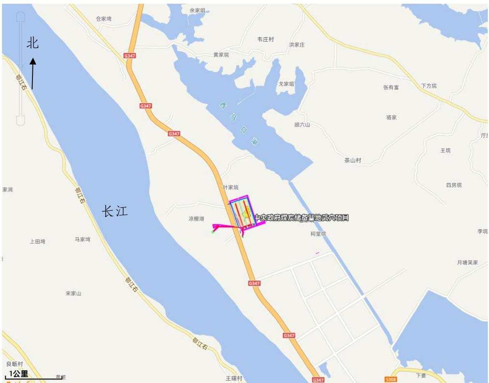
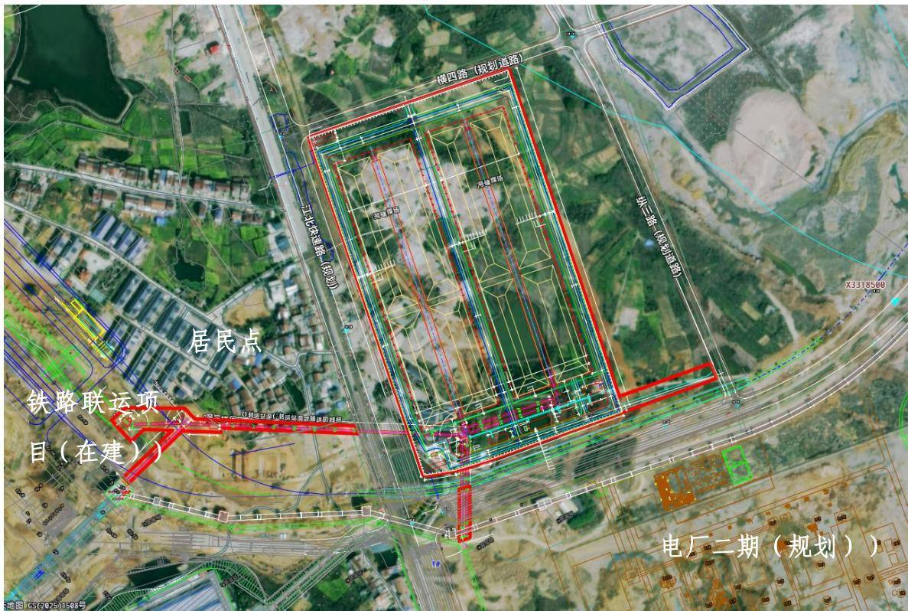
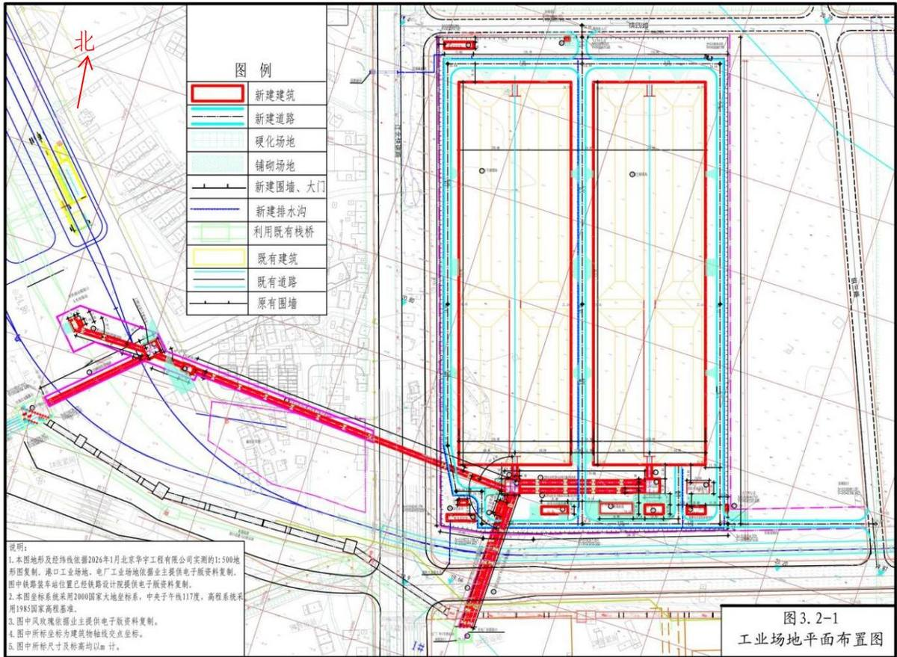
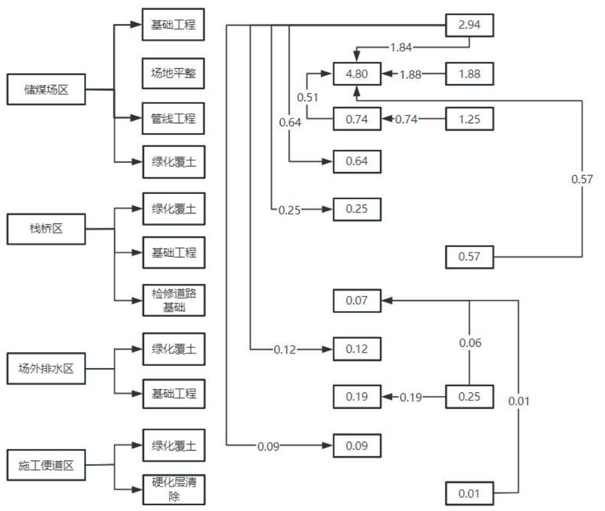
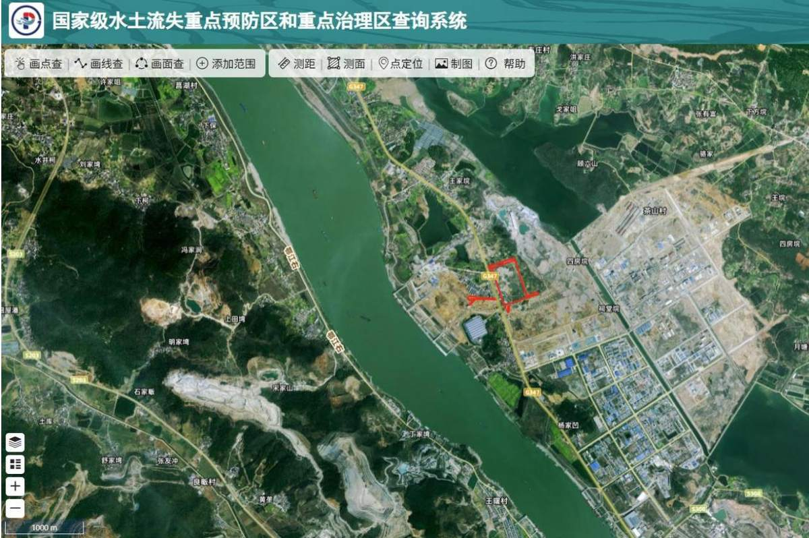
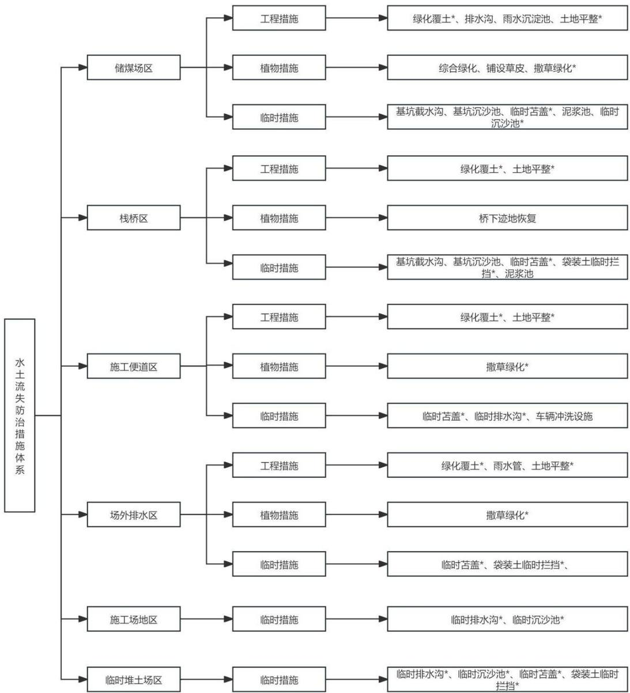

> **Zone C（应用范例层）使用边界**——仅可用于**写作风格、章节展开方式、表达逻辑、表格设计**的参考。
> **不得**用于合规判断；**不得**引入其项目数据（名称／地点／数字／单位名）；
> **不得**因其"曾经通过审批"而推定其做法在当前标准下仍然合规。
> 与 Zone A 冲突时**一律以 Zone A 为准**；Zone A 未明确规定时输出
> 「**Zone A 未明确规定，以下为参考写法，需人工判断**」。
>
> **坐标系警告**：本范例为**老八章结构**（GB 50433—2018 附录B），与 2026 版 10 章模板**同号不同义**
> （老 `1.5`＝防治目标，新 `1.5`＝水土流失预测结果；老 4→新 6 …偏移 +2；新版第 4/5 章老结构无独立章）。
> 因此 **`chapter_mapping: pending`——不得按章节号挂载**，检索一律走 `topic_tags`。
>
> **待加工**：`topic_tags`（主题标签）、`approval_basis_list`（编制依据逐字清单）、
> `structure_summary`（只提取结构：章节展开顺序／段落功能／表格栏目结构／句式模板／论证链步骤）。

1 综合说明...  
1.1 项目简况..  
1.2 编制依据. . 5  
1.3 设计水平年.  
1.4 水土流失防治责任范围..  
1.5 水土流失防治目标... ... 8  
1.6 项目水土保持评价结论. ... 9  
1.7 水土流失预测结果. ... 13  
1.8 水土保持措施布设成果. ... 13  
1.9 水土保持监测方案... ... 16  
1.10 水土保持投资及效益分析成果. ....17  
1.11 结论.. ... 17  
2 项目概况... ... 21  
2.1 项目组成及工程布置.. ... 21  
2.2 施工组织. ... 32  
2.3 工程占地.. .. 36  
2.4 土石方平衡. ... 37  
2.5 拆迁（移民）安置与专项设施改（迁）建.... .... 41  
2.6 施工进度. .. 42  
2.7 自然概况.. .. 43  
3 项目水土保持评价. ... 48  
3.1 主体工程选址（线）水土保持评价..... .....48  
3.2 建设方案与布局水土保持评价.. ....51  
3.3 主体工程设计中水土保持措施界定.. ....58  
4 水土流失分析与预测.. .... 61  
4.1 水土流失现状... .... 61  
4.2 水土流失影响因素分析. .... 61  
4.3 土壤流失量预测... ... 62  
4.4 水土流失危害分析.. .... 72  
4.5 指导性意见... .... 72  
5 水土保持措施.. ... 74  
5.1 防治区划分.. .... 74  
5.2 措施总体布局.. .... 75  
5.3 分区措施布设.. ... 77  
5.4 施工要求... .. 97  
6 水土保持监测.. ... 104  
6.1 范围与时段... .. 104  
6.2 内容和方法... .. 104  
6.3 点位布设... .. 109  
6.4 实施条件和成果.. ... 110  
7 水土保持投资估算及效益分析... ...115  
7.1 投资估算... ... 115  
7.2 效益分析... ... 134  
8 水土保持管理... .... 137  
8.1 组织管理... .... 137  
8.2 后续设计... .... 138  
8.3 水土保持监测.... .... 138  
8.4 水土保持监理... .... 139  
8.5 水土保持施工 ... 140  
8.6 水土保持设施验收... ...141  
附表：

1水土流失防治责任范围表；

2单价分析表。

附件：

1成交通知书；

2可行性研究报告批复；

3 华电武穴黄石热电搬迁扩建 2×660MW 项目（依托工程）水行政许可承诺书；

4项目场地平整土方工程业主委托合同。

## 附图：

1项目地理位置图；

2项目原始地貌卫星影像图；

3项目区水系图；

4项目区水土保持重点防治区划分图；

5项目区土壤强度分布图；

6项目总平面布置图；

7工业场地管网综合布置图；

8防治责任范围图；

9分区防治措施总体布局图（含监测点位）；

10储煤场区水土保持措施典型设计图；

11栈桥区水土保持措施典型设计图；

12施工便道区水土保持措施典型设计图；

13场外排水区水土保持措施典型设计图；

14施工场地区水土保持措施典型设计图；

15 临时堆土场区水土保持措施典型设计图。

## 1 综合说明

## 1.1项目简况

## 1.1.1 项目基本情况

## （1）项目建设的必要性

## ①重大战略和规划的需要

党的二十大提出，加强能源产供储销体系建设，确保能源安全。党的二十届三中全会提出，加快完善国家储备体系，完善战略性矿产资源探产供储销统筹和衔接体系。建立中央政府煤炭储备是党中央、国务院统筹国内外形势，立足我国以煤为主的能源资源禀赋守住能源安全底线作出的战略性安排部署。中央政府煤炭储备基地延长石油湖北武穴项目的建设，将加快煤炭产、供、销体系建设，提升电力供应保障能力，而强化能源储备能力建设是煤炭保供应的发力点之一。

## ②产业政策的要求

国家发展改革委、国家能源局在 2020 年发布关于做好能源安全保障工作的指导意见中指出“持续增强煤炭储备能力。通过新建扩建储煤场地、改造现有设施等措施，进一步提高存煤能力。鼓励企业在煤炭消费地、铁路交通枢纽、主要中转港口建立煤炭产品储备，通过“产销联动、共建共享”，按照合理辐射半径，推进储煤基地建设。支持主要产煤地区研究建立调峰储备产能及监管机制，提升煤炭供给弹性”。本项目建设将有利于加快黄冈市乃至湖北全省的发展，有利于解决煤炭应急需求供应问题，将大大提高湖北省及长三角地区煤炭供应的可靠性，确保湖北能源安全，为湖北国民经济的长远发展提供持续的、强有力的支持。

## ③经济社会发展的需要

《黄冈市现代物流业“十四五”发展规划》规划提出至 2025 年，黄州、麻城、武穴三大区域性物流枢纽初步建成，各县市区建成1个以上围绕服务产业、服务民生、服务乡村振兴的具备一定规模的公共物流园区，依托园区有效整合物流资源要素，推动全市物流业集聚发展。本项目重点依托港口码头以及疏港铁路，利用铁路、水运运输成本低的优势有利于降低当地工业企业的物流成本，提高企业的竞争力。本项目的建设，还可以带动建材、运输、装备制造等上下游产业链发展，间接促进居民收入增长和消费需求提升。因此，符合地方经济发展的需要。

## ④保障周边电厂煤炭供应稳定

本项目半径200km 范围内一共有统调电厂5个，共耗煤量约2700万t/a。其中：延长武穴电厂（耗煤量约 260 万 t/a）、黄石西塞山电厂（耗煤量约 450 万 t/a）、湖北鄂州电厂（耗煤量约 790 万 t/a）、大别山麻城电厂（耗煤量约 850 万 t/a）、国能神华九江电力有限公司（耗煤量约350万t/a）。本项目的建设可为周边电厂供应稳定的煤炭能源。

## 因此，本工程的建设是十分必要的。

## （2）项目地理位置

项目位于湖北省黄冈市下辖的武穴市中心城区西北侧田家镇工业新区，地处大别山武穴港智慧物流产业园内部。厂址西南距长江约 850m，东距大法寺镇约 7km，东南距武穴市城区约20km，北距西马口湖约570m，西侧紧邻黄冈武穴港区多式联运工程（包含马口作业区和疏港铁路专用线），南侧紧邻延长石油湖北武穴 2×660MW 煤电项目和新祥云新材料产业园。项目区中心点坐标为29°58'29"N，115°23'39"E（本报告采用国家大地坐标系CGCS2000，下同）。

## （3）项目组成

项目规划总用地面积17.8773hm2，其中储煤场工业场地用地面积16.9494hm2（围墙内用地 16.3067hm2，围墙外用地 0.6427hm2），场外栈桥用地面积 0.9279hm2。储煤场工业场地中建筑物占地面积 10.648hm2，绿化面积为 1.1537hm2，建筑系数 67.67%（按围墙内占地计算），绿化率为7.07%（按围墙内占地计算）。项目主要建设内容包括：1 号储煤场、2 号储煤场、火车快速装车站、带式输送机栈桥及 C1、C2、C3 转运站、消防水池及泵房、煤泥水处理车间、雨水沉淀池、推煤机库配电室、阻燃剂及煤氧抑制剂库、门卫室等，配套建设道路、绿化等设施。设计储煤量60 万吨。

## （4）占地面积

本项目总占地面积为17.95hm2，其中永久占地17.88hm2，临时占地0.07hm2。占地类型为裸土地和农村宅基地。

## （5）土石方量

经土石方平衡分析，本项目建设产生挖方6.90 万m3，填方6.90 万m3，无借方，无弃方。

## （6）建设工期

本项目计划于2026年7 月开工，2027年9月完工，总工期15个月。

## （7）工程投资

项目总投资为 51209.04 万元，其中工程投资 28331.86 万元，资金来源于中央预算资金。

## （8）建设单位

建设单位为延长石油（湖北）发电有限公司。

（9）拆迁（移民）安置与专项设施改（迁）建

本项目建设场地内约有6 户住宅需拆迁，拆迁工作由当地政府负责完成，拆迁安置所涉及的房屋拆迁、重建以及相关的水土保持防治及监督工作由拆迁户以及当地政府部门负责。本工程不涉及其他专项设施改（迁）建。

## 1.1.2 项目前期工作进展情况

## 1.1.2.1 工程设计概况

2025年 7月，中铁第四勘察设计院集团有限公司完成了《中央政府煤炭储备基地延长石油湖北武穴项目可行性研究报告》。

2025年 12 月31 日，取得国家发展和改革委员会文件《国家发展改革委关于中央政府煤炭储备中煤广元等9 个项目可行性研究报告的批复》（发改运行〔2025〕1778号）。

2026年 1月，中国煤炭科工集团北京华宇工程有限公司完成了《中央政府煤炭储备基地延长石油湖北武穴项目初步设计》（阶段结果稿）。

## 1.1.2.2 水土保持方案编制情况

为了贯彻执行《中华人民共和国水土保持法》《湖北省实施<中华人民共和国水土保持法>办法》和有关法律法规，确保工程建设过程中新增水土流失得到全面有效地治理。2026年3月，受延长石油（湖北）发电有限公司委托，湖北君邦环境技术有限责任公司（以下简称“我公司”）承担了该项目水土保持报告书编制工作。接受委托后，我公司成立了项目组，并组织有关技术人员对该项目区进行了现场踏勘、无人机拍摄，收集了相关工程资料，并对周围的自然环境、社会环境、生态环境、水土流失现状、水土保持现状进行了调查，补充收集了工程区域有关资料，在进行分析研究的基础上，我单位严格按照《生产建设项目水土保持技术标准》（GB50433-2018）的要求，编制完成《中央政府煤炭储备基地延长石油湖北武穴项目水土保持方案报告书》。

## 1.1.3 依托工程

本项目建设过程中的施工用水用电依托华电武穴黄石热电搬迁扩建 2×660MW 项目（简称电厂一期）的水电设施。电厂一期位于本项目东南方向，距离本项目直线距离

500m。项目建设 2×660MW 超临界燃煤发电供热机组，同步建设烟气脱硫、脱硝、除尘设施。包括厂区（含主厂房区、配电装置区、冷却塔区、输煤设施区、石灰石系统、化水系统、厂前区建筑及其他附属建构筑物）、厂外道路（含进厂道路、货运道路、运灰道路）、厂外取排水管线、厂外栈桥、施工生产生活区、施工力能供应等。项目已于2025年10 月投产。电厂一期于 2023 年7月26 日取得武穴市水利和湖泊局下发的水土保持行政许可承诺书。

本项目施工用电电源引自电厂，通过前期沟通，项目预留了储煤基地负荷，电源接口位置为电厂 10kV 配电室，配电室内新增两台高压出线间隔，接引 2 回路 10kV 电源进线，双回路供电。沿路经电厂厂外3号转运站沿栈桥内电缆桥架敷设。

本项目施工用水接电厂现有给水系统，接管管径 DN50，接管位置为电厂一期 J17建筑西侧生活供水干管。生产补水水源接自电厂现有煤泥水回用系统，接管管径DN100，接管位置为电厂一期 S4 建筑西侧煤泥水回用系统干管。消防水池的补水管接自电厂现有消防给水系统，接管管径DN150，接管位置为电厂一期J17 建筑西侧消防供水干管。

## 1.1.4 自然概况

本工程新建厂址东部自然地貌为北西向剥蚀残丘，以杂木、荆棘等灌木为主，植被发育。中西部为北西向山涧谷地丘间平原（西北侧塘湖-东南侧田镇工业园），以稻谷与废弃农田高深的密集杂草为主。拟建区总体地形起伏不大，工业场地已经粗平完成，粗平后标高为18.7m-21.7m。武穴市属中纬内陆、亚热带季风气候，易受冷暖空气交替影响，四季分明，日照充足，多年平均降水量 1423.5mm。项目区土壤类型主要为红棕壤，土壤呈中性，PH值6.8～7.1。项目所在区域属亚热带常绿阔叶林区，地带性植被类型为亚热带常绿阔叶落叶混交林，亚热带针叶林占一定优势，林草覆盖率约为35%。

项目所在区域属南方红壤区，其容许土壤流失量为 $5 0 0 \mathrm { t } / ( \mathrm { k m } ^ { 2 } \cdot \mathrm { a } )$ 。项目区内土壤侵蚀类型水力侵蚀为主，水土流失强度为微度侵蚀为主。项目用地范围内原生平均土壤侵蚀模数为 478t/（km²•a）。

本工程不涉及国家级和省级水土流失重点预防区和治理区，但项目位于武穴市水土流失重点治理区，水土流失防治标准按南方红壤区一级防治标准执行，并优化施工工艺，减少地表扰动和植被损坏范围，有效控制可能造成的水土流失。项目不涉及饮用水水源保护区、水功能一级区的保护区和保留区、自然保护区、世界文化和自然遗产地、风景名胜区、地质公园、森林公园以及重要湿地等水土保持敏感区。

## 1.2编制依据

## 1.2.1 法律法规

（1）《中华人民共和国水土保持法》（中华人民共和国主席令第39号，1991年6月29日通过，2010年12月修订，2011年3月1日起施行）；

（2）《中华人民共和国长江保护法》（2020年12月 26日第十三届全国人民代表大会常务委员会第二十四次会议通过，自2021 年3 月1日起施行）；

（3）《湖北省实施<中华人民共和国水土保持法>办法》（1994年12月2日颁布，2015 年 11 月 26 日通过，2016 年 2 月 1 日施行）。

## 1.2.2 部委规章

（1）《生产建设项目水土保持方案管理办法》（2023 年 1 月 17 日水利部令第 53号发布）；

（2）《水土保持生态环境监测网络管理办法》（水利部令第 12 号，2000 年 1 月31日颁布，水利部令46号，2014年8月19日修改）。

## 1.2.3 规范性文件

（1）《水利部办公厅关于做好国家级水土流失重点预防区和重点治理区落地上图成果应用的通知》（办水保〔2025〕170号，2025年09月19日）；

（2）《水利部办公厅关于进一步加强部批项目水土保持监管工作的通知》（办水保〔2024〕57 号，2024 年 2 月 21 日）；

（3）水利部关于加强水土保持空间管控的意见》（水保〔2024〕4号，水利部，2024年1月5 日）；

（4）《水利部关于实施水土保持信用评价的意见》（水保〔2023〕359 号，2023年12月21日）；

（5）《水利部办公厅关于印发生产建设项目水土保持方案审查要点的通知》（办水保〔2023〕177号，水利部办公厅，2023年7月4日）；

（6）《水利部办公厅关于生产建设项目水土保持方案管理工作有关衔接事项的通知》（办水保函〔2023〕109号，水利部办公厅，2023年2 月14 日）；

（7）中共中央办公厅 国务院办公厅印发《关于加强新时代水土保持工作的意见》（2023 年 1 月 3 日）；

（8）《水利部办公厅关于印发生产建设项目水土保持问题分类和责任追究标准的通知》（办水保函〔2020〕564号，水利部办公厅，2020 年7月 24日）；

（9）《水利部办公厅关于进一步加强生产建设项目水土保持监测工作的通知》（办水保〔2020〕161 号）；

（10）《水利部办公厅关于做好生产建设项目水土保持承诺制管理的通知》（办水保〔2020〕160 号）；

（11）《水利部办公厅关于实施生产建设项目水土保持信用监管“两单”制度的通知》（办水保〔2020〕157号，水利部办公厅，2020年7 月24 日）；

（12）关于印发《生产建设项目水土保持方案技术审查要点》的通知（水保监〔202063号，水利部水土保持监测中心文件，2020年12月7日）；

（13）《水利部办公厅关于印发生产建设项目水土保持监督管理办法的通知》（办水保〔2019〕172 号，2019 年 7 月 30 号）；

（14）《水利部关于进一步深化“放管服”改革全面加强水土保持监管的意见》（水保〔2019〕160 号，2019 年 5 月 31 日）；

（15）《水利部办公厅关于印发生产建设项目水土保持技术文件编写和印制格式规定（试行）的通知》（办水保〔2018〕135号）；

（16）《水利部办公厅关于印发生产建设项目水土保持设施自主验收规程（试行）的通知》（办水保〔2018〕133号，2018年 7月 10 日）；

（17）《水利部关于加强事中事后监管规范生产建设项目水土保持设施自主验收的通知》（水保〔2017〕365号）；

（18）《省水利厅关于印发<湖北省生产建设项目水土保持监督管理办法>的通知》（鄂水利规〔2023〕5 号，2023年12月26日）；

（19）湖北省委办公厅、省政府办公厅《关于加强新时代湖北水土保持工作的实施意见》（鄂办发〔2023〕11号）；

（20）《省物价局省财政厅省水利厅关于水土保持补偿费收费标准的通知》（鄂价环资〔2017〕93号）。

## 1.2.4 技术规范及标准

（1）《生产建设项目水土保持技术标准》（GB 50433-2018）；

（2）《生产建设项目水土流失防治标准》（GB/T50434-2018）；

（3）《生产建设项目水土保持监测与评价标准》（GB/T51240-2018）；

（4）《水土保持工程调查与勘测标准》（GB/T51297-2018）；

（5）《生产建设项目土壤流失量测算导则》（SL773-2018）；

（6）《水土保持工程设计规范》（GB 51018-2014）；

（7）《土地利用现状分类》（GB/T 21010-2017）；

（8）《土壤侵蚀分类分级标准》（SL190-2007）；

（9）《水土保持监测技术规范》（SL/T227-2024）；

（10）《水土保持监理规范》（SL523-2024）；

（11）《水利水电工程制图标准 水土保持图》（SL73.6-2015）；

（12）《表土剥离及其再利用技术要求》（GB/T45107-2024）；

（13）《生产建设项目水土保持设施验收技术规程》（GB/T22490-2025）。

## 1.2.5 技术文件及资料

（1）《中央政府煤炭储备基地延长石油湖北武穴项目可行性研究报告》及图纸（中铁第四勘察设计院集团，2025年7月）；

（2）《中央政府煤炭储备基地延长石油湖北武穴项目初步设计报告（送审稿）》及图纸（中国煤炭科工集团北京华宇工程有限公司，2026年1 月）；

（3）《中央政府煤炭储备基地延长石油湖北武穴项目岩土工程勘察报告（初勘）》（中国煤炭科工集团北京华宇工程有限公司，2026年 2月）；

（4）《湖北省水土保持规划（2016\~2030 年）》（湖北省水利厅，2017年8月）；

（5）《武穴市水土保持规划（2016—2030年）》（武政函〔2019〕15号）；

（6）《2024年黄冈市水土保持公报》（黄冈市水利和湖泊局）；

（7）工程其他与水土保持相关的资料及图纸。

## 1.3设计水平年

根据《生产建设项目水土保持技术标准》（GB50433-2018）中“设计水平年应为主体工程完工后的当年或下一年”的规定，本项目计划于2026年7 月开工，2027年9月完工。因此本方案设计水平年为2028年。

## 1.4水土流失防治责任范围

根据《生产建设项目水土保持技术标准》（GB/T50433-2018）规定，水土流失防治责任范围包括项目永久征地、临时占地及其他使用与管辖区域。根据本工程建设特点，

水土流失防治责任范围 17.95hm2，其中永久占地 17.88hm2，临时占地 0.07hm2。

表1-1 水土流失防治责任范围面积统计表 （单位：hm2）
<table><tr><td rowspan=2 colspan=1>项目分区</td><td rowspan=1 colspan=3>防治责任范围（hm²）</td><td rowspan=2 colspan=1>备注</td></tr><tr><td rowspan=1 colspan=1>永久占地</td><td rowspan=1 colspan=1>临时占地</td><td rowspan=1 colspan=1>小计</td></tr><tr><td rowspan=1 colspan=1>储煤场区</td><td rowspan=1 colspan=1>16.95</td><td rowspan=1 colspan=1></td><td rowspan=1 colspan=1>16.95</td><td rowspan=1 colspan=1></td></tr><tr><td rowspan=1 colspan=1>栈桥区</td><td rowspan=1 colspan=1>0.93+(0.32)</td><td rowspan=1 colspan=1></td><td rowspan=1 colspan=1>0.93+ (0.32)</td><td rowspan=1 colspan=1>括号内为储煤场区重复占地</td></tr><tr><td rowspan=1 colspan=1>施工便道区</td><td rowspan=1 colspan=1>(1.24)</td><td rowspan=1 colspan=1>0.03</td><td rowspan=1 colspan=1>（1.24）+0.03</td><td rowspan=1 colspan=1>括号内为储煤场区重复占地</td></tr><tr><td rowspan=1 colspan=1>场外排水区</td><td rowspan=1 colspan=1></td><td rowspan=1 colspan=1>0.04</td><td rowspan=1 colspan=1>0.04</td><td rowspan=1 colspan=1></td></tr><tr><td rowspan=1 colspan=1>施工场地区</td><td rowspan=1 colspan=1>(0.50)</td><td rowspan=1 colspan=1></td><td rowspan=1 colspan=1>(0.50)</td><td rowspan=1 colspan=1>括号内为储煤场区重复占地</td></tr><tr><td rowspan=1 colspan=1>临时堆土场区</td><td rowspan=1 colspan=1>(0.40)</td><td rowspan=1 colspan=1></td><td rowspan=1 colspan=1>(0.40)</td><td rowspan=1 colspan=1>括号内为储煤场区重复占地</td></tr><tr><td rowspan=1 colspan=1>合计</td><td rowspan=1 colspan=1>17.88</td><td rowspan=1 colspan=1>0.07</td><td rowspan=1 colspan=1>17.95</td><td rowspan=1 colspan=1></td></tr></table>

## 1.5水土流失防治目标

## 1.5.1 执行标准等级

本项目位于湖北省黄冈市下辖的武穴市中心城区西北侧田家镇工业新区，地处大别山武穴港智慧物流产业园内部。根据《水利部办公厅关于做好国家级水土流失重点预防区和重点治理区落地上图成果应用的通知》（办水保〔2025〕170号）以及根据《湖北省水土保持规划（2016-2030年）》项目区不属于国家级和省级的水土流失重点预防区和重点治理区。根据《武穴市水土保持规划（2016-2030年）》，项目区属于武穴市水土流失重点治理区范围。因此依据《生产建设项目水土流失防治标准》（GB/T50434-2018）的要求，本项目水土流失防治的执行标准按南方红壤区建设类项目水土流失一级防治标准执行。

## 1.5.2 防治目标

水土流失综合防治目标为：

（1）项目建设范围内的新增水土流失应得到有效控制，原有水土流失得到治理；

（2）水土保持设施应安全有效；

（3）水土资源、林草植被应得到最大限度的保护与恢复；

（4）水土流失治理度、土壤流失控制比、渣土防护率、表土保护率、林草植被恢复率、林草覆盖率六项指标应符合现行国家标准《生产建设项目水土流失防治标准》（GB/T50434-2018）的规定。

方案水土流失防治执行南方红壤区一级标准。由于项目原地貌土壤侵蚀以微度侵蚀为主，且位于城市区域，因此防治标准中土壤流失控制比、渣土防护率（%）、林草覆盖率（%）做相应调整。

①土壤流失控制比不应小于 1，项目区土壤侵蚀强度以微度为主，土壤流失控制比修正值为1.0。

②项目不位于城市区域，水土流失治理度、渣土防护率和林草恢复率不作调整。

③项目主要建设工业场地和栈桥，为林草植被限制的项目，根据主体设计，林草覆盖率取值为13%。

④由于项目前期已进行了场平工程，项目进场前已无表土可剥离，故表土保护率不作要求。

经修正各目标值如下：水土流失治理度为98%，土壤流失控制比为1.0，渣土防护率为97%，林草植被恢复率为98%，林草覆盖率为13%，表土保护率不作要求。本工程水土流失防治目标见表1-2。

表1-2 水土流失防治目标值修正计算表
<table><tr><td rowspan=2 colspan=1>序号</td><td rowspan=2 colspan=1>防治指标</td><td rowspan=1 colspan=2>一级标准</td><td rowspan=1 colspan=4>修正值</td><td rowspan=1 colspan=2>采用标准</td></tr><tr><td rowspan=1 colspan=1>施工期</td><td rowspan=1 colspan=1>设计水平年</td><td rowspan=1 colspan=1>干旱程度</td><td rowspan=1 colspan=1>土壤侵蚀强度</td><td rowspan=1 colspan=1>城市区</td><td rowspan=1 colspan=1>其他</td><td rowspan=1 colspan=1>施工期</td><td rowspan=1 colspan=1>设计水平年</td></tr><tr><td rowspan=1 colspan=1>1</td><td rowspan=1 colspan=1>水土流失治理度（%）</td><td rowspan=1 colspan=1>1</td><td rowspan=1 colspan=1>98</td><td rowspan=1 colspan=1></td><td rowspan=1 colspan=1></td><td rowspan=1 colspan=1></td><td rowspan=1 colspan=1></td><td rowspan=1 colspan=1>1</td><td rowspan=1 colspan=1>98</td></tr><tr><td rowspan=1 colspan=1>2</td><td rowspan=1 colspan=1>土壤流失控制比</td><td rowspan=1 colspan=1>1</td><td rowspan=1 colspan=1>0.9</td><td rowspan=1 colspan=1></td><td rowspan=1 colspan=1>+0.1</td><td rowspan=1 colspan=1></td><td rowspan=1 colspan=1></td><td rowspan=1 colspan=1>1</td><td rowspan=1 colspan=1>1.0</td></tr><tr><td rowspan=1 colspan=1>3</td><td rowspan=1 colspan=1>渣土防护率（%）</td><td rowspan=1 colspan=1>95</td><td rowspan=1 colspan=1>97</td><td rowspan=1 colspan=1></td><td rowspan=1 colspan=1></td><td rowspan=1 colspan=1></td><td rowspan=1 colspan=1></td><td rowspan=1 colspan=1>95</td><td rowspan=1 colspan=1>97</td></tr><tr><td rowspan=1 colspan=1>4</td><td rowspan=1 colspan=1>表土保护率（%）</td><td rowspan=1 colspan=1>92</td><td rowspan=1 colspan=1>92</td><td rowspan=1 colspan=1></td><td rowspan=1 colspan=1></td><td rowspan=1 colspan=1></td><td rowspan=1 colspan=1></td><td rowspan=1 colspan=1>1</td><td rowspan=1 colspan=1>二</td></tr><tr><td rowspan=1 colspan=1>5</td><td rowspan=1 colspan=1>林草植被恢复率（%）</td><td rowspan=1 colspan=1>1</td><td rowspan=1 colspan=1>98</td><td rowspan=1 colspan=1></td><td rowspan=1 colspan=1></td><td rowspan=1 colspan=1></td><td rowspan=1 colspan=1></td><td rowspan=1 colspan=1>1</td><td rowspan=1 colspan=1>98</td></tr><tr><td rowspan=1 colspan=1>6</td><td rowspan=1 colspan=1>林草覆盖率（%）</td><td rowspan=1 colspan=1>-</td><td rowspan=1 colspan=1>25</td><td rowspan=1 colspan=1></td><td rowspan=1 colspan=1></td><td rowspan=1 colspan=1></td><td rowspan=1 colspan=1>-12</td><td rowspan=1 colspan=1>-</td><td rowspan=1 colspan=1>13</td></tr></table>

## 1.6项目水土保持评价结论

## 1.6.1 主体工程选址（线）评价

通过逐条对照《中华人民共和国水土保持法》（2011年3月1日实施）、《中华人民共和国长江保护法》和《生产建设项目水土保持技术标准》（GB50433-2018），本项目选线兼顾了水土保持的要求，选线不涉及水土流失严重、生态脆弱的地区，项目区内无全国水土保持监测网络中的水土保持监测站点、重点试验区及国家确定的水土保持长期定位观测站，不涉及河湖管理范围，不涉及长江干支流岸线范围，不属于长江流域水土流失严重、生态脆弱的区域，也不属于基本农田保护区。

本项目所在地不属于国家级和省级水土流失重点预防区和治理区，但项目位于武穴市水土流失重点治理区，水土流失防治标准按南方红壤区一级防治标准执行，并通过优化施工工艺（建筑基础开挖土方采取就地堆放，避免不必要的土方倒运，对于场平土方倒运无法进行及时平整的土方，利用堆土场进行周转，方案新增堆土场临时防护措施），提高防洪标准等级和截排水工程等级，同时布设雨洪集蓄、沉沙设施，同时加强施工管理、优化施工组织实施，严格控制项目施工扰动范围，可有效控制工程建设产生的水土流失影响，能够达到水土保持相关要求。工程东北侧距离西马口湖约 570m，西侧距离长江约850m，不涉及湖泊水域范围。

综上所述，工程建设满足《中华人民共和国水土保持法》、《中华人民共和国长江保护法》、《生产建设项目水土保持技术标准》（GB50433-2018）等文件的要求，从水土保持角度分析，工程建设是合理可行的。

## 1.6.2 建设方案与布局评价

## （1）建设方案评价

项目总平面布置遵循城市总体规划、项目所在区域规划以及项目用地规划设计条件，与当地社会、经济、人文及自然环境特点相协调。主体工程建设方案和平面布置格局紧凑合理，优化布局，在满足主体工程安全运行的同时，尽量减少了占地，减少了土石方挖填和移动量，尽可能地减少扰动地表面积。工程建设期，主体工程及本方案通过优化施工工艺，严控地表扰动和植被损毁范围，严格落实水土保持“三同时”制度，可有效控制新增水土流失，最大限度保护项目区自然生态环境。

工程合理安排施工场地、施工进度以及施工期间的给排水引接。施工场地、临时堆土场和部分施工便道位于储煤场红线范围内，施工便道采用“永临结合”的形式防止重复扰动，位于红线外的施工便道主要为 G347 国道与施工场地之间的衔接，施工结束后进行撒草恢复。针对施工过程产生的临时堆土方案新增了临时拦挡、苫盖和临时排水设施。

本项目储煤场的竖向设计充分考虑与周边规划道路路面的衔接，建筑物四周布设道路，项目建成后除建筑物外，其余部位全部进行绿化或者地面硬化，场地内利用项目区内排水管线和排水管对汇水进行收集，可以防止汇水在工程区淤积，使区内汇水有序排放。栈桥区域采用架空形式，方案新增建成后对桥下区域进行迹地恢复。

主体工程本着节约用地的原则，对工程布局进行了优化。施工场地紧靠城市主干道，方便了材料及土石方的运输。综上，本项目总体布局与建设方案基本满足《生产建设项目水土保持技术标准》（GB50433-2018）水土保持的要求。

## （2）工程占地评价

项目总占地面积为17.95hm2，占地类型为农村宅基地和裸土地，不占用基本农田，工程占地无漏项。

本工程永久占地面积17.88hm2，均为主体设计永久占地，项目施工期间不可避免地对原地表产生了扰动，裸露的地表、松散的土石方堆放等会增加项目区的水土流失量，项目在施工过程中设计了相关的水土保持防护措施，包括基坑顶部截水沟、顶部沉沙池等，可在一定程度上减少水土流失。永久占地在施工结束后改变了原土地功能且不能恢复，但建筑物、道路、广场等在施工结束后将全部硬化，绿化区域采取乔灌草综合绿化，绿化种类丰富，降低降雨对地面的冲击，增强了土体结构稳定性，既增加生态多样性促进区域生态系统的良性循环，又减少项目的水土流失，保持项目征占地范围内的水土保持功能不降低。

本工程临时占地面积0.07hm2，为场外施工便道0.03hm2和场外排水区0.04hm2。由于G347 国道与本项目红线范围约46m 距离，为方便施工，方案新增施工便道，便于项目施工车辆进出。施工结束后对场外施工便道进行撒草恢复。场外排水区为储煤场区和周边港铁大道、347国道雨水排放连接管道。施工结束后对其进行撒草恢复。

储煤场区内的施工便道、施工场地区和临时堆土场优先考虑设置在用地红线范围内，节约了占地，减少了施工扰动范围。方案要求后续施工期间通过加强管理，优化施工工艺，严格控制施工扰动范围，避免新增临时占地，同时定期维护已布设临时防护措施，以减少水土流失。

综上所述，本项目工程占地符合节约用地和减少扰动的要求，从水土保持角度分析，本工程占地满足水土保持技术要求，符合水土保持法的相关规定。

## （3）土石方平衡评价

## ①表土平衡评价

根据现场调查及与建设单位沟通，本项目位于大别山武穴港智慧物流产业园用地范围内。2025年5月至2025 年10月，根据市政府要求，由武穴市田家镇兴园投资发展有限公司负责，完成了大别山智慧物流园场地平整工程。该平整工程总投资 2000 万元，规划占地 1386亩，其中一期工程占地面积达1207.7亩。工程需挖土方 220 万立方米、填土方 90 万立方米。此项目由武穴市田家镇兴园投资发展有限公司负责组织施工。目前本项目场地已完成场地平整，场地内为素填土，已不存在表土，无可剥离表土，后期绿化土来源于淤泥改良。场区绿化覆土面积为 13783m2，覆土厚度 40cm，场区撒草区域覆土面积为 $3 1 2 1 \mathrm { m } ^ { 2 }$ ，覆土厚度 40cm；栈桥下迹地绿化覆土面积为 $0 . 6 2 \mathrm { h m } ^ { 2 }$ ，覆土厚度40cm；施工便道和场外排水工程覆土面积为 $7 0 0 \mathrm { m } ^ { 2 }$ ，覆土厚度 30cm。共需覆土量为1.10 万 m3。淤泥具有一定的肥力供植物生长，项目充分考虑了土壤资源的保护和合理分配利用，符合水土保持要求。

## ②土石方平衡评价

从土石方挖填数量上，本项目总挖方6.90万m3，总填方6.90万m3，无借方，无弃方。本项目绿化覆土来源于基础开挖的淤泥，其他回填土方全部来源于项目开挖土方，未产生借方，使项目自身开发土方利用率最大化，项目无弃方。

从土石方调配上来说，储煤场基础开挖的淤泥用于栈桥区、场外排水区和施工便道区的绿化恢复覆土，使淤泥得到充分利用；基础开挖产生的其他土方用于场区内的场地平整回填。工程土石方的调配，充分考虑了各项目间土方开挖时序。项目开挖土方全部用于回填土方，无借方，无弃方，使土石方得到充分利用。

总体来看，工程土石方挖填数量、调配较为合理，开挖土方随挖随填，避免大量松散土方的临时堆放，防止因雨水冲刷产生二次水土流失，符合水土保持要求。

## （4）取土（砂、石）场设置评价结论

经土石方平衡分析，本回填土方全部来自于工程开挖土方，本项目不设置取土场。

## （5）弃土（渣）场设置评价结论

本工程开挖土方优先考虑场内回填利用，多余土方全部运至邻近项目武穴电厂低碳资源循环利用项目综合利用。不设置弃土（石、渣、灰、矸石、尾矿）场。

## （6）施工方法与工艺评价

本项目施工中控制施工活动范围，避开植被良好区，符合水土保持要求。项目施工活动全部控制在红线范围内。工程施工的用水、用电连接到电厂一期供水、供电系统，减少水、电管网的铺设，接入后可直接使用，减少经济成本和时间成本，也减少因扰动破坏的土地植被面积。项目合理安排施工时序，防止重复开挖和多次倒运，减少裸露时间和范围，土方工程开挖的土石方全部考虑回填利用，施工组织安排合理，符合水土保持要求。

本项目土石方开挖、回填、混凝土浇筑等作业均采用机械化施工，人工辅助的施工方法，采用现今大量使用的成熟施工工艺，土石方开挖与回填紧密结合，尽可能减少工程的临时堆土以及开挖回填面的裸露时间，减少工程建设过程中的水土流失。从水土保持角度，符合水土保持要求。

## （7）具有水土保持功能工程的评价

本工程主体设计中围挡、道路硬化、基坑内排水沟等以主体工程设计功能为主、同时具有水土保持功能的工程，不界定为水土保持措施，不纳入水土流失防治措施体系；而排水沟、雨水管、雨水沉淀池、综合绿化、铺设草皮及栈桥下迹地绿化、基坑顶部截水沟及沉沙池等以防治水土流失为主要目标，界定为水土保持工程，纳入水土流失防治措施体系。但就整个项目而言，主体工程只注重了本体防护，施工过程中的临时防护措施未考虑完全，不能形成全面的防护体系。因此，本方案在分析评价主体工程中具有水土保持功能工程的基础上，进一步补充完善水土保持措施设计，并将其一并纳入方案的水土保持措施体系中，使方案水土保持措施形成一个完整、严密、科学的防护体系。主体工程设计界定为水土保持工程的措施投资共计 292.70万元。

## 1.7水土流失预测结果

本项目扰动地表面积17.95hm2，损毁植被面积0hm2。

经预测计算，本项目土壤流失总量为 272.56t，新增土壤流失量 173.26t。其中，施工期本项目可能产生的土壤流失总量 253.16t，相应地新增的土壤流失量为 173.26t；自然恢复期土壤流失量为22.43t，新增土壤流失量为0t。水土流失主要来自施工期间，水土流失的主要区域来自于储煤场区和临时堆土场区。储煤场区新增水土流失量为131.62t，占项目区水土流失总量的75.96%；临时堆土场区新增水土流失量为 24.17t，占项目区水土流失总量的13.95%。

因此施工期应作为项目区水土流失防治和水土保持监测的重点时段，储煤场区和临时堆土场区应作为水土流失防治和水土保持监测的重点区域。

## 1.8水土保持措施布设成果

本工程水土流失防治标准按照南方红壤区一级标准执行。根据不同施工区的特点，建立分区防治措施体系，以临时防护措施为主，施工完毕后辅以工程措施和植物措施相结合，合理利用水土资源，改善生态环境。本项目各防治分区水土保持措施布设情况及措施工程量如下：

## 一、储煤场区

施工前期，考虑永临结合优先布设场区四周临时排水沟，配套修建临时沉沙池；施工期间，按照施工计划修建雨水沉淀池，雨水池修建时顶部布设基坑排水沟、基坑沉沙池，建筑物基础施工阶段布设泥浆池，按施工计划布设场内排水沟，施工裸露地表新增临时苫盖；施工后期，按绿化规划布设场区绿化，围墙外红线范围内新增撒草绿化，绿化实施前回覆绿化土，并进行土地平整。

## 1、主体设计水土保持措施

（1）工程措施：排水沟2450m、雨水沉淀池2座；

（2）植物措施：综合绿化11537m2、铺设草皮2246m2；

（3）临时措施：基坑顶部截水沟606m、基坑顶部沉沙池24 座、泥浆沉淀池2 座。

## 2、方案新增水土保持措施

（1）工程措施：绿化覆土0.64万m3、土地平整16904m2；

（2）植物措施：撒草绿化3121m2；

（3）临时措施：临时苫盖4000m2、临时沉沙池2座。

## 二、栈桥区

施工期间，转运站基坑顶部设基坑排水沟、基坑沉沙池，建构筑物基础施工布设泥浆池，栈桥基础施工期间临时堆土坡脚设袋装土拦挡，施工期间裸露地表及堆土设临时苫盖措施；施工后期，对栈桥下迹地回覆绿化土，并进行土地平整后恢复。

## 1、主体设计水土保持措施

（2）植物措施：栈桥下迹地绿化0.62hm2；

（3）临时措施：基坑顶部截水沟134m、基坑顶部沉沙池2座、泥浆沉淀池4 座。

## 2、方案新增水土保持措施

（1）工程措施：绿化覆土0.25万m3、土地平整6200m2；

（2）临时措施：土袋临时拦挡230m。

## 三、施工便道区

便道施工期间，在施工便道一侧设置临时排水沟，在施工便道出口布设车辆冲洗设施，施工结束后，对红线外临时便道区域回覆绿化土，并进行土地平整，撒草绿化进行恢复。施工期间造成的临时裸露地面设置临时苫盖措施。

## 1、主体设计水土保持措施

（1）临时措施：车辆冲洗设施1套。

## 2、方案新增水土保持措施

（1）工程措施：绿化覆土0.09万m3、土地平整300m2；

（2）植物措施：撒草绿化300m2；

（3）临时措施：临时苫盖 $1 0 0 \mathrm { m } ^ { 2 }$ 、临时排水沟50m。

## 四、场外排水区

场外排水工程施工期间，在临时堆土坡脚设置袋装土临时拦挡，按主体设计布设雨水管。施工结束后，对临时占地区域回覆绿化土，并进行土地平整，撒草绿化进行恢复。施工期间造成的临时裸露地面设置临时苫盖措施。

## 1、主体设计水土保持措施

（1）工程措施：雨水管114m；

## 2、方案新增水土保持措施

（1）工程措施：绿化覆土0.12万 $\mathbf { m } ^ { 3 } .$ 、土地平整400m2；

（2）植物措施：撒草绿化400m2；

（3）临时措施：临时苫盖200m2、土袋临时拦挡58m。

## 五、施工场地区

施工前期，在施工场地四周布设临时排水沟，排水沟出口设临时沉沙池。

## 1、方案新增水土保持措施

（1）临时措施：临时排水沟405m、临时沉淀池 1座。

## 六、临时堆土场区

堆土期间，在堆土坡面设置临时苫盖措施，堆土坡脚设临时拦挡，拦挡外设临时排水沟，排水沟出口设临时沉沙池。

## 1、方案新增水土保持措施

（1）临时措施：临时苫盖 4200m2、临时排水沟 690m、临时沉淀池 2 座、土袋临时拦挡 680m。

表1-3 水土保持措施工程量汇总表
<table><tr><td colspan="2" rowspan="2">措施类型</td><td colspan="1" rowspan="2">单位</td><td colspan="6" rowspan="1">防治分区</td><td colspan="2" rowspan="2">合计</td></tr><tr><td colspan="1" rowspan="1">储煤场区</td><td colspan="1" rowspan="1">栈桥区</td><td colspan="1" rowspan="1">施工便道区</td><td colspan="1" rowspan="1">场外排水区</td><td colspan="1" rowspan="1">施工场地区</td><td colspan="2" rowspan="1">临时堆土场区</td></tr><tr><td colspan="2" rowspan="1">第一部分 工程措施</td><td colspan="1" rowspan="1"></td><td colspan="1" rowspan="1"></td><td colspan="1" rowspan="1"></td><td colspan="1" rowspan="1"></td><td colspan="1" rowspan="1"></td><td colspan="1" rowspan="1"></td><td colspan="1" rowspan="1"></td><td colspan="2" rowspan="1"></td></tr><tr><td colspan="1" rowspan="1">1</td><td colspan="2" rowspan="1">排水沟</td><td colspan="1" rowspan="1">m</td><td colspan="1" rowspan="1">2450</td><td colspan="1" rowspan="1"></td><td colspan="1" rowspan="1"></td><td colspan="1" rowspan="1"></td><td colspan="1" rowspan="1"></td><td colspan="1" rowspan="1"></td><td colspan="1" rowspan="1">2450</td></tr><tr><td colspan="1" rowspan="1">2</td><td colspan="2" rowspan="1">雨水沉淀池</td><td colspan="1" rowspan="1">座</td><td colspan="1" rowspan="1">2</td><td colspan="1" rowspan="1"></td><td colspan="1" rowspan="1"></td><td colspan="1" rowspan="1"></td><td colspan="1" rowspan="1"></td><td colspan="1" rowspan="1"></td><td colspan="1" rowspan="1">2</td></tr><tr><td colspan="1" rowspan="1">3</td><td colspan="2" rowspan="1">土地平整</td><td colspan="1" rowspan="1"> $\mathrm { m } ^ { 2 }$ </td><td colspan="1" rowspan="1">16904</td><td colspan="1" rowspan="1">6200</td><td colspan="1" rowspan="1">300</td><td colspan="1" rowspan="1">400</td><td colspan="1" rowspan="1"></td><td colspan="1" rowspan="1"></td><td colspan="1" rowspan="1">23804</td></tr><tr><td colspan="1" rowspan="1">4</td><td colspan="2" rowspan="1">绿化覆土</td><td colspan="1" rowspan="1"> $\mathcal { F } \mathrm { ~ m } ^ { 3 }$ </td><td colspan="1" rowspan="1">0.64</td><td colspan="1" rowspan="1">0.25</td><td colspan="1" rowspan="1">0.09</td><td colspan="1" rowspan="1">0.12</td><td colspan="1" rowspan="1"></td><td colspan="1" rowspan="1"></td><td colspan="1" rowspan="1">1.10</td></tr><tr><td colspan="1" rowspan="1">5</td><td colspan="2" rowspan="1">雨水管</td><td colspan="1" rowspan="1">m</td><td colspan="1" rowspan="1"></td><td colspan="1" rowspan="1"></td><td colspan="1" rowspan="1"></td><td colspan="1" rowspan="1">114</td><td colspan="1" rowspan="1"></td><td colspan="1" rowspan="1"></td><td colspan="1" rowspan="1">114</td></tr><tr><td colspan="3" rowspan="1">第二部分 植物措施</td><td colspan="1" rowspan="1"></td><td colspan="1" rowspan="1"></td><td colspan="1" rowspan="1"></td><td colspan="1" rowspan="1"></td><td colspan="1" rowspan="1"></td><td colspan="1" rowspan="1"></td><td colspan="1" rowspan="1"></td><td colspan="1" rowspan="1"></td></tr><tr><td colspan="1" rowspan="1">1</td><td colspan="2" rowspan="1">综合绿化</td><td colspan="1" rowspan="1"> $\mathrm { m } ^ { 2 }$ </td><td colspan="1" rowspan="1">11537</td><td colspan="1" rowspan="1"></td><td colspan="1" rowspan="1"></td><td colspan="1" rowspan="1"></td><td colspan="1" rowspan="1"></td><td colspan="1" rowspan="1"></td><td colspan="1" rowspan="1">11537</td></tr><tr><td colspan="1" rowspan="1">2</td><td colspan="2" rowspan="1">铺设草皮</td><td colspan="1" rowspan="1"> $\mathrm { m } ^ { 2 }$ </td><td colspan="1" rowspan="1">2246</td><td colspan="1" rowspan="1"></td><td colspan="1" rowspan="1"></td><td colspan="1" rowspan="1"></td><td colspan="1" rowspan="1"></td><td colspan="1" rowspan="1"></td><td colspan="1" rowspan="1">2246</td></tr><tr><td colspan="1" rowspan="1">3</td><td colspan="2" rowspan="1">撒草绿化</td><td colspan="1" rowspan="1"> $\mathrm { m } ^ { 2 }$ </td><td colspan="1" rowspan="1">3121</td><td colspan="1" rowspan="1"></td><td colspan="1" rowspan="1">300</td><td colspan="1" rowspan="1">400</td><td colspan="1" rowspan="1"></td><td colspan="1" rowspan="1"></td><td colspan="1" rowspan="1">3821</td></tr><tr><td colspan="1" rowspan="1">4</td><td colspan="2" rowspan="1">栈桥下迹地绿化</td><td colspan="1" rowspan="1"> $\mathrm { h m } ^ { 2 }$ </td><td colspan="1" rowspan="1"></td><td colspan="1" rowspan="1">0.62</td><td colspan="1" rowspan="1"></td><td colspan="1" rowspan="1"></td><td colspan="1" rowspan="1"></td><td colspan="1" rowspan="1"></td><td colspan="1" rowspan="1">0.62</td></tr><tr><td colspan="3" rowspan="1">第三部分 临时措施</td><td colspan="1" rowspan="1"></td><td colspan="1" rowspan="1"></td><td colspan="1" rowspan="1"></td><td colspan="1" rowspan="1"></td><td colspan="1" rowspan="1"></td><td colspan="1" rowspan="1"></td><td colspan="1" rowspan="1"></td><td colspan="1" rowspan="1"></td></tr><tr><td colspan="1" rowspan="1">1</td><td colspan="2" rowspan="1">临时苫盖</td><td colspan="1" rowspan="1"> $\mathrm { m } ^ { 2 }$ </td><td colspan="1" rowspan="1">4000</td><td colspan="1" rowspan="1">1000</td><td colspan="1" rowspan="1">100</td><td colspan="1" rowspan="1">200</td><td colspan="1" rowspan="1"></td><td colspan="1" rowspan="1">4200</td><td colspan="1" rowspan="1">9500</td></tr><tr><td colspan="1" rowspan="1">2</td><td colspan="2" rowspan="1">基坑顶部截水沟</td><td colspan="1" rowspan="1">m</td><td colspan="1" rowspan="1">606</td><td colspan="1" rowspan="1">134</td><td colspan="1" rowspan="1"></td><td colspan="1" rowspan="1"></td><td colspan="1" rowspan="1"></td><td colspan="1" rowspan="1"></td><td colspan="1" rowspan="1">740</td></tr><tr><td colspan="1" rowspan="1">3</td><td colspan="2" rowspan="1">基坑顶部沉沙池</td><td colspan="1" rowspan="1">座</td><td colspan="1" rowspan="1">24</td><td colspan="1" rowspan="1">2</td><td colspan="1" rowspan="1"></td><td colspan="1" rowspan="1"></td><td colspan="1" rowspan="1"></td><td colspan="1" rowspan="1"></td><td colspan="1" rowspan="1">26</td></tr><tr><td colspan="1" rowspan="1">4</td><td colspan="2" rowspan="1">泥浆沉淀池</td><td colspan="1" rowspan="1">座</td><td colspan="1" rowspan="1">2</td><td colspan="1" rowspan="1">4</td><td colspan="1" rowspan="1"></td><td colspan="1" rowspan="1"></td><td colspan="1" rowspan="1"></td><td colspan="1" rowspan="1"></td><td colspan="1" rowspan="1">6</td></tr><tr><td colspan="1" rowspan="1">4</td><td colspan="2" rowspan="1">车辆冲洗设施</td><td colspan="1" rowspan="1">套</td><td colspan="1" rowspan="1"></td><td colspan="1" rowspan="1"></td><td colspan="1" rowspan="1">1</td><td colspan="1" rowspan="1"></td><td colspan="1" rowspan="1"></td><td colspan="1" rowspan="1"></td><td colspan="1" rowspan="1">1</td></tr><tr><td colspan="1" rowspan="4">5</td><td colspan="1" rowspan="4">临时排水沟</td><td colspan="1" rowspan="1">数量</td><td colspan="1" rowspan="1">m</td><td colspan="1" rowspan="1"></td><td colspan="1" rowspan="1"></td><td colspan="1" rowspan="1">50</td><td colspan="1" rowspan="1"></td><td colspan="1" rowspan="1">405</td><td colspan="1" rowspan="1">690</td><td colspan="1" rowspan="1">1145</td></tr><tr><td colspan="1" rowspan="1">土方开挖</td><td colspan="1" rowspan="1"> $\mathrm { m } ^ { 3 }$ </td><td colspan="1" rowspan="1"></td><td colspan="1" rowspan="1"></td><td colspan="1" rowspan="1">21.1</td><td colspan="1" rowspan="1"></td><td colspan="1" rowspan="1">293.71</td><td colspan="1" rowspan="1">500.4</td><td colspan="1" rowspan="1">815.21</td></tr><tr><td colspan="1" rowspan="1">砖砌</td><td colspan="1" rowspan="1"> $\mathrm { m } ^ { 3 }$ </td><td colspan="1" rowspan="1"></td><td colspan="1" rowspan="1"></td><td colspan="1" rowspan="1">16.6</td><td colspan="1" rowspan="1"></td><td colspan="1" rowspan="1">192.46</td><td colspan="1" rowspan="1">327.9</td><td colspan="1" rowspan="1">536.96</td></tr><tr><td colspan="1" rowspan="1">砂浆抹面</td><td colspan="1" rowspan="1"> $\mathrm { m } ^ { 2 }$ </td><td colspan="1" rowspan="1"></td><td colspan="1" rowspan="1"></td><td colspan="1" rowspan="1">45</td><td colspan="1" rowspan="1"></td><td colspan="1" rowspan="1">607.5</td><td colspan="1" rowspan="1">1035</td><td colspan="1" rowspan="1">1687.5</td></tr><tr><td colspan="1" rowspan="4">6</td><td colspan="1" rowspan="4">临时沉沙池</td><td colspan="1" rowspan="1">数量</td><td colspan="1" rowspan="1">座</td><td colspan="1" rowspan="1">2</td><td colspan="1" rowspan="1"></td><td colspan="1" rowspan="1"></td><td colspan="1" rowspan="1"></td><td colspan="1" rowspan="1">1</td><td colspan="1" rowspan="1">2</td><td colspan="1" rowspan="1">5</td></tr><tr><td colspan="1" rowspan="1">土方开挖</td><td colspan="1" rowspan="1"> $\mathrm { m } ^ { 3 }$ </td><td colspan="1" rowspan="1">9.1</td><td colspan="1" rowspan="1"></td><td colspan="1" rowspan="1"></td><td colspan="1" rowspan="1"></td><td colspan="1" rowspan="1">4.55</td><td colspan="1" rowspan="1">9.1</td><td colspan="1" rowspan="1">22.75</td></tr><tr><td colspan="1" rowspan="1">砖砌</td><td colspan="1" rowspan="1"> $\mathrm { m } ^ { 3 }$ </td><td colspan="1" rowspan="1">5.1</td><td colspan="1" rowspan="1"></td><td colspan="1" rowspan="1"></td><td colspan="1" rowspan="1"></td><td colspan="1" rowspan="1">2.55</td><td colspan="1" rowspan="1">5.1</td><td colspan="1" rowspan="1">12.75</td></tr><tr><td colspan="1" rowspan="1">砂浆抹面</td><td colspan="1" rowspan="1"> $\mathrm { m } ^ { 2 }$ </td><td colspan="1" rowspan="1">16</td><td colspan="1" rowspan="1"></td><td colspan="1" rowspan="1"></td><td colspan="1" rowspan="1"></td><td colspan="1" rowspan="1">8</td><td colspan="1" rowspan="1">16</td><td colspan="1" rowspan="1">40</td></tr><tr><td colspan="1" rowspan="3">7</td><td colspan="1" rowspan="3">土袋临时拦挡</td><td colspan="1" rowspan="1">数量</td><td colspan="1" rowspan="1"> $\mathbf { m }$ </td><td colspan="1" rowspan="1"></td><td colspan="1" rowspan="1">230</td><td colspan="1" rowspan="1"></td><td colspan="1" rowspan="1">58</td><td colspan="1" rowspan="1"></td><td colspan="1" rowspan="1">680</td><td colspan="1" rowspan="1">968</td></tr><tr><td colspan="1" rowspan="1">土袋填筑</td><td colspan="1" rowspan="1"> $\mathrm { m } ^ { 3 }$ </td><td colspan="1" rowspan="1"></td><td colspan="1" rowspan="1">9.2</td><td colspan="1" rowspan="1"></td><td colspan="1" rowspan="1">2.32</td><td colspan="1" rowspan="1"></td><td colspan="1" rowspan="1">27.2</td><td colspan="1" rowspan="1">38.72</td></tr><tr><td colspan="1" rowspan="1">土袋拆除</td><td colspan="1" rowspan="1"> $\mathrm { m } ^ { 3 }$ </td><td colspan="1" rowspan="1"></td><td colspan="1" rowspan="1">9.2</td><td colspan="1" rowspan="1"></td><td colspan="1" rowspan="1">2.32</td><td colspan="1" rowspan="1"></td><td colspan="1" rowspan="1">27.2</td><td colspan="1" rowspan="1">38.72</td></tr></table>

## 1.9水土保持监测方案

## （1）监测内容

本项目水土保持监测内容包括水土保持监测内容应包括水土流失自然影响因素、项目施工全过程中各阶段扰动土地情况、水土流失状况、水土流失防治成效、水土流失危害等。监测的重点内容主要包括：扰动土地情况，取土（石、料）、弃土（石、渣）情况，水土流失情况和水土保持措施实施情况及效果等。

## （2）监测时段

根据《生产建设项目水土保持监测与评价标准》（GB/T51240-2018），本项目属于

建设类项目，水土保持监测时段从施工期开始至设计水平年结束。本方案设计水平年为2028 年，即 2026 年 7 月至 2028 年 12 月，共 30 个月。

## （3）监测方法

本项目采用地面观测、实地调查量测法、无人机和卫星遥感监测相结合的方法监测。

## （4）点位布设

通过工程分析和现场踏勘，结合典型性、代表性的布点原则，本方案共布设8个监测点，储煤场区布设3个监测点；栈桥区布设1个监测点；施工便道区布设1个监测点；场外排水区布设1 个监测点、施工场地区布设1个监测点、临时堆土场区布设1个监测点。

## 1.10水土保持投资及效益分析成果

本工程水土保持措施总投资558.57万元，包括主体已有水土保持投资292.70万元，新增水土保持投资265.87万元。其中工程措施费160.88万元，植物措施费121.49万元，监测措施费 42.80万元，施工临时工程措施费48.35万元，独立费用 132.81 万元（包括建设管理费14.85万元，工程建设监理费56.00万元，科研勘测设计费61.85万元），基本预备费25.32 万元，水土保持补偿费26.92万元。

通过水土保持措施的实施，到方案实施目标设计水平年，可治理水土流失面积17.95hm2，林草植被建设面积23804m2，届时水土流失治理度达到 99.98%，土壤流失控制比达到1.23，渣土防护率达到99.80%，不计表土保护率，林草植被恢复率达到99.99%，林草覆盖率达到 13.09%。项目建设区在实施水土保持治理措施具有较好的经济效益和生态效益，各项水土流失防治目标均达到方案确定的目标值。

## 1.11 结论

通过对主体工程的水土保持分析与评价，项目选址及建设符合国家产业政策和地方政策，选址无绝对的水土保持制约性因素，项目建设符合区域总体规划要求。项目建设未涉及国家水土保持监测网络中的水土保持监测站点、重点试验区。项目占地符合节约用地的原则。项目建设合理布局了水土流失防治体系，有效控制和减少了工程建设产生的新增水土流失，减轻工程建设对周围环境的影响，使水土流失综合防治目标达到国家规定的水土流失防治标准。工程建设具有一定的生态效益、经济效益和社会效益。从水土保持角度分析，工程建设无绝对的水土保持限制性因素，是合理的。

综上所述，本方案的实施具有较为明显的生态和社会效益。工程建设所产生的水土流失影响，可以通过多种措施（包括工程措施、植物措施、临时措施）加以消除或减弱，使影响程度降低到最小。因此，从水土保持角度来看，只要认真落实本方案水土保持措施，工程建设对当地生态环境造成的影响是可以控制的，工程建设是可行的。

根据本项目主体设计资料和水土流失的预测分析，对水土保持工作提出几点要求：

（1）项目开工后，在施工过程中按照批复的水土保持方案严格落实各项水土保持措施，做好水土流失防治工作。

（2）建设单位需切实抓好水土流失防治工作，并同步开展水土保持监测、监理工作，保证工程建设的顺利进行。在方案批复后按照水土保持相关文件，建设单位应尽快自行或者委托具有相应监测技术能力的单位来开展监测工作。根据《水利部关于进一步深化“放管服”改革全面加强水土保持监管的意见》（水保〔2019〕160 号）主体工程开展监理工作的项目，按照水土保持监理标准和规范开展水土保持工程施工监理。

（3）按水土保持工程技术要求，可以将水土保持工程各项内容纳入主体工程施工中。在主体工程施工中，必须按照水土保持方案提出的要求实施水土保持措施，严格遵循水土保持设计的治理措施、技术标准、进度安排等要求，保质保量地完成水土保持各项措施，以保证水土保持工程效益的充分发挥。

（4）施工单位强化水土保持意识，优化施工工艺，严格施工管理，加强施工过程中的临时防护措施，按照“先拦后弃”的原则，在开挖、回填、堆放、转运等各个环节必须采取拦挡、排水、沉沙等措施。施工场地应及时清理，做到施工不流土，竣工不露土，切实落实本方案提出的水土保持措施，努力使工程水土流失控制在最低限度。

（5）工程完工后，根据《水利部关于加强事中事后监管规范生产建设项目水土保持设施自主验收的通知》（水保〔2017〕365 号）和《省水利厅关于修订印发<湖北省生产建设项目水土保持监督管理办法>的通知》（鄂水利规〔2023〕5 号），建设单位应当及时开展水土保持设施自主验收工作。

本项目水土保持方案特性表见表1-4。

表1-4 水土保持方案特性表
<table><tr><td colspan="1" rowspan="1">项目名称</td><td colspan="2" rowspan="1">中央政府煤炭储备基地延长石油湖北武穴项目</td><td colspan="2" rowspan="1">流域管理机构</td><td colspan="4" rowspan="1">长江水利委员会</td></tr><tr><td colspan="2" rowspan="1">涉及省（市、区）</td><td colspan="1" rowspan="1">湖北省</td><td colspan="1" rowspan="1">涉及地市或个数</td><td colspan="2" rowspan="1">黄冈市/1个</td><td colspan="2" rowspan="1">涉及县或个数</td><td colspan="1" rowspan="1">武穴市/1个</td></tr><tr><td colspan="2" rowspan="1">项目规模</td><td colspan="1" rowspan="1">项目规划总用地面积 17.8773hm²，其中储煤场工业场地用地面积 16.9494hm²(围墙内用地16.3067hm²，围墙外</td><td colspan="1" rowspan="1">总投资（万元）</td><td colspan="2" rowspan="1">51209.04</td><td colspan="2" rowspan="1">土建投资（万元）</td><td colspan="1" rowspan="1">28331.86</td></tr><tr><td colspan="2" rowspan="1"></td><td colspan="1" rowspan="1">用地 0.6427hm²），场外栈桥用地面积0.9279hm²。储煤场工业场地中建筑物占地面积10.648hm²，绿化面积为1.1537hm²，建筑系数 67.67%（按围墙内占地计算），绿化率为7.07%（按围墙内占地计算）。</td><td colspan="1" rowspan="1"></td><td colspan="2" rowspan="1"></td><td colspan="2" rowspan="1"></td><td colspan="1" rowspan="1"></td></tr><tr><td colspan="2" rowspan="1">动工时间</td><td colspan="1" rowspan="1">2026年7月</td><td colspan="1" rowspan="1">完工时间</td><td colspan="2" rowspan="1">2027年9月</td><td colspan="2" rowspan="1">设计水平年</td><td colspan="1" rowspan="1">2028</td></tr><tr><td colspan="2" rowspan="1">工程占地（hm²）</td><td colspan="1" rowspan="1">17.95</td><td colspan="1" rowspan="1">永久占地（hm²）</td><td colspan="2" rowspan="1">17.88</td><td colspan="2" rowspan="1">临时占地（hm²）</td><td colspan="1" rowspan="1">0.07</td></tr><tr><td colspan="3" rowspan="2">土石方量（万m³）</td><td colspan="1" rowspan="1">挖方</td><td colspan="2" rowspan="1">填方</td><td colspan="2" rowspan="1">借方</td><td colspan="1" rowspan="1">弃方</td></tr><tr><td colspan="1" rowspan="1">6.90</td><td colspan="2" rowspan="1">6.90</td><td colspan="2" rowspan="1">0.00</td><td colspan="1" rowspan="1">0.00</td></tr><tr><td colspan="3" rowspan="1">重点防治区名称</td><td colspan="6" rowspan="1">武穴市水土流失重点治理区</td></tr><tr><td colspan="3" rowspan="1">地貌类型</td><td colspan="2" rowspan="1">平原</td><td colspan="3" rowspan="1">水土保持区划</td><td colspan="1" rowspan="1">南方红壤区</td></tr><tr><td colspan="3" rowspan="1">土壤侵蚀类型</td><td colspan="2" rowspan="1">水力侵蚀</td><td colspan="3" rowspan="1">土壤侵蚀强度</td><td colspan="1" rowspan="1">微度</td></tr><tr><td colspan="3" rowspan="1">防治责任范围面积（hm²）</td><td colspan="2" rowspan="1">17.95</td><td colspan="3" rowspan="1">容许土壤流失量[t/（km²·a)]</td><td colspan="1" rowspan="1">500</td></tr><tr><td colspan="3" rowspan="1">土壤流失预测总量（t）</td><td colspan="2" rowspan="1">272.56</td><td colspan="3" rowspan="1">新增土壤流失量（t）</td><td colspan="1" rowspan="1">173.26</td></tr><tr><td colspan="3" rowspan="1">水土流失防治标准执行等级</td><td colspan="6" rowspan="1">南方红壤区一级标准</td></tr><tr><td colspan="1" rowspan="3">防治目标</td><td colspan="2" rowspan="1">水土流失治理度（%）</td><td colspan="2" rowspan="1">98</td><td colspan="3" rowspan="1">土壤流失控制比</td><td colspan="1" rowspan="1">1.0</td></tr><tr><td colspan="2" rowspan="1">渣土挡护率（%）</td><td colspan="2" rowspan="1">99</td><td colspan="3" rowspan="1">表土保护率（%）</td><td colspan="1" rowspan="1"></td></tr><tr><td colspan="2" rowspan="1">林草植被恢复率（%）</td><td colspan="2" rowspan="1">98</td><td colspan="3" rowspan="1">林草覆盖率（%）</td><td colspan="1" rowspan="1">13</td></tr><tr><td colspan="1" rowspan="7">防治措施及工程量</td><td colspan="2" rowspan="1">项目分区</td><td colspan="2" rowspan="1">工程措施</td><td colspan="2" rowspan="1">植物措施</td><td colspan="2" rowspan="1">临时措施</td></tr><tr><td colspan="2" rowspan="1">储煤场区</td><td colspan="2" rowspan="1">排水沟2450m、雨水沉淀池2综座、绿化覆土0.64万m³、土铺地平整16904m²</td><td colspan="2" rowspan="1">合绿化11537m²、设草皮2246m²、撒草绿化3121m²</td><td colspan="2" rowspan="1">基坑顶部截水沟 606m、基坑顶部沉沙池24座、泥浆沉淀池2座、临时苫盖4000m²、临时沉沙池2座</td></tr><tr><td colspan="2" rowspan="1">栈桥区</td><td colspan="2" rowspan="1">绿化覆土0.25万m³、土地平整 6200m²</td><td colspan="2" rowspan="1">栈桥下迹地绿化0.62hm²</td><td colspan="2" rowspan="1">基坑顶部截水沟134m、基坑顶部沉沙池2座、泥浆沉淀池4座、土袋临时拦挡230m</td></tr><tr><td colspan="2" rowspan="1">施工便道区</td><td colspan="2" rowspan="1">绿化覆土0.09万m³、土地平整300m²</td><td colspan="2" rowspan="1">撒草绿化 300m²</td><td colspan="2" rowspan="1">临时苫盖100m²、临时排水沟50m、车辆冲洗设施1套</td></tr><tr><td colspan="2" rowspan="1">场外排水区</td><td colspan="2" rowspan="1">绿化覆土0.12万m³、雨水管114m、土地平整400m²</td><td colspan="2" rowspan="1">撒草绿化 400m²</td><td colspan="2" rowspan="1">临时苫盖200m²、土袋临时拦挡58m</td></tr><tr><td colspan="2" rowspan="1">施工场地区</td><td colspan="2" rowspan="1"></td><td colspan="2" rowspan="1"></td><td colspan="2" rowspan="1">临时排水沟405m、临时沉淀池1座</td></tr><tr><td colspan="2" rowspan="1">临时堆土场区</td><td colspan="2" rowspan="1"></td><td colspan="2" rowspan="1"></td><td colspan="2" rowspan="1">临时苫盖4200m²、临时排水沟690m、临时沉淀池4座、土袋临时拦挡680m</td></tr><tr><td colspan="3" rowspan="1">投资（万元）</td><td colspan="2" rowspan="1">160.88</td><td colspan="2" rowspan="1">121.49</td><td colspan="2" rowspan="1">48.35</td></tr></table>

中央政府煤炭储备基地延长石油湖北武穴项目水土保持方案报告书
<table><tr><td rowspan=1 colspan=2>水土保持总投资（万元）</td><td rowspan=1 colspan=2>558.57</td><td rowspan=1 colspan=2>独立费用（万元）</td><td rowspan=1 colspan=2>132.81</td></tr><tr><td rowspan=1 colspan=1>监理费（万元）</td><td rowspan=1 colspan=2>56.00</td><td rowspan=1 colspan=2>监测费（万元）</td><td rowspan=1 colspan=1>42.80</td><td rowspan=1 colspan=1>补偿费（万元）</td><td rowspan=1 colspan=1>26.92</td></tr><tr><td rowspan=1 colspan=1>方案编制单位</td><td rowspan=1 colspan=3>湖北君邦环境技术有限责任公司</td><td rowspan=1 colspan=2>建设单位</td><td rowspan=1 colspan=2>延长石油（湖北）发电有限公司</td></tr><tr><td rowspan=1 colspan=1>法定代表人</td><td rowspan=1 colspan=3>陈培聪</td><td rowspan=1 colspan=2>法定代表人</td><td rowspan=1 colspan=2>张宏</td></tr><tr><td rowspan=1 colspan=1>地址</td><td rowspan=1 colspan=3>武汉市硚口区古田二路海尔国际广场8号楼15F</td><td rowspan=1 colspan=2>地址</td><td rowspan=1 colspan=2>湖北省黄冈市武穴市马口工业园二期西扩（龙翔路以西）</td></tr><tr><td rowspan=1 colspan=1>邮编</td><td rowspan=1 colspan=3>430021</td><td rowspan=1 colspan=2>邮编</td><td rowspan=1 colspan=2>435400</td></tr><tr><td rowspan=1 colspan=1>联系人及电话</td><td rowspan=1 colspan=3>牟兵娥/15927162596</td><td rowspan=1 colspan=2>联系人及电话</td><td rowspan=1 colspan=2>吴工/17798381533</td></tr><tr><td rowspan=1 colspan=1>传真</td><td rowspan=1 colspan=3>027-65681326</td><td rowspan=1 colspan=2>传真</td><td rowspan=1 colspan=2>1</td></tr><tr><td rowspan=1 colspan=1>电子信箱</td><td rowspan=1 colspan=3>moubinge@sribs.com</td><td rowspan=1 colspan=2>电子信箱</td><td rowspan=1 colspan=2>1</td></tr></table>

## 2 项目概况

## 2.1项目组成及工程布置

## 2.1.1 项目基本情况

项目名称：中央政府煤炭储备基地延长石油湖北武穴项目。

建设单位：延长石油（湖北）发电有限公司。

建设地点：项目位于湖北省黄冈市下辖的武穴市中心城区西北侧田家镇工业新区，地处大别山武穴港智慧物流产业园内部。项目区中心点坐标为29°58'29"N，115°23'39"E（本报告采用国家大地坐标系CGCS2000，下同）。

建设性质：新建。

建设内容及规模：项目规划总用地面积17.8773hm2，其中储煤场工业场地用地面积16.9494hm2（围墙内用地 16.3067hm2，围墙外用地 0.6427hm2），场外栈桥用地面积0.9279hm2。储煤场工业场地中建筑物占地面积 10.648hm2，绿化面积为 1.1537hm2，建筑系数67.67%（按围墙内占地计算），绿化率为7.07%（按围墙内占地计算）。项目主要建设内容包括：1号储煤场、2号储煤场、火车快速装车站、带式输送机栈桥及C1、C2、C3 转运站、消防水池及泵房、煤泥水处理车间、雨水沉淀池、推煤机库配电室、阻燃剂及煤氧抑制剂库、门卫室等，配套建设道路、绿化等设施。设计储煤量60万吨。

工程占地：本项目总占地面积为 $1 7 . 9 5 \mathrm { h m } ^ { 2 }$ ，其中永久占地 $1 7 . 8 8 \mathrm { h m } ^ { 2 }$ ，临时占地0.07hm2。占地类型为裸土地和农村宅基地。

建设工期：本项目计划于2026年7月开工，2027 年9月完工，总工期15个月。  
土石方：本项目建设产生挖方6.90万m3，总填方6.90万m3，无借方，无弃方。

项目投资：项目总投资为 51209.04 万元，其中土建投资 28331.86 万元，资金来源于中央预算资金。项目工程特性表见表2-1。

表 2-1 工程特性表
<table><tr><td rowspan=1 colspan=3>一、项目的基本情况</td></tr><tr><td rowspan=1 colspan=1>1</td><td rowspan=1 colspan=1>项目名称</td><td rowspan=1 colspan=1>中央政府煤炭储备基地延长石油湖北武穴项目</td></tr><tr><td rowspan=1 colspan=1>2</td><td rowspan=1 colspan=1>工程性质</td><td rowspan=1 colspan=1>新建</td></tr><tr><td rowspan=1 colspan=1>3</td><td rowspan=1 colspan=1>建设单位</td><td rowspan=1 colspan=1>延长石油（湖北）发电有限公司</td></tr><tr><td rowspan=1 colspan=1>4</td><td rowspan=1 colspan=1>资金来源</td><td rowspan=1 colspan=1>中央预算资金</td></tr><tr><td rowspan=1 colspan=1>5</td><td rowspan=1 colspan=1>建设地点</td><td rowspan=1 colspan=1>湖北省黄冈市下辖的武穴市中心城区西北侧田家镇工业新区，地处大别山武穴港智慧物流产业园内部</td></tr></table>

<table><tr><td rowspan=1 colspan=1>6</td><td rowspan=1 colspan=1>总投资</td><td rowspan=1 colspan=4>51209.04万元</td><td rowspan=1 colspan=2>土建投资</td><td rowspan=1 colspan=2>28331.86万元</td></tr><tr><td rowspan=1 colspan=1>7</td><td rowspan=1 colspan=1>建设期</td><td rowspan=1 colspan=8>2026年7月至2027年9月</td></tr><tr><td rowspan=1 colspan=1>8</td><td rowspan=1 colspan=1>建设规模</td><td rowspan=1 colspan=8>项目规划总用地面积17.8773hm²，其中储煤场工业场地用地面积16.9494hm²（围墙内用地16.3067hm²，围墙外用地0.6427hm²），场外栈桥用地面积0.9279hm²。储煤场工业场地中建筑物占地面积10.648hm²，绿化面积为1.1537hm²，建筑系数 67.67%(按围墙内占地计算)，绿化率为7.07%（按围墙内占地计算）。设计储煤量60万吨。</td></tr><tr><td rowspan=1 colspan=10>二、项目组成和项目占地</td></tr><tr><td rowspan=2 colspan=2>项目分区</td><td rowspan=1 colspan=6>占地面积（hm²）</td><td rowspan=2 colspan=2>备注</td></tr><tr><td rowspan=1 colspan=2>永久占地</td><td rowspan=1 colspan=2>临时占地</td><td rowspan=1 colspan=2>小计</td></tr><tr><td rowspan=1 colspan=2>储煤场区</td><td rowspan=1 colspan=2>16.95</td><td rowspan=1 colspan=2></td><td rowspan=1 colspan=2>16.95</td><td rowspan=1 colspan=2></td></tr><tr><td rowspan=1 colspan=2>栈桥区</td><td rowspan=1 colspan=2>0.93+（0.32)</td><td rowspan=1 colspan=2></td><td rowspan=1 colspan=2>0.93+（0.32)</td><td rowspan=1 colspan=2>括号内为储煤场区重复占地</td></tr><tr><td rowspan=1 colspan=2>施工便道区</td><td rowspan=1 colspan=2>(1.24)</td><td rowspan=1 colspan=2>0.03</td><td rowspan=1 colspan=2>(1.24)+0.03</td><td rowspan=1 colspan=2>括号内为储煤场区重复占地</td></tr><tr><td rowspan=1 colspan=2>场外排水区</td><td rowspan=1 colspan=2></td><td rowspan=1 colspan=2>0.04</td><td rowspan=1 colspan=2>0.04</td><td rowspan=1 colspan=2></td></tr><tr><td rowspan=1 colspan=2>施工场地区</td><td rowspan=1 colspan=2>(0.50)</td><td rowspan=1 colspan=2></td><td rowspan=1 colspan=2>(0.50)</td><td rowspan=1 colspan=2>括号内为储煤场区重复占地</td></tr><tr><td rowspan=1 colspan=2>临时堆土场区</td><td rowspan=1 colspan=2>(0.40)</td><td rowspan=1 colspan=2></td><td rowspan=1 colspan=2>(0.40)</td><td rowspan=1 colspan=2>括号内为储煤场区重复占地</td></tr><tr><td rowspan=1 colspan=2>合计</td><td rowspan=1 colspan=2>17.88</td><td rowspan=1 colspan=2>0.07</td><td rowspan=1 colspan=2>17.95</td><td rowspan=1 colspan=2></td></tr><tr><td rowspan=1 colspan=10>三、主体工程土石方量（万m³）</td></tr><tr><td rowspan=1 colspan=2>项目分区</td><td rowspan=1 colspan=1>挖方</td><td rowspan=1 colspan=2>填方</td><td rowspan=1 colspan=2>调入</td><td rowspan=1 colspan=1>调出</td><td rowspan=1 colspan=1>借方</td><td rowspan=1 colspan=1>弃方</td></tr><tr><td rowspan=1 colspan=2>储煤场区</td><td rowspan=1 colspan=1>6.07</td><td rowspan=1 colspan=2>6.18</td><td rowspan=1 colspan=2>3.56</td><td rowspan=1 colspan=1>3.45</td><td rowspan=1 colspan=1>0</td><td rowspan=1 colspan=1>0</td></tr><tr><td rowspan=1 colspan=2>栈桥区</td><td rowspan=1 colspan=1>0.57</td><td rowspan=1 colspan=2>0.32</td><td rowspan=1 colspan=2>0.32</td><td rowspan=1 colspan=1>0.57</td><td rowspan=1 colspan=1>0</td><td rowspan=1 colspan=1>0</td></tr><tr><td rowspan=1 colspan=2>场外排水区</td><td rowspan=1 colspan=1>0.25</td><td rowspan=1 colspan=2>0.31</td><td rowspan=1 colspan=2>0.12</td><td rowspan=1 colspan=1>0.06</td><td rowspan=1 colspan=1>0</td><td rowspan=1 colspan=1>0</td></tr><tr><td rowspan=1 colspan=2>施工便道区</td><td rowspan=1 colspan=1>0.01</td><td rowspan=1 colspan=2>0.09</td><td rowspan=1 colspan=2>0.09</td><td rowspan=1 colspan=1>0.01</td><td rowspan=1 colspan=1>0</td><td rowspan=1 colspan=1>0</td></tr><tr><td rowspan=1 colspan=2>合计</td><td rowspan=1 colspan=1>6.90</td><td rowspan=1 colspan=2>6.90</td><td rowspan=1 colspan=2>4.09</td><td rowspan=1 colspan=1>4.09</td><td rowspan=1 colspan=1>0</td><td rowspan=1 colspan=1>0</td></tr><tr><td rowspan=1 colspan=10>四、拆迁及施工条件</td></tr><tr><td rowspan=1 colspan=2>施工用水</td><td rowspan=1 colspan=8>施工用水接电厂现有给水系统</td></tr><tr><td rowspan=1 colspan=2>施工用电</td><td rowspan=1 colspan=8>施工用电电源引自电厂</td></tr><tr><td rowspan=1 colspan=2>建筑材料</td><td rowspan=1 colspan=8>从当地合法企业外购，防治责任由供方负责</td></tr><tr><td rowspan=1 colspan=2>拆迁安置</td><td rowspan=1 colspan=8>当地政府部门负责，本项目不涉及</td></tr></table>

## 2.1.2 项目地理位置

项目位于湖北省黄冈市下辖的武穴市中心城区西北侧田家镇工业新区，地处大别山武穴港智慧物流产业园内部。项目东侧出口与规划纵三路连接，北侧接规划横四路，西侧邻近规划江北快速路（现状为 G347 国道），隔路为居民点，南侧邻近在建黄冈田家镇工业新区疏港铁路专用线及电厂二期项目。项目西侧 G347国道可供项目建设使用，交通便利。

图2-1 项目地理位置图  
  
图2-2 项目卫星影像图

## 2.1.3 项目组成

本项目由储煤场、火车快速装车站、带式输送机栈桥及C1、C2、C3转运站组成。储煤场包括两座条形储煤场（1号储煤场和2号储煤场）、消防水池及泵房、煤泥水处理车间、雨水沉淀池、推煤机库配电室、阻燃剂及煤氧抑制剂库、门卫室等，并配套建设道路、绿化等设施。项目主要经济技术表见表 2-2。

表 2-2 项目主要经济技术表
<table><tr><td rowspan=1 colspan=1>序号</td><td rowspan=1 colspan=1>名称</td><td rowspan=1 colspan=1>数量</td><td rowspan=1 colspan=1>单位</td><td rowspan=1 colspan=1>备注</td></tr><tr><td rowspan=1 colspan=5>项目用地指标</td></tr><tr><td rowspan=1 colspan=1>1</td><td rowspan=1 colspan=1>规划总用地面积</td><td rowspan=1 colspan=1>17.8773</td><td rowspan=1 colspan=1>hm²</td><td rowspan=1 colspan=1></td></tr><tr><td rowspan=1 colspan=1>1.1</td><td rowspan=1 colspan=1>储煤场工业场地用地</td><td rowspan=1 colspan=1>16.9494</td><td rowspan=1 colspan=1>hm2</td><td rowspan=1 colspan=1></td></tr><tr><td rowspan=1 colspan=1></td><td rowspan=1 colspan=1>围墙内用地</td><td rowspan=1 colspan=1>16.3067</td><td rowspan=1 colspan=1>hm²</td><td rowspan=1 colspan=1></td></tr><tr><td rowspan=1 colspan=1></td><td rowspan=1 colspan=1>围墙外用地</td><td rowspan=1 colspan=1>0.6427</td><td rowspan=1 colspan=1>hm²</td><td rowspan=1 colspan=1></td></tr><tr><td rowspan=1 colspan=1>1.2</td><td rowspan=1 colspan=1>场外栈桥用地</td><td rowspan=1 colspan=1>0.9279</td><td rowspan=1 colspan=1>hm²</td><td rowspan=1 colspan=1></td></tr><tr><td rowspan=1 colspan=1></td><td rowspan=1 colspan=1>至港口带式输送机栈桥</td><td rowspan=1 colspan=1>0.8078</td><td rowspan=1 colspan=1>hm²</td><td rowspan=1 colspan=1></td></tr><tr><td rowspan=1 colspan=1></td><td rowspan=1 colspan=1>至电厂带式输送机栈桥</td><td rowspan=1 colspan=1>0.1201</td><td rowspan=1 colspan=1>hm²</td><td rowspan=1 colspan=1></td></tr><tr><td rowspan=1 colspan=1></td><td rowspan=1 colspan=1>工业场地经济技</td><td rowspan=1 colspan=2>术指标</td><td rowspan=1 colspan=1></td></tr><tr><td rowspan=1 colspan=1>1</td><td rowspan=1 colspan=1>围墙内工业场地占地面积</td><td rowspan=1 colspan=1>16.3067</td><td rowspan=1 colspan=1>hm²</td><td rowspan=1 colspan=1></td></tr><tr><td rowspan=1 colspan=1></td><td rowspan=1 colspan=1>建构筑物占地面积</td><td rowspan=1 colspan=1>10.6480</td><td rowspan=1 colspan=1>hm2</td><td rowspan=1 colspan=1></td></tr><tr><td rowspan=1 colspan=1></td><td rowspan=1 colspan=1>绿化面积</td><td rowspan=1 colspan=1>1.1537</td><td rowspan=1 colspan=1>hm²</td><td rowspan=1 colspan=1></td></tr><tr><td rowspan=1 colspan=1>2</td><td rowspan=1 colspan=1>建筑系数</td><td rowspan=1 colspan=1>67.67</td><td rowspan=1 colspan=1>%</td><td rowspan=1 colspan=1></td></tr><tr><td rowspan=1 colspan=1>3</td><td rowspan=1 colspan=1>绿化率</td><td rowspan=1 colspan=1>7.07</td><td rowspan=1 colspan=1>%</td><td rowspan=1 colspan=1></td></tr></table>

## 2.1.3.1 工程布置

## （1）总平面布置

## ①储煤场工业场地

储煤场场地内布置有一号储煤场、二号储煤场。储煤场长轴基本平行于江北一级公路。储煤场南侧布置有 C1、C2 转运站及带式输送机栈桥。场外栈桥经 C1 转运站与储煤场相接。C1 转运站布置在工业场地西南端，靠近综合码头场地及电厂场外 3 号转运站位置，便于场外栈桥衔接。一号储煤场西北布置有雨水沉淀池二。储煤场北侧可进出运煤车辆。储煤场南侧布置有辅助生产设施，自东向西分别为消防水池及泵房、阻燃剂及煤氧抑制剂库、煤泥水处理站、推煤机库、储煤场高低压配电室、雨水沉淀池一等辅助生产设施。辅助生产设施在储煤场南侧呈条带式布置。雨水沉淀池布置在场地最低处，便于雨水汇集。

工业场地周围设置实体围墙，依据需要设置两个出入口。分别为东南主要出入口、北部辅助出入口。出入口均设置门卫。主要出入口向东与园区规划纵三路相接，经此道路向南穿过铁路、港铁大道后可达电厂工业场地，经港铁大道向西可达综合码头工业场地。辅助出入口向北与园区规划横四路相接。经横四路向西与江北大道相接，向东与规划纵三路相接。

## ②场外带式输送机栈桥

本项目煤流运输通过场外带式输送机完成，场外带式输送机栈桥布置在综合码头工业场地及电厂工业场地内。

综合码头工业场地内带式输送机栈桥：依据外来煤来源，此部分栈桥分为两条线路，其一为火车来煤：煤炭通过敞顶箱运输至马口多式联运中心，通过集装箱专用门吊吊至集装箱专用自卸挂车，短驳运输至集改散作业区（卸煤坑）自卸至煤坑，通过带式输送机运输至A1 转运站，进入电厂带式输送机廊道系统；其二为港口来煤：由港口起向东-北经既有带式输送机及转运站系统至 A1 转运站。两条线路来煤至 A1 转运站后向东经电厂在建带式输送机栈桥至电厂场外3号转运站。此部分栈桥及转运站均为电厂及综合码头设施，利用上述设施，铁路及港口来煤可运至电厂场外3号转运站。

储煤场外运煤炭在综合码头场地内有两个运输方向，其一：新建带式输送机栈桥由C1 转运站起向西经 C3 转运站后向南至综合码头 A1 转运站，煤炭到达 A1 转运站后利用既有带式输送机系统运输至码头装船外运。其二：由 C3转运站继续向西建设带式输送机栈桥至新建火车装车站装火车外运。C3 转运站与火车装车站配电室联合建设，节约用地。

至电厂带式输送机栈桥：火车来煤及码头来煤经带式输送机运至电厂场外3号转运站后，由此转运站起向北新建带式输送机栈桥至C1 转运站，煤流进入储煤场储煤系统。储煤场外运煤炭由C1 转运站起向南进入电厂场外 3号转运站进入电厂燃煤系统。

  
图 2-2 项目总平面图

## （2）竖向设计

依据主体设计资料，储煤场工业场地位于大别山武穴港智慧物流产业园用地内，园区已经对其进行初平。依据其周边道路标高，初平场地沿储煤场长轴方向中间高两边低，短轴方向东高西低。园区道路路面标高在19.64m-21.22m 之间，场外道路接口标高均为20.00m。火车快装站处铁路路基标高为 26.00m。港口 A1 转运站标高为 26.00m。电厂厂外3号转运站标高为19.10m。工业场地已经粗平完成，粗平标高为18.7m-21.7m。粗平后场地中间高两端低，竖向设计为平坡式，平整方式为连续式。

场地场坪标高兼顾场地既有地形、场地四周道路、铁路系统、综合码头布置等确定。本项目储煤场处最小平整坡度为 0.03%，最大坡度 0.5%。储煤场场地设计标高在21.60m-20.20m 之间，推煤机库标高 20.40m，储煤场高低压配电室 20.30m，雨水沉淀池一标高为20.0m，雨水沉淀池二标高为 19.80m。场地最大填高：1.42m，最大挖深：1.52m。

栈桥区域C1转运站为地下二层，地上三层，建筑高度为21.7m，室内设计标高20.3m，地下二层室内设计标高11.3m。C2 转运站为地下一层，地上二层，建筑高度为14.5m，室内设计标高20.6m，地下一层室内设计标高16.10m。2号采样间为地上三层，建筑高度为21.5m，室内设计标高 24.7m。C3 转运站为地上4 层，建筑高度 21.9m，室内设计标高26.00m。火车快装站，为成套设备桩基础，室内设计标高26.00m。

C1 转运站至C3 转运站带式输送机栈桥上跨江北一级公路，依据交通部门对跨越跨江北一级公路的电厂栈桥与道路高度要求，本项目栈桥与江北一级公路净空高度不低于5.5m。电厂厂外 3号转运站与 C1 转运站间带式输送机栈桥上跨铁路、港铁大道，并在祥云栈桥中间垂直穿过，栈桥与铁路、道路、既有栈桥间间距均满足铁路、道路部门的要求本项目盖板明沟沟深0.7m，雨水经盖板明沟收集汇总到雨水沉淀池，通过场外排水管排至项目西侧已建的347国道道路箱涵和港铁大道路边雨水井。

## 2.1.3.2 储煤场区

## ①场内建筑

储煤场工业场地用地面积 16.9494hm2（围墙内用地 16.3067hm2，围墙外用地0.6427hm2）。储煤场工业场地中建筑物占地面积 10.648hm2，绿化面积为 1.1537hm2，建筑系数67.67%（按围墙内占地计算），绿化率为7.07%（按围墙内占地计算）。储煤场主要建设内容包括：1 号储煤场、2 号储煤场、消防水池及泵房、煤泥水处理车间、雨水沉淀池、推煤机库配电室、阻燃剂及煤氧抑制剂库、门卫室等，配套建设道路、绿化等设施。储煤场设计储煤量60万吨。

场内共建设2 座储煤场，总储量为 $6 0 \times 1 0 ^ { 4 } \mathrm { t }$ 。储煤场采用长条形料场，其中2个长410m，宽 120m，静态储量为 $6 0 \times 1 0 ^ { 4 } \mathrm { t }$ ，场内设斗轮堆取料机。斗轮堆取料机回转半径为 40m。斗轮堆取料机堆料能力为 2000t/h，取料能力为 2000t/h。储煤场场地设计标高在 21.60m-20.20m 之间，推煤机库标高 20.40m，储煤场高低压配电室 20.30m，雨水沉淀池一标高为20.0m，雨水沉淀池二标高为 19.80m。

本工程建筑物均采用桩基础，采用泥浆护壁机械成孔灌注桩，桩端持力层为灰岩，桩端进入灰岩深度不小于 3m，承台埋深 1.5m。储煤场采用钢筋混凝土排架+双层圆柱面网壳结构形式，栈桥采用钢筋混凝土地道和钢桁架结构。转载站，采样间，推煤机库，配电室，门卫室等辅助建筑采用钢筋混凝土框架结构。各建筑物抗震设防类别均为丙类。

场内雨水沉淀池一及雨水沉淀池二均为钢筋混凝土敞口水池，尺寸为长×宽×深$= 3 1 \mathrm { m } { \times } 7 \mathrm { m } { \times } 3 . 5 \mathrm { m }$ ，雨水沉淀池基坑平面形状为矩形，1:0.5放坡开挖，单个基坑面积 $3 6 2 \mathrm { m } ^ { 2 }$ 基坑开挖深度 3.85m；消防水池为成套设备，钢筋混凝土筏板基础，尺寸为长×宽×深=24m×12m×4.55m，基坑平面形状为矩形，1:0.5 放坡开挖，单个基坑面积 $4 2 6 \mathrm m ^ { 2 }$ ，基坑开挖深度5.55m。坑外地表水根据地形情况、场地条件，在基坑周边设置截水沟或反向坡进行疏排，截水沟截面尺寸300mm×300mm，采用C20混凝土砌筑，按5‰坡率流入沉沙池中，坡顶每隔不超过 25m设置一个1000mm×1000mm 沉沙池，统一排入场区排水沟系统。

## ②场内道路

依据工业场地内运输需求，设计在储煤场周围设置环形道路，储煤场北侧道路宽9.0m，其他道路宽度7.0m。道路转弯半径为15m、12.0m。道路型式采用公路型，道路纵坡在0.3%-0.6%之间。依据道路承载运输功能，9m 宽道路路面采用钢筋混凝土路面结构，其他路面结构为水泥混凝土路面。工业场地道路呈环状布置，储煤场周围道路形成消防环路，储煤场长轴两侧道路接口距离 450m 作业，设计在道路中段与储煤场出入口硬化相结合，布置消防回车场地，满足消防车辆回车需要。东侧储煤场出口连接规划道路设置连接道路长度144m，宽度7m。

## ③场内绿化

场区内绿化用地面积 13783m2，包括储煤场围墙内综合绿化面积 11537m2、连接道路铺设草皮 2246m2。绿化采用围绕建筑物组团布置的方式，种植适应当地气候和土壤条件的植物。

## ④场内排水

场地排雨水方式采用排水明沟。工业场地较平坦，场地中间高两端低，场地西南和东南分别设置雨水沉淀池。场地以场地长轴中线为分水岭，场地雨水分区向南北两侧汇集。场地沿道路设置盖板排水明沟，明沟汇集雨水后排入对应雨水沉淀池。排水明沟采用水泥混凝土砌筑，明沟净宽0.5m、0.6m 两种，平均沟深0.7m。排水明沟过道路及硬化场地处采用加重盖板排水明沟。雨水沉淀池对初期雨水收集沉淀后达标回用或外排。雨水沉淀池一雨水经由设计DN1100 外排雨水管排至规划港铁大道路边雨水井。雨水沉淀池二经由设计DN1100 外排雨水管排至江北一级路排水系统。两排水终点位置标高均低于工业场地雨水沉淀池。

## 2.1.3.3 栈桥区

栈桥区包括火车快速装车站、带式输送机栈桥、采样间及C1、C2、C3 转运站。栈  
桥区占地面积为1.25hm2，其中场外栈桥用地面积0.9279hm2，场内栈桥（部分带式输送  
机栈桥及C1、C2 转运站）用地面积约0.32hm2（为储煤场区重复占地，不重复计算）。火车快速装车站为成套设备 杭其础 装车能力为2000吨

火车快速装车站为成套设备，桩基础。装车能力为2000吨。

C1 转运站为地下二层，地上三层，占地面积为273m2，建筑面积为819m2，建筑高度为21.7m，基础结构为桩基础，埋深为10.5m。C1 转运站基坑平面形状为矩形，采用排桩支护，基坑面积约 $2 6 0 \mathrm { m } ^ { 2 }$ ，基坑开挖深度约9.4m。坑外地表水根据地形情况、场地条件，在基坑周边设置截水沟或反向坡进行疏排，截水沟截面尺寸 $3 0 0 \mathrm { m m } \times 3 0 \mathrm { 0 m m }$ 采用C20 混凝土砌筑，按5‰坡率流入沉沙池中，沉淀后统一排入场区排水沟系统。

C2 转运站为地下一层，地上二层，占地面积为 $2 7 3 \mathrm { m } ^ { 2 }$ ，建筑面积为 $5 4 6 \mathrm { m } ^ { 2 }$ ，建筑高度为 14.5m，基础结构为桩基础，埋深为 5.0m。C2 转运站基坑平面形状为矩形，采用排桩支护，基坑面积约 $2 6 0 \mathrm { m } ^ { 2 }$ ，基坑开挖深度约4.6m。坑外地表水根据地形情况、场地条件，在基坑周边设置截水沟或反向坡进行疏排，截水沟截面尺寸 300mm×300mm，采用C20 混凝土砌筑，按5‰坡率流入沉沙池中，沉淀后统一排入场区排水沟系统。

C1 转运站至电厂厂外 3 号转运站栈桥为地上栈桥、地道和 1 号拉紧间组成，地上栈桥平均支撑高度为16m，长度为144.5m，截面宽度为4m，基础采用桩基础，结构为钢桁梁；地道位于储煤场区内，长度为 8.5m，截面宽度为 4m，箱型结构；1 号拉紧间为地上三层，占地面积为 $2 1 \mathrm { m } ^ { 2 }$ ，建筑面积为 $6 3 \mathrm { m } ^ { 2 }$ ，建筑高度为 19.0m，基础结构为桩基础。

电厂厂外 3 号转运站栈桥至 C1 转运站为地上栈桥平均支撑高度为 16m，长度为139m，截面宽度为4m，基础采用桩基础，结构为钢桁梁。

1 号采样间为地上三层，占地面积为 $1 0 7 \mathrm m ^ { 2 }$ ，建筑面积为 $3 2 1 \mathrm { m } ^ { 2 }$ ，建筑高度为25.0m，基础结构为桩基础。

C1 转运站至C2 转运站栈桥平均支撑高度为 8m，长度为133.5m，截面宽度为4m，基础采用桩基础，结构为钢桁梁。

C2 转运站至C1 转运站栈桥为地上栈桥和地道组成，地上栈桥平均支撑高度为8m，长度为 24.2m，截面宽度为 4m，基础采用桩基础，结构为钢桁梁；地道位于储煤场区内，长度为110m，截面宽度为4m，箱型结构。

C1转运站至C3转运站栈桥为地上栈桥和地道组成，地上栈桥平均支撑高度为14m，长度为351m，截面宽度为4m，基础采用桩基础，结构为钢桁梁；地道位于储煤场区内，长度为33m，截面宽度为4m，箱型结构。

2 号采样间为地上三层，占地面积为 $1 0 7 \mathrm m ^ { 2 }$ ，建筑面积为 $3 2 1 \mathrm { m } ^ { 2 }$ ，建筑高度为21.5m，基础结构为桩基础。

2 号拉紧间为地上三层，占地面积为 $2 1 \mathrm { m } ^ { 2 }$ ，建筑面积为 $6 3 \mathrm { m } ^ { 2 }$ ，建筑高度为18.0m，基础结构为桩基础。

C3 转运站至火车快装站栈桥平均支撑高度为17m，长度为66m，截面宽度为4m，基础采用桩基础，结构为钢桁梁。

C3 转运站至A1 转运站栈桥平均支撑高度为 10m，长度为117m，截面宽度为4m，基础采用桩基础，结构为钢桁梁。

依据栈桥检修需要，C1转运站至火车快装站段需修建检修道路长度533m，宽度5m。

施工结束后，场外栈桥下占地范围内（除检修道路外）完成土地平整后，对迹地采用撒播草籽的方式恢复植被，撒草面积0.62hm2，草种选择黑麦草，撒草密度80kg/hm2。

## 2.1.3.4 给排水工程

## （1）给水工程

生活给水：生活用水接电厂现有给水系统，接管管径DN50，接管位置为电厂一期J17 建筑西侧生活供水干管，由接管位置直埋300m，接入电厂一期至电厂场外3号转运站栈桥，栈桥内架空敷设 600m，进入新建储煤场厂区红线内，红线外给水管直埋及栈桥内架空敷设均由电厂一期建设，不纳入本次建设范围。

生产给水：电厂现有煤泥水处理站处理能力已经满负荷，无法接纳新建煤场煤泥水，需在煤场工业场地内新建煤泥水处理站一座，生产用水闭路循环使用，生产补水水源接自电厂现有煤泥水回用系统，接管管径 DN100，接管位置为电厂一期 S4 建筑西侧煤泥水回用系统干管，由接管位置直埋550m，覆土1.0m，接入电厂一期至电厂场外3号转运站栈桥，栈桥内架空敷设 600m，进入新建储煤场厂区红线内，红线外给水管直埋及栈桥内架空敷设均由电厂一期建设，不纳入本次建设范围。

消防给水：消防水池的补水管接自电厂现有消防给水系统，接管管径DN150，接管位置为电厂一期 J17 建筑西侧消防供水干管，由接管位置直埋 350m，覆土1.0m，接入电厂一期至电厂场外 3 号转运站栈桥，栈桥内架空敷设 600m，进入新建储煤场厂区红线内，红线外给水管直埋及栈桥内架空敷设均由电厂一期建设，不纳入本次建设范围。

## （2）排水工程

## ①生活污水系统

本项目新增生活污水场内不处理，生活排水经室内生活排水系统收集，排入化粪池收集，定期清掏。污水来源为室内卫生设施排水。水质在没有实测数据情况下参考《煤炭工业给水排水设计规范》工业场地生活污水水质。生活污水管材采用双壁波纹管室内架空室外直埋敷设，热熔连接。

## ②生产废水系统

室内除尘冲洗废水：输煤栈桥及转运站内打扫卫生地面冲洗排水，及除尘排水就近排入地漏、排水管、地沟等收集，利用集水坑内排水泵通过室内冲洗排水管及室外冲洗排水管桥排至煤泥水处理车间，统一处理后循环使用，达到生产废水零排放。生产废水管室内采用支吊架架空敷设，室外采用管桥架空敷设方式。管材采用焊接钢管，焊接连接，室外冲洗排水管埋地敷设，管顶覆土厚度大于 0.70m，管材为焊接钢管，焊接或法兰连接。由于电厂现有煤水集中处理室已满负荷运行，无法接纳新增生产废水，故本项目新建煤泥水处理车间一座。其排水系统如下：新建转运站及栈桥内产生的冲洗排水和除尘排水→新建室内冲洗排水系统→新建室外冲洗排水管网→新建煤泥水处理站。

## ③雨水系统

场地排雨水方式采用排水明沟。工业场地较平坦，场地中间高两端低，场地西南和东南分别设置雨水沉淀池。场地以场地短轴中线为分水岭，场地雨水分区向南北两侧汇集。场地沿道路设置盖板排水明沟，明沟汇集雨水后排入对应雨水沉淀池。排水明沟采用水泥混凝土砌筑，明沟净宽0.5m、0.6m 两种，平均沟深0.7m。排水明沟过道路及硬化场地处采用加重盖板排水明沟。雨水沉淀池对初期雨水收集沉淀后达标回用或外排。雨水沉淀池一雨水经由设计DN1100 外排雨水管排至规划港铁大道路边雨水井。雨水沉淀池二经由设计DN1100 外排雨水管排至江北一级路排水系统。两排水终点位置标高均低于工业场地雨水沉淀池。场区共设外排雨水管长度 114m，管材采用钢筋混凝土排水管。两排水终点位置标高均低于工业场地雨水沉淀池。

主体工程设计考虑场地内布置盖板明沟及加重盖板明沟收集场地雨水，其中盖板明沟为矩形断面，C30 混凝土砌筑，沟壁厚 0.30m，沟宽 0.50m/0.60m，沟深 0.7m，盖板厚0.13m，设计盖板明沟1940m；加重盖板明沟为矩形断面，C30混凝土砌筑，沟壁厚0.55m，沟宽 0.50m/0.6m，沟深 0.7m，加重盖板厚 0.22m，设计加重盖板明沟 510m。

## 2.1.3.5 供电系统

本项目电源引自电厂，通过前期沟通，项目预留了储煤基地负荷，电源接口位置为电厂 10kV 配电室，配电室内新增两台高压出线间隔，接引 2 回路 10kV 电源进线，双回路供电。沿路经电厂厂外3 号转运站沿栈桥内电缆桥架敷设。

据工艺系统的布置情况，本着供电深入负荷中心的原则，储煤场设置新建储煤场高低压变配电室。储煤场用电负荷等级为二级，在新建储煤场高低压变配电室设置 10kV配电系统，为全场高压设备及变压器送电。

## 2.1.3.6 通信系统

本项目不单独设置集控室，现有信号可靠接入电厂集控系统，电厂服务器通过读取新增控制分站及子系统的相关数据，实现远程集控。根据生产系统各车间配电室的相对位置，系统采用EtherNet 网络，采用主站、远程分站组态形式。主站设在控制室内，远程分站设在各低压配电室内，上位机与主站之间、与设备成套控制装置（斗轮取料机等）之间采用EtherNet 网络通讯、主站与各远程分站之间通过EtherNet 网络通讯，10kV 高压配电室内的综合自动化系统与主站采用EtherNet 网络进行通信连接，并实时进行数据交换。高、低压电机综保通过ProfiBusDP 网络进行通信连接。

## 2.1.3.7 对外交通情况

项目位于湖北省黄冈市下辖的武穴市中心城区西北侧田家镇工业新区，地处大别山武穴港智慧物流产业园内部。厂址西南距长江约 850m，东距大法寺镇约 7km，东南距武穴市城区约20km，北距西马口湖约570m，西侧紧邻黄冈武穴港区多式联运工程（包含马口作业区和疏港铁路专用线），南侧紧邻延长石油湖北武穴 2×660MW 煤电项目和新祥云新材料产业园。项目南侧为G347 国道可供项目建设使用，交通便利。由于G347国道与本项目红线范围约50m 距离，为方便施工，方案新增施工便道，便于项目施工车辆进出。

## 2.2施工组织

## 2.2.1 施工条件

## （1）交通条件

项目位于湖北省黄冈市下辖的武穴市中心城区西北侧田家镇工业新区，地处大别山武穴港智慧物流产业园内部。项目南侧为 G347 国道可供项目建设使用，交通便利。由于G347 国道与本项目红线范围约50m 距离，为方便施工，方案新增施工便道，便于项目施工车辆进出。

## （2）施工用电

根据当地电源条件和储煤基地电力负荷，本项目电源引自电厂，通过前期沟通，项目预留了储煤基地负荷，电源接口位置为电厂 10kV配电室，配电室内新增两台高压出线间隔，接引 2回路10kV 电源进线，双回路供电。沿路经电厂厂外 3号转运站沿栈桥内电缆桥架敷设，长度约1000m。电厂范围内的管道开挖及埋设、栈桥架空敷设都由电厂项目完成不在本次建设范围。

## （3）施工用水

项目施工临时用水从电厂现有生活给水管网引入，施工用水接管位置为电厂一期J17 建筑西侧生活供水干管，由接管位置直埋300m，接入电厂一期至电厂场外3号转运站栈桥，栈桥内架空敷设 600m，进入新建储煤场厂区红线内，红线外给水管直埋及栈桥内架空敷设均由电厂一期保障施工使用建设，不纳入本次建设范围。接水方案可以满足项目施工用水要求。

## （4）施工排水

施工期排水可通过场地排水明沟。场地沿道路设置盖板排水明沟，明沟汇集雨水后排入对应雨水沉淀池。排水明沟采用水泥混凝土砌筑，明沟净宽 0.5m、0.6m 两种，平均沟深0.7m。排水明沟过道路及硬化场地处采用加重盖板排水明沟。雨水沉淀池对初期雨水收集沉淀后达标回用或外排。雨水沉淀池一外排终点为港铁大道路边雨水井。雨水沉淀池池二外排终点为江北一级路排水系统。两排水终点位置标高均低于工业场地雨水沉淀池。

## （5）建筑材料

项目所需主要建筑材料主要有混凝土、水泥、钢材、木材、砖、卵石等，均从合法商家处购买。混凝土和砂浆就近在商品混凝土拌和站购买，砂石料在项目区附近正规的建材市场或砂石料厂购买。其生产及运输过程中的相关防护及水土流失责任由供货商负责。

## 2.2.2 施工布置

## （1）施工场地区

根据建设单位提供资料和现场踏勘，本工程尚未开工，方案结合施工要求，拟在场地内布设1处施工场地区，位于1号储煤场北侧，为重复占地，占地面积0.50hm2，用于满足施工期间材料堆放及临时钢筋加工需求。工程项目部、工人住宿等利用电厂已建的施工项目部。

## （2）施工便道

由于G347 国道与本项目红线范围约46m 距离，为方便施工，方案新增红线外施工便道长度46m，宽度约6m，面积为0.03hm2，便于项目施工车辆进出。

为满足施工期间项目区内土石方调配和材料运输等施工作业，方案考虑储煤场内的“永临结合”沿设计道路布设施工便道，布设施工便道 1768m，便道宽 7.0m，占地面

积为 1.24hm2，满足双向通车要求。储煤场内施工便道为重复占地。施工便道设置情况见下表。

表 2-3 施工便道布设情况表
<table><tr><td rowspan=1 colspan=1>名称</td><td rowspan=1 colspan=1>长(m)</td><td rowspan=1 colspan=1>宽（m）</td><td rowspan=1 colspan=1>占地面积（hm²）</td><td rowspan=1 colspan=1>位置</td><td rowspan=1 colspan=1>备注</td></tr><tr><td rowspan=1 colspan=1>1#施工便道</td><td rowspan=1 colspan=1>46</td><td rowspan=1 colspan=1>6.0</td><td rowspan=1 colspan=1>0.03</td><td rowspan=1 colspan=1>储煤场北侧红线外靠近 347 国道处</td><td rowspan=1 colspan=1>红线外占地</td></tr><tr><td rowspan=1 colspan=1>2#施工便道</td><td rowspan=1 colspan=1>1768</td><td rowspan=1 colspan=1>7.0</td><td rowspan=1 colspan=1>1.24</td><td rowspan=1 colspan=1>沿设计道路</td><td rowspan=1 colspan=1>重复占地</td></tr><tr><td rowspan=1 colspan=3>合计</td><td rowspan=1 colspan=1>1.27</td><td rowspan=1 colspan=1></td><td rowspan=1 colspan=1></td></tr></table>

## （3）临时堆土场

结合主体设计及现场踏勘情况，为满足项目施工期间土方堆放需求，方案设计在场地内布设 1 处临时堆土场，位于 2号储煤场北侧，为重复占地，主要堆放干淤泥和开挖土方。占地面积0.40hm2，最大堆高3.0m，堆土场坡比1：1.5，单次堆土量1.00万m3，预计堆存时间为2026年7月\~2027 年4月，共计10个月。

## （4）取土（石、砂）场

本项目不产生外借方，不设置取土场。

## （5）弃土（石、渣）场

项目无弃方，不设置弃土（石、渣）场。

## 2.2.3 施工工艺

## （1）基坑开挖与防护

基坑开挖：以机械开挖为主，分层开挖，严禁超挖。基坑开挖顺序如下：设坑外坡面及地表砼面层→设好地表排水明沟及集水井→分层放坡开挖土体→挖土至地下室底板底高程→人工边修土边设板垫层，并设好坑底集中排水→挖地槽至承台及地梁底高程并立即设好垫层及砖模→挖坑土体至设计高程，并立即设好垫层。

土方开挖采取分区、分段、分层开挖方式进行，土方开挖至基底后，对基础及连梁采取人工掏挖方式。土方开挖采取机械开挖和人工开挖相结合方式，一般情况下采取机械开挖，坑角土方采取人工开挖。基坑开挖至距坑底 20cm 时宜改为人工清理坑底，严禁超挖。开挖过程中严禁碰撞支护体系。

基坑排水：基坑内的积水在基坑开挖完成后，根据基础布置形式，在基坑周边设截水沟和沉沙池，截水沟截面尺寸 300×300mm，集水坑 1000mm×1000mm×1000mm，沿排水沟每30m 左右设置一口，用潜水泵抽水，经过沉淀后排入城市市政排水系统。坑外地表水可根据地形情况、场地条件，在基坑周边设置排水沟（截水沟）或反向坡进行疏排，排水沟截面尺寸300×400mm，采用C20 混凝土砌筑，按5‰坡率流入集水井中，坡顶每隔不超过25m 设置一个沉沙池。

基坑支护：基坑采取放坡开挖，放坡系数1:1\~1:1.50，坡面喷锚挂网支护。

## （2）建筑物基础回填

建筑物基础完成后，对建筑物区域进行回填至室内设计标高，道路及绿化区填土时应采用分层机械填压并进行管网的埋设、道路路基处理，填土结束后立即进行硬化及绿化措施，避免填压土暴露时间过长，产生水土流失。室外地坪回填至设计高程。

## （3）道路及硬化工程

路基填筑采用水平分层全断面填筑方法施工，逐层向上填筑，不同填料分层填筑。路基填筑采取挖、装、运、摊、平、压的机械化流水作业，摊平土方时每层厚度控制在40cm，挂线施工，每层填压土方要平行于最终路基表面。

水泥稳定碎石层施工的工艺流程为：准备下承层→施工放样→备料→摆放和摊铺水→拌和（干拌）→加水并湿拌→整形→整平和轻压→碾压→接头和调头处的处理→养生。在水泥稳定碎石层施工完成，并经验收合格。热拌沥青混合料采用机械摊铺。路面按横坡要求分两幅摊铺。摊铺工作段长度为 50～100m。为控制摊铺厚度均匀、平整，路面两侧一边采用模板、一边采用已有的路缘石控制。沥青混合料的摊铺温度不低于 110～130℃，且不超过165℃。摊铺后应立即碾压，尽量缩短间歇时间。

## （4）管线工程

沟槽基坑挖土时应采取反铲接力的方式按照边坡坡率要求将沟槽的开挖土方堆放在距离沟槽边坡顶以外至少2 倍基坑深度以外的地方，且堆放高度不得超过3.0m。采用放坡法开挖施工段，开挖时应按照边坡坡比由上而下逐渐开挖，不得超挖。沟槽验槽后应及时安装铺设管道。管线开挖的土石方临时堆于管沟一侧，待管道敷设结束后，多余土石方作场地整理使用。管沟开挖一般采用分段施工，上一段建设结束才开展下一段的施工，减少开挖量。管道埋设均沿道路铺设，采用机械开挖施工，开挖后及时回填，开挖至管底设计标高后（开挖深度约1.5m），基础采用粗砂基础或根据沉降情况采用混凝土基础，基础厚15\~20cm，管道敷设后，回填土方。

## （5）绿化工程

绿化施工流程：绿化地现场平整及土壤改良工作→绿化乔木放样栽植→绿化灌木放线栽植→现场二次平整→色块及地被植物栽种→交验养护。

①检验合格：绿化材料检验时间应符合下列规定：①植物材料与绿化辅助材料的质量与规定应在施工前分批进行检验与控制。②植物材料的成活率、发芽率、覆盖率的检验评定应在一个年生长周期满后进行。

②种植环境处理：先进行垃圾、杂草的清理，对施工场地依设计图平整造坡，施放有机肥，种植土应耙细整平，绿化地排水良好；同时按设计进行必要的土壤改良和土壤消毒，做好土壤基层的杀菌和防虫工作。

③绿化放样：以设计为依据，先放毛样，同时考虑如何与园林施工做好配合工作，如平面布置与现场不符，应及时报告甲方和监理工程师，以便设计单位作变更设计。试放样经认可后，正式定点放线。

④选苗与种植：严格按照设计图规定的规格选购苗木，并对选购的苗木，在起掘前做现场调查，认真核实所采购苗木的品种、规格及生长情况。根据所选苗木的规格、品种确定苗木的土球大小、起掘时间和包扎、运输方法。苗木的栽植应做到随挖、随运、随种、随养护，苗木起掘后不得暴晒或失水，若不能及时种植应采取保护措施，如覆盖、假植。种植前按设计要求放细样，定好株行距；树木栽植槽穴规格的大小、深浅，按植株的土球直径适当放大；对地被小苗的种植，在种植前土壤耙细整平，排水良好，根据树种和气候等具体情况进行适当修剪。种植后适时进行浇水养护。栽植香樟等大规格苗木应用草绳绕干保护并予以支撑固定。

⑤养护：苗木种植后第一次应浇透水，做好围堰和防寒覆土、防晒遮阳等工作，以后看天气情况定期浇水，并用树桩打桩固定。养护派专职养护队伍进行精心养护，保证苗木成活，生长良好。对大规格乔木养护以施肥、修剪及病虫害处理为主，加强树体扶壮工作。

## 2.3工程占地

根据主体设计，本项目总占地面积为 $1 7 . 9 5 \mathrm { h m } ^ { 2 }$ ，其中永久占地 $1 7 . 8 8 \mathrm { h m } ^ { 2 }$ ，临时占地0.07hm2。永久占地包括储煤场工业场地用地面积16.95hm2，场外栈桥用地面积0.93hm2。临时占地包括场外排水区0.04hm2，施工便道0.03hm2。

工程占地范围内原始占地类型为拆迁后空闲地、其他草地、坑塘水面等，2025年5月至2025年10月，根据市政府要求，由武穴市田家镇兴园投资发展有限公司负责施工，完成了大别山智慧物流园场地平整工程（本项目位于该场平工程范围内）。

根据现场调查情况及《土地利用现状分类》（GB/T21010-2017）的分类方法，本项目现状占地类型为裸土地和农村宅基地。详细见表2-4。

表 2-4 项目占地统计表
<table><tr><td rowspan=2 colspan=1>项目分区</td><td rowspan=1 colspan=2>占地类型</td><td rowspan=2 colspan=1>合计</td><td rowspan=1 colspan=2>占地性质</td><td rowspan=1 colspan=1>备注</td></tr><tr><td rowspan=1 colspan=1>永久占地</td><td rowspan=1 colspan=1>临时占地</td><td rowspan=1 colspan=1>裸土地1206</td><td rowspan=1 colspan=1>农村宅基地0702</td><td rowspan=1 colspan=1></td></tr><tr><td rowspan=1 colspan=1>储煤场区</td><td rowspan=1 colspan=1>16.95</td><td rowspan=1 colspan=1></td><td rowspan=1 colspan=1>16.95</td><td rowspan=1 colspan=1>16.95</td><td rowspan=1 colspan=1></td><td rowspan=1 colspan=1></td></tr><tr><td rowspan=1 colspan=1>栈桥区</td><td rowspan=1 colspan=1>0.93+(0.32)</td><td rowspan=1 colspan=1></td><td rowspan=1 colspan=1>0.93+(0.32)</td><td rowspan=1 colspan=1>0.80+(0.32)</td><td rowspan=1 colspan=1>0.13</td><td rowspan=1 colspan=1>括号内为储煤场区重复占地</td></tr><tr><td rowspan=1 colspan=1>施工便道区</td><td rowspan=1 colspan=1>(1.24)</td><td rowspan=1 colspan=1>0.03</td><td rowspan=1 colspan=1>(1.24)+0.03</td><td rowspan=1 colspan=1>(1.24)+0.03</td><td rowspan=1 colspan=1></td><td rowspan=1 colspan=1>括号内为储煤场区重复占地</td></tr><tr><td rowspan=1 colspan=1>场外排水区</td><td rowspan=1 colspan=1></td><td rowspan=1 colspan=1>0.04</td><td rowspan=1 colspan=1>0.04</td><td rowspan=1 colspan=1>0.04</td><td rowspan=1 colspan=1></td><td rowspan=1 colspan=1></td></tr><tr><td rowspan=1 colspan=1>施工场地区</td><td rowspan=1 colspan=1>(0.50)</td><td rowspan=1 colspan=1></td><td rowspan=1 colspan=1>(0.50)</td><td rowspan=1 colspan=1>(0.50)</td><td rowspan=1 colspan=1></td><td rowspan=1 colspan=1>括号内为储煤场区重复占地</td></tr><tr><td rowspan=1 colspan=1>临时堆土场区</td><td rowspan=1 colspan=1>(0.40)</td><td rowspan=1 colspan=1></td><td rowspan=1 colspan=1>(0.40)</td><td rowspan=1 colspan=1>(0.40)</td><td rowspan=1 colspan=1></td><td rowspan=1 colspan=1>括号内为储煤场区重复占地</td></tr><tr><td rowspan=1 colspan=1>合计</td><td rowspan=1 colspan=1>17.88</td><td rowspan=1 colspan=1>0.07</td><td rowspan=1 colspan=1>17.95</td><td rowspan=1 colspan=1>17.82</td><td rowspan=1 colspan=1>0.13</td><td rowspan=1 colspan=1></td></tr></table>

注：场外栈桥用地分为去综合码头、铁路和去电厂两部分

## 2.4土石方平衡

## 2.4.1 表土平衡

根据现场调查及与建设单位沟通，本项目位于大别山武穴港智慧物流产业园用地范围内，大别山武穴港智慧物流产业园又称铁水联运物流中心项目，该项目平场面积92.42hm2，工程需挖土方约 220 万立方米、填土方约 69 万立方米。为确保该项目的顺利完工，2025 年5月，武穴市征地和土地收储中心委托了武穴市人民政府田家镇街道办事处负责该项目的土方工程（含土方开挖、场内填方等）（详见附件 4），通过招投标确定武穴市田家镇兴园投资发展有限公司负责具体施工，2025 年10月完成了本工程所在地块的场地平整工程。经现场调查本工程场地内表层土壤均为素填土，已不存在表土，无表土可剥离。考虑到后期绿化种植需求，经与设计单位对接，考虑将场内淤泥经集中堆置晾晒脱水，降低含水率，经消毒杀菌，掺入腐熟有机肥配比改良后回覆至绿化区域用作绿化土。场区绿化覆土面积为 13783m2，覆土厚度 40cm，场区撒草区域覆土面积为3121m2，覆土厚度40cm；栈桥下迹地绿化覆土面积为0.62hm2，覆土厚度40cm；施工便道和场外排水工程覆土面积为700m2，覆土厚度30cm。共需覆土量为1.10万m3。

## 2.4.2 土石方平衡表

根据主体设计资料及项目区地形地貌和自然环境特征，按照“挖方+借方=填方+余方”的原则，对项目区土石方工程量进行估算。根据主体设计，主体在计算土石方工程

介于政府实施场平后的高程进行计算。本项目挖填方主要来自场地平整、建筑物基础工程、管线工程、绿化覆土、临建设施硬化层清除等。

## （1）土方开挖

## 1、储煤场区

①场地平整：根据主体设计，项目场地粗平后标高为 18.7m-21.7m，储煤场场地设计标高在 21.60m-20.20m 之间，推煤机库标高 20.40m，储煤场高低压配电室 20.30m，雨水沉淀池一标高为20.0m，雨水沉淀池二标高为 19.80m。场平共产生挖方1.88 万m3。

②管线工程：根据主体设计计算，场内管线总长约 6142m，按平均挖深 1.5m、沟槽平均宽 1.2m 计算。盖板明沟为矩形断面，C30 混凝土砌筑，沟壁厚 0.30m，沟宽0.50m/0.60m，沟深 0.7m，盖板厚 0.13m，设计盖板明沟 1940m；加重盖板明沟为矩形断面，C30 混凝土砌筑，沟壁厚 0.55m，沟宽 0.50m/0.6m，沟深 0.7m，加重盖板厚 0.22m，设计加重盖板明沟510m。共产生挖方1.25万m3。

③建筑物基础工程：根据主体设计，建筑物均采用桩基础，采用泥浆护壁机械成孔灌注桩，承台埋深1.5m，桩长16m，桩基直径500mm，共1848根。建筑物基础共产生挖方2.94万 m3。其中包含淤泥量约1.10万m3。

## 2、栈桥区

①基础工程：根据主体设计，栈桥共33个桩基础。C1转运站为地下二层，占地面积为273m2，基础结构为桩基础，埋深为10.5m；C2转运站为地下一层，占地面积为273m2，基础结构为桩基础，埋深为 5.0m。C1 转运站至电厂厂外 3号转运站栈桥地道位于储煤场区内，长度为 8.5m，截面宽度为4m，箱型结构；C2转运站至 C1 转运站栈桥地道位于储煤场区内，长度为110m，截面宽度为4m，箱型结构。C1转运站至C3 转运站栈桥地道位于储煤场区内，长度为33m，截面宽度为4m，箱型结构。基础开挖共产生挖方0.57 万 m3。

## 3、场外排水区

①基础工程：根据主体设计，场地内雨水经过排水沟收集，进入雨水沉淀池，对初期雨水收集沉淀后达标回用或外排。雨水沉淀池一外排终点为港铁大道路边雨水井。雨水沉淀池池二外排终点为江北一级路排水系统。共设计场外排水管道 110m，管径为1100mm。开挖宽度为1.8m，深度为1.5m，共产生土方开挖量为 0.25万m3。

## 4、施工便道区

①硬化层清除：临建设施拆除硬化层面积 0.03hm2，拆除厚度 0.20m，拆除硬化层

0.01 万 m3。

## （2）土方回填

## 1、储煤场区

①场地平整：根据主体设计，项目场地粗平后标高为 18.7m-21.7m，储煤场场地设计标高在 21.60m-20.20m 之间，推煤机库标高 20.40m，储煤场高低压配电室 20.30m，雨水沉淀池一标高为20.0m，雨水沉淀池二标高为19.80m。场平回填土方4.80万m3。

②管线工程：根据主体设计计算，场内管线总长约 6142m，按平均挖深 1.5m、沟槽平均宽1.2m 计算。共产生回填方0.74万 m3。

③绿化覆土：后期场区绿化覆土主要利用场区开挖的淤泥。场区绿化覆土面积为13783m2，覆土厚度40cm，场区撒草区域覆土面积为 $3 1 2 1 \mathrm { m } ^ { 2 }$ ，覆土厚度40cm；共需覆土量为 0.64 万 m3。

## 2、栈桥区

①桥下绿化覆土：后期桥下绿化覆土主要利用场区开挖的淤泥。覆土面积为 $0 . 6 2 \mathrm { h m } ^ { 2 }$ 覆土厚度40cm，共需覆土量为0.25万m3。

②检修道路基础：根据主体设计，检修道路基础需要回填土方 0.07万m3。

## 3、场外排水区

①撒草绿化覆土：场外排水区施工结束后对其进行覆土撒草恢复，绿化覆土主要利用场区开挖的淤泥。覆土面积为400m2，覆土厚度30cm，共需覆土量为0.12万m3。

## 4、施工便道区

①撒草绿化覆土：施工结束后对红线外施工便道进行覆土撒草恢复，绿化覆土主要利用场区开挖的淤泥。覆土面积为300m2，覆土厚度30cm，共需覆土量为0.09万m3。

## （3）借方

本项目回填土方全部来源于项目自身开挖的土石方，无外借方。

## （4）余方

本项目回填土方全部来源于项目自身开挖的土石方，无弃方。

经统计，本项目总挖方6.90 万 $\mathrm { m } ^ { 3 }$ ，总填方6.90 万 $\mathrm { m } ^ { 3 }$ ，无借方，无弃方。

表 2-5 土石方平衡表 单位：万 $\mathbf { m } ^ { 3 }$
<table><tr><td colspan="1" rowspan="2">分区</td><td colspan="2" rowspan="2">土石方项</td><td colspan="1" rowspan="1">挖方</td><td colspan="1" rowspan="1">填方</td><td colspan="2" rowspan="1">调入</td><td colspan="2" rowspan="1">调出</td><td colspan="2" rowspan="1">借方</td><td colspan="2" rowspan="1">弃方</td></tr><tr><td colspan="1" rowspan="1">数量</td><td colspan="1" rowspan="1">数量</td><td colspan="1" rowspan="1">数量</td><td colspan="1" rowspan="1">来源</td><td colspan="1" rowspan="1">数量</td><td colspan="1" rowspan="1">去向</td><td colspan="1" rowspan="1">数量</td><td colspan="1" rowspan="1">来源</td><td colspan="1" rowspan="1">数量</td><td colspan="1" rowspan="1">去向</td></tr><tr><td colspan="1" rowspan="1">储煤场</td><td colspan="1" rowspan="1">①</td><td colspan="1" rowspan="1">场地平整</td><td colspan="1" rowspan="1">1.88</td><td colspan="1" rowspan="1">4.80</td><td colspan="1" rowspan="1">2.92</td><td colspan="1" rowspan="1">③④⑦</td><td colspan="1" rowspan="1"></td><td colspan="1" rowspan="1"></td><td colspan="1" rowspan="1"></td><td colspan="1" rowspan="1"></td><td colspan="1" rowspan="1"></td><td colspan="1" rowspan="1"></td></tr><tr><td colspan="1" rowspan="4">区</td><td colspan="1" rowspan="1">②</td><td colspan="1" rowspan="1">绿化覆土</td><td colspan="1" rowspan="1"></td><td colspan="1" rowspan="1">0.64</td><td colspan="1" rowspan="1">0.64</td><td colspan="1" rowspan="1">③</td><td colspan="1" rowspan="1"></td><td colspan="1" rowspan="1"></td><td colspan="1" rowspan="1"></td><td colspan="1" rowspan="1"></td><td colspan="1" rowspan="1"></td><td colspan="1" rowspan="15"></td></tr><tr><td colspan="1" rowspan="1">③</td><td colspan="1" rowspan="1">基础工程</td><td colspan="1" rowspan="1">2.94</td><td colspan="1" rowspan="1"></td><td colspan="1" rowspan="1"></td><td colspan="1" rowspan="1"></td><td colspan="1" rowspan="1">2.94</td><td colspan="1" rowspan="1">①②⑥⑧①</td><td colspan="1" rowspan="1"></td><td colspan="1" rowspan="1"></td><td colspan="1" rowspan="1"></td></tr><tr><td colspan="1" rowspan="1">④</td><td colspan="1" rowspan="1">管线工程</td><td colspan="1" rowspan="1">1.25</td><td colspan="1" rowspan="1">0.74</td><td colspan="1" rowspan="1"></td><td colspan="1" rowspan="1"></td><td colspan="1" rowspan="1">0.51</td><td colspan="1" rowspan="1">①</td><td colspan="1" rowspan="1"></td><td colspan="1" rowspan="1"></td><td colspan="1" rowspan="1"></td></tr><tr><td colspan="2" rowspan="1">小计</td><td colspan="1" rowspan="1">6.07</td><td colspan="1" rowspan="1">6.18</td><td colspan="1" rowspan="1">3.56</td><td colspan="1" rowspan="1"></td><td colspan="1" rowspan="1">3.45</td><td colspan="1" rowspan="1"></td><td colspan="1" rowspan="1"></td><td colspan="1" rowspan="1"></td><td colspan="1" rowspan="1"></td></tr><tr><td colspan="1" rowspan="3">场外排水区</td><td colspan="1" rowspan="1">⑤</td><td colspan="1" rowspan="1">基础工程</td><td colspan="1" rowspan="1">0.25</td><td colspan="1" rowspan="1">0.19</td><td colspan="1" rowspan="1"></td><td colspan="1" rowspan="1"></td><td colspan="1" rowspan="1">0.06</td><td colspan="1" rowspan="1">⑧</td><td colspan="1" rowspan="1"></td><td colspan="1" rowspan="1"></td><td colspan="1" rowspan="1"></td></tr><tr><td colspan="1" rowspan="1">⑥</td><td colspan="1" rowspan="1">绿化覆土</td><td colspan="1" rowspan="1"></td><td colspan="1" rowspan="1">0.12</td><td colspan="1" rowspan="1">0.12</td><td colspan="1" rowspan="1">③</td><td colspan="1" rowspan="1"></td><td colspan="1" rowspan="1"></td><td colspan="1" rowspan="1"></td><td colspan="1" rowspan="1"></td><td colspan="1" rowspan="1"></td></tr><tr><td colspan="2" rowspan="1">小计</td><td colspan="1" rowspan="1">0.25</td><td colspan="1" rowspan="1">0.31</td><td colspan="1" rowspan="1">0.12</td><td colspan="1" rowspan="1"></td><td colspan="1" rowspan="1">0.06</td><td colspan="1" rowspan="1"></td><td colspan="1" rowspan="1"></td><td colspan="1" rowspan="1"></td><td colspan="1" rowspan="1"></td></tr><tr><td colspan="1" rowspan="4">栈桥区</td><td colspan="1" rowspan="1">⑦</td><td colspan="1" rowspan="1">基础工程</td><td colspan="1" rowspan="1">0.57</td><td colspan="1" rowspan="1"></td><td colspan="1" rowspan="1"></td><td colspan="1" rowspan="1"></td><td colspan="1" rowspan="1">0.57</td><td colspan="1" rowspan="1">①</td><td colspan="1" rowspan="1"></td><td colspan="1" rowspan="1"></td><td colspan="1" rowspan="1"></td></tr><tr><td colspan="1" rowspan="1">⑧</td><td colspan="1" rowspan="1">检修道路基础</td><td colspan="1" rowspan="1"></td><td colspan="1" rowspan="1">0.07</td><td colspan="1" rowspan="1">0.07</td><td colspan="1" rowspan="1">⑤①</td><td colspan="1" rowspan="1"></td><td colspan="1" rowspan="1"></td><td colspan="1" rowspan="1"></td><td colspan="1" rowspan="1"></td><td colspan="1" rowspan="1"></td></tr><tr><td colspan="1" rowspan="1">9</td><td colspan="1" rowspan="1">绿化覆土</td><td colspan="1" rowspan="1"></td><td colspan="1" rowspan="1">0.25</td><td colspan="1" rowspan="1">0.25</td><td colspan="1" rowspan="1">③</td><td colspan="1" rowspan="1"></td><td colspan="1" rowspan="1"></td><td colspan="1" rowspan="1"></td><td colspan="1" rowspan="1"></td><td colspan="1" rowspan="1"></td></tr><tr><td colspan="2" rowspan="1">小计</td><td colspan="1" rowspan="1">0.57</td><td colspan="1" rowspan="1">0.32</td><td colspan="1" rowspan="1">0.32</td><td colspan="1" rowspan="1"></td><td colspan="1" rowspan="1">0.57</td><td colspan="1" rowspan="1"></td><td colspan="1" rowspan="1"></td><td colspan="1" rowspan="1"></td><td colspan="1" rowspan="1"></td></tr><tr><td colspan="1" rowspan="3">施工便道区</td><td colspan="1" rowspan="1">①0</td><td colspan="1" rowspan="1">硬化层清除</td><td colspan="1" rowspan="1">0.01</td><td colspan="1" rowspan="1"></td><td colspan="1" rowspan="1"></td><td colspan="1" rowspan="1"></td><td colspan="1" rowspan="1">0.01</td><td colspan="1" rowspan="1">⑧</td><td colspan="1" rowspan="1"></td><td colspan="1" rowspan="1"></td><td colspan="1" rowspan="1"></td></tr><tr><td colspan="1" rowspan="1">①</td><td colspan="1" rowspan="1">绿化覆土</td><td colspan="1" rowspan="1"></td><td colspan="1" rowspan="1">0.09</td><td colspan="1" rowspan="1">0.09</td><td colspan="1" rowspan="1">③</td><td colspan="1" rowspan="1"></td><td colspan="1" rowspan="1"></td><td colspan="1" rowspan="1"></td><td colspan="1" rowspan="1"></td><td colspan="1" rowspan="1"></td></tr><tr><td colspan="2" rowspan="1">小计</td><td colspan="1" rowspan="1">0.01</td><td colspan="1" rowspan="1">0.09</td><td colspan="1" rowspan="1">0.09</td><td colspan="1" rowspan="1"></td><td colspan="1" rowspan="1">0.01</td><td colspan="1" rowspan="1"></td><td colspan="1" rowspan="1"></td><td colspan="1" rowspan="1"></td><td colspan="1" rowspan="1"></td></tr><tr><td colspan="3" rowspan="1">合计</td><td colspan="1" rowspan="1">6.90</td><td colspan="1" rowspan="1">6.90</td><td colspan="1" rowspan="1">4.09</td><td colspan="1" rowspan="1"></td><td colspan="1" rowspan="1">4.09</td><td colspan="1" rowspan="1"></td><td colspan="1" rowspan="1"></td><td colspan="1" rowspan="1"></td><td colspan="1" rowspan="1"></td></tr></table>

图2-4 工程土石方流向框图 （万 m3）

## 2.5拆迁（移民）安置与专项设施改（迁）建

本项目栈桥建设区域内约有6户住宅需拆迁，拆迁工作由当地政府负责完成，拆迁安置所涉及到的房屋拆迁、重建以及相关的水土保持防治及监督工作由拆迁户以及当地政府部门负责。本工程不涉及其他专项设施改（迁）建。

## 2.6施工进度

本项目计划于2026年7 月开工，2027年9月完工，总工期15个月。施工进度详见表2-6。

表 2-6 项目施工进度表
<table><tr><td rowspan=2 colspan=1>分区</td><td rowspan=2 colspan=1>工作内容</td><td rowspan=1 colspan=6>2026年</td><td rowspan=1 colspan=9>2027年</td></tr><tr><td rowspan=1 colspan=1>7月</td><td rowspan=1 colspan=1>8月</td><td rowspan=1 colspan=1>9月</td><td rowspan=1 colspan=1>10月</td><td rowspan=1 colspan=1>11月</td><td rowspan=1 colspan=1>12月</td><td rowspan=1 colspan=1>1月</td><td rowspan=1 colspan=1>2月</td><td rowspan=1 colspan=1>3月</td><td rowspan=1 colspan=1>4月</td><td rowspan=1 colspan=1>5月</td><td rowspan=1 colspan=1>6月</td><td rowspan=1 colspan=1>7月</td><td rowspan=1 colspan=1>8月</td><td rowspan=1 colspan=1>9月</td></tr><tr><td rowspan=2 colspan=1></td><td rowspan=2 colspan=1>施工准备</td><td rowspan=1 colspan=1></td><td rowspan=1 colspan=1></td><td rowspan=1 colspan=1></td><td rowspan=2 colspan=1></td><td rowspan=2 colspan=1></td><td rowspan=2 colspan=1></td><td rowspan=2 colspan=1></td><td rowspan=2 colspan=1></td><td rowspan=2 colspan=1></td><td rowspan=2 colspan=1></td><td rowspan=2 colspan=1></td><td rowspan=2 colspan=1></td><td rowspan=2 colspan=1></td><td rowspan=2 colspan=1></td><td rowspan=2 colspan=1></td></tr><tr><td rowspan=1 colspan=1></td><td rowspan=1 colspan=1></td><td rowspan=1 colspan=1></td></tr><tr><td rowspan=4 colspan=1>储煤场区</td><td rowspan=1 colspan=1>建构筑物</td><td rowspan=1 colspan=1></td><td rowspan=1 colspan=1></td><td rowspan=1 colspan=1></td><td rowspan=1 colspan=1></td><td rowspan=1 colspan=1></td><td rowspan=1 colspan=1></td><td rowspan=1 colspan=1></td><td rowspan=1 colspan=1></td><td rowspan=1 colspan=1></td><td rowspan=1 colspan=1></td><td rowspan=1 colspan=1></td><td rowspan=1 colspan=1></td><td rowspan=1 colspan=1></td><td rowspan=1 colspan=1></td><td rowspan=1 colspan=1></td></tr><tr><td rowspan=1 colspan=1>道路广场工程</td><td rowspan=1 colspan=1></td><td rowspan=1 colspan=1></td><td rowspan=1 colspan=1></td><td rowspan=1 colspan=1></td><td rowspan=1 colspan=1></td><td rowspan=1 colspan=1></td><td rowspan=1 colspan=1></td><td rowspan=1 colspan=1></td><td rowspan=1 colspan=1></td><td rowspan=1 colspan=1></td><td rowspan=1 colspan=1></td><td rowspan=1 colspan=1></td><td rowspan=1 colspan=1></td><td rowspan=1 colspan=1></td><td rowspan=1 colspan=1></td></tr><tr><td rowspan=1 colspan=1>绿化工程</td><td rowspan=1 colspan=1></td><td rowspan=1 colspan=1></td><td rowspan=1 colspan=1></td><td rowspan=1 colspan=1></td><td rowspan=1 colspan=1></td><td rowspan=1 colspan=1></td><td rowspan=1 colspan=1></td><td rowspan=1 colspan=1></td><td rowspan=1 colspan=1>_</td><td rowspan=1 colspan=1></td><td rowspan=1 colspan=1></td><td rowspan=1 colspan=1></td><td rowspan=1 colspan=1></td><td rowspan=1 colspan=1></td><td rowspan=1 colspan=1></td></tr><tr><td rowspan=1 colspan=1>附属工程</td><td rowspan=1 colspan=1></td><td rowspan=1 colspan=1></td><td rowspan=1 colspan=1></td><td rowspan=1 colspan=1></td><td rowspan=1 colspan=1></td><td rowspan=1 colspan=1>_</td><td rowspan=1 colspan=1></td><td rowspan=1 colspan=1></td><td rowspan=1 colspan=1></td><td rowspan=1 colspan=1></td><td rowspan=1 colspan=1></td><td rowspan=1 colspan=1></td><td rowspan=1 colspan=1></td><td rowspan=1 colspan=1></td><td rowspan=1 colspan=1></td></tr><tr><td rowspan=4 colspan=1>栈桥区</td><td rowspan=1 colspan=1>栈桥</td><td rowspan=1 colspan=1></td><td rowspan=1 colspan=1></td><td rowspan=1 colspan=1></td><td rowspan=1 colspan=1></td><td rowspan=1 colspan=1></td><td rowspan=1 colspan=1></td><td rowspan=1 colspan=1></td><td rowspan=1 colspan=1></td><td rowspan=1 colspan=1></td><td rowspan=1 colspan=1></td><td rowspan=1 colspan=1></td><td rowspan=1 colspan=1></td><td rowspan=1 colspan=1></td><td rowspan=1 colspan=1></td><td rowspan=1 colspan=1></td></tr><tr><td rowspan=1 colspan=1>转运站</td><td rowspan=1 colspan=1></td><td rowspan=1 colspan=1></td><td rowspan=1 colspan=1></td><td rowspan=1 colspan=1></td><td rowspan=1 colspan=1></td><td rowspan=1 colspan=1></td><td rowspan=1 colspan=1></td><td rowspan=1 colspan=1></td><td rowspan=1 colspan=1></td><td rowspan=1 colspan=1></td><td rowspan=1 colspan=1></td><td rowspan=1 colspan=1></td><td rowspan=1 colspan=1></td><td rowspan=1 colspan=1></td><td rowspan=1 colspan=1></td></tr><tr><td rowspan=2 colspan=1>快速装车站</td><td rowspan=2 colspan=1></td><td rowspan=2 colspan=1></td><td rowspan=2 colspan=1></td><td rowspan=2 colspan=1></td><td rowspan=2 colspan=1></td><td rowspan=1 colspan=1></td><td rowspan=2 colspan=1></td><td rowspan=2 colspan=1></td><td rowspan=2 colspan=1></td><td rowspan=2 colspan=1></td><td rowspan=2 colspan=1></td><td rowspan=2 colspan=1></td><td rowspan=2 colspan=1></td><td rowspan=2 colspan=1></td><td rowspan=2 colspan=1></td></tr><tr><td rowspan=1 colspan=1></td></tr><tr><td rowspan=1 colspan=2>场外排水区</td><td rowspan=1 colspan=1>_</td><td rowspan=1 colspan=1></td><td rowspan=1 colspan=1></td><td rowspan=1 colspan=1></td><td rowspan=1 colspan=1></td><td rowspan=1 colspan=1></td><td rowspan=1 colspan=1></td><td rowspan=1 colspan=1></td><td rowspan=1 colspan=1></td><td rowspan=1 colspan=1></td><td rowspan=1 colspan=1></td><td rowspan=1 colspan=1></td><td rowspan=1 colspan=1></td><td rowspan=1 colspan=1></td><td rowspan=1 colspan=1></td></tr><tr><td rowspan=2 colspan=2>设备安装及竣工验收</td><td rowspan=2 colspan=1></td><td rowspan=2 colspan=1></td><td rowspan=2 colspan=1></td><td rowspan=2 colspan=1></td><td rowspan=2 colspan=1></td><td rowspan=2 colspan=1></td><td rowspan=2 colspan=1></td><td rowspan=2 colspan=1></td><td rowspan=2 colspan=1></td><td rowspan=2 colspan=1></td><td rowspan=2 colspan=1></td><td rowspan=2 colspan=1></td><td rowspan=2 colspan=1></td><td rowspan=2 colspan=1></td><td rowspan=1 colspan=1></td></tr><tr><td rowspan=1 colspan=1></td></tr></table>

## 2.7自然概况

## 2.7.1 地质

## （1）地质构造

工程场地位于扬子准地台之下扬子台坪之太子庙台褶束。距拟选厂址较近的区域性断裂有襄樊—广济断裂带（F1）、阳新断裂（F2）和麻城～团风断裂（F3），厂址区域构造稳定。

## （2）地层岩性

根据现场勘测，本工程地层上部主要为第四系更新统坡残积层（Qpsl+el）、下伏为三叠系中统蒲圻组（T2p）细砂岩，地面以下约22-26m 见基岩。

## （3）水文地质

根据区域资料及勘测结果，场地范围内地下水可分为两层：第一层为孔隙潜水，主要赋存于上部的填土层中，勘探期间地下水位埋深0.6～3.3m，对应标高17.8～19.6m，埋藏较浅，水量随季节变化明显，变幅约1～2m，主要接受大气降水、地表水的补给，地下水的排泄以侧向径流、人工开采和蒸发等为主，底部隔水层为第四系更新统冲洪积的粘性土层，与长江有厚层粘性土阻隔，其水力联系不密切。第二层为岩溶裂隙水，赋存于④层灰岩及灰岩溶蚀裂隙与溶洞中，该层埋藏较深，水量相对较为稳定，局部具有承压性。

①层素填土：主要为场平回填的新近填土，均匀性差，结构松散，力学强度低，不宜做地基持力层。

②层淤泥：流塑状态，分布于原始地形为塘湖与低洼处的局部钻孔中，属于欠固结土，高孔隙比，高含水量，承载力低，压缩性高，不宜作为建构筑基础持力层。

③层粉质粘土：硬塑～坚硬状态，土性以粉质黏土为主，硬塑状，力学强度较高，建筑性能较好，可作 为一般建筑物基础持力层。

③-1层粉质粘土：软塑～可塑状态，土性以粉质黏土为主，可塑状态，压缩性中等，建筑性能一般，可选作为一般建筑物基础持力层或下卧层。

④层灰岩（强风化）：强风化，压缩性低，承载力高，工程建筑性能好，属较硬岩，岩体基本质量等级分类为Ⅳ级。可做重要建筑物基础持力层及桩基持力层。

④-1层粘土：流塑～软塑状态，填充于灰岩的岩溶洞穴中，承载力低、压缩性高，不宜作为建构筑基础持力层。

⑤层灰岩（中风化）：中风化，压缩性低，承载力高，工程建筑性能好，属较硬岩，岩体基本质量等级分类为Ⅲ级。可做重要建筑物基础持力层及桩基持力层。

⑤-1层粘土：流塑～软塑状态，填充于灰岩的岩溶洞穴中，承载力低、压缩性高，不宜作为建构筑基础持力层。

由于勘察报告图层断面图未完成，本项目中建筑物基础选用机械成孔灌注桩，桩持力层为⑤层灰岩（中风化），桩端进入持力层深度不小于 2.0m，桩承台埋深 1.5m。根据附近工程资料，场地环境类别为Ⅱ类，场地水（土）对混凝土结构具有微腐蚀性，对钢筋混凝土结构中的钢筋具有微腐蚀性。

## （4）地震

根据《中国地震动峰值加速度区划图》(GB18306-2015) ，本工程所在区域在Ⅱ类场地条件下，基本地震动峰值加速度为 0.05g，相应地震烈度为Ⅵ度；根据《中国地震动加速度反应谱特征周期区划图》(GB18306-2015)，基本地震动加速度应谱特征周期为0.35S。

## （5）不良地质

项目区附近无泥石流、岩溶、地面沉降（塌陷）、地裂缝、滑坡等不良地质作用，也无危及厂址安全的潜在地质灾害发生的条件，综合分析认为工程场地稳定，适宜工程建设。

## 2.7.2 地貌

本工程新建厂址东部自然地貌为北西向剥蚀残丘，以杂木、荆棘等灌木为主，植被发育。中西部为北西向山涧谷地丘间平原（西北侧塘湖-东南侧田镇工业园），以稻谷与废弃农田高深的密集杂草为主。拟建区总体地形起伏不大，工业场地已经粗平完成，粗平标高为 18.7m-21.7m。

## 2.7.3 气象

武穴市属中纬内陆、亚热带季风气候，易受冷暖空气交替影响，四季分明，日照充足（多年平均日照时数1958.1h），无霜期长（年平均260d），多年平均气温16℃。大气降雨主要来源于两个方面，一是印度洋孟加拉湾西南季风，降雨为涡切变类型；二是来自东海，降雨多为季风带系统（台风）类型。每年4～5 月进入，6月中旬到7月上旬形成“梅雨期”，暴雨多发，雨量集中。7月下旬以后，雨带逐步北移，形成高温伏旱季节。冬季受西伯利亚干冷气团影响，盛行偏北风，寒冷干燥，降雨量少。

根据武穴水文站降雨数据统计分析计算，武穴市多年平均降水量 1423.5mm，最大年降水量为2402.8mm（1954年），最小年降水量为895.8mm（1968年），最大年降水是最小年降水的2.74 倍，降雨年际变化非常大。降雨年内分配不均匀，主要集中在每年的4\~9 月，占全年68.5%，而11-3 月枯期降水量仅占全年的31.5%。区内常发生洪涝灾害。年均径流562mm，年均蒸发量为1337mm。降雨年际变化大，年内分配不均。

表2-7 主要气候特征指标表
<table><tr><td rowspan=1 colspan=1>序号</td><td rowspan=1 colspan=1>项目</td><td rowspan=1 colspan=1>单位</td><td rowspan=1 colspan=1>指标</td></tr><tr><td rowspan=1 colspan=1>1</td><td rowspan=1 colspan=1>多年平均气温</td><td rowspan=1 colspan=1> $^ \circ \mathrm { C }$ </td><td rowspan=1 colspan=1>16</td></tr><tr><td rowspan=1 colspan=1>2</td><td rowspan=1 colspan=1>相对湿度</td><td rowspan=1 colspan=1>%</td><td rowspan=1 colspan=1>77</td></tr><tr><td rowspan=1 colspan=1>3</td><td rowspan=1 colspan=1>年平均蒸发量</td><td rowspan=1 colspan=1>mm</td><td rowspan=1 colspan=1>1337</td></tr><tr><td rowspan=1 colspan=1>4</td><td rowspan=1 colspan=1>年平均降水量</td><td rowspan=1 colspan=1>mm</td><td rowspan=1 colspan=1>1423.5</td></tr><tr><td rowspan=1 colspan=1>5</td><td rowspan=1 colspan=1>最大年降雨量</td><td rowspan=1 colspan=1>mm</td><td rowspan=1 colspan=1>2402.8（1954年）</td></tr><tr><td rowspan=1 colspan=1>6</td><td rowspan=1 colspan=1>最小年降雨量</td><td rowspan=1 colspan=1>mm</td><td rowspan=1 colspan=1>895.8（1968年）</td></tr><tr><td rowspan=1 colspan=1>7</td><td rowspan=1 colspan=1>年平均径流量</td><td rowspan=1 colspan=1>mm</td><td rowspan=1 colspan=1>562</td></tr><tr><td rowspan=1 colspan=1>8</td><td rowspan=1 colspan=1>年平均风速</td><td rowspan=1 colspan=1>m/s</td><td rowspan=1 colspan=1>2.6</td></tr><tr><td rowspan=1 colspan=1>9</td><td rowspan=1 colspan=1>无霜期</td><td rowspan=1 colspan=1>d</td><td rowspan=1 colspan=1>260</td></tr></table>

## 2.7.4 水文

项目位于武穴市西北约 15km 的田镇铸钱炉村。项目东北、东南分别为西马口湖、东马口湖，项目西南距长江约850m。

长江自西南部韩家垸上首五里港入境，东南流经马口、田家镇、盘塘，转正东流经武穴、龙坪，又东分二支，于徐家窑出境至黄梅，整个河段北岸线长 47km。据长江武穴段水文站资料记载，长江武穴段每年高水位期是7、8 月，低水位期是1、2月。历年平均 14.14m，常年最高水位 17.46m 至 24.04m 之间，常年最低水位为 7.95m 至 10.59m之间，常年径流水量平均7275亿m3，多年平均径流24300m3/s，多年平均径流量7631亿 $\mathrm { m } ^ { 3 }$ 。枯水期，长江武穴段平均流速为 0.85m/s，平均河宽830m。

马口湖位于长江中下游黄冈干堤北岸，武穴西南部，地理位置为东经115°,北纬30°,湖区三面环山，南临长江，为长江左岸一支独立水系。马口湖分为东马口湖与西马口湖两个湖区，东马口湖水面面积约 $2 . 7 7 \mathrm { k m } ^ { 2 }$ ，西马口湖约2.28km2，控制流域面积90km2，其中武穴境内 $7 6 \mathrm { k m } ^ { 2 }$ ，蕲春境内 $1 4 \mathrm { k m } ^ { 2 } .$ 。其主要水源来自象山水库灌区、张百可水库灌区及蕲春县境内若干支流。

本项目施工期间雨水和径流通过排水明沟汇入雨水沉淀池对初期雨水收集沉淀后达标回用或外排。雨水沉淀池一外排终点为港铁大道路边雨水井。雨水沉淀池池二外排终点为江北一级路排水系统。两排水终点位置标高均低于工业场地雨水沉淀池。

## 2.7.5 土壤

项目区主要土壤类型是黄棕壤，土壤呈中性，pH值6.8～7.1，有机质含量1.63%，肥力偏高。土壤中有氮、磷、钾、硼等多种元素，有机质含量较高。黄棕壤因其质地黏重，水分物理性质不良，如容重大，孔隙度低，雨季滞水，旱季则保水供水能力差，是农林业利用的主要障碍因素。矿区土壤层主要分布于矿区西部沟谷低洼处，厚度约为0.5-10.0m。

根据现场调查，场地目前已由武穴市政府完成场地平整，现场为裸土地，无表土可剥离。后期绿化覆土采用项目开挖土方。

## 2.7.6 植被

武穴市属于亚热带常绿阔叶林区，地带性植被类型为亚热带常绿阔叶落叶混交林，亚热带针叶林占一定优势。此外，还有亚热带竹林、灌丛、荒山草地及人工栽种的混合植被型（街道、公园绿化带）。山丘区植被乔木以马尾松为主，兼有杉树、枫香、黄檀、樟树、橡树、栓皮栎和黄荆、映山红等乔灌木天然植被。草类以芭茅、白茅为主。北部山区有较大面积的楠竹林，土层深、人为影响较少的地方，林草生长良好。全市森林覆盖率为22.92%，城区绿化率达到36%，人均森林面积0.60 亩。项目区所在区域大冶市林草覆盖率约为35%。

## 2.7.7 其他

本工程不涉及国家级和省级水土流失重点预防区和治理区，但项目位于武穴市水土流失重点治理区，水土流失防治标准按南方红壤区一级防治标准执行，并优化施工工艺，减少地表扰动和植被损坏范围，有效控制可能造成的水土流失。项目不涉及生态保护红线、不涉及饮用水水源保护区、水功能一级区的保护区和保留区、自然保护区、世界文化和自然遗产地、风景名胜区、地质公园、森林公园以及重要湿地等水土保持敏感区。

  
图2-6 工程不涉及国家级水土流失重点治理区系统查询结果图

## 3 项目水土保持评价

## 3.1主体工程选址（线）水土保持评价

## 3.1.1 与《中华人民共和国水土保持法》制约性因素对照分析

根据《中华人民共和国水土保持法》关于开发建设项目相关约束性的规定，本工程不存在水土保持约束性因素。水土保持法约束性分析与评价结果详见表3-1。

表 3-1 项目建设与《中华人民共和国水土保持法》的符合性分析
<table><tr><td rowspan=1 colspan=1>序号</td><td rowspan=1 colspan=1>约束性条件</td><td rowspan=1 colspan=1>本项目情况</td><td rowspan=1 colspan=1>分析评价</td></tr><tr><td rowspan=1 colspan=1>1</td><td rowspan=1 colspan=1>第十三条：不符合流域综合规划的水工程方案不予批准</td><td rowspan=1 colspan=1>本项目不属水工程，符合要求</td><td rowspan=1 colspan=1>符合批准条件</td></tr><tr><td rowspan=1 colspan=1>2</td><td rowspan=1 colspan=1>第十七条：禁止在崩塌、滑坡危险区和泥石流易发区从事取土、挖砂、采石等可能造成水土流失的活动。</td><td rowspan=1 colspan=1>本项目不涉及崩塌、滑坡危险区和泥石流易发区进行取土、挖砂、采石等可能造成水土流失的活动</td><td rowspan=1 colspan=1>符合批准条件</td></tr><tr><td rowspan=1 colspan=1>3</td><td rowspan=1 colspan=1>第十八条：水土流失严重、生态脆弱的地区，应当限制或者禁止可能造成水土流失的生产建设活动，严格保护植物、沙壳、结皮、地衣等。</td><td rowspan=1 colspan=1>本项目不涉及</td><td rowspan=1 colspan=1>符合批准条件</td></tr><tr><td rowspan=1 colspan=1>4</td><td rowspan=1 colspan=1>第二十条：在25度以上陡坡地实施的农林开发方案不予批准</td><td rowspan=1 colspan=1>本项目不涉及</td><td rowspan=1 colspan=1>符合批准条件</td></tr><tr><td rowspan=1 colspan=1>5</td><td rowspan=1 colspan=1>第二十四条：生产建设项目选址、选线应当避让水土流失重点预防区和重点治理区；无法避让的，应当提高防治标准，优化施工工艺，减少地表扰动和植被损坏范围，有效控制可能造成的水土流失</td><td rowspan=1 colspan=1>本工程不涉及国家级和省级水土流失重点预防区和治理区，但项目位于武穴市水土流失重点治理区，水土流失防治标准按南方红壤区一级防治标准执行，并优化施工工艺，减少地表扰动和植被损坏范围，有效控制可能造成的水土流失</td><td rowspan=1 colspan=1>符合批准条件</td></tr><tr><td rowspan=1 colspan=1>6</td><td rowspan=1 colspan=1>第二十五条：在山区、丘陵区、风沙区以及水土保持规划确定的容易发生水土流失的其他区域开办可能造成水土流失的生产建设项目，生产建设单位应当编制水土保持方案，报县级以上人民政府水行政主管部门审批，并按照经批准的水土保持方案，采取水土流失预防和治理措施。没有能力编制水土保持方案的，应当委托具备相应技术条件的机构编制。</td><td rowspan=1 colspan=1>建设单位已委托湖北君邦环境技术有限责任公司开展本项目水土保持方案编制工作</td><td rowspan=1 colspan=1>符合批准条件</td></tr><tr><td rowspan=1 colspan=1>7</td><td rowspan=1 colspan=1>第二十八条：依法应当编制水土保持方案的生产建设项目，其生产建设活动中排弃的砂、石、土、矸石、尾矿、废渣等应当综合利用；不能综合利用，确需废弃的，应当堆放在水土保持方案确定的专门存放地，并采取措施保证不产生新的危害。</td><td rowspan=1 colspan=1>本项目无弃方</td><td rowspan=1 colspan=1>符合批准条件</td></tr><tr><td rowspan=1 colspan=1>8</td><td rowspan=1 colspan=1>第三十二条：在山区、丘陵区、风沙区以及水土保持规划确定的容易发生水土流失的其他区域开办生产建设项目或者从事其他生产建设活动，损坏水土保持设施、地貌植被，不能恢复原有水土保持功能的，应当缴纳水土保持补偿费，专项用于水土流失预防和治理。</td><td rowspan=1 colspan=1>项目建设将损坏水土保持设施，本方案将计列水土保持补偿费，由建设单位缴纳，专项用于水土流失预防和治理</td><td rowspan=1 colspan=1>符合批准条件</td></tr><tr><td rowspan=1 colspan=1>9</td><td rowspan=1 colspan=1>第三十八条：对生产建设活动所占用土地的地表土应当进行分层剥离、保存和利用，做到土石方挖填平衡，减少地表扰动范围；对废弃的砂、石、土、矸石、尾矿、废渣等存放地，应当采取拦挡、坡面防护、防洪排导等措施。生产建设活动结束后，应当及时在取土场、开挖面和存放地的裸露土地上植树种草、恢复植被，对闭库的尾矿库进行复垦。</td><td rowspan=1 colspan=1>由于项目前期已进行了场平工程，项目进场前已无表土可剥离，后期绿化土来源于土壤改良。本方案对临时堆放的土方补充临时苫盖等措施，不设置取土场和弃渣场</td><td rowspan=1 colspan=1>符合批准条件</td></tr></table>

## 3.1.2 与《生产建设水土保持技术标准》（GB50433-2018）约束性因素对照分析

根据中华人民共和国《生产建设项目水土保持技术标准》（GB50433-2018）3.2.1规定，进行工程与国标符合性对照分析，结果见表3-2。

表 3-2 《生产建设项目水土保持技术标准》相关制约性因素分析
<table><tr><td rowspan=1 colspan=1>序号</td><td rowspan=1 colspan=1>项目</td><td rowspan=1 colspan=1>约束性条件</td><td rowspan=1 colspan=1>本项目情况</td><td rowspan=1 colspan=1>分析评价</td></tr><tr><td rowspan=3 colspan=1>1</td><td rowspan=3 colspan=1>主体工程选址（线）应避让以下区域</td><td rowspan=1 colspan=1>1.水土流失重点预防区和重点治理区</td><td rowspan=1 colspan=1>本工程不涉及国家级和省级水土流失重点预防区和治理区，但项目位于武穴市水土流失重点治理区，水土流失防治标准按南方红壤区一级防治标准执行，并优化施工工艺，减少地表扰动和植被损坏范围，有效控制可能造成的水土流失</td><td rowspan=3 colspan=1>工程选址满足约束性规定</td></tr><tr><td rowspan=1 colspan=1>2.河流两岸、湖泊和水库周边的植被保护带</td><td rowspan=1 colspan=1>工程东北侧距离西马口湖约570m，西侧距离长江约850m，项目不涉及河流两岸、湖泊和水库周边的植物保护带</td></tr><tr><td rowspan=1 colspan=1>3.全国水土保持监测网络中的水土保持监测站点、重点实验区及国家确定的水土保持长期观测站</td><td rowspan=1 colspan=1>项目区内无水土保持监测站点、重点实验区及长期观测站</td></tr><tr><td rowspan=4 colspan=1>2</td><td rowspan=4 colspan=1>取土场设置</td><td rowspan=1 colspan=1>1、严禁在崩塌和滑坡危险区、泥石流易发区内设置取土（石、砂）场。</td><td rowspan=4 colspan=1>本项目不涉及</td><td rowspan=9 colspan=1>满足约束性规定</td></tr><tr><td rowspan=1 colspan=1>2、应符合城镇、景区等规划要求，并与周边景观相互协调。</td></tr><tr><td rowspan=1 colspan=1>3、在河道取土(石、砂)应符合河道管理的有关规定。</td></tr><tr><td rowspan=1 colspan=1>4、应综合考虑取土(石、砂)结束后的土地利用。</td></tr><tr><td rowspan=5 colspan=1>3</td><td rowspan=5 colspan=1>弃渣场设置</td><td rowspan=1 colspan=1>1、严禁在对公共设施、基础设施、工业企业、居民点等有重大影响的区域设置弃土（石、渣、灰、矸石、尾矿）场。</td><td rowspan=5 colspan=1>本项目无弃方</td></tr><tr><td rowspan=1 colspan=1>2、涉及河道的应符合河流防洪规划和治导线的规定，不得设置在河道、湖泊和建成水库管理范围内。</td></tr><tr><td rowspan=1 colspan=1>3、在山丘区宜选择荒沟、凹地、支毛沟，平原区宜选择凹地、荒地，风沙区宜避开风。</td></tr><tr><td rowspan=1 colspan=1>4、应充分利用取土（石、砂）场、废弃采坑、沉陷区等场地。</td></tr><tr><td rowspan=1 colspan=1>5、应综合考虑弃土（石、渣、灰、矸石、尾矿）结束后的土地利用。</td></tr><tr><td rowspan=2 colspan=1>4</td><td rowspan=2 colspan=1>南方红壤区应符合下列规定</td><td rowspan=1 colspan=1>1.坡面应布设径流排导工程，防止引发崩岗、滑坡等灾害</td><td rowspan=1 colspan=1>本工程不涉及</td><td rowspan=2 colspan=1>符合文件规定</td></tr><tr><td rowspan=1 colspan=1>2.针对暴雨、台风特点，应采取应急防护措施</td><td rowspan=1 colspan=1>本方案不涉及</td></tr><tr><td rowspan=2 colspan=1>5</td><td rowspan=2 colspan=1>平原区应符合下列规定</td><td rowspan=1 colspan=1>1.应保存和利用耕作层土壤</td><td rowspan=1 colspan=1>由于项目前期已进行了场平工程，项目进场前已无表土可剥离，后期绿化土来源于土壤改良。临时堆土场采取拦挡、苫盖、排水沉沙等措施进行防护</td><td rowspan=2 colspan=1>符合文件规定</td></tr><tr><td rowspan=1 colspan=1>2.应采取沉沙措施防止河渠淤积</td><td rowspan=1 colspan=1>施工单位在施工期间设置排水沟及临时沉沙池，能有效的防止河</td></tr></table>

<table><tr><td rowspan=3 colspan=1></td><td rowspan=1 colspan=1></td><td rowspan=1 colspan=1>渠淤积</td><td rowspan=3 colspan=1></td></tr><tr><td rowspan=1 colspan=1>3.取土（石、砂）场宜以宽浅式为主，注重取土后的恢复利用措施</td><td rowspan=1 colspan=1>本项目不涉及</td></tr><tr><td rowspan=1 colspan=1>4.应优化场地、路面设计标高，或采取其他措施，减少外借土石方量</td><td rowspan=1 colspan=1>本方案已复核土方量，主体设计已尽量优化场内调配及减少外借土石方</td></tr></table>

## 3.1.3 与《中华人民共和国长江保护法》制约性因素对照分析

表 3-3 项目建设与《中华人民共和国长江保护法》的符合性分析
<table><tr><td>序号</td><td>约束性条件</td><td>本项目情况</td><td>分析评价</td></tr><tr><td>1</td><td>第二十六条：禁止在长江干支流岸线一公里范围内 新建、扩建化工园区和化工项目。禁止在长江干流 岸线三公里范围内和重要支流岸线一公里范围内 新建、改建、扩建尾矿库；但是以提升安全，基本</td><td>项目西侧距离长江约850m，本项 目不属于化工园区或化工项目。</td><td>符合</td></tr><tr><td>2</td><td>环境保护水平为目的的改建除外。 第五十五条：禁止违法利用、占用长江流域河湖岸 线。</td><td>本项目不占用长江流域河湖岸线</td><td>符合</td></tr><tr><td>3</td><td>第六十一条:禁止在长江流域水土流失严重、生态 脆弱的区域开展可能造成水土流失的生产建设活 动。确因国家发展战略和国计民生需要建设的，应 当经科学论证，并依法办理审批手续。</td><td>本项目不在长江流域水土流失严 重、生态脆弱的区域。</td><td>符合</td></tr><tr><td>4</td><td>第八十八条:违反本法规定，有下列行为之一的， 由县级以上人民政府生态环境、自然资源等主管部 门按照职责分工，责令停止违法行为，限期拆除并 恢复原状，所需费用由违法者承担，没收违法所得， 并处五十万元以上五百万元以下罚款，对直接负责 的主管人员和其他直接责任人员处五万元以上十 万元以下罚款；情节严重的，报经有批准权的人民 政府批准，责令关闭： (一)在长江干支流岸线一公里范围内新建、扩建 化工园区和化工项目的； (二)在长江干流岸线三公里范围内和重要支流岸 线一公里范围内新建、改建、扩建尾矿库的； (三)违反生态环境准入清单的规定进行生产建设 活动的。</td><td>本项目不属于化工项目，不属于生 态环境准入清单的规定</td><td>符合</td></tr></table>

## 3.1.4 综合分析结论

从以上分析可以看出，本项目建设符合国家和地方规划产业政策。通过逐条对照《中华人民共和国水土保持法》（2011年3月1日实施）、《中华人民共和国长江保护法》和《生产建设项目水土保持技术标准》（GB50433-2018），本项目选线兼顾了水土保持的要求，选线不涉及水土流失严重、生态脆弱的地区，项目区内无全国水土保持监测网络中的水土保持监测站点、重点试验区及国家确定的水土保持长期定位观测站，不涉及河流两岸、湖泊和水库周边的植物保护带，不涉及长江干支流岸线范围，不属于长江流域水土流失严重、生态脆弱的区域，也不属于基本农田保护区。

本项目所在地不属于国家级和省级水土流失重点预防区和治理区，但项目位于武穴市水土流失重点治理区，水土流失防治标准按南方红壤区一级防治标准执行，并通过优化施工工艺（建筑基础开挖土方采取就地堆放，避免不必要的土方倒运，对于场平土方倒运无法进行及时平整的土方，利用堆土场进行周转，方案新增堆土场临时防护措施），提高防洪标准等级和截排水工程等级，同时布设雨洪集蓄、沉沙设施，同时加强施工管理、优化施工组织实施，严格控制项目施工扰动范围，可有效控制工程建设产生的水土流失影响，能够达到水土保持相关要求。工程东北侧距离西马口湖约 570m，西侧距离长江约850m，不涉及湖泊水域范围。

综上所述，工程建设满足《中华人民共和国水土保持法》、《中华人民共和国长江保护法》、《生产建设项目水土保持技术标准》（GB50433-2018）等文件的要求，从水土保持角度分析，工程建设是合理可行的。

## 3.2建设方案与布局水土保持评价

## 3.2.1 建设方案评价

根据《生产建设项目水土保持技术标准》（GB50433-2018）规定，对建设方案进行分析，结果详见表3-4。

表3-4 建设方案符合性对照分析表
<table><tr><td rowspan=1 colspan=1>依据文件</td><td rowspan=1 colspan=1>法律条款或约束性规定</td><td rowspan=1 colspan=1>本项目情况</td><td rowspan=1 colspan=1>符合性分析</td></tr><tr><td rowspan=4 colspan=1>生产建设项目水土保持技术标准</td><td rowspan=1 colspan=1>1.公路、铁路工程在高填深挖路段，应采用加大桥隧比例的方案，减少大填大挖；填高大于20m，挖深大于30m的，应进行桥隧替代本方案论证；路堤、路垫在保证边坡稳定的基础上，应采用植物防护程或工程与植物防护相结合的设计方案。</td><td rowspan=1 colspan=1>项目不属于公路、铁路工，不涉及高填深挖路段。</td><td rowspan=4 colspan=1>满足约束性规定要求</td></tr><tr><td rowspan=1 colspan=1>2.城镇区的建设项目应提高植被建设标准，注重景观效果，配套建区设灌溉、排水和雨水利用设施。</td><td rowspan=1 colspan=1>项目位于武穴市水土流失重点治理区，执行南方红壤一级防治标准，植被建设标准相应提高，注重景观效果，同时配套排水、雨水利用设施。</td></tr><tr><td rowspan=1 colspan=1>3.山丘区输电工程塔基应采用不等高基础，经过林区的应采用加高杆塔跨越方式。</td><td rowspan=1 colspan=1>本项目不属于输电工程。</td></tr><tr><td rowspan=1 colspan=1>4.对无法避让水土流失重点预防区和重点治理区的生产建设项目，建设方案应符合下列规定：①优化方案，减少工程占地和土石方量；公路、铁路等项目填高大于8m宜采用桥梁方案；管道工程穿越宜采用隧道、定向钻、顶管等方式；山丘区工业场地宜优先采用阶梯式布置。②截排水工程、拦挡工程的工程等级和防洪标准应提高一级③宜布设雨洪集蓄、沉沙设施。④提高植物措施标准，林草覆盖率应提高1~2个百分点。</td><td rowspan=1 colspan=1>项目位于武穴市水土流失重点治理区，水土流失防治标准按南方红壤区一级防治标准执行，并优化施工工艺，减少地表扰动和植被损坏范围，有效控制可能造成的水土流失</td></tr></table>

项目总平面布置遵循城市总体规划、项目所在区域规划以及项目用地规划设计条件，与当地社会、经济、人文及自然环境特点相协调。主体工程建设方案和平面布置格局紧凑合理，优化布局，在满足主体工程安全运行的同时，尽量减少了占地，减少了土石方挖填和移动量，尽可能地减少扰动地表面积。工程建设期，主体工程及本方案通过优化施工工艺，严控地表扰动和植被损毁范围，严格落实水土保持“三同时”制度，可有效控制新增水土流失，最大限度保护项目区自然生态环境。

工程合理安排施工场地、施工进度以及施工期间的给排水引接。施工场地、临时堆土场和部分施工便道位于储煤场红线范围内，施工便道采用“永临结合”的形式防止重复扰动，位于红线外的施工便道主要为 G347 国道与施工场地之间的衔接，施工结束后进行撒草恢复。针对施工过程产生的临时堆土方案新增了临时拦挡、苫盖和临时排水设施。

本项目储煤场的竖向设计充分考虑与周边规划道路路面的衔接，建筑物四周布设道路，项目建成后除建筑物外，其余部位全部进行绿化或者地面硬化，场地内利用项目区内排水管线和排水管对汇水进行收集，可以防止汇水在工程区淤积，使区内汇水有序排放。栈桥区域采用架空形式，方案新增建成后对桥下区域进行迹地恢复。

主体工程本着节约用地的原则，对工程布局进行了优化。施工场地紧靠城市主干道，方便了材料及土石方的运输。综上，本项目总体布局与建设方案基本满足《生产建设项目水土保持技术标准》（GB50433-2018）水土保持的要求。

## 3.2.2 工程占地评价

项目总占地面积为 17.95hm2，占地类型为农村宅基地和裸土地，不占用基本农田，工程占地无漏项。

本工程永久占地面积17.88hm2，均为主体设计永久占地，项目施工期间不可避免地对原地表产生了扰动，裸露的地表、松散的土石方堆放等会增加项目区的水土流失量，项目在施工过程中设计了相关的水土保持防护措施，包括基坑顶部截水沟、顶部沉沙池等，可在一定程度上减少水土流失。永久占地在施工结束后改变了原土地功能且不能恢复，但建筑物、道路、广场等在施工结束后将全部硬化，绿化区域采取乔灌草综合绿化，绿化种类丰富，降低降雨对地面的冲击，增强了土体结构稳定性，既增加生态多样性促进区域生态系统的良性循环，又减少项目的水土流失，保持项目征占地范围内的水土保持功能不降低。

本工程临时占地面积0.07hm2，为场外施工便道0.03hm2和场外排水区 $0 . 0 4 \mathrm { h m } ^ { 2 }$ 。由于G347国道与本项目红线范围约 46m 距离，为方便施工，方案新增施工便道，便于项目施工车辆进出。施工结束后对场外施工便道进行撒草恢复。场外排水区为储煤场区和周边港铁大道、347国道雨水排放连接管道。施工结束后对其进行撒草恢复。

储煤场区内的施工便道、施工场地区和临时堆土场优先考虑设置在用地红线范围内，节约了占地，减少了施工扰动范围。方案要求后续施工期间通过加强管理，优化施工工艺，严格控制施工扰动范围，避免新增临时占地，同时定期维护已布设临时防护措施，以减少水土流失。

综上所述，本项目工程占地符合节约用地和减少扰动的要求，从水土保持角度分析，本工程占地满足水土保持技术要求，符合水土保持法的相关规定。

## 3.2.3 土石方平衡评价

## 3.2.3.1 表土平衡评价

根据现场调查及与建设单位沟通，本项目位于大别山武穴港智慧物流产业园用地。大别山智慧物流园（即铁水联运物流中心项目）作为武穴港铁水多式联运的重要子项目，其用地平整工程备受瞩目。根据市政府要求，用地平整工程需在2025 年5月至 2025年10月完成。该平整工程总投资 2000万元，规划占地1386 亩，其中一期工程占地面积达1207.7 亩。工程需挖土方 220 万立方米、填土方 90万立方米。此项目由武穴市田家镇兴园投资发展有限公司负责组织施工。目前本项目场地已完成场地平整，场地内为素填土，已不存在表土，无表土可剥离，后期绿化土来源于淤泥。场区绿化覆土面积为13783m2，覆土厚度 40cm，场区撒草区域覆土面积为 $3 1 2 1 \mathrm { m } ^ { 2 }$ ，覆土厚度 40cm；栈桥下迹地绿化覆土面积为0.62hm2，覆土厚度40cm；施工便道和场外排水工程覆土面积为700m2，覆土厚度30cm。共需覆土量为1.10万 m3。淤泥具有一定的肥力供植物生长，项目充分考虑了土壤资源的保护和合理分配利用，符合水土保持要求。

## 3.2.3.2 土石方平衡评价

根据《生产建设项目水土保持技术标准》（GB50433-2018）规定，对土石方平衡进行分析，结果详见表3-5。

表 3-5 土石方平衡符合性对照分析表
<table><tr><td rowspan=1 colspan=1>序号</td><td rowspan=1 colspan=1>约束性条件</td><td rowspan=1 colspan=1>本项目情况</td><td rowspan=1 colspan=1>符合性分析</td></tr><tr><td rowspan=1 colspan=1>1</td><td rowspan=1 colspan=1>土石方挖填数量应符合最优化原则。</td><td rowspan=1 colspan=1>本项目结合主体设计，根据场地现状地形对土石方进行复核，土方在最大程度上实现了场区内部调运，优化减少弃方，避免外借方，产生的挖填数量合理。</td><td rowspan=4 colspan=1>符合文件规定</td></tr><tr><td rowspan=1 colspan=1>2</td><td rowspan=1 colspan=1>土石方调运应符合节点适宜、时序可行，运距合理原则。</td><td rowspan=1 colspan=1>本项目开挖土方优先考虑回填综合利用，土石方调配节点适宜、时序可行、运距合理。</td></tr><tr><td rowspan=1 colspan=1>3</td><td rowspan=1 colspan=1>余方应首先考虑综合利用。</td><td rowspan=1 colspan=1>本项目无弃方</td></tr><tr><td rowspan=1 colspan=1>4</td><td rowspan=1 colspan=1>外借土石方应优先考虑其他工程废弃的土（石、渣），外购土（石、料）应选择合规的料场。</td><td rowspan=1 colspan=1>本项目回填土方全部来自于场地开挖土方，不产生外借方。</td></tr></table>

从土石方挖填数量上，本项目总挖方6.90万 $\mathrm { m } ^ { 3 }$ ，总填方6.90万 $\mathrm { m } ^ { 3 }$ ，无借方，无弃方。本项目绿化覆土来源于基础开挖的淤泥，其他回填土方全部来源于项目开挖土方，未产生借方，使项目自身开发土方利用率最大化，项目无弃方。

从土石方调配上来说，储煤场基础开挖的淤泥用于栈桥区、场外排水区和施工便道区的绿化恢复覆土，使淤泥得到充分利用；基础开挖产生的其他土方用于场区内的场地平整回填。工程土石方的调配，充分考虑了各项目间土方开挖时序。项目开挖土方全部用于回填土方，无借方，无弃方，使土石方得到充分利用。

总体来看，工程土石方挖填数量、调配较为合理，开挖土方随挖随填，避免大量松散土方的临时堆放，防止因雨水冲刷产生二次水土流失，符合水土保持要求。

## 3.2.4 取土（石、渣）场设置评价

经土石方平衡分析，本回填土方全部来自于工程开挖土方，本项目不设置取土场。

## 3.2.5 弃土（石、渣、灰、矸石、尾矿）场设置评价

本项目无弃方。不设置弃土（石、渣、灰、矸石、尾矿）场。

## 3.2.6 施工方法与工艺评价

根据《生产建设项目水土保持技术标准》（GB50433-2018）规定，对施工方法与工艺进行逐条分析评价，详见表3-6。

表3-6 施工方法与工艺评价
<table><tr><td rowspan=1 colspan=1>序号</td><td rowspan=1 colspan=1>标准要求</td><td rowspan=1 colspan=1>本项目情况</td><td rowspan=1 colspan=1>符合性分析或解决方案</td></tr><tr><td rowspan=1 colspan=1>1</td><td rowspan=1 colspan=1>应控制施工场地占地，避开植被相对良好的区域和基本农田区。</td><td rowspan=1 colspan=1>施工占地避开了植被相对良好的区域和基本农田区。</td><td rowspan=7 colspan=1>通过水土保持方案提出防护措施及施工管理建议，工程施工组织可以满足约束性规定要求</td></tr><tr><td rowspan=1 colspan=1>2</td><td rowspan=1 colspan=1>应合理安排施工，防止重复开挖和多次倒运，减少裸露时间和范围。</td><td rowspan=1 colspan=1>施工过程中充分考虑对开挖土石方进行移挖作填，避免重复开挖及多处倒运，方案对临时堆放转运的土方补充临时苫盖进行防护。</td></tr><tr><td rowspan=1 colspan=1>3</td><td rowspan=1 colspan=1>在河岸陡坡开挖土石方，以及开挖边坡下方有河渠、公路、铁路、居民点和其他重要基础设施时，宜设计渣石渡槽、溜渣洞等专门设施，将开挖的土石导出。</td><td rowspan=1 colspan=1>本工程不涉及河岸陡坡开挖土石方。</td></tr><tr><td rowspan=1 colspan=1>4</td><td rowspan=1 colspan=1>弃土、弃石、弃渣应分类堆放。</td><td rowspan=1 colspan=1>方案新增临时堆土场分开堆放转运土方及剥离表土。工程不涉及弃土、弃石、弃渣</td></tr><tr><td rowspan=1 colspan=1>5</td><td rowspan=1 colspan=1>外借土石方应优先考虑利用其他工程废弃的土(石、渣)，外购土(石、料)应选择合规的料场。</td><td rowspan=1 colspan=1>本项目回填土方优先考虑场地开挖土方，无外借方。</td></tr><tr><td rowspan=1 colspan=1>6</td><td rowspan=1 colspan=1>大型料场宜分台阶开采，控制开挖深度。爆破开挖应控制装药量和爆破范围</td><td rowspan=1 colspan=1>本项目沙砾料采用购买，不涉及大型料场。</td></tr><tr><td rowspan=1 colspan=1>7</td><td rowspan=1 colspan=1>工程标段划分应考虑合理调配土石方，减少取土(石)方、弃土(石、渣)方和临时占地数量。</td><td rowspan=1 colspan=1>本项目土石方进行场内调配，不产生弃方量，临时堆土全部设置在红线范围内，不涉及临时占地</td></tr></table>

## （1）施工组织设计的分析与评价

本项目施工中控制施工活动范围，避开植被良好区，符合水土保持要求。项目施工活动全部控制在红线范围内。工程施工的用水、用电连接到电厂一期供水、供电系统，减少水、电管网的铺设，接入后可直接使用，减少经济成本和时间成本，也减少因扰动

破坏的土地植被面积。项目合理安排施工时序，防止重复开挖和多次倒运，减少裸露时间和范围。土方工程开挖的土石方全部考虑回填利用。

综上所述，施工组织安排合理，符合水土保持要求。

## （2）施工方法与工艺的分析评价

本项目土石方开挖、回填、混凝土浇筑等作业均采用机械化施工，人工辅助的施工方法，采用现今大量使用的成熟施工工艺，土石方开挖与回填紧密结合，尽可能减少工程的临时堆土以及开挖回填面的裸露时间，减少工程建设过程中的水土流失。从水土保持角度，符合水土保持要求。

①基坑开挖期间，项目采取基坑坡面防护，并利用抽水泵站将基坑内汇水抽至项目区排水沟，通过项目排水沟、沉沙池缓流泥沙后排出项目区。

②道路及其他配套设施施工过程中配置压实机，做到分层压实，控制有效的压实厚度，降低土壤的松散系数，减少土壤颗粒流失的可能。

③土地平整采用人工配合机械方式，保证土壤的孔隙度，有利于项目区绿化，项目区绿化采用乔、灌、草相结合的形式，提高对降雨的截留能力，降低汇流对土壤的冲刷，有利于水土保持。

从水土保持角度来看，在施工过程中加强组织与管理，完善防护措施，可有效减少因工程建设而导致的水土流失，符合水土保持技术要求。

## 3.2.7 主体工程设计中具有水土保持功能工程的评价

主体工程从自身功能和安全角度考虑，布置了具有水土保持功能的工程，在充分发挥主体工程自身作用的同时，也起到了防治水土流失的作用。本方案将从全面防治水土流失的角度出发，对主体工程设计中具有水土保持功能的工程进行分析论证，对不能满足水土保持要求的，本方案将进行补充设计，以满足水土流失防治的要求。

## 一、具有水土保持功能但不界定为水土保持措施的工程

## （1）围挡

出于自身安全、稳定性等考虑，施工期间在项目工程周围设置围挡，围挡既可以保证工程运营安全，又分割了汇水面积和降低了场区内的风速，可减少项目影响范围，防止水土流失，具有一定水土保持功能。围挡主要是为方便建设单位和施工单位在施工期间管理及安全运行而设置，因此本方案不将其界定为水土保持措施工程。

## （2）道路硬化

主体设计对建筑物、绿化以外的裸露地表进行硬化覆盖，使地面没有裸露，不再产

生土壤侵蚀。硬化路面除发挥其主要交通功能外，还具有一定的水土保持功能；硬化的路面能有效地防止降雨直接击溅土壤造成土壤侵蚀，同时也是防渗固土一项有效的措施。道路硬化主要是为主体功能服务的，本方案不将其界定为水土保持措施工程。

## 二、具有水土保持功能且界定为水土保持措施的工程

## （一）储煤场区

## （1）工程措施

## ①排水沟

主体工程设计考虑场地内布置盖板明沟及加重盖板明沟收集场地雨水，其中盖板明沟为矩形断面，C30 混凝土砌筑，沟壁厚 0.30m，沟宽 0.50m/0.60m，沟深 0.7m，盖板厚0.13m，设计盖板明沟1940m；加重盖板明沟为矩形断面，C30混凝土砌筑，沟壁厚0.55m，沟宽 0.50m/0.60m，沟深 0.7m，加重盖板厚 0.22m，设计加重盖板明沟 510m。分析评价：排水沟能有效避免雨水淤积，减少水土流失，满足水土保持要求，具有较好的水土保持作用，界定为水土保持措施。

## ②雨水沉淀池

为综合利用雨水，节约水资源，主体设计在工业场地西南角和西北角各设置雨水沉淀池 1座，雨水经排水沟收集至雨水沉淀池进行回用，多余水量沿场内排水沟排出场外。雨水沉淀池采用钢筋砼箱体，钢筋砼筏基，长31m，宽7.0m，深 6.1m，钢筋砼墙体。

分析评价：雨水沉淀池可以收集雨水并对雨水进行沉淀，减少泥沙外流，满足水土保持要求，具有较好的水土保持作用，界定为水土保持措施。

## （2）植物措施

## ①场区绿化

本项目地上景观绿化区域采用乔、灌、草结合的复层绿化，采用围绕建筑物组团布置的方式，种植适应当地气候和土壤条件的植物，储煤场综合绿化面积11537m2、连接道路铺设草皮2246m2。

分析评价：绿化工程既能改善生态环境，在项目区形成景观，减少扬尘，也能防止水土流失，界定为水土保持措施。

## （3）临时措施

## ①基坑顶部截水沟及沉沙池

根据主体设计资料，雨水池、消防池等基坑开挖时在基坑顶部设置临时截水沟及沉沙池，并接入周边排水系统，共设置临时截水沟长606m、沉沙池 24个。截水沟的尺寸

为 30cm×30cm（宽×高），矩形断面，用 C20 混凝土衬砌 10cm 厚，沉沙池尺寸为1.0m×1.0m×1.0m，矩形断面，用 C20 混凝土衬砌 10cm 厚。

分析评价：基坑顶部截水沟及沉沙池能有效避免雨水淤积，并对雨水进行沉淀，减少水土流失，满足水土保持要求，具有较好的水土保持作用，界定为水土保持措施。

## ②泥浆沉淀池

建构筑物钻孔灌注桩施工期间会产生少量泥浆，主设考虑在场内设置临时泥浆沉淀池。泥浆沉淀池尺寸根据现场情况和钻渣泥浆量确定，泥浆池上口尺寸为 6m（长）×4m（宽）×2m（深），沉淀池边坡采用 1:0.75 放坡，沉沙池内壁拍实，四周设置防护栏。预计本区需设置泥浆沉淀池2座。

分析评价：泥浆沉淀池能有效避免雨水淤积，并对雨水进行沉淀，减少水土流失，满足水土保持要求，具有较好的水土保持作用，界定为水土保持措施。

## （二）栈桥区

## （1）植物措施

## ①栈桥下迹地恢复

主体设计考虑场外栈桥下占地范围内完成土地平整后，对迹地采用撒播草籽的方式恢复植被，撒草面积0.62hm2，草种选择黑麦草，撒草密度80kg/hm2。

分析评价：迹地恢复可以起到减少水土流失的作用，具有良好的水土保持功能，界定为水土保持措施。

## （2）临时措施

## ①基坑顶部截水沟及沉沙池

根据主体设计资料，C1、C2 转运站基坑开挖时在基坑顶部设置临时截水沟及沉沙池，并接入周边排水系统，共设置临时截水沟长 134m、沉沙池 2 个。截水沟的尺寸为30cm×30cm（宽×高），矩形断面，用 C20 混凝土衬砌 10cm 厚，沉沙池尺寸为1.0m×1.0m×1.0m，矩形断面，用 C20 混凝土衬砌 10cm 厚。

分析评价：基坑顶部截水沟及沉沙池能有效避免雨水淤积，并对雨水进行沉淀，减少水土流失，满足水土保持要求，具有较好的水土保持作用，界定为水土保持措施。

## ②泥浆沉淀池

栈桥基础钻孔灌注桩施工期间会产生少量泥浆，主体设计考虑设置临时泥浆沉淀池。泥浆沉淀池尺寸根据现场情况和钻渣泥浆量确定，泥浆池上口尺寸为6m（长）×4m（宽）×2m（深），沉淀池边坡采用 1:0.75 放坡，沉沙池内壁拍实，四周设置防护栏。预计

本区需设置泥浆沉淀池 4座。

分析评价：泥浆沉淀池能有效避免雨水淤积，并对雨水进行沉淀，减少水土流失，满足水土保持要求，具有较好的水土保持作用，界定为水土保持措施。

## （三）施工便道区

## （1）临时措施

## ①车辆冲洗设施

主体设计考虑在储煤场场地西侧场地出入口设置有1处车辆冲洗设施配套三级沉淀池。

分析评价：车辆冲洗设施对进出入的车辆进行清洗，防治泥沙进入周边市政管网，具有较好的水土保持作用，界定为水土保持措施。

## （四）场外排水区

## （1）工程措施

## ①雨水管

主体设计新建煤场雨水沉淀池收集初期雨水后，清净雨水通过管道溢流排至港铁大道市政雨水井及一级路排水系统，溢流管管材采用钢筋混凝土排水管，管径 DN1100，排水坡度0.5%，接口管径DN1100，场区共设外排雨水管长度114m。

分析评价：雨水管收集雨水能有效避免雨水淤积，减少水土流失，满足水土保持要求，具有较好的水土保持作用，界定为水土保持措施。

## 3.3主体工程设计中水土保持措施界定

## 3.3.1 界定原则

（1）以防治水土流失为主要目标的防护工程，应界定为水土保持工程。以主体工程设计功能为主、同时兼有水土保持功能的工程，不纳入水土流失防治措施体系，仅对其进行水土保持分析与评价；当不能满足水土保持要求时，可要求主体设计修改完善，也可提出补充措施（纳入水土流失防治措施体系）。

（2）对永久占地区内主体设计功能和水土保持功能难以直观区分的防护措施，可按破坏性试验的原则进行排除：假定没有这项防护措施，主体设计功能仍旧可以发挥作用，但会产生较大的水土流失，该项防护措施应界定为水土保持工程，纳入水土保持防治措施体系。

## 3.3.2 水土保持措施界定依据

参照以上界定原则，同时参考《生产建设项目水土保持技术标准》（GB 50433-2018）附录 D中进行界定。

（1）拦挡和排水措施的界定可按《生产建设项目水土保持技术标准》（GB50433-2018）表D.0.1 的规定确定。

（2）其他措施界定应符合下列规定:

①表土剥离和保护应界定为水土保持措施；

②土地平整应界定为水土保持措施；

③植被建设应界定为水土保持措施；

④为集蓄降水的蓄水池应界定为水土保持措施；

⑤防风固沙措施应界定为水土保持措施；

⑥采用透水形式的场地硬化措施可界定为水土保持措施；

⑦江、河、湖、海的防洪堤、防浪堤（墙）、抛石护脚不应界定为水土保持措施。

## 3.3.3 水土保持措施界定

本工程主体设计中围挡、道路硬化、基坑内排水沟等以主体工程设计功能为主、同时具有水土保持功能的工程，不界定为水土保持措施，不纳入水土流失防治措施体系；而排水沟、雨水沉淀池、场区绿化、基坑顶部截水沟及沉沙池、栈桥下迹地恢复和车辆冲洗设施等以防治水土流失为主要目标，界定为水土保持工程，纳入水土流失防治措施体系。但就整个项目而言，主体工程只注重了本体防护，施工过程中的临时防护措施未考虑完全，不能形成全面的防护体系。因此，本方案在分析评价主体工程中具有水土保持功能工程的基础上，进一步补充完善水土保持措施设计，并将其一并纳入方案的水土保持措施体系中，使方案水土保持措施形成一个完整、严密、科学的防护体系。

主体工程设计界定为水土保持工程措施的工程量和投资统计见下表3-7。

表3-7 主体设计水土保持措施工程量及投资汇总表
<table><tr><td colspan="1" rowspan="1">项目分区</td><td colspan="1" rowspan="1">措施类型</td><td colspan="1" rowspan="1">措施名称</td><td colspan="1" rowspan="1">单位</td><td colspan="1" rowspan="1">工程量</td><td colspan="1" rowspan="1">单价（元）</td><td colspan="1" rowspan="1">投资（万元）</td></tr><tr><td colspan="1" rowspan="5">储煤场区</td><td colspan="1" rowspan="5">工程措施</td><td colspan="1" rowspan="1">500*700mm 盖板明沟</td><td colspan="1" rowspan="1">m</td><td colspan="1" rowspan="1">1540</td><td colspan="1" rowspan="1">285.01</td><td colspan="1" rowspan="1">43.89</td></tr><tr><td colspan="1" rowspan="1">600*700mm 盖板明沟</td><td colspan="1" rowspan="1">m</td><td colspan="1" rowspan="1">400</td><td colspan="1" rowspan="1">291.04</td><td colspan="1" rowspan="1">11.64</td></tr><tr><td colspan="1" rowspan="1">500*700mm 加重盖板明沟</td><td colspan="1" rowspan="1">m</td><td colspan="1" rowspan="1">60</td><td colspan="1" rowspan="1">301.29</td><td colspan="1" rowspan="1">1.81</td></tr><tr><td colspan="1" rowspan="1">600*700mm 加重盖板明沟</td><td colspan="1" rowspan="1">m</td><td colspan="1" rowspan="1">450</td><td colspan="1" rowspan="1">308.16</td><td colspan="1" rowspan="1">13.87</td></tr><tr><td colspan="1" rowspan="1">雨水收集池</td><td colspan="1" rowspan="1">座</td><td colspan="1" rowspan="1">2</td><td colspan="1" rowspan="1">389055</td><td colspan="1" rowspan="1">77.81</td></tr><tr><td colspan="1" rowspan="5"></td><td colspan="1" rowspan="2">植物措施</td><td colspan="1" rowspan="1">综合绿化</td><td colspan="1" rowspan="1"> $\mathrm { m } ^ { 2 }$ </td><td colspan="1" rowspan="1">11537</td><td colspan="1" rowspan="1">80</td><td colspan="1" rowspan="1">92.30</td></tr><tr><td colspan="1" rowspan="1">铺设草皮</td><td colspan="1" rowspan="1"> $\mathrm { m } ^ { 2 }$ </td><td colspan="1" rowspan="1">2246</td><td colspan="1" rowspan="1">30</td><td colspan="1" rowspan="1">6.74</td></tr><tr><td colspan="1" rowspan="3">临时措施</td><td colspan="1" rowspan="1">基坑顶部截水沟</td><td colspan="1" rowspan="1">m</td><td colspan="1" rowspan="1">606</td><td colspan="1" rowspan="1">180</td><td colspan="1" rowspan="1">10.91</td></tr><tr><td colspan="1" rowspan="1">基坑顶部沉沙池</td><td colspan="1" rowspan="1">座</td><td colspan="1" rowspan="1">24</td><td colspan="1" rowspan="1">300</td><td colspan="1" rowspan="1">0.72</td></tr><tr><td colspan="1" rowspan="1">泥浆沉淀池</td><td colspan="1" rowspan="1">座</td><td colspan="1" rowspan="1">2</td><td colspan="1" rowspan="1">3000</td><td colspan="1" rowspan="1">0.60</td></tr><tr><td colspan="1" rowspan="4">栈桥区</td><td colspan="1" rowspan="1">植物措施</td><td colspan="1" rowspan="1">栈桥下迹地绿化</td><td colspan="1" rowspan="1"> $\mathrm { h m } ^ { 2 }$ </td><td colspan="1" rowspan="1">0.62</td><td colspan="1" rowspan="1">360000</td><td colspan="1" rowspan="1">22.32</td></tr><tr><td colspan="1" rowspan="3">临时措施</td><td colspan="1" rowspan="1">基坑顶部截水沟</td><td colspan="1" rowspan="1">m</td><td colspan="1" rowspan="1">134</td><td colspan="1" rowspan="1">180</td><td colspan="1" rowspan="1">2.41</td></tr><tr><td colspan="1" rowspan="1">基坑顶部沉沙池</td><td colspan="1" rowspan="1">座</td><td colspan="1" rowspan="1">2</td><td colspan="1" rowspan="1">300</td><td colspan="1" rowspan="1">0.06</td></tr><tr><td colspan="1" rowspan="1">泥浆沉淀池</td><td colspan="1" rowspan="1">座</td><td colspan="1" rowspan="1">4</td><td colspan="1" rowspan="1">3000</td><td colspan="1" rowspan="1">1.20</td></tr><tr><td colspan="1" rowspan="1">场外排水区</td><td colspan="1" rowspan="1">工程措施</td><td colspan="1" rowspan="1">雨水管</td><td colspan="1" rowspan="1">m</td><td colspan="1" rowspan="1">114</td><td colspan="1" rowspan="1">300</td><td colspan="1" rowspan="1">3.42</td></tr><tr><td colspan="1" rowspan="1">施工便道区</td><td colspan="1" rowspan="1">临时措施</td><td colspan="1" rowspan="1">车辆冲洗设施</td><td colspan="1" rowspan="1">套</td><td colspan="1" rowspan="1">1</td><td colspan="1" rowspan="1">30000</td><td colspan="1" rowspan="1">3.00</td></tr><tr><td colspan="1" rowspan="1">合计</td><td colspan="1" rowspan="1"></td><td colspan="1" rowspan="1"></td><td colspan="1" rowspan="1"></td><td colspan="1" rowspan="1"></td><td colspan="1" rowspan="1"></td><td colspan="1" rowspan="1">292.70</td></tr></table>

## 4 水土流失分析与预测

## 4.1水土流失现状

本项目位于黄冈市下辖的武穴市，根据《水利部办公厅关于做好国家级水土流失重点预防区和重点治理区落地上图成果应用的通知》（办水保〔2025〕170 号）以及根据《湖北省水土保持规划（2016-2030 年）》项目区不属于国家级和省级的水土流失重点预防区和重点治理区。根据《武穴市水土保持规划（2016-2030年）》，项目区属于武穴市水土流失重点治理区范围。根据《土壤侵蚀分类分级标准》（SL190-2007），本项目所在地属于水力侵蚀为主的南方红壤丘陵区，项目区容许土壤流失量为500t（/ km2·a）。

根据《2024年黄冈市水土保持公报》，武穴市水土流失面积为175.69km²，占该市总面积的 14.15%。项目区侵蚀类型主要以水力侵蚀为主，侵蚀强度以微度为主。水土流失现状详见表4-1。

表4-1 水土流失现状表 单位：km2
<table><tr><td rowspan=2 colspan=1>辖区</td><td rowspan=2 colspan=1>流失面积</td><td rowspan=1 colspan=10>水土流失面积</td><td rowspan=2 colspan=1>占国土面积比例</td></tr><tr><td rowspan=1 colspan=1>轻度</td><td rowspan=1 colspan=1>比例</td><td rowspan=1 colspan=1>中度</td><td rowspan=1 colspan=1>比例</td><td rowspan=1 colspan=1>强烈</td><td rowspan=1 colspan=1>比例</td><td rowspan=1 colspan=1>极强烈</td><td rowspan=1 colspan=1>比例</td><td rowspan=1 colspan=1>剧烈</td><td rowspan=1 colspan=1>比例</td></tr><tr><td rowspan=1 colspan=1>武穴市</td><td rowspan=1 colspan=1>175.69</td><td rowspan=1 colspan=1>158.51</td><td rowspan=1 colspan=1>90.22%</td><td rowspan=1 colspan=1>9.41</td><td rowspan=1 colspan=1>5.36%</td><td rowspan=1 colspan=1>7.27</td><td rowspan=1 colspan=1>4.14%</td><td rowspan=1 colspan=1>0.46</td><td rowspan=1 colspan=1>0.26%</td><td rowspan=1 colspan=1>0.04</td><td rowspan=1 colspan=1>0.02%</td><td rowspan=1 colspan=1>14.15%</td></tr></table>

本项目原始地表占地类型为农村宅基地和裸土地，区域内地势平坦，地面坡度<5°。经现场踏勘调查项目区土地利用类型、面积、地形坡度和植被覆盖率等，同时结合项目区地貌、土壤和气候特征，参照《土壤侵蚀分类分级标准》（SL190-2007），确定项目水土流失强度主要表现为微度侵蚀，水土流失类型主要以水力侵蚀为主。

## 4.2水土流失影响因素分析

## 4.2.1 新增水土流失影响因素

本项目在建设过程中新增水土流失主要是由于地形地貌、土壤、植被、降雨等自然因素和项目自身挖填建设等人为扰动因素。

## （1）自然因素

①地形地貌

本项目地貌为剥蚀堆积平原区，地形平坦，坡度较小。坡度变大，减弱了土壤的抗冲性，从而加大了水土流失强度。

## ②植被

植物冠层在降雨过程中对雨水有一定的截留能力，植物根系对土壤有一定的固定能

力增加了土壤的抗侵蚀能力。在施工过程损坏植被覆盖面积，既增大了降雨时对地表土壤颗粒的冲击力，又减少了土壤的渗水能力，从而加大了径流量，对地表形成更强烈的冲刷。

## ③降雨

降雨是形成土壤侵蚀的主要自然动力因素，项目区降雨主要集中在4\~9 月（雨季），局部大雨、暴雨多，在施工期间裸露地表面积增加，对地表造成强烈的溅蚀，由于植被减少，土壤渗透性降低，地表径流量增加，在雨季常引起大量的水土流失。

## （2）工程建设因素

由于工程建设过程中损毁原有地貌和地表植被，改变了侵蚀营力与土体抵抗力之间形成的自然相对平衡，破坏了土地的水土保持功能，使潜在的自然因素在人为因素的诱发下发挥作用，导致原地面水土流失加剧。场地平整减少了地面植被覆盖造成了一段时间的裸露地面，降低了土壤的抗冲性。基础开挖产生大量松散的土方，同时土方在堆放和运输过程中，不可避免的产生水土流失。工程的施工、施工机器的移动、车辆运输将在一定程度上加剧项目区水土流失。

## 4.2.2 扰动地表、损毁植被面积

项目施工将改变原有地貌，损害或压埋原有植被，不同程度地对原有具有水土保持功能的设施造成破坏，造成项目区水土流失量的增加。根据建设单位提供的工程设计文件、技术资料和当地土地利用类型，项目总占地面积17.95hm2，扰动地表面积为17.95hm2。项目区占地类型包括农村宅基地和裸土地。项目施工期间损毁林草植被面积为0hm2。

## 4.2.3 废弃土（石、渣、灰、矸石、尾矿）量

根据主体设计估算，本项目总挖方 6.90万m3，总填方 6.90万m3，无借方，无弃方。

## 4.3土壤流失量预测

## 4.3.1 预测单元

本项目水土流失预测范围为项目防治责任范围，即预测范围面积17.95hm2。预测单元划分与水土流失防治分区保持一致，将项目划分为储煤场区、栈桥区、施工场外排水区、施工便道区、施工场地区、临时堆土场区6个预测单元。

## 4.3.2 预测时段

根据《生产建设项目水土保持技术标准》，建设类项目调查及预测时段划分为施工

期（含施工准备期）和自然恢复期。

根据《生产建设项目水土保持技术标准》（GB50433-2018）施工期预测时间按连续12个月为一年计；不足 12个月，但达到一个雨季长度的，按一年计；不足一个雨季长度的，按占雨季长度的比例计算，项目区所在的雨季时段为4\~9 月，共6个月。

本工程施工期预测时段为 2026 年 7 月到 2027 年9 月，共 15个月。其中储煤场区施工扰动时间为2026年7月\~2026 年12月，预测时段按1.0a 计；栈桥区施工扰动时间为2026年7 月\~2026 年6 月，预测时段按1.0a 计；场外排水区施工扰动时间为 2026年7月，预测时段按0.16a 计；施工便道区施工扰动时间为2026年7 月、2027年4月，共计 2 个月，预测时段按 0.33a 计；施工场地区施工扰动时间为 2026 年 7 月、2027 年 4月，共计2 个月，预测时段按0.33a计；临时堆土场区堆土时间为2026年7月\~2027 年4月，共计10个月，预测时段按1.0a 计。

## （3）自然恢复期预测

项目区属湿润区，自然恢复期的时间为 2.0 年，即2027 年 10 月\~2029 年9 月。本项目预测范围和时段详见表4-2。

表4-2 项目水土流失预测范围及时段划分表
<table><tr><td rowspan=1 colspan=1>预测时段</td><td rowspan=1 colspan=1>预测分区</td><td rowspan=1 colspan=1>二级分类</td><td rowspan=1 colspan=1>三级分类</td><td rowspan=1 colspan=1>面积 $\left( \mathrm { h m } ^ { 2 } \right)$ </td><td rowspan=1 colspan=1>预测时段（a）</td><td rowspan=1 colspan=1>扰动时段</td></tr><tr><td rowspan=8 colspan=1>施工期</td><td rowspan=2 colspan=1>储煤场区</td><td rowspan=1 colspan=1>一般扰动地表</td><td rowspan=1 colspan=1>地表翻扰型</td><td rowspan=1 colspan=1>14.40</td><td rowspan=1 colspan=1>1.0</td><td rowspan=1 colspan=1>2026年7月~2026年12月</td></tr><tr><td rowspan=1 colspan=1>上方无来水</td><td rowspan=1 colspan=1>工程开挖面</td><td rowspan=1 colspan=1>0.09</td><td rowspan=1 colspan=1>1.0</td><td rowspan=1 colspan=1>2026年7月~2026年12月</td></tr><tr><td rowspan=1 colspan=1>栈桥区</td><td rowspan=1 colspan=1>一般扰动地表</td><td rowspan=1 colspan=1>地表翻扰型</td><td rowspan=1 colspan=1>1.25</td><td rowspan=1 colspan=1>1.0</td><td rowspan=1 colspan=1>2026年7月~2026年6月</td></tr><tr><td rowspan=1 colspan=1>场外排水区</td><td rowspan=1 colspan=1>一般扰动地表</td><td rowspan=1 colspan=1>地表翻扰型</td><td rowspan=1 colspan=1>0.04</td><td rowspan=1 colspan=1>0.16</td><td rowspan=1 colspan=1>2026年7月</td></tr><tr><td rowspan=1 colspan=1>施工场地区</td><td rowspan=1 colspan=1>一般扰动地表</td><td rowspan=1 colspan=1>地表翻扰型</td><td rowspan=1 colspan=1>0.50</td><td rowspan=1 colspan=1>0.33</td><td rowspan=1 colspan=1>2026年7月、2027年4月</td></tr><tr><td rowspan=1 colspan=1>施工便道区</td><td rowspan=1 colspan=1>一般扰动地表</td><td rowspan=1 colspan=1>地表翻扰型</td><td rowspan=1 colspan=1>1.27</td><td rowspan=1 colspan=1>0.33</td><td rowspan=1 colspan=1>2026年7月、2027年4月</td></tr><tr><td rowspan=1 colspan=1>临时堆土场区</td><td rowspan=1 colspan=1>上方无来水</td><td rowspan=1 colspan=1>工程堆积体</td><td rowspan=1 colspan=1>0.40</td><td rowspan=1 colspan=1>1.0</td><td rowspan=1 colspan=1>2026年7月~2027年4月</td></tr><tr><td rowspan=1 colspan=1>小计</td><td rowspan=1 colspan=1></td><td rowspan=1 colspan=1></td><td rowspan=1 colspan=1>17.95</td><td rowspan=1 colspan=1></td><td rowspan=1 colspan=1></td></tr><tr><td rowspan=5 colspan=1>自然恢复期</td><td rowspan=1 colspan=1>储煤场区</td><td rowspan=1 colspan=1>一般扰动地表</td><td rowspan=1 colspan=1>植被破坏型</td><td rowspan=1 colspan=1>1.69</td><td rowspan=1 colspan=1>2</td><td rowspan=1 colspan=1>2027年10月~2029年9月</td></tr><tr><td rowspan=1 colspan=1>栈桥区</td><td rowspan=1 colspan=1>一般扰动地表</td><td rowspan=1 colspan=1>植被破坏型</td><td rowspan=1 colspan=1>0.62</td><td rowspan=1 colspan=1>2</td><td rowspan=1 colspan=1>2027年10月~2029年9月</td></tr><tr><td rowspan=1 colspan=1>场外排水区</td><td rowspan=1 colspan=1>一般扰动地表</td><td rowspan=1 colspan=1>植被破坏型</td><td rowspan=1 colspan=1>0.04</td><td rowspan=1 colspan=1>2</td><td rowspan=1 colspan=1>2027年10月~2029年9月</td></tr><tr><td rowspan=1 colspan=1>施工便道区</td><td rowspan=1 colspan=1>一般扰动地表</td><td rowspan=1 colspan=1>植被破坏型</td><td rowspan=1 colspan=1>0.03</td><td rowspan=1 colspan=1>2</td><td rowspan=1 colspan=1>2027年10月~2029年9月</td></tr><tr><td rowspan=1 colspan=1>小计</td><td rowspan=1 colspan=1></td><td rowspan=1 colspan=1></td><td rowspan=1 colspan=1>2.38</td><td rowspan=1 colspan=1></td><td rowspan=1 colspan=1></td></tr></table>

注：储煤场区占地已扣除栈桥区、施工便道区、施工场地区和临时堆土场区占用储煤场区的重复占地区域。

## 4.3.3 土壤侵蚀模数

本项目预测单元的土壤侵蚀模数主要依据《生产建设项目土壤流失量测算导则》（SL773-2018）中的数学模型计算确定，预测需要的土壤、气象、植被、土地利用等相关参数可通过调查方式获取，各类型扰动单元的规模、形态及几何尺寸等参数按主体工程设计选取。

## 4.3.3.1 计算单元划分

## （1）扰动单元划分

在项目预测单元的基础上，根据空间连续性、扰动方式、扰动强度、扰动规模等划分不同规模的扰动单元，共划分6个不同规模的扰动单元。一般扰动按扰动面积 ${ \tt > } 1 0 \mathrm { h m } ^ { 2 }$ 10hm2≥扰动面积 $\mathrm { > l h m } ^ { 2 }$ 、扰动面积 $\mathrm { \leq } 1 \mathrm { h m } ^ { 2 }$ 划分为大、中、小三个规模；工程开挖面按挖方量>10 万 $\mathrm { m } ^ { 3 }$ ，10 万 m3≥挖方 $\frac { \Xi } { \Xi } { > } 1 \ \mathcal { T } \ \mathrm { m } ^ { 3 }$ 、挖方量≤1万m3划分为大、中、小三个规模。工程堆积体按填方量>10 万 m3，10万 m3≥填方量>1万m3、填方量≤1 万m3划分为大、中、小三个规模。扰动单元划分情况详见表 4-3。

表4-3 扰动单元划分及预测面积一览表
<table><tr><td rowspan=1 colspan=1>序号</td><td rowspan=1 colspan=1>预测单元</td><td rowspan=1 colspan=1>扰动单元</td><td rowspan=1 colspan=1>扰动类型</td><td rowspan=1 colspan=1>扰动规模</td><td rowspan=1 colspan=1>扰动面积(hm²)</td><td rowspan=1 colspan=1>挖方量（万m3)</td><td rowspan=1 colspan=1>填方量（万 $\mathbf { m } ^ { 3 } )$ </td></tr><tr><td rowspan=1 colspan=1>1</td><td rowspan=3 colspan=1>储煤场区</td><td rowspan=2 colspan=1>储煤场区（施工期）</td><td rowspan=1 colspan=1>地表翻扰型一般扰动地表</td><td rowspan=1 colspan=1>大</td><td rowspan=1 colspan=1>14.40</td><td rowspan=1 colspan=1></td><td rowspan=1 colspan=1></td></tr><tr><td rowspan=1 colspan=1>2</td><td rowspan=1 colspan=1>上方无来水工程开挖面</td><td rowspan=1 colspan=1>小</td><td rowspan=1 colspan=1>0.09</td><td rowspan=1 colspan=1>0.05</td><td rowspan=1 colspan=1>0.01</td></tr><tr><td rowspan=1 colspan=1>3</td><td rowspan=1 colspan=1>储煤场区(自然恢复期)</td><td rowspan=1 colspan=1>植被破坏型一般扰动地表</td><td rowspan=1 colspan=1>中</td><td rowspan=1 colspan=1>1.69</td><td rowspan=1 colspan=1></td><td rowspan=1 colspan=1></td></tr><tr><td rowspan=1 colspan=1>4</td><td rowspan=2 colspan=1>栈桥区</td><td rowspan=1 colspan=1>栈桥区（施工期）</td><td rowspan=1 colspan=1>地表翻扰型一般扰动地表</td><td rowspan=1 colspan=1>中</td><td rowspan=1 colspan=1>1.25</td><td rowspan=1 colspan=1></td><td rowspan=1 colspan=1></td></tr><tr><td rowspan=1 colspan=1>5</td><td rowspan=1 colspan=1>栈桥区（自然恢复期）</td><td rowspan=1 colspan=1>植被破坏型一般扰动地表</td><td rowspan=1 colspan=1>小</td><td rowspan=1 colspan=1>0.62</td><td rowspan=1 colspan=1></td><td rowspan=1 colspan=1></td></tr><tr><td rowspan=1 colspan=1>6</td><td rowspan=2 colspan=1>场外排水区</td><td rowspan=1 colspan=1>场外排水区（施工期）</td><td rowspan=1 colspan=1>上方无来水工程开挖面</td><td rowspan=1 colspan=1>小</td><td rowspan=1 colspan=1>0.04</td><td rowspan=1 colspan=1>0.03</td><td rowspan=1 colspan=1>0.01</td></tr><tr><td rowspan=1 colspan=1>7</td><td rowspan=1 colspan=1>场外排水区（自然恢复期）</td><td rowspan=1 colspan=1>植被破坏型一般扰动地表</td><td rowspan=1 colspan=1>小</td><td rowspan=1 colspan=1>0.04</td><td rowspan=1 colspan=1></td><td rowspan=1 colspan=1></td></tr><tr><td rowspan=1 colspan=1>8</td><td rowspan=1 colspan=1>施工场地区</td><td rowspan=1 colspan=1>施工场地区（施工期）</td><td rowspan=1 colspan=1>地表翻扰型一般扰动地表</td><td rowspan=1 colspan=1>小</td><td rowspan=1 colspan=1>0.50</td><td rowspan=1 colspan=1></td><td rowspan=1 colspan=1></td></tr><tr><td rowspan=1 colspan=1>9</td><td rowspan=2 colspan=1>施工便道区</td><td rowspan=1 colspan=1>施工便道区（施工期）</td><td rowspan=1 colspan=1>地表翻扰型一般扰动地表</td><td rowspan=1 colspan=1>中</td><td rowspan=1 colspan=1>1.27</td><td rowspan=1 colspan=1></td><td rowspan=1 colspan=1></td></tr><tr><td rowspan=1 colspan=1>10</td><td rowspan=1 colspan=1>施工便道区（自然恢复期）</td><td rowspan=1 colspan=1>植被破坏型一般扰动地表</td><td rowspan=1 colspan=1>小</td><td rowspan=1 colspan=1>0.03</td><td rowspan=1 colspan=1></td><td rowspan=1 colspan=1></td></tr><tr><td rowspan=1 colspan=1>11</td><td rowspan=1 colspan=1>临时堆土场区</td><td rowspan=1 colspan=1>临时堆土场区(施工期)</td><td rowspan=1 colspan=1>上方无来水工程堆积体</td><td rowspan=1 colspan=1>小</td><td rowspan=1 colspan=1>0.40</td><td rowspan=1 colspan=1></td><td rowspan=1 colspan=1></td></tr></table>

## （2）典型扰动单元划分

根据《生产建设项目土壤流失量测算导则》（SL773-2018），项目扰动单元数量大于20个时，以抽样方式确定典型扰动单元，本项目扰动单元数量小于20个，典型扰动

单元为所有扰动单元。本工程典型扰动单元为所有扰动单元，共计 11个典型扰动单元。

## （3）计算单元划分

根据现场查勘和实验测定的相关数据，按照扰动方式、坡度、坡长、地表覆盖、土壤类型和质地、气象条件等参数相对一致的原则，在适当比例尺的图件上，将每个典型扰动单元进一步划分为生产建设项目土壤流失类型三级分类对应的计算单元。本项目共划分11个计算单元。计算单元划分详见表4-4。

表4-4 计算单元划分情况表
<table><tr><td rowspan=1 colspan=1>序号</td><td rowspan=1 colspan=1>预测单元</td><td rowspan=1 colspan=1>扰动单元</td><td rowspan=1 colspan=1>扰动类型</td><td rowspan=1 colspan=1>扰动面积 $\left( \mathrm { h m } ^ { 2 } \right)$ </td></tr><tr><td rowspan=1 colspan=1>1</td><td rowspan=3 colspan=1>储煤场区</td><td rowspan=2 colspan=1>储煤场区（施工期）</td><td rowspan=1 colspan=1>地表翻扰型一般扰动地表</td><td rowspan=1 colspan=1>14.40</td></tr><tr><td rowspan=1 colspan=1>2</td><td rowspan=1 colspan=1>上方无来水工程开挖面</td><td rowspan=1 colspan=1>0.09</td></tr><tr><td rowspan=1 colspan=1>3</td><td rowspan=1 colspan=1>储煤场区（自然恢复期）</td><td rowspan=1 colspan=1>植被破坏型一般扰动地表</td><td rowspan=1 colspan=1>1.69</td></tr><tr><td rowspan=1 colspan=1>4</td><td rowspan=2 colspan=1>栈桥区</td><td rowspan=1 colspan=1>栈桥区（施工期）</td><td rowspan=1 colspan=1>地表翻扰型一般扰动地表</td><td rowspan=1 colspan=1>1.25</td></tr><tr><td rowspan=1 colspan=1>5</td><td rowspan=1 colspan=1>栈桥区（自然恢复期）</td><td rowspan=1 colspan=1>植被破坏型一般扰动地表</td><td rowspan=1 colspan=1>0.62</td></tr><tr><td rowspan=1 colspan=1>6</td><td rowspan=2 colspan=1>场外排水区</td><td rowspan=1 colspan=1>场外排水区（施工期）</td><td rowspan=1 colspan=1>上方无来水工程开挖面</td><td rowspan=1 colspan=1>0.04</td></tr><tr><td rowspan=1 colspan=1>7</td><td rowspan=1 colspan=1>场外排水区（自然恢复期）</td><td rowspan=1 colspan=1>植被破坏型一般扰动地表</td><td rowspan=1 colspan=1>0.04</td></tr><tr><td rowspan=1 colspan=1>8</td><td rowspan=1 colspan=1>施工场地区</td><td rowspan=1 colspan=1>施工场地区（施工期）</td><td rowspan=1 colspan=1>地表翻扰型一般扰动地表</td><td rowspan=1 colspan=1>0.50</td></tr><tr><td rowspan=1 colspan=1>9</td><td rowspan=2 colspan=1>施工便道区</td><td rowspan=1 colspan=1>施工便道区（施工期）</td><td rowspan=1 colspan=1>地表翻扰型一般扰动地表</td><td rowspan=1 colspan=1>1.27</td></tr><tr><td rowspan=1 colspan=1>10</td><td rowspan=1 colspan=1>施工便道区（自然恢复期）</td><td rowspan=1 colspan=1>植被破坏型一般扰动地表</td><td rowspan=1 colspan=1>0.03</td></tr><tr><td rowspan=1 colspan=1>11</td><td rowspan=1 colspan=1>临时堆土场区</td><td rowspan=1 colspan=1>临时堆土场区（施工期）</td><td rowspan=1 colspan=1>上方无来水工程堆积体</td><td rowspan=1 colspan=1>0.40</td></tr></table>

## 4.3.3.2 土壤侵蚀背景值

从原始地貌卫星图及勘测地形图来看，场地占地类型为农村宅基地和裸土地，地面坡度<5°，水土流失较小。本项目区的水土流失背景值采取实地详查结合土壤侵蚀分类分级标准，项目用地范围内原生平均土壤侵蚀模数 $4 7 8 \mathrm { t / \Omega \left( \ k m ^ { 2 } { \bullet } a \right) }$ ，土壤侵蚀强度为微度。

表 4-5 各占地类型平均土壤侵蚀模数
<table><tr><td rowspan=1 colspan=1>占地类型</td><td rowspan=1 colspan=1>农村宅基地</td><td rowspan=1 colspan=1>裸土地</td></tr><tr><td rowspan=1 colspan=1>坡度</td><td rowspan=1 colspan=1>0-10</td><td rowspan=1 colspan=1>0-10</td></tr><tr><td rowspan=1 colspan=1>林草覆盖率</td><td rowspan=1 colspan=1>&lt;5</td><td rowspan=1 colspan=1>&lt;5</td></tr><tr><td rowspan=1 colspan=1>平均土壤侵蚀模数t/（km²·a）</td><td rowspan=1 colspan=1>160</td><td rowspan=1 colspan=1>480</td></tr><tr><td rowspan=1 colspan=1>土壤侵蚀强度</td><td rowspan=1 colspan=1>微度</td><td rowspan=1 colspan=1>微度</td></tr></table>

表 4-6 土壤侵蚀背景值计算表
<table><tr><td rowspan=2 colspan=1>项目分区</td><td rowspan=2 colspan=1>占地面积 $\left( \mathrm { h m } ^ { 2 } \right)$ </td><td rowspan=1 colspan=2>占地类型</td><td rowspan=2 colspan=1>平均土壤侵蚀模数 $\left( \mathbf { \nabla } _ { \mathbf { t } } / \mathbf { \nabla } \left( \mathbf { k } \mathbf { m } ^ { 2 } { \cdot } \mathbf { a } \right) \right.$ </td></tr><tr><td rowspan=1 colspan=1>裸土地（1206）</td><td rowspan=1 colspan=1>农村宅基地（0702）</td></tr><tr><td rowspan=1 colspan=1>储煤场区</td><td rowspan=1 colspan=1>14.49</td><td rowspan=1 colspan=1>14.49</td><td rowspan=1 colspan=1></td><td rowspan=1 colspan=1>480</td></tr><tr><td rowspan=1 colspan=1>栈桥区</td><td rowspan=1 colspan=1>1.25</td><td rowspan=1 colspan=1>1.12</td><td rowspan=1 colspan=1>0.13</td><td rowspan=1 colspan=1>447</td></tr><tr><td rowspan=1 colspan=1>场外排水区</td><td rowspan=1 colspan=1>0.04</td><td rowspan=1 colspan=1>0.04</td><td rowspan=1 colspan=1></td><td rowspan=1 colspan=1>480</td></tr><tr><td rowspan=1 colspan=1>施工场地区</td><td rowspan=1 colspan=1>0.50</td><td rowspan=1 colspan=1>0.50</td><td rowspan=1 colspan=1></td><td rowspan=1 colspan=1>480</td></tr><tr><td rowspan=1 colspan=1>施工便道区</td><td rowspan=1 colspan=1>1.27</td><td rowspan=1 colspan=1>1.27</td><td rowspan=1 colspan=1></td><td rowspan=1 colspan=1>480</td></tr><tr><td rowspan=1 colspan=1>临时堆土场区</td><td rowspan=1 colspan=1>0.40</td><td rowspan=1 colspan=1>0.40</td><td rowspan=1 colspan=1></td><td rowspan=1 colspan=1>480</td></tr><tr><td rowspan=1 colspan=1>合计</td><td rowspan=1 colspan=1>17.95</td><td rowspan=1 colspan=1>17.82</td><td rowspan=1 colspan=1>0.13</td><td rowspan=1 colspan=1>478</td></tr></table>

## 4.3.3.3 扰动后土壤侵蚀模数

本工程扰动后的土壤侵蚀模数采用数学模型法确定。根据《生产建设项目土壤流失量测算导则》（SL773-2018），扰动后各侵蚀单元的计算如下：

## a）地表翻扰型一般扰动地表

地表翻扰型一般扰动地表公式如下：

$$
\mathrm { M _ { \mathrm { y d } } { = } 1 0 0 R K _ { \mathrm { y d } } L _ { \mathrm { y } } S _ { \mathrm { y } } B E T }
$$

式中：

$\mathrm { M _ { y d } }$ ——地表翻扰型一般扰动地表计算单元土壤侵蚀模数， $\mathbf { t } / \mathbf { \Gamma } \left( \mathbf { k m } ^ { 2 } { \cdot } \mathbf { a } \right)$

R——降雨侵蚀因子， $\mathbf { M J \cdot m m } / \ ( \mathbf { \ h m ^ { 2 } \cdot h } )$ ；

$\mathrm { K _ { y d } } .$ ——地表翻扰后土壤可蚀性因子， $\mathbf { t \cdot h m } ^ { 2 } \mathbf { \cdot h } / \textrm { ( h m } ^ { 2 } \mathbf { \cdot M J \cdot m m ) }$ ；

$\mathrm { L _ { y } }$ ——坡长因子，无量纲；

$\mathrm { S _ { y } }$ ——坡度因子，无量纲；

B——植被覆盖因子，无量纲；

E——工程措施因子，无量纲；

T——耕作措施因子，无量纲；

N——地表翻扰后土壤可蚀因子增大系数，无量纲；

K——土壤可蚀性因子， $\mathbf { t \cdot h m } ^ { 2 } \mathbf { \cdot h } / \textrm { ( h m } ^ { 2 } \mathbf { \cdot M J \cdot m m ) }$

表4-7 地表翻扰型一般扰动地表土壤侵蚀模数
<table><tr><td rowspan=1 colspan=1>项目</td><td rowspan=1 colspan=1>因子</td><td rowspan=1 colspan=1>公式</td><td rowspan=1 colspan=1>储煤场区</td><td rowspan=1 colspan=1>栈桥区</td><td rowspan=1 colspan=1>施工场地区</td><td rowspan=1 colspan=1>施工便道区</td></tr><tr><td rowspan=1 colspan=1>单元土壤流失量</td><td rowspan=1 colspan=1>M</td><td rowspan=1 colspan=1>Myd=100RKydLySyBET</td><td rowspan=1 colspan=1>1365</td><td rowspan=1 colspan=1>1453</td><td rowspan=1 colspan=1>1252</td><td rowspan=1 colspan=1>1274</td></tr></table>

湖北君邦环境技术有限责任公司

中央政府煤炭储备基地延长石油湖北武穴项目水土保持方案报告书
<table><tr><td rowspan=1 colspan=1>降雨侵蚀力因子</td><td rowspan=1 colspan=1>R</td><td rowspan=1 colspan=1> $\mathrm { R } { = } 0 . 0 6 7 \mathrm { p n } ^ { 1 . 6 2 7 }$ </td><td rowspan=1 colspan=1>9048.72</td><td rowspan=1 colspan=1>9048.72</td><td rowspan=1 colspan=1>9048.72</td><td rowspan=1 colspan=1>9048.72</td></tr><tr><td rowspan=1 colspan=1>多年降水量</td><td rowspan=1 colspan=1>pn</td><td rowspan=1 colspan=1></td><td rowspan=1 colspan=1>1423.5</td><td rowspan=1 colspan=1>1423.5</td><td rowspan=1 colspan=1>1423.5</td><td rowspan=1 colspan=1>1423.5</td></tr><tr><td rowspan=1 colspan=1>地表翻扰后土壤可蚀性因子</td><td rowspan=1 colspan=1>Kyd</td><td rowspan=1 colspan=1>Kyd=NK</td><td rowspan=1 colspan=1>0.008</td><td rowspan=1 colspan=1>0.008</td><td rowspan=1 colspan=1>0.008</td><td rowspan=1 colspan=1>0.008</td></tr><tr><td rowspan=1 colspan=1>地表翻扰后土壤可蚀因子增大系数</td><td rowspan=1 colspan=1>N</td><td rowspan=1 colspan=1></td><td rowspan=1 colspan=1>2.13</td><td rowspan=1 colspan=1>2.13</td><td rowspan=1 colspan=1>2.13</td><td rowspan=1 colspan=1>2.13</td></tr><tr><td rowspan=1 colspan=1>土壤可蚀性因子</td><td rowspan=1 colspan=1>K</td><td rowspan=1 colspan=1></td><td rowspan=1 colspan=1>0.0038</td><td rowspan=1 colspan=1>0.0038</td><td rowspan=1 colspan=1>0.0038</td><td rowspan=1 colspan=1>0.0038</td></tr><tr><td rowspan=1 colspan=1>坡长因子</td><td rowspan=1 colspan=1>Ly</td><td rowspan=1 colspan=1>Ly=（λ/20）m</td><td rowspan=1 colspan=1>1.621</td><td rowspan=1 colspan=1>1.151</td><td rowspan=1 colspan=1>1.151</td><td rowspan=1 colspan=1>1.621</td></tr><tr><td rowspan=1 colspan=1></td><td rowspan=1 colspan=1>λ</td><td rowspan=1 colspan=1></td><td rowspan=1 colspan=1>100</td><td rowspan=1 colspan=1>32</td><td rowspan=1 colspan=1>32</td><td rowspan=1 colspan=1>100</td></tr><tr><td rowspan=1 colspan=1></td><td rowspan=1 colspan=1>m</td><td rowspan=1 colspan=1></td><td rowspan=1 colspan=1>0.3</td><td rowspan=1 colspan=1>0.3</td><td rowspan=1 colspan=1>0.3</td><td rowspan=1 colspan=1>0.3</td></tr><tr><td rowspan=1 colspan=1>坡度因子</td><td rowspan=1 colspan=1>Sy</td><td rowspan=1 colspan=1>Sy=-1.5+17/1+e（2.3-6.1sinθ）〕</td><td rowspan=1 colspan=1>0.516</td><td rowspan=1 colspan=1>0.376</td><td rowspan=1 colspan=1>0.376</td><td rowspan=1 colspan=1>0.660</td></tr><tr><td rowspan=1 colspan=1></td><td rowspan=1 colspan=1>θ</td><td rowspan=1 colspan=1></td><td rowspan=1 colspan=1>3</td><td rowspan=1 colspan=1>2</td><td rowspan=1 colspan=1>2</td><td rowspan=1 colspan=1>3</td></tr><tr><td rowspan=1 colspan=1>植被覆盖因子</td><td rowspan=1 colspan=1>B</td><td rowspan=1 colspan=1></td><td rowspan=1 colspan=1>0.515</td><td rowspan=1 colspan=1>0.514</td><td rowspan=1 colspan=1>0.517</td><td rowspan=1 colspan=1>0.516</td></tr><tr><td rowspan=1 colspan=1>工程措施因子</td><td rowspan=1 colspan=1>E</td><td rowspan=1 colspan=1></td><td rowspan=1 colspan=1>1</td><td rowspan=1 colspan=1>1</td><td rowspan=1 colspan=1>1</td><td rowspan=1 colspan=1>1</td></tr><tr><td rowspan=1 colspan=1>耕作措施因子</td><td rowspan=1 colspan=1>T</td><td rowspan=1 colspan=1></td><td rowspan=1 colspan=1>1</td><td rowspan=1 colspan=1>1</td><td rowspan=1 colspan=1>1</td><td rowspan=1 colspan=1>1</td></tr></table>

b）上方无来水工程开挖面：

$$
\mathrm { M _ { k w } { = } R _ { k w } G _ { k w } L _ { k w } S _ { k w } }
$$

式中：

$\mathrm { M } _ { \mathrm { k w } }$ ——上方无来水工程开挖面计算单元土壤侵蚀模数， $\mathbf { t } / \mathbf { \Gamma } \left( \mathbf { k m } ^ { 2 } { \cdot } \mathbf { a } \right)$

R——降雨侵蚀力因子， $\mathbf { M J \cdot m m } / \ ( \mathbf { \lambda } \mathbf { h m } ^ { 2 } { \cdot } \mathbf { h } \ )$ ；

$\mathrm { G } _ { \mathrm { k w } }$ ——上方无来水工程开挖面土质因子， $\mathrm { t \cdot h m } ^ { 2 } / \mathrm { ~ ( ~ h m ^ { 2 } \cdot M J ~ ) ~ }$ ；

$\operatorname { L } _ { \mathrm { k w } }$ ——上方无来水工程开挖面坡长因子，无量纲；

$\mathbf { S } _ { \mathrm { k w } }$ ——上方无来水工程开挖面坡度因子，无量纲。

表4-8 上方无来水工程开挖面土壤侵蚀模数
<table><tr><td colspan="1" rowspan="1">项目</td><td colspan="1" rowspan="1">因子</td><td colspan="1" rowspan="1">公式</td><td colspan="1" rowspan="1">储煤场区</td><td colspan="1" rowspan="1">场外排水区</td></tr><tr><td colspan="1" rowspan="1">土壤侵蚀模数</td><td colspan="1" rowspan="1">M</td><td colspan="1" rowspan="1"> $\mathrm { M } { = } 1 0 0 { ^ { \ast } \mathrm { R G k } _ { \mathrm { w } } } \mathrm { L } _ { \mathrm { k w } } \mathrm { S } _ { \mathrm { k w } }$ </td><td colspan="1" rowspan="1">5123</td><td colspan="1" rowspan="1">5172</td></tr><tr><td colspan="1" rowspan="1">降雨侵蚀力因子</td><td colspan="1" rowspan="1">R</td><td colspan="1" rowspan="1"> $0 . 0 6 7 \mathrm { p } _ { \mathrm { n } } ^ { 1 . 6 2 7 }$ </td><td colspan="1" rowspan="1">9048.72</td><td colspan="1" rowspan="1">9048.72</td></tr><tr><td colspan="1" rowspan="1">多年降水量</td><td colspan="1" rowspan="1"> ${ \mathfrak { p } } { \mathfrak { n } }$ </td><td colspan="1" rowspan="1"></td><td colspan="1" rowspan="1">1423.5</td><td colspan="1" rowspan="1">1423.5</td></tr><tr><td colspan="1" rowspan="1">工程开挖面土石质因子</td><td colspan="1" rowspan="1"> $\mathrm { G } _ { \mathrm { k w } }$ </td><td colspan="1" rowspan="1"> $\mathrm { G _ { k w } { = } 0 . 0 0 4 e ^ { 4 . 2 8 S I L ( 1 - C L A ) / \rho } }$ </td><td colspan="1" rowspan="1">0.0066</td><td colspan="1" rowspan="1">0.0066</td></tr><tr><td colspan="1" rowspan="1">土体密度</td><td colspan="1" rowspan="1"> $\rho$ </td><td colspan="1" rowspan="1"></td><td colspan="1" rowspan="1">1.99</td><td colspan="1" rowspan="1">1.99</td></tr><tr><td colspan="1" rowspan="1">粉粒（0.002~0.05mm）含量</td><td colspan="1" rowspan="1">SIL</td><td colspan="1" rowspan="1"></td><td colspan="1" rowspan="1">0.31</td><td colspan="1" rowspan="1">0.31</td></tr><tr><td colspan="1" rowspan="1">粘粒（&lt;0.002mm）含量</td><td colspan="1" rowspan="1">CLA</td><td colspan="1" rowspan="1"></td><td colspan="1" rowspan="1">0.27</td><td colspan="1" rowspan="1">0.27</td></tr><tr><td colspan="1" rowspan="1">开挖面坡长因子</td><td colspan="1" rowspan="1"> $\mathrm { L } _ { \mathrm { k w } }$ </td><td colspan="1" rowspan="1"> $\mathrm { L _ { d w } } \mathrm { = } \ ( \lambda / 5 ) \ \cdot 0 . 5 7$ </td><td colspan="1" rowspan="1">0.9</td><td colspan="1" rowspan="1">0.9</td></tr><tr><td colspan="1" rowspan="1">坡长</td><td colspan="1" rowspan="1"> $\gimel$ </td><td colspan="1" rowspan="1"></td><td colspan="1" rowspan="1">6</td><td colspan="1" rowspan="1">6</td></tr><tr><td colspan="1" rowspan="1">开挖面坡度因子</td><td colspan="1" rowspan="1"> $\mathrm { S } _ { \mathrm { k w } }$ </td><td colspan="1" rowspan="1"> $\mathrm { S _ { k w } } { = } 0 . 8 \mathrm { s i n } \Theta { + } 0 . 3 8$ </td><td colspan="1" rowspan="1">1.17</td><td colspan="1" rowspan="1">1.17</td></tr><tr><td colspan="1" rowspan="1">坡度（°）</td><td colspan="1" rowspan="1">θ</td><td colspan="1" rowspan="1"></td><td colspan="1" rowspan="1">80</td><td colspan="1" rowspan="1">80</td></tr></table>

c）上方无来水工程堆积体

$$
M _ { \mathit { d w } } = 1 0 0 X R G _ { \mathit { d w } } L _ { \mathit { d w } } S _ { \mathit { d w } }
$$

式中： $\boldsymbol { \mathrm { M } } _ { \mathrm { d w } }$ ——上方无来水工程堆积体测算单元土壤侵蚀模数， $\mathbf { t } / \mathbf { \Gamma } \left( \mathbf { k m } ^ { 2 } { \cdot } \mathbf { a } \right)$

X——工程堆积体形态因子，无量纲；

R——降雨侵蚀力因子， $\mathbf { M J } { \cdot } \mathbf { m m } / ( \mathbf { h m } ^ { 2 } { \cdot } \mathbf { h } )$

$\mathrm { G } _ { \mathrm { d w } }$ ——上方无来水工程堆积体土石质因子， $\mathrm { t \cdot h m ^ { 2 } \cdot h / ( h m ^ { 2 } \cdot M J \cdot m m ) }$ ；

$\mathrm { L } _ { \mathrm { d w } }$ ——上方无来水工程堆积体坡长因子，无量纲；

$\mathbf { S } _ { \mathrm { d w } }$ ——上方无来水工程堆积体坡度因子，无量纲。

表4-9 上方无来水工程堆积体土壤侵蚀模数
<table><tr><td rowspan=1 colspan=1>项目</td><td rowspan=1 colspan=1>因子</td><td rowspan=1 colspan=1>公式</td><td rowspan=1 colspan=1>临时堆土场区</td></tr><tr><td rowspan=1 colspan=1>土壤侵蚀模数</td><td rowspan=1 colspan=1>M</td><td rowspan=1 colspan=1> $\mathrm { M d w } { = } 1 0 0 ^ { \ast } \mathrm { X R G d w L d w S d w }$ </td><td rowspan=1 colspan=1>6522</td></tr><tr><td rowspan=1 colspan=1>锥形堆积体形态因子</td><td rowspan=1 colspan=1>X</td><td rowspan=1 colspan=1></td><td rowspan=1 colspan=1>1</td></tr><tr><td rowspan=1 colspan=1>降雨侵蚀力因子</td><td rowspan=1 colspan=1>R</td><td rowspan=1 colspan=1> $0 . 0 6 7 \mathrm { p n } ^ { 1 . 6 2 7 }$ </td><td rowspan=1 colspan=1>9048.72</td></tr><tr><td rowspan=1 colspan=1>多年平均降雨量</td><td rowspan=1 colspan=1>P</td><td rowspan=1 colspan=1></td><td rowspan=1 colspan=1>1423.5</td></tr><tr><td rowspan=1 colspan=1>土石质因子</td><td rowspan=1 colspan=1>G</td><td rowspan=1 colspan=1> $\scriptstyle \mathbf { G } \mathbf { d w } = \mathbf { a } _ { 1 } \mathbf { e } ^ { \mathbf { b } 1 \delta }$ </td><td rowspan=1 colspan=1>0.0225</td></tr><tr><td rowspan=1 colspan=1>因子系数</td><td rowspan=1 colspan=1>al</td><td rowspan=1 colspan=1></td><td rowspan=1 colspan=1>0.023</td></tr><tr><td rowspan=1 colspan=1>因子系数</td><td rowspan=1 colspan=1>b1</td><td rowspan=1 colspan=1></td><td rowspan=1 colspan=1>-2.279</td></tr><tr><td rowspan=1 colspan=1>土体砾石含量</td><td rowspan=1 colspan=1>8</td><td rowspan=1 colspan=1></td><td rowspan=1 colspan=1>0.01</td></tr><tr><td rowspan=1 colspan=1>坡长因子</td><td rowspan=1 colspan=1> $\mathrm { L d w }$ </td><td rowspan=1 colspan=1> $\scriptstyle \mathrm { L d w } = ( \lambda / 5 ) ^ { \mathrm { f 1 } }$ </td><td rowspan=1 colspan=1>1.14</td></tr><tr><td rowspan=1 colspan=1>坡长 $\mathrm { ~ ( ~ m ~ ) ~ }$ </td><td rowspan=1 colspan=1>2</td><td rowspan=1 colspan=1></td><td rowspan=1 colspan=1>6.2</td></tr><tr><td rowspan=1 colspan=1>坡长因子系数</td><td rowspan=1 colspan=1>f</td><td rowspan=1 colspan=1></td><td rowspan=1 colspan=1>0.596</td></tr><tr><td rowspan=1 colspan=1>坡度因子</td><td rowspan=1 colspan=1>Sy</td><td rowspan=1 colspan=1>Sdw=(θ/25)d1</td><td rowspan=1 colspan=1>0.36</td></tr><tr><td rowspan=1 colspan=1>坡度（°）</td><td rowspan=1 colspan=1>θ</td><td rowspan=1 colspan=1></td><td rowspan=1 colspan=1>11</td></tr><tr><td rowspan=1 colspan=1>坡度因子系数</td><td rowspan=1 colspan=1>d</td><td rowspan=1 colspan=1></td><td rowspan=1 colspan=1>1.259</td></tr></table>

## d）植被破坏型一般扰动地表

根据《生产建设项目土壤流失量测算导则》(SL773-2018)计算土壤侵蚀模数，植被破坏型一般扰动地表土壤侵蚀模数计算公式如下：

$$
\mathrm { M _ { y z } { = } 1 0 0 R K L _ { y } S _ { y } B E T }
$$

式中： $\mathbf { M } _ { \mathrm { y z } }$ ——植被破坏型一般扰动地表计算单元土壤侵蚀模数，t/ $\left( \mathrm { { k m } } ^ { 2 } { \cdot } _ { \mathrm { { a } } } \right)$

R——降雨侵蚀力因子， $\mathbf { M J \cdot m m } / ( \mathbf { h m } ^ { 2 } { \cdot } \mathbf { h } )$ ；

K——土壤可侵蚀因子， $\mathrm { t \cdot h m ^ { 2 } \cdot h ( h m ^ { 2 } \cdot M J \cdot m m ) }$

$\mathrm { L _ { y } }$ ——坡长因子，无量纲；

$\mathrm { S _ { y } }$ ——坡度因子，无量纲；

B——植被覆盖因子，无量纲；

E——工程措施因子，无量纲：

T——耕作措施因子，无量纲；

A——计算单元的水平投影面积， $\tan ^ { 2 } .$

表4-10 植被破坏型一般扰动地表计算单元土壤侵蚀模数
<table><tr><td rowspan=1 colspan=1>项目</td><td rowspan=1 colspan=1>因子</td><td rowspan=1 colspan=1>公式</td><td rowspan=1 colspan=1>储煤场区</td><td rowspan=1 colspan=1>栈桥区</td><td rowspan=1 colspan=1>场外排水区</td><td rowspan=1 colspan=1>施工便道区</td></tr><tr><td rowspan=1 colspan=1>单元土壤流失量</td><td rowspan=1 colspan=1>Myz</td><td rowspan=1 colspan=1>Myz=100RKLySyBET</td><td rowspan=1 colspan=1>406</td><td rowspan=1 colspan=1>411</td><td rowspan=1 colspan=1>410</td><td rowspan=1 colspan=1>409</td></tr><tr><td rowspan=1 colspan=1>降雨侵蚀力</td><td rowspan=1 colspan=1>R</td><td rowspan=1 colspan=1></td><td rowspan=1 colspan=1>9048.72</td><td rowspan=1 colspan=1>9048.72</td><td rowspan=1 colspan=1>9048.72</td><td rowspan=1 colspan=1>9048.72</td></tr><tr><td rowspan=1 colspan=1>土壤可蚀性</td><td rowspan=1 colspan=1>K</td><td rowspan=1 colspan=1></td><td rowspan=1 colspan=1>0.0046</td><td rowspan=1 colspan=1>0.0046</td><td rowspan=1 colspan=1>0.0046</td><td rowspan=1 colspan=1>0.0046</td></tr><tr><td rowspan=1 colspan=1>坡长因子</td><td rowspan=1 colspan=1>Ly</td><td rowspan=1 colspan=1>Ly=(λ/20)m</td><td rowspan=1 colspan=1>1.05</td><td rowspan=1 colspan=1>1.05</td><td rowspan=1 colspan=1>1.05</td><td rowspan=1 colspan=1>1.05</td></tr><tr><td rowspan=1 colspan=1></td><td rowspan=1 colspan=1>2</td><td rowspan=1 colspan=1></td><td rowspan=1 colspan=1>25</td><td rowspan=1 colspan=1>25</td><td rowspan=1 colspan=1>25</td><td rowspan=1 colspan=1>25</td></tr><tr><td rowspan=1 colspan=1></td><td rowspan=1 colspan=1>m</td><td rowspan=1 colspan=1></td><td rowspan=1 colspan=1>0.2</td><td rowspan=1 colspan=1>0.2</td><td rowspan=1 colspan=1>0.2</td><td rowspan=1 colspan=1>0.2</td></tr><tr><td rowspan=1 colspan=1>坡度因子</td><td rowspan=1 colspan=1>Sy</td><td rowspan=1 colspan=1>Sy=-1.5+17/[1+e(2.3-6.1sinθ)]</td><td rowspan=1 colspan=1>0.561</td><td rowspan=1 colspan=1>0.561</td><td rowspan=1 colspan=1>0.561</td><td rowspan=1 colspan=1>0.561</td></tr><tr><td rowspan=1 colspan=1></td><td rowspan=1 colspan=1>e</td><td rowspan=1 colspan=1></td><td rowspan=1 colspan=1>3</td><td rowspan=1 colspan=1>3</td><td rowspan=1 colspan=1>3</td><td rowspan=1 colspan=1>3</td></tr><tr><td rowspan=1 colspan=1>植被覆盖因子</td><td rowspan=1 colspan=1>B</td><td rowspan=1 colspan=1></td><td rowspan=1 colspan=1>0.2</td><td rowspan=1 colspan=1>0.2</td><td rowspan=1 colspan=1>0.2</td><td rowspan=1 colspan=1>0.2</td></tr><tr><td rowspan=1 colspan=1>工程措施因子</td><td rowspan=1 colspan=1>E</td><td rowspan=1 colspan=1></td><td rowspan=1 colspan=1>1</td><td rowspan=1 colspan=1>1</td><td rowspan=1 colspan=1>1</td><td rowspan=1 colspan=1>1</td></tr><tr><td rowspan=1 colspan=1>耕作措施因子</td><td rowspan=1 colspan=1>T</td><td rowspan=1 colspan=1></td><td rowspan=1 colspan=1>1</td><td rowspan=1 colspan=1>1</td><td rowspan=1 colspan=1>1</td><td rowspan=1 colspan=1>1</td></tr></table>

## 4.3.4 预测结果

针对本项目不同施工单元、不同施工工艺下产生水土流失和弃土弃渣的特点，对于可能造成的水土流失量的预测，根据不同的水土流失区域，在对项目实地调查、分析的基础上，采用经验公式法对项目土壤侵蚀量进行预测。

扰动地表造成的土壤流失量可按下列公式计算：

$$
W = \sum _ { n = 1 } ^ { n } \sum _ { k = 1 } ^ { 2 } F _ { i } \times M _ { i k } \times T _ { i k } ( 4 \not { q } - 4 )
$$

工程新增土壤流失量可按下列公式计算：

$$
\Delta W = \sum _ { n = 1 } ^ { n } \sum _ { k = 1 } ^ { 2 } F \Delta _ { i } \times \Delta M _ { i k } \times T _ { i k } ( 4 \ – 5 )
$$

$$
\Delta M _ { _ { i k } } ^ { \quad } = \frac { ( M _ { _ { i k } } - M _ { _ { i 0 } } ) + \left| M _ { _ { i k } } - M _ { _ { i 0 } } \right| } { 2 } ( 4 \mathrm { - } 6 )
$$

式中：

W— 扰动地表土壤流失量，t；

△W— 扰动地表新增土壤流失量，t；

i—预测单元（1，2，3，···n ）；

k—预测时段，1，2，指施工期和自然恢复期；

$\mathrm { F _ { i ^ { - } } }$ —第i 个预测单元的面积， $\mathrm { k m } ^ { 2 } ;$

$\mathbf { M } _ { \mathrm { i k } }$ —扰动后不同预测单元不同时段的土壤侵蚀模数， $\mathbf { t } / \mathbf { \Gamma } \left( \mathrm { k m } ^ { 2 } { \cdot } \mathbf { a } \right)$

$\triangle \mathbf { M } _ { \mathrm { i k } }$ —不同单元各时段新增土壤侵蚀模数， $\mathbf { t } / \mathbf { \Gamma } \left( \mathrm { k m } ^ { 2 } { \cdot } \mathbf { a } \right)$ ；

$\mathrm { M } _ { \mathrm { i 0 } }$ —扰动前不同预测单元土壤侵蚀模数， $\mathbf { t } / \mathbf { \Gamma } \left( \mathrm { k m } ^ { 2 } { \cdot } \mathbf { a } \right)$

$\mathrm { T _ { i k } }$ —预测时段（扰动时段）。

经预测计算，本项目土壤流失总量为 272.56t，新增土壤流失量 173.26t。其中，施工期本项目可能产生的土壤流失总量 253.16t，相应地新增的土壤流失量为 173.26t；自然恢复期土壤流失量为22.43t，新增土壤流失量为0t。水土流失主要来自于施工期间，水土流失的主要区域来自于储煤场区和临时堆土场区。储煤场区新增水土流失量为131.62t，占项目区水土流失总量的75.96%；临时堆土场区新增水土流失量为24.17t，占项目区水土流失总量的13.95%。

因此施工期应作为项目区水土流失防治和水土保持监测的重点时段，储煤场区和临时堆土场区应作为水土流失防治和水土保持监测的重点区域。

项目水土流失量预测结果见表4-11。

表4-11 项目水土流失量预测表
<table><tr><td rowspan=1 colspan=2>预测分区</td><td rowspan=1 colspan=1>扰动类型</td><td rowspan=1 colspan=1>土壤侵蚀模数背景值（t/km².a）</td><td rowspan=1 colspan=1>扰动后土壤侵蚀模数(t/km².a)</td><td rowspan=1 colspan=1>侵蚀面积(hm²)</td><td rowspan=1 colspan=1>预测时间（a）</td><td rowspan=1 colspan=1>背景流失量（t）</td><td rowspan=1 colspan=1>土壤流失总量（t）</td><td rowspan=1 colspan=1>新增土壤流失量(t)</td></tr><tr><td rowspan=8 colspan=1>施工期</td><td rowspan=2 colspan=1>储煤场区</td><td rowspan=1 colspan=1>地表翻扰型一般扰动地表</td><td rowspan=1 colspan=1>480</td><td rowspan=1 colspan=1>1365</td><td rowspan=1 colspan=1>14.4</td><td rowspan=1 colspan=1>1</td><td rowspan=1 colspan=1>69.12</td><td rowspan=1 colspan=1>196.56</td><td rowspan=1 colspan=1>127.44</td></tr><tr><td rowspan=1 colspan=1>上方无来水工程开挖面</td><td rowspan=1 colspan=1>480</td><td rowspan=1 colspan=1>5123</td><td rowspan=1 colspan=1>0.09</td><td rowspan=1 colspan=1>1</td><td rowspan=1 colspan=1>0.43</td><td rowspan=1 colspan=1>4.61</td><td rowspan=1 colspan=1>4.18</td></tr><tr><td rowspan=1 colspan=1>栈桥区</td><td rowspan=1 colspan=1>地表翻扰型一般扰动地表</td><td rowspan=1 colspan=1>447</td><td rowspan=1 colspan=1>1453</td><td rowspan=1 colspan=1>1.25</td><td rowspan=1 colspan=1>1</td><td rowspan=1 colspan=1>5.59</td><td rowspan=1 colspan=1>18.16</td><td rowspan=1 colspan=1>12.58</td></tr><tr><td rowspan=1 colspan=1>场外排水区</td><td rowspan=1 colspan=1>上方无来水工程开挖面</td><td rowspan=1 colspan=1>480</td><td rowspan=1 colspan=1>5172</td><td rowspan=1 colspan=1>0.04</td><td rowspan=1 colspan=1>0.16</td><td rowspan=1 colspan=1>0.03</td><td rowspan=1 colspan=1>0.33</td><td rowspan=1 colspan=1>0.3</td></tr><tr><td rowspan=1 colspan=1>施工场地区</td><td rowspan=1 colspan=1>地表翻扰型一般扰动地表</td><td rowspan=1 colspan=1>480</td><td rowspan=1 colspan=1>1252</td><td rowspan=1 colspan=1>0.5</td><td rowspan=1 colspan=1>0.33</td><td rowspan=1 colspan=1>0.79</td><td rowspan=1 colspan=1>2.07</td><td rowspan=1 colspan=1>1.27</td></tr><tr><td rowspan=1 colspan=1>施工便道区</td><td rowspan=1 colspan=1>地表翻扰型一般扰动地表</td><td rowspan=1 colspan=1>480</td><td rowspan=1 colspan=1>1274</td><td rowspan=1 colspan=1>1.27</td><td rowspan=1 colspan=1>0.33</td><td rowspan=1 colspan=1>2.01</td><td rowspan=1 colspan=1>5.34</td><td rowspan=1 colspan=1>3.33</td></tr><tr><td rowspan=1 colspan=1>临时堆土场区</td><td rowspan=1 colspan=1>上方无来水工程堆积体</td><td rowspan=1 colspan=1>480</td><td rowspan=1 colspan=1>6522</td><td rowspan=1 colspan=1>0.4</td><td rowspan=1 colspan=1>1</td><td rowspan=1 colspan=1>1.92</td><td rowspan=1 colspan=1>26.09</td><td rowspan=1 colspan=1>24.17</td></tr><tr><td rowspan=1 colspan=1></td><td rowspan=1 colspan=1>小计</td><td rowspan=1 colspan=1></td><td rowspan=1 colspan=1></td><td rowspan=1 colspan=1>17.95</td><td rowspan=1 colspan=1></td><td rowspan=1 colspan=1>79.89</td><td rowspan=1 colspan=1>253.16</td><td rowspan=1 colspan=1>173.26</td></tr><tr><td rowspan=5 colspan=1>自然恢复期</td><td rowspan=1 colspan=1>储煤场区</td><td rowspan=1 colspan=1>植被破坏型一般扰动地表</td><td rowspan=1 colspan=1>480</td><td rowspan=1 colspan=1>406</td><td rowspan=1 colspan=1>1.69</td><td rowspan=1 colspan=1>2</td><td rowspan=1 colspan=1>16.22</td><td rowspan=1 colspan=1>13.72</td><td rowspan=1 colspan=1>0</td></tr><tr><td rowspan=1 colspan=1>栈桥区</td><td rowspan=1 colspan=1>植被破坏型一般扰动地表</td><td rowspan=1 colspan=1>447</td><td rowspan=1 colspan=1>411</td><td rowspan=1 colspan=1>0.62</td><td rowspan=1 colspan=1>2</td><td rowspan=1 colspan=1>5.54</td><td rowspan=1 colspan=1>5.10</td><td rowspan=1 colspan=1>0</td></tr><tr><td rowspan=1 colspan=1>场外排水区</td><td rowspan=1 colspan=1>植被破坏型一般扰动地表</td><td rowspan=1 colspan=1>480</td><td rowspan=1 colspan=1>410</td><td rowspan=1 colspan=1>0.04</td><td rowspan=1 colspan=1>2</td><td rowspan=1 colspan=1>0.38</td><td rowspan=1 colspan=1>0.33</td><td rowspan=1 colspan=1>0</td></tr><tr><td rowspan=1 colspan=1>施工便道区</td><td rowspan=1 colspan=1>植被破坏型一般扰动地表</td><td rowspan=1 colspan=1>480</td><td rowspan=1 colspan=1>409</td><td rowspan=1 colspan=1>0.03</td><td rowspan=1 colspan=1>2</td><td rowspan=1 colspan=1>0.29</td><td rowspan=1 colspan=1>0.25</td><td rowspan=1 colspan=1>0</td></tr><tr><td rowspan=1 colspan=2>小计</td><td rowspan=1 colspan=1></td><td rowspan=1 colspan=1></td><td rowspan=1 colspan=1>2.35</td><td rowspan=1 colspan=1></td><td rowspan=1 colspan=1>22.43</td><td rowspan=1 colspan=1>19.4</td><td rowspan=1 colspan=1>0</td></tr><tr><td rowspan=1 colspan=3>合计</td><td rowspan=1 colspan=1></td><td rowspan=1 colspan=1></td><td rowspan=1 colspan=1></td><td rowspan=1 colspan=1></td><td rowspan=1 colspan=1>102.32</td><td rowspan=1 colspan=1>272.56</td><td rowspan=1 colspan=1>173.26</td></tr></table>

表 4-12 分区水土流失占比表
<table><tr><td rowspan=1 colspan=1>预测分区</td><td rowspan=1 colspan=1>分区水土流失总量(t)</td><td rowspan=1 colspan=1>占流失总量的比例</td><td rowspan=1 colspan=1>分区新增流失量（t）</td><td rowspan=1 colspan=1>占新增水土流失量的比例</td></tr><tr><td rowspan=1 colspan=1>储煤场区</td><td rowspan=1 colspan=1>214.89</td><td rowspan=1 colspan=1>78.84</td><td rowspan=1 colspan=1>131.62</td><td rowspan=1 colspan=1>75.96</td></tr><tr><td rowspan=1 colspan=1>栈桥区</td><td rowspan=1 colspan=1>23.27</td><td rowspan=1 colspan=1>8.54</td><td rowspan=1 colspan=1>12.58</td><td rowspan=1 colspan=1>7.26</td></tr><tr><td rowspan=1 colspan=1>场外排水区</td><td rowspan=1 colspan=1>0.66</td><td rowspan=1 colspan=1>0.24</td><td rowspan=1 colspan=1>0.3</td><td rowspan=1 colspan=1>0.17</td></tr><tr><td rowspan=1 colspan=1>施工场地区</td><td rowspan=1 colspan=1>2.07</td><td rowspan=1 colspan=1>0.76</td><td rowspan=1 colspan=1>1.27</td><td rowspan=1 colspan=1>0.74</td></tr><tr><td rowspan=1 colspan=1>施工便道区</td><td rowspan=1 colspan=1>5.58</td><td rowspan=1 colspan=1>2.05</td><td rowspan=1 colspan=1>3.33</td><td rowspan=1 colspan=1>1.92</td></tr><tr><td rowspan=1 colspan=1>临时堆土场区</td><td rowspan=1 colspan=1>26.09</td><td rowspan=1 colspan=1>9.57</td><td rowspan=1 colspan=1>24.17</td><td rowspan=1 colspan=1>13.95</td></tr><tr><td rowspan=1 colspan=1>合计</td><td rowspan=1 colspan=1>272.56</td><td rowspan=1 colspan=1>100.00</td><td rowspan=1 colspan=1>173.26</td><td rowspan=1 colspan=1>100</td></tr></table>

## 4.4水土流失危害分析

根据上述水土流失预测分析，本项目在建设过程中占用土地、损坏原有地貌和植被，导致项目区裸露土地面积增加，引起土壤加速侵蚀，施工期的水土流失强度将达到极强烈。因此，项目建设造成的新增水土流失具有影响范围大，时段集中局部区域强度大的特点，施工中若不采取有效的防护措施，将在一定程度上加剧当地的水土流失，对工程安全和周边居民生活及生态环境等将造成极为不利影响，可能产生的水土流失危害主要表现在以下几个方面。

## （1）对周边道路能造成的影响

项目区周边现状分布有各种等级的道路，如 G347 国道，工程建设期间，施工中的泥土可能被车辆携带至道路，影响各种等级的道路景观及安全运行。

## （2）加剧水土流失，降低土地生产力

工程建设中原地貌及植被受到一定程度的破坏，诱发了水土流失。同时工程施工使裸露的地面增加，扰动了原土层和岩层，为溅蚀、面蚀、细沟侵蚀、浅沟和切沟侵蚀创造了条件。水土流失导致表层土和土壤有机质的流失，降低了土地生产力。

## （3）淤塞城市排水系统，影响城市防洪

由于水土流失，大量土壤、砂粒进入城市排水系统，造成淤塞，增大城市的防洪压力，严重时会在暴雨时出现城市内涝，甚至造成巨大的生命财产损失。

## 4.5指导性意见

为确保本工程在后续施工过程中产生的水土流失在可控及允许范围内，针对上述分析提出如下指导性意见：

（1）按方案批复的内容逐条落实方案的水土保持措施。项目开工后，水土保持监

测应该与主体监测同步开展，将施工期作为重点时期监测，储煤场区和临时堆土场区作为重点监测区域。后续施工期应采取工程措施、临时措施相结合的方式进行防治。

（2）建设单位后期与当地水行政主管部门密切配合，做好水土保持措施实施的管理和监督工作，实现水土保持工程监理制度，对方案新增的水土保持措施的实施进度、质量和资金进行监控管理，保证工程质量。

（3）各预测单元的治理时间和治理措施不同，因此需分批进行防治，根据工程建设时序的特点，在主体工程施工期间应以临时预防措施和工程防护措施为主，在施工后期及时采取植物措施，进行综合防治。

（4）合理安排施工时序，尽量避开雨季施工。雨季施工时，要加强施工管理，采取相应的防汛措施和临时防护措施，对临时堆土采取排水、沉沙、苫盖和拦挡等措施进行防护，尽量减少建设过程中造成的水土流失。

在本项目建设过程中，应加强水土流失的防治，采取工程措施与植物措施、临时措施相结合综合进行防护，有效控制项目建设引起的新增水土流失，将项目建设对区域产生的负面影响降到最小程度，实现区域生态环境的良性循环。

## 5 水土保持措施

## 5.1防治区划分

根据实地调查（勘测）结果，在确定的防治责任范围内，依据工程布置、施工扰动特点、建设时序、地貌特征、自然属性、水土流失影响等进行分区。

## 5.1.1 防治分区原则

分区的原则应符合下列规定：

（1）各区之间应具有显著差异性；

（2）同一区内造成水土流失的主导因子和防治措施应相近或相似；

（3）根据项目的繁简程度和项目区自然情况，防治区可划分为一级或多级；

（4）一级区应具有控制性、整体性、全局性；

（5）分区的结果应对防治措施的总体布局和水土流失监测具有分类指导的作用，有利于分类实施各项防治措施，有利于水土流失监测；

（6）各级分区应层次分明，具有关联性和系统性。

## 5.1.2 防治分区

根据《生产建设项目水土保持技术标准》（GB50433-2018）等相关技术规范、标准规定，按上述分区规定及原则，综合考虑项目的具体情况、施工布置和施工过程中水土流失特点等，将本工程分为储煤场区、栈桥区、施工便道区、场外排水区、施工场地区、临时堆土场区等6 个防治分区。水土流失防治分区情况详见表5-1。

表 5-1 水土保持防治分区表
<table><tr><td rowspan=2 colspan=1>序号</td><td rowspan=2 colspan=1>防治分区</td><td rowspan=1 colspan=2>占地面积</td><td rowspan=2 colspan=1>防治责任面积</td><td rowspan=2 colspan=1>防治范围</td></tr><tr><td rowspan=1 colspan=1>永久占地</td><td rowspan=1 colspan=1>临时占地</td></tr><tr><td rowspan=1 colspan=1>1</td><td rowspan=1 colspan=1>储煤场区</td><td rowspan=1 colspan=1>16.95</td><td rowspan=1 colspan=1></td><td rowspan=1 colspan=1>16.95</td><td rowspan=1 colspan=1>储煤场红线范围内建构筑物、道路、绿化工程、管线工程等</td></tr><tr><td rowspan=1 colspan=1>2</td><td rowspan=1 colspan=1>栈桥区</td><td rowspan=1 colspan=1>0.93+ (0.32)</td><td rowspan=1 colspan=1></td><td rowspan=1 colspan=1>0.93+(0.32)</td><td rowspan=1 colspan=1>栈桥用地范围内建构筑物、道路、绿化工程等</td></tr><tr><td rowspan=1 colspan=1>3</td><td rowspan=1 colspan=1>施工便道区</td><td rowspan=1 colspan=1>(1.24)</td><td rowspan=1 colspan=1>0.03</td><td rowspan=1 colspan=1>(1.24)+0.03</td><td rowspan=1 colspan=1>施工便道区域</td></tr><tr><td rowspan=1 colspan=1>4</td><td rowspan=1 colspan=1>场外排水区</td><td rowspan=1 colspan=1></td><td rowspan=1 colspan=1>0.04</td><td rowspan=1 colspan=1>0.04</td><td rowspan=1 colspan=1>场外排水管</td></tr><tr><td rowspan=1 colspan=1>5</td><td rowspan=1 colspan=1>施工场地区</td><td rowspan=1 colspan=1>(0.50)</td><td rowspan=1 colspan=1></td><td rowspan=1 colspan=1>(0.50)</td><td rowspan=1 colspan=1>施工场地区域</td></tr><tr><td rowspan=1 colspan=1>6</td><td rowspan=1 colspan=1>临时堆土场区</td><td rowspan=1 colspan=1>(0.40)</td><td rowspan=1 colspan=1></td><td rowspan=1 colspan=1>(0.40)</td><td rowspan=1 colspan=1>临时堆土区域</td></tr><tr><td rowspan=1 colspan=1></td><td rowspan=1 colspan=1>合计</td><td rowspan=1 colspan=1>17.88</td><td rowspan=1 colspan=1>0.07</td><td rowspan=1 colspan=1>17.95</td><td rowspan=1 colspan=1></td></tr></table>

## 5.2措施总体布局

## 5.2.1 总体布局原则

水土保持措施设计应符合国家、地方水土保持的有关政策法规，遵守科学合理、面向实际、效果显著、便于实施的原则，与主体工程相互协调，避免冲突。措施总体布局应结合工程实际和项目区水土流失特点，因地制宜，因害设防，提出总体防治思路，明确综合防治措施体系，工程措施、植物措施以及临时措施有机结合。

措施总体布局应符合以下规定：

（1）根据第三章对主体工程设计中具有水土保持功能工程的评价，借鉴当地同类生产建设项目防治经验，布设防治措施；

（2）注重降水的排导、蓄积利用以及排水与下游的衔接，防止对下游造成危害；

（3）注重地表防护，防止地表裸露，有限布设植物措施，限制硬化面积；

（4）注重施工期的临时防护，对临时堆土、裸露地表应及时防护；

（5）应注重表土资源的保护；

（6）植物措施配置合理，坚持“因地制宜、适地适树”的原则，物种选择当地的乡土树种，并适当引进外来适生树草种，严禁使用入侵种。因地制宜借鉴当地的水土保持造林经验。

## 5.2.2 防治措施总体布局

遵循前述一系列水土保持原则，以防止工程建设中水土流失为目标，在纳入主体工程已有水土保持功能措施分析的基础上，按照水土流失防治分区，使之形成一个以临时措施为先导、工程措施与植物防护措施相配套的水土流失综合防治体系，对项目区的水土流失防治进行全面布局。充分发挥工程措施的控制性和时效性，保证在短期内减少或遏制水土流失，利用植物措施恢复工程建设区的地表植被、防治水土流失，达到保护项目区地表植被、改善生态环境的目的。

本方案在主体工程已有的措施设计基础上，结合各区域实际情况，补充一些水土保持防护措施，使之形成系统防护体系，以达到有效防止因工程建设而产生新增水土流失的目的。本项目水土防治措施体系如下：

（1）储煤场区

施工前期，考虑永临结合优先布设场区四周临时排水沟，配套修建临时沉沙池；施工期间，按照施工计划修建雨水沉淀池，雨水池修建时顶部布设基坑截水沟、基坑沉沙池，建筑物基础施工阶段布设泥浆池，按施工计划布设场内排水沟，施工裸露地表新增临时苫盖；施工后期，按绿化规划布设场区绿化，围墙外红线范围内新增撒草绿化，绿化实施前回覆绿化土，并进行土地平整。

## （2）栈桥区

施工期间，转运站基坑顶部设基坑截水沟、基坑沉沙池，建构筑物基础施工布设泥浆池，栈桥基础施工期间临时堆土坡脚设袋装土拦挡，施工期间裸露地表及堆土设临时苫盖措施；施工后期，对栈桥下迹地回覆绿化土，并进行土地平整后恢复。

## （3）施工便道区

便道施工期间，在施工便道一侧设置临时排水沟，在施工便道出口布设车辆冲洗设施，施工结束后，对红线外临时便道区域回覆绿化土，并进行土地平整，撒草绿化进行恢复。施工期间造成的临时裸露地面设置临时苫盖措施。

## （4）场外排水区

场外排水工程施工期间，在临时堆土坡脚设置袋装土临时拦挡，按主体设计布设雨水管，施工结束后，对临时占地区域回覆绿化土，并进行土地平整，撒草绿化进行恢复。施工期间造成的临时裸露地面设置临时苫盖措施。

## （5）施工场地区

施工前期，在施工场地四周布设临时排水沟，排水沟出口设临时沉沙池。

## （6）临时堆土场区

堆土期间，在堆土坡面设置临时苫盖措施，堆土坡脚设临时拦挡，拦挡外设临时排水沟，排水沟出口设临时沉沙池。

表 5-2 水土流失防治措施总体布局表
<table><tr><td colspan="1" rowspan="2">项目分区</td><td colspan="3" rowspan="1">措施名称</td></tr><tr><td colspan="1" rowspan="1">工程措施</td><td colspan="1" rowspan="1">植物措施</td><td colspan="1" rowspan="1">临时措施</td></tr><tr><td colspan="1" rowspan="1">储煤场区</td><td colspan="1" rowspan="1">排水沟、雨水沉淀池、绿化覆土*、土地平整*</td><td colspan="1" rowspan="1">综合绿化、铺设草皮、撒草绿化*</td><td colspan="1" rowspan="1">基坑截水沟、基坑沉沙池、临时苫盖*、泥浆池、临时沉沙池*</td></tr><tr><td colspan="1" rowspan="1">栈桥区</td><td colspan="1" rowspan="1">绿化覆土*、土地平整*</td><td colspan="1" rowspan="1">栈桥下迹地恢复</td><td colspan="1" rowspan="1">基坑截水沟、基坑沉沙池、临时苫盖*、袋装土临时拦挡*、泥浆池</td></tr><tr><td colspan="1" rowspan="1">施工便道区</td><td colspan="1" rowspan="1">绿化覆土*、土地平整*</td><td colspan="1" rowspan="1">撒草绿化*</td><td colspan="1" rowspan="1">临时苫盖*、临时排水沟*、车辆冲洗设施</td></tr><tr><td colspan="1" rowspan="1">场外排水区</td><td colspan="1" rowspan="1">绿化覆土*、雨水管、土地平整*</td><td colspan="1" rowspan="1">撒草绿化*</td><td colspan="1" rowspan="1">临时苫盖*、袋装土临时拦挡*</td></tr><tr><td colspan="1" rowspan="1">施工场地区</td><td colspan="1" rowspan="1"></td><td colspan="1" rowspan="1"></td><td colspan="1" rowspan="1">临时排水沟*、临时沉沙池*</td></tr><tr><td colspan="1" rowspan="1">临时堆土场区</td><td colspan="1" rowspan="1"></td><td colspan="1" rowspan="1"></td><td colspan="1" rowspan="1">临时排水沟*、临时沉沙池*、临时苫盖*、袋装土临时拦挡*</td></tr></table>

注：“\*”表示方案新增水保措施。

  
图5-1 水土流失防治措施体系图

## 5.3分区措施布设

## 5.3.1 设计标准及要求

（1）工程措施

根据主体设计，厂址排洪标准为50年一遇洪（涝）水位。

## （2）植物措施

根据《水土保持工程设计规范》（GB 51018-2014），植被恢复工程级别应根据主体工程所处的自然及人文环境、气候条件、立地条件、征地范围、绿化要求综合确定。周边园林绿化具有景观、环境保护和生态防护多重功能，应满足《水土保持工程设计规范》（GB 51018-2014）1级植被建设工程标准。施工便道区、场外排水区等临时用地植被恢复措施按3级植被建设工程标准设计。

## （3）临时措施

根据《水土保持工程设计规范》（GB 51018-2014），本项目新增截排水工程采用坡面截排水工程3 级标准，考虑到项目位于武穴市水土流失重点治理区，截排水沟提高一级，采用2级标准，设计降雨强度取5年一遇10min 短历时设计暴雨强度，安全超高取 0.20m。

## 5.3.2 储煤场区

## 一、主体设计水土保持措施

## （1）工程措施

## ①排水沟

主体工程设计考虑场地内布置盖板明沟及加重盖板明沟收集场地雨水，其中盖板明沟为矩形断面，C30 混凝土砌筑，沟壁厚 0.30m，沟宽 0.50m/0.60m，沟深 0.7m，盖板厚0.13m，设计盖板明沟1940m；加重盖板明沟为矩形断面，C30混凝土砌筑，沟壁厚0.55m，沟宽 0.50m/0.60m，沟深 0.7m，加重盖板厚 0.22m，设计加重盖板明沟 510m。施工期间，排水沟考虑永临结合施工，优先布设储煤场四周排水沟。

## A、排水沟设计洪水流量计算

排水标准按照5年一遇10min 短历时暴雨强度校核。根据《水土保持工程设计规范》（GB 51018-2014），设计洪水流量按下列公式计算：

$$
Q { = } I 6 . 6 7 \varphi q F\tag{5-5}
$$

式中：Q——设计径流量（m3/s）；

φ——径流系数，汇水面积内涉及草地及硬化地面、屋顶等三种地表种类，径流系数综合取0.50；

q——设计重现期和降雨历时内平均降雨强度（mm/min），查《水土保持工

程设计规范》（GB51018-2014）P142 图 A.4.1-3，得 $\mathsf { q } 5 , \mathsf { \tau } _ { 1 0 } { = } 2 . 1 \mathrm { m m }$

F——汇水面积 $\left( \mathrm { k m } ^ { 2 } \right)$ ，按照主体设计排水沟布置及汇流面积划分，场地划分为 6 个汇水区域，其中 $0 . 6 \mathrm { m } \times 0 . 7 0 \mathrm { m }$ 排水沟汇流面积取 $0 . 0 3 8 \mathrm { k m } ^ { 2 }$ 2 $0 . 5 \mathrm { m } \times 0 . 7 \mathrm { m }$ 排水沟汇流面积取 0.020km2。

表 5-3 主体设计排水沟设计洪峰流量计算表
<table><tr><td rowspan=3 colspan=1>参数</td><td rowspan=1 colspan=1>径流系数</td><td rowspan=1 colspan=1>平均降雨强度</td><td rowspan=1 colspan=1>集水面积</td><td rowspan=1 colspan=1>最大洪峰流量</td></tr><tr><td rowspan=2 colspan=1>φ</td><td rowspan=1 colspan=1>i</td><td rowspan=1 colspan=1> $F$ </td><td rowspan=1 colspan=1> $\mathcal { Q } _ { m }$ </td></tr><tr><td rowspan=1 colspan=1>mm/min</td><td rowspan=1 colspan=1> $\mathrm { k m } ^ { 2 }$ </td><td rowspan=1 colspan=1> $\mathrm { m } ^ { 3 } / \mathrm { s }$ </td></tr><tr><td rowspan=1 colspan=1>排水沟（0.6m×0.70m）</td><td rowspan=1 colspan=1>0.50</td><td rowspan=1 colspan=1>2.1</td><td rowspan=1 colspan=1>0.038</td><td rowspan=1 colspan=1>0.665</td></tr><tr><td rowspan=1 colspan=1>排水沟（0.5m×0.70m）</td><td rowspan=1 colspan=1>0.50</td><td rowspan=1 colspan=1>2.1</td><td rowspan=1 colspan=1>0.020</td><td rowspan=1 colspan=1>0.350</td></tr></table>

## B、排水沟过水能力校核计算

排水沟可承受的最大径流量按式5-3计算：

$$
\mathrm { Q { = } A { \times } C { \sqrt { R i { = } 1 / n { \times } A { \times } R ^ { 2 / 3 } { \times } i ^ { 1 / 2 } } } }\tag{5-6}
$$

式中：Q—排水沟过水流量，m3/s；

n—排水沟糙率系数，查表水泥混凝土明沟（预制）取0.012；

A—过水面积，m2；

R—过水断面水力半径，R=A/X；m；

i—排水沟纵坡比降，%。

表 5-4 排水沟过流能力计算表
<table><tr><td rowspan=2 colspan=1>排水沟类型</td><td rowspan=1 colspan=2>排水沟尺寸（m）</td><td rowspan=2 colspan=1>过水面积A(m2)</td><td rowspan=2 colspan=1>湿周x(m)</td><td rowspan=2 colspan=1>水力半径R(m)</td><td rowspan=2 colspan=1>糙率n</td><td rowspan=2 colspan=1>边坡系数</td><td rowspan=2 colspan=1>坡降i</td><td rowspan=2 colspan=1>过水流量(m³/s)</td><td rowspan=2 colspan=1>能否过洪</td></tr><tr><td rowspan=1 colspan=1>底宽</td><td rowspan=1 colspan=1>水深</td></tr><tr><td rowspan=1 colspan=1>排水沟（0.6m×0.7m)</td><td rowspan=1 colspan=1>0.6</td><td rowspan=1 colspan=1>0.5</td><td rowspan=1 colspan=1>0.30</td><td rowspan=1 colspan=1>1.60</td><td rowspan=1 colspan=1>0.19</td><td rowspan=1 colspan=1>0.012</td><td rowspan=1 colspan=1>1</td><td rowspan=1 colspan=1>0.007</td><td rowspan=1 colspan=1>0.6852</td><td rowspan=1 colspan=1>能</td></tr><tr><td rowspan=1 colspan=1>排水沟（0.5m×0.7m)</td><td rowspan=1 colspan=1>0.5</td><td rowspan=1 colspan=1>0.5</td><td rowspan=1 colspan=1>0.25</td><td rowspan=1 colspan=1>1.50</td><td rowspan=1 colspan=1>0.17</td><td rowspan=1 colspan=1>0.012</td><td rowspan=1 colspan=1>1</td><td rowspan=1 colspan=1>0.004</td><td rowspan=1 colspan=1>0.3990</td><td rowspan=1 colspan=1>能</td></tr></table>

由上表可知，本项目各地块雨水排水能力满足要求。

## ②雨水沉淀池

为综合利用雨水，节约水资源，主体设计在工业场地西南角和西北角各设置雨水沉淀池1座，雨水经排水沟收集至雨水沉淀池进行回用，多余水量沿场内排水沟排出场外。雨水沉淀池采用钢筋砼箱体，钢筋砼筏基，长31m，宽7.0m，深 6.1m，钢筋砼墙体。

## （2）植物措施

主体设计在项目区内布设了永久绿化工程并计列了投资，尚未进行具体设计。主体绿化设计体现整体性绿化在不影响管线敷设和工艺流程的基础上，利用道路旁种植行道

树，利用场内闲散空地，合理布置树种、草皮扩大绿化面积。设计储煤场综合绿化面积11537m2、东侧进场道路侧铺设草皮 2246m2。

## ①树草种选取

适地适树、适地适草、因地制宜，依据各树种的生态学和生物学特性，选择当地优良的乡土树种和草种，或多年栽培、适应性较强的树种和草种为主，，栽植模式可选用乔、冠、草、绿篱相结合，树种草种选择可参见表5-5。本方案仅提出了设计原则供建设单位参考，后续主体设计单位应委托专业单位进行深化设计。

表 5-5 树种草种生态学特性表
<table><tr><td rowspan=1 colspan=1>生长型</td><td rowspan=1 colspan=1>序号</td><td rowspan=1 colspan=1>树（草）种</td><td rowspan=1 colspan=1>生长习性</td><td rowspan=1 colspan=1>适用部位及用途</td></tr><tr><td rowspan=2 colspan=1>乔木</td><td rowspan=1 colspan=1>1</td><td rowspan=1 colspan=1>广玉兰</td><td rowspan=1 colspan=1>光照，亦耐半阴，喜温暖湿润气候，耐寒性较强，适宜肥沃疏松、排水良好的酸性土，忌积水，抗污染，根系深。</td><td rowspan=1 colspan=1>作行道树、庭荫树、园景树，可孤植、对植、丛植；四季常绿、花大芳香，兼遮荫美化；抗有害气体、吸粉尘，净化空气。</td></tr><tr><td rowspan=1 colspan=1>2</td><td rowspan=1 colspan=1>香樟</td><td rowspan=1 colspan=1>喜光，喜温暖湿润气候，耐寒性一般，对土壤要求不严，较耐水湿，不耐干旱贫瘠，萌芽力强，耐修剪，抗污染。</td><td rowspan=1 colspan=1>庭院、公园、广场、道路两旁、厂区绿化区等开阔向阳处，作为行道树、庭荫树及风景林，不耐积水低洼处。</td></tr><tr><td rowspan=3 colspan=1>灌木</td><td rowspan=1 colspan=1>3</td><td rowspan=1 colspan=1>小叶女贞</td><td rowspan=1 colspan=1>喜光稍耐阴，较耐寒，喜湿润，耐贫瘠，萌发力强、耐修剪，抗污染，适应性强。</td><td rowspan=1 colspan=1>园林绿化、造景</td></tr><tr><td rowspan=1 colspan=1>4</td><td rowspan=1 colspan=1>红叶石楠</td><td rowspan=1 colspan=1>喜温暖湿润、光照充足，耐寒耐旱耐贫瘠，适应性强，喜微酸性土壤，萌芽力强，耐修剪，观赏期长。</td><td rowspan=1 colspan=1>园林绿化、造景</td></tr><tr><td rowspan=1 colspan=1>5</td><td rowspan=1 colspan=1>紫薇</td><td rowspan=1 colspan=1>喜光照、温暖湿润，耐旱怕涝，耐寒性较强，喜疏松肥沃土壤，萌蘖强、耐修剪，花期长、抗污染。</td><td rowspan=1 colspan=1>道路两旁行道树、绿化</td></tr><tr><td rowspan=2 colspan=1>草种</td><td rowspan=1 colspan=1>6</td><td rowspan=1 colspan=1>狗牙根</td><td rowspan=1 colspan=1>多年生宿根性禾草，具匍匐茎，每节都能生根，根系发达，对各种土壤有广泛的适应能力。</td><td rowspan=1 colspan=1>固土护坡绿化材料种植。</td></tr><tr><td rowspan=1 colspan=1>7</td><td rowspan=1 colspan=1>三叶草</td><td rowspan=1 colspan=1>发芽快、再生迅速、抗寒，须根发达，植株丛生、分蘖较多，再生能力强。</td><td rowspan=1 colspan=1>各类草坪及护坡绿化材料种植</td></tr></table>

## ②植物配置与密度

在选择植物时，需考虑植物对当地土壤、气候的适应性。结合储煤场的适生植被，并考虑色彩的搭配，厂区乔木推荐广玉兰、香樟等，乔木单植一排，株距2.5m，采用穴植法。灌木推荐选择紫薇、红叶石楠、小叶女贞等，大灌木单植一排，株距 2m，采用穴植法；小灌木种植密度 6 株/m2\~25 株/m2，采用分段片植。草籽采用撒播方式，草种推荐狗牙根，撒播密度为80kg/hm2。

为提高幼苗的成活率和保存率，栽植后应根据造林立地条件和幼苗成活、生长发育

不同时期的要求，及时进行抚育管理。

## ③植物栽植技术

## A、苗木规格要求

用于水土保持植物措施的苗木和草种必须是一级苗和一级种，并且要有“一签、三证”，即要有标签、生产经营许可证、合格证和检疫证。乔木质量要求：无病虫害；土球完整，无破裂或松散。具体规格可参考表 5-6。

表 5-6 部分乔灌木规格参考表
<table><tr><td rowspan=2 colspan=1>品种</td><td rowspan=1 colspan=3>规格</td><td rowspan=2 colspan=1>备注</td></tr><tr><td rowspan=1 colspan=1>胸径（mm）</td><td rowspan=1 colspan=1>自然高（mm）</td><td rowspan=1 colspan=1>冠幅（mm）</td></tr><tr><td rowspan=1 colspan=1>香樟</td><td rowspan=1 colspan=1>170-180</td><td rowspan=1 colspan=1>6000-6500</td><td rowspan=1 colspan=1>5000-5500</td><td rowspan=1 colspan=1>树形优美，生长健壮，全冠，分支点2500，高度统一，假植苗，设计规格为修剪后的苗木规格</td></tr><tr><td rowspan=1 colspan=1>广玉兰</td><td rowspan=1 colspan=1>180</td><td rowspan=1 colspan=1>5500-6500</td><td rowspan=1 colspan=1>5000-5500</td><td rowspan=1 colspan=1>树形优美，生长健壮，全冠，分支点2200，高度统一，假植苗，设计规格为修剪后的苗木规格</td></tr><tr><td rowspan=1 colspan=1>紫薇</td><td rowspan=1 colspan=1>90-100</td><td rowspan=1 colspan=1>3000-3500</td><td rowspan=1 colspan=1>2500-2800</td><td rowspan=1 colspan=1>生长健壮，多花，全冠，假植苗，设计规格为修剪后的苗木规格</td></tr></table>

表 5-7 部分球类灌木规格参考表
<table><tr><td rowspan=1 colspan=1>品种</td><td rowspan=1 colspan=1>株高（mm）</td><td rowspan=1 colspan=1>冠幅（mm）</td><td rowspan=1 colspan=1>备注</td></tr><tr><td rowspan=1 colspan=1>红叶石楠球A</td><td rowspan=1 colspan=1>900-1000</td><td rowspan=1 colspan=1>1000-1200</td><td rowspan=1 colspan=1>球型完整，生长健壮，密实，设计规格为修剪后的苗木规格</td></tr><tr><td rowspan=1 colspan=1>红叶石楠球B</td><td rowspan=1 colspan=1>1200-1300</td><td rowspan=1 colspan=1>1300-1500</td><td rowspan=1 colspan=1>球型完整，生长健壮，密实，设计规格为修剪后的苗木规格</td></tr><tr><td rowspan=1 colspan=1>小叶女贞</td><td rowspan=1 colspan=1>350-380</td><td rowspan=1 colspan=1>200-250</td><td rowspan=1 colspan=1>选用生长旺盛植株，无病害，无脱脚，密不漏土。</td></tr></table>

## B、整地方式

栽植乔灌树种以穴状整地和块状整地为主；种植绿篱以开沟整地为主，挖沟槽宽25\~50cm，槽深25\~40cm，槽宽和槽深根据苗木高度确定；在建植草坪的绿化地块，对土壤要求较高，播前应全面整地。立地条件较差时，如地表为建筑垃圾、灰渣土或土壤贫瘠，需客土栽植，表层覆土厚30cm-80cm。

## C、栽植技术

所用绿化苗木选择树形好、抗性强、无病害，根系完整的优质壮苗，常绿树种及大中型苗木移植时带土坨。以春季植苗造林为主，随整地随造林，在坑穴底部铺10\~20cm厩肥。保持根系伸展，深栽实埋，栽后即时灌水，灌后覆土，防止蒸发。苗木栽种前整理根系，舒展放入施有底肥的坑中，分层填压细土，踏紧压实，浇水适量（雨天不植树）。栽种 3 天内浇水 1\~2 次/天，以后一个月内视土壤干湿度每 3 天浇水一次。草坪应及时喷洒水保证土壤湿润，要安排专人巡视，防止人畜踩踏，同时注意及时补栽。

## D、大树移植时应注意以下事项：

大树移植前应对移植的大树生长情况、立地条件、周围环境、交通状况进行调查研究，制定移植的技术方案。当需移植大树时，移植时间宜一年前确定，移植前应分期断根、修剪，做好移植准备。地上部枝干截口涂保护剂，主干用草绳缠紧，以减少水分蒸发；移栽后做牢支护，防止倒伏；移栽后切忌连续浇大水，防止因土壤通气不良造成烂根；浇水一定要配合施用“生根粉”，以促使萌生新根；移植后，两年内应配备专职技术人员做好修剪、剥芽、喷雾、施肥、浇水、防寒、防病虫害等一系列养护管理工作。建立技术档案，内容包括：实施方案、施工和竣工记录、图纸、照片或录像资料及管护技术措施和验收资料。

## ④抚育管理

浇水、松土、除草、施肥、补植、整形修剪、防治病虫害、防牲畜、人为损害等。绿化灌溉水源利用场区新建绿化水池及泵房，采用灌溉车进行灌溉。

## （3）临时措施

## ①基坑顶部截水沟及沉沙池

根据主体设计资料，雨水池、消防池等基坑开挖时在基坑顶部设置临时截水沟及沉沙池，并接入周边排水系统，共设置临时截水沟长606m、沉沙池 24个。截水沟的尺寸为 30cm×30cm（宽×高），矩形断面，用 C20 混凝土衬砌 10cm 厚，沉沙池尺寸为1.0m×1.0m×1.0m，矩形断面，用 C20 混凝土衬砌 10cm 厚。

## A、基坑截水沟设计洪水流量计算

排水标准按照5年一遇10min 短历时暴雨强度校核。根据《水土保持工程设计规范》（GB 51018-2014），设计洪水流量按下列公式计算：

$$
Q { = } I 6 . 6 7 \varphi q F\tag{5-5}
$$

式中：Q——设计径流量（m3/s）；

φ——径流系数，施工期间截水沟汇流区域为土质坡面且坡度较小，故径流系数按照粗粒土坡面考虑取0.10；

q——设计重现期和降雨历时内平均降雨强度（mm/min），查《水土保持工程设计规范》（GB51018-2014）P142 图 A.4.1-3，得 $\mathsf { q } 5 , \mathsf { \tau } _ { 1 0 } { = } 2 . 1 \mathrm { m m }$

F——汇水面积（km2），基坑截水沟汇流面积取0.003。

表 5-8 基坑截水沟设计洪峰流量计算表
<table><tr><td rowspan=3 colspan=1>参数</td><td rowspan=1 colspan=1>径流系数</td><td rowspan=1 colspan=1>平均降雨强度</td><td rowspan=1 colspan=1>集水面积</td><td rowspan=1 colspan=1>最大洪峰流量</td></tr><tr><td rowspan=2 colspan=1>9</td><td rowspan=1 colspan=1>i</td><td rowspan=1 colspan=1>F</td><td rowspan=1 colspan=1> $\mathcal { Q } _ { m }$ </td></tr><tr><td rowspan=1 colspan=1>mm/min</td><td rowspan=1 colspan=1> $\mathrm { k m } ^ { 2 }$ </td><td rowspan=1 colspan=1> $\mathrm { m } ^ { 3 } / \mathrm { s }$ </td></tr><tr><td rowspan=1 colspan=1>基坑截水沟</td><td rowspan=1 colspan=1>0.10</td><td rowspan=1 colspan=1>2.1</td><td rowspan=1 colspan=1>0.003</td><td rowspan=1 colspan=1>0.0105</td></tr></table>

## B、截水沟过水能力校核计算

排水沟可承受的最大径流量按式5-3计算：

$$
\mathrm { Q { = } A { \times } C { \sqrt { R i { = } 1 / n { \times } A { \times } R ^ { 2 / 3 } { \times } i ^ { 1 / 2 } } } }\tag{5-6}
$$

式中：Q—排水沟过水流量，m3/s；

n—排水沟糙率系数，查表水泥混凝土明沟（预制）取0.012；

A—过水面积，m2；

R—过水断面水力半径，R=A/X；m；

i—排水沟纵坡比降，%。

表 5-9 排水沟过流能力计算表
<table><tr><td rowspan=2 colspan=1>排水沟类型</td><td rowspan=1 colspan=2>排水沟尺寸（m）</td><td rowspan=2 colspan=1>过水面积A(m²)</td><td rowspan=2 colspan=1>湿周x(m)</td><td rowspan=2 colspan=1>水力半径R(m)</td><td rowspan=2 colspan=1>糙率n</td><td rowspan=2 colspan=1>边坡系数</td><td rowspan=2 colspan=1>坡降i</td><td rowspan=2 colspan=1>过水流量(m³/s)</td><td rowspan=2 colspan=1>能否过洪</td></tr><tr><td rowspan=1 colspan=1>底宽</td><td rowspan=1 colspan=1>水深</td></tr><tr><td rowspan=1 colspan=1>基坑顶部截水沟</td><td rowspan=1 colspan=1>0.3</td><td rowspan=1 colspan=1>0.1</td><td rowspan=1 colspan=1>0.03</td><td rowspan=1 colspan=1>1.00</td><td rowspan=1 colspan=1>0.03</td><td rowspan=1 colspan=1>0.012</td><td rowspan=1 colspan=1>1</td><td rowspan=1 colspan=1>0.006</td><td rowspan=1 colspan=1>0.0187</td><td rowspan=1 colspan=1>能</td></tr></table>

由上表可知，基坑顶部截水沟排水能力满足要求。

## ②泥浆沉淀池

建构筑物钻孔灌注桩施工期间会产生少量泥浆，主设考虑在场内设置临时泥浆沉淀池。泥浆沉淀池尺寸根据现场情况和钻渣泥浆量确定，泥浆池上口尺寸为 6m（长）×4m（宽）×2m（深），沉淀池边坡采用 1:0.75 放坡，沉沙池内壁拍实，四周设置防护栏。预计本区需设置泥浆沉淀池2座。

## 二、方案新增水土保持措施

## （1）工程措施

## ①土地平整

方案新增后续施工过程中对绿化实施前的土地进行整治，清除杂物，并进行粗平、人工细整以及人工翻松，以达到植物生长条件，土地平整面积为 16904m2。

## ②绿化覆土

为满足后期场区绿化生长需求，方案考虑场区开挖的淤泥经消毒杀菌拌肥后回覆在绿化区域。储煤场区需绿化覆土面积为 13783m2，覆土厚度 40cm，场区需撒草区域覆土面积为3121m2，覆土厚度40cm；共需需回覆绿化用土0.64万 m3。

## （2）植物措施

## ①撒草绿化

方案新增储煤场围墙外（不包括场外道路）在围墙施工结束后，撒播草籽恢复植被，面积共计3121m2，撒播草籽种类选择三叶草与狗牙根混播，草类播种标准为80kg/hm2。

## （3）临时措施

## ①临时苫盖

方案新增对该区施工期间造成的临时裸露地面及管线开挖、基础开挖等临时堆放土方采用密目网进行苫盖防护，估算本区苫盖面积约为4000m2。

## ②临时沉淀池

为防止泥沙直接进入市政管网或周边区域，方案新增施工期间在排水沟出水口处顺接沉沙池。沉沙池断面为矩形，规格为 2m×1m×1m（长×宽×深），采用标准砖砌筑厚24cm，表面用M10 砂浆抹面2cm 厚，共设置沉沙池2 座。

表 5-10 储煤场区水土保持措施工程量一览表
<table><tr><td colspan="1" rowspan="2">项目分区</td><td colspan="1" rowspan="2">措施类型</td><td colspan="1" rowspan="2">措施名称</td><td colspan="1" rowspan="2">单位</td><td colspan="6" rowspan="1">工程量</td></tr><tr><td colspan="1" rowspan="1">主体设计</td><td colspan="1" rowspan="1">方案新增</td><td colspan="4" rowspan="1">合计</td></tr><tr><td colspan="1" rowspan="7">储煤场区</td><td colspan="1" rowspan="7">工程措施</td><td colspan="1" rowspan="1">500*700mm 盖板明沟</td><td colspan="1" rowspan="1">m</td><td colspan="1" rowspan="1">1540</td><td colspan="1" rowspan="1"></td><td colspan="4" rowspan="1">1540</td></tr><tr><td colspan="1" rowspan="1">600*700mm 盖板明沟</td><td colspan="1" rowspan="1">m</td><td colspan="1" rowspan="1">400</td><td colspan="1" rowspan="1"></td><td colspan="4" rowspan="1">400</td></tr><tr><td colspan="1" rowspan="1">500*700mm 加重盖板明沟</td><td colspan="1" rowspan="1">m</td><td colspan="1" rowspan="1">60</td><td colspan="1" rowspan="1"></td><td colspan="4" rowspan="1">60</td></tr><tr><td colspan="1" rowspan="1">600*700mm 加重盖板明沟</td><td colspan="1" rowspan="1">m</td><td colspan="1" rowspan="1">450</td><td colspan="1" rowspan="1"></td><td colspan="4" rowspan="1">450</td></tr><tr><td colspan="1" rowspan="1">雨水沉淀池</td><td colspan="1" rowspan="1">座</td><td colspan="1" rowspan="1">2</td><td colspan="1" rowspan="1"></td><td colspan="4" rowspan="1">2</td></tr><tr><td colspan="1" rowspan="1">土地平整</td><td colspan="1" rowspan="1"> $\mathrm { m } ^ { 2 }$ </td><td colspan="1" rowspan="1"></td><td colspan="1" rowspan="1">16904</td><td colspan="4" rowspan="1">16904</td></tr><tr><td colspan="1" rowspan="1">绿化覆土</td><td colspan="1" rowspan="1">万m³</td><td colspan="1" rowspan="1"></td><td colspan="1" rowspan="1">0.64</td><td colspan="4" rowspan="1">0.64</td></tr><tr><td colspan="1" rowspan="13"></td><td colspan="1" rowspan="3">植物措施</td><td colspan="3" rowspan="1">综合绿化</td><td colspan="1" rowspan="1"> $\mathrm { m } ^ { 2 }$ </td><td colspan="1" rowspan="1">11537</td><td colspan="1" rowspan="1"></td><td colspan="1" rowspan="1">11537</td></tr><tr><td colspan="3" rowspan="1">铺设草皮</td><td colspan="1" rowspan="1"> $\mathrm { m } ^ { 2 }$ </td><td colspan="1" rowspan="1">2246</td><td colspan="1" rowspan="1"></td><td colspan="1" rowspan="1">2246</td></tr><tr><td colspan="3" rowspan="1">撒草绿化</td><td colspan="1" rowspan="1"> $\mathrm { m } ^ { 2 }$ </td><td colspan="1" rowspan="1"></td><td colspan="1" rowspan="1">3121</td><td colspan="1" rowspan="1">3121</td></tr><tr><td colspan="1" rowspan="10">临时措施</td><td colspan="3" rowspan="1">基坑截水沟</td><td colspan="1" rowspan="1">m</td><td colspan="1" rowspan="1">606</td><td colspan="1" rowspan="1"></td><td colspan="1" rowspan="1">606</td></tr><tr><td colspan="3" rowspan="1">基坑沉淀池</td><td colspan="1" rowspan="1">个</td><td colspan="1" rowspan="1">24</td><td colspan="1" rowspan="1"></td><td colspan="1" rowspan="1">24</td></tr><tr><td colspan="3" rowspan="1">临时苫盖</td><td colspan="1" rowspan="1"> $\mathrm { m } ^ { 2 }$ </td><td colspan="1" rowspan="1"></td><td colspan="1" rowspan="1">4000</td><td colspan="1" rowspan="1">4000</td></tr><tr><td colspan="3" rowspan="1">泥浆沉淀池</td><td colspan="1" rowspan="1">座</td><td colspan="1" rowspan="1">2</td><td colspan="1" rowspan="1"></td><td colspan="1" rowspan="1">2</td></tr><tr><td colspan="2" rowspan="2">临时沉</td><td colspan="1" rowspan="1">数量</td><td colspan="1" rowspan="1">座</td><td colspan="1" rowspan="1"></td><td colspan="1" rowspan="1">2</td><td colspan="1" rowspan="1">2</td></tr><tr><td colspan="1" rowspan="1">土方开挖</td><td colspan="1" rowspan="1"> $\mathrm { m } ^ { 3 }$ </td><td colspan="1" rowspan="1"></td><td colspan="1" rowspan="1">9.1</td><td colspan="1" rowspan="1">9.1</td></tr><tr><td colspan="2" rowspan="4">淀池</td><td></td><td></td><td></td><td></td><td></td></tr><tr><td colspan="1" rowspan="1"></td><td></td><td></td><td></td><td></td><td></td></tr><tr><td colspan="1" rowspan="1">砖砌</td><td colspan="1" rowspan="1"> $\mathrm { m } ^ { 3 }$ </td><td colspan="1" rowspan="1"></td><td colspan="1" rowspan="1">5.1</td><td colspan="1" rowspan="1">5.1</td></tr><tr><td colspan="1" rowspan="1">砂浆抹面</td><td colspan="1" rowspan="1"> $\mathrm { m } ^ { 2 }$ </td><td colspan="1" rowspan="1"></td><td colspan="1" rowspan="1">16</td><td colspan="1" rowspan="1">16</td></tr></table>

## 5.3.3 栈桥区

## 一、主体设计水土保持措施

## （1）植物措施

## ①栈桥下迹地恢复

主体设计考虑场外栈桥下占地范围内完成土地平整后，对迹地采用撒播草籽的方式恢复植被，撒草面积0.62hm2，草种选择狗牙根，撒草密度80kg/hm2。

## （3）临时措施

## ①基坑顶部截水沟及沉沙池

根据主体设计资料，C1、C2 转运站基坑开挖时在基坑顶部设置临时截水沟及沉沙池，并接入周边排水系统，共设置临时截水沟长 134m、沉沙池 2 个。截水沟的尺寸为30cm×30cm（宽×高），矩形断面，用 C20 混凝土衬砌 10cm 厚，沉沙池尺寸为1.0m×1.0m×1.0m，矩形断面，用 C20 混凝土衬砌 10cm 厚。

## A、基坑截水沟设计洪水流量计算

排水标准按照5年一遇10min 短历时暴雨强度校核。根据《水土保持工程设计规范》（GB 51018-2014），设计洪水流量按下列公式计算：

$$
Q { = } I 6 . 6 7 \varphi q F\tag{5-5}
$$

式中：Q——设计径流量（m3/s）；

φ——径流系数，施工期间截水沟汇流区域为土质坡面且坡度较小，故径流系数按照粗粒土坡面考虑取0.10；

q——设计重现期和降雨历时内平均降雨强度（mm/min），查《水土保持工程设计规范》（GB51018-2014）P142 图 A.4.1-3，得 $\mathsf { q } 5 , \mathsf { \Pi } 1 0 ^ { = 2 } . 1 \mathsf { m m }$

F——汇水面积 $\left( \mathrm { k m } ^ { 2 } \right)$ ，基坑截水沟汇流面积取0.005。

表 5-11 基坑截水沟设计洪峰流量计算表
<table><tr><td rowspan=3 colspan=1>参数</td><td rowspan=1 colspan=1>径流系数</td><td rowspan=1 colspan=1>平均降雨强度</td><td rowspan=1 colspan=1>集水面积</td><td rowspan=1 colspan=1>最大洪峰流量</td></tr><tr><td rowspan=2 colspan=1>9</td><td rowspan=1 colspan=1>i</td><td rowspan=1 colspan=1>F</td><td rowspan=1 colspan=1> $\mathcal { Q } _ { m }$ </td></tr><tr><td rowspan=1 colspan=1>mm/min</td><td rowspan=1 colspan=1> $\mathrm { k m } ^ { 2 }$ </td><td rowspan=1 colspan=1> $\mathrm { m } ^ { 3 } / \mathrm { s }$ </td></tr><tr><td rowspan=1 colspan=1>基坑截水沟</td><td rowspan=1 colspan=1>0.10</td><td rowspan=1 colspan=1>2.1</td><td rowspan=1 colspan=1>0.005</td><td rowspan=1 colspan=1>0.0175</td></tr></table>

## B、截水沟过水能力校核计算

排水沟可承受的最大径流量按式5-3计算：

$$
\mathrm { Q { = } A { \times } C { \sqrt { R i { = } 1 / n { \times } A { \times } R ^ { 2 / 3 } { \times } i ^ { 1 / 2 } } } }\tag{5-6}
$$

式中：Q—排水沟过水流量，m3/s；

n—排水沟糙率系数，查表水泥混凝土明沟（预制）取0.012；

A—过水面积， $\mathrm { m } ^ { 2 } ;$

R—过水断面水力半径，R=A/X；m；

i—排水沟纵坡比降，%。

表 5-12 排水沟过流能力计算表
<table><tr><td rowspan=2 colspan=1>排水沟类型</td><td rowspan=1 colspan=2>排水沟尺寸（m）</td><td rowspan=2 colspan=1>过水面积A(m2)</td><td rowspan=2 colspan=1>湿周x(m)</td><td rowspan=2 colspan=1>水力半径R(m)</td><td rowspan=2 colspan=1>糙率n</td><td rowspan=2 colspan=1>边坡系数</td><td rowspan=2 colspan=1>坡降i</td><td rowspan=2 colspan=1>过水流量(m³/s)</td><td rowspan=2 colspan=1>能否过洪</td></tr><tr><td rowspan=1 colspan=1>底宽</td><td rowspan=1 colspan=1>水深</td></tr><tr><td rowspan=1 colspan=1>基坑顶部截水沟</td><td rowspan=1 colspan=1>0.3</td><td rowspan=1 colspan=1>0.1</td><td rowspan=1 colspan=1>0.03</td><td rowspan=1 colspan=1>1.00</td><td rowspan=1 colspan=1>0.03</td><td rowspan=1 colspan=1>0.012</td><td rowspan=1 colspan=1>1</td><td rowspan=1 colspan=1>0.006</td><td rowspan=1 colspan=1>0.0187</td><td rowspan=1 colspan=1>能</td></tr></table>

由上表可知，基坑顶部截水沟排水能力满足要求。

## ②泥浆沉淀池

栈桥基础钻孔灌注桩施工期间会产生少量泥浆，主体设计考虑设置临时泥浆沉淀池。泥浆沉淀池尺寸根据现场情况和钻渣泥浆量确定，泥浆池上口尺寸为6m（长）×4m（宽）×2m（深），沉淀池边坡采用 1:0.75 放坡，沉沙池内壁拍实，四周设置防护栏。预计本区需设置泥浆沉淀池4 座。

## 二、方案新增水土保持措施

## （1）工程措施

## ①土地平整

方案新增施工结束后对桥下迹地进行土地平整，清除杂物，并进行粗平、人工细整以及人工翻松，以达到植物生长条件，土地平整面积为6200m2。

## ②绿化覆土

为满足后期场区绿化生长需求，方案考虑场区开挖的淤泥经消毒杀菌拌肥后回覆在绿化区域。为满足后期场区绿化生长需求，考虑场区开挖的淤泥经消毒杀菌拌肥后回覆在绿化区域。栈桥区需覆土面积为 0.62hm2，覆土厚度40cm，共需覆土量为0.25 万m3。

## （2）临时措施

## ①临时苫盖

方案新增对该区施工期间造成的临时裸露地面、基础开挖等临时堆放土方采用密目网进行苫盖防护，估算本区苫盖面积约为1000m2。

## ③袋装土临时拦挡

方案新增在栈桥基础施工期间临时堆土坡脚处布设编织袋拦挡，拦挡采用单层型式，编织袋尺寸为长0.75m、宽0.40m、高0.10m，估算拦挡长度共计230m，填筑及拆除工程量 9.2m3。

表 5-13 栈桥区水土保持措施工程量一览表
<table><tr><td rowspan=2 colspan=1>项目分区</td><td rowspan=2 colspan=1>措施类型</td><td rowspan=2 colspan=2>措施名称</td><td rowspan=2 colspan=1> $\yen 12$ </td><td rowspan=1 colspan=3>工程量</td></tr><tr><td rowspan=1 colspan=1>主体设计</td><td rowspan=1 colspan=1>方案新增</td><td rowspan=1 colspan=1>合计</td></tr><tr><td rowspan=10 colspan=1>栈桥区</td><td rowspan=2 colspan=1>工程措施</td><td rowspan=1 colspan=2>土地平整</td><td rowspan=1 colspan=1> $\mathrm { m } ^ { 2 }$ </td><td rowspan=1 colspan=1></td><td rowspan=1 colspan=1>6200</td><td rowspan=1 colspan=1>6200</td></tr><tr><td rowspan=1 colspan=2>绿化覆土</td><td rowspan=1 colspan=1> $\mathcal { F } \mathrm { ~ m } ^ { 3 }$ </td><td rowspan=1 colspan=1></td><td rowspan=1 colspan=1>0.25</td><td rowspan=1 colspan=1>0.25</td></tr><tr><td rowspan=1 colspan=1>植物措施</td><td rowspan=1 colspan=2>栈桥下迹地绿化</td><td rowspan=1 colspan=1> $\mathrm { h m } ^ { 2 }$ </td><td rowspan=1 colspan=1>0.62</td><td rowspan=1 colspan=1></td><td rowspan=1 colspan=1>0.60</td></tr><tr><td rowspan=7 colspan=1>临时措施</td><td rowspan=1 colspan=2>基坑截水沟</td><td rowspan=1 colspan=1>m</td><td rowspan=1 colspan=1>134</td><td rowspan=1 colspan=1></td><td rowspan=1 colspan=1>134</td></tr><tr><td rowspan=1 colspan=2>基坑沉淀池</td><td rowspan=1 colspan=1>个</td><td rowspan=1 colspan=1>2</td><td rowspan=1 colspan=1></td><td rowspan=1 colspan=1>2</td></tr><tr><td rowspan=1 colspan=2>临时苫盖</td><td rowspan=1 colspan=1> $\mathrm { m } ^ { 2 }$ </td><td rowspan=1 colspan=1></td><td rowspan=1 colspan=1>1000</td><td rowspan=1 colspan=1>1000</td></tr><tr><td rowspan=1 colspan=2>泥浆沉淀池</td><td rowspan=1 colspan=1>座</td><td rowspan=1 colspan=1>4</td><td rowspan=1 colspan=1></td><td rowspan=1 colspan=1>4</td></tr><tr><td rowspan=2 colspan=1>袋装土临时拦</td><td rowspan=1 colspan=1>长度</td><td rowspan=1 colspan=1>m</td><td rowspan=1 colspan=1></td><td rowspan=1 colspan=1>230</td><td rowspan=1 colspan=1>230</td></tr><tr><td rowspan=1 colspan=1>填筑量</td><td rowspan=1 colspan=1> $\mathrm { m } ^ { 3 }$ </td><td rowspan=1 colspan=1></td><td rowspan=1 colspan=1>9.2</td><td rowspan=1 colspan=1>9.2</td></tr><tr><td rowspan=1 colspan=1>挡</td><td rowspan=1 colspan=1>拆除量</td><td rowspan=1 colspan=1> $\mathrm { m } ^ { 3 }$ </td><td rowspan=1 colspan=1></td><td rowspan=1 colspan=1>9.2</td><td rowspan=1 colspan=1>9.2</td></tr></table>

## 5.3.4 施工便道区

## 一、主体设计水土保持措施

## （1）临时措施

## ①车辆冲洗设施

主体设计考虑在储煤场场地西侧场地出入口设置有1处车辆冲洗设施配套三级沉淀池。

## 二、方案新增水土保持措施

## （1）工程措施

## ①土地平整

方案新增施工结束后对施工便道临时占地区域进行土地平整，清除杂物，并进行粗平、人工细整以及人工翻松，以达到植物生长条件，土地平整面积为300m2。

## ②绿化覆土

为满足后期场区绿化生长需求，方案考虑场区开挖的淤泥经消毒杀菌拌肥后回覆在绿化区域。施工便道区需覆土面积为300m2，覆土厚度30cm，共需覆土量为0.09 万m3。

## （2）植物措施

## ①撒草绿化

方案新增施工结束后对施工便道临时占地区域撒播草籽恢复植被，面积共计300m2。撒播草籽种类选择狗牙根，草类播种标准为 80kg/hm2。

## （2）临时措施

## ①临时排水沟

方案新增在场外施工便道一侧布设临时排水沟50m，排水沟为砖砌矩形排水沟，尺寸为宽 0.6m，深 0.6m，采用标准砖砌筑厚 24cm，表面用 M10 砂浆抹面 2cm 厚，安全超高0.20m。临时排水沟与储煤场内排水沟相连。

## A、排水沟设计洪水流量计算

临时排水标准按照5 年一遇10min 短历时暴雨设计。根据《水土保持工程设计规范》（GB 51018-2014），设计洪水流量按下列公式计算：

$$
Q { = } I 6 . 6 7 \varphi q F\tag{5-1}
$$

式中：Q——设计径流量（m3/s）；

φ——径流系数，施工期间截水沟汇流区域为土质坡面，故径流系数按照粗粒土坡面考虑取0.30；

q——设计重现期和降雨历时内平均降雨强度（mm/min），查《水土保持工程设计规范》（GB51018-2014）P142 图 A.4.1-3，得 $\mathsf { q } 5 , \mathsf { \tau } _ { 1 0 } { = } 2 . 1 \mathrm { m m }$

F——坡面汇水面积（km2）。

表 5-14 施工便道排水沟设计洪峰流量计算表
<table><tr><td colspan="1" rowspan="2">参数</td><td colspan="1" rowspan="1">径流系数</td><td colspan="1" rowspan="1">平均降雨强度</td><td colspan="1" rowspan="1">集水面积</td><td colspan="1" rowspan="1">最大洪峰流量</td></tr><tr><td colspan="1" rowspan="1">9</td><td colspan="1" rowspan="1">i</td><td colspan="1" rowspan="1">F</td><td colspan="1" rowspan="1">Qm</td></tr><tr><td colspan="1" rowspan="1"></td><td colspan="1" rowspan="1"></td><td colspan="1" rowspan="1">mm/min</td><td colspan="1" rowspan="1"> $\mathrm { k m } ^ { 2 }$ </td><td colspan="1" rowspan="1"> $\mathrm { m } ^ { 3 } / \mathrm { s }$ </td></tr><tr><td colspan="1" rowspan="1">施工便道排水沟</td><td colspan="1" rowspan="1">0.30</td><td colspan="1" rowspan="1">2.1</td><td colspan="1" rowspan="1">0.0127</td><td colspan="1" rowspan="1">0.133</td></tr></table>

B、排水沟过水能力校核计算

排水沟可承受的最大径流量按式5-3计算：

$$
\mathrm { Q { = } A { \times } C { \sqrt { R i { = } 1 / n { \times } A { \times } R ^ { 2 / 3 } { \times } i ^ { 1 / 2 } } } }\tag{5-2}
$$

式中：Q—排水沟过水流量， $\mathrm { m } ^ { 3 } / \mathrm { s }$

n—排水沟糙率系数，查表水泥混凝土明沟（抹面）取0.015；

A—过水面积， $\mathrm { m } ^ { 2 } ;$

R—过水断面水力半径，R=A/X；m；

i—排水沟纵坡比降，%。

表 5-15 临时排水沟过流能力计算表
<table><tr><td rowspan=2 colspan=1>排水沟类型</td><td rowspan=1 colspan=2>排水沟尺寸（m）</td><td rowspan=2 colspan=1>过水面积A(m2)</td><td rowspan=2 colspan=1>湿周x(m)</td><td rowspan=2 colspan=1>水力半径R（m）</td><td rowspan=2 colspan=1>糙率n</td><td rowspan=2 colspan=1>边坡系数</td><td rowspan=2 colspan=1>坡降i</td><td rowspan=2 colspan=1>过水流量(m³/s）</td><td rowspan=2 colspan=1>能否过洪</td></tr><tr><td rowspan=1 colspan=1>底宽</td><td rowspan=1 colspan=1>水深</td></tr><tr><td rowspan=1 colspan=1>施工便道排水沟</td><td rowspan=1 colspan=1>0.6</td><td rowspan=1 colspan=1>0.4</td><td rowspan=1 colspan=1>0.24</td><td rowspan=1 colspan=1>1.40</td><td rowspan=1 colspan=1>0.17</td><td rowspan=1 colspan=1>0.015</td><td rowspan=1 colspan=1>1</td><td rowspan=1 colspan=1>0.003</td><td rowspan=1 colspan=1>0.2704</td><td rowspan=1 colspan=1>能</td></tr></table>

由上表可知，排水沟能过流量均大于最大洪峰流量，满足排水设计要求。

②临时苫盖

方案新增对该区施工期间造成的临时裸露地面采用密目网进行苫盖防护，估算本区苫盖面积约为 $1 0 0 \mathrm { m } ^ { 2 }$

施工便道防治区水土保持措施工程量汇总见下表：

表 5-16 施工便道区水土保持措施工程量一览表
<table><tr><td rowspan=2 colspan=1>项目分区</td><td rowspan=2 colspan=1>措施类型</td><td rowspan=2 colspan=2>措施名称</td><td rowspan=2 colspan=1>单位</td><td rowspan=1 colspan=3>工程量</td></tr><tr><td rowspan=1 colspan=1>主体设计</td><td rowspan=1 colspan=1>方案新增</td><td rowspan=1 colspan=1>合计</td></tr><tr><td rowspan=9 colspan=1>施工便道区</td><td rowspan=2 colspan=1>工程措施</td><td rowspan=1 colspan=2>土地平整</td><td rowspan=1 colspan=1> $\mathrm { m } ^ { 2 }$ </td><td rowspan=1 colspan=1></td><td rowspan=1 colspan=1>300</td><td rowspan=1 colspan=1>300</td></tr><tr><td rowspan=1 colspan=2>绿化覆土</td><td rowspan=1 colspan=1> $\mathcal { F } \mathrm { ~ m } ^ { 3 }$ </td><td rowspan=1 colspan=1></td><td rowspan=1 colspan=1>0.09</td><td rowspan=1 colspan=1>0.09</td></tr><tr><td rowspan=1 colspan=1>植物措施</td><td rowspan=1 colspan=2>撒草绿化</td><td rowspan=1 colspan=1> $\mathrm { m } ^ { 2 }$ </td><td rowspan=1 colspan=1></td><td rowspan=1 colspan=1>300</td><td rowspan=1 colspan=1>300</td></tr><tr><td rowspan=6 colspan=1>临时措施</td><td rowspan=1 colspan=2>车辆冲洗设施</td><td rowspan=1 colspan=1>座</td><td rowspan=1 colspan=1>1</td><td rowspan=1 colspan=1></td><td rowspan=1 colspan=1>1</td></tr><tr><td rowspan=1 colspan=2>临时苫盖</td><td rowspan=1 colspan=1> $\mathrm { m } ^ { 2 }$ </td><td rowspan=1 colspan=1></td><td rowspan=1 colspan=1>100</td><td rowspan=1 colspan=1>100</td></tr><tr><td rowspan=2 colspan=1>临时排</td><td rowspan=1 colspan=1>长度</td><td rowspan=1 colspan=1> $\mathbf { m }$ </td><td rowspan=1 colspan=1></td><td rowspan=1 colspan=1>50</td><td rowspan=1 colspan=1>50</td></tr><tr><td rowspan=1 colspan=1>土方开挖</td><td rowspan=1 colspan=1> $\mathbf { m } ^ { 3 }$ </td><td rowspan=1 colspan=1></td><td rowspan=1 colspan=1>50.8</td><td rowspan=1 colspan=1>50.8</td></tr><tr><td rowspan=2 colspan=1>水沟</td><td rowspan=1 colspan=1>砖砌</td><td rowspan=1 colspan=1> $\mathrm { m } ^ { 3 }$ </td><td rowspan=1 colspan=1></td><td rowspan=1 colspan=1>29.8</td><td rowspan=1 colspan=1>29.8</td></tr><tr><td rowspan=1 colspan=1>砂浆抹面</td><td rowspan=1 colspan=1> $\mathrm { m } ^ { 2 }$ </td><td rowspan=1 colspan=1></td><td rowspan=1 colspan=1>100.0</td><td rowspan=1 colspan=1>100.0</td></tr></table>

## 5.3.5 场外排水区

## 一、主体设计水土保持措施

## （1）工程措施

## ①雨水管

主体设计新建煤场雨水沉淀池收集初期雨水后，清净雨水通过管道溢流排至港铁大道市政雨水井及一级路排水系统，雨水管管材采用钢筋混凝土排水管，管径 DN1100，排水坡度0.3%，接口管径 DN1100，场区共设外排雨水管长度114m。

## 二、方案新增水土保持措施

## （1）工程措施

## ①土地平整

方案新增施工结束后对厂外排水管工程区施工临时占地区域进行土地平整，清除杂物，并进行粗平、人工细整以及人工翻松，以达到植物生长条件，土地平整面积为400m2。

## ②绿化覆土

为满足后期场区绿化生长需求，方案考虑场区开挖的淤泥经消毒杀菌拌肥后回覆在绿化区域。施工便道区需覆土面积为400m2，覆土厚度30cm，共需覆土量为0.12 万m3。

## （2）植物措施

## ①撒草绿化

方案新增施工结束后对本区临时占地区域撒播草籽恢复植被，面积共计400m2。撒播草籽种类选择狗牙根，草类播种标准为80kg/hm2。

## （2）临时措施

## ①临时苫盖

方案新增对该区施工期间造成的临时裸露地面及临时堆土采用密目网进行苫盖防护，估算本区苫盖面积约为200m2。

## ②袋装土临时拦挡

管道开挖的土方需要临时存放后回填，方案新增在施工期间临时堆土坡脚处布设编织袋拦挡，拦挡采用单层型式，编织袋尺寸为长 0.75m、宽 0.40m、高 0.10m，估算拦挡长度共计58m，填筑及拆除工程量2.32m3。

表 5-17 场外排水区水土保持措施工程量一览表
<table><tr><td rowspan=1 colspan=1>项目分区</td><td rowspan=1 colspan=1>措施类型</td><td rowspan=1 colspan=1>措施名称</td><td rowspan=1 colspan=1>单位</td><td rowspan=1 colspan=1>工程量</td></tr></table>

<table><tr><td rowspan=1 colspan=1></td><td rowspan=1 colspan=1></td><td rowspan=1 colspan=2></td><td rowspan=1 colspan=1></td><td rowspan=1 colspan=1>主体设计</td><td rowspan=1 colspan=1>方案新增</td><td rowspan=1 colspan=1>合计</td></tr><tr><td rowspan=8 colspan=1>场外排水区</td><td rowspan=3 colspan=1>工程措施</td><td rowspan=1 colspan=2>雨水管</td><td rowspan=1 colspan=1> $\mathbf { m }$ </td><td rowspan=1 colspan=1>114</td><td rowspan=1 colspan=1></td><td rowspan=1 colspan=1>114</td></tr><tr><td rowspan=1 colspan=2>土地平整</td><td rowspan=1 colspan=1> $\mathrm { m } ^ { 2 }$ </td><td rowspan=1 colspan=1></td><td rowspan=1 colspan=1>400</td><td rowspan=1 colspan=1>400</td></tr><tr><td rowspan=1 colspan=2>绿化覆土</td><td rowspan=1 colspan=1> $\mathcal { F } \mathrm { ~ m } ^ { 3 }$ </td><td rowspan=1 colspan=1></td><td rowspan=1 colspan=1>0.12</td><td rowspan=1 colspan=1>0.12</td></tr><tr><td rowspan=1 colspan=1>植物措施</td><td rowspan=1 colspan=2>撒草绿化</td><td rowspan=1 colspan=1> $\mathrm { m } ^ { 2 }$ </td><td rowspan=1 colspan=1></td><td rowspan=1 colspan=1>400</td><td rowspan=1 colspan=1>400</td></tr><tr><td rowspan=4 colspan=1>临时措施</td><td rowspan=1 colspan=2>临时苫盖</td><td rowspan=1 colspan=1> $\mathrm { m } ^ { 2 }$ </td><td rowspan=1 colspan=1></td><td rowspan=1 colspan=1>200</td><td rowspan=1 colspan=1>200</td></tr><tr><td rowspan=3 colspan=1>袋装土临时拦挡</td><td rowspan=1 colspan=1>长度</td><td rowspan=1 colspan=1> $\mathbf { m }$ </td><td rowspan=1 colspan=1></td><td rowspan=1 colspan=1>58</td><td rowspan=1 colspan=1>58</td></tr><tr><td rowspan=1 colspan=1>填筑量</td><td rowspan=1 colspan=1> $\mathrm { m } ^ { 3 }$ </td><td rowspan=1 colspan=1></td><td rowspan=1 colspan=1>2.32</td><td rowspan=1 colspan=1>2.32</td></tr><tr><td rowspan=1 colspan=1>拆除量</td><td rowspan=1 colspan=1> $\mathrm { m } ^ { 3 }$ </td><td rowspan=1 colspan=1></td><td rowspan=1 colspan=1>2.32</td><td rowspan=1 colspan=1>2.32</td></tr></table>

## 5.3.6 施工场地区

## 一、方案新增水土保持措施

## （1）临时措施

## ①临时排水沟和临时沉沙池

方案新增在施工场地四周布设临时排水沟 405m，排水沟为砖砌矩形排水沟，尺寸为50cm×50cm，采用标准砖砌筑厚 24cm，表面用M10 砂浆抹面 2cm 厚。为防止泥沙直接进入市政管网或周边区域，在临时排水沟出水口处顺接沉沙池。沉沙池断面为矩形，规格为2m×1m×1m（长×宽×深），采用标准砖砌筑厚24cm，表面用M10砂浆抹面2cm厚，共设置沉沙池1座。

## A、排水沟设计洪水流量计算

临时排水标准按照5 年一遇10min 短历时暴雨设计。根据《水土保持工程设计规范》（GB 51018-2014），设计洪水流量按下列公式计算：

$$
Q { = } I 6 . 6 7 \varphi q F\tag{5-3}
$$

式中：Q——设计径流量（m3/s）；

φ——径流系数，施工场地汇流区域为按照水泥硬化地面考虑，故径流系数按照水泥混凝土路面考虑取0.90；

q——设计重现期和降雨历时内平均降雨强度（mm/min），查《水土保持工程设计规范》（GB51018-2014）P142 图 A.4.1-3，得 $\mathsf { q } 5 , \mathsf { \tau } _ { 1 0 } { = } 2 . 1 \mathrm { m m }$

F——坡面汇水面积（km2）。

表 5-18 施工场地排水沟设计洪峰流量计算表
<table><tr><td colspan="1" rowspan="2">参数</td><td colspan="1" rowspan="1">径流系数</td><td colspan="1" rowspan="1">平均降雨强度</td><td colspan="1" rowspan="1">集水面积</td><td colspan="1" rowspan="1">最大洪峰流量</td></tr><tr><td colspan="1" rowspan="1">9</td><td colspan="1" rowspan="1">i</td><td colspan="1" rowspan="1">F</td><td colspan="1" rowspan="1"> $\mathcal { Q } _ { m }$ </td></tr><tr><td colspan="1" rowspan="1"></td><td colspan="1" rowspan="1"></td><td colspan="1" rowspan="1">mm/min</td><td colspan="1" rowspan="1"> $\mathrm { k m } ^ { 2 }$ </td><td colspan="1" rowspan="1"> $\mathrm { m } ^ { 3 } / \mathrm { s }$ </td></tr><tr><td colspan="1" rowspan="1">施工场地排水沟</td><td colspan="1" rowspan="1">0.90</td><td colspan="1" rowspan="1">2.1</td><td colspan="1" rowspan="1">0.005</td><td colspan="1" rowspan="1">0.158</td></tr></table>

B、排水沟过水能力校核计算

排水沟可承受的最大径流量按式5-3计算：

$$
\mathrm { Q { = } A { \times } C { \sqrt { R i { = } 1 / n { \times } A { \times } R ^ { 2 / 3 } { \times } i ^ { 1 / 2 } } } }\tag{5-4}
$$

式中：Q—排水沟过水流量， $\mathrm { m } ^ { 3 } / \mathrm { s }$

n—排水沟糙率系数，查表水泥混凝土明沟（抹面）取0.015；

A—过水面积， $\mathrm { m } ^ { 2 } ;$

R—过水断面水力半径，R=A/X；m；

i—排水沟纵坡比降，%。

表 5-19 临时排水沟过流能力计算表
<table><tr><td rowspan=2 colspan=1>排水沟类型</td><td rowspan=1 colspan=2>排水沟尺寸（m）</td><td rowspan=2 colspan=1>过水面积A $\left( \mathbf { m } ^ { 2 } \right)$ </td><td rowspan=2 colspan=1>湿周x $\mathrm { ~ ( ~ m ~ ) ~ }$ </td><td rowspan=2 colspan=1>水力半径R(m)</td><td rowspan=2 colspan=1>糙率n</td><td rowspan=2 colspan=1>边坡系数</td><td rowspan=2 colspan=1>坡降i</td><td rowspan=2 colspan=1>过水流量(m³/s）</td><td rowspan=2 colspan=1>能否过洪</td></tr><tr><td rowspan=1 colspan=1>底宽</td><td rowspan=1 colspan=1>水深</td></tr><tr><td rowspan=1 colspan=1>施工场地排水沟</td><td rowspan=1 colspan=1>0.5</td><td rowspan=1 colspan=1>0.3</td><td rowspan=1 colspan=1>0.15</td><td rowspan=1 colspan=1>1.30</td><td rowspan=1 colspan=1>0.12</td><td rowspan=1 colspan=1>0.015</td><td rowspan=1 colspan=1>1</td><td rowspan=1 colspan=1>0.005</td><td rowspan=1 colspan=1>0.1676</td><td rowspan=1 colspan=1>能</td></tr></table>

由上表可知，排水沟能过流量均大于最大洪峰流量，满足排水设计要求。

表 5-20 施工场地区水土保持措施工程量一览表
<table><tr><td rowspan=2 colspan=1>防治分区</td><td rowspan=2 colspan=1>措施类型</td><td rowspan=2 colspan=2>措施名称</td><td rowspan=2 colspan=1>单位</td><td rowspan=1 colspan=2>工程量</td><td rowspan=2 colspan=1>合计</td></tr><tr><td rowspan=1 colspan=1>主体设计</td><td rowspan=1 colspan=1>方案新增</td></tr><tr><td rowspan=8 colspan=1>施工场地区</td><td rowspan=8 colspan=1>临时措施</td><td rowspan=4 colspan=1>临时排水沟</td><td rowspan=1 colspan=1>数量</td><td rowspan=1 colspan=1> $\mathbf { m }$ </td><td rowspan=1 colspan=1></td><td rowspan=1 colspan=1>405.0</td><td rowspan=1 colspan=1>405.0</td></tr><tr><td rowspan=1 colspan=1>土方开挖</td><td rowspan=1 colspan=1> $\mathrm { m } ^ { 3 }$ </td><td rowspan=1 colspan=1></td><td rowspan=1 colspan=1>293.71</td><td rowspan=1 colspan=1>293.71</td></tr><tr><td rowspan=1 colspan=1>砖砌</td><td rowspan=1 colspan=1> $\mathrm { m } ^ { 3 }$ </td><td rowspan=1 colspan=1></td><td rowspan=1 colspan=1>192.46</td><td rowspan=1 colspan=1>192.46</td></tr><tr><td rowspan=1 colspan=1>砂浆抹面</td><td rowspan=1 colspan=1> $\mathrm { m } ^ { 2 }$ </td><td rowspan=1 colspan=1></td><td rowspan=1 colspan=1>607.50</td><td rowspan=1 colspan=1>607.50</td></tr><tr><td rowspan=4 colspan=1>临时沉沙池</td><td rowspan=1 colspan=1>数量</td><td rowspan=1 colspan=1> $\boxed { \frac { \hbar } { \Delta } }$ </td><td rowspan=1 colspan=1></td><td rowspan=1 colspan=1>1</td><td rowspan=1 colspan=1>1</td></tr><tr><td rowspan=1 colspan=1>土方开挖</td><td rowspan=1 colspan=1> $\mathrm { m } ^ { 3 }$ </td><td rowspan=1 colspan=1></td><td rowspan=1 colspan=1>4.55</td><td rowspan=1 colspan=1>4.55</td></tr><tr><td rowspan=1 colspan=1>砖砌</td><td rowspan=1 colspan=1> $\mathrm { m } ^ { 3 }$ </td><td rowspan=1 colspan=1></td><td rowspan=1 colspan=1>2.55</td><td rowspan=1 colspan=1>2.55</td></tr><tr><td rowspan=1 colspan=1>砂浆抹面</td><td rowspan=1 colspan=1> $\mathrm { m } ^ { 2 }$ </td><td rowspan=1 colspan=1></td><td rowspan=1 colspan=1>8.00</td><td rowspan=1 colspan=1>8.00</td></tr></table>

## 5.3.7 临时堆土场区

## 一、方案新增水土保持措施

## （1）临时措施

①临时排水沟

方案新增在临时堆土场区周围设临时排水沟 690m，排水沟为砖砌矩形排水沟，尺寸为50cm×50cm，采用标准砖砌筑厚24cm，表面用M10 砂浆抹面2cm 厚。

## A、排水沟设计洪水流量计算

临时排水标准按照5 年一遇10min 短历时暴雨设计。根据《水土保持工程设计规范》（GB 51018-2014），设计洪水流量按下列公式计算：

$$
Q { = } I 6 . 6 7 \varphi q F\tag{5-5}
$$

式中：Q——设计径流量 $\mathrm { ( ~ m ^ { 3 } / s ~ ) }$

φ——径流系数，施工期间临时堆土场汇流区域为土质坡面，故径流系数按照粗粒土坡面考虑取0.30；

q——设计重现期和降雨历时内平均降雨强度（mm/min），查《水土保持工程设计规范》（GB51018-2014）P142 图 A.4.1-3，得 $\mathsf { q } 5 , \mathsf { \tau } _ { 1 0 } { = } 2 . 1 \mathrm { m m }$

F——坡面汇水面积 $\left( \mathrm { k m } ^ { 2 } \right)$

表 5-21 临时堆土场排水沟设计洪峰流量计算表
<table><tr><td rowspan=3 colspan=1>参数</td><td rowspan=1 colspan=1>径流系数</td><td rowspan=1 colspan=1>平均降雨强度</td><td rowspan=1 colspan=1>集水面积</td><td rowspan=1 colspan=1>最大洪峰流量</td></tr><tr><td rowspan=2 colspan=1>9</td><td rowspan=1 colspan=1>i</td><td rowspan=1 colspan=1>F</td><td rowspan=1 colspan=1> $\mathcal { Q } _ { m }$ </td></tr><tr><td rowspan=1 colspan=1>mm/min</td><td rowspan=1 colspan=1> $\mathrm { k m } ^ { 2 }$ </td><td rowspan=1 colspan=1> $\mathrm { m } ^ { 3 } / \mathrm { s }$ </td></tr><tr><td rowspan=1 colspan=1>临时堆土场排水沟</td><td rowspan=1 colspan=1>0.30</td><td rowspan=1 colspan=1>2.1</td><td rowspan=1 colspan=1>0.004</td><td rowspan=1 colspan=1>0.042</td></tr></table>

B、排水沟过水能力校核计算

排水沟可承受的最大径流量按式5-3计算：

$$
\mathrm { Q { = } A { \times } C { \sqrt { R i { = } 1 / n { \times } A { \times } R ^ { 2 / 3 } { \times } i ^ { 1 / 2 } } } }\tag{5-6}
$$

式中：Q—排水沟过水流量，m3/s；

n—排水沟糙率系数，查表水泥混凝土明沟（抹面）取0.015；

A—过水面积， $\mathrm { m } ^ { 2 } ;$

R—过水断面水力半径，R=A/X；m；

i—排水沟纵坡比降，%。

表 5-22 临时排水沟过流能力计算表
<table><tr><td rowspan=2 colspan=1>排水沟类型</td><td rowspan=1 colspan=2>排水沟尺寸（m）</td><td rowspan=2 colspan=1>过水面积A(m²)</td><td rowspan=2 colspan=1>湿周x $\mathrm { ~ ( ~ m ~ ) ~ }$ </td><td rowspan=2 colspan=1>水力半径 $\textbf { R } ( \textbf { m } )$ </td><td rowspan=2 colspan=1>糙率n</td><td rowspan=2 colspan=1>边坡系数</td><td rowspan=2 colspan=1>坡降i</td><td rowspan=2 colspan=1>过水流 $\frac { \Xi } { \Xi } \left( \mathbf { m } ^ { 3 } / \mathbf { s } \right)$ </td><td rowspan=2 colspan=1>能否过洪</td></tr><tr><td rowspan=1 colspan=1>底宽</td><td rowspan=1 colspan=1>水深</td></tr><tr><td rowspan=1 colspan=1>临时堆土场排水沟</td><td rowspan=1 colspan=1>0.5</td><td rowspan=1 colspan=1>0.3</td><td rowspan=1 colspan=1>0.15</td><td rowspan=1 colspan=1>1.30</td><td rowspan=1 colspan=1>0.12</td><td rowspan=1 colspan=1>0.015</td><td rowspan=1 colspan=1>/</td><td rowspan=1 colspan=1>0.003</td><td rowspan=1 colspan=1>0.1298</td><td rowspan=1 colspan=1>能</td></tr></table>

由上表可知，排水沟能过流量均大于最大洪峰流量，满足排水设计要求。

## ②临时沉沙池

方案新增为防止泥沙直接进入市政管网或周边区域，在临时排水沟出水口处顺接沉

沙池。沉沙池断面为矩形，规格为2m×1m×1m（长×宽×深），采用标准砖砌筑厚24cm，表面用M10 砂浆抹面2cm 厚，共设置沉沙池2 座。

## ③临时苫盖

方案新增施工期间在临时堆土期间进行临时苫盖措施，苫盖面积为 4200m2（可根据施工时序重复利用），临时苫盖能防止雨水对地面冲刷，防治水土流失。

## ④临时拦挡

方案新增在临时堆土底部周围布设土袋挡墙进行防护，袋装土来源为工程开挖的土石方。拦挡采用单层型式，编织袋尺寸为长 0.75m、宽 0.40m、高 0.10m。估算共需设计临时拦挡约680m，填筑及拆除工程量27.2m3。

表 5-23 临时堆土场区水土保持措施工程量一览表
<table><tr><td rowspan=2 colspan=1>防治分区</td><td rowspan=2 colspan=1>措施类型</td><td rowspan=2 colspan=2>措施名称</td><td rowspan=2 colspan=1>单位</td><td rowspan=1 colspan=2>工程量</td><td rowspan=2 colspan=1>合计</td></tr><tr><td rowspan=1 colspan=1>主体设计</td><td rowspan=1 colspan=1>方案新增</td></tr><tr><td rowspan=12 colspan=1>临时堆土场区</td><td rowspan=12 colspan=1>临时措施</td><td rowspan=1 colspan=2>临时苫盖</td><td rowspan=1 colspan=1> $\mathrm { m } ^ { 2 }$ </td><td rowspan=1 colspan=1></td><td rowspan=1 colspan=1>4200</td><td rowspan=1 colspan=1>4200</td></tr><tr><td rowspan=4 colspan=1>临时排水沟</td><td rowspan=1 colspan=1>长度</td><td rowspan=1 colspan=1> $\mathbf { m }$ </td><td rowspan=1 colspan=1></td><td rowspan=1 colspan=1>690</td><td rowspan=1 colspan=1>690</td></tr><tr><td rowspan=1 colspan=1>土方开挖</td><td rowspan=1 colspan=1> $\mathrm { m } ^ { 3 }$ </td><td rowspan=1 colspan=1></td><td rowspan=1 colspan=1>500.4</td><td rowspan=1 colspan=1>500.4</td></tr><tr><td rowspan=1 colspan=1>砖砌</td><td rowspan=1 colspan=1> $\mathrm { m } ^ { 3 }$ </td><td rowspan=1 colspan=1></td><td rowspan=1 colspan=1>327.9</td><td rowspan=1 colspan=1>327.9</td></tr><tr><td rowspan=1 colspan=1>砂浆抹面</td><td rowspan=1 colspan=1> $\mathrm { m } ^ { 2 }$ </td><td rowspan=1 colspan=1></td><td rowspan=1 colspan=1>1035.0</td><td rowspan=1 colspan=1>1035.0</td></tr><tr><td rowspan=4 colspan=1>临时沉沙池</td><td rowspan=1 colspan=1>数量</td><td rowspan=1 colspan=1> $\boxed { \frac { \hbar } { \Delta } }$ </td><td rowspan=1 colspan=1></td><td rowspan=1 colspan=1>2</td><td rowspan=1 colspan=1>2</td></tr><tr><td rowspan=1 colspan=1>土方开挖</td><td rowspan=1 colspan=1> $\mathrm { m } ^ { 3 }$ </td><td rowspan=1 colspan=1></td><td rowspan=1 colspan=1>9.1</td><td rowspan=1 colspan=1>9.1</td></tr><tr><td rowspan=1 colspan=1>砖砌</td><td rowspan=1 colspan=1> $\mathrm { m } ^ { 3 }$ </td><td rowspan=1 colspan=1></td><td rowspan=1 colspan=1>5.1</td><td rowspan=1 colspan=1>5.1</td></tr><tr><td rowspan=1 colspan=1>砂浆抹面</td><td rowspan=1 colspan=1> $\mathrm { m } ^ { 2 }$ </td><td rowspan=1 colspan=1></td><td rowspan=1 colspan=1>16</td><td rowspan=1 colspan=1>16</td></tr><tr><td rowspan=3 colspan=1>土袋临时拦挡</td><td rowspan=1 colspan=1>数量</td><td rowspan=1 colspan=1> $\mathbf { m }$ </td><td rowspan=1 colspan=1></td><td rowspan=1 colspan=1>680</td><td rowspan=1 colspan=1>680</td></tr><tr><td rowspan=1 colspan=1>土袋填筑</td><td rowspan=1 colspan=1> $\mathrm { m } ^ { 3 }$ </td><td rowspan=1 colspan=1></td><td rowspan=1 colspan=1>27.2</td><td rowspan=1 colspan=1>27.2</td></tr><tr><td rowspan=1 colspan=1>土袋拆除</td><td rowspan=1 colspan=1> $\mathrm { m } ^ { 3 }$ </td><td rowspan=1 colspan=1></td><td rowspan=1 colspan=1>27.2</td><td rowspan=1 colspan=1>27.2</td></tr></table>

## 5.3.8 防治措施工程量汇总

本项目水土保持措施包括工程措施、植物措施和临时措施。主体设计的水土保持措施纳入一并统计。各分区防治措施工程量如下：

## 一、储煤场区

## 1、主体设计水土保持措施

（1）工程措施：排水沟2450m、雨水沉淀池2座；

（2）植物措施：综合绿化11537m2，铺设草皮2246m2；

（3）临时措施：基坑顶部截水沟606m、基坑顶部沉沙池24 座、泥浆沉淀池2 座。

## 2、方案新增水土保持措施

（1）工程措施：绿化覆土0.64万m3、土地平整16904m2；

（2）植物措施：撒草绿化3121m2；

（3）临时措施：临时苫盖4000m2、临时沉沙池2座。

## 二、栈桥区

1、主体设计水土保持措施

（2）植物措施：栈桥下迹地绿化0.62hm2；

（3）临时措施：基坑顶部截水沟134m、基坑顶部沉沙池2座、泥浆沉淀池4 座。

## 2、方案新增水土保持措施

（1）工程措施：绿化覆土0.25万m3、土地平整6200m2；

（2）临时措施：土袋临时拦挡230m。

## 三、施工便道区

1、主体设计水土保持措施

（1）临时措施：车辆冲洗设施1套。

## 2、方案新增水土保持措施

（1）工程措施：绿化覆土0.09万m3、土地平整300m2；

（2）植物措施：撒草绿化300m2；

（3）临时措施：临时苫盖100m2、临时排水沟50m。

## 四、场外排水区

1、主体设计水土保持措施

（1）工程措施：雨水管114m；

2、方案新增水土保持措施

（1）工程措施：绿化覆土0.12万m3、土地平整400m2；

（2）植物措施：撒草绿化400m2；

（3）临时措施：临时苫盖200m2、土袋临时拦挡58m。

## 五、施工场地区

1、方案新增水土保持措施

（1）临时措施：临时排水沟405m、临时沉淀池 1座。

## 六、临时堆土场区

## 1、方案新增水土保持措施

（1）临时措施：临时苫盖 $4 2 0 0 \mathrm { m } ^ { 2 }$ 、临时排水沟 690m、临时沉淀池 2 座、土袋临时拦挡 680m。

水土保持措施工程量汇总见表5-24。

表 5-24 水土保持措施工程量汇总表
<table><tr><td colspan="3" rowspan="2">措施类型</td><td colspan="1" rowspan="2">单位</td><td colspan="6" rowspan="1">防治分区</td><td colspan="1" rowspan="2">合计</td></tr><tr><td colspan="1" rowspan="1">储煤场区</td><td colspan="1" rowspan="1">栈桥区</td><td colspan="1" rowspan="1">施工便道区</td><td colspan="1" rowspan="1">场外排水区</td><td colspan="1" rowspan="1">施工场地区</td><td colspan="1" rowspan="1">临时堆土场区</td></tr><tr><td colspan="3" rowspan="1">第一部分 工程措施</td><td colspan="1" rowspan="1"></td><td colspan="1" rowspan="1"></td><td colspan="1" rowspan="1"></td><td colspan="1" rowspan="1"></td><td colspan="1" rowspan="1"></td><td colspan="1" rowspan="1"></td><td colspan="1" rowspan="1"></td><td colspan="1" rowspan="1"></td></tr><tr><td colspan="1" rowspan="1">1</td><td colspan="2" rowspan="1">排水沟</td><td colspan="1" rowspan="1">m</td><td colspan="1" rowspan="1">2450</td><td colspan="1" rowspan="1"></td><td colspan="1" rowspan="1"></td><td colspan="1" rowspan="1"></td><td colspan="1" rowspan="1"></td><td colspan="1" rowspan="1"></td><td colspan="1" rowspan="1">2450</td></tr><tr><td colspan="1" rowspan="1">2</td><td colspan="2" rowspan="1">雨水沉淀池</td><td colspan="1" rowspan="1">座</td><td colspan="1" rowspan="1">2</td><td colspan="1" rowspan="1"></td><td colspan="1" rowspan="1"></td><td colspan="1" rowspan="1"></td><td colspan="1" rowspan="1"></td><td colspan="1" rowspan="1"></td><td colspan="1" rowspan="1">2</td></tr><tr><td colspan="1" rowspan="1">3</td><td colspan="2" rowspan="1">土地平整</td><td colspan="1" rowspan="1"> $\mathrm { m } ^ { 2 }$ </td><td colspan="1" rowspan="1">16904</td><td colspan="1" rowspan="1">6200</td><td colspan="1" rowspan="1">300</td><td colspan="1" rowspan="1">400</td><td colspan="1" rowspan="1"></td><td colspan="1" rowspan="1"></td><td colspan="1" rowspan="1">23804</td></tr><tr><td colspan="1" rowspan="1">4</td><td colspan="2" rowspan="1">雨水管</td><td colspan="1" rowspan="1">m</td><td colspan="1" rowspan="1"></td><td colspan="1" rowspan="1"></td><td colspan="1" rowspan="1"></td><td colspan="1" rowspan="1">114</td><td colspan="1" rowspan="1"></td><td colspan="1" rowspan="1"></td><td colspan="1" rowspan="1">114</td></tr><tr><td colspan="1" rowspan="1">5</td><td colspan="2" rowspan="1">绿化覆土</td><td colspan="1" rowspan="1"> $\mathcal { F } \mathrm { ~ m } ^ { 3 }$ </td><td colspan="1" rowspan="1">0.64</td><td colspan="1" rowspan="1">0.25</td><td colspan="1" rowspan="1">0.09</td><td colspan="1" rowspan="1">0.12</td><td colspan="1" rowspan="1"></td><td colspan="1" rowspan="1"></td><td colspan="1" rowspan="1">1.10</td></tr><tr><td colspan="3" rowspan="1">第二部分 植物措施</td><td colspan="1" rowspan="1"></td><td colspan="1" rowspan="1"></td><td colspan="1" rowspan="1"></td><td colspan="1" rowspan="1"></td><td colspan="1" rowspan="1"></td><td colspan="1" rowspan="1"></td><td colspan="1" rowspan="1"></td><td colspan="1" rowspan="1"></td></tr><tr><td colspan="1" rowspan="1">1</td><td colspan="2" rowspan="1">综合绿化</td><td colspan="1" rowspan="1"> $\mathrm { m } ^ { 2 }$ </td><td colspan="1" rowspan="1">11537</td><td colspan="1" rowspan="1"></td><td colspan="1" rowspan="1"></td><td colspan="1" rowspan="1"></td><td colspan="1" rowspan="1"></td><td colspan="1" rowspan="1"></td><td colspan="1" rowspan="1">11537</td></tr><tr><td colspan="1" rowspan="1">2</td><td colspan="2" rowspan="1">铺设草皮</td><td colspan="1" rowspan="1"> $\mathrm { m } ^ { 2 }$ </td><td colspan="1" rowspan="1">2246</td><td colspan="1" rowspan="1"></td><td colspan="1" rowspan="1"></td><td colspan="1" rowspan="1"></td><td colspan="1" rowspan="1"></td><td colspan="1" rowspan="1"></td><td colspan="1" rowspan="1">2246</td></tr><tr><td colspan="1" rowspan="1">3</td><td colspan="2" rowspan="1">撒草绿化</td><td colspan="1" rowspan="1"> $\mathrm { m } ^ { 2 }$ </td><td colspan="1" rowspan="1">3121</td><td colspan="1" rowspan="1"></td><td colspan="1" rowspan="1">300</td><td colspan="1" rowspan="1">400</td><td colspan="1" rowspan="1"></td><td colspan="1" rowspan="1"></td><td colspan="1" rowspan="1">3821</td></tr><tr><td colspan="1" rowspan="1">4</td><td colspan="2" rowspan="1">栈桥下迹地绿化</td><td colspan="1" rowspan="1"> $\mathrm { h m } ^ { 2 }$ </td><td colspan="1" rowspan="1"></td><td colspan="1" rowspan="1">0.62</td><td colspan="1" rowspan="1"></td><td colspan="1" rowspan="1"></td><td colspan="1" rowspan="1"></td><td colspan="1" rowspan="1"></td><td colspan="1" rowspan="1">0.62</td></tr><tr><td colspan="3" rowspan="1">第三部分临时措施</td><td colspan="1" rowspan="1"></td><td colspan="1" rowspan="1"></td><td colspan="1" rowspan="1"></td><td colspan="1" rowspan="1"></td><td colspan="1" rowspan="1"></td><td colspan="1" rowspan="1"></td><td colspan="1" rowspan="1"></td><td colspan="1" rowspan="1"></td></tr><tr><td colspan="1" rowspan="1">1</td><td colspan="2" rowspan="1">临时苫盖</td><td colspan="1" rowspan="1"> $\mathrm { m } ^ { 2 }$ </td><td colspan="1" rowspan="1">4000</td><td colspan="1" rowspan="1">1000</td><td colspan="1" rowspan="1">100</td><td colspan="1" rowspan="1">200</td><td colspan="1" rowspan="1"></td><td colspan="1" rowspan="1">4200</td><td colspan="1" rowspan="1">9500</td></tr><tr><td colspan="1" rowspan="1">2</td><td colspan="2" rowspan="1">基坑顶部截水沟</td><td colspan="1" rowspan="1">m</td><td colspan="1" rowspan="1">606</td><td colspan="1" rowspan="1">134</td><td colspan="1" rowspan="1"></td><td colspan="1" rowspan="1"></td><td colspan="1" rowspan="1"></td><td colspan="1" rowspan="1"></td><td colspan="1" rowspan="1">740</td></tr><tr><td colspan="1" rowspan="1">3</td><td colspan="2" rowspan="1">基坑顶部沉沙池</td><td colspan="1" rowspan="1">座</td><td colspan="1" rowspan="1">24</td><td colspan="1" rowspan="1">2</td><td colspan="1" rowspan="1"></td><td colspan="1" rowspan="1"></td><td colspan="1" rowspan="1"></td><td colspan="1" rowspan="1"></td><td colspan="1" rowspan="1">26</td></tr><tr><td colspan="1" rowspan="1">4</td><td colspan="2" rowspan="1">泥浆沉淀池</td><td colspan="1" rowspan="1">座</td><td colspan="1" rowspan="1">2</td><td colspan="1" rowspan="1">4</td><td colspan="1" rowspan="1"></td><td colspan="1" rowspan="1"></td><td colspan="1" rowspan="1"></td><td colspan="1" rowspan="1"></td><td colspan="1" rowspan="1">6</td></tr><tr><td colspan="1" rowspan="1">4</td><td colspan="2" rowspan="1">车辆冲洗设施</td><td colspan="1" rowspan="1">套</td><td colspan="1" rowspan="1"></td><td colspan="1" rowspan="1"></td><td colspan="1" rowspan="1">1</td><td colspan="1" rowspan="1"></td><td colspan="1" rowspan="1"></td><td colspan="1" rowspan="1"></td><td colspan="1" rowspan="1">1</td></tr><tr><td colspan="1" rowspan="4">5</td><td colspan="1" rowspan="4">临时排水沟</td><td colspan="1" rowspan="1">数量</td><td colspan="1" rowspan="1">m</td><td colspan="1" rowspan="1"></td><td colspan="1" rowspan="1"></td><td colspan="1" rowspan="1">50</td><td colspan="1" rowspan="1"></td><td colspan="1" rowspan="1">405</td><td colspan="1" rowspan="1">690</td><td colspan="1" rowspan="1">1145</td></tr><tr><td colspan="1" rowspan="1">土方开挖</td><td colspan="1" rowspan="1"> $\mathrm { m } ^ { 3 }$ </td><td colspan="1" rowspan="1"></td><td colspan="1" rowspan="1"></td><td colspan="1" rowspan="1">21.1</td><td colspan="1" rowspan="1"></td><td colspan="1" rowspan="1">293.71</td><td colspan="1" rowspan="1">500.4</td><td colspan="1" rowspan="1">815.21</td></tr><tr><td colspan="1" rowspan="1">砖砌</td><td colspan="1" rowspan="1"> $\mathrm { m } ^ { 3 }$ </td><td colspan="1" rowspan="1"></td><td colspan="1" rowspan="1"></td><td colspan="1" rowspan="1">16.6</td><td colspan="1" rowspan="1"></td><td colspan="1" rowspan="1">192.46</td><td colspan="1" rowspan="1">327.9</td><td colspan="1" rowspan="1">536.96</td></tr><tr><td colspan="1" rowspan="1">砂浆抹面</td><td colspan="1" rowspan="1"> $\mathrm { m } ^ { 2 }$ </td><td colspan="1" rowspan="1"></td><td colspan="1" rowspan="1"></td><td colspan="1" rowspan="1">45</td><td colspan="1" rowspan="1"></td><td colspan="1" rowspan="1">607.5</td><td colspan="1" rowspan="1">1035</td><td colspan="1" rowspan="1">1687.5</td></tr><tr><td colspan="1" rowspan="4">6</td><td colspan="1" rowspan="4">临时沉沙池</td><td colspan="1" rowspan="1">数量</td><td colspan="1" rowspan="1">座</td><td colspan="1" rowspan="1">2</td><td colspan="1" rowspan="1"></td><td colspan="1" rowspan="1"></td><td colspan="1" rowspan="1"></td><td colspan="1" rowspan="1">1</td><td colspan="1" rowspan="1">2</td><td colspan="1" rowspan="1">5</td></tr><tr><td colspan="1" rowspan="1">土方开挖</td><td colspan="1" rowspan="1"> $\mathrm { m } ^ { 3 }$ </td><td colspan="1" rowspan="1">9.1</td><td colspan="1" rowspan="1"></td><td colspan="1" rowspan="1"></td><td colspan="1" rowspan="1"></td><td colspan="1" rowspan="1">4.55</td><td colspan="1" rowspan="1">9.1</td><td colspan="1" rowspan="1">22.75</td></tr><tr><td colspan="1" rowspan="1">砖砌</td><td colspan="1" rowspan="1"> $\mathrm { m } ^ { 3 }$ </td><td colspan="1" rowspan="1">5.1</td><td colspan="1" rowspan="1"></td><td colspan="1" rowspan="1"></td><td colspan="1" rowspan="1"></td><td colspan="1" rowspan="1">2.55</td><td colspan="1" rowspan="1">5.1</td><td colspan="1" rowspan="1">12.75</td></tr><tr><td colspan="1" rowspan="1">砂浆抹面</td><td colspan="1" rowspan="1"> $\mathrm { m } ^ { 2 }$ </td><td colspan="1" rowspan="1">16</td><td colspan="1" rowspan="1"></td><td colspan="1" rowspan="1"></td><td colspan="1" rowspan="1"></td><td colspan="1" rowspan="1">8</td><td colspan="1" rowspan="1">16</td><td colspan="1" rowspan="1">40</td></tr><tr><td colspan="1" rowspan="3">7</td><td colspan="1" rowspan="3">土袋临时拦挡</td><td colspan="1" rowspan="1">数量</td><td colspan="1" rowspan="1"> $\mathbf { m }$ </td><td colspan="1" rowspan="1"></td><td colspan="1" rowspan="1">230</td><td colspan="1" rowspan="1"></td><td colspan="1" rowspan="1">58</td><td colspan="1" rowspan="1"></td><td colspan="1" rowspan="1">680</td><td colspan="1" rowspan="1">968</td></tr><tr><td colspan="1" rowspan="1">土袋填筑</td><td colspan="1" rowspan="1"> $\mathrm { m } ^ { 3 }$ </td><td colspan="1" rowspan="1"></td><td colspan="1" rowspan="1">9.2</td><td colspan="1" rowspan="1"></td><td colspan="1" rowspan="1">2.32</td><td colspan="1" rowspan="1"></td><td colspan="1" rowspan="1">27.2</td><td colspan="1" rowspan="1">38.72</td></tr><tr><td colspan="1" rowspan="1">土袋拆除</td><td colspan="1" rowspan="1"> $\mathrm { m } ^ { 3 }$ </td><td colspan="1" rowspan="1"></td><td colspan="1" rowspan="1">9.2</td><td colspan="1" rowspan="1"></td><td colspan="1" rowspan="1">2.32</td><td colspan="1" rowspan="1"></td><td colspan="1" rowspan="1">27.2</td><td colspan="1" rowspan="1">38.72</td></tr></table>

备注：倾斜加粗为主体已有水保措施。

## 5.4施工要求

## 5.4.1 施工方法

本方案防护措施主要有工程措施、植物措施和临时措施，不同的措施其施工组织形式不同，应区别对待。施工时应根据各防治区域具体的工程措施合理安排各施工工序，减少或避免各工序间的互相干扰，与主体工程施工一并进行。

## （1）工程措施

本方案水土保持工程措施的实施，均与主体工程配套进行，故其施工条件与设施，原则上利用主体工程已有设施和施工条件。施工时应根据各防治区域具体的工程措施安排各施工时序，减少或避免各工序间的相互干扰。

## ①排水沟、雨水管

排水沟、雨水管施工前要由测量人员进行放线，施工材料及机具准备完毕后，才可进行沟槽开挖。施工开挖时采用人工结合机械开挖，开挖时要严格控制好宽度及标高，禁止出现超挖，对超挖的部分必须采用粘土回填或采用与相同的材料进行砌补，回填粘土时必须采用打夯机夯实。管线、排水沟施工时要严格挂线进行施工，并按设计要求控制好沟道纵向坡度，确保排水顺畅，防止冲刷和淤积。C30混凝土砌筑盖板排水沟，现浇混凝土沟施工工艺流程：测量放线→沟槽开挖、基底清理夯实→浇筑C15 混凝土垫层→绑扎沟体钢筋→支设侧墙及端头模板→浇筑C30 混凝土沟体、振捣密实→表面收光、洒水养护→拆除模板→安装预制混凝土盖板→坐浆填缝→沟侧分层对称回填→清理验收、通水检查。

## ②雨水沉淀池

基坑开挖至设计标高，基底夯实平整，浇筑混凝土垫层。绑扎池体钢筋，支设内外模板，采用C30 混凝土分层浇筑、振捣密实，防止漏振、蜂窝麻面。完成后洒水养护，达到强度后拆模，做防渗处理及闭水试验，合格后回填、清理验收。

## ③土地平整

土地平整包括场地清理和整地。

场地清理：清理地表中的块碎石和其他杂物，并对地表进行坑凹回填，整平改造，恢复利用。

整地：包括平整土地、翻地改善土壤理化性状，给植物生长尤其是根的发育创造了适宜的土壤条件。其方法和要求为先将地表土层翻松，随后再对土地进行施肥、翻地、耙碎等。

## ④绿化覆土

场内淤泥经集中堆置晾晒脱水，降低含水率，经消毒杀菌，掺入腐熟有机肥配比改良后采用74kW 推土机回覆至绿化区域。

## （2）植物措施

## ①绿化

实施时应与当地水土保持和林业部门协调合作。所需林木种苗尽量在本地采购，同时选择有经验的施工队伍进行施工。种植过程中科学使用保水剂、长效肥、微量元素、激素等先进材料和技术，以保证苗木的成活率。

按设计要求人工用石灰标出单棵树的位置和片状分布的不同树草的区域分界线，对带土球的乔灌木，采用挖穴方式种植，根据树种的类型、根系的大小，确定挖穴的尺寸及间距。乔木穴径一般为胸径的10倍，穴深一般大于土球高度10\~15cm 左右，灌木（如冠幅0.5m 左右带土球的红叶石楠球等）穴径一般在0.3\~0.4m，穴深25cm 左右。

种植后，注重草木的成活率检查，决定补植（成活率41～85%）或重新造林（成活率在40%以下）与合格验收（成活率在85%以上，且分布均匀），补植应根据检查结果拟定补植措施，幼林补植时需用同一树种的大苗或同龄苗（幼林抚育及补植工程费用来自预备费）。

## ②撒草绿化

草本采用人工撒播或铺植草皮的方法。撤播方法即将草籽按设计的撒播密度均匀撒在整好的地上，然后用耙或耱等方法覆土埋压，覆土厚度一般为 10～20cm，撒播后喷水湿润种植区。草皮运输过程中，遇晴天应直接向草皮洒水，避免根系脱水，草皮采用满瞠或满坡铺设，边铺设边压实，确保草皮附着土壤，铺设完毕后浇水、踏实。

种植过程中，应严格保证草籽质量，草籽应对其进行筛选，以保证种子质量，并经过消毒、药物浸泡等处理措施后进行撒播。

## （3）临时措施

## ①临时苫盖

采用人工铺设，实施时根据临时堆土及裸露面的规模和形状进行苫盖，苫盖土体应时根据防尘网的规格尺寸相互咬合、搭接或缝合，并采用石块或砂砾石压覆四周边脚，防止大风吹散及土方流失，施工过程中若防尘网发生破损应及时进行替换，施工完毕后将其拆除并回收利用。

## ②基坑截水沟、沉沙池

施工先测量放线、定位开挖，人工清底避免扰动基底，夯实后浇筑混凝土垫层。截水沟按设计坡度开挖，采用混凝土浇筑，内壁抹面防渗，确保排水顺畅无倒坡。沉砂池多设于截水沟末端，多为砖砌或混凝土结构，分设进水、出水及沉淀区，内壁抹面密实，池内设置反滤层与导流结构。施工中控制尺寸、坡度与密实度，做好养护及闭水试验，确保排水、沉砂效果，防止基坑积水与边坡失稳。

## ③泥浆沉淀池

土质泥浆沉淀池施工前先按现场需求定位放线，采用机械配合人工开挖，池体分层开挖、修整边坡，防止塌方。池底及池壁采用原土夯实，压实到位，保证整体稳定不渗漏。池内设置多级分隔挡土坎，形成多级沉淀，提高泥浆沉淀效果。池底做成向集泥区倾斜的坡度，便于清淤。池顶外侧开挖简易挡水沟，防止雨水汇入。施工过程中随时检查边坡稳定性，池体完成后进行试水，确保无明显渗漏、排水通畅，满足桩基及基坑施工泥浆循环使用要求。

## ④车辆冲洗设施

规范定位放线，基坑开挖后人工清底、夯实基底，浇筑混凝土垫层。采用混凝土或砖砌结构砌筑冲洗平台、排水沟及沉淀池，平台面设防滑凹槽与泄水孔，向排水侧找坡。两侧安装喷淋主管与喷头，确保冲洗全覆盖。冲洗水经排水沟汇入三级沉淀池，沉淀后循环利用。池体及沟道抹面密实防渗，外设围挡与警示标识。施工完成后养护到位，试水检查喷淋、排水、沉淀效果，满足工地车辆冲洗及环保要求。

## ⑤临时排水沟、沉沙池

人工开挖临时排水沟、沉沙池，开挖完成后人工压实、砖砌或抹面等。用小型运输车将水泥、砂和砖等材料运输至施工地点，人工拌合砂浆，人工砌筑。

## ⑥临时拦挡

土袋挡墙采用编织袋装土堆筑，土源采用项目建设开挖土石方，人工堆砌夯实土袋

挡墙。施工后期，土袋拆除的土料全部回填至本项目。

## 5.4.2 水土保持措施实施进度安排

根据主体工程的施工安排，水土保持措施以工程措施为先，植物措施随后，各项水土保持措施的实施进度与主体工程相互衔接，互相协调，有序进行。水土保持措施进度表详见表5-25。

表 5-25 水土保持措施实施进度表
<table><tr><td colspan="3" rowspan="1">防治分区</td><td colspan="6" rowspan="1">2026年</td><td colspan="9" rowspan="1">2027年</td></tr><tr><td colspan="3" rowspan="1">施工进度</td><td colspan="1" rowspan="1">7月</td><td colspan="1" rowspan="1">8月</td><td colspan="1" rowspan="1">9月</td><td colspan="1" rowspan="1">10月</td><td colspan="1" rowspan="1">11月</td><td colspan="1" rowspan="1">12月</td><td colspan="1" rowspan="1">1月</td><td colspan="1" rowspan="1">2月</td><td colspan="1" rowspan="1">3月</td><td colspan="1" rowspan="1">4月</td><td colspan="1" rowspan="1">5月</td><td colspan="1" rowspan="1">6月</td><td colspan="1" rowspan="1">7月</td><td colspan="1" rowspan="1">8月</td><td colspan="1" rowspan="1">9月</td></tr><tr><td colspan="1" rowspan="13">储煤场区</td><td colspan="2" rowspan="2">主体工程</td><td colspan="1" rowspan="1"></td><td colspan="1" rowspan="1"></td><td colspan="1" rowspan="1"></td><td colspan="1" rowspan="1"></td><td colspan="1" rowspan="1"></td><td colspan="1" rowspan="1"></td><td colspan="1" rowspan="1"></td><td colspan="1" rowspan="1"></td><td colspan="1" rowspan="1"></td><td colspan="1" rowspan="1"></td><td colspan="1" rowspan="2"></td><td colspan="1" rowspan="2"></td><td colspan="1" rowspan="2"></td><td colspan="1" rowspan="2"></td><td colspan="1" rowspan="2"></td></tr><tr><td colspan="1" rowspan="1"></td><td colspan="1" rowspan="1"></td><td colspan="1" rowspan="1"></td><td colspan="1" rowspan="1"></td><td colspan="1" rowspan="1"></td><td colspan="1" rowspan="1"></td><td colspan="1" rowspan="1"></td><td colspan="1" rowspan="1"></td><td colspan="1" rowspan="1"></td><td colspan="1" rowspan="1"></td></tr><tr><td colspan="1" rowspan="4">工程措施</td><td colspan="1" rowspan="1">排水沟</td><td colspan="1" rowspan="1">---</td><td colspan="1" rowspan="1"></td><td colspan="1" rowspan="1"></td><td colspan="1" rowspan="1">- - -</td><td colspan="1" rowspan="1"></td><td colspan="1" rowspan="1"></td><td colspan="1" rowspan="1"></td><td colspan="1" rowspan="1"></td><td colspan="1" rowspan="1"></td><td colspan="1" rowspan="1"></td><td colspan="1" rowspan="1"></td><td colspan="1" rowspan="1"></td><td colspan="1" rowspan="1"></td><td colspan="1" rowspan="1"></td><td colspan="1" rowspan="1"></td></tr><tr><td colspan="1" rowspan="1">雨水沉淀池</td><td colspan="1" rowspan="1"></td><td colspan="1" rowspan="1"></td><td colspan="1" rowspan="1"></td><td colspan="1" rowspan="1"></td><td colspan="1" rowspan="1"></td><td colspan="1" rowspan="1">- - - +</td><td colspan="1" rowspan="1">- -</td><td colspan="1" rowspan="1"></td><td colspan="1" rowspan="1"></td><td colspan="1" rowspan="1"></td><td colspan="1" rowspan="1"></td><td colspan="1" rowspan="1"></td><td colspan="1" rowspan="1"></td><td colspan="1" rowspan="1"></td><td colspan="1" rowspan="1"></td></tr><tr><td colspan="1" rowspan="1">绿化覆土</td><td colspan="1" rowspan="1"></td><td colspan="1" rowspan="1"></td><td colspan="1" rowspan="1"></td><td colspan="1" rowspan="1"></td><td colspan="1" rowspan="1"></td><td colspan="1" rowspan="1"></td><td colspan="1" rowspan="1">…</td><td colspan="1" rowspan="1">…</td><td colspan="1" rowspan="1"></td><td colspan="1" rowspan="1"></td><td colspan="1" rowspan="1"></td><td colspan="1" rowspan="1"></td><td colspan="1" rowspan="1"></td><td colspan="1" rowspan="1"></td><td colspan="1" rowspan="1"></td></tr><tr><td colspan="1" rowspan="1">土地平整</td><td colspan="1" rowspan="1"></td><td colspan="1" rowspan="1"></td><td colspan="1" rowspan="1"></td><td colspan="1" rowspan="1"></td><td colspan="1" rowspan="1"></td><td colspan="1" rowspan="1"></td><td colspan="1" rowspan="1">……</td><td colspan="1" rowspan="1">…</td><td colspan="1" rowspan="1"></td><td colspan="1" rowspan="1"></td><td colspan="1" rowspan="1"></td><td colspan="1" rowspan="1"></td><td colspan="1" rowspan="1"></td><td colspan="1" rowspan="1"></td><td colspan="1" rowspan="1"></td></tr><tr><td colspan="1" rowspan="3">植物措施</td><td colspan="1" rowspan="1">综合绿化</td><td colspan="1" rowspan="1"></td><td colspan="1" rowspan="1"></td><td colspan="1" rowspan="1"></td><td colspan="1" rowspan="1"></td><td colspan="1" rowspan="1"></td><td colspan="1" rowspan="1"></td><td colspan="1" rowspan="1"></td><td colspan="1" rowspan="1">− +</td><td colspan="1" rowspan="1">- - t</td><td colspan="1" rowspan="1">-</td><td colspan="1" rowspan="1"></td><td colspan="1" rowspan="1"></td><td colspan="1" rowspan="1"></td><td colspan="1" rowspan="1"></td><td colspan="1" rowspan="1"></td></tr><tr><td colspan="1" rowspan="1">铺设草皮</td><td colspan="1" rowspan="1"></td><td colspan="1" rowspan="1"></td><td colspan="1" rowspan="1"></td><td colspan="1" rowspan="1"></td><td colspan="1" rowspan="1"></td><td colspan="1" rowspan="1"></td><td colspan="1" rowspan="1"></td><td colspan="1" rowspan="1">- -</td><td colspan="1" rowspan="1">- -</td><td colspan="1" rowspan="1">- -</td><td colspan="1" rowspan="1"></td><td colspan="1" rowspan="1"></td><td colspan="1" rowspan="1"></td><td colspan="1" rowspan="1"></td><td colspan="1" rowspan="1"></td></tr><tr><td colspan="1" rowspan="1">撒草绿化</td><td colspan="1" rowspan="1"></td><td colspan="1" rowspan="1"></td><td colspan="1" rowspan="1"></td><td colspan="1" rowspan="1"></td><td colspan="1" rowspan="1"></td><td colspan="1" rowspan="1"></td><td colspan="1" rowspan="1"></td><td colspan="1" rowspan="1">…</td><td colspan="1" rowspan="1">…</td><td colspan="1" rowspan="1">…</td><td colspan="1" rowspan="1"></td><td colspan="1" rowspan="1"></td><td colspan="1" rowspan="1"></td><td colspan="1" rowspan="1"></td><td colspan="1" rowspan="1"></td></tr><tr><td colspan="1" rowspan="4">临时措施</td><td colspan="1" rowspan="1">临时苫盖</td><td colspan="1" rowspan="1"></td><td colspan="1" rowspan="1">…</td><td colspan="1" rowspan="1"></td><td colspan="1" rowspan="1"></td><td colspan="1" rowspan="1"></td><td colspan="1" rowspan="1"></td><td colspan="1" rowspan="1"></td><td colspan="1" rowspan="1"></td><td colspan="1" rowspan="1">…</td><td colspan="1" rowspan="1"></td><td colspan="1" rowspan="1"></td><td colspan="1" rowspan="1"></td><td colspan="1" rowspan="1"></td><td colspan="1" rowspan="1"></td><td colspan="1" rowspan="1"></td></tr><tr><td colspan="1" rowspan="1">基坑顶部截水沟</td><td colspan="1" rowspan="1"></td><td colspan="1" rowspan="1"></td><td colspan="1" rowspan="1"></td><td colspan="1" rowspan="1"></td><td colspan="1" rowspan="1">- - -</td><td colspan="1" rowspan="1"></td><td colspan="1" rowspan="1"></td><td colspan="1" rowspan="1"></td><td colspan="1" rowspan="1"></td><td colspan="1" rowspan="1"></td><td colspan="1" rowspan="1"></td><td colspan="1" rowspan="1"></td><td colspan="1" rowspan="1"></td><td colspan="1" rowspan="1"></td><td colspan="1" rowspan="1"></td></tr><tr><td colspan="1" rowspan="1">基坑顶部沉沙池</td><td colspan="1" rowspan="1"></td><td colspan="1" rowspan="1"></td><td colspan="1" rowspan="1"></td><td colspan="1" rowspan="1"></td><td colspan="1" rowspan="1">- - -</td><td colspan="1" rowspan="1"></td><td colspan="1" rowspan="1"></td><td colspan="1" rowspan="1"></td><td colspan="1" rowspan="1"></td><td colspan="1" rowspan="1"></td><td colspan="1" rowspan="1"></td><td colspan="1" rowspan="1"></td><td colspan="1" rowspan="1"></td><td colspan="1" rowspan="1"></td><td colspan="1" rowspan="1"></td></tr><tr><td colspan="1" rowspan="1">泥浆沉淀池</td><td colspan="1" rowspan="1">--</td><td colspan="1" rowspan="1">--+</td><td colspan="1" rowspan="1"></td><td colspan="1" rowspan="1"></td><td colspan="1" rowspan="1"></td><td colspan="1" rowspan="1"></td><td colspan="1" rowspan="1"></td><td colspan="1" rowspan="1"></td><td colspan="1" rowspan="1"></td><td colspan="1" rowspan="1"></td><td colspan="1" rowspan="1"></td><td colspan="1" rowspan="1"></td><td colspan="1" rowspan="1"></td><td colspan="1" rowspan="1"></td><td colspan="1" rowspan="1"></td></tr><tr><td colspan="1" rowspan="9">栈桥区</td><td colspan="2" rowspan="2">主体工程</td><td colspan="1" rowspan="2"></td><td colspan="1" rowspan="1"></td><td colspan="1" rowspan="1"></td><td colspan="1" rowspan="1"></td><td colspan="1" rowspan="1"></td><td colspan="1" rowspan="1"></td><td colspan="1" rowspan="1"></td><td colspan="1" rowspan="1"></td><td colspan="1" rowspan="1"></td><td colspan="1" rowspan="1"></td><td colspan="1" rowspan="1"></td><td colspan="1" rowspan="1"></td><td colspan="1" rowspan="1"></td><td colspan="1" rowspan="1"></td><td colspan="1" rowspan="2"></td></tr><tr><td colspan="1" rowspan="1"></td><td colspan="1" rowspan="1"></td><td colspan="1" rowspan="1"></td><td colspan="1" rowspan="1"></td><td colspan="1" rowspan="1"></td><td colspan="1" rowspan="1"></td><td colspan="1" rowspan="1"></td><td colspan="1" rowspan="1"></td><td colspan="1" rowspan="1"></td><td colspan="1" rowspan="1"></td><td colspan="1" rowspan="1"></td><td colspan="1" rowspan="1"></td><td colspan="1" rowspan="1"></td></tr><tr><td colspan="1" rowspan="2">工程措施</td><td colspan="1" rowspan="1">土地平整</td><td colspan="1" rowspan="1"></td><td colspan="1" rowspan="1"></td><td colspan="1" rowspan="1"></td><td colspan="1" rowspan="1"></td><td colspan="1" rowspan="1"></td><td colspan="1" rowspan="1"></td><td colspan="1" rowspan="1"></td><td colspan="1" rowspan="1"></td><td colspan="1" rowspan="1"></td><td colspan="1" rowspan="1"></td><td colspan="1" rowspan="1"></td><td colspan="1" rowspan="1"></td><td colspan="1" rowspan="1">…</td><td colspan="1" rowspan="1">…</td><td colspan="1" rowspan="1"></td></tr><tr><td colspan="1" rowspan="1">绿化覆土</td><td colspan="1" rowspan="1"></td><td colspan="1" rowspan="1"></td><td colspan="1" rowspan="1"></td><td colspan="1" rowspan="1"></td><td colspan="1" rowspan="1"></td><td colspan="1" rowspan="1"></td><td colspan="1" rowspan="1"></td><td colspan="1" rowspan="1"></td><td colspan="1" rowspan="1"></td><td colspan="1" rowspan="1"></td><td colspan="1" rowspan="1"></td><td colspan="1" rowspan="1"></td><td colspan="1" rowspan="1">……</td><td colspan="1" rowspan="1">…</td><td colspan="1" rowspan="1"></td></tr><tr><td colspan="1" rowspan="1">植物措施</td><td colspan="1" rowspan="1">桥下迹地绿化</td><td colspan="1" rowspan="1"></td><td colspan="1" rowspan="1"></td><td colspan="1" rowspan="1"></td><td colspan="1" rowspan="1"></td><td colspan="1" rowspan="1"></td><td colspan="1" rowspan="1"></td><td colspan="1" rowspan="1"></td><td colspan="1" rowspan="1"></td><td colspan="1" rowspan="1"></td><td colspan="1" rowspan="1"></td><td colspan="1" rowspan="1"></td><td colspan="1" rowspan="1"></td><td colspan="1" rowspan="1"></td><td colspan="1" rowspan="1">-</td><td colspan="1" rowspan="1">- -</td></tr><tr><td colspan="1" rowspan="4">临时措施</td><td colspan="1" rowspan="2">临时苫盖</td><td colspan="1" rowspan="2"></td><td colspan="1" rowspan="2">&amp;quo</td><td colspan="1" rowspan="2">t;…</td><td colspan="1" rowspan="2"></td><td colspan="1" rowspan="1"></td><td colspan="1" rowspan="1"></td><td colspan="1" rowspan="1"></td><td colspan="1" rowspan="1"></td><td colspan="1" rowspan="1"></td><td colspan="1" rowspan="1"></td><td colspan="1" rowspan="1"></td><td colspan="1" rowspan="1"></td><td colspan="1" rowspan="1"></td><td colspan="1" rowspan="1"></td><td colspan="1" rowspan="2"></td></tr><tr><td colspan="1" rowspan="1"></td><td colspan="1" rowspan="1"></td><td colspan="1" rowspan="1"></td><td colspan="1" rowspan="1"></td><td colspan="1" rowspan="1"></td><td colspan="1" rowspan="1"></td><td colspan="1" rowspan="1"></td><td colspan="1" rowspan="1"></td><td colspan="1" rowspan="1"></td><td colspan="1" rowspan="1"></td></tr><tr><td colspan="1" rowspan="1">基坑顶部截水沟</td><td colspan="1" rowspan="1">- -</td><td colspan="1" rowspan="1">-</td><td colspan="1" rowspan="1"></td><td colspan="1" rowspan="1"></td><td colspan="1" rowspan="1"></td><td colspan="1" rowspan="1"></td><td colspan="1" rowspan="1"></td><td colspan="1" rowspan="1"></td><td colspan="1" rowspan="1"></td><td colspan="1" rowspan="1"></td><td colspan="1" rowspan="1"></td><td colspan="1" rowspan="1"></td><td colspan="1" rowspan="1"></td><td colspan="1" rowspan="1"></td><td colspan="1" rowspan="1"></td></tr><tr><td colspan="1" rowspan="1">基坑顶部沉沙池</td><td colspan="1" rowspan="1">- -</td><td colspan="1" rowspan="1">-</td><td colspan="1" rowspan="1"></td><td colspan="1" rowspan="1"></td><td colspan="1" rowspan="1"></td><td colspan="1" rowspan="1"></td><td colspan="1" rowspan="1"></td><td colspan="1" rowspan="1"></td><td colspan="1" rowspan="1"></td><td colspan="1" rowspan="1"></td><td colspan="1" rowspan="1"></td><td colspan="1" rowspan="1"></td><td colspan="1" rowspan="1"></td><td colspan="1" rowspan="1"></td><td colspan="1" rowspan="1"></td></tr><tr><td colspan="1" rowspan="1"></td><td colspan="1" rowspan="1"></td><td colspan="1" rowspan="1">泥浆沉淀池</td><td colspan="1" rowspan="1">--</td><td colspan="1" rowspan="1">-</td><td colspan="1" rowspan="1"></td><td colspan="1" rowspan="1"></td><td colspan="1" rowspan="1"></td><td colspan="1" rowspan="1"></td><td colspan="1" rowspan="1"></td><td colspan="1" rowspan="1">- - -</td><td colspan="1" rowspan="1"></td><td colspan="1" rowspan="1"></td><td colspan="1" rowspan="1"></td><td colspan="1" rowspan="1"></td><td colspan="1" rowspan="1"></td><td colspan="1" rowspan="1"></td><td colspan="1" rowspan="1"></td></tr><tr><td colspan="1" rowspan="7">场外排水区</td><td colspan="2" rowspan="1">主体工程</td><td colspan="1" rowspan="1"></td><td colspan="1" rowspan="1"></td><td colspan="1" rowspan="1"></td><td colspan="1" rowspan="1"></td><td colspan="1" rowspan="1"></td><td colspan="1" rowspan="1"></td><td colspan="1" rowspan="1"></td><td colspan="1" rowspan="1"></td><td colspan="1" rowspan="1"></td><td colspan="1" rowspan="1"></td><td colspan="1" rowspan="1"></td><td colspan="1" rowspan="1"></td><td colspan="1" rowspan="1"></td><td colspan="1" rowspan="1"></td><td colspan="1" rowspan="1"></td></tr><tr><td colspan="1" rowspan="3">工程措施</td><td colspan="1" rowspan="1">土地平整</td><td colspan="1" rowspan="1"></td><td colspan="1" rowspan="1"></td><td colspan="1" rowspan="1">…</td><td colspan="1" rowspan="1">…</td><td colspan="1" rowspan="1"></td><td colspan="1" rowspan="1"></td><td colspan="1" rowspan="1"></td><td colspan="1" rowspan="1"></td><td colspan="1" rowspan="1"></td><td colspan="1" rowspan="1"></td><td colspan="1" rowspan="1"></td><td colspan="1" rowspan="1"></td><td colspan="1" rowspan="1"></td><td colspan="1" rowspan="1"></td><td colspan="1" rowspan="1"></td></tr><tr><td colspan="1" rowspan="1">绿化覆土</td><td colspan="1" rowspan="1"></td><td colspan="1" rowspan="1"></td><td colspan="1" rowspan="1">………</td><td colspan="1" rowspan="1">…</td><td colspan="1" rowspan="1"></td><td colspan="1" rowspan="1"></td><td colspan="1" rowspan="1"></td><td colspan="1" rowspan="1"></td><td colspan="1" rowspan="1"></td><td colspan="1" rowspan="1"></td><td colspan="1" rowspan="1"></td><td colspan="1" rowspan="1"></td><td colspan="1" rowspan="1"></td><td colspan="1" rowspan="1"></td><td colspan="1" rowspan="1"></td></tr><tr><td colspan="1" rowspan="1">雨水管</td><td colspan="1" rowspan="1"></td><td colspan="1" rowspan="1">……</td><td colspan="1" rowspan="1">…</td><td colspan="1" rowspan="1"></td><td colspan="1" rowspan="1"></td><td colspan="1" rowspan="1"></td><td colspan="1" rowspan="1"></td><td colspan="1" rowspan="1"></td><td colspan="1" rowspan="1"></td><td colspan="1" rowspan="1"></td><td colspan="1" rowspan="1"></td><td colspan="1" rowspan="1"></td><td colspan="1" rowspan="1"></td><td colspan="1" rowspan="1"></td><td colspan="1" rowspan="1"></td></tr><tr><td colspan="1" rowspan="1">植物措施</td><td colspan="1" rowspan="1">撒草绿化</td><td colspan="1" rowspan="1"></td><td colspan="1" rowspan="1"></td><td colspan="1" rowspan="1">……</td><td colspan="1" rowspan="1">…</td><td colspan="1" rowspan="1"></td><td colspan="1" rowspan="1"></td><td colspan="1" rowspan="1"></td><td colspan="1" rowspan="1"></td><td colspan="1" rowspan="1"></td><td colspan="1" rowspan="1"></td><td colspan="1" rowspan="1"></td><td colspan="1" rowspan="1"></td><td colspan="1" rowspan="1"></td><td colspan="1" rowspan="1"></td><td colspan="1" rowspan="1"></td></tr><tr><td colspan="1" rowspan="2">临时措施</td><td colspan="1" rowspan="1">临时苫盖</td><td colspan="1" rowspan="1"></td><td colspan="1" rowspan="1">……</td><td colspan="1" rowspan="1">…</td><td colspan="1" rowspan="1"></td><td colspan="1" rowspan="1"></td><td colspan="1" rowspan="1"></td><td colspan="1" rowspan="1"></td><td colspan="1" rowspan="1"></td><td colspan="1" rowspan="1"></td><td colspan="1" rowspan="1"></td><td colspan="1" rowspan="1"></td><td colspan="1" rowspan="1"></td><td colspan="1" rowspan="1"></td><td colspan="1" rowspan="1"></td><td colspan="1" rowspan="1"></td></tr><tr><td colspan="1" rowspan="1">临时拦挡</td><td colspan="1" rowspan="1"></td><td colspan="1" rowspan="1"></td><td colspan="1" rowspan="1"></td><td colspan="1" rowspan="1"></td><td colspan="1" rowspan="1"></td><td colspan="1" rowspan="1"></td><td colspan="1" rowspan="1"></td><td colspan="1" rowspan="1"></td><td colspan="1" rowspan="1"></td><td colspan="1" rowspan="1"></td><td colspan="1" rowspan="1"></td><td colspan="1" rowspan="1"></td><td colspan="1" rowspan="1"></td><td colspan="1" rowspan="1"></td><td colspan="1" rowspan="1"></td></tr><tr><td colspan="1" rowspan="8">施工便道区</td><td colspan="2" rowspan="2">主体工程</td><td colspan="1" rowspan="1"></td><td colspan="1" rowspan="1"></td><td colspan="1" rowspan="2"></td><td colspan="1" rowspan="2"></td><td colspan="1" rowspan="2"></td><td colspan="1" rowspan="2"></td><td colspan="1" rowspan="2"></td><td colspan="1" rowspan="2"></td><td colspan="1" rowspan="2"></td><td colspan="1" rowspan="2"></td><td colspan="1" rowspan="2"></td><td colspan="1" rowspan="2"></td><td colspan="1" rowspan="2"></td><td colspan="1" rowspan="2"></td><td colspan="1" rowspan="2"></td></tr><tr><td colspan="1" rowspan="1"></td><td colspan="1" rowspan="1"></td></tr><tr><td colspan="1" rowspan="2">工程措施</td><td colspan="1" rowspan="1">土地平整</td><td colspan="1" rowspan="1"></td><td colspan="1" rowspan="1"></td><td colspan="1" rowspan="1"></td><td colspan="1" rowspan="1"></td><td colspan="1" rowspan="1"></td><td colspan="1" rowspan="1"></td><td colspan="1" rowspan="1"></td><td colspan="1" rowspan="1"></td><td colspan="1" rowspan="1"></td><td colspan="1" rowspan="1"></td><td colspan="1" rowspan="1"></td><td colspan="1" rowspan="1"></td><td colspan="1" rowspan="1"></td><td colspan="1" rowspan="1"></td><td colspan="1" rowspan="1">…………</td></tr><tr><td colspan="1" rowspan="1">绿化覆土</td><td colspan="1" rowspan="1"></td><td colspan="1" rowspan="1"></td><td colspan="1" rowspan="1"></td><td colspan="1" rowspan="1"></td><td colspan="1" rowspan="1"></td><td colspan="1" rowspan="1"></td><td colspan="1" rowspan="1"></td><td colspan="1" rowspan="1"></td><td colspan="1" rowspan="1"></td><td colspan="1" rowspan="1"></td><td colspan="1" rowspan="1"></td><td colspan="1" rowspan="1"></td><td colspan="1" rowspan="1"></td><td colspan="1" rowspan="1"></td><td colspan="1" rowspan="1">………</td></tr><tr><td colspan="1" rowspan="1">植物措施</td><td colspan="1" rowspan="1">撒草绿化</td><td colspan="1" rowspan="1"></td><td colspan="1" rowspan="1"></td><td colspan="1" rowspan="1"></td><td colspan="1" rowspan="1"></td><td colspan="1" rowspan="1"></td><td colspan="1" rowspan="1"></td><td colspan="1" rowspan="1"></td><td colspan="1" rowspan="1"></td><td colspan="1" rowspan="1"></td><td colspan="1" rowspan="1"></td><td colspan="1" rowspan="1"></td><td colspan="1" rowspan="1"></td><td colspan="1" rowspan="1"></td><td colspan="1" rowspan="1">-</td><td colspan="1" rowspan="1">………</td></tr><tr><td colspan="1" rowspan="3">临时措施</td><td colspan="1" rowspan="1">临时苫盖</td><td colspan="1" rowspan="1"></td><td colspan="1" rowspan="1"></td><td colspan="1" rowspan="1"></td><td colspan="1" rowspan="1"></td><td colspan="1" rowspan="1"></td><td colspan="1" rowspan="1"></td><td colspan="1" rowspan="1"></td><td colspan="1" rowspan="1"></td><td colspan="1" rowspan="1"></td><td colspan="1" rowspan="1"></td><td colspan="1" rowspan="1"></td><td colspan="1" rowspan="1"></td><td colspan="1" rowspan="1"></td><td colspan="1" rowspan="1"></td><td colspan="1" rowspan="1">……………)</td></tr><tr><td colspan="1" rowspan="1">车辆冲洗设施</td><td colspan="1" rowspan="1">…………</td><td colspan="1" rowspan="1"></td><td colspan="1" rowspan="1"></td><td colspan="1" rowspan="1"></td><td colspan="1" rowspan="1"></td><td colspan="1" rowspan="1"></td><td colspan="1" rowspan="1"></td><td colspan="1" rowspan="1"></td><td colspan="1" rowspan="1"></td><td colspan="1" rowspan="1"></td><td colspan="1" rowspan="1"></td><td colspan="1" rowspan="1"></td><td colspan="1" rowspan="1"></td><td colspan="1" rowspan="1"></td><td colspan="1" rowspan="1"></td></tr><tr><td colspan="1" rowspan="1">临时排水沟</td><td colspan="1" rowspan="1">……</td><td colspan="1" rowspan="1"></td><td colspan="1" rowspan="1"></td><td colspan="1" rowspan="1"></td><td colspan="1" rowspan="1"></td><td colspan="1" rowspan="1"></td><td colspan="1" rowspan="1"></td><td colspan="1" rowspan="1"></td><td colspan="1" rowspan="1"></td><td colspan="1" rowspan="1"></td><td colspan="1" rowspan="1"></td><td colspan="1" rowspan="1"></td><td colspan="1" rowspan="1"></td><td colspan="1" rowspan="1"></td><td colspan="1" rowspan="1"></td></tr><tr><td colspan="1" rowspan="2">施工场地区</td><td colspan="1" rowspan="2">临时措施</td><td colspan="1" rowspan="1">临时排水沟</td><td colspan="1" rowspan="1">………</td><td colspan="1" rowspan="1"></td><td colspan="1" rowspan="1"></td><td colspan="1" rowspan="1"></td><td colspan="1" rowspan="1"></td><td colspan="1" rowspan="1"></td><td colspan="1" rowspan="1"></td><td colspan="1" rowspan="1"></td><td colspan="1" rowspan="1"></td><td colspan="1" rowspan="1"></td><td colspan="1" rowspan="1"></td><td colspan="1" rowspan="1"></td><td colspan="1" rowspan="1"></td><td colspan="1" rowspan="1"></td><td colspan="1" rowspan="1"></td></tr><tr><td colspan="1" rowspan="1">临时沉沙池</td><td colspan="1" rowspan="1">………</td><td colspan="1" rowspan="1"></td><td colspan="1" rowspan="1"></td><td colspan="1" rowspan="1"></td><td colspan="1" rowspan="1"></td><td colspan="1" rowspan="1"></td><td colspan="1" rowspan="1"></td><td colspan="1" rowspan="1"></td><td colspan="1" rowspan="1"></td><td colspan="1" rowspan="1"></td><td colspan="1" rowspan="1"></td><td colspan="1" rowspan="1"></td><td colspan="1" rowspan="1"></td><td colspan="1" rowspan="1"></td><td colspan="1" rowspan="1"></td></tr><tr><td colspan="1" rowspan="3">临时堆土场区</td><td colspan="1" rowspan="3">临时措施</td><td colspan="1" rowspan="1">临时排水沟</td><td colspan="1" rowspan="1"></td><td colspan="1" rowspan="1">…</td><td colspan="1" rowspan="1"></td><td colspan="1" rowspan="1"></td><td colspan="1" rowspan="1"></td><td colspan="1" rowspan="1"></td><td colspan="1" rowspan="1"></td><td colspan="1" rowspan="1"></td><td colspan="1" rowspan="1"></td><td colspan="1" rowspan="1"></td><td colspan="1" rowspan="1"></td><td colspan="1" rowspan="1"></td><td colspan="1" rowspan="1"></td><td colspan="1" rowspan="1"></td><td colspan="1" rowspan="1"></td></tr><tr><td colspan="1" rowspan="1">临时沉沙池</td><td colspan="1" rowspan="1"></td><td colspan="1" rowspan="1">………</td><td colspan="1" rowspan="1"></td><td colspan="1" rowspan="1"></td><td colspan="1" rowspan="1"></td><td colspan="1" rowspan="1"></td><td colspan="1" rowspan="1"></td><td colspan="1" rowspan="1"></td><td colspan="1" rowspan="1"></td><td colspan="1" rowspan="1"></td><td colspan="1" rowspan="1"></td><td colspan="1" rowspan="1"></td><td colspan="1" rowspan="1"></td><td colspan="1" rowspan="1"></td><td colspan="1" rowspan="1"></td></tr><tr><td colspan="1" rowspan="1">临时苫盖</td><td colspan="1" rowspan="1"></td><td colspan="1" rowspan="1"></td><td colspan="1" rowspan="1"></td><td colspan="1" rowspan="1"></td><td colspan="1" rowspan="1"></td><td colspan="1" rowspan="1"></td><td colspan="1" rowspan="1"></td><td colspan="1" rowspan="1"></td><td colspan="1" rowspan="1"></td><td colspan="1" rowspan="1"></td><td colspan="1" rowspan="1"></td><td colspan="1" rowspan="1"></td><td colspan="1" rowspan="1"></td><td colspan="1" rowspan="1"></td><td colspan="1" rowspan="1"></td></tr></table>

中央政府煤炭储备基地延长石油湖北武穴项目水土保持方案报告书
<table><tr><td rowspan=1 colspan=3>防治分区</td><td rowspan=1 colspan=6>2026年</td><td rowspan=1 colspan=9>2027年</td></tr><tr><td rowspan=1 colspan=3>施工进度</td><td rowspan=1 colspan=1>7月</td><td rowspan=1 colspan=1>8月</td><td rowspan=1 colspan=1>9月</td><td rowspan=1 colspan=1>10月</td><td rowspan=1 colspan=1>11月</td><td rowspan=1 colspan=1>12月</td><td rowspan=1 colspan=1>1月</td><td rowspan=1 colspan=1>2月</td><td rowspan=1 colspan=1>3月</td><td rowspan=1 colspan=1>4月</td><td rowspan=1 colspan=1>5月</td><td rowspan=1 colspan=1>6月</td><td rowspan=1 colspan=1>7月</td><td rowspan=1 colspan=1>8月</td><td rowspan=1 colspan=1>9月</td></tr><tr><td rowspan=1 colspan=1></td><td rowspan=1 colspan=1></td><td rowspan=1 colspan=1>临时拦挡</td><td rowspan=1 colspan=1>■</td><td rowspan=1 colspan=1></td><td rowspan=1 colspan=1></td><td rowspan=1 colspan=1></td><td rowspan=1 colspan=1></td><td rowspan=1 colspan=1></td><td rowspan=1 colspan=1></td><td rowspan=1 colspan=1></td><td rowspan=1 colspan=1></td><td rowspan=1 colspan=1></td><td rowspan=1 colspan=1></td><td rowspan=1 colspan=1></td><td rowspan=1 colspan=1></td><td rowspan=1 colspan=1></td><td rowspan=1 colspan=1></td></tr></table>

## 6 水土保持监测

## 6.1范围与时段

## 6.1.1 监测范围

根据《生产建设项目水土保持监测与评价标准》（GB/T51240-2018），生产建设项目水土保持监测范围应包括水土保持方案确定的水土流失防治责任范围，以及项目建设与生产过程中扰动与危害的其他区域。本项目为建设类项目，结合项目特点确定项目水土保持监测范围为水土流失防治责任范围，面积为17.95hm2。

## 6.1.2 监测时段

根据建设单位提供资料，本项目计划于2026年7 月开工，2027年9 月完工，设计水平年为 2028 年，根据《水利部办公厅进一步加强生产建设项目水土保持监测工作的通知》（办水保〔2021〕161 号）及《生产建设项目水土保持监测与评价标准》（GB/T51240-2018）等文件的规定，本项目监测时段应为自施工准备期开始至设计水平年结束，即2026年7月至2028年12月，共30个月。

## 6.2内容和方法

## 6.2.1 监测内容

根据《水利部办公厅关于进一步加强生产建设项目水土保持监测工作的通知》（办水保〔2020〕161号）、《生产建设项目水土保持监测与评价标准》（GB/T51240-2018）等相关标准，结合工程生产建设和新增水土流失的特点分析，水土保持监测内容应包括水土流失自然影响因素、扰动土地情况、水土流失状况、水土流失防治成效、水土流失危害等。

## （1）水土流失自然影响因素监测

①降雨和风力等气象资料；

②地形地貌、地表组成物质、植被等自然影响因素

（2）扰动土地监测

①项目建设对原地表、水土保持设施、植被的占压和损毁情况；

②项目征占地和水土流失防治责任范围变化情况；

③项目临时堆土（石）场的占地面积、堆土（石）量及堆放方式。

应重点监测实际发生的永久和临时占地、扰动地表植被面积、永久和临时弃渣量及变化情况等。

## （3）水土流失状况

①水土流失的类型、形式、面积、分布和强度。

②各监测分区及其重点对象的土壤流失量。

应重点监测实际造成的水土流失面积、分布、土壤流失量及变化情况等。

## （4）水土流失防治成效

①植物措施的种类、面积、分布、生长状况、成活率、保存率和林草覆盖率。

②工程措施的类型、数量、分布和完好程度。

③临时措施的类型、数量和分布。

④主体工程和各项水土保持措施的实施进展情况。

⑤水土保持措施对主体工程安全建设和运行发挥的作用

⑥水土保持措施对周边生态环境发挥的作用。

应重点监测实际采取水土保持工程、植物和临时措施的位置、数量，以及实施水土保持措施前后的防治效果对比情况等

## （5）水土流失危害

①水土对主体工程造成危害的方式、数量和程度。

②水土流失掩埋冲毁农田、道路、居民点等的数量、程度。

③对铁路等重大工程造成的危害。

④对江河湖泊的危害，有可能直接进入江河湖泊或产生行洪安全影响的弃土（石、渣）情况。

应重点监测水土流失对主体工程、周边重要设施等造成的影响及危害等

其中，项目建设期的重点监测内容为扰动地表面积、土壤流失量和水土保持措施的实施情况；自然恢复期重点监测的内容为植被措施恢复、工程措施运行及防治效果。

## 6.2.2 监测方法

根据《生产建设项目水土保持监测与评价标准》（GB/T 51240-2018）和《水利部办公厅关于进一步加强生产建设项目水土保持监测工作的通知》（办水保〔2020〕161号），本工程水土保持监测方法主要采用地面观测、实地调查量测、卫星遥感监测、无人机遥感监测等方法，可根据实际施工条件灵活采用，以全面有效开展项目区水土保持监测。为了提高技术含量，可根据工程建设实际情况适当采用互联网+、大数据等其他高新信息技术，提高监测质量和水平。

## （1）地面观测

地面监测方法包括测钎法、沉沙池法等，监测对象主要为土壤流失量，结合本工程实际情况，本工程地面观测主要采用集沙池法。

测钎法：在选定的土壤侵蚀量监测点选择有代表性的原地表与扰动地表布设简易水土流失观测场(观测场的面积按实地地形确定，一般为10m2)，在区内布设土壤侵蚀钢钎(钢布设密度 1 根/m2)，定期观测土壤侵蚀情况。钢直径 0.5cm\~1cm、长 50cm\~100cm，分上中下、左中右纵横各三排垂直钉入坡面，上端涂红漆，并与坡面平齐。每次暴雨后和汛期末及大风前后，观察上端露出地面的高度，计算土壤侵蚀深度和土壤侵蚀量。计算公式如下：

$$
S _ { T } = \gamma _ { s } S L \cos \theta \times 1 0 ^ { 3 }
$$

式中： $S _ { T }$ ——土壤流失量(g)；

$\gamma _ { s }$ ——土壤容重 $( \mathrm { g } / \mathrm { c m } ^ { 2 } )$ ；

$S _ { - }$ ——观测区坡面面积(m2)；

L——平均土壤流失厚度(m)；

θ——观测区坡面坡度(°)。

沉沙池法：在临时排水系统末端修建临时沉沙池，量测沉沙池内泥沙沉积，同时量测排水沟含砂量和径流量计算泥沙输移量。计算控制区域内的土壤流失量，通过下式计算侵蚀量：

$$
S _ { T } = \frac { \mathbf { h } _ { 1 } + h _ { 2 } + h _ { 3 } + h _ { 4 } + h _ { 5 } } { 5 } S \rho s \times 1 0 ^ { 4 }
$$

式中： $S _ { T }$ ——汇水区土壤流失量（g）；

$h i ^ { - }$ ——沉沙池四角和中心点的泥沙厚度（cm）；

S——沉沙池底面面积 $\left( \mathbf { m } ^ { 2 } \right)$ ；

$\rho s \cdot$ ——泥沙密度（ $\mathbf { \mathrm { g } } / \mathbf { \mathrm { c m } } ^ { 3 } \mathbf { \mathrm { ~ ) ~ } }$

沉沙池监测点布设原则：

A、沉沙池规格根据控制的集水面积、降水强度、泥沙颗粒和集砂时间确定。  
B、沉沙池应该修建坡面下方、堆渣体坡脚的周边、排水沟的出水口等部位。

## （2）实地调查量测法

实地调查量测法分为普查调查、典型调查与抽样调查。

普查调查适用于面积较小的面上监测项目的调查，并根据需要对水土流失重点单元进行详查，调查内容和方法按《水土保持综合治理 规划通则》（GB/T15772-2008）的规定执行。

典型调查适用于滑坡、崩塌、泥石流的调查，可采用收集资料、实地考察和量测、访问、召开调查会等多种形式，也可根据实际要求布设样地或设置固定观测点观测，并填写调查表。

抽样调查适用于范围较大的面上监测项目的调查，由抽样方案设计、现场踏勘、预备调查、外业测定、内业分析等环节组成，按《水土保持监测技术规范》（SL/T277-2024）的规定执行。

## （3）卫星遥感监测

卫星遥感监测是通过遥感信息结合其他地理信息，通过专业处理系统，监测工程扰动面积状况、土壤侵蚀的类型、强度及空间分布状况，以及水土流失防治措施与效果情况，适用于区域水土流失状况监测。遥感监测主要技术内容包括：前期准备、遥感影像纠正处理、外业调查、遥感解译、空间分析、成果复核、数据统计分析等。本项目防治责任范围较大，监测单位可购买卫星影像，通过不同时段遥感资料的对比判读项目建设引起水土流失情况，获得及时准确的监测资料。

## （4）无人机监测

无人机监测是以项目区平面布置图及区域地形图为基础，利用小微型无人机对监测区范围内进行航拍，获取现场高清影像资料；后期通过专业无人机影像处理软件对航测数据进行解译处理，可以精确计算监测区实际扰动土地面积、堆渣方量、表土剥离量、水土保持措施位置及面积、潜在水土流失量等重要信息。

## 6.2.3 监测频次

根据《生产建设项目水土保持监测与评价标准》（GB/T 51240-2018）和《水利部办公厅关于进一步加强生产建设项目水土保持监测工作的通知》（办水保〔2020〕161号），结合本项目的水土流失与防治特点，针对各项水土保持监测内容拟定监测频次。

## （1）水土流失影响因素

地形地貌状况：整个监测期监测1次；地表组成物质：施工准备期和设计水平年各监测1次；植被状况：施工准备期前测定1次；气象因子：每月 1次。

## （2）扰动土地情况

扰动土地情况应至少每月监测1次，其中正在使用的临时堆土（石）料场应至少每两周监测1次。。

## （3）水土流失状况

水土流失状况应至少每月监测1次，发生强降雨等情况后应及时加测。其中土壤流失量结合拦挡、排水等措施，设置必要的控制站，进行定量观测。

## （4）水土流失防治成效

水土保持工程、植物措施类型、面积及数量应至少每季度监测 1次，其中临时措施应至少每月监测1 次。植物措施植物成活率、保存率及生长状况每季度调查1 次，郁闭度与盖度在每年植被生长最茂盛的季节监测 1次。

## （5）水土流失危害

水土流失危害应结合上述监测内容与水土流失状况一并开展。若发生突发水土流失灾害事件，应在1 周内完成监测工作。

水土保持监测方法和频次详见下表。

表 6-1 水土保持监测方法和频次一览表
<table><tr><td rowspan=1 colspan=1>编号</td><td rowspan=1 colspan=1>监测内容</td><td rowspan=1 colspan=1>监测指标</td><td rowspan=1 colspan=1>监测方法</td><td rowspan=1 colspan=1>监测频次</td></tr><tr><td rowspan=4 colspan=1>1</td><td rowspan=4 colspan=1>水土流失自然影响因素</td><td rowspan=1 colspan=1>气象水文</td><td rowspan=1 colspan=1>气象站、水文站收集、设备观测</td><td rowspan=1 colspan=1>每月监测1次</td></tr><tr><td rowspan=1 colspan=1>地形地貌</td><td rowspan=1 colspan=1>实地调查、查阅资料</td><td rowspan=1 colspan=1>整个监测期监测1次</td></tr><tr><td rowspan=1 colspan=1>地表组成物质</td><td rowspan=1 colspan=1>实地调查</td><td rowspan=1 colspan=1>施工准备期和设计水平年各监测一次</td></tr><tr><td rowspan=1 colspan=1>植被状况</td><td rowspan=1 colspan=1>实地调查</td><td rowspan=1 colspan=1>施工准备期前测定1次</td></tr><tr><td rowspan=3 colspan=1>2</td><td rowspan=3 colspan=1>扰动土地情况</td><td rowspan=1 colspan=1>原地表、植被的占压和损毁情况</td><td rowspan=1 colspan=1>实地调查、查阅资料等</td><td rowspan=1 colspan=1>每月监测1次</td></tr><tr><td rowspan=1 colspan=1>项目征占地和水土流失防治责任范围变化情况</td><td rowspan=1 colspan=1>遥感监测、无人机监测</td><td rowspan=1 colspan=1>每月监测1次</td></tr><tr><td rowspan=1 colspan=1>临时堆土场占地面积、堆土量、堆放方式及变化情况</td><td rowspan=1 colspan=1>视频监控、实地调查、查阅资料、无人机监测等</td><td rowspan=1 colspan=1>正在使用的，应每2周监测1次。其他时段应每季度监测不少于1次</td></tr><tr><td rowspan=3 colspan=1>3</td><td rowspan=3 colspan=1>水土流失状况</td><td rowspan=1 colspan=1>水土流失类型及形式</td><td rowspan=1 colspan=1>遥感监测、无人机监测</td><td rowspan=1 colspan=1>每年不应少于1次</td></tr><tr><td rowspan=1 colspan=1>水土流失面积</td><td rowspan=1 colspan=1>实地调查</td><td rowspan=1 colspan=1>每季度1次</td></tr><tr><td rowspan=1 colspan=1>土壤侵蚀强度</td><td rowspan=1 colspan=1>查阅资料</td><td rowspan=1 colspan=1>施工准备前期和监测</td></tr></table>

湖北君邦环境技术有限责任公司

<table><tr><td rowspan=2 colspan=1></td><td rowspan=2 colspan=2></td><td rowspan=1 colspan=1></td><td rowspan=1 colspan=1></td><td rowspan=1 colspan=1>期末各1次，施工期每年不应少于1次</td></tr><tr><td rowspan=1 colspan=1>土壤流失量</td><td rowspan=1 colspan=1>测钎法、集沙池法</td><td rowspan=1 colspan=1>每月1次</td></tr><tr><td rowspan=12 colspan=1>4</td><td rowspan=12 colspan=1>水土流失防治成效</td><td rowspan=3 colspan=1>工程措施</td><td rowspan=1 colspan=1>措施类型及数量</td><td rowspan=1 colspan=1>查阅资料、实地勘测和全面巡查</td><td rowspan=3 colspan=1>重点区域每月监测1次、整体状况每季度1次</td></tr><tr><td rowspan=1 colspan=1>措施分布情况</td><td rowspan=1 colspan=1>查阅资料、调查询问和实地调查</td></tr><tr><td rowspan=1 colspan=1>措施完好情况</td><td rowspan=1 colspan=1>巡查为主</td></tr><tr><td rowspan=3 colspan=1>植物措施</td><td rowspan=1 colspan=1>植物种类和面积</td><td rowspan=1 colspan=1>综合分析、实地调查</td><td rowspan=1 colspan=1>每季度监测1次</td></tr><tr><td rowspan=1 colspan=1>成活率、保存率及生长状况</td><td rowspan=1 colspan=1>抽样调查，乔木采用样地或样线调查法，灌木采用样地调查法</td><td rowspan=1 colspan=1>栽植6个月后调查成活率，且每年1次保存率及生长状况</td></tr><tr><td rowspan=1 colspan=1>郁闭度和盖度</td><td rowspan=1 colspan=1>统计分析</td><td rowspan=1 colspan=1>郁闭度与盖度每年在植被生长最茂盛的季节监测1次</td></tr><tr><td rowspan=3 colspan=1>临时措施</td><td rowspan=1 colspan=1>措施实施情况</td><td rowspan=3 colspan=1>查阅资料、实地调查</td><td rowspan=3 colspan=1>每月监测1次</td></tr><tr><td rowspan=1 colspan=1>措施类型及数量</td></tr><tr><td rowspan=1 colspan=1>措施分布情况</td></tr><tr><td rowspan=1 colspan=2>主体工程和各项水土保持措施实施进展情况</td><td rowspan=3 colspan=1>实地调查、全面巡查</td><td rowspan=3 colspan=1>每年汛期前后及暴雨后进行调查</td></tr><tr><td rowspan=1 colspan=2>水土保持措施对主体工程安全和运行发挥的作用</td></tr><tr><td rowspan=1 colspan=2>水土保持措施对周边生态环境发挥的作用</td></tr><tr><td rowspan=1 colspan=1>5</td><td rowspan=1 colspan=1>水土流失危害</td><td rowspan=1 colspan=2>水土流失对主体工程、周边重要设施影响及危害</td><td rowspan=1 colspan=1>实地调查、全面巡查、视频监控、遥感监测、无人机监测</td><td rowspan=1 colspan=1>1周内应完成监测</td></tr></table>

## 6.3点位布设

根据《生产建设项目水土保持监测与评价标准》（GB/T 51240-2018）对监测点布局规定及数量的要求，结合本项目建设的情况和水土流失预测结果分析，为充分掌握各个分区不同时段的水土流失情况，了解水土保持设施的防治效果，遵循“代表性、方便性、少受干扰”的原则，本方案共布设8个监测点，储煤场区布设 3个监测点；栈桥区布设1个监测点；施工便道区布设1个监测点；场外排水区布设1 个监测点、施工场地区布设1 个监测点、临时堆土场区布设1个监测点。水土保持监测点位详见表6-2。

表 6-2 水土保持监测点位一览表
<table><tr><td rowspan=1 colspan=1>监测单元</td><td rowspan=1 colspan=1>监测点位置</td><td rowspan=1 colspan=1>监测点数量</td><td rowspan=1 colspan=1>监测方法</td></tr><tr><td rowspan=3 colspan=1>储煤场区</td><td rowspan=1 colspan=1>排水沟出口末端</td><td rowspan=1 colspan=1>1</td><td rowspan=1 colspan=1>沉沙池法</td></tr><tr><td rowspan=1 colspan=1>景观绿化区域</td><td rowspan=1 colspan=1>1</td><td rowspan=1 colspan=1>实地调查量测法、无人机监测</td></tr><tr><td rowspan=1 colspan=1>临时堆土区域</td><td rowspan=1 colspan=1>1</td><td rowspan=1 colspan=1>测钎法、无人机监测</td></tr><tr><td rowspan=1 colspan=1>栈桥区</td><td rowspan=1 colspan=1>C3 转运站基坑临时边坡区域</td><td rowspan=1 colspan=1>1</td><td rowspan=1 colspan=1>实地调查量测法、无人机监测、遥感监测</td></tr></table>

湖北君邦环境技术有限责任公司

<table><tr><td rowspan=1 colspan=1>施工便道区</td><td rowspan=1 colspan=1>施工便道出口三级沉沙池处</td><td rowspan=1 colspan=1>1</td><td rowspan=1 colspan=1>沉沙池法</td></tr><tr><td rowspan=1 colspan=1>场外排水区</td><td rowspan=1 colspan=1>场外排水工程临时堆土处</td><td rowspan=1 colspan=1>1</td><td rowspan=1 colspan=1>实地调查量测法、无人机监测、遥感监测</td></tr><tr><td rowspan=1 colspan=1>施工场地区</td><td rowspan=1 colspan=1>施工场地临时沉沙池</td><td rowspan=1 colspan=1>1</td><td rowspan=1 colspan=1>沉沙池法</td></tr><tr><td rowspan=1 colspan=1>临时堆土场区</td><td rowspan=1 colspan=1>临时堆土场区临时沉沙池处</td><td rowspan=1 colspan=1>1</td><td rowspan=1 colspan=1>沉沙池法</td></tr><tr><td rowspan=1 colspan=1>合计</td><td rowspan=1 colspan=1></td><td rowspan=1 colspan=1>8</td><td rowspan=1 colspan=1></td></tr></table>

## 6.4实施条件和成果

## 6.4.1 监测人员配备

本项目水土保持监测由建设单位可自行监测或委托监测机构进行监测工作，承担监测任务的单位应具备相应水土流失监测技术条件和能力。本方案建议配置3名监测人员，包括1名总监测工程师、1名监测工程师和1名监测员。

a）总监测工程师为项目部负责人，全面负责项目监测工作的组织、协调、实施和监测成果质量。

b）监测工程师负责监测数据的采集、整理、汇总、校核，编制监测实施方案、监测季度报告、监测总结报告等。

c）监测员协助监测工程师完成监测数据的采集和整理，并负责监测原始记录、文档、图件、成果的管理。

## 6.4.2 监测设施

根据本项目的工程规模，监测点位的设置及监测方法，监测机构应根据监测工作实际需要选择和优化监测设备，避免重复购置仪器，造成监测经费的浪费。监测设备详见表 6-3。

表 6-3 监测主要设施设备表
<table><tr><td colspan="1" rowspan="1">序号</td><td colspan="1" rowspan="1">费用构成</td><td colspan="1" rowspan="1">单位</td><td colspan="1" rowspan="1">数量</td></tr><tr><td colspan="1" rowspan="1">二</td><td colspan="1" rowspan="1">消耗性材料</td><td colspan="1" rowspan="1"></td><td colspan="1" rowspan="1"></td></tr><tr><td colspan="1" rowspan="1">1</td><td colspan="1" rowspan="1">50m皮尺</td><td colspan="1" rowspan="1">个</td><td colspan="1" rowspan="1">3</td></tr><tr><td colspan="1" rowspan="1">2</td><td colspan="1" rowspan="1">卷尺</td><td colspan="1" rowspan="1">个</td><td colspan="1" rowspan="1">3</td></tr><tr><td colspan="1" rowspan="1">3</td><td colspan="1" rowspan="1">采样工具（铁铲、铁锤、水桶等）</td><td colspan="1" rowspan="1">套</td><td colspan="1" rowspan="1">2</td></tr><tr><td colspan="1" rowspan="1">二</td><td colspan="1" rowspan="1">监测设备</td><td colspan="1" rowspan="1"></td><td colspan="1" rowspan="1"></td></tr><tr><td colspan="1" rowspan="1">1</td><td colspan="1" rowspan="1">电子天平</td><td colspan="1" rowspan="1">台</td><td colspan="1" rowspan="1">1</td></tr><tr><td colspan="1" rowspan="1">2</td><td colspan="1" rowspan="1">台秤</td><td colspan="1" rowspan="1">台</td><td colspan="1" rowspan="1">1</td></tr><tr><td colspan="1" rowspan="1">3</td><td colspan="1" rowspan="1">烘箱</td><td colspan="1" rowspan="1">台</td><td colspan="1" rowspan="1">1</td></tr><tr><td colspan="1" rowspan="1">4</td><td colspan="1" rowspan="1">便携式浊度仪</td><td colspan="1" rowspan="1">台</td><td colspan="1" rowspan="1">1</td></tr><tr><td colspan="1" rowspan="1">5</td><td colspan="1" rowspan="1">自计雨量计</td><td colspan="1" rowspan="1">个</td><td colspan="1" rowspan="1">2</td></tr><tr><td colspan="1" rowspan="1">6</td><td colspan="1" rowspan="1">坡度仪</td><td colspan="1" rowspan="1">个</td><td colspan="1" rowspan="1">2</td></tr><tr><td colspan="1" rowspan="1">7</td><td colspan="1" rowspan="1">手持式 GPS 定位仪</td><td colspan="1" rowspan="1">个</td><td colspan="1" rowspan="1">1</td></tr><tr><td colspan="1" rowspan="1">8</td><td colspan="1" rowspan="1">计算机</td><td colspan="1" rowspan="1">台</td><td colspan="1" rowspan="1">1</td></tr><tr><td colspan="1" rowspan="1">9</td><td colspan="1" rowspan="1">无人机</td><td colspan="1" rowspan="1">台</td><td colspan="1" rowspan="1">1</td></tr><tr><td colspan="1" rowspan="1">10</td><td colspan="1" rowspan="1">数码照相机</td><td colspan="1" rowspan="1">台</td><td colspan="1" rowspan="1">2</td></tr><tr><td colspan="1" rowspan="1">11</td><td colspan="1" rowspan="1">测钎</td><td colspan="1" rowspan="1">根</td><td colspan="1" rowspan="1">18</td></tr></table>

## 6.4.3 监测成果

## 6.4.3.1 监测成果要求

监测单位在监测工作开展前要制定监测实施方案；在监测期间要做好监测记录和数据整编，按季度编制监测报告（以下简称监测季报）；在水土保持设施验收前应编制监测总结报告。监测实施方案、日常监测记录和数据、监测意见、监测季报、年度报告和总结报告，应及时提交生产建设单位。

项目实施期间发生崩塌、滑坡、泥石流或乱挖乱弃渣土等重大水土流失事件的，建设单位应在依法依规处理的同时，7 日内向水土保持方案审批机关、项目所在地县级水行政主管部门报送水土流失危害事件监测报告，提出防治对策及建议。

在项目主体工程开工1个月内报送水土保持监测实施方案；每季度第1 个月内报送上一季度水土保持监测报告；每年1月底前同时报送上一年第四季度和全年的监测报告；监测工作完成后3 个月内报送水土保持监测总结报告。

## 6.4.3.2 监测成果内容

水土保持监测成果包括监测实施方案、监测报告、图件、数据表（册）、影像资料等，监测成果按水利部办公厅关于印发《水土保持监测技术规范》（SLT227-2024）和《生产建设项目水土保持监测与评价标准》（GB/T 51240-2018）的要求编制。水土保持监测过程中对施工期每次水土保持监测结果进行统计、对比分析，作出简要评价，如发现问题应及时报告并采取补救措施，使水土保持设施保持良好的状态，同时及时将监测成果报送水行政主管部门及相应的监测管理机构。水土保持监测任务完成后，整理、分析监测季度报告，分析评价土壤流失情况和水土流失防治效果，编制监测总结报告。对防治责任范围、扰动土地情况、临时堆土情况、水土流失情况、水土保持措施效果等重点评价。监测成果应按照档案管理相关规定建立档案，应采用纸质和电子版形式保

存．做好数据备份。成果要求主要如下：

## （1）监测实施方案

监测单位在施工准备期之前应进行现场查勘与调查，并应根据相关技术标准和水土保持方案编制监测实施方案，建设单位应报送至当地水行政主管部门。监测实施方案内容应包含建设项目及项目区概况、水土保持监测的布局、内容、指标与方法、预期成果及形式、工作组织与质量保证等。

## （2）监测过程报告

工程建设期间，应编制水土保持监测季度报告表，并在每季度的第一个月内报送；发生严重水土流失灾害事件时，应于事件发生后一周内完成专项报告并报送。

## （3）监测季度、年度报告

工程建设期间，应于每季度的第一个月内报送上季度的《建设项目水土保持监测季度报告》，工期3年及以上的项目，应于每年1月底前同时报送上一年第四季度和全年的监测报告。报告应包含主体工程进度、扰动土地面积、植被占压面积、水土保持措施实施进度、水土流失影响因子、水土流失量、水土流失危害、存在问题及建议等方面内容。

## （4）监测总结报告

监测工作完成后，应编制水土保持监测总结报告，总结报告应内容全面、语言简明、数据真实、重点突出、结论客观。应包含水土保持监测特性表、防治责任范围表、水土保持措施监测表、土壤流失量统计表、水土流失治理度等六项指标计算及达标情况表。

## （5）监测数据表（册）

监测过程应按监测实施方案和相关规定记录数据，包括原始记录表和汇总分析表，监测记录真实完整。应包括水土保持监测特性表、防治责任范围表、水土保持措施监测表、土壤流失量统计表、六项指标计算及达标情况表。

## （6）影像资料及图件

影像资料应包括监测过程中拍摄的反映水土流失动态变化及其治理措施实施情况的照片集、录像等。照片集应包含监测项目部和监测点照片。同一监测点每次监测应拍摄同一位置、角度照片不少于三张。照片应标注拍摄时间。监测点照片应包含施工前、施工期和施工后三个时期同一位置、角度的对比。

图件应包含项目区地理位置图、扰动地表分布图、监测分区与监测点分布图、土壤

侵蚀强度图、水土保持措施分布图等。图件应按相关制图规范编制。

## 6.4.4 水土保持监测三色评价

生产建设项目水土保持监测三色评价是指监测单位依据扰动土地情况、水土流失状况、防治成效及水土流失危害等监测结果，对生产建设项目水土流失防治情况进行评价,在监测季报和总结报告中明确“绿黄红”三色评价结论。三色评价结论是生产建设单位落实参建单位责任、控制施工过程水土流失的重要依据，也是各流域管理机构和地方各级水行政主管部门实施监管的重要依据。

三色评价以水土保持方案确定的防治目标为基础，以监测获取的实际数据为依据,针对不同的监测内容，采取定量评价和定性分析相结合的方式进行量化打分。三色评价采用评分法,满分为 100 分；得分 80 分及以上的为“绿”色，60 分及以上不足 80 分的为“黄”色，不足60分的为“红”色。

监测季报三色评价得分为本季度实际得分，监测总结报告三色评价得分为全部监测季报得分的平均值。

表 6-4 生产建设项目水土保持监测三色评价指标及赋分表
<table><tr><td colspan="2" rowspan="1">项目名称</td><td colspan="2" rowspan="1"></td></tr><tr><td colspan="2" rowspan="1">监测时段和防治责任范围</td><td colspan="2" rowspan="1">年第季度，  公顷</td></tr><tr><td colspan="2" rowspan="1">三色评价结论（勾选）</td><td colspan="2" rowspan="1">绿色□ 黄色□红色□</td></tr><tr><td colspan="2" rowspan="1">评价指标</td><td colspan="1" rowspan="1">分值</td><td colspan="1" rowspan="1">赋分说明</td></tr><tr><td colspan="1" rowspan="3">扰动土地情况</td><td colspan="1" rowspan="1">扰动范围控制</td><td colspan="1" rowspan="1">15</td><td colspan="1" rowspan="1">擅自扩大施工扰动面积达到1000m²，存在1处扣1分，超过1000m²的按照其倍数扣分（不足1000m²的部分不扣分）。扣完为止。</td></tr><tr><td colspan="1" rowspan="1">表土剥离保护</td><td colspan="1" rowspan="1">5</td><td colspan="1" rowspan="1">表土剥离保护措施未实施面积达到1000m²2，存在1处扣1分，超过1000m²的按照其倍数扣分（不足1000m²的部分不扣分）。扣完为止。</td></tr><tr><td colspan="1" rowspan="1">弃土（石、渣）堆放</td><td colspan="1" rowspan="1">15</td><td colspan="1" rowspan="1">在水土保持方案确定的专门存放地外新设弃渣场且未按规定履行手续的，存在1处3级以上弃渣场的扣5分，存在1处3级以下弃渣场的扣3分；乱堆乱弃或者顺坡溜渣，存在1处扣1分。扣完为止。</td></tr><tr><td colspan="2" rowspan="1">水土流失状况</td><td colspan="1" rowspan="1">15</td><td colspan="1" rowspan="1">根据土壤流失总量扣分，每100m³扣1分，不足100m³的部分不扣分。扣完为止。</td></tr><tr><td colspan="1" rowspan="3">水土流失防治成效</td><td colspan="1" rowspan="1">工程措施</td><td colspan="1" rowspan="1">20</td><td colspan="1" rowspan="1">水土保持工程措施（拦挡、截排水、工程护坡、土地平整等）落实不及时、不到位，存在1处扣1分；其中弃渣场“未拦先弃”的，存在1处3级以上弃渣场的扣3分，存在1处3级以下弃渣场的扣2分。扣完为止。</td></tr><tr><td colspan="1" rowspan="1">植物措施</td><td colspan="1" rowspan="1">15</td><td colspan="1" rowspan="1">植物措施未落实或者已落实的成活率、覆盖率不达标面积达到1000m²，存在1处扣1分，超过1000m²的按照其倍数扣分(不足1000m²的部分不扣分）。扣完为止。</td></tr><tr><td colspan="1" rowspan="1">临时措施</td><td colspan="1" rowspan="1">10</td><td colspan="1" rowspan="1">水土保持临时防护措施（拦挡、排水、苫盖、植草、限定扰动范围等）落实不及时、不到位，存在1处扣1分。扣完为止。</td></tr><tr><td colspan="1" rowspan="1">水土流失危害</td><td colspan="1" rowspan="1">5</td><td colspan="1" rowspan="1">一般危害扣5分；严重危害总得分为0。</td></tr><tr><td colspan="1" rowspan="1">合计</td><td colspan="1" rowspan="1">100</td><td colspan="1" rowspan="1"></td></tr></table>

备注：

1.监测季报三色评价得分为各项评价指标得分之和，满分为100 分。

2.发生严重水土流失危害事件，或者拒不落实水行政主管部门限期整改要求的生产建设项目，实行“一票否决”，三色评价结论为红色，总得分为 0。

3.上述扣分规则适用超过 100公顷的生产建设项目；不超过 100公顷的生产建设项目，各项评价指标（除“水土流失危害”）按上述扣分规则的两倍扣分。

## 7 水土保持投资估算及效益分析

## 7.1投资估算

## 7.1.1 编制原则及依据

## 7.1.1.1 编制原则

（1）水土保持投资估算所采取的编制依据、价格水平年、人工预算单价、材料预算价格、费率计取、机械台时费、主要工程单价等与主体工程投资估算一致，主体不足的采用水利部《水土保持工程概（估）算编制规定》（水总〔2024〕323 号）或相关行业的进行编制。

（2）价格水平年与主体工程投资估算水平年一致，即2025年 12月。

（3）独立费用、预备费、水土保持补偿费按照水利部以及湖北省有关规定进行计算。

（4）本项目水土保持投资估算作为主体工程投资估算组成部分，计入建设项目总投资估算中。对于主体工程中界定为水土保持工程的防护措施投资，将其列入本方案的投资总估算中，与新增的水土保持措施估算投资一起构成该水保方案的估算总投资。

## 7.1.1.2 编制依据

（1）《水利部关于发布《水利工程设计概(估)算编制规定》及水利工程系列定额的通知》（水总〔2024〕323号）；

（2）《水土保持工程概算定额》（水总〔2024〕323号）；

（3）《水利工程施工机械台时费定额》（水总〔2024〕323号）；

（4）《水利部办公厅关于调整水利工程计价依据增值税计算标准的通知》（水利部办财务函〔2019〕448号文）；

（5）《财政部关于水土保持补偿费等四项非税收入划转税务部门征收的通知》（财税〔2020〕58 号）；

（6）《省物价局 省财政厅 省水利厅关于水土保持补偿费收费标准的通知》（鄂价环资〔2017〕93号）；

（7）《水利工程营业税改征增值税计价依据调整办法》（水利部水总〔2016〕132号）；

（8）《工程建设监理与相关服务收费管理规定》（建设部〔2007〕670号）；

（9）《工程勘察设计收费标准》（国家计委、建设部计价格〔2002〕10号文）；

（10）工程量根据实际情况和设计图纸资料按有关规定计算。

## 7.1.2 编制说明与估算成果

## 7.1.2.1 编制说明

根据《水利工程设计概（估）算编制规定》（水土保持工程）（水总〔2024〕323号）水土保持投资估算划分为：工程措施费、植物措施费、监测措施费、施工临时工程费、独立费用、预备费和水土保持补偿费。

## 7.1.2.2 基础单价

（1）人工预算单价：主体工程设计中已有的工程措施、植物措施及临时措施人工预算单价按照主体工程投资计列；方案新增的措施人工预算单价执行《水利工程设计概(估)算编制规定（水土保持工程）》（水总〔2024〕323号）中表1.4-1 人工预算单价计算标准中一般地区的人工单价，即6.38元/工时。

## （2）施工用水、用电、用风价格

本工程施工用水价格采用主体工程价格，为 3.39元/m3；

本工程施工用电价格采用主体工程价格，为 0.69元/kW·h；

本工程施工用风价格采用主体工程价格，为 0.18元/m3；

## （3）材料预算单价

水土保持工程主要及次要材料采用本工程的预算单价与主体工程一致，苗木和草籽价格参照当地造价信息并结合实际调查确定。

## ①主要材料预算价格

对于用量多、影响投资大的主要材料，一般需要编制材料预算价格，也可参照执行主体工程材料预算价格。材料预算价格为不含增值税价格，由材料原价、运输保险费、运杂费、采购及保管费等组成。

材料预算价格=[材料原价（除税价）+运杂费（除税价）]×（1+采购及保管费）+运输保险费。

材料原价：根据材料类别，按照工程所在地大型物资供应公司或材料交易中心的市场成交价、选定的生产厂家的出厂价、价格主管部门的定价、价格信息发布价格计算。

运杂费：铁路运输按铁路行业现行《铁路货物运价规则》及有关规定计算其运杂费。公路及水路运输，按照工程所在省（自治区、直辖市）交通部门规定标准或市场调查标

准计算。

采购及保管费：按材料运到工地仓库不含增值税价格（不包括运输保险费）的2.3%计算。

一般情况下，水土保持工程主要材料预算价格可直接采用主体工程造价文件中选定的同类材料预算价格。

## ②苗木、草、种子预算价格

草木、草、种子预算价格以苗圃或工程所在地市场价格加上运杂费和采购及保管费计算。

苗木、草、种子预算的采购及保管费费率，按运到工地不含增值税价格的0.55%\~1.1%，本方案按 1.0%计列。

## ③其他材料预算价格

其他材料预算价格可采用工程所在地信息价格或市场调查价格，价格不含增值税进项税额。

## ④材料基价

当计算的材料价除税预算价格超过规定的限制价格（材料基础价）时，应按照基价计入工程单价参加取费，超出部分以材料补差价形式计算，列入单价表并计取税金。根据《水利工程设计概（估）算编制规定（水土保持工程）》（水总〔2024〕323号）主要材料基价表见下表。

表7-1 主要材料预算价格汇总表
<table><tr><td rowspan=1 colspan=1>序号</td><td rowspan=1 colspan=1>材料名称</td><td rowspan=1 colspan=1>单位</td><td rowspan=1 colspan=1>不含税价格（元）</td><td rowspan=1 colspan=1>材料基价（元）</td><td rowspan=1 colspan=1>价差（元）</td></tr><tr><td rowspan=1 colspan=1>1</td><td rowspan=1 colspan=1>风</td><td rowspan=1 colspan=1> $\mathbf { m } ^ { 3 }$ </td><td rowspan=1 colspan=1>0.18</td><td rowspan=1 colspan=1></td><td rowspan=1 colspan=1></td></tr><tr><td rowspan=1 colspan=1>2</td><td rowspan=1 colspan=1>电</td><td rowspan=1 colspan=1> $\mathrm { k W \cdot h }$ </td><td rowspan=1 colspan=1>0.62</td><td rowspan=1 colspan=1></td><td rowspan=1 colspan=1></td></tr><tr><td rowspan=1 colspan=1>3</td><td rowspan=1 colspan=1>水</td><td rowspan=1 colspan=1> $\mathrm { m } ^ { 3 }$ </td><td rowspan=1 colspan=1>3.39</td><td rowspan=1 colspan=1></td><td rowspan=1 colspan=1></td></tr><tr><td rowspan=1 colspan=1>4</td><td rowspan=1 colspan=1>密目网</td><td rowspan=1 colspan=1> $\mathrm { m } ^ { 2 }$ </td><td rowspan=1 colspan=1>1.20</td><td rowspan=1 colspan=1></td><td rowspan=1 colspan=1></td></tr><tr><td rowspan=1 colspan=1>5</td><td rowspan=1 colspan=1>柴油</td><td rowspan=1 colspan=1> $\mathrm { k g }$ </td><td rowspan=1 colspan=1>6.89</td><td rowspan=1 colspan=1>2.99</td><td rowspan=1 colspan=1>3.9</td></tr><tr><td rowspan=1 colspan=1>6</td><td rowspan=1 colspan=1>中砂</td><td rowspan=1 colspan=1> $\mathrm { m } ^ { 3 }$ </td><td rowspan=1 colspan=1>142.72</td><td rowspan=1 colspan=1>70</td><td rowspan=1 colspan=1>72.72</td></tr><tr><td rowspan=1 colspan=1>7</td><td rowspan=1 colspan=1>袋装 42.5 水泥</td><td rowspan=1 colspan=1>t</td><td rowspan=1 colspan=1>313.48</td><td rowspan=1 colspan=1>260</td><td rowspan=1 colspan=1>53.48</td></tr><tr><td rowspan=1 colspan=1>8</td><td rowspan=1 colspan=1>编织袋</td><td rowspan=1 colspan=1>个</td><td rowspan=1 colspan=1>1.4</td><td rowspan=1 colspan=1></td><td rowspan=1 colspan=1></td></tr><tr><td rowspan=1 colspan=1>9</td><td rowspan=1 colspan=1>草籽</td><td rowspan=1 colspan=1> $\mathrm { k g }$ </td><td rowspan=1 colspan=1>25</td><td rowspan=1 colspan=1></td><td rowspan=1 colspan=1></td></tr><tr><td rowspan=1 colspan=1>10</td><td rowspan=1 colspan=1>标准砖</td><td rowspan=1 colspan=1>千块</td><td rowspan=1 colspan=1>362.83</td><td rowspan=1 colspan=1></td><td rowspan=1 colspan=1></td></tr></table>

## （4）施工机械台时费

施工机械台式费按《水利工程施工机械台时费定额》（水总〔2024〕323号）中“十一、水土保持工程专用机械”计算。机械台时二类费人工单价执行方案人工预算单价。

对于定额缺项的施工机械，可参考有关行业的施工机械台时费定额。

## （5）砂石料单价

一般情况下，水土保持工程砂石料单价与主体工程造价文件确定的砂石料单价保持一致，并执行主要材料基价表中的单价。外购砂石料按照主要材料预算价格进行计列。

## （6）混凝土材料单价

根据设计确定的不同工程部位的混凝土标号、级配和龄期，分别计算出每立方米混凝土不含增值税的材料价格（包括水泥、掺和料、砂石料、外加剂和水），计入相应的混凝土工程单价内。

混凝土配合比的各项材料用量，应根据工程实验提供的资料计算；无实验资料时，可参照《水土保持工程概算定额》附录中的混凝土配合比表计算。

## 7.1.2.3 建筑工程单价

建筑工程单价由直接费、间接费、利润、材料补差和税金组成，直接费包括基本直接费、其他直接费。基本直接费指人工费、材料费和机械使用费三项。

## （1）直接费

①基本直接费

人工费=定额劳动量（工时）×人工预算单价（元/工时）

材料费=定额材料用量×材料预算单价

机械使用费=定额机械使用量（台时）×施工机械台时费（元/台时）

②其他直接费

其他直接费=基本直接费×其他直接费费率

（2）间接费

间接费=直接费×间接费费率

（3）利润

利润=（直接费+间接费）×利润率

（4）材料补差

材料补差=（材料预算价格-材料基价）×材料消耗量

（5）税金

税金=（直接费+间接费+利润+材料补差）×税率

（6）建筑工程单价

建筑工程单价=直接费+间接费+利润+材料补差+税金

## 7.1.2.4 安装工程单价

安装工程单价包括直接费、间接费、利润、税金。

①排灌设备安装费按排灌设备费的6%计算。

②监测设备安装费按监测设备费的5%计算。

## 7.1.2.5 取费标准

## （1）其他直接费

①冬雨季施工增加费：本工程位于中南区，工程措施（固沙及土地平整工程）、植物措施按基本直接费的 0.5%计，工程措施（除固沙及土地平整工程）按基本直接费的0.8%。

②夜间施工增加费：工程措施（除固沙及土地平整工程）按基本直接费的 0.3%计算，工程措施（固沙及土地平整工程）、植物措施不计此项费用。

③临时设施费：工程措施（除固沙及土地平整工程）、监测措施按基本直接费的2.0%计算；固沙及土地平整工程、植物措施按基本直接费的1.0%计算。

④其他：按基本直接费的0.5%计算。

表7-2 其他直接费计算表
<table><tr><td rowspan=2 colspan=1>序号</td><td rowspan=2 colspan=1>费率名称</td><td rowspan=1 colspan=4>中南地区</td></tr><tr><td rowspan=1 colspan=1>工程措施（除固沙及土地平整工程）</td><td rowspan=1 colspan=1>监测措施</td><td rowspan=1 colspan=1>固沙及土地平整工程</td><td rowspan=1 colspan=1>植物措施</td></tr><tr><td rowspan=1 colspan=1>1</td><td rowspan=1 colspan=1>冬雨季施工增加费（%）</td><td rowspan=1 colspan=1>0.8</td><td rowspan=1 colspan=1></td><td rowspan=1 colspan=1>0.5</td><td rowspan=1 colspan=1>0.5</td></tr><tr><td rowspan=1 colspan=1>2</td><td rowspan=1 colspan=1>夜间施工增加费（%）</td><td rowspan=1 colspan=1>0.3</td><td rowspan=1 colspan=1></td><td rowspan=1 colspan=1></td><td rowspan=1 colspan=1></td></tr><tr><td rowspan=1 colspan=1>3</td><td rowspan=1 colspan=1>临时设施费（%）</td><td rowspan=1 colspan=1>2.0</td><td rowspan=1 colspan=1>2.0</td><td rowspan=1 colspan=1>1.0</td><td rowspan=1 colspan=1>1.0</td></tr><tr><td rowspan=1 colspan=1>4</td><td rowspan=1 colspan=1>其他（%）</td><td rowspan=1 colspan=1>0.5</td><td rowspan=1 colspan=1>0.5</td><td rowspan=1 colspan=1>0.5</td><td rowspan=1 colspan=1>0.5</td></tr><tr><td rowspan=1 colspan=1>小计</td><td rowspan=1 colspan=1></td><td rowspan=1 colspan=1>3.6</td><td rowspan=1 colspan=1>2.5</td><td rowspan=1 colspan=1>2.0</td><td rowspan=1 colspan=1>2.0</td></tr></table>

综上，工程措施（除固沙及土地平整工程）按基本直接费的 3.6%计，监测措施按基本直接费的 2.5%计，固沙及土地平整工程按基本直接费的2.0%计，植物措施按基本直接费的2.0%计。

## （2）间接费

间接费费率按照下表进行计算。

表7-3 间接费费率表
<table><tr><td colspan="1" rowspan="1">序号</td><td colspan="1" rowspan="1">工程类别</td><td colspan="1" rowspan="1">计算基础</td><td colspan="1" rowspan="1">间接费费率（%）</td></tr><tr><td colspan="1" rowspan="1">一</td><td colspan="1" rowspan="1">工程措施、监测措施</td><td colspan="1" rowspan="1"></td><td colspan="1" rowspan="1"></td></tr><tr><td colspan="1" rowspan="1">1</td><td colspan="1" rowspan="1">土方工程</td><td colspan="1" rowspan="1">直接费</td><td colspan="1" rowspan="1">5</td></tr><tr><td colspan="1" rowspan="1">2</td><td colspan="1" rowspan="1">石方工程</td><td colspan="1" rowspan="1">直接费</td><td colspan="1" rowspan="1">8</td></tr><tr><td colspan="1" rowspan="1">3</td><td colspan="1" rowspan="1">混凝土工程</td><td colspan="1" rowspan="1">直接费</td><td colspan="1" rowspan="1">7</td></tr><tr><td colspan="1" rowspan="1">4</td><td colspan="1" rowspan="1">钢筋制安工程</td><td colspan="1" rowspan="1">直接费</td><td colspan="1" rowspan="1">5</td></tr><tr><td colspan="1" rowspan="1">5</td><td colspan="1" rowspan="1">基础处理工程</td><td colspan="1" rowspan="1">直接费</td><td colspan="1" rowspan="1">10</td></tr><tr><td colspan="1" rowspan="1">6</td><td colspan="1" rowspan="1">其他工程</td><td colspan="1" rowspan="1">直接费</td><td colspan="1" rowspan="1">7</td></tr><tr><td colspan="1" rowspan="1">二</td><td colspan="1" rowspan="1">植物措施</td><td colspan="1" rowspan="1">直接费</td><td colspan="1" rowspan="1">6</td></tr></table>

## （3）利润

按直接费和间接费之和的7%计算。

## （4）材料补差

根据相关主要材料的预算价格与材料基价的价格差值、材料消耗量，计算相关材料费用的补差金额。列入单价表并计取税金。

## （5）税金

按直接费、间接费、利润、材料补差之和的 9%计算。

## （6）扩大系数

钢筋制安工程乘以5%扩大系数，其他工程乘以10%扩大系数。

## 7.1.2.6 各分部投资编制

## （1）工程措施

按设计工程量或设备清单乘以工程（设备）单价进行编制；安装费按设备费的百分率进行计算。

## （2）植物措施

按设计工程量乘以工程单价进行编制。

## （3）监测措施

①水土保持监测费：土建设施及设备按设计工程量或设备清单乘以工程（设备）单价进行编制；安装费按设备费的百分率进行计算。

②弃渣场稳定监测：本项目无弃渣场，不涉及弃渣场稳定监测费。

③建设期观测费：包括系统运行材料费、维护检修费和常规观测费。本工程结合具体监测范围、监测内容、监测方法及监测时段，进行分项计算。或按主体工程土建投资合计为基数上分项计算，按下表所列标准计列。

表7-4 建设期观测运行费标准
<table><tr><td colspan="1" rowspan="1">主体工程土建投资/亿元</td><td colspan="1" rowspan="1">0.1</td><td colspan="1" rowspan="1">0.5</td><td colspan="1" rowspan="1">1</td><td colspan="1" rowspan="1">2</td><td colspan="1" rowspan="1">3</td><td colspan="1" rowspan="1">4</td><td colspan="1" rowspan="1">5</td><td colspan="1" rowspan="1">6</td><td colspan="1" rowspan="1">7</td><td colspan="1" rowspan="1">8</td><td colspan="1" rowspan="1">9</td><td colspan="1" rowspan="1">10</td></tr><tr><td colspan="1" rowspan="1">建设期观测运行费/万元</td><td colspan="1" rowspan="1">14</td><td colspan="1" rowspan="1">20</td><td colspan="1" rowspan="1">30</td><td colspan="1" rowspan="1">35</td><td colspan="1" rowspan="1">42</td><td colspan="1" rowspan="1">48</td><td colspan="1" rowspan="1">55</td><td colspan="1" rowspan="1">63</td><td colspan="1" rowspan="1">68</td><td colspan="1" rowspan="1">73</td><td colspan="1" rowspan="1">79</td><td colspan="1" rowspan="1">85</td></tr><tr><td colspan="1" rowspan="1">主体工程土建投资/亿元</td><td colspan="1" rowspan="1">11</td><td colspan="1" rowspan="1">12</td><td colspan="1" rowspan="1">13</td><td colspan="1" rowspan="1">14</td><td colspan="1" rowspan="1">15</td><td colspan="1" rowspan="1">16</td><td colspan="1" rowspan="1">17</td><td colspan="1" rowspan="1">18</td><td colspan="1" rowspan="1">19</td><td colspan="1" rowspan="1">20</td><td colspan="1" rowspan="1">25</td><td colspan="1" rowspan="1">30</td></tr><tr><td colspan="1" rowspan="1">建设期观测运行费/万元</td><td colspan="1" rowspan="1">90</td><td colspan="1" rowspan="1">98</td><td colspan="1" rowspan="1">106</td><td colspan="1" rowspan="1">113</td><td colspan="1" rowspan="1">119</td><td colspan="1" rowspan="1">126</td><td colspan="1" rowspan="1">133</td><td colspan="1" rowspan="1">140</td><td colspan="1" rowspan="1">147</td><td colspan="1" rowspan="1">153</td><td colspan="1" rowspan="1">185</td><td colspan="1" rowspan="1">210</td></tr><tr><td colspan="1" rowspan="1">主体工程土建投资/亿元</td><td colspan="1" rowspan="1">40</td><td colspan="1" rowspan="1">50</td><td colspan="1" rowspan="1">65</td><td colspan="1" rowspan="1">80</td><td colspan="1" rowspan="1">100</td><td colspan="1" rowspan="1"></td><td colspan="1" rowspan="1"></td><td colspan="1" rowspan="1"></td><td colspan="1" rowspan="1"></td><td colspan="1" rowspan="1"></td><td colspan="1" rowspan="1"></td><td colspan="1" rowspan="1"></td></tr><tr><td colspan="1" rowspan="1">建设期观测运行费/万元</td><td colspan="1" rowspan="1">260</td><td colspan="1" rowspan="1">300</td><td colspan="1" rowspan="1">357</td><td colspan="1" rowspan="1">400</td><td colspan="1" rowspan="1">450</td><td colspan="1" rowspan="1"></td><td colspan="1" rowspan="1"></td><td colspan="1" rowspan="1"></td><td colspan="1" rowspan="1"></td><td colspan="1" rowspan="1"></td><td colspan="1" rowspan="1"></td><td colspan="1" rowspan="1"></td></tr></table>

注：1.监测期大于4 年的项目，建设期观测费在表列标准基础上乘 1.1的系数；监测期大于 8年的项目，建设期观测费在表列标准基础上乘 1.2的系数。

2.主体工程土建投资介于两数之间的，建设期观测费按照内插法计列。

3.主体工程土建投资超出100 亿元的，建设期观测费按0.045%计列。

4.线性工程取费按线路长度L 进行调整，50km<L≤200km时，建设期观测费在表列标准基础上乘 1.05的系数；200km<L≤600km 时，建设期观测费在表列标准基础上乘 1.1的系数，L>600km 时，建设期观测费在表列标准基础上乘 1.2的系数。

## （4）临时措施

①临时防护工程：按设计工程量乘以单价计算。

②其他临时工程：按一至三部分投资合计的 1.0\~2%计列，本方案按照2%计列。

③施工安全生产专项：按一至四部分建安工作量（不含设备购置费）之和的 2.5%计算。

## （5）独立费用

## 1）建设管理费

①项目经常费：按一至四部分投资合计的0.6%\~2.5%进行计算（水土保持竣工验收费可按市场调节价计列或根据实际计算）。本方案按照一至四部分投资合计的 2.5%进行计算。

②技术咨询费：按一至四部分投资合计的0.4%\~1.5%计算（弃渣场稳定安全评估费可按市场调节价计列或根据实际计算，不涉及此项费用的不计列）。本方案按照一至四部分投资合计的1.5%进行计算。

综上，本项目建设管理费按照4.0%取值。

## 2）工程建设监理费

参照国家发展改革委、建设部以发改价格〔2007〕670 号印发的《建设工程监理与相关服务收费管理规定》计算，结合本工程建设规模，工程水土保持监理工作可委托主体监理代为执行。

## 3）科研勘察设计费

①工程科学研究试验费：按一至四部分投资合计的 0.2%\~0.5%计列，本方案按照0.5%进行计算。

②工程勘测设计费：包括前期工作阶段（项目建议书、可行性研究）的勘测设计费，初设设计、招标设计及施工图设计阶段的工程勘测费、设计费参照《国家计委、建设部关于发布<工程勘察设计收费管理规定>的通知》（计价格〔2002〕10 号）计算。水土保持方案编制费可按市场调节价计列或根据实际计算。

## （6）预备费

按一至五部分投资合计的5%计算，不计列价差预备费。

## （7）水土保持补偿费

根据《省物价局省财政厅省水利厅关于水土保持补偿费收费标准的通知》（鄂价环资〔2017〕93号）、《省物价局、省财政厅、省水利厅关于水土保持补偿费收费标准（试行）的通知》（鄂价环资〔2015〕100 号）和《关于印发<水土保持补偿费征收使用管理办法>的通知》（财综〔2014〕8 号），水土保持设施补偿费按征占用土地面积一次性计收，具体标准为1.5元/m2。

## 7.1.2.7 估算成果

本工程水土保持措施总投资558.57万元，包括主体已有水土保持投资292.70万元，新增水土保持投资265.87万元。其中工程措施费160.88万元，植物措施费121.49万元，监测措施费 42.80万元，施工临时工程措施费48.35万元，独立费用 132.81 万元（包括建设管理费14.85万元，工程建设监理费56.00万元，科研勘测设计费61.85万元），基本预备费25.32 万元，水土保持补偿费26.92万元。水土保持投资估算详见表7-5\~7-15。

表 7-5 总估算表 单位：万元
<table><tr><td colspan="1" rowspan="2">序号</td><td colspan="1" rowspan="2">工程或费用名称</td><td colspan="1" rowspan="2">建筑安装工程费</td><td colspan="1" rowspan="2">设备购置费</td><td colspan="1" rowspan="2">独立费用</td><td colspan="1" rowspan="2">合计</td><td colspan="2" rowspan="1">其中</td></tr><tr><td colspan="1" rowspan="1">主体已列</td><td colspan="1" rowspan="1">方案新增</td></tr><tr><td colspan="2" rowspan="1">第一部分 工程措施</td><td colspan="1" rowspan="1">160.88</td><td colspan="1" rowspan="1"></td><td colspan="1" rowspan="1"></td><td colspan="1" rowspan="1">160.88</td><td colspan="1" rowspan="1">152.44</td><td colspan="1" rowspan="1">8.44</td></tr><tr><td colspan="1" rowspan="1">1</td><td colspan="1" rowspan="1">储煤场区</td><td colspan="1" rowspan="1">154.73</td><td colspan="1" rowspan="1"></td><td colspan="1" rowspan="1"></td><td colspan="1" rowspan="1">154.73</td><td colspan="1" rowspan="1">149.02</td><td colspan="1" rowspan="1">5.71</td></tr><tr><td colspan="1" rowspan="1">2</td><td colspan="1" rowspan="1">栈桥区</td><td colspan="1" rowspan="1">2.12</td><td colspan="1" rowspan="1"></td><td colspan="1" rowspan="1"></td><td colspan="1" rowspan="1">2.12</td><td colspan="1" rowspan="1"></td><td colspan="1" rowspan="1">2.12</td></tr><tr><td colspan="1" rowspan="1">3</td><td colspan="1" rowspan="1">施工便道区</td><td colspan="1" rowspan="1">0.26</td><td colspan="1" rowspan="1"></td><td colspan="1" rowspan="1"></td><td colspan="1" rowspan="1">0.26</td><td colspan="1" rowspan="1"></td><td colspan="1" rowspan="1">0.26</td></tr><tr><td colspan="1" rowspan="1">4</td><td colspan="1" rowspan="1">场外排水区</td><td colspan="1" rowspan="1">3.77</td><td colspan="1" rowspan="1"></td><td colspan="1" rowspan="1"></td><td colspan="1" rowspan="1">3.77</td><td colspan="1" rowspan="1">3.42</td><td colspan="1" rowspan="1">0.35</td></tr><tr><td colspan="1" rowspan="1"></td><td colspan="1" rowspan="1">第二部分 植物措施</td><td colspan="1" rowspan="1">121.49</td><td colspan="1" rowspan="1"></td><td colspan="1" rowspan="1"></td><td colspan="1" rowspan="1">121.49</td><td colspan="1" rowspan="1">121.36</td><td colspan="1" rowspan="1">0.13</td></tr><tr><td colspan="1" rowspan="1">1</td><td colspan="1" rowspan="1">储煤场区</td><td colspan="1" rowspan="1">99.15</td><td colspan="1" rowspan="1"></td><td colspan="1" rowspan="1"></td><td colspan="1" rowspan="1">99.15</td><td colspan="1" rowspan="1">99.04</td><td colspan="1" rowspan="1">0.11</td></tr><tr><td colspan="1" rowspan="1">2</td><td colspan="1" rowspan="1">栈桥区</td><td colspan="1" rowspan="1">22.32</td><td colspan="1" rowspan="1"></td><td colspan="1" rowspan="1"></td><td colspan="1" rowspan="1">22.32</td><td colspan="1" rowspan="1">22.32</td><td colspan="1" rowspan="1"></td></tr><tr><td colspan="1" rowspan="1">3</td><td colspan="1" rowspan="1">施工便道区</td><td colspan="1" rowspan="1">0.01</td><td colspan="1" rowspan="1"></td><td colspan="1" rowspan="1"></td><td colspan="1" rowspan="1">0.01</td><td colspan="1" rowspan="1"></td><td colspan="1" rowspan="1">0.01</td></tr><tr><td colspan="1" rowspan="1">4</td><td colspan="1" rowspan="1">场外排水区</td><td colspan="1" rowspan="1">0.01</td><td colspan="1" rowspan="1"></td><td colspan="1" rowspan="1"></td><td colspan="1" rowspan="1">0.01</td><td colspan="1" rowspan="1"></td><td colspan="1" rowspan="1">0.01</td></tr><tr><td colspan="2" rowspan="1">第三部分 监测措施</td><td colspan="1" rowspan="1">40.98</td><td colspan="1" rowspan="1">1.82</td><td colspan="1" rowspan="1"></td><td colspan="1" rowspan="1">42.80</td><td colspan="1" rowspan="1"></td><td colspan="1" rowspan="1">42.80</td></tr><tr><td colspan="1" rowspan="1">1</td><td colspan="1" rowspan="1">水土保持监测</td><td colspan="1" rowspan="1">0.38</td><td colspan="1" rowspan="1">1.82</td><td colspan="1" rowspan="1"></td><td colspan="1" rowspan="1">2.20</td><td colspan="1" rowspan="1"></td><td colspan="1" rowspan="1">2.20</td></tr><tr><td colspan="1" rowspan="1">2</td><td colspan="1" rowspan="1">建设期观测费</td><td colspan="1" rowspan="1">40.60</td><td colspan="1" rowspan="1"></td><td colspan="1" rowspan="1"></td><td colspan="1" rowspan="1">40.60</td><td colspan="1" rowspan="1"></td><td colspan="1" rowspan="1">40.60</td></tr><tr><td colspan="2" rowspan="1">第四部分 施工临时工程</td><td colspan="1" rowspan="1">48.35</td><td colspan="1" rowspan="1"></td><td colspan="1" rowspan="1"></td><td colspan="1" rowspan="1">48.35</td><td colspan="1" rowspan="1">18.90</td><td colspan="1" rowspan="1">29.45</td></tr><tr><td colspan="1" rowspan="1">(一)</td><td colspan="1" rowspan="1">临时防护工程</td><td colspan="1" rowspan="1">32.74</td><td colspan="1" rowspan="1"></td><td colspan="1" rowspan="1"></td><td colspan="1" rowspan="1">32.74</td><td colspan="1" rowspan="1">18.90</td><td colspan="1" rowspan="1">13.84</td></tr><tr><td colspan="1" rowspan="1">1</td><td colspan="1" rowspan="1">储煤场区</td><td colspan="1" rowspan="1">13.61</td><td colspan="1" rowspan="1"></td><td colspan="1" rowspan="1"></td><td colspan="1" rowspan="1">13.61</td><td colspan="1" rowspan="1">12.23</td><td colspan="1" rowspan="1">1.38</td></tr><tr><td colspan="1" rowspan="1">2</td><td colspan="1" rowspan="1">栈桥区</td><td colspan="1" rowspan="1">4.12</td><td colspan="1" rowspan="1"></td><td colspan="1" rowspan="1"></td><td colspan="1" rowspan="1">4.12</td><td colspan="1" rowspan="1">3.67</td><td colspan="1" rowspan="1">0.45</td></tr><tr><td colspan="1" rowspan="1">3</td><td colspan="1" rowspan="1">施工便道区</td><td colspan="1" rowspan="1">3.86</td><td colspan="1" rowspan="1"></td><td colspan="1" rowspan="1"></td><td colspan="1" rowspan="1">3.86</td><td colspan="1" rowspan="1">3.00</td><td colspan="1" rowspan="1">0.86</td></tr><tr><td colspan="1" rowspan="1">4</td><td colspan="1" rowspan="1">场外排水区</td><td colspan="1" rowspan="1">0.06</td><td colspan="1" rowspan="1"></td><td colspan="1" rowspan="1"></td><td colspan="1" rowspan="1">0.06</td><td colspan="1" rowspan="1"></td><td colspan="1" rowspan="1">0.06</td></tr><tr><td colspan="1" rowspan="1">5</td><td colspan="1" rowspan="1">施工场地区</td><td colspan="1" rowspan="1">9.91</td><td colspan="1" rowspan="1"></td><td colspan="1" rowspan="1"></td><td colspan="1" rowspan="1">9.91</td><td colspan="1" rowspan="1"></td><td colspan="1" rowspan="1">9.91</td></tr><tr><td colspan="1" rowspan="1">6</td><td colspan="1" rowspan="1">临时堆土场区</td><td colspan="1" rowspan="1">1.18</td><td colspan="1" rowspan="1"></td><td colspan="1" rowspan="1"></td><td colspan="1" rowspan="1">1.18</td><td colspan="1" rowspan="1"></td><td colspan="1" rowspan="1">1.18</td></tr><tr><td colspan="1" rowspan="1">(二)</td><td colspan="1" rowspan="1">其它临时工程</td><td colspan="1" rowspan="1">6.50</td><td colspan="1" rowspan="1"></td><td colspan="1" rowspan="1"></td><td colspan="1" rowspan="1">6.50</td><td colspan="1" rowspan="1"></td><td colspan="1" rowspan="1">6.50</td></tr><tr><td colspan="1" rowspan="1">(三)</td><td colspan="1" rowspan="1">施工安全生产专项</td><td colspan="1" rowspan="1">9.11</td><td colspan="1" rowspan="1"></td><td colspan="1" rowspan="1"></td><td colspan="1" rowspan="1">9.11</td><td colspan="1" rowspan="1"></td><td colspan="1" rowspan="1">9.11</td></tr><tr><td colspan="2" rowspan="1">第五部分 独立费用</td><td colspan="1" rowspan="1"></td><td colspan="1" rowspan="1"></td><td colspan="1" rowspan="1">132.81</td><td colspan="1" rowspan="1">132.81</td><td colspan="1" rowspan="1"></td><td colspan="1" rowspan="1">132.81</td></tr><tr><td colspan="1" rowspan="1">1</td><td colspan="1" rowspan="1">建设管理费</td><td colspan="1" rowspan="1"></td><td colspan="1" rowspan="1"></td><td colspan="1" rowspan="1">14.94</td><td colspan="1" rowspan="1">14.94</td><td colspan="1" rowspan="1"></td><td colspan="1" rowspan="1">14.94</td></tr><tr><td colspan="1" rowspan="1">1.1</td><td colspan="1" rowspan="1">项目经常费</td><td colspan="1" rowspan="1"></td><td colspan="1" rowspan="1"></td><td colspan="1" rowspan="1">9.34</td><td colspan="1" rowspan="1">9.34</td><td colspan="1" rowspan="1"></td><td colspan="1" rowspan="1">9.34</td></tr><tr><td colspan="1" rowspan="1">1.2</td><td colspan="1" rowspan="1">技术咨询费</td><td colspan="1" rowspan="1"></td><td colspan="1" rowspan="1"></td><td colspan="1" rowspan="1">5.60</td><td colspan="1" rowspan="1">5.60</td><td colspan="1" rowspan="1"></td><td colspan="1" rowspan="1">5.60</td></tr><tr><td colspan="1" rowspan="1">2</td><td colspan="1" rowspan="1">工程建设监理费</td><td colspan="1" rowspan="1"></td><td colspan="1" rowspan="1"></td><td colspan="1" rowspan="1">56.00</td><td colspan="1" rowspan="1">56.00</td><td colspan="1" rowspan="1"></td><td colspan="1" rowspan="1">56.00</td></tr><tr><td colspan="1" rowspan="1">3</td><td colspan="1" rowspan="1">科研勘测设计费</td><td colspan="1" rowspan="1"></td><td colspan="1" rowspan="1"></td><td colspan="1" rowspan="1">61.87</td><td colspan="1" rowspan="1">61.87</td><td colspan="1" rowspan="1"></td><td colspan="1" rowspan="1">61.87</td></tr><tr><td colspan="1" rowspan="1">3.1</td><td colspan="1" rowspan="1">工程科学研究试验费</td><td colspan="1" rowspan="1"></td><td colspan="1" rowspan="1"></td><td colspan="1" rowspan="1">1.87</td><td colspan="1" rowspan="1">1.87</td><td colspan="1" rowspan="1"></td><td colspan="1" rowspan="1">1.87</td></tr><tr><td colspan="1" rowspan="1">3.2</td><td colspan="1" rowspan="1">工程勘测设计费</td><td colspan="1" rowspan="1"></td><td colspan="1" rowspan="1"></td><td colspan="1" rowspan="1">60.00</td><td colspan="1" rowspan="1">60.00</td><td colspan="1" rowspan="1"></td><td colspan="1" rowspan="1">60.00</td></tr><tr><td colspan="2" rowspan="1">一至五部分合计</td><td colspan="1" rowspan="1">371.70</td><td colspan="1" rowspan="1">1.82</td><td colspan="1" rowspan="1">132.81</td><td colspan="1" rowspan="1">506.33</td><td colspan="1" rowspan="1">292.70</td><td colspan="1" rowspan="1">213.63</td></tr><tr><td colspan="1" rowspan="1">I</td><td colspan="1" rowspan="1">基本预备费</td><td colspan="1" rowspan="1"></td><td colspan="1" rowspan="1"></td><td colspan="1" rowspan="1"></td><td colspan="1" rowspan="1">25.32</td><td colspan="1" rowspan="1"></td><td colspan="1" rowspan="1">25.32</td></tr><tr><td colspan="1" rowspan="1">Ⅱ</td><td colspan="1" rowspan="1">水土保持补偿费</td><td colspan="1" rowspan="1"></td><td colspan="1" rowspan="1"></td><td colspan="1" rowspan="1"></td><td colspan="1" rowspan="1">26.92</td><td colspan="1" rowspan="1"></td><td colspan="1" rowspan="1">26.92</td></tr><tr><td colspan="1" rowspan="1">ⅢⅢI</td><td colspan="1" rowspan="1">水土保持总投资</td><td colspan="1" rowspan="1"></td><td colspan="1" rowspan="1"></td><td colspan="1" rowspan="1"></td><td colspan="1" rowspan="1">558.57</td><td colspan="1" rowspan="1">292.70</td><td colspan="1" rowspan="1">265.87</td></tr></table>

表 7-6 工程措施估算表
<table><tr><td rowspan=1 colspan=1>序号</td><td rowspan=1 colspan=1>工程或费用名称</td><td rowspan=1 colspan=1>单位</td><td rowspan=1 colspan=1>数量</td><td rowspan=1 colspan=1>单价（元）</td><td rowspan=1 colspan=1>合计（万元）</td><td rowspan=1 colspan=1>备注</td></tr><tr><td rowspan=1 colspan=1>一</td><td rowspan=1 colspan=1>储煤场区</td><td rowspan=1 colspan=1></td><td rowspan=1 colspan=1></td><td rowspan=1 colspan=1></td><td rowspan=1 colspan=1>154.73</td><td rowspan=1 colspan=1></td></tr><tr><td rowspan=1 colspan=1>1</td><td rowspan=1 colspan=1>排水设施工程</td><td rowspan=1 colspan=1></td><td rowspan=1 colspan=1></td><td rowspan=1 colspan=1></td><td rowspan=1 colspan=1>71.21</td><td rowspan=1 colspan=1></td></tr><tr><td rowspan=1 colspan=1>1.1</td><td rowspan=1 colspan=1>500*700mm 盖板明沟</td><td rowspan=1 colspan=1>m</td><td rowspan=1 colspan=1>1540</td><td rowspan=1 colspan=1>285.01</td><td rowspan=1 colspan=1>43.89</td><td rowspan=1 colspan=1>主体设计</td></tr><tr><td rowspan=1 colspan=1>1.2</td><td rowspan=1 colspan=1>600*700mm 盖板明沟</td><td rowspan=1 colspan=1>m</td><td rowspan=1 colspan=1>400</td><td rowspan=1 colspan=1>291.04</td><td rowspan=1 colspan=1>11.64</td><td rowspan=1 colspan=1>主体设计</td></tr><tr><td rowspan=1 colspan=1>1.3</td><td rowspan=1 colspan=1>500*700mm加重盖板明沟</td><td rowspan=1 colspan=1>m</td><td rowspan=1 colspan=1>60</td><td rowspan=1 colspan=1>301.29</td><td rowspan=1 colspan=1>1.81</td><td rowspan=1 colspan=1>主体设计</td></tr><tr><td rowspan=1 colspan=1>1.4</td><td rowspan=1 colspan=1>600*700mm 加重盖板明沟</td><td rowspan=1 colspan=1>m</td><td rowspan=1 colspan=1>450</td><td rowspan=1 colspan=1>308.16</td><td rowspan=1 colspan=1>13.87</td><td rowspan=1 colspan=1>主体设计</td></tr><tr><td rowspan=1 colspan=1>2</td><td rowspan=1 colspan=1>降雨蓄渗工程</td><td rowspan=1 colspan=1></td><td rowspan=1 colspan=1></td><td rowspan=1 colspan=1></td><td rowspan=1 colspan=1>77.81</td><td rowspan=1 colspan=1></td></tr><tr><td rowspan=1 colspan=1>2.1</td><td rowspan=1 colspan=1>雨水沉淀池</td><td rowspan=1 colspan=1>座</td><td rowspan=1 colspan=1>2</td><td rowspan=1 colspan=1>389055</td><td rowspan=1 colspan=1>77.81</td><td rowspan=1 colspan=1>主体设计</td></tr><tr><td rowspan=1 colspan=1>3</td><td rowspan=1 colspan=1>土地整治工程</td><td rowspan=1 colspan=1></td><td rowspan=1 colspan=1></td><td rowspan=1 colspan=1></td><td rowspan=1 colspan=1>5.71</td><td rowspan=1 colspan=1></td></tr><tr><td rowspan=1 colspan=1>3.1</td><td rowspan=1 colspan=1>土地平整</td><td rowspan=1 colspan=1>m²</td><td rowspan=1 colspan=1>16904</td><td rowspan=1 colspan=1>2.60</td><td rowspan=1 colspan=1>4.40</td><td rowspan=1 colspan=1>方案新增</td></tr><tr><td rowspan=1 colspan=1>3.2</td><td rowspan=1 colspan=1>绿化覆土</td><td rowspan=1 colspan=1>万m³</td><td rowspan=1 colspan=1>0.64</td><td rowspan=1 colspan=1>20543.20</td><td rowspan=1 colspan=1>1.31</td><td rowspan=1 colspan=1>方案新增</td></tr><tr><td rowspan=1 colspan=1>二</td><td rowspan=1 colspan=1>栈桥区</td><td rowspan=1 colspan=1></td><td rowspan=1 colspan=1></td><td rowspan=1 colspan=1></td><td rowspan=1 colspan=1>2.12</td><td rowspan=1 colspan=1></td></tr><tr><td rowspan=1 colspan=1>1</td><td rowspan=1 colspan=1>土地整治工程</td><td rowspan=1 colspan=1></td><td rowspan=1 colspan=1></td><td rowspan=1 colspan=1></td><td rowspan=1 colspan=1>2.12</td><td rowspan=1 colspan=1></td></tr><tr><td rowspan=1 colspan=1>1.1</td><td rowspan=1 colspan=1>土地平整</td><td rowspan=1 colspan=1>m²</td><td rowspan=1 colspan=1>6200</td><td rowspan=1 colspan=1>2.60</td><td rowspan=1 colspan=1>1.61</td><td rowspan=1 colspan=1>方案新增</td></tr><tr><td rowspan=1 colspan=1>1.2</td><td rowspan=1 colspan=1>绿化覆土</td><td rowspan=1 colspan=1>万m³</td><td rowspan=1 colspan=1>0.25</td><td rowspan=1 colspan=1>20543.20</td><td rowspan=1 colspan=1>0.51</td><td rowspan=1 colspan=1>方案新增</td></tr><tr><td rowspan=1 colspan=1>三</td><td rowspan=1 colspan=1>施工便道区</td><td rowspan=1 colspan=1></td><td rowspan=1 colspan=1></td><td rowspan=1 colspan=1></td><td rowspan=1 colspan=1>0.26</td><td rowspan=1 colspan=1></td></tr><tr><td rowspan=1 colspan=1>1</td><td rowspan=1 colspan=1>土地整治工程</td><td rowspan=1 colspan=1></td><td rowspan=1 colspan=1></td><td rowspan=1 colspan=1></td><td rowspan=1 colspan=1>0.26</td><td rowspan=1 colspan=1></td></tr><tr><td rowspan=1 colspan=1>1.1</td><td rowspan=1 colspan=1>土地平整</td><td rowspan=1 colspan=1>m²</td><td rowspan=1 colspan=1>300</td><td rowspan=1 colspan=1>2.60</td><td rowspan=1 colspan=1>0.08</td><td rowspan=1 colspan=1>方案新增</td></tr><tr><td rowspan=1 colspan=1>1.2</td><td rowspan=1 colspan=1>绿化覆土</td><td rowspan=1 colspan=1>万m³</td><td rowspan=1 colspan=1>0.09</td><td rowspan=1 colspan=1>20543.20</td><td rowspan=1 colspan=1>0.18</td><td rowspan=1 colspan=1>方案新增</td></tr><tr><td rowspan=1 colspan=1>四</td><td rowspan=1 colspan=1>场外排水区</td><td rowspan=1 colspan=1></td><td rowspan=1 colspan=1></td><td rowspan=1 colspan=1></td><td rowspan=1 colspan=1>3.77</td><td rowspan=1 colspan=1></td></tr><tr><td rowspan=1 colspan=1>1</td><td rowspan=1 colspan=1>排水设施工程</td><td rowspan=1 colspan=1></td><td rowspan=1 colspan=1></td><td rowspan=1 colspan=1></td><td rowspan=1 colspan=1>3.42</td><td rowspan=1 colspan=1></td></tr><tr><td rowspan=1 colspan=1>1.1</td><td rowspan=1 colspan=1>雨水管</td><td rowspan=1 colspan=1>m</td><td rowspan=1 colspan=1>114</td><td rowspan=1 colspan=1>300.00</td><td rowspan=1 colspan=1>3.42</td><td rowspan=1 colspan=1>主体设计</td></tr><tr><td rowspan=1 colspan=1>2</td><td rowspan=1 colspan=1>土地整治工程</td><td rowspan=1 colspan=1></td><td rowspan=1 colspan=1></td><td rowspan=1 colspan=1></td><td rowspan=1 colspan=1>0.35</td><td rowspan=1 colspan=1></td></tr><tr><td rowspan=1 colspan=1>2.1</td><td rowspan=1 colspan=1>土地平整</td><td rowspan=1 colspan=1>m²</td><td rowspan=1 colspan=1>400</td><td rowspan=1 colspan=1>2.60</td><td rowspan=1 colspan=1>0.10</td><td rowspan=1 colspan=1>方案新增</td></tr><tr><td rowspan=1 colspan=1>2.2</td><td rowspan=1 colspan=1>绿化覆土</td><td rowspan=1 colspan=1>万m³</td><td rowspan=1 colspan=1>0.12</td><td rowspan=1 colspan=1>20543.20</td><td rowspan=1 colspan=1>0.25</td><td rowspan=1 colspan=1>方案新增</td></tr><tr><td rowspan=1 colspan=2>合计</td><td rowspan=1 colspan=1></td><td rowspan=1 colspan=1></td><td rowspan=1 colspan=1></td><td rowspan=1 colspan=1>160.88</td><td rowspan=1 colspan=1></td></tr></table>

表 7-7 植物措施估算表

<table><tr><td rowspan=1 colspan=1>序号</td><td rowspan=1 colspan=1>工程或费用名称</td><td rowspan=1 colspan=1>单位</td><td rowspan=1 colspan=1>数量</td><td rowspan=1 colspan=1>单价（元）</td><td rowspan=1 colspan=1>合计（万元）</td><td rowspan=1 colspan=1>备注</td></tr><tr><td rowspan=1 colspan=1>二</td><td rowspan=1 colspan=1>储煤场区</td><td rowspan=1 colspan=1></td><td rowspan=1 colspan=1></td><td rowspan=1 colspan=1></td><td rowspan=1 colspan=1>99.15</td><td rowspan=1 colspan=1></td></tr><tr><td rowspan=1 colspan=1>1</td><td rowspan=1 colspan=1>植被恢复与建设工程</td><td rowspan=1 colspan=1></td><td rowspan=1 colspan=1></td><td rowspan=1 colspan=1></td><td rowspan=1 colspan=1>99.15</td><td rowspan=1 colspan=1></td></tr><tr><td rowspan=1 colspan=1>1.1</td><td rowspan=1 colspan=1>综合绿化</td><td rowspan=1 colspan=1> $\mathrm { m } ^ { 2 }$ </td><td rowspan=1 colspan=1>11537</td><td rowspan=1 colspan=1>80.00</td><td rowspan=1 colspan=1>92.30</td><td rowspan=1 colspan=1>主体设计</td></tr><tr><td rowspan=1 colspan=1>1.2</td><td rowspan=1 colspan=1>铺设草皮</td><td rowspan=1 colspan=1> $\mathrm { m } ^ { 2 }$ </td><td rowspan=1 colspan=1>2246</td><td rowspan=1 colspan=1>30.00</td><td rowspan=1 colspan=1>6.74</td><td rowspan=1 colspan=1></td></tr><tr><td rowspan=1 colspan=1>1.3</td><td rowspan=1 colspan=1>撒草绿化</td><td rowspan=1 colspan=1> $\mathrm { m } ^ { 2 }$ </td><td rowspan=1 colspan=1>3121</td><td rowspan=1 colspan=1>0.34</td><td rowspan=1 colspan=1>0.11</td><td rowspan=1 colspan=1>方案新增</td></tr><tr><td rowspan=1 colspan=1>二</td><td rowspan=1 colspan=1>栈桥区</td><td rowspan=1 colspan=1></td><td rowspan=1 colspan=1></td><td rowspan=1 colspan=1></td><td rowspan=1 colspan=1>22.32</td><td rowspan=1 colspan=1></td></tr><tr><td rowspan=1 colspan=1>1</td><td rowspan=1 colspan=1>植被恢复与建设工程</td><td rowspan=1 colspan=1></td><td rowspan=1 colspan=1></td><td rowspan=1 colspan=1></td><td rowspan=1 colspan=1>22.32</td><td rowspan=1 colspan=1></td></tr><tr><td rowspan=1 colspan=1>1.1</td><td rowspan=1 colspan=1>栈桥下迹地绿化</td><td rowspan=1 colspan=1>hm²</td><td rowspan=1 colspan=1>0.62</td><td rowspan=1 colspan=1>360000.00</td><td rowspan=1 colspan=1>22.32</td><td rowspan=1 colspan=1>主体设计</td></tr><tr><td rowspan=1 colspan=1>三</td><td rowspan=1 colspan=1>施工便道区</td><td rowspan=1 colspan=1></td><td rowspan=1 colspan=1></td><td rowspan=1 colspan=1></td><td rowspan=1 colspan=1>0.01</td><td rowspan=1 colspan=1></td></tr><tr><td rowspan=1 colspan=1>1</td><td rowspan=1 colspan=1>植被恢复与建设工程</td><td rowspan=1 colspan=1></td><td rowspan=1 colspan=1></td><td rowspan=1 colspan=1></td><td rowspan=1 colspan=1>0.01</td><td rowspan=1 colspan=1></td></tr><tr><td rowspan=1 colspan=1>1.1</td><td rowspan=1 colspan=1>撒草绿化</td><td rowspan=1 colspan=1> $\mathrm { m } ^ { 2 }$ </td><td rowspan=1 colspan=1>300</td><td rowspan=1 colspan=1>0.34</td><td rowspan=1 colspan=1>0.01</td><td rowspan=1 colspan=1>方案新增</td></tr><tr><td rowspan=1 colspan=1>四</td><td rowspan=1 colspan=1>场外排水区</td><td rowspan=1 colspan=1></td><td rowspan=1 colspan=1></td><td rowspan=1 colspan=1></td><td rowspan=1 colspan=1>0.01</td><td rowspan=1 colspan=1></td></tr><tr><td rowspan=1 colspan=1>1</td><td rowspan=1 colspan=1>植被恢复与建设工程</td><td rowspan=1 colspan=1></td><td rowspan=1 colspan=1></td><td rowspan=1 colspan=1></td><td rowspan=1 colspan=1>0.01</td><td rowspan=1 colspan=1></td></tr><tr><td rowspan=1 colspan=1>1.1</td><td rowspan=1 colspan=1>撒草绿化</td><td rowspan=1 colspan=1>m²</td><td rowspan=1 colspan=1>400</td><td rowspan=1 colspan=1>0.34</td><td rowspan=1 colspan=1>0.01</td><td rowspan=1 colspan=1>方案新增</td></tr><tr><td rowspan=1 colspan=2>合计</td><td rowspan=1 colspan=1></td><td rowspan=1 colspan=1></td><td rowspan=1 colspan=1></td><td rowspan=1 colspan=1>121.49</td><td rowspan=1 colspan=1></td></tr></table>

表 7-8 监测措施估算表
<table><tr><td rowspan=1 colspan=1>序号</td><td rowspan=1 colspan=1>费用构成</td><td rowspan=1 colspan=1>单位</td><td rowspan=1 colspan=1>数量</td><td rowspan=1 colspan=1>单价（元）</td><td rowspan=1 colspan=1>合价（元）</td><td rowspan=1 colspan=1>备注</td></tr><tr><td rowspan=1 colspan=1>—</td><td rowspan=1 colspan=1>水土保持监测费</td><td rowspan=1 colspan=1></td><td rowspan=1 colspan=1></td><td rowspan=1 colspan=1></td><td rowspan=1 colspan=1>21914.5</td><td rowspan=1 colspan=1></td></tr><tr><td rowspan=1 colspan=1>(一)</td><td rowspan=1 colspan=1>土建设施</td><td rowspan=1 colspan=1></td><td rowspan=1 colspan=1></td><td rowspan=1 colspan=1></td><td rowspan=1 colspan=1>3760</td><td rowspan=1 colspan=1></td></tr><tr><td rowspan=1 colspan=1>1.1</td><td rowspan=1 colspan=1>布设观测场地</td><td rowspan=1 colspan=1>个</td><td rowspan=1 colspan=1>1</td><td rowspan=1 colspan=1></td><td rowspan=1 colspan=1>3760</td><td rowspan=1 colspan=1></td></tr><tr><td rowspan=1 colspan=1>1</td><td rowspan=1 colspan=1>监测小区防护围栏（设备）</td><td rowspan=1 colspan=1>m</td><td rowspan=1 colspan=1>8</td><td rowspan=1 colspan=1>320</td><td rowspan=1 colspan=1>2560</td><td rowspan=1 colspan=1></td></tr><tr><td rowspan=1 colspan=1>2</td><td rowspan=1 colspan=1>监测小区防护围栏（安装）</td><td rowspan=1 colspan=1>座</td><td rowspan=1 colspan=1>1</td><td rowspan=1 colspan=1>1000</td><td rowspan=1 colspan=1>1000</td><td rowspan=1 colspan=1></td></tr><tr><td rowspan=1 colspan=1>3</td><td rowspan=1 colspan=1>警示牌及宣传牌制作及安装</td><td rowspan=1 colspan=1>个</td><td rowspan=1 colspan=1>1</td><td rowspan=1 colspan=1>200</td><td rowspan=1 colspan=1>200</td><td rowspan=1 colspan=1></td></tr><tr><td rowspan=1 colspan=1>(二)</td><td rowspan=1 colspan=1>监测设备、仪表</td><td rowspan=1 colspan=1></td><td rowspan=1 colspan=1></td><td rowspan=1 colspan=1></td><td rowspan=1 colspan=1>17290</td><td rowspan=1 colspan=1></td></tr><tr><td rowspan=1 colspan=1>2.1</td><td rowspan=1 colspan=1>消耗性材料</td><td rowspan=1 colspan=1></td><td rowspan=1 colspan=1></td><td rowspan=1 colspan=1></td><td rowspan=1 colspan=1>860</td><td rowspan=1 colspan=1></td></tr><tr><td rowspan=1 colspan=1>1</td><td rowspan=1 colspan=1>50m 皮尺</td><td rowspan=1 colspan=1>个</td><td rowspan=1 colspan=1>3</td><td rowspan=1 colspan=1>150</td><td rowspan=1 colspan=1>450</td><td rowspan=1 colspan=1></td></tr><tr><td rowspan=1 colspan=1>2</td><td rowspan=1 colspan=1>卷尺</td><td rowspan=1 colspan=1>个</td><td rowspan=1 colspan=1>3</td><td rowspan=1 colspan=1>30</td><td rowspan=1 colspan=1>90</td><td rowspan=1 colspan=1></td></tr><tr><td rowspan=1 colspan=1>3</td><td rowspan=1 colspan=1>采样工具（铁铲、铁锤、水桶等）</td><td rowspan=1 colspan=1>套</td><td rowspan=1 colspan=1>2</td><td rowspan=1 colspan=1>160</td><td rowspan=1 colspan=1>320</td><td rowspan=1 colspan=1></td></tr><tr><td rowspan=1 colspan=1>2.2</td><td rowspan=1 colspan=1>监测设备</td><td rowspan=1 colspan=1></td><td rowspan=1 colspan=1></td><td rowspan=1 colspan=1></td><td rowspan=1 colspan=1>16430</td><td rowspan=1 colspan=1></td></tr><tr><td rowspan=1 colspan=1>1</td><td rowspan=1 colspan=1>电子天平</td><td rowspan=1 colspan=1>台</td><td rowspan=1 colspan=1>1</td><td rowspan=1 colspan=1>1000</td><td rowspan=1 colspan=1>250</td><td rowspan=3 colspan=1>按 25%折旧</td></tr><tr><td rowspan=1 colspan=1>2</td><td rowspan=1 colspan=1>台秤</td><td rowspan=1 colspan=1>台</td><td rowspan=1 colspan=1>1</td><td rowspan=1 colspan=1>1000</td><td rowspan=1 colspan=1>250</td></tr><tr><td rowspan=1 colspan=1>3</td><td rowspan=1 colspan=1>烘箱</td><td rowspan=1 colspan=1>台</td><td rowspan=1 colspan=1>1</td><td rowspan=1 colspan=1>400</td><td rowspan=1 colspan=1>100</td></tr><tr><td rowspan=1 colspan=1>4</td><td rowspan=1 colspan=1>便携式浊度仪</td><td rowspan=1 colspan=1>台</td><td rowspan=1 colspan=1>1</td><td rowspan=1 colspan=1>1500</td><td rowspan=1 colspan=1>750</td><td rowspan=6 colspan=1>按50%折旧</td></tr><tr><td rowspan=1 colspan=1>5</td><td rowspan=1 colspan=1>自计雨量计</td><td rowspan=1 colspan=1>个</td><td rowspan=1 colspan=1>2</td><td rowspan=1 colspan=1>2000</td><td rowspan=1 colspan=1>2000</td></tr><tr><td rowspan=1 colspan=1>6</td><td rowspan=1 colspan=1>坡度仪</td><td rowspan=1 colspan=1>个</td><td rowspan=1 colspan=1>2</td><td rowspan=1 colspan=1>1000</td><td rowspan=1 colspan=1>1000</td></tr><tr><td rowspan=1 colspan=1>7</td><td rowspan=1 colspan=1>手持式 GPS 定位仪</td><td rowspan=1 colspan=1>个</td><td rowspan=1 colspan=1>1</td><td rowspan=1 colspan=1>5000</td><td rowspan=1 colspan=1>1500</td></tr><tr><td rowspan=1 colspan=1>8</td><td rowspan=1 colspan=1>计算机</td><td rowspan=1 colspan=1>台</td><td rowspan=1 colspan=1>1</td><td rowspan=1 colspan=1>6000</td><td rowspan=1 colspan=1>3000</td></tr><tr><td rowspan=1 colspan=1>9</td><td rowspan=1 colspan=1>无人机</td><td rowspan=1 colspan=1>台</td><td rowspan=1 colspan=1>1</td><td rowspan=1 colspan=1>10000</td><td rowspan=1 colspan=1>5000</td></tr><tr><td rowspan=1 colspan=1>10</td><td rowspan=1 colspan=1>数码照相机</td><td rowspan=1 colspan=1>台</td><td rowspan=1 colspan=1>2</td><td rowspan=1 colspan=1>4000</td><td rowspan=1 colspan=1>2400</td><td rowspan=1 colspan=1>按30%折旧</td></tr><tr><td rowspan=1 colspan=1>11</td><td rowspan=1 colspan=1>测钎</td><td rowspan=1 colspan=1>根</td><td rowspan=1 colspan=1>18</td><td rowspan=1 colspan=1>10</td><td rowspan=1 colspan=1>180</td><td rowspan=1 colspan=1></td></tr><tr><td rowspan=1 colspan=1>(三)</td><td rowspan=1 colspan=1>设备安装费</td><td rowspan=1 colspan=1>%</td><td rowspan=1 colspan=1>5</td><td rowspan=1 colspan=1>17290</td><td rowspan=1 colspan=1>864.5</td><td rowspan=1 colspan=1>监测设备、仪表之和的5%</td></tr><tr><td rowspan=1 colspan=1>二</td><td rowspan=1 colspan=1>弃渣场稳定监测</td><td rowspan=1 colspan=1></td><td rowspan=1 colspan=1></td><td rowspan=1 colspan=1></td><td rowspan=1 colspan=1>1</td><td rowspan=1 colspan=1>本工程不涉及弃渣场</td></tr><tr><td rowspan=1 colspan=1>三</td><td rowspan=1 colspan=1>建设期观测费</td><td rowspan=1 colspan=1></td><td rowspan=1 colspan=1></td><td rowspan=1 colspan=1></td><td rowspan=1 colspan=1>406000</td><td rowspan=1 colspan=1>按照土建投资估算</td></tr><tr><td rowspan=1 colspan=1>四</td><td rowspan=1 colspan=1>合计</td><td rowspan=1 colspan=1></td><td rowspan=1 colspan=1></td><td rowspan=1 colspan=1></td><td rowspan=1 colspan=1>427914.5</td><td rowspan=1 colspan=1></td></tr></table>

表 7-9 施工临时工程估算表
<table><tr><td colspan="1" rowspan="1">序号</td><td colspan="1" rowspan="1">工程或费用名称</td><td colspan="1" rowspan="1">单位</td><td colspan="1" rowspan="1">数量</td><td colspan="1" rowspan="1">单价（元）</td><td colspan="1" rowspan="1">合计（万元）</td><td colspan="1" rowspan="1">备注</td></tr><tr><td colspan="1" rowspan="1">二</td><td colspan="1" rowspan="1">临时防护工程</td><td colspan="1" rowspan="1"></td><td colspan="1" rowspan="1"></td><td colspan="1" rowspan="1"></td><td colspan="1" rowspan="1">32.74</td><td colspan="1" rowspan="1"></td></tr><tr><td colspan="1" rowspan="1">(一)</td><td colspan="1" rowspan="1">储煤场区</td><td colspan="1" rowspan="1"></td><td colspan="1" rowspan="1"></td><td colspan="1" rowspan="1"></td><td colspan="1" rowspan="1">13.61</td><td colspan="1" rowspan="1"></td></tr><tr><td colspan="1" rowspan="1">1</td><td colspan="1" rowspan="1">临时苫盖</td><td colspan="1" rowspan="1"> $\mathrm { m } ^ { 2 }$ </td><td colspan="1" rowspan="1">4000</td><td colspan="1" rowspan="1">2.81</td><td colspan="1" rowspan="1">1.12</td><td colspan="1" rowspan="1">方案新增</td></tr><tr><td colspan="1" rowspan="1">2</td><td colspan="1" rowspan="1">基坑顶部截水沟</td><td colspan="1" rowspan="1">m</td><td colspan="1" rowspan="1">606</td><td colspan="1" rowspan="1">180</td><td colspan="1" rowspan="1">10.908</td><td colspan="1" rowspan="1">主体设计</td></tr><tr><td colspan="1" rowspan="1">3</td><td colspan="1" rowspan="1">基坑顶部沉沙池</td><td colspan="1" rowspan="1">座</td><td colspan="1" rowspan="1">24</td><td colspan="1" rowspan="1">300</td><td colspan="1" rowspan="1">0.72</td><td colspan="1" rowspan="1">主体设计</td></tr><tr><td colspan="1" rowspan="1">4</td><td colspan="1" rowspan="1">泥浆沉淀池</td><td colspan="1" rowspan="1">座</td><td colspan="1" rowspan="1">2</td><td colspan="1" rowspan="1">3000</td><td colspan="1" rowspan="1">0.6</td><td colspan="1" rowspan="1">主体设计</td></tr><tr><td colspan="1" rowspan="1">5</td><td colspan="1" rowspan="1">临时沉淀池</td><td colspan="1" rowspan="1">m</td><td colspan="1" rowspan="1">2</td><td colspan="1" rowspan="1"></td><td colspan="1" rowspan="1">0.26</td><td colspan="1" rowspan="1">方案新增</td></tr><tr><td colspan="1" rowspan="1">5.1</td><td colspan="1" rowspan="1">土方开挖</td><td colspan="1" rowspan="1"> $\mathrm { m } ^ { 3 }$ </td><td colspan="1" rowspan="1">9.1</td><td colspan="1" rowspan="1">16.92</td><td colspan="1" rowspan="1">0.02</td><td colspan="1" rowspan="1"></td></tr><tr><td colspan="1" rowspan="1">5.2</td><td colspan="1" rowspan="1">砖砌</td><td colspan="1" rowspan="1"> $\mathrm { m } ^ { 3 }$ </td><td colspan="1" rowspan="1">5.1</td><td colspan="1" rowspan="1">436.17</td><td colspan="1" rowspan="1">0.22</td><td colspan="1" rowspan="1"></td></tr><tr><td colspan="1" rowspan="1">5.3</td><td colspan="1" rowspan="1">砂浆抹面</td><td colspan="1" rowspan="1"> $\mathrm { m } ^ { 2 }$ </td><td colspan="1" rowspan="1">16</td><td colspan="1" rowspan="1">14.69</td><td colspan="1" rowspan="1">0.02</td><td colspan="1" rowspan="1"></td></tr><tr><td colspan="1" rowspan="1">(二)</td><td colspan="1" rowspan="1">栈桥区</td><td colspan="1" rowspan="1"></td><td colspan="1" rowspan="1"></td><td colspan="1" rowspan="1"></td><td colspan="1" rowspan="1">4.12</td><td colspan="1" rowspan="1"></td></tr><tr><td colspan="1" rowspan="1">1</td><td colspan="1" rowspan="1">临时苫盖</td><td colspan="1" rowspan="1"> $\mathrm { m } ^ { 2 }$ </td><td colspan="1" rowspan="1">1000</td><td colspan="1" rowspan="1">2.81</td><td colspan="1" rowspan="1">0.28</td><td colspan="1" rowspan="1">方案新增</td></tr><tr><td colspan="1" rowspan="1">2</td><td colspan="1" rowspan="1">基坑顶部截水沟</td><td colspan="1" rowspan="1">m</td><td colspan="1" rowspan="1">134</td><td colspan="1" rowspan="1">180</td><td colspan="1" rowspan="1">2.41</td><td colspan="1" rowspan="1">主体设计</td></tr><tr><td colspan="1" rowspan="1">3</td><td colspan="1" rowspan="1">基坑顶部沉沙池</td><td colspan="1" rowspan="1">座</td><td colspan="1" rowspan="1">2</td><td colspan="1" rowspan="1">300</td><td colspan="1" rowspan="1">0.06</td><td colspan="1" rowspan="1">主体设计</td></tr><tr><td colspan="1" rowspan="1">4</td><td colspan="1" rowspan="1">泥浆沉淀池</td><td colspan="1" rowspan="1">座</td><td colspan="1" rowspan="1">4</td><td colspan="1" rowspan="1">3000</td><td colspan="1" rowspan="1">1.20</td><td colspan="1" rowspan="1">主体设计</td></tr><tr><td colspan="1" rowspan="1">5</td><td colspan="1" rowspan="1">土袋临时拦挡</td><td colspan="1" rowspan="1">m</td><td colspan="1" rowspan="1">230</td><td colspan="1" rowspan="1"></td><td colspan="1" rowspan="1">0.17</td><td colspan="1" rowspan="1">方案新增</td></tr><tr><td colspan="1" rowspan="1">5.1</td><td colspan="1" rowspan="1">土袋填筑</td><td colspan="1" rowspan="1"> $\mathrm { m } ^ { 3 }$ </td><td colspan="1" rowspan="1">9.2</td><td colspan="1" rowspan="1">176.53</td><td colspan="1" rowspan="1">0.16</td><td colspan="1" rowspan="1"></td></tr><tr><td colspan="1" rowspan="1">5.2</td><td colspan="1" rowspan="1">土袋拆除</td><td colspan="1" rowspan="1"> $\mathrm { m } ^ { 3 }$ </td><td colspan="1" rowspan="1">9.2</td><td colspan="1" rowspan="1">15.24</td><td colspan="1" rowspan="1">0.01</td><td colspan="1" rowspan="1"></td></tr><tr><td colspan="1" rowspan="1">(三)</td><td colspan="1" rowspan="1">施工便道区</td><td colspan="1" rowspan="1"></td><td colspan="1" rowspan="1"></td><td colspan="1" rowspan="1"></td><td colspan="1" rowspan="1">3.86</td><td colspan="1" rowspan="1"></td></tr><tr><td colspan="1" rowspan="1">1</td><td colspan="1" rowspan="1">临时苫盖</td><td colspan="1" rowspan="1"> $\mathrm { m } ^ { 2 }$ </td><td colspan="1" rowspan="1">100</td><td colspan="1" rowspan="1">2.81</td><td colspan="1" rowspan="1">0.03</td><td colspan="1" rowspan="1">方案新增</td></tr><tr><td colspan="1" rowspan="1">2</td><td colspan="1" rowspan="1">车辆冲洗设施</td><td colspan="1" rowspan="1">套</td><td colspan="1" rowspan="1">1</td><td colspan="1" rowspan="1">30000.00</td><td colspan="1" rowspan="1">3.00</td><td colspan="1" rowspan="1">主体设计</td></tr><tr><td colspan="1" rowspan="1">3</td><td colspan="1" rowspan="1">临时排水沟</td><td colspan="1" rowspan="1">m</td><td colspan="1" rowspan="1">50</td><td colspan="1" rowspan="1"></td><td colspan="1" rowspan="1">0.83</td><td colspan="1" rowspan="1">方案新增</td></tr><tr><td colspan="1" rowspan="1">3.1</td><td colspan="1" rowspan="1">土方开挖</td><td colspan="1" rowspan="1"> $\mathrm { m } ^ { 3 }$ </td><td colspan="1" rowspan="1">21.1</td><td colspan="1" rowspan="1">16.9202</td><td colspan="1" rowspan="1">0.04</td><td colspan="1" rowspan="1"></td></tr><tr><td colspan="1" rowspan="1">3.2</td><td colspan="1" rowspan="1">砖砌</td><td colspan="1" rowspan="1"> $\mathrm { m } ^ { 3 }$ </td><td colspan="1" rowspan="1">16.6</td><td colspan="1" rowspan="1">436.1683</td><td colspan="1" rowspan="1">0.72</td><td colspan="1" rowspan="1"></td></tr><tr><td colspan="1" rowspan="1">3.3</td><td colspan="1" rowspan="1">砂浆抹面</td><td colspan="1" rowspan="1"> $\mathrm { m } ^ { 2 }$ </td><td colspan="1" rowspan="1">45</td><td colspan="1" rowspan="1">14.6915</td><td colspan="1" rowspan="1">0.07</td><td colspan="1" rowspan="1"></td></tr><tr><td colspan="1" rowspan="1">(四)</td><td colspan="1" rowspan="1">场外排水区</td><td colspan="1" rowspan="1"></td><td colspan="1" rowspan="1"></td><td colspan="1" rowspan="1"></td><td colspan="1" rowspan="1">0.06</td><td colspan="1" rowspan="1"></td></tr><tr><td colspan="1" rowspan="1">1</td><td colspan="1" rowspan="1">临时苫盖</td><td colspan="1" rowspan="1"> $\mathrm { m } ^ { 2 }$ </td><td colspan="1" rowspan="1">200</td><td colspan="1" rowspan="1">2.811</td><td colspan="1" rowspan="1">0.06</td><td colspan="1" rowspan="1">方案新增</td></tr><tr><td colspan="1" rowspan="1">2</td><td colspan="1" rowspan="1">土袋临时拦挡</td><td colspan="1" rowspan="1">m</td><td colspan="1" rowspan="1">58</td><td colspan="1" rowspan="1"></td><td colspan="1" rowspan="1">0.04</td><td colspan="1" rowspan="1">方案新增</td></tr><tr><td colspan="1" rowspan="1">2.1</td><td colspan="1" rowspan="1">土袋填筑</td><td colspan="1" rowspan="1"> $\mathrm { m } ^ { 3 }$ </td><td colspan="1" rowspan="1">2.32</td><td colspan="1" rowspan="1">176.5328</td><td colspan="1" rowspan="1">0.04</td><td colspan="1" rowspan="1"></td></tr><tr><td colspan="1" rowspan="1">2.2</td><td colspan="1" rowspan="1">土袋拆除</td><td colspan="1" rowspan="1"> $\mathrm { m } ^ { 3 }$ </td><td colspan="1" rowspan="1">2.32</td><td colspan="1" rowspan="1">15.2433</td><td colspan="1" rowspan="1">0.00</td><td colspan="1" rowspan="1"></td></tr><tr><td colspan="1" rowspan="1">(五)</td><td colspan="1" rowspan="1">施工场地区</td><td colspan="1" rowspan="1"></td><td colspan="1" rowspan="1"></td><td colspan="1" rowspan="1"></td><td colspan="1" rowspan="1">9.91</td><td colspan="1" rowspan="1"></td></tr><tr><td colspan="1" rowspan="1">1</td><td colspan="1" rowspan="1">临时排水沟</td><td colspan="1" rowspan="1">m</td><td colspan="1" rowspan="1">405</td><td colspan="1" rowspan="1"></td><td colspan="1" rowspan="1">9.78</td><td colspan="1" rowspan="1">方案新增</td></tr><tr><td colspan="1" rowspan="1">1.1</td><td colspan="1" rowspan="1">土方开挖</td><td colspan="1" rowspan="1"> $\mathrm { m } ^ { 3 }$ </td><td colspan="1" rowspan="1">293.71</td><td colspan="1" rowspan="1">16.9202</td><td colspan="1" rowspan="1">0.50</td><td colspan="1" rowspan="1"></td></tr><tr><td colspan="1" rowspan="1">1.2</td><td colspan="1" rowspan="1">砖砌</td><td colspan="1" rowspan="1"> $\mathrm { m } ^ { 3 }$ </td><td colspan="1" rowspan="1">192.46</td><td colspan="1" rowspan="1">436.1683</td><td colspan="1" rowspan="1">8.39</td><td colspan="1" rowspan="1"></td></tr><tr><td colspan="1" rowspan="1">1.3</td><td colspan="1" rowspan="1">砂浆抹面</td><td colspan="1" rowspan="1"> $\mathrm { m } ^ { 2 }$ </td><td colspan="1" rowspan="1">607.5</td><td colspan="1" rowspan="1">14.6915</td><td colspan="1" rowspan="1">0.89</td><td colspan="1" rowspan="1"></td></tr><tr><td colspan="1" rowspan="1">2</td><td colspan="1" rowspan="1">临时沉沙池</td><td colspan="1" rowspan="1">座</td><td colspan="1" rowspan="1">1</td><td colspan="1" rowspan="1"></td><td colspan="1" rowspan="1">0.13</td><td colspan="1" rowspan="1">方案新增</td></tr><tr><td colspan="1" rowspan="1">2.1</td><td colspan="1" rowspan="1">土方开挖</td><td colspan="1" rowspan="1"> $\mathrm { m } ^ { 3 }$ </td><td colspan="1" rowspan="1">4.55</td><td colspan="1" rowspan="1">16.3928</td><td colspan="1" rowspan="1">0.01</td><td colspan="1" rowspan="1"></td></tr><tr><td colspan="1" rowspan="1">2.2</td><td colspan="1" rowspan="1">砖砌</td><td colspan="1" rowspan="1"> $\mathrm { m } ^ { 3 }$ </td><td colspan="1" rowspan="1">2.55</td><td colspan="1" rowspan="1">436.1683</td><td colspan="1" rowspan="1">0.11</td><td colspan="1" rowspan="1"></td></tr><tr><td colspan="1" rowspan="1">2.3</td><td colspan="1" rowspan="1">砂浆抹面</td><td colspan="1" rowspan="1"> $\mathrm { m } ^ { 2 }$ </td><td colspan="1" rowspan="1">8</td><td colspan="1" rowspan="1">14.6915</td><td colspan="1" rowspan="1">0.01</td><td colspan="1" rowspan="1"></td></tr><tr><td colspan="1" rowspan="1">(六)</td><td colspan="1" rowspan="1">临时堆土场区</td><td colspan="1" rowspan="1"></td><td colspan="1" rowspan="1"></td><td colspan="1" rowspan="1"></td><td colspan="1" rowspan="1">1.18</td><td colspan="1" rowspan="1"></td></tr><tr><td colspan="1" rowspan="1">1</td><td colspan="1" rowspan="1">临时苦盖</td><td colspan="1" rowspan="1"> $\mathrm { m } ^ { 2 }$ </td><td colspan="1" rowspan="1">4200</td><td colspan="1" rowspan="1">2.811</td><td colspan="1" rowspan="1">1.18</td><td colspan="1" rowspan="1">方案新增</td></tr><tr><td colspan="1" rowspan="1">2</td><td colspan="1" rowspan="1">临时排水沟</td><td colspan="1" rowspan="1">m</td><td colspan="1" rowspan="1">690</td><td colspan="1" rowspan="1"></td><td colspan="1" rowspan="1">0.85</td><td colspan="1" rowspan="1">方案新增</td></tr><tr><td colspan="1" rowspan="1">2.1</td><td colspan="1" rowspan="1">土方开挖</td><td colspan="1" rowspan="1"> $\mathrm { m } ^ { 3 }$ </td><td colspan="1" rowspan="1">500.4</td><td colspan="1" rowspan="1">16.9202</td><td colspan="1" rowspan="1">0.85</td><td colspan="1" rowspan="1"></td></tr><tr><td colspan="1" rowspan="1">3</td><td colspan="1" rowspan="1">临时沉沙池</td><td colspan="1" rowspan="1"> $\mathrm { m } ^ { 3 }$ </td><td colspan="1" rowspan="1">2</td><td colspan="1" rowspan="1"></td><td colspan="1" rowspan="1">0.01</td><td colspan="1" rowspan="1">方案新增</td></tr><tr><td colspan="1" rowspan="1">3.1</td><td colspan="1" rowspan="1">土方开挖</td><td colspan="1" rowspan="1"> $\mathrm { m } ^ { 2 }$ </td><td colspan="1" rowspan="1">9.1</td><td colspan="1" rowspan="1">16.3928</td><td colspan="1" rowspan="1">0.01</td><td colspan="1" rowspan="1"></td></tr><tr><td colspan="1" rowspan="1">4</td><td colspan="1" rowspan="1">土袋临时拦挡</td><td colspan="1" rowspan="1">m</td><td colspan="1" rowspan="1">680</td><td colspan="1" rowspan="1"></td><td colspan="1" rowspan="1">0.52</td><td colspan="1" rowspan="1">方案新增</td></tr><tr><td colspan="1" rowspan="1">4.1</td><td colspan="1" rowspan="1">土袋填筑</td><td colspan="1" rowspan="1"> $\mathrm { m } ^ { 3 }$ </td><td colspan="1" rowspan="1">27.2</td><td colspan="1" rowspan="1">176.5328</td><td colspan="1" rowspan="1">0.48</td><td colspan="1" rowspan="1"></td></tr><tr><td colspan="1" rowspan="1">4.2</td><td colspan="1" rowspan="1">土袋拆除</td><td colspan="1" rowspan="1"> $\mathrm { m } ^ { 3 }$ </td><td colspan="1" rowspan="1">27.2</td><td colspan="1" rowspan="1">15.2433</td><td colspan="1" rowspan="1">0.04</td><td colspan="1" rowspan="1"></td></tr><tr><td colspan="1" rowspan="1">二</td><td colspan="1" rowspan="1">其他临时工程</td><td colspan="1" rowspan="1">%</td><td colspan="1" rowspan="1">2</td><td colspan="1" rowspan="1">3251614.50</td><td colspan="1" rowspan="1">6.50</td><td colspan="1" rowspan="1">方案新增</td></tr><tr><td colspan="1" rowspan="1">三</td><td colspan="1" rowspan="1">施工安全生产专项</td><td colspan="1" rowspan="1">%</td><td colspan="1" rowspan="1">2.5</td><td colspan="1" rowspan="1">3644014.50</td><td colspan="1" rowspan="1">9.11</td><td colspan="1" rowspan="1">方案新增</td></tr><tr><td colspan="2" rowspan="1">合计</td><td colspan="1" rowspan="1"></td><td colspan="1" rowspan="1"></td><td colspan="1" rowspan="1"></td><td colspan="1" rowspan="1">48.35</td><td colspan="1" rowspan="1"></td></tr></table>

表 7-10 独立费用计算表
<table><tr><td rowspan=1 colspan=1>序号</td><td rowspan=1 colspan=1>工程或费用名称</td><td rowspan=1 colspan=1>单位</td><td rowspan=1 colspan=1>数量</td><td rowspan=1 colspan=1>单价（万元）</td><td rowspan=1 colspan=1>合计（万元）</td></tr><tr><td rowspan=1 colspan=1>1</td><td rowspan=1 colspan=1>建设管理费</td><td rowspan=1 colspan=1></td><td rowspan=1 colspan=1></td><td rowspan=1 colspan=1></td><td rowspan=1 colspan=1>14.94</td></tr><tr><td rowspan=1 colspan=1>1.1</td><td rowspan=1 colspan=1>项目经常费</td><td rowspan=1 colspan=1>%</td><td rowspan=1 colspan=1>2.5</td><td rowspan=1 colspan=1>373.51</td><td rowspan=1 colspan=1>9.34</td></tr><tr><td rowspan=1 colspan=1>1.2</td><td rowspan=1 colspan=1>技术咨询费</td><td rowspan=1 colspan=1>%</td><td rowspan=1 colspan=1>1.5</td><td rowspan=1 colspan=1>373.51</td><td rowspan=1 colspan=1>5.60</td></tr><tr><td rowspan=1 colspan=1>2</td><td rowspan=1 colspan=1>工程建设监理费</td><td rowspan=1 colspan=1>项</td><td rowspan=1 colspan=1></td><td rowspan=1 colspan=1></td><td rowspan=1 colspan=1>56</td></tr><tr><td rowspan=1 colspan=1>3</td><td rowspan=1 colspan=1>科研勘测设计费</td><td rowspan=1 colspan=1></td><td rowspan=1 colspan=1></td><td rowspan=1 colspan=1></td><td rowspan=1 colspan=1>61.87</td></tr><tr><td rowspan=1 colspan=1>3.1</td><td rowspan=1 colspan=1>工程科学研究试验费</td><td rowspan=1 colspan=1>%</td><td rowspan=1 colspan=1>0.5</td><td rowspan=1 colspan=1>373.51</td><td rowspan=1 colspan=1>1.87</td></tr><tr><td rowspan=1 colspan=1>3.2</td><td rowspan=1 colspan=1>工程勘测设计费</td><td rowspan=1 colspan=1>项</td><td rowspan=1 colspan=1></td><td rowspan=1 colspan=1></td><td rowspan=1 colspan=1>60.00</td></tr><tr><td rowspan=1 colspan=2>合计</td><td rowspan=1 colspan=1></td><td rowspan=1 colspan=1></td><td rowspan=1 colspan=1></td><td rowspan=1 colspan=1>132.81</td></tr></table>

表 7-11 水土保持补偿费计算表
<table><tr><td rowspan=1 colspan=1>序号</td><td rowspan=1 colspan=1>行政区</td><td rowspan=1 colspan=1>征占用土地面积（m²）</td><td rowspan=1 colspan=1>计征面积（m²）</td><td rowspan=1 colspan=1>补偿标准（元/m²）</td><td rowspan=1 colspan=1>补偿费（元）</td></tr><tr><td rowspan=1 colspan=1>1</td><td rowspan=1 colspan=1>武穴市</td><td rowspan=1 colspan=1>179473</td><td rowspan=1 colspan=1>179473</td><td rowspan=1 colspan=1>1.5</td><td rowspan=1 colspan=1>269209.5</td></tr></table>

表 7-12 分年度投资表 单位：万元
<table><tr><td colspan="1" rowspan="2">序号</td><td colspan="1" rowspan="2">工程或费用名称</td><td colspan="1" rowspan="2">合计（万元）</td><td colspan="2" rowspan="1">工期</td></tr><tr><td colspan="1" rowspan="1">2026年</td><td colspan="1" rowspan="1">2027年</td></tr><tr><td colspan="2" rowspan="1">第一部分 工程措施</td><td colspan="1" rowspan="1">160.88</td><td colspan="1" rowspan="1">152.44</td><td colspan="1" rowspan="1">8.19</td></tr><tr><td colspan="1" rowspan="1">1</td><td colspan="1" rowspan="1">储煤场区</td><td colspan="1" rowspan="1">154.73</td><td colspan="1" rowspan="1">149.02</td><td colspan="1" rowspan="1">5.71</td></tr><tr><td colspan="1" rowspan="1">2</td><td colspan="1" rowspan="1">栈桥区</td><td colspan="1" rowspan="1">2.12</td><td colspan="1" rowspan="1"></td><td colspan="1" rowspan="1">2.12</td></tr><tr><td colspan="1" rowspan="1">3</td><td colspan="1" rowspan="1">施工便道区</td><td colspan="1" rowspan="1">0.26</td><td colspan="1" rowspan="1"></td><td colspan="1" rowspan="1">0.26</td></tr><tr><td colspan="1" rowspan="1">4</td><td colspan="1" rowspan="1">场外排水区</td><td colspan="1" rowspan="1">3.77</td><td colspan="1" rowspan="1">3.42</td><td colspan="1" rowspan="1">0.10</td></tr><tr><td colspan="2" rowspan="1">第二部分 植物措施</td><td colspan="1" rowspan="1">121.49</td><td colspan="1" rowspan="1"></td><td colspan="1" rowspan="1">121.49</td></tr><tr><td colspan="1" rowspan="1">1</td><td colspan="1" rowspan="1">储煤场区</td><td colspan="1" rowspan="1">99.15</td><td colspan="1" rowspan="1"></td><td colspan="1" rowspan="1">99.15</td></tr><tr><td colspan="1" rowspan="1">2</td><td colspan="1" rowspan="1">栈桥区</td><td colspan="1" rowspan="1">22.32</td><td colspan="1" rowspan="1"></td><td colspan="1" rowspan="1">22.32</td></tr><tr><td colspan="1" rowspan="1">3</td><td colspan="1" rowspan="1">施工便道区</td><td colspan="1" rowspan="1">0.01</td><td colspan="1" rowspan="1"></td><td colspan="1" rowspan="1">0.01</td></tr><tr><td colspan="1" rowspan="1">4</td><td colspan="1" rowspan="1">场外排水区</td><td colspan="1" rowspan="1">0.01</td><td colspan="1" rowspan="1"></td><td colspan="1" rowspan="1">0.01</td></tr><tr><td colspan="2" rowspan="1">第三部分 监测措施</td><td colspan="1" rowspan="1">42.80</td><td colspan="1" rowspan="1">22.50</td><td colspan="1" rowspan="1">20.30</td></tr><tr><td colspan="1" rowspan="1">1</td><td colspan="1" rowspan="1">水土保持监测</td><td colspan="1" rowspan="1">2.20</td><td colspan="1" rowspan="1">2.20</td><td colspan="1" rowspan="1"></td></tr><tr><td colspan="1" rowspan="1">2</td><td colspan="1" rowspan="1">建设期观测费</td><td colspan="1" rowspan="1">40.60</td><td colspan="1" rowspan="1">20.30</td><td colspan="1" rowspan="1">20.30</td></tr><tr><td colspan="2" rowspan="1">第四部分 施工临时工程</td><td colspan="1" rowspan="1">48.35</td><td colspan="1" rowspan="1">47.05</td><td colspan="1" rowspan="1">1.30</td></tr><tr><td colspan="1" rowspan="1">(一)</td><td colspan="1" rowspan="1">临时防护工程</td><td colspan="1" rowspan="1">32.74</td><td colspan="1" rowspan="1">31.44</td><td colspan="1" rowspan="1">1.30</td></tr><tr><td colspan="1" rowspan="1">1</td><td colspan="1" rowspan="1">储煤场区</td><td colspan="1" rowspan="1">13.61</td><td colspan="1" rowspan="1">13.05</td><td colspan="1" rowspan="1">0.56</td></tr><tr><td colspan="1" rowspan="1">2</td><td colspan="1" rowspan="1">栈桥区</td><td colspan="1" rowspan="1">4.12</td><td colspan="1" rowspan="1">3.38</td><td colspan="1" rowspan="1">0.74</td></tr><tr><td colspan="1" rowspan="1">3</td><td colspan="1" rowspan="1">施工便道区</td><td colspan="1" rowspan="1">3.86</td><td colspan="1" rowspan="1">3.86</td><td colspan="1" rowspan="1"></td></tr><tr><td colspan="1" rowspan="1">4</td><td colspan="1" rowspan="1">场外排水区</td><td colspan="1" rowspan="1">0.06</td><td colspan="1" rowspan="1">0.06</td><td colspan="1" rowspan="1"></td></tr><tr><td colspan="1" rowspan="1">5</td><td colspan="1" rowspan="1">施工场地区</td><td colspan="1" rowspan="1">9.91</td><td colspan="1" rowspan="1">9.91</td><td colspan="1" rowspan="1"></td></tr><tr><td colspan="1" rowspan="1">6</td><td colspan="1" rowspan="1">临时堆土场区</td><td colspan="1" rowspan="1">1.18</td><td colspan="1" rowspan="1">1.18</td><td colspan="1" rowspan="1"></td></tr><tr><td colspan="1" rowspan="1">(二)</td><td colspan="1" rowspan="1">其它临时工程</td><td colspan="1" rowspan="1">6.50</td><td colspan="1" rowspan="1">6.50</td><td colspan="1" rowspan="1"></td></tr><tr><td colspan="1" rowspan="1">(三)</td><td colspan="1" rowspan="1">施工安全生产专项</td><td colspan="1" rowspan="1">9.11</td><td colspan="1" rowspan="1">9.11</td><td colspan="1" rowspan="1"></td></tr><tr><td colspan="2" rowspan="1">第五部分 独立费用</td><td colspan="1" rowspan="1">132.81</td><td colspan="1" rowspan="1">44.27</td><td colspan="1" rowspan="1">88.54</td></tr><tr><td colspan="1" rowspan="1">1</td><td colspan="1" rowspan="1">建设管理费</td><td colspan="1" rowspan="1">14.94</td><td colspan="1" rowspan="1">4.98</td><td colspan="1" rowspan="1">9.96</td></tr><tr><td colspan="1" rowspan="1">1.1</td><td colspan="1" rowspan="1">项目经常费</td><td colspan="1" rowspan="1">9.34</td><td colspan="1" rowspan="1">3.11</td><td colspan="1" rowspan="1">6.23</td></tr><tr><td colspan="1" rowspan="1">1.2</td><td colspan="1" rowspan="1">技术咨询费</td><td colspan="1" rowspan="1">5.60</td><td colspan="1" rowspan="1">1.87</td><td colspan="1" rowspan="1">3.73</td></tr><tr><td colspan="1" rowspan="1">2</td><td colspan="1" rowspan="1">工程建设监理费</td><td colspan="1" rowspan="1">56.00</td><td colspan="1" rowspan="1">18.67</td><td colspan="1" rowspan="1">37.33</td></tr><tr><td colspan="1" rowspan="1">3</td><td colspan="1" rowspan="1">科研勘测设计费</td><td colspan="1" rowspan="1">61.87</td><td colspan="1" rowspan="1">20.62</td><td colspan="1" rowspan="1">41.25</td></tr><tr><td colspan="1" rowspan="1">3.1</td><td colspan="1" rowspan="1">工程科学研究试验费</td><td colspan="1" rowspan="1">1.87</td><td colspan="1" rowspan="1">0.62</td><td colspan="1" rowspan="1">1.25</td></tr><tr><td colspan="1" rowspan="1">3.2</td><td colspan="1" rowspan="1">工程勘测设计费</td><td colspan="1" rowspan="1">60.00</td><td colspan="1" rowspan="1">20.00</td><td colspan="1" rowspan="1">40.00</td></tr><tr><td colspan="2" rowspan="1">一至五部分合计</td><td colspan="1" rowspan="1">506.33</td><td colspan="1" rowspan="1">266.26</td><td colspan="1" rowspan="1">239.82</td></tr><tr><td colspan="1" rowspan="1">I</td><td colspan="1" rowspan="1">基本预备费</td><td colspan="1" rowspan="1">25.32</td><td colspan="1" rowspan="1">8.44</td><td colspan="1" rowspan="1">16.88</td></tr><tr><td colspan="1" rowspan="1">Ⅱ</td><td colspan="1" rowspan="1">水土保持补偿费</td><td colspan="1" rowspan="1">26.92</td><td colspan="1" rowspan="1">26.92</td><td colspan="1" rowspan="1"></td></tr><tr><td colspan="1" rowspan="1">Ⅲ</td><td colspan="1" rowspan="1">水土保持总投资</td><td colspan="1" rowspan="1">558.57</td><td colspan="1" rowspan="1">301.62</td><td colspan="1" rowspan="1">256.70</td></tr></table>

表 7-13 主体设计提供综合单价汇总表
<table><tr><td rowspan=1 colspan=1>序号</td><td rowspan=1 colspan=1>工程名称</td><td rowspan=1 colspan=1>单位</td><td rowspan=1 colspan=1>综合单价</td></tr><tr><td rowspan=1 colspan=1>1</td><td rowspan=1 colspan=1>500*700mm 盖板明沟</td><td rowspan=1 colspan=1>m</td><td rowspan=1 colspan=1>285.01</td></tr><tr><td rowspan=1 colspan=1>2</td><td rowspan=1 colspan=1>600*700mm 盖板明沟</td><td rowspan=1 colspan=1>m</td><td rowspan=1 colspan=1>291.04</td></tr><tr><td rowspan=1 colspan=1>3</td><td rowspan=1 colspan=1>500*700mm 加重盖板明沟</td><td rowspan=1 colspan=1>m</td><td rowspan=1 colspan=1>301.29</td></tr><tr><td rowspan=1 colspan=1>4</td><td rowspan=1 colspan=1>600*700mm 加重盖板明沟</td><td rowspan=1 colspan=1>m</td><td rowspan=1 colspan=1>308.16</td></tr><tr><td rowspan=1 colspan=1>5</td><td rowspan=1 colspan=1>雨水沉淀池</td><td rowspan=1 colspan=1>座</td><td rowspan=1 colspan=1>389055</td></tr><tr><td rowspan=1 colspan=1>6</td><td rowspan=1 colspan=1>雨水管</td><td rowspan=1 colspan=1>m</td><td rowspan=1 colspan=1>300</td></tr><tr><td rowspan=1 colspan=1>7</td><td rowspan=1 colspan=1>综合绿化</td><td rowspan=1 colspan=1> $\mathrm { m } ^ { 2 }$ </td><td rowspan=1 colspan=1>80</td></tr><tr><td rowspan=1 colspan=1>8</td><td rowspan=1 colspan=1>铺设草皮</td><td rowspan=1 colspan=1> $\mathrm { m } ^ { 2 }$ </td><td rowspan=1 colspan=1>30</td></tr><tr><td rowspan=1 colspan=1>9</td><td rowspan=1 colspan=1>栈桥下迹地绿化</td><td rowspan=1 colspan=1> $\mathrm { m } ^ { 2 }$ </td><td rowspan=1 colspan=1>36</td></tr><tr><td rowspan=1 colspan=1>10</td><td rowspan=1 colspan=1>基坑顶部截水沟</td><td rowspan=1 colspan=1>m</td><td rowspan=1 colspan=1>180</td></tr><tr><td rowspan=1 colspan=1>11</td><td rowspan=1 colspan=1>基坑顶部沉沙池</td><td rowspan=1 colspan=1>座</td><td rowspan=1 colspan=1>300</td></tr><tr><td rowspan=1 colspan=1>12</td><td rowspan=1 colspan=1>泥浆沉淀池</td><td rowspan=1 colspan=1>座</td><td rowspan=1 colspan=1>3000</td></tr><tr><td rowspan=1 colspan=1>13</td><td rowspan=1 colspan=1>车辆冲洗设施</td><td rowspan=1 colspan=1>套</td><td rowspan=1 colspan=1>30000</td></tr></table>

表 7-14 方案新增水土保持措施单价估算汇总表
<table><tr><td rowspan=2 colspan=1>编号</td><td rowspan=2 colspan=1>工程名称</td><td rowspan=2 colspan=1>单位</td><td rowspan=2 colspan=1>系数</td><td rowspan=2 colspan=1>单位单价(元）</td><td rowspan=2 colspan=1>单价（元）</td><td rowspan=1 colspan=9>其中</td></tr><tr><td rowspan=1 colspan=1>人工费</td><td rowspan=1 colspan=1>材料费</td><td rowspan=1 colspan=1>机械使用费</td><td rowspan=1 colspan=1>其他直接费</td><td rowspan=1 colspan=1>间接费</td><td rowspan=1 colspan=1>利润</td><td rowspan=1 colspan=1>材料补差</td><td rowspan=1 colspan=1>税金</td><td rowspan=1 colspan=1>扩大</td></tr><tr><td rowspan=1 colspan=1>1</td><td rowspan=1 colspan=1>土地平整</td><td rowspan=1 colspan=1>hm²</td><td rowspan=1 colspan=1>1</td><td rowspan=1 colspan=1>25988.08</td><td rowspan=1 colspan=1>25988.08</td><td rowspan=1 colspan=1>121.22</td><td rowspan=1 colspan=1>18306</td><td rowspan=1 colspan=1>271.2</td><td rowspan=1 colspan=1>373.97</td><td rowspan=1 colspan=1>1144.34</td><td rowspan=1 colspan=1>1415.17</td><td rowspan=1 colspan=1>42.9</td><td rowspan=1 colspan=1>1950.73</td><td rowspan=1 colspan=1>2362.55</td></tr><tr><td rowspan=1 colspan=1>2</td><td rowspan=1 colspan=1>土方开挖截排水沟</td><td rowspan=1 colspan=1> $\mathrm { m } ^ { 3 }$ </td><td rowspan=1 colspan=1>100</td><td rowspan=1 colspan=1>16.92</td><td rowspan=1 colspan=1>1692.02</td><td rowspan=1 colspan=1>1177.11</td><td rowspan=1 colspan=1>35.31</td><td rowspan=1 colspan=1></td><td rowspan=1 colspan=1>43.65</td><td rowspan=1 colspan=1>62.8</td><td rowspan=1 colspan=1>92.32</td><td rowspan=1 colspan=1></td><td rowspan=1 colspan=1>127.01</td><td rowspan=1 colspan=1>153.82</td></tr><tr><td rowspan=1 colspan=1>3</td><td rowspan=1 colspan=1>土方开挖沉沙池</td><td rowspan=1 colspan=1>m³</td><td rowspan=1 colspan=1>100</td><td rowspan=1 colspan=1>16.39</td><td rowspan=1 colspan=1>1639.28</td><td rowspan=1 colspan=1>1151.59</td><td rowspan=1 colspan=1>23.03</td><td rowspan=1 colspan=1></td><td rowspan=1 colspan=1>42.29</td><td rowspan=1 colspan=1>60.85</td><td rowspan=1 colspan=1>89.44</td><td rowspan=1 colspan=1></td><td rowspan=1 colspan=1>123.05</td><td rowspan=1 colspan=1>149.03</td></tr><tr><td rowspan=1 colspan=1>4</td><td rowspan=1 colspan=1>M10 砂浆抹面</td><td rowspan=1 colspan=1>m²</td><td rowspan=1 colspan=1>100</td><td rowspan=1 colspan=1>14.69</td><td rowspan=1 colspan=1>1469.15</td><td rowspan=1 colspan=1>536.56</td><td rowspan=1 colspan=1>332.95</td><td rowspan=1 colspan=1>11.43</td><td rowspan=1 colspan=1>31.71</td><td rowspan=1 colspan=1>63.89</td><td rowspan=1 colspan=1>68.36</td><td rowspan=1 colspan=1>180.41</td><td rowspan=1 colspan=1>110.28</td><td rowspan=1 colspan=1>133.56</td></tr><tr><td rowspan=1 colspan=1>5</td><td rowspan=1 colspan=1>浆砌砖砌</td><td rowspan=1 colspan=1>m³</td><td rowspan=1 colspan=1>100</td><td rowspan=1 colspan=1>436.17</td><td rowspan=1 colspan=1>43616.83</td><td rowspan=1 colspan=1>5673.1</td><td rowspan=1 colspan=1>22839.75</td><td rowspan=1 colspan=1>129.19</td><td rowspan=1 colspan=1>1031.11</td><td rowspan=1 colspan=1>2077.12</td><td rowspan=1 colspan=1>2222.52</td><td rowspan=1 colspan=1>2404.88</td><td rowspan=1 colspan=1>3273.99</td><td rowspan=1 colspan=1>3965.17</td></tr><tr><td rowspan=1 colspan=1>6</td><td rowspan=1 colspan=1>编织土袋填筑</td><td rowspan=1 colspan=1>m³</td><td rowspan=1 colspan=1>100</td><td rowspan=1 colspan=1>176.53</td><td rowspan=1 colspan=1>17653.28</td><td rowspan=1 colspan=1>7413.56</td><td rowspan=1 colspan=1>4999.5</td><td rowspan=1 colspan=1></td><td rowspan=1 colspan=1>446.87</td><td rowspan=1 colspan=1>900.2</td><td rowspan=1 colspan=1>963.21</td><td rowspan=1 colspan=1></td><td rowspan=1 colspan=1>1325.1</td><td rowspan=1 colspan=1>1604.84</td></tr><tr><td rowspan=1 colspan=1>7</td><td rowspan=1 colspan=1>编织土袋拆除</td><td rowspan=1 colspan=1> $\mathrm { m } ^ { 3 }$ </td><td rowspan=1 colspan=1>100</td><td rowspan=1 colspan=1>15.24</td><td rowspan=1 colspan=1>1524.33</td><td rowspan=1 colspan=1>1071.84</td><td rowspan=1 colspan=1></td><td rowspan=1 colspan=1></td><td rowspan=1 colspan=1>38.59</td><td rowspan=1 colspan=1>77.73</td><td rowspan=1 colspan=1>83.17</td><td rowspan=1 colspan=1></td><td rowspan=1 colspan=1>114.42</td><td rowspan=1 colspan=1>138.58</td></tr><tr><td rowspan=1 colspan=1>8</td><td rowspan=1 colspan=1>密目网苫盖</td><td rowspan=1 colspan=1> $\mathrm { m } ^ { 2 }$ </td><td rowspan=1 colspan=1>100</td><td rowspan=1 colspan=1>2.81</td><td rowspan=1 colspan=1>281.11</td><td rowspan=1 colspan=1>63.8</td><td rowspan=1 colspan=1>136.96</td><td rowspan=1 colspan=1></td><td rowspan=1 colspan=1>4.02</td><td rowspan=1 colspan=1>14.33</td><td rowspan=1 colspan=1>15.34</td><td rowspan=1 colspan=1></td><td rowspan=1 colspan=1>21.1</td><td rowspan=1 colspan=1>25.56</td></tr><tr><td rowspan=1 colspan=1>9</td><td rowspan=1 colspan=1>撒播草籽</td><td rowspan=1 colspan=1>hm²</td><td rowspan=1 colspan=1>1</td><td rowspan=1 colspan=1>3404.08</td><td rowspan=1 colspan=1>3404.08</td><td rowspan=1 colspan=1>354.09</td><td rowspan=1 colspan=1>2100</td><td rowspan=1 colspan=1></td><td rowspan=1 colspan=1>49.08</td><td rowspan=1 colspan=1>150.19</td><td rowspan=1 colspan=1>185.74</td><td rowspan=1 colspan=1></td><td rowspan=1 colspan=1>255.52</td><td rowspan=1 colspan=1>309.46</td></tr><tr><td rowspan=1 colspan=1>10</td><td rowspan=1 colspan=1>绿化覆土</td><td rowspan=1 colspan=1>万m³</td><td rowspan=1 colspan=1>0.01</td><td rowspan=1 colspan=1>20543.2</td><td rowspan=1 colspan=1>205.432</td><td rowspan=1 colspan=1>12.122</td><td rowspan=1 colspan=1>1.33</td><td rowspan=1 colspan=1>98.23</td><td rowspan=1 colspan=1>4.02</td><td rowspan=1 colspan=1>5.79</td><td rowspan=1 colspan=1>8.5</td><td rowspan=1 colspan=1>41.34</td><td rowspan=1 colspan=1>15.42</td><td rowspan=1 colspan=1>18.68</td></tr></table>

表 7-15 施工机械台时费汇总表 单位：元
<table><tr><td rowspan=4 colspan=1>序号</td><td rowspan=4 colspan=1>名称及规格</td><td rowspan=3 colspan=1>台时费</td><td rowspan=3 colspan=1>一类费用</td><td rowspan=1 colspan=16>二类费用</td><td rowspan=2 colspan=1></td></tr><tr><td rowspan=1 colspan=2>汽油</td><td rowspan=1 colspan=2>柴油</td><td rowspan=1 colspan=2>电</td><td rowspan=1 colspan=2>水</td><td rowspan=1 colspan=2>风</td><td rowspan=1 colspan=2>煤</td><td rowspan=1 colspan=2>人工费</td><td rowspan=1 colspan=2></td><td rowspan=1 colspan=1>三类</td></tr><tr><td rowspan=1 colspan=2>元/kg</td><td rowspan=1 colspan=2>3.02 元/kg</td><td rowspan=1 colspan=2>0.73 元/kwh</td><td rowspan=1 colspan=2>4.76 元/m³</td><td rowspan=1 colspan=2>0.18元/m³</td><td rowspan=1 colspan=2>元/kg</td><td rowspan=1 colspan=2>6.38元/工时</td><td rowspan=2 colspan=2></td><td rowspan=2 colspan=1>费用</td></tr><tr><td rowspan=1 colspan=1>元</td><td rowspan=1 colspan=1></td><td rowspan=1 colspan=1>数量</td><td rowspan=1 colspan=1>合计</td><td rowspan=1 colspan=1>数量</td><td rowspan=1 colspan=1>合计</td><td rowspan=1 colspan=1>数量</td><td rowspan=1 colspan=1>合计</td><td rowspan=1 colspan=1>数量</td><td rowspan=1 colspan=1>合计</td><td rowspan=1 colspan=1>数量</td><td rowspan=1 colspan=1>合计</td><td rowspan=1 colspan=1>数量</td><td rowspan=1 colspan=1>合计</td><td rowspan=1 colspan=1>数量</td><td rowspan=1 colspan=1>合计</td></tr><tr><td rowspan=1 colspan=1>1</td><td rowspan=1 colspan=1>推土机74KW</td><td rowspan=1 colspan=1>77.96</td><td rowspan=1 colspan=1>38.59</td><td rowspan=1 colspan=1></td><td rowspan=1 colspan=1></td><td rowspan=1 colspan=1>8.60</td><td rowspan=1 colspan=1>25.97</td><td rowspan=1 colspan=1></td><td rowspan=1 colspan=1></td><td rowspan=1 colspan=1></td><td rowspan=1 colspan=1></td><td rowspan=1 colspan=1></td><td rowspan=1 colspan=1></td><td rowspan=1 colspan=1></td><td rowspan=1 colspan=1></td><td rowspan=1 colspan=1>2.10</td><td rowspan=1 colspan=1>13.40</td><td rowspan=1 colspan=2>39.37</td><td rowspan=1 colspan=1></td></tr><tr><td rowspan=1 colspan=1>2</td><td rowspan=1 colspan=1>轮式拖拉机37kW</td><td rowspan=1 colspan=1>27.12</td><td rowspan=1 colspan=1>6.17</td><td rowspan=1 colspan=1></td><td rowspan=1 colspan=1></td><td rowspan=1 colspan=1>4.40</td><td rowspan=1 colspan=1>13.29</td><td rowspan=1 colspan=1></td><td rowspan=1 colspan=1></td><td rowspan=1 colspan=1></td><td rowspan=1 colspan=1></td><td rowspan=1 colspan=1></td><td rowspan=1 colspan=1></td><td rowspan=1 colspan=1></td><td rowspan=1 colspan=1></td><td rowspan=1 colspan=1>1.20</td><td rowspan=1 colspan=1>7.66</td><td rowspan=1 colspan=2>20.95</td><td rowspan=1 colspan=1></td></tr><tr><td rowspan=1 colspan=1>3</td><td rowspan=1 colspan=1>胶轮架子车</td><td rowspan=1 colspan=1>0.68</td><td rowspan=1 colspan=1>0.68</td><td rowspan=1 colspan=1></td><td rowspan=1 colspan=1></td><td rowspan=1 colspan=1></td><td rowspan=1 colspan=1></td><td rowspan=1 colspan=1></td><td rowspan=1 colspan=1></td><td rowspan=1 colspan=1></td><td rowspan=1 colspan=1></td><td rowspan=1 colspan=1></td><td rowspan=1 colspan=1></td><td rowspan=1 colspan=1></td><td rowspan=1 colspan=1></td><td rowspan=1 colspan=1></td><td rowspan=1 colspan=1></td><td rowspan=1 colspan=2></td><td rowspan=1 colspan=1></td></tr><tr><td rowspan=1 colspan=1>4</td><td rowspan=1 colspan=1>砂浆搅拌0.4m³</td><td rowspan=1 colspan=1>19.79</td><td rowspan=1 colspan=1>8.08</td><td rowspan=1 colspan=1></td><td rowspan=1 colspan=1></td><td rowspan=1 colspan=1></td><td rowspan=1 colspan=1></td><td rowspan=1 colspan=1>8.60</td><td rowspan=1 colspan=1>5.33</td><td rowspan=1 colspan=1></td><td rowspan=1 colspan=1></td><td rowspan=1 colspan=1></td><td rowspan=1 colspan=1></td><td rowspan=1 colspan=1></td><td rowspan=1 colspan=1></td><td rowspan=1 colspan=1>1.00</td><td rowspan=1 colspan=1>6.38</td><td rowspan=1 colspan=2>11.71</td><td rowspan=1 colspan=1></td></tr></table>

## 7.2效益分析

本工程的水土保持方案以减轻和控制防治责任范围内的水土流失为目的，落实国家及地方有关水土保持法律法规的要求，通过水土保持工程措施和植物措施的实施，项目区内被破坏的水土保持设施将得到有效治理，可恢复项目区的植被，提高林草覆盖率，防治产生新的水土流失，促进区域生态环境的改善，使项目区的水土保持效益、生态效益、经济效益等方面都有较大的改善和提高。

## 7.2.1 水土保持效益

通过对项目建设区采取工程措施、植物措施和临时措施相结合的水土保持综合防治，待措施充分发挥效益后，基本能够减少或遏制因项目建设而引起的水土流失量，促进项目区的生态系统的恢复。

水土保持效益指标包括水土流失治理度、土壤流失控制比、渣土防护率、表土保护率、林草植被恢复率和林草覆盖率等。计算过程如下：

## （1）水土流失治理度（%）

本项目防治责任范围面积为17.95hm2，水土流失总面积为17.95hm2，水土流失治理达标面积为 17.94hm2。水土流失治理度=项目水土流失防治责任范围内水土流失治理达标面积/水土流失总面积（%）=17.94/17.95=99.94%。

## （2）土壤流失控制比

本工程所在区域的容许土壤流失量为 500t/（km²•a），由于项目建设，如不采取水土保持措施，水土流失将成倍增长。通过实施主体工程设计中和本方案所提出的各项水土保持措施后，随着各项措施效益的逐步发挥，施工结束后各防治分区通过水土保持措施的水土保持作用，加上场地内除绿化区域外全部硬化，不再产生水土流失，工程扰动区域的土壤侵蚀模数可降到406t/（km²•a）以下，土壤流失控制比可控制在1.0以上。

土壤流失控制比=项目水土流失防治责任范围内容许土壤流失量/治理后每平方公里年平均流失量=500/406=1.23。

## （3）渣土防护率（%）

工程施工期间，项目各区淤泥清除、基础开挖等产生永久弃渣和临时堆土共 6.90万m3，通过采取一定的防护措施，可防护临时堆土和永久弃渣总量为6.89万m3，渣土防护率可达到99.85%。

## （4）表土保护率

本工程可剥离表土总量为0万 $\mathrm { m } ^ { 3 }$ ，不设表土保护率。

## （5）林草植被恢复率

本项目防治责任范围内林草植被面积为 $2 3 8 0 4 \mathrm { m } ^ { 2 }$ ，可恢复林草植被面积 $2 3 8 0 4 \mathrm { m } ^ { 2 }$ 林草植被恢复率=项目水土流失防治责任范围内林草类植被面积/可恢复林草植被面积（%）=23804/23804=99.99%。

## （6）林草覆盖率

项目水土流失防治责任范围内林草类植被面积为 $2 3 8 0 4 \mathrm { m } ^ { 2 }$ ，防治责任范围总面积为$1 7 9 5 0 0 \mathrm { m } ^ { 2 }$ ，林草覆盖率达13.09%。林草覆盖率=水土流失防治责任范围内林草类植被面积/总面积（%）=23804/179500=13.09%。

表7-16 水土流失防治指标计算表
<table><tr><td rowspan=1 colspan=1>评估指标</td><td rowspan=1 colspan=1>目标值</td><td rowspan=1 colspan=1>计算依据</td><td rowspan=1 colspan=1>单位</td><td rowspan=1 colspan=1>数量</td><td rowspan=1 colspan=1>设计达到值</td><td rowspan=1 colspan=1>评价</td></tr><tr><td rowspan=2 colspan=1>水土流失治理度(%)</td><td rowspan=2 colspan=1>98</td><td rowspan=1 colspan=1>水土流失治理达标面积</td><td rowspan=1 colspan=1> $\mathrm { h m } ^ { 2 }$ </td><td rowspan=1 colspan=1>17.94</td><td rowspan=2 colspan=1>99.94</td><td rowspan=2 colspan=1>可以达到</td></tr><tr><td rowspan=1 colspan=1>项目水土流失总面积</td><td rowspan=1 colspan=1> $\mathrm { h m } ^ { 2 }$ </td><td rowspan=1 colspan=1>17.95</td></tr><tr><td rowspan=2 colspan=1>土壤流失控制比</td><td rowspan=2 colspan=1>1.0</td><td rowspan=1 colspan=1>工程区容许土壤流失量</td><td rowspan=1 colspan=1> $\mathrm { t } / \left( \mathrm { k m } ^ { 2 } { \cdot } \mathbf { a } \right)$ </td><td rowspan=1 colspan=1>500</td><td rowspan=2 colspan=1>1.23</td><td rowspan=2 colspan=1>可以达到</td></tr><tr><td rowspan=1 colspan=1>治理后平均土壤流失量</td><td rowspan=1 colspan=1> $\mathbf { t } / \left( \mathbf { k } \mathbf { m } ^ { 2 } { \cdot } \mathbf { a } \right)$ </td><td rowspan=1 colspan=1>411</td></tr><tr><td rowspan=2 colspan=1>渣土防护率（%）</td><td rowspan=2 colspan=1>97</td><td rowspan=1 colspan=1>实际挡护的永久弃渣、临时堆土数量</td><td rowspan=1 colspan=1> $\mathcal { F } \mathrm { ~ m } ^ { 3 }$ </td><td rowspan=1 colspan=1>6.89</td><td rowspan=2 colspan=1>99.85</td><td rowspan=2 colspan=1>可以达到</td></tr><tr><td rowspan=1 colspan=1>永久弃渣和临时堆土总量</td><td rowspan=1 colspan=1> $\mathcal { F } \mathrm { ~ m } ^ { 3 }$ </td><td rowspan=1 colspan=1>6.90</td></tr><tr><td rowspan=2 colspan=1>表土保护率（%）</td><td rowspan=2 colspan=1>/</td><td rowspan=1 colspan=1>项目区保护表土数量</td><td rowspan=1 colspan=1> $\mathcal { F } \mathrm { ~ m } ^ { 3 }$ </td><td rowspan=1 colspan=1>1</td><td rowspan=2 colspan=1>/</td><td rowspan=2 colspan=1>不作要求</td></tr><tr><td rowspan=1 colspan=1>可剥离表土总量</td><td rowspan=1 colspan=1> $\mathcal { F } \mathrm { ~ m } ^ { 3 }$ </td><td rowspan=1 colspan=1>1</td></tr><tr><td rowspan=2 colspan=1>林草植被恢复率(%)</td><td rowspan=2 colspan=1>98</td><td rowspan=1 colspan=1>林草植被面积</td><td rowspan=1 colspan=1> $\mathrm { m } ^ { 2 }$ </td><td rowspan=1 colspan=1>23804</td><td rowspan=2 colspan=1>99.99</td><td rowspan=2 colspan=1>可以达到</td></tr><tr><td rowspan=1 colspan=1>可恢复林草植被面积</td><td rowspan=1 colspan=1> $\mathrm { m } ^ { 2 }$ </td><td rowspan=1 colspan=1>23804</td></tr><tr><td rowspan=2 colspan=1>林草覆盖率(%)</td><td rowspan=2 colspan=1>13</td><td rowspan=1 colspan=1>林草植被面积</td><td rowspan=1 colspan=1> $\mathrm { m } ^ { 2 }$ </td><td rowspan=1 colspan=1>23804</td><td rowspan=2 colspan=1>13.09</td><td rowspan=2 colspan=1>可以达到</td></tr><tr><td rowspan=1 colspan=1>扰动地表面积</td><td rowspan=1 colspan=1> $\mathrm { m } ^ { 2 }$ </td><td rowspan=1 colspan=1>179500</td></tr></table>

由表7-4可知，通过水土保持措施的实施，到方案实施目标设计水平年，可治理水土流失面积 $1 7 . 9 5 \mathrm { h m } ^ { 2 }$ ，可减少水土流失量 82.92t，林草植被建设面积 $2 3 8 0 4 \mathrm { m } ^ { 2 }$ ，届时水土流失治理度达到 99.98%，土壤流失控制比达到 1.23，渣土防护率达到 99.80%，不计表土保护率，林草植被恢复率达到 99.99%，林草覆盖率达到 13.09%。项目建设区在实施水土保持治理措施具有较好的经济效益和生态效益，各项水土流失防治目标均达到方案确定的目标值。

## 7.2.2 生态效益

本方案实施后，使项目区扰动区域水土流失得到治理。项目区皆采取相关的水土保持措施，减少可能造成的水土流失危害，并结合水土流失防治和生态景观要求，采用工程措施和植物措施，恢复原有的水土保持功能和自然景观，及时恢复了地表植被。施工结束后，对施工迹地进行土地平整和改良，改善土壤理化性状，提高植被生长立地条件。

通过水土保持各项措施的有效实施，在水、土和生物等方面改善其生态环境，提高生态效益，使建设区的生态环境得到逐步改善，生态环境走向良性循环。

## 7.2.3 社会效益分析

通过认真贯彻水土保持法律法规，因地制宜地采取水土保持预防、治理、监督检查和监测措施，使项目建设期、运行期可能发生的水土流失及危害降到最低限度，从而确保项目建设顺利进行，有力地保障了工程的顺利建设和生产。通过采取相关水土保持措施，提高环境容量，使人口、资源、环境与经济发展走上良性循环。通过实施水土保持方案，控制水土流失，避免造成水土流失危害，从而促进项目区经济、社会事业稳步发展，为维护社会稳定和促进地方经济的可持续发展都具有积极重要意义。

## 7.2.4 效益分析结论

通过效益分析可知，本工程水土保持措施带来的综合效益较明显，基础效益基本能够满足方案设定的目标值，生态效益和社会效益相协调，对于防治工程区水土流失起着十分重要的作用，因此在工程实施的过程中，贯彻落实水保方案提出的防护措施是必要的和行之有效的。

本工程水土保持措施实施的社会效益、生态效益明显。本工程在水土保持措施各项投资满足水土保持工作的实施，并认真落实本方案提出的各项水土保持措施的基础上，在工程建设过程中造成的水土流失可以得到有效控制，可使水土流失带来的相关损失小于工程建设取得的经济效益和社会效益，因此，从水土保持角度来看，本工程建设是可行的。

## 8 水土保持管理

为了全面落实本项目水土保持方案，确保方案按计划实施，使工程建设过程中产生的水土流失及时得到治理，恢复植被，维护工程建设运行安全，工程建设单位在领导、技术及资金上予以保证，并在项目区水土保持监督机构的积极配合下，加强监管力度，确保各项水土保持措施发挥实效。

## 8.1组织管理

生产建设单位是生产建设项目水土流失防治的责任主体，应当加强全过程水土保持管理，建立、健全领导协调组织、专职机构，实行目标责任制，真正把水土保持的各项措施落到实处，同时优化施工工艺和时序，提高水土资源利用效率，减少地表扰动和植被损坏，及时采取水土保持措施，有效控制可能造成的水土流失。

## 8.1.1 组织机构

根据《中华人民共和国水土保持法》，水土保持方案报水行政主管部门批准后，由建设单位负责组织实施。为保证水土保持方案的顺利实施，需要建立强有力的组织领导机构。建议建设单位成立“中央政府煤炭储备基地延长石油湖北武穴项目水土保持工作管理小组”，主要负责工程建设和运行期水土保持方案的实施工作，确保水土保持工作切合落到实处，机构的主要职责为：

（1）认真贯彻、执行“预防为主、保护优先、全面规划、综合治理、因地制宜、突出重点、科学管理、注重效益”的水土保持方针，确保水土保持工程安全，充分发挥水土保持工程效益。

（2）加强与设计单位、施工单位的协调，在施工中充分落实批复后本方案的各项水土保持措施。

（3）建立水土保持目标责任制，把水土保持列为工程进度、质量考核的内容之一，按年度向水行政主管部门报告水土流失治理情况，制定水土保持方案详细实施计划。

（4）工程施工期间，负责与设计、施工、监理单位保持联系，协调好水保方案与主体工程的关系，确保水保工程的正常开展和顺利进行，并按时完工，最大限度减少人为造成的水土流失和生态环境的破坏。

（5）经常深入工程现场进行检查，掌握工程施工和运行期间的水土流失状况及防治措施落实状况，为有关部门决策提供第一手资料。

（6）水土保持工程完工后，为保证工程安全和正常运行，充分发挥工程效益，制定科学的、切实可行的运行规程。

（7）加强对管理机构人员的有关水土保持法律法规和技术的培训，增强职工的责任心，提高职工的技术水平。

## 8.1.2 管理措施

（1）根据“谁开发利用资源谁负责保护，谁造成水土流失谁负责治理和补偿”的原则，项目水土保持经费由建设单位承担，列入工程投资估算，资金安排按年度实施计划落实，做到专人负责，专款专用，使各项水土保持措施保质保量按期完成。

（2）积极与工程涉及县的水行政主管部门联系，分析水土保持方案的防治效果，对水土保持措施的维护及时制定相应的治理方案。

（3）专项管理，加强财务检查和审计工作，做到专款专用，严禁挪用和挤占。

（4）根据《水利部关于加强事中事后监管规范生产建设项目水土保持设施自主验收的通知》（水保〔2017〕365号）、《水利部办公厅关于印发生产建设项目水土保持设施自主验收规程（试行）的通知》（办水保〔2018〕133 号），《生产建设项目水土保持方案管理办法》（水利部第53号令），《省水利厅关于修订印发<湖北省生产建设项目水土保持监督管理办法>的通知》（鄂水利规〔2023〕5 号）等文件要求，在主体工程投入运营前水土保持设施应与主体工程同时竣工验收合格后才能投入使用。

## 8.2后续设计

本方案批复后，建设单位需将本方案制定的防治措施内容和投资纳入主体工程后续设计文件中。水土保持工程的后续设计由具有相应工程设计资质的单位完成，应在批复的水土保持方案基础上，按照有关技术规范进行单项工程设计，将各项治理措施定点定位，明确施工工序和施工工艺，并将水土保持措施内容和投资纳入主体工程设计文件中。

水土保持方案经批准后，生产建设项目的规模发生重大变化的，应当补充或修改水土保持方案，并报原审批机关批准。水土保持方案实施过程中，水土保持措施需要作出重大变更的，应当经原审批机关批准。若需对水土保持设施进行设计变更，不能降低设计标准，必须保证这些设施的水土保持功能和水土流失防治效果。

## 8.3水土保持监测

根据省水利厅关于修订印发《湖北省生产建设项目水土保持监督管理办法》的通知（鄂水利规〔2023〕5 号），建设单位应自行或委托具有相应技术条件和能力的单位承担水土保持监测工作，并明确专人负责监测工作组织协调。监测过程中，每季度的第一个月内，监测单位应向水行政主管部门报送上季度的《生产建设项目水土保持监测季度报告表》，同时提供相应的影像资料；每年第一个月内报送上一年度《生产建设项目水土保持监测年度报告》。因降雨、大风或人为原因发生严重水土流失危害事件的，于事件发生后1周内报告相关情况；水土保持监测任务完成后，于3个月内报送《生产建设项目水土保持监测总结报告》。报送的报告要有水土保持监测项目的负责人签字，并加盖生产建设单位公章和监测单位公章。

根据《水利部办公厅关于进一步加强生产建设项目水土保持监测工作的通知》（办水保〔2020〕161号），水土保持监测单位应依据监测情况，对生产建设单位水土流失防治情况进行评价，在水土保持监测季度报告和总结报告中提出“绿黄红”三色评价结论。生产建设单位应当在项目建设期间将监测季度报告在其官方网站或者其他公众知悉的网站公开，同时在业主项目部和施工项目部公开。

对监测总结报告三色评价结论为“红”色的，务必整改措施到位并发挥效益后，方可通过水土保持设施自主验收。生产建设单位应当在水土保持设施验收合格后，及时在其官方网站或者其他公众知悉的网站公示监测总结报告，公示时间不得少于 20 个工作日。

## 8.4水土保持监理

根据水利部的要求，水土保持生态工程的建设纳入基本建设管理程序，经水行政主管部门批复的水土保持方案，在其实施过程中必须进行水土保持监理，监理成果是开发建设项目水土保持设施验收的主要依据之一。

根据《水利部关于进一步深化“放管服”改革全面加强水土保持监管的意见》（水保〔2019﹞160 号），凡主体工程开展监理工作的项目，应当按照水土保持监理标准和规范开展水土保持工程施工监理。其中，征占地面积在 $2 0 \mathrm { h m } ^ { 2 }$ 以上或者挖填土石方总量在$2 0 \mathrm { ~ \mathscr ~ { ~ H ~ } ~ m ~ } ^ { 3 }$ 以上的项目，应当配备具有水土保持专业监理资格的工程师；征占地面积在200公顷以上或者挖填土石方总量在200万立方米以上的项目，应当由具有水土保持工程施工监理专业资质的单位承担监理任务。本项目的总占地面积为 $1 7 . 9 5 \mathrm { h m } ^ { 2 }$ ，土石方挖填总量为13.80万m³，因此本项目水土保持监理可纳入主体工程监理工作中，相应的水土保持监理费用纳入主体工程监理费中。建设单位可与主体监理单位签订监理协议，由主体

监理一并承担本项目水土保持监理工作。

监理工作要求监理单位全面整理、归档有关水土保持资料，形成成套的本项目水土保持监理资料，并配合建设单位完成项目水土保持自主验收工作。

监理工作要求如下：

（1）对水土保持措施的质量、进度和投资进行控制。加强施工现场检查，规范质量控制程序，同时严格工程计量的投资控制，对发生的工程量变更，监理单位要根据测量数据认真复核，做到既保证工程质量，又控制工程造价。

（2）在施工期开始，施工现场需派专业监理人员，开展水土保持专项监理工作。监理过程中，现场水土保持监理人员按照国家和地方政府有关水土保持法规，受建设单位委托监督、检查工程及影响区域的各项水土保持工作。

（3）施工单位在日常工作中应及时整理、归档有关水土保持资料，定期向建设单位报告现场水土保持工作情况，负责编写季度、年度水土保持监理报告。

## 8.5水土保持施工

根据《生产建设项目水土保持方案管理办法》（水利部第 53 号令）规定要求，生产建设单位应当将水土保持工作任务和内容纳入施工合同，落实施工单位水土保持责任，在建设过程中同步实施水土保持方案提出的水土保持措施，保证水土保持措施的质量、实施进度和资金投入。中标的施工单位在实施本方案时，对设计内容如有变更，应按有关规定实施报批程序。

在水土保持工程施工过程中，必须按照水土保持方案提出的要求实施水土保持措施，严格遵循水土保持设计的治理措施、技术标准、进度安排等要求，保质保量地完成水土保持各项措施，以保证水土保持工程效益的充分发挥。

（1）建设单位根据批复的水土保持方案，对施工单位水土保持措施实施提出具体要求。施工单位在施工过程中，对其责任范围内的水土流失负责。

（2）施工单位应采取各种有效措施，防止在其防治范围内发生水土流失，避免对其范围外的土地进行扰动、破坏地表植被，避免对周边生态环境产生影响。

（3）施工单位严格按照水土保持要求进行施工，施工过程中，如需进行设计变更，及时与建设单位、设计单位和监理单位协商，按相关程序变更或补充设计批准后，再进行相应的施工。

（4）施工期间应控制和管理车辆机械的运行范围，防止扩大对地表的扰动。

## 8.6水土保持设施验收

根据《生产建设项目水土保持方案管理办法》（水利部第53 号令）、《省水利厅关于印发修订<湖北省生产建设项目水土保持监督管理办法>的通知》（鄂水利规〔2023〕5号），生产建设单位是生产建设项目水土保持设施验收的责任主体，应当在生产建设项目投产使用或者竣工验收前，自主开展水土保持设施验收，完成报备并取得报备回执。根据《生产建设项目水土保持设施验收技术规程》（GB/T22490-2025）要求，生产建设项目水土保持设施验收程序应包括验收准备、查勘与评价、现场验收，并通过验收公开报备及核查实现闭环管理。

## （1）验收准备

开展生产建设项目水土保持设施验收前，生产建设单位应对照验收内容和条件，组织水土保持方案编制、设计、施工、监理、监测等单位开展水土保持设施验收准备工作。

水土保持设施验收准备工作应主要包括水土保持法定义务履行情况自查、水土保持设施建设完成情况自查、水土保持设施验收资料完备情况自查等方面。

## （2）查勘与评价

对编制水土保持方案报告书的生产建设项目，生产建设单位在完成验收准备后，应及时组织第三方机构编制水土保持设施验收报告。

第三方机构应全面复核、整理和统计水土保持设施验收资料，开展现场查勘及复核，按照GB/T22490-2025 4.4的规定对验收内容进行全面评价，在此基础上开展总体评价，编写验收报告，明确是否符合验收合格条件的结论，并对结论负责。

## （3）现场验收

现场验收应由生产建设单位组织，一般包括现场查看、资料查阅、验收会议等环节现场验收应按下列程序开展：成立验收组，验收组由生产建设单位、水土保持方案编制、设计、施工、监理、监测、验收报告编制等有关单位代表组成，可邀请水土保持专家参加；现场检查水土保持设施建设及其运行情况，选择有代表性、典型性的水土保持设施进行查看，弃渣场、取料场等防治区应重点查看；查阅水土保持验收材料及档案资料，对验收资料进行重点抽查，并对抽查资料的完整性、合规性提出意见；召开验收会议，相关参建单位对工作开展情况进行汇报，验收组开展质询讨论，形成验收意见。

## （4）验收公开报备及核查

①验收公开

生产建设单位应在水土保持设施验收合格后，通过其官方网站或者其他便于公众知悉的方式向社会公开水土保持设施验收鉴定书、水土保持设施验收报告和水土保持监测总结报告等资料(国家规定需要保密的情形除外)。对于验收公开期间公众反映的主要问题和意见，生产建设单位应及时给予处理或者回应。

## ②验收报备

生产建设单位向社会公开水土保持设施验收材料后、生产建设项目投产使用前，应向审批水土保持方案的水行政主管部门或其他审批水土保持方案的同级水行政主管部门报备水土保持设施验收材料。

水土保持设施验收报备材料包括水土保持设施验收鉴定书、水土保持设施验收报告和水土保持监测总结报告等。

## ③验收核查

对完成验收报备的生产建设项目，应按照相关规定接受水土保持设施验收核查。验收核查应依据水土保持设施验收条件和水土保持方案及其批复要求开展，明确核查结论，指导生产建设单位落实生产运行过程中的水土流失防治和水土保持设施管护责任。