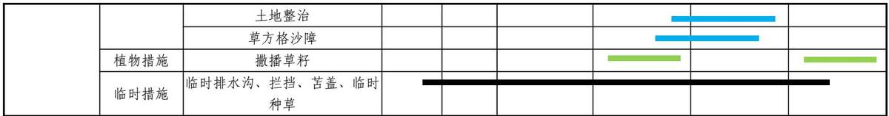

> **Zone C（应用范例层）使用边界**——仅可用于**写作风格、章节展开方式、表达逻辑、表格设计**的参考。
> **不得**用于合规判断；**不得**引入其项目数据（名称／地点／数字／单位名）；
> **不得**因其"曾经通过审批"而推定其做法在当前标准下仍然合规。
> 与 Zone A 冲突时**一律以 Zone A 为准**；Zone A 未明确规定时输出
> 「**Zone A 未明确规定，以下为参考写法，需人工判断**」。
>
> **坐标系警告**：本范例为**老八章结构**（GB 50433—2018 附录B），与 2026 版 10 章模板**同号不同义**
> （老 `1.5`＝防治目标，新 `1.5`＝水土流失预测结果；老 4→新 6 …偏移 +2；新版第 4/5 章老结构无独立章）。
> 因此 **`chapter_mapping: pending`——不得按章节号挂载**，检索一律走 `topic_tags`。
>
> **待加工**：`topic_tags`（主题标签）、`approval_basis_list`（编制依据逐字清单）、
> `structure_summary`（只提取结构：章节展开顺序／段落功能／表格栏目结构／句式模板／论证链步骤）。

<!-- 本文件由原方案 PDF 分段转换后拼接：共 3 段，原 391 页（MinerU 云单文件上限 200 页） -->

1 综合说明 ..........  
1.1 项目简况...  
1.2 编制依据 ..........  
1.3 设计水平年..... ... 8  
1.4 水土流失防治责任范围... .. 8  
1.5 水土流失防治目标 ............. ... 9  
1.6 项目水土保持评价结论.... ... 13  
1.7 水土流失预测结果.... ..18  
1.8 水土保持措施布设成果 .................... .... 18  
1.9 水土保持监测方案.... ..22  
1.10 水土保持投资及效益分析成果 ...................... ..22  
1.11 结论及建议 ....... ... 22  
2 项目概况 ..............  
2.1 项目组成及工程布置 ................. .... 30  
2.2 施工组织 ........ ... 65  
2.3 工程占地 ...... ..77  
2.4 土石方平衡 .................. ... 85  
2.5 施工进度 ....................... .... 102  
2.6 自然概况 ......... ..105  
2.7 拆迁（移民）安置与专项设施改（迁）建.............. ...121  
3 项目水土保持评价 ..................... ....... 122  
3.1 主体工程选址（线）水土保持评价 ................ .... 122  
3.2 建设方案与布局水土保持评价........ .... 126  
3.3 主体工程设计中水土保持措施界定 ....................... ..... 149  
4 水土流失分析与预测 ................... .......... 153  
4.1 水土流失现状.... ...153  
4.2 水土流失影响因素分析....... ...160  
4.3 土壤流失量预测..... ...163  
4.4 水土流失危害分析 .......................... ...246  
4.5 指导性意见 ...... ...246  
.... 248  
5.1 防治区划分 ................. ...248  
5.2 措施总体布局 ....... ...248  
5.3 分区措施布设 ................ ..255  
5.4 施工要求 ........................... ...306  
6 水土保持监测 ............. .... 317  
6.1 监测范围与时段 ................. ..317  
6.2 内容和方法 ........................ ...318  
6.3 点位布设 ........ ...328  
6.4 实施条件和成果 ......... ...330  
7 水土保持投资估算及效益分析 ....................... .... 335  
7.1 投资估算... ..335  
7.2 效益分析.. ...381  
8 水土保持管理 ... 383  
8.1 组织管理. ...383  
8.2 后续设计 ..... .... 384  
8.3 水土保持监测 ......... ...385  
8.4 水土保持工程监理 ............ .... 386  
8.5 水土保持施工... ...388  
8.6 水土保持验收... .... 389

## 1 综合说明

## 1.1项目简况

## 1.1.1 项目基本情况

## 1、项目建设必要性

长春—石家庄天然气管道作为南北纵向“资源通道”类型主干管道，是四大战略进口通道中东北资源通道的重要组成部分，是全面贯彻能源安全新战略、保障东北进口天然气资源稳定引进的资源通道，能够有效支撑“全国一张网”构建。

随着远东天然气资源的引进、中俄东线资源的增供以及东北储气库资源外输，中俄东线系统输送能力将不能满足外输需求，富余气量需要通过新建管道进行输送。长春—石家庄天然气管道的建设有助于解决东北地区天然气管网输送能力瓶颈，增强系统供气可靠性和灵活性，发挥储气库的应急保障和调峰作用，提升管网可靠性。

本项目的建设可落实国家规划部署，巩固我国东北天然气战略通道，完善全国天然气一张网，促进沿线区域和环渤海区域的可持续发展。

## 2、建设性质、规模

2025年2月21日，本项目取得了国家发展和改革委员会关于《长春—石家庄天然气管道项目》核准的批复（发改能源〔2025〕221 号），明确了项目分阶段建设、分期投产，并实现与陕京四线互联互通。

依据《长春—石家庄天然气管道项目》核准批复文件，该项目包括 1 干 8支，总长度2985.3km，包括干线管道1609km、其中长春—长岭管道利用已建成中俄东线长岭—长春支线管道109km，目前中俄东线长岭—长春支线已建设完成，开工前编制水土保持方案并取得相关批复，投入使用前完成了水土保持设施自主验收，并取得水土保持验收备案回执（水保验收回执〔2021〕第 91号），互联互通 3.3km、支线管道 1373km。全线设置42座输气站场，并配套建设相应的公用工程及辅助设施。

一阶段包括：干线（长岭—张家口段）和张家口西压气站与陕京四线互联互通管道（陕京四线改线 1km）。一阶段计划 2025 年 9 月开工，预计 2026 年 12月完工。

二阶段包括：干线（张家口—石家庄段）、鹿泉东压气站与陕京二、三线管道互联互通管道（陕京二、三线各改线1.1km）和鄂安沧管道鹿泉分输清管站与本项目鹿泉东压气站间 0.1km 联通管道。二阶段计划 2025 年 10 月开工，预计2027 年 10 月完工。

三阶段包括：8条支线（长岭—白城—乌兰浩特支线、盘锦—赤峰联络线、义县—阜新支线、义县支线、涞源—定兴联络线、张家口—承德支线、兴隆支线、平泉支线）。三阶段计划2025年12 月开工，预计2028年 10月完工。

表 1.1- 1 长春—石家庄天然气管道分阶段建设划分表
<table><tr><td rowspan=3 colspan=1>阶段</td><td rowspan=1 colspan=6>建设内容</td></tr><tr><td rowspan=1 colspan=2>干线（km）</td><td rowspan=1 colspan=2>支线(km）</td><td rowspan=1 colspan=2>互联互通管道（km）</td></tr><tr><td rowspan=1 colspan=1>名称</td><td rowspan=1 colspan=1>长度</td><td rowspan=1 colspan=1>名称</td><td rowspan=1 colspan=1>长度</td><td rowspan=1 colspan=1>名称</td><td rowspan=1 colspan=1>长度</td></tr><tr><td rowspan=1 colspan=1>一阶段</td><td rowspan=1 colspan=1>长岭张家口</td><td rowspan=1 colspan=1>1103</td><td rowspan=1 colspan=1>/</td><td rowspan=1 colspan=1>1</td><td rowspan=1 colspan=1>与陕京四线联通</td><td rowspan=1 colspan=1>1.0</td></tr><tr><td rowspan=3 colspan=1>二阶段</td><td rowspan=3 colspan=1>张家口—石家庄</td><td rowspan=3 colspan=1>397</td><td rowspan=3 colspan=1>/</td><td rowspan=3 colspan=1>1</td><td rowspan=1 colspan=1>与陕京二线联通</td><td rowspan=1 colspan=1>1.1</td></tr><tr><td rowspan=1 colspan=1>与陕京三线联通</td><td rowspan=1 colspan=1>1.1</td></tr><tr><td rowspan=1 colspan=1>鄂安沧联通管道</td><td rowspan=1 colspan=1>0.1</td></tr><tr><td rowspan=8 colspan=1>三阶段</td><td rowspan=8 colspan=1>/</td><td rowspan=8 colspan=1>1</td><td rowspan=1 colspan=1>长岭——白城——乌兰浩特</td><td rowspan=1 colspan=1>288</td><td rowspan=8 colspan=1>/</td><td rowspan=8 colspan=1>1</td></tr><tr><td rowspan=1 colspan=1>盘锦——赤峰联络线</td><td rowspan=1 colspan=1>303</td></tr><tr><td rowspan=1 colspan=1>义县阜新支线</td><td rowspan=1 colspan=1>62</td></tr><tr><td rowspan=1 colspan=1>义县支线</td><td rowspan=1 colspan=1>16</td></tr><tr><td rowspan=1 colspan=1>涞源-定兴联络线</td><td rowspan=1 colspan=1>136</td></tr><tr><td rowspan=1 colspan=1>张家口——承德支线</td><td rowspan=1 colspan=1>470</td></tr><tr><td rowspan=1 colspan=1>兴隆支线</td><td rowspan=1 colspan=1>77</td></tr><tr><td rowspan=1 colspan=1>平泉支线</td><td rowspan=1 colspan=1>21</td></tr><tr><td rowspan=1 colspan=1>合计</td><td rowspan=1 colspan=2>1500</td><td rowspan=1 colspan=2>1373</td><td rowspan=1 colspan=2>3.3</td></tr></table>

本次水土保持方案编制范围为长春—石家庄天然气管道一阶段，即干线（长岭—张家口段）和张家口西压气站与陕京四线互联互通管道（陕京四线改线1km）。

## 3、项目位置

本次水土保持方案评价范围为长春—石家庄天然气管道（一阶段）（以下简称“本工程”）起自吉林省松原市的长岭联络站，止于河北省张家口市万全区张家口西压气站，途经吉林省松原市，内蒙古自治区通辽市、赤峰市、锡林郭勒盟，河北省张家口市共计3 个省级行政区、5个市（盟）、19个县（区、旗）。

## 4、项目组成

项目建设内容主要包括输气管道、站场、穿越工程、陕京四线互联互通、阀室、标志桩及外电等附属设施，干线管道总长度1103km，管径 D1422mm、设计压力 10MPa，近期设计年输量 $1 6 0 { \times } 1 0 ^ { 8 } \mathrm { m } ^ { 3 } / \mathrm { a }$ ，远期设计年输量 $2 6 0 { \times } 1 0 ^ { 8 } \mathrm { m } ^ { 3 } / \mathrm { a }$ 。采用L555M 级钢管，全线设置内减阻涂层。共设置站场 13 座、阀室 31 座、各类标志桩 47855个。陕京四线互联互通1km，管径D1219mm、设计压力12MPa。

本工程河流大型穿越共计 5 条，大型河流穿越 11.30km/10 处，其中定向钻7.20km/6 处、顶管 0.95km/2 处、开挖 3.15km/2 处；河流中型穿越共计 6 条，中型穿越 2.79km/6 处，其中开挖穿越 2.32km/5 处，顶管穿越 0.47km/1 处；河流小型穿越 42 条，小型河流穿越 10.78km/57 处，其中定向钻 3.50km/4 处，顶管2.39km/16 处，开挖 4.89km/37 处；小型沟渠穿越 99.82km/1861 处，其中顶管0.17km/5 处，开挖 99.65km/1856 处；顶管穿越铁路 1.47km/12 次；顶管穿越各级公路 7.23km/126 次、开挖穿越各级公路 28.27km/2089 次；山体隧道穿越8.80km/8 处。

本项目新建站场阀室供配电线路（以下简称外电）总长255.6km，包括：110kV线路 40km、66kV 线路 194km、10kV 线路 21.6km。

## 5、施工组织

布置施工便道总长 565.85km，包括新建便道长 157.33km、整修便道长408.52km；布置堆管场 22.80hm2/228 处。

## 6、取、弃土场

本项目不设取土场，设置2处弃渣场，弃渣场占地面积6.79hm2，设计堆渣量为 19.39万m3（自然方）。

## 7、拆迁（移民）安置及专项设施改（迁）建

经统计，工程施工需拆迁大棚 3800m2，平房 28m2，电线杆迁移 1073 个，光缆线杆迁移536 个，拆迁坟地228座。拆迁安置采取货币补偿方式，由项目建设单位承担补偿费用，具体拆迁与安置工作由当地政府负责组织实施，并妥善安排安置居民的生活和生产方式。

## 8、工程占地

本工程总占地面积为 6390.60hm2，其中永久占地面积为 $7 6 . 0 8 \mathrm { h m } ^ { 2 }$ ，临时占地面积 6314.52hm2。

## 9、工程土石方

项目建设期总挖填土石方6919.90万m3，其中开挖土石方3468.29 万 $\mathrm { m } ^ { 3 } \ell$ （自然方，含表土剥离 422.47 万 m3），回填土石方 3451.61万 $\mathrm { m } ^ { 3 }$ （自然方，含回填表土 421.85 万 m3），产生余方 16.68 万 m3 站场占压黑土地剩余土方（0.62 万m3）和山体穿越区剩余土石方（16.06万m3）。

站场余方目前已经全部签订综合利用协议，长岭站剩余黑土已跟村镇签订协议，剩余黑土利用到乌兰图嘎镇土地整治。40 号阀室占压黑土地余方运至吉日嘎郎吐镇保安村用于土地复垦建设。山体穿越区剩余土方运至弃渣场堆存。

## 10、工程工期

本工程计划于2025年 9月开工，预计2026年12月完工，本项目总工期16个月。

## 11、工程投资

工程总投资236.72亿元，土建投资52.11亿元，资金来源于企业自筹和银行贷款。

## 1.1.2 项目工作进展情况

## 1、项目前期工作进展

2024年12 月，取得了国家石油天然气管网集团有限公司关于《长春—石家庄天然气管道可行性研究报告的批复》（国家管网办〔2024〕282号）。依据上述批复文件，本项目分阶段建设，其中：干线长岭—张家口段 2025年9月开工，2026 年12 月建成；干线张家口—石家庄段 2025 年10 月开工，2027 年10月建成；8条支线2025年12 月开工，长岭—白城—乌兰浩特支线、盘锦—赤峰联络线、义县—阜新支线和义县支线2026年12月与干线长岭—张家口段同步建成，涞源—定兴联络线、张家口—承德支线、兴隆支线和平泉支线2028 年10月建成。

2025 年 2 月，取得了国家发展和改革委员会关于《长春—石家庄天然气管道项目核准的批复》（发改能源〔2025〕221 号）。

2025 年 3 月，完成《长春—石家庄天然气管道工程干线（一阶段）线路工程说明书》。

2025 年 6 月，取得了国家石油天然气管网集团有限公司关于《长春—石家庄天然气管道工程干线（一阶段）初步设计的批复》（国家管网办〔2025〕114号）。

目前，本项目规划选址及用地预审、安全评价、环境影响评价、地震安全性评价、地质灾害危险性评估、压覆矿产资源评估等均通过审查。

## 2、水土保持方案编制情况

根据《中华人民共和国水土保持法》、《生产建设项目水土保持方案管理办法》（水利部令第 53 号）、《吉林省水土保持条例》、《内蒙古自治区水土保持条例》、《河北省实施＜中华人民共和国水土保持法＞办法》等相关法律、法规的要求，2023 年6 月建设单位委托北京林淼生态环境技术有限公司（以下简称“我公司”）编制《长春—石家庄天然气管道（一阶段）水土保持方案报告书》。接受委托后，我公司组织专业技术人员于2023年11月、2024年6月、2024年10 月、2025年 2月、2025年6月多次进行了实地踏勘，了解并收集了项目区自然概况、调查黑土地范围、水土流失和水土保持情况等资料，开展表土资源现场调查、弃渣处置方式及综合利用调查，对规划的弃渣场选址进行现场复核，并就有关弃渣场选址等技术问题，与建设单位、设计单位进行了交流沟通。在上述工作的基础上，结合主体工程文件，依据《生产建设项目水土保持技术标准》（GB50433-2018）等规定，于2025年8 月编制完成了《长春—石家庄天然气管道（一阶段）水土保持方案报告书》，2025年8月 23 日通过水利部监测中心审查。

## 1.1.3 自然简况

本工程经过共 5个地级市 19个旗县区，沿线属温带季风气候、温带半干旱大陆性气候。四季分明，寒暑适中，冬夏长、春秋短，冬季寒冷干燥，春季干旱少雨，夏季炎热多雨，秋季冷暖变化显著。多年平均气温为 1.4\~6.9℃，平均年降水量 334.3\~446.3mm，年平均风速 2.3\~4.6m/s，年蒸发量 1033.7\~2287.5mm，最大冻土深度1.4\~3.0m。沿线土壤类型主要有暗棕壤、草甸土、黑土、栗钙土、棕色针叶林土、白浆土、黑钙土、风沙土等。沿线植被有松树、杨树、油松、沙柳、山杏、小叶锦鸡、沙地柏、沙打旺等。主要有有沿线表层土可剥离厚度在20cm～50cm 不等，土壤抗蚀性一般。

本项目途经吉林省、内蒙古自治区、河北省。根据《吉林省水土保持规划（2016-2030 年）》、《内蒙古自治区水土保持规划（2016-2030 年）》和《河北省水土保持规划（2016-2030 年）》。项目所属区域涉及东北黑土区、北方风沙区、北方土石山区，吉林省土壤侵蚀类型以轻度水力侵蚀为主，容许土壤流失量为 $2 0 0 \mathrm { t / k m } ^ { 2 } { \cdot } \mathbf { a } .$ 。内蒙古自治区和河北省土壤侵蚀类型以轻度水力侵蚀和风力侵蚀为主，水力侵蚀容许土壤流失量为 200t/km2·a，风力侵蚀容许土壤流失量为$1 0 0 0 \mathrm { t / k m ^ { 2 } { \cdot } a }$ o

根据各省市“三区三线”划定成果，本工程管道共穿越 5 个旗县区 11处生态保护红线，穿越总长度 63.54km。吉林省境内不涉及穿越生态保护红线；内蒙古自治区境内共穿越3个旗9处生态保护红线，穿越总长度61.86km；河北省共穿越 2 个县区 2 处生态保护红线，穿越总长度 1.68km。经与当地自然资源部门沟通，相关手续同办理临时用地一同办理。

项目建设穿越4处自然保护地，穿越长度46.05km。包括2 处自然保护区（内蒙古桦木沟自治区级自然保护区、内蒙古乌兰布统自治区级自然保护区）、1处森林公园（内蒙古桦木沟国家森林公园）、1处草原公园（河北黄土湾国家草原自然公园），均已取得允许穿越意见。

## 1.2编制依据

## 1.2.1 法律法规

（1）《中华人民共和国水土保持法》（2011年3 月1日起施行）；

（2）《中华人民共和国黑土地保护法》（2022 年8月1日起施行）；

（3）《吉林省水土保持条例》（2014年3月1 日施行）；

（4）《吉林省黑土地保护条例》（2023 年4月1 日起施行）；

（5）《内蒙古自治区黑土地保护条例》（2024 年12 月1日起施行）；

（6）《内蒙古自治区水土保持条例》（2024年7 月25 日第二次修订）；

（7）《河北省实施＜中华人民共和国水土保持法＞办法》。

## 1.2.2 部委规章及规范性文件

（1）《生产建设项目水土保持方案管理办法》（水利部令第 53 号，2023年1月17日）；

（2）《水利部办公厅关于印发<生产建设项目水土保持设施自主验收规程（试行）>的通知》（办水保〔2018〕133号）；

（3）《水利部办公厅关于印发生产建设项目水土保持技术文件编写和印制格式规定（试行）的通知》（办水保〔2018〕135号）；

（4）《水利部办公厅关于印发生产建设项目水土保持监督管理办法的通知》（办水保〔2019〕172号）；

（5）《水利部关于进一步深化“放管服”改革全面加强水土保持监管的意见》（水保〔2019〕160号）；

（6）《水利部办公厅关于进一步加强生产建设项目水土保持监测工作的通知》（办水保〔2020〕161 号）；

（7）《水利部办公厅关于印发生产建设项目水土保持方案审查要点的通知》（办水保〔2023〕177号）；

（8）《内蒙古自治区自然资源厅关于规范自治区建设占用黑土耕地表土剥离管理工作的通知》（内自然资字〔2022〕133号）。

## 1.2.3 技术标准

（1）《生产建设项目水土保持技术标准》（GB50433-2018）；

（2）《生产建设项目水土流失防治标准》（GB/50434-2018）；

（3）《水土保持工程设计规范》（GB51018-2014）；

（4）《土壤侵蚀分类分级标准》（SL190-2007）；

（5）《水土保持工程调查与勘测标准》（GB/T51297-2018）；

（6）《生产建设项目土壤流失量测算导则》（SL773-2018）；

（7）《水利水电工程制图标准水土保持图》（SL73.6-2015）；

（8）《土地利用现状分类》（GB/T21010-2017）；

（9）《生产建设项目水土保持监测与评价标准》（GB/T 51240-2018）；

（10）《水土保持监理规范》（SL/T523-2024）；

（11）《水土保持监测技术规范》（SL/T277-2024）；

（12）《水土保持工程质量验收与评价规范》（SL/T336-2025）；

（13）《输气管道工程设计规范》（GB 50251-2015）；

（14）《油气输送管道穿越工程设计规范》（GB 50423-2013）；

（15）《油气管道线路工程水工保护设计规范》（SY/T 6793-2010）；

（16）《油气输送管道工程水平定向钻穿越设计规范》（SY/T 6968-2013）；

（17）《黑土区水土流失综合防治技术规范》（SL/T446-2024）；

（18）《表土剥离及其再利用技术要求》（GB/T 45107—2024）；

（19）《建设占用耕地表土剥离技术规范》（DB22/T 3647-2024）。

## 1.2.4 技术文件与资料

（1）《全国水土保持规划（2015-2030年）》（水规计〔2015〕507号）；

（2）《吉林省水土保持规划（2016-2030 年）》（吉政函〔2017〕103号）；

（3）《内蒙古自治区水土保持规划（2016-2030年）》（内政办发〔2017〕8号）；

（4）《河北省水土保持规划（2016-2030 年）》（冀政字〔2017〕35号）；

（5）《长春—石家庄天然气管道可行性研究报告》（2024 年9月）；

（6）《长春—石家庄天然气管道（一阶段）初步设计》（2025年）；

（7）《长春—石家庄天然气管道（长岭—张家口段）初步设计奈曼旗压气站66kV外电工程》（2025年6 月）；

（8）《长春—石家庄天然气管道（长岭—张家口段）初步设计赤峰西压气站66kV外电工程》（2025年6 月）；

（9）《长春—石家庄天然气管道（长岭—张家口段）初步设计张家口西压气站 110kV外电工程》（2025 年6月）；

（10）现场调查及建设单位提供的其他技术资料。

## 1.3设计水平年

按照《生产建设项目水土保持技术标准》（GB50433-2018）的规定，设计水平年为主体工程完工后的当年或后一年。本项目计划于 2025 年9月开工，预计2026年12月完工，方案以项目完工下一年，即2027年为设计水平年。

## 1.4水土流失防治责任范围

根据《生产建设项目水土保持技术标准》（GB50433-2018），水土流失防治责任范围应包括项目永久征地、临时占地（含租赁土地）以及其他使用与管辖区域，经汇总统计项目主体设计相关资料，确定本项目防治责任范围面积为6390.60hm2。本工程水土流失防治责任范围详见表1.4-1。

表 1.4-1 水土流失防治责任范围表  
单位：hm2
<table><tr><td colspan="1" rowspan="2">项目组成</td><td colspan="4" rowspan="1">防治责任范围</td></tr><tr><td colspan="1" rowspan="1">吉林省</td><td colspan="1" rowspan="1">内蒙古自治区</td><td colspan="1" rowspan="1">河北省</td><td colspan="1" rowspan="1">小计</td></tr><tr><td colspan="1" rowspan="1">管道作业带区</td><td colspan="1" rowspan="1">508.55</td><td colspan="1" rowspan="1">3474.63</td><td colspan="1" rowspan="1">893.00</td><td colspan="1" rowspan="1">4876.18</td></tr><tr><td colspan="1" rowspan="1">站场阀室区</td><td colspan="1" rowspan="1">2.70</td><td colspan="1" rowspan="1">53.79</td><td colspan="1" rowspan="1">13.10</td><td colspan="1" rowspan="1">69.59</td></tr><tr><td colspan="1" rowspan="1">供配电工程区</td><td colspan="1" rowspan="1">0.01</td><td colspan="1" rowspan="1">96.04</td><td colspan="1" rowspan="1">28.17</td><td colspan="1" rowspan="1">124.22</td></tr><tr><td colspan="1" rowspan="1">河流沟渠穿越区</td><td colspan="1" rowspan="1">69.19</td><td colspan="1" rowspan="1">518.00</td><td colspan="1" rowspan="1">145.59</td><td colspan="1" rowspan="1">732.78</td></tr><tr><td colspan="1" rowspan="1">公路铁路穿越区</td><td colspan="1" rowspan="1">19.23</td><td colspan="1" rowspan="1">133.56</td><td colspan="1" rowspan="1">59.54</td><td colspan="1" rowspan="1">212.33</td></tr><tr><td colspan="1" rowspan="1">山体穿越区</td><td colspan="1" rowspan="1">0.00</td><td colspan="1" rowspan="1">6.40</td><td colspan="1" rowspan="1">0.00</td><td colspan="1" rowspan="1">6.40</td></tr><tr><td colspan="1" rowspan="1">弃渣场区</td><td colspan="1" rowspan="1">0.00</td><td colspan="1" rowspan="1">6.79</td><td colspan="1" rowspan="1">0.00</td><td colspan="1" rowspan="1">6.79</td></tr><tr><td colspan="1" rowspan="1">堆管场区</td><td colspan="1" rowspan="1">2.10</td><td colspan="1" rowspan="1">16.30</td><td colspan="1" rowspan="1">4.40</td><td colspan="1" rowspan="1">22.80</td></tr><tr><td colspan="1" rowspan="1">施工便道区</td><td colspan="1" rowspan="1">28.07</td><td colspan="1" rowspan="1">240.17</td><td colspan="1" rowspan="1">71.27</td><td colspan="1" rowspan="1">339.51</td></tr><tr><td colspan="1" rowspan="1">合计</td><td colspan="1" rowspan="1">629.84</td><td colspan="1" rowspan="1">4545.68</td><td colspan="1" rowspan="1">1215.08</td><td colspan="1" rowspan="1">6390.60</td></tr></table>

## 1.5水土流失防治目标

## 1.5.1 执行标准等级

按照《生产建设项目水土流失防治标准》（GB/T50434-2018），生产建设项目水土流失防治标准等级按项目所处地区水土保持敏感程度和水土流失影响程度确定。

根据《吉林省水土保持规划（2016-2030 年）》、《内蒙古自治区水土保持规划（2016-2030 年）》、《河北省水土保持规划（2016-2030 年）》，项目区水土流失总体为风力侵蚀和水力侵蚀。本项目所在区域涉及西辽河大凌河中上游国家级水土流失重点治理区、燕山国家级水土流失重点预防区、永定河上游国家级水土流失重点治理区、西辽河自治区级水土流失重点预防区，水土流失重点预防区应执行一级标准规定，确定方案的水土流失防治标准执行北方土石山区、东北黑土区、北方风沙区水土流失防治一级标准。

表 1.5-1项目沿线涉及水土流失重点预防区、重点治理区统计表
<table><tr><td colspan="1" rowspan="1">省</td><td colspan="1" rowspan="1">市、盟</td><td colspan="1" rowspan="1">旗、县、区</td><td colspan="1" rowspan="1">水土保持区划</td><td colspan="1" rowspan="1">重点防治区名称</td><td colspan="3" rowspan="1">等级标准</td></tr><tr><td colspan="1" rowspan="2">吉林省</td><td colspan="1" rowspan="2">松原市</td><td colspan="1" rowspan="1">前郭尔罗斯蒙古族自治县</td><td colspan="1" rowspan="6">东北黑土区</td><td colspan="1" rowspan="2">不涉及</td><td colspan="3" rowspan="1">东北黑土区一级标准</td></tr><tr><td colspan="1" rowspan="1">长岭县</td><td colspan="3" rowspan="1">东北黑土区一级标准</td></tr><tr><td colspan="1" rowspan="6">内蒙古自治区</td><td colspan="1" rowspan="5">通辽市</td><td colspan="1" rowspan="1">科尔沁左翼中旗</td><td colspan="1" rowspan="4">西辽河自治区级水土流失重点预防区</td><td colspan="3" rowspan="1">东北黑土区一级标准</td></tr><tr><td colspan="1" rowspan="1">科尔沁区</td><td colspan="3" rowspan="1">东北黑土区一级标准</td></tr><tr><td colspan="1" rowspan="1">通辽经济技术开发区</td><td colspan="3" rowspan="1">东北黑土区一级标准</td></tr><tr><td colspan="1" rowspan="1">开鲁县</td><td colspan="3" rowspan="1">东北黑土区一级标准</td></tr><tr><td colspan="1" rowspan="1">奈曼旗</td><td colspan="1" rowspan="2">北方土石</td><td colspan="1" rowspan="2">西辽河大凌河中上</td><td colspan="3" rowspan="1">北方土石山区一级标准</td></tr><tr><td colspan="1" rowspan="1">赤峰市</td><td colspan="1" rowspan="1">敖汉旗</td><td colspan="3" rowspan="1">北方土石山区一级标准</td></tr><tr><td colspan="1" rowspan="5"></td><td colspan="1" rowspan="3"></td><td colspan="1" rowspan="1">翁牛特旗</td><td colspan="1" rowspan="4">山区</td><td colspan="2" rowspan="3">游国家级水土流失重点治理区</td><td colspan="1" rowspan="1">北方土石山区一级标准</td></tr><tr><td colspan="1" rowspan="1">松山区</td><td colspan="1" rowspan="1">北方土石山区一级标准</td></tr><tr><td colspan="1" rowspan="1">克什克腾旗</td><td colspan="1" rowspan="1">北方土石山区一级标准</td></tr><tr><td colspan="1" rowspan="2">锡林郭勒盟</td><td colspan="1" rowspan="1">多伦县</td><td colspan="2" rowspan="1">燕山国家</td><td colspan="1" rowspan="1">北方土石山区一级标准</td></tr><tr><td colspan="1" rowspan="1">正蓝旗</td><td colspan="1" rowspan="3">北方风沙</td><td colspan="2" rowspan="3">级水土流失重点预防区</td><td colspan="1" rowspan="1">流</td><td colspan="1" rowspan="1">北方风沙区一级标准</td></tr><tr><td colspan="1" rowspan="6">河北省</td><td colspan="1" rowspan="6">张家口市</td><td colspan="1" rowspan="1">塞北管理区</td><td colspan="1" rowspan="1">北方风沙区一级标准</td></tr><tr><td colspan="1" rowspan="1">沽源县</td><td colspan="1" rowspan="1">北方风沙区一级标准</td></tr><tr><td colspan="1" rowspan="1">张北县</td><td colspan="1" rowspan="2">区</td><td colspan="2" rowspan="4">永定河上游国家级水土流失重点治理区</td><td colspan="1" rowspan="1">北方风沙区一级标准</td></tr><tr><td colspan="1" rowspan="1">察北管理区</td><td colspan="1" rowspan="1">北方风沙区一级标准</td></tr><tr><td colspan="1" rowspan="1">万全区</td><td colspan="1" rowspan="2">北方土石山区</td><td colspan="1" rowspan="1">北方土石山区一级标准</td></tr><tr><td colspan="1" rowspan="1">怀安县</td><td colspan="1" rowspan="1">北方土石山区一级标准</td></tr></table>

## 1.5.2 防治目标

1、根据《生产建设项目水土保持技术标准》（GB50433-2018）中3.1.3的规定，生产建设项目水土流失防治应达到的基本目标：

（1）项目建设范围内的新增水土流失应得到有效控制，原有水土流失得到治理；

（2）水土保持设施应安全有效；

（3）水土资源、林草植被应得到最大限度地保护与恢复；

（4）水土流失治理度、土壤流失控制比、渣土防护率、表土保护率、林草植被恢复率、林草覆盖率六项指标应符合现行国家标准《生产建设项目水土流失防治标准》（GB/T50434-2018）和行业要求的规定。

2、根据《生产建设项目水土流失防治标准》（GB/T50434-2018）中4.0.6～4.0.10的规定，水土流失防治标准在水土流失防治一级标准的基础上对相应指标进行调整：

（1）项目区属于轻度侵蚀为主，因此调整土壤流失控制比为1.0；

（2）表土保护率、渣土防护率、水土流失治理度、林草植被恢复率均不作调整；涉及国家级和省级水土流失重点防治区的区县境内林草覆盖率提高2%。

通过分区段按面积加权计算后，施工期水土流失综合防治目标值渣土防护率92.90%、表土保护率95.81%；设计水平年水土流失治理度93.44%、土壤流失控

制比1.0、渣土防护率94.90%、表土保护率95.81%、林草植被恢复率96.16%、林草覆盖率25.95%。

（3）项目区占用黑土地，黑土地黑土保护率目标值为 100%。

表 1.5-2 本项目水土保持防治指标值  
单位：%
<table><tr><td rowspan=4 colspan=1>防治指标</td><td rowspan=1 colspan=6>水土流失防治指标值</td><td rowspan=1 colspan=6>修正后水土流失防治指标值</td><td rowspan=2 colspan=2>加权平均值</td></tr><tr><td rowspan=1 colspan=2>东北黑土区</td><td rowspan=1 colspan=2>北方风沙区</td><td rowspan=1 colspan=2>北方土石山区</td><td rowspan=1 colspan=2>东北黑土区</td><td rowspan=1 colspan=2>北方风沙区</td><td rowspan=1 colspan=2>北方土石山区</td></tr><tr><td rowspan=2 colspan=1>施工期</td><td rowspan=2 colspan=1>设计水平年</td><td rowspan=2 colspan=1>施工期</td><td rowspan=2 colspan=1>设计水平年</td><td rowspan=1 colspan=1>施工</td><td rowspan=1 colspan=1>设计水平</td><td rowspan=1 colspan=1>施工</td><td rowspan=1 colspan=1>设计水平</td><td rowspan=2 colspan=1>施工期</td><td rowspan=1 colspan=1>设计水平</td><td rowspan=2 colspan=1>施工期</td><td rowspan=2 colspan=1>设计水平年</td><td rowspan=2 colspan=1>施工期</td><td rowspan=2 colspan=1>设计水平年</td></tr><tr><td rowspan=1 colspan=1>期</td><td rowspan=1 colspan=1>年</td><td rowspan=1 colspan=1>期</td><td rowspan=1 colspan=1>年</td><td rowspan=1 colspan=1>年</td></tr><tr><td rowspan=1 colspan=1>水土流失治理度</td><td rowspan=1 colspan=1></td><td rowspan=1 colspan=1>97</td><td rowspan=1 colspan=1></td><td rowspan=1 colspan=1>85</td><td rowspan=1 colspan=1></td><td rowspan=1 colspan=1>95</td><td rowspan=1 colspan=1></td><td rowspan=1 colspan=1>97</td><td rowspan=1 colspan=1></td><td rowspan=1 colspan=1>85</td><td rowspan=1 colspan=1></td><td rowspan=1 colspan=1>95</td><td rowspan=1 colspan=1></td><td rowspan=1 colspan=1>93.44</td></tr><tr><td rowspan=1 colspan=1>水土流失控制比</td><td rowspan=1 colspan=1></td><td rowspan=1 colspan=1>0.9</td><td rowspan=1 colspan=1></td><td rowspan=1 colspan=1>0.8</td><td rowspan=1 colspan=1></td><td rowspan=1 colspan=1>0.9</td><td rowspan=1 colspan=1></td><td rowspan=1 colspan=1>1</td><td rowspan=1 colspan=1></td><td rowspan=1 colspan=1>1</td><td rowspan=1 colspan=1></td><td rowspan=1 colspan=1>1</td><td rowspan=1 colspan=1></td><td rowspan=1 colspan=1>1.00</td></tr><tr><td rowspan=1 colspan=1>渣土防护率</td><td rowspan=1 colspan=1>95</td><td rowspan=1 colspan=1>97</td><td rowspan=1 colspan=1>85</td><td rowspan=1 colspan=1>87</td><td rowspan=1 colspan=1>95</td><td rowspan=1 colspan=1>97</td><td rowspan=1 colspan=1>95</td><td rowspan=1 colspan=1>97</td><td rowspan=1 colspan=1>85</td><td rowspan=1 colspan=1>87</td><td rowspan=1 colspan=1>95</td><td rowspan=1 colspan=1>97</td><td rowspan=1 colspan=1>92.90</td><td rowspan=1 colspan=1>94.90</td></tr><tr><td rowspan=1 colspan=1>表土保护率</td><td rowspan=1 colspan=1>98</td><td rowspan=1 colspan=1>98</td><td rowspan=1 colspan=1>95</td><td rowspan=1 colspan=1>95</td><td rowspan=1 colspan=1>95</td><td rowspan=1 colspan=1>95</td><td rowspan=1 colspan=1>98</td><td rowspan=1 colspan=1>98</td><td rowspan=1 colspan=1>95</td><td rowspan=1 colspan=1>95</td><td rowspan=1 colspan=1>95</td><td rowspan=1 colspan=1>95</td><td rowspan=1 colspan=1>95.81</td><td rowspan=1 colspan=1>95.81</td></tr><tr><td rowspan=1 colspan=1>林草植被恢复率</td><td rowspan=1 colspan=1>_</td><td rowspan=1 colspan=1>97</td><td rowspan=1 colspan=1>_</td><td rowspan=1 colspan=1>93</td><td rowspan=1 colspan=1>_</td><td rowspan=1 colspan=1>97</td><td rowspan=1 colspan=1>_</td><td rowspan=1 colspan=1>97</td><td rowspan=1 colspan=1></td><td rowspan=1 colspan=1>93</td><td rowspan=1 colspan=1></td><td rowspan=1 colspan=1>97</td><td rowspan=1 colspan=1></td><td rowspan=1 colspan=1>96.16</td></tr><tr><td rowspan=1 colspan=1>林草覆盖率</td><td rowspan=1 colspan=1></td><td rowspan=1 colspan=1>25</td><td rowspan=1 colspan=1>_</td><td rowspan=1 colspan=1>20</td><td rowspan=1 colspan=1>_</td><td rowspan=1 colspan=1>25</td><td rowspan=1 colspan=1>_</td><td rowspan=1 colspan=1>27</td><td rowspan=1 colspan=1></td><td rowspan=1 colspan=1>22</td><td rowspan=1 colspan=1>_</td><td rowspan=1 colspan=1>27</td><td rowspan=1 colspan=1></td><td rowspan=1 colspan=1>25.95</td></tr><tr><td rowspan=1 colspan=1>黑土地黑土保护率</td><td rowspan=1 colspan=1></td><td rowspan=1 colspan=1></td><td rowspan=1 colspan=1></td><td rowspan=1 colspan=1></td><td rowspan=1 colspan=1></td><td rowspan=1 colspan=1></td><td rowspan=1 colspan=1></td><td rowspan=1 colspan=1></td><td rowspan=1 colspan=1></td><td rowspan=1 colspan=1></td><td rowspan=1 colspan=1></td><td rowspan=1 colspan=1></td><td rowspan=1 colspan=1></td><td rowspan=1 colspan=1>100</td></tr></table>

## 1.6项目水土保持评价结论

## 1.6.1 主体工程选址（线）评价

本方案根据《中华人民共和国水土保持法》、《生产建设项目水土保持技术标准》（GB50433-2018）的规定要求，从水土保持角度对项目选址进行了评价，项目选址不涉及饮用水水源保护区、水功能一级区的保护区和保留区、世界文化和自然遗产地、风景名胜区、地质公园、重要湿地或县级以上城市区域，不涉及全国水土保持监测网络中的水土保持监测站点、重点试验区以及国家确定的水土保持长期定位观测站，但工程无法避让国家级、省级水土流失重点预防区和治理区，涉及自然保护区和生态红线。本方案通过提高防治标准、优化施工工艺、缩短施工工期、加强管理、减少工程占地和土石方开挖，减少地表扰动和植被损毁范围，最大限度减少工程建设造成的水土流失。

工程充分考虑沿线地形地貌，合理选择了管道敷设方式和作业带宽度：D1422 管道（占用耕地段）作业带宽度53m，采用沉管下沟方式；D1422 管道一般作业带宽度45m，采用沉管下沟方式；涉及环境敏感区时作业带宽度适当减小，作业带宽度43m，采用沉管下沟方式；开挖穿越小型河流时，作业带宽度按65m，采用沉管下沟方式。河流大中型穿越部分采用定向钻、顶管等非开挖方式，小型河渠开挖选择枯水期施工；穿越铁路和等级公路主要采用顶管方式；山体主要采用隧道方式，尽可能减少管沟开挖。D1219 管道采用并行敷设，作业带宽度为28m，采用吊管下沟方式。经与主体设计沟通，进一步优化设计方案以减少弃土弃渣，提高土石方综合利用率，对管沟临时堆土、开挖边坡、弃渣等采取有效的防治措施。主体工程选线时已充分考虑沿线环境敏感点，在条件允许的情况下均进行了合理避让，局部区段无法避让生态红线、自然保护区等环境敏感点，相应采取了定向钻、隧道等非开挖方式穿越。根据各省市“三区三线”划定成果，本工程管道共穿越 5 个县旗区 11 处生态保护红线，穿越总长度 63.54km。吉林省境内不穿越生态保护红线；内蒙古自治区境内3个旗9 处生态保护红线，穿越总长度61.86km；河北省共穿越2个县区2处生态保护红线，穿越总长度1.68km。经与自规部门沟通，相关手续同办理临时用地一同办理。项目建设穿越4处自然保护地，穿越长度46.05km。包括 2处自然保护区（内蒙古桦木沟自治区级自然保护区、内蒙古乌兰布统自治区级自然保护区）、1 处森林公园（内蒙古桦木沟国家森林公园）、1处草原公园（河北黄土湾国家草原自然公园），均已取得批复结论均为允许穿越。本项目环境影响评价已通过生态环境部技术审查会。

## 1.6.2 建设方案与布局评价

## 1、建设方案评价

根据主体工程特点，本工程建设方案以尽量减少扰动面积、减少土石方量为原则。不断优化设计，管道穿越大中型河流部分采用定向钻、顶管等非开挖穿越方式，穿越铁路和等级公路主要采用顶管方式，穿越高陡山体采用隧道方式。管道作业带按照平地段、山区段、不同穿越地段等确定施工作业及开挖基面范围，严格控制作业带宽度。结合不同管径和地形地貌，一般平地段作业带宽度控制在28m\~53m，山丘区及敏感区段控制作业带宽度 43m，小型河流开挖段作业带宽度为 65m，尽可能减少地表扰动范围、土方开挖量和破坏植被面积。施工道路充分利用既有城镇道路，尽可能选择农田小路进行整修。施工生活区直接租赁附近的民房，不新增扰动土地。

## 2、工程占地评价

本项目站场、阀室等永久用地指标符合《石油天然气工程项目用地控制指标》（国土资规〔2016〕14 号）规定，管道三桩按照行业规范要求布设，永久占地面积满足工程布置及施工要求。在临时占地方面，主体设计考虑了控制扰动地表范围的措施，例如：施工机械设备集中堆放在穿越工程施工场地指定区域或管道作业带占地范围内，不布置设备堆放区；工程建设尽可能利用已有交通条件，减少施工便道修建；施工生活区采取租赁民房，不单独建设。上述措施均有利于减少工程临时占地，本工程施工场地数量、面积及作业带宽度等均满足施工要求，符合水土保持要求。

占地性质方面，项目永久占地是工程后期运行所必须的用地，包括站场、阀室、维抢修中心、三桩等占地；临时占地包括管道作业带、各类穿越工程施工场地、施工便道、弃渣场、堆管场等占地，工程占地性质合理。占地类型主要为耕地、林地、园地、水域及水利设施用地、草地等，站场阀室及施工用地不可避免地占用了耕地。主体设计对永久占用耕地的按照“占一补一”原则计列了土地开垦费，对临时占用耕地的计列了土地复垦资金。弃渣场占地以林地、草地为主，建议在后续设计及施工过程中加大余方综合利用，减少弃渣量和堆渣占地。后期恢复方面，永久占地以实施硬化为主，水土流失量较小；工程采取分标段施工，单项工程施工期较短，临时占地时间较短，强烈水土流失发生时间也较短，完工后除硬化区域之外，均按原土地利用类型进行恢复，不会影响项目区土地利用功能，与周边景观相协调。

因此，本工程占地符合国家有关政策要求，占地性质、类型基本合理，占地计列全面、不漏项。建议在后续设计及施工过程中进一步优化占地，对沿线不可避免占用耕地、林地等，布设完整有效的水土流失防治措施，施工时重点做好表土剥离、堆存及保护，并按要求落实好后期植被恢复及耕地恢复。

## 3、土石方平衡评价

## （1）土石方平衡及调配

主体设计未单列表土剥离和回覆，本方案增加了管道作业带、站场阀室、弃渣场、穿越工程、施工便道的表土剥离及回覆，对站场阀室土石方量进一步分析和计算，同时考虑了项目区间土石方调配，最大程度减少借方和弃方，挖填借余（弃）总量均有所调整，经核定，工程建设期总挖填土石方6919.90万m3，其中开挖土石方3468.29万m（3 自然方，含表土剥离422.47万m3），回填土石方3451.61万m3（自然方，含表土回覆 $4 2 1 . 8 5 \ \overline { { \mathcal { H } } } \ \mathrm { m } ^ { 3 } \ \mathrm { ) }$ ），产生余方 $1 6 . 6 8 \mathrm { ~ ‰ ~ } \mathrm { m } ^ { 3 }$ ，主要是站场占压黑土地剩余土方（0.62 万 m3）和山体穿越区剩余土石方（ $1 6 . 0 6 \mathrm { ~ \mathscr ~ { ~ H ~ } ~ m ~ } ^ { 3 }$ ）。吉林省长岭站剩余黑土已跟村镇签订协议，剩余黑土利用到乌兰图嘎镇土地复垦。内蒙古自治区 40号阀室占压黑土地余方运至吉日嘎郎吐镇保安村用于土地复垦建设。山体穿越区剩余土方运至弃渣场堆存。

管道工程以开挖施工方式为主，但是对于易造成水土流失、环境敏感区和施工难度较大的特殊管段，采用了顶管、定向钻等非开挖穿越的施工工艺，减小扰动范围、减少裸露时间和面积、减少崩塌和滑坡等地质灾害隐患、减少潜在的水土流失隐患，同时合理安排工期，尽量选择在枯水期或冬季进行施工，符合水土保持的要求。

主体工程设计了站场阀室的表土剥离与回覆、截排水、土地整治、边坡防护、碎石铺垫、绿化等；管道作业带区复耕、护坡等；河流沟渠穿越区生态袋护岸等；山体穿越区浆砌石截水沟、沉沙池、绿化等；弃渣场区挡墙、排水沟、排水管涵、绿化等；供配电工程区表土剥离与回填、土地整治、绿化等措施，上述措施在满足主体需要的同时，兼具水土保持功能。从水土保持角度分析，主体设计的防护工程尚不完善，不能满足水土流失防治全过程的要求。本方案补充了施工过程中的拦挡、苫盖、排水、沉沙等临时防护措施以及管道作业带、穿越施工场地的后期恢复措施，进一步完善了各分区水土保持措施，形成了完整的防治措施体系。

## （2）土石方资源化、减量化

可研阶段，本项目站场阀室回填土方，拟采取外借土石方，通过市场采购方式解决。本方案根据水土保持相关要求，结合借方来源分析和调查，在初设阶段提出了优先进行项目区间内部土石方综合调配，在不同站场阀室之间进行土方综合调运，就近利用管道作业带、山体隧道开挖土方作为站场阀室基础回填土方，从而减少外购土方5.74万m3。从管道作业带中调出15.57万 $\mathrm { m } ^ { 3 }$ 土石方用于附近站场回填，调出 0.48万 $\mathrm { m } ^ { 3 }$ 表土用于弃渣场覆土，调出 0.07万m3表土用于站场绿化覆土。从上窝铺山体隧道调出3.33万 $\mathrm { m } ^ { 3 }$ 土石方用于赤峰西压气站站场基础回填。站场阀室区多余9.96万m3表土调入管道作业带区进行覆土绿化，0.24万m3表土调入弃渣场区进行覆土绿化。

可研报告编制阶段，考虑所处地形条件、工艺设备区安全性和消防通道要求，结合场地竖向标高设计，部分站场阀室存在余方。初设阶段，对站场阀室的总平面布置及竖向设计方案已进行优化调整，本方案编制过程中，与建设单位和主设单位就土石方减量化的目标和要求紧密对接，建设单位已多次组织对上述站场设计方案进行优化调整。

上窝铺隧道群位于松山区，桦木沟隧道群位于克什克腾旗。初步设计阶段，经过与隧道附近地方政府、规划、交通等部门调研，附近近期均没有类似公路、铁路等大型基建项目可以消纳隧道弃渣。也未有平台进行资源化利用，建议选择弃渣场进行堆存。

同时，根据初勘资料，上窝铺隧道围岩主要为中等风化花岗岩，硬度较大，初步判断工程实施时可以用作线路水工保护材料，计划利用上窝铺隧道弃渣约2.80万 m3。桦木沟隧道围岩主要为中等风化安山岩，其硬度一般，可用于现有施工便道整修，计划利用桦木沟隧道弃渣约1.20 万m3。

隧道剩余弃渣堆放于附近两处弃渣场，实施阶段，与地方政府等相关部门进一步结合，尽可能消纳隧道弃渣，减少弃渣堆放。

本方案建议在施工图设计过程中，结合项目实际情况，在满足设计规范和施工要求的前提下，进一步推动合理的土石方减量设计。

综上所述，主体工程水土保持措施经本水土保持方案完善后，建设单位认真落实水土保持方案，确保生产建设过程中的水土流失得到有效控制，项目建设基本无重大水土保持的限制性问题，本项目是可行的。

## 4、弃渣场设置评价

全线共设置2 处弃渣场，全部位于内蒙古自治区。弃渣场设置考虑了尽量集中弃渣、数量设置合理的要求。

弃渣场按类型划分为坡地型2处。选在离隧道出渣点距离较近的支毛沟、坡地，单个占地面积较小、整体地势较平缓。弃渣场均不涉及河道、水库、湖泊管理范围，不会对行洪安全构成影响。

2 处弃渣场选址全部取得了地方自然资源、水利、林业等相关管理部门和权属单位出具的确认函。弃渣场选址均不涉及河湖管理范围及水利设施，办理选址手续时已与当地水利部门进行了确认，也经防洪评价单位复核确认。同时环境影响评价单位已复核弃渣场选址均不涉及环境敏感区。

综上，经多次调查及复核分析，本工程规划选址的弃渣场总体设置是可行的。

## 5、施工方法与工艺评价

本工程在施工过程中采用机械和人工施工配合进行，工程基础开挖、管道穿越、施工装配化等过程中均采用有利于水土保持的施工工艺，如：大中型河流穿越采用定向钻、顶管等非开挖方式，高陡山体穿越采用隧道、顶管等非开挖方式，铁路和等级公路穿越主要采用顶管、开挖方式，最大限度减少扰动范围、降低水土流失。管沟敷设采用分层开挖，表层熟土和下层生土分开堆放，管道下沟后尽快分层回填、分层碾压，分段施工、随挖随填，有效缩短松散土体裸露堆放的时间，减少水土流失量。小型河流沟渠开挖穿越主要安排在枯水期施工，有效减少因降水或洪水冲刷带走临时堆土而造成的水土流失；弃渣按照“先拦后弃”的原则实施，且及时进行渣面的恢复处理，降低因工程弃渣产生的水土流失危害。本工程的施工方法与工艺不仅确保主体工程顺利实施，而且符合水土保持要求。

## 6、主体工程设计中具有水土保持功能工程的评价

主体工程设计考虑了排水、拦挡等措施，其具有水土保持功能，在一定程度上减少了水土流失对项目区及周边的影响，但总体缺少针对施工过程中减少水土流失的完整防护措施，未形成有效的水土流失防护体系。因此，本方案在分析评

价并界定主体工程设计的水土保持措施基础上，通过合理布局和设计，针对各防治分区特点，补充表土剥离及保护、临时排水、临时拦挡、后期植被恢复等各项防治措施，形成完整科学有效的水土流失防治体系。

综上，本工程在优化施工工艺与方法、提高防治标准和防护工程等级、加强施工组织管理、采取各项水土保持措施后，水土流失防治效果可以达到水土保持要求，项目建设是可行的。

## 1.7水土流失预测结果

本项目建设造成的土壤流失总量为128.13万t，其中施工期土壤流失量75.78万t，自然恢复土壤流失量52.35万t，原地貌土壤流失量51.44 万t，项目建设新增土壤流失量为76.69万t。

本工程施工期水土流失量较大的区域为管道作业带、供配电工程、河流沟渠穿越、弃渣场、施工便道区，水土流失较大区域也是水土保持监测和防治措施布设的重点区域。

通过调查和预测，本项目建设扰动地表面积6390.60hm2，占压损毁植被面积3982.03hm2，工程建设挖损、占压土地，对地表、植被造成严重破坏，使原有水土保持设施功能降低，临时堆土成为水土流失的物质来源，工程建设引起的水土流失，可能降低土地生产力。

## 1.8水土保持措施布设成果

根据确定的分区原则，本项目分为管道作业带区、站场阀室区、供配电工程区、河流沟渠穿越区、公路铁路穿越区、山体穿越区、施工便道区、弃渣场区、堆管场区 9个水土流失防治分区。

本方案建立了完善的水土流失防治措施体系，措施包括工程措施、植物措施和临时措施。工程措施为表土剥离与回填、碎石铺垫、边坡防护、浆砌石护坡、生态袋护坡、生态袋护岸、排水涵管、土地整治、草方格沙障、排水边沟、截排水沟、砖砌沉沙池；植物措施为乔灌草绿化，撒播草籽、挂网植草喷播；临时措施为密目网苫盖、编织袋装土拦挡、临时排水沟、临时沉沙池、土工布铺垫、泥浆沉淀池、临时撒播草籽、铺垫钢板。

## 1、管道作业带区

施工前剥离表土，与开挖土沿管沟两侧分开堆放，采取编织袋装土拦挡、密目网苫盖和排水等临时防护措施。顺坡敷设段，陡坡段坡面布设浆砌石和生态袋横向排水沟和纵向排水沟；横坡敷设段，陡坡段管沟上边坡布设浆砌石和生态袋截水沟，下边坡采取浆砌石和生态袋防护；施工后期管道作业带进行土地整治，回覆表土，占地为耕地的复耕，原占地为草地的撒播草籽恢复植被。

工程措施：表土剥离 1309.78hm2、表土回覆 394.79 万 m3、土地整治1639.27hm2、浆砌石截排水沟 13814m、沉沙池 268 个、复耕 2048.87hm2、浆砌石护坡 1000m2、生态袋护坡 600m2、草方格沙障 360.98hm2。

植物措施：栽植乔木 463888 株、栽植灌木624420 株、穴状整地（60\*60cm）463888 个、穴状整地（40\*40cm）624420 个、撒播草籽 1321.48hm2。

临时措施：编织袋装土拦挡与拆除3730720.00m、密目网苫盖2995.50hm2、临时排水沟 1866360m、土工布铺垫 2176.46hm2。

## 2、站场阀室区

施工前剥离表土，集中堆放，并采取编织袋装土拦挡、密目网苫盖和排水等临时防护措施。施工后期，站内或站外布设浆砌石排水沟，围墙外进行边坡防护，有人值守站空地进行土地整治，回覆表土，栽植乔木灌草绿化。

工程措施：表土剥离 64.21hm2、表土回覆 5.14 万 m3、土地整治 17.12hm2、排水沟 11150m、碎石铺垫 390m2、边坡防护 9.60hm2。

植物措施：栽植乔木 9298 株、栽植灌木 13196 株、穴状整地（60\*60cm）9298 个、穴状整地（40\*40cm）13196 个、撒播草籽 17.12hm2。

临时措施：编织袋装土拦挡与拆除 4802.47m、密目网苫盖 17.75hm2、临时排水沟1589.59m、临时沉沙池28个、临时撒播草籽0.30hm2。

## 3、供配电工程区

施工前对塔基施工及电缆沟开挖扰动区域表土剥离，表土和开挖土石方分开堆放，施工期对临时堆土外侧设编织袋装土拦挡并采用密目网进行苫盖，施工场地下边坡采取编织袋装土拦挡措施，灌注桩基础施工过程中在塔基施工场地范围内设泥浆沉淀池，施工后期表土回覆、土地整治，根据原地貌类型确定耕地、园地恢复或植被恢复等土地利用方向。牵张场尽量选择在较为平坦区域并避开乔、灌木林地，场地布设时应充分考虑地形条件，减少场平土方挖填量。针对牵引机等机械占压地表区域采取铺设钢板措施，施工后期进行土地整治，根据原地貌进行耕地、园地恢复或植被恢复。施工道路区施工后期回覆表土及土地整治，根据原地貌进行耕地、园地恢复或植被恢复。

工程措施：表土剥离 7.38hm2、表土回覆 2.22 万 m3、土地整治 119.03hm2、草方格沙障 11.63hm2、耕地恢复 43.21hm2。

植物措施：撒播草籽 50.20hm2、栽植苗木 25.62hm2、其中乔木 13528 株、栽植灌木 19472 株、穴状整地（60\*60cm）13528 个、穴状整地（40\*40cm）19472个。

临时措施：密目网苫盖9.30hm2、编织袋装土拦挡4094m、泥浆沉淀池196个、铺设钢板 16400m2。

## 4、河流沟渠穿越区

施工前剥离施工场地表土，集中到河道管理范围外的管道作业带区集中堆放，并采取编织袋装土拦挡、密目网苫盖、排水和沉沙措施。施工后期回覆表土，沙地段恢复绿化前实施草方格沙障，进行土地整治，恢复原有土地利用功能，岸坡采用生态袋防护，占用耕地进行复耕。

工程措施：表土剥离1.62hm2、表土回覆0.63万m3、复耕6.08hm2、草方格沙障 1.52hm2、土地整治 10.07hm2、生态袋护岸 8060m2。

植物措施：撒播草籽9.62hm2。

临时措施：编织袋装土拦挡与拆除 5083.10m、密目网苫盖501.81hm2、临时排水沟7069.08m、临时沉沙池42个、泥浆沉淀池8座。

## 5、公路铁路穿越区

顶管穿越公路铁路施工前剥离表土，集中堆放，并采取拦挡、苫盖、排水和沉沙等临时防护措施。施工后期破坏路边沟进行恢复，后期回覆表土，进行土地整治，沙地段恢复绿化前进行草方格沙障。开挖穿越公路施工结束后，恢复损毁的排水沟和道路两侧行道树，管沟中心线两侧5米范围内撒播草籽，5米范围外栽植乔木和灌木，占用耕地进行复耕。

工程措施：表土剥离 4.14hm2、表土回覆 1.28 万 m3、复耕 12.38hm2、土地整治 59.38hm2、草方格沙障 8.09hm2、恢复边沟 4345m。

植物措施：栽植乔木2468株、栽植灌木 2988 株、穴状整地（60\*60cm）2468个、穴状整地（40\*40cm）2988 个、撒播草籽 54.39hm2。

临时措施：编织袋装土拦挡 14107.32m、密目网苫盖36.26hm2、土质排水沟14107.32m、临时沉沙池 137 座。

## 6、山体穿越区

山体隧道穿越时，施工前对穿越施工场地的表土进行剥离，集中堆放在征地范围内一角，并采取临时拦挡、苫盖、种草等措施。施工过程中，施工场地周边布设临时排水沟、沉沙池，并与自然沟道顺接；部分施工平台边坡采取临时拦挡、苫盖、植草防护等措施。隧道出渣及时转运至弃渣场集中堆置，洞口边坡上方布设截水沟，连接排水沟、消能和排水顺接措施。施工后期进行土地整治，回覆表土，植乔灌草恢复植被。

工程措施：表土剥离6.40hm2、表土回覆1.28万m3、土地整治6.40hm2、截排水沟 1529.73m、沉沙池 32 个。

植物措施：栽植灌木 2858 株、撒播草籽 4.70hm2、穴状整地（40\*40cm）2858个、挂网植草喷播1.70hm2。

临时措施：密目网苫盖 1.28hm2、编织袋装土拦挡 8450m、临时沉沙池 32个、临时排水沟8450m、临时撒播草籽0.43hm2。

## 7、弃渣场区

堆渣前，剥离弃渣场占地范围内的表土，集中堆放在场地地势较高暂不堆渣区域，并采取临时拦挡、苫盖、排水沟、沉沙和种草等措施。施工过程中，结合地形在渣场周边和临时堆土外侧布设临时排水沟。弃渣场按照“先拦后弃”的原则，在周边修筑挡渣墙，根据地形条件布设排水沟、排水管涵、沉沙池，排水末端顺接自然沟道。堆渣或清渣结束后，及时对渣面或堆渣迹地进行土地整治，回覆表土，植乔灌草恢复，进行绿化措施。

工程措施：表土剥离4.84hm2、表土回覆1.69万m3、土地整治6.79hm2、截排水沟1870m、挡渣墙 1414m、沉沙池4座、排水管涵232m。

植物措施：撒播草籽面积6.79hm2。

临时措施：密目网苫盖0.32hm2、编织袋装土拦挡262m、临时排水沟262m、临时沉沙池2座、临时撒播草籽0.32hm2。

## 8、堆管场区

施工期对堆管场底部采取临时铺垫措施，以减少对地表的扰动。施工结束后，进行土地整治，沙地段布设草方格沙障，撒播草籽恢复植被或复耕。

工程措施：土地整治22.80hm2、草方格沙障3.82hm2。

植物措施：撒播草籽22.80hm2。

临时措施：土工布铺垫22.80hm2。

## 9、施工便道区

施工前，新建便道剥离表土，并采取临时拦挡、苫盖和临时撒播草籽措施。施工过程中，布设浆砌石截排水沟，施工后期，整修便道两侧根据实际情况以永临结合的方式布设排水沟。施工结束后，对扰动区域进行土地整治，回覆表土，植乔灌草恢复植被。

工程措施：表土剥离 74.13hm2、表土回覆 14.83 万 m3、土地整治 70.15hm2、复耕 46.93hm2、草方格沙障 24.45hm2、截排水沟 1667m。

植物措施：撒播草籽70.15hm2。

临时措施：密目网苫盖19.17hm2、编织袋装土拦挡191681.43m。

## 1.9 水土保持监测方案

本工程水土保持监测范围6390.60hm2，监测时段从施工期开始至设计水平年结束（2025 年 9 月至 2027 年 12 月）。针对项目建设区水土流失重点区域和水蚀、风蚀重点时段进行重点监测，水土保持监测主要内容包括项目施工全过程各阶段扰动土地情况、水土流失状况、取土（石、料）情况、弃土（石、渣）情况、防治成效及水土流失危害等方面。

根据监测与评价标准中监测点布设原则和选址要求，在实地查勘基础上，针对项目区工程特点、施工规划布置、水土流失特点和水土保持措施布局特征，并考虑观测与管理的方便性，本方案共布设156个监测点，其中定位观测点34 处、调查监测点80处，植物样方点42处。重点监测施工期扰动地表面积、破坏植被面积、防治措施布设情况及其防治效果等。

## 1.10水土保持投资及效益分析成果

项目水土保持总投资 91557.11万元，其中工程措施投资 7783.448万元，植物措施投资9308.69万元，临时措施投资52250.28万元，监测措施投资1261.26万元，独立费用 3800.79 万元（建设管理费 1700.79 万元，水土保持监理费用1450.00 万元，水土保持方案编制费 650 万元），预备费 7440.45 万元，水土保持补偿费 9712.1888 万元。

干线（长岭-张家口段）中，吉林省水土保持措施投资7022.46万元，水土保持补偿费 283.4300 万元；内蒙古自治区水土保持措施投资 52836.27万元，水土保持补偿费7727.6346万元；河北省水土保持措施投资 10702.49万元，水土保持补偿费 1697.2042 万元。

陕京四线联络管道水土保持措施投资 42.46 万元，水土保持补偿费 3.9200万元。

通过实施本方案后，各项水土保持措施均起到了防治水土流失、保护生态环境的作用，促进管道建设和谐推进。设计水平年六项防治指标均达到方案确定的防治目标值，方案实施后效果显著。

## 1.11结论及建议

（1）本方案水土保持技术可行，经济合理，预期效益显著。因管道线路长、穿越地貌类型多种，施工工艺多样，管道建设中必将扰动原地貌，破坏地表土壤和植被，增加裸露面积，加剧水土流失。依法编制水土保持方案，全面防治工程建设产生的水土流失，是保护和改善项目区生态环境、维护管道安全的重要保障，十分必要。

（2）本方案在实地查勘的基础上，按照相关标准规范，结合主体工程水土保持分析与评价，明确界定了本项目水土流失防治责任范围，划分了水土流失防治分区，预测工程建设造成的水土流失，为制定水土流失防治措施提供科学依据。

（3）结合项目区水土保持区划及水土流失重点防治区划分情况，本方案制定了水土流失综合防治目标，并按照防治分区，提出了防治措施总体布局、工程量和典型布设；合理估算了水土保持投资，为管道工程防治水土流失提供重要技术支持。

（4）按照本方案内容实施，项目区水土流失治理度、土壤流失控制比、渣土防护率、表土保护率、林草植被恢复率、林草覆盖率、黑土地黑土保护率等多项指标均可达到确定的目标值，人为水土流失得到有效防治，可最大限度地减缓管道工程建设对区域生态环境的不利影响，预期效益显著。

（5）水土保持工程与主体工程同时设计、同时施工、同时投产使用，确保水土保持方案既定的各项内容落到实处。方案批复后，建设单位应及时组织开展水土保持施工图设计，全面落实方案确定的各项要求，采取水土流失预防和治理措施。施工图设计应细化水土保持措施布设，明确措施类型、设计标准、结构型式、实施位置和时段、工程量及投资等。

（6）在工程建设过程中，建设单位须组织落实好水土保持监测、监理、施工管理和水土保持设施验收工作。应将水土保持工作任务和内容纳入施工合同，强化施工单位水土保持意识，落实施工方水土保持责任，在工程建设中同步实施水土保持措施，保证措施的质量、实施进度和资金投入。优化施工工艺，严格施工管理，切实落实方案提出的各项防治措施和施工管理要求。

（7）后续应严格落实水土保持措施，进一步做好土石方数量与综合利用去向的动态台账管理，应加强动态管理，确保能在中转期限内完成清运，按期开展迹地恢复。

（8）水土保持监测单位应坚持定期监测和报告制度，水土保持监理单位要严格控制水土保持工程质量、进度和投资。

（9）在后续施工图设计或施工阶段，项目存在水利部令第53 号规定的变更情形的，建设单位应当按要求及时补充或者修改水土保持方案，报水利部审批部门审批。主体工程设计变更的应同时进行水土保持措施变更设计，且应按照规定程序报批。

（10）本方案对弃渣场设置进行了调查及分析评价，并对不同类型渣场开展了典型措施布设，后续若在方案确定的弃渣场以外新设渣场的，或因弃渣量增加导致弃渣场等级提高的，建设单位应按照水利部令第 53号规定，及时开展弃渣减量化、资源化论证，并在弃渣前编制水土保持方案补充报告，报水利部部门审批。

（11）若本项目自水保方案批准之日起满 3年未开工建设的，水保方案应当报水利部重新审核。

（12）建立完善的水土保持管理体系，加强对水土保持投资、进度和质量的管控，确保建设单位依法依规履行水土保持责任。通过实施本方案，保护和改善项目区生态环境及周边生产生活条件，促进管道建设和谐推进，争创水土保持生

态文明示范工程。

长春—石家庄天然气管道（一阶段）水土保持方案特性表
<table><tr><td colspan="1" rowspan="1">项目名称</td><td colspan="3" rowspan="1">长春—石家庄天然气管道（一阶段）</td><td colspan="3" rowspan="1">流域管理机构</td><td colspan="5" rowspan="1">松辽水利委员会海河水利委员会</td></tr><tr><td colspan="1" rowspan="1">涉及省（市、区）</td><td colspan="3" rowspan="1">吉林省、内蒙古自治区、河北省</td><td colspan="1" rowspan="1">涉及地市(个)</td><td colspan="2" rowspan="1">5</td><td colspan="4" rowspan="1">涉及县区(个)</td><td colspan="1" rowspan="1">19</td></tr><tr><td colspan="1" rowspan="1">项目规模</td><td colspan="3" rowspan="1">干线（长岭一张家口段）管道总长度约1103km，设计输量近期160×10⁸m³/a，远期 260×10⁸m³/a，设计压力10MPa，管径D1422mm，干线共设置站场13座、阀室31座。陕京四线联络线1km，管径D1219mm，设计压力12MPa。</td><td colspan="1" rowspan="1">总投资（亿元）</td><td colspan="2" rowspan="1">236.72</td><td colspan="4" rowspan="1">土建投资（亿元）</td><td colspan="1" rowspan="1">52.11</td></tr><tr><td colspan="1" rowspan="1">计划动工时间</td><td colspan="3" rowspan="1">2025年9月</td><td colspan="1" rowspan="1">预计完工时间</td><td colspan="2" rowspan="1">2026年12月</td><td colspan="4" rowspan="1">设计水平年</td><td colspan="1" rowspan="1">2027年</td></tr><tr><td colspan="1" rowspan="1">工程占地（hm²）</td><td colspan="3" rowspan="1">6390.60</td><td colspan="1" rowspan="1">永久占地(hm2)</td><td colspan="2" rowspan="1">76.08</td><td colspan="4" rowspan="1">临时占地(hm2)</td><td colspan="1" rowspan="1">6314.52</td></tr><tr><td colspan="1" rowspan="2">土石方量（万m³）</td><td colspan="3" rowspan="1">挖方</td><td colspan="1" rowspan="1">填方</td><td colspan="4" rowspan="1">借方</td><td colspan="3" rowspan="1">余(弃)方</td></tr><tr><td colspan="3" rowspan="1">3468.29</td><td colspan="1" rowspan="1">3451.61</td><td colspan="4" rowspan="1"></td><td colspan="3" rowspan="1">16.68</td></tr><tr><td colspan="1" rowspan="1">重点防治区名称</td><td colspan="11" rowspan="1">西辽河大凌河中上游国家级水土流失重点治理区、永定河上游国家级水土流失重点治理区、燕山国家级水土流失重点预防区；西辽河自治区级水土流失重点预防区</td></tr><tr><td colspan="1" rowspan="1">地貌类型</td><td colspan="3" rowspan="1">平原、丘陵、沙丘地</td><td colspan="4" rowspan="1">水土保持区划</td><td colspan="4" rowspan="1">东北黑土区北方风沙区北方土石山区</td></tr><tr><td colspan="1" rowspan="1">土壤侵蚀类型</td><td colspan="3" rowspan="1">水力侵蚀、风力侵蚀</td><td colspan="4" rowspan="1">土壤侵蚀强度</td><td colspan="4" rowspan="1">轻度</td></tr><tr><td colspan="1" rowspan="1">防治责任范围面积（hm²</td><td colspan="3" rowspan="1">6390.60</td><td colspan="4" rowspan="1">容许土壤流失量（t/km²·a）</td><td colspan="4" rowspan="1">水蚀：200风蚀：1000</td></tr><tr><td colspan="1" rowspan="1">土壤流失预测总量（万t）</td><td colspan="3" rowspan="1">128.13</td><td colspan="4" rowspan="1">新增水土流失量（万t）</td><td colspan="4" rowspan="1">76.69</td></tr><tr><td colspan="1" rowspan="1">水土流失防治标准执行等级</td><td colspan="11" rowspan="1">分段分别执行东北黑土区水土流失防治一级标准、北方土石山区水土流失防治一级标准北方风沙区水土流失防治一级标准</td></tr><tr><td colspan="1" rowspan="4">防治指标值</td><td colspan="1" rowspan="1">水土流失治理度（%）</td><td colspan="2" rowspan="1">93.44</td><td colspan="6" rowspan="1">土壤流失控制比</td><td colspan="2" rowspan="1">1.0</td></tr><tr><td colspan="1" rowspan="1">渣土防护率（%）</td><td colspan="2" rowspan="1">94.90</td><td colspan="6" rowspan="1">表土保护率（%）</td><td colspan="2" rowspan="1">95.81</td></tr><tr><td colspan="1" rowspan="1">林草植被恢复率（%）</td><td colspan="2" rowspan="1">96.16</td><td colspan="6" rowspan="1">林草覆盖率(%)</td><td colspan="2" rowspan="1">25.95</td></tr><tr><td colspan="1" rowspan="1">黑土地黑土保护率（%）</td><td colspan="2" rowspan="1">100.00</td><td colspan="6" rowspan="1"></td><td colspan="2" rowspan="1"></td></tr><tr><td colspan="1" rowspan="1">防治措施及工程量</td><td colspan="2" rowspan="1">工程措施</td><td colspan="3" rowspan="1">植物措施</td><td colspan="6" rowspan="1">临时措施</td></tr><tr><td colspan="1" rowspan="1">管道作业带区</td><td colspan="2" rowspan="1">表土剥离1309.78hm²、表土回覆394.79万m³、土地整治1639.27hm²、浆砌石截排水沟13814.40m、沉沙池268个、复耕 2048.87hm²、浆砌石护坡1000m²、生态袋护坡600m²、草方格沙障 360.98hm²。</td><td colspan="3" rowspan="1">栽植乔木463888株、栽植编灌木624420株、穴状整地3（60*60cm）463888个、穴2状整地（40*40cm）6244201个、撒播草籽1321.48hm²。2</td><td colspan="6" rowspan="1">织袋装土拦挡与拆除730720m、密目网苫盖995.50hm²、临时排水沟866360m、土工布铺垫176.46hm²。</td></tr><tr><td colspan="1" rowspan="1">站场阀室区</td><td colspan="2" rowspan="1">表土剥离 64.21hm²、表土回覆 5.14万m³、土地整治17.12hm²、截排水沟11150m、碎石铺垫390m²、边坡防护9.60hm²。</td><td colspan="3" rowspan="1">栽植乔木 9298株、栽植灌木13196株、穴状整地（60*60cm）9298个、穴状整地（40*40cm）13196个、撒播草籽 17.12hm²。</td><td colspan="6" rowspan="1">编织袋装土拦挡与拆除4802.47m、密目网苫盖17.75hm²、临时排水沟1589.59m、临时沉沙池 28个、临时撒播草籽0.30hm2</td></tr><tr><td colspan="2" rowspan="1">供配电工程区</td><td colspan="2" rowspan="1">表土剥离 7.38hm²、表土回覆 2.22万m³、复耕43.21hm²、土地整治119.03hm²、草方格沙障11.63hm²。</td><td colspan="3" rowspan="1">栽植乔木13528株、栽植灌编木19472株、穴状整地（60*60cm）13528个、穴9状整地（40*40cm）19472个、撒播草籽 50.20hm²。</td><td colspan="6" rowspan="1">织袋装土拦挡与拆除4094m、密目网苫盖.30hm²、钢板铺垫16400m²、泥浆沉淀池196个。</td></tr><tr><td colspan="2" rowspan="1">河流沟渠穿越区</td><td colspan="2" rowspan="1">表土剥离1.62hm²、表土回覆0.63万m³、复耕6.08hm²、草方格沙障1.52hm²、土地整治10.07hm²、生态袋护岸 8060m²。</td><td colspan="3" rowspan="1">撒播草籽9.62hm²。</td><td colspan="6" rowspan="1">编织袋装土拦挡与拆除5083.10m、密目网苫盖501.81hm²、临时排水沟7069.08m、临时沉沙池42个、泥浆沉淀池8座。</td></tr><tr><td colspan="2" rowspan="1">公路铁路穿越区</td><td colspan="2" rowspan="1">表土剥离4.14hm²、表土回覆1.28万m³、复耕12.38hm²、土地整治59.38hm²、草方格沙障8.09hm²、恢复边沟 4345m。</td><td colspan="3" rowspan="1">栽植乔木 2468 株、栽植灌木 2988株、穴状整地（60*60cm）2468个、穴状3整地（40*40cm）2988个、撒播草籽 54.39hm²。</td><td colspan="6" rowspan="1">编织袋装土拦挡14107.32m、密目网苫盖6.26hm²、土质排水沟14107.32m、临时沉沙池137座。</td></tr><tr><td colspan="2" rowspan="1">山体穿越区</td><td colspan="2" rowspan="1">表土剥离6.40hm²、表土回覆1.28万m³、土地整治6.40hm²、截排水沟1529.73m，沉沙池32个。</td><td colspan="3" rowspan="1">栽植灌木 2858 株、撒播草籽4.70hm²、穴状整地（40*40cm）2858个、挂网植草喷播1.70hm²。</td><td colspan="6" rowspan="1">密目网苫盖1.28hm²，编织袋装土拦挡8450m、临时沉沙池32个、临时排水沟8450m、临时撒播草籽0.43hm²。</td></tr><tr><td colspan="2" rowspan="1">弃渣场区</td><td colspan="2" rowspan="1">表土剥离 4.84hm²、表土回覆1.69万m³、土地整治6.79hm²、截排水沟1869.65m、挡渣墙1413.73m、沉沙池4座、排水管涵232m。</td><td colspan="3" rowspan="1">撒播草籽面积 6.79hm²。</td><td colspan="6" rowspan="1">密目网苫盖0.32hm²，编织袋装土拦挡262.21m、临时排水沟262.21m、临时沉沙池2座、临时撒播草籽0.32hm²。</td></tr><tr><td colspan="2" rowspan="1">堆管场区</td><td colspan="2" rowspan="1">土地整治 22.80hm²、草方格沙障3.82hm²。</td><td colspan="3" rowspan="1">撒播草籽 22.80hm²。</td><td colspan="6" rowspan="1">土工布铺垫 22.80hm²。</td></tr><tr><td colspan="2" rowspan="1">施工便道区</td><td colspan="2" rowspan="1">表土剥离74.13hm²、表土回覆14.83万 m³、土地整治70.15hm²、复耕46.93hm²、草方格沙障24.45hm²、截排水沟1667m。</td><td colspan="3" rowspan="1">撒播草籽 70.15hm²。</td><td colspan="6" rowspan="1">密目网苫盖19.17hm²，编织袋装土拦挡191681.43m。</td></tr><tr><td colspan="1" rowspan="1">投资（万元）</td><td colspan="4" rowspan="1">7783.44</td><td colspan="2" rowspan="1">9308.69</td><td colspan="5" rowspan="1">52250.28</td></tr><tr><td colspan="1" rowspan="1">水土保持总投资(万元）</td><td colspan="4" rowspan="1">91557.11</td><td colspan="2" rowspan="1">独立费用（万元）</td><td colspan="5" rowspan="1">3800.79</td></tr><tr><td colspan="1" rowspan="1">监理费（万元）</td><td colspan="2" rowspan="1">1450.00</td><td colspan="2" rowspan="1">监测费（万元）</td><td colspan="1" rowspan="1">1261.26</td><td colspan="1" rowspan="1">补偿费（万元）</td><td colspan="5" rowspan="1">总计9712.1888，其中：吉林省：283.4300内蒙古自治区：7727.6346河北省：1701.1242</td></tr><tr><td colspan="1" rowspan="1">方案编制单位</td><td colspan="3" rowspan="1">北京林淼生态环境技术有限公司</td><td colspan="2" rowspan="1">建设单位</td><td colspan="6" rowspan="1">国家管网集团北方管道有限责任公司</td></tr><tr><td colspan="1" rowspan="1">法定代表人</td><td colspan="3" rowspan="1">郑志英</td><td colspan="2" rowspan="1">法定代表人</td><td colspan="6" rowspan="1">王国涛</td></tr><tr><td colspan="1" rowspan="1">地址</td><td colspan="3" rowspan="1">北京市海淀区学清路9号汇智大厦A座 1103</td><td colspan="2" rowspan="1">地址</td><td colspan="6" rowspan="1">廊坊市广阳区新开路408号</td></tr><tr><td colspan="1" rowspan="1">邮编</td><td colspan="3" rowspan="1">100089</td><td colspan="2" rowspan="1">邮编</td><td colspan="6" rowspan="1">065099</td></tr><tr><td colspan="1" rowspan="1">联系人及电话</td><td colspan="3" rowspan="1">联系人/【已脱敏】</td><td colspan="2" rowspan="1">联系人及电话</td><td colspan="6" rowspan="1">靳智博/0316-2170629</td></tr><tr><td colspan="1" rowspan="1">电子信箱</td><td colspan="3" rowspan="1">【已脱敏邮箱】</td><td colspan="2" rowspan="1">电子信箱</td><td colspan="6" rowspan="1">1</td></tr><tr><td colspan="1" rowspan="1">传真</td><td colspan="3" rowspan="1"></td><td colspan="2" rowspan="1">传真</td><td colspan="6" rowspan="1"></td></tr></table>

## 2 项目概况

项目名称：长春—石家庄天然气管道（一阶段）

建设单位：国家管网集团北方管道有限责任公司

建设性质：新建建设类项目

工程等级：特大型 I级

建设地点：本工程起于吉林省松原市长岭县，止于河北省张家口市，途经吉林省松原市，内蒙古自治区通辽市、赤峰市、锡林郭勒盟，河北省张家口市等3个省（自治区），5个地级市（盟），19 个县（区、旗），终点为河北省张家口市万全区张家口西压气站。

建设规模：一阶段干线管道总长度约1103km，设计输量近期160×108m3/a，远期 260×108m3/a，设计压力 10MPa，管径 D1422mm，全线共设置站场 13 座、阀室 31座。陕京四线联络管道新建1km，设计压力12MPa，管径D1219mm。

工程组成及特性：包括输气管道工程、站场阀室工程、河流沟渠穿越工程、公路铁路穿越工程、山体穿越区、弃渣场区。工程全线新建输气站场 13座，阀室31 座；本工程河流大型穿越共计5条，大型河流穿越11.30km/10处，其中定向钻 7.20km/6 处、顶管 0.95km/2 处、开挖 3.15km/2 处；河流中型穿越共计 6 条，中型穿越 2.79km/6 处，其中开挖穿越 2.32km/5 处，顶管穿越 0.47km/1 处；河流小型穿越 42 条，小型河流穿越 10.78km/57 处，其中定向钻 3.50km/4 处，顶管2.39km/16 处，开挖 4.89km/37 处；小型沟渠穿越 99.82km/1861 处，其中顶管0.17km/5 处，开挖 99.65km/1856 处；顶管穿越铁路 1.47km/12 次；顶管穿越各级公路 7.23km/126 次、开挖穿越各级公路 28.27km/2089 次；山体隧道穿越8.80km/8 处。堆管场 228 处。全线布设施工便道共计 565.85km，其中新修施工便道 157.33km、整修便道 408.52km。

工程投资：工程总投资236.72 亿元，其中土建投资52.11亿元。

建设工期：一阶段工程计划于 2025 年 9 月开工，预计完工时间为 2026 年12 月，总工期为16个月。

表2-1 项目建设内容
<table><tr><td colspan="12" rowspan="1">一、项目基本情况</td></tr><tr><td colspan="1" rowspan="2">项目名称</td><td colspan="5" rowspan="2">长春—石家庄天然气管道（一阶段）</td><td colspan="2" rowspan="2">建设地点</td><td colspan="3" rowspan="1">所在流域</td><td colspan="1" rowspan="1">辽河流域海河流域</td></tr><tr><td colspan="4" rowspan="1">吉林省、内蒙古自治区、河北省，3省5市19县</td></tr><tr><td colspan="1" rowspan="1">建设单位</td><td colspan="5" rowspan="1">国家管网集团北方管道有限责任公司</td><td colspan="2" rowspan="1">建设性质</td><td colspan="4" rowspan="1">新建建设类</td></tr><tr><td colspan="1" rowspan="1">总投资(亿元)</td><td colspan="5" rowspan="1">236.72</td><td colspan="2" rowspan="1">土建投资(亿元)</td><td colspan="4" rowspan="1">52.11</td></tr><tr><td colspan="1" rowspan="1">建设工期</td><td colspan="5" rowspan="1">2025年9月</td><td colspan="6" rowspan="1">~2026年12月</td></tr><tr><td colspan="1" rowspan="4">建设规模</td><td colspan="2" rowspan="1">工程等级</td><td colspan="3" rowspan="1">特大型I级</td><td colspan="4" rowspan="1">设计压力（Mpa）</td><td colspan="2" rowspan="1">10MPa/12MPa</td></tr><tr><td colspan="2" rowspan="1">长度（km）</td><td colspan="3" rowspan="1">1103/1</td><td colspan="4" rowspan="1">站场（座）</td><td colspan="2" rowspan="1">13</td></tr><tr><td colspan="2" rowspan="1">设计管径（mm）</td><td colspan="3" rowspan="1">1422/1219</td><td colspan="4" rowspan="1">阀室（座）</td><td colspan="2" rowspan="1">31</td></tr><tr><td colspan="2" rowspan="1">设计输气(10⁸m³/a)</td><td colspan="3" rowspan="1">近期160远期260</td><td colspan="4" rowspan="1">作业带宽度（m）</td><td colspan="2" rowspan="1">28~65</td></tr><tr><td colspan="1" rowspan="1">二、占</td><td colspan="5" rowspan="1">地面积（单位：hm²）</td><td colspan="6" rowspan="1">三、主要技术指标</td></tr><tr><td colspan="1" rowspan="1">项目组成</td><td colspan="1" rowspan="1">合计</td><td colspan="2" rowspan="1">永久占地</td><td colspan="2" rowspan="1">临时占地</td><td colspan="5" rowspan="1">主要工程项目名称</td><td colspan="1" rowspan="1">主要指标</td></tr><tr><td colspan="1" rowspan="1">管道作业带区</td><td colspan="1" rowspan="1">4876.17</td><td colspan="2" rowspan="1"></td><td colspan="2" rowspan="1">4876.17</td><td colspan="5" rowspan="1">管道敷设（km）</td><td colspan="1" rowspan="1">1104</td></tr><tr><td colspan="1" rowspan="3">站场阀室区</td><td colspan="1" rowspan="3">69.59</td><td colspan="2" rowspan="3">69.59</td><td colspan="2" rowspan="3"></td><td colspan="5" rowspan="1">站场（hm²/座）</td><td colspan="1" rowspan="1">60.79/13</td></tr><tr><td colspan="5" rowspan="1">阀室（hm²/座）</td><td colspan="1" rowspan="1">4.01/31</td></tr><tr><td colspan="5" rowspan="1">标志桩（hm²/处）</td><td colspan="1" rowspan="1">4.79/47855</td></tr><tr><td colspan="1" rowspan="2">供配电工程区</td><td colspan="1" rowspan="2">124.22</td><td colspan="2" rowspan="2">6.49</td><td colspan="2" rowspan="2">117.73</td><td colspan="5" rowspan="1">塔基（hm²）</td><td colspan="1" rowspan="1">6.49</td></tr><tr><td colspan="5" rowspan="1">塔基临时占地（hm²）</td><td colspan="1" rowspan="1">117.73</td></tr><tr><td colspan="1" rowspan="3">河流沟渠穿越区</td><td colspan="1" rowspan="3">732.78</td><td colspan="2" rowspan="3"></td><td colspan="2" rowspan="3">732.78</td><td colspan="5" rowspan="1">顶管穿越（km/处）</td><td colspan="1" rowspan="1">3.98/24</td></tr><tr><td colspan="5" rowspan="1">定向钻穿越（km/处）</td><td colspan="1" rowspan="1">11.30/10</td></tr><tr><td colspan="5" rowspan="1">开挖穿越（km/处）</td><td colspan="1" rowspan="1">110.02/1900</td></tr><tr><td colspan="1" rowspan="3">公路铁路穿越区</td><td colspan="1" rowspan="3">212.34</td><td colspan="2" rowspan="3"></td><td colspan="2" rowspan="3">212.34</td><td colspan="5" rowspan="1">顶管穿越铁路（km/处）</td><td colspan="1" rowspan="1">1.47/12</td></tr><tr><td colspan="5" rowspan="1">顶管穿越公路（km/处）</td><td colspan="1" rowspan="1">7.23/126</td></tr><tr><td colspan="5" rowspan="1">开挖穿越公路（km/处）</td><td colspan="1" rowspan="1">28.27/2089</td></tr><tr><td colspan="1" rowspan="1">山体穿越区</td><td colspan="1" rowspan="1">6.40</td><td colspan="2" rowspan="1"></td><td colspan="2" rowspan="1">6.40</td><td colspan="5" rowspan="1">山体隧道穿越（km/处）</td><td colspan="1" rowspan="1">8.80/8</td></tr><tr><td colspan="1" rowspan="1">弃渣场区</td><td colspan="1" rowspan="1">6.79</td><td colspan="2" rowspan="1"></td><td colspan="2" rowspan="1">6.79</td><td colspan="5" rowspan="1">弃渣场（座）</td><td colspan="1" rowspan="1">2</td></tr><tr><td colspan="1" rowspan="1">堆管场区</td><td colspan="1" rowspan="1">22.80</td><td colspan="2" rowspan="1"></td><td colspan="2" rowspan="1">22.80</td><td colspan="5" rowspan="1">堆管场（个）</td><td colspan="1" rowspan="1">228</td></tr><tr><td colspan="1" rowspan="1">施工便道区</td><td colspan="1" rowspan="1">339.51</td><td colspan="2" rowspan="1"></td><td colspan="2" rowspan="1">339.51</td><td colspan="5" rowspan="1">新修、整修施工便道（km）</td><td colspan="1" rowspan="1">565.85</td></tr><tr><td colspan="1" rowspan="1">合计</td><td colspan="1" rowspan="1">6390.60</td><td colspan="2" rowspan="1">76.08</td><td colspan="2" rowspan="1">6314.52</td><td colspan="6" rowspan="1"></td></tr><tr><td colspan="1" rowspan="1"></td><td colspan="1" rowspan="1"></td><td colspan="10" rowspan="1">四、土石方平衡（单位：万m³）</td></tr><tr><td colspan="1" rowspan="2">项目组成</td><td colspan="1" rowspan="2">挖方</td><td colspan="2" rowspan="2">填方</td><td colspan="1" rowspan="2">调入</td><td colspan="2" rowspan="2">调出</td><td colspan="2" rowspan="2">借方</td><td colspan="3" rowspan="1">余方</td></tr><tr><td colspan="2" rowspan="1">方量</td><td colspan="1" rowspan="1">去向</td></tr><tr><td colspan="1" rowspan="1">管道作业带区</td><td colspan="1" rowspan="1">2858.15</td><td colspan="2" rowspan="1">2851.98</td><td colspan="1" rowspan="1">9.96</td><td colspan="2" rowspan="1">16.13</td><td colspan="2" rowspan="1"></td><td colspan="2" rowspan="1"></td><td colspan="1" rowspan="1"></td></tr><tr><td colspan="1" rowspan="1">站场阀室区</td><td colspan="1" rowspan="1">58.19</td><td colspan="2" rowspan="1">66.35</td><td colspan="1" rowspan="1">18.96</td><td colspan="2" rowspan="1">10.20</td><td colspan="2" rowspan="1"></td><td colspan="2" rowspan="1">0.62</td><td colspan="1" rowspan="1">当地乡镇土地复垦项目</td></tr><tr><td colspan="1" rowspan="1">供配电工程</td><td colspan="1" rowspan="1">10.21</td><td colspan="2" rowspan="1">10.21</td><td colspan="1" rowspan="1"></td><td colspan="2" rowspan="1"></td><td colspan="2" rowspan="1"></td><td colspan="2" rowspan="1"></td><td colspan="1" rowspan="1"></td></tr><tr><td colspan="1" rowspan="1">河流沟渠穿越区</td><td colspan="1" rowspan="1">325.78</td><td colspan="2" rowspan="1">325.78</td><td colspan="1" rowspan="1"></td><td colspan="2" rowspan="1"></td><td colspan="2" rowspan="1"></td><td colspan="2" rowspan="1"></td><td colspan="1" rowspan="1"></td></tr><tr><td colspan="1" rowspan="1">公路铁路穿越区</td><td colspan="1" rowspan="1">137.30</td><td colspan="2" rowspan="1">137.30</td><td colspan="1" rowspan="1"></td><td colspan="2" rowspan="1"></td><td colspan="2" rowspan="1"></td><td colspan="2" rowspan="1"></td><td colspan="1" rowspan="1"></td></tr><tr><td colspan="1" rowspan="1">山体穿越区</td><td colspan="1" rowspan="1">20.67</td><td colspan="2" rowspan="1">1.28</td><td colspan="1" rowspan="1"></td><td colspan="2" rowspan="1">3.33</td><td colspan="2" rowspan="1"></td><td colspan="2" rowspan="1">16.06</td><td colspan="1" rowspan="1">弃渣场区</td></tr><tr><td colspan="1" rowspan="1">弃渣场区</td><td colspan="1" rowspan="1">0.97</td><td colspan="2" rowspan="1">1.69</td><td colspan="1" rowspan="1">0.72</td><td colspan="2" rowspan="1"></td><td colspan="2" rowspan="1"></td><td colspan="2" rowspan="1"></td><td colspan="1" rowspan="1">站场阀室区</td></tr><tr><td colspan="1" rowspan="1">堆管场区</td><td colspan="1" rowspan="1"></td><td colspan="2" rowspan="1"></td><td colspan="1" rowspan="1"></td><td colspan="2" rowspan="1"></td><td colspan="2" rowspan="1"></td><td colspan="2" rowspan="1"></td><td colspan="1" rowspan="1"></td></tr><tr><td colspan="1" rowspan="1">施工便道区</td><td colspan="1" rowspan="1">57.03</td><td colspan="2" rowspan="1">57.03</td><td colspan="1" rowspan="1"></td><td colspan="2" rowspan="1"></td><td colspan="2" rowspan="1"></td><td colspan="2" rowspan="1"></td><td colspan="1" rowspan="1"></td></tr><tr><td colspan="1" rowspan="1">合计</td><td colspan="1" rowspan="1">3468.29</td><td colspan="2" rowspan="1">3451.61</td><td colspan="1" rowspan="1">28.92</td><td colspan="2" rowspan="1">28.92</td><td colspan="2" rowspan="1"></td><td colspan="2" rowspan="1">16.68</td><td colspan="1" rowspan="1"></td></tr></table>

表2-2 主要工程设计指标表
<table><tr><td rowspan=1 colspan=1>长春—石家庄天然气管道（一阶段）</td><td rowspan=1 colspan=1>线路长度(km)</td><td rowspan=1 colspan=1>设计压力(MPa)</td><td rowspan=1 colspan=1>管径(mm)</td><td rowspan=1 colspan=1>设计输量 $( \mathbf { 1 0 ^ { 8 } m ^ { 3 } / a } )$ </td></tr><tr><td rowspan=1 colspan=1>长春—石家庄干线（长岭一张家口段）</td><td rowspan=1 colspan=1>1103</td><td rowspan=1 colspan=1>10</td><td rowspan=1 colspan=1>1422</td><td rowspan=1 colspan=1>160</td></tr><tr><td rowspan=1 colspan=1>陕京四线联络管道</td><td rowspan=1 colspan=1>1.0</td><td rowspan=1 colspan=1>12</td><td rowspan=1 colspan=1>1219</td><td rowspan=1 colspan=1>-</td></tr></table>

## 2.1项目组成及工程布置

长春—石家庄天然气管道（一阶段）主要由管道作业带区、站场阀室区、河流沟渠穿越区、公路铁路穿越区、山体穿越区、弃渣场区等组成。

## 2.1.1 管道作业带区

## 2.1.1.1 输气管道线路走向

长春—石家庄天然气管道（一阶段）工程地貌涉及平原、丘陵和沙丘地，平原段长度 675km，丘陵段长 245km，沙丘地段长 184km。详见表 2.1-1。

新建长岭—张家口段管道 1103km，设计压力 10MPa，管径1422mm。新建管道途经吉林省松原市，内蒙古自治区通辽市、赤峰市、锡林郭勒盟，河北省张家口市，共经过3个省级行政区、5个市（盟）级行政区，设计年输量 $1 6 0 { \times } 1 0 ^ { 8 } \mathrm { m } ^ { 3 } / \mathrm { a } .$ 张家口西压气站与陕京四线互联互通管道1km，设计压力12MPa，管径1219mm。

表 2.1- 1 一沿线地形地貌统计表
<table><tr><td rowspan=1 colspan=1>序号</td><td rowspan=1 colspan=1>地貌</td><td rowspan=1 colspan=1>线路长度（km）</td><td rowspan=1 colspan=1>百分比（%）</td></tr><tr><td rowspan=1 colspan=1>1</td><td rowspan=1 colspan=1>平原</td><td rowspan=1 colspan=1>675</td><td rowspan=1 colspan=1>61.14</td></tr><tr><td rowspan=1 colspan=1>2</td><td rowspan=1 colspan=1>丘陵</td><td rowspan=1 colspan=1>245</td><td rowspan=1 colspan=1>22.19</td></tr><tr><td rowspan=1 colspan=1>3</td><td rowspan=1 colspan=1>沙丘地</td><td rowspan=1 colspan=1>184</td><td rowspan=1 colspan=1>16.67</td></tr><tr><td rowspan=1 colspan=2>合计</td><td rowspan=1 colspan=1>1104</td><td rowspan=1 colspan=1>100</td></tr></table>

表 2.1-2 沿线涉及行政区划统计表
<table><tr><td rowspan=1 colspan=1>序号</td><td rowspan=1 colspan=1>省</td><td rowspan=1 colspan=1>市、盟</td><td rowspan=1 colspan=1>旗县区</td><td rowspan=1 colspan=1>起止桩号</td><td rowspan=1 colspan=1>长度(km)</td><td rowspan=1 colspan=1>小计</td><td rowspan=1 colspan=1>管径</td></tr><tr><td rowspan=1 colspan=1>1</td><td rowspan=2 colspan=1>吉林省</td><td rowspan=2 colspan=1>松原市</td><td rowspan=1 colspan=1>前郭尔罗斯蒙古族自治县</td><td rowspan=1 colspan=1>AA001 ~ AB001</td><td rowspan=1 colspan=1>45</td><td rowspan=2 colspan=1>104</td><td rowspan=3 colspan=1>DN1422</td></tr><tr><td rowspan=1 colspan=1>2</td><td rowspan=1 colspan=1>长岭县</td><td rowspan=1 colspan=1>AB001~ BA001</td><td rowspan=1 colspan=1>59</td></tr><tr><td rowspan=1 colspan=1>3</td><td rowspan=1 colspan=1>内蒙古</td><td rowspan=1 colspan=1>通辽市</td><td rowspan=1 colspan=1>科尔沁左翼中旗</td><td rowspan=1 colspan=1>BA001~ BB001</td><td rowspan=1 colspan=1>91</td><td rowspan=1 colspan=1>784</td></tr></table>

<table><tr><td rowspan=1 colspan=1>序号</td><td rowspan=1 colspan=1>省</td><td rowspan=1 colspan=1>市、盟</td><td rowspan=1 colspan=2>旗县区</td><td rowspan=1 colspan=1>起止桩号</td><td rowspan=1 colspan=3>长度(km)</td><td rowspan=1 colspan=1>小计</td><td rowspan=1 colspan=1>管径</td></tr><tr><td rowspan=1 colspan=1></td><td rowspan=28 colspan=1>自治区</td><td rowspan=8 colspan=1></td><td rowspan=1 colspan=2></td><td rowspan=1 colspan=1>BA084~ BB022</td><td rowspan=1 colspan=3></td><td rowspan=34 colspan=2></td></tr><tr><td rowspan=3 colspan=1>4</td><td rowspan=3 colspan=2>科尔沁区</td><td rowspan=1 colspan=1>BB001~BC001</td><td rowspan=3 colspan=3>61</td></tr><tr><td rowspan=1 colspan=1>BB022~BC018</td></tr><tr><td rowspan=1 colspan=1>BB027~ BD001</td></tr><tr><td rowspan=2 colspan=1>5</td><td rowspan=2 colspan=2>通辽经济技术开发区</td><td rowspan=1 colspan=1>BC001 ~ BA084</td><td rowspan=2 colspan=3>22</td></tr><tr><td rowspan=1 colspan=1>BC018~ BB027</td></tr><tr><td rowspan=1 colspan=1>6</td><td rowspan=1 colspan=2>开鲁县</td><td rowspan=1 colspan=1>BD001~ BE001</td><td rowspan=1 colspan=3>25</td></tr><tr><td rowspan=1 colspan=1>7</td><td rowspan=1 colspan=2>奈曼旗</td><td rowspan=1 colspan=1>BE001 ~ BF001</td><td rowspan=1 colspan=3>120.</td></tr><tr><td rowspan=1 colspan=1>8</td><td rowspan=18 colspan=1>赤峰市</td><td rowspan=1 colspan=2>敖汉旗</td><td rowspan=1 colspan=1>BF001 ~ BG001</td><td rowspan=1 colspan=3>63</td></tr><tr><td rowspan=8 colspan=1>9</td><td rowspan=8 colspan=2>翁牛特旗</td><td rowspan=1 colspan=1>BG001~ BH001</td><td rowspan=3 colspan=3></td></tr><tr><td rowspan=1 colspan=1>BG109 ~ BH042</td></tr><tr><td rowspan=1 colspan=1></td><td rowspan=1 colspan=1>BG124~BH047</td><td rowspan=1 colspan=2></td></tr><tr><td rowspan=1 colspan=1></td><td rowspan=1 colspan=1>BG136~BH053</td><td rowspan=5 colspan=3>130</td></tr><tr><td rowspan=1 colspan=1>BG144~BH067</td></tr><tr><td rowspan=1 colspan=1>BG151~ BH071</td></tr><tr><td rowspan=1 colspan=1>BG158~BH075</td></tr><tr><td rowspan=1 colspan=1>BG162~BH087</td></tr><tr><td rowspan=8 colspan=1>10</td><td rowspan=8 colspan=2>松山区</td><td rowspan=1 colspan=1>BH001~ BG109</td><td rowspan=8 colspan=3>51</td></tr><tr><td rowspan=1 colspan=1>BH042~ BG124</td></tr><tr><td rowspan=1 colspan=1>BH047~BG136</td></tr><tr><td rowspan=1 colspan=1>BH053~ BG144</td></tr><tr><td rowspan=1 colspan=1>BH067~BG151</td></tr><tr><td rowspan=1 colspan=1>BH071~BG158</td></tr><tr><td rowspan=1 colspan=1>BH075~ BG162</td></tr><tr><td rowspan=1 colspan=1>BH087~BI001</td></tr><tr><td rowspan=1 colspan=1>11</td><td rowspan=1 colspan=2>克什克腾旗</td><td rowspan=1 colspan=1>BI001~ BJ001</td><td rowspan=1 colspan=3>96</td></tr><tr><td rowspan=1 colspan=1>12</td><td rowspan=2 colspan=1>锡林郭勒盟</td><td rowspan=1 colspan=2>多伦县</td><td rowspan=1 colspan=1>BJ001 ~ BK001</td><td rowspan=1 colspan=3>71</td></tr><tr><td rowspan=1 colspan=1>13</td><td rowspan=1 colspan=2>正蓝旗</td><td rowspan=1 colspan=1>BK001~ CA001</td><td rowspan=1 colspan=3>54</td></tr><tr><td rowspan=1 colspan=1>14</td><td rowspan=7 colspan=1>河北省</td><td rowspan=7 colspan=1>张家口市</td><td rowspan=1 colspan=2>塞北管理区</td><td rowspan=1 colspan=1>CA001~ CB001</td><td rowspan=1 colspan=3>22</td><td rowspan=6 colspan=1></td></tr><tr><td rowspan=1 colspan=1>15</td><td rowspan=1 colspan=2>沽源县</td><td rowspan=1 colspan=1>CB001~ CC001</td><td rowspan=1 colspan=3>64</td></tr><tr><td rowspan=2 colspan=1>16</td><td rowspan=2 colspan=2>张北县</td><td rowspan=1 colspan=1>CC001 ~ CD001</td><td rowspan=2 colspan=3>89</td></tr><tr><td rowspan=1 colspan=1>CC006~CE001</td></tr><tr><td rowspan=1 colspan=1>17</td><td rowspan=1 colspan=2>察北管理区</td><td rowspan=1 colspan=1>CD001~ CC006</td><td rowspan=1 colspan=3>15</td></tr><tr><td rowspan=1 colspan=1>18</td><td rowspan=1 colspan=2>万全区</td><td rowspan=1 colspan=1>CE001~ CE067</td><td rowspan=1 colspan=3>25</td></tr><tr><td rowspan=1 colspan=1>19</td><td rowspan=1 colspan=2>万全区</td><td rowspan=1 colspan=1>陕京四线联络线</td><td rowspan=1 colspan=3>1</td><td rowspan=1 colspan=1>1.00</td><td rowspan=1 colspan=1>DN1219</td></tr><tr><td rowspan=1 colspan=6>合计</td><td rowspan=1 colspan=4>1104</td><td rowspan=1 colspan=1></td></tr></table>

## 2.1.1.2 管道敷设方式

管道沿线涉及的地貌类型主要有平原、丘陵、沙丘地，局部有沟谷、水网等。部分区段采用隧道、顶管、定向钻等非开挖方式穿越通过，其余管道全部采用沟埋敷设方式。根据途经的地形条件不同，分为平地敷设、横坡敷设和顺坡敷设。

本工程管顶埋深的确定，从地形地貌、工程地质、冻土深度及工程投资等诸多方面进行了综合考虑。本工程管径大，管道沿线季节性冻土最大冻土深度1.4\~3.0m，若将管道全部埋设在冻深线以下，则土石方量很大，投资高，管道安装、下沟等的难度也相应增加，管沟边坡稳定性也相应下降，重型机械在沟边作业风险大。且本工程沿线所经区域多为农田，机械化耕作水平高，因此综合考虑农业耕种的影响以及管道埋深带来的土石方工程量增加因素，一般线路段管道以沟埋方式敷设，结合冻土深度情况，农耕地段及一般土方地段管顶埋深不小于1.2m，石方段不小于 1.0m，对于可能受洪水冲刷的地段，宜适当加大埋深；对于卵砾石、碎石地段、石方段，管沟开挖须超挖0.3m。在农田地区开挖管沟时，应严格将表层耕作土和底层生土分别堆放。本工程敷设方式统计见下表。

表 2.1- 3 工程沿线敷设统计表
<table><tr><td colspan="1" rowspan="2">序号</td><td colspan="1" rowspan="2">线路</td><td colspan="3" rowspan="1">行政区划</td><td colspan="5" rowspan="1">长度（km）</td></tr><tr><td colspan="1" rowspan="1">省自治区</td><td colspan="1" rowspan="1">市/盟</td><td colspan="1" rowspan="1">旗、县、区</td><td colspan="1" rowspan="1">小计</td><td colspan="1" rowspan="1">平地</td><td colspan="1" rowspan="1">横坡</td><td colspan="1" rowspan="1">顺坡</td><td colspan="1" rowspan="1">山体穿越</td></tr><tr><td colspan="1" rowspan="1">1</td><td colspan="1" rowspan="2"></td><td colspan="1" rowspan="2">吉林市</td><td colspan="1" rowspan="2">松原市</td><td colspan="1" rowspan="1">前郭尔罗斯蒙古族自治县</td><td colspan="1" rowspan="1">45.06</td><td colspan="1" rowspan="1">44.71</td><td colspan="1" rowspan="1"></td><td colspan="1" rowspan="1">0.35</td><td colspan="1" rowspan="1"></td></tr><tr><td colspan="1" rowspan="1">2</td><td colspan="1" rowspan="1">长岭县</td><td colspan="1" rowspan="1">58.83</td><td colspan="1" rowspan="1">58.83</td><td colspan="1" rowspan="1"></td><td colspan="1" rowspan="1"></td><td colspan="1" rowspan="1"></td></tr><tr><td colspan="1" rowspan="1">3</td><td colspan="1" rowspan="11">干线(长岭一张家口段）</td><td colspan="1" rowspan="11">内蒙古自治区</td><td colspan="1" rowspan="5">通辽市</td><td colspan="1" rowspan="1">科尔沁左翼中旗</td><td colspan="1" rowspan="1">90.57</td><td colspan="1" rowspan="1">90.57</td><td colspan="1" rowspan="1"></td><td colspan="1" rowspan="1"></td><td colspan="1" rowspan="1"></td></tr><tr><td colspan="1" rowspan="1">4</td><td colspan="1" rowspan="1">科尔沁区</td><td colspan="1" rowspan="1">61.30</td><td colspan="1" rowspan="1">61.3</td><td colspan="1" rowspan="1"></td><td colspan="1" rowspan="1"></td><td colspan="1" rowspan="1"></td></tr><tr><td colspan="1" rowspan="1">5</td><td colspan="1" rowspan="1">通辽经济技术开发区</td><td colspan="1" rowspan="1">21.76</td><td colspan="1" rowspan="1">21.76</td><td colspan="1" rowspan="1"></td><td colspan="1" rowspan="1"></td><td colspan="1" rowspan="1"></td></tr><tr><td colspan="1" rowspan="1">6</td><td colspan="1" rowspan="1">开鲁县</td><td colspan="1" rowspan="1">24.58</td><td colspan="1" rowspan="1">24.58</td><td colspan="1" rowspan="1"></td><td colspan="1" rowspan="1"></td><td colspan="1" rowspan="1"></td></tr><tr><td colspan="1" rowspan="1">7</td><td colspan="1" rowspan="1">奈曼旗</td><td colspan="1" rowspan="1">120.32</td><td colspan="1" rowspan="1">120.32</td><td colspan="1" rowspan="1"></td><td colspan="1" rowspan="1"></td><td colspan="1" rowspan="1"></td></tr><tr><td colspan="1" rowspan="1">8</td><td colspan="1" rowspan="4">赤峰市</td><td colspan="1" rowspan="1">敖汉旗</td><td colspan="1" rowspan="1">63.31</td><td colspan="1" rowspan="1">63.16</td><td colspan="1" rowspan="1"></td><td colspan="1" rowspan="1">0.15</td><td colspan="1" rowspan="1"></td></tr><tr><td colspan="1" rowspan="1">9</td><td colspan="1" rowspan="1">翁牛特旗</td><td colspan="1" rowspan="1">130.50</td><td colspan="1" rowspan="1">127.99</td><td colspan="1" rowspan="1">0.80</td><td colspan="1" rowspan="1">1.71</td><td colspan="1" rowspan="1"></td></tr><tr><td colspan="1" rowspan="1">10</td><td colspan="1" rowspan="1">松山区</td><td colspan="1" rowspan="1">50.88</td><td colspan="1" rowspan="1">40.48</td><td colspan="1" rowspan="1"></td><td colspan="1" rowspan="1">5.16</td><td colspan="1" rowspan="1">5.24</td></tr><tr><td colspan="1" rowspan="1">11</td><td colspan="1" rowspan="1">克什克腾旗</td><td colspan="1" rowspan="1">96.16</td><td colspan="1" rowspan="1">81.68</td><td colspan="1" rowspan="1"></td><td colspan="1" rowspan="1">10.92</td><td colspan="1" rowspan="1">3.56</td></tr><tr><td colspan="1" rowspan="1">12</td><td colspan="1" rowspan="2">锡林郭勒盟</td><td colspan="1" rowspan="1">多伦县</td><td colspan="1" rowspan="1">70.89</td><td colspan="1" rowspan="1">69.56</td><td colspan="1" rowspan="1"></td><td colspan="1" rowspan="1">1.33</td><td colspan="1" rowspan="1"></td></tr><tr><td colspan="1" rowspan="1">13</td><td colspan="1" rowspan="1">正蓝旗</td><td colspan="1" rowspan="1">54.24</td><td colspan="1" rowspan="1">53.75</td><td colspan="1" rowspan="1"></td><td colspan="1" rowspan="1">0.49</td><td colspan="1" rowspan="1"></td></tr><tr><td colspan="1" rowspan="1">14</td><td colspan="1" rowspan="5"></td><td colspan="1" rowspan="5">河北省</td><td colspan="1" rowspan="5">张家口市</td><td colspan="1" rowspan="1">塞北管理区</td><td colspan="1" rowspan="1">21.54</td><td colspan="1" rowspan="1">21.54</td><td colspan="1" rowspan="1"></td><td colspan="1" rowspan="1"></td><td colspan="1" rowspan="1"></td></tr><tr><td colspan="1" rowspan="1">15</td><td colspan="1" rowspan="1">沽源县</td><td colspan="1" rowspan="1">64.22</td><td colspan="1" rowspan="1">64.22</td><td colspan="1" rowspan="1"></td><td colspan="1" rowspan="1"></td><td colspan="1" rowspan="1"></td></tr><tr><td colspan="1" rowspan="1">16</td><td colspan="1" rowspan="1">察北管理区</td><td colspan="1" rowspan="1">89.26</td><td colspan="1" rowspan="1">89.26</td><td colspan="1" rowspan="1"></td><td colspan="1" rowspan="1"></td><td colspan="1" rowspan="1"></td></tr><tr><td colspan="1" rowspan="1">17</td><td colspan="1" rowspan="1">张北县</td><td colspan="1" rowspan="1">14.54</td><td colspan="1" rowspan="1">13.94</td><td colspan="1" rowspan="1"></td><td colspan="1" rowspan="1">0.60</td><td colspan="1" rowspan="1"></td></tr><tr><td colspan="1" rowspan="1">18</td><td colspan="1" rowspan="1">万全区</td><td colspan="1" rowspan="1">24.81</td><td colspan="1" rowspan="1">24.81</td><td colspan="1" rowspan="1"></td><td colspan="1" rowspan="1"></td><td colspan="1" rowspan="1"></td></tr><tr><td colspan="1" rowspan="1">19</td><td colspan="1" rowspan="1"></td><td colspan="3" rowspan="1">小计</td><td colspan="1" rowspan="1">1103</td><td colspan="1" rowspan="1">1072.69</td><td colspan="1" rowspan="1">0.80</td><td colspan="1" rowspan="1">20.71</td><td colspan="1" rowspan="1">8.80</td></tr><tr><td colspan="1" rowspan="1">20</td><td colspan="1" rowspan="1">陕京四线联络</td><td colspan="1" rowspan="1">河北省</td><td colspan="1" rowspan="1">张家口市</td><td colspan="1" rowspan="1">万全区</td><td colspan="1" rowspan="1">1</td><td colspan="1" rowspan="1">1</td><td colspan="1" rowspan="1"></td><td colspan="1" rowspan="1"></td><td colspan="1" rowspan="1"></td></tr><tr><td colspan="1" rowspan="1"></td><td colspan="1" rowspan="1">管道</td><td colspan="1" rowspan="1"></td><td colspan="1" rowspan="1"></td><td colspan="1" rowspan="1"></td><td colspan="1" rowspan="1"></td><td colspan="1" rowspan="1"></td><td colspan="1" rowspan="1"></td><td colspan="1" rowspan="1"></td><td colspan="1" rowspan="1"></td></tr><tr><td colspan="1" rowspan="1">21</td><td colspan="1" rowspan="1">合计</td><td colspan="3" rowspan="1"></td><td colspan="1" rowspan="1">1104</td><td colspan="1" rowspan="1">1073.69</td><td colspan="1" rowspan="1">0.80</td><td colspan="1" rowspan="1">20.71</td><td colspan="1" rowspan="1">8.80</td></tr></table>

## 2.1.1.3 管道作业带及占地情况

由于管沟开挖、临时堆土、管道施工安装的机械设备和施工人员活动，需设置一定宽度的管道作业带，包括临时堆土区、管沟开挖区、施工作业区等。考虑本线路地形地貌特点，结合管沟深度、管径实际情况，确定管道作业带宽度。

根据国家有关规定，为保护耕地和土地资源，一般管道线路段不考虑永久征地。除输气管道沿线阀室、标志桩、警示牌、锚固墩按永久征地，其余线路段均为临时占地。

## （1）下沟方案

本工程沿线地形以平原为主，内蒙古及河北省局部线路段为低山丘陵地区，根据沿线勘察资料，丘陵段地质条件以石方为主，考虑施工安全性以及焊接可实施性，丘陵石方段管道采用沟下焊接方式。

对于平原段管道，管道下沟方式可采取吊装下沟和沉管下沟两种方案，初步设计阶段对两种管道下沟方案进行综合分析以确定本工程管道下沟方式。

## 1）下沟方案的规范符合性

根据《压力管道规范长输管道》（GB/T 34275-2024）7.3.9.3 条：管道下沟应根据管沟稳定性、地面承载力、管径、地形、吊装设备能力情况、可实施性等因素选择吊装下沟，沉管下沟或沟内焊接方式。碎石、卵砾石、石方地段不应采用沉管下沟方式；对于沙漠、砂土、软土等其他土方地段，经技术经济论证后，可采用沉管下沟方式。

根据本工程初步设计阶段勘察成果，本工程沿线土方段基本以松散、松散-稍密的粉细砂、粉土地层为主，属于一类松软土。满足《压力管道规范 长输管道》（GB/T 34275-2024）7.3.9.3 条，对于软土地区可以采用沉管下沟方式的要求。因此沉管下沟和吊装下沟均符合《压力管道规范 长输管道》GB/T 34275-2024要求。

## 2）设备资源及能力

常规吊装下沟选用吊装设备为吊管机，吊管机工作能力主要由吊管机的工作幅度制约，本工程1422管道下沟需要选用90T吊管机，90T吊管机的工作幅度7m，远小于本工程需要的吊管机工作幅度（管顶埋深2.0m时，需要吊管机工作幅度 10.4m），常规吊管机的设备能力不能满足本工程需要。根据调研，加长型90T吊管机的吊臂为9.3m，工作幅度依然小于工程实际需要。

中俄东线（黑河—长岭段）吊装下沟时遇到相同的问题，即管沟边坡比按照粉质黏土地层1：0.67放坡，沟底宽度2.3 m，平均沟深3.7m，计算上开口宽度7.3m。按照下沟吊管机至少 1.5m的安全距离要求，吊管机履带边缘距离管沟中心线 3.7m+1m+1.42m+1.5m=7.62m。现场用 90T 吊管机型号为 SB-85，其吊杆长度为 7.3m，即使吊杆降平也无法达到管沟中心线。因此中俄东线（黑河—长岭段）选择在冬季开展吊装试验，管沟开挖坡比选用 1:0.3，管沟上开口宽度缩小至4.8m，吊管机工作幅度缩小至5.8m，设备能力方满足下沟需要。

本工程受工期限制，仅一个冬季施工窗口期，不具备冬季大面积下沟的条件，同时管道沿线地质条件较黑河-长岭段更为恶劣，管沟开挖坡比更大，因此 90T吊管机设备能力无法满足工程实际需要。

沉管下沟需要的设备主要为挖掘机，根据既往工程的经验，4 台挖掘机双侧背向沉管时，工效约320m/天，挖掘机施工能力能够满足现场施工的需要，且管道沿线挖掘机资源充足。

针对本工程沿线地质特点、管道埋深，现有常规吊管机不具备吊装下沟能力，沉管下沟设备能力能够满足本工程需要，同时沿线设备资源较为充裕。

## 3）施工安全风险控制

目前国内1422mm管道仅在中俄东线天然气管道工程（黑河－长岭）、中俄东线天然气管道工程（永清—上海）南通－甪直段进行了应用，由于中俄东线南通－甪直段全线位于江苏高地下水地区，因此全线采用沉管下沟方案；中俄东线（黑河－长岭）在施工前期开展了吊装下沟试验工作。

中俄东线（黑河—长岭段）吊装下沟试验段位于五大连池，线路水平长度6954 m。施工时间为 2017年1月，施工期间现场平均温度在-24℃。

根据《中俄东线天然气管道工程试验段（一期）管段开挖施工、试验及验证成果》，试验段选择冬季施工，地表已冻实，同时根据现场施工记录，管沟开挖后管沟沟壁纵向会逐渐形成冻土，72 个小时后沟壁冻深达到 0.3m，因此试验段管道吊装下沟时场地的地基承载力和吊管机沟壁的稳定性均十分稳定。

本工程管道计划于 2025 年 9 月开工，2026 年 12 月投产，冬季施工时间仅2025 年一个窗口期，由于开工时间在第三季度，距离冬季时间较近，因此冬季施工期间具备下沟条件的管道长度较少，全线管道大面积下沟时间将在来年春季及夏季。根据本工程沿线条件，春夏季雪水融化后，地下水水位明显上升，沿线地层基本以粉细砂、粉土为主，管沟开挖的沟壁稳定性和车辆行走区域的地基稳定性明显降低，对吊装作业带来的安全风险增大。

根据《中俄东线天然气管道工程试验段（一期）管段开挖施工、试验及验证成果》，为防止管道滚管，在最后一台吊管机 80m 位置采用推土机进行地锚固定，由于施工时间为冬季最冷月，试验段冻土深度达到 1.5m-2m 之间，地锚固定的效果良好。

本工程管道沿线地质条件较差，且下沟时间基本为春夏季，地锚固定的效果将远低于中俄东线（黑河-长岭段）吊装试验段，施工安全风险增大，同时地锚深度增大将进一步降低整体施工的工效。

本工程吊管机（履带吊车）吊装下沟时，需要采用9台或者更多数量的吊管机协同作业，每台吊管机的起吊高度不同、站位不同，在首吊完成后，每台吊管机均需要进行行走，对施工过程中的协调组织要求极高，如果其中一台发生误操作，极有可能造成两侧吊管机的倾覆，发生事故，因此本工程吊装作业施工对施工单位的施工组织、调度要求极高。

根据《中俄东线天然气管道工程试验段（一期）管段开挖施工、试验及验证成果》，由于管道冬季吊装下沟，下沟时沟壁纵向已形成 0.3m 厚的冻土，而1422mm管道吊装时，由于自重较大，吊管机在吊管下沟时难以避免发生管道与沟壁的接触从而损伤防腐层，需要及时对管道进行检漏，确保防腐层质量。

管道沟上组装焊接时采用土墩进行支护，管道吊装下沟时为让吊装设备贴近管沟，需要对土墩进行拆除作业，本工程管道沿线地质条件为粉细砂、粉土，挖机在拆除土墩时，易对管沟造成扰动，导致管沟塌方，存在一定的安全风险。

沉管下沟施工组织难度小，同时可以在施工过程中采取对下沟后管道进行土方填塞防止悬空、提前开展地质试挖确定地质条件，并在开挖下沉中和下沟后对管沟土质进行检查等方式确保沉管下沟的质量，实施难度低。

根据本工程工期计划，大部分管道下沟时间在夏季，由于吊管下沟的施工风险在实际施工过程中很难进行控制，因此本工程夏季实施吊管下沟的施工风险控制远大于中俄东线（黑河－长岭段）。与吊装下沟相比，沉管下沟的施工风险小于吊装下沟且施工风险整体可控。

## 4）全自动焊连续作业连续性

本工程管道在前郭县、长岭县穿越油田采油区，在内蒙古及河北多个县区穿越风电场，采油区和风电场内地下管道及电缆数量多，且均处于运行状态，断管/缆施工协调难度大。如果采用吊装下沟，在地下设施穿越位置会出现断点，出现较多数量的连头点。沉管下沟时，可以在地下管道或电缆穿越位置预挖管沟，在沟内进行布管，管道焊接时可以实现全自动焊流水作业，更有利于全自动焊规模化应用。

## 5）工效分析

中俄东线（黑河－长岭段）冬季进行 D1422 管道吊装下沟试验分别采用了11 台、10 台 90T 吊管机进行施工，其平均下沟工效 386m/d。但黑河-长岭段吊装下沟作业的环境要求较为苛刻，其选择在冬季最冷月施工，施工期间设备行走的地基稳定性、沟壁稳定性均为最佳状态。本工程受工期制约，大部分管道下沟时间在 2026年的春夏季，地下水上升以及降雨对场地地基稳定性、沟壁稳定性产生较大影响，将严重制约管道下沟速度。

以 4台挖掘机为例，双侧单向沉管时，D1422 管道沉管下沟的工效约160m/天；双侧背向沉管时，工效约320m/天。沉管施工与吊管施工相比，工效明显更高。且挖掘机设备资源更为充足，可以通过增加作业面的方式进一步提高整体工效。

针对本工程特点，沉管下沟工效高于吊管下沟。

通过对本工程管道下沟方案综合分析，结合规范符合性、施工安全、施工难度、设备资源、施工工效及投资，沉管下沟具有一定优势，因此推荐本工程沿线土方段采用沉管下沟方案。

为了合理利用土地资源，根据管径、地形地貌、地表植被等情况综合确定管道沿线施工作业带临时占地宽度如下：

管径 D1422mm（占压耕地段）管道作业带宽度为53m；管径D1422mm（不占压耕地段）45m，经过林地、水源地、保护区、文物遗址区等地段宽度为43m；河流沟渠小型开挖穿越，作业带宽度为65m；管径D1219mm 一般地区管道作业带宽度为 28m。

由于占压耕地段机械施工道路需要进行表土剥离，剥离出的表土临时堆放在作业带一侧，故增加施工作业带宽度。

管沟开挖断面尺寸按照《输气管道工程设计规范》（GB50251-2015）要求设计，管沟宽度根据管沟深度、管道外径和施工措施确定。耕地段管道作业带区主要对管沟开挖面顶宽范围和施工机械作业区表土进行剥离，堆土区可不进行表土剥离。不占用耕地段仅对管沟开挖面顶宽范围表土进行剥离，机械行走区和堆土区不进行表土剥离。

D1422mm管沟开挖面平均宽度 10\~16m，机械作业区宽 10\~16m，临时堆土区底宽18\~30m，表土堆高2m，生土堆高2m，两侧边界宽0.5m。管沟开挖剥离的表土和生土沿线堆放在作业带管沟两侧，表土在外侧，生土在内侧。

D1219mm 管沟开挖面平均宽度 8\~12m，机械作业区宽 8m，临时堆土区底宽10\~17m，表土堆高2m，生土堆高2m，两侧边界宽0.5m。一般线路段管沟开挖剥离的表土和生土沿线堆放在作业带管沟一侧，表土在外侧，生土在内侧。

表 2.1-4 本工程不同管线作业带宽度
<table><tr><td rowspan=1 colspan=1>序号</td><td rowspan=1 colspan=1>类型</td><td rowspan=1 colspan=1>作业带宽度(m）</td><td rowspan=1 colspan=1>敷设长度（km）</td></tr><tr><td rowspan=1 colspan=1>1</td><td rowspan=1 colspan=1>D1422（占用耕地）段</td><td rowspan=1 colspan=1>53</td><td rowspan=1 colspan=1>520</td></tr><tr><td rowspan=1 colspan=1>2</td><td rowspan=1 colspan=1>D1422（不占用耕地）段</td><td rowspan=1 colspan=1>45</td><td rowspan=1 colspan=1>208</td></tr><tr><td rowspan=1 colspan=1>3</td><td rowspan=1 colspan=1>D1219一般地段</td><td rowspan=1 colspan=1>28</td><td rowspan=1 colspan=1>1</td></tr><tr><td rowspan=1 colspan=1>4</td><td rowspan=1 colspan=1>D1422林地、生态敏感区等地段</td><td rowspan=1 colspan=1>43</td><td rowspan=1 colspan=1>250</td></tr><tr><td rowspan=1 colspan=1>5</td><td rowspan=1 colspan=1>D1422 穿河流、沟渠开挖穿越段</td><td rowspan=1 colspan=1>65</td><td rowspan=1 colspan=1>125</td></tr><tr><td rowspan=1 colspan=3>合计</td><td rowspan=1 colspan=1>1104</td></tr></table>

## 2.1.2 站场阀室区

## 2.1.2.1 站场工程

本项目工程天然气管道共设置输气站场 13座，其中压气站 6 座、分输站 7  
座。长岭联络站与中俄东线长岭分输站合建。全线设置监控阀室 31 座。新建 2

座维修队包括赤峰维修队、物资库与赤峰北分输站合建、张家口维修队与张家口西压气站合建，均为本项目防治责任范围。

## 1、平面布置

输气站场根据不同生产功能和特点分别相对集中布置，形成工艺设备区、辅助生产区、放空区3个功能区。工艺设备区包括过滤、分离、计量、调压等工艺设备。辅助生产区包括橇装设备间、柴油发电机橇、巡检休息室等，橇装设备间与工艺设备区距离均大于12.0m。站外布设放空区。

新建有人值守分输站主要包括工艺设备区、排污池、计量厂房、综合设备间、泵房及车库、消防水罐、综合楼、门卫、含有污水处理装置、污水收集池等。无人站主要包括工艺设备区、排污池、门卫、化粪池、橇装设备间、橇装发电机、预装式变电站等。

## （1）站内场地

工艺设备区采用80mm厚混凝土砖铺砌，方便日常操作和设备检修。工艺设备区与道路之间为方砖铺砌，生产区道路与围墙之间空地以及放空区空余场地为碎石铺砌。合建站的场地铺砌形式与已建站保持一致。

## （2）站内道路及人行道

站内道路采用城市型的带路牙混凝土路面。主要道路宽度为 6m，转弯半径为12m，次要道路宽4m，次要道路转弯半径为9m。人行道的设置以方便职工操作为主要目的，连接各建、构筑物，人行道宽度可与连接的建筑大门的台阶或坡道宽度一致；工艺区人行道宽度为3m；其他人行道宽度为1.5m。采用混凝土方砖铺砌。

## （3）站外道路

站外道路布置与周边地形条件、现状道路等相结合，采用公路型道路，为水泥混凝土道路。路面宽度4.0m，路基宽度5.0m。

## （4）放空区道路

修建 1.5m宽的碎石人行路连接至放空区。

## 2、竖向布置

本工程地处平原、丘陵和沙地地区，站场和阀室竖向设计以平坡式布置为主，根据现场地势，为防止农田灌溉影响站场，竖向以填方为主，站内外高差以放坡或者挡墙的形式进行衔接；站场竖向设计标高的确定以满足站场 50年一遇防洪标准为前提，当站址不存在洪涝隐患时，站场竖向设计标高参照周边城镇、村庄、公路等重要设施的高程确定，同时进场路设计坡度需满足相关规范要求。与周边道路高差较大地方进行边坡防护，布设浆砌石护坡，减少水土流失。站场排雨水设计优先采用有组织排水，以排水沟及道路收集为主，再通过雨水口排至围墙外排水沟，最终排至站外自然沟渠、公共水体或道路边沟内。

本工程土方工程以填方为主，余方主要为表层剥离土和穿越隧道产生弃土，站场土方平衡优先考虑附近管沟开挖土方调配，无法调配的土方运往布设的弃渣场进行堆存。

## 3、管线综合布置

站内管线包括工艺管线、电力电缆、仪表控制电缆、给水管线、排水管线等。其中给排水管线、放空和排污管线采用埋地敷设，其他工艺管线为地上敷设，管线沿站内道路路边敷设；各专业电缆采用直埋敷设。根据工程特点，管线综合布置的原则是确保主要工艺管线和主电缆的便捷，在保证正常和安全运行的前提下，各类管线由建构筑物或工艺设备区向外敷设的顺序为：仪表控制电缆、电力电缆、工艺管线、给水管线、排水管线等。

对类别相同和相近的管线、管沟进行集中布置，防止发生管线与管线之间、管线与基础和其他构筑物之间的冲突，管网综合布置将与总平面布置、竖向布置等相结合。对于合建站场，通过对站场现场实地调研、测量专业探管作业和查阅已建站场施工图纸等方式，确定地下管线分布的详细情况。与已建站场衔接部分的土方开挖，将采取人工开挖方式，防止新建部分站场施工过程中损坏已有管线。

一阶段站场设置及工程特性见下表。

表 2.1-5 项目站场设置情况表
<table><tr><td rowspan=1 colspan=1>序号</td><td rowspan=1 colspan=1>站场名称</td><td rowspan=1 colspan=1>地理位置</td><td rowspan=1 colspan=1>建性设质</td><td rowspan=1 colspan=1>站址场地现状</td><td rowspan=1 colspan=1>工程平面布置</td><td rowspan=1 colspan=1>竖向布置</td><td rowspan=1 colspan=1>占地面积(hm2)</td><td rowspan=1 colspan=1>占地类型</td><td rowspan=1 colspan=1>场区排水方式</td></tr><tr><td rowspan=1 colspan=1>1</td><td rowspan=1 colspan=1>长岭联络站</td><td rowspan=1 colspan=1>吉林省松原市前郭尔罗斯蒙古族自治县乌兰图嘎镇浩特营子村</td><td rowspan=1 colspan=1>新建</td><td rowspan=1 colspan=1>地势开阔、平坦</td><td rowspan=1 colspan=1>生产区为工艺装置区，集中布置在场区北侧，靠近管线进站方向，工艺流程合理、顺畅，管线进出站场方便，办公区位于站场南侧。放空区依托站场西侧现有。</td><td rowspan=1 colspan=1>竖向设计采用平坡式。自然地形在176.26m~179.35m之间，设计标高在179.3m~179.7m。</td><td rowspan=1 colspan=1>1.96</td><td rowspan=1 colspan=1>耕地、林地、城镇村及工矿用地</td><td rowspan=13 colspan=1>站内雨水主要走向为：工艺设备区/建筑屋面→场地→道路→站外自然边沟/围墙外。</td></tr><tr><td rowspan=1 colspan=1>2</td><td rowspan=1 colspan=1>科左中旗东分输站</td><td rowspan=1 colspan=1>内蒙古自治区通辽市科尔沁左翼中旗保康镇东潘家窝铺村</td><td rowspan=1 colspan=1>新建</td><td rowspan=1 colspan=1>地势开阔、平坦</td><td rowspan=1 colspan=1>该站为无人值守站，站场内设置工艺设备区等。放空区位于项目区北侧。</td><td rowspan=1 colspan=1>竖向设计平坡式设计，自然地形在146.20~147.04m之间，设计标高为147.40m-147.70m。</td><td rowspan=1 colspan=1>0.91</td><td rowspan=1 colspan=1>林地</td></tr><tr><td rowspan=1 colspan=1>3</td><td rowspan=1 colspan=1>科左中旗压气站</td><td rowspan=1 colspan=1>内蒙古自治区通辽市科尔沁左翼中旗架玛吐镇苏根好力宝嘎查</td><td rowspan=1 colspan=1>新建</td><td rowspan=1 colspan=1>地势开阔、平坦</td><td rowspan=1 colspan=1>生产区为工艺装置区，集中布置在场区北侧。办公区位于站场南侧。放空区位于站场东北侧。</td><td rowspan=1 colspan=1>采用平坡设计形式，自然地形在148~150m之间，设计标高为149.2m-150.70m。</td><td rowspan=1 colspan=1>7.23</td><td rowspan=1 colspan=1>耕地、林地</td></tr><tr><td rowspan=1 colspan=1>4</td><td rowspan=1 colspan=1>通辽西分输站</td><td rowspan=1 colspan=1>内蒙古自治区通辽市科尔沁左翼中旗敖包苏木大喇嘛套布嘎查</td><td rowspan=1 colspan=1>新建</td><td rowspan=1 colspan=1>地势开阔、平坦</td><td rowspan=1 colspan=1>该站为有人值守站，站场内设置工艺设备区等。放空区位于项目区北侧。</td><td rowspan=1 colspan=1>竖向设计平坡式，自然地形在182.22~183.19m之间，设计标高为183.65m-183.85m。</td><td rowspan=1 colspan=1>1.02</td><td rowspan=1 colspan=1>耕地、林地、园地</td></tr><tr><td rowspan=1 colspan=1>5</td><td rowspan=1 colspan=1>奈曼旗压气站</td><td rowspan=1 colspan=1>内蒙古自治区通辽市奈曼旗东明镇东哈日雅图嘎查村东北</td><td rowspan=1 colspan=1>新建</td><td rowspan=1 colspan=1>地势开阔、平坦</td><td rowspan=1 colspan=1>生产区为工艺装置区，集中布置在场区北侧。办公区位于站场南侧。放空区位于站场东北侧。</td><td rowspan=1 colspan=1>竖向设计采用平坡式，自然地形在246.2m~251.5m，设计标高在 248.8m~250.1m左右。</td><td rowspan=1 colspan=1>7.53</td><td rowspan=1 colspan=1>林地、草地</td></tr><tr><td rowspan=1 colspan=1>6</td><td rowspan=1 colspan=1>奈曼旗西分输站</td><td rowspan=1 colspan=1>内蒙古自治区通辽市奈曼旗大沁他拉镇常胜村</td><td rowspan=1 colspan=1>新建</td><td rowspan=1 colspan=1>地势开阔、平坦</td><td rowspan=1 colspan=1>该站为无人值守站，站场内设置工艺设备区等。放空区位于项目区东侧。</td><td rowspan=1 colspan=1>采用平坡式竖向设计，自然地形在368.85~370.12m之间，设计标高为370.75m~371.00m</td><td rowspan=1 colspan=1>1.07</td><td rowspan=1 colspan=1>林地</td></tr><tr><td rowspan=1 colspan=1>7</td><td rowspan=1 colspan=1>赤峰东压气站</td><td rowspan=1 colspan=1>内蒙古自治区赤峰市敖汉旗古鲁板蒿镇头份地村</td><td rowspan=1 colspan=1>新建</td><td rowspan=1 colspan=1>地势开阔、平坦</td><td rowspan=1 colspan=1>生产区为工艺装置区，集中布置在场区北侧和西侧-。办公区位于站场东南侧。放空区位于站场北侧。</td><td rowspan=1 colspan=1>竖向设计采用平坡式，自然标高在509.0m~518m左右，设计标高在 512.20m~513.70m 左右。</td><td rowspan=1 colspan=1>7.72</td><td rowspan=1 colspan=1>耕地、草地</td></tr><tr><td rowspan=1 colspan=1>8</td><td rowspan=1 colspan=1>赤峰北分输站</td><td rowspan=1 colspan=1>内蒙古自治区赤峰市翁牛特旗桥头镇北常胜村</td><td rowspan=1 colspan=1>新建</td><td rowspan=1 colspan=1>地势起伏较大</td><td rowspan=1 colspan=1>生产区为工艺装置区，集中布置在场区西侧。办公区位于站场东南侧，维修队与站场合建，位于东北侧。放空区位于站场西北侧。</td><td rowspan=1 colspan=1>站址地形西北高东南低，用地范围内高程在663.72m~679.6m之间，高差约16m，自然地形坡度较大。竖向设计采用台阶式布置，工艺区和办公区、辅助生产区两个台阶。工艺区设计标高为668.0m。办公区、辅助生产区计标高为665.0m。</td><td rowspan=1 colspan=1>3.31</td><td rowspan=1 colspan=1>耕地、林地、草地</td></tr><tr><td rowspan=1 colspan=1>9</td><td rowspan=1 colspan=1>赤峰西压气站</td><td rowspan=1 colspan=1>内蒙古自治区赤峰市大夫营子乡上花哈达</td><td rowspan=1 colspan=1>新建</td><td rowspan=1 colspan=1>地势起伏较大</td><td rowspan=1 colspan=1>生产区为工艺装置区，集中布置在场区东侧。办公区位于站场西侧。放空区位于站场东侧。</td><td rowspan=1 colspan=1>站址地形西南高、东北低，用地范围内高程在1679.64m~1701.92m之间，高差约22.3m，自然地形坡度较平缓。本站竖向设计采用台阶式布置，分为三个台阶，工艺区、生产辅助区、办公区。办公区设计标高为1695m-1695.6m；辅助生产区设计标高为 1692.0m-1692.2m；工艺区设计标高为 1689.2m-1690m。</td><td rowspan=1 colspan=1>8.98</td><td rowspan=1 colspan=1>草地</td></tr><tr><td rowspan=1 colspan=1>10</td><td rowspan=1 colspan=1>多伦分输站</td><td rowspan=1 colspan=1>内蒙古自治区锡林郭勒盟多伦县蔡木山乡黄土坑村</td><td rowspan=1 colspan=1>新建</td><td rowspan=1 colspan=1>地势开阔、平坦</td><td rowspan=1 colspan=1>该站为有人值守站，站场内设置工艺设备区等。放空区位于项目区西北侧。</td><td rowspan=1 colspan=1>竖向设计采用平坡式，自然地形在1282.76m~1291.83m之间，设计标高为1283.60m~1284.30m。</td><td rowspan=1 colspan=1>2.29</td><td rowspan=1 colspan=1>耕地、林地、草地、其他用地</td></tr><tr><td rowspan=1 colspan=1>11</td><td rowspan=1 colspan=1>正蓝旗压气站</td><td rowspan=1 colspan=1>内蒙古自治区锡林郭勒盟正蓝旗黑城子</td><td rowspan=1 colspan=1>新建</td><td rowspan=1 colspan=1>地势开阔、平坦</td><td rowspan=1 colspan=1>生产区为工艺装置区，集中布置在场区西侧。办公区位于站场东侧。放空区位于站场北侧。</td><td rowspan=1 colspan=1>竖向设计采用平坡式，自然标高在1355.80m~1362.30m之间，设计标高为1360.00m~1361.20m。</td><td rowspan=1 colspan=1>7.47</td><td rowspan=1 colspan=1>耕地、林地、交通设施用地</td></tr><tr><td rowspan=1 colspan=1>12</td><td rowspan=1 colspan=1>沽源分输站</td><td rowspan=1 colspan=1>河北省张家口市沽源县高山堡乡天兴元村</td><td rowspan=1 colspan=1>新建</td><td rowspan=1 colspan=1>地势开阔、平坦</td><td rowspan=1 colspan=1>该站为有人值守站，站场内设置工艺设备区等。放空区位于项目区西北侧。</td><td rowspan=1 colspan=1>竖向设计采用平坡式，自然标高在1401.48m~1403.15m之间，设计标高为1403.60m~1404.10m。</td><td rowspan=1 colspan=1>1.79</td><td rowspan=1 colspan=1>耕地、草地</td></tr><tr><td rowspan=1 colspan=1>13</td><td rowspan=1 colspan=1>张家口西压气站</td><td rowspan=1 colspan=1>河北省张家口市万全区旧堡乡旧堡村</td><td rowspan=1 colspan=1>新建</td><td rowspan=1 colspan=1>地势开阔、平坦</td><td rowspan=1 colspan=1>生产区为工艺装置区，集中布置在场区西侧。办公区位于站场东南侧，维修队与站场合建，位于东北侧。放空区位于站场西北侧。</td><td rowspan=1 colspan=1>竖向设计采用平坡式，自然标高在914.00m~923.00m之间，设计标高为 918.25m~919.75m。</td><td rowspan=1 colspan=1>9.51</td><td rowspan=1 colspan=1>耕地</td></tr><tr><td rowspan=1 colspan=1>合计</td><td rowspan=1 colspan=1></td><td rowspan=1 colspan=1></td><td rowspan=1 colspan=1></td><td rowspan=1 colspan=1></td><td rowspan=1 colspan=1></td><td rowspan=1 colspan=1></td><td rowspan=1 colspan=1>60.79</td><td rowspan=1 colspan=1></td><td rowspan=1 colspan=1></td></tr></table>

表 2.1- 6 本项目站场内部布设情况
<table><tr><td rowspan=1 colspan=1>序号</td><td rowspan=1 colspan=1>站场名称</td><td rowspan=1 colspan=1>总占地面积(hm²)</td><td rowspan=1 colspan=1>建筑面积(m2)</td><td rowspan=1 colspan=1>排水沟(m)</td><td rowspan=1 colspan=1>截水沟（m）</td><td rowspan=1 colspan=1>围墙外边坡面积（m²）</td><td rowspan=1 colspan=1>站外道路(m²)</td><td rowspan=1 colspan=1>站内混凝土方砖铺砌(m2)</td><td rowspan=1 colspan=1>场地碎石铺砌(m2)</td><td rowspan=1 colspan=1>站内道路及场地(m2)</td><td rowspan=1 colspan=1>站场绿化(m2)</td><td rowspan=1 colspan=1>备注（是否有预留用地）</td></tr><tr><td rowspan=1 colspan=1>1</td><td rowspan=1 colspan=1>长岭联络站</td><td rowspan=1 colspan=1>1.96</td><td rowspan=1 colspan=1>1544.39</td><td rowspan=1 colspan=1>500</td><td rowspan=1 colspan=1>0</td><td rowspan=1 colspan=1>1097</td><td rowspan=1 colspan=1>65</td><td rowspan=1 colspan=1>9257</td><td rowspan=1 colspan=1>0</td><td rowspan=1 colspan=1>3524</td><td rowspan=1 colspan=1>4113</td><td rowspan=1 colspan=1>有预留</td></tr><tr><td rowspan=1 colspan=1>2</td><td rowspan=1 colspan=1>科左中旗东分输站</td><td rowspan=1 colspan=1>0.91</td><td rowspan=1 colspan=1>178.84</td><td rowspan=1 colspan=1>100</td><td rowspan=1 colspan=1>0</td><td rowspan=1 colspan=1>1426</td><td rowspan=1 colspan=1>200</td><td rowspan=1 colspan=1>6009</td><td rowspan=1 colspan=1>0</td><td rowspan=1 colspan=1>1286</td><td rowspan=1 colspan=1>0</td><td rowspan=1 colspan=1></td></tr><tr><td rowspan=1 colspan=1>3</td><td rowspan=1 colspan=1>科左中旗压气站</td><td rowspan=1 colspan=1>7.23</td><td rowspan=1 colspan=1>178.84</td><td rowspan=1 colspan=1>0</td><td rowspan=1 colspan=1>0</td><td rowspan=1 colspan=1>5261</td><td rowspan=1 colspan=1>950</td><td rowspan=1 colspan=1>13158</td><td rowspan=1 colspan=1>0</td><td rowspan=1 colspan=1>3467</td><td rowspan=1 colspan=1>49286</td><td rowspan=1 colspan=1>有预留</td></tr><tr><td rowspan=1 colspan=1>4</td><td rowspan=1 colspan=1>通辽西分输站</td><td rowspan=1 colspan=1>1.02</td><td rowspan=1 colspan=1>351.32</td><td rowspan=1 colspan=1>0</td><td rowspan=1 colspan=1>0</td><td rowspan=1 colspan=1>1426</td><td rowspan=1 colspan=1>190</td><td rowspan=1 colspan=1>5737</td><td rowspan=1 colspan=1>0</td><td rowspan=1 colspan=1>1486</td><td rowspan=1 colspan=1>1010</td><td rowspan=1 colspan=1></td></tr><tr><td rowspan=1 colspan=1>5</td><td rowspan=1 colspan=1>奈曼旗压气站</td><td rowspan=1 colspan=1>7.53</td><td rowspan=1 colspan=1>5703.20</td><td rowspan=1 colspan=1>260</td><td rowspan=1 colspan=1>490</td><td rowspan=1 colspan=1>8928</td><td rowspan=1 colspan=1>1060</td><td rowspan=1 colspan=1>44132</td><td rowspan=1 colspan=1>0</td><td rowspan=1 colspan=1>10952</td><td rowspan=1 colspan=1>4524</td><td rowspan=1 colspan=1></td></tr><tr><td rowspan=1 colspan=1>6</td><td rowspan=1 colspan=1>奈曼旗西分输站</td><td rowspan=1 colspan=1>1.07</td><td rowspan=1 colspan=1>174.84</td><td rowspan=1 colspan=1>420</td><td rowspan=1 colspan=1>0</td><td rowspan=1 colspan=1>2204</td><td rowspan=1 colspan=1>260</td><td rowspan=1 colspan=1>6561</td><td rowspan=1 colspan=1>0</td><td rowspan=1 colspan=1>1400</td><td rowspan=1 colspan=1>0</td><td rowspan=1 colspan=1></td></tr><tr><td rowspan=1 colspan=1>7</td><td rowspan=1 colspan=1>赤峰东压气站</td><td rowspan=1 colspan=1>7.72</td><td rowspan=1 colspan=1>174.84</td><td rowspan=1 colspan=1>570</td><td rowspan=1 colspan=1>550</td><td rowspan=1 colspan=1>10213</td><td rowspan=1 colspan=1>500</td><td rowspan=1 colspan=1>13741</td><td rowspan=1 colspan=1>0</td><td rowspan=1 colspan=1>2857</td><td rowspan=1 colspan=1>49714</td><td rowspan=1 colspan=1>有预留</td></tr><tr><td rowspan=1 colspan=1>8</td><td rowspan=1 colspan=1>赤峰北分输站</td><td rowspan=1 colspan=1>3.31</td><td rowspan=1 colspan=1>3791.07</td><td rowspan=1 colspan=1>0</td><td rowspan=1 colspan=1>850</td><td rowspan=1 colspan=1>10651</td><td rowspan=1 colspan=1>410</td><td rowspan=1 colspan=1>6991</td><td rowspan=1 colspan=1>0</td><td rowspan=1 colspan=1>5667</td><td rowspan=1 colspan=1>5590</td><td rowspan=1 colspan=1></td></tr><tr><td rowspan=1 colspan=1>9</td><td rowspan=1 colspan=1>赤峰西压气站</td><td rowspan=1 colspan=1>8.98</td><td rowspan=1 colspan=1>5995.04</td><td rowspan=1 colspan=1>110</td><td rowspan=1 colspan=1>1800</td><td rowspan=1 colspan=1>21676</td><td rowspan=1 colspan=1>6000</td><td rowspan=1 colspan=1>40691</td><td rowspan=1 colspan=1>0</td><td rowspan=1 colspan=1>12581</td><td rowspan=1 colspan=1>2857</td><td rowspan=1 colspan=1></td></tr><tr><td rowspan=1 colspan=1>10</td><td rowspan=1 colspan=1>多伦分输站</td><td rowspan=1 colspan=1>2.29</td><td rowspan=1 colspan=1>351.32</td><td rowspan=1 colspan=1>0</td><td rowspan=1 colspan=1>1050</td><td rowspan=1 colspan=1>7632</td><td rowspan=1 colspan=1>220</td><td rowspan=1 colspan=1>11325</td><td rowspan=1 colspan=1>0</td><td rowspan=1 colspan=1>2105</td><td rowspan=1 colspan=1>1267</td><td rowspan=1 colspan=1></td></tr><tr><td rowspan=1 colspan=1>11</td><td rowspan=1 colspan=1>正蓝旗压气站</td><td rowspan=1 colspan=1>7.47</td><td rowspan=1 colspan=1>174.84</td><td rowspan=1 colspan=1>1240</td><td rowspan=1 colspan=1>0</td><td rowspan=1 colspan=1>7900</td><td rowspan=1 colspan=1>660</td><td rowspan=1 colspan=1>13013</td><td rowspan=1 colspan=1>390</td><td rowspan=1 colspan=1>3667</td><td rowspan=1 colspan=1>49295</td><td rowspan=1 colspan=1>有预留</td></tr><tr><td rowspan=1 colspan=1>12</td><td rowspan=1 colspan=1>沽源分输站</td><td rowspan=1 colspan=1>1.79</td><td rowspan=1 colspan=1>362.53</td><td rowspan=1 colspan=1>490</td><td rowspan=1 colspan=1>0</td><td rowspan=1 colspan=1>2628</td><td rowspan=1 colspan=1>200</td><td rowspan=1 colspan=1>11395</td><td rowspan=1 colspan=1>0</td><td rowspan=1 colspan=1>2105</td><td rowspan=1 colspan=1>1210</td><td rowspan=1 colspan=1></td></tr><tr><td rowspan=1 colspan=1>13</td><td rowspan=1 colspan=1>张家口西压气站</td><td rowspan=1 colspan=1>9.51</td><td rowspan=1 colspan=1>6753.87</td><td rowspan=1 colspan=1>50</td><td rowspan=1 colspan=1>2670</td><td rowspan=1 colspan=1>14971</td><td rowspan=1 colspan=1>4560</td><td rowspan=1 colspan=1>52206</td><td rowspan=1 colspan=1>0</td><td rowspan=1 colspan=1>14257</td><td rowspan=1 colspan=1>2352</td><td rowspan=1 colspan=1></td></tr><tr><td rowspan=1 colspan=1>14</td><td rowspan=1 colspan=1>合计</td><td rowspan=1 colspan=1>60.79</td><td rowspan=1 colspan=1>25734.93</td><td rowspan=1 colspan=1>3740</td><td rowspan=1 colspan=1>7410</td><td rowspan=1 colspan=1>96013</td><td rowspan=1 colspan=1>15275</td><td rowspan=1 colspan=1>234217</td><td rowspan=1 colspan=1>390</td><td rowspan=1 colspan=1>65354</td><td rowspan=1 colspan=1>171218</td><td rowspan=1 colspan=1></td></tr></table>

## 2.1.2.2 阀室工程

根据《输气管道工程设计规范》（GB50251-2015）和《输气管道工程线路阀室技术规定》（DEC-NGP-G-GE-002-2020-1）的规定及要求，为了在管道发生事故时减少天然气的泄漏量、减轻管道事故可能造成的次生灾害，便于管道的维护抢修，应在管道沿线按要求设置线路截断阀室。截断阀室一般选择在交通方便、地形开阔、地势较高的地方，一阶段全线设置截断阀室31座。

阀室新建设施包括阀组区、撬装设备间、放空立管基础等。放空立管基础布置在阀室围墙内，为当地常年最小风频风向的上风向。主要包括三部分，阀组区、放空区与撬装设备间。阀组区露天布置，放空立管布置在围墙内，围墙采用2.5m高钢丝网围墙。

阀室沿线路由布置，处于管道路由地势相对较高处，周边无河流，主体设计竖向措施采用抬高阀室地坪高，使阀室场地高程高于周边自然地形，以防阀室受洪水与内涝的影响。根据设计报告，线路阀室选址按照防洪要求抬高标高需要回填土，单个阀室回填量较小，拟从周边管线作业带调入土方。

表 2.1- 7 一阶段阀室基本情况表
<table><tr><td colspan="1" rowspan="1">序号</td><td colspan="1" rowspan="1">名称</td><td colspan="1" rowspan="1">位置</td><td colspan="1" rowspan="1">用地面积(hm²)</td><td colspan="1" rowspan="1">阀室主体设计</td></tr><tr><td colspan="1" rowspan="1">1</td><td colspan="1" rowspan="1">33#阀室</td><td colspan="1" rowspan="1">吉林省松原市前郭尔罗斯蒙古族自治县查干花镇达尔罕村北</td><td colspan="1" rowspan="1">0.10</td><td colspan="1" rowspan="1">本阀室场地较开阔，地势平坦。进场道路依托西侧水泥道路。阀组区设计标高164.10m，以填方为主。</td></tr><tr><td colspan="1" rowspan="1">2</td><td colspan="1" rowspan="1">34#阀室</td><td colspan="1" rowspan="1">吉林省松原市长岭县长岭镇十八号村东南</td><td colspan="1" rowspan="1">0.10</td><td colspan="1" rowspan="1">本阀室场地较开阔，地势平坦。进场道东侧沙石路。阀组区设计标高159.60m，以填方为主。</td></tr><tr><td colspan="1" rowspan="1">3</td><td colspan="1" rowspan="1">35#阀室</td><td colspan="1" rowspan="1">吉林省松原市长岭县八十八乡八十八村西南</td><td colspan="1" rowspan="1">0.10</td><td colspan="1" rowspan="1">本阀室场地较开阔，地势平坦。进场道路依托南侧水泥道路。阀组区设计标高159.40m，以填方为主。</td></tr><tr><td colspan="1" rowspan="1">4</td><td colspan="1" rowspan="1">36#阀室</td><td colspan="1" rowspan="1">内蒙古自治区通辽市科尔沁左翼中旗白兴吐苏木乡乌日吐芒哈嘎查</td><td colspan="1" rowspan="1">0.13</td><td colspan="1" rowspan="1">本阀室场地较开阔，地势平坦。进场道路依托南侧水泥路。阀组区设计标高156.50m，以填方为主。</td></tr><tr><td colspan="1" rowspan="1">5</td><td colspan="1" rowspan="1">37#阀室</td><td colspan="1" rowspan="1">内蒙古自治区通辽市科尔沁区敖力布皋镇二道营子村</td><td colspan="1" rowspan="1">0.10</td><td colspan="1" rowspan="1">本阀室场地较开阔，地势平坦。进场道路依托西侧沥青与水泥混合道路。阀组区设计标高166.20m，以填方为主。</td></tr><tr><td colspan="1" rowspan="1">6</td><td colspan="1" rowspan="1">39#阀室</td><td colspan="1" rowspan="1">内蒙古自治区通辽市科尔沁区丰田镇秦家围子村</td><td colspan="1" rowspan="1">0.16</td><td colspan="1" rowspan="1">本阀室场地较开阔，地势平坦。进场道路依托东侧土路。阀组区设计标高195.70m，以填方为主。</td></tr><tr><td colspan="1" rowspan="1">7</td><td colspan="1" rowspan="1">40#阀室</td><td colspan="1" rowspan="1">内蒙古自治区通辽市开鲁县吉日嘎郎吐镇哈日胡硕嘎查</td><td colspan="1" rowspan="1">0.19</td><td colspan="1" rowspan="1">本阀室场地较开阔，地势平坦。进场道路依托南侧土路，拓宽至西侧水泥道路。阀组区设计标高</td></tr><tr><td colspan="1" rowspan="1">序号</td><td colspan="1" rowspan="1">名称</td><td colspan="1" rowspan="1">位置</td><td colspan="1" rowspan="1">用地面积(hm2)</td><td colspan="1" rowspan="1">阀室主体设计</td></tr><tr><td colspan="1" rowspan="1"></td><td colspan="1" rowspan="1"></td><td colspan="1" rowspan="1"></td><td colspan="1" rowspan="1"></td><td colspan="1" rowspan="1">216.60m。</td></tr><tr><td colspan="1" rowspan="1">8</td><td colspan="1" rowspan="1">41#阀室</td><td colspan="1" rowspan="1">内蒙古自治区通辽市奈曼旗八仙筒镇门迪浩来嘎查</td><td colspan="1" rowspan="1">0.19</td><td colspan="1" rowspan="1">本阀室场地较开阔，地势平坦。进场道路依托北侧水泥道路。阀组区设计标高285.60m，以填方为主。</td></tr><tr><td colspan="1" rowspan="1">9</td><td colspan="1" rowspan="1">42#阀室</td><td colspan="1" rowspan="1">内蒙古自治区通辽市奈曼旗白音他拉苏木道伦毛都嘎查村</td><td colspan="1" rowspan="1">0.15</td><td colspan="1" rowspan="1">本阀室场地较开阔，地势平坦。进场道路依托东侧水泥道路。阀组区设计标高319.80m，以填方为主。</td></tr><tr><td colspan="1" rowspan="1">10</td><td colspan="1" rowspan="1">43#阀室</td><td colspan="1" rowspan="1">内蒙古自治区通辽市奈曼旗大沁他拉镇沙日他拉村</td><td colspan="1" rowspan="1">0.12</td><td colspan="1" rowspan="1">本阀室场地较开阔，地势平坦。进场道路依托西南侧乡村水泥路。阀组区设计标高357m，以填方为主。</td></tr><tr><td colspan="1" rowspan="1">11</td><td colspan="1" rowspan="1">44#阀室</td><td colspan="1" rowspan="1">内蒙古自治区赤峰市敖汉旗长胜镇东南营子村</td><td colspan="1" rowspan="1">0.11</td><td colspan="1" rowspan="1">本阀室场地较开阔，地势平坦。进场道路依托南侧土路。阀组区设计标高394.20m，以填方为主。</td></tr><tr><td colspan="1" rowspan="1">12</td><td colspan="1" rowspan="1">45#阀室</td><td colspan="1" rowspan="1">内蒙古自治区赤峰市翁牛特旗乌敦套海镇新府村</td><td colspan="1" rowspan="1">0.10</td><td colspan="1" rowspan="1">本阀室场地较开阔，地势平坦。进场道路依托西侧乡道。阀组区设计标高 467.30m，以填方为主。</td></tr><tr><td colspan="1" rowspan="1">13</td><td colspan="1" rowspan="1">46#阀室</td><td colspan="1" rowspan="1">内蒙古自治区赤峰市翁牛特旗梧桐花镇兴隆沟村</td><td colspan="1" rowspan="1">0.11</td><td colspan="1" rowspan="1">本阀室场地较开阔，地势平坦。进场道路依托西侧乌梧线。阀组区设计标高537.10m，以填方为主。</td></tr><tr><td colspan="1" rowspan="1">14</td><td colspan="1" rowspan="1">47#阀室</td><td colspan="1" rowspan="1">内蒙古自治区赤峰市翁牛特旗梧桐花镇下东三家</td><td colspan="1" rowspan="1">0.16</td><td colspan="1" rowspan="1">本阀室场地较开阔，地势平坦。进场道路依托西侧土路，并拓宽。阀组区设计标高737.60m，阀室以填方为主。</td></tr><tr><td colspan="1" rowspan="1">15</td><td colspan="1" rowspan="1">48#阀室</td><td colspan="1" rowspan="1">内蒙古自治区赤峰市翁牛特旗桥头镇西下水泉村</td><td colspan="1" rowspan="1">0.12</td><td colspan="1" rowspan="1">本阀室场地较开阔，地势平坦。进场道路依托南侧水泥道路。阀组区设计标高 889.60m，以填方为主。</td></tr><tr><td colspan="1" rowspan="1">16</td><td colspan="1" rowspan="1">49#阀室</td><td colspan="1" rowspan="1">内蒙古自治区赤峰市翁牛特旗亿合公镇五段地村</td><td colspan="1" rowspan="1">0.11</td><td colspan="1" rowspan="1">本阀室场地较开阔，地势平坦。进场道路依托东侧水泥道路。阀组区设计标高1104.30m，以填方为主。</td></tr><tr><td colspan="1" rowspan="1">17</td><td colspan="1" rowspan="1">50#阀室</td><td colspan="1" rowspan="1">内蒙古自治区赤峰市松山区岗子乡黄土梁子村</td><td colspan="1" rowspan="1">0.14</td><td colspan="1" rowspan="1">本阀室场地较开阔，地势平坦。进场道路依托南侧砂石道路。阀组区设计标高1544.20m，以填方为主。</td></tr><tr><td colspan="1" rowspan="1">18</td><td colspan="1" rowspan="1">51#阀室</td><td colspan="1" rowspan="1">内蒙古自治区赤峰市克什克腾旗芝瑞镇大唐塞罕坝风电场北侧</td><td colspan="1" rowspan="1">0.11</td><td colspan="1" rowspan="1">本阀室场地较开阔，地势平坦。进场道路依托东侧土路。阀组区设计标高1763.50m，以填方为主。</td></tr><tr><td colspan="1" rowspan="1">19</td><td colspan="1" rowspan="1">52#阀室</td><td colspan="1" rowspan="1">内蒙古自治区赤峰市克什克腾旗红山子乡桦木沟林场</td><td colspan="1" rowspan="1">0.17</td><td colspan="1" rowspan="1">本阀室场地较开阔，地势平坦。进场道路依托东侧 G233 国道。阀组区设计标高1515.00m，以填方为主。</td></tr><tr><td colspan="1" rowspan="1">20</td><td colspan="1" rowspan="1">53#阀室</td><td colspan="1" rowspan="1">内蒙古自治区赤峰市克什克腾旗乌兰布统苏木元宝山村</td><td colspan="1" rowspan="1">0.09</td><td colspan="1" rowspan="1">本阀室场地较开阔，地势平坦。进场道路依托南侧沥青道路。阀组区设计标高1559.5m，以填方为主。</td></tr><tr><td colspan="1" rowspan="1">21</td><td colspan="1" rowspan="1">54#阀室</td><td colspan="1" rowspan="1">内蒙古自治区锡林郭勒盟多伦县蔡木山乡小羊场村</td><td colspan="1" rowspan="1">0.36</td><td colspan="1" rowspan="1">本阀室场地较开阔，地势略有起伏。进场道路依托北侧土路。阀组区设计标高1369.20m，以填方为主。</td></tr><tr><td colspan="1" rowspan="1">22</td><td colspan="1" rowspan="1">55#阀室</td><td colspan="1" rowspan="1">内蒙古自治区锡林郭勒盟</td><td colspan="1" rowspan="1">0.11</td><td colspan="1" rowspan="1">本阀室场地较开阔，地势略有起</td></tr><tr><td colspan="1" rowspan="1">序号</td><td colspan="1" rowspan="1">名称</td><td colspan="1" rowspan="1">位置</td><td colspan="1" rowspan="1">用地面积(hm²)</td><td colspan="1" rowspan="1">阀室主体设计</td></tr><tr><td colspan="1" rowspan="1"></td><td colspan="1" rowspan="1"></td><td colspan="1" rowspan="1">多伦县蔡木山乡小井</td><td colspan="1" rowspan="1"></td><td colspan="1" rowspan="1">伏。进场道路依托西侧碎石路。阀组区设计标高1324.20m，以填方为主。</td></tr><tr><td colspan="1" rowspan="1">23</td><td colspan="1" rowspan="1">56#阀室</td><td colspan="1" rowspan="1">内蒙古自治区锡林郭勒盟多伦县蔡木山乡黄柳条村</td><td colspan="1" rowspan="1">0.13</td><td colspan="1" rowspan="1">本阀室场地较开阔，地势平坦。进场道路依托西侧砂石路。阀组区设计标高1370.70m，以填方为主。</td></tr><tr><td colspan="1" rowspan="1">24</td><td colspan="1" rowspan="1">57#阀室</td><td colspan="1" rowspan="1">内蒙古自治区锡林郭勒盟正蓝旗上都镇乌兰呼达格</td><td colspan="1" rowspan="1">0.12</td><td colspan="1" rowspan="1">本阀室场地较开阔，地势平坦。进场道路依托南侧水泥路。阀组区设计标高1393.90m，以填方为主。</td></tr><tr><td colspan="1" rowspan="1">25</td><td colspan="1" rowspan="1">58#阀室</td><td colspan="1" rowspan="1">河北省张家口市沽源县东大门镇白普营子</td><td colspan="1" rowspan="1">0.12</td><td colspan="1" rowspan="1">本阀室场地较开阔，地势起伏较大。进场道路依托南侧沥青道路。阀组区设计标高1456.90m，以填方为主。</td></tr><tr><td colspan="1" rowspan="1">26</td><td colspan="1" rowspan="1">59#阀室</td><td colspan="1" rowspan="1">河北省张家口市沽源县白土窑乡后山村</td><td colspan="1" rowspan="1">0.11</td><td colspan="1" rowspan="1">本阀室场地较开阔，地势平坦。进场道路依托东侧水泥路。阀组区设计标高1401.00m，以填方为主。</td></tr><tr><td colspan="1" rowspan="1">27</td><td colspan="1" rowspan="1">60#阀室</td><td colspan="1" rowspan="1">河北省张家口市张北县宇宙营乡马家地房</td><td colspan="1" rowspan="1">0.10</td><td colspan="1" rowspan="1">本阀室场地较开阔，地势平坦。进场道路依托西侧水泥路。阀组区设计标高1399.80m，以填方为主。</td></tr><tr><td colspan="1" rowspan="1">28</td><td colspan="1" rowspan="1">61#阀室</td><td colspan="1" rowspan="1">河北省张家口市张北县郝家营乡黄家营村</td><td colspan="1" rowspan="1">0.10</td><td colspan="1" rowspan="1">本阀室场地较开阔，地势平坦。进场道路依托东侧水泥路。阀组区设计标高1390.00m，以填方为主。</td></tr><tr><td colspan="1" rowspan="1">29</td><td colspan="1" rowspan="1">62#阀室</td><td colspan="1" rowspan="1">河北省张家口市张北县馒头营乡馒头营村</td><td colspan="1" rowspan="1">0.10</td><td colspan="1" rowspan="1">本阀室场地较开阔，地势平坦。进场道路依托西侧水泥路。阀组区设计标高1367.20m，以填方为主。</td></tr><tr><td colspan="1" rowspan="1">30</td><td colspan="1" rowspan="1">63#阀室</td><td colspan="1" rowspan="1">河北省张家口市张北县台路沟乡大营滩</td><td colspan="1" rowspan="1">0.14</td><td colspan="1" rowspan="1">本阀室场地较开阔，地势平坦。进场道路依托西侧水泥路。阀组区设计标高1432.70m，以填方为主。</td></tr><tr><td colspan="1" rowspan="1">31</td><td colspan="1" rowspan="1">64#阀室</td><td colspan="1" rowspan="1">河北省张家口市万全区北新屯乡西永丰堡村</td><td colspan="1" rowspan="1">0.10</td><td colspan="1" rowspan="1">本阀室场地较开阔，地势平坦。进场道路依托南侧水泥路。阀组区设计标高1151.70m，以填方为主。</td></tr><tr><td colspan="2" rowspan="1">合计</td><td colspan="1" rowspan="1"></td><td colspan="1" rowspan="1">4.01</td><td colspan="1" rowspan="1"></td></tr></table>

## 2.1.3 供配电工程区

## 2.1.3.1 线路长度及塔基数量

对本项目设置的13座输气站场供配电考虑外接10kV、66kV以及110kV供电线路，对2座A类阀室外接10kV供电线路。本项目新建站场阀室供配电线路（以下简称外电）总长255.6km，包括：110kV线路40km、66kV线路194km、10kV线路21.6km。共设置杆塔1243基，其中铁塔701基，水泥杆542个。

奈曼旗压气站新建66kV变电所，自胜应220kV变电站引2路66kV外电线路，线路路径长2×16km。赤峰西压气站新建66kV变电所，自彩凤营220kV开关站引2路66kV外电线路，线路路径长2×81km。张家口西压气站新建110kV变电所，自怀安220kV变电站引2路110kV外电线路，线路路径长2×20km。长岭联络站和其他新建站场均新建1路10kV外电供电，外电线路总长约18.10km，并配置柴油发电机组作为备用电源。A类监控阀室均新建1路10kV外电并配置高频开关电源，外电线路总长约3.50km。B类监控阀室采用光伏发电系统供电。

表 2.1-8 供配电工程基本情况
<table><tr><td colspan="1" rowspan="2">序号</td><td colspan="1" rowspan="2">站场名称</td><td colspan="1" rowspan="2">供电点名称</td><td colspan="1" rowspan="2">电压(kV)</td><td colspan="3" rowspan="1">电源线路</td><td colspan="2" rowspan="1">备注</td></tr><tr><td colspan="1" rowspan="1">架空线/电缆</td><td colspan="1" rowspan="1">导线规格</td><td colspan="1" rowspan="1">长度(km)</td><td colspan="1" rowspan="1">杆塔数量</td><td colspan="1" rowspan="1">类型</td></tr><tr><td colspan="1" rowspan="1">1</td><td colspan="1" rowspan="1">长岭联络站</td><td colspan="1" rowspan="1">乌兰图嘎变电所 10kV出线</td><td colspan="1" rowspan="1">10</td><td colspan="1" rowspan="1">JKLYJ</td><td colspan="1" rowspan="1">70</td><td colspan="1" rowspan="1">0.1</td><td colspan="1" rowspan="1">3</td><td colspan="1" rowspan="1">水泥杆</td></tr><tr><td colspan="1" rowspan="1">2</td><td colspan="1" rowspan="1">科左中旗东分输站</td><td colspan="1" rowspan="1">保康 66kV 变公用 10kV 保康线 143 号杆</td><td colspan="1" rowspan="1">10</td><td colspan="1" rowspan="1">JKLYJ</td><td colspan="1" rowspan="1">50</td><td colspan="1" rowspan="1">1.5</td><td colspan="1" rowspan="1">38</td><td colspan="1" rowspan="1">水泥杆</td></tr><tr><td colspan="1" rowspan="1">3</td><td colspan="1" rowspan="1">科左中旗压气站</td><td colspan="1" rowspan="1">架玛吐 66kV变 10kV 镇内线191号杆</td><td colspan="1" rowspan="1">10</td><td colspan="1" rowspan="1">JKLYJ</td><td colspan="1" rowspan="1">50</td><td colspan="1" rowspan="1">3.5</td><td colspan="1" rowspan="1">88</td><td colspan="1" rowspan="1">水泥杆</td></tr><tr><td colspan="1" rowspan="1">4</td><td colspan="1" rowspan="1">通辽西分输站</td><td colspan="1" rowspan="1">敖宝 66kV 变公用 10kV 复兴线31号杆</td><td colspan="1" rowspan="1">10</td><td colspan="1" rowspan="1">JKLYJ</td><td colspan="1" rowspan="1">50</td><td colspan="1" rowspan="1">1</td><td colspan="1" rowspan="1">25</td><td colspan="1" rowspan="1">水泥杆</td></tr><tr><td colspan="1" rowspan="2">5</td><td colspan="1" rowspan="2">奈曼旗压气站</td><td colspan="1" rowspan="2">胜应 220kV 变电站</td><td colspan="1" rowspan="1">66</td><td colspan="1" rowspan="1">JL3/G1A</td><td colspan="1" rowspan="1">300/40</td><td colspan="1" rowspan="1">16</td><td colspan="1" rowspan="2">103</td><td colspan="1" rowspan="2">铁塔</td></tr><tr><td colspan="1" rowspan="1">66</td><td colspan="1" rowspan="1">JL3/G1A</td><td colspan="1" rowspan="1">300/40</td><td colspan="1" rowspan="1">16</td></tr><tr><td colspan="1" rowspan="1">6</td><td colspan="1" rowspan="1">奈曼旗西分输站</td><td colspan="1" rowspan="1">10kV常胜线432号杆</td><td colspan="1" rowspan="1">10</td><td colspan="1" rowspan="1">JKLYJ</td><td colspan="1" rowspan="1">70</td><td colspan="1" rowspan="1">3</td><td colspan="1" rowspan="1">75</td><td colspan="1" rowspan="1">水泥杆</td></tr><tr><td colspan="1" rowspan="1">7</td><td colspan="1" rowspan="1">赤峰东压气站</td><td colspan="1" rowspan="1">66kV小山变10kV小东线头分地南分线9号杆</td><td colspan="1" rowspan="1">10</td><td colspan="1" rowspan="1">JKLYJ</td><td colspan="1" rowspan="1">50</td><td colspan="1" rowspan="1">3</td><td colspan="1" rowspan="1">75</td><td colspan="1" rowspan="1">水泥杆</td></tr><tr><td colspan="1" rowspan="1">8</td><td colspan="1" rowspan="1">赤峰北分输站</td><td colspan="1" rowspan="1">桥头 66kV 变电站 10kV 陶土线 52 号杆</td><td colspan="1" rowspan="1">10</td><td colspan="1" rowspan="1">JKLYJ</td><td colspan="1" rowspan="1">120</td><td colspan="1" rowspan="1">1</td><td colspan="1" rowspan="1">25</td><td colspan="1" rowspan="1">水泥杆</td></tr><tr><td colspan="1" rowspan="2">9</td><td colspan="1" rowspan="2">赤峰西压气站</td><td colspan="1" rowspan="2">彩凤营（在建）220kV 变电站</td><td colspan="1" rowspan="1">66</td><td colspan="1" rowspan="1">JL3/G1A</td><td colspan="1" rowspan="1">2×240/30</td><td colspan="1" rowspan="1">81</td><td colspan="1" rowspan="2">473</td><td colspan="1" rowspan="2">铁塔</td></tr><tr><td colspan="1" rowspan="1">66</td><td colspan="1" rowspan="1">JL3/G1A</td><td colspan="1" rowspan="1">2×240/30</td><td colspan="1" rowspan="1">81</td></tr><tr><td colspan="1" rowspan="1">10</td><td colspan="1" rowspan="1">多伦分输站</td><td colspan="1" rowspan="1">富泉 110kV 变敖包山 977 线老北沟一组分支49#杆</td><td colspan="1" rowspan="1">10</td><td colspan="1" rowspan="1">JKLYJ</td><td colspan="1" rowspan="1">70</td><td colspan="1" rowspan="1">1</td><td colspan="1" rowspan="1">25</td><td colspan="1" rowspan="1">水泥杆</td></tr><tr><td colspan="1" rowspan="1">11</td><td colspan="1" rowspan="1">正蓝旗压气站</td><td colspan="1" rowspan="1">35kV黑城子变952 二居委线主干线 009#杆</td><td colspan="1" rowspan="1">10</td><td colspan="1" rowspan="1">JKLYJ</td><td colspan="1" rowspan="1">50</td><td colspan="1" rowspan="1">3</td><td colspan="1" rowspan="1">75</td><td colspan="1" rowspan="1">水泥杆</td></tr><tr><td colspan="1" rowspan="1">12</td><td colspan="1" rowspan="1">沽源分输</td><td colspan="1" rowspan="1">高山堡 35kV</td><td colspan="1" rowspan="1">10</td><td colspan="1" rowspan="1">JKLYJ</td><td colspan="1" rowspan="1">50</td><td colspan="1" rowspan="1">1</td><td colspan="1" rowspan="1">25</td><td colspan="1" rowspan="1">水泥</td></tr><tr><td colspan="1" rowspan="1"></td><td colspan="1" rowspan="1">站</td><td colspan="1" rowspan="1">变 10kV 高西581 线路 052#杆</td><td colspan="1" rowspan="1"></td><td colspan="1" rowspan="1"></td><td colspan="1" rowspan="1"></td><td colspan="1" rowspan="1"></td><td colspan="1" rowspan="1"></td><td colspan="1" rowspan="1">杆</td></tr><tr><td colspan="1" rowspan="2">13</td><td colspan="1" rowspan="2">张家口西压气站</td><td colspan="1" rowspan="2">怀安（在建）220kV 变电站</td><td colspan="1" rowspan="1">110</td><td colspan="1" rowspan="1">JL3/G1A</td><td colspan="1" rowspan="1">240/30</td><td colspan="1" rowspan="1">20</td><td colspan="1" rowspan="2">125</td><td colspan="1" rowspan="2">铁塔</td></tr><tr><td colspan="1" rowspan="1">110</td><td colspan="1" rowspan="1">JL3/G1A</td><td colspan="1" rowspan="1">240/30</td><td colspan="1" rowspan="1">20</td></tr><tr><td colspan="1" rowspan="1">14</td><td colspan="1" rowspan="1">53#阀室</td><td colspan="1" rowspan="1">10kV桦河线小河头分34号杆</td><td colspan="1" rowspan="1">10</td><td colspan="1" rowspan="1">JKLYJ</td><td colspan="1" rowspan="1">50</td><td colspan="1" rowspan="1">1.5</td><td colspan="1" rowspan="1">38</td><td colspan="1" rowspan="1">水泥杆</td></tr><tr><td colspan="1" rowspan="1">15</td><td colspan="1" rowspan="1">61#阀室</td><td colspan="1" rowspan="1">二台 110kV变10kV520#台双线217号杆</td><td colspan="1" rowspan="1">10</td><td colspan="1" rowspan="1">JKLYJ</td><td colspan="1" rowspan="1">50</td><td colspan="1" rowspan="1">2</td><td colspan="1" rowspan="1">50</td><td colspan="1" rowspan="1">水泥杆</td></tr><tr><td colspan="3" rowspan="1">小计</td><td colspan="1" rowspan="1"></td><td colspan="1" rowspan="1"></td><td colspan="1" rowspan="1"></td><td colspan="1" rowspan="1">255.6</td><td colspan="1" rowspan="1">1243</td><td colspan="1" rowspan="1"></td></tr></table>

外电线路工程总占地 $1 2 4 . 2 2 \mathrm { h m } ^ { 2 }$ ，包括永久占地和临时占地。永久占地主要是塔基/杆塔用地 $6 . 4 9 \mathrm { h m } ^ { 2 } ;$ ；施工临时占地 $1 1 7 . 7 3 \mathrm { h m } ^ { 2 }$ ，其中塔基施工区临时占地47.48hm2，电缆沟 $0 . 9 5 \mathrm { h m } ^ { 2 }$ ，牵张场 $1 8 . 0 4 \mathrm { h m } ^ { 2 }$ ，施工便道51.26hm2。

根据初步设计报告，线路工程铁塔型式均为自立铁塔，包括直线塔、转角塔及耐张塔。新建铁塔塔基永久占地按照铁塔实际铁塔根径+主柱宽度+外扩2m计列。新建铁塔塔基施工场地线路工程按基础根开外扩16m～20m范围内扣除永久占地计列。根据主体设计资料，采用直柱台阶式基础型式、直柱板式、灌注桩基础、挖孔桩基础型式。

## 2.1.3.2 站场外电线路

（1）长岭联络站、科左中旗分输站、科左中旗压气站、通辽西分输站、奈曼旗西分输站、赤峰东压气站、赤峰北压气站、多伦分输站、正蓝旗压气站、沽源分输站等10座输气站场采用外接10kV供电线路。单座场站外接线路长度0.1\~3km，线路形式采用水泥杆架空线路，水泥杆间隔为30m，布设454个水泥杆，单个水泥杆永久占地1m2，施工临时占地35m2。

（2）奈曼旗压气站外电接入采用胜应220kV变电站，起点为已建胜应220kV变电站66kV侧门型架，止于奈曼旗压气站。新建线路全长约 $2 \times 1 6 \mathrm { k m }$ ，全线两条单回路并行架设。全线新建铁塔共103基，其中双回路耐张塔3基，单回耐张塔34基，单回直线塔66基。总用地面积 $1 5 . 3 4 \mathrm { h m } ^ { 2 }$ ，包括永久占地和临时占地，永久占地 $0 . 6 2 \mathrm { h m } ^ { 2 }$ ，全部为塔基占地，单个塔基占地 $5 0 { \sim } 1 5 0 \mathrm { m } ^ { 2 }$ 。施工临时占地 $1 4 . 7 3 \mathrm { h m } ^ { 2 }$ ，包括塔基施工临时占地、电缆施工占地、牵张场、施工便道等临时用地。其中塔基施工区按照25\*25m布置，塔基施工需临时占用6.17hm2；开挖电缆沟230m长，临时占地 $\phantom { + } 0 . 2 7 \mathrm { h m } ^ { 2 }$ ；设置牵张场11处，单个牵张场55m长、40m宽，临时占地2.42hm2；施工便道14.68km，按4m宽考虑，占地5.87hm2。

（4）赤峰西压气站外电接入采用彩凤营220kV变电站，起点为已建彩凤营220kV变电站66kV侧门型架，止于赤峰西压气站。线路全长2×81km，其中架空线路2×80.9km、电缆线路长度0.1km，全线两条单回路并行架设。全线新建铁塔共473基，其中双回路耐张塔3基，单回耐张塔156基，单回直线塔314基。总用地面积79.29hm2，包括永久占地和临时占地，永久占地4.29hm2，全部为塔基占地，单个塔基占地50\~180m2。施工临时占地75hm2，包括塔基施工临时占地、电缆施工占地、牵张场、施工便道等临时用地。其中塔基施工区按照25\*25m布置，减去塔基永久占地面积，473处塔基施工需临时占用23.57hm2；开挖电缆沟100m长，临时占地0.117hm2；设置牵张场55处，单个牵张场55m长、40m宽，临时占地12.98hm2；施工便道按4m宽考虑，占地38.33hm2。

（5）张家口西压气站外电接入采用怀安220kV变电站，新建2回单回线路至新建张家口西压气站110kV变电站。两条单回线路路径总长度约2×20km，采用架空与电缆混合方式。其中单回路架空线路路径长度约40km，电缆段两回线路同路径采用穿管方式敷设，路径长度约2km，新建铁塔125基单回路铁塔。总用地面积27.90hm2，包括永久占地和临时占地。永久占地1.53hm2，全部为塔基占地，单个塔基占地50\~110m2。施工临时占地26.37hm2，包括塔基施工临时占地、电缆施工占地、牵张场、施工便道等临时用地。其中塔基施工区按照25\*25m布置，减去塔基永久占地面积，125处塔基施工需临时占用16.10hm2；开挖电缆沟2km长，临时占地0.58hm2；设置牵张场14处，单个牵张场55m长、40m宽，临时占地$2 . 6 4 \mathrm { h m } ^ { 2 } ; $ ；施工便道33.67km，按4m宽考虑，占地7.06hm2。

表 2.1-9 项目站场供电线路塔基施工设置情况表
<table><tr><td colspan="1" rowspan="1">序号</td><td colspan="1" rowspan="1">站名</td><td colspan="1" rowspan="1">供电规模(kV)</td><td colspan="1" rowspan="1">线路长度(km)</td><td colspan="1" rowspan="1">线路形式</td><td colspan="1" rowspan="1">塔杆个数</td><td colspan="1" rowspan="1">永久占地(m²)</td><td colspan="1" rowspan="1">临时占地 $( \mathbf { m } ^ { 2 } )$ </td><td colspan="1" rowspan="1">总占地 $( \mathbf { m } ^ { 2 } )$ </td></tr><tr><td colspan="1" rowspan="1">1</td><td colspan="1" rowspan="1">长岭联络站</td><td colspan="1" rowspan="1">10</td><td colspan="1" rowspan="1">0.1</td><td colspan="1" rowspan="1">水泥杆</td><td colspan="1" rowspan="1">3</td><td colspan="1" rowspan="1">3</td><td colspan="1" rowspan="1">105</td><td colspan="1" rowspan="1">108</td></tr><tr><td colspan="1" rowspan="1">2</td><td colspan="1" rowspan="1">科左中旗东分输站</td><td colspan="1" rowspan="1">10</td><td colspan="1" rowspan="1">1.5</td><td colspan="1" rowspan="1">水泥杆</td><td colspan="1" rowspan="1">38</td><td colspan="1" rowspan="1">38</td><td colspan="1" rowspan="1">1330</td><td colspan="1" rowspan="1">1368</td></tr><tr><td colspan="1" rowspan="1">3</td><td colspan="1" rowspan="1">科左中旗压气站</td><td colspan="1" rowspan="1">10</td><td colspan="1" rowspan="1">3.5</td><td colspan="1" rowspan="1">水泥杆</td><td colspan="1" rowspan="1">88</td><td colspan="1" rowspan="1">88</td><td colspan="1" rowspan="1">3080</td><td colspan="1" rowspan="1">3168</td></tr><tr><td colspan="1" rowspan="1">4</td><td colspan="1" rowspan="1">通辽西分输站</td><td colspan="1" rowspan="1">10</td><td colspan="1" rowspan="1">1</td><td colspan="1" rowspan="1">水泥杆</td><td colspan="1" rowspan="1">25</td><td colspan="1" rowspan="1">25</td><td colspan="1" rowspan="1">875</td><td colspan="1" rowspan="1">900</td></tr><tr><td colspan="1" rowspan="1">5</td><td colspan="1" rowspan="1">奈曼旗西分输站</td><td colspan="1" rowspan="1">10</td><td colspan="1" rowspan="1">3</td><td colspan="1" rowspan="1">水泥杆</td><td colspan="1" rowspan="1">75</td><td colspan="1" rowspan="1">75</td><td colspan="1" rowspan="1">2625</td><td colspan="1" rowspan="1">2700</td></tr><tr><td colspan="1" rowspan="1">6</td><td colspan="1" rowspan="1">奈曼旗压气站</td><td colspan="1" rowspan="1">66</td><td colspan="1" rowspan="1">2*16</td><td colspan="1" rowspan="1">塔基</td><td colspan="1" rowspan="1">103</td><td colspan="1" rowspan="1">6175</td><td colspan="1" rowspan="1">61657</td><td colspan="1" rowspan="1">67832</td></tr><tr><td colspan="1" rowspan="1">7</td><td colspan="1" rowspan="1">赤峰东压气站</td><td colspan="1" rowspan="1">10</td><td colspan="1" rowspan="1">3</td><td colspan="1" rowspan="1">水泥杆</td><td colspan="1" rowspan="1">75</td><td colspan="1" rowspan="1">75</td><td colspan="1" rowspan="1">2625</td><td colspan="1" rowspan="1">2700</td></tr><tr><td colspan="1" rowspan="1">8</td><td colspan="1" rowspan="1">赤峰北分输站</td><td colspan="1" rowspan="1">10</td><td colspan="1" rowspan="1">1</td><td colspan="1" rowspan="1">水泥杆</td><td colspan="1" rowspan="1">25</td><td colspan="1" rowspan="1">25</td><td colspan="1" rowspan="1">875</td><td colspan="1" rowspan="1">900</td></tr><tr><td colspan="1" rowspan="1">9</td><td colspan="1" rowspan="1">赤峰西压气站</td><td colspan="1" rowspan="1">66</td><td colspan="1" rowspan="1">2*81</td><td colspan="1" rowspan="1">塔基</td><td colspan="1" rowspan="1">473</td><td colspan="1" rowspan="1">42920</td><td colspan="1" rowspan="1">235716</td><td colspan="1" rowspan="1">278636</td></tr><tr><td colspan="1" rowspan="1">10</td><td colspan="1" rowspan="1">多伦分输站</td><td colspan="1" rowspan="1">10</td><td colspan="1" rowspan="1">1</td><td colspan="1" rowspan="1">水泥杆</td><td colspan="1" rowspan="1">25</td><td colspan="1" rowspan="1">25</td><td colspan="1" rowspan="1">875</td><td colspan="1" rowspan="1">900</td></tr><tr><td colspan="1" rowspan="1">11</td><td colspan="1" rowspan="1">正蓝旗压气站</td><td colspan="1" rowspan="1">10</td><td colspan="1" rowspan="1">3</td><td colspan="1" rowspan="1">水泥杆</td><td colspan="1" rowspan="1">75</td><td colspan="1" rowspan="1">75</td><td colspan="1" rowspan="1">2625</td><td colspan="1" rowspan="1">2700</td></tr><tr><td colspan="1" rowspan="1">12</td><td colspan="1" rowspan="1">沽源分输站</td><td colspan="1" rowspan="1">10</td><td colspan="1" rowspan="1">1</td><td colspan="1" rowspan="1">水泥杆</td><td colspan="1" rowspan="1">25</td><td colspan="1" rowspan="1">25</td><td colspan="1" rowspan="1">875</td><td colspan="1" rowspan="1">900</td></tr><tr><td colspan="1" rowspan="1">13</td><td colspan="1" rowspan="1">张家口西压气站</td><td colspan="1" rowspan="1">110</td><td colspan="1" rowspan="1">2*20</td><td colspan="1" rowspan="1">塔基</td><td colspan="1" rowspan="1">125</td><td colspan="1" rowspan="1">1761</td><td colspan="1" rowspan="1">15333</td><td colspan="1" rowspan="1">263666</td></tr><tr><td colspan="4" rowspan="1">塔基设置小计</td><td colspan="1" rowspan="1"></td><td colspan="1" rowspan="1"></td><td colspan="1" rowspan="1">64970</td><td colspan="1" rowspan="1">477384</td><td colspan="1" rowspan="1"></td></tr></table>

## 2.1.3.3 阀室外电线路

对2座A类阀室外接10kV供电线路，采用邻近已建成的10kV架空线路作为接入点，线路形式采用水泥杆架空，杆塔个数为88个，单个杆塔永久占地1m2，临时占地35m2。2座A类阀室采用外接10kV供电线路永久占地88m2，临时占地3080m2。

表 2.1-10 项目阀室供电线路设置情况表
<table><tr><td rowspan=1 colspan=1>序号</td><td rowspan=1 colspan=1>站名</td><td rowspan=1 colspan=1>供电点名称</td><td rowspan=1 colspan=1>供电规模(kV)</td><td rowspan=1 colspan=1>线路长度(km)</td><td rowspan=1 colspan=1>线路形式</td><td rowspan=1 colspan=1>塔杆个数</td><td rowspan=1 colspan=1>临时占地(m2)</td><td rowspan=1 colspan=1>永久占地(m2)</td></tr><tr><td rowspan=1 colspan=1>1</td><td rowspan=1 colspan=1>53#阀室</td><td rowspan=1 colspan=1>10kV 桦河线小河头分线银源矿业支线4号杆</td><td rowspan=1 colspan=1>10</td><td rowspan=1 colspan=1>1.5</td><td rowspan=1 colspan=1>水泥杆</td><td rowspan=1 colspan=1>38</td><td rowspan=1 colspan=1>38</td><td rowspan=1 colspan=1>1330</td></tr><tr><td rowspan=1 colspan=1>2</td><td rowspan=1 colspan=1>61#阀室</td><td rowspan=1 colspan=1>东马变台17#号杆</td><td rowspan=1 colspan=1>10</td><td rowspan=1 colspan=1>2</td><td rowspan=1 colspan=1>水泥杆</td><td rowspan=1 colspan=1>50</td><td rowspan=1 colspan=1>50</td><td rowspan=1 colspan=1>1750</td></tr><tr><td rowspan=1 colspan=3>小计</td><td rowspan=1 colspan=1></td><td rowspan=1 colspan=1></td><td rowspan=1 colspan=1></td><td rowspan=1 colspan=1></td><td rowspan=1 colspan=1>88</td><td rowspan=1 colspan=1>3080</td></tr></table>

## 2.1.4 河流沟渠穿越区

本项目整体呈东北西南走向，经过西辽河水系、老哈河水系、滦河水系。

（1）根据主体设计勘察报告，在满足规范要求的定向钻和顶管穿越覆土厚度的前提下，本工程河流穿越的河床地层中大多存在较厚的圆砾层、卵石层及强风化岩石层。根据《油气输送管道穿越工程设计规范》（GB50423-2013）第5.1.7条“定向钻不宜在卵石层﹑松散状砂土或粗砂层、砾石层与破碎岩石层中穿越”，第6.6.2条“（6）隧道不宜长距离在卵、砾石地层穿越，宜避开岩溶发育地层”的要求，中型河流穿越的地层大多为圆砾、角砾和卵石层，从地层岩土组成角度分析，若采取定向钻或顶管方案则达不到上述规范要求，而开挖穿越适用于各种地层。

（2）本工程沿线河流主要为季节性河流，河床平坦开阔，河床宽度一般在30～60m，无明显岸坡，两侧多为滩地，汇流面积不大、河道坡降小。沿线河流主要靠夏秋降落的季风雨补给，每年6～9月为其主要洪涝期，尤其集中在7～8月之间。考虑沿线河流水量、水面宽度季节性明显，并结合对农耕灌溉的影响因素，推荐沿线河流沟渠均采用开挖穿越方式，施工期宜选择在11月～次年3月。

本工程河流大型穿越共计5条，累计穿越11296m/10处，其中，定向钻7196m/6处、顶管952m/2处、开挖3147.83m/2处。大型河流穿跨越见表2.1-11。

表 2.1- 11 大型河流穿跨越工程列表
<table><tr><td colspan="1" rowspan="2">序号</td><td colspan="1" rowspan="2">水域名称</td><td colspan="1" rowspan="2">穿越位置</td><td colspan="3" rowspan="1">穿越水平长度(m)</td><td colspan="1" rowspan="2">通航情况</td><td colspan="1" rowspan="2">环境敏感区</td><td colspan="1" rowspan="2">主要水文参数</td><td colspan="1" rowspan="2">工程等级</td></tr><tr><td colspan="1" rowspan="1">定向钻</td><td colspan="1" rowspan="1">顶管</td><td colspan="1" rowspan="1">开挖</td></tr><tr><td colspan="1" rowspan="1">1</td><td colspan="1" rowspan="1">乌力吉木仁河</td><td colspan="1" rowspan="1">内蒙古自治区科尔沁左翼中旗</td><td colspan="1" rowspan="1">1200</td><td colspan="1" rowspan="1"></td><td colspan="1" rowspan="1"></td><td colspan="1" rowspan="1">不通航</td><td colspan="1" rowspan="1">科尔沁左翼中旗生态保护红线</td><td colspan="1" rowspan="1">主河槽宽约221m</td><td colspan="1" rowspan="1">大型</td></tr><tr><td colspan="1" rowspan="1">2</td><td colspan="1" rowspan="1">新开河</td><td colspan="1" rowspan="1">内蒙古自治区科尔沁左翼中旗</td><td colspan="1" rowspan="1">950</td><td colspan="1" rowspan="1">357.17</td><td colspan="1" rowspan="1">1042.83</td><td colspan="1" rowspan="1">不通航</td><td colspan="1" rowspan="1">科尔沁左翼中旗生态保护红线</td><td colspan="1" rowspan="1">主河槽宽约200m</td><td colspan="1" rowspan="1">大型</td></tr><tr><td colspan="1" rowspan="1">3</td><td colspan="1" rowspan="1">西辽河</td><td colspan="1" rowspan="1">内蒙古自治区通辽市开鲁县</td><td colspan="1" rowspan="1">1300</td><td colspan="1" rowspan="1">595</td><td colspan="1" rowspan="1">2105</td><td colspan="1" rowspan="1">不通航</td><td colspan="1" rowspan="1">无</td><td colspan="1" rowspan="1">主河槽宽约460m</td><td colspan="1" rowspan="1">大型</td></tr><tr><td colspan="1" rowspan="1">4</td><td colspan="1" rowspan="1">老哈河</td><td colspan="1" rowspan="1">东岸：内蒙古自治区赤峰市敖汉旗；西岸：内蒙古自治区赤峰市翁牛特旗</td><td colspan="1" rowspan="1">1150</td><td colspan="1" rowspan="1"></td><td colspan="1" rowspan="1"></td><td colspan="1" rowspan="1">不通航</td><td colspan="1" rowspan="1">无</td><td colspan="1" rowspan="1">主河槽宽约230m</td><td colspan="1" rowspan="1">大型</td></tr><tr><td colspan="1" rowspan="1">5</td><td colspan="1" rowspan="1">滦河1</td><td colspan="1" rowspan="1">内蒙古自治区锡林郭勒盟多伦县</td><td colspan="1" rowspan="1">1250</td><td colspan="1" rowspan="1"></td><td colspan="1" rowspan="1"></td><td colspan="1" rowspan="1">不通航</td><td colspan="1" rowspan="1">无</td><td colspan="1" rowspan="1">主河槽宽约210m</td><td colspan="1" rowspan="1">大型</td></tr><tr><td colspan="1" rowspan="1">6</td><td colspan="1" rowspan="1">滦河2</td><td colspan="1" rowspan="1">河北省张家口市塞北管理区</td><td colspan="1" rowspan="1">1346.12</td><td colspan="1" rowspan="1"></td><td colspan="1" rowspan="1"></td><td colspan="1" rowspan="1">不通航</td><td colspan="1" rowspan="1">黄土湾国家草原自然公园</td><td colspan="1" rowspan="1">主河槽宽约332m</td><td colspan="1" rowspan="1">大型</td></tr><tr><td colspan="1" rowspan="1">合计</td><td colspan="1" rowspan="1"></td><td colspan="1" rowspan="1"></td><td colspan="1" rowspan="1">7196.12</td><td colspan="1" rowspan="1">952.17</td><td colspan="1" rowspan="1">3147.83</td><td colspan="1" rowspan="1"></td><td colspan="1" rowspan="1"></td><td colspan="1" rowspan="1"></td><td colspan="1" rowspan="1"></td></tr></table>

## 2、中型河流穿越

本工程管道河流中型穿越共计6条，累计穿越2791m/6处，其中开挖2324m/5处，顶管467m/1处。中型穿跨越见表2.1-12。

表 2.1- 12 中型河流穿跨越工程列表
<table><tr><td rowspan=1 colspan=1>序号</td><td rowspan=1 colspan=1>河流名称</td><td rowspan=1 colspan=1>穿越位置</td><td rowspan=1 colspan=1>穿越方式</td><td rowspan=1 colspan=1>穿越水平长度(m)</td><td rowspan=1 colspan=1>通航情敏况</td><td rowspan=1 colspan=1>感区情况</td><td rowspan=1 colspan=1>主要水文参数</td><td rowspan=1 colspan=1>工程等级</td></tr><tr><td rowspan=1 colspan=1>1</td><td rowspan=1 colspan=1>满达湖河</td><td rowspan=1 colspan=1>内蒙古自治区科尔沁左翼中旗</td><td rowspan=1 colspan=1>开挖</td><td rowspan=1 colspan=1>800</td><td rowspan=1 colspan=1>不通航</td><td rowspan=1 colspan=1>无</td><td rowspan=1 colspan=1>主河槽宽约200m</td><td rowspan=1 colspan=1>中型</td></tr><tr><td rowspan=1 colspan=1>2</td><td rowspan=1 colspan=1>来河（教来河故道）</td><td rowspan=1 colspan=1>内蒙古自治区通辽市奈曼旗</td><td rowspan=1 colspan=1>开挖</td><td rowspan=1 colspan=1>456</td><td rowspan=1 colspan=1>不通航</td><td rowspan=1 colspan=1>无</td><td rowspan=1 colspan=1>主河槽宽约153m</td><td rowspan=1 colspan=1>中型</td></tr><tr><td rowspan=1 colspan=1>3</td><td rowspan=1 colspan=1>羊肠子河</td><td rowspan=1 colspan=1>内蒙古自治区赤峰市翁牛特旗</td><td rowspan=1 colspan=1>开挖</td><td rowspan=1 colspan=1>239.8</td><td rowspan=1 colspan=1>不通航</td><td rowspan=1 colspan=1>无</td><td rowspan=1 colspan=1>主河槽宽约120m</td><td rowspan=1 colspan=1>中型</td></tr><tr><td rowspan=1 colspan=1>4</td><td rowspan=1 colspan=1>大长干沟</td><td rowspan=1 colspan=1>内蒙古自治区赤峰市克什克腾旗</td><td rowspan=1 colspan=1>开挖</td><td rowspan=1 colspan=1>494.23</td><td rowspan=1 colspan=1>不通航</td><td rowspan=1 colspan=1>无</td><td rowspan=1 colspan=1>主河槽宽约50m</td><td rowspan=1 colspan=1>中型</td></tr><tr><td rowspan=1 colspan=1>5</td><td rowspan=1 colspan=1>朝格都尔河</td><td rowspan=1 colspan=1>内蒙古自治区锡林郭勒盟多伦县</td><td rowspan=1 colspan=1>开挖</td><td rowspan=1 colspan=1>333.6</td><td rowspan=1 colspan=1>不通航旗</td><td rowspan=1 colspan=1>克什克腾生态保护红线</td><td rowspan=1 colspan=1>主河槽宽约160m</td><td rowspan=1 colspan=1>中型</td></tr><tr><td rowspan=1 colspan=1>6</td><td rowspan=1 colspan=1>黑水河</td><td rowspan=1 colspan=1>河北省张家口市张北县</td><td rowspan=1 colspan=1>顶管</td><td rowspan=1 colspan=1>467.4</td><td rowspan=1 colspan=1>不通航</td><td rowspan=1 colspan=1>张北县生态保护红线</td><td rowspan=1 colspan=1>主河槽宽约88m</td><td rowspan=1 colspan=1>中型</td></tr><tr><td rowspan=1 colspan=1></td><td rowspan=1 colspan=1>合计</td><td rowspan=1 colspan=1></td><td rowspan=1 colspan=1></td><td rowspan=1 colspan=1>2791.03</td><td rowspan=1 colspan=1></td><td rowspan=1 colspan=1></td><td rowspan=1 colspan=1></td><td rowspan=1 colspan=1></td></tr></table>

## 3、小型河流穿越

按照50年一遇洪水频率设计，当河床为基岩且在设计洪水下不被冲刷时，管顶应嵌入基岩深度不小于0.5m；河床为非基岩时，管道埋设在冲刷线以下不小于1m，且管顶埋深不应小于2.5m。无冲刷或疏浚水域，管顶埋深不应小于2.5m，

同时应满足水利主管部门的要求。穿越小型河流42条，小型河流穿越10.78km/57处，其中定向钻3.50km/4处，顶管2.39km/16处，开挖4.89km/37处；小型沟渠穿越99.82km/1861处，其中顶管0.17km/5处，开挖99.65km/1856处。

表 2-13 小河流穿跨越工程列表
<table><tr><td colspan="1" rowspan="1">序号</td><td colspan="1" rowspan="1">穿越河流</td><td colspan="5" rowspan="1">市</td><td colspan="1" rowspan="1">地区</td><td colspan="1" rowspan="1">主河槽宽度</td><td colspan="1" rowspan="1">穿越方式</td><td colspan="1" rowspan="1">穿越长度</td><td colspan="1" rowspan="1">河流类型</td></tr><tr><td colspan="1" rowspan="1">1</td><td colspan="1" rowspan="1">桩望海排洪沟</td><td colspan="5" rowspan="1">松</td><td colspan="1" rowspan="1">前郭县</td><td colspan="1" rowspan="1">32/32</td><td colspan="1" rowspan="1">定向钻</td><td colspan="1" rowspan="1">900</td><td colspan="1" rowspan="1">季节性河流</td></tr><tr><td colspan="1" rowspan="2">2</td><td colspan="1" rowspan="2">桩望海排洪沟</td><td colspan="3" rowspan="2"></td><td colspan="2" rowspan="1">原</td><td colspan="1" rowspan="2"></td><td colspan="1" rowspan="2">前郭县</td><td colspan="1" rowspan="2">34/43</td><td colspan="1" rowspan="2">定向钻</td><td colspan="1" rowspan="2">900</td></tr><tr><td colspan="4" rowspan="1"></td></tr><tr><td colspan="1" rowspan="1">3</td><td colspan="1" rowspan="1">桩望海排洪沟</td><td colspan="5" rowspan="1"></td><td colspan="1" rowspan="1">前郭县</td><td colspan="1" rowspan="1">35</td><td colspan="1" rowspan="1">顶管</td><td colspan="1" rowspan="1">120</td><td colspan="1" rowspan="1">季节性河流</td></tr><tr><td colspan="1" rowspan="1">4</td><td colspan="1" rowspan="1">海里河</td><td colspan="5" rowspan="1"></td><td colspan="1" rowspan="1">科左中旗</td><td colspan="1" rowspan="1">49</td><td colspan="1" rowspan="1">开挖</td><td colspan="1" rowspan="1">60</td><td colspan="1" rowspan="1">季节性河流</td></tr><tr><td colspan="1" rowspan="2">5</td><td colspan="1" rowspan="2">无名河</td><td colspan="3" rowspan="2"></td><td colspan="2" rowspan="1"></td><td colspan="1" rowspan="2"></td><td colspan="1" rowspan="2">科左中旗</td><td colspan="1" rowspan="2">20</td><td colspan="1" rowspan="2">顶管</td><td colspan="1" rowspan="2">20</td></tr><tr><td colspan="4" rowspan="1"></td></tr><tr><td colspan="1" rowspan="2">6</td><td colspan="1" rowspan="2">教来河</td><td colspan="3" rowspan="2"></td><td colspan="2" rowspan="1"></td><td colspan="1" rowspan="2"></td><td colspan="1" rowspan="2">开鲁县</td><td colspan="1" rowspan="2">40</td><td colspan="1" rowspan="2">开挖</td><td colspan="1" rowspan="2">300</td></tr><tr><td colspan="3" rowspan="1"></td><td></td></tr><tr><td colspan="1" rowspan="2">7</td><td colspan="1" rowspan="2">教来河</td><td colspan="3" rowspan="2"></td><td colspan="2" rowspan="1"></td><td colspan="1" rowspan="2"></td><td colspan="1" rowspan="2">开鲁县</td><td colspan="1" rowspan="2">32</td><td colspan="1" rowspan="2">开挖</td><td colspan="1" rowspan="2">300</td></tr><tr><td colspan="4" rowspan="1">通</td></tr><tr><td colspan="1" rowspan="2">8</td><td colspan="1" rowspan="2">孝庄河</td><td colspan="3" rowspan="2"></td><td colspan="2" rowspan="1"></td><td colspan="1" rowspan="2"></td><td colspan="1" rowspan="2">科尔沁区</td><td colspan="1" rowspan="2">18</td><td colspan="1" rowspan="2">顶管</td><td colspan="1" rowspan="2">50</td></tr><tr><td colspan="5" rowspan="1"></td></tr><tr><td colspan="1" rowspan="2">9</td><td colspan="1" rowspan="2">孟克河</td><td colspan="3" rowspan="2"></td><td colspan="2" rowspan="1">市</td><td colspan="1" rowspan="2"></td><td colspan="1" rowspan="2">奈曼旗</td><td colspan="1" rowspan="2">56</td><td colspan="1" rowspan="2">开挖</td><td colspan="1" rowspan="2">80</td></tr><tr><td colspan="4" rowspan="1"></td></tr><tr><td colspan="1" rowspan="1">10</td><td colspan="1" rowspan="1">孟克河</td><td colspan="3" rowspan="1"></td><td colspan="2" rowspan="1"></td><td colspan="1" rowspan="1"></td><td colspan="1" rowspan="1"></td><td colspan="1" rowspan="1">奈曼旗</td><td colspan="1" rowspan="1">19</td><td colspan="1" rowspan="1">开挖</td></tr><tr><td colspan="1" rowspan="2">11</td><td colspan="1" rowspan="2">孟克河</td><td colspan="3" rowspan="2"></td><td colspan="2" rowspan="2"></td><td colspan="1" rowspan="2">奈曼旗</td><td colspan="1" rowspan="2">133</td><td colspan="1" rowspan="2">开挖</td><td colspan="1" rowspan="2">80</td><td colspan="1" rowspan="2">季节性河流</td></tr><tr><td colspan="4" rowspan="1"></td></tr><tr><td colspan="1" rowspan="1">12</td><td colspan="1" rowspan="1">孟克河故道</td><td colspan="5" rowspan="1"></td><td colspan="1" rowspan="1">奈曼旗</td><td colspan="1" rowspan="1">12</td><td colspan="1" rowspan="1">开挖</td><td colspan="1" rowspan="1">25</td><td colspan="1" rowspan="1">季节性河流</td></tr><tr><td colspan="1" rowspan="1">13</td><td colspan="1" rowspan="1">孟克河故道</td><td colspan="5" rowspan="1"></td><td colspan="1" rowspan="1">敖汉旗</td><td colspan="1" rowspan="1">16</td><td colspan="1" rowspan="1">开挖</td><td colspan="1" rowspan="1">360</td><td colspan="1" rowspan="1">季节性河流</td></tr><tr><td colspan="1" rowspan="1">14</td><td colspan="1" rowspan="1">丁家窝铺河</td><td colspan="5" rowspan="1"></td><td colspan="1" rowspan="1">翁牛特旗</td><td colspan="1" rowspan="1">河道管理范围105m(现状为林地，无冲刷与水流迹象）</td><td colspan="1" rowspan="1">开挖</td><td colspan="1" rowspan="1">105</td><td colspan="1" rowspan="1">现状无水</td></tr><tr><td colspan="1" rowspan="2">15</td><td colspan="1" rowspan="2">双山子沟</td><td colspan="3" rowspan="2"></td><td colspan="2" rowspan="1"></td><td colspan="1" rowspan="2"></td><td colspan="1" rowspan="2">翁牛特旗</td><td colspan="1" rowspan="2">12</td><td colspan="1" rowspan="2">开挖</td><td colspan="1" rowspan="2">40</td></tr><tr><td colspan="3" rowspan="1"></td><td></td></tr><tr><td colspan="1" rowspan="2">16</td><td colspan="1" rowspan="2">梧桐花河</td><td colspan="3" rowspan="2"></td><td colspan="2" rowspan="1"></td><td colspan="1" rowspan="2"></td><td colspan="1" rowspan="2">翁牛特旗</td><td colspan="1" rowspan="2">35</td><td colspan="1" rowspan="2">开挖</td><td colspan="1" rowspan="2">367</td></tr><tr><td colspan="3" rowspan="1"></td><td></td></tr><tr><td colspan="1" rowspan="2">17</td><td colspan="1" rowspan="2">小西河(桥头镇)</td><td colspan="3" rowspan="2"></td><td colspan="2" rowspan="1"></td><td colspan="1" rowspan="2"></td><td colspan="1" rowspan="2">翁牛特旗</td><td colspan="1" rowspan="2">40</td><td colspan="1" rowspan="2">开挖</td><td colspan="1" rowspan="2">46</td></tr><tr><td colspan="4" rowspan="1"></td></tr><tr><td colspan="1" rowspan="2">18</td><td colspan="1" rowspan="2">武家沟</td><td colspan="3" rowspan="2"></td><td colspan="2" rowspan="1"></td><td colspan="1" rowspan="2"></td><td colspan="1" rowspan="2">翁牛特旗</td><td colspan="1" rowspan="2">27</td><td colspan="1" rowspan="2">开挖</td><td colspan="1" rowspan="2">62</td></tr><tr><td colspan="4" rowspan="1"></td></tr><tr><td colspan="1" rowspan="2">19</td><td colspan="1" rowspan="2">二道沟</td><td colspan="3" rowspan="2"></td><td colspan="2" rowspan="1"></td><td colspan="1" rowspan="2"></td><td colspan="1" rowspan="2">翁牛特旗</td><td colspan="1" rowspan="2">21</td><td colspan="1" rowspan="2">开挖</td><td colspan="1" rowspan="2">40</td></tr><tr><td colspan="4" rowspan="1">赤</td></tr><tr><td colspan="1" rowspan="2">20</td><td colspan="1" rowspan="2">房身沟</td><td colspan="3" rowspan="2">山</td><td colspan="2" rowspan="1"></td><td colspan="1" rowspan="2"></td><td colspan="1" rowspan="2">翁牛特旗</td><td colspan="1" rowspan="2">22</td><td colspan="1" rowspan="2">开挖</td><td colspan="1" rowspan="2">100</td></tr><tr><td colspan="3" rowspan="1">峰</td><td></td></tr><tr><td colspan="1" rowspan="2">21</td><td colspan="1" rowspan="2">水泉沟</td><td colspan="3" rowspan="2"></td><td colspan="2" rowspan="1"></td><td colspan="1" rowspan="2"></td><td colspan="1" rowspan="2">翁牛特旗</td><td colspan="1" rowspan="2">18</td><td colspan="1" rowspan="2">开挖</td><td colspan="1" rowspan="2">100</td></tr><tr><td colspan="4" rowspan="1"></td></tr><tr><td colspan="1" rowspan="2">22</td><td colspan="1" rowspan="2">上水泉河</td><td colspan="3" rowspan="2"></td><td colspan="2" rowspan="1"></td><td colspan="1" rowspan="2"></td><td colspan="1" rowspan="2">翁牛特旗</td><td colspan="1" rowspan="2">25</td><td colspan="1" rowspan="2">开挖</td><td colspan="1" rowspan="2">30</td></tr><tr><td colspan="4" rowspan="1"></td></tr><tr><td colspan="1" rowspan="2">23</td><td colspan="1" rowspan="2">上水泉河</td><td colspan="3" rowspan="2"></td><td colspan="2" rowspan="1"></td><td colspan="1" rowspan="2"></td><td colspan="1" rowspan="2">翁牛特旗</td><td colspan="1" rowspan="2">16</td><td colspan="1" rowspan="2">开挖</td><td colspan="1" rowspan="2">30</td></tr><tr><td colspan="3" rowspan="1"></td><td></td></tr><tr><td colspan="1" rowspan="2">24</td><td colspan="1" rowspan="2">大烟筒沟</td><td colspan="3" rowspan="2"></td><td colspan="2" rowspan="1"></td><td colspan="1" rowspan="2"></td><td colspan="1" rowspan="2">翁牛特旗</td><td colspan="1" rowspan="2">33</td><td colspan="1" rowspan="2">开挖</td><td colspan="1" rowspan="2">65</td></tr><tr><td colspan="4" rowspan="1"></td></tr><tr><td colspan="1" rowspan="2">25</td><td colspan="1" rowspan="2">燕家沟</td><td colspan="3" rowspan="2"></td><td colspan="2" rowspan="1"></td><td colspan="1" rowspan="2"></td><td colspan="1" rowspan="2">松山区</td><td colspan="1" rowspan="2">52</td><td colspan="1" rowspan="2">开挖</td><td colspan="1" rowspan="2">84</td></tr><tr><td colspan="4" rowspan="1"></td></tr><tr><td colspan="1" rowspan="2">26</td><td colspan="1" rowspan="2">耿家窝铺东沟</td><td colspan="3" rowspan="2"></td><td colspan="2" rowspan="1"></td><td colspan="1" rowspan="2"></td><td colspan="1" rowspan="2">松山区</td><td colspan="1" rowspan="2">50</td><td colspan="1" rowspan="2">开挖</td><td colspan="1" rowspan="2">50</td></tr><tr><td colspan="4" rowspan="1"></td></tr><tr><td colspan="1" rowspan="2">27</td><td colspan="1" rowspan="2">王店营子河</td><td colspan="3" rowspan="2"></td><td colspan="2" rowspan="1"></td><td colspan="1" rowspan="2"></td><td colspan="1" rowspan="2">松山区</td><td colspan="1" rowspan="2">10</td><td colspan="1" rowspan="2">开挖</td><td colspan="1" rowspan="2">15</td></tr><tr><td colspan="4" rowspan="1"></td></tr><tr><td colspan="1" rowspan="2">28</td><td colspan="1" rowspan="2">苇莲沟</td><td colspan="3" rowspan="2"></td><td colspan="2" rowspan="1"></td><td colspan="1" rowspan="2"></td><td colspan="1" rowspan="2">克什克腾旗</td><td colspan="1" rowspan="2">10</td><td colspan="1" rowspan="2">开挖</td><td colspan="1" rowspan="2">113</td></tr><tr><td colspan="4" rowspan="1"></td></tr><tr><td colspan="1" rowspan="2">29</td><td colspan="1" rowspan="2">桩莫力沟</td><td colspan="3" rowspan="2"></td><td colspan="2" rowspan="1"></td><td colspan="1" rowspan="2"></td><td colspan="1" rowspan="2">克什克腾旗</td><td colspan="1" rowspan="2">12</td><td colspan="1" rowspan="2">开挖</td><td colspan="1" rowspan="2">35</td></tr><tr><td colspan="4" rowspan="1"></td></tr><tr><td colspan="1" rowspan="2">30</td><td colspan="1" rowspan="2">百岔河</td><td colspan="3" rowspan="2"></td><td colspan="2" rowspan="1"></td><td></td><td></td><td></td><td></td><td></td></tr><tr><td colspan="3" rowspan="1"></td><td colspan="2" rowspan="1"></td><td colspan="1" rowspan="1">克什克腾旗</td><td colspan="1" rowspan="1">13</td><td colspan="1" rowspan="1">开挖</td><td colspan="1" rowspan="1">18</td><td colspan="1" rowspan="1">季节性河流</td></tr><tr><td colspan="1" rowspan="2">31</td><td colspan="1" rowspan="2">蛤蟆坝沟</td><td colspan="3" rowspan="2"></td><td colspan="2" rowspan="2"></td><td colspan="1" rowspan="2">克什克腾旗</td><td colspan="1" rowspan="2">4</td><td colspan="1" rowspan="2">开挖</td><td colspan="1" rowspan="2">84</td><td colspan="1" rowspan="2">季节性河流</td></tr><tr><td colspan="3" rowspan="1"></td></tr><tr><td colspan="1" rowspan="1">32</td><td colspan="1" rowspan="1">辽河(西拉木伦</td><td colspan="5" rowspan="1"></td><td colspan="1" rowspan="1">克什克腾旗</td><td colspan="1" rowspan="1">60</td><td colspan="1" rowspan="1">开挖</td><td colspan="1" rowspan="1">96</td><td colspan="1" rowspan="1">非汛期水流较小</td></tr><tr><td colspan="1" rowspan="1"></td><td colspan="1" rowspan="1">河)</td><td colspan="5" rowspan="1"></td><td colspan="1" rowspan="1"></td><td colspan="1" rowspan="1"></td><td colspan="1" rowspan="1"></td><td colspan="1" rowspan="1"></td><td colspan="1" rowspan="1"></td></tr><tr><td colspan="1" rowspan="2">33</td><td colspan="1" rowspan="2">将军泡子河</td><td colspan="2" rowspan="2"></td><td colspan="1" rowspan="1"></td><td colspan="1" rowspan="2"></td><td colspan="1" rowspan="2">克什克腾旗</td><td colspan="1" rowspan="2">18</td><td colspan="1" rowspan="2">开挖</td><td colspan="7" rowspan="2">24</td></tr><tr><td colspan="8" rowspan="1"></td></tr><tr><td colspan="1" rowspan="1">34</td><td colspan="1" rowspan="1">马排子河</td><td colspan="5" rowspan="1"></td><td colspan="1" rowspan="1">克什克腾旗</td><td colspan="1" rowspan="1">34</td><td colspan="1" rowspan="1">开挖</td><td colspan="1" rowspan="1">85</td><td colspan="1" rowspan="1">季节性河流</td></tr><tr><td colspan="1" rowspan="1">35</td><td colspan="1" rowspan="1">辘轳把沟</td><td colspan="5" rowspan="1">锡林郭勒盟</td><td colspan="1" rowspan="1">正蓝旗</td><td colspan="1" rowspan="1">72</td><td colspan="1" rowspan="1">开挖</td><td colspan="1" rowspan="1">72</td><td colspan="1" rowspan="1">季节性河流</td></tr><tr><td colspan="1" rowspan="1">36</td><td colspan="1" rowspan="1">五十家子河</td><td colspan="5" rowspan="1"></td><td colspan="1" rowspan="1">沽源</td><td colspan="1" rowspan="1">133</td><td colspan="1" rowspan="1">开挖</td><td colspan="1" rowspan="1">133</td><td colspan="1" rowspan="1">季节性河流</td></tr><tr><td colspan="1" rowspan="2">37</td><td colspan="1" rowspan="2">千斤沟</td><td colspan="2" rowspan="2"></td><td colspan="1" rowspan="1"></td><td colspan="1" rowspan="2"></td><td colspan="1" rowspan="2">沽源</td><td colspan="1" rowspan="2">110</td><td colspan="1" rowspan="2">开挖</td><td colspan="7" rowspan="2">110</td></tr><tr><td colspan="8" rowspan="1"></td></tr><tr><td colspan="1" rowspan="2">38</td><td colspan="1" rowspan="2">苏鲁滩</td><td colspan="2" rowspan="2"></td><td colspan="1" rowspan="1"></td><td colspan="1" rowspan="2"></td><td colspan="1" rowspan="2">沽源</td><td colspan="1" rowspan="2">260</td><td colspan="1" rowspan="2">顶管</td><td colspan="7" rowspan="2">312</td></tr><tr><td colspan="8" rowspan="1"></td></tr><tr><td colspan="1" rowspan="2">39</td><td colspan="1" rowspan="2">葫芦河</td><td colspan="2" rowspan="2"></td><td colspan="1" rowspan="1"></td><td colspan="1" rowspan="2"></td><td colspan="1" rowspan="2">沽源</td><td colspan="1" rowspan="2">10</td><td colspan="1" rowspan="2">定向钻</td><td colspan="7" rowspan="2">900</td></tr><tr><td colspan="8" rowspan="1"></td></tr><tr><td colspan="1" rowspan="2">40</td><td colspan="1" rowspan="2">二道营河</td><td colspan="2" rowspan="2"></td><td colspan="1" rowspan="1"></td><td colspan="1" rowspan="2"></td><td colspan="1" rowspan="2">沽源</td><td colspan="1" rowspan="2">4</td><td colspan="1" rowspan="2">开挖</td><td colspan="7" rowspan="2">435</td></tr><tr><td colspan="8" rowspan="1"></td></tr><tr><td colspan="1" rowspan="2">41</td><td colspan="1" rowspan="2">小碱滩河</td><td colspan="2" rowspan="2"></td><td colspan="1" rowspan="1"></td><td colspan="1" rowspan="2"></td><td colspan="1" rowspan="2">沽源</td><td colspan="1" rowspan="2">220</td><td colspan="1" rowspan="2">开挖</td><td colspan="7" rowspan="2">220</td></tr><tr><td colspan="8" rowspan="1"></td></tr><tr><td colspan="1" rowspan="2">42</td><td colspan="1" rowspan="2">灯笼素河</td><td colspan="2" rowspan="2"></td><td colspan="1" rowspan="1"></td><td colspan="1" rowspan="2"></td><td colspan="1" rowspan="2">张北县</td><td colspan="1" rowspan="2">166</td><td colspan="1" rowspan="2">开挖</td><td colspan="7" rowspan="2">794</td></tr><tr><td colspan="8" rowspan="1"></td></tr><tr><td colspan="1" rowspan="2">43</td><td colspan="1" rowspan="2">北壕堑河</td><td colspan="2" rowspan="2"></td><td colspan="1" rowspan="1"></td><td colspan="1" rowspan="2"></td><td colspan="1" rowspan="2">张北县</td><td colspan="1" rowspan="2">4</td><td colspan="1" rowspan="2">开挖</td><td colspan="7" rowspan="2">90</td></tr><tr><td colspan="8" rowspan="1"></td></tr><tr><td colspan="1" rowspan="2">44</td><td colspan="1" rowspan="2">大囫囵河</td><td colspan="2" rowspan="2"></td><td colspan="1" rowspan="1"></td><td colspan="1" rowspan="2"></td><td colspan="1" rowspan="2">察北管理区</td><td colspan="1" rowspan="2">66</td><td colspan="1" rowspan="2">定向钻</td><td colspan="7" rowspan="2">800</td></tr><tr><td colspan="8" rowspan="1"></td></tr><tr><td colspan="1" rowspan="1">45</td><td colspan="1" rowspan="1">乌兰一支更河</td><td colspan="5" rowspan="1"></td><td colspan="1" rowspan="1">张北县</td><td colspan="1" rowspan="1">20</td><td colspan="1" rowspan="1">顶管</td><td colspan="1" rowspan="1">134</td><td colspan="1" rowspan="1">季节性河流</td></tr><tr><td colspan="1" rowspan="1">46</td><td colspan="1" rowspan="1">哈拉乌素河</td><td colspan="5" rowspan="1">张家口</td><td colspan="1" rowspan="1">张北县</td><td colspan="1" rowspan="1">10</td><td colspan="1" rowspan="1">顶管</td><td colspan="1" rowspan="1">264</td><td colspan="1" rowspan="1">季节性河流</td></tr><tr><td colspan="1" rowspan="2">47</td><td colspan="1" rowspan="2">马连渠河</td><td colspan="2" rowspan="2"></td><td colspan="1" rowspan="1"></td><td colspan="1" rowspan="2"></td><td colspan="1" rowspan="2">张北县</td><td colspan="1" rowspan="2">24</td><td colspan="1" rowspan="2">开挖</td><td colspan="7" rowspan="2">165</td></tr><tr><td colspan="8" rowspan="1"></td></tr><tr><td colspan="1" rowspan="2">48</td><td colspan="1" rowspan="2">黑水河</td><td colspan="2" rowspan="2"></td><td colspan="1" rowspan="1"></td><td colspan="1" rowspan="2"></td><td colspan="1" rowspan="2">张北县</td><td colspan="1" rowspan="2">249</td><td colspan="1" rowspan="2">顶管</td><td colspan="7" rowspan="2">390</td></tr><tr><td colspan="9" rowspan="1"></td></tr><tr><td colspan="1" rowspan="2">49</td><td colspan="1" rowspan="2">古城河</td><td colspan="2" rowspan="2"></td><td colspan="1" rowspan="1"></td><td colspan="1" rowspan="2"></td><td colspan="1" rowspan="2">张北县</td><td colspan="1" rowspan="2">12</td><td colspan="1" rowspan="2">顶管</td><td colspan="7" rowspan="2">50</td></tr><tr><td colspan="8" rowspan="1"></td></tr><tr><td colspan="1" rowspan="2">50</td><td colspan="1" rowspan="2">古城河</td><td colspan="2" rowspan="2"></td><td colspan="1" rowspan="1"></td><td colspan="1" rowspan="2"></td><td colspan="1" rowspan="2">张北县</td><td colspan="1" rowspan="2">21</td><td colspan="1" rowspan="2">顶管</td><td colspan="7" rowspan="2">88</td></tr><tr><td colspan="8" rowspan="1"></td></tr><tr><td colspan="1" rowspan="2">51</td><td colspan="1" rowspan="2">古城河</td><td colspan="2" rowspan="2"></td><td colspan="1" rowspan="1"></td><td colspan="1" rowspan="2"></td><td colspan="1" rowspan="2">万全区</td><td colspan="1" rowspan="2">31</td><td colspan="1" rowspan="2">顶管</td><td colspan="7" rowspan="2">110</td></tr><tr><td colspan="8" rowspan="1"></td></tr><tr><td colspan="1" rowspan="2">52</td><td colspan="1" rowspan="2">古城河</td><td colspan="2" rowspan="2"></td><td colspan="1" rowspan="1"></td><td colspan="1" rowspan="2"></td><td colspan="1" rowspan="2">万全区</td><td colspan="1" rowspan="2">30</td><td colspan="1" rowspan="2">顶管</td><td colspan="7" rowspan="2">196</td></tr><tr><td colspan="8" rowspan="1"></td></tr><tr><td colspan="1" rowspan="2">53</td><td colspan="1" rowspan="2">古城河</td><td colspan="2" rowspan="2"></td><td colspan="1" rowspan="1"></td><td colspan="1" rowspan="2"></td><td colspan="1" rowspan="2">万全区</td><td colspan="1" rowspan="2">37</td><td colspan="1" rowspan="2">顶管</td><td colspan="7" rowspan="2">122</td></tr><tr><td colspan="8" rowspan="1"></td></tr><tr><td colspan="1" rowspan="2">54</td><td colspan="1" rowspan="2">古城河</td><td colspan="2" rowspan="2"></td><td colspan="1" rowspan="1"></td><td colspan="1" rowspan="2"></td><td colspan="1" rowspan="2">万全区</td><td colspan="1" rowspan="2">25</td><td colspan="1" rowspan="2">顶管</td><td colspan="7" rowspan="2">196</td></tr><tr><td colspan="8" rowspan="1"></td></tr><tr><td colspan="1" rowspan="2">55</td><td colspan="1" rowspan="2">古城河</td><td colspan="2" rowspan="2"></td><td colspan="1" rowspan="1"></td><td colspan="1" rowspan="2"></td><td colspan="1" rowspan="2">万全区</td><td colspan="1" rowspan="2">28</td><td colspan="1" rowspan="2">顶管</td><td colspan="7" rowspan="2">90</td></tr><tr><td colspan="8" rowspan="1"></td></tr><tr><td colspan="1" rowspan="2">56</td><td colspan="1" rowspan="2">古城河</td><td colspan="2" rowspan="2"></td><td colspan="1" rowspan="1"></td><td colspan="1" rowspan="2"></td><td colspan="1" rowspan="2">万全区</td><td colspan="1" rowspan="2">36</td><td colspan="1" rowspan="2">顶管</td><td colspan="7" rowspan="2">132</td></tr><tr><td colspan="8" rowspan="1"></td></tr><tr><td colspan="1" rowspan="1">57</td><td colspan="1" rowspan="1">古城河</td><td colspan="5" rowspan="1"></td><td colspan="1" rowspan="1">万全区</td><td colspan="1" rowspan="1">35</td><td colspan="1" rowspan="1">顶管</td><td colspan="1" rowspan="1">116</td><td colspan="1" rowspan="1">非汛期水流较小</td></tr></table>

表 2.1- 14 小型河流沟渠穿越统计表
<table><tr><td colspan="3" rowspan="1">行政区划</td><td colspan="2" rowspan="1">定向钻</td><td colspan="2" rowspan="1">顶管</td><td colspan="2" rowspan="1">开挖穿越</td></tr><tr><td colspan="1" rowspan="1">省、自治区</td><td colspan="1" rowspan="1">市、盟</td><td colspan="1" rowspan="1">旗、县、区</td><td colspan="1" rowspan="1">次数(次)</td><td colspan="1" rowspan="1">长度(m)</td><td colspan="1" rowspan="1">次数(次)</td><td colspan="1" rowspan="1">长度(m)</td><td colspan="1" rowspan="1">次数(次)</td><td colspan="1" rowspan="1">长度(m)</td></tr><tr><td colspan="1" rowspan="2">吉林市</td><td colspan="1" rowspan="2">松原市</td><td colspan="1" rowspan="1">前郭尔罗斯蒙古族自治县</td><td colspan="1" rowspan="1">2</td><td colspan="1" rowspan="1">1800</td><td colspan="1" rowspan="1">1</td><td colspan="1" rowspan="1">120</td><td colspan="1" rowspan="1">104</td><td colspan="1" rowspan="1">4878</td></tr><tr><td colspan="1" rowspan="1">长岭县</td><td colspan="1" rowspan="1">0</td><td colspan="1" rowspan="1">0</td><td colspan="1" rowspan="1"></td><td colspan="1" rowspan="1"></td><td colspan="1" rowspan="1">54</td><td colspan="1" rowspan="1">5526</td></tr><tr><td colspan="1" rowspan="3">内蒙古自治区</td><td colspan="1" rowspan="3">通辽市</td><td colspan="1" rowspan="1">科尔沁左翼中旗</td><td colspan="1" rowspan="1">0</td><td colspan="1" rowspan="1">0</td><td colspan="1" rowspan="1">1</td><td colspan="1" rowspan="1">20</td><td colspan="1" rowspan="1">183</td><td colspan="1" rowspan="1">8623</td></tr><tr><td colspan="1" rowspan="1">科尔沁区</td><td colspan="1" rowspan="1">0</td><td colspan="1" rowspan="1">0</td><td colspan="1" rowspan="1">6</td><td colspan="1" rowspan="1">220</td><td colspan="1" rowspan="1">179</td><td colspan="1" rowspan="1">8494</td></tr><tr><td colspan="1" rowspan="1">通辽经济技术开</td><td colspan="1" rowspan="1">0</td><td colspan="1" rowspan="1">0</td><td colspan="1" rowspan="1">0</td><td colspan="1" rowspan="1">0</td><td colspan="1" rowspan="1">61</td><td colspan="1" rowspan="1">2843</td></tr><tr><td colspan="1" rowspan="9"></td><td colspan="1" rowspan="3"></td><td colspan="1" rowspan="1">发区</td><td colspan="1" rowspan="1"></td><td colspan="1" rowspan="1"></td><td colspan="1" rowspan="1"></td><td colspan="1" rowspan="1"></td><td colspan="1" rowspan="1"></td><td colspan="1" rowspan="1"></td></tr><tr><td colspan="1" rowspan="1">开鲁县</td><td colspan="1" rowspan="1">0</td><td colspan="1" rowspan="1">0</td><td colspan="1" rowspan="1">0</td><td colspan="1" rowspan="1">0</td><td colspan="1" rowspan="1">49</td><td colspan="1" rowspan="1">3682</td></tr><tr><td colspan="1" rowspan="1">奈曼旗</td><td colspan="1" rowspan="1">0</td><td colspan="1" rowspan="1">0</td><td colspan="1" rowspan="1">0</td><td colspan="1" rowspan="1">0</td><td colspan="1" rowspan="1">171</td><td colspan="1" rowspan="1">7005</td></tr><tr><td colspan="1" rowspan="4">赤峰市</td><td colspan="1" rowspan="1">敖汉旗</td><td colspan="1" rowspan="1">0</td><td colspan="1" rowspan="1">0</td><td colspan="1" rowspan="1">0</td><td colspan="1" rowspan="1">0</td><td colspan="1" rowspan="1">113</td><td colspan="1" rowspan="1">5600</td></tr><tr><td colspan="1" rowspan="1">翁牛特旗</td><td colspan="1" rowspan="1">0</td><td colspan="1" rowspan="1">0</td><td colspan="1" rowspan="1">0</td><td colspan="1" rowspan="1">0</td><td colspan="1" rowspan="1">219</td><td colspan="1" rowspan="1">9303</td></tr><tr><td colspan="1" rowspan="1">松山区</td><td colspan="1" rowspan="1">0</td><td colspan="1" rowspan="1">0</td><td colspan="1" rowspan="1">0</td><td colspan="1" rowspan="1">0</td><td colspan="1" rowspan="1">82</td><td colspan="1" rowspan="1">5900</td></tr><tr><td colspan="1" rowspan="1">克什克腾旗</td><td colspan="1" rowspan="1">0</td><td colspan="1" rowspan="1">0</td><td colspan="1" rowspan="1">0</td><td colspan="1" rowspan="1">0</td><td colspan="1" rowspan="1">137</td><td colspan="1" rowspan="1">9740</td></tr><tr><td colspan="1" rowspan="2">锡林郭勒盟</td><td colspan="1" rowspan="1">多伦县</td><td colspan="1" rowspan="1">0</td><td colspan="1" rowspan="1">0</td><td colspan="1" rowspan="1">0</td><td colspan="1" rowspan="1">0</td><td colspan="1" rowspan="1">54</td><td colspan="1" rowspan="1">5600</td></tr><tr><td colspan="1" rowspan="1">正蓝旗</td><td colspan="1" rowspan="1">0</td><td colspan="1" rowspan="1">0</td><td colspan="1" rowspan="1">0</td><td colspan="1" rowspan="1">0</td><td colspan="1" rowspan="1">29</td><td colspan="1" rowspan="1">1417</td></tr><tr><td colspan="1" rowspan="5">河北省</td><td colspan="1" rowspan="5">张家口市</td><td colspan="1" rowspan="1">塞北管理区</td><td colspan="1" rowspan="1">0</td><td colspan="1" rowspan="1">0</td><td colspan="1" rowspan="1">0</td><td colspan="1" rowspan="1">0</td><td colspan="1" rowspan="1">54</td><td colspan="1" rowspan="1">2598</td></tr><tr><td colspan="1" rowspan="1">沽源县</td><td colspan="1" rowspan="1">1</td><td colspan="1" rowspan="1">900</td><td colspan="1" rowspan="1">1</td><td colspan="1" rowspan="1">312</td><td colspan="1" rowspan="1">124</td><td colspan="1" rowspan="1">6063</td></tr><tr><td colspan="1" rowspan="1">察北管理区</td><td colspan="1" rowspan="1">1</td><td colspan="1" rowspan="1">800</td><td colspan="1" rowspan="1">0</td><td colspan="1" rowspan="1">0</td><td colspan="1" rowspan="1">27</td><td colspan="1" rowspan="1">1312</td></tr><tr><td colspan="1" rowspan="1">张北县</td><td colspan="1" rowspan="1">0</td><td colspan="1" rowspan="1">0</td><td colspan="1" rowspan="1">5</td><td colspan="1" rowspan="1">926</td><td colspan="1" rowspan="1">165</td><td colspan="1" rowspan="1">8326</td></tr><tr><td colspan="1" rowspan="1">万全区</td><td colspan="1" rowspan="1">0</td><td colspan="1" rowspan="1">0</td><td colspan="1" rowspan="1">7</td><td colspan="1" rowspan="1">962</td><td colspan="1" rowspan="1">51</td><td colspan="1" rowspan="1">2740</td></tr><tr><td colspan="3" rowspan="1">合计</td><td colspan="1" rowspan="1">4</td><td colspan="1" rowspan="1">3500</td><td colspan="1" rowspan="1">21</td><td colspan="1" rowspan="1">2560</td><td colspan="1" rowspan="1">1856</td><td colspan="1" rowspan="1">99650</td></tr></table>

## 2.1.5 公路铁路穿越区

管道穿越公路严格执行《油气输送管道穿越工程设计规范》（GB50423-2013）、《交通运输部国家能源局国家安全监管总局关于规范公路桥梁与石油天然气管道交叉工程管理的通知》（交公路发〔2015〕36号）有关规定。

有套管穿越公路时，为减少套管穿越对路基的影响，要求套管顶的埋深≥1.2m（如果公路部门对管道埋深有特殊要求，可按照公路部门要求完成），套管应伸出公路边沟外2m。无套管穿越公路时，管顶的埋深≥1.2m，盖板伸出路堤坡脚或边沟外缘不少于1m。穿越管道的用管满足设计规范的有关要求。保护套管应采用钢承口钢筋混凝土套管，DRCPⅢ2000×2000GB/T11836，套管内直径2m，壁厚200mm，执行标准《混凝土和钢筋混凝土排水管》（GB/T11836-2023）。穿越套管内的环形空间采用水泥浆填充。

公路穿越施工时，应设置警示标志，并设置专门人员指挥、引导交通。当采用开挖穿越时，应设置行车通道指向标志、减速标志和隔离标志；当采用非开挖方式穿越公路时，应设置减速标志。

顶管穿越高速及其它等级公路时，不得采用爆破方式。开挖穿越时，优先推荐非爆破方式，当确实需采用爆破方式时，应取得公路主管部门和爆破主管部门批准，采取有效的安全防护措施后方可进行。

## 2.1.5.1 公路穿越

本工程管线穿越公路时，采用顶管或开挖穿越方式，共计穿越公路35502m/2215次，其中顶管穿越7231m/126次、开挖穿越28271m/2089次。沿线高等级公路穿越统计见下表。

表 2.1-15 本工程等级公路穿越统计表
<table><tr><td colspan="1" rowspan="1">省/自治区</td><td colspan="2" rowspan="1">市、县</td><td colspan="1" rowspan="1">公路名称</td><td colspan="1" rowspan="1">等级</td><td colspan="1" rowspan="1">穿越长度(m)</td><td colspan="2" rowspan="1">穿越方式</td></tr><tr><td colspan="1" rowspan="10">吉林省</td><td colspan="1" rowspan="10">松原市</td><td colspan="1" rowspan="5">前郭尔罗斯蒙古族自治县</td><td colspan="1" rowspan="1">沥青路</td><td colspan="1" rowspan="1">四级</td><td colspan="1" rowspan="1">38</td><td colspan="2" rowspan="1">机械顶管</td></tr><tr><td colspan="1" rowspan="1">沥青路</td><td colspan="1" rowspan="1">四级</td><td colspan="1" rowspan="1">35</td><td colspan="2" rowspan="1">机械顶管</td></tr><tr><td colspan="1" rowspan="1">G45 大广高速</td><td colspan="1" rowspan="1">高速</td><td colspan="1" rowspan="1">120</td><td colspan="2" rowspan="1">机械顶管</td></tr><tr><td colspan="1" rowspan="1">G232 国道牙四线</td><td colspan="1" rowspan="1">一级</td><td colspan="1" rowspan="1">80</td><td colspan="2" rowspan="1">机械顶管</td></tr><tr><td colspan="1" rowspan="1">X139</td><td colspan="1" rowspan="1">三级</td><td colspan="1" rowspan="1">70</td><td colspan="2" rowspan="1">机械顶管</td></tr><tr><td colspan="1" rowspan="5">长岭县</td><td colspan="1" rowspan="1">X140</td><td colspan="1" rowspan="1">三级</td><td colspan="1" rowspan="1">60</td><td colspan="2" rowspan="1">机械顶管</td></tr><tr><td colspan="1" rowspan="1">S517</td><td colspan="1" rowspan="1">二级</td><td colspan="1" rowspan="1">80</td><td colspan="2" rowspan="1">机械顶管</td></tr><tr><td colspan="1" rowspan="1">S2 长太高速</td><td colspan="1" rowspan="1">高速</td><td colspan="1" rowspan="1">120</td><td colspan="2" rowspan="1">机械顶管</td></tr><tr><td colspan="1" rowspan="1">G4512 双嫩高速</td><td colspan="1" rowspan="1">高速</td><td colspan="1" rowspan="1">120</td><td colspan="2" rowspan="1">机械顶管</td></tr><tr><td colspan="1" rowspan="1">G231</td><td colspan="1" rowspan="1">一级</td><td colspan="1" rowspan="1">80</td><td colspan="2" rowspan="1">机械顶管</td></tr><tr><td colspan="1" rowspan="20">内蒙古自治区</td><td colspan="1" rowspan="20">通辽市</td><td colspan="1" rowspan="6">科尔沁左翼中旗</td><td colspan="1" rowspan="1">G334</td><td colspan="1" rowspan="1">一级</td><td colspan="1" rowspan="1">80</td><td colspan="2" rowspan="1">机械顶管</td></tr><tr><td colspan="1" rowspan="1">S304</td><td colspan="1" rowspan="1">二级</td><td colspan="1" rowspan="1">70</td><td colspan="2" rowspan="1">机械顶管</td></tr><tr><td colspan="1" rowspan="1">S310</td><td colspan="1" rowspan="1">二级</td><td colspan="1" rowspan="1">70</td><td colspan="2" rowspan="1">机械顶管</td></tr><tr><td colspan="1" rowspan="1">S310</td><td colspan="1" rowspan="1">二级</td><td colspan="1" rowspan="1">70</td><td colspan="2" rowspan="1">机械顶管</td></tr><tr><td colspan="1" rowspan="1">S310</td><td colspan="1" rowspan="1">二级</td><td colspan="1" rowspan="1">70</td><td colspan="2" rowspan="1">机械顶管</td></tr><tr><td colspan="1" rowspan="1">G304</td><td colspan="1" rowspan="1">一级</td><td colspan="1" rowspan="1">85</td><td colspan="2" rowspan="1">机械顶管</td></tr><tr><td colspan="1" rowspan="6">科尔沁区</td><td colspan="1" rowspan="1">C103</td><td colspan="1" rowspan="1">四级</td><td colspan="1" rowspan="1">38</td><td colspan="2" rowspan="1">机械顶管</td></tr><tr><td colspan="1" rowspan="1">X453</td><td colspan="1" rowspan="1">三级</td><td colspan="1" rowspan="1">48</td><td colspan="2" rowspan="1">机械顶管</td></tr><tr><td colspan="1" rowspan="1">Y021</td><td colspan="1" rowspan="1">四级</td><td colspan="1" rowspan="1">35</td><td colspan="2" rowspan="1">开挖加盖板涵</td></tr><tr><td colspan="1" rowspan="1">G303</td><td colspan="1" rowspan="1">一级</td><td colspan="1" rowspan="1">85</td><td colspan="2" rowspan="1">机械顶管</td></tr><tr><td colspan="1" rowspan="1">和谐路</td><td colspan="1" rowspan="1">四级</td><td colspan="1" rowspan="1">35</td><td colspan="2" rowspan="1">开挖加盖板涵</td></tr><tr><td colspan="1" rowspan="1">建国路</td><td colspan="1" rowspan="1">四级</td><td colspan="1" rowspan="1">35</td><td colspan="2" rowspan="1">开挖加盖板涵</td></tr><tr><td colspan="1" rowspan="2">通辽经济技术开发区</td><td colspan="1" rowspan="1">G2511</td><td colspan="1" rowspan="1">高速</td><td colspan="1" rowspan="1">145</td><td colspan="2" rowspan="1">机械顶管</td></tr><tr><td colspan="1" rowspan="1">G304</td><td colspan="1" rowspan="1">一级</td><td colspan="1" rowspan="1">75</td><td colspan="2" rowspan="1">机械顶管</td></tr><tr><td colspan="1" rowspan="3">开鲁县</td><td colspan="1" rowspan="1">X454</td><td colspan="1" rowspan="1">三级</td><td colspan="1" rowspan="1">48</td><td colspan="2" rowspan="1">机械顶管</td></tr><tr><td colspan="1" rowspan="1">S308</td><td colspan="1" rowspan="1">二级</td><td colspan="1" rowspan="1">70</td><td colspan="2" rowspan="1">机械顶管</td></tr><tr><td colspan="1" rowspan="1">X457</td><td colspan="1" rowspan="1">三级</td><td colspan="1" rowspan="1">50</td><td colspan="2" rowspan="1">机械顶管</td></tr><tr><td colspan="1" rowspan="3">奈曼旗</td><td colspan="1" rowspan="1">Y306</td><td colspan="1" rowspan="1">四级</td><td colspan="1" rowspan="1">35</td><td colspan="2" rowspan="1">开挖加盖板涵</td></tr><tr><td colspan="1" rowspan="1">X456</td><td colspan="1" rowspan="1">三级</td><td colspan="1" rowspan="1">48</td><td colspan="2" rowspan="1">机械顶管</td></tr><tr><td colspan="1" rowspan="1">高当线</td><td colspan="1" rowspan="1">四级</td><td colspan="1" rowspan="1">38</td><td colspan="2" rowspan="1">开挖加盖板涵</td></tr><tr><td colspan="2" rowspan="39">赤峰市</td><td colspan="1" rowspan="3"></td><td colspan="1" rowspan="3"></td><td colspan="2" rowspan="1">白苇路</td><td colspan="1" rowspan="1">四级</td></tr><tr><td colspan="1" rowspan="1">Y281</td><td colspan="1" rowspan="1">四级</td><td colspan="1" rowspan="1">35</td><td colspan="1" rowspan="1">开挖加盖板</td></tr><tr><td colspan="1" rowspan="1">Y284</td><td colspan="1" rowspan="1">四级</td><td colspan="1" rowspan="1">35</td><td colspan="1" rowspan="1">开挖加盖板涵</td></tr><tr><td colspan="1" rowspan="8">敖汉旗</td><td colspan="1" rowspan="1">长林线县道</td><td colspan="1" rowspan="1">三级</td><td colspan="1" rowspan="1">46</td><td colspan="1" rowspan="1">机械顶管</td></tr><tr><td colspan="1" rowspan="1">X226 县道</td><td colspan="1" rowspan="1">三级</td><td colspan="1" rowspan="1">46</td><td colspan="1" rowspan="1">机械顶管</td></tr><tr><td colspan="1" rowspan="1">S210 省道</td><td colspan="1" rowspan="1">二级</td><td colspan="1" rowspan="1">68</td><td colspan="1" rowspan="1">机械顶管</td></tr><tr><td colspan="1" rowspan="1">文东线县道</td><td colspan="1" rowspan="1">三级</td><td colspan="1" rowspan="1">46</td><td colspan="1" rowspan="1">机械顶管</td></tr><tr><td colspan="1" rowspan="1">前龙线县道</td><td colspan="1" rowspan="1">三级</td><td colspan="1" rowspan="1">46</td><td colspan="1" rowspan="1">机械顶管</td></tr><tr><td colspan="1" rowspan="1">沥青路</td><td colspan="1" rowspan="1">四级</td><td colspan="1" rowspan="1">63</td><td colspan="1" rowspan="1">机械顶管</td></tr><tr><td colspan="1" rowspan="1">荷前线县道</td><td colspan="1" rowspan="1">三级</td><td colspan="1" rowspan="1">46</td><td colspan="1" rowspan="1">机械顶管</td></tr><tr><td colspan="1" rowspan="1">Y229 乡道</td><td colspan="1" rowspan="1">四级</td><td colspan="1" rowspan="1">34</td><td colspan="1" rowspan="1">机械顶管</td></tr><tr><td colspan="1" rowspan="17">翁牛特旗</td><td colspan="1" rowspan="1">G305 国道</td><td colspan="1" rowspan="1">一级</td><td colspan="1" rowspan="1">80</td><td colspan="1" rowspan="1">机械顶管</td></tr><tr><td colspan="1" rowspan="1">沥青路</td><td colspan="1" rowspan="1">四级</td><td colspan="1" rowspan="1">34</td><td colspan="1" rowspan="1">机械顶管</td></tr><tr><td colspan="1" rowspan="1">X213 县道</td><td colspan="1" rowspan="1">三级</td><td colspan="1" rowspan="1">46</td><td colspan="1" rowspan="1">机械顶管</td></tr><tr><td colspan="1" rowspan="1">沥青路</td><td colspan="1" rowspan="1">四级</td><td colspan="1" rowspan="1">34</td><td colspan="1" rowspan="1">机械顶管</td></tr><tr><td colspan="1" rowspan="1">五敖线</td><td colspan="1" rowspan="1">四级</td><td colspan="1" rowspan="1">34</td><td colspan="1" rowspan="1">机械顶管</td></tr><tr><td colspan="1" rowspan="1">沥青路</td><td colspan="1" rowspan="1">四级</td><td colspan="1" rowspan="1">36</td><td colspan="1" rowspan="1">机械顶管</td></tr><tr><td colspan="1" rowspan="1">沥青路</td><td colspan="1" rowspan="1">四级</td><td colspan="1" rowspan="1">36</td><td colspan="1" rowspan="1">机械顶管</td></tr><tr><td colspan="1" rowspan="1">X216 县道</td><td colspan="1" rowspan="1">三级</td><td colspan="1" rowspan="1">46</td><td colspan="1" rowspan="1">机械顶管</td></tr><tr><td colspan="1" rowspan="1">X214 县道</td><td colspan="1" rowspan="1">三级</td><td colspan="1" rowspan="1">46</td><td colspan="1" rowspan="1">机械顶管</td></tr><tr><td colspan="1" rowspan="1">G306 国道</td><td colspan="1" rowspan="1">一级</td><td colspan="1" rowspan="1">80</td><td colspan="1" rowspan="1">机械顶管</td></tr><tr><td colspan="1" rowspan="1">Y309 乡道</td><td colspan="1" rowspan="1">四级</td><td colspan="1" rowspan="1">36</td><td colspan="1" rowspan="1">机械顶管</td></tr><tr><td colspan="1" rowspan="1">G16赤大高速</td><td colspan="1" rowspan="1">高速</td><td colspan="1" rowspan="1">120</td><td colspan="1" rowspan="1">机械顶管</td></tr><tr><td colspan="1" rowspan="1">Y005 乡道</td><td colspan="1" rowspan="1">四级</td><td colspan="1" rowspan="1">34</td><td colspan="1" rowspan="1">机械顶管</td></tr><tr><td colspan="1" rowspan="1">天大线乡道</td><td colspan="1" rowspan="1">四级</td><td colspan="1" rowspan="1">36</td><td colspan="1" rowspan="1">机械顶管</td></tr><tr><td colspan="1" rowspan="1">沥青路</td><td colspan="1" rowspan="1">四级</td><td colspan="1" rowspan="1">36</td><td colspan="1" rowspan="1">机械顶管</td></tr><tr><td colspan="1" rowspan="1">S206 省道</td><td colspan="1" rowspan="1">二级</td><td colspan="1" rowspan="1">70</td><td colspan="1" rowspan="1">机械顶管</td></tr><tr><td colspan="1" rowspan="1">X215 县道</td><td colspan="1" rowspan="1">三级</td><td colspan="1" rowspan="1">46</td><td colspan="1" rowspan="1">机械顶管</td></tr><tr><td colspan="1" rowspan="4">松山区</td><td colspan="1" rowspan="1">沥青路</td><td colspan="1" rowspan="1">四级</td><td colspan="1" rowspan="1">36</td><td colspan="1" rowspan="1">机械顶管</td></tr><tr><td colspan="1" rowspan="1">沥青路</td><td colspan="1" rowspan="1">四级</td><td colspan="1" rowspan="1">36</td><td colspan="1" rowspan="1">机械顶管</td></tr><tr><td colspan="1" rowspan="1">S219 省道</td><td colspan="1" rowspan="1">二级</td><td colspan="1" rowspan="1">68</td><td colspan="1" rowspan="1">机械顶管</td></tr><tr><td colspan="1" rowspan="1">X191</td><td colspan="1" rowspan="1">三级</td><td colspan="1" rowspan="1">46</td><td colspan="1" rowspan="1">机械顶管</td></tr><tr><td colspan="1" rowspan="7">克什克腾旗</td><td colspan="1" rowspan="1">S304 省道</td><td colspan="1" rowspan="1">二级</td><td colspan="1" rowspan="1">70</td><td colspan="1" rowspan="1">顶管</td></tr><tr><td colspan="1" rowspan="1">S304 省道</td><td colspan="1" rowspan="1">二级</td><td colspan="1" rowspan="1">70</td><td colspan="1" rowspan="1">顶管</td></tr><tr><td colspan="1" rowspan="1">G233 国道</td><td colspan="1" rowspan="1">一级</td><td colspan="1" rowspan="1">70</td><td colspan="1" rowspan="1">顶管</td></tr><tr><td colspan="1" rowspan="1">G233 国道</td><td colspan="1" rowspan="1">一级</td><td colspan="1" rowspan="1">70</td><td colspan="1" rowspan="1">顶管</td></tr><tr><td colspan="1" rowspan="1">G233 国道</td><td colspan="1" rowspan="1">一级</td><td colspan="1" rowspan="1">70</td><td colspan="1" rowspan="1">顶管</td></tr><tr><td colspan="1" rowspan="1">S304 省道</td><td colspan="1" rowspan="1">二级</td><td colspan="1" rowspan="1">63</td><td colspan="1" rowspan="1">顶管</td></tr><tr><td colspan="1" rowspan="1">乌达线</td><td colspan="1" rowspan="1">三级</td><td colspan="1" rowspan="1">45</td><td colspan="1" rowspan="1">顶管</td></tr><tr><td colspan="1" rowspan="14"></td><td colspan="1" rowspan="6"></td><td colspan="1" rowspan="6"></td><td colspan="1" rowspan="1">克承高速</td><td colspan="1" rowspan="1">高速</td><td colspan="1" rowspan="1">125</td><td colspan="1" rowspan="1">顶管</td></tr><tr><td colspan="1" rowspan="1">沥青路</td><td colspan="1" rowspan="1">四级</td><td colspan="1" rowspan="1">36</td><td colspan="1" rowspan="1">顶管</td></tr><tr><td colspan="1" rowspan="1">沥青路</td><td colspan="1" rowspan="1">四级</td><td colspan="1" rowspan="1">35</td><td colspan="1" rowspan="1">顶管</td></tr><tr><td colspan="1" rowspan="1">S304 省道</td><td colspan="1" rowspan="1">二级</td><td colspan="1" rowspan="1">70</td><td colspan="1" rowspan="1">顶管</td></tr><tr><td colspan="1" rowspan="1">S304 省道</td><td colspan="1" rowspan="1">二级</td><td colspan="1" rowspan="1">70</td><td colspan="1" rowspan="1">顶管</td></tr><tr><td colspan="1" rowspan="1">S304 省道</td><td colspan="1" rowspan="1">二级</td><td colspan="1" rowspan="1">70</td><td colspan="1" rowspan="1">顶管</td></tr><tr><td colspan="1" rowspan="8">锡林郭勒盟</td><td colspan="1" rowspan="5">多伦县</td><td colspan="1" rowspan="1">S304 省道</td><td colspan="1" rowspan="1">二级</td><td colspan="1" rowspan="1">70</td><td colspan="1" rowspan="1">顶管</td></tr><tr><td colspan="1" rowspan="1">S304 省道</td><td colspan="1" rowspan="1">二级</td><td colspan="1" rowspan="1">70</td><td colspan="1" rowspan="1">顶管</td></tr><tr><td colspan="1" rowspan="1">Y510 乡道</td><td colspan="1" rowspan="1">四级</td><td colspan="1" rowspan="1">38</td><td colspan="1" rowspan="1">顶管</td></tr><tr><td colspan="1" rowspan="1">G510 国道</td><td colspan="1" rowspan="1">一级</td><td colspan="1" rowspan="1">88</td><td colspan="1" rowspan="1">顶管</td></tr><tr><td colspan="1" rowspan="1">沥青路</td><td colspan="1" rowspan="1">四级</td><td colspan="1" rowspan="1">35</td><td colspan="1" rowspan="1">顶管</td></tr><tr><td colspan="1" rowspan="3">正蓝旗</td><td colspan="1" rowspan="1">G239 国道</td><td colspan="1" rowspan="1">一级</td><td colspan="1" rowspan="1">105</td><td colspan="1" rowspan="1">顶管</td></tr><tr><td colspan="1" rowspan="1">水泥路</td><td colspan="1" rowspan="1">四级</td><td colspan="1" rowspan="1">39</td><td colspan="1" rowspan="1">顶管</td></tr><tr><td colspan="1" rowspan="1">S304 省道</td><td colspan="1" rowspan="1">二级</td><td colspan="1" rowspan="1">70</td><td colspan="1" rowspan="1">顶管</td></tr><tr><td colspan="3" rowspan="25">河北   张家口省        市张北县</td><td colspan="1" rowspan="3"></td><td colspan="2" rowspan="1">G239国道（旧）</td><td colspan="1" rowspan="1">二级</td></tr><tr><td colspan="1" rowspan="1">沥青路</td><td colspan="1" rowspan="1">四级</td><td colspan="1" rowspan="1">36</td><td colspan="1" rowspan="1">机械顶管</td></tr><tr><td colspan="1" rowspan="1">沥青路</td><td colspan="1" rowspan="1">四级</td><td colspan="1" rowspan="1">36</td><td colspan="1" rowspan="1">机械顶管</td></tr><tr><td colspan="1" rowspan="7"></td><td colspan="1" rowspan="1">S241 省道宝平线</td><td colspan="1" rowspan="1">二级</td><td colspan="1" rowspan="1">70</td><td colspan="1" rowspan="1">机械顶管</td></tr><tr><td colspan="1" rowspan="1">X405 县道</td><td colspan="1" rowspan="1">三级</td><td colspan="1" rowspan="1">48</td><td colspan="1" rowspan="1">机械顶管</td></tr><tr><td colspan="1" rowspan="1">C026 村道</td><td colspan="1" rowspan="1">四级</td><td colspan="1" rowspan="1">36</td><td colspan="1" rowspan="1">机械顶管</td></tr><tr><td colspan="1" rowspan="1">G5516 二秦高速</td><td colspan="1" rowspan="1">高速</td><td colspan="1" rowspan="1">140</td><td colspan="1" rowspan="1">机械顶管</td></tr><tr><td colspan="1" rowspan="1">S224 半虎线</td><td colspan="1" rowspan="1">二级</td><td colspan="1" rowspan="1">74</td><td colspan="1" rowspan="1">机械顶管</td></tr><tr><td colspan="1" rowspan="1">Y030 乡道</td><td colspan="1" rowspan="1">四级</td><td colspan="1" rowspan="1">36</td><td colspan="1" rowspan="1">机械顶管</td></tr><tr><td colspan="1" rowspan="1">C030 村道</td><td colspan="1" rowspan="1">四级</td><td colspan="1" rowspan="1">36</td><td colspan="1" rowspan="1">机械顶管</td></tr><tr><td colspan="1" rowspan="1">Y048 乡道</td><td colspan="1" rowspan="1">四级</td><td colspan="1" rowspan="1">38</td><td colspan="1" rowspan="1">机械顶管</td></tr><tr><td colspan="1" rowspan="1">沥青路</td><td colspan="1" rowspan="1">四级</td><td colspan="1" rowspan="1">60</td><td colspan="1" rowspan="1">机械顶管</td></tr><tr><td colspan="1" rowspan="1">064 乡道</td><td colspan="1" rowspan="1">四级</td><td colspan="1" rowspan="1">38</td><td colspan="1" rowspan="1">机械顶管</td></tr><tr><td colspan="1" rowspan="1">058 乡道</td><td colspan="1" rowspan="1">四级</td><td colspan="1" rowspan="1">38</td><td colspan="1" rowspan="1">机械顶管</td></tr><tr><td colspan="1" rowspan="1">沥青路</td><td colspan="1" rowspan="1">四级</td><td colspan="1" rowspan="1">38</td><td colspan="1" rowspan="1">机械顶管</td></tr><tr><td colspan="1" rowspan="1">沥青路</td><td colspan="1" rowspan="1">四级</td><td colspan="1" rowspan="1">38</td><td colspan="1" rowspan="1">机械顶管</td></tr><tr><td colspan="1" rowspan="1">沥青路</td><td colspan="1" rowspan="1">四级</td><td colspan="1" rowspan="1">38</td><td colspan="1" rowspan="1">机械顶管</td></tr><tr><td colspan="1" rowspan="1">G207 乌海线</td><td colspan="1" rowspan="1">一级</td><td colspan="1" rowspan="1">78</td><td colspan="1" rowspan="1">机械顶管</td></tr><tr><td colspan="1" rowspan="1">沥青路</td><td colspan="1" rowspan="1">四级</td><td colspan="1" rowspan="1">38</td><td colspan="1" rowspan="1">机械顶管</td></tr><tr><td colspan="1" rowspan="1">沥青路</td><td colspan="1" rowspan="1">四级</td><td colspan="1" rowspan="1">38</td><td colspan="1" rowspan="1">机械顶管</td></tr><tr><td colspan="1" rowspan="1">G1013 海张高速</td><td colspan="1" rowspan="1">高速</td><td colspan="1" rowspan="1">146</td><td colspan="1" rowspan="1">机械顶管</td></tr><tr><td colspan="1" rowspan="1">G335 承塔线</td><td colspan="1" rowspan="1">一级</td><td colspan="1" rowspan="1">76</td><td colspan="1" rowspan="1">机械顶管</td></tr><tr><td colspan="1" rowspan="1">Y023 乡道</td><td colspan="1" rowspan="1">四级</td><td colspan="1" rowspan="1">38</td><td colspan="1" rowspan="1">机械顶管</td></tr><tr><td colspan="1" rowspan="1">G335 承塔线</td><td colspan="1" rowspan="1">一级</td><td colspan="1" rowspan="1">78</td><td colspan="1" rowspan="1">机械顶管</td></tr><tr><td colspan="1" rowspan="1">沥青路</td><td colspan="1" rowspan="1">四级</td><td colspan="1" rowspan="1">60</td><td colspan="1" rowspan="1">机械顶管</td></tr><tr><td colspan="2" rowspan="18"></td><td colspan="1" rowspan="8"></td><td colspan="1" rowspan="1">沥青路</td><td colspan="1" rowspan="1">四级</td><td colspan="1" rowspan="1">60</td><td colspan="2" rowspan="1">机械顶管</td></tr><tr><td colspan="1" rowspan="1">张尚高速</td><td colspan="1" rowspan="1">高速</td><td colspan="1" rowspan="1">160</td><td colspan="2" rowspan="1">机械顶管</td></tr><tr><td colspan="1" rowspan="1">G335 承塔线</td><td colspan="1" rowspan="1">一级</td><td colspan="1" rowspan="1">75</td><td colspan="2" rowspan="1">机械顶管</td></tr><tr><td colspan="1" rowspan="1">沥青路</td><td colspan="1" rowspan="1">四级</td><td colspan="1" rowspan="1">38</td><td colspan="2" rowspan="1">机械顶管</td></tr><tr><td colspan="1" rowspan="1">沥青路</td><td colspan="1" rowspan="1">四级</td><td colspan="1" rowspan="1">40</td><td colspan="2" rowspan="1">机械顶管</td></tr><tr><td colspan="1" rowspan="1">沥青路</td><td colspan="1" rowspan="1">四级</td><td colspan="1" rowspan="1">40</td><td colspan="2" rowspan="1">机械顶管</td></tr><tr><td colspan="1" rowspan="1">沥青路</td><td colspan="1" rowspan="1">四级</td><td colspan="1" rowspan="1">40</td><td colspan="2" rowspan="1">机械顶管</td></tr><tr><td colspan="1" rowspan="1">沥青路</td><td colspan="1" rowspan="1">四级</td><td colspan="1" rowspan="1">40</td><td colspan="2" rowspan="1">机械顶管</td></tr><tr><td colspan="1" rowspan="3">寨北管理区</td><td colspan="1" rowspan="1">沥青路</td><td colspan="1" rowspan="1">四级</td><td colspan="1" rowspan="1">37</td><td colspan="2" rowspan="1">机械顶管</td></tr><tr><td colspan="1" rowspan="1">049 乡道</td><td colspan="1" rowspan="1">四级</td><td colspan="1" rowspan="1">38</td><td colspan="2" rowspan="1">机械顶管</td></tr><tr><td colspan="1" rowspan="1">063 乡道</td><td colspan="1" rowspan="1">四级</td><td colspan="1" rowspan="1">45</td><td colspan="2" rowspan="1">机械顶管</td></tr><tr><td colspan="1" rowspan="7">万全区</td><td colspan="1" rowspan="1">沥青路</td><td colspan="1" rowspan="1">四级</td><td colspan="1" rowspan="1">44</td><td colspan="2" rowspan="1">机械顶管</td></tr><tr><td colspan="1" rowspan="1">沥青路</td><td colspan="1" rowspan="1">四级</td><td colspan="1" rowspan="1">42</td><td colspan="2" rowspan="1">机械顶管</td></tr><tr><td colspan="1" rowspan="1">沥青路</td><td colspan="1" rowspan="1">四级</td><td colspan="1" rowspan="1">38</td><td colspan="2" rowspan="1">机械顶管</td></tr><tr><td colspan="1" rowspan="1">沥青路</td><td colspan="1" rowspan="1">四级</td><td colspan="1" rowspan="1">35</td><td colspan="2" rowspan="1">机械顶管</td></tr><tr><td colspan="1" rowspan="1">沥青路</td><td colspan="1" rowspan="1">四级</td><td colspan="1" rowspan="1">38</td><td colspan="2" rowspan="1">机械顶管</td></tr><tr><td colspan="1" rowspan="1">沥青路</td><td colspan="1" rowspan="1">四级</td><td colspan="1" rowspan="1">36</td><td colspan="2" rowspan="1">机械顶管</td></tr><tr><td colspan="1" rowspan="1">沥青路</td><td colspan="1" rowspan="1">四级</td><td colspan="1" rowspan="1">38</td><td colspan="2" rowspan="1">机械顶管</td></tr></table>

## 2.1.5.2 铁路穿越

依据主体设计资料及现场调查，管道穿越铁路时主要采用顶管开挖方式敷设，一阶段共计穿越铁路1470m/12次。

表 2.1-16 铁路穿越统计汇总表
<table><tr><td rowspan=1 colspan=1>序号</td><td rowspan=1 colspan=1>铁路名称</td><td rowspan=1 colspan=1>穿越地理位置</td><td rowspan=1 colspan=1>单(双)轨</td><td rowspan=1 colspan=1>穿越方式</td><td rowspan=1 colspan=1>穿越长度(m)</td></tr><tr><td rowspan=1 colspan=1>1</td><td rowspan=1 colspan=1>长西铁路(在建)</td><td rowspan=1 colspan=1>长岭县</td><td rowspan=1 colspan=1>普铁/单轨/电气化</td><td rowspan=1 colspan=1>机械顶管</td><td rowspan=1 colspan=1>110</td></tr><tr><td rowspan=1 colspan=1>2</td><td rowspan=1 colspan=1>平齐线</td><td rowspan=1 colspan=1>长岭县</td><td rowspan=1 colspan=1>普铁/双轨/电气化</td><td rowspan=1 colspan=1>机械顶管</td><td rowspan=1 colspan=1>110</td></tr><tr><td rowspan=1 colspan=1>3</td><td rowspan=1 colspan=1>通让线</td><td rowspan=1 colspan=1>科尔沁区</td><td rowspan=1 colspan=1>普铁/双轨/电气化</td><td rowspan=1 colspan=1>机械顶管</td><td rowspan=1 colspan=1>126</td></tr><tr><td rowspan=1 colspan=1>4</td><td rowspan=1 colspan=1>集通线</td><td rowspan=1 colspan=1>科尔沁区</td><td rowspan=1 colspan=1>普铁/双轨/电气化</td><td rowspan=1 colspan=1>机械顶管</td><td rowspan=1 colspan=1>130</td></tr><tr><td rowspan=1 colspan=1>5</td><td rowspan=1 colspan=1>连霍线</td><td rowspan=1 colspan=1>通辽经济技术开发区</td><td rowspan=1 colspan=1>普铁/双轨/电气化</td><td rowspan=1 colspan=1>机械顶管</td><td rowspan=1 colspan=1>124</td></tr><tr><td rowspan=1 colspan=1>6</td><td rowspan=1 colspan=1>巴新铁路</td><td rowspan=1 colspan=1>敖汉旗</td><td rowspan=1 colspan=1>普铁/单轨/电气化</td><td rowspan=1 colspan=1>机械顶管</td><td rowspan=1 colspan=1>122</td></tr><tr><td rowspan=1 colspan=1>7</td><td rowspan=1 colspan=1>赤大白铁路</td><td rowspan=1 colspan=1>翁牛特旗</td><td rowspan=1 colspan=1>普铁/单轨/电气化</td><td rowspan=1 colspan=1>机械顶管</td><td rowspan=1 colspan=1>120</td></tr><tr><td rowspan=1 colspan=1>8</td><td rowspan=1 colspan=1>锡多铁路1</td><td rowspan=1 colspan=1>多伦县</td><td rowspan=1 colspan=1>普铁/双轨/非电气化</td><td rowspan=1 colspan=1>机械顶管</td><td rowspan=1 colspan=1>158</td></tr><tr><td rowspan=1 colspan=1>9</td><td rowspan=1 colspan=1>锡多铁路2</td><td rowspan=1 colspan=1>正蓝旗</td><td rowspan=1 colspan=1>普铁/双轨/电气化</td><td rowspan=1 colspan=1>机械顶管</td><td rowspan=1 colspan=1>80</td></tr><tr><td rowspan=1 colspan=1>10</td><td rowspan=1 colspan=1>太锡铁路(在建)</td><td rowspan=1 colspan=1>塞北管理区</td><td rowspan=1 colspan=1>普铁/双轨/电气化</td><td rowspan=1 colspan=1>机械顶管</td><td rowspan=1 colspan=1>130</td></tr><tr><td rowspan=1 colspan=1>11</td><td rowspan=1 colspan=1>太锡铁路(在建)</td><td rowspan=1 colspan=1>塞北管理区</td><td rowspan=1 colspan=1>普铁/双轨/电气化</td><td rowspan=1 colspan=1>机械顶管</td><td rowspan=1 colspan=1>130</td></tr><tr><td rowspan=1 colspan=1>12</td><td rowspan=1 colspan=1>太锡铁路(在建)</td><td rowspan=1 colspan=1>沽源县</td><td rowspan=1 colspan=1>普铁/双轨/电气化</td><td rowspan=1 colspan=1>机械顶管</td><td rowspan=1 colspan=1>130</td></tr><tr><td rowspan=1 colspan=1></td><td rowspan=1 colspan=1>合计</td><td rowspan=1 colspan=1></td><td rowspan=1 colspan=1></td><td rowspan=1 colspan=1></td><td rowspan=1 colspan=1>1470</td></tr></table>

表 2.1- 17 按行政区县铁路穿越统计表统计汇总表
<table><tr><td rowspan=1 colspan=3>行政区划</td><td rowspan=1 colspan=2>顶管穿越</td></tr><tr><td rowspan=1 colspan=1>省、自治区</td><td rowspan=1 colspan=1>市、盟</td><td rowspan=1 colspan=1>旗、县、区</td><td rowspan=1 colspan=1>次数（次）</td><td rowspan=1 colspan=1>长度（m）</td></tr><tr><td rowspan=2 colspan=1>吉林市</td><td rowspan=2 colspan=1>松原市</td><td rowspan=1 colspan=1>前郭尔罗斯蒙古族自治县</td><td rowspan=1 colspan=1></td><td rowspan=1 colspan=1></td></tr><tr><td rowspan=1 colspan=1>长岭县</td><td rowspan=1 colspan=1>2</td><td rowspan=1 colspan=1>220</td></tr><tr><td rowspan=11 colspan=1>内蒙古自治区</td><td rowspan=5 colspan=1>通辽市</td><td rowspan=1 colspan=1>科尔沁左翼中旗</td><td rowspan=1 colspan=1></td><td rowspan=1 colspan=1></td></tr><tr><td rowspan=1 colspan=1>科尔沁区</td><td rowspan=1 colspan=1>2</td><td rowspan=1 colspan=1>256</td></tr><tr><td rowspan=1 colspan=1>通辽经济技术开发区</td><td rowspan=1 colspan=1>1</td><td rowspan=1 colspan=1>124</td></tr><tr><td rowspan=1 colspan=1>开鲁县</td><td rowspan=1 colspan=1></td><td rowspan=1 colspan=1></td></tr><tr><td rowspan=1 colspan=1>奈曼旗</td><td rowspan=1 colspan=1></td><td rowspan=1 colspan=1></td></tr><tr><td rowspan=4 colspan=1>赤峰市</td><td rowspan=1 colspan=1>敖汉旗</td><td rowspan=1 colspan=1>1</td><td rowspan=1 colspan=1>122</td></tr><tr><td rowspan=1 colspan=1>翁牛特旗</td><td rowspan=1 colspan=1>1</td><td rowspan=1 colspan=1>120</td></tr><tr><td rowspan=1 colspan=1>松山区</td><td rowspan=1 colspan=1></td><td rowspan=1 colspan=1></td></tr><tr><td rowspan=1 colspan=1>克什克腾旗</td><td rowspan=1 colspan=1></td><td rowspan=1 colspan=1></td></tr><tr><td rowspan=2 colspan=1>锡林郭勒盟</td><td rowspan=1 colspan=1>多伦县</td><td rowspan=1 colspan=1>1</td><td rowspan=1 colspan=1>158</td></tr><tr><td rowspan=1 colspan=1>正蓝旗</td><td rowspan=1 colspan=1>1</td><td rowspan=1 colspan=1>80</td></tr><tr><td rowspan=5 colspan=1>河北省</td><td rowspan=5 colspan=1>张家口市</td><td rowspan=1 colspan=1>塞北管理区</td><td rowspan=1 colspan=1>2</td><td rowspan=1 colspan=1>260</td></tr><tr><td rowspan=1 colspan=1>沽源县</td><td rowspan=1 colspan=1>1</td><td rowspan=1 colspan=1>130</td></tr><tr><td rowspan=1 colspan=1>察北管理区</td><td rowspan=1 colspan=1></td><td rowspan=1 colspan=1></td></tr><tr><td rowspan=1 colspan=1>张北县</td><td rowspan=1 colspan=1></td><td rowspan=1 colspan=1></td></tr><tr><td rowspan=1 colspan=1>万全区</td><td rowspan=1 colspan=1></td><td rowspan=1 colspan=1></td></tr><tr><td rowspan=1 colspan=3>合计</td><td rowspan=1 colspan=1>12</td><td rowspan=1 colspan=1>1470</td></tr></table>

## 2.1.6 山体穿越区

一阶段通过山体时，由于地形起伏较大、山势较陡，为保障管线安全、降低施工难度，主要采用钻爆隧道方式。山体穿越8处，累计穿越长度为8.80km。主要穿越工程统计见下表。

表 2.1-18 山体隧道穿越统计表
<table><tr><td rowspan=1 colspan=1>序号</td><td rowspan=1 colspan=1>隧道名称</td><td rowspan=1 colspan=1>穿越地理位置</td><td rowspan=1 colspan=1>地区等级</td><td rowspan=1 colspan=1>管道规格</td><td rowspan=1 colspan=1>隧道施工工法</td><td rowspan=1 colspan=1>隧道穿越段水平长度(m)</td><td rowspan=1 colspan=1>净断面尺寸(m)</td><td rowspan=1 colspan=1>环境敏感区</td><td rowspan=1 colspan=1>渣场面积(hm²)</td></tr><tr><td rowspan=1 colspan=1>1</td><td rowspan=1 colspan=1>上窝铺1#</td><td rowspan=1 colspan=1>内蒙古自治区赤峰市松山区</td><td rowspan=1 colspan=1>一级</td><td rowspan=8 colspan=1>D1422×21.4mmL555M 直缝埋弧焊钢管</td><td rowspan=1 colspan=1>钻爆隧道</td><td rowspan=1 colspan=1>1438</td><td rowspan=1 colspan=1>3.7×3.7</td><td rowspan=1 colspan=1>无</td><td rowspan=4 colspan=1>4.70</td></tr><tr><td rowspan=1 colspan=1>2</td><td rowspan=1 colspan=1>上窝铺2#</td><td rowspan=1 colspan=1>内蒙古自治区赤峰市松山区</td><td rowspan=1 colspan=1>一级</td><td rowspan=1 colspan=1>钻爆隧道</td><td rowspan=1 colspan=1>1328</td><td rowspan=1 colspan=1>3.7×3.7</td><td rowspan=1 colspan=1>无</td></tr><tr><td rowspan=1 colspan=1>3</td><td rowspan=1 colspan=1>上窝铺3#</td><td rowspan=1 colspan=1>内蒙古自治区赤峰市松山区</td><td rowspan=1 colspan=1>一级</td><td rowspan=1 colspan=1>钻爆隧道</td><td rowspan=1 colspan=1>1441.7</td><td rowspan=1 colspan=1>3.7×3.7</td><td rowspan=1 colspan=1>无</td></tr><tr><td rowspan=1 colspan=1>4</td><td rowspan=1 colspan=1>上窝铺4#</td><td rowspan=1 colspan=1>内蒙古自治区赤峰市松山区</td><td rowspan=1 colspan=1>一级</td><td rowspan=1 colspan=1>钻爆隧道</td><td rowspan=1 colspan=1>1032.8</td><td rowspan=1 colspan=1>3.7×3.7</td><td rowspan=1 colspan=1>克什克腾旗生态红线及桦木沟国家级森林公园</td></tr><tr><td rowspan=1 colspan=1>5</td><td rowspan=1 colspan=1>桦木沟1#</td><td rowspan=1 colspan=1>内蒙古自治区赤峰市克什克腾旗</td><td rowspan=1 colspan=1>一级</td><td rowspan=1 colspan=1>钻爆隧道</td><td rowspan=1 colspan=1>874.7</td><td rowspan=1 colspan=1>3.7×3.7</td><td rowspan=1 colspan=1>克什克腾旗生态红线及桦木沟国家级森林公园</td><td rowspan=4 colspan=1>2.09</td></tr><tr><td rowspan=1 colspan=1>6</td><td rowspan=1 colspan=1>桦木沟2#</td><td rowspan=1 colspan=1>内蒙古自治区赤峰市克什克腾旗</td><td rowspan=1 colspan=1>一级</td><td rowspan=1 colspan=1>钻爆隧道</td><td rowspan=1 colspan=1>1254.6</td><td rowspan=1 colspan=1>3.7×3.7</td><td rowspan=1 colspan=1>克什克腾旗生态红线及桦木沟国家级森林公园</td></tr><tr><td rowspan=1 colspan=1>7</td><td rowspan=1 colspan=1>桦木沟3#</td><td rowspan=1 colspan=1>内蒙古自治区赤峰市克什克腾旗</td><td rowspan=1 colspan=1>一级</td><td rowspan=1 colspan=1>钻爆隧道</td><td rowspan=1 colspan=1>593.1</td><td rowspan=1 colspan=1>3.7×3.7</td><td rowspan=1 colspan=1>克什克腾旗生态红线及桦木沟国家级森林公园</td></tr><tr><td rowspan=1 colspan=1>8</td><td rowspan=1 colspan=1>桦木沟4#</td><td rowspan=1 colspan=1>内蒙古自治区赤峰市克什克腾旗</td><td rowspan=1 colspan=1>一级</td><td rowspan=1 colspan=1>钻爆隧道</td><td rowspan=1 colspan=1>838.9</td><td rowspan=1 colspan=1>3.7×3.7</td><td rowspan=1 colspan=1>克什克腾旗生态红线及桦木沟国家级森林公园</td></tr><tr><td rowspan=1 colspan=6>合计</td><td rowspan=1 colspan=1>8801.8</td><td rowspan=1 colspan=1></td><td rowspan=1 colspan=1></td><td rowspan=1 colspan=1>6.79</td></tr></table>

表 2.1- 19 按行政区划分山体隧道穿越统计表
<table><tr><td rowspan=1 colspan=3>行政区划</td><td rowspan=1 colspan=2>隧道钻爆</td></tr><tr><td rowspan=1 colspan=1>省、自治区</td><td rowspan=1 colspan=1>市、盟</td><td rowspan=1 colspan=1>旗、县、区</td><td rowspan=1 colspan=1>次数（次）</td><td rowspan=1 colspan=1>长度</td></tr><tr><td rowspan=2 colspan=1>内蒙古自治区</td><td rowspan=2 colspan=1>赤峰市</td><td rowspan=1 colspan=1>松山区</td><td rowspan=1 colspan=1>4</td><td rowspan=1 colspan=1>5.24</td></tr><tr><td rowspan=1 colspan=1>克什克腾旗</td><td rowspan=1 colspan=1>4</td><td rowspan=1 colspan=1>3.56</td></tr><tr><td rowspan=1 colspan=3>合计</td><td rowspan=1 colspan=1>8</td><td rowspan=1 colspan=1>8.80</td></tr></table>

## 2.1.7 弃渣场区

依据主体设计资料并结合现场查勘，一阶段共规划布设弃渣场2处，临时占地面积6.79hm2，设计堆渣量19.39万m3（27.15万m3松方）。弃渣场全部位于内蒙古自治区赤峰市，1处位于松山区，1处位于克什克腾旗；弃渣场类型均为坡地型。

隧道弃渣堆放需要整体统筹规划，尽量集中进行堆放。隧道弃渣堆放需要整体统筹规划，尽量集中进行堆放。根据现场条件，山体隧道渣场情况如下表所示。

表 2.1-20 弃渣场情况汇总表
<table><tr><td rowspan=1 colspan=1>名称</td><td rowspan=1 colspan=1>微区</td><td rowspan=1 colspan=1>地理位置</td><td rowspan=1 colspan=1>类型</td><td rowspan=1 colspan=1>占地面积(hm²)</td><td rowspan=1 colspan=1>设计堆渣量(万m³)</td><td rowspan=1 colspan=1>容渣量(万m³)</td><td rowspan=1 colspan=1>最大堆渣高度(m)</td><td rowspan=1 colspan=1>邀刻</td><td rowspan=1 colspan=1>汇水面积(km²)</td><td rowspan=1 colspan=1>卤塑</td><td rowspan=1 colspan=1>弃渣来源及运渣方案</td><td rowspan=1 colspan=1>堆渣方案</td><td rowspan=1 colspan=1>渣场下游及周边环境现状</td></tr><tr><td rowspan=1 colspan=1>上窝铺隧道渣场</td><td rowspan=1 colspan=1>古赤峰市松山区</td><td rowspan=1 colspan=1>E117°56′12&quot;N 42°37&#x27;09″</td><td rowspan=1 colspan=1>坡地型</td><td rowspan=1 colspan=1>4.70</td><td rowspan=1 colspan=1>15.87</td><td rowspan=1 colspan=1>18.24</td><td rowspan=1 colspan=1>13</td><td rowspan=1 colspan=1>5</td><td rowspan=1 colspan=1>0.093</td><td rowspan=1 colspan=1>草地</td><td rowspan=1 colspan=1>本渣场为上窝铺1#、2#、3#、34#隧道共用渣场，多利用既有道路运输，另需新建11.39km，整修1.29km。其中，上窝铺1#隧道进口运距10km，出口运距11km；上窝铺2#隧道进口运距13km，出口运距15km；上窝铺3#隧道进口运距14km，出口运距 17km；上窝铺4#隧道进口运距18km，出口运距42km。</td><td rowspan=1 colspan=1>7982依次为8m、5m。</td><td rowspan=1 colspan=1>渣场占用草地，位于支毛沟中，汇水面积小，周边植被较好。渣场下游1km 范围内无其他敏感点。</td></tr><tr><td rowspan=1 colspan=1>桦木沟隧道渣场</td><td rowspan=1 colspan=1>赤峰市克什克腾旗</td><td rowspan=1 colspan=1>E117°11&#x27;40.794″N 42°49&#x27;33.012″</td><td rowspan=1 colspan=1>坡地型</td><td rowspan=1 colspan=1>2.09</td><td rowspan=1 colspan=1>11.28</td><td rowspan=1 colspan=1>13.20</td><td rowspan=1 colspan=1>19</td><td rowspan=1 colspan=1>5</td><td rowspan=1 colspan=1>0.049</td><td rowspan=1 colspan=1>林地及其他土地</td><td rowspan=1 colspan=1>本渣场为桦木沟1#、2#、3#、4#隧道共用渣场，多利用既有道路运输，另需新建11.29km，整修9.70km。其中，桦木沟1#隧道进口运距36km，出口运距38km；桦木沟2#隧道进口运距38km，出口运距35km；桦木沟3#隧道进口运距35km，出口运距 35km；桦木沟 4#隧道进口运距35km，出口运距37km。</td><td rowspan=1 colspan=1>营E12依次为4m、15m。</td><td rowspan=1 colspan=1>渣场占用林地、其他土地，所处位置为坡地，周边汇水面积小，植被较好。渣场周边 1km 范围内无其他敏感点。</td></tr></table>

## 2.1.8 附属设施区

## 2.1.8.1 给排水系统

## （1）给水

本工程设置13座站场，有人值守的供水采取自采井取水的方式，日采用水量为10m3/d；无人站场均采用罐车临时拉运的方式解决其用水问题，站内不设固定给水设施。沿线阀室均为无人值守，无用水点，场内不设给排水系统。

## （2）排水

各站场排水均采用雨污分流制排放方式。场内排雨水系统由排水沟或排水管等多种形式相结合，依据站址周边情况并结合竖向布置，排雨水走向为：建（构）筑物屋面（或平台顶面）→场地→道路→站内排水沟（管）→站外排水沟（管）→场外自然（或人工）沟道，保证站场排水顺畅，并与自然沟道或水系顺接。

新建站场产生的生活污水和生产废水通过埋地排水管道收集，以重力流方式排入化粪池进行预处理后，排入站场新建的生活污水处理装置进行接触氧化处理，再经过滤和消毒深度处理，达到污水综合排放标准后外排至附近沟渠或用于站场绿化。

## 2.1.8.2 通信系统

管道沿线地区通信较发达，无线和有线通讯系统可满足市话通信、数据传输等需求。石油专网通信采用光通信作为主用通信方式，备用通信通道采用租用公网数据电路通信方式。

## 2.1.8.3 伴行道路

本工程管道沿线交通条件总体较好，主要依托国家及各省市间的铁路、高速公路、国道、省道、县乡道路和保留的整修道路形成的交通运输网，可以满足管道建设施工、运行和维抢修需求，不需要单独修建伴行道路。

## 2.1.8.4 管道标志桩

管道沿线设置里程桩、转角桩、交叉桩、加密桩、警示牌、标识带等标志，执行《油气管道线路标识通用图集》（DEC-OGP-M-PL-007-2020-1）。

（1）里程桩：里程桩宜设置在管道正上方。因管道埋深原因等不能设在管道正上方时，应设置在距管道中心线顺气流方向左侧水平距离1.0m+0.5D处。从起点至终点，每公里设置1个。阴极保护测试桩可以和里程桩合并设置。

（2）标志桩：埋地管道转弯时，应设置转角桩，转角桩宜设置于管道转角处中心线正上方。埋地管道与其它地下构筑物（如电缆、其他管道、坑道）交叉时，交叉桩应设置在交叉点正上方。标示固定墩、牺牲阳极、埋地绝缘接头及其他附属设施，设施桩应设置在所标示物体的正上方。管道穿越高速公路、一级公路、二级公路穿越长度大于50m（含50m）的三、四级公路时，应在公路两侧设置穿越桩。设置位置为公路排水沟边缘以外1m处。管道穿越三级、四级公路且穿越长度小于50m、穿越路宽大于3m的一般公路时，应在公路一侧设置穿越桩。设置位置为管道上游的公路排水沟外边缘以外1m处；无边沟时，设置在距路边缘2m处。当管道穿越河流、渠道长度大于50m（含50m）时，应在两侧设置穿越桩。设置位置在河流、渠道堤坝坡脚处或距岸边3-10m处的稳定位置。穿越长度大于10m并小于50m时，应至少在其一侧设置穿越桩。设置位置在管道上游的河流、渠道堤坝坡脚处或岸边3-10m处的稳定位置。管道穿越铁路时，应在铁路两侧均设置标志桩。标志桩应设置于铁路用地边界线外2m处管道中心线的正上方。

（3）警示牌：管道穿越人工或天然障碍物，如大中型河流（山谷）、冲沟、隧道、临近水库及其泄洪区、水渠、地（震）质灾害频发区、地震断裂带、矿山采空区、有可能取土（砂）、采石的河道或地区、人口密集区等危险点源处需设置警示牌，连续地段每100m设置1个警示牌。

（4）加密桩：在两个相邻里程桩之间，按一定距离埋设的用于确认管线走向的地面标记，同时用于管道埋深较浅的沟渠、重载车辆通过未做管道保护涵的道路以及管道经过人口稠密区、高后果区等特殊地段的地面警示标志。每100m设置1个加密桩，设置在管道中心线上，特殊地点可根据实际情况设置。在车辆频繁通过地区也增设加密桩，标识应写明允许通过车辆的最大载重。

表 2.1- 21 管道标志桩设置情况表
<table><tr><td rowspan=2 colspan=1>线路</td><td rowspan=1 colspan=3>行政区划</td><td rowspan=1 colspan=1>永久占地（hm²）</td></tr><tr><td rowspan=1 colspan=1>省、自治区</td><td rowspan=1 colspan=1>市、盟</td><td rowspan=1 colspan=1>旗、县、区</td><td rowspan=1 colspan=1>标志桩</td></tr><tr><td rowspan=22 colspan=1>干线（长岭一张家口段）</td><td rowspan=2 colspan=1>吉林市</td><td rowspan=2 colspan=1>松原市</td><td rowspan=1 colspan=1>前郭尔罗斯蒙古族自治县</td><td rowspan=1 colspan=1>0.22</td></tr><tr><td rowspan=1 colspan=1>长岭县</td><td rowspan=1 colspan=1>0.21</td></tr><tr><td rowspan=1 colspan=3>小计</td><td rowspan=1 colspan=1>0.44</td></tr><tr><td rowspan=11 colspan=1>内蒙古自治区</td><td rowspan=5 colspan=1>通辽市</td><td rowspan=1 colspan=1>科尔沁左翼中旗</td><td rowspan=1 colspan=1>0.40</td></tr><tr><td rowspan=1 colspan=1>科尔沁区</td><td rowspan=1 colspan=1>0.30</td></tr><tr><td rowspan=1 colspan=1>通辽经济技术开发区</td><td rowspan=1 colspan=1>0.11</td></tr><tr><td rowspan=1 colspan=1>开鲁县</td><td rowspan=1 colspan=1>0.12</td></tr><tr><td rowspan=1 colspan=1>奈曼旗</td><td rowspan=1 colspan=1>0.46</td></tr><tr><td rowspan=4 colspan=1>赤峰市</td><td rowspan=1 colspan=1>敖汉旗</td><td rowspan=1 colspan=1>0.30</td></tr><tr><td rowspan=1 colspan=1>翁牛特旗</td><td rowspan=1 colspan=1>0.58</td></tr><tr><td rowspan=1 colspan=1>松山区</td><td rowspan=1 colspan=1>0.22</td></tr><tr><td rowspan=1 colspan=1>克什克腾旗</td><td rowspan=1 colspan=1>0.37</td></tr><tr><td rowspan=2 colspan=1>锡林郭勒盟</td><td rowspan=1 colspan=1>多伦县</td><td rowspan=1 colspan=1>0.25</td></tr><tr><td rowspan=1 colspan=1>正蓝旗</td><td rowspan=1 colspan=1>0.17</td></tr><tr><td rowspan=1 colspan=3>小计</td><td rowspan=1 colspan=1>3.27</td></tr><tr><td rowspan=6 colspan=1>河北省</td><td rowspan=6 colspan=1>张家口市</td><td rowspan=1 colspan=1>塞北管理区</td><td rowspan=1 colspan=1>0.10</td></tr><tr><td rowspan=1 colspan=1>沽源县</td><td rowspan=1 colspan=1>0.33</td></tr><tr><td rowspan=1 colspan=1>张北县</td><td rowspan=1 colspan=1>0.43</td></tr><tr><td rowspan=1 colspan=1>察北管理区</td><td rowspan=1 colspan=1>0.07</td></tr><tr><td rowspan=1 colspan=1>万全区</td><td rowspan=1 colspan=1>0.15</td></tr><tr><td rowspan=1 colspan=1>怀安县</td><td rowspan=1 colspan=1></td></tr><tr><td rowspan=1 colspan=3>小计</td><td rowspan=1 colspan=1>1.08</td></tr><tr><td rowspan=2 colspan=1>陕京四线联络管道</td><td rowspan=1 colspan=1>河北省</td><td rowspan=1 colspan=1>张家口市</td><td rowspan=1 colspan=1>万全区</td><td rowspan=1 colspan=1></td></tr><tr><td rowspan=1 colspan=3>小计</td><td rowspan=1 colspan=1></td></tr><tr><td rowspan=1 colspan=4>合计</td><td rowspan=1 colspan=1>4.79</td></tr></table>

## 2.2施工组织

## 2.2.1 施工布置

## 2.2.1.1 堆管场

经与主体设计单位沟通，管道敷设时，管沟开挖、施工机械和焊接场地等均布置在施工作业带范围内，与管沟平行布置，管材以国道、省道、县道公路运输为主。管道沿线每隔5km左右设置1处堆管场，每处占地1000m2，主要布设在旱地、荒草地及裸土地等地势平坦、交通便利且靠近管道作业带的区域。堆管场仅占压用于堆放管材，不涉及土石方挖填工程，不会对地表造成大的扰动和破坏，可不进行表土剥离，在施工前在底部采取临时铺垫措施，施工结束后恢复原土地利用类型。本工程共布设堆管场228处，共占地22.80hm2，全部为临时占地。

表 2.2-1 堆管场布设表
<table><tr><td rowspan=1 colspan=3>行政区划</td><td rowspan=1 colspan=3>堆管场数量（个）</td><td rowspan=2 colspan=1>堆管场临时占地(hm²)</td></tr><tr><td rowspan=1 colspan=1>省/自治区</td><td rowspan=1 colspan=1>市、盟</td><td rowspan=1 colspan=1>旗、县、区</td><td rowspan=1 colspan=1>个数</td><td rowspan=1 colspan=2>小计</td></tr><tr><td rowspan=2 colspan=1>吉林市</td><td rowspan=2 colspan=1>松原市</td><td rowspan=1 colspan=1>前郭尔罗斯蒙古族自治县</td><td rowspan=1 colspan=1>9</td><td rowspan=2 colspan=2>21</td><td rowspan=1 colspan=1>0.90</td></tr><tr><td rowspan=1 colspan=1>长岭县</td><td rowspan=1 colspan=1>12</td><td rowspan=1 colspan=1>1.20</td></tr><tr><td rowspan=11 colspan=1>内蒙古自治区</td><td rowspan=5 colspan=1>通辽市</td><td rowspan=1 colspan=1>科尔沁左翼中旗</td><td rowspan=1 colspan=1>19</td><td rowspan=3 colspan=2></td><td rowspan=1 colspan=1>1.90</td></tr><tr><td rowspan=1 colspan=1>科尔沁区</td><td rowspan=1 colspan=1>12</td><td rowspan=1 colspan=1>1.20</td></tr><tr><td rowspan=1 colspan=1>通辽经济技术开发区</td><td rowspan=1 colspan=1>5</td><td rowspan=1 colspan=1>0.50</td></tr><tr><td rowspan=1 colspan=1>开鲁县</td><td rowspan=1 colspan=1>5</td><td rowspan=3 colspan=2>163</td><td rowspan=1 colspan=1>0.50</td></tr><tr><td rowspan=1 colspan=1>奈曼旗</td><td rowspan=1 colspan=1>25</td><td rowspan=1 colspan=1>2.50</td></tr><tr><td rowspan=4 colspan=1>赤峰市</td><td rowspan=1 colspan=1>敖汉旗</td><td rowspan=1 colspan=1>13</td><td rowspan=1 colspan=1>1.30</td></tr><tr><td rowspan=1 colspan=1>翁牛特旗</td><td rowspan=1 colspan=1>27</td><td rowspan=3 colspan=2></td><td rowspan=1 colspan=1>2.70</td></tr><tr><td rowspan=1 colspan=1>松山区</td><td rowspan=1 colspan=1>11</td><td rowspan=1 colspan=1>1.10</td></tr><tr><td rowspan=1 colspan=1>克什克腾旗</td><td rowspan=1 colspan=1>20</td><td rowspan=1 colspan=1></td><td rowspan=1 colspan=1>2.00</td></tr><tr><td rowspan=2 colspan=1>锡林郭勒盟</td><td rowspan=1 colspan=1>多伦县</td><td rowspan=1 colspan=1>15</td><td rowspan=2 colspan=2></td><td rowspan=1 colspan=1></td><td rowspan=1 colspan=1>1.50</td></tr><tr><td rowspan=1 colspan=1>正蓝旗</td><td rowspan=1 colspan=1>11</td><td rowspan=1 colspan=1>1.10</td></tr><tr><td rowspan=5 colspan=1>河北省</td><td rowspan=5 colspan=1>张家口市</td><td rowspan=1 colspan=1>塞北管理区</td><td rowspan=1 colspan=1>5</td><td rowspan=5 colspan=2>44</td><td rowspan=1 colspan=1>0.50</td></tr><tr><td rowspan=1 colspan=1>沽源县</td><td rowspan=1 colspan=1>13</td><td rowspan=1 colspan=1>1.30</td></tr><tr><td rowspan=1 colspan=1>察北管理区</td><td rowspan=1 colspan=1>18</td><td rowspan=1 colspan=1>1.80</td></tr><tr><td rowspan=1 colspan=1>张北县</td><td rowspan=1 colspan=1>3</td><td rowspan=1 colspan=1>0.30</td></tr><tr><td rowspan=1 colspan=1>万全区</td><td rowspan=1 colspan=1>5</td><td rowspan=1 colspan=1>0.50</td></tr><tr><td rowspan=1 colspan=3>合计</td><td rowspan=1 colspan=1>228</td><td rowspan=1 colspan=2>228</td><td rowspan=1 colspan=1>22.80</td></tr></table>

## 2.2.1.2 穿越工程施工场地

## 1、河流穿越

（1）定向钻穿越：根据定向钻穿越施工工艺，在入土点侧和出土点侧都需要布置施工场地。其中入土点侧是定向钻施工的主要场所，需要布置钻机等设备，施工占地比较大；出土点侧场地主要作为管道焊接、预扩孔、回拖时接钻杆和安装其他设备时使用。定向钻穿越出入点每处占地5200m2。共计10处定向钻穿越，占地面积5.20hm2。

（2）顶管穿越：根据顶管施工工艺，在顶管穿越河流沟渠两侧各布置发送坑和接收坑，并布置一定范围的施工场地用于堆放安装顶进设备、预制安装套管及临时堆土等。本工程顶管穿越河流沟渠时，顶管穿越出入点每处占地5200m2。

共计48处顶管穿越，占地面积24.96hm2。

（3）开挖穿越：本工程开挖穿越小型河流沟渠时，施工布置同一般段管道作业带布置，根据开挖沟埋施工工艺，需布设一定宽度的施工作业带，包括管沟开挖区、机械作业区、临时堆土区，作业带宽度结合管沟开挖深度和管径实际情况确定。本工程小型河流沟渠水塘开挖时布置65m不同宽度范围的施工作业带。对有水的季节性小型河流沟渠采取在枯水期直接开挖，局部遇水深较大段利用围堰导流将作业区内地表水与外部隔离。本工程结合场地地形及河沟情况，穿越小型河流开挖110km/1900处，占地面积715.10hm2。

## 2、公路铁路穿越

（1）顶管穿越：根据顶管施工工艺，在穿越道路两侧需要布置发送坑和接收坑，并需要一定的施工场地布置安装顶进设备、预制安装套管管线或箱涵和临时堆置土方。本工程公路顶管施工场地每处占地约为5200m2。本工程公路铁路共计布设顶管施工场地138处，占地面积71.76hm2。

（2）开挖穿越：根据一般管道开挖沟埋施工工艺，需布设一定宽度的施工作业带，包括管沟开挖区、机械作业区、临时堆土区，作业带宽度结合所在管道区域管沟开挖深度和现场土质情况确定。开挖长度28.27km，占地面积140.58hm2。

## 3、山体穿越

本工程穿越高陡山体主要采用隧道穿越，施工时在隧道入口和出口处同时开工。根据隧道穿越施工工艺，在隧道外需要布置施工场地，用于施工生活占地和施工机械、水电、通风等设备占地，以及隧道施工临时堆土占地。钻爆隧道施工时在入口和出口处各布置4000m2施工场地，钻爆隧道穿越1次临时占地8000m2。反井钻隧道施工时，在隧道上洞口布置40m×50m施工场地以及弃渣转运平台，转运平台大小为20m×10m，堆放15天左右山体隧道穿越产生的弃渣，四周布置拦挡等水土保持措施。本工程布设8处施工场地，占地面积6.40hm2。

## 2.2.1.3 施工便道

本工程管道途经大部分区域交通条件较好，管道建设基本可以利用现有国道、省道及县乡村道路。但局部地段自然条件较差，人烟稀少、位置偏僻，道路依托较差。依据主体设计资料及现场调查，一阶段施工临时道路呈零散分布，新修便道一般路段占地宽度按6m。整修便道主要对已有乡村道路不满足行车要求的进行加宽加固，对路面破坏严重或路宽不足4m的进行整修扩，占地宽度平均按6m计，对于路基条件较好且路面宽度满足行车要求的地方道路直接利用。施工完成后对原道路进行恢复，并修建破坏的截排水沟。

在施工车辆在进入施工场地时，需隔一段距离修需修筑一定长度的临时进场道路，或对乡村土路、小桥进行加宽加固等；道路依托较差，需要新修临时进场道路。临时进场道路按照普通砂石路等级修筑，路面平均宽度6m，砂石路面。经统计，新修施工便道565.85km，其中新建157.33km，整修408.52km。

表 2.2-2 新建、整修施工道路统计表
<table><tr><td rowspan=1 colspan=1>序号</td><td rowspan=1 colspan=1>省份</td><td rowspan=1 colspan=1>县/区</td><td rowspan=1 colspan=1>新建（km）</td><td rowspan=1 colspan=1>整修（km）</td><td rowspan=1 colspan=1>占地面积（hm²）</td></tr><tr><td rowspan=1 colspan=1>1</td><td rowspan=3 colspan=1>吉林省</td><td rowspan=1 colspan=1>前郭尔罗斯蒙古族自治县</td><td rowspan=1 colspan=1>4.89</td><td rowspan=1 colspan=1>14.25</td><td rowspan=1 colspan=1>11.48</td></tr><tr><td rowspan=1 colspan=1>2</td><td rowspan=1 colspan=1>长岭县</td><td rowspan=1 colspan=1>7.06</td><td rowspan=1 colspan=1>20.59</td><td rowspan=1 colspan=1>16.59</td></tr><tr><td rowspan=1 colspan=1>3</td><td rowspan=1 colspan=1>小计</td><td rowspan=1 colspan=1>11.95</td><td rowspan=1 colspan=1>34.84</td><td rowspan=1 colspan=1>28.07</td></tr><tr><td rowspan=1 colspan=1>4</td><td rowspan=12 colspan=1>内蒙古自治区</td><td rowspan=1 colspan=1>科尔沁左翼中旗</td><td rowspan=1 colspan=1>9.47</td><td rowspan=1 colspan=1>27.63</td><td rowspan=1 colspan=1>22.26</td></tr><tr><td rowspan=1 colspan=1>5</td><td rowspan=1 colspan=1>科尔沁区</td><td rowspan=1 colspan=1>7.16</td><td rowspan=1 colspan=1>20.88</td><td rowspan=1 colspan=1>16.82</td></tr><tr><td rowspan=1 colspan=1>6</td><td rowspan=1 colspan=1>通辽经济技术开发区</td><td rowspan=1 colspan=1>2.61</td><td rowspan=1 colspan=1>7.62</td><td rowspan=1 colspan=1>6.14</td></tr><tr><td rowspan=1 colspan=1>7</td><td rowspan=1 colspan=1>开鲁县</td><td rowspan=1 colspan=1>2.47</td><td rowspan=1 colspan=1>7.2</td><td rowspan=1 colspan=1>5.80</td></tr><tr><td rowspan=1 colspan=1>8</td><td rowspan=1 colspan=1>奈曼旗</td><td rowspan=1 colspan=1>7.60</td><td rowspan=1 colspan=1>22.17</td><td rowspan=1 colspan=1>17.86</td></tr><tr><td rowspan=1 colspan=1>9</td><td rowspan=1 colspan=1>敖汉旗</td><td rowspan=1 colspan=1>12.32</td><td rowspan=1 colspan=1>22.25</td><td rowspan=1 colspan=1>20.74</td></tr><tr><td rowspan=1 colspan=1>10</td><td rowspan=1 colspan=1>翁牛特旗</td><td rowspan=1 colspan=1>24.54</td><td rowspan=1 colspan=1>60.31</td><td rowspan=1 colspan=1>50.91</td></tr><tr><td rowspan=1 colspan=1>11</td><td rowspan=1 colspan=1>松山区</td><td rowspan=1 colspan=1>12.93</td><td rowspan=1 colspan=1>28.91</td><td rowspan=1 colspan=1>25.10</td></tr><tr><td rowspan=1 colspan=1>12</td><td rowspan=1 colspan=1>克什克腾旗</td><td rowspan=1 colspan=1>20.05</td><td rowspan=1 colspan=1>44.32</td><td rowspan=1 colspan=1>38.62</td></tr><tr><td rowspan=1 colspan=1>13</td><td rowspan=1 colspan=1>多伦县</td><td rowspan=1 colspan=1>7.61</td><td rowspan=1 colspan=1>20.44</td><td rowspan=1 colspan=1>16.83</td></tr><tr><td rowspan=1 colspan=1>14</td><td rowspan=1 colspan=1>正蓝旗</td><td rowspan=1 colspan=1>8.03</td><td rowspan=1 colspan=1>23.76</td><td rowspan=1 colspan=1>19.08</td></tr><tr><td rowspan=1 colspan=1>15</td><td rowspan=1 colspan=1>小计</td><td rowspan=1 colspan=1>114.79</td><td rowspan=1 colspan=1>285.49</td><td rowspan=1 colspan=1>240.17</td></tr><tr><td rowspan=1 colspan=1>16</td><td rowspan=6 colspan=1>河北省</td><td rowspan=1 colspan=1>塞北管理区</td><td rowspan=1 colspan=1>5.06</td><td rowspan=1 colspan=1>10.67</td><td rowspan=1 colspan=1>9.44</td></tr><tr><td rowspan=1 colspan=1>17</td><td rowspan=1 colspan=1>沽源县</td><td rowspan=1 colspan=1>7.90</td><td rowspan=1 colspan=1>22.48</td><td rowspan=1 colspan=1>18.23</td></tr><tr><td rowspan=1 colspan=1>18</td><td rowspan=1 colspan=1>张北县</td><td rowspan=1 colspan=1>11.88</td><td rowspan=1 colspan=1>40.48</td><td rowspan=1 colspan=1>31.42</td></tr><tr><td rowspan=1 colspan=1>19</td><td rowspan=1 colspan=1>察北管理区</td><td rowspan=1 colspan=1>2.21</td><td rowspan=1 colspan=1>5.09</td><td rowspan=1 colspan=1>4.38</td></tr><tr><td rowspan=1 colspan=1>20</td><td rowspan=1 colspan=1>万全区</td><td rowspan=1 colspan=1>3.54</td><td rowspan=1 colspan=1>9.47</td><td rowspan=1 colspan=1>7.81</td></tr><tr><td rowspan=1 colspan=1>21</td><td rowspan=1 colspan=1>小计</td><td rowspan=1 colspan=1>30.59</td><td rowspan=1 colspan=1>88.19</td><td rowspan=1 colspan=1>71.27</td></tr><tr><td rowspan=1 colspan=1>22</td><td rowspan=1 colspan=2>合计</td><td rowspan=1 colspan=1>157.33</td><td rowspan=1 colspan=1>408.52</td><td rowspan=1 colspan=1>339.51</td></tr></table>

## 2.2.1.4 临时堆土区

（1）管道作业带区管沟开挖剥离的表土和生土分开沿线堆放在作业带管沟两侧，表土在外侧，生土在内侧，施工作业带的宽度和面积包括堆土区，不重复计列。站场阀室剥离表土集中堆放在施工场地一角永久占地范围内，堆置期间采取临时拦挡、临时苫盖等防护措施，后期按照报审后的《建设占用耕地耕作层剥离利用方案》在指定时间、指定地点完成表土转运工作。河流穿越施工时，产生的临时堆土应全部堆放至河道管理范围线外邻近的管道作业带范围内，表土和生土分开堆放。建设单位和参建单位应严格按照河道管理的相关规定，在后续施工组织设计和施工管理中落实好临时堆土的时序衔接和堆放要求，加强施工管理，做好防护措施。

（2）定向钻穿越河流时，施工前剥离施工场地的表土集中堆放在征地范围内一角；直接开挖穿越河流沟渠时，将管沟开挖产生的临时土方分开沿线堆放在管沟一侧，施工作业带包括堆土区，面积不重复计列。

（3）顶管穿越公路铁路时，施工前剥离施工场地的表土集中堆放在征地范围内一角；施工中开挖的临时堆土集中堆放在施工场地一侧。直接开挖穿越公路铁路时，将管沟开挖产生的临时土方分开沿线堆放在管沟一侧，施工作业带包括堆土区，面积不重复计列。

（4）山体隧道穿越时，施工前剥离施工场地范围的表土，集中堆放在征地范围内一角；隧道出渣及时转运至弃渣场集中堆置。定向钻及顶管穿越山体时，施工前剥离施工场地的表土集中堆放在征地范围内一角；施工中开挖的临时堆土集中堆放在施工场地一侧。

（5）弃渣场堆渣前，剥离渣场占地范围内的表土，集中堆放于渣场场地地势较高处的暂不堆渣区域。

（6）施工便道修筑前，对便道征占地范围内的耕地、草地区域剥离表土，新修便道剥离的表土沿线堆放在便道一侧占地范围内，整修便道剥离的表土调运至临近的管道作业带区堆存保护，面积不重复计列。

（7）堆管场仅占压用于堆放管材，不涉及土石方挖填，不进行表土剥离。

## 2.2.1.5 弃渣场

依据主体设计资料并结合现场查勘，本项目共规划布设弃渣场2处，共计临时占地面积6.79hm2，设计堆渣量19.39万m3（自然方）。

按弃渣场类型划分，均为坡地型。按行政区划分，内蒙古自治区赤峰市2处（松山区1处、克什克腾旗1处）。

## 2.2.2 工程条件

对外交通项目工程线路长，各区域施工条件各异。交通运输条件较好的区域，

工程施工就近利用所在地区的公路、水路等。交通运输条件较差的局部地段，管道建设时需要修建或者整修施工道路，详见“2.2.1.3施工便道”章节。

项目所需浆砌块石工程用料分布在项目沿线工程区内，不便于集中开采，采取就近采购的方式，在购买砂石料时应与卖方签订有关水土流失防治责任书或合同，明确买方与卖方应承担的水土流失防治责任。

施工要求施工用水：施工用水根据施工现场及周边条件就近接入当地供水管线，或采取水车拉水方式。

施工用电：线路施工用电采取自备柴油发电机取电方式。站场供电采用所在地区供电系统或自备发电机发电取电方式。

施工生活区：根据管道工程建设实际情况并结合现场调查，施工单位采取租用当地民房作为施工办公及生活用地，本项目不单独另建施工生活区。

## 2.2.3 施工方法及工艺

## 2.2.3.1 管道敷设方法

通过对管道沿线的工程地质、水文地质条件等因素进行综合分析，结合线路所经过地区的地貌、水文、气候特点等，管道工程在一般地段采用沟埋方式敷设，涉及铁路公路、山体、河流沟渠、环境敏感区等部分地段采取定向钻、顶管等非开挖穿越方式。根据沿线沟埋敷设所处的地形不同，分为平地敷设、横坡敷设和顺坡敷设。管道施工均采用机械与人工相结合的方法，按照管道作业带清理、管沟开挖、放管、管沟回填、迹地恢复的顺序进行施工。

## 1、管道沟埋敷设施工步骤

（1）施工作业带清理管道施工前，对施工作业带范围内影响施工机具通行或施工作业的石块、杂草、树木、构筑物等适当清理、平整，有积水的地势低洼地段排水填平。清理和平整作业带时，管道横坡敷设时，作业带清理要对上部边坡进行削方处理，削方后的土石方料堆积在坡面的下部，主体设计采取了挡土墙、护坡、锚杆或锚索加固等措施进行保护。

（2）管沟开挖管道施工采用机械的方法，管沟主要采用单斗挖掘机分层开挖，先对表层熟土进行剥离，再进行管沟开挖。表层熟土和下层生土沿线分开堆放至管道作业带两侧，表土堆放在外侧，下层生土堆放在靠近管沟一侧，并采取临时挡护、苫盖等措施。待管道安装完毕后及时回填，先填生土，后覆表土。管道采用汽车运输，进行地面焊接后，用吊车整体吊放在管沟内，进行沉管下沟方式，局部复杂地段采用沟下焊接方式。顺坡敷设段，作业带采取劈高填低的方式，开拓的作业带顺平。横坡敷设段，采用劈山拓宽作业带方法，将山体劈下的石方作为回填料回填到山体斜坡一侧，作业带直接采用机械或人工方式开拓，开拓宽度尽量减小。

## 2、管道埋深、宽度及回填

管道工程在一般线路段以沟埋方式敷设为主，考虑到管道沿线的地形地貌、农田耕种条件、加热输送管道温度场地要求。个别困难石方段，采取保护措施后可适当浅埋，但埋深不应小于1.0m。对于可能受洪水冲刷的地段，根据现场情况、理论计算结果，宜适当加大埋深或采取相关措施。

管道穿越中小型河流按照50年一遇洪水频率设计，当河床为基岩且在设计洪水下不被冲刷时，管顶应嵌入基岩深度不小于0.5m；河床为非基岩时，管道埋设在冲刷线以下不小于1m，且管顶埋深不应小于2.5m；无冲刷或疏浚水域，管顶埋深不应小于2.5m，同时应满足水利主管部门的要求；当河床存在人工挖沙石可能引起河床下切的，要求埋深在挖掘深度以下1m，管道上部设标识带，两侧设警示牌。

一般地段管道下沟后及时回填；对于易冲刷地段、高水位地段、人口稠密区应立即回填。管沟回填采用机械与人工相结合的方法。管沟回填土方多余部分均匀平摊在管道作业带范围内，分层夯实，管沟回填土应高出地面300mm以上，用来弥补土层沉降的需要。

## 3、横坡敷设

管线横坡敷设时，为减小坡面汇水冲刷对管沟回填土的影响，通常设置截排水渠等措施进行防护疏导。根据现场情况在坡面底部设置截排水沟，防止坡面水冲刷作业带，与自然沟道顺接。管道横坡敷设时，挖方上边坡来水段设置截水沟，坡脚设排水沟和沉沙措施，施工时坡度较缓，采取“浅挖深埋”的敷设方式，尽量减少上边坡开挖面。

## 4、管道顺坡敷设

结合管沟夯实回填，坡度小于10°时直接埋设；坡度10～25°将作业带整治成隔坡台地，在台地边缘修建挡土坎，并在台地内侧布设排水沟，接入坡面自然水系，减轻作业带径流冲刷；陡坡地段不能修成隔坡台地的，为防止坡面径流对管沟的冲刷引起水土流失，坡脚修建浆砌石挡墙，坡面修筑排水沟，边坡采取浆砌石和生态袋护坡。回填土方时采取分台阶回填。

管沟允许边坡坡度应根据试挖或土壤的内摩擦角、粘聚力、湿度和密度等岩土力学特性确定，本工程管沟边坡坡比按1:0.33～1:1.5设计，挖深2.0～5.0m。在水文地质条件不良地段，管沟边坡应试挖确定。机械开挖时，管沟边坡土壤结构不得被搅动或破坏。根据管道埋深及土质状况，现有管线两侧各2m范围内采用人工开挖，以此确保现有管线的安全运营。管沟开挖临时堆土位置距槽上口边线1m以外，堆高2m。

## 2.2.3.2 顶管穿越施工工艺

顶管穿越法一般用于管道穿越等级公路和铁路，以及不允许开挖穿越且定向钻不适宜地层的短距离河流中型穿越。根据穿越场地布置情况，顶管分为始发井、接收井和顶管段三部分。始发井作为组装顶管设备、出渣、运送套管、管道安装及施工人员上下之用，设在交通较方便、场地较大、竖井深度较浅的一岸，顶管始发竖井9m×6m（15m×8m），接收竖井内径7m×4m（12m×6m）。顶管穿越上部所需覆土层厚度应根据建构筑物、地下管线、水文地质条件等因素决定，应大于2.0倍外径，且低于设计冲刷线以下1.5倍外径，并满足隧道抗漂浮要求。

顶管施工工艺流程：施工准备→测量定位→安装管节→布设顶铁→工作面开挖→设备安装→入洞→顶进→管内运土→出管→设备拆除。顶管穿越两端占地施工布置1处5200m2的施工场地，布置顶管施工设备，用千斤顶顶推钢筋混凝土套管，并从管内不断挖出弃土，套管内径2.2m，壁厚18cm。穿越过程中在布管一侧开挖好发送沟，并进行顶管设备组装焊接；施工完毕后将管道拖回至施工场地。顶管始发井、接收井开挖较深时，采用锚喷支护桩护壁法施工，使钢筋砼桩，预应力锚杆，挂网喷射砼利用冠梁及腰梁连成支撑体系，基坑支护采用支护桩，顶端设置冠梁，中间加两道腰梁保证基坑边坡稳定。竖井深度较小时，采用开挖与钢板桩支护相结合的工作井。

管线穿越铁路严格执行《油气输送管道穿越工程设计规范》及《原油、天然气长输管道与铁路相互关系的若干规定》，施工前必须经铁路主管部门同意。穿越高速公路、国省道，应在管顶上方加设警示牌，施工时不允许路面受到任何破坏。穿越结束时，需恢复施工现场地貌。

## 2.2.3.3 定向钻穿越施工工艺

定向钻穿越法是一种由大型的定向钻机进行钻孔、扩孔、清孔等过程以后再进行管道回拖的施工工艺，适合于粉土、粉质粘土、粘土、细砂、淤泥质粉土、粉质粘土、黄土、砂夹卵石、砾石、软岩等地层的穿越。定向钻穿越河流时，最小埋深大于设计洪水冲刷线以下6m。施工时，在距河边≥100m处选择施工场地，布设导向孔，在河流的另一岸距河边≥100m处选择出土点，并开挖1条与穿越长度相当的发送沟道，从发送沟沿钻孔槽将管道拖出。

本项目根据穿越情况，定向钻两端共计布设施工场地5200m2。

施工过程中现场设置专门的泥浆配置区，在专用的泥浆搅拌、配制槽内进行泥浆配制工作，配制好的泥浆储存在金属结构的泥浆槽内，确保不向环境中溢流。定向钻施工时将产生废弃泥浆，废弃泥浆经pH调节为中性后收集在泥浆池中。施工结束后经当地生态环境部门许可，晾晒固化处理后可就地埋入防渗的泥浆池中，或按照生态环境部门要求外运处置。最后填平泥浆池，对场地进行覆土整治，按原土地利用类型恢复耕地或林草地等，避免破坏生态环境。泥浆池四周采取放坡开挖，泥浆池大小可根据不同穿越工程泥浆产生量及现场实际情况进行适当调整，开挖后采用挖掘机人工配合将泥浆四壁及底部整平压实。

## 2.2.3.4 开挖法施工工艺

开挖法主要针对县乡村公路，季节性中小型河流沟渠等。县乡公路直接在路基上开挖管沟，其上铺设钢板以备日常通车，敷设完毕后回填开挖料，并对路面进行恢复。开挖穿越公路时施工作业带布置基本同一般段管道敷设。

工程穿越的中小型河流为季节性河流，且不通航，在枯水期水量很少或断流，穿越点周边的地形地貌较为简单，河床平缓开阔，两岸植被较少，多为耕地或荒地。开挖穿越仅在施工过程中扰动河床局部土体，埋管敷设后及时回填原状土并夯实，并结合实际需求进行坡面防护，对土体的扰动不会产生较长远的影响，工期短、对土体扰动和破坏时间短、施工风险低。

对有水的季节性中小型河流沟渠，枯水期水面宽度较小，水深较浅，流速、流量都不大，采取在枯水期直接开挖。施工完毕后，对堰体及导流沟予以拆除，围堰土回填原地或管道作业带，恢复原河床面，不得影响河道行洪。

在河水较浅、水流量较小的型河流以及一般性农渠或排涝沟采用开挖施工方式，开挖施工作业一般选在枯水期进行。对于水面宽度较大的河流穿越采取分段土石围堰（原河道）导流，小型河流、沟渠、水塘或鱼塘采用明渠围堰导流开挖管沟或经降水后直接开挖管沟埋设的方式穿过；管沟穿越处的岸坡采用浆砌石护坡、护岸措施；管道埋设在穿越河流河床设计冲刷线以下稳定层内。河流穿越施工时，产生的临时堆土应全部堆放至河道管理范围线外临近的管道作业带范围内，表土和生土分开堆放。建设单位和参建单位应严格按照河道管理的相关规定，在后续施工组织设计和施工管理中落实好临时堆土的时序衔接和堆放要求，加强施工管理，做好防护措施。

对于开挖穿越断面较宽、岸坡较陡的冲沟按照50年一遇洪水频率设计，管道埋深要求在冲刷线以下1m，无冲刷资料时管顶最小埋深不低于2.5m。开挖管沟均采用原状土回填，并分层夯实，夯实系数不小于0.9。

## 2.2.3.5 站场（阀室）施工工艺

站场、阀室工程首先进行场地平整，土石方开挖前剥离表层熟土集中堆放在永久占地范围内，按照耕作层剥离利用方案落实；场地平整采用推土机、挖掘机、压路机联合使用进行并分层碾压（高挖、低填、压实），达到设计高程后开始建（构）筑物基础和各类管线施工；生产设施采用钻孔灌注桩桩基，管架基础采用钢筋混凝土柱下独立基础，大型建筑物采用灌注桩基础，小型建筑物采用筏型或箱型钢筋混凝土基础。

## 2.2.3.6 道路工程施工

施工便道为临时性工程，首选原有乡间、山区小路，对其进行推填、垫平、碾压、加固。整修道路在现有公路和乡村道路的基础上改造。施工道路路基采用低路基，路基高度一般0.3m。施工前首先清除地表植被，在道路两侧根据地形布设临时边沟，然后用机械对路面进行碾压。

## 2.2.3.7 土石渣堆放

本工程土石方主要来自管道作业带管沟开挖、河流开挖穿越及道路工程施工等，管道作业带管沟开挖产生的土石方，沿线堆放在机械作业带的另一侧，与剥离的表土分开堆放，待施工结束后将开挖土石方回填至管沟内，少量多余土方堆起在管沟开挖面上方，防止后期因管沟自然沉降后形成凹陷沟槽从而影响管道安全；穿越工程及道路工程开挖产生的土石方临时堆放在施工场地内集中堆存，施工结束后回填施工场地；站场阀室开挖土方临时堆存在永久占地范围内。临时堆土采取临时苫盖、临时拦挡等防护措施，防止施工过程中的水土流失。河流穿越施工时，产生的临时堆土应全部堆放至河道管理范围线外临近的管道作业带范围内，表土和生土分开堆放。建设单位和参建单位应严格按照河道管理的相关规定，在后续施工组织设计和施工管理中落实好临时堆土的时序衔接和堆放要求，加强施工管理，做好防护措施。

## 2.2.3.8 外电施工工艺

供电线路工程施工方法和工艺根据杆塔形式确定，分为水泥杆和铁塔两种：

## （1）10kV水泥杆施工工艺

主要包括运输、立杆、导线架设等核心环节，具体工艺流程如下：

## 1）运输环节

水泥杆运输：使用拉杆车将水泥杆运至现场，确保每根杆位准确到位；导线运输：导线到位后，用放线车装载并绑扎牢固，通过四轮车牵引至现场进行放线。

## 2）立杆施工

前期准备：挖坑前需与地下管道、电缆等单位联系确认位置，制定防护措施；立杆操作：利用吨吊车起立水泥杆，人工扶正并回填土。若坑内有积水，需清除积水后再回填；横担安装：立杆前需安装横担，确保电杆组立稳固。

## 3）导线架设

前期检查：核对金具型号、规格及数量，检查绝缘子无裂纹、掉瓷等缺陷，并进行交流耐压试验（试验电压为干闪电压值的90%）；档距测量：用测量绳与弹簧秤配合测量档距，根据弧垂要求计算导线长度并标记；压接与悬挂：导线压接前需试压合格，按相序、位置下料并铺设胶皮保护导线；弧垂调整：紧线时需白天作业，避免雾、雪、大风天气，观测档驰度稳定后划印固定。

## （2）110kV/66kV铁塔施工工艺

主要包括以下核心环节：

## 1）施工准备

技术准备：组织施工人员熟悉施工图纸，明确施工工艺、质量标准和安全注意事项，编制施工计划并培训施工人员；现场准备：清理基础周围场地，合理布

置材料堆放区、机械设备停放区和施工操作区，设置安全警示标志；材料及设备准备：采购合格铁塔材料（如塔身、横担、螺栓等），调试机械设备（如吊车、抱杆、牵引机等），配备测量工具（经纬仪、水准仪等）。

## 2）基础施工

基坑操平：使用经纬仪检查基坑尺寸，确保根开、对角线等与设计图纸一致；材料质量控制：基础材料需按设计要求备料，钢筋、水泥等需严格验收并妥善存放。

## 3）铁塔组立

抱杆选择：可采用倒落式人字抱杆、流动式起重机整体组立，禁止正装方式；拉线布置：外拉线地锚离基础中心距离不应小于塔高的1.2倍，牵引装置及地锚与基础中心的距离不应小于塔全高的1.2倍（塔高≤0m）或0m（塔高＞0m）。在实际施工过程中，根据铁塔的形式、高度、重量以及施工场地、施工设备等施工现场情况，确定正装分解组塔或倒装分解组塔。利用支立抱杆，吊装铁塔构件，抱杆通过牵引绳的连接拉动，随铁塔高度的增高而上升，各个构件顶端和底部支脚采用螺栓连接。

## 4）架线工程

主要施工方法有架空地线展放及收紧、展放导引绳、牵放牵引绳、牵放导线、锚固导线、紧线临锚、附件安装、压接升空、间隔棒安装、耐张塔平衡挂线和跳线安装等。线路沿线设置牵张场，采用张力机张力放线，采用牵引机牵引紧线，一般以张力放线施工段作为紧线段，以直线塔作为紧线操作塔。紧线完毕后进行附件、线夹、防振金具、间隔棒等安装。

## 5）紧固与验收

螺栓紧固：地脚螺栓需配齐防盗帽和防松帽，紧固率≥96%，露扣长度符合标准（单螺母≥2扣，双螺母平扣）。质量检查：组立后及时检查构件交叉处空隙，更换滑扣或磨损的螺母，采取防松防盗措施。

## （3）不同铁塔基础施工工艺

根据主体设计资料，采用挖孔桩基础、直柱板式基础、灌注桩基础等型式。

1）挖孔桩基础施工顺序：施工准备—孔口开挖—原材料运输—钢筋绑扎及 模板安装—基础浇筑—基础养护及拆模—基坑回填—施工现场恢复。

2）直柱板式基础施工顺序：施工准备—基坑分坑——基坑开挖及修整—原材料运输—钢筋绑扎及模板安装—基础浇筑—基础养护及拆模—基坑回填—施工现场恢复。

3）灌注桩基础施工顺序：施工准备—基坑分坑—钻孔及清孔—制笼和安装—灌注混凝土—施工现场恢复。

## 2.2.3.9 表土剥离工艺

施工前对于管道作业带管沟开挖区域占用旱地、其他耕地、乔木林地、园地区域的表层耕植土进行铲剥，表土剥离平均厚度按照占用耕地、林地、草地、园地的类型，结合项目途经不同地貌类型区的实际情况，调查相应的表土厚度并分析计算剥离量。剥离的表层土堆置在管道施工作业带两侧，并与开挖管沟或支架基础形成的临时堆土分开堆放，用作后期绿化覆土，剥离的表土应采取临时覆盖等措施实施保护。

占压黑土地施工前对于管道作业带管沟开挖区域、一般土方区域占用耕地、其他草地、乔木林地、园地区域的表层耕植土进行铲剥，表土剥离平均厚度按照占用耕地、林地、草地、园地的类型，结合项目途经不同地貌类型区的实际情况，调查相应的表土厚度并分析计算剥离量。剥离的表层土堆置在管道施工作业带两侧，并与开挖管沟或支架基础形成的临时堆土分开堆放，用作后期绿化覆土，剥离的表土应采取临时覆盖等措施实施保护。

顶管、定向钻等方式穿越公路铁路及河流时，其征占地范围内的耕地、草地、林地、园地进行表土剥离，剥离的表土临时集中堆放在穿越施工场地内固定区域，并对剥离的表土进行临时拦挡、临时苫盖措施，防止雨水冲刷。

站场阀室为永久占地，施工前要对征占地范围内的旱地、草地、进行表土剥离，剥离的表土集中堆放在站场阀室永久占地范围内，采取临时拦挡、临时苫盖等措施实施保护。按照后期耕作层剥离利用方案在指定时间、指定地点进行落实。

## 2.3工程占地

根据初步设计报告成果，工程永久占地包括站场、阀室以及站场阀室供电线路和管线标识；临时占地包括管道作业带、各类穿越工程、施工便道和堆管场等。

本方案在充分分析主体设计资料的基础上，经过现场调查，结合工程施工及实际占地需求，对项目工程占地进行了全面复核，并分细项计列。本工程总占地面积为6390.60hm2，其中永久占地面积为76.08hm2，临时占地面积6314.52hm2。

永久占地包括站场占地 $6 0 . 7 9 \mathrm { h m } ^ { 2 }$ ，阀室占地 $4 . 0 1 \mathrm { h m } ^ { 2 }$ ，供配电工程区占地 $6 . 4 9 \mathrm { h m } ^ { 2 }$ 管道三桩占地 $4 . 7 9 \mathrm { h m } ^ { 2 }$ ；临时占地面积包括管道作业带占地 $4 8 7 6 . 1 7 \mathrm { h m } ^ { 2 }$ 、供配电工程区占地 $1 1 7 . 7 3 \mathrm { h m } ^ { 2 }$ 、河流沟渠穿越占地 $7 3 2 . 7 8 \mathrm { h m } ^ { 2 }$ 、公路铁路穿越占地$2 1 2 . 3 4 \mathrm { h m } ^ { 2 }$ 、山体穿越区 $6 . 4 0 \mathrm { h m } ^ { 2 }$ 、弃渣场区 $6 . 7 9 \mathrm { h m } ^ { 2 }$ 、施工便道占地 $3 3 9 . 5 1 \mathrm { h m } ^ { 2 }$ 堆管场占地 $2 2 . 8 0 \mathrm { h m } ^ { 2 }$

按占地类型主要包括耕地、林地、园地、草地、工矿用地、交通运输用地、水域及水利设施用地、其他土地等。其中，耕地 $2 1 5 2 . 2 2 \mathrm { h m } ^ { 2 }$ 、林地 $1 0 3 9 . 0 4 \mathrm { h m } ^ { 2 }$ 园地 $2 . 4 1 \mathrm { h m } ^ { 2 }$ 、草地 $7 8 8 . 3 6 \mathrm { h m } ^ { 2 }$ 、城镇村及工矿用地 $0 . 0 1 \mathrm { h m } ^ { 2 }$ 、水域及水利设施用地$1 0 3 7 . 5 6 \mathrm { h m } ^ { 2 }$ 、交通运输用地 $3 8 6 . 2 5 \mathrm { h m } ^ { 2 }$ 、其他土地 $9 8 4 . 7 5 \mathrm { h m } ^ { 2 }$ 。项目占地详见表2.3-1。

按行政区划划分为吉林省占地面积为 $6 2 9 . 8 4 \mathrm { h m } ^ { 2 }$ （其中，永久占地 $2 . 7 0 \mathrm { h m } ^ { 2 }$ 临时占地 $6 2 7 . 1 4 \mathrm { h m } ^ { 2 }$ ），内蒙古自治区占地面积为 $4 5 4 5 . 6 8 \mathrm { h m } ^ { 2 }$ （其中，永久占地$5 8 . 7 4 \mathrm { h m } ^ { 2 }$ ，临时占地 $4 4 8 6 . 9 4 \mathrm { h m } ^ { 2 }$ ），河北省占地面积为 $1 2 1 5 . 0 8 \mathrm { h m } ^ { 2 }$ （其中，永久占地 $1 4 . 6 5 \mathrm { h m } ^ { 2 }$ ，临时占地 $1 2 0 0 . 4 3 \mathrm { m } ^ { 2 } \ ,$ ）。

表 2.3-1 项目占地性质、类型及占地面积统计表  
单位：hm2
<table><tr><td rowspan=2 colspan=2>项目组成</td><td rowspan=1 colspan=2>占地性质</td><td rowspan=2 colspan=1>合计</td><td rowspan=1 colspan=9>占地类型</td></tr><tr><td rowspan=1 colspan=1>永久</td><td rowspan=1 colspan=1>临时</td><td rowspan=1 colspan=1>耕地</td><td rowspan=1 colspan=1>林地</td><td rowspan=1 colspan=1>园地</td><td rowspan=1 colspan=1>草地</td><td rowspan=1 colspan=1>工矿用地</td><td rowspan=1 colspan=1>水域及水利设施用地</td><td rowspan=1 colspan=1>交通运输用地</td><td rowspan=1 colspan=1>其他土地</td><td rowspan=1 colspan=1>小计</td></tr><tr><td rowspan=9 colspan=1>干线(长岭一张家口段）</td><td rowspan=1 colspan=1>管道作业带区</td><td rowspan=1 colspan=1></td><td rowspan=1 colspan=1>4873.37</td><td rowspan=1 colspan=1>4873.37</td><td rowspan=1 colspan=1>2046.07</td><td rowspan=1 colspan=1>948.31</td><td rowspan=1 colspan=1>0.00</td><td rowspan=1 colspan=1>690.96</td><td rowspan=1 colspan=1>0.00</td><td rowspan=1 colspan=1>322.46</td><td rowspan=1 colspan=1>0.00</td><td rowspan=1 colspan=1>865.57</td><td rowspan=1 colspan=1>4873.37</td></tr><tr><td rowspan=1 colspan=1>站场阀室区</td><td rowspan=1 colspan=1>69.59</td><td rowspan=1 colspan=1></td><td rowspan=1 colspan=1>69.59</td><td rowspan=1 colspan=1>18.10</td><td rowspan=1 colspan=1>30.20</td><td rowspan=1 colspan=1>0.93</td><td rowspan=1 colspan=1>15.92</td><td rowspan=1 colspan=1>0.01</td><td rowspan=1 colspan=1>0.00</td><td rowspan=1 colspan=1>0.56</td><td rowspan=1 colspan=1>3.88</td><td rowspan=1 colspan=1>69.59</td></tr><tr><td rowspan=1 colspan=1>供配电工程区</td><td rowspan=1 colspan=1>6.49</td><td rowspan=1 colspan=1>117.73</td><td rowspan=1 colspan=1>124.22</td><td rowspan=1 colspan=1>44.02</td><td rowspan=1 colspan=1>53.01</td><td rowspan=1 colspan=1>0.00</td><td rowspan=1 colspan=1>25.23</td><td rowspan=1 colspan=1>0.00</td><td rowspan=1 colspan=1>0.00</td><td rowspan=1 colspan=1>0.00</td><td rowspan=1 colspan=1>1.95</td><td rowspan=1 colspan=1>124.21</td></tr><tr><td rowspan=1 colspan=1>河流沟渠穿越区</td><td rowspan=1 colspan=1></td><td rowspan=1 colspan=1>732.78</td><td rowspan=1 colspan=1>732.78</td><td rowspan=1 colspan=1>6.08</td><td rowspan=1 colspan=1>0.00</td><td rowspan=1 colspan=1>0.00</td><td rowspan=1 colspan=1>0.00</td><td rowspan=1 colspan=1>0.00</td><td rowspan=1 colspan=1>715.10</td><td rowspan=1 colspan=1>0.00</td><td rowspan=1 colspan=1>11.60</td><td rowspan=1 colspan=1>732.78</td></tr><tr><td rowspan=1 colspan=1>公路铁路穿越区</td><td rowspan=1 colspan=1></td><td rowspan=1 colspan=1>212.34</td><td rowspan=1 colspan=1>212.34</td><td rowspan=1 colspan=1>10.90</td><td rowspan=1 colspan=1>4.99</td><td rowspan=1 colspan=1>1.48</td><td rowspan=1 colspan=1>9.79</td><td rowspan=1 colspan=1>0.00</td><td rowspan=1 colspan=1>0.00</td><td rowspan=1 colspan=1>140.58</td><td rowspan=1 colspan=1>44.60</td><td rowspan=1 colspan=1>212.34</td></tr><tr><td rowspan=1 colspan=1>山体穿越区</td><td rowspan=1 colspan=1></td><td rowspan=1 colspan=1>6.40</td><td rowspan=1 colspan=1>6.40</td><td rowspan=1 colspan=1>0.00</td><td rowspan=1 colspan=1>2.40</td><td rowspan=1 colspan=1>0.00</td><td rowspan=1 colspan=1>4.00</td><td rowspan=1 colspan=1>0.00</td><td rowspan=1 colspan=1>0.00</td><td rowspan=1 colspan=1>0.00</td><td rowspan=1 colspan=1>0.00</td><td rowspan=1 colspan=1>6.40</td></tr><tr><td rowspan=1 colspan=1>弃渣场区</td><td rowspan=1 colspan=1></td><td rowspan=1 colspan=1>6.79</td><td rowspan=1 colspan=1>6.79</td><td rowspan=1 colspan=1>0.00</td><td rowspan=1 colspan=1>0.14</td><td rowspan=1 colspan=1>0.00</td><td rowspan=1 colspan=1>4.70</td><td rowspan=1 colspan=1>0.00</td><td rowspan=1 colspan=1>0.00</td><td rowspan=1 colspan=1>0.00</td><td rowspan=1 colspan=1>1.95</td><td rowspan=1 colspan=1>6.79</td></tr><tr><td rowspan=1 colspan=1>堆管场区</td><td rowspan=1 colspan=1></td><td rowspan=1 colspan=1>22.80</td><td rowspan=1 colspan=1>22.80</td><td rowspan=1 colspan=1>0.00</td><td rowspan=1 colspan=1>0.00</td><td rowspan=1 colspan=1>0.00</td><td rowspan=1 colspan=1>0.00</td><td rowspan=1 colspan=1>0.00</td><td rowspan=1 colspan=1>0.00</td><td rowspan=1 colspan=1>0.00</td><td rowspan=1 colspan=1>22.80</td><td rowspan=1 colspan=1>22.80</td></tr><tr><td rowspan=1 colspan=1>施工便道区</td><td rowspan=1 colspan=1></td><td rowspan=1 colspan=1>339.51</td><td rowspan=1 colspan=1>339.51</td><td rowspan=1 colspan=1>24.24</td><td rowspan=1 colspan=1>0.00</td><td rowspan=1 colspan=1>0.00</td><td rowspan=1 colspan=1>37.76</td><td rowspan=1 colspan=1>0.00</td><td rowspan=1 colspan=1>0.00</td><td rowspan=1 colspan=1>245.11</td><td rowspan=1 colspan=1>32.39</td><td rowspan=1 colspan=1>339.51</td></tr><tr><td rowspan=1 colspan=2>小计</td><td rowspan=1 colspan=1>76.08</td><td rowspan=1 colspan=1>6311.72</td><td rowspan=1 colspan=1>6387.80</td><td rowspan=1 colspan=1>2149.42</td><td rowspan=1 colspan=1>1039.04</td><td rowspan=1 colspan=1>2.41</td><td rowspan=1 colspan=1>788.36</td><td rowspan=1 colspan=1>0.01</td><td rowspan=1 colspan=1>1037.56</td><td rowspan=1 colspan=1>386.25</td><td rowspan=1 colspan=1>984.75</td><td rowspan=1 colspan=1>6387.80</td></tr><tr><td rowspan=1 colspan=1>陕京四线联络管道</td><td rowspan=1 colspan=1>管道作业带区</td><td rowspan=1 colspan=1></td><td rowspan=1 colspan=1>2.80</td><td rowspan=1 colspan=1>2.80</td><td rowspan=1 colspan=1>2.80</td><td rowspan=1 colspan=1>0.00</td><td rowspan=1 colspan=1>0.00</td><td rowspan=1 colspan=1>0.00</td><td rowspan=1 colspan=1>0.00</td><td rowspan=1 colspan=1>0.00</td><td rowspan=1 colspan=1>0.00</td><td rowspan=1 colspan=1>0.00</td><td rowspan=1 colspan=1>2.80</td></tr><tr><td rowspan=1 colspan=2>小计</td><td rowspan=1 colspan=1></td><td rowspan=1 colspan=1>2.80</td><td rowspan=1 colspan=1>2.80</td><td rowspan=1 colspan=1>2.80</td><td rowspan=1 colspan=1>0.00</td><td rowspan=1 colspan=1>0.00</td><td rowspan=1 colspan=1>0.00</td><td rowspan=1 colspan=1>0.00</td><td rowspan=1 colspan=1>0.00</td><td rowspan=1 colspan=1>0.00</td><td rowspan=1 colspan=1>0.00</td><td rowspan=1 colspan=1>2.80</td></tr><tr><td rowspan=1 colspan=2>合计</td><td rowspan=1 colspan=1>76.08</td><td rowspan=1 colspan=1>6314.52</td><td rowspan=1 colspan=1>6390.60</td><td rowspan=1 colspan=1>2152.22</td><td rowspan=1 colspan=1>1039.04</td><td rowspan=1 colspan=1>2.41</td><td rowspan=1 colspan=1>788.36</td><td rowspan=1 colspan=1>0.01</td><td rowspan=1 colspan=1>1037.56</td><td rowspan=1 colspan=1>386.25</td><td rowspan=1 colspan=1>984.75</td><td rowspan=1 colspan=1>6390.60</td></tr></table>

## 2.3.1 永久占地

根据主设资料，一阶段永久占地面积共计76.08hm2。

按项目类型划分：站场占地60.79hm2，阀室占地4.01hm2，标志桩、警示牌等占地 $4 . 7 9 \mathrm { h m } ^ { 2 }$ ，供配电工程区6.49hm2。

按行政区划分：吉林省永久占地面积 $\cdot 2 . 7 0 \mathrm { h m } ^ { 2 }$ ，其中站场占地 $1 . 9 6 \mathrm { h m } ^ { 2 }$ ，阀室占地 $0 . 3 0 \mathrm { h m } ^ { 2 }$ ，三桩占地 $0 . 2 1 \mathrm { h m } ^ { 2 }$ ，供配电工程区 $0 . 0 0 0 3 \mathrm { h m } ^ { 2 }$ ；内蒙古自治区永久占地面积58.74hm2，其中站场占地47.56hm2，阀室占地 $2 . 9 6 \mathrm { h m } ^ { 2 }$ ，三桩占地 $3 . 2 7 \mathrm { h m } ^ { 2 }$ 供配电工程区占地 $4 . 9 5 \mathrm { h m } ^ { 2 }$ ；河北省永久占地面积 $1 4 . 6 5 \mathrm { h m } ^ { 2 }$ ，其中站场占地$1 1 . 2 7 \mathrm { h m } ^ { 2 }$ ，阀室占地 $0 . 7 6 \mathrm { h m } ^ { 2 }$ ，三桩占地 $1 . 0 8 \mathrm { h m } ^ { 2 }$ ，供配电工程区占地 $6 . 4 9 \mathrm { h m } ^ { 2 }$

表 2.3-2 按行政分区站场阀室永久占地统计表
<table><tr><td rowspan=2 colspan=1>线路</td><td rowspan=1 colspan=5>行政区划</td><td rowspan=1 colspan=6>永久占地（hm²）</td></tr><tr><td rowspan=1 colspan=1>省、自治区</td><td rowspan=1 colspan=2>市、盟</td><td rowspan=1 colspan=2>旗、县、区</td><td rowspan=1 colspan=1>站场</td><td rowspan=1 colspan=1>阀室</td><td rowspan=1 colspan=1>三桩</td><td rowspan=1 colspan=1>小计</td><td rowspan=1 colspan=1>供配电工程区</td><td rowspan=1 colspan=1>合计</td></tr><tr><td rowspan=22 colspan=1>干线(长岭一张家口段)</td><td rowspan=2 colspan=1>吉林市</td><td rowspan=2 colspan=2>松原市</td><td rowspan=1 colspan=2>前郭尔罗斯蒙古族自治县</td><td rowspan=1 colspan=1>1.96</td><td rowspan=1 colspan=1>0.10</td><td rowspan=1 colspan=1>0.22</td><td rowspan=1 colspan=1>2.29</td><td rowspan=1 colspan=1></td><td rowspan=1 colspan=1>2.29</td></tr><tr><td rowspan=1 colspan=2>长岭县</td><td rowspan=1 colspan=1></td><td rowspan=1 colspan=1>0.20</td><td rowspan=1 colspan=1>0.21</td><td rowspan=1 colspan=1>0.41</td><td rowspan=1 colspan=1>0.00</td><td rowspan=1 colspan=1>0.41</td></tr><tr><td rowspan=1 colspan=1></td><td rowspan=1 colspan=2>小计</td><td rowspan=1 colspan=2></td><td rowspan=1 colspan=1>1.96</td><td rowspan=1 colspan=1>0.30</td><td rowspan=1 colspan=1>0.44</td><td rowspan=1 colspan=1>2.70</td><td rowspan=1 colspan=1>0.00</td><td rowspan=1 colspan=1>2.70</td></tr><tr><td rowspan=11 colspan=1>内蒙古自治区</td><td rowspan=5 colspan=2>通辽市</td><td rowspan=1 colspan=2>科尔沁左翼中旗</td><td rowspan=1 colspan=1>9.17</td><td rowspan=1 colspan=1>0.13</td><td rowspan=1 colspan=1>0.40</td><td rowspan=1 colspan=1>9.70</td><td rowspan=1 colspan=1>0.02</td><td rowspan=1 colspan=1>9.71</td></tr><tr><td rowspan=1 colspan=2>科尔沁区</td><td rowspan=1 colspan=1></td><td rowspan=1 colspan=1>0.26</td><td rowspan=1 colspan=1>0.30</td><td rowspan=1 colspan=1>0.56</td><td rowspan=1 colspan=1></td><td rowspan=1 colspan=1>0.56</td></tr><tr><td rowspan=1 colspan=2>通辽经济技术开发区</td><td rowspan=1 colspan=1></td><td rowspan=1 colspan=1></td><td rowspan=1 colspan=1>0.11</td><td rowspan=1 colspan=1>0.11</td><td rowspan=1 colspan=1></td><td rowspan=1 colspan=1>0.11</td></tr><tr><td rowspan=1 colspan=2>开鲁县</td><td rowspan=1 colspan=1></td><td rowspan=1 colspan=1>0.19</td><td rowspan=1 colspan=1>0.12</td><td rowspan=1 colspan=1>0.31</td><td rowspan=1 colspan=1></td><td rowspan=1 colspan=1>0.31</td></tr><tr><td rowspan=1 colspan=2>奈曼旗</td><td rowspan=1 colspan=1>8.60</td><td rowspan=1 colspan=1>0.45</td><td rowspan=1 colspan=1>0.46</td><td rowspan=1 colspan=1>9.51</td><td rowspan=1 colspan=1>0.62</td><td rowspan=1 colspan=1>10.13</td></tr><tr><td rowspan=4 colspan=2>赤峰市</td><td rowspan=1 colspan=2>敖汉旗</td><td rowspan=1 colspan=1>7.72</td><td rowspan=1 colspan=1>0.11</td><td rowspan=1 colspan=1>0.30</td><td rowspan=1 colspan=1>8.14</td><td rowspan=1 colspan=1>0.01</td><td rowspan=1 colspan=1>8.15</td></tr><tr><td rowspan=1 colspan=2>翁牛特旗</td><td rowspan=1 colspan=1>3.31</td><td rowspan=1 colspan=1>0.59</td><td rowspan=1 colspan=1>0.58</td><td rowspan=1 colspan=1>4.48</td><td rowspan=1 colspan=1>0.00</td><td rowspan=1 colspan=1>4.49</td></tr><tr><td rowspan=1 colspan=2>松山区</td><td rowspan=1 colspan=1>8.98</td><td rowspan=1 colspan=1>0.14</td><td rowspan=1 colspan=1>0.22</td><td rowspan=1 colspan=1>9.34</td><td rowspan=1 colspan=1>4.29</td><td rowspan=1 colspan=1>13.63</td></tr><tr><td rowspan=1 colspan=2>克什克腾旗</td><td rowspan=1 colspan=1></td><td rowspan=1 colspan=1>0.36</td><td rowspan=1 colspan=1>0.37</td><td rowspan=1 colspan=1>0.73</td><td rowspan=1 colspan=1>0.00</td><td rowspan=1 colspan=1>0.73</td></tr><tr><td rowspan=2 colspan=2>锡林郭勒盟</td><td rowspan=1 colspan=2>多伦县</td><td rowspan=1 colspan=1>2.29</td><td rowspan=1 colspan=1>0.61</td><td rowspan=1 colspan=1>0.25</td><td rowspan=1 colspan=1>3.15</td><td rowspan=1 colspan=1>0.00</td><td rowspan=1 colspan=1>3.15</td></tr><tr><td rowspan=1 colspan=2>正蓝旗</td><td rowspan=1 colspan=1>7.47</td><td rowspan=1 colspan=1>0.12</td><td rowspan=1 colspan=1>0.17</td><td rowspan=1 colspan=1>7.76</td><td rowspan=1 colspan=1>0.01</td><td rowspan=1 colspan=1>7.77</td></tr><tr><td rowspan=1 colspan=1></td><td rowspan=1 colspan=2>小计</td><td rowspan=1 colspan=2></td><td rowspan=1 colspan=1>47.56</td><td rowspan=1 colspan=1>2.96</td><td rowspan=1 colspan=1>3.27</td><td rowspan=1 colspan=1>53.79</td><td rowspan=1 colspan=1>4.95</td><td rowspan=1 colspan=1>58.74</td></tr><tr><td rowspan=6 colspan=1>河北省</td><td rowspan=6 colspan=2>张家口市</td><td rowspan=1 colspan=2>塞北管理区</td><td rowspan=1 colspan=1></td><td rowspan=1 colspan=1></td><td rowspan=1 colspan=1>0.10</td><td rowspan=1 colspan=1>0.10</td><td rowspan=1 colspan=1></td><td rowspan=1 colspan=1>0.10</td></tr><tr><td rowspan=1 colspan=2>沽源县</td><td rowspan=1 colspan=1>1.76</td><td rowspan=1 colspan=1>0.22</td><td rowspan=1 colspan=1>0.33</td><td rowspan=1 colspan=1>2.31</td><td rowspan=1 colspan=1>0.00</td><td rowspan=1 colspan=1>2.31</td></tr><tr><td rowspan=1 colspan=2>张北县</td><td rowspan=1 colspan=1></td><td rowspan=1 colspan=1>0.44</td><td rowspan=1 colspan=1>0.43</td><td rowspan=1 colspan=1>0.87</td><td rowspan=1 colspan=1>0.01</td><td rowspan=1 colspan=1>0.87</td></tr><tr><td rowspan=1 colspan=2>察北管理区</td><td rowspan=1 colspan=1></td><td rowspan=1 colspan=1></td><td rowspan=1 colspan=1>0.07</td><td rowspan=1 colspan=1>0.07</td><td rowspan=1 colspan=1></td><td rowspan=1 colspan=1>0.07</td></tr><tr><td rowspan=1 colspan=2>万全区</td><td rowspan=1 colspan=1>9.51</td><td rowspan=1 colspan=1>0.10</td><td rowspan=1 colspan=1>0.15</td><td rowspan=1 colspan=1>9.76</td><td rowspan=1 colspan=1>1.36</td><td rowspan=1 colspan=1>11.11</td></tr><tr><td rowspan=1 colspan=2>怀安县</td><td rowspan=1 colspan=1></td><td rowspan=1 colspan=1></td><td rowspan=1 colspan=1></td><td rowspan=1 colspan=1>0.00</td><td rowspan=1 colspan=1>0.18</td><td rowspan=1 colspan=1>0.18</td></tr><tr><td rowspan=1 colspan=5>小计</td><td rowspan=1 colspan=1>11.27</td><td rowspan=1 colspan=1>0.76</td><td rowspan=1 colspan=1>1.08</td><td rowspan=1 colspan=1>13.10</td><td rowspan=1 colspan=1>1.54</td><td rowspan=1 colspan=1>14.65</td></tr><tr><td rowspan=2 colspan=1>陕京四线联络管道</td><td rowspan=1 colspan=2>河北省</td><td rowspan=1 colspan=2>张家口市</td><td rowspan=1 colspan=1>万全区</td><td rowspan=1 colspan=1></td><td rowspan=1 colspan=1></td><td rowspan=1 colspan=1></td><td rowspan=1 colspan=1>0.00</td><td rowspan=1 colspan=1></td><td rowspan=1 colspan=1>0.00</td></tr><tr><td rowspan=1 colspan=5>小计</td><td rowspan=1 colspan=1></td><td rowspan=1 colspan=1></td><td rowspan=1 colspan=1></td><td rowspan=1 colspan=1>0.00</td><td rowspan=1 colspan=1></td><td rowspan=1 colspan=1>0.00</td></tr><tr><td rowspan=1 colspan=6>合计</td><td rowspan=1 colspan=1>60.79</td><td rowspan=1 colspan=1>4.01</td><td rowspan=1 colspan=1>4.79</td><td rowspan=1 colspan=1>69.59</td><td rowspan=1 colspan=1>6.49</td><td rowspan=1 colspan=1>76.08</td></tr></table>

## 2.3.2 临时占地

工程临时占地面积6314.52hm2，包括如下：

## 1、管道作业带

经本方案复核，本工程管道总长 1104km，扣除穿越水域、公路、铁路等穿越工程长度170km，实有管线占地长度934km，通过与主设单位沟通确定，按照地形地貌、涉及重点治理区和国家管网相关准则等因素优化作业带宽度进行核算，按照表2.1-4中各种地类施工作业带的宽度，经复核，管道作业带占地4876.17hm2。

## 2、河流沟渠穿越

经统计，本工程河流大型穿越共计 5 条，大型河流穿越 11.30km/10 处，其中定向钻 7.20km/6 处、顶管 0.95km/2 处、开挖 3.15km/2 处；河流中型穿越共计6 条，中型穿越 2.79km/6 处，其中开挖穿越 2.32km/5 处，顶管穿越 0.47km/1 处；河流小型穿越 42 条，小型河流穿越 10.78km/57 处，其中定向钻 3.50km/4 处，顶管 2.39km/16 处，开挖 4.89km/37 处；小型沟渠穿越 99.82km/1861 处，其中顶管 0.17km/5 处，开挖 99.65km/1856 处。

经计算，河流沟渠穿越区临时占地累计732.78hm2，其中，顶管穿越占地面积 24.96hm2，定向钻穿越占地面积 5.20hm2，开挖穿越河流占地面积 715.10hm2。

表 2.3-3 穿越河流沟渠临时占地
<table><tr><td rowspan=2 colspan=1>穿越河流等级</td><td rowspan=1 colspan=3>数量（m/处）</td></tr><tr><td rowspan=1 colspan=1>定向钻</td><td rowspan=1 colspan=1>顶管</td><td rowspan=1 colspan=1>开挖</td></tr><tr><td rowspan=1 colspan=1>大型河流</td><td rowspan=1 colspan=1>7196/6</td><td rowspan=1 colspan=1>952/2</td><td rowspan=1 colspan=1>3148/2</td></tr><tr><td rowspan=1 colspan=1>中型河流</td><td rowspan=1 colspan=1>1</td><td rowspan=1 colspan=1>467/1</td><td rowspan=1 colspan=1>2324/5</td></tr><tr><td rowspan=1 colspan=1>小型河流</td><td rowspan=1 colspan=1>3500/4</td><td rowspan=1 colspan=1>2390/16</td><td rowspan=1 colspan=1>4893/37</td></tr><tr><td rowspan=1 colspan=1>沟渠穿越</td><td rowspan=1 colspan=1>1</td><td rowspan=1 colspan=1>170/5</td><td rowspan=1 colspan=1>99650/1856</td></tr><tr><td rowspan=1 colspan=1>合计</td><td rowspan=1 colspan=1>11296/10</td><td rowspan=1 colspan=1>3979/24</td><td rowspan=1 colspan=1>110015/1900</td></tr></table>

## 3、公路铁路穿越

本工程穿越公路铁路累计36972m/2227 处，其中，顶管穿越铁路1470m/12处、等级公路 7231m/126 处，开挖穿越公路 28271m/2089 处。通过与主设单位沟通确定，经复核，顶管穿越公路铁路时，在入土端、出土端各布置1处施工场地，施工场地面积为 5200m2，全线顶管穿越施工场地面积为 71.76hm2。开挖穿越公路时，开挖穿越公路占地面积140.58hm2。

表 2.3- 4 穿越公路铁路临时占地
<table><tr><td rowspan=2 colspan=1>铁路公路</td><td rowspan=1 colspan=2>数量（m/处）</td></tr><tr><td rowspan=1 colspan=1>顶管</td><td rowspan=1 colspan=1>开挖</td></tr><tr><td rowspan=1 colspan=1>铁路</td><td rowspan=1 colspan=1>1470/12</td><td rowspan=1 colspan=1>1</td></tr><tr><td rowspan=1 colspan=1>高速</td><td rowspan=1 colspan=1>1196/9</td><td rowspan=1 colspan=1>1</td></tr><tr><td rowspan=1 colspan=1>1、2级</td><td rowspan=1 colspan=1>2808/38</td><td rowspan=1 colspan=1>1</td></tr><tr><td rowspan=1 colspan=1>3级</td><td rowspan=1 colspan=1>937/19</td><td rowspan=1 colspan=1>1</td></tr><tr><td rowspan=1 colspan=1>4级</td><td rowspan=1 colspan=1>2290/60</td><td rowspan=1 colspan=1>28271/2089</td></tr><tr><td rowspan=1 colspan=1>合计</td><td rowspan=1 colspan=1>8701/138</td><td rowspan=1 colspan=1>28271/2089</td></tr></table>

## 4、山体穿越

本项目累计穿越长度为8.80km。山体穿越占地面积6.40hm2。

## 5、弃渣场

本项目共计布设2 处弃渣场，占地面积为 6.79hm2。

## 6、堆管场区

经统计，全线布设 228 处堆管场，平均每个堆管场占地面积 1000m2，临时占地 22.80hm2。

## 7、施工便道

经统计，共计施工便道 565.85km，其中新建 157.33km，整修 408.52km。施工便道临时占地 339.51hm2。

表 2.3- 5 临时占地统计表

单位：hm2

<table><tr><td rowspan=3 colspan=1>线路</td><td rowspan=2 colspan=3>行政区划</td><td rowspan=1 colspan=18>临时占地</td></tr><tr><td rowspan=1 colspan=1></td><td rowspan=1 colspan=5>站场阀室区</td><td rowspan=1 colspan=4>供配电工程区</td><td rowspan=1 colspan=3>公路铁路穿越区</td><td rowspan=2 colspan=1>山体穿越区</td><td rowspan=2 colspan=1>弃渣场</td><td rowspan=2 colspan=1>堆管场</td><td rowspan=2 colspan=1>施工便道</td><td rowspan=2 colspan=1>小计</td></tr><tr><td rowspan=1 colspan=1>省、自治区</td><td rowspan=1 colspan=1>市、盟</td><td rowspan=1 colspan=1>旗、县、区</td><td rowspan=1 colspan=1>管道作业带区</td><td rowspan=1 colspan=1>塔基施工区</td><td rowspan=1 colspan=1>电缆沟</td><td rowspan=1 colspan=1>牵张场</td><td rowspan=1 colspan=1>施工便道</td><td rowspan=1 colspan=1>小计</td><td rowspan=1 colspan=1>顶管穿越</td><td rowspan=1 colspan=1>开挖穿越</td><td rowspan=1 colspan=1>定向钻穿越</td><td rowspan=1 colspan=1>小计</td><td rowspan=1 colspan=1>顶管穿越</td><td rowspan=1 colspan=1>开挖穿越</td><td rowspan=1 colspan=1>小计</td></tr><tr><td rowspan=22 colspan=1>干线(长岭一张家口段)</td><td rowspan=2 colspan=1>吉林市</td><td rowspan=2 colspan=1>松原市</td><td rowspan=1 colspan=1>前郭尔罗斯蒙古族自治县</td><td rowspan=1 colspan=1>217.06</td><td rowspan=1 colspan=1></td><td rowspan=1 colspan=1></td><td rowspan=1 colspan=1></td><td rowspan=1 colspan=1></td><td rowspan=1 colspan=1></td><td rowspan=1 colspan=1>0.52</td><td rowspan=1 colspan=1>31.71</td><td rowspan=1 colspan=1>1.04</td><td rowspan=1 colspan=1>33.27</td><td rowspan=1 colspan=1>2.60</td><td rowspan=1 colspan=1>6.63</td><td rowspan=1 colspan=1>9.23</td><td rowspan=1 colspan=1></td><td rowspan=1 colspan=1></td><td rowspan=1 colspan=1>0.90</td><td rowspan=1 colspan=1>11.48</td><td rowspan=1 colspan=1>271.93</td></tr><tr><td rowspan=1 colspan=1>长岭县</td><td rowspan=1 colspan=1>291.49</td><td rowspan=1 colspan=1>0.01</td><td rowspan=1 colspan=1></td><td rowspan=1 colspan=1></td><td rowspan=1 colspan=1></td><td rowspan=1 colspan=1>0.01</td><td rowspan=1 colspan=1>0.00</td><td rowspan=1 colspan=1>35.92</td><td rowspan=1 colspan=1>0.00</td><td rowspan=1 colspan=1>35.92</td><td rowspan=1 colspan=1>3.64</td><td rowspan=1 colspan=1>6.37</td><td rowspan=1 colspan=1>10.01</td><td rowspan=1 colspan=1></td><td rowspan=1 colspan=1></td><td rowspan=1 colspan=1>1.20</td><td rowspan=1 colspan=1>16.59</td><td rowspan=1 colspan=1>355.21</td></tr><tr><td rowspan=1 colspan=1></td><td rowspan=1 colspan=1>小计</td><td rowspan=1 colspan=1></td><td rowspan=1 colspan=1>508.55</td><td rowspan=1 colspan=1>0.01</td><td rowspan=1 colspan=1></td><td rowspan=1 colspan=1></td><td rowspan=1 colspan=1></td><td rowspan=1 colspan=1>0.01</td><td rowspan=1 colspan=1>0.52</td><td rowspan=1 colspan=1>67.63</td><td rowspan=1 colspan=1>1.04</td><td rowspan=1 colspan=1>69.19</td><td rowspan=1 colspan=1>6.24</td><td rowspan=1 colspan=1>12.99</td><td rowspan=1 colspan=1>19.23</td><td rowspan=1 colspan=1>0.00</td><td rowspan=1 colspan=1>0.00</td><td rowspan=1 colspan=1>2.10</td><td rowspan=1 colspan=1>28.07</td><td rowspan=1 colspan=1>627.14</td></tr><tr><td rowspan=11 colspan=1>内蒙古自治区</td><td rowspan=5 colspan=1>通辽市</td><td rowspan=1 colspan=1>科尔沁左翼中旗</td><td rowspan=1 colspan=1>393.34</td><td rowspan=1 colspan=1>0.53</td><td rowspan=1 colspan=1></td><td rowspan=1 colspan=1></td><td rowspan=1 colspan=1></td><td rowspan=1 colspan=1>0.53</td><td rowspan=1 colspan=1>1.04</td><td rowspan=1 colspan=1>68.03</td><td rowspan=1 colspan=1>1.04</td><td rowspan=1 colspan=1>70.11</td><td rowspan=1 colspan=1>4.16</td><td rowspan=1 colspan=1>10.73</td><td rowspan=1 colspan=1>14.89</td><td rowspan=1 colspan=1></td><td rowspan=1 colspan=1></td><td rowspan=1 colspan=1>1.90</td><td rowspan=1 colspan=1>22.26</td><td rowspan=1 colspan=1>503.03</td></tr><tr><td rowspan=1 colspan=1>科尔沁区</td><td rowspan=1 colspan=1>256.28</td><td rowspan=1 colspan=1></td><td rowspan=1 colspan=1></td><td rowspan=1 colspan=1></td><td rowspan=1 colspan=1></td><td rowspan=1 colspan=1></td><td rowspan=1 colspan=1>3.12</td><td rowspan=1 colspan=1>55.21</td><td rowspan=1 colspan=1>0.00</td><td rowspan=1 colspan=1>58.33</td><td rowspan=1 colspan=1>3.12</td><td rowspan=1 colspan=1>8.69</td><td rowspan=1 colspan=1>11.81</td><td rowspan=1 colspan=1></td><td rowspan=1 colspan=1></td><td rowspan=1 colspan=1>1.20</td><td rowspan=1 colspan=1>16.82</td><td rowspan=1 colspan=1>344.44</td></tr><tr><td rowspan=1 colspan=1>通辽经济技术开发区</td><td rowspan=1 colspan=1>87.83</td><td rowspan=1 colspan=1></td><td rowspan=1 colspan=1></td><td rowspan=1 colspan=1></td><td rowspan=1 colspan=1></td><td rowspan=1 colspan=1></td><td rowspan=1 colspan=1>0.00</td><td rowspan=1 colspan=1>18.48</td><td rowspan=1 colspan=1>0.00</td><td rowspan=1 colspan=1>18.48</td><td rowspan=1 colspan=1>1.56</td><td rowspan=1 colspan=1>3.28</td><td rowspan=1 colspan=1>4.84</td><td rowspan=1 colspan=1></td><td rowspan=1 colspan=1></td><td rowspan=1 colspan=1>0.50</td><td rowspan=1 colspan=1>6.14</td><td rowspan=1 colspan=1>117.79</td></tr><tr><td rowspan=1 colspan=1>开鲁县</td><td rowspan=1 colspan=1>79.92</td><td rowspan=1 colspan=1></td><td rowspan=1 colspan=1></td><td rowspan=1 colspan=1></td><td rowspan=1 colspan=1></td><td rowspan=1 colspan=1></td><td rowspan=1 colspan=1>0.52</td><td rowspan=1 colspan=1>37.62</td><td rowspan=1 colspan=1>0.52</td><td rowspan=1 colspan=1>38.66</td><td rowspan=1 colspan=1>1.56</td><td rowspan=1 colspan=1>4.40</td><td rowspan=1 colspan=1>5.96</td><td rowspan=1 colspan=1></td><td rowspan=1 colspan=1></td><td rowspan=1 colspan=1>0.50</td><td rowspan=1 colspan=1>5.80</td><td rowspan=1 colspan=1>130.84</td></tr><tr><td rowspan=1 colspan=1>奈曼旗</td><td rowspan=1 colspan=1>495.71</td><td rowspan=1 colspan=1>6.17</td><td rowspan=1 colspan=1>0.27</td><td rowspan=1 colspan=1>2.42</td><td rowspan=1 colspan=1>5.87</td><td rowspan=1 colspan=1>14.73</td><td rowspan=1 colspan=1>0.00</td><td rowspan=1 colspan=1>61.50</td><td rowspan=1 colspan=1>0.00</td><td rowspan=1 colspan=1>61.50</td><td rowspan=1 colspan=1>3.12</td><td rowspan=1 colspan=1>13.55</td><td rowspan=1 colspan=1>16.67</td><td rowspan=1 colspan=1></td><td rowspan=1 colspan=1></td><td rowspan=1 colspan=1>2.50</td><td rowspan=1 colspan=1>17.86</td><td rowspan=1 colspan=1>608.97</td></tr><tr><td rowspan=4 colspan=1>赤峰市</td><td rowspan=1 colspan=1>敖汉旗</td><td rowspan=1 colspan=1>257.68</td><td rowspan=1 colspan=1>0.26</td><td rowspan=1 colspan=1></td><td rowspan=1 colspan=1></td><td rowspan=1 colspan=1></td><td rowspan=1 colspan=1>0.26</td><td rowspan=1 colspan=1>0.00</td><td rowspan=1 colspan=1>36.40</td><td rowspan=1 colspan=1>0.52</td><td rowspan=1 colspan=1>36.92</td><td rowspan=1 colspan=1>4.68</td><td rowspan=1 colspan=1>13.86</td><td rowspan=1 colspan=1>18.54</td><td rowspan=1 colspan=1></td><td rowspan=1 colspan=1></td><td rowspan=1 colspan=1>1.30</td><td rowspan=1 colspan=1>20.74</td><td rowspan=1 colspan=1>335.45</td></tr><tr><td rowspan=1 colspan=1>翁牛特旗</td><td rowspan=1 colspan=1>530.14</td><td rowspan=1 colspan=1>0.09</td><td rowspan=1 colspan=1></td><td rowspan=1 colspan=1></td><td rowspan=1 colspan=1></td><td rowspan=1 colspan=1>0.09</td><td rowspan=1 colspan=1>0.00</td><td rowspan=1 colspan=1>80.84</td><td rowspan=1 colspan=1>0.00</td><td rowspan=1 colspan=1>80.84</td><td rowspan=1 colspan=1>9.36</td><td rowspan=1 colspan=1>25.49</td><td rowspan=1 colspan=1>34.85</td><td rowspan=1 colspan=1></td><td rowspan=1 colspan=1></td><td rowspan=1 colspan=1>2.70</td><td rowspan=1 colspan=1>50.91</td><td rowspan=1 colspan=1>699.52</td></tr><tr><td rowspan=1 colspan=1>松山区</td><td rowspan=1 colspan=1>190.17</td><td rowspan=1 colspan=1>23.57</td><td rowspan=1 colspan=1>0.12</td><td rowspan=1 colspan=1>12.98</td><td rowspan=1 colspan=1>38.33</td><td rowspan=1 colspan=1>75.00</td><td rowspan=1 colspan=1>0.00</td><td rowspan=1 colspan=1>38.35</td><td rowspan=1 colspan=1>0.00</td><td rowspan=1 colspan=1>38.35</td><td rowspan=1 colspan=1>2.08</td><td rowspan=1 colspan=1>5.47</td><td rowspan=1 colspan=1>7.55</td><td rowspan=1 colspan=1>3.20</td><td rowspan=1 colspan=1>4.7007</td><td rowspan=1 colspan=1>1.10</td><td rowspan=1 colspan=1>25.10</td><td rowspan=1 colspan=1>345.17</td></tr><tr><td rowspan=1 colspan=1>克什克腾旗</td><td rowspan=1 colspan=1>593.46</td><td rowspan=1 colspan=1>0.13</td><td rowspan=1 colspan=1></td><td rowspan=1 colspan=1></td><td rowspan=1 colspan=1></td><td rowspan=1 colspan=1>0.13</td><td rowspan=1 colspan=1>0.00</td><td rowspan=1 colspan=1>66.52</td><td rowspan=1 colspan=1>0.00</td><td rowspan=1 colspan=1>66.52</td><td rowspan=1 colspan=1>6.76</td><td rowspan=1 colspan=1>2.18</td><td rowspan=1 colspan=1>8.94</td><td rowspan=1 colspan=1>3.20</td><td rowspan=1 colspan=1>2.0913</td><td rowspan=1 colspan=1>2.00</td><td rowspan=1 colspan=1>38.62</td><td rowspan=1 colspan=1>714.96</td></tr><tr><td rowspan=2 colspan=1>锡林郭勒盟</td><td rowspan=1 colspan=1>多伦县</td><td rowspan=1 colspan=1>320.50</td><td rowspan=1 colspan=1>0.09</td><td rowspan=1 colspan=1></td><td rowspan=1 colspan=1></td><td rowspan=1 colspan=1></td><td rowspan=1 colspan=1>0.09</td><td rowspan=1 colspan=1>0.00</td><td rowspan=1 colspan=1>38.57</td><td rowspan=1 colspan=1>0.52</td><td rowspan=1 colspan=1>39.09</td><td rowspan=1 colspan=1>3.12</td><td rowspan=1 colspan=1>4.05</td><td rowspan=1 colspan=1>7.17</td><td rowspan=1 colspan=1></td><td rowspan=1 colspan=1></td><td rowspan=1 colspan=1>1.50</td><td rowspan=1 colspan=1>16.83</td><td rowspan=1 colspan=1>385.17</td></tr><tr><td rowspan=1 colspan=1>正蓝旗</td><td rowspan=1 colspan=1>269.59</td><td rowspan=1 colspan=1>0.26</td><td rowspan=1 colspan=1></td><td rowspan=1 colspan=1></td><td rowspan=1 colspan=1></td><td rowspan=1 colspan=1>0.26</td><td rowspan=1 colspan=1>0.00</td><td rowspan=1 colspan=1>9.21</td><td rowspan=1 colspan=1>0.00</td><td rowspan=1 colspan=1>9.21</td><td rowspan=1 colspan=1>2.08</td><td rowspan=1 colspan=1>0.27</td><td rowspan=1 colspan=1>2.35</td><td rowspan=1 colspan=1></td><td rowspan=1 colspan=1></td><td rowspan=1 colspan=1>1.10</td><td rowspan=1 colspan=1>19.08</td><td rowspan=1 colspan=1>301.59</td></tr><tr><td rowspan=1 colspan=1></td><td rowspan=1 colspan=1>小计</td><td rowspan=1 colspan=1></td><td rowspan=1 colspan=1>3474.63</td><td rowspan=1 colspan=1>31.10</td><td rowspan=1 colspan=1>0.39</td><td rowspan=1 colspan=1>15.40</td><td rowspan=1 colspan=1>44.20</td><td rowspan=1 colspan=1>91.09</td><td rowspan=1 colspan=1>4.68</td><td rowspan=1 colspan=1>510.72</td><td rowspan=1 colspan=1>2.60</td><td rowspan=1 colspan=1>518.00</td><td rowspan=1 colspan=1>41.60</td><td rowspan=1 colspan=1>91.96</td><td rowspan=1 colspan=1>133.56</td><td rowspan=1 colspan=1>6.40</td><td rowspan=1 colspan=1>6.79</td><td rowspan=1 colspan=1>16.30</td><td rowspan=1 colspan=1>240.17</td><td rowspan=1 colspan=1>4486.94</td></tr><tr><td rowspan=6 colspan=1>河北省</td><td rowspan=6 colspan=1>张家口市</td><td rowspan=1 colspan=1>塞北管理区</td><td rowspan=1 colspan=1>86.27</td><td rowspan=1 colspan=1></td><td rowspan=1 colspan=1></td><td rowspan=1 colspan=1></td><td rowspan=1 colspan=1></td><td rowspan=1 colspan=1></td><td rowspan=1 colspan=1>0.00</td><td rowspan=1 colspan=1>16.89</td><td rowspan=1 colspan=1>0.52</td><td rowspan=1 colspan=1>17.41</td><td rowspan=1 colspan=1>2.60</td><td rowspan=1 colspan=1>1.15</td><td rowspan=1 colspan=1>3.75</td><td rowspan=1 colspan=1></td><td rowspan=1 colspan=1></td><td rowspan=1 colspan=1>0.50</td><td rowspan=1 colspan=1>9.44</td><td rowspan=1 colspan=1>117.37</td></tr><tr><td rowspan=1 colspan=1>沽源县</td><td rowspan=1 colspan=1>264.00</td><td rowspan=1 colspan=1>0.09</td><td rowspan=1 colspan=1></td><td rowspan=1 colspan=1></td><td rowspan=1 colspan=1></td><td rowspan=1 colspan=1>0.09</td><td rowspan=1 colspan=1>0.52</td><td rowspan=1 colspan=1>39.41</td><td rowspan=1 colspan=1>0.52</td><td rowspan=1 colspan=1>40.45</td><td rowspan=1 colspan=1>4.16</td><td rowspan=1 colspan=1>12.64</td><td rowspan=1 colspan=1>16.80</td><td rowspan=1 colspan=1></td><td rowspan=1 colspan=1></td><td rowspan=1 colspan=1>1.30</td><td rowspan=1 colspan=1>18.23</td><td rowspan=1 colspan=1>340.86</td></tr><tr><td rowspan=1 colspan=1>张北县</td><td rowspan=1 colspan=1>375.97</td><td rowspan=1 colspan=1>0.18</td><td rowspan=1 colspan=1></td><td rowspan=1 colspan=1></td><td rowspan=1 colspan=1></td><td rowspan=1 colspan=1>0.18</td><td rowspan=1 colspan=1>3.12</td><td rowspan=1 colspan=1>54.12</td><td rowspan=1 colspan=1>0.00</td><td rowspan=1 colspan=1>57.24</td><td rowspan=1 colspan=1>11.96</td><td rowspan=1 colspan=1>15.21</td><td rowspan=1 colspan=1>27.17</td><td rowspan=1 colspan=1></td><td rowspan=1 colspan=1></td><td rowspan=1 colspan=1>1.80</td><td rowspan=1 colspan=1>31.42</td><td rowspan=1 colspan=1>493.77</td></tr><tr><td rowspan=1 colspan=1>察北管理区</td><td rowspan=1 colspan=1>59.45</td><td rowspan=1 colspan=1></td><td rowspan=1 colspan=1></td><td rowspan=1 colspan=1></td><td rowspan=1 colspan=1></td><td rowspan=1 colspan=1></td><td rowspan=1 colspan=1>0.00</td><td rowspan=1 colspan=1>8.53</td><td rowspan=1 colspan=1>0.52</td><td rowspan=1 colspan=1>9.05</td><td rowspan=1 colspan=1>1.56</td><td rowspan=1 colspan=1>2.14</td><td rowspan=1 colspan=1>3.70</td><td rowspan=1 colspan=1></td><td rowspan=1 colspan=1></td><td rowspan=1 colspan=1>0.30</td><td rowspan=1 colspan=1>4.38</td><td rowspan=1 colspan=1>76.88</td></tr><tr><td rowspan=1 colspan=1>万全区</td><td rowspan=1 colspan=1>104.51</td><td rowspan=1 colspan=1>15.19</td><td rowspan=1 colspan=1>0.15</td><td rowspan=1 colspan=1>2.20</td><td rowspan=1 colspan=1>6.96</td><td rowspan=1 colspan=1>24.50</td><td rowspan=1 colspan=1>3.64</td><td rowspan=1 colspan=1>17.81</td><td rowspan=1 colspan=1>0.00</td><td rowspan=1 colspan=1>21.45</td><td rowspan=1 colspan=1>3.64</td><td rowspan=1 colspan=1>4.48</td><td rowspan=1 colspan=1>8.12</td><td rowspan=1 colspan=1></td><td rowspan=1 colspan=1></td><td rowspan=1 colspan=1>0.50</td><td rowspan=1 colspan=1>7.81</td><td rowspan=1 colspan=1>166.88</td></tr><tr><td rowspan=1 colspan=1>怀安县</td><td rowspan=1 colspan=1></td><td rowspan=1 colspan=1>0.92</td><td rowspan=1 colspan=1>0.42</td><td rowspan=1 colspan=1>0.44</td><td rowspan=1 colspan=1>0.10</td><td rowspan=1 colspan=1>1.87</td><td rowspan=1 colspan=1></td><td rowspan=1 colspan=1></td><td rowspan=1 colspan=1></td><td rowspan=1 colspan=1></td><td rowspan=1 colspan=1></td><td rowspan=1 colspan=1></td><td rowspan=1 colspan=1></td><td rowspan=1 colspan=1></td><td rowspan=1 colspan=1></td><td rowspan=1 colspan=1></td><td rowspan=1 colspan=1>0.00</td><td rowspan=1 colspan=1>1.87</td></tr><tr><td rowspan=1 colspan=3>小计</td><td rowspan=1 colspan=1>890.20</td><td rowspan=1 colspan=1>16.37</td><td rowspan=1 colspan=1>0.56</td><td rowspan=1 colspan=1>2.64</td><td rowspan=1 colspan=1>7.06</td><td rowspan=1 colspan=1>26.63</td><td rowspan=1 colspan=1>19.76</td><td rowspan=1 colspan=1>136.75</td><td rowspan=1 colspan=1>1.56</td><td rowspan=1 colspan=1>145.59</td><td rowspan=1 colspan=1>23.92</td><td rowspan=1 colspan=1>35.62</td><td rowspan=1 colspan=1>59.54</td><td rowspan=1 colspan=1>0.00</td><td rowspan=1 colspan=1>0.00</td><td rowspan=1 colspan=1>4.40</td><td rowspan=1 colspan=1>71.27</td><td rowspan=1 colspan=1>1197.63</td></tr><tr><td rowspan=2 colspan=1>陕京四线联络管道</td><td rowspan=1 colspan=1>河北省</td><td rowspan=1 colspan=1>张家口市</td><td rowspan=1 colspan=1>万全区</td><td rowspan=1 colspan=1>2.80</td><td rowspan=1 colspan=1></td><td rowspan=1 colspan=1></td><td rowspan=1 colspan=1></td><td rowspan=1 colspan=1></td><td rowspan=1 colspan=1></td><td rowspan=1 colspan=1></td><td rowspan=1 colspan=1></td><td rowspan=1 colspan=1></td><td rowspan=1 colspan=1></td><td rowspan=1 colspan=1></td><td rowspan=1 colspan=1>0.00</td><td rowspan=1 colspan=1></td><td rowspan=1 colspan=1></td><td rowspan=1 colspan=1></td><td rowspan=1 colspan=1></td><td rowspan=1 colspan=1>0.00</td><td rowspan=1 colspan=1>2.80</td></tr><tr><td rowspan=1 colspan=3>小计</td><td rowspan=1 colspan=1>2.80</td><td rowspan=1 colspan=1></td><td rowspan=1 colspan=1></td><td rowspan=1 colspan=1></td><td rowspan=1 colspan=1></td><td rowspan=1 colspan=1></td><td rowspan=1 colspan=1></td><td rowspan=1 colspan=1></td><td rowspan=1 colspan=1></td><td rowspan=1 colspan=1></td><td rowspan=1 colspan=1></td><td rowspan=1 colspan=1>0.00</td><td rowspan=1 colspan=1></td><td rowspan=1 colspan=1></td><td rowspan=1 colspan=1></td><td rowspan=1 colspan=1></td><td rowspan=1 colspan=1>0.00</td><td rowspan=1 colspan=1>2.80</td></tr><tr><td rowspan=1 colspan=4>合计</td><td rowspan=1 colspan=1>4876.17</td><td rowspan=1 colspan=1>47.48</td><td rowspan=1 colspan=1>0.95</td><td rowspan=1 colspan=1>18.04</td><td rowspan=1 colspan=1>51.26</td><td rowspan=1 colspan=1>117.73</td><td rowspan=1 colspan=1>24.96</td><td rowspan=1 colspan=1>715.10</td><td rowspan=1 colspan=1>5.20</td><td rowspan=1 colspan=1>732.78</td><td rowspan=1 colspan=1>71.76</td><td rowspan=1 colspan=1>140.58</td><td rowspan=1 colspan=1>212.34</td><td rowspan=1 colspan=1>6.40</td><td rowspan=1 colspan=1>6.79</td><td rowspan=1 colspan=1>22.80</td><td rowspan=1 colspan=1>339.51</td><td rowspan=1 colspan=1>6314.52</td></tr></table>

## 2.4土石方平衡

## 2.4.1 表土平衡

依据主体设计报告，经复核分析，主体设计考虑了管道作业带、站场阀室等区域表土剥离，本方案对表土剥离方案进行细化完善，对河流沟渠穿越施工场地、公路穿越施工场地、施工便道等在施工前进行了表土剥离的补充。经过现场调查，根据现状土地利用类型不同，表土剥离平均厚度按照耕地 30\~50cm、乔木林地20cm、其他草地20cm、园地20cm 进行剥离。其中：

（1）耕地段沉管施工对管沟开挖面、机械作业区进行表土剥离，表土剥离堆土区域进行土工布铺垫保护，减少后期土地松翻整治。

（2）非耕地段沉管施工对管沟开挖面为林地、草地、园地的地类进行表土剥离，堆土区和行车区不进行表土剥离，堆土及无开挖填筑的施工机械作业区域采取土工布等进行铺垫保护，减少后期土地松翻整治。

（3）河流沟渠穿越区、公路铁路穿越区采用顶管、定向钻等非开挖方式时，对施工作业面内的耕地、林地、草地、园地进行表土剥离。

（4）河流沟渠穿越区、公路铁路穿越区，采用直接开挖方式时，仅对管沟开挖面的耕地、林地、草地、园地进行表土剥离。

（5）站场阀室区对占地范围内的耕地、林地、草地、园地进行表土剥离。

（6）施工便道区对新建便道占地范围内的耕地、林地、草地、园地进行表土剥离，整修便道不计表土剥离。

（7）堆管场区主要用于堆放管材，仅占压地表，可通过铺垫措施来减少扰动，不需进行表土剥离。

经本方案计算，项目工程表土剥离 422.47 万 m3，表土回覆 421.85 万 m3，表土余方 0.62万m3。吉林省长岭站剩余黑土已跟村镇签订协议，剩余黑土利用到乌兰图嘎镇土地整治。内蒙古自治区 40 号阀室占压黑土地余方运至吉日嘎郎吐镇保安村用于土地复垦建设。项目表土平衡详见表2.4-1。

表 2.4-1 项目表土剥离及回覆平衡表  
单位：万m3
<table><tr><td rowspan=3 colspan=1>线路</td><td rowspan=2 colspan=3>行政区划</td><td rowspan=1 colspan=2>防治责任分区</td><td rowspan=1 colspan=3>防治责任分区</td><td rowspan=1 colspan=2>防治责任分区</td><td rowspan=1 colspan=2>防治责任分区</td><td rowspan=1 colspan=2>防治责任分区</td><td rowspan=1 colspan=2>防治责任分区</td><td rowspan=1 colspan=2>防治责任分区</td><td rowspan=1 colspan=2>防治责任分区</td><td rowspan=1 colspan=2>防治责任分区</td><td rowspan=2 colspan=3>合计</td></tr><tr><td rowspan=1 colspan=2>管道作业带区</td><td rowspan=1 colspan=3>站场阀室区</td><td rowspan=1 colspan=2>供配电工程区</td><td rowspan=1 colspan=2>河流及沟渠穿越区</td><td rowspan=1 colspan=2>公路及铁路穿越区</td><td rowspan=1 colspan=2>山体穿越区</td><td rowspan=1 colspan=2>弃渣场区</td><td rowspan=1 colspan=2>堆管场区</td><td rowspan=1 colspan=2>施工便道区</td></tr><tr><td rowspan=1 colspan=1>省、自治区</td><td rowspan=1 colspan=1>市、盟</td><td rowspan=1 colspan=1>旗、县、区</td><td rowspan=1 colspan=1>开挖</td><td rowspan=1 colspan=1>回填</td><td rowspan=1 colspan=1>开挖</td><td rowspan=1 colspan=1>回填</td><td rowspan=1 colspan=1>余方</td><td rowspan=1 colspan=1>开挖</td><td rowspan=1 colspan=1>回填</td><td rowspan=1 colspan=1>开挖</td><td rowspan=1 colspan=1>回填</td><td rowspan=1 colspan=1>开挖</td><td rowspan=1 colspan=1>回填</td><td rowspan=1 colspan=1>开挖</td><td rowspan=1 colspan=1>回填</td><td rowspan=1 colspan=1>开挖</td><td rowspan=1 colspan=1>回填</td><td rowspan=1 colspan=1>开挖</td><td rowspan=1 colspan=1>回填</td><td rowspan=1 colspan=1>开挖</td><td rowspan=1 colspan=1>回填</td><td rowspan=1 colspan=1>开挖</td><td rowspan=1 colspan=1>回填</td><td rowspan=1 colspan=1>余方</td></tr><tr><td rowspan=16 colspan=1>干线</td><td rowspan=2 colspan=1>吉林市</td><td rowspan=2 colspan=1>松原市</td><td rowspan=1 colspan=1>前郭尔罗斯蒙古族自治县</td><td rowspan=1 colspan=1>17.53</td><td rowspan=1 colspan=1>17.46</td><td rowspan=1 colspan=1>0.58</td><td rowspan=1 colspan=1>0.12</td><td rowspan=1 colspan=1>0.53</td><td rowspan=1 colspan=1>0.00</td><td rowspan=1 colspan=1>0.00</td><td rowspan=1 colspan=1>0.07</td><td rowspan=1 colspan=1>0.07</td><td rowspan=1 colspan=1>0.06</td><td rowspan=1 colspan=1>0.06</td><td rowspan=1 colspan=1>0.00</td><td rowspan=1 colspan=1>0.00</td><td rowspan=1 colspan=1>0.00</td><td rowspan=1 colspan=1>0.00</td><td rowspan=1 colspan=1></td><td rowspan=1 colspan=1></td><td rowspan=1 colspan=1>0.54</td><td rowspan=1 colspan=1>0.54</td><td rowspan=1 colspan=1>18.79</td><td rowspan=1 colspan=1>18.26</td><td rowspan=1 colspan=1>0.53</td></tr><tr><td rowspan=1 colspan=1>长岭县</td><td rowspan=1 colspan=1>33.68</td><td rowspan=1 colspan=1>33.75</td><td rowspan=1 colspan=1>0.06</td><td rowspan=1 colspan=1>0.00</td><td rowspan=1 colspan=1></td><td rowspan=1 colspan=1>0.00</td><td rowspan=1 colspan=1>0.00</td><td rowspan=1 colspan=1>0.00</td><td rowspan=1 colspan=1>0.00</td><td rowspan=1 colspan=1>0.08</td><td rowspan=1 colspan=1>0.08</td><td rowspan=1 colspan=1>0.00</td><td rowspan=1 colspan=1>0.00</td><td rowspan=1 colspan=1>0.00</td><td rowspan=1 colspan=1>0.00</td><td rowspan=1 colspan=1></td><td rowspan=1 colspan=1></td><td rowspan=1 colspan=1>0.78</td><td rowspan=1 colspan=1>0.78</td><td rowspan=1 colspan=1>34.61</td><td rowspan=1 colspan=1>34.61</td><td rowspan=1 colspan=1>0.00</td></tr><tr><td rowspan=11 colspan=1>内蒙古自区</td><td rowspan=5 colspan=1>通辽市</td><td rowspan=1 colspan=1>科尔沁左翼中旗</td><td rowspan=1 colspan=1>28.25</td><td rowspan=1 colspan=1>28.63</td><td rowspan=1 colspan=1>1.89</td><td rowspan=1 colspan=1>1.51</td><td rowspan=1 colspan=1></td><td rowspan=1 colspan=1>0.00</td><td rowspan=1 colspan=1>0.00</td><td rowspan=1 colspan=1>0.07</td><td rowspan=1 colspan=1>0.07</td><td rowspan=1 colspan=1>0.07</td><td rowspan=1 colspan=1>0.07</td><td rowspan=1 colspan=1>0.00</td><td rowspan=1 colspan=1>0.00</td><td rowspan=1 colspan=1>0.00</td><td rowspan=1 colspan=1>0.00</td><td rowspan=1 colspan=1></td><td rowspan=1 colspan=1></td><td rowspan=1 colspan=1>0.88</td><td rowspan=1 colspan=1>0.88</td><td rowspan=1 colspan=1>31.16</td><td rowspan=1 colspan=1>31.16</td><td rowspan=1 colspan=1>0.00</td></tr><tr><td rowspan=1 colspan=1>科尔沁区</td><td rowspan=1 colspan=1>47.55</td><td rowspan=1 colspan=1>47.63</td><td rowspan=1 colspan=1>0.08</td><td rowspan=1 colspan=1>0.00</td><td rowspan=1 colspan=1></td><td rowspan=1 colspan=1>0.00</td><td rowspan=1 colspan=1>0.00</td><td rowspan=1 colspan=1>0.11</td><td rowspan=1 colspan=1>0.11</td><td rowspan=1 colspan=1>0.05</td><td rowspan=1 colspan=1>0.05</td><td rowspan=1 colspan=1>0.00</td><td rowspan=1 colspan=1>0.00</td><td rowspan=1 colspan=1>0.00</td><td rowspan=1 colspan=1>0.00</td><td rowspan=1 colspan=1></td><td rowspan=1 colspan=1></td><td rowspan=1 colspan=1>0.67</td><td rowspan=1 colspan=1>0.67</td><td rowspan=1 colspan=1>48.46</td><td rowspan=1 colspan=1>48.46</td><td rowspan=1 colspan=1>0.00</td></tr><tr><td rowspan=1 colspan=1>通辽经济技术开发区</td><td rowspan=1 colspan=1>14.12</td><td rowspan=1 colspan=1>14.12</td><td rowspan=1 colspan=1>0.00</td><td rowspan=1 colspan=1>0.00</td><td rowspan=1 colspan=1></td><td rowspan=1 colspan=1>0.00</td><td rowspan=1 colspan=1>0.00</td><td rowspan=1 colspan=1>0.00</td><td rowspan=1 colspan=1>0.00</td><td rowspan=1 colspan=1>0.03</td><td rowspan=1 colspan=1>0.03</td><td rowspan=1 colspan=1>0.00</td><td rowspan=1 colspan=1>0.00</td><td rowspan=1 colspan=1>0.00</td><td rowspan=1 colspan=1>0.00</td><td rowspan=1 colspan=1></td><td rowspan=1 colspan=1></td><td rowspan=1 colspan=1>0.24</td><td rowspan=1 colspan=1>0.24</td><td rowspan=1 colspan=1>14.39</td><td rowspan=1 colspan=1>14.39</td><td rowspan=1 colspan=1>0.00</td></tr><tr><td rowspan=1 colspan=1>开鲁县</td><td rowspan=1 colspan=1>28.47</td><td rowspan=1 colspan=1>28.47</td><td rowspan=1 colspan=1>0.09</td><td rowspan=1 colspan=1>0.00</td><td rowspan=1 colspan=1>0.09</td><td rowspan=1 colspan=1>0.00</td><td rowspan=1 colspan=1>0.00</td><td rowspan=1 colspan=1>0.04</td><td rowspan=1 colspan=1>0.04</td><td rowspan=1 colspan=1>0.03</td><td rowspan=1 colspan=1>0.03</td><td rowspan=1 colspan=1>0.00</td><td rowspan=1 colspan=1>0.00</td><td rowspan=1 colspan=1>0.00</td><td rowspan=1 colspan=1>0.00</td><td rowspan=1 colspan=1></td><td rowspan=1 colspan=1></td><td rowspan=1 colspan=1>0.23</td><td rowspan=1 colspan=1>0.23</td><td rowspan=1 colspan=1>28.85</td><td rowspan=1 colspan=1>28.76</td><td rowspan=1 colspan=1>0.09</td></tr><tr><td rowspan=1 colspan=1>奈曼旗</td><td rowspan=1 colspan=1>19.99</td><td rowspan=1 colspan=1>21.66</td><td rowspan=1 colspan=1>1.81</td><td rowspan=1 colspan=1>0.14</td><td rowspan=1 colspan=1></td><td rowspan=1 colspan=1>0.26</td><td rowspan=1 colspan=1>0.26</td><td rowspan=1 colspan=1>0.00</td><td rowspan=1 colspan=1>0.00</td><td rowspan=1 colspan=1>0.05</td><td rowspan=1 colspan=1>0.05</td><td rowspan=1 colspan=1>0.00</td><td rowspan=1 colspan=1>0.00</td><td rowspan=1 colspan=1>0.00</td><td rowspan=1 colspan=1>0.00</td><td rowspan=1 colspan=1></td><td rowspan=1 colspan=1></td><td rowspan=1 colspan=1>0.71</td><td rowspan=1 colspan=1>0.71</td><td rowspan=1 colspan=1>22.82</td><td rowspan=1 colspan=1>22.82</td><td rowspan=1 colspan=1>0.00</td></tr><tr><td rowspan=4 colspan=1>赤峰市</td><td rowspan=1 colspan=1>敖汉旗</td><td rowspan=1 colspan=1>16.19</td><td rowspan=1 colspan=1>17.48</td><td rowspan=1 colspan=1>2.78</td><td rowspan=1 colspan=1>1.49</td><td rowspan=1 colspan=1></td><td rowspan=1 colspan=1>0.00</td><td rowspan=1 colspan=1>0.00</td><td rowspan=1 colspan=1>0.02</td><td rowspan=1 colspan=1>0.02</td><td rowspan=1 colspan=1>0.08</td><td rowspan=1 colspan=1>0.08</td><td rowspan=1 colspan=1>0.00</td><td rowspan=1 colspan=1>0.00</td><td rowspan=1 colspan=1>0.00</td><td rowspan=1 colspan=1>0.00</td><td rowspan=1 colspan=1></td><td rowspan=1 colspan=1></td><td rowspan=1 colspan=1>1.15</td><td rowspan=1 colspan=1>1.15</td><td rowspan=1 colspan=1>20.21</td><td rowspan=1 colspan=1>20.21</td><td rowspan=1 colspan=1>0.00</td></tr><tr><td rowspan=1 colspan=1>翁特旗</td><td rowspan=1 colspan=1>19.37</td><td rowspan=1 colspan=1>20.20</td><td rowspan=1 colspan=1>1.00</td><td rowspan=1 colspan=1>0.17</td><td rowspan=1 colspan=1></td><td rowspan=1 colspan=1>0.00</td><td rowspan=1 colspan=1>0.00</td><td rowspan=1 colspan=1>0.00</td><td rowspan=1 colspan=1>0.00</td><td rowspan=1 colspan=1>0.16</td><td rowspan=1 colspan=1>0.16</td><td rowspan=1 colspan=1>0.00</td><td rowspan=1 colspan=1>0.00</td><td rowspan=1 colspan=1>0.00</td><td rowspan=1 colspan=1>0.00</td><td rowspan=1 colspan=1></td><td rowspan=1 colspan=1></td><td rowspan=1 colspan=1>2.28</td><td rowspan=1 colspan=1>2.28</td><td rowspan=1 colspan=1>22.81</td><td rowspan=1 colspan=1>22.81</td><td rowspan=1 colspan=1>0.00</td></tr><tr><td rowspan=1 colspan=1>松山区</td><td rowspan=1 colspan=1>32.54</td><td rowspan=1 colspan=1>34.05</td><td rowspan=1 colspan=1>1.83</td><td rowspan=1 colspan=1>0.09</td><td rowspan=1 colspan=1></td><td rowspan=1 colspan=1>1.32</td><td rowspan=1 colspan=1>1.32</td><td rowspan=1 colspan=1>0.00</td><td rowspan=1 colspan=1>0.00</td><td rowspan=1 colspan=1>0.04</td><td rowspan=1 colspan=1>0.04</td><td rowspan=1 colspan=1>0.64</td><td rowspan=1 colspan=1>0.64</td><td rowspan=1 colspan=1>0.94</td><td rowspan=1 colspan=1>1.18</td><td rowspan=1 colspan=1></td><td rowspan=1 colspan=1></td><td rowspan=1 colspan=1>1.09</td><td rowspan=1 colspan=1>1.09</td><td rowspan=1 colspan=1>38.40</td><td rowspan=1 colspan=1>38.40</td><td rowspan=1 colspan=1>0.00</td></tr><tr><td rowspan=1 colspan=1>克什克腾旗</td><td rowspan=1 colspan=1>18.29</td><td rowspan=1 colspan=1>17.95</td><td rowspan=1 colspan=1>0.14</td><td rowspan=1 colspan=1>0.00</td><td rowspan=1 colspan=1></td><td rowspan=1 colspan=1>0.00</td><td rowspan=1 colspan=1>0.00</td><td rowspan=1 colspan=1>0.00</td><td rowspan=1 colspan=1>0.00</td><td rowspan=1 colspan=1>0.12</td><td rowspan=1 colspan=1>0.12</td><td rowspan=1 colspan=1>0.64</td><td rowspan=1 colspan=1>0.64</td><td rowspan=1 colspan=1>0.03</td><td rowspan=1 colspan=1>0.51</td><td rowspan=1 colspan=1></td><td rowspan=1 colspan=1></td><td rowspan=1 colspan=1>1.68</td><td rowspan=1 colspan=1>1.68</td><td rowspan=1 colspan=1>20.90</td><td rowspan=1 colspan=1>20.90</td><td rowspan=1 colspan=1>0.00</td></tr><tr><td rowspan=2 colspan=1>锡林郭勒盟</td><td rowspan=1 colspan=1>多伦县</td><td rowspan=1 colspan=1>8.49</td><td rowspan=1 colspan=1>9.03</td><td rowspan=1 colspan=1>0.58</td><td rowspan=1 colspan=1>0.04</td><td rowspan=1 colspan=1></td><td rowspan=1 colspan=1>0.00</td><td rowspan=1 colspan=1>0.00</td><td rowspan=1 colspan=1>0.02</td><td rowspan=1 colspan=1>0.02</td><td rowspan=1 colspan=1>0.05</td><td rowspan=1 colspan=1>0.05</td><td rowspan=1 colspan=1>0.00</td><td rowspan=1 colspan=1>0.00</td><td rowspan=1 colspan=1>0.00</td><td rowspan=1 colspan=1>0.00</td><td rowspan=1 colspan=1></td><td rowspan=1 colspan=1></td><td rowspan=1 colspan=1>0.71</td><td rowspan=1 colspan=1>0.71</td><td rowspan=1 colspan=1>9.85</td><td rowspan=1 colspan=1>9.85</td><td rowspan=1 colspan=1>0.00</td></tr><tr><td rowspan=1 colspan=1>正蓝旗</td><td rowspan=1 colspan=1>18.49</td><td rowspan=1 colspan=1>18.51</td><td rowspan=1 colspan=1>1.50</td><td rowspan=1 colspan=1>1.48</td><td rowspan=1 colspan=1></td><td rowspan=1 colspan=1>0.00</td><td rowspan=1 colspan=1>0.00</td><td rowspan=1 colspan=1>0.00</td><td rowspan=1 colspan=1>0.00</td><td rowspan=1 colspan=1>0.04</td><td rowspan=1 colspan=1>0.04</td><td rowspan=1 colspan=1>0.00</td><td rowspan=1 colspan=1>0.00</td><td rowspan=1 colspan=1>0.00</td><td rowspan=1 colspan=1>0.00</td><td rowspan=1 colspan=1></td><td rowspan=1 colspan=1></td><td rowspan=1 colspan=1>0.75</td><td rowspan=1 colspan=1>0.75</td><td rowspan=1 colspan=1>20.77</td><td rowspan=1 colspan=1>20.77</td><td rowspan=1 colspan=1>0.00</td></tr><tr><td rowspan=3 colspan=1>河北省</td><td rowspan=3 colspan=1>张家口市</td><td rowspan=1 colspan=1>塞北管理区</td><td rowspan=1 colspan=1>7.16</td><td rowspan=1 colspan=1>7.19</td><td rowspan=1 colspan=1>0.03</td><td rowspan=1 colspan=1>0.00</td><td rowspan=1 colspan=1></td><td rowspan=1 colspan=1>0.00</td><td rowspan=1 colspan=1>0.00</td><td rowspan=1 colspan=1>0.02</td><td rowspan=1 colspan=1>0.02</td><td rowspan=1 colspan=1>0.05</td><td rowspan=1 colspan=1>0.05</td><td rowspan=1 colspan=1>0.00</td><td rowspan=1 colspan=1>0.00</td><td rowspan=1 colspan=1>0.00</td><td rowspan=1 colspan=1>0.00</td><td rowspan=1 colspan=1></td><td rowspan=1 colspan=1></td><td rowspan=1 colspan=1>0.52</td><td rowspan=1 colspan=1>0.52</td><td rowspan=1 colspan=1>7.77</td><td rowspan=1 colspan=1>7.77</td><td rowspan=1 colspan=1>0.00</td></tr><tr><td rowspan=1 colspan=1>沽源县</td><td rowspan=1 colspan=1>25.46</td><td rowspan=1 colspan=1>25.81</td><td rowspan=1 colspan=1>0.39</td><td rowspan=1 colspan=1>0.04</td><td rowspan=1 colspan=1></td><td rowspan=1 colspan=1>0.00</td><td rowspan=1 colspan=1>0.00</td><td rowspan=1 colspan=1>0.04</td><td rowspan=1 colspan=1>0.04</td><td rowspan=1 colspan=1>0.07</td><td rowspan=1 colspan=1>0.07</td><td rowspan=1 colspan=1>0.00</td><td rowspan=1 colspan=1>0.00</td><td rowspan=1 colspan=1>0.00</td><td rowspan=1 colspan=1>0.00</td><td rowspan=1 colspan=1></td><td rowspan=1 colspan=1></td><td rowspan=1 colspan=1>0.81</td><td rowspan=1 colspan=1>0.81</td><td rowspan=1 colspan=1>26.76</td><td rowspan=1 colspan=1>26.76</td><td rowspan=1 colspan=1>0.00</td></tr><tr><td rowspan=1 colspan=1>张北</td><td rowspan=1 colspan=1>34.56</td><td rowspan=1 colspan=1>34.78</td><td rowspan=1 colspan=1>0.22</td><td rowspan=1 colspan=1>0.00</td><td rowspan=1 colspan=1></td><td rowspan=1 colspan=1>0.00</td><td rowspan=1 colspan=1>0.00</td><td rowspan=1 colspan=1>0.11</td><td rowspan=1 colspan=1>0.11</td><td rowspan=1 colspan=1>0.21</td><td rowspan=1 colspan=1>0.21</td><td rowspan=1 colspan=1>0.00</td><td rowspan=1 colspan=1>0.00</td><td rowspan=1 colspan=1>0.00</td><td rowspan=1 colspan=1>0.00</td><td rowspan=1 colspan=1></td><td rowspan=1 colspan=1></td><td rowspan=1 colspan=1>1.21</td><td rowspan=1 colspan=1>1.21</td><td rowspan=1 colspan=1>36.31</td><td rowspan=1 colspan=1>36.31</td><td rowspan=1 colspan=1>0.00</td></tr></table>

北京林淼生态环境技术有限公司

<table><tr><td rowspan=2 colspan=4>行政区划线路</td><td rowspan=1 colspan=2>防治责任分区</td><td rowspan=1 colspan=3>防治责任分区</td><td rowspan=1 colspan=2>防治责任分区</td><td rowspan=1 colspan=2>防治责任分区</td><td rowspan=1 colspan=2>防治责任分区</td><td rowspan=1 colspan=2>防治责任分区</td><td rowspan=1 colspan=2>防治责任分区</td><td rowspan=1 colspan=2>防治责任分区</td><td rowspan=1 colspan=2>防治责任分区</td><td rowspan=2 colspan=3>合计</td></tr><tr><td rowspan=1 colspan=2>管道作业带区</td><td rowspan=1 colspan=3>站场阀室区</td><td rowspan=1 colspan=2>供配电工程区</td><td rowspan=1 colspan=2>河流及沟渠穿越区</td><td rowspan=1 colspan=2>公路及铁路穿越区</td><td rowspan=1 colspan=2>山体穿越区</td><td rowspan=1 colspan=2>弃渣场区</td><td rowspan=1 colspan=2>堆管场区</td><td rowspan=1 colspan=2>施工便道区</td></tr><tr><td rowspan=1 colspan=1></td><td rowspan=1 colspan=1>省、自治区</td><td rowspan=1 colspan=1>市</td><td rowspan=1 colspan=1>旗、县、区</td><td rowspan=1 colspan=1>开挖</td><td rowspan=1 colspan=1>回填</td><td rowspan=1 colspan=1>开挖</td><td rowspan=1 colspan=1>回填</td><td rowspan=1 colspan=1>余方</td><td rowspan=1 colspan=1>开挖</td><td rowspan=1 colspan=1>回填</td><td rowspan=1 colspan=1>开挖</td><td rowspan=1 colspan=1>回填</td><td rowspan=1 colspan=1>开挖</td><td rowspan=1 colspan=1>回填</td><td rowspan=1 colspan=1>开挖</td><td rowspan=1 colspan=1>回填</td><td rowspan=1 colspan=1>开挖</td><td rowspan=1 colspan=1>回填</td><td rowspan=1 colspan=1>开挖</td><td rowspan=1 colspan=1>回填</td><td rowspan=1 colspan=1>开挖</td><td rowspan=1 colspan=1>回填</td><td rowspan=1 colspan=1>开挖</td><td rowspan=1 colspan=1>回填</td><td rowspan=1 colspan=1>余方</td></tr><tr><td rowspan=4 colspan=2></td><td rowspan=4 colspan=1></td><td rowspan=1 colspan=1>县</td><td rowspan=1 colspan=1></td><td rowspan=1 colspan=1></td><td rowspan=1 colspan=1></td><td rowspan=1 colspan=1></td><td rowspan=1 colspan=1></td><td rowspan=1 colspan=1></td><td rowspan=1 colspan=1></td><td rowspan=1 colspan=1></td><td rowspan=1 colspan=1></td><td rowspan=1 colspan=1></td><td rowspan=1 colspan=1></td><td rowspan=1 colspan=2></td><td rowspan=1 colspan=1></td><td rowspan=1 colspan=1></td><td rowspan=1 colspan=1></td><td rowspan=1 colspan=1></td><td rowspan=1 colspan=1></td><td rowspan=1 colspan=1></td><td rowspan=1 colspan=1></td><td rowspan=1 colspan=1></td><td rowspan=1 colspan=1></td></tr><tr><td rowspan=1 colspan=1>察北管理区</td><td rowspan=1 colspan=1>5.13</td><td rowspan=1 colspan=1>5.15</td><td rowspan=1 colspan=1>0.02</td><td rowspan=1 colspan=1>0.00</td><td rowspan=1 colspan=1></td><td rowspan=1 colspan=1>0.00</td><td rowspan=1 colspan=1>0.00</td><td rowspan=1 colspan=1>0.02</td><td rowspan=1 colspan=1>0.02</td><td rowspan=1 colspan=1>0.03</td><td rowspan=1 colspan=1>0.03</td><td rowspan=1 colspan=2>0.00   0.00</td><td rowspan=1 colspan=1>0.00</td><td rowspan=1 colspan=1>0.00</td><td rowspan=1 colspan=1></td><td rowspan=1 colspan=1></td><td rowspan=1 colspan=1>0.23</td><td rowspan=1 colspan=1>0.23</td><td rowspan=1 colspan=1>5.42</td><td rowspan=1 colspan=1>5.42</td><td rowspan=1 colspan=1>0.00</td></tr><tr><td rowspan=1 colspan=1>万全区</td><td rowspan=1 colspan=1>9.62</td><td rowspan=1 colspan=1>12.41</td><td rowspan=1 colspan=1>2.87</td><td rowspan=1 colspan=1>0.07</td><td rowspan=1 colspan=1></td><td rowspan=1 colspan=1>0.45</td><td rowspan=1 colspan=1>0.45</td><td rowspan=1 colspan=1>0.13</td><td rowspan=1 colspan=1>0.13</td><td rowspan=1 colspan=1>0.06</td><td rowspan=1 colspan=1>0.06</td><td rowspan=1 colspan=1>0.00</td><td rowspan=1 colspan=1>0.00</td><td rowspan=1 colspan=1>0.00</td><td rowspan=1 colspan=1>0.00</td><td rowspan=1 colspan=1></td><td rowspan=1 colspan=1></td><td rowspan=1 colspan=1>0.36</td><td rowspan=1 colspan=1>0.36</td><td rowspan=1 colspan=1>13.48</td><td rowspan=1 colspan=1>13.48</td><td rowspan=1 colspan=1>0.00</td></tr><tr><td rowspan=1 colspan=1>怀安县</td><td rowspan=1 colspan=1></td><td rowspan=1 colspan=1></td><td rowspan=1 colspan=1>0.00</td><td rowspan=1 colspan=1>0.00</td><td rowspan=1 colspan=1></td><td rowspan=1 colspan=1>0.18</td><td rowspan=1 colspan=1>0.18</td><td rowspan=1 colspan=1></td><td rowspan=1 colspan=1></td><td rowspan=1 colspan=1></td><td rowspan=1 colspan=1></td><td rowspan=1 colspan=1></td><td rowspan=1 colspan=1></td><td rowspan=1 colspan=1></td><td rowspan=1 colspan=1></td><td rowspan=1 colspan=1></td><td rowspan=1 colspan=1></td><td rowspan=1 colspan=1></td><td rowspan=1 colspan=1></td><td rowspan=1 colspan=1>0.18</td><td rowspan=1 colspan=1>0.18</td><td rowspan=1 colspan=1>0.00</td></tr><tr><td rowspan=1 colspan=2></td><td rowspan=1 colspan=1>小计</td><td rowspan=1 colspan=1></td><td rowspan=1 colspan=1>384.89</td><td rowspan=1 colspan=1>394.29</td><td rowspan=1 colspan=1>15.88</td><td rowspan=1 colspan=1>5.14</td><td rowspan=1 colspan=1>0.62</td><td rowspan=1 colspan=1>2.22</td><td rowspan=1 colspan=1>2.22</td><td rowspan=1 colspan=1>0.63</td><td rowspan=1 colspan=1>0.63</td><td rowspan=1 colspan=1>1.28</td><td rowspan=1 colspan=1>1.28</td><td rowspan=1 colspan=1>1.28</td><td rowspan=1 colspan=1>1.28</td><td rowspan=1 colspan=1>0.97</td><td rowspan=1 colspan=1>1.69</td><td rowspan=1 colspan=1></td><td rowspan=1 colspan=1></td><td rowspan=1 colspan=1>14.83</td><td rowspan=1 colspan=1>14.83</td><td rowspan=1 colspan=1>421.96</td><td rowspan=1 colspan=1>421.34</td><td rowspan=1 colspan=1>0.62</td></tr><tr><td rowspan=1 colspan=1>陕京</td><td rowspan=1 colspan=1>河北省</td><td rowspan=1 colspan=1>张家口市</td><td rowspan=1 colspan=1>万全区</td><td rowspan=1 colspan=1>0.51</td><td rowspan=1 colspan=1>0.51</td><td rowspan=1 colspan=1>0.00</td><td rowspan=1 colspan=1>0.00</td><td rowspan=1 colspan=1></td><td rowspan=1 colspan=1>0.00</td><td rowspan=1 colspan=1>0.00</td><td rowspan=1 colspan=1>0.00</td><td rowspan=1 colspan=1>0.00</td><td rowspan=1 colspan=1>0.00</td><td rowspan=1 colspan=1>0.00</td><td rowspan=1 colspan=1>0.00</td><td rowspan=1 colspan=1>0.00</td><td rowspan=1 colspan=1>0.00</td><td rowspan=1 colspan=1>0.00</td><td rowspan=1 colspan=1></td><td rowspan=1 colspan=1></td><td rowspan=1 colspan=1>0.00</td><td rowspan=1 colspan=1>0.00</td><td rowspan=1 colspan=1>0.51</td><td rowspan=1 colspan=1>0.51</td><td rowspan=1 colspan=1>0.00</td></tr><tr><td rowspan=1 colspan=1>陕京四线联络管道</td><td rowspan=1 colspan=3>小计</td><td rowspan=1 colspan=1>0.51</td><td rowspan=1 colspan=1>0.51</td><td rowspan=1 colspan=1>0.00</td><td rowspan=1 colspan=1>0.00</td><td rowspan=1 colspan=1></td><td rowspan=1 colspan=1>0.00</td><td rowspan=1 colspan=1>0.00</td><td rowspan=1 colspan=1>0.00</td><td rowspan=1 colspan=1>0.00</td><td rowspan=1 colspan=1>0.00</td><td rowspan=1 colspan=1>0.00</td><td rowspan=1 colspan=1>0.00</td><td rowspan=1 colspan=1>0.00</td><td rowspan=1 colspan=1>0.00</td><td rowspan=1 colspan=1>0.00</td><td rowspan=1 colspan=1></td><td rowspan=1 colspan=1></td><td rowspan=1 colspan=1>0.00</td><td rowspan=1 colspan=1>0.00</td><td rowspan=1 colspan=1>0.51</td><td rowspan=1 colspan=1>0.51</td><td rowspan=1 colspan=1>0.00</td></tr><tr><td rowspan=1 colspan=4>合计</td><td rowspan=1 colspan=1>385.39</td><td rowspan=1 colspan=1>394.79</td><td rowspan=1 colspan=1>15.88</td><td rowspan=1 colspan=1>5.14</td><td rowspan=1 colspan=1>0.62</td><td rowspan=1 colspan=1>2.22</td><td rowspan=1 colspan=1>2.22</td><td rowspan=1 colspan=1>0.63</td><td rowspan=1 colspan=1>0.63</td><td rowspan=1 colspan=1>1.28</td><td rowspan=1 colspan=1>1.28</td><td rowspan=1 colspan=2>1.28  1.28</td><td rowspan=1 colspan=1>0.97</td><td rowspan=1 colspan=1>1.69</td><td rowspan=1 colspan=1></td><td rowspan=1 colspan=1></td><td rowspan=1 colspan=1>14.83</td><td rowspan=1 colspan=1>14.83</td><td rowspan=1 colspan=1>422.47</td><td rowspan=1 colspan=1>421.85</td><td rowspan=1 colspan=1>0.62</td></tr></table>

表 2.4- 2 分省统计表土平衡表

单位：万 m3

<table><tr><td rowspan=2 colspan=2>项目组成</td><td rowspan=1 colspan=1>挖方</td><td rowspan=1 colspan=1>填方</td><td rowspan=1 colspan=2>调入</td><td rowspan=1 colspan=2>调出</td><td rowspan=1 colspan=2>借方</td><td rowspan=1 colspan=2>余方</td></tr><tr><td rowspan=1 colspan=1>表土</td><td rowspan=1 colspan=1>表土</td><td rowspan=1 colspan=1>表土</td><td rowspan=1 colspan=1>来源</td><td rowspan=1 colspan=1>表土</td><td rowspan=1 colspan=1>去向</td><td rowspan=1 colspan=1>表土</td><td rowspan=1 colspan=1>来源</td><td rowspan=1 colspan=1>表土</td><td rowspan=1 colspan=1>去向</td></tr><tr><td rowspan=10 colspan=1>吉林省</td><td rowspan=1 colspan=1>管道作业带区</td><td rowspan=1 colspan=1>51.21</td><td rowspan=1 colspan=1>51.20</td><td rowspan=1 colspan=1>0.06</td><td rowspan=1 colspan=1>站场阀室区</td><td rowspan=1 colspan=1>0.07</td><td rowspan=1 colspan=1>站场阀室区</td><td rowspan=1 colspan=1></td><td rowspan=1 colspan=1></td><td rowspan=1 colspan=1></td><td rowspan=1 colspan=1></td></tr><tr><td rowspan=1 colspan=1>站场阀室区</td><td rowspan=1 colspan=1>0.65</td><td rowspan=1 colspan=1>0.12</td><td rowspan=1 colspan=1>0.07</td><td rowspan=1 colspan=1>管道作业带区</td><td rowspan=1 colspan=1>0.06</td><td rowspan=1 colspan=1>管道作业带区</td><td rowspan=1 colspan=1></td><td rowspan=1 colspan=1></td><td rowspan=1 colspan=1>0.53</td><td rowspan=1 colspan=1>站场阀室区内</td></tr><tr><td rowspan=1 colspan=1>供配电工程区</td><td rowspan=1 colspan=1>0.00</td><td rowspan=1 colspan=1>0.00</td><td rowspan=1 colspan=1></td><td rowspan=1 colspan=1></td><td rowspan=1 colspan=1></td><td rowspan=1 colspan=1></td><td rowspan=1 colspan=1></td><td rowspan=1 colspan=1></td><td rowspan=1 colspan=1></td><td rowspan=1 colspan=1></td></tr><tr><td rowspan=1 colspan=1>河流及沟渠穿越区</td><td rowspan=1 colspan=1>0.07</td><td rowspan=1 colspan=1>0.07</td><td rowspan=1 colspan=1></td><td rowspan=1 colspan=1></td><td rowspan=1 colspan=1></td><td rowspan=1 colspan=1></td><td rowspan=1 colspan=1></td><td rowspan=1 colspan=1></td><td rowspan=1 colspan=1></td><td rowspan=1 colspan=1></td></tr><tr><td rowspan=1 colspan=1>公路及铁路穿越区</td><td rowspan=1 colspan=1>0.14</td><td rowspan=1 colspan=1>0.14</td><td rowspan=1 colspan=1></td><td rowspan=1 colspan=1></td><td rowspan=1 colspan=1></td><td rowspan=1 colspan=1></td><td rowspan=1 colspan=1></td><td rowspan=1 colspan=1></td><td rowspan=1 colspan=1></td><td rowspan=1 colspan=1></td></tr><tr><td rowspan=1 colspan=1>山体穿越区</td><td rowspan=1 colspan=1>0.00</td><td rowspan=1 colspan=1>0.00</td><td rowspan=1 colspan=1></td><td rowspan=1 colspan=1></td><td rowspan=1 colspan=1></td><td rowspan=1 colspan=1></td><td rowspan=1 colspan=1></td><td rowspan=1 colspan=1></td><td rowspan=1 colspan=1></td><td rowspan=1 colspan=1></td></tr><tr><td rowspan=1 colspan=1>弃渣场区</td><td rowspan=1 colspan=1>0.00</td><td rowspan=1 colspan=1>0.00</td><td rowspan=1 colspan=1></td><td rowspan=1 colspan=1></td><td rowspan=1 colspan=1></td><td rowspan=1 colspan=1></td><td rowspan=1 colspan=1></td><td rowspan=1 colspan=1></td><td rowspan=1 colspan=1></td><td rowspan=1 colspan=1></td></tr><tr><td rowspan=1 colspan=1>堆管场区</td><td rowspan=1 colspan=1>0.00</td><td rowspan=1 colspan=1>0.00</td><td rowspan=1 colspan=1></td><td rowspan=1 colspan=1></td><td rowspan=1 colspan=1></td><td rowspan=1 colspan=1></td><td rowspan=1 colspan=1></td><td rowspan=1 colspan=1></td><td rowspan=1 colspan=1></td><td rowspan=1 colspan=1></td></tr><tr><td rowspan=1 colspan=1>施工便道区</td><td rowspan=1 colspan=1>1.33</td><td rowspan=1 colspan=1>1.33</td><td rowspan=1 colspan=1></td><td rowspan=1 colspan=1></td><td rowspan=1 colspan=1></td><td rowspan=1 colspan=1></td><td rowspan=1 colspan=1></td><td rowspan=1 colspan=1></td><td rowspan=1 colspan=1></td><td rowspan=1 colspan=1></td></tr><tr><td rowspan=1 colspan=1>小计</td><td rowspan=1 colspan=1>53.40</td><td rowspan=1 colspan=1>52.87</td><td rowspan=1 colspan=1>0.14</td><td rowspan=1 colspan=1></td><td rowspan=1 colspan=1>0.14</td><td rowspan=1 colspan=1></td><td rowspan=1 colspan=1></td><td rowspan=1 colspan=1></td><td rowspan=1 colspan=1>0.53</td><td rowspan=1 colspan=1></td></tr><tr><td rowspan=10 colspan=1>内蒙古自治区</td><td rowspan=1 colspan=1>管道作业带区</td><td rowspan=1 colspan=1>251.74</td><td rowspan=1 colspan=1>257.73</td><td rowspan=1 colspan=1>6.47</td><td rowspan=1 colspan=1>站场阀室区</td><td rowspan=1 colspan=1>0.48</td><td rowspan=1 colspan=1>站场阀室区</td><td rowspan=1 colspan=1></td><td rowspan=1 colspan=1></td><td rowspan=1 colspan=1></td><td rowspan=1 colspan=1></td></tr><tr><td rowspan=1 colspan=1>站场阀室区</td><td rowspan=1 colspan=1>11.70</td><td rowspan=1 colspan=1>4.91</td><td rowspan=1 colspan=1></td><td rowspan=1 colspan=1>管道作业带区和山体穿越区</td><td rowspan=1 colspan=1>6.71</td><td rowspan=1 colspan=1>管道作业带区和站场阀室区</td><td rowspan=1 colspan=1></td><td rowspan=1 colspan=1></td><td rowspan=1 colspan=1>0.09</td><td rowspan=1 colspan=1>站场阀室区内</td></tr><tr><td rowspan=1 colspan=1>供配电工程区</td><td rowspan=1 colspan=1>1.58</td><td rowspan=1 colspan=1>1.58</td><td rowspan=1 colspan=1></td><td rowspan=1 colspan=1></td><td rowspan=1 colspan=1></td><td rowspan=1 colspan=1></td><td rowspan=1 colspan=1></td><td rowspan=1 colspan=1></td><td rowspan=1 colspan=1></td><td rowspan=1 colspan=1></td></tr><tr><td rowspan=1 colspan=1>河流及沟渠穿越区</td><td rowspan=1 colspan=1>0.25</td><td rowspan=1 colspan=1>0.25</td><td rowspan=1 colspan=1></td><td rowspan=1 colspan=1></td><td rowspan=1 colspan=1></td><td rowspan=1 colspan=1></td><td rowspan=1 colspan=1></td><td rowspan=1 colspan=1></td><td rowspan=1 colspan=1></td><td rowspan=1 colspan=1></td></tr><tr><td rowspan=1 colspan=1>公路及铁路穿越区</td><td rowspan=1 colspan=1>0.72</td><td rowspan=1 colspan=1>0.72</td><td rowspan=1 colspan=1></td><td rowspan=1 colspan=1></td><td rowspan=1 colspan=1></td><td rowspan=1 colspan=1></td><td rowspan=1 colspan=1></td><td rowspan=1 colspan=1></td><td rowspan=1 colspan=1></td><td rowspan=1 colspan=1></td></tr><tr><td rowspan=1 colspan=1>山体穿越区</td><td rowspan=1 colspan=1>1.28</td><td rowspan=1 colspan=1>1.28</td><td rowspan=1 colspan=1></td><td rowspan=1 colspan=1></td><td rowspan=1 colspan=1></td><td rowspan=1 colspan=1></td><td rowspan=1 colspan=1></td><td rowspan=1 colspan=1></td><td rowspan=1 colspan=1></td><td rowspan=1 colspan=1></td></tr><tr><td rowspan=1 colspan=1>弃渣场区</td><td rowspan=1 colspan=1>0.97</td><td rowspan=1 colspan=1>1.69</td><td rowspan=1 colspan=1>0.72</td><td rowspan=1 colspan=1>站场阀室区</td><td rowspan=1 colspan=1></td><td rowspan=1 colspan=1></td><td rowspan=1 colspan=1></td><td rowspan=1 colspan=1></td><td rowspan=1 colspan=1></td><td rowspan=1 colspan=1></td></tr><tr><td rowspan=1 colspan=1>堆管场区</td><td rowspan=1 colspan=1></td><td rowspan=1 colspan=1></td><td rowspan=1 colspan=1></td><td rowspan=1 colspan=1></td><td rowspan=1 colspan=1></td><td rowspan=1 colspan=1></td><td rowspan=1 colspan=1></td><td rowspan=1 colspan=1></td><td rowspan=1 colspan=1></td><td rowspan=1 colspan=1></td></tr><tr><td rowspan=1 colspan=1>施工便道区</td><td rowspan=1 colspan=1>10.38</td><td rowspan=1 colspan=1>10.38</td><td rowspan=1 colspan=1></td><td rowspan=1 colspan=1></td><td rowspan=1 colspan=1></td><td rowspan=1 colspan=1></td><td rowspan=1 colspan=1></td><td rowspan=1 colspan=1></td><td rowspan=1 colspan=1></td><td rowspan=1 colspan=1></td></tr><tr><td rowspan=1 colspan=1>小计</td><td rowspan=1 colspan=1>278.63</td><td rowspan=1 colspan=1>278.54</td><td rowspan=1 colspan=1>7.19</td><td rowspan=1 colspan=1></td><td rowspan=1 colspan=1>7.19</td><td rowspan=1 colspan=1></td><td rowspan=1 colspan=1></td><td rowspan=1 colspan=1></td><td rowspan=1 colspan=1></td><td rowspan=1 colspan=1></td></tr><tr><td rowspan=10 colspan=1>河北省</td><td rowspan=1 colspan=1>管道作业带区</td><td rowspan=1 colspan=1>82.44</td><td rowspan=1 colspan=1>85.86</td><td rowspan=1 colspan=1>3.42</td><td rowspan=1 colspan=1>站场阀室区</td><td rowspan=1 colspan=1></td><td rowspan=1 colspan=1>站场阀室区</td><td rowspan=1 colspan=1></td><td rowspan=1 colspan=1></td><td rowspan=1 colspan=1></td><td rowspan=1 colspan=1></td></tr><tr><td rowspan=1 colspan=1>站场阀室区</td><td rowspan=1 colspan=1>3.53</td><td rowspan=1 colspan=1>0.11</td><td rowspan=1 colspan=1></td><td rowspan=1 colspan=1>管道作业带区</td><td rowspan=1 colspan=1>3.42</td><td rowspan=1 colspan=1>管道作业带区</td><td rowspan=1 colspan=1></td><td rowspan=1 colspan=1></td><td rowspan=1 colspan=1></td><td rowspan=1 colspan=1></td></tr><tr><td rowspan=1 colspan=1>供配电工程区</td><td rowspan=1 colspan=1>0.63</td><td rowspan=1 colspan=1>0.63</td><td rowspan=1 colspan=1></td><td rowspan=1 colspan=1></td><td rowspan=1 colspan=1></td><td rowspan=1 colspan=1></td><td rowspan=1 colspan=1></td><td rowspan=1 colspan=1></td><td rowspan=1 colspan=1></td><td rowspan=1 colspan=1></td></tr><tr><td rowspan=1 colspan=1>河流及沟渠穿越区</td><td rowspan=1 colspan=1>0.31</td><td rowspan=1 colspan=1>0.31</td><td rowspan=1 colspan=1></td><td rowspan=1 colspan=1></td><td rowspan=1 colspan=1></td><td rowspan=1 colspan=1></td><td rowspan=1 colspan=1></td><td rowspan=1 colspan=1></td><td rowspan=1 colspan=1></td><td rowspan=1 colspan=1></td></tr><tr><td rowspan=1 colspan=1>公路及铁路穿越区</td><td rowspan=1 colspan=1>0.41</td><td rowspan=1 colspan=1>0.41</td><td rowspan=1 colspan=1></td><td rowspan=1 colspan=1></td><td rowspan=1 colspan=1></td><td rowspan=1 colspan=1></td><td rowspan=1 colspan=1></td><td rowspan=1 colspan=1></td><td rowspan=1 colspan=1></td><td rowspan=1 colspan=1></td></tr><tr><td rowspan=1 colspan=1>山体穿越区</td><td rowspan=1 colspan=1></td><td rowspan=1 colspan=1></td><td rowspan=1 colspan=1></td><td rowspan=1 colspan=1></td><td rowspan=1 colspan=1></td><td rowspan=1 colspan=1></td><td rowspan=1 colspan=1></td><td rowspan=1 colspan=1></td><td rowspan=1 colspan=1></td><td rowspan=1 colspan=1></td></tr><tr><td rowspan=1 colspan=1>弃渣场区</td><td rowspan=1 colspan=1></td><td rowspan=1 colspan=1></td><td rowspan=1 colspan=1></td><td rowspan=1 colspan=1></td><td rowspan=1 colspan=1></td><td rowspan=1 colspan=1></td><td rowspan=1 colspan=1></td><td rowspan=1 colspan=1></td><td rowspan=1 colspan=1></td><td rowspan=1 colspan=1></td></tr><tr><td rowspan=1 colspan=1>堆管场区</td><td rowspan=1 colspan=1></td><td rowspan=1 colspan=1></td><td rowspan=1 colspan=1></td><td rowspan=1 colspan=1></td><td rowspan=1 colspan=1></td><td rowspan=1 colspan=1></td><td rowspan=1 colspan=1></td><td rowspan=1 colspan=1></td><td rowspan=1 colspan=1></td><td rowspan=1 colspan=1></td></tr><tr><td rowspan=1 colspan=1>施工便道区</td><td rowspan=1 colspan=1>3.12</td><td rowspan=1 colspan=1>3.12</td><td rowspan=1 colspan=1></td><td rowspan=1 colspan=1></td><td rowspan=1 colspan=1></td><td rowspan=1 colspan=1></td><td rowspan=1 colspan=1></td><td rowspan=1 colspan=1></td><td rowspan=1 colspan=1></td><td rowspan=1 colspan=1></td></tr><tr><td rowspan=1 colspan=1>小计</td><td rowspan=1 colspan=1>90.43</td><td rowspan=1 colspan=1>90.43</td><td rowspan=1 colspan=1>3.42</td><td rowspan=1 colspan=1></td><td rowspan=1 colspan=1>3.42</td><td rowspan=1 colspan=1></td><td rowspan=1 colspan=1></td><td rowspan=1 colspan=1></td><td rowspan=1 colspan=1></td><td rowspan=1 colspan=1></td></tr><tr><td rowspan=1 colspan=2>合计</td><td rowspan=1 colspan=1>422.47</td><td rowspan=1 colspan=1>421.85</td><td rowspan=1 colspan=1>10.75</td><td rowspan=1 colspan=1></td><td rowspan=1 colspan=1>10.75</td><td rowspan=1 colspan=1></td><td rowspan=1 colspan=1></td><td rowspan=1 colspan=1></td><td rowspan=1 colspan=1>0.62</td><td rowspan=1 colspan=1></td></tr></table>

表 2.4- 3 按防治责任分区统计表土平衡表

单位：万 m3

<table><tr><td rowspan=2 colspan=1>项目组成</td><td rowspan=1 colspan=1>挖方</td><td rowspan=1 colspan=1>填方</td><td rowspan=1 colspan=2>调入</td><td rowspan=1 colspan=2>调出</td><td rowspan=1 colspan=2>借方</td><td rowspan=1 colspan=2>余方</td></tr><tr><td rowspan=1 colspan=1>表土</td><td rowspan=1 colspan=1>表土</td><td rowspan=1 colspan=1>表土</td><td rowspan=1 colspan=1>来源</td><td rowspan=1 colspan=1>表土</td><td rowspan=1 colspan=1>去向</td><td rowspan=1 colspan=1>表土</td><td rowspan=1 colspan=1>来源</td><td rowspan=1 colspan=1>表土</td><td rowspan=1 colspan=1>去向</td></tr><tr><td rowspan=1 colspan=1>管道作业带区</td><td rowspan=1 colspan=1>385.39</td><td rowspan=1 colspan=1>394.79</td><td rowspan=1 colspan=1>9.96</td><td rowspan=1 colspan=1>站场阀室区</td><td rowspan=1 colspan=1>0.06</td><td rowspan=1 colspan=1>站场阀室区</td><td rowspan=1 colspan=1></td><td rowspan=1 colspan=1></td><td rowspan=1 colspan=1></td><td rowspan=1 colspan=1></td></tr><tr><td rowspan=1 colspan=1>站场阀室区</td><td rowspan=1 colspan=1>15.88</td><td rowspan=1 colspan=1>5.14</td><td rowspan=1 colspan=1>0.07</td><td rowspan=1 colspan=1>管道作业带区</td><td rowspan=1 colspan=1>10.20</td><td rowspan=1 colspan=1>管道作业带区</td><td rowspan=1 colspan=1></td><td rowspan=1 colspan=1></td><td rowspan=1 colspan=1>0.62</td><td rowspan=1 colspan=1>站场阀室区内</td></tr><tr><td rowspan=1 colspan=1>供配电工程区</td><td rowspan=1 colspan=1>2.22</td><td rowspan=1 colspan=1>2.22</td><td rowspan=1 colspan=1></td><td rowspan=1 colspan=1></td><td rowspan=1 colspan=1></td><td rowspan=1 colspan=1></td><td rowspan=1 colspan=1></td><td rowspan=1 colspan=1></td><td rowspan=1 colspan=1></td><td rowspan=1 colspan=1></td></tr><tr><td rowspan=1 colspan=1>河流及沟渠穿越区</td><td rowspan=1 colspan=1>0.63</td><td rowspan=1 colspan=1>0.63</td><td rowspan=1 colspan=1></td><td rowspan=1 colspan=1></td><td rowspan=1 colspan=1></td><td rowspan=1 colspan=1></td><td rowspan=1 colspan=1></td><td rowspan=1 colspan=1></td><td rowspan=1 colspan=1></td><td rowspan=1 colspan=1></td></tr><tr><td rowspan=1 colspan=1>公路及铁路穿越区</td><td rowspan=1 colspan=1>1.28</td><td rowspan=1 colspan=1>1.28</td><td rowspan=1 colspan=1></td><td rowspan=1 colspan=1></td><td rowspan=1 colspan=1></td><td rowspan=1 colspan=1></td><td rowspan=1 colspan=1></td><td rowspan=1 colspan=1></td><td rowspan=1 colspan=1></td><td rowspan=1 colspan=1></td></tr><tr><td rowspan=1 colspan=1>山体穿越区</td><td rowspan=1 colspan=1>1.28</td><td rowspan=1 colspan=1>1.28</td><td rowspan=1 colspan=1></td><td rowspan=1 colspan=1></td><td rowspan=1 colspan=1></td><td rowspan=1 colspan=1></td><td rowspan=1 colspan=1></td><td rowspan=1 colspan=1></td><td rowspan=1 colspan=1></td><td rowspan=1 colspan=1></td></tr><tr><td rowspan=1 colspan=1>弃渣场区</td><td rowspan=1 colspan=1>0.97</td><td rowspan=1 colspan=1>1.69</td><td rowspan=1 colspan=1>0.72</td><td rowspan=1 colspan=1>站场阀室区</td><td rowspan=1 colspan=1></td><td rowspan=1 colspan=1></td><td rowspan=1 colspan=1></td><td rowspan=1 colspan=1></td><td rowspan=1 colspan=1></td><td rowspan=1 colspan=1></td></tr><tr><td rowspan=1 colspan=1>堆管场区</td><td rowspan=1 colspan=1></td><td rowspan=1 colspan=1></td><td rowspan=1 colspan=1></td><td rowspan=1 colspan=1></td><td rowspan=1 colspan=1></td><td rowspan=1 colspan=1></td><td rowspan=1 colspan=1></td><td rowspan=1 colspan=1></td><td rowspan=1 colspan=1></td><td rowspan=1 colspan=1></td></tr><tr><td rowspan=1 colspan=1>施工便道区</td><td rowspan=1 colspan=1>14.82</td><td rowspan=1 colspan=1>14.82</td><td rowspan=1 colspan=1></td><td rowspan=1 colspan=1></td><td rowspan=1 colspan=1></td><td rowspan=1 colspan=1></td><td rowspan=1 colspan=1></td><td rowspan=1 colspan=1></td><td rowspan=1 colspan=1></td><td rowspan=1 colspan=1></td></tr><tr><td rowspan=1 colspan=1>合计</td><td rowspan=1 colspan=1>422.47</td><td rowspan=1 colspan=1>421.85</td><td rowspan=1 colspan=1>10.75</td><td rowspan=1 colspan=1></td><td rowspan=1 colspan=1>10.75</td><td rowspan=1 colspan=1></td><td rowspan=1 colspan=1></td><td rowspan=1 colspan=1></td><td rowspan=1 colspan=1>0.62</td><td rowspan=1 colspan=1></td></tr></table>

## 2.4.2 一般土方平衡

经复核分析，由于主体设计报告未考虑表土剥离情况，本方案根据相关规定，复核管道作业带、站场阀室、供配电工程、各穿越工程施工占地、施工便道的表土剥离及回覆量。主体设计总图与线路分专业开展工作，土石方调配未考虑衔接。方案编制过程中与主设人员多次沟通，在站场、阀室需要借方回填的基础上，考虑站场阀室回填土方与周边管道作业带的土石方调配，减少借方。

经完善管道作业带、山体穿越、穿越工程、弃渣场区、站场阀室、供配电工程、施工便道表土平衡后，项目建设期总挖填土石方6919.90万 $\mathrm { m } ^ { 3 }$ ，其中开挖土石方 3468.29 万 $\mathrm { m } ^ { 3 }$ （自然方，含表土剥离 $4 2 2 . 4 7 ~ \overline { { \mathrm { / ~ } } } ~ \mathrm { m } ^ { 3 } ~ \mathrm { ) }$ ，回填土石方 3451.61万 $\mathrm { m } ^ { 3 }$ （自然方，含回填表土 $4 2 1 . 8 5 \ \overline { { \mathcal { H } } } \ \mathrm { m } ^ { 3 } \ \mathrm { ) }$ ），产生余方16.68万 $\mathrm { m } ^ { 3 }$ ，站场占压黑土地剩余土方（0.62万m3）和山体穿越区剩余土石方（16.06万m3）。

吉林省长岭站剩余黑土已跟村镇签订协议，剩余黑土利用到乌兰图嘎镇土地整治。40 号阀室占压黑土地余方运至吉日嘎郎吐镇保安村用于土地复垦建设。山体穿越区剩余土方运至弃渣场堆存。

各分区土石方情况如下：

## 1、管道作业带区

管道作业带在各段土石方就地挖填调配，就地置于作业带内摊平，并恢复为原土地利用类型。经计算，本区共计开挖土石方量 2858.15 万 $\mathrm { m } ^ { 3 }$ （含表土剥离$3 8 5 . 3 9 \mathrm { ~ \textbar { ~ } { ~ H ~ } ~ m ^ { 3 } ~ }$ ），填方量 2851.98 万 $\mathrm { m } ^ { 3 }$ （含表土回覆 $3 9 4 . 7 9 \ \overline { { \mathcal { H } } } \ \mathrm { m } ^ { 3 } \ \mathrm { ) }$ ，调出 15.57万 $\mathrm { m } ^ { 3 }$ ，调出土方主要用于站场、阀室回填用土和弃渣场绿化覆土。剥离表土就近用于管道作业带后期植被恢复覆土。

## 2、站场阀室区

站场阀室区共计开挖土石方量58.19万 $\mathrm { m } ^ { 3 }$ （含表土剥离15.88万 $\mathbf { m } ^ { 3 } )$ ，填方量 66.35 万 $\mathrm { m } ^ { 3 }$ （含表土回覆5.14万 $\mathbf { m } ^ { 3 } )$ ）。站场、阀室回填土方主要来自管道作业带开挖土方、山体穿越剩余土方、项目调入 $1 8 . 9 1 \ \overline { { \mathcal { H } } } \ \mathrm { m } ^ { 3 }$ ，剥离表土用于当地乡镇土地复垦项目等。

## 3、供配电工程区

供配电工程区共计开挖土石方量 10.21 万 $\mathrm { m } ^ { 3 }$ （含表土剥离 2.22万 $\mathbf { m } ^ { 3 } )$ ），填方量 10.21 万 $\mathrm { m } ^ { 3 }$ （含表土回覆 2.22万 $\mathbf { m } ^ { 3 } )$ ），项目区挖填平衡。

## 4、河流沟渠穿越区

河流沟渠穿越区中开挖穿越土石方基本平衡。河流沟渠穿越区开挖土石方量325.78 万 $\mathrm { m } ^ { 3 }$ （含表土剥离0.63万m3），填方量325.78万 $\mathrm { m } ^ { 3 }$ （含表土回覆0.63万m3），无余方。河流沟渠穿越剥离表土用于穿越施工场地植被恢复或复耕覆土。定向钻穿越中，根据主体设计本工程泥浆处理主要采用泥浆回收装置，先从泥浆中分离出钻渣，钻渣集中堆放于临时施工场地内，定向钻施工完毕后用于临时施工场地回填。其余含膨润土泥浆部分回收利用，膨润土不计入土石方平衡。

## 5、公路铁路穿越区

公路铁路穿越区基本上挖填平衡。该区土石方主要来自穿越工程施工场地平整、开挖。开挖土石方量137.30万 $\mathrm { m } ^ { 3 }$ （含表土剥离 1.28 万 m3），填方量 137.30万 $\mathrm { m } ^ { 3 }$ （含表土回覆1.28万 $\mathbf { m } ^ { 3 } )$ ，剥离表土用于施工场地植被恢复或复耕覆土。

## 6、山体穿越区

本项目山体穿越区土方挖钻爆产生土石方和洞口平整。开挖土石方量为20.67 万 m3（含表土剥离 1.28 万 $\mathbf { m } ^ { 3 } \mathbf { \Psi } ,$ ），填方量 $1 . 2 8 \mathrm { ~ \textmu ~ } \mathrm { m } ^ { 3 }$ ，其中调出 3.33 万 $\mathrm { m } ^ { 3 }$ 运至站场阀室区进行站场基础回填，剩余 16.06 万 $\mathrm { m } ^ { 3 }$ 堆至弃渣场区，剥离表土用于洞口附近地植被恢复。

## 7、弃渣场区

弃渣场区堆放弃渣前，弃渣场区表面表土进行表土剥离，表土剥离量为0.97万 $\mathrm { m } ^ { 3 }$ ，堆渣结束后，弃渣顶部进行绿化覆土，并进行绿化措施，表土回覆量为1.69 万 $\mathrm { m } ^ { 3 }$ ，借方来自站场阀室区和管道作业带区表土。

## 8、施工便道区

施工便道开挖土石方量57.03万 $\mathrm { m } ^ { 3 }$ （表土剥离14.82万 $\mathrm { m } ^ { 3 }$ ），填方量 57.03万 $\mathrm { m } ^ { 3 }$ （表土回覆14.82万 $\mathbf { m } ^ { 3 } )$ ）。剥离表土用于施工便道恢复治理。

表 2.4- 5 项目土方平衡表（防治责任分区统计）  
单位：万 m3
<table><tr><td rowspan=2 colspan=1>编号</td><td rowspan=2 colspan=1>项目组成</td><td rowspan=1 colspan=3>挖方</td><td rowspan=1 colspan=3>填方</td><td rowspan=1 colspan=4>调入</td><td rowspan=1 colspan=4>调出</td><td rowspan=1 colspan=4>借方</td><td rowspan=1 colspan=4>余方</td></tr><tr><td rowspan=1 colspan=1>表土</td><td rowspan=1 colspan=1>土石方</td><td rowspan=1 colspan=1>小计</td><td rowspan=1 colspan=1>表</td><td rowspan=1 colspan=1>土石方</td><td rowspan=1 colspan=1>小计</td><td rowspan=1 colspan=1>表</td><td rowspan=1 colspan=1>土石方</td><td rowspan=1 colspan=1>小计</td><td rowspan=1 colspan=1>来源</td><td rowspan=1 colspan=1>表土</td><td rowspan=1 colspan=1>土石方</td><td rowspan=1 colspan=1>小计</td><td rowspan=1 colspan=1>去向</td><td rowspan=1 colspan=1>表土</td><td rowspan=1 colspan=1>土石方</td><td rowspan=1 colspan=1>小计</td><td rowspan=1 colspan=1>来源</td><td rowspan=1 colspan=1>表土</td><td rowspan=1 colspan=1>土石方</td><td rowspan=1 colspan=1>小计</td><td rowspan=1 colspan=1>去向</td></tr><tr><td rowspan=1 colspan=1>①</td><td rowspan=1 colspan=1>管道作业带区</td><td rowspan=1 colspan=1>385.39</td><td rowspan=1 colspan=1>2472.75</td><td rowspan=1 colspan=1>2858.15</td><td rowspan=1 colspan=1>394.79</td><td rowspan=1 colspan=1>2457.18</td><td rowspan=1 colspan=1>2851.98</td><td rowspan=1 colspan=1>9.96</td><td rowspan=1 colspan=1>0.00</td><td rowspan=1 colspan=1>9.96</td><td rowspan=1 colspan=1>②</td><td rowspan=1 colspan=1>0.55</td><td rowspan=1 colspan=1>15.57</td><td rowspan=1 colspan=1>16.13</td><td rowspan=1 colspan=1>②⑦</td><td rowspan=1 colspan=1></td><td rowspan=1 colspan=1></td><td rowspan=1 colspan=1></td><td rowspan=1 colspan=1></td><td rowspan=1 colspan=1></td><td rowspan=1 colspan=1></td><td rowspan=1 colspan=1></td><td rowspan=1 colspan=1></td></tr><tr><td rowspan=1 colspan=1>②</td><td rowspan=1 colspan=1>站场阀室区</td><td rowspan=1 colspan=1>15.88</td><td rowspan=1 colspan=1>42.31</td><td rowspan=1 colspan=1>58.19</td><td rowspan=1 colspan=1>5.14</td><td rowspan=1 colspan=1>61.21</td><td rowspan=1 colspan=1>66.35</td><td rowspan=1 colspan=1>0.07</td><td rowspan=1 colspan=1>18.91</td><td rowspan=1 colspan=1>18.98</td><td rowspan=1 colspan=1>①⑤</td><td rowspan=1 colspan=1>10.20</td><td rowspan=1 colspan=1>0.00</td><td rowspan=1 colspan=1>10.20</td><td rowspan=1 colspan=1>①⑦</td><td rowspan=1 colspan=1></td><td rowspan=1 colspan=1></td><td rowspan=1 colspan=1></td><td rowspan=1 colspan=1></td><td rowspan=1 colspan=1>0.62</td><td rowspan=1 colspan=1>0.00</td><td rowspan=1 colspan=1>0.62</td><td rowspan=1 colspan=1>乌兰图嘎镇、保安村土地复垦等项目</td></tr><tr><td rowspan=1 colspan=1>③</td><td rowspan=1 colspan=1>河流沟渠穿越区</td><td rowspan=1 colspan=1>2.22</td><td rowspan=1 colspan=1>7.99</td><td rowspan=1 colspan=1>10.21</td><td rowspan=1 colspan=1>2.22</td><td rowspan=1 colspan=1>7.99</td><td rowspan=1 colspan=1>10.21</td><td rowspan=1 colspan=1></td><td rowspan=1 colspan=1></td><td rowspan=1 colspan=1></td><td rowspan=1 colspan=1></td><td rowspan=1 colspan=1></td><td rowspan=1 colspan=1></td><td rowspan=1 colspan=1></td><td rowspan=1 colspan=1></td><td rowspan=1 colspan=1></td><td rowspan=1 colspan=1></td><td rowspan=1 colspan=1></td><td rowspan=1 colspan=1></td><td rowspan=1 colspan=1></td><td rowspan=1 colspan=1></td><td rowspan=1 colspan=1></td><td rowspan=1 colspan=1></td></tr><tr><td rowspan=1 colspan=1>④</td><td rowspan=1 colspan=1>公路铁路穿越区</td><td rowspan=1 colspan=1>0.63</td><td rowspan=1 colspan=1>325.15</td><td rowspan=1 colspan=1>325.78</td><td rowspan=1 colspan=1>0.63</td><td rowspan=1 colspan=1>325.15</td><td rowspan=1 colspan=1>325.78</td><td rowspan=1 colspan=1>0.00</td><td rowspan=1 colspan=1>0.00</td><td rowspan=1 colspan=1>0.00</td><td rowspan=1 colspan=1></td><td rowspan=1 colspan=1>0.00</td><td rowspan=1 colspan=1>0.00</td><td rowspan=1 colspan=1>0.00</td><td rowspan=1 colspan=1></td><td rowspan=1 colspan=1></td><td rowspan=1 colspan=1></td><td rowspan=1 colspan=1></td><td rowspan=1 colspan=1></td><td rowspan=1 colspan=1></td><td rowspan=1 colspan=1></td><td rowspan=1 colspan=1></td><td rowspan=1 colspan=1></td></tr><tr><td rowspan=1 colspan=1>⑤</td><td rowspan=1 colspan=1>山体穿越区</td><td rowspan=1 colspan=1>1.28</td><td rowspan=1 colspan=1>136.02</td><td rowspan=1 colspan=1>137.30</td><td rowspan=1 colspan=1>1.28</td><td rowspan=1 colspan=1>136.02</td><td rowspan=1 colspan=1>137.30</td><td rowspan=1 colspan=1>0.00</td><td rowspan=1 colspan=1>0.00</td><td rowspan=1 colspan=1>0.00</td><td rowspan=1 colspan=1></td><td rowspan=1 colspan=1>0.00</td><td rowspan=1 colspan=1>0.00</td><td rowspan=1 colspan=1>0.00</td><td rowspan=1 colspan=1>②</td><td rowspan=1 colspan=1></td><td rowspan=1 colspan=1></td><td rowspan=1 colspan=1></td><td rowspan=1 colspan=1></td><td rowspan=1 colspan=1></td><td rowspan=1 colspan=1>16.06</td><td rowspan=1 colspan=1>16.06</td><td rowspan=1 colspan=1>⑥</td></tr><tr><td rowspan=1 colspan=1>⑥</td><td rowspan=1 colspan=1>弃渣场区</td><td rowspan=1 colspan=1>1.28</td><td rowspan=1 colspan=1>19.39</td><td rowspan=1 colspan=1>20.67</td><td rowspan=1 colspan=1>1.28</td><td rowspan=1 colspan=1></td><td rowspan=1 colspan=1>1.28</td><td rowspan=1 colspan=1>0.00</td><td rowspan=1 colspan=1>0.00</td><td rowspan=1 colspan=1>0.00</td><td rowspan=1 colspan=1>②</td><td rowspan=1 colspan=1>0.00</td><td rowspan=1 colspan=1>3.33</td><td rowspan=1 colspan=1>3.33</td><td rowspan=1 colspan=1></td><td rowspan=1 colspan=1></td><td rowspan=1 colspan=1></td><td rowspan=1 colspan=1></td><td rowspan=1 colspan=1></td><td rowspan=1 colspan=1></td><td rowspan=1 colspan=1>0.00</td><td rowspan=1 colspan=1>0.00</td><td rowspan=1 colspan=1></td></tr><tr><td rowspan=1 colspan=1></td><td rowspan=1 colspan=1>堆管场区</td><td rowspan=1 colspan=1>0.97</td><td rowspan=1 colspan=1></td><td rowspan=1 colspan=1>0.97</td><td rowspan=1 colspan=1>1.69</td><td rowspan=1 colspan=1></td><td rowspan=1 colspan=1>1.69</td><td rowspan=1 colspan=1>0.72</td><td rowspan=1 colspan=1>0.00</td><td rowspan=1 colspan=1>0.72</td><td rowspan=1 colspan=1></td><td rowspan=1 colspan=1>0.00</td><td rowspan=1 colspan=1>0.00</td><td rowspan=1 colspan=1>0.00</td><td rowspan=1 colspan=1></td><td rowspan=1 colspan=1></td><td rowspan=1 colspan=1></td><td rowspan=1 colspan=1></td><td rowspan=1 colspan=1></td><td rowspan=1 colspan=1></td><td rowspan=1 colspan=1></td><td rowspan=1 colspan=1></td><td rowspan=1 colspan=1></td></tr><tr><td rowspan=1 colspan=1>⑦</td><td rowspan=1 colspan=1>施工便道区</td><td rowspan=1 colspan=1></td><td rowspan=1 colspan=1></td><td rowspan=1 colspan=1></td><td rowspan=1 colspan=1></td><td rowspan=1 colspan=1></td><td rowspan=1 colspan=1></td><td rowspan=1 colspan=1></td><td rowspan=1 colspan=1></td><td rowspan=1 colspan=1></td><td rowspan=1 colspan=1></td><td rowspan=1 colspan=1></td><td rowspan=1 colspan=1></td><td rowspan=1 colspan=1></td><td rowspan=1 colspan=1></td><td rowspan=1 colspan=1></td><td rowspan=1 colspan=1></td><td rowspan=1 colspan=1></td><td rowspan=1 colspan=1></td><td rowspan=1 colspan=1></td><td rowspan=1 colspan=1>0.00</td><td rowspan=1 colspan=1>0.00</td><td rowspan=1 colspan=1></td></tr><tr><td rowspan=1 colspan=1>⑧</td><td rowspan=1 colspan=1>供配电工程区</td><td rowspan=1 colspan=1>14.82</td><td rowspan=1 colspan=1>42.21</td><td rowspan=1 colspan=1>57.03</td><td rowspan=1 colspan=1>14.83</td><td rowspan=1 colspan=1>42.21</td><td rowspan=1 colspan=1>57.03</td><td rowspan=1 colspan=1></td><td rowspan=1 colspan=1></td><td rowspan=1 colspan=1></td><td rowspan=1 colspan=1></td><td rowspan=1 colspan=1></td><td rowspan=1 colspan=1></td><td rowspan=1 colspan=1></td><td rowspan=1 colspan=1></td><td rowspan=1 colspan=1></td><td rowspan=1 colspan=1></td><td rowspan=1 colspan=1></td><td rowspan=1 colspan=1></td><td rowspan=1 colspan=1></td><td rowspan=1 colspan=1></td><td rowspan=1 colspan=1></td><td rowspan=1 colspan=1></td></tr><tr><td rowspan=1 colspan=2>合计</td><td rowspan=1 colspan=1>422.47</td><td rowspan=1 colspan=1>3045.82</td><td rowspan=1 colspan=1>3468.29</td><td rowspan=1 colspan=1>421.85</td><td rowspan=1 colspan=1>3029.76</td><td rowspan=1 colspan=1>3451.61</td><td rowspan=1 colspan=1>10.75</td><td rowspan=1 colspan=1>18.91</td><td rowspan=1 colspan=1>29.66</td><td rowspan=1 colspan=1></td><td rowspan=1 colspan=1>10.75</td><td rowspan=1 colspan=1>18.91</td><td rowspan=1 colspan=1>29.66</td><td rowspan=1 colspan=1></td><td rowspan=1 colspan=1></td><td rowspan=1 colspan=1></td><td rowspan=1 colspan=1></td><td rowspan=1 colspan=1></td><td rowspan=1 colspan=1>0.62</td><td rowspan=1 colspan=1>16.06</td><td rowspan=1 colspan=1>16.68</td><td rowspan=1 colspan=1></td></tr></table>

表 2.4- 6 项目土方平衡表（线路统计）
<table><tr><td rowspan=3 colspan=1>线路</td><td rowspan=1 colspan=3>行政区划</td><td rowspan=1 colspan=23>①管道作业带区</td></tr><tr><td rowspan=2 colspan=1>省、自治区</td><td rowspan=2 colspan=1>市盟</td><td rowspan=2 colspan=1>旗县区</td><td rowspan=1 colspan=3>开挖</td><td rowspan=1 colspan=3>回填</td><td rowspan=1 colspan=5>调入</td><td rowspan=1 colspan=4>调出</td><td rowspan=1 colspan=4>借方</td><td rowspan=1 colspan=4>余方</td></tr><tr><td rowspan=1 colspan=1>表土</td><td rowspan=1 colspan=1>土石方</td><td rowspan=1 colspan=1>小计</td><td rowspan=1 colspan=1>表土</td><td rowspan=1 colspan=1>土石方</td><td rowspan=1 colspan=1>小计</td><td rowspan=1 colspan=1>表土</td><td rowspan=1 colspan=1>土石方</td><td rowspan=1 colspan=1>小计</td><td rowspan=1 colspan=2>来源</td><td rowspan=1 colspan=1>表土</td><td rowspan=1 colspan=1>土石方</td><td rowspan=1 colspan=1>小计</td><td rowspan=1 colspan=1>去向</td><td rowspan=1 colspan=1>表土</td><td rowspan=1 colspan=1>拓方</td><td rowspan=1 colspan=1>小计</td><td rowspan=1 colspan=1>来源</td><td rowspan=1 colspan=1>表土土</td><td rowspan=1 colspan=1>石方</td><td rowspan=1 colspan=1>小计</td><td rowspan=1 colspan=1>去向</td></tr><tr><td rowspan=26 colspan=1>干线(长岭一张家口段）</td><td rowspan=2 colspan=1>吉林市</td><td rowspan=2 colspan=1>松原市</td><td rowspan=1 colspan=1>前郭尔罗斯蒙古族自治县</td><td rowspan=1 colspan=1>17.53</td><td rowspan=1 colspan=1>102.08</td><td rowspan=1 colspan=1>119.62</td><td rowspan=1 colspan=1>17.46</td><td rowspan=1 colspan=1>99.77</td><td rowspan=1 colspan=1>117.23</td><td rowspan=1 colspan=1>0.00</td><td rowspan=1 colspan=1></td><td rowspan=1 colspan=1>0.00</td><td rowspan=1 colspan=2></td><td rowspan=1 colspan=1>0.07</td><td rowspan=1 colspan=1>2.32</td><td rowspan=1 colspan=1>2.39</td><td rowspan=1 colspan=1></td><td rowspan=1 colspan=1></td><td rowspan=1 colspan=1></td><td rowspan=1 colspan=1></td><td rowspan=1 colspan=1></td><td rowspan=1 colspan=1></td><td rowspan=1 colspan=1></td><td rowspan=1 colspan=1></td><td rowspan=1 colspan=1></td></tr><tr><td rowspan=1 colspan=1>长岭县</td><td rowspan=1 colspan=1>33.68</td><td rowspan=1 colspan=1>144.05</td><td rowspan=1 colspan=1>177.73</td><td rowspan=1 colspan=1>33.75</td><td rowspan=1 colspan=1>143.79</td><td rowspan=1 colspan=1>177.54</td><td rowspan=1 colspan=1>0.06</td><td rowspan=1 colspan=1></td><td rowspan=1 colspan=1>0.06</td><td rowspan=1 colspan=2></td><td rowspan=1 colspan=1></td><td rowspan=1 colspan=1>0.26</td><td rowspan=1 colspan=1>0.26</td><td rowspan=1 colspan=1></td><td rowspan=1 colspan=1></td><td rowspan=1 colspan=1></td><td rowspan=1 colspan=1></td><td rowspan=1 colspan=1></td><td rowspan=1 colspan=1></td><td rowspan=1 colspan=1></td><td rowspan=1 colspan=1></td><td rowspan=1 colspan=1></td></tr><tr><td rowspan=16 colspan=1>内蒙古自治区</td><td rowspan=7 colspan=1>通辽市</td><td rowspan=1 colspan=1>科尔沁左翼中旗</td><td rowspan=1 colspan=1>28.25</td><td rowspan=1 colspan=1>210.98</td><td rowspan=1 colspan=1>239.23</td><td rowspan=1 colspan=1>28.63</td><td rowspan=1 colspan=1>208.48</td><td rowspan=1 colspan=1>237.11</td><td rowspan=1 colspan=1>0.38</td><td rowspan=1 colspan=1></td><td rowspan=1 colspan=1>0.38</td><td rowspan=1 colspan=2></td><td rowspan=1 colspan=1></td><td rowspan=1 colspan=1>2.50</td><td rowspan=1 colspan=1>2.50</td><td rowspan=1 colspan=1></td><td rowspan=1 colspan=1></td><td rowspan=1 colspan=1></td><td rowspan=1 colspan=1></td><td rowspan=1 colspan=1></td><td rowspan=1 colspan=1></td><td rowspan=1 colspan=1></td><td rowspan=1 colspan=1></td><td rowspan=1 colspan=1></td></tr><tr><td rowspan=2 colspan=1>科尔沁区</td><td rowspan=2 colspan=1>47.55</td><td rowspan=2 colspan=1>140.40</td><td rowspan=2 colspan=1>187.94</td><td rowspan=2 colspan=1>47.63</td><td rowspan=2 colspan=1>140.20</td><td rowspan=2 colspan=1>187.83</td><td rowspan=2 colspan=1>0.08</td><td rowspan=2 colspan=1></td><td rowspan=2 colspan=1>0.08</td><td rowspan=2 colspan=1></td><td rowspan=2 colspan=1></td><td rowspan=2 colspan=1></td><td rowspan=2 colspan=1>0.20</td><td rowspan=2 colspan=1>0.20</td><td rowspan=2 colspan=1>②</td><td rowspan=2 colspan=1></td><td rowspan=2 colspan=1></td><td rowspan=2 colspan=1></td><td rowspan=2 colspan=1></td><td rowspan=2 colspan=1></td><td rowspan=2 colspan=1></td><td rowspan=2 colspan=1></td><td rowspan=2 colspan=1></td></tr><tr><td rowspan=1 colspan=2></td></tr><tr><td rowspan=1 colspan=1>通辽经济技术开发区</td><td rowspan=1 colspan=1>14.12</td><td rowspan=1 colspan=1>50.82</td><td rowspan=1 colspan=1>64.95</td><td rowspan=1 colspan=1>14.12</td><td rowspan=1 colspan=1>50.82</td><td rowspan=1 colspan=1>64.95</td><td rowspan=1 colspan=1>0.00</td><td rowspan=1 colspan=1></td><td rowspan=1 colspan=1>0.00</td><td rowspan=1 colspan=2></td><td rowspan=1 colspan=1></td><td rowspan=1 colspan=1>0.00</td><td rowspan=1 colspan=1>0.00</td><td rowspan=1 colspan=1></td><td rowspan=1 colspan=1></td><td rowspan=1 colspan=1></td><td rowspan=1 colspan=1></td><td rowspan=1 colspan=1></td><td rowspan=1 colspan=1></td><td rowspan=1 colspan=1></td><td rowspan=1 colspan=1></td><td rowspan=1 colspan=1></td></tr><tr><td rowspan=2 colspan=1>开鲁县</td><td rowspan=2 colspan=1>28.47</td><td rowspan=2 colspan=1>44.71</td><td rowspan=2 colspan=1>73.18</td><td rowspan=2 colspan=1>28.47</td><td rowspan=2 colspan=1>44.64</td><td rowspan=2 colspan=1>73.11</td><td rowspan=2 colspan=1>0.00</td><td rowspan=2 colspan=1></td><td rowspan=2 colspan=1>0.00</td><td rowspan=1 colspan=2></td><td rowspan=2 colspan=1></td><td rowspan=2 colspan=1></td><td rowspan=2 colspan=1>0.06</td><td rowspan=2 colspan=1>0.06</td><td rowspan=2 colspan=1></td><td rowspan=2 colspan=1></td><td rowspan=2 colspan=1></td><td rowspan=2 colspan=1></td><td rowspan=2 colspan=1></td><td rowspan=2 colspan=1></td><td rowspan=2 colspan=1></td><td rowspan=2 colspan=1></td><td rowspan=2 colspan=1></td></tr><tr><td rowspan=1 colspan=2></td></tr><tr><td rowspan=1 colspan=1>奈曼旗</td><td rowspan=1 colspan=1>19.99</td><td rowspan=1 colspan=1>224.61</td><td rowspan=1 colspan=1>244.60</td><td rowspan=1 colspan=1>21.66</td><td rowspan=1 colspan=1>222.26</td><td rowspan=1 colspan=1>243.92</td><td rowspan=1 colspan=1>1.67</td><td rowspan=1 colspan=1></td><td rowspan=1 colspan=1>1.67</td><td rowspan=1 colspan=2></td><td rowspan=1 colspan=1></td><td rowspan=1 colspan=1></td><td rowspan=1 colspan=1>2.35</td><td rowspan=1 colspan=1>2.35</td><td rowspan=1 colspan=1></td><td rowspan=1 colspan=1></td><td rowspan=1 colspan=1></td><td rowspan=1 colspan=1></td><td rowspan=1 colspan=1></td><td rowspan=1 colspan=1></td><td rowspan=1 colspan=1></td><td rowspan=1 colspan=1></td><td rowspan=1 colspan=1></td></tr><tr><td rowspan=5 colspan=1>赤峰市</td><td rowspan=2 colspan=1>敖汉旗</td><td rowspan=2 colspan=1>16.19</td><td rowspan=2 colspan=1>147.15</td><td rowspan=2 colspan=1>163.33</td><td rowspan=2 colspan=1>17.48</td><td rowspan=2 colspan=1>147.15</td><td rowspan=2 colspan=1>164.62</td><td rowspan=2 colspan=1>1.29</td><td rowspan=2 colspan=1></td><td rowspan=2 colspan=1>1.29</td><td rowspan=1 colspan=1></td><td rowspan=2 colspan=1></td><td rowspan=2 colspan=1></td><td rowspan=2 colspan=1></td><td rowspan=2 colspan=1></td><td rowspan=2 colspan=1></td><td rowspan=2 colspan=1></td><td rowspan=2 colspan=1></td><td rowspan=2 colspan=1></td><td rowspan=2 colspan=1></td><td rowspan=2 colspan=1></td><td rowspan=2 colspan=1></td><td rowspan=2 colspan=1></td><td rowspan=2 colspan=1></td></tr><tr><td rowspan=1 colspan=2></td></tr><tr><td rowspan=1 colspan=1>翁牛特旗</td><td rowspan=1 colspan=1>19.37</td><td rowspan=1 colspan=1>309.97</td><td rowspan=1 colspan=1>329.34</td><td rowspan=1 colspan=1>20.20</td><td rowspan=1 colspan=1>309.97</td><td rowspan=1 colspan=1>330.17</td><td rowspan=1 colspan=1>0.83</td><td rowspan=1 colspan=1></td><td rowspan=1 colspan=1>0.83</td><td rowspan=1 colspan=2></td><td rowspan=1 colspan=1></td><td rowspan=1 colspan=1></td><td rowspan=1 colspan=1></td><td rowspan=1 colspan=1></td><td rowspan=1 colspan=1></td><td rowspan=1 colspan=1></td><td rowspan=1 colspan=1></td><td rowspan=1 colspan=1></td><td rowspan=1 colspan=1></td><td rowspan=1 colspan=1></td><td rowspan=1 colspan=1></td><td rowspan=1 colspan=1></td></tr><tr><td rowspan=1 colspan=1>松山区</td><td rowspan=1 colspan=1>32.54</td><td rowspan=1 colspan=1>106.51</td><td rowspan=1 colspan=1>139.05</td><td rowspan=1 colspan=1>34.05</td><td rowspan=1 colspan=1>106.51</td><td rowspan=1 colspan=1>140.56</td><td rowspan=1 colspan=1>1.51</td><td rowspan=1 colspan=1></td><td rowspan=1 colspan=1>1.51</td><td rowspan=1 colspan=2>②</td><td rowspan=1 colspan=1></td><td rowspan=1 colspan=1></td><td rowspan=1 colspan=1></td><td rowspan=1 colspan=1></td><td rowspan=1 colspan=1></td><td rowspan=1 colspan=1></td><td rowspan=1 colspan=1></td><td rowspan=1 colspan=1></td><td rowspan=1 colspan=1></td><td rowspan=1 colspan=1></td><td rowspan=1 colspan=1></td><td rowspan=1 colspan=1></td></tr><tr><td rowspan=1 colspan=1>克什克腾旗</td><td rowspan=1 colspan=1>18.29</td><td rowspan=1 colspan=1>191.22</td><td rowspan=1 colspan=1>209.51</td><td rowspan=1 colspan=1>17.95</td><td rowspan=1 colspan=1>190.75</td><td rowspan=1 colspan=1>208.70</td><td rowspan=1 colspan=1>0.14</td><td rowspan=1 colspan=1></td><td rowspan=1 colspan=1>0.14</td><td rowspan=1 colspan=2></td><td rowspan=1 colspan=1>0.48</td><td rowspan=1 colspan=1>0.47</td><td rowspan=1 colspan=1>0.96</td><td rowspan=1 colspan=1>② </td><td rowspan=1 colspan=1></td><td rowspan=1 colspan=1></td><td rowspan=1 colspan=1></td><td rowspan=1 colspan=1></td><td rowspan=1 colspan=1></td><td rowspan=1 colspan=1></td><td rowspan=1 colspan=1></td><td rowspan=1 colspan=1></td></tr><tr><td rowspan=4 colspan=1>锡林郭勒盟</td><td rowspan=2 colspan=1>多伦县</td><td rowspan=2 colspan=1>8.49</td><td rowspan=2 colspan=1>148.14</td><td rowspan=2 colspan=1>156.62</td><td rowspan=2 colspan=1>9.03</td><td rowspan=2 colspan=1>148.14</td><td rowspan=2 colspan=1>157.17</td><td rowspan=2 colspan=1>0.54</td><td rowspan=2 colspan=1></td><td rowspan=2 colspan=1>0.54</td><td rowspan=2 colspan=1></td><td rowspan=2 colspan=1></td><td rowspan=2 colspan=1></td><td rowspan=2 colspan=1></td><td rowspan=2 colspan=1></td><td rowspan=2 colspan=1></td><td rowspan=2 colspan=1></td><td rowspan=2 colspan=1></td><td rowspan=2 colspan=1></td><td rowspan=2 colspan=1></td><td rowspan=2 colspan=1></td><td rowspan=2 colspan=1></td><td rowspan=2 colspan=1></td><td rowspan=2 colspan=1></td></tr><tr><td rowspan=1 colspan=2></td></tr><tr><td rowspan=2 colspan=1>正蓝旗</td><td rowspan=2 colspan=1>18.49</td><td rowspan=2 colspan=1>146.45</td><td rowspan=2 colspan=1>164.94</td><td rowspan=2 colspan=1>18.51</td><td rowspan=2 colspan=1>142.75</td><td rowspan=2 colspan=1>161.26</td><td rowspan=2 colspan=1>0.02</td><td rowspan=2 colspan=1></td><td rowspan=2 colspan=1>0.02</td><td rowspan=1 colspan=2></td><td rowspan=2 colspan=1></td><td rowspan=2 colspan=1></td><td rowspan=2 colspan=1>3.70</td><td rowspan=2 colspan=1>3.70</td><td rowspan=2 colspan=1></td><td rowspan=2 colspan=1></td><td rowspan=2 colspan=1></td><td rowspan=2 colspan=1></td><td rowspan=2 colspan=1></td><td rowspan=2 colspan=1></td><td rowspan=2 colspan=1></td><td rowspan=2 colspan=1></td><td rowspan=2 colspan=1></td></tr><tr><td rowspan=1 colspan=2></td></tr><tr><td rowspan=8 colspan=1>河北省</td><td rowspan=8 colspan=1>张家口市</td><td rowspan=1 colspan=1>塞北管理区</td><td rowspan=1 colspan=1>7.16</td><td rowspan=1 colspan=1>48.35</td><td rowspan=1 colspan=1>55.51</td><td rowspan=1 colspan=1>7.19</td><td rowspan=1 colspan=1>48.35</td><td rowspan=1 colspan=1>55.54</td><td rowspan=1 colspan=1>0.03</td><td rowspan=1 colspan=1></td><td rowspan=1 colspan=1>0.03</td><td rowspan=1 colspan=2></td><td rowspan=1 colspan=1></td><td rowspan=1 colspan=1>0.00</td><td rowspan=1 colspan=1>0.00</td><td rowspan=1 colspan=1></td><td rowspan=1 colspan=1></td><td rowspan=1 colspan=1></td><td rowspan=1 colspan=1></td><td rowspan=1 colspan=1></td><td rowspan=1 colspan=1></td><td rowspan=1 colspan=1></td><td rowspan=1 colspan=1></td><td rowspan=1 colspan=1></td></tr><tr><td rowspan=2 colspan=1>沽源县</td><td rowspan=2 colspan=1>25.46</td><td rowspan=2 colspan=1>151.90</td><td rowspan=2 colspan=1>177.36</td><td rowspan=2 colspan=1>25.81</td><td rowspan=2 colspan=1>149.33</td><td rowspan=2 colspan=1>175.15</td><td rowspan=2 colspan=1>0.36</td><td rowspan=2 colspan=1></td><td rowspan=2 colspan=1>0.36</td><td rowspan=1 colspan=2></td><td rowspan=2 colspan=1></td><td rowspan=2 colspan=1></td><td rowspan=2 colspan=1>2.56</td><td rowspan=2 colspan=1>2.56</td><td rowspan=2 colspan=1></td><td rowspan=2 colspan=1></td><td rowspan=2 colspan=1></td><td rowspan=2 colspan=1></td><td rowspan=2 colspan=1></td><td rowspan=2 colspan=1></td><td rowspan=2 colspan=1></td><td rowspan=2 colspan=1></td><td rowspan=2 colspan=1></td></tr><tr><td rowspan=1 colspan=2></td></tr><tr><td rowspan=2 colspan=1>张北县</td><td rowspan=2 colspan=1>34.56</td><td rowspan=2 colspan=1>210.60</td><td rowspan=2 colspan=1>245.17</td><td rowspan=2 colspan=1>34.78</td><td rowspan=2 colspan=1>210.16</td><td rowspan=2 colspan=1>244.94</td><td rowspan=2 colspan=1>0.22</td><td rowspan=2 colspan=1></td><td rowspan=2 colspan=1>0.22</td><td rowspan=2 colspan=1></td><td rowspan=2 colspan=1></td><td rowspan=2 colspan=1></td><td rowspan=2 colspan=1>0.45</td><td rowspan=2 colspan=1>0.45</td><td rowspan=2 colspan=1></td><td rowspan=2 colspan=1></td><td rowspan=2 colspan=1></td><td rowspan=2 colspan=1></td><td rowspan=2 colspan=1></td><td rowspan=2 colspan=1></td><td rowspan=2 colspan=1></td><td rowspan=2 colspan=1></td><td rowspan=2 colspan=1></td></tr><tr><td rowspan=1 colspan=2></td></tr><tr><td rowspan=1 colspan=1>察北管理区</td><td rowspan=1 colspan=1>5.13</td><td rowspan=1 colspan=1>33.28</td><td rowspan=1 colspan=1>38.41</td><td rowspan=1 colspan=1>5.15</td><td rowspan=1 colspan=1>33.28</td><td rowspan=1 colspan=1>38.43</td><td rowspan=1 colspan=1>0.02</td><td rowspan=1 colspan=1></td><td rowspan=1 colspan=1>0.02</td><td rowspan=1 colspan=2></td><td rowspan=1 colspan=1></td><td rowspan=1 colspan=1>0.00</td><td rowspan=1 colspan=1>0.00</td><td rowspan=1 colspan=1>②</td><td rowspan=1 colspan=1></td><td rowspan=1 colspan=1></td><td rowspan=1 colspan=1></td><td rowspan=1 colspan=1></td><td rowspan=1 colspan=1></td><td rowspan=1 colspan=1></td><td rowspan=1 colspan=1></td><td rowspan=1 colspan=1></td></tr><tr><td rowspan=1 colspan=1>万全区</td><td rowspan=1 colspan=1>9.62</td><td rowspan=1 colspan=1>58.73</td><td rowspan=1 colspan=1>68.35</td><td rowspan=1 colspan=1>12.41</td><td rowspan=1 colspan=1>58.02</td><td rowspan=1 colspan=1>70.43</td><td rowspan=1 colspan=1>2.80</td><td rowspan=1 colspan=1></td><td rowspan=1 colspan=1>2.80</td><td rowspan=1 colspan=2></td><td rowspan=1 colspan=1></td><td rowspan=1 colspan=1>0.71</td><td rowspan=1 colspan=1>0.71</td><td rowspan=1 colspan=1></td><td rowspan=1 colspan=1></td><td rowspan=1 colspan=1></td><td rowspan=1 colspan=1></td><td rowspan=1 colspan=1></td><td rowspan=1 colspan=1></td><td rowspan=1 colspan=1></td><td rowspan=1 colspan=1></td><td rowspan=1 colspan=1></td></tr><tr><td rowspan=1 colspan=1>怀安县</td><td rowspan=1 colspan=1></td><td rowspan=1 colspan=1></td><td rowspan=1 colspan=1></td><td rowspan=1 colspan=1></td><td rowspan=1 colspan=1></td><td rowspan=1 colspan=1></td><td rowspan=1 colspan=1></td><td rowspan=1 colspan=1></td><td rowspan=1 colspan=1></td><td rowspan=1 colspan=2></td><td rowspan=1 colspan=1></td><td rowspan=1 colspan=1></td><td rowspan=1 colspan=1></td><td rowspan=1 colspan=1></td><td rowspan=1 colspan=1></td><td rowspan=1 colspan=1></td><td rowspan=1 colspan=1></td><td rowspan=1 colspan=1></td><td rowspan=1 colspan=1></td><td rowspan=1 colspan=1></td><td rowspan=1 colspan=1></td><td rowspan=1 colspan=1></td></tr><tr><td rowspan=1 colspan=4>小计</td><td rowspan=1 colspan=1>384.89</td><td rowspan=1 colspan=1>2469.95</td><td rowspan=1 colspan=1>2854.83</td><td rowspan=1 colspan=1>394.29</td><td rowspan=1 colspan=1>2454.37</td><td rowspan=1 colspan=1>2848.66</td><td rowspan=1 colspan=1>9.96</td><td rowspan=1 colspan=1>0.00</td><td rowspan=1 colspan=1>9.96</td><td rowspan=1 colspan=2></td><td rowspan=1 colspan=1>0.55</td><td rowspan=1 colspan=1>15.57</td><td rowspan=1 colspan=1>16.13</td><td rowspan=1 colspan=1></td><td rowspan=1 colspan=1></td><td rowspan=1 colspan=1></td><td rowspan=1 colspan=1></td><td rowspan=1 colspan=1></td><td rowspan=1 colspan=1></td><td rowspan=1 colspan=1></td><td rowspan=1 colspan=1></td><td rowspan=1 colspan=1></td></tr><tr><td rowspan=2 colspan=1>陕京四线联络管道</td><td rowspan=1 colspan=1>河北省</td><td rowspan=1 colspan=1>张家口市</td><td rowspan=1 colspan=1>万全区</td><td rowspan=1 colspan=1>0.51</td><td rowspan=1 colspan=1>2.81</td><td rowspan=1 colspan=1>3.32</td><td rowspan=1 colspan=1>0.51</td><td rowspan=1 colspan=1>2.81</td><td rowspan=1 colspan=1>3.32</td><td rowspan=1 colspan=1></td><td rowspan=1 colspan=1></td><td rowspan=1 colspan=1></td><td rowspan=1 colspan=2></td><td rowspan=1 colspan=1></td><td rowspan=1 colspan=1></td><td rowspan=1 colspan=1></td><td rowspan=1 colspan=1></td><td rowspan=1 colspan=1></td><td rowspan=1 colspan=1></td><td rowspan=1 colspan=1></td><td rowspan=1 colspan=1></td><td rowspan=1 colspan=1></td><td rowspan=1 colspan=1></td><td rowspan=1 colspan=1></td><td rowspan=1 colspan=1></td></tr><tr><td rowspan=1 colspan=3>小计</td><td rowspan=1 colspan=1>0.51</td><td rowspan=1 colspan=1>2.81</td><td rowspan=1 colspan=1>3.32</td><td rowspan=1 colspan=1>0.51</td><td rowspan=1 colspan=1>2.81</td><td rowspan=1 colspan=1>3.32</td><td rowspan=1 colspan=1></td><td rowspan=1 colspan=1></td><td rowspan=1 colspan=1></td><td rowspan=1 colspan=2></td><td rowspan=1 colspan=1></td><td rowspan=1 colspan=1></td><td rowspan=1 colspan=1></td><td rowspan=1 colspan=1></td><td rowspan=1 colspan=1></td><td rowspan=1 colspan=1></td><td rowspan=1 colspan=1></td><td rowspan=1 colspan=1></td><td rowspan=1 colspan=1></td><td rowspan=1 colspan=1></td><td rowspan=1 colspan=1></td><td rowspan=1 colspan=1></td></tr><tr><td rowspan=1 colspan=4>合计</td><td rowspan=1 colspan=1>385.39</td><td rowspan=1 colspan=1>2472.76</td><td rowspan=1 colspan=1>2858.15</td><td rowspan=1 colspan=1>394.79</td><td rowspan=1 colspan=1>2457.18</td><td rowspan=1 colspan=1>2851.98</td><td rowspan=1 colspan=1>9.96</td><td rowspan=1 colspan=1>0.00</td><td rowspan=1 colspan=1>9.96</td><td rowspan=1 colspan=2></td><td rowspan=1 colspan=1>0.55</td><td rowspan=1 colspan=1>15.57</td><td rowspan=1 colspan=1>16.13</td><td rowspan=1 colspan=1></td><td rowspan=1 colspan=1></td><td rowspan=1 colspan=1></td><td rowspan=1 colspan=1></td><td rowspan=1 colspan=1></td><td rowspan=1 colspan=1></td><td rowspan=1 colspan=1></td><td rowspan=1 colspan=1></td><td rowspan=1 colspan=1></td></tr></table>

注：①管道作业带区②站场阀室区③河流沟渠穿越区④公路铁路穿越区⑤山体穿越区⑥施工便道区⑦弃渣场区；堆管场区不涉及土方。

<table><tr><td rowspan=3 colspan=1>线路</td><td rowspan=1 colspan=3>行政区划</td><td rowspan=1 colspan=22>②站场阀室区</td></tr><tr><td rowspan=2 colspan=1>省、自治区</td><td rowspan=2 colspan=1>市盟</td><td rowspan=2 colspan=1>旗县区</td><td rowspan=1 colspan=3>开挖</td><td rowspan=1 colspan=3>回填</td><td rowspan=1 colspan=4>调入</td><td rowspan=1 colspan=4>调出</td><td rowspan=1 colspan=4>借方</td><td rowspan=1 colspan=4>余方</td></tr><tr><td rowspan=1 colspan=1>表土</td><td rowspan=1 colspan=1>土石方</td><td rowspan=1 colspan=1>小计</td><td rowspan=1 colspan=1>表土</td><td rowspan=1 colspan=1>土石方</td><td rowspan=1 colspan=1>小计</td><td rowspan=1 colspan=1>表土</td><td rowspan=1 colspan=1>土石方</td><td rowspan=1 colspan=1>小计</td><td rowspan=1 colspan=1>来源</td><td rowspan=1 colspan=1>表土</td><td rowspan=1 colspan=1>拓方</td><td rowspan=1 colspan=1>小计</td><td rowspan=1 colspan=1>去向</td><td rowspan=1 colspan=1>表土</td><td rowspan=1 colspan=1>增有</td><td rowspan=1 colspan=1>小计</td><td rowspan=1 colspan=1>来源</td><td rowspan=1 colspan=1>表土</td><td rowspan=1 colspan=1>拓方</td><td rowspan=1 colspan=1>小计</td><td rowspan=1 colspan=1>去向</td></tr><tr><td rowspan=19 colspan=1>干线(长岭—张家口段)</td><td rowspan=2 colspan=1>吉林市</td><td rowspan=2 colspan=1>松原市</td><td rowspan=1 colspan=1>前郭尔罗斯蒙古族自治县</td><td rowspan=1 colspan=1>0.58</td><td rowspan=1 colspan=1>0.98</td><td rowspan=1 colspan=1>1.57</td><td rowspan=1 colspan=1>0.12</td><td rowspan=1 colspan=1>3.30</td><td rowspan=1 colspan=1>3.42</td><td rowspan=1 colspan=1>0.07</td><td rowspan=1 colspan=1>2.32</td><td rowspan=1 colspan=1>2.39</td><td rowspan=1 colspan=1>0.58</td><td rowspan=1 colspan=1>0.98</td><td rowspan=1 colspan=1>1.57</td><td rowspan=1 colspan=1>0.12</td><td rowspan=1 colspan=1></td><td rowspan=1 colspan=1></td><td rowspan=1 colspan=1></td><td rowspan=1 colspan=1></td><td rowspan=1 colspan=1></td><td rowspan=1 colspan=1>0.53</td><td rowspan=1 colspan=1></td><td rowspan=1 colspan=1>0.53</td><td rowspan=1 colspan=1>乌兰图嘎镇利用土地复垦等建设</td></tr><tr><td rowspan=1 colspan=1>长岭县</td><td rowspan=1 colspan=1>0.06</td><td rowspan=1 colspan=1>0.03</td><td rowspan=1 colspan=1>0.09</td><td rowspan=1 colspan=1></td><td rowspan=1 colspan=1>0.28</td><td rowspan=1 colspan=1>0.28</td><td rowspan=1 colspan=1></td><td rowspan=1 colspan=1>0.26</td><td rowspan=1 colspan=1>0.26</td><td rowspan=1 colspan=1>0.06</td><td rowspan=1 colspan=1>0.03</td><td rowspan=1 colspan=1>0.09</td><td rowspan=1 colspan=1></td><td rowspan=1 colspan=1></td><td rowspan=1 colspan=1></td><td rowspan=1 colspan=1></td><td rowspan=1 colspan=1></td><td rowspan=1 colspan=1></td><td rowspan=1 colspan=1></td><td rowspan=1 colspan=1></td><td rowspan=1 colspan=1></td><td rowspan=1 colspan=1></td></tr><tr><td rowspan=11 colspan=1>内蒙古自治区</td><td rowspan=5 colspan=1>通辽市</td><td rowspan=1 colspan=1>科尔沁左翼中旗</td><td rowspan=1 colspan=1>1.89</td><td rowspan=1 colspan=1>0.70</td><td rowspan=1 colspan=1>2.59</td><td rowspan=1 colspan=1>1.51</td><td rowspan=1 colspan=1>3.19</td><td rowspan=1 colspan=1>4.70</td><td rowspan=1 colspan=1></td><td rowspan=1 colspan=1>2.50</td><td rowspan=1 colspan=1>2.50</td><td rowspan=1 colspan=1>1.89</td><td rowspan=1 colspan=1>0.70</td><td rowspan=1 colspan=1>2.59</td><td rowspan=1 colspan=1>1.51</td><td rowspan=1 colspan=1>①</td><td rowspan=1 colspan=1></td><td rowspan=1 colspan=1></td><td rowspan=1 colspan=1></td><td rowspan=1 colspan=1></td><td rowspan=1 colspan=1></td><td rowspan=1 colspan=1></td><td rowspan=1 colspan=1></td><td rowspan=1 colspan=1></td></tr><tr><td rowspan=1 colspan=1>科尔沁区</td><td rowspan=1 colspan=1>0.08</td><td rowspan=1 colspan=1>0.03</td><td rowspan=1 colspan=1>0.11</td><td rowspan=1 colspan=1></td><td rowspan=1 colspan=1>0.22</td><td rowspan=1 colspan=1>0.22</td><td rowspan=1 colspan=1></td><td rowspan=1 colspan=1>0.20</td><td rowspan=1 colspan=1>0.20</td><td rowspan=1 colspan=1>0.08</td><td rowspan=1 colspan=1>0.03</td><td rowspan=1 colspan=1>0.11</td><td rowspan=1 colspan=1></td><td rowspan=1 colspan=1>①</td><td rowspan=1 colspan=1></td><td rowspan=1 colspan=1></td><td rowspan=1 colspan=1></td><td rowspan=1 colspan=1></td><td rowspan=1 colspan=1></td><td rowspan=1 colspan=1></td><td rowspan=1 colspan=1></td><td rowspan=1 colspan=1></td></tr><tr><td rowspan=1 colspan=1>通辽经济技术开发区</td><td rowspan=1 colspan=1>0.00</td><td rowspan=1 colspan=1></td><td rowspan=1 colspan=1>0.00</td><td rowspan=1 colspan=1></td><td rowspan=1 colspan=1></td><td rowspan=1 colspan=1>0.00</td><td rowspan=1 colspan=1></td><td rowspan=1 colspan=1>0.00</td><td rowspan=1 colspan=1>0.00</td><td rowspan=1 colspan=1>0.00</td><td rowspan=1 colspan=1></td><td rowspan=1 colspan=1>0.00</td><td rowspan=1 colspan=1></td><td rowspan=1 colspan=1>①</td><td rowspan=1 colspan=1></td><td rowspan=1 colspan=1></td><td rowspan=1 colspan=1></td><td rowspan=1 colspan=1></td><td rowspan=1 colspan=1></td><td rowspan=1 colspan=1></td><td rowspan=1 colspan=1></td><td rowspan=1 colspan=1></td></tr><tr><td rowspan=1 colspan=1>开鲁县</td><td rowspan=1 colspan=1>0.09</td><td rowspan=1 colspan=1>0.03</td><td rowspan=1 colspan=1>0.12</td><td rowspan=1 colspan=1></td><td rowspan=1 colspan=1>0.10</td><td rowspan=1 colspan=1>0.10</td><td rowspan=1 colspan=1></td><td rowspan=1 colspan=1>0.06</td><td rowspan=1 colspan=1>0.06</td><td rowspan=1 colspan=1>0.09</td><td rowspan=1 colspan=1>0.03</td><td rowspan=1 colspan=1>0.12</td><td rowspan=1 colspan=1></td><td rowspan=1 colspan=1>①</td><td rowspan=1 colspan=1></td><td rowspan=1 colspan=1></td><td rowspan=1 colspan=1></td><td rowspan=1 colspan=1></td><td rowspan=1 colspan=1>0.09</td><td rowspan=1 colspan=1></td><td rowspan=1 colspan=1>0.09</td><td rowspan=1 colspan=1>保安村土地复垦等建设</td></tr><tr><td rowspan=1 colspan=1>奈曼旗</td><td rowspan=1 colspan=1>1.81</td><td rowspan=1 colspan=1>4.40</td><td rowspan=1 colspan=1>621</td><td rowspan=1 colspan=1>0.14</td><td rowspan=1 colspan=1>6.75</td><td rowspan=1 colspan=1>6.89</td><td rowspan=1 colspan=1></td><td rowspan=1 colspan=1>2.35</td><td rowspan=1 colspan=1>2.35</td><td rowspan=1 colspan=1>1.81</td><td rowspan=1 colspan=1>4.40</td><td rowspan=1 colspan=1>621</td><td rowspan=1 colspan=1>0.14</td><td rowspan=1 colspan=1>①</td><td rowspan=1 colspan=1></td><td rowspan=1 colspan=1></td><td rowspan=1 colspan=1></td><td rowspan=1 colspan=1></td><td rowspan=1 colspan=1></td><td rowspan=1 colspan=1></td><td rowspan=1 colspan=1></td><td rowspan=1 colspan=1></td></tr><tr><td rowspan=4 colspan=1>赤峰市</td><td rowspan=1 colspan=1>敖汉旗</td><td rowspan=1 colspan=1>2.78</td><td rowspan=1 colspan=1>3.81</td><td rowspan=1 colspan=1>6.60</td><td rowspan=1 colspan=1>1.49</td><td rowspan=1 colspan=1>5.08</td><td rowspan=1 colspan=1>6.57</td><td rowspan=1 colspan=1></td><td rowspan=1 colspan=1>1.26</td><td rowspan=1 colspan=1>1.26</td><td rowspan=1 colspan=1>2.78</td><td rowspan=1 colspan=1>3.81</td><td rowspan=1 colspan=1>6.60</td><td rowspan=1 colspan=1>1.49</td><td rowspan=1 colspan=1>①</td><td rowspan=1 colspan=1></td><td rowspan=1 colspan=1></td><td rowspan=1 colspan=1></td><td rowspan=1 colspan=1></td><td rowspan=1 colspan=1></td><td rowspan=1 colspan=1></td><td rowspan=1 colspan=1></td><td rowspan=1 colspan=1></td></tr><tr><td rowspan=1 colspan=1>翁牛特旗</td><td rowspan=1 colspan=1>1.00</td><td rowspan=1 colspan=1>4.29</td><td rowspan=1 colspan=1>528</td><td rowspan=1 colspan=1>0.17</td><td rowspan=1 colspan=1>0.99</td><td rowspan=1 colspan=1>1.16</td><td rowspan=1 colspan=1></td><td rowspan=1 colspan=1></td><td rowspan=1 colspan=1></td><td rowspan=1 colspan=1>1.00</td><td rowspan=1 colspan=1>4.29</td><td rowspan=1 colspan=1>5.28</td><td rowspan=1 colspan=1>0.17</td><td rowspan=1 colspan=1>①</td><td rowspan=1 colspan=1></td><td rowspan=1 colspan=1></td><td rowspan=1 colspan=1></td><td rowspan=1 colspan=1></td><td rowspan=1 colspan=1></td><td rowspan=1 colspan=1></td><td rowspan=1 colspan=1></td><td rowspan=1 colspan=1></td></tr><tr><td rowspan=1 colspan=1>松山区</td><td rowspan=1 colspan=1>1.83</td><td rowspan=1 colspan=1>11.63</td><td rowspan=1 colspan=1>13.46</td><td rowspan=1 colspan=1>0.09</td><td rowspan=1 colspan=1>16.99</td><td rowspan=1 colspan=1>17.08</td><td rowspan=1 colspan=1></td><td rowspan=1 colspan=1>5.36</td><td rowspan=1 colspan=1>5.36</td><td rowspan=1 colspan=1>1.83</td><td rowspan=1 colspan=1>11.63</td><td rowspan=1 colspan=1>13.46</td><td rowspan=1 colspan=1>0.09</td><td rowspan=1 colspan=1>⑦0.27①1.50</td><td rowspan=1 colspan=1></td><td rowspan=1 colspan=1></td><td rowspan=1 colspan=1></td><td rowspan=1 colspan=1></td><td rowspan=1 colspan=1></td><td rowspan=1 colspan=1></td><td rowspan=1 colspan=1></td><td rowspan=1 colspan=1></td></tr><tr><td rowspan=1 colspan=1>克什克腾旗</td><td rowspan=1 colspan=1>0.14</td><td rowspan=1 colspan=1>0.02</td><td rowspan=1 colspan=1>0.16</td><td rowspan=1 colspan=1></td><td rowspan=1 colspan=1>0.49</td><td rowspan=1 colspan=1>0.49</td><td rowspan=1 colspan=1></td><td rowspan=1 colspan=1>0.48</td><td rowspan=1 colspan=1>0.48</td><td rowspan=1 colspan=1>0.14</td><td rowspan=1 colspan=1>0.02</td><td rowspan=1 colspan=1>0.16</td><td rowspan=1 colspan=1></td><td rowspan=1 colspan=1>⑦</td><td rowspan=1 colspan=1></td><td rowspan=1 colspan=1></td><td rowspan=1 colspan=1></td><td rowspan=1 colspan=1></td><td rowspan=1 colspan=1></td><td rowspan=1 colspan=1></td><td rowspan=1 colspan=1></td><td rowspan=1 colspan=1></td></tr><tr><td rowspan=2 colspan=1>锡林郭勒盟</td><td rowspan=1 colspan=1>多伦县</td><td rowspan=1 colspan=1>0.58</td><td rowspan=1 colspan=1>5.82</td><td rowspan=1 colspan=1>6.40</td><td rowspan=1 colspan=1>0.04</td><td rowspan=1 colspan=1>0.65</td><td rowspan=1 colspan=1>0.69</td><td rowspan=1 colspan=1></td><td rowspan=1 colspan=1></td><td rowspan=1 colspan=1></td><td rowspan=1 colspan=1>0.58</td><td rowspan=1 colspan=1>5.82</td><td rowspan=1 colspan=1>6.40</td><td rowspan=1 colspan=1>0.04</td><td rowspan=1 colspan=1>①</td><td rowspan=1 colspan=1></td><td rowspan=1 colspan=1></td><td rowspan=1 colspan=1></td><td rowspan=1 colspan=1></td><td rowspan=1 colspan=1></td><td rowspan=1 colspan=1></td><td rowspan=1 colspan=1></td><td rowspan=1 colspan=1></td></tr><tr><td rowspan=1 colspan=1>正蓝旗</td><td rowspan=1 colspan=1>1.50</td><td rowspan=1 colspan=1>1.52</td><td rowspan=1 colspan=1>3.02</td><td rowspan=1 colspan=1>1.48</td><td rowspan=1 colspan=1>10.38</td><td rowspan=1 colspan=1>11.86</td><td rowspan=1 colspan=1></td><td rowspan=1 colspan=1>8.86</td><td rowspan=1 colspan=1>8.86</td><td rowspan=1 colspan=1>1.50</td><td rowspan=1 colspan=1>1.52</td><td rowspan=1 colspan=1>3.02</td><td rowspan=1 colspan=1>1.48</td><td rowspan=1 colspan=1>①</td><td rowspan=1 colspan=1></td><td rowspan=1 colspan=1></td><td rowspan=1 colspan=1></td><td rowspan=1 colspan=1></td><td rowspan=1 colspan=1></td><td rowspan=1 colspan=1></td><td rowspan=1 colspan=1></td><td rowspan=1 colspan=1></td></tr><tr><td rowspan=6 colspan=1>河北省</td><td rowspan=6 colspan=1>张家口市</td><td rowspan=1 colspan=1>塞北管理区</td><td rowspan=1 colspan=1>0.03</td><td rowspan=1 colspan=1></td><td rowspan=1 colspan=1>0.03</td><td rowspan=1 colspan=1></td><td rowspan=1 colspan=1></td><td rowspan=1 colspan=1>0.00</td><td rowspan=1 colspan=1></td><td rowspan=1 colspan=1>0.00</td><td rowspan=1 colspan=1>0.00</td><td rowspan=1 colspan=1>0.03</td><td rowspan=1 colspan=1></td><td rowspan=1 colspan=1>0.03</td><td rowspan=1 colspan=1></td><td rowspan=1 colspan=1>①</td><td rowspan=1 colspan=1></td><td rowspan=1 colspan=1></td><td rowspan=1 colspan=1></td><td rowspan=1 colspan=1></td><td rowspan=1 colspan=1></td><td rowspan=1 colspan=1></td><td rowspan=1 colspan=1></td><td rowspan=1 colspan=1></td></tr><tr><td rowspan=1 colspan=1>沽源县</td><td rowspan=1 colspan=1>0.39</td><td rowspan=1 colspan=1>0.99</td><td rowspan=1 colspan=1>139</td><td rowspan=1 colspan=1>0.04</td><td rowspan=1 colspan=1>3.56</td><td rowspan=1 colspan=1>3.59</td><td rowspan=1 colspan=1></td><td rowspan=1 colspan=1>2.56</td><td rowspan=1 colspan=1>2.56</td><td rowspan=1 colspan=1>0.39</td><td rowspan=1 colspan=1>0.99</td><td rowspan=1 colspan=1>139</td><td rowspan=1 colspan=1>0.04</td><td rowspan=1 colspan=1>①</td><td rowspan=1 colspan=1></td><td rowspan=1 colspan=1></td><td rowspan=1 colspan=1></td><td rowspan=1 colspan=1></td><td rowspan=1 colspan=1></td><td rowspan=1 colspan=1></td><td rowspan=1 colspan=1></td><td rowspan=1 colspan=1></td></tr><tr><td rowspan=1 colspan=1>张北县</td><td rowspan=1 colspan=1>0.22</td><td rowspan=1 colspan=1>0.05</td><td rowspan=1 colspan=1>027</td><td rowspan=1 colspan=1></td><td rowspan=1 colspan=1>0.50</td><td rowspan=1 colspan=1>0.50</td><td rowspan=1 colspan=1></td><td rowspan=1 colspan=1>0.45</td><td rowspan=1 colspan=1>0.45</td><td rowspan=1 colspan=1>0.22</td><td rowspan=1 colspan=1>0.05</td><td rowspan=1 colspan=1>0.27</td><td rowspan=1 colspan=1></td><td rowspan=1 colspan=1>①</td><td rowspan=1 colspan=1></td><td rowspan=1 colspan=1></td><td rowspan=1 colspan=1></td><td rowspan=1 colspan=1></td><td rowspan=1 colspan=1></td><td rowspan=1 colspan=1></td><td rowspan=1 colspan=1></td><td rowspan=1 colspan=1></td></tr><tr><td rowspan=1 colspan=1>察北管理区</td><td rowspan=1 colspan=1>0.02</td><td rowspan=1 colspan=1></td><td rowspan=1 colspan=1>0.02</td><td rowspan=1 colspan=1></td><td rowspan=1 colspan=1></td><td rowspan=1 colspan=1>0.00</td><td rowspan=1 colspan=1></td><td rowspan=1 colspan=1>0.00</td><td rowspan=1 colspan=1>0.00</td><td rowspan=1 colspan=1>0.02</td><td rowspan=1 colspan=1></td><td rowspan=1 colspan=1>0.02</td><td rowspan=1 colspan=1></td><td rowspan=1 colspan=1>①</td><td rowspan=1 colspan=1></td><td rowspan=1 colspan=1></td><td rowspan=1 colspan=1></td><td rowspan=1 colspan=1></td><td rowspan=1 colspan=1></td><td rowspan=1 colspan=1></td><td rowspan=1 colspan=1></td><td rowspan=1 colspan=1></td></tr><tr><td rowspan=1 colspan=1>万全区</td><td rowspan=1 colspan=1>2.87</td><td rowspan=1 colspan=1>8.03</td><td rowspan=1 colspan=1>10.89</td><td rowspan=1 colspan=1>0.07</td><td rowspan=1 colspan=1>8.74</td><td rowspan=1 colspan=1>8.81</td><td rowspan=1 colspan=1></td><td rowspan=1 colspan=1>0.71</td><td rowspan=1 colspan=1>0.71</td><td rowspan=1 colspan=1>2.87</td><td rowspan=1 colspan=1>8.03</td><td rowspan=1 colspan=1>10.89</td><td rowspan=1 colspan=1>0.07</td><td rowspan=1 colspan=1>①</td><td rowspan=1 colspan=1></td><td rowspan=1 colspan=1></td><td rowspan=1 colspan=1></td><td rowspan=1 colspan=1></td><td rowspan=1 colspan=1></td><td rowspan=1 colspan=1></td><td rowspan=1 colspan=1></td><td rowspan=1 colspan=1></td></tr><tr><td rowspan=1 colspan=1>怀安县</td><td rowspan=1 colspan=1></td><td rowspan=1 colspan=1></td><td rowspan=1 colspan=1></td><td rowspan=1 colspan=1></td><td rowspan=1 colspan=1></td><td rowspan=1 colspan=1>0.00</td><td rowspan=1 colspan=1></td><td rowspan=1 colspan=1></td><td rowspan=1 colspan=1></td><td rowspan=1 colspan=1></td><td rowspan=1 colspan=1></td><td rowspan=1 colspan=1></td><td rowspan=1 colspan=1></td><td rowspan=1 colspan=1></td><td rowspan=1 colspan=1></td><td rowspan=1 colspan=1></td><td rowspan=1 colspan=1></td><td rowspan=1 colspan=1></td><td rowspan=1 colspan=1></td><td rowspan=1 colspan=1></td><td rowspan=1 colspan=1></td><td rowspan=1 colspan=1></td></tr><tr><td rowspan=1 colspan=2></td><td rowspan=1 colspan=2>小计</td><td rowspan=1 colspan=1>15.88</td><td rowspan=1 colspan=1>42.31</td><td rowspan=1 colspan=1>58.19</td><td rowspan=1 colspan=1>5.14</td><td rowspan=1 colspan=1>61.21</td><td rowspan=1 colspan=1>66.35</td><td rowspan=1 colspan=1>0.07</td><td rowspan=1 colspan=1>27.37</td><td rowspan=1 colspan=1>27.44</td><td rowspan=1 colspan=1>15.88</td><td rowspan=1 colspan=1>42.31</td><td rowspan=1 colspan=1>58.19</td><td rowspan=1 colspan=1>5.14</td><td rowspan=1 colspan=1></td><td rowspan=1 colspan=1></td><td rowspan=1 colspan=1></td><td rowspan=1 colspan=1></td><td rowspan=1 colspan=1></td><td rowspan=1 colspan=1>0.62</td><td rowspan=1 colspan=1></td><td rowspan=1 colspan=1>0.62</td><td rowspan=1 colspan=1></td></tr><tr><td rowspan=2 colspan=1>陕京四线联络管道</td><td rowspan=1 colspan=1>河北省</td><td rowspan=1 colspan=1>张家口市</td><td rowspan=1 colspan=1>万全区</td><td rowspan=1 colspan=1>0.00</td><td rowspan=1 colspan=1>0.00</td><td rowspan=1 colspan=1>0.00</td><td rowspan=1 colspan=1>0.00</td><td rowspan=1 colspan=1>0.00</td><td rowspan=1 colspan=1>0.00</td><td rowspan=1 colspan=1></td><td rowspan=1 colspan=1></td><td rowspan=1 colspan=1></td><td rowspan=1 colspan=1>0.00</td><td rowspan=1 colspan=1>0.00</td><td rowspan=1 colspan=1>0.00</td><td rowspan=1 colspan=1>0.00</td><td rowspan=1 colspan=1></td><td rowspan=1 colspan=1></td><td rowspan=1 colspan=1></td><td rowspan=1 colspan=1></td><td rowspan=1 colspan=1></td><td rowspan=1 colspan=1></td><td rowspan=1 colspan=1></td><td rowspan=1 colspan=1></td><td rowspan=1 colspan=1></td></tr><tr><td rowspan=1 colspan=3>小计</td><td rowspan=1 colspan=1>0.00</td><td rowspan=1 colspan=1>0.00</td><td rowspan=1 colspan=1>0.00</td><td rowspan=1 colspan=1>0.00</td><td rowspan=1 colspan=1>0.00</td><td rowspan=1 colspan=1>0.00</td><td rowspan=1 colspan=1></td><td rowspan=1 colspan=1></td><td rowspan=1 colspan=1></td><td rowspan=1 colspan=1>0.00</td><td rowspan=1 colspan=1>0.00</td><td rowspan=1 colspan=1>0.00</td><td rowspan=1 colspan=1>0.00</td><td rowspan=1 colspan=1></td><td rowspan=1 colspan=1></td><td rowspan=1 colspan=1></td><td rowspan=1 colspan=1></td><td rowspan=1 colspan=1></td><td rowspan=1 colspan=1></td><td rowspan=1 colspan=1></td><td rowspan=1 colspan=1></td><td rowspan=1 colspan=1></td></tr><tr><td rowspan=1 colspan=4>合计</td><td rowspan=1 colspan=1>15.88</td><td rowspan=1 colspan=1>42.31</td><td rowspan=1 colspan=1>58.19</td><td rowspan=1 colspan=1>5.14</td><td rowspan=1 colspan=1>61.21</td><td rowspan=1 colspan=1>66.35</td><td rowspan=1 colspan=1>0.07</td><td rowspan=1 colspan=1>27.37</td><td rowspan=1 colspan=1>27.44</td><td rowspan=1 colspan=1>15.88</td><td rowspan=1 colspan=1>42.31</td><td rowspan=1 colspan=1>58.19</td><td rowspan=1 colspan=1>5.14</td><td rowspan=1 colspan=1></td><td rowspan=1 colspan=1></td><td rowspan=1 colspan=1></td><td rowspan=1 colspan=1></td><td rowspan=1 colspan=1></td><td rowspan=1 colspan=1>0.62</td><td rowspan=1 colspan=1></td><td rowspan=1 colspan=1>0.62</td><td rowspan=1 colspan=1></td></tr></table>

注：①管道作业带区②站场阀室区③河流沟渠穿越区④公路铁路穿越区⑤山体穿越区⑥施工便道区⑦弃渣场区；堆管场区不涉及土方。

<table><tr><td rowspan=3 colspan=1>线路</td><td rowspan=1 colspan=3>行政区划</td><td rowspan=1 colspan=22>③河流沟渠穿越区</td></tr><tr><td rowspan=2 colspan=1>省自治区</td><td rowspan=2 colspan=1>市/盟</td><td rowspan=2 colspan=1>区/县</td><td rowspan=1 colspan=3>开挖</td><td rowspan=1 colspan=3>回填</td><td rowspan=1 colspan=4>调入</td><td rowspan=1 colspan=4>调出</td><td rowspan=1 colspan=4>借方</td><td rowspan=1 colspan=4>余方</td></tr><tr><td rowspan=1 colspan=1>表土</td><td rowspan=1 colspan=1>土石方</td><td rowspan=1 colspan=1>小计</td><td rowspan=1 colspan=1>表土</td><td rowspan=1 colspan=1>土石方</td><td rowspan=1 colspan=1>小计</td><td rowspan=1 colspan=1>表土</td><td rowspan=1 colspan=1>土石方</td><td rowspan=1 colspan=1>小计</td><td rowspan=1 colspan=1>来源</td><td rowspan=1 colspan=1>表土</td><td rowspan=1 colspan=1>土石方</td><td rowspan=1 colspan=1>小计</td><td rowspan=1 colspan=1>去向</td><td rowspan=1 colspan=1>表土</td><td rowspan=1 colspan=1>土石方</td><td rowspan=1 colspan=1>小计</td><td rowspan=1 colspan=1>来源</td><td rowspan=1 colspan=1>表土</td><td rowspan=1 colspan=1>土石方</td><td rowspan=1 colspan=1>小计</td><td rowspan=1 colspan=1>去向</td></tr><tr><td rowspan=19 colspan=1>干线(长岭一张家口段）</td><td rowspan=2 colspan=1>吉林市</td><td rowspan=2 colspan=1>松原市</td><td rowspan=1 colspan=1>前郭尔罗斯蒙古族自治县</td><td rowspan=1 colspan=1>0.07</td><td rowspan=1 colspan=1>15.22</td><td rowspan=1 colspan=1>15.29</td><td rowspan=1 colspan=1>0.07</td><td rowspan=1 colspan=1>15.22</td><td rowspan=1 colspan=1>15.29</td><td rowspan=1 colspan=1></td><td rowspan=1 colspan=1></td><td rowspan=1 colspan=1></td><td rowspan=1 colspan=1></td><td rowspan=1 colspan=1></td><td rowspan=1 colspan=1></td><td rowspan=1 colspan=1></td><td rowspan=1 colspan=1></td><td rowspan=1 colspan=1></td><td rowspan=1 colspan=1></td><td rowspan=1 colspan=1></td><td rowspan=1 colspan=1></td><td rowspan=1 colspan=1></td><td rowspan=1 colspan=1></td><td rowspan=1 colspan=1></td><td rowspan=1 colspan=1></td></tr><tr><td rowspan=1 colspan=1>长岭县</td><td rowspan=1 colspan=1>0.00</td><td rowspan=1 colspan=1>15.53</td><td rowspan=1 colspan=1>15.53</td><td rowspan=1 colspan=1>0.00</td><td rowspan=1 colspan=1>15.53</td><td rowspan=1 colspan=1>15.53</td><td rowspan=1 colspan=1></td><td rowspan=1 colspan=1></td><td rowspan=1 colspan=1></td><td rowspan=1 colspan=1></td><td rowspan=1 colspan=1></td><td rowspan=1 colspan=1></td><td rowspan=1 colspan=1></td><td rowspan=1 colspan=1></td><td rowspan=1 colspan=1></td><td rowspan=1 colspan=1></td><td rowspan=1 colspan=1></td><td rowspan=1 colspan=1></td><td rowspan=1 colspan=1></td><td rowspan=1 colspan=1></td><td rowspan=1 colspan=1></td><td rowspan=1 colspan=1></td></tr><tr><td rowspan=11 colspan=1>内蒙古自治区</td><td rowspan=5 colspan=1>通辽市</td><td rowspan=1 colspan=1>科尔沁左翼中旗</td><td rowspan=1 colspan=1>0.07</td><td rowspan=1 colspan=1>31.42</td><td rowspan=1 colspan=1>31.49</td><td rowspan=1 colspan=1>0.07</td><td rowspan=1 colspan=1>31.42</td><td rowspan=1 colspan=1>31.49</td><td rowspan=1 colspan=1></td><td rowspan=1 colspan=1></td><td rowspan=1 colspan=1></td><td rowspan=1 colspan=1></td><td rowspan=1 colspan=1></td><td rowspan=1 colspan=1></td><td rowspan=1 colspan=1></td><td rowspan=1 colspan=1></td><td rowspan=1 colspan=1></td><td rowspan=1 colspan=1></td><td rowspan=1 colspan=1></td><td rowspan=1 colspan=1></td><td rowspan=1 colspan=1></td><td rowspan=1 colspan=1></td><td rowspan=1 colspan=1></td><td rowspan=1 colspan=1></td></tr><tr><td rowspan=1 colspan=1>科尔沁区</td><td rowspan=1 colspan=1>0.11</td><td rowspan=1 colspan=1>26.30</td><td rowspan=1 colspan=1>26.41</td><td rowspan=1 colspan=1>0.11</td><td rowspan=1 colspan=1>26.30</td><td rowspan=1 colspan=1>26.41</td><td rowspan=1 colspan=1></td><td rowspan=1 colspan=1></td><td rowspan=1 colspan=1></td><td rowspan=1 colspan=1></td><td rowspan=1 colspan=1></td><td rowspan=1 colspan=1></td><td rowspan=1 colspan=1></td><td rowspan=1 colspan=1></td><td rowspan=1 colspan=1></td><td rowspan=1 colspan=1></td><td rowspan=1 colspan=1></td><td rowspan=1 colspan=1></td><td rowspan=1 colspan=1></td><td rowspan=1 colspan=1></td><td rowspan=1 colspan=1></td><td rowspan=1 colspan=1></td></tr><tr><td rowspan=1 colspan=1>通辽经济技术开发区</td><td rowspan=1 colspan=1>0.00</td><td rowspan=1 colspan=1>7.99</td><td rowspan=1 colspan=1>7.99</td><td rowspan=1 colspan=1>0.00</td><td rowspan=1 colspan=1>7.99</td><td rowspan=1 colspan=1>7.99</td><td rowspan=1 colspan=1></td><td rowspan=1 colspan=1></td><td rowspan=1 colspan=1></td><td rowspan=1 colspan=1></td><td rowspan=1 colspan=1></td><td rowspan=1 colspan=1></td><td rowspan=1 colspan=1></td><td rowspan=1 colspan=1></td><td rowspan=1 colspan=1></td><td rowspan=1 colspan=1></td><td rowspan=1 colspan=1></td><td rowspan=1 colspan=1></td><td rowspan=1 colspan=1></td><td rowspan=1 colspan=1></td><td rowspan=1 colspan=1></td><td rowspan=1 colspan=1></td></tr><tr><td rowspan=1 colspan=1>开鲁县</td><td rowspan=1 colspan=1>0.04</td><td rowspan=1 colspan=1>17.37</td><td rowspan=1 colspan=1>17.41</td><td rowspan=1 colspan=1>0.04</td><td rowspan=1 colspan=1>17.37</td><td rowspan=1 colspan=1>17.41</td><td rowspan=1 colspan=1></td><td rowspan=1 colspan=1></td><td rowspan=1 colspan=1></td><td rowspan=1 colspan=1></td><td rowspan=1 colspan=1></td><td rowspan=1 colspan=1></td><td rowspan=1 colspan=1></td><td rowspan=1 colspan=1></td><td rowspan=1 colspan=1></td><td rowspan=1 colspan=1></td><td rowspan=1 colspan=1></td><td rowspan=1 colspan=1></td><td rowspan=1 colspan=1></td><td rowspan=1 colspan=1></td><td rowspan=1 colspan=1></td><td rowspan=1 colspan=1></td></tr><tr><td rowspan=1 colspan=1>奈曼旗</td><td rowspan=1 colspan=1>0.00</td><td rowspan=1 colspan=1>26.59</td><td rowspan=1 colspan=1>26.59</td><td rowspan=1 colspan=1>0.00</td><td rowspan=1 colspan=1>26.59</td><td rowspan=1 colspan=1>26.59</td><td rowspan=1 colspan=1></td><td rowspan=1 colspan=1></td><td rowspan=1 colspan=1></td><td rowspan=1 colspan=1></td><td rowspan=1 colspan=1></td><td rowspan=1 colspan=1></td><td rowspan=1 colspan=1></td><td rowspan=1 colspan=1></td><td rowspan=1 colspan=1></td><td rowspan=1 colspan=1></td><td rowspan=1 colspan=1></td><td rowspan=1 colspan=1></td><td rowspan=1 colspan=1></td><td rowspan=1 colspan=1></td><td rowspan=1 colspan=1></td><td rowspan=1 colspan=1></td></tr><tr><td rowspan=4 colspan=1>赤峰市</td><td rowspan=1 colspan=1>敖汉旗</td><td rowspan=1 colspan=1>0.02</td><td rowspan=1 colspan=1>16.32</td><td rowspan=1 colspan=1>16.34</td><td rowspan=1 colspan=1>0.02</td><td rowspan=1 colspan=1>16.32</td><td rowspan=1 colspan=1>16.34</td><td rowspan=1 colspan=1></td><td rowspan=1 colspan=1></td><td rowspan=1 colspan=1></td><td rowspan=1 colspan=1></td><td rowspan=1 colspan=1></td><td rowspan=1 colspan=1></td><td rowspan=1 colspan=1></td><td rowspan=1 colspan=1></td><td rowspan=1 colspan=1></td><td rowspan=1 colspan=1></td><td rowspan=1 colspan=1></td><td rowspan=1 colspan=1></td><td rowspan=1 colspan=1></td><td rowspan=1 colspan=1></td><td rowspan=1 colspan=1></td><td rowspan=1 colspan=1></td></tr><tr><td rowspan=1 colspan=1>翁牛特旗</td><td rowspan=1 colspan=1>0.00</td><td rowspan=1 colspan=1>34.95</td><td rowspan=1 colspan=1>34.95</td><td rowspan=1 colspan=1>0.00</td><td rowspan=1 colspan=1>34.95</td><td rowspan=1 colspan=1>34.95</td><td rowspan=1 colspan=1></td><td rowspan=1 colspan=1></td><td rowspan=1 colspan=1></td><td rowspan=1 colspan=1></td><td rowspan=1 colspan=1></td><td rowspan=1 colspan=1></td><td rowspan=1 colspan=1></td><td rowspan=1 colspan=1></td><td rowspan=1 colspan=1></td><td rowspan=1 colspan=1></td><td rowspan=1 colspan=1></td><td rowspan=1 colspan=1></td><td rowspan=1 colspan=1></td><td rowspan=1 colspan=1></td><td rowspan=1 colspan=1></td><td rowspan=1 colspan=1></td></tr><tr><td rowspan=1 colspan=1>松山区</td><td rowspan=1 colspan=1>0.00</td><td rowspan=1 colspan=1>16.58</td><td rowspan=1 colspan=1>16.58</td><td rowspan=1 colspan=1>0.00</td><td rowspan=1 colspan=1>16.58</td><td rowspan=1 colspan=1>16.58</td><td rowspan=1 colspan=1></td><td rowspan=1 colspan=1></td><td rowspan=1 colspan=1></td><td rowspan=1 colspan=1></td><td rowspan=1 colspan=1></td><td rowspan=1 colspan=1></td><td rowspan=1 colspan=1></td><td rowspan=1 colspan=1></td><td rowspan=1 colspan=1></td><td rowspan=1 colspan=1></td><td rowspan=1 colspan=1></td><td rowspan=1 colspan=1></td><td rowspan=1 colspan=1></td><td rowspan=1 colspan=1></td><td rowspan=1 colspan=1></td><td rowspan=1 colspan=1></td></tr><tr><td rowspan=1 colspan=1>克什克腾旗</td><td rowspan=1 colspan=1>0.00</td><td rowspan=1 colspan=1>28.76</td><td rowspan=1 colspan=1>28.76</td><td rowspan=1 colspan=1>0.00</td><td rowspan=1 colspan=1>28.76</td><td rowspan=1 colspan=1>28.76</td><td rowspan=1 colspan=1></td><td rowspan=1 colspan=1></td><td rowspan=1 colspan=1></td><td rowspan=1 colspan=1></td><td rowspan=1 colspan=1></td><td rowspan=1 colspan=1></td><td rowspan=1 colspan=1></td><td rowspan=1 colspan=1></td><td rowspan=1 colspan=1></td><td rowspan=1 colspan=1></td><td rowspan=1 colspan=1></td><td rowspan=1 colspan=1></td><td rowspan=1 colspan=1></td><td rowspan=1 colspan=1></td><td rowspan=1 colspan=1></td><td rowspan=1 colspan=1></td></tr><tr><td rowspan=2 colspan=1>锡林郭勒盟</td><td rowspan=1 colspan=1>多伦县</td><td rowspan=1 colspan=1>0.02</td><td rowspan=1 colspan=1>17.28</td><td rowspan=1 colspan=1>17.30</td><td rowspan=1 colspan=1>0.02</td><td rowspan=1 colspan=1>17.28</td><td rowspan=1 colspan=1>17.30</td><td rowspan=1 colspan=1></td><td rowspan=1 colspan=1></td><td rowspan=1 colspan=1></td><td rowspan=1 colspan=1></td><td rowspan=1 colspan=1></td><td rowspan=1 colspan=1></td><td rowspan=1 colspan=1></td><td rowspan=1 colspan=1></td><td rowspan=1 colspan=1></td><td rowspan=1 colspan=1></td><td rowspan=1 colspan=1></td><td rowspan=1 colspan=1></td><td rowspan=1 colspan=1></td><td rowspan=1 colspan=1></td><td rowspan=1 colspan=1></td><td rowspan=1 colspan=1></td></tr><tr><td rowspan=1 colspan=1>正蓝旗</td><td rowspan=1 colspan=1>0.00</td><td rowspan=1 colspan=1>3.98</td><td rowspan=1 colspan=1>3.98</td><td rowspan=1 colspan=1>0.00</td><td rowspan=1 colspan=1>3.98</td><td rowspan=1 colspan=1>3.98</td><td rowspan=1 colspan=1></td><td rowspan=1 colspan=1></td><td rowspan=1 colspan=1></td><td rowspan=1 colspan=1></td><td rowspan=1 colspan=1></td><td rowspan=1 colspan=1></td><td rowspan=1 colspan=1></td><td rowspan=1 colspan=1></td><td rowspan=1 colspan=1></td><td rowspan=1 colspan=1></td><td rowspan=1 colspan=1></td><td rowspan=1 colspan=1></td><td rowspan=1 colspan=1></td><td rowspan=1 colspan=1></td><td rowspan=1 colspan=1></td><td rowspan=1 colspan=1></td></tr><tr><td rowspan=6 colspan=1>河北省</td><td rowspan=6 colspan=1>张家口市</td><td rowspan=1 colspan=1>塞北管理区</td><td rowspan=1 colspan=1>0.02</td><td rowspan=1 colspan=1>7.92</td><td rowspan=1 colspan=1>7.94</td><td rowspan=1 colspan=1>0.02</td><td rowspan=1 colspan=1>7.92</td><td rowspan=1 colspan=1>7.94</td><td rowspan=1 colspan=1></td><td rowspan=1 colspan=1></td><td rowspan=1 colspan=1></td><td rowspan=1 colspan=1></td><td rowspan=1 colspan=1></td><td rowspan=1 colspan=1></td><td rowspan=1 colspan=1></td><td rowspan=1 colspan=1></td><td rowspan=1 colspan=1></td><td rowspan=1 colspan=1></td><td rowspan=1 colspan=1></td><td rowspan=1 colspan=1></td><td rowspan=1 colspan=1></td><td rowspan=1 colspan=1></td><td rowspan=1 colspan=1></td><td rowspan=1 colspan=1></td></tr><tr><td rowspan=1 colspan=1>沽源县</td><td rowspan=1 colspan=1>0.04</td><td rowspan=1 colspan=1>18.04</td><td rowspan=1 colspan=1>18.07</td><td rowspan=1 colspan=1>0.04</td><td rowspan=1 colspan=1>18.04</td><td rowspan=1 colspan=1>18.07</td><td rowspan=1 colspan=1></td><td rowspan=1 colspan=1></td><td rowspan=1 colspan=1></td><td rowspan=1 colspan=1></td><td rowspan=1 colspan=1></td><td rowspan=1 colspan=1></td><td rowspan=1 colspan=1></td><td rowspan=1 colspan=1></td><td rowspan=1 colspan=1></td><td rowspan=1 colspan=1></td><td rowspan=1 colspan=1></td><td rowspan=1 colspan=1></td><td rowspan=1 colspan=1></td><td rowspan=1 colspan=1></td><td rowspan=1 colspan=1></td><td rowspan=1 colspan=1></td></tr><tr><td rowspan=1 colspan=1>察北管理区</td><td rowspan=1 colspan=1>0.11</td><td rowspan=1 colspan=1>26.02</td><td rowspan=1 colspan=1>26.13</td><td rowspan=1 colspan=1>0.11</td><td rowspan=1 colspan=1>26.02</td><td rowspan=1 colspan=1>26.13</td><td rowspan=1 colspan=1></td><td rowspan=1 colspan=1></td><td rowspan=1 colspan=1></td><td rowspan=1 colspan=1></td><td rowspan=1 colspan=1></td><td rowspan=1 colspan=1></td><td rowspan=1 colspan=1></td><td rowspan=1 colspan=1></td><td rowspan=1 colspan=1></td><td rowspan=1 colspan=1></td><td rowspan=1 colspan=1></td><td rowspan=1 colspan=1></td><td rowspan=1 colspan=1></td><td rowspan=1 colspan=1></td><td rowspan=1 colspan=1></td><td rowspan=1 colspan=1></td></tr><tr><td rowspan=1 colspan=1>张北县</td><td rowspan=1 colspan=1>0.02</td><td rowspan=1 colspan=1>4.22</td><td rowspan=1 colspan=1>4.24</td><td rowspan=1 colspan=1>0.02</td><td rowspan=1 colspan=1>4.22</td><td rowspan=1 colspan=1>424</td><td rowspan=1 colspan=1></td><td rowspan=1 colspan=1></td><td rowspan=1 colspan=1></td><td rowspan=1 colspan=1></td><td rowspan=1 colspan=1></td><td rowspan=1 colspan=1></td><td rowspan=1 colspan=1></td><td rowspan=1 colspan=1></td><td rowspan=1 colspan=1></td><td rowspan=1 colspan=1></td><td rowspan=1 colspan=1></td><td rowspan=1 colspan=1></td><td rowspan=1 colspan=1></td><td rowspan=1 colspan=1></td><td rowspan=1 colspan=1></td><td rowspan=1 colspan=1></td></tr><tr><td rowspan=1 colspan=1>万全区</td><td rowspan=1 colspan=1>0.13</td><td rowspan=1 colspan=1>10.66</td><td rowspan=1 colspan=1>10.78</td><td rowspan=1 colspan=1>0.13</td><td rowspan=1 colspan=1>10.66</td><td rowspan=1 colspan=1>10.78</td><td rowspan=1 colspan=1></td><td rowspan=1 colspan=1></td><td rowspan=1 colspan=1></td><td rowspan=1 colspan=1></td><td rowspan=1 colspan=1></td><td rowspan=1 colspan=1></td><td rowspan=1 colspan=1></td><td rowspan=1 colspan=1></td><td rowspan=1 colspan=1></td><td rowspan=1 colspan=1></td><td rowspan=1 colspan=1></td><td rowspan=1 colspan=1></td><td rowspan=1 colspan=1></td><td rowspan=1 colspan=1></td><td rowspan=1 colspan=1></td><td rowspan=1 colspan=1></td></tr><tr><td rowspan=1 colspan=1>怀安县</td><td rowspan=1 colspan=1></td><td rowspan=1 colspan=1></td><td rowspan=1 colspan=1></td><td rowspan=1 colspan=1></td><td rowspan=1 colspan=1></td><td rowspan=1 colspan=1></td><td rowspan=1 colspan=1></td><td rowspan=1 colspan=1></td><td rowspan=1 colspan=1></td><td rowspan=1 colspan=1></td><td rowspan=1 colspan=1></td><td rowspan=1 colspan=1></td><td rowspan=1 colspan=1></td><td rowspan=1 colspan=1></td><td rowspan=1 colspan=1></td><td rowspan=1 colspan=1></td><td rowspan=1 colspan=1></td><td rowspan=1 colspan=1></td><td rowspan=1 colspan=1></td><td rowspan=1 colspan=1></td><td rowspan=1 colspan=1></td><td rowspan=1 colspan=1></td></tr><tr><td rowspan=1 colspan=1></td><td rowspan=1 colspan=1></td><td rowspan=1 colspan=1>小计</td><td rowspan=1 colspan=1></td><td rowspan=1 colspan=1>0.63</td><td rowspan=1 colspan=1>325.15</td><td rowspan=1 colspan=1>325.78</td><td rowspan=1 colspan=1>0.63</td><td rowspan=1 colspan=1>325.15</td><td rowspan=1 colspan=1>325.78</td><td rowspan=1 colspan=1></td><td rowspan=1 colspan=1></td><td rowspan=1 colspan=1></td><td rowspan=1 colspan=1></td><td rowspan=1 colspan=1></td><td rowspan=1 colspan=1></td><td rowspan=1 colspan=1></td><td rowspan=1 colspan=1></td><td rowspan=1 colspan=1></td><td rowspan=1 colspan=1></td><td rowspan=1 colspan=1></td><td rowspan=1 colspan=1></td><td rowspan=1 colspan=1></td><td rowspan=1 colspan=1></td><td rowspan=1 colspan=1></td><td rowspan=1 colspan=1></td></tr><tr><td rowspan=2 colspan=1>陕京四线联络管道</td><td rowspan=1 colspan=1>河北省</td><td rowspan=1 colspan=1>张家口市</td><td rowspan=1 colspan=1>万全区</td><td rowspan=1 colspan=1>0.00</td><td rowspan=1 colspan=1>0.00</td><td rowspan=1 colspan=1>0.00</td><td rowspan=1 colspan=1>0.00</td><td rowspan=1 colspan=1>0.00</td><td rowspan=1 colspan=1>0.00</td><td rowspan=1 colspan=1></td><td rowspan=1 colspan=1></td><td rowspan=1 colspan=1></td><td rowspan=1 colspan=1></td><td rowspan=1 colspan=1></td><td rowspan=1 colspan=1></td><td rowspan=1 colspan=1></td><td rowspan=1 colspan=1></td><td rowspan=1 colspan=1></td><td rowspan=1 colspan=1></td><td rowspan=1 colspan=1></td><td rowspan=1 colspan=1></td><td rowspan=1 colspan=1></td><td rowspan=1 colspan=1></td><td rowspan=1 colspan=1></td><td rowspan=1 colspan=1></td></tr><tr><td rowspan=1 colspan=3>小计</td><td rowspan=1 colspan=1>0.00</td><td rowspan=1 colspan=1>0.00</td><td rowspan=1 colspan=1>0.00</td><td rowspan=1 colspan=1>0.00</td><td rowspan=1 colspan=1>0.00</td><td rowspan=1 colspan=1>0.00</td><td rowspan=1 colspan=1></td><td rowspan=1 colspan=1></td><td rowspan=1 colspan=1></td><td rowspan=1 colspan=1></td><td rowspan=1 colspan=1></td><td rowspan=1 colspan=1></td><td rowspan=1 colspan=1></td><td rowspan=1 colspan=1></td><td rowspan=1 colspan=1></td><td rowspan=1 colspan=1></td><td rowspan=1 colspan=1></td><td rowspan=1 colspan=1></td><td rowspan=1 colspan=1></td><td rowspan=1 colspan=1></td><td rowspan=1 colspan=1></td><td rowspan=1 colspan=1></td></tr><tr><td rowspan=1 colspan=4>合计</td><td rowspan=1 colspan=1>0.63</td><td rowspan=1 colspan=1>325.15</td><td rowspan=1 colspan=1>325.78</td><td rowspan=1 colspan=1>0.63</td><td rowspan=1 colspan=1>325.15</td><td rowspan=1 colspan=1>325.78</td><td rowspan=1 colspan=1></td><td rowspan=1 colspan=1></td><td rowspan=1 colspan=1></td><td rowspan=1 colspan=1></td><td rowspan=1 colspan=1></td><td rowspan=1 colspan=1></td><td rowspan=1 colspan=1></td><td rowspan=1 colspan=1></td><td rowspan=1 colspan=1></td><td rowspan=1 colspan=1></td><td rowspan=1 colspan=1></td><td rowspan=1 colspan=1></td><td rowspan=1 colspan=1></td><td rowspan=1 colspan=1></td><td rowspan=1 colspan=1></td><td rowspan=1 colspan=1></td></tr><tr><td rowspan=1 colspan=7></td><td rowspan=1 colspan=2></td><td rowspan=1 colspan=1></td><td rowspan=1 colspan=1></td><td rowspan=1 colspan=5></td><td rowspan=1 colspan=1></td><td rowspan=1 colspan=1></td><td rowspan=1 colspan=1></td><td rowspan=1 colspan=1>_</td><td rowspan=1 colspan=1></td><td rowspan=1 colspan=2></td><td rowspan=1 colspan=1>_</td><td rowspan=1 colspan=2></td></tr></table>

注：①管道作业带区②站场阀室区③河流沟渠穿越区④公路铁路穿越区⑤山体穿越区⑥施工便道区⑦弃渣场区；堆管场区不涉及土方。

<table><tr><td rowspan=3 colspan=1>线路</td><td rowspan=1 colspan=4>行政区划</td><td rowspan=1 colspan=22>④公路铁路穿越区</td></tr><tr><td rowspan=2 colspan=1>省/自治区</td><td rowspan=2 colspan=1>市、盟</td><td rowspan=2 colspan=2>旗、县、区</td><td rowspan=1 colspan=3>开挖</td><td rowspan=1 colspan=3>回填</td><td rowspan=1 colspan=4>调入</td><td rowspan=1 colspan=4>调出</td><td rowspan=1 colspan=4>借方</td><td rowspan=1 colspan=4>余方</td></tr><tr><td rowspan=1 colspan=1>表土</td><td rowspan=1 colspan=1>土石方</td><td rowspan=1 colspan=1>小计</td><td rowspan=1 colspan=1>表土</td><td rowspan=1 colspan=1>土石方</td><td rowspan=1 colspan=1>小计</td><td rowspan=1 colspan=1>表土</td><td rowspan=1 colspan=1>土石方</td><td rowspan=1 colspan=1>小计</td><td rowspan=1 colspan=1>来源</td><td rowspan=1 colspan=1>表土</td><td rowspan=1 colspan=1>土石方</td><td rowspan=1 colspan=1>小计</td><td rowspan=1 colspan=1>去向</td><td rowspan=1 colspan=1>表土</td><td rowspan=1 colspan=1>土石方</td><td rowspan=1 colspan=1>小计</td><td rowspan=1 colspan=1>来源</td><td rowspan=1 colspan=1>表土</td><td rowspan=1 colspan=1>土石方</td><td rowspan=1 colspan=1>小计</td><td rowspan=1 colspan=1>去向</td></tr><tr><td rowspan=19 colspan=1>干线(长岭张家口段）</td><td rowspan=2 colspan=1>吉林市</td><td rowspan=2 colspan=1>松原市</td><td rowspan=1 colspan=2>前郭尔罗斯蒙古族自治县</td><td rowspan=1 colspan=1>0.06</td><td rowspan=1 colspan=1>5.57</td><td rowspan=1 colspan=1>5.63</td><td rowspan=1 colspan=1>0.06</td><td rowspan=1 colspan=1>5.57</td><td rowspan=1 colspan=1>5.63</td><td rowspan=1 colspan=1></td><td rowspan=1 colspan=1></td><td rowspan=1 colspan=1></td><td rowspan=1 colspan=1></td><td rowspan=1 colspan=1></td><td rowspan=1 colspan=1></td><td rowspan=1 colspan=1></td><td rowspan=1 colspan=1></td><td rowspan=1 colspan=1></td><td rowspan=1 colspan=1></td><td rowspan=1 colspan=1></td><td rowspan=1 colspan=1></td><td rowspan=1 colspan=1></td><td rowspan=1 colspan=1></td><td rowspan=1 colspan=1></td><td rowspan=1 colspan=1></td></tr><tr><td rowspan=1 colspan=2>长岭县</td><td rowspan=1 colspan=1>0.08</td><td rowspan=1 colspan=1>6.28</td><td rowspan=1 colspan=1>6.37</td><td rowspan=1 colspan=1>0.08</td><td rowspan=1 colspan=1>6.28</td><td rowspan=1 colspan=1>6.37</td><td rowspan=1 colspan=1></td><td rowspan=1 colspan=1></td><td rowspan=1 colspan=1></td><td rowspan=1 colspan=1></td><td rowspan=1 colspan=1></td><td rowspan=1 colspan=1></td><td rowspan=1 colspan=1></td><td rowspan=1 colspan=1></td><td rowspan=1 colspan=1></td><td rowspan=1 colspan=1></td><td rowspan=1 colspan=1></td><td rowspan=1 colspan=1></td><td rowspan=1 colspan=1></td><td rowspan=1 colspan=1></td><td rowspan=1 colspan=1></td><td rowspan=1 colspan=1></td></tr><tr><td rowspan=11 colspan=1>内蒙古自治区</td><td rowspan=5 colspan=1>通辽市</td><td rowspan=1 colspan=2>科尔沁左翼中旗</td><td rowspan=1 colspan=1>0.07</td><td rowspan=1 colspan=1>8.97</td><td rowspan=1 colspan=1>9.05</td><td rowspan=1 colspan=1>0.07</td><td rowspan=1 colspan=1>8.97</td><td rowspan=1 colspan=1>9.05</td><td rowspan=1 colspan=1></td><td rowspan=1 colspan=1></td><td rowspan=1 colspan=1></td><td rowspan=1 colspan=1></td><td rowspan=1 colspan=1></td><td rowspan=1 colspan=1></td><td rowspan=1 colspan=1></td><td rowspan=1 colspan=1></td><td rowspan=1 colspan=1></td><td rowspan=1 colspan=1></td><td rowspan=1 colspan=1></td><td rowspan=1 colspan=1></td><td rowspan=1 colspan=1></td><td rowspan=1 colspan=1></td><td rowspan=1 colspan=1></td><td rowspan=1 colspan=1></td></tr><tr><td rowspan=1 colspan=2>科尔沁区</td><td rowspan=1 colspan=1>0.05</td><td rowspan=1 colspan=1>7.07</td><td rowspan=1 colspan=1>7.13</td><td rowspan=1 colspan=1>0.05</td><td rowspan=1 colspan=1>7.07</td><td rowspan=1 colspan=1>7.13</td><td rowspan=1 colspan=1></td><td rowspan=1 colspan=1></td><td rowspan=1 colspan=1></td><td rowspan=1 colspan=1></td><td rowspan=1 colspan=1></td><td rowspan=1 colspan=1></td><td rowspan=1 colspan=1></td><td rowspan=1 colspan=1></td><td rowspan=1 colspan=1></td><td rowspan=1 colspan=1></td><td rowspan=1 colspan=1></td><td rowspan=1 colspan=1></td><td rowspan=1 colspan=1></td><td rowspan=1 colspan=1></td><td rowspan=1 colspan=1></td><td rowspan=1 colspan=1></td></tr><tr><td rowspan=1 colspan=2>通辽经济技术开发区</td><td rowspan=1 colspan=1>0.03</td><td rowspan=1 colspan=1>2.99</td><td rowspan=1 colspan=1>3.02</td><td rowspan=1 colspan=1>0.03</td><td rowspan=1 colspan=1>2.99</td><td rowspan=1 colspan=1>3.02</td><td rowspan=1 colspan=1></td><td rowspan=1 colspan=1></td><td rowspan=1 colspan=1></td><td rowspan=1 colspan=1></td><td rowspan=1 colspan=1></td><td rowspan=1 colspan=1></td><td rowspan=1 colspan=1></td><td rowspan=1 colspan=1></td><td rowspan=1 colspan=1></td><td rowspan=1 colspan=1></td><td rowspan=1 colspan=1></td><td rowspan=1 colspan=1></td><td rowspan=1 colspan=1></td><td rowspan=1 colspan=1></td><td rowspan=1 colspan=1></td><td rowspan=1 colspan=1></td></tr><tr><td rowspan=1 colspan=2>开鲁县</td><td rowspan=1 colspan=1>0.03</td><td rowspan=1 colspan=1>3.56</td><td rowspan=1 colspan=1>3.59</td><td rowspan=1 colspan=1>0.03</td><td rowspan=1 colspan=1>3.56</td><td rowspan=1 colspan=1>3.59</td><td rowspan=1 colspan=1></td><td rowspan=1 colspan=1></td><td rowspan=1 colspan=1></td><td rowspan=1 colspan=1></td><td rowspan=1 colspan=1></td><td rowspan=1 colspan=1></td><td rowspan=1 colspan=1></td><td rowspan=1 colspan=1></td><td rowspan=1 colspan=1></td><td rowspan=1 colspan=1></td><td rowspan=1 colspan=1></td><td rowspan=1 colspan=1></td><td rowspan=1 colspan=1></td><td rowspan=1 colspan=1></td><td rowspan=1 colspan=1></td><td rowspan=1 colspan=1></td></tr><tr><td rowspan=1 colspan=2>奈曼旗</td><td rowspan=1 colspan=1>0.05</td><td rowspan=1 colspan=1>9.62</td><td rowspan=1 colspan=1>9.68</td><td rowspan=1 colspan=1>0.05</td><td rowspan=1 colspan=1>9.62</td><td rowspan=1 colspan=1>9.68</td><td rowspan=1 colspan=1></td><td rowspan=1 colspan=1></td><td rowspan=1 colspan=1></td><td rowspan=1 colspan=1></td><td rowspan=1 colspan=1></td><td rowspan=1 colspan=1></td><td rowspan=1 colspan=1></td><td rowspan=1 colspan=1></td><td rowspan=1 colspan=1></td><td rowspan=1 colspan=1></td><td rowspan=1 colspan=1></td><td rowspan=1 colspan=1></td><td rowspan=1 colspan=1></td><td rowspan=1 colspan=1></td><td rowspan=1 colspan=1></td><td rowspan=1 colspan=1></td></tr><tr><td rowspan=4 colspan=1>赤峰市</td><td rowspan=1 colspan=2>敖汉旗</td><td rowspan=1 colspan=1>0.08</td><td rowspan=1 colspan=1>11.03</td><td rowspan=1 colspan=1>11.11</td><td rowspan=1 colspan=1>0.08</td><td rowspan=1 colspan=1>11.03</td><td rowspan=1 colspan=1>11.11</td><td rowspan=1 colspan=1></td><td rowspan=1 colspan=1></td><td rowspan=1 colspan=1></td><td rowspan=1 colspan=1></td><td rowspan=1 colspan=1></td><td rowspan=1 colspan=1></td><td rowspan=1 colspan=1></td><td rowspan=1 colspan=1></td><td rowspan=1 colspan=1></td><td rowspan=1 colspan=1></td><td rowspan=1 colspan=1></td><td rowspan=1 colspan=1></td><td rowspan=1 colspan=1></td><td rowspan=1 colspan=1></td><td rowspan=1 colspan=1></td><td rowspan=1 colspan=1></td></tr><tr><td rowspan=1 colspan=2>翁牛特旗</td><td rowspan=1 colspan=1>0.16</td><td rowspan=1 colspan=1>20.87</td><td rowspan=1 colspan=1>21.03</td><td rowspan=1 colspan=1>0.16</td><td rowspan=1 colspan=1>20.87</td><td rowspan=1 colspan=1>21.03</td><td rowspan=1 colspan=1></td><td rowspan=1 colspan=1></td><td rowspan=1 colspan=1></td><td rowspan=1 colspan=1></td><td rowspan=1 colspan=1></td><td rowspan=1 colspan=1></td><td rowspan=1 colspan=1></td><td rowspan=1 colspan=1></td><td rowspan=1 colspan=1></td><td rowspan=1 colspan=1></td><td rowspan=1 colspan=1></td><td rowspan=1 colspan=1></td><td rowspan=1 colspan=1></td><td rowspan=1 colspan=1></td><td rowspan=1 colspan=1></td><td rowspan=1 colspan=1></td></tr><tr><td rowspan=1 colspan=2>松山区</td><td rowspan=1 colspan=1>0.04</td><td rowspan=1 colspan=1>4.53</td><td rowspan=1 colspan=1>4.57</td><td rowspan=1 colspan=1>0.04</td><td rowspan=1 colspan=1>4.53</td><td rowspan=1 colspan=1>4.57</td><td rowspan=1 colspan=1></td><td rowspan=1 colspan=1></td><td rowspan=1 colspan=1></td><td rowspan=1 colspan=1></td><td rowspan=1 colspan=1></td><td rowspan=1 colspan=1></td><td rowspan=1 colspan=1></td><td rowspan=1 colspan=1></td><td rowspan=1 colspan=1></td><td rowspan=1 colspan=1></td><td rowspan=1 colspan=1></td><td rowspan=1 colspan=1></td><td rowspan=1 colspan=1></td><td rowspan=1 colspan=1></td><td rowspan=1 colspan=1></td><td rowspan=1 colspan=1></td></tr><tr><td rowspan=1 colspan=2>克什克腾旗</td><td rowspan=1 colspan=1>0.12</td><td rowspan=1 colspan=1>6.56</td><td rowspan=1 colspan=1>6.68</td><td rowspan=1 colspan=1>0.12</td><td rowspan=1 colspan=1>6.56</td><td rowspan=1 colspan=1>6.68</td><td rowspan=1 colspan=1></td><td rowspan=1 colspan=1></td><td rowspan=1 colspan=1></td><td rowspan=1 colspan=1></td><td rowspan=1 colspan=1></td><td rowspan=1 colspan=1></td><td rowspan=1 colspan=1></td><td rowspan=1 colspan=1></td><td rowspan=1 colspan=1></td><td rowspan=1 colspan=1></td><td rowspan=1 colspan=1></td><td rowspan=1 colspan=1></td><td rowspan=1 colspan=1></td><td rowspan=1 colspan=1></td><td rowspan=1 colspan=1></td><td rowspan=1 colspan=1></td></tr><tr><td rowspan=2 colspan=1>锡林郭勒盟</td><td rowspan=1 colspan=2>多伦县</td><td rowspan=1 colspan=1>0.05</td><td rowspan=1 colspan=1>4.75</td><td rowspan=1 colspan=1>4.80</td><td rowspan=1 colspan=1>0.05</td><td rowspan=1 colspan=1>4.75</td><td rowspan=1 colspan=1>4.80</td><td rowspan=1 colspan=1></td><td rowspan=1 colspan=1></td><td rowspan=1 colspan=1></td><td rowspan=1 colspan=1></td><td rowspan=1 colspan=1></td><td rowspan=1 colspan=1></td><td rowspan=1 colspan=1></td><td rowspan=1 colspan=1></td><td rowspan=1 colspan=1></td><td rowspan=1 colspan=1></td><td rowspan=1 colspan=1></td><td rowspan=1 colspan=1></td><td rowspan=1 colspan=1></td><td rowspan=1 colspan=1></td><td rowspan=1 colspan=1></td><td rowspan=1 colspan=1></td></tr><tr><td rowspan=1 colspan=2>正蓝旗</td><td rowspan=1 colspan=1>0.04</td><td rowspan=1 colspan=1>3.14</td><td rowspan=1 colspan=1>3.18</td><td rowspan=1 colspan=1>0.04</td><td rowspan=1 colspan=1>3.14</td><td rowspan=1 colspan=1>3.18</td><td rowspan=1 colspan=1></td><td rowspan=1 colspan=1></td><td rowspan=1 colspan=1></td><td rowspan=1 colspan=1></td><td rowspan=1 colspan=1></td><td rowspan=1 colspan=1></td><td rowspan=1 colspan=1></td><td rowspan=1 colspan=1></td><td rowspan=1 colspan=1></td><td rowspan=1 colspan=1></td><td rowspan=1 colspan=1></td><td rowspan=1 colspan=1></td><td rowspan=1 colspan=1></td><td rowspan=1 colspan=1></td><td rowspan=1 colspan=1></td><td rowspan=1 colspan=1></td></tr><tr><td rowspan=6 colspan=1>河北省</td><td rowspan=6 colspan=1>张家口市</td><td rowspan=1 colspan=2>塞北管理区</td><td rowspan=1 colspan=1>0.05</td><td rowspan=1 colspan=1>2.78</td><td rowspan=1 colspan=1>2.83</td><td rowspan=1 colspan=1>0.05</td><td rowspan=1 colspan=1>2.78</td><td rowspan=1 colspan=1>2.83</td><td rowspan=1 colspan=1></td><td rowspan=1 colspan=1></td><td rowspan=1 colspan=1></td><td rowspan=1 colspan=1></td><td rowspan=1 colspan=1></td><td rowspan=1 colspan=1></td><td rowspan=1 colspan=1></td><td rowspan=1 colspan=1></td><td rowspan=1 colspan=1></td><td rowspan=1 colspan=1></td><td rowspan=1 colspan=1></td><td rowspan=1 colspan=1></td><td rowspan=1 colspan=1></td><td rowspan=1 colspan=1></td><td rowspan=1 colspan=1></td><td rowspan=1 colspan=1></td></tr><tr><td rowspan=1 colspan=2>沽源县</td><td rowspan=1 colspan=1>0.07</td><td rowspan=1 colspan=1>11.18</td><td rowspan=1 colspan=1>11.26</td><td rowspan=1 colspan=1>0.07</td><td rowspan=1 colspan=1>11.18</td><td rowspan=1 colspan=1>11.26</td><td rowspan=1 colspan=1></td><td rowspan=1 colspan=1></td><td rowspan=1 colspan=1></td><td rowspan=1 colspan=1></td><td rowspan=1 colspan=1></td><td rowspan=1 colspan=1></td><td rowspan=1 colspan=1></td><td rowspan=1 colspan=1></td><td rowspan=1 colspan=1></td><td rowspan=1 colspan=1></td><td rowspan=1 colspan=1></td><td rowspan=1 colspan=1></td><td rowspan=1 colspan=1></td><td rowspan=1 colspan=1></td><td rowspan=1 colspan=1></td><td rowspan=1 colspan=1></td></tr><tr><td rowspan=1 colspan=2>察北管理区</td><td rowspan=1 colspan=1>0.21</td><td rowspan=1 colspan=1>18.91</td><td rowspan=1 colspan=1>19.12</td><td rowspan=1 colspan=1>0.21</td><td rowspan=1 colspan=1>18.91</td><td rowspan=1 colspan=1>19.12</td><td rowspan=1 colspan=1></td><td rowspan=1 colspan=1></td><td rowspan=1 colspan=1></td><td rowspan=1 colspan=1></td><td rowspan=1 colspan=1></td><td rowspan=1 colspan=1></td><td rowspan=1 colspan=1></td><td rowspan=1 colspan=1></td><td rowspan=1 colspan=1></td><td rowspan=1 colspan=1></td><td rowspan=1 colspan=1></td><td rowspan=1 colspan=1></td><td rowspan=1 colspan=1></td><td rowspan=1 colspan=1></td><td rowspan=1 colspan=1></td><td rowspan=1 colspan=1></td></tr><tr><td rowspan=1 colspan=2>张北县</td><td rowspan=1 colspan=1>0.03</td><td rowspan=1 colspan=1>2.56</td><td rowspan=1 colspan=1>2.58</td><td rowspan=1 colspan=1>0.03</td><td rowspan=1 colspan=1>2.56</td><td rowspan=1 colspan=1>2.58</td><td rowspan=1 colspan=1></td><td rowspan=1 colspan=1></td><td rowspan=1 colspan=1></td><td rowspan=1 colspan=1></td><td rowspan=1 colspan=1></td><td rowspan=1 colspan=1></td><td rowspan=1 colspan=1></td><td rowspan=1 colspan=1></td><td rowspan=1 colspan=1></td><td rowspan=1 colspan=1></td><td rowspan=1 colspan=1></td><td rowspan=1 colspan=1></td><td rowspan=1 colspan=1></td><td rowspan=1 colspan=1></td><td rowspan=1 colspan=1></td><td rowspan=1 colspan=1></td></tr><tr><td rowspan=1 colspan=2>万全区</td><td rowspan=1 colspan=1>0.06</td><td rowspan=1 colspan=1>5.64</td><td rowspan=1 colspan=1>5.70</td><td rowspan=1 colspan=1>0.06</td><td rowspan=1 colspan=1>5.64</td><td rowspan=1 colspan=1>5.70</td><td rowspan=1 colspan=1></td><td rowspan=1 colspan=1></td><td rowspan=1 colspan=1></td><td rowspan=1 colspan=1></td><td rowspan=1 colspan=1></td><td rowspan=1 colspan=1></td><td rowspan=1 colspan=1></td><td rowspan=1 colspan=1></td><td rowspan=1 colspan=1></td><td rowspan=1 colspan=1></td><td rowspan=1 colspan=1></td><td rowspan=1 colspan=1></td><td rowspan=1 colspan=1></td><td rowspan=1 colspan=1></td><td rowspan=1 colspan=1></td><td rowspan=1 colspan=1></td></tr><tr><td rowspan=1 colspan=2>怀安县</td><td rowspan=1 colspan=1></td><td rowspan=1 colspan=1></td><td rowspan=1 colspan=1></td><td rowspan=1 colspan=1></td><td rowspan=1 colspan=1></td><td rowspan=1 colspan=1></td><td rowspan=1 colspan=1></td><td rowspan=1 colspan=1></td><td rowspan=1 colspan=1></td><td rowspan=1 colspan=1></td><td rowspan=1 colspan=1></td><td rowspan=1 colspan=1></td><td rowspan=1 colspan=1></td><td rowspan=1 colspan=1></td><td rowspan=1 colspan=1></td><td rowspan=1 colspan=1></td><td rowspan=1 colspan=1></td><td rowspan=1 colspan=1></td><td rowspan=1 colspan=1></td><td rowspan=1 colspan=1></td><td rowspan=1 colspan=1></td><td rowspan=1 colspan=1></td></tr><tr><td rowspan=1 colspan=1></td><td rowspan=1 colspan=4>小计</td><td rowspan=1 colspan=1>1.28</td><td rowspan=1 colspan=1>136.02</td><td rowspan=1 colspan=1>137.30</td><td rowspan=1 colspan=1>1.28</td><td rowspan=1 colspan=1>136.02</td><td rowspan=1 colspan=1>13730</td><td rowspan=1 colspan=1></td><td rowspan=1 colspan=1></td><td rowspan=1 colspan=1></td><td rowspan=1 colspan=1></td><td rowspan=1 colspan=1></td><td rowspan=1 colspan=1></td><td rowspan=1 colspan=1></td><td rowspan=1 colspan=1></td><td rowspan=1 colspan=1></td><td rowspan=1 colspan=1></td><td rowspan=1 colspan=1></td><td rowspan=1 colspan=1></td><td rowspan=1 colspan=1></td><td rowspan=1 colspan=1></td><td rowspan=1 colspan=1></td><td rowspan=1 colspan=1></td></tr><tr><td rowspan=2 colspan=1>陕京四线联络管道</td><td rowspan=1 colspan=1>河北省</td><td rowspan=1 colspan=2>张家口市</td><td rowspan=1 colspan=1>万全区</td><td rowspan=1 colspan=1>0.00</td><td rowspan=1 colspan=1>0.00</td><td rowspan=1 colspan=1>0.00</td><td rowspan=1 colspan=1>0.00</td><td rowspan=1 colspan=1>0.00</td><td rowspan=1 colspan=1>0.00</td><td rowspan=1 colspan=1></td><td rowspan=1 colspan=1></td><td rowspan=1 colspan=1></td><td rowspan=1 colspan=1></td><td rowspan=1 colspan=1></td><td rowspan=1 colspan=1></td><td rowspan=1 colspan=1></td><td rowspan=1 colspan=1></td><td rowspan=1 colspan=1></td><td rowspan=1 colspan=1></td><td rowspan=1 colspan=1></td><td rowspan=1 colspan=1></td><td rowspan=1 colspan=1></td><td rowspan=1 colspan=1></td><td rowspan=1 colspan=1></td><td rowspan=1 colspan=1></td></tr><tr><td rowspan=1 colspan=4>小计</td><td rowspan=1 colspan=1>0.00</td><td rowspan=1 colspan=1>0.00</td><td rowspan=1 colspan=1>0.00</td><td rowspan=1 colspan=1>0.00</td><td rowspan=1 colspan=1>0.00</td><td rowspan=1 colspan=1>0.00</td><td rowspan=1 colspan=1></td><td rowspan=1 colspan=1></td><td rowspan=1 colspan=1></td><td rowspan=1 colspan=1></td><td rowspan=1 colspan=1></td><td rowspan=1 colspan=1></td><td rowspan=1 colspan=1></td><td rowspan=1 colspan=1></td><td rowspan=1 colspan=1></td><td rowspan=1 colspan=1></td><td rowspan=1 colspan=1></td><td rowspan=1 colspan=1></td><td rowspan=1 colspan=1></td><td rowspan=1 colspan=1></td><td rowspan=1 colspan=1></td><td rowspan=1 colspan=1></td></tr><tr><td rowspan=1 colspan=5>合计</td><td rowspan=1 colspan=1>1.28</td><td rowspan=1 colspan=1>136.02</td><td rowspan=1 colspan=1>137.30</td><td rowspan=1 colspan=1>1.28</td><td rowspan=1 colspan=1>136.02</td><td rowspan=1 colspan=1>13730</td><td rowspan=1 colspan=1></td><td rowspan=1 colspan=1></td><td rowspan=1 colspan=1></td><td rowspan=1 colspan=1></td><td rowspan=1 colspan=1></td><td rowspan=1 colspan=1></td><td rowspan=1 colspan=1></td><td rowspan=1 colspan=1></td><td rowspan=1 colspan=1></td><td rowspan=1 colspan=1></td><td rowspan=1 colspan=1></td><td rowspan=1 colspan=1></td><td rowspan=1 colspan=1></td><td rowspan=1 colspan=1></td><td rowspan=1 colspan=1></td><td rowspan=1 colspan=1></td></tr></table>

注：①管道作业带区②站场阀室区③河流沟渠穿越区④公路铁路穿越区⑤山体穿越区⑥施工便道区⑦弃渣场区；堆管场区不涉及土方。

<table><tr><td rowspan=3 colspan=1>线路</td><td rowspan=1 colspan=3>行政区划</td><td rowspan=1 colspan=22>⑤山体穿越区</td></tr><tr><td rowspan=2 colspan=1>省、自治区</td><td rowspan=2 colspan=1>市、盟</td><td rowspan=2 colspan=1>旗、县、区</td><td rowspan=1 colspan=3>开挖</td><td rowspan=1 colspan=3>回填</td><td rowspan=1 colspan=4>调入</td><td rowspan=1 colspan=4>调出</td><td rowspan=1 colspan=4>借方</td><td rowspan=1 colspan=4>余方</td></tr><tr><td rowspan=1 colspan=1>表土</td><td rowspan=1 colspan=1>土石方</td><td rowspan=1 colspan=1>小计</td><td rowspan=1 colspan=1>表土</td><td rowspan=1 colspan=1>土石方</td><td rowspan=1 colspan=1>小计</td><td rowspan=1 colspan=1>表土</td><td rowspan=1 colspan=1>土石方</td><td rowspan=1 colspan=1>小计</td><td rowspan=1 colspan=1>来源</td><td rowspan=1 colspan=1>表土</td><td rowspan=1 colspan=1>土石方</td><td rowspan=1 colspan=1>小计</td><td rowspan=1 colspan=1>去向</td><td rowspan=1 colspan=1>表土</td><td rowspan=1 colspan=1>土石方</td><td rowspan=1 colspan=1>小计</td><td rowspan=1 colspan=1>来源</td><td rowspan=1 colspan=1>表土</td><td rowspan=1 colspan=1>土石方</td><td rowspan=1 colspan=1>小计</td><td rowspan=1 colspan=1>去向</td></tr><tr><td rowspan=19 colspan=1>干线(长岭一张家口段）</td><td rowspan=2 colspan=1>吉林市</td><td rowspan=2 colspan=1>松原市</td><td rowspan=1 colspan=1>前郭尔罗斯蒙古族自治县</td><td rowspan=1 colspan=1></td><td rowspan=1 colspan=1></td><td rowspan=1 colspan=1></td><td rowspan=1 colspan=1></td><td rowspan=1 colspan=1></td><td rowspan=1 colspan=1></td><td rowspan=1 colspan=1></td><td rowspan=1 colspan=1></td><td rowspan=1 colspan=1></td><td rowspan=1 colspan=1></td><td rowspan=1 colspan=1></td><td rowspan=1 colspan=1></td><td rowspan=1 colspan=1></td><td rowspan=1 colspan=1></td><td rowspan=1 colspan=1></td><td rowspan=1 colspan=1></td><td rowspan=1 colspan=1></td><td rowspan=1 colspan=1></td><td rowspan=1 colspan=1></td><td rowspan=1 colspan=1></td><td rowspan=1 colspan=1></td><td rowspan=1 colspan=1></td></tr><tr><td rowspan=1 colspan=1>长岭县</td><td rowspan=1 colspan=1></td><td rowspan=1 colspan=1></td><td rowspan=1 colspan=1></td><td rowspan=1 colspan=1></td><td rowspan=1 colspan=1></td><td rowspan=1 colspan=1></td><td rowspan=1 colspan=1></td><td rowspan=1 colspan=1></td><td rowspan=1 colspan=1></td><td rowspan=1 colspan=1></td><td rowspan=1 colspan=1></td><td rowspan=1 colspan=1></td><td rowspan=1 colspan=1></td><td rowspan=1 colspan=1></td><td rowspan=1 colspan=1></td><td rowspan=1 colspan=1></td><td rowspan=1 colspan=1></td><td rowspan=1 colspan=1></td><td rowspan=1 colspan=1></td><td rowspan=1 colspan=1></td><td rowspan=1 colspan=1></td><td rowspan=1 colspan=1></td></tr><tr><td rowspan=11 colspan=1>内蒙古自治区</td><td rowspan=5 colspan=1>通辽市</td><td rowspan=1 colspan=1>科尔沁左翼中旗</td><td rowspan=1 colspan=1></td><td rowspan=1 colspan=1></td><td rowspan=1 colspan=1></td><td rowspan=1 colspan=1></td><td rowspan=1 colspan=1></td><td rowspan=1 colspan=1></td><td rowspan=1 colspan=1></td><td rowspan=1 colspan=1></td><td rowspan=1 colspan=1></td><td rowspan=1 colspan=1></td><td rowspan=1 colspan=1></td><td rowspan=1 colspan=1></td><td rowspan=1 colspan=1></td><td rowspan=1 colspan=1></td><td rowspan=1 colspan=1></td><td rowspan=1 colspan=1></td><td rowspan=1 colspan=1></td><td rowspan=1 colspan=1></td><td rowspan=1 colspan=1></td><td rowspan=1 colspan=1></td><td rowspan=1 colspan=1></td><td rowspan=1 colspan=1></td></tr><tr><td rowspan=1 colspan=1>科尔沁区</td><td rowspan=1 colspan=1></td><td rowspan=1 colspan=1></td><td rowspan=1 colspan=1></td><td rowspan=1 colspan=1></td><td rowspan=1 colspan=1></td><td rowspan=1 colspan=1></td><td rowspan=1 colspan=1></td><td rowspan=1 colspan=1></td><td rowspan=1 colspan=1></td><td rowspan=1 colspan=1></td><td rowspan=1 colspan=1></td><td rowspan=1 colspan=1></td><td rowspan=1 colspan=1></td><td rowspan=1 colspan=1></td><td rowspan=1 colspan=1></td><td rowspan=1 colspan=1></td><td rowspan=1 colspan=1></td><td rowspan=1 colspan=1></td><td rowspan=1 colspan=1></td><td rowspan=1 colspan=1></td><td rowspan=1 colspan=1></td><td rowspan=1 colspan=1></td></tr><tr><td rowspan=1 colspan=1>通辽经济技术开发区</td><td rowspan=1 colspan=1></td><td rowspan=1 colspan=1></td><td rowspan=1 colspan=1></td><td rowspan=1 colspan=1></td><td rowspan=1 colspan=1></td><td rowspan=1 colspan=1></td><td rowspan=1 colspan=1></td><td rowspan=1 colspan=1></td><td rowspan=1 colspan=1></td><td rowspan=1 colspan=1></td><td rowspan=1 colspan=1></td><td rowspan=1 colspan=1></td><td rowspan=1 colspan=1></td><td rowspan=1 colspan=1></td><td rowspan=1 colspan=1></td><td rowspan=1 colspan=1></td><td rowspan=1 colspan=1></td><td rowspan=1 colspan=1></td><td rowspan=1 colspan=1></td><td rowspan=1 colspan=1></td><td rowspan=1 colspan=1></td><td rowspan=1 colspan=1></td></tr><tr><td rowspan=1 colspan=1>开鲁县</td><td rowspan=1 colspan=1></td><td rowspan=1 colspan=1></td><td rowspan=1 colspan=1></td><td rowspan=1 colspan=1></td><td rowspan=1 colspan=1></td><td rowspan=1 colspan=1></td><td rowspan=1 colspan=1></td><td rowspan=1 colspan=1></td><td rowspan=1 colspan=1></td><td rowspan=1 colspan=1></td><td rowspan=1 colspan=1></td><td rowspan=1 colspan=1></td><td rowspan=1 colspan=1></td><td rowspan=1 colspan=1></td><td rowspan=1 colspan=1></td><td rowspan=1 colspan=1></td><td rowspan=1 colspan=1></td><td rowspan=1 colspan=1></td><td rowspan=1 colspan=1></td><td rowspan=1 colspan=1></td><td rowspan=1 colspan=1></td><td rowspan=1 colspan=1></td></tr><tr><td rowspan=1 colspan=1>奈曼旗</td><td rowspan=1 colspan=1></td><td rowspan=1 colspan=1></td><td rowspan=1 colspan=1></td><td rowspan=1 colspan=1></td><td rowspan=1 colspan=1></td><td rowspan=1 colspan=1></td><td rowspan=1 colspan=1></td><td rowspan=1 colspan=1></td><td rowspan=1 colspan=1></td><td rowspan=1 colspan=1></td><td rowspan=1 colspan=1></td><td rowspan=1 colspan=1></td><td rowspan=1 colspan=1></td><td rowspan=1 colspan=1></td><td rowspan=1 colspan=1></td><td rowspan=1 colspan=1></td><td rowspan=1 colspan=1></td><td rowspan=1 colspan=1></td><td rowspan=1 colspan=1></td><td rowspan=1 colspan=1></td><td rowspan=1 colspan=1></td><td rowspan=1 colspan=1></td></tr><tr><td rowspan=4 colspan=1>赤峰市</td><td rowspan=1 colspan=1>敖汉旗</td><td rowspan=1 colspan=1></td><td rowspan=1 colspan=1></td><td rowspan=1 colspan=1></td><td rowspan=1 colspan=1></td><td rowspan=1 colspan=1></td><td rowspan=1 colspan=1></td><td rowspan=1 colspan=1></td><td rowspan=1 colspan=1></td><td rowspan=1 colspan=1></td><td rowspan=1 colspan=1></td><td rowspan=1 colspan=1></td><td rowspan=1 colspan=1></td><td rowspan=1 colspan=1></td><td rowspan=1 colspan=1></td><td rowspan=1 colspan=1></td><td rowspan=1 colspan=1></td><td rowspan=1 colspan=1></td><td rowspan=1 colspan=1></td><td rowspan=1 colspan=1></td><td rowspan=1 colspan=1></td><td rowspan=1 colspan=1></td><td rowspan=1 colspan=1></td></tr><tr><td rowspan=1 colspan=1>翁牛特旗</td><td rowspan=1 colspan=1></td><td rowspan=1 colspan=1></td><td rowspan=1 colspan=1></td><td rowspan=1 colspan=1></td><td rowspan=1 colspan=1></td><td rowspan=1 colspan=1></td><td rowspan=1 colspan=1></td><td rowspan=1 colspan=1></td><td rowspan=1 colspan=1></td><td rowspan=1 colspan=1></td><td rowspan=1 colspan=1></td><td rowspan=1 colspan=1></td><td rowspan=1 colspan=1></td><td rowspan=1 colspan=1></td><td rowspan=1 colspan=1></td><td rowspan=1 colspan=1></td><td rowspan=1 colspan=1></td><td rowspan=1 colspan=1></td><td rowspan=1 colspan=1></td><td rowspan=1 colspan=1></td><td rowspan=1 colspan=1></td><td rowspan=1 colspan=1></td></tr><tr><td rowspan=1 colspan=1>松山区</td><td rowspan=1 colspan=1>0.64</td><td rowspan=1 colspan=1>11.34</td><td rowspan=1 colspan=1>11.98</td><td rowspan=1 colspan=1>0.64</td><td rowspan=1 colspan=1></td><td rowspan=1 colspan=1>0.64</td><td rowspan=1 colspan=1></td><td rowspan=1 colspan=1></td><td rowspan=1 colspan=1></td><td rowspan=1 colspan=1></td><td rowspan=1 colspan=1></td><td rowspan=1 colspan=1>1.69</td><td rowspan=1 colspan=1>1.69</td><td rowspan=1 colspan=1>②</td><td rowspan=1 colspan=1></td><td rowspan=1 colspan=1></td><td rowspan=1 colspan=1></td><td rowspan=1 colspan=1></td><td rowspan=1 colspan=1></td><td rowspan=1 colspan=1>9.65</td><td rowspan=1 colspan=1>9.65</td><td rowspan=1 colspan=1>上窝铺弃渣场</td></tr><tr><td rowspan=1 colspan=1>克什克腾旗</td><td rowspan=1 colspan=1>0.64</td><td rowspan=1 colspan=1>8.06</td><td rowspan=1 colspan=1>8.70</td><td rowspan=1 colspan=1>0.64</td><td rowspan=1 colspan=1></td><td rowspan=1 colspan=1>0.64</td><td rowspan=1 colspan=1></td><td rowspan=1 colspan=1></td><td rowspan=1 colspan=1></td><td rowspan=1 colspan=1></td><td rowspan=1 colspan=1></td><td rowspan=1 colspan=1></td><td rowspan=1 colspan=1></td><td rowspan=1 colspan=1></td><td rowspan=1 colspan=1></td><td rowspan=1 colspan=1></td><td rowspan=1 colspan=1></td><td rowspan=1 colspan=1></td><td rowspan=1 colspan=1></td><td rowspan=1 colspan=1>8.06</td><td rowspan=1 colspan=1>8.06</td><td rowspan=1 colspan=1>桦木沟弃渣场</td></tr><tr><td rowspan=2 colspan=1>锡林郭勒盟</td><td rowspan=1 colspan=1>多伦县</td><td rowspan=1 colspan=1></td><td rowspan=1 colspan=1></td><td rowspan=1 colspan=1></td><td rowspan=1 colspan=1></td><td rowspan=1 colspan=1></td><td rowspan=1 colspan=1></td><td rowspan=1 colspan=1></td><td rowspan=1 colspan=1></td><td rowspan=1 colspan=1></td><td rowspan=1 colspan=1></td><td rowspan=1 colspan=1></td><td rowspan=1 colspan=1></td><td rowspan=1 colspan=1></td><td rowspan=1 colspan=1></td><td rowspan=1 colspan=1></td><td rowspan=1 colspan=1></td><td rowspan=1 colspan=1></td><td rowspan=1 colspan=1></td><td rowspan=1 colspan=1></td><td rowspan=1 colspan=1></td><td rowspan=1 colspan=1></td><td rowspan=1 colspan=1></td></tr><tr><td rowspan=1 colspan=1>正蓝旗</td><td rowspan=1 colspan=1></td><td rowspan=1 colspan=1></td><td rowspan=1 colspan=1></td><td rowspan=1 colspan=1></td><td rowspan=1 colspan=1></td><td rowspan=1 colspan=1></td><td rowspan=1 colspan=1></td><td rowspan=1 colspan=1></td><td rowspan=1 colspan=1></td><td rowspan=1 colspan=1></td><td rowspan=1 colspan=1></td><td rowspan=1 colspan=1></td><td rowspan=1 colspan=1></td><td rowspan=1 colspan=1></td><td rowspan=1 colspan=1></td><td rowspan=1 colspan=1></td><td rowspan=1 colspan=1></td><td rowspan=1 colspan=1></td><td rowspan=1 colspan=1></td><td rowspan=1 colspan=1></td><td rowspan=1 colspan=1></td><td rowspan=1 colspan=1></td></tr><tr><td rowspan=6 colspan=1>河北省</td><td rowspan=6 colspan=1>张家口市</td><td rowspan=1 colspan=1>塞北管理区</td><td rowspan=1 colspan=1></td><td rowspan=1 colspan=1></td><td rowspan=1 colspan=1></td><td rowspan=1 colspan=1></td><td rowspan=1 colspan=1></td><td rowspan=1 colspan=1></td><td rowspan=1 colspan=1></td><td rowspan=1 colspan=1></td><td rowspan=1 colspan=1></td><td rowspan=1 colspan=1></td><td rowspan=1 colspan=1></td><td rowspan=1 colspan=1></td><td rowspan=1 colspan=1></td><td rowspan=1 colspan=1></td><td rowspan=1 colspan=1></td><td rowspan=1 colspan=1></td><td rowspan=1 colspan=1></td><td rowspan=1 colspan=1></td><td rowspan=1 colspan=1></td><td rowspan=1 colspan=1></td><td rowspan=1 colspan=1></td><td rowspan=1 colspan=1></td></tr><tr><td rowspan=1 colspan=1>沽源县</td><td rowspan=1 colspan=1></td><td rowspan=1 colspan=1></td><td rowspan=1 colspan=1></td><td rowspan=1 colspan=1></td><td rowspan=1 colspan=1></td><td rowspan=1 colspan=1></td><td rowspan=1 colspan=1></td><td rowspan=1 colspan=1></td><td rowspan=1 colspan=1></td><td rowspan=1 colspan=1></td><td rowspan=1 colspan=1></td><td rowspan=1 colspan=1></td><td rowspan=1 colspan=1></td><td rowspan=1 colspan=1></td><td rowspan=1 colspan=1></td><td rowspan=1 colspan=1></td><td rowspan=1 colspan=1></td><td rowspan=1 colspan=1></td><td rowspan=1 colspan=1></td><td rowspan=1 colspan=1></td><td rowspan=1 colspan=1></td><td rowspan=1 colspan=1></td></tr><tr><td rowspan=1 colspan=1>察北管理区</td><td rowspan=1 colspan=1></td><td rowspan=1 colspan=1></td><td rowspan=1 colspan=1></td><td rowspan=1 colspan=1></td><td rowspan=1 colspan=1></td><td rowspan=1 colspan=1></td><td rowspan=1 colspan=1></td><td rowspan=1 colspan=1></td><td rowspan=1 colspan=1></td><td rowspan=1 colspan=1></td><td rowspan=1 colspan=1></td><td rowspan=1 colspan=1></td><td rowspan=1 colspan=1></td><td rowspan=1 colspan=1></td><td rowspan=1 colspan=1></td><td rowspan=1 colspan=1></td><td rowspan=1 colspan=1></td><td rowspan=1 colspan=1></td><td rowspan=1 colspan=1></td><td rowspan=1 colspan=1></td><td rowspan=1 colspan=1></td><td rowspan=1 colspan=1></td></tr><tr><td rowspan=1 colspan=1>张北县</td><td rowspan=1 colspan=1></td><td rowspan=1 colspan=1></td><td rowspan=1 colspan=1></td><td rowspan=1 colspan=1></td><td rowspan=1 colspan=1></td><td rowspan=1 colspan=1></td><td rowspan=1 colspan=1></td><td rowspan=1 colspan=1></td><td rowspan=1 colspan=1></td><td rowspan=1 colspan=1></td><td rowspan=1 colspan=1></td><td rowspan=1 colspan=1></td><td rowspan=1 colspan=1></td><td rowspan=1 colspan=1></td><td rowspan=1 colspan=1></td><td rowspan=1 colspan=1></td><td rowspan=1 colspan=1></td><td rowspan=1 colspan=1></td><td rowspan=1 colspan=1></td><td rowspan=1 colspan=1></td><td rowspan=1 colspan=1></td><td rowspan=1 colspan=1></td></tr><tr><td rowspan=1 colspan=1>万全区</td><td rowspan=1 colspan=1></td><td rowspan=1 colspan=1></td><td rowspan=1 colspan=1></td><td rowspan=1 colspan=1></td><td rowspan=1 colspan=1></td><td rowspan=1 colspan=1></td><td rowspan=1 colspan=1></td><td rowspan=1 colspan=1></td><td rowspan=1 colspan=1></td><td rowspan=1 colspan=1></td><td rowspan=1 colspan=1></td><td rowspan=1 colspan=1></td><td rowspan=1 colspan=1></td><td rowspan=1 colspan=1></td><td rowspan=1 colspan=1></td><td rowspan=1 colspan=1></td><td rowspan=1 colspan=1></td><td rowspan=1 colspan=1></td><td rowspan=1 colspan=1></td><td rowspan=1 colspan=1></td><td rowspan=1 colspan=1></td><td rowspan=1 colspan=1></td></tr><tr><td rowspan=1 colspan=1>怀安县</td><td rowspan=1 colspan=1></td><td rowspan=1 colspan=1></td><td rowspan=1 colspan=1></td><td rowspan=1 colspan=1></td><td rowspan=1 colspan=1></td><td rowspan=1 colspan=1></td><td rowspan=1 colspan=1></td><td rowspan=1 colspan=1></td><td rowspan=1 colspan=1></td><td rowspan=1 colspan=1></td><td rowspan=1 colspan=1></td><td rowspan=1 colspan=1></td><td rowspan=1 colspan=1></td><td rowspan=1 colspan=1></td><td rowspan=1 colspan=1></td><td rowspan=1 colspan=1></td><td rowspan=1 colspan=1></td><td rowspan=1 colspan=1></td><td rowspan=1 colspan=1></td><td rowspan=1 colspan=1></td><td rowspan=1 colspan=1></td><td rowspan=1 colspan=1></td></tr><tr><td rowspan=1 colspan=1></td><td rowspan=1 colspan=1></td><td rowspan=1 colspan=1>小计</td><td rowspan=1 colspan=1></td><td rowspan=1 colspan=1>1.28</td><td rowspan=1 colspan=1>19.39</td><td rowspan=1 colspan=1>20.67</td><td rowspan=1 colspan=1>1.28</td><td rowspan=1 colspan=1></td><td rowspan=1 colspan=1>1.28</td><td rowspan=1 colspan=1></td><td rowspan=1 colspan=1></td><td rowspan=1 colspan=1></td><td rowspan=1 colspan=1></td><td rowspan=1 colspan=1></td><td rowspan=1 colspan=1>3.33</td><td rowspan=1 colspan=1>3.33</td><td rowspan=1 colspan=1></td><td rowspan=1 colspan=1></td><td rowspan=1 colspan=1></td><td rowspan=1 colspan=1></td><td rowspan=1 colspan=1></td><td rowspan=1 colspan=1></td><td rowspan=1 colspan=1>16.06</td><td rowspan=1 colspan=1>16.06</td><td rowspan=1 colspan=1></td></tr><tr><td rowspan=2 colspan=1>陕京四线联络管道</td><td rowspan=1 colspan=1>河北省</td><td rowspan=1 colspan=1>张家口市</td><td rowspan=1 colspan=1>万全区</td><td rowspan=1 colspan=1>0.00</td><td rowspan=1 colspan=1>0.00</td><td rowspan=1 colspan=1>0.00</td><td rowspan=1 colspan=1>0.00</td><td rowspan=1 colspan=1>0.00</td><td rowspan=1 colspan=1>0.00</td><td rowspan=1 colspan=1></td><td rowspan=1 colspan=1></td><td rowspan=1 colspan=1></td><td rowspan=1 colspan=1></td><td rowspan=1 colspan=1></td><td rowspan=1 colspan=1></td><td rowspan=1 colspan=1></td><td rowspan=1 colspan=1></td><td rowspan=1 colspan=1></td><td rowspan=1 colspan=1></td><td rowspan=1 colspan=1></td><td rowspan=1 colspan=1></td><td rowspan=1 colspan=1></td><td rowspan=1 colspan=1></td><td rowspan=1 colspan=1></td><td rowspan=1 colspan=1></td></tr><tr><td rowspan=1 colspan=3>小计</td><td rowspan=1 colspan=1>0.00</td><td rowspan=1 colspan=1>0.00</td><td rowspan=1 colspan=1>0.00</td><td rowspan=1 colspan=1>0.00</td><td rowspan=1 colspan=1>0.00</td><td rowspan=1 colspan=1>0.00</td><td rowspan=1 colspan=1></td><td rowspan=1 colspan=1></td><td rowspan=1 colspan=1></td><td rowspan=1 colspan=1></td><td rowspan=1 colspan=1></td><td rowspan=1 colspan=1></td><td rowspan=1 colspan=1></td><td rowspan=1 colspan=1></td><td rowspan=1 colspan=1></td><td rowspan=1 colspan=1></td><td rowspan=1 colspan=1></td><td rowspan=1 colspan=1></td><td rowspan=1 colspan=1></td><td rowspan=1 colspan=1></td><td rowspan=1 colspan=1></td><td rowspan=1 colspan=1></td></tr><tr><td rowspan=1 colspan=4>合计</td><td rowspan=1 colspan=1>1.28</td><td rowspan=1 colspan=1>19.39</td><td rowspan=1 colspan=1>20.67</td><td rowspan=1 colspan=1>1.28</td><td rowspan=1 colspan=1>0.00</td><td rowspan=1 colspan=1>1.28</td><td rowspan=1 colspan=1></td><td rowspan=1 colspan=1></td><td rowspan=1 colspan=1></td><td rowspan=1 colspan=1></td><td rowspan=1 colspan=1></td><td rowspan=1 colspan=1>3.33</td><td rowspan=1 colspan=1>3.33</td><td rowspan=1 colspan=1></td><td rowspan=1 colspan=1></td><td rowspan=1 colspan=1></td><td rowspan=1 colspan=1></td><td rowspan=1 colspan=1></td><td rowspan=1 colspan=1></td><td rowspan=1 colspan=1>16.06</td><td rowspan=1 colspan=1>16.06</td><td rowspan=1 colspan=1></td></tr></table>

注：①管道作业带区②站场阀室区③河流沟渠穿越区④公路铁路穿越区⑤山体穿越区⑥施工便道区⑦弃渣场区；堆管场区不涉及土方。

<table><tr><td rowspan=3 colspan=1>线路</td><td rowspan=1 colspan=3>行政区划</td><td rowspan=1 colspan=22>⑥施工便道区</td></tr><tr><td rowspan=2 colspan=1>省、自治区</td><td rowspan=2 colspan=1>市、盟</td><td rowspan=2 colspan=1>旗、县、区</td><td rowspan=1 colspan=3>开挖</td><td rowspan=1 colspan=3>回填</td><td rowspan=1 colspan=4>调入</td><td rowspan=1 colspan=4>调出</td><td rowspan=1 colspan=4>借方</td><td rowspan=1 colspan=4>余方</td></tr><tr><td rowspan=1 colspan=1>表土</td><td rowspan=1 colspan=1>土石方</td><td rowspan=1 colspan=1>小计</td><td rowspan=1 colspan=1>表土</td><td rowspan=1 colspan=1>土石方</td><td rowspan=1 colspan=1>小计</td><td rowspan=1 colspan=1>表土</td><td rowspan=1 colspan=1>土石方</td><td rowspan=1 colspan=1>小计</td><td rowspan=1 colspan=1>来源</td><td rowspan=1 colspan=1>表土</td><td rowspan=1 colspan=1>土石方</td><td rowspan=1 colspan=1>小计</td><td rowspan=1 colspan=1>去向</td><td rowspan=1 colspan=1>表土</td><td rowspan=1 colspan=1>土石方</td><td rowspan=1 colspan=1>小计</td><td rowspan=1 colspan=1>来源</td><td rowspan=1 colspan=1>表土</td><td rowspan=1 colspan=1>土石方</td><td rowspan=1 colspan=1>小计</td><td rowspan=1 colspan=1>去向</td></tr><tr><td rowspan=19 colspan=1>干线(长岭一张家口段）</td><td rowspan=2 colspan=1>吉林市</td><td rowspan=2 colspan=1>松原市</td><td rowspan=1 colspan=1>前郭尔罗斯蒙古族自治县</td><td rowspan=1 colspan=1>0.54</td><td rowspan=1 colspan=1>0.57</td><td rowspan=1 colspan=1>1.12</td><td rowspan=1 colspan=1>0.54</td><td rowspan=1 colspan=1>0.57</td><td rowspan=1 colspan=1>1.12</td><td rowspan=1 colspan=1></td><td rowspan=1 colspan=1></td><td rowspan=1 colspan=1></td><td rowspan=1 colspan=1></td><td rowspan=1 colspan=1></td><td rowspan=1 colspan=1></td><td rowspan=1 colspan=1></td><td rowspan=1 colspan=1></td><td rowspan=1 colspan=1></td><td rowspan=1 colspan=1></td><td rowspan=1 colspan=1></td><td rowspan=1 colspan=1></td><td rowspan=1 colspan=1></td><td rowspan=1 colspan=1></td><td rowspan=1 colspan=1></td><td rowspan=1 colspan=1></td></tr><tr><td rowspan=1 colspan=1>长岭县</td><td rowspan=1 colspan=1>0.78</td><td rowspan=1 colspan=1>0.83</td><td rowspan=1 colspan=1>1.61</td><td rowspan=1 colspan=1>0.78</td><td rowspan=1 colspan=1>0.83</td><td rowspan=1 colspan=1>1.61</td><td rowspan=1 colspan=1></td><td rowspan=1 colspan=1></td><td rowspan=1 colspan=1></td><td rowspan=1 colspan=1></td><td rowspan=1 colspan=1></td><td rowspan=1 colspan=1></td><td rowspan=1 colspan=1></td><td rowspan=1 colspan=1></td><td rowspan=1 colspan=1></td><td rowspan=1 colspan=1></td><td rowspan=1 colspan=1></td><td rowspan=1 colspan=1></td><td rowspan=1 colspan=1></td><td rowspan=1 colspan=1></td><td rowspan=1 colspan=1></td><td rowspan=1 colspan=1></td></tr><tr><td rowspan=11 colspan=1>内蒙古自治区</td><td rowspan=5 colspan=1>通辽市</td><td rowspan=1 colspan=1>科尔沁左翼中旗</td><td rowspan=1 colspan=1>0.88</td><td rowspan=1 colspan=1>1.40</td><td rowspan=1 colspan=1>2.28</td><td rowspan=1 colspan=1>0.88</td><td rowspan=1 colspan=1>1.40</td><td rowspan=1 colspan=1>2.28</td><td rowspan=1 colspan=1></td><td rowspan=1 colspan=1></td><td rowspan=1 colspan=1></td><td rowspan=1 colspan=1></td><td rowspan=1 colspan=1></td><td rowspan=1 colspan=1></td><td rowspan=1 colspan=1></td><td rowspan=1 colspan=1></td><td rowspan=1 colspan=1></td><td rowspan=1 colspan=1></td><td rowspan=1 colspan=1></td><td rowspan=1 colspan=1></td><td rowspan=1 colspan=1></td><td rowspan=1 colspan=1></td><td rowspan=1 colspan=1></td><td rowspan=1 colspan=1></td></tr><tr><td rowspan=1 colspan=1>科尔沁区</td><td rowspan=1 colspan=1>0.67</td><td rowspan=1 colspan=1>1.11</td><td rowspan=1 colspan=1>1.78</td><td rowspan=1 colspan=1>0.67</td><td rowspan=1 colspan=1>1.11</td><td rowspan=1 colspan=1>1.78</td><td rowspan=1 colspan=1></td><td rowspan=1 colspan=1></td><td rowspan=1 colspan=1></td><td rowspan=1 colspan=1></td><td rowspan=1 colspan=1></td><td rowspan=1 colspan=1></td><td rowspan=1 colspan=1></td><td rowspan=1 colspan=1></td><td rowspan=1 colspan=1></td><td rowspan=1 colspan=1></td><td rowspan=1 colspan=1></td><td rowspan=1 colspan=1></td><td rowspan=1 colspan=1></td><td rowspan=1 colspan=1></td><td rowspan=1 colspan=1></td><td rowspan=1 colspan=1></td></tr><tr><td rowspan=1 colspan=1>通辽经济技术开发区</td><td rowspan=1 colspan=1>0.24</td><td rowspan=1 colspan=1>0.84</td><td rowspan=1 colspan=1>1.08</td><td rowspan=1 colspan=1>0.24</td><td rowspan=1 colspan=1>0.84</td><td rowspan=1 colspan=1>1.08</td><td rowspan=1 colspan=1></td><td rowspan=1 colspan=1></td><td rowspan=1 colspan=1></td><td rowspan=1 colspan=1></td><td rowspan=1 colspan=1></td><td rowspan=1 colspan=1></td><td rowspan=1 colspan=1></td><td rowspan=1 colspan=1></td><td rowspan=1 colspan=1></td><td rowspan=1 colspan=1></td><td rowspan=1 colspan=1></td><td rowspan=1 colspan=1></td><td rowspan=1 colspan=1></td><td rowspan=1 colspan=1></td><td rowspan=1 colspan=1></td><td rowspan=1 colspan=1></td></tr><tr><td rowspan=1 colspan=1>开鲁县</td><td rowspan=1 colspan=1>0.23</td><td rowspan=1 colspan=1>0.31</td><td rowspan=1 colspan=1>0.54</td><td rowspan=1 colspan=1>0.23</td><td rowspan=1 colspan=1>0.31</td><td rowspan=1 colspan=1>0.54</td><td rowspan=1 colspan=1></td><td rowspan=1 colspan=1></td><td rowspan=1 colspan=1></td><td rowspan=1 colspan=1></td><td rowspan=1 colspan=1></td><td rowspan=1 colspan=1></td><td rowspan=1 colspan=1></td><td rowspan=1 colspan=1></td><td rowspan=1 colspan=1></td><td rowspan=1 colspan=1></td><td rowspan=1 colspan=1></td><td rowspan=1 colspan=1></td><td rowspan=1 colspan=1></td><td rowspan=1 colspan=1></td><td rowspan=1 colspan=1></td><td rowspan=1 colspan=1></td></tr><tr><td rowspan=1 colspan=1>奈曼旗</td><td rowspan=1 colspan=1>0.71</td><td rowspan=1 colspan=1>0.29</td><td rowspan=1 colspan=1>1.00</td><td rowspan=1 colspan=1>0.71</td><td rowspan=1 colspan=1>0.29</td><td rowspan=1 colspan=1>1.00</td><td rowspan=1 colspan=1></td><td rowspan=1 colspan=1></td><td rowspan=1 colspan=1></td><td rowspan=1 colspan=1></td><td rowspan=1 colspan=1></td><td rowspan=1 colspan=1></td><td rowspan=1 colspan=1></td><td rowspan=1 colspan=1></td><td rowspan=1 colspan=1></td><td rowspan=1 colspan=1></td><td rowspan=1 colspan=1></td><td rowspan=1 colspan=1></td><td rowspan=1 colspan=1></td><td rowspan=1 colspan=1></td><td rowspan=1 colspan=1></td><td rowspan=1 colspan=1></td></tr><tr><td rowspan=4 colspan=1>赤峰市</td><td rowspan=1 colspan=1>敖汉旗</td><td rowspan=1 colspan=1>1.15</td><td rowspan=1 colspan=1>0.89</td><td rowspan=1 colspan=1>2.04</td><td rowspan=1 colspan=1>1.15</td><td rowspan=1 colspan=1>0.89</td><td rowspan=1 colspan=1>2.04</td><td rowspan=1 colspan=1></td><td rowspan=1 colspan=1></td><td rowspan=1 colspan=1></td><td rowspan=1 colspan=1></td><td rowspan=1 colspan=1></td><td rowspan=1 colspan=1></td><td rowspan=1 colspan=1></td><td rowspan=1 colspan=1></td><td rowspan=1 colspan=1></td><td rowspan=1 colspan=1></td><td rowspan=1 colspan=1></td><td rowspan=1 colspan=1></td><td rowspan=1 colspan=1></td><td rowspan=1 colspan=1></td><td rowspan=1 colspan=1></td><td rowspan=1 colspan=1></td></tr><tr><td rowspan=1 colspan=1>翁牛特旗</td><td rowspan=1 colspan=1>2.28</td><td rowspan=1 colspan=1>1.04</td><td rowspan=1 colspan=1>3.32</td><td rowspan=1 colspan=1>2.28</td><td rowspan=1 colspan=1>1.04</td><td rowspan=1 colspan=1>3.32</td><td rowspan=1 colspan=1></td><td rowspan=1 colspan=1></td><td rowspan=1 colspan=1></td><td rowspan=1 colspan=1></td><td rowspan=1 colspan=1></td><td rowspan=1 colspan=1></td><td rowspan=1 colspan=1></td><td rowspan=1 colspan=1></td><td rowspan=1 colspan=1></td><td rowspan=1 colspan=1></td><td rowspan=1 colspan=1></td><td rowspan=1 colspan=1></td><td rowspan=1 colspan=1></td><td rowspan=1 colspan=1></td><td rowspan=1 colspan=1></td><td rowspan=1 colspan=1></td></tr><tr><td rowspan=1 colspan=1>松山区</td><td rowspan=1 colspan=1>1.09</td><td rowspan=1 colspan=1>5.09</td><td rowspan=1 colspan=1>6.18</td><td rowspan=1 colspan=1>1.09</td><td rowspan=1 colspan=1>5.09</td><td rowspan=1 colspan=1>6.18</td><td rowspan=1 colspan=1></td><td rowspan=1 colspan=1></td><td rowspan=1 colspan=1></td><td rowspan=1 colspan=1></td><td rowspan=1 colspan=1></td><td rowspan=1 colspan=1></td><td rowspan=1 colspan=1></td><td rowspan=1 colspan=1></td><td rowspan=1 colspan=1></td><td rowspan=1 colspan=1></td><td rowspan=1 colspan=1></td><td rowspan=1 colspan=1></td><td rowspan=1 colspan=1></td><td rowspan=1 colspan=1></td><td rowspan=1 colspan=1></td><td rowspan=1 colspan=1></td></tr><tr><td rowspan=1 colspan=1>克什克腾旗</td><td rowspan=1 colspan=1>1.68</td><td rowspan=1 colspan=1>2.51</td><td rowspan=1 colspan=1>4.19</td><td rowspan=1 colspan=1>1.68</td><td rowspan=1 colspan=1>2.51</td><td rowspan=1 colspan=1>4.19</td><td rowspan=1 colspan=1></td><td rowspan=1 colspan=1></td><td rowspan=1 colspan=1></td><td rowspan=1 colspan=1></td><td rowspan=1 colspan=1></td><td rowspan=1 colspan=1></td><td rowspan=1 colspan=1></td><td rowspan=1 colspan=1></td><td rowspan=1 colspan=1></td><td rowspan=1 colspan=1></td><td rowspan=1 colspan=1></td><td rowspan=1 colspan=1></td><td rowspan=1 colspan=1></td><td rowspan=1 colspan=1></td><td rowspan=1 colspan=1></td><td rowspan=1 colspan=1></td></tr><tr><td rowspan=2 colspan=1>锡林郭勒盟</td><td rowspan=1 colspan=1>多伦县</td><td rowspan=1 colspan=1>0.71</td><td rowspan=1 colspan=1>1.93</td><td rowspan=1 colspan=1>2.64</td><td rowspan=1 colspan=1>0.71</td><td rowspan=1 colspan=1>1.93</td><td rowspan=1 colspan=1>2.64</td><td rowspan=1 colspan=1></td><td rowspan=1 colspan=1></td><td rowspan=1 colspan=1></td><td rowspan=1 colspan=1></td><td rowspan=1 colspan=1></td><td rowspan=1 colspan=1></td><td rowspan=1 colspan=1></td><td rowspan=1 colspan=1></td><td rowspan=1 colspan=1></td><td rowspan=1 colspan=1></td><td rowspan=1 colspan=1></td><td rowspan=1 colspan=1></td><td rowspan=1 colspan=1></td><td rowspan=1 colspan=1></td><td rowspan=1 colspan=1></td><td rowspan=1 colspan=1></td></tr><tr><td rowspan=1 colspan=1>正蓝旗</td><td rowspan=1 colspan=1>0.75</td><td rowspan=1 colspan=1>0.84</td><td rowspan=1 colspan=1>1.59</td><td rowspan=1 colspan=1>0.75</td><td rowspan=1 colspan=1>0.84</td><td rowspan=1 colspan=1>1.59</td><td rowspan=1 colspan=1></td><td rowspan=1 colspan=1></td><td rowspan=1 colspan=1></td><td rowspan=1 colspan=1></td><td rowspan=1 colspan=1></td><td rowspan=1 colspan=1></td><td rowspan=1 colspan=1></td><td rowspan=1 colspan=1></td><td rowspan=1 colspan=1></td><td rowspan=1 colspan=1></td><td rowspan=1 colspan=1></td><td rowspan=1 colspan=1></td><td rowspan=1 colspan=1></td><td rowspan=1 colspan=1></td><td rowspan=1 colspan=1></td><td rowspan=1 colspan=1></td></tr><tr><td rowspan=6 colspan=1>河北省</td><td rowspan=6 colspan=1>张家口市</td><td rowspan=1 colspan=1>塞北管理区</td><td rowspan=1 colspan=1>0.52</td><td rowspan=1 colspan=1>1.91</td><td rowspan=1 colspan=1>2.42</td><td rowspan=1 colspan=1>0.52</td><td rowspan=1 colspan=1>1.91</td><td rowspan=1 colspan=1>2.42</td><td rowspan=1 colspan=1></td><td rowspan=1 colspan=1></td><td rowspan=1 colspan=1></td><td rowspan=1 colspan=1></td><td rowspan=1 colspan=1></td><td rowspan=1 colspan=1></td><td rowspan=1 colspan=1></td><td rowspan=1 colspan=1></td><td rowspan=1 colspan=1></td><td rowspan=1 colspan=1></td><td rowspan=1 colspan=1></td><td rowspan=1 colspan=1></td><td rowspan=1 colspan=1></td><td rowspan=1 colspan=1></td><td rowspan=1 colspan=1></td><td rowspan=1 colspan=1></td></tr><tr><td rowspan=1 colspan=1>沽源县</td><td rowspan=1 colspan=1>0.81</td><td rowspan=1 colspan=1>19.21</td><td rowspan=1 colspan=1>20.02</td><td rowspan=1 colspan=1>0.81</td><td rowspan=1 colspan=1>19.21</td><td rowspan=1 colspan=1>20.02</td><td rowspan=1 colspan=1></td><td rowspan=1 colspan=1></td><td rowspan=1 colspan=1></td><td rowspan=1 colspan=1></td><td rowspan=1 colspan=1></td><td rowspan=1 colspan=1></td><td rowspan=1 colspan=1></td><td rowspan=1 colspan=1></td><td rowspan=1 colspan=1></td><td rowspan=1 colspan=1></td><td rowspan=1 colspan=1></td><td rowspan=1 colspan=1></td><td rowspan=1 colspan=1></td><td rowspan=1 colspan=1></td><td rowspan=1 colspan=1></td><td rowspan=1 colspan=1></td></tr><tr><td rowspan=1 colspan=1>察北管理区</td><td rowspan=1 colspan=1>1.21</td><td rowspan=1 colspan=1>0.94</td><td rowspan=1 colspan=1>2.16</td><td rowspan=1 colspan=1>1.21</td><td rowspan=1 colspan=1>0.94</td><td rowspan=1 colspan=1>2.16</td><td rowspan=1 colspan=1></td><td rowspan=1 colspan=1></td><td rowspan=1 colspan=1></td><td rowspan=1 colspan=1></td><td rowspan=1 colspan=1></td><td rowspan=1 colspan=1></td><td rowspan=1 colspan=1></td><td rowspan=1 colspan=1></td><td rowspan=1 colspan=1></td><td rowspan=1 colspan=1></td><td rowspan=1 colspan=1></td><td rowspan=1 colspan=1></td><td rowspan=1 colspan=1></td><td rowspan=1 colspan=1></td><td rowspan=1 colspan=1></td><td rowspan=1 colspan=1></td></tr><tr><td rowspan=1 colspan=1>张北县</td><td rowspan=1 colspan=1>0.23</td><td rowspan=1 colspan=1>0.91</td><td rowspan=1 colspan=1>1.14</td><td rowspan=1 colspan=1>0.23</td><td rowspan=1 colspan=1>0.91</td><td rowspan=1 colspan=1>1.14</td><td rowspan=1 colspan=1></td><td rowspan=1 colspan=1></td><td rowspan=1 colspan=1></td><td rowspan=1 colspan=1></td><td rowspan=1 colspan=1></td><td rowspan=1 colspan=1></td><td rowspan=1 colspan=1></td><td rowspan=1 colspan=1></td><td rowspan=1 colspan=1></td><td rowspan=1 colspan=1></td><td rowspan=1 colspan=1></td><td rowspan=1 colspan=1></td><td rowspan=1 colspan=1></td><td rowspan=1 colspan=1></td><td rowspan=1 colspan=1></td><td rowspan=1 colspan=1></td></tr><tr><td rowspan=1 colspan=1>万全区</td><td rowspan=1 colspan=1>0.36</td><td rowspan=1 colspan=1>1.57</td><td rowspan=1 colspan=1>1.93</td><td rowspan=1 colspan=1>0.36</td><td rowspan=1 colspan=1>1.57</td><td rowspan=1 colspan=1>1.93</td><td rowspan=1 colspan=1></td><td rowspan=1 colspan=1></td><td rowspan=1 colspan=1></td><td rowspan=1 colspan=1></td><td rowspan=1 colspan=1></td><td rowspan=1 colspan=1></td><td rowspan=1 colspan=1></td><td rowspan=1 colspan=1></td><td rowspan=1 colspan=1></td><td rowspan=1 colspan=1></td><td rowspan=1 colspan=1></td><td rowspan=1 colspan=1></td><td rowspan=1 colspan=1></td><td rowspan=1 colspan=1></td><td rowspan=1 colspan=1></td><td rowspan=1 colspan=1></td></tr><tr><td rowspan=1 colspan=1>怀安县</td><td rowspan=1 colspan=1></td><td rowspan=1 colspan=1></td><td rowspan=1 colspan=1></td><td rowspan=1 colspan=1></td><td rowspan=1 colspan=1></td><td rowspan=1 colspan=1></td><td rowspan=1 colspan=1></td><td rowspan=1 colspan=1></td><td rowspan=1 colspan=1></td><td rowspan=1 colspan=1></td><td rowspan=1 colspan=1></td><td rowspan=1 colspan=1></td><td rowspan=1 colspan=1></td><td rowspan=1 colspan=1></td><td rowspan=1 colspan=1></td><td rowspan=1 colspan=1></td><td rowspan=1 colspan=1></td><td rowspan=1 colspan=1></td><td rowspan=1 colspan=1></td><td rowspan=1 colspan=1></td><td rowspan=1 colspan=1></td><td rowspan=1 colspan=1></td></tr><tr><td rowspan=1 colspan=2></td><td rowspan=1 colspan=2>小计</td><td rowspan=1 colspan=1>14.82</td><td rowspan=1 colspan=1>42.21</td><td rowspan=1 colspan=1>57.03</td><td rowspan=1 colspan=1>14.82</td><td rowspan=1 colspan=1>42.21</td><td rowspan=1 colspan=1>57.03</td><td rowspan=1 colspan=1></td><td rowspan=1 colspan=1></td><td rowspan=1 colspan=1></td><td rowspan=1 colspan=1></td><td rowspan=1 colspan=1></td><td rowspan=1 colspan=1></td><td rowspan=1 colspan=1></td><td rowspan=1 colspan=1></td><td rowspan=1 colspan=1></td><td rowspan=1 colspan=1></td><td rowspan=1 colspan=1></td><td rowspan=1 colspan=1></td><td rowspan=1 colspan=1></td><td rowspan=1 colspan=1></td><td rowspan=1 colspan=1></td><td rowspan=1 colspan=1></td></tr><tr><td rowspan=2 colspan=1>陕京四线联络管道</td><td rowspan=1 colspan=1>河北省</td><td rowspan=1 colspan=1>张家口市</td><td rowspan=1 colspan=1>万全区</td><td rowspan=1 colspan=1>0.00</td><td rowspan=1 colspan=1>0.00</td><td rowspan=1 colspan=1>0.00</td><td rowspan=1 colspan=1>0.00</td><td rowspan=1 colspan=1>0.00</td><td rowspan=1 colspan=1>0.00</td><td rowspan=1 colspan=1></td><td rowspan=1 colspan=1></td><td rowspan=1 colspan=1></td><td rowspan=1 colspan=1></td><td rowspan=1 colspan=1></td><td rowspan=1 colspan=1></td><td rowspan=1 colspan=1></td><td rowspan=1 colspan=1></td><td rowspan=1 colspan=1></td><td rowspan=1 colspan=1></td><td rowspan=1 colspan=1></td><td rowspan=1 colspan=1></td><td rowspan=1 colspan=1></td><td rowspan=1 colspan=1></td><td rowspan=1 colspan=1></td><td rowspan=1 colspan=1></td></tr><tr><td rowspan=1 colspan=3>小计</td><td rowspan=1 colspan=1>0.00</td><td rowspan=1 colspan=1>0.00</td><td rowspan=1 colspan=1>0.00</td><td rowspan=1 colspan=1>0.00</td><td rowspan=1 colspan=1>0.00</td><td rowspan=1 colspan=1>0.00</td><td rowspan=1 colspan=1></td><td rowspan=1 colspan=1></td><td rowspan=1 colspan=1></td><td rowspan=1 colspan=1></td><td rowspan=1 colspan=1></td><td rowspan=1 colspan=1></td><td rowspan=1 colspan=1></td><td rowspan=1 colspan=1></td><td rowspan=1 colspan=1></td><td rowspan=1 colspan=1></td><td rowspan=1 colspan=1></td><td rowspan=1 colspan=1></td><td rowspan=1 colspan=1></td><td rowspan=1 colspan=1></td><td rowspan=1 colspan=1></td><td rowspan=1 colspan=1></td></tr><tr><td rowspan=1 colspan=4>合计</td><td rowspan=1 colspan=1>14.82</td><td rowspan=1 colspan=1>42.21</td><td rowspan=1 colspan=1>57.03</td><td rowspan=1 colspan=1>14.82</td><td rowspan=1 colspan=1>42.21</td><td rowspan=1 colspan=1>57.03</td><td rowspan=1 colspan=1></td><td rowspan=1 colspan=1></td><td rowspan=1 colspan=1></td><td rowspan=1 colspan=1></td><td rowspan=1 colspan=1></td><td rowspan=1 colspan=1></td><td rowspan=1 colspan=1></td><td rowspan=1 colspan=1></td><td rowspan=1 colspan=1></td><td rowspan=1 colspan=1></td><td rowspan=1 colspan=1></td><td rowspan=1 colspan=1></td><td rowspan=1 colspan=1></td><td rowspan=1 colspan=1></td><td rowspan=1 colspan=1></td><td rowspan=1 colspan=1></td></tr></table>

注：①管道作业带区②站场阀室区③河流沟渠穿越区④公路铁路穿越区⑤山体穿越区⑥施工便道区⑦弃渣场区；堆管场区不涉及土方。

<table><tr><td rowspan=3 colspan=1>线路</td><td rowspan=1 colspan=3>行政区划</td><td rowspan=1 colspan=22>⑦弃渣场区</td></tr><tr><td rowspan=2 colspan=1>省治区</td><td rowspan=2 colspan=1>市、盟</td><td rowspan=2 colspan=1>旗、县、区</td><td rowspan=1 colspan=3>开挖</td><td rowspan=1 colspan=3>回填</td><td rowspan=1 colspan=2>调入</td><td rowspan=1 colspan=2></td><td rowspan=1 colspan=2>调</td><td rowspan=1 colspan=2>出</td><td rowspan=1 colspan=2>借</td><td rowspan=1 colspan=2>方</td><td rowspan=1 colspan=4>余方</td></tr><tr><td rowspan=1 colspan=1>表土</td><td rowspan=1 colspan=1>土石方</td><td rowspan=1 colspan=1>小计</td><td rowspan=1 colspan=1>表土</td><td rowspan=1 colspan=1>土石方</td><td rowspan=1 colspan=1>小计</td><td rowspan=1 colspan=1>表土</td><td rowspan=1 colspan=1>五万</td><td rowspan=1 colspan=1>小计</td><td rowspan=1 colspan=1>来源</td><td rowspan=1 colspan=1>表土</td><td rowspan=1 colspan=1>土五万</td><td rowspan=1 colspan=1>小计</td><td rowspan=1 colspan=1>去向</td><td rowspan=1 colspan=1>表土</td><td rowspan=1 colspan=1>土万</td><td rowspan=1 colspan=1>小计</td><td rowspan=1 colspan=1>来源</td><td rowspan=1 colspan=1>表土</td><td rowspan=1 colspan=1>土五有</td><td rowspan=1 colspan=1>小计</td><td rowspan=1 colspan=1>去向</td></tr><tr><td rowspan=19 colspan=1>又岭张家口段）</td><td rowspan=2 colspan=1>吉林</td><td rowspan=2 colspan=1>松原市</td><td rowspan=1 colspan=1>前郭尔罗斯蒙古族自治县</td><td rowspan=1 colspan=1></td><td rowspan=1 colspan=1></td><td rowspan=1 colspan=1></td><td rowspan=1 colspan=1></td><td rowspan=1 colspan=1></td><td rowspan=1 colspan=1></td><td rowspan=1 colspan=1></td><td rowspan=1 colspan=1></td><td rowspan=1 colspan=1></td><td rowspan=1 colspan=1></td><td rowspan=1 colspan=1></td><td rowspan=1 colspan=1></td><td rowspan=1 colspan=1></td><td rowspan=1 colspan=1></td><td rowspan=1 colspan=1></td><td rowspan=1 colspan=1></td><td rowspan=1 colspan=1></td><td rowspan=1 colspan=1></td><td rowspan=1 colspan=1></td><td rowspan=1 colspan=1></td><td rowspan=1 colspan=1></td><td rowspan=1 colspan=1></td></tr><tr><td rowspan=1 colspan=1>长岭县</td><td rowspan=1 colspan=1></td><td rowspan=1 colspan=1></td><td rowspan=1 colspan=1></td><td rowspan=1 colspan=1></td><td rowspan=1 colspan=1></td><td rowspan=1 colspan=1></td><td rowspan=1 colspan=1></td><td rowspan=1 colspan=1></td><td rowspan=1 colspan=1></td><td rowspan=1 colspan=1></td><td rowspan=1 colspan=1></td><td rowspan=1 colspan=1></td><td rowspan=1 colspan=1></td><td rowspan=1 colspan=1></td><td rowspan=1 colspan=1></td><td rowspan=1 colspan=1></td><td rowspan=1 colspan=1></td><td rowspan=1 colspan=1></td><td rowspan=1 colspan=1></td><td rowspan=1 colspan=1></td><td rowspan=1 colspan=1></td><td rowspan=1 colspan=1></td></tr><tr><td rowspan=11 colspan=1>内蒙电区</td><td rowspan=5 colspan=1>通辽市</td><td rowspan=1 colspan=1>科尔沁左翼中旗</td><td rowspan=1 colspan=1></td><td rowspan=1 colspan=1></td><td rowspan=1 colspan=1></td><td rowspan=1 colspan=1></td><td rowspan=1 colspan=1></td><td rowspan=1 colspan=1></td><td rowspan=1 colspan=1></td><td rowspan=1 colspan=1></td><td rowspan=1 colspan=1></td><td rowspan=1 colspan=1></td><td rowspan=1 colspan=1></td><td rowspan=1 colspan=1></td><td rowspan=1 colspan=1></td><td rowspan=1 colspan=1></td><td rowspan=1 colspan=1></td><td rowspan=1 colspan=1></td><td rowspan=1 colspan=1></td><td rowspan=1 colspan=1></td><td rowspan=1 colspan=1></td><td rowspan=1 colspan=1></td><td rowspan=1 colspan=1></td><td rowspan=1 colspan=1></td></tr><tr><td rowspan=1 colspan=1>科尔沁区</td><td rowspan=1 colspan=1></td><td rowspan=1 colspan=1></td><td rowspan=1 colspan=1></td><td rowspan=1 colspan=1></td><td rowspan=1 colspan=1></td><td rowspan=1 colspan=1></td><td rowspan=1 colspan=1></td><td rowspan=1 colspan=1></td><td rowspan=1 colspan=1></td><td rowspan=1 colspan=1></td><td rowspan=1 colspan=1></td><td rowspan=1 colspan=1></td><td rowspan=1 colspan=1></td><td rowspan=1 colspan=1></td><td rowspan=1 colspan=1></td><td rowspan=1 colspan=1></td><td rowspan=1 colspan=1></td><td rowspan=1 colspan=1></td><td rowspan=1 colspan=1></td><td rowspan=1 colspan=1></td><td rowspan=1 colspan=1></td><td rowspan=1 colspan=1></td></tr><tr><td rowspan=1 colspan=1>通辽经济技术开发区</td><td rowspan=1 colspan=1></td><td rowspan=1 colspan=1></td><td rowspan=1 colspan=1></td><td rowspan=1 colspan=1></td><td rowspan=1 colspan=1></td><td rowspan=1 colspan=1></td><td rowspan=1 colspan=1></td><td rowspan=1 colspan=1></td><td rowspan=1 colspan=1></td><td rowspan=1 colspan=1></td><td rowspan=1 colspan=1></td><td rowspan=1 colspan=1></td><td rowspan=1 colspan=1></td><td rowspan=1 colspan=1></td><td rowspan=1 colspan=1></td><td rowspan=1 colspan=1></td><td rowspan=1 colspan=1></td><td rowspan=1 colspan=1></td><td rowspan=1 colspan=1></td><td rowspan=1 colspan=1></td><td rowspan=1 colspan=1></td><td rowspan=1 colspan=1></td></tr><tr><td rowspan=1 colspan=1>开鲁县</td><td rowspan=1 colspan=1></td><td rowspan=1 colspan=1></td><td rowspan=1 colspan=1></td><td rowspan=1 colspan=1></td><td rowspan=1 colspan=1></td><td rowspan=1 colspan=1></td><td rowspan=1 colspan=1></td><td rowspan=1 colspan=1></td><td rowspan=1 colspan=1></td><td rowspan=1 colspan=1></td><td rowspan=1 colspan=1></td><td rowspan=1 colspan=1></td><td rowspan=1 colspan=1></td><td rowspan=1 colspan=1></td><td rowspan=1 colspan=1></td><td rowspan=1 colspan=1></td><td rowspan=1 colspan=1></td><td rowspan=1 colspan=1></td><td rowspan=1 colspan=1></td><td rowspan=1 colspan=1></td><td rowspan=1 colspan=1></td><td rowspan=1 colspan=1></td></tr><tr><td rowspan=1 colspan=1>奈曼旗</td><td rowspan=1 colspan=1></td><td rowspan=1 colspan=1></td><td rowspan=1 colspan=1></td><td rowspan=1 colspan=1></td><td rowspan=1 colspan=1></td><td rowspan=1 colspan=1></td><td rowspan=1 colspan=1></td><td rowspan=1 colspan=1></td><td rowspan=1 colspan=1></td><td rowspan=1 colspan=1></td><td rowspan=1 colspan=1></td><td rowspan=1 colspan=1></td><td rowspan=1 colspan=1></td><td rowspan=1 colspan=1></td><td rowspan=1 colspan=1></td><td rowspan=1 colspan=1></td><td rowspan=1 colspan=1></td><td rowspan=1 colspan=1></td><td rowspan=1 colspan=1></td><td rowspan=1 colspan=1></td><td rowspan=1 colspan=1></td><td rowspan=1 colspan=1></td></tr><tr><td rowspan=4 colspan=1>赤峰市</td><td rowspan=1 colspan=1>敖汉旗</td><td rowspan=1 colspan=1></td><td rowspan=1 colspan=1></td><td rowspan=1 colspan=1></td><td rowspan=1 colspan=1></td><td rowspan=1 colspan=1></td><td rowspan=1 colspan=1></td><td rowspan=1 colspan=1></td><td rowspan=1 colspan=1></td><td rowspan=1 colspan=1></td><td rowspan=1 colspan=1></td><td rowspan=1 colspan=1></td><td rowspan=1 colspan=1></td><td rowspan=1 colspan=1></td><td rowspan=1 colspan=1></td><td rowspan=1 colspan=1></td><td rowspan=1 colspan=1></td><td rowspan=1 colspan=1></td><td rowspan=1 colspan=1></td><td rowspan=1 colspan=1></td><td rowspan=1 colspan=1></td><td rowspan=1 colspan=1></td><td rowspan=1 colspan=1></td></tr><tr><td rowspan=1 colspan=1>翁牛特旗</td><td rowspan=1 colspan=1></td><td rowspan=1 colspan=1></td><td rowspan=1 colspan=1></td><td rowspan=1 colspan=1></td><td rowspan=1 colspan=1></td><td rowspan=1 colspan=1></td><td rowspan=1 colspan=1></td><td rowspan=1 colspan=1></td><td rowspan=1 colspan=1></td><td rowspan=1 colspan=1></td><td rowspan=1 colspan=1></td><td rowspan=1 colspan=1></td><td rowspan=1 colspan=1></td><td rowspan=1 colspan=1></td><td rowspan=1 colspan=1></td><td rowspan=1 colspan=1></td><td rowspan=1 colspan=1></td><td rowspan=1 colspan=1></td><td rowspan=1 colspan=1></td><td rowspan=1 colspan=1></td><td rowspan=1 colspan=1></td><td rowspan=1 colspan=1></td></tr><tr><td rowspan=1 colspan=1>松山区</td><td rowspan=1 colspan=1>0.94</td><td rowspan=1 colspan=1></td><td rowspan=1 colspan=1>0.94</td><td rowspan=1 colspan=1>1.18</td><td rowspan=1 colspan=1></td><td rowspan=1 colspan=1>1.18</td><td rowspan=1 colspan=1>0.24</td><td rowspan=1 colspan=1></td><td rowspan=1 colspan=1>0.24</td><td rowspan=1 colspan=1>②</td><td rowspan=1 colspan=1></td><td rowspan=1 colspan=1></td><td rowspan=1 colspan=1></td><td rowspan=1 colspan=1></td><td rowspan=1 colspan=1></td><td rowspan=1 colspan=1></td><td rowspan=1 colspan=1></td><td rowspan=1 colspan=1></td><td rowspan=1 colspan=1></td><td rowspan=1 colspan=1></td><td rowspan=1 colspan=1></td><td rowspan=1 colspan=1></td></tr><tr><td rowspan=1 colspan=1>克什克腾旗</td><td rowspan=1 colspan=1>0.03</td><td rowspan=1 colspan=1></td><td rowspan=1 colspan=1>0.03</td><td rowspan=1 colspan=1>0.51</td><td rowspan=1 colspan=1></td><td rowspan=1 colspan=1>0.51</td><td rowspan=1 colspan=1>0.48</td><td rowspan=1 colspan=1></td><td rowspan=1 colspan=1>0.48</td><td rowspan=1 colspan=1>②</td><td rowspan=1 colspan=1></td><td rowspan=1 colspan=1></td><td rowspan=1 colspan=1></td><td rowspan=1 colspan=1></td><td rowspan=1 colspan=1></td><td rowspan=1 colspan=1></td><td rowspan=1 colspan=1></td><td rowspan=1 colspan=1></td><td rowspan=1 colspan=1></td><td rowspan=1 colspan=1></td><td rowspan=1 colspan=1></td><td rowspan=1 colspan=1></td></tr><tr><td rowspan=2 colspan=1>锡林郭勒盟</td><td rowspan=1 colspan=1>多伦县</td><td rowspan=1 colspan=1></td><td rowspan=1 colspan=1></td><td rowspan=1 colspan=1></td><td rowspan=1 colspan=1></td><td rowspan=1 colspan=1></td><td rowspan=1 colspan=1></td><td rowspan=1 colspan=1></td><td rowspan=1 colspan=1></td><td rowspan=1 colspan=1></td><td rowspan=1 colspan=1></td><td rowspan=1 colspan=1></td><td rowspan=1 colspan=1></td><td rowspan=1 colspan=1></td><td rowspan=1 colspan=1></td><td rowspan=1 colspan=1></td><td rowspan=1 colspan=1></td><td rowspan=1 colspan=1></td><td rowspan=1 colspan=1></td><td rowspan=1 colspan=1></td><td rowspan=1 colspan=1></td><td rowspan=1 colspan=1></td><td rowspan=1 colspan=1></td></tr><tr><td rowspan=1 colspan=1>正蓝旗</td><td rowspan=1 colspan=1></td><td rowspan=1 colspan=1></td><td rowspan=1 colspan=1></td><td rowspan=1 colspan=1></td><td rowspan=1 colspan=1></td><td rowspan=1 colspan=1></td><td rowspan=1 colspan=1></td><td rowspan=1 colspan=1></td><td rowspan=1 colspan=1></td><td rowspan=1 colspan=1></td><td rowspan=1 colspan=1></td><td rowspan=1 colspan=1></td><td rowspan=1 colspan=1></td><td rowspan=1 colspan=1></td><td rowspan=1 colspan=1></td><td rowspan=1 colspan=1></td><td rowspan=1 colspan=1></td><td rowspan=1 colspan=1></td><td rowspan=1 colspan=1></td><td rowspan=1 colspan=1></td><td rowspan=1 colspan=1></td><td rowspan=1 colspan=1></td></tr><tr><td rowspan=6 colspan=1>河北</td><td rowspan=6 colspan=1>张家口市</td><td rowspan=1 colspan=1>塞北管理区</td><td rowspan=1 colspan=1></td><td rowspan=1 colspan=1></td><td rowspan=1 colspan=1></td><td rowspan=1 colspan=1></td><td rowspan=1 colspan=1></td><td rowspan=1 colspan=1></td><td rowspan=1 colspan=1></td><td rowspan=1 colspan=1></td><td rowspan=1 colspan=1></td><td rowspan=1 colspan=1></td><td rowspan=1 colspan=1></td><td rowspan=1 colspan=1></td><td rowspan=1 colspan=1></td><td rowspan=1 colspan=1></td><td rowspan=1 colspan=1></td><td rowspan=1 colspan=1></td><td rowspan=1 colspan=1></td><td rowspan=1 colspan=1></td><td rowspan=1 colspan=1></td><td rowspan=1 colspan=1></td><td rowspan=1 colspan=1></td><td rowspan=1 colspan=1></td></tr><tr><td rowspan=1 colspan=1>沽源县</td><td rowspan=1 colspan=1></td><td rowspan=1 colspan=1></td><td rowspan=1 colspan=1></td><td rowspan=1 colspan=1></td><td rowspan=1 colspan=1></td><td rowspan=1 colspan=1></td><td rowspan=1 colspan=1></td><td rowspan=1 colspan=1></td><td rowspan=1 colspan=1></td><td rowspan=1 colspan=1></td><td rowspan=1 colspan=1></td><td rowspan=1 colspan=1></td><td rowspan=1 colspan=1></td><td rowspan=1 colspan=1></td><td rowspan=1 colspan=1></td><td rowspan=1 colspan=1></td><td rowspan=1 colspan=1></td><td rowspan=1 colspan=1></td><td rowspan=1 colspan=1></td><td rowspan=1 colspan=1></td><td rowspan=1 colspan=1></td><td rowspan=1 colspan=1></td></tr><tr><td rowspan=1 colspan=1>察北管理区</td><td rowspan=1 colspan=1></td><td rowspan=1 colspan=1></td><td rowspan=1 colspan=1></td><td rowspan=1 colspan=1></td><td rowspan=1 colspan=1></td><td rowspan=1 colspan=1></td><td rowspan=1 colspan=1></td><td rowspan=1 colspan=1></td><td rowspan=1 colspan=1></td><td rowspan=1 colspan=1></td><td rowspan=1 colspan=1></td><td rowspan=1 colspan=1></td><td rowspan=1 colspan=1></td><td rowspan=1 colspan=1></td><td rowspan=1 colspan=1></td><td rowspan=1 colspan=1></td><td rowspan=1 colspan=1></td><td rowspan=1 colspan=1></td><td rowspan=1 colspan=1></td><td rowspan=1 colspan=1></td><td rowspan=1 colspan=1></td><td rowspan=1 colspan=1></td></tr><tr><td rowspan=1 colspan=1>张北县</td><td rowspan=1 colspan=1></td><td rowspan=1 colspan=1></td><td rowspan=1 colspan=1></td><td rowspan=1 colspan=1></td><td rowspan=1 colspan=1></td><td rowspan=1 colspan=1></td><td rowspan=1 colspan=1></td><td rowspan=1 colspan=1></td><td rowspan=1 colspan=1></td><td rowspan=1 colspan=1></td><td rowspan=1 colspan=1></td><td rowspan=1 colspan=1></td><td rowspan=1 colspan=1></td><td rowspan=1 colspan=1></td><td rowspan=1 colspan=1></td><td rowspan=1 colspan=1></td><td rowspan=1 colspan=1></td><td rowspan=1 colspan=1></td><td rowspan=1 colspan=1></td><td rowspan=1 colspan=1></td><td rowspan=1 colspan=1></td><td rowspan=1 colspan=1></td></tr><tr><td rowspan=1 colspan=1>万全区</td><td rowspan=1 colspan=1></td><td rowspan=1 colspan=1></td><td rowspan=1 colspan=1></td><td rowspan=1 colspan=1></td><td rowspan=1 colspan=1></td><td rowspan=1 colspan=1></td><td rowspan=1 colspan=1></td><td rowspan=1 colspan=1></td><td rowspan=1 colspan=1></td><td rowspan=1 colspan=1></td><td rowspan=1 colspan=1></td><td rowspan=1 colspan=1></td><td rowspan=1 colspan=1></td><td rowspan=1 colspan=1></td><td rowspan=1 colspan=1></td><td rowspan=1 colspan=1></td><td rowspan=1 colspan=1></td><td rowspan=1 colspan=1></td><td rowspan=1 colspan=1></td><td rowspan=1 colspan=1></td><td rowspan=1 colspan=1></td><td rowspan=1 colspan=1></td></tr><tr><td rowspan=1 colspan=1>怀安县</td><td rowspan=1 colspan=1></td><td rowspan=1 colspan=1></td><td rowspan=1 colspan=1></td><td rowspan=1 colspan=1></td><td rowspan=1 colspan=1></td><td rowspan=1 colspan=1></td><td rowspan=1 colspan=1></td><td rowspan=1 colspan=1></td><td rowspan=1 colspan=1></td><td rowspan=1 colspan=1></td><td rowspan=1 colspan=1></td><td rowspan=1 colspan=1></td><td rowspan=1 colspan=1></td><td rowspan=1 colspan=1></td><td rowspan=1 colspan=1></td><td rowspan=1 colspan=1></td><td rowspan=1 colspan=1></td><td rowspan=1 colspan=1></td><td rowspan=1 colspan=1></td><td rowspan=1 colspan=1></td><td rowspan=1 colspan=1></td><td rowspan=1 colspan=1></td></tr><tr><td rowspan=1 colspan=4>小计</td><td rowspan=1 colspan=1>0.97</td><td rowspan=1 colspan=1></td><td rowspan=1 colspan=1>0.97</td><td rowspan=1 colspan=1>1.69</td><td rowspan=1 colspan=1></td><td rowspan=1 colspan=1>1.69</td><td rowspan=1 colspan=1>0.72</td><td rowspan=1 colspan=1></td><td rowspan=1 colspan=1>0.72</td><td rowspan=1 colspan=1></td><td rowspan=1 colspan=1></td><td rowspan=1 colspan=1></td><td rowspan=1 colspan=1></td><td rowspan=1 colspan=1></td><td rowspan=1 colspan=1></td><td rowspan=1 colspan=1></td><td rowspan=1 colspan=1></td><td rowspan=1 colspan=1></td><td rowspan=1 colspan=1></td><td rowspan=1 colspan=1></td><td rowspan=1 colspan=1></td><td rowspan=1 colspan=1></td></tr><tr><td rowspan=2 colspan=1>陕京试验</td><td rowspan=1 colspan=1>河北省</td><td rowspan=1 colspan=1>张家口市</td><td rowspan=1 colspan=1>万全区</td><td rowspan=1 colspan=1>0.00</td><td rowspan=1 colspan=1>0.00</td><td rowspan=1 colspan=1>0.00</td><td rowspan=1 colspan=1>0.00</td><td rowspan=1 colspan=1>0.00</td><td rowspan=1 colspan=1>0.00</td><td rowspan=1 colspan=1>0.00</td><td rowspan=1 colspan=1>0.00</td><td rowspan=1 colspan=1>0.00</td><td rowspan=1 colspan=1></td><td rowspan=1 colspan=1></td><td rowspan=1 colspan=1></td><td rowspan=1 colspan=1></td><td rowspan=1 colspan=1></td><td rowspan=1 colspan=1></td><td rowspan=1 colspan=1></td><td rowspan=1 colspan=1></td><td rowspan=1 colspan=1></td><td rowspan=1 colspan=1></td><td rowspan=1 colspan=1></td><td rowspan=1 colspan=1></td><td rowspan=1 colspan=1></td></tr><tr><td rowspan=1 colspan=3>小计</td><td rowspan=1 colspan=1>0.00</td><td rowspan=1 colspan=1>0.00</td><td rowspan=1 colspan=1>0.00</td><td rowspan=1 colspan=1>0.00</td><td rowspan=1 colspan=1>0.00</td><td rowspan=1 colspan=1>0.00</td><td rowspan=1 colspan=1>0.00</td><td rowspan=1 colspan=1>0.00</td><td rowspan=1 colspan=1>0.00</td><td rowspan=1 colspan=1></td><td rowspan=1 colspan=1></td><td rowspan=1 colspan=1></td><td rowspan=1 colspan=1></td><td rowspan=1 colspan=1></td><td rowspan=1 colspan=1></td><td rowspan=1 colspan=1></td><td rowspan=1 colspan=1></td><td rowspan=1 colspan=1></td><td rowspan=1 colspan=1></td><td rowspan=1 colspan=1></td><td rowspan=1 colspan=1></td><td rowspan=1 colspan=1></td></tr><tr><td rowspan=1 colspan=4>合计</td><td rowspan=1 colspan=1>0.97</td><td rowspan=1 colspan=1>0.00</td><td rowspan=1 colspan=1>0.97</td><td rowspan=1 colspan=1>1.69</td><td rowspan=1 colspan=1>0.00</td><td rowspan=1 colspan=1>1.69</td><td rowspan=1 colspan=1>0.72</td><td rowspan=1 colspan=1>0.00</td><td rowspan=1 colspan=1>0.72</td><td rowspan=1 colspan=1></td><td rowspan=1 colspan=1></td><td rowspan=1 colspan=1></td><td rowspan=1 colspan=1></td><td rowspan=1 colspan=1></td><td rowspan=1 colspan=1></td><td rowspan=1 colspan=1></td><td rowspan=1 colspan=1></td><td rowspan=1 colspan=1></td><td rowspan=1 colspan=1></td><td rowspan=1 colspan=1></td><td rowspan=1 colspan=1></td><td rowspan=1 colspan=1></td></tr></table>

注：①管道作业带区②站场阀室区③河流沟渠穿越区④公路铁路穿越区⑤山体穿越区⑥施工便道区⑦弃渣场区；堆管场区不涉及土方。

<table><tr><td rowspan=3 colspan=1>线路</td><td rowspan=1 colspan=3>行政区划</td><td rowspan=1 colspan=22>⑧供配电工程区</td></tr><tr><td rowspan=2 colspan=1>省治区</td><td rowspan=2 colspan=1>市、盟</td><td rowspan=2 colspan=1>旗、县、区</td><td rowspan=1 colspan=3>开挖</td><td rowspan=1 colspan=3>回填</td><td rowspan=1 colspan=2>调入</td><td rowspan=1 colspan=2></td><td rowspan=1 colspan=2>调</td><td rowspan=1 colspan=2>出</td><td rowspan=1 colspan=2>借</td><td rowspan=1 colspan=2>方</td><td rowspan=1 colspan=4>余方</td></tr><tr><td rowspan=1 colspan=1>表土</td><td rowspan=1 colspan=1>土石方</td><td rowspan=1 colspan=1>小计</td><td rowspan=1 colspan=1>表土</td><td rowspan=1 colspan=1>土石方</td><td rowspan=1 colspan=1>小计</td><td rowspan=1 colspan=1>表土</td><td rowspan=1 colspan=1>土五万</td><td rowspan=1 colspan=1>小计</td><td rowspan=1 colspan=1>来源</td><td rowspan=1 colspan=1>表土</td><td rowspan=1 colspan=1>土五万</td><td rowspan=1 colspan=1>小计</td><td rowspan=1 colspan=1>去向</td><td rowspan=1 colspan=1>表上</td><td rowspan=1 colspan=1>土万</td><td rowspan=1 colspan=1>小计</td><td rowspan=1 colspan=1>来源</td><td rowspan=1 colspan=1>表土</td><td rowspan=1 colspan=1>土五有</td><td rowspan=1 colspan=1>小计</td><td rowspan=1 colspan=1>去向</td></tr><tr><td rowspan=19 colspan=1>单验单张家口段）</td><td rowspan=2 colspan=1>吉林</td><td rowspan=2 colspan=1>松原市</td><td rowspan=1 colspan=1>前郭尔罗斯蒙古族自治县</td><td rowspan=1 colspan=1></td><td rowspan=1 colspan=1></td><td rowspan=1 colspan=1></td><td rowspan=1 colspan=1></td><td rowspan=1 colspan=1></td><td rowspan=1 colspan=1></td><td rowspan=1 colspan=1></td><td rowspan=1 colspan=1></td><td rowspan=1 colspan=1></td><td rowspan=1 colspan=1></td><td rowspan=1 colspan=1></td><td rowspan=1 colspan=1></td><td rowspan=1 colspan=1></td><td rowspan=1 colspan=1></td><td rowspan=1 colspan=1></td><td rowspan=1 colspan=1></td><td rowspan=1 colspan=1></td><td rowspan=1 colspan=1></td><td rowspan=1 colspan=1></td><td rowspan=1 colspan=1></td><td rowspan=1 colspan=1></td><td rowspan=1 colspan=1></td></tr><tr><td rowspan=1 colspan=1>长岭县</td><td rowspan=1 colspan=1></td><td rowspan=1 colspan=1>0.001</td><td rowspan=1 colspan=1>0.001</td><td rowspan=1 colspan=1></td><td rowspan=1 colspan=1>0.001</td><td rowspan=1 colspan=1>0.001</td><td rowspan=1 colspan=1></td><td rowspan=1 colspan=1></td><td rowspan=1 colspan=1></td><td rowspan=1 colspan=1></td><td rowspan=1 colspan=1></td><td rowspan=1 colspan=1></td><td rowspan=1 colspan=1></td><td rowspan=1 colspan=1></td><td rowspan=1 colspan=1></td><td rowspan=1 colspan=1></td><td rowspan=1 colspan=1></td><td rowspan=1 colspan=1></td><td rowspan=1 colspan=1></td><td rowspan=1 colspan=1></td><td rowspan=1 colspan=1></td><td rowspan=1 colspan=1></td></tr><tr><td rowspan=11 colspan=1>内蒙合区</td><td rowspan=5 colspan=1>通辽市</td><td rowspan=1 colspan=1>科尔沁左翼中旗</td><td rowspan=1 colspan=1></td><td rowspan=1 colspan=1>0.03</td><td rowspan=1 colspan=1>0.030</td><td rowspan=1 colspan=1></td><td rowspan=1 colspan=1>0.03</td><td rowspan=1 colspan=1>0.030</td><td rowspan=1 colspan=1></td><td rowspan=1 colspan=1></td><td rowspan=1 colspan=1></td><td rowspan=1 colspan=1></td><td rowspan=1 colspan=1></td><td rowspan=1 colspan=1></td><td rowspan=1 colspan=1></td><td rowspan=1 colspan=1></td><td rowspan=1 colspan=1></td><td rowspan=1 colspan=1></td><td rowspan=1 colspan=1></td><td rowspan=1 colspan=1></td><td rowspan=1 colspan=1></td><td rowspan=1 colspan=1></td><td rowspan=1 colspan=1></td><td rowspan=1 colspan=1></td></tr><tr><td rowspan=1 colspan=1>科尔沁区</td><td rowspan=1 colspan=1></td><td rowspan=1 colspan=1></td><td rowspan=1 colspan=1>0.000</td><td rowspan=1 colspan=1></td><td rowspan=1 colspan=1></td><td rowspan=1 colspan=1>0.000</td><td rowspan=1 colspan=1></td><td rowspan=1 colspan=1></td><td rowspan=1 colspan=1></td><td rowspan=1 colspan=1></td><td rowspan=1 colspan=1></td><td rowspan=1 colspan=1></td><td rowspan=1 colspan=1></td><td rowspan=1 colspan=1></td><td rowspan=1 colspan=1></td><td rowspan=1 colspan=1></td><td rowspan=1 colspan=1></td><td rowspan=1 colspan=1></td><td rowspan=1 colspan=1></td><td rowspan=1 colspan=1></td><td rowspan=1 colspan=1></td><td rowspan=1 colspan=1></td></tr><tr><td rowspan=1 colspan=1>通辽经济技术开发区</td><td rowspan=1 colspan=1></td><td rowspan=1 colspan=1></td><td rowspan=1 colspan=1>0.000</td><td rowspan=1 colspan=1></td><td rowspan=1 colspan=1></td><td rowspan=1 colspan=1>0.000</td><td rowspan=1 colspan=1></td><td rowspan=1 colspan=1></td><td rowspan=1 colspan=1></td><td rowspan=1 colspan=1></td><td rowspan=1 colspan=1></td><td rowspan=1 colspan=1></td><td rowspan=1 colspan=1></td><td rowspan=1 colspan=1></td><td rowspan=1 colspan=1></td><td rowspan=1 colspan=1></td><td rowspan=1 colspan=1></td><td rowspan=1 colspan=1></td><td rowspan=1 colspan=1></td><td rowspan=1 colspan=1></td><td rowspan=1 colspan=1></td><td rowspan=1 colspan=1></td></tr><tr><td rowspan=1 colspan=1>开鲁县</td><td rowspan=1 colspan=1></td><td rowspan=1 colspan=1></td><td rowspan=1 colspan=1>0.000</td><td rowspan=1 colspan=1></td><td rowspan=1 colspan=1></td><td rowspan=1 colspan=1>0.000</td><td rowspan=1 colspan=1></td><td rowspan=1 colspan=1></td><td rowspan=1 colspan=1></td><td rowspan=1 colspan=1></td><td rowspan=1 colspan=1></td><td rowspan=1 colspan=1></td><td rowspan=1 colspan=1></td><td rowspan=1 colspan=1></td><td rowspan=1 colspan=1></td><td rowspan=1 colspan=1></td><td rowspan=1 colspan=1></td><td rowspan=1 colspan=1></td><td rowspan=1 colspan=1></td><td rowspan=1 colspan=1></td><td rowspan=1 colspan=1></td><td rowspan=1 colspan=1></td></tr><tr><td rowspan=1 colspan=1>奈曼旗</td><td rowspan=1 colspan=1>0.26</td><td rowspan=1 colspan=1>3.70</td><td rowspan=1 colspan=1>3.964</td><td rowspan=1 colspan=1>0.26</td><td rowspan=1 colspan=1>3.70</td><td rowspan=1 colspan=1>3.964</td><td rowspan=1 colspan=1></td><td rowspan=1 colspan=1></td><td rowspan=1 colspan=1></td><td rowspan=1 colspan=1></td><td rowspan=1 colspan=1></td><td rowspan=1 colspan=1></td><td rowspan=1 colspan=1></td><td rowspan=1 colspan=1></td><td rowspan=1 colspan=1></td><td rowspan=1 colspan=1></td><td rowspan=1 colspan=1></td><td rowspan=1 colspan=1></td><td rowspan=1 colspan=1></td><td rowspan=1 colspan=1></td><td rowspan=1 colspan=1></td><td rowspan=1 colspan=1></td></tr><tr><td rowspan=4 colspan=1>赤峰市</td><td rowspan=1 colspan=1>敖汉旗</td><td rowspan=1 colspan=1></td><td rowspan=1 colspan=1>0.02</td><td rowspan=1 colspan=1>0.015</td><td rowspan=1 colspan=1></td><td rowspan=1 colspan=1>0.02</td><td rowspan=1 colspan=1>0.015</td><td rowspan=1 colspan=1></td><td rowspan=1 colspan=1></td><td rowspan=1 colspan=1></td><td rowspan=1 colspan=1></td><td rowspan=1 colspan=1></td><td rowspan=1 colspan=1></td><td rowspan=1 colspan=1></td><td rowspan=1 colspan=1></td><td rowspan=1 colspan=1></td><td rowspan=1 colspan=1></td><td rowspan=1 colspan=1></td><td rowspan=1 colspan=1></td><td rowspan=1 colspan=1></td><td rowspan=1 colspan=1></td><td rowspan=1 colspan=1></td><td rowspan=1 colspan=1></td></tr><tr><td rowspan=1 colspan=1>翁牛特旗</td><td rowspan=1 colspan=1></td><td rowspan=1 colspan=1>0.01</td><td rowspan=1 colspan=1>0.005</td><td rowspan=1 colspan=1></td><td rowspan=1 colspan=1>0.01</td><td rowspan=1 colspan=1>0.005</td><td rowspan=1 colspan=1></td><td rowspan=1 colspan=1></td><td rowspan=1 colspan=1></td><td rowspan=1 colspan=1></td><td rowspan=1 colspan=1></td><td rowspan=1 colspan=1></td><td rowspan=1 colspan=1></td><td rowspan=1 colspan=1></td><td rowspan=1 colspan=1></td><td rowspan=1 colspan=1></td><td rowspan=1 colspan=1></td><td rowspan=1 colspan=1></td><td rowspan=1 colspan=1></td><td rowspan=1 colspan=1></td><td rowspan=1 colspan=1></td><td rowspan=1 colspan=1></td></tr><tr><td rowspan=1 colspan=1>松山区</td><td rowspan=1 colspan=1>1.32</td><td rowspan=1 colspan=1>3.45</td><td rowspan=1 colspan=1>4.769</td><td rowspan=1 colspan=1>1.32</td><td rowspan=1 colspan=1>3.45</td><td rowspan=1 colspan=1>4.769</td><td rowspan=1 colspan=1></td><td rowspan=1 colspan=1></td><td rowspan=1 colspan=1></td><td rowspan=1 colspan=1></td><td rowspan=1 colspan=1></td><td rowspan=1 colspan=1></td><td rowspan=1 colspan=1></td><td rowspan=1 colspan=1></td><td rowspan=1 colspan=1></td><td rowspan=1 colspan=1></td><td rowspan=1 colspan=1></td><td rowspan=1 colspan=1></td><td rowspan=1 colspan=1></td><td rowspan=1 colspan=1></td><td rowspan=1 colspan=1></td><td rowspan=1 colspan=1></td></tr><tr><td rowspan=1 colspan=1>克什克腾旗</td><td rowspan=1 colspan=1></td><td rowspan=1 colspan=1>0.01</td><td rowspan=1 colspan=1>0.008</td><td rowspan=1 colspan=1></td><td rowspan=1 colspan=1>0.01</td><td rowspan=1 colspan=1>0.008</td><td rowspan=1 colspan=1></td><td rowspan=1 colspan=1></td><td rowspan=1 colspan=1></td><td rowspan=1 colspan=1></td><td rowspan=1 colspan=1></td><td rowspan=1 colspan=1></td><td rowspan=1 colspan=1></td><td rowspan=1 colspan=1></td><td rowspan=1 colspan=1></td><td rowspan=1 colspan=1></td><td rowspan=1 colspan=1></td><td rowspan=1 colspan=1></td><td rowspan=1 colspan=1></td><td rowspan=1 colspan=1></td><td rowspan=1 colspan=1></td><td rowspan=1 colspan=1></td></tr><tr><td rowspan=2 colspan=1>锡林郭勒盟</td><td rowspan=1 colspan=1>多伦县</td><td rowspan=1 colspan=1></td><td rowspan=1 colspan=1>0.01</td><td rowspan=1 colspan=1>0.005</td><td rowspan=1 colspan=1></td><td rowspan=1 colspan=1>0.01</td><td rowspan=1 colspan=1>0.005</td><td rowspan=1 colspan=1></td><td rowspan=1 colspan=1></td><td rowspan=1 colspan=1></td><td rowspan=1 colspan=1></td><td rowspan=1 colspan=1></td><td rowspan=1 colspan=1></td><td rowspan=1 colspan=1></td><td rowspan=1 colspan=1></td><td rowspan=1 colspan=1></td><td rowspan=1 colspan=1></td><td rowspan=1 colspan=1></td><td rowspan=1 colspan=1></td><td rowspan=1 colspan=1></td><td rowspan=1 colspan=1></td><td rowspan=1 colspan=1></td><td rowspan=1 colspan=1></td></tr><tr><td rowspan=1 colspan=1>正蓝旗</td><td rowspan=1 colspan=1></td><td rowspan=1 colspan=1>0.02</td><td rowspan=1 colspan=1>0.015</td><td rowspan=1 colspan=1></td><td rowspan=1 colspan=1>0.02</td><td rowspan=1 colspan=1>0.015</td><td rowspan=1 colspan=1></td><td rowspan=1 colspan=1></td><td rowspan=1 colspan=1></td><td rowspan=1 colspan=1></td><td rowspan=1 colspan=1></td><td rowspan=1 colspan=1></td><td rowspan=1 colspan=1></td><td rowspan=1 colspan=1></td><td rowspan=1 colspan=1></td><td rowspan=1 colspan=1></td><td rowspan=1 colspan=1></td><td rowspan=1 colspan=1></td><td rowspan=1 colspan=1></td><td rowspan=1 colspan=1></td><td rowspan=1 colspan=1></td><td rowspan=1 colspan=1></td></tr><tr><td rowspan=6 colspan=1>河北</td><td rowspan=6 colspan=1>张家口市</td><td rowspan=1 colspan=1>塞北管理区</td><td rowspan=1 colspan=1></td><td rowspan=1 colspan=1></td><td rowspan=1 colspan=1>0.000</td><td rowspan=1 colspan=1></td><td rowspan=1 colspan=1></td><td rowspan=1 colspan=1>0.000</td><td rowspan=1 colspan=1></td><td rowspan=1 colspan=1></td><td rowspan=1 colspan=1></td><td rowspan=1 colspan=1></td><td rowspan=1 colspan=1></td><td rowspan=1 colspan=1></td><td rowspan=1 colspan=1></td><td rowspan=1 colspan=1></td><td rowspan=1 colspan=1></td><td rowspan=1 colspan=1></td><td rowspan=1 colspan=1></td><td rowspan=1 colspan=1></td><td rowspan=1 colspan=1></td><td rowspan=1 colspan=1></td><td rowspan=1 colspan=1></td><td rowspan=1 colspan=1></td></tr><tr><td rowspan=1 colspan=1>沽源县</td><td rowspan=1 colspan=1></td><td rowspan=1 colspan=1>0.01</td><td rowspan=1 colspan=1>0.005</td><td rowspan=1 colspan=1></td><td rowspan=1 colspan=1>0.01</td><td rowspan=1 colspan=1>0.005</td><td rowspan=1 colspan=1></td><td rowspan=1 colspan=1></td><td rowspan=1 colspan=1></td><td rowspan=1 colspan=1></td><td rowspan=1 colspan=1></td><td rowspan=1 colspan=1></td><td rowspan=1 colspan=1></td><td rowspan=1 colspan=1></td><td rowspan=1 colspan=1></td><td rowspan=1 colspan=1></td><td rowspan=1 colspan=1></td><td rowspan=1 colspan=1></td><td rowspan=1 colspan=1></td><td rowspan=1 colspan=1></td><td rowspan=1 colspan=1></td><td rowspan=1 colspan=1></td></tr><tr><td rowspan=1 colspan=1>察北管理区</td><td rowspan=1 colspan=1></td><td rowspan=1 colspan=1></td><td rowspan=1 colspan=1>0.000</td><td rowspan=1 colspan=1></td><td rowspan=1 colspan=1></td><td rowspan=1 colspan=1>0.000</td><td rowspan=1 colspan=1></td><td rowspan=1 colspan=1></td><td rowspan=1 colspan=1></td><td rowspan=1 colspan=1></td><td rowspan=1 colspan=1></td><td rowspan=1 colspan=1></td><td rowspan=1 colspan=1></td><td rowspan=1 colspan=1></td><td rowspan=1 colspan=1></td><td rowspan=1 colspan=1></td><td rowspan=1 colspan=1></td><td rowspan=1 colspan=1></td><td rowspan=1 colspan=1></td><td rowspan=1 colspan=1></td><td rowspan=1 colspan=1></td><td rowspan=1 colspan=1></td></tr><tr><td rowspan=1 colspan=1>张北县</td><td rowspan=1 colspan=1></td><td rowspan=1 colspan=1></td><td rowspan=1 colspan=1>0.000</td><td rowspan=1 colspan=1></td><td rowspan=1 colspan=1></td><td rowspan=1 colspan=1>0.000</td><td rowspan=1 colspan=1></td><td rowspan=1 colspan=1></td><td rowspan=1 colspan=1></td><td rowspan=1 colspan=1></td><td rowspan=1 colspan=1></td><td rowspan=1 colspan=1></td><td rowspan=1 colspan=1></td><td rowspan=1 colspan=1></td><td rowspan=1 colspan=1></td><td rowspan=1 colspan=1></td><td rowspan=1 colspan=1></td><td rowspan=1 colspan=1></td><td rowspan=1 colspan=1></td><td rowspan=1 colspan=1></td><td rowspan=1 colspan=1></td><td rowspan=1 colspan=1></td></tr><tr><td rowspan=1 colspan=1>万全区</td><td rowspan=1 colspan=1>0.45</td><td rowspan=1 colspan=1>0.41</td><td rowspan=1 colspan=1>0.861</td><td rowspan=1 colspan=1>0.45</td><td rowspan=1 colspan=1>0.41</td><td rowspan=1 colspan=1>0.861</td><td rowspan=1 colspan=1></td><td rowspan=1 colspan=1></td><td rowspan=1 colspan=1></td><td rowspan=1 colspan=1></td><td rowspan=1 colspan=1></td><td rowspan=1 colspan=1></td><td rowspan=1 colspan=1></td><td rowspan=1 colspan=1></td><td rowspan=1 colspan=1></td><td rowspan=1 colspan=1></td><td rowspan=1 colspan=1></td><td rowspan=1 colspan=1></td><td rowspan=1 colspan=1></td><td rowspan=1 colspan=1></td><td rowspan=1 colspan=1></td><td rowspan=1 colspan=1></td></tr><tr><td rowspan=1 colspan=1>怀安县</td><td rowspan=1 colspan=1>0.18</td><td rowspan=1 colspan=1>0.35</td><td rowspan=1 colspan=1>0.528</td><td rowspan=1 colspan=1>0.18</td><td rowspan=1 colspan=1>0.35</td><td rowspan=1 colspan=1>0.528</td><td rowspan=1 colspan=1></td><td rowspan=1 colspan=1></td><td rowspan=1 colspan=1></td><td rowspan=1 colspan=1></td><td rowspan=1 colspan=1></td><td rowspan=1 colspan=1></td><td rowspan=1 colspan=1></td><td rowspan=1 colspan=1></td><td rowspan=1 colspan=1></td><td rowspan=1 colspan=1></td><td rowspan=1 colspan=1></td><td rowspan=1 colspan=1></td><td rowspan=1 colspan=1></td><td rowspan=1 colspan=1></td><td rowspan=1 colspan=1></td><td rowspan=1 colspan=1></td></tr><tr><td rowspan=1 colspan=4>小计</td><td rowspan=1 colspan=1>2.22</td><td rowspan=1 colspan=1>7.99</td><td rowspan=1 colspan=1>10.21</td><td rowspan=1 colspan=1>2.22</td><td rowspan=1 colspan=1>7.99</td><td rowspan=1 colspan=1>10.21</td><td rowspan=1 colspan=1></td><td rowspan=1 colspan=1></td><td rowspan=1 colspan=1></td><td rowspan=1 colspan=1></td><td rowspan=1 colspan=1></td><td rowspan=1 colspan=1></td><td rowspan=1 colspan=1></td><td rowspan=1 colspan=1></td><td rowspan=1 colspan=1></td><td rowspan=1 colspan=1></td><td rowspan=1 colspan=1></td><td rowspan=1 colspan=1></td><td rowspan=1 colspan=1></td><td rowspan=1 colspan=1></td><td rowspan=1 colspan=1></td><td rowspan=1 colspan=1></td></tr><tr><td rowspan=2 colspan=1>陕京试验</td><td rowspan=1 colspan=1>河北省</td><td rowspan=1 colspan=1>张家口市</td><td rowspan=1 colspan=1>万全区</td><td rowspan=1 colspan=1>0.00</td><td rowspan=1 colspan=1>0.00</td><td rowspan=1 colspan=1>0.00</td><td rowspan=1 colspan=1>0.00</td><td rowspan=1 colspan=1>0.00</td><td rowspan=1 colspan=1>0.00</td><td rowspan=1 colspan=1></td><td rowspan=1 colspan=1></td><td rowspan=1 colspan=1></td><td rowspan=1 colspan=1></td><td rowspan=1 colspan=1></td><td rowspan=1 colspan=1></td><td rowspan=1 colspan=1></td><td rowspan=1 colspan=1></td><td rowspan=1 colspan=1></td><td rowspan=1 colspan=1></td><td rowspan=1 colspan=1></td><td rowspan=1 colspan=1></td><td rowspan=1 colspan=1></td><td rowspan=1 colspan=1></td><td rowspan=1 colspan=1></td><td rowspan=1 colspan=1></td></tr><tr><td rowspan=1 colspan=3>小计</td><td rowspan=1 colspan=1>0.00</td><td rowspan=1 colspan=1>0.00</td><td rowspan=1 colspan=1>0.00</td><td rowspan=1 colspan=1>0.00</td><td rowspan=1 colspan=1>0.00</td><td rowspan=1 colspan=1>0.00</td><td rowspan=1 colspan=1></td><td rowspan=1 colspan=1></td><td rowspan=1 colspan=1></td><td rowspan=1 colspan=1></td><td rowspan=1 colspan=1></td><td rowspan=1 colspan=1></td><td rowspan=1 colspan=1></td><td rowspan=1 colspan=1></td><td rowspan=1 colspan=1></td><td rowspan=1 colspan=1></td><td rowspan=1 colspan=1></td><td rowspan=1 colspan=1></td><td rowspan=1 colspan=1></td><td rowspan=1 colspan=1></td><td rowspan=1 colspan=1></td><td rowspan=1 colspan=1></td></tr><tr><td rowspan=1 colspan=4>合计</td><td rowspan=1 colspan=1>2.22</td><td rowspan=1 colspan=1>7.99</td><td rowspan=1 colspan=1>10.21</td><td rowspan=1 colspan=1>2.22</td><td rowspan=1 colspan=1>7.99</td><td rowspan=1 colspan=1>10.21</td><td rowspan=1 colspan=1></td><td rowspan=1 colspan=1></td><td rowspan=1 colspan=1></td><td rowspan=1 colspan=1></td><td rowspan=1 colspan=1></td><td rowspan=1 colspan=1></td><td rowspan=1 colspan=1></td><td rowspan=1 colspan=1></td><td rowspan=1 colspan=1></td><td rowspan=1 colspan=1></td><td rowspan=1 colspan=1></td><td rowspan=1 colspan=1></td><td rowspan=1 colspan=1></td><td rowspan=1 colspan=1></td><td rowspan=1 colspan=1></td><td rowspan=1 colspan=1></td></tr></table>

注：①管道作业带区②站场阀室区③河流沟渠穿越区④公路铁路穿越区⑤山体穿越区⑥施工便道区⑦弃渣场区；堆管场区不涉及土方。

表 2.4- 7 项目土方平衡表（分省统计）

单位：万 m3

<table><tr><td rowspan=2 colspan=2>项目组成</td><td rowspan=1 colspan=3>挖方</td><td rowspan=1 colspan=2>填方</td><td rowspan=1 colspan=1></td><td rowspan=1 colspan=4>调入</td><td rowspan=1 colspan=4>调出</td><td rowspan=1 colspan=4>借方</td><td rowspan=1 colspan=2></td><td rowspan=1 colspan=2>余方</td></tr><tr><td rowspan=1 colspan=1>表土</td><td rowspan=1 colspan=1>土石方</td><td rowspan=1 colspan=1>小计</td><td rowspan=1 colspan=1>表土</td><td rowspan=1 colspan=1>土石方</td><td rowspan=1 colspan=1>小计</td><td rowspan=1 colspan=1>表土</td><td rowspan=1 colspan=1>土石方</td><td rowspan=1 colspan=1>小计</td><td rowspan=1 colspan=1>来源</td><td rowspan=1 colspan=1>表土</td><td rowspan=1 colspan=1>万</td><td rowspan=1 colspan=1>小计</td><td rowspan=1 colspan=1>去向</td><td rowspan=1 colspan=1>表土</td><td rowspan=1 colspan=1>土石方</td><td rowspan=1 colspan=1>小计</td><td rowspan=1 colspan=1>来源</td><td rowspan=1 colspan=1>表土</td><td rowspan=1 colspan=1>土石方</td><td rowspan=1 colspan=1>小计</td><td rowspan=1 colspan=1>去向</td></tr><tr><td rowspan=31 colspan=2>吉林省堆管场区内蒙古自治区河北省      公路及铁路穿越区山体穿越区弃渣场区施工便道区小计合计</td><td rowspan=1 colspan=2></td><td rowspan=1 colspan=1>51.21</td><td rowspan=1 colspan=1>246.13</td><td rowspan=1 colspan=1>297.35</td><td rowspan=1 colspan=1>51.20</td><td rowspan=1 colspan=1>243.56</td><td rowspan=1 colspan=1>294.77</td><td rowspan=1 colspan=1>0.06</td><td rowspan=1 colspan=1></td><td rowspan=1 colspan=1>0.06</td><td rowspan=1 colspan=1>站场阀室区</td><td rowspan=1 colspan=1>0.07</td><td rowspan=1 colspan=1>2.57</td><td rowspan=1 colspan=1>2.65</td><td rowspan=1 colspan=1>站场阀室区</td><td rowspan=1 colspan=1></td><td rowspan=1 colspan=1></td><td rowspan=1 colspan=1></td><td rowspan=1 colspan=1></td><td rowspan=1 colspan=1></td><td rowspan=1 colspan=1></td></tr><tr><td rowspan=1 colspan=1></td><td rowspan=1 colspan=1>0.65</td><td rowspan=1 colspan=1>1.01</td><td rowspan=1 colspan=1>1.66</td><td rowspan=1 colspan=1>0.12</td><td rowspan=1 colspan=1>3.58</td><td rowspan=1 colspan=1>3.70</td><td rowspan=1 colspan=1>0.07</td><td rowspan=1 colspan=1>2.57</td><td rowspan=1 colspan=1>2.65</td><td rowspan=1 colspan=1>管道作业带区</td><td rowspan=1 colspan=1>0.06</td><td rowspan=1 colspan=1></td><td rowspan=1 colspan=1>0.06</td><td rowspan=1 colspan=1>管道作业带区</td><td rowspan=1 colspan=1></td><td rowspan=1 colspan=1></td><td rowspan=1 colspan=1></td><td rowspan=1 colspan=1></td><td rowspan=1 colspan=1>0.53</td><td rowspan=1 colspan=1></td><td rowspan=1 colspan=1>0.53</td><td rowspan=1 colspan=1>站场阀室区内</td></tr><tr><td rowspan=1 colspan=1>供配电工程</td><td rowspan=1 colspan=1>0.000</td><td rowspan=1 colspan=1>0.001</td><td rowspan=1 colspan=1>0.001</td><td rowspan=1 colspan=1>0.000</td><td rowspan=1 colspan=1>0.001</td><td rowspan=1 colspan=1>0.001</td><td rowspan=1 colspan=1></td><td rowspan=1 colspan=1></td><td rowspan=1 colspan=1></td><td rowspan=1 colspan=1></td><td rowspan=1 colspan=1></td><td rowspan=1 colspan=1></td><td rowspan=1 colspan=1></td><td rowspan=1 colspan=1></td><td rowspan=1 colspan=1></td><td rowspan=1 colspan=1></td><td rowspan=1 colspan=1></td><td rowspan=1 colspan=1></td><td rowspan=1 colspan=1></td><td rowspan=1 colspan=1></td><td rowspan=1 colspan=1></td><td rowspan=1 colspan=1></td></tr><tr><td rowspan=1 colspan=1>河流及沟渠穿越区</td><td rowspan=1 colspan=1>0.07</td><td rowspan=1 colspan=1>30.75</td><td rowspan=1 colspan=1>30.82</td><td rowspan=1 colspan=1>0.07</td><td rowspan=1 colspan=1>30.75</td><td rowspan=1 colspan=1>30.82</td><td rowspan=1 colspan=1></td><td rowspan=1 colspan=1></td><td rowspan=1 colspan=1></td><td rowspan=1 colspan=1></td><td rowspan=1 colspan=1></td><td rowspan=1 colspan=1></td><td rowspan=1 colspan=1></td><td rowspan=1 colspan=1></td><td rowspan=1 colspan=1></td><td rowspan=1 colspan=1></td><td rowspan=1 colspan=1></td><td rowspan=1 colspan=1></td><td rowspan=1 colspan=1></td><td rowspan=1 colspan=1></td><td rowspan=1 colspan=1></td><td rowspan=1 colspan=1></td></tr><tr><td rowspan=1 colspan=1>公路及铁路穿越区</td><td rowspan=1 colspan=1>0.14</td><td rowspan=1 colspan=1>11.85</td><td rowspan=1 colspan=1>11.99</td><td rowspan=1 colspan=1>0.14</td><td rowspan=1 colspan=1>11.85</td><td rowspan=1 colspan=1>11.99</td><td rowspan=1 colspan=1></td><td rowspan=1 colspan=1></td><td rowspan=1 colspan=1></td><td rowspan=1 colspan=1></td><td rowspan=1 colspan=1></td><td rowspan=1 colspan=1></td><td rowspan=1 colspan=1></td><td rowspan=1 colspan=1></td><td rowspan=1 colspan=1></td><td rowspan=1 colspan=1></td><td rowspan=1 colspan=1></td><td rowspan=1 colspan=1></td><td rowspan=1 colspan=1></td><td rowspan=1 colspan=1></td><td rowspan=1 colspan=1></td><td rowspan=1 colspan=1></td></tr><tr><td rowspan=1 colspan=1>山体穿越区</td><td rowspan=1 colspan=1>0.00</td><td rowspan=1 colspan=1>0.00</td><td rowspan=1 colspan=1>0.00</td><td rowspan=1 colspan=1>0.00</td><td rowspan=1 colspan=1>0.00</td><td rowspan=1 colspan=1>0.00</td><td rowspan=1 colspan=1></td><td rowspan=1 colspan=1></td><td rowspan=1 colspan=1></td><td rowspan=1 colspan=1></td><td rowspan=1 colspan=1></td><td rowspan=1 colspan=1></td><td rowspan=1 colspan=1></td><td rowspan=1 colspan=1></td><td rowspan=1 colspan=1></td><td rowspan=1 colspan=1></td><td rowspan=1 colspan=1></td><td rowspan=1 colspan=1></td><td rowspan=1 colspan=1></td><td rowspan=1 colspan=1></td><td rowspan=1 colspan=1></td><td rowspan=1 colspan=1></td></tr><tr><td rowspan=1 colspan=1>弃渣场区</td><td rowspan=1 colspan=1>0.00</td><td rowspan=1 colspan=1>0.00</td><td rowspan=1 colspan=1>0.00</td><td rowspan=1 colspan=1>0.00</td><td rowspan=1 colspan=1>0.00</td><td rowspan=1 colspan=1>0.00</td><td rowspan=1 colspan=1></td><td rowspan=1 colspan=1></td><td rowspan=1 colspan=1></td><td rowspan=1 colspan=1></td><td rowspan=1 colspan=1></td><td rowspan=1 colspan=1></td><td rowspan=1 colspan=1></td><td rowspan=1 colspan=1></td><td rowspan=1 colspan=1></td><td rowspan=1 colspan=1></td><td rowspan=1 colspan=1></td><td rowspan=1 colspan=1></td><td rowspan=1 colspan=1></td><td rowspan=1 colspan=1></td><td rowspan=1 colspan=1></td><td rowspan=1 colspan=1></td></tr><tr><td rowspan=1 colspan=1>堆管场区</td><td rowspan=1 colspan=1>0.00</td><td rowspan=1 colspan=1>0.00</td><td rowspan=1 colspan=1>0.00</td><td rowspan=1 colspan=1>0.00</td><td rowspan=1 colspan=1>0.00</td><td rowspan=1 colspan=1>0.00</td><td rowspan=1 colspan=1></td><td rowspan=1 colspan=1></td><td rowspan=1 colspan=1></td><td rowspan=1 colspan=1></td><td rowspan=1 colspan=1></td><td rowspan=1 colspan=1></td><td rowspan=1 colspan=1></td><td rowspan=1 colspan=1></td><td rowspan=1 colspan=1></td><td rowspan=1 colspan=1></td><td rowspan=1 colspan=1></td><td rowspan=1 colspan=1></td><td rowspan=1 colspan=1></td><td rowspan=1 colspan=1></td><td rowspan=1 colspan=1></td><td rowspan=1 colspan=1></td></tr><tr><td rowspan=1 colspan=1>施工便道区</td><td rowspan=1 colspan=1>1.33</td><td rowspan=1 colspan=1>1.40</td><td rowspan=1 colspan=1>2.73</td><td rowspan=1 colspan=1>1.33</td><td rowspan=1 colspan=1>1.40</td><td rowspan=1 colspan=1>2.73</td><td rowspan=1 colspan=1></td><td rowspan=1 colspan=1></td><td rowspan=1 colspan=1></td><td rowspan=1 colspan=1></td><td rowspan=1 colspan=1></td><td rowspan=1 colspan=1></td><td rowspan=1 colspan=1></td><td rowspan=1 colspan=1></td><td rowspan=1 colspan=1></td><td rowspan=1 colspan=1></td><td rowspan=1 colspan=1></td><td rowspan=1 colspan=1></td><td rowspan=1 colspan=1></td><td rowspan=1 colspan=1></td><td rowspan=1 colspan=1></td><td rowspan=1 colspan=1></td></tr><tr><td rowspan=1 colspan=1></td><td rowspan=1 colspan=1>53.40</td><td rowspan=1 colspan=1>291.14</td><td rowspan=1 colspan=1>344.55</td><td rowspan=1 colspan=1>52.87</td><td rowspan=1 colspan=1>291.14</td><td rowspan=1 colspan=1>344.02</td><td rowspan=1 colspan=1>0.14</td><td rowspan=1 colspan=1>2.57</td><td rowspan=1 colspan=1>2.71</td><td rowspan=1 colspan=1></td><td rowspan=1 colspan=1>0.14</td><td rowspan=1 colspan=1>2.57</td><td rowspan=1 colspan=1>2.71</td><td rowspan=1 colspan=1></td><td rowspan=1 colspan=1></td><td rowspan=1 colspan=1></td><td rowspan=1 colspan=1></td><td rowspan=1 colspan=1></td><td rowspan=1 colspan=1>0.53</td><td rowspan=1 colspan=1>0.00</td><td rowspan=1 colspan=1>0.53</td><td rowspan=1 colspan=1></td></tr><tr><td rowspan=1 colspan=1>管道作业带区</td><td rowspan=1 colspan=1>251.74</td><td rowspan=1 colspan=1>1720.95</td><td rowspan=1 colspan=1>1972.69</td><td rowspan=1 colspan=1>257.73</td><td rowspan=1 colspan=1>1711.68</td><td rowspan=1 colspan=1>1969.41</td><td rowspan=1 colspan=1>6.47</td><td rowspan=1 colspan=1></td><td rowspan=1 colspan=1>6.47</td><td rowspan=1 colspan=1>站场阀室区</td><td rowspan=1 colspan=1>0.48</td><td rowspan=1 colspan=1>9.28</td><td rowspan=1 colspan=1>9.76</td><td rowspan=1 colspan=1>站场阀室区</td><td rowspan=1 colspan=1></td><td rowspan=1 colspan=1></td><td rowspan=1 colspan=1></td><td rowspan=1 colspan=1></td><td rowspan=1 colspan=1></td><td rowspan=1 colspan=1></td><td rowspan=1 colspan=1></td><td rowspan=1 colspan=1></td></tr><tr><td rowspan=1 colspan=1></td><td rowspan=1 colspan=1>11.70</td><td rowspan=1 colspan=1>32.23</td><td rowspan=1 colspan=1>43.93</td><td rowspan=1 colspan=1>4.91</td><td rowspan=1 colspan=1>44.84</td><td rowspan=1 colspan=1>49.75</td><td rowspan=1 colspan=1></td><td rowspan=1 colspan=1>12.61</td><td rowspan=1 colspan=1>12.61</td><td rowspan=1 colspan=1>管道作业带区和山体穿越区</td><td rowspan=1 colspan=1>6.71</td><td rowspan=1 colspan=1></td><td rowspan=1 colspan=1>6.71</td><td rowspan=1 colspan=1>管道作业带区和弃渣场区</td><td rowspan=1 colspan=1></td><td rowspan=1 colspan=1></td><td rowspan=1 colspan=1></td><td rowspan=1 colspan=1></td><td rowspan=1 colspan=1>0.09</td><td rowspan=1 colspan=1></td><td rowspan=1 colspan=1>0.09</td><td rowspan=1 colspan=1>站场阀室区内</td></tr><tr><td rowspan=1 colspan=1>供配电工程</td><td rowspan=1 colspan=1>1.59</td><td rowspan=1 colspan=1>7.22</td><td rowspan=1 colspan=1>8.81</td><td rowspan=1 colspan=1>1.59</td><td rowspan=1 colspan=1>7.22</td><td rowspan=1 colspan=1>8.81</td><td rowspan=1 colspan=1></td><td rowspan=1 colspan=1></td><td rowspan=1 colspan=1></td><td rowspan=1 colspan=1></td><td rowspan=1 colspan=1></td><td rowspan=1 colspan=1></td><td rowspan=1 colspan=1></td><td rowspan=1 colspan=1></td><td rowspan=1 colspan=1></td><td rowspan=1 colspan=1></td><td rowspan=1 colspan=1></td><td rowspan=1 colspan=1></td><td rowspan=1 colspan=1></td><td rowspan=1 colspan=1></td><td rowspan=1 colspan=1></td><td rowspan=1 colspan=1></td></tr><tr><td rowspan=1 colspan=1>河流及沟渠穿越区</td><td rowspan=1 colspan=1>0.25</td><td rowspan=1 colspan=1>227.54</td><td rowspan=1 colspan=1>227.79</td><td rowspan=1 colspan=1>0.25</td><td rowspan=1 colspan=1>227.54</td><td rowspan=1 colspan=1>227.79</td><td rowspan=1 colspan=1></td><td rowspan=1 colspan=1></td><td rowspan=1 colspan=1></td><td rowspan=1 colspan=1></td><td rowspan=1 colspan=1></td><td rowspan=1 colspan=1></td><td rowspan=1 colspan=1></td><td rowspan=1 colspan=1></td><td rowspan=1 colspan=1></td><td rowspan=1 colspan=1></td><td rowspan=1 colspan=1></td><td rowspan=1 colspan=1></td><td rowspan=1 colspan=1></td><td rowspan=1 colspan=1></td><td rowspan=1 colspan=1></td><td rowspan=1 colspan=1></td></tr><tr><td rowspan=1 colspan=1>公路及铁路穿越区</td><td rowspan=1 colspan=1>0.72</td><td rowspan=1 colspan=1>83.10</td><td rowspan=1 colspan=1>83.82</td><td rowspan=1 colspan=1>0.72</td><td rowspan=1 colspan=1>83.10</td><td rowspan=1 colspan=1>83.82</td><td rowspan=1 colspan=1></td><td rowspan=1 colspan=1></td><td rowspan=1 colspan=1></td><td rowspan=1 colspan=1></td><td rowspan=1 colspan=1></td><td rowspan=1 colspan=1></td><td rowspan=1 colspan=1></td><td rowspan=1 colspan=1></td><td rowspan=1 colspan=1></td><td rowspan=1 colspan=1></td><td rowspan=1 colspan=1></td><td rowspan=1 colspan=1></td><td rowspan=1 colspan=1></td><td rowspan=1 colspan=1></td><td rowspan=1 colspan=1></td><td rowspan=1 colspan=1></td></tr><tr><td rowspan=1 colspan=1>山体穿越区</td><td rowspan=1 colspan=1>1.28</td><td rowspan=1 colspan=1>19.39</td><td rowspan=1 colspan=1>20.67</td><td rowspan=1 colspan=1>1.28</td><td rowspan=1 colspan=1>0.00</td><td rowspan=1 colspan=1>1.28</td><td rowspan=1 colspan=1></td><td rowspan=1 colspan=1></td><td rowspan=1 colspan=1></td><td rowspan=1 colspan=1></td><td rowspan=1 colspan=1></td><td rowspan=1 colspan=1>3.33</td><td rowspan=1 colspan=1>3.33</td><td rowspan=1 colspan=1>站场阀室区</td><td rowspan=1 colspan=1></td><td rowspan=1 colspan=1></td><td rowspan=1 colspan=1></td><td rowspan=1 colspan=1></td><td rowspan=1 colspan=1>0.00</td><td rowspan=1 colspan=1>16.06</td><td rowspan=1 colspan=1>16.06</td><td rowspan=1 colspan=1>弃渣场区</td></tr><tr><td rowspan=1 colspan=1>弃渣场区</td><td rowspan=1 colspan=1>0.97</td><td rowspan=1 colspan=1>0.00</td><td rowspan=1 colspan=1>0.97</td><td rowspan=1 colspan=1>1.69</td><td rowspan=1 colspan=1>0.00</td><td rowspan=1 colspan=1>1.69</td><td rowspan=1 colspan=1>0.72</td><td rowspan=1 colspan=1></td><td rowspan=1 colspan=1>0.72</td><td rowspan=1 colspan=1></td><td rowspan=1 colspan=1></td><td rowspan=1 colspan=1></td><td rowspan=1 colspan=1></td><td rowspan=1 colspan=1></td><td rowspan=1 colspan=1></td><td rowspan=1 colspan=1></td><td rowspan=1 colspan=1></td><td rowspan=1 colspan=1></td><td rowspan=1 colspan=1></td><td rowspan=1 colspan=1></td><td rowspan=1 colspan=1></td><td rowspan=1 colspan=1></td></tr><tr><td rowspan=1 colspan=1>堆管场区</td><td rowspan=1 colspan=1></td><td rowspan=1 colspan=1></td><td rowspan=1 colspan=1></td><td rowspan=1 colspan=1></td><td rowspan=1 colspan=1></td><td rowspan=1 colspan=1></td><td rowspan=1 colspan=1></td><td rowspan=1 colspan=1></td><td rowspan=1 colspan=1></td><td rowspan=1 colspan=1></td><td rowspan=1 colspan=1></td><td rowspan=1 colspan=1></td><td rowspan=1 colspan=1></td><td rowspan=1 colspan=1></td><td rowspan=1 colspan=1></td><td rowspan=1 colspan=1></td><td rowspan=1 colspan=1></td><td rowspan=1 colspan=1></td><td rowspan=1 colspan=1></td><td rowspan=1 colspan=1></td><td rowspan=1 colspan=1></td><td rowspan=1 colspan=1></td></tr><tr><td rowspan=1 colspan=1>施工便道区</td><td rowspan=1 colspan=1>10.38</td><td rowspan=1 colspan=1>16.26</td><td rowspan=1 colspan=1>26.64</td><td rowspan=1 colspan=1>10.38</td><td rowspan=1 colspan=1>16.26</td><td rowspan=1 colspan=1>26.64</td><td rowspan=1 colspan=1></td><td rowspan=1 colspan=1></td><td rowspan=1 colspan=1></td><td rowspan=1 colspan=1></td><td rowspan=1 colspan=1></td><td rowspan=1 colspan=1></td><td rowspan=1 colspan=1></td><td rowspan=1 colspan=1></td><td rowspan=1 colspan=1></td><td rowspan=1 colspan=1></td><td rowspan=1 colspan=1></td><td rowspan=1 colspan=1></td><td rowspan=1 colspan=1></td><td rowspan=1 colspan=1></td><td rowspan=1 colspan=1></td><td rowspan=1 colspan=1></td></tr><tr><td rowspan=1 colspan=1>小计</td><td rowspan=1 colspan=1>278.63</td><td rowspan=1 colspan=1>2106.70</td><td rowspan=1 colspan=1>2385.33</td><td rowspan=1 colspan=1>278.54</td><td rowspan=1 colspan=1>2090.64</td><td rowspan=1 colspan=1>2369.19</td><td rowspan=1 colspan=1>7.19</td><td rowspan=1 colspan=1>12.61</td><td rowspan=1 colspan=1>19.80</td><td rowspan=1 colspan=1></td><td rowspan=1 colspan=1>7.19</td><td rowspan=1 colspan=1>12.61</td><td rowspan=1 colspan=1>19.79</td><td rowspan=1 colspan=1></td><td rowspan=1 colspan=1></td><td rowspan=1 colspan=1></td><td rowspan=1 colspan=1></td><td rowspan=1 colspan=1></td><td rowspan=1 colspan=1>0.09</td><td rowspan=1 colspan=1>16.06</td><td rowspan=1 colspan=1>16.15</td><td rowspan=1 colspan=1></td></tr><tr><td rowspan=1 colspan=1>管道作业带区</td><td rowspan=1 colspan=1>82.44</td><td rowspan=1 colspan=1>505.67</td><td rowspan=1 colspan=1>588.11</td><td rowspan=1 colspan=1>85.86</td><td rowspan=1 colspan=1>501.95</td><td rowspan=1 colspan=1>587.80</td><td rowspan=1 colspan=1>3.42</td><td rowspan=1 colspan=1></td><td rowspan=1 colspan=1>3.42</td><td rowspan=1 colspan=1>站场阀室区</td><td rowspan=1 colspan=1></td><td rowspan=1 colspan=1>3.72</td><td rowspan=1 colspan=1>3.72</td><td rowspan=1 colspan=1>站场阀室区</td><td rowspan=1 colspan=1></td><td rowspan=1 colspan=1></td><td rowspan=1 colspan=1></td><td rowspan=1 colspan=1></td><td rowspan=1 colspan=1></td><td rowspan=1 colspan=1></td><td rowspan=1 colspan=1></td><td rowspan=1 colspan=1></td></tr><tr><td rowspan=1 colspan=1>站场阀室区</td><td rowspan=1 colspan=1>3.53</td><td rowspan=1 colspan=1>9.07</td><td rowspan=1 colspan=1>12.60</td><td rowspan=1 colspan=1>0.11</td><td rowspan=1 colspan=1>12.79</td><td rowspan=1 colspan=1>12.90</td><td rowspan=1 colspan=1></td><td rowspan=1 colspan=1>3.72</td><td rowspan=1 colspan=1>3.72</td><td rowspan=1 colspan=1>管道作业带区</td><td rowspan=1 colspan=1>3.42</td><td rowspan=1 colspan=1></td><td rowspan=1 colspan=1>3.42</td><td rowspan=1 colspan=1>管道作业带区</td><td rowspan=1 colspan=1></td><td rowspan=1 colspan=1></td><td rowspan=1 colspan=1></td><td rowspan=1 colspan=1></td><td rowspan=1 colspan=1></td><td rowspan=1 colspan=1></td><td rowspan=1 colspan=1></td><td rowspan=1 colspan=1></td></tr><tr><td rowspan=1 colspan=1>供配电工程</td><td rowspan=1 colspan=1>0.63</td><td rowspan=1 colspan=1>0.77</td><td rowspan=1 colspan=1>1.39</td><td rowspan=1 colspan=1>0.63</td><td rowspan=1 colspan=1>0.77</td><td rowspan=1 colspan=1>1.39</td><td rowspan=1 colspan=1></td><td rowspan=1 colspan=1></td><td rowspan=1 colspan=1></td><td rowspan=1 colspan=1></td><td rowspan=1 colspan=1></td><td rowspan=1 colspan=1></td><td rowspan=1 colspan=1></td><td rowspan=1 colspan=1></td><td rowspan=1 colspan=1></td><td rowspan=1 colspan=1></td><td rowspan=1 colspan=1></td><td rowspan=1 colspan=1></td><td rowspan=1 colspan=1></td><td rowspan=1 colspan=1></td><td rowspan=1 colspan=1></td><td rowspan=1 colspan=1></td></tr><tr><td rowspan=1 colspan=1>河流及沟渠穿越区</td><td rowspan=1 colspan=1>0.31</td><td rowspan=1 colspan=1>66.85</td><td rowspan=1 colspan=1>67.16</td><td rowspan=1 colspan=1>0.31</td><td rowspan=1 colspan=1>66.85</td><td rowspan=1 colspan=1>67.16</td><td rowspan=1 colspan=1></td><td rowspan=1 colspan=1></td><td rowspan=1 colspan=1></td><td rowspan=1 colspan=1></td><td rowspan=1 colspan=1></td><td rowspan=1 colspan=1></td><td rowspan=1 colspan=1></td><td rowspan=1 colspan=1></td><td rowspan=1 colspan=1></td><td rowspan=1 colspan=1></td><td rowspan=1 colspan=1></td><td rowspan=1 colspan=1></td><td rowspan=1 colspan=1></td><td rowspan=1 colspan=1></td><td rowspan=1 colspan=1></td><td rowspan=1 colspan=1></td></tr><tr><td rowspan=1 colspan=1>公路及铁路穿越区</td><td rowspan=1 colspan=1>0.41</td><td rowspan=1 colspan=1>41.07</td><td rowspan=1 colspan=1>41.49</td><td rowspan=1 colspan=1>0.41</td><td rowspan=1 colspan=1>41.07</td><td rowspan=1 colspan=1>41.49</td><td rowspan=1 colspan=1></td><td rowspan=1 colspan=1></td><td rowspan=1 colspan=1></td><td rowspan=1 colspan=1></td><td rowspan=1 colspan=1></td><td rowspan=1 colspan=1></td><td rowspan=1 colspan=1></td><td rowspan=1 colspan=1></td><td rowspan=1 colspan=1></td><td rowspan=1 colspan=1></td><td rowspan=1 colspan=1></td><td rowspan=1 colspan=1></td><td rowspan=1 colspan=1></td><td rowspan=1 colspan=1></td><td rowspan=1 colspan=1></td><td rowspan=1 colspan=1></td></tr><tr><td rowspan=1 colspan=1>山体穿越区</td><td rowspan=1 colspan=1></td><td rowspan=1 colspan=1></td><td rowspan=1 colspan=1></td><td rowspan=1 colspan=1></td><td rowspan=1 colspan=1></td><td rowspan=1 colspan=1></td><td rowspan=1 colspan=1></td><td rowspan=1 colspan=1></td><td rowspan=1 colspan=1></td><td rowspan=1 colspan=1></td><td rowspan=1 colspan=1></td><td rowspan=1 colspan=1></td><td rowspan=1 colspan=1></td><td rowspan=1 colspan=1></td><td rowspan=1 colspan=1></td><td rowspan=1 colspan=1></td><td rowspan=1 colspan=1></td><td rowspan=1 colspan=1></td><td rowspan=1 colspan=1></td><td rowspan=1 colspan=1></td><td rowspan=1 colspan=1></td><td rowspan=1 colspan=1></td></tr><tr><td rowspan=1 colspan=1>弃渣场区</td><td rowspan=1 colspan=1></td><td rowspan=1 colspan=1></td><td rowspan=1 colspan=1></td><td rowspan=1 colspan=1></td><td rowspan=1 colspan=1></td><td rowspan=1 colspan=1></td><td rowspan=1 colspan=1></td><td rowspan=1 colspan=1></td><td rowspan=1 colspan=1></td><td rowspan=1 colspan=1></td><td rowspan=1 colspan=1></td><td rowspan=1 colspan=1></td><td rowspan=1 colspan=1></td><td rowspan=1 colspan=1></td><td rowspan=1 colspan=1></td><td rowspan=1 colspan=1></td><td rowspan=1 colspan=1></td><td rowspan=1 colspan=1></td><td rowspan=1 colspan=1></td><td rowspan=1 colspan=1></td><td rowspan=1 colspan=1></td><td rowspan=1 colspan=1></td></tr><tr><td rowspan=1 colspan=1>堆管场区</td><td rowspan=1 colspan=1></td><td rowspan=1 colspan=1></td><td rowspan=1 colspan=1></td><td rowspan=1 colspan=1></td><td rowspan=1 colspan=1></td><td rowspan=1 colspan=1></td><td rowspan=1 colspan=1></td><td rowspan=1 colspan=1></td><td rowspan=1 colspan=1></td><td rowspan=1 colspan=1></td><td rowspan=1 colspan=1></td><td rowspan=1 colspan=1></td><td rowspan=1 colspan=1></td><td rowspan=1 colspan=1></td><td rowspan=1 colspan=1></td><td rowspan=1 colspan=1></td><td rowspan=1 colspan=1></td><td rowspan=1 colspan=1></td><td rowspan=1 colspan=1></td><td rowspan=1 colspan=1></td><td rowspan=1 colspan=1></td><td rowspan=1 colspan=1></td></tr><tr><td rowspan=1 colspan=1>施工便道区</td><td rowspan=1 colspan=1>3.12</td><td rowspan=1 colspan=1>24.55</td><td rowspan=1 colspan=1>27.67</td><td rowspan=1 colspan=1>3.12</td><td rowspan=1 colspan=1>24.55</td><td rowspan=1 colspan=1>27.67</td><td rowspan=1 colspan=1></td><td rowspan=1 colspan=1></td><td rowspan=1 colspan=1></td><td rowspan=1 colspan=1></td><td rowspan=1 colspan=1></td><td rowspan=1 colspan=1></td><td rowspan=1 colspan=1></td><td rowspan=1 colspan=1></td><td rowspan=1 colspan=1></td><td rowspan=1 colspan=1></td><td rowspan=1 colspan=1></td><td rowspan=1 colspan=1></td><td rowspan=1 colspan=1></td><td rowspan=1 colspan=1></td><td rowspan=1 colspan=1></td><td rowspan=1 colspan=1></td></tr><tr><td rowspan=1 colspan=1>小计</td><td rowspan=1 colspan=1>90.43</td><td rowspan=1 colspan=1>647.98</td><td rowspan=1 colspan=1>738.41</td><td rowspan=1 colspan=1>90.43</td><td rowspan=1 colspan=1>647.98</td><td rowspan=1 colspan=1>738.41</td><td rowspan=1 colspan=1>3.42</td><td rowspan=1 colspan=1>3.72</td><td rowspan=1 colspan=1>7.15</td><td rowspan=1 colspan=1></td><td rowspan=1 colspan=1>3.42</td><td rowspan=1 colspan=1>3.72</td><td rowspan=1 colspan=1>7.15</td><td rowspan=1 colspan=1></td><td rowspan=1 colspan=1></td><td rowspan=1 colspan=1></td><td rowspan=1 colspan=1></td><td rowspan=1 colspan=1></td><td rowspan=1 colspan=1></td><td rowspan=1 colspan=1></td><td rowspan=1 colspan=1></td><td rowspan=1 colspan=1></td></tr><tr><td rowspan=1 colspan=1>合计</td><td rowspan=1 colspan=1>422.47</td><td rowspan=1 colspan=1>3045.82</td><td rowspan=1 colspan=1>3468.29</td><td rowspan=1 colspan=1>421.85</td><td rowspan=1 colspan=1>3029.76</td><td rowspan=1 colspan=1>3451.61</td><td rowspan=1 colspan=1>10.75</td><td rowspan=1 colspan=1>18.91</td><td rowspan=1 colspan=1>29.66</td><td rowspan=1 colspan=1></td><td rowspan=1 colspan=1>10.75</td><td rowspan=1 colspan=1>18.91</td><td rowspan=1 colspan=1>29.66</td><td rowspan=1 colspan=1></td><td rowspan=1 colspan=1></td><td rowspan=1 colspan=1></td><td rowspan=1 colspan=1></td><td rowspan=1 colspan=1></td><td rowspan=1 colspan=1>0.62</td><td rowspan=1 colspan=1>16.06</td><td rowspan=1 colspan=1>16.68</td><td rowspan=1 colspan=1></td></tr></table>

## 2.4.3 黑土平衡

本项目涉及黑土区域有吉林省松原市（前郭县和长岭县）、内蒙古自治区通辽市（科尔沁左翼中旗、科尔沁区、通辽经济技术开发区、开鲁县和奈曼旗）、赤峰市（敖汉旗、翁牛特旗、松山区和克什克腾旗）和锡林郭勒盟（多伦县）。

永久占地占用黑土地为前郭县的长岭联络站和开鲁县的 40号阀室，耕地占地占地面积为1.96hm2，长岭联络站占用黑土地1.78hm2，黑土剥离厚度0.30m，黑土剥离量为0.53万m3，已跟村镇签订协议，剩余黑土利用到乌兰图嘎镇土地整治。开鲁县 40 号阀室占地面积 0.18hm2，黑土剥离厚度 0.50m，黑土剥离量0.09万m3，内蒙古自治区40号阀室占压黑土地余方运至吉日嘎郎吐镇保安村用于土地复垦建设。

临时占用黑土区有吉林省松原市（前郭县和长岭县）、内蒙古自治区通辽市（科尔沁左翼中旗、科尔沁区、通辽经济技术开发区、开鲁县和奈曼旗）、赤峰市（敖汉旗、翁牛特旗、松山区和克什克腾旗）和锡林郭勒盟（多伦县），黑土地面积 596.16hm2，剥离范围为管沟上开口+机械作业区，管沟开挖黑土层全部剥离，表土堆土区进行铺垫保护。其中剥离黑土地面积436.70hm2，黑土剥离厚度0.30\~0.50m，黑土剥离量为194.67 万m3，黑土剥离后分别堆放到管道作业带两侧进行临时防护，施工后期进行表土回覆；铺垫保护面积159.46hm2，黑土铺垫保护量 73.13 万 m3。

本项目涉及黑土区的永久占地和临时占地，黑土均进行了剥离和铺垫保护，黑土地黑土保护率达100%。

表 2.4- 8 按防治责任分区统计表土平衡表
<table><tr><td colspan="9" rowspan="1">临时占地</td><td colspan="4" rowspan="1">永久占地</td></tr><tr><td colspan="1" rowspan="2">线路</td><td colspan="3" rowspan="1">行政区划</td><td colspan="1" rowspan="2">黑土地占地(hm2)</td><td colspan="1" rowspan="2">黑土地占用长度(km)</td><td colspan="1" rowspan="2">黑土地剥离范围(hm2)</td><td colspan="1" rowspan="2">黑土剥离厚度(cm)</td><td colspan="1" rowspan="2">黑土剥离量(万m³)</td><td colspan="1" rowspan="2">黑土地剥离范围(hm2)</td><td colspan="1" rowspan="2">黑土地剥离厚度(cm)</td><td colspan="1" rowspan="2">黑土剥离量(万m³)</td><td colspan="1" rowspan="2">利用去向</td></tr><tr><td colspan="1" rowspan="1">省、自治区</td><td colspan="1" rowspan="1">市、盟</td><td colspan="1" rowspan="1">旗、县、区</td></tr><tr><td colspan="1" rowspan="9">干线(长岭一张家口段)</td><td colspan="1" rowspan="2">吉林市</td><td colspan="1" rowspan="2">松原市</td><td colspan="1" rowspan="1">前郭尔罗斯蒙古族自治县</td><td colspan="1" rowspan="1">53.11</td><td colspan="1" rowspan="1">14.24</td><td colspan="1" rowspan="1">40.95</td><td colspan="1" rowspan="1">30.00</td><td colspan="1" rowspan="1">12.29</td><td colspan="1" rowspan="1">1.78</td><td colspan="1" rowspan="1">30.00</td><td colspan="1" rowspan="1">0.53</td><td colspan="1" rowspan="1">临时堆放在项目区内，后用于新开垦耕地和劣质耕地、土地复垦、高标准农田建设等项目</td></tr><tr><td colspan="1" rowspan="1">长岭县</td><td colspan="1" rowspan="1">98.28</td><td colspan="1" rowspan="1">27.97</td><td colspan="1" rowspan="1">77.45</td><td colspan="1" rowspan="1">30.00</td><td colspan="1" rowspan="1">23.24</td><td colspan="1" rowspan="1"></td><td colspan="1" rowspan="1"></td><td colspan="1" rowspan="1"></td><td colspan="1" rowspan="1"></td></tr><tr><td colspan="1" rowspan="1"></td><td colspan="2" rowspan="1">小计</td><td colspan="1" rowspan="1">151.39</td><td colspan="1" rowspan="1">42.21</td><td colspan="1" rowspan="1">118.40</td><td colspan="1" rowspan="1">30.00</td><td colspan="1" rowspan="1">35.52</td><td colspan="1" rowspan="1">1.78</td><td colspan="1" rowspan="1">30.00</td><td colspan="1" rowspan="1">0.53</td><td colspan="1" rowspan="1"></td></tr><tr><td colspan="1" rowspan="6">内蒙古自治区</td><td colspan="1" rowspan="5">通辽市</td><td colspan="1" rowspan="1">科尔沁左翼中旗</td><td colspan="1" rowspan="1">57.12</td><td colspan="1" rowspan="1">19.97</td><td colspan="1" rowspan="1">45.72</td><td colspan="1" rowspan="1">50.00</td><td colspan="1" rowspan="1">22.86</td><td colspan="1" rowspan="1"></td><td colspan="1" rowspan="1"></td><td colspan="1" rowspan="1"></td><td colspan="1" rowspan="1"></td></tr><tr><td colspan="1" rowspan="1">科尔沁区</td><td colspan="1" rowspan="1">115.48</td><td colspan="1" rowspan="1">40.32</td><td colspan="1" rowspan="1">89.75</td><td colspan="1" rowspan="1">50.00</td><td colspan="1" rowspan="1">44.87</td><td colspan="1" rowspan="1"></td><td colspan="1" rowspan="1"></td><td colspan="1" rowspan="1"></td><td colspan="1" rowspan="1"></td></tr><tr><td colspan="1" rowspan="1">通辽经济技术开发区</td><td colspan="1" rowspan="1">33.03</td><td colspan="1" rowspan="1">7.62</td><td colspan="1" rowspan="1">27.04</td><td colspan="1" rowspan="1">50.00</td><td colspan="1" rowspan="1">13.52</td><td colspan="1" rowspan="1"></td><td colspan="1" rowspan="1"></td><td colspan="1" rowspan="1"></td><td colspan="1" rowspan="1"></td></tr><tr><td colspan="1" rowspan="1">开鲁县</td><td colspan="1" rowspan="1">65.46</td><td colspan="1" rowspan="1">17.18</td><td colspan="1" rowspan="1">55.81</td><td colspan="1" rowspan="1">50.00</td><td colspan="1" rowspan="1">27.90</td><td colspan="1" rowspan="1">0.18</td><td colspan="1" rowspan="1">50.00</td><td colspan="1" rowspan="1">0.09</td><td colspan="1" rowspan="1">保安村土地整治项目中新复垦耕地的土地平整及地力提升</td></tr><tr><td colspan="1" rowspan="1">奈曼旗</td><td colspan="1" rowspan="1">41.78</td><td colspan="1" rowspan="1">9.95</td><td colspan="1" rowspan="1">32.00</td><td colspan="1" rowspan="1">50.00</td><td colspan="1" rowspan="1">16.00</td><td colspan="1" rowspan="1"></td><td colspan="1" rowspan="1"></td><td colspan="1" rowspan="1"></td><td colspan="1" rowspan="1"></td></tr><tr><td colspan="1" rowspan="1">赤</td><td colspan="1" rowspan="1">敖汉旗</td><td colspan="1" rowspan="1">43.55</td><td colspan="1" rowspan="1">13.28</td><td colspan="1" rowspan="1">18.82</td><td colspan="1" rowspan="1">50.00</td><td colspan="1" rowspan="1">9.41</td><td colspan="1" rowspan="1"></td><td colspan="1" rowspan="1"></td><td colspan="1" rowspan="1"></td><td colspan="1" rowspan="1"></td></tr><tr><td colspan="1" rowspan="2">线路</td><td colspan="3" rowspan="1">行政区划</td><td colspan="1" rowspan="2">黑土地占地(hm²)</td><td colspan="1" rowspan="2">黑土地占用长度(km)</td><td colspan="1" rowspan="2">黑土地剥离范围(hm²)</td><td colspan="1" rowspan="2">黑土剥离厚度(cm)</td><td colspan="1" rowspan="2">黑土剥离量(万m³)</td><td colspan="1" rowspan="2">黑土地剥离范围(hm2)</td><td colspan="1" rowspan="2">黑土地剥离厚度(cm)</td><td colspan="1" rowspan="2">黑土剥离量(万m³)</td><td colspan="1" rowspan="2">利用去向</td></tr><tr><td colspan="1" rowspan="1">省、自治区</td><td colspan="1" rowspan="1">市、盟</td><td colspan="1" rowspan="1">旗、县、区</td></tr><tr><td colspan="1" rowspan="5"></td><td colspan="1" rowspan="4"></td><td colspan="1" rowspan="3">峰市</td><td colspan="1" rowspan="1">翁牛特旗</td><td colspan="1" rowspan="1">25.66</td><td colspan="1" rowspan="1">7.94</td><td colspan="1" rowspan="1">14.24</td><td colspan="1" rowspan="1">50.00</td><td colspan="1" rowspan="1">7.12</td><td colspan="1" rowspan="1"></td><td colspan="1" rowspan="1"></td><td colspan="1" rowspan="1"></td><td colspan="1" rowspan="1"></td></tr><tr><td colspan="1" rowspan="1">松山区</td><td colspan="1" rowspan="1">53.03</td><td colspan="1" rowspan="1">19.47</td><td colspan="1" rowspan="1">30.57</td><td colspan="1" rowspan="1">50.00</td><td colspan="1" rowspan="1">15.28</td><td colspan="1" rowspan="1"></td><td colspan="1" rowspan="1"></td><td colspan="1" rowspan="1"></td><td colspan="1" rowspan="1"></td></tr><tr><td colspan="1" rowspan="1">克什克腾旗</td><td colspan="1" rowspan="1">2.19</td><td colspan="1" rowspan="1">0.78</td><td colspan="1" rowspan="1">1.10</td><td colspan="1" rowspan="1">50.00</td><td colspan="1" rowspan="1">0.55</td><td colspan="1" rowspan="1"></td><td colspan="1" rowspan="1"></td><td colspan="1" rowspan="1"></td><td colspan="1" rowspan="1"></td></tr><tr><td colspan="1" rowspan="1">锡林郭勒盟</td><td colspan="1" rowspan="1">多伦县</td><td colspan="1" rowspan="1">7.48</td><td colspan="1" rowspan="1">2.20</td><td colspan="1" rowspan="1">3.27</td><td colspan="1" rowspan="1">50.00</td><td colspan="1" rowspan="1">1.64</td><td colspan="1" rowspan="1"></td><td colspan="1" rowspan="1"></td><td colspan="1" rowspan="1"></td><td colspan="1" rowspan="1"></td></tr><tr><td colspan="3" rowspan="1">小计</td><td colspan="1" rowspan="1">444.78</td><td colspan="1" rowspan="1">138.72</td><td colspan="1" rowspan="1">318.30</td><td colspan="1" rowspan="1">50.00</td><td colspan="1" rowspan="1">159.15</td><td colspan="1" rowspan="1">0.18</td><td colspan="1" rowspan="1">50.00</td><td colspan="1" rowspan="1">0.09</td><td colspan="1" rowspan="1"></td></tr><tr><td colspan="4" rowspan="1">合计</td><td colspan="1" rowspan="1">596.16</td><td colspan="1" rowspan="1">180.93</td><td colspan="1" rowspan="1">436.70</td><td colspan="1" rowspan="1"></td><td colspan="1" rowspan="1">194.67</td><td colspan="1" rowspan="1">1.96</td><td colspan="1" rowspan="1"></td><td colspan="1" rowspan="1">0.62</td><td colspan="1" rowspan="1"></td></tr></table>

## 2.5施工进度

一阶段计划于 2025 年 9 月开工，完工时间为 2026 年 12 月，总工期为 16个月。

## 2.6自然概况

## 2.6.1 地形地貌

拟建项目位于吉林省、内蒙古自治区、河北省境内，从北向南途经5市、19 县（市、区），沿线地貌单元有平原、丘陵、沙丘地地貌、地势较为平坦，局部伴有山丘。

## 2.6.2 地质

## 2.6.2.1 地层

## 1、吉林省段

根据吉林省区域地质资料，管道在松原市境内主要地层为第四系全新统冲积、风积、沼积地层，项目区主要岩性为黏性土、粉土、粉砂。

## 2、内蒙古自治区段

内蒙古自治区地层发育较齐全，以阿拉善右旗高家窑-白云矿区北-赤峰断裂为界，南部属华北地层区，北部为天山-内蒙古-兴安岭地层区，祁连山地层区仅跨西南一隅。华北地层区：下—中太古界兴和群、迭布斯克群主要为麻粒岩、片麻岩。上太古界集宁群、乌拉山群及其相当地层，由片麻岩、斜长角闪岩、变粒岩、磁铁石英岩、大理岩夹麻粒岩组成。下元古界二道凹群、色尔腾山群及其相当地层以各类片岩及大理岩为主。中元古界渣尔泰山群、白云鄂博群为边缘裂陷槽碎屑及碳酸盐沉积。乌海分区中元古界—古生界为板内裂陷沉积。下古生界在阿拉善分区缺失，在阴山及鄂尔多斯分区为板内陆表海沉积。上古生界仅出露上石炭统和二叠系，为陆棚—滨岸含煤沉积及板内山间盆地沉积。天山-内蒙古-兴安岭地层区：下元古界扎布音敖包群，兴华渡口群及北山群由片岩、片麻岩夹石英岩、大理岩组成。上元古界白乃庙群、加疙瘩群为大洋盆地沉积。古生代地层分布广泛。西乌珠穆沁旗下泥盆统、上石炭统及苏尼特右旗地区的上石炭统均属大洋盆地沉积，蛇绿岩组合见干温都尔庙的下寒武统与额济纳地区的中奥陶统中；温都尔庙和锡林浩特的上石炭统，包尔汉图的中—下奥陶统，上石炭统—下二叠统，东乌珠穆沁地区的中奥陶统。上石炭统均属火山岛弧沉积。此外额济纳、锡林浩特等地的上二叠统代表了前陆盆地沉积，额尔古纳与锡林浩特等地中奥陶统至下石炭统均为陆棚碎屑沉积。中生界在全区都有发育，中、西部为各种板内盆地沉积，东部为大陆边缘火山岩组合。第三系大面积分布于中部，其它地区也有出露，主要为板内盆地河湖相沉积。第四系松散沉积物广布全区，以冲积、洪积、冲洪积、湖积及风积类型为主，冰碛、黄土见干阿拉善南部、二连、通辽等地。

## 3、河北省段

干线河北省段拟建管道沿线出露地层由太古界、元古界、古生界、中生界、新生界构成，除缺失上奥陶至下石炭系地层外，其它地层发育齐全，现将岩土体地层由老至新分述如下：

## （1）太古界(Ar)

广泛出露于太行山地区，由麻粒岩相至角闪岩相的深变质岩组成，岩性主要有麻粒岩，片麻岩、变粒岩、斜长角闪岩，磁铁石英岩、大理岩等，经多期构造岩浆和变质作用，部分地段混合岩化强烈，片麻状结构，具不均质性及各向异性，裂隙发育，易风化，强度低。

## （2）下元古界(Pt1)

分布在太行山南段，岩性主要有变质砂砾岩，千枚岩、二云岩、变玄武岩和火山碎屑岩，厚度近万米。岩性复杂，片理、板理发育，节理裂隙较发育，易风化，强度低。

## （3）中上元古界(Pt2-3)

包括长城系，蓟县系，青白口系，由一套未变质或轻变质的地台型海相沉积地层构成。主要岩性有含燧石的白云岩、白云质灰岩、石英岩、页岩、砂岩等。厚度巨大，出露良好。燕山地区厚度为 43～9200m，太行山地在厚度为0-3126m。层理较清晰，坚硬中厚层，不易风化。

## （4）寒武系(∈)

以海相碳酸岩为主，广泛分布在阳原～宣化～线以南的太行山区，厚度422～629m。主要岩性有厚层～巨厚层石灰岩，白云岩，中厚层～薄层泥灰岩及紫红色页岩夹薄层泥灰岩等，成层条件好，具较发育的岩溶现象，坚硬不易风化。

## （5）奥陶系(O)

以中早奥陶封闭至半封闭的浅海相含膏盐的碳酸盐岩沉积为主，分布在阳原以南地区，厚度为200～900m。岩性为厚层至巨厚层石灰岩、白云岩、白云质灰岩，以及薄层至中厚层泥灰岩、泥质白云岩、钙质泥灰石膏层。成层条件好，岩溶裂隙发育，坚硬、不易风化。

## （6）石炭系(C)

该系中统与奥陶系中统之间有一个巨大的沉积间断(泥盆系地层)，剥蚀面上古岩溶发育，并形成巨大的陷落柱。该系属稳定的地台型浅相至滨海沼泽相沉积。主要岩性有粉砂岩，铝土质页岩，炭质页岩夹煤层及薄层灰岩，厚度40～320m，太行山北段仅分布于小向斜中。地层成层条件好，中厚层状、软硬相间。

## （7）二叠系

地台型陆相沉积分布在平泉～怀来～阜平～线以东，下部为灰色砂岩、页岩夹煤层，上部为杂色、紫红色砂页岩、厚度为 255～1500m。成层条件好，中厚层状，软硬相间。

## （8）三叠系

为一套热干旱气候条件下形成内陆盆地河流相沉积，岩性以红色砂岩、砂砾岩、泥岩为主，地层总厚度约2272m。坚硬，中厚层状。

## （9）侏罗系(J)

以复杂的陆相火山岩、火山沉积岩系为主，下部为含煤砂页岩系，底部常见玄武岩；中部为河流相红色砂砾岩及安山岩、安山角砾岩、集块岩、凝灰岩；上部为流纹岩、粗面岩火山角砾岩、凝灰岩。主要分布在中部中生代断陷盆地中，太行山北段有零星分布，岩性相变较大，质较硬，岩体完整性差，易风化。

## （10）白垩系(K)

为陆相含煤与油页岩的泥岩、砂岩、砂砾岩、安山岩、凝灰角砾岩。分布在宣化一带。地层成层条件好。

## （11）第三系(R)

主要分布在坝上高原，其次分布在阳原、蔚县、涞源等地的山间盆地，始新统～渐新统为紫红色泥岩与砂砾岩层其中夹煤层，厚度 391～1464m，中新统为橄榄玄武岩，厚度 56～508m，上新统为红色黏土夹褐色砾石层，厚度大于 25m。

## （12）第四系(Q)

坝上高原及太行山区主要分布在山间盆地，河谷地带及山麓边缘，堆积物类型复杂，有冲积、洪积、湖沼积、坡积、冰水积、洞穴堆积及残积。岩性以未胶结或半胶结的砾石、砂砾石、砂、亚砂土、亚黏土等组成。厚度为90～800m。

河北平原区第四系堆积厚度一般为350～550m。其成因类型复杂，以冲积、洪积、湖积为主，间有海积、风积、冰水堆积和火山堆积等类型。根据岩石地层学与气候地层学等特征，将更新统划分为三组七段，全新统划分为三个组。

## 2.6.2.2 水文地质

## 1、吉林省段

根据现场踏勘成果及收集的资料，受地形地貌、岩性、岩相、构造等因素的控制，地下水类型主要为松散岩类孔隙水：

松散岩类孔隙水：该类含水层为第四系冲、沼积成因，分布于平原低洼地带，以低洼水泡处（湿地）水量最为丰富，含水介质地层为粉土、粉细砂层。在不同地形条件下，其厚度差异较大，富水性较好，水量较大，水质普遍良好。该类地下水主要接受大气降水补给，受季节影响大，雨季其补给丰富，水量最大。在天然条件下，地下水排泄方式以蒸发和灌溉排泄为主。

## 2、内蒙古自治区段

根据现场踏勘成果及收集的资料，受地形地貌、岩性、岩相、构造等因素的控制，地下水类型主要为松散岩类孔隙水及碎屑岩孔隙、裂隙水。

松散岩类孔隙水：主要为第四系未胶结的冲、洪、湖、海积和风积等成因的不同粒级的砂、砾、卵石及各类土质沉积物，多呈层状分布，含水均匀，地下水的埋藏常与岩层埋藏一致，水质受其沉积环境、交替运移及气候条件影响，水平分带明显。

碎屑岩孔隙、裂隙水：主要为中、新生界半胶结、胶结及古生界胶结的沉积岩、浅变质岩和火山碎屑岩，含水岩层一般多呈互层分布，地下水的赋存取决于岩层的胶结程度和节理裂隙发育状态，其水质与古地理沉积环境有关。

## 3、河北省段

管道所经地区地下水按含水介质、赋存条件和水动力特征的不同，将区内地下水可分为碎屑岩类裂隙孔隙水、基岩裂隙水、碳酸盐岩类岩溶裂隙水、第四系松散岩类孔隙水四类。

## （1）碎屑岩类裂隙孔隙水

主要分布于张北分输站-69#阀室区段、71#阀室-76#阀室区段。裂隙孔隙水主要赋存于长城系高于庄组的石英岩状砂岩中。砂岩组风化裂隙发育，成岩程度较差，含水层厚度不均一。单井单位涌水量一般0.5m3/h·m，溶解性总固体小于0.5g/L，水化学类型为H-N·M 型。地下水补给主要是侧向径流补给，排泄方式为少量人类开采和向下游侧向径流。

## （2）基岩裂隙水

主要分布于张北分输站-69#阀室区段、71#阀室-76#阀室区段。基岩风化强烈，裂隙发育，风化深度可达 20多 m，富水性中等，泉流量一般 0.3-1.0L/s，水质类型为 $\mathrm { H C O } _ { 3 } { \cdot } \mathrm { C a }$ 型或 ${ \mathrm { H C O } } _ { 3 } { \mathrm { \cdot C a \cdot M g } }$ 型，溶解性总固体小于 0.5g/L。

## （3）碳酸盐岩类岩溶裂隙水

主要分布于 71#阀室-76#阀室区段。含水层为寒武、奥陶纪碳酸盐岩，岩溶水：分布在保定西部山区，富水性不均匀，水量变化较大，水质类型为 $\mathrm { H C O } _ { 3 } – \mathrm { C a }$ 型、 ${ \mathrm { H C O } } _ { 3 } { \mathrm { \cdot C a \cdot M g } }$ ，溶解性总固体小于0.5g/L。

## （4）第四系松散岩类孔隙水

主要分布于76#阀室-石家庄末站区段、69#阀室-71#阀室区段、闪电河穿越-张北分输站区段。河北平原松散堆积物自上而下划分为四个含水层组：第Ⅰ含水层组，底界埋深40～60m，大部分相当于 $\mathrm { Q } _ { 3 0 }$ 上段；位于地表及浅部地段，直接接受大气降水补给和蒸发排泄，水循环条件好，为垂直强烈循环交替带。第Ⅱ含水层组底界埋深120～170m，相当于 $\mathrm { Q } _ { 3 0 }$ 底界；间接接受大气降水补给，水循环条件较好，为较强烈循环交替带。第Ⅲ含水层组底界埋深250～350m，大体相当于 $\mathrm { Q } _ { 2 } \mathrm { y }$ 底界，地下水具承压性，水径流条件较差，为较差循环带；第Ⅳ含水层组底界埋深350～550m，相当于 $\mathrm { Q _ { l } g }$ 底界；地下水具承压性，地下水径流条件差，为弱循环带。第Ⅰ含水层组与第Ⅱ含水层组之间，一般以厚度15～20m 的粉土、粉质黏土相隔；第Ⅱ含水层组与第Ⅲ含水层组之间，一般以厚度20～30m以上的黏土、粉质黏土相隔；第Ⅲ含水层组与第Ⅳ含水层组之间，以厚度 30～40m以上的黏土层相隔。在山前平原，第Ⅰ含水层组与第Ⅱ含水层组之间隔水性较差，水力联系密切，为统一的含水体。

## （5）地下水动态及补给、径流、排泄条件

地下水开采与补给：石油开采时抽水、灌水、人工开采、农田灌溉及水利工程建设，地下水主要受大气降水补给，其次为地表水补充与山区河流汇入。

地下水径流：从丘陵向平原区流动。

地下水排泄：天然条件下，水动力条件较好，通过地下径流排泄于河流，只有在洪水季节，受洪峰水位顶托，排泄出路才出现阻塞，其次为人工开采。潜水以垂直蒸发为唯一排泄途径。

## 2.6.2.3 地震

本工程管线地区跨度大，各区域历史地震活动差异性大，根据《中国地震动参数区划图》（GB18306-2015）与《建筑抗震设计规范》（GB50011-2010，2016 年版），确定管道沿线区域的抗震设防烈度和设计基本地震加速度值，详见下表。

表 2.6-1 管道沿线地震动参数及抗震设防参数表
<table><tr><td rowspan=1 colspan=3>行政区划</td><td rowspan=2 colspan=1>地震动峰值加速度</td><td rowspan=2 colspan=1>地震动加速度反应谱特征周期</td></tr><tr><td rowspan=1 colspan=1>省</td><td rowspan=1 colspan=1>市</td><td rowspan=1 colspan=1>旗、县、区</td></tr><tr><td rowspan=2 colspan=1>吉林省</td><td rowspan=2 colspan=1>松原市</td><td rowspan=1 colspan=1>长岭县</td><td rowspan=1 colspan=1>0.05</td><td rowspan=1 colspan=1>0.35</td></tr><tr><td rowspan=1 colspan=1>前郭尔罗斯蒙古族自治县</td><td rowspan=1 colspan=1>0.2</td><td rowspan=1 colspan=1>0.35</td></tr><tr><td rowspan=11 colspan=1>内蒙古自治区</td><td rowspan=5 colspan=1>通辽市</td><td rowspan=1 colspan=1>开鲁县</td><td rowspan=1 colspan=1>0.1</td><td rowspan=1 colspan=1>0.35</td></tr><tr><td rowspan=1 colspan=1>科尔沁区</td><td rowspan=1 colspan=1>0.1</td><td rowspan=1 colspan=1>0.35</td></tr><tr><td rowspan=1 colspan=1>科尔沁左翼中旗</td><td rowspan=1 colspan=1>0.05</td><td rowspan=1 colspan=1>0.35</td></tr><tr><td rowspan=1 colspan=1>奈曼旗</td><td rowspan=1 colspan=1>0.05</td><td rowspan=1 colspan=1>0.35</td></tr><tr><td rowspan=1 colspan=1>通辽经济技术开发区</td><td rowspan=1 colspan=1>0.1</td><td rowspan=1 colspan=1>0.35</td></tr><tr><td rowspan=4 colspan=1>赤峰市</td><td rowspan=1 colspan=1>敖汉旗</td><td rowspan=1 colspan=1>0.1</td><td rowspan=1 colspan=1>0.35</td></tr><tr><td rowspan=1 colspan=1>克什克腾旗</td><td rowspan=1 colspan=1>0.05</td><td rowspan=1 colspan=1>0.35</td></tr><tr><td rowspan=1 colspan=1>松山区</td><td rowspan=1 colspan=1>0.1</td><td rowspan=1 colspan=1>0.35</td></tr><tr><td rowspan=1 colspan=1>翁牛特旗</td><td rowspan=1 colspan=1>0.05</td><td rowspan=1 colspan=1>0.35</td></tr><tr><td rowspan=2 colspan=1>锡林郭勒盟</td><td rowspan=1 colspan=1>多伦县</td><td rowspan=1 colspan=1>0.05</td><td rowspan=1 colspan=1>0.35</td></tr><tr><td rowspan=1 colspan=1>正蓝旗</td><td rowspan=1 colspan=1>0.05</td><td rowspan=1 colspan=1>0.35</td></tr><tr><td rowspan=6 colspan=1>河北省</td><td rowspan=6 colspan=1>张家口市</td><td rowspan=1 colspan=1>塞北管理区</td><td rowspan=1 colspan=1>0.05</td><td rowspan=1 colspan=1>0.4</td></tr><tr><td rowspan=1 colspan=1>沽源县</td><td rowspan=1 colspan=1>0.05</td><td rowspan=1 colspan=1>0.4</td></tr><tr><td rowspan=1 colspan=1>张北县</td><td rowspan=1 colspan=1>0.15</td><td rowspan=1 colspan=1>0.4</td></tr><tr><td rowspan=1 colspan=1>察北管理区</td><td rowspan=1 colspan=1>0.05</td><td rowspan=1 colspan=1>0.4</td></tr><tr><td rowspan=1 colspan=1>万全区</td><td rowspan=1 colspan=1>0.15</td><td rowspan=1 colspan=1>0.4</td></tr><tr><td rowspan=1 colspan=1>怀安县</td><td rowspan=1 colspan=1>0.15</td><td rowspan=1 colspan=1>0.4</td></tr></table>

## 2.6.3 气象

本工程线路经过共5个地级市19个旗、县、区，属于温带季风气候、温带半干旱大陆性气候。四季分明，寒暑适中，冬夏长、春秋短，冬季寒冷干燥，

春季干旱少雨，夏季炎热多雨，秋季冷暖变化显著。多年平均气温为1.4\~6.9℃，年平均降水量 334.3\~446.3mm，年蒸发量 1033.7\~2287.5mm，年平均风速2.3\~4.6m/s，最大冻土深度 1.4\~3.0m。沿线主要气象见表 2.6-2。

表 2.6- 2 项目区多年气象资料统计表
<table><tr><td rowspan=1 colspan=3>行政区划</td><td rowspan=1 colspan=3>气温（℃）</td><td rowspan=2 colspan=1>年平均降水量(mm)</td><td rowspan=1 colspan=3>风速（m/s）</td><td rowspan=2 colspan=1>大风日数(d)</td><td rowspan=2 colspan=1>年蒸发量(mm)</td><td rowspan=2 colspan=1>≥10℃积温（℃）</td><td rowspan=2 colspan=1>无霜期(d)</td><td rowspan=2 colspan=1>最大冻土深度(m)</td></tr><tr><td rowspan=1 colspan=1>省</td><td rowspan=1 colspan=1>市</td><td rowspan=1 colspan=1>县</td><td rowspan=1 colspan=1>平均</td><td rowspan=1 colspan=1>最高</td><td rowspan=1 colspan=1>最低</td><td rowspan=1 colspan=1>平均</td><td rowspan=1 colspan=1>最大</td><td rowspan=1 colspan=1>主导风向</td></tr><tr><td rowspan=2 colspan=1>吉林省</td><td rowspan=2 colspan=1>松原市</td><td rowspan=1 colspan=1>前郭尔罗斯蒙古族自治县</td><td rowspan=1 colspan=1>4.9</td><td rowspan=1 colspan=1>39.3</td><td rowspan=1 colspan=1>-34.6</td><td rowspan=1 colspan=1>415.6</td><td rowspan=1 colspan=1>3.4</td><td rowspan=1 colspan=1>19.6</td><td rowspan=1 colspan=1>SW</td><td rowspan=1 colspan=1>22</td><td rowspan=1 colspan=1>1478</td><td rowspan=1 colspan=1>3094.1</td><td rowspan=1 colspan=1>151</td><td rowspan=1 colspan=1>2.0</td></tr><tr><td rowspan=1 colspan=1>长岭县</td><td rowspan=1 colspan=1>5.6</td><td rowspan=1 colspan=1>37.6</td><td rowspan=1 colspan=1>-34.9</td><td rowspan=1 colspan=1>446.3</td><td rowspan=1 colspan=1>3.1</td><td rowspan=1 colspan=1>21.7</td><td rowspan=1 colspan=1>WS/WN</td><td rowspan=1 colspan=1>44</td><td rowspan=1 colspan=1>1532.2</td><td rowspan=1 colspan=1>3127.8</td><td rowspan=1 colspan=1>140</td><td rowspan=1 colspan=1>1.7</td></tr><tr><td rowspan=11 colspan=1>内蒙古自治区</td><td rowspan=5 colspan=1>通辽市</td><td rowspan=1 colspan=1>科尔沁左翼中旗</td><td rowspan=1 colspan=1>5.9</td><td rowspan=1 colspan=1>37.8</td><td rowspan=1 colspan=1>-32.9</td><td rowspan=1 colspan=1>411.5</td><td rowspan=1 colspan=1>3.4</td><td rowspan=1 colspan=1>24.7</td><td rowspan=1 colspan=1>SW</td><td rowspan=1 colspan=1>16</td><td rowspan=1 colspan=1>1894</td><td rowspan=1 colspan=1>3042.8</td><td rowspan=1 colspan=1>140</td><td rowspan=1 colspan=1>1.8</td></tr><tr><td rowspan=1 colspan=1>科尔沁区</td><td rowspan=1 colspan=1>6.6</td><td rowspan=1 colspan=1>39.1</td><td rowspan=1 colspan=1>-33.9</td><td rowspan=1 colspan=1>384.6</td><td rowspan=1 colspan=1>3.8</td><td rowspan=1 colspan=1>28</td><td rowspan=1 colspan=1>NW</td><td rowspan=1 colspan=1>52</td><td rowspan=1 colspan=1>1033.7</td><td rowspan=1 colspan=1>3207</td><td rowspan=1 colspan=1>145</td><td rowspan=1 colspan=1>1.8</td></tr><tr><td rowspan=1 colspan=1>通辽经济技术开发区</td><td rowspan=1 colspan=1>6.6</td><td rowspan=1 colspan=1>39.1</td><td rowspan=1 colspan=1>-33.9</td><td rowspan=1 colspan=1>384.6</td><td rowspan=1 colspan=1>3.8</td><td rowspan=1 colspan=1>28</td><td rowspan=1 colspan=1>NW</td><td rowspan=1 colspan=1>52</td><td rowspan=1 colspan=1>1033.7</td><td rowspan=1 colspan=1>3207</td><td rowspan=1 colspan=1>145</td><td rowspan=1 colspan=1>1.8</td></tr><tr><td rowspan=1 colspan=1>开鲁县</td><td rowspan=1 colspan=1>5.9</td><td rowspan=1 colspan=1>41.7</td><td rowspan=1 colspan=1>-33.6</td><td rowspan=1 colspan=1>334.3</td><td rowspan=1 colspan=1>4.1</td><td rowspan=1 colspan=1>28</td><td rowspan=1 colspan=1>NW</td><td rowspan=1 colspan=1>45</td><td rowspan=1 colspan=1>1684.5</td><td rowspan=1 colspan=1>3207.1</td><td rowspan=1 colspan=1>145</td><td rowspan=1 colspan=1>1.8</td></tr><tr><td rowspan=1 colspan=1>奈曼旗</td><td rowspan=1 colspan=1>6.5</td><td rowspan=1 colspan=1>41.1</td><td rowspan=1 colspan=1>-39.7</td><td rowspan=1 colspan=1>378.5</td><td rowspan=1 colspan=1>3.5</td><td rowspan=1 colspan=1>28.4</td><td rowspan=1 colspan=1>SW</td><td rowspan=1 colspan=1>48</td><td rowspan=1 colspan=1>1184.5</td><td rowspan=1 colspan=1>3020.4</td><td rowspan=1 colspan=1>151</td><td rowspan=1 colspan=1>1.8</td></tr><tr><td rowspan=4 colspan=1>赤峰市</td><td rowspan=1 colspan=1>敖汉旗</td><td rowspan=1 colspan=1>7.3</td><td rowspan=1 colspan=1>43.7</td><td rowspan=1 colspan=1>-27.3</td><td rowspan=1 colspan=1>420</td><td rowspan=1 colspan=1>2.3</td><td rowspan=1 colspan=1>27.3</td><td rowspan=1 colspan=1>NW</td><td rowspan=1 colspan=1>39</td><td rowspan=1 colspan=1>2287.5</td><td rowspan=1 colspan=1>3166.5</td><td rowspan=1 colspan=1>136</td><td rowspan=1 colspan=1>2.0</td></tr><tr><td rowspan=1 colspan=1>翁牛特旗</td><td rowspan=1 colspan=1>6.5</td><td rowspan=1 colspan=1>41.5</td><td rowspan=1 colspan=1>-33.7</td><td rowspan=1 colspan=1>347</td><td rowspan=1 colspan=1>2.8</td><td rowspan=1 colspan=1>25.7</td><td rowspan=1 colspan=1>S</td><td rowspan=1 colspan=1>35</td><td rowspan=1 colspan=1>1977.4</td><td rowspan=1 colspan=1>2904.3</td><td rowspan=1 colspan=1>139</td><td rowspan=1 colspan=1>2.2</td></tr><tr><td rowspan=1 colspan=1>松山区</td><td rowspan=1 colspan=1>6.8</td><td rowspan=1 colspan=1>38.5</td><td rowspan=1 colspan=1>-28.1</td><td rowspan=1 colspan=1>371.3</td><td rowspan=1 colspan=1>3.1</td><td rowspan=1 colspan=1>17</td><td rowspan=1 colspan=1>NW</td><td rowspan=1 colspan=1>31</td><td rowspan=1 colspan=1>1916.3</td><td rowspan=1 colspan=1>3193.3</td><td rowspan=1 colspan=1>137</td><td rowspan=1 colspan=1>2.0</td></tr><tr><td rowspan=1 colspan=1>克什克腾旗</td><td rowspan=1 colspan=1>2.9</td><td rowspan=1 colspan=1>37.8</td><td rowspan=1 colspan=1>-36.7</td><td rowspan=1 colspan=1>386.3</td><td rowspan=1 colspan=1>3.1</td><td rowspan=1 colspan=1>31</td><td rowspan=1 colspan=1>NW</td><td rowspan=1 colspan=1>50.4</td><td rowspan=1 colspan=1>1977.4</td><td rowspan=1 colspan=1>2211</td><td rowspan=1 colspan=1>137</td><td rowspan=1 colspan=1>2.5</td></tr><tr><td rowspan=2 colspan=1>锡林郭勒盟</td><td rowspan=1 colspan=1>多伦县</td><td rowspan=1 colspan=1>2.4</td><td rowspan=1 colspan=1>34.7</td><td rowspan=1 colspan=1>-34.6</td><td rowspan=1 colspan=1>386.4</td><td rowspan=1 colspan=1>3.2</td><td rowspan=1 colspan=1>28</td><td rowspan=1 colspan=1>NW</td><td rowspan=1 colspan=1>67</td><td rowspan=1 colspan=1>1639.1</td><td rowspan=1 colspan=1>1917.9</td><td rowspan=1 colspan=1>104</td><td rowspan=1 colspan=1>2.2</td></tr><tr><td rowspan=1 colspan=1>正蓝旗</td><td rowspan=1 colspan=1>2.3</td><td rowspan=1 colspan=1>35.9</td><td rowspan=1 colspan=1>-36</td><td rowspan=1 colspan=1>365.1</td><td rowspan=1 colspan=1>4.5</td><td rowspan=1 colspan=1>24</td><td rowspan=1 colspan=1>NW</td><td rowspan=1 colspan=1>58</td><td rowspan=1 colspan=1>1925.5</td><td rowspan=1 colspan=1>2015.2</td><td rowspan=1 colspan=1>110</td><td rowspan=1 colspan=1>2.5</td></tr><tr><td rowspan=6 colspan=1>河北省</td><td rowspan=6 colspan=1>张家口市</td><td rowspan=1 colspan=1>塞北管理区</td><td rowspan=1 colspan=1>1.4</td><td rowspan=1 colspan=1>35.7</td><td rowspan=1 colspan=1>-37.3</td><td rowspan=1 colspan=1>408.7</td><td rowspan=1 colspan=1>4.6</td><td rowspan=1 colspan=1>30.4</td><td rowspan=1 colspan=1>NW</td><td rowspan=1 colspan=1>60</td><td rowspan=1 colspan=1>1860</td><td rowspan=1 colspan=1>2200</td><td rowspan=1 colspan=1>100</td><td rowspan=1 colspan=1>3.0</td></tr><tr><td rowspan=1 colspan=1>沽源县</td><td rowspan=1 colspan=1>2.1</td><td rowspan=1 colspan=1>34.5</td><td rowspan=1 colspan=1>-39.9</td><td rowspan=1 colspan=1>408.7</td><td rowspan=1 colspan=1>3.5</td><td rowspan=1 colspan=1>23</td><td rowspan=1 colspan=1>S</td><td rowspan=1 colspan=1>66</td><td rowspan=1 colspan=1>1659.4</td><td rowspan=1 colspan=1>2935.33</td><td rowspan=1 colspan=1>100</td><td rowspan=1 colspan=1>2.8</td></tr><tr><td rowspan=1 colspan=1>张北县</td><td rowspan=1 colspan=1>3.7</td><td rowspan=1 colspan=1>33.4</td><td rowspan=1 colspan=1>-34.8</td><td rowspan=1 colspan=1>384.5</td><td rowspan=1 colspan=1>3.59</td><td rowspan=1 colspan=1>29.7</td><td rowspan=1 colspan=1>WNW</td><td rowspan=1 colspan=1>30</td><td rowspan=1 colspan=1>1772</td><td rowspan=1 colspan=1>1962.7</td><td rowspan=1 colspan=1>107</td><td rowspan=1 colspan=1>2.2</td></tr><tr><td rowspan=1 colspan=1>察北管理区</td><td rowspan=1 colspan=1>3.7</td><td rowspan=1 colspan=1>35.1</td><td rowspan=1 colspan=1>-34.8</td><td rowspan=1 colspan=1>384.5</td><td rowspan=1 colspan=1>4.1</td><td rowspan=1 colspan=1>29.7</td><td rowspan=1 colspan=1>NW</td><td rowspan=1 colspan=1>115</td><td rowspan=1 colspan=1>1658</td><td rowspan=1 colspan=1>2029.3</td><td rowspan=1 colspan=1>110</td><td rowspan=1 colspan=1>2.1</td></tr><tr><td rowspan=1 colspan=1>万全区</td><td rowspan=1 colspan=1>6.9</td><td rowspan=1 colspan=1>36.7</td><td rowspan=1 colspan=1>-27.8</td><td rowspan=1 colspan=1>388.3</td><td rowspan=1 colspan=1>2.3</td><td rowspan=1 colspan=1>25.6</td><td rowspan=1 colspan=1>SW</td><td rowspan=1 colspan=1>30</td><td rowspan=1 colspan=1>1050</td><td rowspan=1 colspan=1>2788</td><td rowspan=1 colspan=1>120</td><td rowspan=1 colspan=1>1.4</td></tr><tr><td rowspan=1 colspan=1>怀安县</td><td rowspan=1 colspan=1>7.0</td><td rowspan=1 colspan=1>36.5</td><td rowspan=1 colspan=1>-26.6</td><td rowspan=1 colspan=1>406.4</td><td rowspan=1 colspan=1>3.1</td><td rowspan=1 colspan=1>20.0</td><td rowspan=1 colspan=1>NW</td><td rowspan=1 colspan=1>52</td><td rowspan=1 colspan=1>1990</td><td rowspan=1 colspan=1>2804.4</td><td rowspan=1 colspan=1>130</td><td rowspan=1 colspan=1>1.4</td></tr></table>

注：数据来源为中国气象网，系列长度30年（1994 年-2023 年）。

## 2.6.4 水文

本管道线路经过区域为松花江水系、西辽河水系、海河水系的蓟运河-潮白河水系。

## 1、吉林段

松原市内江河纵横，泡沼众多，尤以三江一河一湖而闻名。管道在松原市境内敷设，附近主要有一些泡沼分布，较大的有查干花泡、埃吉泡子，属松花江水系。

## 2、内蒙古段

通辽市水系由西辽河水系、柳河水系、大凌河水系、嫩江水系及东辽河组成。管道在通辽市境内敷设，主要穿越新开河、西辽河、教来河、养畜牧河、养畜牧河支流、胡吉尔河等。属于西辽河水系。

赤峰市境内共有4 条流域，即西辽河流域、内陆河流域、大凌河流域、滦河流域。流域50平方千米以上河流333条，形成了西辽河、新开河、教来河、大凌河、达里诺尔、锡林郭勒、老哈河、滦河八大水系。全市有大小湖泊 128个，其中常年水域面积 1平方千米及以上湖泊12 个。面积最大的达里诺尔湖为苏打型半咸水湖，最大的人工湖是红山水库，容量可达25.6亿立方米。其他比较著名的有其甘泡子、布日敦泡子、达拉哈湖、小河沿水乡等。管道在赤峰市境内敷设，主要穿越老哈河、羊肠子河，属于西辽河水系。

锡林郭勒盟境内主要河流20条，大小湖泊1363个，其中淡水湖672个。分为三大水系。南部正蓝旗、多伦县境内的滦河水系，中部的呼尔查干诺尔水系，东北部的乌拉盖水系。管道在锡林郭勒盟境内敷设，主要穿越滦河，属于滦河水系。

新开河：新开河始于内蒙古通辽市台河口枢纽，属跨盟市界河，流经赤峰市阿鲁科尔沁旗及通辽市的开鲁县、科左中旗，弧形贯穿于平原区的北部，在英窝汇流口附近汇入乌力吉木仁河，编制范围内起止点为台河口枢纽以下，在小瓦房附近汇入西辽河，全长376km，流域面积为 $3 . 1 3 \times 1 0 4 \mathrm { k m } ^ { 2 }$ 。河流总落差为208.8m，河道平均比降0.56‰。新开河河槽明显，天然气管线及通信管线下穿新开河河道断面左岸设有堤防，堤防迎水坡坡比约1:2.0，主槽为天然形成，河道主槽左侧滩地较宽，现状为耕地，当来水量较小时，上游来水沿主河槽排向下游。项目下穿新开河所在河道位置防洪标准为20年一遇，对应设计流量为60m3/s。

乌力吉木仁河：乌力吉木仁河为西辽河一级支流，发源于赤峰市巴林左旗北部乌兰达坝北侧的巴颜乌兰峰，海拔 771m，流经赤峰市巴林左旗，从赤峰市阿鲁科尔沁旗赛罕塔拉苏木努古 斯台嘎查进入通辽市扎鲁特旗，从通辽市扎鲁特旗道老杜苏木新艾里嘎查进入兴安盟科尔沁右翼中旗，从兴安盟科尔沁右翼中旗好腰苏木新艾勒嘎查进入吉林省通榆县，从吉林省通榆县进入通辽市科尔沁左翼中旗代力吉镇东五井子嘎查，从巴彦塔拉镇哈日巴斯台嘎查进入吉林省双辽市，成为界河。乌力吉木仁河通辽市境内总长282.60km。通辽市管辖范围内乌力吉木仁河河道长度为 282.60km，其中扎鲁特旗段河长 154.88km，科尔沁左翼中旗段河长 127.72km。河道平均比降 0.61‰，流域面积 48793km2。乌力吉木仁河流域地处燕山北侧向辽河平原过渡的山地，丘陵和冲积平原地带。地势自西南向东北倾斜，海拔高程由 1260m 逐渐降至 140m。沿河地形平坦，坨甸风积沙丘发育，构成坨甸相间的地貌特征，沙丘高度 3\~10 米。乌力吉木仁河通辽市段有3 条支流，分别为胜利河、乌努格奇河和白音巨流河。胜利河，发源于扎鲁特旗罕山南坡，又称鲁北河，由双土台及温都尔哈达河在乌力根他拉处汇合而成。流经毛都、鲁北镇、红旗、道老都等苏木，在道老都苏木境内汇入乌力吉木仁河，全长97km，流域面积1631km2，河水常年不涸；乌努格奇河，亦称前进河。发源于扎鲁特旗巴雅尔吐胡硕镇东南罕山南坡，海拔高800m，上游叫嘎亥图河（野猪多的河），流经吉卜图、尼玛拉吉、乌努格其等，至前德门苏木吉力花嘎查入乌力吉木仁河，全长 130km，流域面积 2033km2；白音巨流河，亦称广兴堡河，发源于扎鲁特旗格日朝鲁苏木巴彦宝力皋嘎查的桃儿山（海拔高573m），由白音保力稿河（25km）与巨里河（长30km）于加拉嘎南汇合而成，流经格日朝鲁苏木的巴彦宝力皋嘎查、忙哈图嘎查、鲁北镇的中村堡村、香山农场，在乌力吉木仁苏木查布图嘎查南汇入乌力吉木仁河。白音巨流河在香山镇小河西村建有小河西水库，小河西以上为山丘，河谷宽1km，河床宽仅 5-15m。局部河段出现较大的跌水，有明显的河槽，岸高 1-1.5m。小河西以下河宽 30-40m。全河流均为沙质河床植被较好。流域面积 1648.7km2，河长 100km，流域面积 1664km2，平均比降0.25%。它有一较大支流老道北沟，发源于巨日合镇胜利村西，在巨日合镇中心村汇入白音巨流河。乌力吉木仁河河槽明显，天然气管线及通信管线下穿乌力吉木仁河断面右岸设有堤防，堤防迎水坡坡比约1:2.0，主槽为天然形成，河道主槽左侧滩地较宽，现状为耕地，当来水量较小时，上游来水沿主河槽排向下游。项目下穿乌力吉木仁河所在河道位置防洪标准为30年一遇，对应设计流量为579m3/s。

西辽河：西辽河干流流路为：内蒙古通辽市开鲁县（赤峰市海力吐村）—奈曼旗—科尔沁区—科尔沁左翼中旗（小瓦房）—吉林省双辽市——通辽市科尔沁左翼后旗（金宝屯）——辽宁省康平县汇入辽河（福德店）。西辽河干流全长427km，在内蒙古自治区内分为两段，境内总长 377.83km：第一段为开鲁县（西安村）—科尔沁左翼中旗（小瓦房段），主河槽长度 321.570km，其中境内长度为 320.962km；第二段为科尔沁左翼后旗（金宝屯）——福德店段，主河槽长度 59.372km，其中境内长度为 56.868km。

## 3、河北段

河北段拟建管道沿线河流均属海河流域的海河水系，海河流域包括海河、滦河两大水系，拟建管道沿线主要穿越海河水系的滦河水系和蓟运河-潮白河水系。

滦河流域位于东经 115°30′～119°45′，北纬 39°10′～42°40′，北起内蒙高原，南入渤海，西接潮白、蓟运河，东临辽河。 滦河流经河北省、内蒙古自治区两省区的 16 个县市，干流全长 888km，流域形状上宽下窄，上、中游平均宽约100km。流域总面积为44750km2，其中山区面积 $4 3 9 4 0 \mathrm { k m } ^ { 2 }$ ，平原面积 810km2，是典型的山 区型河道。

## 2.6.5 土壤

本工程管道线路长，沿线涉及土壤种类多。结合中国土壤类型图，根据现场调查情况，沿线土壤类型主要有暗棕壤、草甸土、黑土、棕色针叶林土、白浆土、黑钙土、风沙土等。沿线表层土可剥离厚度在 20cm～50cm 不等，土壤抗蚀性一般。表土调查情况见下表。

表 2.6- 3 表土剥离调查情况统计表
<table><tr><td rowspan=1 colspan=3>行政区划</td><td rowspan=1 colspan=4>不同地类的表土平均厚度（m）</td></tr><tr><td rowspan=1 colspan=1>省、自治区</td><td rowspan=1 colspan=1>市、盟</td><td rowspan=1 colspan=1>旗、县、区</td><td rowspan=1 colspan=1>耕地</td><td rowspan=1 colspan=1>林地</td><td rowspan=1 colspan=1>园地</td><td rowspan=1 colspan=1>草地</td></tr><tr><td rowspan=2 colspan=1>吉林市</td><td rowspan=2 colspan=1>松原市</td><td rowspan=1 colspan=1>前郭尔罗斯蒙古族自治县</td><td rowspan=1 colspan=1>0.3</td><td rowspan=1 colspan=1>0.2</td><td rowspan=1 colspan=1>0.2</td><td rowspan=1 colspan=1>0.2</td></tr><tr><td rowspan=1 colspan=1>长岭县</td><td rowspan=1 colspan=1>0.3</td><td rowspan=1 colspan=1>0.2</td><td rowspan=1 colspan=1>0.2</td><td rowspan=1 colspan=1>0.2</td></tr><tr><td rowspan=11 colspan=1>内蒙古自治区</td><td rowspan=5 colspan=1>通辽市</td><td rowspan=1 colspan=1>科尔沁左翼中旗</td><td rowspan=1 colspan=1>0.3-0.5</td><td rowspan=1 colspan=1>0.2</td><td rowspan=1 colspan=1>0.2</td><td rowspan=1 colspan=1>0.2</td></tr><tr><td rowspan=1 colspan=1>科尔沁区</td><td rowspan=1 colspan=1>0.3-0.5</td><td rowspan=1 colspan=1>0.2</td><td rowspan=1 colspan=1>0.2</td><td rowspan=1 colspan=1>0.2</td></tr><tr><td rowspan=1 colspan=1>通辽经济技术开发区</td><td rowspan=1 colspan=1>0.3-0.5</td><td rowspan=1 colspan=1>0.2</td><td rowspan=1 colspan=1>0.2</td><td rowspan=1 colspan=1>0.2</td></tr><tr><td rowspan=1 colspan=1>开鲁县</td><td rowspan=1 colspan=1>0.3-0.5</td><td rowspan=1 colspan=1>0.2</td><td rowspan=1 colspan=1>0.2</td><td rowspan=1 colspan=1>0.2</td></tr><tr><td rowspan=1 colspan=1>奈曼旗</td><td rowspan=1 colspan=1>0.3-0.5</td><td rowspan=1 colspan=1>0.2</td><td rowspan=1 colspan=1>0.2</td><td rowspan=1 colspan=1>0.2</td></tr><tr><td rowspan=4 colspan=1>赤峰市</td><td rowspan=1 colspan=1>敖汉旗</td><td rowspan=1 colspan=1>0.3-0.5</td><td rowspan=1 colspan=1>0.2</td><td rowspan=1 colspan=1>0.2</td><td rowspan=1 colspan=1>0.2</td></tr><tr><td rowspan=1 colspan=1>翁牛特旗</td><td rowspan=1 colspan=1>0.3-0.5</td><td rowspan=1 colspan=1>0.2</td><td rowspan=1 colspan=1>0.2</td><td rowspan=1 colspan=1>0.2</td></tr><tr><td rowspan=1 colspan=1>松山区</td><td rowspan=1 colspan=1>0.3-0.5</td><td rowspan=1 colspan=1>0.2</td><td rowspan=1 colspan=1>0.2</td><td rowspan=1 colspan=1>0.2</td></tr><tr><td rowspan=1 colspan=1>克什克腾旗</td><td rowspan=1 colspan=1>0.3-0.5</td><td rowspan=1 colspan=1>0.2</td><td rowspan=1 colspan=1>0.2</td><td rowspan=1 colspan=1>0.2</td></tr><tr><td rowspan=2 colspan=1>锡林郭勒盟</td><td rowspan=1 colspan=1>多伦县</td><td rowspan=1 colspan=1>0.3-0.5</td><td rowspan=1 colspan=1>0.2</td><td rowspan=1 colspan=1>0.2</td><td rowspan=1 colspan=1>0.2</td></tr><tr><td rowspan=1 colspan=1>正蓝旗</td><td rowspan=1 colspan=1>0.25</td><td rowspan=1 colspan=1>0.2</td><td rowspan=1 colspan=1>0.2</td><td rowspan=1 colspan=1>0.2</td></tr><tr><td rowspan=5 colspan=1>河北省</td><td rowspan=5 colspan=1>张家口市</td><td rowspan=1 colspan=1>塞北管理区</td><td rowspan=1 colspan=1>0.25</td><td rowspan=1 colspan=1>0.2</td><td rowspan=1 colspan=1>0.2</td><td rowspan=1 colspan=1>0.2</td></tr><tr><td rowspan=1 colspan=1>沽源县</td><td rowspan=1 colspan=1>0.25</td><td rowspan=1 colspan=1>0.2</td><td rowspan=1 colspan=1>0.2</td><td rowspan=1 colspan=1>0.2</td></tr><tr><td rowspan=1 colspan=1>张北县</td><td rowspan=1 colspan=1>0.25</td><td rowspan=1 colspan=1>0.2</td><td rowspan=1 colspan=1>0.2</td><td rowspan=1 colspan=1>0.2</td></tr><tr><td rowspan=1 colspan=1>察北管理区</td><td rowspan=1 colspan=1>0.25</td><td rowspan=1 colspan=1>0.2</td><td rowspan=1 colspan=1>0.2</td><td rowspan=1 colspan=1>0.2</td></tr><tr><td rowspan=1 colspan=1>万全区</td><td rowspan=1 colspan=1>0.25</td><td rowspan=1 colspan=1>0.2</td><td rowspan=1 colspan=1>0.2</td><td rowspan=1 colspan=1>0.2</td></tr></table>

## 2.6.6 植被

本管道途经吉林省、内蒙古自治区、河北省，沿途植被种类丰富，全线林草覆盖率为 15.30%\~20.00%。具体如下：

## 1、吉林段

松原市植被主要为自然草原和人工林两大类。松原地处科尔沁草原与松嫩平原交汇处，拥有丰富的平原草甸草原类植被。林业以杨树为主，辅以柳树、榆树、松树等。

## 2、内蒙古自治区段

通辽市的核心植被类型为温带草原，属于科尔沁草原的一部分。主要植物包括：禾本科草本植物：如羊草（碱草）、针茅、冰草、赖草等，是草原的优势种。杂类草：如冷蒿、黄芪、柴胡、防风等药用植物，以及紫花苜蓿等豆科植物。沙生植物：局部区域可见沙蓬、沙蒿等适应沙质土壤的物种。灌木及半灌木：如差不嘎蒿（差巴嘎蒿）、黄柳、沙柳、小叶锦鸡儿。草本植物：沙米、沙竹、沙打旺等，以及人工种植的柠条用于固沙。作物有：玉米、高粱、水稻、大豆、向日葵、甜菜等。

赤峰市植被类型丰富多样，主要包括森林、草原、灌丛和沙地植被等类型。森林植被包括针叶林：赤峰市的针叶林主要分布在北部山区，以兴安落叶松和樟子松为主。兴安落叶松是一种耐寒、耐旱的树种，适应性强，是赤峰北部山区森林生态系统的重要组成部分。樟子松则具有耐寒、耐旱、耐瘠薄的特点，常生长在海拔较高的山地和沙地边缘。阔叶林包括：赤峰市的阔叶林主要分布在南部山地，常见的树种有蒙古栎、辽东栎、山杨、白桦等。蒙古栎是一种重要的阔叶树种，具有耐旱、耐寒的特点，是赤峰地区森林生态系统中的优势树种之一。白桦则以其树皮洁白、树形优美而具有较高的观赏价值。针阔混交林包括：在赤峰市的北部和南部山区，针阔混交林分布较为广泛。这种植被类型通常由针叶树种和阔叶树种共同组成，常见的组合包括油松、杨树、桦树、栎树等。针阔混交林的生态稳定性较高，能够更好地适应当地的气候和土壤条件。草原植被主要有：羊草、针茅、冰草、苔草、萎陵菜、唐松草、沙蓬、差不嘎蒿、虫实等。灌草植被有：虎榛子）、山杏、兴安杜鹃、绣线菊、沙棘、沙柳、黄柳、小叶锦鸡儿等。沙地植被有：沙地柏、沙地云杉、沙蒿、沙打旺、沙冬青等。

锡林郭勒盟植被类型主要有草原、灌丛和沙地植被等类型。草原植被有：大针茅、克氏针茅、羊草（碱草）、糙隐子草、贝加尔针茅、线叶菊、地榆、黄花苜蓿、唐松草等。沙地植被有：沙米、沙竹、沙鞭、沙蓬等。

## 3、河北段

张家口市植被类型丰富多样，主要包括森林、草原、灌丛和沙地植被等类型。森林植被有：油松、华北落叶松、杨树、桦树、栎树等。

## 2.6.7 水土流失现状

本项目途经吉林省、内蒙古自治区、河北省。根据《吉林省水土保持规划（2016-2030 年）》、《内蒙古自治区水土保持规划（2016-2030 年）》和河北省水土保持规划（2016—2030年）。项目所属区域属东北黑土区、北方风沙区、北方土石山区，吉林省土壤侵蚀类型以轻度水力侵蚀为主，容许土壤流失量为

200t/km2·a。内蒙古自治区土壤侵蚀类型以轻度水力侵蚀和风力侵蚀为主，水力 容许土壤流失量为 $2 0 0 \mathrm { t / k m } ^ { 2 } { \cdot } \mathbf { a } .$ 。风力容许土壤流失量为1000t/km2·a。

根据各省、自治区相关水土保持规划，管道沿线途经西辽河自治区级水土流失重点预防区、西辽河大凌河中上游国家级水土流失重点治理区、永定河上游国家级水土流失重点治理区。项目沿线涉及水土流失重点预防区、重点治理区见下表。

表 2.6-1 沿线涉及水土流失重点预防区、重点治理区统计表
<table><tr><td rowspan=1 colspan=1>序号</td><td rowspan=1 colspan=2>省</td><td rowspan=1 colspan=1>市、盟</td><td rowspan=1 colspan=1>旗、县、区</td><td rowspan=1 colspan=1>重点防治区治理区名称</td></tr><tr><td rowspan=1 colspan=1>1</td><td rowspan=2 colspan=2>吉林省</td><td rowspan=2 colspan=1>松原市</td><td rowspan=1 colspan=1>前郭尔罗斯蒙古族自治县</td><td rowspan=2 colspan=1>不涉及</td></tr><tr><td rowspan=1 colspan=1>2</td><td rowspan=1 colspan=1>长岭县</td></tr><tr><td rowspan=1 colspan=1>3</td><td rowspan=6 colspan=2></td><td rowspan=5 colspan=1>通辽市</td><td rowspan=1 colspan=1>科尔沁左翼中旗</td><td rowspan=4 colspan=1>西辽河自治区级水土流失重点预防区</td></tr><tr><td rowspan=1 colspan=1>4</td><td rowspan=1 colspan=1>科尔沁区</td></tr><tr><td rowspan=1 colspan=1>5</td><td rowspan=1 colspan=1>通辽经济技术开发区</td></tr><tr><td rowspan=1 colspan=1>6</td><td rowspan=1 colspan=1>开鲁县</td></tr><tr><td rowspan=1 colspan=1>7</td><td rowspan=1 colspan=1>奈曼旗</td><td rowspan=5 colspan=1>西辽河大凌河中上游国家级水土流失重点治理区</td></tr><tr><td rowspan=1 colspan=1>8</td><td rowspan=1 colspan=1>内</td><td rowspan=6 colspan=1></td><td rowspan=4 colspan=1>赤峰市</td><td rowspan=1 colspan=1>敖汉旗</td></tr><tr><td rowspan=1 colspan=1>9</td><td rowspan=1 colspan=1></td><td rowspan=1 colspan=1>翁牛特旗</td></tr><tr><td rowspan=1 colspan=1>10</td><td></td><td rowspan=1 colspan=1>松山区</td></tr><tr><td rowspan=1 colspan=1>11</td><td></td><td rowspan=1 colspan=1>克什克腾旗</td></tr><tr><td rowspan=1 colspan=1>12</td><td></td><td rowspan=2 colspan=1>锡林郭勒盟</td><td rowspan=1 colspan=1>多伦县</td><td rowspan=4 colspan=1>燕山国家级水土流失重点预防区</td></tr><tr><td rowspan=1 colspan=1>13</td><td></td><td rowspan=1 colspan=1>正蓝旗</td></tr><tr><td rowspan=1 colspan=1>14</td><td rowspan=5 colspan=2>河北省</td><td rowspan=5 colspan=1>张家口市</td><td rowspan=1 colspan=1>塞北管理区</td></tr><tr><td rowspan=1 colspan=1>15</td><td rowspan=1 colspan=1>沽源县</td></tr><tr><td rowspan=1 colspan=1>16</td><td rowspan=1 colspan=1>张北县</td><td rowspan=3 colspan=1>永定河上游国家级水土流失重点治理区</td></tr><tr><td rowspan=1 colspan=1>17</td><td rowspan=1 colspan=1>察北管理区</td></tr><tr><td rowspan=1 colspan=1>18</td><td rowspan=1 colspan=1>万全区</td></tr></table>

根据《吉林省水土保持公报》（2023年），吉林省水土流失总面积39014.39平方公里，占全省土地总面积的 20.51%。其中，轻度侵蚀面积 29475.54 平方公里，占比75.55%；中度侵蚀面积5251.89平方公里，占比13.46%；强烈侵蚀面积 2795.18平方公里，占比7.17%；极强烈侵蚀面积874.71平方公里，占比2.24%；剧烈侵蚀面积 617.07 平方公里，占比 1.58%。

根据《内蒙古自治区水土保持公报》（2023年），内蒙古自治区水土流失总面积569697.52平方公里。其中，水力侵蚀面积77384.67平方公里、占水土流失总面积的13.58%：风力侵蚀面积492302.85 平方公里、占水土流失总面积的86.42%，按侵蚀强度划分，轻度侵蚀面积383919.90平方公里、占水土流失总面积的 67.39%；中度侵蚀面积56444.81平方公里、占水土流总面积的9.91%；

强烈及以上侵蚀面积129322.81平方公里，占水土流失总面积的22.70%，与2022年相比，全区水土流失面积减少4179.59平方公里。

根据《河北省水土保持公报》（2024年），河北省水土流失面积37871.11平方公里，其中水力侵蚀 33623.84 平方公里，占水土流失面积的 88.78%；风力侵蚀4247.27 平方公里，占水土流失面积的11.22%。2023年全省水土保持率为 79.77%，较 2022 年增长 0.48%。

## 2.6.8 其他

为减小管道施工和运行对沿线环境敏感目标的影响，主体设计在确定线路走向时充分考虑了环境保护敏感目标，如水源保护区、自然保护区、森林公园、风景名胜区等，在条件允许的情况下均进行了避让。

根据各省市“三区三线”划定成果，本工程管道共穿越 5个县旗区11处生态保护红线，穿越总长度 63.54km。吉林省境内不穿越生态保护红线；内蒙古自治区境内 3 个旗 9 处生态保护红线，穿越总长度 61.86km；河北省共穿越 2个县区2 处生态保护红线，穿越总长度1.68km。穿越生态红线手续与办理临时用地手续一同办理。

根据主体设计、《长春—石家庄天然气管道工程一阶段环境影响报告书》环境影响评价成果资料，本工程共穿越了4处自然保护地，包括2 处自然保护区、1处森林公园、1 处草原公园。均已取得内蒙古自治区林业和草原局和河北省林业和草原局等相关部门回函，具体见下表。

表 2.6-2 沿线穿越自然保护地一览表
<table><tr><td rowspan=2 colspan=2>类别</td><td rowspan=2 colspan=1>敏感目标名称</td><td rowspan=1 colspan=3>基本情况</td><td rowspan=1 colspan=4>与本工程位置关系</td></tr><tr><td rowspan=1 colspan=1>所在位置</td><td rowspan=1 colspan=1>级别</td><td rowspan=1 colspan=1>主要保护对象</td><td rowspan=1 colspan=1>穿越功能分区</td><td rowspan=1 colspan=1>穿越长度(km)</td><td rowspan=1 colspan=1>穿越方式</td><td rowspan=1 colspan=1>具体工程内容</td></tr><tr><td rowspan=2 colspan=2>自然保护区</td><td rowspan=1 colspan=1>内蒙古桦木沟自治区级自然保护区</td><td rowspan=1 colspan=1>内蒙古自治区赤峰市克什克腾旗</td><td rowspan=1 colspan=1>自治区级</td><td rowspan=1 colspan=1>森林、草原、湿地等生态系统，生物多样性和水源涵养功能为主要保护对象的森林生态系统</td><td rowspan=1 colspan=1>实验区</td><td rowspan=1 colspan=1>14.31</td><td rowspan=1 colspan=1>隧道穿越1.462km，开挖穿越12.852km</td><td rowspan=1 colspan=1>桦木沟1#隧道穿越长度900m，隧道出入口均位于实验区范围内；桦木沟 2#隧道穿越562m，隧道入口位于实验区范围内</td></tr><tr><td rowspan=1 colspan=1>内蒙古乌兰布统自治区级自然保护区</td><td rowspan=1 colspan=1>内蒙古自治区赤峰市克什克腾旗</td><td rowspan=1 colspan=1>自治区级</td><td rowspan=1 colspan=1>保护滦河一级支流吐力根河、西拉沐沦河二级支流乌兰公河源头，草原、林地、河流、湖泊和沼泽型湿地等生态系统及珍稀鸟类为主白的草原草甸类型自然保护区</td><td rowspan=1 colspan=1>实验区</td><td rowspan=1 colspan=1>16.19</td><td rowspan=1 colspan=1>开挖</td><td rowspan=1 colspan=1>/</td></tr><tr><td rowspan=3 colspan=1>自然公园</td><td rowspan=2 colspan=1>森林公园</td><td rowspan=2 colspan=1>内蒙古桦木沟国家森林公园</td><td rowspan=2 colspan=1>内蒙古赤峰市克什克腾旗</td><td rowspan=2 colspan=1>国家级</td><td rowspan=2 colspan=1>天然次生林森林生态系统及栖息在此区域的珍稀濒危野生动物种群</td><td rowspan=1 colspan=1>一般游憩区</td><td rowspan=1 colspan=1>12.44</td><td rowspan=2 colspan=1>一般游憩区隧道穿越1.624km，开挖穿越10.82km;生态保育区采用开挖穿越</td><td rowspan=2 colspan=1>桦木沟2#隧道穿越长度500m，隧道出口位于一般游憩区范围内；桦木沟3#隧道穿越长度609m，隧道出入口位于一般游憩区范围内；桦木沟4#隧道穿越长度515m，隧道入口位于一般游憩区范围内，隧道出口位于森林公园边界32m</td></tr><tr><td rowspan=1 colspan=1>生态保育区</td><td rowspan=1 colspan=1>2.89</td></tr><tr><td rowspan=1 colspan=1>草原公园</td><td rowspan=1 colspan=1>河北黄土湾国家草原自然公园</td><td rowspan=1 colspan=1>河北省张家口市塞北管理区</td><td rowspan=1 colspan=1>国家级</td><td rowspan=1 colspan=1>温性草原生态系统</td><td rowspan=1 colspan=1>生态保育区、可持续利用区</td><td rowspan=1 colspan=1>穿越生态保育区34m、可持续利用区176m</td><td rowspan=1 colspan=1>定向钻</td><td rowspan=1 colspan=1>定向钻长度1252m，定向钻出入土点位于公园范围外，入土点距公园边界416m、出土点距公园边界 631m</td></tr></table>

## 2.7拆迁（移民）安置与专项设施改（迁）建

本工程管道布设基本上避开了城镇区和农村农户集中区，因工程施工需拆迁的主要为零星分散的房屋和大棚等，经统计，工程施工需拆迁大棚 3800m2，平房28m2，电线杆迁移1073个，光缆线杆迁移536个，拆迁坟地228座。拆迁安置采取货币补偿方式，由项目建设单位承担补偿费用，具体拆迁与安置工作由当地政府负责组织实施，并妥善安排安置居民的生活和生产方式。光缆及电力线等专项设施改迁建也由建设单位承担相应费用，由地方电力及通信等部门负责实施并承担其水土流失防治责任。

## 3 项目水土保持评价

主体工程水土保持评价是根据主体工程的选址（线）、总体布局、工程占地、土石方平衡、施工组织、水土保持措施等方面进行分析评价，通过优化设计和提高水土流失防治标准等手段，避开建设项目立项、建设、运行过程中的水土保持限制。对无法避免但可以通过提高防治标准能够有效控制可能带来的影响或减少可能发生的水土流失进行补救。

## 3.1主体工程选址（线）水土保持评价

对照《中华人民共和国水土保持法》、《吉林省水土保持条例》、《内蒙古自治区水土保持条例》、《河北省实施＜中华人民共和国水土保持法＞办法》、《生产建设项目水土保持技术标准》（GB 50433-2018）有关规定和要求，结合本项目实际情况，对主体工程选址选线的水土保持制约性因素进行逐条比对分析，详见表 3.1-1。

表 3.1-1 水土保持法相关条款的分析与评价
<table><tr><td colspan="1" rowspan="1">约束性条件</td><td colspan="1" rowspan="1">符合性分析</td><td colspan="1" rowspan="1">评价结果</td></tr><tr><td colspan="3" rowspan="1">《中华人民共和国水土保持法》</td></tr><tr><td colspan="1" rowspan="1">第十七条：禁止在崩塌、滑坡危险区和泥石流易发区从事取土、挖砂、采石等可能造成水土流失的活动。</td><td colspan="1" rowspan="1">根据项目沿线县级以上地方人民政府的公告，工程所在区域不属于崩塌滑坡危险区和泥石流易发区内。</td><td colspan="1" rowspan="1">符合</td></tr><tr><td colspan="1" rowspan="1">第十八条：水土流失严重、生态脆弱的地区，应当限制或者禁止可能造成水土流失的生产建设活动，严格保护植物、沙壳、结皮、地衣等。</td><td colspan="1" rowspan="1">工程经过生态保护区，生态脆弱地区；工程通过优化路径方案、提高防治标准、减少植物的破坏、严格控制施工扰动范围后，符合法律规定要求。</td><td colspan="1" rowspan="1">符合</td></tr><tr><td colspan="1" rowspan="1">第二十四条：生产建设项目选址、选线应当避让水土流失重点预防区和重点治理区；无法避让的，应当提高防治标准，优化施工工艺，减少地表扰动和植被损坏范围，有效控制可能造成的水土流失。</td><td colspan="1" rowspan="1">项目涉及2处国家级水土流失重点治理区、1处国家级水土流失重点预防区、1处省级水土流失重点治理区。</td><td colspan="1" rowspan="1">存在约束性因素，本方案提高了防治标准及指标值</td></tr><tr><td colspan="1" rowspan="1">第二十八条：依法应当编制水土保持方案的生产建设项目，其生产建设活动中排弃的砂、石、土、矸石、尾矿、废渣等应当综合利用；不能综合利用，确需废弃的，应当堆放在水土保持方案确定专门存放地，并采取措施保证不产生新的危害。</td><td colspan="1" rowspan="1">本方案首先对工程挖方按照区间调配、挖填平衡原则进行处置；结合沿线各地管理要求，余方尽量采取综合利用、消纳或公共资源交易平台处置；对于确需废弃的弃渣或需中转堆存的土石方均运往弃渣场集中堆存，并采取拦挡、截排水、护坡、植被恢复等综合防护措施，以防止弃渣产生危害。</td><td colspan="1" rowspan="1">符合</td></tr><tr><td colspan="1" rowspan="1">第三十八条：对生产建设活动所占用土地的地表土应当进行分层剥离、保存和利</td><td colspan="1" rowspan="1">本方案对项目区占压的表土资源进行剥离和保护，土石方尽量按照</td><td colspan="1" rowspan="1">符合</td></tr><tr><td colspan="1" rowspan="1">用，做到土石方挖填平衡，减少地表扰动范围；对废弃的砂、石、土、废渣等存放地，应当采取拦挡、坡面防护、防洪排导等措施。生产建设活动结束后，应当及时在取土场、开挖面和存放地的裸露土地上植树种草、恢复植被。</td><td colspan="1" rowspan="1">挖填平衡和区间调配原则进行处理，以减少弃渣量和扰动地表范围。对确需废弃的弃渣或需中转堆存的土石方运往弃渣场集中堆存，本方案布设了相应的拦挡、截排水、护坡、植被恢复等综合防护措施。</td><td colspan="1" rowspan="1"></td></tr><tr><td colspan="3" rowspan="1">《吉林省水土保持条例》</td></tr><tr><td colspan="1" rowspan="1">第二十六条：生产建设项目选址、选线应当避让水土流失重点预防区和重点治理区；无法避让的，应当提高防治标准，优化施工工艺，减少地表扰动和植被损坏范围，有效控制可能造成的水土流失。</td><td colspan="1" rowspan="1">工程沿线无法避让水土流失重点预防区和重点治理区，本方案对涉及区域提高水土保持防治标准和优化施工工艺，减少地表扰动和植被损坏范围，符合法律规定要求。</td><td colspan="1" rowspan="1">符合</td></tr><tr><td colspan="3" rowspan="1">《内蒙古自治区水土保持条例》</td></tr><tr><td colspan="1" rowspan="1">第三十条：对生产建设活动所占用的土地，生产建设单位应当对其地表土进行分层剥离、保存和利用，做到土石方挖填平衡，减少地表扰动范围；对废弃的砂、石、土、矸石、尾矿、废渣等存放地，应当采取拦挡、坡面防护、防洪排导等措施。生产建设项目设计中应当采取措施，减少取弃土（石、渣）场设置和土石方数量。</td><td colspan="1" rowspan="1">工程涉及表土区域均进行剥离并单独堆放、保护，后续表土回覆或用于周边绿化。山体穿越形成的弃渣，经项目区综合利用1.69万m³后，集中堆放于弃渣场，弃渣场已开展专项设计并采取拦挡、排水、复绿等措施。</td><td colspan="1" rowspan="1">符合</td></tr><tr><td colspan="1" rowspan="1">《河北省实施&lt;中华人</td><td colspan="1" rowspan="1">民共和国水土保持法&gt;办法》</td><td colspan="1" rowspan="1"></td></tr><tr><td colspan="1" rowspan="1">第二十二条：依法应当编制水土保持方案的生产建设项目，其生产建设活动中排弃的砂、石、土、矸石、尾矿、废渣等应当综合利用；不能综合利用确需废弃的，应当堆放在水土保持方案确定的专门存放地，不得向河道、湖泊、水库等区域倾倒。县级以上人民政府应当建立责任追究制度，加强对废弃砂、石、土、矸石、尾矿、废渣的管理，制定综合利用规划和管理办法，统筹规划本行政区域内的堆放点。生产建设单位应当加强对弃土弃渣流向的跟踪管理，并采取措施保证不产生新的危害。</td><td colspan="1" rowspan="1">山体穿越形成的弃渣，经项目区综合利用后，集中堆放于弃渣场，弃渣场已开展专项设计并采取拦挡、排水、复绿等措施。</td><td colspan="1" rowspan="1">符合</td></tr></table>

对照《中华人民共和国黑土地保护法》、《吉林省黑土地保护条例》、《内蒙古自治区黑土地保护条例》相关规定的对比分析见表3.1-2。

表 3.1-2《中华人民共和国黑土地保护法》相关规定的对比分析见表
<table><tr><td colspan="1" rowspan="1">约束性条件</td><td colspan="1" rowspan="1">相符性分析</td><td colspan="1" rowspan="1">评价结果</td></tr><tr><td colspan="3" rowspan="1">《中华人民共和国黑土地保护法》</td></tr><tr><td colspan="1" rowspan="1">第二十一条：建设项目不得占用黑土地；确需占用的，应当依法严格审批，并补充数量和质量相当的耕地。建设项目占用黑土地的，应当按照规定的标准对耕作层的土壤进</td><td colspan="1" rowspan="1">目前已完成全线永久占地和临时占地占压黑土地剥离利用编制工作。通过了专家评审和取得了专家签字。</td><td colspan="1" rowspan="1">符合</td></tr><tr><td colspan="1" rowspan="1">行剥离。剥离的黑土应当就近用于新开垦耕地和劣质耕地改良、被污染耕地的治理、高标准农田建设、土地复垦等。建设项目主体应当制定剥离黑土的再利用方案，报自然资源主管部门备案。具体办法由四省区人民政府分别制定。</td><td colspan="1" rowspan="1"></td><td colspan="1" rowspan="1"></td></tr><tr><td colspan="2" rowspan="1">《吉林省黑土地保护条例》</td><td colspan="1" rowspan="1"></td></tr><tr><td colspan="1" rowspan="1">第三十条：省人民政府应当制定表土剥离标准、技术规范和具体管理办法。建设项目占用黑土地的，应当按照标准和技术规范进行表土剥离。剥离的表土用于新开垦耕地和劣质耕地改良、高标准农田建设、被污染耕地的治理土地复垦等。</td><td colspan="1" rowspan="1">目前已完成全线永久占地和临时占地占压黑土地剥离利用编制工作。通过了专家评审和取得了专家签字。</td><td colspan="1" rowspan="1">符合</td></tr><tr><td colspan="1" rowspan="1">《内蒙古自治区黑土地</td><td colspan="1" rowspan="1">保护条例》</td><td colspan="1" rowspan="1"></td></tr><tr><td colspan="1" rowspan="1">第三十八条：建设项目不得占用黑土地；确需占用的，应当依法严格审批，并补充数量和质量相当的耕地。建设项目占用黑土地的，应当按照规定的标准对耕作层的土壤进行剥离。剥离的黑土应当就近用于新开垦耕地和劣质耕地改良、被污染耕地的治理、高标准农田建设、土地复垦等。建设项目主体应当制定剥离黑土的再利用方案，报自然资源主管部门备案。</td><td colspan="1" rowspan="1">目前已完成全线永久占地和临时占地占压黑土地剥离利用编制工作。通过了专家评审和取得了专家签字。</td><td colspan="1" rowspan="1">符合</td></tr></table>

依据《生产建设项目水土保持技术标准》（GB50433-2018）的规定和要求，对主体工程进行了分析与评价，分析与评价结果列于下表。

表 3.1-3 按照 GB50433-2018 规定对主体工程水土保持的分析评价表
<table><tr><td colspan="1" rowspan="1">约束性规定</td><td colspan="1" rowspan="1">本次工程情况</td><td colspan="1" rowspan="1">分析评价</td></tr><tr><td colspan="1" rowspan="1">（1）选址（线）应避让水土流失重点预防保护区和重点治理成果区。</td><td colspan="1" rowspan="1">工程沿线无法避让水土流失重点预防区和重点治理区，本方案对涉及区域提高水土保持防治标准和优化施工工艺，符合法律规定要求。</td><td colspan="1" rowspan="1">本方案执行一级标准，优化施工工艺。</td></tr><tr><td colspan="1" rowspan="1">(2)选址(线)应避让河流两岸、湖泊和水库周边的植物保护带。</td><td colspan="1" rowspan="1">本项目管道穿越河流的出土点和入土点均不存在人工营造或自然形成的林带、具有专用功能的草地，选线避开河流两岸、湖泊和水库周边的植物保护带。</td><td colspan="1" rowspan="1">符合</td></tr><tr><td colspan="1" rowspan="1">（3）选址（线）应避让全国水土保持监测网络中的水土保持监测站点、重点实验区及国家确定的水土保持长期定位观测站。</td><td colspan="1" rowspan="1">避让了全国水土保持监测网络中的水土保持监测站点、重点试验区及国家确定的水土保持长期定位观测站。</td><td colspan="1" rowspan="1">符合</td></tr><tr><td colspan="1" rowspan="1">(5)涉及河道的应符合治导规划及防洪行洪的规定，不得在河道、湖泊管理范围内设置弃土（石、渣）场。</td><td colspan="1" rowspan="1">弃渣场不涉及河道、湖泊管理范围，并已取得水利、林业、自规等主管单位同意。</td><td colspan="1" rowspan="1">符合</td></tr><tr><td colspan="1" rowspan="1">（7)控制施工场地占地，避开植被良好的区域和基本农田。</td><td colspan="1" rowspan="1">工程选址选线均已取得地方各部门的同意意见，尽量避开植被良好区域和基本农田。</td><td colspan="1" rowspan="1">符合</td></tr><tr><td colspan="1" rowspan="1">（8）应合理安排施工，减少开挖量和废弃量，防止重复开挖和土（石、渣）多次倒运。</td><td colspan="1" rowspan="1">项目区开挖的土石方尽量考虑回填或利用处置，结合沿线各地管理要求，弃方直接运至指定的弃渣场等集中堆放，减少倒运。</td><td colspan="1" rowspan="1">符合</td></tr><tr><td colspan="1" rowspan="1">(9)施工开始时应首先对表土进行剥离或保护，剥离的表土应集中堆放，并采取防护措施。</td><td colspan="1" rowspan="1">本方案已考虑在工程施工前，将工程扰动区的表层耕植土进行剥离，并布设表土堆放场地进行集中堆存保护，以满足后期绿化覆土的需要。</td><td colspan="1" rowspan="1">符合</td></tr><tr><td colspan="1" rowspan="1">（10）围堰填筑、拆除应采取减少流失的有效措施。</td><td colspan="1" rowspan="1">本方案对其提出了水土保持要求。</td><td colspan="1" rowspan="1">符合</td></tr><tr><td colspan="1" rowspan="1">(11)裸露地表应及时防护，减少裸露时间；填筑土方时应随挖、随运、随填、随压。</td><td colspan="1" rowspan="1">本方案对施工期裸露地表布设了相应的防护措施，尤其雨季施工时采用随挖、随运、随填、随压的方式，减少施工造成的水土流失。</td><td colspan="1" rowspan="1">符合</td></tr><tr><td colspan="1" rowspan="1">（12）临时堆土（石、渣）应集中堆放，并采取临时拦挡、苫盖、排水、沉沙等措施。</td><td colspan="1" rowspan="1">本方案已考虑在工程施工期间，对土石料设置临时堆放场进行集中堆放，并采取相应的临时防护措施。</td><td colspan="1" rowspan="1">符合</td></tr><tr><td colspan="1" rowspan="1">（13）弃土（石、渣）场地应事先设置拦挡措施，弃土(石、渣)应有序堆放。</td><td colspan="1" rowspan="1">本方案弃渣场均遵循先挡后弃的原则，且按照弃渣堆置方案进行堆放。</td><td colspan="1" rowspan="1">符合</td></tr><tr><td colspan="1" rowspan="1">（14）土（石、料、渣）方在运输过程中应采取保护措施，防止沿途散溢。</td><td colspan="1" rowspan="1">工程土、石（料、渣）在运输过程中可通过货仓覆盖、洒水等各项措施避免散落流失。</td><td colspan="1" rowspan="1">符合</td></tr><tr><td colspan="1" rowspan="1">（15）取土（石、砂）场开挖前应设置截（排）水、沉沙等措施。</td><td colspan="1" rowspan="1">本工程未设置取土场。</td><td colspan="1" rowspan="1">符合</td></tr></table>

本工程存在一定的水土保持限制性条件，沿线途经 19 个县（区）涉及国家级和省级水土流失重点预防区和重点治理区，且无法避让。项目区不涉及饮用水水源保护区、水功能一级区的保护区和保留区、世界文化和自然遗产地、风景名胜区、地质公园、重要湿地或县级以上城市区域。按照有关规定，应提高防治标准、优化施工工艺、减少植被损坏范围、加强补偿措施。而主体设计已充分考虑了沿线地形地貌，合理选择了管道敷设方式和作业带宽度，一般段管道作业带宽度控制在 45m，尽量减少对地表的扰动占压及对地表植被的损坏。优化了施工工艺与方法，如河流大型穿越优先采用定向钻方式，因地质及地形因素不宜采用非开挖方式选择枯水期施工，穿越公路多采用顶管方式；加强施工组织管理，减少大风大雨天气施工，减少土地开挖裸露时间。方案通过采取提高植物措施标准，林草覆盖率提高2 个百分点；合理选择了管道敷设方式和作业带宽度，尽量减少对地表的扰动占压及对地表植被的损坏；进一步优化设计方案，对盾构弃方进行综合利用，对管沟临时堆土、开挖边坡等采取有效的水土流失防治措施，施工结束后对除了建构筑物和硬化地面之外的扰动区域，恢复原土地利用类型或采取植物措施，使项目建设范围内的水土流失得到有效控制，确保不产生水土流失危害。

定量分析采取优化措施后，优化了区间土石方工程调配，站场阀室回填土石方采取站场、阀室进出口两端线路管道开挖土石方，减少外购借方16.78万m3。主体工程选线时充分考虑了沿线环境保护敏感目标，在条件允许情况下均进行了避让，局部区段涉及的环境敏感点主要为生态红线，干线管道路由和站场阀室选址均已取得地方政府相关主管部门的原则同意。

综上所述，本项目已避让了全国水土保持监测网络中的水土保持监测站点、重点试验区及国家确定的水土保持长期定位监测站，避让了泥石流易发区、崩塌滑坡危险区、易引起严重水土流失和生态恶化的地区；避开了河流两岸、湖泊和水库周边的植物保护带。但沿线涉及国家级、省级水土流失重点预防区和水土流失重点治理区且无法避让，穿越了4处保护区，但方案通过优化平面布置、土石方工程，减少扰动面积，提高防治标准，认真落实水土保持措施，以最大限度减少水土流失，满足水土保持要求。因此，从水土保持角度分析，本工程选址（线）是可行的。

## 3.2建设方案与布局水土保持评价

## 3.2.1 建设方案评价

根据主体工程特点，本工程建设方案以尽量减少扰动面积、尽量减少土石方量、尽量减少拆迁为原则。主体设计管道穿越大中型河流全部采用定向钻、顶管等非开挖穿越方式，公路、铁路穿越主要采用顶管穿越方式，穿越高陡山体主要采用隧道方式。管道作业带按照平地区、丘陵区、沙区等不同地形、土壤条件，严格控制施工作业带宽度，其中 D1422 管道（占压耕地段）作业带宽度 53m，D1422 管道（一般段）作业带宽度45m，涉及环境敏感区时作业带宽度适当减小、作业带宽度43m，开挖穿越小型河流和沟渠时，作业带宽度按 65m。河流大中型穿越部分采用定向钻、顶管等非开挖方式，小型河渠开挖选择枯水期施工；穿越铁路和等级公路主要采用顶管方式；山体主要采用隧道方式，尽可能减少管沟开挖。D1219 管道一般平地作业带宽度为28m。尽可能减少地表扰动范围、土方开挖量和破坏植被面积。施工便道充分利用现有道路，减少了占地及土石方量；各站场土方调运采用就近原则，就近调运相邻区域的多余土方，减少土石方开挖、回填量、运距，避免了设置取土场；弃土弃渣优先采取当地及其他建设单位综合利用方式，减少了弃土弃渣；施工生活区租住附近民房、充分利用沿线现有道路等先进施工工艺和组织，减少了工程占地和土石方量。

本工程选线时充分考虑了沿线环境敏感目标，在条件允许情况下均进行了避让，对于受地形或其他限制无法避让的尽量选在非核心区通过，并严格控制敏感区的线路长度和施工作业范围，以降低对保护区的影响，本工程共穿越了4处自然保护地，包括 2 处自然保护区、1处森林公园、1 处草原公园，已取得相关批复，本工程管道共穿越 5个县旗区 11 处生态保护红线，穿越生态红线手续与办理临时占用手续一同办理。

因此，本工程建设方案合理，符合水土保持要求。对于建设布局，主体工程设计明确了管道穿越河流、公路、铁路、山体等施工位置、穿越长度和施工工艺，但未明确表土和临时堆土的布置，本方案结合项目实际给予补充，完善工程临时占地相关建设布局。

## 3.2.2 工程占地评价

（1）本方案自项目可研阶段开始，与主体设计及各项评价同步开展工作。在充分分析主体设计资料的基础上，结合各阶段现场调查及项目实际占地需求，对项目工程占地进行全面复核，工程总占地面积 6390.60hm2，永久占地面积76.08hm2，临时占地面积6314.52hm2。占地类型包括耕地、林地、园地、草地、工矿用地、水域及水利设施用地、交通运输用地和其他土地。

（2）站场阀室的永久占地面积根据《石油天然气工程项目用地控制指标》（国土资规〔2016〕14 号）中不同管径对应的用地指标进行比对分析，用地指标中“围墙内用地”为站场、阀室围墙中心线以内的用地面积（含放空区），围墙以外的护坡、挡土墙、截水沟及边角地等面积根据工程具体情况确定。经比对分析，本工程新建站场、阀室等永久项目用地符合行业用地指标要求，无超指标占地情况，管道三桩则按照行业规范要求进行布设，永久占地面积均满足工程布置及施工要求。本项目用地预审与规划选址已取得沿线各地主管部门的批复意见。

（3）本项目临时占地面积共6314.52hm2，包括管道作业带、供配电工程、河流沟渠穿越、公路铁路穿越、施工道路、堆管场、山体穿越和弃渣场等占地，能满足施工要求。根据地形初步确定开挖宽度，管道作业带开挖采用分段开挖、回填方式，开挖临时堆土堆放在管道作业带内，尽量减少占地；施工道路尽量整修拓宽已有农田机耕路，少新建施工道路，尽量减少占地；公路铁路跨越、河流沟渠非开挖方式穿越，施工场地尽量选择在管道作业带内，不单独征地，堆管场主要考虑堆放在管道作业带周边临时用地，施工机械设备集中堆放在穿越施工场地指定区域或管道作业带占地范围内，不单设材料与设备堆放区，施工生活区采取集中或分散租赁附近民房的方式，不单独建设，工程占地满足施工要求，并尽可能控制占地范围，减少扰动面积，减少临时占地21.50hm2，符合水土保持要求。施工结束后对临时占地根据原有地类进行恢复。

（4）占地性质方面，项目永久占地是工程后期运行所必须的用地，包括站场、阀室、标志桩、伴行道路的占地；临时占地包括管道作业带、各类穿越工程的施工场地、施工便道、弃渣场（永久性补偿、临时性占地）的占地，工程占地性质合理。占地类型方面，工程占地以耕地为主，其次是林地、园地、水域及水利设施用地、草地、交通用地、其他土地、工矿仓储用地等。站场阀室、施工用地均不可避免地占用了耕地，主体设计中对于永久占用耕地的按照“占一补一”的原则计列了土地开垦费，对于临时占用耕地的计列了土地复垦资金，以备后期土地开垦和复垦所用。弃渣场占地以草地和其他土地为主，也占用部分林地，建议在后续设计及实际施工过程中尽量加大弃渣综合利用，减少弃渣量和占地。后期恢复方面，永久占地以实施地面硬化为主，水土流失量较小；工程尽量采取分标段同时施工，单项工程施工期较短，因此临时占地时间也较短，强烈水土流失发生时间也较短，完工后除硬化区域之外，均按照原土地利用类型进行复耕或恢复林草植被，不会影响项目区土地利用功能，并保持与项目区周边景观的协调。

综上所述，本工程占地符合国家有关政策的要求，工程占地性质、类型基本合理，工程占地计列全面、不漏项。建议在后续设计或施工过程中进一步优化占地，对沿线不可避免的占用耕地、林地等，本方案也布设了完整有效的水土流失防治措施，施工时重点做好表土剥离、堆存及保护，并按要求落实好后期植被恢复及复耕，恢复原土地利用类型及功能。

## 3.2.3 土石方平衡评价

依据主体设计资料，经复核分析，主体设计考虑了表土剥离的要求，但未明确具体剥离量，本方案根据水土保持及黑土保护相关要求，复核管道作业带、站场阀室、穿越工程、施工便道、弃渣场的表土剥离及回覆量。可研及初步设计按不同线路分别开展，主设总图、穿跨越与线路分专业开展工作，土石方未考虑调配衔接。本方案编制过程中与主设人员多次沟通对接，随着初步设计工作的不断推进，对各工程分区的土石方挖填量进一步分析和计算，同时充分考虑了项目区间的土石方调配，最大程度地减少外借方和弃方。本方案与建设单位、主设单位多次赴项目所在地的发改部门、自然资源主管部门以及所属乡镇进行对接和咨询，拟对工程剩余土石方采取合法合规的综合利用进行处置，以减少永久弃渣量和弃渣场的使用。

## 1、土石方数量评价

## （1）项目土石方数量评价

根据主体设计设计标高和现状标高，工程建设期土石方挖填总量6919.90万m3，其中挖方 3468.29 万 m3（自然方，含表土剥离 422.47 万 m3），填方 3451.61万m3（自然方，含回填表土421.85 万m3），产生余方16.68万m3，站场占压黑土地剩余土方（0.62 万 m3）和山体穿越区剩余土石方（16.06 万 m3）。吉林省长岭站剩余黑土已跟村镇签订协议，剩余黑土利用到乌兰图嘎镇土地复垦。内蒙古自治区 40号阀室占压黑土地余方运至吉日嘎郎吐镇保安村用于土地复垦建设。山体穿越区剩余土方运至弃渣场堆存。

## （3）黑土土石方数量评价

黑土地面积609.30hm2，剥离范围为管沟上开口+机械作业区+一般土方堆土区，表土堆土区进行铺垫保护。其中剥离黑土地面积436.65hm2，黑土剥离厚度0.30\~0.50m，黑土剥离量为 194.64 万 m3，黑土剥离后分别堆放到管道作业带两侧进行临时防护，施工后期进行表土回覆，黑土地填方量为194.02万m3，余方量为 0.62万m3，均与当地村镇签订相关协议进行土地复垦或土地整治；铺垫保护面积 172.65hm2，黑土铺垫保护量 77.69 万 m3。

主体工程挖填方数量合理，工程土石方数量不存在漏项。本项目土石方设计遵循“资源化、减量化、合规化”的原则，黑土地黑土保护率达100%。

## 2、表土剥离评价

主体设计报告中只在管道作业带、站场阀室等区域提及表土剥离厚度，本方案对管道作业带、站场阀室、供配电工程区、河流沟渠穿越施工场地、公路穿越施工场地、山体穿越区、弃渣场区、施工便道等在施工前进行了表土剥离的补充。本工程建设占用耕地、林地、草地、园地等，开工前对表土进行表土剥离，表层耕植土厚度总体在 20～50cm，本项目表土剥离量 $4 2 2 . 4 7 \mathrm { ~ \mathscr { H } ~ m } ^ { 3 }$ ，回覆量 421.85万 $\mathrm { m } ^ { 3 }$ ，余方量 0.62万m3，均与当地村镇签订相关协议进行土地复垦或土地整治，有效保护了表土资源。

管道作业带区剥离表土385.39万m3，置于管道作业带两侧临时存放，根据工程施工组织布置，耕地段管沟开挖，机械作业带和一般段堆土区进行表土剥离，表土堆存区进行土工布铺垫保护。站场阀室区表土剥离 $1 5 . 8 8 \mathrm { ~ \mathscr ~ { ~ H ~ } ~ m ~ } ^ { 3 }$ ，部分利用于站场阀室区内绿化，剩余表土利用到作业区域，黑土集中堆放到站场阀室区内，做好保护措施，为后期县区黑土综合利用。河流沟渠穿越施工场地剥离表土0.62万m3，集中堆放在施工场地征地范围；公路穿越施工场地剥离表土1.28万m3，集中堆放在施工场地征地范围；山体穿越区表土剥离1.28 万m3，集中堆放到洞口场地内；弃渣场表土剥离0.97万 $\mathrm { m } ^ { 3 }$ ，集中堆放到弃渣场附近，做好表土保护；施工便道区剥离表土14.83 万m3，沿线临时堆放在道路一侧。

施工结束后，表土全部用于绿化或复耕。站场阀室剥离的多余表土 0.62万m3 全部按照黑土耕作层保护利用方案落实；管道作业带、供配电工程区、河流沟渠穿越区、公路铁路穿越区、山体穿越区、弃渣场区、施工便道区剥离的表土均回覆至原剥离的施工场地内，经土地整治后恢复原土地利用类型。

## 3.2.4 土石方资源化、减量化

可研阶段，本项目站场阀室回填土方，拟采取外借土石方，通过市场采购方式解决。本方案根据水土保持相关要求，结合借方来源分析和调查，在初设阶段提出了优先进行项目区间内部土石方综合调配，不同站场阀室之间进行土方综合调运，就近利用管道作业带、山体隧道开挖土方作为站场阀室基础回填土方，从而减少外借土方5.74 万m3。从管道作业带中调出15.57万 $\mathrm { m } ^ { 3 }$ 土石方用于附近站场回填。从上窝铺山体隧道调出3.33万 $\mathrm { m } ^ { 3 }$ 土石方用于赤峰西压气站站场基础回填。站场阀室区多余 9.96 万 m3 表土调入管道作业带区进行覆土绿化，0.24 万m3表土调入弃渣场区进行覆土绿化。

可研报告编制阶段，考虑所处地形条件、工艺设备区安全性和消防通道要求，结合场地竖向标高设计，部分站场阀室存在余方。初设阶段，对站场阀室的总平面布置及竖向设计方案已进行优化调整，本方案编制过程中，与建设单位和主设单位就土石方减量化的目标和要求紧密对接，建设单位已多次组织对上述站场设计方案进行优化调整。

上窝铺隧道群位于松山区，桦木沟隧道群位于克什克腾旗。初步设计阶段，经过与隧道附近地方政府、规划、交通等部门调研，附近近期均没有类似公路、铁路等大型基建项目可以消纳隧道弃渣。也未有平台进行资源化利用，建议选择弃渣场进行堆存。

同时，根据初勘资料，上窝铺隧道围岩主要为中等风化花岗岩，硬度较大，初步判断工程实施时可以用做线路水工保护材料，计划利用上窝铺隧道弃渣约2.80万 m3。桦木沟隧道围岩主要为中等风化安山岩，其硬度一般，可用于现有施工便道整修，计划利用桦木沟隧道弃渣约1.20 万m3。

隧道剩余弃渣堆放与附近两处弃渣场，实施阶段，与地方政府等相关部门进一步结合，尽可能消纳隧道弃渣，减少弃渣堆放。

本方案建议在施工图设计过程中，结合项目实际情况，在满足设计规范和施工要求的前提下，进一步推动合理的土石方减量设计。

综上所述，主体工程水土保持措施经本水土保持方案完善后，建设单位认真落实水土保持方案，确保生产建设过程中的水土流失得到有效控制，项目建设基本无重大水土保持的限制性问题，本项目基本是可行的。

表 3.2- 1 针对土石方平衡的水土保持分析评价
<table><tr><td colspan="1" rowspan="1">要求内容</td><td colspan="1" rowspan="1">本项目情况</td><td colspan="1" rowspan="1">分析评价</td></tr><tr><td colspan="1" rowspan="1">(1)土石方挖填数量应符合最优化原则。</td><td colspan="1" rowspan="1">土石方挖填数量已尽量达到最优化。优化设计标高，使项目区土石方平衡。山体穿越区利用部分土石方进行站场回填，站场之间土石方互相调运。</td><td colspan="1" rowspan="1">符合要求</td></tr><tr><td colspan="1" rowspan="1">（2）土石方调运应符合节点适宜、时序可行、运距合理原则。</td><td colspan="1" rowspan="1">本项目主体设计土石方尽量满足主体需要，多余的土方尽量周边使用，减少土方的调运。</td><td colspan="1" rowspan="1">符合要求</td></tr><tr><td colspan="1" rowspan="1">（3）余方应首先考虑综合利用。</td><td colspan="1" rowspan="1">本项目充分考虑土方在项目区内部的综合调运与利用。项目产生废弃物运至指定地点进行综合利用。</td><td colspan="1" rowspan="1">符合要求</td></tr><tr><td colspan="1" rowspan="1">(4)外借土石方应优先考虑利用其他工程废弃的土（石、渣），外购土（石、料）应选择合规的料场。</td><td colspan="1" rowspan="1">无外购土</td><td colspan="1" rowspan="1">符合要求</td></tr><tr><td colspan="1" rowspan="1">(5)工程标段划分应考虑合理调配土石方，减少取土（石）方、弃土（石、渣）方和临时占地数量。</td><td colspan="1" rowspan="1">本项目充分考虑土方在项目区内部的综合调运与利用，项目区内管道开挖土方堆于开挖一侧，采用随挖随填，减少场地外临时占地。</td><td colspan="1" rowspan="1">符合要求</td></tr></table>

从主体工程各分项工程的土石方情况进行分析，土石方调配基本合理，方案要求做好相关防护措施，尽量减少水土流失的发生。综上，本工程土石方调配基本合理，经方案补充完善之后，基本满足水土保持的要求。

## 3.2.5 取土（石、砂）场设置评价

本项目站场、阀室填方来自管道作业带管沟开挖土方和山体穿越区土方，能够满足站场、阀室标高回填，无外购土。

## 3.2.6 弃土（石、渣）场设置评价

## 3.2.6.1 弃渣场选址原则

（1）根据《生产建设项目水土保持技术标准》（GB50433-2018），弃渣场选址应符合下列规定：

1）严禁在对公共设施、基础设施、工业企业、居民点等有重大影响的区域设置弃土（石、渣、灰、矸石、尾矿）场；

2）涉及河道的应符合河流防洪规划和治导线的规定，不得设置在河道、湖泊和建成水库管理范围内；

3）在山区宜选择荒沟、凹地、支毛沟，平原区宜选择凹地、荒地，风沙区宜避开风口；

4）应充分利用取土（石、砂）场、废弃矿坑、沉陷区等场地；

5）应综合考虑弃土（石、渣、灰、矸石、尾矿）结束后的土地利用。

（2）根据《水土保持工程设计规范》（GB51018-2014），弃渣场选址应符合下列规定：

1）弃渣场选址应根据弃渣场容量、占地类型与面积、弃渣运距及道路建设、弃渣组成及排放方式、防护整治工程量及弃渣场后期利用等情况，经综合分析后确定；

2）严禁在对重要基础设施、人民群众生命财产安全及行洪安全有重大影响的区域布设弃渣场；

3）弃渣场不应影响河流、沟谷的行洪安全，弃渣不应影响水库大坝、水利工程取用水建筑物、泄水建筑物、灌（排）干渠（沟）功能，不应影响工矿企业、居民区、交通干线或其他重要基础设施的安全；

4）弃渣场应避开滑坡体等不良地质条件地段，不宜在泥石流易发区设置弃渣场；确需设置的，应确保弃渣场稳定安全；

5）弃渣场不宜设置在汇水面积和流量大、沟谷纵坡陡、出口不易拦截的沟道；对弃渣场选址进行论证后，确需在此类沟道弃渣的，应采取安全有效的防护措施；

6）不宜在河道、湖泊管理范围内设置弃渣场，确需设置的，应符合河道管理和防洪行洪的要求，并应采取措施保障行洪安全，减少由此可能产生的不利影响；

7）弃渣场选址应遵循“少占压耕地，少损坏水土保持设施”的原则。山区、丘陵区弃渣场宜选择在工程地质和水文地质条件相对简单，地形相对平缓的沟谷、凹地、坡台地、滩地等；平原区弃渣应优先弃于洼地、取土（采砂）坑，以及裸地、空闲地、平摊地等；

8）风蚀区的弃渣场选址应避开风口区域。

（3）根据《水利部办公厅关于进一步加强河湖管理范围内建设项目管理的通知》（办河湖〔2020〕177号），弃渣场选址应符合下列规定：

1）禁止在河湖管理范围内建设妨碍行洪的建筑物、构筑物，倾倒、弃置渣土；

2）禁止围垦湖泊，禁止违法围垦河道。

## 3.2.6.2 弃渣场选址合理性分析

本方案弃渣场选址在不违背弃渣场选址原则及水土流失防治要求，不涉及环境敏感区的前提下，在充分考虑隧道进出口位置、弃渣量、出渣点和所选弃渣场之间交通条件、拟设弃渣场地形条件和适宜的地质条件的基础上，尽量集中弃渣。弃渣场选址合理性分析如下：

## （1）弃渣场选址的周边条件

## 1）上窝铺隧道渣场工程地质情况

根据搜集到的区域地质资料及现场地勘资料：拟建海场地内地层主要为第四系全新统 $\left( \mathbf { { Q } } _ { 4 } \right)$ 粉质黏土，上第三系中新统汉诺坝组 $\left( \mathrm { { N } _ { \mathrm { { l } } h } } \right)$ 玄武岩、玄武岩碎石土、火山砂。结合地层形成的地质时代、成因、岩性、物理力学性质等特性，场区的地层可分为 3 个主要工程地质层，3 个亚层，由上至下分述如下：

第①层粉质黏土 $\left( \mathrm { { Q 4 } ^ { e o l + e l } } \right)$ ：黄褐色，可塑，切面稍有光泽，无摇振反应，干强度中等，韧性中等，含少量碎砾石，表层 0.4m 为耕植土，含少量植物根系。岩芯采取率约为 90%～95%。该层全场均有揭露，层厚 0.50～3.70m，土石等级为Ⅱ级，二类土。

第②层强风化玄武岩（N1h）：棕褐、灰褐色，隐晶质结构，气孔状构造，主要矿物成分斜长石、辉石、角闪石等，气孔十分发育，节理裂隙发育，气孔密集，气孔一般孔径2～5mm，最大孔径10mm，岩芯呈块状，一般块径5～6cm，最大块径 8cm，锤击易碎，RQD 值为 0。岩芯采取率约为 65%～75%。该层全场均有揭露，层厚 0.60～6.50m。土石等级为Ⅴ级，松石。

该层有 1 处亚层：

第 $\textcircled{2} _ { 1 }$ 层玄武岩碎石土 $\left( \mathrm { { N } _ { \mathrm { { l } } h } } \right)$ ：灰褐色，稍湿，稍密，由碎裂状、碎块状玄武岩组成，粒径一般 5-60mm，多呈棱角状，约占 55%-65%，砂泥质充填。岩芯采取率约为 75%～85%。该层仅在 CFXCK1、CFXCK5、CFXCK9 钻孔揭露，层厚 1.30～2.40m。土石等级为Ⅲ级，三类土。

第③层中等风化玄武岩 $\left( \mathrm { { N } _ { \mathrm { { l } } h } } \right)$ ：棕褐、浅灰色，隐晶质结构，气孔状构造，主要 $\bar { \varkappa } \dot { \Gamma }$ 物成分斜长石、辉石、角闪石等，局部气孔密集，气孔一般孔径 2-5mm，节理裂隙发育，岩石风化不均，软硬不均，岩芯多呈短柱状、柱状，一般柱长

8-30cm，最大柱长60cm，局部块状，一般块径为 3-6cm，最大块径为 9cm，锤击声脆，不易碎，RQD 值为 15%-85%。岩芯采取率约为 80%～90%。该层全场均有揭露，未揭穿，最大揭露厚度 24.20m。土石等级为Ⅵ～ⅩⅢ级，次坚石～特坚石。

## 该层有 2 处亚层：

第③1层玄武岩碎石土（N1h）：棕红、灰褐色，稍湿，稍密～中密，由碎裂状、碎块状玄武岩组成，粒径一般 10-70mm，多呈棱角状，约占 65%-80%，砂泥质充填。岩芯采取率约为 65%～80%。该层在 CFXCK6、CFXCK8、CFXCK11～CFXCK14、CFXCK16 钻孔中揭露，层厚 1.20～4.80m，层底高程1671.96～1692.35m。土石等级为Ⅲ级，三类土。

第③2层火山砂（N1h）：棕红色，稍湿，稍密～中密，由火山碎屑、砂状碎屑、火山灰等组成，土质不均，含有玄武岩碎砾石，粒径一般 5-30mm，约占30%-40%。岩芯采取率约为 65%～80%。该层仅在 CFXCK7 钻孔中揭露，未揭穿，最大揭露厚度 3.40m。土石等级为Ⅱ级，二类土。

## 2）桦木沟隧道渣场工程地质情况

根据搜集到的区域地质资料及现场地勘资料：拟建场地内主要地层为第四系风积层（Q4eol）细砂组成。结合地层形成的地质时代、成因、岩性、物理力学性质等特性，场区的地层可分为 2 个主要工程地质层，由上至下分述如下：

①层粉细砂：黄褐色，稍湿，松散\~稍密，主要矿物为石英、长石，含黏粒，分选性好，颗粒均匀，级配差，局部夹黏性土薄层。层厚2.5～3.0m。

②层粉细砂：稍湿-湿，中密-密实，主要矿物为石英、长石，含黏粒，分选性好，颗粒均匀，级配差，局部夹黏性土薄层。最大揭露厚度 20.00m，未揭穿。

本项目2处弃渣场选择在隧道出渣点附近的支毛沟、缓坡为主，占地面积小，整体地势较平缓，汇水面积小。选址不涉及影响弃渣场稳定的滑坡体等不良地质条件，不涉及泥石流易发区，场地工程地质条件良好。选址不涉及河道、湖泊和建成水库管理范围，不会对行洪安全构成影响。

## （2）水土保持敏感区、敏感点涉及情况

《生产建设项目水土保持技术标准》（GB50433-2018）规定的水土保持敏感区包括：水土流失重点预防区和重点治理区、饮用水水源保护区、水功能一级区的保护区和保留区、自然保护区、世界文化和自然遗产地、风景名胜区、地质公园、森林公园以及重要湿地等。本阶段2个渣场涉及西辽河大凌河中上游国家级水土流失重点治理区。

根据《水利部办公厅关于印发生产建设项目水土保持方案审查要点的通知》（办水保〔2023〕177号）规定的敏感因素包括公共设施、基础设施、工业企业、居民点等。

1）上窝铺隧道渣场最低高程为 1678m，最高高程为 1691m。弃渣场整体稳定性满足规范要求。下游1km范围内无敏感点。

2）桦木沟隧道渣场最低高程为 1350m，最高高程为 1369m。弃渣场整体稳定性满足规范要求。周边1km范围内无敏感点。

## （3）占地情况分析

本项目2处弃渣场选址占地类型为林地、草地以及其他地类。不涉及生态保护红线管控范围，未占用永久基本农田、基本草原，未占用一级林地。后期堆渣完毕后，通过对弃渣场进行一系列整地恢复措施，可逐渐恢复原土地利用类型和生态景观，与周边环境相协调。

## （4）弃渣场选址回函情况

本项目2处弃渣场选址均取得了自然资源、水利、林业等政府部门、乡镇土地权属单位同意，并签署了协议，选址得到了地方政府的认可。

## （5）弃渣场及拦挡工程稳定性分析情况

根据主体设计单位提供的相关资料，对2个5级弃渣场及其拦挡工程稳定性分析的情况简述如下：

## ①计算工况

根据《水土保持工程设计规范》（GB51018-2014）要求，弃渣场抗滑稳定分析分为正常运用工况及非常运用工况：

工况 1（正常运用工况）：弃渣场在正常和持久的条件下运用，弃渣场处于最终弃渣状态时，渣体无渗流或稳定渗流。分析弃渣体边坡能否维持自稳，采用天然状态下土体容重、黏聚力、内摩擦角值进行分析计算。

工况 2（非常运用工况）：弃渣场在正常工况下遭遇Ⅶ度以上（含Ⅶ）地震，多雨地区还需核算连续降雨期边坡的抗滑稳定。本阶段渣场地震烈度为 VI度，场地基本地震动峰值加速度均为 0.05g，场地基本地震动反应谱特征周期均为0.35s，故不做地震验算，只需对连续降雨期状态下弃渣场稳定性进行分析。

## ②稳定性分析方法

## A、渣场稳定性分析方法

渣场稳定性分析工作采用极限平衡分析方法中的瑞典圆弧法，基本假定如下：

（a）假定土坡稳定属平面应变问题，即可取其某一纵剖面为代表进行分析计算。

（b）假定滑裂面为圆柱面，即在横剖面上滑裂面为圆弧；弧面上的滑动土体视为刚体，即计算中不考虑滑动土体内部的相互作用力。

（c）定义安全系数为滑裂面上所能提供的抗滑力矩之和与外荷载及滑动土体在滑裂面上所产生的滑动力矩和之比，所有力矩都以圆心O为矩心。

按瑞典圆弧法假定针对坡体上任一竖向条块i进行分析：弧AB 为滑面，条块高为 $\mathrm { { h } _ { i } }$ ，宽为 $\mathbf { b } _ { \mathrm { i } } ; ~ \mathbf { W } _ { \mathrm { i } }$ 为条块的重力，条块底部坡角为 $\alpha _ { \mathrm { i } } \mathrm { i } ,$ ；条块底部滑面长为 $^ { 1 _ { \cdot } , }$ 滑面长 $\mathrm { I _ { i } { = } b _ { i } / c o s \mathbf { \alpha } \mathrm { { q } _ { i } } }$ 。因本次不做地震验算，故《水土保持工程设计规范》（GB51018-2014）中瑞典圆弧法公式可简化为：

$$
{ \mathrm { K } } { = } \frac { \sum \left[ \left( \mathrm { W } _ { \mathrm { i } } { \cos } { \mathrm { a } } _ { \mathrm { i } } - \frac { \mathrm { u } \mathrm { b } _ { \mathrm { i } } } { \cos \mathrm { a } _ { \mathrm { i } } } \right) \tan \mathrm { \varphi } + \frac { \mathrm { C } \mathrm { b } _ { \mathrm { i } } } { \cos \mathrm { a } _ { \mathrm { i } } } \right] } { \sum \left( \mathrm { W } _ { \mathrm { i } } { \sin } { \mathrm { a } } _ { \mathrm { i } } \right) }
$$

式中：K—安全系数；bi—条块宽度，m； $\mathrm { W _ { i } }$ —条块重力，kN；

u—作用于土条底面的孔隙压力，kN；

${ \mathfrak { d } } _ { 1 }$ —条块重力线与通过此条块底面中点的半径之间的夹角，°；

C、φ—土条底面的有效应力抗剪强度指标。

## B、挡渣墙稳定性分析方法

根据《水土保持工程设计规范》（GB51018-2014）要求：挡渣墙应进行抗滑稳定、抗倾覆稳定计算，并应对基底应力进行校核。

## （a）挡渣墙抗滑稳定性验算

根据《建筑边坡工程技术规范》(GB50330-2013)对挡渣墙抗滑稳定性验算验算公式：

$$
\begin{array} { c } { { \mathrm { F _ { s } = \frac { \left( \mathrm { G _ { n } + E _ { a n } } \right) \mu } { E _ { a t } - G _ { t } } } } } \\ { { \mathrm { G _ { n } { = } G c o s d _ { 0 } , ~ G _ { t } { = } G s i n } \alpha _ { 0 } } } \\ { { \mathrm { } } } \\ { { \mathrm { E _ { a t } { = } E _ { a } s i n } ~ \mathrm { ( } \alpha { = } \alpha _ { 0 } { - } \delta \mathrm { ) } ~ , ~ \mathrm { E _ { a n } { = } E _ { a c o s } ~ ( } ~ \alpha _ { d } { - } \alpha _ { 0 } { - } \delta \mathrm { ) } } } \end{array}
$$

式中： $\mathrm { E _ { a } }$ —每延米主动岩土压力合力（kN/m）； $\mathrm { F _ { s } }$ —挡渣墙抗滑移稳定系数；

G—挡渣墙每延米自重（kN/m）；α—墙背与墙底水平投影的夹角（°）；

${ \mathfrak { a } } _ { 0 } { } \cdot$ —挡渣墙底面倾角（°）；

S—墙背与岩土的摩擦角（°），按墙后填土内摩擦角的1/2取值；

$\mu { \cdot }$ —挡墙底面与地基岩土体的摩擦系数，按地基岩土体类别取值。

## （b）挡渣墙抗倾覆稳定性验算

根据《建筑边坡工程技术规范》(GB50330-2013)对挡渣墙抗倾覆稳定性验算：

$$
\begin{array} { r } { \mathrm { F _ { t } = \frac { G x _ { 0 } + E _ { a z } x _ { 0 f } } { E _ { a x } z _ { f } } } } \\ { \mathrm { E _ { a x } = E _ { a } s i n ~ ( \alpha \alpha \delta \delta ) ~ , ~ E _ { a z } = E _ { a } c o s ~ ( \alpha \alpha \delta \alpha \delta ) ~ } } \\ { \mathrm { x _ { f } = b \mathrm { - } z / t a n \alpha , ~ \partial _ { Z } \varepsilon = z \mathrm { - } b t a n \alpha _ { 0 } } } \end{array}
$$

式中： $\mathrm { F _ { t } }$ —挡渣墙抗倾覆稳定系数；b—挡渣墙底面水平投影宽度（m）；

${ \bf { X } } 0 ^ { \cdot }$ —挡渣墙中心到墙趾的水平距离（m）；

z—岩土压力作用点到墙踵的竖直距（m）。

## （c）挡渣墙基底应力校核

根据《水土保持工程设计规范》（GB51018-2014）要求：在各种计算工况下，土质地基上和软质岩石地基上的挡渣墙平均基底应力不应大于地基允许承载力允许值，最大基底应力不应大于地基允许承载力的1.2倍；土质地基和软质岩石地基上挡渣墙基底应力最大值 $\left( \mathrm { { \ p } _ { \operatorname* { m a x } } } \right)$ 和最小值 $\left( \mathrm { { P } _ { \operatorname* { m i n } } } \right)$ 之比不应大于2.0，砂土宜 2.0\~3.0。

$$
\begin{array} { c } { \mathrm { P { = } \frac { P _ { m a x } + P _ { m i n } } { 2 } { \leq } f _ { a } } } \\ { \mathrm { P _ { m a x } { \leq } 1 . 2 f _ { a } } } \\ { \mathrm { \phantom { \times } } \displaystyle \frac { P _ { m a x } } { P _ { m i n } } { \leq } 2 . 0 } \end{array}
$$

式中：P—挡渣墙平均基底应力 $\left( \mathrm { { k P a } } \right)$ ； $\mathrm { \Delta P _ { m a x } }$ —挡渣墙基底应力最大值（kPa）；

$\mathrm { P } _ { \mathrm { m i n } }$ —挡渣墙基底应力最小值（kPa）， $\mathrm { P _ { m i n } } > 0 ; \mathrm { f _ { a } }$ —地基允许承载力（kPa）。

根据《建筑地基基础设计规范》（GB50007-2011）， $\mathrm { P _ { \mathrm { m i n } } } > 0$ 时基底应力验算：

e为基底合力的偏心距（m），取值为 $0 { \leq } \mathbf { e } < 0 . 5 l .$ 。基底应力公式如下：

$$
\mathsf { A } { = } l \mathsf { b }
$$

$$
_ { \mathrm { M = } } ( \mathrm { F + G } ) \mathrm { e }
$$

$$
{ \mathrm { W } } { = } \Delta l / 6
$$

$$
\mathrm { P } _ { \mathrm { m a x } } = \frac { \mathrm { F } + \mathrm { G } } { \mathrm { A } } + \frac { \mathrm { M } } { \mathrm { W } } = \frac { \mathrm { F } + \mathrm { G } } { \mathrm { A } } \left( 1 + \frac { 6 \mathrm { e } } { l } \right)
$$

$$
\mathrm { P } _ { \mathrm { m i n } } = \frac { \mathrm { F } + \mathrm { G } } { \mathrm { A } } - \frac { \mathrm { M } } { \mathrm { W } } = \frac { \mathrm { F } + \mathrm { G } } { \mathrm { A } } \left( 1 - \frac { 6 \mathrm { e } } { l } \right)
$$

得出：

$$
2 . 0 < \frac { \mathrm { P } _ { \mathrm { m a x } } } { \mathrm { P } _ { \mathrm { m i n } } } { = } \frac { l { + } 6 \mathrm { e } } { l { - } 6 \mathrm { e } } { \le } 3 . 0
$$

式中：F—上部结构传至基础顶面得竖向力值（kN）；

G—基础自重和基础上土重（kN）；

A—基础底面面积 $\left( \mathbf { m } ^ { 2 } \right)$ ；M—基础底面力矩值 $\left( \mathrm { { k N } \cdot \mathrm { { m } } } \right)$ ；

W—基础底面的抵抗距 $\left( \mathbf { m } ^ { 3 } \right)$ ；�—力矩作用方向基础底面边长（m）；

b—垂直力矩作用方向基础底面边长（m）。

## ③相关物理力学参数取值

## A、地基土物理力学参数

通过现场调查及分析已有可研、地勘资料确定，本阶段弃渣场挡渣墙基础位置冻土深度大于1m；目前挡渣墙埋深为1.7m，根据《水土保持工程设计规范》（GB51018-2014）将挡渣墙基底至冻结线以下 0.25m 范围地基土换填为碎石。参考可研资料、周边工程经验及《工程地质手册（第五版）》中经验值确定了本阶段弃渣场地基土的物理力学参数。详见下表：

表 3.2-2 弃渣场地基土物理力学参数建议值
<table><tr><td rowspan=1 colspan=1>岩土体类别</td><td rowspan=1 colspan=1>容重γ $\left( \mathbf { \epsilon } \mathbf { k } \mathbf { N } / \mathbf { m } ^ { 3 } \right)$ </td><td rowspan=1 colspan=1>黏聚力C（kPa）</td><td rowspan=1 colspan=1>内摩擦角φ（°）</td><td rowspan=1 colspan=1>地基允许承载力 $\bf ( k P a )$ </td></tr><tr><td rowspan=1 colspan=1>碎石</td><td rowspan=1 colspan=1>20</td><td rowspan=1 colspan=1>0</td><td rowspan=1 colspan=1>38</td><td rowspan=1 colspan=1>300</td></tr></table>

## B、弃渣物理力学参数

通过分析已有可研资料确定，本阶段渣场弃渣主要为碎石。参考可研资料及《工程地质手册（第五版）》中经验值确定了本阶段弃渣场渣体的物理力学参数。

表 3.2-3 弃渣场弃渣的物理力学参数建议值
<table><tr><td rowspan=2 colspan=1>弃渣类别</td><td rowspan=1 colspan=2>容重γ（kN/m³）</td><td rowspan=1 colspan=2>黏聚力C（kPa）</td><td rowspan=1 colspan=2>内摩擦角φ（°）</td></tr><tr><td rowspan=1 colspan=1>天然</td><td rowspan=1 colspan=1>饱和</td><td rowspan=1 colspan=1>天然</td><td rowspan=1 colspan=1>饱和</td><td rowspan=1 colspan=1>天然</td><td rowspan=1 colspan=1>饱和</td></tr><tr><td rowspan=1 colspan=1>碎石</td><td rowspan=1 colspan=1>19</td><td rowspan=1 colspan=1>20</td><td rowspan=1 colspan=1>0</td><td rowspan=1 colspan=1>0</td><td rowspan=1 colspan=1>35</td><td rowspan=1 colspan=1>33</td></tr></table>

## ④稳定性分析结果

## A、稳定性要求

基底应力：本阶段挡渣墙地基为土质地基。《水土保持工程设计规范》（GB51018-2014）5.7.6 章节中对挡渣墙基底应力要求为：在各种计算工况下，土质地基上和软质岩石地基上的挡渣墙平均基底应力不应大于地基允许承载力允许值，最大基底应力不应大于地基允许承载力的1.2倍；土质地基和软质岩石地基上挡渣墙基底应力最大值和最小值之比不应大于2.0，砂土宜2.0\~3.0。

稳定性：《水土保持工程设计规范》（GB51018-2014）中对弃渣场抗滑稳定安全系数和挡渣墙基底抗滑稳定系数、抗倾覆稳定系数有明确要求，详见下表。

表 3.2-4 弃渣场、挡渣墙基底抗滑稳定安全系数
<table><tr><td rowspan=3 colspan=1>应用情况/计算工况</td><td rowspan=1 colspan=1>弃渣场抗滑稳定安全系数（瑞典圆弧法）</td><td rowspan=1 colspan=1>挡渣墙基底抗滑稳定安全系数（土质地基）</td><td rowspan=1 colspan=1>土质地基挡渣墙抗倾覆安全系数</td></tr><tr><td rowspan=1 colspan=1>弃渣场级别</td><td rowspan=1 colspan=1>挡渣墙级别</td><td rowspan=1 colspan=1>挡渣墙级别</td></tr><tr><td rowspan=1 colspan=1>4、5</td><td rowspan=1 colspan=1>4、5</td><td rowspan=1 colspan=1>4、5</td></tr><tr><td rowspan=1 colspan=1>正常运用</td><td rowspan=1 colspan=1>1.15</td><td rowspan=1 colspan=1>1.20</td><td rowspan=1 colspan=1>1.40</td></tr><tr><td rowspan=1 colspan=1>非常运用</td><td rowspan=1 colspan=1>1.05</td><td rowspan=1 colspan=1>1.05</td><td rowspan=1 colspan=1>1.30</td></tr></table>

## B、稳定性分析结果

选择弃渣场典型断面模型，利用理正软件对弃渣场抗滑稳定安全系数和挡渣墙基底抗滑稳定系数、抗倾覆稳定系数进行验算，对挡渣墙基底应力进行验算。经验算，所有弃渣场及其挡渣墙在两种工况下的稳定性均满足《水土保持工程设计规范》（GB51018-2014）相关要求。结果见下表。

表 3.2-5 弃渣场排水沟过水能力计算表
<table><tr><td colspan="2" rowspan="1">名称</td><td colspan="1" rowspan="1">上窝铺隧道渣场</td><td colspan="1" rowspan="1">桦木沟隧道渣场</td></tr><tr><td colspan="2" rowspan="1">级别</td><td colspan="1" rowspan="1">5</td><td colspan="1" rowspan="1">5</td></tr><tr><td colspan="2" rowspan="1">拦挡工程级别</td><td colspan="1" rowspan="1">4</td><td colspan="1" rowspan="1">4</td></tr><tr><td colspan="1" rowspan="2">弃渣场抗滑稳定安全系数（瑞典圆弧法）</td><td colspan="1" rowspan="1">正常工况</td><td colspan="1" rowspan="1">1.565</td><td colspan="1" rowspan="1">1.399</td></tr><tr><td colspan="1" rowspan="1">暴雨</td><td colspan="1" rowspan="1">1.489</td><td colspan="1" rowspan="1">1.298</td></tr><tr><td colspan="1" rowspan="1">挡渣墙基底抗滑稳定安</td><td colspan="1" rowspan="1">正常工况</td><td colspan="1" rowspan="1">2.059</td><td colspan="1" rowspan="1">2.176</td></tr><tr><td colspan="1" rowspan="1">全系数</td><td colspan="1" rowspan="1">暴雨</td><td colspan="1" rowspan="1">1.868</td><td colspan="1" rowspan="1">2.045</td></tr><tr><td colspan="1" rowspan="2">挡渣墙抗倾覆安全系数</td><td colspan="1" rowspan="1">正常工况</td><td colspan="1" rowspan="1">4.704</td><td colspan="1" rowspan="1">4.889</td></tr><tr><td colspan="1" rowspan="1">暴雨</td><td colspan="1" rowspan="1">4.582</td><td colspan="1" rowspan="1">4.797</td></tr><tr><td colspan="1" rowspan="6">挡渣墙基底应力(正常工况)</td><td colspan="1" rowspan="1">Pmin(kPa)</td><td colspan="1" rowspan="1">129.299</td><td colspan="1" rowspan="1">93.816</td></tr><tr><td colspan="1" rowspan="1">Pmax（kPa)</td><td colspan="1" rowspan="1">156.285</td><td colspan="1" rowspan="1">143.522</td></tr><tr><td colspan="1" rowspan="1">平均值（kPa）</td><td colspan="1" rowspan="1">142.792</td><td colspan="1" rowspan="1">118.669</td></tr><tr><td colspan="1" rowspan="1">地基承载力fa（kPa）</td><td colspan="1" rowspan="1">300</td><td colspan="1" rowspan="1">300</td></tr><tr><td colspan="1" rowspan="1">1.2fa（kPa)</td><td colspan="1" rowspan="1">360</td><td colspan="1" rowspan="1">360</td></tr><tr><td colspan="1" rowspan="1">Pmax/Pmin</td><td colspan="1" rowspan="1">1.209</td><td colspan="1" rowspan="1">1.530</td></tr><tr><td colspan="1" rowspan="6">挡渣墙基底应力(暴雨)</td><td colspan="1" rowspan="1">Pmin(kPa)</td><td colspan="1" rowspan="1">131.649</td><td colspan="1" rowspan="1">82.678</td></tr><tr><td colspan="1" rowspan="1">Pmax（kPa)</td><td colspan="1" rowspan="1">160.021</td><td colspan="1" rowspan="1">159.793</td></tr><tr><td colspan="1" rowspan="1">平均值（kPa）</td><td colspan="1" rowspan="1">145.835</td><td colspan="1" rowspan="1">121.236</td></tr><tr><td colspan="1" rowspan="1">地基承载力fa（kPa）</td><td colspan="1" rowspan="1">300</td><td colspan="1" rowspan="1">300</td></tr><tr><td colspan="1" rowspan="1">1.2fa(kPa)</td><td colspan="1" rowspan="1">360</td><td colspan="1" rowspan="1">360</td></tr><tr><td colspan="1" rowspan="1">Pmax/Pmin</td><td colspan="1" rowspan="1">1.216</td><td colspan="1" rowspan="1">1.933</td></tr><tr><td colspan="2" rowspan="1">结论</td><td colspan="1" rowspan="1">弃渣场整体稳定挡渣墙稳定</td><td colspan="1" rowspan="1">弃渣场整体稳定挡渣墙稳定</td></tr></table>

## （6）选址评价结论

通过调查复核本阶段规划选址的弃渣场总体设置是可行的。建议后续施工图设计单位，结合更详细的勘察资料，进一步分析论证弃渣场稳定性，点对点做好防护措施设计；建议施工单位在工程建设过程中，实施好表土剥离、堆存及保护措施，严格落实“先拦后弃”原则，适当提高土地整治及植被恢复标准，有效防治项目区水土流失，改善项目区及周边的生态环境和景观效果。建设单位后续应严格落实好水土保持措施，进一步做好土石方数量与综合利用去向的动态台账管理，特别是如有纳入公共资源交易平台处置的余方，应加强动态管理，确保能在中转期限内完成清运，按期开展迹地恢复，并提前拟定未能按计划通过公共资源交易平台完成处置时的备用方案。

本方案布设 2 处弃渣场选址已全部取得地方相关管理部门和权属单位出具的确认函。弃渣场选址不涉及河湖管理范围及水利设施，办理选址手续时已与当地水利部门及防洪评价单位复核确认。同时，环评单位已复核确认弃渣场选址均不涉及环境敏感区。本方案对2处弃渣场逐一进行了现场调查及分析评价，详见下表。

表 3.2-6 弃渣场选址合理性分析评价表
<table><tr><td rowspan=3 colspan=1>名称</td><td rowspan=3 colspan=1>渣场类型</td><td rowspan=3 colspan=1>占地面积(hm²)</td><td rowspan=3 colspan=1>设计堆渣量(万m³)</td><td rowspan=3 colspan=1>减量化实际堆渣量(万m³)</td><td rowspan=3 colspan=1>容渣量(万m³)</td><td rowspan=3 colspan=1>最大堆高(m)</td><td rowspan=3 colspan=1>弃渣场级别</td><td rowspan=3 colspan=1>汇水面积(km2)</td><td rowspan=1 colspan=2>选址安全条件</td><td rowspan=1 colspan=3>水土保持制约因素</td><td rowspan=1 colspan=4>占地分析评价</td><td rowspan=3 colspan=1>评价结论</td></tr><tr><td rowspan=2 colspan=1>是否位于滑坡体</td><td rowspan=2 colspan=1>楚仟陌湯</td><td rowspan=1 colspan=3>弃渣场周边情况水土保持制约因素</td><td rowspan=2 colspan=1>占地类型</td><td rowspan=2 colspan=1>是否发身生管控范围</td><td rowspan=2 colspan=1>是否占用永久基本农田、基本草原</td><td rowspan=2 colspan=1>是居否用一级林地</td></tr><tr><td rowspan=1 colspan=1>公共设施</td><td rowspan=1 colspan=1>工业设施</td><td rowspan=1 colspan=1>居民点等</td></tr><tr><td rowspan=1 colspan=1>上窝铺隧道渣场</td><td rowspan=1 colspan=1>坡地型</td><td rowspan=1 colspan=1>4.70</td><td rowspan=1 colspan=1>11.34（自然方）15.87（松方）</td><td rowspan=1 colspan=1>8.01（自然方）11.21（松方）</td><td rowspan=1 colspan=1>13.03（自然方）18.24（松方）</td><td rowspan=1 colspan=1>13</td><td rowspan=1 colspan=1>5</td><td rowspan=1 colspan=1>0.093</td><td rowspan=1 colspan=1>否</td><td rowspan=1 colspan=1>否</td><td rowspan=1 colspan=1>1</td><td rowspan=1 colspan=1>/</td><td rowspan=1 colspan=1>/</td><td rowspan=1 colspan=1>草地</td><td rowspan=1 colspan=1>否</td><td rowspan=1 colspan=2>否        否</td><td rowspan=1 colspan=1>弃渣场位于沟道中，周边汇水面积较小，沟道底部比降较小；场地不涉及影响弃渣场稳定的不良地质条件，工程地质条件良好；渣场选址位于水土流失重点防治区，最低高程为1678m，最高高程为1691m；弃渣场整体稳定性满足规范要求；弃渣场下游1km范围内无敏感点；弃渣场选址可行。</td></tr><tr><td rowspan=1 colspan=1>桦木沟隧道渣场</td><td rowspan=1 colspan=1>坡地型</td><td rowspan=1 colspan=1>2.09</td><td rowspan=1 colspan=1>8.05（自然方）11.28（松方）</td><td rowspan=1 colspan=1>11.34（自然方）15.87（松方）</td><td rowspan=1 colspan=1>9.43（自然方）13.20（松方）</td><td rowspan=1 colspan=1>19</td><td rowspan=1 colspan=1>5</td><td rowspan=1 colspan=1>0.049</td><td rowspan=1 colspan=1>否</td><td rowspan=1 colspan=1>否</td><td rowspan=1 colspan=1>/</td><td rowspan=1 colspan=1></td><td rowspan=1 colspan=1>1</td><td rowspan=1 colspan=1>林地其他土地</td><td rowspan=1 colspan=1>否</td><td rowspan=1 colspan=1>否</td><td rowspan=1 colspan=1>否</td><td rowspan=1 colspan=1>弃渣场位于坡地上，周边汇水面积较小；场地不涉及影响弃渣场稳定的不良地质条件，工程地质条件良好；渣场选址位于水土流失重点防治区，最低高程为1350m，最高高程为1369m;弃渣场整体稳定性满足规范要求；弃渣场周边1km范围内无敏感点；弃渣场选址可行。</td></tr></table>

## 3.2.7 施工方法与工艺评价

（1）对照《生产建设项目水土保持技术标准》（GB50433-2018）3.2.7条和3.2.8条规定对施工组织和工程施工逐项进行水土保持限制性因素分析评价。

表 3.2- 7 施工方法与工艺分析评价表
<table><tr><td rowspan=1 colspan=1>序号</td><td rowspan=1 colspan=1>要求内容</td><td rowspan=1 colspan=1>本项目情况</td><td rowspan=1 colspan=1>分析评价</td></tr><tr><td rowspan=1 colspan=1>1</td><td rowspan=1 colspan=1>施工方法应符合减少水土流失的要求</td><td rowspan=1 colspan=1>主体工程充分考虑了基础施工等施工方法，穿越大中河流、高等级公路铁路采用顶管或者定向钻施工，减少扰动范围，避免不必要的开挖，可以减少水土流失</td><td rowspan=1 colspan=1>符合要求</td></tr><tr><td rowspan=1 colspan=1>2</td><td rowspan=1 colspan=1>应控制施工场地占地，避开植被相对良好的区域和基本农田区</td><td rowspan=1 colspan=1>本工程严格控制工程占地，施工场地尽量布置在已有占地内，尽量少新增占地，原始地貌主要为耕地、林地、草地、园地、交通设施用地、其他土地等，避开了植被相对良好的区域</td><td rowspan=1 colspan=1>符合要求</td></tr><tr><td rowspan=1 colspan=1>3</td><td rowspan=1 colspan=1>土石方在运输中应采取防止沿途散溢等保护措施</td><td rowspan=1 colspan=1>运输车辆采取覆盖措施</td><td rowspan=1 colspan=1>符合要求</td></tr><tr><td rowspan=1 colspan=1>4</td><td rowspan=1 colspan=1>应采取表土剥离或保护措施及具体施工方法</td><td rowspan=1 colspan=1>本项目通过表土调查，对表土采取表土剥离利用及铺垫保护措施</td><td rowspan=1 colspan=1>符合要求</td></tr><tr><td rowspan=1 colspan=1>5</td><td rowspan=1 colspan=1>裸露地表应及时采取防护措施，填筑土方做到随挖、随运、随填、随压</td><td rowspan=1 colspan=1>工程已考虑裸露地表的苫盖措施，土方回填能够随填、随压</td><td rowspan=1 colspan=1>符合要求</td></tr><tr><td rowspan=1 colspan=1>6</td><td rowspan=1 colspan=1>临时堆土应集中堆放，并采取临时拦挡、苫盖、排水、沉沙等措施</td><td rowspan=1 colspan=1>管沟剥离表土布设一般土方临时堆土区，临时防护措施布设不全面</td><td rowspan=1 colspan=1>方案补充临时堆土的临时拦挡、苫盖、排水、沉沙等措施</td></tr><tr><td rowspan=1 colspan=1>7</td><td rowspan=1 colspan=1>施工产生的泥浆应先通过泥浆沉淀池沉淀，再采取其他处置措施</td><td rowspan=1 colspan=1>顶管穿越布设泥浆沉淀池</td><td rowspan=1 colspan=1>符合要求</td></tr><tr><td rowspan=1 colspan=1>8</td><td rowspan=1 colspan=1>围堰填筑、拆除应采取减少水土流失的有效措施</td><td rowspan=1 colspan=1>本项目河流穿越采用围堰填筑，利用管沟开挖土方，减少外借土，并且缩短作业带宽度</td><td rowspan=1 colspan=1>符合要求</td></tr><tr><td rowspan=1 colspan=1>9</td><td rowspan=1 colspan=1>弃渣场是否满足“先拦后弃”原则</td><td rowspan=1 colspan=1>本方案布设2处弃渣场，按照先拦后弃原则，布置挡土墙和截排水沟、沉沙池措施</td><td rowspan=1 colspan=1>符合要求</td></tr><tr><td rowspan=1 colspan=1>10</td><td rowspan=1 colspan=1>取土场开挖前是否按要求设置截（排、挡）水、沉沙等措施</td><td rowspan=1 colspan=1>本项目无专门取土场，直接外购取土</td><td rowspan=1 colspan=1>符合要求</td></tr></table>

施工工艺方面，本工程以管沟敷设为主，穿越工程设计综合考虑工程造价和地层条件，尽量采用定向钻、顶管等穿越方式，最大限度地减少水土流失、减少扰动范围；在管道施工过程中尽量减少裸露时间和裸露面积，降低管道施工产生的水土流失危害。

管沟敷设施工工艺：管沟敷设采用机械和人工配合方式，分层开挖，表层熟土和下层生土集中堆放，管道下沟后尽快分层回填、分层碾压，分段施工、随挖随填，能有效缩短松散土体裸露堆放的时间，减少水土流失量。一般地段的管道敷设采取多开标段，缩短各标段里程数的方法，缩短表土裸露时间。管道爬坡敷设临时堆土可采用台阶式堆放方式堆放在管道一侧，并及时夯实，有助于保持堆土稳定；施工结束后，沿等高线分级修筑截水墙和堡坎，维护边坡稳定和管道安全，符合水土保持要求。管道横坡敷设在下边坡设置挡墙或堡坎，维护管道安全的同时具有水土保持功能，符合水土保持要求。本方案建议主体工程在后续设计中，针对局部区域水田坑塘分布、管沟较难开挖等特点，

河流穿越工程施工工艺：河流穿越尽量安排在枯水期施工，避开汛期，有效减少因降水和洪水冲刷带走泥浆或临时堆土而造成的水土流失，符合水土保持要求。定向钻穿越河流的工艺成熟，不会对河道和河堤造成破坏，且减少了工程扰动地表面积和土石方量，符合水土保持要求。对直接开挖穿越小型河流沟渠水塘，管道敷设时布设排水沟、护坡等进行防护，符合水土保持要求。部分河流开挖段采取钢板桩围堰、分段围堰施工或设置导流沟，采用土石围堰时，围堰土利用本工程管道作业带开挖方，施工完毕后拆除围堰，及时将土方回填至附近作业带范围内夯实处理。河流开挖穿越施工结束后，恢复河道断面和水系畅通，采取护岸、护底、防冲墙等水工保护措施，符合水土保持要求。

公路铁路穿越工程施工工艺：等级公路铁路采取顶管穿越方式，不会破坏路面、绿化带及其排水系统，减少了对地表的扰动和土石方量，符合水土保持要求；直接开挖穿越公路时，采取恢复道路排水沟、栽植行道树等措施，符合水土保持要求。

山体穿越工程施工工艺：钻爆隧道法施工不会对山体坡面造成较大破坏，减少了对地表及植被的扰动和破坏，隧道穿越防水及排水采取“防、排、堵、截”相结合的方式，隧道出渣按照沿线地方政府相关规定和要求，及时外运进行综合利用或统一消纳，或集中堆放于弃渣场并采取防护措施，符合水土保持要求。

综上，本工程的施工方法与工艺不仅确保主体工程顺利实施，同时合理安排工期，尽量选择在枯水期或冬季进行施工，旱地段施工按照施工计划执行施工，对于水域及水利设施用地优先冬季施工符合水土保持的要求。注重施工过程中的临时防护，施工结束后及时复耕或进行恢复植被，能有效控制工程建设产生的水土流失。

## （2）施工方法与工艺分析评价结论

从水土保持角度分析，本项目采用的施工工艺先进，充分考虑了水土保持的要求，施工组织安排也尽量考虑了环境保护、水土保持的要求，施工组织设计较好的确定了局部占地的设计原则和施工组织方案，可最大程度的减少水土流失，基本能够满足少占压、损坏水土保持设施，减少水土流失的水土保持要求。

通过对主体工程施工组织制约性因素分析，主体工程对施工期临时防护措施考虑不足，建设单位应按照本方案提出要求采取相应的防护措施。

## 3.2.8 主体工程设计中具有水土保持功能工程的评价

主体工程建设中各项具有水土保持功能的工程，不仅能够满足主体工程的生产需要，同时还有改善生态环境保持水土的功能。为了合理布设各项防治措施，完善项目水土保持防治体系。从水土保持的角度对其进行评价分析，以确定需要补充完善的水土保持措施。

主体工程建设中各项具有水土保持功能的工程，不仅能够满足主体工程的生产需要，同时还有改善生态环境保持水土的功能。为了合理布设各项防治措施，完善项目水土保持防治体系。从水土保持的角度对其进行评价分析，以确定需要补充完善的水土保持措施。主体工程设计的具有水土保持功能的防护措施具体如下：

## 1、管道作业带区

## （1）顺坡和横坡段修筑的生态袋护坡

主体设计在管道顺坡敷设时，对小于 15°横坡坡面主要采用生态袋护坡；生态袋应垂直于轴线方向铺设，人工装土将土袋容积填充至80%-90%左右为宜，

上一层土袋与下一层土袋应错缝搭接，错缝搭接长度控制在20cm-30cm，每个生态袋装土0.3m3，满足水土保持要求。

## （2）浆砌石护坡

为稳定山丘区陡坡段因开挖扰动而裸露的边坡，避免管沟因上游来水冲刷而出露悬空等危害的发生，主体工程采用浆砌石护坡，护坡一般与挡土墙结合，下部为挡土墙，上方为护坡，浆砌石护坡沿坡面布设，厚20cm，满足水土保持要求。

## （3）复耕

施工完成后，对管道作业带占用耕地进行复耕，减少水土流失，满足水土保持要求。

综上所述，生态袋护坡、浆砌石护坡、复耕等具有水土保持功能，能够防治水土流失，本方案将其界定为水土保持措施，满足水土保持要求。

## 2、站场阀室区

## （1）表土剥离与回填

施工前进行表土剥离，施工后期进行表土回覆，减少水土流失，满足水土保持要求。

## （2）碎石铺垫

施工后期站场内道路进行碎石铺垫，减少水土流失，满足水土保持要求。

## （4）土地整治

植被绿化前进行土地整治，减少水土流失，满足水土保持要求。

## （4）截、排水沟

站场内部采用由截、排水沟作为排水系统，雨水走向为：屋面（或平台顶面）→场地→道路→站内（外）排水沟（管）→自然（或人工）沟渠。场内设有混凝土排水沟。上述排水工程以水土保持功能为主，具有水土保持功能。

## （5）浆砌石护坡

站场内与周边道路衔接时布设浆砌石护坡，能够减少水土流失，满足水土保持要求。

## （6）景观绿化

站场绿化以满足规范、经济、使用为前提，尽量美化站内环境，以办公区为重点，种植富于观赏性、当地常见的灌木、草皮等树种。主体设计目前仅匡算了场内绿化面积，未进行绿化设计。

综上所述，表土剥离与回填、土地整治、碎石铺垫、截排水沟、浆砌石护坡、景观绿化具有水土保持功能工程，能够起到防治水土流失的效果，本方案将其界定为水土保持措施，并在第5 章对排水工程进行分析验算，纳入水保投资。

## 3、供配电工程区

## （1）表土剥离与回填

施工前进行表土剥离，施工后期进行表土回覆，减少水土流失，满足水土保持要求。

## （2）土地整治

植被绿化前进行土地整治，减少水土流失，满足水土保持要求。

## （3）乔灌草绿化

施工结束后，占用林地草地进行原地貌乔灌草恢复，减少水土流失，满足水土保持要求。

综上所述，表土剥离与回填、土地整治、乔灌草绿化具有水土保持功能工程，能够起到防治水土流失的效果，本方案将其界定为水土保持措施，并在第5章对排水工程进行分析验算，纳入水保投资。

## 4、河流沟渠穿越区

直接开挖穿越小型河流沟渠时，为避免施工扰动破坏河渠岸坡的土体稳定，主体设计结合防洪影响评价成果，在管道敷设结束后对河道和沟渠岸坡进行整治，及时恢复河道断面，采用生态袋护岸，减少对岸坡的冲刷侵蚀，满足水土保持要求。将其界定为水土保持措施。开挖长流水小型河流时，采用施工围堰和导流措施，主要是为了保障施工现场周边的环境和设施安全，确保施工质量的同时对工程进行防水和排水工作，不界定为水土保持措施。

## 5、公路铁路穿越区

该分区主体工程未设计具有水土保持功能的措施。本方案在第5 章补充相关水土保持措施设计内容。

## 6、山体穿越区

## （1）截排水沟

山体隧道穿越时，根据地形在洞口边坡上方布置截水沟，有效减少施工作业面地表径流及冲刷，满足水土保持要求。

## （2）沉沙池

截水沟末端布设沉沙池，有效减少施工作业面地表径流及冲刷，满足水土保持要求。

## （3）挂网植草喷播植草

在洞口上方进行挂网植草喷播植草措施，能够有效的减少水土流失，满足水土保持要求。

综上所述，截排水沟、沉沙池、挂网植草喷播植草具有水土保持功能工程，能够起到防治水土流失的效果，本方案将其界定为水土保持措施，并在第5章对排水工程进行分析验算，纳入水保投资。

## 7、施工便道区

该分区主体工程未设计具有水土保持功能的措施。本方案在第5 章补充相关水土保持措施设计内容。

## 8、弃渣场区

## （1）浆砌石挡墙

主体工程设计弃渣场拦挡、能够减少水土流失，满足水土保持要求。

## （2）浆砌石截排水沟

主体工程设计接水排水沟、能够减少水土流失，满足水土保持要求。

## （3）排水管涵

主体设计排水管涵，排除分区内多余雨水，能够减少水土流失，满足水土保持要求。

## （4）撒播草籽

堆渣结束后进行撒播草籽绿化恢复，能够减少水土流失，满足水土保持要求。

综上所述，浆砌石挡墙、浆砌石截排水沟、排水管涵、撒播草籽具有水土保持功能工程，能够起到防治水土流失的效果，本方案将其界定为水土保持措施，并在第5章对排水工程进行分析验算，纳入水保投资。

## 9、堆管场区

该分区主体工程未设计具有水土保持功能的措施。本方案在第5 章补充相关水土保持措施设计内容。

## 3.3主体工程设计中水土保持措施界定

## 3.3.1 水土保持工程界定原则

根据《生产建设项目水土保持技术标准》（GB 50433-2018）附录 D 中关于水土保持工程的界定原则，结合主体工程设计及实施阶段资料，分析各单项工程的水土保持功能，结合以下原则，界定主体工程设计中具有水土保持功能的措施。界定原则如下：

（1）以防治水土流失为主要目标的防护工程，应界定为水土保持工程。以主体工程设计功能为主、同时兼有水土保持功能的工程，不纳入水土流失防治措施体系，仅对其进行水土保持分析与评价。

（2）对永久占地区内主体设计功能和水土保持功能难以直观区分的防护措施，可按破坏性试验的原则进行排除：假定没有这项防护措施，主体设计功能仍旧可以发挥作用，但会产生较大的水土流失，该项防护措施应界定为水土保持工程，纳入水土流失防治措施体系。

## 3.3.2 水土保持工程界定结果

根据水土保持工程界定原则，在主体工程设计中，设计的水土保持措施主要为站场排水工程和临时防护措施，具体工程量及投资见表3.3-1。

表 3.3-1 主体工程设计中界定为水土保持措施的工程类型、数量及投资汇总表吉林省主体已列措施估算表
<table><tr><td colspan="1" rowspan="1">序号</td><td colspan="1" rowspan="1">工程或费用名称</td><td colspan="1" rowspan="1">单位</td><td colspan="1" rowspan="1">数量</td><td colspan="1" rowspan="1">单元（元）</td><td colspan="1" rowspan="1">合计（万元）</td></tr><tr><td colspan="1" rowspan="1">第一部分</td><td colspan="1" rowspan="1">工程措施</td><td colspan="1" rowspan="1"></td><td colspan="1" rowspan="1"></td><td colspan="1" rowspan="1"></td><td colspan="1" rowspan="1">89.32</td></tr><tr><td colspan="1" rowspan="1">二</td><td colspan="1" rowspan="1">管道作业带区</td><td colspan="1" rowspan="1"></td><td colspan="1" rowspan="1"></td><td colspan="1" rowspan="1"></td><td colspan="1" rowspan="1">63.44</td></tr><tr><td colspan="1" rowspan="1">1</td><td colspan="1" rowspan="1">复耕</td><td colspan="1" rowspan="1"> $\mathrm { h m } ^ { 2 }$ </td><td colspan="1" rowspan="1">151.39</td><td colspan="1" rowspan="1">4190.49</td><td colspan="1" rowspan="1">63.44</td></tr><tr><td colspan="1" rowspan="1"> $\underline { { \underline { { \mathbf { \delta \pi } } } } }$ </td><td colspan="1" rowspan="1">站场阀室区</td><td colspan="1" rowspan="1"></td><td colspan="1" rowspan="1"></td><td colspan="1" rowspan="1"></td><td colspan="1" rowspan="1">21.11</td></tr><tr><td colspan="1" rowspan="1">1</td><td colspan="1" rowspan="1">表土剥离</td><td colspan="1" rowspan="1"> $\mathrm { h m } ^ { 2 }$ </td><td colspan="1" rowspan="1">2.27</td><td colspan="1" rowspan="1">9253.28</td><td colspan="1" rowspan="1">2.10</td></tr><tr><td colspan="1" rowspan="1">2</td><td colspan="1" rowspan="1">表土回覆</td><td colspan="1" rowspan="1"> $\mathcal { F } \mathrm { ~ m } ^ { 3 }$ </td><td colspan="1" rowspan="1">0.12</td><td colspan="1" rowspan="1">15457.18</td><td colspan="1" rowspan="1">0.19</td></tr><tr><td colspan="1" rowspan="1">3</td><td colspan="1" rowspan="1">浆砌石护坡</td><td colspan="1" rowspan="1"> $\mathrm { m } ^ { 2 }$ </td><td colspan="1" rowspan="1">1097</td><td colspan="1" rowspan="1"></td><td colspan="1" rowspan="1">12.53</td></tr><tr><td colspan="1" rowspan="1">(1)</td><td colspan="1" rowspan="1">浆砌石</td><td colspan="1" rowspan="1"> $\mathrm { m } ^ { 3 }$ </td><td colspan="1" rowspan="1">329.1</td><td colspan="1" rowspan="1">380.88</td><td colspan="1" rowspan="1">12.53</td></tr><tr><td colspan="1" rowspan="1">4</td><td colspan="1" rowspan="1">土地整治</td><td colspan="1" rowspan="1"> $\mathrm { h m } ^ { 2 }$ </td><td colspan="1" rowspan="1">0.41</td><td colspan="1" rowspan="1">7034.12</td><td colspan="1" rowspan="1">0.29</td></tr><tr><td colspan="1" rowspan="1">5</td><td colspan="1" rowspan="1">盖板排水沟</td><td colspan="1" rowspan="1">m</td><td colspan="1" rowspan="1">500</td><td colspan="1" rowspan="1">120</td><td colspan="1" rowspan="1">6.00</td></tr><tr><td colspan="1" rowspan="1">三</td><td colspan="1" rowspan="1">河流沟渠穿越区</td><td colspan="1" rowspan="1"></td><td colspan="1" rowspan="1"></td><td colspan="1" rowspan="1"></td><td colspan="1" rowspan="1">4.76</td></tr><tr><td colspan="1" rowspan="1">1</td><td colspan="1" rowspan="1">生态袋护岸</td><td colspan="1" rowspan="1"> $\mathrm { m } ^ { 2 }$ </td><td colspan="1" rowspan="1">1300.00</td><td colspan="1" rowspan="1">36.62</td><td colspan="1" rowspan="1">4.76</td></tr><tr><td colspan="1" rowspan="1">四</td><td colspan="1" rowspan="1">供配电工程区</td><td colspan="1" rowspan="1"></td><td colspan="1" rowspan="1"></td><td colspan="1" rowspan="1"></td><td colspan="1" rowspan="1">0.01</td></tr><tr><td colspan="1" rowspan="1">1</td><td colspan="1" rowspan="1">土地整治</td><td colspan="1" rowspan="1"> $\mathrm { h m } ^ { 2 }$ </td><td colspan="1" rowspan="1">0.01</td><td colspan="1" rowspan="1">7034.12</td><td colspan="1" rowspan="1">0.01</td></tr><tr><td colspan="1" rowspan="1">第二部分</td><td colspan="1" rowspan="1">植物措施</td><td colspan="1" rowspan="1"></td><td colspan="1" rowspan="1"></td><td colspan="1" rowspan="1"></td><td colspan="1" rowspan="1">11.30</td></tr><tr><td colspan="1" rowspan="1">一</td><td colspan="1" rowspan="1">站场阀室区</td><td colspan="1" rowspan="1"></td><td colspan="1" rowspan="1"></td><td colspan="1" rowspan="1"></td><td colspan="1" rowspan="1">11.30</td></tr><tr><td colspan="1" rowspan="1">1</td><td colspan="1" rowspan="1">栽植白蜡</td><td colspan="1" rowspan="1">株</td><td colspan="1" rowspan="1">236</td><td colspan="1" rowspan="1">322.22</td><td colspan="1" rowspan="1">7.60</td></tr><tr><td colspan="1" rowspan="1">2</td><td colspan="1" rowspan="1">栽植元宝槭</td><td colspan="1" rowspan="1">株</td><td colspan="1" rowspan="1">118</td><td colspan="1" rowspan="1">203.72</td><td colspan="1" rowspan="1">2.40</td></tr><tr><td colspan="1" rowspan="1">3</td><td colspan="1" rowspan="1">栽植胡枝子</td><td colspan="1" rowspan="1">株</td><td colspan="1" rowspan="1">246</td><td colspan="1" rowspan="1">0.90</td><td colspan="1" rowspan="1">0.02</td></tr><tr><td colspan="1" rowspan="1">4</td><td colspan="1" rowspan="1">栽植榆叶梅</td><td colspan="1" rowspan="1">株</td><td colspan="1" rowspan="1">164</td><td colspan="1" rowspan="1">5.79</td><td colspan="1" rowspan="1">0.09</td></tr><tr><td colspan="1" rowspan="1">5</td><td colspan="1" rowspan="1">混播黑麦草和高羊茅</td><td colspan="1" rowspan="1"> $\mathrm { h m } ^ { 2 }$ </td><td colspan="1" rowspan="1">0.41</td><td colspan="1" rowspan="1">5445.57</td><td colspan="1" rowspan="1">0.22</td></tr><tr><td colspan="1" rowspan="1">6</td><td colspan="1" rowspan="1">乔木养护</td><td colspan="1" rowspan="1">株</td><td colspan="1" rowspan="1">354</td><td colspan="1" rowspan="1">15.25</td><td colspan="1" rowspan="1">0.54</td></tr><tr><td colspan="1" rowspan="1">7</td><td colspan="1" rowspan="1">灌木养护</td><td colspan="1" rowspan="1">株</td><td colspan="1" rowspan="1">410</td><td colspan="1" rowspan="1">10.01</td><td colspan="1" rowspan="1">0.41</td></tr><tr><td colspan="1" rowspan="1">二</td><td colspan="1" rowspan="1">供配电工程区</td><td colspan="1" rowspan="1"></td><td colspan="1" rowspan="1"></td><td colspan="1" rowspan="1"></td><td colspan="1" rowspan="1">0.01</td></tr><tr><td colspan="1" rowspan="1">1</td><td colspan="1" rowspan="1">混播黑麦草和高羊茅</td><td colspan="1" rowspan="1"> $\mathrm { h m } ^ { 2 }$ </td><td colspan="1" rowspan="1">0.01</td><td colspan="1" rowspan="1">5445.57</td><td colspan="1" rowspan="1">0.01</td></tr><tr><td colspan="3" rowspan="1">合计</td><td colspan="1" rowspan="1"></td><td colspan="1" rowspan="1"></td><td colspan="1" rowspan="1">100.62</td></tr></table>

吉林省主体已列措施估算表
<table><tr><td colspan="1" rowspan="1">序号</td><td colspan="1" rowspan="1">工程或费用名称</td><td colspan="1" rowspan="1">单位</td><td colspan="1" rowspan="1">数量</td><td colspan="1" rowspan="1">单元（元）</td><td colspan="1" rowspan="1">合计（万元）</td></tr><tr><td colspan="1" rowspan="1">第一部分</td><td colspan="1" rowspan="1">工程措施</td><td colspan="1" rowspan="1"></td><td colspan="1" rowspan="1"></td><td colspan="1" rowspan="1"></td><td colspan="1" rowspan="1">3652.08</td></tr><tr><td colspan="1" rowspan="1">一</td><td colspan="1" rowspan="1">管道作业带区</td><td colspan="1" rowspan="1"></td><td colspan="1" rowspan="1"></td><td colspan="1" rowspan="1"></td><td colspan="1" rowspan="1">1633.30</td></tr><tr><td colspan="1" rowspan="1">1</td><td colspan="1" rowspan="1">复耕</td><td colspan="1" rowspan="1"> $\mathrm { h m } ^ { 2 }$ </td><td colspan="1" rowspan="1">1234.45</td><td colspan="1" rowspan="1">13199.74</td><td colspan="1" rowspan="1">1629.44</td></tr><tr><td colspan="1" rowspan="1">2</td><td colspan="1" rowspan="1">浆砌石护坡</td><td colspan="1" rowspan="1"> $\mathrm { m } ^ { 2 }$ </td><td colspan="1" rowspan="1">1000.00</td><td colspan="1" rowspan="1"></td><td colspan="1" rowspan="1">1.78</td></tr><tr><td colspan="1" rowspan="1">(1)</td><td colspan="1" rowspan="1">浆砌石</td><td colspan="1" rowspan="1"> $\mathrm { m } ^ { 3 }$ </td><td colspan="1" rowspan="1">50.00</td><td colspan="1" rowspan="1">355.99</td><td colspan="1" rowspan="1">1.78</td></tr><tr><td colspan="1" rowspan="1">3</td><td colspan="1" rowspan="1">生态袋护坡</td><td colspan="1" rowspan="1"> $\mathrm { m } ^ { 2 }$ </td><td colspan="1" rowspan="1">600.00</td><td colspan="1" rowspan="1">34.65</td><td colspan="1" rowspan="1">2.08</td></tr><tr><td colspan="1" rowspan="1">二</td><td colspan="1" rowspan="1">站场阀室区</td><td colspan="1" rowspan="1"></td><td colspan="1" rowspan="1"></td><td colspan="1" rowspan="1"></td><td colspan="1" rowspan="1">917.90</td></tr><tr><td colspan="1" rowspan="1">1</td><td colspan="1" rowspan="1">表土剥离</td><td colspan="1" rowspan="1">hm²</td><td colspan="1" rowspan="1">49.50</td><td colspan="1" rowspan="1">7054.85</td><td colspan="1" rowspan="1">34.92</td></tr><tr><td colspan="1" rowspan="1">2</td><td colspan="1" rowspan="1">表土回覆</td><td colspan="1" rowspan="1">万m³</td><td colspan="1" rowspan="1">4.91</td><td colspan="1" rowspan="1">12486.18</td><td colspan="1" rowspan="1">6.13</td></tr><tr><td colspan="1" rowspan="1">3</td><td colspan="1" rowspan="1">碎石铺垫</td><td colspan="1" rowspan="1">m²</td><td colspan="1" rowspan="1">390.00</td><td colspan="1" rowspan="1">10.82</td><td colspan="1" rowspan="1">0.42</td></tr><tr><td colspan="1" rowspan="1">4</td><td colspan="1" rowspan="1">土地整治</td><td colspan="1" rowspan="1"> $\mathrm { h m } ^ { 2 }$ </td><td colspan="1" rowspan="1">16.35</td><td colspan="1" rowspan="1">5773.69</td><td colspan="1" rowspan="1">9.44</td></tr><tr><td colspan="1" rowspan="1">5</td><td colspan="1" rowspan="1">盖板排水沟</td><td colspan="1" rowspan="1">m</td><td colspan="1" rowspan="1">2700</td><td colspan="1" rowspan="1">100</td><td colspan="1" rowspan="1">27.00</td></tr><tr><td colspan="1" rowspan="1">6</td><td colspan="1" rowspan="1">截水沟</td><td colspan="1" rowspan="1">m</td><td colspan="1" rowspan="1">4750.00</td><td colspan="1" rowspan="1">30.03</td><td colspan="1" rowspan="1">14.27</td></tr><tr><td colspan="1" rowspan="1">7</td><td colspan="1" rowspan="1">浆砌石护坡</td><td colspan="1" rowspan="1"> $\mathrm { m } ^ { 2 }$ </td><td colspan="1" rowspan="1">77317.00</td><td colspan="1" rowspan="1"></td><td colspan="1" rowspan="1">825.72</td></tr><tr><td colspan="1" rowspan="1">(1)</td><td colspan="1" rowspan="1">浆砌石</td><td colspan="1" rowspan="1"> $\mathrm { m } ^ { 3 }$ </td><td colspan="1" rowspan="1">23195.10</td><td colspan="1" rowspan="1">355.99</td><td colspan="1" rowspan="1">825.72</td></tr><tr><td colspan="1" rowspan="1">三</td><td colspan="1" rowspan="1">河流沟渠穿越区</td><td colspan="1" rowspan="1"></td><td colspan="1" rowspan="1"></td><td colspan="1" rowspan="1"></td><td colspan="1" rowspan="1">19.82</td></tr><tr><td colspan="1" rowspan="1">1</td><td colspan="1" rowspan="1">生态袋护岸</td><td colspan="1" rowspan="1"> $\mathrm { m } ^ { 2 }$ </td><td colspan="1" rowspan="1">5720.00</td><td colspan="1" rowspan="1">34.65</td><td colspan="1" rowspan="1">19.82</td></tr><tr><td colspan="1" rowspan="1">四</td><td colspan="1" rowspan="1">山体穿越区</td><td colspan="1" rowspan="1"></td><td colspan="1" rowspan="1"></td><td colspan="1" rowspan="1"></td><td colspan="1" rowspan="1">40.49</td></tr><tr><td colspan="1" rowspan="1">1</td><td colspan="1" rowspan="1">浆砌石截水沟</td><td colspan="1" rowspan="1">m</td><td colspan="1" rowspan="1">1529.73</td><td colspan="1" rowspan="1"></td><td colspan="1" rowspan="1">36.75</td></tr><tr><td colspan="1" rowspan="1">(1)</td><td colspan="1" rowspan="1">土方开挖</td><td colspan="1" rowspan="1"> $\mathrm { m } ^ { 3 }$ </td><td colspan="1" rowspan="1">1961.88</td><td colspan="1" rowspan="1">3.45</td><td colspan="1" rowspan="1">0.68</td></tr><tr><td colspan="1" rowspan="1">(2)</td><td colspan="1" rowspan="1">浆砌石</td><td colspan="1" rowspan="1"> $\mathrm { m } ^ { 3 }$ </td><td colspan="1" rowspan="1">998.15</td><td colspan="1" rowspan="1">355.99</td><td colspan="1" rowspan="1">35.53</td></tr><tr><td colspan="1" rowspan="1">(3)</td><td colspan="1" rowspan="1">沉降缝</td><td colspan="1" rowspan="1"> $\mathrm { m } ^ { 2 }$ </td><td colspan="1" rowspan="1">73.44</td><td colspan="1" rowspan="1">74.07</td><td colspan="1" rowspan="1">0.54</td></tr><tr><td colspan="1" rowspan="1">2</td><td colspan="1" rowspan="1">沉沙池</td><td colspan="1" rowspan="1">座</td><td colspan="1" rowspan="1">32</td><td colspan="1" rowspan="1"></td><td colspan="1" rowspan="1">3.73</td></tr><tr><td colspan="1" rowspan="1">(1)</td><td colspan="1" rowspan="1">土方开挖</td><td colspan="1" rowspan="1"> $\mathrm { m } ^ { 3 }$ </td><td colspan="1" rowspan="1">205.12</td><td colspan="1" rowspan="1">3.45</td><td colspan="1" rowspan="1">0.07</td></tr><tr><td colspan="1" rowspan="1">(2)</td><td colspan="1" rowspan="1">砌砖</td><td colspan="1" rowspan="1"> $\mathrm { m } ^ { 3 }$ </td><td colspan="1" rowspan="1">65.92</td><td colspan="1" rowspan="1">458.92</td><td colspan="1" rowspan="1">3.03</td></tr><tr><td colspan="1" rowspan="1">(3)</td><td colspan="1" rowspan="1">砂浆抹面</td><td colspan="1" rowspan="1"> $\mathrm { m } ^ { 2 }$ </td><td colspan="1" rowspan="1">300.8</td><td colspan="1" rowspan="1">21.22</td><td colspan="1" rowspan="1">0.64</td></tr><tr><td colspan="1" rowspan="1">五</td><td colspan="1" rowspan="1">弃渣场区</td><td colspan="1" rowspan="1"></td><td colspan="1" rowspan="1"></td><td colspan="1" rowspan="1"></td><td colspan="1" rowspan="1">982.42</td></tr><tr><td colspan="1" rowspan="1">1</td><td colspan="1" rowspan="1">浆砌石挡墙</td><td colspan="1" rowspan="1">m</td><td colspan="1" rowspan="1">1413.73</td><td colspan="1" rowspan="1"></td><td colspan="1" rowspan="1">903.39</td></tr><tr><td colspan="1" rowspan="1">(1)</td><td colspan="1" rowspan="1">土方开挖</td><td colspan="1" rowspan="1"> $\mathrm { m } ^ { 3 }$ </td><td colspan="1" rowspan="1">18905.13</td><td colspan="1" rowspan="1">3.45</td><td colspan="1" rowspan="1">6.53</td></tr><tr><td colspan="1" rowspan="1">(2)</td><td colspan="1" rowspan="1">浆砌石挡渣墙</td><td colspan="1" rowspan="1"> $\mathrm { m } ^ { 3 }$ </td><td colspan="1" rowspan="1">25193.41</td><td colspan="1" rowspan="1">355.99</td><td colspan="1" rowspan="1">896.86</td></tr><tr><td colspan="1" rowspan="1">2</td><td colspan="1" rowspan="1">混凝土排水沟</td><td colspan="1" rowspan="1">m</td><td colspan="1" rowspan="1">1869.65</td><td colspan="1" rowspan="1"></td><td colspan="1" rowspan="1">62.44</td></tr><tr><td colspan="1" rowspan="1">(1)</td><td colspan="1" rowspan="1">土方开挖</td><td colspan="1" rowspan="1"> $\mathrm { m } ^ { 3 }$ </td><td colspan="1" rowspan="1">2349.59</td><td colspan="1" rowspan="1">3.45</td><td colspan="1" rowspan="1">0.81</td></tr><tr><td colspan="1" rowspan="1">(2)</td><td colspan="1" rowspan="1">碎石垫层</td><td colspan="1" rowspan="1"> $\mathrm { m } ^ { 3 }$ </td><td colspan="1" rowspan="1">520.89</td><td colspan="1" rowspan="1">238.90</td><td colspan="1" rowspan="1">12.44</td></tr><tr><td colspan="1" rowspan="1">(3)</td><td colspan="1" rowspan="1">C20 混凝土</td><td colspan="1" rowspan="1"> $\mathrm { m } ^ { 3 }$ </td><td colspan="1" rowspan="1">846.95</td><td colspan="1" rowspan="1">537.21</td><td colspan="1" rowspan="1">45.50</td></tr><tr><td colspan="1" rowspan="1">(4)</td><td colspan="1" rowspan="1">C20 混凝土预制</td><td colspan="1" rowspan="1"> $\mathrm { m } ^ { 3 }$ </td><td colspan="1" rowspan="1">846.95</td><td colspan="1" rowspan="1">35.07</td><td colspan="1" rowspan="1">2.97</td></tr><tr><td colspan="1" rowspan="1">(5)</td><td colspan="1" rowspan="1">C20 混凝土运输</td><td colspan="1" rowspan="1"> $\mathrm { m } ^ { 3 }$ </td><td colspan="1" rowspan="1">846.95</td><td colspan="1" rowspan="1">8.43</td><td colspan="1" rowspan="1">0.71</td></tr><tr><td colspan="1" rowspan="1">3</td><td colspan="1" rowspan="1">排水管涵</td><td colspan="1" rowspan="1">m</td><td colspan="1" rowspan="1">232.00</td><td colspan="1" rowspan="1">715.11</td><td colspan="1" rowspan="1">16.59</td></tr><tr><td colspan="1" rowspan="1">六</td><td colspan="1" rowspan="1">供配电工程区</td><td colspan="1" rowspan="1"></td><td colspan="1" rowspan="1"></td><td colspan="1" rowspan="1"></td><td colspan="1" rowspan="1">58.15</td></tr><tr><td colspan="1" rowspan="1">1</td><td colspan="1" rowspan="1">表土剥离</td><td colspan="1" rowspan="1"> $\mathrm { h m } ^ { 2 }$ </td><td colspan="1" rowspan="1">5.29</td><td colspan="1" rowspan="1">7054.85</td><td colspan="1" rowspan="1">3.73</td></tr><tr><td colspan="1" rowspan="1">2</td><td colspan="1" rowspan="1">表土回填</td><td colspan="1" rowspan="1"> $\mathcal { F } \mathrm { ~ m } ^ { 3 }$ </td><td colspan="1" rowspan="1">1.59</td><td colspan="1" rowspan="1">12486.18</td><td colspan="1" rowspan="1">1.99</td></tr><tr><td colspan="1" rowspan="1">3</td><td colspan="1" rowspan="1">土地整治</td><td colspan="1" rowspan="1"> $\mathrm { h m } ^ { 2 }$ </td><td colspan="1" rowspan="1">90.82</td><td colspan="1" rowspan="1">5773.69</td><td colspan="1" rowspan="1">52.44</td></tr><tr><td colspan="1" rowspan="1">第二部分</td><td colspan="1" rowspan="1">植物措施</td><td colspan="1" rowspan="1"></td><td colspan="1" rowspan="1"></td><td colspan="1" rowspan="1"></td><td colspan="1" rowspan="1">444.10</td></tr><tr><td colspan="1" rowspan="1">一</td><td colspan="1" rowspan="1">站场阀室区</td><td colspan="1" rowspan="1"></td><td colspan="1" rowspan="1"></td><td colspan="1" rowspan="1"></td><td colspan="1" rowspan="1">132.39</td></tr><tr><td colspan="1" rowspan="1">1</td><td colspan="1" rowspan="1">栽植白桦</td><td colspan="1" rowspan="1">株</td><td colspan="1" rowspan="1">4709</td><td colspan="1" rowspan="1">135.26</td><td colspan="1" rowspan="1">63.69</td></tr><tr><td colspan="1" rowspan="1">2</td><td colspan="1" rowspan="1">栽植樟子松</td><td colspan="1" rowspan="1">株</td><td colspan="1" rowspan="1">3924</td><td colspan="1" rowspan="1">79.21</td><td colspan="1" rowspan="1">31.08</td></tr><tr><td colspan="1" rowspan="1">3</td><td colspan="1" rowspan="1">栽植紫穗槐</td><td colspan="1" rowspan="1">株</td><td colspan="1" rowspan="1">6540</td><td colspan="1" rowspan="1">6.73</td><td colspan="1" rowspan="1">4.40</td></tr><tr><td colspan="1" rowspan="1">4</td><td colspan="1" rowspan="1">栽植柠条锦鸡儿</td><td colspan="1" rowspan="1">株</td><td colspan="1" rowspan="1">5886</td><td colspan="1" rowspan="1">6.22</td><td colspan="1" rowspan="1">3.66</td></tr><tr><td colspan="1" rowspan="1">5</td><td colspan="1" rowspan="1">混播披碱草和紫花苜蓿</td><td colspan="1" rowspan="1"> $\mathrm { h m } ^ { 2 }$ </td><td colspan="1" rowspan="1">16.35</td><td colspan="1" rowspan="1">4170.35</td><td colspan="1" rowspan="1">6.82</td></tr><tr><td colspan="1" rowspan="1">6</td><td colspan="1" rowspan="1">乔木管护</td><td colspan="1" rowspan="1">株</td><td colspan="1" rowspan="1">8633</td><td colspan="1" rowspan="1">13.60</td><td colspan="1" rowspan="1">11.74</td></tr><tr><td colspan="1" rowspan="1">7</td><td colspan="1" rowspan="1">灌木管护</td><td colspan="1" rowspan="1">株</td><td colspan="1" rowspan="1">12426</td><td colspan="1" rowspan="1">8.85</td><td colspan="1" rowspan="1">10.99</td></tr><tr><td colspan="1" rowspan="1">二</td><td colspan="1" rowspan="1">山体穿越区</td><td colspan="1" rowspan="1"></td><td colspan="1" rowspan="1"></td><td colspan="1" rowspan="1"></td><td colspan="1" rowspan="1">103.43</td></tr><tr><td colspan="1" rowspan="1">1</td><td colspan="1" rowspan="1">挂网喷播植草</td><td colspan="1" rowspan="1"> $\mathrm { h m } ^ { 2 }$ </td><td colspan="1" rowspan="1">1.70</td><td colspan="1" rowspan="1"></td><td colspan="1" rowspan="1">103.43</td></tr><tr><td colspan="1" rowspan="1">(1)</td><td colspan="1" rowspan="1">三维植被网铺设</td><td colspan="1" rowspan="1"> $\mathrm { h m } ^ { 2 }$ </td><td colspan="1" rowspan="1">1.70</td><td colspan="1" rowspan="1">150067.53</td><td colspan="1" rowspan="1">25.45</td></tr><tr><td colspan="1" rowspan="1">(2)</td><td colspan="1" rowspan="1">喷播披碱草和紫花苜蓿</td><td colspan="1" rowspan="1"> $\mathrm { h m } ^ { 2 }$ </td><td colspan="1" rowspan="1">1.70</td><td colspan="1" rowspan="1">459762.19</td><td colspan="1" rowspan="1">77.98</td></tr><tr><td colspan="1" rowspan="1">三</td><td colspan="1" rowspan="1">弃渣场区</td><td colspan="1" rowspan="1"></td><td colspan="1" rowspan="1"></td><td colspan="1" rowspan="1"></td><td colspan="1" rowspan="1">2.83</td></tr><tr><td colspan="1" rowspan="1">1</td><td colspan="1" rowspan="1">混播披碱草和紫花苜蓿</td><td colspan="1" rowspan="1"> $\mathrm { h m } ^ { 2 }$ </td><td colspan="1" rowspan="1">6.79</td><td colspan="1" rowspan="1">4170.35</td><td colspan="1" rowspan="1">2.83</td></tr><tr><td colspan="1" rowspan="1">四</td><td colspan="1" rowspan="1">供配电工程区</td><td colspan="1" rowspan="1"></td><td colspan="1" rowspan="1"></td><td colspan="1" rowspan="1"></td><td colspan="1" rowspan="1">205.45</td></tr><tr><td colspan="1" rowspan="1">1</td><td colspan="1" rowspan="1">混播披碱草和紫花苜蓿</td><td colspan="1" rowspan="1"> $\mathrm { h m } ^ { 2 }$ </td><td colspan="1" rowspan="1">48.79</td><td colspan="1" rowspan="1">4170.35</td><td colspan="1" rowspan="1">20.35</td></tr><tr><td colspan="1" rowspan="1">2</td><td colspan="1" rowspan="1">栽植白桦</td><td colspan="1" rowspan="1">株</td><td colspan="1" rowspan="1">6941</td><td colspan="1" rowspan="1">135.26</td><td colspan="1" rowspan="1">93.88</td></tr><tr><td colspan="1" rowspan="1">3</td><td colspan="1" rowspan="1">栽植樟子松</td><td colspan="1" rowspan="1">株</td><td colspan="1" rowspan="1">5784</td><td colspan="1" rowspan="1">79.21</td><td colspan="1" rowspan="1">45.82</td></tr><tr><td colspan="1" rowspan="1">4</td><td colspan="1" rowspan="1">栽植紫穗槐</td><td colspan="1" rowspan="1">株</td><td colspan="1" rowspan="1">9641</td><td colspan="1" rowspan="1">6.73</td><td colspan="1" rowspan="1">6.49</td></tr><tr><td colspan="1" rowspan="1">5</td><td colspan="1" rowspan="1">栽植柠条锦鸡儿</td><td colspan="1" rowspan="1">株</td><td colspan="1" rowspan="1">8677</td><td colspan="1" rowspan="1">6.22</td><td colspan="1" rowspan="1">5.40</td></tr><tr><td colspan="1" rowspan="1">6</td><td colspan="1" rowspan="1">乔木管护</td><td colspan="1" rowspan="1">株</td><td colspan="1" rowspan="1">12725</td><td colspan="1" rowspan="1">13.60</td><td colspan="1" rowspan="1">17.31</td></tr><tr><td colspan="1" rowspan="1">7</td><td colspan="1" rowspan="1">灌木管护</td><td colspan="1" rowspan="1">株</td><td colspan="1" rowspan="1">18318</td><td colspan="1" rowspan="1">8.85</td><td colspan="1" rowspan="1">16.21</td></tr><tr><td colspan="3" rowspan="1">合计</td><td colspan="1" rowspan="1"></td><td colspan="1" rowspan="1"></td><td colspan="1" rowspan="1">4096.17</td></tr></table>

河北省干线主体已列措施估算表
<table><tr><td rowspan=1 colspan=1>序号</td><td rowspan=1 colspan=1>工程或费用名称</td><td rowspan=1 colspan=1>单位</td><td rowspan=1 colspan=1>数量</td><td rowspan=1 colspan=1>单元（元）</td><td rowspan=1 colspan=1>合计（万元）</td></tr><tr><td rowspan=1 colspan=1>第一部分</td><td rowspan=1 colspan=1>工程措施</td><td rowspan=1 colspan=1></td><td rowspan=1 colspan=1></td><td rowspan=1 colspan=1></td><td rowspan=1 colspan=1>664.84</td></tr><tr><td rowspan=1 colspan=1>一</td><td rowspan=1 colspan=1>管道作业带区</td><td rowspan=1 colspan=1></td><td rowspan=1 colspan=1></td><td rowspan=1 colspan=1></td><td rowspan=1 colspan=1>352.39</td></tr><tr><td rowspan=1 colspan=1>1</td><td rowspan=1 colspan=1>复耕</td><td rowspan=1 colspan=1>hm²</td><td rowspan=1 colspan=1>660.23</td><td rowspan=1 colspan=1>5337.38</td><td rowspan=1 colspan=1>352.39</td></tr><tr><td rowspan=1 colspan=1>二</td><td rowspan=1 colspan=1>站场阀室区</td><td rowspan=1 colspan=1></td><td rowspan=1 colspan=1></td><td rowspan=1 colspan=1></td><td rowspan=1 colspan=1>287.62</td></tr><tr><td rowspan=1 colspan=1>1</td><td rowspan=1 colspan=1>表土剥离</td><td rowspan=1 colspan=1>hm²</td><td rowspan=1 colspan=1>12.44</td><td rowspan=1 colspan=1>8083.82</td><td rowspan=1 colspan=1>10.06</td></tr><tr><td rowspan=1 colspan=1>2</td><td rowspan=1 colspan=1>表土回覆</td><td rowspan=1 colspan=1>万m³</td><td rowspan=1 colspan=1>0.11</td><td rowspan=1 colspan=1>14479.50</td><td rowspan=1 colspan=1>0.16</td></tr><tr><td rowspan=1 colspan=1>3</td><td rowspan=1 colspan=1>浆砌石护坡</td><td rowspan=1 colspan=1>m²</td><td rowspan=1 colspan=1>17599.00</td><td rowspan=1 colspan=1></td><td rowspan=1 colspan=1>270.15</td></tr><tr><td rowspan=1 colspan=1>(1)</td><td rowspan=1 colspan=1>浆砌石</td><td rowspan=1 colspan=1>m³</td><td rowspan=1 colspan=1>5279.70</td><td rowspan=1 colspan=1>511.67</td><td rowspan=1 colspan=1>270.15</td></tr><tr><td rowspan=1 colspan=1>4</td><td rowspan=1 colspan=1>土地整治</td><td rowspan=1 colspan=1>hm²</td><td rowspan=1 colspan=1>0.36</td><td rowspan=1 colspan=1>6634.08</td><td rowspan=1 colspan=1>0.24</td></tr><tr><td rowspan=1 colspan=1>5</td><td rowspan=1 colspan=1>盖板排水沟</td><td rowspan=1 colspan=1>m</td><td rowspan=1 colspan=1>540</td><td rowspan=1 colspan=1>130</td><td rowspan=1 colspan=1>7.02</td></tr><tr><td rowspan=1 colspan=1>三</td><td rowspan=1 colspan=1>河流沟渠穿越区</td><td rowspan=1 colspan=1></td><td rowspan=1 colspan=1></td><td rowspan=1 colspan=1></td><td rowspan=1 colspan=1>3.51</td></tr><tr><td rowspan=1 colspan=1>1</td><td rowspan=1 colspan=1>生态袋护岸</td><td rowspan=1 colspan=1>m²</td><td rowspan=1 colspan=1>1040.00</td><td rowspan=1 colspan=1>33.78</td><td rowspan=1 colspan=1>3.51</td></tr><tr><td rowspan=1 colspan=1>四</td><td rowspan=1 colspan=1>供配电工程区</td><td rowspan=1 colspan=1></td><td rowspan=1 colspan=1></td><td rowspan=1 colspan=1></td><td rowspan=1 colspan=1>21.32</td></tr><tr><td rowspan=1 colspan=1>1</td><td rowspan=1 colspan=1>表土剥离</td><td rowspan=1 colspan=1>hm²</td><td rowspan=1 colspan=1>2.10</td><td rowspan=1 colspan=1>8083.82</td><td rowspan=1 colspan=1>1.70</td></tr><tr><td rowspan=1 colspan=1>2</td><td rowspan=1 colspan=1>表土回填</td><td rowspan=1 colspan=1>万m³</td><td rowspan=1 colspan=1>0.63</td><td rowspan=1 colspan=1>14479.50</td><td rowspan=1 colspan=1>0.91</td></tr><tr><td rowspan=1 colspan=1>3</td><td rowspan=1 colspan=1>土地整治</td><td rowspan=1 colspan=1>hm²</td><td rowspan=1 colspan=1>28.20</td><td rowspan=1 colspan=1>6634.08</td><td rowspan=1 colspan=1>18.71</td></tr><tr><td rowspan=1 colspan=1>第二部分</td><td rowspan=1 colspan=1>植物措施</td><td rowspan=1 colspan=1></td><td rowspan=1 colspan=1></td><td rowspan=1 colspan=1></td><td rowspan=1 colspan=1>22.24</td></tr><tr><td rowspan=1 colspan=1>一</td><td rowspan=1 colspan=1>站场阀室区</td><td rowspan=1 colspan=1></td><td rowspan=1 colspan=1></td><td rowspan=1 colspan=1></td><td rowspan=1 colspan=1>6.09</td></tr><tr><td rowspan=1 colspan=1>1</td><td rowspan=1 colspan=1>栽植油松</td><td rowspan=1 colspan=1>株</td><td rowspan=1 colspan=1>104</td><td rowspan=1 colspan=1>151.74</td><td rowspan=1 colspan=1>1.58</td></tr><tr><td rowspan=1 colspan=1>2</td><td rowspan=1 colspan=1>栽植白蜡</td><td rowspan=1 colspan=1>株</td><td rowspan=1 colspan=1>207</td><td rowspan=1 colspan=1>163.65</td><td rowspan=1 colspan=1>3.39</td></tr><tr><td rowspan=1 colspan=1>3</td><td rowspan=1 colspan=1>栽植紫穗槐</td><td rowspan=1 colspan=1>株</td><td rowspan=1 colspan=1>216</td><td rowspan=1 colspan=1>6.38</td><td rowspan=1 colspan=1>0.14</td></tr><tr><td rowspan=1 colspan=1>4</td><td rowspan=1 colspan=1>栽植胡枝子</td><td rowspan=1 colspan=1>株</td><td rowspan=1 colspan=1>144</td><td rowspan=1 colspan=1>11.39</td><td rowspan=1 colspan=1>0.16</td></tr><tr><td rowspan=1 colspan=1>5</td><td rowspan=1 colspan=1>混播黑麦草和高羊茅</td><td rowspan=1 colspan=1>hm²</td><td rowspan=1 colspan=1>0.36</td><td rowspan=1 colspan=1>2599.57</td><td rowspan=1 colspan=1>0.09</td></tr><tr><td rowspan=1 colspan=1>6</td><td rowspan=1 colspan=1>乔木管护</td><td rowspan=1 colspan=1>株</td><td rowspan=1 colspan=1>311</td><td rowspan=1 colspan=1>13.30</td><td rowspan=1 colspan=1>0.41</td></tr><tr><td rowspan=1 colspan=1>7</td><td rowspan=1 colspan=1>灌木管护</td><td rowspan=1 colspan=1>株</td><td rowspan=1 colspan=1>360</td><td rowspan=1 colspan=1>8.79</td><td rowspan=1 colspan=1>0.32</td></tr><tr><td rowspan=1 colspan=1>二</td><td rowspan=1 colspan=1>供配电工程区</td><td rowspan=1 colspan=1></td><td rowspan=1 colspan=1></td><td rowspan=1 colspan=1></td><td rowspan=1 colspan=1>16.15</td></tr><tr><td rowspan=1 colspan=1>1</td><td rowspan=1 colspan=1>混播黑麦草和高羊茅</td><td rowspan=1 colspan=1>hm²</td><td rowspan=1 colspan=1>1.4</td><td rowspan=1 colspan=1>2599.57</td><td rowspan=1 colspan=1>0.36</td></tr><tr><td rowspan=1 colspan=1>2</td><td rowspan=1 colspan=1>栽植油松</td><td rowspan=1 colspan=1>株</td><td rowspan=1 colspan=1>365</td><td rowspan=1 colspan=1>151.74</td><td rowspan=1 colspan=1>5.54</td></tr><tr><td rowspan=1 colspan=1>3</td><td rowspan=1 colspan=1>栽植白蜡</td><td rowspan=1 colspan=1>株</td><td rowspan=1 colspan=1>437</td><td rowspan=1 colspan=1>163.65</td><td rowspan=1 colspan=1>7.15</td></tr><tr><td rowspan=1 colspan=1>4</td><td rowspan=1 colspan=1>栽植紫穗槐</td><td rowspan=1 colspan=1>株</td><td rowspan=1 colspan=1>608</td><td rowspan=1 colspan=1>6.38</td><td rowspan=1 colspan=1>0.39</td></tr><tr><td rowspan=1 colspan=1>5</td><td rowspan=1 colspan=1>栽植胡枝子</td><td rowspan=1 colspan=1>株</td><td rowspan=1 colspan=1>547</td><td rowspan=1 colspan=1>11.39</td><td rowspan=1 colspan=1>0.62</td></tr><tr><td rowspan=1 colspan=1>6</td><td rowspan=1 colspan=1>乔木管护</td><td rowspan=1 colspan=1>株</td><td rowspan=1 colspan=1>802</td><td rowspan=1 colspan=1>13.30</td><td rowspan=1 colspan=1>1.07</td></tr><tr><td rowspan=1 colspan=1>7</td><td rowspan=1 colspan=1>灌木管护</td><td rowspan=1 colspan=1>株</td><td rowspan=1 colspan=1>1155</td><td rowspan=1 colspan=1>8.79</td><td rowspan=1 colspan=1>1.02</td></tr><tr><td rowspan=1 colspan=3>合计</td><td rowspan=1 colspan=1></td><td rowspan=1 colspan=1></td><td rowspan=1 colspan=1>687.08</td></tr></table>

河北省陕京四线联络管道主体已列措施估算表
<table><tr><td rowspan=1 colspan=1>序号</td><td rowspan=1 colspan=1>工程或费用名称</td><td rowspan=1 colspan=1>单位</td><td rowspan=1 colspan=1>数量</td><td rowspan=1 colspan=1>单元（元）</td><td rowspan=1 colspan=1>合计（万元）</td></tr><tr><td rowspan=1 colspan=1>第一部分</td><td rowspan=1 colspan=1>工程措施</td><td rowspan=1 colspan=1></td><td rowspan=1 colspan=1></td><td rowspan=1 colspan=1></td><td rowspan=1 colspan=1>1.49</td></tr><tr><td rowspan=1 colspan=1>一</td><td rowspan=1 colspan=1>管道作业带区</td><td rowspan=1 colspan=1></td><td rowspan=1 colspan=1></td><td rowspan=1 colspan=1></td><td rowspan=1 colspan=1>1.49</td></tr><tr><td rowspan=1 colspan=1>1</td><td rowspan=1 colspan=1>复耕</td><td rowspan=1 colspan=1>hm²</td><td rowspan=1 colspan=1>2.80</td><td rowspan=1 colspan=1>5337.38</td><td rowspan=1 colspan=1>1.49</td></tr><tr><td rowspan=1 colspan=3>合计</td><td rowspan=1 colspan=1></td><td rowspan=1 colspan=1></td><td rowspan=1 colspan=1>1.49</td></tr></table>

## 4 水土流失分析与预测

## 4.1水土流失现状

本项目途经吉林、内蒙古、河北三省，水土流失以轻度风力侵蚀为主，兼有水力侵蚀。水利部行业标准《土壤侵蚀分类分级标准》（SL190-2007）和《生产建设项目水土流失防治标准》（GB/T50434-2018），吉林省松原市前郭尔罗斯蒙古族自治县、长岭县，内蒙古自治区通辽市科尔沁左翼中旗、科尔沁区、通辽经济技术开发区、开鲁县属于东北黑土区，前郭尔罗斯蒙古族自治县以轻度水力侵蚀为主，容许土壤流失量为 $2 0 0 \mathrm { t / k m } ^ { 2 } { \cdot } \mathbf { a }$ ，长岭县以轻度风力侵蚀为主，容许土壤流失量为 $1 0 0 0 \mathrm { t / k m ^ { 2 } { \cdot } a }$ 。通辽市科尔沁左翼中旗、科尔沁区、通辽经济技术开发区、开鲁县以轻度风力侵蚀为主，容许土壤流失量为 $2 0 0 \mathrm { t / k m } ^ { 2 } { \cdot } \mathbf { a }$ 。内蒙古自治区通辽市奈曼旗，赤峰市敖汉旗、翁牛特旗、松山区、克什克腾旗，锡林郭勒盟多伦县属于北方土石山区，奈曼旗、赤峰市敖汉旗、翁牛特旗、锡林郭勒盟多伦县以轻度风力侵蚀为主，容许土壤流失量为 $2 0 0 \mathrm { t / k m } ^ { 2 } { \cdot } \mathbf { a }$ 。松山区以轻度水力侵蚀为主，容许土壤流失量为 $2 0 0 \mathrm { t / k m } ^ { 2 } { \cdot } \mathbf { a }$ 。克什克腾旗以轻度风力侵蚀为主，容许土壤流失量为 $1 0 0 0 \mathrm { t / k m ^ { 2 } { \cdot } a }$ 。锡林郭勒盟正蓝旗属于北方风沙区，以轻度风力侵蚀为主，容许土壤流失量为 $2 0 0 \mathrm { t / k m } ^ { 2 } { \cdot } \mathbf { a }$ 。河北省张家口市塞北管理区、沽源县、张北县、察北管理区、万全区属于北方土石山区，河北省张家口市塞北管理区、沽源县、张北县、察北管理区，以轻度风力侵蚀为主，容许土壤流失量为 $1 0 0 0 \mathrm { t / k m ^ { 2 } { \cdot } a }$ 怀安县、万全区以轻度水力侵蚀为主，容许土壤流失量为 $2 0 0 \mathrm { t / k m ^ { 2 } { \cdot } a }$ o

根据《吉林省水土保持规划（2016-2030 年）》、《内蒙古自治区水土保持规划（2016-2030 年）》、《河北省水土保持规划（2016-2030 年）》等结果，经统计，项目区涉及的 3省5市19县水土流失面积共计 $6 5 0 6 8 . 7 7 \mathrm { k m } ^ { 2 }$ ，其中轻度侵蚀面积 $4 2 3 0 2 . 9 9 \mathrm { k m } ^ { 2 } ( $ 占水土流失面积的 65.01%），中度侵蚀面积 $1 2 7 1 7 . 8 1 \mathrm { k m } ^ { 2 }$ （占水土流失面积的19.55%），强烈及以上侵蚀面积 $1 1 9 4 7 . 4 2 \mathrm { k m } ^ { 2 }$ （占水土流失面积的18.36%），项目区水土流失有风力和水力侵蚀。

表 4.1- 1 项目行政区水土流失情况表
<table><tr><td colspan="3" rowspan="2">行政区划</td><td colspan="1" rowspan="3">侵蚀类型</td><td colspan="1" rowspan="3">水土流失面积(km²)</td><td colspan="6" rowspan="1">各级强度流失面积及其占流失总面积的比例</td></tr><tr><td colspan="2" rowspan="1">轻度</td><td colspan="2" rowspan="1">中度</td><td colspan="2" rowspan="1">强烈及以上</td></tr><tr><td colspan="1" rowspan="1">省、自治区</td><td colspan="1" rowspan="1">市、盟</td><td colspan="1" rowspan="1">旗、县、区</td><td colspan="1" rowspan="1">面积（km²）</td><td colspan="1" rowspan="1">占水土流失面积比例（%）</td><td colspan="1" rowspan="1">面积(km²)</td><td colspan="1" rowspan="1">占水土流失面积比例（%）</td><td colspan="1" rowspan="1">面积(km²)</td><td colspan="1" rowspan="1">占水土流失面积比例（%）</td></tr><tr><td colspan="1" rowspan="6">吉林省</td><td colspan="1" rowspan="6">松原市</td><td colspan="1" rowspan="3">前郭尔罗斯蒙古族自治县</td><td colspan="1" rowspan="1">水力</td><td colspan="1" rowspan="1">467.75</td><td colspan="1" rowspan="1">451.53</td><td colspan="1" rowspan="1">96.53%</td><td colspan="1" rowspan="1">10.98</td><td colspan="1" rowspan="1">2.35%</td><td colspan="1" rowspan="1">5.24</td><td colspan="1" rowspan="1">1.12%</td></tr><tr><td colspan="1" rowspan="1">风力</td><td colspan="1" rowspan="1">229.36</td><td colspan="1" rowspan="1">148.34</td><td colspan="1" rowspan="1">64.68%</td><td colspan="1" rowspan="1">67.28</td><td colspan="1" rowspan="1">29.33%</td><td colspan="1" rowspan="1">13.74</td><td colspan="1" rowspan="1">5.99%</td></tr><tr><td colspan="1" rowspan="1">小计</td><td colspan="1" rowspan="1">697.11</td><td colspan="1" rowspan="1">599.87</td><td colspan="1" rowspan="1">86.05%</td><td colspan="1" rowspan="1">78.26</td><td colspan="1" rowspan="1">11.23%</td><td colspan="1" rowspan="1">18.98</td><td colspan="1" rowspan="1">2.72%</td></tr><tr><td colspan="1" rowspan="3">长岭县</td><td colspan="1" rowspan="1">水力</td><td colspan="1" rowspan="1">496.62</td><td colspan="1" rowspan="1">496.4</td><td colspan="1" rowspan="1">99.96%</td><td colspan="1" rowspan="1">0.22</td><td colspan="1" rowspan="1">0.04%</td><td colspan="1" rowspan="1">0</td><td colspan="1" rowspan="1">0.00%</td></tr><tr><td colspan="1" rowspan="1">风力</td><td colspan="1" rowspan="1">905.19</td><td colspan="1" rowspan="1">565.28</td><td colspan="1" rowspan="1">62.45%</td><td colspan="1" rowspan="1">329.61</td><td colspan="1" rowspan="1">36.41%</td><td colspan="1" rowspan="1">10.3</td><td colspan="1" rowspan="1">1.14%</td></tr><tr><td colspan="1" rowspan="1">小计</td><td colspan="1" rowspan="1">1401.81</td><td colspan="1" rowspan="1">1061.68</td><td colspan="1" rowspan="1">75.74%</td><td colspan="1" rowspan="1">329.83</td><td colspan="1" rowspan="1">23.53%</td><td colspan="1" rowspan="1">10.3</td><td colspan="1" rowspan="1">0.73%</td></tr><tr><td colspan="1" rowspan="15">内蒙古自治区</td><td colspan="1" rowspan="15">通辽市</td><td colspan="1" rowspan="3">科尔沁左翼中旗</td><td colspan="1" rowspan="1">水力</td><td colspan="1" rowspan="1">88.83</td><td colspan="1" rowspan="1">84.98</td><td colspan="1" rowspan="1">95.67%</td><td colspan="1" rowspan="1">3.57</td><td colspan="1" rowspan="1">4.02%</td><td colspan="1" rowspan="1">0.28</td><td colspan="1" rowspan="1">0.32%</td></tr><tr><td colspan="1" rowspan="1">风力</td><td colspan="1" rowspan="1">8080.15</td><td colspan="1" rowspan="1">2564.13</td><td colspan="1" rowspan="1">31.73%</td><td colspan="1" rowspan="1">3600.99</td><td colspan="1" rowspan="1">44.57%</td><td colspan="1" rowspan="1">1915.03</td><td colspan="1" rowspan="1">23.70%</td></tr><tr><td colspan="1" rowspan="1">小计</td><td colspan="1" rowspan="1">8168.98</td><td colspan="1" rowspan="1">2649.11</td><td colspan="1" rowspan="1">32.43%</td><td colspan="1" rowspan="1">3604.56</td><td colspan="1" rowspan="1">44.12%</td><td colspan="1" rowspan="1">1915.31</td><td colspan="1" rowspan="1">23.45%</td></tr><tr><td colspan="1" rowspan="3">科尔沁区</td><td colspan="1" rowspan="1">水力</td><td colspan="1" rowspan="1">105.51</td><td colspan="1" rowspan="1">98.93</td><td colspan="1" rowspan="1">93.76%</td><td colspan="1" rowspan="1">6.4</td><td colspan="1" rowspan="1">6.07%</td><td colspan="1" rowspan="1">0.18</td><td colspan="1" rowspan="1">0.17%</td></tr><tr><td colspan="1" rowspan="1">风力</td><td colspan="1" rowspan="1">2971.83</td><td colspan="1" rowspan="1">846.38</td><td colspan="1" rowspan="1">28.48%</td><td colspan="1" rowspan="1">856.31</td><td colspan="1" rowspan="1">28.81%</td><td colspan="1" rowspan="1">1269.14</td><td colspan="1" rowspan="1">42.71%</td></tr><tr><td colspan="1" rowspan="1">小计</td><td colspan="1" rowspan="1">3077.34</td><td colspan="1" rowspan="1">945.31</td><td colspan="1" rowspan="1">30.72%</td><td colspan="1" rowspan="1">862.71</td><td colspan="1" rowspan="1">28.03%</td><td colspan="1" rowspan="1">1269.32</td><td colspan="1" rowspan="1">41.25%</td></tr><tr><td colspan="1" rowspan="3">通辽经济技术开发区</td><td colspan="1" rowspan="1">水力</td><td colspan="1" rowspan="1">105.51</td><td colspan="1" rowspan="1">98.93</td><td colspan="1" rowspan="1">93.76%</td><td colspan="1" rowspan="1">6.4</td><td colspan="1" rowspan="1">6.07%</td><td colspan="1" rowspan="1">0.18</td><td colspan="1" rowspan="1">0.17%</td></tr><tr><td colspan="1" rowspan="1">风力</td><td colspan="1" rowspan="1">2971.83</td><td colspan="1" rowspan="1">846.38</td><td colspan="1" rowspan="1">28.48%</td><td colspan="1" rowspan="1">856.31</td><td colspan="1" rowspan="1">28.81%</td><td colspan="1" rowspan="1">1269.14</td><td colspan="1" rowspan="1">42.71%</td></tr><tr><td colspan="1" rowspan="1">小计</td><td colspan="1" rowspan="1">3077.34</td><td colspan="1" rowspan="1">945.31</td><td colspan="1" rowspan="1">30.72%</td><td colspan="1" rowspan="1">862.71</td><td colspan="1" rowspan="1">28.03%</td><td colspan="1" rowspan="1">1269.32</td><td colspan="1" rowspan="1">41.25%</td></tr><tr><td colspan="1" rowspan="3">开鲁县</td><td colspan="1" rowspan="1">水力</td><td colspan="1" rowspan="1">48.5</td><td colspan="1" rowspan="1">41.42</td><td colspan="1" rowspan="1">85.40%</td><td colspan="1" rowspan="1">5.03</td><td colspan="1" rowspan="1">10.37%</td><td colspan="1" rowspan="1">2.05</td><td colspan="1" rowspan="1">4.23%</td></tr><tr><td colspan="1" rowspan="1">风力</td><td colspan="1" rowspan="1">3695.31</td><td colspan="1" rowspan="1">1449.25</td><td colspan="1" rowspan="1">39.22%</td><td colspan="1" rowspan="1">560.72</td><td colspan="1" rowspan="1">15.17%</td><td colspan="1" rowspan="1">1685.34</td><td colspan="1" rowspan="1">45.61%</td></tr><tr><td colspan="1" rowspan="1">小计</td><td colspan="1" rowspan="1">3743.81</td><td colspan="1" rowspan="1">1490.67</td><td colspan="1" rowspan="1">39.82%</td><td colspan="1" rowspan="1">565.75</td><td colspan="1" rowspan="1">15.11%</td><td colspan="1" rowspan="1">1687.39</td><td colspan="1" rowspan="1">45.07%</td></tr><tr><td colspan="1" rowspan="3">奈曼旗</td><td colspan="1" rowspan="1">水力</td><td colspan="1" rowspan="1">845.71</td><td colspan="1" rowspan="1">528.4</td><td colspan="1" rowspan="1">62.48%</td><td colspan="1" rowspan="1">166.42</td><td colspan="1" rowspan="1">19.68%</td><td colspan="1" rowspan="1">150.89</td><td colspan="1" rowspan="1">17.84%</td></tr><tr><td colspan="1" rowspan="1">风力</td><td colspan="1" rowspan="1">3752.02</td><td colspan="1" rowspan="1">1768.36</td><td colspan="1" rowspan="1">47.13%</td><td colspan="1" rowspan="1">667.2</td><td colspan="1" rowspan="1">17.78%</td><td colspan="1" rowspan="1">1316.46</td><td colspan="1" rowspan="1">35.09%</td></tr><tr><td colspan="1" rowspan="1">小计</td><td colspan="1" rowspan="1">4597.73</td><td colspan="1" rowspan="1">2296.76</td><td colspan="1" rowspan="1">49.95%</td><td colspan="1" rowspan="1">833.62</td><td colspan="1" rowspan="1">18.13%</td><td colspan="1" rowspan="1">1467.35</td><td colspan="1" rowspan="1">31.91%</td></tr><tr><td colspan="1" rowspan="17"></td><td colspan="1" rowspan="11">赤峰市</td><td colspan="1" rowspan="3">敖汉旗</td><td colspan="1" rowspan="1">水力</td><td colspan="1" rowspan="1">2005.23</td><td colspan="1" rowspan="1">1851</td><td colspan="1" rowspan="1">92.31%</td><td colspan="1" rowspan="1">99.39</td><td colspan="1" rowspan="1">4.96%</td><td colspan="1" rowspan="1">54.84</td><td colspan="1" rowspan="1">2.73%</td></tr><tr><td colspan="1" rowspan="1">风力</td><td colspan="1" rowspan="1">3128.85</td><td colspan="1" rowspan="1">1168.53</td><td colspan="1" rowspan="1">37.35%</td><td colspan="1" rowspan="1">1905.6</td><td colspan="1" rowspan="1">60.90%</td><td colspan="1" rowspan="1">54.72</td><td colspan="1" rowspan="1">1.75%</td></tr><tr><td colspan="1" rowspan="1">小计</td><td colspan="1" rowspan="1">5134.08</td><td colspan="1" rowspan="1">3019.53</td><td colspan="1" rowspan="1">58.81%</td><td colspan="1" rowspan="1">2004.99</td><td colspan="1" rowspan="1">39.05%</td><td colspan="1" rowspan="1">109.56</td><td colspan="1" rowspan="1">2.13%</td></tr><tr><td colspan="1" rowspan="3">翁牛特旗</td><td colspan="1" rowspan="1">水力</td><td colspan="1" rowspan="1">2995.04</td><td colspan="1" rowspan="1">1665.68</td><td colspan="1" rowspan="1">55.61%</td><td colspan="1" rowspan="1">694.23</td><td colspan="1" rowspan="1">23.18%</td><td colspan="1" rowspan="1">635.13</td><td colspan="1" rowspan="1">21.21%</td></tr><tr><td colspan="1" rowspan="1">风力</td><td colspan="1" rowspan="1">2445.38</td><td colspan="1" rowspan="1">1038.43</td><td colspan="1" rowspan="1">42.46%</td><td colspan="1" rowspan="1">184.06</td><td colspan="1" rowspan="1">7.53%</td><td colspan="1" rowspan="1">1222.89</td><td colspan="1" rowspan="1">50.01%</td></tr><tr><td colspan="1" rowspan="1">小计</td><td colspan="1" rowspan="1">5440.42</td><td colspan="1" rowspan="1">2704.11</td><td colspan="1" rowspan="1">49.70%</td><td colspan="1" rowspan="1">878.29</td><td colspan="1" rowspan="1">16.14%</td><td colspan="1" rowspan="1">1858.02</td><td colspan="1" rowspan="1">34.15%</td></tr><tr><td colspan="1" rowspan="2">松山区</td><td colspan="1" rowspan="1">水力</td><td colspan="1" rowspan="1">2083.08</td><td colspan="1" rowspan="1">1138.76</td><td colspan="1" rowspan="1">54.67%</td><td colspan="1" rowspan="1">457.44</td><td colspan="1" rowspan="1">21.96%</td><td colspan="1" rowspan="1">486.88</td><td colspan="1" rowspan="1">23.37%</td></tr><tr><td colspan="1" rowspan="1">小计</td><td colspan="1" rowspan="1">2083.08</td><td colspan="1" rowspan="1">1138.76</td><td colspan="1" rowspan="1">54.67%</td><td colspan="1" rowspan="1">457.44</td><td colspan="1" rowspan="1">21.96%</td><td colspan="1" rowspan="1">486.88</td><td colspan="1" rowspan="1">23.37%</td></tr><tr><td colspan="1" rowspan="3">克什克腾旗</td><td colspan="1" rowspan="1">水力</td><td colspan="1" rowspan="1">91.11</td><td colspan="1" rowspan="1">83.41</td><td colspan="1" rowspan="1">91.55%</td><td colspan="1" rowspan="1">5.75</td><td colspan="1" rowspan="1">6.31%</td><td colspan="1" rowspan="1">1.95</td><td colspan="1" rowspan="1">2.14%</td></tr><tr><td colspan="1" rowspan="1">风力</td><td colspan="1" rowspan="1">630.48</td><td colspan="1" rowspan="1">566.33</td><td colspan="1" rowspan="1">89.83%</td><td colspan="1" rowspan="1">16.93</td><td colspan="1" rowspan="1">2.69%</td><td colspan="1" rowspan="1">47.22</td><td colspan="1" rowspan="1">7.49%</td></tr><tr><td colspan="1" rowspan="1">小计</td><td colspan="1" rowspan="1">721.59</td><td colspan="1" rowspan="1">649.74</td><td colspan="1" rowspan="1">90.04%</td><td colspan="1" rowspan="1">22.68</td><td colspan="1" rowspan="1">3.14%</td><td colspan="1" rowspan="1">49.17</td><td colspan="1" rowspan="1">6.81%</td></tr><tr><td colspan="1" rowspan="6">锡林郭勒盟</td><td colspan="1" rowspan="3">多伦县</td><td colspan="1" rowspan="1">水力</td><td colspan="1" rowspan="1">700.23</td><td colspan="1" rowspan="1">527.92</td><td colspan="1" rowspan="1">75.39%</td><td colspan="1" rowspan="1">121.67</td><td colspan="1" rowspan="1">17.38%</td><td colspan="1" rowspan="1">50.64</td><td colspan="1" rowspan="1">7.23%</td></tr><tr><td colspan="1" rowspan="1">风力</td><td colspan="1" rowspan="1">2459.42</td><td colspan="1" rowspan="1">1571.2</td><td colspan="1" rowspan="1">63.88%</td><td colspan="1" rowspan="1">704.68</td><td colspan="1" rowspan="1">28.65%</td><td colspan="1" rowspan="1">183.54</td><td colspan="1" rowspan="1">7.46%</td></tr><tr><td colspan="1" rowspan="1">小计</td><td colspan="1" rowspan="1">3159.65</td><td colspan="1" rowspan="1">2099.12</td><td colspan="1" rowspan="1">66.44%</td><td colspan="1" rowspan="1">826.35</td><td colspan="1" rowspan="1">26.15%</td><td colspan="1" rowspan="1">234.18</td><td colspan="1" rowspan="1">7.41%</td></tr><tr><td colspan="1" rowspan="3">正蓝旗</td><td colspan="1" rowspan="1">水力</td><td colspan="1" rowspan="1">461.29</td><td colspan="1" rowspan="1">276.5</td><td colspan="1" rowspan="1">59.94%</td><td colspan="1" rowspan="1">136.14</td><td colspan="1" rowspan="1">29.51%</td><td colspan="1" rowspan="1">48.65</td><td colspan="1" rowspan="1">10.55%</td></tr><tr><td colspan="1" rowspan="1">风力</td><td colspan="1" rowspan="1">8721.56</td><td colspan="1" rowspan="1">7012.02</td><td colspan="1" rowspan="1">80.40%</td><td colspan="1" rowspan="1">340.54</td><td colspan="1" rowspan="1">3.90%</td><td colspan="1" rowspan="1">1369</td><td colspan="1" rowspan="1">15.70%</td></tr><tr><td colspan="1" rowspan="1">小计</td><td colspan="1" rowspan="1">9182.85</td><td colspan="1" rowspan="1">7288.52</td><td colspan="1" rowspan="1">79.37%</td><td colspan="1" rowspan="1">476.68</td><td colspan="1" rowspan="1">5.19%</td><td colspan="1" rowspan="1">1417.65</td><td colspan="1" rowspan="1">15.44%</td></tr><tr><td colspan="1" rowspan="5">河北省</td><td colspan="1" rowspan="5">张家口市</td><td colspan="1" rowspan="3">塞北管理区</td><td colspan="1" rowspan="1">水力</td><td colspan="1" rowspan="1">563.17</td><td colspan="1" rowspan="1">494.99</td><td colspan="1" rowspan="1">87.89%</td><td colspan="1" rowspan="1">56.18</td><td colspan="1" rowspan="1">9.98%</td><td colspan="1" rowspan="1">12</td><td colspan="1" rowspan="1">2.13%</td></tr><tr><td colspan="1" rowspan="1">风力</td><td colspan="1" rowspan="1">417.7</td><td colspan="1" rowspan="1">417.7</td><td colspan="1" rowspan="1">100.00%</td><td colspan="1" rowspan="1">0</td><td colspan="1" rowspan="1">0.00%</td><td colspan="1" rowspan="1">0</td><td colspan="1" rowspan="1">0.00%</td></tr><tr><td colspan="1" rowspan="1">小计</td><td colspan="1" rowspan="1">980.87</td><td colspan="1" rowspan="1">912.69</td><td colspan="1" rowspan="1">93.05%</td><td colspan="1" rowspan="1">56.18</td><td colspan="1" rowspan="1">5.73%</td><td colspan="1" rowspan="1">12</td><td colspan="1" rowspan="1">1.22%</td></tr><tr><td colspan="1" rowspan="2">沽源县</td><td colspan="1" rowspan="1">水力</td><td colspan="1" rowspan="1">563.17</td><td colspan="1" rowspan="1">494.99</td><td colspan="1" rowspan="1">87.89%</td><td colspan="1" rowspan="1">56.18</td><td colspan="1" rowspan="1">9.98%</td><td colspan="1" rowspan="1">12</td><td colspan="1" rowspan="1">2.13%</td></tr><tr><td colspan="1" rowspan="1">风力</td><td colspan="1" rowspan="1">417.7</td><td colspan="1" rowspan="1">417.7</td><td colspan="1" rowspan="1">100.00%</td><td colspan="1" rowspan="1">0</td><td colspan="1" rowspan="1">0.00%</td><td colspan="1" rowspan="1">0</td><td colspan="1" rowspan="1">0.00%</td></tr><tr><td colspan="3" rowspan="2">行政区划</td><td colspan="1" rowspan="3">侵蚀类型</td><td colspan="1" rowspan="3">水土流失面积(km2)</td><td colspan="6" rowspan="1">各级强度流失面积及其占流失总面积的比例</td></tr><tr><td colspan="2" rowspan="1">轻度</td><td colspan="2" rowspan="1">中度</td><td colspan="2" rowspan="1">强烈及以上</td></tr><tr><td colspan="1" rowspan="1">省、自治区</td><td colspan="1" rowspan="1">市、盟</td><td colspan="1" rowspan="1">旗、县、区</td><td colspan="1" rowspan="1">面积（km²）</td><td colspan="1" rowspan="1">占水土流失面积比例（%）</td><td colspan="1" rowspan="1">面积(km²)</td><td colspan="1" rowspan="1">占水土流失面积比例（%）</td><td colspan="1" rowspan="1">面积(km²)</td><td colspan="1" rowspan="1">占水土流失面积比例（%）</td></tr><tr><td colspan="1" rowspan="10"></td><td colspan="1" rowspan="10"></td><td colspan="1" rowspan="1"></td><td colspan="1" rowspan="1">小计</td><td colspan="1" rowspan="1">980.87</td><td colspan="1" rowspan="1">912.69</td><td colspan="1" rowspan="1">93.05%</td><td colspan="1" rowspan="1">56.18</td><td colspan="1" rowspan="1">5.73%</td><td colspan="1" rowspan="1">12</td><td colspan="1" rowspan="1">1.22%</td></tr><tr><td colspan="1" rowspan="3">张北县</td><td colspan="1" rowspan="1">水力</td><td colspan="1" rowspan="1">378.68</td><td colspan="1" rowspan="1">374.79</td><td colspan="1" rowspan="1">98.97%</td><td colspan="1" rowspan="1">3.32</td><td colspan="1" rowspan="1">0.88%</td><td colspan="1" rowspan="1">0.57</td><td colspan="1" rowspan="1">0.15%</td></tr><tr><td colspan="1" rowspan="1">风力</td><td colspan="1" rowspan="1">1157.57</td><td colspan="1" rowspan="1">1157.57</td><td colspan="1" rowspan="1">100.00%</td><td colspan="1" rowspan="1">0</td><td colspan="1" rowspan="1">0.00%</td><td colspan="1" rowspan="1">0</td><td colspan="1" rowspan="1">0.00%</td></tr><tr><td colspan="1" rowspan="1">小计</td><td colspan="1" rowspan="1">1536.25</td><td colspan="1" rowspan="1">1532.36</td><td colspan="1" rowspan="1">99.75%</td><td colspan="1" rowspan="1">3.32</td><td colspan="1" rowspan="1">0.22%</td><td colspan="1" rowspan="1">0.57</td><td colspan="1" rowspan="1">0.04%</td></tr><tr><td colspan="1" rowspan="3">察北管理区</td><td colspan="1" rowspan="1">水力</td><td colspan="1" rowspan="1">378.68</td><td colspan="1" rowspan="1">374.79</td><td colspan="1" rowspan="1">98.97%</td><td colspan="1" rowspan="1">3.32</td><td colspan="1" rowspan="1">0.88%</td><td colspan="1" rowspan="1">0.57</td><td colspan="1" rowspan="1">0.15%</td></tr><tr><td colspan="1" rowspan="1">风力</td><td colspan="1" rowspan="1">1157.57</td><td colspan="1" rowspan="1">1157.57</td><td colspan="1" rowspan="1">100.00%</td><td colspan="1" rowspan="1">0</td><td colspan="1" rowspan="1">0.00%</td><td colspan="1" rowspan="1">0</td><td colspan="1" rowspan="1">0.00%</td></tr><tr><td colspan="1" rowspan="1">小计</td><td colspan="1" rowspan="1">1536.25</td><td colspan="1" rowspan="1">1532.36</td><td colspan="1" rowspan="1">99.75%</td><td colspan="1" rowspan="1">3.32</td><td colspan="1" rowspan="1">0.22%</td><td colspan="1" rowspan="1">0.57</td><td colspan="1" rowspan="1">0.04%</td></tr><tr><td colspan="1" rowspan="3">万全区</td><td colspan="1" rowspan="1">水力</td><td colspan="1" rowspan="1">8756.95</td><td colspan="1" rowspan="1">8457.46</td><td colspan="1" rowspan="1">96.58%</td><td colspan="1" rowspan="1">170.64</td><td colspan="1" rowspan="1">1.95%</td><td colspan="1" rowspan="1">128.85</td><td colspan="1" rowspan="1">1.47%</td></tr><tr><td colspan="1" rowspan="1">风力</td><td colspan="1" rowspan="1">3683.05</td><td colspan="1" rowspan="1">3682.45</td><td colspan="1" rowspan="1">99.98%</td><td colspan="1" rowspan="1">0.57</td><td colspan="1" rowspan="1">0.02%</td><td colspan="1" rowspan="1">0.03</td><td colspan="1" rowspan="1">0.00%</td></tr><tr><td colspan="1" rowspan="1">小计</td><td colspan="1" rowspan="1">12440</td><td colspan="1" rowspan="1">12139.91</td><td colspan="1" rowspan="1">97.59%</td><td colspan="1" rowspan="1">171.21</td><td colspan="1" rowspan="1">1.38%</td><td colspan="1" rowspan="1">128.88</td><td colspan="1" rowspan="1">1.04%</td></tr></table>

项目区水土流失背景值按照相关标准规定，结合实地调查进行综合分析确定。采取土地利用、坡度和植被覆盖度三因子综合判别土壤侵蚀强度等级，结合外业调查复核、咨询当地水行政主管部门和水土保持专家意见，确定项目建设扰动区域水土流失强度等级和面积。根据项目区不同的占地类型，采用加权平均的方法得到各工程区原地貌土壤侵蚀模数均值。

表 4.1-2 各行政区原地貌土壤侵蚀模数
<table><tr><td colspan="3" rowspan="2">行政区划</td><td colspan="1" rowspan="3">预测单元</td><td colspan="3" rowspan="1">土壤侵蚀背景值</td></tr><tr><td colspan="1" rowspan="1">水蚀</td><td colspan="2" rowspan="1">风蚀</td></tr><tr><td colspan="1" rowspan="1">省、自治区</td><td colspan="1" rowspan="1">市、盟</td><td colspan="1" rowspan="1">旗、县、区</td><td colspan="3" rowspan="1">t/km²·a</td></tr><tr><td colspan="1" rowspan="13">吉林市</td><td colspan="1" rowspan="13">松原市</td><td colspan="1" rowspan="7">前郭尔罗斯蒙古族自治县</td><td colspan="1" rowspan="1">站场阀室区</td><td colspan="1" rowspan="1">500</td><td colspan="2" rowspan="1">1200</td></tr><tr><td colspan="1" rowspan="1">管道作业带区</td><td colspan="1" rowspan="1">500</td><td colspan="2" rowspan="1">1200</td></tr><tr><td colspan="1" rowspan="1">供配电工程区</td><td colspan="1" rowspan="1">500</td><td colspan="2" rowspan="1">1200</td></tr><tr><td colspan="1" rowspan="1">河流沟渠穿越区</td><td colspan="1" rowspan="1">500</td><td colspan="2" rowspan="1">1200</td></tr><tr><td colspan="1" rowspan="1">公路铁路穿越区</td><td colspan="1" rowspan="1">500</td><td colspan="2" rowspan="1">1200</td></tr><tr><td colspan="1" rowspan="1">堆管场区</td><td colspan="1" rowspan="1">500</td><td colspan="2" rowspan="1">1200</td></tr><tr><td colspan="1" rowspan="1">施工便道区</td><td colspan="1" rowspan="1">500</td><td colspan="2" rowspan="1">1200</td></tr><tr><td colspan="1" rowspan="6">长岭县</td><td colspan="1" rowspan="1">站场阀室区</td><td colspan="1" rowspan="1">1</td><td colspan="2" rowspan="1">1200</td></tr><tr><td colspan="1" rowspan="1">管道作业带区</td><td colspan="1" rowspan="1">1</td><td colspan="2" rowspan="1">1200</td></tr><tr><td colspan="1" rowspan="1">河流沟渠穿越区</td><td colspan="1" rowspan="1">1</td><td colspan="2" rowspan="1">1200</td></tr><tr><td colspan="1" rowspan="1">公路铁路穿越区</td><td colspan="1" rowspan="1">1</td><td colspan="2" rowspan="1">1200</td></tr><tr><td colspan="1" rowspan="1">堆管场区</td><td colspan="1" rowspan="1">1</td><td colspan="2" rowspan="1">1200</td></tr><tr><td colspan="1" rowspan="1">施工便道区</td><td colspan="1" rowspan="1">1</td><td colspan="2" rowspan="1">1200</td></tr><tr><td colspan="1" rowspan="21">内蒙古自治区</td><td colspan="1" rowspan="21">通辽市</td><td colspan="1" rowspan="7">科尔沁左翼中旗</td><td colspan="1" rowspan="1">站场阀室区</td><td colspan="1" rowspan="1">500</td><td colspan="2" rowspan="1">1500</td></tr><tr><td colspan="1" rowspan="1">管道作业带区</td><td colspan="1" rowspan="1">500</td><td colspan="2" rowspan="1">1500</td></tr><tr><td colspan="1" rowspan="1">供配电工程区</td><td colspan="1" rowspan="1">500</td><td colspan="2" rowspan="1">1500</td></tr><tr><td colspan="1" rowspan="1">河流沟渠穿越区</td><td colspan="1" rowspan="1">500</td><td colspan="2" rowspan="1">1500</td></tr><tr><td colspan="1" rowspan="1">公路铁路穿越区</td><td colspan="1" rowspan="1">500</td><td colspan="2" rowspan="1">1500</td></tr><tr><td colspan="1" rowspan="1">堆管场区</td><td colspan="1" rowspan="1">500</td><td colspan="2" rowspan="1">1500</td></tr><tr><td colspan="1" rowspan="1">施工便道区</td><td colspan="1" rowspan="1">500</td><td colspan="2" rowspan="1">1500</td></tr><tr><td colspan="1" rowspan="7">科尔沁区</td><td colspan="1" rowspan="1">站场阀室区</td><td colspan="1" rowspan="1">500</td><td colspan="2" rowspan="1">1500</td></tr><tr><td colspan="1" rowspan="1">管道作业带区</td><td colspan="1" rowspan="1">500</td><td colspan="2" rowspan="1">1500</td></tr><tr><td colspan="1" rowspan="1">供配电工程区</td><td colspan="1" rowspan="1">500</td><td colspan="2" rowspan="1">1500</td></tr><tr><td colspan="1" rowspan="1">河流沟渠穿越区</td><td colspan="1" rowspan="1">500</td><td colspan="2" rowspan="1">1500</td></tr><tr><td colspan="1" rowspan="1">公路铁路穿越区</td><td colspan="1" rowspan="1">500</td><td colspan="2" rowspan="1">1500</td></tr><tr><td colspan="1" rowspan="1">堆管场区</td><td colspan="1" rowspan="1">500</td><td colspan="2" rowspan="1">1500</td></tr><tr><td colspan="1" rowspan="1">施工便道区</td><td colspan="1" rowspan="1">500</td><td colspan="2" rowspan="1">1500</td></tr><tr><td colspan="1" rowspan="7">通辽经济技术开发区</td><td colspan="1" rowspan="1">站场阀室区</td><td colspan="1" rowspan="1">500</td><td colspan="2" rowspan="1">1500</td></tr><tr><td colspan="1" rowspan="1">管道作业带区</td><td colspan="1" rowspan="1">500</td><td colspan="2" rowspan="1">1500</td></tr><tr><td colspan="1" rowspan="1">供配电工程区</td><td colspan="1" rowspan="1">500</td><td colspan="2" rowspan="1">1500</td></tr><tr><td colspan="1" rowspan="1">河流沟渠穿越区</td><td colspan="1" rowspan="1">500</td><td colspan="2" rowspan="1">1500</td></tr><tr><td colspan="1" rowspan="1">公路铁路穿越区</td><td colspan="1" rowspan="1">500</td><td colspan="2" rowspan="1">1500</td></tr><tr><td colspan="1" rowspan="1">堆管场区</td><td colspan="1" rowspan="1">500</td><td colspan="2" rowspan="1">1500</td></tr><tr><td colspan="1" rowspan="1">施工便道区</td><td colspan="1" rowspan="1">500</td><td colspan="2" rowspan="1">1500</td></tr><tr><td colspan="2" rowspan="44">赤峰市</td><td colspan="1" rowspan="14"></td><td colspan="1" rowspan="7">开鲁县</td><td colspan="2" rowspan="1">站场阀室区</td></tr><tr><td colspan="1" rowspan="1">管道作业带区</td><td colspan="1" rowspan="1">500</td><td colspan="1" rowspan="1">1500</td></tr><tr><td colspan="1" rowspan="1">供配电工程区</td><td colspan="1" rowspan="1">500</td><td colspan="1" rowspan="1">1500</td></tr><tr><td colspan="1" rowspan="1">河流沟渠穿越区</td><td colspan="1" rowspan="1">500</td><td colspan="1" rowspan="1">1500</td></tr><tr><td colspan="1" rowspan="1">公路铁路穿越区</td><td colspan="1" rowspan="1">500</td><td colspan="1" rowspan="1">1500</td></tr><tr><td colspan="1" rowspan="1">堆管场区</td><td colspan="1" rowspan="1">500</td><td colspan="1" rowspan="1">1500</td></tr><tr><td colspan="1" rowspan="1">施工便道区</td><td colspan="1" rowspan="1">500</td><td colspan="1" rowspan="1">1500</td></tr><tr><td colspan="1" rowspan="7">奈曼旗</td><td colspan="1" rowspan="1">站场阀室区</td><td colspan="1" rowspan="1">500</td><td colspan="1" rowspan="1">1500</td></tr><tr><td colspan="1" rowspan="1">管道作业带区</td><td colspan="1" rowspan="1">500</td><td colspan="1" rowspan="1">1500</td></tr><tr><td colspan="1" rowspan="1">供配电工程区</td><td colspan="1" rowspan="1">500</td><td colspan="1" rowspan="1">1500</td></tr><tr><td colspan="1" rowspan="1">河流沟渠穿越区</td><td colspan="1" rowspan="1">500</td><td colspan="1" rowspan="1">1500</td></tr><tr><td colspan="1" rowspan="1">公路铁路穿越区</td><td colspan="1" rowspan="1">500</td><td colspan="1" rowspan="1">1500</td></tr><tr><td colspan="1" rowspan="1">堆管场区</td><td colspan="1" rowspan="1">500</td><td colspan="1" rowspan="1">1500</td></tr><tr><td colspan="1" rowspan="1">施工便道区</td><td colspan="1" rowspan="1">500</td><td colspan="1" rowspan="1">1500</td></tr><tr><td colspan="1" rowspan="7">敖汉旗</td><td colspan="1" rowspan="1">站场阀室区</td><td colspan="1" rowspan="1">800</td><td colspan="1" rowspan="1">1500</td></tr><tr><td colspan="1" rowspan="1">管道作业带区</td><td colspan="1" rowspan="1">800</td><td colspan="1" rowspan="1">1500</td></tr><tr><td colspan="1" rowspan="1">河流沟渠穿越区</td><td colspan="1" rowspan="1">800</td><td colspan="1" rowspan="1">1500</td></tr><tr><td colspan="1" rowspan="1">供配电工程区</td><td colspan="1" rowspan="1">800</td><td colspan="1" rowspan="1">1500</td></tr><tr><td colspan="1" rowspan="1">公路铁路穿越区</td><td colspan="1" rowspan="1">800</td><td colspan="1" rowspan="1">1500</td></tr><tr><td colspan="1" rowspan="1">堆管场区</td><td colspan="1" rowspan="1">800</td><td colspan="1" rowspan="1">1500</td></tr><tr><td colspan="1" rowspan="1">施工便道区</td><td colspan="1" rowspan="1">800</td><td colspan="1" rowspan="1">1500</td></tr><tr><td colspan="1" rowspan="7">翁牛特旗</td><td colspan="1" rowspan="1">站场阀室区</td><td colspan="1" rowspan="1">400</td><td colspan="1" rowspan="1">800</td></tr><tr><td colspan="1" rowspan="1">管道作业带区</td><td colspan="1" rowspan="1">400</td><td colspan="1" rowspan="1">800</td></tr><tr><td colspan="1" rowspan="1">供配电工程区</td><td colspan="1" rowspan="1">400</td><td colspan="1" rowspan="1">800</td></tr><tr><td colspan="1" rowspan="1">河流沟渠穿越区</td><td colspan="1" rowspan="1">400</td><td colspan="1" rowspan="1">800</td></tr><tr><td colspan="1" rowspan="1">公路铁路穿越区</td><td colspan="1" rowspan="1">400</td><td colspan="1" rowspan="1">800</td></tr><tr><td colspan="1" rowspan="1">堆管场区</td><td colspan="1" rowspan="1">400</td><td colspan="1" rowspan="1">800</td></tr><tr><td colspan="1" rowspan="1">施工便道区</td><td colspan="1" rowspan="1">400</td><td colspan="1" rowspan="1">800</td></tr><tr><td colspan="1" rowspan="9">松山区</td><td colspan="1" rowspan="1">站场阀室区</td><td colspan="1" rowspan="1">800</td><td colspan="1" rowspan="1">1</td></tr><tr><td colspan="1" rowspan="1">管道作业带区</td><td colspan="1" rowspan="1">800</td><td colspan="1" rowspan="1">1</td></tr><tr><td colspan="1" rowspan="1">供配电工程区</td><td colspan="1" rowspan="1">800</td><td colspan="1" rowspan="1">1</td></tr><tr><td colspan="1" rowspan="1">河流沟渠穿越区</td><td colspan="1" rowspan="1">800</td><td colspan="1" rowspan="1">1</td></tr><tr><td colspan="1" rowspan="1">公路铁路穿越区</td><td colspan="1" rowspan="1">800</td><td colspan="1" rowspan="1">1</td></tr><tr><td colspan="1" rowspan="1">山体穿越区</td><td colspan="1" rowspan="1">800</td><td colspan="1" rowspan="1">1</td></tr><tr><td colspan="1" rowspan="1">弃渣场区</td><td colspan="1" rowspan="1">800</td><td colspan="1" rowspan="1">1</td></tr><tr><td colspan="1" rowspan="1">堆管场区</td><td colspan="1" rowspan="1">800</td><td colspan="1" rowspan="1">1</td></tr><tr><td colspan="1" rowspan="1">施工便道区</td><td colspan="1" rowspan="1">800</td><td colspan="1" rowspan="1">1</td></tr><tr><td colspan="1" rowspan="7">克什克腾旗</td><td colspan="1" rowspan="1">站场阀室区</td><td colspan="1" rowspan="1">500</td><td colspan="1" rowspan="1">3500</td></tr><tr><td colspan="1" rowspan="1">管道作业带区</td><td colspan="1" rowspan="1">500</td><td colspan="1" rowspan="1">3500</td></tr><tr><td colspan="1" rowspan="1">供配电工程区</td><td colspan="1" rowspan="1">500</td><td colspan="1" rowspan="1">3500</td></tr><tr><td colspan="1" rowspan="1">河流沟渠穿越区</td><td colspan="1" rowspan="1">500</td><td colspan="1" rowspan="1">3500</td></tr><tr><td colspan="1" rowspan="1">公路铁路穿越区</td><td colspan="1" rowspan="1">500</td><td colspan="1" rowspan="1">3500</td></tr><tr><td colspan="1" rowspan="1">山体穿越区</td><td colspan="1" rowspan="1">500</td><td colspan="1" rowspan="1">3500</td></tr><tr><td colspan="1" rowspan="1">弃渣场区</td><td colspan="1" rowspan="1">500</td><td colspan="1" rowspan="1">3500</td></tr><tr><td colspan="1" rowspan="16"></td><td colspan="1" rowspan="2"></td><td colspan="1" rowspan="2"></td><td colspan="1" rowspan="1">堆管场区</td><td colspan="1" rowspan="1">500</td><td colspan="2" rowspan="1">3500</td></tr><tr><td colspan="1" rowspan="1">施工便道区</td><td colspan="1" rowspan="1">500</td><td colspan="2" rowspan="1">3500</td></tr><tr><td colspan="1" rowspan="14">锡林郭勒盟</td><td colspan="1" rowspan="7">多伦县</td><td colspan="1" rowspan="1">站场阀室区</td><td colspan="1" rowspan="1">500</td><td colspan="2" rowspan="1">2000</td></tr><tr><td colspan="1" rowspan="1">管道作业带区</td><td colspan="1" rowspan="1">500</td><td colspan="2" rowspan="1">2000</td></tr><tr><td colspan="1" rowspan="1">供配电工程区</td><td colspan="1" rowspan="1">500</td><td colspan="2" rowspan="1">2000</td></tr><tr><td colspan="1" rowspan="1">河流沟渠穿越区</td><td colspan="1" rowspan="1">500</td><td colspan="2" rowspan="1">2000</td></tr><tr><td colspan="1" rowspan="1">公路铁路穿越区</td><td colspan="1" rowspan="1">500</td><td colspan="2" rowspan="1">2000</td></tr><tr><td colspan="1" rowspan="1">堆管场区</td><td colspan="1" rowspan="1">500</td><td colspan="2" rowspan="1">2000</td></tr><tr><td colspan="1" rowspan="1">施工便道区</td><td colspan="1" rowspan="1">500</td><td colspan="2" rowspan="1">2000</td></tr><tr><td colspan="1" rowspan="7">正蓝旗</td><td colspan="1" rowspan="1">站场阀室区</td><td colspan="1" rowspan="1">1000</td><td colspan="2" rowspan="1">2500</td></tr><tr><td colspan="1" rowspan="1">管道作业带区</td><td colspan="1" rowspan="1">1000</td><td colspan="2" rowspan="1">2500</td></tr><tr><td colspan="1" rowspan="1">供配电工程区</td><td colspan="1" rowspan="1">1000</td><td colspan="2" rowspan="1">2500</td></tr><tr><td colspan="1" rowspan="1">河流沟渠穿越区</td><td colspan="1" rowspan="1">1000</td><td colspan="2" rowspan="1">2500</td></tr><tr><td colspan="1" rowspan="1">公路铁路穿越区</td><td colspan="1" rowspan="1">1000</td><td colspan="2" rowspan="1">2500</td></tr><tr><td colspan="1" rowspan="1">堆管场区</td><td colspan="1" rowspan="1">1000</td><td colspan="2" rowspan="1">2500</td></tr><tr><td colspan="1" rowspan="1">施工便道区</td><td colspan="1" rowspan="1">1000</td><td colspan="2" rowspan="1">2500</td></tr><tr><td colspan="2" rowspan="28">河北省        张家口市</td><td colspan="1" rowspan="7">塞北管理区</td><td colspan="1" rowspan="1">站场阀室区</td><td colspan="1" rowspan="1">600</td><td colspan="2" rowspan="1">1500</td></tr><tr><td colspan="1" rowspan="1">管道作业带区</td><td colspan="1" rowspan="1">600</td><td colspan="2" rowspan="1">1500</td></tr><tr><td colspan="1" rowspan="1">供配电工程区</td><td colspan="1" rowspan="1">600</td><td colspan="2" rowspan="1">1500</td></tr><tr><td colspan="1" rowspan="1">河流沟渠穿越区</td><td colspan="1" rowspan="1">600</td><td colspan="2" rowspan="1">1500</td></tr><tr><td colspan="1" rowspan="1">公路铁路穿越区</td><td colspan="1" rowspan="1">600</td><td colspan="2" rowspan="1">1500</td></tr><tr><td colspan="1" rowspan="1">堆管场区</td><td colspan="1" rowspan="1">600</td><td colspan="2" rowspan="1">1500</td></tr><tr><td colspan="1" rowspan="1">施工便道区</td><td colspan="1" rowspan="1">600</td><td colspan="2" rowspan="1">1500</td></tr><tr><td colspan="1" rowspan="6">沽源县</td><td colspan="1" rowspan="1">站场阀室区</td><td colspan="1" rowspan="1">600</td><td colspan="2" rowspan="1">1500</td></tr><tr><td colspan="1" rowspan="1">管道作业带区</td><td colspan="1" rowspan="1">600</td><td colspan="2" rowspan="1">1500</td></tr><tr><td colspan="1" rowspan="1">河流沟渠穿越区</td><td colspan="1" rowspan="1">600</td><td colspan="2" rowspan="1">1500</td></tr><tr><td colspan="1" rowspan="1">公路铁路穿越区</td><td colspan="1" rowspan="1">600</td><td colspan="2" rowspan="1">1500</td></tr><tr><td colspan="1" rowspan="1">堆管场区</td><td colspan="1" rowspan="1">600</td><td colspan="2" rowspan="1">1500</td></tr><tr><td colspan="1" rowspan="1">施工便道区</td><td colspan="1" rowspan="1">600</td><td colspan="2" rowspan="1">1500</td></tr><tr><td colspan="1" rowspan="7">张北县</td><td colspan="1" rowspan="1">站场阀室区</td><td colspan="1" rowspan="1">600</td><td colspan="2" rowspan="1">1500</td></tr><tr><td colspan="1" rowspan="1">管道作业带区</td><td colspan="1" rowspan="1">600</td><td colspan="2" rowspan="1">1500</td></tr><tr><td colspan="1" rowspan="1">供配电工程区</td><td colspan="1" rowspan="1">600</td><td colspan="2" rowspan="1">1500</td></tr><tr><td colspan="1" rowspan="1">河流沟渠穿越区</td><td colspan="1" rowspan="1">600</td><td colspan="2" rowspan="1">1500</td></tr><tr><td colspan="1" rowspan="1">公路铁路穿越区</td><td colspan="1" rowspan="1">600</td><td colspan="2" rowspan="1">1500</td></tr><tr><td colspan="1" rowspan="1">堆管场区</td><td colspan="1" rowspan="1">600</td><td colspan="2" rowspan="1">1500</td></tr><tr><td colspan="1" rowspan="1">施工便道区</td><td colspan="1" rowspan="1">600</td><td colspan="2" rowspan="1">1500</td></tr><tr><td colspan="1" rowspan="7">察北管理区</td><td colspan="1" rowspan="1">站场阀室区</td><td colspan="1" rowspan="1">600</td><td colspan="2" rowspan="1">1500</td></tr><tr><td colspan="1" rowspan="1">管道作业带区</td><td colspan="1" rowspan="1">600</td><td colspan="2" rowspan="1">1500</td></tr><tr><td colspan="1" rowspan="1">供配电工程区</td><td colspan="1" rowspan="1">600</td><td colspan="2" rowspan="1">1500</td></tr><tr><td colspan="1" rowspan="1">河流沟渠穿越区</td><td colspan="1" rowspan="1">600</td><td colspan="2" rowspan="1">1500</td></tr><tr><td colspan="1" rowspan="1">公路铁路穿越区</td><td colspan="1" rowspan="1">600</td><td colspan="2" rowspan="1">1500</td></tr><tr><td colspan="1" rowspan="1">堆管场区</td><td colspan="1" rowspan="1">600</td><td colspan="2" rowspan="1">1500</td></tr><tr><td colspan="1" rowspan="1">施工便道区</td><td colspan="1" rowspan="1">600</td><td colspan="2" rowspan="1">1500</td></tr><tr><td colspan="1" rowspan="1">怀安县</td><td colspan="1" rowspan="1">站场阀室区</td><td colspan="1" rowspan="1">600</td><td colspan="2" rowspan="1">1</td></tr><tr><td colspan="1" rowspan="13"></td><td colspan="1" rowspan="13"></td><td colspan="1" rowspan="6"></td><td colspan="1" rowspan="1">管道作业带区</td><td colspan="1" rowspan="1">600</td><td colspan="2" rowspan="1">一</td></tr><tr><td colspan="1" rowspan="1">供配电工程区</td><td colspan="1" rowspan="1">600</td><td colspan="2" rowspan="1">一</td></tr><tr><td colspan="1" rowspan="1">河流沟渠穿越区</td><td colspan="1" rowspan="1">600</td><td colspan="2" rowspan="1">一</td></tr><tr><td colspan="1" rowspan="1">公路铁路穿越区</td><td colspan="1" rowspan="1">600</td><td colspan="2" rowspan="1">一</td></tr><tr><td colspan="1" rowspan="1">堆管场区</td><td colspan="1" rowspan="1">600</td><td colspan="2" rowspan="1">一</td></tr><tr><td colspan="1" rowspan="1">施工便道区</td><td colspan="1" rowspan="1">600</td><td colspan="2" rowspan="1">一</td></tr><tr><td colspan="1" rowspan="7">万全区</td><td colspan="1" rowspan="1">站场阀室区</td><td colspan="1" rowspan="1">600</td><td colspan="2" rowspan="1">一</td></tr><tr><td colspan="1" rowspan="1">管道作业带区</td><td colspan="1" rowspan="1">600</td><td colspan="2" rowspan="1">一</td></tr><tr><td colspan="1" rowspan="1">供配电工程区</td><td colspan="1" rowspan="1">600</td><td colspan="2" rowspan="1">一</td></tr><tr><td colspan="1" rowspan="1">河流沟渠穿越区</td><td colspan="1" rowspan="1">600</td><td colspan="2" rowspan="1">一</td></tr><tr><td colspan="1" rowspan="1">公路铁路穿越区</td><td colspan="1" rowspan="1">600</td><td colspan="2" rowspan="1">一</td></tr><tr><td colspan="1" rowspan="1">堆管场区</td><td colspan="1" rowspan="1">600</td><td colspan="2" rowspan="1">一</td></tr><tr><td colspan="1" rowspan="1">施工便道区</td><td colspan="1" rowspan="1">600</td><td colspan="2" rowspan="1">1</td></tr></table>

## 4.2水土流失影响因素分析

## 4.2.1 工程建设对水土流失的影响

水土流失预测基础为按照生产建设项目正常的设计功能，在无水土保持工程条件下预测可能产生的土壤流失量和危害。本项目建设造成的水土流失成因包括自然因素和人为因素，项目建设过程中造成水土流失的人为因素主要包括:管道施工前需要对管道作业带进行平整，管沟开挖及回填破坏了原来的土壤结构及植被，加剧了水土流失情况，由于管道线路较长，管道作业带对地表扰动面积最大，造成的水土流失最严重。通过采取水土保持措施，可有效减少水土流失量，河流定向钻穿越不破坏河道，对水土流失的影响较小，开挖穿越河流，使原有河道遭到破坏，造成一定程度的水土流失。公路铁路顶管穿越对水土流失的影响较小。站场阀室对地表挖填后，进行地面硬化及绿化，因此对水土流失的影响较小。施工便道的平整，对原土壤结构造成破坏，造成一定的水土流失。

本工程建设会对水土流失造成一定的影响，通过采取相应的拦挡、排水、植树种草，临时防护等措施，会降低工程建设造成的水土流失的影响。

## 4.2.2 扰动地表、损毁植被面积

本工程项目建设区的面积即为扰动地表面积，依据主体设计资料，采取实地调查与量测图纸相结合的办法，确定本工程建设扰动地表面积6390.60hm2，其中永久占地 76.08hm2，临时占地 6314.52hm2。

占压损毁植被面积共计 $3 9 8 2 . 0 3 \mathrm { h m } ^ { 2 }$ ，其中耕地 $2 1 5 2 . 2 2 \mathrm { h m } ^ { 2 }$ ，林地 $1 0 3 9 . 0 4 \mathrm { h m } ^ { 2 }$ 园地 $2 . 4 1 \mathrm { h m } ^ { 2 }$ ，草地 $7 8 8 . 3 6 \mathrm { h m } ^ { 2 }$ 。详见表 4.2-1。

表 4.2-1 项目行政区水土流失情况表
<table><tr><td rowspan=2 colspan=1>线路</td><td rowspan=1 colspan=3>行政区划</td><td rowspan=1 colspan=4>占地类型及面积（hm²）</td><td rowspan=2 colspan=1>损毁植被面积（hm²）</td></tr><tr><td rowspan=1 colspan=1>省、自治区</td><td rowspan=1 colspan=1>市、盟</td><td rowspan=1 colspan=1>旗、县、区</td><td rowspan=1 colspan=1>耕地</td><td rowspan=1 colspan=1>林地</td><td rowspan=1 colspan=1>园地</td><td rowspan=1 colspan=1>草地</td></tr><tr><td rowspan=22 colspan=1>干线(长岭一张家口段)</td><td rowspan=2 colspan=1>吉林市</td><td rowspan=2 colspan=1>松原市</td><td rowspan=1 colspan=1>前郭尔罗斯蒙古族自治县</td><td rowspan=1 colspan=1>56.70</td><td rowspan=1 colspan=1>16.13</td><td rowspan=1 colspan=1>0.26</td><td rowspan=1 colspan=1>27.30</td><td rowspan=1 colspan=1>100.38</td></tr><tr><td rowspan=1 colspan=1>长岭县</td><td rowspan=1 colspan=1>100.31</td><td rowspan=1 colspan=1>55.90</td><td rowspan=1 colspan=1>0.18</td><td rowspan=1 colspan=1>25.35</td><td rowspan=1 colspan=1>181.74</td></tr><tr><td rowspan=1 colspan=3>小计</td><td rowspan=1 colspan=1>157.01</td><td rowspan=1 colspan=1>72.03</td><td rowspan=1 colspan=1>0.44</td><td rowspan=1 colspan=1>52.65</td><td rowspan=1 colspan=1>282.13</td></tr><tr><td rowspan=5 colspan=1></td><td rowspan=5 colspan=1>通辽市</td><td rowspan=1 colspan=1>科尔沁左翼中旗</td><td rowspan=1 colspan=1>188.76</td><td rowspan=1 colspan=1>91.75</td><td rowspan=1 colspan=1>1.14</td><td rowspan=1 colspan=1>3.73</td><td rowspan=1 colspan=1>285.38</td></tr><tr><td rowspan=1 colspan=1>科尔沁区</td><td rowspan=1 colspan=1>218.17</td><td rowspan=1 colspan=1>29.23</td><td rowspan=1 colspan=1>0.00</td><td rowspan=1 colspan=1>2.41</td><td rowspan=1 colspan=1>249.80</td></tr><tr><td rowspan=1 colspan=1>通辽经济技术开发区</td><td rowspan=1 colspan=1>67.26</td><td rowspan=1 colspan=1>19.61</td><td rowspan=1 colspan=1>0.00</td><td rowspan=1 colspan=1>0.94</td><td rowspan=1 colspan=1>87.81</td></tr><tr><td rowspan=1 colspan=1>开鲁县</td><td rowspan=1 colspan=1>72.60</td><td rowspan=1 colspan=1>8.47</td><td rowspan=1 colspan=1>0.08</td><td rowspan=1 colspan=1>0.75</td><td rowspan=1 colspan=1>81.90</td></tr><tr><td rowspan=1 colspan=1>奈曼旗</td><td rowspan=1 colspan=1>65.83</td><td rowspan=1 colspan=1>18.42</td><td rowspan=1 colspan=1>0.00</td><td rowspan=1 colspan=1>59.14</td><td rowspan=1 colspan=1>143.39</td></tr><tr><td rowspan=6 colspan=1>内蒙古自治区</td><td rowspan=4 colspan=1>赤峰市</td><td rowspan=1 colspan=1>敖汉旗</td><td rowspan=1 colspan=1>152.25</td><td rowspan=1 colspan=1>100.39</td><td rowspan=1 colspan=1>0.00</td><td rowspan=1 colspan=1>3.73</td><td rowspan=1 colspan=1>256.36</td></tr><tr><td rowspan=1 colspan=1>翁牛特旗</td><td rowspan=1 colspan=1>337.34</td><td rowspan=1 colspan=1>163.22</td><td rowspan=1 colspan=1>0.00</td><td rowspan=1 colspan=1>17.08</td><td rowspan=1 colspan=1>517.64</td></tr><tr><td rowspan=1 colspan=1>松山区</td><td rowspan=1 colspan=1>92.65</td><td rowspan=1 colspan=1>115.88</td><td rowspan=1 colspan=1>0.00</td><td rowspan=1 colspan=1>81.57</td><td rowspan=1 colspan=1>290.09</td></tr><tr><td rowspan=1 colspan=1>克什克腾旗</td><td rowspan=1 colspan=1>21.06</td><td rowspan=1 colspan=1>167.88</td><td rowspan=1 colspan=1>0.00</td><td rowspan=1 colspan=1>226.05</td><td rowspan=1 colspan=1>414.98</td></tr><tr><td rowspan=2 colspan=1>锡林郭勒盟</td><td rowspan=1 colspan=1>多伦县</td><td rowspan=1 colspan=1>38.16</td><td rowspan=1 colspan=1>57.62</td><td rowspan=1 colspan=1>0.00</td><td rowspan=1 colspan=1>50.94</td><td rowspan=1 colspan=1>146.72</td></tr><tr><td rowspan=1 colspan=1>正蓝旗</td><td rowspan=1 colspan=1>29.68</td><td rowspan=1 colspan=1>48.13</td><td rowspan=1 colspan=1>0.00</td><td rowspan=1 colspan=1>202.29</td><td rowspan=1 colspan=1>280.10</td></tr><tr><td rowspan=1 colspan=1></td><td rowspan=1 colspan=1>小计</td><td rowspan=1 colspan=1></td><td rowspan=1 colspan=1>1283.76</td><td rowspan=1 colspan=1>820.59</td><td rowspan=1 colspan=1>1.22</td><td rowspan=1 colspan=1>648.62</td><td rowspan=1 colspan=1>2754.18</td></tr><tr><td rowspan=6 colspan=1>河北省</td><td rowspan=6 colspan=1>张家口市</td><td rowspan=1 colspan=1>塞北管理区</td><td rowspan=1 colspan=1>42.97</td><td rowspan=1 colspan=1>12.49</td><td rowspan=1 colspan=1>0.00</td><td rowspan=1 colspan=1>33.41</td><td rowspan=1 colspan=1>88.87</td></tr><tr><td rowspan=1 colspan=1>沽源县</td><td rowspan=1 colspan=1>219.54</td><td rowspan=1 colspan=1>29.09</td><td rowspan=1 colspan=1>0.00</td><td rowspan=1 colspan=1>18.08</td><td rowspan=1 colspan=1>266.71</td></tr><tr><td rowspan=1 colspan=1>张北县</td><td rowspan=1 colspan=1>291.69</td><td rowspan=1 colspan=1>65.58</td><td rowspan=1 colspan=1>0.60</td><td rowspan=1 colspan=1>25.64</td><td rowspan=1 colspan=1>383.51</td></tr><tr><td rowspan=1 colspan=1>察北管理区</td><td rowspan=1 colspan=1>38.47</td><td rowspan=1 colspan=1>12.26</td><td rowspan=1 colspan=1>0.16</td><td rowspan=1 colspan=1>8.56</td><td rowspan=1 colspan=1>59.44</td></tr><tr><td rowspan=1 colspan=1>万全区</td><td rowspan=1 colspan=1>114.38</td><td rowspan=1 colspan=1>26.56</td><td rowspan=1 colspan=1>0.00</td><td rowspan=1 colspan=1>1.40</td><td rowspan=1 colspan=1>142.34</td></tr><tr><td rowspan=1 colspan=1>怀安县</td><td rowspan=1 colspan=1>1.60</td><td rowspan=1 colspan=1>0.44</td><td rowspan=1 colspan=1>0.00</td><td rowspan=1 colspan=1>0.00</td><td rowspan=1 colspan=1>2.05</td></tr><tr><td rowspan=1 colspan=1></td><td rowspan=1 colspan=2>小计</td><td rowspan=1 colspan=1>708.66</td><td rowspan=1 colspan=1>146.43</td><td rowspan=1 colspan=1>0.75</td><td rowspan=1 colspan=1>87.09</td><td rowspan=1 colspan=1>942.92</td></tr><tr><td rowspan=2 colspan=1>陕京四线联络管道</td><td rowspan=1 colspan=1>河北省</td><td rowspan=1 colspan=1>张家口市</td><td rowspan=1 colspan=1>万全区</td><td rowspan=1 colspan=1>2.80</td><td rowspan=1 colspan=1>0.00</td><td rowspan=1 colspan=1>0.00</td><td rowspan=1 colspan=1>0.00</td><td rowspan=1 colspan=1>2.80</td></tr><tr><td rowspan=1 colspan=3>小计</td><td rowspan=1 colspan=1>2.80</td><td rowspan=1 colspan=1>0.00</td><td rowspan=1 colspan=1>0.00</td><td rowspan=1 colspan=1>0.00</td><td rowspan=1 colspan=1>2.80</td></tr><tr><td rowspan=1 colspan=4>合计</td><td rowspan=1 colspan=1>2152.22</td><td rowspan=1 colspan=1>1039.04</td><td rowspan=1 colspan=1>2.41</td><td rowspan=1 colspan=1>788.36</td><td rowspan=1 colspan=1>3982.03</td></tr></table>

## 4.2.3 弃土（石、渣）量

项目建设期总挖填土石方6919.90万m3，其中开挖土石方3468.29 万m3（自然方，含表土剥离422.47万m3），回填土石方3451.61万m3（自然方，含回填表土 421.85 万m3），产生余方16.68万m3，站场占压黑土地剩余土方（0.62万m3）和山体穿越区剩余土石方（16.06万m3）。

剩余 0.62万m3黑土已于吉林省长岭站剩余黑土已跟村镇签订协议，剩余黑土利用到乌兰图嘎镇土地复垦。内蒙古自治区 40 号阀室占压黑土地余方运至吉日嘎郎吐镇保安村用于土地复垦建设。山体穿越区剩余土方运至弃渣场堆存。

本项目无需取土场布设，设置2 处弃渣场，弃渣场占地面积6.79hm2，设计堆渣量为 19.39 万m3（自然方）。弃渣场全部位于内蒙古自治区赤峰市，1处位于松山区，1处位于克什克腾旗；按弃渣场类型划分为坡地型2 处。

## 4.3土壤流失量预测

## 4.3.1 预测单元

在对工程现场进行全面踏勘，研究分析主体工程设计资料的基础上，确定水土流失预测包括管道作业带区、站场阀室区、供配电工程区、山体穿越区、弃渣场、堆管场、河流沟渠穿越区、公路铁路穿越区等预测单元。水土流失预测范围见表 4.3-1。

在工程建设过程中，由于建筑物、道路基础施工、管线敷设等土方作业施工活动，属于人为因素的加速侵蚀，具有流失面积集中、流失形式多样等特点，并主要集中在工程施工期间。影响项目区水土流失的主要因素有：

侵蚀营力：项目区土壤侵蚀主要外营力为风力，兼有水力侵蚀。

抗侵蚀力：抗侵蚀力主要包括地形地貌，地面物质组成及结构，植被类型、结构和覆盖度，在无人为干扰情况下，其抗侵蚀力基本保持不变。在项目建设过程中，由于地表物质、地形地貌、地表植被等遭受人为破坏和干扰，与原地貌及其组成物质相比，土壤结构松散，地表植被大面积减少或完全消失，抗侵蚀力减弱，加剧了土壤侵蚀。

本工程扰动原地貌面积即工程扰动地表面积，共计6390.60hm2。

表 4.3-1 各防治分区工程建设扰动地表面积汇总表
<table><tr><td colspan="1" rowspan="2">线路</td><td colspan="3" rowspan="1">行政区划</td><td colspan="1" rowspan="2">预测单元</td><td colspan="1" rowspan="2">施工期面积(hm²)</td><td colspan="3" rowspan="2">自然恢复期面积(hm²)</td></tr><tr><td colspan="1" rowspan="1">省、自治区</td><td colspan="1" rowspan="1">市、盟</td><td colspan="3" rowspan="1">旗、县、区</td></tr><tr><td colspan="1" rowspan="44">干线（长岭—张家口段）</td><td colspan="1" rowspan="14">吉林市</td><td colspan="1" rowspan="14">松原市</td><td colspan="1" rowspan="7">前郭尔罗斯蒙古族自治县</td><td colspan="1" rowspan="1">站场阀室区</td><td colspan="1" rowspan="1">2.29</td><td colspan="3" rowspan="7">72.48</td></tr><tr><td colspan="1" rowspan="1">供配电工程区</td><td colspan="3" rowspan="1">0.00</td></tr><tr><td colspan="1" rowspan="1">管道作业带区</td><td colspan="3" rowspan="1">217.06</td></tr><tr><td colspan="1" rowspan="1">河流及沟渠穿越区</td><td colspan="3" rowspan="1">33.27</td></tr><tr><td colspan="1" rowspan="1">公路及铁路穿越区</td><td colspan="3" rowspan="1">9.23</td></tr><tr><td colspan="1" rowspan="1">堆管场区</td><td colspan="3" rowspan="1">0.90</td></tr><tr><td colspan="1" rowspan="1">施工便道区</td><td colspan="3" rowspan="1">11.48</td></tr><tr><td colspan="1" rowspan="7">长岭县</td><td colspan="1" rowspan="1">站场阀室区</td><td colspan="1" rowspan="1">0.41</td><td colspan="3" rowspan="7">125.53</td></tr><tr><td colspan="1" rowspan="1">供配电工程区</td><td colspan="3" rowspan="1">0.01</td></tr><tr><td colspan="1" rowspan="1">管道作业带区</td><td colspan="3" rowspan="1">291.49</td></tr><tr><td colspan="1" rowspan="1">河流及沟渠穿越区</td><td colspan="3" rowspan="1">35.92</td></tr><tr><td colspan="1" rowspan="1">公路及铁路穿越区</td><td colspan="3" rowspan="1">10.01</td></tr><tr><td colspan="1" rowspan="1">堆管场区</td><td colspan="3" rowspan="1">1.20</td></tr><tr><td colspan="1" rowspan="1">施工便道区</td><td colspan="3" rowspan="1">16.59</td></tr><tr><td colspan="2" rowspan="30">内蒙古通辽市自治区</td><td colspan="1" rowspan="7">科尔沁左翼中旗</td><td colspan="1" rowspan="1">站场阀室区</td><td colspan="1" rowspan="1">9.70</td><td colspan="3" rowspan="7">106.27</td></tr><tr><td colspan="1" rowspan="1">供配电工程区</td><td colspan="3" rowspan="1">0.54</td></tr><tr><td colspan="1" rowspan="1">管道作业带区</td><td colspan="3" rowspan="1">393.34</td></tr><tr><td colspan="1" rowspan="1">河流及沟渠穿越区</td><td colspan="3" rowspan="1">70.11</td></tr><tr><td colspan="1" rowspan="1">公路及铁路穿越区</td><td colspan="3" rowspan="1">14.89</td></tr><tr><td colspan="1" rowspan="1">堆管场区</td><td colspan="3" rowspan="1">1.90</td></tr><tr><td colspan="1" rowspan="1">施工便道区</td><td colspan="3" rowspan="1">22.26</td></tr><tr><td colspan="1" rowspan="7">科尔沁区</td><td colspan="1" rowspan="1">站场阀室区</td><td colspan="1" rowspan="1">0.56</td><td colspan="3" rowspan="7">50.02</td></tr><tr><td colspan="1" rowspan="1">供配电工程区</td><td colspan="3" rowspan="1">0.00</td></tr><tr><td colspan="1" rowspan="1">管道作业带区</td><td colspan="3" rowspan="1">256.28</td></tr><tr><td colspan="1" rowspan="1">河流及沟渠穿越区</td><td colspan="3" rowspan="1">58.33</td></tr><tr><td colspan="1" rowspan="1">公路及铁路穿越区</td><td colspan="3" rowspan="1">11.81</td></tr><tr><td colspan="1" rowspan="1">堆管场区</td><td colspan="3" rowspan="1">1.20</td></tr><tr><td colspan="1" rowspan="1">施工便道区</td><td colspan="3" rowspan="1">16.82</td></tr><tr><td colspan="1" rowspan="1"></td><td colspan="1" rowspan="1">站场阀室区</td><td colspan="1" rowspan="1">0.11</td><td colspan="3" rowspan="7">24.20</td></tr><tr><td colspan="1" rowspan="2">通辽经济</td><td colspan="1" rowspan="1">供配电工程区</td><td colspan="3" rowspan="1">0.00</td></tr><tr><td colspan="1" rowspan="1">管道作业带区</td><td colspan="3" rowspan="1">87.83</td></tr><tr><td colspan="1" rowspan="1">技术</td><td colspan="1" rowspan="1">河流及沟渠穿越区</td><td colspan="3" rowspan="1">18.48</td></tr><tr><td colspan="1" rowspan="3">开发区</td><td colspan="1" rowspan="1">公路及铁路穿越区</td><td colspan="3" rowspan="1">4.84</td></tr><tr><td colspan="1" rowspan="1">堆管场区</td><td colspan="3" rowspan="1">0.50</td></tr><tr><td colspan="1" rowspan="1">施工便道区</td><td colspan="3" rowspan="1">6.14</td></tr><tr><td colspan="1" rowspan="7">开鲁县</td><td colspan="1" rowspan="1">站场阀室区</td><td colspan="1" rowspan="1">0.31</td><td colspan="3" rowspan="7">12.02</td></tr><tr><td colspan="1" rowspan="1">供配电工程区</td><td colspan="3" rowspan="1">0.00</td></tr><tr><td colspan="1" rowspan="1">管道作业带区</td><td colspan="3" rowspan="1">79.92</td></tr><tr><td colspan="1" rowspan="1">河流及沟渠穿越区</td><td colspan="3" rowspan="1">38.66</td></tr><tr><td colspan="1" rowspan="1">公路及铁路穿越区</td><td colspan="3" rowspan="1">5.96</td></tr><tr><td colspan="1" rowspan="1">堆管场区</td><td colspan="3" rowspan="1">0.50</td></tr><tr><td colspan="1" rowspan="1">施工便道区</td><td colspan="3" rowspan="1">5.80</td></tr><tr><td colspan="1" rowspan="2">奈曼旗</td><td colspan="1" rowspan="1">站场阀室区</td><td colspan="1" rowspan="1">9.51</td><td colspan="3" rowspan="2">455.86</td></tr><tr><td colspan="1" rowspan="1">供配电工程区</td><td colspan="3" rowspan="1">15.34</td></tr><tr><td colspan="2" rowspan="45"></td><td colspan="1" rowspan="5"></td><td colspan="1" rowspan="5"></td><td colspan="1" rowspan="1">管道作业带区</td><td colspan="1" rowspan="1">495.71</td><td colspan="3" rowspan="5"></td></tr><tr><td colspan="1" rowspan="1">河流及沟渠穿越区</td><td colspan="3" rowspan="1">61.50</td></tr><tr><td colspan="1" rowspan="1">公路及铁路穿越区</td><td colspan="3" rowspan="1">16.67</td></tr><tr><td colspan="1" rowspan="1">堆管场区</td><td colspan="3" rowspan="1">2.50</td></tr><tr><td colspan="1" rowspan="1">施工便道区</td><td colspan="3" rowspan="1">17.86</td></tr><tr><td colspan="1" rowspan="32">赤峰市</td><td colspan="1" rowspan="7">敖汉旗</td><td colspan="1" rowspan="1">站场阀室区</td><td colspan="1" rowspan="1">8.14</td><td colspan="3" rowspan="7">128.62</td></tr><tr><td colspan="1" rowspan="1">供配电工程区</td><td colspan="3" rowspan="1">0.27</td></tr><tr><td colspan="1" rowspan="1">管道作业带区</td><td colspan="3" rowspan="1">257.68</td></tr><tr><td colspan="1" rowspan="1">河流及沟渠穿越区</td><td colspan="3" rowspan="1">36.92</td></tr><tr><td colspan="1" rowspan="1">公路及铁路穿越区</td><td colspan="3" rowspan="1">18.54</td></tr><tr><td colspan="1" rowspan="1">堆管场区</td><td colspan="3" rowspan="1">1.30</td></tr><tr><td colspan="1" rowspan="1">施工便道区</td><td colspan="3" rowspan="1">20.74</td></tr><tr><td colspan="1" rowspan="7">翁牛特旗</td><td colspan="1" rowspan="1">站场阀室区</td><td colspan="1" rowspan="1">4.48</td><td colspan="3" rowspan="7">221.12</td></tr><tr><td colspan="1" rowspan="1">供配电工程区</td><td colspan="3" rowspan="1">0.09</td></tr><tr><td colspan="1" rowspan="1">管道作业带区</td><td colspan="3" rowspan="1">530.14</td></tr><tr><td colspan="1" rowspan="1">河流及沟渠穿越区</td><td colspan="3" rowspan="1">80.84</td></tr><tr><td colspan="1" rowspan="1">公路及铁路穿越区</td><td colspan="3" rowspan="1">34.85</td></tr><tr><td colspan="1" rowspan="1">堆管场区</td><td colspan="3" rowspan="1">2.70</td></tr><tr><td colspan="1" rowspan="1">施工便道区</td><td colspan="3" rowspan="1">50.91</td></tr><tr><td colspan="1" rowspan="9">松山区</td><td colspan="1" rowspan="1">站场阀室区</td><td colspan="1" rowspan="1">9.34</td><td colspan="3" rowspan="9">196.02</td></tr><tr><td colspan="1" rowspan="1">供配电工程区</td><td colspan="3" rowspan="1">79.29</td></tr><tr><td colspan="1" rowspan="1">管道作业带区</td><td colspan="3" rowspan="1">190.17</td></tr><tr><td colspan="1" rowspan="1">河流及沟渠穿越区</td><td colspan="3" rowspan="1">38.35</td></tr><tr><td colspan="1" rowspan="1">公路及铁路穿越区</td><td colspan="3" rowspan="1">7.55</td></tr><tr><td colspan="1" rowspan="1">山体穿越区</td><td colspan="3" rowspan="1">3.20</td></tr><tr><td colspan="1" rowspan="1">弃渣场区</td><td colspan="3" rowspan="1">4.70</td></tr><tr><td colspan="1" rowspan="1">堆管场区</td><td colspan="3" rowspan="1">1.10</td></tr><tr><td colspan="1" rowspan="1">施工便道区</td><td colspan="3" rowspan="1">25.10</td></tr><tr><td colspan="1" rowspan="4">克什</td><td colspan="1" rowspan="1">站场阀室区</td><td colspan="1" rowspan="1">0.73</td><td colspan="3" rowspan="9">598.61</td></tr><tr><td colspan="1" rowspan="1">供配电工程区</td><td colspan="3" rowspan="1">0.14</td></tr><tr><td colspan="1" rowspan="1">管道作业带区</td><td colspan="3" rowspan="1">593.46</td></tr><tr><td colspan="1" rowspan="1">河流及沟渠穿越区</td><td colspan="3" rowspan="1">66.52</td></tr><tr><td colspan="1" rowspan="5">克腾旗</td><td colspan="1" rowspan="1">公路及铁路穿越区</td><td colspan="3" rowspan="1">8.94</td></tr><tr><td colspan="1" rowspan="1">山体穿越区</td><td colspan="3" rowspan="1">3.20</td></tr><tr><td colspan="1" rowspan="1">弃渣场区</td><td colspan="3" rowspan="1">2.09</td></tr><tr><td colspan="1" rowspan="1">堆管场区</td><td colspan="3" rowspan="1">2.00</td></tr><tr><td colspan="1" rowspan="1">施工便道区</td><td colspan="3" rowspan="1">38.62</td></tr><tr><td colspan="1" rowspan="8">锡林郭勒盟</td><td colspan="1" rowspan="7">多伦县</td><td colspan="1" rowspan="1">站场阀室区</td><td colspan="1" rowspan="1">3.15</td><td colspan="3" rowspan="7">260.16</td></tr><tr><td colspan="1" rowspan="1">供配电工程区</td><td colspan="3" rowspan="1">0.09</td></tr><tr><td colspan="1" rowspan="1">管道作业带区</td><td colspan="3" rowspan="1">320.50</td></tr><tr><td colspan="1" rowspan="1">河流及沟渠穿越区</td><td colspan="3" rowspan="1">39.09</td></tr><tr><td colspan="1" rowspan="1">公路及铁路穿越区</td><td colspan="3" rowspan="1">7.17</td></tr><tr><td colspan="1" rowspan="1">堆管场区</td><td colspan="3" rowspan="1">1.50</td></tr><tr><td colspan="1" rowspan="1">施工便道区</td><td colspan="3" rowspan="1">16.83</td></tr><tr><td colspan="1" rowspan="1">正蓝</td><td colspan="1" rowspan="1">站场阀室区</td><td colspan="1" rowspan="1">7.76</td><td colspan="3" rowspan="1">253.14</td></tr><tr><td colspan="3" rowspan="45">张家口河北省市</td><td colspan="1" rowspan="6"></td><td colspan="1" rowspan="6"></td><td colspan="1" rowspan="6">旗</td><td colspan="1" rowspan="1">供配电工程区</td></tr><tr><td colspan="1" rowspan="1">管道作业带区</td><td colspan="1" rowspan="1">269.59</td><td></td></tr><tr><td colspan="1" rowspan="1">河流及沟渠穿越区</td><td colspan="1" rowspan="1">9.21</td><td></td></tr><tr><td colspan="1" rowspan="1">公路及铁路穿越区</td><td colspan="1" rowspan="1">2.35</td><td></td></tr><tr><td colspan="1" rowspan="1">堆管场区</td><td colspan="1" rowspan="1">1.10</td><td></td></tr><tr><td colspan="1" rowspan="1">施工便道区</td><td colspan="1" rowspan="1">19.08</td><td></td></tr><tr><td colspan="1" rowspan="7">塞北管理区</td><td colspan="1" rowspan="1">站场阀室区</td><td colspan="1" rowspan="1">0.10</td><td colspan="1" rowspan="7">50.15</td></tr><tr><td colspan="1" rowspan="1">供配电工程区</td><td colspan="1" rowspan="1">0.09</td></tr><tr><td colspan="1" rowspan="1">管道作业带区</td><td colspan="1" rowspan="1">86.27</td></tr><tr><td colspan="1" rowspan="1">河流及沟渠穿越区</td><td colspan="1" rowspan="1">17.41</td></tr><tr><td colspan="1" rowspan="1">公路及铁路穿越区</td><td colspan="1" rowspan="1">3.75</td></tr><tr><td colspan="1" rowspan="1">堆管场区</td><td colspan="1" rowspan="1">0.50</td></tr><tr><td colspan="1" rowspan="1">施工便道区</td><td colspan="1" rowspan="1">9.44</td></tr><tr><td colspan="1" rowspan="7">沽源县</td><td colspan="1" rowspan="1">站场阀室区</td><td colspan="1" rowspan="1">2.31</td><td colspan="1" rowspan="7">56.16</td></tr><tr><td colspan="1" rowspan="1">供配电工程区</td><td colspan="1" rowspan="1">0.18</td></tr><tr><td colspan="1" rowspan="1">管道作业带区</td><td colspan="1" rowspan="1">264.00</td></tr><tr><td colspan="1" rowspan="1">河流及沟渠穿越区</td><td colspan="1" rowspan="1">40.45</td></tr><tr><td colspan="1" rowspan="1">公路及铁路穿越区</td><td colspan="1" rowspan="1">16.80</td></tr><tr><td colspan="1" rowspan="1">堆管场区</td><td colspan="1" rowspan="1">1.30</td></tr><tr><td colspan="1" rowspan="1">施工便道区</td><td colspan="1" rowspan="1">18.23</td></tr><tr><td colspan="1" rowspan="7">张北县</td><td colspan="1" rowspan="1">站场阀室区</td><td colspan="1" rowspan="1">0.87</td><td colspan="1" rowspan="7">108.21</td></tr><tr><td colspan="1" rowspan="1">供配电工程区</td><td colspan="1" rowspan="1">0.00</td></tr><tr><td colspan="1" rowspan="1">管道作业带区</td><td colspan="1" rowspan="1">375.97</td></tr><tr><td colspan="1" rowspan="1">河流及沟渠穿越区</td><td colspan="1" rowspan="1">57.24</td></tr><tr><td colspan="1" rowspan="1">公路及铁路穿越区</td><td colspan="1" rowspan="1">27.17</td></tr><tr><td colspan="1" rowspan="1">堆管场区</td><td colspan="1" rowspan="1">1.80</td></tr><tr><td colspan="1" rowspan="1">施工便道区</td><td colspan="1" rowspan="1">31.42</td></tr><tr><td colspan="1" rowspan="7">察北管理区</td><td colspan="1" rowspan="1">站场阀室区</td><td colspan="1" rowspan="1">0.07</td><td colspan="1" rowspan="7">24.60</td></tr><tr><td colspan="1" rowspan="1">供配电工程区</td><td colspan="1" rowspan="1">0.00</td></tr><tr><td colspan="1" rowspan="1">管道作业带区</td><td colspan="1" rowspan="1">59.45</td></tr><tr><td colspan="1" rowspan="1">河流及沟渠穿越区</td><td colspan="1" rowspan="1">9.05</td></tr><tr><td colspan="1" rowspan="1">公路及铁路穿越区</td><td colspan="1" rowspan="1">3.70</td></tr><tr><td colspan="1" rowspan="1">堆管场区</td><td colspan="1" rowspan="1">0.30</td></tr><tr><td colspan="1" rowspan="1">施工便道区</td><td colspan="1" rowspan="1">4.38</td></tr><tr><td colspan="1" rowspan="7">怀安县</td><td colspan="1" rowspan="1">站场阀室区</td><td colspan="1" rowspan="1">0.00</td><td colspan="1" rowspan="7">0.44</td></tr><tr><td colspan="1" rowspan="1">供配电工程区</td><td colspan="1" rowspan="1">2.05</td></tr><tr><td colspan="1" rowspan="1">管道作业带区</td><td colspan="1" rowspan="1">0.00</td></tr><tr><td colspan="1" rowspan="1">河流及沟渠穿越区</td><td colspan="1" rowspan="1">0.00</td></tr><tr><td colspan="1" rowspan="1">公路及铁路穿越区</td><td colspan="1" rowspan="1">0.00</td></tr><tr><td colspan="1" rowspan="1">堆管场区</td><td colspan="1" rowspan="1">0.00</td></tr><tr><td colspan="1" rowspan="1">施工便道区</td><td colspan="1" rowspan="1">0.00</td></tr><tr><td colspan="1" rowspan="4">万全区</td><td colspan="1" rowspan="1">站场阀室区</td><td colspan="1" rowspan="1">9.77</td><td colspan="1" rowspan="4">35.67</td></tr><tr><td colspan="1" rowspan="1">供配电工程区</td><td colspan="1" rowspan="1">25.85</td></tr><tr><td colspan="1" rowspan="1">管道作业带区</td><td colspan="1" rowspan="1">104.51</td></tr><tr><td colspan="1" rowspan="1">河流及沟渠穿越区</td><td colspan="1" rowspan="1">21.45</td></tr><tr><td colspan="1" rowspan="4"></td><td colspan="1" rowspan="3"></td><td colspan="1" rowspan="3"></td><td colspan="1" rowspan="3"></td><td colspan="1" rowspan="1">公路及铁路穿越区</td><td colspan="1" rowspan="1">8.12</td><td colspan="3" rowspan="3"></td></tr><tr><td colspan="1" rowspan="1">堆管场区</td><td colspan="3" rowspan="1">0.50</td></tr><tr><td colspan="1" rowspan="1">施工便道区</td><td colspan="3" rowspan="1">7.81</td></tr><tr><td colspan="3" rowspan="1">小计</td><td colspan="1" rowspan="1"></td><td colspan="1" rowspan="1">6387.79</td><td colspan="3" rowspan="1">2779.28</td></tr><tr><td colspan="1" rowspan="2">陕京四线联络管道</td><td colspan="1" rowspan="1">河北省</td><td colspan="1" rowspan="1">张家口市</td><td colspan="1" rowspan="1">万全区</td><td colspan="1" rowspan="1">管道作业带区</td><td colspan="1" rowspan="1">2.80</td><td colspan="3" rowspan="1"></td></tr><tr><td colspan="4" rowspan="1">小计</td><td colspan="1" rowspan="1">2.80</td><td colspan="3" rowspan="1"></td></tr><tr><td colspan="5" rowspan="1">合计</td><td colspan="1" rowspan="1">6390.60</td><td colspan="3" rowspan="1">2779.28</td></tr></table>

## 4.3.2 土壤流失量预测时段

本工程计划2025年 9月开工，2026 年12月完工投产，全线总工期16个月。

依据《生产建设项目水土保持技术标准》（GB50433-2018），项目建设可能产生的水土流失量按施工期（包括施工准备期）和自然恢复期两个时段进行预测。施工期预测时间应按连续12个月为一年计；不足12个月，但达到一个风季（风季为当年11月\~次年4月）长度的，按一年计；不足一个风季长度的，按占风季长度的比例计算。施工时段超过雨季长度的按全年计算，未超过雨季长度的按占雨季长度的比例计算。项目区雨季为 6-9 月，共4个月。自然恢复期为施工扰动结束后，不采取水土保持措施的情况下，土壤侵蚀强度自然恢复到扰动前土壤侵蚀强度所需要的时间，应根据当地自然条件确定。

（1）施工准备期：本项目开工时施工准备工期短，施工准备期可纳入施工期一并预测。

（2）施工期：各预测单元结合施工进度安排确定预测时段。项目在施工过程中将不可避免地破坏生态环境，引发新的水土流失。根据主体工程水土保持评价、水土流失影响分析及确定的防治责任范围，在实地调研查勘及分析工程设计资料的基础上，分析工程建设占地类型，破坏原地貌、植被的数量，分析弃土弃渣的来源与分布情况，统计弃土弃渣量；在调查分析估判原地貌扰动地表水土流失的基础上，预测水土流失量；从各方面综合分析评价防治责任范围内的水土流失程度、强度、危害及其对周围区域的影响，为合理布设水土保持防治措施，制定水土保持监测方案提供依据。

（3）自然恢复期:工程施工结束后进入植被自然恢复时期(不含硬化地表和建构筑物覆盖区域面积)，根据当地气候条件和植物生长周期特点。一般情况湿润区取2 年，半湿润区取3年，干旱半干旱区取5年。本工程属半干旱区和半湿润区，由于半湿润地区降雨量接近 400mm，因此自然恢复期按照 5 年考虑，本项目水土流失预测范围及时段见表4.3-2。

表 4.3- 2 水土流失预测范围与时段分析表
<table><tr><td colspan="3" rowspan="1">行政区划</td><td colspan="1" rowspan="2">预测单元</td><td colspan="3" rowspan="1">预测时段(年)</td></tr><tr><td colspan="1" rowspan="1">省、自治区</td><td colspan="1" rowspan="1">市、盟</td><td colspan="1" rowspan="1">旗、县、区</td><td colspan="1" rowspan="1">施工期</td><td colspan="2" rowspan="1">自然恢复期</td></tr><tr><td colspan="1" rowspan="14">吉林市</td><td colspan="1" rowspan="14">松原市</td><td colspan="1" rowspan="7">前郭尔罗斯蒙古族自治县</td><td colspan="1" rowspan="1">站场阀室区</td><td colspan="1" rowspan="1">1.50</td><td colspan="2" rowspan="7">5.00</td></tr><tr><td colspan="1" rowspan="1">供配电工程区</td><td colspan="2" rowspan="1">1.50</td></tr><tr><td colspan="1" rowspan="1">管道作业带区</td><td colspan="2" rowspan="1">1.50</td></tr><tr><td colspan="1" rowspan="1">河流及沟渠穿越区</td><td colspan="2" rowspan="1">1.20</td></tr><tr><td colspan="1" rowspan="1">公路及铁路穿越区</td><td colspan="2" rowspan="1">1.20</td></tr><tr><td colspan="1" rowspan="1">堆管场区</td><td colspan="2" rowspan="1">1.50</td></tr><tr><td colspan="1" rowspan="1">施工便道区</td><td colspan="2" rowspan="1">1.50</td></tr><tr><td colspan="1" rowspan="7">长岭县</td><td colspan="1" rowspan="1">站场阀室区</td><td colspan="1" rowspan="1">1.50</td><td colspan="2" rowspan="7">5.00</td></tr><tr><td colspan="1" rowspan="1">供配电工程区</td><td colspan="2" rowspan="1">1.50</td></tr><tr><td colspan="1" rowspan="1">管道作业带区</td><td colspan="2" rowspan="1">1.50</td></tr><tr><td colspan="1" rowspan="1">河流及沟渠穿越区</td><td colspan="2" rowspan="1">1.20</td></tr><tr><td colspan="1" rowspan="1">公路及铁路穿越区</td><td colspan="2" rowspan="1">1.20</td></tr><tr><td colspan="1" rowspan="1">堆管场区</td><td colspan="2" rowspan="1">1.50</td></tr><tr><td colspan="1" rowspan="1">施工便道区</td><td colspan="2" rowspan="1">1.50</td></tr><tr><td colspan="1" rowspan="26">内蒙古自治区</td><td colspan="1" rowspan="26">通辽市</td><td colspan="1" rowspan="7">科尔沁左翼中旗</td><td colspan="1" rowspan="1">站场阀室区</td><td colspan="1" rowspan="1">1.50</td><td colspan="2" rowspan="7">5.00</td></tr><tr><td colspan="1" rowspan="1">供配电工程区</td><td colspan="2" rowspan="1">1.50</td></tr><tr><td colspan="1" rowspan="1">管道作业带区</td><td colspan="2" rowspan="1">1.50</td></tr><tr><td colspan="1" rowspan="1">河流及沟渠穿越区</td><td colspan="2" rowspan="1">1.20</td></tr><tr><td colspan="1" rowspan="1">公路及铁路穿越区</td><td colspan="2" rowspan="1">1.20</td></tr><tr><td colspan="1" rowspan="1">堆管场区</td><td colspan="2" rowspan="1">1.50</td></tr><tr><td colspan="1" rowspan="1">施工便道区</td><td colspan="2" rowspan="1">1.50</td></tr><tr><td colspan="1" rowspan="7">科尔沁区</td><td colspan="1" rowspan="1">站场阀室区</td><td colspan="1" rowspan="1">1.50</td><td colspan="2" rowspan="7">5.00</td></tr><tr><td colspan="1" rowspan="1">供配电工程区</td><td colspan="2" rowspan="1">1.50</td></tr><tr><td colspan="1" rowspan="1">管道作业带区</td><td colspan="2" rowspan="1">1.50</td></tr><tr><td colspan="1" rowspan="1">河流及沟渠穿越区</td><td colspan="2" rowspan="1">1.20</td></tr><tr><td colspan="1" rowspan="1">公路及铁路穿越区</td><td colspan="2" rowspan="1">1.20</td></tr><tr><td colspan="1" rowspan="1">堆管场区</td><td colspan="2" rowspan="1">1.50</td></tr><tr><td colspan="1" rowspan="1">施工便道区</td><td colspan="2" rowspan="1">1.50</td></tr><tr><td colspan="1" rowspan="7">通辽经济技术开发区</td><td colspan="1" rowspan="1">站场阀室区</td><td colspan="1" rowspan="1">1.50</td><td colspan="2" rowspan="7">5.00</td></tr><tr><td colspan="1" rowspan="1">供配电工程区</td><td colspan="2" rowspan="1">1.50</td></tr><tr><td colspan="1" rowspan="1">管道作业带区</td><td colspan="2" rowspan="1">1.50</td></tr><tr><td colspan="1" rowspan="1">河流及沟渠穿越区</td><td colspan="2" rowspan="1">1.20</td></tr><tr><td colspan="1" rowspan="1">公路及铁路穿越区</td><td colspan="2" rowspan="1">1.20</td></tr><tr><td colspan="1" rowspan="1">堆管场区</td><td colspan="2" rowspan="1">1.50</td></tr><tr><td colspan="1" rowspan="1">施工便道区</td><td colspan="2" rowspan="1">1.50</td></tr><tr><td colspan="1" rowspan="5">开鲁县</td><td colspan="1" rowspan="1">站场阀室区</td><td colspan="1" rowspan="1">1.50</td><td colspan="2" rowspan="5">5.00</td></tr><tr><td colspan="1" rowspan="1">供配电工程区</td><td colspan="2" rowspan="1">1.50</td></tr><tr><td colspan="1" rowspan="1">管道作业带区</td><td colspan="2" rowspan="1">1.50</td></tr><tr><td colspan="1" rowspan="1">河流及沟渠穿越区</td><td colspan="2" rowspan="1">1.20</td></tr><tr><td colspan="1" rowspan="1">公路及铁路穿越区</td><td colspan="2" rowspan="1">1.20</td></tr><tr><td colspan="1" rowspan="46"></td><td colspan="1" rowspan="9"></td><td colspan="1" rowspan="2"></td><td colspan="1" rowspan="1">堆管场区</td><td colspan="1" rowspan="1">1.50</td><td colspan="2" rowspan="2"></td></tr><tr><td colspan="1" rowspan="1">施工便道区</td><td colspan="2" rowspan="1">1.50</td></tr><tr><td colspan="1" rowspan="7">奈曼旗</td><td colspan="1" rowspan="1">站场阀室区</td><td colspan="1" rowspan="1">1.50</td><td colspan="2" rowspan="7">5.00</td></tr><tr><td colspan="1" rowspan="1">供配电工程区</td><td colspan="2" rowspan="1">1.50</td></tr><tr><td colspan="1" rowspan="1">管道作业带区</td><td colspan="2" rowspan="1">1.50</td></tr><tr><td colspan="1" rowspan="1">河流及沟渠穿越区</td><td colspan="2" rowspan="1">1.20</td></tr><tr><td colspan="1" rowspan="1">公路及铁路穿越区</td><td colspan="2" rowspan="1">1.20</td></tr><tr><td colspan="1" rowspan="1">堆管场区</td><td colspan="2" rowspan="1">1.50</td></tr><tr><td colspan="1" rowspan="1">施工便道区</td><td colspan="2" rowspan="1">1.50</td></tr><tr><td colspan="1" rowspan="32">赤峰市</td><td colspan="1" rowspan="7">敖汉旗</td><td colspan="1" rowspan="1">站场阀室区</td><td colspan="1" rowspan="1">1.50</td><td colspan="2" rowspan="7">5.00</td></tr><tr><td colspan="1" rowspan="1">供配电工程区</td><td colspan="2" rowspan="1">1.50</td></tr><tr><td colspan="1" rowspan="1">管道作业带区</td><td colspan="2" rowspan="1">1.50</td></tr><tr><td colspan="1" rowspan="1">河流及沟渠穿越区</td><td colspan="2" rowspan="1">1.20</td></tr><tr><td colspan="1" rowspan="1">公路及铁路穿越区</td><td colspan="2" rowspan="1">1.20</td></tr><tr><td colspan="1" rowspan="1">堆管场区</td><td colspan="2" rowspan="1">1.50</td></tr><tr><td colspan="1" rowspan="1">施工便道区</td><td colspan="2" rowspan="1">1.50</td></tr><tr><td colspan="1" rowspan="7">翁牛特旗</td><td colspan="1" rowspan="1">站场阀室区</td><td colspan="1" rowspan="1">1.50</td><td colspan="2" rowspan="7">5.00</td></tr><tr><td colspan="1" rowspan="1">供配电工程区</td><td colspan="2" rowspan="1">1.50</td></tr><tr><td colspan="1" rowspan="1">管道作业带区</td><td colspan="2" rowspan="1">1.50</td></tr><tr><td colspan="1" rowspan="1">河流及沟渠穿越区</td><td colspan="2" rowspan="1">1.20</td></tr><tr><td colspan="1" rowspan="1">公路及铁路穿越区</td><td colspan="2" rowspan="1">1.20</td></tr><tr><td colspan="1" rowspan="1">堆管场区</td><td colspan="2" rowspan="1">1.50</td></tr><tr><td colspan="1" rowspan="1">施工便道区</td><td colspan="2" rowspan="1">1.50</td></tr><tr><td colspan="1" rowspan="9">松山区</td><td colspan="1" rowspan="1">站场阀室区</td><td colspan="1" rowspan="1">1.50</td><td colspan="2" rowspan="9">5.00</td></tr><tr><td colspan="1" rowspan="1">供配电工程区</td><td colspan="2" rowspan="1">1.50</td></tr><tr><td colspan="1" rowspan="1">管道作业带区</td><td colspan="2" rowspan="1">1.50</td></tr><tr><td colspan="1" rowspan="1">河流及沟渠穿越区</td><td colspan="2" rowspan="1">1.20</td></tr><tr><td colspan="1" rowspan="1">公路及铁路穿越区</td><td colspan="2" rowspan="1">1.20</td></tr><tr><td colspan="1" rowspan="1">山体穿越区</td><td colspan="2" rowspan="1">1.50</td></tr><tr><td colspan="1" rowspan="1">弃渣场区</td><td colspan="2" rowspan="1">1.50</td></tr><tr><td colspan="1" rowspan="1">堆管场区</td><td colspan="2" rowspan="1">1.50</td></tr><tr><td colspan="1" rowspan="1">施工便道区</td><td colspan="2" rowspan="1">1.50</td></tr><tr><td colspan="1" rowspan="9">克什克腾旗</td><td colspan="1" rowspan="1">站场阀室区</td><td colspan="1" rowspan="1">1.20</td><td colspan="2" rowspan="9">5.00</td></tr><tr><td colspan="1" rowspan="1">供配电工程区</td><td colspan="2" rowspan="1">1.20</td></tr><tr><td colspan="1" rowspan="1">管道作业带区</td><td colspan="2" rowspan="1">1.20</td></tr><tr><td colspan="1" rowspan="1">河流及沟渠穿越区</td><td colspan="2" rowspan="1">1.50</td></tr><tr><td colspan="1" rowspan="1">公路及铁路穿越区</td><td colspan="2" rowspan="1">1.50</td></tr><tr><td colspan="1" rowspan="1">山体穿越区</td><td colspan="2" rowspan="1">1.00</td></tr><tr><td colspan="1" rowspan="1">弃渣场区</td><td colspan="2" rowspan="1">1.50</td></tr><tr><td colspan="1" rowspan="1">堆管场区</td><td colspan="2" rowspan="1">1.50</td></tr><tr><td colspan="1" rowspan="1">施工便道区</td><td colspan="2" rowspan="1">1.50</td></tr><tr><td colspan="1" rowspan="5">锡林郭勒盟</td><td colspan="1" rowspan="5">多伦县</td><td colspan="1" rowspan="1">站场阀室区</td><td colspan="1" rowspan="1">1.50</td><td colspan="2" rowspan="5">5.00</td></tr><tr><td colspan="1" rowspan="1">供配电工程区</td><td colspan="2" rowspan="1">1.50</td></tr><tr><td colspan="1" rowspan="1">管道作业带区</td><td colspan="2" rowspan="1">1.50</td></tr><tr><td colspan="1" rowspan="1">河流及沟渠穿越区</td><td colspan="2" rowspan="1">1.20</td></tr><tr><td colspan="1" rowspan="1">公路及铁路穿越区</td><td colspan="2" rowspan="1">1.20</td></tr><tr><td colspan="1" rowspan="9"></td><td colspan="1" rowspan="9"></td><td colspan="1" rowspan="2"></td><td colspan="1" rowspan="1">堆管场区</td><td colspan="1" rowspan="1">1.50</td><td colspan="1" rowspan="2"></td></tr><tr><td colspan="1" rowspan="1">施工便道区</td><td colspan="1" rowspan="1">1.50</td></tr><tr><td colspan="1" rowspan="7">正蓝旗</td><td colspan="1" rowspan="1">站场阀室区</td><td colspan="1" rowspan="1">1.50</td><td colspan="1" rowspan="7">5.00</td></tr><tr><td colspan="1" rowspan="1">供配电工程区</td><td colspan="1" rowspan="1">1.50</td></tr><tr><td colspan="1" rowspan="1">管道作业带区</td><td colspan="1" rowspan="1">1.50</td></tr><tr><td colspan="1" rowspan="1">河流及沟渠穿越区</td><td colspan="1" rowspan="1">1.20</td></tr><tr><td colspan="1" rowspan="1">公路及铁路穿越区</td><td colspan="1" rowspan="1">1.20</td></tr><tr><td colspan="1" rowspan="1">堆管场区</td><td colspan="1" rowspan="1">1.50</td></tr><tr><td colspan="1" rowspan="1">施工便道区</td><td colspan="1" rowspan="1">1.50</td></tr><tr><td colspan="2" rowspan="37">河北省       张家口市</td><td colspan="1" rowspan="7">塞北管理区</td><td colspan="1" rowspan="1">站场阀室区</td><td colspan="1" rowspan="1">1.50</td><td colspan="1" rowspan="7">5.00</td></tr><tr><td colspan="1" rowspan="1">供配电工程区</td><td colspan="1" rowspan="1">1.50</td></tr><tr><td colspan="1" rowspan="1">管道作业带区</td><td colspan="1" rowspan="1">1.50</td></tr><tr><td colspan="1" rowspan="1">河流及沟渠穿越区</td><td colspan="1" rowspan="1">1.20</td></tr><tr><td colspan="1" rowspan="1">公路及铁路穿越区</td><td colspan="1" rowspan="1">1.20</td></tr><tr><td colspan="1" rowspan="1">堆管场区</td><td colspan="1" rowspan="1">1.50</td></tr><tr><td colspan="1" rowspan="1">施工便道区</td><td colspan="1" rowspan="1">1.50</td></tr><tr><td colspan="1" rowspan="7">沽源县</td><td colspan="1" rowspan="1">站场阀室区</td><td colspan="1" rowspan="1">1.50</td><td colspan="1" rowspan="7">5.00</td></tr><tr><td colspan="1" rowspan="1">供配电工程区</td><td colspan="1" rowspan="1">1.50</td></tr><tr><td colspan="1" rowspan="1">管道作业带区</td><td colspan="1" rowspan="1">1.50</td></tr><tr><td colspan="1" rowspan="1">河流及沟渠穿越区</td><td colspan="1" rowspan="1">1.20</td></tr><tr><td colspan="1" rowspan="1">公路及铁路穿越区</td><td colspan="1" rowspan="1">1.20</td></tr><tr><td colspan="1" rowspan="1">堆管场区</td><td colspan="1" rowspan="1">1.50</td></tr><tr><td colspan="1" rowspan="1">施工便道区</td><td colspan="1" rowspan="1">1.50</td></tr><tr><td colspan="1" rowspan="7">张北县</td><td colspan="1" rowspan="1">站场阀室区</td><td colspan="1" rowspan="1">1.50</td><td colspan="1" rowspan="7">5.00</td></tr><tr><td colspan="1" rowspan="1">供配电工程区</td><td colspan="1" rowspan="1">1.50</td></tr><tr><td colspan="1" rowspan="1">管道作业带区</td><td colspan="1" rowspan="1">1.50</td></tr><tr><td colspan="1" rowspan="1">河流及沟渠穿越区</td><td colspan="1" rowspan="1">1.20</td></tr><tr><td colspan="1" rowspan="1">公路及铁路穿越区</td><td colspan="1" rowspan="1">1.20</td></tr><tr><td colspan="1" rowspan="1">堆管场区</td><td colspan="1" rowspan="1">1.50</td></tr><tr><td colspan="1" rowspan="1">施工便道区</td><td colspan="1" rowspan="1">1.50</td></tr><tr><td colspan="1" rowspan="7">察北管理区</td><td colspan="1" rowspan="1">站场阀室区</td><td colspan="1" rowspan="1">1.50</td><td colspan="1" rowspan="7">5.00</td></tr><tr><td colspan="1" rowspan="1">供配电工程区</td><td colspan="1" rowspan="1">1.50</td></tr><tr><td colspan="1" rowspan="1">管道作业带区</td><td colspan="1" rowspan="1">1.50</td></tr><tr><td colspan="1" rowspan="1">河流及沟渠穿越区</td><td colspan="1" rowspan="1">1.20</td></tr><tr><td colspan="1" rowspan="1">公路及铁路穿越区</td><td colspan="1" rowspan="1">1.20</td></tr><tr><td colspan="1" rowspan="1">堆管场区</td><td colspan="1" rowspan="1">1.50</td></tr><tr><td colspan="1" rowspan="1">施工便道区</td><td colspan="1" rowspan="1">1.50</td></tr><tr><td colspan="1" rowspan="7">怀安县</td><td colspan="1" rowspan="1">站场阀室区</td><td colspan="1" rowspan="1">1.50</td><td colspan="1" rowspan="7">5.00</td></tr><tr><td colspan="1" rowspan="1">供配电工程区</td><td colspan="1" rowspan="1">1.50</td></tr><tr><td colspan="1" rowspan="1">管道作业带区</td><td colspan="1" rowspan="1">1.50</td></tr><tr><td colspan="1" rowspan="1">河流及沟渠穿越区</td><td colspan="1" rowspan="1">1.20</td><td colspan="1" rowspan="1"></td></tr><tr><td colspan="1" rowspan="1">公路及铁路穿越区</td><td colspan="1" rowspan="1">1.20</td><td colspan="1" rowspan="1"></td></tr><tr><td colspan="1" rowspan="1">堆管场区</td><td colspan="1" rowspan="1">1.50</td></tr><tr><td colspan="1" rowspan="1">施工便道区</td><td colspan="1" rowspan="1">1.50</td></tr><tr><td colspan="1" rowspan="2">万全区</td><td colspan="1" rowspan="1">站场阀室区</td><td colspan="1" rowspan="1">1.50</td><td colspan="1" rowspan="2">5.00</td></tr><tr><td colspan="1" rowspan="1">供配电工程区</td><td colspan="1" rowspan="1">1.50</td></tr><tr><td colspan="1" rowspan="5"></td><td colspan="1" rowspan="5"></td><td colspan="1" rowspan="5"></td><td colspan="1" rowspan="1">管道作业带区</td><td colspan="1" rowspan="1">1.50</td><td colspan="2" rowspan="5"></td></tr><tr><td colspan="1" rowspan="1">河流及沟渠穿越区</td><td colspan="2" rowspan="1">1.20</td></tr><tr><td colspan="1" rowspan="1">公路及铁路穿越区</td><td colspan="2" rowspan="1">1.20</td></tr><tr><td colspan="1" rowspan="1">堆管场区</td><td colspan="2" rowspan="1">1.50</td></tr><tr><td colspan="1" rowspan="1">施工便道区</td><td colspan="2" rowspan="1">1.50</td></tr><tr><td colspan="3" rowspan="1">合计</td><td colspan="1" rowspan="1"></td><td colspan="1" rowspan="1"></td><td colspan="2" rowspan="1"></td></tr></table>

## 4.3.3 土壤侵蚀模数的确定

## 4.3.3.1 施工期各阶段侵蚀模数的确定

根据工程施工特点和项目区实际施工情况，施工期土壤流失量预测期各扰动单元土壤侵蚀模数采用数学模型进行水土流失量计算。根据《生产建设项目土壤流失量测算导则》（SL773-2018）中土壤流失类型划分表，本工程土壤流失类型主要分为地表翻扰型一般扰动地表、上方无来水工程开挖面和上方无来水工程堆积体三类，生产建设项目土壤流失类型划分详见下表。

表 4.3-3 生产建设项目土壤流失类型划分表
<table><tr><td rowspan=1 colspan=1>一级分类</td><td rowspan=1 colspan=1>二级分类</td><td rowspan=1 colspan=1>三级分类</td><td rowspan=1 colspan=1>说明</td><td rowspan=1 colspan=1>备注</td></tr><tr><td rowspan=3 colspan=1>风力/水力作用下的土壤流失</td><td rowspan=1 colspan=1>一般扰动地表</td><td rowspan=1 colspan=1>地表翻扰型一般扰动地表</td><td rowspan=1 colspan=1>人为活动导致地表土壤翻动，原有植被覆盖明显减少或裸露，维持原有整体地形的扰动地表</td><td rowspan=1 colspan=1>适用于本项目堆管场区、站场阀室区、施工便道区</td></tr><tr><td rowspan=1 colspan=1>工程开挖面</td><td rowspan=1 colspan=1>上方无来水工程开挖面</td><td rowspan=1 colspan=1>工程开挖面上缘已达到或越过分水岭，或在工程开挖面顶部有截水沟等坡面径流拦截措施，不受上方来水冲刷侵蚀的开挖面</td><td rowspan=1 colspan=1>适用于本项目管道作业带区、站场阀室区、河流沟渠穿越区、公路铁路穿越区开挖阶段</td></tr><tr><td rowspan=1 colspan=1>工程堆积体</td><td rowspan=1 colspan=1>上方无来水工程堆积体</td><td rowspan=1 colspan=1>在平地或坡面堆积，不受上方来水冲刷的堆积体</td><td rowspan=1 colspan=1>适用于本项目弃渣场区</td></tr></table>

根据本项目施工特点，本项目施工期间产生水土流失为地表扰动形式产生。

根据《生产建设项目土壤流失量测算导则》（SL773-2018），施工期土壤侵蚀模数计算选用以下公式：

## 一、水力作用下土壤流失量测算

## （一）地表翻扰型一般扰动地表土壤流失量测算

$$
\mathsf { M } _ { \mathrm { y d } } { = } \mathrm { R N K L } _ { \mathrm { y } } S _ { \mathrm { y } } \mathsf { B E T A }\tag{4-1}
$$

式中： $\mathrm { M _ { y d } }$ ——地表翻扰型一般扰动地表计算单元土壤流失量，t；

R——降雨侵蚀力因子，MJ·mm/（hm2·h）；

K——土壤可蚀性因子，t·hm2·h/（hm2·MJ·mm）；

Ly——坡长因子，无量纲；

Sy——坡度因子，无量纲；

B——植被覆盖因子，无量纲；

E——工程措施因子，无量纲；

T——耕作措施因子，无量纲；

A——计算单元的水平投影面积，hm2;

N——地表翻扰后土壤可蚀性因子增大系数，无量纲。

①地表翻扰后土壤可蚀性因子增大系数（N）

由于本项目没有实测数据，本项目地表翻扰后土壤可蚀性因子增大系数参照《生产建设项目土壤流失量测算导则》（SL773-2018），取值为2.13。

②扰动后由于项目区降雨、土壤结构、地形地势没有发生变化，故降雨侵蚀因子、土壤可蚀性因子、坡度因子没有发生变化。

③扰动后在植被覆盖因子、工程措施因子和耕作措施因子均为1。

本项目施工期地表扰动土壤侵蚀模数计算选取各因子数值计算结果详见下表。

表 4.3-4 水力作用下地表翻扰型一般扰动地表土壤侵蚀量计算表
<table><tr><td colspan="1" rowspan="2">序号</td><td colspan="1" rowspan="2">项目</td><td colspan="1" rowspan="2">因子</td><td colspan="1" rowspan="2">公式</td><td colspan="8" rowspan="1">吉林省松原市前郭尔罗斯蒙古族自治县</td></tr><tr><td colspan="1" rowspan="1">站场阀室区、供配电工程区</td><td colspan="1" rowspan="1">管道作业带区</td><td colspan="1" rowspan="1">河流沟渠穿越区</td><td colspan="1" rowspan="1">公路铁路穿越区</td><td colspan="1" rowspan="1">堆管场区</td><td colspan="1" rowspan="1">施工便道区</td><td colspan="1" rowspan="1">山体穿越区</td><td colspan="1" rowspan="1">弃渣场区</td></tr><tr><td colspan="1" rowspan="1">1</td><td colspan="1" rowspan="1">地表翻扰型</td><td colspan="1" rowspan="1">M</td><td colspan="1" rowspan="1"> $\mathrm { M _ { y d } { = } R K _ { y d } L _ { y } S _ { y } B E T A }$ </td><td colspan="1" rowspan="1">2570.12</td><td colspan="1" rowspan="1">2868.97</td><td colspan="1" rowspan="1">3356.59</td><td colspan="1" rowspan="1">3793.95</td><td colspan="1" rowspan="1">1531.15</td><td colspan="1" rowspan="1">1829.49</td><td colspan="1" rowspan="1"></td><td colspan="1" rowspan="1"></td></tr><tr><td colspan="1" rowspan="1">1.1</td><td colspan="1" rowspan="1">降雨侵蚀力因子</td><td colspan="1" rowspan="1"> $\mathrm { R }$ </td><td colspan="1" rowspan="1">查</td><td colspan="1" rowspan="1">1589.60</td><td colspan="1" rowspan="1">1589.6</td><td colspan="1" rowspan="1">1589.6</td><td colspan="1" rowspan="1">1589.6</td><td colspan="1" rowspan="1">1589.6</td><td colspan="1" rowspan="1">1589.6</td><td colspan="1" rowspan="1"></td><td colspan="1" rowspan="1"></td></tr><tr><td colspan="1" rowspan="1">1.2</td><td colspan="1" rowspan="1">地表翻扰后土壤可蚀性因子</td><td colspan="1" rowspan="1"> $\mathrm { K _ { y d } }$ </td><td colspan="1" rowspan="1"> $\mathrm { K _ { y d } = N K }$ </td><td colspan="1" rowspan="1">0.064</td><td colspan="1" rowspan="1">0.064</td><td colspan="1" rowspan="1">0.064</td><td colspan="1" rowspan="1">0.064</td><td colspan="1" rowspan="1">0.064</td><td colspan="1" rowspan="1">0.064</td><td colspan="1" rowspan="1"></td><td colspan="1" rowspan="1"></td></tr><tr><td colspan="1" rowspan="1"></td><td colspan="1" rowspan="1">可蚀性因子增大系数</td><td colspan="1" rowspan="1"> $_ \mathrm { N }$ </td><td colspan="1" rowspan="1">2.13</td><td colspan="1" rowspan="1">2.13</td><td colspan="1" rowspan="1">2.130</td><td colspan="1" rowspan="1">2.130</td><td colspan="1" rowspan="1">2.130</td><td colspan="1" rowspan="1">2.130</td><td colspan="1" rowspan="1">2.130</td><td colspan="1" rowspan="1"></td><td colspan="1" rowspan="1"></td></tr><tr><td colspan="1" rowspan="1"></td><td colspan="1" rowspan="1">土壤可蚀性因子</td><td colspan="1" rowspan="1"> $\mathrm { K }$ </td><td colspan="1" rowspan="1">查表</td><td colspan="1" rowspan="1">0.03</td><td colspan="1" rowspan="1">0.0302</td><td colspan="1" rowspan="1">0.0302</td><td colspan="1" rowspan="1">0.0302</td><td colspan="1" rowspan="1">0.0302</td><td colspan="1" rowspan="1">0.0302</td><td colspan="1" rowspan="1"></td><td colspan="1" rowspan="1"></td></tr><tr><td colspan="1" rowspan="1">1.3</td><td colspan="1" rowspan="1">一般扰动地表坡长因子</td><td colspan="1" rowspan="1"> $\mathrm { L _ { y } }$ </td><td colspan="1" rowspan="1"> $\mathrm { L _ { y } } { = } ( \lambda / 2 0 ) ^ { \mathrm { m } }$ </td><td colspan="1" rowspan="1">1.22</td><td colspan="1" rowspan="1">2.23</td><td colspan="1" rowspan="1">1.25</td><td colspan="1" rowspan="1">1.41</td><td colspan="1" rowspan="1">1.00</td><td colspan="1" rowspan="1">1.17</td><td colspan="1" rowspan="1"></td><td colspan="1" rowspan="1"></td></tr><tr><td colspan="1" rowspan="1"></td><td colspan="1" rowspan="1">坡长（m）</td><td colspan="1" rowspan="1"> $\lambda$ </td><td colspan="1" rowspan="1"> $\lambda { = } \lambda _ { \mathrm { x } } { \cos \theta }$ </td><td colspan="1" rowspan="1">29.84</td><td colspan="1" rowspan="1">99.03</td><td colspan="1" rowspan="1">34.91</td><td colspan="1" rowspan="1">39.90</td><td colspan="1" rowspan="1">19.97</td><td colspan="1" rowspan="1">29.93</td><td colspan="1" rowspan="1"></td><td colspan="1" rowspan="1"></td></tr><tr><td colspan="1" rowspan="1"></td><td colspan="1" rowspan="1">水平投影长度</td><td colspan="1" rowspan="1"> $\lambda _ { \mathrm { x } }$ </td><td colspan="1" rowspan="1"></td><td colspan="1" rowspan="1">30</td><td colspan="1" rowspan="1">100</td><td colspan="1" rowspan="1">35</td><td colspan="1" rowspan="1">40</td><td colspan="1" rowspan="1">20</td><td colspan="1" rowspan="1">30</td><td colspan="1" rowspan="1"></td><td colspan="1" rowspan="1"></td></tr><tr><td colspan="1" rowspan="1"></td><td colspan="1" rowspan="1">坡长指数</td><td colspan="1" rowspan="1"> $\mathbf { m }$ </td><td colspan="1" rowspan="1"></td><td colspan="1" rowspan="1">0.50</td><td colspan="1" rowspan="1">0.5</td><td colspan="1" rowspan="1">0.4</td><td colspan="1" rowspan="1">0.5</td><td colspan="1" rowspan="1">0.3</td><td colspan="1" rowspan="1">0.4</td><td colspan="1" rowspan="1"></td><td colspan="1" rowspan="1"></td></tr><tr><td colspan="1" rowspan="1">1.4</td><td colspan="1" rowspan="1">一般扰动地表坡度因子</td><td colspan="1" rowspan="1"> $\mathrm { S _ { y } }$ </td><td colspan="1" rowspan="1"> $\mathrm { S _ { y } } { = } { - } 1 . 5 { + } 1 7 / \textbf { U } 1 + \mathrm { e } ^ { ( 2 . 3 { - } 6 . 1 \mathrm { s i n } \Theta ) } \textbf { I }$ </td><td colspan="1" rowspan="1">1.21</td><td colspan="1" rowspan="1">1.73</td><td colspan="1" rowspan="1">0.76</td><td colspan="1" rowspan="1">0.76</td><td colspan="1" rowspan="1">0.56</td><td colspan="1" rowspan="1">0.76</td><td colspan="1" rowspan="1"></td><td colspan="1" rowspan="1"></td></tr><tr><td colspan="1" rowspan="1"></td><td colspan="1" rowspan="1">坡度（°)</td><td colspan="1" rowspan="1">θ</td><td colspan="1" rowspan="1"></td><td colspan="1" rowspan="1">6</td><td colspan="1" rowspan="1">8</td><td colspan="1" rowspan="1">4</td><td colspan="1" rowspan="1">4</td><td colspan="1" rowspan="1">3</td><td colspan="1" rowspan="1">4</td><td colspan="1" rowspan="1"></td><td colspan="1" rowspan="1"></td></tr><tr><td colspan="1" rowspan="1">1.5</td><td colspan="1" rowspan="1">植被覆盖因子</td><td colspan="1" rowspan="1">B</td><td colspan="1" rowspan="1"></td><td colspan="1" rowspan="1">0.17</td><td colspan="1" rowspan="1">0.07</td><td colspan="1" rowspan="1">0.35</td><td colspan="1" rowspan="1">0.35</td><td colspan="1" rowspan="1">0.27</td><td colspan="1" rowspan="1">0.20</td><td colspan="1" rowspan="1"></td><td colspan="1" rowspan="1"></td></tr><tr><td colspan="1" rowspan="1">1.6</td><td colspan="1" rowspan="1">工程措施因子</td><td colspan="1" rowspan="1">E</td><td colspan="1" rowspan="1"></td><td colspan="1" rowspan="1">1</td><td colspan="1" rowspan="1">1</td><td colspan="1" rowspan="1">1</td><td colspan="1" rowspan="1">1</td><td colspan="1" rowspan="1">1</td><td colspan="1" rowspan="1">1</td><td colspan="1" rowspan="1"></td><td colspan="1" rowspan="1"></td></tr><tr><td colspan="1" rowspan="1">1.7</td><td colspan="1" rowspan="1">耕作措施因子</td><td colspan="1" rowspan="1">T</td><td colspan="1" rowspan="1"></td><td colspan="1" rowspan="1">1</td><td colspan="1" rowspan="1">1</td><td colspan="1" rowspan="1">1</td><td colspan="1" rowspan="1">1</td><td colspan="1" rowspan="1">1</td><td colspan="1" rowspan="1">1</td><td colspan="1" rowspan="1"></td><td colspan="1" rowspan="1"></td></tr><tr><td colspan="1" rowspan="1"></td><td colspan="1" rowspan="2">项目</td><td colspan="1" rowspan="2">因子</td><td colspan="1" rowspan="2">公式</td><td colspan="3" rowspan="1"></td><td colspan="1" rowspan="1">吉林省松原</td><td colspan="1" rowspan="1">市长岭县</td><td colspan="1" rowspan="1"></td><td colspan="1" rowspan="1"></td><td colspan="1" rowspan="1"></td></tr><tr><td colspan="1" rowspan="1"></td><td colspan="1" rowspan="1">站场阀室区、供配电工程区</td><td colspan="1" rowspan="1">管道作业带区</td><td colspan="1" rowspan="1">河流沟渠穿越区</td><td colspan="1" rowspan="1">公路铁路穿越区</td><td colspan="1" rowspan="1">堆管场区</td><td colspan="1" rowspan="1">施工便道区</td><td colspan="1" rowspan="1">山体穿越区</td><td colspan="1" rowspan="1">弃渣场区</td></tr><tr><td colspan="1" rowspan="1"></td><td colspan="1" rowspan="1">地表翻扰型</td><td colspan="1" rowspan="1">M</td><td colspan="1" rowspan="1"> $\mathrm { M _ { y d } = R K _ { y d } L _ { y } S _ { y } B E T A }$ </td><td colspan="1" rowspan="1">2570.12</td><td colspan="1" rowspan="1">2868.97</td><td colspan="1" rowspan="1">3356.59</td><td colspan="1" rowspan="1">3793.95</td><td colspan="1" rowspan="1">1531.15</td><td colspan="1" rowspan="1">1829.49</td><td colspan="1" rowspan="1"></td><td colspan="1" rowspan="1"></td></tr><tr><td colspan="1" rowspan="1"></td><td colspan="1" rowspan="1">降雨侵蚀力因子</td><td colspan="1" rowspan="1">R</td><td colspan="1" rowspan="1">查表</td><td colspan="1" rowspan="1">1589.60</td><td colspan="1" rowspan="1">1589.60</td><td colspan="1" rowspan="1">1589.60</td><td colspan="1" rowspan="1">1589.60</td><td colspan="1" rowspan="1">1589.60</td><td colspan="1" rowspan="1">1589.60</td><td colspan="1" rowspan="1"></td><td colspan="1" rowspan="1"></td></tr><tr><td colspan="1" rowspan="1"></td><td colspan="1" rowspan="1">地表翻扰后土壤可蚀性因子</td><td colspan="1" rowspan="1"> $\mathrm { K _ { y d } }$ </td><td colspan="1" rowspan="1"> $\mathrm { K _ { y d } = N K }$ </td><td colspan="1" rowspan="1">0.06</td><td colspan="1" rowspan="1">0.06</td><td colspan="1" rowspan="1">0.06</td><td colspan="1" rowspan="1">0.06</td><td colspan="1" rowspan="1">0.06</td><td colspan="1" rowspan="1">0.06</td><td colspan="1" rowspan="1"></td><td colspan="1" rowspan="1"></td></tr><tr><td colspan="1" rowspan="1"></td><td colspan="1" rowspan="1">可蚀性因子增大系数</td><td colspan="1" rowspan="1">N</td><td colspan="1" rowspan="1">2.13</td><td colspan="1" rowspan="1">2.13</td><td colspan="1" rowspan="1">2.13</td><td colspan="1" rowspan="1">2.13</td><td colspan="1" rowspan="1">2.13</td><td colspan="1" rowspan="1">2.13</td><td colspan="1" rowspan="1">2.13</td><td colspan="1" rowspan="1"></td><td colspan="1" rowspan="1"></td></tr><tr><td colspan="1" rowspan="1"></td><td colspan="1" rowspan="1">土壤可蚀性因子</td><td colspan="1" rowspan="1"> $\mathrm { K }$ </td><td colspan="1" rowspan="1">查</td><td colspan="1" rowspan="1">0.03</td><td colspan="1" rowspan="1">0.03</td><td colspan="1" rowspan="1">0.03</td><td colspan="1" rowspan="1">0.03</td><td colspan="1" rowspan="1">0.03</td><td colspan="1" rowspan="1">0.03</td><td colspan="1" rowspan="1"></td><td colspan="1" rowspan="1"></td></tr><tr><td colspan="1" rowspan="1"></td><td colspan="1" rowspan="1">一般扰动地表坡长因子</td><td colspan="1" rowspan="1"> $\mathrm { L _ { y } }$ </td><td colspan="1" rowspan="1"> $\mathrm { L _ { y } } { = } ( \lambda / 2 0 ) ^ { \mathrm { m } }$ </td><td colspan="1" rowspan="1">1.22</td><td colspan="1" rowspan="1">2.23</td><td colspan="1" rowspan="1">1.25</td><td colspan="1" rowspan="1">1.41</td><td colspan="1" rowspan="1">1.00</td><td colspan="1" rowspan="1">1.17</td><td colspan="1" rowspan="1"></td><td colspan="1" rowspan="1"></td></tr><tr><td colspan="1" rowspan="1"></td><td colspan="1" rowspan="1">坡长（m）</td><td colspan="1" rowspan="1"> $\lambda$ </td><td colspan="1" rowspan="1"> $\lambda { = } \lambda _ { \mathrm { x } } { \cos \theta }$ </td><td colspan="1" rowspan="1">29.84</td><td colspan="1" rowspan="1">99.03</td><td colspan="1" rowspan="1">34.91</td><td colspan="1" rowspan="1">39.90</td><td colspan="1" rowspan="1">19.97</td><td colspan="1" rowspan="1">29.93</td><td colspan="1" rowspan="1"></td><td colspan="1" rowspan="1"></td></tr><tr><td colspan="1" rowspan="1"></td><td colspan="1" rowspan="1">水平投影长度</td><td colspan="1" rowspan="1"> $\lambda _ { \mathrm { x } }$ </td><td colspan="1" rowspan="1"></td><td colspan="1" rowspan="1">30.00</td><td colspan="1" rowspan="1">100.00</td><td colspan="1" rowspan="1">35.00</td><td colspan="1" rowspan="1">40.00</td><td colspan="1" rowspan="1">20.00</td><td colspan="1" rowspan="1">30.00</td><td colspan="1" rowspan="1"></td><td colspan="1" rowspan="1"></td></tr><tr><td colspan="1" rowspan="1"></td><td colspan="1" rowspan="1">坡长指数</td><td colspan="1" rowspan="1"> $\mathbf { m }$ </td><td colspan="1" rowspan="1"></td><td colspan="1" rowspan="1">0.50</td><td colspan="1" rowspan="1">0.50</td><td colspan="1" rowspan="1">0.40</td><td colspan="1" rowspan="1">0.50</td><td colspan="1" rowspan="1">0.30</td><td colspan="1" rowspan="1">0.40</td><td colspan="1" rowspan="1"></td><td colspan="1" rowspan="1"></td></tr><tr><td colspan="1" rowspan="1"></td><td colspan="1" rowspan="1">一般扰动地表坡度因子</td><td colspan="1" rowspan="1"> $\mathrm { S _ { y } }$ </td><td colspan="1" rowspan="1"> $\mathrm { S _ { y } } { = } { - } 1 . 5 { + } 1 7 / \textbf { U } 1 + \mathrm { e } ^ { ( 2 . 3 { - } 6 . 1 \mathrm { s i n } \Theta ) } \textbf { I }$ </td><td colspan="1" rowspan="1">1.21</td><td colspan="1" rowspan="1">1.73</td><td colspan="1" rowspan="1">0.76</td><td colspan="1" rowspan="1">0.76</td><td colspan="1" rowspan="1">0.56</td><td colspan="1" rowspan="1">0.76</td><td colspan="1" rowspan="1"></td><td colspan="1" rowspan="1"></td></tr><tr><td colspan="1" rowspan="1"></td><td colspan="1" rowspan="1">坡度（°）</td><td colspan="1" rowspan="1">θ</td><td colspan="1" rowspan="1"></td><td colspan="1" rowspan="1">6.00</td><td colspan="1" rowspan="1">8.00</td><td colspan="1" rowspan="1">4.00</td><td colspan="1" rowspan="1">4.00</td><td colspan="1" rowspan="1">3.00</td><td colspan="1" rowspan="1">4.00</td><td colspan="1" rowspan="1"></td><td colspan="1" rowspan="1"></td></tr><tr><td colspan="1" rowspan="1"></td><td colspan="1" rowspan="1">植被覆盖因子</td><td colspan="1" rowspan="1">B</td><td colspan="1" rowspan="1"></td><td colspan="1" rowspan="1">0.17</td><td colspan="1" rowspan="1">0.07</td><td colspan="1" rowspan="1">0.35</td><td colspan="1" rowspan="1">0.35</td><td colspan="1" rowspan="1">0.27</td><td colspan="1" rowspan="1">0.20</td><td colspan="1" rowspan="1"></td><td colspan="1" rowspan="1"></td></tr><tr><td colspan="1" rowspan="1"></td><td colspan="1" rowspan="1">工程措施因子</td><td colspan="1" rowspan="1">E</td><td colspan="1" rowspan="1"></td><td colspan="1" rowspan="1">1.00</td><td colspan="1" rowspan="1">1.00</td><td colspan="1" rowspan="1">1.00</td><td colspan="1" rowspan="1">1.00</td><td colspan="1" rowspan="1">1.00</td><td colspan="1" rowspan="1">1.00</td><td colspan="1" rowspan="1"></td><td colspan="1" rowspan="1"></td></tr><tr><td colspan="1" rowspan="1"></td><td colspan="1" rowspan="1">耕作措施因子</td><td colspan="1" rowspan="1">T</td><td colspan="1" rowspan="1"></td><td colspan="1" rowspan="1">1.00</td><td colspan="1" rowspan="1">1.00</td><td colspan="1" rowspan="1">1.00</td><td colspan="1" rowspan="1">1.00</td><td colspan="1" rowspan="1">1.00</td><td colspan="1" rowspan="1">1.00</td><td colspan="1" rowspan="1"></td><td colspan="1" rowspan="1"></td></tr><tr><td colspan="1" rowspan="2">序号</td><td colspan="1" rowspan="2">项目</td><td colspan="1" rowspan="2">因子</td><td colspan="1" rowspan="2">公式</td><td colspan="1" rowspan="1"></td><td colspan="1" rowspan="1"></td><td colspan="1" rowspan="1">內蒙</td><td colspan="1" rowspan="1">古通辽市科</td><td colspan="1" rowspan="1">尔沁左翼中</td><td colspan="1" rowspan="1">旗</td><td colspan="1" rowspan="1"></td><td colspan="1" rowspan="1"></td></tr><tr><td colspan="1" rowspan="1">站场阀室区、供配电工程区</td><td colspan="1" rowspan="1">管道作业带区</td><td colspan="1" rowspan="1">河流沟渠穿越区</td><td colspan="1" rowspan="1">公路铁路穿越区</td><td colspan="1" rowspan="1">堆管场区</td><td colspan="1" rowspan="1">施工便道区</td><td colspan="1" rowspan="1">山体穿越区</td><td colspan="1" rowspan="1">弃渣场区</td></tr><tr><td colspan="1" rowspan="1">1</td><td colspan="1" rowspan="1">地表翻扰型</td><td colspan="1" rowspan="1">M</td><td colspan="1" rowspan="1"> $\mathrm { M _ { y d } = R N K _ { y } S _ { y } B E T A }$ </td><td colspan="1" rowspan="1">1641.13</td><td colspan="1" rowspan="1">2030.15</td><td colspan="1" rowspan="1">1876.08</td><td colspan="1" rowspan="1">1778.50</td><td colspan="1" rowspan="1">1412.18</td><td colspan="1" rowspan="1">1602.11</td><td colspan="1" rowspan="1"></td><td colspan="1" rowspan="1"></td></tr><tr><td colspan="1" rowspan="1">1.1</td><td colspan="1" rowspan="1">降雨侵蚀力因子</td><td colspan="1" rowspan="1">R</td><td colspan="1" rowspan="1">查</td><td colspan="1" rowspan="1">1766.40</td><td colspan="1" rowspan="1">1766.4</td><td colspan="1" rowspan="1">1766.4</td><td colspan="1" rowspan="1">1766.4</td><td colspan="1" rowspan="1">1766.4</td><td colspan="1" rowspan="1">1766.4</td><td colspan="1" rowspan="1"></td><td colspan="1" rowspan="1"></td></tr><tr><td colspan="1" rowspan="1">1.2</td><td colspan="1" rowspan="1">地表翻扰后土壤可蚀性因子</td><td colspan="1" rowspan="1"> $\mathrm { K _ { y d } }$ </td><td colspan="1" rowspan="1"> $\mathrm { K _ { y d } = N K }$ </td><td colspan="1" rowspan="1">0.03</td><td colspan="1" rowspan="1">0.03</td><td colspan="1" rowspan="1">0.03</td><td colspan="1" rowspan="1">0.03</td><td colspan="1" rowspan="1">0.03</td><td colspan="1" rowspan="1">0.03</td><td colspan="1" rowspan="1"></td><td colspan="1" rowspan="1"></td></tr><tr><td colspan="1" rowspan="1"></td><td colspan="1" rowspan="1">可蚀性因子增大系数</td><td colspan="1" rowspan="1">N</td><td colspan="1" rowspan="1"></td><td colspan="1" rowspan="1">2.13</td><td colspan="1" rowspan="1">2.130</td><td colspan="1" rowspan="1">2.130</td><td colspan="1" rowspan="1">2.130</td><td colspan="1" rowspan="1">2.130</td><td colspan="1" rowspan="1">2.130</td><td colspan="1" rowspan="1"></td><td colspan="1" rowspan="1"></td></tr><tr><td colspan="1" rowspan="1"></td><td colspan="1" rowspan="1">土壤可蚀性因子</td><td colspan="1" rowspan="1">K</td><td colspan="1" rowspan="1">查</td><td colspan="1" rowspan="1">0.01</td><td colspan="1" rowspan="1">0.0144</td><td colspan="1" rowspan="1">0.0144</td><td colspan="1" rowspan="1">0.0144</td><td colspan="1" rowspan="1">0.0144</td><td colspan="1" rowspan="1">0.0144</td><td colspan="1" rowspan="1"></td><td colspan="1" rowspan="1"></td></tr><tr><td colspan="1" rowspan="1">1.3</td><td colspan="1" rowspan="1">一般扰动地表坡长因子</td><td colspan="1" rowspan="1"> $\mathrm { L _ { y } }$ </td><td colspan="1" rowspan="1"> $\mathrm { L _ { y } } { = } ( \lambda / 2 0 ) ^ { \mathrm { m } }$ </td><td colspan="1" rowspan="1">1.22</td><td colspan="1" rowspan="1">2.22</td><td colspan="1" rowspan="1">1.32</td><td colspan="1" rowspan="1">1.25</td><td colspan="1" rowspan="1">1.00</td><td colspan="1" rowspan="1">1.22</td><td colspan="1" rowspan="1"></td><td colspan="1" rowspan="1"></td></tr><tr><td colspan="1" rowspan="1"></td><td colspan="1" rowspan="1">坡长 $\mathrm { ~ ( ~ m ~ ) ~ }$ </td><td colspan="1" rowspan="1"> $\lambda$ </td><td colspan="1" rowspan="1"> $\lambda { = } \lambda _ { \mathrm { x } } { \cos \theta }$ </td><td colspan="1" rowspan="1">29.78</td><td colspan="1" rowspan="1">98.48</td><td colspan="1" rowspan="1">39.90</td><td colspan="1" rowspan="1">34.91</td><td colspan="1" rowspan="1">19.92</td><td colspan="1" rowspan="1">29.84</td><td colspan="1" rowspan="1"></td><td colspan="1" rowspan="1"></td></tr><tr><td colspan="1" rowspan="1"></td><td colspan="1" rowspan="1">水平投影长度</td><td colspan="1" rowspan="1"> $\lambda _ { \mathrm { x } }$ </td><td colspan="1" rowspan="1"></td><td colspan="1" rowspan="1">30.00</td><td colspan="1" rowspan="1">100</td><td colspan="1" rowspan="1">40</td><td colspan="1" rowspan="1">35</td><td colspan="1" rowspan="1">20</td><td colspan="1" rowspan="1">30</td><td colspan="1" rowspan="1"></td><td colspan="1" rowspan="1"></td></tr><tr><td colspan="1" rowspan="1"></td><td colspan="1" rowspan="1">坡长指数</td><td colspan="1" rowspan="1">m</td><td colspan="1" rowspan="1"></td><td colspan="1" rowspan="1">0.50</td><td colspan="1" rowspan="1">0.5</td><td colspan="1" rowspan="1">0.4</td><td colspan="1" rowspan="1">0.4</td><td colspan="1" rowspan="1">0.4</td><td colspan="1" rowspan="1">0.5</td><td colspan="1" rowspan="1"></td><td colspan="1" rowspan="1"></td></tr><tr><td colspan="1" rowspan="1">1.4</td><td colspan="1" rowspan="1">一般扰动地表坡度因子</td><td colspan="1" rowspan="1"> $\mathrm { S _ { y } }$ </td><td colspan="1" rowspan="1"> $\mathrm { S _ { y } } { = } { - } 1 . 5 { + } 1 7 / \textbf { U } 1 + \mathrm { e } ^ { ( 2 . 3 { - } 6 . 1 \mathrm { s i n } \Theta ) } \textbf { I }$ </td><td colspan="1" rowspan="1">1.46</td><td colspan="1" rowspan="1">2.31</td><td colspan="1" rowspan="1">0.76</td><td colspan="1" rowspan="1">0.76</td><td colspan="1" rowspan="1">0.98</td><td colspan="1" rowspan="1">1.21</td><td colspan="1" rowspan="1"></td><td colspan="1" rowspan="1"></td></tr><tr><td colspan="1" rowspan="1"></td><td colspan="1" rowspan="1">坡度（°)</td><td colspan="1" rowspan="1">θ</td><td colspan="1" rowspan="1"></td><td colspan="1" rowspan="1">7</td><td colspan="1" rowspan="1">10</td><td colspan="1" rowspan="1">4</td><td colspan="1" rowspan="1">4</td><td colspan="1" rowspan="1">5</td><td colspan="1" rowspan="1">6</td><td colspan="1" rowspan="1"></td><td colspan="1" rowspan="1"></td></tr><tr><td colspan="1" rowspan="1">1.5</td><td colspan="1" rowspan="1">植被覆盖因子</td><td colspan="1" rowspan="1">B</td><td colspan="1" rowspan="1"></td><td colspan="1" rowspan="1">0.17</td><td colspan="1" rowspan="1">0.07</td><td colspan="1" rowspan="1">0.35</td><td colspan="1" rowspan="1">0.35</td><td colspan="1" rowspan="1">0.27</td><td colspan="1" rowspan="1">0.20</td><td colspan="1" rowspan="1"></td><td colspan="1" rowspan="1"></td></tr><tr><td colspan="1" rowspan="1">1.6</td><td colspan="1" rowspan="1">工程措施因子</td><td colspan="1" rowspan="1">E</td><td colspan="1" rowspan="1"></td><td colspan="1" rowspan="1">1</td><td colspan="1" rowspan="1">1</td><td colspan="1" rowspan="1">1</td><td colspan="1" rowspan="1">1</td><td colspan="1" rowspan="1">1</td><td colspan="1" rowspan="1">1</td><td colspan="1" rowspan="1"></td><td colspan="1" rowspan="1"></td></tr><tr><td colspan="1" rowspan="1">1.7</td><td colspan="1" rowspan="1">耕作措施因子</td><td colspan="1" rowspan="1">T</td><td colspan="1" rowspan="1"></td><td colspan="1" rowspan="1">1</td><td colspan="1" rowspan="1">1</td><td colspan="1" rowspan="1">1</td><td colspan="1" rowspan="1">1</td><td colspan="1" rowspan="1">1</td><td colspan="1" rowspan="1">1</td><td colspan="1" rowspan="1"></td><td colspan="1" rowspan="1"></td></tr><tr><td colspan="1" rowspan="2">序号</td><td colspan="1" rowspan="2">项目</td><td colspan="1" rowspan="2">因子</td><td colspan="1" rowspan="2">公式</td><td colspan="8" rowspan="1">内蒙古通辽市科尔沁区</td></tr><tr><td colspan="1" rowspan="1">站场阀室区、供配电工程区</td><td colspan="1" rowspan="1">管道作业带区</td><td colspan="1" rowspan="1">河流沟渠穿越区</td><td colspan="1" rowspan="1">公路铁路穿越区</td><td colspan="1" rowspan="1">堆管场区</td><td colspan="1" rowspan="1">施工便道区</td><td colspan="1" rowspan="1">山体穿越区</td><td colspan="1" rowspan="1">弃渣场区</td></tr><tr><td colspan="1" rowspan="1">1</td><td colspan="1" rowspan="1">地表翻扰型</td><td colspan="1" rowspan="1">M</td><td colspan="1" rowspan="1"> $\mathrm { M _ { y d } = R N K _ { y } S _ { y } B E T A }$ </td><td colspan="1" rowspan="1">1641.13</td><td colspan="1" rowspan="1">2030.15</td><td colspan="1" rowspan="1">1876.08</td><td colspan="1" rowspan="1">1778.50</td><td colspan="1" rowspan="1">1412.18</td><td colspan="1" rowspan="1">1602.11</td><td colspan="1" rowspan="1"></td><td colspan="1" rowspan="1"></td></tr><tr><td colspan="1" rowspan="1">1.1</td><td colspan="1" rowspan="1">降雨侵蚀力因子</td><td colspan="1" rowspan="1"> $\mathrm { R }$ </td><td colspan="1" rowspan="1">查表</td><td colspan="1" rowspan="1">1766.40</td><td colspan="1" rowspan="1">1766.40</td><td colspan="1" rowspan="1">1766.40</td><td colspan="1" rowspan="1">1766.40</td><td colspan="1" rowspan="1">1766.40</td><td colspan="1" rowspan="1">1766.40</td><td colspan="1" rowspan="1"></td><td colspan="1" rowspan="1"></td></tr><tr><td colspan="1" rowspan="1">1.2</td><td colspan="1" rowspan="1">地表翻扰后土壤可蚀性因子</td><td colspan="1" rowspan="1"> $\mathrm { K _ { y d } }$ </td><td colspan="1" rowspan="1"> $\mathrm { K _ { y d } = N K }$ </td><td colspan="1" rowspan="1">0.03</td><td colspan="1" rowspan="1">0.03</td><td colspan="1" rowspan="1">0.03</td><td colspan="1" rowspan="1">0.03</td><td colspan="1" rowspan="1">0.03</td><td colspan="1" rowspan="1">0.03</td><td colspan="1" rowspan="1"></td><td colspan="1" rowspan="1"></td></tr><tr><td colspan="1" rowspan="1"></td><td colspan="1" rowspan="1">可蚀性因子增大系数</td><td colspan="1" rowspan="1"> $_ \mathrm { N }$ </td><td colspan="1" rowspan="1"></td><td colspan="1" rowspan="1">2.13</td><td colspan="1" rowspan="1">2.13</td><td colspan="1" rowspan="1">2.13</td><td colspan="1" rowspan="1">2.13</td><td colspan="1" rowspan="1">2.13</td><td colspan="1" rowspan="1">2.13</td><td colspan="1" rowspan="1"></td><td colspan="1" rowspan="1"></td></tr><tr><td colspan="1" rowspan="1"></td><td colspan="1" rowspan="1">土壤可蚀性因子</td><td colspan="1" rowspan="1"> $\mathrm { K }$ </td><td colspan="1" rowspan="1">查</td><td colspan="1" rowspan="1">0.01</td><td colspan="1" rowspan="1">0.01</td><td colspan="1" rowspan="1">0.01</td><td colspan="1" rowspan="1">0.01</td><td colspan="1" rowspan="1">0.01</td><td colspan="1" rowspan="1">0.01</td><td colspan="1" rowspan="1"></td><td colspan="1" rowspan="1"></td></tr><tr><td colspan="1" rowspan="1">1.3</td><td colspan="1" rowspan="1">一般扰动地表坡长因子</td><td colspan="1" rowspan="1"> $\mathrm { L _ { y } }$ </td><td colspan="1" rowspan="1"> $\mathrm { L _ { y } } { = } ( \lambda / 2 0 ) ^ { \mathrm { m } }$ </td><td colspan="1" rowspan="1">1.22</td><td colspan="1" rowspan="1">2.22</td><td colspan="1" rowspan="1">1.32</td><td colspan="1" rowspan="1">1.25</td><td colspan="1" rowspan="1">1.00</td><td colspan="1" rowspan="1">1.22</td><td colspan="1" rowspan="1"></td><td colspan="1" rowspan="1"></td></tr><tr><td colspan="1" rowspan="1"></td><td colspan="1" rowspan="1">坡长（m）</td><td colspan="1" rowspan="1"> $\lambda$ </td><td colspan="1" rowspan="1"> $\lambda { = } \lambda _ { \mathrm { x } } { \cos } \Theta$ </td><td colspan="1" rowspan="1">29.78</td><td colspan="1" rowspan="1">98.48</td><td colspan="1" rowspan="1">39.90</td><td colspan="1" rowspan="1">34.91</td><td colspan="1" rowspan="1">19.92</td><td colspan="1" rowspan="1">29.84</td><td colspan="1" rowspan="1"></td><td colspan="1" rowspan="1"></td></tr><tr><td colspan="1" rowspan="1"></td><td colspan="1" rowspan="1">水平投影长度</td><td colspan="1" rowspan="1"> $\lambda _ { \mathrm { x } }$ </td><td colspan="1" rowspan="1"></td><td colspan="1" rowspan="1">30.00</td><td colspan="1" rowspan="1">100.00</td><td colspan="1" rowspan="1">40.00</td><td colspan="1" rowspan="1">35.00</td><td colspan="1" rowspan="1">20.00</td><td colspan="1" rowspan="1">30.00</td><td colspan="1" rowspan="1"></td><td colspan="1" rowspan="1"></td></tr><tr><td colspan="1" rowspan="1"></td><td colspan="1" rowspan="1">坡长指数</td><td colspan="1" rowspan="1"> $\mathbf { m }$ </td><td colspan="1" rowspan="1"></td><td colspan="1" rowspan="1">0.50</td><td colspan="1" rowspan="1">0.50</td><td colspan="1" rowspan="1">0.40</td><td colspan="1" rowspan="1">0.40</td><td colspan="1" rowspan="1">0.40</td><td colspan="1" rowspan="1">0.50</td><td colspan="1" rowspan="1"></td><td colspan="1" rowspan="1"></td></tr><tr><td colspan="1" rowspan="1">1.4</td><td colspan="1" rowspan="1">一般扰动地表坡度因子</td><td colspan="1" rowspan="1"> $\mathrm { S _ { y } }$ </td><td colspan="1" rowspan="1"> $\mathrm { S _ { y } } { = } { - } 1 . 5 { + } 1 7 / \textbf { U } 1 + \mathrm { e } ^ { ( 2 . 3 { - } 6 . 1 \mathrm { s i n } \Theta ) } \textbf { I }$ </td><td colspan="1" rowspan="1">1.46</td><td colspan="1" rowspan="1">2.31</td><td colspan="1" rowspan="1">0.76</td><td colspan="1" rowspan="1">0.76</td><td colspan="1" rowspan="1">0.98</td><td colspan="1" rowspan="1">1.21</td><td colspan="1" rowspan="1"></td><td colspan="1" rowspan="1"></td></tr><tr><td colspan="1" rowspan="1"></td><td colspan="1" rowspan="1">坡度（°）</td><td colspan="1" rowspan="1"> $\theta$ </td><td colspan="1" rowspan="1"></td><td colspan="1" rowspan="1">7.00</td><td colspan="1" rowspan="1">10.00</td><td colspan="1" rowspan="1">4.00</td><td colspan="1" rowspan="1">4.00</td><td colspan="1" rowspan="1">5.00</td><td colspan="1" rowspan="1">6.00</td><td colspan="1" rowspan="1"></td><td colspan="1" rowspan="1"></td></tr><tr><td colspan="1" rowspan="1">1.5</td><td colspan="1" rowspan="1">植被覆盖因子</td><td colspan="1" rowspan="1">B</td><td colspan="1" rowspan="1"></td><td colspan="1" rowspan="1">0.17</td><td colspan="1" rowspan="1">0.07</td><td colspan="1" rowspan="1">0.35</td><td colspan="1" rowspan="1">0.35</td><td colspan="1" rowspan="1">0.27</td><td colspan="1" rowspan="1">0.20</td><td colspan="1" rowspan="1"></td><td colspan="1" rowspan="1"></td></tr><tr><td colspan="1" rowspan="1">1.6</td><td colspan="1" rowspan="1">工程措施因子</td><td colspan="1" rowspan="1">E</td><td colspan="1" rowspan="1"></td><td colspan="1" rowspan="1">1.00</td><td colspan="1" rowspan="1">1.00</td><td colspan="1" rowspan="1">1.00</td><td colspan="1" rowspan="1">1.00</td><td colspan="1" rowspan="1">1.00</td><td colspan="1" rowspan="1">1.00</td><td colspan="1" rowspan="1"></td><td colspan="1" rowspan="1"></td></tr><tr><td colspan="1" rowspan="1">1.7</td><td colspan="1" rowspan="1">耕作措施因子</td><td colspan="1" rowspan="1">T</td><td colspan="1" rowspan="1"></td><td colspan="1" rowspan="1">1.00</td><td colspan="1" rowspan="1">1.00</td><td colspan="1" rowspan="1">1.00</td><td colspan="1" rowspan="1">1.00</td><td colspan="1" rowspan="1">1.00</td><td colspan="1" rowspan="1">1.00</td><td colspan="1" rowspan="1"></td><td colspan="1" rowspan="1"></td></tr><tr><td colspan="1" rowspan="2">序号</td><td colspan="1" rowspan="2">项目</td><td colspan="1" rowspan="2">因子</td><td colspan="1" rowspan="2">公式</td><td colspan="1" rowspan="1"></td><td colspan="1" rowspan="1"></td><td colspan="1" rowspan="1">内蒙</td><td colspan="1" rowspan="1">古通辽市经</td><td colspan="1" rowspan="1">济技术开发</td><td colspan="1" rowspan="1">区</td><td colspan="1" rowspan="1"></td><td colspan="1" rowspan="1"></td></tr><tr><td colspan="1" rowspan="1">站场阀室区、供配电工程区</td><td colspan="1" rowspan="1">管道作业带区</td><td colspan="1" rowspan="1">河流沟渠穿越区</td><td colspan="1" rowspan="1">公路铁路穿越区</td><td colspan="1" rowspan="1">堆管场区</td><td colspan="1" rowspan="1">施工便道区</td><td colspan="1" rowspan="1">山体穿越区</td><td colspan="1" rowspan="1">弃渣场区</td></tr><tr><td colspan="1" rowspan="1">1</td><td colspan="1" rowspan="1">地表翻扰型</td><td colspan="1" rowspan="1">M</td><td colspan="1" rowspan="1"> $\mathrm { M _ { y d } = R N K _ { y } S _ { y } B E T A }$ </td><td colspan="1" rowspan="1">1641.13</td><td colspan="1" rowspan="1">2030.15</td><td colspan="1" rowspan="1">1876.08</td><td colspan="1" rowspan="1">1778.50</td><td colspan="1" rowspan="1">1412.18</td><td colspan="1" rowspan="1">1602.11</td><td colspan="1" rowspan="1"></td><td colspan="1" rowspan="1"></td></tr><tr><td colspan="1" rowspan="1">1.1</td><td colspan="1" rowspan="1">降雨侵蚀力因子</td><td colspan="1" rowspan="1"> $\mathrm { R }$ </td><td colspan="1" rowspan="1">查表</td><td colspan="1" rowspan="1">1766.40</td><td colspan="1" rowspan="1">1766.40</td><td colspan="1" rowspan="1">1766.40</td><td colspan="1" rowspan="1">1766.40</td><td colspan="1" rowspan="1">1766.40</td><td colspan="1" rowspan="1">1766.40</td><td colspan="1" rowspan="1"></td><td colspan="1" rowspan="1"></td></tr><tr><td colspan="1" rowspan="1">1.2</td><td colspan="1" rowspan="1">地表翻扰后土壤可蚀性因子</td><td colspan="1" rowspan="1"> $\mathrm { K _ { y d } }$ </td><td colspan="1" rowspan="1"> $\mathrm { K _ { y d } = N K }$ </td><td colspan="1" rowspan="1">0.03</td><td colspan="1" rowspan="1">0.03</td><td colspan="1" rowspan="1">0.03</td><td colspan="1" rowspan="1">0.03</td><td colspan="1" rowspan="1">0.03</td><td colspan="1" rowspan="1">0.03</td><td colspan="1" rowspan="1"></td><td colspan="1" rowspan="1"></td></tr><tr><td colspan="1" rowspan="1"></td><td colspan="1" rowspan="1">可蚀性因子增大系数</td><td colspan="1" rowspan="1"> $_ \mathrm { N }$ </td><td colspan="1" rowspan="1"></td><td colspan="1" rowspan="1">2.13</td><td colspan="1" rowspan="1">2.13</td><td colspan="1" rowspan="1">2.13</td><td colspan="1" rowspan="1">2.13</td><td colspan="1" rowspan="1">2.13</td><td colspan="1" rowspan="1">2.13</td><td colspan="1" rowspan="1"></td><td colspan="1" rowspan="1"></td></tr><tr><td colspan="1" rowspan="1"></td><td colspan="1" rowspan="1">土壤可蚀性因子</td><td colspan="1" rowspan="1"> $\mathrm { K }$ </td><td colspan="1" rowspan="1">查</td><td colspan="1" rowspan="1">0.01</td><td colspan="1" rowspan="1">0.01</td><td colspan="1" rowspan="1">0.01</td><td colspan="1" rowspan="1">0.01</td><td colspan="1" rowspan="1">0.01</td><td colspan="1" rowspan="1">0.01</td><td colspan="1" rowspan="1"></td><td colspan="1" rowspan="1"></td></tr><tr><td colspan="1" rowspan="1">1.3</td><td colspan="1" rowspan="1">般扰动地表坡长</td><td colspan="1" rowspan="1"> $\mathrm { L _ { y } }$ </td><td colspan="1" rowspan="1"> $\mathrm { L _ { y } } { = } ( \lambda / 2 0 ) ^ { \mathrm { m } }$ </td><td colspan="1" rowspan="1">1.22</td><td colspan="1" rowspan="1">2.22</td><td colspan="1" rowspan="1">1.32</td><td colspan="1" rowspan="1">1.25</td><td colspan="1" rowspan="1">1.00</td><td colspan="1" rowspan="1">1.22</td><td colspan="1" rowspan="1"></td><td colspan="1" rowspan="1"></td></tr><tr><td colspan="1" rowspan="1"></td><td colspan="1" rowspan="1">因子</td><td colspan="1" rowspan="1"></td><td colspan="1" rowspan="1"></td><td colspan="1" rowspan="1"></td><td colspan="1" rowspan="1"></td><td colspan="1" rowspan="1"></td><td colspan="1" rowspan="1"></td><td colspan="1" rowspan="1"></td><td colspan="1" rowspan="1"></td><td colspan="1" rowspan="1"></td><td colspan="1" rowspan="1"></td></tr><tr><td colspan="1" rowspan="1"></td><td colspan="1" rowspan="1">坡长 $\mathrm { ~ ( ~ m ~ ) ~ }$ </td><td colspan="1" rowspan="1"> $\lambda$ </td><td colspan="1" rowspan="1"> $\lambda { = } \lambda _ { \mathrm { x } } { \cos } \Theta$ </td><td colspan="1" rowspan="1">29.78</td><td colspan="1" rowspan="1">98.48</td><td colspan="1" rowspan="1">39.90</td><td colspan="1" rowspan="1">34.91</td><td colspan="1" rowspan="1">19.92</td><td colspan="1" rowspan="1">29.84</td><td colspan="1" rowspan="1"></td><td colspan="1" rowspan="1"></td></tr><tr><td colspan="1" rowspan="1"></td><td colspan="1" rowspan="1">水平投影长度</td><td colspan="1" rowspan="1"> $\lambda _ { \mathrm { x } }$ </td><td colspan="1" rowspan="1"></td><td colspan="1" rowspan="1">30.00</td><td colspan="1" rowspan="1">100.00</td><td colspan="1" rowspan="1">40.00</td><td colspan="1" rowspan="1">35.00</td><td colspan="1" rowspan="1">20.00</td><td colspan="1" rowspan="1">30.00</td><td colspan="1" rowspan="1"></td><td colspan="1" rowspan="1"></td></tr><tr><td colspan="1" rowspan="1"></td><td colspan="1" rowspan="1">坡长指数</td><td colspan="1" rowspan="1">m</td><td colspan="1" rowspan="1"></td><td colspan="1" rowspan="1">0.50</td><td colspan="1" rowspan="1">0.50</td><td colspan="1" rowspan="1">0.40</td><td colspan="1" rowspan="1">0.40</td><td colspan="1" rowspan="1">0.40</td><td colspan="1" rowspan="1">0.50</td><td colspan="1" rowspan="1"></td><td colspan="1" rowspan="1"></td></tr><tr><td colspan="1" rowspan="1">1.4</td><td colspan="1" rowspan="1">一般扰动地表坡度因子</td><td colspan="1" rowspan="1"> $\mathrm { S _ { y } }$ </td><td colspan="1" rowspan="1"> $\mathrm { S _ { y } } { = } { - } 1 . 5 { + } 1 7 / \textbf { U } 1 + \mathrm { e } ^ { ( 2 . 3 { - } 6 . 1 \mathrm { s i n } \Theta ) } \textbf { I }$ </td><td colspan="1" rowspan="1">1.46</td><td colspan="1" rowspan="1">2.31</td><td colspan="1" rowspan="1">0.76</td><td colspan="1" rowspan="1">0.76</td><td colspan="1" rowspan="1">0.98</td><td colspan="1" rowspan="1">1.21</td><td colspan="1" rowspan="1"></td><td colspan="1" rowspan="1"></td></tr><tr><td colspan="1" rowspan="1"></td><td colspan="1" rowspan="1">坡度（°）</td><td colspan="1" rowspan="1">θ</td><td colspan="1" rowspan="1"></td><td colspan="1" rowspan="1">7.00</td><td colspan="1" rowspan="1">10.00</td><td colspan="1" rowspan="1">4.00</td><td colspan="1" rowspan="1">4.00</td><td colspan="1" rowspan="1">5.00</td><td colspan="1" rowspan="1">6.00</td><td colspan="1" rowspan="1"></td><td colspan="1" rowspan="1"></td></tr><tr><td colspan="1" rowspan="1">1.5</td><td colspan="1" rowspan="1">植被覆盖因子</td><td colspan="1" rowspan="1">B</td><td colspan="1" rowspan="1"></td><td colspan="1" rowspan="1">0.17</td><td colspan="1" rowspan="1">0.07</td><td colspan="1" rowspan="1">0.35</td><td colspan="1" rowspan="1">0.35</td><td colspan="1" rowspan="1">0.27</td><td colspan="1" rowspan="1">0.20</td><td colspan="1" rowspan="1"></td><td colspan="1" rowspan="1"></td></tr><tr><td colspan="1" rowspan="1">1.6</td><td colspan="1" rowspan="1">工程措施因子</td><td colspan="1" rowspan="1">E</td><td colspan="1" rowspan="1"></td><td colspan="1" rowspan="1">1.00</td><td colspan="1" rowspan="1">1.00</td><td colspan="1" rowspan="1">1.00</td><td colspan="1" rowspan="1">1.00</td><td colspan="1" rowspan="1">1.00</td><td colspan="1" rowspan="1">1.00</td><td colspan="1" rowspan="1"></td><td colspan="1" rowspan="1"></td></tr><tr><td colspan="1" rowspan="1">1.7</td><td colspan="1" rowspan="1">耕作措施因子</td><td colspan="1" rowspan="1"> $\mathrm { T }$ </td><td colspan="1" rowspan="1"></td><td colspan="1" rowspan="1">1.00</td><td colspan="1" rowspan="1">1.00</td><td colspan="1" rowspan="1">1.00</td><td colspan="1" rowspan="1">1.00</td><td colspan="1" rowspan="1">1.00</td><td colspan="1" rowspan="1">1.00</td><td colspan="1" rowspan="1"></td><td colspan="1" rowspan="1"></td></tr><tr><td colspan="1" rowspan="2">序号</td><td colspan="1" rowspan="2">项目</td><td colspan="1" rowspan="2">因子</td><td colspan="1" rowspan="2">公式</td><td colspan="1" rowspan="1"></td><td colspan="1" rowspan="1"></td><td colspan="1" rowspan="1"></td><td colspan="1" rowspan="1">内蒙古通辽</td><td colspan="1" rowspan="1">市开鲁县</td><td colspan="1" rowspan="1"></td><td colspan="1" rowspan="1"></td><td colspan="1" rowspan="1"></td></tr><tr><td colspan="1" rowspan="1">站场阀室区、供配电工程区</td><td colspan="1" rowspan="1">管道作业带区</td><td colspan="1" rowspan="1">河流沟渠穿越区</td><td colspan="1" rowspan="1">公路铁路穿越区</td><td colspan="1" rowspan="1">堆管场区</td><td colspan="1" rowspan="1">施工便道区</td><td colspan="1" rowspan="1">山体穿越区</td><td colspan="1" rowspan="1">弃渣场区</td></tr><tr><td colspan="1" rowspan="1">1</td><td colspan="1" rowspan="1">地表翻扰型</td><td colspan="1" rowspan="1">M</td><td colspan="1" rowspan="1">Myd=RNKySyBETA</td><td colspan="1" rowspan="1">1641.13</td><td colspan="1" rowspan="1">2030.15</td><td colspan="1" rowspan="1">1876.08</td><td colspan="1" rowspan="1">1778.50</td><td colspan="1" rowspan="1">1412.18</td><td colspan="1" rowspan="1">1602.11</td><td colspan="1" rowspan="1"></td><td colspan="1" rowspan="1"></td></tr><tr><td colspan="1" rowspan="1">1.1</td><td colspan="1" rowspan="1">降雨侵蚀力因子</td><td colspan="1" rowspan="1">R</td><td colspan="1" rowspan="1">查</td><td colspan="1" rowspan="1">1766.40</td><td colspan="1" rowspan="1">1766.40</td><td colspan="1" rowspan="1">1766.40</td><td colspan="1" rowspan="1">1766.40</td><td colspan="1" rowspan="1">1766.40</td><td colspan="1" rowspan="1">1766.40</td><td colspan="1" rowspan="1"></td><td colspan="1" rowspan="1"></td></tr><tr><td colspan="1" rowspan="1">1.2</td><td colspan="1" rowspan="1">地表翻扰后土壤可蚀性因子</td><td colspan="1" rowspan="1"> $\mathrm { K _ { y d } }$ </td><td colspan="1" rowspan="1"> $\mathrm { K _ { y d } = N K }$ </td><td colspan="1" rowspan="1">0.03</td><td colspan="1" rowspan="1">0.03</td><td colspan="1" rowspan="1">0.03</td><td colspan="1" rowspan="1">0.03</td><td colspan="1" rowspan="1">0.03</td><td colspan="1" rowspan="1">0.03</td><td colspan="1" rowspan="1"></td><td colspan="1" rowspan="1"></td></tr><tr><td colspan="1" rowspan="1"></td><td colspan="1" rowspan="1">可蚀性因子增大系数</td><td colspan="1" rowspan="1">N</td><td colspan="1" rowspan="1"></td><td colspan="1" rowspan="1">2.13</td><td colspan="1" rowspan="1">2.13</td><td colspan="1" rowspan="1">2.13</td><td colspan="1" rowspan="1">2.13</td><td colspan="1" rowspan="1">2.13</td><td colspan="1" rowspan="1">2.13</td><td colspan="1" rowspan="1"></td><td colspan="1" rowspan="1"></td></tr><tr><td colspan="1" rowspan="1"></td><td colspan="1" rowspan="1">土壤可蚀性因子</td><td colspan="1" rowspan="1">K</td><td colspan="1" rowspan="1">查表</td><td colspan="1" rowspan="1">0.01</td><td colspan="1" rowspan="1">0.01</td><td colspan="1" rowspan="1">0.01</td><td colspan="1" rowspan="1">0.01</td><td colspan="1" rowspan="1">0.01</td><td colspan="1" rowspan="1">0.01</td><td colspan="1" rowspan="1"></td><td colspan="1" rowspan="1"></td></tr><tr><td colspan="1" rowspan="1">1.3</td><td colspan="1" rowspan="1">一般扰动地表坡长因子</td><td colspan="1" rowspan="1"> $\mathrm { L _ { y } }$ </td><td colspan="1" rowspan="1"> $\mathrm { L _ { y } } { = } ( \lambda / 2 0 ) ^ { \mathrm { m } }$ </td><td colspan="1" rowspan="1">1.22</td><td colspan="1" rowspan="1">2.22</td><td colspan="1" rowspan="1">1.32</td><td colspan="1" rowspan="1">1.25</td><td colspan="1" rowspan="1">1.00</td><td colspan="1" rowspan="1">1.22</td><td colspan="1" rowspan="1"></td><td colspan="1" rowspan="1"></td></tr><tr><td colspan="1" rowspan="1"></td><td colspan="1" rowspan="1">坡长（m）</td><td colspan="1" rowspan="1"> $\lambda$ </td><td colspan="1" rowspan="1"> $\lambda { = } \lambda _ { \mathrm { x } } { \cos } \Theta$ </td><td colspan="1" rowspan="1">29.78</td><td colspan="1" rowspan="1">98.48</td><td colspan="1" rowspan="1">39.90</td><td colspan="1" rowspan="1">34.91</td><td colspan="1" rowspan="1">19.92</td><td colspan="1" rowspan="1">29.84</td><td colspan="1" rowspan="1"></td><td colspan="1" rowspan="1"></td></tr><tr><td colspan="1" rowspan="1"></td><td colspan="1" rowspan="1">水平投影长度</td><td colspan="1" rowspan="1"> $\lambda _ { \mathrm { x } }$ </td><td colspan="1" rowspan="1"></td><td colspan="1" rowspan="1">30.00</td><td colspan="1" rowspan="1">100.00</td><td colspan="1" rowspan="1">40.00</td><td colspan="1" rowspan="1">35.00</td><td colspan="1" rowspan="1">20.00</td><td colspan="1" rowspan="1">30.00</td><td colspan="1" rowspan="1"></td><td colspan="1" rowspan="1"></td></tr><tr><td colspan="1" rowspan="1"></td><td colspan="1" rowspan="1">坡长指数</td><td colspan="1" rowspan="1">m</td><td colspan="1" rowspan="1"></td><td colspan="1" rowspan="1">0.50</td><td colspan="1" rowspan="1">0.50</td><td colspan="1" rowspan="1">0.40</td><td colspan="1" rowspan="1">0.40</td><td colspan="1" rowspan="1">0.40</td><td colspan="1" rowspan="1">0.50</td><td colspan="1" rowspan="1"></td><td colspan="1" rowspan="1"></td></tr><tr><td colspan="1" rowspan="1">1.4</td><td colspan="1" rowspan="1">一般扰动地表坡度因子</td><td colspan="1" rowspan="1"> $\mathrm { S _ { y } }$ </td><td colspan="1" rowspan="1">Sy=-1.5+17/【1+e(2.3-6.1sinθ)】</td><td colspan="1" rowspan="1">1.46</td><td colspan="1" rowspan="1">2.31</td><td colspan="1" rowspan="1">0.76</td><td colspan="1" rowspan="1">0.76</td><td colspan="1" rowspan="1">0.98</td><td colspan="1" rowspan="1">1.21</td><td colspan="1" rowspan="1"></td><td colspan="1" rowspan="1"></td></tr><tr><td colspan="1" rowspan="1"></td><td colspan="1" rowspan="1">坡度（°）</td><td colspan="1" rowspan="1">θ</td><td colspan="1" rowspan="1"></td><td colspan="1" rowspan="1">7.00</td><td colspan="1" rowspan="1">10.00</td><td colspan="1" rowspan="1">4.00</td><td colspan="1" rowspan="1">4.00</td><td colspan="1" rowspan="1">5.00</td><td colspan="1" rowspan="1">6.00</td><td colspan="1" rowspan="1"></td><td colspan="1" rowspan="1"></td></tr><tr><td colspan="1" rowspan="1">1.5</td><td colspan="1" rowspan="1">植被覆盖因子</td><td colspan="1" rowspan="1">B</td><td colspan="1" rowspan="1"></td><td colspan="1" rowspan="1">0.17</td><td colspan="1" rowspan="1">0.07</td><td colspan="1" rowspan="1">0.35</td><td colspan="1" rowspan="1">0.35</td><td colspan="1" rowspan="1">0.27</td><td colspan="1" rowspan="1">0.20</td><td colspan="1" rowspan="1"></td><td colspan="1" rowspan="1"></td></tr><tr><td colspan="1" rowspan="1">1.6</td><td colspan="1" rowspan="1">工程措施因子</td><td colspan="1" rowspan="1">E</td><td colspan="1" rowspan="1"></td><td colspan="1" rowspan="1">1.00</td><td colspan="1" rowspan="1">1.00</td><td colspan="1" rowspan="1">1.00</td><td colspan="1" rowspan="1">1.00</td><td colspan="1" rowspan="1">1.00</td><td colspan="1" rowspan="1">1.00</td><td colspan="1" rowspan="1"></td><td colspan="1" rowspan="1"></td></tr><tr><td colspan="1" rowspan="1">1.7</td><td colspan="1" rowspan="1">耕作措施因子</td><td colspan="1" rowspan="1">T</td><td colspan="1" rowspan="1"></td><td colspan="1" rowspan="1">1.00</td><td colspan="1" rowspan="1">1.00</td><td colspan="1" rowspan="1">1.00</td><td colspan="1" rowspan="1">1.00</td><td colspan="1" rowspan="1">1.00</td><td colspan="1" rowspan="1">1.00</td><td colspan="1" rowspan="1"></td><td colspan="1" rowspan="1"></td></tr><tr><td colspan="1" rowspan="2">序号</td><td colspan="1" rowspan="2">项目</td><td colspan="1" rowspan="2">因子</td><td colspan="1" rowspan="2">公式</td><td colspan="1" rowspan="1"></td><td colspan="1" rowspan="1"></td><td colspan="1" rowspan="1"></td><td colspan="1" rowspan="1">內蒙古通辽</td><td colspan="1" rowspan="1">市奈曼旗</td><td colspan="1" rowspan="1"></td><td colspan="1" rowspan="1"></td><td colspan="1" rowspan="1"></td></tr><tr><td colspan="1" rowspan="1">站场阀</td><td colspan="1" rowspan="1">管道作</td><td colspan="1" rowspan="1">河流沟</td><td colspan="1" rowspan="1">公路铁路</td><td colspan="1" rowspan="1">堆管场</td><td colspan="1" rowspan="1">施工便</td><td colspan="1" rowspan="1">山体穿</td><td colspan="1" rowspan="1">弃渣场</td></tr><tr><td colspan="1" rowspan="1"></td><td colspan="1" rowspan="1"></td><td colspan="1" rowspan="1"></td><td colspan="1" rowspan="1"></td><td colspan="1" rowspan="1">室区</td><td colspan="1" rowspan="1">业带区</td><td colspan="1" rowspan="1">渠穿越区</td><td colspan="1" rowspan="1">穿越区</td><td colspan="1" rowspan="1">区</td><td colspan="1" rowspan="1">道区</td><td colspan="1" rowspan="1">越区</td><td colspan="1" rowspan="1">区</td></tr><tr><td colspan="1" rowspan="1">1</td><td colspan="1" rowspan="1">地表翻扰型</td><td colspan="1" rowspan="1">M</td><td colspan="1" rowspan="1"> $\mathrm { M _ { y d } = R N K _ { y } S _ { y } B E T A }$ </td><td colspan="1" rowspan="1">1641.13</td><td colspan="1" rowspan="1">2030.15</td><td colspan="1" rowspan="1">1876.08</td><td colspan="1" rowspan="1">1778.50</td><td colspan="1" rowspan="1">1412.18</td><td colspan="1" rowspan="1">1602.11</td><td colspan="1" rowspan="1"></td><td colspan="1" rowspan="1"></td></tr><tr><td colspan="1" rowspan="1">1.1</td><td colspan="1" rowspan="1">降雨侵蚀力因子</td><td colspan="1" rowspan="1">R</td><td colspan="1" rowspan="1">查</td><td colspan="1" rowspan="1">1766.40</td><td colspan="1" rowspan="1">1766.40</td><td colspan="1" rowspan="1">1766.40</td><td colspan="1" rowspan="1">1766.40</td><td colspan="1" rowspan="1">1766.40</td><td colspan="1" rowspan="1">1766.40</td><td colspan="1" rowspan="1"></td><td colspan="1" rowspan="1"></td></tr><tr><td colspan="1" rowspan="1">1.2</td><td colspan="1" rowspan="1">地表翻扰后土壤可蚀性因子</td><td colspan="1" rowspan="1"> $\mathrm { K _ { y d } }$ </td><td colspan="1" rowspan="1"> $\mathrm { K _ { y d } = N K }$ </td><td colspan="1" rowspan="1">0.03</td><td colspan="1" rowspan="1">0.03</td><td colspan="1" rowspan="1">0.03</td><td colspan="1" rowspan="1">0.03</td><td colspan="1" rowspan="1">0.03</td><td colspan="1" rowspan="1">0.03</td><td colspan="1" rowspan="1"></td><td colspan="1" rowspan="1"></td></tr><tr><td colspan="1" rowspan="1"></td><td colspan="1" rowspan="1">可蚀性因子增大系数</td><td colspan="1" rowspan="1"> $_ \mathrm { N }$ </td><td colspan="1" rowspan="1"></td><td colspan="1" rowspan="1">2.13</td><td colspan="1" rowspan="1">2.13</td><td colspan="1" rowspan="1">2.13</td><td colspan="1" rowspan="1">2.13</td><td colspan="1" rowspan="1">2.13</td><td colspan="1" rowspan="1">2.13</td><td colspan="1" rowspan="1"></td><td colspan="1" rowspan="1"></td></tr><tr><td colspan="1" rowspan="1"></td><td colspan="1" rowspan="1">土壤可蚀性因子</td><td colspan="1" rowspan="1"> $\mathrm { K }$ </td><td colspan="1" rowspan="1">查</td><td colspan="1" rowspan="1">0.01</td><td colspan="1" rowspan="1">0.01</td><td colspan="1" rowspan="1">0.01</td><td colspan="1" rowspan="1">0.01</td><td colspan="1" rowspan="1">0.01</td><td colspan="1" rowspan="1">0.01</td><td colspan="1" rowspan="1"></td><td colspan="1" rowspan="1"></td></tr><tr><td colspan="1" rowspan="1">1.3</td><td colspan="1" rowspan="1">一般扰动地表坡长因子</td><td colspan="1" rowspan="1"> $\mathrm { L _ { y } }$ </td><td colspan="1" rowspan="1"> $\mathrm { L _ { y } } { = } ( \lambda / 2 0 ) ^ { \mathrm { m } }$ </td><td colspan="1" rowspan="1">1.22</td><td colspan="1" rowspan="1">2.22</td><td colspan="1" rowspan="1">1.32</td><td colspan="1" rowspan="1">1.25</td><td colspan="1" rowspan="1">1.00</td><td colspan="1" rowspan="1">1.22</td><td colspan="1" rowspan="1"></td><td colspan="1" rowspan="1"></td></tr><tr><td colspan="1" rowspan="1"></td><td colspan="1" rowspan="1">坡长 $\mathrm { ~ ( ~ m ~ ) ~ }$ </td><td colspan="1" rowspan="1"> $\lambda$ </td><td colspan="1" rowspan="1"> $\lambda { = } \lambda _ { \mathrm { x } } { \cos \theta }$ </td><td colspan="1" rowspan="1">29.78</td><td colspan="1" rowspan="1">98.48</td><td colspan="1" rowspan="1">39.90</td><td colspan="1" rowspan="1">34.91</td><td colspan="1" rowspan="1">19.92</td><td colspan="1" rowspan="1">29.84</td><td colspan="1" rowspan="1"></td><td colspan="1" rowspan="1"></td></tr><tr><td colspan="1" rowspan="1"></td><td colspan="1" rowspan="1">水平投影长度</td><td colspan="1" rowspan="1"> $\lambda _ { \mathrm { x } }$ </td><td colspan="1" rowspan="1"></td><td colspan="1" rowspan="1">30.00</td><td colspan="1" rowspan="1">100.00</td><td colspan="1" rowspan="1">40.00</td><td colspan="1" rowspan="1">35.00</td><td colspan="1" rowspan="1">20.00</td><td colspan="1" rowspan="1">30.00</td><td colspan="1" rowspan="1"></td><td colspan="1" rowspan="1"></td></tr><tr><td colspan="1" rowspan="1"></td><td colspan="1" rowspan="1">坡长指数</td><td colspan="1" rowspan="1"> $\mathbf { m }$ </td><td colspan="1" rowspan="1"></td><td colspan="1" rowspan="1">0.50</td><td colspan="1" rowspan="1">0.50</td><td colspan="1" rowspan="1">0.40</td><td colspan="1" rowspan="1">0.40</td><td colspan="1" rowspan="1">0.40</td><td colspan="1" rowspan="1">0.50</td><td colspan="1" rowspan="1"></td><td colspan="1" rowspan="1"></td></tr><tr><td colspan="1" rowspan="1">1.4</td><td colspan="1" rowspan="1">一般扰动地表坡度因子</td><td colspan="1" rowspan="1"> $\mathrm { S _ { y } }$ </td><td colspan="1" rowspan="1"> $\mathrm { S _ { y } } { = } { - } 1 . 5 { + } 1 7 / \textbf { U } 1 + \mathrm { e } ^ { ( 2 . 3 { - } 6 . 1 \mathrm { s i n } \Theta ) } \textbf { I }$ </td><td colspan="1" rowspan="1">1.46</td><td colspan="1" rowspan="1">2.31</td><td colspan="1" rowspan="1">0.76</td><td colspan="1" rowspan="1">0.76</td><td colspan="1" rowspan="1">0.98</td><td colspan="1" rowspan="1">1.21</td><td colspan="1" rowspan="1"></td><td colspan="1" rowspan="1"></td></tr><tr><td colspan="1" rowspan="1"></td><td colspan="1" rowspan="1">坡度（°）</td><td colspan="1" rowspan="1">θ</td><td colspan="1" rowspan="1"></td><td colspan="1" rowspan="1">7.00</td><td colspan="1" rowspan="1">10.00</td><td colspan="1" rowspan="1">4.00</td><td colspan="1" rowspan="1">4.00</td><td colspan="1" rowspan="1">5.00</td><td colspan="1" rowspan="1">6.00</td><td colspan="1" rowspan="1"></td><td colspan="1" rowspan="1"></td></tr><tr><td colspan="1" rowspan="1">1.5</td><td colspan="1" rowspan="1">植被覆盖因子</td><td colspan="1" rowspan="1">B</td><td colspan="1" rowspan="1"></td><td colspan="1" rowspan="1">0.17</td><td colspan="1" rowspan="1">0.07</td><td colspan="1" rowspan="1">0.35</td><td colspan="1" rowspan="1">0.35</td><td colspan="1" rowspan="1">0.27</td><td colspan="1" rowspan="1">0.20</td><td colspan="1" rowspan="1"></td><td colspan="1" rowspan="1"></td></tr><tr><td colspan="1" rowspan="1">1.6</td><td colspan="1" rowspan="1">工程措施因子</td><td colspan="1" rowspan="1">E</td><td colspan="1" rowspan="1"></td><td colspan="1" rowspan="1">1.00</td><td colspan="1" rowspan="1">1.00</td><td colspan="1" rowspan="1">1.00</td><td colspan="1" rowspan="1">1.00</td><td colspan="1" rowspan="1">1.00</td><td colspan="1" rowspan="1">1.00</td><td colspan="1" rowspan="1"></td><td colspan="1" rowspan="1"></td></tr><tr><td colspan="1" rowspan="1">1.7</td><td colspan="1" rowspan="1">耕作措施因子</td><td colspan="1" rowspan="1">T</td><td colspan="1" rowspan="1"></td><td colspan="1" rowspan="1">1.00</td><td colspan="1" rowspan="1">1.00</td><td colspan="1" rowspan="1">1.00</td><td colspan="1" rowspan="1">1.00</td><td colspan="1" rowspan="1">1.00</td><td colspan="1" rowspan="1">1.00</td><td colspan="1" rowspan="1"></td><td colspan="1" rowspan="1"></td></tr><tr><td colspan="1" rowspan="2">序号</td><td colspan="1" rowspan="2">项目</td><td colspan="1" rowspan="2">因子</td><td colspan="1" rowspan="2">公式</td><td colspan="1" rowspan="1"></td><td colspan="1" rowspan="1"></td><td colspan="1" rowspan="1"></td><td colspan="1" rowspan="1">內蒙古赤峰</td><td colspan="1" rowspan="1">市敖汉旗</td><td colspan="1" rowspan="1"></td><td colspan="1" rowspan="1"></td><td colspan="1" rowspan="1"></td></tr><tr><td colspan="1" rowspan="1">站场阀室区、供配电工程区</td><td colspan="1" rowspan="1">管道作业带区</td><td colspan="1" rowspan="1">河流沟渠穿越区</td><td colspan="1" rowspan="1">公路铁路穿越区</td><td colspan="1" rowspan="1">堆管场区</td><td colspan="1" rowspan="1">施工便道区</td><td colspan="1" rowspan="1">山体穿越区</td><td colspan="1" rowspan="1">弃渣场区</td></tr><tr><td colspan="1" rowspan="1">1</td><td colspan="1" rowspan="1">地表翻扰型</td><td colspan="1" rowspan="1">M</td><td colspan="1" rowspan="1"> $\mathrm { M _ { y d } = R N K _ { y } S _ { y } B E T A }$ </td><td colspan="1" rowspan="1">1388.70</td><td colspan="1" rowspan="1">2576.67</td><td colspan="1" rowspan="1">1944.29</td><td colspan="1" rowspan="1">1843.16</td><td colspan="1" rowspan="1">1810.81</td><td colspan="1" rowspan="1">2000.94</td><td colspan="1" rowspan="1"></td><td colspan="1" rowspan="1"></td></tr><tr><td colspan="1" rowspan="1">1.1</td><td colspan="1" rowspan="1">降雨侵蚀力因子</td><td colspan="1" rowspan="1">R</td><td colspan="1" rowspan="1">查表</td><td colspan="1" rowspan="1">1448.40</td><td colspan="1" rowspan="1">1448.40</td><td colspan="1" rowspan="1">1448.40</td><td colspan="1" rowspan="1">1448.40</td><td colspan="1" rowspan="1">1448.40</td><td colspan="1" rowspan="1">1448.40</td><td colspan="1" rowspan="1"></td><td colspan="1" rowspan="1"></td></tr><tr><td colspan="1" rowspan="1">1.2</td><td colspan="1" rowspan="1">地表翻扰后土壤可蚀性因子</td><td colspan="1" rowspan="1"> $\mathrm { K _ { y d } }$ </td><td colspan="1" rowspan="1"> $\mathrm { K _ { y d } = N K }$ </td><td colspan="1" rowspan="1">0.04</td><td colspan="1" rowspan="1">0.04</td><td colspan="1" rowspan="1">0.04</td><td colspan="1" rowspan="1">0.04</td><td colspan="1" rowspan="1">0.04</td><td colspan="1" rowspan="1">0.04</td><td colspan="1" rowspan="1"></td><td colspan="1" rowspan="1"></td></tr><tr><td colspan="1" rowspan="1"></td><td colspan="1" rowspan="1">可蚀性因子增大系数</td><td colspan="1" rowspan="1"> $_ \mathrm { N }$ </td><td colspan="1" rowspan="1"></td><td colspan="1" rowspan="1">2.13</td><td colspan="1" rowspan="1">2.13</td><td colspan="1" rowspan="1">2.13</td><td colspan="1" rowspan="1">2.13</td><td colspan="1" rowspan="1">2.13</td><td colspan="1" rowspan="1">2.13</td><td colspan="1" rowspan="1"></td><td colspan="1" rowspan="1"></td></tr><tr><td colspan="1" rowspan="1"></td><td colspan="1" rowspan="1">土壤可蚀性因子</td><td colspan="1" rowspan="1"> $\mathrm { K }$ </td><td colspan="1" rowspan="1">查</td><td colspan="1" rowspan="1">0.02</td><td colspan="1" rowspan="1">0.02</td><td colspan="1" rowspan="1">0.02</td><td colspan="1" rowspan="1">0.02</td><td colspan="1" rowspan="1">0.02</td><td colspan="1" rowspan="1">0.02</td><td colspan="1" rowspan="1"></td><td colspan="1" rowspan="1"></td></tr><tr><td colspan="1" rowspan="1">1.3</td><td colspan="1" rowspan="1">般扰动地表坡长因子</td><td colspan="1" rowspan="1"> $\mathrm { L _ { y } }$ </td><td colspan="1" rowspan="1"> $\mathrm { L _ { y } } { = } ( \lambda / 2 0 ) ^ { \mathrm { m } }$ </td><td colspan="1" rowspan="1">1.00</td><td colspan="1" rowspan="1">2.23</td><td colspan="1" rowspan="1">1.32</td><td colspan="1" rowspan="1">1.25</td><td colspan="1" rowspan="1">1.00</td><td colspan="1" rowspan="1">1.22</td><td colspan="1" rowspan="1"></td><td colspan="1" rowspan="1"></td></tr><tr><td colspan="1" rowspan="1"></td><td colspan="1" rowspan="1">坡长（m）</td><td colspan="1" rowspan="1"> $\lambda$ </td><td colspan="1" rowspan="1"> $\lambda { = } \lambda _ { \mathrm { x } } { \cos \theta }$ </td><td colspan="1" rowspan="1">19.85</td><td colspan="1" rowspan="1">99.45</td><td colspan="1" rowspan="1">39.90</td><td colspan="1" rowspan="1">34.91</td><td colspan="1" rowspan="1">19.89</td><td colspan="1" rowspan="1">29.78</td><td colspan="1" rowspan="1"></td><td colspan="1" rowspan="1"></td></tr><tr><td colspan="1" rowspan="1"></td><td colspan="1" rowspan="1">水平投影长度</td><td colspan="1" rowspan="1"> $\lambda _ { \mathrm { x } }$ </td><td colspan="1" rowspan="1"></td><td colspan="1" rowspan="1">20.00</td><td colspan="1" rowspan="1">100.00</td><td colspan="1" rowspan="1">40.00</td><td colspan="1" rowspan="1">35.00</td><td colspan="1" rowspan="1">20.00</td><td colspan="1" rowspan="1">30.00</td><td colspan="1" rowspan="1"></td><td colspan="1" rowspan="1"></td></tr><tr><td colspan="1" rowspan="1"></td><td colspan="1" rowspan="1">坡长指数</td><td colspan="1" rowspan="1">m</td><td colspan="1" rowspan="1"></td><td colspan="1" rowspan="1">0.50</td><td colspan="1" rowspan="1">0.50</td><td colspan="1" rowspan="1">0.40</td><td colspan="1" rowspan="1">0.40</td><td colspan="1" rowspan="1">0.40</td><td colspan="1" rowspan="1">0.50</td><td colspan="1" rowspan="1"></td><td colspan="1" rowspan="1"></td></tr><tr><td colspan="1" rowspan="1">1.4</td><td colspan="1" rowspan="1">一般扰动地表坡度因子</td><td colspan="1" rowspan="1"> $\mathrm { S _ { y } }$ </td><td colspan="1" rowspan="1"> $\mathrm { S _ { y } } { = } { - } 1 . 5 { + } 1 7 / \textbf { U } 1 + \mathrm { e } ^ { ( 2 . 3 { - } 6 . 1 \mathrm { s i n } \Theta ) } \textbf { I }$ </td><td colspan="1" rowspan="1">1.46</td><td colspan="1" rowspan="1">1.21</td><td colspan="1" rowspan="1">0.76</td><td colspan="1" rowspan="1">0.76</td><td colspan="1" rowspan="1">1.21</td><td colspan="1" rowspan="1">1.46</td><td colspan="1" rowspan="1"></td><td colspan="1" rowspan="1"></td></tr><tr><td colspan="1" rowspan="1"></td><td colspan="1" rowspan="1">坡度（°)</td><td colspan="1" rowspan="1"> $\theta$ </td><td colspan="1" rowspan="1"></td><td colspan="1" rowspan="1">7.00</td><td colspan="1" rowspan="1">6.00</td><td colspan="1" rowspan="1">4.00</td><td colspan="1" rowspan="1">4.00</td><td colspan="1" rowspan="1">6.00</td><td colspan="1" rowspan="1">7.00</td><td colspan="1" rowspan="1"></td><td colspan="1" rowspan="1"></td></tr><tr><td colspan="1" rowspan="1">1.5</td><td colspan="1" rowspan="1">植被覆盖因子</td><td colspan="1" rowspan="1"> $\mathrm { B }$ </td><td colspan="1" rowspan="1"></td><td colspan="1" rowspan="1">0.17</td><td colspan="1" rowspan="1">0.17</td><td colspan="1" rowspan="1">0.35</td><td colspan="1" rowspan="1">0.35</td><td colspan="1" rowspan="1">0.27</td><td colspan="1" rowspan="1">0.20</td><td colspan="1" rowspan="1"></td><td colspan="1" rowspan="1"></td></tr><tr><td colspan="1" rowspan="1">1.6</td><td colspan="1" rowspan="1">工程措施因子</td><td colspan="1" rowspan="1">E</td><td colspan="1" rowspan="1"></td><td colspan="1" rowspan="1">1.00</td><td colspan="1" rowspan="1">1.00</td><td colspan="1" rowspan="1">1.00</td><td colspan="1" rowspan="1">1.00</td><td colspan="1" rowspan="1">1.00</td><td colspan="1" rowspan="1">1.00</td><td colspan="1" rowspan="1"></td><td colspan="1" rowspan="1"></td></tr><tr><td colspan="1" rowspan="1">1.7</td><td colspan="1" rowspan="1">耕作措施因子</td><td colspan="1" rowspan="1">T</td><td colspan="1" rowspan="1"></td><td colspan="1" rowspan="1">1.00</td><td colspan="1" rowspan="1">1.00</td><td colspan="1" rowspan="1">1.00</td><td colspan="1" rowspan="1">1.00</td><td colspan="1" rowspan="1">1.00</td><td colspan="1" rowspan="1">1.00</td><td colspan="1" rowspan="1"></td><td colspan="1" rowspan="1"></td></tr><tr><td colspan="1" rowspan="2">序号</td><td colspan="1" rowspan="2">项目</td><td colspan="1" rowspan="2">因子</td><td colspan="1" rowspan="2">公式</td><td colspan="1" rowspan="1"></td><td colspan="2" rowspan="1"></td><td colspan="1" rowspan="1">內蒙古赤峰市</td><td colspan="1" rowspan="1">翁牛特旗</td><td colspan="3" rowspan="1"></td></tr><tr><td colspan="1" rowspan="1">站场阀室区、供配电工程区</td><td colspan="1" rowspan="1">管道作业带区</td><td colspan="1" rowspan="1">河流沟渠穿越区</td><td colspan="1" rowspan="1">公路铁路穿越区</td><td colspan="1" rowspan="1">堆管场区</td><td colspan="1" rowspan="1">施工便道区</td><td colspan="1" rowspan="1">山体穿越区</td><td colspan="1" rowspan="1">弃渣场区</td></tr><tr><td colspan="1" rowspan="1">1</td><td colspan="1" rowspan="1">地表翻扰型</td><td colspan="1" rowspan="1">M</td><td colspan="1" rowspan="1"> $\mathrm { M _ { y d } = R N K _ { y } S _ { y } B E T A }$ </td><td colspan="1" rowspan="1">1388.70</td><td colspan="1" rowspan="1">2576.67</td><td colspan="1" rowspan="1">1944.29</td><td colspan="1" rowspan="1">1843.16</td><td colspan="1" rowspan="1">1810.81</td><td colspan="1" rowspan="1">2000.94</td><td colspan="1" rowspan="1"></td><td colspan="1" rowspan="1"></td></tr><tr><td colspan="1" rowspan="1">1.1</td><td colspan="1" rowspan="1">降雨侵蚀力因子</td><td colspan="1" rowspan="1">R</td><td colspan="1" rowspan="1">查</td><td colspan="1" rowspan="1">1448.40</td><td colspan="1" rowspan="1">1448.40</td><td colspan="1" rowspan="1">1448.40</td><td colspan="1" rowspan="1">1448.40</td><td colspan="1" rowspan="1">1448.40</td><td colspan="1" rowspan="1">1448.40</td><td colspan="1" rowspan="1"></td><td colspan="1" rowspan="1"></td></tr><tr><td colspan="1" rowspan="1">1.2</td><td colspan="1" rowspan="1">地表翻扰后土壤可蚀性因子</td><td colspan="1" rowspan="1"> $\mathrm { K _ { y d } }$ </td><td colspan="1" rowspan="1"> $\mathrm { K _ { y d } = N K }$ </td><td colspan="1" rowspan="1">0.04</td><td colspan="1" rowspan="1">0.04</td><td colspan="1" rowspan="1">0.04</td><td colspan="1" rowspan="1">0.04</td><td colspan="1" rowspan="1">0.04</td><td colspan="1" rowspan="1">0.04</td><td colspan="1" rowspan="1"></td><td colspan="1" rowspan="1"></td></tr><tr><td colspan="1" rowspan="1"></td><td colspan="1" rowspan="1">可蚀性因子增大系数</td><td colspan="1" rowspan="1">N</td><td colspan="1" rowspan="1"></td><td colspan="1" rowspan="1">2.13</td><td colspan="1" rowspan="1">2.13</td><td colspan="1" rowspan="1">2.13</td><td colspan="1" rowspan="1">2.13</td><td colspan="1" rowspan="1">2.13</td><td colspan="1" rowspan="1">2.13</td><td colspan="1" rowspan="1"></td><td colspan="1" rowspan="1"></td></tr><tr><td colspan="1" rowspan="1"></td><td colspan="1" rowspan="1">土壤可蚀性因子</td><td colspan="1" rowspan="1"> $\mathrm { K }$ </td><td colspan="1" rowspan="1">查表</td><td colspan="1" rowspan="1">0.02</td><td colspan="1" rowspan="1">0.02</td><td colspan="1" rowspan="1">0.02</td><td colspan="1" rowspan="1">0.02</td><td colspan="1" rowspan="1">0.02</td><td colspan="1" rowspan="1">0.02</td><td colspan="1" rowspan="1"></td><td colspan="1" rowspan="1"></td></tr><tr><td colspan="1" rowspan="1">1.3</td><td colspan="1" rowspan="1">一般扰动地表坡长因子</td><td colspan="1" rowspan="1"> $\mathrm { L _ { y } }$ </td><td colspan="1" rowspan="1"> $\mathrm { L _ { y } } { = } ( \lambda / 2 0 ) ^ { \mathrm { m } }$ </td><td colspan="1" rowspan="1">1.00</td><td colspan="1" rowspan="1">2.23</td><td colspan="1" rowspan="1">1.32</td><td colspan="1" rowspan="1">1.25</td><td colspan="1" rowspan="1">1.00</td><td colspan="1" rowspan="1">1.22</td><td colspan="1" rowspan="1"></td><td colspan="1" rowspan="1"></td></tr><tr><td colspan="1" rowspan="1"></td><td colspan="1" rowspan="1">坡长（m）</td><td colspan="1" rowspan="1"> $\lambda$ </td><td colspan="1" rowspan="1"> $\lambda { = } \lambda _ { \mathrm { x } } { \cos \theta }$ </td><td colspan="1" rowspan="1">19.85</td><td colspan="1" rowspan="1">99.45</td><td colspan="1" rowspan="1">39.90</td><td colspan="1" rowspan="1">34.91</td><td colspan="1" rowspan="1">19.89</td><td colspan="1" rowspan="1">29.78</td><td colspan="1" rowspan="1"></td><td colspan="1" rowspan="1"></td></tr><tr><td colspan="1" rowspan="1"></td><td colspan="1" rowspan="1">水平投影长度</td><td colspan="1" rowspan="1"> $\lambda _ { \mathrm { x } }$ </td><td colspan="1" rowspan="1"></td><td colspan="1" rowspan="1">20.00</td><td colspan="1" rowspan="1">100.00</td><td colspan="1" rowspan="1">40.00</td><td colspan="1" rowspan="1">35.00</td><td colspan="1" rowspan="1">20.00</td><td colspan="1" rowspan="1">30.00</td><td colspan="1" rowspan="1"></td><td colspan="1" rowspan="1"></td></tr><tr><td colspan="1" rowspan="1"></td><td colspan="1" rowspan="1">坡长指数</td><td colspan="1" rowspan="1">m</td><td colspan="1" rowspan="1"></td><td colspan="1" rowspan="1">0.50</td><td colspan="1" rowspan="1">0.50</td><td colspan="1" rowspan="1">0.40</td><td colspan="1" rowspan="1">0.40</td><td colspan="1" rowspan="1">0.40</td><td colspan="1" rowspan="1">0.50</td><td colspan="1" rowspan="1"></td><td colspan="1" rowspan="1"></td></tr><tr><td colspan="1" rowspan="1">1.4</td><td colspan="1" rowspan="1">一般扰动地表坡度因子</td><td colspan="1" rowspan="1"> $\mathrm { S _ { y } }$ </td><td colspan="1" rowspan="1"> $\mathrm { S _ { y } } { = } { - } 1 . 5 { + } 1 7 / \textbf { U } 1 + \mathrm { e } ^ { ( 2 . 3 { - } 6 . 1 \mathrm { s i n } \Theta ) } \textbf { I }$ </td><td colspan="1" rowspan="1">1.46</td><td colspan="1" rowspan="1">1.21</td><td colspan="1" rowspan="1">0.76</td><td colspan="1" rowspan="1">0.76</td><td colspan="1" rowspan="1">1.21</td><td colspan="1" rowspan="1">1.46</td><td colspan="1" rowspan="1"></td><td colspan="1" rowspan="1"></td></tr><tr><td colspan="1" rowspan="1"></td><td colspan="1" rowspan="1">坡度（°）</td><td colspan="1" rowspan="1">θ</td><td colspan="1" rowspan="1"></td><td colspan="1" rowspan="1">7.00</td><td colspan="1" rowspan="1">6.00</td><td colspan="1" rowspan="1">4.00</td><td colspan="1" rowspan="1">4.00</td><td colspan="1" rowspan="1">6.00</td><td colspan="1" rowspan="1">7.00</td><td colspan="1" rowspan="1"></td><td colspan="1" rowspan="1"></td></tr><tr><td colspan="1" rowspan="1">1.5</td><td colspan="1" rowspan="1">植被覆盖因子</td><td colspan="1" rowspan="1">B</td><td colspan="1" rowspan="1"></td><td colspan="1" rowspan="1">0.17</td><td colspan="1" rowspan="1">0.17</td><td colspan="1" rowspan="1">0.35</td><td colspan="1" rowspan="1">0.35</td><td colspan="1" rowspan="1">0.27</td><td colspan="1" rowspan="1">0.20</td><td colspan="1" rowspan="1"></td><td colspan="1" rowspan="1"></td></tr><tr><td colspan="1" rowspan="1">1.6</td><td colspan="1" rowspan="1">工程措施因子</td><td colspan="1" rowspan="1">E</td><td colspan="1" rowspan="1"></td><td colspan="1" rowspan="1">1.00</td><td colspan="1" rowspan="1">1.00</td><td colspan="1" rowspan="1">1.00</td><td colspan="1" rowspan="1">1.00</td><td colspan="1" rowspan="1">1.00</td><td colspan="1" rowspan="1">1.00</td><td colspan="1" rowspan="1"></td><td colspan="1" rowspan="1"></td></tr><tr><td colspan="1" rowspan="1">1.7</td><td colspan="1" rowspan="1">耕作措施因子</td><td colspan="1" rowspan="1">T</td><td colspan="1" rowspan="1"></td><td colspan="1" rowspan="1">1.00</td><td colspan="1" rowspan="1">1.00</td><td colspan="1" rowspan="1">1.00</td><td colspan="1" rowspan="1">1.00</td><td colspan="1" rowspan="1">1.00</td><td colspan="1" rowspan="1">1.00</td><td colspan="1" rowspan="1"></td><td colspan="1" rowspan="1"></td></tr><tr><td colspan="1" rowspan="2">序号</td><td colspan="1" rowspan="2">项目</td><td colspan="1" rowspan="2">因子</td><td colspan="1" rowspan="2">公式</td><td colspan="1" rowspan="1"></td><td colspan="1" rowspan="1"></td><td colspan="1" rowspan="1"></td><td colspan="1" rowspan="1">内蒙古赤峰</td><td colspan="1" rowspan="1">市松山区</td><td colspan="1" rowspan="1"></td><td colspan="1" rowspan="1"></td><td colspan="1" rowspan="1"></td></tr><tr><td colspan="1" rowspan="1">站场阀室区、供配电工程区</td><td colspan="1" rowspan="1">管道作业带区</td><td colspan="1" rowspan="1">河流沟渠穿越区</td><td colspan="1" rowspan="1">公路铁路穿越区</td><td colspan="1" rowspan="1">堆管场区</td><td colspan="1" rowspan="1">施工便道区</td><td colspan="1" rowspan="1">山体穿越区</td><td colspan="1" rowspan="1">弃渣场区</td></tr><tr><td colspan="1" rowspan="1"></td><td colspan="1" rowspan="1">地表翻扰型</td><td colspan="1" rowspan="1">M</td><td colspan="1" rowspan="1"> $\scriptstyle \overline { { \mathrm { M _ { y d } = R N K _ { y } S _ { y } B E T A } } }$ </td><td colspan="1" rowspan="1">1388.70</td><td colspan="1" rowspan="1">2576.67</td><td colspan="1" rowspan="1">1944.29</td><td colspan="1" rowspan="1">1843.16</td><td colspan="1" rowspan="1">1810.81</td><td colspan="1" rowspan="1">2000.94</td><td colspan="1" rowspan="1">3906.35</td><td colspan="1" rowspan="1">2744.79</td></tr><tr><td colspan="1" rowspan="1">1.1</td><td colspan="1" rowspan="1">降雨侵蚀力因子</td><td colspan="1" rowspan="1"> $\mathrm { R }$ </td><td colspan="1" rowspan="1">查</td><td colspan="1" rowspan="1">1448.40</td><td colspan="1" rowspan="1">1448.40</td><td colspan="1" rowspan="1">1448.40</td><td colspan="1" rowspan="1">1448.40</td><td colspan="1" rowspan="1">1448.40</td><td colspan="1" rowspan="1">1448.40</td><td colspan="1" rowspan="1">1448.40</td><td colspan="1" rowspan="1">1448.40</td></tr><tr><td colspan="1" rowspan="1">1.2</td><td colspan="1" rowspan="1">地表翻扰后土壤可蚀性因子</td><td colspan="1" rowspan="1"> $\mathrm { K _ { y d } }$ </td><td colspan="1" rowspan="1"> $\mathrm { K _ { y d } = N K }$ </td><td colspan="1" rowspan="1">0.04</td><td colspan="1" rowspan="1">0.04</td><td colspan="1" rowspan="1">0.04</td><td colspan="1" rowspan="1">0.04</td><td colspan="1" rowspan="1">0.04</td><td colspan="1" rowspan="1">0.04</td><td colspan="1" rowspan="1">0.04</td><td colspan="1" rowspan="1">0.04</td></tr><tr><td colspan="1" rowspan="1"></td><td colspan="1" rowspan="1">可蚀性因子增大系数</td><td colspan="1" rowspan="1"> $_ \mathrm { N }$ </td><td colspan="1" rowspan="1"></td><td colspan="1" rowspan="1">2.13</td><td colspan="1" rowspan="1">2.13</td><td colspan="1" rowspan="1">2.13</td><td colspan="1" rowspan="1">2.13</td><td colspan="1" rowspan="1">2.13</td><td colspan="1" rowspan="1">2.13</td><td colspan="1" rowspan="1">2.13</td><td colspan="1" rowspan="1">2.13</td></tr><tr><td colspan="1" rowspan="1"></td><td colspan="1" rowspan="1">土壤可蚀性因子</td><td colspan="1" rowspan="1"> $\mathrm { K }$ </td><td colspan="1" rowspan="1">查</td><td colspan="1" rowspan="1">0.02</td><td colspan="1" rowspan="1">0.02</td><td colspan="1" rowspan="1">0.02</td><td colspan="1" rowspan="1">0.02</td><td colspan="1" rowspan="1">0.02</td><td colspan="1" rowspan="1">0.02</td><td colspan="1" rowspan="1">0.02</td><td colspan="1" rowspan="1">0.02</td></tr><tr><td colspan="1" rowspan="1">1.3</td><td colspan="1" rowspan="1">一般扰动地表坡长因子</td><td colspan="1" rowspan="1"> $\mathrm { L _ { y } }$ </td><td colspan="1" rowspan="1"> $\mathrm { L _ { y } } { = } ( \lambda / 2 0 ) ^ { \mathrm { m } }$ </td><td colspan="1" rowspan="1">1.00</td><td colspan="1" rowspan="1">2.23</td><td colspan="1" rowspan="1">1.32</td><td colspan="1" rowspan="1">1.25</td><td colspan="1" rowspan="1">1.00</td><td colspan="1" rowspan="1">1.22</td><td colspan="1" rowspan="1">1.17</td><td colspan="1" rowspan="1">1.20</td></tr><tr><td colspan="1" rowspan="1"></td><td colspan="1" rowspan="1">坡长（m）</td><td colspan="1" rowspan="1"> $\lambda$ </td><td colspan="1" rowspan="1"> $\lambda { = } \lambda _ { \mathrm { x } } { \cos \theta }$ </td><td colspan="1" rowspan="1">19.85</td><td colspan="1" rowspan="1">99.45</td><td colspan="1" rowspan="1">39.90</td><td colspan="1" rowspan="1">34.91</td><td colspan="1" rowspan="1">19.89</td><td colspan="1" rowspan="1">29.78</td><td colspan="1" rowspan="1">27.19</td><td colspan="1" rowspan="1">28.98</td></tr><tr><td colspan="1" rowspan="1"></td><td colspan="1" rowspan="1">水平投影长度</td><td colspan="1" rowspan="1"> $\lambda _ { \mathrm { x } }$ </td><td colspan="1" rowspan="1"></td><td colspan="1" rowspan="1">20.00</td><td colspan="1" rowspan="1">100.00</td><td colspan="1" rowspan="1">40.00</td><td colspan="1" rowspan="1">35.00</td><td colspan="1" rowspan="1">20.00</td><td colspan="1" rowspan="1">30.00</td><td colspan="1" rowspan="1">30.00</td><td colspan="1" rowspan="1">30.00</td></tr><tr><td colspan="1" rowspan="1"></td><td colspan="1" rowspan="1">坡长指数</td><td colspan="1" rowspan="1"> $\mathbf { m }$ </td><td colspan="1" rowspan="1"></td><td colspan="1" rowspan="1">0.50</td><td colspan="1" rowspan="1">0.50</td><td colspan="1" rowspan="1">0.40</td><td colspan="1" rowspan="1">0.40</td><td colspan="1" rowspan="1">0.40</td><td colspan="1" rowspan="1">0.50</td><td colspan="1" rowspan="1">0.50</td><td colspan="1" rowspan="1">0.50</td></tr><tr><td colspan="1" rowspan="1">1.4</td><td colspan="1" rowspan="1">一般扰动地表坡度因子</td><td colspan="1" rowspan="1"> $\mathrm { S _ { y } }$ </td><td colspan="1" rowspan="1"> $\mathrm { S _ { y } } { = } { - } 1 . 5 { + } 1 7 / \textbf { U } 1 + \mathrm { e } ^ { ( 2 . 3 { - } 6 . 1 \mathrm { s i n } \Theta ) } \textbf { I }$ </td><td colspan="1" rowspan="1">1.46</td><td colspan="1" rowspan="1">1.21</td><td colspan="1" rowspan="1">0.76</td><td colspan="1" rowspan="1">0.76</td><td colspan="1" rowspan="1">1.21</td><td colspan="1" rowspan="1">1.46</td><td colspan="1" rowspan="1">8.17</td><td colspan="1" rowspan="1">4.06</td></tr><tr><td colspan="1" rowspan="1"></td><td colspan="1" rowspan="1">坡度（°）</td><td colspan="1" rowspan="1">θ</td><td colspan="1" rowspan="1"></td><td colspan="1" rowspan="1">7.00</td><td colspan="1" rowspan="1">6.00</td><td colspan="1" rowspan="1">4.00</td><td colspan="1" rowspan="1">4.00</td><td colspan="1" rowspan="1">6.00</td><td colspan="1" rowspan="1">7.00</td><td colspan="1" rowspan="1">25.00</td><td colspan="1" rowspan="1">15.00</td></tr><tr><td colspan="1" rowspan="1">1.5</td><td colspan="1" rowspan="1">植被覆盖因子</td><td colspan="1" rowspan="1">B</td><td colspan="1" rowspan="1"></td><td colspan="1" rowspan="1">0.17</td><td colspan="1" rowspan="1">0.17</td><td colspan="1" rowspan="1">0.35</td><td colspan="1" rowspan="1">0.35</td><td colspan="1" rowspan="1">0.27</td><td colspan="1" rowspan="1">0.20</td><td colspan="1" rowspan="1">0.07</td><td colspan="1" rowspan="1">0.10</td></tr><tr><td colspan="1" rowspan="1">1.6</td><td colspan="1" rowspan="1">工程措施因子</td><td colspan="1" rowspan="1">E</td><td colspan="1" rowspan="1"></td><td colspan="1" rowspan="1">1.00</td><td colspan="1" rowspan="1">1.00</td><td colspan="1" rowspan="1">1.00</td><td colspan="1" rowspan="1">1.00</td><td colspan="1" rowspan="1">1.00</td><td colspan="1" rowspan="1">1.00</td><td colspan="1" rowspan="1">1.00</td><td colspan="1" rowspan="1">1.00</td></tr><tr><td colspan="1" rowspan="1">1.7</td><td colspan="1" rowspan="1">耕作措施因子</td><td colspan="1" rowspan="1">T</td><td colspan="1" rowspan="1"></td><td colspan="1" rowspan="1">1.00</td><td colspan="1" rowspan="1">1.00</td><td colspan="1" rowspan="1">1.00</td><td colspan="1" rowspan="1">1.00</td><td colspan="1" rowspan="1">1.00</td><td colspan="1" rowspan="1">1.00</td><td colspan="1" rowspan="1">1.00</td><td colspan="1" rowspan="1">1.00</td></tr><tr><td colspan="1" rowspan="2">序号</td><td colspan="1" rowspan="2">项目</td><td colspan="1" rowspan="2">因子</td><td colspan="1" rowspan="2">公式</td><td colspan="1" rowspan="1"></td><td colspan="1" rowspan="1"></td><td colspan="1" rowspan="1"></td><td colspan="1" rowspan="1">內蒙古赤峰市</td><td colspan="1" rowspan="1">克什克腾旗</td><td colspan="1" rowspan="1"></td><td colspan="1" rowspan="1"></td><td colspan="1" rowspan="1"></td></tr><tr><td colspan="1" rowspan="1">站场阀室区、供配电工程区</td><td colspan="1" rowspan="1">管道作业带区</td><td colspan="1" rowspan="1">河流沟渠穿越区</td><td colspan="1" rowspan="1">公路铁路穿越区</td><td colspan="1" rowspan="1">堆管场区</td><td colspan="1" rowspan="1">施工便道区</td><td colspan="1" rowspan="1">山体穿越区</td><td colspan="1" rowspan="1">弃渣场区</td></tr><tr><td colspan="1" rowspan="1">1</td><td colspan="1" rowspan="1">地表翻扰型</td><td colspan="1" rowspan="1">M</td><td colspan="1" rowspan="1"> $\scriptstyle \mathbf { M } _ { \mathrm { y d } } = \mathbf { R N K } _ { \mathrm { y } } \mathbf { S } _ { \mathrm { y } } \mathbf { B } \mathbf { E } \mathrm { T A }$ </td><td colspan="1" rowspan="1">1388.70</td><td colspan="1" rowspan="1">2576.67</td><td colspan="1" rowspan="1">1944.29</td><td colspan="1" rowspan="1">1843.16</td><td colspan="1" rowspan="1">1810.81</td><td colspan="1" rowspan="1">2000.94</td><td colspan="1" rowspan="1">3906.35</td><td colspan="1" rowspan="1">2744.79</td></tr><tr><td colspan="1" rowspan="1">1.1</td><td colspan="1" rowspan="1">降雨侵蚀力因子</td><td colspan="1" rowspan="1"> $\mathrm { R }$ </td><td colspan="1" rowspan="1">查表</td><td colspan="1" rowspan="1">1448.40</td><td colspan="1" rowspan="1">1448.40</td><td colspan="1" rowspan="1">1448.40</td><td colspan="1" rowspan="1">1448.40</td><td colspan="1" rowspan="1">1448.40</td><td colspan="1" rowspan="1">1448.40</td><td colspan="1" rowspan="1">1448.40</td><td colspan="1" rowspan="1">1448.40</td></tr><tr><td colspan="1" rowspan="1">1.2</td><td colspan="1" rowspan="1">地表翻扰后土壤可蚀性因子</td><td colspan="1" rowspan="1"> $\mathrm { K _ { y d } }$ </td><td colspan="1" rowspan="1"> $\mathrm { K _ { y d } = N K }$ </td><td colspan="1" rowspan="1">0.04</td><td colspan="1" rowspan="1">0.04</td><td colspan="1" rowspan="1">0.04</td><td colspan="1" rowspan="1">0.04</td><td colspan="1" rowspan="1">0.04</td><td colspan="1" rowspan="1">0.04</td><td colspan="1" rowspan="1">0.04</td><td colspan="1" rowspan="1">0.04</td></tr><tr><td colspan="1" rowspan="1"></td><td colspan="1" rowspan="1">可蚀性因子增大系数</td><td colspan="1" rowspan="1"> $_ \mathrm { N }$ </td><td colspan="1" rowspan="1"></td><td colspan="1" rowspan="1">2.13</td><td colspan="1" rowspan="1">2.13</td><td colspan="1" rowspan="1">2.13</td><td colspan="1" rowspan="1">2.13</td><td colspan="1" rowspan="1">2.13</td><td colspan="1" rowspan="1">2.13</td><td colspan="1" rowspan="1">2.13</td><td colspan="1" rowspan="1">2.13</td></tr><tr><td colspan="1" rowspan="1"></td><td colspan="1" rowspan="1">土壤可蚀性因子</td><td colspan="1" rowspan="1"> $\mathrm { K }$ </td><td colspan="1" rowspan="1">查</td><td colspan="1" rowspan="1">0.02</td><td colspan="1" rowspan="1">0.02</td><td colspan="1" rowspan="1">0.02</td><td colspan="1" rowspan="1">0.02</td><td colspan="1" rowspan="1">0.02</td><td colspan="1" rowspan="1">0.02</td><td colspan="1" rowspan="1">0.02</td><td colspan="1" rowspan="1">0.02</td></tr><tr><td colspan="1" rowspan="1">1.3</td><td colspan="1" rowspan="1">一般扰动地表坡长因子</td><td colspan="1" rowspan="1"> $\mathrm { L _ { y } }$ </td><td colspan="1" rowspan="1"> $\mathrm { L _ { y } } { = } ( \lambda / 2 0 ) ^ { \mathrm { m } }$ </td><td colspan="1" rowspan="1">1.00</td><td colspan="1" rowspan="1">2.23</td><td colspan="1" rowspan="1">1.32</td><td colspan="1" rowspan="1">1.25</td><td colspan="1" rowspan="1">1.00</td><td colspan="1" rowspan="1">1.22</td><td colspan="1" rowspan="1">1.17</td><td colspan="1" rowspan="1">1.20</td></tr><tr><td colspan="1" rowspan="1"></td><td colspan="1" rowspan="1">坡长（m）</td><td colspan="1" rowspan="1"> $\lambda$ </td><td colspan="1" rowspan="1"> $\lambda { = } \lambda _ { \mathrm { x } } { \cos \theta }$ </td><td colspan="1" rowspan="1">19.85</td><td colspan="1" rowspan="1">99.45</td><td colspan="1" rowspan="1">39.90</td><td colspan="1" rowspan="1">34.91</td><td colspan="1" rowspan="1">19.89</td><td colspan="1" rowspan="1">29.78</td><td colspan="1" rowspan="1">27.19</td><td colspan="1" rowspan="1">28.98</td></tr><tr><td colspan="1" rowspan="1"></td><td colspan="1" rowspan="1">水平投影长度</td><td colspan="1" rowspan="1"> $\lambda _ { \mathrm { x } }$ </td><td colspan="1" rowspan="1"></td><td colspan="1" rowspan="1">20.00</td><td colspan="1" rowspan="1">100.00</td><td colspan="1" rowspan="1">40.00</td><td colspan="1" rowspan="1">35.00</td><td colspan="1" rowspan="1">20.00</td><td colspan="1" rowspan="1">30.00</td><td colspan="1" rowspan="1">30.00</td><td colspan="1" rowspan="1">30.00</td></tr><tr><td colspan="1" rowspan="1"></td><td colspan="1" rowspan="1">坡长指数</td><td colspan="1" rowspan="1"> $\mathbf { m }$ </td><td colspan="1" rowspan="1"></td><td colspan="1" rowspan="1">0.50</td><td colspan="1" rowspan="1">0.50</td><td colspan="1" rowspan="1">0.40</td><td colspan="1" rowspan="1">0.40</td><td colspan="1" rowspan="1">0.40</td><td colspan="1" rowspan="1">0.50</td><td colspan="1" rowspan="1">0.50</td><td colspan="1" rowspan="1">0.50</td></tr><tr><td colspan="1" rowspan="1">1.4</td><td colspan="1" rowspan="1">一般扰动地表坡度因子</td><td colspan="1" rowspan="1"> $\mathrm { S _ { y } }$ </td><td colspan="1" rowspan="1"> $\mathrm { S _ { y } } { = } { - } 1 . 5 { + } 1 7 / \textbf { U } 1 + \mathrm { e } ^ { ( 2 . 3 { - } 6 . 1 \mathrm { s i n } \Theta ) } \textbf { I }$ </td><td colspan="1" rowspan="1">1.46</td><td colspan="1" rowspan="1">1.21</td><td colspan="1" rowspan="1">0.76</td><td colspan="1" rowspan="1">0.76</td><td colspan="1" rowspan="1">1.21</td><td colspan="1" rowspan="1">1.46</td><td colspan="1" rowspan="1">8.17</td><td colspan="1" rowspan="1">4.06</td></tr><tr><td colspan="1" rowspan="1"></td><td colspan="1" rowspan="1">坡度（°)</td><td colspan="1" rowspan="1">θ</td><td colspan="1" rowspan="1"></td><td colspan="1" rowspan="1">7.00</td><td colspan="1" rowspan="1">6.00</td><td colspan="1" rowspan="1">4.00</td><td colspan="1" rowspan="1">4.00</td><td colspan="1" rowspan="1">6.00</td><td colspan="1" rowspan="1">7.00</td><td colspan="1" rowspan="1">25.00</td><td colspan="1" rowspan="1">15.00</td></tr><tr><td colspan="1" rowspan="1">1.5</td><td colspan="1" rowspan="1">植被覆盖因子</td><td colspan="1" rowspan="1">B</td><td colspan="1" rowspan="1"></td><td colspan="1" rowspan="1">0.17</td><td colspan="1" rowspan="1">0.17</td><td colspan="1" rowspan="1">0.35</td><td colspan="1" rowspan="1">0.35</td><td colspan="1" rowspan="1">0.27</td><td colspan="1" rowspan="1">0.20</td><td colspan="1" rowspan="1">0.07</td><td colspan="1" rowspan="1">0.10</td></tr><tr><td colspan="1" rowspan="1">1.6</td><td colspan="1" rowspan="1">工程措施因子</td><td colspan="1" rowspan="1">E</td><td colspan="1" rowspan="1"></td><td colspan="1" rowspan="1">1.00</td><td colspan="1" rowspan="1">1.00</td><td colspan="1" rowspan="1">1.00</td><td colspan="1" rowspan="1">1.00</td><td colspan="1" rowspan="1">1.00</td><td colspan="1" rowspan="1">1.00</td><td colspan="1" rowspan="1">1.00</td><td colspan="1" rowspan="1">1.00</td></tr><tr><td colspan="1" rowspan="1">1.7</td><td colspan="1" rowspan="1">耕作措施因子</td><td colspan="1" rowspan="1">T</td><td colspan="1" rowspan="1"></td><td colspan="1" rowspan="1">1.00</td><td colspan="1" rowspan="1">1.00</td><td colspan="1" rowspan="1">1.00</td><td colspan="1" rowspan="1">1.00</td><td colspan="1" rowspan="1">1.00</td><td colspan="1" rowspan="1">1.00</td><td colspan="1" rowspan="1">1.00</td><td colspan="1" rowspan="1">1.00</td></tr><tr><td colspan="1" rowspan="2">序号</td><td colspan="1" rowspan="2">项目</td><td colspan="1" rowspan="2">因子</td><td colspan="1" rowspan="2">公式</td><td colspan="1" rowspan="1"></td><td colspan="1" rowspan="1"></td><td colspan="1" rowspan="1"></td><td colspan="1" rowspan="1">內蒙古锡林郭</td><td colspan="1" rowspan="1">勒盟多伦县</td><td colspan="1" rowspan="1"></td><td colspan="1" rowspan="1"></td><td colspan="1" rowspan="1"></td></tr><tr><td colspan="1" rowspan="1">站场阀室区、供配电工程区</td><td colspan="1" rowspan="1">管道作业带区</td><td colspan="1" rowspan="1">河流沟渠穿越区</td><td colspan="1" rowspan="1">公路铁路穿越区</td><td colspan="1" rowspan="1">堆管场区</td><td colspan="1" rowspan="1">施工便道区</td><td colspan="1" rowspan="1">山体穿越区</td><td colspan="1" rowspan="1">弃渣场区</td></tr><tr><td colspan="1" rowspan="1">1</td><td colspan="1" rowspan="1">地表翻扰型</td><td colspan="1" rowspan="1">M</td><td colspan="1" rowspan="1">Myd=RNKySyBETA</td><td colspan="1" rowspan="1">1253.52</td><td colspan="1" rowspan="1">886.37</td><td colspan="1" rowspan="1">1627.46</td><td colspan="1" rowspan="1">1716.75</td><td colspan="1" rowspan="1">922.71</td><td colspan="1" rowspan="1">1376.64</td><td colspan="1" rowspan="1"></td><td colspan="1" rowspan="1"></td></tr><tr><td colspan="1" rowspan="1">1.1</td><td colspan="1" rowspan="1">降雨侵蚀力因子</td><td colspan="1" rowspan="1">R</td><td colspan="1" rowspan="1">查</td><td colspan="1" rowspan="1">1217.20</td><td colspan="1" rowspan="1">1217.2</td><td colspan="1" rowspan="1">1217.2</td><td colspan="1" rowspan="1">1217.2</td><td colspan="1" rowspan="1">1217.2</td><td colspan="1" rowspan="1">1217.2</td><td colspan="1" rowspan="1"></td><td colspan="1" rowspan="1"></td></tr><tr><td colspan="1" rowspan="1">1.2</td><td colspan="1" rowspan="1">地表翻扰后土壤可蚀性因子</td><td colspan="1" rowspan="1"> $\mathrm { K _ { y d } }$ </td><td colspan="1" rowspan="1"> $\mathrm { K _ { y d } = N K }$ </td><td colspan="1" rowspan="1">0.03</td><td colspan="1" rowspan="1">0.03</td><td colspan="1" rowspan="1">0.03</td><td colspan="1" rowspan="1">0.03</td><td colspan="1" rowspan="1">0.03</td><td colspan="1" rowspan="1">0.03</td><td colspan="1" rowspan="1"></td><td colspan="1" rowspan="1"></td></tr><tr><td colspan="1" rowspan="1"></td><td colspan="1" rowspan="1">可蚀性因子增大系数</td><td colspan="1" rowspan="1">N</td><td colspan="1" rowspan="1"></td><td colspan="1" rowspan="1">2.13</td><td colspan="1" rowspan="1">2.130</td><td colspan="1" rowspan="1">2.130</td><td colspan="1" rowspan="1">2.130</td><td colspan="1" rowspan="1">2.130</td><td colspan="1" rowspan="1">2.130</td><td colspan="1" rowspan="1"></td><td colspan="1" rowspan="1"></td></tr><tr><td colspan="1" rowspan="1"></td><td colspan="1" rowspan="1">土壤可蚀性因子</td><td colspan="1" rowspan="1">K</td><td colspan="1" rowspan="1">查</td><td colspan="1" rowspan="1">0.01</td><td colspan="1" rowspan="1">0.0149</td><td colspan="1" rowspan="1">0.0149</td><td colspan="1" rowspan="1">0.0149</td><td colspan="1" rowspan="1">0.0149</td><td colspan="1" rowspan="1">0.0149</td><td colspan="1" rowspan="1"></td><td colspan="1" rowspan="1"></td></tr><tr><td colspan="1" rowspan="1">1.3</td><td colspan="1" rowspan="1">一般扰动地表坡长因子</td><td colspan="1" rowspan="1"> $\mathrm { L _ { y } }$ </td><td colspan="1" rowspan="1"> $\mathrm { L _ { y } } { = } ( \lambda / 2 0 ) ^ { \mathrm { m } }$ </td><td colspan="1" rowspan="1">1.58</td><td colspan="1" rowspan="1">1.11</td><td colspan="1" rowspan="1">1.25</td><td colspan="1" rowspan="1">1.32</td><td colspan="1" rowspan="1">1.17</td><td colspan="1" rowspan="1">1.22</td><td colspan="1" rowspan="1"></td><td colspan="1" rowspan="1"></td></tr><tr><td colspan="1" rowspan="1"></td><td colspan="1" rowspan="1">坡长（m）</td><td colspan="1" rowspan="1"> $\lambda$ </td><td colspan="1" rowspan="1"> $\lambda { = } \lambda _ { \mathrm { x } } { \cos \theta }$ </td><td colspan="1" rowspan="1">49.73</td><td colspan="1" rowspan="1">24.86</td><td colspan="1" rowspan="1">34.87</td><td colspan="1" rowspan="1">39.85</td><td colspan="1" rowspan="1">29.93</td><td colspan="1" rowspan="1">29.78</td><td colspan="1" rowspan="1"></td><td colspan="1" rowspan="1"></td></tr><tr><td colspan="1" rowspan="1"></td><td colspan="1" rowspan="1">水平投影长度</td><td colspan="1" rowspan="1"> $\lambda _ { \mathrm { x } }$ </td><td colspan="1" rowspan="1"></td><td colspan="1" rowspan="1">50.00</td><td colspan="1" rowspan="1">25</td><td colspan="1" rowspan="1">35</td><td colspan="1" rowspan="1">40</td><td colspan="1" rowspan="1">30</td><td colspan="1" rowspan="1">30</td><td colspan="1" rowspan="1"></td><td colspan="1" rowspan="1"></td></tr><tr><td colspan="1" rowspan="1"></td><td colspan="1" rowspan="1">坡长指数</td><td colspan="1" rowspan="1">m</td><td colspan="1" rowspan="1"></td><td colspan="1" rowspan="1">0.50</td><td colspan="1" rowspan="1">0.5</td><td colspan="1" rowspan="1">0.4</td><td colspan="1" rowspan="1">0.4</td><td colspan="1" rowspan="1">0.4</td><td colspan="1" rowspan="1">0.5</td><td colspan="1" rowspan="1"></td><td colspan="1" rowspan="1"></td></tr><tr><td colspan="1" rowspan="1">1.4</td><td colspan="1" rowspan="1">一般扰动地表坡度因子</td><td colspan="1" rowspan="1"> $\mathrm { S _ { y } }$ </td><td colspan="1" rowspan="1"> $\mathrm { S _ { y } } { = } { - } 1 . 5 { + } 1 7 / \textbf { U } 1 + \mathrm { e } ^ { ( 2 . 3 { - } 6 . 1 \mathrm { s i n } \Theta ) } \textbf { I }$ </td><td colspan="1" rowspan="1">1.21</td><td colspan="1" rowspan="1">1.21</td><td colspan="1" rowspan="1">0.98</td><td colspan="1" rowspan="1">0.98</td><td colspan="1" rowspan="1">0.76</td><td colspan="1" rowspan="1">1.46</td><td colspan="1" rowspan="1"></td><td colspan="1" rowspan="1"></td></tr><tr><td colspan="1" rowspan="1"></td><td colspan="1" rowspan="1">坡度（°）</td><td colspan="1" rowspan="1">θ</td><td colspan="1" rowspan="1"></td><td colspan="1" rowspan="1">6</td><td colspan="1" rowspan="1">6</td><td colspan="1" rowspan="1">5</td><td colspan="1" rowspan="1">5</td><td colspan="1" rowspan="1">4</td><td colspan="1" rowspan="1">7</td><td colspan="1" rowspan="1"></td><td colspan="1" rowspan="1"></td></tr><tr><td colspan="1" rowspan="1">1.5</td><td colspan="1" rowspan="1">植被覆盖因子</td><td colspan="1" rowspan="1">B</td><td colspan="1" rowspan="1"></td><td colspan="1" rowspan="1">0.17</td><td colspan="1" rowspan="1">0.17</td><td colspan="1" rowspan="1">0.35</td><td colspan="1" rowspan="1">0.35</td><td colspan="1" rowspan="1">0.27</td><td colspan="1" rowspan="1">0.20</td><td colspan="1" rowspan="1"></td><td colspan="1" rowspan="1"></td></tr><tr><td colspan="1" rowspan="1">1.6</td><td colspan="1" rowspan="1">工程措施因子</td><td colspan="1" rowspan="1">E</td><td colspan="1" rowspan="1"></td><td colspan="1" rowspan="1">1</td><td colspan="1" rowspan="1">1</td><td colspan="1" rowspan="1">1</td><td colspan="1" rowspan="1">1</td><td colspan="1" rowspan="1">1</td><td colspan="1" rowspan="1">1</td><td colspan="1" rowspan="1"></td><td colspan="1" rowspan="1"></td></tr><tr><td colspan="1" rowspan="1">1.7</td><td colspan="1" rowspan="1">耕作措施因子</td><td colspan="1" rowspan="1">T</td><td colspan="1" rowspan="1"></td><td colspan="1" rowspan="1">1</td><td colspan="1" rowspan="1">1</td><td colspan="1" rowspan="1">1</td><td colspan="1" rowspan="1">1</td><td colspan="1" rowspan="1">1</td><td colspan="1" rowspan="1">1</td><td colspan="1" rowspan="1"></td><td colspan="1" rowspan="1"></td></tr><tr><td colspan="1" rowspan="2">序号</td><td colspan="1" rowspan="2">项目</td><td colspan="1" rowspan="2">因子</td><td colspan="1" rowspan="2">公式</td><td colspan="1" rowspan="1"></td><td colspan="1" rowspan="1"></td><td colspan="1" rowspan="1"></td><td colspan="1" rowspan="1">內蒙古锡林郭</td><td colspan="1" rowspan="1">勒盟正蓝旗</td><td colspan="1" rowspan="1"></td><td colspan="1" rowspan="1"></td><td colspan="1" rowspan="1"></td></tr><tr><td colspan="1" rowspan="1">站场阀室区、供配电工程区</td><td colspan="1" rowspan="1">管道作业带区</td><td colspan="1" rowspan="1">河流沟渠穿越区</td><td colspan="1" rowspan="1">公路铁路穿越区</td><td colspan="1" rowspan="1">堆管场区</td><td colspan="1" rowspan="1">施工便道区</td><td colspan="1" rowspan="1">山体穿越区</td><td colspan="1" rowspan="1">弃渣场区</td></tr><tr><td colspan="1" rowspan="1">1</td><td colspan="1" rowspan="1">地表翻扰型</td><td colspan="1" rowspan="1">M</td><td colspan="1" rowspan="1"> $\mathrm { M _ { y d } = R N K _ { y } S _ { y } B E T A }$ </td><td colspan="1" rowspan="1">1253.52</td><td colspan="1" rowspan="1">886.37</td><td colspan="1" rowspan="1">1627.46</td><td colspan="1" rowspan="1">1716.75</td><td colspan="1" rowspan="1">922.71</td><td colspan="1" rowspan="1">1376.64</td><td colspan="1" rowspan="1"></td><td colspan="1" rowspan="1"></td></tr><tr><td colspan="1" rowspan="1">1.1</td><td colspan="1" rowspan="1">降雨侵蚀力因子</td><td colspan="1" rowspan="1">R</td><td colspan="1" rowspan="1">查</td><td colspan="1" rowspan="1">1217.20</td><td colspan="1" rowspan="1">1217.20</td><td colspan="1" rowspan="1">1217.20</td><td colspan="1" rowspan="1">1217.20</td><td colspan="1" rowspan="1">1217.20</td><td colspan="1" rowspan="1">1217.20</td><td colspan="1" rowspan="1"></td><td colspan="1" rowspan="1"></td></tr><tr><td colspan="1" rowspan="1">1.2</td><td colspan="1" rowspan="1">地表翻扰后土壤可蚀性因子</td><td colspan="1" rowspan="1"> $\mathrm { K _ { y d } }$ </td><td colspan="1" rowspan="1"> $\mathrm { K _ { y d } = N K }$ </td><td colspan="1" rowspan="1">0.03</td><td colspan="1" rowspan="1">0.03</td><td colspan="1" rowspan="1">0.03</td><td colspan="1" rowspan="1">0.03</td><td colspan="1" rowspan="1">0.03</td><td colspan="1" rowspan="1">0.03</td><td colspan="1" rowspan="1"></td><td colspan="1" rowspan="1"></td></tr><tr><td colspan="1" rowspan="1"></td><td colspan="1" rowspan="1">可蚀性因子增大系数</td><td colspan="1" rowspan="1">N</td><td colspan="1" rowspan="1"></td><td colspan="1" rowspan="1">2.13</td><td colspan="1" rowspan="1">2.13</td><td colspan="1" rowspan="1">2.13</td><td colspan="1" rowspan="1">2.13</td><td colspan="1" rowspan="1">2.13</td><td colspan="1" rowspan="1">2.13</td><td colspan="1" rowspan="1"></td><td colspan="1" rowspan="1"></td></tr><tr><td colspan="1" rowspan="1"></td><td colspan="1" rowspan="1">土壤可蚀性因子</td><td colspan="1" rowspan="1"> $\mathrm { K }$ </td><td colspan="1" rowspan="1">查表</td><td colspan="1" rowspan="1">0.01</td><td colspan="1" rowspan="1">0.01</td><td colspan="1" rowspan="1">0.01</td><td colspan="1" rowspan="1">0.01</td><td colspan="1" rowspan="1">0.01</td><td colspan="1" rowspan="1">0.01</td><td colspan="1" rowspan="1"></td><td colspan="1" rowspan="1"></td></tr><tr><td colspan="1" rowspan="1">1.3</td><td colspan="1" rowspan="1">一般扰动地表坡长因子</td><td colspan="1" rowspan="1"> $\mathrm { L _ { y } }$ </td><td colspan="1" rowspan="1"> $\mathrm { L _ { y } } { = } ( \lambda / 2 0 ) ^ { \mathrm { m } }$ </td><td colspan="1" rowspan="1">1.58</td><td colspan="1" rowspan="1">1.11</td><td colspan="1" rowspan="1">1.25</td><td colspan="1" rowspan="1">1.32</td><td colspan="1" rowspan="1">1.17</td><td colspan="1" rowspan="1">1.22</td><td colspan="1" rowspan="1"></td><td colspan="1" rowspan="1"></td></tr><tr><td colspan="1" rowspan="1"></td><td colspan="1" rowspan="1">坡长（m）</td><td colspan="1" rowspan="1"> $\lambda$ </td><td colspan="1" rowspan="1"> $\lambda { = } \lambda _ { \mathrm { x } } { \cos \theta }$ </td><td colspan="1" rowspan="1">49.73</td><td colspan="1" rowspan="1">24.86</td><td colspan="1" rowspan="1">34.87</td><td colspan="1" rowspan="1">39.85</td><td colspan="1" rowspan="1">29.93</td><td colspan="1" rowspan="1">29.78</td><td colspan="1" rowspan="1"></td><td colspan="1" rowspan="1"></td></tr><tr><td colspan="1" rowspan="1"></td><td colspan="1" rowspan="1">水平投影长度</td><td colspan="1" rowspan="1"> $\lambda _ { \mathrm { x } }$ </td><td colspan="1" rowspan="1"></td><td colspan="1" rowspan="1">50.00</td><td colspan="1" rowspan="1">25.00</td><td colspan="1" rowspan="1">35.00</td><td colspan="1" rowspan="1">40.00</td><td colspan="1" rowspan="1">30.00</td><td colspan="1" rowspan="1">30.00</td><td colspan="1" rowspan="1"></td><td colspan="1" rowspan="1"></td></tr><tr><td colspan="1" rowspan="1"></td><td colspan="1" rowspan="1">坡长指数</td><td colspan="1" rowspan="1"> $\mathbf { m }$ </td><td colspan="1" rowspan="1"></td><td colspan="1" rowspan="1">0.50</td><td colspan="1" rowspan="1">0.50</td><td colspan="1" rowspan="1">0.40</td><td colspan="1" rowspan="1">0.40</td><td colspan="1" rowspan="1">0.40</td><td colspan="1" rowspan="1">0.50</td><td colspan="1" rowspan="1"></td><td colspan="1" rowspan="1"></td></tr><tr><td colspan="1" rowspan="1">1.4</td><td colspan="1" rowspan="1">一般扰动地表坡度因子</td><td colspan="1" rowspan="1"> $\mathrm { S _ { y } }$ </td><td colspan="1" rowspan="1"> $\mathrm { S _ { y } } { = } { - } 1 . 5 { + } 1 7 / \textbf { U } 1 + \mathrm { e } ^ { ( 2 . 3 { - } 6 . 1 \mathrm { s i n } \Theta ) } \textbf { I }$ </td><td colspan="1" rowspan="1">1.21</td><td colspan="1" rowspan="1">1.21</td><td colspan="1" rowspan="1">0.98</td><td colspan="1" rowspan="1">0.98</td><td colspan="1" rowspan="1">0.76</td><td colspan="1" rowspan="1">1.46</td><td colspan="1" rowspan="1"></td><td colspan="1" rowspan="1"></td></tr><tr><td colspan="1" rowspan="1"></td><td colspan="1" rowspan="1">坡度（°）</td><td colspan="1" rowspan="1">θ</td><td colspan="1" rowspan="1"></td><td colspan="1" rowspan="1">6.00</td><td colspan="1" rowspan="1">6.00</td><td colspan="1" rowspan="1">5.00</td><td colspan="1" rowspan="1">5.00</td><td colspan="1" rowspan="1">4.00</td><td colspan="1" rowspan="1">7.00</td><td colspan="1" rowspan="1"></td><td colspan="1" rowspan="1"></td></tr><tr><td colspan="1" rowspan="1">1.5</td><td colspan="1" rowspan="1">植被覆盖因子</td><td colspan="1" rowspan="1">B</td><td colspan="1" rowspan="1"></td><td colspan="1" rowspan="1">0.17</td><td colspan="1" rowspan="1">0.17</td><td colspan="1" rowspan="1">0.35</td><td colspan="1" rowspan="1">0.35</td><td colspan="1" rowspan="1">0.27</td><td colspan="1" rowspan="1">0.20</td><td colspan="1" rowspan="1"></td><td colspan="1" rowspan="1"></td></tr><tr><td colspan="1" rowspan="1">1.6</td><td colspan="1" rowspan="1">工程措施因子</td><td colspan="1" rowspan="1">E</td><td colspan="1" rowspan="1"></td><td colspan="1" rowspan="1">1.00</td><td colspan="1" rowspan="1">1.00</td><td colspan="1" rowspan="1">1.00</td><td colspan="1" rowspan="1">1.00</td><td colspan="1" rowspan="1">1.00</td><td colspan="1" rowspan="1">1.00</td><td colspan="1" rowspan="1"></td><td colspan="1" rowspan="1"></td></tr><tr><td colspan="1" rowspan="1">1.7</td><td colspan="1" rowspan="1">耕作措施因子</td><td colspan="1" rowspan="1">T</td><td colspan="1" rowspan="1"></td><td colspan="1" rowspan="1">1.00</td><td colspan="1" rowspan="1">1.00</td><td colspan="1" rowspan="1">1.00</td><td colspan="1" rowspan="1">1.00</td><td colspan="1" rowspan="1">1.00</td><td colspan="1" rowspan="1">1.00</td><td colspan="1" rowspan="1"></td><td colspan="1" rowspan="1"></td></tr><tr><td colspan="1" rowspan="2">序号</td><td colspan="1" rowspan="2">项目</td><td colspan="1" rowspan="2">因子</td><td colspan="1" rowspan="2">公式</td><td colspan="1" rowspan="1"></td><td colspan="1" rowspan="1"></td><td colspan="1" rowspan="1">河</td><td colspan="1" rowspan="1">北省张家口</td><td colspan="1" rowspan="1">市塞北管理</td><td colspan="1" rowspan="1">区</td><td colspan="1" rowspan="1"></td><td colspan="1" rowspan="1"></td></tr><tr><td colspan="1" rowspan="1">站站场阀室区、供配电工程区</td><td colspan="1" rowspan="1">管道作业带区</td><td colspan="1" rowspan="1">河流沟渠穿越区</td><td colspan="1" rowspan="1">公路铁路穿越区</td><td colspan="1" rowspan="1">堆管场区</td><td colspan="1" rowspan="1">施工便道区</td><td colspan="1" rowspan="1">山体穿越区</td><td colspan="1" rowspan="1">弃渣场区</td></tr><tr><td colspan="1" rowspan="1">1</td><td colspan="1" rowspan="1">地表翻扰型</td><td colspan="1" rowspan="1">M</td><td colspan="1" rowspan="1"> $\mathrm { M _ { y d } = R N K _ { y } S _ { y } B E T A }$ </td><td colspan="1" rowspan="1">1320.51</td><td colspan="1" rowspan="1">1546.32</td><td colspan="1" rowspan="1">1335.87</td><td colspan="1" rowspan="1">1409.16</td><td colspan="1" rowspan="1">1012.00</td><td colspan="1" rowspan="1">1450.22</td><td colspan="1" rowspan="1"></td><td colspan="1" rowspan="1"></td></tr><tr><td colspan="1" rowspan="1">1.1</td><td colspan="1" rowspan="1">降雨侵蚀力因子</td><td colspan="1" rowspan="1">R</td><td colspan="1" rowspan="1">查表</td><td colspan="1" rowspan="1">1374.50</td><td colspan="1" rowspan="1">1374.5</td><td colspan="1" rowspan="1">1374.5</td><td colspan="1" rowspan="1">1374.5</td><td colspan="1" rowspan="1">1374.5</td><td colspan="1" rowspan="1">1374.5</td><td colspan="1" rowspan="1"></td><td colspan="1" rowspan="1"></td></tr><tr><td colspan="1" rowspan="1">1.2</td><td colspan="1" rowspan="1">地表翻扰后土壤可蚀性因子</td><td colspan="1" rowspan="1"> $\mathrm { K _ { y d } }$ </td><td colspan="1" rowspan="1"> $\mathrm { K _ { y d } = N K }$ </td><td colspan="1" rowspan="1">0.03</td><td colspan="1" rowspan="1">0.03</td><td colspan="1" rowspan="1">0.03</td><td colspan="1" rowspan="1">0.03</td><td colspan="1" rowspan="1">0.03</td><td colspan="1" rowspan="1">0.03</td><td colspan="1" rowspan="1"></td><td colspan="1" rowspan="1"></td></tr><tr><td colspan="1" rowspan="1"></td><td colspan="1" rowspan="1">可蚀性因子增大系数</td><td colspan="1" rowspan="1"> $_ \mathrm { N }$ </td><td colspan="1" rowspan="1"></td><td colspan="1" rowspan="1">2.13</td><td colspan="1" rowspan="1">2.130</td><td colspan="1" rowspan="1">2.130</td><td colspan="1" rowspan="1">2.130</td><td colspan="1" rowspan="1">2.130</td><td colspan="1" rowspan="1">2.130</td><td colspan="1" rowspan="1"></td><td colspan="1" rowspan="1"></td></tr><tr><td colspan="1" rowspan="1"></td><td colspan="1" rowspan="1">土壤可蚀性因子</td><td colspan="1" rowspan="1"> $\mathrm { K }$ </td><td colspan="1" rowspan="1">查</td><td colspan="1" rowspan="1">0.01</td><td colspan="1" rowspan="1">0.0139</td><td colspan="1" rowspan="1">0.0139</td><td colspan="1" rowspan="1">0.0139</td><td colspan="1" rowspan="1">0.0139</td><td colspan="1" rowspan="1">0.0139</td><td colspan="1" rowspan="1"></td><td colspan="1" rowspan="1"></td></tr><tr><td colspan="1" rowspan="1">1.3</td><td colspan="1" rowspan="1">一般扰动地表坡长因子</td><td colspan="1" rowspan="1"> $\mathrm { L _ { y } }$ </td><td colspan="1" rowspan="1"> $\mathrm { L _ { y } } { = } ( \lambda / 2 0 ) ^ { \mathrm { m } }$ </td><td colspan="1" rowspan="1">1.58</td><td colspan="1" rowspan="1">1.11</td><td colspan="1" rowspan="1">1.25</td><td colspan="1" rowspan="1">1.32</td><td colspan="1" rowspan="1">1.22</td><td colspan="1" rowspan="1">1.22</td><td colspan="1" rowspan="1"></td><td colspan="1" rowspan="1"></td></tr><tr><td colspan="1" rowspan="1"></td><td colspan="1" rowspan="1">坡长（m）</td><td colspan="1" rowspan="1"> $\lambda$ </td><td colspan="1" rowspan="1"> $\lambda { = } \lambda _ { \mathrm { x } } { \cos \theta }$ </td><td colspan="1" rowspan="1">49.73</td><td colspan="1" rowspan="1">24.69</td><td colspan="1" rowspan="1">34.91</td><td colspan="1" rowspan="1">39.90</td><td colspan="1" rowspan="1">29.93</td><td colspan="1" rowspan="1">29.78</td><td colspan="1" rowspan="1"></td><td colspan="1" rowspan="1"></td></tr><tr><td colspan="1" rowspan="1"></td><td colspan="1" rowspan="1">水平投影长度</td><td colspan="1" rowspan="1"> $\lambda _ { \mathrm { x } }$ </td><td colspan="1" rowspan="1"></td><td colspan="1" rowspan="1">50.00</td><td colspan="1" rowspan="1">25</td><td colspan="1" rowspan="1">35</td><td colspan="1" rowspan="1">40</td><td colspan="1" rowspan="1">30</td><td colspan="1" rowspan="1">30</td><td colspan="1" rowspan="1"></td><td colspan="1" rowspan="1"></td></tr><tr><td colspan="1" rowspan="1"></td><td colspan="1" rowspan="1">坡长指数</td><td colspan="1" rowspan="1"> $\mathbf { m }$ </td><td colspan="1" rowspan="1"></td><td colspan="1" rowspan="1">0.50</td><td colspan="1" rowspan="1">0.5</td><td colspan="1" rowspan="1">0.4</td><td colspan="1" rowspan="1">0.4</td><td colspan="1" rowspan="1">0.5</td><td colspan="1" rowspan="1">0.5</td><td colspan="1" rowspan="1"></td><td colspan="1" rowspan="1"></td></tr><tr><td colspan="1" rowspan="1">1.4</td><td colspan="1" rowspan="1">一般扰动地表坡度因子</td><td colspan="1" rowspan="1"> $\mathrm { S _ { y } }$ </td><td colspan="1" rowspan="1"> $\mathrm { S _ { y } } { = } { - } 1 . 5 { + } 1 7 / \textbf { U } 1 + \mathrm { e } ^ { ( 2 . 3 { - } 6 . 1 \mathrm { s i n } \Theta ) } \textbf { I }$ </td><td colspan="1" rowspan="1">1.21</td><td colspan="1" rowspan="1">2.01</td><td colspan="1" rowspan="1">0.76</td><td colspan="1" rowspan="1">0.76</td><td colspan="1" rowspan="1">0.76</td><td colspan="1" rowspan="1">1.46</td><td colspan="1" rowspan="1"></td><td colspan="1" rowspan="1"></td></tr><tr><td colspan="1" rowspan="1"></td><td colspan="1" rowspan="1">坡度(°）</td><td colspan="1" rowspan="1">θ</td><td colspan="1" rowspan="1"></td><td colspan="1" rowspan="1">6.00</td><td colspan="1" rowspan="1">9.00</td><td colspan="1" rowspan="1">4.00</td><td colspan="1" rowspan="1">4.00</td><td colspan="1" rowspan="1">4.00</td><td colspan="1" rowspan="1">7.00</td><td colspan="1" rowspan="1"></td><td colspan="1" rowspan="1"></td></tr><tr><td colspan="1" rowspan="1">1.5</td><td colspan="1" rowspan="1">植被覆盖因子</td><td colspan="1" rowspan="1">B</td><td colspan="1" rowspan="1"></td><td colspan="1" rowspan="1">0.17</td><td colspan="1" rowspan="1">0.17</td><td colspan="1" rowspan="1">0.35</td><td colspan="1" rowspan="1">0.35</td><td colspan="1" rowspan="1">0.27</td><td colspan="1" rowspan="1">0.20</td><td colspan="1" rowspan="1"></td><td colspan="1" rowspan="1"></td></tr><tr><td colspan="1" rowspan="1">1.6</td><td colspan="1" rowspan="1">工程措施因子</td><td colspan="1" rowspan="1">E</td><td colspan="1" rowspan="1"></td><td colspan="1" rowspan="1">1</td><td colspan="1" rowspan="1">1</td><td colspan="1" rowspan="1">1</td><td colspan="1" rowspan="1">1</td><td colspan="1" rowspan="1">1</td><td colspan="1" rowspan="1">1</td><td colspan="1" rowspan="1"></td><td colspan="1" rowspan="1"></td></tr><tr><td colspan="1" rowspan="1">1.7</td><td colspan="1" rowspan="1">耕作措施因子</td><td colspan="1" rowspan="1">T</td><td colspan="1" rowspan="1"></td><td colspan="1" rowspan="1">1</td><td colspan="1" rowspan="1">1</td><td colspan="1" rowspan="1">1</td><td colspan="1" rowspan="1">1</td><td colspan="1" rowspan="1">1</td><td colspan="1" rowspan="1">1</td><td colspan="1" rowspan="1"></td><td colspan="1" rowspan="1"></td></tr><tr><td colspan="1" rowspan="2">序号</td><td colspan="1" rowspan="2">项目</td><td colspan="1" rowspan="2">因子</td><td colspan="1" rowspan="2">公式</td><td colspan="1" rowspan="1"></td><td colspan="1" rowspan="1"></td><td colspan="1" rowspan="1"></td><td colspan="1" rowspan="1">河北省张家口</td><td colspan="1" rowspan="1">市沽源县</td><td colspan="1" rowspan="1"></td><td colspan="1" rowspan="1"></td><td colspan="1" rowspan="1"></td></tr><tr><td colspan="1" rowspan="1">站场阀室区、供配电工程区</td><td colspan="1" rowspan="1">管道作业带区</td><td colspan="1" rowspan="1">河流沟渠穿越区</td><td colspan="1" rowspan="1">公路铁路穿越区</td><td colspan="1" rowspan="1">堆管场区</td><td colspan="1" rowspan="1">施工便道区</td><td colspan="1" rowspan="1">山体穿越区</td><td colspan="1" rowspan="1">弃渣场区</td></tr><tr><td colspan="1" rowspan="1">1</td><td colspan="1" rowspan="1">地表翻扰型</td><td colspan="1" rowspan="1">M</td><td colspan="1" rowspan="1"> $\mathrm { M _ { y d } = R N K _ { y } S _ { y } B E T A }$ </td><td colspan="1" rowspan="1">1320.51</td><td colspan="1" rowspan="1">1546.32</td><td colspan="1" rowspan="1">1335.87</td><td colspan="1" rowspan="1">1409.16</td><td colspan="1" rowspan="1">1012.00</td><td colspan="1" rowspan="1">1450.22</td><td colspan="1" rowspan="1"></td><td colspan="1" rowspan="1"></td></tr><tr><td colspan="1" rowspan="1">1.1</td><td colspan="1" rowspan="1">降雨侵蚀力因子</td><td colspan="1" rowspan="1">R</td><td colspan="1" rowspan="1">查</td><td colspan="1" rowspan="1">1374.50</td><td colspan="1" rowspan="1">1374.50</td><td colspan="1" rowspan="1">1374.50</td><td colspan="1" rowspan="1">1374.50</td><td colspan="1" rowspan="1">1374.50</td><td colspan="1" rowspan="1">1374.50</td><td colspan="1" rowspan="1"></td><td colspan="1" rowspan="1"></td></tr><tr><td colspan="1" rowspan="1">1.2</td><td colspan="1" rowspan="1">地表翻扰后土壤可蚀性因子</td><td colspan="1" rowspan="1"> $\mathrm { K _ { y d } }$ </td><td colspan="1" rowspan="1"> $\mathrm { K _ { y d } = N K }$ </td><td colspan="1" rowspan="1">0.03</td><td colspan="1" rowspan="1">0.03</td><td colspan="1" rowspan="1">0.03</td><td colspan="1" rowspan="1">0.03</td><td colspan="1" rowspan="1">0.03</td><td colspan="1" rowspan="1">0.03</td><td colspan="1" rowspan="1"></td><td colspan="1" rowspan="1"></td></tr><tr><td colspan="1" rowspan="1"></td><td colspan="1" rowspan="1">可蚀性因子增大系数</td><td colspan="1" rowspan="1">N</td><td colspan="1" rowspan="1"></td><td colspan="1" rowspan="1">2.13</td><td colspan="1" rowspan="1">2.13</td><td colspan="1" rowspan="1">2.13</td><td colspan="1" rowspan="1">2.13</td><td colspan="1" rowspan="1">2.13</td><td colspan="1" rowspan="1">2.13</td><td colspan="1" rowspan="1"></td><td colspan="1" rowspan="1"></td></tr><tr><td colspan="1" rowspan="1"></td><td colspan="1" rowspan="1">土壤可蚀性因子</td><td colspan="1" rowspan="1">K</td><td colspan="1" rowspan="1">查</td><td colspan="1" rowspan="1">0.01</td><td colspan="1" rowspan="1">0.01</td><td colspan="1" rowspan="1">0.01</td><td colspan="1" rowspan="1">0.01</td><td colspan="1" rowspan="1">0.01</td><td colspan="1" rowspan="1">0.01</td><td colspan="1" rowspan="1"></td><td colspan="1" rowspan="1"></td></tr><tr><td colspan="1" rowspan="1">1.3</td><td colspan="1" rowspan="1">一般扰动地表坡长因子</td><td colspan="1" rowspan="1"> $\mathrm { L _ { y } }$ </td><td colspan="1" rowspan="1"> $\mathrm { L _ { y } } { = } ( \lambda / 2 0 ) ^ { \mathrm { m } }$ </td><td colspan="1" rowspan="1">1.58</td><td colspan="1" rowspan="1">1.11</td><td colspan="1" rowspan="1">1.25</td><td colspan="1" rowspan="1">1.32</td><td colspan="1" rowspan="1">1.22</td><td colspan="1" rowspan="1">1.22</td><td colspan="1" rowspan="1"></td><td colspan="1" rowspan="1"></td></tr><tr><td colspan="1" rowspan="1"></td><td colspan="1" rowspan="1">坡长 $\mathrm { ~ ( ~ m ~ ) ~ }$ </td><td colspan="1" rowspan="1"> $\lambda$ </td><td colspan="1" rowspan="1"> $\lambda { = } \lambda _ { \mathrm { x } } { \cos \theta }$ </td><td colspan="1" rowspan="1">49.73</td><td colspan="1" rowspan="1">24.69</td><td colspan="1" rowspan="1">34.91</td><td colspan="1" rowspan="1">39.90</td><td colspan="1" rowspan="1">29.93</td><td colspan="1" rowspan="1">29.78</td><td colspan="1" rowspan="1"></td><td colspan="1" rowspan="1"></td></tr><tr><td colspan="1" rowspan="1"></td><td colspan="1" rowspan="1">水平投影长度</td><td colspan="1" rowspan="1"> $\lambda _ { \mathrm { x } }$ </td><td colspan="1" rowspan="1"></td><td colspan="1" rowspan="1">50.00</td><td colspan="1" rowspan="1">25.00</td><td colspan="1" rowspan="1">35.00</td><td colspan="1" rowspan="1">40.00</td><td colspan="1" rowspan="1">30.00</td><td colspan="1" rowspan="1">30.00</td><td colspan="1" rowspan="1"></td><td colspan="1" rowspan="1"></td></tr><tr><td colspan="1" rowspan="1"></td><td colspan="1" rowspan="1">坡长指数</td><td colspan="1" rowspan="1">m</td><td colspan="1" rowspan="1"></td><td colspan="1" rowspan="1">0.50</td><td colspan="1" rowspan="1">0.50</td><td colspan="1" rowspan="1">0.40</td><td colspan="1" rowspan="1">0.40</td><td colspan="1" rowspan="1">0.50</td><td colspan="1" rowspan="1">0.50</td><td colspan="1" rowspan="1"></td><td colspan="1" rowspan="1"></td></tr><tr><td colspan="1" rowspan="1">1.4</td><td colspan="1" rowspan="1">一般扰动地表坡度因子</td><td colspan="1" rowspan="1"> $\mathrm { S _ { y } }$ </td><td colspan="1" rowspan="1"> $\mathrm { S _ { y } } { = } { - } 1 . 5 { + } 1 7 / \textbf { U } 1 + \mathrm { e } ^ { ( 2 . 3 { - } 6 . 1 \mathrm { s i n } \Theta ) } \textbf { I }$ </td><td colspan="1" rowspan="1">1.21</td><td colspan="1" rowspan="1">2.01</td><td colspan="1" rowspan="1">0.76</td><td colspan="1" rowspan="1">0.76</td><td colspan="1" rowspan="1">0.76</td><td colspan="1" rowspan="1">1.46</td><td colspan="1" rowspan="1"></td><td colspan="1" rowspan="1"></td></tr><tr><td colspan="1" rowspan="1"></td><td colspan="1" rowspan="1">坡度（°）</td><td colspan="1" rowspan="1">θ</td><td colspan="1" rowspan="1"></td><td colspan="1" rowspan="1">6.00</td><td colspan="1" rowspan="1">9.00</td><td colspan="1" rowspan="1">4.00</td><td colspan="1" rowspan="1">4.00</td><td colspan="1" rowspan="1">4.00</td><td colspan="1" rowspan="1">7.00</td><td colspan="1" rowspan="1"></td><td colspan="1" rowspan="1"></td></tr><tr><td colspan="1" rowspan="1">1.5</td><td colspan="1" rowspan="1">植被覆盖因子</td><td colspan="1" rowspan="1">B</td><td colspan="1" rowspan="1"></td><td colspan="1" rowspan="1">0.17</td><td colspan="1" rowspan="1">0.17</td><td colspan="1" rowspan="1">0.35</td><td colspan="1" rowspan="1">0.35</td><td colspan="1" rowspan="1">0.27</td><td colspan="1" rowspan="1">0.20</td><td colspan="1" rowspan="1"></td><td colspan="1" rowspan="1"></td></tr><tr><td colspan="1" rowspan="1">1.6</td><td colspan="1" rowspan="1">工程措施因子</td><td colspan="1" rowspan="1">E</td><td colspan="1" rowspan="1"></td><td colspan="1" rowspan="1">1.00</td><td colspan="1" rowspan="1">1.00</td><td colspan="1" rowspan="1">1.00</td><td colspan="1" rowspan="1">1.00</td><td colspan="1" rowspan="1">1.00</td><td colspan="1" rowspan="1">1.00</td><td colspan="1" rowspan="1"></td><td colspan="1" rowspan="1"></td></tr><tr><td colspan="1" rowspan="1">1.7</td><td colspan="1" rowspan="1">耕作措施因子</td><td colspan="1" rowspan="1">T</td><td colspan="1" rowspan="1"></td><td colspan="1" rowspan="1">1.00</td><td colspan="1" rowspan="1">1.00</td><td colspan="1" rowspan="1">1.00</td><td colspan="1" rowspan="1">1.00</td><td colspan="1" rowspan="1">1.00</td><td colspan="1" rowspan="1">1.00</td><td colspan="1" rowspan="1"></td><td colspan="1" rowspan="1"></td></tr><tr><td colspan="1" rowspan="2">序号</td><td colspan="1" rowspan="2">项目</td><td colspan="1" rowspan="2">因子</td><td colspan="1" rowspan="2">公式</td><td colspan="1" rowspan="1"></td><td colspan="1" rowspan="1"></td><td colspan="1" rowspan="1"></td><td colspan="1" rowspan="1">河北省张家口</td><td colspan="1" rowspan="1">市张北县</td><td colspan="1" rowspan="1"></td><td colspan="1" rowspan="1"></td><td colspan="1" rowspan="1"></td></tr><tr><td colspan="1" rowspan="1">站场阀室区、供配电工程区</td><td colspan="1" rowspan="1">管道作业带区</td><td colspan="1" rowspan="1">河流沟渠穿越区</td><td colspan="1" rowspan="1">公路铁路穿越区</td><td colspan="1" rowspan="1">堆管场区</td><td colspan="1" rowspan="1">施工便道区</td><td colspan="1" rowspan="1">山体穿越区</td><td colspan="1" rowspan="1">弃渣场区</td></tr><tr><td colspan="1" rowspan="1">1</td><td colspan="1" rowspan="1">地表翻扰型</td><td colspan="1" rowspan="1">M</td><td colspan="1" rowspan="1"> $\mathrm { M _ { y d } = R N K _ { y } S _ { y } B E T A }$ </td><td colspan="1" rowspan="1">1320.51</td><td colspan="1" rowspan="1">1546.32</td><td colspan="1" rowspan="1">1335.87</td><td colspan="1" rowspan="1">1409.16</td><td colspan="1" rowspan="1">1012.00</td><td colspan="1" rowspan="1">1450.22</td><td colspan="1" rowspan="1"></td><td colspan="1" rowspan="1"></td></tr><tr><td colspan="1" rowspan="1">1.1</td><td colspan="1" rowspan="1">降雨侵蚀力因子</td><td colspan="1" rowspan="1">R</td><td colspan="1" rowspan="1">查</td><td colspan="1" rowspan="1">1374.50</td><td colspan="1" rowspan="1">1374.50</td><td colspan="1" rowspan="1">1374.50</td><td colspan="1" rowspan="1">1374.50</td><td colspan="1" rowspan="1">1374.50</td><td colspan="1" rowspan="1">1374.50</td><td colspan="1" rowspan="1"></td><td colspan="1" rowspan="1"></td></tr><tr><td colspan="1" rowspan="1">1.2</td><td colspan="1" rowspan="1">地表翻扰后土壤可蚀性因子</td><td colspan="1" rowspan="1"> $\mathrm { K _ { y d } }$ </td><td colspan="1" rowspan="1"> $\mathrm { K _ { y d } = N K }$ </td><td colspan="1" rowspan="1">0.03</td><td colspan="1" rowspan="1">0.03</td><td colspan="1" rowspan="1">0.03</td><td colspan="1" rowspan="1">0.03</td><td colspan="1" rowspan="1">0.03</td><td colspan="1" rowspan="1">0.03</td><td colspan="1" rowspan="1"></td><td colspan="1" rowspan="1"></td></tr><tr><td colspan="1" rowspan="1"></td><td colspan="1" rowspan="1">可蚀性因子增大系数</td><td colspan="1" rowspan="1">N</td><td colspan="1" rowspan="1"></td><td colspan="1" rowspan="1">2.13</td><td colspan="1" rowspan="1">2.13</td><td colspan="1" rowspan="1">2.13</td><td colspan="1" rowspan="1">2.13</td><td colspan="1" rowspan="1">2.13</td><td colspan="1" rowspan="1">2.13</td><td colspan="1" rowspan="1"></td><td colspan="1" rowspan="1"></td></tr><tr><td colspan="1" rowspan="1"></td><td colspan="1" rowspan="1">土壤可蚀性因子</td><td colspan="1" rowspan="1">K</td><td colspan="1" rowspan="1">查</td><td colspan="1" rowspan="1">0.01</td><td colspan="1" rowspan="1">0.01</td><td colspan="1" rowspan="1">0.01</td><td colspan="1" rowspan="1">0.01</td><td colspan="1" rowspan="1">0.01</td><td colspan="1" rowspan="1">0.01</td><td colspan="1" rowspan="1"></td><td colspan="1" rowspan="1"></td></tr><tr><td colspan="1" rowspan="1">1.3</td><td colspan="1" rowspan="1">一般扰动地表坡长因子</td><td colspan="1" rowspan="1"> $\mathrm { L _ { y } }$ </td><td colspan="1" rowspan="1"> $\mathrm { L _ { y } } { = } ( \lambda / 2 0 ) ^ { \mathrm { m } }$ </td><td colspan="1" rowspan="1">1.58</td><td colspan="1" rowspan="1">1.11</td><td colspan="1" rowspan="1">1.25</td><td colspan="1" rowspan="1">1.32</td><td colspan="1" rowspan="1">1.22</td><td colspan="1" rowspan="1">1.22</td><td colspan="1" rowspan="1"></td><td colspan="1" rowspan="1"></td></tr><tr><td colspan="1" rowspan="1"></td><td colspan="1" rowspan="1">坡长（m）</td><td colspan="1" rowspan="1"> $\lambda$ </td><td colspan="1" rowspan="1"> $\lambda { = } \lambda _ { \mathrm { x } } { \cos \theta }$ </td><td colspan="1" rowspan="1">49.73</td><td colspan="1" rowspan="1">24.69</td><td colspan="1" rowspan="1">34.91</td><td colspan="1" rowspan="1">39.90</td><td colspan="1" rowspan="1">29.93</td><td colspan="1" rowspan="1">29.78</td><td colspan="1" rowspan="1"></td><td colspan="1" rowspan="1"></td></tr><tr><td colspan="1" rowspan="1"></td><td colspan="1" rowspan="1">水平投影长度</td><td colspan="1" rowspan="1"> $\lambda _ { \mathrm { x } }$ </td><td colspan="1" rowspan="1"></td><td colspan="1" rowspan="1">50.00</td><td colspan="1" rowspan="1">25.00</td><td colspan="1" rowspan="1">35.00</td><td colspan="1" rowspan="1">40.00</td><td colspan="1" rowspan="1">30.00</td><td colspan="1" rowspan="1">30.00</td><td colspan="1" rowspan="1"></td><td colspan="1" rowspan="1"></td></tr><tr><td colspan="1" rowspan="1"></td><td colspan="1" rowspan="1">坡长指数</td><td colspan="1" rowspan="1"> $\mathbf { m }$ </td><td colspan="1" rowspan="1"></td><td colspan="1" rowspan="1">0.50</td><td colspan="1" rowspan="1">0.50</td><td colspan="1" rowspan="1">0.40</td><td colspan="1" rowspan="1">0.40</td><td colspan="1" rowspan="1">0.50</td><td colspan="1" rowspan="1">0.50</td><td colspan="1" rowspan="1"></td><td colspan="1" rowspan="1"></td></tr><tr><td colspan="1" rowspan="1">1.4</td><td colspan="1" rowspan="1">一般扰动地表坡度因子</td><td colspan="1" rowspan="1"> $\mathrm { S _ { y } }$ </td><td colspan="1" rowspan="1"> $\mathrm { S _ { y } } { = } { - } 1 . 5 { + } 1 7 / \textbf { U } 1 + \mathrm { e } ^ { ( 2 . 3 { - } 6 . 1 \mathrm { s i n } \Theta ) } \textbf { I }$ </td><td colspan="1" rowspan="1">1.21</td><td colspan="1" rowspan="1">2.01</td><td colspan="1" rowspan="1">0.76</td><td colspan="1" rowspan="1">0.76</td><td colspan="1" rowspan="1">0.76</td><td colspan="1" rowspan="1">1.46</td><td colspan="1" rowspan="1"></td><td colspan="1" rowspan="1"></td></tr><tr><td colspan="1" rowspan="1"></td><td colspan="1" rowspan="1">坡度（°)</td><td colspan="1" rowspan="1">θ</td><td colspan="1" rowspan="1"></td><td colspan="1" rowspan="1">6.00</td><td colspan="1" rowspan="1">9.00</td><td colspan="1" rowspan="1">4.00</td><td colspan="1" rowspan="1">4.00</td><td colspan="1" rowspan="1">4.00</td><td colspan="1" rowspan="1">7.00</td><td colspan="1" rowspan="1"></td><td colspan="1" rowspan="1"></td></tr><tr><td colspan="1" rowspan="1">1.5</td><td colspan="1" rowspan="1">植被覆盖因子</td><td colspan="1" rowspan="1">B</td><td colspan="1" rowspan="1"></td><td colspan="1" rowspan="1">0.17</td><td colspan="1" rowspan="1">0.17</td><td colspan="1" rowspan="1">0.35</td><td colspan="1" rowspan="1">0.35</td><td colspan="1" rowspan="1">0.27</td><td colspan="1" rowspan="1">0.20</td><td colspan="1" rowspan="1"></td><td colspan="1" rowspan="1"></td></tr><tr><td colspan="1" rowspan="1">1.6</td><td colspan="1" rowspan="1">工程措施因子</td><td colspan="1" rowspan="1">E</td><td colspan="1" rowspan="1"></td><td colspan="1" rowspan="1">1.00</td><td colspan="1" rowspan="1">1.00</td><td colspan="1" rowspan="1">1.00</td><td colspan="1" rowspan="1">1.00</td><td colspan="1" rowspan="1">1.00</td><td colspan="1" rowspan="1">1.00</td><td colspan="1" rowspan="1"></td><td colspan="1" rowspan="1"></td></tr><tr><td colspan="1" rowspan="1">1.7</td><td colspan="1" rowspan="1">耕作措施因子</td><td colspan="1" rowspan="1">T</td><td colspan="1" rowspan="1"></td><td colspan="1" rowspan="1">1.00</td><td colspan="1" rowspan="1">1.00</td><td colspan="1" rowspan="1">1.00</td><td colspan="1" rowspan="1">1.00</td><td colspan="1" rowspan="1">1.00</td><td colspan="1" rowspan="1">1.00</td><td colspan="1" rowspan="1"></td><td colspan="1" rowspan="1"></td></tr><tr><td colspan="1" rowspan="2">序号</td><td colspan="1" rowspan="2">项目</td><td colspan="1" rowspan="2">因子</td><td colspan="1" rowspan="2">公式</td><td colspan="1" rowspan="1"></td><td colspan="1" rowspan="1"></td><td colspan="1" rowspan="1">河</td><td colspan="1" rowspan="1">河北省张家口市察北管理区</td><td colspan="1" rowspan="1">市察北管理</td><td colspan="1" rowspan="1">区</td><td colspan="1" rowspan="1"></td><td colspan="1" rowspan="1"></td></tr><tr><td colspan="1" rowspan="1">站场阀室区、供配电工程区</td><td colspan="1" rowspan="1">管道作业带区</td><td colspan="1" rowspan="1">河流沟渠穿越区</td><td colspan="1" rowspan="1">公路铁路穿越区</td><td colspan="1" rowspan="1">堆管场区</td><td colspan="1" rowspan="1">施工便道区</td><td colspan="1" rowspan="1">山体穿越区</td><td colspan="1" rowspan="1">弃渣场区</td></tr><tr><td colspan="1" rowspan="1">1</td><td colspan="1" rowspan="1">地表翻扰型</td><td colspan="1" rowspan="1">M</td><td colspan="1" rowspan="1">Myd=RNKySyBETA</td><td colspan="1" rowspan="1">1320.51</td><td colspan="1" rowspan="1">1546.32</td><td colspan="1" rowspan="1">1335.87</td><td colspan="1" rowspan="1">1409.16</td><td colspan="1" rowspan="1">1012.00</td><td colspan="1" rowspan="1">1450.22</td><td colspan="1" rowspan="1"></td><td colspan="1" rowspan="1"></td></tr><tr><td colspan="1" rowspan="1">1.1</td><td colspan="1" rowspan="1">降雨侵蚀力因子</td><td colspan="1" rowspan="1">R</td><td colspan="1" rowspan="1">查表</td><td colspan="1" rowspan="1">1374.50</td><td colspan="1" rowspan="1">1374.50</td><td colspan="1" rowspan="1">1374.50</td><td colspan="1" rowspan="1">1374.50</td><td colspan="1" rowspan="1">1374.50</td><td colspan="1" rowspan="1">1374.50</td><td colspan="1" rowspan="1"></td><td colspan="1" rowspan="1"></td></tr><tr><td colspan="1" rowspan="1">1.2</td><td colspan="1" rowspan="1">地表翻扰后土壤可蚀性因子</td><td colspan="1" rowspan="1"> $\mathrm { K _ { y d } }$ </td><td colspan="1" rowspan="1"> $\mathrm { K _ { y d } = N K }$ </td><td colspan="1" rowspan="1">0.03</td><td colspan="1" rowspan="1">0.03</td><td colspan="1" rowspan="1">0.03</td><td colspan="1" rowspan="1">0.03</td><td colspan="1" rowspan="1">0.03</td><td colspan="1" rowspan="1">0.03</td><td colspan="1" rowspan="1"></td><td colspan="1" rowspan="1"></td></tr><tr><td colspan="1" rowspan="1"></td><td colspan="1" rowspan="1">可蚀性因子增大系数</td><td colspan="1" rowspan="1">N</td><td colspan="1" rowspan="1"></td><td colspan="1" rowspan="1">2.13</td><td colspan="1" rowspan="1">2.13</td><td colspan="1" rowspan="1">2.13</td><td colspan="1" rowspan="1">2.13</td><td colspan="1" rowspan="1">2.13</td><td colspan="1" rowspan="1">2.13</td><td colspan="1" rowspan="1"></td><td colspan="1" rowspan="1"></td></tr><tr><td colspan="1" rowspan="1"></td><td colspan="1" rowspan="1">土壤可蚀性因子</td><td colspan="1" rowspan="1">K</td><td colspan="1" rowspan="1">查表</td><td colspan="1" rowspan="1">0.01</td><td colspan="1" rowspan="1">0.01</td><td colspan="1" rowspan="1">0.01</td><td colspan="1" rowspan="1">0.01</td><td colspan="1" rowspan="1">0.01</td><td colspan="1" rowspan="1">0.01</td><td colspan="1" rowspan="1"></td><td colspan="1" rowspan="1"></td></tr><tr><td colspan="1" rowspan="1">1.3</td><td colspan="1" rowspan="1">一般扰动地表坡长因子</td><td colspan="1" rowspan="1"> $\mathrm { L _ { y } }$ </td><td colspan="1" rowspan="1"> $\mathrm { L _ { y } } { = } ( \lambda / 2 0 ) ^ { \mathrm { m } }$ </td><td colspan="1" rowspan="1">1.58</td><td colspan="1" rowspan="1">1.11</td><td colspan="1" rowspan="1">1.25</td><td colspan="1" rowspan="1">1.32</td><td colspan="1" rowspan="1">1.22</td><td colspan="1" rowspan="1">1.22</td><td colspan="1" rowspan="1"></td><td colspan="1" rowspan="1"></td></tr><tr><td colspan="1" rowspan="1"></td><td colspan="1" rowspan="1">坡长 $\mathrm { ~ ( ~ m ~ ) ~ }$ </td><td colspan="1" rowspan="1"> $\lambda$ </td><td colspan="1" rowspan="1"> $\lambda { = } \lambda _ { \mathrm { x } } { \cos \theta }$ </td><td colspan="1" rowspan="1">49.73</td><td colspan="1" rowspan="1">24.69</td><td colspan="1" rowspan="1">34.91</td><td colspan="1" rowspan="1">39.90</td><td colspan="1" rowspan="1">29.93</td><td colspan="1" rowspan="1">29.78</td><td colspan="1" rowspan="1"></td><td colspan="1" rowspan="1"></td></tr><tr><td colspan="1" rowspan="1"></td><td colspan="1" rowspan="1">水平投影长度</td><td colspan="1" rowspan="1"> $\lambda _ { \mathrm { x } }$ </td><td colspan="1" rowspan="1"></td><td colspan="1" rowspan="1">50.00</td><td colspan="1" rowspan="1">25.00</td><td colspan="1" rowspan="1">35.00</td><td colspan="1" rowspan="1">40.00</td><td colspan="1" rowspan="1">30.00</td><td colspan="1" rowspan="1">30.00</td><td colspan="1" rowspan="1"></td><td colspan="1" rowspan="1"></td></tr><tr><td colspan="1" rowspan="1"></td><td colspan="1" rowspan="1">坡长指数</td><td colspan="1" rowspan="1">m</td><td colspan="1" rowspan="1"></td><td colspan="1" rowspan="1">0.50</td><td colspan="1" rowspan="1">0.50</td><td colspan="1" rowspan="1">0.40</td><td colspan="1" rowspan="1">0.40</td><td colspan="1" rowspan="1">0.50</td><td colspan="1" rowspan="1">0.50</td><td colspan="1" rowspan="1"></td><td colspan="1" rowspan="1"></td></tr><tr><td colspan="1" rowspan="1">1.4</td><td colspan="1" rowspan="1">一般扰动地表坡度因子</td><td colspan="1" rowspan="1"> $\mathrm { S _ { y } }$ </td><td colspan="1" rowspan="1"> $\mathrm { S _ { y } } { = } { - } 1 . 5 { + } 1 7 / \textbf { U } 1 + \mathrm { e } ^ { ( 2 . 3 { - } 6 . 1 \mathrm { s i n } \Theta ) } \textbf { I }$ </td><td colspan="1" rowspan="1">1.21</td><td colspan="1" rowspan="1">2.01</td><td colspan="1" rowspan="1">0.76</td><td colspan="1" rowspan="1">0.76</td><td colspan="1" rowspan="1">0.76</td><td colspan="1" rowspan="1">1.46</td><td colspan="1" rowspan="1"></td><td colspan="1" rowspan="1"></td></tr><tr><td colspan="1" rowspan="1"></td><td colspan="1" rowspan="1">坡度（°）</td><td colspan="1" rowspan="1">θ</td><td colspan="1" rowspan="1"></td><td colspan="1" rowspan="1">6.00</td><td colspan="1" rowspan="1">9.00</td><td colspan="1" rowspan="1">4.00</td><td colspan="1" rowspan="1">4.00</td><td colspan="1" rowspan="1">4.00</td><td colspan="1" rowspan="1">7.00</td><td colspan="1" rowspan="1"></td><td colspan="1" rowspan="1"></td></tr><tr><td colspan="1" rowspan="1">1.5</td><td colspan="1" rowspan="1">植被覆盖因子</td><td colspan="1" rowspan="1">B</td><td colspan="1" rowspan="1"></td><td colspan="1" rowspan="1">0.17</td><td colspan="1" rowspan="1">0.17</td><td colspan="1" rowspan="1">0.35</td><td colspan="1" rowspan="1">0.35</td><td colspan="1" rowspan="1">0.27</td><td colspan="1" rowspan="1">0.20</td><td colspan="1" rowspan="1"></td><td colspan="1" rowspan="1"></td></tr><tr><td colspan="1" rowspan="1">1.6</td><td colspan="1" rowspan="1">工程措施因子</td><td colspan="1" rowspan="1">E</td><td colspan="1" rowspan="1"></td><td colspan="1" rowspan="1">1.00</td><td colspan="1" rowspan="1">1.00</td><td colspan="1" rowspan="1">1.00</td><td colspan="1" rowspan="1">1.00</td><td colspan="1" rowspan="1">1.00</td><td colspan="1" rowspan="1">1.00</td><td colspan="1" rowspan="1"></td><td colspan="1" rowspan="1"></td></tr><tr><td colspan="1" rowspan="1">1.7</td><td colspan="1" rowspan="1">耕作措施因子</td><td colspan="1" rowspan="1">T</td><td colspan="1" rowspan="1"></td><td colspan="1" rowspan="1">1.00</td><td colspan="1" rowspan="1">1.00</td><td colspan="1" rowspan="1">1.00</td><td colspan="1" rowspan="1">1.00</td><td colspan="1" rowspan="1">1.00</td><td colspan="1" rowspan="1">1.00</td><td colspan="1" rowspan="1"></td><td colspan="1" rowspan="1"></td></tr><tr><td colspan="1" rowspan="2">序号</td><td colspan="1" rowspan="2">项目</td><td colspan="1" rowspan="2">因子</td><td colspan="1" rowspan="2">公式</td><td colspan="8" rowspan="1">河北省张家口市怀安县</td></tr><tr><td colspan="1" rowspan="1">站场阀室区、供配电工程区</td><td colspan="1" rowspan="1">管道作业带区</td><td colspan="1" rowspan="1">河流沟渠穿越区</td><td colspan="1" rowspan="1">公路铁路穿越区</td><td colspan="1" rowspan="1">堆管场区</td><td colspan="1" rowspan="1">施工便道区</td><td colspan="1" rowspan="1">山体穿越区</td><td colspan="1" rowspan="1">弃渣场区</td></tr><tr><td colspan="1" rowspan="1">1</td><td colspan="1" rowspan="1">地表翻扰型</td><td colspan="1" rowspan="1">M</td><td colspan="1" rowspan="1"> $\mathrm { M _ { y d } = R N K _ { y } S _ { y } B E T A }$ </td><td colspan="1" rowspan="1">1320.51</td><td colspan="1" rowspan="1">1546.32</td><td colspan="1" rowspan="1">1335.87</td><td colspan="1" rowspan="1">1409.16</td><td colspan="1" rowspan="1">1012.00</td><td colspan="1" rowspan="1">1450.22</td><td colspan="1" rowspan="1"></td><td colspan="1" rowspan="1"></td></tr><tr><td colspan="1" rowspan="1">1.1</td><td colspan="1" rowspan="1">降雨侵蚀力因子</td><td colspan="1" rowspan="1"> $\mathrm { R }$ </td><td colspan="1" rowspan="1">查表</td><td colspan="1" rowspan="1">1374.50</td><td colspan="1" rowspan="1">1374.50</td><td colspan="1" rowspan="1">1374.50</td><td colspan="1" rowspan="1">1374.50</td><td colspan="1" rowspan="1">1374.50</td><td colspan="1" rowspan="1">1374.50</td><td colspan="1" rowspan="1"></td><td colspan="1" rowspan="1"></td></tr><tr><td colspan="1" rowspan="1">1.2</td><td colspan="1" rowspan="1">地表翻扰后土壤可蚀性因子</td><td colspan="1" rowspan="1"> $\mathrm { K _ { y d } }$ </td><td colspan="1" rowspan="1"> $\mathrm { K _ { y d } = N K }$ </td><td colspan="1" rowspan="1">0.03</td><td colspan="1" rowspan="1">0.03</td><td colspan="1" rowspan="1">0.03</td><td colspan="1" rowspan="1">0.03</td><td colspan="1" rowspan="1">0.03</td><td colspan="1" rowspan="1">0.03</td><td colspan="1" rowspan="1"></td><td colspan="1" rowspan="1"></td></tr><tr><td colspan="1" rowspan="1"></td><td colspan="1" rowspan="1">可蚀性因子增大系数</td><td colspan="1" rowspan="1"> $_ \mathrm { N }$ </td><td colspan="1" rowspan="1"></td><td colspan="1" rowspan="1">2.13</td><td colspan="1" rowspan="1">2.13</td><td colspan="1" rowspan="1">2.13</td><td colspan="1" rowspan="1">2.13</td><td colspan="1" rowspan="1">2.13</td><td colspan="1" rowspan="1">2.13</td><td colspan="1" rowspan="1"></td><td colspan="1" rowspan="1"></td></tr><tr><td colspan="1" rowspan="1"></td><td colspan="1" rowspan="1">土壤可蚀性因子</td><td colspan="1" rowspan="1"> $\mathrm { K }$ </td><td colspan="1" rowspan="1">查</td><td colspan="1" rowspan="1">0.01</td><td colspan="1" rowspan="1">0.01</td><td colspan="1" rowspan="1">0.01</td><td colspan="1" rowspan="1">0.01</td><td colspan="1" rowspan="1">0.01</td><td colspan="1" rowspan="1">0.01</td><td colspan="1" rowspan="1"></td><td colspan="1" rowspan="1"></td></tr><tr><td colspan="1" rowspan="1">1.3</td><td colspan="1" rowspan="1">一般扰动地表坡长因子</td><td colspan="1" rowspan="1"> $\mathrm { L _ { y } }$ </td><td colspan="1" rowspan="1"> $\mathrm { L _ { y } } { = } ( \lambda / 2 0 ) ^ { \mathrm { m } }$ </td><td colspan="1" rowspan="1">1.58</td><td colspan="1" rowspan="1">1.11</td><td colspan="1" rowspan="1">1.25</td><td colspan="1" rowspan="1">1.32</td><td colspan="1" rowspan="1">1.22</td><td colspan="1" rowspan="1">1.22</td><td colspan="1" rowspan="1"></td><td colspan="1" rowspan="1"></td></tr><tr><td colspan="1" rowspan="1"></td><td colspan="1" rowspan="1">坡长（m）</td><td colspan="1" rowspan="1"> $\lambda$ </td><td colspan="1" rowspan="1"> $\lambda { = } \lambda _ { \mathrm { x } } { \cos } \Theta$ </td><td colspan="1" rowspan="1">49.73</td><td colspan="1" rowspan="1">24.69</td><td colspan="1" rowspan="1">34.91</td><td colspan="1" rowspan="1">39.90</td><td colspan="1" rowspan="1">29.93</td><td colspan="1" rowspan="1">29.78</td><td colspan="1" rowspan="1"></td><td colspan="1" rowspan="1"></td></tr><tr><td colspan="1" rowspan="1"></td><td colspan="1" rowspan="1">水平投影长度</td><td colspan="1" rowspan="1"> $\lambda _ { \mathrm { x } }$ </td><td colspan="1" rowspan="1"></td><td colspan="1" rowspan="1">50.00</td><td colspan="1" rowspan="1">25.00</td><td colspan="1" rowspan="1">35.00</td><td colspan="1" rowspan="1">40.00</td><td colspan="1" rowspan="1">30.00</td><td colspan="1" rowspan="1">30.00</td><td colspan="1" rowspan="1"></td><td colspan="1" rowspan="1"></td></tr><tr><td colspan="1" rowspan="1"></td><td colspan="1" rowspan="1">坡长指数</td><td colspan="1" rowspan="1"> $\mathbf { m }$ </td><td colspan="1" rowspan="1"></td><td colspan="1" rowspan="1">0.50</td><td colspan="1" rowspan="1">0.50</td><td colspan="1" rowspan="1">0.40</td><td colspan="1" rowspan="1">0.40</td><td colspan="1" rowspan="1">0.50</td><td colspan="1" rowspan="1">0.50</td><td colspan="1" rowspan="1"></td><td colspan="1" rowspan="1"></td></tr><tr><td colspan="1" rowspan="1">1.4</td><td colspan="1" rowspan="1">一般扰动地表坡度因子</td><td colspan="1" rowspan="1"> $\mathrm { S _ { y } }$ </td><td colspan="1" rowspan="1"> $\mathrm { S _ { y } } { = } { - } 1 . 5 { + } 1 7 / \textbf { U } 1 + \mathrm { e } ^ { ( 2 . 3 { - } 6 . 1 \mathrm { s i n } \Theta ) } \textbf { I }$ </td><td colspan="1" rowspan="1">1.21</td><td colspan="1" rowspan="1">2.01</td><td colspan="1" rowspan="1">0.76</td><td colspan="1" rowspan="1">0.76</td><td colspan="1" rowspan="1">0.76</td><td colspan="1" rowspan="1">1.46</td><td colspan="1" rowspan="1"></td><td colspan="1" rowspan="1"></td></tr><tr><td colspan="1" rowspan="1"></td><td colspan="1" rowspan="1">坡度（°）</td><td colspan="1" rowspan="1"> $\theta$ </td><td colspan="1" rowspan="1"></td><td colspan="1" rowspan="1">6.00</td><td colspan="1" rowspan="1">9.00</td><td colspan="1" rowspan="1">4.00</td><td colspan="1" rowspan="1">4.00</td><td colspan="1" rowspan="1">4.00</td><td colspan="1" rowspan="1">7.00</td><td colspan="1" rowspan="1"></td><td colspan="1" rowspan="1"></td></tr><tr><td colspan="1" rowspan="1">1.5</td><td colspan="1" rowspan="1">植被覆盖因子</td><td colspan="1" rowspan="1">B</td><td colspan="1" rowspan="1"></td><td colspan="1" rowspan="1">0.17</td><td colspan="1" rowspan="1">0.17</td><td colspan="1" rowspan="1">0.35</td><td colspan="1" rowspan="1">0.35</td><td colspan="1" rowspan="1">0.27</td><td colspan="1" rowspan="1">0.20</td><td colspan="1" rowspan="1"></td><td colspan="1" rowspan="1"></td></tr><tr><td colspan="1" rowspan="1">1.6</td><td colspan="1" rowspan="1">工程措施因子</td><td colspan="1" rowspan="1">E</td><td colspan="1" rowspan="1"></td><td colspan="1" rowspan="1">1.00</td><td colspan="1" rowspan="1">1.00</td><td colspan="1" rowspan="1">1.00</td><td colspan="1" rowspan="1">1.00</td><td colspan="1" rowspan="1">1.00</td><td colspan="1" rowspan="1">1.00</td><td colspan="1" rowspan="1"></td><td colspan="1" rowspan="1"></td></tr><tr><td colspan="1" rowspan="1">1.7</td><td colspan="1" rowspan="1">耕作措施因子</td><td colspan="1" rowspan="1">T</td><td colspan="1" rowspan="1"></td><td colspan="1" rowspan="1">1.00</td><td colspan="1" rowspan="1">1.00</td><td colspan="1" rowspan="1">1.00</td><td colspan="1" rowspan="1">1.00</td><td colspan="1" rowspan="1">1.00</td><td colspan="1" rowspan="1">1.00</td><td colspan="1" rowspan="1"></td><td colspan="1" rowspan="1"></td></tr><tr><td colspan="1" rowspan="2">序号</td><td colspan="1" rowspan="2">项目</td><td colspan="1" rowspan="2">因子</td><td colspan="1" rowspan="2">公式</td><td colspan="1" rowspan="1"></td><td colspan="1" rowspan="1"></td><td colspan="1" rowspan="1"></td><td colspan="1" rowspan="1">河北省张家口</td><td colspan="1" rowspan="1">市万全区</td><td colspan="1" rowspan="1"></td><td colspan="1" rowspan="1"></td><td colspan="1" rowspan="1"></td></tr><tr><td colspan="1" rowspan="1">站场阀室区、供配电工程区</td><td colspan="1" rowspan="1">管道作业带区</td><td colspan="1" rowspan="1">河流沟渠穿越区</td><td colspan="1" rowspan="1">公路铁路穿越区</td><td colspan="1" rowspan="1">堆管场区</td><td colspan="1" rowspan="1">施工便道区</td><td colspan="1" rowspan="1">山体穿越区</td><td colspan="1" rowspan="1">弃渣场区</td></tr><tr><td colspan="1" rowspan="1">1</td><td colspan="1" rowspan="1">地表翻扰型</td><td colspan="1" rowspan="1">M</td><td colspan="1" rowspan="1"> $\mathrm { M _ { y d } = R N K _ { y } S _ { y } B E T A }$ </td><td colspan="1" rowspan="1">1320.51</td><td colspan="1" rowspan="1">1546.32</td><td colspan="1" rowspan="1">1335.87</td><td colspan="1" rowspan="1">1409.16</td><td colspan="1" rowspan="1">1012.00</td><td colspan="1" rowspan="1">1450.22</td><td colspan="1" rowspan="1"></td><td colspan="1" rowspan="1"></td></tr><tr><td colspan="1" rowspan="1">1.1</td><td colspan="1" rowspan="1">降雨侵蚀力因子</td><td colspan="1" rowspan="1"> $\mathrm { R }$ </td><td colspan="1" rowspan="1">查表</td><td colspan="1" rowspan="1">1374.50</td><td colspan="1" rowspan="1">1374.50</td><td colspan="1" rowspan="1">1374.50</td><td colspan="1" rowspan="1">1374.50</td><td colspan="1" rowspan="1">1374.50</td><td colspan="1" rowspan="1">1374.50</td><td colspan="1" rowspan="1"></td><td colspan="1" rowspan="1"></td></tr><tr><td colspan="1" rowspan="1">1.2</td><td colspan="1" rowspan="1">地表翻扰后土壤可蚀性因子</td><td colspan="1" rowspan="1"> $\mathrm { K _ { y d } }$ </td><td colspan="1" rowspan="1"> $\mathrm { K _ { y d } = N K }$ </td><td colspan="1" rowspan="1">0.03</td><td colspan="1" rowspan="1">0.03</td><td colspan="1" rowspan="1">0.03</td><td colspan="1" rowspan="1">0.03</td><td colspan="1" rowspan="1">0.03</td><td colspan="1" rowspan="1">0.03</td><td colspan="1" rowspan="1"></td><td colspan="1" rowspan="1"></td></tr><tr><td colspan="1" rowspan="1"></td><td colspan="1" rowspan="1">可蚀性因子增大系数</td><td colspan="1" rowspan="1"> $_ \mathrm { N }$ </td><td colspan="1" rowspan="1"></td><td colspan="1" rowspan="1">2.13</td><td colspan="1" rowspan="1">2.13</td><td colspan="1" rowspan="1">2.13</td><td colspan="1" rowspan="1">2.13</td><td colspan="1" rowspan="1">2.13</td><td colspan="1" rowspan="1">2.13</td><td colspan="1" rowspan="1"></td><td colspan="1" rowspan="1"></td></tr><tr><td colspan="1" rowspan="1"></td><td colspan="1" rowspan="1">土壤可蚀性因子</td><td colspan="1" rowspan="1"> $\mathrm { K }$ </td><td colspan="1" rowspan="1">查</td><td colspan="1" rowspan="1">0.01</td><td colspan="1" rowspan="1">0.01</td><td colspan="1" rowspan="1">0.01</td><td colspan="1" rowspan="1">0.01</td><td colspan="1" rowspan="1">0.01</td><td colspan="1" rowspan="1">0.01</td><td colspan="1" rowspan="1"></td><td colspan="1" rowspan="1"></td></tr><tr><td colspan="1" rowspan="1">1.3</td><td colspan="1" rowspan="1">一般扰动地表坡长</td><td colspan="1" rowspan="1"> $\mathrm { L _ { y } }$ </td><td colspan="1" rowspan="1"> $\mathrm { L _ { y } } { = } ( \lambda / 2 0 ) ^ { \mathrm { m } }$ </td><td colspan="1" rowspan="1">1.58</td><td colspan="1" rowspan="1">1.11</td><td colspan="1" rowspan="1">1.25</td><td colspan="1" rowspan="1">1.32</td><td colspan="1" rowspan="1">1.22</td><td colspan="1" rowspan="1">1.22</td><td colspan="1" rowspan="1"></td><td colspan="1" rowspan="1"></td></tr><tr><td colspan="1" rowspan="1"></td><td colspan="1" rowspan="1">因子</td><td colspan="1" rowspan="1"></td><td colspan="1" rowspan="1"></td><td colspan="1" rowspan="1"></td><td colspan="1" rowspan="1"></td><td colspan="1" rowspan="1"></td><td colspan="1" rowspan="1"></td><td colspan="1" rowspan="1"></td><td colspan="1" rowspan="1"></td><td colspan="1" rowspan="1"></td><td colspan="1" rowspan="1"></td></tr><tr><td colspan="1" rowspan="1"></td><td colspan="1" rowspan="1">坡长 $\mathrm { ~ ( ~ m ~ ) ~ }$ </td><td colspan="1" rowspan="1"> $\lambda$ </td><td colspan="1" rowspan="1"> $\lambda { = } \lambda _ { \mathrm { x } } { \cos } \Theta$ </td><td colspan="1" rowspan="1">49.73</td><td colspan="1" rowspan="1">24.69</td><td colspan="1" rowspan="1">34.91</td><td colspan="1" rowspan="1">39.90</td><td colspan="1" rowspan="1">29.93</td><td colspan="1" rowspan="1">29.78</td><td colspan="1" rowspan="1"></td><td colspan="1" rowspan="1"></td></tr><tr><td colspan="1" rowspan="1"></td><td colspan="1" rowspan="1">水平投影长度</td><td colspan="1" rowspan="1"> $\lambda _ { \mathrm { x } }$ </td><td colspan="1" rowspan="1"></td><td colspan="1" rowspan="1">50.00</td><td colspan="1" rowspan="1">25.00</td><td colspan="1" rowspan="1">35.00</td><td colspan="1" rowspan="1">40.00</td><td colspan="1" rowspan="1">30.00</td><td colspan="1" rowspan="1">30.00</td><td colspan="1" rowspan="1"></td><td colspan="1" rowspan="1"></td></tr><tr><td colspan="1" rowspan="1"></td><td colspan="1" rowspan="1">坡长指数</td><td colspan="1" rowspan="1"> $\mathbf { m }$ </td><td colspan="1" rowspan="1"></td><td colspan="1" rowspan="1">0.50</td><td colspan="1" rowspan="1">0.50</td><td colspan="1" rowspan="1">0.40</td><td colspan="1" rowspan="1">0.40</td><td colspan="1" rowspan="1">0.50</td><td colspan="1" rowspan="1">0.50</td><td colspan="1" rowspan="1"></td><td colspan="1" rowspan="1"></td></tr><tr><td colspan="1" rowspan="1">1.4</td><td colspan="1" rowspan="1">般扰动地表坡度因子</td><td colspan="1" rowspan="1"> $\mathrm { S _ { y } }$ </td><td colspan="1" rowspan="1">Sy=-1.5+17/【1+e(2.3-6.1sinθ)】</td><td colspan="1" rowspan="1">1.21</td><td colspan="1" rowspan="1">2.01</td><td colspan="1" rowspan="1">0.76</td><td colspan="1" rowspan="1">0.76</td><td colspan="1" rowspan="1">0.76</td><td colspan="1" rowspan="1">1.46</td><td colspan="1" rowspan="1"></td><td colspan="1" rowspan="1"></td></tr><tr><td colspan="1" rowspan="1"></td><td colspan="1" rowspan="1">坡度（°）</td><td colspan="1" rowspan="1">θ</td><td colspan="1" rowspan="1"></td><td colspan="1" rowspan="1">6.00</td><td colspan="1" rowspan="1">9.00</td><td colspan="1" rowspan="1">4.00</td><td colspan="1" rowspan="1">4.00</td><td colspan="1" rowspan="1">4.00</td><td colspan="1" rowspan="1">7.00</td><td colspan="1" rowspan="1"></td><td colspan="1" rowspan="1"></td></tr><tr><td colspan="1" rowspan="1">1.5</td><td colspan="1" rowspan="1">植被覆盖因子</td><td colspan="1" rowspan="1">B</td><td colspan="1" rowspan="1"></td><td colspan="1" rowspan="1">0.17</td><td colspan="1" rowspan="1">0.17</td><td colspan="1" rowspan="1">0.35</td><td colspan="1" rowspan="1">0.35</td><td colspan="1" rowspan="1">0.27</td><td colspan="1" rowspan="1">0.20</td><td colspan="1" rowspan="1"></td><td colspan="1" rowspan="1"></td></tr><tr><td colspan="1" rowspan="1">1.6</td><td colspan="1" rowspan="1">工程措施因子</td><td colspan="1" rowspan="1">E</td><td colspan="1" rowspan="1"></td><td colspan="1" rowspan="1">1.00</td><td colspan="1" rowspan="1">1.00</td><td colspan="1" rowspan="1">1.00</td><td colspan="1" rowspan="1">1.00</td><td colspan="1" rowspan="1">1.00</td><td colspan="1" rowspan="1">1.00</td><td colspan="1" rowspan="1"></td><td colspan="1" rowspan="1"></td></tr><tr><td colspan="1" rowspan="1">1.7</td><td colspan="1" rowspan="1">耕作措施因子</td><td colspan="1" rowspan="1">T</td><td colspan="1" rowspan="1"></td><td colspan="1" rowspan="1">1.00</td><td colspan="1" rowspan="1">1.00</td><td colspan="1" rowspan="1">1.00</td><td colspan="1" rowspan="1">1.00</td><td colspan="1" rowspan="1">1.00</td><td colspan="1" rowspan="1">1.00</td><td colspan="1" rowspan="1"></td><td colspan="1" rowspan="1"></td></tr></table>

## （二）上方无来水工程开挖面土壤流失量测算

上方无来水的工程开挖面是开挖面上缘已达到或越过分水岭，或在工程开挖面顶部有截排水沟等坡面径流拦截措施，不受上方来水冲刷侵蚀的开挖面。其计算公式如下：

$$
M _ { k w } = R G _ { k w } L _ { k w } S _ { k w } A \ ( 
$$

其中， $M _ { k w }$ ——上方无来水工程开挖面计算单元土壤流失量，t；

$G _ { k w }$ 上方无来水工程开挖面土质因子， $\mathrm { \bf t \bullet h m ^ { 2 } \bullet h / \Gamma ( \ h m ^ { 2 } \bullet M J \bullet m m ) }$

$L _ { k w }$ ——上方无来水工程开挖面坡长因子，无量纲；

$S _ { k w }$ 上方无来水工程开挖面坡度因子，无量纲。

A.上方无来水工程开挖面土质因子计算公式如下：

$$
G _ { k w } = 0 . 0 0 4 e ^ { \frac { 4 . 2 8 5 l l ( 1 - C L A ) } { \rho } } ( \underset {  } { \ r } 4 . 4 - 3 \ )
$$

其中， $\rho -$ ——土体密度， $\mathrm { g } / \mathrm { c m } ^ { 3 }$

SIL——粉粒（0.002\~0.05mm）含量，取小数；

CLA——黏粒（＜0.002mm）含量，取小数。

B.上方无来水工程开挖面坡长因子计算公式如下:

$$
L _ { k w } = ( \lambda / 5 ) ^ { - 0 . 5 7 } ~ ( ~ ☉ ~ 4 . 4 ~ )
$$

C.上方无来水工程开挖面坡度因子计算公式如下：

$$
S _ { k w } = 0 . 8 0 \sin \theta + 0 . 3 8 ~ ( \sharp ~ 4 . 5 ~ )
$$

表4.3-5 水力作用下上方无来水工程开挖面土壤侵蚀模数计算表
<table><tr><td colspan="1" rowspan="2">序号</td><td colspan="1" rowspan="2">项目</td><td colspan="1" rowspan="2">因子</td><td colspan="1" rowspan="2">公式</td><td colspan="8" rowspan="1">吉林省松原市前郭尔罗斯蒙古族自治县</td></tr><tr><td colspan="1" rowspan="1">站场阀室区、供配电工程区</td><td colspan="1" rowspan="1">管道作业带区</td><td colspan="1" rowspan="1">河流沟渠穿越区</td><td colspan="1" rowspan="1">公路铁路穿越区</td><td colspan="1" rowspan="1">堆管场区</td><td colspan="1" rowspan="1">施工便道区</td><td colspan="1" rowspan="1">山体穿越区</td><td colspan="1" rowspan="1">弃渣场区</td></tr><tr><td colspan="1" rowspan="1">1</td><td colspan="1" rowspan="1">工程开挖面</td><td colspan="1" rowspan="1">M</td><td colspan="1" rowspan="1">M=100*RGKwLKwSKw</td><td colspan="1" rowspan="1">2996.79</td><td colspan="1" rowspan="1">2543.56</td><td colspan="1" rowspan="1">1974.34</td><td colspan="1" rowspan="1">1974.34</td><td colspan="1" rowspan="1"></td><td colspan="1" rowspan="1"></td><td colspan="1" rowspan="1"></td><td colspan="1" rowspan="1"></td></tr><tr><td colspan="1" rowspan="1">1.1</td><td colspan="1" rowspan="1">工程堆积体形态因子</td><td colspan="1" rowspan="1">X</td><td colspan="1" rowspan="1"></td><td colspan="1" rowspan="1">1.00</td><td colspan="1" rowspan="1">1.00</td><td colspan="1" rowspan="1">1.00</td><td colspan="1" rowspan="1">1.00</td><td colspan="1" rowspan="1"></td><td colspan="1" rowspan="1"></td><td colspan="1" rowspan="1"></td><td colspan="1" rowspan="1"></td></tr><tr><td colspan="1" rowspan="1">1.2</td><td colspan="1" rowspan="1">降雨侵蚀力因子</td><td colspan="1" rowspan="1">R</td><td colspan="1" rowspan="1">查表</td><td colspan="1" rowspan="1">1589.6</td><td colspan="1" rowspan="1">1589.6</td><td colspan="1" rowspan="1">1589.6</td><td colspan="1" rowspan="1">1589.6</td><td colspan="1" rowspan="1"></td><td colspan="1" rowspan="1"></td><td colspan="1" rowspan="1"></td><td colspan="1" rowspan="1"></td></tr><tr><td colspan="1" rowspan="1">1.3</td><td colspan="1" rowspan="1">工程开挖面土石质因子</td><td colspan="1" rowspan="1">GKW</td><td colspan="1" rowspan="1">Gkw=0.004e4.28SIL(1-CLA)/ρ</td><td colspan="1" rowspan="1">0.013</td><td colspan="1" rowspan="1">0.013</td><td colspan="1" rowspan="1">0.013</td><td colspan="1" rowspan="1">0.013</td><td colspan="1" rowspan="1"></td><td colspan="1" rowspan="1"></td><td colspan="1" rowspan="1"></td><td colspan="1" rowspan="1"></td></tr><tr><td colspan="1" rowspan="1"></td><td colspan="1" rowspan="1">土体密度</td><td colspan="1" rowspan="1">ρ</td><td colspan="1" rowspan="1"></td><td colspan="1" rowspan="1">1.35</td><td colspan="1" rowspan="1">1.35</td><td colspan="1" rowspan="1">1.35</td><td colspan="1" rowspan="1">1.35</td><td colspan="1" rowspan="1"></td><td colspan="1" rowspan="1"></td><td colspan="1" rowspan="1"></td><td colspan="1" rowspan="1"></td></tr><tr><td colspan="1" rowspan="1"></td><td colspan="1" rowspan="1">粉粒（0.002-0.05mm）含量</td><td colspan="1" rowspan="1">SIL</td><td colspan="1" rowspan="1"></td><td colspan="1" rowspan="1">0.50</td><td colspan="1" rowspan="1">0.50</td><td colspan="1" rowspan="1">0.50</td><td colspan="1" rowspan="1">0.50</td><td colspan="1" rowspan="1"></td><td colspan="1" rowspan="1"></td><td colspan="1" rowspan="1"></td><td colspan="1" rowspan="1"></td></tr><tr><td colspan="1" rowspan="1"></td><td colspan="1" rowspan="1">黏粒（&lt;0.002）含量</td><td colspan="1" rowspan="1">CLA</td><td colspan="1" rowspan="1"></td><td colspan="1" rowspan="1">0.25</td><td colspan="1" rowspan="1">0.25</td><td colspan="1" rowspan="1">0.25</td><td colspan="1" rowspan="1">0.25</td><td colspan="1" rowspan="1"></td><td colspan="1" rowspan="1"></td><td colspan="1" rowspan="1"></td><td colspan="1" rowspan="1"></td></tr><tr><td colspan="1" rowspan="1">1.4</td><td colspan="1" rowspan="1">开挖面坡长因子</td><td colspan="1" rowspan="1">LKW</td><td colspan="1" rowspan="1">Lkw=(λ/5)-0.57</td><td colspan="1" rowspan="1">1.34</td><td colspan="1" rowspan="1">1.14</td><td colspan="1" rowspan="1">1.00</td><td colspan="1" rowspan="1">1.00</td><td colspan="1" rowspan="1"></td><td colspan="1" rowspan="1"></td><td colspan="1" rowspan="1"></td><td colspan="1" rowspan="1"></td></tr><tr><td colspan="1" rowspan="1"></td><td colspan="1" rowspan="1">坡长（m）</td><td colspan="1" rowspan="1">λ</td><td colspan="1" rowspan="1"></td><td colspan="1" rowspan="1">3.00</td><td colspan="1" rowspan="1">4.00</td><td colspan="1" rowspan="1">5.00</td><td colspan="1" rowspan="1">5.00</td><td colspan="1" rowspan="1"></td><td colspan="1" rowspan="1"></td><td colspan="1" rowspan="1"></td><td colspan="1" rowspan="1"></td></tr><tr><td colspan="1" rowspan="1">1.5</td><td colspan="1" rowspan="1">开挖面坡度因子</td><td colspan="1" rowspan="1">Skw</td><td colspan="1" rowspan="1">Skw=0.8sinθ+0.38</td><td colspan="1" rowspan="1">1.07</td><td colspan="1" rowspan="1">1.07</td><td colspan="1" rowspan="1">0.95</td><td colspan="1" rowspan="1">0.95</td><td colspan="1" rowspan="1"></td><td colspan="1" rowspan="1"></td><td colspan="1" rowspan="1"></td><td colspan="1" rowspan="1"></td></tr><tr><td colspan="1" rowspan="1"></td><td colspan="1" rowspan="1">坡度（°）</td><td colspan="1" rowspan="1">θ</td><td colspan="1" rowspan="1"></td><td colspan="1" rowspan="1">60</td><td colspan="1" rowspan="1">60</td><td colspan="1" rowspan="1">45</td><td colspan="1" rowspan="1">45</td><td colspan="1" rowspan="1"></td><td colspan="1" rowspan="1"></td><td colspan="1" rowspan="1"></td><td colspan="1" rowspan="1"></td></tr><tr><td colspan="1" rowspan="2">序号</td><td colspan="1" rowspan="2">项目</td><td colspan="1" rowspan="2">因子</td><td colspan="1" rowspan="2">公式</td><td colspan="6" rowspan="1">吉林省松原市长岭县</td><td colspan="2" rowspan="1"></td></tr><tr><td colspan="1" rowspan="1">站场阀室区、供配电工程区</td><td colspan="1" rowspan="1">管道作业带区</td><td colspan="1" rowspan="1">河流沟渠穿越区</td><td colspan="1" rowspan="1">公路铁路穿越区</td><td colspan="1" rowspan="1">堆管场区</td><td colspan="1" rowspan="1">施工便道区</td><td colspan="1" rowspan="1">山体穿越区</td><td colspan="1" rowspan="1">弃渣场区</td></tr><tr><td colspan="1" rowspan="1">1</td><td colspan="1" rowspan="1">工程开挖面</td><td colspan="1" rowspan="1">M</td><td colspan="1" rowspan="1">M=100*RGkwLkwSKw</td><td colspan="1" rowspan="1">2996.79</td><td colspan="1" rowspan="1">2543.56</td><td colspan="1" rowspan="1">1974.34</td><td colspan="1" rowspan="1">1974.34</td><td colspan="1" rowspan="1"></td><td colspan="1" rowspan="1"></td><td colspan="1" rowspan="1"></td><td colspan="1" rowspan="1"></td></tr><tr><td colspan="1" rowspan="1">1.1</td><td colspan="1" rowspan="1">工程堆积体形态因子</td><td colspan="1" rowspan="1">X</td><td colspan="1" rowspan="1"></td><td colspan="1" rowspan="1">1.00</td><td colspan="1" rowspan="1">1.00</td><td colspan="1" rowspan="1">1.00</td><td colspan="1" rowspan="1">1.00</td><td colspan="1" rowspan="1"></td><td colspan="1" rowspan="1"></td><td colspan="1" rowspan="1"></td><td colspan="1" rowspan="1"></td></tr><tr><td colspan="1" rowspan="1">1.2</td><td colspan="1" rowspan="1">降雨侵蚀力因子</td><td colspan="1" rowspan="1">R</td><td colspan="1" rowspan="1">查表</td><td colspan="1" rowspan="1">1589.60</td><td colspan="1" rowspan="1">1589.60</td><td colspan="1" rowspan="1">1589.60</td><td colspan="1" rowspan="1">1589.60</td><td colspan="1" rowspan="1"></td><td colspan="1" rowspan="1"></td><td colspan="1" rowspan="1"></td><td colspan="1" rowspan="1"></td></tr><tr><td colspan="1" rowspan="1">1.3</td><td colspan="1" rowspan="1">工程开挖面土石质因子</td><td colspan="1" rowspan="1">GKW</td><td colspan="1" rowspan="1">Gkw=0.004e4.28SIL(1-CLA)/ρ</td><td colspan="1" rowspan="1">0.01</td><td colspan="1" rowspan="1">0.01</td><td colspan="1" rowspan="1">0.01</td><td colspan="1" rowspan="1">0.01</td><td colspan="1" rowspan="1"></td><td colspan="1" rowspan="1"></td><td colspan="1" rowspan="1"></td><td colspan="1" rowspan="1"></td></tr><tr><td colspan="1" rowspan="1"></td><td colspan="1" rowspan="1">土体密度</td><td colspan="1" rowspan="1">ρ</td><td colspan="1" rowspan="1"></td><td colspan="1" rowspan="1">1.35</td><td colspan="1" rowspan="1">1.35</td><td colspan="1" rowspan="1">1.35</td><td colspan="1" rowspan="1">1.35</td><td colspan="1" rowspan="1"></td><td colspan="1" rowspan="1"></td><td colspan="1" rowspan="1"></td><td colspan="1" rowspan="1"></td></tr><tr><td colspan="1" rowspan="1"></td><td colspan="1" rowspan="1">粉粒（0.002-0.05mm）含量</td><td colspan="1" rowspan="1">SIL</td><td colspan="1" rowspan="1"></td><td colspan="1" rowspan="1">0.50</td><td colspan="1" rowspan="1">0.50</td><td colspan="1" rowspan="1">0.50</td><td colspan="1" rowspan="1">0.50</td><td colspan="1" rowspan="1"></td><td colspan="1" rowspan="1"></td><td colspan="1" rowspan="1"></td><td colspan="1" rowspan="1"></td></tr><tr><td colspan="1" rowspan="1"></td><td colspan="1" rowspan="1">黏粒（&lt;0.002）含量</td><td colspan="1" rowspan="1"> $\mathrm { C L A }$ </td><td colspan="1" rowspan="1"></td><td colspan="1" rowspan="1">0.25</td><td colspan="1" rowspan="1">0.25</td><td colspan="1" rowspan="1">0.25</td><td colspan="1" rowspan="1">0.25</td><td colspan="1" rowspan="1"></td><td colspan="1" rowspan="1"></td><td colspan="1" rowspan="1"></td><td colspan="1" rowspan="1"></td></tr><tr><td colspan="1" rowspan="1">1.4</td><td colspan="1" rowspan="1">开挖面坡长因子</td><td colspan="1" rowspan="1"> $\mathrm { L } _ { \mathrm { K W } }$ </td><td colspan="1" rowspan="1"> $\mathrm { L } _ { \mathrm { k w } } { = } ( \lambda / 5 ) ^ { - 0 . 5 7 }$ </td><td colspan="1" rowspan="1">1.34</td><td colspan="1" rowspan="1">1.14</td><td colspan="1" rowspan="1">1.00</td><td colspan="1" rowspan="1">1.00</td><td colspan="1" rowspan="1"></td><td colspan="1" rowspan="1"></td><td colspan="1" rowspan="1"></td><td colspan="1" rowspan="1"></td></tr><tr><td colspan="1" rowspan="1"></td><td colspan="1" rowspan="1">坡长（m）</td><td colspan="1" rowspan="1">λ</td><td colspan="1" rowspan="1"></td><td colspan="1" rowspan="1">3.00</td><td colspan="1" rowspan="1">4.00</td><td colspan="1" rowspan="1">5.00</td><td colspan="1" rowspan="1">5.00</td><td colspan="1" rowspan="1"></td><td colspan="1" rowspan="1"></td><td colspan="1" rowspan="1"></td><td colspan="1" rowspan="1"></td></tr><tr><td colspan="1" rowspan="1">1.5</td><td colspan="1" rowspan="1">开挖面坡度因子</td><td colspan="1" rowspan="1"> $\mathrm { S _ { k w } }$ </td><td colspan="1" rowspan="1"> $\mathrm { S _ { k w } } { = } 0 . 8 \mathrm { s i n } \Theta { + } 0 . 3 8$ </td><td colspan="1" rowspan="1">1.07</td><td colspan="1" rowspan="1">1.07</td><td colspan="1" rowspan="1">0.95</td><td colspan="1" rowspan="1">0.95</td><td colspan="1" rowspan="1"></td><td colspan="1" rowspan="1"></td><td colspan="1" rowspan="1"></td><td colspan="1" rowspan="1"></td></tr><tr><td colspan="1" rowspan="1"></td><td colspan="1" rowspan="1">坡度（°）</td><td colspan="1" rowspan="1">θ</td><td colspan="1" rowspan="1"></td><td colspan="1" rowspan="1">60.00</td><td colspan="1" rowspan="1">60.00</td><td colspan="1" rowspan="1">45.00</td><td colspan="1" rowspan="1">45.00</td><td colspan="1" rowspan="1"></td><td colspan="1" rowspan="1"></td><td colspan="1" rowspan="1"></td><td colspan="1" rowspan="1"></td></tr><tr><td colspan="1" rowspan="2">序号</td><td colspan="1" rowspan="2">项目</td><td colspan="1" rowspan="2">因子</td><td colspan="1" rowspan="2">公式</td><td colspan="1" rowspan="1"></td><td colspan="2" rowspan="1">內蒙古通辽</td><td colspan="2" rowspan="1">市科尔沁左翼中旗</td><td colspan="1" rowspan="1"></td><td colspan="1" rowspan="1"></td><td colspan="1" rowspan="1"></td></tr><tr><td colspan="1" rowspan="1">站场阀室区、供配电工程区</td><td colspan="1" rowspan="1">管道作业带区</td><td colspan="1" rowspan="1">河流沟渠穿越区</td><td colspan="1" rowspan="1">公路铁路穿越区</td><td colspan="1" rowspan="1">堆管场区</td><td colspan="1" rowspan="1">施工便道区</td><td colspan="1" rowspan="1">山体穿越区</td><td colspan="1" rowspan="1">弃渣场区</td></tr><tr><td colspan="1" rowspan="1">1</td><td colspan="1" rowspan="1">工程开挖面</td><td colspan="1" rowspan="1">M</td><td colspan="1" rowspan="1"> $\mathrm { M } { = } 1 0 0 ^ { \ast } \mathrm { R } \mathrm { G } _ { \mathrm { K W } } \mathrm { L } _ { \mathrm { K W } } \mathrm { S } _ { \mathrm { K W } }$ </td><td colspan="1" rowspan="1">3445.16</td><td colspan="1" rowspan="1">2924.12</td><td colspan="1" rowspan="1">2269.74</td><td colspan="1" rowspan="1">2269.74</td><td colspan="1" rowspan="1"></td><td colspan="1" rowspan="1"></td><td colspan="1" rowspan="1"></td><td colspan="1" rowspan="1"></td></tr><tr><td colspan="1" rowspan="1">1.1</td><td colspan="1" rowspan="1">工程堆积体形态因子</td><td colspan="1" rowspan="1">X</td><td colspan="1" rowspan="1"></td><td colspan="1" rowspan="1">1.00</td><td colspan="1" rowspan="1">1.00</td><td colspan="1" rowspan="1">1.00</td><td colspan="1" rowspan="1">1.00</td><td colspan="1" rowspan="1"></td><td colspan="1" rowspan="1"></td><td colspan="1" rowspan="1"></td><td colspan="1" rowspan="1"></td></tr><tr><td colspan="1" rowspan="1">1.2</td><td colspan="1" rowspan="1">降雨侵蚀力因子</td><td colspan="1" rowspan="1">R</td><td colspan="1" rowspan="1">查表</td><td colspan="1" rowspan="1">1766.4</td><td colspan="1" rowspan="1">1766.4</td><td colspan="1" rowspan="1">1766.4</td><td colspan="1" rowspan="1">1766.4</td><td colspan="1" rowspan="1"></td><td colspan="1" rowspan="1"></td><td colspan="1" rowspan="1"></td><td colspan="1" rowspan="1"></td></tr><tr><td colspan="1" rowspan="1">1.3</td><td colspan="1" rowspan="1">工程开挖面土石质因子</td><td colspan="1" rowspan="1"> $\mathrm { G } _ { \mathrm { K W } }$ </td><td colspan="1" rowspan="1"> $\mathrm { G _ { K W } { = } 0 . 0 0 4 e 4 . 2 8 S I L ( 1 { - } C L A ) / \rho }$ </td><td colspan="1" rowspan="1">0.014</td><td colspan="1" rowspan="1">0.014</td><td colspan="1" rowspan="1">0.014</td><td colspan="1" rowspan="1">0.014</td><td colspan="1" rowspan="1"></td><td colspan="1" rowspan="1"></td><td colspan="1" rowspan="1"></td><td colspan="1" rowspan="1"></td></tr><tr><td colspan="1" rowspan="1"></td><td colspan="1" rowspan="1">土体密度</td><td colspan="1" rowspan="1">ρ</td><td colspan="1" rowspan="1"></td><td colspan="1" rowspan="1">1.40</td><td colspan="1" rowspan="1">1.40</td><td colspan="1" rowspan="1">1.40</td><td colspan="1" rowspan="1">1.40</td><td colspan="1" rowspan="1"></td><td colspan="1" rowspan="1"></td><td colspan="1" rowspan="1"></td><td colspan="1" rowspan="1"></td></tr><tr><td colspan="1" rowspan="1"></td><td colspan="1" rowspan="1">粉粒（0.002-0.05mm）含量</td><td colspan="1" rowspan="1">SIL</td><td colspan="1" rowspan="1"></td><td colspan="1" rowspan="1">0.50</td><td colspan="1" rowspan="1">0.50</td><td colspan="1" rowspan="1">0.50</td><td colspan="1" rowspan="1">0.50</td><td colspan="1" rowspan="1"></td><td colspan="1" rowspan="1"></td><td colspan="1" rowspan="1"></td><td colspan="1" rowspan="1"></td></tr><tr><td colspan="1" rowspan="1"></td><td colspan="1" rowspan="1">黏粒（&lt;0.002）含量</td><td colspan="1" rowspan="1">CLA</td><td colspan="1" rowspan="1"></td><td colspan="1" rowspan="1">0.20</td><td colspan="1" rowspan="1">0.20</td><td colspan="1" rowspan="1">0.20</td><td colspan="1" rowspan="1">0.20</td><td colspan="1" rowspan="1"></td><td colspan="1" rowspan="1"></td><td colspan="1" rowspan="1"></td><td colspan="1" rowspan="1"></td></tr><tr><td colspan="1" rowspan="1">1.4</td><td colspan="1" rowspan="1">开挖面坡长因子</td><td colspan="1" rowspan="1"> $\mathrm { L } _ { \mathrm { K W } }$ </td><td colspan="1" rowspan="1"> $\mathrm { L } _ { \mathrm { k w } } { = } ( \lambda / 5 ) ^ { - 0 . 5 7 }$ </td><td colspan="1" rowspan="1">1.34</td><td colspan="1" rowspan="1">1.14</td><td colspan="1" rowspan="1">1.00</td><td colspan="1" rowspan="1">1.00</td><td colspan="1" rowspan="1"></td><td colspan="1" rowspan="1"></td><td colspan="1" rowspan="1"></td><td colspan="1" rowspan="1"></td></tr><tr><td colspan="1" rowspan="1"></td><td colspan="1" rowspan="1">坡长（m）</td><td colspan="1" rowspan="1">λ</td><td colspan="1" rowspan="1"></td><td colspan="1" rowspan="1">3.00</td><td colspan="1" rowspan="1">4.00</td><td colspan="1" rowspan="1">5.00</td><td colspan="1" rowspan="1">5.00</td><td colspan="1" rowspan="1"></td><td colspan="1" rowspan="1"></td><td colspan="1" rowspan="1"></td><td colspan="1" rowspan="1"></td></tr><tr><td colspan="1" rowspan="1">1.5</td><td colspan="1" rowspan="1">开挖面坡度因子</td><td colspan="1" rowspan="1"> $\mathrm { S _ { k w } }$ </td><td colspan="1" rowspan="1"> $\mathrm { S _ { k w } } { = } 0 . 8 \mathrm { s i n } \Theta { + } 0 . 3 8$ </td><td colspan="1" rowspan="1">1.07</td><td colspan="1" rowspan="1">1.07</td><td colspan="1" rowspan="1">0.95</td><td colspan="1" rowspan="1">0.95</td><td colspan="1" rowspan="1"></td><td colspan="1" rowspan="1"></td><td colspan="1" rowspan="1"></td><td colspan="1" rowspan="1"></td></tr><tr><td colspan="1" rowspan="1"></td><td colspan="1" rowspan="1">坡度（°）</td><td colspan="1" rowspan="1">θ</td><td colspan="1" rowspan="1"></td><td colspan="1" rowspan="1">60.00</td><td colspan="1" rowspan="1">60.00</td><td colspan="1" rowspan="1">45.00</td><td colspan="1" rowspan="1">45.00</td><td colspan="1" rowspan="1"></td><td colspan="1" rowspan="1"></td><td colspan="1" rowspan="1"></td><td colspan="1" rowspan="1"></td></tr><tr><td colspan="1" rowspan="2">序号</td><td colspan="1" rowspan="2">项目</td><td colspan="1" rowspan="2">因子</td><td colspan="1" rowspan="2">公式</td><td colspan="6" rowspan="1">内蒙古通辽市科尔沁区</td><td colspan="1" rowspan="1"></td><td colspan="1" rowspan="1"></td></tr><tr><td colspan="1" rowspan="1">站场阀室区、供配电工程区</td><td colspan="1" rowspan="1">管道作业带区</td><td colspan="1" rowspan="1">河流沟渠穿越区</td><td colspan="1" rowspan="1">公路铁路穿越区</td><td colspan="1" rowspan="1">堆管场区</td><td colspan="1" rowspan="1">施工便道区</td><td colspan="1" rowspan="1">山体穿越区</td><td colspan="1" rowspan="1">弃渣场区</td></tr><tr><td colspan="1" rowspan="1">1</td><td colspan="1" rowspan="1">工程开挖面</td><td colspan="1" rowspan="1">M</td><td colspan="1" rowspan="1">M=100*RGKwLkwSKw</td><td colspan="1" rowspan="1">3445.16</td><td colspan="1" rowspan="1">2924.12</td><td colspan="1" rowspan="1">2269.74</td><td colspan="1" rowspan="1">2269.74</td><td colspan="1" rowspan="1"></td><td colspan="1" rowspan="1"></td><td colspan="1" rowspan="1"></td><td colspan="1" rowspan="1"></td></tr></table>

<table><tr><td colspan="1" rowspan="1">1.1</td><td colspan="1" rowspan="1">工程堆积体形态因子</td><td colspan="1" rowspan="1">X</td><td colspan="1" rowspan="1"></td><td colspan="1" rowspan="1">1.00</td><td colspan="1" rowspan="1">1.00</td><td colspan="1" rowspan="1">1.00</td><td colspan="1" rowspan="1">1.00</td><td colspan="1" rowspan="1"></td><td colspan="1" rowspan="1"></td><td colspan="1" rowspan="1"></td><td colspan="1" rowspan="1"></td></tr><tr><td colspan="1" rowspan="1">1.2</td><td colspan="1" rowspan="1">降雨侵蚀力因子</td><td colspan="1" rowspan="1">R</td><td colspan="1" rowspan="1">查表</td><td colspan="1" rowspan="1">1766.40</td><td colspan="1" rowspan="1">1766.40</td><td colspan="1" rowspan="1">1766.40</td><td colspan="1" rowspan="1">1766.40</td><td colspan="1" rowspan="1"></td><td colspan="1" rowspan="1"></td><td colspan="1" rowspan="1"></td><td colspan="1" rowspan="1"></td></tr><tr><td colspan="1" rowspan="1">1.3</td><td colspan="1" rowspan="1">工程开挖面土石质因子</td><td colspan="1" rowspan="1"> $\mathrm { G } _ { \mathrm { K W } }$ </td><td colspan="1" rowspan="1">GKw=0.004e4.28SIL(1-CLA)/ρ</td><td colspan="1" rowspan="1">0.01</td><td colspan="1" rowspan="1">0.01</td><td colspan="1" rowspan="1">0.01</td><td colspan="1" rowspan="1">0.01</td><td colspan="1" rowspan="1"></td><td colspan="1" rowspan="1"></td><td colspan="1" rowspan="1"></td><td colspan="1" rowspan="1"></td></tr><tr><td colspan="1" rowspan="1"></td><td colspan="1" rowspan="1">土体密度</td><td colspan="1" rowspan="1">ρ</td><td colspan="1" rowspan="1"></td><td colspan="1" rowspan="1">1.40</td><td colspan="1" rowspan="1">1.40</td><td colspan="1" rowspan="1">1.40</td><td colspan="1" rowspan="1">1.40</td><td colspan="1" rowspan="1"></td><td colspan="1" rowspan="1"></td><td colspan="1" rowspan="1"></td><td colspan="1" rowspan="1"></td></tr><tr><td colspan="1" rowspan="1"></td><td colspan="1" rowspan="1">粉粒（0.002-0.05mm）含量</td><td colspan="1" rowspan="1">SIL</td><td colspan="1" rowspan="1"></td><td colspan="1" rowspan="1">0.50</td><td colspan="1" rowspan="1">0.50</td><td colspan="1" rowspan="1">0.50</td><td colspan="1" rowspan="1">0.50</td><td colspan="1" rowspan="1"></td><td colspan="1" rowspan="1"></td><td colspan="1" rowspan="1"></td><td colspan="1" rowspan="1"></td></tr><tr><td colspan="1" rowspan="1"></td><td colspan="1" rowspan="1">黏粒（&lt;0.002）含量</td><td colspan="1" rowspan="1"> $\mathrm { C L A }$ </td><td colspan="1" rowspan="1"></td><td colspan="1" rowspan="1">0.20</td><td colspan="1" rowspan="1">0.20</td><td colspan="1" rowspan="1">0.20</td><td colspan="1" rowspan="1">0.20</td><td colspan="1" rowspan="1"></td><td colspan="1" rowspan="1"></td><td colspan="1" rowspan="1"></td><td colspan="1" rowspan="1"></td></tr><tr><td colspan="1" rowspan="1">1.4</td><td colspan="1" rowspan="1">开挖面坡长因子</td><td colspan="1" rowspan="1"> $\mathrm { L } _ { \mathrm { K W } }$ </td><td colspan="1" rowspan="1"> $\mathrm { L } _ { \mathrm { k w } } { = } ( \lambda / 5 ) ^ { - 0 . 5 7 }$ </td><td colspan="1" rowspan="1">1.34</td><td colspan="1" rowspan="1">1.14</td><td colspan="1" rowspan="1">1.00</td><td colspan="1" rowspan="1">1.00</td><td colspan="1" rowspan="1"></td><td colspan="1" rowspan="1"></td><td colspan="1" rowspan="1"></td><td colspan="1" rowspan="1"></td></tr><tr><td colspan="1" rowspan="1"></td><td colspan="1" rowspan="1">坡长（m）</td><td colspan="1" rowspan="1">λ</td><td colspan="1" rowspan="1"></td><td colspan="1" rowspan="1">3.00</td><td colspan="1" rowspan="1">4.00</td><td colspan="1" rowspan="1">5.00</td><td colspan="1" rowspan="1">5.00</td><td colspan="1" rowspan="1"></td><td colspan="1" rowspan="1"></td><td colspan="1" rowspan="1"></td><td colspan="1" rowspan="1"></td></tr><tr><td colspan="1" rowspan="1">1.5</td><td colspan="1" rowspan="1">开挖面坡度因子</td><td colspan="1" rowspan="1"> $\mathrm { S _ { k w } }$ </td><td colspan="1" rowspan="1">Skw=0.8sinθ+0.38</td><td colspan="1" rowspan="1">1.07</td><td colspan="1" rowspan="1">1.07</td><td colspan="1" rowspan="1">0.95</td><td colspan="1" rowspan="1">0.95</td><td colspan="1" rowspan="1"></td><td colspan="1" rowspan="1"></td><td colspan="1" rowspan="1"></td><td colspan="1" rowspan="1"></td></tr><tr><td colspan="1" rowspan="1"></td><td colspan="1" rowspan="1">坡度（°）</td><td colspan="1" rowspan="1">θ</td><td colspan="1" rowspan="1"></td><td colspan="1" rowspan="1">60.00</td><td colspan="1" rowspan="1">60.00</td><td colspan="1" rowspan="1">45.00</td><td colspan="1" rowspan="1">45.00</td><td colspan="1" rowspan="1"></td><td colspan="1" rowspan="1"></td><td colspan="1" rowspan="1"></td><td colspan="1" rowspan="1"></td></tr><tr><td colspan="1" rowspan="2">序号</td><td colspan="1" rowspan="2">项目</td><td colspan="1" rowspan="2">因子</td><td colspan="1" rowspan="2">公式</td><td colspan="8" rowspan="1">内蒙古通辽市经济技术开发区</td></tr><tr><td colspan="1" rowspan="1">站场阀室区、供配电工程区</td><td colspan="1" rowspan="1">管道作业带区</td><td colspan="1" rowspan="1">河流沟渠穿越区</td><td colspan="1" rowspan="1">公路铁路穿越区</td><td colspan="1" rowspan="1">堆管场区</td><td colspan="1" rowspan="1">施工便道区</td><td colspan="1" rowspan="1">山体穿越区</td><td colspan="1" rowspan="1">弃渣场区</td></tr><tr><td colspan="1" rowspan="1">1</td><td colspan="1" rowspan="1">工程开挖面</td><td colspan="1" rowspan="1">M</td><td colspan="1" rowspan="1">M=100*RGKwLkwSKw</td><td colspan="1" rowspan="1">3445.16</td><td colspan="1" rowspan="1">2924.12</td><td colspan="1" rowspan="1">2269.74</td><td colspan="1" rowspan="1">2269.74</td><td colspan="1" rowspan="1"></td><td colspan="1" rowspan="1"></td><td colspan="1" rowspan="1"></td><td colspan="1" rowspan="1"></td></tr><tr><td colspan="1" rowspan="1">1.1</td><td colspan="1" rowspan="1">工程堆积体形态因子</td><td colspan="1" rowspan="1">X</td><td colspan="1" rowspan="1"></td><td colspan="1" rowspan="1">1.00</td><td colspan="1" rowspan="1">1.00</td><td colspan="1" rowspan="1">1.00</td><td colspan="1" rowspan="1">1.00</td><td colspan="1" rowspan="1"></td><td colspan="1" rowspan="1"></td><td colspan="1" rowspan="1"></td><td colspan="1" rowspan="1"></td></tr><tr><td colspan="1" rowspan="1">1.2</td><td colspan="1" rowspan="1">降雨侵蚀力因子</td><td colspan="1" rowspan="1">R</td><td colspan="1" rowspan="1">查表</td><td colspan="1" rowspan="1">1766.40</td><td colspan="1" rowspan="1">1766.40</td><td colspan="1" rowspan="1">1766.40</td><td colspan="1" rowspan="1">1766.40</td><td colspan="1" rowspan="1"></td><td colspan="1" rowspan="1"></td><td colspan="1" rowspan="1"></td><td colspan="1" rowspan="1"></td></tr><tr><td colspan="1" rowspan="1">1.3</td><td colspan="1" rowspan="1">工程开挖面土石质因子</td><td colspan="1" rowspan="1"> $\mathrm { G } _ { \mathrm { K W } }$ </td><td colspan="1" rowspan="1">Gkw=0.004e4.28SIL(1-CLA)/ρ</td><td colspan="1" rowspan="1">0.01</td><td colspan="1" rowspan="1">0.01</td><td colspan="1" rowspan="1">0.01</td><td colspan="1" rowspan="1">0.01</td><td colspan="1" rowspan="1"></td><td colspan="1" rowspan="1"></td><td colspan="1" rowspan="1"></td><td colspan="1" rowspan="1"></td></tr><tr><td colspan="1" rowspan="1"></td><td colspan="1" rowspan="1">土体密度</td><td colspan="1" rowspan="1">ρ</td><td colspan="1" rowspan="1"></td><td colspan="1" rowspan="1">1.40</td><td colspan="1" rowspan="1">1.40</td><td colspan="1" rowspan="1">1.40</td><td colspan="1" rowspan="1">1.40</td><td colspan="1" rowspan="1"></td><td colspan="1" rowspan="1"></td><td colspan="1" rowspan="1"></td><td colspan="1" rowspan="1"></td></tr><tr><td colspan="1" rowspan="1"></td><td colspan="1" rowspan="1">粉粒（0.002-0.05mm）含量</td><td colspan="1" rowspan="1">SIL</td><td colspan="1" rowspan="1"></td><td colspan="1" rowspan="1">0.50</td><td colspan="1" rowspan="1">0.50</td><td colspan="1" rowspan="1">0.50</td><td colspan="1" rowspan="1">0.50</td><td colspan="1" rowspan="1"></td><td colspan="1" rowspan="1"></td><td colspan="1" rowspan="1"></td><td colspan="1" rowspan="1"></td></tr><tr><td colspan="1" rowspan="1"></td><td colspan="1" rowspan="1">黏粒（&lt;0.002）含量</td><td colspan="1" rowspan="1">CLA</td><td colspan="1" rowspan="1"></td><td colspan="1" rowspan="1">0.20</td><td colspan="1" rowspan="1">0.20</td><td colspan="1" rowspan="1">0.20</td><td colspan="1" rowspan="1">0.20</td><td colspan="1" rowspan="1"></td><td colspan="1" rowspan="1"></td><td colspan="1" rowspan="1"></td><td colspan="1" rowspan="1"></td></tr><tr><td colspan="1" rowspan="1">1.4</td><td colspan="1" rowspan="1">开挖面坡长因子</td><td colspan="1" rowspan="1"> $\mathrm { L } _ { \mathrm { K W } }$ </td><td colspan="1" rowspan="1"> $\mathrm { L } _ { \mathrm { k w } } { = } ( \lambda / 5 ) ^ { - 0 . 5 7 }$ </td><td colspan="1" rowspan="1">1.34</td><td colspan="1" rowspan="1">1.14</td><td colspan="1" rowspan="1">1.00</td><td colspan="1" rowspan="1">1.00</td><td colspan="1" rowspan="1"></td><td colspan="1" rowspan="1"></td><td colspan="1" rowspan="1"></td><td colspan="1" rowspan="1"></td></tr><tr><td colspan="1" rowspan="1"></td><td colspan="1" rowspan="1">坡长（m）</td><td colspan="1" rowspan="1">λ</td><td colspan="1" rowspan="1"></td><td colspan="1" rowspan="1">3.00</td><td colspan="1" rowspan="1">4.00</td><td colspan="1" rowspan="1">5.00</td><td colspan="1" rowspan="1">5.00</td><td colspan="1" rowspan="1"></td><td colspan="1" rowspan="1"></td><td colspan="1" rowspan="1"></td><td colspan="1" rowspan="1"></td></tr><tr><td colspan="1" rowspan="1">1.5</td><td colspan="1" rowspan="1">开挖面坡度因子</td><td colspan="1" rowspan="1"> $\mathrm { S _ { k w } }$ </td><td colspan="1" rowspan="1"> $\mathrm { S _ { k w } } { = } 0 . 8 \mathrm { s i n } \Theta { + } 0 . 3 8$ </td><td colspan="1" rowspan="1">1.07</td><td colspan="1" rowspan="1">1.07</td><td colspan="1" rowspan="1">0.95</td><td colspan="1" rowspan="1">0.95</td><td colspan="1" rowspan="1"></td><td colspan="1" rowspan="1"></td><td colspan="1" rowspan="1"></td><td colspan="1" rowspan="1"></td></tr><tr><td colspan="1" rowspan="1"></td><td colspan="1" rowspan="1">坡度（°）</td><td colspan="1" rowspan="1">θ</td><td colspan="1" rowspan="1"></td><td colspan="1" rowspan="1">60.00</td><td colspan="1" rowspan="1">60.00</td><td colspan="1" rowspan="1">45.00</td><td colspan="1" rowspan="1">45.00</td><td colspan="1" rowspan="1"></td><td colspan="1" rowspan="1"></td><td colspan="1" rowspan="1"></td><td colspan="1" rowspan="1"></td></tr><tr><td colspan="1" rowspan="1">序</td><td colspan="1" rowspan="1">项目</td><td colspan="1" rowspan="1">因子</td><td colspan="1" rowspan="1">公式</td><td colspan="8" rowspan="1">内蒙古通辽市开鲁县</td></tr><tr><td colspan="1" rowspan="1">号</td><td colspan="1" rowspan="1"></td><td colspan="1" rowspan="1"></td><td colspan="1" rowspan="1"></td><td colspan="1" rowspan="1">站场阀室区、供配电工程区</td><td colspan="1" rowspan="1">管道作业带区</td><td colspan="1" rowspan="1">河流沟渠穿越区</td><td colspan="1" rowspan="1">公路铁路穿越区</td><td colspan="1" rowspan="1">堆管场区</td><td colspan="1" rowspan="1">施工便道区</td><td colspan="1" rowspan="1">山体穿越区</td><td colspan="1" rowspan="1">弃渣场区</td></tr><tr><td colspan="1" rowspan="1">1</td><td colspan="1" rowspan="1">工程开挖面</td><td colspan="1" rowspan="1">M</td><td colspan="1" rowspan="1"> $\mathrm { M } { = } 1 0 0 ^ { \ast } \mathrm { R } \mathrm { G } _ { \mathrm { K W } } \mathrm { L } _ { \mathrm { K W } } \mathrm { S } _ { \mathrm { K W } }$ </td><td colspan="1" rowspan="1">3445.16</td><td colspan="1" rowspan="1">2924.12</td><td colspan="1" rowspan="1">2269.74</td><td colspan="1" rowspan="1">2269.74</td><td colspan="1" rowspan="1"></td><td colspan="1" rowspan="1"></td><td colspan="1" rowspan="1"></td><td colspan="1" rowspan="1"></td></tr><tr><td colspan="1" rowspan="1">1.1</td><td colspan="1" rowspan="1">工程堆积体形态因子</td><td colspan="1" rowspan="1">X</td><td colspan="1" rowspan="1"></td><td colspan="1" rowspan="1">1.00</td><td colspan="1" rowspan="1">1.00</td><td colspan="1" rowspan="1">1.00</td><td colspan="1" rowspan="1">1.00</td><td colspan="1" rowspan="1"></td><td colspan="1" rowspan="1"></td><td colspan="1" rowspan="1"></td><td colspan="1" rowspan="1"></td></tr><tr><td colspan="1" rowspan="1">1.2</td><td colspan="1" rowspan="1">降雨侵蚀力因子</td><td colspan="1" rowspan="1">R</td><td colspan="1" rowspan="1">查表</td><td colspan="1" rowspan="1">1766.40</td><td colspan="1" rowspan="1">1766.40</td><td colspan="1" rowspan="1">1766.40</td><td colspan="1" rowspan="1">1766.40</td><td colspan="1" rowspan="1"></td><td colspan="1" rowspan="1"></td><td colspan="1" rowspan="1"></td><td colspan="1" rowspan="1"></td></tr><tr><td colspan="1" rowspan="1">1.3</td><td colspan="1" rowspan="1">工程开挖面土石质因子</td><td colspan="1" rowspan="1"> $\mathrm { G } _ { \mathrm { K W } }$ </td><td colspan="1" rowspan="1">GKw=0.004e4.28SIL(1-CLA)/ρ</td><td colspan="1" rowspan="1">0.01</td><td colspan="1" rowspan="1">0.01</td><td colspan="1" rowspan="1">0.01</td><td colspan="1" rowspan="1">0.01</td><td colspan="1" rowspan="1"></td><td colspan="1" rowspan="1"></td><td colspan="1" rowspan="1"></td><td colspan="1" rowspan="1"></td></tr><tr><td colspan="1" rowspan="1"></td><td colspan="1" rowspan="1">土体密度</td><td colspan="1" rowspan="1">ρ</td><td colspan="1" rowspan="1"></td><td colspan="1" rowspan="1">1.40</td><td colspan="1" rowspan="1">1.40</td><td colspan="1" rowspan="1">1.40</td><td colspan="1" rowspan="1">1.40</td><td colspan="1" rowspan="1"></td><td colspan="1" rowspan="1"></td><td colspan="1" rowspan="1"></td><td colspan="1" rowspan="1"></td></tr><tr><td colspan="1" rowspan="1"></td><td colspan="1" rowspan="1">粉粒（0.002-0.05mm）含量</td><td colspan="1" rowspan="1">SIL</td><td colspan="1" rowspan="1"></td><td colspan="1" rowspan="1">0.50</td><td colspan="1" rowspan="1">0.50</td><td colspan="1" rowspan="1">0.50</td><td colspan="1" rowspan="1">0.50</td><td colspan="1" rowspan="1"></td><td colspan="1" rowspan="1"></td><td colspan="1" rowspan="1"></td><td colspan="1" rowspan="1"></td></tr><tr><td colspan="1" rowspan="1"></td><td colspan="1" rowspan="1">黏粒（&lt;0.002）含量</td><td colspan="1" rowspan="1"> $\mathrm { C L A }$ </td><td colspan="1" rowspan="1"></td><td colspan="1" rowspan="1">0.20</td><td colspan="1" rowspan="1">0.20</td><td colspan="1" rowspan="1">0.20</td><td colspan="1" rowspan="1">0.20</td><td colspan="1" rowspan="1"></td><td colspan="1" rowspan="1"></td><td colspan="1" rowspan="1"></td><td colspan="1" rowspan="1"></td></tr><tr><td colspan="1" rowspan="1">1.4</td><td colspan="1" rowspan="1">开挖面坡长因子</td><td colspan="1" rowspan="1"> $\mathrm { L } _ { \mathrm { K W } }$ </td><td colspan="1" rowspan="1"> $\mathrm { L } _ { \mathrm { k w } } { = } ( \lambda / 5 ) ^ { - 0 . 5 7 }$ </td><td colspan="1" rowspan="1">1.34</td><td colspan="1" rowspan="1">1.14</td><td colspan="1" rowspan="1">1.00</td><td colspan="1" rowspan="1">1.00</td><td colspan="1" rowspan="1"></td><td colspan="1" rowspan="1"></td><td colspan="1" rowspan="1"></td><td colspan="1" rowspan="1"></td></tr><tr><td colspan="1" rowspan="1"></td><td colspan="1" rowspan="1">坡长（m）</td><td colspan="1" rowspan="1">λ</td><td colspan="1" rowspan="1"></td><td colspan="1" rowspan="1">3.00</td><td colspan="1" rowspan="1">4.00</td><td colspan="1" rowspan="1">5.00</td><td colspan="1" rowspan="1">5.00</td><td colspan="1" rowspan="1"></td><td colspan="1" rowspan="1"></td><td colspan="1" rowspan="1"></td><td colspan="1" rowspan="1"></td></tr><tr><td colspan="1" rowspan="1">1.5</td><td colspan="1" rowspan="1">开挖面坡度因子</td><td colspan="1" rowspan="1"> $\mathrm { S _ { k w } }$ </td><td colspan="1" rowspan="1"> $\mathrm { S _ { k w } } { = } 0 . 8 \mathrm { s i n } \Theta { + } 0 . 3 8$ </td><td colspan="1" rowspan="1">1.07</td><td colspan="1" rowspan="1">1.07</td><td colspan="1" rowspan="1">0.95</td><td colspan="1" rowspan="1">0.95</td><td colspan="1" rowspan="1"></td><td colspan="1" rowspan="1"></td><td colspan="1" rowspan="1"></td><td colspan="1" rowspan="1"></td></tr><tr><td colspan="1" rowspan="1"></td><td colspan="1" rowspan="1">坡度（°）</td><td colspan="1" rowspan="1">θ</td><td colspan="1" rowspan="1"></td><td colspan="1" rowspan="1">60.00</td><td colspan="1" rowspan="1">60.00</td><td colspan="1" rowspan="1">45.00</td><td colspan="1" rowspan="1">45.00</td><td colspan="1" rowspan="1"></td><td colspan="1" rowspan="1"></td><td colspan="1" rowspan="1"></td><td colspan="1" rowspan="1"></td></tr><tr><td colspan="1" rowspan="2">序号</td><td colspan="1" rowspan="2">项目</td><td colspan="1" rowspan="2">因子</td><td colspan="1" rowspan="2">公式</td><td colspan="3" rowspan="1">內蒙古</td><td colspan="4" rowspan="1">通辽市奈曼旗</td><td colspan="1" rowspan="1"></td></tr><tr><td colspan="1" rowspan="1">站场阀室区、供配电工程区</td><td colspan="1" rowspan="1">管道作业带区</td><td colspan="1" rowspan="1">河流沟渠穿越区</td><td colspan="1" rowspan="1">公路铁路穿越区</td><td colspan="1" rowspan="1">堆管场区</td><td colspan="1" rowspan="1">施工便道区</td><td colspan="1" rowspan="1">山体穿越区</td><td colspan="1" rowspan="1">弃渣场区</td></tr><tr><td colspan="1" rowspan="1">1</td><td colspan="1" rowspan="1">工程开挖面</td><td colspan="1" rowspan="1">M</td><td colspan="1" rowspan="1"> $\mathrm { M } { = } 1 0 0 ^ { \ast } \mathrm { R } \mathrm { G } _ { \mathrm { K W } } \mathrm { L } _ { \mathrm { K W } } \mathrm { S } _ { \mathrm { K W } }$ </td><td colspan="1" rowspan="1">3445.16</td><td colspan="1" rowspan="1">2924.12</td><td colspan="1" rowspan="1">2269.74</td><td colspan="1" rowspan="1">2269.74</td><td colspan="1" rowspan="1"></td><td colspan="1" rowspan="1"></td><td colspan="1" rowspan="1"></td><td colspan="1" rowspan="1"></td></tr><tr><td colspan="1" rowspan="1">1.1</td><td colspan="1" rowspan="1">工程堆积体形态因子</td><td colspan="1" rowspan="1">X</td><td colspan="1" rowspan="1"></td><td colspan="1" rowspan="1">1.00</td><td colspan="1" rowspan="1">1.00</td><td colspan="1" rowspan="1">1.00</td><td colspan="1" rowspan="1">1.00</td><td colspan="1" rowspan="1"></td><td colspan="1" rowspan="1"></td><td colspan="1" rowspan="1"></td><td colspan="1" rowspan="1"></td></tr><tr><td colspan="1" rowspan="1">1.2</td><td colspan="1" rowspan="1">降雨侵蚀力因子</td><td colspan="1" rowspan="1">R</td><td colspan="1" rowspan="1">查表</td><td colspan="1" rowspan="1">1766.40</td><td colspan="1" rowspan="1">1766.40</td><td colspan="1" rowspan="1">1766.40</td><td colspan="1" rowspan="1">1766.40</td><td colspan="1" rowspan="1"></td><td colspan="1" rowspan="1"></td><td colspan="1" rowspan="1"></td><td colspan="1" rowspan="1"></td></tr><tr><td colspan="1" rowspan="1">1.3</td><td colspan="1" rowspan="1">工程开挖面土石质因子</td><td colspan="1" rowspan="1"> $\mathrm { G } _ { \mathrm { K W } }$ </td><td colspan="1" rowspan="1">Gkw=0.004e4.28SIL(1-CLA)/ρ</td><td colspan="1" rowspan="1">0.01</td><td colspan="1" rowspan="1">0.01</td><td colspan="1" rowspan="1">0.01</td><td colspan="1" rowspan="1">0.01</td><td colspan="1" rowspan="1"></td><td colspan="1" rowspan="1"></td><td colspan="1" rowspan="1"></td><td colspan="1" rowspan="1"></td></tr><tr><td colspan="1" rowspan="1"></td><td colspan="1" rowspan="1">土体密度</td><td colspan="1" rowspan="1">ρ</td><td colspan="1" rowspan="1"></td><td colspan="1" rowspan="1">1.40</td><td colspan="1" rowspan="1">1.40</td><td colspan="1" rowspan="1">1.40</td><td colspan="1" rowspan="1">1.40</td><td colspan="1" rowspan="1"></td><td colspan="1" rowspan="1"></td><td colspan="1" rowspan="1"></td><td colspan="1" rowspan="1"></td></tr><tr><td colspan="1" rowspan="1"></td><td colspan="1" rowspan="1">粉粒（0.002-0.05mm）含量</td><td colspan="1" rowspan="1">SIL</td><td colspan="1" rowspan="1"></td><td colspan="1" rowspan="1">0.50</td><td colspan="1" rowspan="1">0.50</td><td colspan="1" rowspan="1">0.50</td><td colspan="1" rowspan="1">0.50</td><td colspan="1" rowspan="1"></td><td colspan="1" rowspan="1"></td><td colspan="1" rowspan="1"></td><td colspan="1" rowspan="1"></td></tr><tr><td colspan="1" rowspan="1"></td><td colspan="1" rowspan="1">黏粒（&lt;0.002）含量</td><td colspan="1" rowspan="1">CLA</td><td colspan="1" rowspan="1"></td><td colspan="1" rowspan="1">0.20</td><td colspan="1" rowspan="1">0.20</td><td colspan="1" rowspan="1">0.20</td><td colspan="1" rowspan="1">0.20</td><td colspan="1" rowspan="1"></td><td colspan="1" rowspan="1"></td><td colspan="1" rowspan="1"></td><td colspan="1" rowspan="1"></td></tr><tr><td colspan="1" rowspan="1">1.4</td><td colspan="1" rowspan="1">开挖面坡长因子</td><td colspan="1" rowspan="1">LKW</td><td colspan="1" rowspan="1"> $\mathrm { L } _ { \mathrm { k w } } { = } ( \lambda / 5 ) ^ { - 0 . 5 7 }$ </td><td colspan="1" rowspan="1">1.34</td><td colspan="1" rowspan="1">1.14</td><td colspan="1" rowspan="1">1.00</td><td colspan="1" rowspan="1">1.00</td><td colspan="1" rowspan="1"></td><td colspan="1" rowspan="1"></td><td colspan="1" rowspan="1"></td><td colspan="1" rowspan="1"></td></tr><tr><td colspan="1" rowspan="1"></td><td colspan="1" rowspan="1">坡长（m）</td><td colspan="1" rowspan="1">λ</td><td colspan="1" rowspan="1"></td><td colspan="1" rowspan="1">3.00</td><td colspan="1" rowspan="1">4.00</td><td colspan="1" rowspan="1">5.00</td><td colspan="1" rowspan="1">5.00</td><td colspan="1" rowspan="1"></td><td colspan="1" rowspan="1"></td><td colspan="1" rowspan="1"></td><td colspan="1" rowspan="1"></td></tr><tr><td colspan="1" rowspan="1">1.5</td><td colspan="1" rowspan="1">开挖面坡度因子</td><td colspan="1" rowspan="1"> $\mathrm { S _ { k w } }$ </td><td colspan="1" rowspan="1">Skw=0.8sinθ+0.38</td><td colspan="1" rowspan="1">1.07</td><td colspan="1" rowspan="1">1.07</td><td colspan="1" rowspan="1">0.95</td><td colspan="1" rowspan="1">0.95</td><td colspan="1" rowspan="1"></td><td colspan="1" rowspan="1"></td><td colspan="1" rowspan="1"></td><td colspan="1" rowspan="1"></td></tr><tr><td colspan="1" rowspan="1"></td><td colspan="1" rowspan="1">坡度（°）</td><td colspan="1" rowspan="1">θ</td><td colspan="1" rowspan="1"></td><td colspan="1" rowspan="1">60.00</td><td colspan="1" rowspan="1">60.00</td><td colspan="1" rowspan="1">45.00</td><td colspan="1" rowspan="1">45.00</td><td colspan="1" rowspan="1"></td><td colspan="1" rowspan="1"></td><td colspan="1" rowspan="1"></td><td colspan="1" rowspan="1"></td></tr><tr><td colspan="1" rowspan="2">序号</td><td colspan="1" rowspan="2">项目</td><td colspan="1" rowspan="2">因子</td><td colspan="1" rowspan="2">公式</td><td colspan="1" rowspan="1"></td><td colspan="5" rowspan="1">內蒙古赤峰市敖汉旗</td><td colspan="1" rowspan="1"></td><td colspan="1" rowspan="1"></td></tr><tr><td colspan="1" rowspan="1">站场阀室区、供配电工程区</td><td colspan="1" rowspan="1">管道作业带区</td><td colspan="1" rowspan="1">河流沟渠穿越区</td><td colspan="1" rowspan="1">公路铁路穿越区</td><td colspan="1" rowspan="1">堆管场区</td><td colspan="1" rowspan="1">施工便道区</td><td colspan="1" rowspan="1">山体穿越区</td><td colspan="1" rowspan="1">弃渣场区</td></tr><tr><td colspan="1" rowspan="1">1</td><td colspan="1" rowspan="1">工程开挖面</td><td colspan="1" rowspan="1">M</td><td colspan="1" rowspan="1">M=100*RGKwLkwSKw</td><td colspan="1" rowspan="1">2730.59</td><td colspan="1" rowspan="1">2317.62</td><td colspan="1" rowspan="1">1798.97</td><td colspan="1" rowspan="1">1798.97</td><td colspan="1" rowspan="1"></td><td colspan="1" rowspan="1"></td><td colspan="1" rowspan="1"></td><td colspan="1" rowspan="1"></td></tr><tr><td colspan="1" rowspan="1">1.1</td><td colspan="1" rowspan="1">工程堆积体形态因子</td><td colspan="1" rowspan="1">X</td><td colspan="1" rowspan="1"></td><td colspan="1" rowspan="1">1.00</td><td colspan="1" rowspan="1">1.00</td><td colspan="1" rowspan="1">1.00</td><td colspan="1" rowspan="1">1.00</td><td colspan="1" rowspan="1"></td><td colspan="1" rowspan="1"></td><td colspan="1" rowspan="1"></td><td colspan="1" rowspan="1"></td></tr><tr><td colspan="1" rowspan="1">1.2</td><td colspan="1" rowspan="1">降雨侵蚀力因子</td><td colspan="1" rowspan="1">R</td><td colspan="1" rowspan="1">查表</td><td colspan="1" rowspan="1">1448.4</td><td colspan="1" rowspan="1">1448.4</td><td colspan="1" rowspan="1">1448.4</td><td colspan="1" rowspan="1">1448.4</td><td colspan="1" rowspan="1"></td><td colspan="1" rowspan="1"></td><td colspan="1" rowspan="1"></td><td colspan="1" rowspan="1"></td></tr><tr><td colspan="1" rowspan="1">1.3</td><td colspan="1" rowspan="1">工程开挖面土石质因子</td><td colspan="1" rowspan="1"> $\mathrm { G } _ { \mathrm { K W } }$ </td><td colspan="1" rowspan="1">Gkw=0.004e4.28SIL(1-CLA)/ρ</td><td colspan="1" rowspan="1">0.013</td><td colspan="1" rowspan="1">0.013</td><td colspan="1" rowspan="1">0.013</td><td colspan="1" rowspan="1">0.013</td><td colspan="1" rowspan="1"></td><td colspan="1" rowspan="1"></td><td colspan="1" rowspan="1"></td><td colspan="1" rowspan="1"></td></tr><tr><td colspan="1" rowspan="1"></td><td colspan="1" rowspan="1">土体密度</td><td colspan="1" rowspan="1">ρ</td><td colspan="1" rowspan="1"></td><td colspan="1" rowspan="1">1.35</td><td colspan="1" rowspan="1">1.35</td><td colspan="1" rowspan="1">1.35</td><td colspan="1" rowspan="1">1.35</td><td colspan="1" rowspan="1"></td><td colspan="1" rowspan="1"></td><td colspan="1" rowspan="1"></td><td colspan="1" rowspan="1"></td></tr><tr><td colspan="1" rowspan="1"></td><td colspan="1" rowspan="1">粉粒（0.002-0.05mm）含量</td><td colspan="1" rowspan="1">SIL</td><td colspan="1" rowspan="1"></td><td colspan="1" rowspan="1">0.50</td><td colspan="1" rowspan="1">0.50</td><td colspan="1" rowspan="1">0.50</td><td colspan="1" rowspan="1">0.50</td><td colspan="1" rowspan="1"></td><td colspan="1" rowspan="1"></td><td colspan="1" rowspan="1"></td><td colspan="1" rowspan="1"></td></tr><tr><td colspan="1" rowspan="1"></td><td colspan="1" rowspan="1">黏粒（&lt;0.002）含量</td><td colspan="1" rowspan="1">CLA</td><td colspan="1" rowspan="1"></td><td colspan="1" rowspan="1">0.25</td><td colspan="1" rowspan="1">0.25</td><td colspan="1" rowspan="1">0.25</td><td colspan="1" rowspan="1">0.25</td><td colspan="1" rowspan="1"></td><td colspan="1" rowspan="1"></td><td colspan="1" rowspan="1"></td><td colspan="1" rowspan="1"></td></tr><tr><td colspan="1" rowspan="1">1.4</td><td colspan="1" rowspan="1">开挖面坡长因子</td><td colspan="1" rowspan="1"> $\mathrm { L } _ { \mathrm { K W } }$ </td><td colspan="1" rowspan="1">Lkw=(λ/5)-0.57</td><td colspan="1" rowspan="1">1.34</td><td colspan="1" rowspan="1">1.14</td><td colspan="1" rowspan="1">1.00</td><td colspan="1" rowspan="1">1.00</td><td colspan="1" rowspan="1"></td><td colspan="1" rowspan="1"></td><td colspan="1" rowspan="1"></td><td colspan="1" rowspan="1"></td></tr><tr><td colspan="1" rowspan="1"></td><td colspan="1" rowspan="1">坡长（m）</td><td colspan="1" rowspan="1">λ</td><td colspan="1" rowspan="1"></td><td colspan="1" rowspan="1">3.00</td><td colspan="1" rowspan="1">4.00</td><td colspan="1" rowspan="1">5.00</td><td colspan="1" rowspan="1">5.00</td><td colspan="1" rowspan="1"></td><td colspan="1" rowspan="1"></td><td colspan="1" rowspan="1"></td><td colspan="1" rowspan="1"></td></tr><tr><td colspan="1" rowspan="1">1.5</td><td colspan="1" rowspan="1">开挖面坡度因子</td><td colspan="1" rowspan="1"> $\mathrm { S _ { k w } }$ </td><td colspan="1" rowspan="1">Skw=0.8sinθ+0.38</td><td colspan="1" rowspan="1">1.07</td><td colspan="1" rowspan="1">1.07</td><td colspan="1" rowspan="1">0.95</td><td colspan="1" rowspan="1">0.95</td><td colspan="1" rowspan="1"></td><td colspan="1" rowspan="1"></td><td colspan="1" rowspan="1"></td><td colspan="1" rowspan="1"></td></tr><tr><td colspan="1" rowspan="1"></td><td colspan="1" rowspan="1">坡度（°）</td><td colspan="1" rowspan="1">θ</td><td colspan="1" rowspan="1"></td><td colspan="1" rowspan="1">60.00</td><td colspan="1" rowspan="1">60.00</td><td colspan="1" rowspan="1">45.00</td><td colspan="1" rowspan="1">45.00</td><td colspan="1" rowspan="1"></td><td colspan="1" rowspan="1"></td><td colspan="1" rowspan="1"></td><td colspan="1" rowspan="1"></td></tr><tr><td colspan="1" rowspan="2">序号</td><td colspan="1" rowspan="2">项目</td><td colspan="1" rowspan="2">因子</td><td colspan="1" rowspan="2">公式</td><td colspan="8" rowspan="1">內蒙古赤峰市翁牛特旗</td></tr><tr><td colspan="1" rowspan="1">站场阀室区</td><td colspan="1" rowspan="1">管道作业带区</td><td colspan="1" rowspan="1">河流沟渠穿越区</td><td colspan="1" rowspan="1">公路铁路穿越区</td><td colspan="1" rowspan="1">堆管场区</td><td colspan="1" rowspan="1">施工便道区</td><td colspan="1" rowspan="1">山体穿越区</td><td colspan="1" rowspan="1">弃渣场区</td></tr><tr><td colspan="1" rowspan="1">1</td><td colspan="1" rowspan="1">工程开挖面</td><td colspan="1" rowspan="1">M</td><td colspan="1" rowspan="1">M=100*RGKwLkwSKw</td><td colspan="1" rowspan="1">2730.59</td><td colspan="1" rowspan="1">2317.62</td><td colspan="1" rowspan="1">1798.97</td><td colspan="1" rowspan="1">1798.97</td><td colspan="1" rowspan="1"></td><td colspan="1" rowspan="1"></td><td colspan="1" rowspan="1"></td><td colspan="1" rowspan="1"></td></tr><tr><td colspan="1" rowspan="1">1.1</td><td colspan="1" rowspan="1">工程堆积体形态因子</td><td colspan="1" rowspan="1">X</td><td colspan="1" rowspan="1"></td><td colspan="1" rowspan="1">1.00</td><td colspan="1" rowspan="1">1.00</td><td colspan="1" rowspan="1">1.00</td><td colspan="1" rowspan="1">1.00</td><td colspan="1" rowspan="1"></td><td colspan="1" rowspan="1"></td><td colspan="1" rowspan="1"></td><td colspan="1" rowspan="1"></td></tr><tr><td colspan="1" rowspan="1">1.2</td><td colspan="1" rowspan="1">降雨侵蚀力因子</td><td colspan="1" rowspan="1">R</td><td colspan="1" rowspan="1">查表</td><td colspan="1" rowspan="1">1448.40</td><td colspan="1" rowspan="1">1448.40</td><td colspan="1" rowspan="1">1448.40</td><td colspan="1" rowspan="1">1448.40</td><td colspan="1" rowspan="1"></td><td colspan="1" rowspan="1"></td><td colspan="1" rowspan="1"></td><td colspan="1" rowspan="1"></td></tr><tr><td colspan="1" rowspan="1">1.3</td><td colspan="1" rowspan="1">工程开挖面土石质因子</td><td colspan="1" rowspan="1"> $\mathrm { G } _ { \mathrm { K W } }$ </td><td colspan="1" rowspan="1">Gkw=0.004e4.28SIL(1-CLA)/ρ</td><td colspan="1" rowspan="1">0.01</td><td colspan="1" rowspan="1">0.01</td><td colspan="1" rowspan="1">0.01</td><td colspan="1" rowspan="1">0.01</td><td colspan="1" rowspan="1"></td><td colspan="1" rowspan="1"></td><td colspan="1" rowspan="1"></td><td colspan="1" rowspan="1"></td></tr><tr><td colspan="1" rowspan="1"></td><td colspan="1" rowspan="1">土体密度</td><td colspan="1" rowspan="1">ρ</td><td colspan="1" rowspan="1"></td><td colspan="1" rowspan="1">1.35</td><td colspan="1" rowspan="1">1.35</td><td colspan="1" rowspan="1">1.35</td><td colspan="1" rowspan="1">1.35</td><td colspan="1" rowspan="1"></td><td colspan="1" rowspan="1"></td><td colspan="1" rowspan="1"></td><td colspan="1" rowspan="1"></td></tr><tr><td colspan="1" rowspan="1"></td><td colspan="1" rowspan="1">粉粒（0.002-0.05mm）含量</td><td colspan="1" rowspan="1">SIL</td><td colspan="1" rowspan="1"></td><td colspan="1" rowspan="1">0.50</td><td colspan="1" rowspan="1">0.50</td><td colspan="1" rowspan="1">0.50</td><td colspan="1" rowspan="1">0.50</td><td colspan="1" rowspan="1"></td><td colspan="1" rowspan="1"></td><td colspan="1" rowspan="1"></td><td colspan="1" rowspan="1"></td></tr><tr><td colspan="1" rowspan="1"></td><td colspan="1" rowspan="1">黏粒（&lt;0.002）含量</td><td colspan="1" rowspan="1"> $\mathrm { C L A }$ </td><td colspan="1" rowspan="1"></td><td colspan="1" rowspan="1">0.25</td><td colspan="1" rowspan="1">0.25</td><td colspan="1" rowspan="1">0.25</td><td colspan="1" rowspan="1">0.25</td><td colspan="1" rowspan="1"></td><td colspan="1" rowspan="1"></td><td colspan="1" rowspan="1"></td><td colspan="1" rowspan="1"></td></tr><tr><td colspan="1" rowspan="1">1.4</td><td colspan="1" rowspan="1">开挖面坡长因子</td><td colspan="1" rowspan="1"> $\mathrm { L } _ { \mathrm { K W } }$ </td><td colspan="1" rowspan="1"> $\mathrm { L } _ { \mathrm { k w } } { = } ( \lambda / 5 ) ^ { - 0 . 5 7 }$ </td><td colspan="1" rowspan="1">1.34</td><td colspan="1" rowspan="1">1.14</td><td colspan="1" rowspan="1">1.00</td><td colspan="1" rowspan="1">1.00</td><td colspan="1" rowspan="1"></td><td colspan="1" rowspan="1"></td><td colspan="1" rowspan="1"></td><td colspan="1" rowspan="1"></td></tr><tr><td colspan="1" rowspan="1"></td><td colspan="1" rowspan="1">坡长（m）</td><td colspan="1" rowspan="1">λ</td><td colspan="1" rowspan="1"></td><td colspan="1" rowspan="1">3.00</td><td colspan="1" rowspan="1">4.00</td><td colspan="1" rowspan="1">5.00</td><td colspan="1" rowspan="1">5.00</td><td colspan="1" rowspan="1"></td><td colspan="1" rowspan="1"></td><td colspan="1" rowspan="1"></td><td colspan="1" rowspan="1"></td></tr><tr><td colspan="1" rowspan="1">1.5</td><td colspan="1" rowspan="1">开挖面坡度因子</td><td colspan="1" rowspan="1"> $\mathrm { S _ { k w } }$ </td><td colspan="1" rowspan="1"> $\mathrm { S _ { k w } } { = } 0 . 8 \mathrm { s i n } \Theta { + } 0 . 3 8$ </td><td colspan="1" rowspan="1">1.07</td><td colspan="1" rowspan="1">1.07</td><td colspan="1" rowspan="1">0.95</td><td colspan="1" rowspan="1">0.95</td><td colspan="1" rowspan="1"></td><td colspan="1" rowspan="1"></td><td colspan="1" rowspan="1"></td><td colspan="1" rowspan="1"></td></tr><tr><td colspan="1" rowspan="1"></td><td colspan="1" rowspan="1">坡度（°）</td><td colspan="1" rowspan="1">θ</td><td colspan="1" rowspan="1"></td><td colspan="1" rowspan="1">60.00</td><td colspan="1" rowspan="1">60.00</td><td colspan="1" rowspan="1">45.00</td><td colspan="1" rowspan="1">45.00</td><td colspan="1" rowspan="1"></td><td colspan="1" rowspan="1"></td><td colspan="1" rowspan="1"></td><td colspan="1" rowspan="1"></td></tr><tr><td colspan="1" rowspan="2">序号</td><td colspan="1" rowspan="2">项目</td><td colspan="1" rowspan="2">因子</td><td colspan="1" rowspan="2">公式</td><td colspan="3" rowspan="1">内蒙古</td><td colspan="5" rowspan="1">赤峰市松山区</td></tr><tr><td colspan="1" rowspan="1">站场阀室区、供配电工程区</td><td colspan="1" rowspan="1">管道作业带区</td><td colspan="1" rowspan="1">河流沟渠穿越区</td><td colspan="1" rowspan="1">公路铁路穿越区</td><td colspan="1" rowspan="1">堆管场区</td><td colspan="1" rowspan="1">施工便道区</td><td colspan="1" rowspan="1">山体穿越区</td><td colspan="1" rowspan="1">弃渣场区</td></tr><tr><td colspan="1" rowspan="1">1</td><td colspan="1" rowspan="1">工程开挖面</td><td colspan="1" rowspan="1">M</td><td colspan="1" rowspan="1"> $\mathrm { M } { = } 1 0 0 ^ { \ast } \mathrm { R } \mathrm { G } _ { \mathrm { K W } } \mathrm { L } _ { \mathrm { K W } } \mathrm { S } _ { \mathrm { K W } }$ </td><td colspan="1" rowspan="1">2730.59</td><td colspan="1" rowspan="1">2317.62</td><td colspan="1" rowspan="1">1798.97</td><td colspan="1" rowspan="1">1798.97</td><td colspan="1" rowspan="1"></td><td colspan="1" rowspan="1"></td><td colspan="1" rowspan="1"></td><td colspan="1" rowspan="1"></td></tr><tr><td colspan="1" rowspan="1">1.1</td><td colspan="1" rowspan="1">工程堆积体形态因子</td><td colspan="1" rowspan="1">X</td><td colspan="1" rowspan="1"></td><td colspan="1" rowspan="1">1.00</td><td colspan="1" rowspan="1">1.00</td><td colspan="1" rowspan="1">1.00</td><td colspan="1" rowspan="1">1.00</td><td colspan="1" rowspan="1"></td><td colspan="1" rowspan="1"></td><td colspan="1" rowspan="1"></td><td colspan="1" rowspan="1"></td></tr><tr><td colspan="1" rowspan="1">1.2</td><td colspan="1" rowspan="1">降雨侵蚀力因子</td><td colspan="1" rowspan="1">R</td><td colspan="1" rowspan="1">查表</td><td colspan="1" rowspan="1">1448.40</td><td colspan="1" rowspan="1">1448.40</td><td colspan="1" rowspan="1">1448.40</td><td colspan="1" rowspan="1">1448.40</td><td colspan="1" rowspan="1"></td><td colspan="1" rowspan="1"></td><td colspan="1" rowspan="1"></td><td colspan="1" rowspan="1"></td></tr><tr><td colspan="1" rowspan="1">1.3</td><td colspan="1" rowspan="1">工程开挖面土石质因子</td><td colspan="1" rowspan="1"> $\mathrm { G } _ { \mathrm { K W } }$ </td><td colspan="1" rowspan="1"> $\mathrm { G _ { K W } { = } 0 . 0 0 4 e 4 . 2 8 S I L ( 1 { - } C L A ) / \rho }$ </td><td colspan="1" rowspan="1">0.01</td><td colspan="1" rowspan="1">0.01</td><td colspan="1" rowspan="1">0.01</td><td colspan="1" rowspan="1">0.01</td><td colspan="1" rowspan="1"></td><td colspan="1" rowspan="1"></td><td colspan="1" rowspan="1"></td><td colspan="1" rowspan="1"></td></tr><tr><td colspan="1" rowspan="1"></td><td colspan="1" rowspan="1">土体密度</td><td colspan="1" rowspan="1">ρ</td><td colspan="1" rowspan="1"></td><td colspan="1" rowspan="1">1.35</td><td colspan="1" rowspan="1">1.35</td><td colspan="1" rowspan="1">1.35</td><td colspan="1" rowspan="1">1.35</td><td colspan="1" rowspan="1"></td><td colspan="1" rowspan="1"></td><td colspan="1" rowspan="1"></td><td colspan="1" rowspan="1"></td></tr><tr><td colspan="1" rowspan="1"></td><td colspan="1" rowspan="1">粉粒（0.002-0.05mm）含量</td><td colspan="1" rowspan="1">SIL</td><td colspan="1" rowspan="1"></td><td colspan="1" rowspan="1">0.50</td><td colspan="1" rowspan="1">0.50</td><td colspan="1" rowspan="1">0.50</td><td colspan="1" rowspan="1">0.50</td><td colspan="1" rowspan="1"></td><td colspan="1" rowspan="1"></td><td colspan="1" rowspan="1"></td><td colspan="1" rowspan="1"></td></tr><tr><td colspan="1" rowspan="1"></td><td colspan="1" rowspan="1">黏粒（&lt;0.002）含量</td><td colspan="1" rowspan="1"> $\mathrm { C L A }$ </td><td colspan="1" rowspan="1"></td><td colspan="1" rowspan="1">0.25</td><td colspan="1" rowspan="1">0.25</td><td colspan="1" rowspan="1">0.25</td><td colspan="1" rowspan="1">0.25</td><td colspan="1" rowspan="1"></td><td colspan="1" rowspan="1"></td><td colspan="1" rowspan="1"></td><td colspan="1" rowspan="1"></td></tr><tr><td colspan="1" rowspan="1">1.4</td><td colspan="1" rowspan="1">开挖面坡长因子</td><td colspan="1" rowspan="1"> $\mathrm { L } _ { \mathrm { K W } }$ </td><td colspan="1" rowspan="1"> $\mathrm { L } _ { \mathrm { k w } } { = } ( \lambda / 5 ) ^ { - 0 . 5 7 }$ </td><td colspan="1" rowspan="1">1.34</td><td colspan="1" rowspan="1">1.14</td><td colspan="1" rowspan="1">1.00</td><td colspan="1" rowspan="1">1.00</td><td colspan="1" rowspan="1"></td><td colspan="1" rowspan="1"></td><td colspan="1" rowspan="1"></td><td colspan="1" rowspan="1"></td></tr><tr><td colspan="1" rowspan="1"></td><td colspan="1" rowspan="1">坡长（m）</td><td colspan="1" rowspan="1"> $\gimel$ </td><td colspan="1" rowspan="1"></td><td colspan="1" rowspan="1">3.00</td><td colspan="1" rowspan="1">4.00</td><td colspan="1" rowspan="1">5.00</td><td colspan="1" rowspan="1">5.00</td><td colspan="1" rowspan="1"></td><td colspan="1" rowspan="1"></td><td colspan="1" rowspan="1"></td><td colspan="1" rowspan="1"></td></tr><tr><td colspan="1" rowspan="1">1.5</td><td colspan="1" rowspan="1">开挖面坡度因子</td><td colspan="1" rowspan="1"> $\mathrm { S _ { k w } }$ </td><td colspan="1" rowspan="1">Skw=0.8sinθ+0.38</td><td colspan="1" rowspan="1">1.07</td><td colspan="1" rowspan="1">1.07</td><td colspan="1" rowspan="1">0.95</td><td colspan="1" rowspan="1">0.95</td><td colspan="1" rowspan="1"></td><td colspan="1" rowspan="1"></td><td colspan="1" rowspan="1"></td><td colspan="1" rowspan="1"></td></tr><tr><td colspan="1" rowspan="1"></td><td colspan="1" rowspan="1">坡度（°）</td><td colspan="1" rowspan="1">θ</td><td colspan="1" rowspan="1"></td><td colspan="1" rowspan="1">60.00</td><td colspan="1" rowspan="1">60.00</td><td colspan="1" rowspan="1">45.00</td><td colspan="1" rowspan="1">45.00</td><td colspan="1" rowspan="1"></td><td colspan="1" rowspan="1"></td><td colspan="1" rowspan="1"></td><td colspan="1" rowspan="1"></td></tr><tr><td colspan="1" rowspan="2">序号</td><td colspan="1" rowspan="2">项目</td><td colspan="1" rowspan="2">因子</td><td colspan="1" rowspan="2">公式</td><td colspan="1" rowspan="1"></td><td colspan="5" rowspan="1">內蒙古赤峰市克什克腾旗</td><td colspan="2" rowspan="1"></td></tr><tr><td colspan="1" rowspan="1">站场阀室区、供配电工程区</td><td colspan="1" rowspan="1">管道作业带区</td><td colspan="1" rowspan="1">河流沟渠穿越区</td><td colspan="1" rowspan="1">公路铁路穿越区</td><td colspan="1" rowspan="1">堆管场区</td><td colspan="1" rowspan="1">施工便道区</td><td colspan="1" rowspan="1">山体穿越区</td><td colspan="1" rowspan="1">弃渣场区</td></tr><tr><td colspan="1" rowspan="1">1</td><td colspan="1" rowspan="1">工程开挖面</td><td colspan="1" rowspan="1">M</td><td colspan="1" rowspan="1"> $\mathrm { M } { = } 1 0 0 ^ { \ast } \mathrm { R } \mathrm { G } _ { \mathrm { K W } } \mathrm { L } _ { \mathrm { K W } } \mathrm { S } _ { \mathrm { K W } }$ </td><td colspan="1" rowspan="1">2730.59</td><td colspan="1" rowspan="1">2317.62</td><td colspan="1" rowspan="1">1798.97</td><td colspan="1" rowspan="1">1798.97</td><td colspan="1" rowspan="1"></td><td colspan="1" rowspan="1"></td><td colspan="1" rowspan="1"></td><td colspan="1" rowspan="1"></td></tr><tr><td colspan="1" rowspan="1">1.1</td><td colspan="1" rowspan="1">工程堆积体形态因子</td><td colspan="1" rowspan="1">X</td><td colspan="1" rowspan="1"></td><td colspan="1" rowspan="1">1.00</td><td colspan="1" rowspan="1">1.00</td><td colspan="1" rowspan="1">1.00</td><td colspan="1" rowspan="1">1.00</td><td colspan="1" rowspan="1"></td><td colspan="1" rowspan="1"></td><td colspan="1" rowspan="1"></td><td colspan="1" rowspan="1"></td></tr><tr><td colspan="1" rowspan="1">1.2</td><td colspan="1" rowspan="1">降雨侵蚀力因子</td><td colspan="1" rowspan="1">R</td><td colspan="1" rowspan="1">查表</td><td colspan="1" rowspan="1">1448.40</td><td colspan="1" rowspan="1">1448.40</td><td colspan="1" rowspan="1">1448.40</td><td colspan="1" rowspan="1">1448.40</td><td colspan="1" rowspan="1"></td><td colspan="1" rowspan="1"></td><td colspan="1" rowspan="1"></td><td colspan="1" rowspan="1"></td></tr><tr><td colspan="1" rowspan="1">1.3</td><td colspan="1" rowspan="1">工程开挖面土石质因子</td><td colspan="1" rowspan="1"> $\mathrm { G } _ { \mathrm { K W } }$ </td><td colspan="1" rowspan="1"> $\mathrm { G _ { K W } { = } 0 . 0 0 4 e 4 . 2 8 S I L ( 1 { - } C L A ) / \rho }$ </td><td colspan="1" rowspan="1">0.01</td><td colspan="1" rowspan="1">0.01</td><td colspan="1" rowspan="1">0.01</td><td colspan="1" rowspan="1">0.01</td><td colspan="1" rowspan="1"></td><td colspan="1" rowspan="1"></td><td colspan="1" rowspan="1"></td><td colspan="1" rowspan="1"></td></tr><tr><td colspan="1" rowspan="1"></td><td colspan="1" rowspan="1">土体密度</td><td colspan="1" rowspan="1">ρ</td><td colspan="1" rowspan="1"></td><td colspan="1" rowspan="1">1.35</td><td colspan="1" rowspan="1">1.35</td><td colspan="1" rowspan="1">1.35</td><td colspan="1" rowspan="1">1.35</td><td colspan="1" rowspan="1"></td><td colspan="1" rowspan="1"></td><td colspan="1" rowspan="1"></td><td colspan="1" rowspan="1"></td></tr><tr><td colspan="1" rowspan="1"></td><td colspan="1" rowspan="1">粉粒（0.002-0.05mm）含量</td><td colspan="1" rowspan="1">SIL</td><td colspan="1" rowspan="1"></td><td colspan="1" rowspan="1">0.50</td><td colspan="1" rowspan="1">0.50</td><td colspan="1" rowspan="1">0.50</td><td colspan="1" rowspan="1">0.50</td><td colspan="1" rowspan="1"></td><td colspan="1" rowspan="1"></td><td colspan="1" rowspan="1"></td><td colspan="1" rowspan="1"></td></tr><tr><td colspan="1" rowspan="1"></td><td colspan="1" rowspan="1">黏粒（&lt;0.002）含量</td><td colspan="1" rowspan="1"> $\mathrm { C L A }$ </td><td colspan="1" rowspan="1"></td><td colspan="1" rowspan="1">0.25</td><td colspan="1" rowspan="1">0.25</td><td colspan="1" rowspan="1">0.25</td><td colspan="1" rowspan="1">0.25</td><td colspan="1" rowspan="1"></td><td colspan="1" rowspan="1"></td><td colspan="1" rowspan="1"></td><td colspan="1" rowspan="1"></td></tr><tr><td colspan="1" rowspan="1">1.4</td><td colspan="1" rowspan="1">开挖面坡长因子</td><td colspan="1" rowspan="1"> $\mathrm { L } _ { \mathrm { K W } }$ </td><td colspan="1" rowspan="1"> $\mathrm { L } _ { \mathrm { k w } } { = } ( \lambda / 5 ) ^ { - 0 . 5 7 }$ </td><td colspan="1" rowspan="1">1.34</td><td colspan="1" rowspan="1">1.14</td><td colspan="1" rowspan="1">1.00</td><td colspan="1" rowspan="1">1.00</td><td colspan="1" rowspan="1"></td><td colspan="1" rowspan="1"></td><td colspan="1" rowspan="1"></td><td colspan="1" rowspan="1"></td></tr><tr><td colspan="1" rowspan="1"></td><td colspan="1" rowspan="1">坡长（m）</td><td colspan="1" rowspan="1"> $\gimel$ </td><td colspan="1" rowspan="1"></td><td colspan="1" rowspan="1">3.00</td><td colspan="1" rowspan="1">4.00</td><td colspan="1" rowspan="1">5.00</td><td colspan="1" rowspan="1">5.00</td><td colspan="1" rowspan="1"></td><td colspan="1" rowspan="1"></td><td colspan="1" rowspan="1"></td><td colspan="1" rowspan="1"></td></tr><tr><td colspan="1" rowspan="1">1.5</td><td colspan="1" rowspan="1">开挖面坡度因子</td><td colspan="1" rowspan="1"> $\mathrm { S _ { k w } }$ </td><td colspan="1" rowspan="1"> $\mathrm { S _ { k w } } { = } 0 . 8 \mathrm { s i n } \Theta { + } 0 . 3 8$ </td><td colspan="1" rowspan="1">1.07</td><td colspan="1" rowspan="1">1.07</td><td colspan="1" rowspan="1">0.95</td><td colspan="1" rowspan="1">0.95</td><td colspan="1" rowspan="1"></td><td colspan="1" rowspan="1"></td><td colspan="1" rowspan="1"></td><td colspan="1" rowspan="1"></td></tr><tr><td colspan="1" rowspan="1"></td><td colspan="1" rowspan="1">坡度（°）</td><td colspan="1" rowspan="1">θ</td><td colspan="1" rowspan="1"></td><td colspan="1" rowspan="1">60.00</td><td colspan="1" rowspan="1">60.00</td><td colspan="1" rowspan="1">45.00</td><td colspan="1" rowspan="1">45.00</td><td colspan="1" rowspan="1"></td><td colspan="1" rowspan="1"></td><td colspan="1" rowspan="1"></td><td colspan="1" rowspan="1"></td></tr><tr><td colspan="1" rowspan="2">序号</td><td colspan="1" rowspan="2">项目</td><td colspan="1" rowspan="2">因子</td><td colspan="1" rowspan="2">公式</td><td colspan="1" rowspan="1"></td><td colspan="1" rowspan="1"></td><td colspan="1" rowspan="1">內蒙古锡</td><td colspan="1" rowspan="1">林郭勒盟多</td><td colspan="2" rowspan="1">伦县</td><td colspan="1" rowspan="1"></td><td colspan="1" rowspan="1"></td></tr><tr><td colspan="1" rowspan="1">站场阀室区、供配电工程区</td><td colspan="1" rowspan="1">管道作业带区</td><td colspan="1" rowspan="1">河流沟渠穿越区</td><td colspan="1" rowspan="1">公路铁路穿越区</td><td colspan="1" rowspan="1">堆管场区</td><td colspan="1" rowspan="1">施工便道区</td><td colspan="1" rowspan="1">山体穿越区</td><td colspan="1" rowspan="1">弃渣场区</td></tr><tr><td colspan="1" rowspan="1">1</td><td colspan="1" rowspan="1">工程开挖面</td><td colspan="1" rowspan="1">M</td><td colspan="1" rowspan="1"> $\mathrm { M } { = } 1 0 0 ^ { \ast } \mathrm { R } \mathrm { G } _ { \mathrm { K W } } \mathrm { L } _ { \mathrm { K W } } \mathrm { S } _ { \mathrm { K W } }$ </td><td colspan="1" rowspan="1">2374.01</td><td colspan="1" rowspan="1">2014.97</td><td colspan="1" rowspan="1">1564.04</td><td colspan="1" rowspan="1">1564.04</td><td colspan="1" rowspan="1"></td><td colspan="1" rowspan="1"></td><td colspan="1" rowspan="1"></td><td colspan="1" rowspan="1"></td></tr><tr><td colspan="1" rowspan="1">1.1</td><td colspan="1" rowspan="1">工程堆积体形态因子</td><td colspan="1" rowspan="1">X</td><td colspan="1" rowspan="1"></td><td colspan="1" rowspan="1">1.00</td><td colspan="1" rowspan="1">1.00</td><td colspan="1" rowspan="1">1.00</td><td colspan="1" rowspan="1">1.00</td><td colspan="1" rowspan="1"></td><td colspan="1" rowspan="1"></td><td colspan="1" rowspan="1"></td><td colspan="1" rowspan="1"></td></tr><tr><td colspan="1" rowspan="1">1.2</td><td colspan="1" rowspan="1">降雨侵蚀力因子</td><td colspan="1" rowspan="1">R</td><td colspan="1" rowspan="1">查表</td><td colspan="1" rowspan="1">1217.2</td><td colspan="1" rowspan="1">1217.2</td><td colspan="1" rowspan="1">1217.2</td><td colspan="1" rowspan="1">1217.2</td><td colspan="1" rowspan="1"></td><td colspan="1" rowspan="1"></td><td colspan="1" rowspan="1"></td><td colspan="1" rowspan="1"></td></tr><tr><td colspan="1" rowspan="1">1.3</td><td colspan="1" rowspan="1">工程开挖面土石质因子</td><td colspan="1" rowspan="1"> $\mathrm { G } _ { \mathrm { K W } }$ </td><td colspan="1" rowspan="1"> $\mathrm { G _ { K W } { = } 0 . 0 0 4 e 4 . 2 8 S I L ( 1 { - } C L A ) / \rho }$ </td><td colspan="1" rowspan="1">0.014</td><td colspan="1" rowspan="1">0.014</td><td colspan="1" rowspan="1">0.014</td><td colspan="1" rowspan="1">0.014</td><td colspan="1" rowspan="1"></td><td colspan="1" rowspan="1"></td><td colspan="1" rowspan="1"></td><td colspan="1" rowspan="1"></td></tr><tr><td colspan="1" rowspan="1"></td><td colspan="1" rowspan="1">土体密度</td><td colspan="1" rowspan="1">ρ</td><td colspan="1" rowspan="1"></td><td colspan="1" rowspan="1">1.40</td><td colspan="1" rowspan="1">1.40</td><td colspan="1" rowspan="1">1.40</td><td colspan="1" rowspan="1">1.40</td><td colspan="1" rowspan="1"></td><td colspan="1" rowspan="1"></td><td colspan="1" rowspan="1"></td><td colspan="1" rowspan="1"></td></tr><tr><td colspan="1" rowspan="1"></td><td colspan="1" rowspan="1">粉粒 $( \ 0 . 0 0 2 { \cdot } 0 . 0 5 \mathrm { m m } )$ 含量</td><td colspan="1" rowspan="1">SIL</td><td colspan="1" rowspan="1"></td><td colspan="1" rowspan="1">0.50</td><td colspan="1" rowspan="1">0.50</td><td colspan="1" rowspan="1">0.50</td><td colspan="1" rowspan="1">0.50</td><td colspan="1" rowspan="1"></td><td colspan="1" rowspan="1"></td><td colspan="1" rowspan="1"></td><td colspan="1" rowspan="1"></td></tr><tr><td colspan="1" rowspan="1"></td><td colspan="1" rowspan="1">黏粒（&lt;0.002）含量</td><td colspan="1" rowspan="1"> $\mathrm { C L A }$ </td><td colspan="1" rowspan="1"></td><td colspan="1" rowspan="1">0.20</td><td colspan="1" rowspan="1">0.20</td><td colspan="1" rowspan="1">0.20</td><td colspan="1" rowspan="1">0.20</td><td colspan="1" rowspan="1"></td><td colspan="1" rowspan="1"></td><td colspan="1" rowspan="1"></td><td colspan="1" rowspan="1"></td></tr><tr><td colspan="1" rowspan="1">1.4</td><td colspan="1" rowspan="1">开挖面坡长因子</td><td colspan="1" rowspan="1"> $\mathrm { L } _ { \mathrm { K W } }$ </td><td colspan="1" rowspan="1"> $\mathrm { L } _ { \mathrm { k w } } { = } ( \lambda / 5 ) ^ { - 0 . 5 7 }$ </td><td colspan="1" rowspan="1">1.34</td><td colspan="1" rowspan="1">1.14</td><td colspan="1" rowspan="1">1.00</td><td colspan="1" rowspan="1">1.00</td><td colspan="1" rowspan="1"></td><td colspan="1" rowspan="1"></td><td colspan="1" rowspan="1"></td><td colspan="1" rowspan="1"></td></tr><tr><td colspan="1" rowspan="1"></td><td colspan="1" rowspan="1">坡长（m）</td><td colspan="1" rowspan="1">λ</td><td colspan="1" rowspan="1"></td><td colspan="1" rowspan="1">3.00</td><td colspan="1" rowspan="1">4.00</td><td colspan="1" rowspan="1">5.00</td><td colspan="1" rowspan="1">5.00</td><td colspan="1" rowspan="1"></td><td colspan="1" rowspan="1"></td><td colspan="1" rowspan="1"></td><td colspan="1" rowspan="1"></td></tr><tr><td colspan="1" rowspan="1">1.5</td><td colspan="1" rowspan="1">开挖面坡度因子</td><td colspan="1" rowspan="1"> $\mathrm { S _ { k w } }$ </td><td colspan="1" rowspan="1"> $\mathrm { S _ { k w } } { = } 0 . 8 \mathrm { s i n } \Theta { + } 0 . 3 8$ </td><td colspan="1" rowspan="1">1.07</td><td colspan="1" rowspan="1">1.07</td><td colspan="1" rowspan="1">0.95</td><td colspan="1" rowspan="1">0.95</td><td colspan="1" rowspan="1"></td><td colspan="1" rowspan="1"></td><td colspan="1" rowspan="1"></td><td colspan="1" rowspan="1"></td></tr><tr><td colspan="1" rowspan="1"></td><td colspan="1" rowspan="1">坡度（°）</td><td colspan="1" rowspan="1">θ</td><td colspan="1" rowspan="1"></td><td colspan="1" rowspan="1">60.00</td><td colspan="1" rowspan="1">60.00</td><td colspan="1" rowspan="1">45.00</td><td colspan="1" rowspan="1">45.00</td><td colspan="1" rowspan="1"></td><td colspan="1" rowspan="1"></td><td colspan="1" rowspan="1"></td><td colspan="1" rowspan="1"></td></tr><tr><td colspan="1" rowspan="1">序</td><td colspan="1" rowspan="1">项目</td><td colspan="1" rowspan="1">因子</td><td colspan="1" rowspan="1">公式</td><td colspan="8" rowspan="1">內蒙古锡林郭勒盟正蓝旗</td></tr><tr><td colspan="1" rowspan="1">号</td><td colspan="1" rowspan="1"></td><td colspan="1" rowspan="1"></td><td colspan="1" rowspan="1"></td><td colspan="1" rowspan="1">站场阀室区、供配电工程区</td><td colspan="1" rowspan="1">管道作业带区</td><td colspan="1" rowspan="1">河流沟渠穿越区</td><td colspan="1" rowspan="1">公路铁路穿越区</td><td colspan="1" rowspan="1">堆管场区</td><td colspan="1" rowspan="1">施工便道区</td><td colspan="1" rowspan="1">山体穿越区</td><td colspan="1" rowspan="1">弃渣场区</td></tr><tr><td colspan="1" rowspan="1">1</td><td colspan="1" rowspan="1">工程开挖面</td><td colspan="1" rowspan="1">M</td><td colspan="1" rowspan="1">M=100*RGKwLkwSKw</td><td colspan="1" rowspan="1">2374.01</td><td colspan="1" rowspan="1">2014.97</td><td colspan="1" rowspan="1">1564.04</td><td colspan="1" rowspan="1">1564.04</td><td colspan="1" rowspan="1"></td><td colspan="1" rowspan="1"></td><td colspan="1" rowspan="1"></td><td colspan="1" rowspan="1"></td></tr><tr><td colspan="1" rowspan="1">1.1</td><td colspan="1" rowspan="1">工程堆积体形态因子</td><td colspan="1" rowspan="1">X</td><td colspan="1" rowspan="1"></td><td colspan="1" rowspan="1">1.00</td><td colspan="1" rowspan="1">1.00</td><td colspan="1" rowspan="1">1.00</td><td colspan="1" rowspan="1">1.00</td><td colspan="1" rowspan="1"></td><td colspan="1" rowspan="1"></td><td colspan="1" rowspan="1"></td><td colspan="1" rowspan="1"></td></tr><tr><td colspan="1" rowspan="1">1.2</td><td colspan="1" rowspan="1">降雨侵蚀力因子</td><td colspan="1" rowspan="1">R</td><td colspan="1" rowspan="1">查表</td><td colspan="1" rowspan="1">1217.20</td><td colspan="1" rowspan="1">1217.20</td><td colspan="1" rowspan="1">1217.20</td><td colspan="1" rowspan="1">1217.20</td><td colspan="1" rowspan="1"></td><td colspan="1" rowspan="1"></td><td colspan="1" rowspan="1"></td><td colspan="1" rowspan="1"></td></tr><tr><td colspan="1" rowspan="1">1.3</td><td colspan="1" rowspan="1">工程开挖面土石质因子</td><td colspan="1" rowspan="1"> $\mathrm { G } _ { \mathrm { K W } }$ </td><td colspan="1" rowspan="1">GKw=0.004e4.28SIL(1-CLA)/ρ</td><td colspan="1" rowspan="1">0.01</td><td colspan="1" rowspan="1">0.01</td><td colspan="1" rowspan="1">0.01</td><td colspan="1" rowspan="1">0.01</td><td colspan="1" rowspan="1"></td><td colspan="1" rowspan="1"></td><td colspan="1" rowspan="1"></td><td colspan="1" rowspan="1"></td></tr><tr><td colspan="1" rowspan="1"></td><td colspan="1" rowspan="1">土体密度</td><td colspan="1" rowspan="1">ρ</td><td colspan="1" rowspan="1"></td><td colspan="1" rowspan="1">1.40</td><td colspan="1" rowspan="1">1.40</td><td colspan="1" rowspan="1">1.40</td><td colspan="1" rowspan="1">1.40</td><td colspan="1" rowspan="1"></td><td colspan="1" rowspan="1"></td><td colspan="1" rowspan="1"></td><td colspan="1" rowspan="1"></td></tr><tr><td colspan="1" rowspan="1"></td><td colspan="1" rowspan="1">粉粒（0.002-0.05mm）含量</td><td colspan="1" rowspan="1">SIL</td><td colspan="1" rowspan="1"></td><td colspan="1" rowspan="1">0.50</td><td colspan="1" rowspan="1">0.50</td><td colspan="1" rowspan="1">0.50</td><td colspan="1" rowspan="1">0.50</td><td colspan="1" rowspan="1"></td><td colspan="1" rowspan="1"></td><td colspan="1" rowspan="1"></td><td colspan="1" rowspan="1"></td></tr><tr><td colspan="1" rowspan="1"></td><td colspan="1" rowspan="1">黏粒（&lt;0.002）含量</td><td colspan="1" rowspan="1"> $\mathrm { C L A }$ </td><td colspan="1" rowspan="1"></td><td colspan="1" rowspan="1">0.20</td><td colspan="1" rowspan="1">0.20</td><td colspan="1" rowspan="1">0.20</td><td colspan="1" rowspan="1">0.20</td><td colspan="1" rowspan="1"></td><td colspan="1" rowspan="1"></td><td colspan="1" rowspan="1"></td><td colspan="1" rowspan="1"></td></tr><tr><td colspan="1" rowspan="1">1.4</td><td colspan="1" rowspan="1">开挖面坡长因子</td><td colspan="1" rowspan="1"> $\mathrm { L } _ { \mathrm { K W } }$ </td><td colspan="1" rowspan="1"> $\mathrm { L } _ { \mathrm { k w } } { = } ( \lambda / 5 ) ^ { - 0 . 5 7 }$ </td><td colspan="1" rowspan="1">1.34</td><td colspan="1" rowspan="1">1.14</td><td colspan="1" rowspan="1">1.00</td><td colspan="1" rowspan="1">1.00</td><td colspan="1" rowspan="1"></td><td colspan="1" rowspan="1"></td><td colspan="1" rowspan="1"></td><td colspan="1" rowspan="1"></td></tr><tr><td colspan="1" rowspan="1"></td><td colspan="1" rowspan="1">坡长（m）</td><td colspan="1" rowspan="1">λ</td><td colspan="1" rowspan="1"></td><td colspan="1" rowspan="1">3.00</td><td colspan="1" rowspan="1">4.00</td><td colspan="1" rowspan="1">5.00</td><td colspan="1" rowspan="1">5.00</td><td colspan="1" rowspan="1"></td><td colspan="1" rowspan="1"></td><td colspan="1" rowspan="1"></td><td colspan="1" rowspan="1"></td></tr><tr><td colspan="1" rowspan="1">1.5</td><td colspan="1" rowspan="1">开挖面坡度因子</td><td colspan="1" rowspan="1"> $\mathrm { S _ { k w } }$ </td><td colspan="1" rowspan="1"> $\mathrm { S _ { k w } } { = } 0 . 8 \mathrm { s i n } \Theta { + } 0 . 3 8$ </td><td colspan="1" rowspan="1">1.07</td><td colspan="1" rowspan="1">1.07</td><td colspan="1" rowspan="1">0.95</td><td colspan="1" rowspan="1">0.95</td><td colspan="1" rowspan="1"></td><td colspan="1" rowspan="1"></td><td colspan="1" rowspan="1"></td><td colspan="1" rowspan="1"></td></tr><tr><td colspan="1" rowspan="1"></td><td colspan="1" rowspan="1">坡度（°）</td><td colspan="1" rowspan="1">θ</td><td colspan="1" rowspan="1"></td><td colspan="1" rowspan="1">60.00</td><td colspan="1" rowspan="1">60.00</td><td colspan="1" rowspan="1">45.00</td><td colspan="1" rowspan="1">45.00</td><td colspan="1" rowspan="1"></td><td colspan="1" rowspan="1"></td><td colspan="1" rowspan="1"></td><td colspan="1" rowspan="1"></td></tr><tr><td colspan="1" rowspan="2">序号</td><td colspan="1" rowspan="2">项目</td><td colspan="1" rowspan="2">因子</td><td colspan="1" rowspan="2">公式</td><td colspan="4" rowspan="1">河北省张家口市塞北</td><td colspan="1" rowspan="1">管理区</td><td colspan="2" rowspan="1"></td><td colspan="1" rowspan="1"></td></tr><tr><td colspan="1" rowspan="1">站场阀室区、供配电工程区</td><td colspan="1" rowspan="1">管道作业带区</td><td colspan="1" rowspan="1">河流沟渠穿越区</td><td colspan="1" rowspan="1">公路铁路穿越区</td><td colspan="1" rowspan="1">堆管场区</td><td colspan="1" rowspan="1">施工便道区</td><td colspan="1" rowspan="1">山体穿越区</td><td colspan="1" rowspan="1">弃渣场区</td></tr><tr><td colspan="1" rowspan="1">1</td><td colspan="1" rowspan="1">工程开挖面</td><td colspan="1" rowspan="1">M</td><td colspan="1" rowspan="1">M=100*RGKwLkwSKw</td><td colspan="1" rowspan="1">2591.27</td><td colspan="1" rowspan="1">2199.37</td><td colspan="1" rowspan="1">1707.18</td><td colspan="1" rowspan="1">1707.18</td><td colspan="1" rowspan="1"></td><td colspan="1" rowspan="1"></td><td colspan="1" rowspan="1"></td><td colspan="1" rowspan="1"></td></tr><tr><td colspan="1" rowspan="1">1.1</td><td colspan="1" rowspan="1">工程堆积体形态因子</td><td colspan="1" rowspan="1">X</td><td colspan="1" rowspan="1"></td><td colspan="1" rowspan="1">1.00</td><td colspan="1" rowspan="1">1.00</td><td colspan="1" rowspan="1">1.00</td><td colspan="1" rowspan="1">1.00</td><td colspan="1" rowspan="1"></td><td colspan="1" rowspan="1"></td><td colspan="1" rowspan="1"></td><td colspan="1" rowspan="1"></td></tr><tr><td colspan="1" rowspan="1">1.2</td><td colspan="1" rowspan="1">降雨侵蚀力因子</td><td colspan="1" rowspan="1">R</td><td colspan="1" rowspan="1">查表</td><td colspan="1" rowspan="1">1374.5</td><td colspan="1" rowspan="1">1374.5</td><td colspan="1" rowspan="1">1374.5</td><td colspan="1" rowspan="1">1374.5</td><td colspan="1" rowspan="1"></td><td colspan="1" rowspan="1"></td><td colspan="1" rowspan="1"></td><td colspan="1" rowspan="1"></td></tr><tr><td colspan="1" rowspan="1">1.3</td><td colspan="1" rowspan="1">工程开挖面土石质因子</td><td colspan="1" rowspan="1"> $\mathrm { G } _ { \mathrm { K W } }$ </td><td colspan="1" rowspan="1">GKw=0.004e4.28SIL(1-CLA)/ρ</td><td colspan="1" rowspan="1">0.013</td><td colspan="1" rowspan="1">0.013</td><td colspan="1" rowspan="1">0.013</td><td colspan="1" rowspan="1">0.013</td><td colspan="1" rowspan="1"></td><td colspan="1" rowspan="1"></td><td colspan="1" rowspan="1"></td><td colspan="1" rowspan="1"></td></tr><tr><td colspan="1" rowspan="1"></td><td colspan="1" rowspan="1">土体密度</td><td colspan="1" rowspan="1">ρ</td><td colspan="1" rowspan="1"></td><td colspan="1" rowspan="1">1.35</td><td colspan="1" rowspan="1">1.35</td><td colspan="1" rowspan="1">1.35</td><td colspan="1" rowspan="1">1.35</td><td colspan="1" rowspan="1"></td><td colspan="1" rowspan="1"></td><td colspan="1" rowspan="1"></td><td colspan="1" rowspan="1"></td></tr><tr><td colspan="1" rowspan="1"></td><td colspan="1" rowspan="1">粉粒（0.002-0.05mm）含量</td><td colspan="1" rowspan="1">SIL</td><td colspan="1" rowspan="1"></td><td colspan="1" rowspan="1">0.50</td><td colspan="1" rowspan="1">0.50</td><td colspan="1" rowspan="1">0.50</td><td colspan="1" rowspan="1">0.50</td><td colspan="1" rowspan="1"></td><td colspan="1" rowspan="1"></td><td colspan="1" rowspan="1"></td><td colspan="1" rowspan="1"></td></tr><tr><td colspan="1" rowspan="1"></td><td colspan="1" rowspan="1">黏粒（&lt;0.002）含量</td><td colspan="1" rowspan="1">CLA</td><td colspan="1" rowspan="1"></td><td colspan="1" rowspan="1">0.25</td><td colspan="1" rowspan="1">0.25</td><td colspan="1" rowspan="1">0.25</td><td colspan="1" rowspan="1">0.25</td><td colspan="1" rowspan="1"></td><td colspan="1" rowspan="1"></td><td colspan="1" rowspan="1"></td><td colspan="1" rowspan="1"></td></tr><tr><td colspan="1" rowspan="1">1.4</td><td colspan="1" rowspan="1">开挖面坡长因子</td><td colspan="1" rowspan="1">LKW</td><td colspan="1" rowspan="1"> $\mathrm { L } _ { \mathrm { k w } } { = } ( \lambda / 5 ) ^ { - 0 . 5 7 }$ </td><td colspan="1" rowspan="1">1.34</td><td colspan="1" rowspan="1">1.14</td><td colspan="1" rowspan="1">1.00</td><td colspan="1" rowspan="1">1.00</td><td colspan="1" rowspan="1"></td><td colspan="1" rowspan="1"></td><td colspan="1" rowspan="1"></td><td colspan="1" rowspan="1"></td></tr><tr><td colspan="1" rowspan="1"></td><td colspan="1" rowspan="1">坡长（m）</td><td colspan="1" rowspan="1">λ</td><td colspan="1" rowspan="1"></td><td colspan="1" rowspan="1">3.00</td><td colspan="1" rowspan="1">4.00</td><td colspan="1" rowspan="1">5.00</td><td colspan="1" rowspan="1">5.00</td><td colspan="1" rowspan="1"></td><td colspan="1" rowspan="1"></td><td colspan="1" rowspan="1"></td><td colspan="1" rowspan="1"></td></tr><tr><td colspan="1" rowspan="1">1.5</td><td colspan="1" rowspan="1">开挖面坡度因子</td><td colspan="1" rowspan="1"> $\mathrm { S _ { k w } }$ </td><td colspan="1" rowspan="1">Skw=0.8sinθ+0.38</td><td colspan="1" rowspan="1">1.07</td><td colspan="1" rowspan="1">1.07</td><td colspan="1" rowspan="1">0.95</td><td colspan="1" rowspan="1">0.95</td><td colspan="1" rowspan="1"></td><td colspan="1" rowspan="1"></td><td colspan="1" rowspan="1"></td><td colspan="1" rowspan="1"></td></tr><tr><td colspan="1" rowspan="1"></td><td colspan="1" rowspan="1">坡度（°）</td><td colspan="1" rowspan="1">θ</td><td colspan="1" rowspan="1"></td><td colspan="1" rowspan="1">60.00</td><td colspan="1" rowspan="1">60.00</td><td colspan="1" rowspan="1">45.00</td><td colspan="1" rowspan="1">45.00</td><td colspan="1" rowspan="1"></td><td colspan="1" rowspan="1"></td><td colspan="1" rowspan="1"></td><td colspan="1" rowspan="1"></td></tr><tr><td colspan="1" rowspan="2">序号</td><td colspan="1" rowspan="2">项目</td><td colspan="1" rowspan="2">因子</td><td colspan="1" rowspan="2">公式</td><td colspan="6" rowspan="1">河北省张家口市沽源县</td><td colspan="2" rowspan="1"></td></tr><tr><td colspan="1" rowspan="1">站场阀室区、供配电工程区</td><td colspan="1" rowspan="1">管道作业带区</td><td colspan="1" rowspan="1">河流沟渠穿越区</td><td colspan="1" rowspan="1">公路铁路穿越区</td><td colspan="1" rowspan="1">堆管场区</td><td colspan="1" rowspan="1">施工便道区</td><td colspan="1" rowspan="1">山体穿越区</td><td colspan="1" rowspan="1">弃渣场区</td></tr><tr><td colspan="1" rowspan="1">1</td><td colspan="1" rowspan="1">工程开挖面</td><td colspan="1" rowspan="1">M</td><td colspan="1" rowspan="1">M=100*RGKwLKwSKw</td><td colspan="1" rowspan="1">2591.27</td><td colspan="1" rowspan="1">2199.37</td><td colspan="1" rowspan="1">1707.18</td><td colspan="1" rowspan="1">1707.18</td><td colspan="1" rowspan="1"></td><td colspan="1" rowspan="1"></td><td colspan="1" rowspan="1"></td><td colspan="1" rowspan="1"></td></tr><tr><td colspan="1" rowspan="1">1.1</td><td colspan="1" rowspan="1">工程堆积体形态因子</td><td colspan="1" rowspan="1">X</td><td colspan="1" rowspan="1"></td><td colspan="1" rowspan="1">1.00</td><td colspan="1" rowspan="1">1.00</td><td colspan="1" rowspan="1">1.00</td><td colspan="1" rowspan="1">1.00</td><td colspan="1" rowspan="1"></td><td colspan="1" rowspan="1"></td><td colspan="1" rowspan="1"></td><td colspan="1" rowspan="1"></td></tr><tr><td colspan="1" rowspan="1">1.2</td><td colspan="1" rowspan="1">降雨侵蚀力因子</td><td colspan="1" rowspan="1">R</td><td colspan="1" rowspan="1">查表</td><td colspan="1" rowspan="1">1374.50</td><td colspan="1" rowspan="1">1374.50</td><td colspan="1" rowspan="1">1374.50</td><td colspan="1" rowspan="1">1374.50</td><td colspan="1" rowspan="1"></td><td colspan="1" rowspan="1"></td><td colspan="1" rowspan="1"></td><td colspan="1" rowspan="1"></td></tr><tr><td colspan="1" rowspan="1">1.3</td><td colspan="1" rowspan="1">工程开挖面土石质因子</td><td colspan="1" rowspan="1"> $\mathrm { G } _ { \mathrm { K W } }$ </td><td colspan="1" rowspan="1">GKw=0.004e4.28SIL(1-CLA)/ρ</td><td colspan="1" rowspan="1">0.01</td><td colspan="1" rowspan="1">0.01</td><td colspan="1" rowspan="1">0.01</td><td colspan="1" rowspan="1">0.01</td><td colspan="1" rowspan="1"></td><td colspan="1" rowspan="1"></td><td colspan="1" rowspan="1"></td><td colspan="1" rowspan="1"></td></tr><tr><td colspan="1" rowspan="1"></td><td colspan="1" rowspan="1">土体密度</td><td colspan="1" rowspan="1">ρ</td><td colspan="1" rowspan="1"></td><td colspan="1" rowspan="1">1.35</td><td colspan="1" rowspan="1">1.35</td><td colspan="1" rowspan="1">1.35</td><td colspan="1" rowspan="1">1.35</td><td colspan="1" rowspan="1"></td><td colspan="1" rowspan="1"></td><td colspan="1" rowspan="1"></td><td colspan="1" rowspan="1"></td></tr><tr><td colspan="1" rowspan="1"></td><td colspan="1" rowspan="1">粉粒（0.002-0.05mm）含量</td><td colspan="1" rowspan="1">SIL</td><td colspan="1" rowspan="1"></td><td colspan="1" rowspan="1">0.50</td><td colspan="1" rowspan="1">0.50</td><td colspan="1" rowspan="1">0.50</td><td colspan="1" rowspan="1">0.50</td><td colspan="1" rowspan="1"></td><td colspan="1" rowspan="1"></td><td colspan="1" rowspan="1"></td><td colspan="1" rowspan="1"></td></tr><tr><td colspan="1" rowspan="1"></td><td colspan="1" rowspan="1">黏粒（&lt;0.002）含量</td><td colspan="1" rowspan="1">CLA</td><td colspan="1" rowspan="1"></td><td colspan="1" rowspan="1">0.25</td><td colspan="1" rowspan="1">0.25</td><td colspan="1" rowspan="1">0.25</td><td colspan="1" rowspan="1">0.25</td><td colspan="1" rowspan="1"></td><td colspan="1" rowspan="1"></td><td colspan="1" rowspan="1"></td><td colspan="1" rowspan="1"></td></tr><tr><td colspan="1" rowspan="1">1.4</td><td colspan="1" rowspan="1">开挖面坡长因子</td><td colspan="1" rowspan="1"> $\mathrm { L } _ { \mathrm { K W } }$ </td><td colspan="1" rowspan="1">Lkw=(λ/5)-0.57</td><td colspan="1" rowspan="1">1.34</td><td colspan="1" rowspan="1">1.14</td><td colspan="1" rowspan="1">1.00</td><td colspan="1" rowspan="1">1.00</td><td colspan="1" rowspan="1"></td><td colspan="1" rowspan="1"></td><td colspan="1" rowspan="1"></td><td colspan="1" rowspan="1"></td></tr><tr><td colspan="1" rowspan="1"></td><td colspan="1" rowspan="1">坡长（m）</td><td colspan="1" rowspan="1">λ</td><td colspan="1" rowspan="1"></td><td colspan="1" rowspan="1">3.00</td><td colspan="1" rowspan="1">4.00</td><td colspan="1" rowspan="1">5.00</td><td colspan="1" rowspan="1">5.00</td><td colspan="1" rowspan="1"></td><td colspan="1" rowspan="1"></td><td colspan="1" rowspan="1"></td><td colspan="1" rowspan="1"></td></tr><tr><td colspan="1" rowspan="1">1.5</td><td colspan="1" rowspan="1">开挖面坡度因子</td><td colspan="1" rowspan="1"> $\mathrm { S _ { k w } }$ </td><td colspan="1" rowspan="1">Skw=0.8sinθ+0.38</td><td colspan="1" rowspan="1">1.07</td><td colspan="1" rowspan="1">1.07</td><td colspan="1" rowspan="1">0.95</td><td colspan="1" rowspan="1">0.95</td><td colspan="1" rowspan="1"></td><td colspan="1" rowspan="1"></td><td colspan="1" rowspan="1"></td><td colspan="1" rowspan="1"></td></tr><tr><td colspan="1" rowspan="1"></td><td colspan="1" rowspan="1">坡度（°）</td><td colspan="1" rowspan="1">θ</td><td colspan="1" rowspan="1"></td><td colspan="1" rowspan="1">60.00</td><td colspan="1" rowspan="1">60.00</td><td colspan="1" rowspan="1">45.00</td><td colspan="1" rowspan="1">45.00</td><td colspan="1" rowspan="1"></td><td colspan="1" rowspan="1"></td><td colspan="1" rowspan="1"></td><td colspan="1" rowspan="1"></td></tr><tr><td colspan="1" rowspan="2">序号</td><td colspan="1" rowspan="2">项目</td><td colspan="1" rowspan="2">因子</td><td colspan="1" rowspan="2">公式</td><td colspan="1" rowspan="1"></td><td colspan="4" rowspan="1">河北省张家口市张北县</td><td colspan="1" rowspan="1"></td><td colspan="1" rowspan="1"></td><td colspan="1" rowspan="1"></td></tr><tr><td colspan="1" rowspan="1">站场阀室区、供配电工程区</td><td colspan="1" rowspan="1">管道作业带区</td><td colspan="1" rowspan="1">河流沟渠穿越区</td><td colspan="1" rowspan="1">公路铁路穿区</td><td colspan="1" rowspan="1">堆管地场区</td><td colspan="1" rowspan="1">施工便道区</td><td colspan="1" rowspan="1">山体穿越区</td><td colspan="1" rowspan="1">弃渣场区</td></tr><tr><td colspan="1" rowspan="1">1</td><td colspan="1" rowspan="1">工程开挖面</td><td colspan="1" rowspan="1">M</td><td colspan="1" rowspan="1">M=100*RGKwLkwSKw</td><td colspan="1" rowspan="1">2591.27</td><td colspan="1" rowspan="1">2199.37</td><td colspan="1" rowspan="1">1707.18</td><td colspan="1" rowspan="1">1707.18</td><td colspan="1" rowspan="1"></td><td colspan="1" rowspan="1"></td><td colspan="1" rowspan="1"></td><td colspan="1" rowspan="1"></td></tr><tr><td colspan="1" rowspan="1">1.1</td><td colspan="1" rowspan="1">工程堆积体形态因子</td><td colspan="1" rowspan="1">X</td><td colspan="1" rowspan="1"></td><td colspan="1" rowspan="1">1.00</td><td colspan="1" rowspan="1">1.00</td><td colspan="1" rowspan="1">1.00</td><td colspan="1" rowspan="1">1.00</td><td colspan="1" rowspan="1"></td><td colspan="1" rowspan="1"></td><td colspan="1" rowspan="1"></td><td colspan="1" rowspan="1"></td></tr><tr><td colspan="1" rowspan="1">1.2</td><td colspan="1" rowspan="1">降雨侵蚀力因子</td><td colspan="1" rowspan="1">R</td><td colspan="1" rowspan="1">查表</td><td colspan="1" rowspan="1">1374.50</td><td colspan="1" rowspan="1">1374.50</td><td colspan="1" rowspan="1">1374.50</td><td colspan="1" rowspan="1">1374.50</td><td colspan="1" rowspan="1"></td><td colspan="1" rowspan="1"></td><td colspan="1" rowspan="1"></td><td colspan="1" rowspan="1"></td></tr><tr><td colspan="1" rowspan="1">1.3</td><td colspan="1" rowspan="1">工程开挖面土石质因子</td><td colspan="1" rowspan="1">GKW</td><td colspan="1" rowspan="1">GKw=0.004e4.28SIL(1-CLA)/ρ</td><td colspan="1" rowspan="1">0.01</td><td colspan="1" rowspan="1">0.01</td><td colspan="1" rowspan="1">0.01</td><td colspan="1" rowspan="1">0.01</td><td colspan="1" rowspan="1"></td><td colspan="1" rowspan="1"></td><td colspan="1" rowspan="1"></td><td colspan="1" rowspan="1"></td></tr><tr><td colspan="1" rowspan="1"></td><td colspan="1" rowspan="1">土体密度</td><td colspan="1" rowspan="1">ρ</td><td colspan="1" rowspan="1"></td><td colspan="1" rowspan="1">1.35</td><td colspan="1" rowspan="1">1.35</td><td colspan="1" rowspan="1">1.35</td><td colspan="1" rowspan="1">1.35</td><td colspan="1" rowspan="1"></td><td colspan="1" rowspan="1"></td><td colspan="1" rowspan="1"></td><td colspan="1" rowspan="1"></td></tr><tr><td colspan="1" rowspan="1"></td><td colspan="1" rowspan="1">粉粒（0.002-0.05mm）含量</td><td colspan="1" rowspan="1">SIL</td><td colspan="1" rowspan="1"></td><td colspan="1" rowspan="1">0.50</td><td colspan="1" rowspan="1">0.50</td><td colspan="1" rowspan="1">0.50</td><td colspan="1" rowspan="1">0.50</td><td colspan="1" rowspan="1"></td><td colspan="1" rowspan="1"></td><td colspan="1" rowspan="1"></td><td colspan="1" rowspan="1"></td></tr><tr><td colspan="1" rowspan="1"></td><td colspan="1" rowspan="1">黏粒（&lt;0.002）含量</td><td colspan="1" rowspan="1">CLA</td><td colspan="1" rowspan="1"></td><td colspan="1" rowspan="1">0.25</td><td colspan="1" rowspan="1">0.25</td><td colspan="1" rowspan="1">0.25</td><td colspan="1" rowspan="1">0.25</td><td colspan="1" rowspan="1"></td><td colspan="1" rowspan="1"></td><td colspan="1" rowspan="1"></td><td colspan="1" rowspan="1"></td></tr><tr><td colspan="1" rowspan="1">1.4</td><td colspan="1" rowspan="1">开挖面坡长因子</td><td colspan="1" rowspan="1"> $\mathrm { L } _ { \mathrm { K W } }$ </td><td colspan="1" rowspan="1"> $\mathrm { L } _ { \mathrm { k w } } { = } ( \lambda / 5 ) ^ { - 0 . 5 7 }$ </td><td colspan="1" rowspan="1">1.34</td><td colspan="1" rowspan="1">1.14</td><td colspan="1" rowspan="1">1.00</td><td colspan="1" rowspan="1">1.00</td><td colspan="1" rowspan="1"></td><td colspan="1" rowspan="1"></td><td colspan="1" rowspan="1"></td><td colspan="1" rowspan="1"></td></tr><tr><td colspan="1" rowspan="1"></td><td colspan="1" rowspan="1">坡长（m）</td><td colspan="1" rowspan="1"> $\gimel$ </td><td colspan="1" rowspan="1"></td><td colspan="1" rowspan="1">3.00</td><td colspan="1" rowspan="1">4.00</td><td colspan="1" rowspan="1">5.00</td><td colspan="1" rowspan="1">5.00</td><td colspan="1" rowspan="1"></td><td colspan="1" rowspan="1"></td><td colspan="1" rowspan="1"></td><td colspan="1" rowspan="1"></td></tr><tr><td colspan="1" rowspan="1">1.5</td><td colspan="1" rowspan="1">开挖面坡度因子</td><td colspan="1" rowspan="1"> $\mathrm { S _ { k w } }$ </td><td colspan="1" rowspan="1"> $\mathrm { S _ { k w } } { = } 0 . 8 \mathrm { s i n } \Theta { + } 0 . 3 8$ </td><td colspan="1" rowspan="1">1.07</td><td colspan="1" rowspan="1">1.07</td><td colspan="1" rowspan="1">0.95</td><td colspan="1" rowspan="1">0.95</td><td colspan="1" rowspan="1"></td><td colspan="1" rowspan="1"></td><td colspan="1" rowspan="1"></td><td colspan="1" rowspan="1"></td></tr><tr><td colspan="1" rowspan="1"></td><td colspan="1" rowspan="1">坡度（°）</td><td colspan="1" rowspan="1">θ</td><td colspan="1" rowspan="1"></td><td colspan="1" rowspan="1">60.00</td><td colspan="1" rowspan="1">60.00</td><td colspan="1" rowspan="1">45.00</td><td colspan="1" rowspan="1">45.00</td><td colspan="1" rowspan="1"></td><td colspan="1" rowspan="1"></td><td colspan="1" rowspan="1"></td><td colspan="1" rowspan="1"></td></tr><tr><td colspan="1" rowspan="2">序号</td><td colspan="1" rowspan="2">项目</td><td colspan="1" rowspan="2">因子</td><td colspan="1" rowspan="2">公式</td><td colspan="1" rowspan="1"></td><td colspan="2" rowspan="1">河北省张家</td><td colspan="1" rowspan="1">口市察北</td><td colspan="2" rowspan="1">管理区</td><td colspan="1" rowspan="1"></td><td colspan="1" rowspan="1"></td></tr><tr><td colspan="1" rowspan="1">站场阀室区、供配电工程区</td><td colspan="1" rowspan="1">管道作业带区</td><td colspan="1" rowspan="1">河流沟渠穿越区</td><td colspan="1" rowspan="1">公路铁路穿越区</td><td colspan="1" rowspan="1">堆管场区</td><td colspan="1" rowspan="1">施工便道区</td><td colspan="1" rowspan="1">山体穿越区</td><td colspan="1" rowspan="1">弃渣场区</td></tr><tr><td colspan="1" rowspan="1">1</td><td colspan="1" rowspan="1">工程开挖面</td><td colspan="1" rowspan="1">M</td><td colspan="1" rowspan="1"> $\mathrm { M } { = } 1 0 0 ^ { \ast } \mathrm { R } \mathrm { G } _ { \mathrm { K W } } \mathrm { L } _ { \mathrm { K W } } \mathrm { S } _ { \mathrm { K W } }$ </td><td colspan="1" rowspan="1">2591.27</td><td colspan="1" rowspan="1">2199.37</td><td colspan="1" rowspan="1">1707.18</td><td colspan="1" rowspan="1">1707.18</td><td colspan="1" rowspan="1"></td><td colspan="1" rowspan="1"></td><td colspan="1" rowspan="1"></td><td colspan="1" rowspan="1"></td></tr><tr><td colspan="1" rowspan="1">1.1</td><td colspan="1" rowspan="1">工程堆积体形态因子</td><td colspan="1" rowspan="1">X</td><td colspan="1" rowspan="1"></td><td colspan="1" rowspan="1">1.00</td><td colspan="1" rowspan="1">1.00</td><td colspan="1" rowspan="1">1.00</td><td colspan="1" rowspan="1">1.00</td><td colspan="1" rowspan="1"></td><td colspan="1" rowspan="1"></td><td colspan="1" rowspan="1"></td><td colspan="1" rowspan="1"></td></tr><tr><td colspan="1" rowspan="1">1.2</td><td colspan="1" rowspan="1">降雨侵蚀力因子</td><td colspan="1" rowspan="1">R</td><td colspan="1" rowspan="1">查表</td><td colspan="1" rowspan="1">1374.50</td><td colspan="1" rowspan="1">1374.50</td><td colspan="1" rowspan="1">1374.50</td><td colspan="1" rowspan="1">1374.50</td><td colspan="1" rowspan="1"></td><td colspan="1" rowspan="1"></td><td colspan="1" rowspan="1"></td><td colspan="1" rowspan="1"></td></tr><tr><td colspan="1" rowspan="1">1.3</td><td colspan="1" rowspan="1">工程开挖面土石质因子</td><td colspan="1" rowspan="1"> $\mathrm { G } _ { \mathrm { K W } }$ </td><td colspan="1" rowspan="1"> $\mathrm { G _ { K W } { = } 0 . 0 0 4 e 4 . 2 8 S I L ( 1 { - } C L A ) / \rho }$ </td><td colspan="1" rowspan="1">0.01</td><td colspan="1" rowspan="1">0.01</td><td colspan="1" rowspan="1">0.01</td><td colspan="1" rowspan="1">0.01</td><td colspan="1" rowspan="1"></td><td colspan="1" rowspan="1"></td><td colspan="1" rowspan="1"></td><td colspan="1" rowspan="1"></td></tr><tr><td colspan="1" rowspan="1"></td><td colspan="1" rowspan="1">土体密度</td><td colspan="1" rowspan="1">ρ</td><td colspan="1" rowspan="1"></td><td colspan="1" rowspan="1">1.35</td><td colspan="1" rowspan="1">1.35</td><td colspan="1" rowspan="1">1.35</td><td colspan="1" rowspan="1">1.35</td><td colspan="1" rowspan="1"></td><td colspan="1" rowspan="1"></td><td colspan="1" rowspan="1"></td><td colspan="1" rowspan="1"></td></tr><tr><td colspan="1" rowspan="1"></td><td colspan="1" rowspan="1">粉粒（0.002-0.05mm）含量</td><td colspan="1" rowspan="1">SIL</td><td colspan="1" rowspan="1"></td><td colspan="1" rowspan="1">0.50</td><td colspan="1" rowspan="1">0.50</td><td colspan="1" rowspan="1">0.50</td><td colspan="1" rowspan="1">0.50</td><td colspan="1" rowspan="1"></td><td colspan="1" rowspan="1"></td><td colspan="1" rowspan="1"></td><td colspan="1" rowspan="1"></td></tr><tr><td colspan="1" rowspan="1"></td><td colspan="1" rowspan="1">黏粒（&lt;0.002）含量</td><td colspan="1" rowspan="1">CLA</td><td colspan="1" rowspan="1"></td><td colspan="1" rowspan="1">0.25</td><td colspan="1" rowspan="1">0.25</td><td colspan="1" rowspan="1">0.25</td><td colspan="1" rowspan="1">0.25</td><td colspan="1" rowspan="1"></td><td colspan="1" rowspan="1"></td><td colspan="1" rowspan="1"></td><td colspan="1" rowspan="1"></td></tr><tr><td colspan="1" rowspan="1">1.4</td><td colspan="1" rowspan="1">开挖面坡长因子</td><td colspan="1" rowspan="1"> $\mathrm { L } _ { \mathrm { K W } }$ </td><td colspan="1" rowspan="1"> $\mathrm { L } _ { \mathrm { k w } } { = } ( \lambda / 5 ) ^ { - 0 . 5 7 }$ </td><td colspan="1" rowspan="1">1.34</td><td colspan="1" rowspan="1">1.14</td><td colspan="1" rowspan="1">1.00</td><td colspan="1" rowspan="1">1.00</td><td colspan="1" rowspan="1"></td><td colspan="1" rowspan="1"></td><td colspan="1" rowspan="1"></td><td colspan="1" rowspan="1"></td></tr><tr><td colspan="1" rowspan="1"></td><td colspan="1" rowspan="1">坡长（m）</td><td colspan="1" rowspan="1">λ</td><td colspan="1" rowspan="1"></td><td colspan="1" rowspan="1">3.00</td><td colspan="1" rowspan="1">4.00</td><td colspan="1" rowspan="1">5.00</td><td colspan="1" rowspan="1">5.00</td><td colspan="1" rowspan="1"></td><td colspan="1" rowspan="1"></td><td colspan="1" rowspan="1"></td><td colspan="1" rowspan="1"></td></tr><tr><td colspan="1" rowspan="1">1.5</td><td colspan="1" rowspan="1">开挖面坡度因子</td><td colspan="1" rowspan="1"> $\mathrm { S _ { k w } }$ </td><td colspan="1" rowspan="1"> $\mathrm { S _ { k w } } { = } 0 . 8 \mathrm { s i n } \Theta { + } 0 . 3 8$ </td><td colspan="1" rowspan="1">1.07</td><td colspan="1" rowspan="1">1.07</td><td colspan="1" rowspan="1">0.95</td><td colspan="1" rowspan="1">0.95</td><td colspan="1" rowspan="1"></td><td colspan="1" rowspan="1"></td><td colspan="1" rowspan="1"></td><td colspan="1" rowspan="1"></td></tr><tr><td colspan="1" rowspan="1"></td><td colspan="1" rowspan="1">坡度（°）</td><td colspan="1" rowspan="1">θ</td><td colspan="1" rowspan="1"></td><td colspan="1" rowspan="1">60.00</td><td colspan="1" rowspan="1">60.00</td><td colspan="1" rowspan="1">45.00</td><td colspan="1" rowspan="1">45.00</td><td colspan="1" rowspan="1"></td><td colspan="1" rowspan="1"></td><td colspan="1" rowspan="1"></td><td colspan="1" rowspan="1"></td></tr><tr><td colspan="1" rowspan="2">序号</td><td colspan="1" rowspan="2">项目</td><td colspan="1" rowspan="2">因子</td><td colspan="1" rowspan="2">公式</td><td colspan="1" rowspan="1"></td><td colspan="3" rowspan="1">河北省张家口市怀</td><td colspan="2" rowspan="1">安县</td><td colspan="1" rowspan="1"></td><td colspan="1" rowspan="1"></td></tr><tr><td colspan="1" rowspan="1">站场阀室区、供配电工程区</td><td colspan="1" rowspan="1">管道作业带区</td><td colspan="1" rowspan="1">河流沟渠穿越区</td><td colspan="1" rowspan="1">公路铁路穿越区</td><td colspan="1" rowspan="1">堆管场区</td><td colspan="1" rowspan="1">施工便道区</td><td colspan="1" rowspan="1">山体穿越区</td><td colspan="1" rowspan="1">弃渣场区</td></tr><tr><td colspan="1" rowspan="1">1</td><td colspan="1" rowspan="1">工程开挖面</td><td colspan="1" rowspan="1">M</td><td colspan="1" rowspan="1">M=100*RGkwLkwSKw</td><td colspan="1" rowspan="1">2591.27</td><td colspan="1" rowspan="1">2199.37</td><td colspan="1" rowspan="1">1707.18</td><td colspan="1" rowspan="1">1707.18</td><td colspan="1" rowspan="1"></td><td colspan="1" rowspan="1"></td><td colspan="1" rowspan="1"></td><td colspan="1" rowspan="1"></td></tr><tr><td colspan="1" rowspan="1">1.1</td><td colspan="1" rowspan="1">工程堆积体形态因子</td><td colspan="1" rowspan="1">X</td><td colspan="1" rowspan="1"></td><td colspan="1" rowspan="1">1.00</td><td colspan="1" rowspan="1">1.00</td><td colspan="1" rowspan="1">1.00</td><td colspan="1" rowspan="1">1.00</td><td colspan="1" rowspan="1"></td><td colspan="1" rowspan="1"></td><td colspan="1" rowspan="1"></td><td colspan="1" rowspan="1"></td></tr><tr><td colspan="1" rowspan="1">1.2</td><td colspan="1" rowspan="1">降雨侵蚀力因子</td><td colspan="1" rowspan="1">R</td><td colspan="1" rowspan="1">查表</td><td colspan="1" rowspan="1">1374.50</td><td colspan="1" rowspan="1">1374.50</td><td colspan="1" rowspan="1">1374.50</td><td colspan="1" rowspan="1">1374.50</td><td colspan="1" rowspan="1"></td><td colspan="1" rowspan="1"></td><td colspan="1" rowspan="1"></td><td colspan="1" rowspan="1"></td></tr><tr><td colspan="1" rowspan="1">1.3</td><td colspan="1" rowspan="1">工程开挖面土石质因子</td><td colspan="1" rowspan="1"> $\mathrm { G } _ { \mathrm { K W } }$ </td><td colspan="1" rowspan="1"> $\mathrm { G _ { K W } { = } 0 . 0 0 4 e 4 . 2 8 S I L ( 1 { - } C L A ) / \rho }$ </td><td colspan="1" rowspan="1">0.01</td><td colspan="1" rowspan="1">0.01</td><td colspan="1" rowspan="1">0.01</td><td colspan="1" rowspan="1">0.01</td><td colspan="1" rowspan="1"></td><td colspan="1" rowspan="1"></td><td colspan="1" rowspan="1"></td><td colspan="1" rowspan="1"></td></tr><tr><td colspan="1" rowspan="1"></td><td colspan="1" rowspan="1">土体密度</td><td colspan="1" rowspan="1">ρ</td><td colspan="1" rowspan="1"></td><td colspan="1" rowspan="1">1.35</td><td colspan="1" rowspan="1">1.35</td><td colspan="1" rowspan="1">1.35</td><td colspan="1" rowspan="1">1.35</td><td colspan="1" rowspan="1"></td><td colspan="1" rowspan="1"></td><td colspan="1" rowspan="1"></td><td colspan="1" rowspan="1"></td></tr><tr><td colspan="1" rowspan="1"></td><td colspan="1" rowspan="1">粉粒（0.002-0.05mm）含量</td><td colspan="1" rowspan="1">SIL</td><td colspan="1" rowspan="1"></td><td colspan="1" rowspan="1">0.50</td><td colspan="1" rowspan="1">0.50</td><td colspan="1" rowspan="1">0.50</td><td colspan="1" rowspan="1">0.50</td><td colspan="1" rowspan="1"></td><td colspan="1" rowspan="1"></td><td colspan="1" rowspan="1"></td><td colspan="1" rowspan="1"></td></tr><tr><td colspan="1" rowspan="1"></td><td colspan="1" rowspan="1">黏粒（&lt;0.002）含量</td><td colspan="1" rowspan="1">CLA</td><td colspan="1" rowspan="1"></td><td colspan="1" rowspan="1">0.25</td><td colspan="1" rowspan="1">0.25</td><td colspan="1" rowspan="1">0.25</td><td colspan="1" rowspan="1">0.25</td><td colspan="1" rowspan="1"></td><td colspan="1" rowspan="1"></td><td colspan="1" rowspan="1"></td><td colspan="1" rowspan="1"></td></tr><tr><td colspan="1" rowspan="1">1.4</td><td colspan="1" rowspan="1">开挖面坡长因子</td><td colspan="1" rowspan="1"> $\mathrm { L } _ { \mathrm { K W } }$ </td><td colspan="1" rowspan="1"> $\mathrm { L } _ { \mathrm { k w } } { = } ( \lambda / 5 ) ^ { - 0 . 5 7 }$ </td><td colspan="1" rowspan="1">1.34</td><td colspan="1" rowspan="1">1.14</td><td colspan="1" rowspan="1">1.00</td><td colspan="1" rowspan="1">1.00</td><td colspan="1" rowspan="1"></td><td colspan="1" rowspan="1"></td><td colspan="1" rowspan="1"></td><td colspan="1" rowspan="1"></td></tr><tr><td colspan="1" rowspan="1"></td><td colspan="1" rowspan="1">坡长（m）</td><td colspan="1" rowspan="1">λ</td><td colspan="1" rowspan="1"></td><td colspan="1" rowspan="1">3.00</td><td colspan="1" rowspan="1">4.00</td><td colspan="1" rowspan="1">5.00</td><td colspan="1" rowspan="1">5.00</td><td colspan="1" rowspan="1"></td><td colspan="1" rowspan="1"></td><td colspan="1" rowspan="1"></td><td colspan="1" rowspan="1"></td></tr><tr><td colspan="1" rowspan="1">1.5</td><td colspan="1" rowspan="1">开挖面坡度因子</td><td colspan="1" rowspan="1"> $\mathrm { S _ { k w } }$ </td><td colspan="1" rowspan="1"> $\mathrm { S _ { k w } } { = } 0 . 8 \mathrm { s i n } \Theta { + } 0 . 3 8$ </td><td colspan="1" rowspan="1">1.07</td><td colspan="1" rowspan="1">1.07</td><td colspan="1" rowspan="1">0.95</td><td colspan="1" rowspan="1">0.95</td><td colspan="1" rowspan="1"></td><td colspan="1" rowspan="1"></td><td colspan="1" rowspan="1"></td><td colspan="1" rowspan="1"></td></tr><tr><td colspan="1" rowspan="1"></td><td colspan="1" rowspan="1">坡度（°）</td><td colspan="1" rowspan="1">θ</td><td colspan="1" rowspan="1"></td><td colspan="1" rowspan="1">60.00</td><td colspan="1" rowspan="1">60.00</td><td colspan="1" rowspan="1">45.00</td><td colspan="1" rowspan="1">45.00</td><td colspan="1" rowspan="1"></td><td colspan="1" rowspan="1"></td><td colspan="1" rowspan="1"></td><td colspan="1" rowspan="1"></td></tr><tr><td colspan="1" rowspan="2">序号</td><td colspan="1" rowspan="2">项目</td><td colspan="1" rowspan="2">因子</td><td colspan="1" rowspan="2">公式</td><td colspan="1" rowspan="1"></td><td colspan="1" rowspan="1"></td><td colspan="1" rowspan="1">河北省</td><td colspan="3" rowspan="1">张家口市万全区</td><td colspan="1" rowspan="1"></td><td colspan="1" rowspan="1"></td></tr><tr><td colspan="1" rowspan="1">站场阀室区、供配电工程区</td><td colspan="1" rowspan="1">管道作业带区</td><td colspan="1" rowspan="1">河流沟渠穿越区</td><td colspan="1" rowspan="1">公路铁路穿越区</td><td colspan="1" rowspan="1">堆管场区</td><td colspan="1" rowspan="1">施工便道区</td><td colspan="1" rowspan="1">山体穿越区</td><td colspan="1" rowspan="1">弃渣场区</td></tr><tr><td colspan="1" rowspan="1">1</td><td colspan="1" rowspan="1">工程开挖面</td><td colspan="1" rowspan="1">M</td><td colspan="1" rowspan="1"> $\mathrm { M } { = } 1 0 0 ^ { \ast } \mathrm { R } \mathrm { G } _ { \mathrm { K W } } \mathrm { L } _ { \mathrm { K W } } \mathrm { S } _ { \mathrm { K W } }$ </td><td colspan="1" rowspan="1">2591.27</td><td colspan="1" rowspan="1">2199.37</td><td colspan="1" rowspan="1">1707.18</td><td colspan="1" rowspan="1">1707.18</td><td colspan="1" rowspan="1"></td><td colspan="1" rowspan="1"></td><td colspan="1" rowspan="1"></td><td colspan="1" rowspan="1"></td></tr><tr><td colspan="1" rowspan="1">1.1</td><td colspan="1" rowspan="1">工程堆积体形态因子</td><td colspan="1" rowspan="1">X</td><td colspan="1" rowspan="1"></td><td colspan="1" rowspan="1">1.00</td><td colspan="1" rowspan="1">1.00</td><td colspan="1" rowspan="1">1.00</td><td colspan="1" rowspan="1">1.00</td><td colspan="1" rowspan="1"></td><td colspan="1" rowspan="1"></td><td colspan="1" rowspan="1"></td><td colspan="1" rowspan="1"></td></tr><tr><td colspan="1" rowspan="1">1.2</td><td colspan="1" rowspan="1">降雨侵蚀力因子</td><td colspan="1" rowspan="1">R</td><td colspan="1" rowspan="1">查表</td><td colspan="1" rowspan="1">1374.50</td><td colspan="1" rowspan="1">1374.50</td><td colspan="1" rowspan="1">1374.50</td><td colspan="1" rowspan="1">1374.50</td><td colspan="1" rowspan="1"></td><td colspan="1" rowspan="1"></td><td colspan="1" rowspan="1"></td><td colspan="1" rowspan="1"></td></tr><tr><td colspan="1" rowspan="1">1.3</td><td colspan="1" rowspan="1">工程开挖面土石质因子</td><td colspan="1" rowspan="1"> $\mathrm { G } _ { \mathrm { K W } }$ </td><td colspan="1" rowspan="1"> $\mathrm { G _ { K W } { = } 0 . 0 0 4 e 4 . 2 8 S I L ( 1 { - } C L A ) / \rho }$ </td><td colspan="1" rowspan="1">0.01</td><td colspan="1" rowspan="1">0.01</td><td colspan="1" rowspan="1">0.01</td><td colspan="1" rowspan="1">0.01</td><td colspan="1" rowspan="1"></td><td colspan="1" rowspan="1"></td><td colspan="1" rowspan="1"></td><td colspan="1" rowspan="1"></td></tr><tr><td colspan="1" rowspan="1"></td><td colspan="1" rowspan="1">土体密度</td><td colspan="1" rowspan="1">ρ</td><td colspan="1" rowspan="1"></td><td colspan="1" rowspan="1">1.35</td><td colspan="1" rowspan="1">1.35</td><td colspan="1" rowspan="1">1.35</td><td colspan="1" rowspan="1">1.35</td><td colspan="1" rowspan="1"></td><td colspan="1" rowspan="1"></td><td colspan="1" rowspan="1"></td><td colspan="1" rowspan="1"></td></tr><tr><td colspan="1" rowspan="1"></td><td colspan="1" rowspan="1">粉粒（0.002-0.05mm）含量</td><td colspan="1" rowspan="1">SIL</td><td colspan="1" rowspan="1"></td><td colspan="1" rowspan="1">0.50</td><td colspan="1" rowspan="1">0.50</td><td colspan="1" rowspan="1">0.50</td><td colspan="1" rowspan="1">0.50</td><td colspan="1" rowspan="1"></td><td colspan="1" rowspan="1"></td><td colspan="1" rowspan="1"></td><td colspan="1" rowspan="1"></td></tr><tr><td colspan="1" rowspan="1"></td><td colspan="1" rowspan="1">黏粒（&lt;0.002）含量</td><td colspan="1" rowspan="1">CLA</td><td colspan="1" rowspan="1"></td><td colspan="1" rowspan="1">0.25</td><td colspan="1" rowspan="1">0.25</td><td colspan="1" rowspan="1">0.25</td><td colspan="1" rowspan="1">0.25</td><td colspan="1" rowspan="1"></td><td colspan="1" rowspan="1"></td><td colspan="1" rowspan="1"></td><td colspan="1" rowspan="1"></td></tr><tr><td colspan="1" rowspan="1">1.4</td><td colspan="1" rowspan="1">开挖面坡长因子</td><td colspan="1" rowspan="1"> $\mathrm { L } _ { \mathrm { K W } }$ </td><td colspan="1" rowspan="1"> $\mathrm { L } _ { \mathrm { k w } } { = } ( \lambda / 5 ) ^ { - 0 . 5 7 }$ </td><td colspan="1" rowspan="1">1.34</td><td colspan="1" rowspan="1">1.14</td><td colspan="1" rowspan="1">1.00</td><td colspan="1" rowspan="1">1.00</td><td colspan="1" rowspan="1"></td><td colspan="1" rowspan="1"></td><td colspan="1" rowspan="1"></td><td colspan="1" rowspan="1"></td></tr><tr><td colspan="1" rowspan="1"></td><td colspan="1" rowspan="1">坡长（m）</td><td colspan="1" rowspan="1"> $\gimel$ </td><td colspan="1" rowspan="1"></td><td colspan="1" rowspan="1">3.00</td><td colspan="1" rowspan="1">4.00</td><td colspan="1" rowspan="1">5.00</td><td colspan="1" rowspan="1">5.00</td><td colspan="1" rowspan="1"></td><td colspan="1" rowspan="1"></td><td colspan="1" rowspan="1"></td><td colspan="1" rowspan="1"></td></tr><tr><td colspan="1" rowspan="1">1.5</td><td colspan="1" rowspan="1">开挖面坡度因子</td><td colspan="1" rowspan="1"> $\mathrm { S } _ { \mathrm { k w } }$ </td><td colspan="1" rowspan="1"> $\mathrm { S _ { k w } } { = } 0 . 8 \mathrm { s i n } \Theta { + } 0 . 3 8$ </td><td colspan="1" rowspan="1">1.07</td><td colspan="1" rowspan="1">1.07</td><td colspan="1" rowspan="1">0.95</td><td colspan="1" rowspan="1">0.95</td><td colspan="1" rowspan="1"></td><td colspan="1" rowspan="1"></td><td colspan="1" rowspan="1"></td><td colspan="1" rowspan="1"></td></tr><tr><td colspan="1" rowspan="1"></td><td colspan="1" rowspan="1">坡度（°）</td><td colspan="1" rowspan="1">θ</td><td colspan="1" rowspan="1"></td><td colspan="1" rowspan="1">60.00</td><td colspan="1" rowspan="1">60.00</td><td colspan="1" rowspan="1">45.00</td><td colspan="1" rowspan="1">45.00</td><td colspan="1" rowspan="1"></td><td colspan="1" rowspan="1"></td><td colspan="1" rowspan="1"></td><td colspan="1" rowspan="1"></td></tr></table>

## （三）上方无来水工程堆积体土壤流失量测算

上方无来水工程堆积体为在平地或坡面堆积，不受上方来水冲刷侵蚀的堆积体，其计算公式如下：

$$
M _ { d w } = \mathrm { X R } G _ { d w } L _ { d w } S _ { d w } A \ _ { \mathrm { ~ ( ~ \nearrow ~ 4 - 6 ~ ) ~ } }
$$

其中： $M _ { d w }$ ——上方无来水工程堆积体计算单元土壤流失量，t；

X工程堆积体形态因子，无量纲，取1；

R——降雨侵蚀力因子， $\mathbf { M J } \mathbf { \bullet } \mathbf { m m } / \mathbf { \beta } ( \mathbf { h m } ^ { 2 } \mathbf { \bullet } \mathbf { h } \mathbf { \beta } )$ ，参照一般扰动地表降雨侵蚀力计算公式计算；

$G _ { d w }$ 上方无来水工程堆积体土石质因子， $\mathrm { \bf t \bullet h m ^ { 2 } \bullet h / \Gamma ( \ h m ^ { 2 } \bullet M J \bullet m m ) }$

$L _ { d w }$ ——上方无来水工程堆积体坡长因子，无量纲；

$S _ { d w }$ ——上方无来水工程堆积体坡度因子，无量纲。

A.上方无来水工程堆积体土石质因子 $G _ { d w . }$ 计算公式如下：

$$
G _ { d w } = a _ { 1 } e ^ { b _ { 1 } \delta } ~ ( ~ \vec { \mathfrak { x } } ~ 4 \ – ~ 7 ~ )
$$

其中，δ——计算单元侵蚀面土体砾石含量，重量百分数，取小数；  
a1，b1——上方无来水工程堆积体土石质因子系数，通过查表可得。

B.坡度因子计算公式如下：

$$
S _ { d w } = \textit { ( \theta / 5 ) } ^ { d 1 } \frac { \rvert } { \texttt { ( \theta 4 8 ) } }
$$

其中，d1——上方无来水工程堆积体坡度因子系数，查表可得。

C.坡长因子计算公式如下：

$$
L _ { d w } = \mathrm {  ~ \left( ~ \lambda / 5 ~ \right) ~ } ^ { f _ { 1 } } \mathrm {  ~ \left( ~ \vec { x } ~ 4 - 9 ~ \right) ~ }
$$

其中， $\mathrm { f } _ { \mathrm { l } } .$ ——上方无来水工程堆积体坡长因子系数，查表可得。

经计算，本工程涉及的土壤流失类型施工期土壤侵蚀模数计算选取各因子数值与土壤流失量详见下表。

表 4.3-6 水力作用下上方无来水工程堆积体土壤侵蚀模数计算表
<table><tr><td colspan="1" rowspan="2">序号</td><td colspan="1" rowspan="2">项目</td><td colspan="1" rowspan="2">因子</td><td colspan="1" rowspan="2">公式</td><td colspan="4" rowspan="1">吉林省松原市前郭尔</td><td colspan="4" rowspan="1">罗斯蒙古族自治县</td></tr><tr><td colspan="1" rowspan="1">站场阀室区、供配电工程区</td><td colspan="1" rowspan="1">管道作业带区</td><td colspan="1" rowspan="1">河流沟渠穿越区</td><td colspan="1" rowspan="1">公路铁路穿越区</td><td colspan="1" rowspan="1">堆管场区</td><td colspan="1" rowspan="1">施工便道区</td><td colspan="1" rowspan="1">山体穿越区</td><td colspan="1" rowspan="1">弃渣场区</td></tr><tr><td colspan="1" rowspan="1">1</td><td colspan="1" rowspan="1">工程堆积体</td><td colspan="1" rowspan="1">M</td><td colspan="1" rowspan="1"> $\mathrm { M } { = } 1 0 0 \mathrm { X R G _ { d W } L _ { d W } S _ { d W } }$ </td><td colspan="1" rowspan="1">5401.12</td><td colspan="1" rowspan="1">4728.52</td><td colspan="1" rowspan="1">4959.56</td><td colspan="1" rowspan="1">4241.64</td><td colspan="1" rowspan="1">2806.21</td><td colspan="1" rowspan="1">4241.64</td><td colspan="1" rowspan="1"></td><td colspan="1" rowspan="1"></td></tr><tr><td colspan="1" rowspan="1">1.1</td><td colspan="1" rowspan="1">工程堆积体形态因子</td><td colspan="1" rowspan="1">X</td><td colspan="1" rowspan="1"></td><td colspan="1" rowspan="1">1.00</td><td colspan="1" rowspan="1">1.00</td><td colspan="1" rowspan="1">1.00</td><td colspan="1" rowspan="1">1.00</td><td colspan="1" rowspan="1">1.00</td><td colspan="1" rowspan="1">1.00</td><td colspan="1" rowspan="1"></td><td colspan="1" rowspan="1"></td></tr><tr><td colspan="1" rowspan="1">1.2</td><td colspan="1" rowspan="1">降雨侵蚀力因子</td><td colspan="1" rowspan="1">R</td><td colspan="1" rowspan="1">查表</td><td colspan="1" rowspan="1">1589.6</td><td colspan="1" rowspan="1">1589.6</td><td colspan="1" rowspan="1">1589.6</td><td colspan="1" rowspan="1">1589.6</td><td colspan="1" rowspan="1">1589.6</td><td colspan="1" rowspan="1">1589.6</td><td colspan="1" rowspan="1"></td><td colspan="1" rowspan="1"></td></tr><tr><td colspan="1" rowspan="1">1.3</td><td colspan="1" rowspan="1">工程堆积体土石质因子</td><td colspan="1" rowspan="1"> $\mathrm { G } _ { \mathrm { d W } }$ </td><td colspan="1" rowspan="1"> $\mathbf { G } _ { \mathrm { d W } } { = } \mathbf { a } _ { 1 } \mathbf { e } ^ { \mathrm { b } 1 \delta }$ </td><td colspan="1" rowspan="1">0.008</td><td colspan="1" rowspan="1">0.008</td><td colspan="1" rowspan="1">0.008</td><td colspan="1" rowspan="1">0.008</td><td colspan="1" rowspan="1">0.008</td><td colspan="1" rowspan="1">0.008</td><td colspan="1" rowspan="1"></td><td colspan="1" rowspan="1"></td></tr><tr><td colspan="1" rowspan="1"></td><td colspan="1" rowspan="1">上方无来水工程堆积体土石质因子系数取值表</td><td colspan="1" rowspan="1">al</td><td colspan="1" rowspan="1"></td><td colspan="1" rowspan="1">0.046</td><td colspan="1" rowspan="1">0.046</td><td colspan="1" rowspan="1">0.046</td><td colspan="1" rowspan="1">0.046</td><td colspan="1" rowspan="1">0.046</td><td colspan="1" rowspan="1">0.046</td><td colspan="1" rowspan="1"></td><td colspan="1" rowspan="1"></td></tr><tr><td colspan="1" rowspan="1"></td><td colspan="1" rowspan="1">上方无来水工程堆积体土石质因子系数取值表</td><td colspan="1" rowspan="1">b1</td><td colspan="1" rowspan="1"></td><td colspan="1" rowspan="1">-3.379</td><td colspan="1" rowspan="1">-3.379</td><td colspan="1" rowspan="1">-3.379</td><td colspan="1" rowspan="1">-3.379</td><td colspan="1" rowspan="1">-3.379</td><td colspan="1" rowspan="1">-3.379</td><td colspan="1" rowspan="1"></td><td colspan="1" rowspan="1"></td></tr><tr><td colspan="1" rowspan="1"></td><td colspan="1" rowspan="1">单元侵蚀面土体砾石含量</td><td colspan="1" rowspan="1">δ</td><td colspan="1" rowspan="1"></td><td colspan="1" rowspan="1">0.5</td><td colspan="1" rowspan="1">0.5</td><td colspan="1" rowspan="1">0.5</td><td colspan="1" rowspan="1">0.5</td><td colspan="1" rowspan="1">0.5</td><td colspan="1" rowspan="1">0.5</td><td colspan="1" rowspan="1"></td><td colspan="1" rowspan="1"></td></tr><tr><td colspan="1" rowspan="1">1.4</td><td colspan="1" rowspan="1">堆积体坡长因子</td><td colspan="1" rowspan="1"> $\mathrm { L } _ { \mathrm { d W } }$ </td><td colspan="1" rowspan="1"> $\mathrm { L } _ { \mathrm { d w } } { = } ( \lambda / 5 ) ^ { \mathrm { f 1 } }$ </td><td colspan="1" rowspan="1">1.92</td><td colspan="1" rowspan="1">1.69</td><td colspan="1" rowspan="1">1.77</td><td colspan="1" rowspan="1">1.51</td><td colspan="1" rowspan="1">1.00</td><td colspan="1" rowspan="1">1.51</td><td colspan="1" rowspan="1"></td><td colspan="1" rowspan="1"></td></tr><tr><td colspan="1" rowspan="1"></td><td colspan="1" rowspan="1">坡长（m）</td><td colspan="1" rowspan="1">λ</td><td colspan="1" rowspan="1"></td><td colspan="1" rowspan="1">15</td><td colspan="1" rowspan="1">12</td><td colspan="1" rowspan="1">13</td><td colspan="1" rowspan="1">10</td><td colspan="1" rowspan="1">5</td><td colspan="1" rowspan="1">10</td><td colspan="1" rowspan="1"></td><td colspan="1" rowspan="1"></td></tr><tr><td colspan="1" rowspan="1"></td><td colspan="1" rowspan="1">坡长因子系数</td><td colspan="1" rowspan="1">fl</td><td colspan="1" rowspan="1"></td><td colspan="1" rowspan="1">0.596</td><td colspan="1" rowspan="1">0.596</td><td colspan="1" rowspan="1">0.596</td><td colspan="1" rowspan="1">0.596</td><td colspan="1" rowspan="1">0.596</td><td colspan="1" rowspan="1">0.596</td><td colspan="1" rowspan="1"></td><td colspan="1" rowspan="1"></td></tr><tr><td colspan="1" rowspan="1">1.5</td><td colspan="1" rowspan="1">开挖面坡度因子</td><td colspan="1" rowspan="1"> $\mathbf { S } _ { \mathrm { d w } }$ </td><td colspan="1" rowspan="1"> $\mathrm { S } _ { \mathrm { d w } } { = } ( \Theta / 2 5 ) ^ { \mathrm { d } 1 }$ </td><td colspan="1" rowspan="1">2.08</td><td colspan="1" rowspan="1">2.08</td><td colspan="1" rowspan="1">2.08</td><td colspan="1" rowspan="1">2.08</td><td colspan="1" rowspan="1">2.08</td><td colspan="1" rowspan="1">2.08</td><td colspan="1" rowspan="1"></td><td colspan="1" rowspan="1"></td></tr><tr><td colspan="1" rowspan="1"></td><td colspan="1" rowspan="1">坡度（°）</td><td colspan="1" rowspan="1">θ</td><td colspan="1" rowspan="1"></td><td colspan="1" rowspan="1">45</td><td colspan="1" rowspan="1">45</td><td colspan="1" rowspan="1">45</td><td colspan="1" rowspan="1">45</td><td colspan="1" rowspan="1">45</td><td colspan="1" rowspan="1">45</td><td colspan="1" rowspan="1"></td><td colspan="1" rowspan="1"></td></tr><tr><td colspan="1" rowspan="1"></td><td colspan="1" rowspan="1">坡度因子系数</td><td colspan="1" rowspan="1">d1</td><td colspan="1" rowspan="1"></td><td colspan="1" rowspan="1">1.245</td><td colspan="1" rowspan="1">1.245</td><td colspan="1" rowspan="1">1.245</td><td colspan="1" rowspan="1">1.245</td><td colspan="1" rowspan="1">1.245</td><td colspan="1" rowspan="1">1.245</td><td colspan="1" rowspan="1"></td><td colspan="1" rowspan="1"></td></tr><tr><td colspan="1" rowspan="2">序号</td><td colspan="1" rowspan="2">项目</td><td colspan="1" rowspan="2">因子</td><td colspan="1" rowspan="2">公式</td><td colspan="1" rowspan="1"></td><td colspan="1" rowspan="1"></td><td colspan="1" rowspan="1"></td><td colspan="1" rowspan="1">吉林省松原</td><td colspan="1" rowspan="1">市长岭县</td><td colspan="1" rowspan="1"></td><td colspan="1" rowspan="1"></td><td colspan="1" rowspan="1"></td></tr><tr><td colspan="1" rowspan="1">站场阀室区</td><td colspan="1" rowspan="1">管道作业带区</td><td colspan="1" rowspan="1">河流沟渠穿越区</td><td colspan="1" rowspan="1">公路铁路穿越区</td><td colspan="1" rowspan="1">堆管场区</td><td colspan="1" rowspan="1">施工便道区</td><td colspan="1" rowspan="1">山体穿越区</td><td colspan="1" rowspan="1">弃渣场区</td></tr><tr><td colspan="1" rowspan="1">1</td><td colspan="1" rowspan="1">工程堆积体</td><td colspan="1" rowspan="1">M</td><td colspan="1" rowspan="1"> $\mathrm { M } { = } 1 0 0 \mathrm { X R G } _ { \mathrm { d W L d W S } _ { \mathrm { d W } } }$ </td><td colspan="1" rowspan="1">5401.12</td><td colspan="1" rowspan="1">4728.52</td><td colspan="1" rowspan="1">4959.56</td><td colspan="1" rowspan="1">4241.64</td><td colspan="1" rowspan="1">2806.21</td><td colspan="1" rowspan="1">4241.64</td><td colspan="1" rowspan="1"></td><td colspan="1" rowspan="1"></td></tr><tr><td colspan="1" rowspan="1">1.1</td><td colspan="1" rowspan="1">工程堆积体形态因子</td><td colspan="1" rowspan="1">X</td><td colspan="1" rowspan="1"></td><td colspan="1" rowspan="1">1.00</td><td colspan="1" rowspan="1">1.00</td><td colspan="1" rowspan="1">1.00</td><td colspan="1" rowspan="1">1.00</td><td colspan="1" rowspan="1">1.00</td><td colspan="1" rowspan="1">1.00</td><td colspan="1" rowspan="1"></td><td colspan="1" rowspan="1"></td></tr><tr><td colspan="1" rowspan="1">1.2</td><td colspan="1" rowspan="1">降雨侵蚀力因子</td><td colspan="1" rowspan="1">R</td><td colspan="1" rowspan="1">查表</td><td colspan="1" rowspan="1">1589.6</td><td colspan="1" rowspan="1">1589.6</td><td colspan="1" rowspan="1">1589.6</td><td colspan="1" rowspan="1">1589.6</td><td colspan="1" rowspan="1">1589.6</td><td colspan="1" rowspan="1">1589.6</td><td colspan="1" rowspan="1"></td><td colspan="1" rowspan="1"></td></tr><tr><td colspan="1" rowspan="1">1.3</td><td colspan="1" rowspan="1">工程堆积体土石质因子</td><td colspan="1" rowspan="1"> $\mathrm { G } _ { \mathrm { d W } }$ </td><td colspan="1" rowspan="1"> $\mathbf { G } _ { \mathrm { d W } } { = } \mathbf { a } _ { 1 } \mathbf { e } ^ { \mathrm { b } 1 \delta }$ </td><td colspan="1" rowspan="1">0.01</td><td colspan="1" rowspan="1">0.01</td><td colspan="1" rowspan="1">0.01</td><td colspan="1" rowspan="1">0.01</td><td colspan="1" rowspan="1">0.01</td><td colspan="1" rowspan="1">0.01</td><td colspan="1" rowspan="1"></td><td colspan="1" rowspan="1"></td></tr><tr><td colspan="1" rowspan="1"></td><td colspan="1" rowspan="1">上方无来水工程堆积体土石质因子系数取值表</td><td colspan="1" rowspan="1">al</td><td colspan="1" rowspan="1"></td><td colspan="1" rowspan="1">0.05</td><td colspan="1" rowspan="1">0.05</td><td colspan="1" rowspan="1">0.05</td><td colspan="1" rowspan="1">0.05</td><td colspan="1" rowspan="1">0.05</td><td colspan="1" rowspan="1">0.05</td><td colspan="1" rowspan="1"></td><td colspan="1" rowspan="1"></td></tr><tr><td colspan="1" rowspan="1"></td><td colspan="1" rowspan="1">上方无来水工程堆积体土石质因子系数取值表</td><td colspan="1" rowspan="1">b1</td><td colspan="1" rowspan="1"></td><td colspan="1" rowspan="1">-3.38</td><td colspan="1" rowspan="1">-3.38</td><td colspan="1" rowspan="1">-3.38</td><td colspan="1" rowspan="1">-3.38</td><td colspan="1" rowspan="1">-3.38</td><td colspan="1" rowspan="1">-3.38</td><td colspan="1" rowspan="1"></td><td colspan="1" rowspan="1"></td></tr><tr><td colspan="1" rowspan="1"></td><td colspan="1" rowspan="1">单元侵蚀面土体砾石含量</td><td colspan="1" rowspan="1">δ</td><td colspan="1" rowspan="1"></td><td colspan="1" rowspan="1">0.50</td><td colspan="1" rowspan="1">0.50</td><td colspan="1" rowspan="1">0.50</td><td colspan="1" rowspan="1">0.50</td><td colspan="1" rowspan="1">0.50</td><td colspan="1" rowspan="1">0.50</td><td colspan="1" rowspan="1"></td><td colspan="1" rowspan="1"></td></tr><tr><td colspan="1" rowspan="1">1.4</td><td colspan="1" rowspan="1">堆积体坡长因子</td><td colspan="1" rowspan="1"> $\mathrm { L } _ { \mathrm { d W } }$ </td><td colspan="1" rowspan="1"> ${ \mathrm { L } } _ { \mathrm { d w } } { = } ( \lambda / 5 ) ^ { \mathfrak { n } }$ </td><td colspan="1" rowspan="1">1.92</td><td colspan="1" rowspan="1">1.69</td><td colspan="1" rowspan="1">1.77</td><td colspan="1" rowspan="1">1.51</td><td colspan="1" rowspan="1">1.00</td><td colspan="1" rowspan="1">1.51</td><td colspan="1" rowspan="1"></td><td colspan="1" rowspan="1"></td></tr><tr><td colspan="1" rowspan="1"></td><td colspan="1" rowspan="1">坡长（m）</td><td colspan="1" rowspan="1">λ</td><td colspan="1" rowspan="1"></td><td colspan="1" rowspan="1">15.00</td><td colspan="1" rowspan="1">12.00</td><td colspan="1" rowspan="1">13.00</td><td colspan="1" rowspan="1">10.00</td><td colspan="1" rowspan="1">5.00</td><td colspan="1" rowspan="1">10.00</td><td colspan="1" rowspan="1"></td><td colspan="1" rowspan="1"></td></tr><tr><td colspan="1" rowspan="1"></td><td colspan="1" rowspan="1">坡长因子系数</td><td colspan="1" rowspan="1">f1</td><td colspan="1" rowspan="1"></td><td colspan="1" rowspan="1">0.60</td><td colspan="1" rowspan="1">0.60</td><td colspan="1" rowspan="1">0.60</td><td colspan="1" rowspan="1">0.60</td><td colspan="1" rowspan="1">0.60</td><td colspan="1" rowspan="1">0.60</td><td colspan="1" rowspan="1"></td><td colspan="1" rowspan="1"></td></tr><tr><td colspan="1" rowspan="1">1.5</td><td colspan="1" rowspan="1">开挖面坡度因子</td><td colspan="1" rowspan="1"> $\mathbf { S } _ { \mathrm { d w } }$ </td><td colspan="1" rowspan="1"> $\mathrm { S } _ { \mathrm { d w } } { = } ( \Theta / 2 5 ) ^ { \mathrm { d } 1 }$ </td><td colspan="1" rowspan="1">2.08</td><td colspan="1" rowspan="1">2.08</td><td colspan="1" rowspan="1">2.08</td><td colspan="1" rowspan="1">2.08</td><td colspan="1" rowspan="1">2.08</td><td colspan="1" rowspan="1">2.08</td><td colspan="1" rowspan="1"></td><td colspan="1" rowspan="1"></td></tr><tr><td colspan="1" rowspan="1"></td><td colspan="1" rowspan="1">坡度（°）</td><td colspan="1" rowspan="1">θ</td><td colspan="1" rowspan="1"></td><td colspan="1" rowspan="1">45.00</td><td colspan="1" rowspan="1">45.00</td><td colspan="1" rowspan="1">45.00</td><td colspan="1" rowspan="1">45.00</td><td colspan="1" rowspan="1">45.00</td><td colspan="1" rowspan="1">45.00</td><td colspan="1" rowspan="1"></td><td colspan="1" rowspan="1"></td></tr><tr><td colspan="1" rowspan="1"></td><td colspan="1" rowspan="1">坡度因子系数</td><td colspan="1" rowspan="1">d1</td><td colspan="1" rowspan="1"></td><td colspan="1" rowspan="1">1.25</td><td colspan="1" rowspan="1">1.25</td><td colspan="1" rowspan="1">1.25</td><td colspan="1" rowspan="1">1.25</td><td colspan="1" rowspan="1">1.25</td><td colspan="1" rowspan="1">1.25</td><td colspan="1" rowspan="1"></td><td colspan="1" rowspan="1"></td></tr><tr><td colspan="1" rowspan="2">序号</td><td colspan="1" rowspan="2">项目</td><td colspan="1" rowspan="2">因子</td><td colspan="1" rowspan="2">公式</td><td colspan="1" rowspan="1"></td><td colspan="1" rowspan="1"></td><td colspan="1" rowspan="1">內蒙</td><td colspan="1" rowspan="1">古通辽市科</td><td colspan="1" rowspan="1">尔沁左翼中</td><td colspan="1" rowspan="1">旗</td><td colspan="1" rowspan="1"></td><td colspan="1" rowspan="1"></td></tr><tr><td colspan="1" rowspan="1">站场阀室区、供配电工程区</td><td colspan="1" rowspan="1">管道作业带区</td><td colspan="1" rowspan="1">河流沟渠穿越区</td><td colspan="1" rowspan="1">公路铁路穿越区</td><td colspan="1" rowspan="1">堆管场区</td><td colspan="1" rowspan="1">施工便道区</td><td colspan="1" rowspan="1">山体穿越区</td><td colspan="1" rowspan="1">弃渣场区</td></tr><tr><td colspan="1" rowspan="1">1</td><td colspan="1" rowspan="1">工程堆积体</td><td colspan="1" rowspan="1">M</td><td colspan="1" rowspan="1">M=100XRGdwLdwSdw</td><td colspan="1" rowspan="1">8894.33</td><td colspan="1" rowspan="1">7786.73</td><td colspan="1" rowspan="1">8167.20</td><td colspan="1" rowspan="1">6984.94</td><td colspan="1" rowspan="1">4621.14</td><td colspan="1" rowspan="1">6984.94</td><td colspan="1" rowspan="1"></td><td colspan="1" rowspan="1"></td></tr><tr><td colspan="1" rowspan="1">1.1</td><td colspan="1" rowspan="1">工程堆积体形态因子</td><td colspan="1" rowspan="1">X</td><td colspan="1" rowspan="1"></td><td colspan="1" rowspan="1">1.00</td><td colspan="1" rowspan="1">1.00</td><td colspan="1" rowspan="1">1.00</td><td colspan="1" rowspan="1">1.00</td><td colspan="1" rowspan="1">1.00</td><td colspan="1" rowspan="1">1.00</td><td colspan="1" rowspan="1"></td><td colspan="1" rowspan="1"></td></tr><tr><td colspan="1" rowspan="1">1.2</td><td colspan="1" rowspan="1">降雨侵蚀力因子</td><td colspan="1" rowspan="1">R</td><td colspan="1" rowspan="1">查表</td><td colspan="1" rowspan="1">1766.4</td><td colspan="1" rowspan="1">1766.4</td><td colspan="1" rowspan="1">1766.4</td><td colspan="1" rowspan="1">1766.4</td><td colspan="1" rowspan="1">1766.4</td><td colspan="1" rowspan="1">1766.4</td><td colspan="1" rowspan="1"></td><td colspan="1" rowspan="1"></td></tr><tr><td colspan="1" rowspan="1">1.3</td><td colspan="1" rowspan="1">工程堆积体土石质因子</td><td colspan="1" rowspan="1"> $\mathrm { G } _ { \mathrm { d W } }$ </td><td colspan="1" rowspan="1"> $\mathbf { G } _ { \mathrm { d W } } { = } \mathbf { a } _ { 1 } \mathbf { e } ^ { \mathrm { b } 1 \delta }$ </td><td colspan="1" rowspan="1">0.013</td><td colspan="1" rowspan="1">0.013</td><td colspan="1" rowspan="1">0.013</td><td colspan="1" rowspan="1">0.013</td><td colspan="1" rowspan="1">0.013</td><td colspan="1" rowspan="1">0.013</td><td colspan="1" rowspan="1"></td><td colspan="1" rowspan="1"></td></tr><tr><td colspan="1" rowspan="1"></td><td colspan="1" rowspan="1">上方无来水工程堆积体土石质因子系数取值表</td><td colspan="1" rowspan="1">al</td><td colspan="1" rowspan="1"></td><td colspan="1" rowspan="1">0.075</td><td colspan="1" rowspan="1">0.075</td><td colspan="1" rowspan="1">0.075</td><td colspan="1" rowspan="1">0.075</td><td colspan="1" rowspan="1">0.075</td><td colspan="1" rowspan="1">0.075</td><td colspan="1" rowspan="1"></td><td colspan="1" rowspan="1"></td></tr><tr><td colspan="1" rowspan="1"></td><td colspan="1" rowspan="1">上方无来水工程堆积体土石质因子系数取值表</td><td colspan="1" rowspan="1">b1</td><td colspan="1" rowspan="1"></td><td colspan="1" rowspan="1">-3.57</td><td colspan="1" rowspan="1">-3.57</td><td colspan="1" rowspan="1">-3.57</td><td colspan="1" rowspan="1">-3.57</td><td colspan="1" rowspan="1">-3.57</td><td colspan="1" rowspan="1">-3.57</td><td colspan="1" rowspan="1"></td><td colspan="1" rowspan="1"></td></tr><tr><td colspan="1" rowspan="1"></td><td colspan="1" rowspan="1">单元侵蚀面土体砾石含量</td><td colspan="1" rowspan="1">δ</td><td colspan="1" rowspan="1"></td><td colspan="1" rowspan="1">0.5</td><td colspan="1" rowspan="1">0.5</td><td colspan="1" rowspan="1">0.5</td><td colspan="1" rowspan="1">0.5</td><td colspan="1" rowspan="1">0.5</td><td colspan="1" rowspan="1">0.5</td><td colspan="1" rowspan="1"></td><td colspan="1" rowspan="1"></td></tr><tr><td colspan="1" rowspan="1">1.4</td><td colspan="1" rowspan="1">堆积体坡长因子</td><td colspan="1" rowspan="1"> $\mathrm { L } _ { \mathrm { d W } }$ </td><td colspan="1" rowspan="1">Ldw=(λ/5)ⁿ</td><td colspan="1" rowspan="1">1.92</td><td colspan="1" rowspan="1">1.69</td><td colspan="1" rowspan="1">1.77</td><td colspan="1" rowspan="1">1.51</td><td colspan="1" rowspan="1">1.00</td><td colspan="1" rowspan="1">1.51</td><td colspan="1" rowspan="1"></td><td colspan="1" rowspan="1"></td></tr><tr><td colspan="1" rowspan="1"></td><td colspan="1" rowspan="1">坡长（m）</td><td colspan="1" rowspan="1">λ</td><td colspan="1" rowspan="1"></td><td colspan="1" rowspan="1">15</td><td colspan="1" rowspan="1">12</td><td colspan="1" rowspan="1">13</td><td colspan="1" rowspan="1">10</td><td colspan="1" rowspan="1">5</td><td colspan="1" rowspan="1">10</td><td colspan="1" rowspan="1"></td><td colspan="1" rowspan="1"></td></tr><tr><td colspan="1" rowspan="1"></td><td colspan="1" rowspan="1">坡长因子系数</td><td colspan="1" rowspan="1">fl</td><td colspan="1" rowspan="1"></td><td colspan="1" rowspan="1">0.596</td><td colspan="1" rowspan="1">0.596</td><td colspan="1" rowspan="1">0.596</td><td colspan="1" rowspan="1">0.596</td><td colspan="1" rowspan="1">0.596</td><td colspan="1" rowspan="1">0.596</td><td colspan="1" rowspan="1"></td><td colspan="1" rowspan="1"></td></tr><tr><td colspan="1" rowspan="1">1.5</td><td colspan="1" rowspan="1">开挖面坡度因子</td><td colspan="1" rowspan="1"> $\mathbf { S } _ { \mathrm { d w } }$ </td><td colspan="1" rowspan="1"> $\mathrm { S } _ { \mathrm { d w } } { = } ( \Theta / 2 5 ) ^ { \mathrm { d } 1 }$ </td><td colspan="1" rowspan="1">2.08</td><td colspan="1" rowspan="1">2.08</td><td colspan="1" rowspan="1">2.08</td><td colspan="1" rowspan="1">2.08</td><td colspan="1" rowspan="1">2.08</td><td colspan="1" rowspan="1">2.08</td><td colspan="1" rowspan="1"></td><td colspan="1" rowspan="1"></td></tr><tr><td colspan="1" rowspan="1"></td><td colspan="1" rowspan="1">坡度（°）</td><td colspan="1" rowspan="1">θ</td><td colspan="1" rowspan="1"></td><td colspan="1" rowspan="1">45</td><td colspan="1" rowspan="1">45</td><td colspan="1" rowspan="1">45</td><td colspan="1" rowspan="1">45</td><td colspan="1" rowspan="1">45</td><td colspan="1" rowspan="1">45</td><td colspan="1" rowspan="1"></td><td colspan="1" rowspan="1"></td></tr><tr><td colspan="1" rowspan="1"></td><td colspan="1" rowspan="1">坡度因子系数</td><td colspan="1" rowspan="1">d1</td><td colspan="1" rowspan="1"></td><td colspan="1" rowspan="1">1.245</td><td colspan="1" rowspan="1">1.245</td><td colspan="1" rowspan="1">1.245</td><td colspan="1" rowspan="1">1.245</td><td colspan="1" rowspan="1">1.245</td><td colspan="1" rowspan="1">1.245</td><td colspan="1" rowspan="1"></td><td colspan="1" rowspan="1"></td></tr><tr><td colspan="1" rowspan="2">序号</td><td colspan="1" rowspan="2">项目</td><td colspan="1" rowspan="2">因子</td><td colspan="1" rowspan="2">公式</td><td colspan="3" rowspan="1"></td><td colspan="1" rowspan="1">内蒙古通辽市</td><td colspan="4" rowspan="1">科尔沁区</td></tr><tr><td colspan="1" rowspan="1">站场阀室区、供配电工程区</td><td colspan="1" rowspan="1">管道作业带区</td><td colspan="1" rowspan="1">河流沟渠穿越区</td><td colspan="1" rowspan="1">公路铁路穿越区</td><td colspan="1" rowspan="1">堆管场区</td><td colspan="1" rowspan="1">施工便道区</td><td colspan="1" rowspan="1">山体穿越区</td><td colspan="1" rowspan="1">弃渣场区</td></tr><tr><td colspan="1" rowspan="1">1</td><td colspan="1" rowspan="1">工程堆积体</td><td colspan="1" rowspan="1">M</td><td colspan="1" rowspan="1"> $\mathrm { M } { = } 1 0 0 \mathrm { X R G } _ { \mathrm { d W L d W S } _ { \mathrm { d W } } }$ </td><td colspan="1" rowspan="1">8894.33</td><td colspan="1" rowspan="1">7786.73</td><td colspan="1" rowspan="1">8167.20</td><td colspan="1" rowspan="1">6984.94</td><td colspan="1" rowspan="1">4621.14</td><td colspan="1" rowspan="1">6984.94</td><td colspan="1" rowspan="1"></td><td colspan="1" rowspan="1"></td></tr><tr><td colspan="1" rowspan="1">1.1</td><td colspan="1" rowspan="1">工程堆积体形态因子</td><td colspan="1" rowspan="1">X</td><td colspan="1" rowspan="1"></td><td colspan="1" rowspan="1">1.00</td><td colspan="1" rowspan="1">1.00</td><td colspan="1" rowspan="1">1.00</td><td colspan="1" rowspan="1">1.00</td><td colspan="1" rowspan="1">1.00</td><td colspan="1" rowspan="1">1.00</td><td colspan="1" rowspan="1"></td><td colspan="1" rowspan="1"></td></tr><tr><td colspan="1" rowspan="1">1.2</td><td colspan="1" rowspan="1">降雨侵蚀力因子</td><td colspan="1" rowspan="1">R</td><td colspan="1" rowspan="1">查表</td><td colspan="1" rowspan="1">1766.4</td><td colspan="1" rowspan="1">1766.4</td><td colspan="1" rowspan="1">1766.4</td><td colspan="1" rowspan="1">1766.4</td><td colspan="1" rowspan="1">1766.4</td><td colspan="1" rowspan="1">1766.4</td><td colspan="1" rowspan="1"></td><td colspan="1" rowspan="1"></td></tr><tr><td colspan="1" rowspan="1">1.3</td><td colspan="1" rowspan="1">工程堆积体土石质因子</td><td colspan="1" rowspan="1"> $\mathrm { G } _ { \mathrm { d W } }$ </td><td colspan="1" rowspan="1"> $\mathbf { G } _ { \mathrm { d W } } { = } \mathbf { a } _ { 1 } \mathbf { e } ^ { \mathrm { b } 1 \delta }$ </td><td colspan="1" rowspan="1">0.01</td><td colspan="1" rowspan="1">0.01</td><td colspan="1" rowspan="1">0.01</td><td colspan="1" rowspan="1">0.01</td><td colspan="1" rowspan="1">0.01</td><td colspan="1" rowspan="1">0.01</td><td colspan="1" rowspan="1"></td><td colspan="1" rowspan="1"></td></tr><tr><td colspan="1" rowspan="1"></td><td colspan="1" rowspan="1">上方无来水工程堆积体土石质因子系数取值表</td><td colspan="1" rowspan="1">al</td><td colspan="1" rowspan="1"></td><td colspan="1" rowspan="1">0.08</td><td colspan="1" rowspan="1">0.08</td><td colspan="1" rowspan="1">0.08</td><td colspan="1" rowspan="1">0.08</td><td colspan="1" rowspan="1">0.08</td><td colspan="1" rowspan="1">0.08</td><td colspan="1" rowspan="1"></td><td colspan="1" rowspan="1"></td></tr><tr><td colspan="1" rowspan="1"></td><td colspan="1" rowspan="1">上方无来水工程堆积体土石质因子系数取值表</td><td colspan="1" rowspan="1">b1</td><td colspan="1" rowspan="1"></td><td colspan="1" rowspan="1">-3.57</td><td colspan="1" rowspan="1">-3.57</td><td colspan="1" rowspan="1">-3.57</td><td colspan="1" rowspan="1">-3.57</td><td colspan="1" rowspan="1">-3.57</td><td colspan="1" rowspan="1">-3.57</td><td colspan="1" rowspan="1"></td><td colspan="1" rowspan="1"></td></tr><tr><td colspan="1" rowspan="1"></td><td colspan="1" rowspan="1">单元侵蚀面土体砾石含量</td><td colspan="1" rowspan="1">δ</td><td colspan="1" rowspan="1"></td><td colspan="1" rowspan="1">0.50</td><td colspan="1" rowspan="1">0.50</td><td colspan="1" rowspan="1">0.50</td><td colspan="1" rowspan="1">0.50</td><td colspan="1" rowspan="1">0.50</td><td colspan="1" rowspan="1">0.50</td><td colspan="1" rowspan="1"></td><td colspan="1" rowspan="1"></td></tr><tr><td colspan="1" rowspan="1">1.4</td><td colspan="1" rowspan="1">堆积体坡长因子</td><td colspan="1" rowspan="1"> $\mathrm { L } _ { \mathrm { d W } }$ </td><td colspan="1" rowspan="1"> ${ \mathrm { L } } _ { \mathrm { d w } } { = } ( \lambda / 5 ) ^ { \mathfrak { n } }$ </td><td colspan="1" rowspan="1">1.92</td><td colspan="1" rowspan="1">1.69</td><td colspan="1" rowspan="1">1.77</td><td colspan="1" rowspan="1">1.51</td><td colspan="1" rowspan="1">1.00</td><td colspan="1" rowspan="1">1.51</td><td colspan="1" rowspan="1"></td><td colspan="1" rowspan="1"></td></tr><tr><td colspan="1" rowspan="1"></td><td colspan="1" rowspan="1">坡长（m）</td><td colspan="1" rowspan="1">λ</td><td colspan="1" rowspan="1"></td><td colspan="1" rowspan="1">15</td><td colspan="1" rowspan="1">12</td><td colspan="1" rowspan="1">13</td><td colspan="1" rowspan="1">10</td><td colspan="1" rowspan="1">5</td><td colspan="1" rowspan="1">10</td><td colspan="1" rowspan="1"></td><td colspan="1" rowspan="1"></td></tr><tr><td colspan="1" rowspan="1"></td><td colspan="1" rowspan="1">坡长因子系数</td><td colspan="1" rowspan="1">f1</td><td colspan="1" rowspan="1"></td><td colspan="1" rowspan="1">0.60</td><td colspan="1" rowspan="1">0.60</td><td colspan="1" rowspan="1">0.60</td><td colspan="1" rowspan="1">0.60</td><td colspan="1" rowspan="1">0.60</td><td colspan="1" rowspan="1">0.60</td><td colspan="1" rowspan="1"></td><td colspan="1" rowspan="1"></td></tr><tr><td colspan="1" rowspan="1">1.5</td><td colspan="1" rowspan="1">开挖面坡度因子</td><td colspan="1" rowspan="1"> $\mathbf { S } _ { \mathrm { d w } }$ </td><td colspan="1" rowspan="1"> $\mathrm { S } _ { \mathrm { d w } } { = } ( 6 / 2 5 ) ^ { \mathrm { d } 1 }$ </td><td colspan="1" rowspan="1">2.08</td><td colspan="1" rowspan="1">2.08</td><td colspan="1" rowspan="1">2.08</td><td colspan="1" rowspan="1">2.08</td><td colspan="1" rowspan="1">2.08</td><td colspan="1" rowspan="1">2.08</td><td colspan="1" rowspan="1"></td><td colspan="1" rowspan="1"></td></tr><tr><td colspan="1" rowspan="1"></td><td colspan="1" rowspan="1">坡度（°）</td><td colspan="1" rowspan="1">θ</td><td colspan="1" rowspan="1"></td><td colspan="1" rowspan="1">45.00</td><td colspan="1" rowspan="1">45.00</td><td colspan="1" rowspan="1">45.00</td><td colspan="1" rowspan="1">45.00</td><td colspan="1" rowspan="1">45.00</td><td colspan="1" rowspan="1">45.00</td><td colspan="1" rowspan="1"></td><td colspan="1" rowspan="1"></td></tr><tr><td colspan="1" rowspan="1"></td><td colspan="1" rowspan="1">坡度因子系数</td><td colspan="1" rowspan="1">d1</td><td colspan="1" rowspan="1"></td><td colspan="1" rowspan="1">1.25</td><td colspan="1" rowspan="1">1.25</td><td colspan="1" rowspan="1">1.25</td><td colspan="1" rowspan="1">1.25</td><td colspan="1" rowspan="1">1.25</td><td colspan="1" rowspan="1">1.25</td><td colspan="1" rowspan="1"></td><td colspan="1" rowspan="1"></td></tr><tr><td colspan="1" rowspan="2">序号</td><td colspan="1" rowspan="2">项目</td><td colspan="1" rowspan="2">因子</td><td colspan="1" rowspan="2">公式</td><td colspan="2" rowspan="1"></td><td colspan="1" rowspan="1">内蒙</td><td colspan="1" rowspan="1">古通辽市经</td><td colspan="1" rowspan="1">济技术开发</td><td colspan="3" rowspan="1">区</td></tr><tr><td colspan="1" rowspan="1">站场阀室区、供配电工程区</td><td colspan="1" rowspan="1">管道作业带区</td><td colspan="1" rowspan="1">河流沟渠穿越区</td><td colspan="1" rowspan="1">公路铁路穿越区</td><td colspan="1" rowspan="1">堆管场区</td><td colspan="1" rowspan="1">施工便道区</td><td colspan="1" rowspan="1">山体穿越区</td><td colspan="1" rowspan="1">弃渣场区</td></tr><tr><td colspan="1" rowspan="1">1</td><td colspan="1" rowspan="1">工程堆积体</td><td colspan="1" rowspan="1">M</td><td colspan="1" rowspan="1"> $\mathrm { M } { = } 1 0 0 \mathrm { X R G } _ { \mathrm { d W L d W S } _ { \mathrm { d W } } }$ </td><td colspan="1" rowspan="1">8894.33</td><td colspan="1" rowspan="1">7786.73</td><td colspan="1" rowspan="1">8167.20</td><td colspan="1" rowspan="1">6984.94</td><td colspan="1" rowspan="1">4621.14</td><td colspan="1" rowspan="1">6984.94</td><td colspan="1" rowspan="1"></td><td colspan="1" rowspan="1"></td></tr><tr><td colspan="1" rowspan="1">1.1</td><td colspan="1" rowspan="1">工程堆积体形态因子</td><td colspan="1" rowspan="1">X</td><td colspan="1" rowspan="1"></td><td colspan="1" rowspan="1">1.00</td><td colspan="1" rowspan="1">1.00</td><td colspan="1" rowspan="1">1.00</td><td colspan="1" rowspan="1">1.00</td><td colspan="1" rowspan="1">1.00</td><td colspan="1" rowspan="1">1.00</td><td colspan="1" rowspan="1"></td><td colspan="1" rowspan="1"></td></tr><tr><td colspan="1" rowspan="1">1.2</td><td colspan="1" rowspan="1">降雨侵蚀力因子</td><td colspan="1" rowspan="1">R</td><td colspan="1" rowspan="1">查表</td><td colspan="1" rowspan="1">1766.4</td><td colspan="1" rowspan="1">1766.4</td><td colspan="1" rowspan="1">1766.4</td><td colspan="1" rowspan="1">1766.4</td><td colspan="1" rowspan="1">1766.4</td><td colspan="1" rowspan="1">1766.4</td><td colspan="1" rowspan="1"></td><td colspan="1" rowspan="1"></td></tr><tr><td colspan="1" rowspan="1">1.3</td><td colspan="1" rowspan="1">工程堆积体土石质因子</td><td colspan="1" rowspan="1"> $\mathrm { G } _ { \mathrm { d W } }$ </td><td colspan="1" rowspan="1"> $\mathbf { G } _ { \mathrm { d W } } { = } \mathbf { a } _ { 1 } \mathbf { e } ^ { \mathrm { b } 1 \delta }$ </td><td colspan="1" rowspan="1">0.01</td><td colspan="1" rowspan="1">0.01</td><td colspan="1" rowspan="1">0.01</td><td colspan="1" rowspan="1">0.01</td><td colspan="1" rowspan="1">0.01</td><td colspan="1" rowspan="1">0.01</td><td colspan="1" rowspan="1"></td><td colspan="1" rowspan="1"></td></tr><tr><td colspan="1" rowspan="1"></td><td colspan="1" rowspan="1">上方无来水工程堆积体土石质因子系数取值表</td><td colspan="1" rowspan="1">al</td><td colspan="1" rowspan="1"></td><td colspan="1" rowspan="1">0.08</td><td colspan="1" rowspan="1">0.08</td><td colspan="1" rowspan="1">0.08</td><td colspan="1" rowspan="1">0.08</td><td colspan="1" rowspan="1">0.08</td><td colspan="1" rowspan="1">0.08</td><td colspan="1" rowspan="1"></td><td colspan="1" rowspan="1"></td></tr><tr><td colspan="1" rowspan="1"></td><td colspan="1" rowspan="1">上方无来水工程堆积体土石质因子系数取值表</td><td colspan="1" rowspan="1">b1</td><td colspan="1" rowspan="1"></td><td colspan="1" rowspan="1">-3.57</td><td colspan="1" rowspan="1">-3.57</td><td colspan="1" rowspan="1">-3.57</td><td colspan="1" rowspan="1">-3.57</td><td colspan="1" rowspan="1">-3.57</td><td colspan="1" rowspan="1">-3.57</td><td colspan="1" rowspan="1"></td><td colspan="1" rowspan="1"></td></tr><tr><td colspan="1" rowspan="1"></td><td colspan="1" rowspan="1">单元侵蚀面土体砾石含量</td><td colspan="1" rowspan="1">δ</td><td colspan="1" rowspan="1"></td><td colspan="1" rowspan="1">0.50</td><td colspan="1" rowspan="1">0.50</td><td colspan="1" rowspan="1">0.50</td><td colspan="1" rowspan="1">0.50</td><td colspan="1" rowspan="1">0.50</td><td colspan="1" rowspan="1">0.50</td><td colspan="1" rowspan="1"></td><td colspan="1" rowspan="1"></td></tr><tr><td colspan="1" rowspan="1">1.4</td><td colspan="1" rowspan="1">堆积体坡长因子</td><td colspan="1" rowspan="1"> $\mathrm { L } _ { \mathrm { d W } }$ </td><td colspan="1" rowspan="1"> ${ \mathrm { L } } _ { \mathrm { d w } } { = } ( \lambda / 5 ) ^ { \mathfrak { n } }$ </td><td colspan="1" rowspan="1">1.92</td><td colspan="1" rowspan="1">1.69</td><td colspan="1" rowspan="1">1.77</td><td colspan="1" rowspan="1">1.51</td><td colspan="1" rowspan="1">1.00</td><td colspan="1" rowspan="1">1.51</td><td colspan="1" rowspan="1"></td><td colspan="1" rowspan="1"></td></tr><tr><td colspan="1" rowspan="1"></td><td colspan="1" rowspan="1">坡长（m）</td><td colspan="1" rowspan="1"> $\lambda$ </td><td colspan="1" rowspan="1"></td><td colspan="1" rowspan="1">15</td><td colspan="1" rowspan="1">12</td><td colspan="1" rowspan="1">13</td><td colspan="1" rowspan="1">10</td><td colspan="1" rowspan="1">5</td><td colspan="1" rowspan="1">10</td><td colspan="1" rowspan="1"></td><td colspan="1" rowspan="1"></td></tr><tr><td colspan="1" rowspan="1"></td><td colspan="1" rowspan="1">坡长因子系数</td><td colspan="1" rowspan="1">f1</td><td colspan="1" rowspan="1"></td><td colspan="1" rowspan="1">0.60</td><td colspan="1" rowspan="1">0.60</td><td colspan="1" rowspan="1">0.60</td><td colspan="1" rowspan="1">0.60</td><td colspan="1" rowspan="1">0.60</td><td colspan="1" rowspan="1">0.60</td><td colspan="1" rowspan="1"></td><td colspan="1" rowspan="1"></td></tr><tr><td colspan="1" rowspan="1">1.5</td><td colspan="1" rowspan="1">开挖面坡度因子</td><td colspan="1" rowspan="1"> $\mathbf { S } _ { \mathrm { d w } }$ </td><td colspan="1" rowspan="1"> $\mathrm { S } _ { \mathrm { d w } } { = } ( 6 / 2 5 ) ^ { \mathrm { d } 1 }$ </td><td colspan="1" rowspan="1">2.08</td><td colspan="1" rowspan="1">2.08</td><td colspan="1" rowspan="1">2.08</td><td colspan="1" rowspan="1">2.08</td><td colspan="1" rowspan="1">2.08</td><td colspan="1" rowspan="1">2.08</td><td colspan="1" rowspan="1"></td><td colspan="1" rowspan="1"></td></tr><tr><td colspan="1" rowspan="1"></td><td colspan="1" rowspan="1">坡度（°）</td><td colspan="1" rowspan="1">θ</td><td colspan="1" rowspan="1"></td><td colspan="1" rowspan="1">45.00</td><td colspan="1" rowspan="1">45.00</td><td colspan="1" rowspan="1">45.00</td><td colspan="1" rowspan="1">45.00</td><td colspan="1" rowspan="1">45.00</td><td colspan="1" rowspan="1">45.00</td><td colspan="1" rowspan="1"></td><td colspan="1" rowspan="1"></td></tr><tr><td colspan="1" rowspan="1"></td><td colspan="1" rowspan="1">坡度因子系数</td><td colspan="1" rowspan="1">d1</td><td colspan="1" rowspan="1"></td><td colspan="1" rowspan="1">1.25</td><td colspan="1" rowspan="1">1.25</td><td colspan="1" rowspan="1">1.25</td><td colspan="1" rowspan="1">1.25</td><td colspan="1" rowspan="1">1.25</td><td colspan="1" rowspan="1">1.25</td><td colspan="1" rowspan="1"></td><td colspan="1" rowspan="1"></td></tr><tr><td colspan="1" rowspan="2">序号</td><td colspan="1" rowspan="2">项目</td><td colspan="1" rowspan="2">因子</td><td colspan="1" rowspan="2">公式</td><td colspan="1" rowspan="1"></td><td colspan="1" rowspan="1"></td><td colspan="1" rowspan="1"></td><td colspan="4" rowspan="1">内蒙古通辽市开鲁县</td><td colspan="1" rowspan="1"></td></tr><tr><td colspan="1" rowspan="1">站场阀室区、供配电工程区</td><td colspan="1" rowspan="1">管道作业带区</td><td colspan="1" rowspan="1">河流沟渠穿越区</td><td colspan="1" rowspan="1">公路铁路穿越区</td><td colspan="1" rowspan="1">堆管场区</td><td colspan="1" rowspan="1">施工便道区</td><td colspan="1" rowspan="1">山体穿越区</td><td colspan="1" rowspan="1">弃渣场区</td></tr><tr><td colspan="1" rowspan="1">1</td><td colspan="1" rowspan="1">工程堆积体</td><td colspan="1" rowspan="1">M</td><td colspan="1" rowspan="1"> $\mathrm { M } { = } 1 0 0 \mathrm { X R G _ { d W } L _ { d W } S _ { d W } }$ </td><td colspan="1" rowspan="1">8894.33</td><td colspan="1" rowspan="1">7786.73</td><td colspan="1" rowspan="1">8167.20</td><td colspan="1" rowspan="1">6984.94</td><td colspan="1" rowspan="1">4621.14</td><td colspan="1" rowspan="1">6984.94</td><td colspan="1" rowspan="1"></td><td colspan="1" rowspan="1"></td></tr><tr><td colspan="1" rowspan="1">1.1</td><td colspan="1" rowspan="1">工程堆积体形态因子</td><td colspan="1" rowspan="1">X</td><td colspan="1" rowspan="1"></td><td colspan="1" rowspan="1">1.00</td><td colspan="1" rowspan="1">1.00</td><td colspan="1" rowspan="1">1.00</td><td colspan="1" rowspan="1">1.00</td><td colspan="1" rowspan="1">1.00</td><td colspan="1" rowspan="1">1.00</td><td colspan="1" rowspan="1"></td><td colspan="1" rowspan="1"></td></tr><tr><td colspan="1" rowspan="1">1.2</td><td colspan="1" rowspan="1">降雨侵蚀力因子</td><td colspan="1" rowspan="1">R</td><td colspan="1" rowspan="1">查表</td><td colspan="1" rowspan="1">1766.4</td><td colspan="1" rowspan="1">1766.4</td><td colspan="1" rowspan="1">1766.4</td><td colspan="1" rowspan="1">1766.4</td><td colspan="1" rowspan="1">1766.4</td><td colspan="1" rowspan="1">1766.4</td><td colspan="1" rowspan="1"></td><td colspan="1" rowspan="1"></td></tr><tr><td colspan="1" rowspan="1">1.3</td><td colspan="1" rowspan="1">工程堆积体土石质因子</td><td colspan="1" rowspan="1"> $\mathrm { G } _ { \mathrm { d W } }$ </td><td colspan="1" rowspan="1"> $\mathbf { G } _ { \mathrm { d W } } { = } \mathbf { a } _ { 1 } \mathbf { e } ^ { \mathrm { b } 1 \delta }$ </td><td colspan="1" rowspan="1">0.01</td><td colspan="1" rowspan="1">0.01</td><td colspan="1" rowspan="1">0.01</td><td colspan="1" rowspan="1">0.01</td><td colspan="1" rowspan="1">0.01</td><td colspan="1" rowspan="1">0.01</td><td colspan="1" rowspan="1"></td><td colspan="1" rowspan="1"></td></tr><tr><td colspan="1" rowspan="1"></td><td colspan="1" rowspan="1">上方无来水工程堆积体土石质因子系数取值表</td><td colspan="1" rowspan="1">al</td><td colspan="1" rowspan="1"></td><td colspan="1" rowspan="1">0.08</td><td colspan="1" rowspan="1">0.08</td><td colspan="1" rowspan="1">0.08</td><td colspan="1" rowspan="1">0.08</td><td colspan="1" rowspan="1">0.08</td><td colspan="1" rowspan="1">0.08</td><td colspan="1" rowspan="1"></td><td colspan="1" rowspan="1"></td></tr><tr><td colspan="1" rowspan="1"></td><td colspan="1" rowspan="1">上方无来水工程堆积体土石质因子系数取值表</td><td colspan="1" rowspan="1">b1</td><td colspan="1" rowspan="1"></td><td colspan="1" rowspan="1">-3.57</td><td colspan="1" rowspan="1">-3.57</td><td colspan="1" rowspan="1">-3.57</td><td colspan="1" rowspan="1">-3.57</td><td colspan="1" rowspan="1">-3.57</td><td colspan="1" rowspan="1">-3.57</td><td colspan="1" rowspan="1"></td><td colspan="1" rowspan="1"></td></tr><tr><td colspan="1" rowspan="1"></td><td colspan="1" rowspan="1">单元侵蚀面土体砾石含量</td><td colspan="1" rowspan="1">δ</td><td colspan="1" rowspan="1"></td><td colspan="1" rowspan="1">0.50</td><td colspan="1" rowspan="1">0.50</td><td colspan="1" rowspan="1">0.50</td><td colspan="1" rowspan="1">0.50</td><td colspan="1" rowspan="1">0.50</td><td colspan="1" rowspan="1">0.50</td><td colspan="1" rowspan="1"></td><td colspan="1" rowspan="1"></td></tr><tr><td colspan="1" rowspan="1">1.4</td><td colspan="1" rowspan="1">堆积体坡长因子</td><td colspan="1" rowspan="1"> $\mathrm { L } _ { \mathrm { d W } }$ </td><td colspan="1" rowspan="1"> ${ \mathrm { L } } _ { \mathrm { d w } } { = } ( \lambda / 5 ) ^ { \mathfrak { n } }$ </td><td colspan="1" rowspan="1">1.92</td><td colspan="1" rowspan="1">1.69</td><td colspan="1" rowspan="1">1.77</td><td colspan="1" rowspan="1">1.51</td><td colspan="1" rowspan="1">1.00</td><td colspan="1" rowspan="1">1.51</td><td colspan="1" rowspan="1"></td><td colspan="1" rowspan="1"></td></tr><tr><td colspan="1" rowspan="1"></td><td colspan="1" rowspan="1">坡长（m）</td><td colspan="1" rowspan="1">λ</td><td colspan="1" rowspan="1"></td><td colspan="1" rowspan="1">15.00</td><td colspan="1" rowspan="1">12.00</td><td colspan="1" rowspan="1">13.00</td><td colspan="1" rowspan="1">10.00</td><td colspan="1" rowspan="1">5.00</td><td colspan="1" rowspan="1">10.00</td><td colspan="1" rowspan="1"></td><td colspan="1" rowspan="1"></td></tr><tr><td colspan="1" rowspan="1"></td><td colspan="1" rowspan="1">坡长因子系数</td><td colspan="1" rowspan="1">f1</td><td colspan="1" rowspan="1"></td><td colspan="1" rowspan="1">0.60</td><td colspan="1" rowspan="1">0.60</td><td colspan="1" rowspan="1">0.60</td><td colspan="1" rowspan="1">0.60</td><td colspan="1" rowspan="1">0.60</td><td colspan="1" rowspan="1">0.60</td><td colspan="1" rowspan="1"></td><td colspan="1" rowspan="1"></td></tr><tr><td colspan="1" rowspan="1">1.5</td><td colspan="1" rowspan="1">开挖面坡度因子</td><td colspan="1" rowspan="1"> $\mathbf { S } _ { \mathrm { d w } }$ </td><td colspan="1" rowspan="1"> $\mathrm { S } _ { \mathrm { d w } } { = } ( \Theta / 2 5 ) ^ { \mathrm { d } 1 }$ </td><td colspan="1" rowspan="1">2.08</td><td colspan="1" rowspan="1">2.08</td><td colspan="1" rowspan="1">2.08</td><td colspan="1" rowspan="1">2.08</td><td colspan="1" rowspan="1">2.08</td><td colspan="1" rowspan="1">2.08</td><td colspan="1" rowspan="1"></td><td colspan="1" rowspan="1"></td></tr><tr><td colspan="1" rowspan="1"></td><td colspan="1" rowspan="1">坡度（°）</td><td colspan="1" rowspan="1">θ</td><td colspan="1" rowspan="1"></td><td colspan="1" rowspan="1">45.00</td><td colspan="1" rowspan="1">45.00</td><td colspan="1" rowspan="1">45.00</td><td colspan="1" rowspan="1">45.00</td><td colspan="1" rowspan="1">45.00</td><td colspan="1" rowspan="1">45.00</td><td colspan="1" rowspan="1"></td><td colspan="1" rowspan="1"></td></tr><tr><td colspan="1" rowspan="1"></td><td colspan="1" rowspan="1">坡度因子系数</td><td colspan="1" rowspan="1">d1</td><td colspan="1" rowspan="1"></td><td colspan="1" rowspan="1">1.25</td><td colspan="1" rowspan="1">1.25</td><td colspan="1" rowspan="1">1.25</td><td colspan="1" rowspan="1">1.25</td><td colspan="1" rowspan="1">1.25</td><td colspan="1" rowspan="1">1.25</td><td colspan="1" rowspan="1"></td><td colspan="1" rowspan="1"></td></tr><tr><td colspan="1" rowspan="2">序号</td><td colspan="1" rowspan="2">项目</td><td colspan="1" rowspan="2">因子</td><td colspan="1" rowspan="2">公式</td><td colspan="1" rowspan="1"></td><td colspan="1" rowspan="1"></td><td colspan="1" rowspan="1"></td><td colspan="2" rowspan="1">內蒙古通辽市奈曼旗</td><td colspan="1" rowspan="1"></td><td colspan="1" rowspan="1"></td><td colspan="1" rowspan="1"></td></tr><tr><td colspan="1" rowspan="1">站场阀室区、供配电工程区</td><td colspan="1" rowspan="1">管道作业带区</td><td colspan="1" rowspan="1">河流沟渠穿越区</td><td colspan="1" rowspan="1">公路铁路穿越区</td><td colspan="1" rowspan="1">堆管场区</td><td colspan="1" rowspan="1">施工便道区</td><td colspan="1" rowspan="1">山体穿越区</td><td colspan="1" rowspan="1">弃渣场区</td></tr><tr><td colspan="1" rowspan="1">1</td><td colspan="1" rowspan="1">工程堆积体</td><td colspan="1" rowspan="1">M</td><td colspan="1" rowspan="1"> $\mathrm { M } { = } 1 0 0 \mathrm { X R G _ { d W } L _ { d W } S _ { d W } }$ </td><td colspan="1" rowspan="1">8894.33</td><td colspan="1" rowspan="1">7786.73</td><td colspan="1" rowspan="1">8167.20</td><td colspan="1" rowspan="1">6984.94</td><td colspan="1" rowspan="1">4621.14</td><td colspan="1" rowspan="1">6984.94</td><td colspan="1" rowspan="1"></td><td colspan="1" rowspan="1"></td></tr><tr><td colspan="1" rowspan="1">1.1</td><td colspan="1" rowspan="1">工程堆积体形态因子</td><td colspan="1" rowspan="1">X</td><td colspan="1" rowspan="1"></td><td colspan="1" rowspan="1">1.00</td><td colspan="1" rowspan="1">1.00</td><td colspan="1" rowspan="1">1.00</td><td colspan="1" rowspan="1">1.00</td><td colspan="1" rowspan="1">1.00</td><td colspan="1" rowspan="1">1.00</td><td colspan="1" rowspan="1"></td><td colspan="1" rowspan="1"></td></tr><tr><td colspan="1" rowspan="1">1.2</td><td colspan="1" rowspan="1">降雨侵蚀力因子</td><td colspan="1" rowspan="1">R</td><td colspan="1" rowspan="1">查表</td><td colspan="1" rowspan="1">1766.4</td><td colspan="1" rowspan="1">1766.4</td><td colspan="1" rowspan="1">1766.4</td><td colspan="1" rowspan="1">1766.4</td><td colspan="1" rowspan="1">1766.4</td><td colspan="1" rowspan="1">1766.4</td><td colspan="1" rowspan="1"></td><td colspan="1" rowspan="1"></td></tr><tr><td colspan="1" rowspan="1">1.3</td><td colspan="1" rowspan="1">工程堆积体土石质因子</td><td colspan="1" rowspan="1"> $\mathrm { G } _ { \mathrm { d W } }$ </td><td colspan="1" rowspan="1"> $\mathbf { G } _ { \mathrm { d W } } { = } \mathbf { a } _ { 1 } \mathbf { e } ^ { \mathrm { b } 1 \delta }$ </td><td colspan="1" rowspan="1">0.01</td><td colspan="1" rowspan="1">0.01</td><td colspan="1" rowspan="1">0.01</td><td colspan="1" rowspan="1">0.01</td><td colspan="1" rowspan="1">0.01</td><td colspan="1" rowspan="1">0.01</td><td colspan="1" rowspan="1"></td><td colspan="1" rowspan="1"></td></tr><tr><td colspan="1" rowspan="1"></td><td colspan="1" rowspan="1">上方无来水工程堆积体土石质因子系数取值表</td><td colspan="1" rowspan="1">al</td><td colspan="1" rowspan="1"></td><td colspan="1" rowspan="1">0.08</td><td colspan="1" rowspan="1">0.08</td><td colspan="1" rowspan="1">0.08</td><td colspan="1" rowspan="1">0.08</td><td colspan="1" rowspan="1">0.08</td><td colspan="1" rowspan="1">0.08</td><td colspan="1" rowspan="1"></td><td colspan="1" rowspan="1"></td></tr><tr><td colspan="1" rowspan="1"></td><td colspan="1" rowspan="1">上方无来水工程堆积体土石质因子系数取值表</td><td colspan="1" rowspan="1">b1</td><td colspan="1" rowspan="1"></td><td colspan="1" rowspan="1">-3.57</td><td colspan="1" rowspan="1">-3.57</td><td colspan="1" rowspan="1">-3.57</td><td colspan="1" rowspan="1">-3.57</td><td colspan="1" rowspan="1">-3.57</td><td colspan="1" rowspan="1">-3.57</td><td colspan="1" rowspan="1"></td><td colspan="1" rowspan="1"></td></tr><tr><td colspan="1" rowspan="1"></td><td colspan="1" rowspan="1">单元侵蚀面土体砾石含量</td><td colspan="1" rowspan="1">δ</td><td colspan="1" rowspan="1"></td><td colspan="1" rowspan="1">0.50</td><td colspan="1" rowspan="1">0.50</td><td colspan="1" rowspan="1">0.50</td><td colspan="1" rowspan="1">0.50</td><td colspan="1" rowspan="1">0.50</td><td colspan="1" rowspan="1">0.50</td><td colspan="1" rowspan="1"></td><td colspan="1" rowspan="1"></td></tr><tr><td colspan="1" rowspan="1">1.4</td><td colspan="1" rowspan="1">堆积体坡长因子</td><td colspan="1" rowspan="1"> $\mathrm { L } _ { \mathrm { d W } }$ </td><td colspan="1" rowspan="1"> ${ \mathrm { L } } _ { \mathrm { d w } } { = } ( \lambda / 5 ) ^ { \mathfrak { n } }$ </td><td colspan="1" rowspan="1">1.92</td><td colspan="1" rowspan="1">1.69</td><td colspan="1" rowspan="1">1.77</td><td colspan="1" rowspan="1">1.51</td><td colspan="1" rowspan="1">1.00</td><td colspan="1" rowspan="1">1.51</td><td colspan="1" rowspan="1"></td><td colspan="1" rowspan="1"></td></tr><tr><td colspan="1" rowspan="1"></td><td colspan="1" rowspan="1">坡长（m）</td><td colspan="1" rowspan="1">λ</td><td colspan="1" rowspan="1"></td><td colspan="1" rowspan="1">15.00</td><td colspan="1" rowspan="1">12.00</td><td colspan="1" rowspan="1">13.00</td><td colspan="1" rowspan="1">10.00</td><td colspan="1" rowspan="1">5.00</td><td colspan="1" rowspan="1">10.00</td><td colspan="1" rowspan="1"></td><td colspan="1" rowspan="1"></td></tr><tr><td colspan="1" rowspan="1"></td><td colspan="1" rowspan="1">坡长因子系数</td><td colspan="1" rowspan="1">fl</td><td colspan="1" rowspan="1"></td><td colspan="1" rowspan="1">0.60</td><td colspan="1" rowspan="1">0.60</td><td colspan="1" rowspan="1">0.60</td><td colspan="1" rowspan="1">0.60</td><td colspan="1" rowspan="1">0.60</td><td colspan="1" rowspan="1">0.60</td><td colspan="1" rowspan="1"></td><td colspan="1" rowspan="1"></td></tr><tr><td colspan="1" rowspan="1">1.5</td><td colspan="1" rowspan="1">开挖面坡度因子</td><td colspan="1" rowspan="1"> $\mathbf { S } _ { \mathrm { d w } }$ </td><td colspan="1" rowspan="1"> $\mathrm { S } _ { \mathrm { d w } } { = } ( \Theta / 2 5 ) ^ { \mathrm { d } 1 }$ </td><td colspan="1" rowspan="1">2.08</td><td colspan="1" rowspan="1">2.08</td><td colspan="1" rowspan="1">2.08</td><td colspan="1" rowspan="1">2.08</td><td colspan="1" rowspan="1">2.08</td><td colspan="1" rowspan="1">2.08</td><td colspan="1" rowspan="1"></td><td colspan="1" rowspan="1"></td></tr><tr><td colspan="1" rowspan="1"></td><td colspan="1" rowspan="1">坡度（°）</td><td colspan="1" rowspan="1">θ</td><td colspan="1" rowspan="1"></td><td colspan="1" rowspan="1">45.00</td><td colspan="1" rowspan="1">45.00</td><td colspan="1" rowspan="1">45.00</td><td colspan="1" rowspan="1">45.00</td><td colspan="1" rowspan="1">45.00</td><td colspan="1" rowspan="1">45.00</td><td colspan="1" rowspan="1"></td><td colspan="1" rowspan="1"></td></tr><tr><td colspan="1" rowspan="1"></td><td colspan="1" rowspan="1">坡度因子系数</td><td colspan="1" rowspan="1">d1</td><td colspan="1" rowspan="1"></td><td colspan="1" rowspan="1">1.25</td><td colspan="1" rowspan="1">1.25</td><td colspan="1" rowspan="1">1.25</td><td colspan="1" rowspan="1">1.25</td><td colspan="1" rowspan="1">1.25</td><td colspan="1" rowspan="1">1.25</td><td colspan="1" rowspan="1"></td><td colspan="1" rowspan="1"></td></tr><tr><td colspan="1" rowspan="2">序号</td><td colspan="1" rowspan="2">项目</td><td colspan="1" rowspan="2">因子</td><td colspan="1" rowspan="2">公式</td><td colspan="2" rowspan="1"></td><td colspan="1" rowspan="1"></td><td colspan="1" rowspan="1">內蒙古赤峰</td><td colspan="3" rowspan="1">市敖汉旗</td><td colspan="1" rowspan="1"></td></tr><tr><td colspan="1" rowspan="1">站场阀室区、供配电工</td><td colspan="1" rowspan="1">管道作业带区</td><td colspan="1" rowspan="1">河流沟渠穿越区</td><td colspan="1" rowspan="1">公路铁路穿越区</td><td colspan="1" rowspan="1">堆管场区</td><td colspan="1" rowspan="1">施工便道区</td><td colspan="1" rowspan="1">山体穿越区</td><td colspan="1" rowspan="1">弃渣场区</td></tr><tr><td colspan="1" rowspan="1"></td><td colspan="1" rowspan="1"></td><td colspan="1" rowspan="1"></td><td colspan="1" rowspan="1"></td><td colspan="1" rowspan="1">程区</td><td colspan="1" rowspan="1"></td><td colspan="1" rowspan="1"></td><td colspan="1" rowspan="1"></td><td colspan="1" rowspan="1"></td><td colspan="1" rowspan="1"></td><td colspan="1" rowspan="1"></td><td colspan="1" rowspan="1"></td></tr><tr><td colspan="1" rowspan="1">1</td><td colspan="1" rowspan="1">工程堆积体</td><td colspan="1" rowspan="1">M</td><td colspan="1" rowspan="1"> $\mathrm { M } { = } 1 0 0 \mathrm { X R G } _ { \mathrm { d W L d W S } _ { \mathrm { d W } } }$ </td><td colspan="1" rowspan="1">4921.35</td><td colspan="1" rowspan="1">4308.50</td><td colspan="1" rowspan="1">4519.02</td><td colspan="1" rowspan="1">3864.86</td><td colspan="1" rowspan="1">2556.94</td><td colspan="1" rowspan="1">3864.86</td><td colspan="1" rowspan="1"></td><td colspan="1" rowspan="1"></td></tr><tr><td colspan="1" rowspan="1">1.1</td><td colspan="1" rowspan="1">工程堆积体形态因子</td><td colspan="1" rowspan="1">X</td><td colspan="1" rowspan="1"></td><td colspan="1" rowspan="1">1.00</td><td colspan="1" rowspan="1">1.00</td><td colspan="1" rowspan="1">1.00</td><td colspan="1" rowspan="1">1.00</td><td colspan="1" rowspan="1">1.00</td><td colspan="1" rowspan="1">1.00</td><td colspan="1" rowspan="1"></td><td colspan="1" rowspan="1"></td></tr><tr><td colspan="1" rowspan="1">1.2</td><td colspan="1" rowspan="1">降雨侵蚀力因子</td><td colspan="1" rowspan="1">R</td><td colspan="1" rowspan="1">查表</td><td colspan="1" rowspan="1">1448.4</td><td colspan="1" rowspan="1">1448.4</td><td colspan="1" rowspan="1">1448.4</td><td colspan="1" rowspan="1">1448.4</td><td colspan="1" rowspan="1">1448.4</td><td colspan="1" rowspan="1">1448.4</td><td colspan="1" rowspan="1"></td><td colspan="1" rowspan="1"></td></tr><tr><td colspan="1" rowspan="1">1.3</td><td colspan="1" rowspan="1">工程堆积体土石质因子</td><td colspan="1" rowspan="1"> $\mathrm { G } _ { \mathrm { d W } }$ </td><td colspan="1" rowspan="1"> $\mathbf { G } _ { \mathrm { d W } } { = } \mathbf { a } _ { 1 } \mathbf { e } ^ { \mathrm { b } 1 \delta }$ </td><td colspan="1" rowspan="1">0.008</td><td colspan="1" rowspan="1">0.008</td><td colspan="1" rowspan="1">0.008</td><td colspan="1" rowspan="1">0.008</td><td colspan="1" rowspan="1">0.008</td><td colspan="1" rowspan="1">0.008</td><td colspan="1" rowspan="1"></td><td colspan="1" rowspan="1"></td></tr><tr><td colspan="1" rowspan="1"></td><td colspan="1" rowspan="1">上方无来水工程堆积体土石质因子系数取值表</td><td colspan="1" rowspan="1">a1</td><td colspan="1" rowspan="1"></td><td colspan="1" rowspan="1">0.046</td><td colspan="1" rowspan="1">0.046</td><td colspan="1" rowspan="1">0.046</td><td colspan="1" rowspan="1">0.046</td><td colspan="1" rowspan="1">0.046</td><td colspan="1" rowspan="1">0.046</td><td colspan="1" rowspan="1"></td><td colspan="1" rowspan="1"></td></tr><tr><td colspan="1" rowspan="1"></td><td colspan="1" rowspan="1">上方无来水工程堆积体土石质因子系数取值表</td><td colspan="1" rowspan="1">b1</td><td colspan="1" rowspan="1"></td><td colspan="1" rowspan="1">-3.379</td><td colspan="1" rowspan="1">-3.379</td><td colspan="1" rowspan="1">-3.379</td><td colspan="1" rowspan="1">-3.379</td><td colspan="1" rowspan="1">-3.379</td><td colspan="1" rowspan="1">-3.379</td><td colspan="1" rowspan="1"></td><td colspan="1" rowspan="1"></td></tr><tr><td colspan="1" rowspan="1"></td><td colspan="1" rowspan="1">单元侵蚀面土体砾石含量</td><td colspan="1" rowspan="1">δ</td><td colspan="1" rowspan="1"></td><td colspan="1" rowspan="1">0.5</td><td colspan="1" rowspan="1">0.5</td><td colspan="1" rowspan="1">0.5</td><td colspan="1" rowspan="1">0.5</td><td colspan="1" rowspan="1">0.5</td><td colspan="1" rowspan="1">0.5</td><td colspan="1" rowspan="1"></td><td colspan="1" rowspan="1"></td></tr><tr><td colspan="1" rowspan="1">1.4</td><td colspan="1" rowspan="1">堆积体坡长因子</td><td colspan="1" rowspan="1"> $\mathrm { L } _ { \mathrm { d W } }$ </td><td colspan="1" rowspan="1"> ${ \mathrm { L } } _ { \mathrm { d w } } { = } ( \lambda / 5 ) ^ { \mathfrak { n } }$ </td><td colspan="1" rowspan="1">1.92</td><td colspan="1" rowspan="1">1.69</td><td colspan="1" rowspan="1">1.77</td><td colspan="1" rowspan="1">1.51</td><td colspan="1" rowspan="1">1.00</td><td colspan="1" rowspan="1">1.51</td><td colspan="1" rowspan="1"></td><td colspan="1" rowspan="1"></td></tr><tr><td colspan="1" rowspan="1"></td><td colspan="1" rowspan="1">坡长（m）</td><td colspan="1" rowspan="1">λ</td><td colspan="1" rowspan="1"></td><td colspan="1" rowspan="1">15.00</td><td colspan="1" rowspan="1">12.00</td><td colspan="1" rowspan="1">13.00</td><td colspan="1" rowspan="1">10.00</td><td colspan="1" rowspan="1">5.00</td><td colspan="1" rowspan="1">10.00</td><td colspan="1" rowspan="1"></td><td colspan="1" rowspan="1"></td></tr><tr><td colspan="1" rowspan="1"></td><td colspan="1" rowspan="1">坡长因子系数</td><td colspan="1" rowspan="1">fl</td><td colspan="1" rowspan="1"></td><td colspan="1" rowspan="1">0.596</td><td colspan="1" rowspan="1">0.596</td><td colspan="1" rowspan="1">0.596</td><td colspan="1" rowspan="1">0.596</td><td colspan="1" rowspan="1">0.596</td><td colspan="1" rowspan="1">0.596</td><td colspan="1" rowspan="1"></td><td colspan="1" rowspan="1"></td></tr><tr><td colspan="1" rowspan="1">1.5</td><td colspan="1" rowspan="1">开挖面坡度因子</td><td colspan="1" rowspan="1"> $\mathbf { S } _ { \mathrm { d w } }$ </td><td colspan="1" rowspan="1"> $\mathrm { S } _ { \mathrm { d w } } { = } ( \Theta / 2 5 ) ^ { \mathrm { d } 1 }$ </td><td colspan="1" rowspan="1">2.08</td><td colspan="1" rowspan="1">2.08</td><td colspan="1" rowspan="1">2.08</td><td colspan="1" rowspan="1">2.08</td><td colspan="1" rowspan="1">2.08</td><td colspan="1" rowspan="1">2.08</td><td colspan="1" rowspan="1"></td><td colspan="1" rowspan="1"></td></tr><tr><td colspan="1" rowspan="1"></td><td colspan="1" rowspan="1">坡度（°）</td><td colspan="1" rowspan="1">θ</td><td colspan="1" rowspan="1"></td><td colspan="1" rowspan="1">45</td><td colspan="1" rowspan="1">45</td><td colspan="1" rowspan="1">45</td><td colspan="1" rowspan="1">45</td><td colspan="1" rowspan="1">45</td><td colspan="1" rowspan="1">45</td><td colspan="1" rowspan="1"></td><td colspan="1" rowspan="1"></td></tr><tr><td colspan="1" rowspan="1"></td><td colspan="1" rowspan="1">坡度因子系数</td><td colspan="1" rowspan="1">d1</td><td colspan="1" rowspan="1"></td><td colspan="1" rowspan="1">1.245</td><td colspan="1" rowspan="1">1.245</td><td colspan="1" rowspan="1">1.245</td><td colspan="1" rowspan="1">1.245</td><td colspan="1" rowspan="1">1.245</td><td colspan="1" rowspan="1">1.245</td><td colspan="1" rowspan="1"></td><td colspan="1" rowspan="1"></td></tr><tr><td colspan="1" rowspan="2">序号</td><td colspan="1" rowspan="2">项目</td><td colspan="1" rowspan="2">因子</td><td colspan="1" rowspan="2">公式</td><td colspan="1" rowspan="1"></td><td colspan="1" rowspan="1"></td><td colspan="1" rowspan="1"></td><td colspan="1" rowspan="1">內蒙古赤峰市</td><td colspan="1" rowspan="1">翁牛特旗</td><td colspan="1" rowspan="1"></td><td colspan="1" rowspan="1"></td><td colspan="1" rowspan="1"></td></tr><tr><td colspan="1" rowspan="1">站场阀室区、供配电工程区</td><td colspan="1" rowspan="1">管道作业带区</td><td colspan="1" rowspan="1">河流沟渠穿越区</td><td colspan="1" rowspan="1">公路铁路穿越区</td><td colspan="1" rowspan="1">堆管场区</td><td colspan="1" rowspan="1">施工便道区</td><td colspan="1" rowspan="1">山体穿越区</td><td colspan="1" rowspan="1">弃渣场区</td></tr><tr><td colspan="1" rowspan="1">1</td><td colspan="1" rowspan="1">工程堆积体</td><td colspan="1" rowspan="1">M</td><td colspan="1" rowspan="1"> $\mathrm { M } { = } 1 0 0 \mathrm { X R G } _ { \mathrm { d W L d W S } _ { \mathrm { d W } } }$ </td><td colspan="1" rowspan="1">4921.35</td><td colspan="1" rowspan="1">4308.50</td><td colspan="1" rowspan="1">4519.02</td><td colspan="1" rowspan="1">3864.86</td><td colspan="1" rowspan="1">2556.94</td><td colspan="1" rowspan="1">3864.86</td><td colspan="1" rowspan="1"></td><td colspan="1" rowspan="1"></td></tr><tr><td colspan="1" rowspan="1">1.1</td><td colspan="1" rowspan="1">工程堆积体形态因子</td><td colspan="1" rowspan="1">X</td><td colspan="1" rowspan="1"></td><td colspan="1" rowspan="1">1.00</td><td colspan="1" rowspan="1">1.00</td><td colspan="1" rowspan="1">1.00</td><td colspan="1" rowspan="1">1.00</td><td colspan="1" rowspan="1">1.00</td><td colspan="1" rowspan="1">1.00</td><td colspan="1" rowspan="1"></td><td colspan="1" rowspan="1"></td></tr><tr><td colspan="1" rowspan="1">1.2</td><td colspan="1" rowspan="1">降雨侵蚀力因子</td><td colspan="1" rowspan="1">R</td><td colspan="1" rowspan="1">查表</td><td colspan="1" rowspan="1">1448.4</td><td colspan="1" rowspan="1">1448.4</td><td colspan="1" rowspan="1">1448.4</td><td colspan="1" rowspan="1">1448.4</td><td colspan="1" rowspan="1">1448.4</td><td colspan="1" rowspan="1">1448.4</td><td colspan="1" rowspan="1"></td><td colspan="1" rowspan="1"></td></tr><tr><td colspan="1" rowspan="1">1.3</td><td colspan="1" rowspan="1">工程堆积体土石质因子</td><td colspan="1" rowspan="1"> $\mathrm { G } _ { \mathrm { d W } }$ </td><td colspan="1" rowspan="1"> $\mathbf { G } _ { \mathrm { d W } } { = } \mathbf { a } _ { 1 } \mathbf { e } ^ { \mathrm { b } 1 \delta }$ </td><td colspan="1" rowspan="1">0.01</td><td colspan="1" rowspan="1">0.01</td><td colspan="1" rowspan="1">0.01</td><td colspan="1" rowspan="1">0.01</td><td colspan="1" rowspan="1">0.01</td><td colspan="1" rowspan="1">0.01</td><td colspan="1" rowspan="1"></td><td colspan="1" rowspan="1"></td></tr><tr><td colspan="1" rowspan="1"></td><td colspan="1" rowspan="1">上方无来水工程堆积体土石质因子系数取值表</td><td colspan="1" rowspan="1">al</td><td colspan="1" rowspan="1"></td><td colspan="1" rowspan="1">0.05</td><td colspan="1" rowspan="1">0.05</td><td colspan="1" rowspan="1">0.05</td><td colspan="1" rowspan="1">0.05</td><td colspan="1" rowspan="1">0.05</td><td colspan="1" rowspan="1">0.05</td><td colspan="1" rowspan="1"></td><td colspan="1" rowspan="1"></td></tr><tr><td colspan="1" rowspan="1"></td><td colspan="1" rowspan="1">上方无来水工程堆积体土石质因子系数取值表</td><td colspan="1" rowspan="1">b1</td><td colspan="1" rowspan="1"></td><td colspan="1" rowspan="1">-3.38</td><td colspan="1" rowspan="1">-3.38</td><td colspan="1" rowspan="1">-3.38</td><td colspan="1" rowspan="1">-3.38</td><td colspan="1" rowspan="1">-3.38</td><td colspan="1" rowspan="1">-3.38</td><td colspan="1" rowspan="1"></td><td colspan="1" rowspan="1"></td></tr><tr><td colspan="1" rowspan="1"></td><td colspan="1" rowspan="1">单元侵蚀面土体砾石含量</td><td colspan="1" rowspan="1">δ</td><td colspan="1" rowspan="1"></td><td colspan="1" rowspan="1">0.50</td><td colspan="1" rowspan="1">0.50</td><td colspan="1" rowspan="1">0.50</td><td colspan="1" rowspan="1">0.50</td><td colspan="1" rowspan="1">0.50</td><td colspan="1" rowspan="1">0.50</td><td colspan="1" rowspan="1"></td><td colspan="1" rowspan="1"></td></tr><tr><td colspan="1" rowspan="1">1.4</td><td colspan="1" rowspan="1">堆积体坡长因子</td><td colspan="1" rowspan="1"> $\mathrm { L } _ { \mathrm { d W } }$ </td><td colspan="1" rowspan="1"> ${ \mathrm { L } } _ { \mathrm { d w } } { = } ( \lambda / 5 ) ^ { \mathfrak { n } }$ </td><td colspan="1" rowspan="1">1.92</td><td colspan="1" rowspan="1">1.69</td><td colspan="1" rowspan="1">1.77</td><td colspan="1" rowspan="1">1.51</td><td colspan="1" rowspan="1">1.00</td><td colspan="1" rowspan="1">1.51</td><td colspan="1" rowspan="1"></td><td colspan="1" rowspan="1"></td></tr><tr><td colspan="1" rowspan="1"></td><td colspan="1" rowspan="1">坡长（m）</td><td colspan="1" rowspan="1"> $\lambda$ </td><td colspan="1" rowspan="1"></td><td colspan="1" rowspan="1">15.00</td><td colspan="1" rowspan="1">12.00</td><td colspan="1" rowspan="1">13.00</td><td colspan="1" rowspan="1">10.00</td><td colspan="1" rowspan="1">5.00</td><td colspan="1" rowspan="1">10.00</td><td colspan="1" rowspan="1"></td><td colspan="1" rowspan="1"></td></tr><tr><td colspan="1" rowspan="1"></td><td colspan="1" rowspan="1">坡长因子系数</td><td colspan="1" rowspan="1"> $_ \mathrm { f l }$ </td><td colspan="1" rowspan="1"></td><td colspan="1" rowspan="1">0.60</td><td colspan="1" rowspan="1">0.60</td><td colspan="1" rowspan="1">0.60</td><td colspan="1" rowspan="1">0.60</td><td colspan="1" rowspan="1">0.60</td><td colspan="1" rowspan="1">0.60</td><td colspan="1" rowspan="1"></td><td colspan="1" rowspan="1"></td></tr><tr><td colspan="1" rowspan="1">1.5</td><td colspan="1" rowspan="1">开挖面坡度因子</td><td colspan="1" rowspan="1"> $\mathbf { S } _ { \mathrm { d w } }$ </td><td colspan="1" rowspan="1"> $\mathrm { S } _ { \mathrm { d w } } { = } ( \Theta / 2 5 ) ^ { \mathrm { d } 1 }$ </td><td colspan="1" rowspan="1">2.08</td><td colspan="1" rowspan="1">2.08</td><td colspan="1" rowspan="1">2.08</td><td colspan="1" rowspan="1">2.08</td><td colspan="1" rowspan="1">2.08</td><td colspan="1" rowspan="1">2.08</td><td colspan="1" rowspan="1"></td><td colspan="1" rowspan="1"></td></tr><tr><td colspan="1" rowspan="1"></td><td colspan="1" rowspan="1">坡度（°）</td><td colspan="1" rowspan="1">θ</td><td colspan="1" rowspan="1"></td><td colspan="1" rowspan="1">45.00</td><td colspan="1" rowspan="1">45.00</td><td colspan="1" rowspan="1">45.00</td><td colspan="1" rowspan="1">45.00</td><td colspan="1" rowspan="1">45.00</td><td colspan="1" rowspan="1">45.00</td><td colspan="1" rowspan="1"></td><td colspan="1" rowspan="1"></td></tr><tr><td colspan="1" rowspan="1"></td><td colspan="1" rowspan="1">坡度因子系数</td><td colspan="1" rowspan="1">d1</td><td colspan="1" rowspan="1"></td><td colspan="1" rowspan="1">1.25</td><td colspan="1" rowspan="1">1.25</td><td colspan="1" rowspan="1">1.25</td><td colspan="1" rowspan="1">1.25</td><td colspan="1" rowspan="1">1.25</td><td colspan="1" rowspan="1">1.25</td><td colspan="1" rowspan="1"></td><td colspan="1" rowspan="1"></td></tr><tr><td colspan="1" rowspan="2">序号</td><td colspan="1" rowspan="2">项目</td><td colspan="1" rowspan="2">因子</td><td colspan="1" rowspan="2">公式</td><td colspan="3" rowspan="1"></td><td colspan="1" rowspan="1">内蒙古赤峰</td><td colspan="3" rowspan="1">市松山区</td><td colspan="1" rowspan="1"></td></tr><tr><td colspan="1" rowspan="1">站场阀室区、供配电工程区</td><td colspan="1" rowspan="1">管道作业带区</td><td colspan="1" rowspan="1">河流沟渠穿越区</td><td colspan="1" rowspan="1">公路铁路穿越区</td><td colspan="1" rowspan="1">堆管场区</td><td colspan="1" rowspan="1">施工便道区</td><td colspan="1" rowspan="1">山体穿越区</td><td colspan="1" rowspan="1">弃渣场区</td></tr><tr><td colspan="1" rowspan="1">1</td><td colspan="1" rowspan="1">工程堆积体</td><td colspan="1" rowspan="1">M</td><td colspan="1" rowspan="1"> $\mathrm { M } { = } 1 0 0 \mathrm { X R G _ { d W } L _ { d W } S _ { d W } }$ </td><td colspan="1" rowspan="1">4921.35</td><td colspan="1" rowspan="1">4308.50</td><td colspan="1" rowspan="1">4519.02</td><td colspan="1" rowspan="1">3864.86</td><td colspan="1" rowspan="1">2556.94</td><td colspan="1" rowspan="1">3864.86</td><td colspan="1" rowspan="1">7015.08</td><td colspan="1" rowspan="1">7015.08</td></tr><tr><td colspan="1" rowspan="1">1.1</td><td colspan="1" rowspan="1">工程堆积体形态因子</td><td colspan="1" rowspan="1">X</td><td colspan="1" rowspan="1"></td><td colspan="1" rowspan="1">1.00</td><td colspan="1" rowspan="1">1.00</td><td colspan="1" rowspan="1">1.00</td><td colspan="1" rowspan="1">1.00</td><td colspan="1" rowspan="1">1.00</td><td colspan="1" rowspan="1">1.00</td><td colspan="1" rowspan="1">1.00</td><td colspan="1" rowspan="1">1.00</td></tr><tr><td colspan="1" rowspan="1">1.2</td><td colspan="1" rowspan="1">降雨侵蚀力因子</td><td colspan="1" rowspan="1">R</td><td colspan="1" rowspan="1">查表</td><td colspan="1" rowspan="1">1448.4</td><td colspan="1" rowspan="1">1448.4</td><td colspan="1" rowspan="1">1448.4</td><td colspan="1" rowspan="1">1448.4</td><td colspan="1" rowspan="1">1448.4</td><td colspan="1" rowspan="1">1448.4</td><td colspan="1" rowspan="1">1448.4</td><td colspan="1" rowspan="1">1448.4</td></tr><tr><td colspan="1" rowspan="1">1.3</td><td colspan="1" rowspan="1">工程堆积体土石质因子</td><td colspan="1" rowspan="1"> $\mathrm { G } _ { \mathrm { d W } }$ </td><td colspan="1" rowspan="1"> $\mathbf { G } _ { \mathrm { d W } } { = } \mathbf { a } _ { 1 } \mathbf { e } ^ { \mathrm { b } 1 \delta }$ </td><td colspan="1" rowspan="1">0.01</td><td colspan="1" rowspan="1">0.01</td><td colspan="1" rowspan="1">0.01</td><td colspan="1" rowspan="1">0.01</td><td colspan="1" rowspan="1">0.01</td><td colspan="1" rowspan="1">0.01</td><td colspan="1" rowspan="1">0.008</td><td colspan="1" rowspan="1">0.008</td></tr><tr><td colspan="1" rowspan="1"></td><td colspan="1" rowspan="1">上方无来水工程堆积体土石质因子系数取值表</td><td colspan="1" rowspan="1">al</td><td colspan="1" rowspan="1"></td><td colspan="1" rowspan="1">0.05</td><td colspan="1" rowspan="1">0.05</td><td colspan="1" rowspan="1">0.05</td><td colspan="1" rowspan="1">0.05</td><td colspan="1" rowspan="1">0.05</td><td colspan="1" rowspan="1">0.05</td><td colspan="1" rowspan="1">0.05</td><td colspan="1" rowspan="1">0.05</td></tr><tr><td colspan="1" rowspan="1"></td><td colspan="1" rowspan="1">上方无来水工程堆积体土石质因子系数取值表</td><td colspan="1" rowspan="1">b1</td><td colspan="1" rowspan="1"></td><td colspan="1" rowspan="1">-3.38</td><td colspan="1" rowspan="1">-3.38</td><td colspan="1" rowspan="1">-3.38</td><td colspan="1" rowspan="1">-3.38</td><td colspan="1" rowspan="1">-3.38</td><td colspan="1" rowspan="1">-3.38</td><td colspan="1" rowspan="1">-3.38</td><td colspan="1" rowspan="1">-3.38</td></tr><tr><td colspan="1" rowspan="1"></td><td colspan="1" rowspan="1">单元侵蚀面土体砾石含量</td><td colspan="1" rowspan="1">δ</td><td colspan="1" rowspan="1"></td><td colspan="1" rowspan="1">0.50</td><td colspan="1" rowspan="1">0.50</td><td colspan="1" rowspan="1">0.50</td><td colspan="1" rowspan="1">0.50</td><td colspan="1" rowspan="1">0.50</td><td colspan="1" rowspan="1">0.50</td><td colspan="1" rowspan="1">0.5</td><td colspan="1" rowspan="1">0.5</td></tr><tr><td colspan="1" rowspan="1">1.4</td><td colspan="1" rowspan="1">堆积体坡长因子</td><td colspan="1" rowspan="1"> $\mathrm { L } _ { \mathrm { d W } }$ </td><td colspan="1" rowspan="1"> ${ \mathrm { L } } _ { \mathrm { d w } } { = } ( \lambda / 5 ) ^ { \mathfrak { n } }$ </td><td colspan="1" rowspan="1">1.92</td><td colspan="1" rowspan="1">1.69</td><td colspan="1" rowspan="1">1.77</td><td colspan="1" rowspan="1">1.51</td><td colspan="1" rowspan="1">1.00</td><td colspan="1" rowspan="1">1.51</td><td colspan="1" rowspan="1">2.74</td><td colspan="1" rowspan="1">2.74</td></tr><tr><td colspan="1" rowspan="1"></td><td colspan="1" rowspan="1">坡长（m）</td><td colspan="1" rowspan="1">λ</td><td colspan="1" rowspan="1"></td><td colspan="1" rowspan="1">15.00</td><td colspan="1" rowspan="1">12.00</td><td colspan="1" rowspan="1">13.00</td><td colspan="1" rowspan="1">10.00</td><td colspan="1" rowspan="1">5.00</td><td colspan="1" rowspan="1">10.00</td><td colspan="1" rowspan="1">27.189</td><td colspan="1" rowspan="1">27.189</td></tr><tr><td colspan="1" rowspan="1"></td><td colspan="1" rowspan="1">坡长因子系数</td><td colspan="1" rowspan="1">fl</td><td colspan="1" rowspan="1"></td><td colspan="1" rowspan="1">0.60</td><td colspan="1" rowspan="1">0.60</td><td colspan="1" rowspan="1">0.60</td><td colspan="1" rowspan="1">0.60</td><td colspan="1" rowspan="1">0.60</td><td colspan="1" rowspan="1">0.60</td><td colspan="1" rowspan="1">0.596</td><td colspan="1" rowspan="1">0.596</td></tr><tr><td colspan="1" rowspan="1">1.5</td><td colspan="1" rowspan="1">开挖面坡度因子</td><td colspan="1" rowspan="1"> $\mathbf { S } _ { \mathrm { d w } }$ </td><td colspan="1" rowspan="1"> $\mathrm { S } _ { \mathrm { d w } } { = } ( \Theta / 2 5 ) ^ { \mathrm { d } 1 }$ </td><td colspan="1" rowspan="1">2.08</td><td colspan="1" rowspan="1">2.08</td><td colspan="1" rowspan="1">2.08</td><td colspan="1" rowspan="1">2.08</td><td colspan="1" rowspan="1">2.08</td><td colspan="1" rowspan="1">2.08</td><td colspan="1" rowspan="1">2.08</td><td colspan="1" rowspan="1">2.08</td></tr><tr><td colspan="1" rowspan="1"></td><td colspan="1" rowspan="1">坡度（°）</td><td colspan="1" rowspan="1">θ</td><td colspan="1" rowspan="1"></td><td colspan="1" rowspan="1">45.00</td><td colspan="1" rowspan="1">45.00</td><td colspan="1" rowspan="1">45.00</td><td colspan="1" rowspan="1">45.00</td><td colspan="1" rowspan="1">45.00</td><td colspan="1" rowspan="1">45.00</td><td colspan="1" rowspan="1">45</td><td colspan="1" rowspan="1">45</td></tr><tr><td colspan="1" rowspan="1"></td><td colspan="1" rowspan="1">坡度因子系数</td><td colspan="1" rowspan="1">d1</td><td colspan="1" rowspan="1"></td><td colspan="1" rowspan="1">1.25</td><td colspan="1" rowspan="1">1.25</td><td colspan="1" rowspan="1">1.25</td><td colspan="1" rowspan="1">1.25</td><td colspan="1" rowspan="1">1.25</td><td colspan="1" rowspan="1">1.25</td><td colspan="1" rowspan="1">1.245</td><td colspan="1" rowspan="1">1.245</td></tr><tr><td colspan="1" rowspan="1">序</td><td colspan="1" rowspan="1">项目</td><td colspan="1" rowspan="1">因子</td><td colspan="1" rowspan="1">公式</td><td colspan="8" rowspan="1">內蒙古赤峰市克什克腾旗</td></tr><tr><td colspan="1" rowspan="1">号</td><td colspan="1" rowspan="1"></td><td colspan="1" rowspan="1"></td><td colspan="1" rowspan="1"></td><td colspan="1" rowspan="1">站场阀室区、供配电工程区</td><td colspan="1" rowspan="1">管道作业带区</td><td colspan="1" rowspan="1">河流沟渠穿越区</td><td colspan="1" rowspan="1">公路铁路穿越区</td><td colspan="1" rowspan="1">堆管场区</td><td colspan="1" rowspan="1">施工便道区</td><td colspan="1" rowspan="1">山体穿越区</td><td colspan="1" rowspan="1">弃渣场区</td></tr><tr><td colspan="1" rowspan="1">1</td><td colspan="1" rowspan="1">工程堆积体</td><td colspan="1" rowspan="1">M</td><td colspan="1" rowspan="1"> $\mathrm { M } { = } 1 0 0 \mathrm { X R G _ { d W } L _ { d W } S _ { d W } }$ </td><td colspan="1" rowspan="1">4921.35</td><td colspan="1" rowspan="1">4308.50</td><td colspan="1" rowspan="1">4519.02</td><td colspan="1" rowspan="1">3864.86</td><td colspan="1" rowspan="1">2556.94</td><td colspan="1" rowspan="1">3864.86</td><td colspan="1" rowspan="1">7015.08</td><td colspan="1" rowspan="1">7015.08</td></tr><tr><td colspan="1" rowspan="1">1.1</td><td colspan="1" rowspan="1">工程堆积体形态因子</td><td colspan="1" rowspan="1">X</td><td colspan="1" rowspan="1"></td><td colspan="1" rowspan="1">1.00</td><td colspan="1" rowspan="1">1.00</td><td colspan="1" rowspan="1">1.00</td><td colspan="1" rowspan="1">1.00</td><td colspan="1" rowspan="1">1.00</td><td colspan="1" rowspan="1">1.00</td><td colspan="1" rowspan="1">1.00</td><td colspan="1" rowspan="1">1.00</td></tr><tr><td colspan="1" rowspan="1">1.2</td><td colspan="1" rowspan="1">降雨侵蚀力因子</td><td colspan="1" rowspan="1">R</td><td colspan="1" rowspan="1">查表</td><td colspan="1" rowspan="1">1448.4</td><td colspan="1" rowspan="1">1448.4</td><td colspan="1" rowspan="1">1448.4</td><td colspan="1" rowspan="1">1448.4</td><td colspan="1" rowspan="1">1448.4</td><td colspan="1" rowspan="1">1448.4</td><td colspan="1" rowspan="1">1448.4</td><td colspan="1" rowspan="1">1448.4</td></tr><tr><td colspan="1" rowspan="1">1.3</td><td colspan="1" rowspan="1">工程堆积体土石质因子</td><td colspan="1" rowspan="1">GdW</td><td colspan="1" rowspan="1"> $\mathbf { G } _ { \mathrm { d W } } { = } \mathbf { a } _ { 1 } \mathbf { e } ^ { \mathrm { b } 1 \delta }$ </td><td colspan="1" rowspan="1">0.01</td><td colspan="1" rowspan="1">0.01</td><td colspan="1" rowspan="1">0.01</td><td colspan="1" rowspan="1">0.01</td><td colspan="1" rowspan="1">0.01</td><td colspan="1" rowspan="1">0.01</td><td colspan="1" rowspan="1">0.01</td><td colspan="1" rowspan="1">0.01</td></tr><tr><td colspan="1" rowspan="1"></td><td colspan="1" rowspan="1">上方无来水工程堆积体土石质因子系数取值表</td><td colspan="1" rowspan="1">al</td><td colspan="1" rowspan="1"></td><td colspan="1" rowspan="1">0.05</td><td colspan="1" rowspan="1">0.05</td><td colspan="1" rowspan="1">0.05</td><td colspan="1" rowspan="1">0.05</td><td colspan="1" rowspan="1">0.05</td><td colspan="1" rowspan="1">0.05</td><td colspan="1" rowspan="1">0.05</td><td colspan="1" rowspan="1">0.05</td></tr><tr><td colspan="1" rowspan="1"></td><td colspan="1" rowspan="1">上方无来水工程堆积体土石质因子系数取值表</td><td colspan="1" rowspan="1">b1</td><td colspan="1" rowspan="1"></td><td colspan="1" rowspan="1">-3.38</td><td colspan="1" rowspan="1">-3.38</td><td colspan="1" rowspan="1">-3.38</td><td colspan="1" rowspan="1">-3.38</td><td colspan="1" rowspan="1">-3.38</td><td colspan="1" rowspan="1">-3.38</td><td colspan="1" rowspan="1">-3.38</td><td colspan="1" rowspan="1">-3.38</td></tr><tr><td colspan="1" rowspan="1"></td><td colspan="1" rowspan="1">单元侵蚀面土体砾石含量</td><td colspan="1" rowspan="1">δ</td><td colspan="1" rowspan="1"></td><td colspan="1" rowspan="1">0.50</td><td colspan="1" rowspan="1">0.50</td><td colspan="1" rowspan="1">0.50</td><td colspan="1" rowspan="1">0.50</td><td colspan="1" rowspan="1">0.50</td><td colspan="1" rowspan="1">0.50</td><td colspan="1" rowspan="1">0.50</td><td colspan="1" rowspan="1">0.50</td></tr><tr><td colspan="1" rowspan="1">1.4</td><td colspan="1" rowspan="1">堆积体坡长因子</td><td colspan="1" rowspan="1"> $\mathrm { L } _ { \mathrm { d W } }$ </td><td colspan="1" rowspan="1"> ${ \mathrm { L } } _ { \mathrm { d w } } { = } ( \lambda / 5 ) ^ { \mathfrak { n } }$ </td><td colspan="1" rowspan="1">1.92</td><td colspan="1" rowspan="1">1.69</td><td colspan="1" rowspan="1">1.77</td><td colspan="1" rowspan="1">1.51</td><td colspan="1" rowspan="1">1.00</td><td colspan="1" rowspan="1">1.51</td><td colspan="1" rowspan="1">2.74</td><td colspan="1" rowspan="1">2.74</td></tr><tr><td colspan="1" rowspan="1"></td><td colspan="1" rowspan="1">坡长（m）</td><td colspan="1" rowspan="1">λ</td><td colspan="1" rowspan="1"></td><td colspan="1" rowspan="1">15.00</td><td colspan="1" rowspan="1">12.00</td><td colspan="1" rowspan="1">13.00</td><td colspan="1" rowspan="1">10.00</td><td colspan="1" rowspan="1">5.00</td><td colspan="1" rowspan="1">10.00</td><td colspan="1" rowspan="1">27.19</td><td colspan="1" rowspan="1">27.19</td></tr><tr><td colspan="1" rowspan="1"></td><td colspan="1" rowspan="1">坡长因子系数</td><td colspan="1" rowspan="1">f1</td><td colspan="1" rowspan="1"></td><td colspan="1" rowspan="1">0.60</td><td colspan="1" rowspan="1">0.60</td><td colspan="1" rowspan="1">0.60</td><td colspan="1" rowspan="1">0.60</td><td colspan="1" rowspan="1">0.60</td><td colspan="1" rowspan="1">0.60</td><td colspan="1" rowspan="1">0.60</td><td colspan="1" rowspan="1">0.60</td></tr><tr><td colspan="1" rowspan="1">1.5</td><td colspan="1" rowspan="1">开挖面坡度因子</td><td colspan="1" rowspan="1"> $\mathbf { S } _ { \mathrm { d w } }$ </td><td colspan="1" rowspan="1"> $\mathrm { S } _ { \mathrm { d w } } { = } ( 6 / 2 5 ) ^ { \mathrm { d } 1 }$ </td><td colspan="1" rowspan="1">2.08</td><td colspan="1" rowspan="1">2.08</td><td colspan="1" rowspan="1">2.08</td><td colspan="1" rowspan="1">2.08</td><td colspan="1" rowspan="1">2.08</td><td colspan="1" rowspan="1">2.08</td><td colspan="1" rowspan="1">2.08</td><td colspan="1" rowspan="1">2.08</td></tr><tr><td colspan="1" rowspan="1"></td><td colspan="1" rowspan="1">坡度（°）</td><td colspan="1" rowspan="1">θ</td><td colspan="1" rowspan="1"></td><td colspan="1" rowspan="1">45.00</td><td colspan="1" rowspan="1">45.00</td><td colspan="1" rowspan="1">45.00</td><td colspan="1" rowspan="1">45.00</td><td colspan="1" rowspan="1">45.00</td><td colspan="1" rowspan="1">45.00</td><td colspan="1" rowspan="1">45.00</td><td colspan="1" rowspan="1">45.00</td></tr><tr><td colspan="1" rowspan="1"></td><td colspan="1" rowspan="1">坡度因子系数</td><td colspan="1" rowspan="1">d1</td><td colspan="1" rowspan="1"></td><td colspan="1" rowspan="1">1.25</td><td colspan="1" rowspan="1">1.25</td><td colspan="1" rowspan="1">1.25</td><td colspan="1" rowspan="1">1.25</td><td colspan="1" rowspan="1">1.25</td><td colspan="1" rowspan="1">1.25</td><td colspan="1" rowspan="1">1.25</td><td colspan="1" rowspan="1">1.25</td></tr><tr><td colspan="1" rowspan="2">序号</td><td colspan="1" rowspan="2">项目</td><td colspan="1" rowspan="2">因子</td><td colspan="1" rowspan="2">公式</td><td colspan="1" rowspan="1"></td><td colspan="1" rowspan="1"></td><td colspan="1" rowspan="1">內</td><td colspan="1" rowspan="1">蒙古锡林郭</td><td colspan="1" rowspan="1">勒盟多伦县</td><td colspan="2" rowspan="1">具</td><td colspan="1" rowspan="1"></td></tr><tr><td colspan="1" rowspan="1">站场阀室区、供配电工程区</td><td colspan="1" rowspan="1">管道作业带区</td><td colspan="1" rowspan="1">河流沟渠穿越区</td><td colspan="1" rowspan="1">公路铁路穿越区</td><td colspan="1" rowspan="1">堆管场区</td><td colspan="1" rowspan="1">施工便道区</td><td colspan="1" rowspan="1">山体穿越区</td><td colspan="1" rowspan="1">弃渣场区</td></tr><tr><td colspan="1" rowspan="1">1</td><td colspan="1" rowspan="1">工程堆积体</td><td colspan="1" rowspan="1">M</td><td colspan="1" rowspan="1"> $\mathrm { M } { = } 1 0 0 \mathrm { X R G } _ { \mathrm { d W L d W S } _ { \mathrm { d W } } }$ </td><td colspan="1" rowspan="1">4921.35</td><td colspan="1" rowspan="1">4308.50</td><td colspan="1" rowspan="1">4519.02</td><td colspan="1" rowspan="1">3864.86</td><td colspan="1" rowspan="1">3383.57</td><td colspan="1" rowspan="1">3864.86</td><td colspan="1" rowspan="1"></td><td colspan="1" rowspan="1"></td></tr><tr><td colspan="1" rowspan="1">1.1</td><td colspan="1" rowspan="1">工程堆积体形态因子</td><td colspan="1" rowspan="1">X</td><td colspan="1" rowspan="1"></td><td colspan="1" rowspan="1">1.00</td><td colspan="1" rowspan="1">1.00</td><td colspan="1" rowspan="1">1.00</td><td colspan="1" rowspan="1">1.00</td><td colspan="1" rowspan="1">1.00</td><td colspan="1" rowspan="1">1.00</td><td colspan="1" rowspan="1"></td><td colspan="1" rowspan="1"></td></tr><tr><td colspan="1" rowspan="1">1.2</td><td colspan="1" rowspan="1">降雨侵蚀力因子</td><td colspan="1" rowspan="1">R</td><td colspan="1" rowspan="1">查表</td><td colspan="1" rowspan="1">1448.4</td><td colspan="1" rowspan="1">1448.4</td><td colspan="1" rowspan="1">1448.4</td><td colspan="1" rowspan="1">1448.4</td><td colspan="1" rowspan="1">1448.4</td><td colspan="1" rowspan="1">1448.4</td><td colspan="1" rowspan="1"></td><td colspan="1" rowspan="1"></td></tr><tr><td colspan="1" rowspan="1">1.3</td><td colspan="1" rowspan="1">工程堆积体土石质因子</td><td colspan="1" rowspan="1">Gdw</td><td colspan="1" rowspan="1"> $\mathbf { G } _ { \mathrm { d W } } { = } \mathbf { a } _ { 1 } \mathbf { e } ^ { \mathrm { b } 1 \delta }$ </td><td colspan="1" rowspan="1">0.008</td><td colspan="1" rowspan="1">0.008</td><td colspan="1" rowspan="1">0.008</td><td colspan="1" rowspan="1">0.008</td><td colspan="1" rowspan="1">0.008</td><td colspan="1" rowspan="1">0.008</td><td colspan="1" rowspan="1"></td><td colspan="1" rowspan="1"></td></tr><tr><td colspan="1" rowspan="1"></td><td colspan="1" rowspan="1">上方无来水工程堆积体土石质因子系数取值表</td><td colspan="1" rowspan="1">al</td><td colspan="1" rowspan="1"></td><td colspan="1" rowspan="1">0.046</td><td colspan="1" rowspan="1">0.046</td><td colspan="1" rowspan="1">0.046</td><td colspan="1" rowspan="1">0.046</td><td colspan="1" rowspan="1">0.046</td><td colspan="1" rowspan="1">0.046</td><td colspan="1" rowspan="1"></td><td colspan="1" rowspan="1"></td></tr><tr><td colspan="1" rowspan="1"></td><td colspan="1" rowspan="1">上方无来水工程堆积体土石质因子系数取值表</td><td colspan="1" rowspan="1">b1</td><td colspan="1" rowspan="1"></td><td colspan="1" rowspan="1">-3.379</td><td colspan="1" rowspan="1">-3.379</td><td colspan="1" rowspan="1">-3.379</td><td colspan="1" rowspan="1">-3.379</td><td colspan="1" rowspan="1">-3.379</td><td colspan="1" rowspan="1">-3.379</td><td colspan="1" rowspan="1"></td><td colspan="1" rowspan="1"></td></tr><tr><td colspan="1" rowspan="1"></td><td colspan="1" rowspan="1">单元侵蚀面土体砾石含量</td><td colspan="1" rowspan="1">δ</td><td colspan="1" rowspan="1"></td><td colspan="1" rowspan="1">0.5</td><td colspan="1" rowspan="1">0.5</td><td colspan="1" rowspan="1">0.5</td><td colspan="1" rowspan="1">0.5</td><td colspan="1" rowspan="1">0.5</td><td colspan="1" rowspan="1">0.5</td><td colspan="1" rowspan="1"></td><td colspan="1" rowspan="1"></td></tr><tr><td colspan="1" rowspan="1">1.4</td><td colspan="1" rowspan="1">堆积体坡长因子</td><td colspan="1" rowspan="1"> $\mathrm { L } _ { \mathrm { d W } }$ </td><td colspan="1" rowspan="1"> ${ \mathrm { L } } _ { \mathrm { d w } } { = } ( \lambda / 5 ) ^ { \mathfrak { n } }$ </td><td colspan="1" rowspan="1">1.92</td><td colspan="1" rowspan="1">1.69</td><td colspan="1" rowspan="1">1.77</td><td colspan="1" rowspan="1">1.51</td><td colspan="1" rowspan="1">1.32</td><td colspan="1" rowspan="1">1.51</td><td colspan="1" rowspan="1"></td><td colspan="1" rowspan="1"></td></tr><tr><td colspan="1" rowspan="1"></td><td colspan="1" rowspan="1">坡长（m）</td><td colspan="1" rowspan="1">λ</td><td colspan="1" rowspan="1"></td><td colspan="1" rowspan="1">15</td><td colspan="1" rowspan="1">12</td><td colspan="1" rowspan="1">13</td><td colspan="1" rowspan="1">10</td><td colspan="1" rowspan="1">8</td><td colspan="1" rowspan="1">10</td><td colspan="1" rowspan="1"></td><td colspan="1" rowspan="1"></td></tr><tr><td colspan="1" rowspan="1"></td><td colspan="1" rowspan="1">坡长因子系数</td><td colspan="1" rowspan="1">f1</td><td colspan="1" rowspan="1"></td><td colspan="1" rowspan="1">0.596</td><td colspan="1" rowspan="1">0.596</td><td colspan="1" rowspan="1">0.596</td><td colspan="1" rowspan="1">0.596</td><td colspan="1" rowspan="1">0.596</td><td colspan="1" rowspan="1">0.596</td><td colspan="1" rowspan="1"></td><td colspan="1" rowspan="1"></td></tr><tr><td colspan="1" rowspan="1">1.5</td><td colspan="1" rowspan="1">开挖面坡度因子</td><td colspan="1" rowspan="1"> $\mathbf { S } _ { \mathrm { d w } }$ </td><td colspan="1" rowspan="1"> $\mathrm { S } _ { \mathrm { d w } } { = } ( 6 / 2 5 ) ^ { \mathrm { d } 1 }$ </td><td colspan="1" rowspan="1">2.08</td><td colspan="1" rowspan="1">2.08</td><td colspan="1" rowspan="1">2.08</td><td colspan="1" rowspan="1">2.08</td><td colspan="1" rowspan="1">2.08</td><td colspan="1" rowspan="1">2.08</td><td colspan="1" rowspan="1"></td><td colspan="1" rowspan="1"></td></tr><tr><td colspan="1" rowspan="1"></td><td colspan="1" rowspan="1">坡度（°）</td><td colspan="1" rowspan="1">θ</td><td colspan="1" rowspan="1"></td><td colspan="1" rowspan="1">45</td><td colspan="1" rowspan="1">45</td><td colspan="1" rowspan="1">45</td><td colspan="1" rowspan="1">45</td><td colspan="1" rowspan="1">45</td><td colspan="1" rowspan="1">45</td><td colspan="1" rowspan="1"></td><td colspan="1" rowspan="1"></td></tr><tr><td colspan="1" rowspan="1"></td><td colspan="1" rowspan="1">坡度因子系数</td><td colspan="1" rowspan="1">d1</td><td colspan="1" rowspan="1"></td><td colspan="1" rowspan="1">1.245</td><td colspan="1" rowspan="1">1.245</td><td colspan="1" rowspan="1">1.245</td><td colspan="1" rowspan="1">1.245</td><td colspan="1" rowspan="1">1.245</td><td colspan="1" rowspan="1">1.245</td><td colspan="1" rowspan="1"></td><td colspan="1" rowspan="1"></td></tr><tr><td colspan="1" rowspan="2">序号</td><td colspan="1" rowspan="2">项目</td><td colspan="1" rowspan="2">因子</td><td colspan="1" rowspan="2">公式</td><td colspan="1" rowspan="1"></td><td colspan="1" rowspan="1"></td><td colspan="1" rowspan="1">內</td><td colspan="3" rowspan="1">蒙古锡林郭勒盟正蓝旗</td><td colspan="1" rowspan="1"></td><td colspan="1" rowspan="1"></td></tr><tr><td colspan="1" rowspan="1">站场阀室区、供配电工程区</td><td colspan="1" rowspan="1">管道作业带区</td><td colspan="1" rowspan="1">河流沟渠穿越区</td><td colspan="1" rowspan="1">公路铁路穿越区</td><td colspan="1" rowspan="1">堆管场区</td><td colspan="1" rowspan="1">施工便道区</td><td colspan="1" rowspan="1">山体穿越区</td><td colspan="1" rowspan="1">弃渣场区</td></tr><tr><td colspan="1" rowspan="1">1</td><td colspan="1" rowspan="1">工程堆积体</td><td colspan="1" rowspan="1">M</td><td colspan="1" rowspan="1"> $\mathrm { M } { = } 1 0 0 \mathrm { X R G } _ { \mathrm { d W L d W S } _ { \mathrm { d W } } }$ </td><td colspan="1" rowspan="1">4921.35</td><td colspan="1" rowspan="1">4308.50</td><td colspan="1" rowspan="1">4519.02</td><td colspan="1" rowspan="1">3864.86</td><td colspan="1" rowspan="1">3383.57</td><td colspan="1" rowspan="1">3864.86</td><td colspan="1" rowspan="1"></td><td colspan="1" rowspan="1"></td></tr><tr><td colspan="1" rowspan="1">1.1</td><td colspan="1" rowspan="1">工程堆积体形态因子</td><td colspan="1" rowspan="1">X</td><td colspan="1" rowspan="1"></td><td colspan="1" rowspan="1">1.00</td><td colspan="1" rowspan="1">1.00</td><td colspan="1" rowspan="1">1.00</td><td colspan="1" rowspan="1">1.00</td><td colspan="1" rowspan="1">1.00</td><td colspan="1" rowspan="1">1.00</td><td colspan="1" rowspan="1"></td><td colspan="1" rowspan="1"></td></tr><tr><td colspan="1" rowspan="1">1.2</td><td colspan="1" rowspan="1">降雨侵蚀力因子</td><td colspan="1" rowspan="1">R</td><td colspan="1" rowspan="1">查表</td><td colspan="1" rowspan="1">1448.4</td><td colspan="1" rowspan="1">1448.4</td><td colspan="1" rowspan="1">1448.4</td><td colspan="1" rowspan="1">1448.4</td><td colspan="1" rowspan="1">1448.4</td><td colspan="1" rowspan="1">1448.4</td><td colspan="1" rowspan="1"></td><td colspan="1" rowspan="1"></td></tr><tr><td colspan="1" rowspan="1">1.3</td><td colspan="1" rowspan="1">工程堆积体土石质因子</td><td colspan="1" rowspan="1"> $\mathrm { G } _ { \mathrm { d W } }$ </td><td colspan="1" rowspan="1"> $\mathbf { G } _ { \mathrm { d W } } { = } \mathbf { a } _ { 1 } \mathbf { e } ^ { \mathrm { b } 1 \delta }$ </td><td colspan="1" rowspan="1">0.01</td><td colspan="1" rowspan="1">0.01</td><td colspan="1" rowspan="1">0.01</td><td colspan="1" rowspan="1">0.01</td><td colspan="1" rowspan="1">0.01</td><td colspan="1" rowspan="1">0.01</td><td colspan="1" rowspan="1"></td><td colspan="1" rowspan="1"></td></tr><tr><td colspan="1" rowspan="1"></td><td colspan="1" rowspan="1">上方无来水工程堆积体土石质因子系数取值表</td><td colspan="1" rowspan="1">al</td><td colspan="1" rowspan="1"></td><td colspan="1" rowspan="1">0.05</td><td colspan="1" rowspan="1">0.05</td><td colspan="1" rowspan="1">0.05</td><td colspan="1" rowspan="1">0.05</td><td colspan="1" rowspan="1">0.05</td><td colspan="1" rowspan="1">0.05</td><td colspan="1" rowspan="1"></td><td colspan="1" rowspan="1"></td></tr><tr><td colspan="1" rowspan="1"></td><td colspan="1" rowspan="1">上方无来水工程堆积体土石质因子系数取值表</td><td colspan="1" rowspan="1">b1</td><td colspan="1" rowspan="1"></td><td colspan="1" rowspan="1">-3.38</td><td colspan="1" rowspan="1">-3.38</td><td colspan="1" rowspan="1">-3.38</td><td colspan="1" rowspan="1">-3.38</td><td colspan="1" rowspan="1">-3.38</td><td colspan="1" rowspan="1">-3.38</td><td colspan="1" rowspan="1"></td><td colspan="1" rowspan="1"></td></tr><tr><td colspan="1" rowspan="1"></td><td colspan="1" rowspan="1">单元侵蚀面土体砾石含量</td><td colspan="1" rowspan="1">δ</td><td colspan="1" rowspan="1"></td><td colspan="1" rowspan="1">0.50</td><td colspan="1" rowspan="1">0.50</td><td colspan="1" rowspan="1">0.50</td><td colspan="1" rowspan="1">0.50</td><td colspan="1" rowspan="1">0.50</td><td colspan="1" rowspan="1">0.50</td><td colspan="1" rowspan="1"></td><td colspan="1" rowspan="1"></td></tr><tr><td colspan="1" rowspan="1">1.4</td><td colspan="1" rowspan="1">堆积体坡长因子</td><td colspan="1" rowspan="1"> $\mathrm { L } _ { \mathrm { d W } }$ </td><td colspan="1" rowspan="1"> ${ \mathrm { L } } _ { \mathrm { d w } } { = } ( \lambda / 5 ) ^ { \mathfrak { n } }$ </td><td colspan="1" rowspan="1">1.92</td><td colspan="1" rowspan="1">1.69</td><td colspan="1" rowspan="1">1.77</td><td colspan="1" rowspan="1">1.51</td><td colspan="1" rowspan="1">1.32</td><td colspan="1" rowspan="1">1.51</td><td colspan="1" rowspan="1"></td><td colspan="1" rowspan="1"></td></tr><tr><td colspan="1" rowspan="1"></td><td colspan="1" rowspan="1">坡长（m）</td><td colspan="1" rowspan="1">λ</td><td colspan="1" rowspan="1"></td><td colspan="1" rowspan="1">15.00</td><td colspan="1" rowspan="1">12.00</td><td colspan="1" rowspan="1">13.00</td><td colspan="1" rowspan="1">10.00</td><td colspan="1" rowspan="1">8.00</td><td colspan="1" rowspan="1">10.00</td><td colspan="1" rowspan="1"></td><td colspan="1" rowspan="1"></td></tr><tr><td colspan="1" rowspan="1"></td><td colspan="1" rowspan="1">坡长因子系数</td><td colspan="1" rowspan="1">f1</td><td colspan="1" rowspan="1"></td><td colspan="1" rowspan="1">0.60</td><td colspan="1" rowspan="1">0.60</td><td colspan="1" rowspan="1">0.60</td><td colspan="1" rowspan="1">0.60</td><td colspan="1" rowspan="1">0.60</td><td colspan="1" rowspan="1">0.60</td><td colspan="1" rowspan="1"></td><td colspan="1" rowspan="1"></td></tr><tr><td colspan="1" rowspan="1">1.5</td><td colspan="1" rowspan="1">开挖面坡度因子</td><td colspan="1" rowspan="1"> $\mathbf { S } _ { \mathrm { d w } }$ </td><td colspan="1" rowspan="1"> $\mathrm { S } _ { \mathrm { d w } } { = } ( 6 / 2 5 ) ^ { \mathrm { d } 1 }$ </td><td colspan="1" rowspan="1">2.08</td><td colspan="1" rowspan="1">2.08</td><td colspan="1" rowspan="1">2.08</td><td colspan="1" rowspan="1">2.08</td><td colspan="1" rowspan="1">2.08</td><td colspan="1" rowspan="1">2.08</td><td colspan="1" rowspan="1"></td><td colspan="1" rowspan="1"></td></tr><tr><td colspan="1" rowspan="1"></td><td colspan="1" rowspan="1">坡度（°）</td><td colspan="1" rowspan="1">θ</td><td colspan="1" rowspan="1"></td><td colspan="1" rowspan="1">45.00</td><td colspan="1" rowspan="1">45.00</td><td colspan="1" rowspan="1">45.00</td><td colspan="1" rowspan="1">45.00</td><td colspan="1" rowspan="1">45.00</td><td colspan="1" rowspan="1">45.00</td><td colspan="1" rowspan="1"></td><td colspan="1" rowspan="1"></td></tr><tr><td colspan="1" rowspan="1"></td><td colspan="1" rowspan="1">坡度因子系数</td><td colspan="1" rowspan="1">d1</td><td colspan="1" rowspan="1"></td><td colspan="1" rowspan="1">1.25</td><td colspan="1" rowspan="1">1.25</td><td colspan="1" rowspan="1">1.25</td><td colspan="1" rowspan="1">1.25</td><td colspan="1" rowspan="1">1.25</td><td colspan="1" rowspan="1">1.25</td><td colspan="1" rowspan="1"></td><td colspan="1" rowspan="1"></td></tr><tr><td colspan="1" rowspan="2">序号</td><td colspan="1" rowspan="2">项目</td><td colspan="1" rowspan="2">因子</td><td colspan="1" rowspan="2">公式</td><td colspan="8" rowspan="1">河北省张家口市塞北管理区</td></tr><tr><td colspan="1" rowspan="1">站场阀室区、供配电工程区</td><td colspan="1" rowspan="1">管道作业带区</td><td colspan="1" rowspan="1">河流沟渠穿越区</td><td colspan="1" rowspan="1">公路铁路穿越区</td><td colspan="1" rowspan="1">堆管场区</td><td colspan="1" rowspan="1">施工便道区</td><td colspan="1" rowspan="1">山体穿越区</td><td colspan="1" rowspan="1">弃渣场区</td></tr><tr><td colspan="1" rowspan="1">1</td><td colspan="1" rowspan="1">工程堆积体</td><td colspan="1" rowspan="1">M</td><td colspan="1" rowspan="1">M=100XRGdwLdwSdw</td><td colspan="1" rowspan="1">4670.25</td><td colspan="1" rowspan="1">4088.67</td><td colspan="1" rowspan="1">4288.45</td><td colspan="1" rowspan="1">3667.67</td><td colspan="1" rowspan="1">2426.48</td><td colspan="1" rowspan="1">3667.67</td><td colspan="1" rowspan="1"></td><td colspan="1" rowspan="1"></td></tr><tr><td colspan="1" rowspan="1">1.1</td><td colspan="1" rowspan="1">工程堆积体形态因子</td><td colspan="1" rowspan="1">X</td><td colspan="1" rowspan="1"></td><td colspan="1" rowspan="1">1.00</td><td colspan="1" rowspan="1">1.00</td><td colspan="1" rowspan="1">1.00</td><td colspan="1" rowspan="1">1.00</td><td colspan="1" rowspan="1">1.00</td><td colspan="1" rowspan="1">1.00</td><td colspan="1" rowspan="1"></td><td colspan="1" rowspan="1"></td></tr><tr><td colspan="1" rowspan="1">1.2</td><td colspan="1" rowspan="1">降雨侵蚀力因子</td><td colspan="1" rowspan="1">R</td><td colspan="1" rowspan="1">查表</td><td colspan="1" rowspan="1">1374.5</td><td colspan="1" rowspan="1">1374.5</td><td colspan="1" rowspan="1">1374.5</td><td colspan="1" rowspan="1">1374.5</td><td colspan="1" rowspan="1">1374.5</td><td colspan="1" rowspan="1">1374.5</td><td colspan="1" rowspan="1"></td><td colspan="1" rowspan="1"></td></tr><tr><td colspan="1" rowspan="1">1.3</td><td colspan="1" rowspan="1">工程堆积体土石质因子</td><td colspan="1" rowspan="1">GdW</td><td colspan="1" rowspan="1"> $\mathbf { G } _ { \mathrm { d W } } { = } \mathbf { a } _ { 1 } \mathbf { e } ^ { \mathrm { b } 1 \delta }$ </td><td colspan="1" rowspan="1">0.008</td><td colspan="1" rowspan="1">0.008</td><td colspan="1" rowspan="1">0.008</td><td colspan="1" rowspan="1">0.008</td><td colspan="1" rowspan="1">0.008</td><td colspan="1" rowspan="1">0.008</td><td colspan="1" rowspan="1"></td><td colspan="1" rowspan="1"></td></tr><tr><td colspan="1" rowspan="1"></td><td colspan="1" rowspan="1">上方无来水工程堆积体土石质因子系数取值表</td><td colspan="1" rowspan="1">al</td><td colspan="1" rowspan="1"></td><td colspan="1" rowspan="1">0.046</td><td colspan="1" rowspan="1">0.046</td><td colspan="1" rowspan="1">0.046</td><td colspan="1" rowspan="1">0.046</td><td colspan="1" rowspan="1">0.046</td><td colspan="1" rowspan="1">0.046</td><td colspan="1" rowspan="1"></td><td colspan="1" rowspan="1"></td></tr><tr><td colspan="1" rowspan="1"></td><td colspan="1" rowspan="1">上方无来水工程堆积体土石质因子系数取值表</td><td colspan="1" rowspan="1">b1</td><td colspan="1" rowspan="1"></td><td colspan="1" rowspan="1">-3.379</td><td colspan="1" rowspan="1">-3.379</td><td colspan="1" rowspan="1">-3.379</td><td colspan="1" rowspan="1">-3.379</td><td colspan="1" rowspan="1">-3.379</td><td colspan="1" rowspan="1">-3.379</td><td colspan="1" rowspan="1"></td><td colspan="1" rowspan="1"></td></tr><tr><td colspan="1" rowspan="1"></td><td colspan="1" rowspan="1">单元侵蚀面土体砾石含量</td><td colspan="1" rowspan="1">δ</td><td colspan="1" rowspan="1"></td><td colspan="1" rowspan="1">0.5</td><td colspan="1" rowspan="1">0.5</td><td colspan="1" rowspan="1">0.5</td><td colspan="1" rowspan="1">0.5</td><td colspan="1" rowspan="1">0.5</td><td colspan="1" rowspan="1">0.5</td><td colspan="1" rowspan="1"></td><td colspan="1" rowspan="1"></td></tr><tr><td colspan="1" rowspan="1">1.4</td><td colspan="1" rowspan="1">堆积体坡长因子</td><td colspan="1" rowspan="1"> $\mathrm { L } _ { \mathrm { d W } }$ </td><td colspan="1" rowspan="1"> ${ \mathrm { L } } _ { \mathrm { d w } } { = } ( \lambda / 5 ) ^ { \mathfrak { n } }$ </td><td colspan="1" rowspan="1">1.92</td><td colspan="1" rowspan="1">1.69</td><td colspan="1" rowspan="1">1.77</td><td colspan="1" rowspan="1">1.51</td><td colspan="1" rowspan="1">1.00</td><td colspan="1" rowspan="1">1.51</td><td colspan="1" rowspan="1"></td><td colspan="1" rowspan="1"></td></tr><tr><td colspan="1" rowspan="1"></td><td colspan="1" rowspan="1">坡长（m）</td><td colspan="1" rowspan="1">λ</td><td colspan="1" rowspan="1"></td><td colspan="1" rowspan="1">15</td><td colspan="1" rowspan="1">12</td><td colspan="1" rowspan="1">13</td><td colspan="1" rowspan="1">10</td><td colspan="1" rowspan="1">5</td><td colspan="1" rowspan="1">10</td><td colspan="1" rowspan="1"></td><td colspan="1" rowspan="1"></td></tr><tr><td colspan="1" rowspan="1"></td><td colspan="1" rowspan="1">坡长因子系数</td><td colspan="1" rowspan="1">f1</td><td colspan="1" rowspan="1"></td><td colspan="1" rowspan="1">0.596</td><td colspan="1" rowspan="1">0.596</td><td colspan="1" rowspan="1">0.596</td><td colspan="1" rowspan="1">0.596</td><td colspan="1" rowspan="1">0.596</td><td colspan="1" rowspan="1">0.596</td><td colspan="1" rowspan="1"></td><td colspan="1" rowspan="1"></td></tr><tr><td colspan="1" rowspan="1">1.5</td><td colspan="1" rowspan="1">开挖面坡度因子</td><td colspan="1" rowspan="1">Sdw</td><td colspan="1" rowspan="1"> $\mathrm { S } _ { \mathrm { d w } } { = } ( \Theta / 2 5 ) ^ { \mathrm { d } 1 }$ </td><td colspan="1" rowspan="1">2.08</td><td colspan="1" rowspan="1">2.08</td><td colspan="1" rowspan="1">2.08</td><td colspan="1" rowspan="1">2.08</td><td colspan="1" rowspan="1">2.08</td><td colspan="1" rowspan="1">2.08</td><td colspan="1" rowspan="1"></td><td colspan="1" rowspan="1"></td></tr><tr><td colspan="1" rowspan="1"></td><td colspan="1" rowspan="1">坡度（°）</td><td colspan="1" rowspan="1">θ</td><td colspan="1" rowspan="1"></td><td colspan="1" rowspan="1">45</td><td colspan="1" rowspan="1">45</td><td colspan="1" rowspan="1">45</td><td colspan="1" rowspan="1">45</td><td colspan="1" rowspan="1">45</td><td colspan="1" rowspan="1">45</td><td colspan="1" rowspan="1"></td><td colspan="1" rowspan="1"></td></tr><tr><td colspan="1" rowspan="1"></td><td colspan="1" rowspan="1">坡度因子系数</td><td colspan="1" rowspan="1">d1</td><td colspan="1" rowspan="1"></td><td colspan="1" rowspan="1">1.245</td><td colspan="1" rowspan="1">1.245</td><td colspan="1" rowspan="1">1.245</td><td colspan="1" rowspan="1">1.245</td><td colspan="1" rowspan="1">1.245</td><td colspan="1" rowspan="1">1.245</td><td colspan="1" rowspan="1"></td><td colspan="1" rowspan="1"></td></tr><tr><td colspan="1" rowspan="2">序号</td><td colspan="1" rowspan="2">项目</td><td colspan="1" rowspan="2">因子</td><td colspan="1" rowspan="2">公式</td><td colspan="1" rowspan="1"></td><td colspan="1" rowspan="1"></td><td colspan="1" rowspan="1"></td><td colspan="1" rowspan="1">河北省张家口</td><td colspan="1" rowspan="1">市沽源县</td><td colspan="1" rowspan="1"></td><td colspan="1" rowspan="1"></td><td colspan="1" rowspan="1"></td></tr><tr><td colspan="1" rowspan="1">站场阀室区、供配电工程区</td><td colspan="1" rowspan="1">管道作业带区</td><td colspan="1" rowspan="1">河流沟渠穿越区</td><td colspan="1" rowspan="1">公路铁路穿越区</td><td colspan="1" rowspan="1">堆管场区</td><td colspan="1" rowspan="1">施工便道区</td><td colspan="1" rowspan="1">山体穿越区</td><td colspan="1" rowspan="1">弃渣场区</td></tr><tr><td colspan="1" rowspan="1">1</td><td colspan="1" rowspan="1">工程堆积体</td><td colspan="1" rowspan="1">M</td><td colspan="1" rowspan="1"> $\mathrm { M } { = } 1 0 0 \mathrm { X R G _ { d W } L _ { d W } S _ { d W } }$ </td><td colspan="1" rowspan="1">4670.25</td><td colspan="1" rowspan="1">4088.67</td><td colspan="1" rowspan="1">4288.45</td><td colspan="1" rowspan="1">3667.67</td><td colspan="1" rowspan="1">2426.48</td><td colspan="1" rowspan="1">3667.67</td><td colspan="1" rowspan="1"></td><td colspan="1" rowspan="1"></td></tr><tr><td colspan="1" rowspan="1">1.1</td><td colspan="1" rowspan="1">工程堆积体形态因子</td><td colspan="1" rowspan="1">X</td><td colspan="1" rowspan="1"></td><td colspan="1" rowspan="1">1.00</td><td colspan="1" rowspan="1">1.00</td><td colspan="1" rowspan="1">1.00</td><td colspan="1" rowspan="1">1.00</td><td colspan="1" rowspan="1">1.00</td><td colspan="1" rowspan="1">1.00</td><td colspan="1" rowspan="1"></td><td colspan="1" rowspan="1"></td></tr><tr><td colspan="1" rowspan="1">1.2</td><td colspan="1" rowspan="1">降雨侵蚀力因子</td><td colspan="1" rowspan="1">R</td><td colspan="1" rowspan="1">查表</td><td colspan="1" rowspan="1">1374.5</td><td colspan="1" rowspan="1">1374.5</td><td colspan="1" rowspan="1">1374.5</td><td colspan="1" rowspan="1">1374.5</td><td colspan="1" rowspan="1">1374.5</td><td colspan="1" rowspan="1">1374.5</td><td colspan="1" rowspan="1"></td><td colspan="1" rowspan="1"></td></tr><tr><td colspan="1" rowspan="1">1.3</td><td colspan="1" rowspan="1">工程堆积体土石质因子</td><td colspan="1" rowspan="1">Gdw</td><td colspan="1" rowspan="1"> $\mathbf { G } _ { \mathrm { d W } } { = } \mathbf { a } _ { 1 } \mathbf { e } ^ { \mathrm { b } 1 \delta }$ </td><td colspan="1" rowspan="1">0.01</td><td colspan="1" rowspan="1">0.01</td><td colspan="1" rowspan="1">0.01</td><td colspan="1" rowspan="1">0.01</td><td colspan="1" rowspan="1">0.01</td><td colspan="1" rowspan="1">0.01</td><td colspan="1" rowspan="1"></td><td colspan="1" rowspan="1"></td></tr><tr><td colspan="1" rowspan="1"></td><td colspan="1" rowspan="1">上方无来水工程堆积体土石质因子系数取值表</td><td colspan="1" rowspan="1">al</td><td colspan="1" rowspan="1"></td><td colspan="1" rowspan="1">0.05</td><td colspan="1" rowspan="1">0.05</td><td colspan="1" rowspan="1">0.05</td><td colspan="1" rowspan="1">0.05</td><td colspan="1" rowspan="1">0.05</td><td colspan="1" rowspan="1">0.05</td><td colspan="1" rowspan="1"></td><td colspan="1" rowspan="1"></td></tr><tr><td colspan="1" rowspan="1"></td><td colspan="1" rowspan="1">上方无来水工程堆积体土石质因子系数取值表</td><td colspan="1" rowspan="1">b1</td><td colspan="1" rowspan="1"></td><td colspan="1" rowspan="1">-3.38</td><td colspan="1" rowspan="1">-3.38</td><td colspan="1" rowspan="1">-3.38</td><td colspan="1" rowspan="1">-3.38</td><td colspan="1" rowspan="1">-3.38</td><td colspan="1" rowspan="1">-3.38</td><td colspan="1" rowspan="1"></td><td colspan="1" rowspan="1"></td></tr><tr><td colspan="1" rowspan="1"></td><td colspan="1" rowspan="1">单元侵蚀面土体砾石含量</td><td colspan="1" rowspan="1">δ</td><td colspan="1" rowspan="1"></td><td colspan="1" rowspan="1">0.50</td><td colspan="1" rowspan="1">0.50</td><td colspan="1" rowspan="1">0.50</td><td colspan="1" rowspan="1">0.50</td><td colspan="1" rowspan="1">0.50</td><td colspan="1" rowspan="1">0.50</td><td colspan="1" rowspan="1"></td><td colspan="1" rowspan="1"></td></tr><tr><td colspan="1" rowspan="1">1.4</td><td colspan="1" rowspan="1">堆积体坡长因子</td><td colspan="1" rowspan="1"> $\mathrm { L } _ { \mathrm { d W } }$ </td><td colspan="1" rowspan="1">Ldw=(λ/5)ⁿ</td><td colspan="1" rowspan="1">1.92</td><td colspan="1" rowspan="1">1.69</td><td colspan="1" rowspan="1">1.77</td><td colspan="1" rowspan="1">1.51</td><td colspan="1" rowspan="1">1.00</td><td colspan="1" rowspan="1">1.51</td><td colspan="1" rowspan="1"></td><td colspan="1" rowspan="1"></td></tr><tr><td colspan="1" rowspan="1"></td><td colspan="1" rowspan="1">坡长（m）</td><td colspan="1" rowspan="1">λ</td><td colspan="1" rowspan="1"></td><td colspan="1" rowspan="1">15.00</td><td colspan="1" rowspan="1">12.00</td><td colspan="1" rowspan="1">13.00</td><td colspan="1" rowspan="1">10.00</td><td colspan="1" rowspan="1">5.00</td><td colspan="1" rowspan="1">10.00</td><td colspan="1" rowspan="1"></td><td colspan="1" rowspan="1"></td></tr><tr><td colspan="1" rowspan="1"></td><td colspan="1" rowspan="1">坡长因子系数</td><td colspan="1" rowspan="1">f1</td><td colspan="1" rowspan="1"></td><td colspan="1" rowspan="1">0.60</td><td colspan="1" rowspan="1">0.60</td><td colspan="1" rowspan="1">0.60</td><td colspan="1" rowspan="1">0.60</td><td colspan="1" rowspan="1">0.60</td><td colspan="1" rowspan="1">0.60</td><td colspan="1" rowspan="1"></td><td colspan="1" rowspan="1"></td></tr><tr><td colspan="1" rowspan="1">1.5</td><td colspan="1" rowspan="1">开挖面坡度因子</td><td colspan="1" rowspan="1"> $\mathbf { S } _ { \mathrm { d w } }$ </td><td colspan="1" rowspan="1"> $\mathrm { S } _ { \mathrm { d w } } { = } ( 6 / 2 5 ) ^ { \mathrm { d } 1 }$ </td><td colspan="1" rowspan="1">2.08</td><td colspan="1" rowspan="1">2.08</td><td colspan="1" rowspan="1">2.08</td><td colspan="1" rowspan="1">2.08</td><td colspan="1" rowspan="1">2.08</td><td colspan="1" rowspan="1">2.08</td><td colspan="1" rowspan="1"></td><td colspan="1" rowspan="1"></td></tr><tr><td colspan="1" rowspan="1"></td><td colspan="1" rowspan="1">坡度（°）</td><td colspan="1" rowspan="1">θ</td><td colspan="1" rowspan="1"></td><td colspan="1" rowspan="1">45.00</td><td colspan="1" rowspan="1">45.00</td><td colspan="1" rowspan="1">45.00</td><td colspan="1" rowspan="1">45.00</td><td colspan="1" rowspan="1">45.00</td><td colspan="1" rowspan="1">45.00</td><td colspan="1" rowspan="1"></td><td colspan="1" rowspan="1"></td></tr><tr><td colspan="1" rowspan="1"></td><td colspan="1" rowspan="1">坡度因子系数</td><td colspan="1" rowspan="1">d1</td><td colspan="1" rowspan="1"></td><td colspan="1" rowspan="1">1.25</td><td colspan="1" rowspan="1">1.25</td><td colspan="1" rowspan="1">1.25</td><td colspan="1" rowspan="1">1.25</td><td colspan="1" rowspan="1">1.25</td><td colspan="1" rowspan="1">1.25</td><td colspan="1" rowspan="1"></td><td colspan="1" rowspan="1"></td></tr><tr><td colspan="1" rowspan="2">序号</td><td colspan="1" rowspan="2">项目</td><td colspan="1" rowspan="2">因子</td><td colspan="1" rowspan="2">公式</td><td colspan="1" rowspan="1"></td><td colspan="1" rowspan="1"></td><td colspan="1" rowspan="1"></td><td colspan="2" rowspan="1">河北省张家口市张北县</td><td colspan="2" rowspan="1"></td><td colspan="1" rowspan="1"></td></tr><tr><td colspan="1" rowspan="1">站场阀室区、供配电工程区</td><td colspan="1" rowspan="1">管道作业带区</td><td colspan="1" rowspan="1">河流沟渠穿越区</td><td colspan="1" rowspan="1">公路铁路穿越区</td><td colspan="1" rowspan="1">堆管场区</td><td colspan="1" rowspan="1">施工便道区</td><td colspan="1" rowspan="1">山体穿越区</td><td colspan="1" rowspan="1">弃渣场区</td></tr><tr><td colspan="1" rowspan="1">1</td><td colspan="1" rowspan="1">工程堆积体</td><td colspan="1" rowspan="1">M</td><td colspan="1" rowspan="1"> $\mathrm { M } { = } 1 0 0 \mathrm { X R G } _ { \mathrm { d W L d W S } _ { \mathrm { d W } } }$ </td><td colspan="1" rowspan="1">4670.25</td><td colspan="1" rowspan="1">4088.67</td><td colspan="1" rowspan="1">4288.45</td><td colspan="1" rowspan="1">3667.67</td><td colspan="1" rowspan="1">2426.48</td><td colspan="1" rowspan="1">3667.67</td><td colspan="1" rowspan="1"></td><td colspan="1" rowspan="1"></td></tr><tr><td colspan="1" rowspan="1">1.1</td><td colspan="1" rowspan="1">工程堆积体形态因子</td><td colspan="1" rowspan="1">X</td><td colspan="1" rowspan="1"></td><td colspan="1" rowspan="1">1.00</td><td colspan="1" rowspan="1">1.00</td><td colspan="1" rowspan="1">1.00</td><td colspan="1" rowspan="1">1.00</td><td colspan="1" rowspan="1">1.00</td><td colspan="1" rowspan="1">1.00</td><td colspan="1" rowspan="1"></td><td colspan="1" rowspan="1"></td></tr><tr><td colspan="1" rowspan="1">1.2</td><td colspan="1" rowspan="1">降雨侵蚀力因子</td><td colspan="1" rowspan="1">R</td><td colspan="1" rowspan="1">查表</td><td colspan="1" rowspan="1">1374.5</td><td colspan="1" rowspan="1">1374.5</td><td colspan="1" rowspan="1">1374.5</td><td colspan="1" rowspan="1">1374.5</td><td colspan="1" rowspan="1">1374.5</td><td colspan="1" rowspan="1">1374.5</td><td colspan="1" rowspan="1"></td><td colspan="1" rowspan="1"></td></tr><tr><td colspan="1" rowspan="1">1.3</td><td colspan="1" rowspan="1">工程堆积体土石质因子</td><td colspan="1" rowspan="1"> $\mathrm { G } _ { \mathrm { d W } }$ </td><td colspan="1" rowspan="1"> $\mathbf { G } _ { \mathrm { d W } } { = } \mathbf { a } _ { 1 } \mathbf { e } ^ { \mathrm { b } 1 \delta }$ </td><td colspan="1" rowspan="1">0.01</td><td colspan="1" rowspan="1">0.01</td><td colspan="1" rowspan="1">0.01</td><td colspan="1" rowspan="1">0.01</td><td colspan="1" rowspan="1">0.01</td><td colspan="1" rowspan="1">0.01</td><td colspan="1" rowspan="1"></td><td colspan="1" rowspan="1"></td></tr><tr><td colspan="1" rowspan="1"></td><td colspan="1" rowspan="1">上方无来水工程堆积体土石质因子系数取值表</td><td colspan="1" rowspan="1">al</td><td colspan="1" rowspan="1"></td><td colspan="1" rowspan="1">0.05</td><td colspan="1" rowspan="1">0.05</td><td colspan="1" rowspan="1">0.05</td><td colspan="1" rowspan="1">0.05</td><td colspan="1" rowspan="1">0.05</td><td colspan="1" rowspan="1">0.05</td><td colspan="1" rowspan="1"></td><td colspan="1" rowspan="1"></td></tr><tr><td colspan="1" rowspan="1"></td><td colspan="1" rowspan="1">上方无来水工程堆积体土石质因子系数取值表</td><td colspan="1" rowspan="1">b1</td><td colspan="1" rowspan="1"></td><td colspan="1" rowspan="1">-3.38</td><td colspan="1" rowspan="1">-3.38</td><td colspan="1" rowspan="1">-3.38</td><td colspan="1" rowspan="1">-3.38</td><td colspan="1" rowspan="1">-3.38</td><td colspan="1" rowspan="1">-3.38</td><td colspan="1" rowspan="1"></td><td colspan="1" rowspan="1"></td></tr><tr><td colspan="1" rowspan="1"></td><td colspan="1" rowspan="1">单元侵蚀面土体砾石含量</td><td colspan="1" rowspan="1">δ</td><td colspan="1" rowspan="1"></td><td colspan="1" rowspan="1">0.50</td><td colspan="1" rowspan="1">0.50</td><td colspan="1" rowspan="1">0.50</td><td colspan="1" rowspan="1">0.50</td><td colspan="1" rowspan="1">0.50</td><td colspan="1" rowspan="1">0.50</td><td colspan="1" rowspan="1"></td><td colspan="1" rowspan="1"></td></tr><tr><td colspan="1" rowspan="1">1.4</td><td colspan="1" rowspan="1">堆积体坡长因子</td><td colspan="1" rowspan="1"> $\mathrm { L } _ { \mathrm { d W } }$ </td><td colspan="1" rowspan="1"> ${ \mathrm { L } } _ { \mathrm { d w } } { = } ( \lambda / 5 ) ^ { \mathfrak { n } }$ </td><td colspan="1" rowspan="1">1.92</td><td colspan="1" rowspan="1">1.69</td><td colspan="1" rowspan="1">1.77</td><td colspan="1" rowspan="1">1.51</td><td colspan="1" rowspan="1">1.00</td><td colspan="1" rowspan="1">1.51</td><td colspan="1" rowspan="1"></td><td colspan="1" rowspan="1"></td></tr><tr><td colspan="1" rowspan="1"></td><td colspan="1" rowspan="1">坡长（m）</td><td colspan="1" rowspan="1">λ</td><td colspan="1" rowspan="1"></td><td colspan="1" rowspan="1">15.00</td><td colspan="1" rowspan="1">12.00</td><td colspan="1" rowspan="1">13.00</td><td colspan="1" rowspan="1">10.00</td><td colspan="1" rowspan="1">5.00</td><td colspan="1" rowspan="1">10.00</td><td colspan="1" rowspan="1"></td><td colspan="1" rowspan="1"></td></tr><tr><td colspan="1" rowspan="1"></td><td colspan="1" rowspan="1">坡长因子系数</td><td colspan="1" rowspan="1">f1</td><td colspan="1" rowspan="1"></td><td colspan="1" rowspan="1">0.60</td><td colspan="1" rowspan="1">0.60</td><td colspan="1" rowspan="1">0.60</td><td colspan="1" rowspan="1">0.60</td><td colspan="1" rowspan="1">0.60</td><td colspan="1" rowspan="1">0.60</td><td colspan="1" rowspan="1"></td><td colspan="1" rowspan="1"></td></tr><tr><td colspan="1" rowspan="1">1.5</td><td colspan="1" rowspan="1">开挖面坡度因子</td><td colspan="1" rowspan="1"> $\mathbf { S } _ { \mathrm { d w } }$ </td><td colspan="1" rowspan="1"> $\mathrm { S } _ { \mathrm { d w } } { = } ( 6 / 2 5 ) ^ { \mathrm { d } 1 }$ </td><td colspan="1" rowspan="1">2.08</td><td colspan="1" rowspan="1">2.08</td><td colspan="1" rowspan="1">2.08</td><td colspan="1" rowspan="1">2.08</td><td colspan="1" rowspan="1">2.08</td><td colspan="1" rowspan="1">2.08</td><td colspan="1" rowspan="1"></td><td colspan="1" rowspan="1"></td></tr><tr><td colspan="1" rowspan="1"></td><td colspan="1" rowspan="1">坡度（°）</td><td colspan="1" rowspan="1">θ</td><td colspan="1" rowspan="1"></td><td colspan="1" rowspan="1">45.00</td><td colspan="1" rowspan="1">45.00</td><td colspan="1" rowspan="1">45.00</td><td colspan="1" rowspan="1">45.00</td><td colspan="1" rowspan="1">45.00</td><td colspan="1" rowspan="1">45.00</td><td colspan="1" rowspan="1"></td><td colspan="1" rowspan="1"></td></tr><tr><td colspan="1" rowspan="1"></td><td colspan="1" rowspan="1">坡度因子系数</td><td colspan="1" rowspan="1">d1</td><td colspan="1" rowspan="1"></td><td colspan="1" rowspan="1">1.25</td><td colspan="1" rowspan="1">1.25</td><td colspan="1" rowspan="1">1.25</td><td colspan="1" rowspan="1">1.25</td><td colspan="1" rowspan="1">1.25</td><td colspan="1" rowspan="1">1.25</td><td colspan="1" rowspan="1"></td><td colspan="1" rowspan="1"></td></tr><tr><td colspan="1" rowspan="2">序号</td><td colspan="1" rowspan="2">项目</td><td colspan="1" rowspan="2">因子</td><td colspan="1" rowspan="2">公式</td><td colspan="8" rowspan="1">河北省张家口市察北管理区</td></tr><tr><td colspan="1" rowspan="1">站场阀室区、供配电工程区</td><td colspan="1" rowspan="1">管道作业带区</td><td colspan="1" rowspan="1">河流沟渠穿越区</td><td colspan="1" rowspan="1">公路铁路穿越区</td><td colspan="1" rowspan="1">堆管场区</td><td colspan="1" rowspan="1">施工便道区</td><td colspan="1" rowspan="1">山体穿越区</td><td colspan="1" rowspan="1">弃渣场区</td></tr><tr><td colspan="1" rowspan="1">1</td><td colspan="1" rowspan="1">工程堆积体</td><td colspan="1" rowspan="1">M</td><td colspan="1" rowspan="1">M=100XRGdwLdwSdw</td><td colspan="1" rowspan="1">4670.25</td><td colspan="1" rowspan="1">4088.67</td><td colspan="1" rowspan="1">4288.45</td><td colspan="1" rowspan="1">3667.67</td><td colspan="1" rowspan="1">2426.48</td><td colspan="1" rowspan="1">3667.67</td><td colspan="1" rowspan="1"></td><td colspan="1" rowspan="1"></td></tr><tr><td colspan="1" rowspan="1">1.1</td><td colspan="1" rowspan="1">工程堆积体形态因子</td><td colspan="1" rowspan="1">X</td><td colspan="1" rowspan="1"></td><td colspan="1" rowspan="1">1.00</td><td colspan="1" rowspan="1">1.00</td><td colspan="1" rowspan="1">1.00</td><td colspan="1" rowspan="1">1.00</td><td colspan="1" rowspan="1">1.00</td><td colspan="1" rowspan="1">1.00</td><td colspan="1" rowspan="1"></td><td colspan="1" rowspan="1"></td></tr><tr><td colspan="1" rowspan="1">1.2</td><td colspan="1" rowspan="1">降雨侵蚀力因子</td><td colspan="1" rowspan="1">R</td><td colspan="1" rowspan="1">查表</td><td colspan="1" rowspan="1">1374.5</td><td colspan="1" rowspan="1">1374.5</td><td colspan="1" rowspan="1">1374.5</td><td colspan="1" rowspan="1">1374.5</td><td colspan="1" rowspan="1">1374.5</td><td colspan="1" rowspan="1">1374.5</td><td colspan="1" rowspan="1"></td><td colspan="1" rowspan="1"></td></tr><tr><td colspan="1" rowspan="1">1.3</td><td colspan="1" rowspan="1">工程堆积体土石质因子</td><td colspan="1" rowspan="1"> $\mathrm { G } _ { \mathrm { d W } }$ </td><td colspan="1" rowspan="1"> $\mathbf { G } _ { \mathrm { d W } } { = } \mathbf { a } _ { 1 } \mathbf { e } ^ { \mathrm { b } 1 \delta }$ </td><td colspan="1" rowspan="1">0.01</td><td colspan="1" rowspan="1">0.01</td><td colspan="1" rowspan="1">0.01</td><td colspan="1" rowspan="1">0.01</td><td colspan="1" rowspan="1">0.01</td><td colspan="1" rowspan="1">0.01</td><td colspan="1" rowspan="1"></td><td colspan="1" rowspan="1"></td></tr><tr><td colspan="1" rowspan="1"></td><td colspan="1" rowspan="1">上方无来水工程堆积体土石质因子系数取值表</td><td colspan="1" rowspan="1">al</td><td colspan="1" rowspan="1"></td><td colspan="1" rowspan="1">0.05</td><td colspan="1" rowspan="1">0.05</td><td colspan="1" rowspan="1">0.05</td><td colspan="1" rowspan="1">0.05</td><td colspan="1" rowspan="1">0.05</td><td colspan="1" rowspan="1">0.05</td><td colspan="1" rowspan="1"></td><td colspan="1" rowspan="1"></td></tr><tr><td colspan="1" rowspan="1"></td><td colspan="1" rowspan="1">上方无来水工程堆积体土石质因子系数取值表</td><td colspan="1" rowspan="1">b1</td><td colspan="1" rowspan="1"></td><td colspan="1" rowspan="1">-3.38</td><td colspan="1" rowspan="1">-3.38</td><td colspan="1" rowspan="1">-3.38</td><td colspan="1" rowspan="1">-3.38</td><td colspan="1" rowspan="1">-3.38</td><td colspan="1" rowspan="1">-3.38</td><td colspan="1" rowspan="1"></td><td colspan="1" rowspan="1"></td></tr><tr><td colspan="1" rowspan="1"></td><td colspan="1" rowspan="1">单元侵蚀面土体砾石含量</td><td colspan="1" rowspan="1">δ</td><td colspan="1" rowspan="1"></td><td colspan="1" rowspan="1">0.50</td><td colspan="1" rowspan="1">0.50</td><td colspan="1" rowspan="1">0.50</td><td colspan="1" rowspan="1">0.50</td><td colspan="1" rowspan="1">0.50</td><td colspan="1" rowspan="1">0.50</td><td colspan="1" rowspan="1"></td><td colspan="1" rowspan="1"></td></tr><tr><td colspan="1" rowspan="1">1.4</td><td colspan="1" rowspan="1">堆积体坡长因子</td><td colspan="1" rowspan="1">LdW</td><td colspan="1" rowspan="1"> ${ \mathrm { L } } _ { \mathrm { d w } } { = } ( \lambda / 5 ) ^ { \mathfrak { n } }$ </td><td colspan="1" rowspan="1">1.92</td><td colspan="1" rowspan="1">1.69</td><td colspan="1" rowspan="1">1.77</td><td colspan="1" rowspan="1">1.51</td><td colspan="1" rowspan="1">1.00</td><td colspan="1" rowspan="1">1.51</td><td colspan="1" rowspan="1"></td><td colspan="1" rowspan="1"></td></tr><tr><td colspan="1" rowspan="1"></td><td colspan="1" rowspan="1">坡长（m）</td><td colspan="1" rowspan="1">λ</td><td colspan="1" rowspan="1"></td><td colspan="1" rowspan="1">15.00</td><td colspan="1" rowspan="1">12.00</td><td colspan="1" rowspan="1">13.00</td><td colspan="1" rowspan="1">10.00</td><td colspan="1" rowspan="1">5.00</td><td colspan="1" rowspan="1">10.00</td><td colspan="1" rowspan="1"></td><td colspan="1" rowspan="1"></td></tr><tr><td colspan="1" rowspan="1"></td><td colspan="1" rowspan="1">坡长因子系数</td><td colspan="1" rowspan="1">fl</td><td colspan="1" rowspan="1"></td><td colspan="1" rowspan="1">0.60</td><td colspan="1" rowspan="1">0.60</td><td colspan="1" rowspan="1">0.60</td><td colspan="1" rowspan="1">0.60</td><td colspan="1" rowspan="1">0.60</td><td colspan="1" rowspan="1">0.60</td><td colspan="1" rowspan="1"></td><td colspan="1" rowspan="1"></td></tr><tr><td colspan="1" rowspan="1">1.5</td><td colspan="1" rowspan="1">开挖面坡度因子</td><td colspan="1" rowspan="1">Sdw</td><td colspan="1" rowspan="1"> $\mathrm { S } _ { \mathrm { d w } } { = } ( 6 / 2 5 ) ^ { \mathrm { d } 1 }$ </td><td colspan="1" rowspan="1">2.08</td><td colspan="1" rowspan="1">2.08</td><td colspan="1" rowspan="1">2.08</td><td colspan="1" rowspan="1">2.08</td><td colspan="1" rowspan="1">2.08</td><td colspan="1" rowspan="1">2.08</td><td colspan="1" rowspan="1"></td><td colspan="1" rowspan="1"></td></tr><tr><td colspan="1" rowspan="1"></td><td colspan="1" rowspan="1">坡度（°）</td><td colspan="1" rowspan="1">θ</td><td colspan="1" rowspan="1"></td><td colspan="1" rowspan="1">45.00</td><td colspan="1" rowspan="1">45.00</td><td colspan="1" rowspan="1">45.00</td><td colspan="1" rowspan="1">45.00</td><td colspan="1" rowspan="1">45.00</td><td colspan="1" rowspan="1">45.00</td><td colspan="1" rowspan="1"></td><td colspan="1" rowspan="1"></td></tr><tr><td colspan="1" rowspan="1"></td><td colspan="1" rowspan="1">坡度因子系数</td><td colspan="1" rowspan="1">d1</td><td colspan="1" rowspan="1"></td><td colspan="1" rowspan="1">1.25</td><td colspan="1" rowspan="1">1.25</td><td colspan="1" rowspan="1">1.25</td><td colspan="1" rowspan="1">1.25</td><td colspan="1" rowspan="1">1.25</td><td colspan="1" rowspan="1">1.25</td><td colspan="1" rowspan="1"></td><td colspan="1" rowspan="1"></td></tr><tr><td colspan="1" rowspan="2">序号</td><td colspan="1" rowspan="2">项目</td><td colspan="1" rowspan="2">因子</td><td colspan="1" rowspan="2">公式</td><td colspan="3" rowspan="1"></td><td colspan="4" rowspan="1">河北省张家口市怀安县</td><td colspan="1" rowspan="1"></td></tr><tr><td colspan="1" rowspan="1">站场阀室区、供配电工程区</td><td colspan="1" rowspan="1">管道作业带区</td><td colspan="1" rowspan="1">河流沟渠穿越区</td><td colspan="1" rowspan="1">公路铁路穿区</td><td colspan="1" rowspan="1">堆管场区</td><td colspan="1" rowspan="1">施工便道区</td><td colspan="1" rowspan="1">山体穿越区</td><td colspan="1" rowspan="1">弃渣场区</td></tr><tr><td colspan="1" rowspan="1">1</td><td colspan="1" rowspan="1">工程堆积体</td><td colspan="1" rowspan="1">M</td><td colspan="1" rowspan="1">M=100XRGdwLdwSdw</td><td colspan="1" rowspan="1">4670.25</td><td colspan="1" rowspan="1">4088.67</td><td colspan="1" rowspan="1">4288.45</td><td colspan="1" rowspan="1">3667.67</td><td colspan="1" rowspan="1">2426.48</td><td colspan="1" rowspan="1">3667.67</td><td colspan="1" rowspan="1"></td><td colspan="1" rowspan="1"></td></tr><tr><td colspan="1" rowspan="1">1.1</td><td colspan="1" rowspan="1">工程堆积体形态因子</td><td colspan="1" rowspan="1">X</td><td colspan="1" rowspan="1"></td><td colspan="1" rowspan="1">1.00</td><td colspan="1" rowspan="1">1.00</td><td colspan="1" rowspan="1">1.00</td><td colspan="1" rowspan="1">1.00</td><td colspan="1" rowspan="1">1.00</td><td colspan="1" rowspan="1">1.00</td><td colspan="1" rowspan="1"></td><td colspan="1" rowspan="1"></td></tr><tr><td colspan="1" rowspan="1">1.2</td><td colspan="1" rowspan="1">降雨侵蚀力因子</td><td colspan="1" rowspan="1">R</td><td colspan="1" rowspan="1">查表</td><td colspan="1" rowspan="1">1374.5</td><td colspan="1" rowspan="1">1374.5</td><td colspan="1" rowspan="1">1374.5</td><td colspan="1" rowspan="1">1374.5</td><td colspan="1" rowspan="1">1374.5</td><td colspan="1" rowspan="1">1374.5</td><td colspan="1" rowspan="1"></td><td colspan="1" rowspan="1"></td></tr><tr><td colspan="1" rowspan="1">1.3</td><td colspan="1" rowspan="1">工程堆积体土石质因子</td><td colspan="1" rowspan="1"> $\mathrm { G } _ { \mathrm { d W } }$ </td><td colspan="1" rowspan="1"> $\mathbf { G } _ { \mathrm { d W } } { = } \mathbf { a } _ { 1 } \mathbf { e } ^ { \mathrm { b } 1 \delta }$ </td><td colspan="1" rowspan="1">0.01</td><td colspan="1" rowspan="1">0.01</td><td colspan="1" rowspan="1">0.01</td><td colspan="1" rowspan="1">0.01</td><td colspan="1" rowspan="1">0.01</td><td colspan="1" rowspan="1">0.01</td><td colspan="1" rowspan="1"></td><td colspan="1" rowspan="1"></td></tr><tr><td colspan="1" rowspan="1"></td><td colspan="1" rowspan="1">上方无来水工程堆积体土石质因子系数取值表</td><td colspan="1" rowspan="1">al</td><td colspan="1" rowspan="1"></td><td colspan="1" rowspan="1">0.05</td><td colspan="1" rowspan="1">0.05</td><td colspan="1" rowspan="1">0.05</td><td colspan="1" rowspan="1">0.05</td><td colspan="1" rowspan="1">0.05</td><td colspan="1" rowspan="1">0.05</td><td colspan="1" rowspan="1"></td><td colspan="1" rowspan="1"></td></tr><tr><td colspan="1" rowspan="1"></td><td colspan="1" rowspan="1">上方无来水工程堆积体土石质因子系数取值表</td><td colspan="1" rowspan="1">b1</td><td colspan="1" rowspan="1"></td><td colspan="1" rowspan="1">-3.38</td><td colspan="1" rowspan="1">-3.38</td><td colspan="1" rowspan="1">-3.38</td><td colspan="1" rowspan="1">-3.38</td><td colspan="1" rowspan="1">-3.38</td><td colspan="1" rowspan="1">-3.38</td><td colspan="1" rowspan="1"></td><td colspan="1" rowspan="1"></td></tr><tr><td colspan="1" rowspan="1"></td><td colspan="1" rowspan="1">单元侵蚀面土体砾石含量</td><td colspan="1" rowspan="1">δ</td><td colspan="1" rowspan="1"></td><td colspan="1" rowspan="1">0.50</td><td colspan="1" rowspan="1">0.50</td><td colspan="1" rowspan="1">0.50</td><td colspan="1" rowspan="1">0.50</td><td colspan="1" rowspan="1">0.50</td><td colspan="1" rowspan="1">0.50</td><td colspan="1" rowspan="1"></td><td colspan="1" rowspan="1"></td></tr><tr><td colspan="1" rowspan="1">1.4</td><td colspan="1" rowspan="1">堆积体坡长因子</td><td colspan="1" rowspan="1"> $\mathrm { L } _ { \mathrm { d W } }$ </td><td colspan="1" rowspan="1"> ${ \mathrm { L } } _ { \mathrm { d w } } { = } ( \lambda / 5 ) ^ { \mathfrak { n } }$ </td><td colspan="1" rowspan="1">1.92</td><td colspan="1" rowspan="1">1.69</td><td colspan="1" rowspan="1">1.77</td><td colspan="1" rowspan="1">1.51</td><td colspan="1" rowspan="1">1.00</td><td colspan="1" rowspan="1">1.51</td><td colspan="1" rowspan="1"></td><td colspan="1" rowspan="1"></td></tr><tr><td colspan="1" rowspan="1"></td><td colspan="1" rowspan="1">坡长（m）</td><td colspan="1" rowspan="1">λ</td><td colspan="1" rowspan="1"></td><td colspan="1" rowspan="1">15.00</td><td colspan="1" rowspan="1">12.00</td><td colspan="1" rowspan="1">13.00</td><td colspan="1" rowspan="1">10.00</td><td colspan="1" rowspan="1">5.00</td><td colspan="1" rowspan="1">10.00</td><td colspan="1" rowspan="1"></td><td colspan="1" rowspan="1"></td></tr><tr><td colspan="1" rowspan="1"></td><td colspan="1" rowspan="1">坡长因子系数</td><td colspan="1" rowspan="1">f1</td><td colspan="1" rowspan="1"></td><td colspan="1" rowspan="1">0.60</td><td colspan="1" rowspan="1">0.60</td><td colspan="1" rowspan="1">0.60</td><td colspan="1" rowspan="1">0.60</td><td colspan="1" rowspan="1">0.60</td><td colspan="1" rowspan="1">0.60</td><td colspan="1" rowspan="1"></td><td colspan="1" rowspan="1"></td></tr><tr><td colspan="1" rowspan="1">1.5</td><td colspan="1" rowspan="1">开挖面坡度因子</td><td colspan="1" rowspan="1"> $\mathbf { S } _ { \mathrm { d w } }$ </td><td colspan="1" rowspan="1"> $\mathrm { S } _ { \mathrm { d w } } { = } ( \Theta / 2 5 ) ^ { \mathrm { d } 1 }$ </td><td colspan="1" rowspan="1">2.08</td><td colspan="1" rowspan="1">2.08</td><td colspan="1" rowspan="1">2.08</td><td colspan="1" rowspan="1">2.08</td><td colspan="1" rowspan="1">2.08</td><td colspan="1" rowspan="1">2.08</td><td colspan="1" rowspan="1"></td><td colspan="1" rowspan="1"></td></tr><tr><td colspan="1" rowspan="1"></td><td colspan="1" rowspan="1">坡度（°）</td><td colspan="1" rowspan="1">θ</td><td colspan="1" rowspan="1"></td><td colspan="1" rowspan="1">45.00</td><td colspan="1" rowspan="1">45.00</td><td colspan="1" rowspan="1">45.00</td><td colspan="1" rowspan="1">45.00</td><td colspan="1" rowspan="1">45.00</td><td colspan="1" rowspan="1">45.00</td><td colspan="1" rowspan="1"></td><td colspan="1" rowspan="1"></td></tr><tr><td colspan="1" rowspan="1"></td><td colspan="1" rowspan="1">坡度因子系数</td><td colspan="1" rowspan="1">d1</td><td colspan="1" rowspan="1"></td><td colspan="1" rowspan="1">1.25</td><td colspan="1" rowspan="1">1.25</td><td colspan="1" rowspan="1">1.25</td><td colspan="1" rowspan="1">1.25</td><td colspan="1" rowspan="1">1.25</td><td colspan="1" rowspan="1">1.25</td><td colspan="1" rowspan="1"></td><td colspan="1" rowspan="1"></td></tr><tr><td colspan="1" rowspan="2">序号</td><td colspan="1" rowspan="2">项目</td><td colspan="1" rowspan="2">因子</td><td colspan="1" rowspan="2">公式</td><td colspan="1" rowspan="1"></td><td colspan="1" rowspan="1"></td><td colspan="1" rowspan="1"></td><td colspan="1" rowspan="1">河北省张家口</td><td colspan="1" rowspan="1">市万全区</td><td colspan="1" rowspan="1"></td><td colspan="1" rowspan="1"></td><td colspan="1" rowspan="1"></td></tr><tr><td colspan="1" rowspan="1">站场阀室区、供配电工程区</td><td colspan="1" rowspan="1">管道作业带区</td><td colspan="1" rowspan="1">河流沟渠穿越区</td><td colspan="1" rowspan="1">公路铁路穿越区</td><td colspan="1" rowspan="1">堆管场区</td><td colspan="1" rowspan="1">施工便道区</td><td colspan="1" rowspan="1">山体穿越区</td><td colspan="1" rowspan="1">弃渣场区</td></tr><tr><td colspan="1" rowspan="1">1</td><td colspan="1" rowspan="1">工程堆积体</td><td colspan="1" rowspan="1">M</td><td colspan="1" rowspan="1">M=100XRGdwLdwSdw</td><td colspan="1" rowspan="1">4670.25</td><td colspan="1" rowspan="1">4088.67</td><td colspan="1" rowspan="1">4288.45</td><td colspan="1" rowspan="1">3667.67</td><td colspan="1" rowspan="1">2426.48</td><td colspan="1" rowspan="1">3667.67</td><td colspan="1" rowspan="1"></td><td colspan="1" rowspan="1"></td></tr><tr><td colspan="1" rowspan="1">1.1</td><td colspan="1" rowspan="1">工程堆积体形态因子</td><td colspan="1" rowspan="1">X</td><td colspan="1" rowspan="1"></td><td colspan="1" rowspan="1">1.00</td><td colspan="1" rowspan="1">1.00</td><td colspan="1" rowspan="1">1.00</td><td colspan="1" rowspan="1">1.00</td><td colspan="1" rowspan="1">1.00</td><td colspan="1" rowspan="1">1.00</td><td colspan="1" rowspan="1"></td><td colspan="1" rowspan="1"></td></tr><tr><td colspan="1" rowspan="1">1.2</td><td colspan="1" rowspan="1">降雨侵蚀力因子</td><td colspan="1" rowspan="1">R</td><td colspan="1" rowspan="1">查表</td><td colspan="1" rowspan="1">1374.5</td><td colspan="1" rowspan="1">1374.5</td><td colspan="1" rowspan="1">1374.5</td><td colspan="1" rowspan="1">1374.5</td><td colspan="1" rowspan="1">1374.5</td><td colspan="1" rowspan="1">1374.5</td><td colspan="1" rowspan="1"></td><td colspan="1" rowspan="1"></td></tr><tr><td colspan="1" rowspan="1">1.3</td><td colspan="1" rowspan="1">工程堆积体土石质因子</td><td colspan="1" rowspan="1"> $\mathrm { G } _ { \mathrm { d W } }$ </td><td colspan="1" rowspan="1"> $\mathbf { G } _ { \mathrm { d W } } { = } \mathbf { a } _ { 1 } \mathbf { e } ^ { \mathrm { b } 1 \delta }$ </td><td colspan="1" rowspan="1">0.01</td><td colspan="1" rowspan="1">0.01</td><td colspan="1" rowspan="1">0.01</td><td colspan="1" rowspan="1">0.01</td><td colspan="1" rowspan="1">0.01</td><td colspan="1" rowspan="1">0.01</td><td colspan="1" rowspan="1"></td><td colspan="1" rowspan="1"></td></tr><tr><td colspan="1" rowspan="1"></td><td colspan="1" rowspan="1">上方无来水工程堆积体土石质因子系数取值表</td><td colspan="1" rowspan="1">al</td><td colspan="1" rowspan="1"></td><td colspan="1" rowspan="1">0.05</td><td colspan="1" rowspan="1">0.05</td><td colspan="1" rowspan="1">0.05</td><td colspan="1" rowspan="1">0.05</td><td colspan="1" rowspan="1">0.05</td><td colspan="1" rowspan="1">0.05</td><td colspan="1" rowspan="1"></td><td colspan="1" rowspan="1"></td></tr><tr><td colspan="1" rowspan="1"></td><td colspan="1" rowspan="1">上方无来水工程堆积体土石质因子系数取值表</td><td colspan="1" rowspan="1">b1</td><td colspan="1" rowspan="1"></td><td colspan="1" rowspan="1">-3.38</td><td colspan="1" rowspan="1">-3.38</td><td colspan="1" rowspan="1">-3.38</td><td colspan="1" rowspan="1">-3.38</td><td colspan="1" rowspan="1">-3.38</td><td colspan="1" rowspan="1">-3.38</td><td colspan="1" rowspan="1"></td><td colspan="1" rowspan="1"></td></tr><tr><td colspan="1" rowspan="1"></td><td colspan="1" rowspan="1">单元侵蚀面土体砾石含量</td><td colspan="1" rowspan="1">δ</td><td colspan="1" rowspan="1"></td><td colspan="1" rowspan="1">0.50</td><td colspan="1" rowspan="1">0.50</td><td colspan="1" rowspan="1">0.50</td><td colspan="1" rowspan="1">0.50</td><td colspan="1" rowspan="1">0.50</td><td colspan="1" rowspan="1">0.50</td><td colspan="1" rowspan="1"></td><td colspan="1" rowspan="1"></td></tr><tr><td colspan="1" rowspan="1">1.4</td><td colspan="1" rowspan="1">堆积体坡长因子</td><td colspan="1" rowspan="1"> $\mathrm { L } _ { \mathrm { d W } }$ </td><td colspan="1" rowspan="1">Ldw=(λ/5)ⁿ</td><td colspan="1" rowspan="1">1.92</td><td colspan="1" rowspan="1">1.69</td><td colspan="1" rowspan="1">1.77</td><td colspan="1" rowspan="1">1.51</td><td colspan="1" rowspan="1">1.00</td><td colspan="1" rowspan="1">1.51</td><td colspan="1" rowspan="1"></td><td colspan="1" rowspan="1"></td></tr><tr><td colspan="1" rowspan="1"></td><td colspan="1" rowspan="1">坡长（m）</td><td colspan="1" rowspan="1">λ</td><td colspan="1" rowspan="1"></td><td colspan="1" rowspan="1">15.00</td><td colspan="1" rowspan="1">12.00</td><td colspan="1" rowspan="1">13.00</td><td colspan="1" rowspan="1">10.00</td><td colspan="1" rowspan="1">5.00</td><td colspan="1" rowspan="1">10.00</td><td colspan="1" rowspan="1"></td><td colspan="1" rowspan="1"></td></tr><tr><td colspan="1" rowspan="1"></td><td colspan="1" rowspan="1">坡长因子系数</td><td colspan="1" rowspan="1">fl</td><td colspan="1" rowspan="1"></td><td colspan="1" rowspan="1">0.60</td><td colspan="1" rowspan="1">0.60</td><td colspan="1" rowspan="1">0.60</td><td colspan="1" rowspan="1">0.60</td><td colspan="1" rowspan="1">0.60</td><td colspan="1" rowspan="1">0.60</td><td colspan="1" rowspan="1"></td><td colspan="1" rowspan="1"></td></tr><tr><td colspan="1" rowspan="1">1.5</td><td colspan="1" rowspan="1">开挖面坡度因子</td><td colspan="1" rowspan="1"> $\mathbf { S } _ { \mathrm { d w } }$ </td><td colspan="1" rowspan="1"> $\mathrm { S } _ { \mathrm { d w } } { = } ( \Theta / 2 5 ) ^ { \mathrm { d } 1 }$ </td><td colspan="1" rowspan="1">2.08</td><td colspan="1" rowspan="1">2.08</td><td colspan="1" rowspan="1">2.08</td><td colspan="1" rowspan="1">2.08</td><td colspan="1" rowspan="1">2.08</td><td colspan="1" rowspan="1">2.08</td><td colspan="1" rowspan="1"></td><td colspan="1" rowspan="1"></td></tr><tr><td colspan="1" rowspan="1"></td><td colspan="1" rowspan="1">坡度（°）</td><td colspan="1" rowspan="1">θ</td><td colspan="1" rowspan="1"></td><td colspan="1" rowspan="1">45.00</td><td colspan="1" rowspan="1">45.00</td><td colspan="1" rowspan="1">45.00</td><td colspan="1" rowspan="1">45.00</td><td colspan="1" rowspan="1">45.00</td><td colspan="1" rowspan="1">45.00</td><td colspan="1" rowspan="1"></td><td colspan="1" rowspan="1"></td></tr><tr><td colspan="1" rowspan="1"></td><td colspan="1" rowspan="1">坡度因子系数</td><td colspan="1" rowspan="1">d1</td><td colspan="1" rowspan="1"></td><td colspan="1" rowspan="1">1.25</td><td colspan="1" rowspan="1">1.25</td><td colspan="1" rowspan="1">1.25</td><td colspan="1" rowspan="1">1.25</td><td colspan="1" rowspan="1">1.25</td><td colspan="1" rowspan="1">1.25</td><td colspan="1" rowspan="1"></td><td colspan="1" rowspan="1"></td></tr></table>

## 二、风力作用下土壤流失量测算

## （一）风力作用下一般扰动地表土壤流失量测算

该类型的扰动区域土壤流失量公式由以下公式计算：

$$
M _ { f 4 } = Q I J A G _ { f }
$$

$$
{ \sf Q } = \left( { \frac { u _ { m } } { 1 . 3 } } \right) ^ { 3 } ( { \frac { E T P - p } { E T P } } ) { \bf x }
$$

$$
\mathrm { E T P } = 0 . 1 9 ( 2 0 + \mathrm { t e m } ) ^ { 2 } ( 1 - \mathrm { r _ { m } } )
$$

$$
I = e ^ { - 0 . 0 4 5 v }
$$

$$
J = \frac { \rho _ { 0 } } { \rho _ { f y } }
$$

式中：

$M _ { f 4 }$ —县域气象站累年值月值气象资料测算一般扰动地表计算单元风蚀量，t；

Q—计算当月单位面积风蚀率， $\mathrm { t } / \mathrm { k m } ^ { 2 }$ ，无气象资料时，可参考《生产建设项目土壤流失量测算导则》（SL773-2018）附录 D 获取由气象台站数据插值获得的全国各县级行政区域多年平均逐月和年Q值；

I—粗糙干扰因子，无量纲；

v—地表植被覆盖度和砾石盖度，%，当植被覆盖度和砾石盖度之和大于60%时，风蚀量取0；

J—地表物质紧实程度系数，无量纲，无测试数据时，取松方系数1.33；

A—计算单元的水平投影面积， $\mathrm { h m } ^ { 2 }$

Gf—风蚀可蚀性因子，无量纲，可参考《生产建设项目土壤流失量测算导则》（SL773-2018）表 16 取值。

## （二）风力作用下工程堆积体土壤流失量测算

该类型的扰动区域土壤流失量公式由以下公式计算：

$$
M _ { f d 4 } { = } Q I H P A G _ { f }
$$

$$
H = 0 . 3 8 \ln h + 2 . 7 5
$$

$M _ { f d 4 }$ —县域气象站累年值月值气象资料测算工程堆积体计算单元的风蚀量，t；

H—风力作用下工程堆积体高度因子，无量纲；

P—风力作用下工程堆积体的堆放方式因子，无量纲，按参考《生产建设项目土壤流失量测算导则》（SL773-2018）表17选取；

h—堆积体高度，m。

根据上述公式，施工期风力作用下土壤侵蚀模数计算分别详见表4.3-7\~8。

表 4.3-7 风力作用下一般扰动地表土壤侵蚀模数计算表
<table><tr><td colspan="1" rowspan="2">序号</td><td colspan="1" rowspan="2">项目</td><td colspan="1" rowspan="2">因子</td><td colspan="1" rowspan="2">公式</td><td colspan="8" rowspan="1">吉林省松原市前郭尔罗斯蒙古族自治县</td></tr><tr><td colspan="1" rowspan="1">站场阀室区、供配电工程区</td><td colspan="1" rowspan="1">管道作业带区</td><td colspan="1" rowspan="1">河流沟渠穿越区</td><td colspan="1" rowspan="1">公路铁路穿越区</td><td colspan="1" rowspan="1">堆管场区</td><td colspan="1" rowspan="1">施工便道区</td><td colspan="1" rowspan="1">山体穿越区</td><td colspan="1" rowspan="1">弃渣场区</td></tr><tr><td colspan="1" rowspan="1">1</td><td colspan="1" rowspan="1">单位面积一般扰动地表侵蚀量（t）</td><td colspan="1" rowspan="1">M</td><td colspan="1" rowspan="1">Mf4=QIJAGf</td><td colspan="1" rowspan="1">5143.17</td><td colspan="1" rowspan="1">4106.90</td><td colspan="1" rowspan="1">4493.67</td><td colspan="1" rowspan="1">3588.27</td><td colspan="1" rowspan="1">4916.85</td><td colspan="1" rowspan="1">3279.43</td><td colspan="1" rowspan="1"></td><td colspan="1" rowspan="1"></td></tr><tr><td colspan="1" rowspan="1">1.1</td><td colspan="1" rowspan="1">单位面积年风蚀率</td><td colspan="1" rowspan="1">Q</td><td colspan="1" rowspan="1">查表</td><td colspan="1" rowspan="1">30380.00</td><td colspan="1" rowspan="1">30380.00</td><td colspan="1" rowspan="1">30380.00</td><td colspan="1" rowspan="1">30380.00</td><td colspan="1" rowspan="1">30380.00</td><td colspan="1" rowspan="1">30380.00</td><td colspan="1" rowspan="1"></td><td colspan="1" rowspan="1"></td></tr><tr><td colspan="1" rowspan="1">1.2</td><td colspan="1" rowspan="1">粗糙干扰因子</td><td colspan="1" rowspan="1">I</td><td colspan="1" rowspan="1"> $\mathrm { I } { = } \mathrm { e } { - } ^ { 0 . 0 4 5 \mathrm { u } }$ </td><td colspan="1" rowspan="1">0.51</td><td colspan="1" rowspan="1">0.41</td><td colspan="1" rowspan="1">0.44</td><td colspan="1" rowspan="1">0.36</td><td colspan="1" rowspan="1">0.49</td><td colspan="1" rowspan="1">0.32</td><td colspan="1" rowspan="1"></td><td colspan="1" rowspan="1"></td></tr><tr><td colspan="1" rowspan="1"></td><td colspan="1" rowspan="1">地表植被覆盖度和砾石盖度</td><td colspan="1" rowspan="1">V</td><td colspan="1" rowspan="1"></td><td colspan="1" rowspan="1">15.00</td><td colspan="1" rowspan="1">20.00</td><td colspan="1" rowspan="1">18.00</td><td colspan="1" rowspan="1">23.00</td><td colspan="1" rowspan="1">16.00</td><td colspan="1" rowspan="1">25.00</td><td colspan="1" rowspan="1"></td><td colspan="1" rowspan="1"></td></tr><tr><td colspan="1" rowspan="1">1.3</td><td colspan="1" rowspan="1">地表物质紧实程度系数</td><td colspan="1" rowspan="1">J</td><td colspan="1" rowspan="1"></td><td colspan="1" rowspan="1">1.33</td><td colspan="1" rowspan="1">1.33</td><td colspan="1" rowspan="1">1.33</td><td colspan="1" rowspan="1">1.33</td><td colspan="1" rowspan="1">1.33</td><td colspan="1" rowspan="1">1.33</td><td colspan="1" rowspan="1"></td><td colspan="1" rowspan="1"></td></tr><tr><td colspan="1" rowspan="1">1.4</td><td colspan="1" rowspan="1">风蚀可蚀性因子</td><td colspan="1" rowspan="1">Gf</td><td colspan="1" rowspan="1"></td><td colspan="1" rowspan="1">0.25</td><td colspan="1" rowspan="1">0.25</td><td colspan="1" rowspan="1">0.25</td><td colspan="1" rowspan="1">0.25</td><td colspan="1" rowspan="1">0.25</td><td colspan="1" rowspan="1">0.25</td><td colspan="1" rowspan="1"></td><td colspan="1" rowspan="1"></td></tr><tr><td colspan="1" rowspan="1">1.5</td><td colspan="1" rowspan="1">计算单元的水平投影面积</td><td colspan="1" rowspan="1">A</td><td colspan="1" rowspan="1"></td><td colspan="1" rowspan="1">1</td><td colspan="1" rowspan="1">1</td><td colspan="1" rowspan="1">1</td><td colspan="1" rowspan="1">1</td><td colspan="1" rowspan="1">1</td><td colspan="1" rowspan="1">1</td><td colspan="1" rowspan="1"></td><td colspan="1" rowspan="1"></td></tr><tr><td colspan="1" rowspan="2">序号</td><td colspan="1" rowspan="2">项目</td><td colspan="1" rowspan="2">因子</td><td colspan="1" rowspan="2">公式</td><td colspan="8" rowspan="1">吉林省松原市长岭县</td></tr><tr><td colspan="1" rowspan="1">站场阀室区、供配电工程区</td><td colspan="1" rowspan="1">管道作业带区</td><td colspan="1" rowspan="1">河流沟渠穿越区</td><td colspan="1" rowspan="1">公路铁路穿越区</td><td colspan="1" rowspan="1">堆管场区</td><td colspan="1" rowspan="1">施工便道区</td><td colspan="1" rowspan="1">山体穿越区</td><td colspan="1" rowspan="1">弃渣场区</td></tr><tr><td colspan="1" rowspan="1">1</td><td colspan="1" rowspan="1">单位面积一般扰动地表侵蚀量（t）</td><td colspan="1" rowspan="1">M</td><td colspan="1" rowspan="1">Mf4=QIJAGf</td><td colspan="1" rowspan="1">5143.17</td><td colspan="1" rowspan="1">4106.90</td><td colspan="1" rowspan="1">4493.67</td><td colspan="1" rowspan="1">3588.27</td><td colspan="1" rowspan="1">4916.85</td><td colspan="1" rowspan="1">3279.43</td><td colspan="1" rowspan="1"></td><td colspan="1" rowspan="1"></td></tr><tr><td colspan="1" rowspan="1">1.1</td><td colspan="1" rowspan="1">单位面积年风蚀率</td><td colspan="1" rowspan="1">Q</td><td colspan="1" rowspan="1">查表</td><td colspan="1" rowspan="1">30380.00</td><td colspan="1" rowspan="1">30380.00</td><td colspan="1" rowspan="1">30380.00</td><td colspan="1" rowspan="1">30380.00</td><td colspan="1" rowspan="1">30380.00</td><td colspan="1" rowspan="1">30380.00</td><td colspan="1" rowspan="1"></td><td colspan="1" rowspan="1"></td></tr><tr><td colspan="1" rowspan="1">1.2</td><td colspan="1" rowspan="1">粗糙干扰因子</td><td colspan="1" rowspan="1">I</td><td colspan="1" rowspan="1">I=e-0.045v</td><td colspan="1" rowspan="1">0.51</td><td colspan="1" rowspan="1">0.41</td><td colspan="1" rowspan="1">0.44</td><td colspan="1" rowspan="1">0.36</td><td colspan="1" rowspan="1">0.49</td><td colspan="1" rowspan="1">0.32</td><td colspan="1" rowspan="1"></td><td colspan="1" rowspan="1"></td></tr><tr><td colspan="1" rowspan="1"></td><td colspan="1" rowspan="1">地表植被覆盖度和砾石盖度</td><td colspan="1" rowspan="1">V</td><td colspan="1" rowspan="1"></td><td colspan="1" rowspan="1">15.00</td><td colspan="1" rowspan="1">20.00</td><td colspan="1" rowspan="1">18.00</td><td colspan="1" rowspan="1">23.00</td><td colspan="1" rowspan="1">16.00</td><td colspan="1" rowspan="1">25.00</td><td colspan="1" rowspan="1"></td><td colspan="1" rowspan="1"></td></tr><tr><td colspan="1" rowspan="1">1.3</td><td colspan="1" rowspan="1">地表物质紧实程度系数</td><td colspan="1" rowspan="1">J</td><td colspan="1" rowspan="1"></td><td colspan="1" rowspan="1">1.33</td><td colspan="1" rowspan="1">1.33</td><td colspan="1" rowspan="1">1.33</td><td colspan="1" rowspan="1">1.33</td><td colspan="1" rowspan="1">1.33</td><td colspan="1" rowspan="1">1.33</td><td colspan="1" rowspan="1"></td><td colspan="1" rowspan="1"></td></tr><tr><td colspan="1" rowspan="1">1.4</td><td colspan="1" rowspan="1">风蚀可蚀性因子</td><td colspan="1" rowspan="1">Gf</td><td colspan="1" rowspan="1"></td><td colspan="1" rowspan="1">0.25</td><td colspan="1" rowspan="1">0.25</td><td colspan="1" rowspan="1">0.25</td><td colspan="1" rowspan="1">0.25</td><td colspan="1" rowspan="1">0.25</td><td colspan="1" rowspan="1">0.25</td><td colspan="1" rowspan="1"></td><td colspan="1" rowspan="1"></td></tr><tr><td colspan="1" rowspan="1">1.5</td><td colspan="1" rowspan="1">计算单元的水平投影面积</td><td colspan="1" rowspan="1">A</td><td colspan="1" rowspan="1"></td><td colspan="1" rowspan="1">1.00</td><td colspan="1" rowspan="1">1.00</td><td colspan="1" rowspan="1">1.00</td><td colspan="1" rowspan="1">1.00</td><td colspan="1" rowspan="1">1.00</td><td colspan="1" rowspan="1">1.00</td><td colspan="1" rowspan="1"></td><td colspan="1" rowspan="1"></td></tr><tr><td colspan="1" rowspan="2">序号</td><td colspan="1" rowspan="2">项目</td><td colspan="1" rowspan="2">因子</td><td colspan="1" rowspan="2">公式</td><td colspan="8" rowspan="1">內蒙古通辽市科尔沁左翼中旗</td></tr><tr><td colspan="1" rowspan="1">站场阀室区、供配电工程区</td><td colspan="1" rowspan="1">管道作业带区</td><td colspan="1" rowspan="1">河流沟渠穿越区</td><td colspan="1" rowspan="1">公路铁路穿越区</td><td colspan="1" rowspan="1">堆管场区</td><td colspan="1" rowspan="1">施工便道区</td><td colspan="1" rowspan="1">山体穿越区</td><td colspan="1" rowspan="1">弃渣场区</td></tr><tr><td colspan="1" rowspan="1">1</td><td colspan="1" rowspan="1">单位面积一般扰动地表侵</td><td colspan="1" rowspan="1">M</td><td colspan="1" rowspan="1">Mf4=QIJAGf</td><td colspan="1" rowspan="1">9954.92</td><td colspan="1" rowspan="1">10879.03</td><td colspan="1" rowspan="1">13024.56</td><td colspan="1" rowspan="1">14907.09</td><td colspan="1" rowspan="1">11903.56</td><td colspan="1" rowspan="1">7590.04</td><td colspan="1" rowspan="1"></td><td colspan="1" rowspan="1"></td></tr><tr><td colspan="1" rowspan="1"></td><td colspan="1" rowspan="1">蚀量（t）</td><td colspan="1" rowspan="1"></td><td colspan="1" rowspan="1"></td><td colspan="1" rowspan="1"></td><td colspan="1" rowspan="1"></td><td colspan="1" rowspan="1"></td><td colspan="1" rowspan="1"></td><td colspan="1" rowspan="1"></td><td colspan="1" rowspan="1"></td><td colspan="1" rowspan="1"></td><td colspan="1" rowspan="1"></td></tr><tr><td colspan="1" rowspan="1">1.1</td><td colspan="1" rowspan="1">单位面积年风蚀率</td><td colspan="1" rowspan="1">Q</td><td colspan="1" rowspan="1">查</td><td colspan="1" rowspan="1">56445.00</td><td colspan="1" rowspan="1">56445.00</td><td colspan="1" rowspan="1">56445.00</td><td colspan="1" rowspan="1">56445.00</td><td colspan="1" rowspan="1">56445.00</td><td colspan="1" rowspan="1">56445.00</td><td colspan="1" rowspan="1"></td><td colspan="1" rowspan="1"></td></tr><tr><td colspan="1" rowspan="1">1.2</td><td colspan="1" rowspan="1">粗糙干扰因子</td><td colspan="1" rowspan="1">I</td><td colspan="1" rowspan="1"> $\mathrm { I } { = } \mathrm { e } { - } ^ { 0 . 0 4 5 \mathrm { u } }$ </td><td colspan="1" rowspan="1">0.340</td><td colspan="1" rowspan="1">0.372</td><td colspan="1" rowspan="1">0.445</td><td colspan="1" rowspan="1">0.509</td><td colspan="1" rowspan="1">0.407</td><td colspan="1" rowspan="1">0.259</td><td colspan="1" rowspan="1"></td><td colspan="1" rowspan="1"></td></tr><tr><td colspan="1" rowspan="1"></td><td colspan="1" rowspan="1">地表植被覆盖度和砾石盖度</td><td colspan="1" rowspan="1">V</td><td colspan="1" rowspan="1"></td><td colspan="1" rowspan="1">24</td><td colspan="1" rowspan="1">22</td><td colspan="1" rowspan="1">18</td><td colspan="1" rowspan="1">15</td><td colspan="1" rowspan="1">20</td><td colspan="1" rowspan="1">30</td><td colspan="1" rowspan="1"></td><td colspan="1" rowspan="1"></td></tr><tr><td colspan="1" rowspan="1">1.3</td><td colspan="1" rowspan="1">地表物质紧实程度系数</td><td colspan="1" rowspan="1">J</td><td colspan="1" rowspan="1"></td><td colspan="1" rowspan="1">1.33</td><td colspan="1" rowspan="1">1.33</td><td colspan="1" rowspan="1">1.33</td><td colspan="1" rowspan="1">1.33</td><td colspan="1" rowspan="1">1.33</td><td colspan="1" rowspan="1">1.33</td><td colspan="1" rowspan="1"></td><td colspan="1" rowspan="1"></td></tr><tr><td colspan="1" rowspan="1">1.4</td><td colspan="1" rowspan="1">风蚀可蚀性因子</td><td colspan="1" rowspan="1">Gf</td><td colspan="1" rowspan="1"></td><td colspan="1" rowspan="1">0.39</td><td colspan="1" rowspan="1">0.39</td><td colspan="1" rowspan="1">0.39</td><td colspan="1" rowspan="1">0.39</td><td colspan="1" rowspan="1">0.39</td><td colspan="1" rowspan="1">0.39</td><td colspan="1" rowspan="1"></td><td colspan="1" rowspan="1"></td></tr><tr><td colspan="1" rowspan="1">1.5</td><td colspan="1" rowspan="1">计算单元的水平投影面积</td><td colspan="1" rowspan="1">A</td><td colspan="1" rowspan="1"></td><td colspan="1" rowspan="1">1</td><td colspan="1" rowspan="1">1</td><td colspan="1" rowspan="1">1</td><td colspan="1" rowspan="1">1</td><td colspan="1" rowspan="1">1</td><td colspan="1" rowspan="1">1</td><td colspan="1" rowspan="1"></td><td colspan="1" rowspan="1"></td></tr><tr><td colspan="1" rowspan="2">序号</td><td colspan="1" rowspan="2">项目</td><td colspan="1" rowspan="2">因子</td><td colspan="1" rowspan="2">公式</td><td colspan="8" rowspan="1">内蒙古通辽市科尔沁区</td></tr><tr><td colspan="1" rowspan="1">站场阀室区、供配电工程区</td><td colspan="1" rowspan="1">管道作业带区</td><td colspan="1" rowspan="1">河流沟渠穿越区</td><td colspan="1" rowspan="1">公路铁路穿越区</td><td colspan="1" rowspan="1">堆管场区</td><td colspan="1" rowspan="1">施工便道区</td><td colspan="1" rowspan="1">山体穿越区</td><td colspan="1" rowspan="1">弃渣场区</td></tr><tr><td colspan="1" rowspan="1">1</td><td colspan="1" rowspan="1">单位面积一般扰动地表侵蚀量（t）</td><td colspan="1" rowspan="1">M</td><td colspan="1" rowspan="1">Mf4=QIJAGf</td><td colspan="1" rowspan="1">9942.69</td><td colspan="1" rowspan="1">10879.03</td><td colspan="1" rowspan="1">13024.56</td><td colspan="1" rowspan="1">14907.09</td><td colspan="1" rowspan="1">11903.56</td><td colspan="1" rowspan="1">7590.04</td><td colspan="1" rowspan="1"></td><td colspan="1" rowspan="1"></td></tr><tr><td colspan="1" rowspan="1">1.1</td><td colspan="1" rowspan="1">单位面积年风蚀率</td><td colspan="1" rowspan="1">Q</td><td colspan="1" rowspan="1">查表</td><td colspan="1" rowspan="1">56445.00</td><td colspan="1" rowspan="1">56445.00</td><td colspan="1" rowspan="1">56445.00</td><td colspan="1" rowspan="1">56445.00</td><td colspan="1" rowspan="1">56445.00</td><td colspan="1" rowspan="1">56445.00</td><td colspan="1" rowspan="1"></td><td colspan="1" rowspan="1"></td></tr><tr><td colspan="1" rowspan="1">1.2</td><td colspan="1" rowspan="1">粗糙干扰因子</td><td colspan="1" rowspan="1">I</td><td colspan="1" rowspan="1">I=e-0.045v</td><td colspan="1" rowspan="1">0.34</td><td colspan="1" rowspan="1">0.37</td><td colspan="1" rowspan="1">0.44</td><td colspan="1" rowspan="1">0.51</td><td colspan="1" rowspan="1">0.41</td><td colspan="1" rowspan="1">0.26</td><td colspan="1" rowspan="1"></td><td colspan="1" rowspan="1"></td></tr><tr><td colspan="1" rowspan="1"></td><td colspan="1" rowspan="1">地表植被覆盖度和砾石盖度</td><td colspan="1" rowspan="1">V</td><td colspan="1" rowspan="1"></td><td colspan="1" rowspan="1">24.00</td><td colspan="1" rowspan="1">22.00</td><td colspan="1" rowspan="1">18.00</td><td colspan="1" rowspan="1">15.00</td><td colspan="1" rowspan="1">20.00</td><td colspan="1" rowspan="1">30.00</td><td colspan="1" rowspan="1"></td><td colspan="1" rowspan="1"></td></tr><tr><td colspan="1" rowspan="1">1.3</td><td colspan="1" rowspan="1">地表物质紧实程度系数</td><td colspan="1" rowspan="1">J</td><td colspan="1" rowspan="1"></td><td colspan="1" rowspan="1">1.33</td><td colspan="1" rowspan="1">1.33</td><td colspan="1" rowspan="1">1.33</td><td colspan="1" rowspan="1">1.33</td><td colspan="1" rowspan="1">1.33</td><td colspan="1" rowspan="1">1.33</td><td colspan="1" rowspan="1"></td><td colspan="1" rowspan="1"></td></tr><tr><td colspan="1" rowspan="1">1.4</td><td colspan="1" rowspan="1">风蚀可蚀性因子</td><td colspan="1" rowspan="1">Gf</td><td colspan="1" rowspan="1"></td><td colspan="1" rowspan="1">0.39</td><td colspan="1" rowspan="1">0.39</td><td colspan="1" rowspan="1">0.39</td><td colspan="1" rowspan="1">0.39</td><td colspan="1" rowspan="1">0.39</td><td colspan="1" rowspan="1">0.39</td><td colspan="1" rowspan="1"></td><td colspan="1" rowspan="1"></td></tr><tr><td colspan="1" rowspan="1">1.5</td><td colspan="1" rowspan="1">计算单元的水平投影面积</td><td colspan="1" rowspan="1">A</td><td colspan="1" rowspan="1"></td><td colspan="1" rowspan="1">1.00</td><td colspan="1" rowspan="1">1.00</td><td colspan="1" rowspan="1">1.00</td><td colspan="1" rowspan="1">1.00</td><td colspan="1" rowspan="1">1.00</td><td colspan="1" rowspan="1">1.00</td><td colspan="1" rowspan="1"></td><td colspan="1" rowspan="1"></td></tr><tr><td colspan="1" rowspan="2">序号</td><td colspan="1" rowspan="2">项目</td><td colspan="1" rowspan="2">因子</td><td colspan="1" rowspan="2">公式</td><td colspan="3" rowspan="1">内蒙古通</td><td colspan="5" rowspan="1">辽市经济技术开发区</td></tr><tr><td colspan="1" rowspan="1">站场阀室区、供配电工程区</td><td colspan="1" rowspan="1">管道作业带区</td><td colspan="1" rowspan="1">河流沟渠穿越区</td><td colspan="1" rowspan="1">公路铁路穿越区</td><td colspan="1" rowspan="1">堆管场区</td><td colspan="1" rowspan="1">施工便道区</td><td colspan="1" rowspan="1">山体穿越区</td><td colspan="1" rowspan="1">弃渣场区</td></tr><tr><td colspan="1" rowspan="1">1</td><td colspan="1" rowspan="1">单位面积一般扰动地表侵蚀量（t）</td><td colspan="1" rowspan="1">M</td><td colspan="1" rowspan="1"> $\scriptstyle \mathrm { M _ { f 4 } = Q I J A G _ { f } }$ </td><td colspan="1" rowspan="1">9942.69</td><td colspan="1" rowspan="1">10879.03</td><td colspan="1" rowspan="1">13024.56</td><td colspan="1" rowspan="1">14907.09</td><td colspan="1" rowspan="1">11903.56</td><td colspan="1" rowspan="1">7590.04</td><td colspan="1" rowspan="1"></td><td colspan="1" rowspan="1"></td></tr><tr><td colspan="1" rowspan="1">1.1</td><td colspan="1" rowspan="1">单位面积年风蚀率</td><td colspan="1" rowspan="1">Q</td><td colspan="1" rowspan="1">查</td><td colspan="1" rowspan="1">56445.00</td><td colspan="1" rowspan="1">56445.00</td><td colspan="1" rowspan="1">56445.00</td><td colspan="1" rowspan="1">56445.00</td><td colspan="1" rowspan="1">56445.00</td><td colspan="1" rowspan="1">56445.00</td><td colspan="1" rowspan="1"></td><td colspan="1" rowspan="1"></td></tr><tr><td colspan="1" rowspan="1">1.2</td><td colspan="1" rowspan="1">粗糙干扰因子</td><td colspan="1" rowspan="1">I</td><td colspan="1" rowspan="1">I=e-0.045v</td><td colspan="1" rowspan="1">0.34</td><td colspan="1" rowspan="1">0.37</td><td colspan="1" rowspan="1">0.44</td><td colspan="1" rowspan="1">0.51</td><td colspan="1" rowspan="1">0.41</td><td colspan="1" rowspan="1">0.26</td><td colspan="1" rowspan="1"></td><td colspan="1" rowspan="1"></td></tr><tr><td colspan="1" rowspan="1"></td><td colspan="1" rowspan="1">地表植被覆盖度和砾石盖度</td><td colspan="1" rowspan="1">V</td><td colspan="1" rowspan="1"></td><td colspan="1" rowspan="1">24.00</td><td colspan="1" rowspan="1">22.00</td><td colspan="1" rowspan="1">18.00</td><td colspan="1" rowspan="1">15.00</td><td colspan="1" rowspan="1">20.00</td><td colspan="1" rowspan="1">30.00</td><td colspan="1" rowspan="1"></td><td colspan="1" rowspan="1"></td></tr><tr><td colspan="1" rowspan="1">1.3</td><td colspan="1" rowspan="1">地表物质紧实程度系数</td><td colspan="1" rowspan="1">J</td><td colspan="1" rowspan="1"></td><td colspan="1" rowspan="1">1.33</td><td colspan="1" rowspan="1">1.33</td><td colspan="1" rowspan="1">1.33</td><td colspan="1" rowspan="1">1.33</td><td colspan="1" rowspan="1">1.33</td><td colspan="1" rowspan="1">1.33</td><td colspan="1" rowspan="1"></td><td colspan="1" rowspan="1"></td></tr><tr><td colspan="1" rowspan="1">1.4</td><td colspan="1" rowspan="1">风蚀可蚀性因子</td><td colspan="1" rowspan="1">Gf</td><td colspan="1" rowspan="1"></td><td colspan="1" rowspan="1">0.39</td><td colspan="1" rowspan="1">0.39</td><td colspan="1" rowspan="1">0.39</td><td colspan="1" rowspan="1">0.39</td><td colspan="1" rowspan="1">0.39</td><td colspan="1" rowspan="1">0.39</td><td colspan="1" rowspan="1"></td><td colspan="1" rowspan="1"></td></tr><tr><td colspan="1" rowspan="1">1.5</td><td colspan="1" rowspan="1">计算单元的水平投影面积</td><td colspan="1" rowspan="1">A</td><td colspan="1" rowspan="1"></td><td colspan="1" rowspan="1">1.00</td><td colspan="1" rowspan="1">1.00</td><td colspan="1" rowspan="1">1.00</td><td colspan="1" rowspan="1">1.00</td><td colspan="1" rowspan="1">1.00</td><td colspan="1" rowspan="1">1.00</td><td colspan="1" rowspan="1"></td><td colspan="1" rowspan="1"></td></tr><tr><td colspan="1" rowspan="2">序号</td><td colspan="1" rowspan="2">项目</td><td colspan="1" rowspan="2">因子</td><td colspan="1" rowspan="2">公式</td><td colspan="8" rowspan="1">内蒙古通辽市开鲁县</td></tr><tr><td colspan="1" rowspan="1">站场阀室区、供配电工程区</td><td colspan="1" rowspan="1">管道作业带区</td><td colspan="1" rowspan="1">河流沟渠穿越区</td><td colspan="1" rowspan="1">公路铁路穿越区</td><td colspan="1" rowspan="1">堆管场区</td><td colspan="1" rowspan="1">施工便道区</td><td colspan="1" rowspan="1">山体穿越区</td><td colspan="1" rowspan="1">弃渣场区</td></tr><tr><td colspan="1" rowspan="1">1</td><td colspan="1" rowspan="1">单位面积一般扰动地表侵蚀量（t）</td><td colspan="1" rowspan="1">M</td><td colspan="1" rowspan="1">Mf4=QIJAGf</td><td colspan="1" rowspan="1">9942.69</td><td colspan="1" rowspan="1">10879.03</td><td colspan="1" rowspan="1">13024.56</td><td colspan="1" rowspan="1">14907.09</td><td colspan="1" rowspan="1">11903.56</td><td colspan="1" rowspan="1">7590.04</td><td colspan="1" rowspan="1"></td><td colspan="1" rowspan="1"></td></tr><tr><td colspan="1" rowspan="1">1.1</td><td colspan="1" rowspan="1">单位面积年风蚀率</td><td colspan="1" rowspan="1">Q</td><td colspan="1" rowspan="1">查表</td><td colspan="1" rowspan="1">56445.00</td><td colspan="1" rowspan="1">56445.00</td><td colspan="1" rowspan="1">56445.00</td><td colspan="1" rowspan="1">56445.00</td><td colspan="1" rowspan="1">56445.00</td><td colspan="1" rowspan="1">56445.00</td><td colspan="1" rowspan="1"></td><td colspan="1" rowspan="1"></td></tr><tr><td colspan="1" rowspan="1">1.2</td><td colspan="1" rowspan="1">粗糙干扰因子</td><td colspan="1" rowspan="1">I</td><td colspan="1" rowspan="1">I=e-0.045v</td><td colspan="1" rowspan="1">0.34</td><td colspan="1" rowspan="1">0.37</td><td colspan="1" rowspan="1">0.44</td><td colspan="1" rowspan="1">0.51</td><td colspan="1" rowspan="1">0.41</td><td colspan="1" rowspan="1">0.26</td><td colspan="1" rowspan="1"></td><td colspan="1" rowspan="1"></td></tr><tr><td colspan="1" rowspan="1"></td><td colspan="1" rowspan="1">地表植被覆盖度和砾石盖度</td><td colspan="1" rowspan="1">V</td><td colspan="1" rowspan="1"></td><td colspan="1" rowspan="1">24.00</td><td colspan="1" rowspan="1">22.00</td><td colspan="1" rowspan="1">18.00</td><td colspan="1" rowspan="1">15.00</td><td colspan="1" rowspan="1">20.00</td><td colspan="1" rowspan="1">30.00</td><td colspan="1" rowspan="1"></td><td colspan="1" rowspan="1"></td></tr><tr><td colspan="1" rowspan="1">1.3</td><td colspan="1" rowspan="1">地表物质紧实程度系数</td><td colspan="1" rowspan="1">J</td><td colspan="1" rowspan="1"></td><td colspan="1" rowspan="1">1.33</td><td colspan="1" rowspan="1">1.33</td><td colspan="1" rowspan="1">1.33</td><td colspan="1" rowspan="1">1.33</td><td colspan="1" rowspan="1">1.33</td><td colspan="1" rowspan="1">1.33</td><td colspan="1" rowspan="1"></td><td colspan="1" rowspan="1"></td></tr><tr><td colspan="1" rowspan="1">1.4</td><td colspan="1" rowspan="1">风蚀可蚀性因子</td><td colspan="1" rowspan="1">Gf</td><td colspan="1" rowspan="1"></td><td colspan="1" rowspan="1">0.39</td><td colspan="1" rowspan="1">0.39</td><td colspan="1" rowspan="1">0.39</td><td colspan="1" rowspan="1">0.39</td><td colspan="1" rowspan="1">0.39</td><td colspan="1" rowspan="1">0.39</td><td colspan="1" rowspan="1"></td><td colspan="1" rowspan="1"></td></tr><tr><td colspan="1" rowspan="1">1.5</td><td colspan="1" rowspan="1">计算单元的水平投影面积</td><td colspan="1" rowspan="1">A</td><td colspan="1" rowspan="1"></td><td colspan="1" rowspan="1">1.00</td><td colspan="1" rowspan="1">1.00</td><td colspan="1" rowspan="1">1.00</td><td colspan="1" rowspan="1">1.00</td><td colspan="1" rowspan="1">1.00</td><td colspan="1" rowspan="1">1.00</td><td colspan="1" rowspan="1"></td><td colspan="1" rowspan="1"></td></tr><tr><td colspan="1" rowspan="2">序号</td><td colspan="1" rowspan="2">项目</td><td colspan="1" rowspan="2">因子</td><td colspan="1" rowspan="2">公式</td><td colspan="3" rowspan="1">內</td><td colspan="4" rowspan="1">蒙古通辽市奈曼旗</td><td colspan="1" rowspan="1"></td></tr><tr><td colspan="1" rowspan="1">站场阀室区、供配电工程区</td><td colspan="1" rowspan="1">管道作业带区</td><td colspan="1" rowspan="1">河流沟渠穿越区</td><td colspan="1" rowspan="1">公路铁路穿越区</td><td colspan="1" rowspan="1">堆管场区</td><td colspan="1" rowspan="1">施工便道区</td><td colspan="1" rowspan="1">山体穿越区</td><td colspan="1" rowspan="1">弃渣场区</td></tr><tr><td colspan="1" rowspan="1">1</td><td colspan="1" rowspan="1">单位面积一般扰动地表侵蚀量（t）</td><td colspan="1" rowspan="1">M</td><td colspan="1" rowspan="1">Mf4=QIJAGf</td><td colspan="1" rowspan="1">9942.69</td><td colspan="1" rowspan="1">10879.03</td><td colspan="1" rowspan="1">13024.56</td><td colspan="1" rowspan="1">14907.09</td><td colspan="1" rowspan="1">11903.56</td><td colspan="1" rowspan="1">7590.04</td><td colspan="1" rowspan="1"></td><td colspan="1" rowspan="1"></td></tr><tr><td colspan="1" rowspan="1">1.1</td><td colspan="1" rowspan="1">单位面积年风蚀率</td><td colspan="1" rowspan="1">Q</td><td colspan="1" rowspan="1">查表</td><td colspan="1" rowspan="1">56445.00</td><td colspan="1" rowspan="1">56445.00</td><td colspan="1" rowspan="1">56445.00</td><td colspan="1" rowspan="1">56445.00</td><td colspan="1" rowspan="1">56445.00</td><td colspan="1" rowspan="1">56445.00</td><td colspan="1" rowspan="1"></td><td colspan="1" rowspan="1"></td></tr><tr><td colspan="1" rowspan="1">1.2</td><td colspan="1" rowspan="1">粗糙干扰因子</td><td colspan="1" rowspan="1">I</td><td colspan="1" rowspan="1">I=e-0.045v</td><td colspan="1" rowspan="1">0.34</td><td colspan="1" rowspan="1">0.37</td><td colspan="1" rowspan="1">0.44</td><td colspan="1" rowspan="1">0.51</td><td colspan="1" rowspan="1">0.41</td><td colspan="1" rowspan="1">0.26</td><td colspan="1" rowspan="1"></td><td colspan="1" rowspan="1"></td></tr><tr><td colspan="1" rowspan="1"></td><td colspan="1" rowspan="1">地表植被覆盖度和砾石盖度</td><td colspan="1" rowspan="1">V</td><td colspan="1" rowspan="1"></td><td colspan="1" rowspan="1">24.00</td><td colspan="1" rowspan="1">22.00</td><td colspan="1" rowspan="1">18.00</td><td colspan="1" rowspan="1">15.00</td><td colspan="1" rowspan="1">20.00</td><td colspan="1" rowspan="1">30.00</td><td colspan="1" rowspan="1"></td><td colspan="1" rowspan="1"></td></tr><tr><td colspan="1" rowspan="1">1.3</td><td colspan="1" rowspan="1">地表物质紧实程度系数</td><td colspan="1" rowspan="1">J</td><td colspan="1" rowspan="1"></td><td colspan="1" rowspan="1">1.33</td><td colspan="1" rowspan="1">1.33</td><td colspan="1" rowspan="1">1.33</td><td colspan="1" rowspan="1">1.33</td><td colspan="1" rowspan="1">1.33</td><td colspan="1" rowspan="1">1.33</td><td colspan="1" rowspan="1"></td><td colspan="1" rowspan="1"></td></tr><tr><td colspan="1" rowspan="1">1.4</td><td colspan="1" rowspan="1">风蚀可蚀性因子</td><td colspan="1" rowspan="1">Gf</td><td colspan="1" rowspan="1"></td><td colspan="1" rowspan="1">0.39</td><td colspan="1" rowspan="1">0.39</td><td colspan="1" rowspan="1">0.39</td><td colspan="1" rowspan="1">0.39</td><td colspan="1" rowspan="1">0.39</td><td colspan="1" rowspan="1">0.39</td><td colspan="1" rowspan="1"></td><td colspan="1" rowspan="1"></td></tr><tr><td colspan="1" rowspan="1">1.5</td><td colspan="1" rowspan="1">计算单元的水平投影面积</td><td colspan="1" rowspan="1">A</td><td colspan="1" rowspan="1"></td><td colspan="1" rowspan="1">1.00</td><td colspan="1" rowspan="1">1.00</td><td colspan="1" rowspan="1">1.00</td><td colspan="1" rowspan="1">1.00</td><td colspan="1" rowspan="1">1.00</td><td colspan="1" rowspan="1">1.00</td><td colspan="1" rowspan="1"></td><td colspan="1" rowspan="1"></td></tr><tr><td colspan="1" rowspan="2">序号</td><td colspan="1" rowspan="2">项目</td><td colspan="1" rowspan="2">因子</td><td colspan="1" rowspan="2">公式</td><td colspan="3" rowspan="1">內</td><td colspan="5" rowspan="1">蒙古赤峰市敖汉旗</td></tr><tr><td colspan="1" rowspan="1">站场阀室区、供配电工程区</td><td colspan="1" rowspan="1">管道作业带区</td><td colspan="1" rowspan="1">河流沟渠穿越区</td><td colspan="1" rowspan="1">公路铁路穿越区</td><td colspan="1" rowspan="1">堆管场区</td><td colspan="1" rowspan="1">施工便道区</td><td colspan="1" rowspan="1">山体穿越区</td><td colspan="1" rowspan="1">弃渣场区</td></tr><tr><td colspan="1" rowspan="1">1</td><td colspan="1" rowspan="1">单位面积一般扰动地表侵蚀量（t）</td><td colspan="1" rowspan="1">M</td><td colspan="1" rowspan="1">Mf4=QIJAGf</td><td colspan="1" rowspan="1">8990.77</td><td colspan="1" rowspan="1">8216.95</td><td colspan="1" rowspan="1">7179.28</td><td colspan="1" rowspan="1">6272.65</td><td colspan="1" rowspan="1">5239.36</td><td colspan="1" rowspan="1">5732.77</td><td colspan="1" rowspan="1"></td><td colspan="1" rowspan="1"></td></tr><tr><td colspan="1" rowspan="1">1.1</td><td colspan="1" rowspan="1">单位面积年风蚀率</td><td colspan="1" rowspan="1">Q</td><td colspan="1" rowspan="1">查表</td><td colspan="1" rowspan="1">27184.00</td><td colspan="1" rowspan="1">27184.00</td><td colspan="1" rowspan="1">27184.00</td><td colspan="1" rowspan="1">27184.00</td><td colspan="1" rowspan="1">27184.00</td><td colspan="1" rowspan="1">27184.00</td><td colspan="1" rowspan="1"></td><td colspan="1" rowspan="1"></td></tr><tr><td colspan="1" rowspan="1">1.2</td><td colspan="1" rowspan="1">粗糙干扰因子</td><td colspan="1" rowspan="1">I</td><td colspan="1" rowspan="1">I=e-0.045v</td><td colspan="1" rowspan="1">0.638</td><td colspan="1" rowspan="1">0.583</td><td colspan="1" rowspan="1">0.509</td><td colspan="1" rowspan="1">0.445</td><td colspan="1" rowspan="1">0.372</td><td colspan="1" rowspan="1">0.407</td><td colspan="1" rowspan="1"></td><td colspan="1" rowspan="1"></td></tr><tr><td colspan="1" rowspan="1"></td><td colspan="1" rowspan="1">地表植被覆盖度和砾石盖度</td><td colspan="1" rowspan="1">V</td><td colspan="1" rowspan="1"></td><td colspan="1" rowspan="1">10</td><td colspan="1" rowspan="1">12</td><td colspan="1" rowspan="1">15</td><td colspan="1" rowspan="1">18</td><td colspan="1" rowspan="1">22</td><td colspan="1" rowspan="1">20</td><td colspan="1" rowspan="1"></td><td colspan="1" rowspan="1"></td></tr><tr><td colspan="1" rowspan="1">1.3</td><td colspan="1" rowspan="1">地表物质紧实程度系数</td><td colspan="1" rowspan="1">J</td><td colspan="1" rowspan="1"></td><td colspan="1" rowspan="1">1.33</td><td colspan="1" rowspan="1">1.33</td><td colspan="1" rowspan="1">1.33</td><td colspan="1" rowspan="1">1.33</td><td colspan="1" rowspan="1">1.33</td><td colspan="1" rowspan="1">1.33</td><td colspan="1" rowspan="1"></td><td colspan="1" rowspan="1"></td></tr><tr><td colspan="1" rowspan="1">1.4</td><td colspan="1" rowspan="1">风蚀可蚀性因子</td><td colspan="1" rowspan="1">Gf</td><td colspan="1" rowspan="1"></td><td colspan="1" rowspan="1">0.39</td><td colspan="1" rowspan="1">0.39</td><td colspan="1" rowspan="1">0.39</td><td colspan="1" rowspan="1">0.39</td><td colspan="1" rowspan="1">0.39</td><td colspan="1" rowspan="1">0.39</td><td colspan="1" rowspan="1"></td><td colspan="1" rowspan="1"></td></tr><tr><td colspan="1" rowspan="1">1.5</td><td colspan="1" rowspan="1">计算单元的水平投影面积</td><td colspan="1" rowspan="1">A</td><td colspan="1" rowspan="1"></td><td colspan="1" rowspan="1">1</td><td colspan="1" rowspan="1">1</td><td colspan="1" rowspan="1">1</td><td colspan="1" rowspan="1">1</td><td colspan="1" rowspan="1">1</td><td colspan="1" rowspan="1">1</td><td colspan="1" rowspan="1"></td><td colspan="1" rowspan="1"></td></tr><tr><td colspan="1" rowspan="2">序号</td><td colspan="1" rowspan="2">项目</td><td colspan="1" rowspan="2">因子</td><td colspan="1" rowspan="2">公式</td><td colspan="1" rowspan="1"></td><td colspan="1" rowspan="1"></td><td colspan="1" rowspan="1">內蒙</td><td colspan="1" rowspan="1">古赤峰市翁牛</td><td colspan="4" rowspan="1">特旗</td></tr><tr><td colspan="1" rowspan="1">站场阀室区、供配电工程区</td><td colspan="1" rowspan="1">管道作业带区</td><td colspan="1" rowspan="1">河流沟渠穿越区</td><td colspan="1" rowspan="1">公路铁路穿越区</td><td colspan="1" rowspan="1">堆管场区</td><td colspan="1" rowspan="1">施工便道区</td><td colspan="1" rowspan="1">山体穿越区</td><td colspan="1" rowspan="1">弃渣场区</td></tr><tr><td colspan="1" rowspan="1">1</td><td colspan="1" rowspan="1">单位面积一般扰动地表侵蚀量（t）</td><td colspan="1" rowspan="1">M</td><td colspan="1" rowspan="1"> $\scriptstyle \mathrm { M _ { f 4 } = Q I J A G _ { f } }$ </td><td colspan="1" rowspan="1">8990.77</td><td colspan="1" rowspan="1">8216.95</td><td colspan="1" rowspan="1">7179.28</td><td colspan="1" rowspan="1">6272.65</td><td colspan="1" rowspan="1">5239.36</td><td colspan="1" rowspan="1">5732.77</td><td colspan="1" rowspan="1"></td><td colspan="1" rowspan="1"></td></tr><tr><td colspan="1" rowspan="1">1.1</td><td colspan="1" rowspan="1">单位面积年风蚀率</td><td colspan="1" rowspan="1">Q</td><td colspan="1" rowspan="1">查表</td><td colspan="1" rowspan="1">27184.00</td><td colspan="1" rowspan="1">27184.00</td><td colspan="1" rowspan="1">27184.00</td><td colspan="1" rowspan="1">27184.00</td><td colspan="1" rowspan="1">27184.00</td><td colspan="1" rowspan="1">27184.00</td><td colspan="1" rowspan="1"></td><td colspan="1" rowspan="1"></td></tr><tr><td colspan="1" rowspan="1">1.2</td><td colspan="1" rowspan="1">粗糙干扰因子</td><td colspan="1" rowspan="1">I</td><td colspan="1" rowspan="1">I=e-0.045v</td><td colspan="1" rowspan="1">0.64</td><td colspan="1" rowspan="1">0.58</td><td colspan="1" rowspan="1">0.51</td><td colspan="1" rowspan="1">0.44</td><td colspan="1" rowspan="1">0.37</td><td colspan="1" rowspan="1">0.41</td><td colspan="1" rowspan="1"></td><td colspan="1" rowspan="1"></td></tr><tr><td colspan="1" rowspan="1"></td><td colspan="1" rowspan="1">地表植被覆盖度和砾石盖度</td><td colspan="1" rowspan="1">V</td><td colspan="1" rowspan="1"></td><td colspan="1" rowspan="1">10.00</td><td colspan="1" rowspan="1">12.00</td><td colspan="1" rowspan="1">15.00</td><td colspan="1" rowspan="1">18.00</td><td colspan="1" rowspan="1">22.00</td><td colspan="1" rowspan="1">20.00</td><td colspan="1" rowspan="1"></td><td colspan="1" rowspan="1"></td></tr><tr><td colspan="1" rowspan="1">1.3</td><td colspan="1" rowspan="1">地表物质紧实程度系数</td><td colspan="1" rowspan="1">J</td><td colspan="1" rowspan="1"></td><td colspan="1" rowspan="1">1.33</td><td colspan="1" rowspan="1">1.33</td><td colspan="1" rowspan="1">1.33</td><td colspan="1" rowspan="1">1.33</td><td colspan="1" rowspan="1">1.33</td><td colspan="1" rowspan="1">1.33</td><td colspan="1" rowspan="1"></td><td colspan="1" rowspan="1"></td></tr><tr><td colspan="1" rowspan="1">1.4</td><td colspan="1" rowspan="1">风蚀可蚀性因子</td><td colspan="1" rowspan="1">Gf</td><td colspan="1" rowspan="1"></td><td colspan="1" rowspan="1">0.39</td><td colspan="1" rowspan="1">0.39</td><td colspan="1" rowspan="1">0.39</td><td colspan="1" rowspan="1">0.39</td><td colspan="1" rowspan="1">0.39</td><td colspan="1" rowspan="1">0.39</td><td colspan="1" rowspan="1"></td><td colspan="1" rowspan="1"></td></tr><tr><td colspan="1" rowspan="1">1.5</td><td colspan="1" rowspan="1">计算单元的水平投影面积</td><td colspan="1" rowspan="1">A</td><td colspan="1" rowspan="1"></td><td colspan="1" rowspan="1">1.00</td><td colspan="1" rowspan="1">1.00</td><td colspan="1" rowspan="1">1.00</td><td colspan="1" rowspan="1">1.00</td><td colspan="1" rowspan="1">1.00</td><td colspan="1" rowspan="1">1.00</td><td colspan="1" rowspan="1"></td><td colspan="1" rowspan="1"></td></tr><tr><td colspan="1" rowspan="2">序号</td><td colspan="1" rowspan="2">项目</td><td colspan="1" rowspan="2">因子</td><td colspan="1" rowspan="2">公式</td><td colspan="1" rowspan="1"></td><td colspan="1" rowspan="1"></td><td colspan="2" rowspan="1">內蒙古赤峰市克什</td><td colspan="1" rowspan="1">克腾旗</td><td colspan="1" rowspan="1"></td><td colspan="1" rowspan="1"></td><td colspan="1" rowspan="1"></td></tr><tr><td colspan="1" rowspan="1">站场阀室区、供配电工程区</td><td colspan="1" rowspan="1">管道作业带区</td><td colspan="1" rowspan="1">河流沟渠穿越区</td><td colspan="1" rowspan="1">公路铁路穿越区</td><td colspan="1" rowspan="1">堆管场区</td><td colspan="1" rowspan="1">施工便道区</td><td colspan="1" rowspan="1">山体穿越区</td><td colspan="1" rowspan="1">弃渣场区</td></tr><tr><td colspan="1" rowspan="1">1</td><td colspan="1" rowspan="1">单位面积一般扰动地表侵蚀量（t）</td><td colspan="1" rowspan="1">M</td><td colspan="1" rowspan="1">Mf4=QIJAGf</td><td colspan="1" rowspan="1">8990.77</td><td colspan="1" rowspan="1">8216.95</td><td colspan="1" rowspan="1">7179.28</td><td colspan="1" rowspan="1">6272.65</td><td colspan="1" rowspan="1">5239.36</td><td colspan="1" rowspan="1">5732.77</td><td colspan="1" rowspan="1">7179.28</td><td colspan="1" rowspan="1">8990.77</td></tr><tr><td colspan="1" rowspan="1">1.1</td><td colspan="1" rowspan="1">单位面积年风蚀率</td><td colspan="1" rowspan="1">Q</td><td colspan="1" rowspan="1">查表</td><td colspan="1" rowspan="1">27184.00</td><td colspan="1" rowspan="1">27184.00</td><td colspan="1" rowspan="1">27184.00</td><td colspan="1" rowspan="1">27184.00</td><td colspan="1" rowspan="1">27184.00</td><td colspan="1" rowspan="1">27184.00</td><td colspan="1" rowspan="1">27184.00</td><td colspan="1" rowspan="1">########</td></tr><tr><td colspan="1" rowspan="1">1.2</td><td colspan="1" rowspan="1">粗糙干扰因子</td><td colspan="1" rowspan="1">I</td><td colspan="1" rowspan="1">I=e-0.045v</td><td colspan="1" rowspan="1">0.64</td><td colspan="1" rowspan="1">0.58</td><td colspan="1" rowspan="1">0.51</td><td colspan="1" rowspan="1">0.44</td><td colspan="1" rowspan="1">0.37</td><td colspan="1" rowspan="1">0.41</td><td colspan="1" rowspan="1">0.509</td><td colspan="1" rowspan="1">0.638</td></tr><tr><td colspan="1" rowspan="1"></td><td colspan="1" rowspan="1">地表植被覆盖度和砾石盖度</td><td colspan="1" rowspan="1">V</td><td colspan="1" rowspan="1"></td><td colspan="1" rowspan="1">10.00</td><td colspan="1" rowspan="1">12.00</td><td colspan="1" rowspan="1">15.00</td><td colspan="1" rowspan="1">18.00</td><td colspan="1" rowspan="1">22.00</td><td colspan="1" rowspan="1">20.00</td><td colspan="1" rowspan="1">15</td><td colspan="1" rowspan="1">10</td></tr><tr><td colspan="1" rowspan="1">1.3</td><td colspan="1" rowspan="1">地表物质紧实程度系数</td><td colspan="1" rowspan="1">J</td><td colspan="1" rowspan="1"></td><td colspan="1" rowspan="1">1.33</td><td colspan="1" rowspan="1">1.33</td><td colspan="1" rowspan="1">1.33</td><td colspan="1" rowspan="1">1.33</td><td colspan="1" rowspan="1">1.33</td><td colspan="1" rowspan="1">1.33</td><td colspan="1" rowspan="1">1.33</td><td colspan="1" rowspan="1">1.33</td></tr><tr><td colspan="1" rowspan="1">1.4</td><td colspan="1" rowspan="1">风蚀可蚀性因子</td><td colspan="1" rowspan="1"> $\mathrm { G } _ { \mathrm { f } }$ </td><td colspan="1" rowspan="1"></td><td colspan="1" rowspan="1">0.39</td><td colspan="1" rowspan="1">0.39</td><td colspan="1" rowspan="1">0.39</td><td colspan="1" rowspan="1">0.39</td><td colspan="1" rowspan="1">0.39</td><td colspan="1" rowspan="1">0.39</td><td colspan="1" rowspan="1">0.39</td><td colspan="1" rowspan="1">0.39</td></tr><tr><td colspan="1" rowspan="1">1.5</td><td colspan="1" rowspan="1">计算单元的水平投影面积</td><td colspan="1" rowspan="1">A</td><td colspan="1" rowspan="1"></td><td colspan="1" rowspan="1">1.00</td><td colspan="1" rowspan="1">1.00</td><td colspan="1" rowspan="1">1.00</td><td colspan="1" rowspan="1">1.00</td><td colspan="1" rowspan="1">1.00</td><td colspan="1" rowspan="1">1.00</td><td colspan="1" rowspan="1">1</td><td colspan="1" rowspan="1">1</td></tr><tr><td colspan="1" rowspan="2">序号</td><td colspan="1" rowspan="2">项目</td><td colspan="1" rowspan="2">因子</td><td colspan="1" rowspan="2">公式</td><td colspan="8" rowspan="1">內蒙古锡林郭勒盟多伦县</td></tr><tr><td colspan="1" rowspan="1">站场阀室区、供配电工程区</td><td colspan="1" rowspan="1">管道作业带区</td><td colspan="1" rowspan="1">河流沟渠穿越区</td><td colspan="1" rowspan="1">公路铁路穿越区</td><td colspan="1" rowspan="1">堆管场区</td><td colspan="1" rowspan="1">施工便道区</td><td colspan="1" rowspan="1">山体穿越区</td><td colspan="1" rowspan="1">弃渣场区</td></tr><tr><td colspan="1" rowspan="1">1</td><td colspan="1" rowspan="1">单位面积一般扰动地表侵蚀量（t）</td><td colspan="1" rowspan="1">M</td><td colspan="1" rowspan="1"> $\scriptstyle \mathrm { M _ { f 4 } = Q I J A G _ { f } }$ </td><td colspan="1" rowspan="1">6203.26</td><td colspan="1" rowspan="1">6787.45</td><td colspan="1" rowspan="1">7768.48</td><td colspan="1" rowspan="1">9728.65</td><td colspan="1" rowspan="1">5669.35</td><td colspan="1" rowspan="1">8891.32</td><td colspan="1" rowspan="1"></td><td colspan="1" rowspan="1"></td></tr><tr><td colspan="1" rowspan="1">1.1</td><td colspan="1" rowspan="1">单位面积年风蚀率</td><td colspan="1" rowspan="1">Q</td><td colspan="1" rowspan="1">查表</td><td colspan="1" rowspan="1">29415.00</td><td colspan="1" rowspan="1">29415.00</td><td colspan="1" rowspan="1">29415.00</td><td colspan="1" rowspan="1">29415.00</td><td colspan="1" rowspan="1">29415.00</td><td colspan="1" rowspan="1">29415.00</td><td colspan="1" rowspan="1"></td><td colspan="1" rowspan="1"></td></tr><tr><td colspan="1" rowspan="1">1.2</td><td colspan="1" rowspan="1">粗糙干扰因子</td><td colspan="1" rowspan="1">I</td><td colspan="1" rowspan="1"> $\mathrm { I } { = } \mathrm { e } { - } ^ { 0 . 0 4 5 \mathrm { u } }$ </td><td colspan="1" rowspan="1">0.407</td><td colspan="1" rowspan="1">0.445</td><td colspan="1" rowspan="1">0.509</td><td colspan="1" rowspan="1">0.638</td><td colspan="1" rowspan="1">0.372</td><td colspan="1" rowspan="1">0.583</td><td colspan="1" rowspan="1"></td><td colspan="1" rowspan="1"></td></tr><tr><td colspan="1" rowspan="1"></td><td colspan="1" rowspan="1">地表植被覆盖度和砾石盖度</td><td colspan="1" rowspan="1">V</td><td colspan="1" rowspan="1"></td><td colspan="1" rowspan="1">20</td><td colspan="1" rowspan="1">18</td><td colspan="1" rowspan="1">15</td><td colspan="1" rowspan="1">10</td><td colspan="1" rowspan="1">22</td><td colspan="1" rowspan="1">12</td><td colspan="1" rowspan="1"></td><td colspan="1" rowspan="1"></td></tr><tr><td colspan="1" rowspan="1">1.3</td><td colspan="1" rowspan="1">地表物质紧实程度系数</td><td colspan="1" rowspan="1">J</td><td colspan="1" rowspan="1"></td><td colspan="1" rowspan="1">1.33</td><td colspan="1" rowspan="1">1.33</td><td colspan="1" rowspan="1">1.33</td><td colspan="1" rowspan="1">1.33</td><td colspan="1" rowspan="1">1.33</td><td colspan="1" rowspan="1">1.33</td><td colspan="1" rowspan="1"></td><td colspan="1" rowspan="1"></td></tr><tr><td colspan="1" rowspan="1">1.4</td><td colspan="1" rowspan="1">风蚀可蚀性因子</td><td colspan="1" rowspan="1"> $\mathrm { G } _ { \mathrm { f } }$ </td><td colspan="1" rowspan="1"></td><td colspan="1" rowspan="1">0.39</td><td colspan="1" rowspan="1">0.39</td><td colspan="1" rowspan="1">0.39</td><td colspan="1" rowspan="1">0.39</td><td colspan="1" rowspan="1">0.39</td><td colspan="1" rowspan="1">0.39</td><td colspan="1" rowspan="1"></td><td colspan="1" rowspan="1"></td></tr><tr><td colspan="1" rowspan="1">1.5</td><td colspan="1" rowspan="1">计算单元的水平投影面积</td><td colspan="1" rowspan="1">A</td><td colspan="1" rowspan="1"></td><td colspan="1" rowspan="1">1</td><td colspan="1" rowspan="1">1</td><td colspan="1" rowspan="1">1</td><td colspan="1" rowspan="1">1</td><td colspan="1" rowspan="1">1</td><td colspan="1" rowspan="1">1</td><td colspan="1" rowspan="1"></td><td colspan="1" rowspan="1"></td></tr><tr><td colspan="1" rowspan="2">序号</td><td colspan="1" rowspan="2">项目</td><td colspan="1" rowspan="2">因子</td><td colspan="1" rowspan="2">公式</td><td colspan="1" rowspan="1"></td><td colspan="1" rowspan="1"></td><td colspan="2" rowspan="1">內蒙古锡林郭勒盟</td><td colspan="1" rowspan="1">正蓝旗</td><td colspan="1" rowspan="1"></td><td colspan="1" rowspan="1"></td><td colspan="1" rowspan="1"></td></tr><tr><td colspan="1" rowspan="1">站场阀室区、供配电工程区</td><td colspan="1" rowspan="1">管道作业带区</td><td colspan="1" rowspan="1">河流沟渠穿越区</td><td colspan="1" rowspan="1">公路铁路穿越区</td><td colspan="1" rowspan="1">堆管场区</td><td colspan="1" rowspan="1">施工便道区</td><td colspan="1" rowspan="1">山体穿越区</td><td colspan="1" rowspan="1">弃渣场区</td></tr><tr><td colspan="1" rowspan="1">1</td><td colspan="1" rowspan="1">单位面积一般扰动地表侵蚀量（t）</td><td colspan="1" rowspan="1">M</td><td colspan="1" rowspan="1"> $\scriptstyle \mathrm { M _ { f 4 } = Q I J A G _ { f } }$ </td><td colspan="1" rowspan="1">6203.26</td><td colspan="1" rowspan="1">6787.45</td><td colspan="1" rowspan="1">7768.48</td><td colspan="1" rowspan="1">9728.65</td><td colspan="1" rowspan="1">5669.35</td><td colspan="1" rowspan="1">8891.32</td><td colspan="1" rowspan="1"></td><td colspan="1" rowspan="1"></td></tr><tr><td colspan="1" rowspan="1">1.1</td><td colspan="1" rowspan="1">单位面积年风蚀率</td><td colspan="1" rowspan="1">Q</td><td colspan="1" rowspan="1">查表</td><td colspan="1" rowspan="1">29415.00</td><td colspan="1" rowspan="1">29415.00</td><td colspan="1" rowspan="1">29415.00</td><td colspan="1" rowspan="1">29415.00</td><td colspan="1" rowspan="1">29415.00</td><td colspan="1" rowspan="1">29415.00</td><td colspan="1" rowspan="1"></td><td colspan="1" rowspan="1"></td></tr><tr><td colspan="1" rowspan="1">1.2</td><td colspan="1" rowspan="1">粗糙干扰因子</td><td colspan="1" rowspan="1">I</td><td colspan="1" rowspan="1"> $\mathrm { I } { = } \mathrm { e } { - } ^ { 0 . 0 4 5 \mathrm { u } }$ </td><td colspan="1" rowspan="1">0.41</td><td colspan="1" rowspan="1">0.44</td><td colspan="1" rowspan="1">0.51</td><td colspan="1" rowspan="1">0.64</td><td colspan="1" rowspan="1">0.37</td><td colspan="1" rowspan="1">0.58</td><td colspan="1" rowspan="1"></td><td colspan="1" rowspan="1"></td></tr><tr><td colspan="1" rowspan="1"></td><td colspan="1" rowspan="1">地表植被覆盖度和砾石盖度</td><td colspan="1" rowspan="1">V</td><td colspan="1" rowspan="1"></td><td colspan="1" rowspan="1">20.00</td><td colspan="1" rowspan="1">18.00</td><td colspan="1" rowspan="1">15.00</td><td colspan="1" rowspan="1">10.00</td><td colspan="1" rowspan="1">22.00</td><td colspan="1" rowspan="1">12.00</td><td colspan="1" rowspan="1"></td><td colspan="1" rowspan="1"></td></tr><tr><td colspan="1" rowspan="1">1.3</td><td colspan="1" rowspan="1">地表物质紧实程度系数</td><td colspan="1" rowspan="1">J</td><td colspan="1" rowspan="1"></td><td colspan="1" rowspan="1">1.33</td><td colspan="1" rowspan="1">1.33</td><td colspan="1" rowspan="1">1.33</td><td colspan="1" rowspan="1">1.33</td><td colspan="1" rowspan="1">1.33</td><td colspan="1" rowspan="1">1.33</td><td colspan="1" rowspan="1"></td><td colspan="1" rowspan="1"></td></tr><tr><td colspan="1" rowspan="1">1.4</td><td colspan="1" rowspan="1">风蚀可蚀性因子</td><td colspan="1" rowspan="1"> $\mathrm { G } _ { \mathrm { f } }$ </td><td colspan="1" rowspan="1"></td><td colspan="1" rowspan="1">0.39</td><td colspan="1" rowspan="1">0.39</td><td colspan="1" rowspan="1">0.39</td><td colspan="1" rowspan="1">0.39</td><td colspan="1" rowspan="1">0.39</td><td colspan="1" rowspan="1">0.39</td><td colspan="1" rowspan="1"></td><td colspan="1" rowspan="1"></td></tr><tr><td colspan="1" rowspan="1">1.5</td><td colspan="1" rowspan="1">计算单元的水平投影面积</td><td colspan="1" rowspan="1">A</td><td colspan="1" rowspan="1"></td><td colspan="1" rowspan="1">1.00</td><td colspan="1" rowspan="1">1.00</td><td colspan="1" rowspan="1">1.00</td><td colspan="1" rowspan="1">1.00</td><td colspan="1" rowspan="1">1.00</td><td colspan="1" rowspan="1">1.00</td><td colspan="1" rowspan="1"></td><td colspan="1" rowspan="1"></td></tr><tr><td colspan="1" rowspan="2">序号</td><td colspan="1" rowspan="2">项目</td><td colspan="1" rowspan="2">因子</td><td colspan="1" rowspan="2">公式</td><td colspan="1" rowspan="1"></td><td colspan="3" rowspan="1">河北省张家口市塞北</td><td colspan="4" rowspan="1">管理区</td></tr><tr><td colspan="1" rowspan="1">站场阀室区、供配</td><td colspan="1" rowspan="1">管道作业带区</td><td colspan="1" rowspan="1">河流沟渠穿越区</td><td colspan="1" rowspan="1">公路铁路穿越区</td><td colspan="1" rowspan="1">堆管场区</td><td colspan="1" rowspan="1">施工便道区</td><td colspan="1" rowspan="1">山体穿越</td><td colspan="1" rowspan="1">弃渣场区</td></tr><tr><td colspan="1" rowspan="1"></td><td colspan="1" rowspan="1"></td><td colspan="1" rowspan="1"></td><td colspan="1" rowspan="1"></td><td colspan="1" rowspan="1">电工程区</td><td colspan="1" rowspan="1"></td><td colspan="1" rowspan="1"></td><td colspan="1" rowspan="1"></td><td colspan="1" rowspan="1"></td><td colspan="1" rowspan="1"></td><td colspan="1" rowspan="1">区</td><td colspan="1" rowspan="1"></td></tr><tr><td colspan="1" rowspan="1">1</td><td colspan="1" rowspan="1">单位面积一般扰动地表侵蚀量（t）</td><td colspan="1" rowspan="1">M</td><td colspan="1" rowspan="1">Mf4=QIJAGf</td><td colspan="1" rowspan="1">5103.27</td><td colspan="1" rowspan="1">5840.88</td><td colspan="1" rowspan="1">4664.04</td><td colspan="1" rowspan="1">5103.27</td><td colspan="1" rowspan="1">5338.16</td><td colspan="1" rowspan="1">5583.87</td><td colspan="1" rowspan="1"></td><td colspan="1" rowspan="1"></td></tr><tr><td colspan="1" rowspan="1">1.1</td><td colspan="1" rowspan="1">单位面积年风蚀率</td><td colspan="1" rowspan="1">Q</td><td colspan="1" rowspan="1">Q=(um/1.3)³((ETP-p)/ETP)x</td><td colspan="1" rowspan="1">21999.00</td><td colspan="1" rowspan="1">21999.00</td><td colspan="1" rowspan="1">21999.00</td><td colspan="1" rowspan="1">21999.00</td><td colspan="1" rowspan="1">21999.00</td><td colspan="1" rowspan="1">21999.00</td><td colspan="1" rowspan="1"></td><td colspan="1" rowspan="1"></td></tr><tr><td colspan="1" rowspan="1">1.2</td><td colspan="1" rowspan="1">粗糙干扰因子</td><td colspan="1" rowspan="1">I</td><td colspan="1" rowspan="1"> $\mathrm { I } { = } \mathrm { e } { - } ^ { 0 . 0 4 5 \mathrm { u } }$ </td><td colspan="1" rowspan="1">0.698</td><td colspan="1" rowspan="1">0.799</td><td colspan="1" rowspan="1">0.638</td><td colspan="1" rowspan="1">0.698</td><td colspan="1" rowspan="1">0.730</td><td colspan="1" rowspan="1">0.763</td><td colspan="1" rowspan="1"></td><td colspan="1" rowspan="1"></td></tr><tr><td colspan="1" rowspan="1"></td><td colspan="1" rowspan="1">地表植被覆盖度和砾石盖度</td><td colspan="1" rowspan="1">V</td><td colspan="1" rowspan="1"></td><td colspan="1" rowspan="1">8</td><td colspan="1" rowspan="1">5</td><td colspan="1" rowspan="1">10</td><td colspan="1" rowspan="1">8</td><td colspan="1" rowspan="1">7</td><td colspan="1" rowspan="1"></td><td colspan="1" rowspan="1">6</td><td colspan="1" rowspan="1"></td></tr><tr><td colspan="1" rowspan="1">1.3</td><td colspan="1" rowspan="1">地表物质紧实程度系数</td><td colspan="1" rowspan="1">J</td><td colspan="1" rowspan="1"></td><td colspan="1" rowspan="1">1.33</td><td colspan="1" rowspan="1">1.33</td><td colspan="1" rowspan="1">1.33</td><td colspan="1" rowspan="1">1.33</td><td colspan="1" rowspan="1">1.33</td><td colspan="1" rowspan="1">1.33</td><td colspan="1" rowspan="1"></td><td colspan="1" rowspan="1"></td></tr><tr><td colspan="1" rowspan="1">1.4</td><td colspan="1" rowspan="1">风蚀可蚀性因子</td><td colspan="1" rowspan="1">Gf</td><td colspan="1" rowspan="1"></td><td colspan="1" rowspan="1">0.25</td><td colspan="1" rowspan="1">0.25</td><td colspan="1" rowspan="1">0.25</td><td colspan="1" rowspan="1">0.25</td><td colspan="1" rowspan="1">0.25</td><td colspan="1" rowspan="1">0.25</td><td colspan="1" rowspan="1"></td><td colspan="1" rowspan="1"></td></tr><tr><td colspan="1" rowspan="1">1.5</td><td colspan="1" rowspan="1">计算单元的水平投影面积</td><td colspan="1" rowspan="1">A</td><td colspan="1" rowspan="1"></td><td colspan="1" rowspan="1">1</td><td colspan="1" rowspan="1">1</td><td colspan="1" rowspan="1">1</td><td colspan="1" rowspan="1">1</td><td colspan="1" rowspan="1">1</td><td colspan="1" rowspan="1">1</td><td colspan="1" rowspan="1"></td><td colspan="1" rowspan="1"></td></tr><tr><td colspan="1" rowspan="2">序号</td><td colspan="1" rowspan="2">项目</td><td colspan="1" rowspan="2">因子</td><td colspan="1" rowspan="2">公式</td><td colspan="3" rowspan="1">河北</td><td colspan="5" rowspan="1">省张家口市沽源县</td></tr><tr><td colspan="1" rowspan="1">站场阀室区、供配电工程区</td><td colspan="1" rowspan="1">管道作业带区</td><td colspan="1" rowspan="1">河流沟渠穿越区</td><td colspan="1" rowspan="1">公路铁路穿越区</td><td colspan="1" rowspan="1">堆管场区</td><td colspan="1" rowspan="1">施工便道区</td><td colspan="1" rowspan="1">山体穿越区</td><td colspan="1" rowspan="1">弃渣场区</td></tr><tr><td colspan="1" rowspan="1">1</td><td colspan="1" rowspan="1">单位面积一般扰动地表侵蚀量（t）</td><td colspan="1" rowspan="1">M</td><td colspan="1" rowspan="1">Mf4=QIJAGf</td><td colspan="1" rowspan="1">5103.27</td><td colspan="1" rowspan="1">5840.88</td><td colspan="1" rowspan="1">4664.04</td><td colspan="1" rowspan="1">5103.27</td><td colspan="1" rowspan="1">5338.16</td><td colspan="1" rowspan="1">5583.87</td><td colspan="1" rowspan="1"></td><td colspan="1" rowspan="1"></td></tr><tr><td colspan="1" rowspan="1">1.1</td><td colspan="1" rowspan="1">单位面积年风蚀率</td><td colspan="1" rowspan="1">Q</td><td colspan="1" rowspan="1">查表</td><td colspan="1" rowspan="1">21999.00</td><td colspan="1" rowspan="1">21999.00</td><td colspan="1" rowspan="1">21999.00</td><td colspan="1" rowspan="1">21999.00</td><td colspan="1" rowspan="1">21999.00</td><td colspan="1" rowspan="1">21999.00</td><td colspan="1" rowspan="1"></td><td colspan="1" rowspan="1"></td></tr><tr><td colspan="1" rowspan="1">1.2</td><td colspan="1" rowspan="1">粗糙干扰因子</td><td colspan="1" rowspan="1">I</td><td colspan="1" rowspan="1">I=e-0.045v</td><td colspan="1" rowspan="1">0.70</td><td colspan="1" rowspan="1">0.80</td><td colspan="1" rowspan="1">0.64</td><td colspan="1" rowspan="1">0.70</td><td colspan="1" rowspan="1">0.73</td><td colspan="1" rowspan="1">0.76</td><td colspan="1" rowspan="1"></td><td colspan="1" rowspan="1"></td></tr><tr><td colspan="1" rowspan="1"></td><td colspan="1" rowspan="1">地表植被覆盖度和砾石盖度</td><td colspan="1" rowspan="1">V</td><td colspan="1" rowspan="1"></td><td colspan="1" rowspan="1">8.00</td><td colspan="1" rowspan="1">5.00</td><td colspan="1" rowspan="1">10.00</td><td colspan="1" rowspan="1">8.00</td><td colspan="1" rowspan="1">7.00</td><td colspan="1" rowspan="1">6.00</td><td colspan="1" rowspan="1"></td><td colspan="1" rowspan="1"></td></tr><tr><td colspan="1" rowspan="1">1.3</td><td colspan="1" rowspan="1">地表物质紧实程度系数</td><td colspan="1" rowspan="1">J</td><td colspan="1" rowspan="1"></td><td colspan="1" rowspan="1">1.33</td><td colspan="1" rowspan="1">1.33</td><td colspan="1" rowspan="1">1.33</td><td colspan="1" rowspan="1">1.33</td><td colspan="1" rowspan="1">1.33</td><td colspan="1" rowspan="1">1.33</td><td colspan="1" rowspan="1"></td><td colspan="1" rowspan="1"></td></tr><tr><td colspan="1" rowspan="1">1.4</td><td colspan="1" rowspan="1">风蚀可蚀性因子</td><td colspan="1" rowspan="1">Gf</td><td colspan="1" rowspan="1"></td><td colspan="1" rowspan="1">0.25</td><td colspan="1" rowspan="1">0.25</td><td colspan="1" rowspan="1">0.25</td><td colspan="1" rowspan="1">0.25</td><td colspan="1" rowspan="1">0.25</td><td colspan="1" rowspan="1">0.25</td><td colspan="1" rowspan="1"></td><td colspan="1" rowspan="1"></td></tr><tr><td colspan="1" rowspan="1">1.5</td><td colspan="1" rowspan="1">计算单元的水平投影面积</td><td colspan="1" rowspan="1">A</td><td colspan="1" rowspan="1"></td><td colspan="1" rowspan="1">1.00</td><td colspan="1" rowspan="1">1.00</td><td colspan="1" rowspan="1">1.00</td><td colspan="1" rowspan="1">1.00</td><td colspan="1" rowspan="1">1.00</td><td colspan="1" rowspan="1">1.00</td><td colspan="1" rowspan="1"></td><td colspan="1" rowspan="1"></td></tr><tr><td colspan="1" rowspan="2">序号</td><td colspan="1" rowspan="2">项目</td><td colspan="1" rowspan="2">因子</td><td colspan="1" rowspan="2">公式</td><td colspan="8" rowspan="1">河北省张家口市张北县</td></tr><tr><td colspan="1" rowspan="1">站场阀室区、供配电工程区</td><td colspan="1" rowspan="1">管道作业带区</td><td colspan="1" rowspan="1">河流沟渠穿越区</td><td colspan="1" rowspan="1">公路铁路穿越区</td><td colspan="1" rowspan="1">堆管场区</td><td colspan="1" rowspan="1">施工便道区</td><td colspan="1" rowspan="1">山体穿越区</td><td colspan="1" rowspan="1">弃渣场区</td></tr><tr><td colspan="1" rowspan="1">1</td><td colspan="1" rowspan="1">单位面积一般扰动地表侵蚀量（t）</td><td colspan="1" rowspan="1">M</td><td colspan="1" rowspan="1">Mf4=QIJAGf</td><td colspan="1" rowspan="1">5103.27</td><td colspan="1" rowspan="1">5840.88</td><td colspan="1" rowspan="1">4664.04</td><td colspan="1" rowspan="1">5103.27</td><td colspan="1" rowspan="1">5338.16</td><td colspan="1" rowspan="1">5583.87</td><td colspan="1" rowspan="1"></td><td colspan="1" rowspan="1"></td></tr><tr><td colspan="1" rowspan="1">1.1</td><td colspan="1" rowspan="1">单位面积年风蚀率</td><td colspan="1" rowspan="1">Q</td><td colspan="1" rowspan="1">查表</td><td colspan="1" rowspan="1">21999.00</td><td colspan="1" rowspan="1">21999.00</td><td colspan="1" rowspan="1">21999.00</td><td colspan="1" rowspan="1">21999.00</td><td colspan="1" rowspan="1">21999.00</td><td colspan="1" rowspan="1">21999.00</td><td colspan="1" rowspan="1"></td><td colspan="1" rowspan="1"></td></tr><tr><td colspan="1" rowspan="1">1.2</td><td colspan="1" rowspan="1">粗糙干扰因子</td><td colspan="1" rowspan="1">I</td><td colspan="1" rowspan="1">I=e-0.045v</td><td colspan="1" rowspan="1">0.70</td><td colspan="1" rowspan="1">0.80</td><td colspan="1" rowspan="1">0.64</td><td colspan="1" rowspan="1">0.70</td><td colspan="1" rowspan="1">0.73</td><td colspan="1" rowspan="1">0.76</td><td colspan="1" rowspan="1"></td><td colspan="1" rowspan="1"></td></tr><tr><td colspan="1" rowspan="1"></td><td colspan="1" rowspan="1">地表植被覆盖度和砾石盖度</td><td colspan="1" rowspan="1">V</td><td colspan="1" rowspan="1"></td><td colspan="1" rowspan="1">8.00</td><td colspan="1" rowspan="1">5.00</td><td colspan="1" rowspan="1">10.00</td><td colspan="1" rowspan="1">8.00</td><td colspan="1" rowspan="1">7.00</td><td colspan="1" rowspan="1">6.00</td><td colspan="1" rowspan="1"></td><td colspan="1" rowspan="1"></td></tr><tr><td colspan="1" rowspan="1">1.3</td><td colspan="1" rowspan="1">地表物质紧实程度系数</td><td colspan="1" rowspan="1">J</td><td colspan="1" rowspan="1"></td><td colspan="1" rowspan="1">1.33</td><td colspan="1" rowspan="1">1.33</td><td colspan="1" rowspan="1">1.33</td><td colspan="1" rowspan="1">1.33</td><td colspan="1" rowspan="1">1.33</td><td colspan="1" rowspan="1">1.33</td><td colspan="1" rowspan="1"></td><td colspan="1" rowspan="1"></td></tr><tr><td colspan="1" rowspan="1">1.4</td><td colspan="1" rowspan="1">风蚀可蚀性因子</td><td colspan="1" rowspan="1"> $\mathrm { G } _ { \mathrm { f } }$ </td><td colspan="1" rowspan="1"></td><td colspan="1" rowspan="1">0.25</td><td colspan="1" rowspan="1">0.25</td><td colspan="1" rowspan="1">0.25</td><td colspan="1" rowspan="1">0.25</td><td colspan="1" rowspan="1">0.25</td><td colspan="1" rowspan="1">0.25</td><td colspan="1" rowspan="1"></td><td colspan="1" rowspan="1"></td></tr><tr><td colspan="1" rowspan="1">1.5</td><td colspan="1" rowspan="1">计算单元的水平投影面积</td><td colspan="1" rowspan="1">A</td><td colspan="1" rowspan="1"></td><td colspan="1" rowspan="1">1.00</td><td colspan="1" rowspan="1">1.00</td><td colspan="1" rowspan="1">1.00</td><td colspan="1" rowspan="1">1.00</td><td colspan="1" rowspan="1">1.00</td><td colspan="1" rowspan="1">1.00</td><td colspan="1" rowspan="1"></td><td colspan="1" rowspan="1"></td></tr><tr><td colspan="1" rowspan="2">序号</td><td colspan="1" rowspan="2">项目</td><td colspan="1" rowspan="2">因子</td><td colspan="1" rowspan="2">公式</td><td colspan="4" rowspan="1">河北省张家口市察北</td><td colspan="4" rowspan="1">管理区</td></tr><tr><td colspan="1" rowspan="1">站场阀室区、供配电工程区</td><td colspan="1" rowspan="1">管道作业带区</td><td colspan="1" rowspan="1">河流沟渠穿越区</td><td colspan="1" rowspan="1">公路铁路穿越区</td><td colspan="1" rowspan="1">堆管场区</td><td colspan="1" rowspan="1">施工便道区</td><td colspan="1" rowspan="1">山体穿越区</td><td colspan="1" rowspan="1">弃渣场区</td></tr><tr><td colspan="1" rowspan="1">1</td><td colspan="1" rowspan="1">单位面积一般扰动地表侵蚀量（t）</td><td colspan="1" rowspan="1">M</td><td colspan="1" rowspan="1"> $\scriptstyle \mathrm { M _ { f 4 } = Q I J A G _ { f } }$ </td><td colspan="1" rowspan="1">5103.27</td><td colspan="1" rowspan="1">5840.88</td><td colspan="1" rowspan="1">4664.04</td><td colspan="1" rowspan="1">5103.27</td><td colspan="1" rowspan="1">5338.16</td><td colspan="1" rowspan="1">5583.87</td><td colspan="1" rowspan="1"></td><td colspan="1" rowspan="1"></td></tr><tr><td colspan="1" rowspan="1">1.1</td><td colspan="1" rowspan="1">单位面积年风蚀率</td><td colspan="1" rowspan="1">Q</td><td colspan="1" rowspan="1">查表</td><td colspan="1" rowspan="1">21999.00</td><td colspan="1" rowspan="1">21999.00</td><td colspan="1" rowspan="1">21999.00</td><td colspan="1" rowspan="1">21999.00</td><td colspan="1" rowspan="1">21999.00</td><td colspan="1" rowspan="1">21999.00</td><td colspan="1" rowspan="1"></td><td colspan="1" rowspan="1"></td></tr><tr><td colspan="1" rowspan="1">1.2</td><td colspan="1" rowspan="1">粗糙干扰因子</td><td colspan="1" rowspan="1">I</td><td colspan="1" rowspan="1"> $\mathrm { I } { = } \mathrm { e } { - } ^ { 0 . 0 4 5 \mathrm { u } }$ </td><td colspan="1" rowspan="1">0.70</td><td colspan="1" rowspan="1">0.80</td><td colspan="1" rowspan="1">0.64</td><td colspan="1" rowspan="1">0.70</td><td colspan="1" rowspan="1">0.73</td><td colspan="1" rowspan="1">0.76</td><td colspan="1" rowspan="1"></td><td colspan="1" rowspan="1"></td></tr><tr><td colspan="1" rowspan="1"></td><td colspan="1" rowspan="1">地表植被覆盖度和砾石盖度</td><td colspan="1" rowspan="1">V</td><td colspan="1" rowspan="1"></td><td colspan="1" rowspan="1">8.00</td><td colspan="1" rowspan="1">5.00</td><td colspan="1" rowspan="1">10.00</td><td colspan="1" rowspan="1">8.00</td><td colspan="1" rowspan="1">7.00</td><td colspan="1" rowspan="1">6.00</td><td colspan="1" rowspan="1"></td><td colspan="1" rowspan="1"></td></tr><tr><td colspan="1" rowspan="1">1.3</td><td colspan="1" rowspan="1">地表物质紧实程度系数</td><td colspan="1" rowspan="1">J</td><td colspan="1" rowspan="1"></td><td colspan="1" rowspan="1">1.33</td><td colspan="1" rowspan="1">1.33</td><td colspan="1" rowspan="1">1.33</td><td colspan="1" rowspan="1">1.33</td><td colspan="1" rowspan="1">1.33</td><td colspan="1" rowspan="1">1.33</td><td colspan="1" rowspan="1"></td><td colspan="1" rowspan="1"></td></tr><tr><td colspan="1" rowspan="1">1.4</td><td colspan="1" rowspan="1">风蚀可蚀性因子</td><td colspan="1" rowspan="1">Gf</td><td colspan="1" rowspan="1"></td><td colspan="1" rowspan="1">0.25</td><td colspan="1" rowspan="1">0.25</td><td colspan="1" rowspan="1">0.25</td><td colspan="1" rowspan="1">0.25</td><td colspan="1" rowspan="1">0.25</td><td colspan="1" rowspan="1">0.25</td><td colspan="1" rowspan="1"></td><td colspan="1" rowspan="1"></td></tr><tr><td colspan="1" rowspan="1">1.5</td><td colspan="1" rowspan="1">计算单元的水平投影面积</td><td colspan="1" rowspan="1">A</td><td colspan="1" rowspan="1"></td><td colspan="1" rowspan="1">1.00</td><td colspan="1" rowspan="1">1.00</td><td colspan="1" rowspan="1">1.00</td><td colspan="1" rowspan="1">1.00</td><td colspan="1" rowspan="1">1.00</td><td colspan="1" rowspan="1">1.00</td><td colspan="1" rowspan="1"></td><td colspan="1" rowspan="1"></td></tr><tr><td colspan="1" rowspan="2">序号</td><td colspan="1" rowspan="2">项目</td><td colspan="1" rowspan="2">因子</td><td colspan="1" rowspan="2">公式</td><td colspan="1" rowspan="1"></td><td colspan="1" rowspan="1"></td><td colspan="1" rowspan="1">河北</td><td colspan="1" rowspan="1">省张家口市怀</td><td colspan="1" rowspan="1">安县</td><td colspan="1" rowspan="1"></td><td colspan="1" rowspan="1"></td><td colspan="1" rowspan="1"></td></tr><tr><td colspan="1" rowspan="1">站场阀室区、供配电工程区</td><td colspan="1" rowspan="1">管道作业带区</td><td colspan="1" rowspan="1">河流沟渠穿越区</td><td colspan="1" rowspan="1">公路铁路穿越区</td><td colspan="1" rowspan="1">堆管场区</td><td colspan="1" rowspan="1">施工便道区</td><td colspan="1" rowspan="1">山体穿越区</td><td colspan="1" rowspan="1">弃渣场区</td></tr><tr><td colspan="1" rowspan="1">1</td><td colspan="1" rowspan="1">单位面积一般扰动地表侵蚀量（t）</td><td colspan="1" rowspan="1">M</td><td colspan="1" rowspan="1"> $\scriptstyle \mathrm { M _ { f 4 } = Q I J A G _ { f } }$ </td><td colspan="1" rowspan="1">5103.27</td><td colspan="1" rowspan="1">5840.88</td><td colspan="1" rowspan="1">4664.04</td><td colspan="1" rowspan="1">5103.27</td><td colspan="1" rowspan="1">5338.16</td><td colspan="1" rowspan="1">5583.87</td><td colspan="1" rowspan="1"></td><td colspan="1" rowspan="1"></td></tr><tr><td colspan="1" rowspan="1">1.1</td><td colspan="1" rowspan="1">单位面积年风蚀率</td><td colspan="1" rowspan="1">Q</td><td colspan="1" rowspan="1">查表</td><td colspan="1" rowspan="1">21999.00</td><td colspan="1" rowspan="1">21999.00</td><td colspan="1" rowspan="1">21999.00</td><td colspan="1" rowspan="1">21999.00</td><td colspan="1" rowspan="1">21999.00</td><td colspan="1" rowspan="1">21999.00</td><td colspan="1" rowspan="1"></td><td colspan="1" rowspan="1"></td></tr><tr><td colspan="1" rowspan="1">1.2</td><td colspan="1" rowspan="1">粗糙干扰因子</td><td colspan="1" rowspan="1">I</td><td colspan="1" rowspan="1"> $\mathrm { I } { = } \mathrm { e } { - } ^ { 0 . 0 4 5 \mathrm { u } }$ </td><td colspan="1" rowspan="1">0.70</td><td colspan="1" rowspan="1">0.80</td><td colspan="1" rowspan="1">0.64</td><td colspan="1" rowspan="1">0.70</td><td colspan="1" rowspan="1">0.73</td><td colspan="1" rowspan="1">0.76</td><td colspan="1" rowspan="1"></td><td colspan="1" rowspan="1"></td></tr><tr><td colspan="1" rowspan="1"></td><td colspan="1" rowspan="1">地表植被覆盖度和砾石盖度</td><td colspan="1" rowspan="1">V</td><td colspan="1" rowspan="1"></td><td colspan="1" rowspan="1">8.00</td><td colspan="1" rowspan="1">5.00</td><td colspan="1" rowspan="1">10.00</td><td colspan="1" rowspan="1">8.00</td><td colspan="1" rowspan="1">7.00</td><td colspan="1" rowspan="1">6.00</td><td colspan="1" rowspan="1"></td><td colspan="1" rowspan="1"></td></tr><tr><td colspan="1" rowspan="1">1.3</td><td colspan="1" rowspan="1">地表物质紧实程度系数</td><td colspan="1" rowspan="1">J</td><td colspan="1" rowspan="1"></td><td colspan="1" rowspan="1">1.33</td><td colspan="1" rowspan="1">1.33</td><td colspan="1" rowspan="1">1.33</td><td colspan="1" rowspan="1">1.33</td><td colspan="1" rowspan="1">1.33</td><td colspan="1" rowspan="1">1.33</td><td colspan="1" rowspan="1"></td><td colspan="1" rowspan="1"></td></tr><tr><td colspan="1" rowspan="1">1.4</td><td colspan="1" rowspan="1">风蚀可蚀性因子</td><td colspan="1" rowspan="1">Gf</td><td colspan="1" rowspan="1"></td><td colspan="1" rowspan="1">0.25</td><td colspan="1" rowspan="1">0.25</td><td colspan="1" rowspan="1">0.25</td><td colspan="1" rowspan="1">0.25</td><td colspan="1" rowspan="1">0.25</td><td colspan="1" rowspan="1">0.25</td><td colspan="1" rowspan="1"></td><td colspan="1" rowspan="1"></td></tr><tr><td colspan="1" rowspan="1">1.5</td><td colspan="1" rowspan="1">计算单元的水平投影面积</td><td colspan="1" rowspan="1">A</td><td colspan="1" rowspan="1"></td><td colspan="1" rowspan="1">1.00</td><td colspan="1" rowspan="1">1.00</td><td colspan="1" rowspan="1">1.00</td><td colspan="1" rowspan="1">1.00</td><td colspan="1" rowspan="1">1.00</td><td colspan="1" rowspan="1">1.00</td><td colspan="1" rowspan="1"></td><td colspan="1" rowspan="1"></td></tr><tr><td colspan="1" rowspan="1">序</td><td colspan="1" rowspan="1">项目</td><td colspan="1" rowspan="1">因</td><td colspan="1" rowspan="1">公式</td><td colspan="8" rowspan="1">河北省张家口市万全县</td></tr><tr><td colspan="1" rowspan="1">号</td><td colspan="1" rowspan="1"></td><td colspan="1" rowspan="1">子</td><td colspan="1" rowspan="1"></td><td colspan="1" rowspan="1">站场阀室区、供配电工程区</td><td colspan="1" rowspan="1">管道作业带区</td><td colspan="1" rowspan="1">河流沟渠穿越区</td><td colspan="1" rowspan="1">公路铁路穿越区</td><td colspan="1" rowspan="1">堆管场区</td><td colspan="1" rowspan="1">施工便道区</td><td colspan="1" rowspan="1">山体穿越区</td><td colspan="1" rowspan="1">弃渣场区</td></tr><tr><td colspan="1" rowspan="1">1</td><td colspan="1" rowspan="1">单位面积一般扰动地表侵蚀量（t）</td><td colspan="1" rowspan="1">M</td><td colspan="1" rowspan="1">Mf4=QIJAGf</td><td colspan="1" rowspan="1">5103.27</td><td colspan="1" rowspan="1">5840.88</td><td colspan="1" rowspan="1">4664.04</td><td colspan="1" rowspan="1">5103.27</td><td colspan="1" rowspan="1">5338.16</td><td colspan="1" rowspan="1">5583.87</td><td colspan="1" rowspan="1"></td><td colspan="1" rowspan="1"></td></tr><tr><td colspan="1" rowspan="1">1.1</td><td colspan="1" rowspan="1">单位面积年风蚀率</td><td colspan="1" rowspan="1">Q</td><td colspan="1" rowspan="1">查表</td><td colspan="1" rowspan="1">21999.00</td><td colspan="1" rowspan="1">21999.00</td><td colspan="1" rowspan="1">21999.00</td><td colspan="1" rowspan="1">21999.00</td><td colspan="1" rowspan="1">21999.00</td><td colspan="1" rowspan="1">21999.00</td><td colspan="1" rowspan="1"></td><td colspan="1" rowspan="1"></td></tr><tr><td colspan="1" rowspan="1">1.2</td><td colspan="1" rowspan="1">粗糙干扰因子</td><td colspan="1" rowspan="1">I</td><td colspan="1" rowspan="1">I=e-0.045v</td><td colspan="1" rowspan="1">0.70</td><td colspan="1" rowspan="1">0.80</td><td colspan="1" rowspan="1">0.64</td><td colspan="1" rowspan="1">0.70</td><td colspan="1" rowspan="1">0.73</td><td colspan="1" rowspan="1">0.76</td><td colspan="1" rowspan="1"></td><td colspan="1" rowspan="1"></td></tr><tr><td colspan="1" rowspan="1"></td><td colspan="1" rowspan="1">地表植被覆盖度和砾石盖度</td><td colspan="1" rowspan="1">V</td><td colspan="1" rowspan="1"></td><td colspan="1" rowspan="1">8.00</td><td colspan="1" rowspan="1">5.00</td><td colspan="1" rowspan="1">10.00</td><td colspan="1" rowspan="1">8.00</td><td colspan="1" rowspan="1">7.00</td><td colspan="1" rowspan="1">6.00</td><td colspan="1" rowspan="1"></td><td colspan="1" rowspan="1"></td></tr><tr><td colspan="1" rowspan="1">1.3</td><td colspan="1" rowspan="1">地表物质紧实程度系数</td><td colspan="1" rowspan="1">J</td><td colspan="1" rowspan="1"></td><td colspan="1" rowspan="1">1.33</td><td colspan="1" rowspan="1">1.33</td><td colspan="1" rowspan="1">1.33</td><td colspan="1" rowspan="1">1.33</td><td colspan="1" rowspan="1">1.33</td><td colspan="1" rowspan="1">1.33</td><td colspan="1" rowspan="1"></td><td colspan="1" rowspan="1"></td></tr><tr><td colspan="1" rowspan="1">1.4</td><td colspan="1" rowspan="1">风蚀可蚀性因子</td><td colspan="1" rowspan="1">Gf</td><td colspan="1" rowspan="1"></td><td colspan="1" rowspan="1">0.25</td><td colspan="1" rowspan="1">0.25</td><td colspan="1" rowspan="1">0.25</td><td colspan="1" rowspan="1">0.25</td><td colspan="1" rowspan="1">0.25</td><td colspan="1" rowspan="1">0.25</td><td colspan="1" rowspan="1"></td><td colspan="1" rowspan="1"></td></tr><tr><td colspan="1" rowspan="1">1.5</td><td colspan="1" rowspan="1">计算单元的水平投影面积</td><td colspan="1" rowspan="1">A</td><td colspan="1" rowspan="1"></td><td colspan="1" rowspan="1">1.00</td><td colspan="1" rowspan="1">1.00</td><td colspan="1" rowspan="1">1.00</td><td colspan="1" rowspan="1">1.00</td><td colspan="1" rowspan="1">1.00</td><td colspan="1" rowspan="1">1.00</td><td colspan="1" rowspan="1"></td><td colspan="1" rowspan="1"></td></tr></table>

表 4.3-8 风力作用下工程堆积体表土壤侵蚀模数计算表
<table><tr><td colspan="1" rowspan="2">序号</td><td colspan="1" rowspan="2">项目</td><td colspan="1" rowspan="2">因子</td><td colspan="1" rowspan="2">公式</td><td colspan="8" rowspan="1">吉林省松原市前郭尔罗斯蒙古族自治县</td></tr><tr><td colspan="1" rowspan="1">站场阀室区、供配电工程区</td><td colspan="1" rowspan="1">管道作业带区</td><td colspan="1" rowspan="1">河流沟渠穿越区</td><td colspan="1" rowspan="1">公路铁路穿越区</td><td colspan="1" rowspan="1">堆管场区</td><td colspan="1" rowspan="1">施工便道区</td><td colspan="1" rowspan="1">山体穿越区</td><td colspan="1" rowspan="1">弃渣场区</td></tr><tr><td colspan="1" rowspan="1">1</td><td colspan="1" rowspan="1">单位面积一般扰动地表侵蚀量（t）</td><td colspan="1" rowspan="1">M</td><td colspan="1" rowspan="1"> $\mathrm { M _ { f 4 } { = } Q I H P G _ { f } }$ </td><td colspan="1" rowspan="1">12248.75</td><td colspan="1" rowspan="1">5303.88</td><td colspan="1" rowspan="1">5296.11</td><td colspan="1" rowspan="1">7419.35</td><td colspan="1" rowspan="1">11709.78</td><td colspan="1" rowspan="1">3865.04</td><td colspan="1" rowspan="1"></td><td colspan="1" rowspan="1"></td></tr><tr><td colspan="1" rowspan="1">1.1</td><td colspan="1" rowspan="1">单位面积年风蚀率</td><td colspan="1" rowspan="1">Q</td><td colspan="1" rowspan="1">查表</td><td colspan="1" rowspan="1">30380.00</td><td colspan="1" rowspan="1">30380.00</td><td colspan="1" rowspan="1">30380.00</td><td colspan="1" rowspan="1">30380.00</td><td colspan="1" rowspan="1">30380.00</td><td colspan="1" rowspan="1">30380.00</td><td colspan="1" rowspan="1"></td><td colspan="1" rowspan="1"></td></tr><tr><td colspan="1" rowspan="1">1.2</td><td colspan="1" rowspan="1">粗糙干扰因子</td><td colspan="1" rowspan="1">I</td><td colspan="1" rowspan="1"> $\mathrm { I } { = } \mathrm { e } { - } ^ { 0 . 0 4 5 \mathrm { u } }$ </td><td colspan="1" rowspan="1">0.509</td><td colspan="1" rowspan="1">0.407</td><td colspan="1" rowspan="1">0.445</td><td colspan="1" rowspan="1">0.355</td><td colspan="1" rowspan="1">0.487</td><td colspan="1" rowspan="1">0.325</td><td colspan="1" rowspan="1"></td><td colspan="1" rowspan="1"></td></tr><tr><td colspan="1" rowspan="1"></td><td colspan="1" rowspan="1">地表植被覆盖度和砾石盖度</td><td colspan="1" rowspan="1">V</td><td colspan="1" rowspan="1"></td><td colspan="1" rowspan="1">15.000</td><td colspan="1" rowspan="1">20.000</td><td colspan="1" rowspan="1">18.000</td><td colspan="1" rowspan="1">23.000</td><td colspan="1" rowspan="1">16.000</td><td colspan="1" rowspan="1">25.000</td><td colspan="1" rowspan="1"></td><td colspan="1" rowspan="1"></td></tr><tr><td colspan="1" rowspan="1">1.3</td><td colspan="1" rowspan="1">风蚀可蚀性因子</td><td colspan="1" rowspan="1">Gf</td><td colspan="1" rowspan="1"></td><td colspan="1" rowspan="1">0.25</td><td colspan="1" rowspan="1">0.25</td><td colspan="1" rowspan="1">0.25</td><td colspan="1" rowspan="1">0.25</td><td colspan="1" rowspan="1">0.25</td><td colspan="1" rowspan="1">0.25</td><td colspan="1" rowspan="1"></td><td colspan="1" rowspan="1"></td></tr><tr><td colspan="1" rowspan="1">1.4</td><td colspan="1" rowspan="1">风力作用下工程堆积体堆放方式因子</td><td colspan="1" rowspan="1">H</td><td colspan="1" rowspan="1">H=0.38Ln(h)+2.75</td><td colspan="1" rowspan="1">3.17</td><td colspan="1" rowspan="1">3.01</td><td colspan="1" rowspan="1">2.75</td><td colspan="1" rowspan="1">2.75</td><td colspan="1" rowspan="1">3.17</td><td colspan="1" rowspan="1">2.75</td><td colspan="1" rowspan="1"></td><td colspan="1" rowspan="1"></td></tr><tr><td colspan="1" rowspan="1"></td><td colspan="1" rowspan="1">堆积体高度</td><td colspan="1" rowspan="1">h</td><td colspan="1" rowspan="1"></td><td colspan="1" rowspan="1">3</td><td colspan="1" rowspan="1">2</td><td colspan="1" rowspan="1">1</td><td colspan="1" rowspan="1">1</td><td colspan="1" rowspan="1">3</td><td colspan="1" rowspan="1">1</td><td colspan="1" rowspan="1"></td><td colspan="1" rowspan="1"></td></tr><tr><td colspan="1" rowspan="1">1.5</td><td colspan="1" rowspan="1">工程堆积体堆放因子</td><td colspan="1" rowspan="1">P</td><td colspan="1" rowspan="1"></td><td colspan="1" rowspan="1">1</td><td colspan="1" rowspan="1">0.57</td><td colspan="1" rowspan="1">0.57</td><td colspan="1" rowspan="1">1</td><td colspan="1" rowspan="1">1</td><td colspan="1" rowspan="1">0.57</td><td colspan="1" rowspan="1"></td><td colspan="1" rowspan="1"></td></tr><tr><td colspan="1" rowspan="2">序号</td><td colspan="1" rowspan="2">项目</td><td colspan="1" rowspan="2">因子</td><td colspan="1" rowspan="2">公式</td><td colspan="8" rowspan="1">吉林省松原市长岭县</td></tr><tr><td colspan="1" rowspan="1">站场阀室区、供配电工程区</td><td colspan="1" rowspan="1">管道作业带区</td><td colspan="1" rowspan="1">河流沟渠穿越区</td><td colspan="1" rowspan="1">公路铁路穿越区</td><td colspan="1" rowspan="1">堆管场区</td><td colspan="1" rowspan="1">施工便道区</td><td colspan="1" rowspan="1">山体穿越区</td><td colspan="1" rowspan="1">弃渣场区</td></tr><tr><td colspan="1" rowspan="1">1</td><td colspan="1" rowspan="1">单位面积一般扰动地表侵蚀量（t）</td><td colspan="1" rowspan="1">M</td><td colspan="1" rowspan="1"> $\scriptstyle \mathrm { M _ { f 4 } = Q I H J A G _ { f } }$ </td><td colspan="1" rowspan="1">12248.75</td><td colspan="1" rowspan="1">5303.88</td><td colspan="1" rowspan="1">5296.11</td><td colspan="1" rowspan="1">7419.35</td><td colspan="1" rowspan="1">11709.78</td><td colspan="1" rowspan="1">3865.04</td><td colspan="1" rowspan="1"></td><td colspan="1" rowspan="1"></td></tr><tr><td colspan="1" rowspan="1">1.1</td><td colspan="1" rowspan="1">单位面积年风蚀率</td><td colspan="1" rowspan="1">Q</td><td colspan="1" rowspan="1">查表</td><td colspan="1" rowspan="1">30380.00</td><td colspan="1" rowspan="1">30380.00</td><td colspan="1" rowspan="1">30380.00</td><td colspan="1" rowspan="1">30380.00</td><td colspan="1" rowspan="1">30380.00</td><td colspan="1" rowspan="1">30380.00</td><td colspan="1" rowspan="1"></td><td colspan="1" rowspan="1"></td></tr><tr><td colspan="1" rowspan="1">1.2</td><td colspan="1" rowspan="1">粗糙干扰因子</td><td colspan="1" rowspan="1">I</td><td colspan="1" rowspan="1"> $\mathrm { I } { = } \mathrm { e } { - } ^ { 0 . 0 4 5 \mathrm { u } }$ </td><td colspan="1" rowspan="1">0.51</td><td colspan="1" rowspan="1">0.41</td><td colspan="1" rowspan="1">0.44</td><td colspan="1" rowspan="1">0.36</td><td colspan="1" rowspan="1">0.49</td><td colspan="1" rowspan="1">0.32</td><td colspan="1" rowspan="1"></td><td colspan="1" rowspan="1"></td></tr><tr><td colspan="1" rowspan="1"></td><td colspan="1" rowspan="1">地表植被覆盖度和砾石盖度</td><td colspan="1" rowspan="1">V</td><td colspan="1" rowspan="1"></td><td colspan="1" rowspan="1">15.00</td><td colspan="1" rowspan="1">20.00</td><td colspan="1" rowspan="1">18.00</td><td colspan="1" rowspan="1">23.00</td><td colspan="1" rowspan="1">16.00</td><td colspan="1" rowspan="1">25.00</td><td colspan="1" rowspan="1"></td><td colspan="1" rowspan="1"></td></tr><tr><td colspan="1" rowspan="1">1.4</td><td colspan="1" rowspan="1">风蚀可蚀性因子</td><td colspan="1" rowspan="1">Gf</td><td colspan="1" rowspan="1"></td><td colspan="1" rowspan="1">0.25</td><td colspan="1" rowspan="1">0.25</td><td colspan="1" rowspan="1">0.25</td><td colspan="1" rowspan="1">0.25</td><td colspan="1" rowspan="1">0.25</td><td colspan="1" rowspan="1">0.25</td><td colspan="1" rowspan="1"></td><td colspan="1" rowspan="1"></td></tr><tr><td colspan="1" rowspan="1">1.6</td><td colspan="1" rowspan="1">风力作用下工程堆积体堆放方式因子</td><td colspan="1" rowspan="1">H</td><td colspan="1" rowspan="1">H=0.38Ln(h)+2.75</td><td colspan="1" rowspan="1">3.17</td><td colspan="1" rowspan="1">3.01</td><td colspan="1" rowspan="1">2.75</td><td colspan="1" rowspan="1">2.75</td><td colspan="1" rowspan="1">3.17</td><td colspan="1" rowspan="1">2.75</td><td colspan="1" rowspan="1"></td><td colspan="1" rowspan="1"></td></tr><tr><td colspan="1" rowspan="1"></td><td colspan="1" rowspan="1">堆积体高度</td><td colspan="1" rowspan="1">h</td><td colspan="1" rowspan="1"></td><td colspan="1" rowspan="1">3.00</td><td colspan="1" rowspan="1">2.00</td><td colspan="1" rowspan="1">1.00</td><td colspan="1" rowspan="1">1.00</td><td colspan="1" rowspan="1">3.00</td><td colspan="1" rowspan="1">1.00</td><td colspan="1" rowspan="1"></td><td colspan="1" rowspan="1"></td></tr><tr><td colspan="1" rowspan="1">1.5</td><td colspan="1" rowspan="1">工程堆积体堆放</td><td colspan="1" rowspan="1">P</td><td colspan="1" rowspan="1">因子</td><td colspan="1" rowspan="1">1.00</td><td colspan="1" rowspan="1">0.57</td><td colspan="1" rowspan="1">0.57</td><td colspan="1" rowspan="1">1.00</td><td colspan="1" rowspan="1">1.00</td><td colspan="1" rowspan="1">0.57</td><td colspan="1" rowspan="1"></td><td colspan="1" rowspan="1"></td></tr><tr><td colspan="1" rowspan="2">序号</td><td colspan="1" rowspan="2">项目</td><td colspan="1" rowspan="2">因子</td><td colspan="1" rowspan="2">公式</td><td colspan="8" rowspan="1">内蒙古通辽市科尔沁左翼中旗</td></tr><tr><td colspan="1" rowspan="1">站场阀室区、供配电工程区</td><td colspan="1" rowspan="1">管道作业带区</td><td colspan="1" rowspan="1">河流沟渠穿越区</td><td colspan="1" rowspan="1">公路铁路穿越区</td><td colspan="1" rowspan="1">堆管场区</td><td colspan="1" rowspan="1">施工便道区</td><td colspan="1" rowspan="1">山体穿越区</td><td colspan="1" rowspan="1">弃渣场区</td></tr><tr><td colspan="1" rowspan="1">1</td><td colspan="1" rowspan="1">单位面积一般扰动地表侵蚀量（t）</td><td colspan="1" rowspan="1">M</td><td colspan="1" rowspan="1">Mf4=QIHJAGf</td><td colspan="1" rowspan="1">5729.46</td><td colspan="1" rowspan="1">3573.34</td><td colspan="1" rowspan="1">7505.38</td><td colspan="1" rowspan="1">8590.19</td><td colspan="1" rowspan="1">6859.40</td><td colspan="1" rowspan="1">2493.04</td><td colspan="1" rowspan="1"></td><td colspan="1" rowspan="1"></td></tr><tr><td colspan="1" rowspan="1">1.1</td><td colspan="1" rowspan="1">单位面积年风蚀率</td><td colspan="1" rowspan="1">Q</td><td colspan="1" rowspan="1">查表</td><td colspan="1" rowspan="1">56445.00</td><td colspan="1" rowspan="1">56445.00</td><td colspan="1" rowspan="1">56445.00</td><td colspan="1" rowspan="1">56445.00</td><td colspan="1" rowspan="1">56445.00</td><td colspan="1" rowspan="1">56445.00</td><td colspan="1" rowspan="1"></td><td colspan="1" rowspan="1"></td></tr><tr><td colspan="1" rowspan="1">1.2</td><td colspan="1" rowspan="1">粗糙干扰因子</td><td colspan="1" rowspan="1">I</td><td colspan="1" rowspan="1">I=e-0.045v</td><td colspan="1" rowspan="1">0.340</td><td colspan="1" rowspan="1">0.372</td><td colspan="1" rowspan="1">0.445</td><td colspan="1" rowspan="1">0.509</td><td colspan="1" rowspan="1">0.407</td><td colspan="1" rowspan="1">0.259</td><td colspan="1" rowspan="1"></td><td colspan="1" rowspan="1"></td></tr><tr><td colspan="1" rowspan="1"></td><td colspan="1" rowspan="1">地表植被覆盖度和砾石盖度</td><td colspan="1" rowspan="1">V</td><td colspan="1" rowspan="1"></td><td colspan="1" rowspan="1">24</td><td colspan="1" rowspan="1">22</td><td colspan="1" rowspan="1">18</td><td colspan="1" rowspan="1">15</td><td colspan="1" rowspan="1">20</td><td colspan="1" rowspan="1">30</td><td colspan="1" rowspan="1"></td><td colspan="1" rowspan="1"></td></tr><tr><td colspan="1" rowspan="1">1.4</td><td colspan="1" rowspan="1">风蚀可蚀性因子</td><td colspan="1" rowspan="1">Gf</td><td colspan="1" rowspan="1"></td><td colspan="1" rowspan="1">0.61</td><td colspan="1" rowspan="1">0.61</td><td colspan="1" rowspan="1">0.61</td><td colspan="1" rowspan="1">0.61</td><td colspan="1" rowspan="1">0.61</td><td colspan="1" rowspan="1">0.61</td><td colspan="1" rowspan="1"></td><td colspan="1" rowspan="1"></td></tr><tr><td colspan="1" rowspan="1">1.6</td><td colspan="1" rowspan="1">风力作用下工程堆积体堆放方式因子</td><td colspan="1" rowspan="1">H</td><td colspan="1" rowspan="1">H=0.38Ln(h)+2.75</td><td colspan="1" rowspan="1">0.49</td><td colspan="1" rowspan="1">0.49</td><td colspan="1" rowspan="1">0.49</td><td colspan="1" rowspan="1">0.49</td><td colspan="1" rowspan="1">0.49</td><td colspan="1" rowspan="1">0.49</td><td colspan="1" rowspan="1"></td><td colspan="1" rowspan="1"></td></tr><tr><td colspan="1" rowspan="1"></td><td colspan="1" rowspan="1">堆积体高度</td><td colspan="1" rowspan="1">h</td><td colspan="1" rowspan="1"></td><td colspan="1" rowspan="1">3</td><td colspan="1" rowspan="1">2</td><td colspan="1" rowspan="1">1</td><td colspan="1" rowspan="1">1</td><td colspan="1" rowspan="1">3</td><td colspan="1" rowspan="1">1</td><td colspan="1" rowspan="1"></td><td colspan="1" rowspan="1"></td></tr><tr><td colspan="1" rowspan="1">1.5</td><td colspan="1" rowspan="1">工程堆积体堆放因子</td><td colspan="1" rowspan="1">P</td><td colspan="1" rowspan="1"></td><td colspan="1" rowspan="1">1</td><td colspan="1" rowspan="1">0.57</td><td colspan="1" rowspan="1">1</td><td colspan="1" rowspan="1">1</td><td colspan="1" rowspan="1">1</td><td colspan="1" rowspan="1">0.57</td><td colspan="1" rowspan="1"></td><td colspan="1" rowspan="1"></td></tr><tr><td colspan="1" rowspan="2">序号</td><td colspan="1" rowspan="2">项目</td><td colspan="1" rowspan="2">因子</td><td colspan="1" rowspan="2">公式</td><td colspan="4" rowspan="1">内蒙古通辽市科</td><td colspan="4" rowspan="1">尔沁区</td></tr><tr><td colspan="1" rowspan="1">站场阀室区、供配电工程区</td><td colspan="1" rowspan="1">管道作业带区</td><td colspan="1" rowspan="1">河流沟渠穿越区</td><td colspan="1" rowspan="1">公路铁路穿越区</td><td colspan="1" rowspan="1">堆管场区</td><td colspan="1" rowspan="1">施工便道区</td><td colspan="1" rowspan="1">山体穿越区</td><td colspan="1" rowspan="1">弃渣场区</td></tr><tr><td colspan="1" rowspan="1">1</td><td colspan="1" rowspan="1">单位面积一般扰动地表侵蚀量（t）</td><td colspan="1" rowspan="1">M</td><td colspan="1" rowspan="1">Mf4=QIHJAGf</td><td colspan="1" rowspan="1">5729.46</td><td colspan="1" rowspan="1">3573.34</td><td colspan="1" rowspan="1">7505.38</td><td colspan="1" rowspan="1">8590.19</td><td colspan="1" rowspan="1">6859.40</td><td colspan="1" rowspan="1">2493.04</td><td colspan="1" rowspan="1"></td><td colspan="1" rowspan="1"></td></tr><tr><td colspan="1" rowspan="1">1.1</td><td colspan="1" rowspan="1">单位面积年风蚀率</td><td colspan="1" rowspan="1">Q</td><td colspan="1" rowspan="1">查表</td><td colspan="1" rowspan="1">56445.00</td><td colspan="1" rowspan="1">56445.00</td><td colspan="1" rowspan="1">56445.00</td><td colspan="1" rowspan="1">56445.00</td><td colspan="1" rowspan="1">56445.00</td><td colspan="1" rowspan="1">56445.00</td><td colspan="1" rowspan="1"></td><td colspan="1" rowspan="1"></td></tr><tr><td colspan="1" rowspan="1">1.2</td><td colspan="1" rowspan="1">粗糙干扰因子</td><td colspan="1" rowspan="1">I</td><td colspan="1" rowspan="1">I=e−0.045v</td><td colspan="1" rowspan="1">0.34</td><td colspan="1" rowspan="1">0.37</td><td colspan="1" rowspan="1">0.44</td><td colspan="1" rowspan="1">0.51</td><td colspan="1" rowspan="1">0.41</td><td colspan="1" rowspan="1">0.26</td><td colspan="1" rowspan="1"></td><td colspan="1" rowspan="1"></td></tr><tr><td colspan="1" rowspan="1"></td><td colspan="1" rowspan="1">地表植被覆盖度和砾石盖度</td><td colspan="1" rowspan="1">V</td><td colspan="1" rowspan="1"></td><td colspan="1" rowspan="1">24.00</td><td colspan="1" rowspan="1">22.00</td><td colspan="1" rowspan="1">18.00</td><td colspan="1" rowspan="1">15.00</td><td colspan="1" rowspan="1">20.00</td><td colspan="1" rowspan="1">30.00</td><td colspan="1" rowspan="1"></td><td colspan="1" rowspan="1"></td></tr><tr><td colspan="1" rowspan="1">1.4</td><td colspan="1" rowspan="1">风蚀可蚀性因子</td><td colspan="1" rowspan="1">Gf</td><td colspan="1" rowspan="1"></td><td colspan="1" rowspan="1">0.61</td><td colspan="1" rowspan="1">0.61</td><td colspan="1" rowspan="1">0.61</td><td colspan="1" rowspan="1">0.61</td><td colspan="1" rowspan="1">0.61</td><td colspan="1" rowspan="1">0.61</td><td colspan="1" rowspan="1"></td><td colspan="1" rowspan="1"></td></tr><tr><td colspan="1" rowspan="1">1.6</td><td colspan="1" rowspan="1">风力作用下工程堆积体堆放方式因子</td><td colspan="1" rowspan="1">H</td><td colspan="1" rowspan="1">H=0.38Ln(h)+2.75</td><td colspan="1" rowspan="1">0.49</td><td colspan="1" rowspan="1">0.49</td><td colspan="1" rowspan="1">0.49</td><td colspan="1" rowspan="1">0.49</td><td colspan="1" rowspan="1">0.49</td><td colspan="1" rowspan="1">0.49</td><td colspan="1" rowspan="1"></td><td colspan="1" rowspan="1"></td></tr><tr><td colspan="1" rowspan="1"></td><td colspan="1" rowspan="1">堆积体高度</td><td colspan="1" rowspan="1">h</td><td colspan="1" rowspan="1"></td><td colspan="1" rowspan="1">3.00</td><td colspan="1" rowspan="1">2.00</td><td colspan="1" rowspan="1">1.00</td><td colspan="1" rowspan="1">1.00</td><td colspan="1" rowspan="1">3.00</td><td colspan="1" rowspan="1">1.00</td><td colspan="1" rowspan="1"></td><td colspan="1" rowspan="1"></td></tr><tr><td colspan="1" rowspan="1">1.5</td><td colspan="1" rowspan="1">工程堆积体堆放因子</td><td colspan="1" rowspan="1">P</td><td colspan="1" rowspan="1"></td><td colspan="1" rowspan="1">1.00</td><td colspan="1" rowspan="1">0.57</td><td colspan="1" rowspan="1">1.00</td><td colspan="1" rowspan="1">1.00</td><td colspan="1" rowspan="1">1.00</td><td colspan="1" rowspan="1">0.57</td><td colspan="1" rowspan="1"></td><td colspan="1" rowspan="1"></td></tr><tr><td colspan="1" rowspan="1">序</td><td colspan="1" rowspan="1">项目</td><td colspan="1" rowspan="1">因</td><td colspan="1" rowspan="1">公式</td><td colspan="8" rowspan="1">内蒙古通辽市经济技术开发区</td></tr><tr><td colspan="1" rowspan="1">号</td><td colspan="1" rowspan="1"></td><td colspan="1" rowspan="1">子</td><td colspan="1" rowspan="1"></td><td colspan="1" rowspan="1">站场阀室区、供配电工程区</td><td colspan="1" rowspan="1">管道作业带区</td><td colspan="1" rowspan="1">河流沟渠穿越区</td><td colspan="1" rowspan="1">公路铁路穿越区</td><td colspan="1" rowspan="1">堆管场区</td><td colspan="1" rowspan="1">施工便道区</td><td colspan="1" rowspan="1">山体穿越区</td><td colspan="1" rowspan="1">弃渣场区</td></tr><tr><td colspan="1" rowspan="1">1</td><td colspan="1" rowspan="1">单位面积一般扰动地表侵蚀量（t）</td><td colspan="1" rowspan="1">M</td><td colspan="1" rowspan="1">Mf4=QIHJAGf</td><td colspan="1" rowspan="1">5729.46</td><td colspan="1" rowspan="1">3573.34</td><td colspan="1" rowspan="1">7505.38</td><td colspan="1" rowspan="1">8590.19</td><td colspan="1" rowspan="1">6859.40</td><td colspan="1" rowspan="1">2493.04</td><td colspan="1" rowspan="1"></td><td colspan="1" rowspan="1"></td></tr><tr><td colspan="1" rowspan="1">1.1</td><td colspan="1" rowspan="1">单位面积年风蚀率</td><td colspan="1" rowspan="1">Q</td><td colspan="1" rowspan="1">查表</td><td colspan="1" rowspan="1">56445.00</td><td colspan="1" rowspan="1">56445.00</td><td colspan="1" rowspan="1">56445.00</td><td colspan="1" rowspan="1">56445.00</td><td colspan="1" rowspan="1">56445.00</td><td colspan="1" rowspan="1">56445.00</td><td colspan="1" rowspan="1"></td><td colspan="1" rowspan="1"></td></tr><tr><td colspan="1" rowspan="1">1.2</td><td colspan="1" rowspan="1">粗糙干扰因子</td><td colspan="1" rowspan="1">I</td><td colspan="1" rowspan="1">I=e-0.045v</td><td colspan="1" rowspan="1">0.34</td><td colspan="1" rowspan="1">0.37</td><td colspan="1" rowspan="1">0.44</td><td colspan="1" rowspan="1">0.51</td><td colspan="1" rowspan="1">0.41</td><td colspan="1" rowspan="1">0.26</td><td colspan="1" rowspan="1"></td><td colspan="1" rowspan="1"></td></tr><tr><td colspan="1" rowspan="1"></td><td colspan="1" rowspan="1">地表植被覆盖度和砾石盖度</td><td colspan="1" rowspan="1">V</td><td colspan="1" rowspan="1"></td><td colspan="1" rowspan="1">24.00</td><td colspan="1" rowspan="1">22.00</td><td colspan="1" rowspan="1">18.00</td><td colspan="1" rowspan="1">15.00</td><td colspan="1" rowspan="1">20.00</td><td colspan="1" rowspan="1">30.00</td><td colspan="1" rowspan="1"></td><td colspan="1" rowspan="1"></td></tr><tr><td colspan="1" rowspan="1">1.4</td><td colspan="1" rowspan="1">风蚀可蚀性因子</td><td colspan="1" rowspan="1">Gf</td><td colspan="1" rowspan="1"></td><td colspan="1" rowspan="1">0.61</td><td colspan="1" rowspan="1">0.61</td><td colspan="1" rowspan="1">0.61</td><td colspan="1" rowspan="1">0.61</td><td colspan="1" rowspan="1">0.61</td><td colspan="1" rowspan="1">0.61</td><td colspan="1" rowspan="1"></td><td colspan="1" rowspan="1"></td></tr><tr><td colspan="1" rowspan="1">1.6</td><td colspan="1" rowspan="1">风力作用下工程堆积体堆放方式因子</td><td colspan="1" rowspan="1">H</td><td colspan="1" rowspan="1">H=0.38Ln(h)+2.75</td><td colspan="1" rowspan="1">0.49</td><td colspan="1" rowspan="1">0.49</td><td colspan="1" rowspan="1">0.49</td><td colspan="1" rowspan="1">0.49</td><td colspan="1" rowspan="1">0.49</td><td colspan="1" rowspan="1">0.49</td><td colspan="1" rowspan="1"></td><td colspan="1" rowspan="1"></td></tr><tr><td colspan="1" rowspan="1"></td><td colspan="1" rowspan="1">堆积体高度</td><td colspan="1" rowspan="1">h</td><td colspan="1" rowspan="1"></td><td colspan="1" rowspan="1">3.00</td><td colspan="1" rowspan="1">2.00</td><td colspan="1" rowspan="1">1.00</td><td colspan="1" rowspan="1">1.00</td><td colspan="1" rowspan="1">3.00</td><td colspan="1" rowspan="1">1.00</td><td colspan="1" rowspan="1"></td><td colspan="1" rowspan="1"></td></tr><tr><td colspan="1" rowspan="1">1.5</td><td colspan="1" rowspan="1">工程堆积体堆放因子</td><td colspan="1" rowspan="1">P</td><td colspan="1" rowspan="1"></td><td colspan="1" rowspan="1">1.00</td><td colspan="1" rowspan="1">0.57</td><td colspan="1" rowspan="1">1.00</td><td colspan="1" rowspan="1">1.00</td><td colspan="1" rowspan="1">1.00</td><td colspan="1" rowspan="1">0.57</td><td colspan="1" rowspan="1"></td><td colspan="1" rowspan="1"></td></tr><tr><td colspan="1" rowspan="2">序号</td><td colspan="1" rowspan="2">项目</td><td colspan="1" rowspan="2">因子</td><td colspan="1" rowspan="2">公式</td><td colspan="3" rowspan="1">内</td><td colspan="1" rowspan="1">蒙古通辽市开</td><td colspan="4" rowspan="1">鲁县</td></tr><tr><td colspan="1" rowspan="1">站场阀室区、供配电工程区</td><td colspan="1" rowspan="1">管道作业带区</td><td colspan="1" rowspan="1">河流沟渠穿越区</td><td colspan="1" rowspan="1">公路铁路穿越区</td><td colspan="1" rowspan="1">堆管场区</td><td colspan="1" rowspan="1">施工便道区</td><td colspan="1" rowspan="1">山体穿越区</td><td colspan="1" rowspan="1">弃渣场区</td></tr><tr><td colspan="1" rowspan="1">1</td><td colspan="1" rowspan="1">单位面积一般扰动地表侵蚀量（t）</td><td colspan="1" rowspan="1">M</td><td colspan="1" rowspan="1">Mf4=QIHJAGf</td><td colspan="1" rowspan="1">5729.46</td><td colspan="1" rowspan="1">16318.55</td><td colspan="1" rowspan="1">19536.85</td><td colspan="1" rowspan="1">22360.64</td><td colspan="1" rowspan="1">17855.33</td><td colspan="1" rowspan="1">11385.06</td><td colspan="1" rowspan="1"></td><td colspan="1" rowspan="1"></td></tr><tr><td colspan="1" rowspan="1">1.1</td><td colspan="1" rowspan="1">单位面积年风蚀率</td><td colspan="1" rowspan="1">Q</td><td colspan="1" rowspan="1">查表</td><td colspan="1" rowspan="1">56445.00</td><td colspan="1" rowspan="1">56445.00</td><td colspan="1" rowspan="1">56445.00</td><td colspan="1" rowspan="1">56445.00</td><td colspan="1" rowspan="1">56445.00</td><td colspan="1" rowspan="1">56445.00</td><td colspan="1" rowspan="1"></td><td colspan="1" rowspan="1"></td></tr><tr><td colspan="1" rowspan="1">1.2</td><td colspan="1" rowspan="1">粗糙干扰因子</td><td colspan="1" rowspan="1">I</td><td colspan="1" rowspan="1">I=e−0.045v</td><td colspan="1" rowspan="1">0.340</td><td colspan="1" rowspan="1">0.372</td><td colspan="1" rowspan="1">0.445</td><td colspan="1" rowspan="1">0.509</td><td colspan="1" rowspan="1">0.407</td><td colspan="1" rowspan="1">0.259</td><td colspan="1" rowspan="1"></td><td colspan="1" rowspan="1"></td></tr><tr><td colspan="1" rowspan="1"></td><td colspan="1" rowspan="1">地表植被覆盖度和砾石盖度</td><td colspan="1" rowspan="1">V</td><td colspan="1" rowspan="1"></td><td colspan="1" rowspan="1">24</td><td colspan="1" rowspan="1">22</td><td colspan="1" rowspan="1">18</td><td colspan="1" rowspan="1">15</td><td colspan="1" rowspan="1">20</td><td colspan="1" rowspan="1">30</td><td colspan="1" rowspan="1"></td><td colspan="1" rowspan="1"></td></tr><tr><td colspan="1" rowspan="1">1.4</td><td colspan="1" rowspan="1">风蚀可蚀性因子</td><td colspan="1" rowspan="1">Gf</td><td colspan="1" rowspan="1"></td><td colspan="1" rowspan="1">0.39</td><td colspan="1" rowspan="1">0.39</td><td colspan="1" rowspan="1">0.39</td><td colspan="1" rowspan="1">0.39</td><td colspan="1" rowspan="1">0.39</td><td colspan="1" rowspan="1">0.39</td><td colspan="1" rowspan="1"></td><td colspan="1" rowspan="1"></td></tr><tr><td colspan="1" rowspan="1">1.6</td><td colspan="1" rowspan="1">风力作用下工程堆积体堆放方式因子</td><td colspan="1" rowspan="1">H</td><td colspan="1" rowspan="1">H=0.38Ln(h)+2.75</td><td colspan="1" rowspan="1">0.49</td><td colspan="1" rowspan="1">0.49</td><td colspan="1" rowspan="1">0.49</td><td colspan="1" rowspan="1">0.49</td><td colspan="1" rowspan="1">0.49</td><td colspan="1" rowspan="1">0.49</td><td colspan="1" rowspan="1"></td><td colspan="1" rowspan="1"></td></tr><tr><td colspan="1" rowspan="1"></td><td colspan="1" rowspan="1">堆积体高度</td><td colspan="1" rowspan="1">h</td><td colspan="1" rowspan="1"></td><td colspan="1" rowspan="1">3</td><td colspan="1" rowspan="1">2</td><td colspan="1" rowspan="1">1</td><td colspan="1" rowspan="1">1</td><td colspan="1" rowspan="1">3</td><td colspan="1" rowspan="1">1</td><td colspan="1" rowspan="1"></td><td colspan="1" rowspan="1"></td></tr><tr><td colspan="1" rowspan="1">1.5</td><td colspan="1" rowspan="1">工程堆积体堆放因子</td><td colspan="1" rowspan="1">P</td><td colspan="1" rowspan="1"></td><td colspan="1" rowspan="1">1</td><td colspan="1" rowspan="1">0.57</td><td colspan="1" rowspan="1">1</td><td colspan="1" rowspan="1">1</td><td colspan="1" rowspan="1">1</td><td colspan="1" rowspan="1">0.57</td><td colspan="1" rowspan="1"></td><td colspan="1" rowspan="1"></td></tr><tr><td colspan="1" rowspan="2">序号</td><td colspan="1" rowspan="2">项目</td><td colspan="1" rowspan="2">因子</td><td colspan="1" rowspan="2">公式</td><td colspan="8" rowspan="1">内蒙古通辽市奈曼旗</td></tr><tr><td colspan="1" rowspan="1">站场阀室区、供配</td><td colspan="1" rowspan="1">管道作业带区</td><td colspan="1" rowspan="1">河流沟渠穿越区</td><td colspan="1" rowspan="1">公路铁路穿越区</td><td colspan="1" rowspan="1">堆管场区</td><td colspan="1" rowspan="1">施工便道区</td><td colspan="1" rowspan="1">山体穿越</td><td colspan="1" rowspan="1">弃渣场区</td></tr><tr><td colspan="1" rowspan="1"></td><td colspan="1" rowspan="1"></td><td colspan="1" rowspan="1"></td><td colspan="1" rowspan="1"></td><td colspan="1" rowspan="1">电工程区</td><td colspan="1" rowspan="1"></td><td colspan="1" rowspan="1"></td><td colspan="1" rowspan="1"></td><td colspan="1" rowspan="1"></td><td colspan="1" rowspan="1"></td><td colspan="1" rowspan="1">区</td><td colspan="1" rowspan="1"></td></tr><tr><td colspan="1" rowspan="1">1</td><td colspan="1" rowspan="1">单位面积一般扰动地表侵蚀量（t）</td><td colspan="1" rowspan="1">M</td><td colspan="1" rowspan="1"> $\scriptstyle \mathbf { M } _ { \mathrm { f 4 } } = \mathbf { Q } _ { \mathrm { I H J A G } _ { \mathrm { f } } }$ </td><td colspan="1" rowspan="1">5729.46</td><td colspan="1" rowspan="1">16318.55</td><td colspan="1" rowspan="1">19536.85</td><td colspan="1" rowspan="1">22360.64</td><td colspan="1" rowspan="1">17855.33</td><td colspan="1" rowspan="1">11385.06</td><td colspan="1" rowspan="1"></td><td colspan="1" rowspan="1"></td></tr><tr><td colspan="1" rowspan="1">1.1</td><td colspan="1" rowspan="1">单位面积年风蚀率</td><td colspan="1" rowspan="1">Q</td><td colspan="1" rowspan="1"> $\scriptstyle \mathrm { Q = } ( \mathrm { u _ { m } } / 1 . 3 ) ^ { 3 } ( ( \mathrm { E T P - }$ p)/ETP)x</td><td colspan="1" rowspan="1">56445.00</td><td colspan="1" rowspan="1">56445.00</td><td colspan="1" rowspan="1">56445.00</td><td colspan="1" rowspan="1">56445.00</td><td colspan="1" rowspan="1">56445.00</td><td colspan="1" rowspan="1">56445.00</td><td colspan="1" rowspan="1"></td><td colspan="1" rowspan="1"></td></tr><tr><td colspan="1" rowspan="1">1.2</td><td colspan="1" rowspan="1">粗糙干扰因子</td><td colspan="1" rowspan="1">I</td><td colspan="1" rowspan="1"> $\mathrm { I } { = } \mathrm { e } { - } ^ { 0 . 0 4 5 \mathrm { u } }$ </td><td colspan="1" rowspan="1">0.34</td><td colspan="1" rowspan="1">0.37</td><td colspan="1" rowspan="1">0.44</td><td colspan="1" rowspan="1">0.51</td><td colspan="1" rowspan="1">0.41</td><td colspan="1" rowspan="1">0.26</td><td colspan="1" rowspan="1"></td><td colspan="1" rowspan="1"></td></tr><tr><td colspan="1" rowspan="1"></td><td colspan="1" rowspan="1">地表植被覆盖度和砾石盖度</td><td colspan="1" rowspan="1">V</td><td colspan="1" rowspan="1"></td><td colspan="1" rowspan="1">24.00</td><td colspan="1" rowspan="1">22.00</td><td colspan="1" rowspan="1">18.00</td><td colspan="1" rowspan="1">15.00</td><td colspan="1" rowspan="1">20.00</td><td colspan="1" rowspan="1">30.00</td><td colspan="1" rowspan="1"></td><td colspan="1" rowspan="1"></td></tr><tr><td colspan="1" rowspan="1">1.4</td><td colspan="1" rowspan="1">风蚀可蚀性因子</td><td colspan="1" rowspan="1">Gf</td><td colspan="1" rowspan="1"></td><td colspan="1" rowspan="1">0.39</td><td colspan="1" rowspan="1">0.39</td><td colspan="1" rowspan="1">0.39</td><td colspan="1" rowspan="1">0.39</td><td colspan="1" rowspan="1">0.39</td><td colspan="1" rowspan="1">0.39</td><td colspan="1" rowspan="1"></td><td colspan="1" rowspan="1"></td></tr><tr><td colspan="1" rowspan="1">1.6</td><td colspan="1" rowspan="1">风力作用下工程堆积体堆放方式因子</td><td colspan="1" rowspan="1">H</td><td colspan="1" rowspan="1">H=0.38Ln(h)+2.75</td><td colspan="1" rowspan="1">0.49</td><td colspan="1" rowspan="1">0.49</td><td colspan="1" rowspan="1">0.49</td><td colspan="1" rowspan="1">0.49</td><td colspan="1" rowspan="1">0.49</td><td colspan="1" rowspan="1">0.49</td><td colspan="1" rowspan="1"></td><td colspan="1" rowspan="1"></td></tr><tr><td colspan="1" rowspan="1"></td><td colspan="1" rowspan="1">堆积体高度</td><td colspan="1" rowspan="1">h</td><td colspan="1" rowspan="1"></td><td colspan="1" rowspan="1">3.00</td><td colspan="1" rowspan="1">2.00</td><td colspan="1" rowspan="1">1.00</td><td colspan="1" rowspan="1">1.00</td><td colspan="1" rowspan="1">3.00</td><td colspan="1" rowspan="1">1.00</td><td colspan="1" rowspan="1"></td><td colspan="1" rowspan="1"></td></tr><tr><td colspan="1" rowspan="1">1.5</td><td colspan="1" rowspan="1">工程堆积体堆放因子</td><td colspan="1" rowspan="1">P</td><td colspan="1" rowspan="1"></td><td colspan="1" rowspan="1">1.00</td><td colspan="1" rowspan="1">0.57</td><td colspan="1" rowspan="1">1.00</td><td colspan="1" rowspan="1">1.00</td><td colspan="1" rowspan="1">1.00</td><td colspan="1" rowspan="1">0.57</td><td colspan="1" rowspan="1"></td><td colspan="1" rowspan="1"></td></tr><tr><td colspan="1" rowspan="2">序号</td><td colspan="1" rowspan="2">项目</td><td colspan="1" rowspan="2">因子</td><td colspan="1" rowspan="2">公式</td><td colspan="2" rowspan="1"></td><td colspan="1" rowspan="1">内</td><td colspan="1" rowspan="1">蒙古赤峰市敖</td><td colspan="2" rowspan="1">汉旗</td><td colspan="2" rowspan="1"></td></tr><tr><td colspan="1" rowspan="1">站场阀室区、供配电工程区</td><td colspan="1" rowspan="1">管道作业带区</td><td colspan="1" rowspan="1">河流沟渠穿越区</td><td colspan="1" rowspan="1">公路铁路穿越区</td><td colspan="1" rowspan="1">堆管场区</td><td colspan="1" rowspan="1">施工便道区</td><td colspan="1" rowspan="1">山体穿越区</td><td colspan="1" rowspan="1">弃渣开场区</td></tr><tr><td colspan="1" rowspan="1">1</td><td colspan="1" rowspan="1">单位面积一般扰动地表侵蚀量（t）</td><td colspan="1" rowspan="1">M</td><td colspan="1" rowspan="1">Mf4=QIHJAGf</td><td colspan="1" rowspan="1">5180.92</td><td colspan="1" rowspan="1">2698.95</td><td colspan="1" rowspan="1">4137.05</td><td colspan="1" rowspan="1">3614.60</td><td colspan="1" rowspan="1">3019.17</td><td colspan="1" rowspan="1">1882.99</td><td colspan="1" rowspan="1"></td><td colspan="1" rowspan="1"></td></tr><tr><td colspan="1" rowspan="1">1.1</td><td colspan="1" rowspan="1">单位面积年风蚀率</td><td colspan="1" rowspan="1">Q</td><td colspan="1" rowspan="1">查表</td><td colspan="1" rowspan="1">27184.00</td><td colspan="1" rowspan="1">27184.00</td><td colspan="1" rowspan="1">27184.00</td><td colspan="1" rowspan="1">27184.00</td><td colspan="1" rowspan="1">27184.00</td><td colspan="1" rowspan="1">27184.00</td><td colspan="1" rowspan="1"></td><td colspan="1" rowspan="1"></td></tr><tr><td colspan="1" rowspan="1">1.2</td><td colspan="1" rowspan="1">粗糙干扰因子</td><td colspan="1" rowspan="1">I</td><td colspan="1" rowspan="1"> $\mathrm { I } { = } \mathrm { e } { - } ^ { 0 . 0 4 5 \mathrm { u } }$ </td><td colspan="1" rowspan="1">0.638</td><td colspan="1" rowspan="1">0.583</td><td colspan="1" rowspan="1">0.509</td><td colspan="1" rowspan="1">0.445</td><td colspan="1" rowspan="1">0.372</td><td colspan="1" rowspan="1">0.407</td><td colspan="1" rowspan="1"></td><td colspan="1" rowspan="1"></td></tr><tr><td colspan="1" rowspan="1"></td><td colspan="1" rowspan="1">地表植被覆盖度和砾石盖度</td><td colspan="1" rowspan="1">V</td><td colspan="1" rowspan="1"></td><td colspan="1" rowspan="1">10</td><td colspan="1" rowspan="1">12</td><td colspan="1" rowspan="1">15</td><td colspan="1" rowspan="1">18</td><td colspan="1" rowspan="1">22</td><td colspan="1" rowspan="1">20</td><td colspan="1" rowspan="1"></td><td colspan="1" rowspan="1"></td></tr><tr><td colspan="1" rowspan="1">1.4</td><td colspan="1" rowspan="1">风蚀可蚀性因子</td><td colspan="1" rowspan="1">Gf</td><td colspan="1" rowspan="1"></td><td colspan="1" rowspan="1">0.61</td><td colspan="1" rowspan="1">0.61</td><td colspan="1" rowspan="1">0.61</td><td colspan="1" rowspan="1">0.61</td><td colspan="1" rowspan="1">0.61</td><td colspan="1" rowspan="1">0.61</td><td colspan="1" rowspan="1"></td><td colspan="1" rowspan="1"></td></tr><tr><td colspan="1" rowspan="1">1.6</td><td colspan="1" rowspan="1">风力作用下工程堆积体堆放方式因子</td><td colspan="1" rowspan="1">H</td><td colspan="1" rowspan="1">H=0.38Ln(h)+2.75</td><td colspan="1" rowspan="1">0.49</td><td colspan="1" rowspan="1">0.49</td><td colspan="1" rowspan="1">0.49</td><td colspan="1" rowspan="1">0.49</td><td colspan="1" rowspan="1">0.49</td><td colspan="1" rowspan="1">0.49</td><td colspan="1" rowspan="1"></td><td colspan="1" rowspan="1"></td></tr><tr><td colspan="1" rowspan="1"></td><td colspan="1" rowspan="1">堆积体高度</td><td colspan="1" rowspan="1">h</td><td colspan="1" rowspan="1"></td><td colspan="1" rowspan="1">3.00</td><td colspan="1" rowspan="1">2.00</td><td colspan="1" rowspan="1">1.00</td><td colspan="1" rowspan="1">1.00</td><td colspan="1" rowspan="1">3.00</td><td colspan="1" rowspan="1">1.00</td><td colspan="1" rowspan="1"></td><td colspan="1" rowspan="1"></td></tr><tr><td colspan="1" rowspan="1">1.5</td><td colspan="1" rowspan="1">工程堆积体堆放因子</td><td colspan="1" rowspan="1">P</td><td colspan="1" rowspan="1"></td><td colspan="1" rowspan="1">1.00</td><td colspan="1" rowspan="1">0.57</td><td colspan="1" rowspan="1">1.00</td><td colspan="1" rowspan="1">1.00</td><td colspan="1" rowspan="1">1.00</td><td colspan="1" rowspan="1">0.57</td><td colspan="1" rowspan="1"></td><td colspan="1" rowspan="1"></td></tr><tr><td colspan="1" rowspan="2">序号</td><td colspan="1" rowspan="2">项目</td><td colspan="1" rowspan="2">因子</td><td colspan="1" rowspan="2">公式</td><td colspan="2" rowspan="1"></td><td colspan="1" rowspan="1">內蒙</td><td colspan="1" rowspan="1">古赤峰市翁</td><td colspan="4" rowspan="1">牛特旗</td></tr><tr><td colspan="1" rowspan="1">站场阀室区、供配电工程区</td><td colspan="1" rowspan="1">管道作业带区</td><td colspan="1" rowspan="1">河流沟渠穿越区</td><td colspan="1" rowspan="1">公路铁路穿越区</td><td colspan="1" rowspan="1">堆管场区</td><td colspan="1" rowspan="1">施工便道区</td><td colspan="1" rowspan="1">山体穿越区</td><td colspan="1" rowspan="1">弃场事区</td></tr><tr><td colspan="1" rowspan="1">1</td><td colspan="1" rowspan="1">单位面积一般扰动地表侵蚀量（t）</td><td colspan="1" rowspan="1">M</td><td colspan="1" rowspan="1"> $\scriptstyle \mathrm { M _ { f 4 } = Q I H J A G _ { f } }$ </td><td colspan="1" rowspan="1">5180.92</td><td colspan="1" rowspan="1">2698.95</td><td colspan="1" rowspan="1">4137.05</td><td colspan="1" rowspan="1">3614.60</td><td colspan="1" rowspan="1">3019.17</td><td colspan="1" rowspan="1">1882.99</td><td colspan="1" rowspan="1"></td><td colspan="1" rowspan="1"></td></tr><tr><td colspan="1" rowspan="1">1.1</td><td colspan="1" rowspan="1">单位面积年风蚀率</td><td colspan="1" rowspan="1">Q</td><td colspan="1" rowspan="1">查表</td><td colspan="1" rowspan="1">27184.00</td><td colspan="1" rowspan="1">27184.00</td><td colspan="1" rowspan="1">27184.00</td><td colspan="1" rowspan="1">27184.00</td><td colspan="1" rowspan="1">27184.00</td><td colspan="1" rowspan="1">27184.00</td><td colspan="1" rowspan="1"></td><td colspan="1" rowspan="1"></td></tr><tr><td colspan="1" rowspan="1">1.2</td><td colspan="1" rowspan="1">粗糙干扰因子</td><td colspan="1" rowspan="1">I</td><td colspan="1" rowspan="1"> $\mathrm { I } { = } \mathrm { e } { - } ^ { 0 . 0 4 5 \mathrm { u } }$ </td><td colspan="1" rowspan="1">0.64</td><td colspan="1" rowspan="1">0.58</td><td colspan="1" rowspan="1">0.51</td><td colspan="1" rowspan="1">0.44</td><td colspan="1" rowspan="1">0.37</td><td colspan="1" rowspan="1">0.41</td><td colspan="1" rowspan="1"></td><td colspan="1" rowspan="1"></td></tr><tr><td colspan="1" rowspan="1"></td><td colspan="1" rowspan="1">地表植被覆盖度和砾石盖度</td><td colspan="1" rowspan="1">V</td><td colspan="1" rowspan="1"></td><td colspan="1" rowspan="1">10.00</td><td colspan="1" rowspan="1">12.00</td><td colspan="1" rowspan="1">15.00</td><td colspan="1" rowspan="1">18.00</td><td colspan="1" rowspan="1">22.00</td><td colspan="1" rowspan="1">20.00</td><td colspan="1" rowspan="1"></td><td colspan="1" rowspan="1"></td></tr><tr><td colspan="1" rowspan="1">1.4</td><td colspan="1" rowspan="1">风蚀可蚀性因子</td><td colspan="1" rowspan="1">Gf</td><td colspan="1" rowspan="1"></td><td colspan="1" rowspan="1">0.61</td><td colspan="1" rowspan="1">0.61</td><td colspan="1" rowspan="1">0.61</td><td colspan="1" rowspan="1">0.61</td><td colspan="1" rowspan="1">0.61</td><td colspan="1" rowspan="1">0.61</td><td colspan="1" rowspan="1"></td><td colspan="1" rowspan="1"></td></tr><tr><td colspan="1" rowspan="1">1.6</td><td colspan="1" rowspan="1">风力作用下工程堆积体堆放方式因子</td><td colspan="1" rowspan="1">H</td><td colspan="1" rowspan="1">H=0.38Ln(h)+2.75</td><td colspan="1" rowspan="1">0.49</td><td colspan="1" rowspan="1">0.49</td><td colspan="1" rowspan="1">0.49</td><td colspan="1" rowspan="1">0.49</td><td colspan="1" rowspan="1">0.49</td><td colspan="1" rowspan="1">0.49</td><td colspan="1" rowspan="1"></td><td colspan="1" rowspan="1"></td></tr><tr><td colspan="1" rowspan="1"></td><td colspan="1" rowspan="1">堆积体高度</td><td colspan="1" rowspan="1">h</td><td colspan="1" rowspan="1"></td><td colspan="1" rowspan="1">3.00</td><td colspan="1" rowspan="1">2.00</td><td colspan="1" rowspan="1">1.00</td><td colspan="1" rowspan="1">1.00</td><td colspan="1" rowspan="1">3.00</td><td colspan="1" rowspan="1">1.00</td><td colspan="1" rowspan="1"></td><td colspan="1" rowspan="1"></td></tr><tr><td colspan="1" rowspan="1">1.5</td><td colspan="1" rowspan="1">工程堆积体堆放因子</td><td colspan="1" rowspan="1">P</td><td colspan="1" rowspan="1"></td><td colspan="1" rowspan="1">1.00</td><td colspan="1" rowspan="1">0.57</td><td colspan="1" rowspan="1">1.00</td><td colspan="1" rowspan="1">1.00</td><td colspan="1" rowspan="1">1.00</td><td colspan="1" rowspan="1">0.57</td><td colspan="1" rowspan="1"></td><td colspan="1" rowspan="1"></td></tr><tr><td colspan="1" rowspan="2">序号</td><td colspan="1" rowspan="2">项目</td><td colspan="1" rowspan="2">因子</td><td colspan="1" rowspan="2">公式</td><td colspan="4" rowspan="1">內蒙古赤峰市克什</td><td colspan="4" rowspan="1">克腾旗</td></tr><tr><td colspan="1" rowspan="1">站场阀室区、供配电工程区</td><td colspan="1" rowspan="1">管道作业带区</td><td colspan="1" rowspan="1">河流沟渠穿越区</td><td colspan="1" rowspan="1">公路铁路穿越区</td><td colspan="1" rowspan="1">堆管场区</td><td colspan="1" rowspan="1">施工便道区</td><td colspan="1" rowspan="1">山体穿越区</td><td colspan="1" rowspan="1">弃渣场区</td></tr><tr><td colspan="1" rowspan="1">1</td><td colspan="1" rowspan="1">单位面积一般扰动地表侵蚀量（t）</td><td colspan="1" rowspan="1">M</td><td colspan="1" rowspan="1">Mf4=QIHJAGf</td><td colspan="1" rowspan="1">5180.92</td><td colspan="1" rowspan="1">2698.95</td><td colspan="1" rowspan="1">4137.05</td><td colspan="1" rowspan="1">3614.60</td><td colspan="1" rowspan="1">3019.17</td><td colspan="1" rowspan="1">1882.99</td><td colspan="1" rowspan="1">2358.12</td><td colspan="1" rowspan="1">2953.12</td></tr><tr><td colspan="1" rowspan="1">1.1</td><td colspan="1" rowspan="1">单位面积年风蚀率</td><td colspan="1" rowspan="1">Q</td><td colspan="1" rowspan="1">查表</td><td colspan="1" rowspan="1">27184.00</td><td colspan="1" rowspan="1">27184.00</td><td colspan="1" rowspan="1">27184.00</td><td colspan="1" rowspan="1">27184.00</td><td colspan="1" rowspan="1">27184.00</td><td colspan="1" rowspan="1">27184.00</td><td colspan="1" rowspan="1">27184.00</td><td colspan="1" rowspan="1">27184.00</td></tr><tr><td colspan="1" rowspan="1">1.2</td><td colspan="1" rowspan="1">粗糙干扰因子</td><td colspan="1" rowspan="1">I</td><td colspan="1" rowspan="1"> $\mathrm { I } { = } \mathrm { e } { - } ^ { 0 . 0 4 5 \mathrm { u } }$ </td><td colspan="1" rowspan="1">0.64</td><td colspan="1" rowspan="1">0.58</td><td colspan="1" rowspan="1">0.51</td><td colspan="1" rowspan="1">0.44</td><td colspan="1" rowspan="1">0.37</td><td colspan="1" rowspan="1">0.41</td><td colspan="1" rowspan="1">0.509</td><td colspan="1" rowspan="1">0.638</td></tr><tr><td colspan="1" rowspan="1"></td><td colspan="1" rowspan="1">地表植被覆盖度和砾石盖度</td><td colspan="1" rowspan="1">V</td><td colspan="1" rowspan="1"></td><td colspan="1" rowspan="1">10.00</td><td colspan="1" rowspan="1">12.00</td><td colspan="1" rowspan="1">15.00</td><td colspan="1" rowspan="1">18.00</td><td colspan="1" rowspan="1">22.00</td><td colspan="1" rowspan="1">20.00</td><td colspan="1" rowspan="1">15</td><td colspan="1" rowspan="1">10</td></tr><tr><td colspan="1" rowspan="1">1.4</td><td colspan="1" rowspan="1">风蚀可蚀性因子</td><td colspan="1" rowspan="1">Gf</td><td colspan="1" rowspan="1"></td><td colspan="1" rowspan="1">0.61</td><td colspan="1" rowspan="1">0.61</td><td colspan="1" rowspan="1">0.61</td><td colspan="1" rowspan="1">0.61</td><td colspan="1" rowspan="1">0.61</td><td colspan="1" rowspan="1">0.61</td><td colspan="1" rowspan="1">0.61</td><td colspan="1" rowspan="1">0.61</td></tr><tr><td colspan="1" rowspan="1">1.6</td><td colspan="1" rowspan="1">风力作用下工程堆积体堆放方式因子</td><td colspan="1" rowspan="1">H</td><td colspan="1" rowspan="1">H=0.38Ln(h)+2.75</td><td colspan="1" rowspan="1">0.49</td><td colspan="1" rowspan="1">0.49</td><td colspan="1" rowspan="1">0.49</td><td colspan="1" rowspan="1">0.49</td><td colspan="1" rowspan="1">0.49</td><td colspan="1" rowspan="1">0.49</td><td colspan="1" rowspan="1">0.49</td><td colspan="1" rowspan="1">0.49</td></tr><tr><td colspan="1" rowspan="1"></td><td colspan="1" rowspan="1">堆积体高度</td><td colspan="1" rowspan="1">h</td><td colspan="1" rowspan="1"></td><td colspan="1" rowspan="1">3.00</td><td colspan="1" rowspan="1">2.00</td><td colspan="1" rowspan="1">1.00</td><td colspan="1" rowspan="1">1.00</td><td colspan="1" rowspan="1">3.00</td><td colspan="1" rowspan="1">1.00</td><td colspan="1" rowspan="1">1.00</td><td colspan="1" rowspan="1">1.00</td></tr><tr><td colspan="1" rowspan="1">1.5</td><td colspan="1" rowspan="1">工程堆积体堆放因子</td><td colspan="1" rowspan="1">P</td><td colspan="1" rowspan="1"></td><td colspan="1" rowspan="1">1.00</td><td colspan="1" rowspan="1">0.57</td><td colspan="1" rowspan="1">1.00</td><td colspan="1" rowspan="1">1.00</td><td colspan="1" rowspan="1">1.00</td><td colspan="1" rowspan="1">0.57</td><td colspan="1" rowspan="1">0.57</td><td colspan="1" rowspan="1">0.57</td></tr><tr><td colspan="1" rowspan="2">序号</td><td colspan="1" rowspan="2">项目</td><td colspan="1" rowspan="2">因子</td><td colspan="1" rowspan="2">公式</td><td colspan="8" rowspan="1">內蒙古锡林郭勒盟多伦县</td></tr><tr><td colspan="1" rowspan="1">站场阀室区、供配电工程区</td><td colspan="1" rowspan="1">管道作业带区</td><td colspan="1" rowspan="1">河流沟渠穿越区</td><td colspan="1" rowspan="1">公路铁路穿越区</td><td colspan="1" rowspan="1">堆管场区</td><td colspan="1" rowspan="1">施工便道区</td><td colspan="1" rowspan="1">山体穿越区</td><td colspan="1" rowspan="1">弃渣场区</td></tr><tr><td colspan="1" rowspan="1">1</td><td colspan="1" rowspan="1">单位面积一般扰动地</td><td colspan="1" rowspan="1">M</td><td colspan="1" rowspan="1">Mf4=QIHJAGf</td><td colspan="1" rowspan="1">2285.41</td><td colspan="1" rowspan="1">1425.36</td><td colspan="1" rowspan="1">2862.07</td><td colspan="1" rowspan="1">3584.24</td><td colspan="1" rowspan="1">2088.71</td><td colspan="1" rowspan="1">1867.18</td><td colspan="1" rowspan="1"></td><td colspan="1" rowspan="1"></td></tr><tr><td colspan="1" rowspan="1"></td><td colspan="1" rowspan="1">表侵蚀量（t）</td><td colspan="1" rowspan="1"></td><td colspan="1" rowspan="1"></td><td colspan="1" rowspan="1"></td><td colspan="1" rowspan="1"></td><td colspan="1" rowspan="1"></td><td colspan="1" rowspan="1"></td><td colspan="1" rowspan="1"></td><td colspan="1" rowspan="1"></td><td colspan="1" rowspan="1"></td><td colspan="1" rowspan="1"></td></tr><tr><td colspan="1" rowspan="1">1.1</td><td colspan="1" rowspan="1">单位面积年风蚀率</td><td colspan="1" rowspan="1">Q</td><td colspan="1" rowspan="1">Q=(um/1.3)3((ETP-p)/ETP)x</td><td colspan="1" rowspan="1">29415.00</td><td colspan="1" rowspan="1">29415.00</td><td colspan="1" rowspan="1">29415.00</td><td colspan="1" rowspan="1">29415.00</td><td colspan="1" rowspan="1">29415.00</td><td colspan="1" rowspan="1">29415.00</td><td colspan="1" rowspan="1"></td><td colspan="1" rowspan="1"></td></tr><tr><td colspan="1" rowspan="1">1.2</td><td colspan="1" rowspan="1">粗糙干扰因子</td><td colspan="1" rowspan="1">I</td><td colspan="1" rowspan="1">I=e-0.045v</td><td colspan="1" rowspan="1">0.407</td><td colspan="1" rowspan="1">0.445</td><td colspan="1" rowspan="1">0.509</td><td colspan="1" rowspan="1">0.638</td><td colspan="1" rowspan="1">0.372</td><td colspan="1" rowspan="1">0.583</td><td colspan="1" rowspan="1"></td><td colspan="1" rowspan="1"></td></tr><tr><td colspan="1" rowspan="1"></td><td colspan="1" rowspan="1">地表植被覆盖度和砾石盖度</td><td colspan="1" rowspan="1">V</td><td colspan="1" rowspan="1"></td><td colspan="1" rowspan="1">20</td><td colspan="1" rowspan="1">18</td><td colspan="1" rowspan="1">15</td><td colspan="1" rowspan="1">10</td><td colspan="1" rowspan="1">22</td><td colspan="1" rowspan="1">12</td><td colspan="1" rowspan="1"></td><td colspan="1" rowspan="1"></td></tr><tr><td colspan="1" rowspan="1">1.4</td><td colspan="1" rowspan="1">风蚀可蚀性因子</td><td colspan="1" rowspan="1">Gf</td><td colspan="1" rowspan="1"></td><td colspan="1" rowspan="1">0.39</td><td colspan="1" rowspan="1">0.39</td><td colspan="1" rowspan="1">0.39</td><td colspan="1" rowspan="1">0.39</td><td colspan="1" rowspan="1">0.39</td><td colspan="1" rowspan="1">0.39</td><td colspan="1" rowspan="1"></td><td colspan="1" rowspan="1"></td></tr><tr><td colspan="1" rowspan="1">1.6</td><td colspan="1" rowspan="1">风力作用下工程堆积体堆放方式因子</td><td colspan="1" rowspan="1">H</td><td colspan="1" rowspan="1">H=0.38Ln(h)+2.75</td><td colspan="1" rowspan="1">0.49</td><td colspan="1" rowspan="1">0.49</td><td colspan="1" rowspan="1">0.49</td><td colspan="1" rowspan="1">0.49</td><td colspan="1" rowspan="1">0.49</td><td colspan="1" rowspan="1">0.49</td><td colspan="1" rowspan="1"></td><td colspan="1" rowspan="1"></td></tr><tr><td colspan="1" rowspan="1"></td><td colspan="1" rowspan="1">堆积体高度</td><td colspan="1" rowspan="1">h</td><td colspan="1" rowspan="1"></td><td colspan="1" rowspan="1">3</td><td colspan="1" rowspan="1">2</td><td colspan="1" rowspan="1">1</td><td colspan="1" rowspan="1">1</td><td colspan="1" rowspan="1">3</td><td colspan="1" rowspan="1">1</td><td colspan="1" rowspan="1"></td><td colspan="1" rowspan="1"></td></tr><tr><td colspan="1" rowspan="1">1.5</td><td colspan="1" rowspan="1">工程堆积体堆放因子</td><td colspan="1" rowspan="1">P</td><td colspan="1" rowspan="1"></td><td colspan="1" rowspan="1">1</td><td colspan="1" rowspan="1">0.57</td><td colspan="1" rowspan="1">1</td><td colspan="1" rowspan="1">1</td><td colspan="1" rowspan="1">1</td><td colspan="1" rowspan="1">0.57</td><td colspan="1" rowspan="1"></td><td colspan="1" rowspan="1"></td></tr><tr><td colspan="1" rowspan="2">序号</td><td colspan="1" rowspan="2">项目</td><td colspan="1" rowspan="2">因子</td><td colspan="1" rowspan="2">公式</td><td colspan="8" rowspan="1">內蒙古锡林郭勒盟正蓝旗</td></tr><tr><td colspan="1" rowspan="1">站场阀室区、供配电工程区</td><td colspan="1" rowspan="1">管道作业带区</td><td colspan="1" rowspan="1">河流沟渠穿越区</td><td colspan="1" rowspan="1">公路铁路穿越区</td><td colspan="1" rowspan="1">堆管场区</td><td colspan="1" rowspan="1">施工便道区</td><td colspan="1" rowspan="1">山体穿越区</td><td colspan="1" rowspan="1">弃渣场区</td></tr><tr><td colspan="1" rowspan="1">1</td><td colspan="1" rowspan="1">单位面积一般扰动地表侵蚀量（t）</td><td colspan="1" rowspan="1">M</td><td colspan="1" rowspan="1">Mf4=QIHJAGf</td><td colspan="1" rowspan="1">8436.44</td><td colspan="1" rowspan="1">9230.93</td><td colspan="1" rowspan="1">10565.14</td><td colspan="1" rowspan="1">13230.96</td><td colspan="1" rowspan="1">7710.32</td><td colspan="1" rowspan="1">12092.19</td><td colspan="1" rowspan="1"></td><td colspan="1" rowspan="1"></td></tr><tr><td colspan="1" rowspan="1">1.1</td><td colspan="1" rowspan="1">单位面积年风蚀率</td><td colspan="1" rowspan="1">Q</td><td colspan="1" rowspan="1">Q=(um/1.3)3((ETP-p)/ETP)x</td><td colspan="1" rowspan="1">29415.00</td><td colspan="1" rowspan="1">29415.00</td><td colspan="1" rowspan="1">29415.00</td><td colspan="1" rowspan="1">29415.00</td><td colspan="1" rowspan="1">29415.00</td><td colspan="1" rowspan="1">29415.00</td><td colspan="1" rowspan="1"></td><td colspan="1" rowspan="1"></td></tr><tr><td colspan="1" rowspan="1">1.2</td><td colspan="1" rowspan="1">粗糙干扰因子</td><td colspan="1" rowspan="1">I</td><td colspan="1" rowspan="1">I=e-0.045v</td><td colspan="1" rowspan="1">0.407</td><td colspan="1" rowspan="1">0.445</td><td colspan="1" rowspan="1">0.509</td><td colspan="1" rowspan="1">0.638</td><td colspan="1" rowspan="1">0.372</td><td colspan="1" rowspan="1">0.583</td><td colspan="1" rowspan="1"></td><td colspan="1" rowspan="1"></td></tr><tr><td colspan="1" rowspan="1"></td><td colspan="1" rowspan="1">地表植被覆盖度和砾石盖度</td><td colspan="1" rowspan="1">V</td><td colspan="1" rowspan="1"></td><td colspan="1" rowspan="1">20</td><td colspan="1" rowspan="1">18</td><td colspan="1" rowspan="1">15</td><td colspan="1" rowspan="1">10</td><td colspan="1" rowspan="1">22</td><td colspan="1" rowspan="1">12</td><td colspan="1" rowspan="1"></td><td colspan="1" rowspan="1"></td></tr><tr><td colspan="1" rowspan="1">1.4</td><td colspan="1" rowspan="1">风蚀可蚀性因子</td><td colspan="1" rowspan="1">Gf</td><td colspan="1" rowspan="1"></td><td colspan="1" rowspan="1">0.39</td><td colspan="1" rowspan="1">0.39</td><td colspan="1" rowspan="1">0.39</td><td colspan="1" rowspan="1">0.39</td><td colspan="1" rowspan="1">0.39</td><td colspan="1" rowspan="1">0.39</td><td colspan="1" rowspan="1"></td><td colspan="1" rowspan="1"></td></tr><tr><td colspan="1" rowspan="1">1.6</td><td colspan="1" rowspan="1">风力作用下工程堆积体堆放方式因子</td><td colspan="1" rowspan="1">H</td><td colspan="1" rowspan="1">H=0.38Ln(h)+2.75</td><td colspan="1" rowspan="1">0.49</td><td colspan="1" rowspan="1">0.49</td><td colspan="1" rowspan="1">0.49</td><td colspan="1" rowspan="1">0.49</td><td colspan="1" rowspan="1">0.49</td><td colspan="1" rowspan="1">0.49</td><td colspan="1" rowspan="1"></td><td colspan="1" rowspan="1"></td></tr><tr><td colspan="1" rowspan="1"></td><td colspan="1" rowspan="1">堆积体高度</td><td colspan="1" rowspan="1">h</td><td colspan="1" rowspan="1"></td><td colspan="1" rowspan="1">3</td><td colspan="1" rowspan="1">2</td><td colspan="1" rowspan="1">1</td><td colspan="1" rowspan="1">1</td><td colspan="1" rowspan="1">3</td><td colspan="1" rowspan="1">1</td><td colspan="1" rowspan="1"></td><td colspan="1" rowspan="1"></td></tr><tr><td colspan="1" rowspan="1">1.5</td><td colspan="1" rowspan="1">工程堆积体堆放因子</td><td colspan="1" rowspan="1">P</td><td colspan="1" rowspan="1"></td><td colspan="1" rowspan="1">1</td><td colspan="1" rowspan="1">0.57</td><td colspan="1" rowspan="1">1</td><td colspan="1" rowspan="1">1</td><td colspan="1" rowspan="1">1</td><td colspan="1" rowspan="1">0.57</td><td colspan="1" rowspan="1"></td><td colspan="1" rowspan="1"></td></tr><tr><td colspan="1" rowspan="2">序号</td><td colspan="1" rowspan="2">项目</td><td colspan="1" rowspan="2">因子</td><td colspan="1" rowspan="2">公式</td><td colspan="8" rowspan="1">河北省张家口市塞北管理区</td></tr><tr><td colspan="1" rowspan="1">站场阀室区、供配电工程区</td><td colspan="1" rowspan="1">管道作业带区</td><td colspan="1" rowspan="1">河流沟渠穿越区</td><td colspan="1" rowspan="1">公路铁路穿越区</td><td colspan="1" rowspan="1">堆管场区</td><td colspan="1" rowspan="1">施工便道区</td><td colspan="1" rowspan="1">山体穿越区</td><td colspan="1" rowspan="1">弃渣场区</td></tr><tr><td colspan="1" rowspan="1">1</td><td colspan="1" rowspan="1">单位面积一般扰动地</td><td colspan="1" rowspan="1">M</td><td colspan="1" rowspan="1">Mf4=QIHJAGf</td><td colspan="1" rowspan="1">4587.57</td><td colspan="1" rowspan="1">2992.87</td><td colspan="1" rowspan="1">4192.72</td><td colspan="1" rowspan="1">4587.57</td><td colspan="1" rowspan="1">4798.73</td><td colspan="1" rowspan="1">2861.17</td><td colspan="1" rowspan="1"></td><td colspan="1" rowspan="1"></td></tr><tr><td colspan="1" rowspan="1">1.1</td><td colspan="1" rowspan="1">单位面积年风蚀率</td><td colspan="1" rowspan="1">Q</td><td colspan="1" rowspan="1">Q=(um/1.3)3((ETP-p)/ETP)x</td><td colspan="1" rowspan="1">21999.00</td><td colspan="1" rowspan="1">21999.00</td><td colspan="1" rowspan="1">21999.00</td><td colspan="1" rowspan="1">21999.00</td><td colspan="1" rowspan="1">21999.00</td><td colspan="1" rowspan="1">21999.00</td><td colspan="1" rowspan="1"></td><td colspan="1" rowspan="1"></td></tr><tr><td colspan="1" rowspan="1">1.2</td><td colspan="1" rowspan="1">粗糙干扰因子</td><td colspan="1" rowspan="1">I</td><td colspan="1" rowspan="1">I=e-0.045v</td><td colspan="1" rowspan="1">0.698</td><td colspan="1" rowspan="1">0.799</td><td colspan="1" rowspan="1">0.638</td><td colspan="1" rowspan="1">0.698</td><td colspan="1" rowspan="1">0.730</td><td colspan="1" rowspan="1">0.763</td><td colspan="1" rowspan="1"></td><td colspan="1" rowspan="1"></td></tr><tr><td colspan="1" rowspan="1"></td><td colspan="1" rowspan="1">地表植被覆盖度和砾石盖度</td><td colspan="1" rowspan="1">V</td><td colspan="1" rowspan="1"></td><td colspan="1" rowspan="1">8</td><td colspan="1" rowspan="1">5</td><td colspan="1" rowspan="1">10</td><td colspan="1" rowspan="1">8</td><td colspan="1" rowspan="1">7</td><td colspan="1" rowspan="1">6</td><td colspan="1" rowspan="1"></td><td colspan="1" rowspan="1"></td></tr><tr><td colspan="1" rowspan="1">1.4</td><td colspan="1" rowspan="1">风蚀可蚀性因子</td><td colspan="1" rowspan="1">Gf</td><td colspan="1" rowspan="1"></td><td colspan="1" rowspan="1">0.61</td><td colspan="1" rowspan="1">0.61</td><td colspan="1" rowspan="1">0.61</td><td colspan="1" rowspan="1">0.61</td><td colspan="1" rowspan="1">0.61</td><td colspan="1" rowspan="1">0.61</td><td colspan="1" rowspan="1"></td><td colspan="1" rowspan="1"></td></tr><tr><td colspan="1" rowspan="1">1.6</td><td colspan="1" rowspan="1">风力作用下工程堆积体堆放方式因子</td><td colspan="1" rowspan="1">H</td><td colspan="1" rowspan="1">H=0.38Ln(h)+2.75</td><td colspan="1" rowspan="1">0.49</td><td colspan="1" rowspan="1">0.49</td><td colspan="1" rowspan="1">0.49</td><td colspan="1" rowspan="1">0.49</td><td colspan="1" rowspan="1">0.49</td><td colspan="1" rowspan="1">0.49</td><td colspan="1" rowspan="1"></td><td colspan="1" rowspan="1"></td></tr><tr><td colspan="1" rowspan="1"></td><td colspan="1" rowspan="1">堆积体高度</td><td colspan="1" rowspan="1">h</td><td colspan="1" rowspan="1"></td><td colspan="1" rowspan="1">3</td><td colspan="1" rowspan="1">2</td><td colspan="1" rowspan="1">1</td><td colspan="1" rowspan="1">1</td><td colspan="1" rowspan="1">3</td><td colspan="1" rowspan="1">1</td><td colspan="1" rowspan="1"></td><td colspan="1" rowspan="1"></td></tr><tr><td colspan="1" rowspan="1">1.5</td><td colspan="1" rowspan="1">工程堆积体堆放因子</td><td colspan="1" rowspan="1">P</td><td colspan="1" rowspan="1"></td><td colspan="1" rowspan="1">1</td><td colspan="1" rowspan="1">0.57</td><td colspan="1" rowspan="1">1</td><td colspan="1" rowspan="1">1</td><td colspan="1" rowspan="1">1</td><td colspan="1" rowspan="1">0.57</td><td colspan="1" rowspan="1"></td><td colspan="1" rowspan="1"></td></tr><tr><td colspan="1" rowspan="2">序号</td><td colspan="1" rowspan="2">项目</td><td colspan="1" rowspan="2">因子</td><td colspan="1" rowspan="2">公式</td><td colspan="8" rowspan="1">河北省张家口市沽源县</td></tr><tr><td colspan="1" rowspan="1">站场阀室区、供配电工程区</td><td colspan="1" rowspan="1">管道作业带区</td><td colspan="1" rowspan="1">河流沟渠穿越区</td><td colspan="1" rowspan="1">公路铁路穿越区</td><td colspan="1" rowspan="1">堆管场区</td><td colspan="1" rowspan="1">施工便道区</td><td colspan="1" rowspan="1">山体穿越区</td><td colspan="1" rowspan="1">弃渣场区</td></tr><tr><td colspan="1" rowspan="1">1</td><td colspan="1" rowspan="1">单位面积一般扰动地表侵蚀量（t）</td><td colspan="1" rowspan="1">M</td><td colspan="1" rowspan="1">Mf4=QIHJAGf</td><td colspan="1" rowspan="1">4587.57</td><td colspan="1" rowspan="1">2992.87</td><td colspan="1" rowspan="1">4192.72</td><td colspan="1" rowspan="1">4587.57</td><td colspan="1" rowspan="1">4798.73</td><td colspan="1" rowspan="1">2861.17</td><td colspan="1" rowspan="1"></td><td colspan="1" rowspan="1"></td></tr><tr><td colspan="1" rowspan="1">1.1</td><td colspan="1" rowspan="1">单位面积年风蚀率</td><td colspan="1" rowspan="1">Q</td><td colspan="1" rowspan="1">Q=(um/1.3)3((ETP-p)/ETP)x</td><td colspan="1" rowspan="1">21999.00</td><td colspan="1" rowspan="1">21999.00</td><td colspan="1" rowspan="1">21999.00</td><td colspan="1" rowspan="1">21999.00</td><td colspan="1" rowspan="1">21999.00</td><td colspan="1" rowspan="1">21999.00</td><td colspan="1" rowspan="1"></td><td colspan="1" rowspan="1"></td></tr><tr><td colspan="1" rowspan="1">1.2</td><td colspan="1" rowspan="1">粗糙干扰因子</td><td colspan="1" rowspan="1">I</td><td colspan="1" rowspan="1">I=e-0.045v</td><td colspan="1" rowspan="1">0.70</td><td colspan="1" rowspan="1">0.80</td><td colspan="1" rowspan="1">0.64</td><td colspan="1" rowspan="1">0.70</td><td colspan="1" rowspan="1">0.73</td><td colspan="1" rowspan="1">0.76</td><td colspan="1" rowspan="1"></td><td colspan="1" rowspan="1"></td></tr><tr><td colspan="1" rowspan="1"></td><td colspan="1" rowspan="1">地表植被覆盖度和砾石盖度</td><td colspan="1" rowspan="1">V</td><td colspan="1" rowspan="1"></td><td colspan="1" rowspan="1">8.00</td><td colspan="1" rowspan="1">5.00</td><td colspan="1" rowspan="1">10.00</td><td colspan="1" rowspan="1">8.00</td><td colspan="1" rowspan="1">7.00</td><td colspan="1" rowspan="1">6.00</td><td colspan="1" rowspan="1"></td><td colspan="1" rowspan="1"></td></tr><tr><td colspan="1" rowspan="1">1.4</td><td colspan="1" rowspan="1">风蚀可蚀性因子</td><td colspan="1" rowspan="1">Gf</td><td colspan="1" rowspan="1"></td><td colspan="1" rowspan="1">0.61</td><td colspan="1" rowspan="1">0.61</td><td colspan="1" rowspan="1">0.61</td><td colspan="1" rowspan="1">0.61</td><td colspan="1" rowspan="1">0.61</td><td colspan="1" rowspan="1">0.61</td><td colspan="1" rowspan="1"></td><td colspan="1" rowspan="1"></td></tr><tr><td colspan="1" rowspan="1">1.6</td><td colspan="1" rowspan="1">风力作用下工程堆积体堆放方式因子</td><td colspan="1" rowspan="1">H</td><td colspan="1" rowspan="1">H=0.38Ln(h)+2.75</td><td colspan="1" rowspan="1">0.49</td><td colspan="1" rowspan="1">0.49</td><td colspan="1" rowspan="1">0.49</td><td colspan="1" rowspan="1">0.49</td><td colspan="1" rowspan="1">0.49</td><td colspan="1" rowspan="1">0.49</td><td colspan="1" rowspan="1"></td><td colspan="1" rowspan="1"></td></tr><tr><td colspan="1" rowspan="1"></td><td colspan="1" rowspan="1">堆积体高度</td><td colspan="1" rowspan="1">h</td><td colspan="1" rowspan="1"></td><td colspan="1" rowspan="1">3.00</td><td colspan="1" rowspan="1">2.00</td><td colspan="1" rowspan="1">1.00</td><td colspan="1" rowspan="1">1.00</td><td colspan="1" rowspan="1">3.00</td><td colspan="1" rowspan="1">1.00</td><td colspan="1" rowspan="1"></td><td colspan="1" rowspan="1"></td></tr><tr><td colspan="1" rowspan="1">1.5</td><td colspan="1" rowspan="1">工程堆积体堆放因子</td><td colspan="1" rowspan="1">P</td><td colspan="1" rowspan="1"></td><td colspan="1" rowspan="1">1.00</td><td colspan="1" rowspan="1">0.57</td><td colspan="1" rowspan="1">1.00</td><td colspan="1" rowspan="1">1.00</td><td colspan="1" rowspan="1">1.00</td><td colspan="1" rowspan="1">0.57</td><td colspan="1" rowspan="1"></td><td colspan="1" rowspan="1"></td></tr><tr><td colspan="1" rowspan="2">序号</td><td colspan="1" rowspan="2">项目</td><td colspan="1" rowspan="2">因子</td><td colspan="1" rowspan="2">公式</td><td colspan="8" rowspan="1">河北省张家口市张北县</td></tr><tr><td colspan="1" rowspan="1">站场阀室区、供配电工程区</td><td colspan="1" rowspan="1">管道作业带区</td><td colspan="1" rowspan="1">河流沟渠穿越区</td><td colspan="1" rowspan="1">公路铁路穿越区</td><td colspan="1" rowspan="1">堆管场区</td><td colspan="1" rowspan="1">施工便道区</td><td colspan="1" rowspan="1">山体穿越区</td><td colspan="1" rowspan="1">弃渣场区</td></tr><tr><td colspan="1" rowspan="1">1</td><td colspan="1" rowspan="1">单位面积一般扰动地</td><td colspan="1" rowspan="1">M</td><td colspan="1" rowspan="1">Mf4=QIHJAGf</td><td colspan="1" rowspan="1">4587.57</td><td colspan="1" rowspan="1">2992.87</td><td colspan="1" rowspan="1">4192.72</td><td colspan="1" rowspan="1">4587.57</td><td colspan="1" rowspan="1">4798.73</td><td colspan="1" rowspan="1">2861.17</td><td colspan="1" rowspan="1"></td><td colspan="1" rowspan="1"></td></tr><tr><td colspan="1" rowspan="1">1.1</td><td colspan="1" rowspan="1">单位面积年风蚀率</td><td colspan="1" rowspan="1">Q</td><td colspan="1" rowspan="1"> $\scriptstyle \mathrm { Q = } ( \mathrm { u _ { m } } / 1 . 3 ) ^ { 3 } ( ( \mathrm { E T P - }$  $\mathbf { p } ) / \mathrm { E T P } ) \mathbf { x }$ </td><td colspan="1" rowspan="1">21999.00</td><td colspan="1" rowspan="1">21999.00</td><td colspan="1" rowspan="1">21999.00</td><td colspan="1" rowspan="1">21999.00</td><td colspan="1" rowspan="1">21999.00</td><td colspan="1" rowspan="1">21999.00</td><td colspan="1" rowspan="1"></td><td colspan="1" rowspan="1"></td></tr><tr><td colspan="1" rowspan="1">1.2</td><td colspan="1" rowspan="1">粗糙干扰因子</td><td colspan="1" rowspan="1">I</td><td colspan="1" rowspan="1"> $\mathrm { I } { = } \mathrm { e } { - } ^ { 0 . 0 4 5 \mathrm { u } }$ </td><td colspan="1" rowspan="1">0.70</td><td colspan="1" rowspan="1">0.80</td><td colspan="1" rowspan="1">0.64</td><td colspan="1" rowspan="1">0.70</td><td colspan="1" rowspan="1">0.73</td><td colspan="1" rowspan="1">0.76</td><td colspan="1" rowspan="1"></td><td colspan="1" rowspan="1"></td></tr><tr><td colspan="1" rowspan="1"></td><td colspan="1" rowspan="1">地表植被覆盖度和砾石盖度</td><td colspan="1" rowspan="1">V</td><td colspan="1" rowspan="1"></td><td colspan="1" rowspan="1">8.00</td><td colspan="1" rowspan="1">5.00</td><td colspan="1" rowspan="1">10.00</td><td colspan="1" rowspan="1">8.00</td><td colspan="1" rowspan="1">7.00</td><td colspan="1" rowspan="1">6.00</td><td colspan="1" rowspan="1"></td><td colspan="1" rowspan="1"></td></tr><tr><td colspan="1" rowspan="1">1.4</td><td colspan="1" rowspan="1">风蚀可蚀性因子</td><td colspan="1" rowspan="1"> $\mathrm { G } _ { \mathrm { f } }$ </td><td colspan="1" rowspan="1"></td><td colspan="1" rowspan="1">0.61</td><td colspan="1" rowspan="1">0.61</td><td colspan="1" rowspan="1">0.61</td><td colspan="1" rowspan="1">0.61</td><td colspan="1" rowspan="1">0.61</td><td colspan="1" rowspan="1">0.61</td><td colspan="1" rowspan="1"></td><td colspan="1" rowspan="1"></td></tr><tr><td colspan="1" rowspan="1">1.6</td><td colspan="1" rowspan="1">风力作用下工程堆积体堆放方式因子</td><td colspan="1" rowspan="1">H</td><td colspan="1" rowspan="1">H=0.38Ln(h)+2.75</td><td colspan="1" rowspan="1">0.49</td><td colspan="1" rowspan="1">0.49</td><td colspan="1" rowspan="1">0.49</td><td colspan="1" rowspan="1">0.49</td><td colspan="1" rowspan="1">0.49</td><td colspan="1" rowspan="1">0.49</td><td colspan="1" rowspan="1"></td><td colspan="1" rowspan="1"></td></tr><tr><td colspan="1" rowspan="1"></td><td colspan="1" rowspan="1">堆积体高度</td><td colspan="1" rowspan="1">h</td><td colspan="1" rowspan="1"></td><td colspan="1" rowspan="1">3.00</td><td colspan="1" rowspan="1">2.00</td><td colspan="1" rowspan="1">1.00</td><td colspan="1" rowspan="1">1.00</td><td colspan="1" rowspan="1">3.00</td><td colspan="1" rowspan="1">1.00</td><td colspan="1" rowspan="1"></td><td colspan="1" rowspan="1"></td></tr><tr><td colspan="1" rowspan="1">1.5</td><td colspan="1" rowspan="1">工程堆积体堆放因子</td><td colspan="1" rowspan="1">P</td><td colspan="1" rowspan="1"></td><td colspan="1" rowspan="1">1.00</td><td colspan="1" rowspan="1">0.57</td><td colspan="1" rowspan="1">1.00</td><td colspan="1" rowspan="1">1.00</td><td colspan="1" rowspan="1">1.00</td><td colspan="1" rowspan="1">0.57</td><td colspan="1" rowspan="1"></td><td colspan="1" rowspan="1"></td></tr><tr><td colspan="1" rowspan="2">序号</td><td colspan="1" rowspan="2">项目</td><td colspan="1" rowspan="2">因子</td><td colspan="1" rowspan="2">公式</td><td colspan="8" rowspan="1">河北省张家口市察北管理区</td></tr><tr><td colspan="1" rowspan="1">站场阀室区、供配电工程区</td><td colspan="1" rowspan="1">管道作业带区</td><td colspan="1" rowspan="1">河流沟渠穿越区</td><td colspan="1" rowspan="1">公路铁路穿越区</td><td colspan="1" rowspan="1">堆管场区</td><td colspan="1" rowspan="1">施工便道区</td><td colspan="1" rowspan="1">山体穿越区</td><td colspan="1" rowspan="1">寿区</td></tr><tr><td colspan="1" rowspan="1">1</td><td colspan="1" rowspan="1">单位面积一般扰动地表侵蚀量（t）</td><td colspan="1" rowspan="1">M</td><td colspan="1" rowspan="1"> $\scriptstyle \mathbf { M } _ { \mathrm { f 4 } } = \mathbf { Q } _ { \mathrm { I H J A G } _ { \mathrm { f } } }$ </td><td colspan="1" rowspan="1">4587.57</td><td colspan="1" rowspan="1">2992.87</td><td colspan="1" rowspan="1">4192.72</td><td colspan="1" rowspan="1">4587.57</td><td colspan="1" rowspan="1">4798.73</td><td colspan="1" rowspan="1">2861.17</td><td colspan="1" rowspan="1"></td><td colspan="1" rowspan="1"></td></tr><tr><td colspan="1" rowspan="1">1.1</td><td colspan="1" rowspan="1">单位面积年风蚀率</td><td colspan="1" rowspan="1">Q</td><td colspan="1" rowspan="1"> $\scriptstyle \mathrm { Q = } ( \mathrm { u _ { m } } / 1 . 3 ) ^ { 3 } ( ( \mathrm { E T P - }$ p)/ETP)x</td><td colspan="1" rowspan="1">21999.00</td><td colspan="1" rowspan="1">21999.00</td><td colspan="1" rowspan="1">21999.00</td><td colspan="1" rowspan="1">21999.00</td><td colspan="1" rowspan="1">21999.00</td><td colspan="1" rowspan="1">21999.00</td><td colspan="1" rowspan="1"></td><td colspan="1" rowspan="1"></td></tr><tr><td colspan="1" rowspan="1">1.2</td><td colspan="1" rowspan="1">粗糙干扰因子</td><td colspan="1" rowspan="1">I</td><td colspan="1" rowspan="1"> $\mathrm { I } { = } \mathrm { e } { - } ^ { 0 . 0 4 5 \mathrm { u } }$ </td><td colspan="1" rowspan="1">0.70</td><td colspan="1" rowspan="1">0.80</td><td colspan="1" rowspan="1">0.64</td><td colspan="1" rowspan="1">0.70</td><td colspan="1" rowspan="1">0.73</td><td colspan="1" rowspan="1">0.76</td><td colspan="1" rowspan="1"></td><td colspan="1" rowspan="1"></td></tr><tr><td colspan="1" rowspan="1"></td><td colspan="1" rowspan="1">地表植被覆盖度和砾石盖度</td><td colspan="1" rowspan="1">V</td><td colspan="1" rowspan="1"></td><td colspan="1" rowspan="1">8.00</td><td colspan="1" rowspan="1">5.00</td><td colspan="1" rowspan="1">10.00</td><td colspan="1" rowspan="1">8.00</td><td colspan="1" rowspan="1">7.00</td><td colspan="1" rowspan="1">6.00</td><td colspan="1" rowspan="1"></td><td colspan="1" rowspan="1"></td></tr><tr><td colspan="1" rowspan="1">1.4</td><td colspan="1" rowspan="1">风蚀可蚀性因子</td><td colspan="1" rowspan="1"> $\mathrm { G } _ { \mathrm { f } }$ </td><td colspan="1" rowspan="1"></td><td colspan="1" rowspan="1">0.61</td><td colspan="1" rowspan="1">0.61</td><td colspan="1" rowspan="1">0.61</td><td colspan="1" rowspan="1">0.61</td><td colspan="1" rowspan="1">0.61</td><td colspan="1" rowspan="1">0.61</td><td colspan="1" rowspan="1"></td><td colspan="1" rowspan="1"></td></tr><tr><td colspan="1" rowspan="1">1.6</td><td colspan="1" rowspan="1">风力作用下工程堆积体堆放方式因子</td><td colspan="1" rowspan="1">H</td><td colspan="1" rowspan="1">H=0.38Ln(h)+2.75</td><td colspan="1" rowspan="1">0.49</td><td colspan="1" rowspan="1">0.49</td><td colspan="1" rowspan="1">0.49</td><td colspan="1" rowspan="1">0.49</td><td colspan="1" rowspan="1">0.49</td><td colspan="1" rowspan="1">0.49</td><td colspan="1" rowspan="1"></td><td colspan="1" rowspan="1"></td></tr><tr><td colspan="1" rowspan="1"></td><td colspan="1" rowspan="1">堆积体高度</td><td colspan="1" rowspan="1">h</td><td colspan="1" rowspan="1"></td><td colspan="1" rowspan="1">3.00</td><td colspan="1" rowspan="1">2.00</td><td colspan="1" rowspan="1">1.00</td><td colspan="1" rowspan="1">1.00</td><td colspan="1" rowspan="1">3.00</td><td colspan="1" rowspan="1">1.00</td><td colspan="1" rowspan="1"></td><td colspan="1" rowspan="1"></td></tr><tr><td colspan="1" rowspan="1">1.5</td><td colspan="1" rowspan="1">工程堆积体堆放因子</td><td colspan="1" rowspan="1">P</td><td colspan="1" rowspan="1"></td><td colspan="1" rowspan="1">1.00</td><td colspan="1" rowspan="1">0.57</td><td colspan="1" rowspan="1">1.00</td><td colspan="1" rowspan="1">1.00</td><td colspan="1" rowspan="1">1.00</td><td colspan="1" rowspan="1">0.57</td><td colspan="1" rowspan="1"></td><td colspan="1" rowspan="1"></td></tr></table>

## 4.3.3.2 自然恢复期侵蚀模数的确定

根据工程施工特点和项目区实际施工情况，土壤流失量预测的各扰动单元土壤侵蚀模数采用数学模型进行水土流失量预测。根据《生产建设项目土壤流失量测算导则》(SL773-2018)中土壤流失类型划分表，本工程自然恢复期土壤流失类型主要植被破坏型一般扰动地表。

植被破坏型一般扰动地表土壤流失量，测算采用如下公式：

$$
\mathsf { M } _ { \mathrm { y z } } { = } \mathrm { R K L } _ { \mathrm { y } } \mathsf { S } _ { \mathrm { y } } \mathrm { B E T A } _ { \mathrm { \Gamma \left( 4 - 1 0 \right) } }
$$

式中： $\mathrm { M _ { y z } }$ ——植被破坏型一般扰动地表计算单元土壤流失量，t；

R——降雨侵蚀力因子， $\mathbf { M J \cdot m m } / \ ( \mathbf { \ h m ^ { 2 } \cdot h } )$ ；

K——土壤可蚀性因子， $\mathbf { t \cdot h m } ^ { 2 } \mathbf { \cdot h } / \textrm { ( h m } ^ { 2 } \mathbf { \cdot M J \cdot m m ) }$ ；

$\mathrm { L _ { y } }$ ——坡长因子，无量纲；

$\mathrm { S _ { y } }$ ——坡度因子，无量纲；

B——植被覆盖因子，无量纲；

E——工程措施因子，无量纲；

T——耕作措施因子，无量纲；

A——计算单元的水平投影面积， $\mathrm { h m } ^ { 2 }$

## ①降雨侵蚀力因子（R）

本项目降雨侵蚀力因子通过查取《生产建设项目土壤流失量测算导则》（SL773-2018）中附录 C 获取，本项目，土壤可蚀性因子 R 取 2342.2MJ·mm/$\left( \mathrm { { h m } } ^ { 2 } { \cdot } \mathrm { { h } } \right)$

## ②土壤可蚀性因子（K）

本项目土壤可蚀性因子通过查取《生产建设项目土壤流失量测算导则》（SL773-2018）中附录C 获取，本项目，土壤可蚀性因子K取平均值0.0129。

③坡长因子 ${ ( \mathrm { { L _ { y } } ) } }$

本项目坡长因子采用《生产建设项目土壤流失量测算导则》（SL773-2018）中公式进行计算，计算公式如下：

$$
\mathrm { L _ { y } = } ( \lambda / 2 0 ) ^ { \mathrm { m } } \mathrm { ~ } _ { \left( 4 - 1 1 \right) }
$$

$$
\lambda { = } { \lambda _ { \mathrm { x } } \cos { \theta } } _ { \textrm { ( } 4 - 1 2 ) }
$$

式中：λ——计算单元水平投影坡长度，m，对一般扰动地表水平投影坡长≤100m时按实际值计算，水平投影坡长＞100m 按 100m 计算；

θ——计算单元坡度，（°），取值范围 $0 ^ { \circ } { \sim } 9 0 ^ { \circ }$

m——坡长指数，其中 $\theta { \leq } 1 ^ { \circ }$ 时，m 取 0.2； $1 ^ { \circ } < \theta < 3 ^ { \circ }$ 时，m 取 0.3； $3 ^ { \circ } < \theta < 5 ^ { \circ }$ 时，m 取 0.4； $\theta > 5 ^ { \circ }$ 时，m 取 0.5；

$\lambda _ { \mathrm { { x } } }$ ——计算单元斜坡长度，m。

本项目绿化面积计算单元斜坡长度 $\left( \lambda _ { \mathrm { x } } \right)$ 为 140m，计算单元坡度均为 $1 ^ { \circ }$ 计算得出计算单元水平投影长度（λ）135.85m，大于 100m，故本项目计算单元水平投影长度（λ）按100m 考虑，m 取0.2，计算得出本项目坡长因子 $\mathrm { L _ { y } }$ 为 1.38。

## ④坡度因子 $( \mathbf { \nabla } \mathbf { S } _ { \mathrm { y } } )$

本项目坡长因子采用《生产建设项目土壤流失量测算导则》（SL773-2018）中公式进行计算，计算公式如下：

$$
S _ { \mathrm { y } } = - 1 . 5 + 1 7 / [ 1 + \qquad \begin{array} { r l } { e ^ { \ ( 2 . 3 - 6 . 1 \sin \theta ) } } & { { } } \\ { { ] } } & { { ( 4 - 1 3 ) } } \end{array}
$$

e——自然对数的底，可取2.72；

θ——计算单元坡度，（°），坡度 $\theta { \le } 3 5 ^ { \circ }$ 时按实际值计算，超过 $3 5 ^ { \circ }$ 时按 $3 5 ^ { \circ }$ 计算。坡度为 $0 ^ { \circ }$ 时， $\mathrm { S _ { y } }$ 取0。

本项目计算单元坡度均为1°，计算得出坡度因子 $\mathrm { S _ { y } }$ 为 0.21。

⑤植被覆盖因子（B）

本项目植被覆盖因子通过查取《生产建设项目土壤流失量测算导则》（SL773-2018）中表 4 和表 5 获取。

⑥工程措施因子（E）

本项目工程措施因子通过查取《生产建设项目土壤流失量测算导则》（SL773-2018）中表6 获取。由于本项目占地区域内未采取水土保持工程措施，故工程措施因子E 取1。

⑦耕作措施因子（T），耕作措施因子取1。

利用以上公式，计算自然恢复期土壤侵蚀量如下：

本项目自然恢复期土壤侵蚀模数采用公式（4-10）进行计算，降雨侵蚀力因子、土壤可蚀性因子、耕作因子、工程措施因子、坡长因子和坡度因子不变。

自然恢复期内，随着绿化在发挥水土保持作用，通过查表得出植被覆盖因子第一年为 0.2，第二年为0.13，第三年为0.065，第四年为0.051，第五年为0.043。

## 4.3.4 预测结果

## 土壤流失量施工期预测结果

（1）通过计算，本项目施工期土壤流失总量为75.78 万t，其中原地貌土壤流失量为 17.72 万t，新增的土壤流失量58.06 万t。

## （2）自然恢复期土壤流失量预测结果

通过计算，本项目自然恢复期土壤流失总量为 52.35 万 t，其中原地貌土壤流失量为 33.72 万t，新增的土壤流失量为18.63 万t。

## （3）项目土壤流失总量统计

经调查统计，本项目建设造成的土壤侵蚀总量为128.13万t，其中施工期土壤流失量 75.78 万 t，自然恢复土壤流失量 52.35 万 t，原地貌土壤流失量 51.44万t，项目建设新增土壤流失量为76.69万t。具体土壤流失量见下表。

表 4.3-9 土壤侵蚀量汇总表  
单位：万t
<table><tr><td rowspan=2 colspan=1>线路</td><td rowspan=2 colspan=1>防治责任分区</td><td rowspan=1 colspan=3>施工期</td><td rowspan=1 colspan=3>自然恢复期</td><td rowspan=1 colspan=3>合计</td></tr><tr><td rowspan=1 colspan=1>总流失量</td><td rowspan=1 colspan=1>原地貌</td><td rowspan=1 colspan=1>新增量</td><td rowspan=1 colspan=1>总流失量</td><td rowspan=1 colspan=1>原地貌</td><td rowspan=1 colspan=1>新增量</td><td rowspan=1 colspan=1>总流失量</td><td rowspan=1 colspan=1>原地貌</td><td rowspan=1 colspan=1>新增量</td></tr><tr><td rowspan=10 colspan=1>干线(长岭张家口段）</td><td rowspan=1 colspan=1>站场阀室区</td><td rowspan=1 colspan=1>0.85</td><td rowspan=1 colspan=1>0.26</td><td rowspan=1 colspan=1>0.59</td><td rowspan=1 colspan=1>0.25</td><td rowspan=1 colspan=1>0.21</td><td rowspan=1 colspan=1>0.04</td><td rowspan=1 colspan=1>1.10</td><td rowspan=1 colspan=1>0.47</td><td rowspan=1 colspan=1>0.63</td></tr><tr><td rowspan=1 colspan=1>供配电工程区</td><td rowspan=1 colspan=1>11.93</td><td rowspan=1 colspan=1>2.46</td><td rowspan=1 colspan=1>9.47</td><td rowspan=1 colspan=1>1.96</td><td rowspan=1 colspan=1>0.40</td><td rowspan=1 colspan=1>1.56</td><td rowspan=1 colspan=1>13.89</td><td rowspan=1 colspan=1>2.87</td><td rowspan=1 colspan=1>11.02</td></tr><tr><td rowspan=1 colspan=1>管道作业带区</td><td rowspan=1 colspan=1>53.56</td><td rowspan=1 colspan=1>12.78</td><td rowspan=1 colspan=1>40.77</td><td rowspan=1 colspan=1>47.13</td><td rowspan=1 colspan=1>31.28</td><td rowspan=1 colspan=1>15.85</td><td rowspan=1 colspan=1>100.69</td><td rowspan=1 colspan=1>44.06</td><td rowspan=1 colspan=1>56.62</td></tr><tr><td rowspan=1 colspan=1>河流及沟渠穿越区</td><td rowspan=1 colspan=1>6.40</td><td rowspan=1 colspan=1>1.43</td><td rowspan=1 colspan=1>4.97</td><td rowspan=1 colspan=1>0.15</td><td rowspan=1 colspan=1>0.10</td><td rowspan=1 colspan=1>0.05</td><td rowspan=1 colspan=1>6.55</td><td rowspan=1 colspan=1>1.53</td><td rowspan=1 colspan=1>5.02</td></tr><tr><td rowspan=1 colspan=1>公路及铁路穿越区</td><td rowspan=1 colspan=1>1.58</td><td rowspan=1 colspan=1>0.35</td><td rowspan=1 colspan=1>1.23</td><td rowspan=1 colspan=1>0.92</td><td rowspan=1 colspan=1>0.60</td><td rowspan=1 colspan=1>0.31</td><td rowspan=1 colspan=1>2.50</td><td rowspan=1 colspan=1>0.95</td><td rowspan=1 colspan=1>1.54</td></tr><tr><td rowspan=1 colspan=1>山体穿越区</td><td rowspan=1 colspan=1>0.05</td><td rowspan=1 colspan=1>0.02</td><td rowspan=1 colspan=1>0.03</td><td rowspan=1 colspan=1>0.37</td><td rowspan=1 colspan=1>0.24</td><td rowspan=1 colspan=1>0.13</td><td rowspan=1 colspan=1>0.42</td><td rowspan=1 colspan=1>0.25</td><td rowspan=1 colspan=1>0.16</td></tr><tr><td rowspan=1 colspan=1>弃渣场区</td><td rowspan=1 colspan=1>0.04</td><td rowspan=1 colspan=1>0.01</td><td rowspan=1 colspan=1>0.03</td><td rowspan=1 colspan=1>1.21</td><td rowspan=1 colspan=1>0.74</td><td rowspan=1 colspan=1>0.46</td><td rowspan=1 colspan=1>1.24</td><td rowspan=1 colspan=1>0.75</td><td rowspan=1 colspan=1>0.49</td></tr><tr><td rowspan=1 colspan=1>堆管场区</td><td rowspan=1 colspan=1>0.09</td><td rowspan=1 colspan=1>0.03</td><td rowspan=1 colspan=1>0.07</td><td rowspan=1 colspan=1>0.17</td><td rowspan=1 colspan=1>0.08</td><td rowspan=1 colspan=1>0.10</td><td rowspan=1 colspan=1>0.27</td><td rowspan=1 colspan=1>0.10</td><td rowspan=1 colspan=1>0.16</td></tr><tr><td rowspan=1 colspan=1>施工便道区</td><td rowspan=1 colspan=1>1.28</td><td rowspan=1 colspan=1>0.38</td><td rowspan=1 colspan=1>0.90</td><td rowspan=1 colspan=1>0.19</td><td rowspan=1 colspan=1>0.06</td><td rowspan=1 colspan=1>0.13</td><td rowspan=1 colspan=1>1.46</td><td rowspan=1 colspan=1>0.44</td><td rowspan=1 colspan=1>1.03</td></tr><tr><td rowspan=1 colspan=1>小计</td><td rowspan=1 colspan=1>75.78</td><td rowspan=1 colspan=1>17.72</td><td rowspan=1 colspan=1>58.06</td><td rowspan=1 colspan=1>52.35</td><td rowspan=1 colspan=1>33.72</td><td rowspan=1 colspan=1>18.63</td><td rowspan=1 colspan=1>128.12</td><td rowspan=1 colspan=1>51.44</td><td rowspan=1 colspan=1>76.69</td></tr><tr><td rowspan=2 colspan=1>陕京四线联络管道</td><td rowspan=1 colspan=1>管道作业带区</td><td rowspan=1 colspan=1>0.01</td><td rowspan=1 colspan=1>0.00</td><td rowspan=1 colspan=1>0.01</td><td rowspan=1 colspan=1></td><td rowspan=1 colspan=1></td><td rowspan=1 colspan=1></td><td rowspan=1 colspan=1>0.01</td><td rowspan=1 colspan=1>0.00</td><td rowspan=1 colspan=1>0.01</td></tr><tr><td rowspan=1 colspan=1>小计</td><td rowspan=1 colspan=1>0.01</td><td rowspan=1 colspan=1>0.00</td><td rowspan=1 colspan=1>0.01</td><td rowspan=1 colspan=1>0.00</td><td rowspan=1 colspan=1>0.00</td><td rowspan=1 colspan=1>0.00</td><td rowspan=1 colspan=1>0.01</td><td rowspan=1 colspan=1>0.00</td><td rowspan=1 colspan=1>0.01</td></tr><tr><td rowspan=1 colspan=2>合计</td><td rowspan=1 colspan=1>75.78</td><td rowspan=1 colspan=1>17.72</td><td rowspan=1 colspan=1>58.06</td><td rowspan=1 colspan=1>52.35</td><td rowspan=1 colspan=1>33.72</td><td rowspan=1 colspan=1>18.63</td><td rowspan=1 colspan=1>128.13</td><td rowspan=1 colspan=1>51.44</td><td rowspan=1 colspan=1>76.69</td></tr></table>

表 4.3-10 施工期土壤侵蚀量汇总表
<table><tr><td colspan="1" rowspan="2">线路</td><td colspan="3" rowspan="1">行政区划</td><td colspan="1" rowspan="1">一级预测单</td><td colspan="1" rowspan="2">二级预测单元</td><td colspan="1" rowspan="1">三级预测单</td><td colspan="1" rowspan="1">预测面积</td><td colspan="1" rowspan="1">预测时</td><td colspan="2" rowspan="1">土壤侵蚀背景值t/km²·a</td><td colspan="2" rowspan="1">扰动侵蚀模数t/km2.a</td><td colspan="3" rowspan="1">背景流失量</td><td colspan="3" rowspan="1">扰动地表流失量</td><td colspan="3" rowspan="1">新增流失量</td></tr><tr><td colspan="1" rowspan="1">省、自治区</td><td colspan="1" rowspan="1">市、盟</td><td colspan="1" rowspan="1">旗、县、区</td><td colspan="1" rowspan="1">元</td><td colspan="1" rowspan="1">元</td><td colspan="1" rowspan="1">(hm²)</td><td colspan="1" rowspan="1">段(年)</td><td colspan="1" rowspan="1">水蚀</td><td colspan="1" rowspan="1">风蚀</td><td colspan="1" rowspan="1">水蚀</td><td colspan="1" rowspan="1">风蚀</td><td colspan="1" rowspan="1">水蚀</td><td colspan="1" rowspan="1">风蚀</td><td colspan="1" rowspan="1">小计</td><td colspan="1" rowspan="1">水蚀</td><td colspan="1" rowspan="1">风蚀</td><td colspan="1" rowspan="1">小计</td><td colspan="1" rowspan="1">水蚀</td><td colspan="1" rowspan="1">风蚀</td><td colspan="1" rowspan="1">小计</td></tr><tr><td colspan="4" rowspan="32">干线(长岭   吉林省    松原市张家口段）长岭县</td><td colspan="1" rowspan="15"></td><td colspan="1" rowspan="3">站场阀室区和供配电工程区</td><td colspan="1" rowspan="1">一般扰动地表区</td><td colspan="1" rowspan="1">地表翻扰型</td><td colspan="1" rowspan="1">1.34</td><td colspan="1" rowspan="1">1.0</td><td colspan="1" rowspan="1">500</td><td colspan="1" rowspan="1">1200</td><td colspan="1" rowspan="1">2570</td><td colspan="1" rowspan="1">5143</td><td colspan="1" rowspan="1">7</td><td colspan="1" rowspan="1">16</td><td colspan="1" rowspan="1">23</td><td colspan="1" rowspan="1">34</td><td colspan="1" rowspan="1">69</td><td colspan="1" rowspan="1">103</td><td colspan="1" rowspan="1">28</td><td colspan="1" rowspan="1">53</td></tr><tr><td colspan="1" rowspan="1">工程开挖面</td><td colspan="1" rowspan="1">上方无来水</td><td colspan="1" rowspan="1">0.69</td><td colspan="1" rowspan="1">1.0</td><td colspan="1" rowspan="1">500</td><td colspan="1" rowspan="1"></td><td colspan="1" rowspan="1">2997</td><td colspan="1" rowspan="1"></td><td colspan="1" rowspan="1">3</td><td colspan="1" rowspan="1">0</td><td colspan="1" rowspan="1">3</td><td colspan="1" rowspan="1">21</td><td colspan="1" rowspan="1">0</td><td colspan="1" rowspan="1">21</td><td colspan="1" rowspan="1">17</td><td colspan="1" rowspan="1">0</td><td colspan="1" rowspan="1">17</td></tr><tr><td colspan="1" rowspan="1">工程堆积体</td><td colspan="1" rowspan="1">上方无来水</td><td colspan="1" rowspan="1">0.26</td><td colspan="1" rowspan="1">1.0</td><td colspan="1" rowspan="1">500</td><td colspan="1" rowspan="1">1200</td><td colspan="1" rowspan="1">5401</td><td colspan="1" rowspan="1">12249</td><td colspan="1" rowspan="1">1</td><td colspan="1" rowspan="1">3</td><td colspan="1" rowspan="1">4</td><td colspan="1" rowspan="1">14</td><td colspan="1" rowspan="1">32</td><td colspan="1" rowspan="1">46</td><td colspan="1" rowspan="1">13</td><td colspan="1" rowspan="1">29</td><td colspan="1" rowspan="1">42</td></tr><tr><td colspan="1" rowspan="3">管道作业带区</td><td colspan="1" rowspan="1">一般扰动地表区</td><td colspan="1" rowspan="1">地表翻扰型</td><td colspan="1" rowspan="1">174.33</td><td colspan="1" rowspan="1">1.5</td><td colspan="1" rowspan="1">500</td><td colspan="1" rowspan="1">1200</td><td colspan="1" rowspan="1">2869</td><td colspan="1" rowspan="1">4107</td><td colspan="1" rowspan="1">1307</td><td colspan="1" rowspan="1">3138</td><td colspan="1" rowspan="1">4445</td><td colspan="1" rowspan="1">7502</td><td colspan="1" rowspan="1">10739</td><td colspan="1" rowspan="1">18241</td><td colspan="1" rowspan="1">6195</td><td colspan="1" rowspan="1">7601</td><td colspan="1" rowspan="1">13796</td></tr><tr><td colspan="1" rowspan="1">工程开挖面</td><td colspan="1" rowspan="1">上方无来水</td><td colspan="1" rowspan="1">13.84</td><td colspan="1" rowspan="1">1.5</td><td colspan="1" rowspan="1">500</td><td colspan="1" rowspan="1"></td><td colspan="1" rowspan="1">2544</td><td colspan="1" rowspan="1"></td><td colspan="1" rowspan="1">104</td><td colspan="1" rowspan="1">0</td><td colspan="1" rowspan="1">104</td><td colspan="1" rowspan="1">528</td><td colspan="1" rowspan="1">0</td><td colspan="1" rowspan="1">528</td><td colspan="1" rowspan="1">424</td><td colspan="1" rowspan="1">0</td><td colspan="1" rowspan="1">424</td></tr><tr><td colspan="1" rowspan="1">工程堆积体</td><td colspan="1" rowspan="1">上方无来水</td><td colspan="1" rowspan="1">18.07</td><td colspan="1" rowspan="1">1.5</td><td colspan="1" rowspan="1">500</td><td colspan="1" rowspan="1">1200</td><td colspan="1" rowspan="1">4729</td><td colspan="1" rowspan="1">5304</td><td colspan="1" rowspan="1">136</td><td colspan="1" rowspan="1">325</td><td colspan="1" rowspan="1">461</td><td colspan="1" rowspan="1">1282</td><td colspan="1" rowspan="1">1438</td><td colspan="1" rowspan="1">2720</td><td colspan="1" rowspan="1">1146</td><td colspan="1" rowspan="1">1113</td><td colspan="1" rowspan="1">2259</td></tr><tr><td colspan="1" rowspan="3">河流及沟渠穿越区</td><td colspan="1" rowspan="1">一般扰动地表区</td><td colspan="1" rowspan="1">地表翻扰型</td><td colspan="1" rowspan="1">30.76</td><td colspan="1" rowspan="1">1.0</td><td colspan="1" rowspan="1">500</td><td colspan="1" rowspan="1">1200</td><td colspan="1" rowspan="1">3357</td><td colspan="1" rowspan="1">4494</td><td colspan="1" rowspan="1">154</td><td colspan="1" rowspan="1">369</td><td colspan="1" rowspan="1">523</td><td colspan="1" rowspan="1">1032</td><td colspan="1" rowspan="1">1382</td><td colspan="1" rowspan="1">2414</td><td colspan="1" rowspan="1">879</td><td colspan="1" rowspan="1">1013</td><td colspan="1" rowspan="1">1892</td></tr><tr><td colspan="1" rowspan="1">工程开挖面</td><td colspan="1" rowspan="1">上方无来水</td><td colspan="1" rowspan="1">2.44</td><td colspan="1" rowspan="1">1.0</td><td colspan="1" rowspan="1">500</td><td colspan="1" rowspan="1"></td><td colspan="1" rowspan="1">1974</td><td colspan="1" rowspan="1"></td><td colspan="1" rowspan="1">12</td><td colspan="1" rowspan="1">0</td><td colspan="1" rowspan="1">12</td><td colspan="1" rowspan="1">48</td><td colspan="1" rowspan="1">0</td><td colspan="1" rowspan="1">48</td><td colspan="1" rowspan="1">36</td><td colspan="1" rowspan="1">0</td><td colspan="1" rowspan="1">36</td></tr><tr><td colspan="1" rowspan="1">工程堆积体</td><td colspan="1" rowspan="1">上方无来水</td><td colspan="1" rowspan="1">0.07</td><td colspan="1" rowspan="1">1.0</td><td colspan="1" rowspan="1">500</td><td colspan="1" rowspan="1">1200</td><td colspan="1" rowspan="1">4960</td><td colspan="1" rowspan="1">5296</td><td colspan="1" rowspan="1">0</td><td colspan="1" rowspan="1">1</td><td colspan="1" rowspan="1">1</td><td colspan="1" rowspan="1">4</td><td colspan="1" rowspan="1">4</td><td colspan="1" rowspan="1">7</td><td colspan="1" rowspan="1">3</td><td colspan="1" rowspan="1">3</td><td colspan="1" rowspan="1">6</td></tr><tr><td colspan="1" rowspan="3">公路及铁路穿越区</td><td colspan="1" rowspan="1">一般扰动地表区</td><td colspan="1" rowspan="1">地表翻扰型</td><td colspan="1" rowspan="1">7.29</td><td colspan="1" rowspan="1">1.0</td><td colspan="1" rowspan="1">500</td><td colspan="1" rowspan="1">1200</td><td colspan="1" rowspan="1">3794</td><td colspan="1" rowspan="1">3588</td><td colspan="1" rowspan="1">36</td><td colspan="1" rowspan="1">87</td><td colspan="1" rowspan="1">124</td><td colspan="1" rowspan="1">277</td><td colspan="1" rowspan="1">262</td><td colspan="1" rowspan="1">538</td><td colspan="1" rowspan="1">240</td><td colspan="1" rowspan="1">174</td><td colspan="1" rowspan="1">414</td></tr><tr><td colspan="1" rowspan="1">工程开挖面</td><td colspan="1" rowspan="1">上方无来水</td><td colspan="1" rowspan="1">0.63</td><td colspan="1" rowspan="1">1.0</td><td colspan="1" rowspan="1">500</td><td colspan="1" rowspan="1"></td><td colspan="1" rowspan="1">1974</td><td colspan="1" rowspan="1"></td><td colspan="1" rowspan="1">3</td><td colspan="1" rowspan="1">0</td><td colspan="1" rowspan="1">3</td><td colspan="1" rowspan="1">12</td><td colspan="1" rowspan="1">0</td><td colspan="1" rowspan="1">12</td><td colspan="1" rowspan="1">9</td><td colspan="1" rowspan="1">0</td><td colspan="1" rowspan="1">9</td></tr><tr><td colspan="1" rowspan="1">工程堆积体</td><td colspan="1" rowspan="1">上方无来水</td><td colspan="1" rowspan="1">0.06</td><td colspan="1" rowspan="1">1.0</td><td colspan="1" rowspan="1">500</td><td colspan="1" rowspan="1">1200</td><td colspan="1" rowspan="1">4242</td><td colspan="1" rowspan="1">7419</td><td colspan="1" rowspan="1">0</td><td colspan="1" rowspan="1">1</td><td colspan="1" rowspan="1">1</td><td colspan="1" rowspan="1">3</td><td colspan="1" rowspan="1">4</td><td colspan="1" rowspan="1">7</td><td colspan="1" rowspan="1">2</td><td colspan="1" rowspan="1">4</td><td colspan="1" rowspan="1">6</td></tr><tr><td colspan="1" rowspan="1">堆管场区</td><td colspan="1" rowspan="1">一般扰动地表区</td><td colspan="1" rowspan="1">地表翻扰型</td><td colspan="1" rowspan="1">0.90</td><td colspan="1" rowspan="1">0.5</td><td colspan="1" rowspan="1">500</td><td colspan="1" rowspan="1">1200</td><td colspan="1" rowspan="1">1531</td><td colspan="1" rowspan="1">4917</td><td colspan="1" rowspan="1">2</td><td colspan="1" rowspan="1">5</td><td colspan="1" rowspan="1">8</td><td colspan="1" rowspan="1">7</td><td colspan="1" rowspan="1">22</td><td colspan="1" rowspan="1">29</td><td colspan="1" rowspan="1">5</td><td colspan="1" rowspan="1">17</td><td colspan="1" rowspan="1">21</td></tr><tr><td colspan="1" rowspan="1">施工便道区</td><td colspan="1" rowspan="1">一般扰动地表区</td><td colspan="1" rowspan="1">地表翻扰型</td><td colspan="1" rowspan="1">14.73</td><td colspan="1" rowspan="1">0.5</td><td colspan="1" rowspan="1">500</td><td colspan="1" rowspan="1">1200</td><td colspan="1" rowspan="1">1829</td><td colspan="1" rowspan="1">3279</td><td colspan="1" rowspan="1">37</td><td colspan="1" rowspan="1">88</td><td colspan="1" rowspan="1">125</td><td colspan="1" rowspan="1">135</td><td colspan="1" rowspan="1">242</td><td colspan="1" rowspan="1">376</td><td colspan="1" rowspan="1">98</td><td colspan="1" rowspan="1">153</td><td colspan="1" rowspan="1">251</td></tr><tr><td colspan="1" rowspan="1"></td><td colspan="1" rowspan="1">工程堆积体</td><td colspan="1" rowspan="1">上方无来水</td><td colspan="1" rowspan="1">0.54</td><td colspan="1" rowspan="1">0.5</td><td colspan="1" rowspan="1">500</td><td colspan="1" rowspan="1">1200</td><td colspan="1" rowspan="1">4242</td><td colspan="1" rowspan="1">3865</td><td colspan="1" rowspan="1">1</td><td colspan="1" rowspan="1">3</td><td colspan="1" rowspan="1">5</td><td colspan="1" rowspan="1">11</td><td colspan="1" rowspan="1">10</td><td colspan="1" rowspan="1">22</td><td colspan="1" rowspan="1">10</td><td colspan="1" rowspan="1">7</td><td colspan="1" rowspan="1">17</td></tr><tr><td colspan="1" rowspan="3">站场阀室区和供配电工程区</td><td colspan="1" rowspan="1">一般扰动地表区</td><td colspan="1" rowspan="1">地表翻扰型</td><td colspan="1" rowspan="1">0.88</td><td colspan="1" rowspan="1">1.0</td><td colspan="1" rowspan="1"></td><td colspan="1" rowspan="1">1200</td><td colspan="1" rowspan="1"></td><td colspan="1" rowspan="1">5143</td><td colspan="1" rowspan="1">0</td><td colspan="1" rowspan="1">11</td><td colspan="1" rowspan="1">11</td><td colspan="1" rowspan="1">0</td><td colspan="1" rowspan="1">45</td><td colspan="1" rowspan="1">45</td><td colspan="1" rowspan="1">0</td><td colspan="1" rowspan="1">35</td><td colspan="1" rowspan="1">35</td></tr><tr><td colspan="1" rowspan="1">工程开挖面</td><td colspan="1" rowspan="1">上方无来水</td><td colspan="1" rowspan="1">0.11</td><td colspan="1" rowspan="1">1.0</td><td colspan="1" rowspan="1"></td><td colspan="1" rowspan="1">1200</td><td colspan="1" rowspan="1"></td><td colspan="1" rowspan="1">3000</td><td colspan="1" rowspan="1">0</td><td colspan="1" rowspan="1">1</td><td colspan="1" rowspan="1">1</td><td colspan="1" rowspan="1">0</td><td colspan="1" rowspan="1">3</td><td colspan="1" rowspan="1">3</td><td colspan="1" rowspan="1">0</td><td colspan="1" rowspan="1">2</td><td colspan="1" rowspan="1">2</td></tr><tr><td colspan="1" rowspan="1">工程堆积体</td><td colspan="1" rowspan="1">上方无来水</td><td colspan="1" rowspan="1">0.03</td><td colspan="1" rowspan="1">1.0</td><td colspan="1" rowspan="1"></td><td colspan="1" rowspan="1">1200</td><td colspan="1" rowspan="1"></td><td colspan="1" rowspan="1">12249</td><td colspan="1" rowspan="1">0</td><td colspan="1" rowspan="1">0</td><td colspan="1" rowspan="1">0</td><td colspan="1" rowspan="1">0</td><td colspan="1" rowspan="1">4</td><td colspan="1" rowspan="1">4</td><td colspan="1" rowspan="1">0</td><td colspan="1" rowspan="1">4</td><td colspan="1" rowspan="1">4</td></tr><tr><td colspan="1" rowspan="3">管道作业带区</td><td colspan="1" rowspan="1">一般扰动地表区</td><td colspan="1" rowspan="1">地表翻扰型</td><td colspan="1" rowspan="1">247.33</td><td colspan="1" rowspan="1">1.5</td><td colspan="1" rowspan="1"></td><td colspan="1" rowspan="1">1200</td><td colspan="1" rowspan="1"></td><td colspan="1" rowspan="1">4107</td><td colspan="1" rowspan="1">0</td><td colspan="1" rowspan="1">4452</td><td colspan="1" rowspan="1">4452</td><td colspan="1" rowspan="1">0</td><td colspan="1" rowspan="1">15236</td><td colspan="1" rowspan="1">15236</td><td colspan="1" rowspan="1">0</td><td colspan="1" rowspan="1">10784</td><td colspan="1" rowspan="1">10784</td></tr><tr><td colspan="1" rowspan="1">工程开挖面</td><td colspan="1" rowspan="1">上方无来水</td><td colspan="1" rowspan="1">0.00</td><td colspan="1" rowspan="1">1.5</td><td colspan="1" rowspan="1"></td><td colspan="1" rowspan="1">1200</td><td colspan="1" rowspan="1"></td><td colspan="1" rowspan="1">3000</td><td colspan="1" rowspan="1">0</td><td colspan="1" rowspan="1">0</td><td colspan="1" rowspan="1">0</td><td colspan="1" rowspan="1">0</td><td colspan="1" rowspan="1">0</td><td colspan="1" rowspan="1">0</td><td colspan="1" rowspan="1">0</td><td colspan="1" rowspan="1">0</td><td colspan="1" rowspan="1">0</td></tr><tr><td colspan="1" rowspan="1">工程堆积体</td><td colspan="1" rowspan="1">上方无来水</td><td colspan="1" rowspan="1">25.58</td><td colspan="1" rowspan="1">1.5</td><td colspan="1" rowspan="1"></td><td colspan="1" rowspan="1">1200</td><td colspan="1" rowspan="1"></td><td colspan="1" rowspan="1">5304</td><td colspan="1" rowspan="1">0</td><td colspan="1" rowspan="1">460</td><td colspan="1" rowspan="1">460</td><td colspan="1" rowspan="1">0</td><td colspan="1" rowspan="1">2035</td><td colspan="1" rowspan="1">2035</td><td colspan="1" rowspan="1">0</td><td colspan="1" rowspan="1">1575</td><td colspan="1" rowspan="1">1575</td></tr><tr><td colspan="1" rowspan="3">河流及沟渠穿越区</td><td colspan="1" rowspan="1">一般扰动地表区</td><td colspan="1" rowspan="1">地表翻扰型</td><td colspan="1" rowspan="1">33.65</td><td colspan="1" rowspan="1">1.0</td><td colspan="1" rowspan="1"></td><td colspan="1" rowspan="1">1200</td><td colspan="1" rowspan="1"></td><td colspan="1" rowspan="1">4494</td><td colspan="1" rowspan="1">0</td><td colspan="1" rowspan="1">404</td><td colspan="1" rowspan="1">404</td><td colspan="1" rowspan="1">0</td><td colspan="1" rowspan="1">1512</td><td colspan="1" rowspan="1">1512</td><td colspan="1" rowspan="1">0</td><td colspan="1" rowspan="1">1108</td><td colspan="1" rowspan="1">1108</td></tr><tr><td colspan="1" rowspan="1">工程开挖面</td><td colspan="1" rowspan="1">上方无来水</td><td colspan="1" rowspan="1">2.76</td><td colspan="1" rowspan="1">1.0</td><td colspan="1" rowspan="1"></td><td colspan="1" rowspan="1">1200</td><td colspan="1" rowspan="1"></td><td colspan="1" rowspan="1">3000</td><td colspan="1" rowspan="1">0</td><td colspan="1" rowspan="1">33</td><td colspan="1" rowspan="1">33</td><td colspan="1" rowspan="1">0</td><td colspan="1" rowspan="1">83</td><td colspan="1" rowspan="1">83</td><td colspan="1" rowspan="1">0</td><td colspan="1" rowspan="1">50</td><td colspan="1" rowspan="1">50</td></tr><tr><td colspan="1" rowspan="1">工程堆积体</td><td colspan="1" rowspan="1">上方无来水</td><td colspan="1" rowspan="1">0.02</td><td colspan="1" rowspan="1">1.0</td><td colspan="1" rowspan="1"></td><td colspan="1" rowspan="1">1200</td><td colspan="1" rowspan="1"></td><td colspan="1" rowspan="1">5296</td><td colspan="1" rowspan="1">0</td><td colspan="1" rowspan="1">0</td><td colspan="1" rowspan="1">0</td><td colspan="1" rowspan="1">0</td><td colspan="1" rowspan="1">1</td><td colspan="1" rowspan="1">1</td><td colspan="1" rowspan="1">0</td><td colspan="1" rowspan="1"></td><td colspan="1" rowspan="1">1</td></tr><tr><td colspan="1" rowspan="3">公路及铁路穿越区</td><td colspan="1" rowspan="1">一般扰动地表区</td><td colspan="1" rowspan="1">地表翻扰型</td><td colspan="1" rowspan="1">8.12</td><td colspan="1" rowspan="1">1.0</td><td colspan="1" rowspan="1"></td><td colspan="1" rowspan="1">1200</td><td colspan="1" rowspan="1"></td><td colspan="1" rowspan="1">3588</td><td colspan="1" rowspan="1">0</td><td colspan="1" rowspan="1">97</td><td colspan="1" rowspan="1">97</td><td colspan="1" rowspan="1">0</td><td colspan="1" rowspan="1">291</td><td colspan="1" rowspan="1">291</td><td colspan="1" rowspan="1">0</td><td colspan="1" rowspan="1">194</td><td colspan="1" rowspan="1">194</td></tr><tr><td colspan="1" rowspan="1">工程开挖面</td><td colspan="1" rowspan="1">上方无来水</td><td colspan="1" rowspan="1">0.60</td><td colspan="1" rowspan="1">1.0</td><td colspan="1" rowspan="1"></td><td colspan="1" rowspan="1">1200</td><td colspan="1" rowspan="1"></td><td colspan="1" rowspan="1">3000</td><td colspan="1" rowspan="1">0</td><td colspan="1" rowspan="1">7</td><td colspan="1" rowspan="1">7</td><td colspan="1" rowspan="1">0</td><td colspan="1" rowspan="1">18</td><td colspan="1" rowspan="1">18</td><td colspan="1" rowspan="1">0</td><td colspan="1" rowspan="1">11</td><td colspan="1" rowspan="1">11</td></tr><tr><td colspan="1" rowspan="1">工程堆积体</td><td colspan="1" rowspan="1">上方无来水</td><td colspan="1" rowspan="1">0.08</td><td colspan="1" rowspan="1">1.0</td><td colspan="1" rowspan="1"></td><td colspan="1" rowspan="1">1200</td><td colspan="1" rowspan="1"></td><td colspan="1" rowspan="1">7419</td><td colspan="1" rowspan="1">0</td><td colspan="1" rowspan="1">1</td><td colspan="1" rowspan="1">1</td><td colspan="1" rowspan="1">0</td><td colspan="1" rowspan="1">6</td><td colspan="1" rowspan="1">6</td><td colspan="1" rowspan="1">0</td><td colspan="1" rowspan="1">5</td><td colspan="1" rowspan="1">5</td></tr><tr><td colspan="1" rowspan="1">堆管场区</td><td colspan="1" rowspan="1">一般扰动地表区</td><td colspan="1" rowspan="1">地表翻扰型</td><td colspan="1" rowspan="1">1.20</td><td colspan="1" rowspan="1">0.5</td><td colspan="1" rowspan="1"></td><td colspan="1" rowspan="1">1200</td><td colspan="1" rowspan="1"></td><td colspan="1" rowspan="1">4917</td><td colspan="1" rowspan="1">0</td><td colspan="1" rowspan="1">7</td><td colspan="1" rowspan="1">7</td><td colspan="1" rowspan="1">0</td><td colspan="1" rowspan="1">30</td><td colspan="1" rowspan="1">30</td><td colspan="1" rowspan="1">0</td><td colspan="1" rowspan="1">22</td><td colspan="1" rowspan="1">22</td></tr><tr><td colspan="1" rowspan="2">施工便道区</td><td colspan="1" rowspan="1">一般扰动地表区</td><td colspan="1" rowspan="1">地表翻扰型</td><td colspan="1" rowspan="1">21.77</td><td colspan="1" rowspan="1">0.5</td><td colspan="1" rowspan="1"></td><td colspan="1" rowspan="1">1200</td><td colspan="1" rowspan="1"></td><td colspan="1" rowspan="1">3279</td><td colspan="1" rowspan="1">0</td><td colspan="1" rowspan="1">131</td><td colspan="1" rowspan="1">131</td><td colspan="1" rowspan="1">0</td><td colspan="1" rowspan="1">357</td><td colspan="1" rowspan="1">357</td><td colspan="1" rowspan="1">0</td><td colspan="1" rowspan="1">226</td><td colspan="1" rowspan="1">226</td></tr><tr><td colspan="1" rowspan="1">工程堆积体</td><td colspan="1" rowspan="1">上方无来水</td><td colspan="1" rowspan="1">0.28</td><td colspan="1" rowspan="1">0.5</td><td colspan="1" rowspan="1"></td><td colspan="1" rowspan="1">1200</td><td colspan="1" rowspan="1"></td><td colspan="1" rowspan="1">3865</td><td colspan="1" rowspan="1">0</td><td colspan="1" rowspan="1">2</td><td colspan="1" rowspan="1">2</td><td colspan="1" rowspan="1">0</td><td colspan="1" rowspan="1">5</td><td colspan="1" rowspan="1">5</td><td colspan="1" rowspan="1">0</td><td colspan="1" rowspan="1">4</td><td colspan="1" rowspan="1">4</td></tr><tr><td colspan="1" rowspan="2"></td><td colspan="1" rowspan="2"></td><td colspan="1" rowspan="2">科尔</td><td colspan="1" rowspan="2">站场阀室区和供配电工程区</td><td colspan="1" rowspan="1">一般扰动地表区</td><td colspan="1" rowspan="1">地表翻扰型</td><td colspan="1" rowspan="1">6.86</td><td colspan="1" rowspan="1">1.0</td><td colspan="1" rowspan="1">500</td><td colspan="1" rowspan="1">1500</td><td colspan="1" rowspan="1">1641</td><td colspan="1" rowspan="1">5143</td><td colspan="1" rowspan="1">34</td><td colspan="1" rowspan="1">103</td><td colspan="1" rowspan="1">137</td><td colspan="1" rowspan="1">113</td><td colspan="1" rowspan="1">353</td><td colspan="1" rowspan="1">466</td><td colspan="1" rowspan="1">78</td><td colspan="1" rowspan="1">250</td><td colspan="1" rowspan="1">328</td></tr><tr><td colspan="1" rowspan="1">工程开挖面</td><td colspan="1" rowspan="1">上方无来水</td><td colspan="1" rowspan="1">3.23</td><td colspan="1" rowspan="1">1.0</td><td colspan="1" rowspan="1">500</td><td colspan="1" rowspan="1"></td><td colspan="1" rowspan="1">3445</td><td colspan="1" rowspan="1"></td><td colspan="1" rowspan="1">16</td><td colspan="1" rowspan="1">0</td><td colspan="1" rowspan="1">16</td><td colspan="1" rowspan="1">111</td><td colspan="1" rowspan="1">0</td><td colspan="1" rowspan="1">111</td><td colspan="1" rowspan="1">95</td><td colspan="1" rowspan="1">0</td><td colspan="1" rowspan="1">95</td></tr><tr><td colspan="1" rowspan="1"></td><td colspan="1" rowspan="1"></td><td colspan="1" rowspan="1"></td><td colspan="1" rowspan="1"></td><td colspan="1" rowspan="1"></td><td colspan="3" rowspan="1"></td><td colspan="1" rowspan="1"></td><td colspan="1" rowspan="1"></td><td colspan="1" rowspan="1"></td><td colspan="1" rowspan="1"></td><td colspan="1" rowspan="1"></td><td colspan="1" rowspan="1">10</td><td colspan="1" rowspan="1"></td><td colspan="1" rowspan="1"></td><td colspan="1" rowspan="1"></td><td colspan="1" rowspan="1"></td><td colspan="1" rowspan="1"></td><td colspan="1" rowspan="1"></td><td colspan="1" rowspan="1"></td><td colspan="1" rowspan="1"></td></tr><tr><td colspan="1" rowspan="2">线路</td><td colspan="3" rowspan="1">行政区划</td><td colspan="1" rowspan="2">一级预测单元</td><td colspan="1" rowspan="2">二级预测单元</td><td colspan="1" rowspan="2">三级预测单元</td><td colspan="1" rowspan="1">预测面积</td><td colspan="1" rowspan="1">预测时</td><td colspan="2" rowspan="1">土壤侵蚀背景值t/km2·a</td><td colspan="2" rowspan="1">扰动侵蚀模数t/km2·a</td><td colspan="3" rowspan="1">背景流失量</td><td colspan="3" rowspan="1">扰动地表流失量</td><td colspan="6" rowspan="1">新增流失量</td></tr><tr><td colspan="1" rowspan="1">省、自治区</td><td colspan="1" rowspan="1">市、盟</td><td colspan="1" rowspan="1">旗、县、区</td><td colspan="1" rowspan="1">(hm²)</td><td colspan="1" rowspan="1">段(年)</td><td colspan="1" rowspan="1">水蚀</td><td colspan="1" rowspan="1">风蚀</td><td colspan="1" rowspan="1">水蚀</td><td colspan="1" rowspan="1">风蚀</td><td colspan="1" rowspan="1">水蚀</td><td colspan="1" rowspan="1">风蚀</td><td colspan="1" rowspan="1">小计</td><td colspan="1" rowspan="1">水蚀</td><td colspan="1" rowspan="1">风蚀</td><td colspan="1" rowspan="1">小计</td><td colspan="1" rowspan="1">水蚀</td><td colspan="1" rowspan="1">风蚀</td><td colspan="4" rowspan="1">小计</td></tr><tr><td colspan="4" rowspan="33"></td><td colspan="1" rowspan="1"></td><td colspan="1" rowspan="1">工程堆积体</td><td colspan="1" rowspan="1">上方无来水</td><td colspan="1" rowspan="1">0.68</td><td colspan="1" rowspan="1">1.0</td><td colspan="1" rowspan="1">500</td><td colspan="1" rowspan="1">1550</td><td colspan="1" rowspan="1">8894</td><td colspan="1" rowspan="1">5729</td><td colspan="1" rowspan="1">3</td><td colspan="1" rowspan="1">11</td><td colspan="1" rowspan="1">14</td><td colspan="1" rowspan="1">61</td><td colspan="1" rowspan="1">39</td><td colspan="1" rowspan="1">100</td><td colspan="1" rowspan="1">57</td><td colspan="1" rowspan="1">29</td><td colspan="4" rowspan="1">86</td></tr><tr><td colspan="1" rowspan="3">管道作业带区</td><td colspan="1" rowspan="1">一般扰动地表区</td><td colspan="1" rowspan="1">地表翻扰型</td><td colspan="1" rowspan="1">340.01</td><td colspan="1" rowspan="1">1.5</td><td colspan="1" rowspan="1">500</td><td colspan="1" rowspan="1">1550</td><td colspan="1" rowspan="1">2030</td><td colspan="1" rowspan="1">4107</td><td colspan="1" rowspan="1">2550</td><td colspan="1" rowspan="1">7905</td><td colspan="1" rowspan="1">10455</td><td colspan="1" rowspan="1">10354</td><td colspan="1" rowspan="1">20946</td><td colspan="1" rowspan="1">31300</td><td colspan="1" rowspan="1">7804</td><td colspan="1" rowspan="1">13041</td><td colspan="4" rowspan="1">20845</td></tr><tr><td colspan="1" rowspan="1">工程开挖面</td><td colspan="1" rowspan="1">上方无来水</td><td colspan="1" rowspan="1">0.00</td><td colspan="1" rowspan="1">1.5</td><td colspan="1" rowspan="1">500</td><td colspan="1" rowspan="1"></td><td colspan="1" rowspan="1">2924</td><td colspan="1" rowspan="1"></td><td colspan="1" rowspan="1">0</td><td colspan="1" rowspan="1">0</td><td colspan="1" rowspan="1">0</td><td colspan="1" rowspan="1">0</td><td colspan="1" rowspan="1">0</td><td colspan="1" rowspan="1">0</td><td colspan="1" rowspan="1">0</td><td colspan="1" rowspan="1">0</td><td colspan="4" rowspan="1">0</td></tr><tr><td colspan="1" rowspan="1">工程堆积体</td><td colspan="1" rowspan="1">上方无来水</td><td colspan="1" rowspan="1">37.47</td><td colspan="1" rowspan="1">1.5</td><td colspan="1" rowspan="1">500</td><td colspan="1" rowspan="1">1500</td><td colspan="1" rowspan="1">7787</td><td colspan="1" rowspan="1">3573</td><td colspan="1" rowspan="1">281</td><td colspan="1" rowspan="1">843</td><td colspan="1" rowspan="1">1124</td><td colspan="1" rowspan="1">4377</td><td colspan="1" rowspan="1">2008</td><td colspan="1" rowspan="1">6385</td><td colspan="1" rowspan="1">4096</td><td colspan="1" rowspan="1">1165</td><td colspan="4" rowspan="1">5261</td></tr><tr><td colspan="1" rowspan="3">河流及沟渠穿越区</td><td colspan="1" rowspan="1">一般扰动地表区</td><td colspan="1" rowspan="1">地表翻扰型</td><td colspan="1" rowspan="1">66.48</td><td colspan="1" rowspan="1">1.0</td><td colspan="1" rowspan="1">500</td><td colspan="1" rowspan="1">1500</td><td colspan="1" rowspan="1">1876</td><td colspan="1" rowspan="1">4494</td><td colspan="1" rowspan="1">332</td><td colspan="1" rowspan="1">997</td><td colspan="1" rowspan="1">1330</td><td colspan="1" rowspan="1">1247</td><td colspan="1" rowspan="1">2988</td><td colspan="1" rowspan="1">4235</td><td colspan="1" rowspan="1">915</td><td colspan="1" rowspan="1">1990</td><td colspan="4" rowspan="1">2905</td></tr><tr><td colspan="1" rowspan="1">工程开挖面</td><td colspan="1" rowspan="1">上方无来水</td><td colspan="1" rowspan="1">5.37</td><td colspan="1" rowspan="1">1.0</td><td colspan="1" rowspan="1">500</td><td colspan="1" rowspan="1"></td><td colspan="1" rowspan="1">2270</td><td colspan="1" rowspan="1"></td><td colspan="1" rowspan="1">27</td><td colspan="1" rowspan="1">0</td><td colspan="1" rowspan="1">27</td><td colspan="1" rowspan="1">122</td><td colspan="1" rowspan="1">0</td><td colspan="1" rowspan="1">122</td><td colspan="1" rowspan="1">95</td><td colspan="1" rowspan="1">0</td><td colspan="4" rowspan="1">95</td></tr><tr><td colspan="1" rowspan="1">工程堆积体</td><td colspan="1" rowspan="1">上方无来水</td><td colspan="1" rowspan="1">0.05</td><td colspan="1" rowspan="1">1.0</td><td colspan="1" rowspan="1">500</td><td colspan="1" rowspan="1">1500</td><td colspan="1" rowspan="1">8167</td><td colspan="1" rowspan="1">7505</td><td colspan="1" rowspan="1">0</td><td colspan="1" rowspan="1">1</td><td colspan="1" rowspan="1">1</td><td colspan="1" rowspan="1">4</td><td colspan="1" rowspan="1">4</td><td colspan="1" rowspan="1">8</td><td colspan="1" rowspan="1">4</td><td colspan="1" rowspan="1">3</td><td colspan="4" rowspan="1">7</td></tr><tr><td colspan="1" rowspan="3">公路及铁路穿越区</td><td colspan="1" rowspan="1">一般扰动地表区</td><td colspan="1" rowspan="1">地表翻扰型</td><td colspan="1" rowspan="1">11.78</td><td colspan="1" rowspan="1">1.0</td><td colspan="1" rowspan="1">500</td><td colspan="1" rowspan="1">1500</td><td colspan="1" rowspan="1">1779</td><td colspan="1" rowspan="1">3588</td><td colspan="1" rowspan="1">59</td><td colspan="1" rowspan="1">177</td><td colspan="1" rowspan="1">236</td><td colspan="1" rowspan="1">210</td><td colspan="1" rowspan="1">423</td><td colspan="1" rowspan="1">632</td><td colspan="1" rowspan="1">151</td><td colspan="1" rowspan="1">246</td><td colspan="4" rowspan="1">397</td></tr><tr><td colspan="1" rowspan="1">工程开挖面</td><td colspan="1" rowspan="1">上方无来水</td><td colspan="1" rowspan="1">1.01</td><td colspan="1" rowspan="1">1.0</td><td colspan="1" rowspan="1">500</td><td colspan="1" rowspan="1"></td><td colspan="1" rowspan="1">2270</td><td colspan="1" rowspan="1"></td><td colspan="1" rowspan="1">5</td><td colspan="1" rowspan="1">0</td><td colspan="1" rowspan="1">5</td><td colspan="1" rowspan="1">23</td><td colspan="1" rowspan="1">0</td><td colspan="1" rowspan="1">23</td><td colspan="1" rowspan="1">18</td><td colspan="1" rowspan="1">0</td><td colspan="4" rowspan="1">18</td></tr><tr><td colspan="1" rowspan="1">工程堆积体</td><td colspan="1" rowspan="1">上方无来水</td><td colspan="1" rowspan="1">0.07</td><td colspan="1" rowspan="1">1.0</td><td colspan="1" rowspan="1">500</td><td colspan="1" rowspan="1">1500</td><td colspan="1" rowspan="1">6985</td><td colspan="1" rowspan="1">8590</td><td colspan="1" rowspan="1">0</td><td colspan="1" rowspan="1">1</td><td colspan="1" rowspan="1">1</td><td colspan="1" rowspan="1">5</td><td colspan="1" rowspan="1">6</td><td colspan="1" rowspan="1">11</td><td colspan="1" rowspan="1">5</td><td colspan="1" rowspan="1">5</td><td colspan="4" rowspan="1">10</td></tr><tr><td colspan="1" rowspan="1">堆管场区</td><td colspan="1" rowspan="1">一般扰动地表区</td><td colspan="1" rowspan="1">地表翻扰型</td><td colspan="1" rowspan="1">1.90</td><td colspan="1" rowspan="1">0.5</td><td colspan="1" rowspan="1">500</td><td colspan="1" rowspan="1">1500</td><td colspan="1" rowspan="1">1412</td><td colspan="1" rowspan="1">4917</td><td colspan="1" rowspan="1">5</td><td colspan="1" rowspan="1">14</td><td colspan="1" rowspan="1">19</td><td colspan="1" rowspan="1">13</td><td colspan="1" rowspan="1">47</td><td colspan="1" rowspan="1">60</td><td colspan="1" rowspan="1">9</td><td colspan="1" rowspan="1">32</td><td colspan="4" rowspan="1">41</td></tr><tr><td colspan="1" rowspan="2">施工便道区</td><td colspan="1" rowspan="1">一般扰动地表区</td><td colspan="1" rowspan="1">地表翻扰型</td><td colspan="1" rowspan="1">29.12</td><td colspan="1" rowspan="1">0.5</td><td colspan="1" rowspan="1">500</td><td colspan="1" rowspan="1">1500</td><td colspan="1" rowspan="1">1602</td><td colspan="1" rowspan="1">3279</td><td colspan="1" rowspan="1">73</td><td colspan="1" rowspan="1">218</td><td colspan="1" rowspan="1">291</td><td colspan="1" rowspan="1">233</td><td colspan="1" rowspan="1">478</td><td colspan="1" rowspan="1">711</td><td colspan="1" rowspan="1">160</td><td colspan="1" rowspan="1">259</td><td colspan="4" rowspan="1">420</td></tr><tr><td colspan="1" rowspan="1">工程堆积体</td><td colspan="1" rowspan="1">上方无来水</td><td colspan="1" rowspan="1">0.48</td><td colspan="1" rowspan="1">0.5</td><td colspan="1" rowspan="1">500</td><td colspan="1" rowspan="1">1500</td><td colspan="1" rowspan="1">6985</td><td colspan="1" rowspan="1">2493</td><td colspan="1" rowspan="1">1</td><td colspan="1" rowspan="1">4</td><td colspan="1" rowspan="1">5</td><td colspan="1" rowspan="1">17</td><td colspan="1" rowspan="1">6</td><td colspan="1" rowspan="1">23</td><td colspan="1" rowspan="1">15</td><td colspan="1" rowspan="1">2</td><td colspan="4" rowspan="1">18</td></tr><tr><td colspan="1" rowspan="15"></td><td colspan="1" rowspan="3">站场阀室区和供配电工程区</td><td colspan="1" rowspan="1">一般扰动地表区</td><td colspan="1" rowspan="1">地表翻扰型</td><td colspan="1" rowspan="1">0.31</td><td colspan="1" rowspan="1">1.0</td><td colspan="1" rowspan="1">500</td><td colspan="1" rowspan="1">1500</td><td colspan="1" rowspan="1">1641</td><td colspan="1" rowspan="1">9943</td><td colspan="1" rowspan="1">2</td><td colspan="1" rowspan="1">5</td><td colspan="1" rowspan="1">6</td><td colspan="1" rowspan="1">5</td><td colspan="1" rowspan="1">31</td><td colspan="1" rowspan="1">36</td><td colspan="1" rowspan="1">4</td><td colspan="1" rowspan="1">26</td><td colspan="3" rowspan="1">30</td></tr><tr><td colspan="1" rowspan="1">工程开挖面</td><td colspan="1" rowspan="1">上方无来水</td><td colspan="1" rowspan="1">0.15</td><td colspan="1" rowspan="1">1.0</td><td colspan="1" rowspan="1">500</td><td colspan="1" rowspan="1"></td><td colspan="1" rowspan="1">3445</td><td colspan="1" rowspan="1"></td><td colspan="1" rowspan="1">1</td><td colspan="1" rowspan="1">0</td><td colspan="1" rowspan="1">1</td><td colspan="1" rowspan="1">5</td><td colspan="1" rowspan="1">0</td><td colspan="1" rowspan="1">5</td><td colspan="1" rowspan="1">4</td><td colspan="1" rowspan="1">0</td><td colspan="3" rowspan="1">4</td></tr><tr><td colspan="1" rowspan="1">工程堆积体</td><td colspan="1" rowspan="1">上方无来水</td><td colspan="1" rowspan="1">0.04</td><td colspan="1" rowspan="1">1.0</td><td colspan="1" rowspan="1">500</td><td colspan="1" rowspan="1">1500</td><td colspan="1" rowspan="1">8894</td><td colspan="1" rowspan="1">5729</td><td colspan="1" rowspan="1">0</td><td colspan="1" rowspan="1">1</td><td colspan="1" rowspan="1">1</td><td colspan="1" rowspan="1">3</td><td colspan="1" rowspan="1">2</td><td colspan="1" rowspan="1">6</td><td colspan="1" rowspan="1">3</td><td colspan="1" rowspan="1">2</td><td colspan="3" rowspan="1">5</td></tr><tr><td colspan="1" rowspan="3">管道作业带区</td><td colspan="1" rowspan="1">一般扰动地表区</td><td colspan="1" rowspan="1">地表翻扰型</td><td colspan="1" rowspan="1">205.72</td><td colspan="1" rowspan="1">1.5</td><td colspan="1" rowspan="1">500</td><td colspan="1" rowspan="1">1500</td><td colspan="1" rowspan="1">2030</td><td colspan="1" rowspan="1">10879</td><td colspan="1" rowspan="1">1543</td><td colspan="1" rowspan="1">4629</td><td colspan="1" rowspan="1">6172</td><td colspan="1" rowspan="1">6265</td><td colspan="1" rowspan="1">33570</td><td colspan="1" rowspan="1">39835</td><td colspan="1" rowspan="1">4722</td><td colspan="1" rowspan="1">28942</td><td colspan="3" rowspan="1">33663</td></tr><tr><td colspan="1" rowspan="1">工程开挖面</td><td colspan="1" rowspan="1">上方无来水</td><td colspan="1" rowspan="1">19.50</td><td colspan="1" rowspan="1">1.5</td><td colspan="1" rowspan="1">500</td><td colspan="1" rowspan="1"></td><td colspan="1" rowspan="1">2924</td><td colspan="1" rowspan="1"></td><td colspan="1" rowspan="1">146</td><td colspan="1" rowspan="1">0</td><td colspan="1" rowspan="1">146</td><td colspan="1" rowspan="1">855</td><td colspan="1" rowspan="1">0</td><td colspan="1" rowspan="1">855</td><td colspan="1" rowspan="1">709</td><td colspan="1" rowspan="1">0</td><td colspan="3" rowspan="1">709</td></tr><tr><td colspan="1" rowspan="1">工程堆积体</td><td colspan="1" rowspan="1">上方无来水</td><td colspan="1" rowspan="1">25.47</td><td colspan="1" rowspan="1">1.5</td><td colspan="1" rowspan="1">500</td><td colspan="1" rowspan="1">1500</td><td colspan="1" rowspan="1">7787</td><td colspan="1" rowspan="1">3573</td><td colspan="1" rowspan="1">191</td><td colspan="1" rowspan="1">573</td><td colspan="1" rowspan="1">764</td><td colspan="1" rowspan="1">2975</td><td colspan="1" rowspan="1">1365</td><td colspan="1" rowspan="1">4340</td><td colspan="1" rowspan="1">2784</td><td colspan="1" rowspan="1">792</td><td colspan="3" rowspan="1">3576</td></tr><tr><td colspan="1" rowspan="3">河流及沟渠穿越区</td><td colspan="1" rowspan="1">一般扰动地表区</td><td colspan="1" rowspan="1">地表翻扰型</td><td colspan="1" rowspan="1">46.72</td><td colspan="1" rowspan="1">1.0</td><td colspan="1" rowspan="1">500</td><td colspan="1" rowspan="1">1500</td><td colspan="1" rowspan="1">1876</td><td colspan="1" rowspan="1">13025</td><td colspan="1" rowspan="1">234</td><td colspan="1" rowspan="1">701</td><td colspan="1" rowspan="1">934</td><td colspan="1" rowspan="1">876</td><td colspan="1" rowspan="1">6085</td><td colspan="1" rowspan="1">6961</td><td colspan="1" rowspan="1">643</td><td colspan="1" rowspan="1">5384</td><td colspan="3" rowspan="1">6027</td></tr><tr><td colspan="1" rowspan="1">工程开挖面</td><td colspan="1" rowspan="1">上方无来水</td><td colspan="1" rowspan="1">4.25</td><td colspan="1" rowspan="1">1.0</td><td colspan="1" rowspan="1">500</td><td colspan="1" rowspan="1"></td><td colspan="1" rowspan="1">2270</td><td colspan="1" rowspan="1"></td><td colspan="1" rowspan="1">21</td><td colspan="1" rowspan="1">0</td><td colspan="1" rowspan="1">21</td><td colspan="1" rowspan="1">96</td><td colspan="1" rowspan="1">0</td><td colspan="1" rowspan="1">96</td><td colspan="1" rowspan="1">75</td><td colspan="1" rowspan="1">0</td><td colspan="3" rowspan="1">75</td></tr><tr><td colspan="1" rowspan="1">工程堆积体</td><td colspan="1" rowspan="1">上方无来水</td><td colspan="1" rowspan="1">4.25</td><td colspan="1" rowspan="1">1.0</td><td colspan="1" rowspan="1">500</td><td colspan="1" rowspan="1">1500</td><td colspan="1" rowspan="1">8167</td><td colspan="1" rowspan="1">7505</td><td colspan="1" rowspan="1">21</td><td colspan="1" rowspan="1">64</td><td colspan="1" rowspan="1">85</td><td colspan="1" rowspan="1">347</td><td colspan="1" rowspan="1">319</td><td colspan="1" rowspan="1">666</td><td colspan="1" rowspan="1">326</td><td colspan="1" rowspan="1">255</td><td colspan="3" rowspan="1">581</td></tr><tr><td colspan="1" rowspan="3">公路及铁路穿越区</td><td colspan="1" rowspan="1">一般扰动地表区</td><td colspan="1" rowspan="1">地表翻扰型</td><td colspan="1" rowspan="1">9.29</td><td colspan="1" rowspan="1">1.0</td><td colspan="1" rowspan="1">500</td><td colspan="1" rowspan="1">1500</td><td colspan="1" rowspan="1">1779</td><td colspan="1" rowspan="1">14907</td><td colspan="1" rowspan="1">46</td><td colspan="1" rowspan="1">139</td><td colspan="1" rowspan="1">186</td><td colspan="1" rowspan="1">165</td><td colspan="1" rowspan="1">1385</td><td colspan="1" rowspan="1">1551</td><td colspan="1" rowspan="1">119</td><td colspan="1" rowspan="1">1246</td><td colspan="3" rowspan="1">1365</td></tr><tr><td colspan="1" rowspan="1">工程开挖面</td><td colspan="1" rowspan="1">上方无来水</td><td colspan="1" rowspan="1">0.82</td><td colspan="1" rowspan="1">1.0</td><td colspan="1" rowspan="1">500</td><td colspan="1" rowspan="1"></td><td colspan="1" rowspan="1">2270</td><td colspan="1" rowspan="1"></td><td colspan="1" rowspan="1">4</td><td colspan="1" rowspan="1">0</td><td colspan="1" rowspan="1">4</td><td colspan="1" rowspan="1">19</td><td colspan="1" rowspan="1">0</td><td colspan="1" rowspan="1">19</td><td colspan="1" rowspan="1">15</td><td colspan="1" rowspan="1">0</td><td colspan="3" rowspan="1">15</td></tr><tr><td colspan="1" rowspan="1">工程堆积体</td><td colspan="1" rowspan="1">上方无来水</td><td colspan="1" rowspan="1">0.05</td><td colspan="1" rowspan="1">1.0</td><td colspan="1" rowspan="1">500</td><td colspan="1" rowspan="1">1500</td><td colspan="1" rowspan="1">6985</td><td colspan="1" rowspan="1">8590</td><td colspan="1" rowspan="1">0</td><td colspan="1" rowspan="1">1</td><td colspan="1" rowspan="1">1</td><td colspan="1" rowspan="1">4</td><td colspan="1" rowspan="1">5</td><td colspan="1" rowspan="1">8</td><td colspan="1" rowspan="1">4</td><td colspan="1" rowspan="1">4</td><td colspan="3" rowspan="1">7</td></tr><tr><td colspan="1" rowspan="1">堆管场区</td><td colspan="1" rowspan="1">一般扰动地表区</td><td colspan="1" rowspan="1">地表翻扰型</td><td colspan="1" rowspan="1">1.20</td><td colspan="1" rowspan="1">0.5</td><td colspan="1" rowspan="1">500</td><td colspan="1" rowspan="1">1500</td><td colspan="1" rowspan="1">1412</td><td colspan="1" rowspan="1">11904</td><td colspan="1" rowspan="1">3</td><td colspan="1" rowspan="1">9</td><td colspan="1" rowspan="1">12</td><td colspan="1" rowspan="1">8</td><td colspan="1" rowspan="1">71</td><td colspan="1" rowspan="1">80</td><td colspan="1" rowspan="1">5</td><td colspan="1" rowspan="1">62</td><td colspan="3" rowspan="1">68</td></tr><tr><td colspan="1" rowspan="2">施工便道区</td><td colspan="1" rowspan="1">一般扰动地表区</td><td colspan="1" rowspan="1">地表翻扰型</td><td colspan="1" rowspan="1">15.13</td><td colspan="1" rowspan="1">0.5</td><td colspan="1" rowspan="1">500</td><td colspan="1" rowspan="1">1500</td><td colspan="1" rowspan="1">1602</td><td colspan="1" rowspan="1">7590</td><td colspan="1" rowspan="1">38</td><td colspan="1" rowspan="1">113</td><td colspan="1" rowspan="1">151</td><td colspan="1" rowspan="1">121</td><td colspan="1" rowspan="1">574</td><td colspan="1" rowspan="1">696</td><td colspan="1" rowspan="1">83</td><td colspan="1" rowspan="1">461</td><td colspan="3" rowspan="1">544</td></tr><tr><td colspan="1" rowspan="1">工程堆积体</td><td colspan="1" rowspan="1">上方无来水</td><td colspan="1" rowspan="1">0.38</td><td colspan="1" rowspan="1">0.5</td><td colspan="1" rowspan="1">500</td><td colspan="1" rowspan="1">1500</td><td colspan="1" rowspan="1">6985</td><td colspan="1" rowspan="1">2493</td><td colspan="1" rowspan="1">1</td><td colspan="1" rowspan="1">3</td><td colspan="1" rowspan="1">4</td><td colspan="1" rowspan="1">13</td><td colspan="1" rowspan="1">5</td><td colspan="1" rowspan="1">18</td><td colspan="1" rowspan="1">12</td><td colspan="1" rowspan="1">2</td><td colspan="3" rowspan="1">14</td></tr><tr><td colspan="1" rowspan="5"></td><td colspan="1" rowspan="3">站场阀室区</td><td colspan="1" rowspan="1">一般扰动地表区</td><td colspan="1" rowspan="1">地表翻扰型</td><td colspan="1" rowspan="1">0.06</td><td colspan="1" rowspan="1">1.0</td><td colspan="1" rowspan="1">500</td><td colspan="1" rowspan="1">1500</td><td colspan="1" rowspan="1">1641</td><td colspan="1" rowspan="1">9943</td><td colspan="1" rowspan="1">0</td><td colspan="1" rowspan="1">1</td><td colspan="1" rowspan="1">1</td><td colspan="1" rowspan="1">1</td><td colspan="1" rowspan="1">6</td><td colspan="1" rowspan="1">7</td><td colspan="1" rowspan="1">1</td><td colspan="1" rowspan="1">5</td><td colspan="3" rowspan="1">6</td></tr><tr><td colspan="1" rowspan="1">工程开挖面</td><td colspan="1" rowspan="1">上方无来水</td><td colspan="1" rowspan="1">0.03</td><td colspan="1" rowspan="1">1.0</td><td colspan="1" rowspan="1">500</td><td colspan="1" rowspan="1"></td><td colspan="1" rowspan="1">3445</td><td colspan="1" rowspan="1"></td><td colspan="1" rowspan="1">0</td><td colspan="1" rowspan="1">0</td><td colspan="1" rowspan="1">0</td><td colspan="1" rowspan="1">1</td><td colspan="1" rowspan="1">0</td><td colspan="1" rowspan="1">1</td><td colspan="1" rowspan="1">1</td><td colspan="1" rowspan="1">0</td><td colspan="3" rowspan="1">1</td></tr><tr><td colspan="1" rowspan="1">工程堆积体</td><td colspan="1" rowspan="1">上方无来水</td><td colspan="1" rowspan="1">0.01</td><td colspan="1" rowspan="1">1.0</td><td colspan="1" rowspan="1">500</td><td colspan="1" rowspan="1">1500</td><td colspan="1" rowspan="1">8894</td><td colspan="1" rowspan="1">5729</td><td colspan="1" rowspan="1">0</td><td colspan="1" rowspan="1">0</td><td colspan="1" rowspan="1">0</td><td colspan="1" rowspan="1">1</td><td colspan="1" rowspan="1">1</td><td colspan="1" rowspan="1">2</td><td colspan="1" rowspan="1">1</td><td colspan="1" rowspan="1">1</td><td colspan="3" rowspan="1">2</td></tr><tr><td colspan="1" rowspan="2">管道作业带区</td><td colspan="1" rowspan="1">一般扰动地表区</td><td colspan="1" rowspan="1">地表翻扰型</td><td colspan="1" rowspan="1">68.56</td><td colspan="1" rowspan="1">1.5</td><td colspan="1" rowspan="1">500</td><td colspan="1" rowspan="1">1500</td><td colspan="1" rowspan="1">2030</td><td colspan="1" rowspan="1">10879</td><td colspan="1" rowspan="1">514</td><td colspan="1" rowspan="1">1543</td><td colspan="1" rowspan="1">2057</td><td colspan="1" rowspan="1">2088</td><td colspan="1" rowspan="1">11188</td><td colspan="1" rowspan="1">13276</td><td colspan="1" rowspan="1">1574</td><td colspan="1" rowspan="1">9646</td><td colspan="3" rowspan="1">11219</td></tr><tr><td colspan="1" rowspan="1">工程开挖面</td><td colspan="1" rowspan="1">上方无来水</td><td colspan="1" rowspan="1">6.92</td><td colspan="1" rowspan="1">1.5</td><td colspan="1" rowspan="1">500</td><td colspan="1" rowspan="1"></td><td colspan="1" rowspan="1">2924</td><td colspan="1" rowspan="1"></td><td colspan="1" rowspan="1">52</td><td colspan="1" rowspan="1">0</td><td colspan="1" rowspan="1">52</td><td colspan="1" rowspan="1">304</td><td colspan="1" rowspan="1">0</td><td colspan="1" rowspan="1">304</td><td colspan="1" rowspan="1">252</td><td colspan="1" rowspan="1">0</td><td colspan="3" rowspan="1">252</td></tr><tr><td colspan="1" rowspan="2">线路</td><td colspan="3" rowspan="1">行政区划</td><td colspan="1" rowspan="2">一级预测单元</td><td colspan="1" rowspan="2">二级预测单元</td><td colspan="1" rowspan="2">三级预测单元</td><td colspan="1" rowspan="2">预测面积(hm2)</td><td colspan="1" rowspan="1">预测时</td><td colspan="2" rowspan="1">土壤侵蚀背景值t/km2·a</td><td colspan="2" rowspan="1">扰动侵蚀模数t/km2·a</td><td colspan="3" rowspan="1">背景流失量</td><td colspan="3" rowspan="1">扰动地表流失量</td><td colspan="6" rowspan="1">新增流失量</td></tr><tr><td colspan="1" rowspan="1">省、自治区</td><td colspan="1" rowspan="1">市、盟</td><td colspan="1" rowspan="1">旗、县、区</td><td colspan="1" rowspan="1">段(年)</td><td colspan="1" rowspan="1">水蚀</td><td colspan="1" rowspan="1">风蚀</td><td colspan="1" rowspan="1">水蚀</td><td colspan="1" rowspan="1">风蚀</td><td colspan="1" rowspan="1">水蚀</td><td colspan="1" rowspan="1">风蚀</td><td colspan="1" rowspan="1">小计</td><td colspan="1" rowspan="1">水蚀</td><td colspan="1" rowspan="1">风蚀</td><td colspan="1" rowspan="1">小计</td><td colspan="1" rowspan="1">水蚀</td><td colspan="1" rowspan="1">风蚀</td><td colspan="4" rowspan="1">小计</td></tr><tr><td colspan="4" rowspan="33">开鲁县</td><td colspan="1" rowspan="10"></td><td colspan="1" rowspan="1"></td><td colspan="1" rowspan="1">工程堆积体</td><td colspan="1" rowspan="1">上方无来水</td><td colspan="1" rowspan="1">9.04</td><td colspan="1" rowspan="1">1.5</td><td colspan="1" rowspan="1">500</td><td colspan="1" rowspan="1">1500</td><td colspan="1" rowspan="1">7787</td><td colspan="1" rowspan="1">3573</td><td colspan="1" rowspan="1">68</td><td colspan="1" rowspan="1">203</td><td colspan="1" rowspan="1">271</td><td colspan="1" rowspan="1">1056</td><td colspan="1" rowspan="1">485</td><td colspan="1" rowspan="1">1541</td><td colspan="1" rowspan="1">988</td><td colspan="4" rowspan="1">281</td></tr><tr><td colspan="1" rowspan="3">河流及沟渠穿越区</td><td colspan="1" rowspan="1">一般扰动地表区</td><td colspan="1" rowspan="1">地表翻扰型</td><td colspan="1" rowspan="1">15.64</td><td colspan="1" rowspan="1">1.0</td><td colspan="1" rowspan="1">500</td><td colspan="1" rowspan="1">1500</td><td colspan="1" rowspan="1">1876</td><td colspan="1" rowspan="1">13025</td><td colspan="1" rowspan="1">78</td><td colspan="1" rowspan="1">235</td><td colspan="1" rowspan="1">313</td><td colspan="1" rowspan="1">293</td><td colspan="1" rowspan="1">2037</td><td colspan="1" rowspan="1">2330</td><td colspan="1" rowspan="1">215</td><td colspan="1" rowspan="1">1802</td><td colspan="3" rowspan="1">2017</td></tr><tr><td colspan="1" rowspan="1">工程开挖面</td><td colspan="1" rowspan="1">上方无来水</td><td colspan="1" rowspan="1">1.42</td><td colspan="1" rowspan="1">1.0</td><td colspan="1" rowspan="1">500</td><td colspan="1" rowspan="1"></td><td colspan="1" rowspan="1">2270</td><td colspan="1" rowspan="1"></td><td colspan="1" rowspan="1">7</td><td colspan="1" rowspan="1">0</td><td colspan="1" rowspan="1">7</td><td colspan="1" rowspan="1">32</td><td colspan="1" rowspan="1">0</td><td colspan="1" rowspan="1">32</td><td colspan="1" rowspan="1">25</td><td colspan="1" rowspan="1">0</td><td colspan="3" rowspan="1">25</td></tr><tr><td colspan="1" rowspan="1">工程堆积体</td><td colspan="1" rowspan="1">上方无来水</td><td colspan="1" rowspan="1">1.42</td><td colspan="1" rowspan="1">1.0</td><td colspan="1" rowspan="1">500</td><td colspan="1" rowspan="1">1500</td><td colspan="1" rowspan="1">8167</td><td colspan="1" rowspan="1">7505</td><td colspan="1" rowspan="1">7</td><td colspan="1" rowspan="1">21</td><td colspan="1" rowspan="1">28</td><td colspan="1" rowspan="1">116</td><td colspan="1" rowspan="1">107</td><td colspan="1" rowspan="1">223</td><td colspan="1" rowspan="1">109</td><td colspan="1" rowspan="1">85</td><td colspan="3" rowspan="1">194</td></tr><tr><td colspan="1" rowspan="3">公路及铁路穿越区</td><td colspan="1" rowspan="1">一般扰动地表区</td><td colspan="1" rowspan="1">地表翻扰型</td><td colspan="1" rowspan="1">3.89</td><td colspan="1" rowspan="1">1.0</td><td colspan="1" rowspan="1">500</td><td colspan="1" rowspan="1">1500</td><td colspan="1" rowspan="1">1779</td><td colspan="1" rowspan="1">14907</td><td colspan="1" rowspan="1">19</td><td colspan="1" rowspan="1">58</td><td colspan="1" rowspan="1">78</td><td colspan="1" rowspan="1">69</td><td colspan="1" rowspan="1">579</td><td colspan="1" rowspan="1">648</td><td colspan="1" rowspan="1">50</td><td colspan="1" rowspan="1">521</td><td colspan="3" rowspan="1">571</td></tr><tr><td colspan="1" rowspan="1">工程开挖面</td><td colspan="1" rowspan="1">上方无来水</td><td colspan="1" rowspan="1">0.31</td><td colspan="1" rowspan="1">1.0</td><td colspan="1" rowspan="1">500</td><td colspan="1" rowspan="1"></td><td colspan="1" rowspan="1">2270</td><td colspan="1" rowspan="1"></td><td colspan="1" rowspan="1">2</td><td colspan="1" rowspan="1">0</td><td colspan="1" rowspan="1">2</td><td colspan="1" rowspan="1">7</td><td colspan="1" rowspan="1">0</td><td colspan="1" rowspan="1">7</td><td colspan="1" rowspan="1">5</td><td colspan="1" rowspan="1">0</td><td colspan="3" rowspan="1">5</td></tr><tr><td colspan="1" rowspan="1">工程堆积体</td><td colspan="1" rowspan="1">上方无来水</td><td colspan="1" rowspan="1">0.03</td><td colspan="1" rowspan="1">1.0</td><td colspan="1" rowspan="1">500</td><td colspan="1" rowspan="1">1500</td><td colspan="1" rowspan="1">6985</td><td colspan="1" rowspan="1">8590</td><td colspan="1" rowspan="1">0</td><td colspan="1" rowspan="1">0</td><td colspan="1" rowspan="1">1</td><td colspan="1" rowspan="1">2</td><td colspan="1" rowspan="1">2</td><td colspan="1" rowspan="1">4</td><td colspan="1" rowspan="1">2</td><td colspan="1" rowspan="1">2</td><td colspan="3" rowspan="1">4</td></tr><tr><td colspan="1" rowspan="1">堆管场区</td><td colspan="1" rowspan="1">一般扰动地表区</td><td colspan="1" rowspan="1">地表翻扰型</td><td colspan="1" rowspan="1">0.50</td><td colspan="1" rowspan="1">0.5</td><td colspan="1" rowspan="1">500</td><td colspan="1" rowspan="1">1500</td><td colspan="1" rowspan="1">1412</td><td colspan="1" rowspan="1">11904</td><td colspan="1" rowspan="1">1</td><td colspan="1" rowspan="1">4</td><td colspan="1" rowspan="1">5</td><td colspan="1" rowspan="1">4</td><td colspan="1" rowspan="1">30</td><td colspan="1" rowspan="1">33</td><td colspan="1" rowspan="1">2</td><td colspan="1" rowspan="1">26</td><td colspan="3" rowspan="1">28</td></tr><tr><td colspan="1" rowspan="2">施工便道区</td><td colspan="1" rowspan="1">一般扰动地表区</td><td colspan="1" rowspan="1">地表翻扰型</td><td colspan="1" rowspan="1">5.37</td><td colspan="1" rowspan="1">0.5</td><td colspan="1" rowspan="1">500</td><td colspan="1" rowspan="1">1500</td><td colspan="1" rowspan="1">1602</td><td colspan="1" rowspan="1">7590</td><td colspan="1" rowspan="1">13</td><td colspan="1" rowspan="1">40</td><td colspan="1" rowspan="1">54</td><td colspan="1" rowspan="1">43</td><td colspan="1" rowspan="1">204</td><td colspan="1" rowspan="1">247</td><td colspan="1" rowspan="1">30</td><td colspan="1" rowspan="1">164</td><td colspan="3" rowspan="1">193</td></tr><tr><td colspan="1" rowspan="1">工程堆积体</td><td colspan="1" rowspan="1">上方无来水</td><td colspan="1" rowspan="1">0.29</td><td colspan="1" rowspan="1">0.5</td><td colspan="1" rowspan="1">500</td><td colspan="1" rowspan="1">1500</td><td colspan="1" rowspan="1">6985</td><td colspan="1" rowspan="1">2493</td><td colspan="1" rowspan="1">1</td><td colspan="1" rowspan="1">2</td><td colspan="1" rowspan="1">3</td><td colspan="1" rowspan="1">10</td><td colspan="1" rowspan="1">4</td><td colspan="1" rowspan="1">14</td><td colspan="1" rowspan="1">9</td><td colspan="1" rowspan="1">1</td><td colspan="3" rowspan="1">11</td></tr><tr><td colspan="1" rowspan="3">站场阀室区和供配电工程区</td><td colspan="1" rowspan="1">一般扰动地表区</td><td colspan="1" rowspan="1">地表翻扰型</td><td colspan="1" rowspan="1">0.19</td><td colspan="1" rowspan="1">1.0</td><td colspan="1" rowspan="1">500</td><td colspan="1" rowspan="1">1500</td><td colspan="1" rowspan="1">1641</td><td colspan="1" rowspan="1">9943</td><td colspan="1" rowspan="1">1</td><td colspan="1" rowspan="1">3</td><td colspan="1" rowspan="1">4</td><td colspan="1" rowspan="1">3</td><td colspan="1" rowspan="1">19</td><td colspan="1" rowspan="1">23</td><td colspan="1" rowspan="1">2</td><td colspan="1" rowspan="1">16</td><td colspan="4" rowspan="1">19</td></tr><tr><td colspan="1" rowspan="1">工程开挖面</td><td colspan="1" rowspan="1">上方无来水</td><td colspan="1" rowspan="1">0.09</td><td colspan="1" rowspan="1">1.0</td><td colspan="1" rowspan="1">500</td><td colspan="1" rowspan="1"></td><td colspan="1" rowspan="1">3445</td><td colspan="1" rowspan="1"></td><td colspan="1" rowspan="1">0</td><td colspan="1" rowspan="1">0</td><td colspan="1" rowspan="1">0</td><td colspan="1" rowspan="1">3</td><td colspan="1" rowspan="1">0</td><td colspan="1" rowspan="1">3</td><td colspan="1" rowspan="1">3</td><td colspan="1" rowspan="1">0</td><td colspan="4" rowspan="1">3</td></tr><tr><td colspan="1" rowspan="1">工程堆积体</td><td colspan="1" rowspan="1">上方无来水</td><td colspan="1" rowspan="1">0.03</td><td colspan="1" rowspan="1">1.0</td><td colspan="1" rowspan="1">500</td><td colspan="1" rowspan="1">1500</td><td colspan="1" rowspan="1">8894</td><td colspan="1" rowspan="1">5729</td><td colspan="1" rowspan="1">0</td><td colspan="1" rowspan="1">0</td><td colspan="1" rowspan="1">1</td><td colspan="1" rowspan="1">2</td><td colspan="1" rowspan="1">1</td><td colspan="1" rowspan="1">4</td><td colspan="1" rowspan="1">2</td><td colspan="1" rowspan="1">1</td><td colspan="4" rowspan="1">3</td></tr><tr><td colspan="1" rowspan="3">管道作业带区</td><td colspan="1" rowspan="1">一般扰动地表区</td><td colspan="1" rowspan="1">地表翻扰型</td><td colspan="1" rowspan="1">64.54</td><td colspan="1" rowspan="1">1.5</td><td colspan="1" rowspan="1">500</td><td colspan="1" rowspan="1">1500</td><td colspan="1" rowspan="1">2030</td><td colspan="1" rowspan="1">10879</td><td colspan="1" rowspan="1">484</td><td colspan="1" rowspan="1">1452</td><td colspan="1" rowspan="1">1936</td><td colspan="1" rowspan="1">1966</td><td colspan="1" rowspan="1">10533</td><td colspan="1" rowspan="1">12498</td><td colspan="1" rowspan="1">1481</td><td colspan="1" rowspan="1">9080</td><td colspan="4" rowspan="1">10562</td></tr><tr><td colspan="1" rowspan="1">工程开挖面</td><td colspan="1" rowspan="1">上方无来水</td><td colspan="1" rowspan="1">6.09</td><td colspan="1" rowspan="1">1.5</td><td colspan="1" rowspan="1">500</td><td colspan="1" rowspan="1"></td><td colspan="1" rowspan="1">2924</td><td colspan="1" rowspan="1"></td><td colspan="1" rowspan="1">46</td><td colspan="1" rowspan="1">0</td><td colspan="1" rowspan="1">46</td><td colspan="1" rowspan="1">267</td><td colspan="1" rowspan="1">0</td><td colspan="1" rowspan="1">267</td><td colspan="1" rowspan="1">221</td><td colspan="1" rowspan="1">0</td><td colspan="4" rowspan="1">221</td></tr><tr><td colspan="1" rowspan="1">工程堆积体</td><td colspan="1" rowspan="1">上方无来水</td><td colspan="1" rowspan="1">7.96</td><td colspan="1" rowspan="1">1.5</td><td colspan="1" rowspan="1">500</td><td colspan="1" rowspan="1">1500</td><td colspan="1" rowspan="1">7787</td><td colspan="1" rowspan="1">16319</td><td colspan="1" rowspan="1">60</td><td colspan="1" rowspan="1">179</td><td colspan="1" rowspan="1">239</td><td colspan="1" rowspan="1">929</td><td colspan="1" rowspan="1">1947</td><td colspan="1" rowspan="1">2876</td><td colspan="1" rowspan="1">869</td><td colspan="1" rowspan="1">1768</td><td colspan="4" rowspan="1">2638</td></tr><tr><td colspan="1" rowspan="3">河流及沟渠穿越区</td><td colspan="1" rowspan="1">一般扰动地表区</td><td colspan="1" rowspan="1">地表翻扰型</td><td colspan="1" rowspan="1">39.18</td><td colspan="1" rowspan="1">1.0</td><td colspan="1" rowspan="1">500</td><td colspan="1" rowspan="1">1500</td><td colspan="1" rowspan="1">1876</td><td colspan="1" rowspan="1">13025</td><td colspan="1" rowspan="1">196</td><td colspan="1" rowspan="1">588</td><td colspan="1" rowspan="1">784</td><td colspan="1" rowspan="1">735</td><td colspan="1" rowspan="1">5103</td><td colspan="1" rowspan="1">5837</td><td colspan="1" rowspan="1">539</td><td colspan="1" rowspan="1">4515</td><td colspan="4" rowspan="1">5054</td></tr><tr><td colspan="1" rowspan="1">工程开挖面</td><td colspan="1" rowspan="1">上方无来水</td><td colspan="1" rowspan="1">3.18</td><td colspan="1" rowspan="1">1.0</td><td colspan="1" rowspan="1">500</td><td colspan="1" rowspan="1"></td><td colspan="1" rowspan="1">2270</td><td colspan="1" rowspan="1"></td><td colspan="1" rowspan="1">16</td><td colspan="1" rowspan="1">0</td><td colspan="1" rowspan="1">16</td><td colspan="1" rowspan="1">72</td><td colspan="1" rowspan="1">0</td><td colspan="1" rowspan="1">72</td><td colspan="1" rowspan="1">56</td><td colspan="1" rowspan="1">0</td><td colspan="4" rowspan="1">56</td></tr><tr><td colspan="1" rowspan="1">工程堆积体</td><td colspan="1" rowspan="1">上方无来水</td><td colspan="1" rowspan="1">0.04</td><td colspan="1" rowspan="1">1.0</td><td colspan="1" rowspan="1">500</td><td colspan="1" rowspan="1">1500</td><td colspan="1" rowspan="1">8167</td><td colspan="1" rowspan="1">19537</td><td colspan="1" rowspan="1">0</td><td colspan="1" rowspan="1">1</td><td colspan="1" rowspan="1">1</td><td colspan="1" rowspan="1">3</td><td colspan="1" rowspan="1">7</td><td colspan="1" rowspan="1">10</td><td colspan="1" rowspan="1">3</td><td colspan="1" rowspan="1">6</td><td colspan="4" rowspan="1">9</td></tr><tr><td colspan="1" rowspan="3">公路及铁路穿越区</td><td colspan="1" rowspan="1">一般扰动地表区</td><td colspan="1" rowspan="1">地表翻扰型</td><td colspan="1" rowspan="1">4.69</td><td colspan="1" rowspan="1">1.0</td><td colspan="1" rowspan="1">500</td><td colspan="1" rowspan="1">1500</td><td colspan="1" rowspan="1">1779</td><td colspan="1" rowspan="1">14907</td><td colspan="1" rowspan="1">23</td><td colspan="1" rowspan="1">70</td><td colspan="1" rowspan="1">94</td><td colspan="1" rowspan="1">83</td><td colspan="1" rowspan="1">699</td><td colspan="1" rowspan="1">782</td><td colspan="1" rowspan="1">60</td><td colspan="1" rowspan="1">628</td><td colspan="4" rowspan="1">688</td></tr><tr><td colspan="1" rowspan="1">工程开挖面</td><td colspan="1" rowspan="1">上方无来水</td><td colspan="1" rowspan="1">0.42</td><td colspan="1" rowspan="1">1.0</td><td colspan="1" rowspan="1">500</td><td colspan="1" rowspan="1"></td><td colspan="1" rowspan="1">2270</td><td colspan="1" rowspan="1"></td><td colspan="1" rowspan="1">2</td><td colspan="1" rowspan="1">0</td><td colspan="1" rowspan="1">2</td><td colspan="1" rowspan="1">9</td><td colspan="1" rowspan="1">0</td><td colspan="1" rowspan="1">9</td><td colspan="1" rowspan="1">7</td><td colspan="1" rowspan="1">0</td><td colspan="4" rowspan="1">7</td></tr><tr><td colspan="1" rowspan="1">工程堆积体</td><td colspan="1" rowspan="1">上方无来水</td><td colspan="1" rowspan="1">0.03</td><td colspan="1" rowspan="1">1.0</td><td colspan="1" rowspan="1">500</td><td colspan="1" rowspan="1">1500</td><td colspan="1" rowspan="1">6985</td><td colspan="1" rowspan="1">22361</td><td colspan="1" rowspan="1">0</td><td colspan="1" rowspan="1">0</td><td colspan="1" rowspan="1">1</td><td colspan="1" rowspan="1">2</td><td colspan="1" rowspan="1">6</td><td colspan="1" rowspan="1">8</td><td colspan="1" rowspan="1">2</td><td colspan="1" rowspan="1">6</td><td colspan="4" rowspan="1">7</td></tr><tr><td colspan="1" rowspan="1">堆管场区</td><td colspan="1" rowspan="1">一般扰动地表区</td><td colspan="1" rowspan="1">地表翻扰型</td><td colspan="1" rowspan="1">0.50</td><td colspan="1" rowspan="1">0.5</td><td colspan="1" rowspan="1">500</td><td colspan="1" rowspan="1">1500</td><td colspan="1" rowspan="1">1412</td><td colspan="1" rowspan="1">11904</td><td colspan="1" rowspan="1">1</td><td colspan="1" rowspan="1">4</td><td colspan="1" rowspan="1">5</td><td colspan="1" rowspan="1">4</td><td colspan="1" rowspan="1">30</td><td colspan="1" rowspan="1">33</td><td colspan="1" rowspan="1">2</td><td colspan="1" rowspan="1">26</td><td colspan="4" rowspan="1">28</td></tr><tr><td colspan="1" rowspan="2">施工便道区</td><td colspan="1" rowspan="1">一般扰动地表区</td><td colspan="1" rowspan="1">地表翻扰型</td><td colspan="1" rowspan="1">5.25</td><td colspan="1" rowspan="1">0.5</td><td colspan="1" rowspan="1">500</td><td colspan="1" rowspan="1">1500</td><td colspan="1" rowspan="1">1602</td><td colspan="1" rowspan="1">7590</td><td colspan="1" rowspan="1">13</td><td colspan="1" rowspan="1">39</td><td colspan="1" rowspan="1">52</td><td colspan="1" rowspan="1">42</td><td colspan="1" rowspan="1">199</td><td colspan="1" rowspan="1">241</td><td colspan="1" rowspan="1">29</td><td colspan="1" rowspan="1">160</td><td colspan="4" rowspan="1">189</td></tr><tr><td colspan="1" rowspan="1">工程堆积体</td><td colspan="1" rowspan="1">上方无来水</td><td colspan="1" rowspan="1">0.10</td><td colspan="1" rowspan="1">0.5</td><td colspan="1" rowspan="1">500</td><td colspan="1" rowspan="1">1500</td><td colspan="1" rowspan="1">6985</td><td colspan="1" rowspan="1">11385</td><td colspan="1" rowspan="1">0</td><td colspan="1" rowspan="1">1</td><td colspan="1" rowspan="1">1</td><td colspan="1" rowspan="1">4</td><td colspan="1" rowspan="1">6</td><td colspan="1" rowspan="1">10</td><td colspan="1" rowspan="1">3</td><td colspan="1" rowspan="1">5</td><td colspan="4" rowspan="1">9</td></tr><tr><td colspan="1" rowspan="8"></td><td colspan="1" rowspan="3">站场阀室区和供配电工程区</td><td colspan="1" rowspan="1">一般扰动地表区</td><td colspan="1" rowspan="1">地表翻扰型</td><td colspan="1" rowspan="1">21.86</td><td colspan="1" rowspan="1">1.0</td><td colspan="1" rowspan="1">500</td><td colspan="1" rowspan="1">1500</td><td colspan="1" rowspan="1">1641</td><td colspan="1" rowspan="1">9943</td><td colspan="1" rowspan="1">109</td><td colspan="1" rowspan="1">328</td><td colspan="1" rowspan="1">437</td><td colspan="1" rowspan="1">359</td><td colspan="1" rowspan="1">2173</td><td colspan="1" rowspan="1">2532</td><td colspan="1" rowspan="1">249</td><td colspan="1" rowspan="1">1846</td><td colspan="3" rowspan="1">2095</td></tr><tr><td colspan="1" rowspan="1">工程开挖面</td><td colspan="1" rowspan="1">上方无来水</td><td colspan="1" rowspan="1">2.51</td><td colspan="1" rowspan="1">1.0</td><td colspan="1" rowspan="1">500</td><td colspan="1" rowspan="1"></td><td colspan="1" rowspan="1">3445</td><td colspan="1" rowspan="1"></td><td colspan="1" rowspan="1">13</td><td colspan="1" rowspan="1">0</td><td colspan="1" rowspan="1">13</td><td colspan="1" rowspan="1">87</td><td colspan="1" rowspan="1">0</td><td colspan="1" rowspan="1">87</td><td colspan="1" rowspan="1">74</td><td colspan="1" rowspan="1">0</td><td colspan="3" rowspan="1">74</td></tr><tr><td colspan="1" rowspan="1">工程堆积体</td><td colspan="1" rowspan="1">上方无来水</td><td colspan="1" rowspan="1">0.75</td><td colspan="1" rowspan="1">1.0</td><td colspan="1" rowspan="1">500</td><td colspan="1" rowspan="1">1500</td><td colspan="1" rowspan="1">8894</td><td colspan="1" rowspan="1">5729</td><td colspan="1" rowspan="1">4</td><td colspan="1" rowspan="1">11</td><td colspan="1" rowspan="1">15</td><td colspan="1" rowspan="1">67</td><td colspan="1" rowspan="1">43</td><td colspan="1" rowspan="1">110</td><td colspan="1" rowspan="1">63</td><td colspan="1" rowspan="1">32</td><td colspan="3" rowspan="1">95</td></tr><tr><td colspan="1" rowspan="3">管道作业带区</td><td colspan="1" rowspan="1">一般扰动地表区</td><td colspan="1" rowspan="1">地表翻扰型</td><td colspan="1" rowspan="1">390.40</td><td colspan="1" rowspan="1">1.2</td><td colspan="1" rowspan="1">500</td><td colspan="1" rowspan="1">1500</td><td colspan="1" rowspan="1">2030</td><td colspan="1" rowspan="1">10879</td><td colspan="1" rowspan="1">2342</td><td colspan="1" rowspan="1">7027</td><td colspan="1" rowspan="1">9370</td><td colspan="1" rowspan="1">9511</td><td colspan="1" rowspan="1">50966</td><td colspan="1" rowspan="1">60477</td><td colspan="1" rowspan="1">7168</td><td colspan="1" rowspan="1">43939</td><td colspan="3" rowspan="1">51107</td></tr><tr><td colspan="1" rowspan="1">工程开挖面</td><td colspan="1" rowspan="1">上方无来水</td><td colspan="1" rowspan="1">41.23</td><td colspan="1" rowspan="1">1.2</td><td colspan="1" rowspan="1">500</td><td colspan="1" rowspan="1"></td><td colspan="1" rowspan="1">2924</td><td colspan="1" rowspan="1"></td><td colspan="1" rowspan="1">247</td><td colspan="1" rowspan="1">0</td><td colspan="1" rowspan="1">247</td><td colspan="1" rowspan="1">1447</td><td colspan="1" rowspan="1">0</td><td colspan="1" rowspan="1">1447</td><td colspan="1" rowspan="1">1199</td><td colspan="1" rowspan="1">0</td><td colspan="3" rowspan="1">1199</td></tr><tr><td colspan="1" rowspan="1">工程堆积体</td><td colspan="1" rowspan="1">上方无来水</td><td colspan="1" rowspan="1">53.84</td><td colspan="1" rowspan="1">1.2</td><td colspan="1" rowspan="1">500</td><td colspan="1" rowspan="1">1500</td><td colspan="1" rowspan="1">7787</td><td colspan="1" rowspan="1">16319</td><td colspan="1" rowspan="1">323</td><td colspan="1" rowspan="1">969</td><td colspan="1" rowspan="1">1292</td><td colspan="1" rowspan="1">5031</td><td colspan="1" rowspan="1">10544</td><td colspan="1" rowspan="1">15575</td><td colspan="1" rowspan="1">4708</td><td colspan="1" rowspan="1">9574</td><td colspan="3" rowspan="1">14283</td></tr><tr><td colspan="1" rowspan="2">河流及沟渠穿越区</td><td colspan="1" rowspan="1">一般扰动地表区</td><td colspan="1" rowspan="1">地表翻扰型</td><td colspan="1" rowspan="1">59.85</td><td colspan="1" rowspan="1">1.0</td><td colspan="1" rowspan="1">500</td><td colspan="1" rowspan="1">1500</td><td colspan="1" rowspan="1">1876</td><td colspan="1" rowspan="1">13025</td><td colspan="1" rowspan="1">299</td><td colspan="1" rowspan="1">898</td><td colspan="1" rowspan="1">1197</td><td colspan="1" rowspan="1">1123</td><td colspan="1" rowspan="1">7795</td><td colspan="1" rowspan="1">8918</td><td colspan="1" rowspan="1">824</td><td colspan="1" rowspan="1">6898</td><td colspan="3" rowspan="1">7721</td></tr><tr><td colspan="1" rowspan="1">工程开挖面</td><td colspan="1" rowspan="1">上方无来水</td><td colspan="1" rowspan="1">4.90</td><td colspan="1" rowspan="1">1.0</td><td colspan="1" rowspan="1">500</td><td colspan="1" rowspan="1"></td><td colspan="1" rowspan="1">2270</td><td colspan="1" rowspan="1"></td><td colspan="1" rowspan="1">25</td><td colspan="1" rowspan="1">0</td><td colspan="1" rowspan="1">25</td><td colspan="1" rowspan="1">111</td><td colspan="1" rowspan="1">0</td><td colspan="1" rowspan="1">111</td><td colspan="1" rowspan="1">87</td><td colspan="1" rowspan="1">0</td><td colspan="3" rowspan="1">87</td></tr><tr><td colspan="1" rowspan="2">线路</td><td colspan="3" rowspan="1">行政区划</td><td colspan="1" rowspan="2">一级预测单元</td><td colspan="1" rowspan="2">二级预测单元</td><td colspan="1" rowspan="2">三级预测单元</td><td colspan="1" rowspan="1">预测面积</td><td colspan="1" rowspan="1">预测时</td><td colspan="2" rowspan="1">土壤侵蚀背景值t/km2·a</td><td colspan="2" rowspan="1">扰动侵蚀模数t/km2·a</td><td colspan="3" rowspan="1">背景流失量</td><td colspan="3" rowspan="1">扰动地表流失量</td><td colspan="6" rowspan="1">新增流失量</td></tr><tr><td colspan="1" rowspan="1">省、自治区</td><td colspan="1" rowspan="1">市、盟</td><td colspan="1" rowspan="1">旗、县、区</td><td colspan="1" rowspan="1">(hm²)</td><td colspan="1" rowspan="1">段(年)</td><td colspan="1" rowspan="1">水蚀</td><td colspan="1" rowspan="1">风蚀</td><td colspan="1" rowspan="1">水蚀</td><td colspan="1" rowspan="1">风蚀</td><td colspan="1" rowspan="1">水蚀</td><td colspan="1" rowspan="1">风蚀</td><td colspan="1" rowspan="1">小计</td><td colspan="1" rowspan="1">水蚀</td><td colspan="1" rowspan="1">风蚀</td><td colspan="1" rowspan="1">小计</td><td colspan="1" rowspan="1">水蚀</td><td colspan="1" rowspan="1">风蚀</td><td colspan="4" rowspan="1">小计</td></tr><tr><td colspan="3" rowspan="33">赤峰市</td><td colspan="1" rowspan="7"></td><td colspan="1" rowspan="7"></td><td colspan="1" rowspan="1"></td><td colspan="1" rowspan="1">工程堆积体</td><td colspan="1" rowspan="1">上方无来水</td><td colspan="1" rowspan="1">0.02</td><td colspan="1" rowspan="1">1.0</td><td colspan="1" rowspan="1">500</td><td colspan="1" rowspan="1">1500</td><td colspan="1" rowspan="1">8167</td><td colspan="1" rowspan="1">19537</td><td colspan="1" rowspan="1">0</td><td colspan="1" rowspan="1">0</td><td colspan="1" rowspan="1">0</td><td colspan="1" rowspan="1">1</td><td colspan="1" rowspan="1">4</td><td colspan="1" rowspan="1">5</td><td colspan="1" rowspan="1">1</td><td colspan="4" rowspan="1">3</td></tr><tr><td colspan="1" rowspan="3">公路及铁路穿越区</td><td colspan="1" rowspan="1">一般扰动地表区</td><td colspan="1" rowspan="1">地表翻扰型</td><td colspan="1" rowspan="1">12.78</td><td colspan="1" rowspan="1">1.0</td><td colspan="1" rowspan="1">500</td><td colspan="1" rowspan="1">1500</td><td colspan="1" rowspan="1">1779</td><td colspan="1" rowspan="1">14907</td><td colspan="1" rowspan="1">64</td><td colspan="1" rowspan="1">192</td><td colspan="1" rowspan="1">256</td><td colspan="1" rowspan="1">227</td><td colspan="1" rowspan="1">1906</td><td colspan="1" rowspan="1">2133</td><td colspan="1" rowspan="1">163</td><td colspan="1" rowspan="1">1714</td><td colspan="3" rowspan="1">1877</td></tr><tr><td colspan="1" rowspan="1">工程开挖面</td><td colspan="1" rowspan="1">上方无来水</td><td colspan="1" rowspan="1">1.28</td><td colspan="1" rowspan="1">1.0</td><td colspan="1" rowspan="1">500</td><td colspan="1" rowspan="1"></td><td colspan="1" rowspan="1">2270</td><td colspan="1" rowspan="1"></td><td colspan="1" rowspan="1">6</td><td colspan="1" rowspan="1">0</td><td colspan="1" rowspan="1">6</td><td colspan="1" rowspan="1">29</td><td colspan="1" rowspan="1">0</td><td colspan="1" rowspan="1">29</td><td colspan="1" rowspan="1">23</td><td colspan="1" rowspan="1">0</td><td colspan="3" rowspan="1">23</td></tr><tr><td colspan="1" rowspan="1">工程堆积体</td><td colspan="1" rowspan="1">上方无来水</td><td colspan="1" rowspan="1">0.05</td><td colspan="1" rowspan="1">1.0</td><td colspan="1" rowspan="1">500</td><td colspan="1" rowspan="1">1500</td><td colspan="1" rowspan="1">6985</td><td colspan="1" rowspan="1">22361</td><td colspan="1" rowspan="1">0</td><td colspan="1" rowspan="1">1</td><td colspan="1" rowspan="1">1</td><td colspan="1" rowspan="1">4</td><td colspan="1" rowspan="1">12</td><td colspan="1" rowspan="1">16</td><td colspan="1" rowspan="1">4</td><td colspan="1" rowspan="1">11</td><td colspan="3" rowspan="1">15</td></tr><tr><td colspan="1" rowspan="1">堆管场区</td><td colspan="1" rowspan="1">一般扰动地表区</td><td colspan="1" rowspan="1">地表翻扰型</td><td colspan="1" rowspan="1">2.50</td><td colspan="1" rowspan="1">0.5</td><td colspan="1" rowspan="1">500</td><td colspan="1" rowspan="1">1500</td><td colspan="1" rowspan="1">1412</td><td colspan="1" rowspan="1">11904</td><td colspan="1" rowspan="1">6</td><td colspan="1" rowspan="1">19</td><td colspan="1" rowspan="1">25</td><td colspan="1" rowspan="1">18</td><td colspan="1" rowspan="1">149</td><td colspan="1" rowspan="1">166</td><td colspan="1" rowspan="1">11</td><td colspan="1" rowspan="1">130</td><td colspan="3" rowspan="1">141</td></tr><tr><td colspan="1" rowspan="2">施工便道区</td><td colspan="1" rowspan="1">一般扰动地表区</td><td colspan="1" rowspan="1">地表翻扰型</td><td colspan="1" rowspan="1">16.37</td><td colspan="1" rowspan="1">0.5</td><td colspan="1" rowspan="1">500</td><td colspan="1" rowspan="1">1500</td><td colspan="1" rowspan="1">1602</td><td colspan="1" rowspan="1">7590</td><td colspan="1" rowspan="1">41</td><td colspan="1" rowspan="1">123</td><td colspan="1" rowspan="1">164</td><td colspan="1" rowspan="1">131</td><td colspan="1" rowspan="1">621</td><td colspan="1" rowspan="1">752</td><td colspan="1" rowspan="1">90</td><td colspan="1" rowspan="1">498</td><td colspan="3" rowspan="1">589</td></tr><tr><td colspan="1" rowspan="1">工程堆积体</td><td colspan="1" rowspan="1">上方无来水</td><td colspan="1" rowspan="1">0.10</td><td colspan="1" rowspan="1">0.5</td><td colspan="1" rowspan="1">500</td><td colspan="1" rowspan="1">1500</td><td colspan="1" rowspan="1">6985</td><td colspan="1" rowspan="1">11385</td><td colspan="1" rowspan="1">0</td><td colspan="1" rowspan="1">1</td><td colspan="1" rowspan="1">1</td><td colspan="1" rowspan="1">3</td><td colspan="1" rowspan="1">6</td><td colspan="1" rowspan="1">9</td><td colspan="1" rowspan="1">3</td><td colspan="1" rowspan="1">5</td><td colspan="3" rowspan="1">8</td></tr><tr><td colspan="1" rowspan="15">敖汉旗</td><td colspan="1" rowspan="3">站场阀室区和供配电工程区</td><td colspan="1" rowspan="1">一般扰动地表区</td><td colspan="1" rowspan="1">地表翻扰型</td><td colspan="1" rowspan="1">5.15</td><td colspan="1" rowspan="1">1.0</td><td colspan="1" rowspan="1">800</td><td colspan="1" rowspan="1">1500</td><td colspan="1" rowspan="1">1389</td><td colspan="1" rowspan="1">8991</td><td colspan="1" rowspan="1">41</td><td colspan="1" rowspan="1">77</td><td colspan="1" rowspan="1">119</td><td colspan="1" rowspan="1">72</td><td colspan="1" rowspan="1">463</td><td colspan="1" rowspan="1">535</td><td colspan="1" rowspan="1">30</td><td colspan="1" rowspan="1">386</td><td colspan="4" rowspan="1">416</td></tr><tr><td colspan="1" rowspan="1">工程开挖面</td><td colspan="1" rowspan="1">上方无来水</td><td colspan="1" rowspan="1">2.55</td><td colspan="1" rowspan="1">1.0</td><td colspan="1" rowspan="1">800</td><td colspan="1" rowspan="1"></td><td colspan="1" rowspan="1">2731</td><td colspan="1" rowspan="1"></td><td colspan="1" rowspan="1">20</td><td colspan="1" rowspan="1">0</td><td colspan="1" rowspan="1">20</td><td colspan="1" rowspan="1">70</td><td colspan="1" rowspan="1">0</td><td colspan="1" rowspan="1">70</td><td colspan="1" rowspan="1">49</td><td colspan="1" rowspan="1">0</td><td colspan="4" rowspan="1">49</td></tr><tr><td colspan="1" rowspan="1">工程堆积体</td><td colspan="1" rowspan="1">上方无来水</td><td colspan="1" rowspan="1">0.80</td><td colspan="1" rowspan="1">1.0</td><td colspan="1" rowspan="1">800</td><td colspan="1" rowspan="1">1500</td><td colspan="1" rowspan="1">4921</td><td colspan="1" rowspan="1">5181</td><td colspan="1" rowspan="1">6</td><td colspan="1" rowspan="1">12</td><td colspan="1" rowspan="1">18</td><td colspan="1" rowspan="1">39</td><td colspan="1" rowspan="1">41</td><td colspan="1" rowspan="1">80</td><td colspan="1" rowspan="1">33</td><td colspan="1" rowspan="1">29</td><td colspan="4" rowspan="1">62</td></tr><tr><td colspan="1" rowspan="3">管道作业带区</td><td colspan="1" rowspan="1">一般扰动地表区</td><td colspan="1" rowspan="1">地表翻扰型</td><td colspan="1" rowspan="1">198.84</td><td colspan="1" rowspan="1">1.5</td><td colspan="1" rowspan="1">800</td><td colspan="1" rowspan="1">1500</td><td colspan="1" rowspan="1">2577</td><td colspan="1" rowspan="1">8217</td><td colspan="1" rowspan="1">2386</td><td colspan="1" rowspan="1">4474</td><td colspan="1" rowspan="1">6860</td><td colspan="1" rowspan="1">7685</td><td colspan="1" rowspan="1">24508</td><td colspan="1" rowspan="1">32194</td><td colspan="1" rowspan="1">5299</td><td colspan="1" rowspan="1">20034</td><td colspan="4" rowspan="1">25333</td></tr><tr><td colspan="1" rowspan="1">工程开挖面</td><td colspan="1" rowspan="1">上方无来水</td><td colspan="1" rowspan="1">20.89</td><td colspan="1" rowspan="1">1.5</td><td colspan="1" rowspan="1">800</td><td colspan="1" rowspan="1"></td><td colspan="1" rowspan="1">2318</td><td colspan="1" rowspan="1"></td><td colspan="1" rowspan="1">251</td><td colspan="1" rowspan="1">0</td><td colspan="1" rowspan="1">251</td><td colspan="1" rowspan="1">726</td><td colspan="1" rowspan="1">0</td><td colspan="1" rowspan="1">726</td><td colspan="1" rowspan="1">476</td><td colspan="1" rowspan="1">0</td><td colspan="4" rowspan="1">476</td></tr><tr><td colspan="1" rowspan="1">工程堆积体</td><td colspan="1" rowspan="1">上方无来水</td><td colspan="1" rowspan="1">27.28</td><td colspan="1" rowspan="1">1.5</td><td colspan="1" rowspan="1">800</td><td colspan="1" rowspan="1">1500</td><td colspan="1" rowspan="1">4308</td><td colspan="1" rowspan="1">2699</td><td colspan="1" rowspan="1">327</td><td colspan="1" rowspan="1">614</td><td colspan="1" rowspan="1">941</td><td colspan="1" rowspan="1">1763</td><td colspan="1" rowspan="1">1104</td><td colspan="1" rowspan="1">2868</td><td colspan="1" rowspan="1">1436</td><td colspan="1" rowspan="1">491</td><td colspan="4" rowspan="1">1926</td></tr><tr><td colspan="1" rowspan="3">河流及沟渠穿越区</td><td colspan="1" rowspan="1">一般扰动地表区</td><td colspan="1" rowspan="1">地表翻扰型</td><td colspan="1" rowspan="1">34.60</td><td colspan="1" rowspan="1">1.0</td><td colspan="1" rowspan="1">800</td><td colspan="1" rowspan="1">1500</td><td colspan="1" rowspan="1">1944</td><td colspan="1" rowspan="1">7179</td><td colspan="1" rowspan="1">277</td><td colspan="1" rowspan="1">519</td><td colspan="1" rowspan="1">796</td><td colspan="1" rowspan="1">673</td><td colspan="1" rowspan="1">2484</td><td colspan="1" rowspan="1">3157</td><td colspan="1" rowspan="1">396</td><td colspan="1" rowspan="1">1965</td><td colspan="4" rowspan="1">2361</td></tr><tr><td colspan="1" rowspan="1">工程开挖面</td><td colspan="1" rowspan="1">上方无来水</td><td colspan="1" rowspan="1">2.80</td><td colspan="1" rowspan="1">1.0</td><td colspan="1" rowspan="1">800</td><td colspan="1" rowspan="1"></td><td colspan="1" rowspan="1">1799</td><td colspan="1" rowspan="1"></td><td colspan="1" rowspan="1">22</td><td colspan="1" rowspan="1">0</td><td colspan="1" rowspan="1">22</td><td colspan="1" rowspan="1">50</td><td colspan="1" rowspan="1">0</td><td colspan="1" rowspan="1">50</td><td colspan="1" rowspan="1">28</td><td colspan="1" rowspan="1">0</td><td colspan="4" rowspan="1">28</td></tr><tr><td colspan="1" rowspan="1">工程堆积体</td><td colspan="1" rowspan="1">上方无来水</td><td colspan="1" rowspan="1">0.04</td><td colspan="1" rowspan="1">1.0</td><td colspan="1" rowspan="1">800</td><td colspan="1" rowspan="1">1500</td><td colspan="1" rowspan="1">4519</td><td colspan="1" rowspan="1">4137</td><td colspan="1" rowspan="1">0</td><td colspan="1" rowspan="1">1</td><td colspan="1" rowspan="1">1</td><td colspan="1" rowspan="1">2</td><td colspan="1" rowspan="1">1</td><td colspan="1" rowspan="1">3</td><td colspan="1" rowspan="1">1</td><td colspan="1" rowspan="1">1</td><td colspan="4" rowspan="1">2</td></tr><tr><td colspan="1" rowspan="3">公路及铁路穿越区</td><td colspan="1" rowspan="1">一般扰动地表区</td><td colspan="1" rowspan="1">地表翻扰型</td><td colspan="1" rowspan="1">14.54</td><td colspan="1" rowspan="1">1.0</td><td colspan="1" rowspan="1">800</td><td colspan="1" rowspan="1">1500</td><td colspan="1" rowspan="1">1843</td><td colspan="1" rowspan="1">6273</td><td colspan="1" rowspan="1">116</td><td colspan="1" rowspan="1">218</td><td colspan="1" rowspan="1">334</td><td colspan="1" rowspan="1">268</td><td colspan="1" rowspan="1">912</td><td colspan="1" rowspan="1">1180</td><td colspan="1" rowspan="1">152</td><td colspan="1" rowspan="1">694</td><td colspan="4" rowspan="1">846</td></tr><tr><td colspan="1" rowspan="1">工程开挖面</td><td colspan="1" rowspan="1">上方无来水</td><td colspan="1" rowspan="1">1.31</td><td colspan="1" rowspan="1">1.0</td><td colspan="1" rowspan="1">800</td><td colspan="1" rowspan="1"></td><td colspan="1" rowspan="1">1799</td><td colspan="1" rowspan="1"></td><td colspan="1" rowspan="1">10</td><td colspan="1" rowspan="1">0</td><td colspan="1" rowspan="1">10</td><td colspan="1" rowspan="1">24</td><td colspan="1" rowspan="1">0</td><td colspan="1" rowspan="1">24</td><td colspan="1" rowspan="1">13</td><td colspan="1" rowspan="1">0</td><td colspan="4" rowspan="1">13</td></tr><tr><td colspan="1" rowspan="1">工程堆积体</td><td colspan="1" rowspan="1">上方无来水</td><td colspan="1" rowspan="1">0.08</td><td colspan="1" rowspan="1">1.0</td><td colspan="1" rowspan="1">800</td><td colspan="1" rowspan="1">1500</td><td colspan="1" rowspan="1">3865</td><td colspan="1" rowspan="1">3615</td><td colspan="1" rowspan="1">1</td><td colspan="1" rowspan="1">1</td><td colspan="1" rowspan="1">2</td><td colspan="1" rowspan="1">3</td><td colspan="1" rowspan="1">3</td><td colspan="1" rowspan="1">6</td><td colspan="1" rowspan="1">2</td><td colspan="1" rowspan="1">2</td><td colspan="4" rowspan="1">4</td></tr><tr><td colspan="1" rowspan="1">堆管场区</td><td colspan="1" rowspan="1">一般扰动地表区</td><td colspan="1" rowspan="1">地表翻扰型</td><td colspan="1" rowspan="1">1.30</td><td colspan="1" rowspan="1">0.5</td><td colspan="1" rowspan="1">800</td><td colspan="1" rowspan="1">1500</td><td colspan="1" rowspan="1">1811</td><td colspan="1" rowspan="1">5239</td><td colspan="1" rowspan="1">5</td><td colspan="1" rowspan="1">10</td><td colspan="1" rowspan="1">15</td><td colspan="1" rowspan="1">12</td><td colspan="1" rowspan="1">34</td><td colspan="1" rowspan="1">46</td><td colspan="1" rowspan="1">7</td><td colspan="1" rowspan="1">24</td><td colspan="4" rowspan="1">31</td></tr><tr><td colspan="1" rowspan="2">施工便道区</td><td colspan="1" rowspan="1">一般扰动地表区</td><td colspan="1" rowspan="1">地表翻扰型</td><td colspan="1" rowspan="1">20.92</td><td colspan="1" rowspan="1">0.5</td><td colspan="1" rowspan="1">800</td><td colspan="1" rowspan="1">1500</td><td colspan="1" rowspan="1">2001</td><td colspan="1" rowspan="1">5733</td><td colspan="1" rowspan="1">84</td><td colspan="1" rowspan="1">157</td><td colspan="1" rowspan="1">241</td><td colspan="1" rowspan="1">209</td><td colspan="1" rowspan="1">600</td><td colspan="1" rowspan="1">809</td><td colspan="1" rowspan="1">126</td><td colspan="1" rowspan="1">443</td><td colspan="4" rowspan="1">568</td></tr><tr><td colspan="1" rowspan="1">工程堆积体</td><td colspan="1" rowspan="1">上方无来水</td><td colspan="1" rowspan="1">0.30</td><td colspan="1" rowspan="1">0.5</td><td colspan="1" rowspan="1">800</td><td colspan="1" rowspan="1">1500</td><td colspan="1" rowspan="1">3865</td><td colspan="1" rowspan="1">1883</td><td colspan="1" rowspan="1">1</td><td colspan="1" rowspan="1">2</td><td colspan="1" rowspan="1">3</td><td colspan="1" rowspan="1">6</td><td colspan="1" rowspan="1">3</td><td colspan="1" rowspan="1">9</td><td colspan="1" rowspan="1">5</td><td colspan="1" rowspan="1">1</td><td colspan="4" rowspan="1">5</td></tr><tr><td colspan="1" rowspan="11">翁牛特旗</td><td colspan="1" rowspan="3">站场阀室区和供配电工程区</td><td colspan="1" rowspan="1">一般扰动地表区</td><td colspan="1" rowspan="1">地表翻扰型</td><td colspan="1" rowspan="1">3.04</td><td colspan="1" rowspan="1">1.00</td><td colspan="1" rowspan="1">400</td><td colspan="1" rowspan="1">800</td><td colspan="1" rowspan="1">1389</td><td colspan="1" rowspan="1">8991</td><td colspan="1" rowspan="1">12</td><td colspan="1" rowspan="1">24</td><td colspan="1" rowspan="1">37</td><td colspan="1" rowspan="1">42</td><td colspan="1" rowspan="1">274</td><td colspan="1" rowspan="1">316</td><td colspan="1" rowspan="1">30</td><td colspan="1" rowspan="1">249</td><td colspan="4" rowspan="1">279</td></tr><tr><td colspan="1" rowspan="1">工程开挖面</td><td colspan="1" rowspan="1">上方无来水</td><td colspan="1" rowspan="1">1.45</td><td colspan="1" rowspan="1">1.00</td><td colspan="1" rowspan="1">400</td><td colspan="1" rowspan="1"></td><td colspan="1" rowspan="1">2731</td><td colspan="1" rowspan="1"></td><td colspan="1" rowspan="1">6</td><td colspan="1" rowspan="1">0</td><td colspan="1" rowspan="1">6</td><td colspan="1" rowspan="1">40</td><td colspan="1" rowspan="1">0</td><td colspan="1" rowspan="1">40</td><td colspan="1" rowspan="1">34</td><td colspan="1" rowspan="1">0</td><td colspan="4" rowspan="1">34</td></tr><tr><td colspan="1" rowspan="1">工程堆积体</td><td colspan="1" rowspan="1">上方无来水</td><td colspan="1" rowspan="1">0.34</td><td colspan="1" rowspan="1">1.00</td><td colspan="1" rowspan="1">400</td><td colspan="1" rowspan="1">800</td><td colspan="1" rowspan="1">4921</td><td colspan="1" rowspan="1">5181</td><td colspan="1" rowspan="1">1</td><td colspan="1" rowspan="1">3</td><td colspan="1" rowspan="1">4</td><td colspan="1" rowspan="1">17</td><td colspan="1" rowspan="1">18</td><td colspan="1" rowspan="1">35</td><td colspan="1" rowspan="1">15</td><td colspan="1" rowspan="1">15</td><td colspan="4" rowspan="1">30</td></tr><tr><td colspan="1" rowspan="3">管道作业带区</td><td colspan="1" rowspan="1">一般扰动地表区</td><td colspan="1" rowspan="1">地表翻扰型</td><td colspan="1" rowspan="1">402.81</td><td colspan="1" rowspan="1">1.50</td><td colspan="1" rowspan="1">400</td><td colspan="1" rowspan="1">800</td><td colspan="1" rowspan="1">2577</td><td colspan="1" rowspan="1">8217</td><td colspan="1" rowspan="1">2417</td><td colspan="1" rowspan="1">4834</td><td colspan="1" rowspan="1">7251</td><td colspan="1" rowspan="1">15569</td><td colspan="1" rowspan="1">49648</td><td colspan="1" rowspan="1">65216</td><td colspan="1" rowspan="1">13152</td><td colspan="1" rowspan="1">44814</td><td colspan="4" rowspan="1">57966</td></tr><tr><td colspan="1" rowspan="1">工程开挖面</td><td colspan="1" rowspan="1">上方无来水</td><td colspan="1" rowspan="1">42.93</td><td colspan="1" rowspan="1">1.50</td><td colspan="1" rowspan="1">400</td><td colspan="1" rowspan="1"></td><td colspan="1" rowspan="1">2318</td><td colspan="1" rowspan="1"></td><td colspan="1" rowspan="1">258</td><td colspan="1" rowspan="1">0</td><td colspan="1" rowspan="1">258</td><td colspan="1" rowspan="1">1492</td><td colspan="1" rowspan="1">0</td><td colspan="1" rowspan="1">1492</td><td colspan="1" rowspan="1">1235</td><td colspan="1" rowspan="1">0</td><td colspan="4" rowspan="1">1235</td></tr><tr><td colspan="1" rowspan="1">工程堆积体</td><td colspan="1" rowspan="1">上方无来水</td><td colspan="1" rowspan="1">56.06</td><td colspan="1" rowspan="1">1.50</td><td colspan="1" rowspan="1">400</td><td colspan="1" rowspan="1">800</td><td colspan="1" rowspan="1">4308</td><td colspan="1" rowspan="1">2699</td><td colspan="1" rowspan="1">336</td><td colspan="1" rowspan="1">673</td><td colspan="1" rowspan="1">1009</td><td colspan="1" rowspan="1">3623</td><td colspan="1" rowspan="1">2270</td><td colspan="1" rowspan="1">5893</td><td colspan="1" rowspan="1">3287</td><td colspan="1" rowspan="1">1597</td><td colspan="4" rowspan="1">4884</td></tr><tr><td colspan="1" rowspan="3">河流及沟渠穿越区</td><td colspan="1" rowspan="1">一般扰动地表区</td><td colspan="1" rowspan="1">地表翻扰型</td><td colspan="1" rowspan="1">59.40</td><td colspan="1" rowspan="1">1.00</td><td colspan="1" rowspan="1">400</td><td colspan="1" rowspan="1">800</td><td colspan="1" rowspan="1">1944</td><td colspan="1" rowspan="1">7179</td><td colspan="1" rowspan="1">238</td><td colspan="1" rowspan="1">475</td><td colspan="1" rowspan="1">713</td><td colspan="1" rowspan="1">1155</td><td colspan="1" rowspan="1">4265</td><td colspan="1" rowspan="1">5420</td><td colspan="1" rowspan="1">917</td><td colspan="1" rowspan="1">3790</td><td colspan="4" rowspan="1">4707</td></tr><tr><td colspan="1" rowspan="1">工程开挖面</td><td colspan="1" rowspan="1">上方无来水</td><td colspan="1" rowspan="1">6.22</td><td colspan="1" rowspan="1">1.00</td><td colspan="1" rowspan="1">400</td><td colspan="1" rowspan="1"></td><td colspan="1" rowspan="1">1799</td><td colspan="1" rowspan="1"></td><td colspan="1" rowspan="1">25</td><td colspan="1" rowspan="1">0</td><td colspan="1" rowspan="1">25</td><td colspan="1" rowspan="1">112</td><td colspan="1" rowspan="1">0</td><td colspan="1" rowspan="1">112</td><td colspan="1" rowspan="1">87</td><td colspan="1" rowspan="1">0</td><td colspan="4" rowspan="1">87</td></tr><tr><td colspan="1" rowspan="1">工程堆积体</td><td colspan="1" rowspan="1">上方无来水</td><td colspan="1" rowspan="1">0.11</td><td colspan="1" rowspan="1">1.00</td><td colspan="1" rowspan="1">400</td><td colspan="1" rowspan="1">800</td><td colspan="1" rowspan="1">4519</td><td colspan="1" rowspan="1">4137</td><td colspan="1" rowspan="1">0</td><td colspan="1" rowspan="1">1</td><td colspan="1" rowspan="1">1</td><td colspan="1" rowspan="1">5</td><td colspan="1" rowspan="1">4</td><td colspan="1" rowspan="1">9</td><td colspan="1" rowspan="1">4</td><td colspan="1" rowspan="1">4</td><td colspan="4" rowspan="1">8</td></tr><tr><td colspan="1" rowspan="2">公路及铁路穿越区</td><td colspan="1" rowspan="1">一般扰动地表区</td><td colspan="1" rowspan="1">地表翻扰型</td><td colspan="1" rowspan="1">27.47</td><td colspan="1" rowspan="1">1.00</td><td colspan="1" rowspan="1">400</td><td colspan="1" rowspan="1">800</td><td colspan="1" rowspan="1">1843</td><td colspan="1" rowspan="1">6273</td><td colspan="1" rowspan="1">110</td><td colspan="1" rowspan="1">220</td><td colspan="1" rowspan="1">330</td><td colspan="1" rowspan="1">506</td><td colspan="1" rowspan="1">1723</td><td colspan="1" rowspan="1">2230</td><td colspan="1" rowspan="1">396</td><td colspan="1" rowspan="1">1503</td><td colspan="4" rowspan="1">1900</td></tr><tr><td colspan="1" rowspan="1">工程开挖面</td><td colspan="1" rowspan="1">上方无来水</td><td colspan="1" rowspan="1">2.40</td><td colspan="1" rowspan="1">1.00</td><td colspan="1" rowspan="1">400</td><td colspan="1" rowspan="1"></td><td colspan="1" rowspan="1">1799</td><td colspan="1" rowspan="1"></td><td colspan="1" rowspan="1">10</td><td colspan="1" rowspan="1">0</td><td colspan="1" rowspan="1">10</td><td colspan="1" rowspan="1">43</td><td colspan="1" rowspan="1">0</td><td colspan="1" rowspan="1">43</td><td colspan="1" rowspan="1">34</td><td colspan="1" rowspan="1">0</td><td colspan="4" rowspan="1">34</td></tr><tr><td colspan="1" rowspan="2">线路</td><td colspan="3" rowspan="1">行政区划</td><td colspan="1" rowspan="2">一级预测单元</td><td colspan="1" rowspan="2">二级预测单元</td><td colspan="1" rowspan="2">三级预测单元</td><td colspan="1" rowspan="2">预测面积(hm²)</td><td colspan="1" rowspan="1">预测时</td><td colspan="2" rowspan="1">土壤侵蚀背景值t/km2.a</td><td colspan="2" rowspan="1">扰动侵蚀模数t/km2.a</td><td colspan="3" rowspan="1">背景流失量</td><td colspan="3" rowspan="1">扰动地表流失量</td><td colspan="6" rowspan="1">新增流失量</td></tr><tr><td colspan="1" rowspan="1">省、自治区</td><td colspan="1" rowspan="1">市、盟</td><td colspan="1" rowspan="1">旗、县、区</td><td colspan="1" rowspan="1">段(年)</td><td colspan="1" rowspan="1">水蚀</td><td colspan="1" rowspan="1">风蚀</td><td colspan="1" rowspan="1">水蚀</td><td colspan="1" rowspan="1">风蚀</td><td colspan="1" rowspan="1">水蚀</td><td colspan="1" rowspan="1">风蚀</td><td colspan="1" rowspan="1">小计</td><td colspan="1" rowspan="1">水蚀</td><td colspan="1" rowspan="1">风蚀</td><td colspan="1" rowspan="1">小计</td><td colspan="1" rowspan="1">水蚀</td><td colspan="1" rowspan="1">风蚀</td><td colspan="4" rowspan="1">小计</td></tr><tr><td colspan="4" rowspan="33">松山区</td><td colspan="1" rowspan="4"></td><td colspan="1" rowspan="1"></td><td colspan="1" rowspan="1">工程堆积体</td><td colspan="1" rowspan="1">上方无来水</td><td colspan="1" rowspan="1">0.16</td><td colspan="1" rowspan="1">1.00</td><td colspan="1" rowspan="1">400</td><td colspan="1" rowspan="1">800</td><td colspan="1" rowspan="1">3865</td><td colspan="1" rowspan="1">3615</td><td colspan="1" rowspan="1">1</td><td colspan="1" rowspan="1">1</td><td colspan="1" rowspan="1">2</td><td colspan="1" rowspan="1">6</td><td colspan="1" rowspan="1">6</td><td colspan="1" rowspan="1">12</td><td colspan="1" rowspan="1">6</td><td colspan="4" rowspan="1">5</td></tr><tr><td colspan="1" rowspan="1">堆管场区</td><td colspan="1" rowspan="1">一般扰动地表区</td><td colspan="1" rowspan="1">地表翻扰型</td><td colspan="1" rowspan="1">2.70</td><td colspan="1" rowspan="1">0.50</td><td colspan="1" rowspan="1">400</td><td colspan="1" rowspan="1">800</td><td colspan="1" rowspan="1">1811</td><td colspan="1" rowspan="1">5239</td><td colspan="1" rowspan="1">5</td><td colspan="1" rowspan="1">11</td><td colspan="1" rowspan="1">16</td><td colspan="1" rowspan="1">24</td><td colspan="1" rowspan="1">71</td><td colspan="1" rowspan="1">95</td><td colspan="1" rowspan="1">19</td><td colspan="1" rowspan="1">60</td><td colspan="3" rowspan="1">79</td></tr><tr><td colspan="1" rowspan="2">施工便道区</td><td colspan="1" rowspan="1">一般扰动地表区</td><td colspan="1" rowspan="1">地表翻扰型</td><td colspan="1" rowspan="1">69.44</td><td colspan="1" rowspan="1">0.50</td><td colspan="1" rowspan="1">400</td><td colspan="1" rowspan="1">800</td><td colspan="1" rowspan="1">2001</td><td colspan="1" rowspan="1">5733</td><td colspan="1" rowspan="1">139</td><td colspan="1" rowspan="1">278</td><td colspan="1" rowspan="1">417</td><td colspan="1" rowspan="1">695</td><td colspan="1" rowspan="1">1990</td><td colspan="1" rowspan="1">2685</td><td colspan="1" rowspan="1">556</td><td colspan="1" rowspan="1">1713</td><td colspan="3" rowspan="1">2269</td></tr><tr><td colspan="1" rowspan="1">工程堆积体</td><td colspan="1" rowspan="1">上方无来水</td><td colspan="1" rowspan="1">0.49</td><td colspan="1" rowspan="1">0.50</td><td colspan="1" rowspan="1">400</td><td colspan="1" rowspan="1">800</td><td colspan="1" rowspan="1">3865</td><td colspan="1" rowspan="1">1883</td><td colspan="1" rowspan="1">1</td><td colspan="1" rowspan="1">2</td><td colspan="1" rowspan="1">3</td><td colspan="1" rowspan="1">10</td><td colspan="1" rowspan="1">5</td><td colspan="1" rowspan="1">14</td><td colspan="1" rowspan="1">9</td><td colspan="1" rowspan="1">3</td><td colspan="3" rowspan="1">11</td></tr><tr><td colspan="1" rowspan="3">站场阀室区和供配电工程区</td><td colspan="1" rowspan="1">一般扰动地表区</td><td colspan="1" rowspan="1">地表翻扰型</td><td colspan="1" rowspan="1">123.35</td><td colspan="1" rowspan="1">1.00</td><td colspan="1" rowspan="1">800</td><td colspan="1" rowspan="1"></td><td colspan="1" rowspan="1">1389</td><td colspan="1" rowspan="1"></td><td colspan="1" rowspan="1">987</td><td colspan="1" rowspan="1">0</td><td colspan="1" rowspan="1">987</td><td colspan="1" rowspan="1">1713</td><td colspan="1" rowspan="1">0</td><td colspan="1" rowspan="1">1713</td><td colspan="1" rowspan="1">726</td><td colspan="1" rowspan="1">0</td><td colspan="4" rowspan="1">726</td></tr><tr><td colspan="1" rowspan="1">工程开挖面</td><td colspan="1" rowspan="1">上方无来水</td><td colspan="1" rowspan="1">13.83</td><td colspan="1" rowspan="1">1.00</td><td colspan="1" rowspan="1">800</td><td colspan="1" rowspan="1"></td><td colspan="1" rowspan="1">2731</td><td colspan="1" rowspan="1"></td><td colspan="1" rowspan="1">111</td><td colspan="1" rowspan="1">0</td><td colspan="1" rowspan="1">111</td><td colspan="1" rowspan="1">378</td><td colspan="1" rowspan="1">0</td><td colspan="1" rowspan="1">378</td><td colspan="1" rowspan="1">267</td><td colspan="1" rowspan="1">0</td><td colspan="4" rowspan="1">267</td></tr><tr><td colspan="1" rowspan="1">工程堆积体</td><td colspan="1" rowspan="1">上方无来水</td><td colspan="1" rowspan="1">1.11</td><td colspan="1" rowspan="1">1.00</td><td colspan="1" rowspan="1">800</td><td colspan="1" rowspan="1"></td><td colspan="1" rowspan="1">4921</td><td colspan="1" rowspan="1"></td><td colspan="1" rowspan="1">9</td><td colspan="1" rowspan="1">0</td><td colspan="1" rowspan="1">9</td><td colspan="1" rowspan="1">55</td><td colspan="1" rowspan="1">0</td><td colspan="1" rowspan="1">55</td><td colspan="1" rowspan="1">46</td><td colspan="1" rowspan="1">0</td><td colspan="4" rowspan="1">46</td></tr><tr><td colspan="1" rowspan="3">管道作业带区</td><td colspan="1" rowspan="1">一般扰动地表区</td><td colspan="1" rowspan="1">地表翻扰型</td><td colspan="1" rowspan="1">138.91</td><td colspan="1" rowspan="1">1.50</td><td colspan="1" rowspan="1">800</td><td colspan="1" rowspan="1"></td><td colspan="1" rowspan="1">2577</td><td colspan="1" rowspan="1"></td><td colspan="1" rowspan="1">1667</td><td colspan="1" rowspan="1">0</td><td colspan="1" rowspan="1">1667</td><td colspan="1" rowspan="1">5369</td><td colspan="1" rowspan="1">0</td><td colspan="1" rowspan="1">5369</td><td colspan="1" rowspan="1">3702</td><td colspan="1" rowspan="1">0</td><td colspan="4" rowspan="1">3702</td></tr><tr><td colspan="1" rowspan="1">工程开挖面</td><td colspan="1" rowspan="1">上方无来水</td><td colspan="1" rowspan="1">14.51</td><td colspan="1" rowspan="1">1.50</td><td colspan="1" rowspan="1">800</td><td colspan="1" rowspan="1"></td><td colspan="1" rowspan="1">2318</td><td colspan="1" rowspan="1"></td><td colspan="1" rowspan="1">174</td><td colspan="1" rowspan="1">0</td><td colspan="1" rowspan="1">174</td><td colspan="1" rowspan="1">505</td><td colspan="1" rowspan="1">0</td><td colspan="1" rowspan="1">505</td><td colspan="1" rowspan="1">330</td><td colspan="1" rowspan="1">0</td><td colspan="4" rowspan="1">330</td></tr><tr><td colspan="1" rowspan="1">工程堆积体</td><td colspan="1" rowspan="1">上方无来水</td><td colspan="1" rowspan="1">18.95</td><td colspan="1" rowspan="1">1.50</td><td colspan="1" rowspan="1">800</td><td colspan="1" rowspan="1"></td><td colspan="1" rowspan="1">4308</td><td colspan="1" rowspan="1"></td><td colspan="1" rowspan="1">227</td><td colspan="1" rowspan="1">0</td><td colspan="1" rowspan="1">227</td><td colspan="1" rowspan="1">1225</td><td colspan="1" rowspan="1">0</td><td colspan="1" rowspan="1">1225</td><td colspan="1" rowspan="1">997</td><td colspan="1" rowspan="1">0</td><td colspan="4" rowspan="1">997</td></tr><tr><td colspan="1" rowspan="3">河流及沟渠穿越区</td><td colspan="1" rowspan="1">一般扰动地表区</td><td colspan="1" rowspan="1">地表翻扰型</td><td colspan="1" rowspan="1">32.45</td><td colspan="1" rowspan="1">1.00</td><td colspan="1" rowspan="1">800</td><td colspan="1" rowspan="1"></td><td colspan="1" rowspan="1">2588</td><td colspan="1" rowspan="1"></td><td colspan="1" rowspan="1">260</td><td colspan="1" rowspan="1">0</td><td colspan="1" rowspan="1">260</td><td colspan="1" rowspan="1">840</td><td colspan="1" rowspan="1">0</td><td colspan="1" rowspan="1">840</td><td colspan="1" rowspan="1">580</td><td colspan="1" rowspan="1">0</td><td colspan="4" rowspan="1">580</td></tr><tr><td colspan="1" rowspan="1">工程开挖面</td><td colspan="1" rowspan="1">上方无来水</td><td colspan="1" rowspan="1">2.95</td><td colspan="1" rowspan="1">1.00</td><td colspan="1" rowspan="1">800</td><td colspan="1" rowspan="1"></td><td colspan="1" rowspan="1">2976</td><td colspan="1" rowspan="1"></td><td colspan="1" rowspan="1">24</td><td colspan="1" rowspan="1">0</td><td colspan="1" rowspan="1">24</td><td colspan="1" rowspan="1">88</td><td colspan="1" rowspan="1">0</td><td colspan="1" rowspan="1">88</td><td colspan="1" rowspan="1">64</td><td colspan="1" rowspan="1">0</td><td colspan="4" rowspan="1">64</td></tr><tr><td colspan="1" rowspan="1">工程堆积体</td><td colspan="1" rowspan="1">上方无来水</td><td colspan="1" rowspan="1">2.95</td><td colspan="1" rowspan="1">1.00</td><td colspan="1" rowspan="1">800</td><td colspan="1" rowspan="1"></td><td colspan="1" rowspan="1">3131</td><td colspan="1" rowspan="1"></td><td colspan="1" rowspan="1">24</td><td colspan="1" rowspan="1">0</td><td colspan="1" rowspan="1">24</td><td colspan="1" rowspan="1">92</td><td colspan="1" rowspan="1">0</td><td colspan="1" rowspan="1">92</td><td colspan="1" rowspan="1">69</td><td colspan="1" rowspan="1">0</td><td colspan="4" rowspan="1">69</td></tr><tr><td colspan="1" rowspan="3">公路及铁路穿越区</td><td colspan="1" rowspan="1">一般扰动地表区</td><td colspan="1" rowspan="1">地表翻扰型</td><td colspan="1" rowspan="1">5.97</td><td colspan="1" rowspan="1">1.00</td><td colspan="1" rowspan="1">800</td><td colspan="1" rowspan="1"></td><td colspan="1" rowspan="1">3574</td><td colspan="1" rowspan="1"></td><td colspan="1" rowspan="1">48</td><td colspan="1" rowspan="1">0</td><td colspan="1" rowspan="1">48</td><td colspan="1" rowspan="1">213</td><td colspan="1" rowspan="1">0</td><td colspan="1" rowspan="1">213</td><td colspan="1" rowspan="1">165</td><td colspan="1" rowspan="1">0</td><td colspan="4" rowspan="1">165</td></tr><tr><td colspan="1" rowspan="1">工程开挖面</td><td colspan="1" rowspan="1">上方无来水</td><td colspan="1" rowspan="1">0.52</td><td colspan="1" rowspan="1">1.00</td><td colspan="1" rowspan="1">800</td><td colspan="1" rowspan="1"></td><td colspan="1" rowspan="1">4110</td><td colspan="1" rowspan="1"></td><td colspan="1" rowspan="1">4</td><td colspan="1" rowspan="1">0</td><td colspan="1" rowspan="1">4</td><td colspan="1" rowspan="1">21</td><td colspan="1" rowspan="1">0</td><td colspan="1" rowspan="1">21</td><td colspan="1" rowspan="1">17</td><td colspan="1" rowspan="1">0</td><td colspan="4" rowspan="1">17</td></tr><tr><td colspan="1" rowspan="1">工程堆积体</td><td colspan="1" rowspan="1">上方无来水</td><td colspan="1" rowspan="1">0.04</td><td colspan="1" rowspan="1">1.00</td><td colspan="1" rowspan="1">800</td><td colspan="1" rowspan="1"></td><td colspan="1" rowspan="1">4325</td><td colspan="1" rowspan="1"></td><td colspan="1" rowspan="1">0</td><td colspan="1" rowspan="1">0</td><td colspan="1" rowspan="1">0</td><td colspan="1" rowspan="1">2</td><td colspan="1" rowspan="1">0</td><td colspan="1" rowspan="1">2</td><td colspan="1" rowspan="1">1</td><td colspan="1" rowspan="1">0</td><td colspan="4" rowspan="1">1</td></tr><tr><td colspan="1" rowspan="1">堆管场区</td><td colspan="1" rowspan="1">一般扰动地表区</td><td colspan="1" rowspan="1">地表翻扰型</td><td colspan="1" rowspan="1">1.10</td><td colspan="1" rowspan="1">0.50</td><td colspan="1" rowspan="1">800</td><td colspan="1" rowspan="1"></td><td colspan="1" rowspan="1">1811</td><td colspan="1" rowspan="1"></td><td colspan="1" rowspan="1">4</td><td colspan="1" rowspan="1">0</td><td colspan="1" rowspan="1">4</td><td colspan="1" rowspan="1">10</td><td colspan="1" rowspan="1">0</td><td colspan="1" rowspan="1">10</td><td colspan="1" rowspan="1">6</td><td colspan="1" rowspan="1">0</td><td colspan="4" rowspan="1">6</td></tr><tr><td colspan="1" rowspan="2">施工便道区</td><td colspan="1" rowspan="1">一般扰动地表区</td><td colspan="1" rowspan="1">地表翻扰型</td><td colspan="1" rowspan="1">35.16</td><td colspan="1" rowspan="1">0.50</td><td colspan="1" rowspan="1">800</td><td colspan="1" rowspan="1"></td><td colspan="1" rowspan="1">2001</td><td colspan="1" rowspan="1"></td><td colspan="1" rowspan="1">141</td><td colspan="1" rowspan="1">0</td><td colspan="1" rowspan="1">141</td><td colspan="1" rowspan="1">352</td><td colspan="1" rowspan="1">0</td><td colspan="1" rowspan="1">352</td><td colspan="1" rowspan="1">211</td><td colspan="1" rowspan="1">0</td><td colspan="4" rowspan="1">211</td></tr><tr><td colspan="1" rowspan="1">工程堆积体</td><td colspan="1" rowspan="1">上方无来水</td><td colspan="1" rowspan="1">0.98</td><td colspan="1" rowspan="1">0.50</td><td colspan="1" rowspan="1">800</td><td colspan="1" rowspan="1"></td><td colspan="1" rowspan="1">4749</td><td colspan="1" rowspan="1"></td><td colspan="1" rowspan="1">4</td><td colspan="1" rowspan="1">0</td><td colspan="1" rowspan="1">4</td><td colspan="1" rowspan="1">23</td><td colspan="1" rowspan="1">0</td><td colspan="1" rowspan="1">23</td><td colspan="1" rowspan="1">19</td><td colspan="1" rowspan="1">0</td><td colspan="4" rowspan="1">19</td></tr><tr><td colspan="1" rowspan="2">山体穿越区</td><td colspan="1" rowspan="1">一般扰动地表区</td><td colspan="1" rowspan="1">地表翻扰型</td><td colspan="1" rowspan="1">3.08</td><td colspan="1" rowspan="1">1.00</td><td colspan="1" rowspan="1">800</td><td colspan="1" rowspan="1"></td><td colspan="1" rowspan="1">3906</td><td colspan="1" rowspan="1"></td><td colspan="1" rowspan="1">25</td><td colspan="1" rowspan="1">0</td><td colspan="1" rowspan="1">25</td><td colspan="1" rowspan="1">120</td><td colspan="1" rowspan="1">0</td><td colspan="1" rowspan="1">120</td><td colspan="1" rowspan="1">96</td><td colspan="1" rowspan="1">0</td><td colspan="4" rowspan="1">96</td></tr><tr><td colspan="1" rowspan="1">工程堆积体</td><td colspan="1" rowspan="1">上方无来水</td><td colspan="1" rowspan="1">0.12</td><td colspan="1" rowspan="1">1.00</td><td colspan="1" rowspan="1">800</td><td colspan="1" rowspan="1"></td><td colspan="1" rowspan="1">7015</td><td colspan="1" rowspan="1"></td><td colspan="1" rowspan="1">1</td><td colspan="1" rowspan="1">0</td><td colspan="1" rowspan="1">1</td><td colspan="1" rowspan="1">8</td><td colspan="1" rowspan="1">0</td><td colspan="1" rowspan="1">8</td><td colspan="1" rowspan="1">7</td><td colspan="1" rowspan="1">0</td><td colspan="4" rowspan="1">7</td></tr><tr><td colspan="1" rowspan="2">弃渣场区</td><td colspan="1" rowspan="1">一般扰动地表区</td><td colspan="1" rowspan="1">地表翻扰型</td><td colspan="1" rowspan="1">4.39</td><td colspan="1" rowspan="1">1.00</td><td colspan="1" rowspan="1">800</td><td colspan="1" rowspan="1"></td><td colspan="1" rowspan="1">2745</td><td colspan="1" rowspan="1"></td><td colspan="1" rowspan="1">35</td><td colspan="1" rowspan="1">0</td><td colspan="1" rowspan="1">35</td><td colspan="1" rowspan="1">120</td><td colspan="1" rowspan="1">0</td><td colspan="1" rowspan="1">120</td><td colspan="1" rowspan="1">85</td><td colspan="1" rowspan="1">0</td><td colspan="4" rowspan="1">85</td></tr><tr><td colspan="1" rowspan="1">工程堆积体</td><td colspan="1" rowspan="1">上方无来水</td><td colspan="1" rowspan="1">0.31</td><td colspan="1" rowspan="1">1.00</td><td colspan="1" rowspan="1">800</td><td colspan="1" rowspan="1"></td><td colspan="1" rowspan="1">7015</td><td colspan="1" rowspan="1"></td><td colspan="1" rowspan="1">3</td><td colspan="1" rowspan="1">0</td><td colspan="1" rowspan="1">3</td><td colspan="1" rowspan="1">22</td><td colspan="1" rowspan="1">0</td><td colspan="1" rowspan="1">22</td><td colspan="1" rowspan="1">19</td><td colspan="1" rowspan="1">0</td><td colspan="4" rowspan="1">19</td></tr><tr><td colspan="1" rowspan="10"></td><td colspan="1" rowspan="3">站场阀室区和供配电工程区</td><td colspan="1" rowspan="1">一般扰动地表区</td><td colspan="1" rowspan="1">地表翻扰型</td><td colspan="1" rowspan="1">0.60</td><td colspan="1" rowspan="1">1.00</td><td colspan="1" rowspan="1">500</td><td colspan="1" rowspan="1">3500</td><td colspan="1" rowspan="1">1389</td><td colspan="1" rowspan="1">8991</td><td colspan="1" rowspan="1">3</td><td colspan="1" rowspan="1">21</td><td colspan="1" rowspan="1">24</td><td colspan="1" rowspan="1">8</td><td colspan="1" rowspan="1">54</td><td colspan="1" rowspan="1">62</td><td colspan="1" rowspan="1">5</td><td colspan="1" rowspan="1">33</td><td colspan="3" rowspan="1">38</td></tr><tr><td colspan="1" rowspan="1">工程开挖面</td><td colspan="1" rowspan="1">上方无来水</td><td colspan="1" rowspan="1">0.29</td><td colspan="1" rowspan="1">1.00</td><td colspan="1" rowspan="1">500</td><td colspan="1" rowspan="1"></td><td colspan="1" rowspan="1">2731</td><td colspan="1" rowspan="1"></td><td colspan="1" rowspan="1">1</td><td colspan="1" rowspan="1">0</td><td colspan="1" rowspan="1">1</td><td colspan="1" rowspan="1">8</td><td colspan="1" rowspan="1">0</td><td colspan="1" rowspan="1">8</td><td colspan="1" rowspan="1">7</td><td colspan="1" rowspan="1">0</td><td colspan="3" rowspan="1">7</td></tr><tr><td colspan="1" rowspan="1">工程堆积体</td><td colspan="1" rowspan="1">上方无来水</td><td colspan="1" rowspan="1">0.08</td><td colspan="1" rowspan="1">1.00</td><td colspan="1" rowspan="1">500</td><td colspan="1" rowspan="1">3500</td><td colspan="1" rowspan="1">4921</td><td colspan="1" rowspan="1">5181</td><td colspan="1" rowspan="1">0</td><td colspan="1" rowspan="1">3</td><td colspan="1" rowspan="1">3</td><td colspan="1" rowspan="1">4</td><td colspan="1" rowspan="1">4</td><td colspan="1" rowspan="1">8</td><td colspan="1" rowspan="1">4</td><td colspan="1" rowspan="1">1</td><td colspan="3" rowspan="1">5</td></tr><tr><td colspan="1" rowspan="3">管道作业带区</td><td colspan="1" rowspan="1">一般扰动地表区</td><td colspan="1" rowspan="1">地表翻扰型</td><td colspan="1" rowspan="1">321.75</td><td colspan="1" rowspan="1">1.50</td><td colspan="1" rowspan="1">500</td><td colspan="1" rowspan="1">3500</td><td colspan="1" rowspan="1">2577</td><td colspan="1" rowspan="1">8217</td><td colspan="1" rowspan="1">2413</td><td colspan="1" rowspan="1">16892</td><td colspan="1" rowspan="1">19305</td><td colspan="1" rowspan="1">12436</td><td colspan="1" rowspan="1">39657</td><td colspan="1" rowspan="1">52093</td><td colspan="1" rowspan="1">10023</td><td colspan="1" rowspan="1">22765</td><td colspan="3" rowspan="1">32788</td></tr><tr><td colspan="1" rowspan="1">工程开挖面</td><td colspan="1" rowspan="1">上方无来水</td><td colspan="1" rowspan="1">30.11</td><td colspan="1" rowspan="1">1.50</td><td colspan="1" rowspan="1">500</td><td colspan="1" rowspan="1"></td><td colspan="1" rowspan="1">2318</td><td colspan="1" rowspan="1"></td><td colspan="1" rowspan="1">226</td><td colspan="1" rowspan="1">0</td><td colspan="1" rowspan="1">226</td><td colspan="1" rowspan="1">1047</td><td colspan="1" rowspan="1">0</td><td colspan="1" rowspan="1">1047</td><td colspan="1" rowspan="1">821</td><td colspan="1" rowspan="1">0</td><td colspan="3" rowspan="1">821</td></tr><tr><td colspan="1" rowspan="1">工程堆积体</td><td colspan="1" rowspan="1">上方无来水</td><td colspan="1" rowspan="1">39.32</td><td colspan="1" rowspan="1">1.50</td><td colspan="1" rowspan="1">500</td><td colspan="1" rowspan="1">3500</td><td colspan="1" rowspan="1">4308</td><td colspan="1" rowspan="1">2699</td><td colspan="1" rowspan="1">295</td><td colspan="1" rowspan="1">2064</td><td colspan="1" rowspan="1">2359</td><td colspan="1" rowspan="1">2541</td><td colspan="1" rowspan="1">1592</td><td colspan="1" rowspan="1">4133</td><td colspan="1" rowspan="1">2246</td><td colspan="1" rowspan="1">-472</td><td colspan="3" rowspan="1">1774</td></tr><tr><td colspan="1" rowspan="3">河流及沟渠穿越区</td><td colspan="1" rowspan="1">一般扰动地表区</td><td colspan="1" rowspan="1">地表翻扰型</td><td colspan="1" rowspan="1">68.70</td><td colspan="1" rowspan="1">1.00</td><td colspan="1" rowspan="1">500</td><td colspan="1" rowspan="1">3500</td><td colspan="1" rowspan="1">3584</td><td colspan="1" rowspan="1">8668</td><td colspan="1" rowspan="1">344</td><td colspan="1" rowspan="1">2405</td><td colspan="1" rowspan="1">2748</td><td colspan="1" rowspan="1">2462</td><td colspan="1" rowspan="1">5955</td><td colspan="1" rowspan="1">8417</td><td colspan="1" rowspan="1">2119</td><td colspan="1" rowspan="1">3551</td><td colspan="3" rowspan="1">5669</td></tr><tr><td colspan="1" rowspan="1">工程开挖面</td><td colspan="1" rowspan="1">上方无来水</td><td colspan="1" rowspan="1">5.64</td><td colspan="1" rowspan="1">1.00</td><td colspan="1" rowspan="1">500</td><td colspan="1" rowspan="1"></td><td colspan="1" rowspan="1">4121</td><td colspan="1" rowspan="1"></td><td colspan="1" rowspan="1">28</td><td colspan="1" rowspan="1">0</td><td colspan="1" rowspan="1">28</td><td colspan="1" rowspan="1">232</td><td colspan="1" rowspan="1">0</td><td colspan="1" rowspan="1">232</td><td colspan="1" rowspan="1">204</td><td colspan="1" rowspan="1">0</td><td colspan="3" rowspan="1">204</td></tr><tr><td colspan="1" rowspan="1">工程堆积体</td><td colspan="1" rowspan="1">上方无来水</td><td colspan="1" rowspan="1">0.02</td><td colspan="1" rowspan="1">1.00</td><td colspan="1" rowspan="1">500</td><td colspan="1" rowspan="1">3500</td><td colspan="1" rowspan="1">4480</td><td colspan="1" rowspan="1">13002</td><td colspan="1" rowspan="1">0</td><td colspan="1" rowspan="1">1</td><td colspan="1" rowspan="1">1</td><td colspan="1" rowspan="1">1</td><td colspan="1" rowspan="1">2</td><td colspan="1" rowspan="1">3</td><td colspan="1" rowspan="1">1</td><td colspan="1" rowspan="1">2</td><td colspan="3" rowspan="1">2</td></tr><tr><td colspan="1" rowspan="1">公路及铁路</td><td colspan="1" rowspan="1">一般扰动地表区</td><td colspan="1" rowspan="1">地表翻扰型</td><td colspan="1" rowspan="1">8.30</td><td colspan="1" rowspan="1">1.00</td><td colspan="1" rowspan="1">500</td><td colspan="1" rowspan="1">3500</td><td colspan="1" rowspan="1">3317</td><td colspan="1" rowspan="1">7774</td><td colspan="1" rowspan="1">41</td><td colspan="1" rowspan="1">290</td><td colspan="1" rowspan="1">332</td><td colspan="1" rowspan="1">275</td><td colspan="1" rowspan="1">645</td><td colspan="1" rowspan="1">921</td><td colspan="1" rowspan="1">234</td><td colspan="1" rowspan="1">355</td><td colspan="3" rowspan="1">589</td></tr></table>

北京林淼生态环境技术有限公司

<table><tr><td colspan="1" rowspan="2">线路</td><td colspan="3" rowspan="1">行政区划</td><td colspan="1" rowspan="2">一级预测单元</td><td colspan="1" rowspan="2">二级预测单元</td><td colspan="1" rowspan="2">三级预测单元</td><td colspan="1" rowspan="1">预测面积</td><td colspan="1" rowspan="1">预测时</td><td colspan="2" rowspan="1">土壤侵蚀背景值t/km²·a</td><td colspan="2" rowspan="1">扰动侵蚀模数t/km²·a</td><td colspan="3" rowspan="1">背景流失量</td><td colspan="3" rowspan="1">扰动地表流失量</td><td colspan="6" rowspan="1">新增流失量</td></tr><tr><td colspan="1" rowspan="1">省、自治区</td><td colspan="1" rowspan="1">市、盟</td><td colspan="1" rowspan="1">旗、县、区</td><td colspan="1" rowspan="1">(hm²)</td><td colspan="1" rowspan="1">段(年)</td><td colspan="1" rowspan="1">水蚀</td><td colspan="1" rowspan="1">风蚀</td><td colspan="1" rowspan="1">水蚀</td><td colspan="1" rowspan="1">风蚀</td><td colspan="1" rowspan="1">水蚀</td><td colspan="1" rowspan="1">风蚀</td><td colspan="1" rowspan="1">小计</td><td colspan="1" rowspan="1">水蚀</td><td colspan="1" rowspan="1">风蚀</td><td colspan="1" rowspan="1">小计</td><td colspan="1" rowspan="1">水蚀</td><td colspan="1" rowspan="1">风蚀</td><td colspan="4" rowspan="1">小计</td></tr><tr><td colspan="4" rowspan="33">锡林郭勒盟正蓝旗</td><td colspan="1" rowspan="9"></td><td colspan="1" rowspan="9"></td><td colspan="1" rowspan="2">穿越区</td><td colspan="1" rowspan="1">工程开挖面</td><td colspan="1" rowspan="1">上方无来水</td><td colspan="1" rowspan="1">0.22</td><td colspan="1" rowspan="1">1.00</td><td colspan="1" rowspan="1">500</td><td colspan="1" rowspan="1"></td><td colspan="1" rowspan="1">3815</td><td colspan="1" rowspan="1"></td><td colspan="1" rowspan="1">1</td><td colspan="1" rowspan="1">0</td><td colspan="1" rowspan="1">1</td><td colspan="1" rowspan="1">8</td><td colspan="1" rowspan="1">0</td><td colspan="1" rowspan="1">8</td><td colspan="4" rowspan="1">7</td></tr><tr><td colspan="1" rowspan="1">工程堆积体</td><td colspan="1" rowspan="1">上方无来水</td><td colspan="1" rowspan="1">0.12</td><td colspan="1" rowspan="1">1.00</td><td colspan="1" rowspan="1">500</td><td colspan="1" rowspan="1">3500</td><td colspan="1" rowspan="1">4146</td><td colspan="1" rowspan="1">11660</td><td colspan="1" rowspan="1">1</td><td colspan="1" rowspan="1">4</td><td colspan="1" rowspan="1">5</td><td colspan="1" rowspan="1">5</td><td colspan="1" rowspan="1">14</td><td colspan="1" rowspan="1">18</td><td colspan="1" rowspan="1">4</td><td colspan="1" rowspan="1">10</td><td colspan="2" rowspan="1">14</td></tr><tr><td colspan="1" rowspan="1">堆管场区</td><td colspan="1" rowspan="1">一般扰动地表区</td><td colspan="1" rowspan="1">地表翻扰型</td><td colspan="1" rowspan="1">2.00</td><td colspan="1" rowspan="1">1.00</td><td colspan="1" rowspan="1">500</td><td colspan="1" rowspan="1">3500</td><td colspan="1" rowspan="1">1811</td><td colspan="1" rowspan="1">5239</td><td colspan="1" rowspan="1">10</td><td colspan="1" rowspan="1">70</td><td colspan="1" rowspan="1">80</td><td colspan="1" rowspan="1">36</td><td colspan="1" rowspan="1">105</td><td colspan="1" rowspan="1">141</td><td colspan="1" rowspan="1">26</td><td colspan="1" rowspan="1">35</td><td colspan="2" rowspan="1">61</td></tr><tr><td colspan="1" rowspan="2">施工便道区</td><td colspan="1" rowspan="1">一般扰动地表区</td><td colspan="1" rowspan="1">地表翻扰型</td><td colspan="1" rowspan="1">40.29</td><td colspan="1" rowspan="1">0.50</td><td colspan="1" rowspan="1">500</td><td colspan="1" rowspan="1">3500</td><td colspan="1" rowspan="1">2001</td><td colspan="1" rowspan="1">5733</td><td colspan="1" rowspan="1">101</td><td colspan="1" rowspan="1">705</td><td colspan="1" rowspan="1">806</td><td colspan="1" rowspan="1">403</td><td colspan="1" rowspan="1">1155</td><td colspan="1" rowspan="1">1558</td><td colspan="1" rowspan="1">302</td><td colspan="1" rowspan="1">450</td><td colspan="2" rowspan="1">752</td></tr><tr><td colspan="1" rowspan="1">工程堆积体</td><td colspan="1" rowspan="1">上方无来水</td><td colspan="1" rowspan="1">0.47</td><td colspan="1" rowspan="1">0.50</td><td colspan="1" rowspan="1">500</td><td colspan="1" rowspan="1">3500</td><td colspan="1" rowspan="1">3865</td><td colspan="1" rowspan="1">1883</td><td colspan="1" rowspan="1">1</td><td colspan="1" rowspan="1">8</td><td colspan="1" rowspan="1">9</td><td colspan="1" rowspan="1">9</td><td colspan="1" rowspan="1">4</td><td colspan="1" rowspan="1">14</td><td colspan="1" rowspan="1">8</td><td colspan="1" rowspan="1">-4</td><td colspan="2" rowspan="1">4</td></tr><tr><td colspan="1" rowspan="2">山体穿越区</td><td colspan="1" rowspan="1">一般扰动地表区</td><td colspan="1" rowspan="1">地表翻扰型</td><td colspan="1" rowspan="1">3.11</td><td colspan="1" rowspan="1">1.00</td><td colspan="1" rowspan="1">500</td><td colspan="1" rowspan="1">3500</td><td colspan="1" rowspan="1">3906</td><td colspan="1" rowspan="1">7179</td><td colspan="1" rowspan="1">16</td><td colspan="1" rowspan="1">109</td><td colspan="1" rowspan="1">124</td><td colspan="1" rowspan="1">121</td><td colspan="1" rowspan="1">223</td><td colspan="1" rowspan="1">344</td><td colspan="1" rowspan="1">106</td><td colspan="1" rowspan="1">114</td><td colspan="2" rowspan="1">220</td></tr><tr><td colspan="1" rowspan="1">工程堆积体</td><td colspan="1" rowspan="1">上方无来水</td><td colspan="1" rowspan="1">0.09</td><td colspan="1" rowspan="1">1.00</td><td colspan="1" rowspan="1">500</td><td colspan="1" rowspan="1">3500</td><td colspan="1" rowspan="1">7015</td><td colspan="1" rowspan="1">2358</td><td colspan="1" rowspan="1">0</td><td colspan="1" rowspan="1">3</td><td colspan="1" rowspan="1">4</td><td colspan="1" rowspan="1">7</td><td colspan="1" rowspan="1">2</td><td colspan="1" rowspan="1">9</td><td colspan="1" rowspan="1">6</td><td colspan="1" rowspan="1">-1</td><td colspan="2" rowspan="1">5</td></tr><tr><td colspan="1" rowspan="2">弃渣场区</td><td colspan="1" rowspan="1">一般扰动地表区</td><td colspan="1" rowspan="1">地表翻扰型</td><td colspan="1" rowspan="1">1.90</td><td colspan="1" rowspan="1">1.00</td><td colspan="1" rowspan="1">500</td><td colspan="1" rowspan="1">3500</td><td colspan="1" rowspan="1">2745</td><td colspan="1" rowspan="1">8991</td><td colspan="1" rowspan="1">10</td><td colspan="1" rowspan="1">67</td><td colspan="1" rowspan="1">76</td><td colspan="1" rowspan="1">52</td><td colspan="1" rowspan="1">171</td><td colspan="1" rowspan="1">223</td><td colspan="1" rowspan="1">43</td><td colspan="1" rowspan="1">105</td><td colspan="2" rowspan="1">147</td></tr><tr><td colspan="1" rowspan="1">工程堆积体</td><td colspan="1" rowspan="1">上方无来水</td><td colspan="1" rowspan="1">0.19</td><td colspan="1" rowspan="1">1.00</td><td colspan="1" rowspan="1">500</td><td colspan="1" rowspan="1">3500</td><td colspan="1" rowspan="1">7015</td><td colspan="1" rowspan="1">2953</td><td colspan="1" rowspan="1">1</td><td colspan="1" rowspan="1">7</td><td colspan="1" rowspan="1">8</td><td colspan="1" rowspan="1">13</td><td colspan="1" rowspan="1">6</td><td colspan="1" rowspan="1">19</td><td colspan="1" rowspan="1">12</td><td colspan="1" rowspan="1">-1</td><td colspan="2" rowspan="1">11</td></tr><tr><td colspan="1" rowspan="15"></td><td colspan="1" rowspan="3">站场阀室区和供配电工程区</td><td colspan="1" rowspan="1">一般扰动地表区</td><td colspan="1" rowspan="1">地表翻扰型</td><td colspan="1" rowspan="1">2.25</td><td colspan="1" rowspan="1">1.00</td><td colspan="1" rowspan="1">500</td><td colspan="1" rowspan="1">2000</td><td colspan="1" rowspan="1">1254</td><td colspan="1" rowspan="1">6203</td><td colspan="1" rowspan="1">11</td><td colspan="1" rowspan="1">45</td><td colspan="1" rowspan="1">56</td><td colspan="1" rowspan="1">28</td><td colspan="1" rowspan="1">140</td><td colspan="1" rowspan="1">168</td><td colspan="1" rowspan="1">17</td><td colspan="1" rowspan="1">95</td><td colspan="3" rowspan="1">112</td></tr><tr><td colspan="1" rowspan="1">工程开挖面</td><td colspan="1" rowspan="1">上方无来水</td><td colspan="1" rowspan="1">1.05</td><td colspan="1" rowspan="1">1.00</td><td colspan="1" rowspan="1">500</td><td colspan="1" rowspan="1"></td><td colspan="1" rowspan="1">2374</td><td colspan="1" rowspan="1"></td><td colspan="1" rowspan="1">5</td><td colspan="1" rowspan="1">0</td><td colspan="1" rowspan="1">5</td><td colspan="1" rowspan="1">25</td><td colspan="1" rowspan="1">0</td><td colspan="1" rowspan="1">25</td><td colspan="1" rowspan="1">20</td><td colspan="1" rowspan="1">0</td><td colspan="3" rowspan="1">20</td></tr><tr><td colspan="1" rowspan="1">工程堆积体</td><td colspan="1" rowspan="1">上方无来水</td><td colspan="1" rowspan="1">0.20</td><td colspan="1" rowspan="1">1.00</td><td colspan="1" rowspan="1">500</td><td colspan="1" rowspan="1">2000</td><td colspan="1" rowspan="1">4921</td><td colspan="1" rowspan="1">2285</td><td colspan="1" rowspan="1">1</td><td colspan="1" rowspan="1">4</td><td colspan="1" rowspan="1">5</td><td colspan="1" rowspan="1">10</td><td colspan="1" rowspan="1">5</td><td colspan="1" rowspan="1">15</td><td colspan="1" rowspan="1">9</td><td colspan="1" rowspan="1">1</td><td colspan="3" rowspan="1">10</td></tr><tr><td colspan="1" rowspan="3">管道作业带区</td><td colspan="1" rowspan="1">一般扰动地表区</td><td colspan="1" rowspan="1">地表翻扰型</td><td colspan="1" rowspan="1">238.75</td><td colspan="1" rowspan="1">1.50</td><td colspan="1" rowspan="1">500</td><td colspan="1" rowspan="1">2000</td><td colspan="1" rowspan="1">886</td><td colspan="1" rowspan="1">6787</td><td colspan="1" rowspan="1">1791</td><td colspan="1" rowspan="1">7162</td><td colspan="1" rowspan="1">8953</td><td colspan="1" rowspan="1">3174</td><td colspan="1" rowspan="1">24307</td><td colspan="1" rowspan="1">27482</td><td colspan="1" rowspan="1">1384</td><td colspan="1" rowspan="1">17145</td><td colspan="3" rowspan="1">18529</td></tr><tr><td colspan="1" rowspan="1">工程开挖面</td><td colspan="1" rowspan="1">上方无来水</td><td colspan="1" rowspan="1">24.43</td><td colspan="1" rowspan="1">1.50</td><td colspan="1" rowspan="1">500</td><td colspan="1" rowspan="1"></td><td colspan="1" rowspan="1">2015</td><td colspan="1" rowspan="1"></td><td colspan="1" rowspan="1">183</td><td colspan="1" rowspan="1">0</td><td colspan="1" rowspan="1">183</td><td colspan="1" rowspan="1">738</td><td colspan="1" rowspan="1">0</td><td colspan="1" rowspan="1">738</td><td colspan="1" rowspan="1">555</td><td colspan="1" rowspan="1">0</td><td colspan="3" rowspan="1">555</td></tr><tr><td colspan="1" rowspan="1">工程堆积体</td><td colspan="1" rowspan="1">上方无来水</td><td colspan="1" rowspan="1">31.90</td><td colspan="1" rowspan="1">1.50</td><td colspan="1" rowspan="1">500</td><td colspan="1" rowspan="1">2000</td><td colspan="1" rowspan="1">4308</td><td colspan="1" rowspan="1">1425</td><td colspan="1" rowspan="1">239</td><td colspan="1" rowspan="1">957</td><td colspan="1" rowspan="1">1196</td><td colspan="1" rowspan="1">2062</td><td colspan="1" rowspan="1">682</td><td colspan="1" rowspan="1">2744</td><td colspan="1" rowspan="1">1822</td><td colspan="1" rowspan="1">-275</td><td colspan="3" rowspan="1">1547</td></tr><tr><td colspan="1" rowspan="3">河流及沟渠穿越区</td><td colspan="1" rowspan="1">一般扰动地表区</td><td colspan="1" rowspan="1">地表翻扰型</td><td colspan="1" rowspan="1">35.98</td><td colspan="1" rowspan="1">1.00</td><td colspan="1" rowspan="1">500</td><td colspan="1" rowspan="1">2000</td><td colspan="1" rowspan="1">1627</td><td colspan="1" rowspan="1">7768</td><td colspan="1" rowspan="1">180</td><td colspan="1" rowspan="1">720</td><td colspan="1" rowspan="1">899</td><td colspan="1" rowspan="1">585</td><td colspan="1" rowspan="1">2795</td><td colspan="1" rowspan="1">3380</td><td colspan="1" rowspan="1">406</td><td colspan="1" rowspan="1">2075</td><td colspan="3" rowspan="1">2481</td></tr><tr><td colspan="1" rowspan="1">工程开挖面</td><td colspan="1" rowspan="1">上方无来水</td><td colspan="1" rowspan="1">3.01</td><td colspan="1" rowspan="1">1.00</td><td colspan="1" rowspan="1">500</td><td colspan="1" rowspan="1"></td><td colspan="1" rowspan="1">1564</td><td colspan="1" rowspan="1"></td><td colspan="1" rowspan="1">15</td><td colspan="1" rowspan="1">0</td><td colspan="1" rowspan="1">15</td><td colspan="1" rowspan="1">47</td><td colspan="1" rowspan="1">0</td><td colspan="1" rowspan="1">47</td><td colspan="1" rowspan="1">32</td><td colspan="1" rowspan="1">0</td><td colspan="3" rowspan="1">32</td></tr><tr><td colspan="1" rowspan="1">工程堆积体</td><td colspan="1" rowspan="1">上方无来水</td><td colspan="1" rowspan="1">0.14</td><td colspan="1" rowspan="1">1.00</td><td colspan="1" rowspan="1">500</td><td colspan="1" rowspan="1">2000</td><td colspan="1" rowspan="1">4519</td><td colspan="1" rowspan="1">2862</td><td colspan="1" rowspan="1">1</td><td colspan="1" rowspan="1">3</td><td colspan="1" rowspan="1">4</td><td colspan="1" rowspan="1">7</td><td colspan="1" rowspan="1">4</td><td colspan="1" rowspan="1">11</td><td colspan="1" rowspan="1">6</td><td colspan="1" rowspan="1">1</td><td colspan="3" rowspan="1">7</td></tr><tr><td colspan="1" rowspan="3">公路及铁路穿越区</td><td colspan="1" rowspan="1">一般扰动地表区</td><td colspan="1" rowspan="1">地表翻扰型</td><td colspan="1" rowspan="1">6.14</td><td colspan="1" rowspan="1">1.00</td><td colspan="1" rowspan="1">500</td><td colspan="1" rowspan="1">2000</td><td colspan="1" rowspan="1">1717</td><td colspan="1" rowspan="1">9729</td><td colspan="1" rowspan="1">31</td><td colspan="1" rowspan="1">123</td><td colspan="1" rowspan="1">154</td><td colspan="1" rowspan="1">105</td><td colspan="1" rowspan="1">597</td><td colspan="1" rowspan="1">703</td><td colspan="1" rowspan="1">75</td><td colspan="1" rowspan="1">475</td><td colspan="3" rowspan="1">549</td></tr><tr><td colspan="1" rowspan="1">工程开挖面</td><td colspan="1" rowspan="1">上方无来水</td><td colspan="1" rowspan="1">0.40</td><td colspan="1" rowspan="1">1.00</td><td colspan="1" rowspan="1">500</td><td colspan="1" rowspan="1"></td><td colspan="1" rowspan="1">1564</td><td colspan="1" rowspan="1"></td><td colspan="1" rowspan="1">2</td><td colspan="1" rowspan="1">0</td><td colspan="1" rowspan="1">2</td><td colspan="1" rowspan="1">6</td><td colspan="1" rowspan="1">0</td><td colspan="1" rowspan="1">6</td><td colspan="1" rowspan="1">4</td><td colspan="1" rowspan="1">0</td><td colspan="3" rowspan="1">4</td></tr><tr><td colspan="1" rowspan="1">工程堆积体</td><td colspan="1" rowspan="1">上方无来水</td><td colspan="1" rowspan="1">0.05</td><td colspan="1" rowspan="1">1.00</td><td colspan="1" rowspan="1">500</td><td colspan="1" rowspan="1">2000</td><td colspan="1" rowspan="1">3865</td><td colspan="1" rowspan="1">3584</td><td colspan="1" rowspan="1">0</td><td colspan="1" rowspan="1">1</td><td colspan="1" rowspan="1">1</td><td colspan="1" rowspan="1">2</td><td colspan="1" rowspan="1">2</td><td colspan="1" rowspan="1">4</td><td colspan="1" rowspan="1">2</td><td colspan="1" rowspan="1">1</td><td colspan="3" rowspan="1">3</td></tr><tr><td colspan="1" rowspan="1">堆管场区</td><td colspan="1" rowspan="1">一般扰动地表区</td><td colspan="1" rowspan="1">地表翻扰型</td><td colspan="1" rowspan="1">1.50</td><td colspan="1" rowspan="1">0.50</td><td colspan="1" rowspan="1">500</td><td colspan="1" rowspan="1">2000</td><td colspan="1" rowspan="1">923</td><td colspan="1" rowspan="1">5669</td><td colspan="1" rowspan="1">4</td><td colspan="1" rowspan="1">15</td><td colspan="1" rowspan="1">19</td><td colspan="1" rowspan="1">7</td><td colspan="1" rowspan="1">43</td><td colspan="1" rowspan="1">49</td><td colspan="1" rowspan="1">3</td><td colspan="1" rowspan="1">28</td><td colspan="3" rowspan="1">31</td></tr><tr><td colspan="1" rowspan="2">施工便道区</td><td colspan="1" rowspan="1">一般扰动地表区</td><td colspan="1" rowspan="1">地表翻扰型</td><td colspan="1" rowspan="1">15.08</td><td colspan="1" rowspan="1">0.50</td><td colspan="1" rowspan="1">500</td><td colspan="1" rowspan="1">2000</td><td colspan="1" rowspan="1">1377</td><td colspan="1" rowspan="1">8891</td><td colspan="1" rowspan="1">38</td><td colspan="1" rowspan="1">151</td><td colspan="1" rowspan="1">188</td><td colspan="1" rowspan="1">104</td><td colspan="1" rowspan="1">670</td><td colspan="1" rowspan="1">774</td><td colspan="1" rowspan="1">66</td><td colspan="1" rowspan="1">520</td><td colspan="3" rowspan="1">586</td></tr><tr><td colspan="1" rowspan="1">工程堆积体</td><td colspan="1" rowspan="1">上方无来水</td><td colspan="1" rowspan="1">0.71</td><td colspan="1" rowspan="1">0.50</td><td colspan="1" rowspan="1">500</td><td colspan="1" rowspan="1">2000</td><td colspan="1" rowspan="1">3865</td><td colspan="1" rowspan="1">1867</td><td colspan="1" rowspan="1">2</td><td colspan="1" rowspan="1">7</td><td colspan="1" rowspan="1">9</td><td colspan="1" rowspan="1">14</td><td colspan="1" rowspan="1">7</td><td colspan="1" rowspan="1">20</td><td colspan="1" rowspan="1">12</td><td colspan="1" rowspan="1">0</td><td colspan="3" rowspan="1">11</td></tr><tr><td colspan="1" rowspan="3">站场阀室区和供配电工程区</td><td colspan="1" rowspan="1">一般扰动地表区</td><td colspan="1" rowspan="1">地表翻扰型</td><td colspan="1" rowspan="1">5.12</td><td colspan="1" rowspan="1">1.00</td><td colspan="1" rowspan="1">1000</td><td colspan="1" rowspan="1">2500</td><td colspan="1" rowspan="1">1254</td><td colspan="1" rowspan="1">6203</td><td colspan="1" rowspan="1">51</td><td colspan="1" rowspan="1">128</td><td colspan="1" rowspan="1">179</td><td colspan="1" rowspan="1">64</td><td colspan="1" rowspan="1">317</td><td colspan="1" rowspan="1">381</td><td colspan="1" rowspan="1">13</td><td colspan="1" rowspan="1">189</td><td colspan="4" rowspan="1">202</td></tr><tr><td colspan="1" rowspan="1">工程开挖面</td><td colspan="1" rowspan="1">上方无来水</td><td colspan="1" rowspan="1">2.44</td><td colspan="1" rowspan="1">1.00</td><td colspan="1" rowspan="1">1000</td><td colspan="1" rowspan="1"></td><td colspan="1" rowspan="1">2374</td><td colspan="1" rowspan="1"></td><td colspan="1" rowspan="1">24</td><td colspan="1" rowspan="1">0</td><td colspan="1" rowspan="1">24</td><td colspan="1" rowspan="1">58</td><td colspan="1" rowspan="1">0</td><td colspan="1" rowspan="1">58</td><td colspan="1" rowspan="1">33</td><td colspan="1" rowspan="1">0</td><td colspan="4" rowspan="1">33</td></tr><tr><td colspan="1" rowspan="1">工程堆积体</td><td colspan="1" rowspan="1">上方无来水</td><td colspan="1" rowspan="1">0.57</td><td colspan="1" rowspan="1">1.00</td><td colspan="1" rowspan="1">1000</td><td colspan="1" rowspan="1">2500</td><td colspan="1" rowspan="1">4921</td><td colspan="1" rowspan="1">8436</td><td colspan="1" rowspan="1">6</td><td colspan="1" rowspan="1">14</td><td colspan="1" rowspan="1">20</td><td colspan="1" rowspan="1">28</td><td colspan="1" rowspan="1">48</td><td colspan="1" rowspan="1">76</td><td colspan="1" rowspan="1">22</td><td colspan="1" rowspan="1">34</td><td colspan="4" rowspan="1">56</td></tr><tr><td colspan="1" rowspan="3">管道作业带区</td><td colspan="1" rowspan="1">一般扰动地表区</td><td colspan="1" rowspan="1">地表翻扰型</td><td colspan="1" rowspan="1">186.91</td><td colspan="1" rowspan="1">1.50</td><td colspan="1" rowspan="1">1000</td><td colspan="1" rowspan="1">2500</td><td colspan="1" rowspan="1">886</td><td colspan="1" rowspan="1">6787</td><td colspan="1" rowspan="1">2804</td><td colspan="1" rowspan="1">7009</td><td colspan="1" rowspan="1">9813</td><td colspan="1" rowspan="1">2485</td><td colspan="1" rowspan="1">19030</td><td colspan="1" rowspan="1">21515</td><td colspan="1" rowspan="1">-319</td><td colspan="1" rowspan="1">12021</td><td colspan="4" rowspan="1">11702</td></tr><tr><td colspan="1" rowspan="1">工程开挖面</td><td colspan="1" rowspan="1">上方无来水</td><td colspan="1" rowspan="1">19.95</td><td colspan="1" rowspan="1">1.50</td><td colspan="1" rowspan="1">1000</td><td colspan="1" rowspan="1"></td><td colspan="1" rowspan="1">2015</td><td colspan="1" rowspan="1"></td><td colspan="1" rowspan="1">299</td><td colspan="1" rowspan="1">0</td><td colspan="1" rowspan="1">299</td><td colspan="1" rowspan="1">603</td><td colspan="1" rowspan="1">0</td><td colspan="1" rowspan="1">603</td><td colspan="1" rowspan="1">304</td><td colspan="1" rowspan="1">0</td><td colspan="4" rowspan="1">304</td></tr><tr><td colspan="1" rowspan="1">工程堆积体</td><td colspan="1" rowspan="1">上方无来水</td><td colspan="1" rowspan="1">26.06</td><td colspan="1" rowspan="1">1.50</td><td colspan="1" rowspan="1">1000</td><td colspan="1" rowspan="1">2500</td><td colspan="1" rowspan="1">4308</td><td colspan="1" rowspan="1">9231</td><td colspan="1" rowspan="1">391</td><td colspan="1" rowspan="1">977</td><td colspan="1" rowspan="1">1368</td><td colspan="1" rowspan="1">1684</td><td colspan="1" rowspan="1">3608</td><td colspan="1" rowspan="1">5292</td><td colspan="1" rowspan="1">1293</td><td colspan="1" rowspan="1">2631</td><td colspan="4" rowspan="1">3924</td></tr><tr><td colspan="1" rowspan="3">河流及沟渠穿越区</td><td colspan="1" rowspan="1">一般扰动地表区</td><td colspan="1" rowspan="1">地表翻扰型</td><td colspan="1" rowspan="1">8.47</td><td colspan="1" rowspan="1">1.00</td><td colspan="1" rowspan="1">1000</td><td colspan="1" rowspan="1">2500</td><td colspan="1" rowspan="1">1627</td><td colspan="1" rowspan="1">7768</td><td colspan="1" rowspan="1">85</td><td colspan="1" rowspan="1">212</td><td colspan="1" rowspan="1">296</td><td colspan="1" rowspan="1">138</td><td colspan="1" rowspan="1">658</td><td colspan="1" rowspan="1">795</td><td colspan="1" rowspan="1">53</td><td colspan="1" rowspan="1">446</td><td colspan="4" rowspan="1">499</td></tr><tr><td colspan="1" rowspan="1">工程开挖面</td><td colspan="1" rowspan="1">上方无来水</td><td colspan="1" rowspan="1">0.71</td><td colspan="1" rowspan="1">1.00</td><td colspan="1" rowspan="1">1000</td><td colspan="1" rowspan="1"></td><td colspan="1" rowspan="1">1564</td><td colspan="1" rowspan="1"></td><td colspan="1" rowspan="1">7</td><td colspan="1" rowspan="1">0</td><td colspan="1" rowspan="1">7</td><td colspan="1" rowspan="1">11</td><td colspan="1" rowspan="1">0</td><td colspan="1" rowspan="1">11</td><td colspan="1" rowspan="1">4</td><td colspan="1" rowspan="1">0</td><td colspan="4" rowspan="1">4</td></tr><tr><td colspan="1" rowspan="1">工程堆积体</td><td colspan="1" rowspan="1">上方无来水</td><td colspan="1" rowspan="1">0.04</td><td colspan="1" rowspan="1">1.00</td><td colspan="1" rowspan="1">1000</td><td colspan="1" rowspan="1">2500</td><td colspan="1" rowspan="1">4519</td><td colspan="1" rowspan="1">10565</td><td colspan="1" rowspan="1">0</td><td colspan="1" rowspan="1">1</td><td colspan="1" rowspan="1">1</td><td colspan="1" rowspan="1">2</td><td colspan="1" rowspan="1">4</td><td colspan="1" rowspan="1">5</td><td colspan="1" rowspan="1">1</td><td colspan="1" rowspan="1">3</td><td colspan="4" rowspan="1">4</td></tr><tr><td colspan="1" rowspan="2">线路</td><td colspan="3" rowspan="1">行政区划</td><td colspan="1" rowspan="2">一级预测单元</td><td colspan="1" rowspan="2">二级预测单元</td><td colspan="1" rowspan="2">三级预测单元</td><td colspan="1" rowspan="2">预测面积(hm²)</td><td colspan="1" rowspan="1">预测时</td><td colspan="2" rowspan="1">土壤侵蚀背景值t/km²·a</td><td colspan="2" rowspan="1">扰动侵蚀模数t/km²·a</td><td colspan="3" rowspan="1">背景流失量</td><td colspan="3" rowspan="1">扰动地表流失量</td><td colspan="3" rowspan="1">新增流失量</td></tr><tr><td colspan="1" rowspan="1">省、自治区</td><td colspan="1" rowspan="1">市、盟</td><td colspan="1" rowspan="1">旗、县、区</td><td colspan="1" rowspan="1">段(年)</td><td colspan="1" rowspan="1">水蚀</td><td colspan="1" rowspan="1">风蚀</td><td colspan="1" rowspan="1">水蚀</td><td colspan="1" rowspan="1">风蚀</td><td colspan="1" rowspan="1">水蚀</td><td colspan="1" rowspan="1">风蚀</td><td colspan="1" rowspan="1">小计</td><td colspan="1" rowspan="1">水蚀</td><td colspan="1" rowspan="1">风蚀</td><td colspan="1" rowspan="1">小计</td><td colspan="1" rowspan="1">水蚀</td><td colspan="1" rowspan="1">风蚀</td><td colspan="1" rowspan="1">小计</td></tr><tr><td colspan="4" rowspan="33">塞北管理区张家口河北省市沽源县</td><td colspan="1" rowspan="6"></td><td colspan="1" rowspan="6"></td><td colspan="1" rowspan="6"></td><td colspan="1" rowspan="1">公路及铁路</td><td colspan="2" rowspan="1">一般扰动地表区</td><td colspan="1" rowspan="1">地表翻扰型</td><td colspan="1" rowspan="1">4.07</td><td colspan="1" rowspan="1">1.00</td><td colspan="1" rowspan="1">1000</td><td colspan="1" rowspan="1">2500</td><td colspan="1" rowspan="1">1717</td><td colspan="1" rowspan="1">9729</td><td colspan="1" rowspan="1">41</td><td colspan="1" rowspan="1">102</td><td colspan="1" rowspan="1">143</td><td colspan="1" rowspan="1">70</td><td colspan="1" rowspan="1">396</td></tr><tr><td colspan="1" rowspan="2">穿越区</td><td colspan="1" rowspan="1">工程开挖面</td><td colspan="1" rowspan="1">上方无来水</td><td colspan="1" rowspan="1">0.27</td><td colspan="1" rowspan="1">1.00</td><td colspan="1" rowspan="1">1000</td><td colspan="1" rowspan="1"></td><td colspan="1" rowspan="1">1564</td><td colspan="1" rowspan="1"></td><td colspan="1" rowspan="1">3</td><td colspan="1" rowspan="1">0</td><td colspan="1" rowspan="1">3</td><td colspan="1" rowspan="1">4</td><td colspan="1" rowspan="1">0</td><td colspan="1" rowspan="1">4</td><td colspan="1" rowspan="1">2</td><td colspan="1" rowspan="1">0</td><td colspan="1" rowspan="1">2</td></tr><tr><td colspan="1" rowspan="1">工程堆积体</td><td colspan="1" rowspan="1">上方无来水</td><td colspan="1" rowspan="1">0.03</td><td colspan="1" rowspan="1">1.00</td><td colspan="1" rowspan="1">1000</td><td colspan="1" rowspan="1">2500</td><td colspan="1" rowspan="1">3865</td><td colspan="1" rowspan="1">13231</td><td colspan="1" rowspan="1">0</td><td colspan="1" rowspan="1">1</td><td colspan="1" rowspan="1">1</td><td colspan="1" rowspan="1">1</td><td colspan="1" rowspan="1">4</td><td colspan="1" rowspan="1">5</td><td colspan="1" rowspan="1">1</td><td colspan="1" rowspan="1">3</td><td colspan="1" rowspan="1">4</td></tr><tr><td colspan="1" rowspan="1">堆管场区</td><td colspan="1" rowspan="1">一般扰动地表区</td><td colspan="1" rowspan="1">地表翻扰型</td><td colspan="1" rowspan="1">1.10</td><td colspan="1" rowspan="1">0.50</td><td colspan="1" rowspan="1">1000</td><td colspan="1" rowspan="1">2500</td><td colspan="1" rowspan="1">923</td><td colspan="1" rowspan="1">5669</td><td colspan="1" rowspan="1">6</td><td colspan="1" rowspan="1">14</td><td colspan="1" rowspan="1">19</td><td colspan="1" rowspan="1">5</td><td colspan="1" rowspan="1">31</td><td colspan="1" rowspan="1">36</td><td colspan="1" rowspan="1">0</td><td colspan="1" rowspan="1">17</td><td colspan="1" rowspan="1">17</td></tr><tr><td colspan="1" rowspan="2">施工便道区</td><td colspan="1" rowspan="1">一般扰动地表区</td><td colspan="1" rowspan="1">地表翻扰型</td><td colspan="1" rowspan="1">17.23</td><td colspan="1" rowspan="1">0.50</td><td colspan="1" rowspan="1">1000</td><td colspan="1" rowspan="1">2500</td><td colspan="1" rowspan="1">1377</td><td colspan="1" rowspan="1">8891</td><td colspan="1" rowspan="1">86</td><td colspan="1" rowspan="1">215</td><td colspan="1" rowspan="1">302</td><td colspan="1" rowspan="1">119</td><td colspan="1" rowspan="1">766</td><td colspan="1" rowspan="1">885</td><td colspan="1" rowspan="1">32</td><td colspan="1" rowspan="1">551</td><td colspan="1" rowspan="1">583</td></tr><tr><td colspan="1" rowspan="1">工程堆积体</td><td colspan="1" rowspan="1">上方无来水</td><td colspan="1" rowspan="1">0.30</td><td colspan="1" rowspan="1">0.50</td><td colspan="1" rowspan="1">1000</td><td colspan="1" rowspan="1">2500</td><td colspan="1" rowspan="1">3865</td><td colspan="1" rowspan="1">12092</td><td colspan="1" rowspan="1">2</td><td colspan="1" rowspan="1">4</td><td colspan="1" rowspan="1">5</td><td colspan="1" rowspan="1">6</td><td colspan="1" rowspan="1">18</td><td colspan="1" rowspan="1">24</td><td colspan="1" rowspan="1">4</td><td colspan="1" rowspan="1">15</td><td colspan="1" rowspan="1">19</td></tr><tr><td colspan="1" rowspan="3">站场阀室区和供配电工程区</td><td colspan="1" rowspan="1">一般扰动地表区</td><td colspan="1" rowspan="1">地表翻扰型</td><td colspan="1" rowspan="1">0.19</td><td colspan="1" rowspan="1">1.00</td><td colspan="1" rowspan="1">600</td><td colspan="1" rowspan="1">1500</td><td colspan="1" rowspan="1">1321</td><td colspan="1" rowspan="1">5103</td><td colspan="1" rowspan="1">1</td><td colspan="1" rowspan="1">3</td><td colspan="1" rowspan="1">4</td><td colspan="1" rowspan="1">3</td><td colspan="1" rowspan="1">10</td><td colspan="1" rowspan="1">12</td><td colspan="1" rowspan="1">1</td><td colspan="1" rowspan="1">7</td><td colspan="1" rowspan="1">8</td></tr><tr><td colspan="1" rowspan="1">工程开挖面</td><td colspan="1" rowspan="1">上方无来水</td><td colspan="1" rowspan="1">0.11</td><td colspan="1" rowspan="1">1.00</td><td colspan="1" rowspan="1">600</td><td colspan="1" rowspan="1"></td><td colspan="1" rowspan="1">2591</td><td colspan="1" rowspan="1"></td><td colspan="1" rowspan="1">1</td><td colspan="1" rowspan="1">0</td><td colspan="1" rowspan="1">1</td><td colspan="1" rowspan="1">3</td><td colspan="1" rowspan="1">0</td><td colspan="1" rowspan="1">3</td><td colspan="1" rowspan="1">2</td><td colspan="1" rowspan="1">0</td><td colspan="1" rowspan="1">2</td></tr><tr><td colspan="1" rowspan="1">工程堆积体</td><td colspan="1" rowspan="1">上方无来水</td><td colspan="1" rowspan="1">0.05</td><td colspan="1" rowspan="1">1.00</td><td colspan="1" rowspan="1">600</td><td colspan="1" rowspan="1">1500</td><td colspan="1" rowspan="1">4670</td><td colspan="1" rowspan="1">4588</td><td colspan="1" rowspan="1">0</td><td colspan="1" rowspan="1">1</td><td colspan="1" rowspan="1">1</td><td colspan="1" rowspan="1">3</td><td colspan="1" rowspan="1">3</td><td colspan="1" rowspan="1">5</td><td colspan="1" rowspan="1">2</td><td colspan="1" rowspan="1">2</td><td colspan="1" rowspan="1">4</td></tr><tr><td colspan="1" rowspan="3">管道作业带区</td><td colspan="1" rowspan="1">一般扰动地表区</td><td colspan="1" rowspan="1">地表翻扰型</td><td colspan="1" rowspan="1">66.60</td><td colspan="1" rowspan="1">1.50</td><td colspan="1" rowspan="1">600</td><td colspan="1" rowspan="1">1500</td><td colspan="1" rowspan="1">1546</td><td colspan="1" rowspan="1">5841</td><td colspan="1" rowspan="1">599</td><td colspan="1" rowspan="1">1498</td><td colspan="1" rowspan="1">2098</td><td colspan="1" rowspan="1">1545</td><td colspan="1" rowspan="1">5835</td><td colspan="1" rowspan="1">7379</td><td colspan="1" rowspan="1">945</td><td colspan="1" rowspan="1">4336</td><td colspan="1" rowspan="1">5282</td></tr><tr><td colspan="1" rowspan="1">工程开挖面</td><td colspan="1" rowspan="1">上方无来水</td><td colspan="1" rowspan="1">7.10</td><td colspan="1" rowspan="1">1.50</td><td colspan="1" rowspan="1">600</td><td colspan="1" rowspan="1"></td><td colspan="1" rowspan="1">2199</td><td colspan="1" rowspan="1"></td><td colspan="1" rowspan="1">64</td><td colspan="1" rowspan="1">0</td><td colspan="1" rowspan="1">64</td><td colspan="1" rowspan="1">234</td><td colspan="1" rowspan="1">0</td><td colspan="1" rowspan="1">234</td><td colspan="1" rowspan="1">170</td><td colspan="1" rowspan="1">0</td><td colspan="1" rowspan="1">170</td></tr><tr><td colspan="1" rowspan="1">工程堆积体</td><td colspan="1" rowspan="1">上方无来水</td><td colspan="1" rowspan="1">9.28</td><td colspan="1" rowspan="1">1.50</td><td colspan="1" rowspan="1">600</td><td colspan="1" rowspan="1">1500</td><td colspan="1" rowspan="1">4089</td><td colspan="1" rowspan="1">2993</td><td colspan="1" rowspan="1">83</td><td colspan="1" rowspan="1">209</td><td colspan="1" rowspan="1">292</td><td colspan="1" rowspan="1">569</td><td colspan="1" rowspan="1">416</td><td colspan="1" rowspan="1">985</td><td colspan="1" rowspan="1">485</td><td colspan="1" rowspan="1">208</td><td colspan="1" rowspan="1">693</td></tr><tr><td colspan="1" rowspan="3">河流及沟渠穿越区</td><td colspan="1" rowspan="1">一般扰动地表区</td><td colspan="1" rowspan="1">地表翻扰型</td><td colspan="1" rowspan="1">14.29</td><td colspan="1" rowspan="1">1.00</td><td colspan="1" rowspan="1">600</td><td colspan="1" rowspan="1">1500</td><td colspan="1" rowspan="1">1336</td><td colspan="1" rowspan="1">4664</td><td colspan="1" rowspan="1">86</td><td colspan="1" rowspan="1">214</td><td colspan="1" rowspan="1">300</td><td colspan="1" rowspan="1">191</td><td colspan="1" rowspan="1">666</td><td colspan="1" rowspan="1">857</td><td colspan="1" rowspan="1">105</td><td colspan="1" rowspan="1">452</td><td colspan="1" rowspan="1">557</td></tr><tr><td colspan="1" rowspan="1">工程开挖面</td><td colspan="1" rowspan="1">上方无来水</td><td colspan="1" rowspan="1">1.30</td><td colspan="1" rowspan="1">1.00</td><td colspan="1" rowspan="1">600</td><td colspan="1" rowspan="1"></td><td colspan="1" rowspan="1">1707</td><td colspan="1" rowspan="1"></td><td colspan="1" rowspan="1">8</td><td colspan="1" rowspan="1">0</td><td colspan="1" rowspan="1">8</td><td colspan="1" rowspan="1">22</td><td colspan="1" rowspan="1">0</td><td colspan="1" rowspan="1">22</td><td colspan="1" rowspan="1">14</td><td colspan="1" rowspan="1">0</td><td colspan="1" rowspan="1">14</td></tr><tr><td colspan="1" rowspan="1">工程堆积体</td><td colspan="1" rowspan="1">上方无来水</td><td colspan="1" rowspan="1">1.30</td><td colspan="1" rowspan="1">1.00</td><td colspan="1" rowspan="1">600</td><td colspan="1" rowspan="1">1500</td><td colspan="1" rowspan="1">4288</td><td colspan="1" rowspan="1">4193</td><td colspan="1" rowspan="1">8</td><td colspan="1" rowspan="1">19</td><td colspan="1" rowspan="1">27</td><td colspan="1" rowspan="1">56</td><td colspan="1" rowspan="1">54</td><td colspan="1" rowspan="1">110</td><td colspan="1" rowspan="1">48</td><td colspan="1" rowspan="1">35</td><td colspan="1" rowspan="1">83</td></tr><tr><td colspan="1" rowspan="3">公路及铁路穿越区</td><td colspan="1" rowspan="1">一般扰动地表区</td><td colspan="1" rowspan="1">地表翻扰型</td><td colspan="1" rowspan="1">3.39</td><td colspan="1" rowspan="1">1.00</td><td colspan="1" rowspan="1">600</td><td colspan="1" rowspan="1">1500</td><td colspan="1" rowspan="1">1409</td><td colspan="1" rowspan="1">5103</td><td colspan="1" rowspan="1">20</td><td colspan="1" rowspan="1">51</td><td colspan="1" rowspan="1">71</td><td colspan="1" rowspan="1">48</td><td colspan="1" rowspan="1">173</td><td colspan="1" rowspan="1">220</td><td colspan="1" rowspan="1">27</td><td colspan="1" rowspan="1">122</td><td colspan="1" rowspan="1">149</td></tr><tr><td colspan="1" rowspan="1">工程开挖面</td><td colspan="1" rowspan="1">上方无来水</td><td colspan="1" rowspan="1">0.27</td><td colspan="1" rowspan="1">1.00</td><td colspan="1" rowspan="1">600</td><td colspan="1" rowspan="1"></td><td colspan="1" rowspan="1">1707</td><td colspan="1" rowspan="1"></td><td colspan="1" rowspan="1">2</td><td colspan="1" rowspan="1">0</td><td colspan="1" rowspan="1">2</td><td colspan="1" rowspan="1">5</td><td colspan="1" rowspan="1">0</td><td colspan="1" rowspan="1">5</td><td colspan="1" rowspan="1">3</td><td colspan="1" rowspan="1">0</td><td colspan="1" rowspan="1">3</td></tr><tr><td colspan="1" rowspan="1">工程堆积体</td><td colspan="1" rowspan="1">上方无来水</td><td colspan="1" rowspan="1">0.05</td><td colspan="1" rowspan="1">1.00</td><td colspan="1" rowspan="1">600</td><td colspan="1" rowspan="1">1500</td><td colspan="1" rowspan="1">3668</td><td colspan="1" rowspan="1">4588</td><td colspan="1" rowspan="1">0</td><td colspan="1" rowspan="1">1</td><td colspan="1" rowspan="1">1</td><td colspan="1" rowspan="1">2</td><td colspan="1" rowspan="1">2</td><td colspan="1" rowspan="1">4</td><td colspan="1" rowspan="1">1</td><td colspan="1" rowspan="1">1</td><td colspan="1" rowspan="1">3</td></tr><tr><td colspan="1" rowspan="1">堆管场区</td><td colspan="1" rowspan="1">一般扰动地表区</td><td colspan="1" rowspan="1">地表翻扰型</td><td colspan="1" rowspan="1">0.50</td><td colspan="1" rowspan="1">0.50</td><td colspan="1" rowspan="1">600</td><td colspan="1" rowspan="1">1500</td><td colspan="1" rowspan="1">1012</td><td colspan="1" rowspan="1">5338</td><td colspan="1" rowspan="1">2</td><td colspan="1" rowspan="1">4</td><td colspan="1" rowspan="1">5</td><td colspan="1" rowspan="1">3</td><td colspan="1" rowspan="1">13</td><td colspan="1" rowspan="1">16</td><td colspan="1" rowspan="1">1</td><td colspan="1" rowspan="1">10</td><td colspan="1" rowspan="1">11</td></tr><tr><td colspan="1" rowspan="2">施工便道区</td><td colspan="1" rowspan="1">一般扰动地表4</td><td colspan="1" rowspan="1">地表翻扰型</td><td colspan="1" rowspan="1">9.01</td><td colspan="1" rowspan="1">0.50</td><td colspan="1" rowspan="1">600</td><td colspan="1" rowspan="1">1500</td><td colspan="1" rowspan="1">1450</td><td colspan="1" rowspan="1">5584</td><td colspan="1" rowspan="1">27</td><td colspan="1" rowspan="1">68</td><td colspan="1" rowspan="1">95</td><td colspan="1" rowspan="1">65</td><td colspan="1" rowspan="1">252</td><td colspan="1" rowspan="1">317</td><td colspan="1" rowspan="1">38</td><td colspan="1" rowspan="1">184</td><td colspan="1" rowspan="1">222</td></tr><tr><td colspan="1" rowspan="1">工程堆积体</td><td colspan="1" rowspan="1">上方无来水</td><td colspan="1" rowspan="1">0.32</td><td colspan="1" rowspan="1">0.50</td><td colspan="1" rowspan="1">600</td><td colspan="1" rowspan="1">1500</td><td colspan="1" rowspan="1">3668</td><td colspan="1" rowspan="1">2861</td><td colspan="1" rowspan="1">1</td><td colspan="1" rowspan="1">2</td><td colspan="1" rowspan="1">3</td><td colspan="1" rowspan="1">6</td><td colspan="1" rowspan="1">5</td><td colspan="1" rowspan="1">10</td><td colspan="1" rowspan="1">5</td><td colspan="1" rowspan="1">2</td><td colspan="1" rowspan="1">7</td></tr><tr><td colspan="1" rowspan="3">站场阀室区和供配电工程区</td><td colspan="1" rowspan="1">一般扰动地表区</td><td colspan="1" rowspan="1">地表翻扰型</td><td colspan="1" rowspan="1">1.73</td><td colspan="1" rowspan="1">1.00</td><td colspan="1" rowspan="1">600</td><td colspan="1" rowspan="1">1500</td><td colspan="1" rowspan="1">1321</td><td colspan="1" rowspan="1">5103</td><td colspan="1" rowspan="1">10</td><td colspan="1" rowspan="1">26</td><td colspan="1" rowspan="1">36</td><td colspan="1" rowspan="1">23</td><td colspan="1" rowspan="1">88</td><td colspan="1" rowspan="1">111</td><td colspan="1" rowspan="1">12</td><td colspan="1" rowspan="1">62</td><td colspan="1" rowspan="1">75</td></tr><tr><td colspan="1" rowspan="1">工程开挖面</td><td colspan="1" rowspan="1">上方无来水</td><td colspan="1" rowspan="1">0.80</td><td colspan="1" rowspan="1">1.00</td><td colspan="1" rowspan="1">600</td><td colspan="1" rowspan="1"></td><td colspan="1" rowspan="1">2591</td><td colspan="1" rowspan="1"></td><td colspan="1" rowspan="1">5</td><td colspan="1" rowspan="1">0</td><td colspan="1" rowspan="1">5</td><td colspan="1" rowspan="1">21</td><td colspan="1" rowspan="1">0</td><td colspan="1" rowspan="1">21</td><td colspan="1" rowspan="1">16</td><td colspan="1" rowspan="1">0</td><td colspan="1" rowspan="1">16</td></tr><tr><td colspan="1" rowspan="1">工程堆积体</td><td colspan="1" rowspan="1">上方无来水</td><td colspan="1" rowspan="1">0.14</td><td colspan="1" rowspan="1">1.00</td><td colspan="1" rowspan="1">600</td><td colspan="1" rowspan="1">1500</td><td colspan="1" rowspan="1">4670</td><td colspan="1" rowspan="1">4588</td><td colspan="1" rowspan="1">1</td><td colspan="1" rowspan="1">2</td><td colspan="1" rowspan="1">3</td><td colspan="1" rowspan="1">7</td><td colspan="1" rowspan="1">7</td><td colspan="1" rowspan="1">13</td><td colspan="1" rowspan="1">6</td><td colspan="1" rowspan="1">4</td><td colspan="1" rowspan="1">10</td></tr><tr><td colspan="1" rowspan="3">管道作业带区</td><td colspan="1" rowspan="1">一般扰动地表区</td><td colspan="1" rowspan="1">地表翻扰型</td><td colspan="1" rowspan="1">183.95</td><td colspan="1" rowspan="1">1.50</td><td colspan="1" rowspan="1">600</td><td colspan="1" rowspan="1">1500</td><td colspan="1" rowspan="1">1546</td><td colspan="1" rowspan="1">5841</td><td colspan="1" rowspan="1">1656</td><td colspan="1" rowspan="1">4139</td><td colspan="1" rowspan="1">5794</td><td colspan="1" rowspan="1">4267</td><td colspan="1" rowspan="1">16116</td><td colspan="1" rowspan="1">20383</td><td colspan="1" rowspan="1">2611</td><td colspan="1" rowspan="1">11977</td><td colspan="1" rowspan="1">14588</td></tr><tr><td colspan="1" rowspan="1">工程开挖面</td><td colspan="1" rowspan="1">上方无来水</td><td colspan="1" rowspan="1">20.23</td><td colspan="1" rowspan="1">1.50</td><td colspan="1" rowspan="1">600</td><td colspan="1" rowspan="1"></td><td colspan="1" rowspan="1">2199</td><td colspan="1" rowspan="1"></td><td colspan="1" rowspan="1">182</td><td colspan="1" rowspan="1">0</td><td colspan="1" rowspan="1">182</td><td colspan="1" rowspan="1">667</td><td colspan="1" rowspan="1">0</td><td colspan="1" rowspan="1">667</td><td colspan="1" rowspan="1">485</td><td colspan="1" rowspan="1">0</td><td colspan="1" rowspan="1">485</td></tr><tr><td colspan="1" rowspan="1">工程堆积体</td><td colspan="1" rowspan="1">上方无来水</td><td colspan="1" rowspan="1">26.41</td><td colspan="1" rowspan="1">1.50</td><td colspan="1" rowspan="1">600</td><td colspan="1" rowspan="1">1500</td><td colspan="1" rowspan="1">4089</td><td colspan="1" rowspan="1">2993</td><td colspan="1" rowspan="1">238</td><td colspan="1" rowspan="1">594</td><td colspan="1" rowspan="1">832</td><td colspan="1" rowspan="1">1620</td><td colspan="1" rowspan="1">1186</td><td colspan="1" rowspan="1">2806</td><td colspan="1" rowspan="1">1382</td><td colspan="1" rowspan="1">591</td><td colspan="1" rowspan="1">1974</td></tr><tr><td colspan="1" rowspan="3">河流及沟渠穿越区</td><td colspan="1" rowspan="1">一般扰动地表区</td><td colspan="1" rowspan="1">地表翻扰型</td><td colspan="1" rowspan="1">37.92</td><td colspan="1" rowspan="1">1.00</td><td colspan="1" rowspan="1">600</td><td colspan="1" rowspan="1">1500</td><td colspan="1" rowspan="1">1336</td><td colspan="1" rowspan="1">4664</td><td colspan="1" rowspan="1">228</td><td colspan="1" rowspan="1">569</td><td colspan="1" rowspan="1">796</td><td colspan="1" rowspan="1">507</td><td colspan="1" rowspan="1">1769</td><td colspan="1" rowspan="1">2275</td><td colspan="1" rowspan="1">279</td><td colspan="1" rowspan="1">1200</td><td colspan="1" rowspan="1">1479</td></tr><tr><td colspan="1" rowspan="1">工程开挖面</td><td colspan="1" rowspan="1">上方无来水</td><td colspan="1" rowspan="1">3.03</td><td colspan="1" rowspan="1">1.00</td><td colspan="1" rowspan="1">600</td><td colspan="1" rowspan="1"></td><td colspan="1" rowspan="1">1707</td><td colspan="1" rowspan="1"></td><td colspan="1" rowspan="1">18</td><td colspan="1" rowspan="1">0</td><td colspan="1" rowspan="1">18</td><td colspan="1" rowspan="1">52</td><td colspan="1" rowspan="1">0</td><td colspan="1" rowspan="1">52</td><td colspan="1" rowspan="1">34</td><td colspan="1" rowspan="1">0</td><td colspan="1" rowspan="1">34</td></tr><tr><td colspan="1" rowspan="1">工程堆积体</td><td colspan="1" rowspan="1">上方无来水</td><td colspan="1" rowspan="1">0.02</td><td colspan="1" rowspan="1">1.00</td><td colspan="1" rowspan="1">600</td><td colspan="1" rowspan="1">1500</td><td colspan="1" rowspan="1">4288</td><td colspan="1" rowspan="1">4193</td><td colspan="1" rowspan="1">0</td><td colspan="1" rowspan="1">0</td><td colspan="1" rowspan="1">0</td><td colspan="1" rowspan="1">1</td><td colspan="1" rowspan="1">1</td><td colspan="1" rowspan="1">2</td><td colspan="1" rowspan="1">1</td><td colspan="1" rowspan="1">0</td><td colspan="1" rowspan="1">1</td></tr><tr><td colspan="1" rowspan="3">公路及铁路穿越区</td><td colspan="1" rowspan="1">一般扰动地表区</td><td colspan="1" rowspan="1">地表翻扰型</td><td colspan="1" rowspan="1">14.76</td><td colspan="1" rowspan="1">1.00</td><td colspan="1" rowspan="1">600</td><td colspan="1" rowspan="1">1500</td><td colspan="1" rowspan="1">1409</td><td colspan="1" rowspan="1">5103</td><td colspan="1" rowspan="1">89</td><td colspan="1" rowspan="1">221</td><td colspan="1" rowspan="1">310</td><td colspan="1" rowspan="1">208</td><td colspan="1" rowspan="1">753</td><td colspan="1" rowspan="1">961</td><td colspan="1" rowspan="1">119</td><td colspan="1" rowspan="1">532</td><td colspan="1" rowspan="1">651</td></tr><tr><td colspan="1" rowspan="1">工程开挖面</td><td colspan="1" rowspan="1">上方无来水</td><td colspan="1" rowspan="1">1.40</td><td colspan="1" rowspan="1">1.00</td><td colspan="1" rowspan="1">600</td><td colspan="1" rowspan="1"></td><td colspan="1" rowspan="1">1707</td><td colspan="1" rowspan="1"></td><td colspan="1" rowspan="1">8</td><td colspan="1" rowspan="1">0</td><td colspan="1" rowspan="1">8</td><td colspan="1" rowspan="1">24</td><td colspan="1" rowspan="1">0</td><td colspan="1" rowspan="1">24</td><td colspan="1" rowspan="1">16</td><td colspan="1" rowspan="1">0</td><td colspan="1" rowspan="1">16</td></tr><tr><td colspan="1" rowspan="1">工程堆积体</td><td colspan="1" rowspan="1">上方无来水</td><td colspan="1" rowspan="1">0.07</td><td colspan="1" rowspan="1">1.00</td><td colspan="1" rowspan="1">600</td><td colspan="1" rowspan="1">1500</td><td colspan="1" rowspan="1">3668</td><td colspan="1" rowspan="1">4588</td><td colspan="1" rowspan="1">0</td><td colspan="1" rowspan="1">1</td><td colspan="1" rowspan="1">2</td><td colspan="1" rowspan="1">3</td><td colspan="1" rowspan="1">3</td><td colspan="1" rowspan="1">6</td><td colspan="1" rowspan="1">2</td><td colspan="1" rowspan="1">2</td><td colspan="1" rowspan="1">4</td></tr><tr><td colspan="1" rowspan="2">线路</td><td colspan="3" rowspan="1">行政区划</td><td colspan="1" rowspan="2">一级预测单元</td><td colspan="1" rowspan="2">二级预测单元</td><td colspan="1" rowspan="2">三级预测单元</td><td colspan="1" rowspan="2">预测面积(hm²)</td><td colspan="1" rowspan="1">预测时</td><td colspan="2" rowspan="1">土壤侵蚀背景值t/km2.a</td><td colspan="2" rowspan="1">扰动侵蚀模数t/km2.a</td><td colspan="3" rowspan="1">背景流失量</td><td colspan="3" rowspan="1">扰动地表流失量</td><td colspan="6" rowspan="1">新增流失量</td></tr><tr><td colspan="1" rowspan="1">省、自治区</td><td colspan="1" rowspan="1">市、盟</td><td colspan="1" rowspan="1">旗、县、区</td><td colspan="1" rowspan="1">段(年)</td><td colspan="1" rowspan="1">水蚀</td><td colspan="1" rowspan="1">风蚀</td><td colspan="1" rowspan="1">水蚀</td><td colspan="1" rowspan="1">风蚀</td><td colspan="1" rowspan="1">水蚀</td><td colspan="1" rowspan="1">风蚀</td><td colspan="1" rowspan="1">小计</td><td colspan="1" rowspan="1">水蚀</td><td colspan="1" rowspan="1">风蚀</td><td colspan="1" rowspan="1">小计</td><td colspan="1" rowspan="1">水蚀</td><td colspan="1" rowspan="1">风蚀</td><td colspan="4" rowspan="1">小计</td></tr><tr><td colspan="4" rowspan="33">察北管理区</td><td colspan="1" rowspan="3"></td><td colspan="1" rowspan="1">堆管场区</td><td colspan="1" rowspan="1">一般扰动地表区</td><td colspan="1" rowspan="1">地表翻扰型</td><td colspan="1" rowspan="1">1.30</td><td colspan="1" rowspan="1">0.50</td><td colspan="1" rowspan="1">600</td><td colspan="1" rowspan="1">1500</td><td colspan="1" rowspan="1">1012</td><td colspan="1" rowspan="1">5338</td><td colspan="1" rowspan="1">4</td><td colspan="1" rowspan="1">10</td><td colspan="1" rowspan="1">14</td><td colspan="1" rowspan="1">7</td><td colspan="1" rowspan="1">35</td><td colspan="1" rowspan="1">41</td><td colspan="1" rowspan="1">3</td><td colspan="4" rowspan="1">25</td></tr><tr><td colspan="1" rowspan="2">施工便道区</td><td colspan="1" rowspan="1">一般扰动地表区</td><td colspan="1" rowspan="1">地表翻扰型</td><td colspan="1" rowspan="1">12.44</td><td colspan="1" rowspan="1">0.50</td><td colspan="1" rowspan="1">600</td><td colspan="1" rowspan="1">1500</td><td colspan="1" rowspan="1">1450</td><td colspan="1" rowspan="1">5584</td><td colspan="1" rowspan="1">37</td><td colspan="1" rowspan="1">93</td><td colspan="1" rowspan="1">131</td><td colspan="1" rowspan="1">90</td><td colspan="1" rowspan="1">347</td><td colspan="1" rowspan="1">437</td><td colspan="1" rowspan="1">53</td><td colspan="1" rowspan="1">254</td><td colspan="3" rowspan="1">307</td></tr><tr><td colspan="1" rowspan="1">工程堆积体</td><td colspan="1" rowspan="1">上方无来水</td><td colspan="1" rowspan="1">4.45</td><td colspan="1" rowspan="1">0.50</td><td colspan="1" rowspan="1">600</td><td colspan="1" rowspan="1">1500</td><td colspan="1" rowspan="1">3668</td><td colspan="1" rowspan="1">2861</td><td colspan="1" rowspan="1">13</td><td colspan="1" rowspan="1">33</td><td colspan="1" rowspan="1">47</td><td colspan="1" rowspan="1">82</td><td colspan="1" rowspan="1">64</td><td colspan="1" rowspan="1">145</td><td colspan="1" rowspan="1">68</td><td colspan="1" rowspan="1">30</td><td colspan="3" rowspan="1">99</td></tr><tr><td colspan="1" rowspan="15"></td><td colspan="1" rowspan="3">站场阀室区和供配电工程区</td><td colspan="1" rowspan="1">一般扰动地表区</td><td colspan="1" rowspan="1">地表翻扰型</td><td colspan="1" rowspan="1">0.59</td><td colspan="1" rowspan="1">1.00</td><td colspan="1" rowspan="1">600</td><td colspan="1" rowspan="1">1500</td><td colspan="1" rowspan="1">1321</td><td colspan="1" rowspan="1">5103</td><td colspan="1" rowspan="1">4</td><td colspan="1" rowspan="1">9</td><td colspan="1" rowspan="1">12</td><td colspan="1" rowspan="1">8</td><td colspan="1" rowspan="1">30</td><td colspan="1" rowspan="1">38</td><td colspan="1" rowspan="1">4</td><td colspan="1" rowspan="1">21</td><td colspan="3" rowspan="1">26</td></tr><tr><td colspan="1" rowspan="1">工程开挖面</td><td colspan="1" rowspan="1">上方无来水</td><td colspan="1" rowspan="1">0.26</td><td colspan="1" rowspan="1">1.00</td><td colspan="1" rowspan="1">600</td><td colspan="1" rowspan="1"></td><td colspan="1" rowspan="1">2591</td><td colspan="1" rowspan="1"></td><td colspan="1" rowspan="1">2</td><td colspan="1" rowspan="1">0</td><td colspan="1" rowspan="1">2</td><td colspan="1" rowspan="1">7</td><td colspan="1" rowspan="1">0</td><td colspan="1" rowspan="1">7</td><td colspan="1" rowspan="1">5</td><td colspan="1" rowspan="1">0</td><td colspan="3" rowspan="1">5</td></tr><tr><td colspan="1" rowspan="1">工程堆积体</td><td colspan="1" rowspan="1">上方无来水</td><td colspan="1" rowspan="1">0.01</td><td colspan="1" rowspan="1">1.00</td><td colspan="1" rowspan="1">600</td><td colspan="1" rowspan="1">1500</td><td colspan="1" rowspan="1">4670</td><td colspan="1" rowspan="1">4588</td><td colspan="1" rowspan="1">0</td><td colspan="1" rowspan="1">0</td><td colspan="1" rowspan="1">0</td><td colspan="1" rowspan="1">1</td><td colspan="1" rowspan="1">1</td><td colspan="1" rowspan="1">1</td><td colspan="1" rowspan="1">1</td><td colspan="1" rowspan="1">0</td><td colspan="3" rowspan="1">1</td></tr><tr><td colspan="1" rowspan="3">管道作业带区</td><td colspan="1" rowspan="1">一般扰动地表区</td><td colspan="1" rowspan="1">地表翻扰型</td><td colspan="1" rowspan="1">266.70</td><td colspan="1" rowspan="1">1.50</td><td colspan="1" rowspan="1">600</td><td colspan="1" rowspan="1">1500</td><td colspan="1" rowspan="1">1546</td><td colspan="1" rowspan="1">5841</td><td colspan="1" rowspan="1">2400</td><td colspan="1" rowspan="1">6001</td><td colspan="1" rowspan="1">8401</td><td colspan="1" rowspan="1">6186</td><td colspan="1" rowspan="1">23367</td><td colspan="1" rowspan="1">29553</td><td colspan="1" rowspan="1">3786</td><td colspan="1" rowspan="1">17366</td><td colspan="3" rowspan="1">21152</td></tr><tr><td colspan="1" rowspan="1">工程开挖面</td><td colspan="1" rowspan="1">上方无来水</td><td colspan="1" rowspan="1">28.49</td><td colspan="1" rowspan="1">1.50</td><td colspan="1" rowspan="1">600</td><td colspan="1" rowspan="1"></td><td colspan="1" rowspan="1">2199</td><td colspan="1" rowspan="1"></td><td colspan="1" rowspan="1">256</td><td colspan="1" rowspan="1">0</td><td colspan="1" rowspan="1">256</td><td colspan="1" rowspan="1">940</td><td colspan="1" rowspan="1">0</td><td colspan="1" rowspan="1">940</td><td colspan="1" rowspan="1">683</td><td colspan="1" rowspan="1">0</td><td colspan="3" rowspan="1">683</td></tr><tr><td colspan="1" rowspan="1">工程堆积体</td><td colspan="1" rowspan="1">上方无来水</td><td colspan="1" rowspan="1">37.21</td><td colspan="1" rowspan="1">1.50</td><td colspan="1" rowspan="1">600</td><td colspan="1" rowspan="1">1500</td><td colspan="1" rowspan="1">4089</td><td colspan="1" rowspan="1">2993</td><td colspan="1" rowspan="1">335</td><td colspan="1" rowspan="1">837</td><td colspan="1" rowspan="1">1172</td><td colspan="1" rowspan="1">2282</td><td colspan="1" rowspan="1">1670</td><td colspan="1" rowspan="1">3952</td><td colspan="1" rowspan="1">1947</td><td colspan="1" rowspan="1">833</td><td colspan="3" rowspan="1">2780</td></tr><tr><td colspan="1" rowspan="3">河流及沟渠穿越区</td><td colspan="1" rowspan="1">一般扰动地表区</td><td colspan="1" rowspan="1">地表翻扰型</td><td colspan="1" rowspan="1">56.36</td><td colspan="1" rowspan="1">1.00</td><td colspan="1" rowspan="1">600</td><td colspan="1" rowspan="1">1500</td><td colspan="1" rowspan="1">1336</td><td colspan="1" rowspan="1">4664</td><td colspan="1" rowspan="1">338</td><td colspan="1" rowspan="1">845</td><td colspan="1" rowspan="1">1184</td><td colspan="1" rowspan="1">753</td><td colspan="1" rowspan="1">2629</td><td colspan="1" rowspan="1">3382</td><td colspan="1" rowspan="1">415</td><td colspan="1" rowspan="1">1783</td><td colspan="3" rowspan="1">2198</td></tr><tr><td colspan="1" rowspan="1">工程开挖面</td><td colspan="1" rowspan="1">上方无来水</td><td colspan="1" rowspan="1">4.40</td><td colspan="1" rowspan="1">1.00</td><td colspan="1" rowspan="1">600</td><td colspan="1" rowspan="1"></td><td colspan="1" rowspan="1">1707</td><td colspan="1" rowspan="1"></td><td colspan="1" rowspan="1">26</td><td colspan="1" rowspan="1">0</td><td colspan="1" rowspan="1">26</td><td colspan="1" rowspan="1">75</td><td colspan="1" rowspan="1">0</td><td colspan="1" rowspan="1">75</td><td colspan="1" rowspan="1">49</td><td colspan="1" rowspan="1">0</td><td colspan="3" rowspan="1">49</td></tr><tr><td colspan="1" rowspan="1">工程堆积体</td><td colspan="1" rowspan="1">上方无来水</td><td colspan="1" rowspan="1">0.04</td><td colspan="1" rowspan="1">1.00</td><td colspan="1" rowspan="1">600</td><td colspan="1" rowspan="1">1500</td><td colspan="1" rowspan="1">4288</td><td colspan="1" rowspan="1">4193</td><td colspan="1" rowspan="1">0</td><td colspan="1" rowspan="1">1</td><td colspan="1" rowspan="1">1</td><td colspan="1" rowspan="1">2</td><td colspan="1" rowspan="1">2</td><td colspan="1" rowspan="1">3</td><td colspan="1" rowspan="1">1</td><td colspan="1" rowspan="1">1</td><td colspan="3" rowspan="1">2</td></tr><tr><td colspan="1" rowspan="1">公路及铁路</td><td colspan="1" rowspan="1">一般扰动地表区</td><td colspan="1" rowspan="1">地表翻扰型</td><td colspan="1" rowspan="1">24.78</td><td colspan="1" rowspan="1">1.00</td><td colspan="1" rowspan="1">600</td><td colspan="1" rowspan="1">1500</td><td colspan="1" rowspan="1">1409</td><td colspan="1" rowspan="1">5103</td><td colspan="1" rowspan="1">149</td><td colspan="1" rowspan="1">372</td><td colspan="1" rowspan="1">520</td><td colspan="1" rowspan="1">349</td><td colspan="1" rowspan="1">1264</td><td colspan="1" rowspan="1">1614</td><td colspan="1" rowspan="1">200</td><td colspan="1" rowspan="1">893</td><td colspan="3" rowspan="1">1093</td></tr><tr><td colspan="1" rowspan="2">穿越区</td><td colspan="1" rowspan="1">工程开挖面</td><td colspan="1" rowspan="1">上方无来水</td><td colspan="1" rowspan="1">1.69</td><td colspan="1" rowspan="1">1.00</td><td colspan="1" rowspan="1">600</td><td colspan="1" rowspan="1"></td><td colspan="1" rowspan="1">1707</td><td colspan="1" rowspan="1"></td><td colspan="1" rowspan="1">10</td><td colspan="1" rowspan="1">0</td><td colspan="1" rowspan="1">10</td><td colspan="1" rowspan="1">29</td><td colspan="1" rowspan="1">0</td><td colspan="1" rowspan="1">29</td><td colspan="1" rowspan="1">19</td><td colspan="1" rowspan="1">0</td><td colspan="3" rowspan="1">19</td></tr><tr><td colspan="1" rowspan="1">工程堆积体</td><td colspan="1" rowspan="1">上方无来水</td><td colspan="1" rowspan="1">0.03</td><td colspan="1" rowspan="1">1.00</td><td colspan="1" rowspan="1">600</td><td colspan="1" rowspan="1">1500</td><td colspan="1" rowspan="1">3668</td><td colspan="1" rowspan="1">4588</td><td colspan="1" rowspan="1">0</td><td colspan="1" rowspan="1">0</td><td colspan="1" rowspan="1">1</td><td colspan="1" rowspan="1">1</td><td colspan="1" rowspan="1">1</td><td colspan="1" rowspan="1">2</td><td colspan="1" rowspan="1">1</td><td colspan="1" rowspan="1">1</td><td colspan="3" rowspan="1">2</td></tr><tr><td colspan="1" rowspan="1">堆管场区</td><td colspan="1" rowspan="1">一般扰动地表区</td><td colspan="1" rowspan="1">地表翻扰型</td><td colspan="1" rowspan="1">1.80</td><td colspan="1" rowspan="1">0.50</td><td colspan="1" rowspan="1">600</td><td colspan="1" rowspan="1">1500</td><td colspan="1" rowspan="1">1012</td><td colspan="1" rowspan="1">5338</td><td colspan="1" rowspan="1">5</td><td colspan="1" rowspan="1">14</td><td colspan="1" rowspan="1">19</td><td colspan="1" rowspan="1">9</td><td colspan="1" rowspan="1">48</td><td colspan="1" rowspan="1">57</td><td colspan="1" rowspan="1">4</td><td colspan="1" rowspan="1">35</td><td colspan="3" rowspan="1">38</td></tr><tr><td colspan="1" rowspan="2">施工便道区</td><td colspan="1" rowspan="1">一般扰动地表区</td><td colspan="1" rowspan="1">地表翻扰型</td><td colspan="1" rowspan="1">3.93</td><td colspan="1" rowspan="1">0.50</td><td colspan="1" rowspan="1">600</td><td colspan="1" rowspan="1">1500</td><td colspan="1" rowspan="1">1450</td><td colspan="1" rowspan="1">5584</td><td colspan="1" rowspan="1">12</td><td colspan="1" rowspan="1">29</td><td colspan="1" rowspan="1">41</td><td colspan="1" rowspan="1">28</td><td colspan="1" rowspan="1">110</td><td colspan="1" rowspan="1">138</td><td colspan="1" rowspan="1">17</td><td colspan="1" rowspan="1">80</td><td colspan="3" rowspan="1">97</td></tr><tr><td colspan="1" rowspan="1">工程堆积体</td><td colspan="1" rowspan="1">上方无来水</td><td colspan="1" rowspan="1">0.32</td><td colspan="1" rowspan="1">0.50</td><td colspan="1" rowspan="1">600</td><td colspan="1" rowspan="1">1500</td><td colspan="1" rowspan="1">3668</td><td colspan="1" rowspan="1">2861</td><td colspan="1" rowspan="1">1</td><td colspan="1" rowspan="1">2</td><td colspan="1" rowspan="1">3</td><td colspan="1" rowspan="1">6</td><td colspan="1" rowspan="1">5</td><td colspan="1" rowspan="1">10</td><td colspan="1" rowspan="1">5</td><td colspan="1" rowspan="1">2</td><td colspan="3" rowspan="1">7</td></tr><tr><td colspan="1" rowspan="3">站场阀室区和供配电工程区</td><td colspan="1" rowspan="1">一般扰动地表区</td><td colspan="1" rowspan="1">地表翻扰型</td><td colspan="1" rowspan="1">-0.02</td><td colspan="1" rowspan="1">1.00</td><td colspan="1" rowspan="1">600</td><td colspan="1" rowspan="1">1500</td><td colspan="1" rowspan="1">1321</td><td colspan="1" rowspan="1">5103</td><td colspan="1" rowspan="1">0</td><td colspan="1" rowspan="1">0</td><td colspan="1" rowspan="1">0</td><td colspan="1" rowspan="1">0</td><td colspan="1" rowspan="1">-1</td><td colspan="1" rowspan="1">-1</td><td colspan="1" rowspan="1">0</td><td colspan="1" rowspan="1">-1</td><td colspan="4" rowspan="1">-1</td></tr><tr><td colspan="1" rowspan="1">工程开挖面</td><td colspan="1" rowspan="1">上方无来水</td><td colspan="1" rowspan="1">0.04</td><td colspan="1" rowspan="1">1.00</td><td colspan="1" rowspan="1">600</td><td colspan="1" rowspan="1"></td><td colspan="1" rowspan="1">2591</td><td colspan="1" rowspan="1"></td><td colspan="1" rowspan="1">0</td><td colspan="1" rowspan="1">0</td><td colspan="1" rowspan="1">0</td><td colspan="1" rowspan="1">1</td><td colspan="1" rowspan="1">0</td><td colspan="1" rowspan="1">1</td><td colspan="1" rowspan="1">1</td><td colspan="1" rowspan="1">0</td><td colspan="4" rowspan="1">1</td></tr><tr><td colspan="1" rowspan="1">工程堆积体</td><td colspan="1" rowspan="1">上方无来水</td><td colspan="1" rowspan="1">0.05</td><td colspan="1" rowspan="1">1.00</td><td colspan="1" rowspan="1">600</td><td colspan="1" rowspan="1">1500</td><td colspan="1" rowspan="1">4670</td><td colspan="1" rowspan="1">4588</td><td colspan="1" rowspan="1">0</td><td colspan="1" rowspan="1">1</td><td colspan="1" rowspan="1">1</td><td colspan="1" rowspan="1">3</td><td colspan="1" rowspan="1">3</td><td colspan="1" rowspan="1">5</td><td colspan="1" rowspan="1">2</td><td colspan="1" rowspan="1">2</td><td colspan="4" rowspan="1">4</td></tr><tr><td colspan="1" rowspan="3">管道作业带区</td><td colspan="1" rowspan="1">一般扰动地表区</td><td colspan="1" rowspan="1">地表翻扰型</td><td colspan="1" rowspan="1">35.98</td><td colspan="1" rowspan="1">1.50</td><td colspan="1" rowspan="1">600</td><td colspan="1" rowspan="1">1500</td><td colspan="1" rowspan="1">1546</td><td colspan="1" rowspan="1">5841</td><td colspan="1" rowspan="1">324</td><td colspan="1" rowspan="1">810</td><td colspan="1" rowspan="1">1133</td><td colspan="1" rowspan="1">835</td><td colspan="1" rowspan="1">3153</td><td colspan="1" rowspan="1">3987</td><td colspan="1" rowspan="1">511</td><td colspan="1" rowspan="1">2343</td><td colspan="4" rowspan="1">2854</td></tr><tr><td colspan="1" rowspan="1">工程开挖面</td><td colspan="1" rowspan="1">上方无来水</td><td colspan="1" rowspan="1">7.10</td><td colspan="1" rowspan="1">1.50</td><td colspan="1" rowspan="1">600</td><td colspan="1" rowspan="1"></td><td colspan="1" rowspan="1">2199</td><td colspan="1" rowspan="1"></td><td colspan="1" rowspan="1">64</td><td colspan="1" rowspan="1">0</td><td colspan="1" rowspan="1">64</td><td colspan="1" rowspan="1">234</td><td colspan="1" rowspan="1">0</td><td colspan="1" rowspan="1">234</td><td colspan="1" rowspan="1">170</td><td colspan="1" rowspan="1">0</td><td colspan="4" rowspan="1">170</td></tr><tr><td colspan="1" rowspan="1">工程堆积体</td><td colspan="1" rowspan="1">上方无来水</td><td colspan="1" rowspan="1">9.28</td><td colspan="1" rowspan="1">1.50</td><td colspan="1" rowspan="1">600</td><td colspan="1" rowspan="1">1500</td><td colspan="1" rowspan="1">4089</td><td colspan="1" rowspan="1">2993</td><td colspan="1" rowspan="1">83</td><td colspan="1" rowspan="1">209</td><td colspan="1" rowspan="1">292</td><td colspan="1" rowspan="1">569</td><td colspan="1" rowspan="1">416</td><td colspan="1" rowspan="1">985</td><td colspan="1" rowspan="1">485</td><td colspan="1" rowspan="1">208</td><td colspan="4" rowspan="1">693</td></tr><tr><td colspan="1" rowspan="3">河流及沟渠穿越区</td><td colspan="1" rowspan="1">一般扰动地表区</td><td colspan="1" rowspan="1">地表翻扰型</td><td colspan="1" rowspan="1">7.09</td><td colspan="1" rowspan="1">1.00</td><td colspan="1" rowspan="1">600</td><td colspan="1" rowspan="1">1500</td><td colspan="1" rowspan="1">1336</td><td colspan="1" rowspan="1">4664</td><td colspan="1" rowspan="1">43</td><td colspan="1" rowspan="1">106</td><td colspan="1" rowspan="1">149</td><td colspan="1" rowspan="1">95</td><td colspan="1" rowspan="1">331</td><td colspan="1" rowspan="1">426</td><td colspan="1" rowspan="1">52</td><td colspan="1" rowspan="1">224</td><td colspan="4" rowspan="1">277</td></tr><tr><td colspan="1" rowspan="1">工程开挖面</td><td colspan="1" rowspan="1">上方无来水</td><td colspan="1" rowspan="1">0.66</td><td colspan="1" rowspan="1">1.00</td><td colspan="1" rowspan="1">600</td><td colspan="1" rowspan="1"></td><td colspan="1" rowspan="1">1707</td><td colspan="1" rowspan="1"></td><td colspan="1" rowspan="1">4</td><td colspan="1" rowspan="1">0</td><td colspan="1" rowspan="1">4</td><td colspan="1" rowspan="1">11</td><td colspan="1" rowspan="1">0</td><td colspan="1" rowspan="1">11</td><td colspan="1" rowspan="1">7</td><td colspan="1" rowspan="1">0</td><td colspan="4" rowspan="1">7</td></tr><tr><td colspan="1" rowspan="1">工程堆积体</td><td colspan="1" rowspan="1">上方无来水</td><td colspan="1" rowspan="1">1.30</td><td colspan="1" rowspan="1">1.00</td><td colspan="1" rowspan="1">600</td><td colspan="1" rowspan="1">1500</td><td colspan="1" rowspan="1">4288</td><td colspan="1" rowspan="1">4193</td><td colspan="1" rowspan="1">8</td><td colspan="1" rowspan="1">19</td><td colspan="1" rowspan="1">27</td><td colspan="1" rowspan="1">56</td><td colspan="1" rowspan="1">54</td><td colspan="1" rowspan="1">110</td><td colspan="1" rowspan="1">48</td><td colspan="1" rowspan="1">35</td><td colspan="4" rowspan="1">83</td></tr><tr><td colspan="1" rowspan="3">公路及铁路穿越区</td><td colspan="1" rowspan="1">一般扰动地表区</td><td colspan="1" rowspan="1">地表翻扰型</td><td colspan="1" rowspan="1">3.16</td><td colspan="1" rowspan="1">1.00</td><td colspan="1" rowspan="1">600</td><td colspan="1" rowspan="1">1500</td><td colspan="1" rowspan="1">1409</td><td colspan="1" rowspan="1">5103</td><td colspan="1" rowspan="1">19</td><td colspan="1" rowspan="1">47</td><td colspan="1" rowspan="1">66</td><td colspan="1" rowspan="1">45</td><td colspan="1" rowspan="1">161</td><td colspan="1" rowspan="1">206</td><td colspan="1" rowspan="1">26</td><td colspan="1" rowspan="1">114</td><td colspan="4" rowspan="1">140</td></tr><tr><td colspan="1" rowspan="1">工程开挖面</td><td colspan="1" rowspan="1">上方无来水</td><td colspan="1" rowspan="1">0.24</td><td colspan="1" rowspan="1">1.00</td><td colspan="1" rowspan="1">600</td><td colspan="1" rowspan="1"></td><td colspan="1" rowspan="1">1707</td><td colspan="1" rowspan="1"></td><td colspan="1" rowspan="1">1</td><td colspan="1" rowspan="1">0</td><td colspan="1" rowspan="1">1</td><td colspan="1" rowspan="1">4</td><td colspan="1" rowspan="1">0</td><td colspan="1" rowspan="1">4</td><td colspan="1" rowspan="1">3</td><td colspan="1" rowspan="1">0</td><td colspan="4" rowspan="1">3</td></tr><tr><td colspan="1" rowspan="1">工程堆积体</td><td colspan="1" rowspan="1">上方无来水</td><td colspan="1" rowspan="1">0.21</td><td colspan="1" rowspan="1">1.00</td><td colspan="1" rowspan="1">600</td><td colspan="1" rowspan="1">1500</td><td colspan="1" rowspan="1">3668</td><td colspan="1" rowspan="1">4588</td><td colspan="1" rowspan="1">1</td><td colspan="1" rowspan="1">3</td><td colspan="1" rowspan="1">4</td><td colspan="1" rowspan="1">8</td><td colspan="1" rowspan="1">9</td><td colspan="1" rowspan="1">17</td><td colspan="1" rowspan="1">6</td><td colspan="1" rowspan="1">6</td><td colspan="4" rowspan="1">13</td></tr><tr><td colspan="1" rowspan="1">堆管场区</td><td colspan="1" rowspan="1">一般扰动地表区</td><td colspan="1" rowspan="1">地表翻扰型</td><td colspan="1" rowspan="1">0.30</td><td colspan="1" rowspan="1">0.50</td><td colspan="1" rowspan="1">600</td><td colspan="1" rowspan="1">1500</td><td colspan="1" rowspan="1">1012</td><td colspan="1" rowspan="1">5338</td><td colspan="1" rowspan="1">1</td><td colspan="1" rowspan="1">2</td><td colspan="1" rowspan="1">3</td><td colspan="1" rowspan="1">2</td><td colspan="1" rowspan="1">8</td><td colspan="1" rowspan="1">10</td><td colspan="1" rowspan="1">1</td><td colspan="1" rowspan="1">6</td><td colspan="4" rowspan="1">6</td></tr><tr><td colspan="1" rowspan="2">施工便道区</td><td colspan="1" rowspan="1">一般扰动地表区</td><td colspan="1" rowspan="1">地表翻扰型</td><td colspan="1" rowspan="1">27.87</td><td colspan="1" rowspan="1">0.50</td><td colspan="1" rowspan="1">600</td><td colspan="1" rowspan="1">1500</td><td colspan="1" rowspan="1">1450</td><td colspan="1" rowspan="1">5584</td><td colspan="1" rowspan="1">84</td><td colspan="1" rowspan="1">209</td><td colspan="1" rowspan="1">293</td><td colspan="1" rowspan="1">202</td><td colspan="1" rowspan="1">778</td><td colspan="1" rowspan="1">980</td><td colspan="1" rowspan="1">118</td><td colspan="1" rowspan="1">569</td><td colspan="4" rowspan="1">688</td></tr><tr><td colspan="1" rowspan="1">工程堆积体</td><td colspan="1" rowspan="1">上方无来水</td><td colspan="1" rowspan="1">0.20</td><td colspan="1" rowspan="1">0.50</td><td colspan="1" rowspan="1">600</td><td colspan="1" rowspan="1">1500</td><td colspan="1" rowspan="1">3668</td><td colspan="1" rowspan="1">2861</td><td colspan="1" rowspan="1">1</td><td colspan="1" rowspan="1">2</td><td colspan="1" rowspan="1">2</td><td colspan="1" rowspan="1">4</td><td colspan="1" rowspan="1">3</td><td colspan="1" rowspan="1">7</td><td colspan="1" rowspan="1">3</td><td colspan="1" rowspan="1">1</td><td colspan="4" rowspan="1">4</td></tr></table>

北京林淼生态环境技术有限公司

<table><tr><td rowspan=2 colspan=1>线路</td><td rowspan=1 colspan=3>行政区划</td><td rowspan=2 colspan=1>一级预测单元</td><td rowspan=2 colspan=1>二级预测单元</td><td rowspan=2 colspan=1>三级预测单元</td><td rowspan=2 colspan=1>预测面积(hm²)</td><td rowspan=1 colspan=1>预测时</td><td rowspan=1 colspan=2>土壤侵蚀背景值t/km²·a</td><td rowspan=1 colspan=2>扰动侵蚀模数t/km²·a</td><td rowspan=1 colspan=3>背景流失量</td><td rowspan=1 colspan=3>扰动地表流失量</td><td rowspan=1 colspan=3>新增流失量</td></tr><tr><td rowspan=1 colspan=1>省、自治区</td><td rowspan=1 colspan=1>市、盟</td><td rowspan=1 colspan=1>旗、县、区</td><td rowspan=1 colspan=1>段(年)</td><td rowspan=1 colspan=1>水蚀</td><td rowspan=1 colspan=1>风蚀</td><td rowspan=1 colspan=1>水蚀</td><td rowspan=1 colspan=1>风蚀</td><td rowspan=1 colspan=1>水蚀</td><td rowspan=1 colspan=1>风蚀</td><td rowspan=1 colspan=1>小计</td><td rowspan=1 colspan=1>水蚀</td><td rowspan=1 colspan=1>风蚀</td><td rowspan=1 colspan=1>小计</td><td rowspan=1 colspan=1>水蚀</td><td rowspan=1 colspan=1>风蚀</td><td rowspan=1 colspan=1>小计</td></tr><tr><td rowspan=19 colspan=1></td><td rowspan=18 colspan=1></td><td rowspan=18 colspan=1></td><td rowspan=3 colspan=1>怀安县</td><td rowspan=3 colspan=1>供配电工程区</td><td rowspan=1 colspan=1>一般扰动地表区</td><td rowspan=1 colspan=1>地表翻扰型</td><td rowspan=1 colspan=1>2.83</td><td rowspan=1 colspan=1>1.00</td><td rowspan=1 colspan=1>600</td><td rowspan=1 colspan=1></td><td rowspan=1 colspan=1>1321</td><td rowspan=1 colspan=1></td><td rowspan=1 colspan=1>17</td><td rowspan=1 colspan=1>0</td><td rowspan=1 colspan=1>17</td><td rowspan=1 colspan=1>37</td><td rowspan=1 colspan=1>0</td><td rowspan=1 colspan=1>37</td><td rowspan=1 colspan=1>20</td><td rowspan=1 colspan=1>0</td><td rowspan=1 colspan=1>20</td></tr><tr><td rowspan=1 colspan=1>工程开挖面</td><td rowspan=1 colspan=1>上方无来水</td><td rowspan=1 colspan=1>0.72</td><td rowspan=1 colspan=1>1.00</td><td rowspan=1 colspan=1>600</td><td rowspan=1 colspan=1></td><td rowspan=1 colspan=1>2591</td><td rowspan=1 colspan=1></td><td rowspan=1 colspan=1>4</td><td rowspan=1 colspan=1>0</td><td rowspan=1 colspan=1>4</td><td rowspan=1 colspan=1>19</td><td rowspan=1 colspan=1>0</td><td rowspan=1 colspan=1>19</td><td rowspan=1 colspan=1>14</td><td rowspan=1 colspan=1>0</td><td rowspan=1 colspan=1>14</td></tr><tr><td rowspan=1 colspan=1>工程堆积体</td><td rowspan=1 colspan=1>上方无来水</td><td rowspan=1 colspan=1>0.04</td><td rowspan=1 colspan=1>1.00</td><td rowspan=1 colspan=1>600</td><td rowspan=1 colspan=1></td><td rowspan=1 colspan=1>4670</td><td rowspan=1 colspan=1></td><td rowspan=1 colspan=1>0</td><td rowspan=1 colspan=1>0</td><td rowspan=1 colspan=1>0</td><td rowspan=1 colspan=1>2</td><td rowspan=1 colspan=1>0</td><td rowspan=1 colspan=1>2</td><td rowspan=1 colspan=1>2</td><td rowspan=1 colspan=1>0</td><td rowspan=1 colspan=1>2</td></tr><tr><td rowspan=15 colspan=1>万全区</td><td rowspan=3 colspan=1>站场阀室区和供配电工程区</td><td rowspan=1 colspan=1>一般扰动地表区</td><td rowspan=1 colspan=1>地表翻扰型</td><td rowspan=1 colspan=1>26.91</td><td rowspan=1 colspan=1>1.00</td><td rowspan=1 colspan=1>600</td><td rowspan=1 colspan=1></td><td rowspan=1 colspan=1>1321</td><td rowspan=1 colspan=1></td><td rowspan=1 colspan=1>161</td><td rowspan=1 colspan=1>0</td><td rowspan=1 colspan=1>161</td><td rowspan=1 colspan=1>355</td><td rowspan=1 colspan=1>0</td><td rowspan=1 colspan=1>355</td><td rowspan=1 colspan=1>194</td><td rowspan=1 colspan=1>0</td><td rowspan=1 colspan=1>194</td></tr><tr><td rowspan=1 colspan=1>工程开挖面</td><td rowspan=1 colspan=1>上方无来水</td><td rowspan=1 colspan=1>3.11</td><td rowspan=1 colspan=1>1.00</td><td rowspan=1 colspan=1>600</td><td rowspan=1 colspan=1></td><td rowspan=1 colspan=1>2591</td><td rowspan=1 colspan=1></td><td rowspan=1 colspan=1>19</td><td rowspan=1 colspan=1>0</td><td rowspan=1 colspan=1>19</td><td rowspan=1 colspan=1>81</td><td rowspan=1 colspan=1>0</td><td rowspan=1 colspan=1>81</td><td rowspan=1 colspan=1>62</td><td rowspan=1 colspan=1>0</td><td rowspan=1 colspan=1>62</td></tr><tr><td rowspan=1 colspan=1>工程堆积体</td><td rowspan=1 colspan=1>上方无来水</td><td rowspan=1 colspan=1>1.07</td><td rowspan=1 colspan=1>1.00</td><td rowspan=1 colspan=1>600</td><td rowspan=1 colspan=1></td><td rowspan=1 colspan=1>4670</td><td rowspan=1 colspan=1></td><td rowspan=1 colspan=1>6</td><td rowspan=1 colspan=1>0</td><td rowspan=1 colspan=1>6</td><td rowspan=1 colspan=1>50</td><td rowspan=1 colspan=1>0</td><td rowspan=1 colspan=1>50</td><td rowspan=1 colspan=1>43</td><td rowspan=1 colspan=1>0</td><td rowspan=1 colspan=1>43</td></tr><tr><td rowspan=3 colspan=1>管道作业带区</td><td rowspan=1 colspan=1>一般扰动地表区</td><td rowspan=1 colspan=1>地表翻扰型</td><td rowspan=1 colspan=1>73.70</td><td rowspan=1 colspan=1>1.50</td><td rowspan=1 colspan=1>600</td><td rowspan=1 colspan=1></td><td rowspan=1 colspan=1>1546</td><td rowspan=1 colspan=1></td><td rowspan=1 colspan=1>663</td><td rowspan=1 colspan=1>0</td><td rowspan=1 colspan=1>663</td><td rowspan=1 colspan=1>1709</td><td rowspan=1 colspan=1>0</td><td rowspan=1 colspan=1>1709</td><td rowspan=1 colspan=1>1046</td><td rowspan=1 colspan=1>0</td><td rowspan=1 colspan=1>1046</td></tr><tr><td rowspan=1 colspan=1>工程开挖面</td><td rowspan=1 colspan=1>上方无来水</td><td rowspan=1 colspan=1>7.90</td><td rowspan=1 colspan=1>1.50</td><td rowspan=1 colspan=1>600</td><td rowspan=1 colspan=1></td><td rowspan=1 colspan=1>2199</td><td rowspan=1 colspan=1></td><td rowspan=1 colspan=1>71</td><td rowspan=1 colspan=1>0</td><td rowspan=1 colspan=1>71</td><td rowspan=1 colspan=1>261</td><td rowspan=1 colspan=1>0</td><td rowspan=1 colspan=1>261</td><td rowspan=1 colspan=1>190</td><td rowspan=1 colspan=1>0</td><td rowspan=1 colspan=1>190</td></tr><tr><td rowspan=1 colspan=1>工程堆积体</td><td rowspan=1 colspan=1>上方无来水</td><td rowspan=1 colspan=1>10.32</td><td rowspan=1 colspan=1>1.50</td><td rowspan=1 colspan=1>600</td><td rowspan=1 colspan=1></td><td rowspan=1 colspan=1>4089</td><td rowspan=1 colspan=1></td><td rowspan=1 colspan=1>93</td><td rowspan=1 colspan=1>0</td><td rowspan=1 colspan=1>93</td><td rowspan=1 colspan=1>633</td><td rowspan=1 colspan=1>0</td><td rowspan=1 colspan=1>633</td><td rowspan=1 colspan=1>540</td><td rowspan=1 colspan=1>0</td><td rowspan=1 colspan=1>540</td></tr><tr><td rowspan=3 colspan=1>河流及沟渠穿越区</td><td rowspan=1 colspan=1>一般扰动地表区</td><td rowspan=1 colspan=1>地表翻扰型</td><td rowspan=1 colspan=1>20.49</td><td rowspan=1 colspan=1>1.00</td><td rowspan=1 colspan=1>600</td><td rowspan=1 colspan=1></td><td rowspan=1 colspan=1>1336</td><td rowspan=1 colspan=1></td><td rowspan=1 colspan=1>123</td><td rowspan=1 colspan=1>0</td><td rowspan=1 colspan=1>123</td><td rowspan=1 colspan=1>274</td><td rowspan=1 colspan=1>0</td><td rowspan=1 colspan=1>274</td><td rowspan=1 colspan=1>151</td><td rowspan=1 colspan=1>0</td><td rowspan=1 colspan=1>151</td></tr><tr><td rowspan=1 colspan=1>工程开挖面</td><td rowspan=1 colspan=1>上方无来水</td><td rowspan=1 colspan=1>1.37</td><td rowspan=1 colspan=1>1.00</td><td rowspan=1 colspan=1>600</td><td rowspan=1 colspan=1></td><td rowspan=1 colspan=1>1707</td><td rowspan=1 colspan=1></td><td rowspan=1 colspan=1>8</td><td rowspan=1 colspan=1>0</td><td rowspan=1 colspan=1>8</td><td rowspan=1 colspan=1>23</td><td rowspan=1 colspan=1>0</td><td rowspan=1 colspan=1>23</td><td rowspan=1 colspan=1>15</td><td rowspan=1 colspan=1>0</td><td rowspan=1 colspan=1>15</td></tr><tr><td rowspan=1 colspan=1>工程堆积体</td><td rowspan=1 colspan=1>上方无来水</td><td rowspan=1 colspan=1>0.11</td><td rowspan=1 colspan=1>1.00</td><td rowspan=1 colspan=1>600</td><td rowspan=1 colspan=1></td><td rowspan=1 colspan=1>4288</td><td rowspan=1 colspan=1></td><td rowspan=1 colspan=1>1</td><td rowspan=1 colspan=1>0</td><td rowspan=1 colspan=1>1</td><td rowspan=1 colspan=1>5</td><td rowspan=1 colspan=1>0</td><td rowspan=1 colspan=1>5</td><td rowspan=1 colspan=1>4</td><td rowspan=1 colspan=1>0</td><td rowspan=1 colspan=1>4</td></tr><tr><td rowspan=3 colspan=1>公路及铁路穿越区</td><td rowspan=1 colspan=1>一般扰动地表区</td><td rowspan=1 colspan=1>地表翻扰型</td><td rowspan=1 colspan=1>7.36</td><td rowspan=1 colspan=1>1.00</td><td rowspan=1 colspan=1>600</td><td rowspan=1 colspan=1></td><td rowspan=1 colspan=1>1409</td><td rowspan=1 colspan=1></td><td rowspan=1 colspan=1>44</td><td rowspan=1 colspan=1>0</td><td rowspan=1 colspan=1>44</td><td rowspan=1 colspan=1>104</td><td rowspan=1 colspan=1>0</td><td rowspan=1 colspan=1>104</td><td rowspan=1 colspan=1>60</td><td rowspan=1 colspan=1>0</td><td rowspan=1 colspan=1>60</td></tr><tr><td rowspan=1 colspan=1>工程开挖面</td><td rowspan=1 colspan=1>上方无来水</td><td rowspan=1 colspan=1>0.50</td><td rowspan=1 colspan=1>1.00</td><td rowspan=1 colspan=1>600</td><td rowspan=1 colspan=1></td><td rowspan=1 colspan=1>1707</td><td rowspan=1 colspan=1></td><td rowspan=1 colspan=1>3</td><td rowspan=1 colspan=1>0</td><td rowspan=1 colspan=1>3</td><td rowspan=1 colspan=1>9</td><td rowspan=1 colspan=1>0</td><td rowspan=1 colspan=1>9</td><td rowspan=1 colspan=1>6</td><td rowspan=1 colspan=1>0</td><td rowspan=1 colspan=1>6</td></tr><tr><td rowspan=1 colspan=1>工程堆积体</td><td rowspan=1 colspan=1>上方无来水</td><td rowspan=1 colspan=1>0.06</td><td rowspan=1 colspan=1>1.00</td><td rowspan=1 colspan=1>600</td><td rowspan=1 colspan=1></td><td rowspan=1 colspan=1>3668</td><td rowspan=1 colspan=1></td><td rowspan=1 colspan=1>0</td><td rowspan=1 colspan=1>0</td><td rowspan=1 colspan=1>0</td><td rowspan=1 colspan=1>2</td><td rowspan=1 colspan=1>0</td><td rowspan=1 colspan=1>2</td><td rowspan=1 colspan=1>2</td><td rowspan=1 colspan=1>0</td><td rowspan=1 colspan=1>2</td></tr><tr><td rowspan=1 colspan=1>堆管场区</td><td rowspan=1 colspan=1>一般扰动地表区</td><td rowspan=1 colspan=1>地表翻扰型</td><td rowspan=1 colspan=1>0.50</td><td rowspan=1 colspan=1>0.50</td><td rowspan=1 colspan=1>600</td><td rowspan=1 colspan=1></td><td rowspan=1 colspan=1>1012</td><td rowspan=1 colspan=1></td><td rowspan=1 colspan=1>2</td><td rowspan=1 colspan=1>0</td><td rowspan=1 colspan=1>2</td><td rowspan=1 colspan=1>3</td><td rowspan=1 colspan=1>0</td><td rowspan=1 colspan=1>3</td><td rowspan=1 colspan=1>1</td><td rowspan=1 colspan=1>0</td><td rowspan=1 colspan=1>1</td></tr><tr><td rowspan=2 colspan=1>施工便道区</td><td rowspan=1 colspan=1>一般扰动地表区</td><td rowspan=1 colspan=1>地表翻扰型</td><td rowspan=1 colspan=1>6.86</td><td rowspan=1 colspan=1>0.50</td><td rowspan=1 colspan=1>600</td><td rowspan=1 colspan=1></td><td rowspan=1 colspan=1>1450</td><td rowspan=1 colspan=1></td><td rowspan=1 colspan=1>21</td><td rowspan=1 colspan=1>0</td><td rowspan=1 colspan=1>21</td><td rowspan=1 colspan=1>50</td><td rowspan=1 colspan=1>0</td><td rowspan=1 colspan=1>50</td><td rowspan=1 colspan=1>29</td><td rowspan=1 colspan=1>0</td><td rowspan=1 colspan=1>29</td></tr><tr><td rowspan=1 colspan=1>工程堆积体</td><td rowspan=1 colspan=1>上方无来水</td><td rowspan=1 colspan=1>0.48</td><td rowspan=1 colspan=1>0.50</td><td rowspan=1 colspan=1>600</td><td rowspan=1 colspan=1></td><td rowspan=1 colspan=1>3668</td><td rowspan=1 colspan=1></td><td rowspan=1 colspan=1>1</td><td rowspan=1 colspan=1>0</td><td rowspan=1 colspan=1>1</td><td rowspan=1 colspan=1>9</td><td rowspan=1 colspan=1>0</td><td rowspan=1 colspan=1>9</td><td rowspan=1 colspan=1>7</td><td rowspan=1 colspan=1>0</td><td rowspan=1 colspan=1>7</td></tr><tr><td rowspan=1 colspan=1></td><td rowspan=1 colspan=1></td><td rowspan=1 colspan=1></td><td rowspan=1 colspan=1>小计</td><td rowspan=1 colspan=1></td><td rowspan=1 colspan=1></td><td rowspan=1 colspan=1>6390.60</td><td rowspan=1 colspan=1></td><td rowspan=1 colspan=1></td><td rowspan=1 colspan=1></td><td rowspan=1 colspan=1></td><td rowspan=1 colspan=1></td><td rowspan=1 colspan=1>41983</td><td rowspan=1 colspan=1>110565</td><td rowspan=1 colspan=1>152549</td><td rowspan=1 colspan=1>170510</td><td rowspan=1 colspan=1>467939</td><td rowspan=1 colspan=1>638449</td><td rowspan=1 colspan=1>128527</td><td rowspan=1 colspan=1>357374</td><td rowspan=1 colspan=1>485901</td></tr><tr><td rowspan=4 colspan=1>陕京四线联络管道</td><td rowspan=3 colspan=1>河北省</td><td rowspan=3 colspan=1>张家口市</td><td rowspan=3 colspan=1>万全区</td><td rowspan=3 colspan=1>管道作业带区</td><td rowspan=1 colspan=1>一般扰动地表区</td><td rowspan=1 colspan=1>地表翻扰型</td><td rowspan=1 colspan=1>1.92</td><td rowspan=1 colspan=1>1.50</td><td rowspan=1 colspan=1>600</td><td rowspan=1 colspan=1></td><td rowspan=1 colspan=1>1546</td><td rowspan=1 colspan=1></td><td rowspan=1 colspan=1>17</td><td rowspan=1 colspan=1>0</td><td rowspan=1 colspan=1>17</td><td rowspan=1 colspan=1>44</td><td rowspan=1 colspan=1>0</td><td rowspan=1 colspan=1>44</td><td rowspan=1 colspan=1>27</td><td rowspan=1 colspan=1>0</td><td rowspan=1 colspan=1>27</td></tr><tr><td rowspan=1 colspan=1>工程开挖面</td><td rowspan=1 colspan=1>上方无来水</td><td rowspan=1 colspan=1>0.38</td><td rowspan=1 colspan=1>1.50</td><td rowspan=1 colspan=1>600</td><td rowspan=1 colspan=1></td><td rowspan=1 colspan=1>2199</td><td rowspan=1 colspan=1></td><td rowspan=1 colspan=1>3</td><td rowspan=1 colspan=1>0</td><td rowspan=1 colspan=1>3</td><td rowspan=1 colspan=1>13</td><td rowspan=1 colspan=1>0</td><td rowspan=1 colspan=1>13</td><td rowspan=1 colspan=1>9</td><td rowspan=1 colspan=1>0</td><td rowspan=1 colspan=1>9</td></tr><tr><td rowspan=1 colspan=1>工程堆积体</td><td rowspan=1 colspan=1>上方无来水</td><td rowspan=1 colspan=1>0.50</td><td rowspan=1 colspan=1>1.50</td><td rowspan=1 colspan=1>600</td><td rowspan=1 colspan=1></td><td rowspan=1 colspan=1>4089</td><td rowspan=1 colspan=1></td><td rowspan=1 colspan=1>5</td><td rowspan=1 colspan=1>0</td><td rowspan=1 colspan=1>5</td><td rowspan=1 colspan=1>31</td><td rowspan=1 colspan=1>0</td><td rowspan=1 colspan=1>31</td><td rowspan=1 colspan=1>26</td><td rowspan=1 colspan=1>0</td><td rowspan=1 colspan=1>26</td></tr><tr><td rowspan=1 colspan=6>小计</td><td rowspan=1 colspan=1>2.80</td><td rowspan=1 colspan=1></td><td rowspan=1 colspan=1></td><td rowspan=1 colspan=1></td><td rowspan=1 colspan=1></td><td rowspan=1 colspan=1></td><td rowspan=1 colspan=1>25</td><td rowspan=1 colspan=1>0</td><td rowspan=1 colspan=1>25</td><td rowspan=1 colspan=1>88</td><td rowspan=1 colspan=1>0</td><td rowspan=1 colspan=1>88</td><td rowspan=1 colspan=1>63</td><td rowspan=1 colspan=1>0</td><td rowspan=1 colspan=1>63</td></tr><tr><td rowspan=1 colspan=7>合计</td><td rowspan=1 colspan=1>6390.60</td><td rowspan=1 colspan=1></td><td rowspan=1 colspan=1></td><td rowspan=1 colspan=1></td><td rowspan=1 colspan=1></td><td rowspan=1 colspan=1></td><td rowspan=1 colspan=1>42009</td><td rowspan=1 colspan=1>110565</td><td rowspan=1 colspan=1>152574</td><td rowspan=1 colspan=1>170598</td><td rowspan=1 colspan=1>467939</td><td rowspan=1 colspan=1>638537</td><td rowspan=1 colspan=1>128589</td><td rowspan=1 colspan=1>357374</td><td rowspan=1 colspan=1>485963</td></tr></table>

表 4.3-11 自然恢复期土壤侵蚀量汇总表
<table><tr><td colspan="1" rowspan="3">线路</td><td colspan="3" rowspan="2">行政区划</td><td colspan="1" rowspan="2">一级预测单元</td><td colspan="1" rowspan="2">预测面积（hm²）</td><td colspan="1" rowspan="2">预测时段（年）</td><td colspan="2" rowspan="1">土壤侵蚀背景值</td><td colspan="2" rowspan="1">第一年</td><td colspan="2" rowspan="1">第二年</td><td colspan="2" rowspan="1">第三年</td><td colspan="2" rowspan="1">第四年</td><td colspan="2" rowspan="1">第五年</td><td colspan="1" rowspan="2">背景流失量</td><td colspan="1" rowspan="2">扰动地表流失量</td><td colspan="1" rowspan="2">新增流失量</td></tr><tr><td colspan="1" rowspan="1">水蚀</td><td colspan="1" rowspan="1">风蚀</td><td colspan="1" rowspan="1">水蚀</td><td colspan="1" rowspan="1">风蚀</td><td colspan="1" rowspan="1">水独</td><td colspan="1" rowspan="1">风蚀</td><td colspan="1" rowspan="1">水蚀</td><td colspan="1" rowspan="1">风蚀</td><td colspan="1" rowspan="1">水独</td><td colspan="1" rowspan="1">风蚀</td><td colspan="1" rowspan="1">水独</td><td colspan="1" rowspan="1">风蚀</td></tr><tr><td colspan="1" rowspan="1">省、自治区</td><td colspan="1" rowspan="1">市、盟</td><td colspan="1" rowspan="1">旗、县、区</td><td colspan="1" rowspan="1"></td><td colspan="1" rowspan="1"></td><td colspan="1" rowspan="1"></td><td colspan="2" rowspan="1">t/km2·a</td><td colspan="1" rowspan="1">t/km</td><td colspan="1" rowspan="1">2·a</td><td colspan="1" rowspan="1">t/km</td><td colspan="1" rowspan="1">2·a</td><td colspan="2" rowspan="1">t/km2.a</td><td colspan="1" rowspan="1">t/km</td><td colspan="1" rowspan="1">2·a</td><td colspan="1" rowspan="1">t/km2</td><td colspan="1" rowspan="1">·a</td><td colspan="1" rowspan="1">t</td><td colspan="1" rowspan="1">t</td><td colspan="1" rowspan="1">t</td></tr><tr><td colspan="3" rowspan="44">干线（长岭张家口段）内蒙古        通辽市</td><td colspan="1" rowspan="14"></td><td colspan="1" rowspan="14"></td><td colspan="1" rowspan="7">前郭尔罗斯蒙古族自治县</td><td colspan="1" rowspan="1">站场阀室区</td><td colspan="3" rowspan="1">0.41</td><td colspan="3" rowspan="1">5</td><td colspan="1" rowspan="1">500</td><td colspan="1" rowspan="1">1200</td><td colspan="1" rowspan="1">939</td><td colspan="1" rowspan="1">2494</td><td colspan="1" rowspan="1">763</td><td colspan="1" rowspan="1">2027</td><td colspan="1" rowspan="1">621</td><td colspan="1" rowspan="1">1648</td><td colspan="1" rowspan="1">504</td></tr><tr><td colspan="1" rowspan="1">供配电工程区</td><td colspan="1" rowspan="1">0.00</td><td colspan="1" rowspan="1">5</td><td colspan="1" rowspan="1">500</td><td colspan="1" rowspan="1">1200</td><td colspan="1" rowspan="1">939</td><td colspan="1" rowspan="1">2494</td><td colspan="1" rowspan="1">763</td><td colspan="1" rowspan="1">2027</td><td colspan="1" rowspan="1">621</td><td colspan="1" rowspan="1">1648</td><td colspan="1" rowspan="1">504</td><td colspan="1" rowspan="1">1340</td><td colspan="1" rowspan="1">410</td><td colspan="1" rowspan="1">1089</td><td colspan="1" rowspan="1">0</td><td colspan="1" rowspan="1">0</td><td colspan="1" rowspan="1">0</td></tr><tr><td colspan="1" rowspan="1">管道作业带区</td><td colspan="1" rowspan="1">65.99</td><td colspan="1" rowspan="1">5</td><td colspan="1" rowspan="1">500</td><td colspan="1" rowspan="1">1200</td><td colspan="1" rowspan="1">939</td><td colspan="1" rowspan="1">2494</td><td colspan="1" rowspan="1">763</td><td colspan="1" rowspan="1">2027</td><td colspan="1" rowspan="1">621</td><td colspan="1" rowspan="1">1648</td><td colspan="1" rowspan="1">504</td><td colspan="1" rowspan="1">1340</td><td colspan="1" rowspan="1">410</td><td colspan="1" rowspan="1">1089</td><td colspan="1" rowspan="1">5609</td><td colspan="1" rowspan="1">7810</td><td colspan="1" rowspan="1">2201</td></tr><tr><td colspan="1" rowspan="1">河流及沟渠穿越区</td><td colspan="1" rowspan="1">1.25</td><td colspan="1" rowspan="1">5</td><td colspan="1" rowspan="1">500</td><td colspan="1" rowspan="1">1200</td><td colspan="1" rowspan="1">939</td><td colspan="1" rowspan="1">2494</td><td colspan="1" rowspan="1">763</td><td colspan="1" rowspan="1">2027</td><td colspan="1" rowspan="1">621</td><td colspan="1" rowspan="1">1648</td><td colspan="1" rowspan="1">504</td><td colspan="1" rowspan="1">1340</td><td colspan="1" rowspan="1">410</td><td colspan="1" rowspan="1">1089</td><td colspan="1" rowspan="1">106</td><td colspan="1" rowspan="1">148</td><td colspan="1" rowspan="1">42</td></tr><tr><td colspan="1" rowspan="1">公路及铁路穿越区</td><td colspan="1" rowspan="1">2.03</td><td colspan="1" rowspan="1">5</td><td colspan="1" rowspan="1">500</td><td colspan="1" rowspan="1">1200</td><td colspan="1" rowspan="1">939</td><td colspan="1" rowspan="1">2494</td><td colspan="1" rowspan="1">763</td><td colspan="1" rowspan="1">2027</td><td colspan="1" rowspan="1">621</td><td colspan="1" rowspan="1">1648</td><td colspan="1" rowspan="1">504</td><td colspan="1" rowspan="1">1340</td><td colspan="1" rowspan="1">410</td><td colspan="1" rowspan="1">1089</td><td colspan="1" rowspan="1">172</td><td colspan="1" rowspan="1">240</td><td colspan="1" rowspan="1">68</td></tr><tr><td colspan="1" rowspan="1">堆管场区</td><td colspan="1" rowspan="1">0.90</td><td colspan="1" rowspan="1">5</td><td colspan="1" rowspan="1">500</td><td colspan="1" rowspan="1">1200</td><td colspan="1" rowspan="1">939</td><td colspan="1" rowspan="1">2494</td><td colspan="1" rowspan="1">763</td><td colspan="1" rowspan="1">2027</td><td colspan="1" rowspan="1">621</td><td colspan="1" rowspan="1">1648</td><td colspan="1" rowspan="1">504</td><td colspan="1" rowspan="1">1340</td><td colspan="1" rowspan="1">410</td><td colspan="1" rowspan="1">1089</td><td colspan="1" rowspan="1">77</td><td colspan="1" rowspan="1">107</td><td colspan="1" rowspan="1">30</td></tr><tr><td colspan="1" rowspan="1">施工便道区</td><td colspan="1" rowspan="1">1.91</td><td colspan="1" rowspan="1">5</td><td colspan="1" rowspan="1">500</td><td colspan="1" rowspan="1">1200</td><td colspan="1" rowspan="1">939</td><td colspan="1" rowspan="1">2494</td><td colspan="1" rowspan="1">763</td><td colspan="1" rowspan="1">2027</td><td colspan="1" rowspan="1">621</td><td colspan="1" rowspan="1">1648</td><td colspan="1" rowspan="1">504</td><td colspan="1" rowspan="1">1340</td><td colspan="1" rowspan="1">410</td><td colspan="1" rowspan="1">1089</td><td colspan="1" rowspan="1">162</td><td colspan="1" rowspan="1">226</td><td colspan="1" rowspan="1">64</td></tr><tr><td colspan="1" rowspan="7">长岭县</td><td colspan="1" rowspan="1">站场阀室区</td><td colspan="1" rowspan="1">0.00</td><td colspan="1" rowspan="1">5</td><td colspan="1" rowspan="1"></td><td colspan="1" rowspan="1">1200</td><td colspan="1" rowspan="1"></td><td colspan="1" rowspan="1">1425</td><td colspan="1" rowspan="1"></td><td colspan="1" rowspan="1">1357</td><td colspan="1" rowspan="1"></td><td colspan="1" rowspan="1">1293</td><td colspan="1" rowspan="1"></td><td colspan="1" rowspan="1">1231</td><td colspan="1" rowspan="1"></td><td colspan="1" rowspan="1">1173</td><td colspan="1" rowspan="1">0</td><td colspan="1" rowspan="1">0</td><td colspan="1" rowspan="1">0</td></tr><tr><td colspan="1" rowspan="1">供配电工程区</td><td colspan="1" rowspan="1">0.01</td><td colspan="1" rowspan="1">5</td><td colspan="1" rowspan="1"></td><td colspan="1" rowspan="1">1200</td><td colspan="1" rowspan="1"></td><td colspan="1" rowspan="1">1425</td><td colspan="1" rowspan="1"></td><td colspan="1" rowspan="1">1357</td><td colspan="1" rowspan="1"></td><td colspan="1" rowspan="1">1293</td><td colspan="1" rowspan="1"></td><td colspan="1" rowspan="1">1231</td><td colspan="1" rowspan="1"></td><td colspan="1" rowspan="1">1173</td><td colspan="1" rowspan="1">1</td><td colspan="1" rowspan="1">1</td><td colspan="1" rowspan="1">0</td></tr><tr><td colspan="1" rowspan="1">管道作业带区</td><td colspan="1" rowspan="1">118.66</td><td colspan="1" rowspan="1">5</td><td colspan="1" rowspan="1"></td><td colspan="1" rowspan="1">1200</td><td colspan="1" rowspan="1"></td><td colspan="1" rowspan="1">1425</td><td colspan="1" rowspan="1"></td><td colspan="1" rowspan="1">1357</td><td colspan="1" rowspan="1"></td><td colspan="1" rowspan="1">1293</td><td colspan="1" rowspan="1"></td><td colspan="1" rowspan="1">1231</td><td colspan="1" rowspan="1"></td><td colspan="1" rowspan="1">1173</td><td colspan="1" rowspan="1">7119</td><td colspan="1" rowspan="1">7688</td><td colspan="1" rowspan="1">569</td></tr><tr><td colspan="1" rowspan="1">河流及沟渠穿越区</td><td colspan="1" rowspan="1">0.00</td><td colspan="1" rowspan="1">5</td><td colspan="1" rowspan="1"></td><td colspan="1" rowspan="1">1200</td><td colspan="1" rowspan="1"></td><td colspan="1" rowspan="1">1425</td><td colspan="1" rowspan="1"></td><td colspan="1" rowspan="1">1357</td><td colspan="1" rowspan="1"></td><td colspan="1" rowspan="1">1293</td><td colspan="1" rowspan="1"></td><td colspan="1" rowspan="1">1231</td><td colspan="1" rowspan="1"></td><td colspan="1" rowspan="1">1173</td><td colspan="1" rowspan="1">0</td><td colspan="1" rowspan="1">0</td><td colspan="1" rowspan="1">0</td></tr><tr><td colspan="1" rowspan="1">公路及铁路穿越区</td><td colspan="1" rowspan="1">2.91</td><td colspan="1" rowspan="1">5</td><td colspan="1" rowspan="1"></td><td colspan="1" rowspan="1">1200</td><td colspan="1" rowspan="1"></td><td colspan="1" rowspan="1">1425</td><td colspan="1" rowspan="1"></td><td colspan="1" rowspan="1">1357</td><td colspan="1" rowspan="1"></td><td colspan="1" rowspan="1">1293</td><td colspan="1" rowspan="1"></td><td colspan="1" rowspan="1">1231</td><td colspan="1" rowspan="1"></td><td colspan="1" rowspan="1">1173</td><td colspan="1" rowspan="1">175</td><td colspan="1" rowspan="1">189</td><td colspan="1" rowspan="1">14</td></tr><tr><td colspan="1" rowspan="1">堆管场区</td><td colspan="1" rowspan="1">1.20</td><td colspan="1" rowspan="1">5</td><td colspan="1" rowspan="1"></td><td colspan="1" rowspan="1">1200</td><td colspan="1" rowspan="1"></td><td colspan="1" rowspan="1">1425</td><td colspan="1" rowspan="1"></td><td colspan="1" rowspan="1">1357</td><td colspan="1" rowspan="1"></td><td colspan="1" rowspan="1">1293</td><td colspan="1" rowspan="1"></td><td colspan="1" rowspan="1">1231</td><td colspan="1" rowspan="1"></td><td colspan="1" rowspan="1">1173</td><td colspan="1" rowspan="1">72</td><td colspan="1" rowspan="1">78</td><td colspan="1" rowspan="1">6</td></tr><tr><td colspan="1" rowspan="1">施工便道区</td><td colspan="1" rowspan="1">2.75</td><td colspan="1" rowspan="1">5</td><td colspan="1" rowspan="1"></td><td colspan="1" rowspan="1">1200</td><td colspan="1" rowspan="1"></td><td colspan="1" rowspan="1">1425</td><td colspan="1" rowspan="1"></td><td colspan="1" rowspan="1">1357</td><td colspan="1" rowspan="1"></td><td colspan="1" rowspan="1">1293</td><td colspan="1" rowspan="1"></td><td colspan="1" rowspan="1">1231</td><td colspan="1" rowspan="1"></td><td colspan="1" rowspan="1">1173</td><td colspan="1" rowspan="1">165</td><td colspan="1" rowspan="1">178</td><td colspan="1" rowspan="1">13</td></tr><tr><td colspan="1" rowspan="7">科尔沁左翼中旗</td><td colspan="1" rowspan="1">站场阀室区</td><td colspan="1" rowspan="1">5.03</td><td colspan="1" rowspan="1"></td><td colspan="1" rowspan="1">500</td><td colspan="1" rowspan="1">1500</td><td colspan="1" rowspan="1">1601</td><td colspan="1" rowspan="1">1427</td><td colspan="1" rowspan="1">1525</td><td colspan="1" rowspan="1">1359</td><td colspan="1" rowspan="1">1452</td><td colspan="1" rowspan="1">1294</td><td colspan="1" rowspan="1">1383</td><td colspan="1" rowspan="1">1232</td><td colspan="1" rowspan="1">1317</td><td colspan="1" rowspan="1">1174</td><td colspan="1" rowspan="1">503</td><td colspan="1" rowspan="1">692</td><td colspan="1" rowspan="1">189</td></tr><tr><td colspan="1" rowspan="1">供配电工程区</td><td colspan="1" rowspan="1">0.54</td><td colspan="1" rowspan="1">5</td><td colspan="1" rowspan="1">500</td><td colspan="1" rowspan="1">1500</td><td colspan="1" rowspan="1">1601</td><td colspan="1" rowspan="1">1427</td><td colspan="1" rowspan="1">1525</td><td colspan="1" rowspan="1">1359</td><td colspan="1" rowspan="1">1452</td><td colspan="1" rowspan="1">1294</td><td colspan="1" rowspan="1">1383</td><td colspan="1" rowspan="1">1232</td><td colspan="1" rowspan="1">1317</td><td colspan="1" rowspan="1">1174</td><td colspan="1" rowspan="1">54</td><td colspan="1" rowspan="1">75</td><td colspan="1" rowspan="1">20</td></tr><tr><td colspan="1" rowspan="1">管道作业带区</td><td colspan="1" rowspan="1">89.54</td><td colspan="1" rowspan="1">5</td><td colspan="1" rowspan="1">500</td><td colspan="1" rowspan="1">1500</td><td colspan="1" rowspan="1">1601</td><td colspan="1" rowspan="1">1427</td><td colspan="1" rowspan="1">1525</td><td colspan="1" rowspan="1">1359</td><td colspan="1" rowspan="1">1452</td><td colspan="1" rowspan="1">1294</td><td colspan="1" rowspan="1">1383</td><td colspan="1" rowspan="1">1232</td><td colspan="1" rowspan="1">1317</td><td colspan="1" rowspan="1">1174</td><td colspan="1" rowspan="1">8954</td><td colspan="1" rowspan="1">12324</td><td colspan="1" rowspan="1">3369</td></tr><tr><td colspan="1" rowspan="1">河流及沟渠穿越区</td><td colspan="1" rowspan="1">1.66</td><td colspan="1" rowspan="1">5</td><td colspan="1" rowspan="1">500</td><td colspan="1" rowspan="1">1500</td><td colspan="1" rowspan="1">1601</td><td colspan="1" rowspan="1">1427</td><td colspan="1" rowspan="1">1525</td><td colspan="1" rowspan="1">1359</td><td colspan="1" rowspan="1">1452</td><td colspan="1" rowspan="1">1294</td><td colspan="1" rowspan="1">1383</td><td colspan="1" rowspan="1">1232</td><td colspan="1" rowspan="1">1317</td><td colspan="1" rowspan="1">1174</td><td colspan="1" rowspan="1">166</td><td colspan="1" rowspan="1">229</td><td colspan="1" rowspan="1">63</td></tr><tr><td colspan="1" rowspan="1">公路及铁路穿越区</td><td colspan="1" rowspan="1">3.33</td><td colspan="1" rowspan="1">5</td><td colspan="1" rowspan="1">500</td><td colspan="1" rowspan="1">1500</td><td colspan="1" rowspan="1">1601</td><td colspan="1" rowspan="1">1427</td><td colspan="1" rowspan="1">1525</td><td colspan="1" rowspan="1">1359</td><td colspan="1" rowspan="1">1452</td><td colspan="1" rowspan="1">1294</td><td colspan="1" rowspan="1">1383</td><td colspan="1" rowspan="1">1232</td><td colspan="1" rowspan="1">1317</td><td colspan="1" rowspan="1">1174</td><td colspan="1" rowspan="1">333</td><td colspan="1" rowspan="1">458</td><td colspan="1" rowspan="1">125</td></tr><tr><td colspan="1" rowspan="1">堆管场区</td><td colspan="1" rowspan="1">1.90</td><td colspan="1" rowspan="1">5</td><td colspan="1" rowspan="1">500</td><td colspan="1" rowspan="1">1500</td><td colspan="1" rowspan="1">1601</td><td colspan="1" rowspan="1">1427</td><td colspan="1" rowspan="1">1525</td><td colspan="1" rowspan="1">1359</td><td colspan="1" rowspan="1">1452</td><td colspan="1" rowspan="1">1294</td><td colspan="1" rowspan="1">1383</td><td colspan="1" rowspan="1">1232</td><td colspan="1" rowspan="1">1317</td><td colspan="1" rowspan="1">1174</td><td colspan="1" rowspan="1">190</td><td colspan="1" rowspan="1">261</td><td colspan="1" rowspan="1">71</td></tr><tr><td colspan="1" rowspan="1">施工便道区</td><td colspan="1" rowspan="1">4.26</td><td colspan="1" rowspan="1">5</td><td colspan="1" rowspan="1">500</td><td colspan="1" rowspan="1">1500</td><td colspan="1" rowspan="1">1601</td><td colspan="1" rowspan="1">1427</td><td colspan="1" rowspan="1">1525</td><td colspan="1" rowspan="1">1359</td><td colspan="1" rowspan="1">1452</td><td colspan="1" rowspan="1">1294</td><td colspan="1" rowspan="1">1383</td><td colspan="1" rowspan="1">1232</td><td colspan="1" rowspan="1">1317</td><td colspan="1" rowspan="1">1174</td><td colspan="1" rowspan="1">426</td><td colspan="1" rowspan="1">587</td><td colspan="1" rowspan="1">160</td></tr><tr><td colspan="1" rowspan="7">科尔沁区</td><td colspan="1" rowspan="1">站场阀室区</td><td colspan="1" rowspan="1">0.00</td><td colspan="1" rowspan="1">5</td><td colspan="1" rowspan="1">500</td><td colspan="1" rowspan="1">1500</td><td colspan="1" rowspan="1">1463</td><td colspan="1" rowspan="1">1177</td><td colspan="1" rowspan="1">1394</td><td colspan="1" rowspan="1">1121</td><td colspan="1" rowspan="1">1327</td><td colspan="1" rowspan="1">1067</td><td colspan="1" rowspan="1">1264</td><td colspan="1" rowspan="1">1017</td><td colspan="1" rowspan="1">1204</td><td colspan="1" rowspan="1">968</td><td colspan="1" rowspan="1">0</td><td colspan="1" rowspan="1">0</td><td colspan="1" rowspan="1">0</td></tr><tr><td colspan="1" rowspan="1">供配电工程区</td><td colspan="1" rowspan="1">0.00</td><td colspan="1" rowspan="1">5</td><td colspan="1" rowspan="1">500</td><td colspan="1" rowspan="1">1500</td><td colspan="1" rowspan="1">1463</td><td colspan="1" rowspan="1">1177</td><td colspan="1" rowspan="1">1394</td><td colspan="1" rowspan="1">1121</td><td colspan="1" rowspan="1">1327</td><td colspan="1" rowspan="1">1067</td><td colspan="1" rowspan="1">1264</td><td colspan="1" rowspan="1">1017</td><td colspan="1" rowspan="1">1204</td><td colspan="1" rowspan="1">968</td><td colspan="1" rowspan="1">0</td><td colspan="1" rowspan="1">0</td><td colspan="1" rowspan="1">0</td></tr><tr><td colspan="1" rowspan="1">管道作业带区</td><td colspan="1" rowspan="1">40.92</td><td colspan="1" rowspan="1">5</td><td colspan="1" rowspan="1">500</td><td colspan="1" rowspan="1">1500</td><td colspan="1" rowspan="1">1463</td><td colspan="1" rowspan="1">1177</td><td colspan="1" rowspan="1">1394</td><td colspan="1" rowspan="1">1121</td><td colspan="1" rowspan="1">1327</td><td colspan="1" rowspan="1">1067</td><td colspan="1" rowspan="1">1264</td><td colspan="1" rowspan="1">1017</td><td colspan="1" rowspan="1">1204</td><td colspan="1" rowspan="1">968</td><td colspan="1" rowspan="1">4092</td><td colspan="1" rowspan="1">4911</td><td colspan="1" rowspan="1">819</td></tr><tr><td colspan="1" rowspan="1">河流及沟渠穿越区</td><td colspan="1" rowspan="1">2.50</td><td colspan="1" rowspan="1">5</td><td colspan="1" rowspan="1">500</td><td colspan="1" rowspan="1">1500</td><td colspan="1" rowspan="1">1463</td><td colspan="1" rowspan="1">1177</td><td colspan="1" rowspan="1">1394</td><td colspan="1" rowspan="1">1121</td><td colspan="1" rowspan="1">1327</td><td colspan="1" rowspan="1">1067</td><td colspan="1" rowspan="1">1264</td><td colspan="1" rowspan="1">1017</td><td colspan="1" rowspan="1">1204</td><td colspan="1" rowspan="1">968</td><td colspan="1" rowspan="1">250</td><td colspan="1" rowspan="1">300</td><td colspan="1" rowspan="1">50</td></tr><tr><td colspan="1" rowspan="1">公路及铁路穿越区</td><td colspan="1" rowspan="1">2.18</td><td colspan="1" rowspan="1">5</td><td colspan="1" rowspan="1">500</td><td colspan="1" rowspan="1">1500</td><td colspan="1" rowspan="1">1463</td><td colspan="1" rowspan="1">1177</td><td colspan="1" rowspan="1">1394</td><td colspan="1" rowspan="1">1121</td><td colspan="1" rowspan="1">1327</td><td colspan="1" rowspan="1">1067</td><td colspan="1" rowspan="1">1264</td><td colspan="1" rowspan="1">1017</td><td colspan="1" rowspan="1">1204</td><td colspan="1" rowspan="1">968</td><td colspan="1" rowspan="1">218</td><td colspan="1" rowspan="1">262</td><td colspan="1" rowspan="1">44</td></tr><tr><td colspan="1" rowspan="1">堆管场区</td><td colspan="1" rowspan="1">1.20</td><td colspan="1" rowspan="1">5</td><td colspan="1" rowspan="1">500</td><td colspan="1" rowspan="1">1500</td><td colspan="1" rowspan="1">1463</td><td colspan="1" rowspan="1">1177</td><td colspan="1" rowspan="1">1394</td><td colspan="1" rowspan="1">1121</td><td colspan="1" rowspan="1">1327</td><td colspan="1" rowspan="1">1067</td><td colspan="1" rowspan="1">1264</td><td colspan="1" rowspan="1">1017</td><td colspan="1" rowspan="1">1204</td><td colspan="1" rowspan="1">968</td><td colspan="1" rowspan="1">120</td><td colspan="1" rowspan="1">144</td><td colspan="1" rowspan="1">24</td></tr><tr><td colspan="1" rowspan="1">施工便道区</td><td colspan="1" rowspan="1">3.22</td><td colspan="1" rowspan="1">5</td><td colspan="1" rowspan="1">500</td><td colspan="1" rowspan="1">1500</td><td colspan="1" rowspan="1">1463</td><td colspan="1" rowspan="1">1177</td><td colspan="1" rowspan="1">1394</td><td colspan="1" rowspan="1">1121</td><td colspan="1" rowspan="1">1327</td><td colspan="1" rowspan="1">1067</td><td colspan="1" rowspan="1">1264</td><td colspan="1" rowspan="1">1017</td><td colspan="1" rowspan="1">1204</td><td colspan="1" rowspan="1">968</td><td colspan="1" rowspan="1">322</td><td colspan="1" rowspan="1">387</td><td colspan="1" rowspan="1">64</td></tr><tr><td colspan="1" rowspan="7">通辽经济技术开发区</td><td colspan="1" rowspan="1">站场阀室区</td><td colspan="1" rowspan="1">0.00</td><td colspan="1" rowspan="1">5</td><td colspan="1" rowspan="1">500</td><td colspan="1" rowspan="1">1500</td><td colspan="1" rowspan="1">1336</td><td colspan="1" rowspan="1">1216</td><td colspan="1" rowspan="1">1272</td><td colspan="1" rowspan="1">1158</td><td colspan="1" rowspan="1">1212</td><td colspan="1" rowspan="1">1103</td><td colspan="1" rowspan="1">1154</td><td colspan="1" rowspan="1">1051</td><td colspan="1" rowspan="1">1099</td><td colspan="1" rowspan="1">1000</td><td colspan="1" rowspan="1">0</td><td colspan="1" rowspan="1">0</td><td colspan="1" rowspan="1">0</td></tr><tr><td colspan="1" rowspan="1">供配电工程区</td><td colspan="1" rowspan="1">0.00</td><td colspan="1" rowspan="1">5</td><td colspan="1" rowspan="1">500</td><td colspan="1" rowspan="1">1500</td><td colspan="1" rowspan="1">1336</td><td colspan="1" rowspan="1">1216</td><td colspan="1" rowspan="1">1272</td><td colspan="1" rowspan="1">1158</td><td colspan="1" rowspan="1">1212</td><td colspan="1" rowspan="1">1103</td><td colspan="1" rowspan="1">1154</td><td colspan="1" rowspan="1">1051</td><td colspan="1" rowspan="1">1099</td><td colspan="1" rowspan="1">1000</td><td colspan="1" rowspan="1">0</td><td colspan="1" rowspan="1">0</td><td colspan="1" rowspan="1">0</td></tr><tr><td colspan="1" rowspan="1">管道作业带区</td><td colspan="1" rowspan="1">21.12</td><td colspan="1" rowspan="1">5</td><td colspan="1" rowspan="1">500</td><td colspan="1" rowspan="1">1500</td><td colspan="1" rowspan="1">1336</td><td colspan="1" rowspan="1">1216</td><td colspan="1" rowspan="1">1272</td><td colspan="1" rowspan="1">1158</td><td colspan="1" rowspan="1">1212</td><td colspan="1" rowspan="1">1103</td><td colspan="1" rowspan="1">1154</td><td colspan="1" rowspan="1">1051</td><td colspan="1" rowspan="1">1099</td><td colspan="1" rowspan="1">1000</td><td colspan="1" rowspan="1">2112</td><td colspan="1" rowspan="1">2450</td><td colspan="1" rowspan="1">338</td></tr><tr><td colspan="1" rowspan="1">河流及沟渠穿越区</td><td colspan="1" rowspan="1">0.00</td><td colspan="1" rowspan="1">5</td><td colspan="1" rowspan="1">500</td><td colspan="1" rowspan="1">1500</td><td colspan="1" rowspan="1">1336</td><td colspan="1" rowspan="1">1216</td><td colspan="1" rowspan="1">1272</td><td colspan="1" rowspan="1">1158</td><td colspan="1" rowspan="1">1212</td><td colspan="1" rowspan="1">1103</td><td colspan="1" rowspan="1">1154</td><td colspan="1" rowspan="1">1051</td><td colspan="1" rowspan="1">1099</td><td colspan="1" rowspan="1">1000</td><td colspan="1" rowspan="1">0</td><td colspan="1" rowspan="1">0</td><td colspan="1" rowspan="1">0</td></tr><tr><td colspan="1" rowspan="1">公路及铁路穿越区</td><td colspan="1" rowspan="1">1.40</td><td colspan="1" rowspan="1">5</td><td colspan="1" rowspan="1">500</td><td colspan="1" rowspan="1">1500</td><td colspan="1" rowspan="1">1336</td><td colspan="1" rowspan="1">1216</td><td colspan="1" rowspan="1">1272</td><td colspan="1" rowspan="1">1158</td><td colspan="1" rowspan="1">1212</td><td colspan="1" rowspan="1">1103</td><td colspan="1" rowspan="1">1154</td><td colspan="1" rowspan="1">1051</td><td colspan="1" rowspan="1">1099</td><td colspan="1" rowspan="1">1000</td><td colspan="1" rowspan="1">140</td><td colspan="1" rowspan="1">163</td><td colspan="1" rowspan="1">22</td></tr><tr><td colspan="1" rowspan="1">堆管场区</td><td colspan="1" rowspan="1">0.50</td><td colspan="1" rowspan="1">5</td><td colspan="1" rowspan="1">500</td><td colspan="1" rowspan="1">1500</td><td colspan="1" rowspan="1">1336</td><td colspan="1" rowspan="1">1216</td><td colspan="1" rowspan="1">1272</td><td colspan="1" rowspan="1">1158</td><td colspan="1" rowspan="1">1212</td><td colspan="1" rowspan="1">1103</td><td colspan="1" rowspan="1">1154</td><td colspan="1" rowspan="1">1051</td><td colspan="1" rowspan="1">1099</td><td colspan="1" rowspan="1">1000</td><td colspan="1" rowspan="1">50</td><td colspan="1" rowspan="1">58</td><td colspan="1" rowspan="1">8</td></tr><tr><td colspan="1" rowspan="1">施工便道区</td><td colspan="1" rowspan="1">1.17</td><td colspan="1" rowspan="1">5</td><td colspan="1" rowspan="1">500</td><td colspan="1" rowspan="1">1500</td><td colspan="1" rowspan="1">1336</td><td colspan="1" rowspan="1">1216</td><td colspan="1" rowspan="1">1272</td><td colspan="1" rowspan="1">1158</td><td colspan="1" rowspan="1">1212</td><td colspan="1" rowspan="1">1103</td><td colspan="1" rowspan="1">1154</td><td colspan="1" rowspan="1">1051</td><td colspan="1" rowspan="1">1099</td><td colspan="1" rowspan="1">1000</td><td colspan="1" rowspan="1">117</td><td colspan="1" rowspan="1">136</td><td colspan="1" rowspan="1">19</td></tr><tr><td colspan="1" rowspan="7">开鲁县</td><td colspan="1" rowspan="1">站场阀室区</td><td colspan="1" rowspan="1">0.00</td><td colspan="1" rowspan="1">5</td><td colspan="1" rowspan="1">500</td><td colspan="1" rowspan="1">1500</td><td colspan="1" rowspan="1">1280</td><td colspan="1" rowspan="1">1235</td><td colspan="1" rowspan="1">1219</td><td colspan="1" rowspan="1">1176</td><td colspan="1" rowspan="1">1161</td><td colspan="1" rowspan="1">1120</td><td colspan="1" rowspan="1">1106</td><td colspan="1" rowspan="1">1067</td><td colspan="1" rowspan="1">1053</td><td colspan="1" rowspan="1">1016</td><td colspan="1" rowspan="1">0</td><td colspan="1" rowspan="1">0</td><td colspan="1" rowspan="1">0</td></tr><tr><td colspan="1" rowspan="1">供配电工程区</td><td colspan="1" rowspan="1">0.00</td><td colspan="1" rowspan="1">5</td><td colspan="1" rowspan="1">500</td><td colspan="1" rowspan="1">1500</td><td colspan="1" rowspan="1">1280</td><td colspan="1" rowspan="1">1235</td><td colspan="1" rowspan="1">1219</td><td colspan="1" rowspan="1">1176</td><td colspan="1" rowspan="1">1161</td><td colspan="1" rowspan="1">1120</td><td colspan="1" rowspan="1">1106</td><td colspan="1" rowspan="1">1067</td><td colspan="1" rowspan="1">1053</td><td colspan="1" rowspan="1">1016</td><td colspan="1" rowspan="1">0</td><td colspan="1" rowspan="1">0</td><td colspan="1" rowspan="1">0</td></tr><tr><td colspan="1" rowspan="1">管道作业带区</td><td colspan="1" rowspan="1">8.48</td><td colspan="1" rowspan="1">5</td><td colspan="1" rowspan="1">500</td><td colspan="1" rowspan="1">1500</td><td colspan="1" rowspan="1">1280</td><td colspan="1" rowspan="1">1235</td><td colspan="1" rowspan="1">1219</td><td colspan="1" rowspan="1">1176</td><td colspan="1" rowspan="1">1161</td><td colspan="1" rowspan="1">1120</td><td colspan="1" rowspan="1">1106</td><td colspan="1" rowspan="1">1067</td><td colspan="1" rowspan="1">1053</td><td colspan="1" rowspan="1">1016</td><td colspan="1" rowspan="1">848</td><td colspan="1" rowspan="1">970</td><td colspan="1" rowspan="1">122</td></tr><tr><td colspan="1" rowspan="1">河流及沟渠穿越区</td><td colspan="1" rowspan="1">0.83</td><td colspan="1" rowspan="1">5</td><td colspan="1" rowspan="1">500</td><td colspan="1" rowspan="1">1500</td><td colspan="1" rowspan="1">1280</td><td colspan="1" rowspan="1">1235</td><td colspan="1" rowspan="1">1219</td><td colspan="1" rowspan="1">1176</td><td colspan="1" rowspan="1">1161</td><td colspan="1" rowspan="1">1120</td><td colspan="1" rowspan="1">1106</td><td colspan="1" rowspan="1">1067</td><td colspan="1" rowspan="1">1053</td><td colspan="1" rowspan="1">1016</td><td colspan="1" rowspan="1">83</td><td colspan="1" rowspan="1">95</td><td colspan="1" rowspan="1">12</td></tr><tr><td colspan="1" rowspan="1">公路及铁路穿越区</td><td colspan="1" rowspan="1">1.09</td><td colspan="1" rowspan="1">5</td><td colspan="1" rowspan="1">500</td><td colspan="1" rowspan="1">1500</td><td colspan="1" rowspan="1">1280</td><td colspan="1" rowspan="1">1235</td><td colspan="1" rowspan="1">1219</td><td colspan="1" rowspan="1">1176</td><td colspan="1" rowspan="1">1161</td><td colspan="1" rowspan="1">1120</td><td colspan="1" rowspan="1">1106</td><td colspan="1" rowspan="1">1067</td><td colspan="1" rowspan="1">1053</td><td colspan="1" rowspan="1">1016</td><td colspan="1" rowspan="1">109</td><td colspan="1" rowspan="1">125</td><td colspan="1" rowspan="1">16</td></tr><tr><td colspan="1" rowspan="1">堆管场区</td><td colspan="1" rowspan="1">0.50</td><td colspan="1" rowspan="1">5</td><td colspan="1" rowspan="1">500</td><td colspan="1" rowspan="1">1500</td><td colspan="1" rowspan="1">1280</td><td colspan="1" rowspan="1">1235</td><td colspan="1" rowspan="1">1219</td><td colspan="1" rowspan="1">1176</td><td colspan="1" rowspan="1">1161</td><td colspan="1" rowspan="1">1120</td><td colspan="1" rowspan="1">1106</td><td colspan="1" rowspan="1">1067</td><td colspan="1" rowspan="1">1053</td><td colspan="1" rowspan="1">1016</td><td colspan="1" rowspan="1">50</td><td colspan="1" rowspan="1">57</td><td colspan="1" rowspan="1">7</td></tr><tr><td colspan="1" rowspan="1">施工便道区</td><td colspan="1" rowspan="1">1.11</td><td colspan="1" rowspan="1">5</td><td colspan="1" rowspan="1">500</td><td colspan="1" rowspan="1">1500</td><td colspan="1" rowspan="1">1280</td><td colspan="1" rowspan="1">1235</td><td colspan="1" rowspan="1">1219</td><td colspan="1" rowspan="1">1176</td><td colspan="1" rowspan="1">1161</td><td colspan="1" rowspan="1">1120</td><td colspan="1" rowspan="1">1106</td><td colspan="1" rowspan="1">1067</td><td colspan="1" rowspan="1">1053</td><td colspan="1" rowspan="1">1016</td><td colspan="1" rowspan="1">111</td><td colspan="1" rowspan="1">127</td><td colspan="1" rowspan="1">16</td></tr><tr><td colspan="1" rowspan="2">奈曼旗</td><td colspan="1" rowspan="1">站场阀室区</td><td colspan="1" rowspan="1">0.45</td><td colspan="1" rowspan="1">5</td><td colspan="1" rowspan="1">500</td><td colspan="1" rowspan="1">1500</td><td colspan="1" rowspan="1">1155</td><td colspan="1" rowspan="1">1141</td><td colspan="1" rowspan="1">1100</td><td colspan="1" rowspan="1">1087</td><td colspan="1" rowspan="1">1048</td><td colspan="1" rowspan="1">1035</td><td colspan="1" rowspan="1">998</td><td colspan="1" rowspan="1">985</td><td colspan="1" rowspan="1">950</td><td colspan="1" rowspan="1">939</td><td colspan="1" rowspan="1">45</td><td colspan="1" rowspan="1">47</td><td colspan="1" rowspan="1">2</td></tr><tr><td colspan="1" rowspan="1">供配电工程区</td><td colspan="1" rowspan="1">12.38</td><td colspan="1" rowspan="1">5</td><td colspan="1" rowspan="1">500</td><td colspan="1" rowspan="1">1500</td><td colspan="1" rowspan="1">1155</td><td colspan="1" rowspan="1">1141</td><td colspan="1" rowspan="1">1100</td><td colspan="1" rowspan="1">1087</td><td colspan="1" rowspan="1">1048</td><td colspan="1" rowspan="1">1035</td><td colspan="1" rowspan="1">998</td><td colspan="1" rowspan="1">985</td><td colspan="1" rowspan="1">950</td><td colspan="1" rowspan="1">939</td><td colspan="1" rowspan="1">1238</td><td colspan="1" rowspan="1">1292</td><td colspan="1" rowspan="1">54</td></tr><tr><td colspan="2" rowspan="46"></td><td colspan="1" rowspan="5"></td><td colspan="1" rowspan="5"></td><td colspan="1" rowspan="1">管道作业带区</td><td colspan="1" rowspan="1">434.30</td><td colspan="1" rowspan="1">5</td><td colspan="1" rowspan="1">500</td><td colspan="1" rowspan="1">1500</td><td colspan="1" rowspan="1">1155</td><td colspan="1" rowspan="1">1141</td><td colspan="1" rowspan="1">1100</td><td colspan="1" rowspan="1">1087</td><td colspan="1" rowspan="1">1048</td><td colspan="1" rowspan="1">1035</td><td colspan="1" rowspan="1">998</td><td colspan="1" rowspan="1">985</td><td colspan="1" rowspan="1">950</td><td colspan="1" rowspan="1">939</td><td colspan="1" rowspan="1">43430</td><td colspan="1" rowspan="1">45325</td><td colspan="3" rowspan="1">1895</td></tr><tr><td colspan="1" rowspan="1">河流及沟渠穿越区</td><td colspan="1" rowspan="1">0.00</td><td colspan="1" rowspan="1">5</td><td colspan="1" rowspan="1">500</td><td colspan="1" rowspan="1">1500</td><td colspan="1" rowspan="1">1155</td><td colspan="1" rowspan="1">1141</td><td colspan="1" rowspan="1">1100</td><td colspan="1" rowspan="1">1087</td><td colspan="1" rowspan="1">1048</td><td colspan="1" rowspan="1">1035</td><td colspan="1" rowspan="1">998</td><td colspan="1" rowspan="1">985</td><td colspan="1" rowspan="1">950</td><td colspan="1" rowspan="1">939</td><td colspan="1" rowspan="1">0</td><td colspan="1" rowspan="1">0</td><td colspan="3" rowspan="1">0</td></tr><tr><td colspan="1" rowspan="1">公路及铁路穿越区</td><td colspan="1" rowspan="1">2.81</td><td colspan="1" rowspan="1">5</td><td colspan="1" rowspan="1">500</td><td colspan="1" rowspan="1">1500</td><td colspan="1" rowspan="1">1155</td><td colspan="1" rowspan="1">1141</td><td colspan="1" rowspan="1">1100</td><td colspan="1" rowspan="1">1087</td><td colspan="1" rowspan="1">1048</td><td colspan="1" rowspan="1">1035</td><td colspan="1" rowspan="1">998</td><td colspan="1" rowspan="1">985</td><td colspan="1" rowspan="1">950</td><td colspan="1" rowspan="1">939</td><td colspan="1" rowspan="1">281</td><td colspan="1" rowspan="1">293</td><td colspan="3" rowspan="1">12</td></tr><tr><td colspan="1" rowspan="1">堆管场区</td><td colspan="1" rowspan="1">2.50</td><td colspan="1" rowspan="1">5</td><td colspan="1" rowspan="1">500</td><td colspan="1" rowspan="1">1500</td><td colspan="1" rowspan="1">1155</td><td colspan="1" rowspan="1">1141</td><td colspan="1" rowspan="1">1100</td><td colspan="1" rowspan="1">1087</td><td colspan="1" rowspan="1">1048</td><td colspan="1" rowspan="1">1035</td><td colspan="1" rowspan="1">998</td><td colspan="1" rowspan="1">985</td><td colspan="1" rowspan="1">950</td><td colspan="1" rowspan="1">939</td><td colspan="1" rowspan="1">250</td><td colspan="1" rowspan="1">261</td><td colspan="3" rowspan="1">11</td></tr><tr><td colspan="1" rowspan="1">施工便道区</td><td colspan="1" rowspan="1">3.42</td><td colspan="1" rowspan="1">5</td><td colspan="1" rowspan="1">500</td><td colspan="1" rowspan="1">1500</td><td colspan="1" rowspan="1">1155</td><td colspan="1" rowspan="1">1141</td><td colspan="1" rowspan="1">1100</td><td colspan="1" rowspan="1">1087</td><td colspan="1" rowspan="1">1048</td><td colspan="1" rowspan="1">1035</td><td colspan="1" rowspan="1">998</td><td colspan="1" rowspan="1">985</td><td colspan="1" rowspan="1">950</td><td colspan="1" rowspan="1">939</td><td colspan="1" rowspan="1">342</td><td colspan="1" rowspan="1">357</td><td colspan="3" rowspan="1">15</td></tr><tr><td colspan="1" rowspan="32">赤峰市</td><td colspan="1" rowspan="7">敖汉旗</td><td colspan="1" rowspan="1">站场阀室区</td><td colspan="1" rowspan="1">4.97</td><td colspan="1" rowspan="1">5</td><td colspan="1" rowspan="1">800</td><td colspan="1" rowspan="1">1500</td><td colspan="1" rowspan="1">1411</td><td colspan="1" rowspan="1">1518</td><td colspan="1" rowspan="1">1271</td><td colspan="1" rowspan="1">1368</td><td colspan="1" rowspan="1">1145</td><td colspan="1" rowspan="1">1232</td><td colspan="1" rowspan="1">1031</td><td colspan="1" rowspan="1">1110</td><td colspan="1" rowspan="1">929</td><td colspan="1" rowspan="1">1000</td><td colspan="1" rowspan="1">572</td><td colspan="1" rowspan="1">597</td><td colspan="3" rowspan="1">26</td></tr><tr><td colspan="1" rowspan="1">供配电工程区</td><td colspan="1" rowspan="1">0.27</td><td colspan="1" rowspan="1">5</td><td colspan="1" rowspan="1">800</td><td colspan="1" rowspan="1">1500</td><td colspan="1" rowspan="1">1411</td><td colspan="1" rowspan="1">1518</td><td colspan="1" rowspan="1">1271</td><td colspan="1" rowspan="1">1368</td><td colspan="1" rowspan="1">1145</td><td colspan="1" rowspan="1">1232</td><td colspan="1" rowspan="1">1031</td><td colspan="1" rowspan="1">1110</td><td colspan="1" rowspan="1">929</td><td colspan="1" rowspan="1">1000</td><td colspan="1" rowspan="1">31</td><td colspan="1" rowspan="1">32</td><td colspan="3" rowspan="1">1</td></tr><tr><td colspan="1" rowspan="1">管道作业带区</td><td colspan="1" rowspan="1">112.06</td><td colspan="1" rowspan="1">5</td><td colspan="1" rowspan="1">800</td><td colspan="1" rowspan="1">1500</td><td colspan="1" rowspan="1">1411</td><td colspan="1" rowspan="1">1518</td><td colspan="1" rowspan="1">1271</td><td colspan="1" rowspan="1">1368</td><td colspan="1" rowspan="1">1145</td><td colspan="1" rowspan="1">1232</td><td colspan="1" rowspan="1">1031</td><td colspan="1" rowspan="1">1110</td><td colspan="1" rowspan="1">929</td><td colspan="1" rowspan="1">1000</td><td colspan="1" rowspan="1">12887</td><td colspan="1" rowspan="1">13464</td><td colspan="3" rowspan="1">577</td></tr><tr><td colspan="1" rowspan="1">河流及沟渠穿越区</td><td colspan="1" rowspan="1">0.26</td><td colspan="1" rowspan="1">5</td><td colspan="1" rowspan="1">800</td><td colspan="1" rowspan="1">1500</td><td colspan="1" rowspan="1">1411</td><td colspan="1" rowspan="1">1518</td><td colspan="1" rowspan="1">1271</td><td colspan="1" rowspan="1">1368</td><td colspan="1" rowspan="1">1145</td><td colspan="1" rowspan="1">1232</td><td colspan="1" rowspan="1">1031</td><td colspan="1" rowspan="1">1110</td><td colspan="1" rowspan="1">929</td><td colspan="1" rowspan="1">1000</td><td colspan="1" rowspan="1">30</td><td colspan="1" rowspan="1">31</td><td colspan="3" rowspan="1">1</td></tr><tr><td colspan="1" rowspan="1">公路及铁路穿越区</td><td colspan="1" rowspan="1">4.21</td><td colspan="1" rowspan="1">5</td><td colspan="1" rowspan="1">800</td><td colspan="1" rowspan="1">1500</td><td colspan="1" rowspan="1">1411</td><td colspan="1" rowspan="1">1518</td><td colspan="1" rowspan="1">1271</td><td colspan="1" rowspan="1">1368</td><td colspan="1" rowspan="1">1145</td><td colspan="1" rowspan="1">1232</td><td colspan="1" rowspan="1">1031</td><td colspan="1" rowspan="1">1110</td><td colspan="1" rowspan="1">929</td><td colspan="1" rowspan="1">1000</td><td colspan="1" rowspan="1">484</td><td colspan="1" rowspan="1">506</td><td colspan="3" rowspan="1">22</td></tr><tr><td colspan="1" rowspan="1">堆管场区</td><td colspan="1" rowspan="1">1.30</td><td colspan="1" rowspan="1">5</td><td colspan="1" rowspan="1">800</td><td colspan="1" rowspan="1">1500</td><td colspan="1" rowspan="1">1411</td><td colspan="1" rowspan="1">1518</td><td colspan="1" rowspan="1">1271</td><td colspan="1" rowspan="1">1368</td><td colspan="1" rowspan="1">1145</td><td colspan="1" rowspan="1">1232</td><td colspan="1" rowspan="1">1031</td><td colspan="1" rowspan="1">1110</td><td colspan="1" rowspan="1">929</td><td colspan="1" rowspan="1">1000</td><td colspan="1" rowspan="1">150</td><td colspan="1" rowspan="1">156</td><td colspan="3" rowspan="1">7</td></tr><tr><td colspan="1" rowspan="1">施工便道区</td><td colspan="1" rowspan="1">5.54</td><td colspan="1" rowspan="1">5</td><td colspan="1" rowspan="1">800</td><td colspan="1" rowspan="1">1500</td><td colspan="1" rowspan="1">1411</td><td colspan="1" rowspan="1">1518</td><td colspan="1" rowspan="1">1271</td><td colspan="1" rowspan="1">1368</td><td colspan="1" rowspan="1">1145</td><td colspan="1" rowspan="1">1232</td><td colspan="1" rowspan="1">1031</td><td colspan="1" rowspan="1">1110</td><td colspan="1" rowspan="1">929</td><td colspan="1" rowspan="1">1000</td><td colspan="1" rowspan="1">638</td><td colspan="1" rowspan="1">666</td><td colspan="3" rowspan="1">29</td></tr><tr><td colspan="1" rowspan="7">翁牛特旗</td><td colspan="1" rowspan="1">站场阀室区</td><td colspan="1" rowspan="1">0.56</td><td colspan="1" rowspan="1">5</td><td colspan="1" rowspan="1">400</td><td colspan="1" rowspan="1">800</td><td colspan="1" rowspan="1">1424</td><td colspan="1" rowspan="1">930</td><td colspan="1" rowspan="1">1356</td><td colspan="1" rowspan="1">886</td><td colspan="1" rowspan="1">1291</td><td colspan="1" rowspan="1">844</td><td colspan="1" rowspan="1">1230</td><td colspan="1" rowspan="1">804</td><td colspan="1" rowspan="1">1171</td><td colspan="1" rowspan="1">765</td><td colspan="1" rowspan="1">34</td><td colspan="1" rowspan="1">60</td><td colspan="3" rowspan="1">26</td></tr><tr><td colspan="1" rowspan="1">供配电工程区</td><td colspan="1" rowspan="1">0.09</td><td colspan="1" rowspan="1">5</td><td colspan="1" rowspan="1">400</td><td colspan="1" rowspan="1">800</td><td colspan="1" rowspan="1">1424</td><td colspan="1" rowspan="1">930</td><td colspan="1" rowspan="1">1356</td><td colspan="1" rowspan="1">886</td><td colspan="1" rowspan="1">1291</td><td colspan="1" rowspan="1">844</td><td colspan="1" rowspan="1">1230</td><td colspan="1" rowspan="1">804</td><td colspan="1" rowspan="1">1171</td><td colspan="1" rowspan="1">765</td><td colspan="1" rowspan="1">5</td><td colspan="1" rowspan="1">9</td><td colspan="3" rowspan="1">4</td></tr><tr><td colspan="1" rowspan="1">管道作业带区</td><td colspan="1" rowspan="1">198.77</td><td colspan="1" rowspan="1">5</td><td colspan="1" rowspan="1">400</td><td colspan="1" rowspan="1">800</td><td colspan="1" rowspan="1">1424</td><td colspan="1" rowspan="1">930</td><td colspan="1" rowspan="1">1356</td><td colspan="1" rowspan="1">886</td><td colspan="1" rowspan="1">1291</td><td colspan="1" rowspan="1">844</td><td colspan="1" rowspan="1">1230</td><td colspan="1" rowspan="1">804</td><td colspan="1" rowspan="1">1171</td><td colspan="1" rowspan="1">765</td><td colspan="1" rowspan="1">11926</td><td colspan="1" rowspan="1">21270</td><td colspan="3" rowspan="1">9343</td></tr><tr><td colspan="1" rowspan="1">河流及沟渠穿越区</td><td colspan="1" rowspan="1">0.00</td><td colspan="1" rowspan="1">5</td><td colspan="1" rowspan="1">400</td><td colspan="1" rowspan="1">800</td><td colspan="1" rowspan="1">1424</td><td colspan="1" rowspan="1">930</td><td colspan="1" rowspan="1">1356</td><td colspan="1" rowspan="1">886</td><td colspan="1" rowspan="1">1291</td><td colspan="1" rowspan="1">844</td><td colspan="1" rowspan="1">1230</td><td colspan="1" rowspan="1">804</td><td colspan="1" rowspan="1">1171</td><td colspan="1" rowspan="1">765</td><td colspan="1" rowspan="1">0</td><td colspan="1" rowspan="1">0</td><td colspan="3" rowspan="1">0</td></tr><tr><td colspan="1" rowspan="1">公路及铁路穿越区</td><td colspan="1" rowspan="1">7.96</td><td colspan="1" rowspan="1">5</td><td colspan="1" rowspan="1">400</td><td colspan="1" rowspan="1">800</td><td colspan="1" rowspan="1">1424</td><td colspan="1" rowspan="1">930</td><td colspan="1" rowspan="1">1356</td><td colspan="1" rowspan="1">886</td><td colspan="1" rowspan="1">1291</td><td colspan="1" rowspan="1">844</td><td colspan="1" rowspan="1">1230</td><td colspan="1" rowspan="1">804</td><td colspan="1" rowspan="1">1171</td><td colspan="1" rowspan="1">765</td><td colspan="1" rowspan="1">477</td><td colspan="1" rowspan="1">851</td><td colspan="3" rowspan="1">374</td></tr><tr><td colspan="1" rowspan="1">堆管场区</td><td colspan="1" rowspan="1">2.70</td><td colspan="1" rowspan="1">5</td><td colspan="1" rowspan="1">400</td><td colspan="1" rowspan="1">800</td><td colspan="1" rowspan="1">1424</td><td colspan="1" rowspan="1">930</td><td colspan="1" rowspan="1">1356</td><td colspan="1" rowspan="1">886</td><td colspan="1" rowspan="1">1291</td><td colspan="1" rowspan="1">844</td><td colspan="1" rowspan="1">1230</td><td colspan="1" rowspan="1">804</td><td colspan="1" rowspan="1">1171</td><td colspan="1" rowspan="1">765</td><td colspan="1" rowspan="1">162</td><td colspan="1" rowspan="1">289</td><td colspan="3" rowspan="1">127</td></tr><tr><td colspan="1" rowspan="1">施工便道区</td><td colspan="1" rowspan="1">11.04</td><td colspan="1" rowspan="1">5</td><td colspan="1" rowspan="1">400</td><td colspan="1" rowspan="1">800</td><td colspan="1" rowspan="1">1424</td><td colspan="1" rowspan="1">930</td><td colspan="1" rowspan="1">1356</td><td colspan="1" rowspan="1">886</td><td colspan="1" rowspan="1">1291</td><td colspan="1" rowspan="1">844</td><td colspan="1" rowspan="1">1230</td><td colspan="1" rowspan="1">804</td><td colspan="1" rowspan="1">1171</td><td colspan="1" rowspan="1">765</td><td colspan="1" rowspan="1">663</td><td colspan="1" rowspan="1">1182</td><td colspan="3" rowspan="1">519</td></tr><tr><td colspan="1" rowspan="9">松山区</td><td colspan="1" rowspan="1">站场阀室区</td><td colspan="1" rowspan="1">0.29</td><td colspan="1" rowspan="1">5</td><td colspan="1" rowspan="1">800</td><td colspan="1" rowspan="1"></td><td colspan="1" rowspan="1">1262</td><td colspan="1" rowspan="1">4980</td><td colspan="1" rowspan="1">1201</td><td colspan="1" rowspan="1">4743</td><td colspan="1" rowspan="1">1144</td><td colspan="1" rowspan="1">4517</td><td colspan="1" rowspan="1">1090</td><td colspan="1" rowspan="1">4302</td><td colspan="1" rowspan="1">1038</td><td colspan="1" rowspan="1">4097</td><td colspan="1" rowspan="1">11</td><td colspan="1" rowspan="1">81</td><td colspan="3" rowspan="1">70</td></tr><tr><td colspan="1" rowspan="1">供配电工程区</td><td colspan="1" rowspan="1">63.34</td><td colspan="1" rowspan="1">5</td><td colspan="1" rowspan="1">800</td><td colspan="1" rowspan="1"></td><td colspan="1" rowspan="1">1262</td><td colspan="1" rowspan="1">4980</td><td colspan="1" rowspan="1">1201</td><td colspan="1" rowspan="1">4743</td><td colspan="1" rowspan="1">1144</td><td colspan="1" rowspan="1">4517</td><td colspan="1" rowspan="1">1090</td><td colspan="1" rowspan="1">4302</td><td colspan="1" rowspan="1">1038</td><td colspan="1" rowspan="1">4097</td><td colspan="1" rowspan="1">2534</td><td colspan="1" rowspan="1">17973</td><td colspan="3" rowspan="1">15439</td></tr><tr><td colspan="1" rowspan="1">管道作业带区</td><td colspan="1" rowspan="1">115.52</td><td colspan="1" rowspan="1">5</td><td colspan="1" rowspan="1">800</td><td colspan="1" rowspan="1"></td><td colspan="1" rowspan="1">1262</td><td colspan="1" rowspan="1">4980</td><td colspan="1" rowspan="1">1201</td><td colspan="1" rowspan="1">4743</td><td colspan="1" rowspan="1">1144</td><td colspan="1" rowspan="1">4517</td><td colspan="1" rowspan="1">1090</td><td colspan="1" rowspan="1">4302</td><td colspan="1" rowspan="1">1038</td><td colspan="1" rowspan="1">4097</td><td colspan="1" rowspan="1">4621</td><td colspan="1" rowspan="1">32780</td><td colspan="3" rowspan="1">28159</td></tr><tr><td colspan="1" rowspan="1">河流及沟渠穿越区</td><td colspan="1" rowspan="1">0.00</td><td colspan="1" rowspan="1">5</td><td colspan="1" rowspan="1">800</td><td colspan="1" rowspan="1"></td><td colspan="1" rowspan="1">1262</td><td colspan="1" rowspan="1">4980</td><td colspan="1" rowspan="1">1201</td><td colspan="1" rowspan="1">4743</td><td colspan="1" rowspan="1">1144</td><td colspan="1" rowspan="1">4517</td><td colspan="1" rowspan="1">1090</td><td colspan="1" rowspan="1">4302</td><td colspan="1" rowspan="1">1038</td><td colspan="1" rowspan="1">4097</td><td colspan="1" rowspan="1">0</td><td colspan="1" rowspan="1">0</td><td colspan="3" rowspan="1">0</td></tr><tr><td colspan="1" rowspan="1">公路及铁路穿越区</td><td colspan="1" rowspan="1">1.66</td><td colspan="1" rowspan="1">5</td><td colspan="1" rowspan="1">800</td><td colspan="1" rowspan="1"></td><td colspan="1" rowspan="1">1262</td><td colspan="1" rowspan="1">4980</td><td colspan="1" rowspan="1">1201</td><td colspan="1" rowspan="1">4743</td><td colspan="1" rowspan="1">1144</td><td colspan="1" rowspan="1">4517</td><td colspan="1" rowspan="1">1090</td><td colspan="1" rowspan="1">4302</td><td colspan="1" rowspan="1">1038</td><td colspan="1" rowspan="1">4097</td><td colspan="1" rowspan="1">67</td><td colspan="1" rowspan="1">472</td><td colspan="3" rowspan="1">406</td></tr><tr><td colspan="1" rowspan="1">堆管场区</td><td colspan="1" rowspan="1">1.10</td><td colspan="1" rowspan="1">5</td><td colspan="1" rowspan="1">800</td><td colspan="1" rowspan="1"></td><td colspan="1" rowspan="1">1262</td><td colspan="1" rowspan="1">4980</td><td colspan="1" rowspan="1">1201</td><td colspan="1" rowspan="1">4743</td><td colspan="1" rowspan="1">1144</td><td colspan="1" rowspan="1">4517</td><td colspan="1" rowspan="1">1090</td><td colspan="1" rowspan="1">4302</td><td colspan="1" rowspan="1">1038</td><td colspan="1" rowspan="1">4097</td><td colspan="1" rowspan="1">44</td><td colspan="1" rowspan="1">312</td><td colspan="3" rowspan="1">268</td></tr><tr><td colspan="1" rowspan="1">施工便道区</td><td colspan="1" rowspan="1">6.21</td><td colspan="1" rowspan="1">5</td><td colspan="1" rowspan="1">800</td><td colspan="1" rowspan="1"></td><td colspan="1" rowspan="1">1262</td><td colspan="1" rowspan="1">4980</td><td colspan="1" rowspan="1">1201</td><td colspan="1" rowspan="1">4743</td><td colspan="1" rowspan="1">1144</td><td colspan="1" rowspan="1">4517</td><td colspan="1" rowspan="1">1090</td><td colspan="1" rowspan="1">4302</td><td colspan="1" rowspan="1">1038</td><td colspan="1" rowspan="1">4097</td><td colspan="1" rowspan="1">248</td><td colspan="1" rowspan="1">1761</td><td colspan="3" rowspan="1">1513</td></tr><tr><td colspan="1" rowspan="1">山体穿越区</td><td colspan="1" rowspan="1">3.20</td><td colspan="1" rowspan="1">5</td><td colspan="1" rowspan="1">800</td><td colspan="1" rowspan="1"></td><td colspan="1" rowspan="1">1262</td><td colspan="1" rowspan="1">4980</td><td colspan="1" rowspan="1">1201</td><td colspan="1" rowspan="1">4743</td><td colspan="1" rowspan="1">1144</td><td colspan="1" rowspan="1">4517</td><td colspan="1" rowspan="1">1090</td><td colspan="1" rowspan="1">4302</td><td colspan="1" rowspan="1">1038</td><td colspan="1" rowspan="1">4097</td><td colspan="1" rowspan="1">128</td><td colspan="1" rowspan="1">908</td><td colspan="3" rowspan="1">780</td></tr><tr><td colspan="1" rowspan="1">弃渣场区</td><td colspan="1" rowspan="1">4.70</td><td colspan="1" rowspan="1">5</td><td colspan="1" rowspan="1">800</td><td colspan="1" rowspan="1"></td><td colspan="1" rowspan="1">1262</td><td colspan="1" rowspan="1">4980</td><td colspan="1" rowspan="1">1201</td><td colspan="1" rowspan="1">4743</td><td colspan="1" rowspan="1">1144</td><td colspan="1" rowspan="1">4517</td><td colspan="1" rowspan="1">1090</td><td colspan="1" rowspan="1">4302</td><td colspan="1" rowspan="1">1038</td><td colspan="1" rowspan="1">4097</td><td colspan="1" rowspan="1">188</td><td colspan="1" rowspan="1">1334</td><td colspan="3" rowspan="1">1146</td></tr><tr><td colspan="1" rowspan="9">克什克腾旗</td><td colspan="1" rowspan="1">站场阀室区</td><td colspan="1" rowspan="1">0.00</td><td colspan="1" rowspan="1">5</td><td colspan="1" rowspan="1">500</td><td colspan="1" rowspan="1">3500</td><td colspan="1" rowspan="1">1196</td><td colspan="1" rowspan="1">4459</td><td colspan="1" rowspan="1">1139</td><td colspan="1" rowspan="1">4246</td><td colspan="1" rowspan="1">1085</td><td colspan="1" rowspan="1">4044</td><td colspan="1" rowspan="1">1033</td><td colspan="1" rowspan="1">3852</td><td colspan="1" rowspan="1">984</td><td colspan="1" rowspan="1">3668</td><td colspan="1" rowspan="1">0</td><td colspan="1" rowspan="1">0</td><td colspan="3" rowspan="1">0</td></tr><tr><td colspan="1" rowspan="1">供配电工程区</td><td colspan="1" rowspan="1">0.14</td><td colspan="1" rowspan="1">5</td><td colspan="1" rowspan="1">500</td><td colspan="1" rowspan="1">3500</td><td colspan="1" rowspan="1">1196</td><td colspan="1" rowspan="1">4459</td><td colspan="1" rowspan="1">1139</td><td colspan="1" rowspan="1">4246</td><td colspan="1" rowspan="1">1085</td><td colspan="1" rowspan="1">4044</td><td colspan="1" rowspan="1">1033</td><td colspan="1" rowspan="1">3852</td><td colspan="1" rowspan="1">984</td><td colspan="1" rowspan="1">3668</td><td colspan="1" rowspan="1">27</td><td colspan="1" rowspan="1">35</td><td colspan="3" rowspan="1">8</td></tr><tr><td colspan="1" rowspan="1">管道作业带区</td><td colspan="1" rowspan="1">576.15</td><td colspan="1" rowspan="1">5</td><td colspan="1" rowspan="1">500</td><td colspan="1" rowspan="1">3500</td><td colspan="1" rowspan="1">1196</td><td colspan="1" rowspan="1">4459</td><td colspan="1" rowspan="1">1139</td><td colspan="1" rowspan="1">4246</td><td colspan="1" rowspan="1">1085</td><td colspan="1" rowspan="1">4044</td><td colspan="1" rowspan="1">1033</td><td colspan="1" rowspan="1">3852</td><td colspan="1" rowspan="1">984</td><td colspan="1" rowspan="1">3668</td><td colspan="1" rowspan="1">115231</td><td colspan="1" rowspan="1">148101</td><td colspan="3" rowspan="1">32870</td></tr><tr><td colspan="1" rowspan="1">河流及沟渠穿越区</td><td colspan="1" rowspan="1">0.00</td><td colspan="1" rowspan="1">5</td><td colspan="1" rowspan="1">500</td><td colspan="1" rowspan="1">3500</td><td colspan="1" rowspan="1">1196</td><td colspan="1" rowspan="1">4459</td><td colspan="1" rowspan="1">1139</td><td colspan="1" rowspan="1">4246</td><td colspan="1" rowspan="1">1085</td><td colspan="1" rowspan="1">4044</td><td colspan="1" rowspan="1">1033</td><td colspan="1" rowspan="1">3852</td><td colspan="1" rowspan="1">984</td><td colspan="1" rowspan="1">3668</td><td colspan="1" rowspan="1">0</td><td colspan="1" rowspan="1">0</td><td colspan="3" rowspan="1">0</td></tr><tr><td colspan="1" rowspan="1">公路及铁路穿越区</td><td colspan="1" rowspan="1">5.41</td><td colspan="1" rowspan="1">5</td><td colspan="1" rowspan="1">500</td><td colspan="1" rowspan="1">3500</td><td colspan="1" rowspan="1">1196</td><td colspan="1" rowspan="1">4459</td><td colspan="1" rowspan="1">1139</td><td colspan="1" rowspan="1">4246</td><td colspan="1" rowspan="1">1085</td><td colspan="1" rowspan="1">4044</td><td colspan="1" rowspan="1">1033</td><td colspan="1" rowspan="1">3852</td><td colspan="1" rowspan="1">984</td><td colspan="1" rowspan="1">3668</td><td colspan="1" rowspan="1">1082</td><td colspan="1" rowspan="1">1390</td><td colspan="3" rowspan="1">309</td></tr><tr><td colspan="1" rowspan="1">堆管场区</td><td colspan="1" rowspan="1">2.00</td><td colspan="1" rowspan="1">5</td><td colspan="1" rowspan="1">500</td><td colspan="1" rowspan="1">3500</td><td colspan="1" rowspan="1">1196</td><td colspan="1" rowspan="1">4459</td><td colspan="1" rowspan="1">1139</td><td colspan="1" rowspan="1">4246</td><td colspan="1" rowspan="1">1085</td><td colspan="1" rowspan="1">4044</td><td colspan="1" rowspan="1">1033</td><td colspan="1" rowspan="1">3852</td><td colspan="1" rowspan="1">984</td><td colspan="1" rowspan="1">3668</td><td colspan="1" rowspan="1">400</td><td colspan="1" rowspan="1">514</td><td colspan="3" rowspan="1">114</td></tr><tr><td colspan="1" rowspan="1">施工便道区</td><td colspan="1" rowspan="1">9.62</td><td colspan="1" rowspan="1">5</td><td colspan="1" rowspan="1">500</td><td colspan="1" rowspan="1">3500</td><td colspan="1" rowspan="1">1196</td><td colspan="1" rowspan="1">4459</td><td colspan="1" rowspan="1">1139</td><td colspan="1" rowspan="1">4246</td><td colspan="1" rowspan="1">1085</td><td colspan="1" rowspan="1">4044</td><td colspan="1" rowspan="1">1033</td><td colspan="1" rowspan="1">3852</td><td colspan="1" rowspan="1">984</td><td colspan="1" rowspan="1">3668</td><td colspan="1" rowspan="1">1925</td><td colspan="1" rowspan="1">2474</td><td colspan="3" rowspan="1">549</td></tr><tr><td colspan="1" rowspan="1">山体穿越区</td><td colspan="1" rowspan="1">3.20</td><td colspan="1" rowspan="1">5</td><td colspan="1" rowspan="1">500</td><td colspan="1" rowspan="1">3500</td><td colspan="1" rowspan="1">1196</td><td colspan="1" rowspan="1">4459</td><td colspan="1" rowspan="1">1139</td><td colspan="1" rowspan="1">4246</td><td colspan="1" rowspan="1">1085</td><td colspan="1" rowspan="1">4044</td><td colspan="1" rowspan="1">1033</td><td colspan="1" rowspan="1">3852</td><td colspan="1" rowspan="1">984</td><td colspan="1" rowspan="1">3668</td><td colspan="1" rowspan="1">640</td><td colspan="1" rowspan="1">823</td><td colspan="3" rowspan="1">183</td></tr><tr><td colspan="1" rowspan="1">弃渣场区</td><td colspan="1" rowspan="1">2.09</td><td colspan="1" rowspan="1">5</td><td colspan="1" rowspan="1">500</td><td colspan="1" rowspan="1">3500</td><td colspan="1" rowspan="1">1196</td><td colspan="1" rowspan="1">4459</td><td colspan="1" rowspan="1">1139</td><td colspan="1" rowspan="1">4246</td><td colspan="1" rowspan="1">1085</td><td colspan="1" rowspan="1">4044</td><td colspan="1" rowspan="1">1033</td><td colspan="1" rowspan="1">3852</td><td colspan="1" rowspan="1">984</td><td colspan="1" rowspan="1">3668</td><td colspan="1" rowspan="1">418</td><td colspan="1" rowspan="1">538</td><td colspan="3" rowspan="1">119</td></tr><tr><td colspan="1" rowspan="9">锡林郭勒盟</td><td colspan="1" rowspan="7">多伦县</td><td colspan="1" rowspan="1">站场阀室区</td><td colspan="1" rowspan="1">0.13</td><td colspan="1" rowspan="1">5</td><td colspan="1" rowspan="1">500</td><td colspan="1" rowspan="1">2000</td><td colspan="1" rowspan="1">2411</td><td colspan="1" rowspan="1">5674</td><td colspan="1" rowspan="1">2296</td><td colspan="1" rowspan="1">5404</td><td colspan="1" rowspan="1">2187</td><td colspan="1" rowspan="1">5147</td><td colspan="1" rowspan="1">2083</td><td colspan="1" rowspan="1">4902</td><td colspan="1" rowspan="1">1984</td><td colspan="1" rowspan="1">4668</td><td colspan="1" rowspan="1">16</td><td colspan="1" rowspan="1">47</td><td colspan="3" rowspan="1">31</td></tr><tr><td colspan="1" rowspan="1">供配电工程区</td><td colspan="1" rowspan="1">0.09</td><td colspan="1" rowspan="1">5</td><td colspan="1" rowspan="1">500</td><td colspan="1" rowspan="1">2000</td><td colspan="1" rowspan="1">2411</td><td colspan="1" rowspan="1">5674</td><td colspan="1" rowspan="1">2296</td><td colspan="1" rowspan="1">5404</td><td colspan="1" rowspan="1">2187</td><td colspan="1" rowspan="1">5147</td><td colspan="1" rowspan="1">2083</td><td colspan="1" rowspan="1">4902</td><td colspan="1" rowspan="1">1984</td><td colspan="1" rowspan="1">4668</td><td colspan="1" rowspan="1">11</td><td colspan="1" rowspan="1">33</td><td colspan="3" rowspan="1">22</td></tr><tr><td colspan="1" rowspan="1">管道作业带区</td><td colspan="1" rowspan="1">251.79</td><td colspan="1" rowspan="1">5</td><td colspan="1" rowspan="1">500</td><td colspan="1" rowspan="1">2000</td><td colspan="1" rowspan="1">2411</td><td colspan="1" rowspan="1">5674</td><td colspan="1" rowspan="1">2296</td><td colspan="1" rowspan="1">5404</td><td colspan="1" rowspan="1">2187</td><td colspan="1" rowspan="1">5147</td><td colspan="1" rowspan="1">2083</td><td colspan="1" rowspan="1">4902</td><td colspan="1" rowspan="1">1984</td><td colspan="1" rowspan="1">4668</td><td colspan="1" rowspan="1">31474</td><td colspan="1" rowspan="1">92550</td><td colspan="3" rowspan="1">61076</td></tr><tr><td colspan="1" rowspan="1">河流及沟渠穿越区</td><td colspan="1" rowspan="1">0.42</td><td colspan="1" rowspan="1">5</td><td colspan="1" rowspan="1">500</td><td colspan="1" rowspan="1">2000</td><td colspan="1" rowspan="1">2411</td><td colspan="1" rowspan="1">5674</td><td colspan="1" rowspan="1">2296</td><td colspan="1" rowspan="1">5404</td><td colspan="1" rowspan="1">2187</td><td colspan="1" rowspan="1">5147</td><td colspan="1" rowspan="1">2083</td><td colspan="1" rowspan="1">4902</td><td colspan="1" rowspan="1">1984</td><td colspan="1" rowspan="1">4668</td><td colspan="1" rowspan="1">52</td><td colspan="1" rowspan="1">153</td><td colspan="3" rowspan="1">101</td></tr><tr><td colspan="1" rowspan="1">公路及铁路穿越区</td><td colspan="1" rowspan="1">2.81</td><td colspan="1" rowspan="1">5</td><td colspan="1" rowspan="1">500</td><td colspan="1" rowspan="1">2000</td><td colspan="1" rowspan="1">2411</td><td colspan="1" rowspan="1">5674</td><td colspan="1" rowspan="1">2296</td><td colspan="1" rowspan="1">5404</td><td colspan="1" rowspan="1">2187</td><td colspan="1" rowspan="1">5147</td><td colspan="1" rowspan="1">2083</td><td colspan="1" rowspan="1">4902</td><td colspan="1" rowspan="1">1984</td><td colspan="1" rowspan="1">4668</td><td colspan="1" rowspan="1">351</td><td colspan="1" rowspan="1">1032</td><td colspan="3" rowspan="1">681</td></tr><tr><td colspan="1" rowspan="1">堆管场区</td><td colspan="1" rowspan="1">1.50</td><td colspan="1" rowspan="1">5</td><td colspan="1" rowspan="1">500</td><td colspan="1" rowspan="1">2000</td><td colspan="1" rowspan="1">2411</td><td colspan="1" rowspan="1">5674</td><td colspan="1" rowspan="1">2296</td><td colspan="1" rowspan="1">5404</td><td colspan="1" rowspan="1">2187</td><td colspan="1" rowspan="1">5147</td><td colspan="1" rowspan="1">2083</td><td colspan="1" rowspan="1">4902</td><td colspan="1" rowspan="1">1984</td><td colspan="1" rowspan="1">4668</td><td colspan="1" rowspan="1">188</td><td colspan="1" rowspan="1">551</td><td colspan="3" rowspan="1">364</td></tr><tr><td colspan="1" rowspan="1">施工便道区</td><td colspan="1" rowspan="1">3.42</td><td colspan="1" rowspan="1">5</td><td colspan="1" rowspan="1">500</td><td colspan="1" rowspan="1">2000</td><td colspan="1" rowspan="1">2411</td><td colspan="1" rowspan="1">5674</td><td colspan="1" rowspan="1">2296</td><td colspan="1" rowspan="1">5404</td><td colspan="1" rowspan="1">2187</td><td colspan="1" rowspan="1">5147</td><td colspan="1" rowspan="1">2083</td><td colspan="1" rowspan="1">4902</td><td colspan="1" rowspan="1">1984</td><td colspan="1" rowspan="1">4668</td><td colspan="1" rowspan="1">428</td><td colspan="1" rowspan="1">1258</td><td colspan="3" rowspan="1">830</td></tr><tr><td colspan="1" rowspan="2">正蓝旗</td><td colspan="1" rowspan="1">站场阀室区</td><td colspan="1" rowspan="1">4.93</td><td colspan="1" rowspan="1">5</td><td colspan="1" rowspan="1">1000</td><td colspan="1" rowspan="1">2500</td><td colspan="1" rowspan="1">1604</td><td colspan="1" rowspan="1">3055</td><td colspan="1" rowspan="1">1445</td><td colspan="1" rowspan="1">2752</td><td colspan="1" rowspan="1">1301</td><td colspan="1" rowspan="1">2480</td><td colspan="1" rowspan="1">1173</td><td colspan="1" rowspan="1">2234</td><td colspan="1" rowspan="1">953</td><td colspan="1" rowspan="1">1816</td><td colspan="1" rowspan="1">863</td><td colspan="1" rowspan="1">927</td><td colspan="3" rowspan="1">65</td></tr><tr><td colspan="1" rowspan="1">供配电工程区</td><td colspan="1" rowspan="1">0.27</td><td colspan="1" rowspan="1">5</td><td colspan="1" rowspan="1">1000</td><td colspan="1" rowspan="1">2500</td><td colspan="1" rowspan="1">1604</td><td colspan="1" rowspan="1">3055</td><td colspan="1" rowspan="1">1445</td><td colspan="1" rowspan="1">2752</td><td colspan="1" rowspan="1">1301</td><td colspan="1" rowspan="1">2480</td><td colspan="1" rowspan="1">1173</td><td colspan="1" rowspan="1">2234</td><td colspan="1" rowspan="1">953</td><td colspan="1" rowspan="1">1816</td><td colspan="1" rowspan="1">47</td><td colspan="1" rowspan="1">51</td><td colspan="3" rowspan="1">4</td></tr></table>

<table><tr><td rowspan=3 colspan=1>线路</td><td rowspan=2 colspan=4>行政区划</td><td rowspan=2 colspan=1>一级预测单元</td><td rowspan=2 colspan=1>预测面积（hm²）</td><td rowspan=1 colspan=1></td><td rowspan=1 colspan=2>土壤侵蚀背景值</td><td rowspan=1 colspan=2>第一年</td><td rowspan=1 colspan=2>第二年</td><td rowspan=1 colspan=2>第三年</td><td rowspan=1 colspan=2>第四年</td><td rowspan=1 colspan=2>第五年</td><td rowspan=2 colspan=1>背景流失量</td><td rowspan=2 colspan=1>扰动地表流失量</td><td rowspan=2 colspan=1>新增流失量</td></tr><tr><td rowspan=1 colspan=1>预测时段（年）</td><td rowspan=1 colspan=2>水蚀   风蚀</td><td rowspan=1 colspan=1>水蚀</td><td rowspan=1 colspan=1>风蚀</td><td rowspan=1 colspan=1>水蚀</td><td rowspan=1 colspan=1>风蚀</td><td rowspan=1 colspan=1>水蚀</td><td rowspan=1 colspan=1>风蚀</td><td rowspan=1 colspan=1>水蚀</td><td rowspan=1 colspan=1>风蚀</td><td rowspan=1 colspan=1>水蚀</td><td rowspan=1 colspan=1>风蚀</td></tr><tr><td rowspan=1 colspan=1>省、自治区</td><td rowspan=1 colspan=1>市、盟</td><td rowspan=1 colspan=2>旗、县、区</td><td rowspan=1 colspan=1></td><td rowspan=1 colspan=1></td><td rowspan=1 colspan=1></td><td rowspan=1 colspan=2>t/km2.a</td><td rowspan=1 colspan=2>t/km²·a</td><td rowspan=1 colspan=2>t/km2.a</td><td rowspan=1 colspan=2>t/km²·a</td><td rowspan=1 colspan=2>t/km².a</td><td rowspan=1 colspan=2>t/km2.a</td><td rowspan=1 colspan=1>t</td><td rowspan=1 colspan=1>t</td><td rowspan=1 colspan=1>t</td></tr><tr><td rowspan=42 colspan=3>河北省      张家口市</td><td rowspan=5 colspan=1></td><td rowspan=5 colspan=1></td><td rowspan=5 colspan=1></td><td rowspan=1 colspan=1>管道作业带区</td><td rowspan=1 colspan=1>241.56</td><td rowspan=1 colspan=3>5</td><td rowspan=1 colspan=1>1000</td><td rowspan=1 colspan=1>2500</td><td rowspan=1 colspan=1>1604</td><td rowspan=1 colspan=1>3055</td><td rowspan=1 colspan=1>1445</td><td rowspan=1 colspan=1>2752</td><td rowspan=1 colspan=1>1301</td><td rowspan=1 colspan=1>2480</td><td rowspan=1 colspan=1>1173</td><td rowspan=1 colspan=1>2234</td><td rowspan=1 colspan=1>953</td><td rowspan=1 colspan=1>1816</td></tr><tr><td rowspan=1 colspan=1>河流及沟渠穿越区</td><td rowspan=1 colspan=1>0.00</td><td rowspan=1 colspan=1>5</td><td rowspan=1 colspan=1>1000</td><td rowspan=1 colspan=1>2500</td><td rowspan=1 colspan=1>1604</td><td rowspan=1 colspan=1>3055</td><td rowspan=1 colspan=1>1445</td><td rowspan=1 colspan=1>2752</td><td rowspan=1 colspan=1>1301</td><td rowspan=1 colspan=1>2480</td><td rowspan=1 colspan=1>1173</td><td rowspan=1 colspan=1>2234</td><td rowspan=1 colspan=1>953</td><td rowspan=1 colspan=1>1816</td><td rowspan=1 colspan=1>0</td><td rowspan=1 colspan=1>0</td><td rowspan=1 colspan=1>0</td></tr><tr><td rowspan=1 colspan=1>公路及铁路穿越区</td><td rowspan=1 colspan=1>1.66</td><td rowspan=1 colspan=1>5</td><td rowspan=1 colspan=1>1000</td><td rowspan=1 colspan=1>2500</td><td rowspan=1 colspan=1>1604</td><td rowspan=1 colspan=1>3055</td><td rowspan=1 colspan=1>1445</td><td rowspan=1 colspan=1>2752</td><td rowspan=1 colspan=1>1301</td><td rowspan=1 colspan=1>2480</td><td rowspan=1 colspan=1>1173</td><td rowspan=1 colspan=1>2234</td><td rowspan=1 colspan=1>953</td><td rowspan=1 colspan=1>1816</td><td rowspan=1 colspan=1>291</td><td rowspan=1 colspan=1>313</td><td rowspan=1 colspan=1>22</td></tr><tr><td rowspan=1 colspan=1>堆管场区</td><td rowspan=1 colspan=1>1.10</td><td rowspan=1 colspan=1>5</td><td rowspan=1 colspan=1>1000</td><td rowspan=1 colspan=1>2500</td><td rowspan=1 colspan=1>1604</td><td rowspan=1 colspan=1>3055</td><td rowspan=1 colspan=1>1445</td><td rowspan=1 colspan=1>2752</td><td rowspan=1 colspan=1>1301</td><td rowspan=1 colspan=1>2480</td><td rowspan=1 colspan=1>1173</td><td rowspan=1 colspan=1>2234</td><td rowspan=1 colspan=1>953</td><td rowspan=1 colspan=1>1816</td><td rowspan=1 colspan=1>193</td><td rowspan=1 colspan=1>207</td><td rowspan=1 colspan=1>14</td></tr><tr><td rowspan=1 colspan=1>施工便道区</td><td rowspan=1 colspan=1>3.61</td><td rowspan=1 colspan=1>5</td><td rowspan=1 colspan=1>1000</td><td rowspan=1 colspan=1>2500</td><td rowspan=1 colspan=1>1604</td><td rowspan=1 colspan=1>3055</td><td rowspan=1 colspan=1>1445</td><td rowspan=1 colspan=1>2752</td><td rowspan=1 colspan=1>1301</td><td rowspan=1 colspan=1>2480</td><td rowspan=1 colspan=1>1173</td><td rowspan=1 colspan=1>2234</td><td rowspan=1 colspan=1>953</td><td rowspan=1 colspan=1>1816</td><td rowspan=1 colspan=1>633</td><td rowspan=1 colspan=1>680</td><td rowspan=1 colspan=1>47</td></tr><tr><td rowspan=7 colspan=2>塞北管理区</td><td rowspan=1 colspan=1>站场阀室区</td><td rowspan=1 colspan=1>0.00</td><td rowspan=1 colspan=1>5</td><td rowspan=1 colspan=1>600</td><td rowspan=1 colspan=1>1500</td><td rowspan=1 colspan=1>1402</td><td rowspan=1 colspan=1>3125</td><td rowspan=1 colspan=1>1335</td><td rowspan=1 colspan=1>2977</td><td rowspan=1 colspan=1>1272</td><td rowspan=1 colspan=1>2835</td><td rowspan=1 colspan=1>1211</td><td rowspan=1 colspan=1>2700</td><td rowspan=1 colspan=1>1153</td><td rowspan=1 colspan=1>2571</td><td rowspan=1 colspan=1>0</td><td rowspan=1 colspan=1>0</td><td rowspan=1 colspan=1>0</td></tr><tr><td rowspan=1 colspan=1>供配电工程区</td><td rowspan=1 colspan=1>0.09</td><td rowspan=1 colspan=1>5</td><td rowspan=1 colspan=1>600</td><td rowspan=1 colspan=1>1500</td><td rowspan=1 colspan=1>1402</td><td rowspan=1 colspan=1>3125</td><td rowspan=1 colspan=1>1335</td><td rowspan=1 colspan=1>2977</td><td rowspan=1 colspan=1>1272</td><td rowspan=1 colspan=1>2835</td><td rowspan=1 colspan=1>1211</td><td rowspan=1 colspan=1>2700</td><td rowspan=1 colspan=1>1153</td><td rowspan=1 colspan=1>2571</td><td rowspan=1 colspan=1>9</td><td rowspan=1 colspan=1>19</td><td rowspan=1 colspan=1>9</td></tr><tr><td rowspan=1 colspan=1>管道作业带区</td><td rowspan=1 colspan=1>44.68</td><td rowspan=1 colspan=1>5</td><td rowspan=1 colspan=1>600</td><td rowspan=1 colspan=1>1500</td><td rowspan=1 colspan=1>1402</td><td rowspan=1 colspan=1>3125</td><td rowspan=1 colspan=1>1335</td><td rowspan=1 colspan=1>2977</td><td rowspan=1 colspan=1>1272</td><td rowspan=1 colspan=1>2835</td><td rowspan=1 colspan=1>1211</td><td rowspan=1 colspan=1>2700</td><td rowspan=1 colspan=1>1153</td><td rowspan=1 colspan=1>2571</td><td rowspan=1 colspan=1>4691</td><td rowspan=1 colspan=1>9195</td><td rowspan=1 colspan=1>4504</td></tr><tr><td rowspan=1 colspan=1>河流及沟渠穿越区</td><td rowspan=1 colspan=1>0.42</td><td rowspan=1 colspan=1>5</td><td rowspan=1 colspan=1>600</td><td rowspan=1 colspan=1>1500</td><td rowspan=1 colspan=1>1402</td><td rowspan=1 colspan=1>3125</td><td rowspan=1 colspan=1>1335</td><td rowspan=1 colspan=1>2977</td><td rowspan=1 colspan=1>1272</td><td rowspan=1 colspan=1>2835</td><td rowspan=1 colspan=1>1211</td><td rowspan=1 colspan=1>2700</td><td rowspan=1 colspan=1>1153</td><td rowspan=1 colspan=1>2571</td><td rowspan=1 colspan=1>44</td><td rowspan=1 colspan=1>86</td><td rowspan=1 colspan=1>42</td></tr><tr><td rowspan=1 colspan=1>公路及铁路穿越区</td><td rowspan=1 colspan=1>2.34</td><td rowspan=1 colspan=1>5</td><td rowspan=1 colspan=1>600</td><td rowspan=1 colspan=1>1500</td><td rowspan=1 colspan=1>1402</td><td rowspan=1 colspan=1>3125</td><td rowspan=1 colspan=1>1335</td><td rowspan=1 colspan=1>2977</td><td rowspan=1 colspan=1>1272</td><td rowspan=1 colspan=1>2835</td><td rowspan=1 colspan=1>1211</td><td rowspan=1 colspan=1>2700</td><td rowspan=1 colspan=1>1153</td><td rowspan=1 colspan=1>2571</td><td rowspan=1 colspan=1>246</td><td rowspan=1 colspan=1>482</td><td rowspan=1 colspan=1>236</td></tr><tr><td rowspan=1 colspan=1>堆管场区</td><td rowspan=1 colspan=1>0.50</td><td rowspan=1 colspan=1>5</td><td rowspan=1 colspan=1>600</td><td rowspan=1 colspan=1>1500</td><td rowspan=1 colspan=1>1402</td><td rowspan=1 colspan=1>3125</td><td rowspan=1 colspan=1>1335</td><td rowspan=1 colspan=1>2977</td><td rowspan=1 colspan=1>1272</td><td rowspan=1 colspan=1>2835</td><td rowspan=1 colspan=1>1211</td><td rowspan=1 colspan=1>2700</td><td rowspan=1 colspan=1>1153</td><td rowspan=1 colspan=1>2571</td><td rowspan=1 colspan=1>53</td><td rowspan=1 colspan=1>103</td><td rowspan=1 colspan=1>50</td></tr><tr><td rowspan=1 colspan=1>施工便道区</td><td rowspan=1 colspan=1>2.13</td><td rowspan=1 colspan=1>5</td><td rowspan=1 colspan=1>600</td><td rowspan=1 colspan=1>1500</td><td rowspan=1 colspan=1>1402</td><td rowspan=1 colspan=1>3125</td><td rowspan=1 colspan=1>1335</td><td rowspan=1 colspan=1>2977</td><td rowspan=1 colspan=1>1272</td><td rowspan=1 colspan=1>2835</td><td rowspan=1 colspan=1>1211</td><td rowspan=1 colspan=1>2700</td><td rowspan=1 colspan=1>1153</td><td rowspan=1 colspan=1>2571</td><td rowspan=1 colspan=1>223</td><td rowspan=1 colspan=1>438</td><td rowspan=1 colspan=1>214</td></tr><tr><td rowspan=7 colspan=2>沽源县</td><td rowspan=1 colspan=1>站场阀室区</td><td rowspan=1 colspan=1>0.12</td><td rowspan=1 colspan=1>5</td><td rowspan=1 colspan=1>600</td><td rowspan=1 colspan=1>1500</td><td rowspan=1 colspan=1>1402</td><td rowspan=1 colspan=1>3125</td><td rowspan=1 colspan=1>1335</td><td rowspan=1 colspan=1>2977</td><td rowspan=1 colspan=1>1272</td><td rowspan=1 colspan=1>2835</td><td rowspan=1 colspan=1>1211</td><td rowspan=1 colspan=1>2700</td><td rowspan=1 colspan=1>1153</td><td rowspan=1 colspan=1>2571</td><td rowspan=1 colspan=1>13</td><td rowspan=1 colspan=1>25</td><td rowspan=1 colspan=1>12</td></tr><tr><td rowspan=1 colspan=1>供配电工程区</td><td rowspan=1 colspan=1>0.18</td><td rowspan=1 colspan=1>5</td><td rowspan=1 colspan=1>600</td><td rowspan=1 colspan=1>1500</td><td rowspan=1 colspan=1>1402</td><td rowspan=1 colspan=1>3125</td><td rowspan=1 colspan=1>1335</td><td rowspan=1 colspan=1>2977</td><td rowspan=1 colspan=1>1272</td><td rowspan=1 colspan=1>2835</td><td rowspan=1 colspan=1>1211</td><td rowspan=1 colspan=1>2700</td><td rowspan=1 colspan=1>1153</td><td rowspan=1 colspan=1>2571</td><td rowspan=1 colspan=1>19</td><td rowspan=1 colspan=1>37</td><td rowspan=1 colspan=1>18</td></tr><tr><td rowspan=1 colspan=1>管道作业带区</td><td rowspan=1 colspan=1>47.16</td><td rowspan=1 colspan=1>5</td><td rowspan=1 colspan=1>600</td><td rowspan=1 colspan=1>1500</td><td rowspan=1 colspan=1>1402</td><td rowspan=1 colspan=1>3125</td><td rowspan=1 colspan=1>1335</td><td rowspan=1 colspan=1>2977</td><td rowspan=1 colspan=1>1272</td><td rowspan=1 colspan=1>2835</td><td rowspan=1 colspan=1>1211</td><td rowspan=1 colspan=1>2700</td><td rowspan=1 colspan=1>1153</td><td rowspan=1 colspan=1>2571</td><td rowspan=1 colspan=1>4952</td><td rowspan=1 colspan=1>9706</td><td rowspan=1 colspan=1>4754</td></tr><tr><td rowspan=1 colspan=1>河流及沟渠穿越区</td><td rowspan=1 colspan=1>0.62</td><td rowspan=1 colspan=1>5</td><td rowspan=1 colspan=1>600</td><td rowspan=1 colspan=1>1500</td><td rowspan=1 colspan=1>1402</td><td rowspan=1 colspan=1>3125</td><td rowspan=1 colspan=1>1335</td><td rowspan=1 colspan=1>2977</td><td rowspan=1 colspan=1>1272</td><td rowspan=1 colspan=1>2835</td><td rowspan=1 colspan=1>1211</td><td rowspan=1 colspan=1>2700</td><td rowspan=1 colspan=1>1153</td><td rowspan=1 colspan=1>2571</td><td rowspan=1 colspan=1>66</td><td rowspan=1 colspan=1>128</td><td rowspan=1 colspan=1>63</td></tr><tr><td rowspan=1 colspan=1>公路及铁路穿越区</td><td rowspan=1 colspan=1>3.45</td><td rowspan=1 colspan=1>5</td><td rowspan=1 colspan=1>600</td><td rowspan=1 colspan=1>1500</td><td rowspan=1 colspan=1>1402</td><td rowspan=1 colspan=1>3125</td><td rowspan=1 colspan=1>1335</td><td rowspan=1 colspan=1>2977</td><td rowspan=1 colspan=1>1272</td><td rowspan=1 colspan=1>2835</td><td rowspan=1 colspan=1>1211</td><td rowspan=1 colspan=1>2700</td><td rowspan=1 colspan=1>1153</td><td rowspan=1 colspan=1>2571</td><td rowspan=1 colspan=1>363</td><td rowspan=1 colspan=1>711</td><td rowspan=1 colspan=1>348</td></tr><tr><td rowspan=1 colspan=1>堆管场区</td><td rowspan=1 colspan=1>1.30</td><td rowspan=1 colspan=1>5</td><td rowspan=1 colspan=1>600</td><td rowspan=1 colspan=1>1500</td><td rowspan=1 colspan=1>1402</td><td rowspan=1 colspan=1>3125</td><td rowspan=1 colspan=1>1335</td><td rowspan=1 colspan=1>2977</td><td rowspan=1 colspan=1>1272</td><td rowspan=1 colspan=1>2835</td><td rowspan=1 colspan=1>1211</td><td rowspan=1 colspan=1>2700</td><td rowspan=1 colspan=1>1153</td><td rowspan=1 colspan=1>2571</td><td rowspan=1 colspan=1>137</td><td rowspan=1 colspan=1>268</td><td rowspan=1 colspan=1>131</td></tr><tr><td rowspan=1 colspan=1>施工便道区</td><td rowspan=1 colspan=1>3.32</td><td rowspan=1 colspan=1>5</td><td rowspan=1 colspan=1>600</td><td rowspan=1 colspan=1>1500</td><td rowspan=1 colspan=1>1402</td><td rowspan=1 colspan=1>3125</td><td rowspan=1 colspan=1>1335</td><td rowspan=1 colspan=1>2977</td><td rowspan=1 colspan=1>1272</td><td rowspan=1 colspan=1>2835</td><td rowspan=1 colspan=1>1211</td><td rowspan=1 colspan=1>2700</td><td rowspan=1 colspan=1>1153</td><td rowspan=1 colspan=1>2571</td><td rowspan=1 colspan=1>348</td><td rowspan=1 colspan=1>683</td><td rowspan=1 colspan=1>334</td></tr><tr><td rowspan=7 colspan=2>张北县</td><td rowspan=1 colspan=1>站场阀室区</td><td rowspan=1 colspan=1>0.00</td><td rowspan=1 colspan=1>5</td><td rowspan=1 colspan=1>600</td><td rowspan=1 colspan=1>1500</td><td rowspan=1 colspan=1>1457</td><td rowspan=1 colspan=1>1765</td><td rowspan=1 colspan=1>1387</td><td rowspan=1 colspan=1>1681</td><td rowspan=1 colspan=1>1321</td><td rowspan=1 colspan=1>1601</td><td rowspan=1 colspan=1>1258</td><td rowspan=1 colspan=1>1525</td><td rowspan=1 colspan=1>1198</td><td rowspan=1 colspan=1>1452</td><td rowspan=1 colspan=1>0</td><td rowspan=1 colspan=1>0</td><td rowspan=1 colspan=1>0</td></tr><tr><td rowspan=1 colspan=1>供配电工程区</td><td rowspan=1 colspan=1>0.00</td><td rowspan=1 colspan=1>5</td><td rowspan=1 colspan=1>600</td><td rowspan=1 colspan=1>1500</td><td rowspan=1 colspan=1>1457</td><td rowspan=1 colspan=1>1765</td><td rowspan=1 colspan=1>1387</td><td rowspan=1 colspan=1>1681</td><td rowspan=1 colspan=1>1321</td><td rowspan=1 colspan=1>1601</td><td rowspan=1 colspan=1>1258</td><td rowspan=1 colspan=1>1525</td><td rowspan=1 colspan=1>1198</td><td rowspan=1 colspan=1>1452</td><td rowspan=1 colspan=1>0</td><td rowspan=1 colspan=1>0</td><td rowspan=1 colspan=1>0</td></tr><tr><td rowspan=1 colspan=1></td><td rowspan=1 colspan=1>管道作业带区</td><td rowspan=1 colspan=1>90.29</td><td rowspan=1 colspan=1>5</td><td rowspan=1 colspan=1>600</td><td rowspan=1 colspan=1>1500</td><td rowspan=1 colspan=1>1457</td><td rowspan=1 colspan=1>1765</td><td rowspan=1 colspan=1>1387</td><td rowspan=1 colspan=1>1681</td><td rowspan=1 colspan=1>1321</td><td rowspan=1 colspan=1>1601</td><td rowspan=1 colspan=1>1258</td><td rowspan=1 colspan=1>1525</td><td rowspan=1 colspan=1>1198</td><td rowspan=1 colspan=1>1452</td><td rowspan=1 colspan=1>9480</td><td rowspan=1 colspan=1>13224</td><td rowspan=1 colspan=1>3743</td></tr><tr><td rowspan=1 colspan=1>河流及沟渠穿越区</td><td rowspan=1 colspan=1>1.56</td><td rowspan=1 colspan=1>5</td><td rowspan=1 colspan=1>600</td><td rowspan=1 colspan=1>1500</td><td rowspan=1 colspan=1>1457</td><td rowspan=1 colspan=1>1765</td><td rowspan=1 colspan=1>1387</td><td rowspan=1 colspan=1>1681</td><td rowspan=1 colspan=1>1321</td><td rowspan=1 colspan=1>1601</td><td rowspan=1 colspan=1>1258</td><td rowspan=1 colspan=1>1525</td><td rowspan=1 colspan=1>1198</td><td rowspan=1 colspan=1>1452</td><td rowspan=1 colspan=1>164</td><td rowspan=1 colspan=1>228</td><td rowspan=1 colspan=1>65</td></tr><tr><td rowspan=1 colspan=1>公路及铁路穿越区</td><td rowspan=1 colspan=1>9.57</td><td rowspan=1 colspan=1>5</td><td rowspan=1 colspan=1>600</td><td rowspan=1 colspan=1>1500</td><td rowspan=1 colspan=1>1457</td><td rowspan=1 colspan=1>1765</td><td rowspan=1 colspan=1>1387</td><td rowspan=1 colspan=1>1681</td><td rowspan=1 colspan=1>1321</td><td rowspan=1 colspan=1>1601</td><td rowspan=1 colspan=1>1258</td><td rowspan=1 colspan=1>1525</td><td rowspan=1 colspan=1>1198</td><td rowspan=1 colspan=1>1452</td><td rowspan=1 colspan=1>1005</td><td rowspan=1 colspan=1>1401</td><td rowspan=1 colspan=1>397</td></tr><tr><td rowspan=1 colspan=1>堆管场区</td><td rowspan=1 colspan=1>1.80</td><td rowspan=1 colspan=1>5</td><td rowspan=1 colspan=1>600</td><td rowspan=1 colspan=1>1500</td><td rowspan=1 colspan=1>1457</td><td rowspan=1 colspan=1>1765</td><td rowspan=1 colspan=1>1387</td><td rowspan=1 colspan=1>1681</td><td rowspan=1 colspan=1>1321</td><td rowspan=1 colspan=1>1601</td><td rowspan=1 colspan=1>1258</td><td rowspan=1 colspan=1>1525</td><td rowspan=1 colspan=1>1198</td><td rowspan=1 colspan=1>1452</td><td rowspan=1 colspan=1>189</td><td rowspan=1 colspan=1>264</td><td rowspan=1 colspan=1>75</td></tr><tr><td rowspan=1 colspan=1>施工便道区</td><td rowspan=1 colspan=1>4.99</td><td rowspan=1 colspan=1>5</td><td rowspan=1 colspan=1>600</td><td rowspan=1 colspan=1>1500</td><td rowspan=1 colspan=1>1457</td><td rowspan=1 colspan=1>1765</td><td rowspan=1 colspan=1>1387</td><td rowspan=1 colspan=1>1681</td><td rowspan=1 colspan=1>1321</td><td rowspan=1 colspan=1>1601</td><td rowspan=1 colspan=1>1258</td><td rowspan=1 colspan=1>1525</td><td rowspan=1 colspan=1>1198</td><td rowspan=1 colspan=1>1452</td><td rowspan=1 colspan=1>524</td><td rowspan=1 colspan=1>731</td><td rowspan=1 colspan=1>207</td></tr><tr><td rowspan=7 colspan=2>察北管理区</td><td rowspan=1 colspan=1>站场阀室区</td><td rowspan=1 colspan=1>0.00</td><td rowspan=1 colspan=1>5</td><td rowspan=1 colspan=1>600</td><td rowspan=1 colspan=1>1500</td><td rowspan=1 colspan=1>1457</td><td rowspan=1 colspan=1>1765</td><td rowspan=1 colspan=1>1387</td><td rowspan=1 colspan=1>1681</td><td rowspan=1 colspan=1>1321</td><td rowspan=1 colspan=1>1601</td><td rowspan=1 colspan=1>1258</td><td rowspan=1 colspan=1>1525</td><td rowspan=1 colspan=1>1198</td><td rowspan=1 colspan=1>1452</td><td rowspan=1 colspan=1>0</td><td rowspan=1 colspan=1>0</td><td rowspan=1 colspan=1>0</td></tr><tr><td rowspan=1 colspan=1>供配电工程区</td><td rowspan=1 colspan=1>0.00</td><td rowspan=1 colspan=1>5</td><td rowspan=1 colspan=1>600</td><td rowspan=1 colspan=1>1500</td><td rowspan=1 colspan=1>1457</td><td rowspan=1 colspan=1>1765</td><td rowspan=1 colspan=1>1387</td><td rowspan=1 colspan=1>1681</td><td rowspan=1 colspan=1>1321</td><td rowspan=1 colspan=1>1601</td><td rowspan=1 colspan=1>1258</td><td rowspan=1 colspan=1>1525</td><td rowspan=1 colspan=1>1198</td><td rowspan=1 colspan=1>1452</td><td rowspan=1 colspan=1>0</td><td rowspan=1 colspan=1>0</td><td rowspan=1 colspan=1>0</td></tr><tr><td rowspan=1 colspan=1>管道作业带区</td><td rowspan=1 colspan=1>22.02</td><td rowspan=1 colspan=1>5</td><td rowspan=1 colspan=1>600</td><td rowspan=1 colspan=1>1500</td><td rowspan=1 colspan=1>1457</td><td rowspan=1 colspan=1>1765</td><td rowspan=1 colspan=1>1387</td><td rowspan=1 colspan=1>1681</td><td rowspan=1 colspan=1>1321</td><td rowspan=1 colspan=1>1601</td><td rowspan=1 colspan=1>1258</td><td rowspan=1 colspan=1>1525</td><td rowspan=1 colspan=1>1198</td><td rowspan=1 colspan=1>1452</td><td rowspan=1 colspan=1>2312</td><td rowspan=1 colspan=1>3225</td><td rowspan=1 colspan=1>913</td></tr><tr><td rowspan=1 colspan=1>河流及沟渠穿越区</td><td rowspan=1 colspan=1>0.26</td><td rowspan=1 colspan=1>5</td><td rowspan=1 colspan=1>600</td><td rowspan=1 colspan=1>1500</td><td rowspan=1 colspan=1>1457</td><td rowspan=1 colspan=1>1765</td><td rowspan=1 colspan=1>1387</td><td rowspan=1 colspan=1>1681</td><td rowspan=1 colspan=1>1321</td><td rowspan=1 colspan=1>1601</td><td rowspan=1 colspan=1>1258</td><td rowspan=1 colspan=1>1525</td><td rowspan=1 colspan=1>1198</td><td rowspan=1 colspan=1>1452</td><td rowspan=1 colspan=1>27</td><td rowspan=1 colspan=1>38</td><td rowspan=1 colspan=1>11</td></tr><tr><td rowspan=1 colspan=1>公路及铁路穿越区</td><td rowspan=1 colspan=1>1.09</td><td rowspan=1 colspan=1>5</td><td rowspan=1 colspan=1>600</td><td rowspan=1 colspan=1>1500</td><td rowspan=1 colspan=1>1457</td><td rowspan=1 colspan=1>1765</td><td rowspan=1 colspan=1>1387</td><td rowspan=1 colspan=1>1681</td><td rowspan=1 colspan=1>1321</td><td rowspan=1 colspan=1>1601</td><td rowspan=1 colspan=1>1258</td><td rowspan=1 colspan=1>1525</td><td rowspan=1 colspan=1>1198</td><td rowspan=1 colspan=1>1452</td><td rowspan=1 colspan=1>115</td><td rowspan=1 colspan=1>160</td><td rowspan=1 colspan=1>45</td></tr><tr><td rowspan=1 colspan=1>堆管场区</td><td rowspan=1 colspan=1>0.30</td><td rowspan=1 colspan=1>5</td><td rowspan=1 colspan=1>600</td><td rowspan=1 colspan=1>1500</td><td rowspan=1 colspan=1>1457</td><td rowspan=1 colspan=1>1765</td><td rowspan=1 colspan=1>1387</td><td rowspan=1 colspan=1>1681</td><td rowspan=1 colspan=1>1321</td><td rowspan=1 colspan=1>1601</td><td rowspan=1 colspan=1>1258</td><td rowspan=1 colspan=1>1525</td><td rowspan=1 colspan=1>1198</td><td rowspan=1 colspan=1>1452</td><td rowspan=1 colspan=1>32</td><td rowspan=1 colspan=1>44</td><td rowspan=1 colspan=1>12</td></tr><tr><td rowspan=1 colspan=1>施工便道区</td><td rowspan=1 colspan=1>0.93</td><td rowspan=1 colspan=1>5</td><td rowspan=1 colspan=1>600</td><td rowspan=1 colspan=1>1500</td><td rowspan=1 colspan=1>1457</td><td rowspan=1 colspan=1>1765</td><td rowspan=1 colspan=1>1387</td><td rowspan=1 colspan=1>1681</td><td rowspan=1 colspan=1>1321</td><td rowspan=1 colspan=1>1601</td><td rowspan=1 colspan=1>1258</td><td rowspan=1 colspan=1>1525</td><td rowspan=1 colspan=1>1198</td><td rowspan=1 colspan=1>1452</td><td rowspan=1 colspan=1>97</td><td rowspan=1 colspan=1>136</td><td rowspan=1 colspan=1>38</td></tr><tr><td rowspan=1 colspan=2>怀安县</td><td rowspan=1 colspan=1>供配电工程区</td><td rowspan=1 colspan=1>0.44</td><td rowspan=1 colspan=1>5</td><td rowspan=1 colspan=1>600</td><td rowspan=1 colspan=1></td><td rowspan=1 colspan=1>807</td><td rowspan=1 colspan=1></td><td rowspan=1 colspan=1>769</td><td rowspan=1 colspan=1></td><td rowspan=1 colspan=1>732</td><td rowspan=1 colspan=1></td><td rowspan=1 colspan=1>697</td><td rowspan=1 colspan=1></td><td rowspan=1 colspan=1>664</td><td rowspan=1 colspan=1></td><td rowspan=1 colspan=1>13</td><td rowspan=1 colspan=1>16</td><td rowspan=1 colspan=1>3</td></tr><tr><td rowspan=7 colspan=2>万全区</td><td rowspan=1 colspan=1>站场阀室区</td><td rowspan=1 colspan=1>0.24</td><td rowspan=1 colspan=1>5</td><td rowspan=1 colspan=1>600</td><td rowspan=1 colspan=1></td><td rowspan=1 colspan=1>726</td><td rowspan=1 colspan=1></td><td rowspan=1 colspan=1>691</td><td rowspan=1 colspan=1></td><td rowspan=1 colspan=1>658</td><td rowspan=1 colspan=1></td><td rowspan=1 colspan=1>627</td><td rowspan=1 colspan=1></td><td rowspan=1 colspan=1>597</td><td rowspan=1 colspan=1></td><td rowspan=1 colspan=1>7</td><td rowspan=1 colspan=1>8</td><td rowspan=1 colspan=1>1</td></tr><tr><td rowspan=1 colspan=1>供配电工程区</td><td rowspan=1 colspan=1>2.35</td><td rowspan=1 colspan=1>5</td><td rowspan=1 colspan=1>600</td><td rowspan=1 colspan=1></td><td rowspan=1 colspan=1>726</td><td rowspan=1 colspan=1></td><td rowspan=1 colspan=1>691</td><td rowspan=1 colspan=1></td><td rowspan=1 colspan=1>658</td><td rowspan=1 colspan=1></td><td rowspan=1 colspan=1>627</td><td rowspan=1 colspan=1></td><td rowspan=1 colspan=1>597</td><td rowspan=1 colspan=1></td><td rowspan=1 colspan=1>71</td><td rowspan=1 colspan=1>78</td><td rowspan=1 colspan=1>7</td></tr><tr><td rowspan=1 colspan=1>管道作业带区</td><td rowspan=1 colspan=1>25.82</td><td rowspan=1 colspan=1>5</td><td rowspan=1 colspan=1>600</td><td rowspan=1 colspan=1></td><td rowspan=1 colspan=1>726</td><td rowspan=1 colspan=1></td><td rowspan=1 colspan=1>691</td><td rowspan=1 colspan=1></td><td rowspan=1 colspan=1>658</td><td rowspan=1 colspan=1></td><td rowspan=1 colspan=1>627</td><td rowspan=1 colspan=1></td><td rowspan=1 colspan=1>597</td><td rowspan=1 colspan=1></td><td rowspan=1 colspan=1>774</td><td rowspan=1 colspan=1>852</td><td rowspan=1 colspan=1>77</td></tr><tr><td rowspan=1 colspan=1>河流及沟渠穿越区</td><td rowspan=1 colspan=1>1.82</td><td rowspan=1 colspan=1>5</td><td rowspan=1 colspan=1>600</td><td rowspan=1 colspan=1></td><td rowspan=1 colspan=1>726</td><td rowspan=1 colspan=1></td><td rowspan=1 colspan=1>691</td><td rowspan=1 colspan=1></td><td rowspan=1 colspan=1>658</td><td rowspan=1 colspan=1></td><td rowspan=1 colspan=1>627</td><td rowspan=1 colspan=1></td><td rowspan=1 colspan=1>597</td><td rowspan=1 colspan=1></td><td rowspan=1 colspan=1>55</td><td rowspan=1 colspan=1>60</td><td rowspan=1 colspan=1>5</td></tr><tr><td rowspan=1 colspan=1>公路及铁路穿越区</td><td rowspan=1 colspan=1>3.46</td><td rowspan=1 colspan=1>5</td><td rowspan=1 colspan=1>600</td><td rowspan=1 colspan=1></td><td rowspan=1 colspan=1>726</td><td rowspan=1 colspan=1></td><td rowspan=1 colspan=1>691</td><td rowspan=1 colspan=1></td><td rowspan=1 colspan=1>658</td><td rowspan=1 colspan=1></td><td rowspan=1 colspan=1>627</td><td rowspan=1 colspan=1></td><td rowspan=1 colspan=1>597</td><td rowspan=1 colspan=1></td><td rowspan=1 colspan=1>104</td><td rowspan=1 colspan=1>114</td><td rowspan=1 colspan=1>10</td></tr><tr><td rowspan=1 colspan=1>堆管场区</td><td rowspan=1 colspan=1>0.50</td><td rowspan=1 colspan=1>5</td><td rowspan=1 colspan=1>600</td><td rowspan=1 colspan=1></td><td rowspan=1 colspan=1>726</td><td rowspan=1 colspan=1></td><td rowspan=1 colspan=1>691</td><td rowspan=1 colspan=1></td><td rowspan=1 colspan=1>658</td><td rowspan=1 colspan=1></td><td rowspan=1 colspan=1>627</td><td rowspan=1 colspan=1></td><td rowspan=1 colspan=1>597</td><td rowspan=1 colspan=1></td><td rowspan=1 colspan=1>15</td><td rowspan=1 colspan=1>16</td><td rowspan=1 colspan=1>1</td></tr><tr><td rowspan=1 colspan=1>施工便道区</td><td rowspan=1 colspan=1>1.49</td><td rowspan=1 colspan=1>5</td><td rowspan=1 colspan=1>600</td><td rowspan=1 colspan=1></td><td rowspan=1 colspan=1>726</td><td rowspan=1 colspan=1></td><td rowspan=1 colspan=1>691</td><td rowspan=1 colspan=1></td><td rowspan=1 colspan=1>658</td><td rowspan=1 colspan=1></td><td rowspan=1 colspan=1>627</td><td rowspan=1 colspan=1></td><td rowspan=1 colspan=1>597</td><td rowspan=1 colspan=1></td><td rowspan=1 colspan=1>45</td><td rowspan=1 colspan=1>49</td><td rowspan=1 colspan=1>4</td></tr><tr><td rowspan=1 colspan=1></td><td rowspan=1 colspan=1></td><td rowspan=1 colspan=2>小计</td><td rowspan=1 colspan=1></td><td rowspan=1 colspan=1>2779.28</td><td rowspan=1 colspan=1>5</td><td rowspan=1 colspan=1></td><td rowspan=1 colspan=1></td><td rowspan=1 colspan=1></td><td rowspan=1 colspan=1></td><td rowspan=1 colspan=1></td><td rowspan=1 colspan=1></td><td rowspan=1 colspan=1></td><td rowspan=1 colspan=1></td><td rowspan=1 colspan=1></td><td rowspan=1 colspan=1></td><td rowspan=1 colspan=1></td><td rowspan=1 colspan=1></td><td rowspan=1 colspan=1>337162</td><td rowspan=1 colspan=1>523476</td><td rowspan=1 colspan=1>186315</td></tr><tr><td rowspan=1 colspan=1>陕京四线</td><td rowspan=1 colspan=1>河北省</td><td rowspan=1 colspan=1>张家口市</td><td rowspan=1 colspan=2>万全区</td><td rowspan=1 colspan=1>管道作业带区</td><td rowspan=1 colspan=1></td><td rowspan=1 colspan=1>5</td><td rowspan=1 colspan=1>600</td><td rowspan=1 colspan=1></td><td rowspan=1 colspan=1>726</td><td rowspan=1 colspan=1></td><td rowspan=1 colspan=1>691</td><td rowspan=1 colspan=1></td><td rowspan=1 colspan=1>658</td><td rowspan=1 colspan=1></td><td rowspan=1 colspan=1>627</td><td rowspan=1 colspan=1></td><td rowspan=1 colspan=1>597</td><td rowspan=1 colspan=1></td><td rowspan=1 colspan=1>0</td><td rowspan=1 colspan=1>0</td><td rowspan=1 colspan=1>0</td></tr><tr><td rowspan=2 colspan=6>联络管道                                             小计合计</td><td rowspan=1 colspan=1></td><td rowspan=1 colspan=1></td><td rowspan=1 colspan=1></td><td rowspan=1 colspan=1></td><td rowspan=1 colspan=1></td><td rowspan=1 colspan=1></td><td rowspan=1 colspan=1></td><td rowspan=1 colspan=1></td><td rowspan=1 colspan=1></td><td rowspan=1 colspan=1></td><td rowspan=1 colspan=1></td><td rowspan=1 colspan=1></td><td rowspan=1 colspan=1></td><td rowspan=1 colspan=1></td><td rowspan=1 colspan=1>0</td><td rowspan=1 colspan=1>0</td><td rowspan=1 colspan=1>0</td></tr><tr><td rowspan=1 colspan=1>2779.28</td><td rowspan=1 colspan=1></td><td rowspan=1 colspan=1></td><td rowspan=1 colspan=1></td><td rowspan=1 colspan=1></td><td rowspan=1 colspan=1></td><td rowspan=1 colspan=1></td><td rowspan=1 colspan=1></td><td rowspan=1 colspan=1></td><td rowspan=1 colspan=1></td><td rowspan=1 colspan=1></td><td rowspan=1 colspan=1></td><td rowspan=1 colspan=1></td><td rowspan=1 colspan=1></td><td rowspan=1 colspan=1>337162</td><td rowspan=1 colspan=1>523476</td><td rowspan=1 colspan=1>186315</td></tr></table>

## 4.4水土流失危害分析

本工程由于管道线路较长、所占地貌类型较多，经历不同的水土流失分区，在项目建设过程中，地表将受到不同程度的破坏，局部地貌发生较大改变，建设期内对水土流失影响较大，如不及时采取措施，将加剧项目区的水土流失，对主体工程及周边地区的生态环境造成较严重危害。工程建设结束后，在水土保持措施缺失或不完善的情况下，生态环境自然恢复周期较长，其水土流失将在较长时段内继续存在，也不能满足建设项目水土保持要求。

根据水土流失成因及水土流失量预测，本项目建设过程中水土流失可能引发的危害如下：

## 1、对项目区及周边生态环境的影响

工程建设过程中，将进行管沟开挖、回填及场地平整，地表碾压及施工场地的平整，土壤结构均遭到一定程度的破坏，打破原有生态系统形成的相对平衡，原有水土保持功能降低，大片裸露疏松的表层土，加剧了土壤侵蚀，泥土随水流进入周边沟道和公路，对建设区及周边地区造成不良的影响。

## 2、加剧洪涝灾害

管道敷设穿越多次河流沟渠，若无相应防治措施，施工过程中产生水土流失，进而影响河流水质，河床泥沙淤积，堵塞下游河道，降低河道的行洪能力，影响行洪以及灌溉，危害生态环境及当地农民群众的生命财产安全。

## 3、对社会环境和经济发展的影响

工程建设期间，扰动区域侵蚀强度将达到中度以上，平均扰动土壤侵蚀模数远远超过当地容许土壤流失量，如不完善水土流失防治措施体系，势必扩大杂乱土石分布面，影响项目区形象面貌和景观，同时对项目区生态环境造成不利影响。

## 4.5指导性意见

## （1）防治措施布局

防护措施以工程措施为基础，结合植物措施，并以临时措施作为辅助，根据各类工程的施工特点和工程性质，管道作业带以加强施工过程中的临时拦挡和后期恢复原地貌及原土地利用类型为主。在丘陵地区，管道敷设设置临时苫盖、拦

挡措施，在平原地区，及时恢复原来地貌及地表植被、复耕等。管道穿越铁路、公路、河流沟渠时，临时堆土做好防护措施。站场工程施工以永久性防护为主。

## （2）施工进度安排

根据预测结果，工程建设产生的水土流失主要发生在施工期，且工程建设跨越时间长，因此水土保持措施应与主体工程同时施工，及时实施控制性较强的临时措施。

## （3）水土保持监测安排

水土流失防治重点时段、重点区域，也应该是水土流失监测的重点时段和重点区域，建议将管道作业带、供配电工程、河流沟渠穿越、弃渣场、施工便道区等分区作为水土保持监测的重点区段。管道作业带应重点监测施工期水土流失、土地整治、植被恢复措施的防治效果；供配电工程区、河流沟渠穿越、施工便道区、站场阀室区重点监测施工期水土流失、土地整治恢复、植被恢复措施的防治效果，弃渣场区重点监测施工期水土流失、土地整治、植被恢复措施的防治效果。

## （4）加强对黑土地保护、利用

黑土地是珍稀的自然资源，由于线路经过黑土地，施工使得黑土层“变薄、变瘦、变硬”，黑土层厚度、有机质含量等不断下降，因此加强黑土地耕作层表土剥离保护，有助于保护生态环境，维护生态系统平衡，促进自然资源的可持续利用，使黑土地持续造福人类。

综上所述，工程建设对项目区的水土流失影响主要集中在施工期，施工活动改变、损坏原有的地貌及地表的植被，造成地表裸露，使土地原有的固定土壤及抗侵蚀能力急剧下降，加剧了水土流失。从水土流失预测结果看出，管道建设过程中水土流失主要发生在施工期，管道作业带、道路、站场、河流沟渠穿越、公路铁路穿越等是主体工程建设对地面扰动范围较大的区域，可能造成的水土流失量也较大水土流失类型以水力侵蚀为主，因此这些区域需采取工程措施、植物措施及临时措施，构成行之有效的防治体系，遏制新增水土流失的发生和发展，新增土壤流失量在项目建设期和自然恢复期均有一定的分布。

## 5 水土保持措施

## 5.1防治区划分

本方案根据项目组成及施工工艺将项目划分为：管道作业带区、站场阀室区、供配电工程区、河流沟渠穿越区、公路铁路穿越区、山体穿越区、弃渣场区、施工便道区和堆管场区等9个水土流失防治分区。水土流失防治责任范围包括项目永久征地、临时租地以及其他使用与管辖区域，本项目防治责任范围为工程实际征占地，共计 6390.60hm2。

表 5.1-1 水土流失防治分区划分表
<table><tr><td rowspan=1 colspan=1>防治分区</td><td rowspan=1 colspan=1>防治责任范围面积 $\left( \mathbf { \hat { h } m } ^ { 2 } \right)$ </td><td rowspan=1 colspan=1>建设内容</td></tr><tr><td rowspan=1 colspan=1>管道作业带区</td><td rowspan=1 colspan=1>4876.17</td><td rowspan=1 colspan=1>管道作业带一般平地段及顺、横坡段</td></tr><tr><td rowspan=1 colspan=1>站场阀室区</td><td rowspan=1 colspan=1>69.59</td><td rowspan=1 colspan=1>站场、阀室</td></tr><tr><td rowspan=1 colspan=1>供配电工程区</td><td rowspan=1 colspan=1>124.22</td><td rowspan=1 colspan=1>供配电</td></tr><tr><td rowspan=1 colspan=1>河流沟渠穿越区</td><td rowspan=1 colspan=1>732.78</td><td rowspan=1 colspan=1>顶管、定向钻、开挖</td></tr><tr><td rowspan=1 colspan=1>公路铁路穿越区</td><td rowspan=1 colspan=1>212.34</td><td rowspan=1 colspan=1>顶管、开挖</td></tr><tr><td rowspan=1 colspan=1>山体穿越区</td><td rowspan=1 colspan=1>6.40</td><td rowspan=1 colspan=1>山体隧道</td></tr><tr><td rowspan=1 colspan=1>弃渣场区</td><td rowspan=1 colspan=1>6.79</td><td rowspan=1 colspan=1>弃渣场</td></tr><tr><td rowspan=1 colspan=1>堆管场区</td><td rowspan=1 colspan=1>22.80</td><td rowspan=1 colspan=1>堆管场地</td></tr><tr><td rowspan=1 colspan=1>施工便道区</td><td rowspan=1 colspan=1>339.51</td><td rowspan=1 colspan=1>新建便道、整修便道</td></tr><tr><td rowspan=1 colspan=1>合计</td><td rowspan=1 colspan=1>6390.60</td><td rowspan=1 colspan=1></td></tr></table>

## 5.2措施总体布局

## 5.2.1同类生产建设项目水土保持经验

本工程建设过程中不可避免的会造成原地貌扰动和植被占压、损坏，造成水土流失危害，应采取相应的防治措施。本方案对长输管道工程水土流失防治措施和水土保持效果进行了收集和分析，在工程建设期间可借鉴以下防护和治理措施：

## 1、施工过程中的临时防护措施

工程施工过程中存在大量土方开挖、回填等活动，遇强降水极易产生严重的水土流失，施工过程中的临时防护措施是生产建设项目水土流失防治的预防保护措施，可借鉴较为有效的临时防护措施有：临时堆土表面苫盖，场地堆土四周采

用填土编织袋挡护，并且布设临时排水沟，施工机械进行土工布铺垫保护，施工区周边布设临时排水沟等。

## 2、工程防护措施

工程措施是生产建设项目水土流失防治措施体系的重要组成部分，具有长效保障功能。较为有效的水土保持工程措施有：

（1）站场场地永久排水工程：沿场地周边布设永久性排水沟，排水沟常用矩形断面，采用浆砌石或混凝土结构，排水出口以明渠或暗涵的方式接入自然排水系统。

（2）护坡工程：在管道作业带顺横坡段，采取生态袋或浆砌石护坡，保护边坡及岸坡稳定，保证管道工程安全运行。

（3）土地整治、复耕：施工结束后及时进行植被恢复或采取复耕，增加地表植被覆盖率，避免裸露地表遇降雨及大风天气发生水土流失。

（4）拦挡：在弃渣场四周布置挡渣墙进行拦挡，减少水土流失。

（5）沙障：对沙地段的种植植被前，布置草方格沙障，起到防风固沙作用，有利于植被存活。

## 3、植物措施

管道项目可借鉴的植物措施主要有：场站管理和办公场所园林景观绿化，临时占地区植被恢复措施等。项目所在区域经长期选育并成功应用的乔木树种主要有白蜡、元宝槭、白桦、樟子松、元宝枫等；灌木主要有胡枝子、紫穗槐、榆叶梅、柠条锦鸡儿等；自然草类主要有黑麦草、披碱草、高羊茅、紫花苜蓿等。

## 5.2.2措施布局原则

根据不同水土流失防治分区特点和水土流失状况，确定各分区防治重点和措施配置。措施配置中以工程措施控制面积大、强度高的水土流失，并为植物措施的实施创造条件；措施布置应注重功效性，坚持工程措施、临时措施和植物措施相结合，做到措施布设不重不漏、系统全面，提高水土保持效果、节省工程投资、改善生态环境。本方案将主体工程设计中具有水土保持功能的措施也纳入防治措施体系中。

## 1、工程措施

土地整治：对工程开挖面、临时占地裸露区域采取土地整治，土地整治后布设植物措施可提高成活率。

排水工程：结合地形对项目区周边或来水区段布设截排水措施，同时在排水沟末端布设沉沙池，并顺接自然沟道。陡坡段布设急流槽，消能、沉沙后顺接自然沟道。本方案将主体设计的排水设施一并纳入，增加一定量的沉沙池，并估算工程量。

护坡工程：在管道作业带顺横坡段，采取生态袋或浆砌石护坡，保护边坡及岸坡稳定，保证管道工程安全运行。

表土剥离及回覆：对项目区占用耕地、林地、草地、园地区域剥离表土，剥离厚度平均按照耕地30-50cm、林地20cm、草地20cm、园地20cm进行，结合实际情况选择机械或人工清表，施工结束后及时将表土回覆。

沙障工程：对沙地段的种植植被前，布置草方格沙障，起到防风固沙作用，有利于植被存活。

## 2、植物措施

（1）水土保持植物措施在布设上应遵循以下原则

①因地制宜，适地适树的原则。对造林种草地类进行立地条件分析和植物种生态学特性分析的基础上，参照相关技术标准、规范和同类项目水土保持经验，选择合适的林草种类，主要选择优良的乡土树种和已经适生的引进树草种等。

②兼顾效益，优化配置的原则。以防护为主、生态效益优先，与工程措施相结合，乔、灌、草相结合，点、线、面相结合，并考虑绿化美化效果，与周边景观相协调，以当地树（草）种为主，多树（草）种优选，科学配置造林种草植物。

③保障管道安全的原则。严格执行国家有关石油天然气工程设计规范和保护条例，管道中心线两侧各5m范围内不种植深根性树种。

## （2）立地条件类型与树种选择

植物措施布设需根据项目区立地条件类型选择树草种，项目区立地条件划分主要以原地貌土壤类型作为主导因子，依据不同土壤特性进行分类。编制人员通过现场调查、咨询当地主管部门，结合项目沿线跨越的地形地貌及气候特征，对

当地乡土树草种的生长情况、生态学和生物学特性进行分析与比选，选择适宜于本项目各防治分区，容易种植、繁殖和管理，根系发达、保水固土和抗病虫能力强的乔灌木及草种。

各防治区树草种选择详见5.3各小节植物措施配置表。

## 3、临时措施

本方案临时措施布设主要依据技术标准相关规定，以简便、易行、实用、随主体工程施工进度及时布设的原则，作为本项目临时措施设计标准。

（1）施工过程中，为防止临时堆土产生新的水土流失，开挖土方应拍实，采用编织袋装土挡护及彩条布苫盖。

（2）施工过程中，对各工程区施工场地周边布设临时排水沟和沉沙池。

（3）对扰动深度小于20cm的堆管场、管道作业带堆土区及无开挖填筑的机械作业区等临时占地范围，采取临时铺垫措施。

## 5.2.3防治措施总体布局

根据本项目特点和水土流失预测结果、防治措施布局原则，结合主体工程已有水土保持功能的工程等内容，进行分区布设防治措施。通过现场调查并结合工程实际，借鉴相关成功经验，以临时防护措施为先导，确保施工过程中的水土流失得到有效控制，同时重点保护各防治区的表层腐殖土，便于后期植被恢复；以工程措施为重点，发挥其速效性和保障作用；以植物措施为基础，起到长期稳定的水土保持作用，保证管道建设和运营安全。针对不同施工区水土流失特点和造成危害程度，采取有效的水土流失防治措施，把水土保持工程措施和植物措施、永久措施和临时措施体系有机结合起来，合理确定水土保持措施总体布局，以形成完整、科学、有效的水土流失防治体系。

本方案根据各防治分区的施工扰动特点、自然条件、水土流失状况以及管道各单项工程水土流失特点，提出各分区水土流失防治措施体系及布局如下：

## 1、管道作业带区

管道耕地敷设段，施工前在作业带边界设立标识，控制施工边界；对管沟开挖面最大顶宽范围和机械行走区域进行表土剥离，将剥离的表土与生土分开沿线堆放在管沟两侧，表土在外侧、生土在内侧，并采取临时拦挡、苫盖措施；对表土堆土区等非开挖区域采取临时铺垫措施。施工过程中，管道作业带外侧布设临时排水沟、沉沙池，并与自然沟道顺接。施工结束前，进行土地整治，回覆表土，沙地段植被恢复前布设草方格沙障。管道经过林地段，在管沟中心线两侧各5m范围内种草，5m 范围外选择适生树种栽植乔灌木，林下撒播草籽恢复植被。管道经过草地和其他土地段，对扰动区域撒播草籽恢复植被。管道经过耕地园地段，结合实际情况恢复耕地、园地条件。

管道顺坡、横坡敷设段，施工前在作业带边界设立标识，控制施工边界；对管沟开挖面和需形成平顺作业区的施工机械作业区进行表土剥离，将表土与生土分开堆放在作业带管沟两侧，陡坡段可选择在坡脚台地或坡底集中堆放，表土与生土要分开，并采取临时拦挡、苫盖措施；对堆土区等非开挖区域采取临时铺垫措施。施工过程中，作业带外侧和临时堆土周边布设临时排水沟和沉沙池，并顺接自然沟道。对坡度较陡、汇水较集中区段在作业带外侧布设排水沟，排水末端连接沉沙池后顺接自然沟道。在陡坡坡脚设置生态袋或浆砌石护坡，在挡墙上方修建浆砌石或生态袋护坡，护坡上修建浆砌石排水沟，与作业带外侧的纵向排水沟相接。施工结束后，进行土地整治，回覆表土。管道经过林地段，作业带两侧选择适生树种栽植乔灌木，林下撒播草籽恢复植被。管道经过草地和其他土地段，撒播草籽恢复植被。管道经过耕地园地段，结合实际情况恢复耕地、园地条件。

## 2、站场阀室区

站场阀室施工前剥离表土，用作后期绿化覆土的表土集中堆放在征地范围内，并采取临时拦挡、苫盖、种草等措施；多余的表土调运至临近的管道作业带堆土区集中堆放和保护，部分表土作为弃渣场绿化覆土使用。场内沿建筑物和道路周边布设排水沟，站场内边坡防护以永临结合的方式，排水末端顺接自然沟道。施工结束后，对办公区非硬化区域和进场道路两侧进行土地整治，回覆表土，采取乔灌草相结合的方式进行景观绿化。

## 3、供配电工程区

施工前剥离表土，用作后期绿化覆土的表土集中堆放在征地范围内，并采取临时铺垫、拦挡、苫盖、种草等措施；施工结束后，进行土地整治，回覆表土，采取乔灌草相结合的方式进行景观绿化。

## 4、河流沟渠穿越区

定向钻穿越河流时，施工前剥离施工场地表土、集中堆放在河道管理范围外的管道作业带中，并采取临时拦挡、苫盖等措施。施工过程中，开挖的临时堆土集中堆放在河道管理范围外的管道作业带中，并采取临时拦挡、苫盖及排水等措施；施工场地内设置泥浆池，周边布设临时排水沟、沉沙池，并与自然沟道顺接。施工结束后，填平泥浆池，进行土地整治，回覆表土，植乔灌草恢复植被或复耕，沙地段进行草方格沙障。

顶管穿越河流时，施工前剥离施工场地的表土，集中堆放在河道管理范围外的管道作业带中，并采取临时拦挡、苫盖、种草等措施。施工过程中，开挖的临时堆土集中堆放在施工场地一角，并采取临时拦挡、苫盖等措施；施工场地周边布设临时排水沟、沉沙池，并与自然沟道顺接。施工结束后，进行土地整治，回覆表土，栽植乔灌草恢复植被或复耕，沙地段进行草方格沙障。

直接开挖穿越河流沟渠时，施工前剥离管沟开挖面的表土，表土与开挖的生土分开沿线堆放在河道管理范围外的管道作业带中，采取临时拦挡、苫盖措施，施工机械作业区采取临时铺垫措施。施工过程中，在作业带外侧布设临时排水沟、沉沙池，并与自然沟道顺接。施工结束后，对河道沟渠岸坡进行土地整治，采取生态袋护岸，恢复河道断面；对开挖扰动区域进行土地整治，回覆表土，恢复植被或复耕，沙地段进行草方格沙障。

## 5、公路铁路穿越区

顶管穿越公路铁路时，施工前剥离施工场地的表土，集中堆放在征地范围内一角，并采取临时拦挡、苫盖、种草等措施。施工过程中，开挖的临时堆土集中堆放在施工场地一角，并采取临时拦挡、苫盖等措施；施工场地周边布设临时排水沟、沉沙池，并与自然沟道顺接。施工结束后进行土地整治，回覆表土，栽植乔灌草恢复植被或复耕。

直接开挖穿越公路铁路时，施工前剥离管沟开挖面的表土，表土与开挖的生土分开沿线堆放在管沟一侧，表土在外侧、生土在内侧，采取临时拦挡、苫盖措施，施工机械作业区采取临时铺垫。施工过程中，在作业带外侧布设临时排水沟、沉沙池，并与自然沟道顺接。施工结束后，按原公路标准恢复道路路面，完善道路排水及顺接工程，栽植行道树；桥下开挖穿越占用耕地区域，进行土地整治，回覆表土，采取复耕，沙地段进行草方格沙障。

## 6、山体穿越区

山体隧道穿越时，施工前对施工场地的表土进行剥离，集中堆放在征地范围内一角，并采取临时拦挡、苫盖等措施。施工过程中，穿越施工场地周边布设临时排水沟、沉沙池，并与自然沟道顺接；部分施工平台边坡采取临时拦挡、苫盖、植草防护等措施。隧道出渣优先作为赤峰西压气站站场回填土方，多余弃渣及时转运至弃渣场集中堆置。根据现场地形，在隧道洞口边仰坡坡度较缓区域采用挂网植草喷播植草防护，洞口边坡上方布设截水沟、沉沙池等措施。施工结束后进行土地整治，回覆表土、种植乔灌草植被。

## 7、弃渣场区

堆渣前，剥离弃渣场占地范围内的表土，集中堆放在场地内暂不堆渣区域，并采取临时拦挡、苫盖等措施。堆渣过程中，结合地形在渣场周边和临时堆土外侧布设临时排水沟。按照“先拦后弃”的原则，在弃渣场周边修筑挡渣墙，根据地形条件布设排水沟、沉沙池，排水末端顺接自然沟道。堆渣结束后，及时对弃渣场进行土地整治，回覆表土，撒播草籽。

## 8、堆管场区

施工期对堆管场底部采取临时铺垫措施，以减少对地表的扰动。施工结束后，进行土地整治，撒播草籽恢复植被或复耕，沙地段进行草方格沙障。

## 9、施工便道区

施工便道修筑前，先在道路施工边界设立标识，控制施工边界；对施工便道占用耕地、林地、草地区域进行表土剥离，表土沿线堆放在道路一侧，并布设临时拦挡、苫盖、种草等措施。施工过程中，半挖半填段路基下边坡采取临时拦挡。整修便道两侧结合实际情况以永临结合的方式对原有排水沟进行修复。施工结束后，对扰动区域进行土地整治，回覆表土，沙地段进行草方格沙障，栽植乔灌草恢复植被。

本项目各防治分区水土流失防治措施体系见表5.2-1，

表 5.2-1 各防治分区水土流失防治措施体系表
<table><tr><td rowspan=2 colspan=1>防治分区</td><td rowspan=1 colspan=3>水土流失防治措施</td></tr><tr><td rowspan=1 colspan=1>工程措施</td><td rowspan=1 colspan=1>植物措施</td><td rowspan=1 colspan=1>临时措施</td></tr><tr><td rowspan=1 colspan=1>管道作业带区</td><td rowspan=1 colspan=1>表土剥离及回覆、土地整治、复耕*、浆砌石截排水沟、砖砌沉沙池、浆砌石护坡*、生态袋护坡*、草方格沙障</td><td rowspan=1 colspan=1>乔灌草绿化</td><td rowspan=1 colspan=1>编织袋装土拦挡、密目网苫盖、临时排水沟、土工布铺垫</td></tr><tr><td rowspan=1 colspan=1>站场阀室区</td><td rowspan=1 colspan=1>表土剥离及回覆*、碎石铺垫*、土地整治*、盖板排水沟*、边坡防护*</td><td rowspan=1 colspan=1>乔灌草绿化*</td><td rowspan=1 colspan=1>编织袋装土拦挡、密目网苫盖、土质排水沟、临时沉沙池</td></tr><tr><td rowspan=1 colspan=1>供配电工程区</td><td rowspan=1 colspan=1>表土剥离及回覆*、土地整治*、草方格沙障、复耕</td><td rowspan=1 colspan=1>乔灌草绿化*</td><td rowspan=1 colspan=1>编织袋装土拦挡、密目网苫盖、泥浆沉淀池、钢板铺垫</td></tr><tr><td rowspan=1 colspan=1>河流沟渠穿越区</td><td rowspan=1 colspan=1>表土剥离及回覆、土地整治、生态袋护岸*、草方格沙障、复耕</td><td rowspan=1 colspan=1>撒播草籽</td><td rowspan=1 colspan=1>编织袋装土拦挡、密目网苫盖、土质排水沟、临时沉沙池、泥浆沉淀池</td></tr><tr><td rowspan=1 colspan=1>公路铁路穿越区</td><td rowspan=1 colspan=1>表土剥离及回覆、土地整治、恢复排水边沟、草方格沙障、复耕</td><td rowspan=1 colspan=1>乔灌草绿化</td><td rowspan=1 colspan=1>编织袋装土拦挡、密目网苫盖、土质排水沟、临时沉沙池</td></tr><tr><td rowspan=1 colspan=1>山体穿越区</td><td rowspan=1 colspan=1>表土剥离及回覆、土地整治、浆砌石截排水沟*、沉沙池*</td><td rowspan=1 colspan=1>挂网植草喷播*灌草绿化</td><td rowspan=1 colspan=1>编织袋装土拦挡、密目网苫盖、临时排水沟、临时沉沙池、临时种草</td></tr><tr><td rowspan=1 colspan=1>弃渣场区</td><td rowspan=1 colspan=1>表土剥离及回覆、土地整治、浆砌石挡墙*、浆砌石截排水沟*、排水管涵*、砖砌沉沙池*</td><td rowspan=1 colspan=1>撒播草籽*</td><td rowspan=1 colspan=1>编织袋装土拦挡、密目网苫盖、临时排水沟、临时种草</td></tr><tr><td rowspan=1 colspan=1>堆管场区</td><td rowspan=1 colspan=1>土地整治、草方格沙障</td><td rowspan=1 colspan=1>撒播草籽</td><td rowspan=1 colspan=1>土工布铺垫</td></tr><tr><td rowspan=1 colspan=1>施工便道区</td><td rowspan=1 colspan=1>表土剥离及回覆、排水沟、土地整治、复耕、草方格沙障</td><td rowspan=1 colspan=1>撒播草籽</td><td rowspan=1 colspan=1>编织袋装土拦挡、密目网苫盖</td></tr></table>

注：标\*表示主体已有措施，纳入本方案水保投资。

## 5.3分区措施布设

## 5.3.1工程级别及设计标准

按照相关法律法规和标准规范要求，在分析评价的基础上，针对项目区自然条件和土壤侵蚀特点，借鉴当地和同类生产建设项目的成功防治经验，针对各防治分区需采取与主体工程协调、安全、经济、具有可实施性的综合防治措施和方案保障措施，做到不重不漏。

1、布设原则：减少扰动地表面积、加大弃方综合利用；防治结合、突出重点、防治新增和减少原有水土流失。

2、布设内容：截排水工程、表土保护措施、拦渣工程、边坡防护工程、土地整治工程、植被建设工程、临时防护工程等。

3、设计标准：本方案按照《生产建设项目水土保持技术标准》（GB50433-2018）、《水土保持工程设计规范》（GB 51018-2014）进行措施布设，因管道途经4个县涉及国家级水土流失重点预防区、8 个县涉及国家级水土流失重点治理区、4个县涉及省级水土流失重点预防区，本方案在上述区段内布设截排水工程、拦挡工程的工程等级和防洪标准应提高一级，同时提高该区段内植物措施标准。

（1）主体设计站场内排水设计标准采用5年一遇10min短历时设计暴雨。

## （2）弃渣场防护

根据《水土保持工程设计规范》（GB 51018-2014）规定，弃渣场级别应根据堆渣量、堆渣最大高度及弃渣场失事后对主体工程或环境造成的危害程度进行确定，本项目涉及弃渣场2 个，全部为5级渣场。2 个弃渣场均位于西辽河大凌河中上游国家级水土流失重点治理区，布设截排水工程、拦挡工程的工程等级和防洪标准应提高一级，同时提高林草覆盖率。弃渣场永久性截排水措施的排水设计标准采用5年一遇10min短历时设计暴雨。

本项目弃渣场级别及防护工程级别详见表 5.3-1。

表 5.3-1 弃渣场级别及防护工程级别统计表
<table><tr><td rowspan=2 colspan=1>弃渣场名称</td><td rowspan=2 colspan=1>所在位置</td><td rowspan=2 colspan=1>渣场类型</td><td rowspan=2 colspan=1>占地面积(hm²）</td><td rowspan=2 colspan=1>设计堆渣量(万m³)</td><td rowspan=2 colspan=1>最大堆渣高度(m)</td><td rowspan=2 colspan=1>汇水面积(km²)</td><td rowspan=2 colspan=1>渣场级别</td><td rowspan=1 colspan=2>工程级别</td><td rowspan=2 colspan=1>设计防洪标准重现期(年)</td><td rowspan=2 colspan=1>永久性截排水措施设计标准</td><td rowspan=2 colspan=1>涉及水土流失重点防治区</td></tr><tr><td rowspan=1 colspan=1>挡墙</td><td rowspan=1 colspan=1>排洪</td></tr><tr><td rowspan=1 colspan=1>上窝铺隧道渣场</td><td rowspan=1 colspan=1>内蒙古自治区赤峰市松山区</td><td rowspan=1 colspan=1>坡地型</td><td rowspan=1 colspan=1>4.7</td><td rowspan=1 colspan=1>15.87</td><td rowspan=1 colspan=1>13</td><td rowspan=1 colspan=1>0.093</td><td rowspan=1 colspan=1>5</td><td rowspan=1 colspan=1>4</td><td rowspan=1 colspan=1>4</td><td rowspan=1 colspan=1>20</td><td rowspan=1 colspan=1>5年一遇10min短历时设计暴雨</td><td rowspan=1 colspan=1>西辽河大凌河中上游国家级水土流失重点治理区</td></tr><tr><td rowspan=1 colspan=1>桦木沟隧道渣场</td><td rowspan=1 colspan=1>内蒙古自治区赤峰市克什克腾旗</td><td rowspan=1 colspan=1>坡地型</td><td rowspan=1 colspan=1>2.09</td><td rowspan=1 colspan=1>11.28</td><td rowspan=1 colspan=1>19</td><td rowspan=1 colspan=1>0.049</td><td rowspan=1 colspan=1>5</td><td rowspan=1 colspan=1>4</td><td rowspan=1 colspan=1>4</td><td rowspan=1 colspan=1>20</td><td rowspan=1 colspan=1>5年一遇10min短历时设计暴雨</td><td rowspan=1 colspan=1>西辽河大凌河中上游国家级水土流失重点治理区</td></tr></table>

## （3）排水工程

永久截排水沟设计排水流量按以下公式计算：

$$
Q _ { m } = 1 6 . 6 7 \varphi \mathrm { q F }
$$

式中，φ--径流系数；

${ \mathsf { q } } \mathrm { - } \mathrm { - }$ 设计重现期和降雨历时内的平均降雨强度，mm/min；

F--汇水面积， $\mathrm { k m } ^ { 2 }$

本工程径流系数按照《水土保持工程设计规范》（GB 51018-2014）规定取值。截排水沟过水能力按明渠均匀流公式计算：

$$
Q _ { \scriptscriptstyle \mathrm { i } \scriptscriptstyle \mathrm { k } } = \mathrm { A } \cdot \mathrm { C } \sqrt { R i } = \frac { 1 } { n } \cdot A \cdot R ^ { \frac { 2 } { 3 } } \cdot i ^ { \frac { 1 } { 2 } }
$$

$$
\mathrm { A } = ( \mathrm { b } + \mathrm { m h } ) \mathrm { h }
$$

$$
\mathrm { R } = { \frac { ( \mathrm { b } + \mathrm { m h } ) \mathrm { h } } { b + 2 h \sqrt { 1 + m ^ { 2 } } } }
$$

式中，n--截排水沟地糙率；A--截排水沟断面面积， $\mathrm { m } ^ { 2 }$ ；

C--谢才系数；i--排水沟比降；R--水力半径， $\begin{array} { r } { \mathsf { R } = \frac { A } { X } , } \end{array}$ m；

�--水沟湿周，m；m--边坡系数；

b--底宽，m；h--设计水深，m。

根据《水土保持工程设计规范》（GB 51018-2014）和《室外排水设计规范》（GB50014-2006）规定，浆砌石排水沟糙率取值 0.025。

## （4）防风固沙工程

参照《水土保持工程设计规范》（GB 51018-2014），沙地、沙漠、戈壁等风沙区建设的生产建设项目，应采取防风固沙措施，根据本工程所在地理位置、地形、地貌及气候等因素综合考虑，本工程防风固沙工程执行 3级标准。由于本工程涉及沙丘，本工程防风固沙工程采取干柴沙障的措施，扎制沙障的材料一般选用干柴，规格为1.0m×1.0m。根据上述要求，结合本工程防风固沙工程3级标准的级别和本工程项目建设区所处风向方位，本工程干柴草沙障带宽度取50cm。扎制方法：施工时将干柴条沿位置线摆好，干柴草与位置线垂直，位于位置线中间，然后用平头铁锹从干柴草中部插入沙中，干柴地上外露部分高度为 20cm，其余部分埋入沙中。沙埋部分为 30cm，方格形成后用脚将干柴根部踩实，并用铁锹将方格中心的沙子向四周外扒。沙障布置时，横向布置要和主风向垂直。在风向稳定，以单向起沙风为主的地区及新月形沙丘迎风坡 1/2 处宜采用行列式沙障。在主风向不稳定区域，宜采用格状式沙障。

## （5）植物措施

## 1）植物措施布设原则

①因地制宜，适地适树的原则。对造林种草地类进行立地条件分析和植物种生态学特性分析的基础上，参照相关技术规程、规范和同类项目水土保持经验，选择合适的林草种类，主要选择优良的乡土树种和已经适生的引进树草种等。

②兼顾效益，优化配置的原则。以防护为主、生态效益优先，与工程措施相结合，乔、灌、草相结合，点、线、面相结合，并考虑绿化美化效果，与周边景观相协调，以当地树（草）种为主，多树（草）种优选，科学配置造林种草植物。

③保障管道安全的原则。严格执行《石油天然气管道保护法》规定，管道中心线两侧 5m范围内不种植深根性树种；乔木和灌木中心至建筑物和地下管线的间距分别在2.0m和1.0m 以上。

## 2）植被恢复与建设工程级别

依据《水土保持工程设计规范》（GB 51018-2014）输气工程的植被恢复与建设工程级别中要求，站场植被恢复建设工程级别为1级，管道作业带、穿越工程、施工便道、弃渣场、堆管场等临时占地区域植被恢复与建设工程级别为 3级。植被恢复各树种造林密度详见表5.3-3，撒播草籽播种量80kg/hm2。

表 5.3-2 输气工程的植被恢复与建设工程级别
<table><tr><td rowspan=2 colspan=1>输气工程</td><td rowspan=1 colspan=1>生活管理区</td><td rowspan=1 colspan=1>集配气站</td><td rowspan=1 colspan=1>原油管道、储运设施</td><td rowspan=1 colspan=1>附属设施</td></tr><tr><td rowspan=1 colspan=1>1</td><td rowspan=1 colspan=1>1</td><td rowspan=1 colspan=1>2</td><td rowspan=1 colspan=1>2</td></tr></table>

## 3）立地条件类型与树种选择

本工程途经3 个省，管道线路长，沿线地形起伏较大，地表以耕地、林地为主。项目区属温带季风气候，沿线气温、降水等存在一定的地带性差异，沿线主要为温带针阔混交林。本方案通过现场调查、专家咨询，结合工程特点，本项目推荐树种详见表 5.3-3，在发挥林草防护与景观协调等综合功能的前提下，尽可能做到美观，用于植物措施的苗木及草籽为一级苗和一级种。

本方案选取植物及特性见下表。各植物苗木规格、栽植方法和株行距等详见各分区植物措施布设。

表 5.3-3 本方案推荐主要水土保持乔灌木及草种
<table><tr><td rowspan=1 colspan=1>类型</td><td rowspan=1 colspan=1>树种</td><td rowspan=1 colspan=1>拉丁名</td><td rowspan=1 colspan=1>适宜生境或特性</td><td rowspan=1 colspan=1>主要培育目的</td><td rowspan=1 colspan=1>造林植草密度(株/公顷）</td></tr><tr><td rowspan=5 colspan=1>乔木</td><td rowspan=1 colspan=1>元宝槭</td><td rowspan=1 colspan=1>Pinus tabuliformis</td><td rowspan=1 colspan=1>喜光、深根性、耐瘠薄、抗风，不耐盐碱，土层深厚、排水良好的酸性、中性或钙质黄土。</td><td rowspan=1 colspan=1>水土保持1</td><td rowspan=1 colspan=1>111-2000</td></tr><tr><td rowspan=1 colspan=1>白桦</td><td rowspan=1 colspan=1>Betula platyphylla</td><td rowspan=1 colspan=1>山地、沼泽地等，深根性树种，耐瘠薄，耐寒，对土壤适应性强，喜酸性土。先锋树种、喜光，形成天然林的主要树种之一。</td><td rowspan=1 colspan=1>水土保持</td><td rowspan=1 colspan=1>833-2000</td></tr><tr><td rowspan=1 colspan=1>白蜡</td><td rowspan=1 colspan=1>Fraxinus chinensis</td><td rowspan=1 colspan=1>喜光，稍耐荫，喜温暖湿润气候，颇耐寒，喜湿耐涝，也耐早，对土壤要求不严。</td><td rowspan=1 colspan=1>用材防风固沙</td><td rowspan=1 colspan=1>1429-2000</td></tr><tr><td rowspan=1 colspan=1>元宝枫</td><td rowspan=1 colspan=1>Acer truncatum</td><td rowspan=1 colspan=1>弱喜光，耐半荫，喜温凉气候及肥沃、湿润而排水良好的土壤，有一定耐早力。</td><td rowspan=1 colspan=1>防风固沙</td><td rowspan=1 colspan=1>500-1667</td></tr><tr><td rowspan=1 colspan=1>樟子松</td><td rowspan=1 colspan=1>Pinus sylvestrisvar. mongolica</td><td rowspan=1 colspan=1>喜光性强、深根性树种，能适应土壤水分较少的山脊及向阳山坡，以及较干早的砂地及石砾砂土地区，多成纯林或与落叶松混生。</td><td rowspan=1 colspan=1>用材防风固沙</td><td rowspan=1 colspan=1>833-2000</td></tr><tr><td rowspan=4 colspan=1>灌木</td><td rowspan=1 colspan=1>胡枝子</td><td rowspan=1 colspan=1>Lespedeza bicolor</td><td rowspan=1 colspan=1>低山丘陵，耐荫、耐寒、耐早、耐瘠薄</td><td rowspan=1 colspan=1>水土保持2</td><td rowspan=1 colspan=1>000-3333</td></tr><tr><td rowspan=1 colspan=1>紫穗槐</td><td rowspan=1 colspan=1>Amorpha fruticosa</td><td rowspan=1 colspan=1>落叶灌木，山地、河岸及湖滨，喜光、耐寒、耐早、耐水淹，固氮植物</td><td rowspan=1 colspan=1>水土保持2</td><td rowspan=1 colspan=1>000-3333</td></tr><tr><td rowspan=1 colspan=1>沙柳</td><td rowspan=1 colspan=1>S. cheilophila</td><td rowspan=1 colspan=1>抗逆性强，较耐早，喜水湿，抗风沙，耐严寒和酷热，荫蘖防能力强</td><td rowspan=1 colspan=1>风固沙1</td><td rowspan=1 colspan=1>111-5000</td></tr><tr><td rowspan=1 colspan=1>柠条锦鸡儿</td><td rowspan=1 colspan=1>Caragana korshinskii</td><td rowspan=1 colspan=1>沙地、高原，耐荫、耐寒、耐水早、耐瘠薄。固沙树种</td><td rowspan=1 colspan=1>土保持防风固沙</td><td rowspan=1 colspan=1>2000-3333</td></tr><tr><td rowspan=4 colspan=1>草种</td><td rowspan=1 colspan=1>黑麦草</td><td rowspan=1 colspan=1>Lolium perenne L.</td><td rowspan=1 colspan=1>冷季型草种，根系发达，浅扎在土壤表层</td><td rowspan=1 colspan=1>水土保持</td><td rowspan=1 colspan=1>80g/m²</td></tr><tr><td rowspan=1 colspan=1>高羊茅</td><td rowspan=1 colspan=1>Festuca arundinacea</td><td rowspan=1 colspan=1>抗逆性强，耐酸、耐贫瘠，抗病性强</td><td rowspan=1 colspan=1>水土保持</td><td rowspan=1 colspan=1>80g/m²</td></tr><tr><td rowspan=1 colspan=1>紫花苜蓿</td><td rowspan=1 colspan=1>Medicago sativa L.</td><td rowspan=1 colspan=1>根系发达，抗旱能力强，还能耐盐碱</td><td rowspan=1 colspan=1>水土保持</td><td rowspan=1 colspan=1>80g/m²</td></tr><tr><td rowspan=1 colspan=1>披碱草</td><td rowspan=1 colspan=1>Elymus dahuricusTurcz</td><td rowspan=1 colspan=1>多年生草本植物，具有耐旱、耐寒、耐碱和耐风沙</td><td rowspan=1 colspan=1>水土保持</td><td rowspan=1 colspan=1>80g/m²</td></tr></table>

## 5.3.2管道作业带区

本工程全线涉及管道作业带开挖总长 934.32km，管道作业带区占地共计4876.17hm2。其中，一般平地段敷设长度 912.81km、作业带占地 4774.68hm2；顺坡横坡段长度 21.51km、作业带占地 101.49hm2。

## 5.3.2.1 一般平地段

## 1、工程措施

## （1）表土剥离与回覆

一般段管沟开挖前，对经过耕地、园地、林地和草地的管沟开挖面最大顶宽范围进行表土剥离，剥离的表土与生土分开沿线堆放在管沟两侧，表土在外侧，生土在内侧，堆土距离开挖管沟边不应小于 1m。管沟敷设完毕后，将表土回覆至管沟开挖面。根据不同占地类型调查，耕地平均表土剥离厚度0.30-0.50m，林地平均剥离厚度0.20m，园地、草地平均剥离厚度0.20m。

耕地段管沟开挖前，对经过耕地、园地、林地和草地的管沟开挖面最大顶宽范围、机械作业带和一般堆土区域进行表土剥离，剥离的表土与生土分开沿线堆放在管沟两侧，表土在外侧，生土在内侧，堆土距离开挖管沟边不应小于 1m。管沟敷设完毕后，将表土回覆至管沟开挖面。根据不同占地类型调查，耕地平均表土剥离厚度0.30-0.50m，林地平均剥离厚度0.20m，园地、草地平均剥离厚度0.20m。

经统计，一般平地段表土剥离面积1286.73hm2，施工后期，进行表土回覆，并将临近站场阀室区多余表土平铺回覆到一般段管沟面，表土回覆量 387.63 万m3。

## （2）土地整治

管道敷设完毕后，对扰动地表实施土地整治措施。实施表土回覆后，对机械碾压、人工扰动的地段进行深翻 20～30cm，做好回填、覆土、整平、深耕、耙松等工序。土地整治完毕后，按照原土地利用类型进行恢复林草植被。经统计，一般平地段土地整治面积共计1604.07hm2。

## （3）耕地、园地恢复

对于管道作业带占用耕地、园地区域，施工结束后进行全面整地，使其达到耕作条件。主要实施场地清理、坑凹回填、人工施肥、机械耕翻地，以满足作物生长需要。经统计，一般平地段恢复耕地、园地整地面积2014.16hm2。

## （4）草方格沙障

管道作业带经过沙丘段，扰动面积内采用干柴草沙障进行防护。沙障规格为1.0m×1.0m，铺设宽度根据作业带的面积确定，横向布置要和主风向垂直。经统计，一般平地段布设草方格沙障面积共计351.52hm2。

管道作业带区一般平地段工程措施工程量见下表。

表 5.3-4 管道作业带一般平地段工程措施工程量汇总表
<table><tr><td rowspan=2 colspan=1>线路</td><td rowspan=2 colspan=1>分省</td><td rowspan=2 colspan=1>项目分区</td><td rowspan=1 colspan=1>表土剥离</td><td rowspan=1 colspan=1>表土回覆</td><td rowspan=1 colspan=1>土地整治</td><td rowspan=1 colspan=1>复耕</td><td rowspan=1 colspan=1>草方格沙障</td></tr><tr><td rowspan=1 colspan=1> $\mathbf { h } \mathbf { m } ^ { 2 }$ </td><td rowspan=1 colspan=1> $\mathcal { F } \mathrm { ~ m } ^ { 3 }$ </td><td rowspan=1 colspan=1> $\mathbf { h } \mathbf { m } ^ { 2 }$ </td><td rowspan=1 colspan=1> $\mathbf { h } \mathbf { m } ^ { 2 }$ </td><td rowspan=1 colspan=1> $\mathbf { h } \mathbf { m } ^ { 2 }$ </td></tr><tr><td rowspan=4 colspan=1>干线(长春一张家口段）</td><td rowspan=1 colspan=1>吉林省</td><td rowspan=6 colspan=1>平地</td><td rowspan=1 colspan=1>186.28</td><td rowspan=1 colspan=1>51.03</td><td rowspan=1 colspan=1>119.00</td><td rowspan=1 colspan=1>150.88</td><td rowspan=1 colspan=1></td></tr><tr><td rowspan=1 colspan=1>内蒙古自治区</td><td rowspan=1 colspan=1>802.19</td><td rowspan=1 colspan=1>250.98</td><td rowspan=1 colspan=1>1270.52</td><td rowspan=1 colspan=1>1202.10</td><td rowspan=1 colspan=1>351.52</td></tr><tr><td rowspan=1 colspan=1>河北省</td><td rowspan=1 colspan=1>296.57</td><td rowspan=1 colspan=1>85.11</td><td rowspan=1 colspan=1>214.55</td><td rowspan=1 colspan=1>658.38</td><td rowspan=1 colspan=1></td></tr><tr><td rowspan=1 colspan=1>小计</td><td rowspan=1 colspan=1>1285.04</td><td rowspan=1 colspan=1>387.12</td><td rowspan=1 colspan=1>1604.07</td><td rowspan=1 colspan=1>2011.36</td><td rowspan=1 colspan=1>351.52</td></tr><tr><td rowspan=2 colspan=1>陕京四线联络管道</td><td rowspan=1 colspan=1>河北省</td><td rowspan=1 colspan=1>1.69</td><td rowspan=1 colspan=1>0.51</td><td rowspan=1 colspan=1>0</td><td rowspan=1 colspan=1>2.80</td><td rowspan=1 colspan=1></td></tr><tr><td rowspan=1 colspan=1>小计</td><td rowspan=1 colspan=1>1.69</td><td rowspan=1 colspan=1>0.51</td><td rowspan=1 colspan=1>0</td><td rowspan=1 colspan=1>2.80</td><td rowspan=1 colspan=1></td></tr><tr><td rowspan=1 colspan=3>合计</td><td rowspan=1 colspan=1>1286.73</td><td rowspan=1 colspan=1>387.63</td><td rowspan=1 colspan=1>1604.07</td><td rowspan=1 colspan=1>2014.16</td><td rowspan=1 colspan=1>351.52</td></tr></table>

## 2、植物措施

本区段植物措施主要为林草地植被恢复及其他土地类型绿化。管道敷设完毕后，在作业带土地整治的基础上采取乔灌草相结合的方式恢复植被。本方案根据沿线自然条件，选取不同类型植物品种，其中乔木选择元宝槭、白桦、白蜡、元宝枫、樟子松等；灌木选择胡枝子、紫穗槐、沙柳、柠条锦鸡儿等；草种选择黑麦草、高羊茅、紫花苜蓿等。

对平地段原为林地的区域，按照适地适树的原则，恢复林草措施。根据《中华人民共和国石油天然气管道保护法》相关规定，管道作业带中心两侧各5m 范围内禁止种植深根植物，本方案主要在管道中心线两侧各5m范围内采取种草，其他区域栽植乔木和灌木恢复为林地。对原占地为草地、裸土地的区域撒播草籽恢复植被。

沿线各行政区内选取乔灌木、草籽品种及播种量见下表。

表 5.3-5 管道作业带一般平地段植物措施配置表
<table><tr><td rowspan=1 colspan=1>行政区划</td><td rowspan=1 colspan=1>树（草）种</td><td rowspan=1 colspan=1>种植密度</td><td rowspan=1 colspan=1>栽植坑尺寸/播深</td><td rowspan=1 colspan=1>苗木规格和种子级别</td><td rowspan=1 colspan=1>种植方法</td><td rowspan=1 colspan=1>整地方式</td></tr><tr><td rowspan=6 colspan=1>吉林省</td><td rowspan=1 colspan=1>白蜡</td><td rowspan=1 colspan=1>1600株/公顷</td><td rowspan=1 colspan=1>圆形直径0.6m，深0.6m</td><td rowspan=1 colspan=1>胸径 3~5cm</td><td rowspan=1 colspan=1>植苗</td><td rowspan=2 colspan=1>穴状整地(60cm×60cm)</td></tr><tr><td rowspan=1 colspan=1>元宝槭</td><td rowspan=1 colspan=1>1200株/公顷</td><td rowspan=1 colspan=1>圆形直径0.6m，深0.6m</td><td rowspan=1 colspan=1>胸径 3~5cm</td><td rowspan=1 colspan=1>植苗</td></tr><tr><td rowspan=1 colspan=1>胡枝子</td><td rowspan=1 colspan=1>2500株/公顷</td><td rowspan=1 colspan=1>圆形直径0.4m，深0.4m</td><td rowspan=1 colspan=1>冠丛高30cm</td><td rowspan=1 colspan=1>植苗</td><td rowspan=2 colspan=1>穴状整地(40cm×40cm)</td></tr><tr><td rowspan=1 colspan=1>榆叶梅</td><td rowspan=1 colspan=1>2500株/公顷</td><td rowspan=1 colspan=1>圆形直径0.4m，深0.4m</td><td rowspan=1 colspan=1>冠丛高30cm</td><td rowspan=1 colspan=1>植苗</td></tr><tr><td rowspan=1 colspan=1>黑麦草</td><td rowspan=1 colspan=1>80kg/hm²</td><td rowspan=1 colspan=1>播深 2~3cm</td><td rowspan=1 colspan=1>I级种子</td><td rowspan=1 colspan=1>混播</td><td rowspan=2 colspan=1>全面整地</td></tr><tr><td rowspan=1 colspan=1>高羊茅</td><td rowspan=1 colspan=1>80kg/hm²</td><td rowspan=1 colspan=1>播深 2~3cm</td><td rowspan=1 colspan=1>I级种子</td><td rowspan=1 colspan=1>混播</td></tr><tr><td rowspan=6 colspan=1>内蒙古自治区</td><td rowspan=1 colspan=1>白桦</td><td rowspan=1 colspan=1>800 株/公顷</td><td rowspan=1 colspan=1>圆形直径0.6m，深0.6m</td><td rowspan=1 colspan=1>胸径 3~5cm</td><td rowspan=1 colspan=1>植苗</td><td rowspan=2 colspan=1>穴状整地(60cm×60cm)</td></tr><tr><td rowspan=1 colspan=1>樟子松</td><td rowspan=1 colspan=1>1000株/公顷</td><td rowspan=1 colspan=1>圆形直径0.6m，深0.6m</td><td rowspan=1 colspan=1>胸径 3~5cm</td><td rowspan=1 colspan=1>植苗</td></tr><tr><td rowspan=1 colspan=1>紫穗槐</td><td rowspan=1 colspan=1>1500株/公顷</td><td rowspan=1 colspan=1>圆形直径0.4m，深0.4m</td><td rowspan=1 colspan=1>冠丛高30cm</td><td rowspan=1 colspan=1>植苗</td><td rowspan=2 colspan=1>穴状整地(40cm×40cm)</td></tr><tr><td rowspan=1 colspan=1>柠条锦鸡儿</td><td rowspan=1 colspan=1>2500株/公顷</td><td rowspan=1 colspan=1>圆形直径0.4m，深0.4m</td><td rowspan=1 colspan=1>冠丛高30cm</td><td rowspan=1 colspan=1>植苗</td></tr><tr><td rowspan=1 colspan=1>披碱草</td><td rowspan=1 colspan=1>80kg/hm²</td><td rowspan=1 colspan=1>播深 2~3cm</td><td rowspan=1 colspan=1>I级种子</td><td rowspan=1 colspan=1>混播</td><td rowspan=2 colspan=1>全面整地</td></tr><tr><td rowspan=1 colspan=1>紫花苜蓿</td><td rowspan=1 colspan=1>80kg/hm²</td><td rowspan=1 colspan=1>播深 2~3cm</td><td rowspan=1 colspan=1>I级种子</td><td rowspan=1 colspan=1>混播</td></tr><tr><td rowspan=6 colspan=1>河北省</td><td rowspan=1 colspan=1>油松</td><td rowspan=1 colspan=1>1200株/公顷</td><td rowspan=1 colspan=1>圆形直径0.6m，深0.6m</td><td rowspan=1 colspan=1>胸径 3~5cm</td><td rowspan=1 colspan=1>植苗</td><td rowspan=2 colspan=1>穴状整地(60cm×60cm)</td></tr><tr><td rowspan=1 colspan=1>白桦</td><td rowspan=1 colspan=1>1600株/公顷</td><td rowspan=1 colspan=1>圆形直径0.6m，深0.6m</td><td rowspan=1 colspan=1>胸径 3~5cm</td><td rowspan=1 colspan=1>植苗</td></tr><tr><td rowspan=1 colspan=1>紫穗槐</td><td rowspan=1 colspan=1>2500株/公顷</td><td rowspan=1 colspan=1>圆形直径0.4m，深0.4m</td><td rowspan=1 colspan=1>冠丛高30cm</td><td rowspan=1 colspan=1>植苗</td><td rowspan=2 colspan=1>穴状整地(40cm×40cm)</td></tr><tr><td rowspan=1 colspan=1>胡枝子</td><td rowspan=1 colspan=1>2500株/公顷</td><td rowspan=1 colspan=1>圆形直径0.4m，深0.4m</td><td rowspan=1 colspan=1>冠丛高30cm</td><td rowspan=1 colspan=1>植苗</td></tr><tr><td rowspan=1 colspan=1>黑麦草</td><td rowspan=1 colspan=1>80kg/hm²</td><td rowspan=1 colspan=1>播深 2~3cm</td><td rowspan=1 colspan=1>I级种子</td><td rowspan=1 colspan=1>混播</td><td rowspan=2 colspan=1>全面整地</td></tr><tr><td rowspan=1 colspan=1>紫花苜蓿</td><td rowspan=1 colspan=1>80kg/hm²</td><td rowspan=1 colspan=1>播深 2~3cm</td><td rowspan=1 colspan=1>I级种子</td><td rowspan=1 colspan=1>混播</td></tr></table>

经计算，管道作业带平地敷设段共栽植乔木455296 株、灌木612182株、穴状整地（40\*40cm）612182 个、穴状整地（60\*60cm）455296 个、撒播草籽面积1290.98hm2、需草籽量 103278.07kg。

表 5.3-6 管道作业带区一般平地段植物措施工程量汇总表
<table><tr><td rowspan=2 colspan=1>线路</td><td rowspan=2 colspan=1>分省</td><td rowspan=1 colspan=1>栽植乔木</td><td rowspan=1 colspan=1>栽植灌木</td><td rowspan=1 colspan=1>撒播草籽</td><td rowspan=1 colspan=1>草籽量</td><td rowspan=1 colspan=1>穴状整地60*60cm</td><td rowspan=1 colspan=1>穴状整地40*40cm</td></tr><tr><td rowspan=1 colspan=1>株</td><td rowspan=1 colspan=1>株</td><td rowspan=1 colspan=1> $\mathbf { h } \mathbf { m } ^ { 2 }$ </td><td rowspan=1 colspan=1>kg</td><td rowspan=1 colspan=1>个</td><td rowspan=1 colspan=1>个</td></tr><tr><td rowspan=3 colspan=1>干线(长一春一张家口段）</td><td rowspan=1 colspan=1>吉林省</td><td rowspan=1 colspan=1>51160</td><td rowspan=1 colspan=1>59213</td><td rowspan=1 colspan=1>96.14</td><td rowspan=1 colspan=1>7691.38</td><td rowspan=1 colspan=1>51160</td><td rowspan=1 colspan=1>59213</td></tr><tr><td rowspan=1 colspan=1>内蒙古自治区</td><td rowspan=1 colspan=1>302212</td><td rowspan=1 colspan=1>435002</td><td rowspan=1 colspan=1>1112.80</td><td rowspan=1 colspan=1>89024.11</td><td rowspan=1 colspan=1>302212</td><td rowspan=1 colspan=1>435002</td></tr><tr><td rowspan=1 colspan=1>河北省</td><td rowspan=1 colspan=1>101924</td><td rowspan=1 colspan=1>117967</td><td rowspan=1 colspan=1>82.03</td><td rowspan=1 colspan=1>6562.57</td><td rowspan=1 colspan=1>101924</td><td rowspan=1 colspan=1>117967</td></tr><tr><td rowspan=1 colspan=2>合计</td><td rowspan=1 colspan=1>455296</td><td rowspan=1 colspan=1>612182</td><td rowspan=1 colspan=1>1290.98</td><td rowspan=1 colspan=1>103278.07</td><td rowspan=1 colspan=1>455296</td><td rowspan=1 colspan=1>612182</td></tr></table>

## 3、临时措施

## （1）临时拦挡及苫盖

管沟开挖分段施工，将剥离的表土与生土分开沿线堆放在管沟一侧，表土在外侧，生土在内侧，堆土边坡坡比1:1，堆高1.5\~2.5m，顶部及边坡采用密目网苫盖，因管道分段施工，临时苫盖土工布考虑重复2\~3 次利用。用编织袋装土，扎口后沿着表土和生土堆放区的外侧垒筑成挡墙，垒筑时上下层间咬茬错缝踩实，编织袋装土有效长度 0.5m×厚 0.2m×宽 0.3m。填土编织袋挡墙断面为梯形，高0.6m×底宽0.9m×顶宽0.3m，单位工程量0.36m3/m。管道敷设完毕后，将袋装土倒出回填至管沟开挖面，回收编织袋可重复利用。

经统计，平地敷设段共布设编织袋装土临时拦挡长3657658.79m，编织袋土拦挡与拆除土方量 1316757.17m3，密目网苫盖 2936.20hm2。

## （2）临时排水沟

管道作业带外侧布设临时排水沟，采用梯形断面土质排水沟，底宽0.3m×深0.5m，边坡坡比 1:0.5，施工结束后填平临时排水沟。经统计，本区平地敷设段共计布设临时排水沟长 1829829.40m，土方开挖 503203.08m3。

## （3）土工布铺垫

管道作业带施工时，对施工机械运输、焊接、吊装、堆土区等非开挖区域采用土工布铺垫，以减少对表土资源的占压和破坏，土工布重复 3次利用。经统计，平地敷设段需土工布铺垫2132.74hm2。

表 5.3-7 管道作业带一般平地段临时措施工程量汇总表
<table><tr><td rowspan=3 colspan=1>线路</td><td rowspan=3 colspan=1>分省</td><td rowspan=1 colspan=2>临时排水沟</td><td rowspan=2 colspan=1>土工布铺垫</td><td rowspan=1 colspan=2>编织袋装土拦挡与拆除</td><td rowspan=2 colspan=1>密目网苫盖</td></tr><tr><td rowspan=1 colspan=1>长度</td><td rowspan=1 colspan=1>开挖土方</td><td rowspan=1 colspan=1>长度</td><td rowspan=1 colspan=1>临时拦挡与拆除土方量</td></tr><tr><td rowspan=1 colspan=1>m</td><td rowspan=1 colspan=1> $\mathbf { m } ^ { 3 }$ </td><td rowspan=1 colspan=1> $\mathbf { h } \mathbf { m } ^ { 2 }$ </td><td rowspan=1 colspan=1>m</td><td rowspan=1 colspan=1> $\mathbf { m } ^ { 3 }$ </td><td rowspan=1 colspan=1> $\mathbf { h } \mathbf { m } ^ { 2 }$ </td></tr><tr><td rowspan=4 colspan=1>干线（长岭张家口段）</td><td rowspan=1 colspan=1>吉林省</td><td rowspan=1 colspan=1>174035.70</td><td rowspan=1 colspan=1>47859.82</td><td rowspan=1 colspan=1>212.91</td><td rowspan=1 colspan=1>348071.40</td><td rowspan=1 colspan=1>125305.70</td><td rowspan=1 colspan=1>389.60</td></tr><tr><td rowspan=1 colspan=1>内蒙古自治区</td><td rowspan=1 colspan=1>1298451.10</td><td rowspan=1 colspan=1>357074.05</td><td rowspan=1 colspan=1>1560.44</td><td rowspan=1 colspan=1>2596902.20</td><td rowspan=1 colspan=1>934884.79</td><td rowspan=1 colspan=1>2108.97</td></tr><tr><td rowspan=1 colspan=1>河北省</td><td rowspan=1 colspan=1>355342.59</td><td rowspan=1 colspan=1>97719.21</td><td rowspan=1 colspan=1>356.59</td><td rowspan=1 colspan=1>710685.19</td><td rowspan=1 colspan=1>255846.67</td><td rowspan=1 colspan=1>435.84</td></tr><tr><td rowspan=1 colspan=1>小计</td><td rowspan=1 colspan=1>1827829.40</td><td rowspan=1 colspan=1>502653.08</td><td rowspan=1 colspan=1>2129.94</td><td rowspan=1 colspan=1>3655658.79</td><td rowspan=1 colspan=1>1316037.17</td><td rowspan=1 colspan=1>2934.40</td></tr><tr><td rowspan=2 colspan=1>陕京四线联络管道</td><td rowspan=1 colspan=1>河北省</td><td rowspan=1 colspan=1>2000.00</td><td rowspan=1 colspan=1>550.00</td><td rowspan=1 colspan=1>2.80</td><td rowspan=1 colspan=1>2000.00</td><td rowspan=1 colspan=1>720.00</td><td rowspan=1 colspan=1>1.80</td></tr><tr><td rowspan=1 colspan=1>小计</td><td rowspan=1 colspan=1>2000.00</td><td rowspan=1 colspan=1>550.00</td><td rowspan=1 colspan=1>2.80</td><td rowspan=1 colspan=1>2000.00</td><td rowspan=1 colspan=1>720.00</td><td rowspan=1 colspan=1>1.80</td></tr><tr><td rowspan=1 colspan=2>合计</td><td rowspan=1 colspan=1>1829829.40</td><td rowspan=1 colspan=1>503203.08</td><td rowspan=1 colspan=1>2132.74</td><td rowspan=1 colspan=1>3657658.79</td><td rowspan=1 colspan=1>1316757.17</td><td rowspan=1 colspan=1>2936.20</td></tr></table>

## 5.3.2.2 顺坡横坡段

## 1、工程措施

## （1）表土剥离与回覆

管沟开挖前，对经过耕地、园地、林地和草地的管沟开挖面最大顶宽范围和需形成平顺作业区的施工机械作业区进行表土剥离，剥离原则、厚度同平地敷设段，剥离的表土与生土分开沿线堆放在管沟一侧，表土在外侧，生土在内侧。局部陡坡段剥离的表土选择在坡脚台地、坡底或临近的平缓作业带区集中堆放，与施工开挖的生土分开堆放。管沟敷设完毕后，将表土回覆至作业带管沟开挖面。

经统计，管道顺坡横坡敷设段表土剥离面积 23.05hm2，表土回覆量 7.17 万m3。

## （2）土地整治

管道敷设完毕后，对扰动地表实施土地整治措施。对于横坡或顺坡敷设段，根据坡面和土地利用情况，结合主体设计的护坡进行整地。土地整治完毕后，按照原土地利用类型进行复耕或恢复林草植被。

经统计，管道顺坡横坡敷设段土地整治面积35.20hm2。

## （3）排水工程

管道顺坡敷设时，对坡度较陡、汇水较集中区段在作业带外侧布设排水沟导水，末端连接沉沙池后顺接自然沟道。主体设计对坡面较长较陡的作业带每隔20-30m 左右在管沟内修筑一道浆砌石截水沟，陡坡坡脚设置浆砌石挡土墙，在挡墙上方修筑排水沟，与作业带外侧的纵向排水沟相接。

管道横坡敷设时，平整作业带形成挖填边坡，根据现场汇水情况，在边坡上方来水段布设截水沟，防止地表径流对坡面和管沟面的冲刷；坡脚布设排水沟，将坡面产生的径流排走，防止该部分坡面降水冲刷作业带，排水末端连接沉沙池，顺接自然沟道。陡坡区段沿坡面设置急流槽，起到消能防冲的作用，顺接坡脚排水沟。

①排水沟：采用M7.5浆砌石梯形断面结构，断面尺寸0.5m～0.6m，侧墙和底板厚30cm，边坡坡比 1:0.5，每隔15m 设置一道伸缩缝，缝宽2cm，缝内填塞沥青麻絮。

②截水沟：采用 M7.5 浆砌石梯形断面结构，底宽 0.5m～0.6m，高 0.5m～0.6m，边坡坡比1:0.5，侧墙和底板厚 30cm，每隔15m 设沉陷缝一道，缝内用沥青麻絮填塞。

③沉沙池：采用砖砌矩形断面结构，尺寸2m 长×1.5m 宽×1m 深，衬砌厚度20cm。

本工程管道线路长，涉及地貌类型和气候条件多样，结合沿线地形地貌、气候等因素，选取项目区段进行典型措施布设。本方案根据永久截排水沟设计排水流量和截排水沟过水能力计算公式，对主体设计的截排水沟过水能力进行校验。根据《水土保持工程设计规范》和《室外排水设计规范》中规定，浆砌石排水沟糙率取0.025，径流系数取 0.40。

结合排水沟标准断面数据和实际勘察资料，本方案对排水沟洪峰流量和过水能力计算结果详见下表。

表 5.3-8 主体设计排水沟断面及水力计算成果表
<table><tr><td rowspan=1 colspan=1>类型</td><td rowspan=1 colspan=1>底宽B1(m)</td><td rowspan=1 colspan=1>顶宽B2(m)</td><td rowspan=1 colspan=1>高H1(m)</td><td rowspan=1 colspan=1>水深(m)</td><td rowspan=1 colspan=1>过水面积A $( \mathbf { m } ^ { 2 } )$ </td><td rowspan=1 colspan=1>湿周x(m)</td><td rowspan=1 colspan=1>水力半径 $\textbf { R } ( \textbf { m } )$ </td><td rowspan=1 colspan=1>糙率n</td><td rowspan=1 colspan=1>水力坡降i</td><td rowspan=1 colspan=1>设计流量Q(m³/s)</td></tr><tr><td rowspan=1 colspan=1>截水沟</td><td rowspan=1 colspan=1>0.5</td><td rowspan=1 colspan=1>1.0</td><td rowspan=1 colspan=1>0.5</td><td rowspan=1 colspan=1>0.3</td><td rowspan=1 colspan=1>0.20</td><td rowspan=1 colspan=1>1.17</td><td rowspan=1 colspan=1>0.17</td><td rowspan=1 colspan=1>0.025</td><td rowspan=1 colspan=1>0.02</td><td rowspan=1 colspan=1>0.33</td></tr><tr><td rowspan=1 colspan=1>截水沟</td><td rowspan=1 colspan=1>0.6</td><td rowspan=1 colspan=1>1.1</td><td rowspan=1 colspan=1>0.5</td><td rowspan=1 colspan=1>0.3</td><td rowspan=1 colspan=1>0.23</td><td rowspan=1 colspan=1>1.27</td><td rowspan=1 colspan=1>0.18</td><td rowspan=1 colspan=1>0.025</td><td rowspan=1 colspan=1>0.02</td><td rowspan=1 colspan=1>0.40</td></tr><tr><td rowspan=1 colspan=1>排水沟</td><td rowspan=1 colspan=1>0.4</td><td rowspan=1 colspan=1>0.9</td><td rowspan=1 colspan=1>0.5</td><td rowspan=1 colspan=1>0.3</td><td rowspan=1 colspan=1>0.17</td><td rowspan=1 colspan=1>1.00</td><td rowspan=1 colspan=1>0.17</td><td rowspan=1 colspan=1>0.025</td><td rowspan=1 colspan=1>0.02</td><td rowspan=1 colspan=1>0.28</td></tr></table>

由下表中计算结果可知，主体设计的截排水沟排导能力均大于洪峰流量，因此主体设计截排水沟能够满足排水要求，本方案将其全部纳入。

表 5.3- 9 截排水沟设计过水能力复核
<table><tr><td rowspan=1 colspan=1>行政区划</td><td rowspan=1 colspan=1>类型</td><td rowspan=1 colspan=1>汇水面积F $( \mathbf { k m } ^ { 2 } )$ </td><td rowspan=1 colspan=1>径流系数Ψ</td><td rowspan=1 colspan=1>洪峰流量 $\bf { Q } _ { m } \left( \bf { m } ^ { 3 } / s \right)$ </td><td rowspan=1 colspan=1>设计流量 $\textbf { Q } ( \mathbf { m } ^ { 3 } / \mathbf { s } )$ </td><td rowspan=1 colspan=1>过水能力复核</td></tr><tr><td rowspan=1 colspan=1>吉林省</td><td rowspan=1 colspan=1>截排水沟</td><td rowspan=1 colspan=1>0.01</td><td rowspan=1 colspan=1>0.4</td><td rowspan=1 colspan=1>0.14</td><td rowspan=1 colspan=1>0.28~0.33</td><td rowspan=1 colspan=1> $\mathrm { Q } > \mathrm { Q } _ { \mathrm { m } }$ </td></tr><tr><td rowspan=1 colspan=1>内蒙古</td><td rowspan=1 colspan=1>截排水沟</td><td rowspan=1 colspan=1>0.012</td><td rowspan=1 colspan=1>0.4</td><td rowspan=1 colspan=1>0.16</td><td rowspan=1 colspan=1>0.28~0.33</td><td rowspan=1 colspan=1> $\mathrm { Q } > \mathrm { Q } _ { \mathrm { m } }$ </td></tr><tr><td rowspan=1 colspan=1>河北省</td><td rowspan=1 colspan=1>截排水沟</td><td rowspan=1 colspan=1>0.011</td><td rowspan=1 colspan=1>0.4</td><td rowspan=1 colspan=1>0.15</td><td rowspan=1 colspan=1>0.28~0.33</td><td rowspan=1 colspan=1> $\mathrm { Q } > \mathrm { Q } _ { \mathrm { m } }$ </td></tr></table>

经统计，管道顺坡横坡敷设段共布设浆砌石截排水沟13814.40m，开挖土方 $6 2 1 6 . 4 8 \mathrm { m } ^ { 3 }$ ，浆砌块石 $9 6 7 . 0 1 \mathrm { m } ^ { 3 }$ ；沉沙池268个，挖方量 $1 7 1 7 . 8 8 \mathrm { m } ^ { 3 }$

## （4）耕地园地恢复

对于管道作业带占用耕地、园地区域，施工结束后进行全面整地，使其达到耕作条件。主要实施场地清理、坑凹回填，人工施肥，机械耕翻地，以满足作物生长需要。经统计，管道顺坡横坡敷设段恢复耕地整地面积34.71hm2。

## （5）浆砌石护坡

主体设计管道横坡敷设时，对局部陡坡段设置浆砌石护坡，用以防护因开挖扰动而裸露的边坡，护坡多与挡土墙结合，下部为挡墙，上方为护坡。

经统计，管道横坡敷设段浆砌石护坡面积 1000m2。

## （6）生态袋护坡

主体设计管道横坡敷设时，对局部陡坡段设置生态袋护坡，用以防护因开挖扰动而裸露的边坡，护坡多与挡土墙结合，下部为挡墙，上方为护坡。

经统计，管道横坡敷设段生态袋护坡面积 600m2。

## （7）草方格沙障

管道作业带经过沙丘段，扰动面积内采用干柴草沙障进行防护。沙障规格为1.0m×1.0m，铺设宽度根据作业带的面积确定，横向布置要和主风向垂直。经统计，一般平地段布设草方格沙障面积共计9.46hm2。

管道作业带区顺坡横坡段工程措施工程量见下表。

表 5.3-10 管道作业带区顺坡横坡段工程措施工程量汇总表
<table><tr><td rowspan=3 colspan=1>线路</td><td rowspan=3 colspan=1>分省</td><td rowspan=3 colspan=2>项目分区</td><td rowspan=2 colspan=1>表土剥离</td><td rowspan=2 colspan=1>表土回覆</td><td rowspan=1 colspan=3>浆砌石截（排）水沟</td><td rowspan=1 colspan=3>沉沙池</td><td rowspan=2 colspan=1>土地整治</td><td rowspan=2 colspan=1>复耕</td><td rowspan=2 colspan=1>浆砌石护坡</td><td rowspan=2 colspan=1>生态袋护坡</td><td rowspan=2 colspan=1>草方格沙障</td></tr><tr><td rowspan=1 colspan=1>长度</td><td rowspan=1 colspan=1>开挖土方</td><td rowspan=1 colspan=1>浆砌块石</td><td rowspan=1 colspan=1>个数</td><td rowspan=1 colspan=1>土方开挖</td><td rowspan=1 colspan=1>砖砌</td></tr><tr><td rowspan=1 colspan=1> $\mathbf { h } \mathbf { m } ^ { 2 }$ </td><td rowspan=1 colspan=1>万m³</td><td rowspan=1 colspan=1>m</td><td rowspan=1 colspan=1> $\mathbf { m } ^ { 3 }$ </td><td rowspan=1 colspan=1> $\mathbf { m } ^ { 3 }$ </td><td rowspan=1 colspan=1>个</td><td rowspan=1 colspan=1> $\mathbf { m } ^ { 3 }$ </td><td rowspan=1 colspan=1> $\mathbf { m } ^ { 3 }$ </td><td rowspan=1 colspan=1> $\mathbf { h } \mathbf { m } ^ { 2 }$ </td><td rowspan=1 colspan=1>hm²</td><td rowspan=1 colspan=1> $\mathbf { m } ^ { 2 }$ </td><td rowspan=1 colspan=1> $\mathbf { m } ^ { 2 }$ </td><td rowspan=1 colspan=1>hm²</td></tr><tr><td rowspan=3 colspan=1>干线(长岭一张家口段）</td><td rowspan=1 colspan=1>吉林省</td><td rowspan=3 colspan=1>管道作业带区</td><td rowspan=3 colspan=1>顺坡横坡段</td><td rowspan=1 colspan=1>0.63</td><td rowspan=1 colspan=1>0.17</td><td rowspan=1 colspan=1>336.00</td><td rowspan=1 colspan=1>151.20</td><td rowspan=1 colspan=1>23.52</td><td rowspan=1 colspan=1>4.00</td><td rowspan=1 colspan=1>25.64</td><td rowspan=1 colspan=1>8.24</td><td rowspan=1 colspan=1>0.40</td><td rowspan=1 colspan=1>0.51</td><td rowspan=1 colspan=1></td><td rowspan=1 colspan=1></td><td rowspan=1 colspan=1></td></tr><tr><td rowspan=1 colspan=1>内蒙古自治区</td><td rowspan=1 colspan=1>21.59</td><td rowspan=1 colspan=1>6.75</td><td rowspan=1 colspan=1>12902.40</td><td rowspan=1 colspan=1>5806.08</td><td rowspan=1 colspan=1>903.17</td><td rowspan=1 colspan=1>258.00</td><td rowspan=1 colspan=1>1653.78</td><td rowspan=1 colspan=1>531.48</td><td rowspan=1 colspan=1>34.19</td><td rowspan=1 colspan=1>32.35</td><td rowspan=1 colspan=1>1000</td><td rowspan=1 colspan=1>600</td><td rowspan=1 colspan=1>9.46</td></tr><tr><td rowspan=1 colspan=1>河北省</td><td rowspan=1 colspan=1>0.83</td><td rowspan=1 colspan=1>0.24</td><td rowspan=1 colspan=1>576.00</td><td rowspan=1 colspan=1>259.20</td><td rowspan=1 colspan=1>40.32</td><td rowspan=1 colspan=1>6.00</td><td rowspan=1 colspan=1>38.46</td><td rowspan=1 colspan=1>12.36</td><td rowspan=1 colspan=1>0.60</td><td rowspan=1 colspan=1>1.85</td><td rowspan=1 colspan=1></td><td rowspan=1 colspan=1></td><td rowspan=1 colspan=1></td></tr><tr><td rowspan=1 colspan=2>合计</td><td rowspan=1 colspan=1></td><td rowspan=1 colspan=1></td><td rowspan=1 colspan=1>23.05</td><td rowspan=1 colspan=1>7.17</td><td rowspan=1 colspan=1>13814.40</td><td rowspan=1 colspan=1>6216.48</td><td rowspan=1 colspan=1>967.01</td><td rowspan=1 colspan=1>268.00</td><td rowspan=1 colspan=1>1717.88</td><td rowspan=1 colspan=1>552.08</td><td rowspan=1 colspan=1>35.20</td><td rowspan=1 colspan=1>34.71</td><td rowspan=1 colspan=1>1000.00</td><td rowspan=1 colspan=1>600.00</td><td rowspan=1 colspan=1>9.46</td></tr></table>

## 2、植物措施

本区段植物措施主要为林草地植被恢复。管道敷设完毕后，在作业带土地整治的基础上恢复植被，采取乔灌草相结合的方式。根据沿线自然环境差异，按照适地适树的原则，选取不同类型的植物品种。各行政区内选取乔灌木、草籽品种及播种量见表5.3-3。

本方案主要在管道中心线两侧各5m范围内采取种草，其他区域栽植乔木和灌木恢复为林地。对原占地为草地、裸土地的区域撒播草籽恢复植被。

经统计，管道顺坡横坡敷设段共栽植乔木 8592 株、灌木 12238株、穴状整地（40\*40cm）12238 个、穴状整地（ $6 0 ^ { * } 6 0 \mathrm { c m } $ ）8592个、撒播草籽面积 $3 0 . 5 0 \mathrm { h m } ^ { 2 }$ 需草籽量 2440.30kg。

管道作业带区顺坡横坡段植物措施工程量见下表。

表 5.3- 11 管道作业带顺坡横坡段植物措施工程量汇总表
<table><tr><td rowspan=2 colspan=1>线路</td><td rowspan=2 colspan=1>分省</td><td rowspan=1 colspan=1>栽植乔木</td><td rowspan=1 colspan=1>栽植灌木</td><td rowspan=1 colspan=1>撒播草籽</td><td rowspan=1 colspan=1>草籽量</td><td rowspan=1 colspan=1>穴状整地60*60cm</td><td rowspan=1 colspan=1>穴状整地40*40cm</td></tr><tr><td rowspan=1 colspan=1>株</td><td rowspan=1 colspan=1>株</td><td rowspan=1 colspan=1> $\mathbf { h } \mathbf { m } ^ { 2 }$ </td><td rowspan=1 colspan=1>kg</td><td rowspan=1 colspan=1>个</td><td rowspan=1 colspan=1>个</td></tr><tr><td rowspan=3 colspan=1>干线(长岭一张家口段）</td><td rowspan=1 colspan=1>吉林省</td><td rowspan=1 colspan=1>173</td><td rowspan=1 colspan=1>200</td><td rowspan=1 colspan=1>0.32</td><td rowspan=1 colspan=1>26.00</td><td rowspan=1 colspan=1>173</td><td rowspan=1 colspan=1>200</td></tr><tr><td rowspan=1 colspan=1>内蒙古自治区</td><td rowspan=1 colspan=1>8133</td><td rowspan=1 colspan=1>11707</td><td rowspan=1 colspan=1>29.95</td><td rowspan=1 colspan=1>2395.88</td><td rowspan=1 colspan=1>8133</td><td rowspan=1 colspan=1>11707</td></tr><tr><td rowspan=1 colspan=1>河北省</td><td rowspan=1 colspan=1>286</td><td rowspan=1 colspan=1>331</td><td rowspan=1 colspan=1>0.23</td><td rowspan=1 colspan=1>18.42</td><td rowspan=1 colspan=1>286</td><td rowspan=1 colspan=1>331</td></tr><tr><td rowspan=1 colspan=2>合计</td><td rowspan=1 colspan=1>8592</td><td rowspan=1 colspan=1>12238</td><td rowspan=1 colspan=1>30.50</td><td rowspan=1 colspan=1>2440.30</td><td rowspan=1 colspan=1>8592</td><td rowspan=1 colspan=1>12238</td></tr></table>

## 3、临时措施

## （1）临时拦挡及苫盖

管沟开挖分段施工，将剥离的表土与开挖的生土分开沿线堆放在管沟一侧，表土在外侧，生土在内侧。陡坡段剥离的表土和生土考虑在坡脚台地或坡底集中堆放，表土与生土应分开。堆土边坡坡比为 1：1，堆高约 2\~2.5m。为防止临时堆土裸露期间遇大风和降雨出现扬尘或冲刷，堆土顶部采用土工布苫盖、坡脚压实，堆土区四周采用装土编织袋拦挡，用编织袋装剥离的表层土，扎口后沿着表土和生土堆放区外侧垒筑成挡墙，垒筑时上下层间要咬茬错缝踩实。挡墙断面为梯形，高 0.6m×底宽0.9m×顶宽0.3m，单位工程量0.36m3/m。管道敷设完毕后，将袋装土倒出回填管沟开挖面，因管道分段施工，拦挡、苫盖材料考虑2\~3次重复利用。

经统计，管道横坡敷设段布设编织袋临时拦挡长73061.21m，编织袋土总量26302.03m3，密目网苫盖 43.72hm2。

## （2）临时排水沟

施工过程中，在管道作业带外侧和临时堆土外围布设临时排水沟，采用梯形断面土质排水沟，底宽 0.3m×深 0.5m，边坡坡比 1:0.5，施工结束后填平临时排水沟。经统计，管道横坡敷设段布设临时排水沟36530.60m，土方开挖10045.92m3。

## （3）临时铺垫

管道作业带施工时，对施工机械运输、焊接、吊装、堆土区等非开挖区域采用土工布铺垫，以减少对表土资源的占压和破坏，土工布重复 3次利用。经统计，管道横坡敷设段需土工布铺垫65.57hm2。

管道作业带区顺坡横坡段临时措施工程量见下表。

表 5.3-12 管道作业带区横坡顺坡段临时措施工程量汇总表
<table><tr><td rowspan=3 colspan=1>线路</td><td rowspan=3 colspan=1>分省</td><td rowspan=1 colspan=2>临时排水沟</td><td rowspan=2 colspan=1>土工布铺垫</td><td rowspan=1 colspan=1>密目网</td><td rowspan=1 colspan=2>编织袋装土拦挡与拆除</td></tr><tr><td rowspan=1 colspan=1>长度</td><td rowspan=1 colspan=1>开挖土方</td><td rowspan=1 colspan=1>苫盖</td><td rowspan=1 colspan=1>长度</td><td rowspan=1 colspan=1>临时拦挡与拆除</td></tr><tr><td rowspan=1 colspan=1>m</td><td rowspan=1 colspan=1> $\mathbf { m } ^ { 3 }$ </td><td rowspan=1 colspan=1> $\mathbf { h } \mathbf { m } ^ { 2 }$ </td><td rowspan=1 colspan=1> $\mathbf { h } \mathbf { m } ^ { 2 }$ </td><td rowspan=1 colspan=1>m</td><td rowspan=1 colspan=1> $\mathbf { m } ^ { 3 }$ </td></tr><tr><td rowspan=4 colspan=1>干线(长岭一张家口段）</td><td rowspan=1 colspan=1>吉林省</td><td rowspan=1 colspan=1>588.30</td><td rowspan=1 colspan=1>161.78</td><td rowspan=1 colspan=1>1.08</td><td rowspan=1 colspan=1>0.72</td><td rowspan=1 colspan=1>1176.60</td><td rowspan=1 colspan=1>423.58</td></tr><tr><td rowspan=1 colspan=1>内蒙古自治区</td><td rowspan=1 colspan=1>34944.90</td><td rowspan=1 colspan=1>9609.85</td><td rowspan=1 colspan=1>62.99</td><td rowspan=1 colspan=1>42.00</td><td rowspan=1 colspan=1>69889.80</td><td rowspan=1 colspan=1>25160.33</td></tr><tr><td rowspan=1 colspan=1>河北省</td><td rowspan=1 colspan=1>997.41</td><td rowspan=1 colspan=1>274.29</td><td rowspan=1 colspan=1>1.50</td><td rowspan=1 colspan=1>1.00</td><td rowspan=1 colspan=1>1994.81</td><td rowspan=1 colspan=1>718.13</td></tr><tr><td rowspan=1 colspan=1>合计</td><td rowspan=1 colspan=1>36530.60</td><td rowspan=1 colspan=1>10045.92</td><td rowspan=1 colspan=1>65.57</td><td rowspan=1 colspan=1>43.72</td><td rowspan=1 colspan=1>73061.21</td><td rowspan=1 colspan=1>26302.03</td></tr></table>

## 5.3.3站场阀室区

## 1、工程措施

## （1）表土剥离与回覆

①站场阀室：施工前对占用耕地、园地、林地和草地的表层熟土进行剥离，用作后期绿化覆土的表土集中堆放在施工场地征地范围内一角；多余的表土调运至临近的管道作业带堆土区集中堆放和保护。施工完毕后及时回覆表土，将其平铺至站场绿化区域。表土剥离原则和厚度同管道作业带区。

本区表土剥离面积64.21hm2，表土回覆5.14万m3。

## （2）排水工程

主体工程对各站场、阀室已设计永久排水沟，结合工程沿线地形地貌、气候条件等因素，吉林省、内蒙古自治区、河北省分别选取4个站场阀室排水沟进行过水能力复核，具体设计断面如下表。本方案对比分析洪峰流量和截排水沟设计过水能力，对主体设计的站场阀室排水工程过水能力进行复核。主体设计站场内排水工程采用5年一遇10min短历时设计暴雨。根据《水土保持工程设计规范》和《室外排水设计规范》规定混凝土排水沟糙率取0.015，径流系数取0.50。

表 5.3-13 主体设计站场、阀室排水沟断面规格
<table><tr><td rowspan=2 colspan=1>序号</td><td rowspan=2 colspan=1>站场阀室名称</td><td rowspan=2 colspan=1>材质</td><td rowspan=1 colspan=2>断面</td></tr><tr><td rowspan=1 colspan=1>形式</td><td rowspan=1 colspan=1>规格尺寸</td></tr><tr><td rowspan=1 colspan=1>1</td><td rowspan=1 colspan=1>科左中旗东分输站</td><td rowspan=1 colspan=1>混凝土</td><td rowspan=1 colspan=1>矩形</td><td rowspan=1 colspan=1>0.5m*0.5m，厚0.3m</td></tr><tr><td rowspan=1 colspan=1>2</td><td rowspan=1 colspan=1>科左中旗压气站</td><td rowspan=1 colspan=1>混凝土</td><td rowspan=1 colspan=1>矩形</td><td rowspan=1 colspan=1> $0 . 5 \mathrm { m } ^ { * } 0 . 5 \mathrm { m } ,$  厚0.3m</td></tr><tr><td rowspan=1 colspan=1>3</td><td rowspan=1 colspan=1>奈曼旗压气站</td><td rowspan=1 colspan=1>混凝土</td><td rowspan=1 colspan=1>矩形</td><td rowspan=1 colspan=1>0.6m*0.6m，厚0.3m</td></tr><tr><td rowspan=1 colspan=1>4</td><td rowspan=1 colspan=1>赤峰东压气站</td><td rowspan=1 colspan=1>混凝土</td><td rowspan=1 colspan=1>矩形</td><td rowspan=1 colspan=1>0.6m*0.6m，厚0.3m</td></tr></table>

表 5.3-14 站场排水沟断面及水力计算成果表
<table><tr><td>类型</td><td>底宽 B1 (m)</td><td>顶宽 B2 (m)</td><td>高 H1 (m)</td><td>水深 (m)</td><td>过水面 积A  $( \mathbf { m } ^ { 2 } )$ </td><td>湿周x (m)</td><td>水力半径  $\textbf { R } ( \textbf { m } )$ </td><td>糙率n</td><td>水力 坡降i</td><td>设计流量 Q  $\bf ( \ m ^ { 3 } / s )$ </td></tr><tr><td>排水沟</td><td>0.5</td><td>0.5</td><td>0.5</td><td>0.3</td><td>0.15</td><td>1.10</td><td>0.14</td><td>0.015</td><td>0.02</td><td>0.37</td></tr><tr><td>排水沟</td><td>0.6</td><td>0.6</td><td>0.6</td><td>0.4</td><td>0.24</td><td>1.40</td><td>0.17</td><td>0.015</td><td>0.02</td><td>0.70</td></tr></table>

表 5.3-15 站场阀室排水沟设计过水能力复核
<table><tr><td colspan="1" rowspan="1">站场阀室名称</td><td colspan="1" rowspan="1">汇水面积 $\left( \mathbf { k m } ^ { 2 } \right)$ </td><td colspan="1" rowspan="1">洪峰流量Q $\bf ( \ m ^ { 3 } / s )$ </td><td colspan="1" rowspan="1">过水能力Q设 $( \mathbf { m } ^ { 3 } / \mathbf { s } )$ </td><td colspan="1" rowspan="1">过水能力复核</td></tr><tr><td colspan="1" rowspan="1">科左中旗东分输站</td><td colspan="1" rowspan="1">0.011</td><td colspan="1" rowspan="1">0.15</td><td colspan="1" rowspan="1">0.37</td><td colspan="1" rowspan="1"> $\mathrm { Q } > \mathrm { Q } _ { \mathrm { m } }$ </td></tr><tr><td colspan="1" rowspan="1">科左中旗压气站</td><td colspan="1" rowspan="1">0.012</td><td colspan="1" rowspan="1">0.16</td><td colspan="1" rowspan="1">0.37</td><td colspan="1" rowspan="1"> $\mathrm { Q } > \mathrm { Q } _ { \mathrm { m } }$ </td></tr><tr><td colspan="1" rowspan="1">站场阀室名称</td><td colspan="1" rowspan="1">汇水面积 $\left( \mathbf { k m } ^ { 2 } \right)$ </td><td colspan="1" rowspan="1">洪峰流量Q $\bf ( \ m ^ { 3 } / s )$ </td><td colspan="1" rowspan="1">过水能力 $\mathbf { Q } _ { ☉ }$  $\bf ( \ m ^ { 3 } / s )$ </td><td colspan="1" rowspan="1">过水能力复核</td></tr><tr><td colspan="1" rowspan="1">奈曼旗压气站</td><td colspan="1" rowspan="1">0.01</td><td colspan="1" rowspan="1">0.13</td><td colspan="1" rowspan="1">0.70</td><td colspan="1" rowspan="1"> $\mathrm { Q } > \mathrm { Q } _ { \mathrm { m } }$ </td></tr><tr><td colspan="1" rowspan="1">赤峰东压气站</td><td colspan="1" rowspan="1">0.01</td><td colspan="1" rowspan="1">0.13</td><td colspan="1" rowspan="1">0.70</td><td colspan="1" rowspan="1"> $\mathrm { Q } > \mathrm { Q } _ { \mathrm { m } }$ </td></tr></table>

由表 5.3-15验算结果可知，主体设计的排水沟排导能力均大于洪峰流量，因此主体设计排水沟能够满足排水要求，本方案将其全部纳入。经统计，站场阀室区共计布设盖板排水沟长3740m，截水沟7420m。

## （3）土地整治

本工程站场的生产区及辅助生产区内，除工艺设备区、建筑单体和道路之外的空地均采用混凝土方砖铺砌等硬化措施。阀室围墙内空地区域均采取硬化处理。施工结束后，主要对站场内值班办公区的空地和进场道路两侧进行绿化。经统计，站场阀室区共计场地平整面积17.12hm2，为绿化创造条件。

## （4）碎石铺垫

站场内进行碎石铺垫，减少水土流失，碎石铺垫面积390m2。

## （5）边坡防护

本工程站场的防洪设计重现期为 50年一遇，站场竖向进行抬高设计，场地四周与周边地形存在边坡。主体设计对站场周边边坡区域，结合地形条件，采取浆砌石护坡防护，以防护因开挖扰动而裸露的边坡；浆砌石采用坐浆法分层砌筑，上下层砌石错缝砌筑，砂浆填充饱满，水泥砂浆称号为M10，采用草袋、草帘、塑料膜等进行覆盖、保温。经统计，站场阀室区共计浆砌石护坡面积96013m2。

表 5.3- 16 站场阀室区工程措施工程量汇总表
<table><tr><td rowspan=3 colspan=1>线路</td><td rowspan=3 colspan=1>分省</td><td rowspan=2 colspan=1>表土剥离</td><td rowspan=2 colspan=1>表土回覆</td><td rowspan=1 colspan=3>盖板排水沟</td><td rowspan=1 colspan=1>碎石铺垫</td><td rowspan=1 colspan=1>土地整治</td><td rowspan=1 colspan=1>边坡防护</td><td rowspan=1 colspan=1>截水沟</td></tr><tr><td rowspan=1 colspan=1>长度</td><td rowspan=1 colspan=1>开挖土方</td><td rowspan=1 colspan=1>混凝土</td><td rowspan=2 colspan=1> $\mathbf { m } ^ { 2 }$ </td><td rowspan=2 colspan=1> $\mathbf { h } \mathbf { m } ^ { 2 }$ </td><td rowspan=2 colspan=1> $\mathbf { m } ^ { 2 }$ </td><td rowspan=2 colspan=1> $\mathbf { m } ^ { 2 }$ </td></tr><tr><td rowspan=1 colspan=1> $\mathbf { h } \mathbf { m } ^ { 2 }$ </td><td rowspan=1 colspan=1> $\mathcal { F } \mathbf { m } ^ { 3 }$ </td><td rowspan=1 colspan=1>m</td><td rowspan=1 colspan=1> $\mathbf { m } ^ { 3 }$ </td><td rowspan=1 colspan=1> $\mathbf { m } ^ { 3 }$ </td></tr><tr><td rowspan=4 colspan=1>干线（长春一张家口段）</td><td rowspan=1 colspan=1>吉林省</td><td rowspan=1 colspan=1>2.27</td><td rowspan=1 colspan=1>0.12</td><td rowspan=1 colspan=1>500.00</td><td rowspan=1 colspan=1>180.00</td><td rowspan=1 colspan=1>25.00</td><td rowspan=1 colspan=1>0</td><td rowspan=1 colspan=1>0.41</td><td rowspan=1 colspan=1>1097</td><td rowspan=1 colspan=1>0</td></tr><tr><td rowspan=1 colspan=1>内蒙古自治区</td><td rowspan=1 colspan=1>49.50</td><td rowspan=1 colspan=1>4.91</td><td rowspan=1 colspan=1>2700.00</td><td rowspan=1 colspan=1>972.00</td><td rowspan=1 colspan=1>135.00</td><td rowspan=1 colspan=1>390.00</td><td rowspan=1 colspan=1>16.35</td><td rowspan=1 colspan=1>77317.00</td><td rowspan=1 colspan=1>4750</td></tr><tr><td rowspan=1 colspan=1>河北省</td><td rowspan=1 colspan=1>12.44</td><td rowspan=1 colspan=1>0.11</td><td rowspan=1 colspan=1>540.00</td><td rowspan=1 colspan=1>194.40</td><td rowspan=1 colspan=1>27.00</td><td rowspan=1 colspan=1>0</td><td rowspan=1 colspan=1>0.36</td><td rowspan=1 colspan=1>17599.00</td><td rowspan=1 colspan=1>2670</td></tr><tr><td rowspan=1 colspan=1>合计</td><td rowspan=1 colspan=1>64.21</td><td rowspan=1 colspan=1>5.14</td><td rowspan=1 colspan=1>3740.00</td><td rowspan=1 colspan=1>1346.40</td><td rowspan=1 colspan=1>187.00</td><td rowspan=1 colspan=1>390.00</td><td rowspan=1 colspan=1>17.12</td><td rowspan=1 colspan=1>96013.00</td><td rowspan=1 colspan=1>7420</td></tr></table>

## 2、植物措施

站场绿化主要采用乔灌草相结合的方式进行景观绿化，场内非硬化区域种植低矮灌草，进场道路两侧栽植乔灌木，并撒播草籽绿化。站场区植物措施品种选择和种植方式见表。

表 5.3- 17 站场绿化植物措施配置表
<table><tr><td rowspan=1 colspan=1>行政区划</td><td rowspan=1 colspan=1>树（草）种</td><td rowspan=1 colspan=1>种植密度</td><td rowspan=1 colspan=1>栽植坑尺寸/播深</td><td rowspan=1 colspan=1>苗木规格和种子级别</td><td rowspan=1 colspan=1>种植方法</td><td rowspan=1 colspan=1>整地方式</td></tr><tr><td rowspan=6 colspan=1>吉林省</td><td rowspan=1 colspan=1>白蜡</td><td rowspan=1 colspan=1>1600 株/公顷</td><td rowspan=1 colspan=1>圆形直径0.6m，深0.6m</td><td rowspan=1 colspan=1>胸径 3~5cm</td><td rowspan=1 colspan=1>植苗</td><td rowspan=2 colspan=1>穴状整地(60cm×60cm)</td></tr><tr><td rowspan=1 colspan=1>元宝槭</td><td rowspan=1 colspan=1>1200 株/公顷</td><td rowspan=1 colspan=1>圆形直径0.6m，深0.6m</td><td rowspan=1 colspan=1>胸径 3~5cm</td><td rowspan=1 colspan=1>植苗</td></tr><tr><td rowspan=1 colspan=1>胡枝子</td><td rowspan=1 colspan=1>2500 株/公顷</td><td rowspan=1 colspan=1>圆形直径0.4m，深0.4m</td><td rowspan=1 colspan=1>冠丛高30cm</td><td rowspan=1 colspan=1>植苗</td><td rowspan=2 colspan=1>穴状整地(40cm×40cm)</td></tr><tr><td rowspan=1 colspan=1>榆叶梅</td><td rowspan=1 colspan=1>2500 株/公顷</td><td rowspan=1 colspan=1>圆形直径0.4m，深0.4m</td><td rowspan=1 colspan=1>冠丛高30cm</td><td rowspan=1 colspan=1>植苗</td></tr><tr><td rowspan=1 colspan=1>黑麦草</td><td rowspan=1 colspan=1>80kg/hm²</td><td rowspan=1 colspan=1>播深 2~3cm</td><td rowspan=1 colspan=1>I级种子</td><td rowspan=1 colspan=1>混播</td><td rowspan=2 colspan=1>全面整地</td></tr><tr><td rowspan=1 colspan=1>高羊茅</td><td rowspan=1 colspan=1>80kg/hm²</td><td rowspan=1 colspan=1>播深 2~3cm</td><td rowspan=1 colspan=1>I级种子</td><td rowspan=1 colspan=1>混播</td></tr><tr><td rowspan=6 colspan=1>内蒙古自治区</td><td rowspan=1 colspan=1>白桦</td><td rowspan=1 colspan=1>800 株/公顷</td><td rowspan=1 colspan=1>圆形直径0.6m，深0.6m</td><td rowspan=1 colspan=1>胸径 3~5cm</td><td rowspan=1 colspan=1>植苗</td><td rowspan=2 colspan=1>穴状整地(60cm×60cm)</td></tr><tr><td rowspan=1 colspan=1>樟子松</td><td rowspan=1 colspan=1>1000 株/公顷</td><td rowspan=1 colspan=1>圆形直径0.6m，深0.6m</td><td rowspan=1 colspan=1>胸径3~5cm</td><td rowspan=1 colspan=1>植苗</td></tr><tr><td rowspan=1 colspan=1>紫穗槐</td><td rowspan=1 colspan=1>1500 株/公顷</td><td rowspan=1 colspan=1>圆形直径0.4m，深0.4m</td><td rowspan=1 colspan=1>冠丛高30cm</td><td rowspan=1 colspan=1>植苗</td><td rowspan=2 colspan=1>穴状整地(40cm×40cm)</td></tr><tr><td rowspan=1 colspan=1>柠条锦鸡儿</td><td rowspan=1 colspan=1>2500 株/公顷</td><td rowspan=1 colspan=1>圆形直径0.4m，深0.4m</td><td rowspan=1 colspan=1>冠丛高30cm</td><td rowspan=1 colspan=1>植苗</td></tr><tr><td rowspan=1 colspan=1>披碱草</td><td rowspan=1 colspan=1>80kg/hm²</td><td rowspan=1 colspan=1>播深 2~3cm</td><td rowspan=1 colspan=1>I级种子</td><td rowspan=1 colspan=1>混播</td><td rowspan=2 colspan=1>全面整地</td></tr><tr><td rowspan=1 colspan=1>紫花苜蓿</td><td rowspan=1 colspan=1>80kg/hm²</td><td rowspan=1 colspan=1>播深 2~3cm</td><td rowspan=1 colspan=1>I级种子</td><td rowspan=1 colspan=1>混播</td></tr><tr><td rowspan=6 colspan=1>河北省</td><td rowspan=1 colspan=1>油松</td><td rowspan=1 colspan=1>1200株/公顷</td><td rowspan=1 colspan=1>圆形直径0.6m，深0.6m</td><td rowspan=1 colspan=1>胸径 3~5cm</td><td rowspan=1 colspan=1>植苗</td><td rowspan=2 colspan=1>穴状整地(60cm×60cm)</td></tr><tr><td rowspan=1 colspan=1>白桦</td><td rowspan=1 colspan=1>1600株/公顷</td><td rowspan=1 colspan=1>圆形直径0.6m，深0.6m</td><td rowspan=1 colspan=1>胸径3~5cm</td><td rowspan=1 colspan=1>植苗</td></tr><tr><td rowspan=1 colspan=1>紫穗槐</td><td rowspan=1 colspan=1>2500 株/公顷</td><td rowspan=1 colspan=1>圆形直径0.4m，深0.4m</td><td rowspan=1 colspan=1>冠丛高30cm</td><td rowspan=1 colspan=1>植苗</td><td rowspan=2 colspan=1>穴状整地(40cm×40cm)</td></tr><tr><td rowspan=1 colspan=1>胡枝子</td><td rowspan=1 colspan=1>2500 株/公顷</td><td rowspan=1 colspan=1>圆形直径0.4m，深0.4m</td><td rowspan=1 colspan=1>冠丛高30cm</td><td rowspan=1 colspan=1>植苗</td></tr><tr><td rowspan=1 colspan=1>黑麦</td><td rowspan=1 colspan=1>80kg/hm²</td><td rowspan=1 colspan=1>播深 2~3cm</td><td rowspan=1 colspan=1>I级种子</td><td rowspan=1 colspan=1>混播</td><td rowspan=2 colspan=1>全面整地</td></tr><tr><td rowspan=1 colspan=1>紫花苜蓿</td><td rowspan=1 colspan=1>80kg/hm²</td><td rowspan=1 colspan=1>播深 2~3cm</td><td rowspan=1 colspan=1>I级种子</td><td rowspan=1 colspan=1>混播</td></tr></table>

经计算，站场阀室区共栽植乔木9298株、灌木13196株、穴状整地（40\*40cm）13196 个、穴状整地（60\*60cm）9298 个、撒播草籽面积 17.12hm2、需草籽量1371.60kg。

表 5.3- 18 站场阀室区植物措施工程量汇总表
<table><tr><td rowspan=2 colspan=1>线路</td><td rowspan=2 colspan=1>分省</td><td rowspan=1 colspan=1>栽植乔木</td><td rowspan=1 colspan=1>栽植灌木</td><td rowspan=1 colspan=1>撒播草籽</td><td rowspan=1 colspan=1>草籽量</td><td rowspan=1 colspan=1>穴状整地60*60cm</td><td rowspan=1 colspan=1>穴状整地40*40cm</td></tr><tr><td rowspan=1 colspan=1>株</td><td rowspan=1 colspan=1>株</td><td rowspan=1 colspan=1> $\mathbf { h } \mathbf { m } ^ { 2 }$ </td><td rowspan=1 colspan=1>kg</td><td rowspan=1 colspan=1>个</td><td rowspan=1 colspan=1>个</td></tr><tr><td rowspan=4 colspan=1>干线(长春一张家口段）</td><td rowspan=1 colspan=1>吉林省</td><td rowspan=1 colspan=1>354.00</td><td rowspan=1 colspan=1>410.00</td><td rowspan=1 colspan=1>0.41</td><td rowspan=1 colspan=1>15.60</td><td rowspan=1 colspan=1>354.00</td><td rowspan=1 colspan=1>410</td></tr><tr><td rowspan=1 colspan=1>内蒙古自治区</td><td rowspan=1 colspan=1>8633.00</td><td rowspan=1 colspan=1>12426.00</td><td rowspan=1 colspan=1>16.35</td><td rowspan=1 colspan=1>1308.00</td><td rowspan=1 colspan=1>8633.00</td><td rowspan=1 colspan=1>12426</td></tr><tr><td rowspan=1 colspan=1>河北省</td><td rowspan=1 colspan=1>311.00</td><td rowspan=1 colspan=1>360.00</td><td rowspan=1 colspan=1>0.36</td><td rowspan=1 colspan=1>48.00</td><td rowspan=1 colspan=1>311.00</td><td rowspan=1 colspan=1>360</td></tr><tr><td rowspan=1 colspan=1>合计</td><td rowspan=1 colspan=1>9298.00</td><td rowspan=1 colspan=1>13196.00</td><td rowspan=1 colspan=1>17.12</td><td rowspan=1 colspan=1>1371.60</td><td rowspan=1 colspan=1>9298.00</td><td rowspan=1 colspan=1>13196</td></tr></table>

## 3、临时措施

## （1）临时拦挡及苫盖

将剥离的表土与施工开挖的生土集中堆放在施工场地征地范围内，表土和生土分开堆放，堆土边坡坡比1:1，堆高2\~2.5m。为防止临时堆土裸露期间遇大风和降雨出现扬尘和冲刷，堆土顶部采用土工布苫盖，堆土区四周采用装土编织袋拦挡，编织袋装土挡墙断面为梯形，高0.6m×底宽 0.9m×顶宽0.3m，单位工程量0.36m3/m，码放在坡脚压实，垒筑时上下层间要咬茬错缝踩实，考虑拦挡、苫盖材料 2\~3 次重复利用。施工完毕后，将袋装土倒出回填至施工场地区，回收编织袋可重复利用。

经统计，本区编织袋临时拦挡长度 4802.47m，编织袋土拦挡与拆除量1728.89m3，密目网苫盖 17.75hm2。

## （2）临时排水沟

施工过程中，在站场、阀室布设临时排水沟，采用梯形断面土质排水沟，底宽0.3m×深 0.5m，边坡坡比 1:0.5，施工结束后填平临时排水沟。经统计，本区临时排水沟长度 1589.59m。

## （3）临时沉沙池

在排水出口处设置临时沉沙池，对场地排水进行消能、减速、沉沙，本区临时沉沙池为土质沉沙池，施工过程中，定期清除沉沙池内淤积泥沙。经统计，本区设置临时沉沙池28座。

## （4）临时撒播草籽

对站场阀室长期集中堆放在施工场地范围内的表土，采取临时撒播草籽，草种选用黑麦草草籽，播种量为80kg/hm2。经计算，本区临时种草面积0.30hm2，需黑麦草草籽24kg。

站场阀室区临时措施工程量见下表。

表 5.3-19 站场阀室区临时措施工程量汇总表
<table><tr><td rowspan=3 colspan=1>线路</td><td rowspan=3 colspan=1>分省</td><td rowspan=1 colspan=2>编织袋装土拦挡与拆除</td><td rowspan=2 colspan=1>密目网苫盖</td><td rowspan=2 colspan=1>临时排水</td><td rowspan=2 colspan=1>临时沉沙池</td><td rowspan=2 colspan=1>临时撒播草籽</td></tr><tr><td rowspan=1 colspan=1>长度</td><td rowspan=1 colspan=1>临时拦挡与拆除</td></tr><tr><td rowspan=1 colspan=1>m</td><td rowspan=1 colspan=1> $\mathbf { m } ^ { 3 }$ </td><td rowspan=1 colspan=1> $\mathbf { m } ^ { 2 }$ </td><td rowspan=1 colspan=1>m</td><td rowspan=1 colspan=1>座</td><td rowspan=1 colspan=1>hm2</td></tr><tr><td rowspan=4 colspan=1>干线(长春一张家口段）</td><td rowspan=1 colspan=1>吉林省</td><td rowspan=1 colspan=1>277.92</td><td rowspan=1 colspan=1>100.05</td><td rowspan=1 colspan=1>0.23</td><td rowspan=1 colspan=1>235.96</td><td rowspan=1 colspan=1>3.00</td><td rowspan=1 colspan=1>0.30</td></tr><tr><td rowspan=1 colspan=1>内蒙古自治区</td><td rowspan=1 colspan=1>3674.73</td><td rowspan=1 colspan=1>1322.90</td><td rowspan=1 colspan=1>14.18</td><td rowspan=1 colspan=1>920.96</td><td rowspan=1 colspan=1>19.00</td><td rowspan=1 colspan=1></td></tr><tr><td rowspan=1 colspan=1>河北省</td><td rowspan=1 colspan=1>849.82</td><td rowspan=1 colspan=1>305.94</td><td rowspan=1 colspan=1>3.34</td><td rowspan=1 colspan=1>432.67</td><td rowspan=1 colspan=1>6.00</td><td rowspan=1 colspan=1></td></tr><tr><td rowspan=1 colspan=1>合计</td><td rowspan=1 colspan=1>4802.47</td><td rowspan=1 colspan=1>1728.89</td><td rowspan=1 colspan=1>17.75</td><td rowspan=1 colspan=1>1589.59</td><td rowspan=1 colspan=1>28.00</td><td rowspan=1 colspan=1>0.30</td></tr></table>

## 5.3.4供配电工程区

## 1、工程措施

## （1）表土剥离与回覆

施工前对塔基及塔基施工区、电缆施工区占用耕地、林地、草地等区域进行表土剥离，剥离厚度耕地30cm，林地、草地20cm。施工后期进行表土回覆，为植被恢复及土地整治（恢复耕地、林地、草地等）提供条件。表土剥离原则和厚度同管道作业带区。

本区表土剥离面积7.38hm2，表土回覆2.22 万m3。

## （2）土地整治

施工后期对塔基及塔基施工区、电缆施工区、牵张场区、施工便道区等临时占用的耕地、林地、草地、其他土地等（除硬化区域外）进行场地清理、坑凹回填，改善施工迹地的理化性质，以满足后期植被生长环境要求。

经统计，站场阀室区共计场地平整面积119.03hm2，为绿化创造条件。

## （3）耕地、园地恢复

对于占用耕地、园地区域，施工结束后进行全面整地，使其达到耕作条件。主要实施场地清理、坑凹回填、人工施肥、机械耕翻地，以满足作物生长需要。经统计，一般平地段恢复耕地、园地整地面积 43.21hm2。

## （4）草方格沙障

施工后期对内蒙古自治区奈曼旗境内沙丘段塔基施工区、电缆施工区、牵张场区、施工便道区等临时占用的林地、草地等沙丘地段采用 1.0\*1.0m 草方格设置沙障，为植被恢复创造条件，共设置沙障11.63hm2。

表 5.3-20 供配电工程区工程措施工程量汇总表
<table><tr><td rowspan=2 colspan=1>线路</td><td rowspan=2 colspan=1>分省</td><td rowspan=1 colspan=1>表土剥离</td><td rowspan=1 colspan=1>表土回覆</td><td rowspan=1 colspan=1>土地整治</td><td rowspan=1 colspan=1>沙障</td><td rowspan=1 colspan=1>耕地恢复</td></tr><tr><td rowspan=1 colspan=1> $\mathbf { h } \mathbf { m } ^ { 2 }$ </td><td rowspan=1 colspan=1> $\mathcal { F } \mathbf { m } ^ { 3 }$ </td><td rowspan=1 colspan=1> $\mathbf { h } \mathbf { m } ^ { 2 }$ </td><td rowspan=1 colspan=1> $\mathbf { h } \mathbf { m } ^ { 2 }$ </td><td rowspan=1 colspan=1> $\mathbf { h } \mathbf { m } ^ { 2 }$ </td></tr><tr><td rowspan=3 colspan=1>干线（长春一张家口段）</td><td rowspan=1 colspan=1>吉林省</td><td rowspan=1 colspan=1></td><td rowspan=1 colspan=1></td><td rowspan=1 colspan=1>0.01</td><td rowspan=1 colspan=1></td><td rowspan=1 colspan=1></td></tr><tr><td rowspan=1 colspan=1>内蒙古自治区</td><td rowspan=1 colspan=1>5.29</td><td rowspan=1 colspan=1>1.59</td><td rowspan=1 colspan=1>90.82</td><td rowspan=1 colspan=1>11.63</td><td rowspan=1 colspan=1>17.93</td></tr><tr><td rowspan=1 colspan=1>河北省</td><td rowspan=1 colspan=1>2.10</td><td rowspan=1 colspan=1>0.63</td><td rowspan=1 colspan=1>28.20</td><td rowspan=1 colspan=1>0.00</td><td rowspan=1 colspan=1>25.28</td></tr><tr><td rowspan=1 colspan=1></td><td rowspan=1 colspan=1>合计</td><td rowspan=1 colspan=1>7.38</td><td rowspan=1 colspan=1>2.22</td><td rowspan=1 colspan=1>119.03</td><td rowspan=1 colspan=1>11.63</td><td rowspan=1 colspan=1>43.21</td></tr></table>

## 2、植物措施

施工后期对临时占用的塔基及塔基施工区、电缆施工区、牵张场区、施工便道等原地类为草地和不适宜恢复为林地的土地整治区域撒播草籽恢复植被。站场区植物措施品种选择和种植方式见表。

表 5.3- 21 外电线路绿化植物措施配置表
<table><tr><td colspan="1" rowspan="1">行政区划</td><td colspan="1" rowspan="1">树（草）种</td><td colspan="1" rowspan="1">种植密度</td><td colspan="1" rowspan="1">栽植坑尺寸/播深</td><td colspan="1" rowspan="1">苗木规格和种子级别</td><td colspan="1" rowspan="1">种植方法</td><td colspan="1" rowspan="1">整地方式</td></tr><tr><td colspan="1" rowspan="6">吉林省</td><td colspan="1" rowspan="1">白蜡</td><td colspan="1" rowspan="1">1600株/公顷</td><td colspan="1" rowspan="1">圆形直径0.6m，深0.6m</td><td colspan="1" rowspan="1">胸径3~5cm</td><td colspan="1" rowspan="1">植苗</td><td colspan="1" rowspan="2">穴状整地(60cm×60cm)</td></tr><tr><td colspan="1" rowspan="1">元宝槭</td><td colspan="1" rowspan="1">1200 株/公顷</td><td colspan="1" rowspan="1">圆形直径0.6m，深0.6m</td><td colspan="1" rowspan="1">胸径 3~5cm</td><td colspan="1" rowspan="1">植苗</td></tr><tr><td colspan="1" rowspan="1">胡枝子</td><td colspan="1" rowspan="1">2500 株/公顷</td><td colspan="1" rowspan="1">圆形直径0.4m，深0.4m</td><td colspan="1" rowspan="1">冠丛高30cm</td><td colspan="1" rowspan="1">植苗</td><td colspan="1" rowspan="2">穴状整地(40cm×40cm)</td></tr><tr><td colspan="1" rowspan="1">榆叶梅</td><td colspan="1" rowspan="1">2500 株/公顷</td><td colspan="1" rowspan="1">圆形直径 0.4m，深0.4m</td><td colspan="1" rowspan="1">冠丛高30cm</td><td colspan="1" rowspan="1">植苗</td></tr><tr><td colspan="1" rowspan="1">黑麦草</td><td colspan="1" rowspan="1">80kg/hm²</td><td colspan="1" rowspan="1">播深 2~3cm</td><td colspan="1" rowspan="1">I级种子</td><td colspan="1" rowspan="1">混播</td><td colspan="1" rowspan="2">全面整地</td></tr><tr><td colspan="1" rowspan="1">高羊茅</td><td colspan="1" rowspan="1">80kg/hm²</td><td colspan="1" rowspan="1">播深 2~3cm</td><td colspan="1" rowspan="1">I级种子</td><td colspan="1" rowspan="1">混播</td></tr><tr><td colspan="1" rowspan="3">内蒙古自治区</td><td colspan="1" rowspan="1">白桦</td><td colspan="1" rowspan="1">800 株/公顷</td><td colspan="1" rowspan="1">圆形直径0.6m，深0.6m</td><td colspan="1" rowspan="1">胸径 3~5cm</td><td colspan="1" rowspan="1">植苗</td><td colspan="1" rowspan="2">穴状整地(60cm×60cm)</td></tr><tr><td colspan="1" rowspan="1">樟子松</td><td colspan="1" rowspan="1">1000 株/公顷</td><td colspan="1" rowspan="1">圆形直径0.6m，深0.6m</td><td colspan="1" rowspan="1">胸径 3~5cm</td><td colspan="1" rowspan="1">植苗</td></tr><tr><td colspan="1" rowspan="1">紫穗槐</td><td colspan="1" rowspan="1">1500株/公顷</td><td colspan="1" rowspan="1">圆形直径0.4m，深0.4m</td><td colspan="1" rowspan="1">冠丛高30cm</td><td colspan="1" rowspan="1">植苗</td><td colspan="1" rowspan="1">穴状整地(40cm×40cm)</td></tr><tr><td colspan="1" rowspan="3"></td><td colspan="1" rowspan="1">柠条锦鸡儿</td><td colspan="1" rowspan="1">2500株/公顷</td><td colspan="1" rowspan="1">圆形直径0.4m，深0.4m</td><td colspan="1" rowspan="1">冠丛高 30cm</td><td colspan="1" rowspan="1">植苗</td><td colspan="1" rowspan="1"></td></tr><tr><td colspan="1" rowspan="1">披碱草</td><td colspan="1" rowspan="1">80kg/hm²</td><td colspan="1" rowspan="1">播深 2~3cm</td><td colspan="1" rowspan="1">I级种子</td><td colspan="1" rowspan="1">混播</td><td colspan="1" rowspan="2">全面整地</td></tr><tr><td colspan="1" rowspan="1">紫花苜蓿</td><td colspan="1" rowspan="1">80kg/hm²</td><td colspan="1" rowspan="1">播深 2~3cm</td><td colspan="1" rowspan="1">I级种子</td><td colspan="1" rowspan="1">混播</td></tr><tr><td colspan="1" rowspan="6">河北省</td><td colspan="1" rowspan="1">油松</td><td colspan="1" rowspan="1">1200 株/公顷</td><td colspan="1" rowspan="1">圆形直径0.6m，深0.6m</td><td colspan="1" rowspan="1">胸径3~5cm</td><td colspan="1" rowspan="1">植苗</td><td colspan="1" rowspan="2">穴状整地(60cm×60cm)</td></tr><tr><td colspan="1" rowspan="1">白桦</td><td colspan="1" rowspan="1">1600株/公顷</td><td colspan="1" rowspan="1">圆形直径0.6m，深0.6m</td><td colspan="1" rowspan="1">胸径3~5cm</td><td colspan="1" rowspan="1">植苗</td></tr><tr><td colspan="1" rowspan="1">紫穗槐</td><td colspan="1" rowspan="1">2500 株/公顷</td><td colspan="1" rowspan="1">圆形直径0.4m，深0.4m</td><td colspan="1" rowspan="1">冠丛高30cm</td><td colspan="1" rowspan="1">植苗</td><td colspan="1" rowspan="2">穴状整地(40cm×40cm)</td></tr><tr><td colspan="1" rowspan="1">胡枝子</td><td colspan="1" rowspan="1">2500 株/公顷</td><td colspan="1" rowspan="1">圆形直径0.4m，深0.4m</td><td colspan="1" rowspan="1">冠丛高30cm</td><td colspan="1" rowspan="1">植苗</td></tr><tr><td colspan="1" rowspan="1">黑</td><td colspan="1" rowspan="1">80kg/hm²</td><td colspan="1" rowspan="1">播深 2~3cm</td><td colspan="1" rowspan="1">I级种子</td><td colspan="1" rowspan="1">混播</td><td colspan="1" rowspan="2">全面整地</td></tr><tr><td colspan="1" rowspan="1">紫花苜蓿</td><td colspan="1" rowspan="1">80kg/hm²</td><td colspan="1" rowspan="1">播深 2~3cm</td><td colspan="1" rowspan="1">I级种子</td><td colspan="1" rowspan="1">混播</td></tr></table>

经计算，共栽植乔木 28468 株、灌木 256209 株、穴状整地（40\*40cm）256209个、穴状整地（60\*60cm）28468 个、撒播草籽面积 50.20hm2、需草籽量 4016.00kg。

表 5.3-22 供配电工程区植物措施工程量汇总表
<table><tr><td rowspan=2 colspan=1>线路</td><td rowspan=2 colspan=1>分省</td><td rowspan=1 colspan=1>栽植乔木</td><td rowspan=1 colspan=1>栽植灌木</td><td rowspan=1 colspan=1>撒播草籽</td><td rowspan=1 colspan=1>草籽量</td><td rowspan=1 colspan=1>穴状整地60*60cm</td><td rowspan=1 colspan=1>穴状整地40*40cm</td></tr><tr><td rowspan=1 colspan=1>株</td><td rowspan=1 colspan=1>株</td><td rowspan=1 colspan=1> $\mathbf { h } \mathbf { m } ^ { 2 }$ </td><td rowspan=1 colspan=1>kg</td><td rowspan=1 colspan=1>个</td><td rowspan=1 colspan=1>个</td></tr><tr><td rowspan=4 colspan=1>干线(长春一张家口段）</td><td rowspan=1 colspan=1>吉林省</td><td rowspan=1 colspan=1></td><td rowspan=1 colspan=1></td><td rowspan=1 colspan=1>0.01</td><td rowspan=1 colspan=1>0.80</td><td rowspan=1 colspan=1></td><td rowspan=1 colspan=1></td></tr><tr><td rowspan=1 colspan=1>内蒙古自治区</td><td rowspan=1 colspan=1>26780</td><td rowspan=1 colspan=1>241020</td><td rowspan=1 colspan=1>48.79</td><td rowspan=1 colspan=1>3903.20</td><td rowspan=1 colspan=1>26780</td><td rowspan=1 colspan=1>241020</td></tr><tr><td rowspan=1 colspan=1>河北省</td><td rowspan=1 colspan=1>1688</td><td rowspan=1 colspan=1>15189</td><td rowspan=1 colspan=1>1.40</td><td rowspan=1 colspan=1>112.00</td><td rowspan=1 colspan=1>1688</td><td rowspan=1 colspan=1>15189</td></tr><tr><td rowspan=1 colspan=1>合计</td><td rowspan=1 colspan=1>28468</td><td rowspan=1 colspan=1>256209</td><td rowspan=1 colspan=1>50.20</td><td rowspan=1 colspan=1>4016.00</td><td rowspan=1 colspan=1>28468</td><td rowspan=1 colspan=1>256209</td></tr></table>

## 3、临时措施

## （1）临时拦挡及苫盖

塔基及塔基施工区、电缆施工区临时堆土区域进行苫盖。单处塔基临时堆土堆存需设编织袋装土拦挡。

经统计，本区编织袋临时拦挡长度4095m，密目网苫盖9.29hm2。

## （2）钢板铺设

在站场阀室区的外电线路施工过程中，为方便机械设备和导线的运输与吊装，在牵张场地内适当平整后铺设 6mm 厚钢板，钢板的铺设可降低重型机械及车辆对原地貌的扰动。根据与主体单位沟通结合实际施工单位经验，外电线路区根据牵张场位置布设钢板，共16400m2。

## （3）泥浆沉淀池

对于塔基位于地下水位较浅及塔位地基属于软土的部分塔位使用灌注桩基础，需采取措施对塔基基础产生的钻渣泥浆进行处理。

根据设计成果文件，外电线路区塔基使用灌注桩基础196个，需设置泥浆沉淀池 196 个，其中内蒙古境内60个，河北省境内136个。

表 5.3-23 供配电区临时措施工程量汇总表
<table><tr><td rowspan=3 colspan=1>线路</td><td rowspan=3 colspan=1>分省</td><td rowspan=1 colspan=2>编织袋装土拦挡与拆除</td><td rowspan=2 colspan=1>密目网苫盖</td><td rowspan=2 colspan=1>泥浆沉淀池</td><td rowspan=2 colspan=1>铺设钢板</td></tr><tr><td rowspan=1 colspan=1>长度</td><td rowspan=1 colspan=1>临时拦挡与拆除</td></tr><tr><td rowspan=1 colspan=1>m</td><td rowspan=1 colspan=1> $\mathbf { m } ^ { 3 }$ </td><td rowspan=1 colspan=1> $\mathbf { m } ^ { 2 }$ </td><td rowspan=1 colspan=1>个</td><td rowspan=1 colspan=1> $\mathbf { m } ^ { 2 }$ </td></tr><tr><td rowspan=4 colspan=1>干线（长春一张家口段）</td><td rowspan=1 colspan=1>吉林省</td><td rowspan=1 colspan=1>0</td><td rowspan=1 colspan=1>0</td><td rowspan=1 colspan=1>105</td><td rowspan=1 colspan=1>0</td><td rowspan=1 colspan=1>0</td></tr><tr><td rowspan=1 colspan=1>内蒙古自治区</td><td rowspan=1 colspan=1>3234</td><td rowspan=1 colspan=1>1164</td><td rowspan=1 colspan=1>74465</td><td rowspan=1 colspan=1>60</td><td rowspan=1 colspan=1>14000</td></tr><tr><td rowspan=1 colspan=1>河北省</td><td rowspan=1 colspan=1>261</td><td rowspan=1 colspan=1>310</td><td rowspan=1 colspan=1>18395</td><td rowspan=1 colspan=1>136</td><td rowspan=1 colspan=1>2400</td></tr><tr><td rowspan=1 colspan=1>合计</td><td rowspan=1 colspan=1>4095</td><td rowspan=1 colspan=1>1474</td><td rowspan=1 colspan=1>92965.00</td><td rowspan=1 colspan=1>196</td><td rowspan=1 colspan=1>16400</td></tr></table>

## 5.3.5河流沟渠穿越区

## （1）表土剥离与回覆

施工前，对直接开挖穿越段管沟开挖区域的耕地、林地、草地进行表土剥离，剥离的表土沿线临时堆放在管道作业带一侧；对定向钻、顶管穿越施工作业面的耕地、林地、草地进行表土剥离，剥离的表土集中堆放在施工场地内一角。施工结束后，及时将表土回覆至原剥离范围内。表土剥离原则和厚度同管道作业带区。

经计算，本区共计表土剥离面积1.62hm2，表土回覆量0.63万m3。

## （2）土地整治

管道敷设完毕后，对扰动地表范围采取土地整治措施，恢复原土地利用类型。结合管沟开挖回填，将表土覆盖在管沟开挖范围内，以便植被恢复。本区土地整治面积共计 10.07hm2。

## （3）耕地、园地恢复

对于占用耕地、园地区域，施工结束后进行全面整地，使其达到耕作条件。主要实施场地清理、坑凹回填、人工施肥、机械耕翻地，以满足作物生长需要。经统计，一般平地段恢复耕地、园地整地面积 6.08hm2。

## （4）生态袋护岸

为避免施工扰动破坏岸坡土体稳定，主体设计在管线敷设后，对开挖的河道和沟渠岸坡进行整治，采用生态袋护岸，恢复河道断面。经统计，管道沿线河渠岸坡共铺设生态袋护岸8060m2。

## （5）草方格沙障

河流沟渠穿越区经过沙丘段，扰动面积内采用干柴草沙障进行防护。沙障规格为 1.0m×1.0m，铺设宽度根据作业带的面积确定，横向布置要和主风向垂直。经统计，一般平地段布设草方格沙障面积共计 1.52hm2。

表 5.3-24 河流沟渠穿越区工程措施工程量汇总表
<table><tr><td rowspan=2 colspan=1>线路</td><td rowspan=2 colspan=1>分省</td><td rowspan=1 colspan=1>表土剥离</td><td rowspan=1 colspan=1>表土回覆</td><td rowspan=1 colspan=1>生态袋护岸</td><td rowspan=1 colspan=1>土地整治</td><td rowspan=1 colspan=1>草方格沙障</td><td rowspan=1 colspan=1>复耕</td></tr><tr><td rowspan=1 colspan=1> $\mathbf { h } \mathbf { m } ^ { 2 }$ </td><td rowspan=1 colspan=1> $\mathcal { F } \mathbf { \delta m } ^ { 3 }$ </td><td rowspan=1 colspan=1> $\mathbf { m } ^ { 2 }$ </td><td rowspan=1 colspan=1> $\mathbf { h } \mathbf { m } ^ { 2 }$ </td><td rowspan=1 colspan=1> $\mathbf { h } \mathbf { m } ^ { 2 }$ </td><td rowspan=1 colspan=1> $\mathbf { h } \mathbf { m } ^ { 2 }$ </td></tr><tr><td rowspan=3 colspan=1>干线(长春一张家口段）</td><td rowspan=1 colspan=1>吉林省</td><td rowspan=1 colspan=1>0.18</td><td rowspan=1 colspan=1>0.07</td><td rowspan=1 colspan=1>1300.00</td><td rowspan=1 colspan=1>1.66</td><td rowspan=1 colspan=1></td><td rowspan=1 colspan=1>0.31</td></tr><tr><td rowspan=1 colspan=1>内蒙古自治区</td><td rowspan=1 colspan=1>0.48</td><td rowspan=1 colspan=1>0.25</td><td rowspan=1 colspan=1>5720.00</td><td rowspan=1 colspan=1>6.49</td><td rowspan=1 colspan=1>1.52</td><td rowspan=1 colspan=1>1.61</td></tr><tr><td rowspan=1 colspan=1>河北省</td><td rowspan=1 colspan=1>0.96</td><td rowspan=1 colspan=1>0.31</td><td rowspan=1 colspan=1>1040.00</td><td rowspan=1 colspan=1>1.92</td><td rowspan=1 colspan=1></td><td rowspan=1 colspan=1>4.16</td></tr><tr><td rowspan=1 colspan=2>合计</td><td rowspan=1 colspan=1>1.62</td><td rowspan=1 colspan=1>0.63</td><td rowspan=1 colspan=1>8060.00</td><td rowspan=1 colspan=1>10.07</td><td rowspan=1 colspan=1>1.52</td><td rowspan=1 colspan=1>6.08</td></tr></table>

## 2、植物措施

施工结束后，对扰动占压区域，在土地整治后撒播混合均匀的草籽，混播比例1:1，播种量 80kg/hm2。各行政区内选取乔灌木、草籽品种及播种量见下表。

表 5.3-25 河流沟渠穿越区植物措施配置表
<table><tr><td rowspan=1 colspan=1>行政区划</td><td rowspan=1 colspan=1>树（草）种种</td><td rowspan=1 colspan=1>植密度</td><td rowspan=1 colspan=1>栽植坑尺寸/播深</td><td rowspan=1 colspan=1>种子级别</td><td rowspan=1 colspan=1>种植方法整</td><td rowspan=1 colspan=1>地方式</td></tr><tr><td rowspan=2 colspan=1>吉林省</td><td rowspan=1 colspan=1>黑麦草</td><td rowspan=1 colspan=1> $8 0 \mathrm { k g / h m } ^ { 2 }$ </td><td rowspan=1 colspan=1>播深 2~3cm</td><td rowspan=1 colspan=1>I级种子</td><td rowspan=1 colspan=1>混播</td><td rowspan=2 colspan=1>全面整地</td></tr><tr><td rowspan=1 colspan=1>高羊茅</td><td rowspan=1 colspan=1> $8 0 \mathrm { k g / h m } ^ { 2 }$ </td><td rowspan=1 colspan=1>播深 2~3cm</td><td rowspan=1 colspan=1>I级种子</td><td rowspan=1 colspan=1>混播</td></tr><tr><td rowspan=2 colspan=1>内蒙古自治区</td><td rowspan=1 colspan=1>披碱草</td><td rowspan=1 colspan=1> $8 0 \mathrm { k g / h m } ^ { 2 }$ </td><td rowspan=1 colspan=1>播深 2~3cm</td><td rowspan=1 colspan=1>I级种子</td><td rowspan=1 colspan=1>混播</td><td rowspan=2 colspan=1>全面整地</td></tr><tr><td rowspan=1 colspan=1>紫花苜蓿</td><td rowspan=1 colspan=1> $8 0 \mathrm { k g / h m } ^ { 2 }$ </td><td rowspan=1 colspan=1>播深 2~3cm</td><td rowspan=1 colspan=1>I级种子</td><td rowspan=1 colspan=1>混播</td></tr><tr><td rowspan=2 colspan=1>河北省</td><td rowspan=1 colspan=1>黑麦草</td><td rowspan=1 colspan=1> $8 0 \mathrm { k g / h m } ^ { 2 }$ </td><td rowspan=1 colspan=1>播深 2~3cm</td><td rowspan=1 colspan=1>I级种子</td><td rowspan=1 colspan=1>混播</td><td rowspan=2 colspan=1>全面整地</td></tr><tr><td rowspan=1 colspan=1>紫花苜蓿</td><td rowspan=1 colspan=1> $8 0 \mathrm { k g / h m } ^ { 2 }$ </td><td rowspan=1 colspan=1>播深 2~3cm</td><td rowspan=1 colspan=1>I级种子</td><td rowspan=1 colspan=1>混播</td></tr></table>

经计算，本区撒播草籽面积12.58hm2、需草籽量1006.72kg。河流沟渠穿越区植物措施工程量见下表。

表 5.3-26 河流沟渠穿越区植物措施工程量汇总表
<table><tr><td rowspan=2 colspan=1>线路</td><td rowspan=2 colspan=1>分省</td><td rowspan=1 colspan=1>撒播草籽</td><td rowspan=1 colspan=1>草籽量</td></tr><tr><td rowspan=1 colspan=1> $\mathbf { h } \mathbf { m } ^ { 2 }$ </td><td rowspan=1 colspan=1>kg</td></tr><tr><td rowspan=3 colspan=1>干线（长春一张家口段）</td><td rowspan=1 colspan=1>吉林省</td><td rowspan=1 colspan=1>1.66</td><td rowspan=1 colspan=1>133.12</td></tr><tr><td rowspan=1 colspan=1>内蒙古自治区</td><td rowspan=1 colspan=1>6.34</td><td rowspan=1 colspan=1>507.52</td></tr><tr><td rowspan=1 colspan=1>河北省</td><td rowspan=1 colspan=1>4.58</td><td rowspan=1 colspan=1>366.08</td></tr><tr><td rowspan=1 colspan=2>合计</td><td rowspan=1 colspan=1>12.58</td><td rowspan=1 colspan=1>1006.72</td></tr></table>

## 3、临时措施

## （1）临时拦挡及苫盖

直接开挖穿越时，开挖土方沿线临时堆放在管沟一侧，堆土边坡坡比 1:1，堆高约2m，堆土顶部采用土工布苫盖，苫盖材料可重复2～3次利用。坡脚用编织袋装开挖的生土，扎口后沿着堆土区外侧垒筑成填土编织袋挡墙。管道敷设完毕后，将袋装土倒出回填至管沟开挖面，回收编织袋可重复利用。

对定向钻及顶管穿越时，将剥离的表土与施工开挖的生土分开堆放，为防止临时堆土裸露期间遇大风和降雨出现扬尘和冲刷，堆土顶部采用土工布苫盖，堆土区四周采用填土编织袋拦挡，码放在坡脚压实，苫盖材料可重复2～3次利用。每处穿越点施工场地表土堆高约2m，生土堆高约 1.5m。填土编织袋挡墙采用梯形断面，高 0.6m×底宽 0.9m×顶宽 0.3m，单位工程量 0.36m3/m。管道敷设完毕后，将袋装土倒出回填至施工场地区，回收编织袋可重复利用。

经计算，本区共需布设编织袋临时拦挡长度 5083.10m，编织袋土拦挡与拆除量 1829.92m3，密目网苫盖 501.81hm2。

## （2）临时排水沟

定向钻及顶管穿越时，在施工场地四周布设临时排水沟；直接开挖敷设时在作业带外侧布设临时排水沟，以排除施工区雨水，最终接入施工区沉沙池。临时排水沟采用梯形断面土质排水沟，底宽0.3m×深0.5m，边坡坡比1:0.5。经统计，本区共布设临时排水沟长 7069.08m，土方开挖 1944.00m3。

## （3）临时沉沙池

本方案结合临时排水沟的布置，在每个定向钻和顶管穿越施工场地各布设1个沉沙池。临时沉沙池为矩形断面，规格为长 2m×宽 1.5m×高 1m。经计算，本区共布设临时沉沙池42座，开挖土方126m3。

## （4）泥浆沉淀池

定向钻穿越河流时，在每个出入土施工场地各布设1处泥浆沉淀池，用于存放泥浆和沉沙的作用。沉淀池与循环泥浆池串联布置为一个整体，泥浆采用专用泵收集至沉淀池，经沉淀后进入泥浆池，固化沉淀后的泥浆自然晾干后就地平整回填。施工结束后填平泥浆池，拆除填土编织袋，拆除土方回填至池体表层，进行平整。泥浆沉淀池规格为顶长10m×顶宽8m，开挖高度2m，开挖边坡坡比1:0.5，内壁夯实，以利于池身稳定。沉淀池周围需设安全护栏，保证施工生产安全。

经计算，本区共需布设泥浆沉淀池 8 座，开挖土方 1120m3，土工膜防渗$2 4 9 6 . 0 0 \mathrm { m } ^ { 2 }$

表 5.3-27 河流沟渠穿越区临时措施工程量汇总表
<table><tr><td rowspan=3 colspan=2>线路</td><td rowspan=3 colspan=1>分省</td><td rowspan=1 colspan=2>临时排水沟</td><td rowspan=1 colspan=2>临时沉沙池</td><td rowspan=1 colspan=3>泥浆沉淀池</td><td rowspan=1 colspan=2>临时拦挡与拆除</td><td rowspan=2 colspan=1>密目网苫盖</td></tr><tr><td rowspan=1 colspan=1>长度</td><td rowspan=1 colspan=1>开挖土方</td><td rowspan=1 colspan=1>个数</td><td rowspan=1 colspan=1>土方开挖</td><td rowspan=1 colspan=1>数量</td><td rowspan=1 colspan=1>挖方</td><td rowspan=1 colspan=1>土工膜</td><td rowspan=1 colspan=1>长度</td><td rowspan=1 colspan=1>拦挡与拆除</td></tr><tr><td rowspan=1 colspan=1>m</td><td rowspan=1 colspan=1> $\mathbf { m } ^ { 3 }$ </td><td rowspan=1 colspan=1>个</td><td rowspan=1 colspan=1> $\mathbf { m } ^ { 3 }$ </td><td rowspan=1 colspan=1>座</td><td rowspan=1 colspan=1> $\mathbf { m } ^ { 3 }$ </td><td rowspan=1 colspan=1> $\mathbf { m } ^ { 2 }$ </td><td rowspan=1 colspan=1>m</td><td rowspan=1 colspan=1> $\mathbf { m } ^ { 3 }$ </td><td rowspan=1 colspan=1> $\mathbf { h } \mathbf { m } ^ { 2 }$ </td></tr><tr><td rowspan=2 colspan=2>干线(长</td><td rowspan=2 colspan=1>吉林省</td><td rowspan=2 colspan=1>605.64</td><td rowspan=2 colspan=1>166.55</td><td rowspan=2 colspan=1>7.00</td><td rowspan=2 colspan=1>21.00</td><td rowspan=2 colspan=1>2.00</td><td rowspan=2 colspan=1>280.00</td><td rowspan=2 colspan=1>624.00</td><td rowspan=2 colspan=1>463.68</td><td rowspan=2 colspan=1>166.92</td><td rowspan=2 colspan=1>49.94</td></tr><tr><td rowspan=1 colspan=1></td></tr><tr><td rowspan=2 colspan=2>春一张家口段）</td><td rowspan=1 colspan=1>内蒙古自治区</td><td rowspan=1 colspan=1>5150.20</td><td rowspan=1 colspan=1>1416.31</td><td rowspan=1 colspan=1>20.00</td><td rowspan=1 colspan=1>60.00</td><td rowspan=1 colspan=1>5.00</td><td rowspan=1 colspan=1>700.00</td><td rowspan=1 colspan=1>1560.00</td><td rowspan=1 colspan=1>4114.80</td><td rowspan=1 colspan=1>1481.33</td><td rowspan=1 colspan=1>350.88</td></tr><tr><td rowspan=1 colspan=1>河北省</td><td rowspan=1 colspan=1>1313.24</td><td rowspan=1 colspan=1>361.14</td><td rowspan=1 colspan=1>15.00</td><td rowspan=1 colspan=1>45.00</td><td rowspan=1 colspan=1>1.00</td><td rowspan=1 colspan=1>140.00</td><td rowspan=1 colspan=1>312.00</td><td rowspan=1 colspan=1>504.62</td><td rowspan=1 colspan=1>181.66</td><td rowspan=1 colspan=1>100.99</td></tr><tr><td rowspan=1 colspan=3>合计</td><td rowspan=1 colspan=1>7069.08</td><td rowspan=1 colspan=1>1944.00</td><td rowspan=1 colspan=1>42.00</td><td rowspan=1 colspan=1>126.00</td><td rowspan=1 colspan=1>8.00</td><td rowspan=1 colspan=1>1120.00</td><td rowspan=1 colspan=1>2496.00</td><td rowspan=1 colspan=1>5083.10</td><td rowspan=1 colspan=1>1829.92</td><td rowspan=1 colspan=1>501.81</td></tr></table>

## 5.3.6公路铁路穿越区

## 1、工程措施

## （1）表土剥离与回覆

顶管穿越公路铁路时，先对占用耕地、林地和草地的施工场地进行表层熟土的剥离、集中堆放在施工场地征地范围内一角并采取保护措施；直接开挖穿越时，对占用耕地、林地的管沟开挖面进行表土剥离，剥离的表土与生土沿线堆放在管沟一侧，表土在外侧、生土在内侧，施工完毕后，将表土回覆至施工场地范围。表土剥离原则及厚度同管道作业带区。

经统计，本区共计表土剥离面积4.14hm2，表土回覆量1.28万m3。

## （2）土地整治

施工结束后，对扰动区域进行土地整治，恢复原土地利用类型，本区土地整治面积共计 59.38hm2。

## （3）耕地、园地恢复

对于占用耕地、园地区域，施工结束后进行全面整地，使其达到耕作条件。主要实施场地清理、坑凹回填、人工施肥、机械耕翻地，以满足作物生长需要。经统计，一般平地段恢复耕地、园地整地面积 12.38hm2。

## （4）修复排水边沟

管道直接开挖敷设等级公路时，扰动现有道路的浆砌石排水边沟，经调查，沿线公路浆砌石矩形排水边沟尺寸基本为0.5m\*0.5m，厚0.3m。施工后期管沟回填后，恢复道路横断面及原状路基排水边沟，以保证道路排水通畅。经统计，修复排水边沟长度4345m。

## （5）草方格沙障

公路铁路穿越区经过沙丘段，扰动面积内采用干柴草沙障进行防护。沙障规格为 1.0m×1.0m，铺设宽度根据作业带的面积确定，横向布置要和主风向垂直。经统计，一般平地段布设草方格沙障面积共计 8.09hm2。

表 5.3- 28 公路铁路穿越区工程措施工程量汇总表
<table><tr><td rowspan=2 colspan=1>线路</td><td rowspan=2 colspan=1>分省</td><td rowspan=1 colspan=1>表土剥离</td><td rowspan=1 colspan=1>表土回覆</td><td rowspan=1 colspan=1>恢复边沟</td><td rowspan=1 colspan=1>土地整治</td><td rowspan=1 colspan=1>草方格沙障</td><td rowspan=1 colspan=1>复耕</td></tr><tr><td rowspan=1 colspan=1> $\mathbf { h } \mathbf { m } ^ { 2 }$ </td><td rowspan=1 colspan=1> $\mathcal { F } \mathbf { m } ^ { 3 }$ </td><td rowspan=1 colspan=1>m</td><td rowspan=1 colspan=1> $\mathbf { h } \mathbf { m } ^ { 2 }$ </td><td rowspan=1 colspan=1> $\mathbf { h } \mathbf { m } ^ { 2 }$ </td><td rowspan=1 colspan=1> $\mathbf { h } \mathbf { m } ^ { 2 }$ </td></tr><tr><td rowspan=3 colspan=1>干线(长春一张家口段）</td><td rowspan=1 colspan=1>吉林省</td><td rowspan=1 colspan=1>0.36</td><td rowspan=1 colspan=1>0.14</td><td rowspan=1 colspan=1>320.00</td><td rowspan=1 colspan=1>4.94</td><td rowspan=1 colspan=1></td><td rowspan=1 colspan=1>1.30</td></tr><tr><td rowspan=1 colspan=1>内蒙古自治区</td><td rowspan=1 colspan=1>2.40</td><td rowspan=1 colspan=1>0.72</td><td rowspan=1 colspan=1>3850.00</td><td rowspan=1 colspan=1>34.53</td><td rowspan=1 colspan=1>8.09</td><td rowspan=1 colspan=1>7.07</td></tr><tr><td rowspan=1 colspan=1>河北省</td><td rowspan=1 colspan=1>1.38</td><td rowspan=1 colspan=1>0.41</td><td rowspan=1 colspan=1>175.00</td><td rowspan=1 colspan=1>19.91</td><td rowspan=1 colspan=1></td><td rowspan=1 colspan=1>4.01</td></tr><tr><td rowspan=1 colspan=2>合计</td><td rowspan=1 colspan=1>4.14</td><td rowspan=1 colspan=1>1.28</td><td rowspan=1 colspan=1>4345.00</td><td rowspan=1 colspan=1>59.38</td><td rowspan=1 colspan=1>8.09</td><td rowspan=1 colspan=1>12.38</td></tr></table>

## 2、植物措施

本区植物措施主要为施工场地占压林草地的恢复。对占用林地区域，采用乔灌草相结合的配置方式，在林下撒播混合均匀的草籽，混播比例 1:1。对占压草地区域，在土地整治后撒播混合均匀的草籽进行恢复植被。各行政区内选取乔灌木、草籽品种及播种量见下表。

表 5.3-29 公路铁路穿越区植物措施配置表
<table><tr><td colspan="1" rowspan="1">行政区划</td><td colspan="1" rowspan="1">树（草）种</td><td colspan="1" rowspan="1">种植密度</td><td colspan="1" rowspan="1">栽植坑尺寸/播深</td><td colspan="1" rowspan="1">苗木规格和种子级别</td><td colspan="1" rowspan="1">种植方法</td><td colspan="1" rowspan="1">整地方式</td></tr><tr><td colspan="1" rowspan="6">吉林省</td><td colspan="1" rowspan="1">白蜡</td><td colspan="1" rowspan="1">1600株/公顷</td><td colspan="1" rowspan="1">圆形直径0.6m，深0.6m</td><td colspan="1" rowspan="1">胸径 3~5cm</td><td colspan="1" rowspan="1">植苗</td><td colspan="1" rowspan="2">穴状整地(60cm×60cm)</td></tr><tr><td colspan="1" rowspan="1">元宝槭</td><td colspan="1" rowspan="1">1200株/公顷</td><td colspan="1" rowspan="1">圆形直径0.6m，深0.6m</td><td colspan="1" rowspan="1">胸径 3~5cm</td><td colspan="1" rowspan="1">植苗</td></tr><tr><td colspan="1" rowspan="1">胡枝子</td><td colspan="1" rowspan="1">2500株/公顷</td><td colspan="1" rowspan="1">圆形直径0.4m，深0.4m</td><td colspan="1" rowspan="1">冠丛高30cm</td><td colspan="1" rowspan="1">植苗</td><td colspan="1" rowspan="2">穴状整地(40cm×40cm)</td></tr><tr><td colspan="1" rowspan="1">榆叶梅</td><td colspan="1" rowspan="1">2500 株/公顷</td><td colspan="1" rowspan="1">圆形直径0.4m，深0.4m</td><td colspan="1" rowspan="1">冠丛高30cm</td><td colspan="1" rowspan="1">植苗</td></tr><tr><td colspan="1" rowspan="1">黑麦草</td><td colspan="1" rowspan="1">80kg/hm²</td><td colspan="1" rowspan="1">播深 2~3cm</td><td colspan="1" rowspan="1">I级种子</td><td colspan="1" rowspan="1">混播</td><td colspan="1" rowspan="2">全面整地</td></tr><tr><td colspan="1" rowspan="1">高羊茅</td><td colspan="1" rowspan="1">80kg/hm²</td><td colspan="1" rowspan="1">播深 2~3cm</td><td colspan="1" rowspan="1">I级种子</td><td colspan="1" rowspan="1">混播</td></tr><tr><td colspan="1" rowspan="6">内蒙古自治区</td><td colspan="1" rowspan="1">白桦</td><td colspan="1" rowspan="1">800 株/公顷</td><td colspan="1" rowspan="1">圆形直径0.6m，深0.6m</td><td colspan="1" rowspan="1">胸径 3~5cm</td><td colspan="1" rowspan="1">植苗</td><td colspan="1" rowspan="2">穴状整地(60cm×60cm)</td></tr><tr><td colspan="1" rowspan="1">樟子松</td><td colspan="1" rowspan="1">1000株/公顷</td><td colspan="1" rowspan="1">圆形直径0.6m，深0.6m</td><td colspan="1" rowspan="1">胸径 3~5cm</td><td colspan="1" rowspan="1">植苗</td></tr><tr><td colspan="1" rowspan="1">紫穗槐</td><td colspan="1" rowspan="1">1500株/公顷</td><td colspan="1" rowspan="1">圆形直径0.4m，深0.4m</td><td colspan="1" rowspan="1">冠丛高30cm</td><td colspan="1" rowspan="1">植苗</td><td colspan="1" rowspan="2">穴状整地(40cm×40cm)</td></tr><tr><td colspan="1" rowspan="1">柠条锦鸡儿</td><td colspan="1" rowspan="1">2500 株/公顷</td><td colspan="1" rowspan="1">圆形直径0.4m，深0.4m</td><td colspan="1" rowspan="1">冠丛高30cm</td><td colspan="1" rowspan="1">植苗</td></tr><tr><td colspan="1" rowspan="1">披碱草</td><td colspan="1" rowspan="1">80kg/hm²</td><td colspan="1" rowspan="1">播深 2~3cm</td><td colspan="1" rowspan="1">I级种子</td><td colspan="1" rowspan="1">混播</td><td colspan="1" rowspan="2">全面整地</td></tr><tr><td colspan="1" rowspan="1">紫花苜蓿</td><td colspan="1" rowspan="1">80kg/hm²</td><td colspan="1" rowspan="1">播深 2~3cm</td><td colspan="1" rowspan="1">I级种子</td><td colspan="1" rowspan="1">混播</td></tr><tr><td colspan="1" rowspan="2">河北省</td><td colspan="1" rowspan="1">油松</td><td colspan="1" rowspan="1">1200 株/公顷</td><td colspan="1" rowspan="1">圆形直径0.6m，深0.6m</td><td colspan="1" rowspan="1">胸径 3~5cm</td><td colspan="1" rowspan="1">植苗</td><td colspan="1" rowspan="2">穴状整地(60cm×60cm)</td></tr><tr><td colspan="1" rowspan="1">白桦</td><td colspan="1" rowspan="1">1600 株/公顷</td><td colspan="1" rowspan="1">圆形直径0.6m，深0.6m</td><td colspan="1" rowspan="1">胸径3~5cm</td><td colspan="1" rowspan="1">植苗</td></tr><tr><td colspan="1" rowspan="4"></td><td colspan="1" rowspan="1">紫穗槐</td><td colspan="1" rowspan="1">2500株/公顷</td><td colspan="1" rowspan="1">圆形直径0.4m，深0.4m</td><td colspan="1" rowspan="1">冠丛高30cm</td><td colspan="1" rowspan="1">植苗</td><td colspan="1" rowspan="2">穴状整地(40cm×40cm)</td></tr><tr><td colspan="1" rowspan="1">胡枝子</td><td colspan="1" rowspan="1">2500 株/公顷</td><td colspan="1" rowspan="1">圆形直径0.4m，深0.4m</td><td colspan="1" rowspan="1">冠丛高30cm</td><td colspan="1" rowspan="1">植苗</td></tr><tr><td colspan="1" rowspan="1">黑麦草</td><td colspan="1" rowspan="1">80kg/hm²</td><td colspan="1" rowspan="1">播深 2~3cm</td><td colspan="1" rowspan="1">I级种子</td><td colspan="1" rowspan="1">混播</td><td colspan="1" rowspan="2">全面整地</td></tr><tr><td colspan="1" rowspan="1">紫花苜蓿</td><td colspan="1" rowspan="1">80kg/hm²</td><td colspan="1" rowspan="1">播深 2~3cm</td><td colspan="1" rowspan="1">I级种子</td><td colspan="1" rowspan="1">混播</td></tr></table>

经统计，公路铁路穿越区共栽植乔木 2468 株、灌木 2988 株、穴状整地$( 4 0 ^ { * } 4 0 \mathrm { c m } )$ ）2988个、穴状整地（ $6 0 ^ { * } 6 0 \mathrm { c m } $ ）2468 个、撒播草籽面积 $5 4 . 3 9 \mathrm { h m } ^ { 2 } .$ 需草籽量 4351.20kg。

表 5.3-30 公路铁路穿越区植物措施工程量汇总表
<table><tr><td rowspan=2 colspan=1>线路</td><td rowspan=2 colspan=1>分省</td><td rowspan=1 colspan=1>栽植乔木</td><td rowspan=1 colspan=1>栽植灌木</td><td rowspan=1 colspan=1>撒播草籽</td><td rowspan=1 colspan=1>草籽量</td><td rowspan=1 colspan=1>穴状整地 ${ \bf 6 0 ^ { * } 6 0 c m }$ </td><td rowspan=1 colspan=1>穴状整地40*40cm</td></tr><tr><td rowspan=1 colspan=1>株</td><td rowspan=1 colspan=1>株</td><td rowspan=1 colspan=1>hm2</td><td rowspan=1 colspan=1>kg</td><td rowspan=1 colspan=1>个</td><td rowspan=1 colspan=1>个</td></tr><tr><td rowspan=4 colspan=1>干线(长春一张家口段）</td><td rowspan=1 colspan=1>吉林省</td><td rowspan=1 colspan=1>1033.00</td><td rowspan=1 colspan=1>1196.00</td><td rowspan=1 colspan=1>3.74</td><td rowspan=1 colspan=1>299.52</td><td rowspan=1 colspan=1>1033.00</td><td rowspan=1 colspan=1>1196.00</td></tr><tr><td rowspan=1 colspan=1>内蒙古自治区</td><td rowspan=1 colspan=1>467.00</td><td rowspan=1 colspan=1>672.00</td><td rowspan=1 colspan=1>33.64</td><td rowspan=1 colspan=1>2691.52</td><td rowspan=1 colspan=1>467.00</td><td rowspan=1 colspan=1>672.00</td></tr><tr><td rowspan=1 colspan=1>河北省</td><td rowspan=1 colspan=1>968.00</td><td rowspan=1 colspan=1>1120.00</td><td rowspan=1 colspan=1>17.00</td><td rowspan=1 colspan=1>1360.32</td><td rowspan=1 colspan=1>968.00</td><td rowspan=1 colspan=1>1120.00</td></tr><tr><td rowspan=1 colspan=1>合计</td><td rowspan=1 colspan=1>2468.00</td><td rowspan=1 colspan=1>2988.00</td><td rowspan=1 colspan=1>54.39</td><td rowspan=1 colspan=1>4351.36</td><td rowspan=1 colspan=1>2468.00</td><td rowspan=1 colspan=1>2988.00</td></tr></table>

## 3、临时措施

## （1）临时拦挡及苫盖

顶管穿越公路铁路时，将剥离的表土与开挖的生土分开临时堆放在施工场地征地范围内，为防止临时堆土裸露期间遇大风和降雨出现扬尘或冲刷，临时堆土区四周布设装土编织袋拦挡，堆土顶部采用土工布苫盖、坡脚压实，拦挡、苫盖材料考虑 2\~3 次重复利用。表土堆高约2m，生土堆高约1.5m，编织袋土挡墙采用梯形断面，高 0.60m×底宽 0.90m×顶宽 0.30m，单位工程量 0.36m3/m。管道敷设完毕后，将袋装土倒出回填至施工场地区，回收编织袋可重复利用。

直接开挖穿越公路铁路时，将开挖产生的临时土方沿线堆放在管沟一侧，堆土边坡坡比1：1，堆高约2m，临时堆土外侧采用编织袋装土临时拦挡，顶部采用密目网苫盖，密目网考虑重复3次利用。编织袋装土挡墙断面为梯形，高0.60m×底宽 0.90m×顶宽 0.30m，单位工程量 0.36m3/m。管道敷设完毕后，将袋装土倒出回填至施工场地区，回收编织袋可重复利用。

综上，本区共计布设编织袋土临时拦挡长度 14107.32m，编织袋土拦挡与拆除量 5078.64m3，密目网苫盖 36.26hm2。

## （2）临时排水沟

顶管穿越及直接开挖公路铁路时，在施工场地周边及作业带外侧布设临时排水沟，采用梯形断面土质排水沟，底宽 0.3m×深 0.5m，边坡坡比 1:0.5。综上，本区共计布设临时排水沟长 14107.32m，土方开挖 3879.51m3。

## （3）临时沉沙池

顶管穿越施工区临时排水沟末端设置矩形沉沙池，沉淀后的清水用作施工用水和场地洒水降尘，沉沙池尺寸为长 2m×高 1.5m×宽 1m，每处穿越点布设 2座沉沙池，出土点、入土点各1 座。经计算，本区共布设临时沉沙池137 个，土方开挖 411m3。

公路铁路穿越区临时措施工程量表如下。

表5.3-31 公路铁路穿越区临时措施工程量汇总表
<table><tr><td rowspan=3 colspan=1>线路</td><td rowspan=3 colspan=1>分省</td><td rowspan=1 colspan=2>临时排水沟</td><td rowspan=1 colspan=2>临时沉沙池</td><td rowspan=1 colspan=2>临时拦挡与拆除</td><td rowspan=2 colspan=1>密目网苫盖</td></tr><tr><td rowspan=1 colspan=1>长度</td><td rowspan=1 colspan=1>开挖土方</td><td rowspan=1 colspan=1>个数</td><td rowspan=1 colspan=1>土方开挖</td><td rowspan=1 colspan=1>长度</td><td rowspan=1 colspan=1>拦挡与拆除</td></tr><tr><td rowspan=1 colspan=1>m</td><td rowspan=1 colspan=1> $\mathbf { m } ^ { 3 }$ </td><td rowspan=1 colspan=1>个</td><td rowspan=1 colspan=1> $\mathbf { m } ^ { 3 }$ </td><td rowspan=1 colspan=1>m</td><td rowspan=1 colspan=1> $\mathbf { m } ^ { 3 }$ </td><td rowspan=1 colspan=1> $\mathbf { m } ^ { 2 }$ </td></tr><tr><td rowspan=3 colspan=1>干线(长春一张家口段）</td><td rowspan=1 colspan=1>吉林省</td><td rowspan=1 colspan=1>573.60</td><td rowspan=1 colspan=1>157.74</td><td rowspan=1 colspan=1>12.00</td><td rowspan=1 colspan=1>36.00</td><td rowspan=1 colspan=1>573.60</td><td rowspan=1 colspan=1>206.50</td><td rowspan=1 colspan=1>3.15</td></tr><tr><td rowspan=1 colspan=1>内蒙古自治区</td><td rowspan=1 colspan=1>9853.72</td><td rowspan=1 colspan=1>2709.77</td><td rowspan=1 colspan=1>79.00</td><td rowspan=1 colspan=1>237.00</td><td rowspan=1 colspan=1>9853.72</td><td rowspan=1 colspan=1>3547.34</td><td rowspan=1 colspan=1>22.59</td></tr><tr><td rowspan=1 colspan=1>河北省</td><td rowspan=1 colspan=1>3680.00</td><td rowspan=1 colspan=1>1012.00</td><td rowspan=1 colspan=1>46.00</td><td rowspan=1 colspan=1>138.00</td><td rowspan=1 colspan=1>3680.00</td><td rowspan=1 colspan=1>1324.80</td><td rowspan=1 colspan=1>10.52</td></tr><tr><td rowspan=1 colspan=2>合计</td><td rowspan=1 colspan=1>14107.32</td><td rowspan=1 colspan=1>3879.51</td><td rowspan=1 colspan=1>137.00</td><td rowspan=1 colspan=1>411.00</td><td rowspan=1 colspan=1>14107.32</td><td rowspan=1 colspan=1>5078.64</td><td rowspan=1 colspan=1>36.26</td></tr></table>

## 5.3.7山体穿越区

## （1）表土剥离与回覆

施工前，对山体穿越施工场地范围内的表层熟土进行剥离，集中堆放在施工场地范围内一角，表土剥离原则和厚度同管道作业带区。施工完毕后，及时将表土回覆至施工场地范围表面。

经统计，本区共计表土剥离面积6.40hm2，表土回覆量1.28万m3。

## （2）土地整治

施工结束后，对山体穿越施工扰动区域进行土地整治，做好回填、深翻、覆土、整平、耙松等，为恢复原土地利用类型创造条件。本区土地整治面积共计6.40hm2。

## （3）排水工程

山体隧道穿越时，结合现场地形在隧道洞口边坡上方布设截水沟，连接排水沟和消能措施，并与自然沟道进行顺接。

截水沟：M7.5 浆砌石，梯形断面结构，底宽0.6m，高0.6m，边坡1:0.75，侧墙和底板厚30cm。

沉沙池：采用砖砌矩形断面结构，尺寸2m长×2m宽×1.5m深，衬砌厚度30cm。

本方案根据永久截排水沟设计排水流量及其过水能力计算公式，对主体设计的截排水沟过水能力进行校验，M7.5 浆砌石排水沟糙率取 0.025，安全超高取0.2m，径流系数取 0.40。

结合排水沟标准断面数据和实际调查资料，本方案对山体隧道穿越区永久截排水沟洪峰流量和过水能力分别计算结果详见下表。

表 5.3-32 排水沟断面及水力计算成果表
<table><tr><td rowspan=1 colspan=1>类型</td><td rowspan=1 colspan=1>底宽B1(m)</td><td rowspan=1 colspan=1>顶宽B2(m)</td><td rowspan=1 colspan=1>高H1(m)</td><td rowspan=1 colspan=1>水深(m)</td><td rowspan=1 colspan=1>过水面积A(m²)</td><td rowspan=1 colspan=1>湿周x(m)</td><td rowspan=1 colspan=1>水力半径R(m)</td><td rowspan=1 colspan=1>糙率n</td><td rowspan=1 colspan=1>水力坡降i</td><td rowspan=1 colspan=1>设计流量Q $\bf ( \ m ^ { 3 } / s )$ </td></tr><tr><td rowspan=1 colspan=1>截水沟</td><td rowspan=1 colspan=1>0.6</td><td rowspan=1 colspan=1>1.05</td><td rowspan=1 colspan=1>0.6</td><td rowspan=1 colspan=1>0.4</td><td rowspan=1 colspan=1>0.30</td><td rowspan=1 colspan=1>1.50</td><td rowspan=1 colspan=1>0.2</td><td rowspan=1 colspan=1>0.025</td><td rowspan=1 colspan=1>0.02</td><td rowspan=1 colspan=1>0.97</td></tr></table>

表 5.3- 33 排水沟断面及水力计算成果表
<table><tr><td rowspan=1 colspan=1>行政区划</td><td rowspan=1 colspan=1>类型</td><td rowspan=1 colspan=1>汇水面积F $\left( \mathbf { \ k m } ^ { 2 } \right)$ </td><td rowspan=1 colspan=1>径流系数Ψ</td><td rowspan=1 colspan=1>洪峰流量 $\bf { Q } _ { m } \left( \bf { m } ^ { 3 } / s \right)$ </td><td rowspan=1 colspan=1>设计流量 $\textbf { Q } ( \mathbf { m } ^ { 3 } / \mathbf { s } )$ </td><td rowspan=1 colspan=1>过水能力复核</td></tr><tr><td rowspan=1 colspan=1>内蒙古自治区</td><td rowspan=1 colspan=1>截排水沟</td><td rowspan=1 colspan=1>0.012</td><td rowspan=1 colspan=1>0.4</td><td rowspan=1 colspan=1>0.16</td><td rowspan=1 colspan=1>0.97</td><td rowspan=1 colspan=1> $\mathrm { Q } > \mathrm { Q } _ { \mathrm { m } }$ </td></tr></table>

由表 5.3-29验算结果可知，主体设计的排水沟排导能力均大于洪峰流量，且留有安全裕度，因此主体设计的截排水沟能够满足工程排水要求，本方案将其全部纳入。

经统计，本区共计布设截排水沟长 1529.73m，土方开挖 $1 9 6 1 . 8 8 \mathrm { m } ^ { 3 }$ ，浆砌块石 $9 9 8 . 1 5 \mathrm { m } ^ { 3 }$ ；沉沙池32个，土方开挖 $2 0 5 . 1 2 \mathrm { m } ^ { 3 }$ ，砌砖 65.92m3，抹面 $3 0 0 \mathrm { m } ^ { 2 }$

表 5.3-34 山体穿越区工程措施工程量汇总表
<table><tr><td rowspan=3 colspan=1>线路</td><td rowspan=3 colspan=1>分省</td><td rowspan=2 colspan=1>表土剥离</td><td rowspan=2 colspan=1>表土回覆</td><td rowspan=1 colspan=3>浆砌石（截）排水沟</td><td rowspan=1 colspan=4>沉沙池</td><td rowspan=2 colspan=1>土地整治</td></tr><tr><td rowspan=1 colspan=1>长度</td><td rowspan=1 colspan=1>开挖土方</td><td rowspan=1 colspan=1>浆砌块石</td><td rowspan=1 colspan=1>个数</td><td rowspan=1 colspan=1>挖方</td><td rowspan=1 colspan=1>砌砖</td><td rowspan=1 colspan=1>抹面</td></tr><tr><td rowspan=1 colspan=1> $\mathbf { h } \mathbf { m } ^ { 2 }$ </td><td rowspan=1 colspan=1> $\mathcal { F } \mathrm { ~ m } ^ { 3 }$ </td><td rowspan=1 colspan=1>m</td><td rowspan=1 colspan=1> $\mathbf { m } ^ { 3 }$ </td><td rowspan=1 colspan=1> $\mathbf { m } ^ { 3 }$ </td><td rowspan=1 colspan=1>个</td><td rowspan=1 colspan=1> $\mathbf { m } ^ { 3 }$ </td><td rowspan=1 colspan=1> $\mathbf { m } ^ { 3 }$ </td><td rowspan=1 colspan=1> $\mathbf { m } ^ { 2 }$ </td><td rowspan=1 colspan=1> $\mathbf { h } \mathbf { m } ^ { 2 }$ </td></tr><tr><td rowspan=1 colspan=1>干线（长春一张家口段）</td><td rowspan=1 colspan=1>内蒙古自治区</td><td rowspan=1 colspan=1>6.40</td><td rowspan=1 colspan=1>1.28</td><td rowspan=1 colspan=1>1529.73</td><td rowspan=1 colspan=1>1961.88</td><td rowspan=1 colspan=1>998.15</td><td rowspan=1 colspan=1>32</td><td rowspan=1 colspan=1>205.12</td><td rowspan=1 colspan=1>65.92</td><td rowspan=1 colspan=1>300</td><td rowspan=1 colspan=1>6.40</td></tr><tr><td rowspan=1 colspan=2>合计</td><td rowspan=1 colspan=1>6.40</td><td rowspan=1 colspan=1>1.28</td><td rowspan=1 colspan=1>1529.73</td><td rowspan=1 colspan=1>1961.88</td><td rowspan=1 colspan=1>998.15</td><td rowspan=1 colspan=1>32</td><td rowspan=1 colspan=1>205.12</td><td rowspan=1 colspan=1>65.92</td><td rowspan=1 colspan=1>300</td><td rowspan=1 colspan=1>6.40</td></tr></table>

## 2、植物措施

本区植物措施主要为林地恢复和隧道洞口边仰坡挂网植草喷播植草。对山体隧道穿越洞口边仰坡坡度较缓区域，采用挂网植草喷播植草。对山体穿越占用林地区域，采用灌草相结合的配置方式，并在林下混播草籽进行植被恢复。各行政区内选取乔灌木、草籽品种及播种量见下表。

表 5.3-35 山体穿越区植物措施配置表
<table><tr><td rowspan=1 colspan=1>行政区划</td><td rowspan=1 colspan=1>树（草）种</td><td rowspan=1 colspan=1>种植密度</td><td rowspan=1 colspan=1>栽植坑尺寸/播深</td><td rowspan=1 colspan=1>苗木规格和种子级别</td><td rowspan=1 colspan=1>种植方法</td><td rowspan=1 colspan=1>整地方式</td></tr><tr><td rowspan=3 colspan=1>内蒙古自治区</td><td rowspan=1 colspan=1>柠条锦鸡儿</td><td rowspan=1 colspan=1>2500 株/公顷</td><td rowspan=1 colspan=1>圆形直径 0.4m，深0.4m</td><td rowspan=1 colspan=1>冠丛高30cm</td><td rowspan=1 colspan=1>植苗</td><td rowspan=1 colspan=1>穴状整地(40cm×40cm)</td></tr><tr><td rowspan=1 colspan=1>披碱草</td><td rowspan=1 colspan=1>80kg/hm²</td><td rowspan=1 colspan=1>播深 2~3cm</td><td rowspan=1 colspan=1>I级种子</td><td rowspan=1 colspan=1>混播</td><td rowspan=2 colspan=1>全面整地</td></tr><tr><td rowspan=1 colspan=1>紫花苜蓿</td><td rowspan=1 colspan=1>80kg/hm²</td><td rowspan=1 colspan=1>播深 2~3cm</td><td rowspan=1 colspan=1>I级种子</td><td rowspan=1 colspan=1>混播</td></tr></table>

经计算，本区挂网植草喷播面积 1.70hm2、栽植灌木 8955 株、穴状整地（40\*40cm）8955 个、撒播草籽面积 4.70hm2、需草籽量 376kg。山体穿越区植物措施工程量表如下。

表 5.3-36山体穿越区植物措施工程量汇总表
<table><tr><td rowspan=2 colspan=1>线路</td><td rowspan=2 colspan=1>分省</td><td rowspan=1 colspan=1>挂网植草喷播</td><td rowspan=1 colspan=1>栽植灌木</td><td rowspan=1 colspan=1>撒播草籽</td><td rowspan=1 colspan=1>草籽量</td><td rowspan=1 colspan=1>穴状整地40*40cm</td></tr><tr><td rowspan=1 colspan=1>hm²</td><td rowspan=1 colspan=1>株</td><td rowspan=1 colspan=1>hm2</td><td rowspan=1 colspan=1>kg</td><td rowspan=1 colspan=1>个</td></tr><tr><td rowspan=2 colspan=1>干线（长春一张家口段）</td><td rowspan=1 colspan=1>内蒙古自治区</td><td rowspan=1 colspan=1>1.70</td><td rowspan=1 colspan=1>8955</td><td rowspan=1 colspan=1>4.70</td><td rowspan=1 colspan=1>376</td><td rowspan=1 colspan=1>8955</td></tr><tr><td rowspan=1 colspan=1>合计</td><td rowspan=1 colspan=1>1.70</td><td rowspan=1 colspan=1>8955</td><td rowspan=1 colspan=1>4.70</td><td rowspan=1 colspan=1>376</td><td rowspan=1 colspan=1>8955</td></tr></table>

## 3、临时措施

## （1）临时拦挡及苫盖

隧道平台土石方周转场使用前秉持“先拦后堆”原则，堆放临时土石方前在临时堆土区四周采用编织袋拦挡（要留出入口，作为运输进出口通道），填土编织袋挡墙采用梯形断面，高0.6m×底宽0.9m×顶宽0.3m，单位工程量0.36m3/m；堆放过程中对采取密目网苫盖措施。山体穿越施工时，将剥离的表土与施工开挖的生土分开临时堆放在施工场地范围内，为防止临时堆土裸露期间遇大风和降雨出现扬尘或冲刷，堆土顶部采用土工布苫盖、坡脚压实，临时堆土区四周采用装土编织袋拦挡，苫盖材料考虑2\~3 次重复利用，每处穿越点施工场地土方堆高约2m。部分山体隧道穿越的施工平台边坡需采取临时拦挡和坡面苫盖。填土编织

袋挡墙采用梯形断面，高 0.6m×底宽 0.9m×顶宽 0.3m，单位工程量 0.36m3/m。  
管道敷设完毕后，将袋装土倒出回填至施工场地区，回收编织袋可重复利用。

经计算，山体穿越区共布设编织袋临时拦挡长度8450m，编织袋土拦挡与拆除量 $3 0 4 2 \mathrm { m } ^ { 3 }$ ，密目网苫盖 1.28hm2。

## （2）临时排水沟

在土石方周转场外侧设置土质排水沟；山体穿越施工时，在施工场地周边布设临时排水沟，以排除施工区雨水，采用梯形断面土质排水沟，底宽0.5m×深0.5m，边坡坡比 1:0.5，施工结束后填平临时排水沟。在山体隧道洞口上方结合地形条件布设临时排水沟，以永临结合的方式。经统计，山体穿越施工共需布设临时排水沟长 8450m，土方开挖 3168.75m3。

## （3）临时沉沙池

设计在土石方周转场排水沟出口处，设置1座沉沙池，雨水经沉沙池过滤后排入附近沟道。山体穿越施工时，施工区临时排水沟末端布设 1座沉沙池，沉淀后的清水用作施工用水和场地洒水降尘。临时沉沙池尺寸为2m长×1.5m 高×1m宽。经计算，本区共计布设临时沉沙池32 个，土方开挖96m3。

## （4）临时撒播草籽

对山体穿越区长期集中堆放在施工场地范围内的表土，采取临时撒播草籽，草种选用黑麦草草籽，播种量为 $8 0 \mathrm { k g / h m } ^ { 2 }$ 。经计算，本区临时种草面积 $0 . 4 3 \mathrm { h m } ^ { 2 }$ 需黑麦草草籽 34.13kg。

表 5.3- 37 山体穿越区临时措施工程量汇总表
<table><tr><td rowspan=3 colspan=1>线路</td><td rowspan=3 colspan=1>分省</td><td rowspan=1 colspan=2>临时排水沟</td><td rowspan=1 colspan=2>临时沉沙池</td><td rowspan=1 colspan=2>临时拦挡与拆除</td><td rowspan=2 colspan=1>密目网苫盖</td><td rowspan=2 colspan=1>临时撒播草籽</td></tr><tr><td rowspan=1 colspan=1>长度</td><td rowspan=1 colspan=1>开挖土方</td><td rowspan=1 colspan=1>个数</td><td rowspan=1 colspan=1>方</td><td rowspan=1 colspan=1>长度</td><td rowspan=1 colspan=1>拦挡与拆除</td></tr><tr><td rowspan=1 colspan=1>m</td><td rowspan=1 colspan=1> $\mathbf { m } ^ { 3 }$ </td><td rowspan=1 colspan=1>个</td><td rowspan=1 colspan=1> $\mathbf { m } ^ { 3 }$ </td><td rowspan=1 colspan=1>m</td><td rowspan=1 colspan=1> $\mathbf { m } ^ { 3 }$ </td><td rowspan=1 colspan=1> $\mathbf { h } \mathbf { m } ^ { 2 }$ </td><td rowspan=1 colspan=1> $\mathbf { h } \mathbf { m } ^ { 2 }$ </td></tr><tr><td rowspan=1 colspan=1>干线(长一春张家口段）</td><td rowspan=1 colspan=1>内回</td><td rowspan=1 colspan=1>8450</td><td rowspan=1 colspan=1>3168.75</td><td rowspan=1 colspan=1>32</td><td rowspan=1 colspan=1>96</td><td rowspan=1 colspan=1>8450</td><td rowspan=1 colspan=1>3042</td><td rowspan=1 colspan=1>1.28</td><td rowspan=1 colspan=1>0.43</td></tr><tr><td rowspan=1 colspan=2>合计</td><td rowspan=1 colspan=1>8450</td><td rowspan=1 colspan=1>3168.75</td><td rowspan=1 colspan=1>32</td><td rowspan=1 colspan=1>96</td><td rowspan=1 colspan=1>8450</td><td rowspan=1 colspan=1>3042</td><td rowspan=1 colspan=1>1.28</td><td rowspan=1 colspan=1>0.43</td></tr></table>

## 5.3.8弃渣场区

## 1、工程措施

## （1）表土剥离与回覆

堆渣前，先对渣场占地范围内的林地、草地进行表土剥离，集中堆放在场地内不堆渣区域。表土剥离厚度、剥离方式同管道作业带区。经统计，本区共计表土剥离面积 4.84hm2，施工后及时将表土回覆至渣面，回覆厚度 0.25m，表土回覆面积 6.79hm2，表土回覆量 1.69 万 m3。

## （2）拦挡工程

本工程涉及2 处弃渣场，全部为5级渣场。渣场类型为坡地型渣场。结合弃渣场所在位置、类型、汇水面积、堆渣高度等要素分析结果，分别对2个弃渣场开展水土保持措施设计。

主体设计对2 处渣场均按照“先拦后弃”的原则，先布设挡渣墙。挡渣墙采用浆砌石结构，内部布置两排泄水孔，泄水孔水平间距 2.0m，孔径110mm，上下呈梅花形布置，最低一排应高出地面 20cm。泄水孔附近用粗颗粒材料覆盖，铺设反滤层。挡渣墙水平方向每隔 10m 设置一道伸缩缝，缝宽 1cm，缝中嵌柏油沥青杉板，在地形地质及墙高变化较大处设沉降缝。本阶段共布设挡渣墙长1413.73m，开挖土方 18905.13m3，浆砌石 25193.41m3。尺寸见下表：

表 5.3- 38 挡渣墙尺寸设计表
<table><tr><td rowspan=1 colspan=1>底宽B(mm)</td><td rowspan=1 colspan=1>顶宽b(mm)</td><td rowspan=1 colspan=1>墙趾宽 b1(mm)</td><td rowspan=1 colspan=1>墙趾高 h1(mm)</td><td rowspan=1 colspan=1>墙高H(mm)</td></tr><tr><td rowspan=1 colspan=1>4431</td><td rowspan=1 colspan=1>1000</td><td rowspan=1 colspan=1>300</td><td rowspan=1 colspan=1>500</td><td rowspan=1 colspan=1>6000</td></tr><tr><td rowspan=1 colspan=1>墙背高 H+h2(mm)</td><td rowspan=1 colspan=1>基础埋深 h1+h3(mm)</td><td rowspan=1 colspan=1>面坡坡率</td><td rowspan=1 colspan=1>背坡坡率</td><td rowspan=1 colspan=1>底坡坡率</td></tr><tr><td rowspan=1 colspan=1>6798</td><td rowspan=1 colspan=1>2000</td><td rowspan=1 colspan=1>0.18</td><td rowspan=1 colspan=1>0.315</td><td rowspan=1 colspan=1>0.18</td></tr></table>

## （3）排水工程

本阶段弃渣场设计了完善的截排水措施，结合地形条件在渣场周边布设排水沟，将上方渣场边坡来水引入自然沟道中。根据《水土保持工程设计规范》（GB51018-2014）排水沟设计排水流量的计算公式如下：

$$
\mathrm { Q _ { m } } { = } 1 6 . 6 7 \mathrm { \varphi } \mathrm { q F }
$$

式中： $\mathrm { Q } _ { \mathrm { m } }$ —截排水沟设计排水流量， $\mathrm { m } ^ { 3 } / \mathrm { s } ;$

$\phi ^ { - }$ —径流系数，本阶段渣场均处于草原地带，取0.4；

F—汇水面积， $\mathrm { k m } ^ { 2 }$ ，根据1:10000地形图量测；

q—设计重现期和降雨历时内的平均降雨强度，mm/min。

永久性截排水措施的排水设计标准采用5 年一遇10min短历时设计暴雨，参考《水土保持工程设计规范》（GB51018-2014）取值。根据《水土保持工程设计规范》（GB51018-2014）、《灌溉与排水工程设计标准》（GB50288-2018）及《公路排水设计规范》（JTG/TD33-2012），排水沟过水能力计算如下：

$$
\begin{array} { c } { \mathrm { Q { = } A \displaystyle \frac { 1 } { n } R ^ { \frac { 2 } { 3 } } i ^ { \frac { 1 } { 2 } } } } \\ { \mathrm { R { = } A / X } } \\ { \mathrm { X { = } b { + } 2 h ( 1 { + } m ^ { 2 } ) ^ { 1 / 2 } } } \end{array}
$$

式中：Q—排水沟过水能力，m3/s；

n—排水沟壁的粗糙系数，按照水泥混凝土明沟（抹面）取0.015；

A—排水沟断面面积， $\mathbf { m } ^ { 2 } ;$ ；i—排水沟比降；

R—水力半径，m；X—水沟湿周，m；

b—排水沟断面底宽，m；h—排水沟水深，取0.3m；

m—排水沟边坡系数，根据设计取 0.5。

排水沟水深=沟深-安全超高，沟深0.5m，安全超高0.2m，则水深为0.3m。本阶段渣场共布设排水沟1869.65m，开挖土方 $2 3 4 9 . 5 9 \mathrm { m } ^ { 3 }$ ，碎石垫层 $5 2 0 . 8 9 \mathrm { m } ^ { 3 }$ ，C20混凝土 $8 4 6 . 9 5 \mathrm { m } ^ { 3 }$ ，排水管涵232m。根据过水能力验算结果可知，本阶段弃渣场排水沟的过水能力均满足防洪标准要求，详见下表：

表 5.3- 39 弃渣场排水沟过水能力计算表
<table><tr><td colspan="2" rowspan="1">弃渣场名称</td><td colspan="1" rowspan="1">上窝铺隧道渣场</td><td colspan="1" rowspan="1">桦木沟隧道渣场</td></tr><tr><td colspan="1" rowspan="1">底宽</td><td colspan="1" rowspan="1"> $\mathrm { ~ ( ~ m ~ ) ~ }$ </td><td colspan="1" rowspan="1">0.8</td><td colspan="1" rowspan="1">0.8</td></tr><tr><td colspan="1" rowspan="1">顶宽</td><td colspan="1" rowspan="1">(m)</td><td colspan="1" rowspan="1">1.3</td><td colspan="1" rowspan="1">1.3</td></tr><tr><td colspan="1" rowspan="1">沟深</td><td colspan="1" rowspan="1">(m)</td><td colspan="1" rowspan="1">0.5</td><td colspan="1" rowspan="1">0.5</td></tr><tr><td colspan="1" rowspan="1">水深</td><td colspan="1" rowspan="1">(m)</td><td colspan="1" rowspan="1">0.3</td><td colspan="1" rowspan="1">0.3</td></tr><tr><td colspan="2" rowspan="1">过水面积 $\textbf { A } ( \mathbf { m } ^ { 2 } )$ </td><td colspan="1" rowspan="1">0.570</td><td colspan="1" rowspan="1">0.570</td></tr><tr><td colspan="1" rowspan="1">湿周 x</td><td colspan="1" rowspan="1">1.471</td><td colspan="1" rowspan="1">1.471</td><td colspan="1" rowspan="1">1.471</td></tr><tr><td colspan="2" rowspan="1">水力半径R（m）</td><td colspan="1" rowspan="1">0.388</td><td colspan="1" rowspan="1">0.388</td></tr><tr><td colspan="2" rowspan="1">粗糙系数n</td><td colspan="1" rowspan="1">0.015</td><td colspan="1" rowspan="1">0.015</td></tr><tr><td colspan="2" rowspan="1">水力坡降i</td><td colspan="1" rowspan="1">0.025</td><td colspan="1" rowspan="1">0.045</td></tr><tr><td colspan="2" rowspan="1">过水能力Q $\mathrm { ( ~ m ^ { 3 } / s ~ ) }$ </td><td colspan="1" rowspan="1">3.202</td><td colspan="1" rowspan="1">4.308</td></tr><tr><td colspan="2" rowspan="1">汇水面积 $\left( \mathrm { k m } ^ { 2 } \right)$ </td><td colspan="1" rowspan="1">0.093</td><td colspan="1" rowspan="1">0.049</td></tr><tr><td colspan="2" rowspan="1">设计排水流量 $\mathrm { Q } _ { \mathrm { m } } \ ( \mathrm { m } ^ { 3 } / \mathrm { s } \ )$ </td><td colspan="1" rowspan="1">1.118</td><td colspan="1" rowspan="1">0.559</td></tr><tr><td colspan="2" rowspan="1">过水能力复核分析</td><td colspan="1" rowspan="1"> $\mathrm { \mathrm { \mathbf { Q } > Q _ { \mathrm { m } } } }$ </td><td colspan="1" rowspan="1"> $\mathrm { Q } > \mathrm { Q } _ { \mathrm { m } }$ </td></tr><tr><td colspan="2" rowspan="1"></td><td colspan="1" rowspan="1">满足要求</td><td colspan="1" rowspan="1">满足要求</td></tr></table>

## （4）沉沙池

根据对渣场周边自然环境的现场调查情况，结合渣场所处的地形地貌和汇水情况考虑在渣场截、排水沟末端布设沉沙池，排水经沉沙后顺接排入周边沟道。本方案布设的沉沙池为砖砌结构，矩形断面，沉沙池长4.0m×宽2.0m×高1.5m，容积 $1 2 \mathrm m ^ { 3 }$ ，砌衬厚度0.3m。沉沙池进水口和出水口顺接截、排水沟，深为梯形断面，顶宽 1.3m，底宽 0.8m，0.5m。沉沙池淤沙高度≤1.0m，需定期清除沉沙池内淤积泥沙。

弃渣场共计布设沉沙池4座，开挖土方 $8 6 . 1 1 \mathrm { m } ^ { 3 }$ ，砖砌 $3 8 . 1 1 \mathrm { m } ^ { 3 }$ ，抹面 $1 0 4 . 0 0 \mathrm { m } ^ { 2 }$

## （5）土地整治

堆渣结束后，对渣体表面采用人工配合机械的方式进行土地整治，对于机械碾压、人工扰动的地段深翻 20～30cm，做好整平、耙松等工序，弃渣场区土地整治面积共计 6.79hm2。

表 5.3- 40 弃渣场区工程措施工程量汇总表
<table><tr><td rowspan=2 colspan=1>省份</td><td rowspan=2 colspan=1>表土剥离(hm2)</td><td rowspan=2 colspan=1>表土回覆(m³)</td><td rowspan=1 colspan=2>排水管涵</td><td rowspan=1 colspan=4>排水沟</td><td rowspan=1 colspan=4>沉沙池</td><td rowspan=1 colspan=3>挡渣墙</td><td rowspan=2 colspan=1>土地整治(hm²)</td></tr><tr><td rowspan=1 colspan=1>长度(m)</td><td rowspan=1 colspan=1>DN1000水泥涵管(m)</td><td rowspan=1 colspan=1>长度(m)</td><td rowspan=1 colspan=1>开挖土方(m³)</td><td rowspan=1 colspan=1>碎石垫层(m³)</td><td rowspan=1 colspan=1>C20混凝土(m³)</td><td rowspan=1 colspan=1>数量(个)</td><td rowspan=1 colspan=1>开挖土方(m³)</td><td rowspan=1 colspan=1>砖砌(m³)</td><td rowspan=1 colspan=1>抹面(m²)</td><td rowspan=1 colspan=1>长度(m)</td><td rowspan=1 colspan=1>开挖土方(m³)</td><td rowspan=1 colspan=1>浆砌石(m³)</td></tr><tr><td rowspan=1 colspan=1>内蒙古自治区</td><td rowspan=1 colspan=1>4.84</td><td rowspan=1 colspan=1>16875.62</td><td rowspan=1 colspan=1>232.00</td><td rowspan=1 colspan=1>232.00</td><td rowspan=1 colspan=1>1869.65</td><td rowspan=1 colspan=1>2349.59</td><td rowspan=1 colspan=1>520.89</td><td rowspan=1 colspan=1>846.95</td><td rowspan=1 colspan=1>4</td><td rowspan=1 colspan=1>86.11</td><td rowspan=1 colspan=1>38.11</td><td rowspan=1 colspan=1>104.00</td><td rowspan=1 colspan=1>1413.73</td><td rowspan=1 colspan=1>18905.13</td><td rowspan=1 colspan=1>25193.41</td><td rowspan=1 colspan=1>6.79</td></tr></table>

## 2、植物措施

弃渣场选址占用林地、草地、其他地类，堆渣结束后在弃渣表面采取灌草相结合的配置方式恢复植被。区内选取灌木、草籽品种及播种量见下表：

表 5.3-41 弃渣场区植物措施配置表
<table><tr><td rowspan=1 colspan=1>行政区划</td><td rowspan=1 colspan=1>树（草）种株</td><td rowspan=1 colspan=1>行距/播种量</td><td rowspan=1 colspan=1>栽植坑尺寸/播深</td><td rowspan=1 colspan=1>种子级别</td><td rowspan=1 colspan=1>种植方法整</td><td rowspan=1 colspan=1>地方式</td></tr><tr><td rowspan=2 colspan=1>内蒙古自治区</td><td rowspan=1 colspan=1>披碱草</td><td rowspan=2 colspan=1> $8 0 \mathrm { k g / h m } ^ { 2 }$ </td><td rowspan=1 colspan=1>播深 2~3cm</td><td rowspan=1 colspan=1>I级种子</td><td rowspan=1 colspan=1>混播</td><td rowspan=2 colspan=1>全面整地</td></tr><tr><td rowspan=1 colspan=1>紫花苜蓿</td><td rowspan=1 colspan=1>播深 2~3cm</td><td rowspan=1 colspan=1>I级种子</td><td rowspan=1 colspan=1>混播</td></tr></table>

弃渣场区撒播草籽面积6.79hm2、需草籽量543.37kg。弃渣场区植物措施工程量见下表：

表 5.3-42 弃渣场区植物措施工程量汇总表
<table><tr><td rowspan=2 colspan=1>省份</td><td rowspan=1 colspan=2>撒播草籽</td></tr><tr><td rowspan=1 colspan=1>面积（hm²）</td><td rowspan=1 colspan=1>草籽（kg）</td></tr><tr><td rowspan=1 colspan=1>内蒙古自治区</td><td rowspan=1 colspan=1>6.79</td><td rowspan=1 colspan=1>543.37</td></tr></table>

## 3、临时措施

## （1）临时拦挡及苫盖

将弃渣场区剥离表土集中堆放在渣场地势较高区域一角，用编织袋装剥离的表层土，扎口后沿着表土临时堆放区的外侧垒筑成编织袋挡墙，堆土顶部采用土工布苫盖、坡脚压实，拦挡和苫盖材料考虑2～3 次重复利用。表土堆高约3m，编织袋拦挡采用梯形断面，高0.6m×底宽0.9m×顶宽0.3m，单位工程量0.36m3/m。施工完毕后，将袋装土回填至渣场占地范围内，回收编织袋可重复利用。

经统计，本区共计编织袋装土临时拦挡长度 262.21m，编织袋土拦挡与拆除量 94.39m3，密目网苫盖 0.32hm2。

## （2）临时排水沟及沉沙池

施工过程中，结合地形条件在弃渣场周边和临时堆土外侧布设临时排水沟，采用梯形断面土质排水沟，底宽 0.3m×深 0.5m，边坡坡比 1:0.5。在临时排水沟出口布设临时沉沙池，施工期间定期清除沉沙池内淤积泥沙。

经计算，本区共布设临时排水沟长 262.21m，开挖土方128.09m3；布设临时沉沙池2 个，开挖土方19.13m3。

## （3）临时种草

对集中堆放在弃渣场区范围内的表土表面临时撒播草籽，草种选用黑麦草，播种量为 80kg/hm2。弃渣场区区临时种草面积 0.32hm2，需草籽 25.80kg。

## 5.3.9堆管场区

## 1、工程措施

## （1）土地整治

施工结束后，对堆管场地及时进行场地清理与平整，为恢复绿化创造条件，土地整治面积共计22.80hm2。

## （2）草方格沙障

管道作业带经过沙丘段，扰动面积内采用干柴草沙障进行防护。沙障规格为1.0m×1.0m，铺设宽度根据施工道路的面积确定，横向布置要和主风向垂直。经统计，一般平地段布设草方格沙障面积共计3.82hm2。

表 5.3- 43 堆管场区工程措施工程量汇总表
<table><tr><td rowspan=2 colspan=1>线路</td><td rowspan=2 colspan=1>分省</td><td rowspan=1 colspan=1>土地整治</td><td rowspan=1 colspan=1>草方格沙障</td></tr><tr><td rowspan=1 colspan=1> $\mathbf { h } \mathbf { m } ^ { 2 }$ </td><td rowspan=1 colspan=1> $\mathbf { h } \mathbf { m } ^ { 2 }$ </td></tr><tr><td rowspan=4 colspan=1>干线（长春一张家口段）</td><td rowspan=1 colspan=1>吉林省</td><td rowspan=1 colspan=1>2.10</td><td rowspan=1 colspan=1></td></tr><tr><td rowspan=1 colspan=1>内蒙古自治区</td><td rowspan=1 colspan=1>16.30</td><td rowspan=1 colspan=1>3.82</td></tr><tr><td rowspan=1 colspan=1>河北省</td><td rowspan=1 colspan=1>4.40</td><td rowspan=1 colspan=1></td></tr><tr><td rowspan=1 colspan=1>合计</td><td rowspan=1 colspan=1>22.80</td><td rowspan=1 colspan=1>3.82</td></tr></table>

## 2、植物措施

堆管结束后，对占压草地、裸土地区域，在土地整治后撒播混合均匀的草籽，混播比例为 1:1，播种量为 $8 0 \mathrm { k g / h m } ^ { 2 }$ 。经计算，堆管场区共计撒播草籽面积22.80hm2、需草籽量 1408kg。

各行政区草籽品种及播种量见下表。

表 5.3-44 堆管场区植物措施配置表
<table><tr><td rowspan=1 colspan=1>行政区划</td><td rowspan=1 colspan=1>树（草）种株行</td><td rowspan=1 colspan=1>距/播种量栽</td><td rowspan=1 colspan=1>植坑尺寸/播深种</td><td rowspan=1 colspan=1>子级别种</td><td rowspan=1 colspan=1>植方法整</td><td rowspan=1 colspan=1>地方式</td></tr><tr><td rowspan=2 colspan=1>吉林省</td><td rowspan=1 colspan=1>黑麦草</td><td rowspan=1 colspan=1> $8 0 \mathrm { k g / h m } ^ { 2 }$ </td><td rowspan=1 colspan=1>播深 2~3cm</td><td rowspan=1 colspan=1>I级种子</td><td rowspan=1 colspan=1>混播</td><td rowspan=2 colspan=1>全面整地</td></tr><tr><td rowspan=1 colspan=1>高羊茅</td><td rowspan=1 colspan=1> $8 0 \mathrm { k g / h m } ^ { 2 }$ </td><td rowspan=1 colspan=1>播深 2~3cm</td><td rowspan=1 colspan=1>I级种子</td><td rowspan=1 colspan=1>混播</td></tr><tr><td rowspan=2 colspan=1>内蒙古自治区</td><td rowspan=1 colspan=1>披碱草</td><td rowspan=1 colspan=1> $8 0 \mathrm { k g / h m } ^ { 2 }$ </td><td rowspan=1 colspan=1>播深 2~3cm</td><td rowspan=1 colspan=1>I级种子</td><td rowspan=1 colspan=1>混播</td><td rowspan=2 colspan=1>全面整地</td></tr><tr><td rowspan=1 colspan=1>紫花苜蓿</td><td rowspan=1 colspan=1> $8 0 \mathrm { k g / h m } ^ { 2 }$ </td><td rowspan=1 colspan=1>播深 2~3cm</td><td rowspan=1 colspan=1>I级种子</td><td rowspan=1 colspan=1>混播</td></tr><tr><td rowspan=2 colspan=1>河北省</td><td rowspan=1 colspan=1>黑麦草</td><td rowspan=1 colspan=1> $8 0 \mathrm { k g / h m } ^ { 2 }$ </td><td rowspan=1 colspan=1>播深 2~3cm</td><td rowspan=1 colspan=1>I级种子</td><td rowspan=1 colspan=1>混播</td><td rowspan=2 colspan=1>全面整地</td></tr><tr><td rowspan=1 colspan=1>紫花苜蓿</td><td rowspan=1 colspan=1> $8 0 \mathrm { k g / h m } ^ { 2 }$ </td><td rowspan=1 colspan=1>播深 2~3cm</td><td rowspan=1 colspan=1>I级种子</td><td rowspan=1 colspan=1>混播</td></tr></table>

## 3、临时措施

## （1）临时铺垫

对堆管场占地范围内铺垫土工布，以减小对地表作物和植被的碾压破坏。考虑管线分段施工，堆管区土工布可2\~3 次重复利用。经统计，本区共需土工布铺垫 22.80hm2。

表 5.3-45 堆管场区植物及临时措施工程量汇总表
<table><tr><td rowspan=2 colspan=1>线路</td><td rowspan=2 colspan=1>分省</td><td rowspan=1 colspan=1>撒播草籽</td><td rowspan=1 colspan=1>草籽量</td><td rowspan=1 colspan=1>土工布铺垫</td></tr><tr><td rowspan=1 colspan=1> $\mathbf { h } \mathbf { m } ^ { 2 }$ </td><td rowspan=1 colspan=1> $\mathbf { k g }$ </td><td rowspan=1 colspan=1> $\mathbf { h } \mathbf { m } ^ { 2 }$ </td></tr><tr><td rowspan=4 colspan=1>干线（长春一张家口段）</td><td rowspan=1 colspan=1>吉林省</td><td rowspan=1 colspan=1>2.10</td><td rowspan=1 colspan=1>168.00</td><td rowspan=1 colspan=1>2.10</td></tr><tr><td rowspan=1 colspan=1>内蒙古自治区</td><td rowspan=1 colspan=1>16.30</td><td rowspan=1 colspan=1>1304.00</td><td rowspan=1 colspan=1>16.30</td></tr><tr><td rowspan=1 colspan=1>河北省</td><td rowspan=1 colspan=1>4.40</td><td rowspan=1 colspan=1>352.00</td><td rowspan=1 colspan=1>4.40</td></tr><tr><td rowspan=1 colspan=1>合计</td><td rowspan=1 colspan=1>22.80</td><td rowspan=1 colspan=1>1824.00</td><td rowspan=1 colspan=1>22.80</td></tr></table>

## 5.3.10 施工便道区

## 1、工程措施

## （1）表土剥离与回覆

施工便道修筑前，对占用耕地、林地、草地区域进行表土剥离，将剥离的表土临时堆放在道路一侧，采取临时拦挡、苫盖、种草等措施。表土剥离原则、厚度同管道作业带区。经统计，施工便道区表土剥离面积 74.12hm2，表土回覆量14.83 万 m3。

## （2）土地整治

施工结束后，对扰动区域进行土地整治，为复耕或植被恢复创造条件。经统计，本区场地平整面积共计78.72hm2。

## （3）浆砌石排水沟

结合现场实际情况，考虑在整修便道两侧修筑排水边沟，排水沟采用M7.5浆砌石矩形断面结构，尺寸规格为 $0 . 3 { \times } 0 . 3 \mathrm { m } \sim 0 . 5 { \times } 0 . 5 \mathrm { m }$ ，侧墙和底板厚 0.3m，每隔 15m 设一道伸缩缝，缝宽 2cm，缝内填塞沥青麻絮，按永临结合的方式布置。排水沟设计排水流量及其过水能力计算校验同5.3.2节管道作业带区。

经计算，整修便道区布设的排水沟能够满足排水要求，共计布设浆砌石排水沟长度 921.56m，开挖土方 497.64m3，浆砌石 152.06m3。

## （4）耕地、园地恢复

对于占用耕地、园地区域，施工结束后进行全面整地，使其达到耕作条件。主要实施场地清理、坑凹回填、人工施肥、机械耕翻地，以满足作物生长需要。经统计，一般平地段恢复耕地、园地整地面积 27.92hm2。

## （5）草方格沙障

施工便道区经过沙丘段，扰动面积内采用干柴草沙障进行防护。沙障规格为1.0m×1.0m，铺设宽度根据施工道路的面积确定，横向布置要和主风向垂直。经统计，一般平地段布设草方格沙障面积共计12.33hm2。

施工便道区工程措施工程量如下表。

表 5.3-46 施工便道区工程措施工程量汇总表
<table><tr><td rowspan=3 colspan=1>线路</td><td rowspan=3 colspan=1>分省</td><td rowspan=2 colspan=1>表土剥离</td><td rowspan=2 colspan=1>表土回覆</td><td rowspan=1 colspan=3>浆砌石截（排）水沟</td><td rowspan=2 colspan=1>土地整治</td><td rowspan=2 colspan=1>复耕</td><td rowspan=2 colspan=1>草方格沙障</td></tr><tr><td rowspan=1 colspan=1>长度</td><td rowspan=1 colspan=1>挖方</td><td rowspan=1 colspan=1>浆砌块 $\mp$ </td></tr><tr><td rowspan=1 colspan=1> $\mathbf { h } \mathbf { m } ^ { 2 }$ </td><td rowspan=1 colspan=1> $\mathcal { F } \mathbf { m } ^ { 3 }$ </td><td rowspan=1 colspan=1>m</td><td rowspan=1 colspan=1> $\mathbf { m } ^ { 3 }$ </td><td rowspan=1 colspan=1> $\mathbf { m } ^ { 3 }$ </td><td rowspan=1 colspan=1> $\mathbf { h } \mathbf { m } ^ { 2 }$ </td><td rowspan=1 colspan=1> $\mathbf { h } \mathbf { m } ^ { 2 }$ </td><td rowspan=1 colspan=1> $\mathbf { h } \mathbf { m } ^ { 2 }$ </td></tr><tr><td rowspan=4 colspan=1>干线(长春一张家口段）</td><td rowspan=1 colspan=1>吉林省</td><td rowspan=1 colspan=1>6.63</td><td rowspan=1 colspan=1>1.33</td><td rowspan=1 colspan=1>174.2</td><td rowspan=1 colspan=1>94.07</td><td rowspan=1 colspan=1>28.74</td><td rowspan=1 colspan=1>4.66</td><td rowspan=1 colspan=1>2.51</td><td rowspan=1 colspan=1></td></tr><tr><td rowspan=1 colspan=1>内蒙古自治区</td><td rowspan=1 colspan=1>51.89</td><td rowspan=1 colspan=1>10.38</td><td rowspan=1 colspan=1>570.98</td><td rowspan=1 colspan=1>308.33</td><td rowspan=1 colspan=1>94.21</td><td rowspan=1 colspan=1>52.65</td><td rowspan=1 colspan=1>16.23</td><td rowspan=1 colspan=1>12.33</td></tr><tr><td rowspan=1 colspan=1>河北省</td><td rowspan=1 colspan=1>15.60</td><td rowspan=1 colspan=1>3.12</td><td rowspan=1 colspan=1>176.38</td><td rowspan=1 colspan=1>95.25</td><td rowspan=1 colspan=1>29.10</td><td rowspan=1 colspan=1>21.41</td><td rowspan=1 colspan=1>9.18</td><td rowspan=1 colspan=1></td></tr><tr><td rowspan=1 colspan=1>合计</td><td rowspan=1 colspan=1>74.12</td><td rowspan=1 colspan=1>14.83</td><td rowspan=1 colspan=1>921.56</td><td rowspan=1 colspan=1>497.64</td><td rowspan=1 colspan=1>152.06</td><td rowspan=1 colspan=1>78.72</td><td rowspan=1 colspan=1>27.92</td><td rowspan=1 colspan=1>12.33</td></tr></table>

## 2、植物措施

施工结束后，对新建便道扰动范围按照原土地利用类型恢复植被，占用林地区域采用乔灌草结合的配置方式；对占用草地和其他土地区域采用混播草籽方式进行绿化；对整修便道两侧结合现场实际情况栽植乔灌木，进行绿化美化。各行政区内选取乔灌木、草籽品种及播种量如下。

表 5.3-47 施工便道区植物措施配置表
<table><tr><td colspan="1" rowspan="1">行政区划</td><td colspan="1" rowspan="1">树（草）种</td><td colspan="1" rowspan="1">种植密度</td><td colspan="1" rowspan="1">栽植坑尺寸/播深</td><td colspan="1" rowspan="1">种子级别</td><td colspan="1" rowspan="1">种植方法</td><td colspan="1" rowspan="1">整地方式</td></tr><tr><td colspan="1" rowspan="2">吉林省</td><td colspan="1" rowspan="1">黑麦草</td><td colspan="1" rowspan="1"> $8 0 \mathrm { k g / h m } ^ { 2 }$ </td><td colspan="1" rowspan="1">播深 2~3cm</td><td colspan="1" rowspan="1">I级种子</td><td colspan="1" rowspan="1">混播</td><td colspan="1" rowspan="2">全面整地</td></tr><tr><td colspan="1" rowspan="1">高羊茅</td><td colspan="1" rowspan="1">80kg/hm²</td><td colspan="1" rowspan="1">播深 2~3cm</td><td colspan="1" rowspan="1">I级种子</td><td colspan="1" rowspan="1">混播</td></tr><tr><td colspan="1" rowspan="2">内蒙古自治区</td><td colspan="1" rowspan="1">披碱草</td><td colspan="1" rowspan="1">80kg/hm²</td><td colspan="1" rowspan="1">播深 2~3cm</td><td colspan="1" rowspan="1">I级种子</td><td colspan="1" rowspan="1">混播</td><td colspan="1" rowspan="2">全面整地</td></tr><tr><td colspan="1" rowspan="1">紫花苜蓿</td><td colspan="1" rowspan="1">80kg/hm²</td><td colspan="1" rowspan="1">播深 2~3cm</td><td colspan="1" rowspan="1">I级种子</td><td colspan="1" rowspan="1">混播</td></tr><tr><td colspan="1" rowspan="2">河北省</td><td colspan="1" rowspan="1">黑麦草</td><td colspan="1" rowspan="1"> $8 0 \mathrm { k g / h m } ^ { 2 }$ </td><td colspan="1" rowspan="1">播深 2~3cm</td><td colspan="1" rowspan="1">I级种子</td><td colspan="1" rowspan="1">混播</td><td colspan="1" rowspan="2">全面整地</td></tr><tr><td colspan="1" rowspan="1">紫花苜蓿</td><td colspan="1" rowspan="1"> $8 0 \mathrm { k g / h m } ^ { 2 }$ </td><td colspan="1" rowspan="1">播深 2~3cm</td><td colspan="1" rowspan="1">I级种子</td><td colspan="1" rowspan="1">混播</td></tr></table>

经计算，施工便道区撒播草籽面积70.15hm2、需草籽量5612.20kg。施工便道区植物措施工程量表如下。

表 5.3-48 施工便道区植物措施工程量汇总表
<table><tr><td rowspan=2 colspan=1>线路</td><td rowspan=2 colspan=1>分省</td><td rowspan=1 colspan=1>撒播草籽</td><td rowspan=1 colspan=1>草籽量</td></tr><tr><td rowspan=1 colspan=1> $\mathbf { h } \mathbf { m } ^ { 2 }$ </td><td rowspan=1 colspan=1> $\mathbf { k g }$ </td></tr><tr><td rowspan=4 colspan=1>干线（长春一张家口段）</td><td rowspan=1 colspan=1>吉林省</td><td rowspan=1 colspan=1>4.66</td><td rowspan=1 colspan=1>372.65</td></tr><tr><td rowspan=1 colspan=1>内蒙古自治区</td><td rowspan=1 colspan=1>52.65</td><td rowspan=1 colspan=1>4211.65</td></tr><tr><td rowspan=1 colspan=1>河北省</td><td rowspan=1 colspan=1>12.85</td><td rowspan=1 colspan=1>1027.89</td></tr><tr><td rowspan=1 colspan=1>合计</td><td rowspan=1 colspan=1>70.15</td><td rowspan=1 colspan=1>5612.20</td></tr></table>

## 3、临时措施

## （1）临时拦挡及苫盖

施工过程中，对新建便道半挖半填段路基下边坡及临时堆土区周边采取临时拦挡，用编织袋装剥离的表层土，经扎口后在半挖半填段的路基下边坡和临时堆土区外侧垒筑成填土编织袋挡墙。填土编织袋挡墙采用梯形断面，高0.6m×底宽0.9m×顶宽0.3m，单位工程量0.36m3/m。临时堆土表面采用密目网苫盖，在坡脚与袋装土接合并压实，密目网可重复2\~3 次利用。施工完毕后，将袋装土倒出回填至施工场地范围内，回收编织袋可重复利用。

经统计，施工便道区需布设编织袋临时拦挡长度 191681.43m，编织袋土拦挡与拆除量69005.32m3，密目网苫盖 $1 9 . 1 7 \mathrm { h m } ^ { 2 }$

施工便道区临时措施工程量表如下。

表 5.3-49 施工便道区临时措施工程量汇总表
<table><tr><td rowspan=3 colspan=1>线路</td><td rowspan=3 colspan=1>分省</td><td rowspan=1 colspan=2>临时拦挡与拆除</td><td rowspan=2 colspan=1>密目网苫盖</td></tr><tr><td rowspan=1 colspan=1>长度</td><td rowspan=1 colspan=1>拦挡与拆除</td></tr><tr><td rowspan=1 colspan=1>m</td><td rowspan=1 colspan=1> $\mathbf { m } ^ { 3 }$ </td><td rowspan=1 colspan=1> $\mathbf { h } \mathbf { m } ^ { 2 }$ </td></tr><tr><td rowspan=3 colspan=1>干线(长春一张家口段）</td><td rowspan=1 colspan=1>吉林省</td><td rowspan=1 colspan=1>20255.03</td><td rowspan=1 colspan=1>7291.81</td><td rowspan=1 colspan=1>2.03</td></tr><tr><td rowspan=1 colspan=1>内蒙古自治区</td><td rowspan=1 colspan=1>136755.47</td><td rowspan=1 colspan=1>49231.97</td><td rowspan=1 colspan=1>13.68</td></tr><tr><td rowspan=1 colspan=1>河北省</td><td rowspan=1 colspan=1>34670.93</td><td rowspan=1 colspan=1>12481.54</td><td rowspan=1 colspan=1>3.47</td></tr><tr><td rowspan=1 colspan=2>合计</td><td rowspan=1 colspan=1>191681.43</td><td rowspan=1 colspan=1>69005.32</td><td rowspan=1 colspan=1>19.17</td></tr></table>

## 5.3.11 水土流失防治措施工程量汇总

工程措施：表土剥离 1472.50hm2、表土回覆 421.85 万 m3、截排水沟 18881m、盖板排水沟11150m、碎石铺垫390m2、生态袋护岸 $8 0 6 0 \mathrm { m } ^ { 2 }$ 、恢复边沟4345m、挡土墙 1414m、沉沙 304 座、排水管涵 232m、土地整治 2530.78hm2、复耕2157.48hm2、浆砌石护坡 1000m2、生态袋护坡 600m2、边坡防护 96013m2、草方格沙障 410.49hm2。

植物措施：栽植乔木 489182 株、栽植灌木 662934 株、撒播草籽 1557.25hm2、挂网植草喷播1.70hm2、穴状整地（ $6 0 ^ { * } 6 0 \mathrm { c m }$ ）489182 个、穴状整地（40\*40cm）662934 个。

临时措施：临时排水沟 1897838m、土工布铺垫 2199.26hm2、密目网苫盖3095.78hm2、编织袋装土拦挡 3959200m、钢板铺设 16400m2、临时沉沙池 241个、泥浆沉淀池204个、临时种草1.05hm2。

表 5.3- 50 工程措施工程量汇总表
<table><tr><td rowspan=3 colspan=2>项目分区</td><td rowspan=2 colspan=1>表土剥离</td><td rowspan=2 colspan=1>表土回覆</td><td rowspan=1 colspan=3>浆砌石截（排）水沟</td><td rowspan=1 colspan=3>盖板排水沟</td><td rowspan=2 colspan=1>碎石铺垫</td><td rowspan=2 colspan=1>排水管涵</td><td rowspan=2 colspan=1>边坡防护</td><td rowspan=2 colspan=1>生态袋护岸</td><td rowspan=2 colspan=1>恢复边沟</td><td rowspan=1 colspan=3>沉沙池</td><td rowspan=2 colspan=1>土地整治</td><td rowspan=2 colspan=1>复耕</td><td rowspan=2 colspan=1>浆砌石护坡</td><td rowspan=2 colspan=1>生态袋护坡</td><td rowspan=2 colspan=1>挡渣墙</td><td rowspan=2 colspan=1>草方格沙障</td></tr><tr><td rowspan=1 colspan=1>长度</td><td rowspan=1 colspan=1>开挖土方</td><td rowspan=1 colspan=1>浆砌块石</td><td rowspan=1 colspan=1>长度</td><td rowspan=1 colspan=1>开挖土方</td><td rowspan=1 colspan=1>混凝土</td><td rowspan=1 colspan=1>个数</td><td rowspan=1 colspan=1>土方开挖</td><td rowspan=1 colspan=1>砖砌</td></tr><tr><td rowspan=1 colspan=1>hm2</td><td rowspan=1 colspan=1>万m³</td><td rowspan=1 colspan=1>m</td><td rowspan=1 colspan=1>m³</td><td rowspan=1 colspan=1>m³</td><td rowspan=1 colspan=1>m</td><td rowspan=1 colspan=1>m³</td><td rowspan=1 colspan=1>m³</td><td rowspan=1 colspan=1>m2</td><td rowspan=1 colspan=1>m</td><td rowspan=1 colspan=1>m2</td><td rowspan=1 colspan=1>m2</td><td rowspan=1 colspan=1>m</td><td rowspan=1 colspan=1>个</td><td rowspan=1 colspan=1>m³</td><td rowspan=1 colspan=1>m³</td><td rowspan=1 colspan=1>hm2</td><td rowspan=1 colspan=1>hm2</td><td rowspan=1 colspan=1>m2</td><td rowspan=1 colspan=1>m2</td><td rowspan=1 colspan=1>m</td><td rowspan=1 colspan=1>hm2</td></tr><tr><td rowspan=2 colspan=1>管道作业带区</td><td rowspan=1 colspan=1>平地段</td><td rowspan=1 colspan=1>1286.73</td><td rowspan=1 colspan=1>387.63</td><td rowspan=1 colspan=1></td><td rowspan=1 colspan=1></td><td rowspan=1 colspan=1></td><td rowspan=1 colspan=1></td><td rowspan=1 colspan=1></td><td rowspan=1 colspan=1></td><td rowspan=1 colspan=1></td><td rowspan=1 colspan=1></td><td rowspan=1 colspan=1></td><td rowspan=1 colspan=1></td><td rowspan=1 colspan=1></td><td rowspan=1 colspan=1></td><td rowspan=1 colspan=1></td><td rowspan=1 colspan=1></td><td rowspan=1 colspan=1>1604.07</td><td rowspan=1 colspan=1>2014.16</td><td rowspan=1 colspan=1></td><td rowspan=1 colspan=1></td><td rowspan=1 colspan=1></td><td rowspan=1 colspan=1>351.52</td></tr><tr><td rowspan=1 colspan=1>顺坡横坡段</td><td rowspan=1 colspan=1>23.05</td><td rowspan=1 colspan=1>7.17</td><td rowspan=1 colspan=1>13814.40</td><td rowspan=1 colspan=1>6216.48</td><td rowspan=1 colspan=1>967.01</td><td rowspan=1 colspan=1></td><td rowspan=1 colspan=1></td><td rowspan=1 colspan=1></td><td rowspan=1 colspan=1></td><td rowspan=1 colspan=1></td><td rowspan=1 colspan=1></td><td rowspan=1 colspan=1></td><td rowspan=1 colspan=1></td><td rowspan=1 colspan=1>268.00</td><td rowspan=1 colspan=1>1717.88</td><td rowspan=1 colspan=1>552.08</td><td rowspan=1 colspan=1>35.20</td><td rowspan=1 colspan=1>34.71</td><td rowspan=1 colspan=1>1000.00</td><td rowspan=1 colspan=1>600.00</td><td rowspan=1 colspan=1></td><td rowspan=1 colspan=1>9.46</td></tr><tr><td rowspan=1 colspan=1></td><td rowspan=1 colspan=1></td><td rowspan=1 colspan=1>1309.78</td><td rowspan=1 colspan=1>394.79</td><td rowspan=1 colspan=1>13814.40</td><td rowspan=1 colspan=1>6216.48</td><td rowspan=1 colspan=1>967.01</td><td rowspan=1 colspan=1>0.00</td><td rowspan=1 colspan=1>0.00</td><td rowspan=1 colspan=1>0.00</td><td rowspan=1 colspan=1>0.00</td><td rowspan=1 colspan=1>0.00</td><td rowspan=1 colspan=1></td><td rowspan=1 colspan=1>0.00</td><td rowspan=1 colspan=1>0.00</td><td rowspan=1 colspan=1>268.00</td><td rowspan=1 colspan=1>1717.88</td><td rowspan=1 colspan=1>552.08</td><td rowspan=1 colspan=1>1639.27</td><td rowspan=1 colspan=1>2048.87</td><td rowspan=1 colspan=1>1000.00</td><td rowspan=1 colspan=1>600.00</td><td rowspan=1 colspan=1>0.00</td><td rowspan=1 colspan=1>360.98</td></tr><tr><td rowspan=2 colspan=2>站场阀室区供配电工程区</td><td rowspan=2 colspan=1>64.217.38</td><td rowspan=2 colspan=1>5.142.22</td><td rowspan=2 colspan=1></td><td rowspan=2 colspan=1></td><td rowspan=1 colspan=1></td><td rowspan=2 colspan=1>11150.00</td><td rowspan=2 colspan=1>1346.40</td><td rowspan=2 colspan=1>187.00</td><td rowspan=2 colspan=1>390.00</td><td rowspan=2 colspan=1></td><td rowspan=2 colspan=1>96013.00</td><td rowspan=2 colspan=1></td><td rowspan=2 colspan=1></td><td rowspan=1 colspan=1></td><td rowspan=1 colspan=1></td><td rowspan=1 colspan=1></td><td rowspan=1 colspan=1>17.12</td><td rowspan=2 colspan=1>43.21</td><td rowspan=2 colspan=1></td><td rowspan=2 colspan=1></td><td rowspan=2 colspan=1></td><td rowspan=1 colspan=1></td></tr><tr><td rowspan=1 colspan=1></td><td rowspan=1 colspan=1></td><td rowspan=1 colspan=1></td><td rowspan=1 colspan=1></td><td rowspan=1 colspan=1>119.03</td><td rowspan=1 colspan=1>11.63</td></tr><tr><td rowspan=1 colspan=2>河流沟渠穿越区</td><td rowspan=1 colspan=1>1.62</td><td rowspan=1 colspan=1>0.63</td><td rowspan=1 colspan=1></td><td rowspan=1 colspan=1></td><td rowspan=1 colspan=1></td><td rowspan=1 colspan=1></td><td rowspan=1 colspan=1></td><td rowspan=1 colspan=1></td><td rowspan=1 colspan=1></td><td rowspan=1 colspan=1></td><td rowspan=1 colspan=1></td><td rowspan=1 colspan=1>8060.00</td><td rowspan=1 colspan=1></td><td rowspan=1 colspan=1></td><td rowspan=1 colspan=1></td><td rowspan=1 colspan=1></td><td rowspan=1 colspan=1>10.07</td><td rowspan=1 colspan=1>6.08</td><td rowspan=1 colspan=1></td><td rowspan=1 colspan=1></td><td rowspan=1 colspan=1></td><td rowspan=1 colspan=1>1.52</td></tr><tr><td rowspan=1 colspan=2>公路铁路穿越区</td><td rowspan=1 colspan=1>4.14</td><td rowspan=1 colspan=1>1.28</td><td rowspan=1 colspan=1></td><td rowspan=1 colspan=1></td><td rowspan=1 colspan=1></td><td rowspan=1 colspan=1></td><td rowspan=1 colspan=1></td><td rowspan=1 colspan=1></td><td rowspan=1 colspan=1></td><td rowspan=1 colspan=1></td><td rowspan=1 colspan=1></td><td rowspan=1 colspan=1></td><td rowspan=1 colspan=1>4345.00</td><td rowspan=1 colspan=1></td><td rowspan=1 colspan=1></td><td rowspan=1 colspan=1></td><td rowspan=1 colspan=1>59.38</td><td rowspan=1 colspan=1>12.38</td><td rowspan=1 colspan=1></td><td rowspan=1 colspan=1></td><td rowspan=1 colspan=1></td><td rowspan=1 colspan=1>8.09</td></tr><tr><td rowspan=1 colspan=2>山体穿越区</td><td rowspan=1 colspan=1>6.40</td><td rowspan=1 colspan=1>1.28</td><td rowspan=1 colspan=1>1529.73</td><td rowspan=1 colspan=1>1961.88</td><td rowspan=1 colspan=1>998.15</td><td rowspan=1 colspan=1></td><td rowspan=1 colspan=1></td><td rowspan=1 colspan=1></td><td rowspan=1 colspan=1></td><td rowspan=1 colspan=1></td><td rowspan=1 colspan=1></td><td rowspan=1 colspan=1></td><td rowspan=1 colspan=1></td><td rowspan=1 colspan=1>32.00</td><td rowspan=1 colspan=1>205.12</td><td rowspan=1 colspan=1>65.92</td><td rowspan=1 colspan=1>6.40</td><td rowspan=1 colspan=1></td><td rowspan=1 colspan=1></td><td rowspan=1 colspan=1></td><td rowspan=1 colspan=1></td><td rowspan=1 colspan=1></td></tr><tr><td rowspan=1 colspan=2>弃渣场区</td><td rowspan=1 colspan=1>4.84</td><td rowspan=1 colspan=1>1.69</td><td rowspan=1 colspan=1>1869.65</td><td rowspan=1 colspan=1>2349.59</td><td rowspan=1 colspan=1>846.95</td><td rowspan=1 colspan=1></td><td rowspan=1 colspan=1></td><td rowspan=1 colspan=1></td><td rowspan=1 colspan=1></td><td rowspan=1 colspan=1>232.00</td><td rowspan=1 colspan=1></td><td rowspan=1 colspan=1></td><td rowspan=1 colspan=1></td><td rowspan=1 colspan=1>4.00</td><td rowspan=1 colspan=1>86.11</td><td rowspan=1 colspan=1>38.11</td><td rowspan=1 colspan=1>6.79</td><td rowspan=1 colspan=1></td><td rowspan=1 colspan=1></td><td rowspan=1 colspan=1></td><td rowspan=1 colspan=1>1413.73</td><td rowspan=1 colspan=1></td></tr><tr><td rowspan=1 colspan=2>堆管场区</td><td rowspan=1 colspan=1></td><td rowspan=1 colspan=1></td><td rowspan=1 colspan=1></td><td rowspan=1 colspan=1></td><td rowspan=1 colspan=1></td><td rowspan=1 colspan=1></td><td rowspan=1 colspan=1></td><td rowspan=1 colspan=1></td><td rowspan=1 colspan=1></td><td rowspan=1 colspan=1></td><td rowspan=1 colspan=1></td><td rowspan=1 colspan=1></td><td rowspan=1 colspan=1></td><td rowspan=1 colspan=1></td><td rowspan=1 colspan=1></td><td rowspan=1 colspan=1></td><td rowspan=1 colspan=1>22.80</td><td rowspan=1 colspan=1></td><td rowspan=1 colspan=1></td><td rowspan=1 colspan=1></td><td rowspan=1 colspan=1></td><td rowspan=1 colspan=1>3.82</td></tr><tr><td rowspan=1 colspan=2>施工便道区</td><td rowspan=1 colspan=1>74.13</td><td rowspan=1 colspan=1>14.83</td><td rowspan=1 colspan=1>1667.00</td><td rowspan=1 colspan=1>750.15</td><td rowspan=1 colspan=1>116.69</td><td rowspan=1 colspan=1></td><td rowspan=1 colspan=1></td><td rowspan=1 colspan=1></td><td rowspan=1 colspan=1></td><td rowspan=1 colspan=1></td><td rowspan=1 colspan=1></td><td rowspan=1 colspan=1></td><td rowspan=1 colspan=1></td><td rowspan=1 colspan=1></td><td rowspan=1 colspan=1></td><td rowspan=1 colspan=1></td><td rowspan=1 colspan=1>70.15</td><td rowspan=1 colspan=1>46.93</td><td rowspan=1 colspan=1></td><td rowspan=1 colspan=1></td><td rowspan=1 colspan=1></td><td rowspan=1 colspan=1>24.45</td></tr><tr><td rowspan=1 colspan=2>合计</td><td rowspan=1 colspan=1>1472.50</td><td rowspan=1 colspan=1>421.86</td><td rowspan=1 colspan=1>18880.78</td><td rowspan=1 colspan=1>11278.10</td><td rowspan=1 colspan=1>2928.80</td><td rowspan=1 colspan=1>11150.00</td><td rowspan=1 colspan=1>1346.40</td><td rowspan=1 colspan=1>187.00</td><td rowspan=1 colspan=1>390.00</td><td rowspan=1 colspan=1>232.00</td><td rowspan=1 colspan=1>96013.00</td><td rowspan=1 colspan=1>8060.00</td><td rowspan=1 colspan=1>4345.00</td><td rowspan=1 colspan=1>304.00</td><td rowspan=1 colspan=1>2009.11</td><td rowspan=1 colspan=1>656.11</td><td rowspan=1 colspan=1>1951.01</td><td rowspan=1 colspan=1>2157.48</td><td rowspan=1 colspan=1>1000.00</td><td rowspan=1 colspan=1>600.00</td><td rowspan=1 colspan=1>1413.73</td><td rowspan=1 colspan=1>410.49</td></tr></table>

表 5.3-51 植物措施工程量汇总表
<table><tr><td rowspan=2 colspan=2>项目分区</td><td rowspan=1 colspan=1>栽植乔木</td><td rowspan=1 colspan=1>栽植灌木</td><td rowspan=1 colspan=1>撒播草籽</td><td rowspan=1 colspan=1>草籽量</td><td rowspan=1 colspan=1>挂网喷播</td><td rowspan=1 colspan=1>穴状整地 60*60cm</td><td rowspan=1 colspan=1>穴状整地40*40cm</td></tr><tr><td rowspan=1 colspan=1>株</td><td rowspan=1 colspan=1>株</td><td rowspan=1 colspan=1>hm²</td><td rowspan=1 colspan=1>kg</td><td rowspan=1 colspan=1>hm2</td><td rowspan=1 colspan=1>个</td><td rowspan=1 colspan=1>个</td></tr><tr><td rowspan=2 colspan=1>管道作业带区</td><td rowspan=1 colspan=1>平地段</td><td rowspan=1 colspan=1>455296</td><td rowspan=1 colspan=1>612182</td><td rowspan=1 colspan=1>1290.98</td><td rowspan=1 colspan=1>103278.07</td><td rowspan=1 colspan=1></td><td rowspan=1 colspan=1>455296</td><td rowspan=1 colspan=1>612182</td></tr><tr><td rowspan=1 colspan=1>顺坡横坡段</td><td rowspan=1 colspan=1>8592</td><td rowspan=1 colspan=1>12238</td><td rowspan=1 colspan=1>30.50</td><td rowspan=1 colspan=1>2440.30</td><td rowspan=1 colspan=1></td><td rowspan=1 colspan=1>8592</td><td rowspan=1 colspan=1>12238</td></tr><tr><td rowspan=1 colspan=1></td><td rowspan=1 colspan=1></td><td rowspan=1 colspan=1>463888</td><td rowspan=1 colspan=1>624420</td><td rowspan=1 colspan=1>1321.48</td><td rowspan=1 colspan=1>105718</td><td rowspan=1 colspan=1>0</td><td rowspan=1 colspan=1>463888</td><td rowspan=1 colspan=1>624420</td></tr><tr><td rowspan=1 colspan=2>站场阀室区</td><td rowspan=1 colspan=1>9298</td><td rowspan=1 colspan=1>13196</td><td rowspan=1 colspan=1>17.12</td><td rowspan=1 colspan=1>1371.60</td><td rowspan=1 colspan=1></td><td rowspan=1 colspan=1>9298</td><td rowspan=1 colspan=1>13196</td></tr><tr><td rowspan=1 colspan=2>供配电工程区</td><td rowspan=1 colspan=1>13528</td><td rowspan=1 colspan=1>19472</td><td rowspan=1 colspan=1>50.20</td><td rowspan=1 colspan=1>4016.00</td><td rowspan=1 colspan=1></td><td rowspan=1 colspan=1>13528</td><td rowspan=1 colspan=1>19472</td></tr><tr><td rowspan=1 colspan=2>河流沟渠穿越区</td><td rowspan=1 colspan=1></td><td rowspan=1 colspan=1></td><td rowspan=1 colspan=1>9.62</td><td rowspan=1 colspan=1>769.60</td><td rowspan=1 colspan=1></td><td rowspan=1 colspan=1></td><td rowspan=1 colspan=1></td></tr><tr><td rowspan=1 colspan=2>公路铁路穿越区</td><td rowspan=1 colspan=1>2468</td><td rowspan=1 colspan=1>2988</td><td rowspan=1 colspan=1>54.39</td><td rowspan=1 colspan=1>4351.36</td><td rowspan=1 colspan=1></td><td rowspan=1 colspan=1>2468</td><td rowspan=1 colspan=1>2988</td></tr><tr><td rowspan=1 colspan=2>山体穿越区</td><td rowspan=1 colspan=1></td><td rowspan=1 colspan=1>2858</td><td rowspan=1 colspan=1>4.70</td><td rowspan=1 colspan=1>376.00</td><td rowspan=1 colspan=1>1.70</td><td rowspan=1 colspan=1></td><td rowspan=1 colspan=1>2858</td></tr><tr><td rowspan=1 colspan=2>弃渣场区</td><td rowspan=1 colspan=1></td><td rowspan=1 colspan=1></td><td rowspan=1 colspan=1>6.79</td><td rowspan=1 colspan=1>543.37</td><td rowspan=1 colspan=1></td><td rowspan=1 colspan=1></td><td rowspan=1 colspan=1>0</td></tr><tr><td rowspan=1 colspan=2>堆管场区</td><td rowspan=1 colspan=1></td><td rowspan=1 colspan=1></td><td rowspan=1 colspan=1>22.80</td><td rowspan=1 colspan=1>1824.00</td><td rowspan=1 colspan=1></td><td rowspan=1 colspan=1></td><td rowspan=1 colspan=1></td></tr><tr><td rowspan=1 colspan=2>施工便道区</td><td rowspan=1 colspan=1></td><td rowspan=1 colspan=1></td><td rowspan=1 colspan=1>70.15</td><td rowspan=1 colspan=1>5612.00</td><td rowspan=1 colspan=1></td><td rowspan=1 colspan=1></td><td rowspan=1 colspan=1></td></tr><tr><td rowspan=1 colspan=2>合计</td><td rowspan=1 colspan=1>489182</td><td rowspan=1 colspan=1>662934</td><td rowspan=1 colspan=1>1557.25</td><td rowspan=1 colspan=1>124582</td><td rowspan=1 colspan=1>1.70</td><td rowspan=1 colspan=1>489182</td><td rowspan=1 colspan=1>662934</td></tr></table>

表 5.3- 52 临时措施工程量汇总表
<table><tr><td rowspan=3 colspan=2>项目分区</td><td rowspan=1 colspan=2>临时排水沟</td><td rowspan=2 colspan=1>土工布铺垫</td><td rowspan=1 colspan=1></td><td rowspan=1 colspan=2>编织袋装土拦挡与拆除</td><td rowspan=1 colspan=1></td><td rowspan=1 colspan=2>临时沉沙池</td><td rowspan=1 colspan=3>泥浆沉淀池</td><td rowspan=1 colspan=2>临时种草</td></tr><tr><td rowspan=1 colspan=1>长度</td><td rowspan=1 colspan=1>开挖土方</td><td rowspan=1 colspan=1>密目网苫盖</td><td rowspan=1 colspan=1>长度</td><td rowspan=1 colspan=1>临时拦挡与拆除</td><td rowspan=1 colspan=1>钢板铺设</td><td rowspan=1 colspan=1>个数</td><td rowspan=1 colspan=1>土方开挖</td><td rowspan=1 colspan=1>数量</td><td rowspan=1 colspan=1>挖方</td><td rowspan=1 colspan=1>土工膜</td><td rowspan=1 colspan=1>面积</td><td rowspan=1 colspan=1>草籽</td></tr><tr><td rowspan=1 colspan=1>m</td><td rowspan=1 colspan=1>m³</td><td rowspan=1 colspan=1>hm²</td><td rowspan=1 colspan=1>hm²</td><td rowspan=1 colspan=1>m</td><td rowspan=1 colspan=1>m³</td><td rowspan=1 colspan=1>m²</td><td rowspan=1 colspan=1>个</td><td rowspan=1 colspan=1>m³</td><td rowspan=1 colspan=1>个</td><td rowspan=1 colspan=1>m³</td><td rowspan=1 colspan=1>m²</td><td rowspan=1 colspan=1>hm²</td><td rowspan=1 colspan=1>kg</td></tr><tr><td rowspan=1 colspan=1>管道作业</td><td rowspan=1 colspan=1>平地段</td><td rowspan=1 colspan=1>1829829.40</td><td rowspan=1 colspan=1>503203.08</td><td rowspan=1 colspan=1>2132.74</td><td rowspan=1 colspan=1>2936.20</td><td rowspan=1 colspan=1>3657658.79</td><td rowspan=1 colspan=1>1316757.17</td><td rowspan=1 colspan=1></td><td rowspan=1 colspan=1></td><td rowspan=1 colspan=1></td><td rowspan=1 colspan=1></td><td rowspan=1 colspan=1></td><td rowspan=1 colspan=1></td><td rowspan=1 colspan=1></td><td rowspan=1 colspan=1></td></tr><tr><td rowspan=1 colspan=1>带区</td><td rowspan=1 colspan=1>顺坡横坡段</td><td rowspan=1 colspan=1>36530.60</td><td rowspan=1 colspan=1>10045.92</td><td rowspan=1 colspan=1>43.72</td><td rowspan=1 colspan=1>59.30</td><td rowspan=1 colspan=1>73061.21</td><td rowspan=1 colspan=1>26302.03</td><td rowspan=1 colspan=1></td><td rowspan=1 colspan=1></td><td rowspan=1 colspan=1></td><td rowspan=1 colspan=1></td><td rowspan=1 colspan=1></td><td rowspan=1 colspan=1></td><td rowspan=1 colspan=1></td><td rowspan=1 colspan=1></td></tr><tr><td rowspan=1 colspan=1></td><td rowspan=1 colspan=1></td><td rowspan=1 colspan=1>1866360.00</td><td rowspan=1 colspan=1>513249.00</td><td rowspan=1 colspan=1>2176.46</td><td rowspan=1 colspan=1>2995.50</td><td rowspan=1 colspan=1>3730720.00</td><td rowspan=1 colspan=1>1343059.20</td><td rowspan=1 colspan=1>0.00</td><td rowspan=1 colspan=1>0.00</td><td rowspan=1 colspan=1>0.00</td><td rowspan=1 colspan=1>0.00</td><td rowspan=1 colspan=1>0.00</td><td rowspan=1 colspan=1>0.00</td><td rowspan=1 colspan=1>0.00</td><td rowspan=1 colspan=1>0.00</td></tr><tr><td rowspan=1 colspan=2>站场阀室区</td><td rowspan=1 colspan=1>1589.59</td><td rowspan=1 colspan=1>437.14</td><td rowspan=1 colspan=1></td><td rowspan=1 colspan=1>17.75</td><td rowspan=1 colspan=1>4802.47</td><td rowspan=1 colspan=1>1728.89</td><td rowspan=1 colspan=1></td><td rowspan=1 colspan=1>28.00</td><td rowspan=1 colspan=1>84.00</td><td rowspan=1 colspan=1></td><td rowspan=1 colspan=1></td><td rowspan=1 colspan=1></td><td rowspan=1 colspan=1>0.30</td><td rowspan=1 colspan=1>24.00</td></tr><tr><td rowspan=1 colspan=2>供配电工程区</td><td rowspan=1 colspan=1></td><td rowspan=1 colspan=1></td><td rowspan=1 colspan=1></td><td rowspan=1 colspan=1>9.30</td><td rowspan=1 colspan=1>4094.00</td><td rowspan=1 colspan=1></td><td rowspan=1 colspan=1>16400.00</td><td rowspan=1 colspan=1></td><td rowspan=1 colspan=1></td><td rowspan=1 colspan=1>196.00</td><td rowspan=1 colspan=1>27440.00</td><td rowspan=1 colspan=1>61152.00</td><td rowspan=1 colspan=1></td><td rowspan=1 colspan=1></td></tr><tr><td rowspan=1 colspan=2>河流沟渠穿越区</td><td rowspan=1 colspan=1>7069.08</td><td rowspan=1 colspan=1>1944.00</td><td rowspan=1 colspan=1></td><td rowspan=1 colspan=1>16.19</td><td rowspan=1 colspan=1>5083.10</td><td rowspan=1 colspan=1>1829.92</td><td rowspan=1 colspan=1></td><td rowspan=1 colspan=1>42.00</td><td rowspan=1 colspan=1>126.00</td><td rowspan=1 colspan=1>8.00</td><td rowspan=1 colspan=1>1120.00</td><td rowspan=1 colspan=1>2496.00</td><td rowspan=1 colspan=1></td><td rowspan=1 colspan=1></td></tr><tr><td rowspan=1 colspan=2>公路铁路穿越区</td><td rowspan=1 colspan=1>14107.32</td><td rowspan=1 colspan=1>3879.51</td><td rowspan=1 colspan=1></td><td rowspan=1 colspan=1>36.26</td><td rowspan=1 colspan=1>14107.32</td><td rowspan=1 colspan=1>5078.64</td><td rowspan=1 colspan=1></td><td rowspan=1 colspan=1>137.00</td><td rowspan=1 colspan=1>411.00</td><td rowspan=1 colspan=1></td><td rowspan=1 colspan=1></td><td rowspan=1 colspan=1></td><td rowspan=1 colspan=1></td><td rowspan=1 colspan=1></td></tr><tr><td rowspan=1 colspan=2>山体穿越区</td><td rowspan=1 colspan=1>8450.00</td><td rowspan=1 colspan=1>2323.75</td><td rowspan=1 colspan=1></td><td rowspan=1 colspan=1>1.28</td><td rowspan=1 colspan=1>8450.00</td><td rowspan=1 colspan=1>3042.00</td><td rowspan=1 colspan=1></td><td rowspan=1 colspan=1>32.00</td><td rowspan=1 colspan=1>96.00</td><td rowspan=1 colspan=1></td><td rowspan=1 colspan=1></td><td rowspan=1 colspan=1></td><td rowspan=1 colspan=1>0.43</td><td rowspan=1 colspan=1>34.40</td></tr><tr><td rowspan=1 colspan=2>弃渣场区</td><td rowspan=1 colspan=1>262.21</td><td rowspan=1 colspan=1>128.09</td><td rowspan=1 colspan=1></td><td rowspan=1 colspan=1>0.32</td><td rowspan=1 colspan=1>262.21</td><td rowspan=1 colspan=1>94.39</td><td rowspan=1 colspan=1></td><td rowspan=1 colspan=1>2.00</td><td rowspan=1 colspan=1>19.13</td><td rowspan=1 colspan=1></td><td rowspan=1 colspan=1></td><td rowspan=1 colspan=1></td><td rowspan=1 colspan=1>0.32</td><td rowspan=1 colspan=1>25.80</td></tr><tr><td rowspan=1 colspan=2>堆管场区</td><td rowspan=1 colspan=1></td><td rowspan=1 colspan=1></td><td rowspan=1 colspan=1>22.80</td><td rowspan=1 colspan=1></td><td rowspan=1 colspan=1></td><td rowspan=1 colspan=1></td><td rowspan=1 colspan=1></td><td rowspan=1 colspan=1></td><td rowspan=1 colspan=1></td><td rowspan=1 colspan=1></td><td rowspan=1 colspan=1></td><td rowspan=1 colspan=1></td><td rowspan=1 colspan=1></td><td rowspan=1 colspan=1></td></tr><tr><td rowspan=1 colspan=2>施工便道区</td><td rowspan=1 colspan=1></td><td rowspan=1 colspan=1></td><td rowspan=1 colspan=1></td><td rowspan=1 colspan=1>19.17</td><td rowspan=1 colspan=1>191681.00</td><td rowspan=1 colspan=1>69005.16</td><td rowspan=1 colspan=1></td><td rowspan=1 colspan=1></td><td rowspan=1 colspan=1></td><td rowspan=1 colspan=1></td><td rowspan=1 colspan=1></td><td rowspan=1 colspan=1></td><td rowspan=1 colspan=1></td><td rowspan=1 colspan=1></td></tr><tr><td rowspan=1 colspan=2>合计</td><td rowspan=1 colspan=1>1897838.19</td><td rowspan=1 colspan=1>521961.48</td><td rowspan=1 colspan=1>2199.26</td><td rowspan=1 colspan=1>3095.78</td><td rowspan=1 colspan=1>3959200.10</td><td rowspan=1 colspan=1>1423838.20</td><td rowspan=1 colspan=1>16400.00</td><td rowspan=1 colspan=1>241.00</td><td rowspan=1 colspan=1>736.13</td><td rowspan=1 colspan=1>204.00</td><td rowspan=1 colspan=1>28560.00</td><td rowspan=1 colspan=1>63648.00</td><td rowspan=1 colspan=1>1.05</td><td rowspan=1 colspan=1>84.20</td></tr></table>

## 5.4施工要求

## 5.4.1 施工条件

按照“三同时”制度，水土保持措施实施进度与主体工程建设进度相适应，及时防治新增水土流失。水土保持工程均围绕主体工程布设，与主体工程相配合、协调，实行同时施工，在不影响主体工程施工的前提下，可利用主体工程一切施工场地、道路交通、物资供应、供电供水等施工条件，减少施工辅助设施工程量。

## 5.4.2 水土保持措施施工方法

本方案防护措施主要有工程措施、植物措施和临时措施，不同的措施其施工组织形式不同，应区别对待。施工时根据各防治区域具体的工程措施合理安排各施工工序，减少或避免各工序间的相互干扰。施工道路、弃渣场等的防护工程措施是主体工程的一部分，其施工应充分利用主体工程施工提供的施工条件与主体工程施工一并进行。

## 1、工程措施施工

本方案采取的工程措施为土地整治、排水沟、截水沟、沉沙池、生态袋护岸、表土剥离与回填等。

土地整治、表土剥离及回填采用推土机推运表层土和人工整治；排水沟、截水沟、沉沙池土方开挖主要采用反铲挖掘机进行开挖，人工施工为辅；生态袋护岸采用人机配合进行；上述均为常规施工工艺。

土地整治应根据地形条件和用地要求进行整理，同时要考虑排水条件。本工程土地整治以机械施工为主，以人工施工为辅。工程整地处理将对后期植被存活及长势起到至关重要的作用，故应加强整地处理。主要采取整地深翻法和增施肥法。①整地深翻法：对绿化区域土壤进行深耕深松处理。首先削高垫底，然后深耕晒垡，切断毛细管，提高土壤活性，增强保墒抗旱能力，改良土壤的养分状况。深翻整地时段，春宜迟，秋宜早。②增施肥：通过增施肥，提高土壤腐殖质含量，利于团粒结构的形成，从而最终使得栽植植物易于发苗，并长势良好。基施要多施有机质含量高的生物有机肥，减少化肥用量。而化肥尽量不靠近种子，以免增加土壤溶液浓度，影响发芽。追肥根据情况，及时施入，避免过量。

表土剥离主要采用机械辅以人工开挖方式进行。剥离的表土沿线堆放或集中堆放在堆土区，施工结束后用于复耕或恢复植被。表土剥离宜采用推土机结合液压反铲挖掘机开挖，局部机械难以施工部位辅以人工挖掘。先清理土壤层上部植被，对于根系较深的林木应清至新鲜土层下。再根据土壤厚度分布情况进行掘取，掘取的表土应按指定位置堆存，堆置表土应适当压实，并采取保护措施。施工完毕后，对覆土区场地进行平整后，按设计覆土厚度均匀的铺垫表土，覆土时应充分考虑到表土的沉降量。

砌石工程，用机械开挖基础后进行人工清理后准确放样，块石采用质地较好均匀的石料，砌筑及勾缝砂浆抗压强度及抗冻标号应符合设计要求和规范规定，砌筑采用 M7.5 防冻砂浆，水泥采用优质水泥，砂采用优质中砂。浆砌石采用坐浆法施工，砌筑顺序为先砌“角石”，再砌“面石”，最后砌“腹石”。角石用以确定工程的位置和形状，砌筑时须加倍注意，要选择比较方正的大石块，先行试放，必要时须稍加修凿，然后铺灰安砌。角石的位置必须准确，角石砌好后，就可以把样线移挂在角石上。面石选用长短不等的石块，以便与腹石交错衔接。砌筑面石也可先行试放和修凿，然后铺好砂浆，将石翻回座浆，并使灰浆挤紧。放填第一层腹石时，须大面向下放稳，尽量使石块间缝隙最小，再用砂浆填满空隙的1/3\~1/2，并放入合适的石块，用锤轻轻敲击，使石块挤入灰缝中。在砌筑各层腹石时，每砌筑一块，必须先铺灰浆，并使各邻石块互相交错紧密衔接。

砖砌沉沙池：①定位放线测量。②沟槽开挖：槽底开挖宽度等于排水沟结构基础宽度加两侧工作面宽度，用机械开槽或开挖沟槽后，当天不能进行下一道工序作业时，沟底应留出200mm左右的一层土不挖，待下道工序前用人工清底；沟槽土方应堆在沟槽的一侧，便于下道工序作业；堆土底边与沟槽边应保持一定的距离，不得小于1.0m，堆土高度应小于1.0m。③基底处理：含水量接近最佳含水量的疏干槽超挖深度小于或等150mm时，可用含水量接近最佳含水量的挖槽原土回填夯实，其压实度不低于原天然地基上的密实度，或用石灰土处理，其压实度不应低于95%。槽底有地下水或地基土壤含水量较大，不适于压实时，可采用天然级配砂石回填夯实。④砌筑：砂浆的配合比应采用质量比，并经试验确定；搅拌机拌合砂浆，拌合时间宜为1～1.5min，人工拌合砂浆应采用“干三湿三”

法拌制；已经拌合好的砂浆应在初凝前使用完毕。砌砖前应检查垫层或平基尺寸，高程及中线位置，垫层混凝土抗压强度满足要求后，方可开始砌砖；垫层或平基顶面应先清扫，并用水冲刷干净；砌砖前应根据中心线放出墙基线，摆砖撂底，确定砌法；砌砖体应上下错缝，内外搭接，宜采用“三顺一丁”砌法，但最下一层和最上一层砖，应用丁字砌筑；砌砖时，砂浆应满铺满挤，灰缝不得有竖向通缝，水平灰缝厚度和竖向灰缝厚度应为10mm，允许编差为±2mm。

## 2、植物措施施工

植物措施主要是结合主体工程进行种撒播草籽或栽植乔灌木进行绿化美化。植物措施施工要选择雨季或雨季即将来临之前进行，防止恶劣天气造成的不必要的损失，造成新的水土流失。种籽播撒前，在种草区域内铺填一定厚度的表土，施足底肥，深耕细作，保证土壤温度为草种正常生长创造良好的条件。

（1）放线、打号：严格按照绿化工程施工图纸的布局要求，用测量仪期进行定点测量、放线，标出种植地段、种植位置及品种的轮廓，据此进行放样。

（2）整地：按设计文件进行整地。

## （3）苗木栽植

①栽植进行挂线作业，做到“高低一线，左右一线”。

②栽植技术做到规范化。栽植时先将苗木放入穴中，理好根系，使其均匀舒展，不窝根，更不能上翘、外露，同时注意保持深度，适当深栽，超出原土印2～3cm，然后分层覆土，做到“三埋两踩一提”，把肥沃的湿润土壤填于根际，提根并分层踏实。踏实后穴面可再覆一层虚土，或盖上塑料薄膜、植物茎干、碎石等，以减少土壤水分蒸发。种植宜选择在无风的阴天或多云的天气。

③及时发现倾斜苗和根部覆盖不严苗，进行扶正和培土。

④浇水：植苗前检查树坑规格，然后浇灌底水，待水全部渗透后方可种植。种植后做土埂，其半径比树坑半径大20～30cm。种植后须立即浇灌定植水，定植水浇足浇透，待水全部渗下后及时覆土或封埂。及时浇水4～5d后再浇第二遍水，10d之内要浇第三遍水，干旱无雨季节，要增加浇水的次数。每次浇水后，发现土壤出现裂缝或洞穴后，及时覆土夯实。浇水量为灌木、花卉50kg/次、株。

## （4）种草

植草严格按杂物清运、场地平整、浇水、坪床、施入底肥、机械撒播、镇压覆盖、浇水、清理现场等施工工序进行施工，完工后交付管护。

①杂物清运：对场地进行细致的清理，除去所有不利于植物生长的元素，如不能破碎的土块，大于25mm砾石、树根、树桩和其它垃圾等用铁耙清理干净。

②场地平整：大面积绿地深耕30～40cm 平整地面，并采用机械耙耱，使其地形符合设计要求。机械不到的地段采用人工进行细致平整。

③浇水：在坪床之前对植草地段浇一次透水，对草种发芽非常有利。

④撒播：播种以撒播为主，选择人工或机械撒播，播撒均匀。播种选择在无风雨的天气播种。

## （5）抚育管理

乔灌木种植后，在种植穴周围筑成10～15cm 的灌水土堰，不漏水。新植苗木在当日浇透第一遍水，一般隔3～5d浇第二遍水，再隔7～8d浇第三遍水。为了保证植物成活率，管理工作包括洒水、施肥、修剪、清除杂草杂物及垃圾、防治病虫害等。草籽播种后必须立即浇透水，第一次喷水量以入土深度不低于10cm为宜，生长初期应经常喷水保持湿润。对缺苗地段进行集中补播，增加植被覆盖度，同时做好病虫害防治工作。

## 3、临时措施施工

在工程开工建设之前，应做好各类临时防护措施，做到“预防为主、先拦后弃”。尤其是各类拦挡工程，必须在施工准备期就应先行实施；对于施工建设中的各类临时堆土必须设置专门堆放地，集中堆放，并采取拦挡、苫盖等措施；对施工开挖、剥离的表土，应安排场地集中堆放，用于工程施工结束后的回填。

（1）临时排水沟、沉沙池：根据水土保持工程设计图纸，按施工有关规范施工。

①测量放样。

②开挖采用人工开挖的方法进行施工，施工时应严格按照标高、轴线控制桩进行检查，其标高、沟渠几何尺寸、坡度应符合设计要求，并接近沟渠底标高时采用人工进行修整，以免超挖。③沟渠开挖前应采用控制水平板复核管沟的中心线，边线及坡度，确认符合设计要求后方可开挖，开挖时严格按照标高控制桩进行检查，确保标高、坡度符合设计要求。④沟渠开挖到沟底时，在沟底补设临时桩控制标高，防止因多挖而破坏自然土层，一般可在挖至接近标高时留出10cm深土层暂时不挖，留至沟渠底夯实施工时清底找平。⑤开挖后进行人工原土夯实，夯实厚度一般为5cm，以保证沟渠不渗漏和边坡稳定。

（2）编织袋装土临时拦挡：采用就近的临时堆土装入编织袋，边装边砌筑，相互错开接缝；砌筑一层装土编织袋，铺设一层5cm 碎石土，边砌边堆置堆土，使编织袋挡墙和堆土形成一体，增加墙体的稳定性。

临时防护工程要求：施工期各种车辆、运输设备应固定行驶路线，不得任意开辟道路，减少对地面的扰动；明确标识场内交通道路边界，规范车辆行驶，减少对原地貌的扰动。临时道路应采取压实、洒水等措施，减轻水土流失；合理确定工程的施工期，避免在暴雨时施工。

（3）临时苫盖：要求全面覆盖，并利用编织袋装土对土工布压实，施工结束后拆除、清理。

## 5.4.3 施工质量要求

水土保持工程实施后，各项治理措施必须符合规定的质量要求，并经规定的质量测定方法确定后，才能作为治理成果。

根据《水利部关于加强事中事后监管规范生产建设项目水土保持设施自主验收的通知》（水保〔2017〕365号）等相关规定，水保各项治理措施的基本要求是总体布局合理，各项措施位置符合规划要求，规格、尺寸、质量使用材料、施工方法符合施工和设计标准经暴雨考验后基本完好。

排水沟能有效地控制地表径流，排水去处有妥善处理。在经规定频率的暴雨考验后，排水沟及护坡等的完好率在95％以上。

水土保持种草的位置应符合各类草种所需要的立地条件，种草密度达到设计要求。采用经济价值高、保土保水能力强、抗污染性能好的优良草种，当年出苗率与成活率在95％以上，三年后保存率在85％以上。

## 5.4.4 水土保持措施施工进度安排

严格执行水土保持工程与主体工程同时设计、同时施工、同时投产使用的制度，施工进度安排坚持“保护优先、先拦后弃、及时跟进”的原则，根据主体工程施工进度及水土保持工程特点，确定完成全部防治工程的期限和年度计划。在制定具体计划时，一是要在可能产生水土流失的地段采取防治措施；二是部分工程在主体工程建设前就要布设水土保持措施，如堆管场使用前铺设土工布，管沟开挖前布设临时排水沟，施工开挖的弃土石渣应在主体工程建设的同时建好挡渣墙、护坡和排水沟等；三是主体工程竣工时绝大部分水土保持措施也应竣工。另外，水土保持措施在安排时序上，一般是先采取临时性措施，其次为工程措施，最后是植物措施，如临时堆土先采取拦挡、苫盖措施，弃渣场先采取拦挡措施，临建工程施工完毕后，按原占地类型及时进行恢复，植物措施在整地的基础上尽快实施，总体上工程措施应避开汛期，植物措施应在春、秋两季布设，排水工程应在主体工程完工之前建成。各分区施工时序如下：

（1）管道作业带区：表土剥离及防护→临时排水、坡面排水工程布设→管沟开挖→管沟土开挖堆放及防护→管道敷设及管沟回填→主体水保措施→表土回覆→土地平整、土地整治→恢复植被或复耕。

（2）站场阀室区：表土剥离及防护→挖填场平→临时堆土防护→临时排水沟→建构筑物施工→排水工程布设→土地整治→硬化→植物措施。

（3）供配电工程区：表土剥离及防护→塔基施工→临时堆土防护→表土回覆→土地整治→植物措施或复耕。

（4）河流沟渠穿越区

顶管/定向钻穿越：表土剥离及防护→临时排水沟布设→顶管/定向钻施工→临时堆土防护→表土回覆→土地整治→恢复植被或复耕。

开挖穿越：围堰修筑→管沟开挖及敷设→管沟回填→主体水工保护措施（防冲墙、稳管）→修筑护岸→拆除临时围堰→表土回覆→土地整治→恢复植被或复耕。

## （5）公路铁路穿越区

顶管穿越：表土剥离及防护→临时排水沟布设→顶管施工→临时堆土防护→ 表土回覆→土地整治→复耕或恢复植被。

开挖穿越：管沟开挖→临时堆土防护→管沟回填→路面硬化及恢复道路→恢复排水及顺接工程→表土回覆→土地整治→栽植行道树或复耕。

## （6）山体穿越区

山体隧道穿越：表土剥离及防护→主体工程边仰坡防护→临时排水、永久排水沟布设→隧道开挖→敷设管道→表土回覆→土地整治→恢复植被。

（7）弃渣场区：表土剥离与防护→临时排水沟→修筑挡渣墙、排水盲沟→弃渣堆放→永久排水及顺接工程布设→表土回覆→土地整治→恢复植被或复耕。

（8）堆管场区：临时铺垫→管材临时堆放→土地整治→恢复植被或复耕。

（9）施工便道区：表土剥离及防护→临时或永久排水沟布设→道路路基填筑→边坡防护→表土回覆→土地整治→恢复植被。

根据本方案布设的水土保持措施及主体工程的工期计划，水土保持工程实施进度安排见表5.4-1。

表 5.4- 1 水土保持措施施工进度表
<table><tr><td rowspan=2 colspan=1>防治分区</td><td rowspan=2 colspan=1>措施类型</td><td rowspan=2 colspan=1>措施名称</td><td rowspan=1 colspan=2>2025年</td><td rowspan=1 colspan=6>2026年</td></tr><tr><td rowspan=1 colspan=1>9</td><td rowspan=1 colspan=1>10-12</td><td rowspan=1 colspan=1>1-3</td><td rowspan=1 colspan=1>4-6</td><td rowspan=1 colspan=3>7-9</td><td rowspan=1 colspan=1>10-12</td></tr><tr><td rowspan=1 colspan=1></td><td rowspan=1 colspan=2>主体工程</td><td rowspan=1 colspan=1></td><td rowspan=1 colspan=1></td><td rowspan=1 colspan=1></td><td rowspan=1 colspan=1></td><td rowspan=1 colspan=3></td><td rowspan=1 colspan=1></td></tr><tr><td rowspan=18 colspan=1>管道作业带区</td><td rowspan=15 colspan=1>工程措施</td><td rowspan=2 colspan=1>表土剥离</td><td rowspan=2 colspan=1></td><td rowspan=2 colspan=1></td><td rowspan=1 colspan=1></td><td rowspan=1 colspan=1></td><td rowspan=1 colspan=3></td><td rowspan=2 colspan=1></td></tr><tr><td rowspan=1 colspan=1></td><td rowspan=1 colspan=1></td><td rowspan=1 colspan=3></td></tr><tr><td rowspan=2 colspan=1>表土回覆</td><td rowspan=2 colspan=1></td><td rowspan=2 colspan=1></td><td rowspan=1 colspan=1></td><td rowspan=1 colspan=1></td><td></td><td></td><td></td><td rowspan=2 colspan=1></td></tr><tr><td rowspan=1 colspan=1></td><td rowspan=1 colspan=1></td><td rowspan=1 colspan=3></td></tr><tr><td rowspan=2 colspan=1>土地整治</td><td rowspan=2 colspan=1></td><td rowspan=2 colspan=1></td><td rowspan=2 colspan=1></td><td rowspan=2 colspan=1></td><td rowspan=1 colspan=3></td><td rowspan=1 colspan=1></td></tr><tr><td rowspan=1 colspan=3></td><td rowspan=1 colspan=1></td></tr><tr><td rowspan=2 colspan=1>草方格沙障</td><td rowspan=2 colspan=1></td><td rowspan=2 colspan=1></td><td rowspan=2 colspan=1></td><td rowspan=1 colspan=1></td><td rowspan=1 colspan=3></td><td rowspan=2 colspan=1></td></tr><tr><td rowspan=1 colspan=1></td><td rowspan=1 colspan=3></td></tr><tr><td rowspan=2 colspan=1>复耕</td><td rowspan=2 colspan=1></td><td rowspan=2 colspan=1></td><td rowspan=2 colspan=1></td><td rowspan=2 colspan=1></td><td rowspan=1 colspan=3></td><td rowspan=1 colspan=1></td></tr><tr><td rowspan=1 colspan=3></td><td rowspan=1 colspan=1></td></tr><tr><td rowspan=2 colspan=1>截排水沟</td><td rowspan=2 colspan=1></td><td rowspan=2 colspan=1></td><td rowspan=2 colspan=1></td><td rowspan=1 colspan=1></td><td rowspan=1 colspan=3></td><td rowspan=2 colspan=1></td></tr><tr><td rowspan=1 colspan=1></td><td rowspan=1 colspan=3></td></tr><tr><td rowspan=2 colspan=1>沉沙池</td><td rowspan=2 colspan=1></td><td rowspan=2 colspan=1></td><td rowspan=1 colspan=1></td><td rowspan=1 colspan=1></td><td rowspan=1 colspan=3></td><td rowspan=1 colspan=1></td></tr><tr><td rowspan=1 colspan=1></td><td rowspan=1 colspan=1></td><td rowspan=1 colspan=3></td><td rowspan=1 colspan=1></td></tr><tr><td rowspan=1 colspan=1>浆砌石护坡、生态袋护坡</td><td rowspan=1 colspan=1></td><td rowspan=1 colspan=1></td><td rowspan=1 colspan=1></td><td rowspan=1 colspan=1></td><td rowspan=1 colspan=3></td><td rowspan=1 colspan=1></td></tr><tr><td rowspan=1 colspan=1>植物措施</td><td rowspan=1 colspan=1>栽植乔灌木、撒播草籽</td><td rowspan=1 colspan=1></td><td rowspan=1 colspan=1></td><td rowspan=1 colspan=1></td><td rowspan=1 colspan=1>_</td><td rowspan=1 colspan=3></td><td rowspan=1 colspan=1>_</td></tr><tr><td rowspan=2 colspan=1>临时措施</td><td rowspan=2 colspan=1>临时排水沟、苫盖、铺垫、拦挡</td><td rowspan=2 colspan=1></td><td rowspan=2 colspan=1>_</td><td rowspan=1 colspan=1></td><td rowspan=1 colspan=1></td><td rowspan=1 colspan=3></td><td rowspan=1 colspan=1></td></tr><tr><td rowspan=1 colspan=1></td><td rowspan=1 colspan=1></td><td rowspan=1 colspan=3></td><td rowspan=1 colspan=1></td></tr><tr><td rowspan=14 colspan=1>站场阀室区</td><td rowspan=13 colspan=1>工程措施</td><td rowspan=1 colspan=1>表土剥离</td><td rowspan=1 colspan=1></td><td rowspan=1 colspan=1></td><td rowspan=1 colspan=1>_</td><td rowspan=1 colspan=1>_</td><td rowspan=1 colspan=3></td><td rowspan=1 colspan=1></td></tr><tr><td rowspan=1 colspan=1>表土回覆</td><td rowspan=1 colspan=1></td><td rowspan=1 colspan=1></td><td rowspan=1 colspan=1></td><td rowspan=1 colspan=1></td><td rowspan=1 colspan=3></td><td rowspan=1 colspan=1></td></tr><tr><td rowspan=2 colspan=1>土地整治</td><td rowspan=2 colspan=1></td><td rowspan=2 colspan=1>_</td><td rowspan=1 colspan=1></td><td rowspan=1 colspan=1></td><td rowspan=1 colspan=3></td><td rowspan=1 colspan=1></td></tr><tr><td rowspan=1 colspan=1></td><td rowspan=1 colspan=1></td><td rowspan=1 colspan=3></td><td rowspan=1 colspan=1></td></tr><tr><td rowspan=1 colspan=1>复耕</td><td rowspan=1 colspan=1></td><td rowspan=1 colspan=1></td><td rowspan=1 colspan=1></td><td rowspan=1 colspan=1>_</td><td rowspan=1 colspan=3></td><td rowspan=1 colspan=1></td></tr><tr><td rowspan=2 colspan=1>草方格沙障</td><td rowspan=2 colspan=1></td><td rowspan=2 colspan=1></td><td rowspan=2 colspan=1></td><td rowspan=1 colspan=1></td><td rowspan=1 colspan=3></td><td rowspan=2 colspan=1></td></tr><tr><td rowspan=1 colspan=1></td><td rowspan=1 colspan=2></td><td rowspan=1 colspan=2>_</td></tr><tr><td rowspan=2 colspan=1>截排水沟</td><td rowspan=2 colspan=1></td><td rowspan=2 colspan=1>_</td><td rowspan=1 colspan=1></td><td rowspan=1 colspan=1></td><td rowspan=1 colspan=3></td><td rowspan=1 colspan=1></td><td rowspan=2 colspan=1>_</td></tr><tr><td rowspan=1 colspan=1></td><td rowspan=1 colspan=1></td><td></td><td></td><td></td></tr><tr><td rowspan=1 colspan=1>沉沙池</td><td rowspan=1 colspan=1></td><td rowspan=1 colspan=1>_</td><td rowspan=1 colspan=1></td><td rowspan=1 colspan=1></td><td></td><td></td><td></td><td rowspan=1 colspan=1>_</td></tr><tr><td rowspan=1 colspan=1>碎石铺垫</td><td rowspan=1 colspan=1></td><td rowspan=1 colspan=1></td><td rowspan=1 colspan=1></td><td rowspan=1 colspan=1></td><td rowspan=1 colspan=3>_</td><td rowspan=1 colspan=1></td></tr><tr><td rowspan=2 colspan=1>边坡防护</td><td rowspan=2 colspan=1></td><td rowspan=2 colspan=1></td><td rowspan=2 colspan=1></td><td rowspan=2 colspan=1></td><td rowspan=1 colspan=3></td><td rowspan=2 colspan=1></td></tr><tr><td rowspan=1 colspan=3></td></tr><tr><td rowspan=1 colspan=1>植物措施</td><td rowspan=1 colspan=1>栽植乔灌木</td><td rowspan=1 colspan=1></td><td rowspan=1 colspan=1></td><td rowspan=1 colspan=1></td><td rowspan=1 colspan=1>_</td><td rowspan=1 colspan=3></td><td rowspan=1 colspan=1>_</td></tr></table>

<table><tr><td rowspan=2 colspan=1></td><td rowspan=2 colspan=1>临时措施</td><td rowspan=2 colspan=1>临时排水沟、拦挡、苫盖、沉沙池</td><td rowspan=2 colspan=1></td><td rowspan=1 colspan=1></td><td rowspan=1 colspan=2></td><td rowspan=1 colspan=1></td></tr><tr><td rowspan=1 colspan=1></td><td rowspan=1 colspan=2></td><td rowspan=1 colspan=1></td></tr><tr><td rowspan=9 colspan=1>供配电工程区</td><td rowspan=6 colspan=1>工程措施</td><td rowspan=2 colspan=1>表土剥离</td><td rowspan=2 colspan=1></td><td rowspan=2 colspan=1></td><td rowspan=1 colspan=2></td><td rowspan=2 colspan=1></td></tr><tr><td rowspan=1 colspan=2></td></tr><tr><td rowspan=1 colspan=1>表土回覆</td><td rowspan=1 colspan=1></td><td rowspan=1 colspan=1></td><td rowspan=1 colspan=2></td><td rowspan=1 colspan=1></td></tr><tr><td rowspan=1 colspan=1>土地整治</td><td rowspan=1 colspan=1></td><td rowspan=1 colspan=1></td><td rowspan=1 colspan=2></td><td rowspan=1 colspan=1></td></tr><tr><td rowspan=1 colspan=1>复耕</td><td rowspan=1 colspan=1></td><td rowspan=1 colspan=1></td><td rowspan=1 colspan=2></td><td rowspan=1 colspan=1></td></tr><tr><td rowspan=1 colspan=1>草方格沙障</td><td rowspan=1 colspan=1></td><td rowspan=1 colspan=1></td><td rowspan=1 colspan=2></td><td rowspan=1 colspan=1></td></tr><tr><td rowspan=1 colspan=1>植物措施</td><td rowspan=1 colspan=1>乔灌草绿化</td><td rowspan=1 colspan=1></td><td rowspan=1 colspan=1></td><td rowspan=1 colspan=2></td><td rowspan=1 colspan=1></td></tr><tr><td rowspan=2 colspan=1>临时措施</td><td rowspan=2 colspan=1>密目网苫盖、编织袋装土拦挡、泥浆沉淀池、铺设钢板</td><td rowspan=2 colspan=1></td><td rowspan=2 colspan=1></td><td rowspan=1 colspan=2></td><td rowspan=1 colspan=1></td></tr><tr><td rowspan=1 colspan=2></td><td rowspan=1 colspan=1></td></tr><tr><td rowspan=16 colspan=1>河流沟渠穿越区</td><td rowspan=13 colspan=1>工程措施</td><td rowspan=2 colspan=1>表土剥离</td><td rowspan=2 colspan=1></td><td rowspan=2 colspan=1></td><td rowspan=2 colspan=2></td><td rowspan=2 colspan=1></td></tr><tr><td rowspan=1 colspan=1></td></tr><tr><td rowspan=2 colspan=1>表土回覆</td><td rowspan=2 colspan=1></td><td rowspan=2 colspan=1></td><td rowspan=2 colspan=2></td><td rowspan=1 colspan=1></td><td rowspan=1 colspan=1></td></tr><tr><td rowspan=1 colspan=1></td></tr><tr><td rowspan=2 colspan=1>土地整治</td><td rowspan=2 colspan=1></td><td rowspan=2 colspan=1></td><td rowspan=2 colspan=2></td><td rowspan=1 colspan=1></td></tr><tr><td rowspan=1 colspan=1></td></tr><tr><td rowspan=1 colspan=1>复耕</td><td rowspan=1 colspan=1></td><td rowspan=1 colspan=1></td><td rowspan=1 colspan=2></td><td rowspan=1 colspan=1></td></tr><tr><td rowspan=1 colspan=1>围堰</td><td rowspan=1 colspan=1></td><td rowspan=1 colspan=1></td><td rowspan=1 colspan=2></td><td rowspan=1 colspan=1></td></tr><tr><td rowspan=2 colspan=1>草方格沙障</td><td rowspan=2 colspan=1></td><td rowspan=2 colspan=1></td><td rowspan=2 colspan=2></td><td rowspan=2 colspan=1></td></tr><tr></tr><tr><td rowspan=3 colspan=1>生态袋护岸</td><td rowspan=3 colspan=1></td><td rowspan=3 colspan=1></td><td rowspan=3 colspan=2></td><td rowspan=1 colspan=1></td></tr><tr><td rowspan=2 colspan=1></td></tr><tr></tr><tr><td rowspan=1 colspan=1>植物措施</td><td rowspan=1 colspan=1>撒播草籽</td><td rowspan=1 colspan=1></td><td rowspan=1 colspan=1></td><td rowspan=1 colspan=2></td><td rowspan=1 colspan=1></td></tr><tr><td rowspan=2 colspan=1>临时措施</td><td rowspan=2 colspan=1>临时排水沟、苫盖、拦挡、临时沉沙池、泥浆池</td><td rowspan=2 colspan=1></td><td rowspan=1 colspan=1></td><td rowspan=1 colspan=2></td><td rowspan=1 colspan=1></td></tr><tr><td rowspan=1 colspan=1></td><td rowspan=1 colspan=2></td><td rowspan=1 colspan=1></td></tr><tr><td rowspan=8 colspan=1>公路铁路穿越区</td><td rowspan=8 colspan=1>工程措施</td><td rowspan=2 colspan=1>表土剥离</td><td rowspan=2 colspan=1></td><td rowspan=2 colspan=1></td><td rowspan=2 colspan=2></td><td rowspan=1 colspan=1></td></tr><tr><td rowspan=1 colspan=1></td></tr><tr><td rowspan=1 colspan=1>表土回覆</td><td rowspan=1 colspan=1></td><td rowspan=1 colspan=1></td><td rowspan=1 colspan=2></td><td rowspan=1 colspan=1></td></tr><tr><td rowspan=1 colspan=1>复耕</td><td rowspan=1 colspan=1></td><td rowspan=1 colspan=1></td><td rowspan=1 colspan=2></td><td rowspan=1 colspan=1></td></tr><tr><td rowspan=2 colspan=1>草方格沙障</td><td rowspan=2 colspan=1></td><td rowspan=2 colspan=1></td><td rowspan=2 colspan=2></td><td rowspan=2 colspan=1></td></tr><tr></tr><tr><td rowspan=1 colspan=1>修复排水</td><td rowspan=1 colspan=1></td><td rowspan=1 colspan=1></td><td rowspan=1 colspan=2></td><td rowspan=1 colspan=1></td></tr><tr><td rowspan=1 colspan=1>土地整治</td><td rowspan=1 colspan=1></td><td rowspan=1 colspan=1></td><td rowspan=1 colspan=2></td><td rowspan=1 colspan=1></td></tr></table>

<table><tr><td rowspan=3 colspan=1></td><td rowspan=1 colspan=1>植物措施</td><td rowspan=1 colspan=1>栽植乔灌木</td><td rowspan=1 colspan=1></td><td rowspan=1 colspan=1></td><td rowspan=1 colspan=3></td><td rowspan=1 colspan=1></td><td rowspan=1 colspan=1></td><td rowspan=1 colspan=1></td></tr><tr><td rowspan=2 colspan=1>临时措施</td><td rowspan=2 colspan=1>临时排水沟、拦挡、苫盖、沉沙池、泥浆池</td><td rowspan=2 colspan=1></td><td rowspan=1 colspan=1></td><td rowspan=1 colspan=3></td><td rowspan=1 colspan=1></td><td rowspan=1 colspan=1></td><td rowspan=2 colspan=1></td></tr><tr><td rowspan=1 colspan=1></td><td rowspan=1 colspan=3></td><td rowspan=1 colspan=1></td><td rowspan=1 colspan=1></td></tr><tr><td rowspan=8 colspan=1>山体穿越区</td><td rowspan=5 colspan=1>工程措施</td><td rowspan=1 colspan=1>表土剥离</td><td rowspan=1 colspan=1></td><td rowspan=1 colspan=1></td><td rowspan=1 colspan=3></td><td rowspan=1 colspan=1></td><td rowspan=1 colspan=1></td><td rowspan=1 colspan=1></td></tr><tr><td rowspan=1 colspan=1>表土回覆</td><td rowspan=1 colspan=1></td><td rowspan=1 colspan=1></td><td rowspan=1 colspan=3></td><td rowspan=1 colspan=1></td><td rowspan=1 colspan=1></td><td rowspan=1 colspan=1></td></tr><tr><td rowspan=1 colspan=1>排水管涵</td><td rowspan=1 colspan=1></td><td rowspan=1 colspan=1></td><td rowspan=1 colspan=3></td><td rowspan=1 colspan=1></td><td rowspan=1 colspan=1></td><td rowspan=1 colspan=1></td></tr><tr><td rowspan=1 colspan=1>土地整治</td><td rowspan=1 colspan=1></td><td rowspan=1 colspan=1></td><td rowspan=1 colspan=3></td><td rowspan=1 colspan=1></td><td rowspan=1 colspan=1></td><td rowspan=1 colspan=1></td></tr><tr><td rowspan=1 colspan=1>截排水沟、沉沙池</td><td rowspan=1 colspan=1></td><td rowspan=1 colspan=1></td><td rowspan=1 colspan=3></td><td rowspan=1 colspan=1></td><td rowspan=1 colspan=1></td><td rowspan=1 colspan=1></td></tr><tr><td rowspan=1 colspan=1>植物措施</td><td rowspan=1 colspan=1>挂网植草喷播植草、灌草绿化</td><td rowspan=1 colspan=1></td><td rowspan=1 colspan=1></td><td rowspan=1 colspan=3></td><td rowspan=1 colspan=1></td><td rowspan=1 colspan=1></td><td rowspan=1 colspan=1>_</td></tr><tr><td rowspan=2 colspan=1>临时措施</td><td rowspan=2 colspan=1>临时排水沟、苫盖、拦挡、沉沙池</td><td rowspan=2 colspan=1></td><td rowspan=2 colspan=1>_</td><td rowspan=1 colspan=3></td><td rowspan=1 colspan=1></td><td rowspan=1 colspan=1></td><td rowspan=2 colspan=1>_</td></tr><tr><td rowspan=1 colspan=3></td><td rowspan=1 colspan=1></td><td rowspan=1 colspan=1></td></tr><tr><td rowspan=8 colspan=1>弃渣场区</td><td rowspan=5 colspan=1>工程措施</td><td rowspan=1 colspan=1>表土剥离</td><td rowspan=1 colspan=1></td><td rowspan=1 colspan=1></td><td rowspan=1 colspan=3>_</td><td rowspan=1 colspan=1>_</td><td rowspan=1 colspan=1>_</td><td rowspan=1 colspan=1></td></tr><tr><td rowspan=1 colspan=1>表土回覆</td><td rowspan=1 colspan=1></td><td rowspan=1 colspan=1></td><td rowspan=1 colspan=3></td><td rowspan=1 colspan=1>_</td><td rowspan=1 colspan=1>_</td><td rowspan=1 colspan=1></td></tr><tr><td rowspan=1 colspan=1>挡渣墙</td><td rowspan=1 colspan=1></td><td rowspan=1 colspan=1></td><td rowspan=1 colspan=3>_</td><td rowspan=1 colspan=1>_</td><td rowspan=1 colspan=1></td><td rowspan=1 colspan=1></td></tr><tr><td rowspan=1 colspan=1>土地整治</td><td rowspan=1 colspan=1></td><td rowspan=1 colspan=1></td><td rowspan=1 colspan=3></td><td rowspan=1 colspan=1></td><td rowspan=1 colspan=1></td><td rowspan=1 colspan=1></td></tr><tr><td rowspan=1 colspan=1>截排水、沉沙池</td><td rowspan=1 colspan=1></td><td rowspan=1 colspan=1></td><td rowspan=1 colspan=3>__</td><td rowspan=1 colspan=1>_</td><td rowspan=1 colspan=1>_</td><td rowspan=1 colspan=1></td></tr><tr><td rowspan=1 colspan=1>植物措施</td><td rowspan=1 colspan=1>灌木绿化</td><td rowspan=1 colspan=1></td><td rowspan=1 colspan=1></td><td rowspan=1 colspan=3></td><td rowspan=1 colspan=1></td><td rowspan=1 colspan=1></td><td rowspan=1 colspan=1></td></tr><tr><td rowspan=2 colspan=1>临时措施</td><td rowspan=2 colspan=1>临时排水沟、拦挡、苫盖、临时种草</td><td rowspan=2 colspan=1></td><td rowspan=2 colspan=1></td><td rowspan=2 colspan=3></td><td rowspan=1 colspan=1></td><td rowspan=1 colspan=1></td><td rowspan=2 colspan=1></td></tr><tr><td rowspan=1 colspan=1></td><td rowspan=1 colspan=1></td></tr><tr><td rowspan=7 colspan=1>堆管场区</td><td rowspan=4 colspan=1>工程措施</td><td rowspan=2 colspan=1>土地整治</td><td rowspan=2 colspan=1></td><td rowspan=2 colspan=1>_</td><td rowspan=2 colspan=3>_</td><td rowspan=1 colspan=1></td><td rowspan=2 colspan=1></td><td rowspan=2 colspan=1></td></tr><tr><td rowspan=1 colspan=1></td></tr><tr><td rowspan=1 colspan=1>恢复耕地</td><td rowspan=1 colspan=1></td><td rowspan=1 colspan=1></td><td rowspan=1 colspan=3></td><td rowspan=1 colspan=1></td><td rowspan=1 colspan=1></td><td rowspan=1 colspan=1></td></tr><tr><td rowspan=1 colspan=1>草方格沙障</td><td rowspan=1 colspan=1></td><td rowspan=1 colspan=1></td><td rowspan=1 colspan=3></td><td rowspan=1 colspan=1></td><td rowspan=1 colspan=1>_</td><td rowspan=1 colspan=1></td></tr><tr><td rowspan=1 colspan=1>植物措施</td><td rowspan=1 colspan=1>撒播草籽</td><td rowspan=1 colspan=1></td><td rowspan=1 colspan=1></td><td rowspan=1 colspan=3></td><td rowspan=1 colspan=1>_</td><td rowspan=1 colspan=1></td><td rowspan=1 colspan=1>_</td></tr><tr><td rowspan=2 colspan=1>临时措施</td><td rowspan=2 colspan=1>临时铺垫</td><td rowspan=2 colspan=1></td><td rowspan=1 colspan=1></td><td rowspan=1 colspan=3></td><td rowspan=1 colspan=1></td><td rowspan=1 colspan=1></td><td rowspan=2 colspan=1></td></tr><tr><td rowspan=1 colspan=1></td><td rowspan=1 colspan=3></td><td rowspan=1 colspan=1></td><td rowspan=1 colspan=1></td></tr><tr><td rowspan=6 colspan=1>施工便道区</td><td rowspan=6 colspan=1>工程措施</td><td rowspan=2 colspan=1>截排水沟、沉沙池</td><td rowspan=2 colspan=1></td><td rowspan=2 colspan=1></td><td rowspan=2 colspan=3>_</td><td rowspan=1 colspan=1></td><td rowspan=1 colspan=1></td><td rowspan=1 colspan=1></td></tr><tr><td rowspan=1 colspan=1></td><td rowspan=1 colspan=1></td><td rowspan=1 colspan=1></td><td rowspan=1 colspan=1></td></tr><tr><td rowspan=2 colspan=1>表土剥离</td><td rowspan=2 colspan=1></td><td rowspan=2 colspan=1></td><td rowspan=1 colspan=2></td><td rowspan=1 colspan=2></td><td rowspan=1 colspan=1></td><td rowspan=1 colspan=1></td><td rowspan=1 colspan=1></td></tr><tr><td rowspan=1 colspan=3></td><td rowspan=1 colspan=1></td><td rowspan=1 colspan=1></td><td rowspan=1 colspan=1></td></tr><tr><td rowspan=2 colspan=1>表土回覆</td><td rowspan=2 colspan=1></td><td rowspan=1 colspan=1></td><td rowspan=1 colspan=3></td><td rowspan=1 colspan=1></td><td rowspan=1 colspan=1></td><td rowspan=2 colspan=1>_</td></tr><tr><td rowspan=1 colspan=1>_</td><td rowspan=1 colspan=3></td><td rowspan=1 colspan=1></td><td rowspan=1 colspan=1></td></tr></table>

## 6 水土保持监测

## 6.1监测范围与时段

## 6.1.1 监测范围

本工程水土保持监测范围是以该工程的水土流失防治责任范围为准，根据工程建设的实际情况，至设计水平年本工程的水土流失防治责任范围。根据《水利部办公厅关于印发<生产建设项目水土保持监测规程(试行)>的通知》(办水保〔2015〕139号)的规定，结合本项目水土流失防治责任范围，分析确定本项目水土保持监测范围为水土流失防治责任范围6390.60hm2，监测单元划分原则上与项目水土流失防治分区一致，即划分为：管线作业区、站场阀室区、供配电工程区、河流沟渠穿越区、公路铁路穿越区、山体穿越区、弃渣场区、堆管场区、施工便道区等9个监测分区。

根据水土流失预测结果，结合水土流失防治责任范围、重点防治区划分及水土流失特征，确定本项目水土保持监测重点区域为：管道作业带区顺坡及横坡敷设段、河流沟渠穿越区、山体穿越区、施工便道区、弃渣场区。

（1）管道作业带区：重点监测山地丘陵段管道顺坡与横坡敷设时施工作业带内水土流失对周边的影响及恢复期的水土保持效果以及黑土地保护情况；

（2）河流沟渠穿越区、公路铁路穿越区：重点监测穿越施工对周边的影响及恢复期的水土保持效果；

（3）山体穿越区：重点监测山体隧道施工场地对周边造成的影响及水土流失状况；

（4）施工便道区：重点监测道路开挖边坡稳定性、坡面流失量；

（5）弃渣场区：重点监测弃土弃渣量、渣土防护率，堆渣过程中水土流失变化情况、对周边造成的影响及恢复期的水土保持效果。

## 6.1.2 监测时段

为及时了解和掌握工程建设中水土流失状况及水土保持措施实施效果，水土保持监测应与主体工程同步实施。根据主体工程施工进度安排，结合水土保持措施特点，本项目水土保持监测时段为施工准备期开始至设计水平年结束，即2025年9月至2027 年12月，共计28个月。本项目涉及水蚀、风蚀区，施工期的雨季及大风期为重点监测时段。本项目应在2025 年9月施工及设备进场前进行本底值监测。

## 6.2内容和方法

## 6.2.1 监测内容

按照《水土保持监测技术规范》（SL/T277-2024）的要求，结合本项目的建设特点，监测内容主要包括施工准备期前应对土壤侵蚀的背景值进行监测；主体工程建设进度；工程建设扰动土地面积；水土流失灾害隐患、水土流失及造成的危害、水土保持工程建设情况、水土流失防治效果，以及水土保持工程设计、水土保持管理、重大水土流失事件。

## 1、施工准备期

通过调查和收集资料的方法，对地形地貌、地面组成物质、植被、降雨、水文气象、土地利用现状、水土流失状况等因子基本情况进行监测，重点是土壤侵蚀背景值调查。

## 2、工程建设期

（1）扰动土地情况

包括扰动土地类型、范围、面积等。

（2）开挖、回填土石方监测

包括开挖回填土方的数量、外弃土方去向和防治效果等。主要采用调查和巡查等方法，对工程建设中扰动土地面积，挖方、填方数量及占地面积，堆土场堆放情况（面积、坡长、高度）等情况进行监测。

（3）水土流失状况动态监测

包括水土流失类型、分布、面积以及流失量。采用调查和布设定位监测点的方法，对管线作业区、站场阀室区、河流沟渠穿越区、公路铁路穿越区、山体穿越区、弃渣场区、堆管场区、施工便道区等各监测分区土壤侵蚀的形式、面积、分布、土壤流失量和水土流失强度变化情况进行动态监测。

## （4）水土流失危害监测

水土流失危害事件监测采用调查的监测方法，对管线作业区、站场阀室区、供配电工程区、河流沟渠穿越区、公路铁路穿越区、山体穿越区、弃渣场区、堆管场区、施工便道区等各监测分区施工过程中对周边地区生态环境的影响，

造成的水土流失危害等情况进行动态监测。包括施工过程中土石方乱弃、乱堆等现象。

## （5）水土保持措施实施情况

包括工程措施、植物措施和临时措施的类型、数量、位置、进度、防治效果及运行情况。采用调查、实地量测的监测方法，根据水土保护方案及实际施工情况，对各监测分区水土保持措施数量、位置、进度等实施情况进行动态监测，水土保持措施包括工程措施（表土剥离、表土回覆、土地整治、恢复排水边沟等）和植物措施（撒播草地、乔灌草绿化等）和临时措施（密目网苫盖、排水沟、沉沙池等）。

## （6）重大水土流失事件监测

在大暴雨、沙尘暴等自然灾害后进行全面监测，方法以调查法为主。事发一周后上报水行政主管部门。

## （7）其它情况监测

采用调查、巡测和收集资料的方法，对主体工程建设进度、扰动土地面积、植被占压面积、水土保持方案落实情况，水土保持工程建设情况，以及水土保持工程设计、水土保持管理等方面的情况进行监测。

## 3、试运行期

采用调查、实地测量、样方调查等方法，对各监测分区水土流失防治措施的数量和质量、工程措施稳定性、林草成活率、生长情况、覆盖度及水土流失防治效果 7项指标（水土流失治理度、土壤流失控制比、渣土防护率、表土保护率、林草植被恢复率、林草覆盖率、黑土地黑土保护率）等内容进行监测。

表 6.2- 1 水土保持监测内容
<table><tr><td colspan="1" rowspan="1">监测时段</td><td colspan="1" rowspan="1">监测内容</td><td colspan="1" rowspan="1">监测要素</td><td colspan="1" rowspan="1">监测指标</td></tr><tr><td colspan="1" rowspan="7">施工准备期</td><td colspan="1" rowspan="7">水土流失背景值</td><td colspan="1" rowspan="1">地理位置</td><td colspan="1" rowspan="1">行政区划位置、地理坐标</td></tr><tr><td colspan="1" rowspan="1">地形地貌</td><td colspan="1" rowspan="1">大地貌类型、微地貌组成、地面坡度组成</td></tr><tr><td colspan="1" rowspan="1">气象</td><td colspan="1" rowspan="1">气候类型区、平均风速、大风日数、起沙风速、多年平均降水量、降水变化极值、年均气温、湿度</td></tr><tr><td colspan="1" rowspan="1">水文</td><td colspan="1" rowspan="1">主要河流水系、水量</td></tr><tr><td colspan="1" rowspan="1">植被</td><td colspan="1" rowspan="1">植被类型区、植物种类组成、林草覆盖率</td></tr><tr><td colspan="1" rowspan="1">土壤</td><td colspan="1" rowspan="1">土壤类型及面积、土层厚度、土壤含水率、土壤有机质含量、土壤抗蚀性</td></tr><tr><td colspan="1" rowspan="1">土地利用</td><td colspan="1" rowspan="1">有无改变土地利用性质</td></tr><tr><td colspan="1" rowspan="2"></td><td colspan="1" rowspan="2"></td><td colspan="1" rowspan="1">水土流失状况水</td><td colspan="1" rowspan="1">水土流失类型区、水土流失类型、水土流失面积、土流失强度分级及面积、平均土壤侵蚀模数、容许土壤流失量</td></tr><tr><td colspan="1" rowspan="1">人为扰动</td><td colspan="1" rowspan="1">人为活动扰动地表方式及强度</td></tr><tr><td colspan="1" rowspan="11">施工期</td><td colspan="2" rowspan="1">主体工程建设进度</td><td colspan="1" rowspan="1">及时掌握主体工程建设进度</td></tr><tr><td colspan="2" rowspan="1">水土保持管理</td><td colspan="1" rowspan="1">了解掌握施工现场的水土保持管理</td></tr><tr><td colspan="1" rowspan="4">水土流失状况监测</td><td colspan="1" rowspan="1">防治责任范围变化</td><td colspan="1" rowspan="1">项目建设区面积变化情况</td></tr><tr><td colspan="1" rowspan="1">扰动地表情况</td><td colspan="1" rowspan="1">扰动地表总面积、损坏水土保持设施数量及面积</td></tr><tr><td colspan="1" rowspan="1">土石方量</td><td colspan="1" rowspan="1">土石方开挖量、回填量、弃方量</td></tr><tr><td colspan="1" rowspan="1">水土流失量</td><td colspan="1" rowspan="1">水土流失地段、水土流失面积、水土流失强度、流失量</td></tr><tr><td colspan="1" rowspan="3">水土流失危害监测</td><td colspan="1" rowspan="1">对主体工程的影响</td><td colspan="1" rowspan="1">对主体工程安全、稳定、运营产生的负面影响</td></tr><tr><td colspan="1" rowspan="1">对河流水系的影响</td><td colspan="1" rowspan="1">对周边沟道、河流的负面影响</td></tr><tr><td colspan="1" rowspan="1">对周边生态系统的影响</td><td colspan="1" rowspan="1">对周边生态系统结构和功能的破坏</td></tr><tr><td colspan="1" rowspan="2">水土保持措施</td><td colspan="1" rowspan="1">实施进度</td><td colspan="1" rowspan="1">掌握水土保持措施实施进度</td></tr><tr><td colspan="1" rowspan="1">拦挡效果</td><td colspan="1" rowspan="1">调查监测水土保持措施拦挡效果</td></tr><tr><td colspan="1" rowspan="1">植被恢复期</td><td colspan="1" rowspan="1">水土保持措施防治效果监测</td><td colspan="1" rowspan="1">临时防护工程、工程措施、量植物措施</td><td colspan="1" rowspan="1">临时苫盖实施数量、效果工程措施实施数量和质、工程稳定性效果植物措施类型、种草面积、林草成活率、覆盖率等</td></tr></table>

## 6.2.2 监测方法

地面观测法主要是针对不同地表扰动类型、侵蚀强度的监测，利用确定的地面监测点位进行定位观测。本工程定位地面观测点针对水蚀、风蚀，分别采用沉沙池法、简易观测场和风蚀桥监测风蚀。

## （1）沉沙池法

径流小区为长方形，长20m，宽5m，水平面积100m2，长边顺坡垂直于等高线，短边与等高线平行。小区四周设截水墙，截水墙用火砖砌建，并用水泥抹面。小区上方及两侧设截流沟及排水沟，小区下端设梯形集水槽，集水槽用油毛毡覆盖。槽下设集流池，整个集流池均用高标号水泥抹面。集流池长1.5m，宽1m，深1.2m，容积 1.8m3，池内设固定水尺，距池底1m 处安装9个分流孔，采用 9 孔分流装置分流，并于距池底 1.1m 处设水表 1 个，另在池底部设一内径为 4.5cm 的排水阀门，每个径流小区应安装一个自计雨量计。每次观测取土壤、泥沙样。每次观测至少需要分析土壤质地、有机质、泥沙机械组成、径流量、含沙量、降雨资料（雨量、雨强、历时）、地表覆盖、容重、含水量等10个数据。

## （2）简易水土流失观测场法

在汛期或大风前将直径5\~10mm、长500\~1000mm、类似钉子形状的钢钎，根据坡面面积，按一定距离分上中下、左中右纵横各3 排、共9根布设。钢钎应沿铅垂方向打入坡面，钉帽与坡面齐平，并应在钉帽上涂上红漆，编号登记入册。坡面面积较大时，钢钎应适当加密。汛期或大风过后，观测钉帽距地面高度，计算土壤侵蚀厚度和总的土壤侵蚀量。

计算公式采用：

$$
\scriptstyle A = Z S / 1 0 0 0 \cos \theta
$$

式中：A——土壤侵蚀量（m3）；

Z——侵蚀厚度（mm）；

S——水平投影面积（m2）；

θ——斜坡坡度值。

尽量确保测钎长期固定不动，长期观测。新堆放的土堆应考虑沉降产生的影响，在平坦地段设置对照观测或应用沉降率计算沉降高度。

## （3）风蚀桥

1）将风蚀桥按照 5米间距，与主风向垂直的方向插入监测样地内，桥腿插入土中60cm，要保证风蚀桥在重力作用下下不会下沉，风蚀桥尽可能保持水平，布设时需要对风蚀桥按顺序进行编号，并且绘制风蚀桥在监测样地内的分布图。

2）布设风蚀桥后，用钢尺在每个风蚀桥梁上按照从左到右的顺序，测量桥梁上表面到地面的垂直距离，每个风蚀桥上测量10个数据，这10 个数据可以反映出风蚀桥下地面高程的起伏变化的原始状态。

3）定期（15-30 天）对监测样地内的每个风蚀桥按照顺序进行观测，记录每个风蚀桥上每个测量标记到地面的垂直距离。

4）观测时观测员应该尽可能离风蚀桥一段距离，从侧面进行测量，防止因踩踏风蚀桥下面而造成误差。

5）计算出的地面高程变化量就是风蚀厚度。

## 2、实地量测

实地量测法是通过对工程现场实地调查、量测确定工程扰动土地面积、土壤流失面积、水土保持措施实施数量、水土流失防治效果等。

实地量测需要定期采取全区域调查的方式，通过现场实地勘测，采用GPS、相机、标杆、尺子、测距仪等工具，按不同工程扰动类型分类测定扰动面积。填表记录每个单项工程区的扰动土地情况（特别是开挖面坡长、坡度、岩石类型等）、弃土情况及水土保持措施实施情况。各项水土保持措施实施后，利用标准样地法监测水土流失防治效果。

## 3、调查巡查

（1）地形、地貌植被的扰动面积及扰动强度的变化，采用实地量测、线路调查、地形测量等方法，应用对地形和植被的变化进行监测。

## （2）场地占用土地面积和扰动地表面积

采用查阅设计文件资料，沿扰动边际进行跟踪作业，结合实地情况调查，地形测量分析，进行对比核实，计算场地占用土地面积和扰动地表面积。

## （3）项目挖方、填方数量，弃渣、临时堆土数量和堆放面积

采用查阅设计文件资料，沿扰动边际进行跟踪作业，结合实地情况调查，地形测量分析，进行对比核实，计算项目区挖方、填方数量，各个施工阶段所产生的弃土、弃石、弃渣数量和堆放面积，以及临时堆土数量和堆放面积。人工开挖与填方边坡坡度、弃渣体高等采用地形测量法。

（4）项目区林草覆盖度采用抽样调查、测量等方法，选择有代表性的地块，分别确定调查地样方，并进行现场测量和计算。林草盖度先计算各草树种盖度或郁闭度，再计算出场地的林草覆盖度。具体方法为：

①林地郁闭度监测采用树冠投影法。在典型地内选定 10m×10m 样方，测量每株立木在方格中的位置，用皮尺和罗盘测定每株树冠东西、南北投影，在图上求出树冠投影面积和标准地面积，即可计算林地郁闭度。

②灌木盖度监测采用线段法。在典型地块内选定 2m×2m 标准地，用测绳或皮尺在所选定样地灌木上方拉过，垂直观察灌丛在测绳上的投影长度，并用皮尺测量，灌木总投影长度与测绳或样方总长度之比，即为灌木盖度。

③草地盖度监测采用针刺法。在典型地块内选取 1m×1m 小样方，测绳每10cm 处用细针做标记，从草的上方垂直插下，针与草相接触即算有，不接触即算无。针与草相接触点数占总点数的比值，即为样方草地盖度。

④林地的郁闭度或灌草地的盖度计算公式为：

$$
\mathrm { D } = \frac { f e } { f d } \times 1 0 0 \%
$$

式中：

D为林地的郁闭度（或灌草地的盖度），%；

Fd为样方面积，m；

Fe 为样方内树冠（或草冠）的垂直投影面积， $\mathbf { m } ^ { 2 } .$

植被状况观测在水土流失背景调查、地表扰动和地面监测后期进行。背景调查扰动区域植被覆盖率变化、多年生植物破坏状况。观测时段为工程开工时至监测结束。

## （5）水土保持措施的实施面积、数量和质量

采用抽样调查的方式，通过实地调查核实，对于工程措施，主要调查其稳定性、完好程度、质量和运行状况，按照《生产建设项目水土保持监测与评价标准》中规定的方法进行调查；植物措施主要调查林草的成活率、保存率、生长发育情况及其植物覆盖度的变化。

## 1）工程措施监测方法

①措施的数量、分布和运行情况监测

措施的数量、分布和运行状况应在查阅工程设计、监理、施工等资料的基础上，结合实地勘测与全面巡查确定。

②措施运行情况监测

工程措施的运行情况，可设立监测点进行定期观测。

## 2）临时措施监测

临时措施可在查阅工程施工、监理等资料的基础上，实地调查，并拍摄照片或录像等影像资料。

（6）水土保持措施对主体工程安全建设和运行发挥的作用及水土保持措施对周边水土保持生态环境发挥的作用以巡查监测为主。

（7）水土流失防治效果，监测主要通过实地调查和核算的方法进行。

（8）水土保持措施的保土效益，拦渣效益通过量测实际拦渣量进行计算

## 4、卫星遥感监测

遥感监测是通过遥感信息和其他信息监测土壤侵蚀的类型、强度及空间分布，以及水土流失防治措施与效果，适用于大范围水土保持情况的监测，本方案用于监测整个管道建设区域的水土保持情况。采用卫星遥感监测实现对监测区域与实地调查法相结合的方式进行水土保持监测，是为了更全面、准确的获取水土流失背景数据和监测数据，能节省人力、缩短工作周期、提高成果精度，且可全面的对项目区进行水土流失动态监测。对1:1 万数字化地形图进行解译，得出监测所需因子数据，对照地面监测相互印证。本工程拟采用空间分辨率不低于 1m 的高分辨率遥感影像为主要数据源，结合相关资料和实地调查、第一次在施工前获取各水土流失类型区和土壤侵蚀等级分布、面积和空间特性数据。

遥感监测应按照资料准备、遥感影像选择与预处理、解译标志建立、信息提取、野外验证、分析评价和成果资料管理等程序进行。资料准备时应选择性搜集已有成果资料，包括项目区地形图、土地利用状况、地貌、土壤、植被、水文、气象、水土流失防治等资料。基础地理信息数据应根据监测成果精度要求选择对应的比例尺收集。

（1）监测要求：按照监测技术规定要求，通过高精度卫星影像处理、计算，对工程建设全区土地扰动情况、各类防治措施分布状况、林草植被覆盖率、弃渣和临时堆土等变化情况进行监测。依据施工进度确定遥感信息获取频次，满足工程建设水土保持监测需要。

（2）监测目的：利用遥感 RS获取数据的快速性，地理信息系统GIS 信息管理、处理和分析功能，全球定位系统 GPS定位精度高的特点，三者结合满足了数据量大、高效、准确、周期性、动态监测的目的和要求，使项目区内与水土流失有关的大量信息得到统一管理，为防治水土流失和分析防治效益提供及时、可靠的依据。

（3）监测方法：以高精度遥感影像为主要数据源，结合相关资料和实地调查，通过解译获得施工前项目区域内的土地类型、植被分布、地面坡度、地质土壤、地形地貌及土壤侵蚀的分布、面积和空间特性数据，利用遥感监测获得施工期重点监测地块（弃渣场、开挖面、地表扰动地块、水土保持工程地段、植被破坏及恢复地块、重点绿化地段等）在不同时段的水土流失数据和防护措施实施情况，将不同时期遥感监测成果进行数据对比、空间分析等，可实现对项目区的水土流失进行动态监测，通过项目建设区地形图，建立数字高程模型DEM，对遥感卫星影像进行处理，同时在施工现场建立野外解译标志，采取人机交互式解译方法，提取项目建设区的土地利用信息，依照《生产建设项目水土保持监测与评价标准》要求完成遥感监测。具体如下：

①基础资料收集。包括项目区 1/2000地形图、多光谱影像与全色影像、地质图土壤图、土地利用现状图等资料。

②项目区1/2000地形图数字化（等高线、高程点、水系、道路、特征线、居民点和施工建筑物等），建立项目区数字高程模型DEM，生成坡度图。

③对多光谱影像与全色影像预处理、几何校正、裁剪和镶嵌，并对多光谱与全色影像进行融合，提高解译精度。

④调查建立影像野外解译标志。对项目区不同监测区进行现场调查，用GPS进行精确定位，建立全面、系统的各类土壤侵蚀类型及其强度分级的影像解译标志，包括色彩、形状、大小、影纹、结构等直接解译标志和水系、地貌、土壤类型、岩石种类等间接解译标志。

⑤室内人机交互解译。根据影像解译标志，对项目区土地利用、植被覆盖、工程开挖和各种施工现状进行遥感解译。在计算机上直接生成各种专题矢量图层。

⑥建立项目区水土流失GIS 系统。包括地形矢量、坡度、DEM、原始影像、融合影像、土地利用、植被覆盖、水土保持措施等图层，并建立各数据层拓扑关系，生成项目区水土保持监测GIS 数据库。

⑦数据库集成。将含地理坐标的各数据层进入 ARCGIS，进行空间关联，便于快速方便地查询、检索、分析、显示全区任意区域的任何数据层，实行项目区全方位的水土流失和水土保持监测。

⑧专题图件制作。土地利用现状、植被覆盖度、水土流失现状、工程开挖及扰动地表、水土保持措施、植被等图件。

⑨报告编写。通过各影响因子数据分析、统计等，进行水土流失、水土保持措施数量、质量和效果等方面监测分析、统计，编制遥感监测报告，为监测工作提供数据，为控制人为水土流失提供依据。

## 5、无人机遥感

以监测区域地形图为基础，根据监测区城地形、地貌设计航摄方案;依据无人机在航摄区域内拍摄的航片，对数据进行预处理，再利用遥感影像处理软件对影像进行拼接纠正、调色等处理。通过野外调查，建立解译标志，依据解译标志针对影像提取植被覆盖度及土地利用信息，利用地理信息系统GIS 坡度分析功能从项目区域数字高程模型 DEM 数据空间分析获取坡度信息。主要适用于低空、小范围、高精度监测扰动地表面积、防治措施数量等。

## 6、应急监测

在常规监测之外，针对重大监测源和突发性重大水土流失事件情况，制定应急监测预案，设立应急监测机构，配备经验丰富、技术全面的监测人员，采卫星遥感、无人机等先进技术，确保应急监测工作的实时性、高效性。应急监测机构和人员在突发性重大水土流失事件发生后10 天内及时入场补测，并向建设单位和水行政主管部门提供原始影像和解析数据，以达到对水土流失突发事件的快速反应的目的，及时为相关单位和部门的应急决策提供科学依据。

## 6.2.3 监测频次

根据项目工程特点，在施工前应对项目区进行一次全面调查，摸清工程建设前项目区域内影响水土流失因子的基本情况和水土流失背景状况。监测期内对应不同的监测内容具体监测频次如下：

## （1）水土流失自然影响因素

地形地貌状况整个监测期监测1 次；地表组成物质在施工准备期和设计水平年各监测1次；植被状况施工准备期前测定1次；气象因子(降水量、平均风速、风向等)每月统计 1次。

## （2）扰动土地情况

地表扰动情况：点式分区每月监测1次，线型分区全线巡查每季度不少于1次，典型地段每月1次。

弃渣场：正在使用的弃渣场至少每两周监测1次，

## （3）水土流失状况

水土流失状况应至少每月监测1 次，发生强降水等情况后及时加测。土壤流失量结合拦挡、排水等措施，设置必要的控制站进行定量观测，

## （4）水土流失防治成效

工程措施和植物措施实施情况及防治效果至少每季度监测1次，临时措施实施情况及防治效果至少每月监测1 次。

## （5）水土流失危害

结合上述监测内容与水土流失状况监测一并开展；若遇灾害事件，则发生后1周内完成监测工作。

表 6.2- 2 水土保持监测内容与频次
<table><tr><td colspan="1" rowspan="1">监测区域</td><td colspan="1" rowspan="1">监测内容</td><td colspan="1" rowspan="1">监测方法</td><td colspan="1" rowspan="1">监测频次</td></tr><tr><td colspan="1" rowspan="4">管道作业带区</td><td colspan="1" rowspan="1">扰动土地情况</td><td colspan="1" rowspan="1">无人机、卫星遥感</td><td colspan="1" rowspan="1">全线巡查每季度不少于1次</td></tr><tr><td colspan="1" rowspan="1">水土流失状况</td><td colspan="1" rowspan="1">地面监测、沉沙池、简易观测场、风蚀桥</td><td colspan="1" rowspan="1">1次/月，强降雨、大风等加测</td></tr><tr><td colspan="1" rowspan="1">水土流失防治成效</td><td colspan="1" rowspan="1">实地调查量测</td><td colspan="1" rowspan="1">临时措施1次/月，植物措施实施后6个月调查成活率，1年后调查保存率</td></tr><tr><td colspan="1" rowspan="1">水土流失危害</td><td colspan="1" rowspan="1">实地调查量测</td><td colspan="1" rowspan="1">汛前及大风、暴雨后调查，1周内完成监测工作</td></tr><tr><td colspan="1" rowspan="4">站场阀室区</td><td colspan="1" rowspan="1">扰动土地情况</td><td colspan="1" rowspan="1">无人机、卫星遥感</td><td colspan="1" rowspan="1">1次/月</td></tr><tr><td colspan="1" rowspan="1">水土流失状况</td><td colspan="1" rowspan="1">地面监测、沉沙池、简易观测场、风蚀桥</td><td colspan="1" rowspan="1">1次/月，强降雨、大风等加测</td></tr><tr><td colspan="1" rowspan="1">水土流失防治成效</td><td colspan="1" rowspan="1">实地调查量测</td><td colspan="1" rowspan="1">临时措施1次/月，植物措施实施后6个月调查成活率，1年后调查保存率</td></tr><tr><td colspan="1" rowspan="1">水土流失危害</td><td colspan="1" rowspan="1">实地调查量测</td><td colspan="1" rowspan="1">与上述内容同步监测，1周内完成监测工作</td></tr><tr><td colspan="1" rowspan="4">供配电工程区</td><td colspan="1" rowspan="1">扰动土地情况</td><td colspan="1" rowspan="1">无人机、卫星遥感</td><td colspan="1" rowspan="1">1次/月</td></tr><tr><td colspan="1" rowspan="1">水土流失状况</td><td colspan="1" rowspan="1">地面监测、沉沙池、简易观测场、风蚀桥</td><td colspan="1" rowspan="1">1次/月，强降雨、大风等加测</td></tr><tr><td colspan="1" rowspan="1">水土流失防治成效</td><td colspan="1" rowspan="1">实地调查量测</td><td colspan="1" rowspan="1">工程措施1次/月，植物措施实施后6个月调查成活率，1年后调查保存率</td></tr><tr><td colspan="1" rowspan="1">水土流失危害</td><td colspan="1" rowspan="1">实地调查量测</td><td colspan="1" rowspan="1">与上述内容同步监测，1周内完成监测工作</td></tr><tr><td colspan="1" rowspan="4">河流沟渠穿越区</td><td colspan="1" rowspan="1">扰动土地情况</td><td colspan="1" rowspan="1">无人机、卫星遥感</td><td colspan="1" rowspan="1">1次/月</td></tr><tr><td colspan="1" rowspan="1">水土流失状况</td><td colspan="1" rowspan="1">地面监测、沉沙池、简易观测场、风蚀桥</td><td colspan="1" rowspan="1">1次/月，强降雨、大风等加测</td></tr><tr><td colspan="1" rowspan="1">水土流失防治成效</td><td colspan="1" rowspan="1">实地调查量测</td><td colspan="1" rowspan="1">临时措施1次/月，植物措施实施后6个月调查成活率，1年后调查保存率</td></tr><tr><td colspan="1" rowspan="1">水土流失危害</td><td colspan="1" rowspan="1">实地调查量测</td><td colspan="1" rowspan="1">汛前及大风、暴雨后调查，1周内完成监测工作</td></tr><tr><td colspan="1" rowspan="4">公路铁路穿越区</td><td colspan="1" rowspan="1">扰动土地情况</td><td colspan="1" rowspan="1">无人机、卫星遥感</td><td colspan="1" rowspan="1">1次/月</td></tr><tr><td colspan="1" rowspan="1">水土流失状况</td><td colspan="1" rowspan="1">地面监测、沉沙池、简易观测场、风蚀桥</td><td colspan="1" rowspan="1">1次/月，强降雨、大风等加测</td></tr><tr><td colspan="1" rowspan="1">水土流失防治成效</td><td colspan="1" rowspan="1">实地调查量测</td><td colspan="1" rowspan="1">临时措施1次/月，植物措施实施后6个月调查成活率，1年后调查保存率</td></tr><tr><td colspan="1" rowspan="1">水土流失危害</td><td colspan="1" rowspan="1">实地调查量测</td><td colspan="1" rowspan="1">汛前及大风、暴雨后调查，1周内完成监测工作</td></tr><tr><td colspan="1" rowspan="1">山体穿越</td><td colspan="1" rowspan="1">扰动土地情况</td><td colspan="1" rowspan="1">无人机、卫星遥感</td><td colspan="1" rowspan="1">1次/月</td></tr><tr><td colspan="1" rowspan="3">区</td><td colspan="1" rowspan="1">水土流失状况</td><td colspan="1" rowspan="1">地面监测、沉沙池、简易观测场、风蚀桥</td><td colspan="1" rowspan="1">1次/月，强降雨、大风等加测</td></tr><tr><td colspan="1" rowspan="1">水土流失防治成效</td><td colspan="1" rowspan="1">实地调查量测</td><td colspan="1" rowspan="1">1次/月</td></tr><tr><td colspan="1" rowspan="1">水土流失危害</td><td colspan="1" rowspan="1">实地调查量测</td><td colspan="1" rowspan="1">汛前及大风、暴雨后调查，1周内完成监测工作</td></tr><tr><td colspan="1" rowspan="4">弃渣场区</td><td colspan="1" rowspan="1">扰动土地情况</td><td colspan="1" rowspan="1">无人机、卫星遥感</td><td colspan="1" rowspan="1">使用阶段每10天监测1次，1次/月</td></tr><tr><td colspan="1" rowspan="1">水土流失状况</td><td colspan="1" rowspan="1">地面监测、沉沙池、简易观测场、风蚀桥</td><td colspan="1" rowspan="1">1次/月，强降雨、大风等加测</td></tr><tr><td colspan="1" rowspan="1">水土流失防治成效</td><td colspan="1" rowspan="1">实地调查量测</td><td colspan="1" rowspan="1">临时措施1次/月，植物措施实施后6个月调查成活率，1年后调查保存率</td></tr><tr><td colspan="1" rowspan="1">水土流失危害</td><td colspan="1" rowspan="1">实地调查量测</td><td colspan="1" rowspan="1">汛前及大风、暴雨后调查，1周内完成监测工作</td></tr><tr><td colspan="1" rowspan="4">堆管场区</td><td colspan="1" rowspan="1">扰动土地情况</td><td colspan="1" rowspan="1">无人机、卫星遥感</td><td colspan="1" rowspan="1">1次/月</td></tr><tr><td colspan="1" rowspan="1">水土流失状况</td><td colspan="1" rowspan="1">地面监测、沉沙池、简易观测场、风蚀桥</td><td colspan="1" rowspan="1">1次/月，强降雨、大风等加测</td></tr><tr><td colspan="1" rowspan="1">水土流失防治成效</td><td colspan="1" rowspan="1">实地调查量测</td><td colspan="1" rowspan="1">1次/月</td></tr><tr><td colspan="1" rowspan="1">水土流失危害</td><td colspan="1" rowspan="1">实地调查量测</td><td colspan="1" rowspan="1">汛前及大风、暴雨后调查，1周内完成监测工作</td></tr><tr><td colspan="1" rowspan="4">施工便道区</td><td colspan="1" rowspan="1">扰动土地情况</td><td colspan="1" rowspan="1">无人机、卫星遥感</td><td colspan="1" rowspan="1">1次/月</td></tr><tr><td colspan="1" rowspan="1">水土流失状况</td><td colspan="1" rowspan="1">地面监测、沉沙池、简易观测场、风蚀桥</td><td colspan="1" rowspan="1">1次/月，强降雨、大风等加测</td></tr><tr><td colspan="1" rowspan="1">水土流失防治成效</td><td colspan="1" rowspan="1">实地调查量测</td><td colspan="1" rowspan="1">1次/月</td></tr><tr><td colspan="1" rowspan="1">水土流失危害</td><td colspan="1" rowspan="1">实地调查量测</td><td colspan="1" rowspan="1">汛前及大风、暴雨后调查，1周内完成监测工作</td></tr></table>

## 6.3点位布设

根据监测与评价标准中监测点布设原则和选址要求，在实地查勘基础上，针对项目区工程特点、施工规划布置、水土流失特点和水土保持措施布局特征，并考虑观测与管理的方便性，本方案共布设156个监测点，其中定位观测点34处、调查监测点80处，植物样方点42处。重点监测施工期扰动地表面积、破坏植被面积、防治措施布设情况及其防治效果等。水土保持监测点位布设见表6.3-1。

## 1、定位观测点

本方案布设定位观测点34处，沉沙池14处，简易观测场 17处，风蚀桥3处。

## 2、调查监测点、植物样方点

共布设80处调查监测点、42处植物样方点，管道作业带平地区分布布设，山体隧道穿越和施工便道区按不低于30%设调查点，每个弃渣场设1处，其它

工程区适当布设调查点，上述点位主要采取调查、巡查的方式，植物样方点平均按每个区县和典型植物措施配置类型设不少于1处考虑。

表6.3-1 监测点位布置一览表
<table><tr><td colspan="3" rowspan="2">项目分区</td><td colspan="3" rowspan="1">定位观测点</td><td colspan="1" rowspan="1">调查巡查点</td><td colspan="1" rowspan="1">植物样方点</td><td colspan="1" rowspan="2">监测点数</td></tr><tr><td colspan="1" rowspan="1">沉沙池</td><td colspan="1" rowspan="1">简易观测场</td><td colspan="1" rowspan="1">风蚀桥</td><td colspan="1" rowspan="1">据动态变化调整</td><td colspan="1" rowspan="1">据动态变化调整</td></tr><tr><td colspan="1" rowspan="9">吉林省</td><td colspan="1" rowspan="1">管道作业带区</td><td colspan="1" rowspan="1">平地敷设段</td><td colspan="1" rowspan="1"></td><td colspan="1" rowspan="1">2</td><td colspan="1" rowspan="1"></td><td colspan="1" rowspan="1">3</td><td colspan="1" rowspan="1">4</td><td colspan="1" rowspan="1">9</td></tr><tr><td colspan="1" rowspan="1">站场阀室区</td><td colspan="1" rowspan="1">站场（长岭联络站）</td><td colspan="1" rowspan="1">1</td><td colspan="1" rowspan="1"></td><td colspan="1" rowspan="1"></td><td colspan="1" rowspan="1">1</td><td colspan="1" rowspan="1">1</td><td colspan="1" rowspan="1">3</td></tr><tr><td colspan="1" rowspan="1">供配电工程</td><td colspan="1" rowspan="1">塔基</td><td colspan="1" rowspan="1"></td><td colspan="1" rowspan="1"></td><td colspan="1" rowspan="1"></td><td colspan="1" rowspan="1">1</td><td colspan="1" rowspan="1"></td><td colspan="1" rowspan="1">1</td></tr><tr><td colspan="1" rowspan="1">河流沟渠穿越区</td><td colspan="1" rowspan="1">小型河流沟渠开挖</td><td colspan="1" rowspan="1"></td><td colspan="1" rowspan="1"></td><td colspan="1" rowspan="1"></td><td colspan="1" rowspan="1">5</td><td colspan="1" rowspan="1">1</td><td colspan="1" rowspan="1">6</td></tr><tr><td colspan="1" rowspan="2">公路铁路穿越区</td><td colspan="1" rowspan="1">顶管穿越</td><td colspan="1" rowspan="1"></td><td colspan="1" rowspan="1"></td><td colspan="1" rowspan="1"></td><td colspan="1" rowspan="1">1</td><td colspan="1" rowspan="1">1</td><td colspan="1" rowspan="1">2</td></tr><tr><td colspan="1" rowspan="1">开挖穿越</td><td colspan="1" rowspan="1"></td><td colspan="1" rowspan="1"></td><td colspan="1" rowspan="1"></td><td colspan="1" rowspan="1">1</td><td colspan="1" rowspan="1"></td><td colspan="1" rowspan="1">1</td></tr><tr><td colspan="1" rowspan="1">堆管场区</td><td colspan="1" rowspan="1">堆管区</td><td colspan="1" rowspan="1"></td><td colspan="1" rowspan="1"></td><td colspan="1" rowspan="1"></td><td colspan="1" rowspan="1">1</td><td colspan="1" rowspan="1"></td><td colspan="1" rowspan="1">1</td></tr><tr><td colspan="1" rowspan="2">施工便道区</td><td colspan="1" rowspan="1">新修段</td><td colspan="1" rowspan="1"></td><td colspan="1" rowspan="1"></td><td colspan="1" rowspan="1"></td><td colspan="1" rowspan="1"></td><td colspan="1" rowspan="1"></td><td colspan="1" rowspan="1">0</td></tr><tr><td colspan="1" rowspan="1">整修段</td><td colspan="1" rowspan="1"></td><td colspan="1" rowspan="1"></td><td colspan="1" rowspan="1"></td><td colspan="1" rowspan="1">2</td><td colspan="1" rowspan="1"></td><td colspan="1" rowspan="1">2</td></tr><tr><td colspan="1" rowspan="12">内蒙古自治区</td><td colspan="1" rowspan="3">管道作业带区</td><td colspan="1" rowspan="1">平地敷设段</td><td colspan="1" rowspan="1"></td><td colspan="1" rowspan="1">4</td><td colspan="1" rowspan="1">2</td><td colspan="1" rowspan="1">4</td><td colspan="1" rowspan="1">3</td><td colspan="1" rowspan="1">13</td></tr><tr><td colspan="1" rowspan="1">顺坡敷设段</td><td colspan="1" rowspan="1"></td><td colspan="1" rowspan="1">2</td><td colspan="1" rowspan="1"></td><td colspan="1" rowspan="1">5</td><td colspan="1" rowspan="1">3</td><td colspan="1" rowspan="1">10</td></tr><tr><td colspan="1" rowspan="1">横坡敷设段</td><td colspan="1" rowspan="1"></td><td colspan="1" rowspan="1">1</td><td colspan="1" rowspan="1"></td><td colspan="1" rowspan="1">1</td><td colspan="1" rowspan="1">3</td><td colspan="1" rowspan="1">5</td></tr><tr><td colspan="1" rowspan="1">站场阀室区</td><td colspan="1" rowspan="1">站场（奈曼旗压气站/赤峰北分输站/正蓝旗压气站）</td><td colspan="1" rowspan="1">3</td><td colspan="1" rowspan="1"></td><td colspan="1" rowspan="1"></td><td colspan="1" rowspan="1">3</td><td colspan="1" rowspan="1">2</td><td colspan="1" rowspan="1">8</td></tr><tr><td colspan="1" rowspan="1">供配电工程</td><td colspan="1" rowspan="1">塔基</td><td colspan="1" rowspan="1"></td><td colspan="1" rowspan="1"></td><td colspan="1" rowspan="1"></td><td colspan="1" rowspan="1">1</td><td colspan="1" rowspan="1"></td><td colspan="1" rowspan="1">1</td></tr><tr><td colspan="1" rowspan="3">河流沟渠穿越区</td><td colspan="1" rowspan="1">定向钻穿越（乌力吉木仁河、新开河）</td><td colspan="1" rowspan="1">2</td><td colspan="1" rowspan="1"></td><td colspan="1" rowspan="1"></td><td colspan="1" rowspan="1">2</td><td colspan="1" rowspan="1">1</td><td colspan="1" rowspan="1">5</td></tr><tr><td colspan="1" rowspan="1">顶管穿越</td><td colspan="1" rowspan="1"></td><td colspan="1" rowspan="1"></td><td colspan="1" rowspan="1"></td><td colspan="1" rowspan="1">1</td><td colspan="1" rowspan="1">2</td><td colspan="1" rowspan="1">3</td></tr><tr><td colspan="1" rowspan="1">河流沟渠开挖（羊肠子河）</td><td colspan="1" rowspan="1"></td><td colspan="1" rowspan="1"></td><td colspan="1" rowspan="1"></td><td colspan="1" rowspan="1">1</td><td colspan="1" rowspan="1">1</td><td colspan="1" rowspan="1">2</td></tr><tr><td colspan="1" rowspan="2">公路铁路穿越区</td><td colspan="1" rowspan="1">顶管穿越</td><td colspan="1" rowspan="1"></td><td colspan="1" rowspan="1">1</td><td colspan="1" rowspan="1"></td><td colspan="1" rowspan="1">2</td><td colspan="1" rowspan="1">3</td><td colspan="1" rowspan="1">6</td></tr><tr><td colspan="1" rowspan="1">开挖穿越</td><td colspan="1" rowspan="1"></td><td colspan="1" rowspan="1">1</td><td colspan="1" rowspan="1"></td><td colspan="1" rowspan="1">2</td><td colspan="1" rowspan="1"></td><td colspan="1" rowspan="1">3</td></tr><tr><td colspan="1" rowspan="2">山体穿越区</td><td colspan="1" rowspan="1">上窝铺1#、2#、3#、4#</td><td colspan="1" rowspan="1">1</td><td colspan="1" rowspan="1"></td><td colspan="1" rowspan="1"></td><td colspan="1" rowspan="1">4</td><td colspan="1" rowspan="1">2</td><td colspan="1" rowspan="1">7</td></tr><tr><td colspan="1" rowspan="1">桦木沟1#、</td><td colspan="1" rowspan="1">1</td><td colspan="1" rowspan="1"></td><td colspan="1" rowspan="1"></td><td colspan="1" rowspan="1">4</td><td colspan="1" rowspan="1"></td><td colspan="1" rowspan="1">5</td></tr><tr><td colspan="1" rowspan="6"></td><td colspan="1" rowspan="1"></td><td colspan="1" rowspan="1">2#、3#、4#</td><td colspan="1" rowspan="1"></td><td colspan="1" rowspan="1"></td><td colspan="1" rowspan="1"></td><td colspan="1" rowspan="1"></td><td colspan="1" rowspan="1"></td><td colspan="1" rowspan="1"></td></tr><tr><td colspan="1" rowspan="2">弃渣场区</td><td colspan="1" rowspan="1">上窝铺隧道渣场</td><td colspan="1" rowspan="1">1</td><td colspan="1" rowspan="1"></td><td colspan="1" rowspan="1"></td><td colspan="1" rowspan="1">1</td><td colspan="1" rowspan="1">1</td><td colspan="1" rowspan="1">3</td></tr><tr><td colspan="1" rowspan="1">桦木沟隧道渣场</td><td colspan="1" rowspan="1">1</td><td colspan="1" rowspan="1"></td><td colspan="1" rowspan="1"></td><td colspan="1" rowspan="1">1</td><td colspan="1" rowspan="1">1</td><td colspan="1" rowspan="1">3</td></tr><tr><td colspan="1" rowspan="1">堆管场区</td><td colspan="1" rowspan="1">堆管区</td><td colspan="1" rowspan="1"></td><td colspan="1" rowspan="1"></td><td colspan="1" rowspan="1"></td><td colspan="1" rowspan="1">3</td><td colspan="1" rowspan="1"></td><td colspan="1" rowspan="1">3</td></tr><tr><td colspan="1" rowspan="2">施工便道区</td><td colspan="1" rowspan="1">新修段</td><td colspan="1" rowspan="1"></td><td colspan="1" rowspan="1">1</td><td colspan="1" rowspan="1"></td><td colspan="1" rowspan="1">3</td><td colspan="1" rowspan="1"></td><td colspan="1" rowspan="1">4</td></tr><tr><td colspan="1" rowspan="1">整修段</td><td colspan="1" rowspan="1"></td><td colspan="1" rowspan="1">1</td><td colspan="1" rowspan="1"></td><td colspan="1" rowspan="1">5</td><td colspan="1" rowspan="1"></td><td colspan="1" rowspan="1">6</td></tr><tr><td colspan="1" rowspan="12">河北省</td><td colspan="1" rowspan="2">管道作业带区</td><td colspan="1" rowspan="1">平地敷设段</td><td colspan="1" rowspan="1"></td><td colspan="1" rowspan="1">1</td><td colspan="1" rowspan="1">1</td><td colspan="1" rowspan="1">3</td><td colspan="1" rowspan="1">2</td><td colspan="1" rowspan="1">7</td></tr><tr><td colspan="1" rowspan="1">顺坡敷设段</td><td colspan="1" rowspan="1"></td><td colspan="1" rowspan="1"></td><td colspan="1" rowspan="1"></td><td colspan="1" rowspan="1">1</td><td colspan="1" rowspan="1"></td><td colspan="1" rowspan="1">1</td></tr><tr><td colspan="1" rowspan="1">站场阀室区</td><td colspan="1" rowspan="1">站场（张家口西压气站）</td><td colspan="1" rowspan="1">1</td><td colspan="1" rowspan="1"></td><td colspan="1" rowspan="1"></td><td colspan="1" rowspan="1">4</td><td colspan="1" rowspan="1">2</td><td colspan="1" rowspan="1">7</td></tr><tr><td colspan="1" rowspan="1">供配电工程</td><td colspan="1" rowspan="1">塔基</td><td colspan="1" rowspan="1"></td><td colspan="1" rowspan="1"></td><td colspan="1" rowspan="1"></td><td colspan="1" rowspan="1">1</td><td colspan="1" rowspan="1"></td><td colspan="1" rowspan="1">1</td></tr><tr><td colspan="1" rowspan="3">河流沟渠穿越区</td><td colspan="1" rowspan="1">定向钻穿越</td><td colspan="1" rowspan="1">2</td><td colspan="1" rowspan="1"></td><td colspan="1" rowspan="1"></td><td colspan="1" rowspan="1">4</td><td colspan="1" rowspan="1">1</td><td colspan="1" rowspan="1">7</td></tr><tr><td colspan="1" rowspan="1">顶管穿越</td><td colspan="1" rowspan="1">1</td><td colspan="1" rowspan="1"></td><td colspan="1" rowspan="1"></td><td colspan="1" rowspan="1">3</td><td colspan="1" rowspan="1">3</td><td colspan="1" rowspan="1">7</td></tr><tr><td colspan="1" rowspan="1">河流沟渠开挖</td><td colspan="1" rowspan="1"></td><td colspan="1" rowspan="1"></td><td colspan="1" rowspan="1"></td><td colspan="1" rowspan="1">1</td><td colspan="1" rowspan="1">1</td><td colspan="1" rowspan="1">2</td></tr><tr><td colspan="1" rowspan="2">公路铁路穿越区</td><td colspan="1" rowspan="1">顶管穿越</td><td colspan="1" rowspan="1"></td><td colspan="1" rowspan="1">1</td><td colspan="1" rowspan="1"></td><td colspan="1" rowspan="1">2</td><td colspan="1" rowspan="1">3</td><td colspan="1" rowspan="1">6</td></tr><tr><td colspan="1" rowspan="1">开挖穿越</td><td colspan="1" rowspan="1"></td><td colspan="1" rowspan="1"></td><td colspan="1" rowspan="1"></td><td colspan="1" rowspan="1">1</td><td colspan="1" rowspan="1">1</td><td colspan="1" rowspan="1">2</td></tr><tr><td colspan="1" rowspan="1">堆管场区</td><td colspan="1" rowspan="1">堆管区</td><td colspan="1" rowspan="1"></td><td colspan="1" rowspan="1"></td><td colspan="1" rowspan="1"></td><td colspan="1" rowspan="1">1</td><td colspan="1" rowspan="1"></td><td colspan="1" rowspan="1">1</td></tr><tr><td colspan="1" rowspan="2">施工便道区</td><td colspan="1" rowspan="1">新修段</td><td colspan="1" rowspan="1"></td><td colspan="1" rowspan="1">1</td><td colspan="1" rowspan="1"></td><td colspan="1" rowspan="1"></td><td colspan="1" rowspan="1"></td><td colspan="1" rowspan="1">1</td></tr><tr><td colspan="1" rowspan="1">整修段</td><td colspan="1" rowspan="1"></td><td colspan="1" rowspan="1">1</td><td colspan="1" rowspan="1"></td><td colspan="1" rowspan="1">1</td><td colspan="1" rowspan="1"></td><td colspan="1" rowspan="1">2</td></tr><tr><td colspan="2" rowspan="1">合计</td><td colspan="1" rowspan="1"></td><td colspan="1" rowspan="1">14</td><td colspan="1" rowspan="1">17</td><td colspan="1" rowspan="1">3</td><td colspan="1" rowspan="1">80</td><td colspan="1" rowspan="1">42</td><td colspan="1" rowspan="1">156</td></tr></table>

## 6.4实施条件和成果

## 6.4.1 实施条件

水土保持监测实施中需要结合现场调查工作、取样工作等采用不同的仪器、设备，其中，卷尺、采样工具等为常规消耗性材料，本项目建设内容中包括线性、点型工程内容，除采用上述常规设备外，需配置无人机、GPS、RTK等量测设备。

## 6.4.2 监测机构及人员配备

按照有关要求，在工程建设过程中必须及时开展水土保持监测工作。建设单位可自行开展水保监测，或委托具有相应水保监测能力的监测机构承担监测工作。

## 1、监测项目部组建

为确保本工程监测工作顺利开展，监测机构应在现场设立监测项目部。项目属线型工程，可根据实际情况在线路中段设立监测项目分部。监测单位应及时将项目部组建情况报送建设单位，并按相关规定编制水土保持监测实施方案。

## 2、项目部主要职责

①负责监测项目的组织、协调和实施；②负责监测进度、质量、设备配置和项目管理；③负责与施工单位日常联络，收集主体工程进度、施工报表等资料；④负责日常监测数据采集，做好原始记录；⑤负责监测资料汇总、复核、成果编制与报送；⑥开展施工现场突发性水土流失事件应急监测。

## 3、人员配备及岗位职责

本工程监测项目总部，项目部下设总监测工程师、技术负责人、监测工程师、监测员等岗位，共安排21人，其中总监测工程师（项目负责人）1人、技术负责人 1人、监测工程师6 人、监测员13人。各岗位职责为：

①总监测工程师为项目负责人，全面负责项目监测工作的组织领导及统筹安排，协调各方技术工作，审定相关技术成果，联络建设单位和施工单位，协助向水行政主管部门报送监测成果，签署有关文件等；

②技术负责人负责指导监测人员开展具体工作，组织编制监测实施方案，开展人员培训，质量检查和控制，数据汇总分析，审核监测季报、年报、总结报告；

③监测工程师负责具体监测工作，包括开展定位地面观测、调查监测、遥感监测试验分析等，完成各项驻点监测任务，配合做好水土保持专项验收，负责监测数据的采集、整理、汇总、校核，编制监测实施方案、监测季报、年报、总结报告等；

④监测员负责协助监测工程师开展各项监测具体任务，完成现场监测数据的采集和整理，参与编制监测实施方案、监测季报、年报、总结报告等，并负责监测原始记录、文档、图件、成果的管理。

## 6.4.3 监测成果

按照《生产建设项目水土保持监测与评价标准》、《水利部办公厅关于进一步加强生产建设项目水土保持监测工作的通知》等要求，需提交水土保持监测实施方案、监测季度报告表、监测总结报告、观测及调查数据、图件和影像资料等监测成果。

## 1、报送要求

项目开工前，建设单位应向项目区所属流域管理机构报送水土保持监测实施方案，同时抄送沿线吉林省、内蒙古自治区、河北省水利厅。项目建设期内及时按要求开展监测工作，定期整理监测资料数据并汇编成册，编制监测季度报告表，并于每季度第一个月报送上季度的水土保持监测季度报告表至所在流域管理机构，同时抄送各省水行政主管部门，并将监测中发现的问题及时通报各参建单位；因降雨或人为原因发生严重水土流失危害事件的，应于事件发生后1周内报送有关情况；项目建设期间自觉接受水土保持监督管理部门的指导和监管，监测任务完成后，及时对监测资料和成果进行统计、整理和分析，竣工验收时提交水土保持监测总结报告，并按照水保验收有关规定公示监测总结报告，与验收报告一并完成向水行政主管部门的验收报备。

## 2、成果要求

（1）要求每次监测前对监测仪器进行校验，合格后方可投入使用，监测结果须准确可靠，能够真正为项目建设服务。

（2）监测成果包括监测实施方案、监测数据记录附表、水土保持监测意见、监测季度报告、监测年度报告、监测汇报材料、监测总结报告及相关图件、影像资料、附件等。

①监测实施方案：合同签订生效后30天内并在全面开展监测工作前，根据相关行业的规定和工程进展情况分项目编制、修改及完善监测计划及实施细则。根据工程实际情况编制详细的监测实施方案并提交建设单位。

②监测季度报告表（含三色评价）：全面反映季度监测过程及监测结果，主要内容包括季度内项目区水土流失情况、水土保持工作情况、水土流失防治措施实施情况（数量、质量及进度）特别是因项目建设造成的水土流失及其防治情况、以及造成的水土流失危害、存在的问题和建议等。

③监测数据记录附表：作为监测成果报告的附件，包括监测设备明细表，监测项目、方法、频次设计表，监测数据记录表，监测成果汇总表。如果数据较多，可作为监测成果报告的附件单独成册。对水土流失危害须附专项调查报告。

④监测总结报告：监测任务完成后，整理、分析监测季度报告和监测年度报告，分析评价土壤流失情况和水土流失防治效果，编制监测总结报告，对防治责任范围、扰动土地情况、弃渣情况、水土流失情况、水土保持措施效果等重点评价，应内容全面、语言简明、数据真实、重点突出、结论客观。主要提纲包括：

Ⅰ、建设项目及水土保持工作概况：项目概况、水土流失防治工作情况、监测工作实施情况；

Ⅱ、监测内容与方法；

Ⅲ、重点部位水土流失动态监测：防治责任范围监测、弃土（石、渣）监测结果，根据实际情况说明其他重点监测情况；

Ⅳ、水土流失防治措施监测结果：工程措施监测结果、植物措施监测结果、临时防治措施监测结果、水土保持措施防治效果；

Ⅶ、土壤流失情况监测：水土流失面积、土壤流失量、弃土（石、渣）潜在土壤流失量、水土流失危害；

Ⅷ、水土流失防治效果监测结果：表土保护率、水土流失治理度、土壤流失控制比、渣土防护率林草植被恢复率、林草覆盖率和黑土地黑土保护率；

Ⅸ、结论：水土流失动态变化、水土保持措施评价、存在问题及建议、综合结论。

⑤图件、影像资料：附图包括项目区地理位置图、水土流失防治责任范围图、监测分区及监测点布设图，影像资料包括照片集和影音资料，照片集应包含监测项目部和监测点照片。监测点照片应包含施工前、施工期和施工后三个时期同一位置、角度的对比，同一监测点每次监测应拍摄同一位置、角度照片不少于三张，照片标注拍摄时间。

⑥监测附件：包括监测技术服务合同和水土保持方案批复函。

上述报送的监测报告书和报告表等成果均要加盖建设单位、监测单位公章，并由水土保持监测项目负责人签字。

## 3、监测三色评价

监测单位应依据扰动土地情况、水土流失状况、防治成效及水土流失危害等监测结果，对项目水土流失防治情况进行评价，在监测季报和总结报告中明确“绿黄红”三色评价结论。三色评价结论是建设单位落实各参见单位责任、控制施工过程水土流失的重要依据，也是流域管理机构和地方各级水行政主管部门实施监管的重要依据。三色评价以方案确定的防治目标为基础，以监测获取的实际数据为依据，针对不同的监测内容，定量评价和定性分析相结合来进行量化打分。

## 4、档案管理

应按照档案管理相关规定建立监测技术档案，内容包括：①水土保持的监测记录文件；②水土保持设施的设计及建设文件；③监测设备及仪器的校验文件；④各项监测成果（监测实施方案、水土保持监测意见、监测季度报告、监测年度报告、监测汇报材料，监测总结报告及相关图件、影像资料）；⑤其它与监测有关的技术文件资料等。

## 7 水土保持投资估算及效益分析

## 7.1投资估算

## 7.1.1 编制原则及依据

## 7.1.1.1 编制原则

（1）遵循国家和地方颁布的有关水土保持政策法规。

（2）凡治理因工程建设造成的水土流失所采取的措施和所需费用，均列入主体工程投资中。投资估算包括新增水土保持工程投资和主体工程中已有的具有水土保持功能工程的投资。

（3）价格水平与主体工程一致，以2025 年2季度市场价格为准。

（4）投资估算的基础单价及取费与主体工程一致，未明确规定的按照《水利部关于发布《水利工程设计概（估）算编制规定》及水利工程系列定额的通知》（水总〔2024〕323 号文）或其他行业、地方标准和当地现行市场价格计算。

（5）水土保持投资费用构成按《水利工程设计概（估）算编制规定（水土保持工程）》执行。

## 7.1.1.2 编制依据

（1）《水利部关于发布《水利工程设计概（估）算编制规定》及水利工程系列定额的通知》（水总〔2024〕323号文）：

①《水利工程设计概（估）算编制规定（水土保持工程）》；

②《水土保持工程概算定额》；

③《水利工程施工机械台时费定额》；

（2）《国家发展改革委、建设部关于印发<建设工程监理与相关服务收费管理规定>的通知》（发改价格〔2007〕670号）；

（3）《内蒙古自治区发展和改革委员会财政水利关于降低水土保持补偿费收费标准的通知》（内发改费字〔2019〕397 号）；

（4）《吉林省发展改革委吉林省财政厅吉林省水利关于核定吉林省水土保持补偿费收费标准及有关问题的通知》（吉发改收费联〔2022〕670号）；

（5）《关于印发《吉林省水土保持补偿费征收使用管理办法》的通知》（吉财税〔2022〕952 号）；

（6）《河北省物价局河北省财政厅河北省水利厅关于调整水土保持补偿费收费标准的通知》（冀价行费〔2017〕173号）；

（7）《河北省财政厅等四部门关于印发《河北省水土保持补偿费征收使用管理办法》的通知》（冀财非税〔2020〕5号）。

## 7.1.2 编制说明与估算成果

## 7.1.2.1 基础单价

## （1）人工预算单价

人工预算单价根据《水利工程设计概（估）算编制规定》，按照项目所在地进行计算。本项目位于吉林省、内蒙古自治区以及河北省，经计算，内蒙古人工单价为6.73元/工时，吉林人工单价为6.49元/工时，河北省人工单价为6.74元/工时。详见下表。

表7.1-1 人工单价计算表
<table><tr><td colspan="1" rowspan="1">省</td><td colspan="1" rowspan="1">市、盟</td><td colspan="1" rowspan="1">旗、县、区</td><td colspan="1" rowspan="1">长度(km)</td><td colspan="1" rowspan="1">地区分类</td><td colspan="1" rowspan="1">人工单价(元)</td><td colspan="1" rowspan="1">加权平均人工单价（元）</td></tr><tr><td colspan="1" rowspan="2">吉林省</td><td colspan="1" rowspan="2">松原市</td><td colspan="1" rowspan="1">前郭尔罗斯蒙古族自治县</td><td colspan="1" rowspan="1">45</td><td colspan="1" rowspan="1">一般地区</td><td colspan="1" rowspan="1">6.38</td><td colspan="1" rowspan="2">6.49</td></tr><tr><td colspan="1" rowspan="1">长岭县</td><td colspan="1" rowspan="1">59</td><td colspan="1" rowspan="1">一类区</td><td colspan="1" rowspan="1">6.57</td></tr><tr><td colspan="1" rowspan="11">内蒙古自治区</td><td colspan="1" rowspan="5">通辽市</td><td colspan="1" rowspan="1">科尔沁左翼中旗</td><td colspan="1" rowspan="1">91</td><td colspan="1" rowspan="1">二类区</td><td colspan="1" rowspan="1">6.75</td><td colspan="1" rowspan="11">6.73</td></tr><tr><td colspan="1" rowspan="1">科尔沁区</td><td colspan="1" rowspan="1">61</td><td colspan="1" rowspan="1">一类区</td><td colspan="1" rowspan="1">6.57</td></tr><tr><td colspan="1" rowspan="1">通辽经济技术开发区</td><td colspan="1" rowspan="1">22</td><td colspan="1" rowspan="1">一般地区</td><td colspan="1" rowspan="1">6.38</td></tr><tr><td colspan="1" rowspan="1">开鲁县</td><td colspan="1" rowspan="1">25</td><td colspan="1" rowspan="1">一类区</td><td colspan="1" rowspan="1">6.57</td></tr><tr><td colspan="1" rowspan="1">奈曼旗</td><td colspan="1" rowspan="1">120</td><td colspan="1" rowspan="1">二类区</td><td colspan="1" rowspan="1">6.75</td></tr><tr><td colspan="1" rowspan="4">赤峰市</td><td colspan="1" rowspan="1">敖汉旗</td><td colspan="1" rowspan="1">63</td><td colspan="1" rowspan="1">一类区</td><td colspan="1" rowspan="1">6.57</td></tr><tr><td colspan="1" rowspan="1">翁牛特旗</td><td colspan="1" rowspan="1">130</td><td colspan="1" rowspan="1">二类区</td><td colspan="1" rowspan="1">6.75</td></tr><tr><td colspan="1" rowspan="1">松山区</td><td colspan="1" rowspan="1">51</td><td colspan="1" rowspan="1">一类区</td><td colspan="1" rowspan="1">6.57</td></tr><tr><td colspan="1" rowspan="1">克什克腾旗</td><td colspan="1" rowspan="1">96</td><td colspan="1" rowspan="1">二类区</td><td colspan="1" rowspan="1">6.75</td></tr><tr><td colspan="1" rowspan="2">锡林郭勒盟</td><td colspan="1" rowspan="1">多伦县</td><td colspan="1" rowspan="1">701</td><td colspan="1" rowspan="1">三类区</td><td colspan="1" rowspan="1">7.00</td></tr><tr><td colspan="1" rowspan="1">正蓝旗</td><td colspan="1" rowspan="1">54</td><td colspan="1" rowspan="1">三类区</td><td colspan="1" rowspan="1">7.00</td></tr><tr><td colspan="1" rowspan="1">河北省</td><td colspan="1" rowspan="1">张家口</td><td colspan="1" rowspan="1">塞北管理区</td><td colspan="1" rowspan="1">22</td><td colspan="1" rowspan="1">一般地区</td><td colspan="1" rowspan="1">6.38</td><td colspan="1" rowspan="1">6.74</td></tr><tr><td colspan="1" rowspan="5"></td><td colspan="1" rowspan="5">市</td><td colspan="1" rowspan="1">沽源县</td><td colspan="1" rowspan="1">64</td><td colspan="1" rowspan="1">三类区</td><td colspan="1" rowspan="1">7.00</td><td colspan="1" rowspan="5"></td></tr><tr><td colspan="1" rowspan="1">张北县</td><td colspan="1" rowspan="1">89</td><td colspan="1" rowspan="1">二类区</td><td colspan="1" rowspan="1">6.75</td></tr><tr><td colspan="1" rowspan="1">察北管理区</td><td colspan="1" rowspan="1">15</td><td colspan="1" rowspan="1">一般地区</td><td colspan="1" rowspan="1">6.38</td></tr><tr><td colspan="1" rowspan="1">万全区</td><td colspan="1" rowspan="1">25</td><td colspan="1" rowspan="1">一类区</td><td colspan="1" rowspan="1">6.57</td></tr><tr><td colspan="1" rowspan="1">万全区</td><td colspan="1" rowspan="1">1</td><td colspan="1" rowspan="1">一类区</td><td colspan="1" rowspan="1">6.57</td></tr><tr><td colspan="3" rowspan="1">总计</td><td colspan="1" rowspan="1">1104</td><td colspan="1" rowspan="1"></td><td colspan="1" rowspan="1"></td><td colspan="1" rowspan="1"></td></tr></table>

## （2）水电价格

内蒙古施工用水价格为9.08 元/m3，施工用电价格为0.67元/（kW•h）；吉林省施工用水价格为 13.45元/m3，施工用电价格为0.83 元/（kW•h）；河北省施工用水价格为6.8元/m3，施工用电价格为 0.72元/（kW•h）。

## （3）主要材料价格

材料价格中主要包括材料原价、材料运杂费、材料采购保险费等。主要工程材料如水泥、砂子就近从市场购买，主要材料预算价格即为当地市场价。其他次要材料预算价格参考市场价确定，材料、苗木等参照当地现行价格计算。

当计算的材料除税预算价格超过规定的限制价格（材料基价）时，应按基价计入工程单价参加取费，超过部分以材料补差形式计算，列入单价并计取税金。主要材料基价见表7.1-2。

表7.1-2 主要材料基价表
<table><tr><td colspan="1" rowspan="1">序号</td><td colspan="1" rowspan="1">材料名称</td><td colspan="1" rowspan="1">单位</td><td colspan="1" rowspan="1">材料基价（元）</td></tr><tr><td colspan="1" rowspan="1">1</td><td colspan="1" rowspan="1">砂石料</td><td colspan="1" rowspan="1"> $\mathrm { m } ^ { 3 }$ </td><td colspan="1" rowspan="1">70</td></tr><tr><td colspan="1" rowspan="1">2</td><td colspan="1" rowspan="1">块石</td><td colspan="1" rowspan="1"> $\mathrm { m } ^ { 3 }$ </td><td colspan="1" rowspan="1">70</td></tr><tr><td colspan="1" rowspan="1">3</td><td colspan="1" rowspan="1">料石</td><td colspan="1" rowspan="1"> $\mathrm { m } ^ { 3 }$ </td><td colspan="1" rowspan="1">70</td></tr><tr><td colspan="1" rowspan="1">4</td><td colspan="1" rowspan="1">水泥</td><td colspan="1" rowspan="1">t</td><td colspan="1" rowspan="1">260</td></tr><tr><td colspan="1" rowspan="1">5</td><td colspan="1" rowspan="1">钢筋</td><td colspan="1" rowspan="1">t</td><td colspan="1" rowspan="1">2580</td></tr><tr><td colspan="1" rowspan="1">6</td><td colspan="1" rowspan="1">柴油</td><td colspan="1" rowspan="1">t</td><td colspan="1" rowspan="1">3020</td></tr><tr><td colspan="1" rowspan="1">7</td><td colspan="1" rowspan="1">乔木</td><td colspan="1" rowspan="1">株</td><td colspan="1" rowspan="1">15</td></tr><tr><td colspan="1" rowspan="1">8</td><td colspan="1" rowspan="1">灌木</td><td colspan="1" rowspan="1">株</td><td colspan="1" rowspan="1">5</td></tr><tr><td colspan="1" rowspan="1">9</td><td colspan="1" rowspan="1">草皮</td><td colspan="1" rowspan="1"> $\mathrm { m } ^ { 2 }$ </td><td colspan="1" rowspan="1">10</td></tr><tr><td colspan="1" rowspan="1">10</td><td colspan="1" rowspan="1">种子</td><td colspan="1" rowspan="1">kg</td><td colspan="1" rowspan="1">60</td></tr><tr><td colspan="1" rowspan="1">11</td><td colspan="1" rowspan="1">水生植物</td><td colspan="1" rowspan="1">株（丛、 $\mathbf { m } ^ { 2 } )$ </td><td colspan="1" rowspan="1">2</td></tr><tr><td colspan="1" rowspan="1">12</td><td colspan="1" rowspan="1">植被混凝土绿化基材</td><td colspan="1" rowspan="1"> $\mathrm { m } ^ { 3 }$ </td><td colspan="1" rowspan="1">400</td></tr></table>

## （4）施工机械使用费

施工机械使用费根据主体工程施工机械台时费定额计算，对于定额缺项的施工机械参考《水利工程施工机械台时费定额》和相关行业的施工机械台时费定额。

## 7.1.2.2 工程植物措施单价编制

水土保持工程措施及植物措施估算单价均由直接费、间接费、利润、材料补差、税金和扩大费用等六部分组成。

## （1）直接费

由基本直接费、其他直接费组成。

## 1）基本直接费

人工费、材料费和机械使用费之和。

人工费=定额劳动量（工时）×人工预算单价（元/工时）

材料费=定额材料用量×材料预算单价

机械使用费=定额机械使用量（台时）×施工机械台时费（元/台时）

## 2）其他直接费

其他直接费=基本直接费×其他直接费费率。

本方案其他直接费费率见下表。

表7.1- 3 其他直接费费率表
<table><tr><td rowspan=2 colspan=1>序号</td><td rowspan=2 colspan=1>名称</td><td rowspan=1 colspan=2>内蒙</td><td rowspan=1 colspan=2>吉林</td><td rowspan=1 colspan=2>河北</td></tr><tr><td rowspan=1 colspan=1>植物措施、机械固沙、土地整治工程</td><td rowspan=1 colspan=1>其他</td><td rowspan=1 colspan=1>植物措施、机械固沙、土地整治工程</td><td rowspan=1 colspan=1>其他</td><td rowspan=1 colspan=1>植物措施、机械固沙、土地整治工程</td><td rowspan=1 colspan=1>其他</td></tr><tr><td rowspan=1 colspan=1>1</td><td rowspan=1 colspan=1>冬雨季施工增加费</td><td rowspan=1 colspan=1>0.8</td><td rowspan=1 colspan=1>1.5</td><td rowspan=1 colspan=1>0.8</td><td rowspan=1 colspan=1>1.5</td><td rowspan=1 colspan=1>0.8</td><td rowspan=1 colspan=1>0.8</td></tr><tr><td rowspan=1 colspan=1>2</td><td rowspan=1 colspan=1>夜间施工增加费</td><td rowspan=1 colspan=1>/</td><td rowspan=1 colspan=1>0.3</td><td rowspan=1 colspan=1>/</td><td rowspan=1 colspan=1>0.3</td><td rowspan=1 colspan=1>1</td><td rowspan=1 colspan=1>0.3</td></tr><tr><td rowspan=1 colspan=1>3</td><td rowspan=1 colspan=1>临时设施费</td><td rowspan=1 colspan=1>1</td><td rowspan=1 colspan=1>2</td><td rowspan=1 colspan=1>1</td><td rowspan=1 colspan=1>2</td><td rowspan=1 colspan=1>1</td><td rowspan=1 colspan=1>2</td></tr><tr><td rowspan=1 colspan=1>4</td><td rowspan=1 colspan=1>其他</td><td rowspan=1 colspan=1>0.5</td><td rowspan=1 colspan=1>0.5</td><td rowspan=1 colspan=1>0.5</td><td rowspan=1 colspan=1>0.5</td><td rowspan=1 colspan=1>0.5</td><td rowspan=1 colspan=1>0.5</td></tr><tr><td rowspan=1 colspan=1>5</td><td rowspan=1 colspan=1>小计</td><td rowspan=1 colspan=1>2</td><td rowspan=1 colspan=1>3.6</td><td rowspan=1 colspan=1>2</td><td rowspan=1 colspan=1>3.6</td><td rowspan=1 colspan=1>2</td><td rowspan=1 colspan=1>3.3</td></tr></table>

## （2）间接费

间接费=直接费×间接费费率。本方案间接费费率见下表。

表7.1-4 间接费费率表
<table><tr><td rowspan=1 colspan=1>序号</td><td rowspan=1 colspan=1>名称</td><td rowspan=1 colspan=1>间接费费率</td></tr><tr><td rowspan=1 colspan=1>一</td><td rowspan=1 colspan=1>工程措施、监测措施</td><td rowspan=1 colspan=1></td></tr><tr><td rowspan=1 colspan=1>1</td><td rowspan=1 colspan=1>土方工程</td><td rowspan=1 colspan=1>5</td></tr><tr><td rowspan=1 colspan=1>2</td><td rowspan=1 colspan=1>石方工程</td><td rowspan=1 colspan=1>8</td></tr><tr><td rowspan=1 colspan=1>3</td><td rowspan=1 colspan=1>混凝土工程</td><td rowspan=1 colspan=1>7</td></tr><tr><td rowspan=1 colspan=1>4</td><td rowspan=1 colspan=1>钢筋制安工程</td><td rowspan=1 colspan=1>5</td></tr><tr><td rowspan=1 colspan=1>5</td><td rowspan=1 colspan=1>基础处理工程</td><td rowspan=1 colspan=1>10</td></tr><tr><td rowspan=1 colspan=1>6</td><td rowspan=1 colspan=1>其他工程</td><td rowspan=1 colspan=1>7</td></tr><tr><td rowspan=1 colspan=1>二</td><td rowspan=1 colspan=1>植物措施</td><td rowspan=1 colspan=1>6</td></tr></table>

## （3）利润

利润按直接费和间接费之和的7%计算。

## （4）材料补差

材料补差=定额材料用量×（材料预算单价-材料基价）

## （5）税金

税金=（直接费+间接费+利润+材料补差）×9%。

## （6）扩大费用

钢筋制安工程：扩大费用=（直接费+间接费+利润+材料补差+税金）×5%；

其他工程：扩大费用=（直接费+间接费+利润+材料补差+税金）×10%

## 7.1.2.3 水土保持投资估算编制

本方案水土保持投资估算以《水利工程设计概（估）算编制规定（水土保持工程）》为主要依据，并根据国家有关水土保持的标准、规范、规程，结合本工程具体情况进行编制。水土保持总投资由第一部分工程措施、第二部分植物措施、第三部分监测措施、第四部分临时工程、第五部分独立费用以及预备费和水土保持补偿费组成。

## （1）工程措施

按方案设计工程量乘以相应的工程单价进行编制。

## （2）植物措施

按方案设计工程量乘以工程单价进行编制。

## （3）监测措施

## 1）水土保持监测

设备费按方案设计工程量或设备清单乘以工程（设备）单价进行编制。

## 2）建设期观测费

建设期观测费包括系统运行材料费、维护检修费和常规观测费，可在具体监测范围、监测内容、监测方法及监测时段的基础上分项计算，或按主体工程土建投资合计为基数，详见下表。

表7.1-5 建设期观测费标准
<table><tr><td rowspan=1 colspan=1>主体工程土建投资（亿元）</td><td rowspan=1 colspan=1>0.1</td><td rowspan=1 colspan=1>0.5</td><td rowspan=1 colspan=1>1</td><td rowspan=1 colspan=1>2</td><td rowspan=1 colspan=1>3</td><td rowspan=1 colspan=1>4</td><td rowspan=1 colspan=1>5</td><td rowspan=1 colspan=1>6</td><td rowspan=1 colspan=1>7</td><td rowspan=1 colspan=1>8</td><td rowspan=1 colspan=1>9</td><td rowspan=1 colspan=1>10</td></tr><tr><td rowspan=1 colspan=1>建设期观测费（万元）</td><td rowspan=1 colspan=1>14</td><td rowspan=1 colspan=1>20</td><td rowspan=1 colspan=1>30</td><td rowspan=1 colspan=1>35</td><td rowspan=1 colspan=1>42</td><td rowspan=1 colspan=1>48</td><td rowspan=1 colspan=1>55</td><td rowspan=1 colspan=1>63</td><td rowspan=1 colspan=1>68</td><td rowspan=1 colspan=1>73</td><td rowspan=1 colspan=1>79</td><td rowspan=1 colspan=1>85</td></tr><tr><td rowspan=1 colspan=1>主体工程土建投资（亿元）</td><td rowspan=1 colspan=1>11</td><td rowspan=1 colspan=1>12</td><td rowspan=1 colspan=1>13</td><td rowspan=1 colspan=1>14</td><td rowspan=1 colspan=1>15</td><td rowspan=1 colspan=1>16</td><td rowspan=1 colspan=1>17</td><td rowspan=1 colspan=1>18</td><td rowspan=1 colspan=1>19</td><td rowspan=1 colspan=1>20</td><td rowspan=1 colspan=1>25</td><td rowspan=1 colspan=1>30</td></tr><tr><td rowspan=1 colspan=1>建设期观测费（万元）</td><td rowspan=1 colspan=1>90</td><td rowspan=1 colspan=1>98</td><td rowspan=1 colspan=1>106</td><td rowspan=1 colspan=1>113</td><td rowspan=1 colspan=1>119</td><td rowspan=1 colspan=1>126</td><td rowspan=1 colspan=1>133</td><td rowspan=1 colspan=1>140</td><td rowspan=1 colspan=1>147</td><td rowspan=1 colspan=1>153</td><td rowspan=1 colspan=1>185</td><td rowspan=1 colspan=1>210</td></tr><tr><td rowspan=1 colspan=1>主体工程土建投资（亿元）</td><td rowspan=1 colspan=1>40</td><td rowspan=1 colspan=1>50</td><td rowspan=1 colspan=1>65</td><td rowspan=1 colspan=1>80</td><td rowspan=1 colspan=1>100</td><td rowspan=1 colspan=1></td><td rowspan=1 colspan=1></td><td rowspan=1 colspan=1></td><td rowspan=1 colspan=1></td><td rowspan=1 colspan=1></td><td rowspan=1 colspan=1></td><td rowspan=1 colspan=1></td></tr><tr><td rowspan=1 colspan=1>建设期观测费（万元）</td><td rowspan=1 colspan=1>260</td><td rowspan=1 colspan=1>300</td><td rowspan=1 colspan=1>357</td><td rowspan=1 colspan=1>400</td><td rowspan=1 colspan=1>450</td><td rowspan=1 colspan=1></td><td rowspan=1 colspan=1></td><td rowspan=1 colspan=1></td><td rowspan=1 colspan=1></td><td rowspan=1 colspan=1></td><td rowspan=1 colspan=1></td><td rowspan=1 colspan=1></td></tr></table>

注：本项目为线性工程，管线总长度为1104km，建设期观测费在表列标准的基础上乘以 1.2的系数。

## （4）施工临时工程

## 1）临时防护工程

临时防护工程是指施工期为防治水土流失采取的临时防护措施，按设计工程量乘以单价编制。

## 2）其他临时工程

其他临时工程按工程措施、植物措施以及监测措施投资合计的1.0%计列。

## 3）施工安全生产专项

依据现行规定，施工安全生产专项按工程措施、植物措施、监测措施以及施工临时工程（不含设备购置费）措施投资之和的2.5%进行计算。

## （5）独立费用

## 1）建设管理费

建设管理费包括项目经常费。

项目经常费包括建设管理人员费和水土保持竣工验收费。

①建设管理人员费按第一至四部分之和的 2%计算。

②水土保持竣工验收费根据市场价计算。

## 2）工程建设监理费

参照国家发展改革委、建设部以发改价格〔2007〕670 号印发的《建设工程监理与相关服务收费管理规定》计算。

## 3）科研勘测设计费

科研勘测设计费包括水土保持方案编制费。

水土保持方案编制费根据实际计列。

## （6）预备费及水土保持补偿费

## 1）预备费

预备费包括基本预备费和价差预备费。

基本预备费按照工程措施、植物措施、监测措施、施工临时工程、独立费用之和的 10%计算。

本项目不计价差预备费。

## 2）水土保持补偿费

## ①吉林省

依据《吉林省发展改革委吉林省财政厅吉林省水利厅关于核定吉林省水土保持补偿费收费标准及有关问题的通知》（吉发改收费联〔2022〕670 号），对一般性生产建设项目，按照征占用土地面积一次性计征，每平方米0.45元（不足 $1 \mathrm m ^ { 2 }$ 的按 $1 \mathrm m ^ { 2 }$ 计），本项目吉林省占地面积计为 629.84hm2，因此水土保持补偿费为 283.4300 万元。

## ②内蒙古自治区

根据《内蒙古自治区发展和改革委员会财政水利关于降低水土保持补偿费收费标准的通知》（内发改费字〔2019〕397 号）计算，对一般性生产建设项目，按照征占用土地面积一次性计征，按照1.7元/m2（不足 $1 \mathrm m ^ { 2 }$ 的按 $1 \mathrm m ^ { 2 }$ 计）。本项目内蒙古自治区占地面积计为 4545.67hm2，因此水土保持补偿费为7727.6346 万元。

## ③河北省

依据《河北省物价局河北省财政厅河北省水利厅关于调整水土保持补偿费收费标准的通知》（冀价行费〔2017〕173 号），对一般性生产建设项目，按照征占用土地面积每平方米 1.4 元一次性计征。本项目河北省占地面积计为1215.08hm2，因此水土保持补偿费为 1701.1242 万元。

## ④合计

本项目共计缴纳水土保持补偿费 9712.1888 万元，其中，吉林省 283.4300万元、内蒙古自治区 7727.6346 万元、河北省 1701.1242 万元。

## 7.1.2.4 投资估算成果

项目水土保持总投资 91557.11万元，其中工程措施投资 7783.448万元，植物措施投资9308.69万元，临时措施投资52250.28万元，监测措施投资1261.26万元，独立费用 3800.79 万元（建设管理费 1700.79 万元，水土保持监理费用1450.00 万元，水土保持方案编制费 650 万元），预备费 7440.45 万元，水土保持补偿费 9712.1888 万元。

干线（长岭-张家口段）中，吉林省水土保持措施投资7022.46万元，水土保持补偿费 283.4300 万元；内蒙古自治区水土保持措施投资 52836.27万元，水土保持补偿费7727.6346万元；河北省水土保持措施投资 10702.49万元，水土保持补偿费 1697.2042万元。陕京四线联络管道水土保持措施投资 42.46万元，水土保持补偿费3.9200万元。

分年度投资中，2025年水土保持投资32460.12万元，2026年水土保持投资59096.98 万元。详见下表。

表7.1-6 总投资估算表  
单位：万元
<table><tr><td colspan="1" rowspan="3">序号</td><td colspan="1" rowspan="3">工程或费用名称</td><td colspan="5" rowspan="1">建筑安装工程费</td><td colspan="3" rowspan="1">设备购置费</td><td colspan="1" rowspan="3">独立费用</td><td colspan="1" rowspan="3">合计</td></tr><tr><td colspan="3" rowspan="1">干线（长岭-张家口段）</td><td colspan="1" rowspan="2">陕京四线联络管道</td><td colspan="1" rowspan="2">小计</td><td colspan="1" rowspan="2">吉林</td><td colspan="1" rowspan="2">内蒙古</td><td colspan="1" rowspan="2">河北</td></tr><tr><td colspan="1" rowspan="1">吉林</td><td colspan="1" rowspan="1">内蒙古</td><td colspan="1" rowspan="1">河北</td></tr><tr><td colspan="1" rowspan="1">第一部分</td><td colspan="1" rowspan="1">工程措施</td><td colspan="1" rowspan="1">457.57</td><td colspan="1" rowspan="1">6055.41</td><td colspan="1" rowspan="1">1266.86</td><td colspan="1" rowspan="1">3.60</td><td colspan="1" rowspan="1">7783.44</td><td colspan="1" rowspan="1"></td><td colspan="1" rowspan="1"></td><td colspan="1" rowspan="1"></td><td colspan="1" rowspan="1"></td><td colspan="1" rowspan="1">7783.44</td></tr><tr><td colspan="1" rowspan="1">一</td><td colspan="1" rowspan="1">管道作业带区</td><td colspan="1" rowspan="1">401.09</td><td colspan="1" rowspan="1">3703.51</td><td colspan="1" rowspan="1">862.29</td><td colspan="1" rowspan="1">3.60</td><td colspan="1" rowspan="1">4970.50</td><td colspan="1" rowspan="1"></td><td colspan="1" rowspan="1"></td><td colspan="1" rowspan="1"></td><td colspan="1" rowspan="1"></td><td colspan="1" rowspan="1">4970.50</td></tr><tr><td colspan="1" rowspan="1">(一)</td><td colspan="1" rowspan="1">表土保护工程</td><td colspan="1" rowspan="1">252.11</td><td colspan="1" rowspan="1">902.97</td><td colspan="1" rowspan="1">364.00</td><td colspan="1" rowspan="1">2.10</td><td colspan="1" rowspan="1">1521.18</td><td colspan="1" rowspan="1"></td><td colspan="1" rowspan="1"></td><td colspan="1" rowspan="1"></td><td colspan="1" rowspan="1"></td><td colspan="1" rowspan="1">1521.18</td></tr><tr><td colspan="1" rowspan="1">1</td><td colspan="1" rowspan="1">表土剥离</td><td colspan="1" rowspan="1">172.95</td><td colspan="1" rowspan="1">581.16</td><td colspan="1" rowspan="1">240.41</td><td colspan="1" rowspan="1">1.37</td><td colspan="1" rowspan="1">995.90</td><td colspan="1" rowspan="1"></td><td colspan="1" rowspan="1"></td><td colspan="1" rowspan="1"></td><td colspan="1" rowspan="1"></td><td colspan="1" rowspan="1">995.90</td></tr><tr><td colspan="1" rowspan="1">2</td><td colspan="1" rowspan="1">表土回覆</td><td colspan="1" rowspan="1">79.16</td><td colspan="1" rowspan="1">321.81</td><td colspan="1" rowspan="1">123.58</td><td colspan="1" rowspan="1">0.74</td><td colspan="1" rowspan="1">525.28</td><td colspan="1" rowspan="1"></td><td colspan="1" rowspan="1"></td><td colspan="1" rowspan="1"></td><td colspan="1" rowspan="1"></td><td colspan="1" rowspan="1">525.28</td></tr><tr><td colspan="1" rowspan="1">(二)</td><td colspan="1" rowspan="1">边坡防护工程</td><td colspan="1" rowspan="1">0.00</td><td colspan="1" rowspan="1">3.86</td><td colspan="1" rowspan="1">0.00</td><td colspan="1" rowspan="1">0.00</td><td colspan="1" rowspan="1">3.86</td><td colspan="1" rowspan="1"></td><td colspan="1" rowspan="1"></td><td colspan="1" rowspan="1"></td><td colspan="1" rowspan="1"></td><td colspan="1" rowspan="1">3.86</td></tr><tr><td colspan="1" rowspan="1">1</td><td colspan="1" rowspan="1">浆砌石护坡</td><td colspan="1" rowspan="1"></td><td colspan="1" rowspan="1">1.78</td><td colspan="1" rowspan="1"></td><td colspan="1" rowspan="1"></td><td colspan="1" rowspan="1">1.78</td><td colspan="1" rowspan="1"></td><td colspan="1" rowspan="1"></td><td colspan="1" rowspan="1"></td><td colspan="1" rowspan="1"></td><td colspan="1" rowspan="1">1.78</td></tr><tr><td colspan="1" rowspan="1">2</td><td colspan="1" rowspan="1">生态袋护坡</td><td colspan="1" rowspan="1"></td><td colspan="1" rowspan="1">2.08</td><td colspan="1" rowspan="1"></td><td colspan="1" rowspan="1"></td><td colspan="1" rowspan="1">2.08</td><td colspan="1" rowspan="1"></td><td colspan="1" rowspan="1"></td><td colspan="1" rowspan="1"></td><td colspan="1" rowspan="1"></td><td colspan="1" rowspan="1">2.08</td></tr><tr><td colspan="1" rowspan="1">(三)</td><td colspan="1" rowspan="1">防洪排导工程</td><td colspan="1" rowspan="1">1.13</td><td colspan="1" rowspan="1">38.75</td><td colspan="1" rowspan="1">2.35</td><td colspan="1" rowspan="1"></td><td colspan="1" rowspan="1">42.23</td><td colspan="1" rowspan="1"></td><td colspan="1" rowspan="1"></td><td colspan="1" rowspan="1"></td><td colspan="1" rowspan="1"></td><td colspan="1" rowspan="1">42.23</td></tr><tr><td colspan="1" rowspan="1">1</td><td colspan="1" rowspan="1">浆砌石排水沟</td><td colspan="1" rowspan="1">1.13</td><td colspan="1" rowspan="1">38.75</td><td colspan="1" rowspan="1">2.35</td><td colspan="1" rowspan="1"></td><td colspan="1" rowspan="1">42.23</td><td colspan="1" rowspan="1"></td><td colspan="1" rowspan="1"></td><td colspan="1" rowspan="1"></td><td colspan="1" rowspan="1"></td><td colspan="1" rowspan="1">42.23</td></tr><tr><td colspan="1" rowspan="1">(四)</td><td colspan="1" rowspan="1">降水蓄渗工程</td><td colspan="1" rowspan="1">0.43</td><td colspan="1" rowspan="1">46.71</td><td colspan="1" rowspan="1">0.82</td><td colspan="1" rowspan="1"></td><td colspan="1" rowspan="1">47.96</td><td colspan="1" rowspan="1"></td><td colspan="1" rowspan="1"></td><td colspan="1" rowspan="1"></td><td colspan="1" rowspan="1"></td><td colspan="1" rowspan="1">47.96</td></tr><tr><td colspan="1" rowspan="1">1</td><td colspan="1" rowspan="1">沉沙池</td><td colspan="1" rowspan="1">0.43</td><td colspan="1" rowspan="1">46.71</td><td colspan="1" rowspan="1">0.82</td><td colspan="1" rowspan="1"></td><td colspan="1" rowspan="1">47.96</td><td colspan="1" rowspan="1"></td><td colspan="1" rowspan="1"></td><td colspan="1" rowspan="1"></td><td colspan="1" rowspan="1"></td><td colspan="1" rowspan="1">47.96</td></tr><tr><td colspan="1" rowspan="1">(五)</td><td colspan="1" rowspan="1">土地整治工程</td><td colspan="1" rowspan="1">147.43</td><td colspan="1" rowspan="1">2382.75</td><td colspan="1" rowspan="1">495.12</td><td colspan="1" rowspan="1">1.49</td><td colspan="1" rowspan="1">3026.79</td><td colspan="1" rowspan="1"></td><td colspan="1" rowspan="1"></td><td colspan="1" rowspan="1"></td><td colspan="1" rowspan="1"></td><td colspan="1" rowspan="1">3026.79</td></tr><tr><td colspan="1" rowspan="1">1</td><td colspan="1" rowspan="1">土地整治</td><td colspan="1" rowspan="1">83.99</td><td colspan="1" rowspan="1">753.31</td><td colspan="1" rowspan="1">142.73</td><td colspan="1" rowspan="1"></td><td colspan="1" rowspan="1">980.02</td><td colspan="1" rowspan="1"></td><td colspan="1" rowspan="1"></td><td colspan="1" rowspan="1"></td><td colspan="1" rowspan="1"></td><td colspan="1" rowspan="1">980.02</td></tr><tr><td colspan="1" rowspan="1">2</td><td colspan="1" rowspan="1">复耕</td><td colspan="1" rowspan="1">63.44</td><td colspan="1" rowspan="1">1629.44</td><td colspan="1" rowspan="1">352.39</td><td colspan="1" rowspan="1">1.49</td><td colspan="1" rowspan="1">2046.77</td><td colspan="1" rowspan="1"></td><td colspan="1" rowspan="1"></td><td colspan="1" rowspan="1"></td><td colspan="1" rowspan="1"></td><td colspan="1" rowspan="1">2046.77</td></tr><tr><td colspan="1" rowspan="1">(六)</td><td colspan="1" rowspan="1">固沙工程</td><td colspan="1" rowspan="1"></td><td colspan="1" rowspan="1">328.48</td><td colspan="1" rowspan="1"></td><td colspan="1" rowspan="1"></td><td colspan="1" rowspan="1">328.48</td><td colspan="1" rowspan="1"></td><td colspan="1" rowspan="1"></td><td colspan="1" rowspan="1"></td><td colspan="1" rowspan="1"></td><td colspan="1" rowspan="1">328.48</td></tr><tr><td colspan="1" rowspan="1">1</td><td colspan="1" rowspan="1">草方格沙障</td><td colspan="1" rowspan="1"></td><td colspan="1" rowspan="1">328.48</td><td colspan="1" rowspan="1"></td><td colspan="1" rowspan="1"></td><td colspan="1" rowspan="1">328.48</td><td colspan="1" rowspan="1"></td><td colspan="1" rowspan="1"></td><td colspan="1" rowspan="1"></td><td colspan="1" rowspan="1"></td><td colspan="1" rowspan="1">328.48</td></tr><tr><td colspan="1" rowspan="1">二</td><td colspan="1" rowspan="1">站场阀室区</td><td colspan="1" rowspan="1">21.11</td><td colspan="1" rowspan="1">917.90</td><td colspan="1" rowspan="1">287.62</td><td colspan="1" rowspan="1">0.00</td><td colspan="1" rowspan="1">1226.63</td><td colspan="1" rowspan="1"></td><td colspan="1" rowspan="1"></td><td colspan="1" rowspan="1"></td><td colspan="1" rowspan="1"></td><td colspan="1" rowspan="1">1226.63</td></tr><tr><td colspan="1" rowspan="1">(一)</td><td colspan="1" rowspan="1">表土保护工程</td><td colspan="1" rowspan="1">2.29</td><td colspan="1" rowspan="1">41.05</td><td colspan="1" rowspan="1">10.22</td><td colspan="1" rowspan="1">0.00</td><td colspan="1" rowspan="1">53.55</td><td colspan="1" rowspan="1"></td><td colspan="1" rowspan="1"></td><td colspan="1" rowspan="1"></td><td colspan="1" rowspan="1"></td><td colspan="1" rowspan="1">53.55</td></tr><tr><td colspan="1" rowspan="1">1</td><td colspan="1" rowspan="1">表土剥离</td><td colspan="1" rowspan="1">2.10</td><td colspan="1" rowspan="1">34.92</td><td colspan="1" rowspan="1">10.06</td><td colspan="1" rowspan="1"></td><td colspan="1" rowspan="1">47.08</td><td colspan="1" rowspan="1"></td><td colspan="1" rowspan="1"></td><td colspan="1" rowspan="1"></td><td colspan="1" rowspan="1"></td><td colspan="1" rowspan="1">47.08</td></tr><tr><td colspan="1" rowspan="1">2</td><td colspan="1" rowspan="1">表土回覆</td><td colspan="1" rowspan="1">0.19</td><td colspan="1" rowspan="1">6.13</td><td colspan="1" rowspan="1">0.16</td><td colspan="1" rowspan="1"></td><td colspan="1" rowspan="1">6.48</td><td colspan="1" rowspan="1"></td><td colspan="1" rowspan="1"></td><td colspan="1" rowspan="1"></td><td colspan="1" rowspan="1"></td><td colspan="1" rowspan="1">6.48</td></tr><tr><td colspan="1" rowspan="1">(二)</td><td colspan="1" rowspan="1">防洪排导工程</td><td colspan="1" rowspan="1">6.00</td><td colspan="1" rowspan="1">41.27</td><td colspan="1" rowspan="1">7.02</td><td colspan="1" rowspan="1"></td><td colspan="1" rowspan="1">54.29</td><td colspan="1" rowspan="1"></td><td colspan="1" rowspan="1"></td><td colspan="1" rowspan="1"></td><td colspan="1" rowspan="1"></td><td colspan="1" rowspan="1">54.29</td></tr><tr><td colspan="1" rowspan="1">1</td><td colspan="1" rowspan="1">盖板排水沟</td><td colspan="1" rowspan="1">6.00</td><td colspan="1" rowspan="1">27.00</td><td colspan="1" rowspan="1">7.02</td><td colspan="1" rowspan="1"></td><td colspan="1" rowspan="1">40.02</td><td colspan="1" rowspan="1"></td><td colspan="1" rowspan="1"></td><td colspan="1" rowspan="1"></td><td colspan="1" rowspan="1"></td><td colspan="1" rowspan="1">40.02</td></tr><tr><td colspan="1" rowspan="1">2</td><td colspan="1" rowspan="1">截水沟</td><td colspan="1" rowspan="1"></td><td colspan="1" rowspan="1">14.27</td><td colspan="1" rowspan="1"></td><td colspan="1" rowspan="1"></td><td colspan="1" rowspan="1">14.27</td><td colspan="1" rowspan="1"></td><td colspan="1" rowspan="1"></td><td colspan="1" rowspan="1"></td><td colspan="1" rowspan="1"></td><td colspan="1" rowspan="1">14.27</td></tr><tr><td colspan="1" rowspan="1">(三)</td><td colspan="1" rowspan="1">边坡防护工程</td><td colspan="1" rowspan="1">12.53</td><td colspan="1" rowspan="1">825.72</td><td colspan="1" rowspan="1">270.15</td><td colspan="1" rowspan="1"></td><td colspan="1" rowspan="1">1108.40</td><td colspan="1" rowspan="1"></td><td colspan="1" rowspan="1"></td><td colspan="1" rowspan="1"></td><td colspan="1" rowspan="1"></td><td colspan="1" rowspan="1">1108.40</td></tr><tr><td colspan="1" rowspan="1">1</td><td colspan="1" rowspan="1">浆砌石护坡</td><td colspan="1" rowspan="1">12.53</td><td colspan="1" rowspan="1">825.72</td><td colspan="1" rowspan="1">270.15</td><td colspan="1" rowspan="1"></td><td colspan="1" rowspan="1">1108.40</td><td colspan="1" rowspan="1"></td><td colspan="1" rowspan="1"></td><td colspan="1" rowspan="1"></td><td colspan="1" rowspan="1"></td><td colspan="1" rowspan="1">1108.40</td></tr><tr><td colspan="1" rowspan="1">(四)</td><td colspan="1" rowspan="1">土地整治工程</td><td colspan="1" rowspan="1">0.29</td><td colspan="1" rowspan="1">9.44</td><td colspan="1" rowspan="1">0.24</td><td colspan="1" rowspan="1"></td><td colspan="1" rowspan="1">9.97</td><td colspan="1" rowspan="1"></td><td colspan="1" rowspan="1"></td><td colspan="1" rowspan="1"></td><td colspan="1" rowspan="1"></td><td colspan="1" rowspan="1">9.97</td></tr><tr><td colspan="1" rowspan="1">1</td><td colspan="1" rowspan="1">土地整治</td><td colspan="1" rowspan="1">0.29</td><td colspan="1" rowspan="1">9.44</td><td colspan="1" rowspan="1">0.24</td><td colspan="1" rowspan="1"></td><td colspan="1" rowspan="1">9.97</td><td colspan="1" rowspan="1"></td><td colspan="1" rowspan="1"></td><td colspan="1" rowspan="1"></td><td colspan="1" rowspan="1"></td><td colspan="1" rowspan="1">9.97</td></tr><tr><td colspan="1" rowspan="1">2</td><td colspan="1" rowspan="1">复耕</td><td colspan="1" rowspan="1"></td><td colspan="1" rowspan="1">0.00</td><td colspan="1" rowspan="1">0.00</td><td colspan="1" rowspan="1"></td><td colspan="1" rowspan="1">0.00</td><td colspan="1" rowspan="1"></td><td colspan="1" rowspan="1"></td><td colspan="1" rowspan="1"></td><td colspan="1" rowspan="1"></td><td colspan="1" rowspan="1">0.00</td></tr><tr><td colspan="1" rowspan="1">(五)</td><td colspan="1" rowspan="1">固沙工程</td><td colspan="1" rowspan="1">0.00</td><td colspan="1" rowspan="1">0.42</td><td colspan="1" rowspan="1">0.00</td><td colspan="1" rowspan="1"></td><td colspan="1" rowspan="1">0.42</td><td colspan="1" rowspan="1"></td><td colspan="1" rowspan="1"></td><td colspan="1" rowspan="1"></td><td colspan="1" rowspan="1"></td><td colspan="1" rowspan="1">0.42</td></tr><tr><td colspan="1" rowspan="1">1</td><td colspan="1" rowspan="1">碎石铺垫</td><td colspan="1" rowspan="1">0.00</td><td colspan="1" rowspan="1">0.42</td><td colspan="1" rowspan="1">0.00</td><td colspan="1" rowspan="1"></td><td colspan="1" rowspan="1">0.42</td><td colspan="1" rowspan="1"></td><td colspan="1" rowspan="1"></td><td colspan="1" rowspan="1"></td><td colspan="1" rowspan="1"></td><td colspan="1" rowspan="1">0.42</td></tr><tr><td colspan="1" rowspan="1">2</td><td colspan="1" rowspan="1">草方格沙障</td><td colspan="1" rowspan="1"></td><td colspan="1" rowspan="1">0.00</td><td colspan="1" rowspan="1"></td><td colspan="1" rowspan="1"></td><td colspan="1" rowspan="1">0.00</td><td colspan="1" rowspan="1"></td><td colspan="1" rowspan="1"></td><td colspan="1" rowspan="1"></td><td colspan="1" rowspan="1"></td><td colspan="1" rowspan="1">0.00</td></tr><tr><td colspan="1" rowspan="1">三</td><td colspan="1" rowspan="1">河流沟渠穿越区</td><td colspan="1" rowspan="1">6.33</td><td colspan="1" rowspan="1">27.72</td><td colspan="1" rowspan="1">8.23</td><td colspan="1" rowspan="1">0.00</td><td colspan="1" rowspan="1">42.29</td><td colspan="1" rowspan="1"></td><td colspan="1" rowspan="1"></td><td colspan="1" rowspan="1"></td><td colspan="1" rowspan="1"></td><td colspan="1" rowspan="1">42.29</td></tr><tr><td colspan="1" rowspan="1">(一)</td><td colspan="1" rowspan="1">表土保护工程</td><td colspan="1" rowspan="1">0.27</td><td colspan="1" rowspan="1">0.65</td><td colspan="1" rowspan="1">1.22</td><td colspan="1" rowspan="1">0.00</td><td colspan="1" rowspan="1">2.15</td><td colspan="1" rowspan="1"></td><td colspan="1" rowspan="1"></td><td colspan="1" rowspan="1"></td><td colspan="1" rowspan="1"></td><td colspan="1" rowspan="1">2.15</td></tr><tr><td colspan="1" rowspan="1">1</td><td colspan="1" rowspan="1">表土剥离</td><td colspan="1" rowspan="1">0.17</td><td colspan="1" rowspan="1">0.34</td><td colspan="1" rowspan="1">0.78</td><td colspan="1" rowspan="1"></td><td colspan="1" rowspan="1">1.28</td><td colspan="1" rowspan="1"></td><td colspan="1" rowspan="1"></td><td colspan="1" rowspan="1"></td><td colspan="1" rowspan="1"></td><td colspan="1" rowspan="1">1.28</td></tr><tr><td colspan="1" rowspan="1">2</td><td colspan="1" rowspan="1">表土回覆</td><td colspan="1" rowspan="1">0.11</td><td colspan="1" rowspan="1">0.31</td><td colspan="1" rowspan="1">0.45</td><td colspan="1" rowspan="1"></td><td colspan="1" rowspan="1">0.87</td><td colspan="1" rowspan="1"></td><td colspan="1" rowspan="1"></td><td colspan="1" rowspan="1"></td><td colspan="1" rowspan="1"></td><td colspan="1" rowspan="1">0.87</td></tr><tr><td colspan="1" rowspan="1">(二)</td><td colspan="1" rowspan="1">边坡防护工程</td><td colspan="1" rowspan="1">4.76</td><td colspan="1" rowspan="1">19.82</td><td colspan="1" rowspan="1">3.51</td><td colspan="1" rowspan="1"></td><td colspan="1" rowspan="1">28.09</td><td colspan="1" rowspan="1"></td><td colspan="1" rowspan="1"></td><td colspan="1" rowspan="1"></td><td colspan="1" rowspan="1"></td><td colspan="1" rowspan="1">28.09</td></tr><tr><td colspan="1" rowspan="1">1</td><td colspan="1" rowspan="1">生态袋护岸</td><td colspan="1" rowspan="1">4.76</td><td colspan="1" rowspan="1">19.82</td><td colspan="1" rowspan="1">3.51</td><td colspan="1" rowspan="1"></td><td colspan="1" rowspan="1">28.09</td><td colspan="1" rowspan="1"></td><td colspan="1" rowspan="1"></td><td colspan="1" rowspan="1"></td><td colspan="1" rowspan="1"></td><td colspan="1" rowspan="1">28.09</td></tr><tr><td colspan="1" rowspan="1">(三)</td><td colspan="1" rowspan="1">土地整治工程</td><td colspan="1" rowspan="1">1.30</td><td colspan="1" rowspan="1">5.87</td><td colspan="1" rowspan="1">3.49</td><td colspan="1" rowspan="1"></td><td colspan="1" rowspan="1">10.66</td><td colspan="1" rowspan="1"></td><td colspan="1" rowspan="1"></td><td colspan="1" rowspan="1"></td><td colspan="1" rowspan="1"></td><td colspan="1" rowspan="1">10.66</td></tr><tr><td colspan="1" rowspan="1">1</td><td colspan="1" rowspan="1">土地整治</td><td colspan="1" rowspan="1">1.17</td><td colspan="1" rowspan="1">3.75</td><td colspan="1" rowspan="1">1.27</td><td colspan="1" rowspan="1"></td><td colspan="1" rowspan="1">6.19</td><td colspan="1" rowspan="1"></td><td colspan="1" rowspan="1"></td><td colspan="1" rowspan="1"></td><td colspan="1" rowspan="1"></td><td colspan="1" rowspan="1">6.19</td></tr><tr><td colspan="1" rowspan="1">2</td><td colspan="1" rowspan="1">复耕</td><td colspan="1" rowspan="1">0.13</td><td colspan="1" rowspan="1">2.13</td><td colspan="1" rowspan="1">2.22</td><td colspan="1" rowspan="1"></td><td colspan="1" rowspan="1">4.48</td><td colspan="1" rowspan="1"></td><td colspan="1" rowspan="1"></td><td colspan="1" rowspan="1"></td><td colspan="1" rowspan="1"></td><td colspan="1" rowspan="1">4.48</td></tr><tr><td colspan="1" rowspan="1">(四)</td><td colspan="1" rowspan="1">固沙工程</td><td colspan="1" rowspan="1">0.00</td><td colspan="1" rowspan="1">1.38</td><td colspan="1" rowspan="1">0.00</td><td colspan="1" rowspan="1"></td><td colspan="1" rowspan="1">1.38</td><td colspan="1" rowspan="1"></td><td colspan="1" rowspan="1"></td><td colspan="1" rowspan="1"></td><td colspan="1" rowspan="1"></td><td colspan="1" rowspan="1">1.38</td></tr><tr><td colspan="1" rowspan="1">1</td><td colspan="1" rowspan="1">草方格沙障</td><td colspan="1" rowspan="1"></td><td colspan="1" rowspan="1">1.38</td><td colspan="1" rowspan="1"></td><td colspan="1" rowspan="1"></td><td colspan="1" rowspan="1">1.38</td><td colspan="1" rowspan="1"></td><td colspan="1" rowspan="1"></td><td colspan="1" rowspan="1"></td><td colspan="1" rowspan="1"></td><td colspan="1" rowspan="1">1.38</td></tr><tr><td colspan="1" rowspan="1">四</td><td colspan="1" rowspan="1">公路铁路穿越区</td><td colspan="1" rowspan="1">13.79</td><td colspan="1" rowspan="1">140.55</td><td colspan="1" rowspan="1">23.60</td><td colspan="1" rowspan="1">0.00</td><td colspan="1" rowspan="1">177.95</td><td colspan="1" rowspan="1"></td><td colspan="1" rowspan="1"></td><td colspan="1" rowspan="1"></td><td colspan="1" rowspan="1"></td><td colspan="1" rowspan="1">177.95</td></tr><tr><td colspan="1" rowspan="1">(一)</td><td colspan="1" rowspan="1">表土保护工程</td><td colspan="1" rowspan="1">0.56</td><td colspan="1" rowspan="1">2.59</td><td colspan="1" rowspan="1">1.72</td><td colspan="1" rowspan="1"></td><td colspan="1" rowspan="1">4.86</td><td colspan="1" rowspan="1"></td><td colspan="1" rowspan="1"></td><td colspan="1" rowspan="1"></td><td colspan="1" rowspan="1"></td><td colspan="1" rowspan="1">4.86</td></tr><tr><td colspan="1" rowspan="1">1</td><td colspan="1" rowspan="1">表土剥离</td><td colspan="1" rowspan="1">0.33</td><td colspan="1" rowspan="1">1.69</td><td colspan="1" rowspan="1">1.12</td><td colspan="1" rowspan="1"></td><td colspan="1" rowspan="1">3.14</td><td colspan="1" rowspan="1"></td><td colspan="1" rowspan="1"></td><td colspan="1" rowspan="1"></td><td colspan="1" rowspan="1"></td><td colspan="1" rowspan="1">3.14</td></tr><tr><td colspan="1" rowspan="1">2</td><td colspan="1" rowspan="1">表土回覆</td><td colspan="1" rowspan="1">0.22</td><td colspan="1" rowspan="1">0.90</td><td colspan="1" rowspan="1">0.60</td><td colspan="1" rowspan="1"></td><td colspan="1" rowspan="1">1.72</td><td colspan="1" rowspan="1"></td><td colspan="1" rowspan="1"></td><td colspan="1" rowspan="1"></td><td colspan="1" rowspan="1"></td><td colspan="1" rowspan="1">1.72</td></tr><tr><td colspan="1" rowspan="1">(二)</td><td colspan="1" rowspan="1">防洪排导工程</td><td colspan="1" rowspan="1">9.22</td><td colspan="1" rowspan="1">101.33</td><td colspan="1" rowspan="1">6.54</td><td colspan="1" rowspan="1"></td><td colspan="1" rowspan="1">117.08</td><td colspan="1" rowspan="1"></td><td colspan="1" rowspan="1"></td><td colspan="1" rowspan="1"></td><td colspan="1" rowspan="1"></td><td colspan="1" rowspan="1">117.08</td></tr><tr><td colspan="1" rowspan="1">1</td><td colspan="1" rowspan="1">恢复排水边沟</td><td colspan="1" rowspan="1">9.22</td><td colspan="1" rowspan="1">101.33</td><td colspan="1" rowspan="1">6.54</td><td colspan="1" rowspan="1"></td><td colspan="1" rowspan="1">117.08</td><td colspan="1" rowspan="1"></td><td colspan="1" rowspan="1"></td><td colspan="1" rowspan="1"></td><td colspan="1" rowspan="1"></td><td colspan="1" rowspan="1">117.08</td></tr><tr><td colspan="1" rowspan="1">(三)</td><td colspan="1" rowspan="1">土地整治工程</td><td colspan="1" rowspan="1">4.02</td><td colspan="1" rowspan="1">29.27</td><td colspan="1" rowspan="1">15.35</td><td colspan="1" rowspan="1"></td><td colspan="1" rowspan="1">48.64</td><td colspan="1" rowspan="1"></td><td colspan="1" rowspan="1"></td><td colspan="1" rowspan="1"></td><td colspan="1" rowspan="1"></td><td colspan="1" rowspan="1">48.64</td></tr><tr><td colspan="1" rowspan="1">1</td><td colspan="1" rowspan="1">土地整治</td><td colspan="1" rowspan="1">3.47</td><td colspan="1" rowspan="1">19.94</td><td colspan="1" rowspan="1">13.21</td><td colspan="1" rowspan="1"></td><td colspan="1" rowspan="1">36.62</td><td colspan="1" rowspan="1"></td><td colspan="1" rowspan="1"></td><td colspan="1" rowspan="1"></td><td colspan="1" rowspan="1"></td><td colspan="1" rowspan="1">36.62</td></tr><tr><td colspan="1" rowspan="1">2</td><td colspan="1" rowspan="1">复耕</td><td colspan="1" rowspan="1">0.54</td><td colspan="1" rowspan="1">9.33</td><td colspan="1" rowspan="1">2.14</td><td colspan="1" rowspan="1"></td><td colspan="1" rowspan="1">12.02</td><td colspan="1" rowspan="1"></td><td colspan="1" rowspan="1"></td><td colspan="1" rowspan="1"></td><td colspan="1" rowspan="1"></td><td colspan="1" rowspan="1">12.02</td></tr><tr><td colspan="1" rowspan="1">(四)</td><td colspan="1" rowspan="1">固沙工程</td><td colspan="1" rowspan="1">0.00</td><td colspan="1" rowspan="1">7.36</td><td colspan="1" rowspan="1">0.00</td><td colspan="1" rowspan="1"></td><td colspan="1" rowspan="1">7.36</td><td colspan="1" rowspan="1"></td><td colspan="1" rowspan="1"></td><td colspan="1" rowspan="1"></td><td colspan="1" rowspan="1"></td><td colspan="1" rowspan="1">7.36</td></tr><tr><td colspan="1" rowspan="1">1</td><td colspan="1" rowspan="1">草方格沙障</td><td colspan="1" rowspan="1"></td><td colspan="1" rowspan="1">7.36</td><td colspan="1" rowspan="1"></td><td colspan="1" rowspan="1"></td><td colspan="1" rowspan="1">7.36</td><td colspan="1" rowspan="1"></td><td colspan="1" rowspan="1"></td><td colspan="1" rowspan="1"></td><td colspan="1" rowspan="1"></td><td colspan="1" rowspan="1">7.36</td></tr><tr><td colspan="1" rowspan="1">五</td><td colspan="1" rowspan="1">山体穿越区</td><td colspan="1" rowspan="1">0.00</td><td colspan="1" rowspan="1">50.30</td><td colspan="1" rowspan="1">0.00</td><td colspan="1" rowspan="1">0.00</td><td colspan="1" rowspan="1">50.30</td><td colspan="1" rowspan="1"></td><td colspan="1" rowspan="1"></td><td colspan="1" rowspan="1"></td><td colspan="1" rowspan="1"></td><td colspan="1" rowspan="1">50.30</td></tr><tr><td colspan="1" rowspan="1">(一)</td><td colspan="1" rowspan="1">表土保护工程</td><td colspan="1" rowspan="1">0.00</td><td colspan="1" rowspan="1">6.11</td><td colspan="1" rowspan="1">0.00</td><td colspan="1" rowspan="1"></td><td colspan="1" rowspan="1">6.11</td><td colspan="1" rowspan="1"></td><td colspan="1" rowspan="1"></td><td colspan="1" rowspan="1"></td><td colspan="1" rowspan="1"></td><td colspan="1" rowspan="1">6.11</td></tr><tr><td colspan="1" rowspan="1">1</td><td colspan="1" rowspan="1">表土剥离</td><td colspan="1" rowspan="1"></td><td colspan="1" rowspan="1">4.52</td><td colspan="1" rowspan="1"></td><td colspan="1" rowspan="1"></td><td colspan="1" rowspan="1">4.52</td><td colspan="1" rowspan="1"></td><td colspan="1" rowspan="1"></td><td colspan="1" rowspan="1"></td><td colspan="1" rowspan="1"></td><td colspan="1" rowspan="1">4.52</td></tr><tr><td colspan="1" rowspan="1">2</td><td colspan="1" rowspan="1">表土回覆</td><td colspan="1" rowspan="1"></td><td colspan="1" rowspan="1">1.60</td><td colspan="1" rowspan="1"></td><td colspan="1" rowspan="1"></td><td colspan="1" rowspan="1">1.60</td><td colspan="1" rowspan="1"></td><td colspan="1" rowspan="1"></td><td colspan="1" rowspan="1"></td><td colspan="1" rowspan="1"></td><td colspan="1" rowspan="1">1.60</td></tr><tr><td colspan="1" rowspan="1">(二)</td><td colspan="1" rowspan="1">防洪排导工程</td><td colspan="1" rowspan="1">0.00</td><td colspan="1" rowspan="1">36.75</td><td colspan="1" rowspan="1">0.00</td><td colspan="1" rowspan="1"></td><td colspan="1" rowspan="1">36.75</td><td colspan="1" rowspan="1"></td><td colspan="1" rowspan="1"></td><td colspan="1" rowspan="1"></td><td colspan="1" rowspan="1"></td><td colspan="1" rowspan="1">36.75</td></tr><tr><td colspan="1" rowspan="1">1</td><td colspan="1" rowspan="1">截水沟</td><td colspan="1" rowspan="1"></td><td colspan="1" rowspan="1">36.75</td><td colspan="1" rowspan="1"></td><td colspan="1" rowspan="1"></td><td colspan="1" rowspan="1">36.75</td><td colspan="1" rowspan="1"></td><td colspan="1" rowspan="1"></td><td colspan="1" rowspan="1"></td><td colspan="1" rowspan="1"></td><td colspan="1" rowspan="1">36.75</td></tr><tr><td colspan="1" rowspan="1">(三)</td><td colspan="1" rowspan="1">降水蓄渗工程</td><td colspan="1" rowspan="1">0.00</td><td colspan="1" rowspan="1">3.73</td><td colspan="1" rowspan="1">0.00</td><td colspan="1" rowspan="1"></td><td colspan="1" rowspan="1">3.73</td><td colspan="1" rowspan="1"></td><td colspan="1" rowspan="1"></td><td colspan="1" rowspan="1"></td><td colspan="1" rowspan="1"></td><td colspan="1" rowspan="1">3.73</td></tr><tr><td colspan="1" rowspan="1">1</td><td colspan="1" rowspan="1">沉沙池</td><td colspan="1" rowspan="1"></td><td colspan="1" rowspan="1">3.73</td><td colspan="1" rowspan="1"></td><td colspan="1" rowspan="1"></td><td colspan="1" rowspan="1">3.73</td><td colspan="1" rowspan="1"></td><td colspan="1" rowspan="1"></td><td colspan="1" rowspan="1"></td><td colspan="1" rowspan="1"></td><td colspan="1" rowspan="1">3.73</td></tr><tr><td colspan="1" rowspan="1">(四)</td><td colspan="1" rowspan="1">土地整治工程</td><td colspan="1" rowspan="1">0.00</td><td colspan="1" rowspan="1">3.70</td><td colspan="1" rowspan="1">0.00</td><td colspan="1" rowspan="1"></td><td colspan="1" rowspan="1">3.70</td><td colspan="1" rowspan="1"></td><td colspan="1" rowspan="1"></td><td colspan="1" rowspan="1"></td><td colspan="1" rowspan="1"></td><td colspan="1" rowspan="1">3.70</td></tr><tr><td colspan="1" rowspan="1">1</td><td colspan="1" rowspan="1">土地整治</td><td colspan="1" rowspan="1"></td><td colspan="1" rowspan="1">3.70</td><td colspan="1" rowspan="1"></td><td colspan="1" rowspan="1"></td><td colspan="1" rowspan="1">3.70</td><td colspan="1" rowspan="1"></td><td colspan="1" rowspan="1"></td><td colspan="1" rowspan="1"></td><td colspan="1" rowspan="1"></td><td colspan="1" rowspan="1">3.70</td></tr><tr><td colspan="1" rowspan="1">六</td><td colspan="1" rowspan="1">弃渣场区</td><td colspan="1" rowspan="1">0.00</td><td colspan="1" rowspan="1">993.86</td><td colspan="1" rowspan="1">0.00</td><td colspan="1" rowspan="1">0.00</td><td colspan="1" rowspan="1">993.86</td><td colspan="1" rowspan="1"></td><td colspan="1" rowspan="1"></td><td colspan="1" rowspan="1"></td><td colspan="1" rowspan="1"></td><td colspan="1" rowspan="1">993.86</td></tr><tr><td colspan="1" rowspan="1">(一)</td><td colspan="1" rowspan="1">表土保护工程</td><td colspan="1" rowspan="1">0.00</td><td colspan="1" rowspan="1">5.52</td><td colspan="1" rowspan="1">0.00</td><td colspan="1" rowspan="1"></td><td colspan="1" rowspan="1">5.52</td><td colspan="1" rowspan="1"></td><td colspan="1" rowspan="1"></td><td colspan="1" rowspan="1"></td><td colspan="1" rowspan="1"></td><td colspan="1" rowspan="1">5.52</td></tr><tr><td colspan="1" rowspan="1">1</td><td colspan="1" rowspan="1">表土剥离</td><td colspan="1" rowspan="1"></td><td colspan="1" rowspan="1">3.41</td><td colspan="1" rowspan="1"></td><td colspan="1" rowspan="1"></td><td colspan="1" rowspan="1">3.41</td><td colspan="1" rowspan="1"></td><td colspan="1" rowspan="1"></td><td colspan="1" rowspan="1"></td><td colspan="1" rowspan="1"></td><td colspan="1" rowspan="1">3.41</td></tr><tr><td colspan="1" rowspan="1">2</td><td colspan="1" rowspan="1">表土回覆</td><td colspan="1" rowspan="1"></td><td colspan="1" rowspan="1">2.11</td><td colspan="1" rowspan="1"></td><td colspan="1" rowspan="1"></td><td colspan="1" rowspan="1">2.11</td><td colspan="1" rowspan="1"></td><td colspan="1" rowspan="1"></td><td colspan="1" rowspan="1"></td><td colspan="1" rowspan="1"></td><td colspan="1" rowspan="1">2.11</td></tr><tr><td colspan="1" rowspan="1">(二)</td><td colspan="1" rowspan="1">防洪排导工程</td><td colspan="1" rowspan="1">0.00</td><td colspan="1" rowspan="1">79.03</td><td colspan="1" rowspan="1">0.00</td><td colspan="1" rowspan="1"></td><td colspan="1" rowspan="1">79.03</td><td colspan="1" rowspan="1"></td><td colspan="1" rowspan="1"></td><td colspan="1" rowspan="1"></td><td colspan="1" rowspan="1"></td><td colspan="1" rowspan="1">79.03</td></tr><tr><td colspan="1" rowspan="1">1</td><td colspan="1" rowspan="1">排水管涵</td><td colspan="1" rowspan="1"></td><td colspan="1" rowspan="1">16.59</td><td colspan="1" rowspan="1"></td><td colspan="1" rowspan="1"></td><td colspan="1" rowspan="1">16.59</td><td colspan="1" rowspan="1"></td><td colspan="1" rowspan="1"></td><td colspan="1" rowspan="1"></td><td colspan="1" rowspan="1"></td><td colspan="1" rowspan="1">16.59</td></tr><tr><td colspan="1" rowspan="1">2</td><td colspan="1" rowspan="1">排水沟</td><td colspan="1" rowspan="1"></td><td colspan="1" rowspan="1">62.44</td><td colspan="1" rowspan="1"></td><td colspan="1" rowspan="1"></td><td colspan="1" rowspan="1">62.44</td><td colspan="1" rowspan="1"></td><td colspan="1" rowspan="1"></td><td colspan="1" rowspan="1"></td><td colspan="1" rowspan="1"></td><td colspan="1" rowspan="1">62.44</td></tr><tr><td colspan="1" rowspan="1">(三)</td><td colspan="1" rowspan="1">降水蓄渗工程</td><td colspan="1" rowspan="1">0.00</td><td colspan="1" rowspan="1">2.00</td><td colspan="1" rowspan="1">0.00</td><td colspan="1" rowspan="1"></td><td colspan="1" rowspan="1">2.00</td><td colspan="1" rowspan="1"></td><td colspan="1" rowspan="1"></td><td colspan="1" rowspan="1"></td><td colspan="1" rowspan="1"></td><td colspan="1" rowspan="1">2.00</td></tr><tr><td colspan="1" rowspan="1">1</td><td colspan="1" rowspan="1">沉沙池</td><td colspan="1" rowspan="1"></td><td colspan="1" rowspan="1">2.00</td><td colspan="1" rowspan="1"></td><td colspan="1" rowspan="1"></td><td colspan="1" rowspan="1">2.00</td><td colspan="1" rowspan="1"></td><td colspan="1" rowspan="1"></td><td colspan="1" rowspan="1"></td><td colspan="1" rowspan="1"></td><td colspan="1" rowspan="1">2.00</td></tr><tr><td colspan="1" rowspan="1">(四)</td><td colspan="1" rowspan="1">拦渣工程</td><td colspan="1" rowspan="1">0.00</td><td colspan="1" rowspan="1">903.39</td><td colspan="1" rowspan="1">0.00</td><td colspan="1" rowspan="1"></td><td colspan="1" rowspan="1">903.39</td><td colspan="1" rowspan="1"></td><td colspan="1" rowspan="1"></td><td colspan="1" rowspan="1"></td><td colspan="1" rowspan="1"></td><td colspan="1" rowspan="1">903.39</td></tr><tr><td colspan="1" rowspan="1">1</td><td colspan="1" rowspan="1">挡渣墙</td><td colspan="1" rowspan="1"></td><td colspan="1" rowspan="1">903.39</td><td colspan="1" rowspan="1"></td><td colspan="1" rowspan="1"></td><td colspan="1" rowspan="1">903.39</td><td colspan="1" rowspan="1"></td><td colspan="1" rowspan="1"></td><td colspan="1" rowspan="1"></td><td colspan="1" rowspan="1"></td><td colspan="1" rowspan="1">903.39</td></tr><tr><td colspan="1" rowspan="1">(五)</td><td colspan="1" rowspan="1">土地整治工程</td><td colspan="1" rowspan="1">0.00</td><td colspan="1" rowspan="1">3.92</td><td colspan="1" rowspan="1">0.00</td><td colspan="1" rowspan="1"></td><td colspan="1" rowspan="1">3.92</td><td colspan="1" rowspan="1"></td><td colspan="1" rowspan="1"></td><td colspan="1" rowspan="1"></td><td colspan="1" rowspan="1"></td><td colspan="1" rowspan="1">3.92</td></tr><tr><td colspan="1" rowspan="1">1</td><td colspan="1" rowspan="1">土地整治</td><td colspan="1" rowspan="1"></td><td colspan="1" rowspan="1">3.92</td><td colspan="1" rowspan="1"></td><td colspan="1" rowspan="1"></td><td colspan="1" rowspan="1">3.92</td><td colspan="1" rowspan="1"></td><td colspan="1" rowspan="1"></td><td colspan="1" rowspan="1"></td><td colspan="1" rowspan="1"></td><td colspan="1" rowspan="1">3.92</td></tr><tr><td colspan="1" rowspan="1">七</td><td colspan="1" rowspan="1">堆管场区</td><td colspan="1" rowspan="1">1.48</td><td colspan="1" rowspan="1">12.89</td><td colspan="1" rowspan="1">2.92</td><td colspan="1" rowspan="1">0.00</td><td colspan="1" rowspan="1">17.28</td><td colspan="1" rowspan="1"></td><td colspan="1" rowspan="1"></td><td colspan="1" rowspan="1"></td><td colspan="1" rowspan="1"></td><td colspan="1" rowspan="1">17.28</td></tr><tr><td colspan="1" rowspan="1">(一)</td><td colspan="1" rowspan="1">土地整治工程</td><td colspan="1" rowspan="1">1.48</td><td colspan="1" rowspan="1">9.41</td><td colspan="1" rowspan="1">2.92</td><td colspan="1" rowspan="1"></td><td colspan="1" rowspan="1">13.81</td><td colspan="1" rowspan="1"></td><td colspan="1" rowspan="1"></td><td colspan="1" rowspan="1"></td><td colspan="1" rowspan="1"></td><td colspan="1" rowspan="1">13.81</td></tr><tr><td colspan="1" rowspan="1">1</td><td colspan="1" rowspan="1">土地整治</td><td colspan="1" rowspan="1">1.48</td><td colspan="1" rowspan="1">9.41</td><td colspan="1" rowspan="1">2.92</td><td colspan="1" rowspan="1"></td><td colspan="1" rowspan="1">13.81</td><td colspan="1" rowspan="1"></td><td colspan="1" rowspan="1"></td><td colspan="1" rowspan="1"></td><td colspan="1" rowspan="1"></td><td colspan="1" rowspan="1">13.81</td></tr><tr><td colspan="1" rowspan="1">2</td><td colspan="1" rowspan="1">复耕</td><td colspan="1" rowspan="1"></td><td colspan="1" rowspan="1"></td><td colspan="1" rowspan="1"></td><td colspan="1" rowspan="1"></td><td colspan="1" rowspan="1">0.00</td><td colspan="1" rowspan="1"></td><td colspan="1" rowspan="1"></td><td colspan="1" rowspan="1"></td><td colspan="1" rowspan="1"></td><td colspan="1" rowspan="1">0.00</td></tr><tr><td colspan="1" rowspan="1">(二)</td><td colspan="1" rowspan="1">固沙工程</td><td colspan="1" rowspan="1">0.00</td><td colspan="1" rowspan="1">3.48</td><td colspan="1" rowspan="1">0.00</td><td colspan="1" rowspan="1"></td><td colspan="1" rowspan="1">3.48</td><td colspan="1" rowspan="1"></td><td colspan="1" rowspan="1"></td><td colspan="1" rowspan="1"></td><td colspan="1" rowspan="1"></td><td colspan="1" rowspan="1">3.48</td></tr><tr><td colspan="1" rowspan="1">1</td><td colspan="1" rowspan="1">草方格沙障</td><td colspan="1" rowspan="1"></td><td colspan="1" rowspan="1">3.48</td><td colspan="1" rowspan="1"></td><td colspan="1" rowspan="1"></td><td colspan="1" rowspan="1">3.48</td><td colspan="1" rowspan="1"></td><td colspan="1" rowspan="1"></td><td colspan="1" rowspan="1"></td><td colspan="1" rowspan="1"></td><td colspan="1" rowspan="1">3.48</td></tr><tr><td colspan="1" rowspan="1">八</td><td colspan="1" rowspan="1">施工便道区</td><td colspan="1" rowspan="1">13.75</td><td colspan="1" rowspan="1">116.28</td><td colspan="1" rowspan="1">37.81</td><td colspan="1" rowspan="1">0.00</td><td colspan="1" rowspan="1">167.84</td><td colspan="1" rowspan="1"></td><td colspan="1" rowspan="1"></td><td colspan="1" rowspan="1"></td><td colspan="1" rowspan="1"></td><td colspan="1" rowspan="1">167.84</td></tr><tr><td colspan="1" rowspan="1">(一)</td><td colspan="1" rowspan="1">表土保护工程</td><td colspan="1" rowspan="1">8.19</td><td colspan="1" rowspan="1">49.57</td><td colspan="1" rowspan="1">17.13</td><td colspan="1" rowspan="1"></td><td colspan="1" rowspan="1">74.89</td><td colspan="1" rowspan="1"></td><td colspan="1" rowspan="1"></td><td colspan="1" rowspan="1"></td><td colspan="1" rowspan="1"></td><td colspan="1" rowspan="1">74.89</td></tr><tr><td colspan="1" rowspan="1">1</td><td colspan="1" rowspan="1">表土剥离</td><td colspan="1" rowspan="1">6.13</td><td colspan="1" rowspan="1">36.61</td><td colspan="1" rowspan="1">12.61</td><td colspan="1" rowspan="1"></td><td colspan="1" rowspan="1">55.35</td><td colspan="1" rowspan="1"></td><td colspan="1" rowspan="1"></td><td colspan="1" rowspan="1"></td><td colspan="1" rowspan="1"></td><td colspan="1" rowspan="1">55.35</td></tr><tr><td colspan="1" rowspan="1">2</td><td colspan="1" rowspan="1">表土回覆</td><td colspan="1" rowspan="1">2.06</td><td colspan="1" rowspan="1">12.96</td><td colspan="1" rowspan="1">4.52</td><td colspan="1" rowspan="1"></td><td colspan="1" rowspan="1">19.53</td><td colspan="1" rowspan="1"></td><td colspan="1" rowspan="1"></td><td colspan="1" rowspan="1"></td><td colspan="1" rowspan="1"></td><td colspan="1" rowspan="1">19.53</td></tr><tr><td colspan="1" rowspan="1">(二)</td><td colspan="1" rowspan="1">防洪排导工程</td><td colspan="1" rowspan="1">1.23</td><td colspan="1" rowspan="1">3.67</td><td colspan="1" rowspan="1">1.58</td><td colspan="1" rowspan="1"></td><td colspan="1" rowspan="1">6.48</td><td colspan="1" rowspan="1"></td><td colspan="1" rowspan="1"></td><td colspan="1" rowspan="1"></td><td colspan="1" rowspan="1"></td><td colspan="1" rowspan="1">6.48</td></tr><tr><td colspan="1" rowspan="1">1</td><td colspan="1" rowspan="1">浆砌石排水沟</td><td colspan="1" rowspan="1">1.23</td><td colspan="1" rowspan="1">3.67</td><td colspan="1" rowspan="1">1.58</td><td colspan="1" rowspan="1"></td><td colspan="1" rowspan="1">6.48</td><td colspan="1" rowspan="1"></td><td colspan="1" rowspan="1"></td><td colspan="1" rowspan="1"></td><td colspan="1" rowspan="1"></td><td colspan="1" rowspan="1">6.48</td></tr><tr><td colspan="1" rowspan="1">(三)</td><td colspan="1" rowspan="1">土地整治工程</td><td colspan="1" rowspan="1">4.33</td><td colspan="1" rowspan="1">51.82</td><td colspan="1" rowspan="1">19.10</td><td colspan="1" rowspan="1"></td><td colspan="1" rowspan="1">75.25</td><td colspan="1" rowspan="1"></td><td colspan="1" rowspan="1"></td><td colspan="1" rowspan="1"></td><td colspan="1" rowspan="1"></td><td colspan="1" rowspan="1">75.25</td></tr><tr><td colspan="1" rowspan="1">1</td><td colspan="1" rowspan="1">土地整治</td><td colspan="1" rowspan="1">3.28</td><td colspan="1" rowspan="1">30.40</td><td colspan="1" rowspan="1">14.20</td><td colspan="1" rowspan="1"></td><td colspan="1" rowspan="1">47.88</td><td colspan="1" rowspan="1"></td><td colspan="1" rowspan="1"></td><td colspan="1" rowspan="1"></td><td colspan="1" rowspan="1"></td><td colspan="1" rowspan="1">47.88</td></tr><tr><td colspan="1" rowspan="1">2</td><td colspan="1" rowspan="1">复耕</td><td colspan="1" rowspan="1">1.05</td><td colspan="1" rowspan="1">21.42</td><td colspan="1" rowspan="1">4.90</td><td colspan="1" rowspan="1"></td><td colspan="1" rowspan="1">27.37</td><td colspan="1" rowspan="1"></td><td colspan="1" rowspan="1"></td><td colspan="1" rowspan="1"></td><td colspan="1" rowspan="1"></td><td colspan="1" rowspan="1">27.37</td></tr><tr><td colspan="1" rowspan="1">(四)</td><td colspan="1" rowspan="1">固沙工程</td><td colspan="1" rowspan="1">0.00</td><td colspan="1" rowspan="1">11.22</td><td colspan="1" rowspan="1">0.00</td><td colspan="1" rowspan="1"></td><td colspan="1" rowspan="1">11.22</td><td colspan="1" rowspan="1"></td><td colspan="1" rowspan="1"></td><td colspan="1" rowspan="1"></td><td colspan="1" rowspan="1"></td><td colspan="1" rowspan="1">11.22</td></tr><tr><td colspan="1" rowspan="1">1</td><td colspan="1" rowspan="1">草方格沙障</td><td colspan="1" rowspan="1"></td><td colspan="1" rowspan="1">11.22</td><td colspan="1" rowspan="1"></td><td colspan="1" rowspan="1"></td><td colspan="1" rowspan="1">11.22</td><td colspan="1" rowspan="1"></td><td colspan="1" rowspan="1"></td><td colspan="1" rowspan="1"></td><td colspan="1" rowspan="1"></td><td colspan="1" rowspan="1">11.22</td></tr><tr><td colspan="1" rowspan="1">九</td><td colspan="1" rowspan="1">供配电工程区</td><td colspan="1" rowspan="1">0.01</td><td colspan="1" rowspan="1">92.40</td><td colspan="1" rowspan="1">44.38</td><td colspan="1" rowspan="1"></td><td colspan="1" rowspan="1">136.79</td><td colspan="1" rowspan="1"></td><td colspan="1" rowspan="1"></td><td colspan="1" rowspan="1"></td><td colspan="1" rowspan="1"></td><td colspan="1" rowspan="1">136.79</td></tr><tr><td colspan="1" rowspan="1">(一)</td><td colspan="1" rowspan="1">表土保护工程</td><td colspan="1" rowspan="1"></td><td colspan="1" rowspan="1">5.72</td><td colspan="1" rowspan="1">2.61</td><td colspan="1" rowspan="1"></td><td colspan="1" rowspan="1">8.33</td><td colspan="1" rowspan="1"></td><td colspan="1" rowspan="1"></td><td colspan="1" rowspan="1"></td><td colspan="1" rowspan="1"></td><td colspan="1" rowspan="1">8.33</td></tr><tr><td colspan="1" rowspan="1">1</td><td colspan="1" rowspan="1">表土剥离</td><td colspan="1" rowspan="1"></td><td colspan="1" rowspan="1">3.73</td><td colspan="1" rowspan="1">1.70</td><td colspan="1" rowspan="1"></td><td colspan="1" rowspan="1">5.43</td><td colspan="1" rowspan="1"></td><td colspan="1" rowspan="1"></td><td colspan="1" rowspan="1"></td><td colspan="1" rowspan="1"></td><td colspan="1" rowspan="1">5.43</td></tr><tr><td colspan="1" rowspan="1">2</td><td colspan="1" rowspan="1">表土回填</td><td colspan="1" rowspan="1"></td><td colspan="1" rowspan="1">1.99</td><td colspan="1" rowspan="1">0.91</td><td colspan="1" rowspan="1"></td><td colspan="1" rowspan="1">2.90</td><td colspan="1" rowspan="1"></td><td colspan="1" rowspan="1"></td><td colspan="1" rowspan="1"></td><td colspan="1" rowspan="1"></td><td colspan="1" rowspan="1">2.90</td></tr><tr><td colspan="1" rowspan="1">(二)</td><td colspan="1" rowspan="1">土地整治工程</td><td colspan="1" rowspan="1">0.01</td><td colspan="1" rowspan="1">76.10</td><td colspan="1" rowspan="1">41.77</td><td colspan="1" rowspan="1"></td><td colspan="1" rowspan="1">117.88</td><td colspan="1" rowspan="1"></td><td colspan="1" rowspan="1"></td><td colspan="1" rowspan="1"></td><td colspan="1" rowspan="1"></td><td colspan="1" rowspan="1">117.88</td></tr><tr><td colspan="1" rowspan="1">1</td><td colspan="1" rowspan="1">土地整治</td><td colspan="1" rowspan="1">0.01</td><td colspan="1" rowspan="1">52.44</td><td colspan="1" rowspan="1">18.71</td><td colspan="1" rowspan="1"></td><td colspan="1" rowspan="1">71.15</td><td colspan="1" rowspan="1"></td><td colspan="1" rowspan="1"></td><td colspan="1" rowspan="1"></td><td colspan="1" rowspan="1"></td><td colspan="1" rowspan="1">71.15</td></tr><tr><td colspan="1" rowspan="1">2</td><td colspan="1" rowspan="1">复耕</td><td colspan="1" rowspan="1"></td><td colspan="1" rowspan="1">23.67</td><td colspan="1" rowspan="1">23.06</td><td colspan="1" rowspan="1"></td><td colspan="1" rowspan="1">46.73</td><td colspan="1" rowspan="1"></td><td colspan="1" rowspan="1"></td><td colspan="1" rowspan="1"></td><td colspan="1" rowspan="1"></td><td colspan="1" rowspan="1">46.73</td></tr><tr><td colspan="1" rowspan="1">(三)</td><td colspan="1" rowspan="1">固沙工程</td><td colspan="1" rowspan="1"></td><td colspan="1" rowspan="1">10.58</td><td colspan="1" rowspan="1"></td><td colspan="1" rowspan="1"></td><td colspan="1" rowspan="1">10.58</td><td colspan="1" rowspan="1"></td><td colspan="1" rowspan="1"></td><td colspan="1" rowspan="1"></td><td colspan="1" rowspan="1"></td><td colspan="1" rowspan="1">10.58</td></tr><tr><td colspan="1" rowspan="1">1</td><td colspan="1" rowspan="1">草方格沙障</td><td colspan="1" rowspan="1"></td><td colspan="1" rowspan="1">10.58</td><td colspan="1" rowspan="1"></td><td colspan="1" rowspan="1"></td><td colspan="1" rowspan="1">10.58</td><td colspan="1" rowspan="1"></td><td colspan="1" rowspan="1"></td><td colspan="1" rowspan="1"></td><td colspan="1" rowspan="1"></td><td colspan="1" rowspan="1">10.58</td></tr><tr><td colspan="1" rowspan="1">第二部分</td><td colspan="1" rowspan="1">植物措施</td><td colspan="1" rowspan="1">1708.75</td><td colspan="1" rowspan="1">5524.33</td><td colspan="1" rowspan="1">2075.61</td><td colspan="1" rowspan="1">0.00</td><td colspan="1" rowspan="1">9308.69</td><td colspan="1" rowspan="1"></td><td colspan="1" rowspan="1"></td><td colspan="1" rowspan="1"></td><td colspan="1" rowspan="1"></td><td colspan="1" rowspan="1">9308.69</td></tr><tr><td colspan="1" rowspan="1">一</td><td colspan="1" rowspan="1">管道作业带区</td><td colspan="1" rowspan="1">1658.50</td><td colspan="1" rowspan="1">4990.78</td><td colspan="1" rowspan="1">1992.63</td><td colspan="1" rowspan="1">0.00</td><td colspan="1" rowspan="1">8641.91</td><td colspan="1" rowspan="1"></td><td colspan="1" rowspan="1"></td><td colspan="1" rowspan="1"></td><td colspan="1" rowspan="1"></td><td colspan="1" rowspan="1">8641.91</td></tr><tr><td colspan="1" rowspan="1">(一)</td><td colspan="1" rowspan="1">植被恢复与建设工程</td><td colspan="1" rowspan="1">1520.77</td><td colspan="1" rowspan="1">4173.46</td><td colspan="1" rowspan="1">1752.63</td><td colspan="1" rowspan="1">0.00</td><td colspan="1" rowspan="1">7446.86</td><td colspan="1" rowspan="1"></td><td colspan="1" rowspan="1"></td><td colspan="1" rowspan="1"></td><td colspan="1" rowspan="1"></td><td colspan="1" rowspan="1">7446.86</td></tr><tr><td colspan="1" rowspan="1">1</td><td colspan="1" rowspan="1">种草</td><td colspan="1" rowspan="1">52.53</td><td colspan="1" rowspan="1">476.57</td><td colspan="1" rowspan="1">21.38</td><td colspan="1" rowspan="1"></td><td colspan="1" rowspan="1">550.48</td><td colspan="1" rowspan="1"></td><td colspan="1" rowspan="1"></td><td colspan="1" rowspan="1"></td><td colspan="1" rowspan="1"></td><td colspan="1" rowspan="1">550.48</td></tr><tr><td colspan="1" rowspan="1">(1)</td><td colspan="1" rowspan="1">混播披碱草和紫花苜蓿</td><td colspan="1" rowspan="1"></td><td colspan="1" rowspan="1">476.57</td><td colspan="1" rowspan="1"></td><td colspan="1" rowspan="1"></td><td colspan="1" rowspan="1">476.57</td><td colspan="1" rowspan="1"></td><td colspan="1" rowspan="1"></td><td colspan="1" rowspan="1"></td><td colspan="1" rowspan="1"></td><td colspan="1" rowspan="1">476.57</td></tr><tr><td colspan="1" rowspan="1">(2)</td><td colspan="1" rowspan="1">混播黑麦草和高羊茅</td><td colspan="1" rowspan="1">52.53</td><td colspan="1" rowspan="1"></td><td colspan="1" rowspan="1">21.38</td><td colspan="1" rowspan="1"></td><td colspan="1" rowspan="1">73.92</td><td colspan="1" rowspan="1"></td><td colspan="1" rowspan="1"></td><td colspan="1" rowspan="1"></td><td colspan="1" rowspan="1"></td><td colspan="1" rowspan="1">73.92</td></tr><tr><td colspan="1" rowspan="1">2</td><td colspan="1" rowspan="1">植树</td><td colspan="1" rowspan="1">1468.24</td><td colspan="1" rowspan="1">3696.89</td><td colspan="1" rowspan="1">1731.25</td><td colspan="1" rowspan="1"></td><td colspan="1" rowspan="1">6896.38</td><td colspan="1" rowspan="1"></td><td colspan="1" rowspan="1"></td><td colspan="1" rowspan="1"></td><td colspan="1" rowspan="1"></td><td colspan="1" rowspan="1">6896.38</td></tr><tr><td colspan="1" rowspan="1">(1)</td><td colspan="1" rowspan="1">栽植白蜡</td><td colspan="1" rowspan="1">1102.70</td><td colspan="1" rowspan="1"></td><td colspan="1" rowspan="1">1115.10</td><td colspan="1" rowspan="1"></td><td colspan="1" rowspan="1">2217.80</td><td colspan="1" rowspan="1"></td><td colspan="1" rowspan="1"></td><td colspan="1" rowspan="1"></td><td colspan="1" rowspan="1"></td><td colspan="1" rowspan="1">2217.80</td></tr><tr><td colspan="1" rowspan="1">(2)</td><td colspan="1" rowspan="1">栽植元宝槭</td><td colspan="1" rowspan="1">348.58</td><td colspan="1" rowspan="1"></td><td colspan="1" rowspan="1"></td><td colspan="1" rowspan="1"></td><td colspan="1" rowspan="1">348.58</td><td colspan="1" rowspan="1"></td><td colspan="1" rowspan="1"></td><td colspan="1" rowspan="1"></td><td colspan="1" rowspan="1"></td><td colspan="1" rowspan="1">348.58</td></tr><tr><td colspan="1" rowspan="1">(3)</td><td colspan="1" rowspan="1">栽植油松</td><td colspan="1" rowspan="1"></td><td colspan="1" rowspan="1"></td><td colspan="1" rowspan="1">516.99</td><td colspan="1" rowspan="1"></td><td colspan="1" rowspan="1">516.99</td><td colspan="1" rowspan="1"></td><td colspan="1" rowspan="1"></td><td colspan="1" rowspan="1"></td><td colspan="1" rowspan="1"></td><td colspan="1" rowspan="1">516.99</td></tr><tr><td colspan="1" rowspan="1">(4)</td><td colspan="1" rowspan="1">栽植樟子松</td><td colspan="1" rowspan="1"></td><td colspan="1" rowspan="1">1117.42</td><td colspan="1" rowspan="1"></td><td colspan="1" rowspan="1"></td><td colspan="1" rowspan="1">1117.42</td><td colspan="1" rowspan="1"></td><td colspan="1" rowspan="1"></td><td colspan="1" rowspan="1"></td><td colspan="1" rowspan="1"></td><td colspan="1" rowspan="1">1117.42</td></tr><tr><td colspan="1" rowspan="1">(5)</td><td colspan="1" rowspan="1">栽植白桦</td><td colspan="1" rowspan="1"></td><td colspan="1" rowspan="1">2289.64</td><td colspan="1" rowspan="1"></td><td colspan="1" rowspan="1"></td><td colspan="1" rowspan="1">2289.64</td><td colspan="1" rowspan="1"></td><td colspan="1" rowspan="1"></td><td colspan="1" rowspan="1"></td><td colspan="1" rowspan="1"></td><td colspan="1" rowspan="1">2289.64</td></tr><tr><td colspan="1" rowspan="1">(6)</td><td colspan="1" rowspan="1">栽植紫穗槐</td><td colspan="1" rowspan="1"></td><td colspan="1" rowspan="1">158.19</td><td colspan="1" rowspan="1">45.27</td><td colspan="1" rowspan="1"></td><td colspan="1" rowspan="1">203.46</td><td colspan="1" rowspan="1"></td><td colspan="1" rowspan="1"></td><td colspan="1" rowspan="1"></td><td colspan="1" rowspan="1"></td><td colspan="1" rowspan="1">203.46</td></tr><tr><td colspan="1" rowspan="1">(7)</td><td colspan="1" rowspan="1">栽植胡枝子</td><td colspan="1" rowspan="1">3.21</td><td colspan="1" rowspan="1"></td><td colspan="1" rowspan="1">53.89</td><td colspan="1" rowspan="1"></td><td colspan="1" rowspan="1">57.10</td><td colspan="1" rowspan="1"></td><td colspan="1" rowspan="1"></td><td colspan="1" rowspan="1"></td><td colspan="1" rowspan="1"></td><td colspan="1" rowspan="1">57.10</td></tr><tr><td colspan="1" rowspan="1">(8)</td><td colspan="1" rowspan="1">栽植柠条锦鸡儿</td><td colspan="1" rowspan="1"></td><td colspan="1" rowspan="1">131.64</td><td colspan="1" rowspan="1"></td><td colspan="1" rowspan="1"></td><td colspan="1" rowspan="1">131.64</td><td colspan="1" rowspan="1"></td><td colspan="1" rowspan="1"></td><td colspan="1" rowspan="1"></td><td colspan="1" rowspan="1"></td><td colspan="1" rowspan="1">131.64</td></tr><tr><td colspan="1" rowspan="1">(9)</td><td colspan="1" rowspan="1">栽植榆叶梅</td><td colspan="1" rowspan="1">13.75</td><td colspan="1" rowspan="1"></td><td colspan="1" rowspan="1"></td><td colspan="1" rowspan="1"></td><td colspan="1" rowspan="1">13.75</td><td colspan="1" rowspan="1"></td><td colspan="1" rowspan="1"></td><td colspan="1" rowspan="1"></td><td colspan="1" rowspan="1"></td><td colspan="1" rowspan="1">13.75</td></tr><tr><td colspan="1" rowspan="1">(二)</td><td colspan="1" rowspan="1">抚育工程</td><td colspan="1" rowspan="1">137.73</td><td colspan="1" rowspan="1">817.32</td><td colspan="1" rowspan="1">240.00</td><td colspan="1" rowspan="1"></td><td colspan="1" rowspan="1">1195.05</td><td colspan="1" rowspan="1"></td><td colspan="1" rowspan="1"></td><td colspan="1" rowspan="1"></td><td colspan="1" rowspan="1"></td><td colspan="1" rowspan="1">1195.05</td></tr><tr><td colspan="1" rowspan="1">1</td><td colspan="1" rowspan="1">乔木养护</td><td colspan="1" rowspan="1">78.28</td><td colspan="1" rowspan="1">422.10</td><td colspan="1" rowspan="1">135.99</td><td colspan="1" rowspan="1"></td><td colspan="1" rowspan="1">636.37</td><td colspan="1" rowspan="1"></td><td colspan="1" rowspan="1"></td><td colspan="1" rowspan="1"></td><td colspan="1" rowspan="1"></td><td colspan="1" rowspan="1">636.37</td></tr><tr><td colspan="1" rowspan="1">2</td><td colspan="1" rowspan="1">灌木养护</td><td colspan="1" rowspan="1">59.45</td><td colspan="1" rowspan="1">395.22</td><td colspan="1" rowspan="1">104.01</td><td colspan="1" rowspan="1"></td><td colspan="1" rowspan="1">558.68</td><td colspan="1" rowspan="1"></td><td colspan="1" rowspan="1"></td><td colspan="1" rowspan="1"></td><td colspan="1" rowspan="1"></td><td colspan="1" rowspan="1">558.68</td></tr><tr><td colspan="1" rowspan="1">二</td><td colspan="1" rowspan="1">站场阀室区</td><td colspan="1" rowspan="1">11.30</td><td colspan="1" rowspan="1">132.39</td><td colspan="1" rowspan="1">6.09</td><td colspan="1" rowspan="1">0.00</td><td colspan="1" rowspan="1">149.78</td><td colspan="1" rowspan="1"></td><td colspan="1" rowspan="1"></td><td colspan="1" rowspan="1"></td><td colspan="1" rowspan="1"></td><td colspan="1" rowspan="1">149.78</td></tr><tr><td colspan="1" rowspan="1">(一)</td><td colspan="1" rowspan="1">植被恢复与建设工程</td><td colspan="1" rowspan="1">10.35</td><td colspan="1" rowspan="1">109.66</td><td colspan="1" rowspan="1">5.36</td><td colspan="1" rowspan="1">0.00</td><td colspan="1" rowspan="1">125.37</td><td colspan="1" rowspan="1"></td><td colspan="1" rowspan="1"></td><td colspan="1" rowspan="1"></td><td colspan="1" rowspan="1"></td><td colspan="1" rowspan="1">125.37</td></tr><tr><td colspan="1" rowspan="1">1</td><td colspan="1" rowspan="1">种草</td><td colspan="1" rowspan="1">0.22</td><td colspan="1" rowspan="1">6.82</td><td colspan="1" rowspan="1">0.09</td><td colspan="1" rowspan="1"></td><td colspan="1" rowspan="1">7.14</td><td colspan="1" rowspan="1"></td><td colspan="1" rowspan="1"></td><td colspan="1" rowspan="1"></td><td colspan="1" rowspan="1"></td><td colspan="1" rowspan="1">7.14</td></tr><tr><td colspan="1" rowspan="1">(1)</td><td colspan="1" rowspan="1">混播披碱草和紫花苜蓿</td><td colspan="1" rowspan="1"></td><td colspan="1" rowspan="1">6.82</td><td colspan="1" rowspan="1"></td><td colspan="1" rowspan="1"></td><td colspan="1" rowspan="1">6.82</td><td colspan="1" rowspan="1"></td><td colspan="1" rowspan="1"></td><td colspan="1" rowspan="1"></td><td colspan="1" rowspan="1"></td><td colspan="1" rowspan="1">6.82</td></tr><tr><td colspan="1" rowspan="1">(2)</td><td colspan="1" rowspan="1">混播黑麦草和高羊茅</td><td colspan="1" rowspan="1">0.22</td><td colspan="1" rowspan="1"></td><td colspan="1" rowspan="1">0.09</td><td colspan="1" rowspan="1"></td><td colspan="1" rowspan="1">0.32</td><td colspan="1" rowspan="1"></td><td colspan="1" rowspan="1"></td><td colspan="1" rowspan="1"></td><td colspan="1" rowspan="1"></td><td colspan="1" rowspan="1">0.32</td></tr><tr><td colspan="1" rowspan="1">2</td><td colspan="1" rowspan="1">植树</td><td colspan="1" rowspan="1">10.13</td><td colspan="1" rowspan="1">102.84</td><td colspan="1" rowspan="1">5.27</td><td colspan="1" rowspan="1"></td><td colspan="1" rowspan="1">118.23</td><td colspan="1" rowspan="1"></td><td colspan="1" rowspan="1"></td><td colspan="1" rowspan="1"></td><td colspan="1" rowspan="1"></td><td colspan="1" rowspan="1">118.23</td></tr><tr><td colspan="1" rowspan="1">(1)</td><td colspan="1" rowspan="1">栽植白蜡</td><td colspan="1" rowspan="1">7.60</td><td colspan="1" rowspan="1"></td><td colspan="1" rowspan="1">3.39</td><td colspan="1" rowspan="1"></td><td colspan="1" rowspan="1">10.99</td><td colspan="1" rowspan="1"></td><td colspan="1" rowspan="1"></td><td colspan="1" rowspan="1"></td><td colspan="1" rowspan="1"></td><td colspan="1" rowspan="1">10.99</td></tr><tr><td colspan="1" rowspan="1">(2)</td><td colspan="1" rowspan="1">栽植元宝槭</td><td colspan="1" rowspan="1">2.40</td><td colspan="1" rowspan="1"></td><td colspan="1" rowspan="1"></td><td colspan="1" rowspan="1"></td><td colspan="1" rowspan="1">2.40</td><td colspan="1" rowspan="1"></td><td colspan="1" rowspan="1"></td><td colspan="1" rowspan="1"></td><td colspan="1" rowspan="1"></td><td colspan="1" rowspan="1">2.40</td></tr><tr><td colspan="1" rowspan="1">(3)</td><td colspan="1" rowspan="1">栽植油松</td><td colspan="1" rowspan="1"></td><td colspan="1" rowspan="1"></td><td colspan="1" rowspan="1">1.58</td><td colspan="1" rowspan="1"></td><td colspan="1" rowspan="1">1.58</td><td colspan="1" rowspan="1"></td><td colspan="1" rowspan="1"></td><td colspan="1" rowspan="1"></td><td colspan="1" rowspan="1"></td><td colspan="1" rowspan="1">1.58</td></tr><tr><td colspan="1" rowspan="1">(4)</td><td colspan="1" rowspan="1">栽植樟子松</td><td colspan="1" rowspan="1"></td><td colspan="1" rowspan="1">31.08</td><td colspan="1" rowspan="1"></td><td colspan="1" rowspan="1"></td><td colspan="1" rowspan="1">31.08</td><td colspan="1" rowspan="1"></td><td colspan="1" rowspan="1"></td><td colspan="1" rowspan="1"></td><td colspan="1" rowspan="1"></td><td colspan="1" rowspan="1">31.08</td></tr><tr><td colspan="1" rowspan="1">(5)</td><td colspan="1" rowspan="1">栽植白桦</td><td colspan="1" rowspan="1"></td><td colspan="1" rowspan="1">63.69</td><td colspan="1" rowspan="1"></td><td colspan="1" rowspan="1"></td><td colspan="1" rowspan="1">63.69</td><td colspan="1" rowspan="1"></td><td colspan="1" rowspan="1"></td><td colspan="1" rowspan="1"></td><td colspan="1" rowspan="1"></td><td colspan="1" rowspan="1">63.69</td></tr><tr><td colspan="1" rowspan="1">(6)</td><td colspan="1" rowspan="1">栽植紫穗槐</td><td colspan="1" rowspan="1"></td><td colspan="1" rowspan="1">4.40</td><td colspan="1" rowspan="1">0.14</td><td colspan="1" rowspan="1"></td><td colspan="1" rowspan="1">4.54</td><td colspan="1" rowspan="1"></td><td colspan="1" rowspan="1"></td><td colspan="1" rowspan="1"></td><td colspan="1" rowspan="1"></td><td colspan="1" rowspan="1">4.54</td></tr><tr><td colspan="1" rowspan="1">(7)</td><td colspan="1" rowspan="1">栽植胡枝子</td><td colspan="1" rowspan="1">0.02</td><td colspan="1" rowspan="1"></td><td colspan="1" rowspan="1">0.16</td><td colspan="1" rowspan="1"></td><td colspan="1" rowspan="1">0.19</td><td colspan="1" rowspan="1"></td><td colspan="1" rowspan="1"></td><td colspan="1" rowspan="1"></td><td colspan="1" rowspan="1"></td><td colspan="1" rowspan="1">0.19</td></tr><tr><td colspan="1" rowspan="1">(8)</td><td colspan="1" rowspan="1">栽植柠条锦鸡儿</td><td colspan="1" rowspan="1"></td><td colspan="1" rowspan="1">3.66</td><td colspan="1" rowspan="1"></td><td colspan="1" rowspan="1"></td><td colspan="1" rowspan="1">3.66</td><td colspan="1" rowspan="1"></td><td colspan="1" rowspan="1"></td><td colspan="1" rowspan="1"></td><td colspan="1" rowspan="1"></td><td colspan="1" rowspan="1">3.66</td></tr><tr><td colspan="1" rowspan="1">(9)</td><td colspan="1" rowspan="1">栽植榆叶梅</td><td colspan="1" rowspan="1">0.09</td><td colspan="1" rowspan="1"></td><td colspan="1" rowspan="1"></td><td colspan="1" rowspan="1"></td><td colspan="1" rowspan="1">0.09</td><td colspan="1" rowspan="1"></td><td colspan="1" rowspan="1"></td><td colspan="1" rowspan="1"></td><td colspan="1" rowspan="1"></td><td colspan="1" rowspan="1">0.09</td></tr><tr><td colspan="1" rowspan="1">(二)</td><td colspan="1" rowspan="1">抚育工程</td><td colspan="1" rowspan="1">0.95</td><td colspan="1" rowspan="1">22.74</td><td colspan="1" rowspan="1">0.73</td><td colspan="1" rowspan="1"></td><td colspan="1" rowspan="1">24.42</td><td colspan="1" rowspan="1"></td><td colspan="1" rowspan="1"></td><td colspan="1" rowspan="1"></td><td colspan="1" rowspan="1"></td><td colspan="1" rowspan="1">24.42</td></tr><tr><td colspan="1" rowspan="1">1</td><td colspan="1" rowspan="1">乔木养护</td><td colspan="1" rowspan="1">0.54</td><td colspan="1" rowspan="1">11.74</td><td colspan="1" rowspan="1">0.41</td><td colspan="1" rowspan="1"></td><td colspan="1" rowspan="1">12.70</td><td colspan="1" rowspan="1"></td><td colspan="1" rowspan="1"></td><td colspan="1" rowspan="1"></td><td colspan="1" rowspan="1"></td><td colspan="1" rowspan="1">12.70</td></tr><tr><td colspan="1" rowspan="1">2</td><td colspan="1" rowspan="1">灌木养护</td><td colspan="1" rowspan="1">0.41</td><td colspan="1" rowspan="1">10.99</td><td colspan="1" rowspan="1">0.32</td><td colspan="1" rowspan="1"></td><td colspan="1" rowspan="1">11.72</td><td colspan="1" rowspan="1"></td><td colspan="1" rowspan="1"></td><td colspan="1" rowspan="1"></td><td colspan="1" rowspan="1"></td><td colspan="1" rowspan="1">11.72</td></tr><tr><td colspan="1" rowspan="1">三</td><td colspan="1" rowspan="1">河流沟渠穿越区</td><td colspan="1" rowspan="1">0.90</td><td colspan="1" rowspan="1">2.64</td><td colspan="1" rowspan="1">1.19</td><td colspan="1" rowspan="1">0.00</td><td colspan="1" rowspan="1">4.74</td><td colspan="1" rowspan="1"></td><td colspan="1" rowspan="1"></td><td colspan="1" rowspan="1"></td><td colspan="1" rowspan="1"></td><td colspan="1" rowspan="1">4.74</td></tr><tr><td colspan="1" rowspan="1">(一)</td><td colspan="1" rowspan="1">植被恢复与建设工程</td><td colspan="1" rowspan="1">0.90</td><td colspan="1" rowspan="1">2.64</td><td colspan="1" rowspan="1">1.19</td><td colspan="1" rowspan="1">0.00</td><td colspan="1" rowspan="1">4.74</td><td colspan="1" rowspan="1"></td><td colspan="1" rowspan="1"></td><td colspan="1" rowspan="1"></td><td colspan="1" rowspan="1"></td><td colspan="1" rowspan="1">4.74</td></tr><tr><td colspan="1" rowspan="1">1</td><td colspan="1" rowspan="1">种草</td><td colspan="1" rowspan="1">0.90</td><td colspan="1" rowspan="1">2.64</td><td colspan="1" rowspan="1">1.19</td><td colspan="1" rowspan="1"></td><td colspan="1" rowspan="1">4.74</td><td colspan="1" rowspan="1"></td><td colspan="1" rowspan="1"></td><td colspan="1" rowspan="1"></td><td colspan="1" rowspan="1"></td><td colspan="1" rowspan="1">4.74</td></tr><tr><td colspan="1" rowspan="1">1</td><td colspan="1" rowspan="1">混播披碱草和紫花苜蓿</td><td colspan="1" rowspan="1"></td><td colspan="1" rowspan="1">2.64</td><td colspan="1" rowspan="1"></td><td colspan="1" rowspan="1"></td><td colspan="1" rowspan="1">2.64</td><td colspan="1" rowspan="1"></td><td colspan="1" rowspan="1"></td><td colspan="1" rowspan="1"></td><td colspan="1" rowspan="1"></td><td colspan="1" rowspan="1">2.64</td></tr><tr><td colspan="1" rowspan="1">2</td><td colspan="1" rowspan="1">混播黑麦草和高羊茅</td><td colspan="1" rowspan="1">0.90</td><td colspan="1" rowspan="1"></td><td colspan="1" rowspan="1">1.19</td><td colspan="1" rowspan="1"></td><td colspan="1" rowspan="1">2.09</td><td colspan="1" rowspan="1"></td><td colspan="1" rowspan="1"></td><td colspan="1" rowspan="1"></td><td colspan="1" rowspan="1"></td><td colspan="1" rowspan="1">2.09</td></tr><tr><td colspan="1" rowspan="1">四</td><td colspan="1" rowspan="1">公路铁路穿越区</td><td colspan="1" rowspan="1">34.36</td><td colspan="1" rowspan="1">20.82</td><td colspan="1" rowspan="1">52.85</td><td colspan="1" rowspan="1">0.00</td><td colspan="1" rowspan="1">108.03</td><td colspan="1" rowspan="1"></td><td colspan="1" rowspan="1"></td><td colspan="1" rowspan="1"></td><td colspan="1" rowspan="1"></td><td colspan="1" rowspan="1">108.03</td></tr><tr><td colspan="1" rowspan="1">(一)</td><td colspan="1" rowspan="1">植被恢复与建设工程</td><td colspan="1" rowspan="1">31.59</td><td colspan="1" rowspan="1">19.59</td><td colspan="1" rowspan="1">46.95</td><td colspan="1" rowspan="1">0.00</td><td colspan="1" rowspan="1">98.13</td><td colspan="1" rowspan="1"></td><td colspan="1" rowspan="1"></td><td colspan="1" rowspan="1"></td><td colspan="1" rowspan="1"></td><td colspan="1" rowspan="1">98.13</td></tr><tr><td colspan="1" rowspan="1">1</td><td colspan="1" rowspan="1">种草</td><td colspan="1" rowspan="1">2.04</td><td colspan="1" rowspan="1">14.03</td><td colspan="1" rowspan="1">4.42</td><td colspan="1" rowspan="1"></td><td colspan="1" rowspan="1">20.48</td><td colspan="1" rowspan="1"></td><td colspan="1" rowspan="1"></td><td colspan="1" rowspan="1"></td><td colspan="1" rowspan="1"></td><td colspan="1" rowspan="1">20.48</td></tr><tr><td colspan="1" rowspan="1">(1)</td><td colspan="1" rowspan="1">混播黑麦草和紫花苜蓿</td><td colspan="1" rowspan="1"></td><td colspan="1" rowspan="1">14.03</td><td colspan="1" rowspan="1"></td><td colspan="1" rowspan="1"></td><td colspan="1" rowspan="1">14.03</td><td colspan="1" rowspan="1"></td><td colspan="1" rowspan="1"></td><td colspan="1" rowspan="1"></td><td colspan="1" rowspan="1"></td><td colspan="1" rowspan="1">14.03</td></tr><tr><td colspan="1" rowspan="1">(2)</td><td colspan="1" rowspan="1">混播黑麦草和高羊茅</td><td colspan="1" rowspan="1">2.04</td><td colspan="1" rowspan="1"></td><td colspan="1" rowspan="1">4.42</td><td colspan="1" rowspan="1"></td><td colspan="1" rowspan="1">6.46</td><td colspan="1" rowspan="1"></td><td colspan="1" rowspan="1"></td><td colspan="1" rowspan="1"></td><td colspan="1" rowspan="1"></td><td colspan="1" rowspan="1">6.46</td></tr><tr><td colspan="1" rowspan="1">2</td><td colspan="1" rowspan="1">植树</td><td colspan="1" rowspan="1">29.55</td><td colspan="1" rowspan="1">5.56</td><td colspan="1" rowspan="1">42.53</td><td colspan="1" rowspan="1"></td><td colspan="1" rowspan="1">77.65</td><td colspan="1" rowspan="1"></td><td colspan="1" rowspan="1"></td><td colspan="1" rowspan="1"></td><td colspan="1" rowspan="1"></td><td colspan="1" rowspan="1">77.65</td></tr><tr><td colspan="1" rowspan="1">(1)</td><td colspan="1" rowspan="1">栽植白蜡</td><td colspan="1" rowspan="1">22.20</td><td colspan="1" rowspan="1"></td><td colspan="1" rowspan="1">27.39</td><td colspan="1" rowspan="1"></td><td colspan="1" rowspan="1">49.60</td><td colspan="1" rowspan="1"></td><td colspan="1" rowspan="1"></td><td colspan="1" rowspan="1"></td><td colspan="1" rowspan="1"></td><td colspan="1" rowspan="1">49.60</td></tr><tr><td colspan="1" rowspan="1">(2)</td><td colspan="1" rowspan="1">栽植元宝槭</td><td colspan="1" rowspan="1">7.01</td><td colspan="1" rowspan="1"></td><td colspan="1" rowspan="1"></td><td colspan="1" rowspan="1"></td><td colspan="1" rowspan="1">7.01</td><td colspan="1" rowspan="1"></td><td colspan="1" rowspan="1"></td><td colspan="1" rowspan="1"></td><td colspan="1" rowspan="1"></td><td colspan="1" rowspan="1">7.01</td></tr><tr><td colspan="1" rowspan="1">(3)</td><td colspan="1" rowspan="1">栽植油松</td><td colspan="1" rowspan="1"></td><td colspan="1" rowspan="1"></td><td colspan="1" rowspan="1">12.70</td><td colspan="1" rowspan="1"></td><td colspan="1" rowspan="1">12.70</td><td colspan="1" rowspan="1"></td><td colspan="1" rowspan="1"></td><td colspan="1" rowspan="1"></td><td colspan="1" rowspan="1"></td><td colspan="1" rowspan="1">12.70</td></tr><tr><td colspan="1" rowspan="1">(4)</td><td colspan="1" rowspan="1">栽植樟子松</td><td colspan="1" rowspan="1"></td><td colspan="1" rowspan="1">1.68</td><td colspan="1" rowspan="1"></td><td colspan="1" rowspan="1"></td><td colspan="1" rowspan="1">1.68</td><td colspan="1" rowspan="1"></td><td colspan="1" rowspan="1"></td><td colspan="1" rowspan="1"></td><td colspan="1" rowspan="1"></td><td colspan="1" rowspan="1">1.68</td></tr><tr><td colspan="1" rowspan="1">(5)</td><td colspan="1" rowspan="1">栽植白桦</td><td colspan="1" rowspan="1"></td><td colspan="1" rowspan="1">3.45</td><td colspan="1" rowspan="1"></td><td colspan="1" rowspan="1"></td><td colspan="1" rowspan="1">3.45</td><td colspan="1" rowspan="1"></td><td colspan="1" rowspan="1"></td><td colspan="1" rowspan="1"></td><td colspan="1" rowspan="1"></td><td colspan="1" rowspan="1">3.45</td></tr><tr><td colspan="1" rowspan="1">(6)</td><td colspan="1" rowspan="1">栽植紫穗槐</td><td colspan="1" rowspan="1"></td><td colspan="1" rowspan="1">0.24</td><td colspan="1" rowspan="1">1.11</td><td colspan="1" rowspan="1"></td><td colspan="1" rowspan="1">1.35</td><td colspan="1" rowspan="1"></td><td colspan="1" rowspan="1"></td><td colspan="1" rowspan="1"></td><td colspan="1" rowspan="1"></td><td colspan="1" rowspan="1">1.35</td></tr><tr><td colspan="1" rowspan="1">(7)</td><td colspan="1" rowspan="1">栽植胡枝子</td><td colspan="1" rowspan="1">0.06</td><td colspan="1" rowspan="1"></td><td colspan="1" rowspan="1">1.32</td><td colspan="1" rowspan="1"></td><td colspan="1" rowspan="1">1.39</td><td colspan="1" rowspan="1"></td><td colspan="1" rowspan="1"></td><td colspan="1" rowspan="1"></td><td colspan="1" rowspan="1"></td><td colspan="1" rowspan="1">1.39</td></tr><tr><td colspan="1" rowspan="1">(8)</td><td colspan="1" rowspan="1">栽植柠条锦鸡儿</td><td colspan="1" rowspan="1"></td><td colspan="1" rowspan="1">0.20</td><td colspan="1" rowspan="1"></td><td colspan="1" rowspan="1"></td><td colspan="1" rowspan="1">0.20</td><td colspan="1" rowspan="1"></td><td colspan="1" rowspan="1"></td><td colspan="1" rowspan="1"></td><td colspan="1" rowspan="1"></td><td colspan="1" rowspan="1">0.20</td></tr><tr><td colspan="1" rowspan="1">(9)</td><td colspan="1" rowspan="1">栽植榆叶梅</td><td colspan="1" rowspan="1">0.28</td><td colspan="1" rowspan="1"></td><td colspan="1" rowspan="1"></td><td colspan="1" rowspan="1"></td><td colspan="1" rowspan="1">0.28</td><td colspan="1" rowspan="1"></td><td colspan="1" rowspan="1"></td><td colspan="1" rowspan="1"></td><td colspan="1" rowspan="1"></td><td colspan="1" rowspan="1">0.28</td></tr><tr><td colspan="1" rowspan="1">(二)</td><td colspan="1" rowspan="1">抚育工程</td><td colspan="1" rowspan="1">2.77</td><td colspan="1" rowspan="1">1.23</td><td colspan="1" rowspan="1">5.90</td><td colspan="1" rowspan="1"></td><td colspan="1" rowspan="1">9.90</td><td colspan="1" rowspan="1"></td><td colspan="1" rowspan="1"></td><td colspan="1" rowspan="1"></td><td colspan="1" rowspan="1"></td><td colspan="1" rowspan="1">9.90</td></tr><tr><td colspan="1" rowspan="1">1</td><td colspan="1" rowspan="1">乔木养护</td><td colspan="1" rowspan="1">1.58</td><td colspan="1" rowspan="1">0.64</td><td colspan="1" rowspan="1">3.34</td><td colspan="1" rowspan="1"></td><td colspan="1" rowspan="1">5.55</td><td colspan="1" rowspan="1"></td><td colspan="1" rowspan="1"></td><td colspan="1" rowspan="1"></td><td colspan="1" rowspan="1"></td><td colspan="1" rowspan="1">5.55</td></tr><tr><td colspan="1" rowspan="1">2</td><td colspan="1" rowspan="1">灌木养护</td><td colspan="1" rowspan="1">1.20</td><td colspan="1" rowspan="1">0.59</td><td colspan="1" rowspan="1">2.56</td><td colspan="1" rowspan="1"></td><td colspan="1" rowspan="1">4.35</td><td colspan="1" rowspan="1"></td><td colspan="1" rowspan="1"></td><td colspan="1" rowspan="1"></td><td colspan="1" rowspan="1"></td><td colspan="1" rowspan="1">4.35</td></tr><tr><td colspan="1" rowspan="1">五</td><td colspan="1" rowspan="1">山体穿越区</td><td colspan="1" rowspan="1">0.00</td><td colspan="1" rowspan="1">119.08</td><td colspan="1" rowspan="1">0.00</td><td colspan="1" rowspan="1">0.00</td><td colspan="1" rowspan="1">119.08</td><td colspan="1" rowspan="1"></td><td colspan="1" rowspan="1"></td><td colspan="1" rowspan="1"></td><td colspan="1" rowspan="1"></td><td colspan="1" rowspan="1">119.08</td></tr><tr><td colspan="1" rowspan="1">(一)</td><td colspan="1" rowspan="1">植被恢复与建设工程</td><td colspan="1" rowspan="1">0.00</td><td colspan="1" rowspan="1">111.18</td><td colspan="1" rowspan="1">0.00</td><td colspan="1" rowspan="1">0.00</td><td colspan="1" rowspan="1">111.18</td><td colspan="1" rowspan="1"></td><td colspan="1" rowspan="1"></td><td colspan="1" rowspan="1"></td><td colspan="1" rowspan="1"></td><td colspan="1" rowspan="1">111.18</td></tr><tr><td colspan="1" rowspan="1">1</td><td colspan="1" rowspan="1">种草</td><td colspan="1" rowspan="1">0.00</td><td colspan="1" rowspan="1">105.39</td><td colspan="1" rowspan="1">0.00</td><td colspan="1" rowspan="1"></td><td colspan="1" rowspan="1">105.39</td><td colspan="1" rowspan="1"></td><td colspan="1" rowspan="1"></td><td colspan="1" rowspan="1"></td><td colspan="1" rowspan="1"></td><td colspan="1" rowspan="1">105.39</td></tr><tr><td colspan="1" rowspan="1">(1)</td><td colspan="1" rowspan="1">混播披碱草和紫花苜蓿</td><td colspan="1" rowspan="1"></td><td colspan="1" rowspan="1">1.96</td><td colspan="1" rowspan="1"></td><td colspan="1" rowspan="1"></td><td colspan="1" rowspan="1">1.96</td><td colspan="1" rowspan="1"></td><td colspan="1" rowspan="1"></td><td colspan="1" rowspan="1"></td><td colspan="1" rowspan="1"></td><td colspan="1" rowspan="1">1.96</td></tr><tr><td colspan="1" rowspan="1">(2)</td><td colspan="1" rowspan="1">喷播植草</td><td colspan="1" rowspan="1"></td><td colspan="1" rowspan="1">103.43</td><td colspan="1" rowspan="1"></td><td colspan="1" rowspan="1"></td><td colspan="1" rowspan="1">103.43</td><td colspan="1" rowspan="1"></td><td colspan="1" rowspan="1"></td><td colspan="1" rowspan="1"></td><td colspan="1" rowspan="1"></td><td colspan="1" rowspan="1">103.43</td></tr><tr><td colspan="1" rowspan="1">2</td><td colspan="1" rowspan="1">植树</td><td colspan="1" rowspan="1">0.00</td><td colspan="1" rowspan="1">5.79</td><td colspan="1" rowspan="1">0.00</td><td colspan="1" rowspan="1"></td><td colspan="1" rowspan="1">5.79</td><td colspan="1" rowspan="1"></td><td colspan="1" rowspan="1"></td><td colspan="1" rowspan="1"></td><td colspan="1" rowspan="1"></td><td colspan="1" rowspan="1">5.79</td></tr><tr><td colspan="1" rowspan="1">(1)</td><td colspan="1" rowspan="1">栽植柠条锦鸡儿</td><td colspan="1" rowspan="1"></td><td colspan="1" rowspan="1">2.63</td><td colspan="1" rowspan="1"></td><td colspan="1" rowspan="1"></td><td colspan="1" rowspan="1">2.63</td><td colspan="1" rowspan="1"></td><td colspan="1" rowspan="1"></td><td colspan="1" rowspan="1"></td><td colspan="1" rowspan="1"></td><td colspan="1" rowspan="1">2.63</td></tr><tr><td colspan="1" rowspan="1">(2)</td><td colspan="1" rowspan="1">栽植紫穗槐</td><td colspan="1" rowspan="1"></td><td colspan="1" rowspan="1">3.16</td><td colspan="1" rowspan="1"></td><td colspan="1" rowspan="1"></td><td colspan="1" rowspan="1">3.16</td><td colspan="1" rowspan="1"></td><td colspan="1" rowspan="1"></td><td colspan="1" rowspan="1"></td><td colspan="1" rowspan="1"></td><td colspan="1" rowspan="1">3.16</td></tr><tr><td colspan="1" rowspan="1">(二)</td><td colspan="1" rowspan="1">抚育工程</td><td colspan="1" rowspan="1">0.00</td><td colspan="1" rowspan="1">7.90</td><td colspan="1" rowspan="1">0.00</td><td colspan="1" rowspan="1"></td><td colspan="1" rowspan="1">7.90</td><td colspan="1" rowspan="1"></td><td colspan="1" rowspan="1"></td><td colspan="1" rowspan="1"></td><td colspan="1" rowspan="1"></td><td colspan="1" rowspan="1">7.90</td></tr><tr><td colspan="1" rowspan="1">1</td><td colspan="1" rowspan="1">灌木养护</td><td colspan="1" rowspan="1"></td><td colspan="1" rowspan="1">7.90</td><td colspan="1" rowspan="1"></td><td colspan="1" rowspan="1"></td><td colspan="1" rowspan="1">7.90</td><td colspan="1" rowspan="1"></td><td colspan="1" rowspan="1"></td><td colspan="1" rowspan="1"></td><td colspan="1" rowspan="1"></td><td colspan="1" rowspan="1">7.90</td></tr><tr><td colspan="1" rowspan="1">六</td><td colspan="1" rowspan="1">弃渣场区</td><td colspan="1" rowspan="1">0.00</td><td colspan="1" rowspan="1">2.83</td><td colspan="1" rowspan="1">0.00</td><td colspan="1" rowspan="1">0.00</td><td colspan="1" rowspan="1">2.83</td><td colspan="1" rowspan="1"></td><td colspan="1" rowspan="1"></td><td colspan="1" rowspan="1"></td><td colspan="1" rowspan="1"></td><td colspan="1" rowspan="1">2.83</td></tr><tr><td colspan="1" rowspan="1">(一)</td><td colspan="1" rowspan="1">植被恢复与建设工程</td><td colspan="1" rowspan="1">0.00</td><td colspan="1" rowspan="1">2.83</td><td colspan="1" rowspan="1">0.00</td><td colspan="1" rowspan="1">0.00</td><td colspan="1" rowspan="1">2.83</td><td colspan="1" rowspan="1"></td><td colspan="1" rowspan="1"></td><td colspan="1" rowspan="1"></td><td colspan="1" rowspan="1"></td><td colspan="1" rowspan="1">2.83</td></tr><tr><td colspan="1" rowspan="1">1</td><td colspan="1" rowspan="1">种草</td><td colspan="1" rowspan="1">0.00</td><td colspan="1" rowspan="1">2.83</td><td colspan="1" rowspan="1">0.00</td><td colspan="1" rowspan="1"></td><td colspan="1" rowspan="1">2.83</td><td colspan="1" rowspan="1"></td><td colspan="1" rowspan="1"></td><td colspan="1" rowspan="1"></td><td colspan="1" rowspan="1"></td><td colspan="1" rowspan="1">2.83</td></tr><tr><td colspan="1" rowspan="1">(1)</td><td colspan="1" rowspan="1">混播披碱草和紫花苜蓿</td><td colspan="1" rowspan="1"></td><td colspan="1" rowspan="1">2.83</td><td colspan="1" rowspan="1"></td><td colspan="1" rowspan="1"></td><td colspan="1" rowspan="1">2.83</td><td colspan="1" rowspan="1"></td><td colspan="1" rowspan="1"></td><td colspan="1" rowspan="1"></td><td colspan="1" rowspan="1"></td><td colspan="1" rowspan="1">2.83</td></tr><tr><td colspan="1" rowspan="1">2</td><td colspan="1" rowspan="1">植树</td><td colspan="1" rowspan="1">0.00</td><td colspan="1" rowspan="1">0.00</td><td colspan="1" rowspan="1">0.00</td><td colspan="1" rowspan="1"></td><td colspan="1" rowspan="1">0.00</td><td colspan="1" rowspan="1"></td><td colspan="1" rowspan="1"></td><td colspan="1" rowspan="1"></td><td colspan="1" rowspan="1"></td><td colspan="1" rowspan="1">0.00</td></tr><tr><td colspan="1" rowspan="1">(1)</td><td colspan="1" rowspan="1">栽植柠条锦鸡儿</td><td colspan="1" rowspan="1"></td><td colspan="1" rowspan="1">0.00</td><td colspan="1" rowspan="1"></td><td colspan="1" rowspan="1"></td><td colspan="1" rowspan="1">0.00</td><td colspan="1" rowspan="1"></td><td colspan="1" rowspan="1"></td><td colspan="1" rowspan="1"></td><td colspan="1" rowspan="1"></td><td colspan="1" rowspan="1">0.00</td></tr><tr><td colspan="1" rowspan="1">(2)</td><td colspan="1" rowspan="1">栽植紫穗槐</td><td colspan="1" rowspan="1"></td><td colspan="1" rowspan="1">0.00</td><td colspan="1" rowspan="1"></td><td colspan="1" rowspan="1"></td><td colspan="1" rowspan="1">0.00</td><td colspan="1" rowspan="1"></td><td colspan="1" rowspan="1"></td><td colspan="1" rowspan="1"></td><td colspan="1" rowspan="1"></td><td colspan="1" rowspan="1">0.00</td></tr><tr><td colspan="1" rowspan="1">(二)</td><td colspan="1" rowspan="1">抚育工程</td><td colspan="1" rowspan="1">0.00</td><td colspan="1" rowspan="1">0.00</td><td colspan="1" rowspan="1">0.00</td><td colspan="1" rowspan="1"></td><td colspan="1" rowspan="1">0.00</td><td colspan="1" rowspan="1"></td><td colspan="1" rowspan="1"></td><td colspan="1" rowspan="1"></td><td colspan="1" rowspan="1"></td><td colspan="1" rowspan="1">0.00</td></tr><tr><td colspan="1" rowspan="1">1</td><td colspan="1" rowspan="1">灌木养护</td><td colspan="1" rowspan="1"></td><td colspan="1" rowspan="1">0.00</td><td colspan="1" rowspan="1"></td><td colspan="1" rowspan="1"></td><td colspan="1" rowspan="1">0.00</td><td colspan="1" rowspan="1"></td><td colspan="1" rowspan="1"></td><td colspan="1" rowspan="1"></td><td colspan="1" rowspan="1"></td><td colspan="1" rowspan="1">0.00</td></tr><tr><td colspan="1" rowspan="1">七</td><td colspan="1" rowspan="1">堆管场区</td><td colspan="1" rowspan="1">1.14</td><td colspan="1" rowspan="1">6.80</td><td colspan="1" rowspan="1">1.14</td><td colspan="1" rowspan="1">0.00</td><td colspan="1" rowspan="1">9.09</td><td colspan="1" rowspan="1"></td><td colspan="1" rowspan="1"></td><td colspan="1" rowspan="1"></td><td colspan="1" rowspan="1"></td><td colspan="1" rowspan="1">9.09</td></tr><tr><td colspan="1" rowspan="1">(一)</td><td colspan="1" rowspan="1">植被恢复与建设工程</td><td colspan="1" rowspan="1">1.14</td><td colspan="1" rowspan="1">6.80</td><td colspan="1" rowspan="1">1.14</td><td colspan="1" rowspan="1">0.00</td><td colspan="1" rowspan="1">9.09</td><td colspan="1" rowspan="1"></td><td colspan="1" rowspan="1"></td><td colspan="1" rowspan="1"></td><td colspan="1" rowspan="1"></td><td colspan="1" rowspan="1">9.09</td></tr><tr><td colspan="1" rowspan="1">1</td><td colspan="1" rowspan="1">种草</td><td colspan="1" rowspan="1">1.14</td><td colspan="1" rowspan="1">6.80</td><td colspan="1" rowspan="1">1.14</td><td colspan="1" rowspan="1"></td><td colspan="1" rowspan="1">9.09</td><td colspan="1" rowspan="1"></td><td colspan="1" rowspan="1"></td><td colspan="1" rowspan="1"></td><td colspan="1" rowspan="1"></td><td colspan="1" rowspan="1">9.09</td></tr><tr><td colspan="1" rowspan="1">1</td><td colspan="1" rowspan="1">混播披碱草和紫花苜蓿</td><td colspan="1" rowspan="1"></td><td colspan="1" rowspan="1">6.80</td><td colspan="1" rowspan="1"></td><td colspan="1" rowspan="1"></td><td colspan="1" rowspan="1">6.80</td><td colspan="1" rowspan="1"></td><td colspan="1" rowspan="1"></td><td colspan="1" rowspan="1"></td><td colspan="1" rowspan="1"></td><td colspan="1" rowspan="1">6.80</td></tr><tr><td colspan="1" rowspan="1">2</td><td colspan="1" rowspan="1">混播黑麦草和高羊茅</td><td colspan="1" rowspan="1">1.14</td><td colspan="1" rowspan="1"></td><td colspan="1" rowspan="1">1.14</td><td colspan="1" rowspan="1"></td><td colspan="1" rowspan="1">2.29</td><td colspan="1" rowspan="1"></td><td colspan="1" rowspan="1"></td><td colspan="1" rowspan="1"></td><td colspan="1" rowspan="1"></td><td colspan="1" rowspan="1">2.29</td></tr><tr><td colspan="1" rowspan="1">八</td><td colspan="1" rowspan="1">施工便道区</td><td colspan="1" rowspan="1">2.54</td><td colspan="1" rowspan="1">43.53</td><td colspan="1" rowspan="1">5.57</td><td colspan="1" rowspan="1">0.00</td><td colspan="1" rowspan="1">51.63</td><td colspan="1" rowspan="1"></td><td colspan="1" rowspan="1"></td><td colspan="1" rowspan="1"></td><td colspan="1" rowspan="1"></td><td colspan="1" rowspan="1">51.63</td></tr><tr><td colspan="1" rowspan="1">(一)</td><td colspan="1" rowspan="1">植被恢复与建设工程</td><td colspan="1" rowspan="1">2.54</td><td colspan="1" rowspan="1">43.53</td><td colspan="1" rowspan="1">5.57</td><td colspan="1" rowspan="1">0.00</td><td colspan="1" rowspan="1">51.63</td><td colspan="1" rowspan="1"></td><td colspan="1" rowspan="1"></td><td colspan="1" rowspan="1"></td><td colspan="1" rowspan="1"></td><td colspan="1" rowspan="1">51.63</td></tr><tr><td colspan="1" rowspan="1">1</td><td colspan="1" rowspan="1">种草</td><td colspan="1" rowspan="1">2.54</td><td colspan="1" rowspan="1">43.53</td><td colspan="1" rowspan="1">5.57</td><td colspan="1" rowspan="1"></td><td colspan="1" rowspan="1">51.63</td><td colspan="1" rowspan="1"></td><td colspan="1" rowspan="1"></td><td colspan="1" rowspan="1"></td><td colspan="1" rowspan="1"></td><td colspan="1" rowspan="1">51.63</td></tr><tr><td colspan="1" rowspan="1">1</td><td colspan="1" rowspan="1">混播披碱草和紫花苜蓿</td><td colspan="1" rowspan="1"></td><td colspan="1" rowspan="1">43.53</td><td colspan="1" rowspan="1"></td><td colspan="1" rowspan="1"></td><td colspan="1" rowspan="1">43.53</td><td colspan="1" rowspan="1"></td><td colspan="1" rowspan="1"></td><td colspan="1" rowspan="1"></td><td colspan="1" rowspan="1"></td><td colspan="1" rowspan="1">43.53</td></tr><tr><td colspan="1" rowspan="1">2</td><td colspan="1" rowspan="1">混播黑麦草和高羊茅</td><td colspan="1" rowspan="1">2.54</td><td colspan="1" rowspan="1"></td><td colspan="1" rowspan="1">5.57</td><td colspan="1" rowspan="1"></td><td colspan="1" rowspan="1">8.10</td><td colspan="1" rowspan="1"></td><td colspan="1" rowspan="1"></td><td colspan="1" rowspan="1"></td><td colspan="1" rowspan="1"></td><td colspan="1" rowspan="1">8.10</td></tr><tr><td colspan="1" rowspan="1">九</td><td colspan="1" rowspan="1">供配电工程区</td><td colspan="1" rowspan="1">0.01</td><td colspan="1" rowspan="1">205.45</td><td colspan="1" rowspan="1">16.15</td><td colspan="1" rowspan="1"></td><td colspan="1" rowspan="1">221.60</td><td colspan="1" rowspan="1"></td><td colspan="1" rowspan="1"></td><td colspan="1" rowspan="1"></td><td colspan="1" rowspan="1"></td><td colspan="1" rowspan="1">221.60</td></tr><tr><td colspan="1" rowspan="1">(一)</td><td colspan="1" rowspan="1">植被恢复与建设工程</td><td colspan="1" rowspan="1">0.01</td><td colspan="1" rowspan="1">171.93</td><td colspan="1" rowspan="1">14.06</td><td colspan="1" rowspan="1"></td><td colspan="1" rowspan="1">186.00</td><td colspan="1" rowspan="1"></td><td colspan="1" rowspan="1"></td><td colspan="1" rowspan="1"></td><td colspan="1" rowspan="1"></td><td colspan="1" rowspan="1">186.00</td></tr><tr><td colspan="1" rowspan="1">1</td><td colspan="1" rowspan="1">种草</td><td colspan="1" rowspan="1">0.01</td><td colspan="1" rowspan="1">20.35</td><td colspan="1" rowspan="1">0.36</td><td colspan="1" rowspan="1"></td><td colspan="1" rowspan="1">20.72</td><td colspan="1" rowspan="1"></td><td colspan="1" rowspan="1"></td><td colspan="1" rowspan="1"></td><td colspan="1" rowspan="1"></td><td colspan="1" rowspan="1">20.72</td></tr><tr><td colspan="1" rowspan="1">(1)</td><td colspan="1" rowspan="1">混播披碱草和紫花苜蓿</td><td colspan="1" rowspan="1"></td><td colspan="1" rowspan="1">20.35</td><td colspan="1" rowspan="1"></td><td colspan="1" rowspan="1"></td><td colspan="1" rowspan="1">20.35</td><td colspan="1" rowspan="1"></td><td colspan="1" rowspan="1"></td><td colspan="1" rowspan="1"></td><td colspan="1" rowspan="1"></td><td colspan="1" rowspan="1">20.35</td></tr><tr><td colspan="1" rowspan="1">(2)</td><td colspan="1" rowspan="1">混播黑麦草和高羊茅</td><td colspan="1" rowspan="1">0.01</td><td colspan="1" rowspan="1"></td><td colspan="1" rowspan="1">0.36</td><td colspan="1" rowspan="1"></td><td colspan="1" rowspan="1">0.37</td><td colspan="1" rowspan="1"></td><td colspan="1" rowspan="1"></td><td colspan="1" rowspan="1"></td><td colspan="1" rowspan="1"></td><td colspan="1" rowspan="1">0.37</td></tr><tr><td colspan="1" rowspan="1">2</td><td colspan="1" rowspan="1">植树</td><td colspan="1" rowspan="1"></td><td colspan="1" rowspan="1">151.58</td><td colspan="1" rowspan="1">13.70</td><td colspan="1" rowspan="1"></td><td colspan="1" rowspan="1">165.29</td><td colspan="1" rowspan="1"></td><td colspan="1" rowspan="1"></td><td colspan="1" rowspan="1"></td><td colspan="1" rowspan="1"></td><td colspan="1" rowspan="1">165.29</td></tr><tr><td colspan="1" rowspan="1">(1)</td><td colspan="1" rowspan="1">栽植白桦</td><td colspan="1" rowspan="1"></td><td colspan="1" rowspan="1">93.88</td><td colspan="1" rowspan="1"></td><td colspan="1" rowspan="1"></td><td colspan="1" rowspan="1">93.88</td><td colspan="1" rowspan="1"></td><td colspan="1" rowspan="1"></td><td colspan="1" rowspan="1"></td><td colspan="1" rowspan="1"></td><td colspan="1" rowspan="1">93.88</td></tr><tr><td colspan="1" rowspan="1">(2)</td><td colspan="1" rowspan="1">栽植樟子松</td><td colspan="1" rowspan="1"></td><td colspan="1" rowspan="1">45.82</td><td colspan="1" rowspan="1"></td><td colspan="1" rowspan="1"></td><td colspan="1" rowspan="1">45.82</td><td colspan="1" rowspan="1"></td><td colspan="1" rowspan="1"></td><td colspan="1" rowspan="1"></td><td colspan="1" rowspan="1"></td><td colspan="1" rowspan="1">45.82</td></tr><tr><td colspan="1" rowspan="1">(3)</td><td colspan="1" rowspan="1">栽植油松</td><td colspan="1" rowspan="1"></td><td colspan="1" rowspan="1"></td><td colspan="1" rowspan="1">5.54</td><td colspan="1" rowspan="1"></td><td colspan="1" rowspan="1">5.54</td><td colspan="1" rowspan="1"></td><td colspan="1" rowspan="1"></td><td colspan="1" rowspan="1"></td><td colspan="1" rowspan="1"></td><td colspan="1" rowspan="1">5.54</td></tr><tr><td colspan="1" rowspan="1">(4)</td><td colspan="1" rowspan="1">栽植白蜡</td><td colspan="1" rowspan="1"></td><td colspan="1" rowspan="1"></td><td colspan="1" rowspan="1">7.15</td><td colspan="1" rowspan="1"></td><td colspan="1" rowspan="1">7.15</td><td colspan="1" rowspan="1"></td><td colspan="1" rowspan="1"></td><td colspan="1" rowspan="1"></td><td colspan="1" rowspan="1"></td><td colspan="1" rowspan="1">7.15</td></tr><tr><td colspan="1" rowspan="1">(6)</td><td colspan="1" rowspan="1">栽植柠条锦鸡儿</td><td colspan="1" rowspan="1"></td><td colspan="1" rowspan="1">5.40</td><td colspan="1" rowspan="1"></td><td colspan="1" rowspan="1"></td><td colspan="1" rowspan="1">5.40</td><td colspan="1" rowspan="1"></td><td colspan="1" rowspan="1"></td><td colspan="1" rowspan="1"></td><td colspan="1" rowspan="1"></td><td colspan="1" rowspan="1">5.40</td></tr><tr><td colspan="1" rowspan="1">(7)</td><td colspan="1" rowspan="1">栽植紫穗槐</td><td colspan="1" rowspan="1"></td><td colspan="1" rowspan="1">6.49</td><td colspan="1" rowspan="1">0.39</td><td colspan="1" rowspan="1"></td><td colspan="1" rowspan="1">6.87</td><td colspan="1" rowspan="1"></td><td colspan="1" rowspan="1"></td><td colspan="1" rowspan="1"></td><td colspan="1" rowspan="1"></td><td colspan="1" rowspan="1">6.87</td></tr><tr><td colspan="1" rowspan="1">(8)</td><td colspan="1" rowspan="1">栽植胡枝子</td><td colspan="1" rowspan="1"></td><td colspan="1" rowspan="1"></td><td colspan="1" rowspan="1">0.62</td><td colspan="1" rowspan="1"></td><td colspan="1" rowspan="1">0.62</td><td colspan="1" rowspan="1"></td><td colspan="1" rowspan="1"></td><td colspan="1" rowspan="1"></td><td colspan="1" rowspan="1"></td><td colspan="1" rowspan="1">0.62</td></tr><tr><td colspan="1" rowspan="1">(二)</td><td colspan="1" rowspan="1">抚育工程</td><td colspan="1" rowspan="1"></td><td colspan="1" rowspan="1">33.51</td><td colspan="1" rowspan="1">2.08</td><td colspan="1" rowspan="1"></td><td colspan="1" rowspan="1">35.60</td><td colspan="1" rowspan="1"></td><td colspan="1" rowspan="1"></td><td colspan="1" rowspan="1"></td><td colspan="1" rowspan="1"></td><td colspan="1" rowspan="1">35.60</td></tr><tr><td colspan="1" rowspan="1">1</td><td colspan="1" rowspan="1">乔木管护</td><td colspan="1" rowspan="1"></td><td colspan="1" rowspan="1">17.31</td><td colspan="1" rowspan="1">1.07</td><td colspan="1" rowspan="1"></td><td colspan="1" rowspan="1">18.37</td><td colspan="1" rowspan="1"></td><td colspan="1" rowspan="1"></td><td colspan="1" rowspan="1"></td><td colspan="1" rowspan="1"></td><td colspan="1" rowspan="1">18.37</td></tr><tr><td colspan="1" rowspan="1">2</td><td colspan="1" rowspan="1">灌木管护</td><td colspan="1" rowspan="1"></td><td colspan="1" rowspan="1">16.21</td><td colspan="1" rowspan="1">1.02</td><td colspan="1" rowspan="1"></td><td colspan="1" rowspan="1">17.22</td><td colspan="1" rowspan="1"></td><td colspan="1" rowspan="1"></td><td colspan="1" rowspan="1"></td><td colspan="1" rowspan="1"></td><td colspan="1" rowspan="1">17.22</td></tr><tr><td colspan="1" rowspan="1">第三部分</td><td colspan="1" rowspan="1">监测措施</td><td colspan="1" rowspan="1">115.40</td><td colspan="1" rowspan="1">871.92</td><td colspan="1" rowspan="1">238.75</td><td colspan="1" rowspan="1">1.11</td><td colspan="1" rowspan="1">1227.18</td><td colspan="1" rowspan="1">8.11</td><td colspan="1" rowspan="1">15.26</td><td colspan="1" rowspan="1">10.71</td><td colspan="1" rowspan="1"></td><td colspan="1" rowspan="1">1261.26</td></tr><tr><td colspan="1" rowspan="1">1</td><td colspan="1" rowspan="1">水土保持监测费</td><td colspan="1" rowspan="1"></td><td colspan="1" rowspan="1"></td><td colspan="1" rowspan="1"></td><td colspan="1" rowspan="1"></td><td colspan="1" rowspan="1">0.00</td><td colspan="1" rowspan="1">8.11</td><td colspan="1" rowspan="1">15.26</td><td colspan="1" rowspan="1">10.71</td><td colspan="1" rowspan="1"></td><td colspan="1" rowspan="1">34.08</td></tr><tr><td colspan="1" rowspan="1">2</td><td colspan="1" rowspan="1">建设期观测费</td><td colspan="1" rowspan="1">115.40</td><td colspan="1" rowspan="1">871.92</td><td colspan="1" rowspan="1">238.75</td><td colspan="1" rowspan="1">1.11</td><td colspan="1" rowspan="1">1227.18</td><td colspan="1" rowspan="1"></td><td colspan="1" rowspan="1"></td><td colspan="1" rowspan="1"></td><td colspan="1" rowspan="1"></td><td colspan="1" rowspan="1">1227.18</td></tr><tr><td colspan="1" rowspan="1">第四部分</td><td colspan="1" rowspan="1">临时措施</td><td colspan="1" rowspan="1">4732.63</td><td colspan="1" rowspan="1">40369.35</td><td colspan="1" rowspan="1">7110.56</td><td colspan="1" rowspan="1">37.75</td><td colspan="1" rowspan="1">52250.28</td><td colspan="1" rowspan="1"></td><td colspan="1" rowspan="1"></td><td colspan="1" rowspan="1"></td><td colspan="1" rowspan="1"></td><td colspan="1" rowspan="1">52250.28</td></tr><tr><td colspan="1" rowspan="1">一</td><td colspan="1" rowspan="1">临时防护工程</td><td colspan="1" rowspan="1">4538.65</td><td colspan="1" rowspan="1">38956.36</td><td colspan="1" rowspan="1">6813.86</td><td colspan="1" rowspan="1">36.66</td><td colspan="1" rowspan="1">50345.54</td><td colspan="1" rowspan="1"></td><td colspan="1" rowspan="1"></td><td colspan="1" rowspan="1"></td><td colspan="1" rowspan="1"></td><td colspan="1" rowspan="1">50345.54</td></tr><tr><td colspan="1" rowspan="1">(一)</td><td colspan="1" rowspan="1">管道作业带区</td><td colspan="1" rowspan="1">4194.45</td><td colspan="1" rowspan="1">35645.29</td><td colspan="1" rowspan="1">6147.51</td><td colspan="1" rowspan="1">36.66</td><td colspan="1" rowspan="1">46023.92</td><td colspan="1" rowspan="1"></td><td colspan="1" rowspan="1"></td><td colspan="1" rowspan="1"></td><td colspan="1" rowspan="1"></td><td colspan="1" rowspan="1">46023.92</td></tr><tr><td colspan="1" rowspan="1">1</td><td colspan="1" rowspan="1">临时拦挡工程</td><td colspan="1" rowspan="1">2126.28</td><td colspan="1" rowspan="1">15767.23</td><td colspan="1" rowspan="1">4090.98</td><td colspan="1" rowspan="1">22.96</td><td colspan="1" rowspan="1">22007.45</td><td colspan="1" rowspan="1"></td><td colspan="1" rowspan="1"></td><td colspan="1" rowspan="1"></td><td colspan="1" rowspan="1"></td><td colspan="1" rowspan="1">22007.45</td></tr><tr><td colspan="1" rowspan="1">(1)</td><td colspan="1" rowspan="1">编织袋拦挡</td><td colspan="1" rowspan="1">1924.19</td><td colspan="1" rowspan="1">14165.61</td><td colspan="1" rowspan="1">3665.37</td><td colspan="1" rowspan="1">20.57</td><td colspan="1" rowspan="1">19775.74</td><td colspan="1" rowspan="1"></td><td colspan="1" rowspan="1"></td><td colspan="1" rowspan="1"></td><td colspan="1" rowspan="1"></td><td colspan="1" rowspan="1">19775.74</td></tr><tr><td colspan="1" rowspan="1">(2)</td><td colspan="1" rowspan="1">编织袋拆除</td><td colspan="1" rowspan="1">202.09</td><td colspan="1" rowspan="1">1601.63</td><td colspan="1" rowspan="1">425.61</td><td colspan="1" rowspan="1">2.39</td><td colspan="1" rowspan="1">2231.72</td><td colspan="1" rowspan="1"></td><td colspan="1" rowspan="1"></td><td colspan="1" rowspan="1"></td><td colspan="1" rowspan="1"></td><td colspan="1" rowspan="1">2231.72</td></tr><tr><td colspan="1" rowspan="1">2</td><td colspan="1" rowspan="1">苫盖防护</td><td colspan="1" rowspan="1">2049.18</td><td colspan="1" rowspan="1">19751.41</td><td colspan="1" rowspan="1">2019.82</td><td colspan="1" rowspan="1">13.50</td><td colspan="1" rowspan="1">23833.90</td><td colspan="1" rowspan="1"></td><td colspan="1" rowspan="1"></td><td colspan="1" rowspan="1"></td><td colspan="1" rowspan="1"></td><td colspan="1" rowspan="1">23833.90</td></tr><tr><td colspan="1" rowspan="1">(1)</td><td colspan="1" rowspan="1">土工布铺垫</td><td colspan="1" rowspan="1">1500.81</td><td colspan="1" rowspan="1">14871.33</td><td colspan="1" rowspan="1">1395.08</td><td colspan="1" rowspan="1">10.92</td><td colspan="1" rowspan="1">17778.14</td><td colspan="1" rowspan="1"></td><td colspan="1" rowspan="1"></td><td colspan="1" rowspan="1"></td><td colspan="1" rowspan="1"></td><td colspan="1" rowspan="1">17778.14</td></tr><tr><td colspan="1" rowspan="1">(2)</td><td colspan="1" rowspan="1">密目网苫盖</td><td colspan="1" rowspan="1">548.37</td><td colspan="1" rowspan="1">4880.08</td><td colspan="1" rowspan="1">624.74</td><td colspan="1" rowspan="1">2.57</td><td colspan="1" rowspan="1">6055.76</td><td colspan="1" rowspan="1"></td><td colspan="1" rowspan="1"></td><td colspan="1" rowspan="1"></td><td colspan="1" rowspan="1"></td><td colspan="1" rowspan="1">6055.76</td></tr><tr><td colspan="1" rowspan="1">3</td><td colspan="1" rowspan="1">临时排水</td><td colspan="1" rowspan="1">19.00</td><td colspan="1" rowspan="1">126.65</td><td colspan="1" rowspan="1">36.72</td><td colspan="1" rowspan="1">0.21</td><td colspan="1" rowspan="1">182.57</td><td colspan="1" rowspan="1"></td><td colspan="1" rowspan="1"></td><td colspan="1" rowspan="1"></td><td colspan="1" rowspan="1"></td><td colspan="1" rowspan="1">182.57</td></tr><tr><td colspan="1" rowspan="1">(1)</td><td colspan="1" rowspan="1">临时排水沟</td><td colspan="1" rowspan="1">19.00</td><td colspan="1" rowspan="1">126.65</td><td colspan="1" rowspan="1">36.72</td><td colspan="1" rowspan="1">0.21</td><td colspan="1" rowspan="1">182.57</td><td colspan="1" rowspan="1"></td><td colspan="1" rowspan="1"></td><td colspan="1" rowspan="1"></td><td colspan="1" rowspan="1"></td><td colspan="1" rowspan="1">182.57</td></tr><tr><td colspan="1" rowspan="1">(二)</td><td colspan="1" rowspan="1">站场阀室区</td><td colspan="1" rowspan="1">2.30</td><td colspan="1" rowspan="1">133.15</td><td colspan="1" rowspan="1">179.09</td><td colspan="1" rowspan="1">0.00</td><td colspan="1" rowspan="1">314.54</td><td colspan="1" rowspan="1"></td><td colspan="1" rowspan="1"></td><td colspan="1" rowspan="1"></td><td colspan="1" rowspan="1"></td><td colspan="1" rowspan="1">314.54</td></tr><tr><td colspan="1" rowspan="1">1</td><td colspan="1" rowspan="1">临时拦挡工程</td><td colspan="1" rowspan="1">1.69</td><td colspan="1" rowspan="1">21.73</td><td colspan="1" rowspan="1">4.88</td><td colspan="1" rowspan="1">0.00</td><td colspan="1" rowspan="1">28.30</td><td colspan="1" rowspan="1"></td><td colspan="1" rowspan="1"></td><td colspan="1" rowspan="1"></td><td colspan="1" rowspan="1"></td><td colspan="1" rowspan="1">28.30</td></tr><tr><td colspan="1" rowspan="1">(1)</td><td colspan="1" rowspan="1">编织袋拦挡</td><td colspan="1" rowspan="1">1.53</td><td colspan="1" rowspan="1">19.52</td><td colspan="1" rowspan="1">4.37</td><td colspan="1" rowspan="1"></td><td colspan="1" rowspan="1">25.42</td><td colspan="1" rowspan="1"></td><td colspan="1" rowspan="1"></td><td colspan="1" rowspan="1"></td><td colspan="1" rowspan="1"></td><td colspan="1" rowspan="1">25.42</td></tr><tr><td colspan="1" rowspan="1">(2)</td><td colspan="1" rowspan="1">编织袋拆除</td><td colspan="1" rowspan="1">0.16</td><td colspan="1" rowspan="1">2.21</td><td colspan="1" rowspan="1">0.51</td><td colspan="1" rowspan="1"></td><td colspan="1" rowspan="1">2.88</td><td colspan="1" rowspan="1"></td><td colspan="1" rowspan="1"></td><td colspan="1" rowspan="1"></td><td colspan="1" rowspan="1"></td><td colspan="1" rowspan="1">2.88</td></tr><tr><td colspan="1" rowspan="1">2</td><td colspan="1" rowspan="1">苫盖防护</td><td colspan="1" rowspan="1">0.32</td><td colspan="1" rowspan="1">55.31</td><td colspan="1" rowspan="1">8.75</td><td colspan="1" rowspan="1">0.00</td><td colspan="1" rowspan="1">64.39</td><td colspan="1" rowspan="1"></td><td colspan="1" rowspan="1"></td><td colspan="1" rowspan="1"></td><td colspan="1" rowspan="1"></td><td colspan="1" rowspan="1">64.39</td></tr><tr><td colspan="1" rowspan="1">(1)</td><td colspan="1" rowspan="1">密目网苫盖</td><td colspan="1" rowspan="1">0.32</td><td colspan="1" rowspan="1">31.96</td><td colspan="1" rowspan="1">4.78</td><td colspan="1" rowspan="1"></td><td colspan="1" rowspan="1">37.06</td><td colspan="1" rowspan="1"></td><td colspan="1" rowspan="1"></td><td colspan="1" rowspan="1"></td><td colspan="1" rowspan="1"></td><td colspan="1" rowspan="1">37.06</td></tr><tr><td colspan="1" rowspan="1">(2)</td><td colspan="1" rowspan="1">铺设钢板</td><td colspan="1" rowspan="1"></td><td colspan="1" rowspan="1">23.35</td><td colspan="1" rowspan="1">3.98</td><td colspan="1" rowspan="1"></td><td colspan="1" rowspan="1">27.33</td><td colspan="1" rowspan="1"></td><td colspan="1" rowspan="1"></td><td colspan="1" rowspan="1"></td><td colspan="1" rowspan="1"></td><td colspan="1" rowspan="1">27.33</td></tr><tr><td colspan="1" rowspan="1">3</td><td colspan="1" rowspan="1">临时排水</td><td colspan="1" rowspan="1">0.03</td><td colspan="1" rowspan="1">0.69</td><td colspan="1" rowspan="1">0.04</td><td colspan="1" rowspan="1">0.00</td><td colspan="1" rowspan="1">0.76</td><td colspan="1" rowspan="1"></td><td colspan="1" rowspan="1"></td><td colspan="1" rowspan="1"></td><td colspan="1" rowspan="1"></td><td colspan="1" rowspan="1">0.76</td></tr><tr><td colspan="1" rowspan="1">(1)</td><td colspan="1" rowspan="1">临时排水沟</td><td colspan="1" rowspan="1">0.03</td><td colspan="1" rowspan="1">0.69</td><td colspan="1" rowspan="1">0.04</td><td colspan="1" rowspan="1"></td><td colspan="1" rowspan="1">0.76</td><td colspan="1" rowspan="1"></td><td colspan="1" rowspan="1"></td><td colspan="1" rowspan="1"></td><td colspan="1" rowspan="1"></td><td colspan="1" rowspan="1">0.76</td></tr><tr><td colspan="1" rowspan="1">4</td><td colspan="1" rowspan="1">临时沉沙池</td><td colspan="1" rowspan="1">0.12</td><td colspan="1" rowspan="1">55.42</td><td colspan="1" rowspan="1">165.41</td><td colspan="1" rowspan="1">0.00</td><td colspan="1" rowspan="1">220.95</td><td colspan="1" rowspan="1"></td><td colspan="1" rowspan="1"></td><td colspan="1" rowspan="1"></td><td colspan="1" rowspan="1"></td><td colspan="1" rowspan="1">220.95</td></tr><tr><td colspan="1" rowspan="1">(1)</td><td colspan="1" rowspan="1">临时沉沙池</td><td colspan="1" rowspan="1">0.12</td><td colspan="1" rowspan="1">0.55</td><td colspan="1" rowspan="1">0.23</td><td colspan="1" rowspan="1"></td><td colspan="1" rowspan="1">0.89</td><td colspan="1" rowspan="1"></td><td colspan="1" rowspan="1"></td><td colspan="1" rowspan="1"></td><td colspan="1" rowspan="1"></td><td colspan="1" rowspan="1">0.89</td></tr><tr><td colspan="1" rowspan="1">(2)</td><td colspan="1" rowspan="1">泥浆池</td><td colspan="1" rowspan="1"></td><td colspan="1" rowspan="1">54.87</td><td colspan="1" rowspan="1">165.18</td><td colspan="1" rowspan="1"></td><td colspan="1" rowspan="1">220.06</td><td colspan="1" rowspan="1"></td><td colspan="1" rowspan="1"></td><td colspan="1" rowspan="1"></td><td colspan="1" rowspan="1"></td><td colspan="1" rowspan="1">220.06</td></tr><tr><td colspan="1" rowspan="1">5</td><td colspan="1" rowspan="1">临时种草</td><td colspan="1" rowspan="1">0.14</td><td colspan="1" rowspan="1">0.00</td><td colspan="1" rowspan="1">0.00</td><td colspan="1" rowspan="1">0.00</td><td colspan="1" rowspan="1">0.14</td><td colspan="1" rowspan="1"></td><td colspan="1" rowspan="1"></td><td colspan="1" rowspan="1"></td><td colspan="1" rowspan="1"></td><td colspan="1" rowspan="1">0.14</td></tr><tr><td colspan="1" rowspan="1">(1)</td><td colspan="1" rowspan="1">临时播撒草籽</td><td colspan="1" rowspan="1">0.14</td><td colspan="1" rowspan="1"></td><td colspan="1" rowspan="1"></td><td colspan="1" rowspan="1"></td><td colspan="1" rowspan="1">0.14</td><td colspan="1" rowspan="1"></td><td colspan="1" rowspan="1"></td><td colspan="1" rowspan="1"></td><td colspan="1" rowspan="1"></td><td colspan="1" rowspan="1">0.14</td></tr><tr><td colspan="1" rowspan="1">(三)</td><td colspan="1" rowspan="1">河流沟渠穿越区</td><td colspan="1" rowspan="1">263.65</td><td colspan="1" rowspan="1">2429.87</td><td colspan="1" rowspan="1">296.77</td><td colspan="1" rowspan="1">0.00</td><td colspan="1" rowspan="1">2990.29</td><td colspan="1" rowspan="1"></td><td colspan="1" rowspan="1"></td><td colspan="1" rowspan="1"></td><td colspan="1" rowspan="1"></td><td colspan="1" rowspan="1">2990.29</td></tr><tr><td colspan="1" rowspan="1">1</td><td colspan="1" rowspan="1">临时拦挡工程</td><td colspan="1" rowspan="1">2.82</td><td colspan="1" rowspan="1">24.33</td><td colspan="1" rowspan="1">2.90</td><td colspan="1" rowspan="1">0.00</td><td colspan="1" rowspan="1">30.05</td><td colspan="1" rowspan="1"></td><td colspan="1" rowspan="1"></td><td colspan="1" rowspan="1"></td><td colspan="1" rowspan="1"></td><td colspan="1" rowspan="1">30.05</td></tr><tr><td colspan="1" rowspan="1">(1)</td><td colspan="1" rowspan="1">编织袋拦挡</td><td colspan="1" rowspan="1">2.55</td><td colspan="1" rowspan="1">21.86</td><td colspan="1" rowspan="1">2.60</td><td colspan="1" rowspan="1"></td><td colspan="1" rowspan="1">27.01</td><td colspan="1" rowspan="1"></td><td colspan="1" rowspan="1"></td><td colspan="1" rowspan="1"></td><td colspan="1" rowspan="1"></td><td colspan="1" rowspan="1">27.01</td></tr><tr><td colspan="1" rowspan="1">(2)</td><td colspan="1" rowspan="1">编织袋拆除</td><td colspan="1" rowspan="1">0.27</td><td colspan="1" rowspan="1">2.47</td><td colspan="1" rowspan="1">0.30</td><td colspan="1" rowspan="1"></td><td colspan="1" rowspan="1">3.04</td><td colspan="1" rowspan="1"></td><td colspan="1" rowspan="1"></td><td colspan="1" rowspan="1"></td><td colspan="1" rowspan="1"></td><td colspan="1" rowspan="1">3.04</td></tr><tr><td colspan="1" rowspan="1">2</td><td colspan="1" rowspan="1">苫盖防护</td><td colspan="1" rowspan="1">258.05</td><td colspan="1" rowspan="1">2399.90</td><td colspan="1" rowspan="1">291.95</td><td colspan="1" rowspan="1">0.00</td><td colspan="1" rowspan="1">2949.90</td><td colspan="1" rowspan="1"></td><td colspan="1" rowspan="1"></td><td colspan="1" rowspan="1"></td><td colspan="1" rowspan="1"></td><td colspan="1" rowspan="1">2949.90</td></tr><tr><td colspan="1" rowspan="1">(1)</td><td colspan="1" rowspan="1">密目网苫盖</td><td colspan="1" rowspan="1">2.26</td><td colspan="1" rowspan="1">25.51</td><td colspan="1" rowspan="1">4.66</td><td colspan="1" rowspan="1"></td><td colspan="1" rowspan="1">32.42</td><td colspan="1" rowspan="1"></td><td colspan="1" rowspan="1"></td><td colspan="1" rowspan="1"></td><td colspan="1" rowspan="1"></td><td colspan="1" rowspan="1">32.42</td></tr><tr><td colspan="1" rowspan="1">(2)</td><td colspan="1" rowspan="1">土工布铺垫</td><td colspan="1" rowspan="1">255.79</td><td colspan="1" rowspan="1">2374.40</td><td colspan="1" rowspan="1">287.29</td><td colspan="1" rowspan="1"></td><td colspan="1" rowspan="1">2917.48</td><td colspan="1" rowspan="1"></td><td colspan="1" rowspan="1"></td><td colspan="1" rowspan="1"></td><td colspan="1" rowspan="1"></td><td colspan="1" rowspan="1">2917.48</td></tr><tr><td colspan="1" rowspan="1">3</td><td colspan="1" rowspan="1">临时排水</td><td colspan="1" rowspan="1">0.07</td><td colspan="1" rowspan="1">0.49</td><td colspan="1" rowspan="1">0.14</td><td colspan="1" rowspan="1">0.00</td><td colspan="1" rowspan="1">0.69</td><td colspan="1" rowspan="1"></td><td colspan="1" rowspan="1"></td><td colspan="1" rowspan="1"></td><td colspan="1" rowspan="1"></td><td colspan="1" rowspan="1">0.69</td></tr><tr><td colspan="1" rowspan="1">(1)</td><td colspan="1" rowspan="1">临时排水沟</td><td colspan="1" rowspan="1">0.07</td><td colspan="1" rowspan="1">0.49</td><td colspan="1" rowspan="1">0.14</td><td colspan="1" rowspan="1"></td><td colspan="1" rowspan="1">0.69</td><td colspan="1" rowspan="1"></td><td colspan="1" rowspan="1"></td><td colspan="1" rowspan="1"></td><td colspan="1" rowspan="1"></td><td colspan="1" rowspan="1">0.69</td></tr><tr><td colspan="1" rowspan="1">4</td><td colspan="1" rowspan="1">临时沉沙池</td><td colspan="1" rowspan="1">2.71</td><td colspan="1" rowspan="1">5.15</td><td colspan="1" rowspan="1">1.79</td><td colspan="1" rowspan="1">0.00</td><td colspan="1" rowspan="1">9.65</td><td colspan="1" rowspan="1"></td><td colspan="1" rowspan="1"></td><td colspan="1" rowspan="1"></td><td colspan="1" rowspan="1"></td><td colspan="1" rowspan="1">9.65</td></tr><tr><td colspan="1" rowspan="1">(1)</td><td colspan="1" rowspan="1">临时沉沙池</td><td colspan="1" rowspan="1">0.27</td><td colspan="1" rowspan="1">0.58</td><td colspan="1" rowspan="1">0.58</td><td colspan="1" rowspan="1"></td><td colspan="1" rowspan="1">1.42</td><td colspan="1" rowspan="1"></td><td colspan="1" rowspan="1"></td><td colspan="1" rowspan="1"></td><td colspan="1" rowspan="1"></td><td colspan="1" rowspan="1">1.42</td></tr><tr><td colspan="1" rowspan="1">(2)</td><td colspan="1" rowspan="1">泥浆沉淀池</td><td colspan="1" rowspan="1">2.44</td><td colspan="1" rowspan="1">4.57</td><td colspan="1" rowspan="1">1.21</td><td colspan="1" rowspan="1"></td><td colspan="1" rowspan="1">8.23</td><td colspan="1" rowspan="1"></td><td colspan="1" rowspan="1"></td><td colspan="1" rowspan="1"></td><td colspan="1" rowspan="1"></td><td colspan="1" rowspan="1">8.23</td></tr><tr><td colspan="1" rowspan="1">(四)</td><td colspan="1" rowspan="1">公路铁路穿越区</td><td colspan="1" rowspan="1">8.44</td><td colspan="1" rowspan="1">118.84</td><td colspan="1" rowspan="1">38.31</td><td colspan="1" rowspan="1">0.00</td><td colspan="1" rowspan="1">165.58</td><td colspan="1" rowspan="1"></td><td colspan="1" rowspan="1"></td><td colspan="1" rowspan="1"></td><td colspan="1" rowspan="1"></td><td colspan="1" rowspan="1">165.58</td></tr><tr><td colspan="1" rowspan="1">1</td><td colspan="1" rowspan="1">临时拦挡工程</td><td colspan="1" rowspan="1">3.49</td><td colspan="1" rowspan="1">58.26</td><td colspan="1" rowspan="1">21.12</td><td colspan="1" rowspan="1">0.00</td><td colspan="1" rowspan="1">82.88</td><td colspan="1" rowspan="1"></td><td colspan="1" rowspan="1"></td><td colspan="1" rowspan="1"></td><td colspan="1" rowspan="1"></td><td colspan="1" rowspan="1">82.88</td></tr><tr><td colspan="1" rowspan="1">(1)</td><td colspan="1" rowspan="1">编织袋拦挡</td><td colspan="1" rowspan="1">3.16</td><td colspan="1" rowspan="1">52.34</td><td colspan="1" rowspan="1">18.93</td><td colspan="1" rowspan="1"></td><td colspan="1" rowspan="1">74.43</td><td colspan="1" rowspan="1"></td><td colspan="1" rowspan="1"></td><td colspan="1" rowspan="1"></td><td colspan="1" rowspan="1"></td><td colspan="1" rowspan="1">74.43</td></tr><tr><td colspan="1" rowspan="1">(2)</td><td colspan="1" rowspan="1">编织袋拆除</td><td colspan="1" rowspan="1">0.33</td><td colspan="1" rowspan="1">5.92</td><td colspan="1" rowspan="1">2.20</td><td colspan="1" rowspan="1"></td><td colspan="1" rowspan="1">8.45</td><td colspan="1" rowspan="1"></td><td colspan="1" rowspan="1"></td><td colspan="1" rowspan="1"></td><td colspan="1" rowspan="1"></td><td colspan="1" rowspan="1">8.45</td></tr><tr><td colspan="1" rowspan="1">2</td><td colspan="1" rowspan="1">苫盖防护</td><td colspan="1" rowspan="1">4.42</td><td colspan="1" rowspan="1">50.91</td><td colspan="1" rowspan="1">15.04</td><td colspan="1" rowspan="1">0.00</td><td colspan="1" rowspan="1">70.36</td><td colspan="1" rowspan="1"></td><td colspan="1" rowspan="1"></td><td colspan="1" rowspan="1"></td><td colspan="1" rowspan="1"></td><td colspan="1" rowspan="1">70.36</td></tr><tr><td colspan="1" rowspan="1">(1)</td><td colspan="1" rowspan="1">密目网苫盖</td><td colspan="1" rowspan="1">4.42</td><td colspan="1" rowspan="1">50.91</td><td colspan="1" rowspan="1">15.04</td><td colspan="1" rowspan="1"></td><td colspan="1" rowspan="1">70.36</td><td colspan="1" rowspan="1"></td><td colspan="1" rowspan="1"></td><td colspan="1" rowspan="1"></td><td colspan="1" rowspan="1"></td><td colspan="1" rowspan="1">70.36</td></tr><tr><td colspan="1" rowspan="1">3</td><td colspan="1" rowspan="1">临时排水</td><td colspan="1" rowspan="1">0.06</td><td colspan="1" rowspan="1">7.40</td><td colspan="1" rowspan="1">0.38</td><td colspan="1" rowspan="1">0.00</td><td colspan="1" rowspan="1">7.84</td><td colspan="1" rowspan="1"></td><td colspan="1" rowspan="1"></td><td colspan="1" rowspan="1"></td><td colspan="1" rowspan="1"></td><td colspan="1" rowspan="1">7.84</td></tr><tr><td colspan="1" rowspan="1">(1)</td><td colspan="1" rowspan="1">临时排水沟</td><td colspan="1" rowspan="1">0.06</td><td colspan="1" rowspan="1">7.40</td><td colspan="1" rowspan="1">0.38</td><td colspan="1" rowspan="1"></td><td colspan="1" rowspan="1">7.84</td><td colspan="1" rowspan="1"></td><td colspan="1" rowspan="1"></td><td colspan="1" rowspan="1"></td><td colspan="1" rowspan="1"></td><td colspan="1" rowspan="1">7.84</td></tr><tr><td colspan="1" rowspan="1">4</td><td colspan="1" rowspan="1">临时沉沙池</td><td colspan="1" rowspan="1">0.46</td><td colspan="1" rowspan="1">2.28</td><td colspan="1" rowspan="1">1.77</td><td colspan="1" rowspan="1">0.00</td><td colspan="1" rowspan="1">4.50</td><td colspan="1" rowspan="1"></td><td colspan="1" rowspan="1"></td><td colspan="1" rowspan="1"></td><td colspan="1" rowspan="1"></td><td colspan="1" rowspan="1">4.50</td></tr><tr><td colspan="1" rowspan="1">(1)</td><td colspan="1" rowspan="1">临时沉沙池</td><td colspan="1" rowspan="1">0.46</td><td colspan="1" rowspan="1">2.28</td><td colspan="1" rowspan="1">1.77</td><td colspan="1" rowspan="1"></td><td colspan="1" rowspan="1">4.50</td><td colspan="1" rowspan="1"></td><td colspan="1" rowspan="1"></td><td colspan="1" rowspan="1"></td><td colspan="1" rowspan="1"></td><td colspan="1" rowspan="1">4.50</td></tr><tr><td colspan="1" rowspan="1">(五)</td><td colspan="1" rowspan="1">山体穿越区</td><td colspan="1" rowspan="1">0.00</td><td colspan="1" rowspan="1">12.97</td><td colspan="1" rowspan="1">0.00</td><td colspan="1" rowspan="1">0.00</td><td colspan="1" rowspan="1">12.97</td><td colspan="1" rowspan="1"></td><td colspan="1" rowspan="1"></td><td colspan="1" rowspan="1"></td><td colspan="1" rowspan="1"></td><td colspan="1" rowspan="1">12.97</td></tr><tr><td colspan="1" rowspan="1">1</td><td colspan="1" rowspan="1">临时拦挡工程</td><td colspan="1" rowspan="1">0.00</td><td colspan="1" rowspan="1">2.66</td><td colspan="1" rowspan="1">0.00</td><td colspan="1" rowspan="1">0.00</td><td colspan="1" rowspan="1">2.66</td><td colspan="1" rowspan="1"></td><td colspan="1" rowspan="1"></td><td colspan="1" rowspan="1"></td><td colspan="1" rowspan="1"></td><td colspan="1" rowspan="1">2.66</td></tr><tr><td colspan="1" rowspan="1">(1)</td><td colspan="1" rowspan="1">编织袋拦挡</td><td colspan="1" rowspan="1"></td><td colspan="1" rowspan="1">2.39</td><td colspan="1" rowspan="1"></td><td colspan="1" rowspan="1"></td><td colspan="1" rowspan="1">2.39</td><td colspan="1" rowspan="1"></td><td colspan="1" rowspan="1"></td><td colspan="1" rowspan="1"></td><td colspan="1" rowspan="1"></td><td colspan="1" rowspan="1">2.39</td></tr><tr><td colspan="1" rowspan="1">(2)</td><td colspan="1" rowspan="1">编织袋拆除</td><td colspan="1" rowspan="1"></td><td colspan="1" rowspan="1">0.27</td><td colspan="1" rowspan="1"></td><td colspan="1" rowspan="1"></td><td colspan="1" rowspan="1">0.27</td><td colspan="1" rowspan="1"></td><td colspan="1" rowspan="1"></td><td colspan="1" rowspan="1"></td><td colspan="1" rowspan="1"></td><td colspan="1" rowspan="1">0.27</td></tr><tr><td colspan="1" rowspan="1">2</td><td colspan="1" rowspan="1">苫盖防护</td><td colspan="1" rowspan="1">0.00</td><td colspan="1" rowspan="1">2.88</td><td colspan="1" rowspan="1">0.00</td><td colspan="1" rowspan="1">0.00</td><td colspan="1" rowspan="1">2.88</td><td colspan="1" rowspan="1"></td><td colspan="1" rowspan="1"></td><td colspan="1" rowspan="1"></td><td colspan="1" rowspan="1"></td><td colspan="1" rowspan="1">2.88</td></tr><tr><td colspan="1" rowspan="1">(1)</td><td colspan="1" rowspan="1">密目网苫盖</td><td colspan="1" rowspan="1"></td><td colspan="1" rowspan="1">2.88</td><td colspan="1" rowspan="1"></td><td colspan="1" rowspan="1"></td><td colspan="1" rowspan="1">2.88</td><td colspan="1" rowspan="1"></td><td colspan="1" rowspan="1"></td><td colspan="1" rowspan="1"></td><td colspan="1" rowspan="1"></td><td colspan="1" rowspan="1">2.88</td></tr><tr><td colspan="1" rowspan="1">3</td><td colspan="1" rowspan="1">临时排水</td><td colspan="1" rowspan="1">0.00</td><td colspan="1" rowspan="1">6.34</td><td colspan="1" rowspan="1">0.00</td><td colspan="1" rowspan="1">0.00</td><td colspan="1" rowspan="1">6.34</td><td colspan="1" rowspan="1"></td><td colspan="1" rowspan="1"></td><td colspan="1" rowspan="1"></td><td colspan="1" rowspan="1"></td><td colspan="1" rowspan="1">6.34</td></tr><tr><td colspan="1" rowspan="1">(1)</td><td colspan="1" rowspan="1">临时排水沟</td><td colspan="1" rowspan="1"></td><td colspan="1" rowspan="1">6.34</td><td colspan="1" rowspan="1"></td><td colspan="1" rowspan="1"></td><td colspan="1" rowspan="1">6.34</td><td colspan="1" rowspan="1"></td><td colspan="1" rowspan="1"></td><td colspan="1" rowspan="1"></td><td colspan="1" rowspan="1"></td><td colspan="1" rowspan="1">6.34</td></tr><tr><td colspan="1" rowspan="1">4</td><td colspan="1" rowspan="1">临时沉沙池</td><td colspan="1" rowspan="1">0.00</td><td colspan="1" rowspan="1">0.92</td><td colspan="1" rowspan="1">0.00</td><td colspan="1" rowspan="1">0.00</td><td colspan="1" rowspan="1">0.92</td><td colspan="1" rowspan="1"></td><td colspan="1" rowspan="1"></td><td colspan="1" rowspan="1"></td><td colspan="1" rowspan="1"></td><td colspan="1" rowspan="1">0.92</td></tr><tr><td colspan="1" rowspan="1">(1)</td><td colspan="1" rowspan="1">临时沉沙池</td><td colspan="1" rowspan="1"></td><td colspan="1" rowspan="1">0.92</td><td colspan="1" rowspan="1"></td><td colspan="1" rowspan="1"></td><td colspan="1" rowspan="1">0.92</td><td colspan="1" rowspan="1"></td><td colspan="1" rowspan="1"></td><td colspan="1" rowspan="1"></td><td colspan="1" rowspan="1"></td><td colspan="1" rowspan="1">0.92</td></tr><tr><td colspan="1" rowspan="1">5</td><td colspan="1" rowspan="1">临时种草</td><td colspan="1" rowspan="1">0.00</td><td colspan="1" rowspan="1">0.16</td><td colspan="1" rowspan="1">0.00</td><td colspan="1" rowspan="1">0.00</td><td colspan="1" rowspan="1">0.16</td><td colspan="1" rowspan="1"></td><td colspan="1" rowspan="1"></td><td colspan="1" rowspan="1"></td><td colspan="1" rowspan="1"></td><td colspan="1" rowspan="1">0.16</td></tr><tr><td colspan="1" rowspan="1">(1)</td><td colspan="1" rowspan="1">临时播撒草籽</td><td colspan="1" rowspan="1"></td><td colspan="1" rowspan="1">0.16</td><td colspan="1" rowspan="1"></td><td colspan="1" rowspan="1"></td><td colspan="1" rowspan="1">0.16</td><td colspan="1" rowspan="1"></td><td colspan="1" rowspan="1"></td><td colspan="1" rowspan="1"></td><td colspan="1" rowspan="1"></td><td colspan="1" rowspan="1">0.16</td></tr><tr><td colspan="1" rowspan="1">(六)</td><td colspan="1" rowspan="1">弃渣场区</td><td colspan="1" rowspan="1">0.00</td><td colspan="1" rowspan="1">2.60</td><td colspan="1" rowspan="1">0.00</td><td colspan="1" rowspan="1">0.00</td><td colspan="1" rowspan="1">2.60</td><td colspan="1" rowspan="1"></td><td colspan="1" rowspan="1"></td><td colspan="1" rowspan="1"></td><td colspan="1" rowspan="1"></td><td colspan="1" rowspan="1">2.60</td></tr><tr><td colspan="1" rowspan="1">1</td><td colspan="1" rowspan="1">临时拦挡工程</td><td colspan="1" rowspan="1">0.00</td><td colspan="1" rowspan="1">1.55</td><td colspan="1" rowspan="1">0.00</td><td colspan="1" rowspan="1">0.00</td><td colspan="1" rowspan="1">1.55</td><td colspan="1" rowspan="1"></td><td colspan="1" rowspan="1"></td><td colspan="1" rowspan="1"></td><td colspan="1" rowspan="1"></td><td colspan="1" rowspan="1">1.55</td></tr><tr><td colspan="1" rowspan="1">(1)</td><td colspan="1" rowspan="1">编织袋拦挡</td><td colspan="1" rowspan="1"></td><td colspan="1" rowspan="1">1.39</td><td colspan="1" rowspan="1"></td><td colspan="1" rowspan="1"></td><td colspan="1" rowspan="1">1.39</td><td colspan="1" rowspan="1"></td><td colspan="1" rowspan="1"></td><td colspan="1" rowspan="1"></td><td colspan="1" rowspan="1"></td><td colspan="1" rowspan="1">1.39</td></tr><tr><td colspan="1" rowspan="1">(2)</td><td colspan="1" rowspan="1">编织袋拆除</td><td colspan="1" rowspan="1"></td><td colspan="1" rowspan="1">0.16</td><td colspan="1" rowspan="1"></td><td colspan="1" rowspan="1"></td><td colspan="1" rowspan="1">0.16</td><td colspan="1" rowspan="1"></td><td colspan="1" rowspan="1"></td><td colspan="1" rowspan="1"></td><td colspan="1" rowspan="1"></td><td colspan="1" rowspan="1">0.16</td></tr><tr><td colspan="1" rowspan="1">2</td><td colspan="1" rowspan="1">苫盖防护</td><td colspan="1" rowspan="1">0.00</td><td colspan="1" rowspan="1">0.72</td><td colspan="1" rowspan="1">0.00</td><td colspan="1" rowspan="1">0.00</td><td colspan="1" rowspan="1">0.72</td><td colspan="1" rowspan="1"></td><td colspan="1" rowspan="1"></td><td colspan="1" rowspan="1"></td><td colspan="1" rowspan="1"></td><td colspan="1" rowspan="1">0.72</td></tr><tr><td colspan="1" rowspan="1">(1)</td><td colspan="1" rowspan="1">密目网苫盖</td><td colspan="1" rowspan="1"></td><td colspan="1" rowspan="1">0.72</td><td colspan="1" rowspan="1"></td><td colspan="1" rowspan="1"></td><td colspan="1" rowspan="1">0.72</td><td colspan="1" rowspan="1"></td><td colspan="1" rowspan="1"></td><td colspan="1" rowspan="1"></td><td colspan="1" rowspan="1"></td><td colspan="1" rowspan="1">0.72</td></tr><tr><td colspan="1" rowspan="1">3</td><td colspan="1" rowspan="1">临时排水</td><td colspan="1" rowspan="1">0.00</td><td colspan="1" rowspan="1">0.04</td><td colspan="1" rowspan="1">0.00</td><td colspan="1" rowspan="1">0.00</td><td colspan="1" rowspan="1">0.04</td><td colspan="1" rowspan="1"></td><td colspan="1" rowspan="1"></td><td colspan="1" rowspan="1"></td><td colspan="1" rowspan="1"></td><td colspan="1" rowspan="1">0.04</td></tr><tr><td colspan="1" rowspan="1">(1)</td><td colspan="1" rowspan="1">临时排水沟</td><td colspan="1" rowspan="1"></td><td colspan="1" rowspan="1">0.04</td><td colspan="1" rowspan="1"></td><td colspan="1" rowspan="1"></td><td colspan="1" rowspan="1">0.04</td><td colspan="1" rowspan="1"></td><td colspan="1" rowspan="1"></td><td colspan="1" rowspan="1"></td><td colspan="1" rowspan="1"></td><td colspan="1" rowspan="1">0.04</td></tr><tr><td colspan="1" rowspan="1">4</td><td colspan="1" rowspan="1">临时沉沙池</td><td colspan="1" rowspan="1">0.00</td><td colspan="1" rowspan="1">0.15</td><td colspan="1" rowspan="1">0.00</td><td colspan="1" rowspan="1">0.00</td><td colspan="1" rowspan="1">0.15</td><td colspan="1" rowspan="1"></td><td colspan="1" rowspan="1"></td><td colspan="1" rowspan="1"></td><td colspan="1" rowspan="1"></td><td colspan="1" rowspan="1">0.15</td></tr><tr><td colspan="1" rowspan="1">(1)</td><td colspan="1" rowspan="1">临时沉沙池</td><td colspan="1" rowspan="1"></td><td colspan="1" rowspan="1">0.15</td><td colspan="1" rowspan="1"></td><td colspan="1" rowspan="1"></td><td colspan="1" rowspan="1">0.15</td><td colspan="1" rowspan="1"></td><td colspan="1" rowspan="1"></td><td colspan="1" rowspan="1"></td><td colspan="1" rowspan="1"></td><td colspan="1" rowspan="1">0.15</td></tr><tr><td colspan="1" rowspan="1">5</td><td colspan="1" rowspan="1">临时种草</td><td colspan="1" rowspan="1">0.00</td><td colspan="1" rowspan="1">0.13</td><td colspan="1" rowspan="1">0.00</td><td colspan="1" rowspan="1">0.00</td><td colspan="1" rowspan="1">0.13</td><td colspan="1" rowspan="1"></td><td colspan="1" rowspan="1"></td><td colspan="1" rowspan="1"></td><td colspan="1" rowspan="1"></td><td colspan="1" rowspan="1">0.13</td></tr><tr><td colspan="1" rowspan="1">(1)</td><td colspan="1" rowspan="1">临时种草</td><td colspan="1" rowspan="1"></td><td colspan="1" rowspan="1">0.13</td><td colspan="1" rowspan="1"></td><td colspan="1" rowspan="1"></td><td colspan="1" rowspan="1">0.13</td><td colspan="1" rowspan="1"></td><td colspan="1" rowspan="1"></td><td colspan="1" rowspan="1"></td><td colspan="1" rowspan="1"></td><td colspan="1" rowspan="1">0.13</td></tr><tr><td colspan="1" rowspan="1">(七)</td><td colspan="1" rowspan="1">堆管场区</td><td colspan="1" rowspan="1">14.75</td><td colspan="1" rowspan="1">151.27</td><td colspan="1" rowspan="1">17.17</td><td colspan="1" rowspan="1">0.00</td><td colspan="1" rowspan="1">183.19</td><td colspan="1" rowspan="1"></td><td colspan="1" rowspan="1"></td><td colspan="1" rowspan="1"></td><td colspan="1" rowspan="1"></td><td colspan="1" rowspan="1">183.19</td></tr><tr><td colspan="1" rowspan="1">1</td><td colspan="1" rowspan="1">苫盖防护</td><td colspan="1" rowspan="1">14.75</td><td colspan="1" rowspan="1">151.27</td><td colspan="1" rowspan="1">17.17</td><td colspan="1" rowspan="1">0.00</td><td colspan="1" rowspan="1">183.19</td><td colspan="1" rowspan="1"></td><td colspan="1" rowspan="1"></td><td colspan="1" rowspan="1"></td><td colspan="1" rowspan="1"></td><td colspan="1" rowspan="1">183.19</td></tr><tr><td colspan="1" rowspan="1">(1)</td><td colspan="1" rowspan="1">土工布铺垫</td><td colspan="1" rowspan="1">14.75</td><td colspan="1" rowspan="1">151.27</td><td colspan="1" rowspan="1">17.17</td><td colspan="1" rowspan="1"></td><td colspan="1" rowspan="1">183.19</td><td colspan="1" rowspan="1"></td><td colspan="1" rowspan="1"></td><td colspan="1" rowspan="1"></td><td colspan="1" rowspan="1"></td><td colspan="1" rowspan="1">183.19</td></tr><tr><td colspan="1" rowspan="1">(八)</td><td colspan="1" rowspan="1">施工便道区</td><td colspan="1" rowspan="1">55.05</td><td colspan="1" rowspan="1">424.73</td><td colspan="1" rowspan="1">122.37</td><td colspan="1" rowspan="1">0.00</td><td colspan="1" rowspan="1">602.15</td><td colspan="1" rowspan="1"></td><td colspan="1" rowspan="1"></td><td colspan="1" rowspan="1"></td><td colspan="1" rowspan="1"></td><td colspan="1" rowspan="1">602.15</td></tr><tr><td colspan="1" rowspan="1">1</td><td colspan="1" rowspan="1">临时拦挡工程</td><td colspan="1" rowspan="1">53.81</td><td colspan="1" rowspan="1">409.14</td><td colspan="1" rowspan="1">119.40</td><td colspan="1" rowspan="1">0.00</td><td colspan="1" rowspan="1">582.35</td><td colspan="1" rowspan="1"></td><td colspan="1" rowspan="1"></td><td colspan="1" rowspan="1"></td><td colspan="1" rowspan="1"></td><td colspan="1" rowspan="1">582.35</td></tr><tr><td colspan="1" rowspan="1">(1)</td><td colspan="1" rowspan="1">编织袋拦挡</td><td colspan="1" rowspan="1">48.70</td><td colspan="1" rowspan="1">367.58</td><td colspan="1" rowspan="1">106.98</td><td colspan="1" rowspan="1"></td><td colspan="1" rowspan="1">523.25</td><td colspan="1" rowspan="1"></td><td colspan="1" rowspan="1"></td><td colspan="1" rowspan="1"></td><td colspan="1" rowspan="1"></td><td colspan="1" rowspan="1">523.25</td></tr><tr><td colspan="1" rowspan="1">(2)</td><td colspan="1" rowspan="1">编织袋拆除</td><td colspan="1" rowspan="1">5.11</td><td colspan="1" rowspan="1">41.56</td><td colspan="1" rowspan="1">12.42</td><td colspan="1" rowspan="1"></td><td colspan="1" rowspan="1">59.10</td><td colspan="1" rowspan="1"></td><td colspan="1" rowspan="1"></td><td colspan="1" rowspan="1"></td><td colspan="1" rowspan="1"></td><td colspan="1" rowspan="1">59.10</td></tr><tr><td colspan="1" rowspan="1">2</td><td colspan="1" rowspan="1">苫盖防护</td><td colspan="1" rowspan="1">1.24</td><td colspan="1" rowspan="1">15.59</td><td colspan="1" rowspan="1">2.97</td><td colspan="1" rowspan="1">0.00</td><td colspan="1" rowspan="1">19.81</td><td colspan="1" rowspan="1"></td><td colspan="1" rowspan="1"></td><td colspan="1" rowspan="1"></td><td colspan="1" rowspan="1"></td><td colspan="1" rowspan="1">19.81</td></tr><tr><td colspan="1" rowspan="1">(1)</td><td colspan="1" rowspan="1">密目网苫盖</td><td colspan="1" rowspan="1">1.24</td><td colspan="1" rowspan="1">15.59</td><td colspan="1" rowspan="1">2.97</td><td colspan="1" rowspan="1"></td><td colspan="1" rowspan="1">19.81</td><td colspan="1" rowspan="1"></td><td colspan="1" rowspan="1"></td><td colspan="1" rowspan="1"></td><td colspan="1" rowspan="1"></td><td colspan="1" rowspan="1">19.81</td></tr><tr><td colspan="1" rowspan="1">(九)</td><td colspan="1" rowspan="1">供配电工程区</td><td colspan="1" rowspan="1">0.01</td><td colspan="1" rowspan="1">37.63</td><td colspan="1" rowspan="1">12.65</td><td colspan="1" rowspan="1"></td><td colspan="1" rowspan="1">50.29</td><td colspan="1" rowspan="1"></td><td colspan="1" rowspan="1"></td><td colspan="1" rowspan="1"></td><td colspan="1" rowspan="1"></td><td colspan="1" rowspan="1">50.29</td></tr><tr><td colspan="1" rowspan="1">1</td><td colspan="1" rowspan="1">临时拦挡工程</td><td colspan="1" rowspan="1"></td><td colspan="1" rowspan="1">19.12</td><td colspan="1" rowspan="1">4.94</td><td colspan="1" rowspan="1"></td><td colspan="1" rowspan="1">24.06</td><td colspan="1" rowspan="1"></td><td colspan="1" rowspan="1"></td><td colspan="1" rowspan="1"></td><td colspan="1" rowspan="1"></td><td colspan="1" rowspan="1">24.06</td></tr><tr><td colspan="1" rowspan="1">(1)</td><td colspan="1" rowspan="1">编织袋装土拦挡</td><td colspan="1" rowspan="1"></td><td colspan="1" rowspan="1">17.17</td><td colspan="1" rowspan="1">4.43</td><td colspan="1" rowspan="1"></td><td colspan="1" rowspan="1">21.60</td><td colspan="1" rowspan="1"></td><td colspan="1" rowspan="1"></td><td colspan="1" rowspan="1"></td><td colspan="1" rowspan="1"></td><td colspan="1" rowspan="1">21.60</td></tr><tr><td colspan="1" rowspan="1">(2)</td><td colspan="1" rowspan="1">编织袋装土拆除</td><td colspan="1" rowspan="1"></td><td colspan="1" rowspan="1">1.94</td><td colspan="1" rowspan="1">0.51</td><td colspan="1" rowspan="1"></td><td colspan="1" rowspan="1">2.46</td><td colspan="1" rowspan="1"></td><td colspan="1" rowspan="1"></td><td colspan="1" rowspan="1"></td><td colspan="1" rowspan="1"></td><td colspan="1" rowspan="1">2.46</td></tr><tr><td colspan="1" rowspan="1">2</td><td colspan="1" rowspan="1">苫盖防护</td><td colspan="1" rowspan="1">0.01</td><td colspan="1" rowspan="1">16.79</td><td colspan="1" rowspan="1">2.63</td><td colspan="1" rowspan="1"></td><td colspan="1" rowspan="1">19.43</td><td colspan="1" rowspan="1"></td><td colspan="1" rowspan="1"></td><td colspan="1" rowspan="1"></td><td colspan="1" rowspan="1"></td><td colspan="1" rowspan="1">19.43</td></tr><tr><td colspan="1" rowspan="1">(1)</td><td colspan="1" rowspan="1">密目网苫盖</td><td colspan="1" rowspan="1">0.01</td><td colspan="1" rowspan="1">16.79</td><td colspan="1" rowspan="1">2.63</td><td colspan="1" rowspan="1"></td><td colspan="1" rowspan="1">19.43</td><td colspan="1" rowspan="1"></td><td colspan="1" rowspan="1"></td><td colspan="1" rowspan="1"></td><td colspan="1" rowspan="1"></td><td colspan="1" rowspan="1">19.43</td></tr><tr><td colspan="1" rowspan="1">(2)</td><td colspan="1" rowspan="1">铺设钢板</td><td colspan="1" rowspan="1"></td><td colspan="1" rowspan="1">23.35</td><td colspan="1" rowspan="1">3.98</td><td colspan="1" rowspan="1"></td><td colspan="1" rowspan="1">27.33</td><td colspan="1" rowspan="1"></td><td colspan="1" rowspan="1"></td><td colspan="1" rowspan="1"></td><td colspan="1" rowspan="1"></td><td colspan="1" rowspan="1">27.33</td></tr><tr><td colspan="1" rowspan="1">3</td><td colspan="1" rowspan="1">临时沉沙</td><td colspan="1" rowspan="1"></td><td colspan="1" rowspan="1">1.73</td><td colspan="1" rowspan="1">5.07</td><td colspan="1" rowspan="1"></td><td colspan="1" rowspan="1">6.80</td><td colspan="1" rowspan="1"></td><td colspan="1" rowspan="1"></td><td colspan="1" rowspan="1"></td><td colspan="1" rowspan="1"></td><td colspan="1" rowspan="1">6.80</td></tr><tr><td colspan="1" rowspan="1">(1)</td><td colspan="1" rowspan="1">临时泥浆池</td><td colspan="1" rowspan="1"></td><td colspan="1" rowspan="1">1.73</td><td colspan="1" rowspan="1">5.07</td><td colspan="1" rowspan="1"></td><td colspan="1" rowspan="1">6.80</td><td colspan="1" rowspan="1"></td><td colspan="1" rowspan="1"></td><td colspan="1" rowspan="1"></td><td colspan="1" rowspan="1"></td><td colspan="1" rowspan="1">6.80</td></tr><tr><td colspan="1" rowspan="1">二</td><td colspan="1" rowspan="1">其他临时措施</td><td colspan="1" rowspan="1">22.90</td><td colspan="1" rowspan="1">124.67</td><td colspan="1" rowspan="1">35.92</td><td colspan="1" rowspan="1">0.05</td><td colspan="1" rowspan="1">183.53</td><td colspan="1" rowspan="1"></td><td colspan="1" rowspan="1"></td><td colspan="1" rowspan="1"></td><td colspan="1" rowspan="1"></td><td colspan="1" rowspan="1">183.53</td></tr><tr><td colspan="1" rowspan="1">三</td><td colspan="1" rowspan="1">施工安全生产专项</td><td colspan="1" rowspan="1">171.08</td><td colspan="1" rowspan="1">1288.32</td><td colspan="1" rowspan="1">260.78</td><td colspan="1" rowspan="1">1.04</td><td colspan="1" rowspan="1">1721.21</td><td colspan="1" rowspan="1"></td><td colspan="1" rowspan="1"></td><td colspan="1" rowspan="1"></td><td colspan="1" rowspan="1"></td><td colspan="1" rowspan="1">1721.21</td></tr><tr><td colspan="1" rowspan="1"></td><td colspan="1" rowspan="1">一至四部分合计</td><td colspan="1" rowspan="1">7014.35</td><td colspan="1" rowspan="1">52821.01</td><td colspan="1" rowspan="1">10691.78</td><td colspan="1" rowspan="1">42.46</td><td colspan="1" rowspan="1">70569.59</td><td colspan="1" rowspan="1">8.11</td><td colspan="1" rowspan="1">15.26</td><td colspan="1" rowspan="1">10.71</td><td colspan="1" rowspan="1">0.00</td><td colspan="1" rowspan="1">70603.67</td></tr><tr><td colspan="1" rowspan="1">第五部分</td><td colspan="1" rowspan="1">独立费用</td><td colspan="1" rowspan="1"></td><td colspan="1" rowspan="1"></td><td colspan="1" rowspan="1"></td><td colspan="1" rowspan="1"></td><td colspan="1" rowspan="1"></td><td colspan="1" rowspan="1"></td><td colspan="1" rowspan="1"></td><td colspan="1" rowspan="1"></td><td colspan="1" rowspan="1">3800.79</td><td colspan="1" rowspan="1">3800.79</td></tr><tr><td colspan="1" rowspan="1">1</td><td colspan="1" rowspan="1">建设管理费</td><td colspan="1" rowspan="1"></td><td colspan="1" rowspan="1"></td><td colspan="1" rowspan="1"></td><td colspan="1" rowspan="1"></td><td colspan="1" rowspan="1"></td><td colspan="1" rowspan="1"></td><td colspan="1" rowspan="1"></td><td colspan="1" rowspan="1"></td><td colspan="1" rowspan="1">1700.79</td><td colspan="1" rowspan="1">1700.79</td></tr><tr><td colspan="1" rowspan="1">2</td><td colspan="1" rowspan="1">工程建设监理费</td><td colspan="1" rowspan="1"></td><td colspan="1" rowspan="1"></td><td colspan="1" rowspan="1"></td><td colspan="1" rowspan="1"></td><td colspan="1" rowspan="1"></td><td colspan="1" rowspan="1"></td><td colspan="1" rowspan="1"></td><td colspan="1" rowspan="1"></td><td colspan="1" rowspan="1">1450.00</td><td colspan="1" rowspan="1">1450.00</td></tr><tr><td colspan="1" rowspan="1">3</td><td colspan="1" rowspan="1">科研勘测设计费</td><td colspan="1" rowspan="1"></td><td colspan="1" rowspan="1"></td><td colspan="1" rowspan="1"></td><td colspan="1" rowspan="1"></td><td colspan="1" rowspan="1"></td><td colspan="1" rowspan="1"></td><td colspan="1" rowspan="1"></td><td colspan="1" rowspan="1"></td><td colspan="1" rowspan="1">650.00</td><td colspan="1" rowspan="1">650.00</td></tr><tr><td colspan="1" rowspan="1">I</td><td colspan="1" rowspan="1">一至五部分合计</td><td colspan="1" rowspan="1">7014.35</td><td colspan="1" rowspan="1">52821.01</td><td colspan="1" rowspan="1">10691.78</td><td colspan="1" rowspan="1">42.46</td><td colspan="1" rowspan="1">70569.59</td><td colspan="1" rowspan="1">8.11</td><td colspan="1" rowspan="1">15.26</td><td colspan="1" rowspan="1">10.71</td><td colspan="1" rowspan="1">3800.79</td><td colspan="1" rowspan="1">74404.47</td></tr><tr><td colspan="1" rowspan="1">ⅡI</td><td colspan="1" rowspan="1">预备费</td><td colspan="1" rowspan="1"></td><td colspan="1" rowspan="1"></td><td colspan="1" rowspan="1"></td><td colspan="1" rowspan="1"></td><td colspan="1" rowspan="1"></td><td colspan="1" rowspan="1"></td><td colspan="1" rowspan="1"></td><td colspan="1" rowspan="1"></td><td colspan="1" rowspan="1">7440.45</td><td colspan="1" rowspan="1">7440.45</td></tr><tr><td colspan="1" rowspan="1">ⅢI</td><td colspan="1" rowspan="1">水土保持补偿费</td><td colspan="1" rowspan="1"></td><td colspan="1" rowspan="1"></td><td colspan="1" rowspan="1"></td><td colspan="1" rowspan="1"></td><td colspan="1" rowspan="1"></td><td colspan="1" rowspan="1"></td><td colspan="1" rowspan="1"></td><td colspan="1" rowspan="1"></td><td colspan="1" rowspan="1">9712.1888</td><td colspan="1" rowspan="1">9712.1888</td></tr><tr><td colspan="1" rowspan="1"></td><td colspan="1" rowspan="1">水土保持总投资（I+I+I）</td><td colspan="1" rowspan="1">7014.35</td><td colspan="1" rowspan="1">52821.01</td><td colspan="1" rowspan="1">10691.78</td><td colspan="1" rowspan="1">42.46</td><td colspan="1" rowspan="1">70569.59</td><td colspan="1" rowspan="1">8.11</td><td colspan="1" rowspan="1">15.26</td><td colspan="1" rowspan="1">10.71</td><td colspan="1" rowspan="1">20953.43</td><td colspan="1" rowspan="1">91557.11</td></tr></table>

表 7.1- 7 分年度投资表  
单位：万元
<table><tr><td colspan="1" rowspan="2">序号</td><td colspan="1" rowspan="2">工程或费用名称</td><td colspan="1" rowspan="1"></td><td colspan="1" rowspan="1">吉林省</td><td colspan="1" rowspan="1"></td><td colspan="1" rowspan="1"></td><td colspan="1" rowspan="1">内蒙古自治区</td><td colspan="1" rowspan="1"></td><td colspan="1" rowspan="1"></td><td colspan="1" rowspan="1">河北省</td><td colspan="1" rowspan="1"></td><td colspan="1" rowspan="1"></td><td colspan="2" rowspan="1">总计</td></tr><tr><td colspan="1" rowspan="1">2025年</td><td colspan="1" rowspan="1">2026年</td><td colspan="1" rowspan="1">小计</td><td colspan="1" rowspan="1">2025年</td><td colspan="1" rowspan="1">2026年</td><td colspan="1" rowspan="1">小计</td><td colspan="1" rowspan="1">2025年</td><td colspan="1" rowspan="1">2026年</td><td colspan="1" rowspan="1">小计</td><td colspan="1" rowspan="1">2025年</td><td colspan="1" rowspan="1">2026年</td><td colspan="1" rowspan="1">小计</td></tr><tr><td colspan="1" rowspan="1">第一部分</td><td colspan="1" rowspan="1">工程措施</td><td colspan="1" rowspan="1">134.58</td><td colspan="1" rowspan="1">322.99</td><td colspan="1" rowspan="1">457.57</td><td colspan="1" rowspan="1">1781.00</td><td colspan="1" rowspan="1">4274.41</td><td colspan="1" rowspan="1">6055.41</td><td colspan="1" rowspan="1">373.66</td><td colspan="1" rowspan="1">896.79</td><td colspan="1" rowspan="1">1270.46</td><td colspan="1" rowspan="1">2289.25</td><td colspan="1" rowspan="1">5494.19</td><td colspan="1" rowspan="1">7783.44</td></tr><tr><td colspan="1" rowspan="1"></td><td colspan="1" rowspan="1">管道作业带区</td><td colspan="1" rowspan="1">117.97</td><td colspan="1" rowspan="1">283.13</td><td colspan="1" rowspan="1">401.09</td><td colspan="1" rowspan="1">1089.27</td><td colspan="1" rowspan="1">2614.25</td><td colspan="1" rowspan="1">3703.51</td><td colspan="1" rowspan="1">254.67</td><td colspan="1" rowspan="1">611.21</td><td colspan="1" rowspan="1">865.89</td><td colspan="1" rowspan="1">1461.91</td><td colspan="1" rowspan="1">3508.59</td><td colspan="1" rowspan="1">4970.50</td></tr><tr><td colspan="1" rowspan="1">(一)</td><td colspan="1" rowspan="1">表土保护工程</td><td colspan="1" rowspan="1">74.15</td><td colspan="1" rowspan="1">177.96</td><td colspan="1" rowspan="1">252.11</td><td colspan="1" rowspan="1">265.58</td><td colspan="1" rowspan="1">637.39</td><td colspan="1" rowspan="1">902.97</td><td colspan="1" rowspan="1">107.68</td><td colspan="1" rowspan="1">258.42</td><td colspan="1" rowspan="1">366.10</td><td colspan="1" rowspan="1">447.41</td><td colspan="1" rowspan="1">1073.77</td><td colspan="1" rowspan="1">1521.18</td></tr><tr><td colspan="1" rowspan="1">1</td><td colspan="1" rowspan="1">表土剥离</td><td colspan="1" rowspan="1">50.87</td><td colspan="1" rowspan="1">122.08</td><td colspan="1" rowspan="1">172.95</td><td colspan="1" rowspan="1">170.93</td><td colspan="1" rowspan="1">410.23</td><td colspan="1" rowspan="1">581.16</td><td colspan="1" rowspan="1">71.11</td><td colspan="1" rowspan="1">170.67</td><td colspan="1" rowspan="1">241.78</td><td colspan="1" rowspan="1">292.91</td><td colspan="1" rowspan="1">702.99</td><td colspan="1" rowspan="1">995.90</td></tr><tr><td colspan="1" rowspan="1">2</td><td colspan="1" rowspan="1">表土回覆</td><td colspan="1" rowspan="1">23.28</td><td colspan="1" rowspan="1">55.87</td><td colspan="1" rowspan="1">79.16</td><td colspan="1" rowspan="1">94.65</td><td colspan="1" rowspan="1">227.16</td><td colspan="1" rowspan="1">321.81</td><td colspan="1" rowspan="1">36.56</td><td colspan="1" rowspan="1">87.76</td><td colspan="1" rowspan="1">124.32</td><td colspan="1" rowspan="1">154.50</td><td colspan="1" rowspan="1">370.79</td><td colspan="1" rowspan="1">525.28</td></tr><tr><td colspan="1" rowspan="1">(二)</td><td colspan="1" rowspan="1">边坡防护工程</td><td colspan="1" rowspan="1">0.00</td><td colspan="1" rowspan="1">0.00</td><td colspan="1" rowspan="1">0.00</td><td colspan="1" rowspan="1">1.13</td><td colspan="1" rowspan="1">2.72</td><td colspan="1" rowspan="1">3.86</td><td colspan="1" rowspan="1">0.00</td><td colspan="1" rowspan="1">0.00</td><td colspan="1" rowspan="1">0.00</td><td colspan="1" rowspan="1">1.13</td><td colspan="1" rowspan="1">2.72</td><td colspan="1" rowspan="1">3.86</td></tr><tr><td colspan="1" rowspan="1">1</td><td colspan="1" rowspan="1">浆砌石护坡</td><td colspan="1" rowspan="1">0.00</td><td colspan="1" rowspan="1">0.00</td><td colspan="1" rowspan="1">0.00</td><td colspan="1" rowspan="1">0.52</td><td colspan="1" rowspan="1">1.26</td><td colspan="1" rowspan="1">1.78</td><td colspan="1" rowspan="1">0.00</td><td colspan="1" rowspan="1">0.00</td><td colspan="1" rowspan="1">0.00</td><td colspan="1" rowspan="1">0.52</td><td colspan="1" rowspan="1">1.26</td><td colspan="1" rowspan="1">1.78</td></tr><tr><td colspan="1" rowspan="1">2</td><td colspan="1" rowspan="1">生态袋护坡</td><td colspan="1" rowspan="1">0.00</td><td colspan="1" rowspan="1">0.00</td><td colspan="1" rowspan="1">0.00</td><td colspan="1" rowspan="1">0.61</td><td colspan="1" rowspan="1">1.47</td><td colspan="1" rowspan="1">2.08</td><td colspan="1" rowspan="1">0.00</td><td colspan="1" rowspan="1">0.00</td><td colspan="1" rowspan="1">0.00</td><td colspan="1" rowspan="1">0.61</td><td colspan="1" rowspan="1">1.47</td><td colspan="1" rowspan="1">2.08</td></tr><tr><td colspan="1" rowspan="1">(三)</td><td colspan="1" rowspan="1">防洪排导工程</td><td colspan="1" rowspan="1">0.33</td><td colspan="1" rowspan="1">0.80</td><td colspan="1" rowspan="1">1.13</td><td colspan="1" rowspan="1">11.40</td><td colspan="1" rowspan="1">27.35</td><td colspan="1" rowspan="1">38.75</td><td colspan="1" rowspan="1">0.69</td><td colspan="1" rowspan="1">1.66</td><td colspan="1" rowspan="1">2.35</td><td colspan="1" rowspan="1">12.42</td><td colspan="1" rowspan="1">29.81</td><td colspan="1" rowspan="1">42.23</td></tr><tr><td colspan="1" rowspan="1">1</td><td colspan="1" rowspan="1">浆砌石排水沟</td><td colspan="1" rowspan="1">0.33</td><td colspan="1" rowspan="1">0.80</td><td colspan="1" rowspan="1">1.13</td><td colspan="1" rowspan="1">11.40</td><td colspan="1" rowspan="1">27.35</td><td colspan="1" rowspan="1">38.75</td><td colspan="1" rowspan="1">0.69</td><td colspan="1" rowspan="1">1.66</td><td colspan="1" rowspan="1">2.35</td><td colspan="1" rowspan="1">12.42</td><td colspan="1" rowspan="1">29.81</td><td colspan="1" rowspan="1">42.23</td></tr><tr><td colspan="1" rowspan="1">(四)</td><td colspan="1" rowspan="1">降水蓄渗工程</td><td colspan="1" rowspan="1">0.13</td><td colspan="1" rowspan="1">0.30</td><td colspan="1" rowspan="1">0.43</td><td colspan="1" rowspan="1">13.74</td><td colspan="1" rowspan="1">32.97</td><td colspan="1" rowspan="1">46.71</td><td colspan="1" rowspan="1">0.24</td><td colspan="1" rowspan="1">0.58</td><td colspan="1" rowspan="1">0.82</td><td colspan="1" rowspan="1">14.10</td><td colspan="1" rowspan="1">33.85</td><td colspan="1" rowspan="1">47.96</td></tr><tr><td colspan="1" rowspan="1">1</td><td colspan="1" rowspan="1">沉沙池</td><td colspan="1" rowspan="1">0.13</td><td colspan="1" rowspan="1">0.30</td><td colspan="1" rowspan="1">0.43</td><td colspan="1" rowspan="1">13.74</td><td colspan="1" rowspan="1">32.97</td><td colspan="1" rowspan="1">46.71</td><td colspan="1" rowspan="1">0.24</td><td colspan="1" rowspan="1">0.58</td><td colspan="1" rowspan="1">0.82</td><td colspan="1" rowspan="1">14.10</td><td colspan="1" rowspan="1">33.85</td><td colspan="1" rowspan="1">47.96</td></tr><tr><td colspan="1" rowspan="1">(五)</td><td colspan="1" rowspan="1">土地整治工程</td><td colspan="1" rowspan="1">43.36</td><td colspan="1" rowspan="1">104.07</td><td colspan="1" rowspan="1">147.43</td><td colspan="1" rowspan="1">700.81</td><td colspan="1" rowspan="1">1681.94</td><td colspan="1" rowspan="1">2382.75</td><td colspan="1" rowspan="1">146.06</td><td colspan="1" rowspan="1">350.55</td><td colspan="1" rowspan="1">496.62</td><td colspan="1" rowspan="1">890.23</td><td colspan="1" rowspan="1">2136.56</td><td colspan="1" rowspan="1">3026.79</td></tr><tr><td colspan="1" rowspan="1">1</td><td colspan="1" rowspan="1">土地整治</td><td colspan="1" rowspan="1">24.70</td><td colspan="1" rowspan="1">59.29</td><td colspan="1" rowspan="1">83.99</td><td colspan="1" rowspan="1">221.56</td><td colspan="1" rowspan="1">531.74</td><td colspan="1" rowspan="1">753.31</td><td colspan="1" rowspan="1">41.98</td><td colspan="1" rowspan="1">100.75</td><td colspan="1" rowspan="1">142.73</td><td colspan="1" rowspan="1">288.24</td><td colspan="1" rowspan="1">691.78</td><td colspan="1" rowspan="1">980.02</td></tr><tr><td colspan="1" rowspan="1">2</td><td colspan="1" rowspan="1">复耕</td><td colspan="1" rowspan="1">18.66</td><td colspan="1" rowspan="1">44.78</td><td colspan="1" rowspan="1">63.44</td><td colspan="1" rowspan="1">479.25</td><td colspan="1" rowspan="1">1150.19</td><td colspan="1" rowspan="1">1629.44</td><td colspan="1" rowspan="1">104.08</td><td colspan="1" rowspan="1">249.80</td><td colspan="1" rowspan="1">353.88</td><td colspan="1" rowspan="1">601.99</td><td colspan="1" rowspan="1">1444.78</td><td colspan="1" rowspan="1">2046.77</td></tr><tr><td colspan="1" rowspan="1">(六)</td><td colspan="1" rowspan="1">固沙工程</td><td colspan="1" rowspan="1">0.00</td><td colspan="1" rowspan="1">0.00</td><td colspan="1" rowspan="1">0.00</td><td colspan="1" rowspan="1">96.61</td><td colspan="1" rowspan="1">231.87</td><td colspan="1" rowspan="1">328.48</td><td colspan="1" rowspan="1">0.00</td><td colspan="1" rowspan="1">0.00</td><td colspan="1" rowspan="1">0.00</td><td colspan="1" rowspan="1">96.61</td><td colspan="1" rowspan="1">231.87</td><td colspan="1" rowspan="1">328.48</td></tr><tr><td colspan="1" rowspan="1">1</td><td colspan="1" rowspan="1">草方格沙障</td><td colspan="1" rowspan="1">0.00</td><td colspan="1" rowspan="1">0.00</td><td colspan="1" rowspan="1">0.00</td><td colspan="1" rowspan="1">96.61</td><td colspan="1" rowspan="1">231.87</td><td colspan="1" rowspan="1">328.48</td><td colspan="1" rowspan="1">0.00</td><td colspan="1" rowspan="1">0.00</td><td colspan="1" rowspan="1">0.00</td><td colspan="1" rowspan="1">96.61</td><td colspan="1" rowspan="1">231.87</td><td colspan="1" rowspan="1">328.48</td></tr><tr><td colspan="1" rowspan="1">二</td><td colspan="1" rowspan="1">站场阀室区</td><td colspan="1" rowspan="1">6.21</td><td colspan="1" rowspan="1">14.90</td><td colspan="1" rowspan="1">21.11</td><td colspan="1" rowspan="1">269.97</td><td colspan="1" rowspan="1">647.93</td><td colspan="1" rowspan="1">917.90</td><td colspan="1" rowspan="1">84.59</td><td colspan="1" rowspan="1">203.03</td><td colspan="1" rowspan="1">287.62</td><td colspan="1" rowspan="1">360.77</td><td colspan="1" rowspan="1">865.86</td><td colspan="1" rowspan="1">1226.63</td></tr><tr><td colspan="1" rowspan="1">(一)</td><td colspan="1" rowspan="1">表土保护工程</td><td colspan="1" rowspan="1">0.67</td><td colspan="1" rowspan="1">1.61</td><td colspan="1" rowspan="1">2.29</td><td colspan="1" rowspan="1">12.07</td><td colspan="1" rowspan="1">28.98</td><td colspan="1" rowspan="1">41.05</td><td colspan="1" rowspan="1">3.00</td><td colspan="1" rowspan="1">7.21</td><td colspan="1" rowspan="1">10.22</td><td colspan="1" rowspan="1">15.75</td><td colspan="1" rowspan="1">37.80</td><td colspan="1" rowspan="1">53.55</td></tr><tr><td colspan="1" rowspan="1">1</td><td colspan="1" rowspan="1">表土剥离</td><td colspan="1" rowspan="1">0.62</td><td colspan="1" rowspan="1">1.48</td><td colspan="1" rowspan="1">2.10</td><td colspan="1" rowspan="1">10.27</td><td colspan="1" rowspan="1">24.65</td><td colspan="1" rowspan="1">34.92</td><td colspan="1" rowspan="1">2.96</td><td colspan="1" rowspan="1">7.10</td><td colspan="1" rowspan="1">10.06</td><td colspan="1" rowspan="1">13.85</td><td colspan="1" rowspan="1">33.23</td><td colspan="1" rowspan="1">47.08</td></tr><tr><td colspan="1" rowspan="1">2</td><td colspan="1" rowspan="1">表土回覆</td><td colspan="1" rowspan="1">0.05</td><td colspan="1" rowspan="1">0.13</td><td colspan="1" rowspan="1">0.19</td><td colspan="1" rowspan="1">1.80</td><td colspan="1" rowspan="1">4.33</td><td colspan="1" rowspan="1">6.13</td><td colspan="1" rowspan="1">0.05</td><td colspan="1" rowspan="1">0.11</td><td colspan="1" rowspan="1">0.16</td><td colspan="1" rowspan="1">1.90</td><td colspan="1" rowspan="1">4.57</td><td colspan="1" rowspan="1">6.48</td></tr><tr><td colspan="1" rowspan="1">(二)</td><td colspan="1" rowspan="1">防洪排导工程</td><td colspan="1" rowspan="1">1.76</td><td colspan="1" rowspan="1">4.24</td><td colspan="1" rowspan="1">6.00</td><td colspan="1" rowspan="1">12.14</td><td colspan="1" rowspan="1">29.13</td><td colspan="1" rowspan="1">41.27</td><td colspan="1" rowspan="1">2.06</td><td colspan="1" rowspan="1">4.96</td><td colspan="1" rowspan="1">7.02</td><td colspan="1" rowspan="1">15.97</td><td colspan="1" rowspan="1">38.32</td><td colspan="1" rowspan="1">54.29</td></tr><tr><td colspan="1" rowspan="1">1</td><td colspan="1" rowspan="1">盖板排水沟</td><td colspan="1" rowspan="1">1.76</td><td colspan="1" rowspan="1">4.24</td><td colspan="1" rowspan="1">6.00</td><td colspan="1" rowspan="1">7.94</td><td colspan="1" rowspan="1">19.06</td><td colspan="1" rowspan="1">27.00</td><td colspan="1" rowspan="1">2.06</td><td colspan="1" rowspan="1">4.96</td><td colspan="1" rowspan="1">7.02</td><td colspan="1" rowspan="1">11.77</td><td colspan="1" rowspan="1">28.25</td><td colspan="1" rowspan="1">40.02</td></tr><tr><td colspan="1" rowspan="1">2</td><td colspan="1" rowspan="1">截水沟</td><td colspan="1" rowspan="1"></td><td colspan="1" rowspan="1"></td><td colspan="1" rowspan="1"></td><td colspan="1" rowspan="1">4.20</td><td colspan="1" rowspan="1">10.07</td><td colspan="1" rowspan="1">14.27</td><td colspan="1" rowspan="1"></td><td colspan="1" rowspan="1"></td><td colspan="1" rowspan="1"></td><td colspan="1" rowspan="1">4.20</td><td colspan="1" rowspan="1">10.07</td><td colspan="1" rowspan="1">14.27</td></tr><tr><td colspan="1" rowspan="1">(三)</td><td colspan="1" rowspan="1">边坡防护工程</td><td colspan="1" rowspan="1">3.69</td><td colspan="1" rowspan="1">8.85</td><td colspan="1" rowspan="1">12.53</td><td colspan="1" rowspan="1">242.86</td><td colspan="1" rowspan="1">582.86</td><td colspan="1" rowspan="1">825.72</td><td colspan="1" rowspan="1">79.46</td><td colspan="1" rowspan="1">190.69</td><td colspan="1" rowspan="1">270.15</td><td colspan="1" rowspan="1">326.00</td><td colspan="1" rowspan="1">782.40</td><td colspan="1" rowspan="1">1108.40</td></tr><tr><td colspan="1" rowspan="1">1</td><td colspan="1" rowspan="1">浆砌石护坡</td><td colspan="1" rowspan="1">3.69</td><td colspan="1" rowspan="1">8.85</td><td colspan="1" rowspan="1">12.53</td><td colspan="1" rowspan="1">242.86</td><td colspan="1" rowspan="1">582.86</td><td colspan="1" rowspan="1">825.72</td><td colspan="1" rowspan="1">79.46</td><td colspan="1" rowspan="1">190.69</td><td colspan="1" rowspan="1">270.15</td><td colspan="1" rowspan="1">326.00</td><td colspan="1" rowspan="1">782.40</td><td colspan="1" rowspan="1">1108.40</td></tr><tr><td colspan="1" rowspan="1">(四)</td><td colspan="1" rowspan="1">土地整治工程</td><td colspan="1" rowspan="1">0.08</td><td colspan="1" rowspan="1">0.20</td><td colspan="1" rowspan="1">0.29</td><td colspan="1" rowspan="1">2.78</td><td colspan="1" rowspan="1">6.66</td><td colspan="1" rowspan="1">9.44</td><td colspan="1" rowspan="1">0.07</td><td colspan="1" rowspan="1">0.17</td><td colspan="1" rowspan="1">0.24</td><td colspan="1" rowspan="1">2.93</td><td colspan="1" rowspan="1">7.04</td><td colspan="1" rowspan="1">9.97</td></tr><tr><td colspan="1" rowspan="1">1</td><td colspan="1" rowspan="1">土地整治</td><td colspan="1" rowspan="1">0.08</td><td colspan="1" rowspan="1">0.20</td><td colspan="1" rowspan="1">0.29</td><td colspan="1" rowspan="1">2.78</td><td colspan="1" rowspan="1">6.66</td><td colspan="1" rowspan="1">9.44</td><td colspan="1" rowspan="1">0.07</td><td colspan="1" rowspan="1">0.17</td><td colspan="1" rowspan="1">0.24</td><td colspan="1" rowspan="1">2.93</td><td colspan="1" rowspan="1">7.04</td><td colspan="1" rowspan="1">9.97</td></tr><tr><td colspan="1" rowspan="1">2</td><td colspan="1" rowspan="1">复耕</td><td colspan="1" rowspan="1">0.00</td><td colspan="1" rowspan="1">0.00</td><td colspan="1" rowspan="1">0.00</td><td colspan="1" rowspan="1">0.00</td><td colspan="1" rowspan="1">0.00</td><td colspan="1" rowspan="1">0.00</td><td colspan="1" rowspan="1">0.00</td><td colspan="1" rowspan="1">0.00</td><td colspan="1" rowspan="1">0.00</td><td colspan="1" rowspan="1">0.00</td><td colspan="1" rowspan="1">0.00</td><td colspan="1" rowspan="1">0.00</td></tr><tr><td colspan="1" rowspan="1">(五)</td><td colspan="1" rowspan="1">固沙工程</td><td colspan="1" rowspan="1">0.00</td><td colspan="1" rowspan="1">0.00</td><td colspan="1" rowspan="1">0.00</td><td colspan="1" rowspan="1">0.12</td><td colspan="1" rowspan="1">0.30</td><td colspan="1" rowspan="1">0.42</td><td colspan="1" rowspan="1">0.00</td><td colspan="1" rowspan="1">0.00</td><td colspan="1" rowspan="1">0.00</td><td colspan="1" rowspan="1">0.12</td><td colspan="1" rowspan="1">0.30</td><td colspan="1" rowspan="1">0.42</td></tr><tr><td colspan="1" rowspan="1">1</td><td colspan="1" rowspan="1">碎石铺垫</td><td colspan="1" rowspan="1">0.00</td><td colspan="1" rowspan="1">0.00</td><td colspan="1" rowspan="1">0.00</td><td colspan="1" rowspan="1">0.12</td><td colspan="1" rowspan="1">0.30</td><td colspan="1" rowspan="1">0.42</td><td colspan="1" rowspan="1">0.00</td><td colspan="1" rowspan="1">0.00</td><td colspan="1" rowspan="1">0.00</td><td colspan="1" rowspan="1">0.12</td><td colspan="1" rowspan="1">0.30</td><td colspan="1" rowspan="1">0.42</td></tr><tr><td colspan="1" rowspan="1">2</td><td colspan="1" rowspan="1">草方格沙障</td><td colspan="1" rowspan="1">0.00</td><td colspan="1" rowspan="1">0.00</td><td colspan="1" rowspan="1">0.00</td><td colspan="1" rowspan="1">0.00</td><td colspan="1" rowspan="1">0.00</td><td colspan="1" rowspan="1">0.00</td><td colspan="1" rowspan="1">0.00</td><td colspan="1" rowspan="1">0.00</td><td colspan="1" rowspan="1">0.00</td><td colspan="1" rowspan="1">0.00</td><td colspan="1" rowspan="1">0.00</td><td colspan="1" rowspan="1">0.00</td></tr><tr><td colspan="1" rowspan="1">三</td><td colspan="1" rowspan="1">河流沟渠穿越区</td><td colspan="1" rowspan="1">1.86</td><td colspan="1" rowspan="1">4.47</td><td colspan="1" rowspan="1">6.33</td><td colspan="1" rowspan="1">8.15</td><td colspan="1" rowspan="1">19.57</td><td colspan="1" rowspan="1">27.72</td><td colspan="1" rowspan="1">2.42</td><td colspan="1" rowspan="1">5.81</td><td colspan="1" rowspan="1">8.23</td><td colspan="1" rowspan="1">12.44</td><td colspan="1" rowspan="1">29.85</td><td colspan="1" rowspan="1">42.29</td></tr><tr><td colspan="1" rowspan="1">(一)</td><td colspan="1" rowspan="1">表土保护工程</td><td colspan="1" rowspan="1">0.08</td><td colspan="1" rowspan="1">0.19</td><td colspan="1" rowspan="1">0.27</td><td colspan="1" rowspan="1">0.19</td><td colspan="1" rowspan="1">0.46</td><td colspan="1" rowspan="1">0.65</td><td colspan="1" rowspan="1">0.36</td><td colspan="1" rowspan="1">0.86</td><td colspan="1" rowspan="1">1.22</td><td colspan="1" rowspan="1">0.63</td><td colspan="1" rowspan="1">1.52</td><td colspan="1" rowspan="1">2.15</td></tr><tr><td colspan="1" rowspan="1">1</td><td colspan="1" rowspan="1">表土剥离</td><td colspan="1" rowspan="1">0.05</td><td colspan="1" rowspan="1">0.12</td><td colspan="1" rowspan="1">0.17</td><td colspan="1" rowspan="1">0.10</td><td colspan="1" rowspan="1">0.24</td><td colspan="1" rowspan="1">0.34</td><td colspan="1" rowspan="1">0.23</td><td colspan="1" rowspan="1">0.55</td><td colspan="1" rowspan="1">0.78</td><td colspan="1" rowspan="1">0.38</td><td colspan="1" rowspan="1">0.90</td><td colspan="1" rowspan="1">1.28</td></tr><tr><td colspan="1" rowspan="1">2</td><td colspan="1" rowspan="1">表土回覆</td><td colspan="1" rowspan="1">0.03</td><td colspan="1" rowspan="1">0.08</td><td colspan="1" rowspan="1">0.11</td><td colspan="1" rowspan="1">0.09</td><td colspan="1" rowspan="1">0.22</td><td colspan="1" rowspan="1">0.31</td><td colspan="1" rowspan="1">0.13</td><td colspan="1" rowspan="1">0.32</td><td colspan="1" rowspan="1">0.45</td><td colspan="1" rowspan="1">0.26</td><td colspan="1" rowspan="1">0.61</td><td colspan="1" rowspan="1">0.87</td></tr><tr><td colspan="1" rowspan="1">(二)</td><td colspan="1" rowspan="1">边坡防护工程</td><td colspan="1" rowspan="1">1.40</td><td colspan="1" rowspan="1">3.36</td><td colspan="1" rowspan="1">4.76</td><td colspan="1" rowspan="1">5.83</td><td colspan="1" rowspan="1">13.99</td><td colspan="1" rowspan="1">19.82</td><td colspan="1" rowspan="1">1.03</td><td colspan="1" rowspan="1">2.48</td><td colspan="1" rowspan="1">3.51</td><td colspan="1" rowspan="1">8.26</td><td colspan="1" rowspan="1">19.83</td><td colspan="1" rowspan="1">28.09</td></tr><tr><td colspan="1" rowspan="1">1</td><td colspan="1" rowspan="1">生态袋护岸</td><td colspan="1" rowspan="1">1.40</td><td colspan="1" rowspan="1">3.36</td><td colspan="1" rowspan="1">4.76</td><td colspan="1" rowspan="1">5.83</td><td colspan="1" rowspan="1">13.99</td><td colspan="1" rowspan="1">19.82</td><td colspan="1" rowspan="1">1.03</td><td colspan="1" rowspan="1">2.48</td><td colspan="1" rowspan="1">3.51</td><td colspan="1" rowspan="1">8.26</td><td colspan="1" rowspan="1">19.83</td><td colspan="1" rowspan="1">28.09</td></tr><tr><td colspan="1" rowspan="1">(三)</td><td colspan="1" rowspan="1">土地整治工程</td><td colspan="1" rowspan="1">0.38</td><td colspan="1" rowspan="1">0.92</td><td colspan="1" rowspan="1">1.30</td><td colspan="1" rowspan="1">1.73</td><td colspan="1" rowspan="1">4.15</td><td colspan="1" rowspan="1">5.87</td><td colspan="1" rowspan="1">1.03</td><td colspan="1" rowspan="1">2.47</td><td colspan="1" rowspan="1">3.49</td><td colspan="1" rowspan="1">3.14</td><td colspan="1" rowspan="1">7.53</td><td colspan="1" rowspan="1">10.66</td></tr><tr><td colspan="1" rowspan="1">1</td><td colspan="1" rowspan="1">土地整治</td><td colspan="1" rowspan="1">0.34</td><td colspan="1" rowspan="1">0.82</td><td colspan="1" rowspan="1">1.17</td><td colspan="1" rowspan="1">1.10</td><td colspan="1" rowspan="1">2.65</td><td colspan="1" rowspan="1">3.75</td><td colspan="1" rowspan="1">0.37</td><td colspan="1" rowspan="1">0.90</td><td colspan="1" rowspan="1">1.27</td><td colspan="1" rowspan="1">1.82</td><td colspan="1" rowspan="1">4.37</td><td colspan="1" rowspan="1">6.19</td></tr><tr><td colspan="1" rowspan="1">2</td><td colspan="1" rowspan="1">复耕</td><td colspan="1" rowspan="1">0.04</td><td colspan="1" rowspan="1">0.09</td><td colspan="1" rowspan="1">0.13</td><td colspan="1" rowspan="1">0.63</td><td colspan="1" rowspan="1">1.50</td><td colspan="1" rowspan="1">2.13</td><td colspan="1" rowspan="1">0.65</td><td colspan="1" rowspan="1">1.57</td><td colspan="1" rowspan="1">2.22</td><td colspan="1" rowspan="1">1.32</td><td colspan="1" rowspan="1">3.16</td><td colspan="1" rowspan="1">4.48</td></tr><tr><td colspan="1" rowspan="1">(四)</td><td colspan="1" rowspan="1">固沙工程</td><td colspan="1" rowspan="1">0.00</td><td colspan="1" rowspan="1">0.00</td><td colspan="1" rowspan="1">0.00</td><td colspan="1" rowspan="1">0.41</td><td colspan="1" rowspan="1">0.98</td><td colspan="1" rowspan="1">1.38</td><td colspan="1" rowspan="1">0.00</td><td colspan="1" rowspan="1">0.00</td><td colspan="1" rowspan="1">0.00</td><td colspan="1" rowspan="1">0.41</td><td colspan="1" rowspan="1">0.98</td><td colspan="1" rowspan="1">1.38</td></tr><tr><td colspan="1" rowspan="1">1</td><td colspan="1" rowspan="1">草方格沙障</td><td colspan="1" rowspan="1">0.00</td><td colspan="1" rowspan="1">0.00</td><td colspan="1" rowspan="1">0.00</td><td colspan="1" rowspan="1">0.41</td><td colspan="1" rowspan="1">0.98</td><td colspan="1" rowspan="1">1.38</td><td colspan="1" rowspan="1">0.00</td><td colspan="1" rowspan="1">0.00</td><td colspan="1" rowspan="1">0.00</td><td colspan="1" rowspan="1">0.41</td><td colspan="1" rowspan="1">0.98</td><td colspan="1" rowspan="1">1.38</td></tr><tr><td colspan="1" rowspan="1">四</td><td colspan="1" rowspan="1">公路铁路穿越区</td><td colspan="1" rowspan="1">4.06</td><td colspan="1" rowspan="1">9.74</td><td colspan="1" rowspan="1">13.79</td><td colspan="1" rowspan="1">41.34</td><td colspan="1" rowspan="1">99.21</td><td colspan="1" rowspan="1">140.55</td><td colspan="1" rowspan="1">6.94</td><td colspan="1" rowspan="1">16.66</td><td colspan="1" rowspan="1">23.60</td><td colspan="1" rowspan="1">52.34</td><td colspan="1" rowspan="1">125.61</td><td colspan="1" rowspan="1">177.95</td></tr><tr><td colspan="1" rowspan="1">(一)</td><td colspan="1" rowspan="1">表土保护工程</td><td colspan="1" rowspan="1">0.16</td><td colspan="1" rowspan="1">0.39</td><td colspan="1" rowspan="1">0.56</td><td colspan="1" rowspan="1">0.76</td><td colspan="1" rowspan="1">1.83</td><td colspan="1" rowspan="1">2.59</td><td colspan="1" rowspan="1">0.50</td><td colspan="1" rowspan="1">1.21</td><td colspan="1" rowspan="1">1.72</td><td colspan="1" rowspan="1">1.43</td><td colspan="1" rowspan="1">3.43</td><td colspan="1" rowspan="1">4.86</td></tr><tr><td colspan="1" rowspan="1">1</td><td colspan="1" rowspan="1">表土剥离</td><td colspan="1" rowspan="1">0.10</td><td colspan="1" rowspan="1">0.24</td><td colspan="1" rowspan="1">0.33</td><td colspan="1" rowspan="1">0.50</td><td colspan="1" rowspan="1">1.20</td><td colspan="1" rowspan="1">1.69</td><td colspan="1" rowspan="1">0.33</td><td colspan="1" rowspan="1">0.79</td><td colspan="1" rowspan="1">1.12</td><td colspan="1" rowspan="1">0.92</td><td colspan="1" rowspan="1">2.22</td><td colspan="1" rowspan="1">3.14</td></tr><tr><td colspan="1" rowspan="1">2</td><td colspan="1" rowspan="1">表土回覆</td><td colspan="1" rowspan="1">0.07</td><td colspan="1" rowspan="1">0.16</td><td colspan="1" rowspan="1">0.22</td><td colspan="1" rowspan="1">0.26</td><td colspan="1" rowspan="1">0.63</td><td colspan="1" rowspan="1">0.90</td><td colspan="1" rowspan="1">0.18</td><td colspan="1" rowspan="1">0.42</td><td colspan="1" rowspan="1">0.60</td><td colspan="1" rowspan="1">0.51</td><td colspan="1" rowspan="1">1.21</td><td colspan="1" rowspan="1">1.72</td></tr><tr><td colspan="1" rowspan="1">(二)</td><td colspan="1" rowspan="1">防洪排导工程</td><td colspan="1" rowspan="1">2.71</td><td colspan="1" rowspan="1">6.51</td><td colspan="1" rowspan="1">9.22</td><td colspan="1" rowspan="1">29.80</td><td colspan="1" rowspan="1">71.53</td><td colspan="1" rowspan="1">101.33</td><td colspan="1" rowspan="1">1.92</td><td colspan="1" rowspan="1">4.62</td><td colspan="1" rowspan="1">6.54</td><td colspan="1" rowspan="1">34.44</td><td colspan="1" rowspan="1">82.65</td><td colspan="1" rowspan="1">117.08</td></tr><tr><td colspan="1" rowspan="1">1</td><td colspan="1" rowspan="1">恢复排水边沟</td><td colspan="1" rowspan="1">2.71</td><td colspan="1" rowspan="1">6.51</td><td colspan="1" rowspan="1">9.22</td><td colspan="1" rowspan="1">29.80</td><td colspan="1" rowspan="1">71.53</td><td colspan="1" rowspan="1">101.33</td><td colspan="1" rowspan="1">1.92</td><td colspan="1" rowspan="1">4.62</td><td colspan="1" rowspan="1">6.54</td><td colspan="1" rowspan="1">34.44</td><td colspan="1" rowspan="1">82.65</td><td colspan="1" rowspan="1">117.08</td></tr><tr><td colspan="1" rowspan="1">(三)</td><td colspan="1" rowspan="1">土地整治工程</td><td colspan="1" rowspan="1">1.18</td><td colspan="1" rowspan="1">2.84</td><td colspan="1" rowspan="1">4.02</td><td colspan="1" rowspan="1">8.61</td><td colspan="1" rowspan="1">20.66</td><td colspan="1" rowspan="1">29.27</td><td colspan="1" rowspan="1">4.51</td><td colspan="1" rowspan="1">10.83</td><td colspan="1" rowspan="1">15.35</td><td colspan="1" rowspan="1">14.31</td><td colspan="1" rowspan="1">34.33</td><td colspan="1" rowspan="1">48.64</td></tr><tr><td colspan="1" rowspan="1"></td><td colspan="1" rowspan="1">土地整治</td><td colspan="1" rowspan="1">1.02</td><td colspan="1" rowspan="1">2.45</td><td colspan="1" rowspan="1">3.47</td><td colspan="1" rowspan="1">5.86</td><td colspan="1" rowspan="1">14.07</td><td colspan="1" rowspan="1">19.94</td><td colspan="1" rowspan="1">3.88</td><td colspan="1" rowspan="1">9.32</td><td colspan="1" rowspan="1">13.21</td><td colspan="1" rowspan="1">10.77</td><td colspan="1" rowspan="1">25.85</td><td colspan="1" rowspan="1">36.62</td></tr><tr><td colspan="1" rowspan="1">2</td><td colspan="1" rowspan="1">复耕</td><td colspan="1" rowspan="1">0.16</td><td colspan="1" rowspan="1">0.38</td><td colspan="1" rowspan="1">0.54</td><td colspan="1" rowspan="1">2.74</td><td colspan="1" rowspan="1">6.59</td><td colspan="1" rowspan="1">9.33</td><td colspan="1" rowspan="1">0.63</td><td colspan="1" rowspan="1">1.51</td><td colspan="1" rowspan="1">2.14</td><td colspan="1" rowspan="1">3.53</td><td colspan="1" rowspan="1">8.48</td><td colspan="1" rowspan="1">12.02</td></tr><tr><td colspan="1" rowspan="1">(四)</td><td colspan="1" rowspan="1">固沙工程</td><td colspan="1" rowspan="1">0.00</td><td colspan="1" rowspan="1">0.00</td><td colspan="1" rowspan="1">0.00</td><td colspan="1" rowspan="1">2.17</td><td colspan="1" rowspan="1">5.20</td><td colspan="1" rowspan="1">7.36</td><td colspan="1" rowspan="1">0.00</td><td colspan="1" rowspan="1">0.00</td><td colspan="1" rowspan="1">0.00</td><td colspan="1" rowspan="1">2.17</td><td colspan="1" rowspan="1">5.20</td><td colspan="1" rowspan="1">7.36</td></tr><tr><td colspan="1" rowspan="1">1</td><td colspan="1" rowspan="1">草方格沙障</td><td colspan="1" rowspan="1">0.00</td><td colspan="1" rowspan="1">0.00</td><td colspan="1" rowspan="1">0.00</td><td colspan="1" rowspan="1">2.17</td><td colspan="1" rowspan="1">5.20</td><td colspan="1" rowspan="1">7.36</td><td colspan="1" rowspan="1">0.00</td><td colspan="1" rowspan="1">0.00</td><td colspan="1" rowspan="1">0.00</td><td colspan="1" rowspan="1">2.17</td><td colspan="1" rowspan="1">5.20</td><td colspan="1" rowspan="1">7.36</td></tr><tr><td colspan="1" rowspan="1">五</td><td colspan="1" rowspan="1">山体穿越区</td><td colspan="1" rowspan="1">0.00</td><td colspan="1" rowspan="1">0.00</td><td colspan="1" rowspan="1">0.00</td><td colspan="1" rowspan="1">14.79</td><td colspan="1" rowspan="1">35.50</td><td colspan="1" rowspan="1">50.30</td><td colspan="1" rowspan="1">0.00</td><td colspan="1" rowspan="1">0.00</td><td colspan="1" rowspan="1">0.00</td><td colspan="1" rowspan="1">14.79</td><td colspan="1" rowspan="1">35.50</td><td colspan="1" rowspan="1">50.30</td></tr><tr><td colspan="1" rowspan="1">(一)</td><td colspan="1" rowspan="1">表土保护工程</td><td colspan="1" rowspan="1">0.00</td><td colspan="1" rowspan="1">0.00</td><td colspan="1" rowspan="1">0.00</td><td colspan="1" rowspan="1">1.80</td><td colspan="1" rowspan="1">4.32</td><td colspan="1" rowspan="1">6.11</td><td colspan="1" rowspan="1">0.00</td><td colspan="1" rowspan="1">0.00</td><td colspan="1" rowspan="1">0.00</td><td colspan="1" rowspan="1">1.80</td><td colspan="1" rowspan="1">4.32</td><td colspan="1" rowspan="1">6.11</td></tr><tr><td colspan="1" rowspan="1">1</td><td colspan="1" rowspan="1">表土剥离</td><td colspan="1" rowspan="1">0.00</td><td colspan="1" rowspan="1">0.00</td><td colspan="1" rowspan="1">0.00</td><td colspan="1" rowspan="1">1.33</td><td colspan="1" rowspan="1">3.19</td><td colspan="1" rowspan="1">4.52</td><td colspan="1" rowspan="1">0.00</td><td colspan="1" rowspan="1">0.00</td><td colspan="1" rowspan="1">0.00</td><td colspan="1" rowspan="1">1.33</td><td colspan="1" rowspan="1">3.19</td><td colspan="1" rowspan="1">4.52</td></tr><tr><td colspan="1" rowspan="1">2</td><td colspan="1" rowspan="1">表土回覆</td><td colspan="1" rowspan="1">0.00</td><td colspan="1" rowspan="1">0.00</td><td colspan="1" rowspan="1">0.00</td><td colspan="1" rowspan="1">0.47</td><td colspan="1" rowspan="1">1.13</td><td colspan="1" rowspan="1">1.60</td><td colspan="1" rowspan="1">0.00</td><td colspan="1" rowspan="1">0.00</td><td colspan="1" rowspan="1">0.00</td><td colspan="1" rowspan="1">0.47</td><td colspan="1" rowspan="1">1.13</td><td colspan="1" rowspan="1">1.60</td></tr><tr><td colspan="1" rowspan="1">(二)</td><td colspan="1" rowspan="1">防洪排导工程</td><td colspan="1" rowspan="1">0.00</td><td colspan="1" rowspan="1">0.00</td><td colspan="1" rowspan="1">0.00</td><td colspan="1" rowspan="1">10.81</td><td colspan="1" rowspan="1">25.94</td><td colspan="1" rowspan="1">36.75</td><td colspan="1" rowspan="1">0.00</td><td colspan="1" rowspan="1">0.00</td><td colspan="1" rowspan="1">0.00</td><td colspan="1" rowspan="1">10.81</td><td colspan="1" rowspan="1">25.94</td><td colspan="1" rowspan="1">36.75</td></tr><tr><td colspan="1" rowspan="1">1</td><td colspan="1" rowspan="1">截水沟</td><td colspan="1" rowspan="1">0.00</td><td colspan="1" rowspan="1">0.00</td><td colspan="1" rowspan="1">0.00</td><td colspan="1" rowspan="1">10.81</td><td colspan="1" rowspan="1">25.94</td><td colspan="1" rowspan="1">36.75</td><td colspan="1" rowspan="1">0.00</td><td colspan="1" rowspan="1">0.00</td><td colspan="1" rowspan="1">0.00</td><td colspan="1" rowspan="1">10.81</td><td colspan="1" rowspan="1">25.94</td><td colspan="1" rowspan="1">36.75</td></tr><tr><td colspan="1" rowspan="1">(三)</td><td colspan="1" rowspan="1">降水蓄渗工程</td><td colspan="1" rowspan="1">0.00</td><td colspan="1" rowspan="1">0.00</td><td colspan="1" rowspan="1">0.00</td><td colspan="1" rowspan="1">1.10</td><td colspan="1" rowspan="1">2.64</td><td colspan="1" rowspan="1">3.73</td><td colspan="1" rowspan="1">0.00</td><td colspan="1" rowspan="1">0.00</td><td colspan="1" rowspan="1">0.00</td><td colspan="1" rowspan="1">1.10</td><td colspan="1" rowspan="1">2.64</td><td colspan="1" rowspan="1">3.73</td></tr><tr><td colspan="1" rowspan="1">1</td><td colspan="1" rowspan="1">沉沙池</td><td colspan="1" rowspan="1">0.00</td><td colspan="1" rowspan="1">0.00</td><td colspan="1" rowspan="1">0.00</td><td colspan="1" rowspan="1">1.10</td><td colspan="1" rowspan="1">2.64</td><td colspan="1" rowspan="1">3.73</td><td colspan="1" rowspan="1">0.00</td><td colspan="1" rowspan="1">0.00</td><td colspan="1" rowspan="1">0.00</td><td colspan="1" rowspan="1">1.10</td><td colspan="1" rowspan="1">2.64</td><td colspan="1" rowspan="1">3.73</td></tr><tr><td colspan="1" rowspan="1">(四)</td><td colspan="1" rowspan="1">土地整治工程</td><td colspan="1" rowspan="1">0.00</td><td colspan="1" rowspan="1">0.00</td><td colspan="1" rowspan="1">0.00</td><td colspan="1" rowspan="1">1.09</td><td colspan="1" rowspan="1">2.61</td><td colspan="1" rowspan="1">3.70</td><td colspan="1" rowspan="1">0.00</td><td colspan="1" rowspan="1">0.00</td><td colspan="1" rowspan="1">0.00</td><td colspan="1" rowspan="1">1.09</td><td colspan="1" rowspan="1">2.61</td><td colspan="1" rowspan="1">3.70</td></tr><tr><td colspan="1" rowspan="1">1</td><td colspan="1" rowspan="1">土地整治</td><td colspan="1" rowspan="1">0.00</td><td colspan="1" rowspan="1">0.00</td><td colspan="1" rowspan="1">0.00</td><td colspan="1" rowspan="1">1.09</td><td colspan="1" rowspan="1">2.61</td><td colspan="1" rowspan="1">3.70</td><td colspan="1" rowspan="1">0.00</td><td colspan="1" rowspan="1">0.00</td><td colspan="1" rowspan="1">0.00</td><td colspan="1" rowspan="1">1.09</td><td colspan="1" rowspan="1">2.61</td><td colspan="1" rowspan="1">3.70</td></tr><tr><td colspan="1" rowspan="1">六</td><td colspan="1" rowspan="1">弃渣场区</td><td colspan="1" rowspan="1">0.00</td><td colspan="1" rowspan="1">0.00</td><td colspan="1" rowspan="1">0.00</td><td colspan="1" rowspan="1">292.31</td><td colspan="1" rowspan="1">701.55</td><td colspan="1" rowspan="1">993.86</td><td colspan="1" rowspan="1">0.00</td><td colspan="1" rowspan="1">0.00</td><td colspan="1" rowspan="1">0.00</td><td colspan="1" rowspan="1">292.31</td><td colspan="1" rowspan="1">701.55</td><td colspan="1" rowspan="1">993.86</td></tr><tr><td colspan="1" rowspan="1">(一)</td><td colspan="1" rowspan="1">表土保护工程</td><td colspan="1" rowspan="1">0.00</td><td colspan="1" rowspan="1">0.00</td><td colspan="1" rowspan="1">0.00</td><td colspan="1" rowspan="1">1.62</td><td colspan="1" rowspan="1">3.90</td><td colspan="1" rowspan="1">5.52</td><td colspan="1" rowspan="1">0.00</td><td colspan="1" rowspan="1">0.00</td><td colspan="1" rowspan="1">0.00</td><td colspan="1" rowspan="1">1.62</td><td colspan="1" rowspan="1">3.90</td><td colspan="1" rowspan="1">5.52</td></tr><tr><td colspan="1" rowspan="1">1</td><td colspan="1" rowspan="1">表土剥离</td><td colspan="1" rowspan="1">0.00</td><td colspan="1" rowspan="1">0.00</td><td colspan="1" rowspan="1">0.00</td><td colspan="1" rowspan="1">1.00</td><td colspan="1" rowspan="1">2.41</td><td colspan="1" rowspan="1">3.41</td><td colspan="1" rowspan="1">0.00</td><td colspan="1" rowspan="1">0.00</td><td colspan="1" rowspan="1">0.00</td><td colspan="1" rowspan="1">1.00</td><td colspan="1" rowspan="1">2.41</td><td colspan="1" rowspan="1">3.41</td></tr><tr><td colspan="1" rowspan="1">2</td><td colspan="1" rowspan="1">表土回覆</td><td colspan="1" rowspan="1">0.00</td><td colspan="1" rowspan="1">0.00</td><td colspan="1" rowspan="1">0.00</td><td colspan="1" rowspan="1">0.62</td><td colspan="1" rowspan="1">1.49</td><td colspan="1" rowspan="1">2.11</td><td colspan="1" rowspan="1">0.00</td><td colspan="1" rowspan="1">0.00</td><td colspan="1" rowspan="1">0.00</td><td colspan="1" rowspan="1">0.62</td><td colspan="1" rowspan="1">1.49</td><td colspan="1" rowspan="1">2.11</td></tr><tr><td colspan="1" rowspan="1">(二)</td><td colspan="1" rowspan="1">防洪排导工程</td><td colspan="1" rowspan="1">0.00</td><td colspan="1" rowspan="1">0.00</td><td colspan="1" rowspan="1">0.00</td><td colspan="1" rowspan="1">23.24</td><td colspan="1" rowspan="1">55.79</td><td colspan="1" rowspan="1">79.03</td><td colspan="1" rowspan="1">0.00</td><td colspan="1" rowspan="1">0.00</td><td colspan="1" rowspan="1">0.00</td><td colspan="1" rowspan="1">23.24</td><td colspan="1" rowspan="1">55.79</td><td colspan="1" rowspan="1">79.03</td></tr><tr><td colspan="1" rowspan="1">1</td><td colspan="1" rowspan="1">排水管涵</td><td colspan="1" rowspan="1">0.00</td><td colspan="1" rowspan="1">0.00</td><td colspan="1" rowspan="1">0.00</td><td colspan="1" rowspan="1">4.88</td><td colspan="1" rowspan="1">11.71</td><td colspan="1" rowspan="1">16.59</td><td colspan="1" rowspan="1">0.00</td><td colspan="1" rowspan="1">0.00</td><td colspan="1" rowspan="1">0.00</td><td colspan="1" rowspan="1">4.88</td><td colspan="1" rowspan="1">11.71</td><td colspan="1" rowspan="1">16.59</td></tr><tr><td colspan="1" rowspan="1">2</td><td colspan="1" rowspan="1">排水沟</td><td colspan="1" rowspan="1">0.00</td><td colspan="1" rowspan="1">0.00</td><td colspan="1" rowspan="1">0.00</td><td colspan="1" rowspan="1">18.36</td><td colspan="1" rowspan="1">44.07</td><td colspan="1" rowspan="1">62.44</td><td colspan="1" rowspan="1">0.00</td><td colspan="1" rowspan="1">0.00</td><td colspan="1" rowspan="1">0.00</td><td colspan="1" rowspan="1">18.36</td><td colspan="1" rowspan="1">44.07</td><td colspan="1" rowspan="1">62.44</td></tr><tr><td colspan="1" rowspan="1">(三)</td><td colspan="1" rowspan="1">降水蓄渗工程</td><td colspan="1" rowspan="1">0.00</td><td colspan="1" rowspan="1">0.00</td><td colspan="1" rowspan="1">0.00</td><td colspan="1" rowspan="1">0.59</td><td colspan="1" rowspan="1">1.41</td><td colspan="1" rowspan="1">2.00</td><td colspan="1" rowspan="1">0.00</td><td colspan="1" rowspan="1">0.00</td><td colspan="1" rowspan="1">0.00</td><td colspan="1" rowspan="1">0.59</td><td colspan="1" rowspan="1">1.41</td><td colspan="1" rowspan="1">2.00</td></tr><tr><td colspan="1" rowspan="1">1</td><td colspan="1" rowspan="1">沉沙池</td><td colspan="1" rowspan="1">0.00</td><td colspan="1" rowspan="1">0.00</td><td colspan="1" rowspan="1">0.00</td><td colspan="1" rowspan="1">0.59</td><td colspan="1" rowspan="1">1.41</td><td colspan="1" rowspan="1">2.00</td><td colspan="1" rowspan="1">0.00</td><td colspan="1" rowspan="1">0.00</td><td colspan="1" rowspan="1">0.00</td><td colspan="1" rowspan="1">0.59</td><td colspan="1" rowspan="1">1.41</td><td colspan="1" rowspan="1">2.00</td></tr><tr><td colspan="1" rowspan="1">(四)</td><td colspan="1" rowspan="1">拦渣工程</td><td colspan="1" rowspan="1">0.00</td><td colspan="1" rowspan="1">0.00</td><td colspan="1" rowspan="1">0.00</td><td colspan="1" rowspan="1">265.70</td><td colspan="1" rowspan="1">637.68</td><td colspan="1" rowspan="1">903.39</td><td colspan="1" rowspan="1">0.00</td><td colspan="1" rowspan="1">0.00</td><td colspan="1" rowspan="1">0.00</td><td colspan="1" rowspan="1">265.70</td><td colspan="1" rowspan="1">637.68</td><td colspan="1" rowspan="1">903.39</td></tr><tr><td colspan="1" rowspan="1">1</td><td colspan="1" rowspan="1">挡渣墙</td><td colspan="1" rowspan="1">0.00</td><td colspan="1" rowspan="1">0.00</td><td colspan="1" rowspan="1">0.00</td><td colspan="1" rowspan="1">265.70</td><td colspan="1" rowspan="1">637.68</td><td colspan="1" rowspan="1">903.39</td><td colspan="1" rowspan="1">0.00</td><td colspan="1" rowspan="1">0.00</td><td colspan="1" rowspan="1">0.00</td><td colspan="1" rowspan="1">265.70</td><td colspan="1" rowspan="1">637.68</td><td colspan="1" rowspan="1">903.39</td></tr><tr><td colspan="1" rowspan="1">(五)</td><td colspan="1" rowspan="1">土地整治工程</td><td colspan="1" rowspan="1">0.00</td><td colspan="1" rowspan="1">0.00</td><td colspan="1" rowspan="1">0.00</td><td colspan="1" rowspan="1">1.15</td><td colspan="1" rowspan="1">2.77</td><td colspan="1" rowspan="1">3.92</td><td colspan="1" rowspan="1">0.00</td><td colspan="1" rowspan="1">0.00</td><td colspan="1" rowspan="1">0.00</td><td colspan="1" rowspan="1">1.15</td><td colspan="1" rowspan="1">2.77</td><td colspan="1" rowspan="1">3.92</td></tr><tr><td colspan="1" rowspan="1">1</td><td colspan="1" rowspan="1">土地整治</td><td colspan="1" rowspan="1">0.00</td><td colspan="1" rowspan="1">0.00</td><td colspan="1" rowspan="1">0.00</td><td colspan="1" rowspan="1">1.15</td><td colspan="1" rowspan="1">2.77</td><td colspan="1" rowspan="1">3.92</td><td colspan="1" rowspan="1">0.00</td><td colspan="1" rowspan="1">0.00</td><td colspan="1" rowspan="1">0.00</td><td colspan="1" rowspan="1">1.15</td><td colspan="1" rowspan="1">2.77</td><td colspan="1" rowspan="1">3.92</td></tr><tr><td colspan="1" rowspan="1">七</td><td colspan="1" rowspan="1">堆管场区</td><td colspan="1" rowspan="1">0.43</td><td colspan="1" rowspan="1">1.04</td><td colspan="1" rowspan="1">1.48</td><td colspan="1" rowspan="1">3.79</td><td colspan="1" rowspan="1">9.10</td><td colspan="1" rowspan="1">12.89</td><td colspan="1" rowspan="1">0.86</td><td colspan="1" rowspan="1">2.06</td><td colspan="1" rowspan="1">2.92</td><td colspan="1" rowspan="1">5.08</td><td colspan="1" rowspan="1">12.20</td><td colspan="1" rowspan="1">17.28</td></tr><tr><td colspan="1" rowspan="1">(一)</td><td colspan="1" rowspan="1">土地整治工程</td><td colspan="1" rowspan="1">0.43</td><td colspan="1" rowspan="1">1.04</td><td colspan="1" rowspan="1">1.48</td><td colspan="1" rowspan="1">2.77</td><td colspan="1" rowspan="1">6.64</td><td colspan="1" rowspan="1">9.41</td><td colspan="1" rowspan="1">0.86</td><td colspan="1" rowspan="1">2.06</td><td colspan="1" rowspan="1">2.92</td><td colspan="1" rowspan="1">4.06</td><td colspan="1" rowspan="1">9.75</td><td colspan="1" rowspan="1">13.81</td></tr><tr><td colspan="1" rowspan="1">1</td><td colspan="1" rowspan="1">土地整治</td><td colspan="1" rowspan="1">0.43</td><td colspan="1" rowspan="1">1.04</td><td colspan="1" rowspan="1">1.48</td><td colspan="1" rowspan="1">2.77</td><td colspan="1" rowspan="1">6.64</td><td colspan="1" rowspan="1">9.41</td><td colspan="1" rowspan="1">0.86</td><td colspan="1" rowspan="1">2.06</td><td colspan="1" rowspan="1">2.92</td><td colspan="1" rowspan="1">4.06</td><td colspan="1" rowspan="1">9.75</td><td colspan="1" rowspan="1">13.81</td></tr><tr><td colspan="1" rowspan="1">2</td><td colspan="1" rowspan="1">复耕</td><td colspan="1" rowspan="1">0.00</td><td colspan="1" rowspan="1">0.00</td><td colspan="1" rowspan="1">0.00</td><td colspan="1" rowspan="1">0.00</td><td colspan="1" rowspan="1">0.00</td><td colspan="1" rowspan="1">0.00</td><td colspan="1" rowspan="1">0.00</td><td colspan="1" rowspan="1">0.00</td><td colspan="1" rowspan="1">0.00</td><td colspan="1" rowspan="1">0.00</td><td colspan="1" rowspan="1">0.00</td><td colspan="1" rowspan="1">0.00</td></tr><tr><td colspan="1" rowspan="1">(二)</td><td colspan="1" rowspan="1">固沙工程</td><td colspan="1" rowspan="1">0.00</td><td colspan="1" rowspan="1">0.00</td><td colspan="1" rowspan="1">0.00</td><td colspan="1" rowspan="1">1.02</td><td colspan="1" rowspan="1">2.45</td><td colspan="1" rowspan="1">3.48</td><td colspan="1" rowspan="1">0.00</td><td colspan="1" rowspan="1">0.00</td><td colspan="1" rowspan="1">0.00</td><td colspan="1" rowspan="1">1.02</td><td colspan="1" rowspan="1">2.45</td><td colspan="1" rowspan="1">3.48</td></tr><tr><td colspan="1" rowspan="1">1</td><td colspan="1" rowspan="1">草方格沙障</td><td colspan="1" rowspan="1">0.00</td><td colspan="1" rowspan="1">0.00</td><td colspan="1" rowspan="1">0.00</td><td colspan="1" rowspan="1">1.02</td><td colspan="1" rowspan="1">2.45</td><td colspan="1" rowspan="1">3.48</td><td colspan="1" rowspan="1">0.00</td><td colspan="1" rowspan="1">0.00</td><td colspan="1" rowspan="1">0.00</td><td colspan="1" rowspan="1">1.02</td><td colspan="1" rowspan="1">2.45</td><td colspan="1" rowspan="1">3.48</td></tr><tr><td colspan="1" rowspan="1">八</td><td colspan="1" rowspan="1">施工便道区</td><td colspan="1" rowspan="1">4.05</td><td colspan="1" rowspan="1">9.71</td><td colspan="1" rowspan="1">13.75</td><td colspan="1" rowspan="1">34.20</td><td colspan="1" rowspan="1">82.08</td><td colspan="1" rowspan="1">116.28</td><td colspan="1" rowspan="1">11.12</td><td colspan="1" rowspan="1">26.69</td><td colspan="1" rowspan="1">37.81</td><td colspan="1" rowspan="1">49.37</td><td colspan="1" rowspan="1">118.48</td><td colspan="1" rowspan="1">167.84</td></tr><tr><td colspan="1" rowspan="1">(一)</td><td colspan="1" rowspan="1">表土保护工程</td><td colspan="1" rowspan="1">2.41</td><td colspan="1" rowspan="1">5.78</td><td colspan="1" rowspan="1">8.19</td><td colspan="1" rowspan="1">14.58</td><td colspan="1" rowspan="1">34.99</td><td colspan="1" rowspan="1">49.57</td><td colspan="1" rowspan="1">5.04</td><td colspan="1" rowspan="1">12.09</td><td colspan="1" rowspan="1">17.13</td><td colspan="1" rowspan="1">22.03</td><td colspan="1" rowspan="1">52.86</td><td colspan="1" rowspan="1">74.89</td></tr><tr><td colspan="1" rowspan="1">1</td><td colspan="1" rowspan="1">表土剥离</td><td colspan="1" rowspan="1">1.80</td><td colspan="1" rowspan="1">4.33</td><td colspan="1" rowspan="1">6.13</td><td colspan="1" rowspan="1">10.77</td><td colspan="1" rowspan="1">25.84</td><td colspan="1" rowspan="1">36.61</td><td colspan="1" rowspan="1">3.71</td><td colspan="1" rowspan="1">8.90</td><td colspan="1" rowspan="1">12.61</td><td colspan="1" rowspan="1">16.28</td><td colspan="1" rowspan="1">39.07</td><td colspan="1" rowspan="1">55.35</td></tr><tr><td colspan="1" rowspan="1">2</td><td colspan="1" rowspan="1">表土回覆</td><td colspan="1" rowspan="1">0.60</td><td colspan="1" rowspan="1">1.45</td><td colspan="1" rowspan="1">2.06</td><td colspan="1" rowspan="1">3.81</td><td colspan="1" rowspan="1">9.15</td><td colspan="1" rowspan="1">12.96</td><td colspan="1" rowspan="1">1.33</td><td colspan="1" rowspan="1">3.19</td><td colspan="1" rowspan="1">4.52</td><td colspan="1" rowspan="1">5.75</td><td colspan="1" rowspan="1">13.79</td><td colspan="1" rowspan="1">19.53</td></tr><tr><td colspan="1" rowspan="1">(二)</td><td colspan="1" rowspan="1">防洪排导工程</td><td colspan="1" rowspan="1">0.36</td><td colspan="1" rowspan="1">0.87</td><td colspan="1" rowspan="1">1.23</td><td colspan="1" rowspan="1">1.08</td><td colspan="1" rowspan="1">2.59</td><td colspan="1" rowspan="1">3.67</td><td colspan="1" rowspan="1">0.46</td><td colspan="1" rowspan="1">1.12</td><td colspan="1" rowspan="1">1.58</td><td colspan="1" rowspan="1">1.91</td><td colspan="1" rowspan="1">4.58</td><td colspan="1" rowspan="1">6.48</td></tr><tr><td colspan="1" rowspan="1">1</td><td colspan="1" rowspan="1">浆砌石排水沟</td><td colspan="1" rowspan="1">0.36</td><td colspan="1" rowspan="1">0.87</td><td colspan="1" rowspan="1">1.23</td><td colspan="1" rowspan="1">1.08</td><td colspan="1" rowspan="1">2.59</td><td colspan="1" rowspan="1">3.67</td><td colspan="1" rowspan="1">0.46</td><td colspan="1" rowspan="1">1.12</td><td colspan="1" rowspan="1">1.58</td><td colspan="1" rowspan="1">1.91</td><td colspan="1" rowspan="1">4.58</td><td colspan="1" rowspan="1">6.48</td></tr><tr><td colspan="1" rowspan="1">(三)</td><td colspan="1" rowspan="1">土地整治工程</td><td colspan="1" rowspan="1">1.27</td><td colspan="1" rowspan="1">3.06</td><td colspan="1" rowspan="1">4.33</td><td colspan="1" rowspan="1">15.24</td><td colspan="1" rowspan="1">36.58</td><td colspan="1" rowspan="1">51.82</td><td colspan="1" rowspan="1">5.62</td><td colspan="1" rowspan="1">13.48</td><td colspan="1" rowspan="1">19.10</td><td colspan="1" rowspan="1">22.13</td><td colspan="1" rowspan="1">53.12</td><td colspan="1" rowspan="1">75.25</td></tr><tr><td colspan="1" rowspan="1">1</td><td colspan="1" rowspan="1">土地整治</td><td colspan="1" rowspan="1">0.96</td><td colspan="1" rowspan="1">2.31</td><td colspan="1" rowspan="1">3.28</td><td colspan="1" rowspan="1">8.94</td><td colspan="1" rowspan="1">21.46</td><td colspan="1" rowspan="1">30.40</td><td colspan="1" rowspan="1">4.18</td><td colspan="1" rowspan="1">10.03</td><td colspan="1" rowspan="1">14.20</td><td colspan="1" rowspan="1">14.08</td><td colspan="1" rowspan="1">33.80</td><td colspan="1" rowspan="1">47.88</td></tr><tr><td colspan="1" rowspan="1">2</td><td colspan="1" rowspan="1">复耕</td><td colspan="1" rowspan="1">0.31</td><td colspan="1" rowspan="1">0.74</td><td colspan="1" rowspan="1">1.05</td><td colspan="1" rowspan="1">6.30</td><td colspan="1" rowspan="1">15.12</td><td colspan="1" rowspan="1">21.42</td><td colspan="1" rowspan="1">1.44</td><td colspan="1" rowspan="1">3.46</td><td colspan="1" rowspan="1">4.90</td><td colspan="1" rowspan="1">8.05</td><td colspan="1" rowspan="1">19.32</td><td colspan="1" rowspan="1">27.37</td></tr><tr><td colspan="1" rowspan="1">(四)</td><td colspan="1" rowspan="1">固沙工程</td><td colspan="1" rowspan="1">0.00</td><td colspan="1" rowspan="1">0.00</td><td colspan="1" rowspan="1">0.00</td><td colspan="1" rowspan="1">3.30</td><td colspan="1" rowspan="1">7.92</td><td colspan="1" rowspan="1">11.22</td><td colspan="1" rowspan="1">0.00</td><td colspan="1" rowspan="1">0.00</td><td colspan="1" rowspan="1">0.00</td><td colspan="1" rowspan="1">3.30</td><td colspan="1" rowspan="1">7.92</td><td colspan="1" rowspan="1">11.22</td></tr><tr><td colspan="1" rowspan="1">1</td><td colspan="1" rowspan="1">草方格沙障</td><td colspan="1" rowspan="1">0.00</td><td colspan="1" rowspan="1">0.00</td><td colspan="1" rowspan="1">0.00</td><td colspan="1" rowspan="1">3.30</td><td colspan="1" rowspan="1">7.92</td><td colspan="1" rowspan="1">11.22</td><td colspan="1" rowspan="1">0.00</td><td colspan="1" rowspan="1">0.00</td><td colspan="1" rowspan="1">0.00</td><td colspan="1" rowspan="1">3.30</td><td colspan="1" rowspan="1">7.92</td><td colspan="1" rowspan="1">11.22</td></tr><tr><td colspan="1" rowspan="1">九</td><td colspan="1" rowspan="1">供配电工程区</td><td colspan="1" rowspan="1">0.002</td><td colspan="1" rowspan="1">0.005</td><td colspan="1" rowspan="1">0.01</td><td colspan="1" rowspan="1">27.18</td><td colspan="1" rowspan="1">65.23</td><td colspan="1" rowspan="1">92.40</td><td colspan="1" rowspan="1">13.05</td><td colspan="1" rowspan="1">31.33</td><td colspan="1" rowspan="1">44.38</td><td colspan="1" rowspan="1">40.23</td><td colspan="1" rowspan="1">96.56</td><td colspan="1" rowspan="1">136.79</td></tr><tr><td colspan="1" rowspan="1">(一)</td><td colspan="1" rowspan="1">表土保护工程</td><td colspan="1" rowspan="1"></td><td colspan="1" rowspan="1"></td><td colspan="1" rowspan="1">0.00</td><td colspan="1" rowspan="1">1.68</td><td colspan="1" rowspan="1">4.04</td><td colspan="1" rowspan="1">5.72</td><td colspan="1" rowspan="1">0.77</td><td colspan="1" rowspan="1">1.84</td><td colspan="1" rowspan="1">2.61</td><td colspan="1" rowspan="1">2.45</td><td colspan="1" rowspan="1">5.88</td><td colspan="1" rowspan="1">8.33</td></tr><tr><td colspan="1" rowspan="1">1</td><td colspan="1" rowspan="1">表土剥离</td><td colspan="1" rowspan="1"></td><td colspan="1" rowspan="1"></td><td colspan="1" rowspan="1"></td><td colspan="1" rowspan="1">1.10</td><td colspan="1" rowspan="1">2.63</td><td colspan="1" rowspan="1">3.73</td><td colspan="1" rowspan="1">0.50</td><td colspan="1" rowspan="1">1.20</td><td colspan="1" rowspan="1">1.70</td><td colspan="1" rowspan="1">1.60</td><td colspan="1" rowspan="1">3.83</td><td colspan="1" rowspan="1">5.43</td></tr><tr><td colspan="1" rowspan="1">2</td><td colspan="1" rowspan="1">表土回填</td><td colspan="1" rowspan="1"></td><td colspan="1" rowspan="1"></td><td colspan="1" rowspan="1"></td><td colspan="1" rowspan="1">0.58</td><td colspan="1" rowspan="1">1.40</td><td colspan="1" rowspan="1">1.99</td><td colspan="1" rowspan="1">0.27</td><td colspan="1" rowspan="1">0.64</td><td colspan="1" rowspan="1">0.91</td><td colspan="1" rowspan="1">0.85</td><td colspan="1" rowspan="1">2.05</td><td colspan="1" rowspan="1">2.90</td></tr><tr><td colspan="1" rowspan="1">(二)</td><td colspan="1" rowspan="1">土地整治工程</td><td colspan="1" rowspan="1">0.002</td><td colspan="1" rowspan="1">0.005</td><td colspan="1" rowspan="1">0.01</td><td colspan="1" rowspan="1">22.38</td><td colspan="1" rowspan="1">53.72</td><td colspan="1" rowspan="1">76.10</td><td colspan="1" rowspan="1">12.29</td><td colspan="1" rowspan="1">29.49</td><td colspan="1" rowspan="1">41.77</td><td colspan="1" rowspan="1">34.67</td><td colspan="1" rowspan="1">83.21</td><td colspan="1" rowspan="1">117.88</td></tr><tr><td colspan="1" rowspan="1">1</td><td colspan="1" rowspan="1">土地整治</td><td colspan="1" rowspan="1">0.002</td><td colspan="1" rowspan="1">0.005</td><td colspan="1" rowspan="1">0.01</td><td colspan="1" rowspan="1">15.42</td><td colspan="1" rowspan="1">37.01</td><td colspan="1" rowspan="1">52.44</td><td colspan="1" rowspan="1">5.50</td><td colspan="1" rowspan="1">13.21</td><td colspan="1" rowspan="1">18.71</td><td colspan="1" rowspan="1">20.93</td><td colspan="1" rowspan="1">50.23</td><td colspan="1" rowspan="1">71.15</td></tr><tr><td colspan="1" rowspan="1">2</td><td colspan="1" rowspan="1">复耕</td><td colspan="1" rowspan="1"></td><td colspan="1" rowspan="1"></td><td colspan="1" rowspan="1"></td><td colspan="1" rowspan="1">6.96</td><td colspan="1" rowspan="1">16.71</td><td colspan="1" rowspan="1">23.67</td><td colspan="1" rowspan="1">6.78</td><td colspan="1" rowspan="1">16.28</td><td colspan="1" rowspan="1">23.06</td><td colspan="1" rowspan="1">13.74</td><td colspan="1" rowspan="1">32.99</td><td colspan="1" rowspan="1">46.73</td></tr><tr><td colspan="1" rowspan="1">(三)</td><td colspan="1" rowspan="1">固沙工程</td><td colspan="1" rowspan="1"></td><td colspan="1" rowspan="1"></td><td colspan="1" rowspan="1"></td><td colspan="1" rowspan="1">3.11</td><td colspan="1" rowspan="1">7.47</td><td colspan="1" rowspan="1">10.58</td><td colspan="1" rowspan="1">0.00</td><td colspan="1" rowspan="1">0.00</td><td colspan="1" rowspan="1">0.00</td><td colspan="1" rowspan="1">3.11</td><td colspan="1" rowspan="1">7.47</td><td colspan="1" rowspan="1">10.58</td></tr><tr><td colspan="1" rowspan="1">1</td><td colspan="1" rowspan="1">草方格沙障</td><td colspan="1" rowspan="1"></td><td colspan="1" rowspan="1"></td><td colspan="1" rowspan="1"></td><td colspan="1" rowspan="1">3.11</td><td colspan="1" rowspan="1">7.47</td><td colspan="1" rowspan="1">10.58</td><td colspan="1" rowspan="1">0.00</td><td colspan="1" rowspan="1">0.00</td><td colspan="1" rowspan="1">0.00</td><td colspan="1" rowspan="1">3.11</td><td colspan="1" rowspan="1">7.47</td><td colspan="1" rowspan="1">10.58</td></tr><tr><td colspan="1" rowspan="1">第二部分</td><td colspan="1" rowspan="1">植物措施</td><td colspan="1" rowspan="1">170.87</td><td colspan="1" rowspan="1">1537.87</td><td colspan="1" rowspan="1">1708.75</td><td colspan="1" rowspan="1">552.43</td><td colspan="1" rowspan="1">4971.90</td><td colspan="1" rowspan="1">5524.33</td><td colspan="1" rowspan="1">207.56</td><td colspan="1" rowspan="1">1868.05</td><td colspan="1" rowspan="1">2075.61</td><td colspan="1" rowspan="1">930.87</td><td colspan="1" rowspan="1">8377.82</td><td colspan="1" rowspan="1">9308.69</td></tr><tr><td colspan="1" rowspan="1">1</td><td colspan="1" rowspan="1">管道作业带区</td><td colspan="1" rowspan="1">165.85</td><td colspan="1" rowspan="1">1492.65</td><td colspan="1" rowspan="1">1658.50</td><td colspan="1" rowspan="1">499.08</td><td colspan="1" rowspan="1">4491.71</td><td colspan="1" rowspan="1">4990.78</td><td colspan="1" rowspan="1">199.26</td><td colspan="1" rowspan="1">1793.36</td><td colspan="1" rowspan="1">1992.63</td><td colspan="1" rowspan="1">864.19</td><td colspan="1" rowspan="1">7777.72</td><td colspan="1" rowspan="1">8641.91</td></tr><tr><td colspan="1" rowspan="1">(一)</td><td colspan="1" rowspan="1">植被恢复与建设工程</td><td colspan="1" rowspan="1">152.08</td><td colspan="1" rowspan="1">1368.69</td><td colspan="1" rowspan="1">1520.77</td><td colspan="1" rowspan="1">417.35</td><td colspan="1" rowspan="1">3756.12</td><td colspan="1" rowspan="1">4173.46</td><td colspan="1" rowspan="1">175.26</td><td colspan="1" rowspan="1">1577.37</td><td colspan="1" rowspan="1">1752.63</td><td colspan="1" rowspan="1">744.69</td><td colspan="1" rowspan="1">6702.17</td><td colspan="1" rowspan="1">7446.86</td></tr><tr><td colspan="1" rowspan="1">1</td><td colspan="1" rowspan="1">种草</td><td colspan="1" rowspan="1">5.25</td><td colspan="1" rowspan="1">47.28</td><td colspan="1" rowspan="1">52.53</td><td colspan="1" rowspan="1">47.66</td><td colspan="1" rowspan="1">428.91</td><td colspan="1" rowspan="1">476.57</td><td colspan="1" rowspan="1">2.14</td><td colspan="1" rowspan="1">19.25</td><td colspan="1" rowspan="1">21.38</td><td colspan="1" rowspan="1">55.05</td><td colspan="1" rowspan="1">495.44</td><td colspan="1" rowspan="1">550.48</td></tr><tr><td colspan="1" rowspan="1">(1)</td><td colspan="1" rowspan="1">混播披碱草和紫花苜蓿</td><td colspan="1" rowspan="1">0.00</td><td colspan="1" rowspan="1">0.00</td><td colspan="1" rowspan="1">0.00</td><td colspan="1" rowspan="1">47.66</td><td colspan="1" rowspan="1">428.91</td><td colspan="1" rowspan="1">476.57</td><td colspan="1" rowspan="1">0.00</td><td colspan="1" rowspan="1">0.00</td><td colspan="1" rowspan="1">0.00</td><td colspan="1" rowspan="1">47.66</td><td colspan="1" rowspan="1">428.91</td><td colspan="1" rowspan="1">476.57</td></tr><tr><td colspan="1" rowspan="1">(2)</td><td colspan="1" rowspan="1">混播黑麦草和高羊茅</td><td colspan="1" rowspan="1">5.25</td><td colspan="1" rowspan="1">47.28</td><td colspan="1" rowspan="1">52.53</td><td colspan="1" rowspan="1">0.00</td><td colspan="1" rowspan="1">0.00</td><td colspan="1" rowspan="1">0.00</td><td colspan="1" rowspan="1">2.14</td><td colspan="1" rowspan="1">19.25</td><td colspan="1" rowspan="1">21.38</td><td colspan="1" rowspan="1">7.39</td><td colspan="1" rowspan="1">66.53</td><td colspan="1" rowspan="1">73.92</td></tr><tr><td colspan="1" rowspan="1">2</td><td colspan="1" rowspan="1">植树</td><td colspan="1" rowspan="1">146.82</td><td colspan="1" rowspan="1">1321.41</td><td colspan="1" rowspan="1">1468.24</td><td colspan="1" rowspan="1">369.69</td><td colspan="1" rowspan="1">3327.20</td><td colspan="1" rowspan="1">3696.89</td><td colspan="1" rowspan="1">173.12</td><td colspan="1" rowspan="1">1558.12</td><td colspan="1" rowspan="1">1731.25</td><td colspan="1" rowspan="1">689.64</td><td colspan="1" rowspan="1">6206.74</td><td colspan="1" rowspan="1">6896.38</td></tr><tr><td colspan="1" rowspan="1">(1)</td><td colspan="1" rowspan="1">栽植白蜡</td><td colspan="1" rowspan="1">110.27</td><td colspan="1" rowspan="1">992.43</td><td colspan="1" rowspan="1">1102.70</td><td colspan="1" rowspan="1">0.00</td><td colspan="1" rowspan="1">0.00</td><td colspan="1" rowspan="1">0.00</td><td colspan="1" rowspan="1">111.51</td><td colspan="1" rowspan="1">1003.59</td><td colspan="1" rowspan="1">1115.10</td><td colspan="1" rowspan="1">221.78</td><td colspan="1" rowspan="1">1996.02</td><td colspan="1" rowspan="1">2217.80</td></tr><tr><td colspan="1" rowspan="1">(2)</td><td colspan="1" rowspan="1">栽植元宝槭</td><td colspan="1" rowspan="1">34.86</td><td colspan="1" rowspan="1">313.72</td><td colspan="1" rowspan="1">348.58</td><td colspan="1" rowspan="1">0.00</td><td colspan="1" rowspan="1">0.00</td><td colspan="1" rowspan="1">0.00</td><td colspan="1" rowspan="1">0.00</td><td colspan="1" rowspan="1">0.00</td><td colspan="1" rowspan="1">0.00</td><td colspan="1" rowspan="1">34.86</td><td colspan="1" rowspan="1">313.72</td><td colspan="1" rowspan="1">348.58</td></tr><tr><td colspan="1" rowspan="1">(3)</td><td colspan="1" rowspan="1">栽植油松</td><td colspan="1" rowspan="1">0.00</td><td colspan="1" rowspan="1">0.00</td><td colspan="1" rowspan="1">0.00</td><td colspan="1" rowspan="1">0.00</td><td colspan="1" rowspan="1">0.00</td><td colspan="1" rowspan="1">0.00</td><td colspan="1" rowspan="1">51.70</td><td colspan="1" rowspan="1">465.29</td><td colspan="1" rowspan="1">516.99</td><td colspan="1" rowspan="1">51.70</td><td colspan="1" rowspan="1">465.29</td><td colspan="1" rowspan="1">516.99</td></tr><tr><td colspan="1" rowspan="1">(4)</td><td colspan="1" rowspan="1">栽植樟子松</td><td colspan="1" rowspan="1">0.00</td><td colspan="1" rowspan="1">0.00</td><td colspan="1" rowspan="1">0.00</td><td colspan="1" rowspan="1">111.74</td><td colspan="1" rowspan="1">1005.68</td><td colspan="1" rowspan="1">1117.42</td><td colspan="1" rowspan="1">0.00</td><td colspan="1" rowspan="1">0.00</td><td colspan="1" rowspan="1">0.00</td><td colspan="1" rowspan="1">111.74</td><td colspan="1" rowspan="1">1005.68</td><td colspan="1" rowspan="1">1117.42</td></tr><tr><td colspan="1" rowspan="1">(5)</td><td colspan="1" rowspan="1">栽植白桦</td><td colspan="1" rowspan="1">0.00</td><td colspan="1" rowspan="1">0.00</td><td colspan="1" rowspan="1">0.00</td><td colspan="1" rowspan="1">228.96</td><td colspan="1" rowspan="1">2060.67</td><td colspan="1" rowspan="1">2289.64</td><td colspan="1" rowspan="1">0.00</td><td colspan="1" rowspan="1">0.00</td><td colspan="1" rowspan="1">0.00</td><td colspan="1" rowspan="1">228.96</td><td colspan="1" rowspan="1">2060.67</td><td colspan="1" rowspan="1">2289.64</td></tr><tr><td colspan="1" rowspan="1">(6)</td><td colspan="1" rowspan="1">栽植紫穗槐</td><td colspan="1" rowspan="1">0.00</td><td colspan="1" rowspan="1">0.00</td><td colspan="1" rowspan="1">0.00</td><td colspan="1" rowspan="1">15.82</td><td colspan="1" rowspan="1">142.37</td><td colspan="1" rowspan="1">158.19</td><td colspan="1" rowspan="1">4.53</td><td colspan="1" rowspan="1">40.74</td><td colspan="1" rowspan="1">45.27</td><td colspan="1" rowspan="1">20.35</td><td colspan="1" rowspan="1">183.11</td><td colspan="1" rowspan="1">203.46</td></tr><tr><td colspan="1" rowspan="1">(7)</td><td colspan="1" rowspan="1">栽植胡枝子</td><td colspan="1" rowspan="1">0.32</td><td colspan="1" rowspan="1">2.89</td><td colspan="1" rowspan="1">3.21</td><td colspan="1" rowspan="1">0.00</td><td colspan="1" rowspan="1">0.00</td><td colspan="1" rowspan="1">0.00</td><td colspan="1" rowspan="1">5.39</td><td colspan="1" rowspan="1">48.51</td><td colspan="1" rowspan="1">53.89</td><td colspan="1" rowspan="1">5.71</td><td colspan="1" rowspan="1">51.39</td><td colspan="1" rowspan="1">57.10</td></tr><tr><td colspan="1" rowspan="1">(8)</td><td colspan="1" rowspan="1">栽植柠条锦鸡儿</td><td colspan="1" rowspan="1">0.00</td><td colspan="1" rowspan="1">0.00</td><td colspan="1" rowspan="1">0.00</td><td colspan="1" rowspan="1">13.16</td><td colspan="1" rowspan="1">118.48</td><td colspan="1" rowspan="1">131.64</td><td colspan="1" rowspan="1">0.00</td><td colspan="1" rowspan="1">0.00</td><td colspan="1" rowspan="1">0.00</td><td colspan="1" rowspan="1">13.16</td><td colspan="1" rowspan="1">118.48</td><td colspan="1" rowspan="1">131.64</td></tr><tr><td colspan="1" rowspan="1">(9)</td><td colspan="1" rowspan="1">栽植榆叶梅</td><td colspan="1" rowspan="1">1.37</td><td colspan="1" rowspan="1">12.37</td><td colspan="1" rowspan="1">13.75</td><td colspan="1" rowspan="1">0.00</td><td colspan="1" rowspan="1">0.00</td><td colspan="1" rowspan="1">0.00</td><td colspan="1" rowspan="1">0.00</td><td colspan="1" rowspan="1">0.00</td><td colspan="1" rowspan="1">0.00</td><td colspan="1" rowspan="1">1.37</td><td colspan="1" rowspan="1">12.37</td><td colspan="1" rowspan="1">13.75</td></tr><tr><td colspan="1" rowspan="1">(二)</td><td colspan="1" rowspan="1">抚育工程</td><td colspan="1" rowspan="1">13.77</td><td colspan="1" rowspan="1">123.96</td><td colspan="1" rowspan="1">137.73</td><td colspan="1" rowspan="1">81.73</td><td colspan="1" rowspan="1">735.59</td><td colspan="1" rowspan="1">817.32</td><td colspan="1" rowspan="1">24.00</td><td colspan="1" rowspan="1">216.00</td><td colspan="1" rowspan="1">240.00</td><td colspan="1" rowspan="1">119.50</td><td colspan="1" rowspan="1">1075.54</td><td colspan="1" rowspan="1">1195.05</td></tr><tr><td colspan="1" rowspan="1">1</td><td colspan="1" rowspan="1">乔木养护</td><td colspan="1" rowspan="1">7.83</td><td colspan="1" rowspan="1">70.45</td><td colspan="1" rowspan="1">78.28</td><td colspan="1" rowspan="1">42.21</td><td colspan="1" rowspan="1">379.89</td><td colspan="1" rowspan="1">422.10</td><td colspan="1" rowspan="1">13.60</td><td colspan="1" rowspan="1">122.39</td><td colspan="1" rowspan="1">135.99</td><td colspan="1" rowspan="1">63.64</td><td colspan="1" rowspan="1">572.73</td><td colspan="1" rowspan="1">636.37</td></tr><tr><td colspan="1" rowspan="1">2</td><td colspan="1" rowspan="1">灌木养护</td><td colspan="1" rowspan="1">5.94</td><td colspan="1" rowspan="1">53.50</td><td colspan="1" rowspan="1">59.45</td><td colspan="1" rowspan="1">39.52</td><td colspan="1" rowspan="1">355.70</td><td colspan="1" rowspan="1">395.22</td><td colspan="1" rowspan="1">10.40</td><td colspan="1" rowspan="1">93.61</td><td colspan="1" rowspan="1">104.01</td><td colspan="1" rowspan="1">55.87</td><td colspan="1" rowspan="1">502.81</td><td colspan="1" rowspan="1">558.68</td></tr><tr><td colspan="1" rowspan="1">二</td><td colspan="1" rowspan="1">站场阀室区</td><td colspan="1" rowspan="1">1.13</td><td colspan="1" rowspan="1">10.17</td><td colspan="1" rowspan="1">11.30</td><td colspan="1" rowspan="1">13.24</td><td colspan="1" rowspan="1">119.15</td><td colspan="1" rowspan="1">132.39</td><td colspan="1" rowspan="1">0.61</td><td colspan="1" rowspan="1">5.48</td><td colspan="1" rowspan="1">6.09</td><td colspan="1" rowspan="1">14.98</td><td colspan="1" rowspan="1">134.80</td><td colspan="1" rowspan="1">149.78</td></tr><tr><td colspan="1" rowspan="1">(一)</td><td colspan="1" rowspan="1">植被恢复与建设工程</td><td colspan="1" rowspan="1">1.03</td><td colspan="1" rowspan="1">9.31</td><td colspan="1" rowspan="1">10.35</td><td colspan="1" rowspan="1">10.97</td><td colspan="1" rowspan="1">98.69</td><td colspan="1" rowspan="1">109.66</td><td colspan="1" rowspan="1">0.54</td><td colspan="1" rowspan="1">4.82</td><td colspan="1" rowspan="1">5.36</td><td colspan="1" rowspan="1">12.54</td><td colspan="1" rowspan="1">112.83</td><td colspan="1" rowspan="1">125.37</td></tr><tr><td colspan="1" rowspan="1">1</td><td colspan="1" rowspan="1">种草</td><td colspan="1" rowspan="1">0.02</td><td colspan="1" rowspan="1">0.20</td><td colspan="1" rowspan="1">0.22</td><td colspan="1" rowspan="1">0.68</td><td colspan="1" rowspan="1">6.14</td><td colspan="1" rowspan="1">6.82</td><td colspan="1" rowspan="1">0.01</td><td colspan="1" rowspan="1">0.08</td><td colspan="1" rowspan="1">0.09</td><td colspan="1" rowspan="1">0.71</td><td colspan="1" rowspan="1">6.42</td><td colspan="1" rowspan="1">7.14</td></tr><tr><td colspan="1" rowspan="1">(1)</td><td colspan="1" rowspan="1">混播披碱草和紫花苜蓿</td><td colspan="1" rowspan="1">0.00</td><td colspan="1" rowspan="1">0.00</td><td colspan="1" rowspan="1">0.00</td><td colspan="1" rowspan="1">0.68</td><td colspan="1" rowspan="1">6.14</td><td colspan="1" rowspan="1">6.82</td><td colspan="1" rowspan="1">0.00</td><td colspan="1" rowspan="1">0.00</td><td colspan="1" rowspan="1">0.00</td><td colspan="1" rowspan="1">0.68</td><td colspan="1" rowspan="1">6.14</td><td colspan="1" rowspan="1">6.82</td></tr><tr><td colspan="1" rowspan="1">(2)</td><td colspan="1" rowspan="1">混播黑麦草和高羊茅</td><td colspan="1" rowspan="1">0.02</td><td colspan="1" rowspan="1">0.20</td><td colspan="1" rowspan="1">0.22</td><td colspan="1" rowspan="1">0.00</td><td colspan="1" rowspan="1">0.00</td><td colspan="1" rowspan="1">0.00</td><td colspan="1" rowspan="1">0.01</td><td colspan="1" rowspan="1">0.08</td><td colspan="1" rowspan="1">0.09</td><td colspan="1" rowspan="1">0.03</td><td colspan="1" rowspan="1">0.29</td><td colspan="1" rowspan="1">0.32</td></tr><tr><td colspan="1" rowspan="1">2</td><td colspan="1" rowspan="1">植树</td><td colspan="1" rowspan="1">1.01</td><td colspan="1" rowspan="1">9.11</td><td colspan="1" rowspan="1">10.13</td><td colspan="1" rowspan="1">10.28</td><td colspan="1" rowspan="1">92.55</td><td colspan="1" rowspan="1">102.84</td><td colspan="1" rowspan="1">0.53</td><td colspan="1" rowspan="1">4.74</td><td colspan="1" rowspan="1">5.27</td><td colspan="1" rowspan="1">11.82</td><td colspan="1" rowspan="1">106.41</td><td colspan="1" rowspan="1">118.23</td></tr><tr><td colspan="1" rowspan="1">(1)</td><td colspan="1" rowspan="1">栽植白蜡</td><td colspan="1" rowspan="1">0.76</td><td colspan="1" rowspan="1">6.84</td><td colspan="1" rowspan="1">7.60</td><td colspan="1" rowspan="1">0.00</td><td colspan="1" rowspan="1">0.00</td><td colspan="1" rowspan="1">0.00</td><td colspan="1" rowspan="1">0.34</td><td colspan="1" rowspan="1">3.05</td><td colspan="1" rowspan="1">3.39</td><td colspan="1" rowspan="1">1.10</td><td colspan="1" rowspan="1">9.89</td><td colspan="1" rowspan="1">10.99</td></tr><tr><td colspan="1" rowspan="1">(2)</td><td colspan="1" rowspan="1">栽植元宝槭</td><td colspan="1" rowspan="1">0.24</td><td colspan="1" rowspan="1">2.16</td><td colspan="1" rowspan="1">2.40</td><td colspan="1" rowspan="1">0.00</td><td colspan="1" rowspan="1">0.00</td><td colspan="1" rowspan="1">0.00</td><td colspan="1" rowspan="1">0.00</td><td colspan="1" rowspan="1">0.00</td><td colspan="1" rowspan="1">0.00</td><td colspan="1" rowspan="1">0.24</td><td colspan="1" rowspan="1">2.16</td><td colspan="1" rowspan="1">2.40</td></tr><tr><td colspan="1" rowspan="1">(3)</td><td colspan="1" rowspan="1">栽植油松</td><td colspan="1" rowspan="1">0.00</td><td colspan="1" rowspan="1">0.00</td><td colspan="1" rowspan="1">0.00</td><td colspan="1" rowspan="1">0.00</td><td colspan="1" rowspan="1">0.00</td><td colspan="1" rowspan="1">0.00</td><td colspan="1" rowspan="1">0.16</td><td colspan="1" rowspan="1">1.42</td><td colspan="1" rowspan="1">1.58</td><td colspan="1" rowspan="1">0.16</td><td colspan="1" rowspan="1">1.42</td><td colspan="1" rowspan="1">1.58</td></tr><tr><td colspan="1" rowspan="1">(4)</td><td colspan="1" rowspan="1">栽植樟子松</td><td colspan="1" rowspan="1">0.00</td><td colspan="1" rowspan="1">0.00</td><td colspan="1" rowspan="1">0.00</td><td colspan="1" rowspan="1">3.11</td><td colspan="1" rowspan="1">27.97</td><td colspan="1" rowspan="1">31.08</td><td colspan="1" rowspan="1">0.00</td><td colspan="1" rowspan="1">0.00</td><td colspan="1" rowspan="1">0.00</td><td colspan="1" rowspan="1">3.11</td><td colspan="1" rowspan="1">27.97</td><td colspan="1" rowspan="1">31.08</td></tr><tr><td colspan="1" rowspan="1">(5)</td><td colspan="1" rowspan="1">栽植白桦</td><td colspan="1" rowspan="1">0.00</td><td colspan="1" rowspan="1">0.00</td><td colspan="1" rowspan="1">0.00</td><td colspan="1" rowspan="1">6.37</td><td colspan="1" rowspan="1">57.32</td><td colspan="1" rowspan="1">63.69</td><td colspan="1" rowspan="1">0.00</td><td colspan="1" rowspan="1">0.00</td><td colspan="1" rowspan="1">0.00</td><td colspan="1" rowspan="1">6.37</td><td colspan="1" rowspan="1">57.32</td><td colspan="1" rowspan="1">63.69</td></tr><tr><td colspan="1" rowspan="1">(6)</td><td colspan="1" rowspan="1">栽植紫穗槐</td><td colspan="1" rowspan="1">0.00</td><td colspan="1" rowspan="1">0.00</td><td colspan="1" rowspan="1">0.00</td><td colspan="1" rowspan="1">0.44</td><td colspan="1" rowspan="1">3.96</td><td colspan="1" rowspan="1">4.40</td><td colspan="1" rowspan="1">0.01</td><td colspan="1" rowspan="1">0.12</td><td colspan="1" rowspan="1">0.14</td><td colspan="1" rowspan="1">0.45</td><td colspan="1" rowspan="1">4.08</td><td colspan="1" rowspan="1">4.54</td></tr><tr><td colspan="1" rowspan="1">(7)</td><td colspan="1" rowspan="1">栽植胡枝子</td><td colspan="1" rowspan="1">0.00</td><td colspan="1" rowspan="1">0.02</td><td colspan="1" rowspan="1">0.02</td><td colspan="1" rowspan="1">0.00</td><td colspan="1" rowspan="1">0.00</td><td colspan="1" rowspan="1">0.00</td><td colspan="1" rowspan="1">0.02</td><td colspan="1" rowspan="1">0.15</td><td colspan="1" rowspan="1">0.16</td><td colspan="1" rowspan="1">0.02</td><td colspan="1" rowspan="1">0.17</td><td colspan="1" rowspan="1">0.19</td></tr><tr><td colspan="1" rowspan="1">(8)</td><td colspan="1" rowspan="1">栽植柠条锦鸡儿</td><td colspan="1" rowspan="1">0.00</td><td colspan="1" rowspan="1">0.00</td><td colspan="1" rowspan="1">0.00</td><td colspan="1" rowspan="1">0.37</td><td colspan="1" rowspan="1">3.30</td><td colspan="1" rowspan="1">3.66</td><td colspan="1" rowspan="1">0.00</td><td colspan="1" rowspan="1">0.00</td><td colspan="1" rowspan="1">0.00</td><td colspan="1" rowspan="1">0.37</td><td colspan="1" rowspan="1">3.30</td><td colspan="1" rowspan="1">3.66</td></tr><tr><td colspan="1" rowspan="1">(9)</td><td colspan="1" rowspan="1">栽植榆叶梅</td><td colspan="1" rowspan="1">0.01</td><td colspan="1" rowspan="1">0.09</td><td colspan="1" rowspan="1">0.09</td><td colspan="1" rowspan="1">0.00</td><td colspan="1" rowspan="1">0.00</td><td colspan="1" rowspan="1">0.00</td><td colspan="1" rowspan="1">0.00</td><td colspan="1" rowspan="1">0.00</td><td colspan="1" rowspan="1">0.00</td><td colspan="1" rowspan="1">0.01</td><td colspan="1" rowspan="1">0.09</td><td colspan="1" rowspan="1">0.09</td></tr><tr><td colspan="1" rowspan="1">(二)</td><td colspan="1" rowspan="1">抚育工程</td><td colspan="1" rowspan="1">0.10</td><td colspan="1" rowspan="1">0.86</td><td colspan="1" rowspan="1">0.95</td><td colspan="1" rowspan="1">2.27</td><td colspan="1" rowspan="1">20.46</td><td colspan="1" rowspan="1">22.74</td><td colspan="1" rowspan="1">0.07</td><td colspan="1" rowspan="1">0.66</td><td colspan="1" rowspan="1">0.73</td><td colspan="1" rowspan="1">2.44</td><td colspan="1" rowspan="1">21.97</td><td colspan="1" rowspan="1">24.42</td></tr><tr><td colspan="1" rowspan="1">1</td><td colspan="1" rowspan="1">乔木养护</td><td colspan="1" rowspan="1">0.05</td><td colspan="1" rowspan="1">0.49</td><td colspan="1" rowspan="1">0.54</td><td colspan="1" rowspan="1">1.17</td><td colspan="1" rowspan="1">10.57</td><td colspan="1" rowspan="1">11.74</td><td colspan="1" rowspan="1">0.04</td><td colspan="1" rowspan="1">0.37</td><td colspan="1" rowspan="1">0.41</td><td colspan="1" rowspan="1">1.27</td><td colspan="1" rowspan="1">11.43</td><td colspan="1" rowspan="1">12.70</td></tr><tr><td colspan="1" rowspan="1">2</td><td colspan="1" rowspan="1">灌木养护</td><td colspan="1" rowspan="1">0.04</td><td colspan="1" rowspan="1">0.37</td><td colspan="1" rowspan="1">0.41</td><td colspan="1" rowspan="1">1.10</td><td colspan="1" rowspan="1">9.89</td><td colspan="1" rowspan="1">10.99</td><td colspan="1" rowspan="1">0.03</td><td colspan="1" rowspan="1">0.28</td><td colspan="1" rowspan="1">0.32</td><td colspan="1" rowspan="1">1.17</td><td colspan="1" rowspan="1">10.55</td><td colspan="1" rowspan="1">11.72</td></tr><tr><td colspan="1" rowspan="1">三</td><td colspan="1" rowspan="1">河流沟渠穿越区</td><td colspan="1" rowspan="1">0.09</td><td colspan="1" rowspan="1">0.81</td><td colspan="1" rowspan="1">0.90</td><td colspan="1" rowspan="1">0.26</td><td colspan="1" rowspan="1">2.38</td><td colspan="1" rowspan="1">2.64</td><td colspan="1" rowspan="1">0.12</td><td colspan="1" rowspan="1">1.07</td><td colspan="1" rowspan="1">1.19</td><td colspan="1" rowspan="1">0.47</td><td colspan="1" rowspan="1">4.26</td><td colspan="1" rowspan="1">4.74</td></tr><tr><td colspan="1" rowspan="1">(一)</td><td colspan="1" rowspan="1">植被恢复与建设工程</td><td colspan="1" rowspan="1">0.09</td><td colspan="1" rowspan="1">0.81</td><td colspan="1" rowspan="1">0.90</td><td colspan="1" rowspan="1">0.26</td><td colspan="1" rowspan="1">2.38</td><td colspan="1" rowspan="1">2.64</td><td colspan="1" rowspan="1">0.12</td><td colspan="1" rowspan="1">1.07</td><td colspan="1" rowspan="1">1.19</td><td colspan="1" rowspan="1">0.47</td><td colspan="1" rowspan="1">4.26</td><td colspan="1" rowspan="1">4.74</td></tr><tr><td colspan="1" rowspan="1">1</td><td colspan="1" rowspan="1">种草</td><td colspan="1" rowspan="1">0.09</td><td colspan="1" rowspan="1">0.81</td><td colspan="1" rowspan="1">0.90</td><td colspan="1" rowspan="1">0.26</td><td colspan="1" rowspan="1">2.38</td><td colspan="1" rowspan="1">2.64</td><td colspan="1" rowspan="1">0.12</td><td colspan="1" rowspan="1">1.07</td><td colspan="1" rowspan="1">1.19</td><td colspan="1" rowspan="1">0.47</td><td colspan="1" rowspan="1">4.26</td><td colspan="1" rowspan="1">4.74</td></tr><tr><td colspan="1" rowspan="1">1</td><td colspan="1" rowspan="1">混播披碱草和紫花苜蓿</td><td colspan="1" rowspan="1">0.00</td><td colspan="1" rowspan="1">0.00</td><td colspan="1" rowspan="1">0.00</td><td colspan="1" rowspan="1">0.26</td><td colspan="1" rowspan="1">2.38</td><td colspan="1" rowspan="1">2.64</td><td colspan="1" rowspan="1">0.00</td><td colspan="1" rowspan="1">0.00</td><td colspan="1" rowspan="1">0.00</td><td colspan="1" rowspan="1">0.26</td><td colspan="1" rowspan="1">2.38</td><td colspan="1" rowspan="1">2.64</td></tr><tr><td colspan="1" rowspan="1">2</td><td colspan="1" rowspan="1">混播黑麦草和高羊茅</td><td colspan="1" rowspan="1">0.09</td><td colspan="1" rowspan="1">0.81</td><td colspan="1" rowspan="1">0.90</td><td colspan="1" rowspan="1">0.00</td><td colspan="1" rowspan="1">0.00</td><td colspan="1" rowspan="1">0.00</td><td colspan="1" rowspan="1">0.12</td><td colspan="1" rowspan="1">1.07</td><td colspan="1" rowspan="1">1.19</td><td colspan="1" rowspan="1">0.21</td><td colspan="1" rowspan="1">1.89</td><td colspan="1" rowspan="1">2.09</td></tr><tr><td colspan="1" rowspan="1">四</td><td colspan="1" rowspan="1">公路铁路穿越区</td><td colspan="1" rowspan="1">3.44</td><td colspan="1" rowspan="1">30.92</td><td colspan="1" rowspan="1">34.36</td><td colspan="1" rowspan="1">2.08</td><td colspan="1" rowspan="1">18.74</td><td colspan="1" rowspan="1">20.82</td><td colspan="1" rowspan="1">5.28</td><td colspan="1" rowspan="1">47.56</td><td colspan="1" rowspan="1">52.85</td><td colspan="1" rowspan="1">10.80</td><td colspan="1" rowspan="1">97.23</td><td colspan="1" rowspan="1">108.03</td></tr><tr><td colspan="1" rowspan="1">(一)</td><td colspan="1" rowspan="1">植被恢复与建设工程</td><td colspan="1" rowspan="1">3.16</td><td colspan="1" rowspan="1">28.43</td><td colspan="1" rowspan="1">31.59</td><td colspan="1" rowspan="1">1.96</td><td colspan="1" rowspan="1">17.63</td><td colspan="1" rowspan="1">19.59</td><td colspan="1" rowspan="1">4.70</td><td colspan="1" rowspan="1">42.26</td><td colspan="1" rowspan="1">46.95</td><td colspan="1" rowspan="1">9.81</td><td colspan="1" rowspan="1">88.32</td><td colspan="1" rowspan="1">98.13</td></tr><tr><td colspan="1" rowspan="1">1</td><td colspan="1" rowspan="1">种草</td><td colspan="1" rowspan="1">0.20</td><td colspan="1" rowspan="1">1.83</td><td colspan="1" rowspan="1">2.04</td><td colspan="1" rowspan="1">1.40</td><td colspan="1" rowspan="1">12.63</td><td colspan="1" rowspan="1">14.03</td><td colspan="1" rowspan="1">0.44</td><td colspan="1" rowspan="1">3.98</td><td colspan="1" rowspan="1">4.42</td><td colspan="1" rowspan="1">2.05</td><td colspan="1" rowspan="1">18.44</td><td colspan="1" rowspan="1">20.48</td></tr><tr><td colspan="1" rowspan="1">(1)</td><td colspan="1" rowspan="1">混播披碱草和紫花苜蓿</td><td colspan="1" rowspan="1">0.00</td><td colspan="1" rowspan="1">0.00</td><td colspan="1" rowspan="1">0.00</td><td colspan="1" rowspan="1">1.40</td><td colspan="1" rowspan="1">12.63</td><td colspan="1" rowspan="1">14.03</td><td colspan="1" rowspan="1">0.00</td><td colspan="1" rowspan="1">0.00</td><td colspan="1" rowspan="1">0.00</td><td colspan="1" rowspan="1">1.40</td><td colspan="1" rowspan="1">12.63</td><td colspan="1" rowspan="1">14.03</td></tr><tr><td colspan="1" rowspan="1">(2)</td><td colspan="1" rowspan="1">混播黑麦草和高羊茅</td><td colspan="1" rowspan="1">0.20</td><td colspan="1" rowspan="1">1.83</td><td colspan="1" rowspan="1">2.04</td><td colspan="1" rowspan="1">0.00</td><td colspan="1" rowspan="1">0.00</td><td colspan="1" rowspan="1">0.00</td><td colspan="1" rowspan="1">0.44</td><td colspan="1" rowspan="1">3.98</td><td colspan="1" rowspan="1">4.42</td><td colspan="1" rowspan="1">0.65</td><td colspan="1" rowspan="1">5.81</td><td colspan="1" rowspan="1">6.46</td></tr><tr><td colspan="1" rowspan="1">2</td><td colspan="1" rowspan="1">植树</td><td colspan="1" rowspan="1">2.95</td><td colspan="1" rowspan="1">26.59</td><td colspan="1" rowspan="1">29.55</td><td colspan="1" rowspan="1">0.56</td><td colspan="1" rowspan="1">5.01</td><td colspan="1" rowspan="1">5.56</td><td colspan="1" rowspan="1">4.25</td><td colspan="1" rowspan="1">38.28</td><td colspan="1" rowspan="1">42.53</td><td colspan="1" rowspan="1">7.76</td><td colspan="1" rowspan="1">69.88</td><td colspan="1" rowspan="1">77.65</td></tr><tr><td colspan="1" rowspan="1">(1)</td><td colspan="1" rowspan="1">栽植白蜡</td><td colspan="1" rowspan="1">2.22</td><td colspan="1" rowspan="1">19.98</td><td colspan="1" rowspan="1">22.20</td><td colspan="1" rowspan="1">0.00</td><td colspan="1" rowspan="1">0.00</td><td colspan="1" rowspan="1">0.00</td><td colspan="1" rowspan="1">2.74</td><td colspan="1" rowspan="1">24.66</td><td colspan="1" rowspan="1">27.39</td><td colspan="1" rowspan="1">4.96</td><td colspan="1" rowspan="1">44.64</td><td colspan="1" rowspan="1">49.60</td></tr><tr><td colspan="1" rowspan="1">(2)</td><td colspan="1" rowspan="1">栽植元宝槭</td><td colspan="1" rowspan="1">0.70</td><td colspan="1" rowspan="1">6.31</td><td colspan="1" rowspan="1">7.01</td><td colspan="1" rowspan="1">0.00</td><td colspan="1" rowspan="1">0.00</td><td colspan="1" rowspan="1">0.00</td><td colspan="1" rowspan="1">0.00</td><td colspan="1" rowspan="1">0.00</td><td colspan="1" rowspan="1">0.00</td><td colspan="1" rowspan="1">0.70</td><td colspan="1" rowspan="1">6.31</td><td colspan="1" rowspan="1">7.01</td></tr><tr><td colspan="1" rowspan="1">(3)</td><td colspan="1" rowspan="1">栽植油松</td><td colspan="1" rowspan="1">0.00</td><td colspan="1" rowspan="1">0.00</td><td colspan="1" rowspan="1">0.00</td><td colspan="1" rowspan="1">0.00</td><td colspan="1" rowspan="1">0.00</td><td colspan="1" rowspan="1">0.00</td><td colspan="1" rowspan="1">1.27</td><td colspan="1" rowspan="1">11.43</td><td colspan="1" rowspan="1">12.70</td><td colspan="1" rowspan="1">1.27</td><td colspan="1" rowspan="1">11.43</td><td colspan="1" rowspan="1">12.70</td></tr><tr><td colspan="1" rowspan="1">(4)</td><td colspan="1" rowspan="1">栽植樟子松</td><td colspan="1" rowspan="1">0.00</td><td colspan="1" rowspan="1">0.00</td><td colspan="1" rowspan="1">0.00</td><td colspan="1" rowspan="1">0.17</td><td colspan="1" rowspan="1">1.51</td><td colspan="1" rowspan="1">1.68</td><td colspan="1" rowspan="1">0.00</td><td colspan="1" rowspan="1">0.00</td><td colspan="1" rowspan="1">0.00</td><td colspan="1" rowspan="1">0.17</td><td colspan="1" rowspan="1">1.51</td><td colspan="1" rowspan="1">1.68</td></tr><tr><td colspan="1" rowspan="1">(5)</td><td colspan="1" rowspan="1">栽植白桦</td><td colspan="1" rowspan="1">0.00</td><td colspan="1" rowspan="1">0.00</td><td colspan="1" rowspan="1">0.00</td><td colspan="1" rowspan="1">0.34</td><td colspan="1" rowspan="1">3.10</td><td colspan="1" rowspan="1">3.45</td><td colspan="1" rowspan="1">0.00</td><td colspan="1" rowspan="1">0.00</td><td colspan="1" rowspan="1">0.00</td><td colspan="1" rowspan="1">0.34</td><td colspan="1" rowspan="1">3.10</td><td colspan="1" rowspan="1">3.45</td></tr><tr><td colspan="1" rowspan="1">(6)</td><td colspan="1" rowspan="1">栽植紫穗槐</td><td colspan="1" rowspan="1">0.00</td><td colspan="1" rowspan="1">0.00</td><td colspan="1" rowspan="1">0.00</td><td colspan="1" rowspan="1">0.02</td><td colspan="1" rowspan="1">0.21</td><td colspan="1" rowspan="1">0.24</td><td colspan="1" rowspan="1">0.11</td><td colspan="1" rowspan="1">1.00</td><td colspan="1" rowspan="1">1.11</td><td colspan="1" rowspan="1">0.14</td><td colspan="1" rowspan="1">1.22</td><td colspan="1" rowspan="1">1.35</td></tr><tr><td colspan="1" rowspan="1">(7)</td><td colspan="1" rowspan="1">栽植胡枝子</td><td colspan="1" rowspan="1">0.01</td><td colspan="1" rowspan="1">0.06</td><td colspan="1" rowspan="1">0.06</td><td colspan="1" rowspan="1">0.00</td><td colspan="1" rowspan="1">0.00</td><td colspan="1" rowspan="1">0.00</td><td colspan="1" rowspan="1">0.13</td><td colspan="1" rowspan="1">1.19</td><td colspan="1" rowspan="1">1.32</td><td colspan="1" rowspan="1">0.14</td><td colspan="1" rowspan="1">1.25</td><td colspan="1" rowspan="1">1.39</td></tr><tr><td colspan="1" rowspan="1">(8)</td><td colspan="1" rowspan="1">栽植柠条锦鸡儿</td><td colspan="1" rowspan="1">0.00</td><td colspan="1" rowspan="1">0.00</td><td colspan="1" rowspan="1">0.00</td><td colspan="1" rowspan="1">0.02</td><td colspan="1" rowspan="1">0.18</td><td colspan="1" rowspan="1">0.20</td><td colspan="1" rowspan="1">0.00</td><td colspan="1" rowspan="1">0.00</td><td colspan="1" rowspan="1">0.00</td><td colspan="1" rowspan="1">0.02</td><td colspan="1" rowspan="1">0.18</td><td colspan="1" rowspan="1">0.20</td></tr><tr><td colspan="1" rowspan="1">(9)</td><td colspan="1" rowspan="1">栽植榆叶梅</td><td colspan="1" rowspan="1">0.03</td><td colspan="1" rowspan="1">0.25</td><td colspan="1" rowspan="1">0.28</td><td colspan="1" rowspan="1">0.00</td><td colspan="1" rowspan="1">0.00</td><td colspan="1" rowspan="1">0.00</td><td colspan="1" rowspan="1">0.00</td><td colspan="1" rowspan="1">0.00</td><td colspan="1" rowspan="1">0.00</td><td colspan="1" rowspan="1">0.03</td><td colspan="1" rowspan="1">0.25</td><td colspan="1" rowspan="1">0.28</td></tr><tr><td colspan="1" rowspan="1">(二)</td><td colspan="1" rowspan="1">抚育工程</td><td colspan="1" rowspan="1">0.28</td><td colspan="1" rowspan="1">2.49</td><td colspan="1" rowspan="1">2.77</td><td colspan="1" rowspan="1">0.12</td><td colspan="1" rowspan="1">1.11</td><td colspan="1" rowspan="1">1.23</td><td colspan="1" rowspan="1">0.59</td><td colspan="1" rowspan="1">5.31</td><td colspan="1" rowspan="1">5.90</td><td colspan="1" rowspan="1">0.99</td><td colspan="1" rowspan="1">8.91</td><td colspan="1" rowspan="1">9.90</td></tr><tr><td colspan="1" rowspan="1">1</td><td colspan="1" rowspan="1">乔木养护</td><td colspan="1" rowspan="1">0.16</td><td colspan="1" rowspan="1">1.42</td><td colspan="1" rowspan="1">1.58</td><td colspan="1" rowspan="1">0.06</td><td colspan="1" rowspan="1">0.57</td><td colspan="1" rowspan="1">0.64</td><td colspan="1" rowspan="1">0.33</td><td colspan="1" rowspan="1">3.01</td><td colspan="1" rowspan="1">3.34</td><td colspan="1" rowspan="1">0.56</td><td colspan="1" rowspan="1">5.00</td><td colspan="1" rowspan="1">5.55</td></tr><tr><td colspan="1" rowspan="1">2</td><td colspan="1" rowspan="1">灌木养护</td><td colspan="1" rowspan="1">0.12</td><td colspan="1" rowspan="1">1.08</td><td colspan="1" rowspan="1">1.20</td><td colspan="1" rowspan="1">0.06</td><td colspan="1" rowspan="1">0.54</td><td colspan="1" rowspan="1">0.59</td><td colspan="1" rowspan="1">0.26</td><td colspan="1" rowspan="1">2.30</td><td colspan="1" rowspan="1">2.56</td><td colspan="1" rowspan="1">0.43</td><td colspan="1" rowspan="1">3.91</td><td colspan="1" rowspan="1">4.35</td></tr><tr><td colspan="1" rowspan="1">五</td><td colspan="1" rowspan="1">山体穿越区</td><td colspan="1" rowspan="1">0.00</td><td colspan="1" rowspan="1">0.00</td><td colspan="1" rowspan="1">0.00</td><td colspan="1" rowspan="1">11.91</td><td colspan="1" rowspan="1">107.17</td><td colspan="1" rowspan="1">119.08</td><td colspan="1" rowspan="1">0.00</td><td colspan="1" rowspan="1">0.00</td><td colspan="1" rowspan="1">0.00</td><td colspan="1" rowspan="1">11.91</td><td colspan="1" rowspan="1">107.17</td><td colspan="1" rowspan="1">119.08</td></tr><tr><td colspan="1" rowspan="1">(一)</td><td colspan="1" rowspan="1">植被恢复与建设工程</td><td colspan="1" rowspan="1">0.00</td><td colspan="1" rowspan="1">0.00</td><td colspan="1" rowspan="1">0.00</td><td colspan="1" rowspan="1">11.12</td><td colspan="1" rowspan="1">100.06</td><td colspan="1" rowspan="1">111.18</td><td colspan="1" rowspan="1">0.00</td><td colspan="1" rowspan="1">0.00</td><td colspan="1" rowspan="1">0.00</td><td colspan="1" rowspan="1">11.12</td><td colspan="1" rowspan="1">100.06</td><td colspan="1" rowspan="1">111.18</td></tr><tr><td colspan="1" rowspan="1">1</td><td colspan="1" rowspan="1">种草</td><td colspan="1" rowspan="1">0.00</td><td colspan="1" rowspan="1">0.00</td><td colspan="1" rowspan="1">0.00</td><td colspan="1" rowspan="1">10.54</td><td colspan="1" rowspan="1">94.85</td><td colspan="1" rowspan="1">105.39</td><td colspan="1" rowspan="1">0.00</td><td colspan="1" rowspan="1">0.00</td><td colspan="1" rowspan="1">0.00</td><td colspan="1" rowspan="1">10.54</td><td colspan="1" rowspan="1">94.85</td><td colspan="1" rowspan="1">105.39</td></tr><tr><td colspan="1" rowspan="1">(1)</td><td colspan="1" rowspan="1">混播披碱草和紫花苜蓿</td><td colspan="1" rowspan="1">0.00</td><td colspan="1" rowspan="1">0.00</td><td colspan="1" rowspan="1">0.00</td><td colspan="1" rowspan="1">0.20</td><td colspan="1" rowspan="1">1.76</td><td colspan="1" rowspan="1">1.96</td><td colspan="1" rowspan="1">0.00</td><td colspan="1" rowspan="1">0.00</td><td colspan="1" rowspan="1">0.00</td><td colspan="1" rowspan="1">0.20</td><td colspan="1" rowspan="1">1.76</td><td colspan="1" rowspan="1">1.96</td></tr><tr><td colspan="1" rowspan="1">(2)</td><td colspan="1" rowspan="1">喷播植草</td><td colspan="1" rowspan="1">0.00</td><td colspan="1" rowspan="1">0.00</td><td colspan="1" rowspan="1">0.00</td><td colspan="1" rowspan="1">10.34</td><td colspan="1" rowspan="1">93.08</td><td colspan="1" rowspan="1">103.43</td><td colspan="1" rowspan="1">0.00</td><td colspan="1" rowspan="1">0.00</td><td colspan="1" rowspan="1">0.00</td><td colspan="1" rowspan="1">10.34</td><td colspan="1" rowspan="1">93.08</td><td colspan="1" rowspan="1">103.43</td></tr><tr><td colspan="1" rowspan="1">2</td><td colspan="1" rowspan="1">植树</td><td colspan="1" rowspan="1">0.00</td><td colspan="1" rowspan="1">0.00</td><td colspan="1" rowspan="1">0.00</td><td colspan="1" rowspan="1">0.58</td><td colspan="1" rowspan="1">5.21</td><td colspan="1" rowspan="1">5.79</td><td colspan="1" rowspan="1">0.00</td><td colspan="1" rowspan="1">0.00</td><td colspan="1" rowspan="1">0.00</td><td colspan="1" rowspan="1">0.58</td><td colspan="1" rowspan="1">5.21</td><td colspan="1" rowspan="1">5.79</td></tr><tr><td colspan="1" rowspan="1">(1)</td><td colspan="1" rowspan="1">栽植柠条锦鸡儿</td><td colspan="1" rowspan="1">0.00</td><td colspan="1" rowspan="1">0.00</td><td colspan="1" rowspan="1">0.00</td><td colspan="1" rowspan="1">0.26</td><td colspan="1" rowspan="1">2.37</td><td colspan="1" rowspan="1">2.63</td><td colspan="1" rowspan="1">0.00</td><td colspan="1" rowspan="1">0.00</td><td colspan="1" rowspan="1">0.00</td><td colspan="1" rowspan="1">0.26</td><td colspan="1" rowspan="1">2.37</td><td colspan="1" rowspan="1">2.63</td></tr><tr><td colspan="1" rowspan="1">(2)</td><td colspan="1" rowspan="1">栽植柠条锦鸡儿</td><td colspan="1" rowspan="1">0.00</td><td colspan="1" rowspan="1">0.00</td><td colspan="1" rowspan="1">0.00</td><td colspan="1" rowspan="1">0.32</td><td colspan="1" rowspan="1">2.85</td><td colspan="1" rowspan="1">3.16</td><td colspan="1" rowspan="1">0.00</td><td colspan="1" rowspan="1">0.00</td><td colspan="1" rowspan="1">0.00</td><td colspan="1" rowspan="1">0.32</td><td colspan="1" rowspan="1">2.85</td><td colspan="1" rowspan="1">3.16</td></tr><tr><td colspan="1" rowspan="1">(二)</td><td colspan="1" rowspan="1">抚育工程</td><td colspan="1" rowspan="1">0.00</td><td colspan="1" rowspan="1">0.00</td><td colspan="1" rowspan="1">0.00</td><td colspan="1" rowspan="1">0.79</td><td colspan="1" rowspan="1">7.11</td><td colspan="1" rowspan="1">7.90</td><td colspan="1" rowspan="1">0.00</td><td colspan="1" rowspan="1">0.00</td><td colspan="1" rowspan="1">0.00</td><td colspan="1" rowspan="1">0.79</td><td colspan="1" rowspan="1">7.11</td><td colspan="1" rowspan="1">7.90</td></tr><tr><td colspan="1" rowspan="1">1</td><td colspan="1" rowspan="1">灌木养护</td><td colspan="1" rowspan="1">0.00</td><td colspan="1" rowspan="1">0.00</td><td colspan="1" rowspan="1">0.00</td><td colspan="1" rowspan="1">0.79</td><td colspan="1" rowspan="1">7.11</td><td colspan="1" rowspan="1">7.90</td><td colspan="1" rowspan="1">0.00</td><td colspan="1" rowspan="1">0.00</td><td colspan="1" rowspan="1">0.00</td><td colspan="1" rowspan="1">0.79</td><td colspan="1" rowspan="1">7.11</td><td colspan="1" rowspan="1">7.90</td></tr><tr><td colspan="1" rowspan="1">六</td><td colspan="1" rowspan="1">弃渣场区</td><td colspan="1" rowspan="1">0.00</td><td colspan="1" rowspan="1">0.00</td><td colspan="1" rowspan="1">0.00</td><td colspan="1" rowspan="1">0.28</td><td colspan="1" rowspan="1">2.55</td><td colspan="1" rowspan="1">2.83</td><td colspan="1" rowspan="1">0.00</td><td colspan="1" rowspan="1">0.00</td><td colspan="1" rowspan="1">0.00</td><td colspan="1" rowspan="1">0.28</td><td colspan="1" rowspan="1">2.55</td><td colspan="1" rowspan="1">2.83</td></tr><tr><td colspan="1" rowspan="1">(一)</td><td colspan="1" rowspan="1">植被恢复与建设工程</td><td colspan="1" rowspan="1">0.00</td><td colspan="1" rowspan="1">0.00</td><td colspan="1" rowspan="1">0.00</td><td colspan="1" rowspan="1">0.28</td><td colspan="1" rowspan="1">2.55</td><td colspan="1" rowspan="1">2.83</td><td colspan="1" rowspan="1">0.00</td><td colspan="1" rowspan="1">0.00</td><td colspan="1" rowspan="1">0.00</td><td colspan="1" rowspan="1">0.28</td><td colspan="1" rowspan="1">2.55</td><td colspan="1" rowspan="1">2.83</td></tr><tr><td colspan="1" rowspan="1">1</td><td colspan="1" rowspan="1">种草</td><td colspan="1" rowspan="1">0.00</td><td colspan="1" rowspan="1">0.00</td><td colspan="1" rowspan="1">0.00</td><td colspan="1" rowspan="1">0.28</td><td colspan="1" rowspan="1">2.55</td><td colspan="1" rowspan="1">2.83</td><td colspan="1" rowspan="1">0.00</td><td colspan="1" rowspan="1">0.00</td><td colspan="1" rowspan="1">0.00</td><td colspan="1" rowspan="1">0.28</td><td colspan="1" rowspan="1">2.55</td><td colspan="1" rowspan="1">2.83</td></tr><tr><td colspan="1" rowspan="1">(1)</td><td colspan="1" rowspan="1">混播披碱草和紫花苜蓿</td><td colspan="1" rowspan="1">0.00</td><td colspan="1" rowspan="1">0.00</td><td colspan="1" rowspan="1">0.00</td><td colspan="1" rowspan="1">0.28</td><td colspan="1" rowspan="1">2.55</td><td colspan="1" rowspan="1">2.83</td><td colspan="1" rowspan="1">0.00</td><td colspan="1" rowspan="1">0.00</td><td colspan="1" rowspan="1">0.00</td><td colspan="1" rowspan="1">0.28</td><td colspan="1" rowspan="1">2.55</td><td colspan="1" rowspan="1">2.83</td></tr><tr><td colspan="1" rowspan="1">2</td><td colspan="1" rowspan="1">植树</td><td colspan="1" rowspan="1">0.00</td><td colspan="1" rowspan="1">0.00</td><td colspan="1" rowspan="1">0.00</td><td colspan="1" rowspan="1">0.00</td><td colspan="1" rowspan="1">0.00</td><td colspan="1" rowspan="1">0.00</td><td colspan="1" rowspan="1">0.00</td><td colspan="1" rowspan="1">0.00</td><td colspan="1" rowspan="1">0.00</td><td colspan="1" rowspan="1">0.00</td><td colspan="1" rowspan="1">0.00</td><td colspan="1" rowspan="1">0.00</td></tr><tr><td colspan="1" rowspan="1">(1)</td><td colspan="1" rowspan="1">栽植柠条锦鸡儿</td><td colspan="1" rowspan="1">0.00</td><td colspan="1" rowspan="1">0.00</td><td colspan="1" rowspan="1">0.00</td><td colspan="1" rowspan="1">0.00</td><td colspan="1" rowspan="1">0.00</td><td colspan="1" rowspan="1">0.00</td><td colspan="1" rowspan="1">0.00</td><td colspan="1" rowspan="1">0.00</td><td colspan="1" rowspan="1">0.00</td><td colspan="1" rowspan="1">0.00</td><td colspan="1" rowspan="1">0.00</td><td colspan="1" rowspan="1">0.00</td></tr><tr><td colspan="1" rowspan="1">(2)</td><td colspan="1" rowspan="1">栽植柠条锦鸡儿</td><td colspan="1" rowspan="1">0.00</td><td colspan="1" rowspan="1">0.00</td><td colspan="1" rowspan="1">0.00</td><td colspan="1" rowspan="1">0.00</td><td colspan="1" rowspan="1">0.00</td><td colspan="1" rowspan="1">0.00</td><td colspan="1" rowspan="1">0.00</td><td colspan="1" rowspan="1">0.00</td><td colspan="1" rowspan="1">0.00</td><td colspan="1" rowspan="1">0.00</td><td colspan="1" rowspan="1">0.00</td><td colspan="1" rowspan="1">0.00</td></tr><tr><td colspan="1" rowspan="1">(二)</td><td colspan="1" rowspan="1">抚育工程</td><td colspan="1" rowspan="1">0.00</td><td colspan="1" rowspan="1">0.00</td><td colspan="1" rowspan="1">0.00</td><td colspan="1" rowspan="1">0.00</td><td colspan="1" rowspan="1">0.00</td><td colspan="1" rowspan="1">0.00</td><td colspan="1" rowspan="1">0.00</td><td colspan="1" rowspan="1">0.00</td><td colspan="1" rowspan="1">0.00</td><td colspan="1" rowspan="1">0.00</td><td colspan="1" rowspan="1">0.00</td><td colspan="1" rowspan="1">0.00</td></tr><tr><td colspan="1" rowspan="1">1</td><td colspan="1" rowspan="1">灌木养护</td><td colspan="1" rowspan="1">0.00</td><td colspan="1" rowspan="1">0.00</td><td colspan="1" rowspan="1">0.00</td><td colspan="1" rowspan="1">0.00</td><td colspan="1" rowspan="1">0.00</td><td colspan="1" rowspan="1">0.00</td><td colspan="1" rowspan="1">0.00</td><td colspan="1" rowspan="1">0.00</td><td colspan="1" rowspan="1">0.00</td><td colspan="1" rowspan="1">0.00</td><td colspan="1" rowspan="1">0.00</td><td colspan="1" rowspan="1">0.00</td></tr><tr><td colspan="1" rowspan="1">七</td><td colspan="1" rowspan="1">堆管场区</td><td colspan="1" rowspan="1">0.11</td><td colspan="1" rowspan="1">1.03</td><td colspan="1" rowspan="1">1.14</td><td colspan="1" rowspan="1">0.68</td><td colspan="1" rowspan="1">6.12</td><td colspan="1" rowspan="1">6.80</td><td colspan="1" rowspan="1">0.11</td><td colspan="1" rowspan="1">1.03</td><td colspan="1" rowspan="1">1.14</td><td colspan="1" rowspan="1">0.91</td><td colspan="1" rowspan="1">8.18</td><td colspan="1" rowspan="1">9.09</td></tr><tr><td colspan="1" rowspan="1">(一)</td><td colspan="1" rowspan="1">植被恢复与建设工程</td><td colspan="1" rowspan="1">0.11</td><td colspan="1" rowspan="1">1.03</td><td colspan="1" rowspan="1">1.14</td><td colspan="1" rowspan="1">0.68</td><td colspan="1" rowspan="1">6.12</td><td colspan="1" rowspan="1">6.80</td><td colspan="1" rowspan="1">0.11</td><td colspan="1" rowspan="1">1.03</td><td colspan="1" rowspan="1">1.14</td><td colspan="1" rowspan="1">0.91</td><td colspan="1" rowspan="1">8.18</td><td colspan="1" rowspan="1">9.09</td></tr><tr><td colspan="1" rowspan="1">1</td><td colspan="1" rowspan="1">种草</td><td colspan="1" rowspan="1">0.11</td><td colspan="1" rowspan="1">1.03</td><td colspan="1" rowspan="1">1.14</td><td colspan="1" rowspan="1">0.68</td><td colspan="1" rowspan="1">6.12</td><td colspan="1" rowspan="1">6.80</td><td colspan="1" rowspan="1">0.11</td><td colspan="1" rowspan="1">1.03</td><td colspan="1" rowspan="1">1.14</td><td colspan="1" rowspan="1">0.91</td><td colspan="1" rowspan="1">8.18</td><td colspan="1" rowspan="1">9.09</td></tr><tr><td colspan="1" rowspan="1">1</td><td colspan="1" rowspan="1">混播披碱草和紫花苜蓿</td><td colspan="1" rowspan="1">0.00</td><td colspan="1" rowspan="1">0.00</td><td colspan="1" rowspan="1">0.00</td><td colspan="1" rowspan="1">0.68</td><td colspan="1" rowspan="1">6.12</td><td colspan="1" rowspan="1">6.80</td><td colspan="1" rowspan="1">0.00</td><td colspan="1" rowspan="1">0.00</td><td colspan="1" rowspan="1">0.00</td><td colspan="1" rowspan="1">0.68</td><td colspan="1" rowspan="1">6.12</td><td colspan="1" rowspan="1">6.80</td></tr><tr><td colspan="1" rowspan="1">2</td><td colspan="1" rowspan="1">混播黑麦草和高羊茅</td><td colspan="1" rowspan="1">0.11</td><td colspan="1" rowspan="1">1.03</td><td colspan="1" rowspan="1">1.14</td><td colspan="1" rowspan="1">0.00</td><td colspan="1" rowspan="1">0.00</td><td colspan="1" rowspan="1">0.00</td><td colspan="1" rowspan="1">0.11</td><td colspan="1" rowspan="1">1.03</td><td colspan="1" rowspan="1">1.14</td><td colspan="1" rowspan="1">0.23</td><td colspan="1" rowspan="1">2.06</td><td colspan="1" rowspan="1">2.29</td></tr><tr><td colspan="1" rowspan="1">八</td><td colspan="1" rowspan="1">施工便道区</td><td colspan="1" rowspan="1">0.25</td><td colspan="1" rowspan="1">2.28</td><td colspan="1" rowspan="1">2.54</td><td colspan="1" rowspan="1">4.35</td><td colspan="1" rowspan="1">39.18</td><td colspan="1" rowspan="1">43.53</td><td colspan="1" rowspan="1">0.56</td><td colspan="1" rowspan="1">5.01</td><td colspan="1" rowspan="1">5.57</td><td colspan="1" rowspan="1">5.16</td><td colspan="1" rowspan="1">46.47</td><td colspan="1" rowspan="1">51.63</td></tr><tr><td colspan="1" rowspan="1">(一)</td><td colspan="1" rowspan="1">植被恢复与建设工程</td><td colspan="1" rowspan="1">0.25</td><td colspan="1" rowspan="1">2.28</td><td colspan="1" rowspan="1">2.54</td><td colspan="1" rowspan="1">4.35</td><td colspan="1" rowspan="1">39.18</td><td colspan="1" rowspan="1">43.53</td><td colspan="1" rowspan="1">0.56</td><td colspan="1" rowspan="1">5.01</td><td colspan="1" rowspan="1">5.57</td><td colspan="1" rowspan="1">5.16</td><td colspan="1" rowspan="1">46.47</td><td colspan="1" rowspan="1">51.63</td></tr><tr><td colspan="1" rowspan="1">1</td><td colspan="1" rowspan="1">种草</td><td colspan="1" rowspan="1">0.25</td><td colspan="1" rowspan="1">2.28</td><td colspan="1" rowspan="1">2.54</td><td colspan="1" rowspan="1">4.35</td><td colspan="1" rowspan="1">39.18</td><td colspan="1" rowspan="1">43.53</td><td colspan="1" rowspan="1">0.56</td><td colspan="1" rowspan="1">5.01</td><td colspan="1" rowspan="1">5.57</td><td colspan="1" rowspan="1">5.16</td><td colspan="1" rowspan="1">46.47</td><td colspan="1" rowspan="1">51.63</td></tr><tr><td colspan="1" rowspan="1">1</td><td colspan="1" rowspan="1">混播披碱草和紫花苜蓿</td><td colspan="1" rowspan="1">0.00</td><td colspan="1" rowspan="1">0.00</td><td colspan="1" rowspan="1">0.00</td><td colspan="1" rowspan="1">4.35</td><td colspan="1" rowspan="1">39.18</td><td colspan="1" rowspan="1">43.53</td><td colspan="1" rowspan="1">0.00</td><td colspan="1" rowspan="1">0.00</td><td colspan="1" rowspan="1">0.00</td><td colspan="1" rowspan="1">4.35</td><td colspan="1" rowspan="1">39.18</td><td colspan="1" rowspan="1">43.53</td></tr><tr><td colspan="1" rowspan="1">2</td><td colspan="1" rowspan="1">混播黑麦草和高羊茅</td><td colspan="1" rowspan="1">0.25</td><td colspan="1" rowspan="1">2.28</td><td colspan="1" rowspan="1">2.54</td><td colspan="1" rowspan="1">0.00</td><td colspan="1" rowspan="1">0.00</td><td colspan="1" rowspan="1">0.00</td><td colspan="1" rowspan="1">0.56</td><td colspan="1" rowspan="1">5.01</td><td colspan="1" rowspan="1">5.57</td><td colspan="1" rowspan="1">0.81</td><td colspan="1" rowspan="1">7.29</td><td colspan="1" rowspan="1">8.10</td></tr><tr><td colspan="1" rowspan="1">九</td><td colspan="1" rowspan="1">供配电工程区</td><td colspan="1" rowspan="1">0.00</td><td colspan="1" rowspan="1">0.01</td><td colspan="1" rowspan="1">0.01</td><td colspan="1" rowspan="1">20.54</td><td colspan="1" rowspan="1">184.90</td><td colspan="1" rowspan="1">205.45</td><td colspan="1" rowspan="1">1.61</td><td colspan="1" rowspan="1">14.53</td><td colspan="1" rowspan="1">16.15</td><td colspan="1" rowspan="1">22.16</td><td colspan="1" rowspan="1">199.44</td><td colspan="1" rowspan="1">221.60</td></tr><tr><td colspan="1" rowspan="1">(一)</td><td colspan="1" rowspan="1">植被恢复与建设工程</td><td colspan="1" rowspan="1">0.00</td><td colspan="1" rowspan="1">0.01</td><td colspan="1" rowspan="1">0.01</td><td colspan="1" rowspan="1">17.19</td><td colspan="1" rowspan="1">154.74</td><td colspan="1" rowspan="1">171.93</td><td colspan="1" rowspan="1">1.41</td><td colspan="1" rowspan="1">12.66</td><td colspan="1" rowspan="1">14.06</td><td colspan="1" rowspan="1">18.60</td><td colspan="1" rowspan="1">167.40</td><td colspan="1" rowspan="1">186.00</td></tr><tr><td colspan="1" rowspan="1">1</td><td colspan="1" rowspan="1">种草</td><td colspan="1" rowspan="1"></td><td colspan="1" rowspan="1"></td><td colspan="1" rowspan="1">0.01</td><td colspan="1" rowspan="1">2.03</td><td colspan="1" rowspan="1">18.31</td><td colspan="1" rowspan="1">20.35</td><td colspan="1" rowspan="1">0.04</td><td colspan="1" rowspan="1">0.33</td><td colspan="1" rowspan="1">0.36</td><td colspan="1" rowspan="1">2.07</td><td colspan="1" rowspan="1">18.64</td><td colspan="1" rowspan="1">20.72</td></tr><tr><td colspan="1" rowspan="1">(1)</td><td colspan="1" rowspan="1">混播披碱草和紫花苜蓿</td><td colspan="1" rowspan="1">0.00</td><td colspan="1" rowspan="1">0.00</td><td colspan="1" rowspan="1">0.00</td><td colspan="1" rowspan="1">2.03</td><td colspan="1" rowspan="1">18.31</td><td colspan="1" rowspan="1">20.35</td><td colspan="1" rowspan="1">0.00</td><td colspan="1" rowspan="1">0.00</td><td colspan="1" rowspan="1">0.00</td><td colspan="1" rowspan="1">2.03</td><td colspan="1" rowspan="1">18.31</td><td colspan="1" rowspan="1">20.35</td></tr><tr><td colspan="1" rowspan="1">(2)</td><td colspan="1" rowspan="1">混播黑麦草和高羊茅</td><td colspan="1" rowspan="1">0.00</td><td colspan="1" rowspan="1">0.01</td><td colspan="1" rowspan="1">0.01</td><td colspan="1" rowspan="1">0.00</td><td colspan="1" rowspan="1">0.00</td><td colspan="1" rowspan="1">0.00</td><td colspan="1" rowspan="1">0.04</td><td colspan="1" rowspan="1">0.33</td><td colspan="1" rowspan="1">0.36</td><td colspan="1" rowspan="1">0.04</td><td colspan="1" rowspan="1">0.33</td><td colspan="1" rowspan="1">0.37</td></tr><tr><td colspan="1" rowspan="1">2</td><td colspan="1" rowspan="1">植树</td><td colspan="1" rowspan="1">0.00</td><td colspan="1" rowspan="1">0.00</td><td colspan="1" rowspan="1">0.00</td><td colspan="1" rowspan="1">15.16</td><td colspan="1" rowspan="1">136.43</td><td colspan="1" rowspan="1">151.58</td><td colspan="1" rowspan="1">1.37</td><td colspan="1" rowspan="1">12.33</td><td colspan="1" rowspan="1">13.70</td><td colspan="1" rowspan="1">16.53</td><td colspan="1" rowspan="1">148.76</td><td colspan="1" rowspan="1">165.29</td></tr><tr><td colspan="1" rowspan="1">(1)</td><td colspan="1" rowspan="1">栽植白桦</td><td colspan="1" rowspan="1">0.00</td><td colspan="1" rowspan="1">0.00</td><td colspan="1" rowspan="1">0.00</td><td colspan="1" rowspan="1">9.39</td><td colspan="1" rowspan="1">84.49</td><td colspan="1" rowspan="1">93.88</td><td colspan="1" rowspan="1">0.00</td><td colspan="1" rowspan="1">0.00</td><td colspan="1" rowspan="1">0.00</td><td colspan="1" rowspan="1">9.39</td><td colspan="1" rowspan="1">84.49</td><td colspan="1" rowspan="1">93.88</td></tr><tr><td colspan="1" rowspan="1">(2)</td><td colspan="1" rowspan="1">栽植樟子松</td><td colspan="1" rowspan="1"></td><td colspan="1" rowspan="1"></td><td colspan="1" rowspan="1">0.00</td><td colspan="1" rowspan="1">4.58</td><td colspan="1" rowspan="1">41.23</td><td colspan="1" rowspan="1">45.82</td><td colspan="1" rowspan="1">0.00</td><td colspan="1" rowspan="1">0.00</td><td colspan="1" rowspan="1">0.00</td><td colspan="1" rowspan="1">4.58</td><td colspan="1" rowspan="1">41.23</td><td colspan="1" rowspan="1">45.82</td></tr><tr><td colspan="1" rowspan="1">(3)</td><td colspan="1" rowspan="1">栽植油松</td><td colspan="1" rowspan="1"></td><td colspan="1" rowspan="1"></td><td colspan="1" rowspan="1">0.00</td><td colspan="1" rowspan="1">0.00</td><td colspan="1" rowspan="1">0.00</td><td colspan="1" rowspan="1">0.00</td><td colspan="1" rowspan="1">0.55</td><td colspan="1" rowspan="1">4.98</td><td colspan="1" rowspan="1">5.54</td><td colspan="1" rowspan="1">0.55</td><td colspan="1" rowspan="1">4.98</td><td colspan="1" rowspan="1">5.54</td></tr><tr><td colspan="1" rowspan="1">(4)</td><td colspan="1" rowspan="1">栽植白蜡</td><td colspan="1" rowspan="1"></td><td colspan="1" rowspan="1"></td><td colspan="1" rowspan="1">0.00</td><td colspan="1" rowspan="1">0.00</td><td colspan="1" rowspan="1">0.00</td><td colspan="1" rowspan="1">0.00</td><td colspan="1" rowspan="1">0.72</td><td colspan="1" rowspan="1">6.44</td><td colspan="1" rowspan="1">7.15</td><td colspan="1" rowspan="1">0.72</td><td colspan="1" rowspan="1">6.44</td><td colspan="1" rowspan="1">7.15</td></tr><tr><td colspan="1" rowspan="1">(6)</td><td colspan="1" rowspan="1">栽植柠条锦鸡儿</td><td colspan="1" rowspan="1"></td><td colspan="1" rowspan="1"></td><td colspan="1" rowspan="1">0.00</td><td colspan="1" rowspan="1">0.54</td><td colspan="1" rowspan="1">4.86</td><td colspan="1" rowspan="1">5.40</td><td colspan="1" rowspan="1">0.00</td><td colspan="1" rowspan="1">0.00</td><td colspan="1" rowspan="1">0.00</td><td colspan="1" rowspan="1">0.54</td><td colspan="1" rowspan="1">4.86</td><td colspan="1" rowspan="1">5.40</td></tr><tr><td colspan="1" rowspan="1">(7)</td><td colspan="1" rowspan="1">栽植紫穗槐</td><td colspan="1" rowspan="1"></td><td colspan="1" rowspan="1"></td><td colspan="1" rowspan="1">0.00</td><td colspan="1" rowspan="1">0.65</td><td colspan="1" rowspan="1">5.84</td><td colspan="1" rowspan="1">6.49</td><td colspan="1" rowspan="1">0.04</td><td colspan="1" rowspan="1">0.35</td><td colspan="1" rowspan="1">0.39</td><td colspan="1" rowspan="1">0.69</td><td colspan="1" rowspan="1">6.19</td><td colspan="1" rowspan="1">6.87</td></tr><tr><td colspan="1" rowspan="1">(8)</td><td colspan="1" rowspan="1">栽植胡枝子</td><td colspan="1" rowspan="1"></td><td colspan="1" rowspan="1"></td><td colspan="1" rowspan="1">0.00</td><td colspan="1" rowspan="1">0.00</td><td colspan="1" rowspan="1">0.00</td><td colspan="1" rowspan="1">0.00</td><td colspan="1" rowspan="1">0.06</td><td colspan="1" rowspan="1">0.56</td><td colspan="1" rowspan="1">0.62</td><td colspan="1" rowspan="1">0.06</td><td colspan="1" rowspan="1">0.56</td><td colspan="1" rowspan="1">0.62</td></tr><tr><td colspan="1" rowspan="1">(二)</td><td colspan="1" rowspan="1">抚育工程</td><td colspan="1" rowspan="1"></td><td colspan="1" rowspan="1"></td><td colspan="1" rowspan="1">0.00</td><td colspan="1" rowspan="1">3.35</td><td colspan="1" rowspan="1">30.16</td><td colspan="1" rowspan="1">33.51</td><td colspan="1" rowspan="1">0.21</td><td colspan="1" rowspan="1">1.87</td><td colspan="1" rowspan="1">2.08</td><td colspan="1" rowspan="1">3.56</td><td colspan="1" rowspan="1">32.04</td><td colspan="1" rowspan="1">35.60</td></tr><tr><td colspan="1" rowspan="1">1</td><td colspan="1" rowspan="1">乔木管护</td><td colspan="1" rowspan="1"></td><td colspan="1" rowspan="1"></td><td colspan="1" rowspan="1">0.00</td><td colspan="1" rowspan="1">1.73</td><td colspan="1" rowspan="1">15.58</td><td colspan="1" rowspan="1">17.31</td><td colspan="1" rowspan="1">0.11</td><td colspan="1" rowspan="1">0.96</td><td colspan="1" rowspan="1">1.07</td><td colspan="1" rowspan="1">1.84</td><td colspan="1" rowspan="1">16.54</td><td colspan="1" rowspan="1">18.37</td></tr><tr><td colspan="1" rowspan="1">2</td><td colspan="1" rowspan="1">灌木管护</td><td colspan="1" rowspan="1"></td><td colspan="1" rowspan="1"></td><td colspan="1" rowspan="1">0.00</td><td colspan="1" rowspan="1">1.62</td><td colspan="1" rowspan="1">14.59</td><td colspan="1" rowspan="1">16.21</td><td colspan="1" rowspan="1">0.10</td><td colspan="1" rowspan="1">0.91</td><td colspan="1" rowspan="1">1.02</td><td colspan="1" rowspan="1">1.72</td><td colspan="1" rowspan="1">15.50</td><td colspan="1" rowspan="1">17.22</td></tr><tr><td colspan="1" rowspan="1">第三部分</td><td colspan="1" rowspan="1">监测措施</td><td colspan="1" rowspan="1">42.05</td><td colspan="1" rowspan="1">81.46</td><td colspan="1" rowspan="1">123.51</td><td colspan="1" rowspan="1">271.71</td><td colspan="1" rowspan="1">615.47</td><td colspan="1" rowspan="1">887.18</td><td colspan="1" rowspan="1">81.26</td><td colspan="1" rowspan="1">169.31</td><td colspan="1" rowspan="1">250.57</td><td colspan="1" rowspan="1">395.02</td><td colspan="1" rowspan="1">866.25</td><td colspan="1" rowspan="1">1261.26</td></tr><tr><td colspan="1" rowspan="1">1</td><td colspan="1" rowspan="1">水土保持监测费</td><td colspan="1" rowspan="1">8.11</td><td colspan="1" rowspan="1"></td><td colspan="1" rowspan="1">8.11</td><td colspan="1" rowspan="1">15.26</td><td colspan="1" rowspan="1"></td><td colspan="1" rowspan="1">15.26</td><td colspan="1" rowspan="1">10.71</td><td colspan="1" rowspan="1"></td><td colspan="1" rowspan="1">10.71</td><td colspan="1" rowspan="1">34.08</td><td colspan="1" rowspan="1">0.00</td><td colspan="1" rowspan="1">34.08</td></tr><tr><td colspan="1" rowspan="1">2</td><td colspan="1" rowspan="1">建设期观测费</td><td colspan="1" rowspan="1">33.94</td><td colspan="1" rowspan="1">81.46</td><td colspan="1" rowspan="1">115.40</td><td colspan="1" rowspan="1">256.45</td><td colspan="1" rowspan="1">615.47</td><td colspan="1" rowspan="1">871.92</td><td colspan="1" rowspan="1">70.55</td><td colspan="1" rowspan="1">169.31</td><td colspan="1" rowspan="1">239.86</td><td colspan="1" rowspan="1">360.94</td><td colspan="1" rowspan="1">866.25</td><td colspan="1" rowspan="1">1227.18</td></tr><tr><td colspan="1" rowspan="1">第四部分</td><td colspan="1" rowspan="1">临时措施</td><td colspan="1" rowspan="1">1391.95</td><td colspan="1" rowspan="1">3340.68</td><td colspan="1" rowspan="1">4732.63</td><td colspan="1" rowspan="1">11873.34</td><td colspan="1" rowspan="1">28496.01</td><td colspan="1" rowspan="1">40369.35</td><td colspan="1" rowspan="1">2102.44</td><td colspan="1" rowspan="1">5045.86</td><td colspan="1" rowspan="1">7148.30</td><td colspan="1" rowspan="1">15367.73</td><td colspan="1" rowspan="1">36882.55</td><td colspan="1" rowspan="1">52250.28</td></tr><tr><td colspan="1" rowspan="1">_</td><td colspan="1" rowspan="1">临时防护工程</td><td colspan="1" rowspan="1">1334.90</td><td colspan="1" rowspan="1">3203.75</td><td colspan="1" rowspan="1">4538.65</td><td colspan="1" rowspan="1">11457.75</td><td colspan="1" rowspan="1">27498.61</td><td colspan="1" rowspan="1">38956.36</td><td colspan="1" rowspan="1">2014.86</td><td colspan="1" rowspan="1">4835.67</td><td colspan="1" rowspan="1">6850.53</td><td colspan="1" rowspan="1">14807.51</td><td colspan="1" rowspan="1">35538.03</td><td colspan="1" rowspan="1">50345.54</td></tr><tr><td colspan="1" rowspan="1">(一)</td><td colspan="1" rowspan="1">管道作业带区</td><td colspan="1" rowspan="1">1233.66</td><td colspan="1" rowspan="1">2960.79</td><td colspan="1" rowspan="1">4194.45</td><td colspan="1" rowspan="1">10483.91</td><td colspan="1" rowspan="1">25161.38</td><td colspan="1" rowspan="1">35645.29</td><td colspan="1" rowspan="1">1818.88</td><td colspan="1" rowspan="1">4365.30</td><td colspan="1" rowspan="1">6184.18</td><td colspan="1" rowspan="1">13536.45</td><td colspan="1" rowspan="1">32487.48</td><td colspan="1" rowspan="1">46023.92</td></tr><tr><td colspan="1" rowspan="1">1</td><td colspan="1" rowspan="1">临时拦挡工程</td><td colspan="1" rowspan="1">625.38</td><td colspan="1" rowspan="1">1500.90</td><td colspan="1" rowspan="1">2126.28</td><td colspan="1" rowspan="1">4637.42</td><td colspan="1" rowspan="1">11129.81</td><td colspan="1" rowspan="1">15767.23</td><td colspan="1" rowspan="1">1209.98</td><td colspan="1" rowspan="1">2903.96</td><td colspan="1" rowspan="1">4113.94</td><td colspan="1" rowspan="1">6472.78</td><td colspan="1" rowspan="1">15534.67</td><td colspan="1" rowspan="1">22007.45</td></tr><tr><td colspan="1" rowspan="1">(1)</td><td colspan="1" rowspan="1">编织袋拦挡</td><td colspan="1" rowspan="1">565.94</td><td colspan="1" rowspan="1">1358.25</td><td colspan="1" rowspan="1">1924.19</td><td colspan="1" rowspan="1">4166.35</td><td colspan="1" rowspan="1">9999.25</td><td colspan="1" rowspan="1">14165.61</td><td colspan="1" rowspan="1">1084.10</td><td colspan="1" rowspan="1">2601.84</td><td colspan="1" rowspan="1">3685.94</td><td colspan="1" rowspan="1">5816.39</td><td colspan="1" rowspan="1">13959.34</td><td colspan="1" rowspan="1">19775.74</td></tr><tr><td colspan="1" rowspan="1">(2)</td><td colspan="1" rowspan="1">编织袋拆除</td><td colspan="1" rowspan="1">59.44</td><td colspan="1" rowspan="1">142.65</td><td colspan="1" rowspan="1">202.09</td><td colspan="1" rowspan="1">471.07</td><td colspan="1" rowspan="1">1130.56</td><td colspan="1" rowspan="1">1601.63</td><td colspan="1" rowspan="1">125.88</td><td colspan="1" rowspan="1">302.12</td><td colspan="1" rowspan="1">428.00</td><td colspan="1" rowspan="1">656.39</td><td colspan="1" rowspan="1">1575.33</td><td colspan="1" rowspan="1">2231.72</td></tr><tr><td colspan="1" rowspan="1">2</td><td colspan="1" rowspan="1">苫盖防护</td><td colspan="1" rowspan="1">602.70</td><td colspan="1" rowspan="1">1446.48</td><td colspan="1" rowspan="1">2049.18</td><td colspan="1" rowspan="1">5809.24</td><td colspan="1" rowspan="1">13942.17</td><td colspan="1" rowspan="1">19751.41</td><td colspan="1" rowspan="1">598.03</td><td colspan="1" rowspan="1">1435.28</td><td colspan="1" rowspan="1">2033.32</td><td colspan="1" rowspan="1">7009.97</td><td colspan="1" rowspan="1">16823.93</td><td colspan="1" rowspan="1">23833.90</td></tr><tr><td colspan="1" rowspan="1">(1)</td><td colspan="1" rowspan="1">土工布铺垫</td><td colspan="1" rowspan="1">441.41</td><td colspan="1" rowspan="1">1059.39</td><td colspan="1" rowspan="1">1500.81</td><td colspan="1" rowspan="1">4373.92</td><td colspan="1" rowspan="1">10497.41</td><td colspan="1" rowspan="1">14871.33</td><td colspan="1" rowspan="1">413.53</td><td colspan="1" rowspan="1">992.47</td><td colspan="1" rowspan="1">1406.00</td><td colspan="1" rowspan="1">5228.86</td><td colspan="1" rowspan="1">12549.27</td><td colspan="1" rowspan="1">17778.14</td></tr><tr><td colspan="1" rowspan="1">(2)</td><td colspan="1" rowspan="1">密目网苫盖</td><td colspan="1" rowspan="1">161.29</td><td colspan="1" rowspan="1">387.08</td><td colspan="1" rowspan="1">548.37</td><td colspan="1" rowspan="1">1435.32</td><td colspan="1" rowspan="1">3444.76</td><td colspan="1" rowspan="1">4880.08</td><td colspan="1" rowspan="1">184.50</td><td colspan="1" rowspan="1">442.81</td><td colspan="1" rowspan="1">627.31</td><td colspan="1" rowspan="1">1781.11</td><td colspan="1" rowspan="1">4274.66</td><td colspan="1" rowspan="1">6055.76</td></tr><tr><td colspan="1" rowspan="1">3</td><td colspan="1" rowspan="1">临时排水</td><td colspan="1" rowspan="1">5.59</td><td colspan="1" rowspan="1">13.41</td><td colspan="1" rowspan="1">19.00</td><td colspan="1" rowspan="1">37.25</td><td colspan="1" rowspan="1">89.40</td><td colspan="1" rowspan="1">126.65</td><td colspan="1" rowspan="1">10.86</td><td colspan="1" rowspan="1">26.06</td><td colspan="1" rowspan="1">36.92</td><td colspan="1" rowspan="1">53.70</td><td colspan="1" rowspan="1">128.87</td><td colspan="1" rowspan="1">182.57</td></tr><tr><td colspan="1" rowspan="1">(1)</td><td colspan="1" rowspan="1">临时排水沟</td><td colspan="1" rowspan="1">5.59</td><td colspan="1" rowspan="1">13.41</td><td colspan="1" rowspan="1">19.00</td><td colspan="1" rowspan="1">37.25</td><td colspan="1" rowspan="1">89.40</td><td colspan="1" rowspan="1">126.65</td><td colspan="1" rowspan="1">10.86</td><td colspan="1" rowspan="1">26.06</td><td colspan="1" rowspan="1">36.92</td><td colspan="1" rowspan="1">53.70</td><td colspan="1" rowspan="1">128.87</td><td colspan="1" rowspan="1">182.57</td></tr><tr><td colspan="1" rowspan="1">(二)</td><td colspan="1" rowspan="1">站场阀室区</td><td colspan="1" rowspan="1">0.68</td><td colspan="1" rowspan="1">1.62</td><td colspan="1" rowspan="1">2.30</td><td colspan="1" rowspan="1">39.16</td><td colspan="1" rowspan="1">93.99</td><td colspan="1" rowspan="1">133.15</td><td colspan="1" rowspan="1">52.67</td><td colspan="1" rowspan="1">126.41</td><td colspan="1" rowspan="1">179.09</td><td colspan="1" rowspan="1">92.51</td><td colspan="1" rowspan="1">222.03</td><td colspan="1" rowspan="1">314.54</td></tr><tr><td colspan="1" rowspan="1">1</td><td colspan="1" rowspan="1">临时拦挡工程</td><td colspan="1" rowspan="1">0.50</td><td colspan="1" rowspan="1">1.19</td><td colspan="1" rowspan="1">1.69</td><td colspan="1" rowspan="1">6.39</td><td colspan="1" rowspan="1">15.34</td><td colspan="1" rowspan="1">21.73</td><td colspan="1" rowspan="1">1.43</td><td colspan="1" rowspan="1">3.44</td><td colspan="1" rowspan="1">4.88</td><td colspan="1" rowspan="1">8.32</td><td colspan="1" rowspan="1">19.97</td><td colspan="1" rowspan="1">28.30</td></tr><tr><td colspan="1" rowspan="1">(1)</td><td colspan="1" rowspan="1">编织袋拦挡</td><td colspan="1" rowspan="1">0.45</td><td colspan="1" rowspan="1">1.08</td><td colspan="1" rowspan="1">1.53</td><td colspan="1" rowspan="1">5.74</td><td colspan="1" rowspan="1">13.78</td><td colspan="1" rowspan="1">19.52</td><td colspan="1" rowspan="1">1.29</td><td colspan="1" rowspan="1">3.09</td><td colspan="1" rowspan="1">4.37</td><td colspan="1" rowspan="1">7.48</td><td colspan="1" rowspan="1">17.94</td><td colspan="1" rowspan="1">25.42</td></tr><tr><td colspan="1" rowspan="1">(2)</td><td colspan="1" rowspan="1">编织袋拆除</td><td colspan="1" rowspan="1">0.05</td><td colspan="1" rowspan="1">0.11</td><td colspan="1" rowspan="1">0.16</td><td colspan="1" rowspan="1">0.65</td><td colspan="1" rowspan="1">1.56</td><td colspan="1" rowspan="1">2.21</td><td colspan="1" rowspan="1">0.15</td><td colspan="1" rowspan="1">0.36</td><td colspan="1" rowspan="1">0.51</td><td colspan="1" rowspan="1">0.85</td><td colspan="1" rowspan="1">2.03</td><td colspan="1" rowspan="1">2.88</td></tr><tr><td colspan="1" rowspan="1">2</td><td colspan="1" rowspan="1">苫盖防护</td><td colspan="1" rowspan="1">0.09</td><td colspan="1" rowspan="1">0.23</td><td colspan="1" rowspan="1">0.32</td><td colspan="1" rowspan="1">16.27</td><td colspan="1" rowspan="1">39.05</td><td colspan="1" rowspan="1">55.31</td><td colspan="1" rowspan="1">2.57</td><td colspan="1" rowspan="1">6.18</td><td colspan="1" rowspan="1">8.75</td><td colspan="1" rowspan="1">18.94</td><td colspan="1" rowspan="1">45.45</td><td colspan="1" rowspan="1">64.39</td></tr><tr><td colspan="1" rowspan="1">(1)</td><td colspan="1" rowspan="1">密目网苫盖</td><td colspan="1" rowspan="1">0.09</td><td colspan="1" rowspan="1">0.23</td><td colspan="1" rowspan="1">0.32</td><td colspan="1" rowspan="1">9.40</td><td colspan="1" rowspan="1">22.56</td><td colspan="1" rowspan="1">31.96</td><td colspan="1" rowspan="1">1.41</td><td colspan="1" rowspan="1">3.37</td><td colspan="1" rowspan="1">4.78</td><td colspan="1" rowspan="1">10.90</td><td colspan="1" rowspan="1">26.16</td><td colspan="1" rowspan="1">37.06</td></tr><tr><td colspan="1" rowspan="1">(2)</td><td colspan="1" rowspan="1">铺设钢板</td><td colspan="1" rowspan="1">0.00</td><td colspan="1" rowspan="1">0.00</td><td colspan="1" rowspan="1">0.00</td><td colspan="1" rowspan="1">6.87</td><td colspan="1" rowspan="1">16.49</td><td colspan="1" rowspan="1">23.35</td><td colspan="1" rowspan="1">1.17</td><td colspan="1" rowspan="1">2.81</td><td colspan="1" rowspan="1">3.98</td><td colspan="1" rowspan="1">8.04</td><td colspan="1" rowspan="1">19.29</td><td colspan="1" rowspan="1">27.33</td></tr><tr><td colspan="1" rowspan="1">3</td><td colspan="1" rowspan="1">临时排水</td><td colspan="1" rowspan="1">0.01</td><td colspan="1" rowspan="1">0.02</td><td colspan="1" rowspan="1">0.03</td><td colspan="1" rowspan="1">0.20</td><td colspan="1" rowspan="1">0.49</td><td colspan="1" rowspan="1">0.69</td><td colspan="1" rowspan="1">0.01</td><td colspan="1" rowspan="1">0.03</td><td colspan="1" rowspan="1">0.04</td><td colspan="1" rowspan="1">0.22</td><td colspan="1" rowspan="1">0.54</td><td colspan="1" rowspan="1">0.76</td></tr><tr><td colspan="1" rowspan="1">(1)</td><td colspan="1" rowspan="1">临时排水沟</td><td colspan="1" rowspan="1">0.01</td><td colspan="1" rowspan="1">0.02</td><td colspan="1" rowspan="1">0.03</td><td colspan="1" rowspan="1">0.20</td><td colspan="1" rowspan="1">0.49</td><td colspan="1" rowspan="1">0.69</td><td colspan="1" rowspan="1">0.01</td><td colspan="1" rowspan="1">0.03</td><td colspan="1" rowspan="1">0.04</td><td colspan="1" rowspan="1">0.22</td><td colspan="1" rowspan="1">0.54</td><td colspan="1" rowspan="1">0.76</td></tr><tr><td colspan="1" rowspan="1">4</td><td colspan="1" rowspan="1">临时沉沙池</td><td colspan="1" rowspan="1">0.03</td><td colspan="1" rowspan="1">0.08</td><td colspan="1" rowspan="1">0.12</td><td colspan="1" rowspan="1">16.30</td><td colspan="1" rowspan="1">39.12</td><td colspan="1" rowspan="1">55.42</td><td colspan="1" rowspan="1">48.65</td><td colspan="1" rowspan="1">116.76</td><td colspan="1" rowspan="1">165.41</td><td colspan="1" rowspan="1">64.98</td><td colspan="1" rowspan="1">155.96</td><td colspan="1" rowspan="1">220.95</td></tr><tr><td colspan="1" rowspan="1">(1)</td><td colspan="1" rowspan="1">临时沉沙池</td><td colspan="1" rowspan="1">0.03</td><td colspan="1" rowspan="1">0.08</td><td colspan="1" rowspan="1">0.12</td><td colspan="1" rowspan="1">0.16</td><td colspan="1" rowspan="1">0.39</td><td colspan="1" rowspan="1">0.55</td><td colspan="1" rowspan="1">0.07</td><td colspan="1" rowspan="1">0.16</td><td colspan="1" rowspan="1">0.23</td><td colspan="1" rowspan="1">0.26</td><td colspan="1" rowspan="1">0.63</td><td colspan="1" rowspan="1">0.89</td></tr><tr><td colspan="1" rowspan="1">(2)</td><td colspan="1" rowspan="1">泥浆池</td><td colspan="1" rowspan="1">0.00</td><td colspan="1" rowspan="1">0.00</td><td colspan="1" rowspan="1">0.00</td><td colspan="1" rowspan="1">16.14</td><td colspan="1" rowspan="1">38.73</td><td colspan="1" rowspan="1">54.87</td><td colspan="1" rowspan="1">48.58</td><td colspan="1" rowspan="1">116.60</td><td colspan="1" rowspan="1">165.18</td><td colspan="1" rowspan="1">64.72</td><td colspan="1" rowspan="1">155.33</td><td colspan="1" rowspan="1">220.06</td></tr><tr><td colspan="1" rowspan="1">5</td><td colspan="1" rowspan="1">临时种草</td><td colspan="1" rowspan="1">0.04</td><td colspan="1" rowspan="1">0.10</td><td colspan="1" rowspan="1">0.14</td><td colspan="1" rowspan="1">0.00</td><td colspan="1" rowspan="1">0.00</td><td colspan="1" rowspan="1">0.00</td><td colspan="1" rowspan="1">0.00</td><td colspan="1" rowspan="1">0.00</td><td colspan="1" rowspan="1">0.00</td><td colspan="1" rowspan="1">0.04</td><td colspan="1" rowspan="1">0.10</td><td colspan="1" rowspan="1">0.14</td></tr><tr><td colspan="1" rowspan="1">(1)</td><td colspan="1" rowspan="1">临时播撒草籽</td><td colspan="1" rowspan="1">0.04</td><td colspan="1" rowspan="1">0.10</td><td colspan="1" rowspan="1">0.14</td><td colspan="1" rowspan="1">0.00</td><td colspan="1" rowspan="1">0.00</td><td colspan="1" rowspan="1">0.00</td><td colspan="1" rowspan="1">0.00</td><td colspan="1" rowspan="1">0.00</td><td colspan="1" rowspan="1">0.00</td><td colspan="1" rowspan="1">0.04</td><td colspan="1" rowspan="1">0.10</td><td colspan="1" rowspan="1">0.14</td></tr><tr><td colspan="1" rowspan="1">(三)</td><td colspan="1" rowspan="1">河流沟渠穿越区</td><td colspan="1" rowspan="1">77.54</td><td colspan="1" rowspan="1">186.11</td><td colspan="1" rowspan="1">263.65</td><td colspan="1" rowspan="1">714.67</td><td colspan="1" rowspan="1">1715.20</td><td colspan="1" rowspan="1">2429.87</td><td colspan="1" rowspan="1">87.29</td><td colspan="1" rowspan="1">209.49</td><td colspan="1" rowspan="1">296.77</td><td colspan="1" rowspan="1">879.50</td><td colspan="1" rowspan="1">2110.79</td><td colspan="1" rowspan="1">2990.29</td></tr><tr><td colspan="1" rowspan="1">1</td><td colspan="1" rowspan="1">临时拦挡工程</td><td colspan="1" rowspan="1">0.83</td><td colspan="1" rowspan="1">1.99</td><td colspan="1" rowspan="1">2.82</td><td colspan="1" rowspan="1">7.16</td><td colspan="1" rowspan="1">17.17</td><td colspan="1" rowspan="1">24.33</td><td colspan="1" rowspan="1">0.85</td><td colspan="1" rowspan="1">2.04</td><td colspan="1" rowspan="1">2.90</td><td colspan="1" rowspan="1">8.84</td><td colspan="1" rowspan="1">21.21</td><td colspan="1" rowspan="1">30.05</td></tr><tr><td colspan="1" rowspan="1">(1)</td><td colspan="1" rowspan="1">编织袋拦挡</td><td colspan="1" rowspan="1">0.75</td><td colspan="1" rowspan="1">1.80</td><td colspan="1" rowspan="1">2.55</td><td colspan="1" rowspan="1">6.43</td><td colspan="1" rowspan="1">15.43</td><td colspan="1" rowspan="1">21.86</td><td colspan="1" rowspan="1">0.76</td><td colspan="1" rowspan="1">1.83</td><td colspan="1" rowspan="1">2.60</td><td colspan="1" rowspan="1">7.94</td><td colspan="1" rowspan="1">19.06</td><td colspan="1" rowspan="1">27.01</td></tr><tr><td colspan="1" rowspan="1">(2)</td><td colspan="1" rowspan="1">编织袋拆除</td><td colspan="1" rowspan="1">0.08</td><td colspan="1" rowspan="1">0.19</td><td colspan="1" rowspan="1">0.27</td><td colspan="1" rowspan="1">0.73</td><td colspan="1" rowspan="1">1.74</td><td colspan="1" rowspan="1">2.47</td><td colspan="1" rowspan="1">0.09</td><td colspan="1" rowspan="1">0.21</td><td colspan="1" rowspan="1">0.30</td><td colspan="1" rowspan="1">0.89</td><td colspan="1" rowspan="1">2.15</td><td colspan="1" rowspan="1">3.04</td></tr><tr><td colspan="1" rowspan="1">2</td><td colspan="1" rowspan="1">苫盖防护</td><td colspan="1" rowspan="1">75.90</td><td colspan="1" rowspan="1">182.15</td><td colspan="1" rowspan="1">258.05</td><td colspan="1" rowspan="1">705.85</td><td colspan="1" rowspan="1">1694.05</td><td colspan="1" rowspan="1">2399.90</td><td colspan="1" rowspan="1">85.87</td><td colspan="1" rowspan="1">206.08</td><td colspan="1" rowspan="1">291.95</td><td colspan="1" rowspan="1">867.62</td><td colspan="1" rowspan="1">2082.28</td><td colspan="1" rowspan="1">2949.90</td></tr><tr><td colspan="1" rowspan="1">(1)</td><td colspan="1" rowspan="1">密目网苫盖</td><td colspan="1" rowspan="1">0.66</td><td colspan="1" rowspan="1">1.60</td><td colspan="1" rowspan="1">2.26</td><td colspan="1" rowspan="1">7.50</td><td colspan="1" rowspan="1">18.00</td><td colspan="1" rowspan="1">25.51</td><td colspan="1" rowspan="1">1.37</td><td colspan="1" rowspan="1">3.29</td><td colspan="1" rowspan="1">4.66</td><td colspan="1" rowspan="1">9.54</td><td colspan="1" rowspan="1">22.89</td><td colspan="1" rowspan="1">32.42</td></tr><tr><td colspan="1" rowspan="1">(2)</td><td colspan="1" rowspan="1">土工布铺垫</td><td colspan="1" rowspan="1">75.23</td><td colspan="1" rowspan="1">180.56</td><td colspan="1" rowspan="1">255.79</td><td colspan="1" rowspan="1">698.35</td><td colspan="1" rowspan="1">1676.04</td><td colspan="1" rowspan="1">2374.40</td><td colspan="1" rowspan="1">84.50</td><td colspan="1" rowspan="1">202.80</td><td colspan="1" rowspan="1">287.29</td><td colspan="1" rowspan="1">858.08</td><td colspan="1" rowspan="1">2059.40</td><td colspan="1" rowspan="1">2917.48</td></tr><tr><td colspan="1" rowspan="1">3</td><td colspan="1" rowspan="1">临时排水</td><td colspan="1" rowspan="1">0.02</td><td colspan="1" rowspan="1">0.05</td><td colspan="1" rowspan="1">0.07</td><td colspan="1" rowspan="1">0.14</td><td colspan="1" rowspan="1">0.35</td><td colspan="1" rowspan="1">0.49</td><td colspan="1" rowspan="1">0.04</td><td colspan="1" rowspan="1">0.10</td><td colspan="1" rowspan="1">0.14</td><td colspan="1" rowspan="1">0.20</td><td colspan="1" rowspan="1">0.49</td><td colspan="1" rowspan="1">0.69</td></tr><tr><td colspan="1" rowspan="1">(1)</td><td colspan="1" rowspan="1">临时排水沟</td><td colspan="1" rowspan="1">0.02</td><td colspan="1" rowspan="1">0.05</td><td colspan="1" rowspan="1">0.07</td><td colspan="1" rowspan="1">0.14</td><td colspan="1" rowspan="1">0.35</td><td colspan="1" rowspan="1">0.49</td><td colspan="1" rowspan="1">0.04</td><td colspan="1" rowspan="1">0.10</td><td colspan="1" rowspan="1">0.14</td><td colspan="1" rowspan="1">0.20</td><td colspan="1" rowspan="1">0.49</td><td colspan="1" rowspan="1">0.69</td></tr><tr><td colspan="1" rowspan="1">4</td><td colspan="1" rowspan="1">临时沉沙池</td><td colspan="1" rowspan="1">0.80</td><td colspan="1" rowspan="1">1.91</td><td colspan="1" rowspan="1">2.71</td><td colspan="1" rowspan="1">1.51</td><td colspan="1" rowspan="1">3.63</td><td colspan="1" rowspan="1">5.15</td><td colspan="1" rowspan="1">0.53</td><td colspan="1" rowspan="1">1.26</td><td colspan="1" rowspan="1">1.79</td><td colspan="1" rowspan="1">2.84</td><td colspan="1" rowspan="1">6.81</td><td colspan="1" rowspan="1">9.65</td></tr><tr><td colspan="1" rowspan="1">(1)</td><td colspan="1" rowspan="1">临时沉沙池</td><td colspan="1" rowspan="1">0.08</td><td colspan="1" rowspan="1">0.19</td><td colspan="1" rowspan="1">0.27</td><td colspan="1" rowspan="1">0.17</td><td colspan="1" rowspan="1">0.41</td><td colspan="1" rowspan="1">0.58</td><td colspan="1" rowspan="1">0.17</td><td colspan="1" rowspan="1">0.41</td><td colspan="1" rowspan="1">0.58</td><td colspan="1" rowspan="1">0.42</td><td colspan="1" rowspan="1">1.00</td><td colspan="1" rowspan="1">1.42</td></tr><tr><td colspan="1" rowspan="1">(2)</td><td colspan="1" rowspan="1">泥浆沉淀池</td><td colspan="1" rowspan="1">0.72</td><td colspan="1" rowspan="1">1.72</td><td colspan="1" rowspan="1">2.44</td><td colspan="1" rowspan="1">1.34</td><td colspan="1" rowspan="1">3.23</td><td colspan="1" rowspan="1">4.57</td><td colspan="1" rowspan="1">0.36</td><td colspan="1" rowspan="1">0.86</td><td colspan="1" rowspan="1">1.21</td><td colspan="1" rowspan="1">2.42</td><td colspan="1" rowspan="1">5.81</td><td colspan="1" rowspan="1">8.23</td></tr><tr><td colspan="1" rowspan="1">(四)</td><td colspan="1" rowspan="1">公路铁路穿越区</td><td colspan="1" rowspan="1">2.48</td><td colspan="1" rowspan="1">5.95</td><td colspan="1" rowspan="1">8.44</td><td colspan="1" rowspan="1">34.95</td><td colspan="1" rowspan="1">83.89</td><td colspan="1" rowspan="1">118.84</td><td colspan="1" rowspan="1">11.27</td><td colspan="1" rowspan="1">27.04</td><td colspan="1" rowspan="1">38.31</td><td colspan="1" rowspan="1">48.70</td><td colspan="1" rowspan="1">116.88</td><td colspan="1" rowspan="1">165.58</td></tr><tr><td colspan="1" rowspan="1">1</td><td colspan="1" rowspan="1">临时拦挡工程</td><td colspan="1" rowspan="1">1.03</td><td colspan="1" rowspan="1">2.47</td><td colspan="1" rowspan="1">3.49</td><td colspan="1" rowspan="1">17.14</td><td colspan="1" rowspan="1">41.12</td><td colspan="1" rowspan="1">58.26</td><td colspan="1" rowspan="1">6.21</td><td colspan="1" rowspan="1">14.91</td><td colspan="1" rowspan="1">21.12</td><td colspan="1" rowspan="1">24.38</td><td colspan="1" rowspan="1">58.50</td><td colspan="1" rowspan="1">82.88</td></tr><tr><td colspan="1" rowspan="1">(1)</td><td colspan="1" rowspan="1">编织袋拦挡</td><td colspan="1" rowspan="1">0.93</td><td colspan="1" rowspan="1">2.23</td><td colspan="1" rowspan="1">3.16</td><td colspan="1" rowspan="1">15.39</td><td colspan="1" rowspan="1">36.95</td><td colspan="1" rowspan="1">52.34</td><td colspan="1" rowspan="1">5.57</td><td colspan="1" rowspan="1">13.36</td><td colspan="1" rowspan="1">18.93</td><td colspan="1" rowspan="1">21.89</td><td colspan="1" rowspan="1">52.54</td><td colspan="1" rowspan="1">74.43</td></tr><tr><td colspan="1" rowspan="1">(2)</td><td colspan="1" rowspan="1">编织袋拆除</td><td colspan="1" rowspan="1">0.10</td><td colspan="1" rowspan="1">0.23</td><td colspan="1" rowspan="1">0.33</td><td colspan="1" rowspan="1">1.74</td><td colspan="1" rowspan="1">4.18</td><td colspan="1" rowspan="1">5.92</td><td colspan="1" rowspan="1">0.65</td><td colspan="1" rowspan="1">1.55</td><td colspan="1" rowspan="1">2.20</td><td colspan="1" rowspan="1">2.48</td><td colspan="1" rowspan="1">5.96</td><td colspan="1" rowspan="1">8.45</td></tr><tr><td colspan="1" rowspan="1">2</td><td colspan="1" rowspan="1">苫盖防护</td><td colspan="1" rowspan="1">1.30</td><td colspan="1" rowspan="1">3.12</td><td colspan="1" rowspan="1">4.42</td><td colspan="1" rowspan="1">14.97</td><td colspan="1" rowspan="1">35.93</td><td colspan="1" rowspan="1">50.91</td><td colspan="1" rowspan="1">4.42</td><td colspan="1" rowspan="1">10.61</td><td colspan="1" rowspan="1">15.04</td><td colspan="1" rowspan="1">20.69</td><td colspan="1" rowspan="1">49.67</td><td colspan="1" rowspan="1">70.36</td></tr><tr><td colspan="1" rowspan="1">(1)</td><td colspan="1" rowspan="1">密目网苫盖</td><td colspan="1" rowspan="1">1.30</td><td colspan="1" rowspan="1">3.12</td><td colspan="1" rowspan="1">4.42</td><td colspan="1" rowspan="1">14.97</td><td colspan="1" rowspan="1">35.93</td><td colspan="1" rowspan="1">50.91</td><td colspan="1" rowspan="1">4.42</td><td colspan="1" rowspan="1">10.61</td><td colspan="1" rowspan="1">15.04</td><td colspan="1" rowspan="1">20.69</td><td colspan="1" rowspan="1">49.67</td><td colspan="1" rowspan="1">70.36</td></tr><tr><td colspan="1" rowspan="1">3</td><td colspan="1" rowspan="1">临时排水</td><td colspan="1" rowspan="1">0.02</td><td colspan="1" rowspan="1">0.04</td><td colspan="1" rowspan="1">0.06</td><td colspan="1" rowspan="1">2.18</td><td colspan="1" rowspan="1">5.22</td><td colspan="1" rowspan="1">7.40</td><td colspan="1" rowspan="1">0.11</td><td colspan="1" rowspan="1">0.27</td><td colspan="1" rowspan="1">0.38</td><td colspan="1" rowspan="1">2.31</td><td colspan="1" rowspan="1">5.53</td><td colspan="1" rowspan="1">7.84</td></tr><tr><td colspan="1" rowspan="1">(1)</td><td colspan="1" rowspan="1">临时排水沟</td><td colspan="1" rowspan="1">0.02</td><td colspan="1" rowspan="1">0.04</td><td colspan="1" rowspan="1">0.06</td><td colspan="1" rowspan="1">2.18</td><td colspan="1" rowspan="1">5.22</td><td colspan="1" rowspan="1">7.40</td><td colspan="1" rowspan="1">0.11</td><td colspan="1" rowspan="1">0.27</td><td colspan="1" rowspan="1">0.38</td><td colspan="1" rowspan="1">2.31</td><td colspan="1" rowspan="1">5.53</td><td colspan="1" rowspan="1">7.84</td></tr><tr><td colspan="1" rowspan="1">4</td><td colspan="1" rowspan="1">临时沉沙池</td><td colspan="1" rowspan="1">0.14</td><td colspan="1" rowspan="1">0.33</td><td colspan="1" rowspan="1">0.46</td><td colspan="1" rowspan="1">0.67</td><td colspan="1" rowspan="1">1.61</td><td colspan="1" rowspan="1">2.28</td><td colspan="1" rowspan="1">0.52</td><td colspan="1" rowspan="1">1.25</td><td colspan="1" rowspan="1">1.77</td><td colspan="1" rowspan="1">1.32</td><td colspan="1" rowspan="1">3.18</td><td colspan="1" rowspan="1">4.50</td></tr><tr><td colspan="1" rowspan="1">(1)</td><td colspan="1" rowspan="1">临时沉沙池</td><td colspan="1" rowspan="1">0.14</td><td colspan="1" rowspan="1">0.33</td><td colspan="1" rowspan="1">0.46</td><td colspan="1" rowspan="1">0.67</td><td colspan="1" rowspan="1">1.61</td><td colspan="1" rowspan="1">2.28</td><td colspan="1" rowspan="1">0.52</td><td colspan="1" rowspan="1">1.25</td><td colspan="1" rowspan="1">1.77</td><td colspan="1" rowspan="1">1.32</td><td colspan="1" rowspan="1">3.18</td><td colspan="1" rowspan="1">4.50</td></tr><tr><td colspan="1" rowspan="1">(五)</td><td colspan="1" rowspan="1">山体穿越区</td><td colspan="1" rowspan="1">0.00</td><td colspan="1" rowspan="1">0.00</td><td colspan="1" rowspan="1">0.00</td><td colspan="1" rowspan="1">3.81</td><td colspan="1" rowspan="1">9.16</td><td colspan="1" rowspan="1">12.97</td><td colspan="1" rowspan="1">0.00</td><td colspan="1" rowspan="1">0.00</td><td colspan="1" rowspan="1">0.00</td><td colspan="1" rowspan="1">3.81</td><td colspan="1" rowspan="1">9.16</td><td colspan="1" rowspan="1">12.97</td></tr><tr><td colspan="1" rowspan="1">1</td><td colspan="1" rowspan="1">临时拦挡工程</td><td colspan="1" rowspan="1">0.00</td><td colspan="1" rowspan="1">0.00</td><td colspan="1" rowspan="1">0.00</td><td colspan="1" rowspan="1">0.78</td><td colspan="1" rowspan="1">1.88</td><td colspan="1" rowspan="1">2.66</td><td colspan="1" rowspan="1">0.00</td><td colspan="1" rowspan="1">0.00</td><td colspan="1" rowspan="1">0.00</td><td colspan="1" rowspan="1">0.78</td><td colspan="1" rowspan="1">1.88</td><td colspan="1" rowspan="1">2.66</td></tr><tr><td colspan="1" rowspan="1">(1)</td><td colspan="1" rowspan="1">编织袋拦挡</td><td colspan="1" rowspan="1">0.00</td><td colspan="1" rowspan="1">0.00</td><td colspan="1" rowspan="1">0.00</td><td colspan="1" rowspan="1">0.70</td><td colspan="1" rowspan="1">1.69</td><td colspan="1" rowspan="1">2.39</td><td colspan="1" rowspan="1">0.00</td><td colspan="1" rowspan="1">0.00</td><td colspan="1" rowspan="1">0.00</td><td colspan="1" rowspan="1">0.70</td><td colspan="1" rowspan="1">1.69</td><td colspan="1" rowspan="1">2.39</td></tr><tr><td colspan="1" rowspan="1">(2)</td><td colspan="1" rowspan="1">编织袋拆除</td><td colspan="1" rowspan="1">0.00</td><td colspan="1" rowspan="1">0.00</td><td colspan="1" rowspan="1">0.00</td><td colspan="1" rowspan="1">0.08</td><td colspan="1" rowspan="1">0.19</td><td colspan="1" rowspan="1">0.27</td><td colspan="1" rowspan="1">0.00</td><td colspan="1" rowspan="1">0.00</td><td colspan="1" rowspan="1">0.00</td><td colspan="1" rowspan="1">0.08</td><td colspan="1" rowspan="1">0.19</td><td colspan="1" rowspan="1">0.27</td></tr><tr><td colspan="1" rowspan="1">2</td><td colspan="1" rowspan="1">苫盖防护</td><td colspan="1" rowspan="1">0.00</td><td colspan="1" rowspan="1">0.00</td><td colspan="1" rowspan="1">0.00</td><td colspan="1" rowspan="1">0.85</td><td colspan="1" rowspan="1">2.04</td><td colspan="1" rowspan="1">2.88</td><td colspan="1" rowspan="1">0.00</td><td colspan="1" rowspan="1">0.00</td><td colspan="1" rowspan="1">0.00</td><td colspan="1" rowspan="1">0.85</td><td colspan="1" rowspan="1">2.04</td><td colspan="1" rowspan="1">2.88</td></tr><tr><td colspan="1" rowspan="1">(1)</td><td colspan="1" rowspan="1">密目网苫盖</td><td colspan="1" rowspan="1">0.00</td><td colspan="1" rowspan="1">0.00</td><td colspan="1" rowspan="1">0.00</td><td colspan="1" rowspan="1">0.85</td><td colspan="1" rowspan="1">2.04</td><td colspan="1" rowspan="1">2.88</td><td colspan="1" rowspan="1">0.00</td><td colspan="1" rowspan="1">0.00</td><td colspan="1" rowspan="1">0.00</td><td colspan="1" rowspan="1">0.85</td><td colspan="1" rowspan="1">2.04</td><td colspan="1" rowspan="1">2.88</td></tr><tr><td colspan="1" rowspan="1">3</td><td colspan="1" rowspan="1">临时排水</td><td colspan="1" rowspan="1">0.00</td><td colspan="1" rowspan="1">0.00</td><td colspan="1" rowspan="1">0.00</td><td colspan="1" rowspan="1">1.87</td><td colspan="1" rowspan="1">4.48</td><td colspan="1" rowspan="1">6.34</td><td colspan="1" rowspan="1">0.00</td><td colspan="1" rowspan="1">0.00</td><td colspan="1" rowspan="1">0.00</td><td colspan="1" rowspan="1">1.87</td><td colspan="1" rowspan="1">4.48</td><td colspan="1" rowspan="1">6.34</td></tr><tr><td colspan="1" rowspan="1">(1)</td><td colspan="1" rowspan="1">临时排水沟</td><td colspan="1" rowspan="1">0.00</td><td colspan="1" rowspan="1">0.00</td><td colspan="1" rowspan="1">0.00</td><td colspan="1" rowspan="1">1.87</td><td colspan="1" rowspan="1">4.48</td><td colspan="1" rowspan="1">6.34</td><td colspan="1" rowspan="1">0.00</td><td colspan="1" rowspan="1">0.00</td><td colspan="1" rowspan="1">0.00</td><td colspan="1" rowspan="1">1.87</td><td colspan="1" rowspan="1">4.48</td><td colspan="1" rowspan="1">6.34</td></tr><tr><td colspan="1" rowspan="1">4</td><td colspan="1" rowspan="1">临时沉沙池</td><td colspan="1" rowspan="1">0.00</td><td colspan="1" rowspan="1">0.00</td><td colspan="1" rowspan="1">0.00</td><td colspan="1" rowspan="1">0.27</td><td colspan="1" rowspan="1">0.65</td><td colspan="1" rowspan="1">0.92</td><td colspan="1" rowspan="1">0.00</td><td colspan="1" rowspan="1">0.00</td><td colspan="1" rowspan="1">0.00</td><td colspan="1" rowspan="1">0.27</td><td colspan="1" rowspan="1">0.65</td><td colspan="1" rowspan="1">0.92</td></tr><tr><td colspan="1" rowspan="1">(1)</td><td colspan="1" rowspan="1">临时沉沙池</td><td colspan="1" rowspan="1">0.00</td><td colspan="1" rowspan="1">0.00</td><td colspan="1" rowspan="1">0.00</td><td colspan="1" rowspan="1">0.27</td><td colspan="1" rowspan="1">0.65</td><td colspan="1" rowspan="1">0.92</td><td colspan="1" rowspan="1">0.00</td><td colspan="1" rowspan="1">0.00</td><td colspan="1" rowspan="1">0.00</td><td colspan="1" rowspan="1">0.27</td><td colspan="1" rowspan="1">0.65</td><td colspan="1" rowspan="1">0.92</td></tr><tr><td colspan="1" rowspan="1">5</td><td colspan="1" rowspan="1">临时种草</td><td colspan="1" rowspan="1">0.00</td><td colspan="1" rowspan="1">0.00</td><td colspan="1" rowspan="1">0.00</td><td colspan="1" rowspan="1">0.05</td><td colspan="1" rowspan="1">0.11</td><td colspan="1" rowspan="1">0.16</td><td colspan="1" rowspan="1">0.00</td><td colspan="1" rowspan="1">0.00</td><td colspan="1" rowspan="1">0.00</td><td colspan="1" rowspan="1">0.05</td><td colspan="1" rowspan="1">0.11</td><td colspan="1" rowspan="1">0.16</td></tr><tr><td colspan="1" rowspan="1">(1)</td><td colspan="1" rowspan="1">临时播撒草籽</td><td colspan="1" rowspan="1">0.00</td><td colspan="1" rowspan="1">0.00</td><td colspan="1" rowspan="1">0.00</td><td colspan="1" rowspan="1">0.05</td><td colspan="1" rowspan="1">0.11</td><td colspan="1" rowspan="1">0.16</td><td colspan="1" rowspan="1">0.00</td><td colspan="1" rowspan="1">0.00</td><td colspan="1" rowspan="1">0.00</td><td colspan="1" rowspan="1">0.05</td><td colspan="1" rowspan="1">0.11</td><td colspan="1" rowspan="1">0.16</td></tr><tr><td colspan="1" rowspan="1">(六)</td><td colspan="1" rowspan="1">弃渣场区</td><td colspan="1" rowspan="1">0.00</td><td colspan="1" rowspan="1">0.00</td><td colspan="1" rowspan="1">0.00</td><td colspan="1" rowspan="1">0.76</td><td colspan="1" rowspan="1">1.84</td><td colspan="1" rowspan="1">2.60</td><td colspan="1" rowspan="1">0.00</td><td colspan="1" rowspan="1">0.00</td><td colspan="1" rowspan="1">0.00</td><td colspan="1" rowspan="1">0.76</td><td colspan="1" rowspan="1">1.84</td><td colspan="1" rowspan="1">2.60</td></tr><tr><td colspan="1" rowspan="1">1</td><td colspan="1" rowspan="1">临时拦挡工程</td><td colspan="1" rowspan="1">0.00</td><td colspan="1" rowspan="1">0.00</td><td colspan="1" rowspan="1">0.00</td><td colspan="1" rowspan="1">0.46</td><td colspan="1" rowspan="1">1.09</td><td colspan="1" rowspan="1">1.55</td><td colspan="1" rowspan="1">0.00</td><td colspan="1" rowspan="1">0.00</td><td colspan="1" rowspan="1">0.00</td><td colspan="1" rowspan="1">0.46</td><td colspan="1" rowspan="1">1.09</td><td colspan="1" rowspan="1">1.55</td></tr><tr><td colspan="1" rowspan="1">(1)</td><td colspan="1" rowspan="1">编织袋拦挡</td><td colspan="1" rowspan="1">0.00</td><td colspan="1" rowspan="1">0.00</td><td colspan="1" rowspan="1">0.00</td><td colspan="1" rowspan="1">0.41</td><td colspan="1" rowspan="1">0.98</td><td colspan="1" rowspan="1">1.39</td><td colspan="1" rowspan="1">0.00</td><td colspan="1" rowspan="1">0.00</td><td colspan="1" rowspan="1">0.00</td><td colspan="1" rowspan="1">0.41</td><td colspan="1" rowspan="1">0.98</td><td colspan="1" rowspan="1">1.39</td></tr><tr><td colspan="1" rowspan="1">(2)</td><td colspan="1" rowspan="1">编织袋拆除</td><td colspan="1" rowspan="1">0.00</td><td colspan="1" rowspan="1">0.00</td><td colspan="1" rowspan="1">0.00</td><td colspan="1" rowspan="1">0.05</td><td colspan="1" rowspan="1">0.11</td><td colspan="1" rowspan="1">0.16</td><td colspan="1" rowspan="1">0.00</td><td colspan="1" rowspan="1">0.00</td><td colspan="1" rowspan="1">0.00</td><td colspan="1" rowspan="1">0.05</td><td colspan="1" rowspan="1">0.11</td><td colspan="1" rowspan="1">0.16</td></tr><tr><td colspan="1" rowspan="1">2</td><td colspan="1" rowspan="1">苫盖防护</td><td colspan="1" rowspan="1">0.00</td><td colspan="1" rowspan="1">0.00</td><td colspan="1" rowspan="1">0.00</td><td colspan="1" rowspan="1">0.21</td><td colspan="1" rowspan="1">0.51</td><td colspan="1" rowspan="1">0.72</td><td colspan="1" rowspan="1">0.00</td><td colspan="1" rowspan="1">0.00</td><td colspan="1" rowspan="1">0.00</td><td colspan="1" rowspan="1">0.21</td><td colspan="1" rowspan="1">0.51</td><td colspan="1" rowspan="1">0.72</td></tr><tr><td colspan="1" rowspan="1">(1)</td><td colspan="1" rowspan="1">密目网苫盖</td><td colspan="1" rowspan="1">0.00</td><td colspan="1" rowspan="1">0.00</td><td colspan="1" rowspan="1">0.00</td><td colspan="1" rowspan="1">0.21</td><td colspan="1" rowspan="1">0.51</td><td colspan="1" rowspan="1">0.72</td><td colspan="1" rowspan="1">0.00</td><td colspan="1" rowspan="1">0.00</td><td colspan="1" rowspan="1">0.00</td><td colspan="1" rowspan="1">0.21</td><td colspan="1" rowspan="1">0.51</td><td colspan="1" rowspan="1">0.72</td></tr><tr><td colspan="1" rowspan="1">3</td><td colspan="1" rowspan="1">临时排水</td><td colspan="1" rowspan="1">0.00</td><td colspan="1" rowspan="1">0.00</td><td colspan="1" rowspan="1">0.00</td><td colspan="1" rowspan="1">0.01</td><td colspan="1" rowspan="1">0.03</td><td colspan="1" rowspan="1">0.04</td><td colspan="1" rowspan="1">0.00</td><td colspan="1" rowspan="1">0.00</td><td colspan="1" rowspan="1">0.00</td><td colspan="1" rowspan="1">0.01</td><td colspan="1" rowspan="1">0.03</td><td colspan="1" rowspan="1">0.04</td></tr><tr><td colspan="1" rowspan="1">(1)</td><td colspan="1" rowspan="1">临时排水沟</td><td colspan="1" rowspan="1">0.00</td><td colspan="1" rowspan="1">0.00</td><td colspan="1" rowspan="1">0.00</td><td colspan="1" rowspan="1">0.01</td><td colspan="1" rowspan="1">0.03</td><td colspan="1" rowspan="1">0.04</td><td colspan="1" rowspan="1">0.00</td><td colspan="1" rowspan="1">0.00</td><td colspan="1" rowspan="1">0.00</td><td colspan="1" rowspan="1">0.01</td><td colspan="1" rowspan="1">0.03</td><td colspan="1" rowspan="1">0.04</td></tr><tr><td colspan="1" rowspan="1">4</td><td colspan="1" rowspan="1">临时沉沙池</td><td colspan="1" rowspan="1">0.00</td><td colspan="1" rowspan="1">0.00</td><td colspan="1" rowspan="1">0.00</td><td colspan="1" rowspan="1">0.04</td><td colspan="1" rowspan="1">0.11</td><td colspan="1" rowspan="1">0.15</td><td colspan="1" rowspan="1">0.00</td><td colspan="1" rowspan="1">0.00</td><td colspan="1" rowspan="1">0.00</td><td colspan="1" rowspan="1">0.04</td><td colspan="1" rowspan="1">0.11</td><td colspan="1" rowspan="1">0.15</td></tr><tr><td colspan="1" rowspan="1">(1)</td><td colspan="1" rowspan="1">临时沉沙池</td><td colspan="1" rowspan="1">0.00</td><td colspan="1" rowspan="1">0.00</td><td colspan="1" rowspan="1">0.00</td><td colspan="1" rowspan="1">0.04</td><td colspan="1" rowspan="1">0.11</td><td colspan="1" rowspan="1">0.15</td><td colspan="1" rowspan="1">0.00</td><td colspan="1" rowspan="1">0.00</td><td colspan="1" rowspan="1">0.00</td><td colspan="1" rowspan="1">0.04</td><td colspan="1" rowspan="1">0.11</td><td colspan="1" rowspan="1">0.15</td></tr><tr><td colspan="1" rowspan="1">5</td><td colspan="1" rowspan="1">临时种草</td><td colspan="1" rowspan="1">0.00</td><td colspan="1" rowspan="1">0.00</td><td colspan="1" rowspan="1">0.00</td><td colspan="1" rowspan="1">0.04</td><td colspan="1" rowspan="1">0.09</td><td colspan="1" rowspan="1">0.13</td><td colspan="1" rowspan="1">0.00</td><td colspan="1" rowspan="1">0.00</td><td colspan="1" rowspan="1">0.00</td><td colspan="1" rowspan="1">0.04</td><td colspan="1" rowspan="1">0.09</td><td colspan="1" rowspan="1">0.13</td></tr><tr><td colspan="1" rowspan="1">(1)</td><td colspan="1" rowspan="1">临时种草</td><td colspan="1" rowspan="1">0.00</td><td colspan="1" rowspan="1">0.00</td><td colspan="1" rowspan="1">0.00</td><td colspan="1" rowspan="1">0.04</td><td colspan="1" rowspan="1">0.09</td><td colspan="1" rowspan="1">0.13</td><td colspan="1" rowspan="1">0.00</td><td colspan="1" rowspan="1">0.00</td><td colspan="1" rowspan="1">0.00</td><td colspan="1" rowspan="1">0.04</td><td colspan="1" rowspan="1">0.09</td><td colspan="1" rowspan="1">0.13</td></tr><tr><td colspan="1" rowspan="1">(七)</td><td colspan="1" rowspan="1">堆管场区</td><td colspan="1" rowspan="1">4.34</td><td colspan="1" rowspan="1">10.41</td><td colspan="1" rowspan="1">14.75</td><td colspan="1" rowspan="1">44.49</td><td colspan="1" rowspan="1">106.78</td><td colspan="1" rowspan="1">151.27</td><td colspan="1" rowspan="1">5.05</td><td colspan="1" rowspan="1">12.12</td><td colspan="1" rowspan="1">17.17</td><td colspan="1" rowspan="1">53.88</td><td colspan="1" rowspan="1">129.31</td><td colspan="1" rowspan="1">183.19</td></tr><tr><td colspan="1" rowspan="1">1</td><td colspan="1" rowspan="1">苫盖防护</td><td colspan="1" rowspan="1">4.34</td><td colspan="1" rowspan="1">10.41</td><td colspan="1" rowspan="1">14.75</td><td colspan="1" rowspan="1">44.49</td><td colspan="1" rowspan="1">106.78</td><td colspan="1" rowspan="1">151.27</td><td colspan="1" rowspan="1">5.05</td><td colspan="1" rowspan="1">12.12</td><td colspan="1" rowspan="1">17.17</td><td colspan="1" rowspan="1">53.88</td><td colspan="1" rowspan="1">129.31</td><td colspan="1" rowspan="1">183.19</td></tr><tr><td colspan="1" rowspan="1">(1)</td><td colspan="1" rowspan="1">土工布铺垫</td><td colspan="1" rowspan="1">4.34</td><td colspan="1" rowspan="1">10.41</td><td colspan="1" rowspan="1">14.75</td><td colspan="1" rowspan="1">44.49</td><td colspan="1" rowspan="1">106.78</td><td colspan="1" rowspan="1">151.27</td><td colspan="1" rowspan="1">5.05</td><td colspan="1" rowspan="1">12.12</td><td colspan="1" rowspan="1">17.17</td><td colspan="1" rowspan="1">53.88</td><td colspan="1" rowspan="1">129.31</td><td colspan="1" rowspan="1">183.19</td></tr><tr><td colspan="1" rowspan="1">(八)</td><td colspan="1" rowspan="1">施工便道区</td><td colspan="1" rowspan="1">16.19</td><td colspan="1" rowspan="1">38.86</td><td colspan="1" rowspan="1">55.05</td><td colspan="1" rowspan="1">124.92</td><td colspan="1" rowspan="1">299.81</td><td colspan="1" rowspan="1">424.73</td><td colspan="1" rowspan="1">35.99</td><td colspan="1" rowspan="1">86.38</td><td colspan="1" rowspan="1">122.37</td><td colspan="1" rowspan="1">177.10</td><td colspan="1" rowspan="1">425.05</td><td colspan="1" rowspan="1">602.15</td></tr><tr><td colspan="1" rowspan="1">1</td><td colspan="1" rowspan="1">临时拦挡工程</td><td colspan="1" rowspan="1">15.83</td><td colspan="1" rowspan="1">37.98</td><td colspan="1" rowspan="1">53.81</td><td colspan="1" rowspan="1">120.34</td><td colspan="1" rowspan="1">288.81</td><td colspan="1" rowspan="1">409.14</td><td colspan="1" rowspan="1">35.12</td><td colspan="1" rowspan="1">84.28</td><td colspan="1" rowspan="1">119.40</td><td colspan="1" rowspan="1">171.28</td><td colspan="1" rowspan="1">411.07</td><td colspan="1" rowspan="1">582.35</td></tr><tr><td colspan="1" rowspan="1">(1)</td><td colspan="1" rowspan="1">编织袋拦挡</td><td colspan="1" rowspan="1">14.32</td><td colspan="1" rowspan="1">34.37</td><td colspan="1" rowspan="1">48.70</td><td colspan="1" rowspan="1">108.11</td><td colspan="1" rowspan="1">259.47</td><td colspan="1" rowspan="1">367.58</td><td colspan="1" rowspan="1">31.46</td><td colspan="1" rowspan="1">75.51</td><td colspan="1" rowspan="1">106.98</td><td colspan="1" rowspan="1">153.90</td><td colspan="1" rowspan="1">369.35</td><td colspan="1" rowspan="1">523.25</td></tr><tr><td colspan="1" rowspan="1">(2)</td><td colspan="1" rowspan="1">编织袋拆除</td><td colspan="1" rowspan="1">1.50</td><td colspan="1" rowspan="1">3.61</td><td colspan="1" rowspan="1">5.11</td><td colspan="1" rowspan="1">12.22</td><td colspan="1" rowspan="1">29.34</td><td colspan="1" rowspan="1">41.56</td><td colspan="1" rowspan="1">3.65</td><td colspan="1" rowspan="1">8.77</td><td colspan="1" rowspan="1">12.42</td><td colspan="1" rowspan="1">17.38</td><td colspan="1" rowspan="1">41.72</td><td colspan="1" rowspan="1">59.10</td></tr><tr><td colspan="1" rowspan="1">2</td><td colspan="1" rowspan="1">苫盖防护</td><td colspan="1" rowspan="1">0.36</td><td colspan="1" rowspan="1">0.88</td><td colspan="1" rowspan="1">1.24</td><td colspan="1" rowspan="1">4.59</td><td colspan="1" rowspan="1">11.01</td><td colspan="1" rowspan="1">15.59</td><td colspan="1" rowspan="1">0.87</td><td colspan="1" rowspan="1">2.10</td><td colspan="1" rowspan="1">2.97</td><td colspan="1" rowspan="1">5.83</td><td colspan="1" rowspan="1">13.98</td><td colspan="1" rowspan="1">19.81</td></tr><tr><td colspan="1" rowspan="1">(1)</td><td colspan="1" rowspan="1">密目网苫盖</td><td colspan="1" rowspan="1">0.36</td><td colspan="1" rowspan="1">0.88</td><td colspan="1" rowspan="1">1.24</td><td colspan="1" rowspan="1">4.59</td><td colspan="1" rowspan="1">11.01</td><td colspan="1" rowspan="1">15.59</td><td colspan="1" rowspan="1">0.87</td><td colspan="1" rowspan="1">2.10</td><td colspan="1" rowspan="1">2.97</td><td colspan="1" rowspan="1">5.83</td><td colspan="1" rowspan="1">13.98</td><td colspan="1" rowspan="1">19.81</td></tr><tr><td colspan="1" rowspan="1">(九)</td><td colspan="1" rowspan="1">供配电工程区</td><td colspan="1" rowspan="1">0.004</td><td colspan="1" rowspan="1">0.010</td><td colspan="1" rowspan="1">0.01</td><td colspan="1" rowspan="1">11.07</td><td colspan="1" rowspan="1">26.56</td><td colspan="1" rowspan="1">37.63</td><td colspan="1" rowspan="1">3.72</td><td colspan="1" rowspan="1">8.93</td><td colspan="1" rowspan="1">12.65</td><td colspan="1" rowspan="1">14.79</td><td colspan="1" rowspan="1">35.50</td><td colspan="1" rowspan="1">50.29</td></tr><tr><td colspan="1" rowspan="1">1</td><td colspan="1" rowspan="1">临时拦挡工程</td><td colspan="1" rowspan="1"></td><td colspan="1" rowspan="1"></td><td colspan="1" rowspan="1">0.00</td><td colspan="1" rowspan="1">5.62</td><td colspan="1" rowspan="1">13.49</td><td colspan="1" rowspan="1">19.12</td><td colspan="1" rowspan="1">1.45</td><td colspan="1" rowspan="1">3.49</td><td colspan="1" rowspan="1">4.94</td><td colspan="1" rowspan="1">7.08</td><td colspan="1" rowspan="1">16.98</td><td colspan="1" rowspan="1">24.06</td></tr><tr><td colspan="1" rowspan="1">(1)</td><td colspan="1" rowspan="1">编织袋装土拦挡</td><td colspan="1" rowspan="1"></td><td colspan="1" rowspan="1"></td><td colspan="1" rowspan="1">0.00</td><td colspan="1" rowspan="1">5.05</td><td colspan="1" rowspan="1">12.12</td><td colspan="1" rowspan="1">17.17</td><td colspan="1" rowspan="1">1.30</td><td colspan="1" rowspan="1">3.13</td><td colspan="1" rowspan="1">4.43</td><td colspan="1" rowspan="1">6.35</td><td colspan="1" rowspan="1">15.25</td><td colspan="1" rowspan="1">21.60</td></tr><tr><td colspan="1" rowspan="1">(2)</td><td colspan="1" rowspan="1">编织袋装土拆除</td><td colspan="1" rowspan="1"></td><td colspan="1" rowspan="1"></td><td colspan="1" rowspan="1">0.00</td><td colspan="1" rowspan="1">0.57</td><td colspan="1" rowspan="1">1.37</td><td colspan="1" rowspan="1">1.94</td><td colspan="1" rowspan="1">0.15</td><td colspan="1" rowspan="1">0.36</td><td colspan="1" rowspan="1">0.51</td><td colspan="1" rowspan="1">0.72</td><td colspan="1" rowspan="1">1.73</td><td colspan="1" rowspan="1">2.46</td></tr><tr><td colspan="1" rowspan="1">2</td><td colspan="1" rowspan="1">苫盖防护</td><td colspan="1" rowspan="1">0.004</td><td colspan="1" rowspan="1">0.010</td><td colspan="1" rowspan="1">0.01</td><td colspan="1" rowspan="1">4.94</td><td colspan="1" rowspan="1">11.85</td><td colspan="1" rowspan="1">16.79</td><td colspan="1" rowspan="1">0.77</td><td colspan="1" rowspan="1">1.86</td><td colspan="1" rowspan="1">2.63</td><td colspan="1" rowspan="1">5.72</td><td colspan="1" rowspan="1">13.72</td><td colspan="1" rowspan="1">19.43</td></tr><tr><td colspan="1" rowspan="1">(1)</td><td colspan="1" rowspan="1">密目网苫盖</td><td colspan="1" rowspan="1">0.004</td><td colspan="1" rowspan="1">0.010</td><td colspan="1" rowspan="1">0.01</td><td colspan="1" rowspan="1">4.94</td><td colspan="1" rowspan="1">11.85</td><td colspan="1" rowspan="1">16.79</td><td colspan="1" rowspan="1">0.77</td><td colspan="1" rowspan="1">1.86</td><td colspan="1" rowspan="1">2.63</td><td colspan="1" rowspan="1">5.72</td><td colspan="1" rowspan="1">13.72</td><td colspan="1" rowspan="1">19.43</td></tr><tr><td colspan="1" rowspan="1">(2)</td><td colspan="1" rowspan="1">铺设钢板</td><td colspan="1" rowspan="1"></td><td colspan="1" rowspan="1"></td><td colspan="1" rowspan="1">0.00</td><td colspan="1" rowspan="1">6.87</td><td colspan="1" rowspan="1">16.49</td><td colspan="1" rowspan="1">23.35</td><td colspan="1" rowspan="1">1.17</td><td colspan="1" rowspan="1">2.81</td><td colspan="1" rowspan="1">3.98</td><td colspan="1" rowspan="1">8.04</td><td colspan="1" rowspan="1">19.29</td><td colspan="1" rowspan="1">27.33</td></tr><tr><td colspan="1" rowspan="1">3</td><td colspan="1" rowspan="1">临时沉沙</td><td colspan="1" rowspan="1"></td><td colspan="1" rowspan="1"></td><td colspan="1" rowspan="1">0.00</td><td colspan="1" rowspan="1">0.51</td><td colspan="1" rowspan="1">1.22</td><td colspan="1" rowspan="1">1.73</td><td colspan="1" rowspan="1">1.49</td><td colspan="1" rowspan="1">3.58</td><td colspan="1" rowspan="1">5.07</td><td colspan="1" rowspan="1">2.00</td><td colspan="1" rowspan="1">4.80</td><td colspan="1" rowspan="1">6.80</td></tr><tr><td colspan="1" rowspan="1">(1)</td><td colspan="1" rowspan="1">临时泥浆池</td><td colspan="1" rowspan="1"></td><td colspan="1" rowspan="1"></td><td colspan="1" rowspan="1">0.00</td><td colspan="1" rowspan="1">0.51</td><td colspan="1" rowspan="1">1.22</td><td colspan="1" rowspan="1">1.73</td><td colspan="1" rowspan="1">1.49</td><td colspan="1" rowspan="1">3.58</td><td colspan="1" rowspan="1">5.07</td><td colspan="1" rowspan="1">2.00</td><td colspan="1" rowspan="1">4.80</td><td colspan="1" rowspan="1">6.80</td></tr><tr><td colspan="1" rowspan="1"></td><td colspan="1" rowspan="1">其他临时措施</td><td colspan="1" rowspan="1">6.73</td><td colspan="1" rowspan="1">16.16</td><td colspan="1" rowspan="1">22.90</td><td colspan="1" rowspan="1">36.67</td><td colspan="1" rowspan="1">88.00</td><td colspan="1" rowspan="1">124.67</td><td colspan="1" rowspan="1">10.58</td><td colspan="1" rowspan="1">25.39</td><td colspan="1" rowspan="1">35.97</td><td colspan="1" rowspan="1">53.98</td><td colspan="1" rowspan="1">129.55</td><td colspan="1" rowspan="1">183.53</td></tr><tr><td colspan="1" rowspan="1"></td><td colspan="1" rowspan="1">施工安全生产专项</td><td colspan="1" rowspan="1">50.32</td><td colspan="1" rowspan="1">120.76</td><td colspan="1" rowspan="1">171.08</td><td colspan="1" rowspan="1">378.92</td><td colspan="1" rowspan="1">909.40</td><td colspan="1" rowspan="1">1288.32</td><td colspan="1" rowspan="1">77.00</td><td colspan="1" rowspan="1">184.81</td><td colspan="1" rowspan="1">261.81</td><td colspan="1" rowspan="1">506.24</td><td colspan="1" rowspan="1">1214.97</td><td colspan="1" rowspan="1">1721.21</td></tr><tr><td colspan="1" rowspan="1"></td><td colspan="1" rowspan="1">一至四部分合计</td><td colspan="1" rowspan="1">1739.46</td><td colspan="1" rowspan="1">5283.00</td><td colspan="1" rowspan="1">7022.46</td><td colspan="1" rowspan="1">14478.48</td><td colspan="1" rowspan="1">38357.79</td><td colspan="1" rowspan="1">52836.27</td><td colspan="1" rowspan="1">2764.93</td><td colspan="1" rowspan="1">7980.02</td><td colspan="1" rowspan="1">10744.95</td><td colspan="1" rowspan="1">18982.86</td><td colspan="1" rowspan="1">51620.81</td><td colspan="1" rowspan="1">70603.67</td></tr><tr><td colspan="1" rowspan="1">第五部分</td><td colspan="1" rowspan="1">独立费用</td><td colspan="1" rowspan="1"></td><td colspan="1" rowspan="1"></td><td colspan="1" rowspan="1">2</td><td colspan="1" rowspan="1"></td><td colspan="1" rowspan="1"></td><td colspan="1" rowspan="1"></td><td colspan="1" rowspan="1"></td><td colspan="1" rowspan="1"></td><td colspan="1" rowspan="1"></td><td colspan="1" rowspan="1">1576.70</td><td colspan="1" rowspan="1">2224.09</td><td colspan="1" rowspan="1">3800.79</td></tr><tr><td colspan="1" rowspan="1">1</td><td colspan="1" rowspan="1">建设管理费</td><td colspan="1" rowspan="1"></td><td colspan="1" rowspan="1"></td><td colspan="1" rowspan="1"></td><td colspan="1" rowspan="1"></td><td colspan="1" rowspan="1"></td><td colspan="1" rowspan="1"></td><td colspan="1" rowspan="1"></td><td colspan="1" rowspan="1"></td><td colspan="1" rowspan="1"></td><td colspan="1" rowspan="1">500.23</td><td colspan="1" rowspan="1">1200.56</td><td colspan="1" rowspan="1">1700.79</td></tr></table>

<table><tr><td rowspan=1 colspan=1>2</td><td rowspan=1 colspan=1>工程建设监理费</td><td rowspan=1 colspan=1></td><td rowspan=1 colspan=1></td><td rowspan=1 colspan=1></td><td rowspan=1 colspan=1></td><td rowspan=1 colspan=1></td><td rowspan=1 colspan=1></td><td rowspan=1 colspan=1></td><td rowspan=1 colspan=1></td><td rowspan=1 colspan=1>426.47       1023.53</td><td rowspan=1 colspan=1>1450.00</td></tr><tr><td rowspan=1 colspan=1>3</td><td rowspan=1 colspan=1>科研勘测设计费</td><td rowspan=1 colspan=1></td><td rowspan=1 colspan=1></td><td rowspan=1 colspan=1></td><td rowspan=1 colspan=1></td><td rowspan=1 colspan=1></td><td rowspan=1 colspan=1></td><td rowspan=1 colspan=1></td><td rowspan=1 colspan=2>650.00</td><td rowspan=1 colspan=1>650.00</td></tr><tr><td rowspan=1 colspan=1>I</td><td rowspan=1 colspan=1>一至五部分合计</td><td rowspan=1 colspan=1>1739.46</td><td rowspan=1 colspan=1>5283.00</td><td rowspan=1 colspan=1>7022.46</td><td rowspan=1 colspan=1>14478.48</td><td rowspan=1 colspan=1>38357.79</td><td rowspan=1 colspan=1>52836.27</td><td rowspan=1 colspan=1>2764.93</td><td rowspan=1 colspan=2>7980.02    10744.95      20559.57     53844.90</td><td rowspan=1 colspan=1>74404.47</td></tr><tr><td rowspan=1 colspan=1>ⅡI</td><td rowspan=1 colspan=1>预备费</td><td rowspan=1 colspan=1></td><td rowspan=1 colspan=1></td><td rowspan=1 colspan=1></td><td rowspan=1 colspan=1></td><td rowspan=1 colspan=1></td><td rowspan=1 colspan=1></td><td rowspan=1 colspan=1></td><td rowspan=1 colspan=2>2188.37      5252.08</td><td rowspan=1 colspan=1>7440.45</td></tr><tr><td rowspan=1 colspan=1>II</td><td rowspan=2 colspan=1>水土保持补偿费水土保持总投资（I+II+II）</td><td rowspan=2 colspan=1>283.43002022.89</td><td rowspan=2 colspan=1>5283.00</td><td rowspan=2 colspan=1>283.43007305.89</td><td rowspan=2 colspan=1>7727.634622206.12</td><td rowspan=2 colspan=1>38357.79</td><td rowspan=2 colspan=1>7727.634660563.90</td><td rowspan=2 colspan=1>1701.12424466.05</td><td rowspan=2 colspan=2>1701.1242    9712.18887980.02     12446.07      32460.12     59096.98</td><td rowspan=2 colspan=1>9712.188891557.11</td></tr><tr><td rowspan=1 colspan=1></td></tr></table>

表 7.1-8 干线（长岭-张家口段）——吉林省分部工程估算表
<table><tr><td colspan="1" rowspan="1">序号</td><td colspan="1" rowspan="1">工程或费用名称</td><td colspan="1" rowspan="1">单位</td><td colspan="1" rowspan="1">数量</td><td colspan="1" rowspan="1">单元（元）</td><td colspan="1" rowspan="1">合计（万元）</td></tr><tr><td colspan="1" rowspan="1">第一部分</td><td colspan="1" rowspan="1">工程措施</td><td colspan="1" rowspan="1"></td><td colspan="1" rowspan="1"></td><td colspan="1" rowspan="1"></td><td colspan="1" rowspan="1">457.57</td></tr><tr><td colspan="1" rowspan="1"></td><td colspan="1" rowspan="1">管道作业带区</td><td colspan="1" rowspan="1"></td><td colspan="1" rowspan="1"></td><td colspan="1" rowspan="1"></td><td colspan="1" rowspan="1">401.09</td></tr><tr><td colspan="1" rowspan="1">(一)</td><td colspan="1" rowspan="1">表土保护工程</td><td colspan="1" rowspan="1"></td><td colspan="1" rowspan="1"></td><td colspan="1" rowspan="1"></td><td colspan="1" rowspan="1">252.11</td></tr><tr><td colspan="1" rowspan="1">1</td><td colspan="1" rowspan="1">表土剥离</td><td colspan="1" rowspan="1"> $\mathrm { h m } ^ { 2 }$ </td><td colspan="1" rowspan="1">186.91</td><td colspan="1" rowspan="1">9253.28</td><td colspan="1" rowspan="1">172.95</td></tr><tr><td colspan="1" rowspan="1">2</td><td colspan="1" rowspan="1">表土回填</td><td colspan="1" rowspan="1"> $\mathcal { F } \mathrm { ~ m } ^ { 3 }$ </td><td colspan="1" rowspan="1">51.21</td><td colspan="1" rowspan="1">15457.18</td><td colspan="1" rowspan="1">79.16</td></tr><tr><td colspan="1" rowspan="1">(二)</td><td colspan="1" rowspan="1">防洪排导工程</td><td colspan="1" rowspan="1"></td><td colspan="1" rowspan="1"></td><td colspan="1" rowspan="1"></td><td colspan="1" rowspan="1">1.13</td></tr><tr><td colspan="1" rowspan="1">1</td><td colspan="1" rowspan="1">截排水沟</td><td colspan="1" rowspan="1"> $\mathbf { m }$ </td><td colspan="1" rowspan="1">336.00</td><td colspan="1" rowspan="1"></td><td colspan="1" rowspan="1">1.13</td></tr><tr><td colspan="1" rowspan="1">(1)</td><td colspan="1" rowspan="1">土方开挖</td><td colspan="1" rowspan="1"> $\mathrm { m } ^ { 3 }$ </td><td colspan="1" rowspan="1">151.20</td><td colspan="1" rowspan="1">3.96</td><td colspan="1" rowspan="1">0.06</td></tr><tr><td colspan="1" rowspan="1">(2)</td><td colspan="1" rowspan="1">浆砌石排水沟</td><td colspan="1" rowspan="1"> $\mathrm { m } ^ { 3 }$ </td><td colspan="1" rowspan="1">23.52</td><td colspan="1" rowspan="1">388.33</td><td colspan="1" rowspan="1">0.91</td></tr><tr><td colspan="1" rowspan="1">(3)</td><td colspan="1" rowspan="1">沉降缝</td><td colspan="1" rowspan="1"> $\mathrm { m } ^ { 2 }$ </td><td colspan="1" rowspan="1">16.56</td><td colspan="1" rowspan="1">93.49</td><td colspan="1" rowspan="1">0.15</td></tr><tr><td colspan="1" rowspan="1">(三)</td><td colspan="1" rowspan="1">降水蓄渗工程</td><td colspan="1" rowspan="1"></td><td colspan="1" rowspan="1"></td><td colspan="1" rowspan="1"></td><td colspan="1" rowspan="1">0.43</td></tr><tr><td colspan="1" rowspan="1">1</td><td colspan="1" rowspan="1">沉沙池</td><td colspan="1" rowspan="1"> $\uparrow$ </td><td colspan="1" rowspan="1">4.00</td><td colspan="1" rowspan="1"></td><td colspan="1" rowspan="1">0.43</td></tr><tr><td colspan="1" rowspan="1">(1)</td><td colspan="1" rowspan="1">土方开挖</td><td colspan="1" rowspan="1"> $\mathrm { m } ^ { 3 }$ </td><td colspan="1" rowspan="1">25.64</td><td colspan="1" rowspan="1">3.96</td><td colspan="1" rowspan="1">0.01</td></tr><tr><td colspan="1" rowspan="1">(2)</td><td colspan="1" rowspan="1">砌砖</td><td colspan="1" rowspan="1"> $\mathrm { m } ^ { 3 }$ </td><td colspan="1" rowspan="1">8.24</td><td colspan="1" rowspan="1">467.16</td><td colspan="1" rowspan="1">0.38</td></tr><tr><td colspan="1" rowspan="1">(3)</td><td colspan="1" rowspan="1">砂浆抹面</td><td colspan="1" rowspan="1"> $\mathrm { m } ^ { 2 }$ </td><td colspan="1" rowspan="1">37.6</td><td colspan="1" rowspan="1">9.10</td><td colspan="1" rowspan="1">0.03</td></tr><tr><td colspan="1" rowspan="1">(四)</td><td colspan="1" rowspan="1">土地整治工程</td><td colspan="1" rowspan="1"></td><td colspan="1" rowspan="1"></td><td colspan="1" rowspan="1"></td><td colspan="1" rowspan="1">147.43</td></tr><tr><td colspan="1" rowspan="1">1</td><td colspan="1" rowspan="1">复耕</td><td colspan="1" rowspan="1"> $\mathrm { h m } ^ { 2 }$ </td><td colspan="1" rowspan="1">151.39</td><td colspan="1" rowspan="1">4190.49</td><td colspan="1" rowspan="1">63.44</td></tr><tr><td colspan="1" rowspan="1">2</td><td colspan="1" rowspan="1">土地整治</td><td colspan="1" rowspan="1"> $\mathrm { h m } ^ { 2 }$ </td><td colspan="1" rowspan="1">119.40</td><td colspan="1" rowspan="1">7034.12</td><td colspan="1" rowspan="1">83.99</td></tr><tr><td colspan="1" rowspan="1">二</td><td colspan="1" rowspan="1">站场阀室区</td><td colspan="1" rowspan="1"></td><td colspan="1" rowspan="1"></td><td colspan="1" rowspan="1"></td><td colspan="1" rowspan="1">21.11</td></tr><tr><td colspan="1" rowspan="1">(一)</td><td colspan="1" rowspan="1">表土保护工程</td><td colspan="1" rowspan="1"></td><td colspan="1" rowspan="1"></td><td colspan="1" rowspan="1"></td><td colspan="1" rowspan="1">2.29</td></tr><tr><td colspan="1" rowspan="1">1</td><td colspan="1" rowspan="1">表土剥离</td><td colspan="1" rowspan="1"> $\mathrm { h m } ^ { 2 }$ </td><td colspan="1" rowspan="1">2.27</td><td colspan="1" rowspan="1">9253.28</td><td colspan="1" rowspan="1">2.10</td></tr><tr><td colspan="1" rowspan="1">2</td><td colspan="1" rowspan="1">表土回填</td><td colspan="1" rowspan="1"> $\mathcal { F } \mathrm { ~ m } ^ { 3 }$ </td><td colspan="1" rowspan="1">0.12</td><td colspan="1" rowspan="1">15457.18</td><td colspan="1" rowspan="1">0.19</td></tr><tr><td colspan="1" rowspan="1">(二)</td><td colspan="1" rowspan="1">防洪排导工程</td><td colspan="1" rowspan="1"></td><td colspan="1" rowspan="1"></td><td colspan="1" rowspan="1"></td><td colspan="1" rowspan="1">6.00</td></tr><tr><td colspan="1" rowspan="1">1</td><td colspan="1" rowspan="1">盖板排水沟</td><td colspan="1" rowspan="1">m</td><td colspan="1" rowspan="1">500</td><td colspan="1" rowspan="1">120</td><td colspan="1" rowspan="1">6.00</td></tr><tr><td colspan="1" rowspan="1">(三)</td><td colspan="1" rowspan="1">边坡防护工程</td><td colspan="1" rowspan="1"></td><td colspan="1" rowspan="1"></td><td colspan="1" rowspan="1"></td><td colspan="1" rowspan="1">12.53</td></tr><tr><td colspan="1" rowspan="1">1</td><td colspan="1" rowspan="1">浆砌石护坡</td><td colspan="1" rowspan="1"> $\mathrm { m } ^ { 2 }$ </td><td colspan="1" rowspan="1">1097</td><td colspan="1" rowspan="1"></td><td colspan="1" rowspan="1">12.53</td></tr><tr><td colspan="1" rowspan="1">(1)</td><td colspan="1" rowspan="1">浆砌石</td><td colspan="1" rowspan="1"> $\mathrm { m } ^ { 3 }$ </td><td colspan="1" rowspan="1">329.1</td><td colspan="1" rowspan="1">380.88</td><td colspan="1" rowspan="1">12.53</td></tr><tr><td colspan="1" rowspan="1">(四)</td><td colspan="1" rowspan="1">土地整治工程</td><td colspan="1" rowspan="1"></td><td colspan="1" rowspan="1"></td><td colspan="1" rowspan="1"></td><td colspan="1" rowspan="1">0.29</td></tr><tr><td colspan="1" rowspan="1">1</td><td colspan="1" rowspan="1">土地整治</td><td colspan="1" rowspan="1"> $\mathrm { h m } ^ { 2 }$ </td><td colspan="1" rowspan="1">0.410</td><td colspan="1" rowspan="1">7034.12</td><td colspan="1" rowspan="1">0.29</td></tr><tr><td colspan="1" rowspan="1">(五)</td><td colspan="1" rowspan="1">固沙工程</td><td colspan="1" rowspan="1"></td><td colspan="1" rowspan="1"></td><td colspan="1" rowspan="1"></td><td colspan="1" rowspan="1">0.00</td></tr><tr><td colspan="1" rowspan="1">2</td><td colspan="1" rowspan="1">碎石铺垫</td><td colspan="1" rowspan="1"> $\mathrm { m } ^ { 2 }$ </td><td colspan="1" rowspan="1">0.00</td><td colspan="1" rowspan="1">12.61</td><td colspan="1" rowspan="1">0.00</td></tr><tr><td colspan="1" rowspan="1">三</td><td colspan="1" rowspan="1">河流沟渠穿越区</td><td colspan="1" rowspan="1"></td><td colspan="1" rowspan="1"></td><td colspan="1" rowspan="1"></td><td colspan="1" rowspan="1">6.33</td></tr><tr><td colspan="1" rowspan="1">(一)</td><td colspan="1" rowspan="1">表土保护工程</td><td colspan="1" rowspan="1"></td><td colspan="1" rowspan="1"></td><td colspan="1" rowspan="1"></td><td colspan="1" rowspan="1">0.27</td></tr><tr><td colspan="1" rowspan="1">1</td><td colspan="1" rowspan="1">表土剥离</td><td colspan="1" rowspan="1"> $\mathrm { h m } ^ { 2 }$ </td><td colspan="1" rowspan="1">0.18</td><td colspan="1" rowspan="1">9253.28</td><td colspan="1" rowspan="1">0.17</td></tr><tr><td colspan="1" rowspan="1">2</td><td colspan="1" rowspan="1">表土回填</td><td colspan="1" rowspan="1"> $\mathcal { F } \mathrm { ~ m } ^ { 3 }$ </td><td colspan="1" rowspan="1">0.07</td><td colspan="1" rowspan="1">15457.18</td><td colspan="1" rowspan="1">0.11</td></tr><tr><td colspan="1" rowspan="1">(二)</td><td colspan="1" rowspan="1">边坡防护工程</td><td colspan="1" rowspan="1"></td><td colspan="1" rowspan="1"></td><td colspan="1" rowspan="1"></td><td colspan="1" rowspan="1">4.76</td></tr><tr><td colspan="1" rowspan="1">1</td><td colspan="1" rowspan="1">生态袋护岸</td><td colspan="1" rowspan="1"> $\mathrm { m } ^ { 2 }$ </td><td colspan="1" rowspan="1">1300.00</td><td colspan="1" rowspan="1">36.62</td><td colspan="1" rowspan="1">4.76</td></tr><tr><td colspan="1" rowspan="1">(四)</td><td colspan="1" rowspan="1">土地整治工程</td><td colspan="1" rowspan="1"></td><td colspan="1" rowspan="1"></td><td colspan="1" rowspan="1"></td><td colspan="1" rowspan="1">1.30</td></tr><tr><td colspan="1" rowspan="1">1</td><td colspan="1" rowspan="1">土地整治</td><td colspan="1" rowspan="1"> $\mathrm { h m } ^ { 2 }$ </td><td colspan="1" rowspan="1">1.66</td><td colspan="1" rowspan="1">7034.12</td><td colspan="1" rowspan="1">1.17</td></tr><tr><td colspan="1" rowspan="1">2</td><td colspan="1" rowspan="1">复耕</td><td colspan="1" rowspan="1"> $\mathrm { h m } ^ { 2 }$ </td><td colspan="1" rowspan="1">0.31</td><td colspan="1" rowspan="1">4190.49</td><td colspan="1" rowspan="1">0.13</td></tr><tr><td colspan="1" rowspan="1">四</td><td colspan="1" rowspan="1">公路铁路穿越区</td><td colspan="1" rowspan="1"></td><td colspan="1" rowspan="1"></td><td colspan="1" rowspan="1"></td><td colspan="1" rowspan="1">13.79</td></tr><tr><td colspan="1" rowspan="1">(一)</td><td colspan="1" rowspan="1">表土保护工程</td><td colspan="1" rowspan="1"></td><td colspan="1" rowspan="1"></td><td colspan="1" rowspan="1"></td><td colspan="1" rowspan="1">0.56</td></tr><tr><td colspan="1" rowspan="1">1</td><td colspan="1" rowspan="1">表土剥离</td><td colspan="1" rowspan="1"> $\mathrm { h m } ^ { 2 }$ </td><td colspan="1" rowspan="1">0.36</td><td colspan="1" rowspan="1">9253.28</td><td colspan="1" rowspan="1">0.33</td></tr><tr><td colspan="1" rowspan="1">2</td><td colspan="1" rowspan="1">表土回填</td><td colspan="1" rowspan="1"> $\mathcal { F } \mathrm { ~ m } ^ { 3 }$ </td><td colspan="1" rowspan="1">0.14</td><td colspan="1" rowspan="1">15457.18</td><td colspan="1" rowspan="1">0.22</td></tr><tr><td colspan="1" rowspan="1">(二)</td><td colspan="1" rowspan="1">防洪排导工程</td><td colspan="1" rowspan="1"></td><td colspan="1" rowspan="1"></td><td colspan="1" rowspan="1"></td><td colspan="1" rowspan="1">9.22</td></tr><tr><td colspan="1" rowspan="1">1</td><td colspan="1" rowspan="1">恢复排水边沟</td><td colspan="1" rowspan="1">m</td><td colspan="1" rowspan="1">320</td><td colspan="1" rowspan="1"></td><td colspan="1" rowspan="1">9.22</td></tr><tr><td colspan="1" rowspan="1">(1)</td><td colspan="1" rowspan="1">土方开挖</td><td colspan="1" rowspan="1"> $\mathrm { m } ^ { 3 }$ </td><td colspan="1" rowspan="1">307.2</td><td colspan="1" rowspan="1">3.96</td><td colspan="1" rowspan="1">0.12</td></tr><tr><td colspan="1" rowspan="1">(2)</td><td colspan="1" rowspan="1">浆砌石排水沟</td><td colspan="1" rowspan="1"> $\mathrm { m } ^ { 3 }$ </td><td colspan="1" rowspan="1">230.4</td><td colspan="1" rowspan="1">388.33</td><td colspan="1" rowspan="1">8.95</td></tr><tr><td colspan="1" rowspan="1">(3)</td><td colspan="1" rowspan="1">沉降缝</td><td colspan="1" rowspan="1"> $\mathrm { m } ^ { 2 }$ </td><td colspan="1" rowspan="1">15.84</td><td colspan="1" rowspan="1">93.49</td><td colspan="1" rowspan="1">0.15</td></tr><tr><td colspan="1" rowspan="1">(三)</td><td colspan="1" rowspan="1">土地整治工程</td><td colspan="1" rowspan="1"></td><td colspan="1" rowspan="1"></td><td colspan="1" rowspan="1"></td><td colspan="1" rowspan="1">4.02</td></tr><tr><td colspan="1" rowspan="1">1</td><td colspan="1" rowspan="1">土地整治</td><td colspan="1" rowspan="1">hm²</td><td colspan="1" rowspan="1">4.94</td><td colspan="1" rowspan="1">7034.12</td><td colspan="1" rowspan="1">3.47</td></tr><tr><td colspan="1" rowspan="1">2</td><td colspan="1" rowspan="1">复耕</td><td colspan="1" rowspan="1">hm²</td><td colspan="1" rowspan="1">1.30</td><td colspan="1" rowspan="1">4190.49</td><td colspan="1" rowspan="1">0.54</td></tr><tr><td colspan="1" rowspan="1">五</td><td colspan="1" rowspan="1">堆管场区</td><td colspan="1" rowspan="1"></td><td colspan="1" rowspan="1"></td><td colspan="1" rowspan="1"></td><td colspan="1" rowspan="1">1.48</td></tr><tr><td colspan="1" rowspan="1">(一)</td><td colspan="1" rowspan="1">土地整治工程</td><td colspan="1" rowspan="1"></td><td colspan="1" rowspan="1"></td><td colspan="1" rowspan="1"></td><td colspan="1" rowspan="1">1.48</td></tr><tr><td colspan="1" rowspan="1">1</td><td colspan="1" rowspan="1">土地整治</td><td colspan="1" rowspan="1">hm²</td><td colspan="1" rowspan="1">2.1</td><td colspan="1" rowspan="1">7034.12</td><td colspan="1" rowspan="1">1.48</td></tr><tr><td colspan="1" rowspan="1">六</td><td colspan="1" rowspan="1">施工便道区</td><td colspan="1" rowspan="1"></td><td colspan="1" rowspan="1"></td><td colspan="1" rowspan="1"></td><td colspan="1" rowspan="1">13.75</td></tr><tr><td colspan="1" rowspan="1">(一)</td><td colspan="1" rowspan="1">表土保护工程</td><td colspan="1" rowspan="1"></td><td colspan="1" rowspan="1"></td><td colspan="1" rowspan="1"></td><td colspan="1" rowspan="1">8.19</td></tr><tr><td colspan="1" rowspan="1">1</td><td colspan="1" rowspan="1">表土剥离</td><td colspan="1" rowspan="1">hm²</td><td colspan="1" rowspan="1">6.63</td><td colspan="1" rowspan="1">9253.28</td><td colspan="1" rowspan="1">6.13</td></tr><tr><td colspan="1" rowspan="1">2</td><td colspan="1" rowspan="1">表土回填</td><td colspan="1" rowspan="1">万m³</td><td colspan="1" rowspan="1">1.33</td><td colspan="1" rowspan="1">15457.18</td><td colspan="1" rowspan="1">2.06</td></tr><tr><td colspan="1" rowspan="1">(二)</td><td colspan="1" rowspan="1">防洪排导工程</td><td colspan="1" rowspan="1"></td><td colspan="1" rowspan="1"></td><td colspan="1" rowspan="1"></td><td colspan="1" rowspan="1">1.23</td></tr><tr><td colspan="1" rowspan="1">1</td><td colspan="1" rowspan="1">恢复排水边沟</td><td colspan="1" rowspan="1">m</td><td colspan="1" rowspan="1">174.2</td><td colspan="1" rowspan="1"></td><td colspan="1" rowspan="1">1.23</td></tr><tr><td colspan="1" rowspan="1">(1)</td><td colspan="1" rowspan="1">土方开挖</td><td colspan="1" rowspan="1"> $\mathrm { m } ^ { 3 }$ </td><td colspan="1" rowspan="1">94.07</td><td colspan="1" rowspan="1">3.96</td><td colspan="1" rowspan="1">0.04</td></tr><tr><td colspan="1" rowspan="1">(2)</td><td colspan="1" rowspan="1">浆砌石排水沟</td><td colspan="1" rowspan="1"> $\mathrm { m } ^ { 3 }$ </td><td colspan="1" rowspan="1">28.74</td><td colspan="1" rowspan="1">388.33</td><td colspan="1" rowspan="1">1.12</td></tr><tr><td colspan="1" rowspan="1">(3)</td><td colspan="1" rowspan="1">沉降缝</td><td colspan="1" rowspan="1"> $\mathrm { m } ^ { 2 }$ </td><td colspan="1" rowspan="1">8.64</td><td colspan="1" rowspan="1">93.49</td><td colspan="1" rowspan="1">0.08</td></tr><tr><td colspan="1" rowspan="1">(三)</td><td colspan="1" rowspan="1">土地整治工程</td><td colspan="1" rowspan="1"></td><td colspan="1" rowspan="1"></td><td colspan="1" rowspan="1"></td><td colspan="1" rowspan="1">4.33</td></tr><tr><td colspan="1" rowspan="1">1</td><td colspan="1" rowspan="1">土地整治</td><td colspan="1" rowspan="1">hm²</td><td colspan="1" rowspan="1">4.66</td><td colspan="1" rowspan="1">7034.12</td><td colspan="1" rowspan="1">3.28</td></tr><tr><td colspan="1" rowspan="1">2</td><td colspan="1" rowspan="1">复耕</td><td colspan="1" rowspan="1"> $\mathrm { h m } ^ { 2 }$ </td><td colspan="1" rowspan="1">2.51</td><td colspan="1" rowspan="1">4190.49</td><td colspan="1" rowspan="1">1.05</td></tr><tr><td colspan="1" rowspan="1">七</td><td colspan="1" rowspan="1">供配电工程区</td><td colspan="1" rowspan="1"></td><td colspan="1" rowspan="1"></td><td colspan="1" rowspan="1"></td><td colspan="1" rowspan="1">0.01</td></tr><tr><td colspan="1" rowspan="1">(二)</td><td colspan="1" rowspan="1">土地整治工程</td><td colspan="1" rowspan="1"></td><td colspan="1" rowspan="1"></td><td colspan="1" rowspan="1"></td><td colspan="1" rowspan="1">0.01</td></tr><tr><td colspan="1" rowspan="1">1</td><td colspan="1" rowspan="1">土地整治</td><td colspan="1" rowspan="1">hm²</td><td colspan="1" rowspan="1">0.01</td><td colspan="1" rowspan="1">7034.12</td><td colspan="1" rowspan="1">0.01</td></tr><tr><td colspan="1" rowspan="1">第二部分</td><td colspan="1" rowspan="1">植物措施</td><td colspan="1" rowspan="1"></td><td colspan="1" rowspan="1"></td><td colspan="1" rowspan="1"></td><td colspan="1" rowspan="1">1708.75</td></tr><tr><td colspan="1" rowspan="1">一</td><td colspan="1" rowspan="1">管道作业带区</td><td colspan="1" rowspan="1"></td><td colspan="1" rowspan="1"></td><td colspan="1" rowspan="1"></td><td colspan="1" rowspan="1">1658.50</td></tr><tr><td colspan="1" rowspan="1">(一)</td><td colspan="1" rowspan="1">植被恢复与建设工程</td><td colspan="1" rowspan="1"></td><td colspan="1" rowspan="1"></td><td colspan="1" rowspan="1"></td><td colspan="1" rowspan="1">1520.77</td></tr><tr><td colspan="1" rowspan="1">1</td><td colspan="1" rowspan="1">种草</td><td colspan="1" rowspan="1"></td><td colspan="1" rowspan="1"></td><td colspan="1" rowspan="1"></td><td colspan="1" rowspan="1">52.53</td></tr><tr><td colspan="1" rowspan="1">(1)</td><td colspan="1" rowspan="1">混播黑麦草和高羊茅</td><td colspan="1" rowspan="1">hm²</td><td colspan="1" rowspan="1">96.47</td><td colspan="1" rowspan="1">5445.57</td><td colspan="1" rowspan="1">52.53</td></tr><tr><td colspan="1" rowspan="1">2</td><td colspan="1" rowspan="1">植树</td><td colspan="1" rowspan="1"></td><td colspan="1" rowspan="1"></td><td colspan="1" rowspan="1"></td><td colspan="1" rowspan="1">1468.24</td></tr><tr><td colspan="1" rowspan="1">(1)</td><td colspan="1" rowspan="1">栽植白蜡</td><td colspan="1" rowspan="1">株</td><td colspan="1" rowspan="1">34222</td><td colspan="1" rowspan="1">322.22</td><td colspan="1" rowspan="1">1102.70</td></tr><tr><td colspan="1" rowspan="1">(2)</td><td colspan="1" rowspan="1">栽植元宝槭</td><td colspan="1" rowspan="1">株</td><td colspan="1" rowspan="1">17111</td><td colspan="1" rowspan="1">203.72</td><td colspan="1" rowspan="1">348.58</td></tr><tr><td colspan="1" rowspan="1">(3)</td><td colspan="1" rowspan="1">栽植胡枝子</td><td colspan="1" rowspan="1">株</td><td colspan="1" rowspan="1">35648</td><td colspan="1" rowspan="1">0.90</td><td colspan="1" rowspan="1">3.21</td></tr><tr><td colspan="1" rowspan="1">(4)</td><td colspan="1" rowspan="1">栽植榆叶梅</td><td colspan="1" rowspan="1">株</td><td colspan="1" rowspan="1">23765</td><td colspan="1" rowspan="1">5.79</td><td colspan="1" rowspan="1">13.75</td></tr><tr><td colspan="1" rowspan="1">(二)</td><td colspan="1" rowspan="1">抚育工程</td><td colspan="1" rowspan="1"></td><td colspan="1" rowspan="1"></td><td colspan="1" rowspan="1"></td><td colspan="1" rowspan="1">137.73</td></tr><tr><td colspan="1" rowspan="1">1</td><td colspan="1" rowspan="1">乔木养护</td><td colspan="1" rowspan="1">株</td><td colspan="1" rowspan="1">51333</td><td colspan="1" rowspan="1">15.25</td><td colspan="1" rowspan="1">78.28</td></tr><tr><td colspan="1" rowspan="1">2</td><td colspan="1" rowspan="1">灌木养护</td><td colspan="1" rowspan="1">株</td><td colspan="1" rowspan="1">59413</td><td colspan="1" rowspan="1">10.01</td><td colspan="1" rowspan="1">59.45</td></tr><tr><td colspan="1" rowspan="1">二</td><td colspan="1" rowspan="1">站场阀室区</td><td colspan="1" rowspan="1"></td><td colspan="1" rowspan="1"></td><td colspan="1" rowspan="1"></td><td colspan="1" rowspan="1">11.30</td></tr><tr><td colspan="1" rowspan="1">(一)</td><td colspan="1" rowspan="1">植被恢复与建设工程</td><td colspan="1" rowspan="1"></td><td colspan="1" rowspan="1"></td><td colspan="1" rowspan="1"></td><td colspan="1" rowspan="1">10.35</td></tr><tr><td colspan="1" rowspan="1">1</td><td colspan="1" rowspan="1">种草</td><td colspan="1" rowspan="1"></td><td colspan="1" rowspan="1"></td><td colspan="1" rowspan="1"></td><td colspan="1" rowspan="1">0.22</td></tr><tr><td colspan="1" rowspan="1">(1)</td><td colspan="1" rowspan="1">混播黑麦草和高羊茅</td><td colspan="1" rowspan="1">hm2</td><td colspan="1" rowspan="1">0.41</td><td colspan="1" rowspan="1">5445.57</td><td colspan="1" rowspan="1">0.22</td></tr><tr><td colspan="1" rowspan="1">2</td><td colspan="1" rowspan="1">植树</td><td colspan="1" rowspan="1"></td><td colspan="1" rowspan="1"></td><td colspan="1" rowspan="1"></td><td colspan="1" rowspan="1">10.13</td></tr><tr><td colspan="1" rowspan="1">(1)</td><td colspan="1" rowspan="1">栽植白蜡</td><td colspan="1" rowspan="1">株</td><td colspan="1" rowspan="1">236</td><td colspan="1" rowspan="1">322.22</td><td colspan="1" rowspan="1">7.60</td></tr><tr><td colspan="1" rowspan="1">(2)</td><td colspan="1" rowspan="1">栽植元宝槭</td><td colspan="1" rowspan="1">株</td><td colspan="1" rowspan="1">118</td><td colspan="1" rowspan="1">203.72</td><td colspan="1" rowspan="1">2.40</td></tr><tr><td colspan="1" rowspan="1">(3)</td><td colspan="1" rowspan="1">栽植胡枝子</td><td colspan="1" rowspan="1">株</td><td colspan="1" rowspan="1">246</td><td colspan="1" rowspan="1">0.90</td><td colspan="1" rowspan="1">0.02</td></tr><tr><td colspan="1" rowspan="1">(4)</td><td colspan="1" rowspan="1">栽植榆叶梅</td><td colspan="1" rowspan="1">株</td><td colspan="1" rowspan="1">164</td><td colspan="1" rowspan="1">5.79</td><td colspan="1" rowspan="1">0.09</td></tr><tr><td colspan="1" rowspan="1">(二)</td><td colspan="1" rowspan="1">抚育工程</td><td colspan="1" rowspan="1"></td><td colspan="1" rowspan="1"></td><td colspan="1" rowspan="1"></td><td colspan="1" rowspan="1">0.95</td></tr><tr><td colspan="1" rowspan="1">1</td><td colspan="1" rowspan="1">乔木养护</td><td colspan="1" rowspan="1">株</td><td colspan="1" rowspan="1">354</td><td colspan="1" rowspan="1">15.25</td><td colspan="1" rowspan="1">0.54</td></tr><tr><td colspan="1" rowspan="1">2</td><td colspan="1" rowspan="1">灌木养护</td><td colspan="1" rowspan="1">株</td><td colspan="1" rowspan="1">410</td><td colspan="1" rowspan="1">10.01</td><td colspan="1" rowspan="1">0.41</td></tr><tr><td colspan="1" rowspan="1">三</td><td colspan="1" rowspan="1">河流沟渠穿越区</td><td colspan="1" rowspan="1"></td><td colspan="1" rowspan="1"></td><td colspan="1" rowspan="1"></td><td colspan="1" rowspan="1">0.90</td></tr><tr><td colspan="1" rowspan="1">(一)</td><td colspan="1" rowspan="1">植被恢复与建设工程</td><td colspan="1" rowspan="1"></td><td colspan="1" rowspan="1"></td><td colspan="1" rowspan="1"></td><td colspan="1" rowspan="1">0.90</td></tr><tr><td colspan="1" rowspan="1">1</td><td colspan="1" rowspan="1">种草</td><td colspan="1" rowspan="1"></td><td colspan="1" rowspan="1"></td><td colspan="1" rowspan="1"></td><td colspan="1" rowspan="1">0.90</td></tr><tr><td colspan="1" rowspan="1">(1)</td><td colspan="1" rowspan="1">混播黑麦草和高羊茅</td><td colspan="1" rowspan="1">hm²</td><td colspan="1" rowspan="1">1.66</td><td colspan="1" rowspan="1">5445.57</td><td colspan="1" rowspan="1">0.90</td></tr><tr><td colspan="1" rowspan="1">四</td><td colspan="1" rowspan="1">公路铁路穿越区</td><td colspan="1" rowspan="1"></td><td colspan="1" rowspan="1"></td><td colspan="1" rowspan="1"></td><td colspan="1" rowspan="1">34.36</td></tr><tr><td colspan="1" rowspan="1">(一)</td><td colspan="1" rowspan="1">植被恢复与建设工程</td><td colspan="1" rowspan="1"></td><td colspan="1" rowspan="1"></td><td colspan="1" rowspan="1"></td><td colspan="1" rowspan="1">31.59</td></tr><tr><td colspan="1" rowspan="1">1</td><td colspan="1" rowspan="1">种草</td><td colspan="1" rowspan="1"></td><td colspan="1" rowspan="1"></td><td colspan="1" rowspan="1"></td><td colspan="1" rowspan="1">2.04</td></tr><tr><td colspan="1" rowspan="1">(1)</td><td colspan="1" rowspan="1">混播黑麦草和高羊茅</td><td colspan="1" rowspan="1">hm²</td><td colspan="1" rowspan="1">3.74</td><td colspan="1" rowspan="1">5445.57</td><td colspan="1" rowspan="1">2.04</td></tr><tr><td colspan="1" rowspan="1">2</td><td colspan="1" rowspan="1">植树</td><td colspan="1" rowspan="1"></td><td colspan="1" rowspan="1"></td><td colspan="1" rowspan="1"></td><td colspan="1" rowspan="1">29.55</td></tr><tr><td colspan="1" rowspan="1">(1)</td><td colspan="1" rowspan="1">栽植白蜡</td><td colspan="1" rowspan="1">株</td><td colspan="1" rowspan="1">689</td><td colspan="1" rowspan="1">322.22</td><td colspan="1" rowspan="1">22.20</td></tr><tr><td colspan="1" rowspan="1">(2)</td><td colspan="1" rowspan="1">栽植元宝槭</td><td colspan="1" rowspan="1">株</td><td colspan="1" rowspan="1">344</td><td colspan="1" rowspan="1">203.72</td><td colspan="1" rowspan="1">7.01</td></tr><tr><td colspan="1" rowspan="1">(3)</td><td colspan="1" rowspan="1">栽植胡枝子</td><td colspan="1" rowspan="1">株</td><td colspan="1" rowspan="1">718</td><td colspan="1" rowspan="1">0.90</td><td colspan="1" rowspan="1">0.06</td></tr><tr><td colspan="1" rowspan="1">(4)</td><td colspan="1" rowspan="1">栽植榆叶梅</td><td colspan="1" rowspan="1">株</td><td colspan="1" rowspan="1">478</td><td colspan="1" rowspan="1">5.79</td><td colspan="1" rowspan="1">0.28</td></tr><tr><td colspan="1" rowspan="1">(二)</td><td colspan="1" rowspan="1">抚育工程</td><td colspan="1" rowspan="1"></td><td colspan="1" rowspan="1"></td><td colspan="1" rowspan="1"></td><td colspan="1" rowspan="1">2.77</td></tr><tr><td colspan="1" rowspan="1">1</td><td colspan="1" rowspan="1">乔木养护</td><td colspan="1" rowspan="1">株</td><td colspan="1" rowspan="1">1033</td><td colspan="1" rowspan="1">15.25</td><td colspan="1" rowspan="1">1.58</td></tr><tr><td colspan="1" rowspan="1">2</td><td colspan="1" rowspan="1">灌木养护</td><td colspan="1" rowspan="1">株</td><td colspan="1" rowspan="1">1196</td><td colspan="1" rowspan="1">10.01</td><td colspan="1" rowspan="1">1.20</td></tr><tr><td colspan="1" rowspan="1">五</td><td colspan="1" rowspan="1">堆管场区</td><td colspan="1" rowspan="1"></td><td colspan="1" rowspan="1"></td><td colspan="1" rowspan="1"></td><td colspan="1" rowspan="1">1.14</td></tr><tr><td colspan="1" rowspan="1">(一)</td><td colspan="1" rowspan="1">植被恢复与建设工程</td><td colspan="1" rowspan="1"></td><td colspan="1" rowspan="1"></td><td colspan="1" rowspan="1"></td><td colspan="1" rowspan="1">1.14</td></tr><tr><td colspan="1" rowspan="1">1</td><td colspan="1" rowspan="1">种草</td><td colspan="1" rowspan="1"></td><td colspan="1" rowspan="1"></td><td colspan="1" rowspan="1"></td><td colspan="1" rowspan="1">1.14</td></tr><tr><td colspan="1" rowspan="1">(1)</td><td colspan="1" rowspan="1">混播黑麦草和高羊茅</td><td colspan="1" rowspan="1">hm²</td><td colspan="1" rowspan="1">2.1</td><td colspan="1" rowspan="1">5445.57</td><td colspan="1" rowspan="1">1.14</td></tr><tr><td colspan="1" rowspan="1">六</td><td colspan="1" rowspan="1">施工便道区</td><td colspan="1" rowspan="1"></td><td colspan="1" rowspan="1"></td><td colspan="1" rowspan="1"></td><td colspan="1" rowspan="1">2.54</td></tr><tr><td colspan="1" rowspan="1">(一)</td><td colspan="1" rowspan="1">植被恢复与建设工程</td><td colspan="1" rowspan="1"></td><td colspan="1" rowspan="1"></td><td colspan="1" rowspan="1"></td><td colspan="1" rowspan="1">2.54</td></tr><tr><td colspan="1" rowspan="1">1</td><td colspan="1" rowspan="1">种草</td><td colspan="1" rowspan="1"></td><td colspan="1" rowspan="1"></td><td colspan="1" rowspan="1"></td><td colspan="1" rowspan="1">2.54</td></tr><tr><td colspan="1" rowspan="1">(1)</td><td colspan="1" rowspan="1">混播黑麦草和高羊茅</td><td colspan="1" rowspan="1">hm²</td><td colspan="1" rowspan="1">4.66</td><td colspan="1" rowspan="1">5445.57</td><td colspan="1" rowspan="1">2.54</td></tr><tr><td colspan="1" rowspan="1">七</td><td colspan="1" rowspan="1">供配电工程区</td><td colspan="1" rowspan="1"></td><td colspan="1" rowspan="1"></td><td colspan="1" rowspan="1"></td><td colspan="1" rowspan="1">0.01</td></tr><tr><td colspan="1" rowspan="1">(一)</td><td colspan="1" rowspan="1">植被恢复与建设工程</td><td colspan="1" rowspan="1"></td><td colspan="1" rowspan="1"></td><td colspan="1" rowspan="1"></td><td colspan="1" rowspan="1">0.01</td></tr><tr><td colspan="1" rowspan="1">1</td><td colspan="1" rowspan="1">种草</td><td colspan="1" rowspan="1"></td><td colspan="1" rowspan="1"></td><td colspan="1" rowspan="1"></td><td colspan="1" rowspan="1">0.01</td></tr><tr><td colspan="1" rowspan="1">(1)</td><td colspan="1" rowspan="1">混播黑麦草和高羊茅</td><td colspan="1" rowspan="1">hm²</td><td colspan="1" rowspan="1">0.01</td><td colspan="1" rowspan="1">5445.57</td><td colspan="1" rowspan="1">0.01</td></tr><tr><td colspan="1" rowspan="1">第三部分</td><td colspan="1" rowspan="1">监测措施</td><td colspan="1" rowspan="1"></td><td colspan="1" rowspan="1"></td><td colspan="1" rowspan="1"></td><td colspan="1" rowspan="1">123.51</td></tr><tr><td colspan="1" rowspan="1"></td><td colspan="1" rowspan="1">水土保持监测费</td><td colspan="1" rowspan="1"></td><td colspan="1" rowspan="1"></td><td colspan="1" rowspan="1"></td><td colspan="1" rowspan="1">8.11</td></tr><tr><td colspan="1" rowspan="1">1</td><td colspan="1" rowspan="1">自计雨量计</td><td colspan="1" rowspan="1">台</td><td colspan="1" rowspan="1">3</td><td colspan="1" rowspan="1">2000</td><td colspan="1" rowspan="1">0.60</td></tr><tr><td colspan="1" rowspan="1">2</td><td colspan="1" rowspan="1">径流小区</td><td colspan="1" rowspan="1">个</td><td colspan="1" rowspan="1">3</td><td colspan="1" rowspan="1">8500</td><td colspan="1" rowspan="1">2.55</td></tr><tr><td colspan="1" rowspan="1">3</td><td colspan="1" rowspan="1">简易观测场</td><td colspan="1" rowspan="1">个</td><td colspan="1" rowspan="1">10</td><td colspan="1" rowspan="1">4000</td><td colspan="1" rowspan="1">4.00</td></tr><tr><td colspan="1" rowspan="1">4</td><td colspan="1" rowspan="1">风蚀桥</td><td colspan="1" rowspan="1">台</td><td colspan="1" rowspan="1">3</td><td colspan="1" rowspan="1">3200</td><td colspan="1" rowspan="1">0.96</td></tr><tr><td colspan="1" rowspan="1">二</td><td colspan="1" rowspan="1">建设期观测费</td><td colspan="1" rowspan="1"></td><td colspan="1" rowspan="1"></td><td colspan="1" rowspan="1"></td><td colspan="1" rowspan="1">115.40</td></tr><tr><td colspan="1" rowspan="1">1</td><td colspan="1" rowspan="1">观测费</td><td colspan="1" rowspan="1">项</td><td colspan="1" rowspan="1">1</td><td colspan="1" rowspan="1">1154045.11</td><td colspan="1" rowspan="1">115.40</td></tr><tr><td colspan="1" rowspan="1">第四部分</td><td colspan="1" rowspan="1">临时措施</td><td colspan="1" rowspan="1"></td><td colspan="1" rowspan="1"></td><td colspan="1" rowspan="1"></td><td colspan="1" rowspan="1">4732.63</td></tr><tr><td colspan="1" rowspan="1"></td><td colspan="1" rowspan="1">临时防护工程</td><td colspan="1" rowspan="1"></td><td colspan="1" rowspan="1"></td><td colspan="1" rowspan="1"></td><td colspan="1" rowspan="1">4538.65</td></tr><tr><td colspan="1" rowspan="1">(一)</td><td colspan="1" rowspan="1">管道作业带区</td><td colspan="1" rowspan="1"></td><td colspan="1" rowspan="1"></td><td colspan="1" rowspan="1"></td><td colspan="1" rowspan="1">4194.45</td></tr><tr><td colspan="1" rowspan="1">1</td><td colspan="1" rowspan="1">临时拦挡工程</td><td colspan="1" rowspan="1"></td><td colspan="1" rowspan="1"></td><td colspan="1" rowspan="1"></td><td colspan="1" rowspan="1">2126.28</td></tr><tr><td colspan="1" rowspan="1">(1)</td><td colspan="1" rowspan="1">编织袋装土拦挡</td><td colspan="1" rowspan="1"> $\mathrm { m } ^ { 3 }$ </td><td colspan="1" rowspan="1">125729.28</td><td colspan="1" rowspan="1">153.04</td><td colspan="1" rowspan="1">1924.19</td></tr><tr><td colspan="1" rowspan="1">(2)</td><td colspan="1" rowspan="1">编织袋装土拆除</td><td colspan="1" rowspan="1"> $\mathrm { m } ^ { 3 }$ </td><td colspan="1" rowspan="1">125729.28</td><td colspan="1" rowspan="1">16.07</td><td colspan="1" rowspan="1">202.09</td></tr><tr><td colspan="1" rowspan="1">2</td><td colspan="1" rowspan="1">苫盖防护</td><td colspan="1" rowspan="1"></td><td colspan="1" rowspan="1"></td><td colspan="1" rowspan="1"></td><td colspan="1" rowspan="1">2049.18</td></tr><tr><td colspan="1" rowspan="1">(1)</td><td colspan="1" rowspan="1">密目网苫盖</td><td colspan="1" rowspan="1"> $\mathrm { m } ^ { 2 }$ </td><td colspan="1" rowspan="1">3909156</td><td colspan="1" rowspan="1">1.40</td><td colspan="1" rowspan="1">548.37</td></tr><tr><td colspan="1" rowspan="1">(2)</td><td colspan="1" rowspan="1">土工布铺垫</td><td colspan="1" rowspan="1"> $\mathrm { h m } ^ { 2 }$ </td><td colspan="1" rowspan="1">213.63</td><td colspan="1" rowspan="1">70252.23</td><td colspan="1" rowspan="1">1500.81</td></tr><tr><td colspan="1" rowspan="1">3</td><td colspan="1" rowspan="1">临时排水</td><td colspan="1" rowspan="1"> $\mathbf { m }$ </td><td colspan="1" rowspan="1">174624.00</td><td colspan="1" rowspan="1"></td><td colspan="1" rowspan="1">19.00</td></tr><tr><td colspan="1" rowspan="1">(1)</td><td colspan="1" rowspan="1">土方开挖</td><td colspan="1" rowspan="1"> $\mathrm { m } ^ { 3 }$ </td><td colspan="1" rowspan="1">48021.60</td><td colspan="1" rowspan="1">3.96</td><td colspan="1" rowspan="1">19.00</td></tr><tr><td colspan="1" rowspan="1">(2)</td><td colspan="1" rowspan="1">铺防渗膜</td><td colspan="1" rowspan="1"> $\mathrm { m } ^ { 2 }$ </td><td colspan="1" rowspan="1">0.00</td><td colspan="1" rowspan="1">37.37</td><td colspan="1" rowspan="1">0.00</td></tr><tr><td colspan="1" rowspan="1">(二)</td><td colspan="1" rowspan="1">站场阀室区</td><td colspan="1" rowspan="1"></td><td colspan="1" rowspan="1"></td><td colspan="1" rowspan="1"></td><td colspan="1" rowspan="1">2.30</td></tr><tr><td colspan="1" rowspan="1">1</td><td colspan="1" rowspan="1">临时拦挡工程</td><td colspan="1" rowspan="1"></td><td colspan="1" rowspan="1"></td><td colspan="1" rowspan="1"></td><td colspan="1" rowspan="1">1.69</td></tr><tr><td colspan="1" rowspan="1">(1)</td><td colspan="1" rowspan="1">编织袋装土拦挡</td><td colspan="1" rowspan="1"> $\mathrm { m } ^ { 3 }$ </td><td colspan="1" rowspan="1">100.05</td><td colspan="1" rowspan="1">153.04</td><td colspan="1" rowspan="1">1.53</td></tr><tr><td colspan="1" rowspan="1">(2)</td><td colspan="1" rowspan="1">编织袋装土拆除</td><td colspan="1" rowspan="1"> $\mathrm { m } ^ { 3 }$ </td><td colspan="1" rowspan="1">100.05</td><td colspan="1" rowspan="1">16.07</td><td colspan="1" rowspan="1">0.16</td></tr><tr><td colspan="1" rowspan="1">2</td><td colspan="1" rowspan="1">苫盖防护</td><td colspan="1" rowspan="1"></td><td colspan="1" rowspan="1"></td><td colspan="1" rowspan="1"></td><td colspan="1" rowspan="1">0.32</td></tr><tr><td colspan="1" rowspan="1">(1)</td><td colspan="1" rowspan="1">密目网苫盖</td><td colspan="1" rowspan="1"> $\mathrm { m } ^ { 2 }$ </td><td colspan="1" rowspan="1">2280.00</td><td colspan="1" rowspan="1">1.40</td><td colspan="1" rowspan="1">0.32</td></tr><tr><td colspan="1" rowspan="1">3</td><td colspan="1" rowspan="1">临时排水</td><td colspan="1" rowspan="1">m</td><td colspan="1" rowspan="1">235.96</td><td colspan="1" rowspan="1"></td><td colspan="1" rowspan="1">0.03</td></tr><tr><td colspan="1" rowspan="1">(1)</td><td colspan="1" rowspan="1">土方开挖</td><td colspan="1" rowspan="1"> $\mathrm { m } ^ { 3 }$ </td><td colspan="1" rowspan="1">65</td><td colspan="1" rowspan="1">3.96</td><td colspan="1" rowspan="1">0.03</td></tr><tr><td colspan="1" rowspan="1">4</td><td colspan="1" rowspan="1">临时沉沙池</td><td colspan="1" rowspan="1">座</td><td colspan="1" rowspan="1">3.00</td><td colspan="1" rowspan="1"></td><td colspan="1" rowspan="1">0.12</td></tr><tr><td colspan="1" rowspan="1">(1)</td><td colspan="1" rowspan="1">土方开挖</td><td colspan="1" rowspan="1"> $\mathrm { m } ^ { 3 }$ </td><td colspan="1" rowspan="1">9.00</td><td colspan="1" rowspan="1">3.96</td><td colspan="1" rowspan="1">0.00</td></tr><tr><td colspan="1" rowspan="1">(2)</td><td colspan="1" rowspan="1">铺防渗膜</td><td colspan="1" rowspan="1"> $\mathrm { m } ^ { 2 }$ </td><td colspan="1" rowspan="1">30.00</td><td colspan="1" rowspan="1">37.37</td><td colspan="1" rowspan="1">0.11</td></tr><tr><td colspan="1" rowspan="1">5</td><td colspan="1" rowspan="1">临时播撒草籽</td><td colspan="1" rowspan="1"> $\mathrm { h m } ^ { 2 }$ </td><td colspan="1" rowspan="1">0.30</td><td colspan="1" rowspan="1">4808.87</td><td colspan="1" rowspan="1">0.14</td></tr><tr><td colspan="1" rowspan="1">(三)</td><td colspan="1" rowspan="1">河流沟渠穿越区</td><td colspan="1" rowspan="1"></td><td colspan="1" rowspan="1"></td><td colspan="1" rowspan="1"></td><td colspan="1" rowspan="1">263.65</td></tr><tr><td colspan="1" rowspan="1">1</td><td colspan="1" rowspan="1">临时拦挡工程</td><td colspan="1" rowspan="1"></td><td colspan="1" rowspan="1"></td><td colspan="1" rowspan="1"></td><td colspan="1" rowspan="1">2.82</td></tr><tr><td colspan="1" rowspan="1">(1)</td><td colspan="1" rowspan="1">编织袋装土拦挡</td><td colspan="1" rowspan="1"> $\mathrm { m } ^ { 3 }$ </td><td colspan="1" rowspan="1">166.92</td><td colspan="1" rowspan="1">153.04</td><td colspan="1" rowspan="1">2.55</td></tr><tr><td colspan="1" rowspan="1">(2)</td><td colspan="1" rowspan="1">编织袋装土拆除</td><td colspan="1" rowspan="1"> $\mathrm { m } ^ { 3 }$ </td><td colspan="1" rowspan="1">166.92</td><td colspan="1" rowspan="1">16.07</td><td colspan="1" rowspan="1">0.27</td></tr><tr><td colspan="1" rowspan="1">2</td><td colspan="1" rowspan="1">苫盖防护</td><td colspan="1" rowspan="1"></td><td colspan="1" rowspan="1"></td><td colspan="1" rowspan="1"></td><td colspan="1" rowspan="1">258.05</td></tr><tr><td colspan="1" rowspan="1">(1)</td><td colspan="1" rowspan="1">密目网苫盖</td><td colspan="1" rowspan="1"> $\mathrm { m } ^ { 2 }$ </td><td colspan="1" rowspan="1">16109.42</td><td colspan="1" rowspan="1">1.40</td><td colspan="1" rowspan="1">2.26</td></tr><tr><td colspan="1" rowspan="1">(2)</td><td colspan="1" rowspan="1">土工布铺垫</td><td colspan="1" rowspan="1"> $\mathrm { h m } ^ { 2 }$ </td><td colspan="1" rowspan="1">36.41</td><td colspan="1" rowspan="1">70252.23</td><td colspan="1" rowspan="1">255.79</td></tr><tr><td colspan="1" rowspan="1">3</td><td colspan="1" rowspan="1">临时排水</td><td colspan="1" rowspan="1">m</td><td colspan="1" rowspan="1">605.64</td><td colspan="1" rowspan="1"></td><td colspan="1" rowspan="1">0.07</td></tr><tr><td colspan="1" rowspan="1">(1)</td><td colspan="1" rowspan="1">土方开挖</td><td colspan="1" rowspan="1"> $\mathrm { m } ^ { 3 }$ </td><td colspan="1" rowspan="1">167</td><td colspan="1" rowspan="1">3.96</td><td colspan="1" rowspan="1">0.07</td></tr><tr><td colspan="1" rowspan="1">(2)</td><td colspan="1" rowspan="1">铺防渗膜</td><td colspan="1" rowspan="1"> $\mathrm { m } ^ { 2 }$ </td><td colspan="1" rowspan="1">0.00</td><td colspan="1" rowspan="1">37.37</td><td colspan="1" rowspan="1">0.00</td></tr><tr><td colspan="1" rowspan="1">4</td><td colspan="1" rowspan="1">临时沉沙池</td><td colspan="1" rowspan="1"></td><td colspan="1" rowspan="1"></td><td colspan="1" rowspan="1"></td><td colspan="1" rowspan="1">2.71</td></tr><tr><td colspan="1" rowspan="1">(1)</td><td colspan="1" rowspan="1">临时沉沙池</td><td colspan="1" rowspan="1">座</td><td colspan="1" rowspan="1">7.00</td><td colspan="1" rowspan="1"></td><td colspan="1" rowspan="1">0.27</td></tr><tr><td colspan="1" rowspan="1"></td><td colspan="1" rowspan="1">土方开挖</td><td colspan="1" rowspan="1"> $\mathrm { m } ^ { 3 }$ </td><td colspan="1" rowspan="1">21.00</td><td colspan="1" rowspan="1">3.96</td><td colspan="1" rowspan="1">0.01</td></tr><tr><td colspan="1" rowspan="1"></td><td colspan="1" rowspan="1">铺防渗膜</td><td colspan="1" rowspan="1"> $\mathrm { m } ^ { 2 }$ </td><td colspan="1" rowspan="1">70.00</td><td colspan="1" rowspan="1">37.37</td><td colspan="1" rowspan="1">0.26</td></tr><tr><td colspan="1" rowspan="1">(2)</td><td colspan="1" rowspan="1">泥浆沉淀池</td><td colspan="1" rowspan="1">座</td><td colspan="1" rowspan="1">2.00</td><td colspan="1" rowspan="1"></td><td colspan="1" rowspan="1">2.44</td></tr><tr><td colspan="1" rowspan="1"></td><td colspan="1" rowspan="1">土方开挖</td><td colspan="1" rowspan="1"> $\mathrm { m } ^ { 3 }$ </td><td colspan="1" rowspan="1">280.00</td><td colspan="1" rowspan="1">3.96</td><td colspan="1" rowspan="1">0.11</td></tr><tr><td colspan="1" rowspan="1"></td><td colspan="1" rowspan="1">铺防渗膜</td><td colspan="1" rowspan="1"> $\mathrm { m } ^ { 2 }$ </td><td colspan="1" rowspan="1">624.00</td><td colspan="1" rowspan="1">37.37</td><td colspan="1" rowspan="1">2.33</td></tr><tr><td colspan="1" rowspan="1">(四)</td><td colspan="1" rowspan="1">公路铁路穿越区</td><td colspan="1" rowspan="1"></td><td colspan="1" rowspan="1"></td><td colspan="1" rowspan="1"></td><td colspan="1" rowspan="1">8.44</td></tr><tr><td colspan="1" rowspan="1">1</td><td colspan="1" rowspan="1">临时拦挡工程</td><td colspan="1" rowspan="1"></td><td colspan="1" rowspan="1"></td><td colspan="1" rowspan="1"></td><td colspan="1" rowspan="1">3.49</td></tr><tr><td colspan="1" rowspan="1">(1)</td><td colspan="1" rowspan="1">编织袋装土拦挡</td><td colspan="1" rowspan="1"> $\mathrm { m } ^ { 3 }$ </td><td colspan="1" rowspan="1">206.50</td><td colspan="1" rowspan="1">153.04</td><td colspan="1" rowspan="1">3.16</td></tr><tr><td colspan="1" rowspan="1">(2)</td><td colspan="1" rowspan="1">编织袋装土拆除</td><td colspan="1" rowspan="1"> $\mathrm { m } ^ { 3 }$ </td><td colspan="1" rowspan="1">206.50</td><td colspan="1" rowspan="1">16.07</td><td colspan="1" rowspan="1">0.33</td></tr><tr><td colspan="1" rowspan="1">2</td><td colspan="1" rowspan="1">苫盖防护</td><td colspan="1" rowspan="1"></td><td colspan="1" rowspan="1"></td><td colspan="1" rowspan="1"></td><td colspan="1" rowspan="1">4.42</td></tr><tr><td colspan="1" rowspan="1">(1)</td><td colspan="1" rowspan="1">密目网苫盖</td><td colspan="1" rowspan="1"> $\mathrm { m } ^ { 2 }$ </td><td colspan="1" rowspan="1">31495.50</td><td colspan="1" rowspan="1">1.40</td><td colspan="1" rowspan="1">4.42</td></tr><tr><td colspan="1" rowspan="1">3</td><td colspan="1" rowspan="1">临时排水</td><td colspan="1" rowspan="1"> $\mathbf { m }$ </td><td colspan="1" rowspan="1">573.60</td><td colspan="1" rowspan="1"></td><td colspan="1" rowspan="1">0.06</td></tr><tr><td colspan="1" rowspan="1">(1)</td><td colspan="1" rowspan="1">土方开挖</td><td colspan="1" rowspan="1"> $\mathrm { m } ^ { 3 }$ </td><td colspan="1" rowspan="1">158</td><td colspan="1" rowspan="1">3.96</td><td colspan="1" rowspan="1">0.06</td></tr><tr><td colspan="1" rowspan="1">(2)</td><td colspan="1" rowspan="1">铺防渗膜</td><td colspan="1" rowspan="1"> $\mathrm { m } ^ { 2 }$ </td><td colspan="1" rowspan="1">0.00</td><td colspan="1" rowspan="1">37.37</td><td colspan="1" rowspan="1">0.00</td></tr><tr><td colspan="1" rowspan="1">4</td><td colspan="1" rowspan="1">临时沉沙池</td><td colspan="1" rowspan="1">座</td><td colspan="1" rowspan="1">12.00</td><td colspan="1" rowspan="1"></td><td colspan="1" rowspan="1">0.46</td></tr><tr><td colspan="1" rowspan="1">(1)</td><td colspan="1" rowspan="1">土方开挖</td><td colspan="1" rowspan="1"> $\mathrm { m } ^ { 3 }$ </td><td colspan="1" rowspan="1">36.00</td><td colspan="1" rowspan="1">3.96</td><td colspan="1" rowspan="1">0.01</td></tr><tr><td colspan="1" rowspan="1">(2)</td><td colspan="1" rowspan="1">铺防渗膜</td><td colspan="1" rowspan="1"> $\mathrm { m } ^ { 2 }$ </td><td colspan="1" rowspan="1">120.00</td><td colspan="1" rowspan="1">37.37</td><td colspan="1" rowspan="1">0.45</td></tr><tr><td colspan="1" rowspan="1">(五)</td><td colspan="1" rowspan="1">堆管场区</td><td colspan="1" rowspan="1"></td><td colspan="1" rowspan="1"></td><td colspan="1" rowspan="1"></td><td colspan="1" rowspan="1">14.75</td></tr><tr><td colspan="1" rowspan="1">1</td><td colspan="1" rowspan="1">苫盖防护</td><td colspan="1" rowspan="1"></td><td colspan="1" rowspan="1"></td><td colspan="1" rowspan="1"></td><td colspan="1" rowspan="1">14.75</td></tr><tr><td colspan="1" rowspan="1">(1)</td><td colspan="1" rowspan="1">土工布铺垫</td><td colspan="1" rowspan="1"> $\mathrm { h m } ^ { 2 }$ </td><td colspan="1" rowspan="1">2.10</td><td colspan="1" rowspan="1">70252.23</td><td colspan="1" rowspan="1">14.75</td></tr><tr><td colspan="1" rowspan="1">(六)</td><td colspan="1" rowspan="1">施工便道区</td><td colspan="1" rowspan="1"></td><td colspan="1" rowspan="1"></td><td colspan="1" rowspan="1"></td><td colspan="1" rowspan="1">55.05</td></tr><tr><td colspan="1" rowspan="1">1</td><td colspan="1" rowspan="1">临时拦挡工程</td><td colspan="1" rowspan="1"></td><td colspan="1" rowspan="1"></td><td colspan="1" rowspan="1"></td><td colspan="1" rowspan="1">53.81</td></tr><tr><td colspan="1" rowspan="1">(1)</td><td colspan="1" rowspan="1">编织袋装土拦挡</td><td colspan="1" rowspan="1"> $\mathrm { m } ^ { 3 }$ </td><td colspan="1" rowspan="1">3181.88</td><td colspan="1" rowspan="1">153.04</td><td colspan="1" rowspan="1">48.70</td></tr><tr><td colspan="1" rowspan="1">(2)</td><td colspan="1" rowspan="1">编织袋装土拆除</td><td colspan="1" rowspan="1"> $\mathrm { m } ^ { 3 }$ </td><td colspan="1" rowspan="1">3181.88</td><td colspan="1" rowspan="1">16.07</td><td colspan="1" rowspan="1">5.11</td></tr><tr><td colspan="1" rowspan="1">2</td><td colspan="1" rowspan="1">苫盖防护</td><td colspan="1" rowspan="1"></td><td colspan="1" rowspan="1"></td><td colspan="1" rowspan="1"></td><td colspan="1" rowspan="1">1.24</td></tr><tr><td colspan="1" rowspan="1">(1)</td><td colspan="1" rowspan="1">密目网苫盖</td><td colspan="1" rowspan="1"> $\mathrm { m } ^ { 2 }$ </td><td colspan="1" rowspan="1">8838.56</td><td colspan="1" rowspan="1">1.40</td><td colspan="1" rowspan="1">1.24</td></tr><tr><td colspan="1" rowspan="1">(七)</td><td colspan="1" rowspan="1">供配电工程区</td><td colspan="1" rowspan="1"></td><td colspan="1" rowspan="1"></td><td colspan="1" rowspan="1"></td><td colspan="1" rowspan="1">0.01</td></tr><tr><td colspan="1" rowspan="1">1</td><td colspan="1" rowspan="1">苫盖防护</td><td colspan="1" rowspan="1"></td><td colspan="1" rowspan="1"></td><td colspan="1" rowspan="1"></td><td colspan="1" rowspan="1">0.01</td></tr><tr><td colspan="1" rowspan="1">(1)</td><td colspan="1" rowspan="1">密目网苫盖</td><td colspan="1" rowspan="1"> $\mathrm { m } ^ { 2 }$ </td><td colspan="1" rowspan="1">105.00</td><td colspan="1" rowspan="1">1.40</td><td colspan="1" rowspan="1">0.01</td></tr><tr><td colspan="1" rowspan="1">二</td><td colspan="1" rowspan="1">其他临时防护工程</td><td colspan="1" rowspan="1"> $\%$ </td><td colspan="1" rowspan="1">1</td><td colspan="1" rowspan="1">2289.83</td><td colspan="1" rowspan="1">22.90</td></tr><tr><td colspan="1" rowspan="1">三</td><td colspan="1" rowspan="1">施工安全生产专项</td><td colspan="1" rowspan="1">%</td><td colspan="1" rowspan="1">2.5</td><td colspan="1" rowspan="1">6843.27</td><td colspan="1" rowspan="1">171.08</td></tr><tr><td colspan="2" rowspan="1">合计</td><td colspan="1" rowspan="1"></td><td colspan="1" rowspan="1"></td><td colspan="1" rowspan="1"></td><td colspan="1" rowspan="1">7022.46</td></tr></table>

表 7.1- 9 干线（长岭-张家口段）——内蒙古自治区分部工程估算表
<table><tr><td colspan="1" rowspan="1">序号</td><td colspan="1" rowspan="1">工程或费用名称</td><td colspan="1" rowspan="1">单位</td><td colspan="1" rowspan="1">数量</td><td colspan="1" rowspan="1">单元（元）</td><td colspan="1" rowspan="1">合计（万元）</td></tr><tr><td colspan="1" rowspan="1">第一部分</td><td colspan="1" rowspan="1">工程措施</td><td colspan="1" rowspan="1"></td><td colspan="1" rowspan="1"></td><td colspan="1" rowspan="1"></td><td colspan="1" rowspan="1">6055.41</td></tr><tr><td colspan="1" rowspan="1">一</td><td colspan="1" rowspan="1">管道作业带区</td><td colspan="1" rowspan="1"></td><td colspan="1" rowspan="1"></td><td colspan="1" rowspan="1"></td><td colspan="1" rowspan="1">3703.51</td></tr><tr><td colspan="1" rowspan="1">(一)</td><td colspan="1" rowspan="1">表土保护工程</td><td colspan="1" rowspan="1"></td><td colspan="1" rowspan="1"></td><td colspan="1" rowspan="1"></td><td colspan="1" rowspan="1">902.97</td></tr><tr><td colspan="1" rowspan="1">1</td><td colspan="1" rowspan="1">表土剥离</td><td colspan="1" rowspan="1"> $\mathrm { h m } ^ { 2 }$ </td><td colspan="1" rowspan="1">823.78</td><td colspan="1" rowspan="1">7054.85</td><td colspan="1" rowspan="1">581.16</td></tr><tr><td colspan="1" rowspan="1">2</td><td colspan="1" rowspan="1">表土回覆</td><td colspan="1" rowspan="1"> $\mathcal { F } \mathrm { ~ m } ^ { 3 }$ </td><td colspan="1" rowspan="1">257.73</td><td colspan="1" rowspan="1">12486.18</td><td colspan="1" rowspan="1">321.81</td></tr><tr><td colspan="1" rowspan="1">(二)</td><td colspan="1" rowspan="1">边坡防护工程</td><td colspan="1" rowspan="1"></td><td colspan="1" rowspan="1"></td><td colspan="1" rowspan="1"></td><td colspan="1" rowspan="1">3.86</td></tr><tr><td colspan="1" rowspan="1">1</td><td colspan="1" rowspan="1">工程护坡</td><td colspan="1" rowspan="1"></td><td colspan="1" rowspan="1"></td><td colspan="1" rowspan="1"></td><td colspan="1" rowspan="1">3.86</td></tr><tr><td colspan="1" rowspan="1">(1)</td><td colspan="1" rowspan="1">浆砌石护坡</td><td colspan="1" rowspan="1"> $\mathrm { m } ^ { 2 }$ </td><td colspan="1" rowspan="1">1000</td><td colspan="1" rowspan="1"></td><td colspan="1" rowspan="1">1.78</td></tr><tr><td colspan="1" rowspan="1"></td><td colspan="1" rowspan="1">浆砌石</td><td colspan="1" rowspan="1"> $\mathrm { m } ^ { 3 }$ </td><td colspan="1" rowspan="1">50.00</td><td colspan="1" rowspan="1">355.99</td><td colspan="1" rowspan="1">1.78</td></tr><tr><td colspan="1" rowspan="1">(2)</td><td colspan="1" rowspan="1">生态袋护坡</td><td colspan="1" rowspan="1"> $\mathrm { m } ^ { 2 }$ </td><td colspan="1" rowspan="1">600.00</td><td colspan="1" rowspan="1">34.65</td><td colspan="1" rowspan="1">2.08</td></tr><tr><td colspan="1" rowspan="1">(三)</td><td colspan="1" rowspan="1">防洪排导工程</td><td colspan="1" rowspan="1"></td><td colspan="1" rowspan="1"></td><td colspan="1" rowspan="1"></td><td colspan="1" rowspan="1">38.75</td></tr><tr><td colspan="1" rowspan="1">1</td><td colspan="1" rowspan="1">截排水沟</td><td colspan="1" rowspan="1"> $\mathbf { m }$ </td><td colspan="1" rowspan="1">12902.40</td><td colspan="1" rowspan="1"></td><td colspan="1" rowspan="1">38.75</td></tr><tr><td colspan="1" rowspan="1">(1)</td><td colspan="1" rowspan="1">土方开挖</td><td colspan="1" rowspan="1"> $\mathrm { m } ^ { 3 }$ </td><td colspan="1" rowspan="1">5806.08</td><td colspan="1" rowspan="1">3.45</td><td colspan="1" rowspan="1">2.01</td></tr><tr><td colspan="1" rowspan="1">(2)</td><td colspan="1" rowspan="1">浆砌石</td><td colspan="1" rowspan="1"> $\mathrm { m } ^ { 3 }$ </td><td colspan="1" rowspan="1">903.17</td><td colspan="1" rowspan="1">355.99</td><td colspan="1" rowspan="1">32.15</td></tr><tr><td colspan="1" rowspan="1">(3)</td><td colspan="1" rowspan="1">沉降缝</td><td colspan="1" rowspan="1"> $\mathrm { m } ^ { 2 }$ </td><td colspan="1" rowspan="1">619.92</td><td colspan="1" rowspan="1">74.07</td><td colspan="1" rowspan="1">4.59</td></tr><tr><td colspan="1" rowspan="1">(四)</td><td colspan="1" rowspan="1">降水蓄渗工程</td><td colspan="1" rowspan="1"></td><td colspan="1" rowspan="1"></td><td colspan="1" rowspan="1"></td><td colspan="1" rowspan="1">46.71</td></tr><tr><td colspan="1" rowspan="1">1</td><td colspan="1" rowspan="1">沉沙池</td><td colspan="1" rowspan="1">个</td><td colspan="1" rowspan="1">403.00</td><td colspan="1" rowspan="1"></td><td colspan="1" rowspan="1">46.71</td></tr><tr><td colspan="1" rowspan="1">(1)</td><td colspan="1" rowspan="1">土方开挖</td><td colspan="1" rowspan="1"> $\mathrm { m } ^ { 3 }$ </td><td colspan="1" rowspan="1">1653.78</td><td colspan="1" rowspan="1">3.45</td><td colspan="1" rowspan="1">0.57</td></tr><tr><td colspan="1" rowspan="1">(2)</td><td colspan="1" rowspan="1">砌砖</td><td colspan="1" rowspan="1"> $\mathrm { m } ^ { 3 }$ </td><td colspan="1" rowspan="1">830.18</td><td colspan="1" rowspan="1">458.92</td><td colspan="1" rowspan="1">38.10</td></tr><tr><td colspan="1" rowspan="1">(3)</td><td colspan="1" rowspan="1">砂浆抹面</td><td colspan="1" rowspan="1"> $\mathrm { m } ^ { 2 }$ </td><td colspan="1" rowspan="1">3788.20</td><td colspan="1" rowspan="1">21.22</td><td colspan="1" rowspan="1">8.04</td></tr><tr><td colspan="1" rowspan="1">(五)</td><td colspan="1" rowspan="1">土地整治工程</td><td colspan="1" rowspan="1"></td><td colspan="1" rowspan="1"></td><td colspan="1" rowspan="1"></td><td colspan="1" rowspan="1">2382.75</td></tr><tr><td colspan="1" rowspan="1">1</td><td colspan="1" rowspan="1">土地整治</td><td colspan="1" rowspan="1"> $\mathrm { h m } ^ { 2 }$ </td><td colspan="1" rowspan="1">1304.72</td><td colspan="1" rowspan="1">5773.69</td><td colspan="1" rowspan="1">753.31</td></tr><tr><td colspan="1" rowspan="1">2</td><td colspan="1" rowspan="1">复耕</td><td colspan="1" rowspan="1"> $\mathrm { h m } ^ { 2 }$ </td><td colspan="1" rowspan="1">1234.45</td><td colspan="1" rowspan="1">13199.74</td><td colspan="1" rowspan="1">1629.44</td></tr><tr><td colspan="1" rowspan="1">(六)</td><td colspan="1" rowspan="1">固沙工程</td><td colspan="1" rowspan="1"></td><td colspan="1" rowspan="1"></td><td colspan="1" rowspan="1"></td><td colspan="1" rowspan="1">328.48</td></tr><tr><td colspan="1" rowspan="1">1</td><td colspan="1" rowspan="1">草方格沙障</td><td colspan="1" rowspan="1"> $\mathrm { h m } ^ { 2 }$ </td><td colspan="1" rowspan="1">360.98</td><td colspan="1" rowspan="1">9099.66</td><td colspan="1" rowspan="1">328.48</td></tr><tr><td colspan="1" rowspan="1">二</td><td colspan="1" rowspan="1">站场阀室区</td><td colspan="1" rowspan="1"></td><td colspan="1" rowspan="1"></td><td colspan="1" rowspan="1"></td><td colspan="1" rowspan="1">917.90</td></tr><tr><td colspan="1" rowspan="1">(一)</td><td colspan="1" rowspan="1">表土保护工程</td><td colspan="1" rowspan="1"></td><td colspan="1" rowspan="1"></td><td colspan="1" rowspan="1"></td><td colspan="1" rowspan="1">41.05</td></tr><tr><td colspan="1" rowspan="1">1</td><td colspan="1" rowspan="1">表土剥离</td><td colspan="1" rowspan="1"> $\mathrm { h m } ^ { 2 }$ </td><td colspan="1" rowspan="1">49.50</td><td colspan="1" rowspan="1">7054.85</td><td colspan="1" rowspan="1">34.92</td></tr><tr><td colspan="1" rowspan="1">2</td><td colspan="1" rowspan="1">表土回覆</td><td colspan="1" rowspan="1"> $\mathcal { F } \mathrm { ~ m } ^ { 3 }$ </td><td colspan="1" rowspan="1">4.91</td><td colspan="1" rowspan="1">12486.18</td><td colspan="1" rowspan="1">6.13</td></tr><tr><td colspan="1" rowspan="1">(二)</td><td colspan="1" rowspan="1">边坡防护工程</td><td colspan="1" rowspan="1"></td><td colspan="1" rowspan="1"></td><td colspan="1" rowspan="1"></td><td colspan="1" rowspan="1">825.72</td></tr><tr><td colspan="1" rowspan="1">1</td><td colspan="1" rowspan="1">工程护坡</td><td colspan="1" rowspan="1"></td><td colspan="1" rowspan="1"></td><td colspan="1" rowspan="1"></td><td colspan="1" rowspan="1">825.72</td></tr><tr><td colspan="1" rowspan="1">(1)</td><td colspan="1" rowspan="1">浆砌石护坡</td><td colspan="1" rowspan="1"> $\mathrm { m } ^ { 2 }$ </td><td colspan="1" rowspan="1">77317</td><td colspan="1" rowspan="1"></td><td colspan="1" rowspan="1">825.72</td></tr><tr><td colspan="1" rowspan="1"></td><td colspan="1" rowspan="1">浆砌石</td><td colspan="1" rowspan="1"> $\mathrm { m } ^ { 3 }$ </td><td colspan="1" rowspan="1">23195.10</td><td colspan="1" rowspan="1">355.99</td><td colspan="1" rowspan="1">825.72</td></tr><tr><td colspan="1" rowspan="1">(三)</td><td colspan="1" rowspan="1">防洪排导工程</td><td colspan="1" rowspan="1"></td><td colspan="1" rowspan="1"></td><td colspan="1" rowspan="1"></td><td colspan="1" rowspan="1">41.27</td></tr><tr><td colspan="1" rowspan="1">1</td><td colspan="1" rowspan="1">盖板排水沟</td><td colspan="1" rowspan="1">m</td><td colspan="1" rowspan="1">2700</td><td colspan="1" rowspan="1">100</td><td colspan="1" rowspan="1">27.00</td></tr><tr><td colspan="1" rowspan="1">2</td><td colspan="1" rowspan="1">截排水沟</td><td colspan="1" rowspan="1">m</td><td colspan="1" rowspan="1">4750.00</td><td colspan="1" rowspan="1">30.03</td><td colspan="1" rowspan="1">14.27</td></tr><tr><td colspan="1" rowspan="1">(四)</td><td colspan="1" rowspan="1">土地整治工程</td><td colspan="1" rowspan="1"></td><td colspan="1" rowspan="1"></td><td colspan="1" rowspan="1"></td><td colspan="1" rowspan="1">9.44</td></tr><tr><td colspan="1" rowspan="1">1</td><td colspan="1" rowspan="1">土地整治</td><td colspan="1" rowspan="1">hm2</td><td colspan="1" rowspan="1">16.35</td><td colspan="1" rowspan="1">5773.69</td><td colspan="1" rowspan="1">9.44</td></tr><tr><td colspan="1" rowspan="1">2</td><td colspan="1" rowspan="1">复耕</td><td colspan="1" rowspan="1"> $\mathrm { h m } ^ { 2 }$ </td><td colspan="1" rowspan="1">0</td><td colspan="1" rowspan="1">13199.74</td><td colspan="1" rowspan="1">0.00</td></tr><tr><td colspan="1" rowspan="1">(五)</td><td colspan="1" rowspan="1">固沙工程</td><td colspan="1" rowspan="1"></td><td colspan="1" rowspan="1"></td><td colspan="1" rowspan="1"></td><td colspan="1" rowspan="1">0.42</td></tr><tr><td colspan="1" rowspan="1">1</td><td colspan="1" rowspan="1">碎石铺垫</td><td colspan="1" rowspan="1"> $\mathrm { m } ^ { 2 }$ </td><td colspan="1" rowspan="1">390</td><td colspan="1" rowspan="1">10.82</td><td colspan="1" rowspan="1">0.42</td></tr><tr><td colspan="1" rowspan="1">2</td><td colspan="1" rowspan="1">草方格沙障</td><td colspan="1" rowspan="1"> $\overline { { \mathrm { h m } ^ { 2 } } }$ </td><td colspan="1" rowspan="1">0</td><td colspan="1" rowspan="1">9099.66</td><td colspan="1" rowspan="1">0.00</td></tr><tr><td colspan="1" rowspan="1">三</td><td colspan="1" rowspan="1">河流沟渠穿越区</td><td colspan="1" rowspan="1"></td><td colspan="1" rowspan="1"></td><td colspan="1" rowspan="1"></td><td colspan="1" rowspan="1">27.72</td></tr><tr><td colspan="1" rowspan="1">(一)</td><td colspan="1" rowspan="1">表土保护工程</td><td colspan="1" rowspan="1"></td><td colspan="1" rowspan="1"></td><td colspan="1" rowspan="1"></td><td colspan="1" rowspan="1">0.65</td></tr><tr><td colspan="1" rowspan="1">1</td><td colspan="1" rowspan="1">表土剥离</td><td colspan="1" rowspan="1">hm²</td><td colspan="1" rowspan="1">0.48</td><td colspan="1" rowspan="1">7054.85</td><td colspan="1" rowspan="1">0.34</td></tr><tr><td colspan="1" rowspan="1">2</td><td colspan="1" rowspan="1">表土回填</td><td colspan="1" rowspan="1">万 $\mathrm { m } ^ { 3 }$ </td><td colspan="1" rowspan="1">0.25</td><td colspan="1" rowspan="1">12486.18</td><td colspan="1" rowspan="1">0.31</td></tr><tr><td colspan="1" rowspan="1">(二)</td><td colspan="1" rowspan="1">边坡防护工程</td><td colspan="1" rowspan="1"></td><td colspan="1" rowspan="1"></td><td colspan="1" rowspan="1"></td><td colspan="1" rowspan="1">19.82</td></tr><tr><td colspan="1" rowspan="1">1</td><td colspan="1" rowspan="1">生态袋护岸</td><td colspan="1" rowspan="1"> $\mathrm { m } ^ { 2 }$ </td><td colspan="1" rowspan="1">5720</td><td colspan="1" rowspan="1">34.65</td><td colspan="1" rowspan="1">19.82</td></tr><tr><td colspan="1" rowspan="1">(三)</td><td colspan="1" rowspan="1">土地整治工程</td><td colspan="1" rowspan="1"></td><td colspan="1" rowspan="1"></td><td colspan="1" rowspan="1"></td><td colspan="1" rowspan="1">5.87</td></tr><tr><td colspan="1" rowspan="1">1</td><td colspan="1" rowspan="1">土地整治</td><td colspan="1" rowspan="1">hm²</td><td colspan="1" rowspan="1">6.49</td><td colspan="1" rowspan="1">5773.69</td><td colspan="1" rowspan="1">3.75</td></tr><tr><td colspan="1" rowspan="1">2</td><td colspan="1" rowspan="1">复耕</td><td colspan="1" rowspan="1"> $\mathrm { h m } ^ { 2 }$ </td><td colspan="1" rowspan="1">1.61</td><td colspan="1" rowspan="1">13199.74</td><td colspan="1" rowspan="1">2.13</td></tr><tr><td colspan="1" rowspan="1">(四)</td><td colspan="1" rowspan="1">固沙工程</td><td colspan="1" rowspan="1"></td><td colspan="1" rowspan="1"></td><td colspan="1" rowspan="1"></td><td colspan="1" rowspan="1">1.38</td></tr><tr><td colspan="1" rowspan="1">1</td><td colspan="1" rowspan="1">草方格沙障</td><td colspan="1" rowspan="1"> $\mathrm { h m } ^ { 2 }$ </td><td colspan="1" rowspan="1">1.52</td><td colspan="1" rowspan="1">9099.66</td><td colspan="1" rowspan="1">1.38</td></tr><tr><td colspan="1" rowspan="1">四</td><td colspan="1" rowspan="1">公路铁路穿越区</td><td colspan="1" rowspan="1"></td><td colspan="1" rowspan="1"></td><td colspan="1" rowspan="1"></td><td colspan="1" rowspan="1">140.55</td></tr><tr><td colspan="1" rowspan="1">(一)</td><td colspan="1" rowspan="1">表土保护工程</td><td colspan="1" rowspan="1"></td><td colspan="1" rowspan="1"></td><td colspan="1" rowspan="1"></td><td colspan="1" rowspan="1">2.59</td></tr><tr><td colspan="1" rowspan="1">1</td><td colspan="1" rowspan="1">表土剥离</td><td colspan="1" rowspan="1"> $\mathrm { h m } ^ { 2 }$ </td><td colspan="1" rowspan="1">2.4</td><td colspan="1" rowspan="1">7054.85</td><td colspan="1" rowspan="1">1.69</td></tr><tr><td colspan="1" rowspan="1">2</td><td colspan="1" rowspan="1">表土回填</td><td colspan="1" rowspan="1"> $\mathcal { F } \mathrm { ~ m } ^ { 3 }$ </td><td colspan="1" rowspan="1">0.72</td><td colspan="1" rowspan="1">12486.18</td><td colspan="1" rowspan="1">0.90</td></tr><tr><td colspan="1" rowspan="1">(二)</td><td colspan="1" rowspan="1">防洪排导工程</td><td colspan="1" rowspan="1"></td><td colspan="1" rowspan="1"></td><td colspan="1" rowspan="1"></td><td colspan="1" rowspan="1">101.33</td></tr><tr><td colspan="1" rowspan="1">1</td><td colspan="1" rowspan="1">恢复排水边沟</td><td colspan="1" rowspan="1">m</td><td colspan="1" rowspan="1">3850</td><td colspan="1" rowspan="1"></td><td colspan="1" rowspan="1">101.33</td></tr><tr><td colspan="1" rowspan="1">(1)</td><td colspan="1" rowspan="1">土方开挖</td><td colspan="1" rowspan="1"> $\mathrm { m } ^ { 3 }$ </td><td colspan="1" rowspan="1">3696</td><td colspan="1" rowspan="1">3.45</td><td colspan="1" rowspan="1">1.28</td></tr><tr><td colspan="1" rowspan="1">(2)</td><td colspan="1" rowspan="1">浆砌石</td><td colspan="1" rowspan="1"> $\mathrm { m } ^ { 3 }$ </td><td colspan="1" rowspan="1">2772</td><td colspan="1" rowspan="1">355.99</td><td colspan="1" rowspan="1">98.68</td></tr><tr><td colspan="1" rowspan="1">(3)</td><td colspan="1" rowspan="1">沉降缝</td><td colspan="1" rowspan="1"> $\mathrm { m } ^ { 2 }$ </td><td colspan="1" rowspan="1">185.04</td><td colspan="1" rowspan="1">74.07</td><td colspan="1" rowspan="1">1.37</td></tr><tr><td colspan="1" rowspan="1">(三)</td><td colspan="1" rowspan="1">土地整治工程</td><td colspan="1" rowspan="1"></td><td colspan="1" rowspan="1"></td><td colspan="1" rowspan="1"></td><td colspan="1" rowspan="1">29.27</td></tr><tr><td colspan="1" rowspan="1">1</td><td colspan="1" rowspan="1">土地整治</td><td colspan="1" rowspan="1"> $\mathrm { h m } ^ { 2 }$ </td><td colspan="1" rowspan="1">34.53</td><td colspan="1" rowspan="1">5773.69</td><td colspan="1" rowspan="1">19.94</td></tr><tr><td colspan="1" rowspan="1">2</td><td colspan="1" rowspan="1">复耕</td><td colspan="1" rowspan="1"> $\mathrm { h m } ^ { 2 }$ </td><td colspan="1" rowspan="1">7.07</td><td colspan="1" rowspan="1">13199.74</td><td colspan="1" rowspan="1">9.33</td></tr><tr><td colspan="1" rowspan="1">(四)</td><td colspan="1" rowspan="1">固沙工程</td><td colspan="1" rowspan="1"></td><td colspan="1" rowspan="1"></td><td colspan="1" rowspan="1"></td><td colspan="1" rowspan="1">7.36</td></tr><tr><td colspan="1" rowspan="1">1</td><td colspan="1" rowspan="1">草方格沙障</td><td colspan="1" rowspan="1"> $\mathrm { h m } ^ { 2 }$ </td><td colspan="1" rowspan="1">8.09</td><td colspan="1" rowspan="1">9099.66</td><td colspan="1" rowspan="1">7.36</td></tr><tr><td colspan="1" rowspan="1">五</td><td colspan="1" rowspan="1">山体穿越区</td><td colspan="1" rowspan="1"></td><td colspan="1" rowspan="1"></td><td colspan="1" rowspan="1"></td><td colspan="1" rowspan="1">50.30</td></tr><tr><td colspan="1" rowspan="1">(一)</td><td colspan="1" rowspan="1">表土保护工程</td><td colspan="1" rowspan="1"></td><td colspan="1" rowspan="1"></td><td colspan="1" rowspan="1"></td><td colspan="1" rowspan="1">6.11</td></tr><tr><td colspan="1" rowspan="1">1</td><td colspan="1" rowspan="1">表土剥离</td><td colspan="1" rowspan="1"> $\mathrm { h m } ^ { 2 }$ </td><td colspan="1" rowspan="1">6.4</td><td colspan="1" rowspan="1">7054.85</td><td colspan="1" rowspan="1">4.52</td></tr><tr><td colspan="1" rowspan="1">2</td><td colspan="1" rowspan="1">表土回填</td><td colspan="1" rowspan="1"> $\mathcal { F } \mathrm { ~ m } ^ { 3 }$ </td><td colspan="1" rowspan="1">1.28</td><td colspan="1" rowspan="1">12486.18</td><td colspan="1" rowspan="1">1.60</td></tr><tr><td colspan="1" rowspan="1">(二)</td><td colspan="1" rowspan="1">防洪排导工程</td><td colspan="1" rowspan="1"></td><td colspan="1" rowspan="1"></td><td colspan="1" rowspan="1"></td><td colspan="1" rowspan="1">36.75</td></tr><tr><td colspan="1" rowspan="1">1</td><td colspan="1" rowspan="1">截水沟</td><td colspan="1" rowspan="1">m</td><td colspan="1" rowspan="1">1529.73</td><td colspan="1" rowspan="1"></td><td colspan="1" rowspan="1">36.75</td></tr><tr><td colspan="1" rowspan="1">(1)</td><td colspan="1" rowspan="1">土方开挖</td><td colspan="1" rowspan="1"> $\mathrm { m } ^ { 3 }$ </td><td colspan="1" rowspan="1">1961.88</td><td colspan="1" rowspan="1">3.45</td><td colspan="1" rowspan="1">0.68</td></tr><tr><td colspan="1" rowspan="1">(2)</td><td colspan="1" rowspan="1">浆砌石</td><td colspan="1" rowspan="1"> $\mathrm { m } ^ { 3 }$ </td><td colspan="1" rowspan="1">998.15</td><td colspan="1" rowspan="1">355.99</td><td colspan="1" rowspan="1">35.53</td></tr><tr><td colspan="1" rowspan="1">(3)</td><td colspan="1" rowspan="1">沉降缝</td><td colspan="1" rowspan="1"> $\mathrm { m } ^ { 2 }$ </td><td colspan="1" rowspan="1">73.44</td><td colspan="1" rowspan="1">74.07</td><td colspan="1" rowspan="1">0.54</td></tr><tr><td colspan="1" rowspan="1">(三)</td><td colspan="1" rowspan="1">降水蓄渗工程</td><td colspan="1" rowspan="1"></td><td colspan="1" rowspan="1"></td><td colspan="1" rowspan="1"></td><td colspan="1" rowspan="1">3.73</td></tr><tr><td colspan="1" rowspan="1">1</td><td colspan="1" rowspan="1">沉沙池</td><td colspan="1" rowspan="1">座</td><td colspan="1" rowspan="1">32</td><td colspan="1" rowspan="1"></td><td colspan="1" rowspan="1">3.73</td></tr><tr><td colspan="1" rowspan="1">(1)</td><td colspan="1" rowspan="1">土方开挖</td><td colspan="1" rowspan="1"> $\mathrm { m } ^ { 3 }$ </td><td colspan="1" rowspan="1">205.12</td><td colspan="1" rowspan="1">3.45</td><td colspan="1" rowspan="1">0.07</td></tr><tr><td colspan="1" rowspan="1">(2)</td><td colspan="1" rowspan="1">砌砖</td><td colspan="1" rowspan="1"> $\mathrm { m } ^ { 3 }$ </td><td colspan="1" rowspan="1">65.92</td><td colspan="1" rowspan="1">458.92</td><td colspan="1" rowspan="1">3.03</td></tr><tr><td colspan="1" rowspan="1">(3)</td><td colspan="1" rowspan="1">砂浆抹面</td><td colspan="1" rowspan="1"> $\mathrm { m } ^ { 2 }$ </td><td colspan="1" rowspan="1">300.80</td><td colspan="1" rowspan="1">21.22</td><td colspan="1" rowspan="1">0.64</td></tr><tr><td colspan="1" rowspan="1">(四)</td><td colspan="1" rowspan="1">土地整治工程</td><td colspan="1" rowspan="1"></td><td colspan="1" rowspan="1"></td><td colspan="1" rowspan="1"></td><td colspan="1" rowspan="1">3.70</td></tr><tr><td colspan="1" rowspan="1">1</td><td colspan="1" rowspan="1">土地整治</td><td colspan="1" rowspan="1"> $\mathrm { h m } ^ { 2 }$ </td><td colspan="1" rowspan="1">6.4</td><td colspan="1" rowspan="1">5773.69</td><td colspan="1" rowspan="1">3.70</td></tr><tr><td colspan="1" rowspan="1">六</td><td colspan="1" rowspan="1">弃渣场区</td><td colspan="1" rowspan="1"></td><td colspan="1" rowspan="1"></td><td colspan="1" rowspan="1"></td><td colspan="1" rowspan="1">993.86</td></tr><tr><td colspan="1" rowspan="1">(一)</td><td colspan="1" rowspan="1">表土保护工程</td><td colspan="1" rowspan="1"></td><td colspan="1" rowspan="1"></td><td colspan="1" rowspan="1"></td><td colspan="1" rowspan="1">5.52</td></tr><tr><td colspan="1" rowspan="1">1</td><td colspan="1" rowspan="1">表土剥离</td><td colspan="1" rowspan="1"> $\overline { { \mathrm { h m } ^ { 2 } } }$ </td><td colspan="1" rowspan="1">4.84</td><td colspan="1" rowspan="1">7054.85</td><td colspan="1" rowspan="1">3.41</td></tr><tr><td colspan="1" rowspan="1">2</td><td colspan="1" rowspan="1">表土回填</td><td colspan="1" rowspan="1"> $\mathcal { F } \mathrm { ~ m } ^ { 3 }$ </td><td colspan="1" rowspan="1">1.69</td><td colspan="1" rowspan="1">12486.18</td><td colspan="1" rowspan="1">2.11</td></tr><tr><td colspan="1" rowspan="1">(二)</td><td colspan="1" rowspan="1">拦渣工程</td><td colspan="1" rowspan="1"></td><td colspan="1" rowspan="1"></td><td colspan="1" rowspan="1"></td><td colspan="1" rowspan="1">903.39</td></tr><tr><td colspan="1" rowspan="1">1</td><td colspan="1" rowspan="1">挡渣墙</td><td colspan="1" rowspan="1">m</td><td colspan="1" rowspan="1">1413.73</td><td colspan="1" rowspan="1"></td><td colspan="1" rowspan="1">903.39</td></tr><tr><td colspan="1" rowspan="1">(1)</td><td colspan="1" rowspan="1">土方开挖</td><td colspan="1" rowspan="1"> $\overline { { { \bf m } ^ { 3 } } }$ </td><td colspan="1" rowspan="1">18905.13</td><td colspan="1" rowspan="1">3.45</td><td colspan="1" rowspan="1">6.53</td></tr><tr><td colspan="1" rowspan="1">(2)</td><td colspan="1" rowspan="1">浆砌石挡渣墙</td><td colspan="1" rowspan="1"> $\mathrm { m } ^ { 3 }$ </td><td colspan="1" rowspan="1">25193.41</td><td colspan="1" rowspan="1">355.99</td><td colspan="1" rowspan="1">896.86</td></tr><tr><td colspan="1" rowspan="1">(三)</td><td colspan="1" rowspan="1">防洪排导工程</td><td colspan="1" rowspan="1"></td><td colspan="1" rowspan="1"></td><td colspan="1" rowspan="1"></td><td colspan="1" rowspan="1">79.03</td></tr><tr><td colspan="1" rowspan="1">1</td><td colspan="1" rowspan="1">排水管涵</td><td colspan="1" rowspan="1">m</td><td colspan="1" rowspan="1">232.00</td><td colspan="1" rowspan="1">715.11</td><td colspan="1" rowspan="1">16.59</td></tr><tr><td colspan="1" rowspan="1">2</td><td colspan="1" rowspan="1">排水沟</td><td colspan="1" rowspan="1">m</td><td colspan="1" rowspan="1">1869.65</td><td colspan="1" rowspan="1"></td><td colspan="1" rowspan="1">62.44</td></tr><tr><td colspan="1" rowspan="1">(1)</td><td colspan="1" rowspan="1">土方开挖</td><td colspan="1" rowspan="1"> $\mathrm { m } ^ { 3 }$ </td><td colspan="1" rowspan="1">2349.59</td><td colspan="1" rowspan="1">3.45</td><td colspan="1" rowspan="1">0.81</td></tr><tr><td colspan="1" rowspan="1">(2)</td><td colspan="1" rowspan="1">碎石垫层</td><td colspan="1" rowspan="1"> $\mathrm { m } ^ { 3 }$ </td><td colspan="1" rowspan="1">520.89</td><td colspan="1" rowspan="1">238.90</td><td colspan="1" rowspan="1">12.44</td></tr><tr><td colspan="1" rowspan="1">(3)</td><td colspan="1" rowspan="1">C20 混凝土</td><td colspan="1" rowspan="1"> $\mathrm { m } ^ { 3 }$ </td><td colspan="1" rowspan="1">846.95</td><td colspan="1" rowspan="1">537.21</td><td colspan="1" rowspan="1">45.50</td></tr><tr><td colspan="1" rowspan="1">(4)</td><td colspan="1" rowspan="1">C20 混凝土预制</td><td colspan="1" rowspan="1"> $\mathrm { m } ^ { 3 }$ </td><td colspan="1" rowspan="1">846.95</td><td colspan="1" rowspan="1">35.07</td><td colspan="1" rowspan="1">2.97</td></tr><tr><td colspan="1" rowspan="1">(5)</td><td colspan="1" rowspan="1">C20 混凝土运输</td><td colspan="1" rowspan="1"> $\mathrm { m } ^ { 3 }$ </td><td colspan="1" rowspan="1">846.95</td><td colspan="1" rowspan="1">8.43</td><td colspan="1" rowspan="1">0.71</td></tr><tr><td colspan="1" rowspan="1">(四)</td><td colspan="1" rowspan="1">降水蓄渗工程</td><td colspan="1" rowspan="1"></td><td colspan="1" rowspan="1"></td><td colspan="1" rowspan="1"></td><td colspan="1" rowspan="1">2.00</td></tr><tr><td colspan="1" rowspan="1">1</td><td colspan="1" rowspan="1">沉沙池</td><td colspan="1" rowspan="1">座</td><td colspan="1" rowspan="1">4.00</td><td colspan="1" rowspan="1"></td><td colspan="1" rowspan="1">2.00</td></tr><tr><td colspan="1" rowspan="1">(1)</td><td colspan="1" rowspan="1">土方开挖</td><td colspan="1" rowspan="1"> $\mathrm { m } ^ { 3 }$ </td><td colspan="1" rowspan="1">86.11</td><td colspan="1" rowspan="1">3.45</td><td colspan="1" rowspan="1">0.03</td></tr><tr><td colspan="1" rowspan="1">(2)</td><td colspan="1" rowspan="1">砌砖</td><td colspan="1" rowspan="1"> $\mathrm { m } ^ { 3 }$ </td><td colspan="1" rowspan="1">38.11</td><td colspan="1" rowspan="1">458.92</td><td colspan="1" rowspan="1">1.75</td></tr><tr><td colspan="1" rowspan="1">(3)</td><td colspan="1" rowspan="1">砂浆抹面</td><td colspan="1" rowspan="1"> $\mathrm { m } ^ { 2 }$ </td><td colspan="1" rowspan="1">104.00</td><td colspan="1" rowspan="1">21.22</td><td colspan="1" rowspan="1">0.22</td></tr><tr><td colspan="1" rowspan="1">(五)</td><td colspan="1" rowspan="1">土地整治工程</td><td colspan="1" rowspan="1"></td><td colspan="1" rowspan="1"></td><td colspan="1" rowspan="1"></td><td colspan="1" rowspan="1">3.92</td></tr><tr><td colspan="1" rowspan="1">1</td><td colspan="1" rowspan="1">土地整治</td><td colspan="1" rowspan="1"> $\mathrm { h m } ^ { 2 }$ </td><td colspan="1" rowspan="1">6.79</td><td colspan="1" rowspan="1">5773.69</td><td colspan="1" rowspan="1">3.92</td></tr><tr><td colspan="1" rowspan="1">七</td><td colspan="1" rowspan="1">堆管场区</td><td colspan="1" rowspan="1"></td><td colspan="1" rowspan="1"></td><td colspan="1" rowspan="1"></td><td colspan="1" rowspan="1">12.89</td></tr><tr><td colspan="1" rowspan="1">(一)</td><td colspan="1" rowspan="1">土地整治工程</td><td colspan="1" rowspan="1"></td><td colspan="1" rowspan="1"></td><td colspan="1" rowspan="1"></td><td colspan="1" rowspan="1">9.41</td></tr><tr><td colspan="1" rowspan="1">1</td><td colspan="1" rowspan="1">土地整治</td><td colspan="1" rowspan="1"> $\mathrm { h m } ^ { 2 }$ </td><td colspan="1" rowspan="1">16.3</td><td colspan="1" rowspan="1">5773.69</td><td colspan="1" rowspan="1">9.41</td></tr><tr><td colspan="1" rowspan="1">(二)</td><td colspan="1" rowspan="1">固沙工程</td><td colspan="1" rowspan="1"></td><td colspan="1" rowspan="1"></td><td colspan="1" rowspan="1"></td><td colspan="1" rowspan="1">3.48</td></tr><tr><td colspan="1" rowspan="1">2</td><td colspan="1" rowspan="1">草方格沙障</td><td colspan="1" rowspan="1"> $\mathrm { h m } ^ { 2 }$ </td><td colspan="1" rowspan="1">3.82</td><td colspan="1" rowspan="1">9099.66</td><td colspan="1" rowspan="1">3.48</td></tr><tr><td colspan="1" rowspan="1">八</td><td colspan="1" rowspan="1">施工便道区</td><td colspan="1" rowspan="1"></td><td colspan="1" rowspan="1"></td><td colspan="1" rowspan="1"></td><td colspan="1" rowspan="1">116.28</td></tr><tr><td colspan="1" rowspan="1">(一)</td><td colspan="1" rowspan="1">表土保护工程</td><td colspan="1" rowspan="1"></td><td colspan="1" rowspan="1"></td><td colspan="1" rowspan="1"></td><td colspan="1" rowspan="1">49.57</td></tr><tr><td colspan="1" rowspan="1">1</td><td colspan="1" rowspan="1">表土剥离</td><td colspan="1" rowspan="1"> $\mathrm { h m } ^ { 2 }$ </td><td colspan="1" rowspan="1">51.89</td><td colspan="1" rowspan="1">7054.85</td><td colspan="1" rowspan="1">36.61</td></tr><tr><td colspan="1" rowspan="1">2</td><td colspan="1" rowspan="1">表土回填</td><td colspan="1" rowspan="1"> $\mathcal { F } \mathrm { ~ m } ^ { 3 }$ </td><td colspan="1" rowspan="1">10.38</td><td colspan="1" rowspan="1">12486.18</td><td colspan="1" rowspan="1">12.96</td></tr><tr><td colspan="1" rowspan="1">(二)</td><td colspan="1" rowspan="1">防洪排导工程</td><td colspan="1" rowspan="1"></td><td colspan="1" rowspan="1"></td><td colspan="1" rowspan="1"></td><td colspan="1" rowspan="1">3.67</td></tr><tr><td colspan="1" rowspan="1">1</td><td colspan="1" rowspan="1">浆砌石排水边沟</td><td colspan="1" rowspan="1">m</td><td colspan="1" rowspan="1">570.98</td><td colspan="1" rowspan="1"></td><td colspan="1" rowspan="1">3.67</td></tr><tr><td colspan="1" rowspan="1">(1)</td><td colspan="1" rowspan="1">土方开挖</td><td colspan="1" rowspan="1"> $\mathrm { m } ^ { 3 }$ </td><td colspan="1" rowspan="1">308.33</td><td colspan="1" rowspan="1">3.45</td><td colspan="1" rowspan="1">0.11</td></tr><tr><td colspan="1" rowspan="1">(2)</td><td colspan="1" rowspan="1">浆砌石</td><td colspan="1" rowspan="1"> $\mathrm { m } ^ { 3 }$ </td><td colspan="1" rowspan="1">94.21</td><td colspan="1" rowspan="1">355.99</td><td colspan="1" rowspan="1">3.35</td></tr><tr><td colspan="1" rowspan="1">(3)</td><td colspan="1" rowspan="1">沉降缝</td><td colspan="1" rowspan="1"> $\mathrm { m } ^ { 2 }$ </td><td colspan="1" rowspan="1">28.08</td><td colspan="1" rowspan="1">74.07</td><td colspan="1" rowspan="1">0.21</td></tr><tr><td colspan="1" rowspan="1">(三)</td><td colspan="1" rowspan="1">土地整治工程</td><td colspan="1" rowspan="1"></td><td colspan="1" rowspan="1"></td><td colspan="1" rowspan="1"></td><td colspan="1" rowspan="1">51.82</td></tr><tr><td colspan="1" rowspan="1">1</td><td colspan="1" rowspan="1">土地整治</td><td colspan="1" rowspan="1">hm²</td><td colspan="1" rowspan="1">52.65</td><td colspan="1" rowspan="1">5773.69</td><td colspan="1" rowspan="1">30.40</td></tr><tr><td colspan="1" rowspan="1">2</td><td colspan="1" rowspan="1">复耕</td><td colspan="1" rowspan="1"> $\mathrm { h m } ^ { 2 }$ </td><td colspan="1" rowspan="1">16.23</td><td colspan="1" rowspan="1">13199.74</td><td colspan="1" rowspan="1">21.42</td></tr><tr><td colspan="1" rowspan="1">(四)</td><td colspan="1" rowspan="1">固沙工程</td><td colspan="1" rowspan="1"></td><td colspan="1" rowspan="1"></td><td colspan="1" rowspan="1"></td><td colspan="1" rowspan="1">11.22</td></tr><tr><td colspan="1" rowspan="1">1</td><td colspan="1" rowspan="1">草方格沙障</td><td colspan="1" rowspan="1">hm²</td><td colspan="1" rowspan="1">12.33</td><td colspan="1" rowspan="1">9099.66</td><td colspan="1" rowspan="1">11.22</td></tr><tr><td colspan="1" rowspan="1">九</td><td colspan="1" rowspan="1">供配电工程区</td><td colspan="1" rowspan="1"></td><td colspan="1" rowspan="1"></td><td colspan="1" rowspan="1"></td><td colspan="1" rowspan="1">92.40</td></tr><tr><td colspan="1" rowspan="1">(一)</td><td colspan="1" rowspan="1">表土保护工程</td><td colspan="1" rowspan="1"></td><td colspan="1" rowspan="1"></td><td colspan="1" rowspan="1"></td><td colspan="1" rowspan="1">5.72</td></tr><tr><td colspan="1" rowspan="1">1</td><td colspan="1" rowspan="1">表土剥离</td><td colspan="1" rowspan="1">hm²</td><td colspan="1" rowspan="1">5.29</td><td colspan="1" rowspan="1">7054.85</td><td colspan="1" rowspan="1">3.73</td></tr><tr><td colspan="1" rowspan="1">2</td><td colspan="1" rowspan="1">表土回填</td><td colspan="1" rowspan="1">万m3</td><td colspan="1" rowspan="1">1.59</td><td colspan="1" rowspan="1">12486.18</td><td colspan="1" rowspan="1">1.99</td></tr><tr><td colspan="1" rowspan="1">(二)</td><td colspan="1" rowspan="1">土地整治工程</td><td colspan="1" rowspan="1"></td><td colspan="1" rowspan="1"></td><td colspan="1" rowspan="1"></td><td colspan="1" rowspan="1">76.10</td></tr><tr><td colspan="1" rowspan="1">1</td><td colspan="1" rowspan="1">土地整治</td><td colspan="1" rowspan="1">hm²</td><td colspan="1" rowspan="1">90.82</td><td colspan="1" rowspan="1">5773.69</td><td colspan="1" rowspan="1">52.44</td></tr><tr><td colspan="1" rowspan="1">2</td><td colspan="1" rowspan="1">复耕</td><td colspan="1" rowspan="1">hm²</td><td colspan="1" rowspan="1">17.93</td><td colspan="1" rowspan="1">13199.74</td><td colspan="1" rowspan="1">23.67</td></tr><tr><td colspan="1" rowspan="1">(三)</td><td colspan="1" rowspan="1">固沙工程</td><td colspan="1" rowspan="1"></td><td colspan="1" rowspan="1"></td><td colspan="1" rowspan="1"></td><td colspan="1" rowspan="1">10.58</td></tr><tr><td colspan="1" rowspan="1">1</td><td colspan="1" rowspan="1">草方格沙障</td><td colspan="1" rowspan="1">hm²</td><td colspan="1" rowspan="1">11.63</td><td colspan="1" rowspan="1">9099.66</td><td colspan="1" rowspan="1">10.58</td></tr><tr><td colspan="1" rowspan="1">第二部分</td><td colspan="1" rowspan="1">植物措施</td><td colspan="1" rowspan="1"></td><td colspan="1" rowspan="1"></td><td colspan="1" rowspan="1"></td><td colspan="1" rowspan="1">5524.33</td></tr><tr><td colspan="1" rowspan="1"></td><td colspan="1" rowspan="1">管道作业带区</td><td colspan="1" rowspan="1"></td><td colspan="1" rowspan="1"></td><td colspan="1" rowspan="1"></td><td colspan="1" rowspan="1">4990.78</td></tr><tr><td colspan="1" rowspan="1">(一)</td><td colspan="1" rowspan="1">植被恢复与建设工程</td><td colspan="1" rowspan="1"></td><td colspan="1" rowspan="1"></td><td colspan="1" rowspan="1"></td><td colspan="1" rowspan="1">4173.46</td></tr><tr><td colspan="1" rowspan="1">1</td><td colspan="1" rowspan="1">种草</td><td colspan="1" rowspan="1"></td><td colspan="1" rowspan="1"></td><td colspan="1" rowspan="1"></td><td colspan="1" rowspan="1">476.57</td></tr><tr><td colspan="1" rowspan="1">(1)</td><td colspan="1" rowspan="1">混播披碱草和紫花苜蓿</td><td colspan="1" rowspan="1">hm²</td><td colspan="1" rowspan="1">1142.75</td><td colspan="1" rowspan="1">4170.35</td><td colspan="1" rowspan="1">476.57</td></tr><tr><td colspan="1" rowspan="1">2</td><td colspan="1" rowspan="1">植树</td><td colspan="1" rowspan="1"></td><td colspan="1" rowspan="1"></td><td colspan="1" rowspan="1"></td><td colspan="1" rowspan="1">3696.89</td></tr><tr><td colspan="1" rowspan="1">(1)</td><td colspan="1" rowspan="1">栽植白桦</td><td colspan="1" rowspan="1">株</td><td colspan="1" rowspan="1">169279</td><td colspan="1" rowspan="1">135.26</td><td colspan="1" rowspan="1">2289.64</td></tr><tr><td colspan="1" rowspan="1">(2)</td><td colspan="1" rowspan="1">栽植樟子松</td><td colspan="1" rowspan="1">株</td><td colspan="1" rowspan="1">141066</td><td colspan="1" rowspan="1">79.21</td><td colspan="1" rowspan="1">1117.42</td></tr><tr><td colspan="1" rowspan="1">(3)</td><td colspan="1" rowspan="1">栽植紫穗槐</td><td colspan="1" rowspan="1">株</td><td colspan="1" rowspan="1">235110</td><td colspan="1" rowspan="1">6.73</td><td colspan="1" rowspan="1">158.19</td></tr><tr><td colspan="1" rowspan="1">(4)</td><td colspan="1" rowspan="1">栽植柠条锦鸡儿</td><td colspan="1" rowspan="1">株</td><td colspan="1" rowspan="1">211599</td><td colspan="1" rowspan="1">6.22</td><td colspan="1" rowspan="1">131.64</td></tr><tr><td colspan="1" rowspan="1">(二)</td><td colspan="1" rowspan="1">抚育工程</td><td colspan="1" rowspan="1"></td><td colspan="1" rowspan="1"></td><td colspan="1" rowspan="1"></td><td colspan="1" rowspan="1">817.32</td></tr><tr><td colspan="1" rowspan="1">1</td><td colspan="1" rowspan="1">乔木管护</td><td colspan="1" rowspan="1">株</td><td colspan="1" rowspan="1">310345</td><td colspan="1" rowspan="1">13.60</td><td colspan="1" rowspan="1">422.10</td></tr><tr><td colspan="1" rowspan="1">2</td><td colspan="1" rowspan="1">灌木管护</td><td colspan="1" rowspan="1">株</td><td colspan="1" rowspan="1">446709</td><td colspan="1" rowspan="1">8.85</td><td colspan="1" rowspan="1">395.22</td></tr><tr><td colspan="1" rowspan="1">二</td><td colspan="1" rowspan="1">站场阀室区</td><td colspan="1" rowspan="1"></td><td colspan="1" rowspan="1"></td><td colspan="1" rowspan="1"></td><td colspan="1" rowspan="1">132.39</td></tr><tr><td colspan="1" rowspan="1">(一)</td><td colspan="1" rowspan="1">植被恢复与建设工程</td><td colspan="1" rowspan="1"></td><td colspan="1" rowspan="1"></td><td colspan="1" rowspan="1"></td><td colspan="1" rowspan="1">109.66</td></tr><tr><td colspan="1" rowspan="1">1</td><td colspan="1" rowspan="1">种草</td><td colspan="1" rowspan="1"></td><td colspan="1" rowspan="1"></td><td colspan="1" rowspan="1"></td><td colspan="1" rowspan="1">6.82</td></tr><tr><td colspan="1" rowspan="1">(1)</td><td colspan="1" rowspan="1">混播披碱草和紫花苜蓿</td><td colspan="1" rowspan="1">hm²</td><td colspan="1" rowspan="1">16.35</td><td colspan="1" rowspan="1">4170.35</td><td colspan="1" rowspan="1">6.82</td></tr><tr><td colspan="1" rowspan="1">2</td><td colspan="1" rowspan="1">植树</td><td colspan="1" rowspan="1"></td><td colspan="1" rowspan="1"></td><td colspan="1" rowspan="1"></td><td colspan="1" rowspan="1">102.84</td></tr><tr><td colspan="1" rowspan="1">(1)</td><td colspan="1" rowspan="1">栽植白桦</td><td colspan="1" rowspan="1">株</td><td colspan="1" rowspan="1">4709</td><td colspan="1" rowspan="1">135.26</td><td colspan="1" rowspan="1">63.69</td></tr><tr><td colspan="1" rowspan="1">(2)</td><td colspan="1" rowspan="1">栽植樟子松</td><td colspan="1" rowspan="1">株</td><td colspan="1" rowspan="1">3924</td><td colspan="1" rowspan="1">79.21</td><td colspan="1" rowspan="1">31.08</td></tr><tr><td colspan="1" rowspan="1">(3)</td><td colspan="1" rowspan="1">栽植紫穗槐</td><td colspan="1" rowspan="1">株</td><td colspan="1" rowspan="1">6540</td><td colspan="1" rowspan="1">6.73</td><td colspan="1" rowspan="1">4.40</td></tr><tr><td colspan="1" rowspan="1">(4)</td><td colspan="1" rowspan="1">栽植柠条锦鸡儿</td><td colspan="1" rowspan="1">株</td><td colspan="1" rowspan="1">5886</td><td colspan="1" rowspan="1">6.22</td><td colspan="1" rowspan="1">3.66</td></tr><tr><td colspan="1" rowspan="1">(二)</td><td colspan="1" rowspan="1">抚育工程</td><td colspan="1" rowspan="1"></td><td colspan="1" rowspan="1"></td><td colspan="1" rowspan="1"></td><td colspan="1" rowspan="1">22.74</td></tr><tr><td colspan="1" rowspan="1">1</td><td colspan="1" rowspan="1">乔木管护</td><td colspan="1" rowspan="1">株</td><td colspan="1" rowspan="1">8633</td><td colspan="1" rowspan="1">13.60</td><td colspan="1" rowspan="1">11.74</td></tr><tr><td colspan="1" rowspan="1">2</td><td colspan="1" rowspan="1">灌木管护</td><td colspan="1" rowspan="1">株</td><td colspan="1" rowspan="1">12426</td><td colspan="1" rowspan="1">8.85</td><td colspan="1" rowspan="1">10.99</td></tr><tr><td colspan="1" rowspan="1">三</td><td colspan="1" rowspan="1">河流沟渠穿越区</td><td colspan="1" rowspan="1"></td><td colspan="1" rowspan="1"></td><td colspan="1" rowspan="1"></td><td colspan="1" rowspan="1">2.64</td></tr><tr><td colspan="1" rowspan="1">(一)</td><td colspan="1" rowspan="1">植被恢复与建设工程</td><td colspan="1" rowspan="1"></td><td colspan="1" rowspan="1"></td><td colspan="1" rowspan="1"></td><td colspan="1" rowspan="1">2.64</td></tr><tr><td colspan="1" rowspan="1">1</td><td colspan="1" rowspan="1">种草</td><td colspan="1" rowspan="1"></td><td colspan="1" rowspan="1"></td><td colspan="1" rowspan="1"></td><td colspan="1" rowspan="1">2.64</td></tr><tr><td colspan="1" rowspan="1">1</td><td colspan="1" rowspan="1">混播披碱草和紫花苜蓿</td><td colspan="1" rowspan="1">hm²</td><td colspan="1" rowspan="1">6.34</td><td colspan="1" rowspan="1">4170.35</td><td colspan="1" rowspan="1">2.64</td></tr><tr><td colspan="1" rowspan="1">四</td><td colspan="1" rowspan="1">公路铁路穿越区</td><td colspan="1" rowspan="1"></td><td colspan="1" rowspan="1"></td><td colspan="1" rowspan="1"></td><td colspan="1" rowspan="1">20.82</td></tr><tr><td colspan="1" rowspan="1">(一)</td><td colspan="1" rowspan="1">植被恢复与建设工程</td><td colspan="1" rowspan="1"></td><td colspan="1" rowspan="1"></td><td colspan="1" rowspan="1"></td><td colspan="1" rowspan="1">19.59</td></tr><tr><td colspan="1" rowspan="1">1</td><td colspan="1" rowspan="1">种草</td><td colspan="1" rowspan="1"></td><td colspan="1" rowspan="1"></td><td colspan="1" rowspan="1"></td><td colspan="1" rowspan="1">14.03</td></tr><tr><td colspan="1" rowspan="1">(1)</td><td colspan="1" rowspan="1">混播披碱草和紫花苜蓿</td><td colspan="1" rowspan="1">hm²</td><td colspan="1" rowspan="1">33.64</td><td colspan="1" rowspan="1">4170.35</td><td colspan="1" rowspan="1">14.03</td></tr><tr><td colspan="1" rowspan="1">2</td><td colspan="1" rowspan="1">植树</td><td colspan="1" rowspan="1"></td><td colspan="1" rowspan="1"></td><td colspan="1" rowspan="1"></td><td colspan="1" rowspan="1">5.56</td></tr><tr><td colspan="1" rowspan="1">(1)</td><td colspan="1" rowspan="1">栽植白桦</td><td colspan="1" rowspan="1">株</td><td colspan="1" rowspan="1">255</td><td colspan="1" rowspan="1">135.26</td><td colspan="1" rowspan="1">3.45</td></tr><tr><td colspan="1" rowspan="1">(2)</td><td colspan="1" rowspan="1">栽植樟子松</td><td colspan="1" rowspan="1">株</td><td colspan="1" rowspan="1">212</td><td colspan="1" rowspan="1">79.21</td><td colspan="1" rowspan="1">1.68</td></tr><tr><td colspan="1" rowspan="1">(3)</td><td colspan="1" rowspan="1">栽植紫穗槐</td><td colspan="1" rowspan="1">株</td><td colspan="1" rowspan="1">354</td><td colspan="1" rowspan="1">6.73</td><td colspan="1" rowspan="1">0.24</td></tr><tr><td colspan="1" rowspan="1">(4)</td><td colspan="1" rowspan="1">栽植柠条锦鸡儿</td><td colspan="1" rowspan="1">株</td><td colspan="1" rowspan="1">318</td><td colspan="1" rowspan="1">6.22</td><td colspan="1" rowspan="1">0.20</td></tr><tr><td colspan="1" rowspan="1">(二)</td><td colspan="1" rowspan="1">抚育工程</td><td colspan="1" rowspan="1"></td><td colspan="1" rowspan="1"></td><td colspan="1" rowspan="1"></td><td colspan="1" rowspan="1">1.23</td></tr><tr><td colspan="1" rowspan="1">1</td><td colspan="1" rowspan="1">乔木管护</td><td colspan="1" rowspan="1">株</td><td colspan="1" rowspan="1">467</td><td colspan="1" rowspan="1">13.60</td><td colspan="1" rowspan="1">0.64</td></tr><tr><td colspan="1" rowspan="1">2</td><td colspan="1" rowspan="1">灌木管护</td><td colspan="1" rowspan="1">株</td><td colspan="1" rowspan="1">672</td><td colspan="1" rowspan="1">8.85</td><td colspan="1" rowspan="1">0.59</td></tr><tr><td colspan="1" rowspan="1">五</td><td colspan="1" rowspan="1">山体穿越区</td><td colspan="1" rowspan="1"></td><td colspan="1" rowspan="1"></td><td colspan="1" rowspan="1"></td><td colspan="1" rowspan="1">119.08</td></tr><tr><td colspan="1" rowspan="1">(一)</td><td colspan="1" rowspan="1">植被恢复与建设工程</td><td colspan="1" rowspan="1"></td><td colspan="1" rowspan="1"></td><td colspan="1" rowspan="1"></td><td colspan="1" rowspan="1">111.18</td></tr><tr><td colspan="1" rowspan="1">1</td><td colspan="1" rowspan="1">种草</td><td colspan="1" rowspan="1"></td><td colspan="1" rowspan="1"></td><td colspan="1" rowspan="1"></td><td colspan="1" rowspan="1">105.39</td></tr><tr><td colspan="1" rowspan="1">(1)</td><td colspan="1" rowspan="1">混播披碱草和紫花苜蓿</td><td colspan="1" rowspan="1">hm²</td><td colspan="1" rowspan="1">4.70</td><td colspan="1" rowspan="1">4170.35</td><td colspan="1" rowspan="1">1.96</td></tr><tr><td colspan="1" rowspan="1">(2)</td><td colspan="1" rowspan="1">挂网喷播</td><td colspan="1" rowspan="1">hm2</td><td colspan="1" rowspan="1">1.70</td><td colspan="1" rowspan="1"></td><td colspan="1" rowspan="1">103.43</td></tr><tr><td colspan="1" rowspan="1"></td><td colspan="1" rowspan="1">三维植被网铺设</td><td colspan="1" rowspan="1">hm²</td><td colspan="1" rowspan="1">1.70</td><td colspan="1" rowspan="1">150067.53</td><td colspan="1" rowspan="1">25.45</td></tr><tr><td colspan="1" rowspan="1"></td><td colspan="1" rowspan="1">喷播披碱草和紫花苜蓿</td><td colspan="1" rowspan="1">hm²</td><td colspan="1" rowspan="1">1.70</td><td colspan="1" rowspan="1">459762.19</td><td colspan="1" rowspan="1">77.98</td></tr><tr><td colspan="1" rowspan="1">2</td><td colspan="1" rowspan="1">植树</td><td colspan="1" rowspan="1"></td><td colspan="1" rowspan="1"></td><td colspan="1" rowspan="1"></td><td colspan="1" rowspan="1">5.79</td></tr><tr><td colspan="1" rowspan="1">(1)</td><td colspan="1" rowspan="1">栽植紫穗槐</td><td colspan="1" rowspan="1">株</td><td colspan="1" rowspan="1">4700</td><td colspan="1" rowspan="1">6.73</td><td colspan="1" rowspan="1">3.16</td></tr><tr><td colspan="1" rowspan="1">(2)</td><td colspan="1" rowspan="1">栽植柠条锦鸡儿</td><td colspan="1" rowspan="1">株</td><td colspan="1" rowspan="1">4230</td><td colspan="1" rowspan="1">6.22</td><td colspan="1" rowspan="1">2.63</td></tr><tr><td colspan="1" rowspan="1">(二)</td><td colspan="1" rowspan="1">抚育工程</td><td colspan="1" rowspan="1"></td><td colspan="1" rowspan="1"></td><td colspan="1" rowspan="1"></td><td colspan="1" rowspan="1">7.90</td></tr><tr><td colspan="1" rowspan="1">1</td><td colspan="1" rowspan="1">灌木管护</td><td colspan="1" rowspan="1">株</td><td colspan="1" rowspan="1">8930</td><td colspan="1" rowspan="1">8.85</td><td colspan="1" rowspan="1">7.90</td></tr><tr><td colspan="1" rowspan="1">六</td><td colspan="1" rowspan="1">弃渣场区</td><td colspan="1" rowspan="1"></td><td colspan="1" rowspan="1"></td><td colspan="1" rowspan="1"></td><td colspan="1" rowspan="1">2.83</td></tr><tr><td colspan="1" rowspan="1">(一)</td><td colspan="1" rowspan="1">植被恢复与建设工程</td><td colspan="1" rowspan="1"></td><td colspan="1" rowspan="1"></td><td colspan="1" rowspan="1"></td><td colspan="1" rowspan="1">2.83</td></tr><tr><td colspan="1" rowspan="1">1</td><td colspan="1" rowspan="1">种草</td><td colspan="1" rowspan="1"></td><td colspan="1" rowspan="1"></td><td colspan="1" rowspan="1"></td><td colspan="1" rowspan="1">2.83</td></tr><tr><td colspan="1" rowspan="1">(1)</td><td colspan="1" rowspan="1">混播披碱草和紫花苜蓿</td><td colspan="1" rowspan="1">hm²</td><td colspan="1" rowspan="1">6.79</td><td colspan="1" rowspan="1">4170.35</td><td colspan="1" rowspan="1">2.83</td></tr><tr><td colspan="1" rowspan="1">七</td><td colspan="1" rowspan="1">堆管场区</td><td colspan="1" rowspan="1"></td><td colspan="1" rowspan="1"></td><td colspan="1" rowspan="1"></td><td colspan="1" rowspan="1">6.80</td></tr><tr><td colspan="1" rowspan="1">(一)</td><td colspan="1" rowspan="1">植被恢复与建设工程</td><td colspan="1" rowspan="1"></td><td colspan="1" rowspan="1"></td><td colspan="1" rowspan="1"></td><td colspan="1" rowspan="1">6.80</td></tr><tr><td colspan="1" rowspan="1">1</td><td colspan="1" rowspan="1">种草</td><td colspan="1" rowspan="1"></td><td colspan="1" rowspan="1"></td><td colspan="1" rowspan="1"></td><td colspan="1" rowspan="1">6.80</td></tr><tr><td colspan="1" rowspan="1">1</td><td colspan="1" rowspan="1">混播披碱草和紫花苜蓿</td><td colspan="1" rowspan="1">hm²</td><td colspan="1" rowspan="1">16.3</td><td colspan="1" rowspan="1">4170.35</td><td colspan="1" rowspan="1">6.80</td></tr><tr><td colspan="1" rowspan="1">八</td><td colspan="1" rowspan="1">施工便道区</td><td colspan="1" rowspan="1"></td><td colspan="1" rowspan="1"></td><td colspan="1" rowspan="1"></td><td colspan="1" rowspan="1">43.53</td></tr><tr><td colspan="1" rowspan="1">(一)</td><td colspan="1" rowspan="1">植被恢复与建设工程</td><td colspan="1" rowspan="1"></td><td colspan="1" rowspan="1"></td><td colspan="1" rowspan="1"></td><td colspan="1" rowspan="1">43.53</td></tr><tr><td colspan="1" rowspan="1">1</td><td colspan="1" rowspan="1">种草</td><td colspan="1" rowspan="1"></td><td colspan="1" rowspan="1"></td><td colspan="1" rowspan="1"></td><td colspan="1" rowspan="1">43.53</td></tr><tr><td colspan="1" rowspan="1">1</td><td colspan="1" rowspan="1">混播披碱草和紫花苜蓿</td><td colspan="1" rowspan="1">hm²</td><td colspan="1" rowspan="1">104.38</td><td colspan="1" rowspan="1">4170.35</td><td colspan="1" rowspan="1">43.53</td></tr><tr><td colspan="1" rowspan="1">九</td><td colspan="1" rowspan="1">供配电工程区</td><td colspan="1" rowspan="1"></td><td colspan="1" rowspan="1"></td><td colspan="1" rowspan="1"></td><td colspan="1" rowspan="1">205.45</td></tr><tr><td colspan="1" rowspan="1">(一)</td><td colspan="1" rowspan="1">植被恢复与建设工程</td><td colspan="1" rowspan="1"></td><td colspan="1" rowspan="1"></td><td colspan="1" rowspan="1"></td><td colspan="1" rowspan="1">171.93</td></tr><tr><td colspan="1" rowspan="1">1</td><td colspan="1" rowspan="1">种草</td><td colspan="1" rowspan="1"></td><td colspan="1" rowspan="1"></td><td colspan="1" rowspan="1"></td><td colspan="1" rowspan="1">20.35</td></tr><tr><td colspan="1" rowspan="1">(1)</td><td colspan="1" rowspan="1">混播披碱草和紫花苜蓿</td><td colspan="1" rowspan="1">hm²</td><td colspan="1" rowspan="1">48.79</td><td colspan="1" rowspan="1">4170.35</td><td colspan="1" rowspan="1">20.35</td></tr><tr><td colspan="1" rowspan="1">2</td><td colspan="1" rowspan="1">植树</td><td colspan="1" rowspan="1"></td><td colspan="1" rowspan="1"></td><td colspan="1" rowspan="1"></td><td colspan="1" rowspan="1">151.58</td></tr><tr><td colspan="1" rowspan="1">(1)</td><td colspan="1" rowspan="1">栽植白桦</td><td colspan="1" rowspan="1">株</td><td colspan="1" rowspan="1">6941</td><td colspan="1" rowspan="1">135.26</td><td colspan="1" rowspan="1">93.88</td></tr><tr><td colspan="1" rowspan="1">(2)</td><td colspan="1" rowspan="1">栽植樟子松</td><td colspan="1" rowspan="1">株</td><td colspan="1" rowspan="1">5784</td><td colspan="1" rowspan="1">79.21</td><td colspan="1" rowspan="1">45.82</td></tr><tr><td colspan="1" rowspan="1">(3)</td><td colspan="1" rowspan="1">栽植紫穗槐</td><td colspan="1" rowspan="1">株</td><td colspan="1" rowspan="1">9641</td><td colspan="1" rowspan="1">6.73</td><td colspan="1" rowspan="1">6.49</td></tr><tr><td colspan="1" rowspan="1">(4)</td><td colspan="1" rowspan="1">栽植柠条锦鸡儿</td><td colspan="1" rowspan="1">株</td><td colspan="1" rowspan="1">8677</td><td colspan="1" rowspan="1">6.22</td><td colspan="1" rowspan="1">5.40</td></tr><tr><td colspan="1" rowspan="1">(二)</td><td colspan="1" rowspan="1">抚育工程</td><td colspan="1" rowspan="1"></td><td colspan="1" rowspan="1"></td><td colspan="1" rowspan="1"></td><td colspan="1" rowspan="1">33.51</td></tr><tr><td colspan="1" rowspan="1">1</td><td colspan="1" rowspan="1">乔木管护</td><td colspan="1" rowspan="1">株</td><td colspan="1" rowspan="1">12725</td><td colspan="1" rowspan="1">13.60</td><td colspan="1" rowspan="1">17.31</td></tr><tr><td colspan="1" rowspan="1">2</td><td colspan="1" rowspan="1">灌木管护</td><td colspan="1" rowspan="1">株</td><td colspan="1" rowspan="1">18318</td><td colspan="1" rowspan="1">8.85</td><td colspan="1" rowspan="1">16.21</td></tr><tr><td colspan="1" rowspan="1">第三部分</td><td colspan="1" rowspan="1">监测措施</td><td colspan="1" rowspan="1"></td><td colspan="1" rowspan="1"></td><td colspan="1" rowspan="1"></td><td colspan="1" rowspan="1">887.18</td></tr><tr><td colspan="1" rowspan="1">一</td><td colspan="1" rowspan="1">水土保持监测费</td><td colspan="1" rowspan="1"></td><td colspan="1" rowspan="1"></td><td colspan="1" rowspan="1"></td><td colspan="1" rowspan="1">15.26</td></tr><tr><td colspan="1" rowspan="1">1</td><td colspan="1" rowspan="1">自计雨量计</td><td colspan="1" rowspan="1">台</td><td colspan="1" rowspan="1">7</td><td colspan="1" rowspan="1">2000</td><td colspan="1" rowspan="1">1.40</td></tr><tr><td colspan="1" rowspan="1">2</td><td colspan="1" rowspan="1">径流小区</td><td colspan="1" rowspan="1">个</td><td colspan="1" rowspan="1">10</td><td colspan="1" rowspan="1">8500</td><td colspan="1" rowspan="1">8.50</td></tr><tr><td colspan="1" rowspan="1">3</td><td colspan="1" rowspan="1">简易观测场</td><td colspan="1" rowspan="1">个</td><td colspan="1" rowspan="1">11</td><td colspan="1" rowspan="1">4000</td><td colspan="1" rowspan="1">4.40</td></tr><tr><td colspan="1" rowspan="1">4</td><td colspan="1" rowspan="1">风蚀桥</td><td colspan="1" rowspan="1">台</td><td colspan="1" rowspan="1">3</td><td colspan="1" rowspan="1">3200</td><td colspan="1" rowspan="1">0.96</td></tr><tr><td colspan="1" rowspan="1">二</td><td colspan="1" rowspan="1">建设期观测费</td><td colspan="1" rowspan="1"></td><td colspan="1" rowspan="1"></td><td colspan="1" rowspan="1"></td><td colspan="1" rowspan="1">871.92</td></tr><tr><td colspan="1" rowspan="1">1</td><td colspan="1" rowspan="1">观测费</td><td colspan="1" rowspan="1">项</td><td colspan="1" rowspan="1">1</td><td colspan="1" rowspan="1">8719155.72</td><td colspan="1" rowspan="1">871.92</td></tr><tr><td colspan="1" rowspan="1">第四部分</td><td colspan="1" rowspan="1">临时措施</td><td colspan="1" rowspan="1"></td><td colspan="1" rowspan="1"></td><td colspan="1" rowspan="1"></td><td colspan="1" rowspan="1">40369.35</td></tr><tr><td colspan="1" rowspan="1"></td><td colspan="1" rowspan="1">临时防护工程</td><td colspan="1" rowspan="1"></td><td colspan="1" rowspan="1"></td><td colspan="1" rowspan="1"></td><td colspan="1" rowspan="1">38956.36</td></tr><tr><td colspan="1" rowspan="1">(一)</td><td colspan="1" rowspan="1">管道作业带区</td><td colspan="1" rowspan="1"></td><td colspan="1" rowspan="1"></td><td colspan="1" rowspan="1"></td><td colspan="1" rowspan="1">35645.29</td></tr><tr><td colspan="1" rowspan="1">1</td><td colspan="1" rowspan="1">临时拦挡工程</td><td colspan="1" rowspan="1"></td><td colspan="1" rowspan="1"></td><td colspan="1" rowspan="1"></td><td colspan="1" rowspan="1">15767.23</td></tr><tr><td colspan="1" rowspan="1">(1)</td><td colspan="1" rowspan="1">编织袋装土拦挡</td><td colspan="1" rowspan="1"> $\mathrm { m } ^ { 3 }$ </td><td colspan="1" rowspan="1">960045.12</td><td colspan="1" rowspan="1">147.55</td><td colspan="1" rowspan="1">14165.61</td></tr><tr><td colspan="1" rowspan="1">(2)</td><td colspan="1" rowspan="1">编织袋装土拆除</td><td colspan="1" rowspan="1"> $\mathrm { m } ^ { 3 }$ </td><td colspan="1" rowspan="1">960045.12</td><td colspan="1" rowspan="1">16.68</td><td colspan="1" rowspan="1">1601.63</td></tr><tr><td colspan="1" rowspan="1">2</td><td colspan="1" rowspan="1">苫盖防护</td><td colspan="1" rowspan="1"></td><td colspan="1" rowspan="1"></td><td colspan="1" rowspan="1"></td><td colspan="1" rowspan="1">19751.41</td></tr><tr><td colspan="1" rowspan="1">1</td><td colspan="1" rowspan="1">密目网苫盖</td><td colspan="1" rowspan="1"> $\mathrm { m } ^ { 2 }$ </td><td colspan="1" rowspan="1">21657235.20</td><td colspan="1" rowspan="1">2.25</td><td colspan="1" rowspan="1">4880.08</td></tr><tr><td colspan="1" rowspan="1">2</td><td colspan="1" rowspan="1">土工布铺垫</td><td colspan="1" rowspan="1"> $\overline { { \mathrm { h m } ^ { 2 } } }$ </td><td colspan="1" rowspan="1">1602.44</td><td colspan="1" rowspan="1">92804.26</td><td colspan="1" rowspan="1">14871.33</td></tr><tr><td colspan="1" rowspan="1">3</td><td colspan="1" rowspan="1">临时排水</td><td colspan="1" rowspan="1"></td><td colspan="1" rowspan="1"></td><td colspan="1" rowspan="1"></td><td colspan="1" rowspan="1">126.65</td></tr><tr><td colspan="1" rowspan="1">(1)</td><td colspan="1" rowspan="1">临时排水沟</td><td colspan="1" rowspan="1">m</td><td colspan="1" rowspan="1">1333396</td><td colspan="1" rowspan="1"></td><td colspan="1" rowspan="1">126.65</td></tr><tr><td colspan="1" rowspan="1"></td><td colspan="1" rowspan="1">土方开挖</td><td colspan="1" rowspan="1"> $\overline { { { \bf m } ^ { 3 } } }$ </td><td colspan="1" rowspan="1">366683.9</td><td colspan="1" rowspan="1">3.45</td><td colspan="1" rowspan="1">126.65</td></tr><tr><td colspan="1" rowspan="1"></td><td colspan="1" rowspan="1">铺防渗膜</td><td colspan="1" rowspan="1"> $\mathrm { m } ^ { 2 }$ </td><td colspan="1" rowspan="1">0</td><td colspan="1" rowspan="1">27.76</td><td colspan="1" rowspan="1">0.00</td></tr><tr><td colspan="1" rowspan="1">(二)</td><td colspan="1" rowspan="1">站场阀室区</td><td colspan="1" rowspan="1"></td><td colspan="1" rowspan="1"></td><td colspan="1" rowspan="1"></td><td colspan="1" rowspan="1">133.15</td></tr><tr><td colspan="1" rowspan="1">1</td><td colspan="1" rowspan="1">临时拦挡工程</td><td colspan="1" rowspan="1"></td><td colspan="1" rowspan="1"></td><td colspan="1" rowspan="1"></td><td colspan="1" rowspan="1">21.73</td></tr><tr><td colspan="1" rowspan="1">(1)</td><td colspan="1" rowspan="1">编织袋装土拦挡</td><td colspan="1" rowspan="1"> $\mathrm { m } ^ { 3 }$ </td><td colspan="1" rowspan="1">1322.9</td><td colspan="1" rowspan="1">147.55</td><td colspan="1" rowspan="1">19.52</td></tr><tr><td colspan="1" rowspan="1">(2)</td><td colspan="1" rowspan="1">编织袋装土拆除</td><td colspan="1" rowspan="1"> $\mathrm { m } ^ { 3 }$ </td><td colspan="1" rowspan="1">1322.9</td><td colspan="1" rowspan="1">16.68</td><td colspan="1" rowspan="1">2.21</td></tr><tr><td colspan="1" rowspan="1">2</td><td colspan="1" rowspan="1">苫盖防护</td><td colspan="1" rowspan="1"></td><td colspan="1" rowspan="1"></td><td colspan="1" rowspan="1"></td><td colspan="1" rowspan="1">55.31</td></tr><tr><td colspan="1" rowspan="1">(1)</td><td colspan="1" rowspan="1">密目网苫盖</td><td colspan="1" rowspan="1"> $\mathrm { m } ^ { 2 }$ </td><td colspan="1" rowspan="1">141835.00</td><td colspan="1" rowspan="1">2.25</td><td colspan="1" rowspan="1">31.96</td></tr><tr><td colspan="1" rowspan="1">(2)</td><td colspan="1" rowspan="1">铺设钢板</td><td colspan="1" rowspan="1"> $\mathrm { m } ^ { 2 }$ </td><td colspan="1" rowspan="1">14000</td><td colspan="1" rowspan="1">16.68</td><td colspan="1" rowspan="1">23.35</td></tr><tr><td colspan="1" rowspan="1">3</td><td colspan="1" rowspan="1">临时排水</td><td colspan="1" rowspan="1"></td><td colspan="1" rowspan="1"></td><td colspan="1" rowspan="1"></td><td colspan="1" rowspan="1">0.69</td></tr><tr><td colspan="1" rowspan="1">(1)</td><td colspan="1" rowspan="1">临时排水沟</td><td colspan="1" rowspan="1">m</td><td colspan="1" rowspan="1">920.96</td><td colspan="1" rowspan="1"></td><td colspan="1" rowspan="1">0.69</td></tr><tr><td colspan="1" rowspan="1"></td><td colspan="1" rowspan="1">土方开挖</td><td colspan="1" rowspan="1"> $\mathrm { m } ^ { 3 }$ </td><td colspan="1" rowspan="1">253</td><td colspan="1" rowspan="1">3.45</td><td colspan="1" rowspan="1">0.09</td></tr><tr><td colspan="1" rowspan="1"></td><td colspan="1" rowspan="1">铺防渗膜</td><td colspan="1" rowspan="1"> $\overline { { { \bf m } ^ { 2 } } }$ </td><td colspan="1" rowspan="1">218</td><td colspan="1" rowspan="1">27.76</td><td colspan="1" rowspan="1">0.60</td></tr><tr><td colspan="1" rowspan="1">4</td><td colspan="1" rowspan="1">临时沉沙</td><td colspan="1" rowspan="1"></td><td colspan="1" rowspan="1"></td><td colspan="1" rowspan="1"></td><td colspan="1" rowspan="1">55.42</td></tr><tr><td colspan="1" rowspan="1">(1)</td><td colspan="1" rowspan="1">临时沉沙池</td><td colspan="1" rowspan="1">座</td><td colspan="1" rowspan="1">19.00</td><td colspan="1" rowspan="1"></td><td colspan="1" rowspan="1">0.55</td></tr><tr><td colspan="1" rowspan="1"></td><td colspan="1" rowspan="1">土方开挖</td><td colspan="1" rowspan="1"> $\mathrm { m } ^ { 3 }$ </td><td colspan="1" rowspan="1">57.00</td><td colspan="1" rowspan="1">3.45</td><td colspan="1" rowspan="1">0.02</td></tr><tr><td colspan="1" rowspan="1"></td><td colspan="1" rowspan="1">铺防渗膜</td><td colspan="1" rowspan="1"> $\mathrm { m } ^ { 2 }$ </td><td colspan="1" rowspan="1">190.00</td><td colspan="1" rowspan="1">27.76</td><td colspan="1" rowspan="1">0.53</td></tr><tr><td colspan="1" rowspan="1">(1)</td><td colspan="1" rowspan="1">泥浆沉淀池</td><td colspan="1" rowspan="1">座</td><td colspan="1" rowspan="1">60</td><td colspan="1" rowspan="1"></td><td colspan="1" rowspan="1">54.87</td></tr><tr><td colspan="1" rowspan="1"></td><td colspan="1" rowspan="1">土方开挖</td><td colspan="1" rowspan="1"> $\mathrm { m } ^ { 3 }$ </td><td colspan="1" rowspan="1">8400.00</td><td colspan="1" rowspan="1">3.45</td><td colspan="1" rowspan="1">2.90</td></tr><tr><td colspan="1" rowspan="1"></td><td colspan="1" rowspan="1">铺防渗膜</td><td colspan="1" rowspan="1"> $\mathrm { m } ^ { 2 }$ </td><td colspan="1" rowspan="1">18720.00</td><td colspan="1" rowspan="1">27.76</td><td colspan="1" rowspan="1">51.97</td></tr><tr><td colspan="1" rowspan="1">(三)</td><td colspan="1" rowspan="1">河流沟渠穿越区</td><td colspan="1" rowspan="1"></td><td colspan="1" rowspan="1"></td><td colspan="1" rowspan="1"></td><td colspan="1" rowspan="1">2429.87</td></tr><tr><td colspan="1" rowspan="1">1</td><td colspan="1" rowspan="1">临时拦挡工程</td><td colspan="1" rowspan="1"></td><td colspan="1" rowspan="1"></td><td colspan="1" rowspan="1"></td><td colspan="1" rowspan="1">24.33</td></tr><tr><td colspan="1" rowspan="1">(1)</td><td colspan="1" rowspan="1">编织袋装土拦挡</td><td colspan="1" rowspan="1"> $\mathrm { m } ^ { 3 }$ </td><td colspan="1" rowspan="1">1481</td><td colspan="1" rowspan="1">147.55</td><td colspan="1" rowspan="1">21.86</td></tr><tr><td colspan="1" rowspan="1">(2)</td><td colspan="1" rowspan="1">编织袋装土拆除</td><td colspan="1" rowspan="1"> $\mathrm { m } ^ { 3 }$ </td><td colspan="1" rowspan="1">1481</td><td colspan="1" rowspan="1">16.68</td><td colspan="1" rowspan="1">2.47</td></tr><tr><td colspan="1" rowspan="1">2</td><td colspan="1" rowspan="1">苫盖防护</td><td colspan="1" rowspan="1"></td><td colspan="1" rowspan="1"></td><td colspan="1" rowspan="1"></td><td colspan="1" rowspan="1">2399.90</td></tr><tr><td colspan="1" rowspan="1">(1)</td><td colspan="1" rowspan="1">密目网苫盖</td><td colspan="1" rowspan="1"> $\mathrm { m } ^ { 2 }$ </td><td colspan="1" rowspan="1">113188.65</td><td colspan="1" rowspan="1">2.25</td><td colspan="1" rowspan="1">25.51</td></tr><tr><td colspan="1" rowspan="1">(2)</td><td colspan="1" rowspan="1">土工布铺垫</td><td colspan="1" rowspan="1"> $\mathrm { h m } ^ { 2 }$ </td><td colspan="1" rowspan="1">255.85</td><td colspan="1" rowspan="1">92804.26</td><td colspan="1" rowspan="1">2374.40</td></tr><tr><td colspan="1" rowspan="1">3</td><td colspan="1" rowspan="1">临时排水</td><td colspan="1" rowspan="1"></td><td colspan="1" rowspan="1"></td><td colspan="1" rowspan="1"></td><td colspan="1" rowspan="1">0.49</td></tr><tr><td colspan="1" rowspan="1">(1)</td><td colspan="1" rowspan="1">临时排水沟</td><td colspan="1" rowspan="1">m</td><td colspan="1" rowspan="1">5150.20</td><td colspan="1" rowspan="1"></td><td colspan="1" rowspan="1">0.49</td></tr><tr><td colspan="1" rowspan="1"></td><td colspan="1" rowspan="1">土方开挖</td><td colspan="1" rowspan="1"> $\mathrm { m } ^ { 3 }$ </td><td colspan="1" rowspan="1">1416</td><td colspan="1" rowspan="1">3.45</td><td colspan="1" rowspan="1">0.49</td></tr><tr><td colspan="1" rowspan="1"></td><td colspan="1" rowspan="1">铺防渗膜</td><td colspan="1" rowspan="1"> $\mathrm { m } ^ { 2 }$ </td><td colspan="1" rowspan="1">0</td><td colspan="1" rowspan="1">27.76</td><td colspan="1" rowspan="1">0.00</td></tr><tr><td colspan="1" rowspan="1">4</td><td colspan="1" rowspan="1">临时沉沙</td><td colspan="1" rowspan="1"></td><td colspan="1" rowspan="1"></td><td colspan="1" rowspan="1"></td><td colspan="1" rowspan="1">5.15</td></tr><tr><td colspan="1" rowspan="1">(1)</td><td colspan="1" rowspan="1">临时沉沙池</td><td colspan="1" rowspan="1">座</td><td colspan="1" rowspan="1">20.00</td><td colspan="1" rowspan="1"></td><td colspan="1" rowspan="1">0.58</td></tr><tr><td colspan="1" rowspan="1"></td><td colspan="1" rowspan="1">土方开挖</td><td colspan="1" rowspan="1"> $\mathrm { m } ^ { 3 }$ </td><td colspan="1" rowspan="1">60.00</td><td colspan="1" rowspan="1">3.45</td><td colspan="1" rowspan="1">0.02</td></tr><tr><td colspan="1" rowspan="1"></td><td colspan="1" rowspan="1">铺防渗膜</td><td colspan="1" rowspan="1"> $\mathrm { m } ^ { 2 }$ </td><td colspan="1" rowspan="1">200.00</td><td colspan="1" rowspan="1">27.76</td><td colspan="1" rowspan="1">0.56</td></tr><tr><td colspan="1" rowspan="1">(2)</td><td colspan="1" rowspan="1">泥浆沉淀池</td><td colspan="1" rowspan="1"> $\boxed { \frac { \sqrt { \underline { { A } } } } { \underline { { A } } } }$ </td><td colspan="1" rowspan="1">5</td><td colspan="1" rowspan="1"></td><td colspan="1" rowspan="1">4.57</td></tr><tr><td colspan="1" rowspan="1"></td><td colspan="1" rowspan="1">土方开挖</td><td colspan="1" rowspan="1"> $\mathrm { m } ^ { 3 }$ </td><td colspan="1" rowspan="1">700.00</td><td colspan="1" rowspan="1">3.45</td><td colspan="1" rowspan="1">0.24</td></tr><tr><td colspan="1" rowspan="1"></td><td colspan="1" rowspan="1">铺防渗膜</td><td colspan="1" rowspan="1"> $\mathrm { m } ^ { 2 }$ </td><td colspan="1" rowspan="1">1560.00</td><td colspan="1" rowspan="1">27.76</td><td colspan="1" rowspan="1">4.33</td></tr><tr><td colspan="1" rowspan="1">(四)</td><td colspan="1" rowspan="1">公路铁路穿越区</td><td colspan="1" rowspan="1"></td><td colspan="1" rowspan="1"></td><td colspan="1" rowspan="1"></td><td colspan="1" rowspan="1">118.84</td></tr><tr><td colspan="1" rowspan="1">1</td><td colspan="1" rowspan="1">临时拦挡工程</td><td colspan="1" rowspan="1"></td><td colspan="1" rowspan="1"></td><td colspan="1" rowspan="1"></td><td colspan="1" rowspan="1">58.26</td></tr><tr><td colspan="1" rowspan="1">(1)</td><td colspan="1" rowspan="1">编织袋装土拦挡</td><td colspan="1" rowspan="1"> $\mathrm { m } ^ { 3 }$ </td><td colspan="1" rowspan="1">3547.34</td><td colspan="1" rowspan="1">147.55</td><td colspan="1" rowspan="1">52.34</td></tr><tr><td colspan="1" rowspan="1">(2)</td><td colspan="1" rowspan="1">编织袋装土拆除</td><td colspan="1" rowspan="1"> $\mathrm { m } ^ { 3 }$ </td><td colspan="1" rowspan="1">3547.34</td><td colspan="1" rowspan="1">16.68</td><td colspan="1" rowspan="1">5.92</td></tr><tr><td colspan="1" rowspan="1">2</td><td colspan="1" rowspan="1">苫盖防护</td><td colspan="1" rowspan="1"></td><td colspan="1" rowspan="1"></td><td colspan="1" rowspan="1"></td><td colspan="1" rowspan="1">50.91</td></tr><tr><td colspan="1" rowspan="1">(1)</td><td colspan="1" rowspan="1">密目网苫盖</td><td colspan="1" rowspan="1"> $\mathrm { m } ^ { 2 }$ </td><td colspan="1" rowspan="1">225912.00</td><td colspan="1" rowspan="1">2.25</td><td colspan="1" rowspan="1">50.91</td></tr><tr><td colspan="1" rowspan="1">3</td><td colspan="1" rowspan="1">临时排水</td><td colspan="1" rowspan="1"></td><td colspan="1" rowspan="1"></td><td colspan="1" rowspan="1"></td><td colspan="1" rowspan="1">7.40</td></tr><tr><td colspan="1" rowspan="1">(1)</td><td colspan="1" rowspan="1">临时排水沟</td><td colspan="1" rowspan="1">m</td><td colspan="1" rowspan="1">9853.72</td><td colspan="1" rowspan="1"></td><td colspan="1" rowspan="1">7.40</td></tr><tr><td colspan="1" rowspan="1"></td><td colspan="1" rowspan="1">土方开挖</td><td colspan="1" rowspan="1"> $\overline { { { \bf m } ^ { 3 } } }$ </td><td colspan="1" rowspan="1">2710</td><td colspan="1" rowspan="1">3.45</td><td colspan="1" rowspan="1">0.94</td></tr><tr><td colspan="1" rowspan="1"></td><td colspan="1" rowspan="1">铺防渗膜</td><td colspan="1" rowspan="1"> $\mathrm { m } ^ { 2 }$ </td><td colspan="1" rowspan="1">2328</td><td colspan="1" rowspan="1">27.76</td><td colspan="1" rowspan="1">6.46</td></tr><tr><td colspan="1" rowspan="1">4</td><td colspan="1" rowspan="1">临时沉沙</td><td colspan="1" rowspan="1"></td><td colspan="1" rowspan="1"></td><td colspan="1" rowspan="1"></td><td colspan="1" rowspan="1">2.28</td></tr><tr><td colspan="1" rowspan="1">(1)</td><td colspan="1" rowspan="1">临时沉沙池</td><td colspan="1" rowspan="1">座</td><td colspan="1" rowspan="1">79.00</td><td colspan="1" rowspan="1"></td><td colspan="1" rowspan="1">2.28</td></tr><tr><td colspan="1" rowspan="1"></td><td colspan="1" rowspan="1">土方开挖</td><td colspan="1" rowspan="1"> $\mathrm { m } ^ { 3 }$ </td><td colspan="1" rowspan="1">237.00</td><td colspan="1" rowspan="1">3.45</td><td colspan="1" rowspan="1">0.08</td></tr><tr><td colspan="1" rowspan="1"></td><td colspan="1" rowspan="1">铺防渗膜</td><td colspan="1" rowspan="1"> $\mathrm { m } ^ { 2 }$ </td><td colspan="1" rowspan="1">790.00</td><td colspan="1" rowspan="1">27.76</td><td colspan="1" rowspan="1">2.19</td></tr><tr><td colspan="1" rowspan="1">(五)</td><td colspan="1" rowspan="1">山体穿越区</td><td colspan="1" rowspan="1"></td><td colspan="1" rowspan="1"></td><td colspan="1" rowspan="1"></td><td colspan="1" rowspan="1">12.97</td></tr><tr><td colspan="1" rowspan="1">1</td><td colspan="1" rowspan="1">临时拦挡工程</td><td colspan="1" rowspan="1"></td><td colspan="1" rowspan="1"></td><td colspan="1" rowspan="1"></td><td colspan="1" rowspan="1">2.66</td></tr><tr><td colspan="1" rowspan="1">(1)</td><td colspan="1" rowspan="1">编织袋装土拦挡</td><td colspan="1" rowspan="1"> $\mathrm { m } ^ { 3 }$ </td><td colspan="1" rowspan="1">162</td><td colspan="1" rowspan="1">147.55</td><td colspan="1" rowspan="1">2.39</td></tr><tr><td colspan="1" rowspan="1">(2)</td><td colspan="1" rowspan="1">编织袋装土拆除</td><td colspan="1" rowspan="1"> $\mathrm { m } ^ { 3 }$ </td><td colspan="1" rowspan="1">162</td><td colspan="1" rowspan="1">16.68</td><td colspan="1" rowspan="1">0.27</td></tr><tr><td colspan="1" rowspan="1">2</td><td colspan="1" rowspan="1">苫盖防护</td><td colspan="1" rowspan="1"></td><td colspan="1" rowspan="1"></td><td colspan="1" rowspan="1"></td><td colspan="1" rowspan="1">2.88</td></tr><tr><td colspan="1" rowspan="1">(1)</td><td colspan="1" rowspan="1">密目网苫盖</td><td colspan="1" rowspan="1"> $\mathrm { m } ^ { 2 }$ </td><td colspan="1" rowspan="1">12800.00</td><td colspan="1" rowspan="1">2.25</td><td colspan="1" rowspan="1">2.88</td></tr><tr><td colspan="1" rowspan="1">3</td><td colspan="1" rowspan="1">临时排水</td><td colspan="1" rowspan="1"></td><td colspan="1" rowspan="1"></td><td colspan="1" rowspan="1"></td><td colspan="1" rowspan="1">6.34</td></tr><tr><td colspan="1" rowspan="1">(1)</td><td colspan="1" rowspan="1">临时排水沟</td><td colspan="1" rowspan="1">m</td><td colspan="1" rowspan="1">8450</td><td colspan="1" rowspan="1"></td><td colspan="1" rowspan="1">6.34</td></tr><tr><td colspan="1" rowspan="1"></td><td colspan="1" rowspan="1">土方开挖</td><td colspan="1" rowspan="1"> $\mathrm { m } ^ { 3 }$ </td><td colspan="1" rowspan="1">2324</td><td colspan="1" rowspan="1">3.45</td><td colspan="1" rowspan="1">0.80</td></tr><tr><td colspan="1" rowspan="1"></td><td colspan="1" rowspan="1">铺防渗膜</td><td colspan="1" rowspan="1"> $\overline { { { \bf m } ^ { 2 } } }$ </td><td colspan="1" rowspan="1">1996</td><td colspan="1" rowspan="1">27.76</td><td colspan="1" rowspan="1">5.54</td></tr><tr><td colspan="1" rowspan="1">4</td><td colspan="1" rowspan="1">临时沉沙</td><td colspan="1" rowspan="1"></td><td colspan="1" rowspan="1"></td><td colspan="1" rowspan="1"></td><td colspan="1" rowspan="1">0.92</td></tr><tr><td colspan="1" rowspan="1">(1)</td><td colspan="1" rowspan="1">临时沉沙池</td><td colspan="1" rowspan="1">座</td><td colspan="1" rowspan="1">32.00</td><td colspan="1" rowspan="1"></td><td colspan="1" rowspan="1">0.92</td></tr><tr><td colspan="1" rowspan="1"></td><td colspan="1" rowspan="1">土方开挖</td><td colspan="1" rowspan="1"> $\mathrm { m } ^ { 3 }$ </td><td colspan="1" rowspan="1">96.00</td><td colspan="1" rowspan="1">3.45</td><td colspan="1" rowspan="1">0.03</td></tr><tr><td colspan="1" rowspan="1"></td><td colspan="1" rowspan="1">铺防渗膜</td><td colspan="1" rowspan="1"> $\mathrm { m } ^ { 2 }$ </td><td colspan="1" rowspan="1">320.00</td><td colspan="1" rowspan="1">27.76</td><td colspan="1" rowspan="1">0.89</td></tr><tr><td colspan="1" rowspan="1">5</td><td colspan="1" rowspan="1">临时绿化</td><td colspan="1" rowspan="1"></td><td colspan="1" rowspan="1"></td><td colspan="1" rowspan="1"></td><td colspan="1" rowspan="1">0.16</td></tr><tr><td colspan="1" rowspan="1">(1)</td><td colspan="1" rowspan="1">临时播撒草籽</td><td colspan="1" rowspan="1"> $\mathrm { h m } ^ { 2 }$ </td><td colspan="1" rowspan="1">0.43</td><td colspan="1" rowspan="1">3711.12</td><td colspan="1" rowspan="1">0.16</td></tr><tr><td colspan="1" rowspan="1">(六)</td><td colspan="1" rowspan="1">弃渣场区</td><td colspan="1" rowspan="1"></td><td colspan="1" rowspan="1"></td><td colspan="1" rowspan="1"></td><td colspan="1" rowspan="1">2.60</td></tr><tr><td colspan="1" rowspan="1">1</td><td colspan="1" rowspan="1">临时拦挡工程</td><td colspan="1" rowspan="1"></td><td colspan="1" rowspan="1"></td><td colspan="1" rowspan="1"></td><td colspan="1" rowspan="1">1.55</td></tr><tr><td colspan="1" rowspan="1">(1)</td><td colspan="1" rowspan="1">编织袋装土拦挡</td><td colspan="1" rowspan="1"> $\mathrm { m } ^ { 3 }$ </td><td colspan="1" rowspan="1">94.39</td><td colspan="1" rowspan="1">147.55</td><td colspan="1" rowspan="1">1.39</td></tr><tr><td colspan="1" rowspan="1">(2)</td><td colspan="1" rowspan="1">编织袋装土拆除</td><td colspan="1" rowspan="1"> $\mathrm { m } ^ { 3 }$ </td><td colspan="1" rowspan="1">94.39</td><td colspan="1" rowspan="1">16.68</td><td colspan="1" rowspan="1">0.16</td></tr><tr><td colspan="1" rowspan="1">2</td><td colspan="1" rowspan="1">苫盖防护</td><td colspan="1" rowspan="1"></td><td colspan="1" rowspan="1"></td><td colspan="1" rowspan="1"></td><td colspan="1" rowspan="1">0.72</td></tr><tr><td colspan="1" rowspan="1">(1)</td><td colspan="1" rowspan="1">密目网苫盖</td><td colspan="1" rowspan="1"> $\mathrm { m } ^ { 2 }$ </td><td colspan="1" rowspan="1">3200.00</td><td colspan="1" rowspan="1">2.25</td><td colspan="1" rowspan="1">0.72</td></tr><tr><td colspan="1" rowspan="1">3</td><td colspan="1" rowspan="1">临时排水</td><td colspan="1" rowspan="1"></td><td colspan="1" rowspan="1"></td><td colspan="1" rowspan="1"></td><td colspan="1" rowspan="1">0.04</td></tr><tr><td colspan="1" rowspan="1">(1)</td><td colspan="1" rowspan="1">临时排水沟</td><td colspan="1" rowspan="1">m</td><td colspan="1" rowspan="1">262</td><td colspan="1" rowspan="1"></td><td colspan="1" rowspan="1">0.04</td></tr><tr><td colspan="1" rowspan="1"></td><td colspan="1" rowspan="1">土方开挖</td><td colspan="1" rowspan="1"> $\mathrm { m } ^ { 3 }$ </td><td colspan="1" rowspan="1">128</td><td colspan="1" rowspan="1">3.45</td><td colspan="1" rowspan="1">0.04</td></tr><tr><td colspan="1" rowspan="1"></td><td colspan="1" rowspan="1">铺防渗膜</td><td colspan="1" rowspan="1"> $\mathrm { m } ^ { 2 }$ </td><td colspan="1" rowspan="1">0</td><td colspan="1" rowspan="1">27.76</td><td colspan="1" rowspan="1">0.00</td></tr><tr><td colspan="1" rowspan="1">4</td><td colspan="1" rowspan="1">临时沉沙池</td><td colspan="1" rowspan="1"></td><td colspan="1" rowspan="1"></td><td colspan="1" rowspan="1"></td><td colspan="1" rowspan="1">0.15</td></tr><tr><td colspan="1" rowspan="1">(1)</td><td colspan="1" rowspan="1">临时沉沙池</td><td colspan="1" rowspan="1">座</td><td colspan="1" rowspan="1">2.00</td><td colspan="1" rowspan="1"></td><td colspan="1" rowspan="1">0.15</td></tr><tr><td colspan="1" rowspan="1"></td><td colspan="1" rowspan="1">土方开挖</td><td colspan="1" rowspan="1"> $\mathrm { m } ^ { 3 }$ </td><td colspan="1" rowspan="1">19.13</td><td colspan="1" rowspan="1">3.45</td><td colspan="1" rowspan="1">0.01</td></tr><tr><td colspan="1" rowspan="1"></td><td colspan="1" rowspan="1">铺防渗膜</td><td colspan="1" rowspan="1"> $\mathrm { m } ^ { 2 }$ </td><td colspan="1" rowspan="1">52.00</td><td colspan="1" rowspan="1">27.76</td><td colspan="1" rowspan="1">0.14</td></tr><tr><td colspan="1" rowspan="1">5</td><td colspan="1" rowspan="1">临时绿化</td><td colspan="1" rowspan="1"></td><td colspan="1" rowspan="1"></td><td colspan="1" rowspan="1"></td><td colspan="1" rowspan="1">0.13</td></tr><tr><td colspan="1" rowspan="1">(1)</td><td colspan="1" rowspan="1">临时种草</td><td colspan="1" rowspan="1"> $\mathrm { h m } ^ { 2 }$ </td><td colspan="1" rowspan="1">0.32</td><td colspan="1" rowspan="1">4170.35</td><td colspan="1" rowspan="1">0.13</td></tr><tr><td colspan="1" rowspan="1">(七)</td><td colspan="1" rowspan="1">堆管场区</td><td colspan="1" rowspan="1"></td><td colspan="1" rowspan="1"></td><td colspan="1" rowspan="1"></td><td colspan="1" rowspan="1">151.27</td></tr><tr><td colspan="1" rowspan="1">1</td><td colspan="1" rowspan="1">苫盖防护</td><td colspan="1" rowspan="1"></td><td colspan="1" rowspan="1"></td><td colspan="1" rowspan="1"></td><td colspan="1" rowspan="1">151.27</td></tr><tr><td colspan="1" rowspan="1">(1)</td><td colspan="1" rowspan="1">土工布铺垫</td><td colspan="1" rowspan="1"> $\mathrm { h m } ^ { 2 }$ </td><td colspan="1" rowspan="1">16.30</td><td colspan="1" rowspan="1">92804.26</td><td colspan="1" rowspan="1">151.27</td></tr><tr><td colspan="1" rowspan="1">(八)</td><td colspan="1" rowspan="1">施工便道区</td><td colspan="1" rowspan="1"></td><td colspan="1" rowspan="1"></td><td colspan="1" rowspan="1"></td><td colspan="1" rowspan="1">424.73</td></tr><tr><td colspan="1" rowspan="1">1</td><td colspan="1" rowspan="1">临时拦挡工程</td><td colspan="1" rowspan="1"></td><td colspan="1" rowspan="1"></td><td colspan="1" rowspan="1"></td><td colspan="1" rowspan="1">409.14</td></tr><tr><td colspan="1" rowspan="1">(1)</td><td colspan="1" rowspan="1">编织袋装土拦挡</td><td colspan="1" rowspan="1"> $\mathrm { m } ^ { 3 }$ </td><td colspan="1" rowspan="1">24912.00</td><td colspan="1" rowspan="1">147.55</td><td colspan="1" rowspan="1">367.58</td></tr><tr><td colspan="1" rowspan="1">(2)</td><td colspan="1" rowspan="1">编织袋装土拆除</td><td colspan="1" rowspan="1"> $\mathrm { m } ^ { 3 }$ </td><td colspan="1" rowspan="1">24912.00</td><td colspan="1" rowspan="1">16.68</td><td colspan="1" rowspan="1">41.56</td></tr><tr><td colspan="1" rowspan="1">2</td><td colspan="1" rowspan="1">苫盖防护</td><td colspan="1" rowspan="1"></td><td colspan="1" rowspan="1"></td><td colspan="1" rowspan="1"></td><td colspan="1" rowspan="1">15.59</td></tr><tr><td colspan="1" rowspan="1">(1)</td><td colspan="1" rowspan="1">密目网苫盖</td><td colspan="1" rowspan="1"> $\mathrm { m } ^ { 2 }$ </td><td colspan="1" rowspan="1">69200.00</td><td colspan="1" rowspan="1">2.25</td><td colspan="1" rowspan="1">15.59</td></tr><tr><td colspan="1" rowspan="1">(九)</td><td colspan="1" rowspan="1">供配电工程区</td><td colspan="1" rowspan="1"></td><td colspan="1" rowspan="1"></td><td colspan="1" rowspan="1"></td><td colspan="1" rowspan="1">37.63</td></tr><tr><td colspan="1" rowspan="1">1</td><td colspan="1" rowspan="1">临时拦挡工程</td><td colspan="1" rowspan="1"></td><td colspan="1" rowspan="1"></td><td colspan="1" rowspan="1"></td><td colspan="1" rowspan="1">19.12</td></tr><tr><td colspan="1" rowspan="1">(1)</td><td colspan="1" rowspan="1">编织袋装土拦挡</td><td colspan="1" rowspan="1"> $\mathrm { m } ^ { 3 }$ </td><td colspan="1" rowspan="1">1164.00</td><td colspan="1" rowspan="1">147.55</td><td colspan="1" rowspan="1">17.17</td></tr><tr><td colspan="1" rowspan="1">(2)</td><td colspan="1" rowspan="1">编织袋装土拆除</td><td colspan="1" rowspan="1"> $\mathrm { m } ^ { 3 }$ </td><td colspan="1" rowspan="1">1164.00</td><td colspan="1" rowspan="1">16.68</td><td colspan="1" rowspan="1">1.94</td></tr><tr><td colspan="1" rowspan="1">2</td><td colspan="1" rowspan="1">苫盖防护</td><td colspan="1" rowspan="1"></td><td colspan="1" rowspan="1"></td><td colspan="1" rowspan="1"></td><td colspan="1" rowspan="1">16.79</td></tr><tr><td colspan="1" rowspan="1">(1)</td><td colspan="1" rowspan="1">密目网苫盖</td><td colspan="1" rowspan="1"> $\mathrm { m } ^ { 2 }$ </td><td colspan="1" rowspan="1">74500.00</td><td colspan="1" rowspan="1">2.25</td><td colspan="1" rowspan="1">16.79</td></tr><tr><td colspan="1" rowspan="1">(2)</td><td colspan="1" rowspan="1">铺设钢板</td><td colspan="1" rowspan="1"> $\mathrm { m } ^ { 2 }$ </td><td colspan="1" rowspan="1">14000</td><td colspan="1" rowspan="1">16.68</td><td colspan="1" rowspan="1">23.35</td></tr><tr><td colspan="1" rowspan="1">3</td><td colspan="1" rowspan="1">临时沉沙</td><td colspan="1" rowspan="1"></td><td colspan="1" rowspan="1"></td><td colspan="1" rowspan="1"></td><td colspan="1" rowspan="1">1.73</td></tr><tr><td colspan="1" rowspan="1">(1)</td><td colspan="1" rowspan="1">临时泥浆池</td><td colspan="1" rowspan="1">座</td><td colspan="1" rowspan="1">60.00</td><td colspan="1" rowspan="1"></td><td colspan="1" rowspan="1">1.73</td></tr><tr><td colspan="1" rowspan="1"></td><td colspan="1" rowspan="1">土方开挖</td><td colspan="1" rowspan="1"> $\mathrm { m } ^ { 3 }$ </td><td colspan="1" rowspan="1">180.00</td><td colspan="1" rowspan="1">3.45</td><td colspan="1" rowspan="1">0.06</td></tr><tr><td colspan="1" rowspan="1"></td><td colspan="1" rowspan="1">铺防渗膜</td><td colspan="1" rowspan="1"> $\mathrm { m } ^ { 2 }$ </td><td colspan="1" rowspan="1">600.00</td><td colspan="1" rowspan="1">27.76</td><td colspan="1" rowspan="1">1.67</td></tr><tr><td colspan="1" rowspan="1">二</td><td colspan="1" rowspan="1">其他临时防护工程</td><td colspan="1" rowspan="1"> $\%$ </td><td colspan="1" rowspan="1">1</td><td colspan="1" rowspan="1">12466.92</td><td colspan="1" rowspan="1">124.67</td></tr><tr><td colspan="1" rowspan="1">三</td><td colspan="1" rowspan="1">施工安全生产专项</td><td colspan="1" rowspan="1"> $\%$ </td><td colspan="1" rowspan="1">2.5</td><td colspan="1" rowspan="1">51532.69</td><td colspan="1" rowspan="1">1288.32</td></tr><tr><td colspan="2" rowspan="1">合计</td><td colspan="1" rowspan="1"></td><td colspan="1" rowspan="1"></td><td colspan="1" rowspan="1"></td><td colspan="1" rowspan="1">52836.27</td></tr></table>

表 7.1-10 干线（长岭-张家口段）——河北省分部工程估算表
<table><tr><td colspan="1" rowspan="1">序号</td><td colspan="1" rowspan="1">工程或费用名称</td><td colspan="1" rowspan="1">单位</td><td colspan="1" rowspan="1">数量</td><td colspan="1" rowspan="1">单元（元）</td><td colspan="1" rowspan="1">合计（万元）</td></tr><tr><td colspan="1" rowspan="1">第一部分</td><td colspan="1" rowspan="1">工程措施</td><td colspan="1" rowspan="1"></td><td colspan="1" rowspan="1"></td><td colspan="1" rowspan="1"></td><td colspan="1" rowspan="1">1266.86</td></tr><tr><td colspan="1" rowspan="1">一</td><td colspan="1" rowspan="1">管道作业带区</td><td colspan="1" rowspan="1"></td><td colspan="1" rowspan="1"></td><td colspan="1" rowspan="1"></td><td colspan="1" rowspan="1">862.29</td></tr><tr><td colspan="1" rowspan="1">(一)</td><td colspan="1" rowspan="1">表土保护工程</td><td colspan="1" rowspan="1"></td><td colspan="1" rowspan="1"></td><td colspan="1" rowspan="1"></td><td colspan="1" rowspan="1">364.00</td></tr><tr><td colspan="1" rowspan="1">1</td><td colspan="1" rowspan="1">表土剥离</td><td colspan="1" rowspan="1"> $\mathrm { h m } ^ { 2 }$ </td><td colspan="1" rowspan="1">297.40</td><td colspan="1" rowspan="1">8083.82</td><td colspan="1" rowspan="1">240.41</td></tr><tr><td colspan="1" rowspan="1">2</td><td colspan="1" rowspan="1">表土回填</td><td colspan="1" rowspan="1"> $\mathcal { F } \mathrm { ~ m } ^ { 3 }$ </td><td colspan="1" rowspan="1">85.35</td><td colspan="1" rowspan="1">14479.50</td><td colspan="1" rowspan="1">123.58</td></tr><tr><td colspan="1" rowspan="1">(二)</td><td colspan="1" rowspan="1">防洪排导工程</td><td colspan="1" rowspan="1"></td><td colspan="1" rowspan="1"></td><td colspan="1" rowspan="1"></td><td colspan="1" rowspan="1">2.35</td></tr><tr><td colspan="1" rowspan="1">1</td><td colspan="1" rowspan="1">截排水沟</td><td colspan="1" rowspan="1"> $\mathbf { m }$ </td><td colspan="1" rowspan="1">576.00</td><td colspan="1" rowspan="1"></td><td colspan="1" rowspan="1">2.35</td></tr><tr><td colspan="1" rowspan="1">(1)</td><td colspan="1" rowspan="1">土方开挖</td><td colspan="1" rowspan="1"> $\mathrm { m } ^ { 3 }$ </td><td colspan="1" rowspan="1">259.20</td><td colspan="1" rowspan="1">3.75</td><td colspan="1" rowspan="1">0.10</td></tr><tr><td colspan="1" rowspan="1">(2)</td><td colspan="1" rowspan="1">浆砌石</td><td colspan="1" rowspan="1"> $\mathrm { m } ^ { 3 }$ </td><td colspan="1" rowspan="1">40.32</td><td colspan="1" rowspan="1">509.15</td><td colspan="1" rowspan="1">2.05</td></tr><tr><td colspan="1" rowspan="1">(3)</td><td colspan="1" rowspan="1">沉降缝</td><td colspan="1" rowspan="1"> $\mathrm { m } ^ { 2 }$ </td><td colspan="1" rowspan="1">28.08</td><td colspan="1" rowspan="1">72.37</td><td colspan="1" rowspan="1">0.20</td></tr><tr><td colspan="1" rowspan="1">(三)</td><td colspan="1" rowspan="1">降水蓄渗工程</td><td colspan="1" rowspan="1"></td><td colspan="1" rowspan="1"></td><td colspan="1" rowspan="1"></td><td colspan="1" rowspan="1">0.82</td></tr><tr><td colspan="1" rowspan="1">1</td><td colspan="1" rowspan="1">沉沙池</td><td colspan="1" rowspan="1"> $\boxed { \frac { \sqrt { \underline { { A } } } } { \underline { { A } } } }$ </td><td colspan="1" rowspan="1">6.00</td><td colspan="1" rowspan="1"></td><td colspan="1" rowspan="1">0.82</td></tr><tr><td colspan="1" rowspan="1">(1)</td><td colspan="1" rowspan="1">土方开挖</td><td colspan="1" rowspan="1"> $\mathrm { m } ^ { 3 }$ </td><td colspan="1" rowspan="1">38.46</td><td colspan="1" rowspan="1">3.75</td><td colspan="1" rowspan="1">0.01</td></tr><tr><td colspan="1" rowspan="1">(2)</td><td colspan="1" rowspan="1">砌砖</td><td colspan="1" rowspan="1"> $\mathrm { m } ^ { 3 }$ </td><td colspan="1" rowspan="1">12.36</td><td colspan="1" rowspan="1">549.13</td><td colspan="1" rowspan="1">0.68</td></tr><tr><td colspan="1" rowspan="1">(3)</td><td colspan="1" rowspan="1">砂浆抹面</td><td colspan="1" rowspan="1"> $\mathrm { m } ^ { 2 }$ </td><td colspan="1" rowspan="1">56.40</td><td colspan="1" rowspan="1">22.09</td><td colspan="1" rowspan="1">0.12</td></tr><tr><td colspan="1" rowspan="1">(四)</td><td colspan="1" rowspan="1">土地整治工程</td><td colspan="1" rowspan="1"></td><td colspan="1" rowspan="1"></td><td colspan="1" rowspan="1"></td><td colspan="1" rowspan="1">495.12</td></tr><tr><td colspan="1" rowspan="1">1</td><td colspan="1" rowspan="1">土地整治</td><td colspan="1" rowspan="1"> $\mathrm { h m } ^ { 2 }$ </td><td colspan="1" rowspan="1">215.15</td><td colspan="1" rowspan="1">6634.08</td><td colspan="1" rowspan="1">142.73</td></tr><tr><td colspan="1" rowspan="1">2</td><td colspan="1" rowspan="1">复耕</td><td colspan="1" rowspan="1">hm²</td><td colspan="1" rowspan="1">660.23</td><td colspan="1" rowspan="1">5337.38</td><td colspan="1" rowspan="1">352.39</td></tr><tr><td colspan="1" rowspan="1">二</td><td colspan="1" rowspan="1">站场阀室区</td><td colspan="1" rowspan="1"></td><td colspan="1" rowspan="1"></td><td colspan="1" rowspan="1"></td><td colspan="1" rowspan="1">287.62</td></tr><tr><td colspan="1" rowspan="1">(一)</td><td colspan="1" rowspan="1">表土保护工程</td><td colspan="1" rowspan="1"></td><td colspan="1" rowspan="1"></td><td colspan="1" rowspan="1"></td><td colspan="1" rowspan="1">10.22</td></tr><tr><td colspan="1" rowspan="1">1</td><td colspan="1" rowspan="1">表土剥离</td><td colspan="1" rowspan="1">hm²</td><td colspan="1" rowspan="1">12.44</td><td colspan="1" rowspan="1">8083.82</td><td colspan="1" rowspan="1">10.06</td></tr><tr><td colspan="1" rowspan="1">2</td><td colspan="1" rowspan="1">表土回填</td><td colspan="1" rowspan="1">万m³</td><td colspan="1" rowspan="1">0.11</td><td colspan="1" rowspan="1">14479.50</td><td colspan="1" rowspan="1">0.16</td></tr><tr><td colspan="1" rowspan="1">(二)</td><td colspan="1" rowspan="1">边坡防护工程</td><td colspan="1" rowspan="1"></td><td colspan="1" rowspan="1"></td><td colspan="1" rowspan="1"></td><td colspan="1" rowspan="1">270.15</td></tr><tr><td colspan="1" rowspan="1">1</td><td colspan="1" rowspan="1">浆砌石护坡</td><td colspan="1" rowspan="1">m2</td><td colspan="1" rowspan="1">17599.00</td><td colspan="1" rowspan="1"></td><td colspan="1" rowspan="1">270.15</td></tr><tr><td colspan="1" rowspan="1">(1)</td><td colspan="1" rowspan="1">浆砌石</td><td colspan="1" rowspan="1">m³</td><td colspan="1" rowspan="1">5279.70</td><td colspan="1" rowspan="1">511.67</td><td colspan="1" rowspan="1">270.15</td></tr><tr><td colspan="1" rowspan="1">(三)</td><td colspan="1" rowspan="1">防洪排导工程</td><td colspan="1" rowspan="1"></td><td colspan="1" rowspan="1"></td><td colspan="1" rowspan="1"></td><td colspan="1" rowspan="1">7.02</td></tr><tr><td colspan="1" rowspan="1">1</td><td colspan="1" rowspan="1">盖板排水沟</td><td colspan="1" rowspan="1">m</td><td colspan="1" rowspan="1">540.00</td><td colspan="1" rowspan="1">130.00</td><td colspan="1" rowspan="1">7.02</td></tr><tr><td colspan="1" rowspan="1">(三)</td><td colspan="1" rowspan="1">土地整治工程</td><td colspan="1" rowspan="1"></td><td colspan="1" rowspan="1"></td><td colspan="1" rowspan="1"></td><td colspan="1" rowspan="1">0.24</td></tr><tr><td colspan="1" rowspan="1">1</td><td colspan="1" rowspan="1">土地整治</td><td colspan="1" rowspan="1">hm²</td><td colspan="1" rowspan="1">0.36</td><td colspan="1" rowspan="1">6634.08</td><td colspan="1" rowspan="1">0.24</td></tr><tr><td colspan="1" rowspan="1">2</td><td colspan="1" rowspan="1">复耕</td><td colspan="1" rowspan="1">hm²</td><td colspan="1" rowspan="1">0.00</td><td colspan="1" rowspan="1">5337.38</td><td colspan="1" rowspan="1">0.00</td></tr><tr><td colspan="1" rowspan="1">三</td><td colspan="1" rowspan="1">河流沟渠穿越区</td><td colspan="1" rowspan="1"></td><td colspan="1" rowspan="1"></td><td colspan="1" rowspan="1"></td><td colspan="1" rowspan="1">8.23</td></tr><tr><td colspan="1" rowspan="1">(一)</td><td colspan="1" rowspan="1">表土保护工程</td><td colspan="1" rowspan="1"></td><td colspan="1" rowspan="1"></td><td colspan="1" rowspan="1"></td><td colspan="1" rowspan="1">1.22</td></tr><tr><td colspan="1" rowspan="1">1</td><td colspan="1" rowspan="1">表土剥离</td><td colspan="1" rowspan="1">hm²</td><td colspan="1" rowspan="1">0.96</td><td colspan="1" rowspan="1">8083.82</td><td colspan="1" rowspan="1">0.78</td></tr><tr><td colspan="1" rowspan="1">2</td><td colspan="1" rowspan="1">表土回填</td><td colspan="1" rowspan="1">万m³</td><td colspan="1" rowspan="1">0.31</td><td colspan="1" rowspan="1">14479.50</td><td colspan="1" rowspan="1">0.45</td></tr><tr><td colspan="1" rowspan="1">(二)</td><td colspan="1" rowspan="1">边坡防护工程</td><td colspan="1" rowspan="1"></td><td colspan="1" rowspan="1"></td><td colspan="1" rowspan="1"></td><td colspan="1" rowspan="1">3.51</td></tr><tr><td colspan="1" rowspan="1">1</td><td colspan="1" rowspan="1">生态带护坡</td><td colspan="1" rowspan="1">m²</td><td colspan="1" rowspan="1">1040.00</td><td colspan="1" rowspan="1">33.78</td><td colspan="1" rowspan="1">3.51</td></tr><tr><td colspan="1" rowspan="1">(三)</td><td colspan="1" rowspan="1">土地整治工程</td><td colspan="1" rowspan="1"></td><td colspan="1" rowspan="1"></td><td colspan="1" rowspan="1"></td><td colspan="1" rowspan="1">3.49</td></tr><tr><td colspan="1" rowspan="1">1</td><td colspan="1" rowspan="1">土地整治</td><td colspan="1" rowspan="1">hm²</td><td colspan="1" rowspan="1">1.92</td><td colspan="1" rowspan="1">6634.08</td><td colspan="1" rowspan="1">1.27</td></tr><tr><td colspan="1" rowspan="1">2</td><td colspan="1" rowspan="1">复耕</td><td colspan="1" rowspan="1">hm²</td><td colspan="1" rowspan="1">4.16</td><td colspan="1" rowspan="1">5337.38</td><td colspan="1" rowspan="1">2.22</td></tr><tr><td colspan="1" rowspan="1">四</td><td colspan="1" rowspan="1">公路铁路穿越区</td><td colspan="1" rowspan="1"></td><td colspan="1" rowspan="1"></td><td colspan="1" rowspan="1"></td><td colspan="1" rowspan="1">23.60</td></tr><tr><td colspan="1" rowspan="1">(一)</td><td colspan="1" rowspan="1">表土保护工程</td><td colspan="1" rowspan="1"></td><td colspan="1" rowspan="1"></td><td colspan="1" rowspan="1"></td><td colspan="1" rowspan="1">1.72</td></tr><tr><td colspan="1" rowspan="1">1</td><td colspan="1" rowspan="1">表土剥离</td><td colspan="1" rowspan="1">hm²</td><td colspan="1" rowspan="1">1.38</td><td colspan="1" rowspan="1">8083.82</td><td colspan="1" rowspan="1">1.12</td></tr><tr><td colspan="1" rowspan="1">2</td><td colspan="1" rowspan="1">表土回填</td><td colspan="1" rowspan="1">万m³</td><td colspan="1" rowspan="1">0.41</td><td colspan="1" rowspan="1">14479.50</td><td colspan="1" rowspan="1">0.60</td></tr><tr><td colspan="1" rowspan="1">(二)</td><td colspan="1" rowspan="1">防洪排导工程</td><td colspan="1" rowspan="1"></td><td colspan="1" rowspan="1"></td><td colspan="1" rowspan="1"></td><td colspan="1" rowspan="1">6.54</td></tr><tr><td colspan="1" rowspan="1">1</td><td colspan="1" rowspan="1">恢复排水沟</td><td colspan="1" rowspan="1">m</td><td colspan="1" rowspan="1">175.00</td><td colspan="1" rowspan="1"></td><td colspan="1" rowspan="1">6.54</td></tr><tr><td colspan="1" rowspan="1">(1)</td><td colspan="1" rowspan="1">土方开挖</td><td colspan="1" rowspan="1">m³</td><td colspan="1" rowspan="1">168.00</td><td colspan="1" rowspan="1">3.75</td><td colspan="1" rowspan="1">0.06</td></tr><tr><td colspan="1" rowspan="1">(2)</td><td colspan="1" rowspan="1">浆砌石</td><td colspan="1" rowspan="1">m³</td><td colspan="1" rowspan="1">126.00</td><td colspan="1" rowspan="1">509.15</td><td colspan="1" rowspan="1">6.42</td></tr><tr><td colspan="1" rowspan="1">(3)</td><td colspan="1" rowspan="1">沉降缝</td><td colspan="1" rowspan="1">m²</td><td colspan="1" rowspan="1">8.64</td><td colspan="1" rowspan="1">72.37</td><td colspan="1" rowspan="1">0.06</td></tr><tr><td colspan="1" rowspan="1">(三)</td><td colspan="1" rowspan="1">土地整治工程</td><td colspan="1" rowspan="1"></td><td colspan="1" rowspan="1"></td><td colspan="1" rowspan="1"></td><td colspan="1" rowspan="1">15.35</td></tr><tr><td colspan="1" rowspan="1">1</td><td colspan="1" rowspan="1">土地整治</td><td colspan="1" rowspan="1">hm²</td><td colspan="1" rowspan="1">19.91</td><td colspan="1" rowspan="1">6634.08</td><td colspan="1" rowspan="1">13.21</td></tr><tr><td colspan="1" rowspan="1">2</td><td colspan="1" rowspan="1">复耕</td><td colspan="1" rowspan="1">hm²</td><td colspan="1" rowspan="1">4.01</td><td colspan="1" rowspan="1">5337.38</td><td colspan="1" rowspan="1">2.14</td></tr><tr><td colspan="1" rowspan="1">五</td><td colspan="1" rowspan="1">堆管场区</td><td colspan="1" rowspan="1"></td><td colspan="1" rowspan="1"></td><td colspan="1" rowspan="1"></td><td colspan="1" rowspan="1">2.92</td></tr><tr><td colspan="1" rowspan="1">(一)</td><td colspan="1" rowspan="1">土地整治工程</td><td colspan="1" rowspan="1"></td><td colspan="1" rowspan="1"></td><td colspan="1" rowspan="1"></td><td colspan="1" rowspan="1">2.92</td></tr><tr><td colspan="1" rowspan="1">1</td><td colspan="1" rowspan="1">土地整治</td><td colspan="1" rowspan="1">hm²</td><td colspan="1" rowspan="1">4.40</td><td colspan="1" rowspan="1">6634.08</td><td colspan="1" rowspan="1">2.92</td></tr><tr><td colspan="1" rowspan="1">六</td><td colspan="1" rowspan="1">施工便道区</td><td colspan="1" rowspan="1"></td><td colspan="1" rowspan="1"></td><td colspan="1" rowspan="1"></td><td colspan="1" rowspan="1">37.81</td></tr><tr><td colspan="1" rowspan="1">(一)</td><td colspan="1" rowspan="1">表土保护工程</td><td colspan="1" rowspan="1"></td><td colspan="1" rowspan="1"></td><td colspan="1" rowspan="1"></td><td colspan="1" rowspan="1">17.13</td></tr><tr><td colspan="1" rowspan="1">1</td><td colspan="1" rowspan="1">表土剥离</td><td colspan="1" rowspan="1">hm²</td><td colspan="1" rowspan="1">15.60</td><td colspan="1" rowspan="1">8083.82</td><td colspan="1" rowspan="1">12.61</td></tr><tr><td colspan="1" rowspan="1">2</td><td colspan="1" rowspan="1">表土回填</td><td colspan="1" rowspan="1">万m³</td><td colspan="1" rowspan="1">3.12</td><td colspan="1" rowspan="1">14479.50</td><td colspan="1" rowspan="1">4.52</td></tr><tr><td colspan="1" rowspan="1">(二)</td><td colspan="1" rowspan="1">防洪排导工程</td><td colspan="1" rowspan="1"></td><td colspan="1" rowspan="1"></td><td colspan="1" rowspan="1"></td><td colspan="1" rowspan="1">1.58</td></tr><tr><td colspan="1" rowspan="1">1</td><td colspan="1" rowspan="1">排水沟</td><td colspan="1" rowspan="1">m</td><td colspan="1" rowspan="1">176.38</td><td colspan="1" rowspan="1"></td><td colspan="1" rowspan="1">1.58</td></tr><tr><td colspan="1" rowspan="1">(1)</td><td colspan="1" rowspan="1">土方开挖</td><td colspan="1" rowspan="1"> $\mathrm { m } ^ { 3 }$ </td><td colspan="1" rowspan="1">95.25</td><td colspan="1" rowspan="1">3.75</td><td colspan="1" rowspan="1">0.04</td></tr><tr><td colspan="1" rowspan="1">(2)</td><td colspan="1" rowspan="1">浆砌石</td><td colspan="1" rowspan="1">m³</td><td colspan="1" rowspan="1">29.10</td><td colspan="1" rowspan="1">509.15</td><td colspan="1" rowspan="1">1.48</td></tr><tr><td colspan="1" rowspan="1">(3)</td><td colspan="1" rowspan="1">沉降缝</td><td colspan="1" rowspan="1">m2</td><td colspan="1" rowspan="1">8.64</td><td colspan="1" rowspan="1">72.37</td><td colspan="1" rowspan="1">0.06</td></tr><tr><td colspan="1" rowspan="1">(三)</td><td colspan="1" rowspan="1">土地整治工程</td><td colspan="1" rowspan="1"></td><td colspan="1" rowspan="1"></td><td colspan="1" rowspan="1"></td><td colspan="1" rowspan="1">19.10</td></tr><tr><td colspan="1" rowspan="1">1</td><td colspan="1" rowspan="1">土地整治</td><td colspan="1" rowspan="1">hm²</td><td colspan="1" rowspan="1">21.41</td><td colspan="1" rowspan="1">6634.08</td><td colspan="1" rowspan="1">14.20</td></tr><tr><td colspan="1" rowspan="1">2</td><td colspan="1" rowspan="1">复耕</td><td colspan="1" rowspan="1">hm²</td><td colspan="1" rowspan="1">9.18</td><td colspan="1" rowspan="1">5337.38</td><td colspan="1" rowspan="1">4.90</td></tr><tr><td colspan="1" rowspan="1">七</td><td colspan="1" rowspan="1">供配电工程区</td><td colspan="1" rowspan="1"></td><td colspan="1" rowspan="1"></td><td colspan="1" rowspan="1"></td><td colspan="1" rowspan="1">44.38</td></tr><tr><td colspan="1" rowspan="1">(一)</td><td colspan="1" rowspan="1">表土保护工程</td><td colspan="1" rowspan="1"></td><td colspan="1" rowspan="1"></td><td colspan="1" rowspan="1"></td><td colspan="1" rowspan="1">2.61</td></tr><tr><td colspan="1" rowspan="1">1</td><td colspan="1" rowspan="1">表土剥离</td><td colspan="1" rowspan="1">hm²</td><td colspan="1" rowspan="1">2.10</td><td colspan="1" rowspan="1">8083.82</td><td colspan="1" rowspan="1">1.70</td></tr><tr><td colspan="1" rowspan="1">2</td><td colspan="1" rowspan="1">表土回填</td><td colspan="1" rowspan="1">万m³</td><td colspan="1" rowspan="1">0.63</td><td colspan="1" rowspan="1">14479.50</td><td colspan="1" rowspan="1">0.91</td></tr><tr><td colspan="1" rowspan="1">(二)</td><td colspan="1" rowspan="1">土地整治工程</td><td colspan="1" rowspan="1"></td><td colspan="1" rowspan="1"></td><td colspan="1" rowspan="1"></td><td colspan="1" rowspan="1">41.77</td></tr><tr><td colspan="1" rowspan="1">1</td><td colspan="1" rowspan="1">土地整治</td><td colspan="1" rowspan="1">hm²</td><td colspan="1" rowspan="1">28.20</td><td colspan="1" rowspan="1">6634.08</td><td colspan="1" rowspan="1">18.71</td></tr><tr><td colspan="1" rowspan="1">2</td><td colspan="1" rowspan="1">复耕</td><td colspan="1" rowspan="1">hm²</td><td colspan="1" rowspan="1">43.21</td><td colspan="1" rowspan="1">5337.38</td><td colspan="1" rowspan="1">23.06</td></tr><tr><td colspan="1" rowspan="1">第二部分</td><td colspan="1" rowspan="1">植物措施</td><td colspan="1" rowspan="1"></td><td colspan="1" rowspan="1"></td><td colspan="1" rowspan="1"></td><td colspan="1" rowspan="1">2075.61</td></tr><tr><td colspan="1" rowspan="1">一</td><td colspan="1" rowspan="1">管道作业带区</td><td colspan="1" rowspan="1"></td><td colspan="1" rowspan="1"></td><td colspan="1" rowspan="1"></td><td colspan="1" rowspan="1">1992.63</td></tr><tr><td colspan="1" rowspan="1">(一)</td><td colspan="1" rowspan="1">植被恢复与建设工程</td><td colspan="1" rowspan="1"></td><td colspan="1" rowspan="1"></td><td colspan="1" rowspan="1"></td><td colspan="1" rowspan="1">1752.63</td></tr><tr><td colspan="1" rowspan="1">1</td><td colspan="1" rowspan="1">种草</td><td colspan="1" rowspan="1"></td><td colspan="1" rowspan="1"></td><td colspan="1" rowspan="1"></td><td colspan="1" rowspan="1">21.38</td></tr><tr><td colspan="1" rowspan="1">(1)</td><td colspan="1" rowspan="1">混播黑麦草和高羊茅</td><td colspan="1" rowspan="1">hm²</td><td colspan="1" rowspan="1">82.26</td><td colspan="1" rowspan="1">2599.57</td><td colspan="1" rowspan="1">21.38</td></tr><tr><td colspan="1" rowspan="1">2</td><td colspan="1" rowspan="1">植树</td><td colspan="1" rowspan="1"></td><td colspan="1" rowspan="1"></td><td colspan="1" rowspan="1"></td><td colspan="1" rowspan="1">1731.25</td></tr><tr><td colspan="1" rowspan="1">(1)</td><td colspan="1" rowspan="1">栽植油松</td><td colspan="1" rowspan="1">株</td><td colspan="1" rowspan="1">34070</td><td colspan="1" rowspan="1">151.74</td><td colspan="1" rowspan="1">516.99</td></tr><tr><td colspan="1" rowspan="1">(2)</td><td colspan="1" rowspan="1">栽植白蜡</td><td colspan="1" rowspan="1">株</td><td colspan="1" rowspan="1">68140</td><td colspan="1" rowspan="1">163.65</td><td colspan="1" rowspan="1">1115.10</td></tr><tr><td colspan="1" rowspan="1">(3)</td><td colspan="1" rowspan="1">栽植紫穗槐</td><td colspan="1" rowspan="1">株</td><td colspan="1" rowspan="1">70979</td><td colspan="1" rowspan="1">6.38</td><td colspan="1" rowspan="1">45.27</td></tr><tr><td colspan="1" rowspan="1">(4)</td><td colspan="1" rowspan="1">栽植胡枝子</td><td colspan="1" rowspan="1">株</td><td colspan="1" rowspan="1">47319</td><td colspan="1" rowspan="1">11.39</td><td colspan="1" rowspan="1">53.89</td></tr><tr><td colspan="1" rowspan="1">(二)</td><td colspan="1" rowspan="1">抚育工程</td><td colspan="1" rowspan="1"></td><td colspan="1" rowspan="1"></td><td colspan="1" rowspan="1"></td><td colspan="1" rowspan="1">240.00</td></tr><tr><td colspan="1" rowspan="1">1</td><td colspan="1" rowspan="1">乔木管护</td><td colspan="1" rowspan="1">株</td><td colspan="1" rowspan="1">102210</td><td colspan="1" rowspan="1">13.30</td><td colspan="1" rowspan="1">135.99</td></tr><tr><td colspan="1" rowspan="1">2</td><td colspan="1" rowspan="1">灌木管护</td><td colspan="1" rowspan="1">株</td><td colspan="1" rowspan="1">118298</td><td colspan="1" rowspan="1">8.79</td><td colspan="1" rowspan="1">104.01</td></tr><tr><td colspan="1" rowspan="1">二</td><td colspan="1" rowspan="1">站场阀室区</td><td colspan="1" rowspan="1"></td><td colspan="1" rowspan="1"></td><td colspan="1" rowspan="1"></td><td colspan="1" rowspan="1">6.09</td></tr><tr><td colspan="1" rowspan="1">(一)</td><td colspan="1" rowspan="1">植被恢复与建设工程</td><td colspan="1" rowspan="1"></td><td colspan="1" rowspan="1"></td><td colspan="1" rowspan="1"></td><td colspan="1" rowspan="1">5.36</td></tr><tr><td colspan="1" rowspan="1">1</td><td colspan="1" rowspan="1">种草</td><td colspan="1" rowspan="1"></td><td colspan="1" rowspan="1"></td><td colspan="1" rowspan="1"></td><td colspan="1" rowspan="1">0.09</td></tr><tr><td colspan="1" rowspan="1">(1)</td><td colspan="1" rowspan="1">混播黑麦草和高羊茅</td><td colspan="1" rowspan="1">hm²</td><td colspan="1" rowspan="1">0.36</td><td colspan="1" rowspan="1">2599.57</td><td colspan="1" rowspan="1">0.09</td></tr><tr><td colspan="1" rowspan="1">2</td><td colspan="1" rowspan="1">植树</td><td colspan="1" rowspan="1"></td><td colspan="1" rowspan="1"></td><td colspan="1" rowspan="1"></td><td colspan="1" rowspan="1">5.27</td></tr><tr><td colspan="1" rowspan="1">(1)</td><td colspan="1" rowspan="1">栽植油松</td><td colspan="1" rowspan="1">株</td><td colspan="1" rowspan="1">104</td><td colspan="1" rowspan="1">151.74</td><td colspan="1" rowspan="1">1.58</td></tr><tr><td colspan="1" rowspan="1">(2)</td><td colspan="1" rowspan="1">栽植白蜡</td><td colspan="1" rowspan="1">株</td><td colspan="1" rowspan="1">207</td><td colspan="1" rowspan="1">163.65</td><td colspan="1" rowspan="1">3.39</td></tr><tr><td colspan="1" rowspan="1">(3)</td><td colspan="1" rowspan="1">栽植紫穗槐</td><td colspan="1" rowspan="1">株</td><td colspan="1" rowspan="1">216</td><td colspan="1" rowspan="1">6.38</td><td colspan="1" rowspan="1">0.14</td></tr><tr><td colspan="1" rowspan="1">(4)</td><td colspan="1" rowspan="1">栽植胡枝子</td><td colspan="1" rowspan="1">株</td><td colspan="1" rowspan="1">144</td><td colspan="1" rowspan="1">11.39</td><td colspan="1" rowspan="1">0.16</td></tr><tr><td colspan="1" rowspan="1">(二)</td><td colspan="1" rowspan="1">抚育工程</td><td colspan="1" rowspan="1"></td><td colspan="1" rowspan="1"></td><td colspan="1" rowspan="1"></td><td colspan="1" rowspan="1">0.73</td></tr><tr><td colspan="1" rowspan="1">1</td><td colspan="1" rowspan="1">乔木管护</td><td colspan="1" rowspan="1">株</td><td colspan="1" rowspan="1">311</td><td colspan="1" rowspan="1">13.30</td><td colspan="1" rowspan="1">0.41</td></tr><tr><td colspan="1" rowspan="1">2</td><td colspan="1" rowspan="1">灌木管护</td><td colspan="1" rowspan="1">株</td><td colspan="1" rowspan="1">360</td><td colspan="1" rowspan="1">8.79</td><td colspan="1" rowspan="1">0.32</td></tr><tr><td colspan="1" rowspan="1">三</td><td colspan="1" rowspan="1">河流沟渠穿越区</td><td colspan="1" rowspan="1"></td><td colspan="1" rowspan="1"></td><td colspan="1" rowspan="1"></td><td colspan="1" rowspan="1">1.19</td></tr><tr><td colspan="1" rowspan="1">(一)</td><td colspan="1" rowspan="1">植被恢复与建设工程</td><td colspan="1" rowspan="1"></td><td colspan="1" rowspan="1"></td><td colspan="1" rowspan="1"></td><td colspan="1" rowspan="1">1.19</td></tr><tr><td colspan="1" rowspan="1">1</td><td colspan="1" rowspan="1">种草</td><td colspan="1" rowspan="1"></td><td colspan="1" rowspan="1"></td><td colspan="1" rowspan="1"></td><td colspan="1" rowspan="1">1.19</td></tr><tr><td colspan="1" rowspan="1">(1)</td><td colspan="1" rowspan="1">混播黑麦草和高羊茅</td><td colspan="1" rowspan="1">hm²</td><td colspan="1" rowspan="1">4.58</td><td colspan="1" rowspan="1">2599.57</td><td colspan="1" rowspan="1">1.19</td></tr><tr><td colspan="1" rowspan="1">四</td><td colspan="1" rowspan="1">公路铁路穿越区</td><td colspan="1" rowspan="1"></td><td colspan="1" rowspan="1"></td><td colspan="1" rowspan="1"></td><td colspan="1" rowspan="1">52.85</td></tr><tr><td colspan="1" rowspan="1">(一)</td><td colspan="1" rowspan="1">植被恢复与建设工程</td><td colspan="1" rowspan="1"></td><td colspan="1" rowspan="1"></td><td colspan="1" rowspan="1"></td><td colspan="1" rowspan="1">46.95</td></tr><tr><td colspan="1" rowspan="1">1</td><td colspan="1" rowspan="1">种草</td><td colspan="1" rowspan="1"></td><td colspan="1" rowspan="1"></td><td colspan="1" rowspan="1"></td><td colspan="1" rowspan="1">4.42</td></tr><tr><td colspan="1" rowspan="1">(1)</td><td colspan="1" rowspan="1">混播黑麦草和高羊茅</td><td colspan="1" rowspan="1">hm²</td><td colspan="1" rowspan="1">17</td><td colspan="1" rowspan="1">2599.57</td><td colspan="1" rowspan="1">4.42</td></tr><tr><td colspan="1" rowspan="1">2</td><td colspan="1" rowspan="1">植树</td><td colspan="1" rowspan="1"></td><td colspan="1" rowspan="1"></td><td colspan="1" rowspan="1"></td><td colspan="1" rowspan="1">42.53</td></tr><tr><td colspan="1" rowspan="1">(1)</td><td colspan="1" rowspan="1">栽植油松</td><td colspan="1" rowspan="1">株</td><td colspan="1" rowspan="1">837</td><td colspan="1" rowspan="1">151.74</td><td colspan="1" rowspan="1">12.70</td></tr><tr><td colspan="1" rowspan="1">(2)</td><td colspan="1" rowspan="1">栽植白蜡</td><td colspan="1" rowspan="1">株</td><td colspan="1" rowspan="1">1674</td><td colspan="1" rowspan="1">163.65</td><td colspan="1" rowspan="1">27.39</td></tr><tr><td colspan="1" rowspan="1">(3)</td><td colspan="1" rowspan="1">栽植紫穗槐</td><td colspan="1" rowspan="1">株</td><td colspan="1" rowspan="1">1744</td><td colspan="1" rowspan="1">6.38</td><td colspan="1" rowspan="1">1.11</td></tr><tr><td colspan="1" rowspan="1">(4)</td><td colspan="1" rowspan="1">栽植胡枝子</td><td colspan="1" rowspan="1">株</td><td colspan="1" rowspan="1">1163</td><td colspan="1" rowspan="1">11.39</td><td colspan="1" rowspan="1">1.32</td></tr><tr><td colspan="1" rowspan="1">(二)</td><td colspan="1" rowspan="1">抚育工程</td><td colspan="1" rowspan="1"></td><td colspan="1" rowspan="1"></td><td colspan="1" rowspan="1"></td><td colspan="1" rowspan="1">5.90</td></tr><tr><td colspan="1" rowspan="1">1</td><td colspan="1" rowspan="1">乔木管护</td><td colspan="1" rowspan="1">株</td><td colspan="1" rowspan="1">2511</td><td colspan="1" rowspan="1">13.30</td><td colspan="1" rowspan="1">3.34</td></tr><tr><td colspan="1" rowspan="1">2</td><td colspan="1" rowspan="1">灌木管护</td><td colspan="1" rowspan="1">株</td><td colspan="1" rowspan="1">2907</td><td colspan="1" rowspan="1">8.79</td><td colspan="1" rowspan="1">2.56</td></tr><tr><td colspan="1" rowspan="1">五</td><td colspan="1" rowspan="1">堆管场区</td><td colspan="1" rowspan="1"></td><td colspan="1" rowspan="1"></td><td colspan="1" rowspan="1"></td><td colspan="1" rowspan="1">1.14</td></tr><tr><td colspan="1" rowspan="1">(一)</td><td colspan="1" rowspan="1">植被恢复与建设工程</td><td colspan="1" rowspan="1"></td><td colspan="1" rowspan="1"></td><td colspan="1" rowspan="1"></td><td colspan="1" rowspan="1">1.14</td></tr><tr><td colspan="1" rowspan="1">1</td><td colspan="1" rowspan="1">种草</td><td colspan="1" rowspan="1"></td><td colspan="1" rowspan="1"></td><td colspan="1" rowspan="1"></td><td colspan="1" rowspan="1">1.14</td></tr><tr><td colspan="1" rowspan="1">1</td><td colspan="1" rowspan="1">混播黑麦草和高羊茅</td><td colspan="1" rowspan="1">hm²</td><td colspan="1" rowspan="1">4.4</td><td colspan="1" rowspan="1">2599.57</td><td colspan="1" rowspan="1">1.14</td></tr><tr><td colspan="1" rowspan="1">六</td><td colspan="1" rowspan="1">施工便道区</td><td colspan="1" rowspan="1"></td><td colspan="1" rowspan="1"></td><td colspan="1" rowspan="1"></td><td colspan="1" rowspan="1">5.57</td></tr><tr><td colspan="1" rowspan="1">(一)</td><td colspan="1" rowspan="1">植被恢复与建设工程</td><td colspan="1" rowspan="1"></td><td colspan="1" rowspan="1"></td><td colspan="1" rowspan="1"></td><td colspan="1" rowspan="1">5.57</td></tr><tr><td colspan="1" rowspan="1">1</td><td colspan="1" rowspan="1">种草</td><td colspan="1" rowspan="1"></td><td colspan="1" rowspan="1"></td><td colspan="1" rowspan="1"></td><td colspan="1" rowspan="1">5.57</td></tr><tr><td colspan="1" rowspan="1">1</td><td colspan="1" rowspan="1">混播黑麦草和高羊茅</td><td colspan="1" rowspan="1">hm²</td><td colspan="1" rowspan="1">21.41</td><td colspan="1" rowspan="1">2599.57</td><td colspan="1" rowspan="1">5.57</td></tr><tr><td colspan="1" rowspan="1">七</td><td colspan="1" rowspan="1">供配电工程区</td><td colspan="1" rowspan="1"></td><td colspan="1" rowspan="1"></td><td colspan="1" rowspan="1"></td><td colspan="1" rowspan="1">16.15</td></tr><tr><td colspan="1" rowspan="1">(一)</td><td colspan="1" rowspan="1">植被恢复与建设工程</td><td colspan="1" rowspan="1"></td><td colspan="1" rowspan="1"></td><td colspan="1" rowspan="1"></td><td colspan="1" rowspan="1">14.06</td></tr><tr><td colspan="1" rowspan="1">1</td><td colspan="1" rowspan="1">种草</td><td colspan="1" rowspan="1"></td><td colspan="1" rowspan="1"></td><td colspan="1" rowspan="1"></td><td colspan="1" rowspan="1">0.36</td></tr><tr><td colspan="1" rowspan="1">(1)</td><td colspan="1" rowspan="1">混播黑麦草和高羊茅</td><td colspan="1" rowspan="1">hm²</td><td colspan="1" rowspan="1">1.4</td><td colspan="1" rowspan="1">2599.57</td><td colspan="1" rowspan="1">0.36</td></tr><tr><td colspan="1" rowspan="1">2</td><td colspan="1" rowspan="1">植树</td><td colspan="1" rowspan="1"></td><td colspan="1" rowspan="1"></td><td colspan="1" rowspan="1"></td><td colspan="1" rowspan="1">13.70</td></tr><tr><td colspan="1" rowspan="1">(1)</td><td colspan="1" rowspan="1">栽植油松</td><td colspan="1" rowspan="1">株</td><td colspan="1" rowspan="1">365</td><td colspan="1" rowspan="1">151.74</td><td colspan="1" rowspan="1">5.54</td></tr><tr><td colspan="1" rowspan="1">(2)</td><td colspan="1" rowspan="1">栽植白蜡</td><td colspan="1" rowspan="1">株</td><td colspan="1" rowspan="1">437</td><td colspan="1" rowspan="1">163.65</td><td colspan="1" rowspan="1">7.15</td></tr><tr><td colspan="1" rowspan="1">(3)</td><td colspan="1" rowspan="1">栽植紫穗槐</td><td colspan="1" rowspan="1">株</td><td colspan="1" rowspan="1">608</td><td colspan="1" rowspan="1">6.38</td><td colspan="1" rowspan="1">0.39</td></tr><tr><td colspan="1" rowspan="1">(4)</td><td colspan="1" rowspan="1">栽植胡枝子</td><td colspan="1" rowspan="1">株</td><td colspan="1" rowspan="1">547</td><td colspan="1" rowspan="1">11.39</td><td colspan="1" rowspan="1">0.62</td></tr><tr><td colspan="1" rowspan="1">(二)</td><td colspan="1" rowspan="1">抚育工程</td><td colspan="1" rowspan="1"></td><td colspan="1" rowspan="1"></td><td colspan="1" rowspan="1"></td><td colspan="1" rowspan="1">2.08</td></tr><tr><td colspan="1" rowspan="1">1</td><td colspan="1" rowspan="1">乔木管护</td><td colspan="1" rowspan="1">株</td><td colspan="1" rowspan="1">802</td><td colspan="1" rowspan="1">13.30</td><td colspan="1" rowspan="1">1.07</td></tr><tr><td colspan="1" rowspan="1">2</td><td colspan="1" rowspan="1">灌木管护</td><td colspan="1" rowspan="1">株</td><td colspan="1" rowspan="1">1155</td><td colspan="1" rowspan="1">8.79</td><td colspan="1" rowspan="1">1.02</td></tr><tr><td colspan="1" rowspan="1">第三部分</td><td colspan="1" rowspan="1">监测措施</td><td colspan="1" rowspan="1"></td><td colspan="1" rowspan="1"></td><td colspan="1" rowspan="1"></td><td colspan="1" rowspan="1">249.46</td></tr><tr><td colspan="1" rowspan="1"></td><td colspan="1" rowspan="1">水土保持监测费</td><td colspan="1" rowspan="1"></td><td colspan="1" rowspan="1"></td><td colspan="1" rowspan="1"></td><td colspan="1" rowspan="1">10.71</td></tr><tr><td colspan="1" rowspan="1">1</td><td colspan="1" rowspan="1">自计雨量计</td><td colspan="1" rowspan="1">台</td><td colspan="1" rowspan="1">7</td><td colspan="1" rowspan="1">2000</td><td colspan="1" rowspan="1">1.40</td></tr><tr><td colspan="1" rowspan="1">2</td><td colspan="1" rowspan="1">径流小区</td><td colspan="1" rowspan="1">个</td><td colspan="1" rowspan="1">7</td><td colspan="1" rowspan="1">8500</td><td colspan="1" rowspan="1">5.95</td></tr><tr><td colspan="1" rowspan="1">3</td><td colspan="1" rowspan="1">简易观测场</td><td colspan="1" rowspan="1">个</td><td colspan="1" rowspan="1">6</td><td colspan="1" rowspan="1">4000</td><td colspan="1" rowspan="1">2.40</td></tr><tr><td colspan="1" rowspan="1">4</td><td colspan="1" rowspan="1">风蚀桥</td><td colspan="1" rowspan="1">台</td><td colspan="1" rowspan="1">3</td><td colspan="1" rowspan="1">3200</td><td colspan="1" rowspan="1">0.96</td></tr><tr><td colspan="1" rowspan="1">二</td><td colspan="1" rowspan="1">建设期观测费</td><td colspan="1" rowspan="1"></td><td colspan="1" rowspan="1"></td><td colspan="1" rowspan="1"></td><td colspan="1" rowspan="1">238.75</td></tr><tr><td colspan="1" rowspan="1">1</td><td colspan="1" rowspan="1">观测费</td><td colspan="1" rowspan="1">项</td><td colspan="1" rowspan="1">1</td><td colspan="1" rowspan="1">2387514.83</td><td colspan="1" rowspan="1">238.75</td></tr><tr><td colspan="1" rowspan="1">第四部分</td><td colspan="1" rowspan="1">临时措施</td><td colspan="1" rowspan="1"></td><td colspan="1" rowspan="1"></td><td colspan="1" rowspan="1"></td><td colspan="1" rowspan="1">7110.56</td></tr><tr><td colspan="1" rowspan="1"></td><td colspan="1" rowspan="1">临时防护工程</td><td colspan="1" rowspan="1"></td><td colspan="1" rowspan="1"></td><td colspan="1" rowspan="1"></td><td colspan="1" rowspan="1">6813.86</td></tr><tr><td colspan="1" rowspan="1">(一)</td><td colspan="1" rowspan="1">管道作业带区</td><td colspan="1" rowspan="1"></td><td colspan="1" rowspan="1"></td><td colspan="1" rowspan="1"></td><td colspan="1" rowspan="1">6147.51</td></tr><tr><td colspan="1" rowspan="1">1</td><td colspan="1" rowspan="1">临时拦挡工程</td><td colspan="1" rowspan="1"></td><td colspan="1" rowspan="1"></td><td colspan="1" rowspan="1"></td><td colspan="1" rowspan="1">4090.98</td></tr><tr><td colspan="1" rowspan="1">(1)</td><td colspan="1" rowspan="1">编织袋装土拦挡</td><td colspan="1" rowspan="1">m³</td><td colspan="1" rowspan="1">256564.80</td><td colspan="1" rowspan="1">142.86</td><td colspan="1" rowspan="1">3665.37</td></tr><tr><td colspan="1" rowspan="1">(2)</td><td colspan="1" rowspan="1">编织袋装土拆除</td><td colspan="1" rowspan="1">m³</td><td colspan="1" rowspan="1">256564.80</td><td colspan="1" rowspan="1">16.59</td><td colspan="1" rowspan="1">425.61</td></tr><tr><td colspan="1" rowspan="1">2</td><td colspan="1" rowspan="1">苫盖防护</td><td colspan="1" rowspan="1"></td><td colspan="1" rowspan="1"></td><td colspan="1" rowspan="1"></td><td colspan="1" rowspan="1">2019.82</td></tr><tr><td colspan="1" rowspan="1">(1)</td><td colspan="1" rowspan="1">密目网苫盖</td><td colspan="1" rowspan="1">m2</td><td colspan="1" rowspan="1">4370626.80</td><td colspan="1" rowspan="1">1.43</td><td colspan="1" rowspan="1">624.74</td></tr><tr><td colspan="1" rowspan="1">(2)</td><td colspan="1" rowspan="1">土工布铺垫</td><td colspan="1" rowspan="1">hm²</td><td colspan="1" rowspan="1">357.59</td><td colspan="1" rowspan="1">39013.40</td><td colspan="1" rowspan="1">1395.08</td></tr><tr><td colspan="1" rowspan="1">3</td><td colspan="1" rowspan="1">临时排水</td><td colspan="1" rowspan="1"></td><td colspan="1" rowspan="1"></td><td colspan="1" rowspan="1"></td><td colspan="1" rowspan="1">36.72</td></tr><tr><td colspan="1" rowspan="1">(1)</td><td colspan="1" rowspan="1">临时排水沟</td><td colspan="1" rowspan="1">m</td><td colspan="1" rowspan="1">356340</td><td colspan="1" rowspan="1"></td><td colspan="1" rowspan="1">36.72</td></tr><tr><td colspan="1" rowspan="1"></td><td colspan="1" rowspan="1">土方开挖</td><td colspan="1" rowspan="1">m³</td><td colspan="1" rowspan="1">97933.50</td><td colspan="1" rowspan="1">3.75</td><td colspan="1" rowspan="1">36.72</td></tr><tr><td colspan="1" rowspan="1">(二)</td><td colspan="1" rowspan="1">站场阀室区</td><td colspan="1" rowspan="1"></td><td colspan="1" rowspan="1"></td><td colspan="1" rowspan="1"></td><td colspan="1" rowspan="1">179.09</td></tr><tr><td colspan="1" rowspan="1">1</td><td colspan="1" rowspan="1">临时拦挡工程</td><td colspan="1" rowspan="1"></td><td colspan="1" rowspan="1"></td><td colspan="1" rowspan="1"></td><td colspan="1" rowspan="1">4.88</td></tr><tr><td colspan="1" rowspan="1">(1)</td><td colspan="1" rowspan="1">编织袋装土拦挡</td><td colspan="1" rowspan="1">m³</td><td colspan="1" rowspan="1">305.94</td><td colspan="1" rowspan="1">142.86</td><td colspan="1" rowspan="1">4.37</td></tr><tr><td colspan="1" rowspan="1">(2)</td><td colspan="1" rowspan="1">编织袋装土拆除</td><td colspan="1" rowspan="1"> $\mathrm { m } ^ { 3 }$ </td><td colspan="1" rowspan="1">305.94</td><td colspan="1" rowspan="1">16.59</td><td colspan="1" rowspan="1">0.51</td></tr><tr><td colspan="1" rowspan="1">2</td><td colspan="1" rowspan="1">苫盖防护</td><td colspan="1" rowspan="1"></td><td colspan="1" rowspan="1"></td><td colspan="1" rowspan="1"></td><td colspan="1" rowspan="1">8.75</td></tr><tr><td colspan="1" rowspan="1">(1)</td><td colspan="1" rowspan="1">密目网苫盖</td><td colspan="1" rowspan="1"> $\mathrm { m } ^ { 2 }$ </td><td colspan="1" rowspan="1">33420.00</td><td colspan="1" rowspan="1">1.43</td><td colspan="1" rowspan="1">4.78</td></tr><tr><td colspan="1" rowspan="1">(2)</td><td colspan="1" rowspan="1">钢板铺垫</td><td colspan="1" rowspan="1"> $\mathrm { m } ^ { 2 }$ </td><td colspan="1" rowspan="1">2400.00</td><td colspan="1" rowspan="1">16.56</td><td colspan="1" rowspan="1">3.98</td></tr><tr><td colspan="1" rowspan="1">3</td><td colspan="1" rowspan="1">临时排水</td><td colspan="1" rowspan="1"></td><td colspan="1" rowspan="1"></td><td colspan="1" rowspan="1"></td><td colspan="1" rowspan="1">0.04</td></tr><tr><td colspan="1" rowspan="1">(1)</td><td colspan="1" rowspan="1">临时排水沟</td><td colspan="1" rowspan="1"> $\mathbf { m }$ </td><td colspan="1" rowspan="1">432.67</td><td colspan="1" rowspan="1"></td><td colspan="1" rowspan="1">0.04</td></tr><tr><td colspan="1" rowspan="1"></td><td colspan="1" rowspan="1">土方开挖</td><td colspan="1" rowspan="1"> $\mathrm { m } ^ { 3 }$ </td><td colspan="1" rowspan="1">119</td><td colspan="1" rowspan="1">3.75</td><td colspan="1" rowspan="1">0.04</td></tr><tr><td colspan="1" rowspan="1"></td><td colspan="1" rowspan="1">铺防渗膜</td><td colspan="1" rowspan="1"> $\mathrm { m } ^ { 2 }$ </td><td colspan="1" rowspan="1">0.00</td><td colspan="1" rowspan="1">37.25</td><td colspan="1" rowspan="1">0.00</td></tr><tr><td colspan="1" rowspan="1">4</td><td colspan="1" rowspan="1">临时沉沙池</td><td colspan="1" rowspan="1"></td><td colspan="1" rowspan="1"></td><td colspan="1" rowspan="1"></td><td colspan="1" rowspan="1">165.41</td></tr><tr><td colspan="1" rowspan="1">(1)</td><td colspan="1" rowspan="1">临时沉沙池</td><td colspan="1" rowspan="1">座</td><td colspan="1" rowspan="1">6.00</td><td colspan="1" rowspan="1"></td><td colspan="1" rowspan="1">0.23</td></tr><tr><td colspan="1" rowspan="1"></td><td colspan="1" rowspan="1">土方开挖</td><td colspan="1" rowspan="1"> $\mathrm { m } ^ { 3 }$ </td><td colspan="1" rowspan="1">18.00</td><td colspan="1" rowspan="1">3.75</td><td colspan="1" rowspan="1">0.01</td></tr><tr><td colspan="1" rowspan="1"></td><td colspan="1" rowspan="1">铺防渗膜</td><td colspan="1" rowspan="1"> $\mathrm { m } ^ { 2 }$ </td><td colspan="1" rowspan="1">60.00</td><td colspan="1" rowspan="1">37.25</td><td colspan="1" rowspan="1">0.22</td></tr><tr><td colspan="1" rowspan="1">(2)</td><td colspan="1" rowspan="1">泥浆沉淀池</td><td colspan="1" rowspan="1">座</td><td colspan="1" rowspan="1">136</td><td colspan="1" rowspan="1"></td><td colspan="1" rowspan="1">165.18</td></tr><tr><td colspan="1" rowspan="1"></td><td colspan="1" rowspan="1">土方开挖</td><td colspan="1" rowspan="1"> $\mathrm { m } ^ { 3 }$ </td><td colspan="1" rowspan="1">19040.00</td><td colspan="1" rowspan="1">3.75</td><td colspan="1" rowspan="1">7.14</td></tr><tr><td colspan="1" rowspan="1"></td><td colspan="1" rowspan="1">铺防渗膜</td><td colspan="1" rowspan="1"> $\mathrm { m } ^ { 2 }$ </td><td colspan="1" rowspan="1">42432.00</td><td colspan="1" rowspan="1">37.25</td><td colspan="1" rowspan="1">158.04</td></tr><tr><td colspan="1" rowspan="1">(三)</td><td colspan="1" rowspan="1">河流沟渠穿越区</td><td colspan="1" rowspan="1"></td><td colspan="1" rowspan="1"></td><td colspan="1" rowspan="1"></td><td colspan="1" rowspan="1">296.77</td></tr><tr><td colspan="1" rowspan="1">1</td><td colspan="1" rowspan="1">临时拦挡工程</td><td colspan="1" rowspan="1"></td><td colspan="1" rowspan="1"></td><td colspan="1" rowspan="1"></td><td colspan="1" rowspan="1">2.90</td></tr><tr><td colspan="1" rowspan="1">(1)</td><td colspan="1" rowspan="1">编织袋装土拦挡</td><td colspan="1" rowspan="1"> $\mathrm { m } ^ { 3 }$ </td><td colspan="1" rowspan="1">181.66</td><td colspan="1" rowspan="1">142.86</td><td colspan="1" rowspan="1">2.60</td></tr><tr><td colspan="1" rowspan="1">(2)</td><td colspan="1" rowspan="1">编织袋装土拆除</td><td colspan="1" rowspan="1"> $\mathrm { m } ^ { 3 }$ </td><td colspan="1" rowspan="1">181.66</td><td colspan="1" rowspan="1">16.59</td><td colspan="1" rowspan="1">0.30</td></tr><tr><td colspan="1" rowspan="1">2</td><td colspan="1" rowspan="1">苫盖防护</td><td colspan="1" rowspan="1"></td><td colspan="1" rowspan="1"></td><td colspan="1" rowspan="1"></td><td colspan="1" rowspan="1">291.95</td></tr><tr><td colspan="1" rowspan="1">(1)</td><td colspan="1" rowspan="1">密目网苫盖</td><td colspan="1" rowspan="1"> $\mathrm { m } ^ { 2 }$ </td><td colspan="1" rowspan="1">32576.52</td><td colspan="1" rowspan="1">1.43</td><td colspan="1" rowspan="1">4.66</td></tr><tr><td colspan="1" rowspan="1">(2)</td><td colspan="1" rowspan="1">土工布铺垫</td><td colspan="1" rowspan="1"> $\mathrm { h m } ^ { 2 }$ </td><td colspan="1" rowspan="1">73.64</td><td colspan="1" rowspan="1">39013.40</td><td colspan="1" rowspan="1">287.29</td></tr><tr><td colspan="1" rowspan="1">3</td><td colspan="1" rowspan="1">临时排水</td><td colspan="1" rowspan="1"></td><td colspan="1" rowspan="1"></td><td colspan="1" rowspan="1"></td><td colspan="1" rowspan="1">0.14</td></tr><tr><td colspan="1" rowspan="1">(1)</td><td colspan="1" rowspan="1">临时排水沟</td><td colspan="1" rowspan="1">m</td><td colspan="1" rowspan="1">1313.24</td><td colspan="1" rowspan="1"></td><td colspan="1" rowspan="1">0.14</td></tr><tr><td colspan="1" rowspan="1"></td><td colspan="1" rowspan="1">土方开挖</td><td colspan="1" rowspan="1"> $\mathrm { m } ^ { 3 }$ </td><td colspan="1" rowspan="1">361</td><td colspan="1" rowspan="1">3.75</td><td colspan="1" rowspan="1">0.14</td></tr><tr><td colspan="1" rowspan="1"></td><td colspan="1" rowspan="1">铺防渗膜</td><td colspan="1" rowspan="1"> $\mathrm { m } ^ { 2 }$ </td><td colspan="1" rowspan="1">0.00</td><td colspan="1" rowspan="1">37.25</td><td colspan="1" rowspan="1">0.00</td></tr><tr><td colspan="1" rowspan="1">4</td><td colspan="1" rowspan="1">临时沉沙池</td><td colspan="1" rowspan="1"></td><td colspan="1" rowspan="1"></td><td colspan="1" rowspan="1"></td><td colspan="1" rowspan="1">1.79</td></tr><tr><td colspan="1" rowspan="1">(1)</td><td colspan="1" rowspan="1">临时沉沙池</td><td colspan="1" rowspan="1">座</td><td colspan="1" rowspan="1">15.00</td><td colspan="1" rowspan="1"></td><td colspan="1" rowspan="1">0.58</td></tr><tr><td colspan="1" rowspan="1"></td><td colspan="1" rowspan="1">土方开挖</td><td colspan="1" rowspan="1"> $\mathrm { m } ^ { 3 }$ </td><td colspan="1" rowspan="1">45.00</td><td colspan="1" rowspan="1">3.75</td><td colspan="1" rowspan="1">0.02</td></tr><tr><td colspan="1" rowspan="1"></td><td colspan="1" rowspan="1">铺防渗膜</td><td colspan="1" rowspan="1"> $\mathrm { m } ^ { 2 }$ </td><td colspan="1" rowspan="1">150.00</td><td colspan="1" rowspan="1">37.25</td><td colspan="1" rowspan="1">0.56</td></tr><tr><td colspan="1" rowspan="1">(2)</td><td colspan="1" rowspan="1">泥浆池</td><td colspan="1" rowspan="1">座</td><td colspan="1" rowspan="1">1.00</td><td colspan="1" rowspan="1"></td><td colspan="1" rowspan="1">1.21</td></tr><tr><td colspan="1" rowspan="1"></td><td colspan="1" rowspan="1">土方开挖</td><td colspan="1" rowspan="1"> $\mathrm { m } ^ { 3 }$ </td><td colspan="1" rowspan="1">140.00</td><td colspan="1" rowspan="1">3.75</td><td colspan="1" rowspan="1">0.05</td></tr><tr><td colspan="1" rowspan="1"></td><td colspan="1" rowspan="1">铺防渗膜</td><td colspan="1" rowspan="1"> $\mathrm { m } ^ { 2 }$ </td><td colspan="1" rowspan="1">312.00</td><td colspan="1" rowspan="1">37.25</td><td colspan="1" rowspan="1">1.16</td></tr><tr><td colspan="1" rowspan="1">(四)</td><td colspan="1" rowspan="1">公路铁路穿越区</td><td colspan="1" rowspan="1"></td><td colspan="1" rowspan="1"></td><td colspan="1" rowspan="1"></td><td colspan="1" rowspan="1">38.31</td></tr><tr><td colspan="1" rowspan="1">1</td><td colspan="1" rowspan="1">临时拦挡工程</td><td colspan="1" rowspan="1"></td><td colspan="1" rowspan="1"></td><td colspan="1" rowspan="1"></td><td colspan="1" rowspan="1">21.12</td></tr><tr><td colspan="1" rowspan="1">(1)</td><td colspan="1" rowspan="1">编织袋装土拦挡</td><td colspan="1" rowspan="1"> $\mathrm { m } ^ { 3 }$ </td><td colspan="1" rowspan="1">1324.80</td><td colspan="1" rowspan="1">142.86</td><td colspan="1" rowspan="1">18.93</td></tr><tr><td colspan="1" rowspan="1">(2)</td><td colspan="1" rowspan="1">编织袋装土拆除</td><td colspan="1" rowspan="1"> $\mathrm { m } ^ { 3 }$ </td><td colspan="1" rowspan="1">1324.80</td><td colspan="1" rowspan="1">16.59</td><td colspan="1" rowspan="1">2.20</td></tr><tr><td colspan="1" rowspan="1">2</td><td colspan="1" rowspan="1">苫盖防护</td><td colspan="1" rowspan="1"></td><td colspan="1" rowspan="1"></td><td colspan="1" rowspan="1"></td><td colspan="1" rowspan="1">15.04</td></tr><tr><td colspan="1" rowspan="1">(1)</td><td colspan="1" rowspan="1">密目网苫盖</td><td colspan="1" rowspan="1"> $\mathrm { m } ^ { 2 }$ </td><td colspan="1" rowspan="1">105200.00</td><td colspan="1" rowspan="1">1.43</td><td colspan="1" rowspan="1">15.04</td></tr><tr><td colspan="1" rowspan="1">3</td><td colspan="1" rowspan="1">临时排水</td><td colspan="1" rowspan="1"></td><td colspan="1" rowspan="1"></td><td colspan="1" rowspan="1"></td><td colspan="1" rowspan="1">0.38</td></tr><tr><td colspan="1" rowspan="1">(1)</td><td colspan="1" rowspan="1">临时排水沟</td><td colspan="1" rowspan="1">m</td><td colspan="1" rowspan="1">3680.00</td><td colspan="1" rowspan="1"></td><td colspan="1" rowspan="1">0.38</td></tr><tr><td colspan="1" rowspan="1"></td><td colspan="1" rowspan="1">土方开挖</td><td colspan="1" rowspan="1"> $\mathrm { m } ^ { 3 }$ </td><td colspan="1" rowspan="1">1012.0</td><td colspan="1" rowspan="1">3.75</td><td colspan="1" rowspan="1">0.38</td></tr><tr><td colspan="1" rowspan="1"></td><td colspan="1" rowspan="1">铺防渗膜</td><td colspan="1" rowspan="1"> $\mathrm { m } ^ { 2 }$ </td><td colspan="1" rowspan="1">0.00</td><td colspan="1" rowspan="1">37.25</td><td colspan="1" rowspan="1">0.00</td></tr><tr><td colspan="1" rowspan="1">4</td><td colspan="1" rowspan="1">临时沉沙池</td><td colspan="1" rowspan="1"></td><td colspan="1" rowspan="1"></td><td colspan="1" rowspan="1"></td><td colspan="1" rowspan="1">1.77</td></tr><tr><td colspan="1" rowspan="1">(1)</td><td colspan="1" rowspan="1">临时沉沙池</td><td colspan="1" rowspan="1">座</td><td colspan="1" rowspan="1">46.00</td><td colspan="1" rowspan="1"></td><td colspan="1" rowspan="1">1.77</td></tr><tr><td colspan="1" rowspan="1"></td><td colspan="1" rowspan="1">土方开挖</td><td colspan="1" rowspan="1"> $\mathrm { m } ^ { 3 }$ </td><td colspan="1" rowspan="1">138.00</td><td colspan="1" rowspan="1">3.75</td><td colspan="1" rowspan="1">0.05</td></tr><tr><td colspan="1" rowspan="1"></td><td colspan="1" rowspan="1">铺防渗膜</td><td colspan="1" rowspan="1"> $\mathrm { m } ^ { 2 }$ </td><td colspan="1" rowspan="1">460.00</td><td colspan="1" rowspan="1">37.25</td><td colspan="1" rowspan="1">1.71</td></tr><tr><td colspan="1" rowspan="1">(五)</td><td colspan="1" rowspan="1">堆管场区</td><td colspan="1" rowspan="1"></td><td colspan="1" rowspan="1"></td><td colspan="1" rowspan="1"></td><td colspan="1" rowspan="1">17.17</td></tr><tr><td colspan="1" rowspan="1">1</td><td colspan="1" rowspan="1">苫盖防护</td><td colspan="1" rowspan="1"></td><td colspan="1" rowspan="1"></td><td colspan="1" rowspan="1"></td><td colspan="1" rowspan="1">17.17</td></tr><tr><td colspan="1" rowspan="1">(1)</td><td colspan="1" rowspan="1">土工布铺垫</td><td colspan="1" rowspan="1"> $\mathrm { h m } ^ { 2 }$ </td><td colspan="1" rowspan="1">4.40</td><td colspan="1" rowspan="1">39013.40</td><td colspan="1" rowspan="1">17.17</td></tr><tr><td colspan="1" rowspan="1">(六)</td><td colspan="1" rowspan="1">施工便道区</td><td colspan="1" rowspan="1"></td><td colspan="1" rowspan="1"></td><td colspan="1" rowspan="1"></td><td colspan="1" rowspan="1">122.37</td></tr><tr><td colspan="1" rowspan="1">1</td><td colspan="1" rowspan="1">临时拦挡工程</td><td colspan="1" rowspan="1"></td><td colspan="1" rowspan="1"></td><td colspan="1" rowspan="1"></td><td colspan="1" rowspan="1">119.40</td></tr><tr><td colspan="1" rowspan="1">(1)</td><td colspan="1" rowspan="1">编织袋装土拦挡</td><td colspan="1" rowspan="1">m</td><td colspan="1" rowspan="1">7488.00</td><td colspan="1" rowspan="1">142.86</td><td colspan="1" rowspan="1">106.98</td></tr><tr><td colspan="1" rowspan="1">(2)</td><td colspan="1" rowspan="1">编织袋装土拆除</td><td colspan="1" rowspan="1">m</td><td colspan="1" rowspan="1">7488.00</td><td colspan="1" rowspan="1">16.59</td><td colspan="1" rowspan="1">12.42</td></tr><tr><td colspan="1" rowspan="1">2</td><td colspan="1" rowspan="1">苫盖防护</td><td colspan="1" rowspan="1"></td><td colspan="1" rowspan="1"></td><td colspan="1" rowspan="1"></td><td colspan="1" rowspan="1">2.97</td></tr><tr><td colspan="1" rowspan="1">1</td><td colspan="1" rowspan="1">密目网苫盖</td><td colspan="1" rowspan="1"> $\mathrm { m } ^ { 2 }$ </td><td colspan="1" rowspan="1">20800.00</td><td colspan="1" rowspan="1">1.43</td><td colspan="1" rowspan="1">2.97</td></tr><tr><td colspan="1" rowspan="1">(九)</td><td colspan="1" rowspan="1">供配电工程区</td><td colspan="1" rowspan="1"></td><td colspan="1" rowspan="1"></td><td colspan="1" rowspan="1"></td><td colspan="1" rowspan="1">12.65</td></tr><tr><td colspan="1" rowspan="1">1</td><td colspan="1" rowspan="1">临时拦挡工程</td><td colspan="1" rowspan="1"></td><td colspan="1" rowspan="1"></td><td colspan="1" rowspan="1"></td><td colspan="1" rowspan="1">4.94</td></tr><tr><td colspan="1" rowspan="1">(1)</td><td colspan="1" rowspan="1">编织袋装土拦挡</td><td colspan="1" rowspan="1"> $\mathrm { m } ^ { 3 }$ </td><td colspan="1" rowspan="1">310.00</td><td colspan="1" rowspan="1">142.86</td><td colspan="1" rowspan="1">4.43</td></tr><tr><td colspan="1" rowspan="1">(2)</td><td colspan="1" rowspan="1">编织袋装土拆除</td><td colspan="1" rowspan="1"> $\mathrm { m } ^ { 3 }$ </td><td colspan="1" rowspan="1">310.00</td><td colspan="1" rowspan="1">16.59</td><td colspan="1" rowspan="1">0.51</td></tr><tr><td colspan="1" rowspan="1">2</td><td colspan="1" rowspan="1">苫盖防护</td><td colspan="1" rowspan="1"></td><td colspan="1" rowspan="1"></td><td colspan="1" rowspan="1"></td><td colspan="1" rowspan="1">2.63</td></tr><tr><td colspan="1" rowspan="1">(1)</td><td colspan="1" rowspan="1">密目网苫盖</td><td colspan="1" rowspan="1"> $\mathrm { m } ^ { 2 }$ </td><td colspan="1" rowspan="1">18400.00</td><td colspan="1" rowspan="1">1.43</td><td colspan="1" rowspan="1">2.63</td></tr><tr><td colspan="1" rowspan="1">(2)</td><td colspan="1" rowspan="1">铺设钢板</td><td colspan="1" rowspan="1"> $\mathrm { m } ^ { 2 }$ </td><td colspan="1" rowspan="1">2400</td><td colspan="1" rowspan="1">16.56</td><td colspan="1" rowspan="1">3.98</td></tr><tr><td colspan="1" rowspan="1">3</td><td colspan="1" rowspan="1">临时沉沙</td><td colspan="1" rowspan="1"></td><td colspan="1" rowspan="1"></td><td colspan="1" rowspan="1"></td><td colspan="1" rowspan="1">5.07</td></tr><tr><td colspan="1" rowspan="1">(1)</td><td colspan="1" rowspan="1">临时泥浆池</td><td colspan="1" rowspan="1">座</td><td colspan="1" rowspan="1">136.00</td><td colspan="1" rowspan="1"></td><td colspan="1" rowspan="1">5.07</td></tr><tr><td colspan="1" rowspan="1"></td><td colspan="1" rowspan="1">土方开挖</td><td colspan="1" rowspan="1"> $\mathrm { m } ^ { 3 }$ </td><td colspan="1" rowspan="1">20.00</td><td colspan="1" rowspan="1">3.75</td><td colspan="1" rowspan="1">0.01</td></tr><tr><td colspan="1" rowspan="1"></td><td colspan="1" rowspan="1">铺防渗膜</td><td colspan="1" rowspan="1"> $\mathrm { m } ^ { 2 }$ </td><td colspan="1" rowspan="1">1360.00</td><td colspan="1" rowspan="1">37.25</td><td colspan="1" rowspan="1">5.07</td></tr><tr><td colspan="1" rowspan="1">二</td><td colspan="1" rowspan="1">其他临时防护工程</td><td colspan="1" rowspan="1"> $\%$ </td><td colspan="1" rowspan="1">1</td><td colspan="1" rowspan="1">3591.93</td><td colspan="1" rowspan="1">35.92</td></tr><tr><td colspan="1" rowspan="1">三</td><td colspan="1" rowspan="1">施工安全生产专项</td><td colspan="1" rowspan="1"> $\%$ </td><td colspan="1" rowspan="1">2.5</td><td colspan="1" rowspan="1">10431.00</td><td colspan="1" rowspan="1">260.78</td></tr><tr><td colspan="2" rowspan="1">合计</td><td colspan="1" rowspan="1"></td><td colspan="1" rowspan="1"></td><td colspan="1" rowspan="1"></td><td colspan="1" rowspan="1">10702.49</td></tr></table>

表 7.1-11 陕京四线联络管道分部工程估算表
<table><tr><td rowspan=1 colspan=1>序号</td><td rowspan=1 colspan=1>工程或费用名称</td><td rowspan=1 colspan=1>单位</td><td rowspan=1 colspan=1>数量</td><td rowspan=1 colspan=1>单元（元）</td><td rowspan=1 colspan=1>合计（万元）</td></tr><tr><td rowspan=1 colspan=1>第一部分</td><td rowspan=1 colspan=1>工程措施</td><td rowspan=1 colspan=1></td><td rowspan=1 colspan=1></td><td rowspan=1 colspan=1></td><td rowspan=1 colspan=1>3.60</td></tr><tr><td rowspan=1 colspan=1>一</td><td rowspan=1 colspan=1>管道作业带区</td><td rowspan=1 colspan=1></td><td rowspan=1 colspan=1></td><td rowspan=1 colspan=1></td><td rowspan=1 colspan=1>3.60</td></tr><tr><td rowspan=1 colspan=1>(一)</td><td rowspan=1 colspan=1>表土保护工程</td><td rowspan=1 colspan=1></td><td rowspan=1 colspan=1></td><td rowspan=1 colspan=1></td><td rowspan=1 colspan=1>2.10</td></tr><tr><td rowspan=1 colspan=1>1</td><td rowspan=1 colspan=1>表土剥离</td><td rowspan=1 colspan=1> $\mathrm { h m } ^ { 2 }$ </td><td rowspan=1 colspan=1>1.69</td><td rowspan=1 colspan=1>8083.82</td><td rowspan=1 colspan=1>1.37</td></tr><tr><td rowspan=1 colspan=1>2</td><td rowspan=1 colspan=1>表土回填</td><td rowspan=1 colspan=1> $\mathcal { F } \mathrm { ~ m } ^ { 3 }$ </td><td rowspan=1 colspan=1>0.51</td><td rowspan=1 colspan=1>14479.50</td><td rowspan=1 colspan=1>0.74</td></tr><tr><td rowspan=1 colspan=1>(二)</td><td rowspan=1 colspan=1>土地整治工程</td><td rowspan=1 colspan=1></td><td rowspan=1 colspan=1></td><td rowspan=1 colspan=1></td><td rowspan=1 colspan=1>1.49</td></tr><tr><td rowspan=1 colspan=1>3</td><td rowspan=1 colspan=1>复耕</td><td rowspan=1 colspan=1> $\mathrm { h m } ^ { 2 }$ </td><td rowspan=1 colspan=1>2.80</td><td rowspan=1 colspan=1>5337.38</td><td rowspan=1 colspan=1>1.49</td></tr><tr><td rowspan=1 colspan=1>第二部分</td><td rowspan=1 colspan=1>监测措施</td><td rowspan=1 colspan=1></td><td rowspan=1 colspan=1></td><td rowspan=1 colspan=1></td><td rowspan=1 colspan=1>1.11</td></tr><tr><td rowspan=1 colspan=1>一</td><td rowspan=1 colspan=1>建设期观测费</td><td rowspan=1 colspan=1></td><td rowspan=1 colspan=1></td><td rowspan=1 colspan=1></td><td rowspan=1 colspan=1>1.11</td></tr><tr><td rowspan=1 colspan=1>1</td><td rowspan=1 colspan=1>观测费</td><td rowspan=1 colspan=1>项</td><td rowspan=1 colspan=1>1.00</td><td rowspan=1 colspan=1>11108.34</td><td rowspan=1 colspan=1>1.11</td></tr><tr><td rowspan=1 colspan=1>第三部分</td><td rowspan=1 colspan=1>临时措施</td><td rowspan=1 colspan=1></td><td rowspan=1 colspan=1></td><td rowspan=1 colspan=1></td><td rowspan=1 colspan=1>37.75</td></tr><tr><td rowspan=1 colspan=1>一</td><td rowspan=1 colspan=1>临时防护工程</td><td rowspan=1 colspan=1></td><td rowspan=1 colspan=1></td><td rowspan=1 colspan=1></td><td rowspan=1 colspan=1>36.66</td></tr><tr><td rowspan=1 colspan=1>(一)</td><td rowspan=1 colspan=1>管道作业带区</td><td rowspan=1 colspan=1></td><td rowspan=1 colspan=1></td><td rowspan=1 colspan=1></td><td rowspan=1 colspan=1>36.66</td></tr><tr><td rowspan=1 colspan=1>1</td><td rowspan=1 colspan=1>临时拦挡工程</td><td rowspan=1 colspan=1></td><td rowspan=1 colspan=1></td><td rowspan=1 colspan=1></td><td rowspan=1 colspan=1>22.96</td></tr><tr><td rowspan=1 colspan=1>(1)</td><td rowspan=1 colspan=1>编织袋装土拦挡</td><td rowspan=1 colspan=1> $\mathrm { m } ^ { 3 }$ </td><td rowspan=1 colspan=1>1440.00</td><td rowspan=1 colspan=1>142.86</td><td rowspan=1 colspan=1>20.57</td></tr><tr><td rowspan=1 colspan=1>(2)</td><td rowspan=1 colspan=1>编织袋装土拆除</td><td rowspan=1 colspan=1> $\mathrm { m } ^ { 3 }$ </td><td rowspan=1 colspan=1>1440.00</td><td rowspan=1 colspan=1>16.59</td><td rowspan=1 colspan=1>2.39</td></tr><tr><td rowspan=1 colspan=1>2</td><td rowspan=1 colspan=1>苫盖防护</td><td rowspan=1 colspan=1></td><td rowspan=1 colspan=1></td><td rowspan=1 colspan=1></td><td rowspan=1 colspan=1>13.50</td></tr><tr><td rowspan=1 colspan=1>(1)</td><td rowspan=1 colspan=1>密目网苫盖</td><td rowspan=1 colspan=1> $\mathrm { m } ^ { 2 }$ </td><td rowspan=1 colspan=1>18000.00</td><td rowspan=1 colspan=1>1.43</td><td rowspan=1 colspan=1>2.57</td></tr><tr><td rowspan=1 colspan=1>(2)</td><td rowspan=1 colspan=1>土工布铺垫</td><td rowspan=1 colspan=1> $\mathrm { h m } ^ { 2 }$ </td><td rowspan=1 colspan=1>2.80</td><td rowspan=1 colspan=1>39013.40</td><td rowspan=1 colspan=1>10.92</td></tr></table>

<table><tr><td rowspan=1 colspan=1>3</td><td rowspan=1 colspan=1>临时排水</td><td rowspan=1 colspan=1></td><td rowspan=1 colspan=1></td><td rowspan=1 colspan=1></td><td rowspan=1 colspan=1>0.21</td></tr><tr><td rowspan=1 colspan=1>(1)</td><td rowspan=1 colspan=1>临时排水沟</td><td rowspan=1 colspan=1>m</td><td rowspan=1 colspan=1>2000.00</td><td rowspan=1 colspan=1></td><td rowspan=1 colspan=1>0.21</td></tr><tr><td rowspan=1 colspan=1></td><td rowspan=1 colspan=1>土方开挖</td><td rowspan=1 colspan=1> $\mathrm { m } ^ { 3 }$ </td><td rowspan=1 colspan=1>550.0</td><td rowspan=1 colspan=1>3.75</td><td rowspan=1 colspan=1>0.21</td></tr><tr><td rowspan=1 colspan=1></td><td rowspan=1 colspan=1>铺防渗膜</td><td rowspan=1 colspan=1> $\mathrm { m } ^ { 2 }$ </td><td rowspan=1 colspan=1>0.00</td><td rowspan=1 colspan=1>37.25</td><td rowspan=1 colspan=1>0.00</td></tr><tr><td rowspan=1 colspan=1>二</td><td rowspan=1 colspan=1>其他临时防护工程</td><td rowspan=1 colspan=1> $\%$ </td><td rowspan=1 colspan=1>1.00</td><td rowspan=1 colspan=1>4.71</td><td rowspan=1 colspan=1>0.05</td></tr><tr><td rowspan=1 colspan=1>三</td><td rowspan=1 colspan=1>施工安全生产专项</td><td rowspan=1 colspan=1> $\%$ </td><td rowspan=1 colspan=1>2.50</td><td rowspan=1 colspan=1>41.42</td><td rowspan=1 colspan=1>1.04</td></tr><tr><td rowspan=1 colspan=2>合计</td><td rowspan=1 colspan=1></td><td rowspan=1 colspan=1></td><td rowspan=1 colspan=1></td><td rowspan=1 colspan=1>42.46</td></tr></table>

表 7.1-12 独立费用计算表
<table><tr><td rowspan=1 colspan=1>序号</td><td rowspan=1 colspan=1>名称及规格</td><td rowspan=1 colspan=1>单位</td><td rowspan=1 colspan=1>计算依据</td><td rowspan=1 colspan=1>合计（万元）</td></tr><tr><td rowspan=1 colspan=1>二</td><td rowspan=1 colspan=1>建设管理费</td><td rowspan=1 colspan=1></td><td rowspan=1 colspan=1></td><td rowspan=1 colspan=1>1700.79</td></tr><tr><td rowspan=1 colspan=1>1</td><td rowspan=1 colspan=1>项目经常费</td><td rowspan=1 colspan=1></td><td rowspan=1 colspan=1></td><td rowspan=1 colspan=1>1700.79</td></tr><tr><td rowspan=1 colspan=1>①</td><td rowspan=1 colspan=1>建设管理人员费</td><td rowspan=1 colspan=1>项</td><td rowspan=1 colspan=1>按一至四部分之和的2%计算</td><td rowspan=1 colspan=1>1411.39</td></tr><tr><td rowspan=1 colspan=1>②</td><td rowspan=1 colspan=1>水土保持竣工验收费</td><td rowspan=1 colspan=1>项</td><td rowspan=1 colspan=1>市场价</td><td rowspan=1 colspan=1>289.40</td></tr><tr><td rowspan=1 colspan=1>二</td><td rowspan=1 colspan=1>工程建设监理费</td><td rowspan=1 colspan=1>项</td><td rowspan=1 colspan=1>发改价格〔2007〕670号</td><td rowspan=1 colspan=1>1450.00</td></tr><tr><td rowspan=1 colspan=1>三</td><td rowspan=1 colspan=1>科研勘测设计费</td><td rowspan=1 colspan=1></td><td rowspan=1 colspan=1></td><td rowspan=1 colspan=1>650.00</td></tr><tr><td rowspan=1 colspan=1>1</td><td rowspan=1 colspan=1>水土保持编制费</td><td rowspan=1 colspan=1>项</td><td rowspan=1 colspan=1>市场价</td><td rowspan=1 colspan=1>650.00</td></tr><tr><td rowspan=1 colspan=1>四</td><td rowspan=1 colspan=1>合计</td><td rowspan=1 colspan=1></td><td rowspan=1 colspan=1></td><td rowspan=1 colspan=1>3800.79</td></tr></table>

表 7.1-13 水土保持补偿费计算表
<table><tr><td rowspan=1 colspan=1>线路</td><td rowspan=1 colspan=1>省</td><td rowspan=1 colspan=1>市</td><td rowspan=1 colspan=1>县（区）</td><td rowspan=1 colspan=1>占地面积（hm²）</td><td rowspan=1 colspan=1>征收标准（元/m²）</td><td rowspan=1 colspan=1>水土保持补偿费（万元）</td></tr><tr><td rowspan=22 colspan=1>干线</td><td rowspan=3 colspan=1>吉林省</td><td rowspan=2 colspan=1>松原市</td><td rowspan=1 colspan=1>前郭尔罗斯蒙古族自治县</td><td rowspan=1 colspan=1>274.22</td><td rowspan=1 colspan=1>0.45</td><td rowspan=1 colspan=1>123.3973</td></tr><tr><td rowspan=1 colspan=1>长岭县</td><td rowspan=1 colspan=1>355.63</td><td rowspan=1 colspan=1>0.45</td><td rowspan=1 colspan=1>160.0327</td></tr><tr><td rowspan=1 colspan=1></td><td rowspan=1 colspan=1>小计</td><td rowspan=1 colspan=1>629.84</td><td rowspan=1 colspan=1>0.45</td><td rowspan=1 colspan=1>283.4300</td></tr><tr><td rowspan=12 colspan=1>内蒙古自治区</td><td rowspan=5 colspan=1>通辽市</td><td rowspan=1 colspan=1>科尔沁左翼中旗</td><td rowspan=1 colspan=1>512.74</td><td rowspan=1 colspan=1>1.7</td><td rowspan=1 colspan=1>871.6653</td></tr><tr><td rowspan=1 colspan=1>科尔沁区</td><td rowspan=1 colspan=1>345.00</td><td rowspan=1 colspan=1>1.7</td><td rowspan=1 colspan=1>586.5020</td></tr><tr><td rowspan=1 colspan=1>通辽经济技术开发区</td><td rowspan=1 colspan=1>117.90</td><td rowspan=1 colspan=1>1.7</td><td rowspan=1 colspan=1>200.4319</td></tr><tr><td rowspan=1 colspan=1>开鲁县</td><td rowspan=1 colspan=1>131.15</td><td rowspan=1 colspan=1>1.7</td><td rowspan=1 colspan=1>222.9599</td></tr><tr><td rowspan=1 colspan=1>奈曼旗</td><td rowspan=1 colspan=1>619.10</td><td rowspan=1 colspan=1>1.7</td><td rowspan=1 colspan=1>1052.4620</td></tr><tr><td rowspan=4 colspan=1>赤峰市</td><td rowspan=1 colspan=1>敖汉旗</td><td rowspan=1 colspan=1>343.60</td><td rowspan=1 colspan=1>1.7</td><td rowspan=1 colspan=1>584.1210</td></tr><tr><td rowspan=1 colspan=1>翁牛特旗</td><td rowspan=1 colspan=1>704.00</td><td rowspan=1 colspan=1>1.7</td><td rowspan=1 colspan=1>1196.8014</td></tr><tr><td rowspan=1 colspan=1>松山区</td><td rowspan=1 colspan=1>358.80</td><td rowspan=1 colspan=1>1.7</td><td rowspan=1 colspan=1>609.9636</td></tr><tr><td rowspan=1 colspan=1>克什克腾旗</td><td rowspan=1 colspan=1>715.70</td><td rowspan=1 colspan=1>1.7</td><td rowspan=1 colspan=1>1216.6820</td></tr><tr><td rowspan=2 colspan=1>锡林郭勒盟</td><td rowspan=1 colspan=1>多伦县</td><td rowspan=1 colspan=1>388.32</td><td rowspan=1 colspan=1>1.7</td><td rowspan=1 colspan=1>660.1389</td></tr><tr><td rowspan=1 colspan=1>正蓝旗</td><td rowspan=1 colspan=1>309.36</td><td rowspan=1 colspan=1>1.7</td><td rowspan=1 colspan=1>525.9076</td></tr><tr><td rowspan=1 colspan=1></td><td rowspan=1 colspan=1>小计</td><td rowspan=1 colspan=1>4545.67</td><td rowspan=1 colspan=1>1.7</td><td rowspan=1 colspan=1>7727.6346</td></tr><tr><td rowspan=7 colspan=1>河北省</td><td rowspan=6 colspan=1>张家口市</td><td rowspan=1 colspan=1>塞北管理区</td><td rowspan=1 colspan=1>117.55</td><td rowspan=1 colspan=1>1.4</td><td rowspan=1 colspan=1>164.5732</td></tr><tr><td rowspan=1 colspan=1>沽源县</td><td rowspan=1 colspan=1>343.27</td><td rowspan=1 colspan=1>1.4</td><td rowspan=1 colspan=1>480.5734</td></tr><tr><td rowspan=1 colspan=1>张北县</td><td rowspan=1 colspan=1>494.46</td><td rowspan=1 colspan=1>1.4</td><td rowspan=1 colspan=1>692.2479</td></tr><tr><td rowspan=1 colspan=1>察北管理区</td><td rowspan=1 colspan=1>76.95</td><td rowspan=1 colspan=1>1.4</td><td rowspan=1 colspan=1>107.7320</td></tr><tr><td rowspan=1 colspan=1>万全区</td><td rowspan=1 colspan=1>178.01</td><td rowspan=1 colspan=1>1.4</td><td rowspan=1 colspan=1>249.2116</td></tr><tr><td rowspan=1 colspan=1>怀安县</td><td rowspan=1 colspan=1>2.05</td><td rowspan=1 colspan=1>1.4</td><td rowspan=1 colspan=1>2.8664</td></tr><tr><td rowspan=1 colspan=2>小计</td><td rowspan=1 colspan=1>1212.29</td><td rowspan=1 colspan=1>1.4</td><td rowspan=1 colspan=1>1697.2042</td></tr><tr><td rowspan=2 colspan=1>陕京四线联络管道</td><td rowspan=2 colspan=1>河北省</td><td rowspan=1 colspan=1>张家口市</td><td rowspan=1 colspan=1>万全区</td><td rowspan=1 colspan=1>2.80</td><td rowspan=1 colspan=1>1.4</td><td rowspan=1 colspan=1>3.9200</td></tr><tr><td rowspan=1 colspan=2>小计</td><td rowspan=1 colspan=1>2.80</td><td rowspan=1 colspan=1>1.4</td><td rowspan=1 colspan=1>3.9200</td></tr><tr><td rowspan=1 colspan=4>合计</td><td rowspan=1 colspan=1>6390.60</td><td rowspan=1 colspan=1></td><td rowspan=1 colspan=1>9712.1888</td></tr></table>

表 7.1- 14 预备费计算表
<table><tr><td rowspan=1 colspan=1>序号</td><td rowspan=1 colspan=1>费率</td><td rowspan=1 colspan=1>取费基数（万元）</td><td rowspan=1 colspan=1>合计（万元）</td></tr><tr><td rowspan=1 colspan=1>1</td><td rowspan=1 colspan=1>10%</td><td rowspan=1 colspan=1>74404.47</td><td rowspan=1 colspan=1>7440.45</td></tr></table>

## 7.2效益分析

水土保持效益分析以社会效益、生态效益为主，因此开发建设项目水土保持方案效益主要评价各种水土保持措施对控制人为因素引起的水土流失产生的保水保土、改善生态环境等方面的作用和效益。本方案效益评价的主要内容包括：水土保持工程措施、植物措施、临时措施实施后的减少水土流失效益、水土流失防治效益及7项目标值实现情况等。

## 7.2.1 防治目标达到情况

水土保持方案实施后，可治理水土流失面积6390.60hm2，整治扰动土地面积6312.57hm2，林草植被建设面积3982.03hm2。根据预测，若不采用水土保持措施，建设期内产生土壤流失量为 75.78 万 t，采取措施后项目区可减少土壤流失量为58.06 万 t。

## （1）水土流失治理度

项目建设区总用地面积为 6390.60hm2，水土保持方案实施后治理达标面积6312.57hm2，满足方案目标值。

## （2）土壤流失控制比

水土保持措施实施后，项目区土壤侵蚀模数降到目标值，土壤流失控制比为1.0，可满足方案目标值。

## （3）渣土防护率

本工程临时堆土采取临时防护措施，山体穿越区开凿土石方运至弃渣场进行防护，实际挡护后渣土防护率可满足方案目标值。

## （4）表土保护率

本项目剥离保护表土量为422.47万m3，铺垫保护面积2336.99hm2，铺垫保护表土量为467.40万m3，施工过程中对表土采取临时拦挡和苫盖措施，表土保护率可满足方案目标值。

## （5）林草植被恢复率

水土流失防治责任范围内林草类植被面积为2765.38hm2，可恢复林草植被面

积为 2779.28hm2，项目区林草植被恢复率可满足方案目标值。

## （6）林草覆盖率

本项目水土流失防治责任范围6390.60hm2，扣除复耕面积，林草覆盖率可满足方案目标值。

## （7）黑土地黑土保护率

本项目黑土地占地面积 609.30hm2，黑土地保护面积 609.30hm2，可保护黑土地量为 274.37 万 m3，实际保护黑土地量为 274.37 万 m3，黑土地黑土保护率100%。

## 7.2.2 水土保持生态效益和社会效益

通过本方案的实施，项目区内水土流失得到有效控制，土地利用结构得到一定调整，水土流失得到全面治理。特别是防治了建设过程中的水土流失，既涵养水源又遏制水土流失，改良了土壤物理化学性质，提高了土壤肥力。本方案设计在土建施工前对沿线经过耕地、林地、草地、园地段，先将剥离的表土集中堆放并保护，待土建施工结束后，再将这些表土回覆用于复耕或恢复植被，合理有效的保护了水土资源，使工程建设破坏的植被得到最大限度的恢复，土壤侵蚀程度大大降低。主体工程完工后，站场阀室、路面等已经硬化，管道作业带、供配电工程区、各穿越区施工场地等临时占地均进行植物绿化或复耕，基本不再产生土壤流失，布设植物措施的区域经过植被生长恢复期，林草覆盖率会大大提高，临时占地全部能够恢复原土地利用功能，有利于生态环境的恢复和改善。

通过水保方案的实施，将有效地控制项目建设造成的水土流失，沿途周边生态环境将得到有效保护，同时可使工程建设破坏的生态环境得到有效的治理及恢复，对于全面落实生态文明建设理念、建设资源节约型和环境友好型和谐社会的战略思想，具有重要的意义。

## 8 水土保持管理

为贯彻《中华人民共和国水土保持法》和《生产建设项目水土保持方案管理办法》（水利部令第 53号），确保该工程水土保持方案能够得到顺利实施，进而切实发挥其水保防护作用，有效控制工程建设造成的水土流失，保证工程建设地区生态环境的良性发展，将水土保持工作列入主体工程建设总体规划中，根据总体安排和年度计划，按照水土保持方案设计有计划、有组织地实施，加强管理，保质、按期完成防治任务。

## 8.1组织管理

（1）国家管网集团北方管道有限责任公司应当按照经批准的水土保持方案，采取水土流失预防和治理措施。根据水土保持方案要求将水土保持措施等纳入初步设计及施工图设计，其应当包括水土保持篇章，明确水土流失防治措施、标准和水土保持投资，其施工图设计应当细化水土保持措施设计。国家管网集团北方管道有限责任公司应当将水土保持工作任务和内容纳入施工合同，落实施工单位水土保持责任，在建设过程中同步实施水土保持方案提出的水土保持措施，保证水土保持措施的质量、实施进度和资金投入。

（2）在方案批复后，国家管网集团北方管道有限责任公司成立水土保持方案实施管理机构，配备专职工作人员，负责协调组织开展各项水土保持工作，落实水土保持方案，负责经水行政主管部门批准的水土保持方案实施管理。设计、施工、监理、监测单位密切配合，以确保本方案的顺利落实，有效地控制因本工程建设所造成的水土流失。

（3）该管理机构应负责建立、健全水土保持管理的规章制度，建立水土保持工程档案。

（4）该管理机构代表国家管网集团北方管道有限责任公司接受中华人民共和国水利部等各级水行政主管部门的监督和检查，与当地各级水行政主管部门密切配合，对工程建设过程中的水土保持设施建设进行监督与技术指导保证水土保持方案高标准、高质量、高效率地按进度计划落实。

（5）该管理机构代表国家管网集团北方管道有限责任公司定期向项目区所属流域管理机构报告水土保持工程的实施进展情况、存在的问题，结合工程进度提出具体的改进和补救措施，确保水土保持工程的全面完成，把“三同时”制度落实到实处。

（6）该管理机构对水土保持方案实施进行定期检查和不定期抽查，施工结束后、投产使用前，及时组织水土保持设施验收。

（7）邀请当地水行政主管部门和项目部一同对水土保持方案报告书的执行情况进行常规检查，督促施工承包商按计划完成各项水土保持措施，对未完成水土保持设施的要采取行政和经济的办法督促其完成，如水土保持工程不完整，主体工程将不得验收、不得投入使用。

（8）在主体工程竣工验收前（即设计水平年），组织水土保持设施验收，并向水利部备案。

（9）本方案自批准之日起满 3 年，生产建设项目方开工建设的，本方案应当报原审批部门重新审核。

## 8.2后续设计

根据《生产建设项目水土保持技术标准》（GB50433-2018）、《水利部关于进一步深化“放管服”改革全面加强水土保持监管的意见》（水保〔2019〕160号）、《生产建设项目水土保持方案管理办法》（水利部令第 53 号）的规定水土保持方案经水行政主管部门批复后，国家管网集团北方管道有限责任公司委托主设单位根据水土保持措施设计要求进行初步设计和施工图设计工作。按程序报经有关部门审核，作为水土保持措施实施的依据。为便于工程管理和监理等工作，水土保持初步设计和施工图设计应设置专章或单独成册。根据本方案，进一步深化工程初步设计，将本方案水土保持措施及投资，纳入初步设计中。

根据《中华人民共和国水土保持法》第二十五条，水土保持方案经批准后，生产建设项目的地点、规模发生重大变化的，应当补充或者修改水土保持方案并报原审批机关批准。水土保持方案实施过程中，水土保持措施需要作出重大变更的，应当经原审批机关批准。

根据《生产建设项目水土保持方案管理办法》（水利部令第53号）第十六条，水土保持方案经批准后存在下列情形之一的，建设单位应当补充或者修改水土保持方案，报原审批部门审批：

（一）工程扰动新涉及水土流失重点预防区或者重点治理区的；

（二）水土流失防治责任范围或者开挖填筑土石方总量增加30%以上的；

（三）线型工程山区、丘陵区部分线路横向位移超过300米的长度累计达到该部分线路长度30%以上的；

（四）表土剥离量或者植物措施总面积减少30%以上的；

（五）水土保持重要单位工程措施发生变化，可能导致水土保持功能显著降低或者丧失的。

因工程扰动范围减少，相应表土剥离和植物措施数量减少的，不需要补充或者修改水土保持方案。

根据《生产建设项目水土保持方案管理办法》第十七条，在水土保持方案确定的弃渣场以外新设弃渣场的，或者因弃渣量增加导致弃渣场等级提高的，建设还应当开展弃渣减量化、资源化论证，并在弃渣前编制水土保持方案补充报告，报原审批部门审批。根据《生产建设项目水土保持方案管理办法》第十八条，水土保持方案自批准之日起满3年，工程方开工建设，水土保持方案应当报原审批部门重新审核。

## 8.3水土保持监测

根据《水利部关于进一步深化“放管服”改革全面加强水土保持监管的意见》（水保〔2019〕160 号）、水土保持监测技术规范（SL/T277-2024）、水利部办公厅关于《进一步加强生产建设项目水土保持监测工作的通知》（办水保〔2020161号）和《生产建设项目水土保持方案管理办法》（2023年1月水利部令第53 号发布）第二十条国家管网集团北方管道有限责任公司应当组织对生产建设活动造成的水土流失进行监测，及时定量掌握水土流失及防治状况，科学评价防治成效，按照有关规定向水行政主管部门报送监测情况。

国家管网集团北方管道有限责任公司可以自行监测或委托具有水土保持监测能力的单位进行监测，按水土保持方案报告书的监测要求，由监测单位编制监测实施方案，并予以实施，并按生产建设项目《水土保持监测技术规程》（试行）开展工作。

工程建设期间，国家管网集团北方管道有限责任公司于每季度按时提交监测季度报告，并向相关水行政主管部门报送《生产建设项目水土保持监测季度报告表》，同时提交重要位置的照片等资料；因降雨、大风原因发生严重水土流失及危害事件的，于事件发生后7 日内向地方水行政主管部门报告有关情况；水土保持监测完成后，于 3个月内报送《生产建设项目水土保持监测总结报告》，并对监测成果进行综合分析，验证水土保持措施的合理性、科学性。及时将监测成果及时录入“全国水土保持信息管理系统”。

根据《水利部关于进一步深化“放管服”改革全面加强水土保持监管的意见》（水保〔2019〕160号）、《水利部办公厅关于进一步加强生产建设项目水土保持监测工作的通知》（办水保〔2020〕161号）的规定，水土保持监测实行“绿黄红”三色评价，水土保持监测单位根据监测情况。在监测季报和总结报告等监测成果中提出“绿黄红”三色评价结论。监测成果应当公开，国家管网集团北方管道有限责任公司应当在工程建设期间将水土保持监测季报在其官方网站公开，同时在业主项目部和施工项目部公开。水行政主管部门对监测评价结论为“红”色的项目，纳入重点监管对象。

## 8.4水土保持工程监理

根据水利部《水利工程建设监理规定》（2006年12月18日水利部令第28号发布根据2017年12 月22日水利部令第49 号修改）、《水土保持工程监理规范》（SL/T523-2024）和《水利部关于进一步深化“放管服”改革全面加强水土保持监管的意见》（水保〔2019〕160 号）的规定，凡主体工程开展监理工作的项目，应当按照水土保持监理标准和规范开展水土保持工程施工监理。其中，征占地面积在20公顷以上或者挖填土石方总量在20万立方米以上的项目，应当配备具有水土保持专业监理资格的工程师；征占地面积在200 公顷以上或者挖填土石方总量在200万立方米以上的项目，应当由具有水土保持工程施工监理专业资质的单位承担监理任务。

本项目征占地面积6390.60hm2，土石挖填总量为6919.90万m3，应当由具有水土保持工程施工监理专业资质的单位承担监理任务。

工程施工期间，监理人员应根据水土保持方案中各项防护措施的设计要求，进行水土保持工程的监理工作。

水土保持监理机构应依据合同约定对施工图纸和施工单位提供的施工组织设计、开工申请报告等文件进行审核或审批；监理机构应对进场的材料、苗木、籽种、构配件及工程设备出厂合格证明、质量检测报告进行核查，并责令施工或采购单位负责将不合格的材料、构配件和工程设备在规定时间内运离工地或进行相应处理；施工单位每完成一道工序或一个单元、分部工程都应进行自检，合格后方可报监理机构进行复核检验，上一单元、分部工程未经复核检验或复核检验不合格，不得进行下一单元、分部工程施工；工程计量付款签证制度。按合同约定，所有申请付款的工程量均应进行计量并经监理机构确认，未经监理机构签证的付款申请，建设单位不应支付；工地会议由总监理工程师或总监理工程师代表主持，相关各方参加并签字，形成会议纪要分发与会各方；监理机构应按双方约定时间和渠道向国家管网集团北方管道有限责任公司提交项目监理月报（或季报、年度报告）；在单位工程获单项工程验收时提交监理工作报告，在合同项目验收时提交监理工作总结报告；在施工单位提交验收申请后，监理机构应对其是否具备验收条件进行审核，并根据有关规定或合同约定，参与、协助国家管网集团北方管道有限责任公司组织工程验收。

在施工期，监理通过一定的奖惩、帮助、协调等手段进行检查监督，逐步实现水土保持项目的总目标。现场检查施工单位的材料设备和人员数量情况，检查进度实际执行情况，如发现对水土保持工作总的目标有影响时，应及时递送进度原因分析报告，将现场实际情况向业主汇报，提出进度计的调整措施，及时保证重点水土保持工程的资金和物资。水土保持施工中着重进行各工序质量管理，检查承包商是否按批准的方法进行施工，工序衔接和操作方法是否符合规范要求，所用材料是否合格，工序结果是否进行认真的自检。

另外还规定，“凡批准的水土保持方案，在其实施过程中必须进行水土保持监理，其监理成果是生产建设项目水土保持设施验收的基础和验收报告必备的专项报告”。“承担水土保持监理工作的单位及人员根据国家建设监理的有关规定和技术规范、批准的水土保持方案及工程设计文件，以及工程施工合同、监理合同，开展监理工作”。

国家管网集团北方管道有限责任公司应尽快落实水土保持监理单位，在监理过程中，水土保持监理单位应对水土保持设施的单元工程、分部工程、单位工程提出质量评定意见。水土保持设施竣工验收时需提交水土保持专项监理报告及临时措施影像资料，作为验收的依据。

## 8.5水土保持施工

对本工程施工单位要求加强水土保持法律法规的学习和宣传，提高水土保持作为我国基本国策的认识，增强其法制观念，使落实本方案确定的水土流失防治措施，积极开展水土保持生态建设成为一种自觉行动。在本工程的建设过程中，建设管理单位成立的水土保持方案实施管理机构，以提高施工队伍和群众对水土保持的认识，增强其水土保持的法律意识，督促水土保持方案的实施和治理成果的防护，

水土流失带来的负面影响，并在施工合同中明确水土保持要求。

同时，工程建设部门需制定专门管理办法和制度，使方案每项工程计划都落实到实处，做到有专人组织实施，责任到人，有章可循。

施工期应划定施工活动范围，严格控制和管理车辆机械的运行范围，不得随意行驶，任意碾压；在施工区出入口竖立保护地表和植被的警示牌，提醒作业人员；施工单位不得随意占地，防止对地表的扰动范围扩大；对施工人员加强教育，保护地表和植被，施工过程中确需清除地表植被时，应尽量保留树木根系；施工过程中要经常对排水设施进行检查维护，保证其有效性。

最后，施工中施工单位应做好施工记录和有关资料的管理存档，以备监督检查和竣工验收查阅。以下为对施工单位的详细要求：

（1）绘制施工总平面图，合理安排施工区域，并建立总平面管理文明施工责任制，实行划区责任制；

（2）严格按施工总平面图布置搭设临时设施和料石场地，安排施工机具、堆放材料，未经审批不得任意更改；

（3）对施工现场进行封闭管理，杜绝扩大施工扰动范围，降低扰动地表面积；

（4）成立以项目经理为核心的现场质量保证体系，在水土保持工程施工过程中建立相应的管理体系，真正实现全员管理，确保工程质量目标实现；

（5）加强全体施工人员质量意识，对进场的所有施工队伍组织学习有关标准、规范，开展全面质量管理，特别针对薄弱环节重点监督检查；

（6）坚持开展施工过程中的“三检测”制度即：自检、互检、交接检，并做好施工检查记录、交接记录，对不符合要求的要坚决整改，绝不迁就；

（7）认真贯彻“交、管、查、改”的管理方法，技术负责，技术管理，特别是资料积累、图纸变更、整理和绘制竣工图归档，要和施工制度同步进行；

（8）关键部位设置质量管理点，进行重点控制建立工艺卡，做好各工种、各分项施工前技术交底，以保证操作质量。

## 8.6水土保持验收

根据《水利部关于加强事中事后监管规范生产建设项目水土保持设施自主验收的通知》（水保〔2017〕365号）和《水利部办公厅关于印发生产建设项目水土保持设施自主验收规程（试行）的通知》（办水保〔2018〕133号）、《水利部办公厅关于印发生产建设项目水土保持监督管理办法的通知》（办水保〔2019172 号）和《生产建设项目水土保持方案管理办法》（2023 年 1 月水利部令第53 号发布）的要求，在主体工程竣工验收时，应同时验收水土保持设施。

本项目投产使用前，由建设单位根据水土保持方案及其审批决定等，组织第三方机构编制水土保持设施验收报告。水土保持设施验收报告编制完成后，建设单位应按照水土保持法律法规、标准规范、水土保持方案及其审批决定、水土保持后续设计等，组织水土保持设施自主验收工作，形成水土保持设施验收鉴定书，明确水土保持设施验收合格的结论。

水土保持设施验收合格后，建设单位通过其官方网站或者其他便于公众知悉的方式向社会公开水土保持设施验收鉴定书、水土保持设施验收报告和水土保持监测总结报告。对于公众反映的主要问题和意见，生产建设单位应当给予处理或者回应。

建设单位应在向社会公开水土保持设施验收材料后、生产建设项目投产使用前，向中华人民共和国水利部报备水土保持设施验收材料。报备材料包括水土保持设施验收鉴定书、水土保持设施验收报告和水土保持监测总结报告。水土保持设施验收合格后，生产建设项目方可通过竣工验收和投产使用。