> **Zone C（应用范例层）使用边界**——仅可用于**写作风格、章节展开方式、表达逻辑、表格设计**的参考。
> **不得**用于合规判断；**不得**引入其项目数据（名称／地点／数字／单位名）；
> **不得**因其"曾经通过审批"而推定其做法在当前标准下仍然合规。
> 与 Zone A 冲突时**一律以 Zone A 为准**；Zone A 未明确规定时输出
> 「**Zone A 未明确规定，以下为参考写法，需人工判断**」。
>
> **坐标系警告**：本范例为**老八章结构**（GB 50433—2018 附录B），与 2026 版 10 章模板**同号不同义**
> （老 `1.5`＝防治目标，新 `1.5`＝水土流失预测结果；老 4→新 6 …偏移 +2；新版第 4/5 章老结构无独立章）。
> 因此 **`chapter_mapping: pending`——不得按章节号挂载**，检索一律走 `topic_tags`。
>
> **待加工**：`topic_tags`（主题标签）、`approval_basis_list`（编制依据逐字清单）、
> `structure_summary`（只提取结构：章节展开顺序／段落功能／表格栏目结构／句式模板／论证链步骤）。

1 综合说明..  
1.1 项目简况..  
1.2 编制依据...  
1.3 设计水平年...  
1.4 水土流失防治责任范围.. . 6  
1.5 水土流失防治目标... . 6  
1.6 项目水土保持评价结论..  
1.7 水土流失预测结果.. . 9  
1.8 水土保持措施布设成果.. . 9  
1.9 水土保持监测方案..... .. 11  
1.10 水土保持投资及效益分析成果.. .. 12  
1.11 结 论 ..... .... 12  
2 项目概况.. ..15  
2.1 项目组成及工程布置.. ... 15  
2.2 施工组织 .... .... 59  
2.3 工程占地... .. 71  
2.4 土石方平衡.... ... 74  
2.5 拆迁（移民）安置与专项设施改（迁）建....... .... 85  
2.6 施工进度.. .. 85  
2.7 自然概况 .... ... 87  
3 项目水土保持评价.. ..94  
3.1 主体工程选址（线）水土保持评价.. ... 94  
3.2 建设方案与布局水土保持评价.. .. 96  
3.3 主体工程设计中水土保持措施界定... ... 112  
4 水土流失分析与预测.... .... 114  
4.1 水土流失现状..... .... 114  
4.2 水土流失影响因素分析.. ... 114  
4.3 土壤流失量预测.... ... 116  
4.4 水土流失危害分析.... ... 124  
4.5 指导性意见 ..... .. 125  
5 水土保持措施... .... 127  
5.1 防治区划分... .. 127  
5.2 措施总体布局.... ... 127  
5.3 分区措施布设.... ... 132  
5.4 施工要求 ....... ..... 149  
6 水土保持监测... .... 153  
6.1 范围和时段.... ... 153  
6.2 内容和方法.... ... 153  
6.3 点位布设 ..... ... 159  
6.4 实施条件和成果.... .... 159  
7 水土保持投资估算及效益分析... ..... 162  
7.1 投资估算 .... .... 162  
7.2 效益分析 .... .. 175  
8 水土保持管理.... .... 176  
8.1 组织管理 .... ... 176  
8.2 后续设计与科研... ... 177  
8.3 水土保持监测.. ... 179  
8.4 水土保持监理... ..... 179  
8.5 水土保持施工... ..... 181  
8.6 水土保持设施验收..... ....... 181

## 附 表：

单价分析表

## 附 件：

附件 1 国家能源局关于惠州核电项目开展厂址保护及相关论证工作的复函（国能核电〔2014〕497 号）

附件 2 水利部关于中广核广东太平岭核电厂一期工程水土保持方案的批复（水保函〔2016〕178 号）

附件 3 中广核广东太平岭核电厂二期工程水土保持方案审批准予行政许可决定书（水许可决〔2022〕43号）

附件 4-1 《关于申请处置太平岭核电厂二期工程土石方余方的函》

附件 4-2 惠东县人民政府《关于同意接收太平岭核电厂二期工程土石方余方的复函》

附件 5 《惠东县人民政府关于太平岭核电厂三期工程土石方需求保障的函》

附件 6-1 太平岭核电三期工程石方供应意向协议书

附件 6-2 惠东县国有资产投资集团有限公司营业执照

附件 6-3 惠州交投平海绿色石场生产建设项目水土保持方案审批准予行政许可决定书（惠东水水资源水保〔2023〕21号）

附件 6-4 关于惠州交投平海绿色石场水土保持设施延期验收的申请函（惠平司函〔2025〕31 号）

附件 7 建筑垃圾处置意向协议

附件 8 关于太平岭核电三期工程临时周转场选址协调会议纪要

附件 9 建设项目用地预审与选址意见书

附件 10 关于中广核广东太平岭核电厂三期工程可行性研究报告的审查意见（大会讨论稿）

附件 11 中广核广东太平岭核电厂三期工程临时周转场稳定性分析及防护措施设计专题报告

附件 12 关于太平岭核电厂一、二期工程水土流失防治责任范围、表土资源与三期工程衔接的说明

附件 13 广东省自然资源厅关于进一步规范工程建设项目涉砂石土处置工作的通知（粤自然资函〔2023〕492 号）

## 附 图：

附图1 项目地理位置图  
附图2 项目区水系图  
附图3 项目区土壤侵蚀强度分布图  
附图4 场址总体规划图  
附图5 全厂总平面规划图  
附图6 三期工程总平面布置图  
附图7 场区竖向布置图  
附图8 厂区管沟布置图  
附图9 厂区雨水管平面布置图  
附图10 三期海工工程平面布置图  
附图11 厂区内护岸断面图  
附图12 中隔堤断面图  
附图13 施工场地总布置图  
附图14 水土流失防治责任范围、防治分区及监测点位布设图  
附图15 厂区水土保持措施布局图  
附图16 现场服务区水土保持措施布局图  
附图17 施工生产区水土保持措施布局图  
附图18 土石方临时周转场水土保持措施平面布置图  
附图19 土石方临时周转场水土保持措施剖面图  
附图20 土石方临时周转场水土保持措施典型设计图（1/3～3/3）  
附图21 植物措施典型设计图  
附图22 临时排水沉沙措施典型设计图

## 1 综合说明

## 1.1 项目简况

## 1.1.1 项目基本情况

## （1） 项目建设的必要性

核电是我国电力工业的重要组成部分，属于国家鼓励发展的清洁能源。在日益重视环境保护、全球气候变化的形势下，安全高效推进核电建设，是当前我国能源发展的一项重要战略方针。国家相关政策中关于积极安全有序发展核电的方针政策体现了核能对于我国当前阶段能源发展以及能源结构调整的重要性和紧迫性。中广核广东太平岭核电厂三期工程的建设符合当前国家和广东省能源产业政策要求。

广东省一次能源资源匮乏，能源供应对外依存度较高。为保障广东省能源安全和实现经济可持续发展，必须积极推进核电建设，实现能源供应多元化，提高能源自给率。中广核广东太平岭核电厂三期工程的建设能够适应广东省尤其是广东东区中长期电力需求增长的需要，有助于优化广东省能源结构，改善环境质量，促进广东节能环保、可持续发展。

## （2） 项目概况

中广核广东太平岭核电厂位于广东省惠州市惠东县黄埠镇红海湾西北岸，规划建设6台百万千瓦级压水堆核电机组，一次规划，分期建设，每期建设 2台核电机组。

中广核广东太平岭核电厂一期工程建设1、2号机组（华龙一号技术融合方案），建设内容包括 1、2号机组厂区、厂外辅助设施及现场服务区、一期边坡及防排洪工程、一期海工工程、进厂道路、应急道路、淡水工程等，并对 3、4号机组陆域正挖部分进行场平。一期工程于2016年9月开工建设，目前已完成1～4号机组用地区域、厂外辅助设施及现场服务区、施工生产区的场平工作，以及 1、2 号核岛、进厂道路、应急道路、厂外淡水工程、重件码头等工程。1、2号机组均已实现热试，目前处于装料准备阶段。

二期工程在一期工程陆域正挖部分场平的基础上建设 3、4 号机组，主要建设内容包括 3、4 号机组厂区、二期工程边坡及排洪工程、厂外辅助设施及现场服务区、二期海工工程等。二期工程于2023年12月开始核岛负挖，正在进行 3、4号核岛基础施工、3、4号常规岛及廊道基础开挖、边坡工程、排洪沟修建、海工区防波堤修建以及厂外辅

助设施及现场服务区建构筑物施工。

三期工程（本期工程）为中广核广东太平岭核电厂5、6号机组工程，位于 3、4号机组工程的东侧，呈“一”字型布置。5、6号机组在二期工程陆域正挖部分场平的基础上建设，工程建设性质为扩建工程，所属行业为核电工程。厂址四通工程（水、路、电、通讯）等前期工程已在一、二期工程施工阶段规划并实施。

三期工程建设两台华龙一号技术融合方案机组，工程厂区与厂址总体规划协调一致，建设区域由厂区、现场服务区、施工生产区、临时周转场区、表土堆存场区、海工区等6个部分组成，厂外辅助设施、对外交通、淡水工程、接入系统、厂前建筑及其他设施区等利用一、二期工程已建设施。

工程占地总面积为 82.96hm2，其中永久占地 $2 4 . 0 2 \mathrm { h m } ^ { 2 }$ ，临时占地 $5 8 . 9 4 \mathrm { h m } ^ { 2 }$ ，占地类型包括工业用地及海域等。三期工程总占地面积中，利用一、二期工程占地$7 3 . 2 0 \mathrm { h m } ^ { 2 }$ ，新增占地面积 $9 . 7 6 \mathrm { h m } ^ { 2 }$ 。三期工程不涉及拆迁移民与专项设施改建。

工程建设开挖土石方总量 283.95万 $\mathbf { m } ^ { 3 }$ ，其中土方38.23 万 $\mathbf { m } ^ { 3 }$ ，石方 245.72 万 $\mathbf { m } ^ { 3 }$ ；回填土石方总量 $4 8 1 . 9 8 \ \mathcal { F } \ \mathrm { m } ^ { 3 }$ ，其中表土 $1 7 . 7 8 \mathrm { ~ ‰ ~ }$ ，土方 38.23 万 $\mathbf { m } ^ { 3 }$ ，石方 425.97 万$\mathrm { m } ^ { 3 } \mathrm { ; }$ ；工程借方 198.03 万 $\mathrm { m } ^ { 3 }$ ，其中表土 17.78 万 $\mathrm { m } ^ { 3 } .$ ，石方 180.25 万 $\mathrm { m } ^ { 3 } \mathrm { ; }$ ；工程不产生弃方。另有施工临建拆除建筑垃圾 7.80 万 $\mathbf { m } ^ { 3 }$ ，海工工程开挖海域淤泥 159.64 万 $\mathbf { m } ^ { 3 }$ 不计入土石方平衡中；建筑垃圾由中广核环境科技（深圳）有限责任公司进行资源化处理，海域淤泥在指定海域倾倒。

工程借方中，17.78 万 $\mathbf { m } ^ { 3 }$ 表土来源于一期工程剥离的表土，180.25 万 $\mathbf { m } ^ { 3 }$ 石方拟从公共资源交易平台购买。

三期工程静态总投资 407 亿元，其中土建工程投资 84 亿元。工程计划于 2026 年 3月开工，2033年6月完工，总工期87个月。

## 1.1.2 项目前期工作进展情况

2014年 7月，中广核惠州核电有限公司委托中广核工程有限公司，要求按照全厂规划建设6台 AP1000 核电机组开展一期工程2台机组的前期设计工作。

2014 年 11 月，国家能源局发函《国家能源局关于惠州核电项目开展厂址保护及相关论证工作的复函》（国能核电〔2014〕497号）明确一期工程技术方案为AP1000，规划容量6台百万千 $\overline { { E \backslash } }$ 级核电机组，同意开展厂址保护及相关论证工作。中广核惠州核电有限公司据此委托中广核工程有限公司全面启动可行性研究工作。

2015年 1月，中广核惠州核电有限公司发函（广核惠函〔2015〕2号），明确项目名称由“广东惠州核电项目”正式更名为“中广核广东太平岭核电厂一期工程”。

2015 年 10 月，中广核工程有限公司编制完成 AP1000 技术方案可行性研究报告，并上报电力规划总院。

2015 年 12 月，中国能源建设集团广东省电力设计研究院有限公司编制完成了《中广核广东太平岭核电厂一期工程水土保持方案报告书》。2016 年5月5日，水利部以水保函〔2016〕178 号文对《中广核广东太平岭核电厂一期工程水土保持方案报告书》进行了批复。

2019 年 4 月，太平岭核电厂一期工程获得国家发改委核准，1 号机组于 2019 年 12月浇筑第一罐混凝土（FCD）。

根据“十四五”国民经济发展规划和太平岭核电厂一期工程建设中的经验反馈以及华龙一号技术融合方案的进展，2021年1月31日，惠州核电公司进一步贯彻 2018年6月国家能源局在北京组织召开的专题会议精神（国能综纪核电〔2018〕36号），正式委托中广核工程有限公司按照华龙一号技术融合方案启动太平岭核电厂二期工程前期工作。

2022年 1月，中广核工程有限公司按照华龙一号技术融合方案编制完成了二期工程可行性研究报告。

2022年 7月，长江勘测规划设计研究有限责任公司编制完成了《中广核广东太平岭核电厂二期工程水土保持方案报告书》。2022 年7月16日，水利部以水许可决〔2022〕43号文对《中广核广东太平岭核电厂二期工程水土保持方案报告书》进行了批复。

2023年 12月，太平岭核电厂二期工程获得国家发改委核准。

2023年 8月，中广核惠州第三核电有限公司正式委托中广核工程有限公司按照华龙一号技术融合方案启动太平岭核电厂三期工程前期工作。

2024年 7月，深圳中广核工程设计有限公司在可研阶段各项专题成果基础上按照华龙一号技术融合方案编制完成了可行性研究报告。2024年 9月，电力规划设计总院在惠州组织召开了太平岭核电厂三期工程可行性研究报告审查会，并形成了非正式审查意见（附件10）。

根据水土保持有关法律、法规规定，中广核广东太平岭核电厂三期工程建设应编制水土保持方案报告书。为此，项目建设单位中广核惠州第三核电有限公司委托长江勘测规划设计研究有限责任公司（以下简称“长江设计公司”）进行本项目的水土保持方案编制工作。长江设计公司在接受委托后，组织专业技术人员对项目区进行了现场踏勘，收集工程周围地区水土流失现状资料、环境现状、水文、气象、社会经济等资料，在此基础上，严格依照现行的国家有关水土保持的法律法规、政策文件和技术规范的要求，经认真研究和分析，于 2025年10月编制完成了《中广核广东太平岭核电厂三期工程水土保持方案报告书》。

## 1.1.3 自然简况

厂址区总体表现为丘陵浅湾海岸地貌。项目区属南亚热带季风湿润气候区，多年平均气温 22.4℃，多年平均年降雨量 1913.2mm，多年平均风速 3.7m/s，多年平均大风日数 6.4d，多年主导风向为 NE。项目区土壤以赤红壤为主，地带性植被类型属南亚热带常绿阔叶林，林草覆盖率约48%。项目区为南方红壤丘陵区，水土流失以轻度水力侵蚀为主，容许土壤流失量为 500t/km2·a。根据《水利部办公厅关于做好国家级水土流失重点预防区和重点治理区落地上图成果应用的通知》、《广东省水土保持规划（2016-2030年）》、《惠州市水土保持规划（2016-2030 年）》，工程区不涉及国家级、省级、市级水土流失重点预防区和重点治理区。

本工程不涉及饮用水水源保护区、水功能一级区的保护区和保留区、自然保护区、世界文化和自然遗产地、风景名胜区、地质公园、森林公园以及重要湿地等，也不涉及生态保护红线、河道管理范围。

## 1.2 编制依据

## 1.2.1 法律法规

（1） 《中华人民共和国水土保持法》（1991 年 6 月 29 日发布，2010 年 12 月 25日修订，2011 年 3 月 1 日施行）；

（2） 《广东省水土保持条例》（2017 年1 月1 日施行）。

## 1.2.2 部委规章、规范性文件

（1） 《生产建设项目水土保持方案管理办法》（2023 年1月17日水利部令第53号发布）；

（2） 《水利部办公厅关于印发生产建设项目水土保持技术文件编写和印制格式规定（试行）的通知》（办水保〔2018〕135号）；

（3）《水利部办公厅关于进一步加强生产建设项目水土保持监测工作的通知》（办

水保〔2020〕161 号）；

（4） 广东省发展改革委 广东省财政厅 广东省水利厅 《关于规范水土保持补偿费征收标准的通知》（粤发改价格〔2021〕231号）；

（5） 《水利部办公厅关于做好国家级水土流失重点预防区和重点治理区落地上图成果应用的通知》（办水保〔2025〕170号）；

（6） 《水利部办公厅关于印发生产建设项目水土保持方案审查要点的通知》（办水保〔2023〕177 号）。

## 1.2.3 技术标准、规范

（1） 《生产建设项目水土保持技术标准》（GB 50433-2018）；

（2） 《生产建设项目水土流失防治标准》（GB/T 50434-2018）；

（3） 《水土保持工程设计规范》（GB 51018-2014）；

（4） 《水土保持工程调查与勘测标准》（GB/T 51297-2018）；

（5） 《生产建设项目水土保持监测与评价标准》（GB/T 51240-2018）；

（6） 《水土保持综合治理 效益计算方法》（GB/T 15774-2008）；

（7） 《土壤侵蚀分类分级标准》（SL 190-2007）；

（8） 《水利水电工程制图标准 水土保持图》（SL 73.6-2015）；

（9） 《防洪标准》（GB 50201-2014）；

（10） 《土地利用现状分类》（GB/T 21010-2017）；

（11） 《生产建设项目土壤流失量测算导则》（SL 773-2018）。

## 1.2.4 主要技术文件、资料

（1） 《中广核广东太平岭核电厂三期工程可行性研究报告》（2024年7月）；

（2） 《中广核广东太平岭核电厂三期工程土石方平衡报告》（2025年7月）；

（3） 《中广核广东太平岭核电厂三期工程海工工程可行性研究报告》（2024年7月）；

（4） 《广东省水土保持规划（2016-2030年）》（2017 年）；

（5） 《惠州市水土保持规划（2016-2030年）》（2017 年）。

## 1.3 设计水平年

本工程计划于 2026年3月开工，2033年6月完工，总工期 87个月。设计水平年应为主体工程完工后的当年或下一年，考虑到植物措施恢复时间，设计水平年定为工程完

工当年，即 2033 年。

## 1.4 水土流失防治责任范围

## 1.4.1 防治责任范围界定的原则与依据

依据《生产建设项目水土保持技术标准》（GB 50433-2018）的规定，结合本工程总体布局及项目特点，确定本项目的水土流失防治责任范围包括项目永久征地和临时占地，无其他使用与管辖区域。

## 1.4.2 水土流失防治责任范围确定

## （1） 永久征地

工程永久征地主要包括厂区、现场服务区、海工区占地，占地面积共计24.02hm2。

## （2） 临时占地

工程临时占地主要包括施工生产区、临时周转场区、表土堆存场区占地，面积共计58.94hm2。

经统计，本工程水土流失防治责任范围总面积为 $8 2 . 9 6 \mathrm { h m } ^ { 2 }$ ，全部位于广东省惠州市惠东县，水土流失防治责任主体为中广核惠州第三核电有限公司。

## 1.4.3 水土流失防治分区

本工程水土流失防治分区分为厂区、现场服务区、施工生产区、临时周转场区、表土堆存场区和海工区等 6个防治分区。

## 1.5 水土流失防治目标

## 1.5.1 执行标准等级

本项目防治标准执行《生产建设项目水土流失防治标准》（GB/T 50434-2018）中的相关规定，根据项目所处地区水土保持敏感程度和水土流失影响程度确定。

依据《水利部办公厅关于做好国家级水土流失重点预防区和重点治理区落地上图成果应用的通知》、《广东省水土保持规划（2016-2030 年）》、《惠州市水土保持规划（2016-2030 年）》，工程区不涉及国家级、省级、市级水土流失重点预防区和重点治理区，也不涉及饮用水水源保护区、水功能一级区的保护区和保留区、自然保护区、世界文化和自然遗产地、风景名胜区、地质公园、森林公园以及重要湿地等水土保持敏感区域。考虑到工程滨临红海湾，区位环境重要，并参考水利部批复的太平岭核电厂一期工程、二期工程水土流失防治标准等级，本工程水土流失防治执行南方红壤区一级标准。

## 1.5.2 防治目标

## （1） 定性目标

项目建设范围内的新增水土流失应得到有效控制，原有水土流失得到治理；水土保持设施应安全有效；水土资源、林草植被应得到最大限度的保护与恢复。

## （2） 定量目标

本工程为建设类项目，防治标准按施工期和设计水平年 2个时段分别确定。本工程水土保持区划属于南方红壤区，防治标准值应按《生产建设项目水土流失防治标准》（GB/T 50434-2018）中南方红壤区一级水土流失防治标准值确定，并根据原地貌土壤侵蚀强度、所处位置进行修正。

根据《生产建设项目水土流失防治标准》（GB/T 50434-2018），由于本工程原地貌土壤侵蚀强度以轻度为主，土壤流失控制比不应小于 1，本工程取 1.0。经修正后，本工程水土流失防治目标见表 1.5-1。

表 1.5-1  
水土流失防治目标计算表
<table><tr><td rowspan=2 colspan=1>防治指标</td><td rowspan=1 colspan=2>一级标准</td><td rowspan=2 colspan=1>修正依据</td><td rowspan=1 colspan=2>采用标准</td></tr><tr><td rowspan=1 colspan=1>施工期</td><td rowspan=1 colspan=1>设计水平年</td><td rowspan=1 colspan=1>施工期</td><td rowspan=1 colspan=1>设计水平年</td></tr><tr><td rowspan=1 colspan=1>水土流失治理度（%）</td><td rowspan=1 colspan=1>*</td><td rowspan=1 colspan=1>98</td><td rowspan=1 colspan=1></td><td rowspan=1 colspan=1>*</td><td rowspan=1 colspan=1>98</td></tr><tr><td rowspan=1 colspan=1>土壤流失控制比</td><td rowspan=1 colspan=1>*</td><td rowspan=1 colspan=1>0.90</td><td rowspan=1 colspan=1>项目区土壤侵蚀强度以轻度为主，土壤流失控制比不应小于1.0</td><td rowspan=1 colspan=1>*</td><td rowspan=1 colspan=1>1.0</td></tr><tr><td rowspan=1 colspan=1>渣土防护率（%）</td><td rowspan=1 colspan=1>95</td><td rowspan=1 colspan=1>97</td><td rowspan=1 colspan=1></td><td rowspan=1 colspan=1>95</td><td rowspan=1 colspan=1>97</td></tr><tr><td rowspan=1 colspan=1>表土保护率（%）</td><td rowspan=1 colspan=1>92</td><td rowspan=1 colspan=1>92</td><td rowspan=1 colspan=1></td><td rowspan=1 colspan=1>92</td><td rowspan=1 colspan=1>92</td></tr><tr><td rowspan=1 colspan=1>林草植被恢复率（%）</td><td rowspan=1 colspan=1>*</td><td rowspan=1 colspan=1>98</td><td rowspan=1 colspan=1></td><td rowspan=1 colspan=1>*</td><td rowspan=1 colspan=1>98</td></tr><tr><td rowspan=1 colspan=1>林草覆盖率（%）</td><td rowspan=1 colspan=1>*</td><td rowspan=1 colspan=1>25</td><td rowspan=1 colspan=1></td><td rowspan=1 colspan=1>*</td><td rowspan=1 colspan=1>25</td></tr></table>

## 1.6 项目水土保持评价结论

## 1.6.1 主体工程选址（线）评价

主体工程选址避让了水土流失重点预防区和重点治理区，不涉及河流两岸、湖泊和水库周边的植物保护带，不涉及全国水土保持监测网络中的水土保持监测站点、重点试验区及国家确定的水土保持长期定位观测站，也不属于泥石流易发区、崩塌滑坡危险区以及易引起严重水土流失和生态恶化的地区。项目区不涉及饮用水水源保护区、水功能一级区的保护区和保留区、自然保护区、世界文化和自然遗产地、风景名胜区、地质公园、森林公园、重要湿地等。从水土保持角度考虑，主体工程选址符合《中华人民共和国水土保持法》、《生产建设项目水土保持技术标准》（GB 50433-2018）等相关法律法规和标准的要求，不存在水土保持制约性因素。

## 1.6.2 建设方案与布局评价

## （1） 建设方案评价

中广核广东太平岭核电厂规划建设六台百万千瓦级核电机组，统一规划，分期建设。三期工程建设方案依托一、二期工程已建成或正在建设的对外交通、场地平整、边坡及排洪工程、取排水工程、施工生产区等；厂区建（构）筑物紧凑布置，设置综合管廊，室外管线尽量布置在管廊内，减少工程土石方量和占地面积。

主体工程设计通过优化 5、6 号机组虹吸井布置，减少工程占地和土石方工程量。在施工组织方面，三期工程充分利用一、二期工程占地范围，施工生产区利用前期工程场地及设施，最大程度节约、集约用地，有效减少了三期工程新增占地。

主体工程设计在核电厂总体规划的基础上，建设方案充分考虑与一、二期工程的建设内容和占地的衔接，通过优化工程建设方案和总体布局，尽可能利用现有设施，优化施工工艺，减少工程占地和地表扰动，减少土石方开挖量和二次扰动，最大限度控制水土流失。综上所述，工程建设方案符合《生产建设项目水土保持技术标准》（GB50433-2018）的要求。

## （2） 工程占地评价

工程充分考虑工程厂区、现场服务区、施工生产区、临时周转场区、表土堆存场区及海工区等占地，不存在漏项。三期工程是在一、二期工程场平的基础上进行建设，工程大部分占地在一、二期已征占地范围内，新增占地较少，能够提高土地利用效率。工程占地指标小于核电工程项目建设用地控制指标，符合国家用地规范要求。三期工程建设秉着节约用地、减少地表扰动的原则，优化施工组织设计，充分利用一、二期工程已建设施和施工场地，避免二次扰动，减少工程临时占地面积，符合水土保持要求。

## （3） 土石方平衡评价

主体工程设计未考虑厂区、施工生产区、临时周转场区的表土回覆，本方案对此进行补充。经本方案补充、完善后，土石方平衡涵盖了工程各个部位的土石方工程量，不存在漏项。主体工程通过优化虹吸井布置，将 5、6 号机组虹吸井合建，通过爆破施工等控制手段，提高负挖料成料率，采用先进施工技术，增加渣料回填量，并通过自身土石方的调配，最大限度的利用工程自身开挖量，自身利用率达 100%，减少了三期工程的土石方量。

根据施工组织设计，采取分区分块负挖、回填、随挖随运的方式，三期工程可充分合理地利用挖方石料和碎渣，对无法利用的淤泥在指定海域进行倾倒，填筑土石方不足部分采用外购的方式获取，来源于公共资源交易平台，另考虑不利情况，建设单位与惠东县国有资产投资集团有限公司签订了石方供应意向协议书（附件 6-1），符合水土保持要求。主体工程土石方挖填施工兼顾方便施工、运距合理、时序可行、节点适宜、节约投资、减少占地和重复搬运、减少扰动和开挖面积的要求，设计施工标准和工程量合理，基本满足水土保持要求。本方案考虑了各个区域绿化所需的表土回覆量，结合工程实际情况，绿化用土不足的部分来源于一期工程已剥离的表土，综合运距约 1km，可合理利用现有表土资源。

从水土保持角度分析，三期工程土石方调运平衡基本合理。

## （5） 施工方法与工艺评价

主体工程施工工艺和方法技术成熟，同时考虑了水土保持的要求；施工时序和工期安排合理，符合水土保持要求。

## （6） 具有水土保持功能工程的评价

主体工程考虑了雨水排水管网、碎石压盖、园林绿化等措施，具有较好的水土保持功能，符合水土保持要求。但这些措施还不完善，不能达到水土流失防治标准，本方案在主体已有水土保持措施的基础上补充完善施工期间临时防护、施工结束后的土地整治、植被恢复等一系列工程、植物、临时措施后，形成完整的水土流失防治措施综合体系，才能使工程建设造成的水土流失得到有效控制，水土流失防治效果达到水土保持要求。

## 1.7 水土流失预测结果

经预测，本工程可能造成土壤流失总量为 20290t，新增土壤流失量为 16369t。在工程建设过程中，厂区、临时周转场和施工生产区是本项目水土流失重点防治区域，施工期（含施工准备期）是重点防治阶段，同时也是水土保持监测的重点区段。水土流失危害主要表现为影响临近海域水质，对工程区及周边生态环境造成影响，破坏土地资源，对当地生产生活造成影响。

## 1.8 水土保持措施布设成果

## （1）厂区

厂区施工过程中，沿厂区外边界布设临时排水沟，出口处配套沉沙池，顺接场地已有排水系统；施工过程中在厂内主要道路两侧布设临时排水沟，排水沟出口设临时沉沙池；厂房等主要建构筑物基坑周边地表布设临时排水沟，并与道路两侧临时排水沟连接；临时堆土坡脚布设袋装土临时拦挡，堆土表面采用彩条布临时苫盖；施工后期沿厂内道路和建筑物周边设置雨水管并顺接至厂区周边排水沟。施工结束后主厂房附近空地采用碎石压盖，保护区外围绿化区进行表土回覆、土地平整，并进行园林式绿化。

工程措施：雨水排水管网 11300m，碎石压盖 4620m3，表土回覆 0.61 万 $\mathrm { m } ^ { 3 }$ ，土地平整 1.21hm2。

植物措施：园林绿化1.21hm2。

临时措施：临时排水沟3420m，临时沉沙池8座，临时拦挡700m，临时苫盖13000m2。

（2）现场服务区

施工过程中沿场地四周布设临时排水沟，排水沟出口设临时沉沙池；对施工裸露面采用彩条布进行临时苫盖。

临时措施：临时排水沟120m，临时沉沙池 2座，临时苫盖 1000m2。

（3）施工生产区

三期工程施工生产区场地均利用一、二期工程现有的场地，场地基本均已完成了排水、沉沙、护坡、场地硬化等水土保持措施，三期工程在施工期间对施工生产区 G区布置的三期核岛安装场地周边补充临时排水沟，排水沟出口设临时沉沙池；根据一、二期水保措施实施效果，在施工生产区 D区临时排水沟汇流处增设沉沙池；在盾构施工场地设置泥浆沉淀池；施工结束后拆除施工生产区硬化地面后，对迹地进行土地平整并回覆表土，采用乔灌草结合的方式恢复植被。

工程措施：表土回覆 15.59万 $\mathbf { m } ^ { 3 }$ ，土地平整 51.97hm2。

植物措施：栽植乔木60632株，灌木242526株，撒播草籽 51.97hm2。

临时措施：临时排水沟610m，临时沉沙池 4座，泥浆沉淀池 2座。

（4）临时周转场区

临时周转场主要堆存三期工程自身开挖需要回填利用的土石方，现状为一、二期工程在用的物资堆场及拌合站系统，场地周边已采取了拦挡、排水措施。三期工程施工期间，沿临时周转场周边坡脚处布设钢筋石笼挡墙，在临时周转场周边布设排水沟向西排入大海，出口处布设沉沙池，在顶面、坡面及马道分别布设排水沟，并汇入周边排水沟，堆存扰动期间，对堆存临时坡面采用彩条布进行临时苫盖；施工结束后，对临时周转场迹地进行土地平整并回覆表土，采用乔灌草结合的方式恢复植被。

工程措施：表土回覆 1.58 万 $\mathrm { m } ^ { 3 } ,$ ，土地平整 5.27hm2，钢筋石笼 888m，周边排水沟902m，顶面排水沟 602m，坡面排水沟 246m，马道排水沟 775m，沉沙池1座。

植物措施：栽植乔木6148株，灌木24594株，撒播草籽 5.27hm2。

临时措施：临时苫盖30000m2。

## （5）表土堆存场区

表土堆存场主要堆存一期工程剥离的表土，周边已采取了拦挡、排水措施，表面采取了临时绿化、苫盖措施。三期工程利用完表土之后，对表土堆存场迹地进行土地平整，采用乔灌草结合的方式恢复植被。

工程措施：土地平整1.70hm2。

植物措施：栽植乔木1984株，灌木7934株，撒播草籽 1.70hm2。

## （6）海工区

施工期间，考虑对海工区厂区内护岸及直立翼墙形成的裸露边坡进行临时苫盖。

临时措施：临时苫盖12500m2。

## 1.9 水土保持监测方案

## （1） 监测范围

水土保持监测范围为工程的水土流失防治责任范围，面积共计 82.96hm2。

## （2） 监测内容

水土保持监测主要内容包括水土流失自然影响因素、扰动土地情况、水土流失状况、水土流失防治成效、水土流失危害等。

## （3） 监测时段

本工程为建设类项目，监测时段从施工准备期开始至设计水平年结束，即 2026年3月至2033 年12月，共93个月。

## （4） 监测方法

水土保持监测方法主要采用地面观测、实地调查量测、卫星遥感监测、无人机遥感监测等方法。

## （5） 监测点位布设

本工程共布设13 个监测点位，其中厂区 4 处、现场服务区 1 处、施工生产区3 处、

临时周转场区2处、表土堆存场区2处、海工区 1处。

## 1.10 水土保持投资及效益分析成果

本工程水土保持总投资 5826.95 万元，其中工程措施费 1905.53 万元，植物措施费1427.91 万元，监测措施 452.75 万元，临时措施投资 503.78 万元，独立费用 1001.94 万元，基本预备费529.19 万元，水土保持补偿费 5.86万元。

方案实施后，三期工程水土流失防治责任范围内因工程建设造成的新增水土流失能够得到有效治理，可治理水土流失面积 82.96hm2，恢复林草植被面积60.15hm2，减少土壤流失量1.70万t，周边生态环境得到改善，水土资源得到有效保护。

## 1.11 结 论

通过对主体工程的综合分析评价，工程选址避让了水土流失重点预防区和重点治理区，并且主体工程对设计、施工方案进行优化，减少对项目区环境的影响。实施水土保持措施后，因工程建设引起的水土流失将得到有效治理，各项水土流失防治指标均能达到防治目标值的要求，水土流失强度将控制在允许范围之内。

总体来看，从水土保持角度，本项目建设是可行的。

建设单位应定期组织水土保持相关培训，加强各参建单位生态文明理念和水土保持意识。工程施工过程中，加强落实各项临时防护措施；施工单位在编制施工计划时，应把水土保持工程实施计划作为重点，纳入其施工计划中。建设单位应积极主动与各级水行政主管部门加强联系，自觉接受各级水行政主管部门的监督检查；及时开展水土保持监测和监理工作；工程完工后及时组织水土保持设施验收，验收合格后报水行政主管部门备案后方可投入运行。

水土保持方案特性表
<table><tr><td rowspan=1 colspan=1>项目名称</td><td rowspan=1 colspan=4>中广核广东太平岭核电厂三期工程</td><td rowspan=1 colspan=1>流域管理机构</td><td rowspan=1 colspan=3>珠江水利委员会</td></tr><tr><td rowspan=1 colspan=1>涉及省（市、区）</td><td rowspan=1 colspan=3>广东省</td><td rowspan=1 colspan=1>涉及地市或个数</td><td rowspan=1 colspan=1>惠州市</td><td rowspan=1 colspan=2>涉及县或个数</td><td rowspan=1 colspan=1>惠东县</td></tr><tr><td rowspan=1 colspan=1>项目规模</td><td rowspan=1 colspan=3>2台华龙一号技术融合方案核电机组</td><td rowspan=1 colspan=1>总投资（亿元）</td><td rowspan=1 colspan=1>407</td><td rowspan=1 colspan=2>土建投资（亿元）</td><td rowspan=1 colspan=1>84</td></tr><tr><td rowspan=1 colspan=1>动工时间</td><td rowspan=1 colspan=3>2026年3月</td><td rowspan=1 colspan=1>完工时间</td><td rowspan=1 colspan=1>2033年6月</td><td rowspan=1 colspan=2>设计水平年</td><td rowspan=1 colspan=1>2033年</td></tr><tr><td rowspan=1 colspan=1>工程占地（hm²）</td><td rowspan=1 colspan=3>82.96</td><td rowspan=1 colspan=1>永久占地（hm²）</td><td rowspan=1 colspan=1>24.02</td><td rowspan=1 colspan=2>临时占地（hm²）</td><td rowspan=1 colspan=1>58.94</td></tr><tr><td rowspan=2 colspan=4>土石方量（万m³）</td><td rowspan=1 colspan=1>挖方</td><td rowspan=1 colspan=1>填方</td><td rowspan=1 colspan=2>借方</td><td rowspan=1 colspan=1>余方</td></tr><tr><td rowspan=1 colspan=1>283.95</td><td rowspan=1 colspan=1>481.98</td><td rowspan=1 colspan=2>198.03</td><td rowspan=1 colspan=1>0</td></tr><tr><td rowspan=1 colspan=4>重点防治区名称</td><td rowspan=1 colspan=5>不涉及</td></tr><tr><td rowspan=1 colspan=4>地貌类型</td><td rowspan=1 colspan=1>丘陵浅湾海岸地貌</td><td rowspan=1 colspan=1>水土保持区划</td><td rowspan=1 colspan=3>南方红壤区</td></tr><tr><td rowspan=1 colspan=4>土壤侵蚀类型</td><td rowspan=1 colspan=1>水力侵蚀</td><td rowspan=1 colspan=1>土壤侵蚀强度</td><td rowspan=1 colspan=3>轻度</td></tr><tr><td rowspan=1 colspan=4>防治责任范围面积（hm²）</td><td rowspan=1 colspan=1>82.96</td><td rowspan=1 colspan=1>容许土壤流失量[t/（km²a)]</td><td rowspan=1 colspan=3>500</td></tr><tr><td rowspan=1 colspan=4>土壤流失预测总量（t）</td><td rowspan=1 colspan=1>20290</td><td rowspan=1 colspan=1>新增土壤流失量(t)</td><td rowspan=1 colspan=3>16369</td></tr><tr><td rowspan=1 colspan=4>水土流失防治标准执行等级</td><td rowspan=1 colspan=5>南方红壤区一级标准</td></tr><tr><td rowspan=3 colspan=1>防治目标</td><td rowspan=1 colspan=2>水土流失治理度(%)</td><td></td><td rowspan=1 colspan=1>98</td><td rowspan=1 colspan=1>土壤流失控制比</td><td rowspan=1 colspan=3>1.00</td></tr><tr><td rowspan=1 colspan=2>渣土防护率（%）</td><td></td><td rowspan=1 colspan=1>97</td><td rowspan=1 colspan=1>表土保护率（%）</td><td rowspan=1 colspan=3>92</td></tr><tr><td rowspan=1 colspan=2>林草植被恢复率(%)</td><td></td><td rowspan=1 colspan=1>98</td><td rowspan=1 colspan=1>林草覆盖率（%）</td><td rowspan=1 colspan=3>25</td></tr><tr><td rowspan=1 colspan=1>防治措施及工程量</td><td rowspan=1 colspan=4>工程措施</td><td rowspan=1 colspan=2>植物措施</td><td rowspan=1 colspan=2>临时措施</td></tr><tr><td rowspan=1 colspan=1>厂区</td><td rowspan=1 colspan=4>雨水排水管网11300m，碎石压盖4620m³，表土回覆0.61万m³，土地平整1.21hm²</td><td rowspan=1 colspan=2>园林绿化 1.21hm²</td><td rowspan=1 colspan=2>临时排水沟3420m，临时沉沙池8座，临时拦挡700m，临时苫盖 13000m²</td></tr><tr><td rowspan=1 colspan=1>现场服务区</td><td rowspan=1 colspan=4>/</td><td rowspan=1 colspan=2>/</td><td rowspan=1 colspan=2>临时排水沟120m，临时沉沙池2座，临时苫盖1000m²</td></tr><tr><td rowspan=1 colspan=1>施工生产区</td><td rowspan=1 colspan=4>表土回覆 15.59 万 m³，土地平整51.97hm²</td><td rowspan=1 colspan=2>栽植乔木 60632株，灌木242526株，撒播草籽51.97hm²</td><td rowspan=1 colspan=2>临时排水沟610m，临时沉沙池4座，泥浆沉淀池2座</td></tr><tr><td rowspan=1 colspan=1>临时周转场区</td><td rowspan=1 colspan=4>表土回覆 1.58 万m³，土地平整5.27hm2，钢筋石笼 888m，周边排水沟902m，顶面排水沟602m，坡面排水沟246m，马道排水沟775m，沉沙池1座</td><td rowspan=1 colspan=2>栽植乔木6148株，灌木24594株，撒播草籽5.27hm²</td><td rowspan=1 colspan=2>临时苫盖 30000m²</td></tr><tr><td rowspan=1 colspan=1>表土堆存场区</td><td rowspan=1 colspan=4>土地平整 1.70hm²</td><td rowspan=1 colspan=2>栽植乔木 1984 株，灌木7934株，撒播草籽1.70hm2</td><td rowspan=1 colspan=2>/</td></tr><tr><td rowspan=1 colspan=1>海工区</td><td rowspan=1 colspan=4>/</td><td rowspan=1 colspan=2>/</td><td rowspan=1 colspan=2>临时苫盖12500m²</td></tr><tr><td rowspan=1 colspan=1>投资（万元）</td><td rowspan=1 colspan=4>1905.53</td><td rowspan=1 colspan=2>1427.91</td><td rowspan=1 colspan=2>503.78</td></tr><tr><td rowspan=1 colspan=2>水土保持总投资(万元)</td><td rowspan=1 colspan=3>5826.95</td><td rowspan=1 colspan=1>独立费用（万元）</td><td rowspan=1 colspan=3>1001.94</td></tr><tr><td rowspan=1 colspan=2>监理费（万元）</td><td rowspan=1 colspan=1>304.95</td><td rowspan=1 colspan=2>监测费（万元）</td><td rowspan=1 colspan=1>452.75</td><td rowspan=1 colspan=2>补偿费（万元）</td><td rowspan=1 colspan=1>5.86</td></tr></table>

续表

水土保持方案特性表
<table><tr><td rowspan=1 colspan=1>方案编制单位</td><td rowspan=1 colspan=1>长江勘测规划设计研究有限责任公司</td><td rowspan=1 colspan=1>建设单位</td><td rowspan=1 colspan=1>中广核惠州第三核电有限公司</td></tr><tr><td rowspan=1 colspan=1>法定代表人</td><td rowspan=1 colspan=1>胡向阳</td><td rowspan=1 colspan=1>法定代表人</td><td rowspan=1 colspan=1>章国强</td></tr><tr><td rowspan=1 colspan=1>地址</td><td rowspan=1 colspan=1>湖北省武汉市解放大道1863号</td><td rowspan=1 colspan=1>地址</td><td rowspan=1 colspan=1>广东省惠州市惠东县黄埠镇望龙路太平岭核电基地综合办公楼</td></tr><tr><td rowspan=1 colspan=1>邮编</td><td rowspan=1 colspan=1>430010</td><td rowspan=1 colspan=1>邮编</td><td rowspan=1 colspan=1>516353</td></tr><tr><td rowspan=1 colspan=1>联系人及电话</td><td rowspan=1 colspan=1>尹元银/18871880100</td><td rowspan=1 colspan=1>联系人及电话</td><td rowspan=1 colspan=1>任宪常/18566283505</td></tr><tr><td rowspan=1 colspan=1>传真</td><td rowspan=1 colspan=1>027-82820432</td><td rowspan=1 colspan=1>传真</td><td rowspan=1 colspan=1>/</td></tr><tr><td rowspan=1 colspan=1>电子信箱</td><td rowspan=1 colspan=1>821039553@qq.com</td><td rowspan=1 colspan=1>电子信箱</td><td rowspan=1 colspan=1>renxianchang@cgnpc.com.cn</td></tr></table>

续表 2.1-1  
项目组成及主要技术指标表
<table><tr><td rowspan=1 colspan=5>三、土石方平衡（万m³）</td></tr><tr><td rowspan=1 colspan=1>项目</td><td rowspan=1 colspan=1>挖方</td><td rowspan=1 colspan=1>填方</td><td rowspan=1 colspan=1>借方</td><td rowspan=1 colspan=1>余方</td></tr><tr><td rowspan=1 colspan=1>厂区</td><td rowspan=1 colspan=1>207.84</td><td rowspan=1 colspan=1>147.15</td><td rowspan=1 colspan=1>0.61</td><td rowspan=1 colspan=1>0</td></tr><tr><td rowspan=1 colspan=1>现场服务区</td><td rowspan=1 colspan=1>0.04</td><td rowspan=1 colspan=1>0.04</td><td rowspan=1 colspan=1>0</td><td rowspan=1 colspan=1>0</td></tr><tr><td rowspan=1 colspan=1>施工生产区</td><td rowspan=1 colspan=1>0.90</td><td rowspan=1 colspan=1>16.49</td><td rowspan=1 colspan=1>15.59</td><td rowspan=1 colspan=1>0</td></tr><tr><td rowspan=1 colspan=1>临时周转场区</td><td rowspan=1 colspan=1>0</td><td rowspan=1 colspan=1>1.58</td><td rowspan=1 colspan=1>1.58</td><td rowspan=1 colspan=1>0</td></tr><tr><td rowspan=1 colspan=1>海工区</td><td rowspan=1 colspan=1>75.17</td><td rowspan=1 colspan=1>316.72</td><td rowspan=1 colspan=1>180.25</td><td rowspan=1 colspan=1>0</td></tr><tr><td rowspan=1 colspan=1>合计</td><td rowspan=1 colspan=1>283.95</td><td rowspan=1 colspan=1>481.98</td><td rowspan=1 colspan=1>198.03</td><td rowspan=1 colspan=1>0</td></tr></table>

## 2.1.2 工程依托关系

## 2.1.2.1 三期工程与全厂总体规划的关系

太平岭核电厂址规划容量为 6台百万千瓦级压水堆核电机组，一次规划、分三期实施，每期建设 2台核电机组。

一期工程主要建设内容包括 1、2 号机组厂区、进厂道路、应急道路、厂外淡水工程、边坡及排洪工程、厂外辅助设施及现场服务区、取排水工程、重件码头、施工生产区等，一期工程对 3、4号机组陆域正挖部分进行场平。一期工程已于2016年9月开工建设，计划 2026 年 10 月全部完工。目前 1、2 号核岛构筑物施工完成 100%，1、2 号常规岛及廊道构筑物施工完成 100%，边坡工程完成 100%，排洪渠修建完成98%，海工区防波堤修建完成 100%，厂外辅助设施完成100%。淡水管线施工及复绿已全部结束，已完成单项验收。

二期工程主要建设内容包括 3、4 号机组厂区、二期工程边坡及排洪工程、厂外辅助设施及现场服务区、取排水工程、施工生产区等，二期工程对 5、6 号机组陆域正挖部分进行场平。二期工程于 2023 年 12 月开始核岛负挖，正在进行 3、4 号核岛基础施工、3、4号常规岛及廊道基础开挖、边坡工程、排洪沟修建、海工区防波堤修建以及厂外辅助设施及现场服务区建构筑物施工。

三期工程 5、6 号机组位于二期工程 4 号机组东侧，BOP 区规划在厂区西北侧。三期工程主要建设内容包括 5、6号机组厂区、三期海工工程等。三期工程5、6号机组是在二期工程场平的基础上进行建设，施工生产区、厂外辅助设施及现场服务区、边坡及排洪工程、进厂道路、应急道路、重件码头、厂外淡水工程等大部分公用设施一、二期工程已建成。

三期工程为一、二期工程的扩建工程，全厂总平面分区规划示意见图 2.1-3。

表 2.1-2  
一期工程弃渣去向统计表
<table><tr><td rowspan=1 colspan=1>序号</td><td rowspan=1 colspan=1>受纳方名称</td><td rowspan=1 colspan=1>卸货地点</td><td rowspan=1 colspan=1>卸货地点简写</td><td rowspan=1 colspan=1>协议消纳时间</td><td rowspan=1 colspan=1>协议处置量(万m³)</td><td rowspan=1 colspan=1>实际处置开始时间</td><td rowspan=1 colspan=1>实际处置结束时间</td><td rowspan=1 colspan=1>实际处置量（万m³)</td></tr><tr><td rowspan=1 colspan=1>1</td><td rowspan=1 colspan=1>中铁隧道局集团有限公司深中通道 S03 合同段项目经理部</td><td rowspan=1 colspan=1>深圳至中山跨江通道东人工岛及主线堰筑段隧道工程（深中通道）</td><td rowspan=1 colspan=1>深中通道</td><td rowspan=1 colspan=1>2019年~2022年</td><td rowspan=1 colspan=1>100</td><td rowspan=1 colspan=1>2019年6月26日</td><td rowspan=1 colspan=1>2020年7月15日</td><td rowspan=1 colspan=1>23</td></tr><tr><td rowspan=1 colspan=1>2</td><td rowspan=1 colspan=1>中交四航局揭阳港前詹作业区通用码头一期工程(一标段)项目部</td><td rowspan=1 colspan=1>惠来县前詹公共临时码头作业区港池（揭阳惠来）</td><td rowspan=1 colspan=1>惠来</td><td rowspan=1 colspan=1>2019年~2022年</td><td rowspan=1 colspan=1>100</td><td rowspan=1 colspan=1>2019年9月6日</td><td rowspan=1 colspan=1>2022年6月2日</td><td rowspan=1 colspan=1>98</td></tr><tr><td rowspan=1 colspan=1>3</td><td rowspan=1 colspan=1>中铁五局集团路桥工程有限责任公司庆盛枢纽区块综合开发项目(庆盛科创教育核心区工程)项目经理部</td><td rowspan=1 colspan=1>广州市南沙区庆盛科创教育核心区工程</td><td rowspan=1 colspan=1>南沙庆盛</td><td rowspan=1 colspan=1>2019年~2022年</td><td rowspan=1 colspan=1>400</td><td rowspan=1 colspan=1>2019年3月22日</td><td rowspan=1 colspan=1>2022年4月4日</td><td rowspan=1 colspan=1>154</td></tr><tr><td rowspan=1 colspan=1>4</td><td rowspan=1 colspan=1>小漠镇政府</td><td rowspan=1 colspan=1>深汕特别合作区小漠国际物流港一期工程(小漠港)</td><td rowspan=1 colspan=1>小漠</td><td rowspan=1 colspan=1>2019年~2021年</td><td rowspan=1 colspan=1>40</td><td rowspan=1 colspan=1>2019年9月26日</td><td rowspan=1 colspan=1>2021年1月4日</td><td rowspan=1 colspan=1>41</td></tr><tr><td rowspan=1 colspan=1>合计</td><td rowspan=1 colspan=1></td><td rowspan=1 colspan=1></td><td rowspan=1 colspan=1></td><td rowspan=1 colspan=1></td><td rowspan=1 colspan=1></td><td rowspan=1 colspan=1></td><td rowspan=1 colspan=1></td><td rowspan=1 colspan=1>316</td></tr></table>

根据水土保持管理资料和现场调查，本项目建设过程中基本按照已批复的水土保持方案布设了水土流失防治体系，实施的工程措施主要包括表土剥离及回覆、混凝土排洪沟、浆砌石排水沟、沉沙池、浆砌石骨架植草护坡、碎石压盖、土地整治等；植物措施主要包括园林绿化、撒播草籽、铺设草皮、植草护坡等；临时措施包括临时苫盖、袋装土拦挡、临时绿化、临时浆砌石排水沟、临时土质排水沟、沉沙池等，具体实施工程量见表 2.1-3。

表 2.1-3  
一期工程已实施水土保持措施
<table><tr><td rowspan=1 colspan=1>措施类型</td><td rowspan=1 colspan=1>防治分区</td><td rowspan=1 colspan=1>措施名称</td><td rowspan=1 colspan=1>工程量</td></tr><tr><td rowspan=35 colspan=1>工程措施</td><td rowspan=3 colspan=1>厂区</td><td rowspan=1 colspan=1>雨水排水管网（m）</td><td rowspan=1 colspan=1>7805</td></tr><tr><td rowspan=1 colspan=1>碎石压盖（m³）</td><td rowspan=1 colspan=1>5800</td></tr><tr><td rowspan=1 colspan=1>表土剥离（万m³）</td><td rowspan=1 colspan=1>15.04</td></tr><tr><td rowspan=4 colspan=1>厂外辅助设施及现场服务区</td><td rowspan=1 colspan=1>雨水排水管网（m）</td><td rowspan=1 colspan=1>7665.66</td></tr><tr><td rowspan=1 colspan=1>表土剥离（万m³）</td><td rowspan=1 colspan=1>9.43</td></tr><tr><td rowspan=1 colspan=1>表土回填（万m³）</td><td rowspan=1 colspan=1>6.98</td></tr><tr><td rowspan=1 colspan=1>土地整治（hm²）</td><td rowspan=1 colspan=1>12.30</td></tr><tr><td rowspan=5 colspan=1>施工生产区</td><td rowspan=1 colspan=1>雨水排水管网（m）</td><td rowspan=1 colspan=1>3731</td></tr><tr><td rowspan=1 colspan=1>表土剥离（万m³）</td><td rowspan=1 colspan=1>23.69</td></tr><tr><td rowspan=1 colspan=1>表土回填（万m³）</td><td rowspan=1 colspan=1>2.3</td></tr><tr><td rowspan=1 colspan=1>土地整治（hm²）</td><td rowspan=1 colspan=1>13.1</td></tr><tr><td rowspan=1 colspan=1>排洪沟（m）</td><td rowspan=1 colspan=1>6432</td></tr><tr><td rowspan=17 colspan=1>边坡及防排洪工程区</td><td rowspan=1 colspan=1>东排洪沟（m）</td><td rowspan=1 colspan=1>950</td></tr><tr><td rowspan=1 colspan=1>西排洪沟（m）</td><td rowspan=1 colspan=1>1189</td></tr><tr><td rowspan=1 colspan=1>临时排洪沟Ⅰ（m）</td><td rowspan=1 colspan=1>0</td></tr><tr><td rowspan=1 colspan=1>临时排洪沟Ⅱ（m）</td><td rowspan=1 colspan=1>1034</td></tr><tr><td rowspan=1 colspan=1>临时排洪沟III（m）</td><td rowspan=1 colspan=1>2651</td></tr><tr><td rowspan=1 colspan=1>排水顺接工程钢筋混凝土（m³）</td><td rowspan=1 colspan=1>124.6</td></tr><tr><td rowspan=1 colspan=1>坡顶截洪沟Ⅰ（m）</td><td rowspan=1 colspan=1>830</td></tr><tr><td rowspan=1 colspan=1>坡顶截洪沟Ⅱ（m）</td><td rowspan=1 colspan=1>560</td></tr><tr><td rowspan=1 colspan=1>厂前区排洪沟（m）</td><td rowspan=1 colspan=1>951</td></tr><tr><td rowspan=1 colspan=1>平台排水沟（m）</td><td rowspan=1 colspan=1>9115</td></tr><tr><td rowspan=1 colspan=1>跌水踏步（个）</td><td rowspan=1 colspan=1>112</td></tr><tr><td rowspan=1 colspan=1>坡顶沉沙池（个）</td><td rowspan=1 colspan=1>12</td></tr><tr><td rowspan=1 colspan=1>平台沉沙池（个）</td><td rowspan=1 colspan=1>38</td></tr><tr><td rowspan=1 colspan=1>表土剥离（万m³）</td><td rowspan=1 colspan=1>5.73</td></tr><tr><td rowspan=1 colspan=1>表土回填（万m³）</td><td rowspan=1 colspan=1>3.6</td></tr><tr><td rowspan=1 colspan=1>土地整治（hm²）</td><td rowspan=1 colspan=1>5.62</td></tr><tr><td rowspan=1 colspan=1>生态袋堆筑围堰（m³）</td><td rowspan=1 colspan=1>1578</td></tr><tr><td rowspan=2 colspan=1>表土中转场地区</td><td rowspan=1 colspan=1>坡脚排水沟（m）</td><td rowspan=1 colspan=1>380</td></tr><tr><td rowspan=1 colspan=1>土地整治（hm²）</td><td rowspan=1 colspan=1>3.31</td></tr><tr><td rowspan=1 colspan=1>海工区</td><td rowspan=1 colspan=1>排水沟（m）</td><td rowspan=1 colspan=1>200</td></tr><tr><td rowspan=3 colspan=1>厂外淡水工程区</td><td rowspan=1 colspan=1>表土剥离（万m³）</td><td rowspan=1 colspan=1>2.67</td></tr><tr><td rowspan=1 colspan=1>表土回填（万m³）</td><td rowspan=1 colspan=1>2.67</td></tr><tr><td rowspan=1 colspan=1>土地整治（hm²）</td><td rowspan=1 colspan=1>15.9</td></tr><tr><td rowspan=3 colspan=1>植物措施</td><td rowspan=1 colspan=1>厂外辅助设施及现场服务区</td><td rowspan=1 colspan=1>园林绿化（hm²）</td><td rowspan=1 colspan=1>5</td></tr><tr><td rowspan=2 colspan=1>施工生产区</td><td rowspan=1 colspan=1>种植灌木（株）</td><td rowspan=1 colspan=1>1390</td></tr><tr><td rowspan=1 colspan=1>种植草皮（hm²）</td><td rowspan=1 colspan=1>2.83</td></tr></table>

续表 2.1-3  
一期工程已实施水土保持措施
<table><tr><td rowspan=1 colspan=1>措施类型</td><td rowspan=1 colspan=1>防治分区</td><td rowspan=1 colspan=1>措施名称</td><td rowspan=1 colspan=1>工程量</td></tr><tr><td rowspan=12 colspan=1>植物措施</td><td rowspan=11 colspan=1>边坡及防排洪工程区</td><td rowspan=1 colspan=1>液压喷播植草 $\left( \mathrm { ~ m } ^ { 2 } \right)$ </td><td rowspan=1 colspan=1>132799</td></tr><tr><td rowspan=1 colspan=1>边坡坡脚种植槽（m）</td><td rowspan=1 colspan=1>3500</td></tr><tr><td rowspan=1 colspan=1>边坡平台种植槽（m）</td><td rowspan=1 colspan=1>25000</td></tr><tr><td rowspan=1 colspan=1>撒播草籽绿化（hm²）</td><td rowspan=1 colspan=1>2.5</td></tr><tr><td rowspan=1 colspan=1>植生袋（个）</td><td rowspan=1 colspan=1>59000</td></tr><tr><td rowspan=1 colspan=1>边坡平台种植槽 $\left( \mathrm { ~ m } ^ { 2 } \mathrm { ~ } \right)$ </td><td rowspan=1 colspan=1>4800</td></tr><tr><td rowspan=1 colspan=1>回填种植土 $( \mathrm { m } ^ { 3 } )$ </td><td rowspan=1 colspan=1>36000</td></tr><tr><td rowspan=1 colspan=1>生态袋堆筑 $\overline { { ( \mathbf { \nabla } \mathbf { m } ^ { 3 } ) } }$ </td><td rowspan=1 colspan=1>2155</td></tr><tr><td rowspan=1 colspan=1>藤蔓种植数量（株）</td><td rowspan=1 colspan=1>37600</td></tr><tr><td rowspan=1 colspan=1>人工高边坡藤蔓绿化面积  $( \mathbf { m } ^ { 2 } )$ </td><td rowspan=1 colspan=1>53600</td></tr><tr><td rowspan=1 colspan=1>平台及生态袋播种  $( \mathbf { m } ^ { 2 } )$ </td><td rowspan=1 colspan=1>80294</td></tr><tr><td rowspan=1 colspan=1>厂外淡水工程区</td><td rowspan=1 colspan=1>植被恢复 $\left( \mathrm { ~ h m } ^ { 2 } \right)$ </td><td rowspan=1 colspan=1>15.9</td></tr><tr><td rowspan=23 colspan=1>临时措施</td><td rowspan=5 colspan=1> $r \boxtimes$ </td><td rowspan=1 colspan=1>临时浆砌石排水沟（m）</td><td rowspan=1 colspan=1>4250</td></tr><tr><td rowspan=1 colspan=1>临时土质排水沟（m）</td><td rowspan=1 colspan=1>32608</td></tr><tr><td rowspan=1 colspan=1>临时沉沙池（座）</td><td rowspan=1 colspan=1>19</td></tr><tr><td rowspan=1 colspan=1>临时编织袋挡墙（m）</td><td rowspan=1 colspan=1>1315</td></tr><tr><td rowspan=1 colspan=1>防雨布遮盖（hm²）</td><td rowspan=1 colspan=1>13.96</td></tr><tr><td rowspan=7 colspan=1>厂外辅助设施及现场服务区</td><td rowspan=1 colspan=1>临时浆砌石排水沟（m）</td><td rowspan=1 colspan=1>4692.94</td></tr><tr><td rowspan=1 colspan=1>临时砖砌排水沟（m）</td><td rowspan=1 colspan=1>374.50</td></tr><tr><td rowspan=1 colspan=1>临时土质排水沟（m）</td><td rowspan=1 colspan=1>14885</td></tr><tr><td rowspan=1 colspan=1>临时沉沙池（座）</td><td rowspan=1 colspan=1>12</td></tr><tr><td rowspan=1 colspan=1>临时编织袋挡墙（m）</td><td rowspan=1 colspan=1>1905</td></tr><tr><td rowspan=1 colspan=1>防雨布覆盖 $\left( \mathrm { ~ h m } ^ { 2 } \right)$ </td><td rowspan=1 colspan=1>8.03</td></tr><tr><td rowspan=1 colspan=1>临时绿化（hm²）</td><td rowspan=1 colspan=1>0.36</td></tr><tr><td rowspan=6 colspan=1>施工生产区</td><td rowspan=1 colspan=1>临时浆砌石排水沟（m）</td><td rowspan=1 colspan=1>2010</td></tr><tr><td rowspan=1 colspan=1>临时砖砌排水沟（m）</td><td rowspan=1 colspan=1>1475</td></tr><tr><td rowspan=1 colspan=1>临时沉沙池（座）</td><td rowspan=1 colspan=1>7</td></tr><tr><td rowspan=1 colspan=1>临时编织袋挡墙（m）</td><td rowspan=1 colspan=1>1570</td></tr><tr><td rowspan=1 colspan=1>防雨布覆盖  $\left( \mathrm { ~ h m } ^ { 2 } \right)$ </td><td rowspan=1 colspan=1>10.83</td></tr><tr><td rowspan=1 colspan=1>临时土质排水沟</td><td rowspan=1 colspan=1>11764</td></tr><tr><td rowspan=3 colspan=1>边坡及防排洪工程区</td><td rowspan=1 colspan=1>临时编织袋挡墙（m）</td><td rowspan=1 colspan=1>2900</td></tr><tr><td rowspan=1 colspan=1>防雨布覆盖（hm²）</td><td rowspan=1 colspan=1>6.30</td></tr><tr><td rowspan=1 colspan=1>无纺布保护层 $\left( \mathrm { ~ m } ^ { 2 } \right)$ </td><td rowspan=1 colspan=1>192000</td></tr><tr><td rowspan=2 colspan=1>厂外淡水工程区</td><td rowspan=1 colspan=1>临时编织袋挡墙（m）</td><td rowspan=1 colspan=1>8000</td></tr><tr><td rowspan=1 colspan=1>防雨布覆盖  $\left( \mathrm { ~ h m } ^ { 2 } \right)$ </td><td rowspan=1 colspan=1>2.40</td></tr></table>

监测期间工程建设未发生水土流失危害事件。

置。

根据水土保持管理资料和现场调查，本项目建设过程中基本按照已批复的水土保持方案布设了水土流失防治体系，实施的工程措施主要包括表土剥离及回覆、雨水管网、混凝土排洪沟、截水沟、平台排水沟、跌水、沉沙池、碎石压盖、土地整治等；植物措施主要包括园林绿化、喷混植生、撒播草籽等；临时措施包括临时苫盖、袋装土拦挡、临时排水沟、沉沙池等，具体实施工程量见表 2.1-4。

表 2.1-4  
二期工程已实施水土保持措施
<table><tr><td rowspan=1 colspan=1>措施类型</td><td rowspan=1 colspan=1>防治分区</td><td rowspan=1 colspan=1>措施名称</td><td rowspan=1 colspan=1>工程量</td></tr><tr><td rowspan=10 colspan=1>工程措施</td><td rowspan=3 colspan=1>厂外辅助设施及现场服务区</td><td rowspan=1 colspan=1>雨水排水管网（m）</td><td rowspan=1 colspan=1>2111</td></tr><tr><td rowspan=1 colspan=1>表土回填 $\left( \mathcal { F } \mathrm { m } ^ { 3 } \right)$ </td><td rowspan=1 colspan=1>1.13</td></tr><tr><td rowspan=1 colspan=1>土地整治  $( \mathrm { h m } ^ { 2 } )$ </td><td rowspan=1 colspan=1>2.83</td></tr><tr><td rowspan=1 colspan=1>施工生产区</td><td rowspan=1 colspan=1>表土剥离  $\left( \mathcal { F } \mathrm { m } ^ { 3 } \right)$ </td><td rowspan=1 colspan=1>0.36</td></tr><tr><td rowspan=6 colspan=1>边坡及防排洪工程区</td><td rowspan=1 colspan=1>排洪沟（m）</td><td rowspan=1 colspan=1>304</td></tr><tr><td rowspan=1 colspan=1>截水沟（m）</td><td rowspan=1 colspan=1>342</td></tr><tr><td rowspan=1 colspan=1>平台排水沟（m）</td><td rowspan=1 colspan=1>1946</td></tr><tr><td rowspan=1 colspan=1>跌水（m）</td><td rowspan=1 colspan=1>157</td></tr><tr><td rowspan=1 colspan=1>沉沙池（座）</td><td rowspan=1 colspan=1>19</td></tr><tr><td rowspan=1 colspan=1>表土剥离 $( \boldsymbol { \mathcal { F } } \cdot \mathbf { m } ^ { 3 } )$ </td><td rowspan=1 colspan=1>0.09</td></tr><tr><td rowspan=4 colspan=1>植物措施</td><td rowspan=1 colspan=1>厂外辅助设施及现场服务区</td><td rowspan=1 colspan=1>园林绿化（hm²）</td><td rowspan=1 colspan=1>3.81</td></tr><tr><td rowspan=2 colspan=1>边坡及防排洪工程区</td><td rowspan=1 colspan=1>喷混植生 $\overline { { ( \mathrm { h m } ^ { 2 } ) } }$ </td><td rowspan=1 colspan=1>0.24</td></tr><tr><td rowspan=1 colspan=1>平台绿化 $( \mathrm { h m } ^ { 2 } )$ </td><td rowspan=1 colspan=1>0.63</td></tr><tr><td rowspan=1 colspan=1>施工生产区</td><td rowspan=1 colspan=1>撒播草籽（hm²）</td><td rowspan=1 colspan=1>0.26</td></tr><tr><td rowspan=10 colspan=1>临时措施</td><td rowspan=4 colspan=1>厂区</td><td rowspan=1 colspan=1>临时排水沟（m）</td><td rowspan=1 colspan=1>375</td></tr><tr><td rowspan=1 colspan=1>临时沉沙池（座）</td><td rowspan=1 colspan=1>2</td></tr><tr><td rowspan=1 colspan=1>临时编织袋挡墙（m）</td><td rowspan=1 colspan=1>3730</td></tr><tr><td rowspan=1 colspan=1>临时苫盖（m²）</td><td rowspan=1 colspan=1>15850</td></tr><tr><td rowspan=5 colspan=1>厂外辅助设施及现场服务区</td><td rowspan=1 colspan=1>临时砖砌排水沟（m）</td><td rowspan=1 colspan=1>1180</td></tr><tr><td rowspan=1 colspan=1>临时沉沙池（座）</td><td rowspan=1 colspan=1>2</td></tr><tr><td rowspan=1 colspan=1>泥浆沉淀池（座）</td><td rowspan=1 colspan=1>6</td></tr><tr><td rowspan=1 colspan=1>临时编织袋挡墙（m）</td><td rowspan=1 colspan=1>318</td></tr><tr><td rowspan=1 colspan=1>临时苫盖（m²）</td><td rowspan=1 colspan=1>2440</td></tr><tr><td rowspan=1 colspan=1>边坡及防排洪工程区</td><td rowspan=1 colspan=1>临时苫盖（m²）</td><td rowspan=1 colspan=1>12651</td></tr></table>

表 2.1-5  
三期工程建设内容与一、二期工程依托关系
<table><tr><td rowspan=1 colspan=2>项目</td><td rowspan=1 colspan=1>一期工程</td><td rowspan=1 colspan=1>二期工程</td><td rowspan=1 colspan=1>三期工程</td><td rowspan=1 colspan=1>备注</td></tr><tr><td rowspan=1 colspan=2>对外交通</td><td rowspan=1 colspan=1>进厂公路（中广核广东太平岭核电厂进厂公路建设工程）、应急道路（惠东县黄埠镇平东公路建设工程）由地方单独立项建设</td><td rowspan=1 colspan=1>利用已建道路</td><td rowspan=1 colspan=1>利用已建道路</td><td rowspan=1 colspan=1></td></tr><tr><td rowspan=1 colspan=2>场平工程</td><td rowspan=1 colspan=1>场平范围包括一期工程厂区、二期3、4号机组陆域、厂外辅助设施及现场服务区、施工生产区</td><td rowspan=1 colspan=1>场平范围包括二期工程厂区海域、三期5、6号机组陆域正挖</td><td rowspan=1 colspan=1>三期5、6号机组陆域场平由二期工程完成，三期工程对5、6号机组厂区海域部分进行场平</td><td rowspan=1 colspan=1></td></tr><tr><td rowspan=3 colspan=1>厂区</td><td rowspan=1 colspan=1>主厂房</td><td rowspan=1 colspan=1>单独建设</td><td rowspan=1 colspan=1>单独建设</td><td rowspan=1 colspan=1>单独建设</td><td rowspan=1 colspan=1>三期工程厂区陆域部分现状为二期工程施工生产区</td></tr><tr><td rowspan=1 colspan=1>BOP厂房</td><td rowspan=1 colspan=1>除盐水生产车间/除盐水贮存罐、车库/洗衣房、安保楼、热机修车间与仓库、废物辅助厂房/废物暂存库、放射源库、水泥石灰仓库、辐射计量实验室、蓄电池充电维修间/全厂公用负荷配电室、辅助锅炉房、冷机修仓库/材料库、冷机修车间/非放射性机电仪仓库及办公室/性能试验室、危险品库、储氢站、油脂库等</td><td rowspan=1 colspan=1>非放射性工业废水处理站、制氢车间、厂区实验室、实物保护电源室、新燃料暂存库、柴油机厂房等</td><td rowspan=1 colspan=1>核岛废液贮存罐厂房、常规岛废液贮存罐厂房、辅助给水厂房、潜在放射性含油废水处理站、运行值班楼、厂用气体贮存区、制氯站、备用变压器平台、热机修、冷源楼、冷源转运厂房等</td><td rowspan=1 colspan=1>一期、二期工程的 BOP厂房大部分全厂公用，三期新建部分设施</td></tr><tr><td rowspan=1 colspan=1>配电装置区</td><td rowspan=1 colspan=1>500kV开关站、220kV开关站、主变压器、常规岛电气厂房，土建一次建成，全厂公用</td><td rowspan=1 colspan=1>依托一期工程，二期工程安装配电设备</td><td rowspan=1 colspan=1>依托一期工程，三期工程安装配电设备</td><td rowspan=1 colspan=1>三期工程建设1回500kV接入线路，单独立项实施，不纳入本方案</td></tr><tr><td rowspan=1 colspan=2>厂外辅助设施及现场服务区</td><td rowspan=1 colspan=1>培训中心、消防站、环境实验室、应急指挥中心/应急行动中心、气象监测站、保安服务楼、武警营房、医疗中心、综合办公楼/行政仓库、工业废物暂存库、应急设施存贮与燃油补给中心、配套公共设施、接待展览中心、室内活动中心、净水厂、场区主入口、施工期间放射源库、土建实验室</td><td rowspan=1 colspan=1>利用一期工程已场平场地，新建宿舍、室内活动中心、运动场、停车场</td><td rowspan=1 colspan=1>利用一期工程已场平场地，扩建三期污水处理厂</td><td rowspan=1 colspan=1></td></tr></table>

续表 2.1-5  
三期工程建设内容与一、二期工程依托关系
<table><tr><td rowspan=1 colspan=1>项目</td><td rowspan=1 colspan=1>一期工程</td><td rowspan=1 colspan=1>二期工程</td><td rowspan=1 colspan=1>三期工程</td><td rowspan=1 colspan=1>备注</td></tr><tr><td rowspan=1 colspan=1>边坡及防排洪工程区</td><td rowspan=1 colspan=1>一期工程边坡及排洪设施</td><td rowspan=1 colspan=1>二期工程新增开挖边坡及排洪沟</td><td rowspan=1 colspan=1>三期不再建设边坡及防排洪工程</td><td rowspan=1 colspan=1></td></tr><tr><td rowspan=1 colspan=1>施工生产区</td><td rowspan=1 colspan=1>一期施工生产区</td><td rowspan=1 colspan=1>利用一期工程施工生产区，并新增5、6号机组场平区域</td><td rowspan=1 colspan=1>利用一期、二期工程施工生产区，三期工程新增核岛安装场地</td><td rowspan=1 colspan=1></td></tr><tr><td rowspan=1 colspan=1>海工区</td><td rowspan=1 colspan=1>一期厂区内护岸、东防波堤、西防波堤、取水明渠、重件码头、一期排水隧洞</td><td rowspan=1 colspan=1>新建中隔堤、二期厂区内护岸、二期排水隧洞</td><td rowspan=1 colspan=1>三期取水明渠、东防波堤、中隔堤、厂区护岸、排水隧洞</td><td rowspan=1 colspan=1>三期采用独立取水方案</td></tr><tr><td rowspan=1 colspan=1>厂外供水</td><td rowspan=1 colspan=1>淡水供水管线 20km</td><td rowspan=1 colspan=1>依托一期工程</td><td rowspan=1 colspan=1>依托一期工程</td><td rowspan=1 colspan=1></td></tr><tr><td rowspan=1 colspan=1>施工用电</td><td rowspan=1 colspan=1>220kv 开关站</td><td rowspan=1 colspan=1>土建依托一期工程，二期新增设备</td><td rowspan=1 colspan=1>依托一、二期工程，三期工程不新增</td><td rowspan=1 colspan=1></td></tr></table>

## （2）工程占地依托关系

太平岭核电一期工程按 1～4 号机组进行场平，二期工程在一期工程场平的基础之上建设，并对三期工程 5、6号机组进行陆域场平，三期工程场平主要对 5、6号机组厂区海域部分进行场平。在一、二期工程扰动范围的基础上，三期工程建设新增占地面积共 9.76hm2，主要为 5、6 号机组厂区所占海域范围、施工生产区 G 区核岛安装场地及三期海工工程占地。5、6 号机组陆域场平（正挖至 16.50m标高）属于二期工程建设内容，该部分场地清理后交由三期工程进行建设。5、6号机组厂区陆域在二期工程作为土石方临时堆场使用，三期工程开工后，该部分用地性质在三期工程由临时用地转变为永久用地，纳入三期工程厂区范围。

属于一、二期建设范围的其余用地面积共 73.20hm2，全部位于太平岭核电一、二期工程实际发生的水土流失防治责任范围内，5、6号机组开工前，场地基本已完成场平，施工临建设施及道路均布设了临时排水系统、临时苫盖等水土保持措施，三期工程开工后，纳入三期工程防治责任范围。

三期工程与一、二期工程的占地关系见表2.1-6、图2.1-12。

表 2.1-6  
三期工程与一、二期工程占地依托关系表
<table><tr><td rowspan=1 colspan=1>序号</td><td rowspan=1 colspan=1>项目</td><td rowspan=1 colspan=1>本期工程占地 $( \mathrm { h m } ^ { 2 } )$ </td><td rowspan=1 colspan=1>利用一、二期工程占地 $( \mathrm { h m } ^ { 2 } )$ </td><td rowspan=1 colspan=1>三期工程新增占地 $( \mathrm { h m } ^ { 2 } )$ </td><td rowspan=1 colspan=1>备注</td></tr><tr><td rowspan=1 colspan=1>1</td><td rowspan=1 colspan=1>厂区</td><td rowspan=1 colspan=1>21.22</td><td rowspan=1 colspan=1>16.34</td><td rowspan=1 colspan=1>4.88</td><td rowspan=1 colspan=1>现状为二期施工生产区，新增厂区所占海域部分</td></tr><tr><td rowspan=1 colspan=1>2</td><td rowspan=1 colspan=1>现场服务区</td><td rowspan=1 colspan=1>0.07</td><td rowspan=1 colspan=1>0.07</td><td rowspan=1 colspan=1></td><td rowspan=1 colspan=1>在一、二期厂外辅助设施及现场服务区范围内预留场地扩建三期工程污水处理厂</td></tr><tr><td rowspan=1 colspan=1>3</td><td rowspan=1 colspan=1>施工生产区</td><td rowspan=1 colspan=1>51.97</td><td rowspan=1 colspan=1>49.82</td><td rowspan=1 colspan=1>2.15</td><td rowspan=1 colspan=1>新增施工生产区G区核岛安装场地</td></tr><tr><td rowspan=1 colspan=1>4</td><td rowspan=1 colspan=1>临时周转场区</td><td rowspan=1 colspan=1>5.27</td><td rowspan=1 colspan=1>5.27</td><td rowspan=1 colspan=1></td><td rowspan=1 colspan=1>在一、二期物资堆场及拌合系统场地设置临时周转场</td></tr><tr><td rowspan=1 colspan=1>5</td><td rowspan=1 colspan=1>表土堆存场区</td><td rowspan=1 colspan=1>1.70</td><td rowspan=1 colspan=1>1.70</td><td rowspan=1 colspan=1></td><td rowspan=1 colspan=1>利用一期工程表土，2处表土堆存场纳入三期工程防治责任范围</td></tr><tr><td rowspan=1 colspan=1>6</td><td rowspan=1 colspan=1>海工区</td><td rowspan=1 colspan=1>2.73</td><td rowspan=1 colspan=1></td><td rowspan=1 colspan=1>2.73</td><td rowspan=1 colspan=1>海域</td></tr><tr><td rowspan=1 colspan=2>合计</td><td rowspan=1 colspan=1>82.96</td><td rowspan=1 colspan=1>73.20</td><td rowspan=1 colspan=1>9.76</td><td rowspan=1 colspan=1></td></tr></table>

## 2.1.2.7 水源工程

## （1）循环冷却水

冷却水取排水工程一、二期工程采用东南部近岸明渠取水、东南向隧洞分散深排形式，东堤一期工程已建成，二期工程向东扩展取水明渠。三期工程在一、二期工程东堤外侧独立取水。

三期工程循环水系统采用海水直流冷却系统，采用厂址东南侧近岸明渠取水、隧洞东南向深排的方式。循环冷却水、重要厂用水均取自厂址附近的红海湾，循环冷却水和重要厂用水排水排至厂区南侧海域。

## 1） 取水

三期取水工程单独设置取水明渠，整体呈“S”型布置，取水明渠口门为 SSE 向，位于 5、6 号机组厂区岸线南侧-7.0m 水深处。为满足取水前池在 100 年一遇高潮位和100 年一遇波浪工况下泵房前池波动 Hs≤0.5m 波稳要求，在取水明渠两侧设置三期取水东堤和三期中隔堤。三期取水工程建筑物由三期取水东堤、三期中隔堤、厂区内护岸和直立翼墙构成。

取水明渠的口门宽度 165.0m，取水口底标高-7.0m。取水明渠设计底标高为-7.0m，净底宽不小于 80.0m，取水泵房前池底标高为-12.0m。

在取水明渠北侧，自二期工程厂区内护岸东端起，沿二三期岸线向东依次布置厂区内护岸 87.11m、直立翼墙 53.82m、泵房前池（开挖形成）、直立翼墙 22m、厂区内护岸239.57m，之后转向N向，沿三期厂区东边线布置厂区东护岸 123.34m。

厂区内护岸、厂区东护岸及直立翼墙顶标高均为 16.0m；第二道机械网兜平台顶面设置冷源运维道路，行车道宽 4m，路面标高 10.0\~12.0m，道路两端分别与三期中隔堤和三期取水东堤的冷源运维道路连通。

三期取水东堤自三期厂区陆域东南角点起，依次向 ENE、SSE、SW 向延伸，最终至取水口门，轴线总长 916.75m，堤顶设冷源运维道路，行车道宽 4m，路面标高8.0\~16.0m，在堤头设车辆转向平台。

三期中隔堤自已建重件码头北侧大件道路爬坡起点起，向 ENE向延伸约 512.75m，轴线总长512.75m，堤顶设冷源运维道路，行车道宽 4m，路面标高 8m。

考虑三期取水泵房及直立翼墙基坑开挖需要，一、二期大件道路北段（即原取水明渠东防波堤临时段）需拆除改线，拟新建 1条大件道路引堤，自已建重件码头北侧大件

反应堆厂房内壳的内直径为 45m，内壳厚 1.2m；外壳的外直径为 54m，外壳厚 1.5m；筏基底标高为-12.09m，外壳顶标高为+63.40m。安全厂房 A、B 长79m，宽21m；安全厂房 C 长 40.2m，宽 33m。燃料厂房长约 59.8m，宽约 23.8m（至外安全壳边界）。核辅助厂房长约50.2m，宽约64.2m。BDA、BDB、BDC 厂房布置应急柴油发电机组，厂房的内部净尺寸（不包括外墙厚度）均为：24.4m，宽 15.05m；BDU 厂房布置 SBO 柴油发电机组，厂房的内部净尺寸（不包括外墙厚度）为：24.4m，宽 11.45m。

反应堆厂房、燃料厂房和安全厂房均位于同一块钢筋混凝土公共筏板基础上。公共筏基外轮廓尺寸约为 110m×110m。反应堆厂房下部筏基厚度为 3.70m，燃料厂房和安全厂房下部筏基厚度为 2.20m，反应堆厂房基底（不含垫层）为-12.09m，燃料厂房和安全厂房基底（不含垫层）为-11.80m（有地坑处除外）。共用筏基底标高是-12.45m（有地坑处除外）。预应力廊道为环形，位于共用筏基的下部，廊道的出口与筏基相连。核岛其它厂房基础为筏板基础，与共用筏基分开。

## 2）常规岛厂房

常规岛厂房主要有汽轮发电机厂房（BMX）、润滑油传送间（BMO）、凝结水精处理间（BMP）和常规岛电气厂房（BLX）、主变压器及辅助变压器区建构筑物。汽轮发电机厂房内主要安装有汽轮机、发电机、励磁机、汽水分离再热器、凝汽器、凝结水泵、低压加热器、除氧器、电动给水泵组、凝结水精处理设备、高压加热器、化学加药及取样设备、暖通设备、电气开关柜、蓄电池组以及其它辅助设备；汽轮发电机厂房毗邻的建筑物内设有凝结水精处理间（BMP）、润滑油传送间（BMO）等。

常规岛汽轮发电机厂房采用四周为钢筋混凝土外墙的筏板基础，汽轮发电机基础采用支承在平板式钢筋混凝土底板上的框架式弹簧隔振基础。润滑油传送间（BMO）、凝结水精处理间（BMP）等辅助设备厂房采用柱下扩展基础，常规岛电气厂房采用筏板基础，变压器区域建、构筑物基础采用现浇钢筋混凝土筏板基础。

## 2.1.3.1.2 BOP 厂房区

BOP 厂房围绕主厂房布置，主要的 BOP 厂房紧靠核岛及常规岛区布置，部分与工艺联系不是非常紧密的 BOP 厂房规划布置在厂区的北侧，大部分辅助公用设施一期工程已建成。

一期工程已建成的全厂公用子项有：除盐水生产车间/除盐水贮存罐、车库/洗衣房、安保楼集中布置主厂房区西北侧，保护区内；热机修车间与仓库、废物辅助厂房/废物暂存库、放射源库、水泥石灰仓库、辐射计量实验室、蓄电池充电维修间/全厂公用负荷配电室布置在核岛厂房北侧，保护区内；辅助锅炉房布置在 1号常规岛西侧，保护区内；冷机修仓库/材料库、冷机修车间/非放射性机电仪仓库及办公室/性能试验室布置在厂区北侧，控制区内；危险品库布置在一期工程主厂房区西南角的独立区域，控制区内；存放易燃、易爆品的储氢站、油脂库布置在一期工程主厂房区东南侧的靠海区域，保护区内，与主要建筑物的距离满足消防和卫生间距要求，减少火灾发生的可能性及危害性。

二期工程已建成的全厂公用子项有：非放射性工业废水处理站、制氢车间、厂区实验室、实物保护电源室、新燃料暂存库等，布置于保护区内。在 4号机组北侧增加设置控制区出入口、保护区出入口。新增柴油机厂房在二期工程建设，布置在 2号核岛西北角，要害区围栏内。

三期工程分期建设的子项有：核岛废液贮存罐厂房、常规岛废液贮存罐厂房、辅助给水厂房、潜在放射性含油废水处理站、运行值班楼、厂用气体贮存区、制氯站、备用变压器平台、热机修等，布置于保护区内。冷源楼、冷源转运厂房等，布置于厂区围栏外。

BOP建、构筑物采用放置在天然地基或经处理后的人工地基（一般对回填土采用强夯或分层碾压处理）上的现浇钢筋混凝土扩展基础或条形基础或筏板基础，对于沉降较敏感的建、构筑物，必要时可采用桩基础。

表 2.1-7  
BOP建、构筑物配置情况
<table><tr><td rowspan=1 colspan=1>序号</td><td rowspan=1 colspan=1>子项代码</td><td rowspan=1 colspan=1>建构筑物名称</td><td rowspan=1 colspan=1>配置情况</td><td rowspan=1 colspan=1>结构形式</td><td rowspan=1 colspan=1>基础形式</td><td rowspan=1 colspan=1>建筑物尺寸（长×宽×高）（m）</td></tr><tr><td rowspan=1 colspan=1>1</td><td rowspan=1 colspan=1>BBJ</td><td rowspan=1 colspan=1>辅助给水厂房</td><td rowspan=1 colspan=1>两机配置</td><td rowspan=1 colspan=1>钢筋混凝土框架</td><td rowspan=1 colspan=1>桩基础</td><td rowspan=1 colspan=1>27.8×21.2×20.3</td></tr><tr><td rowspan=1 colspan=1>2</td><td rowspan=1 colspan=1>BBO</td><td rowspan=1 colspan=1>运行值班楼</td><td rowspan=1 colspan=1>两机配置</td><td rowspan=1 colspan=1>钢筋混凝土框架</td><td rowspan=1 colspan=1>拟桩基础</td><td rowspan=1 colspan=1>25.3×17.8×14</td></tr><tr><td rowspan=1 colspan=1>3</td><td rowspan=1 colspan=1>BCC</td><td rowspan=1 colspan=1>虹吸井</td><td rowspan=1 colspan=1>单元配置</td><td rowspan=1 colspan=1>钢筋混凝土结构</td><td rowspan=1 colspan=1></td><td rowspan=1 colspan=1>---</td></tr><tr><td rowspan=1 colspan=1>4</td><td rowspan=1 colspan=1>BEJ</td><td rowspan=1 colspan=1>额外冷却水厂房</td><td rowspan=1 colspan=1>单元配置</td><td rowspan=1 colspan=1>钢筋混凝土结构</td><td rowspan=1 colspan=1>筏板基础</td><td rowspan=1 colspan=1>27.5×17.5×19.4（包含地下 5.5m）</td></tr><tr><td rowspan=1 colspan=1>5</td><td rowspan=1 colspan=1>BER</td><td rowspan=1 colspan=1>潜在放射性含油废水处理站</td><td rowspan=1 colspan=1>两机配置</td><td rowspan=1 colspan=1>钢筋混凝土结构</td><td rowspan=1 colspan=1>筏板基础</td><td rowspan=1 colspan=1>16.4×16.4×11.6（包含地下 5.5m)</td></tr><tr><td rowspan=1 colspan=1>6</td><td rowspan=1 colspan=1>BPX</td><td rowspan=1 colspan=1>联合泵房</td><td rowspan=1 colspan=1>两机配置</td><td rowspan=1 colspan=1>钢筋混凝土结构</td><td rowspan=1 colspan=1>拟筏板基础</td><td rowspan=1 colspan=1>152×50×45.8(包含地下 27.8m）</td></tr><tr><td rowspan=1 colspan=1>7</td><td rowspan=1 colspan=1>BQA</td><td rowspan=1 colspan=1>核岛废液贮存罐厂房</td><td rowspan=1 colspan=1>两机配置</td><td rowspan=1 colspan=1>地下滞留池，地上钢框架</td><td rowspan=1 colspan=1>拟桩筏基础+独立基础</td><td rowspan=1 colspan=1>39.3×27.6×19.4</td></tr></table>

续表 2.1-7  
BOP建、构筑物配置情况
<table><tr><td rowspan=1 colspan=1>序号</td><td rowspan=1 colspan=1>子项代码</td><td rowspan=1 colspan=1>建构筑物名称</td><td rowspan=1 colspan=1>配置情况</td><td rowspan=1 colspan=1>结构形式</td><td rowspan=1 colspan=1>基础形式</td><td rowspan=1 colspan=1>建筑物尺寸（长×宽×高）（m）</td></tr><tr><td rowspan=1 colspan=1>8</td><td rowspan=1 colspan=1>BQB</td><td rowspan=1 colspan=1>常规岛废液贮存罐厂房</td><td rowspan=1 colspan=1>两机配置</td><td rowspan=1 colspan=1>地下滞留池，地上钢框架</td><td rowspan=1 colspan=1>拟桩筏基础+独立基础</td><td rowspan=1 colspan=1>39.3×27.6×19.4</td></tr><tr><td rowspan=1 colspan=1>9</td><td rowspan=1 colspan=1>BWX</td><td rowspan=1 colspan=1>放射性废物处理厂房</td><td rowspan=1 colspan=1>两机配置</td><td rowspan=1 colspan=1>钢筋混凝土结构</td><td rowspan=1 colspan=1>拟筏板基础</td><td rowspan=1 colspan=1>37×43.2×32.2（包含地下 10.25m)</td></tr><tr><td rowspan=1 colspan=1>10</td><td rowspan=1 colspan=1>BZA</td><td rowspan=1 colspan=1>厂用气体贮存区</td><td rowspan=1 colspan=1>两机配置</td><td rowspan=1 colspan=1>钢筋混凝土框架</td><td rowspan=1 colspan=1>拟桩基础</td><td rowspan=1 colspan=1>32×15×5.8+8×6×5.8</td></tr><tr><td rowspan=1 colspan=1>11</td><td rowspan=1 colspan=1>BZD</td><td rowspan=1 colspan=1>制氯站</td><td rowspan=1 colspan=1>两机配置</td><td rowspan=1 colspan=1>钢筋混凝土框架</td><td rowspan=1 colspan=1>拟桩基础</td><td rowspan=1 colspan=1>38×21×9</td></tr></table>

## 2.1.3.1.3 配电装置区

500kV级开关站布置在二期工程厂区北侧，保护区围栏以外，呈东西向布置，以架空方式向西北方向出线，全厂共用，土建一次建成，设备分期安装，三期建设1回出线（不属于本方案编制范围）。开关站与各机组的主变间联系采用全六氟化硫气体绝缘金属封闭输电线路（GIL）管廊方案。220kV级开关站布置在 500kV级开关站西侧，全厂共用，土建一次建成，设备分期安装，三期工程不新建。主变压器和常规岛电气厂房位于常规岛西侧，220kV电缆和500kV GIL 母线沿主厂房区西侧道路向北延伸，再沿主厂房区北侧，然后到达开关站。

## 2.1.3.1.4 放射性辅助生产区

放射性辅助生产设施区主要包括厂址废物辅助厂房/废物暂存库、运转场地、放射源库、水泥石灰石仓库、热机修车间与仓库等设施。放射性辅助生产设施区集中布置在一期工程主厂房区北侧（全厂公用，一期工程已建成），位于常年主导风向的下风向，便于放射性废物运输和处理。

## 2.1.3.1.5 厂区道路

厂区道路分为主干道、次干道、支道（车间引道）和人行道。厂区道路型式为城市型道路。

路面宽度：主干道 10m，次干道7m，支路4m。

转弯内半径：主干道 20m（重型路为 25m）、12m、9m，支路9m。

全厂管线一般情况下均采用管沟敷设，有特殊要求需跨越道路时，确保管线距路面最小净高不小于 5m。

## 2.1.3.1.7 厂区管沟

厂区主要管沟、管廊主要有：循环水供水管道、循环水排水管道、重要厂用水进水廊道、重要厂用水排水廊道、放射性废液廊道、综合廊道、500kV电气管廊等。主要管沟、廊道敷设方式见表2.1-9。

表 2.1-9  
厂区主要管沟、廊道敷设方式
<table><tr><td rowspan=1 colspan=1>序号</td><td rowspan=1 colspan=1>名称</td><td rowspan=1 colspan=1>长度（m）</td><td rowspan=1 colspan=1>敷设方式</td></tr><tr><td rowspan=1 colspan=1>1</td><td rowspan=1 colspan=1>循环水供水管道</td><td rowspan=1 colspan=1>800</td><td rowspan=1 colspan=1>不通行地沟</td></tr><tr><td rowspan=1 colspan=1>2</td><td rowspan=1 colspan=1>循环水排水管道</td><td rowspan=1 colspan=1>670</td><td rowspan=1 colspan=1>不通行地沟</td></tr><tr><td rowspan=1 colspan=1>3</td><td rowspan=1 colspan=1>重要厂用水进水廊道</td><td rowspan=1 colspan=1>1165</td><td rowspan=1 colspan=1>可通行地沟</td></tr><tr><td rowspan=1 colspan=1>4</td><td rowspan=1 colspan=1>重要厂用水排水廊道</td><td rowspan=1 colspan=1>1280</td><td rowspan=1 colspan=1>可通行地沟</td></tr><tr><td rowspan=1 colspan=1>5</td><td rowspan=1 colspan=1>放射性废液廊道</td><td rowspan=1 colspan=1>1355</td><td rowspan=1 colspan=1>不通行地沟</td></tr><tr><td rowspan=1 colspan=1>6</td><td rowspan=1 colspan=1>综合廊道</td><td rowspan=1 colspan=1>1605</td><td rowspan=1 colspan=1>可通行地沟</td></tr><tr><td rowspan=1 colspan=1>7</td><td rowspan=1 colspan=1>500kV 电气管廊</td><td rowspan=1 colspan=1>1050</td><td rowspan=1 colspan=1>不通行地沟</td></tr></table>

## 2.1.3.1.8 厂区出入口

厂区北侧厂前区开设一个主入口连接进厂公路，一期工程已建成。二期工程在 4号机组北侧、开关站东侧增加设置控制区出入口、保护区出入口。三期工程在厂区东侧设置一辅助出入口，连接应急公路。进厂公路作为工程建设及运行时的主要通道，应急公路作为应急疏散的第二条通道。

## 2.1.3.1.9 厂区围栏

在生产区、厂前区全部建、构筑物等控制区周边设置高度为 2.5m 的透空围栏。在所有直接影响核电厂运行的主生产区和生产辅助设施区等保护区周边设置双层（间隔6m）高度为 2.5m的透空围栏。在核岛区和泵房区要害区设置双层（间隔 1.5m）高度分别为2.5m与1.5m的透空围栏。三期保护区围栏与二期保护区围栏连接，形成全厂统一的保护边界。

## 2.1.3.1.10 场区绿化

核电厂厂区由于有剂量防护、卫生防火、安全保卫等方面的特殊要求，对厂区绿化的要求不同于一般的电厂，在厂区保护区内一般不进行绿化，仅在保护区围栏外的空闲场地进行绿化，面积1.21hm2。

## 2.1.3.1.11 竖向布置

厂区竖向布置采用平坡式布置，三期工程主厂区场平标高为 16.5m，场平由二期工

临时周转场区现状为一、二期工程物资堆场和拌合系统场地，已由一期工程完成场平工作，场平标高为 8.0m。一、二期工程计划 2026年10 月前完成拌合系统设施拆除，并将堆存的物资全部用于二期工程建设，场地清理后交给三期工程建设使用。

表 2.1-11  
临时周转场特性表
<table><tr><td rowspan=1 colspan=1>名称</td><td rowspan=1 colspan=1>临时周转场</td></tr><tr><td rowspan=1 colspan=1>位置</td><td rowspan=1 colspan=1>一期厂区西侧</td></tr><tr><td rowspan=1 colspan=1>中心点坐标</td><td rowspan=1 colspan=1>E 114°58′47.70″，N 22°41′21.81&quot;</td></tr><tr><td rowspan=1 colspan=1>面积 $\overline { { ( \mathrm { ~ h m } ^ { 2 } ) } }$ </td><td rowspan=1 colspan=1>5.27</td></tr><tr><td rowspan=1 colspan=1>最大堆存量 $( { \mathrm { ~ } } { \mathcal { F } } { \mathrm { ~ m } } ^ { 3 } ,$  松方）</td><td rowspan=1 colspan=1>47.64</td></tr><tr><td rowspan=1 colspan=1>最大堆高（m）</td><td rowspan=1 colspan=1>16</td></tr><tr><td rowspan=1 colspan=1>堆存高程范围（m）</td><td rowspan=1 colspan=1>8.0~24.0</td></tr><tr><td rowspan=1 colspan=1>边坡坡比</td><td rowspan=1 colspan=1>1:2</td></tr><tr><td rowspan=1 colspan=1>级别</td><td rowspan=1 colspan=1>5级</td></tr></table>

## 2.1.3.5 表土堆存场区

## 2.1.3.5.1 平面布置

一期工程剥离的表土分别堆存于一期厂区西北侧的 1#表土堆存场和西侧的 2#表土堆存场，堆存量共 22.46 万 $\mathbf { m } ^ { 3 }$ ，占地面积共 $1 . 7 0 \mathrm { { h m } } ^ { 2 }$ 。表土堆存场交通运输便利，无需新建连接道路。三期工程施工结束后利用一期工程表土进行覆土绿化，2 处表土堆存场纳入三期工程防治责任范围。

## 2.1.3.5.2 竖向布置及现状

表土目前已由一期工程堆存完成，2 处表土堆存场顶面标高均为 16.0m。一期工程对堆存的表土采取了周边拦挡、排水、临时苫盖、临时绿化等措施，三期工程不再补充施工期间水土保持防护措施，三期工程将表土使用完成后，对 2 处表土堆存场迹地恢复植被。

表 2.1-12  
表土堆存场特性表
<table><tr><td rowspan=1 colspan=1>名称</td><td rowspan=1 colspan=1>1#表土堆存场</td><td rowspan=1 colspan=1>2#表土堆存场</td><td rowspan=1 colspan=1>小计</td></tr><tr><td rowspan=1 colspan=1>位置</td><td rowspan=1 colspan=1>一期厂区西北侧</td><td rowspan=1 colspan=1>一期厂区西侧</td><td rowspan=1 colspan=1>1</td></tr><tr><td rowspan=1 colspan=1>中心点坐标</td><td rowspan=1 colspan=1>E 114°58&#x27;38.83&quot;N 22°41′44.31″</td><td rowspan=1 colspan=1>E 114°58&#x27;47.58″N 22°41&#x27;27.79″</td><td rowspan=1 colspan=1>1</td></tr><tr><td rowspan=1 colspan=1>面积 $\overline { { ( \mathrm { h m } ^ { 2 } ) } }$ </td><td rowspan=1 colspan=1>1.09</td><td rowspan=1 colspan=1>0.61</td><td rowspan=1 colspan=1>1.70</td></tr><tr><td rowspan=1 colspan=1>堆存量 $\overline { { ( \mathcal { F } \mathrm { ~ m } ^ { 3 } ) } }$ </td><td rowspan=1 colspan=1>14.26</td><td rowspan=1 colspan=1>8.20</td><td rowspan=1 colspan=1>22.46</td></tr><tr><td rowspan=1 colspan=1>最大堆高 $\mathrm { ~ ( ~ m ~ ) ~ }$ </td><td rowspan=1 colspan=1>13</td><td rowspan=1 colspan=1>13</td><td rowspan=1 colspan=1>/</td></tr><tr><td rowspan=1 colspan=1>边坡坡比</td><td rowspan=1 colspan=1>1:2</td><td rowspan=1 colspan=1>1:2</td><td rowspan=1 colspan=1>/</td></tr><tr><td rowspan=1 colspan=1>级别</td><td rowspan=1 colspan=1>5级</td><td rowspan=1 colspan=1>5级</td><td rowspan=1 colspan=1>/</td></tr></table>

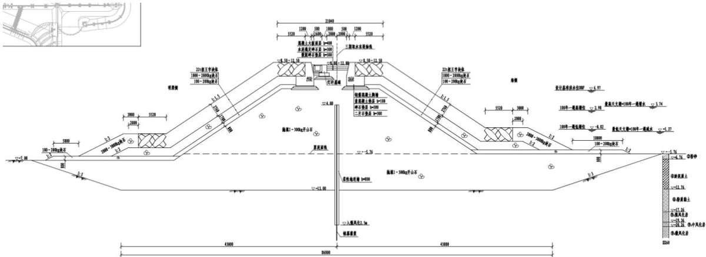  
图 2.1-25 三期取水东堤断面图

## （3）三期中隔堤

中隔堤为抛石斜坡式结构，总长 499.00m，堤顶设冷源运维道路，行车道宽 4m，路面标高10m。

中隔堤堤心采用 1～300kg 开山石，两侧边坡坡比均为 1:1.5，施工采用陆上推填成堤，明渠底标高-7.0m。堤顶宽度约 17.85m，上部设置道路、灯杆基础及电缆沟。外海侧设置现浇钢筋混凝土胸墙，胸墙顶标高 17.40m，护面块体采用 22t 扭王字块体，护面块体与堤心石之间设 1.7m 厚 1000～2000kg 垫层块石和 0.8m 厚 100～200kg 垫层块石，坡脚设有 2000\~3000kg 棱体块石。泵房侧设置现浇混凝土挡块，挡块顶标高 11.00m，护面块体采用 2t 扭王字块体，护面块体与堤心石之间设0.8m厚 100～200kg垫层块石，坡脚设有300\~500kg 棱体块石。护底块石均采用100\~200kg 块石，泵房侧护底宽5.0m，外海侧护底宽 10.0m。

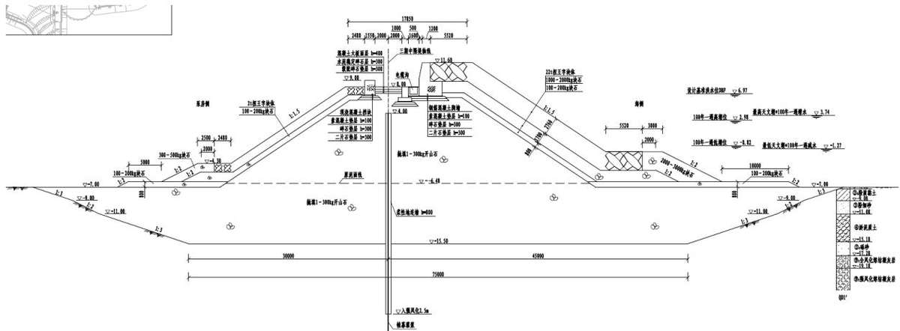  
图2.1-26 三期中隔堤断面图

## （4）泵房直立翼墙

泵房直立翼墙采用重力式现浇沉箱结构型式，总长 123.27m，其中泵房西侧直立墙

长 53.82m，泵房东侧直立墙长 69.45m。

泵房直立翼墙顶标高 16.00m，底标高-12.0m，采用现浇钢筋混凝土沉箱结构。沉箱上部设有现浇钢筋混凝土胸墙，胸墙顶标高 16.00m，胸墙上部设栏杆。根据与直立翼墙相连接的内护岸设计型式，在取水口位置处西侧采用“L”字型布置，东侧采用“一”字型布置。泵房西侧现浇钢筋混凝土沉箱标准段底宽 20.25m、高 20.50m，渠侧设宽1.2m的前趾，转角段设置弧形沉箱；泵房东侧现浇钢筋混凝土沉箱底宽 21.65m、高20.50m，内护岸侧设宽 1.2m的前趾。沉箱内回填10～100kg块石，其上铺设 0.3m厚二片石垫层、0.2m 厚 20～80mm 碎石垫层及 0.1m 厚 C20 混凝土垫层。

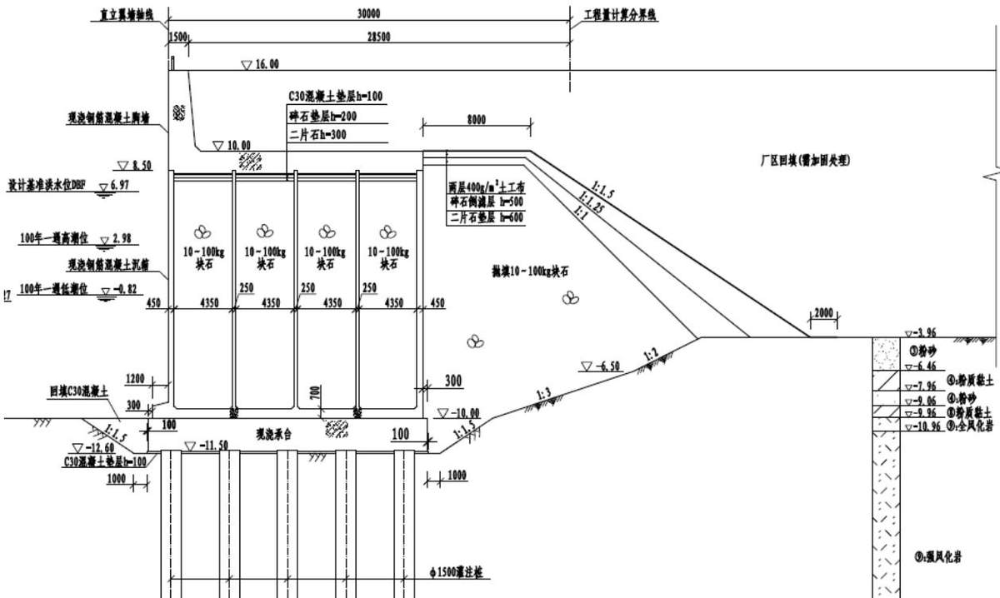  
图2.1-27 泵房直立翼墙断面图

## （5）重件道路引堤

重件道路引堤为抛石斜坡式结构，总长约 159.74m，堤顶设大件道路，路宽 12m，路面顶标高 8.00m\~16.00m。

重件道路引堤堤心采用 1～300kg 开山石，两侧边坡坡比均为 1:1.5，施工采用陆上推填成堤，明渠底标高-7.0m。堤顶宽度约 18.96m，上部设置大件道路，两侧设置现浇混凝土挡块，挡块顶标高 9.00m\~13.00mm。引堤两侧在 5.0m 处设置肩台，肩台宽度2.48m。引堤采用 2t 扭王字块体护面，护面块体与堤心石之间设 0.8m厚100～200kg垫层块石。两侧坡脚均设有 300\~500kg 棱体块石及 5.0m 宽 100\~200kg 护底块石。

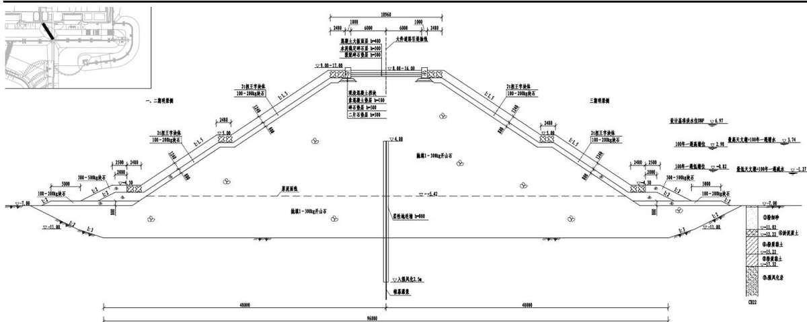  
图2.1-28 重件道路引堤断面图

## （6）厂区内护岸

厂区内护岸为抛石斜坡式结构，总长 326.18m。

内护岸外侧边坡 1:1.5，护岸顶部设有现浇钢筋混凝土挡墙，顶标高 16.00m，挡墙上部设栏杆，在标高 9.50m和0.00m处分别设置宽度约 2.91m和2.00m的肩台，取水明渠底标高-7.0m。堤心采用 1～300kg 开山石，标高 0.00m 肩台以上堤心外侧铺设 0.8m厚100～150kg 块石，护面采用2t 四脚空心方块护面；标高 0.00m肩台以下堤心外侧铺设 1.0m 厚 200～300kg 护面块石，坡脚设 5.0m 宽 60～100kg 护底块石。堤心石后方依次设二片石垫层、碎石倒滤层和两层 $4 0 0 \mathrm { g } / \mathrm { m } ^ { 2 }$ 土工布倒滤层，后方为厂区回填，回填材料和加固方案与场平工程相同。

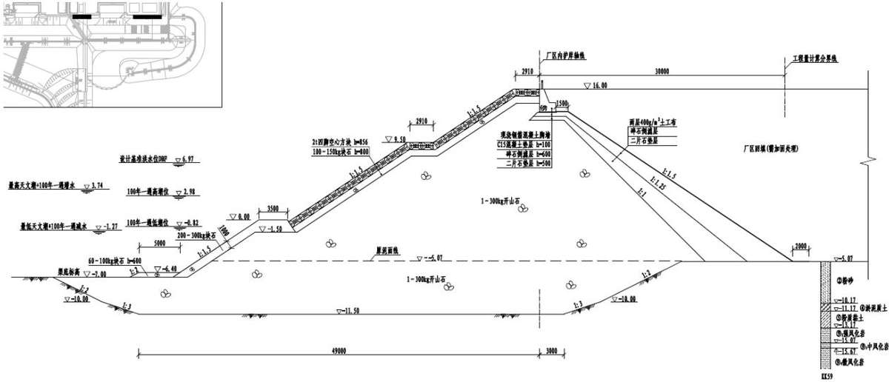  
图2.1-29 厂区内护岸断面图

## （7）排水隧洞

三期工程温排水由排水隧洞排至外海水深-15.1m处。排水隧洞采用盾构隧洞型式，每台机组设 1条排水隧洞。5#、6#机组排水隧洞自厂区陆域 CC井始发，沿 SSE向延伸，5#机组排水隧洞轴线长约 4696m，6#机组排水隧洞轴线长约 4747m，实现温排水离岸远排，排水隧洞内径为 5.7m，有效外径为6.5m。5#、6#机组排水隧洞最大中心距为 150m。每条排水管道末端配置 11个排水立管，排水立管中心距9m，立管顶部安装排水头，排水头直径2.5m，高度1m，采用侧面出水方式排水。

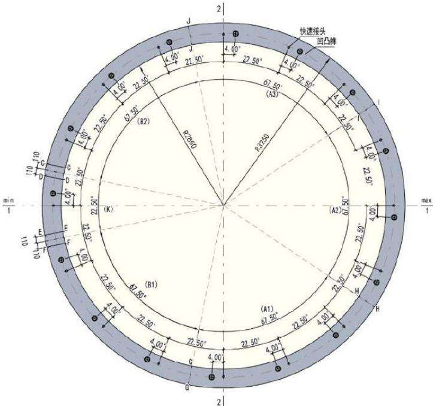  
图2.1-30 排水隧洞断面图

## 2.1.4 排洪规划

全厂沿厂区西、北及东侧三个方向设置排洪沟，分别将厂址附近汇水面积内的洪水向东及南侧排入南海海域，另外在施工准备区设置其它排洪系统。

北排洪沟主要将太平岭及厂区北侧山体的洪水排至东侧海湾内，以明沟形式自流排放，主要由一期工程建设，二期工程在 5、6号机组北侧顺延续建，北排洪沟总长1425m。

西排洪沟主要将烟墩岭山体的洪水排至烟墩岭南侧外海，厂前区排洪沟主要将厂外辅助设施及现场服务区东侧和北侧的汇水向西排入西侧的海湾内，由一期工程建设。洪水标准为千年一遇设计，PMF（可能最大洪水）校核。西排洪沟长 1155m，厂前区排洪沟长 1305m。

主排洪系统以外的排洪系统，如东侧施工准备区 D 区周边 1#排洪沟、2#排洪沟，一期工程已建成。1#排洪沟长1020m，2#排洪沟长 2180m。

全厂排洪设施均已在一、二期工程规划实施，三期工程不再新建排洪设施。全厂排洪规划见图 2.1-30。

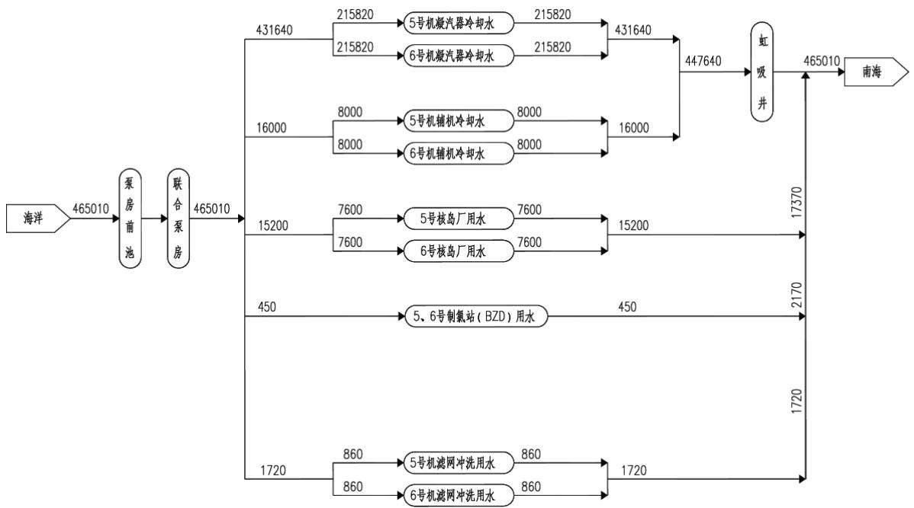  
图2.1-32 海水水量平衡图

## （2）淡水用水量

本期工程正常运行期间平均时耗水量为 $1 2 0 \mathrm { m } ^ { 3 } / \mathrm { h }$ ， 百 万 千 瓦 用 水 指 标 为$0 . 0 2 \mathrm { m } ^ { 3 } / \mathrm { s } { \bullet } \mathrm { G } \mathrm { W }$ ，最高日耗水量约为 $2 8 8 0 \mathrm { m } ^ { 3 } / \mathrm { d }$ ，考虑机组启动等，最高日取水量约为$5 7 0 0 \mathrm { m } ^ { 3 } / \mathrm { d }$ ，年取水量约为 110万 m3/a。本期工程淡水用水量见表 2.1-13。

表 2.1-13  
本期工程淡水用水量表  
单位：m3/h
<table><tr><td colspan="1" rowspan="1">序号</td><td colspan="1" rowspan="1">项目</td><td colspan="1" rowspan="1">耗水水量</td><td colspan="1" rowspan="1">回收水量</td><td colspan="1" rowspan="1">备注</td></tr><tr><td colspan="1" rowspan="1">1</td><td colspan="1" rowspan="1">主厂区办公用水量</td><td colspan="1" rowspan="1">7.83</td><td colspan="1" rowspan="1">7.05</td><td colspan="1" rowspan="1">回用于道路、场地及绿地用水</td></tr><tr><td colspan="1" rowspan="1">2</td><td colspan="1" rowspan="1">洗车用水量</td><td colspan="1" rowspan="1">0.06</td><td colspan="1" rowspan="1">0.05</td><td colspan="1" rowspan="1">回用于道路、场地及绿地用水</td></tr><tr><td colspan="1" rowspan="1">3</td><td colspan="1" rowspan="1">BWX 洗衣机房用水</td><td colspan="1" rowspan="1">0.67</td><td colspan="1" rowspan="1">0</td><td colspan="1" rowspan="1">---</td></tr><tr><td colspan="1" rowspan="1">4</td><td colspan="1" rowspan="1">CRF系统泵轴封水</td><td colspan="1" rowspan="1">12.00</td><td colspan="1" rowspan="1">0</td><td colspan="1" rowspan="1">---</td></tr><tr><td colspan="1" rowspan="1">5</td><td colspan="1" rowspan="1">SEC 系统泵轴封水</td><td colspan="1" rowspan="1">15.00</td><td colspan="1" rowspan="1">0</td><td colspan="1" rowspan="1">---</td></tr><tr><td colspan="1" rowspan="1">6</td><td colspan="1" rowspan="1">BMX厂房杂用水</td><td colspan="1" rowspan="1">2.14</td><td colspan="1" rowspan="1">0</td><td colspan="1" rowspan="1">--</td></tr><tr><td colspan="1" rowspan="1">7</td><td colspan="1" rowspan="1">SEN 系统滤网差压测量管路反冲洗用水</td><td colspan="1" rowspan="1">2.16</td><td colspan="1" rowspan="1">0</td><td colspan="1" rowspan="1">---</td></tr><tr><td colspan="1" rowspan="1">8</td><td colspan="1" rowspan="1">DCL系统加湿器水源</td><td colspan="1" rowspan="1">0.10</td><td colspan="1" rowspan="1">0</td><td colspan="1" rowspan="1">---</td></tr><tr><td colspan="1" rowspan="1">9</td><td colspan="1" rowspan="1">DVL 系统加湿器水源</td><td colspan="1" rowspan="1">0.42</td><td colspan="1" rowspan="1">0</td><td colspan="1" rowspan="1">---</td></tr><tr><td colspan="1" rowspan="1">10</td><td colspan="1" rowspan="1">CTE系统酸雾吸收器</td><td colspan="1" rowspan="1">1.00</td><td colspan="1" rowspan="1">1.00</td><td colspan="1" rowspan="1">回用于除盐水生产系统</td></tr><tr><td colspan="1" rowspan="1">11</td><td colspan="1" rowspan="1">ATE系统酸雾吸收器</td><td colspan="1" rowspan="1">2.00</td><td colspan="1" rowspan="1">0</td><td colspan="1" rowspan="1"></td></tr><tr><td colspan="1" rowspan="1">12</td><td colspan="1" rowspan="1">SHY 系统冷却用水</td><td colspan="1" rowspan="1">3.00</td><td colspan="1" rowspan="1">3.00</td><td colspan="1" rowspan="1">回用于除盐水生产系统</td></tr><tr><td colspan="1" rowspan="1">13</td><td colspan="1" rowspan="1">管网漏损水量</td><td colspan="1" rowspan="1">4.64</td><td colspan="1" rowspan="1">0</td><td colspan="1" rowspan="1">---</td></tr><tr><td colspan="1" rowspan="1">14</td><td colspan="1" rowspan="1">未预见水量</td><td colspan="1" rowspan="1">4.08</td><td colspan="1" rowspan="1">0</td><td colspan="1" rowspan="1">---</td></tr><tr><td colspan="5" rowspan="1">续表2.1-13                              本期工程淡水用水量表                       单位：m³/h</td></tr><tr><td colspan="1" rowspan="1">序号</td><td colspan="1" rowspan="1">项目</td><td colspan="1" rowspan="1">耗水水量</td><td colspan="1" rowspan="1">回收水量</td><td colspan="1" rowspan="1">备注</td></tr><tr><td colspan="1" rowspan="1">15</td><td colspan="1" rowspan="1">SDA 系统用水量</td><td colspan="1" rowspan="1">63.92</td><td colspan="1" rowspan="1">10.89</td><td colspan="1" rowspan="1">--</td></tr><tr><td colspan="1" rowspan="1">16</td><td colspan="1" rowspan="1">总耗水量</td><td colspan="1" rowspan="1">120</td><td colspan="1" rowspan="1">22</td><td colspan="1" rowspan="1">---</td></tr></table>

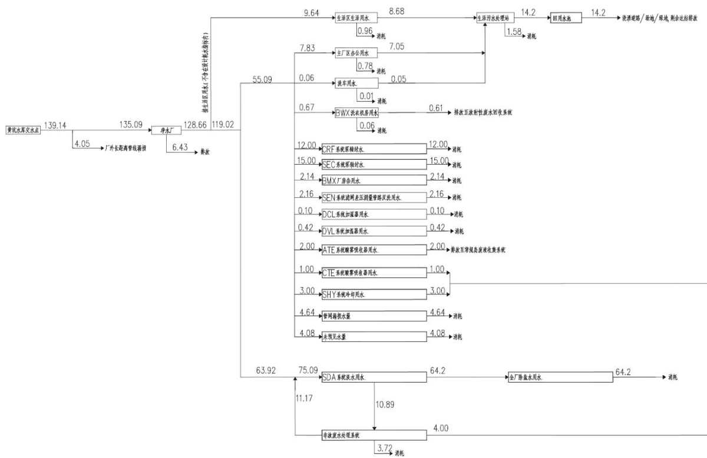  
图2.1-33 淡水水量平衡图

## 2.2 施工组织

## 2.2.1 施工条件

## 2.2.1.1 交通条件

## （1）公路

厂址所在的惠东县公路交通较为发达。境内有高速公路 G15沈海高速（深汕高速）、S20潮莞高速、S30惠深沿海高速和S21广惠高速，国道G324，省道S356，县道X121排吉公路、X211 铁盐公路、X213 黄大公路和 X210 三港公路等公路网主干道路。在海丰县境内有深汕高速公路、G324国道、X121县道、X131县道和X127县道等。太平岭核电厂一期工程已经建成的进场公路，为三期工程提供有利的交通运输条件。

## （2）铁路

厂址半径 15km范围内有厦深铁路，连接厦门、漳州、潮州、普宁、汕头、汕尾、

惠州、深圳等 8 个城市，该铁路惠东段全长 36.01km，按照国铁Ⅰ级标准建设，线路最近处在厂址 N方位13km的汕尾市海丰县鹅埠镇境内。

## （3）海上交通

太平岭核电厂一期工程已建成 3000吨级重件码头，可停靠船型为 3000吨级杂货船或驳船，码头泊位总长 138m，码头平台宽 50m。另外，厂址附近惠东境内有碧甲港区以及三个装卸点码头，分别是亚婆角、盐洲和港口。其中亚婆角和港口装卸点距离厂址较远，均超过了 15km。盐洲装卸点在 NW 方位 4.5km 处。三个装卸点主要用于装卸矿产材料、非金属和玻璃砂等货种。

## （4）大件设备运输

核电厂超大、超重设备较多，根据太平岭核电厂的交通运输条件，建设期间的大件运输拟采用水运方式为主，公路为辅的运输方案。利用一期工程自建 3000t 级驳船码头，大件设备由海运直接抵达自建码头进行接卸，然后通过厂内重件运输道路运送至施工现场。

三期工程依托前期建设完毕的交通道路和码头作为进场施工途径，无需新增施工道路或码头。

## 2.2.1.2 施工电源

核电厂 220kV施工与辅助电源变电站按照一次规划，土建一次建成、设备分期安装的模式建设。目前变电站建筑、站内的防雷接地、给排水、消防、照明等配套及 220kV施工电源部分已于2019年3月竣工投产。一期工程已建成第1回220kV线路，接入220kV埔仔变电站，线路长度约 4.45km。二期工程新建第 2 回 220kV 线路，考虑接入 220kV园区站，线路长度约 21.6km。三期工程不新建。

## 2.2.1.3 施工水源

现有施工期供水含两个主要水源，分别为石瓮水库水源和西枝江供水水源。其中西枝江供水水源为主供水水源，石瓮水库水源为辅助水源，同时在西枝江供水管线沿线设置了2个应急备用水库水源（苦竹坑水库和牛牧坑水库）。两大主水源分别通过不同外部管线系统输送供水，其中石瓮水库水源通过厂外 5km 的石瓮水库管线系统向厂区供水，西枝江水源通过黄坑泵房提升经 20km 的淡水供水管线系统向厂区输送供水。通过上述两个外部供水系统满足现场施工用水需求，本期工程无需新建施工供水工程。

## 2.2.1.4 施工通信

按照本期工程建设要求，施工通信设施包括为工程建设提供服务的办公电话、传真、手持移动终端、计算机、安防监控、门禁等各类通信设施。

利用一期工程已建立的核心通信机房，通过租用本地电信运营商光纤链路链接到办公楼，利用厂区现场办公点设立计算机网络和办公电话通信系统，提供信息化办公条件。通过中国电信的广域网链路实现与集团和工程公司大亚湾 AE楼总部的互联。可用的通信资源有内部网、IP电话、本地固定电话、传真等业务。

项目现场已建立三大运营商手机信号宏基站，三大运营商主干光纤链路、光交网络均已辐射全场。无线手机通信信号及各通信系统可覆盖全场，现场建设单位、承包商配备足够的计算机及其外设、网络设备、计算机软件、办公设备、文印设备等，可实现进行网上信息沟通、电子文件交换、电子办公，以及施工文件图纸的传递、复印、分发等现代化施工管理手段。

## 2.2.1.5 施工建筑材料

本工程建设所需的砂、石、石灰、水泥等建筑材料全部就近采购。建设单位有责任要求施工单位采购时要选择具有合法经营手续的材料供应单位，采购时在采购合同中明确各自的水土流失防治责任，各材料供应单位负责其自身生产造成的水土流失。建设单位同时要对施工单位建材采购实施监督和管理。

## 2.2.2 施工生产区

主体设计本着方便施工、节省投资、缩短工期、节约用地的原则，充分利用现有的临建设施为施工所用，尽量减少不必要的临建设施。一、二期工程现状施工临建与本期工程尽量共用，本期施工生产区用地范围尽量控制在一、二期扰动施工生产区扰动范围内，规划施工生产区用地面积 $5 1 . 9 7 \mathrm { h m } ^ { 2 }$ 。三期续用一、二期的施工场地，在三期工程开始使用后，场地纳入三期工程防治责任范围。

施工生产区主要布置核岛及常规岛土建、安装及物资堆场、混凝土生产等施工场地，施工场地规划一览表见表 2.2-1。按各施工场地分布的区位，施工生产区分为核电厂区东北侧的D区、北侧的G区，施工产生区布设见图2.2-1。

本期工程施工生活区通过外部租赁解决，不涉及土建和占地。

表 2.2-2  
续用施工场地使用衔接关系表
<table><tr><td rowspan=1 colspan=1>序号</td><td rowspan=1 colspan=1>临建用地名称</td><td rowspan=1 colspan=1>二期开始时间</td><td rowspan=1 colspan=1>二期高峰期</td><td rowspan=1 colspan=1>三期开始时间</td><td rowspan=1 colspan=1>三期计划高峰期</td><td rowspan=1 colspan=1>二、三期计划高峰期重叠</td><td rowspan=1 colspan=1>说明</td></tr><tr><td rowspan=1 colspan=1>1</td><td rowspan=1 colspan=1>核岛土建</td><td rowspan=1 colspan=1>2025.6</td><td rowspan=1 colspan=1>2025.6-2028.6</td><td rowspan=1 colspan=1>2026.12</td><td rowspan=1 colspan=1>2027.6-2030.6</td><td rowspan=1 colspan=1>2027.6-2028.6</td><td rowspan=1 colspan=1>二期核岛土建的高峰期为 FCD+0~+36即 2025年6月~2028年6月，依据二期高峰期开始时间和高峰期持续时间间隔计算出三期计划核岛土建高峰期为FCD+24~+60即为2027年6月~2030年6月。由此计算出二、三期核岛土建高峰期重叠时间为2027年6月~2028年6月，二三期高峰期土建钢筋需求产能7500~9000吨/月，当前钢筋产能为9000~10000吨/月，钢筋生产能力满足需求。</td></tr><tr><td rowspan=1 colspan=1>2</td><td rowspan=1 colspan=1>常规岛土建</td><td rowspan=1 colspan=1>2024.8</td><td rowspan=1 colspan=1>2024.8-2027.6</td><td rowspan=1 colspan=1>2027.8</td><td rowspan=1 colspan=1>2028.2-2031.6</td><td rowspan=1 colspan=1></td><td rowspan=1 colspan=1>二期常规岛土建的高峰期为 FCD-10~+24 即 2024年8月~2027年6月，且高峰持续时间为34个月。依据华为2.0母本计划可知三期常规岛负挖工期时长为8个月，即三期常规岛土建开始时间为FCD+32，根据二期高峰期持续时间间隔计算出三期计划常规岛土建高峰期为FCD+32~+72即为2028年2月~2031年6月，由此计算出二、三期常规岛土建无高峰期重叠时间，场地满足施工需求。</td></tr><tr><td rowspan=1 colspan=1>3</td><td rowspan=1 colspan=1>核岛安装</td><td rowspan=1 colspan=1>2026.7</td><td rowspan=1 colspan=1>2027.2-2030.9</td><td rowspan=1 colspan=1>2027.12</td><td rowspan=1 colspan=1>2029.2-2032.9</td><td rowspan=1 colspan=1>2029.2-2030.9</td><td rowspan=1 colspan=1>二期核岛安装的高峰期为FCD+20~+56即2027年2月~2030年2月，依据二期高峰期开始时间和高峰期持续时间间隔计算出三期计划核岛安装高峰期为 FCD+44~+80 即 2029年2月~2032 年2月。由此计算出二、三期核岛安装高峰期重叠时间为2029年2月~2030年2月，三期工程在施工生产区G区增加核岛安装临建，以满足施工需求。</td></tr></table>

续表 2.2-2  
续用施工场地使用衔接关系表
<table><tr><td rowspan=1 colspan=1>序号</td><td rowspan=1 colspan=1>临建用地名称</td><td rowspan=1 colspan=1>二期开始时间</td><td rowspan=1 colspan=1>二期高峰期</td><td rowspan=1 colspan=1>三期开始时间</td><td rowspan=1 colspan=1>三期计划高峰期</td><td rowspan=1 colspan=1>二、三期计划高峰期重叠</td><td rowspan=1 colspan=1>说明</td></tr><tr><td rowspan=1 colspan=1>4</td><td rowspan=1 colspan=1>常规岛安装</td><td rowspan=1 colspan=1>2027.5</td><td rowspan=1 colspan=1>2027.6-2029.1</td><td rowspan=1 colspan=1>2028.3</td><td rowspan=1 colspan=1>2030.12-2032.7</td><td rowspan=1 colspan=1>/</td><td rowspan=1 colspan=1>二期常规岛安装的高峰期为FCD+24~+43即2027年6月~2029年1月，且高峰持续时间为19个月。依据二期常规岛土建开始时间与常规岛安装开始时间的时间间隔，得出三期常规岛安装开始时间，即为FCD+66，根据二期高峰期持续时间间隔计算出三期计划常规岛安装高峰期为 FCD+66~+85即为2030年6月~2032年1月。由此计算出二、三期常规岛安装无高峰期重叠时间，无冲突。</td></tr><tr><td rowspan=1 colspan=1>5</td><td rowspan=1 colspan=1>大件运输及吊装场地</td><td rowspan=1 colspan=1>2025.8</td><td rowspan=1 colspan=1>2027.3-2028.10</td><td rowspan=1 colspan=1>2027.8</td><td rowspan=1 colspan=1>2030.9-2031.12</td><td rowspan=1 colspan=1>/</td><td rowspan=1 colspan=1>结合一、二期工期重叠吊装成熟的经验，且三期使用环吊吊装，不需要过多占用场地，二三期大件运输吊装场地满足要求。</td></tr><tr><td rowspan=1 colspan=1>6</td><td rowspan=1 colspan=1>混凝土供应链</td><td rowspan=1 colspan=1>2025.6</td><td rowspan=1 colspan=1>2024.6-2028.6</td><td rowspan=1 colspan=1>2027.6</td><td rowspan=1 colspan=1>2028.1-2031.6</td><td rowspan=1 colspan=1>2028.1-2028.6</td><td rowspan=1 colspan=1>根据施工计划推算二三期重叠期间混凝土月最大需求量5万立方/月，当前搅拌站产能5.7万立方/月，混凝土供应链用地满足需求。</td></tr><tr><td rowspan=1 colspan=1>7</td><td rowspan=1 colspan=1>物资库房及堆场</td><td rowspan=1 colspan=1>2025.12</td><td rowspan=1 colspan=1>2026.6-2028.6</td><td rowspan=1 colspan=1>2027.12</td><td rowspan=1 colspan=1>2029.6-2031.6</td><td rowspan=1 colspan=1>1</td><td rowspan=1 colspan=1>根据一期经验，当前物资库房及堆场的面积足够3~4台机组同时建设，同时，在二、三期也将通过加强物资上下游协同力度，继续深化推动精准到货，大型设备直接进厂房，减少大型设备占用场地时间。</td></tr><tr><td rowspan=1 colspan=1>8</td><td rowspan=1 colspan=1>危险品库</td><td rowspan=1 colspan=1>2026.6</td><td rowspan=1 colspan=1></td><td rowspan=1 colspan=1>2027.6</td><td rowspan=1 colspan=1></td><td rowspan=1 colspan=1></td><td rowspan=1 colspan=1>结合一期使用经验，危险品库在工程、业主共同使用的情况下依然有空余房间，且业主自身危险品库已投用，后续可不占用临时危险品库，经测算，目前危险品库可同时满足3~4台机组同时建设的使用要求。</td></tr><tr><td rowspan=1 colspan=1>9</td><td rowspan=1 colspan=1>临时放射源库</td><td rowspan=1 colspan=1>2025.4</td><td rowspan=1 colspan=1>/</td><td rowspan=1 colspan=1>2027.4</td><td rowspan=1 colspan=1>/</td><td rowspan=1 colspan=1>1</td><td rowspan=1 colspan=1>当前放射源库隔间数量可同时满足4台机组建设放射源存放使用需求。</td></tr></table>

## 2.2.3 临时周转场设置

三期工程核岛、常规岛、泵房及 BOP 等建筑物负挖土石方除各建筑物自身基础回填外，多余土石方用于海工取水工程填筑。三期工程核岛负挖时段为 2027 年 1 月～2028 年 3 月，常规岛负挖时段为 2027 年 5 月～2030 年 1 月，泵房及 BOP 负挖时段为 2026 年 11 月～2030 年 6 月，海工取水工程施工时段为 2027 年 10 月～2030 年 11月。根据三期工程核岛、常规岛、泵房及 BOP 等厂区建筑物负挖施工进度及海工取水工程施工进度的衔接，以及厂区建筑物开挖料与海工取水工程回填料的土石方相互调配，在海工取水工程开工前及施工期间，厂区建筑物负挖料需临时周转堆存。临时周转堆置计划及堆置量见表 2.2-3。

表 2.2-3  
临时周转料堆置计划及堆置量  
单位：万 m3（松方）
<table><tr><td rowspan=1 colspan=1>施工时段</td><td rowspan=1 colspan=1>开挖量</td><td rowspan=1 colspan=1>回填消耗量</td><td rowspan=1 colspan=1>外购石料</td><td rowspan=1 colspan=1>当月堆存量</td><td rowspan=1 colspan=1>累计堆存量</td></tr><tr><td rowspan=1 colspan=1>2026.11</td><td rowspan=1 colspan=1>1.00</td><td rowspan=1 colspan=1></td><td rowspan=1 colspan=1></td><td rowspan=1 colspan=1>1.00</td><td rowspan=1 colspan=1>1.00</td></tr><tr><td rowspan=1 colspan=1>2026.12</td><td rowspan=1 colspan=1>1.00</td><td rowspan=1 colspan=1></td><td rowspan=1 colspan=1></td><td rowspan=1 colspan=1>1.00</td><td rowspan=1 colspan=1>2.00</td></tr><tr><td rowspan=1 colspan=1>2027.01</td><td rowspan=1 colspan=1>9.00</td><td rowspan=1 colspan=1></td><td rowspan=1 colspan=1></td><td rowspan=1 colspan=1>9.00</td><td rowspan=1 colspan=1>11.00</td></tr><tr><td rowspan=1 colspan=1>2027.02</td><td rowspan=1 colspan=1>13.00</td><td rowspan=1 colspan=1></td><td rowspan=1 colspan=1></td><td rowspan=1 colspan=1>13.00</td><td rowspan=1 colspan=1>24.00</td></tr><tr><td rowspan=1 colspan=1>2027.03</td><td rowspan=1 colspan=1>13.00</td><td rowspan=1 colspan=1></td><td rowspan=1 colspan=1></td><td rowspan=1 colspan=1>13.00</td><td rowspan=1 colspan=1>37.00</td></tr><tr><td rowspan=1 colspan=1>2027.04</td><td rowspan=1 colspan=1>8.64</td><td rowspan=1 colspan=1></td><td rowspan=1 colspan=1></td><td rowspan=1 colspan=1>8.64</td><td rowspan=1 colspan=1>45.64</td></tr><tr><td rowspan=1 colspan=1>2027.05</td><td rowspan=1 colspan=1>1.00</td><td rowspan=1 colspan=1></td><td rowspan=1 colspan=1></td><td rowspan=1 colspan=1>1.00</td><td rowspan=1 colspan=1>46.64</td></tr><tr><td rowspan=1 colspan=1>2027.06</td><td rowspan=1 colspan=1>1.00</td><td rowspan=1 colspan=1></td><td rowspan=1 colspan=1></td><td rowspan=1 colspan=1>1.00</td><td rowspan=1 colspan=1>47.64</td></tr><tr><td rowspan=1 colspan=1>2027.07</td><td rowspan=1 colspan=1></td><td rowspan=1 colspan=1></td><td rowspan=1 colspan=1></td><td rowspan=1 colspan=1></td><td rowspan=1 colspan=1>47.64</td></tr><tr><td rowspan=1 colspan=1>2027.08</td><td rowspan=1 colspan=1></td><td rowspan=1 colspan=1></td><td rowspan=1 colspan=1></td><td rowspan=1 colspan=1></td><td rowspan=1 colspan=1>47.64</td></tr><tr><td rowspan=1 colspan=1>2027.09</td><td rowspan=1 colspan=1></td><td rowspan=1 colspan=1></td><td rowspan=1 colspan=1></td><td rowspan=1 colspan=1></td><td rowspan=1 colspan=1>47.64</td></tr><tr><td rowspan=1 colspan=1>2027.10</td><td rowspan=1 colspan=1>4.00</td><td rowspan=1 colspan=1>23.30</td><td rowspan=1 colspan=1>10.00</td><td rowspan=1 colspan=1>-9.30</td><td rowspan=1 colspan=1>38.34</td></tr><tr><td rowspan=1 colspan=1>2027.11</td><td rowspan=1 colspan=1>5.00</td><td rowspan=1 colspan=1>23.30</td><td rowspan=1 colspan=1>10.00</td><td rowspan=1 colspan=1>-8.30</td><td rowspan=1 colspan=1>30.04</td></tr><tr><td rowspan=1 colspan=1>2027.12</td><td rowspan=1 colspan=1>6.00</td><td rowspan=1 colspan=1>27.70</td><td rowspan=1 colspan=1>10.00</td><td rowspan=1 colspan=1>-11.70</td><td rowspan=1 colspan=1>18.34</td></tr><tr><td rowspan=1 colspan=1>2028.01</td><td rowspan=1 colspan=1>6.00</td><td rowspan=1 colspan=1>27.70</td><td rowspan=1 colspan=1>18.00</td><td rowspan=1 colspan=1>-3.70</td><td rowspan=1 colspan=1>14.64</td></tr><tr><td rowspan=1 colspan=1>2028.02</td><td rowspan=1 colspan=1>6.00</td><td rowspan=1 colspan=1>27.70</td><td rowspan=1 colspan=1>18.00</td><td rowspan=1 colspan=1>-3.70</td><td rowspan=1 colspan=1>10.94</td></tr><tr><td rowspan=1 colspan=1>2028.03</td><td rowspan=1 colspan=1>5.40</td><td rowspan=1 colspan=1>27.89</td><td rowspan=1 colspan=1>18.00</td><td rowspan=1 colspan=1>-4.49</td><td rowspan=1 colspan=1>6.45</td></tr><tr><td rowspan=1 colspan=1>2028.04</td><td rowspan=1 colspan=1></td><td rowspan=1 colspan=1>23.30</td><td rowspan=1 colspan=1>18.00</td><td rowspan=1 colspan=1>-5.30</td><td rowspan=1 colspan=1>1.15</td></tr><tr><td rowspan=1 colspan=1>2028.05</td><td rowspan=1 colspan=1></td><td rowspan=1 colspan=1>28.30</td><td rowspan=1 colspan=1>28.00</td><td rowspan=1 colspan=1>-0.30</td><td rowspan=1 colspan=1>0.85</td></tr><tr><td rowspan=1 colspan=1>2028.06</td><td rowspan=1 colspan=1></td><td rowspan=1 colspan=1>23.30</td><td rowspan=1 colspan=1>28.00</td><td rowspan=1 colspan=1>4.70</td><td rowspan=1 colspan=1>5.55</td></tr><tr><td rowspan=1 colspan=1>2028.07</td><td rowspan=1 colspan=1></td><td rowspan=1 colspan=1>23.65</td><td rowspan=1 colspan=1>28.00</td><td rowspan=1 colspan=1>4.35</td><td rowspan=1 colspan=1>9.90</td></tr><tr><td rowspan=1 colspan=1>2028.08</td><td rowspan=1 colspan=1></td><td rowspan=1 colspan=1>14.85</td><td rowspan=1 colspan=1>18.00</td><td rowspan=1 colspan=1>3.15</td><td rowspan=1 colspan=1>13.05</td></tr><tr><td rowspan=1 colspan=1>2028.09</td><td rowspan=1 colspan=1></td><td rowspan=1 colspan=1>14.93</td><td rowspan=1 colspan=1>16.37</td><td rowspan=1 colspan=1>1.44</td><td rowspan=1 colspan=1>14.49</td></tr><tr><td rowspan=1 colspan=1>2028.10</td><td rowspan=1 colspan=1></td><td rowspan=1 colspan=1></td><td rowspan=1 colspan=1></td><td rowspan=1 colspan=1></td><td rowspan=1 colspan=1>14.49</td></tr><tr><td rowspan=1 colspan=1>2028.11</td><td rowspan=1 colspan=1></td><td rowspan=1 colspan=1></td><td rowspan=1 colspan=1></td><td rowspan=1 colspan=1></td><td rowspan=1 colspan=1>14.49</td></tr><tr><td rowspan=1 colspan=1>2028.12</td><td rowspan=1 colspan=1></td><td rowspan=1 colspan=1></td><td rowspan=1 colspan=1></td><td rowspan=1 colspan=1></td><td rowspan=1 colspan=1>14.49</td></tr></table>

## 2.2.4 施工方法与工艺

## （1）厂区

核岛反应堆厂房、燃料厂房、安全厂房等大部分厂房建筑物采用筏板基础，其他建筑物采用柱下扩展基础；BOP建筑物采用现浇钢筋混凝土扩展基础或条形基础或筏板基础。

筏板及扩展基础施工顺序：定位放线→土方开挖（降水与排水）→基槽验收→垫层施工→承台施工→验收→土方回填。

## 1）土方开挖

工艺流程：放线→挖土、挖基坑周边地面截（排）水沟→修边坡→维护坡面→挖土至坑底面设计标高并验槽→挖基底周边排水沟、基底找平。

采用反铲式液压挖掘机进行大开挖，人工配合修整边坡、清挖桩间土、基（槽）底排水沟，对于机械不便开挖部分，采用人工开挖。采用自卸汽车运土，直接运至施工生产区，用于回填的土方临时堆放在基坑周围。由于基础开挖面积较大，应根据每台挖土机的挖土范围、交通流量，布置挖土作业面和相应数量的运输车辆。为防止机械挖土扰动原土，挖至设计标高上方 30cm 时停止机械挖土，采用人工进行基槽清理。按规范及计算确定边坡坡度或坑壁支护。

挖土方时，土方应随挖随运，弃土不得随意堆放，应寻找合适的场地堆置，避免产生新的地质灾害。土方开挖时必须做好变形监测，若变形值接近预警值，应立即停止开挖，回填反压坡脚并通知相关单位。雨季施工时，应采取用彩条布遮盖坡面和平台等临时措施避免雨水和地表径流直接冲刷坡面。

## 2）土方回填

基础工程完成，强度达到要求后进行土方回填。

工艺流程：基坑（槽）底地坪上清理→检验土质→分层铺土、耙平→夯打密实→检验密实度→修整找平。

填土前应将基坑（槽）底或地坪上的垃圾等杂物清理干净；回填前，必须清理到基础底面标高，将回落的松散垃圾、砂浆、石子等杂物清除干净。

检验回填土的质量有无杂物，粒径是否符合规定，以及回填土的含水量是否在控制的范围内；如含水量偏高，可采用翻松、晾晒或均匀掺入干土等措施；如遇回填上的含水量偏低，可采用预先洒水润湿等措施。

回填土应分层铺摊。每层铺土厚度应根据土质、密实度要求和机具性能确定。一般蛙式打夯机每层铺土厚度为 200\~250mm；人工打夯不大于 200mm。每层铺摊后，随之耙平。

回填上每层至少夯打三遍。打夯应一夯压半夯，穷夯相接，行行相连，纵横交叉。并且严禁采用水浇使土下沉的所谓"水夯"法。深浅两基坑（槽）相连时，应先填夯深基础；填至浅基坑相同的标高时，再与浅基础一起填夯。如必须分段填夯时，交接处应填成阶梯形，梯形的高宽比一般为 1：2。上下层错缝距离不小于 1.0m。回填土每层填土夯实后，应按规范规定进行环刀取样，测出干土的质量密度；达到要求后，再进行上一层的铺土。填土全部完成后，应进行表面拉线找平，凡超过标准高程的地方，及时依线铲平；凡低于标准高程的地方，应补土夯实。

## 3）土石方运输防护

土石方采用自卸汽车运输，运输路线应严格按照规划路线行驶，运输过程中，应注意控制超载，严防土石方沿途洒落，在土石方表面宜采用彩条布进行苫盖。

## 4）临时堆土防护

临时堆土区域施工前应在堆场四周设置截水沟，并设置好场内排水系统。在堆土边缘位置设置挡土墙或者利用袋装土进行挡护，堆土高度一般不得超过 6m，应利用石渣覆盖堆土或播撒草籽绿化，避免堆土遭雨水冲刷造成水土流失。

## （2）现场服务区

现场服务区已经由一期工程场平至16.0m高程，沉降均匀后开始进行建筑物的施工。场地回填过程中分层碾压密实，并设置排水井加快固结。三期现场服务区所在的地块与一、二期工程辅助设施及现场服务区建设统一协调，场平地面标高不变。

布置有建构筑物的区域，首先进行基础处理，填筑时需严格控制填方材料，保证压实密度。雨水、污水及给水、电力等管线埋设结合道路布置，避免二次开挖和回填。

## （3）海工工程

## 1）填海区施工

海上推填海工石料形成取水东堤和中隔堤后，开展防渗墙施工，防渗施工完成后用排水泵进行抽水，从而形成干施工作业条件，再开展回填施工。回填采用分层碾压方式，回填料为开山土石料，采用自卸车运输回填土石料至施工作业面，现场安排人员指挥倒料和临边警戒，采用推土机或装载机推填形成作业面，安排压路机分层碾压。每层回填厚度 1.0m，每层碾压不少于 6～8 遍，回填标高 16m。

## 2）抛石斜坡结构施工

厂区内护岸、厂区东护岸、三期中隔堤、三期取水东堤、临时重件路堤、重件路堤和施工围堰均采用抛石斜坡结构。

斜坡结构地基处理采用开挖换填方式。除围堰内的内护岸采用陆上开挖，其余开挖均采用抓斗挖泥船配泥驳进行施工，将所挖泥土运至指定的区域抛泥。

堤心石填料为 1kg\~300kg开山石，采用陆上分层推进式填筑法。自卸汽车将石料运至现场后，自堤根部接岸点开始，沿设计轴线向前推进，采用推土机或装载机配合同步推填和平整。采用长臂反铲按照流水作业节拍跟进进行坡面整理和理坡。各种规格的垫层块石可由自卸汽车运至施工，再用长臂反铲进行抛填、装填和理坡。

## 3）泵房直立翼墙施工

泵房直立翼墙采用现浇沉箱结构，为干施工条件。根据结构特点采用分层浇筑，模板采用大片钢板作板面，以型钢围令、钢桁架作为模板骨架，内模采用分层组装，吊装架整体支立、抽芯。

底板钢筋现场绑扎，墙体钢筋采用预绑钢筋网片安装与现场绑扎相结合的工艺，绑扎在托架上进行，水平筋通长，竖向筋长度分层进行，并注意接头分层错开。

混凝土由护面块体预制场拌合站集中拌合，混凝土搅拌车水平运输，泵车泵送入模的施工工艺，沉箱分层浇筑，浇筑完成后及时洒水养护。

## 4）排水隧洞

进场后首先进行虹吸井及盾构井的水、电、道路施工，在施工虹吸井及盾构工作井的同时进行其他临时工程施工；进场后同时进行盾构井及配套设备设计制造；施工虹吸井围护桩及基地工程桩，采用明挖分层开挖虹吸井及盾构工作井的同时施工施工主体结构。

表层土石方开挖、冠梁及支撑梁从盾构井南端向北端推进的施工顺序。根据时空效应原理，虹吸井及盾构井基坑开挖，由上至下分层进行开挖，通过 45t 门吊垂直运输至地面渣坑。强风化采用液压破碎锤开挖。中风化岩层根据施工需要采用光面爆破开挖，每天1个循环，每循环开挖 2m。

虹吸井地下部分主体结构标准段分层高度为 4.5m，采用 4.5m×1.2m大块钢模板、泵送混凝土浇筑。地上部分主体结构分两层施工，采用满堂脚脚手架，定型钢模板，泵送混凝土浇筑。主体结构施工采用 1台45t 门吊和1台55t 履带吊进行物料运输。

盾构井主体结构完成后，施工排水隧洞矿山法段，洞门顶部 $1 2 0 ^ { \circ }$ 范围内进行φ108大管棚超前支护，对隧洞掌子面进行超前地质预报，对隧洞拱部 $1 2 0 ^ { \circ }$ 范围内进行小导管超前预支护，人工手持风钻打眼、光面爆破开挖，锚喷支护施工，隧洞初支施工完成后，空推盾构机至始发断面后。

采用2 台泥水平衡盾构机，并相应配备盾构施工辅助设备。每个始发场地配备一套砂浆搅拌系统、泥水处理中心、循环水池等配套辅助设施。盾构机由临时盾构井下井，矿山法段隧洞内组装调试整体始发，独头掘进至设计停机点进行洞内弃壳拆机。

在垂直顶升区域所有管片下半周需通过压浆孔预先对隧道外侧进行劈裂注浆加固，加固土体范围为隧道下半周 2m；将首节预制管节连接在隧道顶升特定部位（即帽盖），在管节就位并做好顶升准备工作后，将帽盖与管节采用特殊螺栓连接好，随后拆去帽盖，隧道衬砌的连接螺栓，依靠千斤顶的顶力把管节向上顶出。在每节的顶升过程中，管节之间采用法兰和螺栓连接，使管节垂直逐节地顶入土中和水域中。待一座立管全部顶完，做好底座节与隧道的连接，然后进行下一座立管的顶升。最后在水中揭去帽盖，换成正常的进出口，形成排水通道。顶升结束后对排水口四周采用海上和洞内深孔注浆加固。

在垂直顶升管顶升结束后，按通水要求进行上部排水头部的安装。安装时采用 400hp拖轮将400t 方驳从码头拖至安装位置。60t 浮吊吊放安装。80～120t 测量船一艘，负责测量水下抛石标高，交通艇 60hp，负责人员水上交通。排水头部与立管顶头管节通过法兰连接，排水头部四周采用挖泥抛石防冲刷保护。

## 2.3 工程占地

本工程总征占地面积为 $8 2 . 9 6 \mathrm { h m } ^ { 2 }$ ，其中 $9 . 7 6 \mathrm { h m } ^ { 2 }$ 为本期工程新增占地面积，其余$7 3 . 2 0 \mathrm { h m } ^ { 2 }$ 为一、二期工程施工占地。

根据主体设计总图专业资料，从水土保持专业角度，本期项目占地包括厂区、现场服务区、施工生产区、临时周转场区、表土堆存场区、海工区等 6个部分。本项目为点型建设项目，工程占地全部位于惠州市惠东县。

（1）厂区

本区占地面积为 $2 1 . 2 2 \mathrm { h m } ^ { 2 }$ ，包括5、6号机组厂房区、BOP厂房区、厂前区，其中本期新增占地面积 $4 . 8 8 \mathrm { h m } ^ { 2 }$ ，其余 $1 6 . 3 4 \mathrm { h m } ^ { 2 }$ 为利用二期工程施工生产区用地。

现状占地类型包括工矿仓储用地中的工业用地、海域，占地性质为永久占地。

## （2）现场服务区

本区占地面积为 0.07hm2，包括三期扩建污水处理厂占地。

占地现状为一期、二期工程厂外辅助设施及现场服务区，占地现状类型为工矿仓储用地中的工业用地，占地性质为永久占地。

## （3）施工生产区

本区总用地面积为 51.97hm2，包括原一、二期工程施工生产区 D区、G区，本期在G区新增占地面积 $2 . 1 5 \mathrm { h m } ^ { 2 }$ ，其余 $4 9 . 8 2 \mathrm { h m } ^ { 2 }$ 为利用二期工程施工生产区用地。建筑垃圾中转场位于临时周转场占地范围内，盾构临时施工场地布置于厂区永久占地范围内，该部分面积不重复计列。

占地现状类型为工矿仓储用地中的工业用地，占地性质为临时占地。

## （4）临时周转场区

本区占地面积为 5.27hm2，利用一、二期工程施工生产区进行布置，占地现状类型为工矿仓储用地中的工业用地，占地性质为临时占地。

## （5）表土堆存场区

本区占地面积为 1.70hm2，为一期工程堆存的表土区域，三期工程利用一期工程表土进行覆土绿化，该区域纳入三期工程防治责任范围。占地现状类型为工矿仓储用地中的工业用地，占地性质为临时占地。

## （6）海工区

本区总占地面积为 2.73hm2，指本期工程厂区内护岸、直立翼墙占地和新建防波堤、中隔堤出露海水面以上部分，占地现状为海域，占地性质为永久占地。

本工程占地情况详见表 2.3-1。

表 2.3-1  
工程占地汇总表  
单位： $\mathrm { h m } ^ { 2 }$
<table><tr><td rowspan=3 colspan=2>项目</td><td rowspan=1 colspan=2>占地性质</td><td rowspan=1 colspan=3>占地类型及面积</td><td rowspan=3 colspan=1>合计</td></tr><tr><td rowspan=2 colspan=1>永久占地</td><td rowspan=2 colspan=1>临时占地</td><td rowspan=1 colspan=1>工矿仓储用地</td><td rowspan=1 colspan=1>林地</td><td rowspan=1 colspan=1>水域及水利设施用地</td></tr><tr><td rowspan=1 colspan=1>工业用地</td><td rowspan=1 colspan=1>乔木林地</td><td rowspan=1 colspan=1>海域</td></tr><tr><td rowspan=1 colspan=2>厂区</td><td rowspan=1 colspan=1>21.22</td><td rowspan=1 colspan=1></td><td rowspan=1 colspan=1>16.34</td><td rowspan=1 colspan=1></td><td rowspan=1 colspan=1>4.88</td><td rowspan=1 colspan=1>21.22</td></tr><tr><td rowspan=1 colspan=2>现场服务区</td><td rowspan=1 colspan=1>0.07</td><td rowspan=1 colspan=1></td><td rowspan=1 colspan=1>0.07</td><td rowspan=1 colspan=1></td><td rowspan=1 colspan=1></td><td rowspan=1 colspan=1>0.07</td></tr><tr><td rowspan=3 colspan=1>施工生产区</td><td rowspan=1 colspan=1>D区</td><td rowspan=1 colspan=1></td><td rowspan=1 colspan=1>44.50</td><td rowspan=1 colspan=1>44.50</td><td rowspan=1 colspan=1></td><td rowspan=1 colspan=1></td><td rowspan=1 colspan=1>44.50</td></tr><tr><td rowspan=1 colspan=1>G区</td><td rowspan=1 colspan=1></td><td rowspan=1 colspan=1>7.47</td><td rowspan=1 colspan=1>7.47</td><td rowspan=1 colspan=1></td><td rowspan=1 colspan=1></td><td rowspan=1 colspan=1>7.47</td></tr><tr><td rowspan=1 colspan=1>小计</td><td rowspan=1 colspan=1></td><td rowspan=1 colspan=1>51.97</td><td rowspan=1 colspan=1>51.97</td><td rowspan=1 colspan=1></td><td rowspan=1 colspan=1></td><td rowspan=1 colspan=1>51.97</td></tr><tr><td rowspan=1 colspan=2>临时周转场区</td><td rowspan=1 colspan=1></td><td rowspan=1 colspan=1>5.27</td><td rowspan=1 colspan=1>5.27</td><td rowspan=1 colspan=1></td><td rowspan=1 colspan=1></td><td rowspan=1 colspan=1>5.27</td></tr><tr><td rowspan=1 colspan=2>表土堆存场区</td><td rowspan=1 colspan=1></td><td rowspan=1 colspan=1>1.70</td><td rowspan=1 colspan=1>1.70</td><td rowspan=1 colspan=1></td><td rowspan=1 colspan=1></td><td rowspan=1 colspan=1>1.70</td></tr><tr><td rowspan=1 colspan=2>海工区</td><td rowspan=1 colspan=1>2.73</td><td rowspan=1 colspan=1></td><td rowspan=1 colspan=1></td><td rowspan=1 colspan=1></td><td rowspan=1 colspan=1>2.73</td><td rowspan=1 colspan=1>2.73</td></tr><tr><td rowspan=1 colspan=2>合计</td><td rowspan=1 colspan=1>24.02</td><td rowspan=1 colspan=1>58.94</td><td rowspan=1 colspan=1>75.35</td><td rowspan=1 colspan=1></td><td rowspan=1 colspan=1>7.61</td><td rowspan=1 colspan=1>82.96</td></tr></table>

## 2.4 土石方平衡

## 2.4.1 厂区

## （1）场平

根据主体工程可研报告，太平岭核电厂二期工程设计完成三期工程 5、6 号机组厂区陆域的场平，三期工程厂区陆域无需进行场平，现状为二期工程施工生产场地，地表已全部开挖，表土已由二期工程剥离，三期工程无可剥离表土。

三期工程对本期厂区所占海域部分进行回填场平，回填量约 46.54万 $\mathrm { m } ^ { 3 } .$ ，其中土方$3 7 . 2 9 \mathrm { ~ \mathscr { H } ~ m ~ } ^ { 3 }$ ，石方 $9 . 2 5 ~ \mathrm { \overline { { { \mathcal { H } } } } ~ m } ^ { 3 }$ ，全部由厂区建筑物负挖及海工工程开挖土石方调入提供。

经过水保方案复核，厂区共有 $1 . 2 1 \mathrm { h m } ^ { 2 }$ 园林绿化面积，需要表土回覆，平均回覆厚度为 50cm，回覆量约 0.61 万 $\mathbf { m } ^ { 3 }$ ，回覆表土由一期工程剥离的表土外借提供。

## （2）建筑物基础

包括主厂区范围内所有建构筑物负挖及基坑回填土石方工程量，包括核岛、常规岛、BOP、泵房及廊道等。

根据主体工程设计资料，三期厂区范围建构筑物基础土石方负挖产生挖方量 207.84万 $\mathrm { m } ^ { 3 }$ ，其中土方 4.67 万 $\mathbf { m } ^ { 3 }$ ，石方 203.17 万 $\mathrm { m } ^ { 3 } ;$ ；填方量 100.00 万 $\mathrm { m } ^ { 3 }$ ，均为石方。

三期工程厂区主要建构筑物负挖工程量见表 2.4-1。

表 2.4-1  
厂区主要建构筑物负挖工程量
<table><tr><td rowspan=2 colspan=1>序号</td><td rowspan=2 colspan=1>项目</td><td rowspan=1 colspan=3>负挖 $( \mathrm { ~ } \mathcal { F } \mathrm { ~ m } ^ { 3 } )$ </td></tr><tr><td rowspan=1 colspan=1>土方</td><td rowspan=1 colspan=1>石方</td><td rowspan=1 colspan=1>总量</td></tr><tr><td rowspan=1 colspan=1>1</td><td rowspan=1 colspan=1>5号机组核 $\sharp$ </td><td rowspan=1 colspan=1>0.82</td><td rowspan=1 colspan=1>35.55</td><td rowspan=1 colspan=1>36.37</td></tr><tr><td rowspan=1 colspan=1>2</td><td rowspan=1 colspan=1>6号机组核岛</td><td rowspan=1 colspan=1>0.61</td><td rowspan=1 colspan=1>26.62</td><td rowspan=1 colspan=1>27.23</td></tr><tr><td rowspan=1 colspan=1>3</td><td rowspan=1 colspan=1>5号机组常规岛</td><td rowspan=1 colspan=1>0.41</td><td rowspan=1 colspan=1>18.03</td><td rowspan=1 colspan=1>18.44</td></tr><tr><td rowspan=1 colspan=1>4</td><td rowspan=1 colspan=1>6号机组常规 $\frac { \beta } { \vert \frac { \vert } { \vert } \vert }$ </td><td rowspan=1 colspan=1>0.39</td><td rowspan=1 colspan=1>17.05</td><td rowspan=1 colspan=1>17.44</td></tr><tr><td rowspan=1 colspan=1>5</td><td rowspan=1 colspan=1>5、6号机组 BOP</td><td rowspan=1 colspan=1>0.23</td><td rowspan=1 colspan=1>10.09</td><td rowspan=1 colspan=1>10.32</td></tr><tr><td rowspan=1 colspan=1>6</td><td rowspan=1 colspan=1>5、6号机组泵房及廊道</td><td rowspan=1 colspan=1>2.20</td><td rowspan=1 colspan=1>95.84</td><td rowspan=1 colspan=1>98.04</td></tr><tr><td rowspan=1 colspan=1>7</td><td rowspan=1 colspan=1>合计</td><td rowspan=1 colspan=1>4.67</td><td rowspan=1 colspan=1>203.17</td><td rowspan=1 colspan=1>207.84</td></tr></table>

综上，本期工程厂区土石方挖方总量207.84 万 $\mathbf { m } ^ { 3 }$ ，其中土方 4.67 万 $\mathbf { m } ^ { 3 }$ ，石方 203.17万 $\mathrm { m } ^ { 3 }$ ；填方总量 147.15 万 $\mathbf { m } ^ { 3 }$ ，其中表土 0.61 万 $\mathbf { m } ^ { 3 }$ ，土方 37.29 万 $\mathrm { m } ^ { 3 }$ ，石方 109.25 万$\mathrm { m } ^ { 3 } \mathrm { ; }$ ；调出 97.05 万 $\mathbf { m } ^ { 3 }$ 至海工区进行海工构筑物填筑。

## 2.4.2 现场服务区

本期工程现场服务区均已由一期工程完成场平，土石方工程量主要为建筑物基础施

工产生，估算本区土石方挖方 0.04万 $\mathbf { m } ^ { 3 }$ ，全部为土方；填方 0.04万 $\mathbf { m } ^ { 3 }$ ，均为土方，回填土方全部由本区挖方提供。原地表分布的表土已由一期工程剥离，三期工程无可剥离表土。

## 2.4.3 施工生产区

## （1）场平

三期工程施工生产区主要为厂区东北侧 D 区、北侧的 G 区，现状已完成场平，本期可直接利用，不再发生场平土石方工程量。

经水保方案复核，施工生产区新增 $5 1 . 9 7 \mathrm { h m } ^ { 2 }$ 植被恢复面积，需要表土回覆，平均回覆厚度为30cm，回覆量约 15.59万 $\mathrm { m } ^ { 3 }$ ，回覆表土由一期工程剥离的表土外借提供。

复核后施工生产区回覆表土 15.59 万 $\mathrm { m } ^ { 3 }$ 。

## （2）临建设施基础

本期工程施工生产区临建设施会有少量土方产生。估算本区临建设施基础土石方挖方总量 0.90 万 $\mathrm { m } ^ { 3 }$ ，均为土方0.90万 $\mathrm { m } ^ { 3 } ;$ ；填方约0.90万 $\mathbf { m } ^ { 3 }$ ，均为土方。另外考虑施工结束后临建设施及硬化层拆除产生建筑垃圾 7.80万 $\mathbf { m } ^ { 3 }$

综上可知，施工生产区土石方挖方 0.90 万 $\mathbf { m } ^ { 3 }$ ，均为土方；填方 16.49 万 $\mathrm { m } ^ { 3 }$ ，其中土方 0.90 万 $\mathbf { m } ^ { 3 }$ ，回覆表土 15.59 万 $\mathrm { m } ^ { 3 }$ 。另外产生建筑垃圾 7.80 万 $\mathbf { m } ^ { 3 }$ 不计入土石方平衡。

## 2.4.4 临时周转场区

临时周转场目前已由一、二期工程使用，三期工程不再发生场平土石方工程量，也无可剥离表土。

经水保方案复核，临时周转场迹地恢复 $5 . 2 7 \mathrm { h m } ^ { 2 }$ 需要回覆表土，平均回覆厚度为30cm，回覆量约 1.58 万 $\mathbf { m } ^ { 3 }$ ，回覆表土由一期工程剥离的表土外借提供。

复核后临时周转场回覆表土 $1 . 5 8 \ \overline { { \mathcal { H } } } \ \mathrm { m } ^ { 3 } .$

## 2.4.5 海工区

本期海工区主要包括三期取水东堤、三期中隔堤、厂区内护岸、直立翼墙、排水隧洞的土石方工程量。

厂区内护岸及防波堤工程挖方共 $3 1 . 7 5 \mathrm { ~ ‰ ~ } \mathrm { m } ^ { 3 }$ ，全部为石方；填方共 $3 1 6 . 7 2 \mathrm { ~ \mathscr { H } ~ m } ^ { 3 }$ 全部为石方；填筑石方全部由厂区建筑物负挖调入、排水隧洞挖方调入、外购石料获取。

排水隧洞工程挖方为 43.42 万 $\mathbf { m } ^ { 3 }$ ，其中土方 32.62 万 $\mathbf { m } ^ { 3 }$ ，石方 $1 0 . 8 0 \mathrm { ~ \mathscr { H } ~ m ~ } ^ { 3 }$

海工区全部为海域施工，无可剥离表土分布。

综上，海工区土石方挖方总量为 75.17万 $\mathrm { m } ^ { 3 } .$ ，其中土方 32.62万 $\mathrm { m } ^ { 3 }$ ，石方 42.55 万$\mathbf { m } ^ { 3 }$ ；填方 $3 1 6 . 7 2 \mathrm { ~ \mathscr { H } ~ m } ^ { 3 }$ ，全部为石方；借方180.25万 $\mathbf { m } ^ { 3 }$ ，全部为外购石料。

海工护岸及防波堤工程另有海域淤泥开挖 159.64 万 $\mathbf { m } ^ { 3 }$ ，运至指定合法抛淤海域进行处置，该部分不计入本方案土石方平衡中。

## 2.4.6 土石方量及调配平衡

## （1）土石方量

综合各工程区的土石方情况，太平岭核电厂三期工程建设开挖土石方总量 283.95万 $\mathbf { m } ^ { 3 }$ ，其中土方 38.23 万 $\mathbf { m } ^ { 3 }$ ，石方 245.72 万 $\mathrm { m } ^ { 3 } \mathrm { ; }$ ；回填土石方总量 481.98 万 $\mathbf { m } ^ { 3 }$ ，其中表土 17.78 万 $\mathbf { m } ^ { 3 }$ ，土方 38.23 万 $\mathbf { m } ^ { 3 }$ ，石方 425.97 万 $\mathrm { m } ^ { 3 } ;$ ；工程借方 198.03 万 $\mathbf { m } ^ { 3 }$ ，其中表土 17.78 万 $\mathbf { m } ^ { 3 }$ 、石方 180.25 万 $\mathrm { m } ^ { 3 } ;$ ；工程不产生弃方。

## （2）调配情况

厂区建筑物基础负挖土石方中，有 4.67万 $\mathbf { m } ^ { 3 }$ 土方、6.12 万 $\mathrm { m } ^ { 3 }$ 石方（含 2.50万 $\mathbf { m } ^ { 3 }$ 规格料、3.62 万 $\mathbf { m } ^ { 3 }$ 渣料）调运至厂区海域部分场平回填，有 97.05万 $\mathbf { m } ^ { 3 }$ 石方规格料调运至海工区护岸和防波堤作为填筑料利用；海工区排水隧洞工程土石方挖方中，有 32.62万 $\mathrm { m } ^ { 3 }$ 土方和 3.13 万 $\mathbf { m } ^ { 3 }$ 石方（渣料）调运至厂区海域部分场平回填，7.67万 $\mathbf { m } ^ { 3 }$ 石方（渣料）调运至海工区护岸和防波堤作为填筑料利用。其他工程区之间无土石方调配。

本期工程土石方平衡详见表 2.4-2。

表 2.4-2  
土石方平衡表  
单位：万 m3
<table><tr><td rowspan=3 colspan=1>项目组成</td><td rowspan=3 colspan=1>序号</td><td rowspan=3 colspan=1>名称</td><td rowspan=3 colspan=1>类别</td><td rowspan=3 colspan=1>挖方</td><td rowspan=3 colspan=1>填方</td><td rowspan=1 colspan=4>直接调运</td><td rowspan=1 colspan=2>借方</td><td rowspan=1 colspan=1>余方</td></tr><tr><td rowspan=1 colspan=2>调入</td><td rowspan=1 colspan=2>调出</td><td rowspan=2 colspan=1>数量</td><td rowspan=2 colspan=1>来源</td><td rowspan=2 colspan=1>数量</td></tr><tr><td rowspan=1 colspan=1>数量</td><td rowspan=1 colspan=1>来源</td><td rowspan=1 colspan=1>数量</td><td rowspan=1 colspan=1>去向</td></tr><tr><td rowspan=12 colspan=1>厂区</td><td rowspan=4 colspan=1>1</td><td rowspan=4 colspan=1>场平</td><td rowspan=1 colspan=1>表土</td><td rowspan=1 colspan=1></td><td rowspan=1 colspan=1>0.61</td><td rowspan=1 colspan=1></td><td rowspan=1 colspan=1></td><td rowspan=1 colspan=1></td><td rowspan=1 colspan=1></td><td rowspan=1 colspan=1>0.61</td><td rowspan=1 colspan=1>一期工程</td><td rowspan=1 colspan=1></td></tr><tr><td rowspan=1 colspan=1>土方</td><td rowspan=1 colspan=1></td><td rowspan=1 colspan=1>37.29</td><td rowspan=1 colspan=1>37.29</td><td rowspan=1 colspan=1>2# 8#</td><td rowspan=1 colspan=1></td><td rowspan=1 colspan=1></td><td rowspan=1 colspan=1></td><td rowspan=1 colspan=1></td><td rowspan=1 colspan=1></td></tr><tr><td rowspan=1 colspan=1>石方</td><td rowspan=1 colspan=1></td><td rowspan=1 colspan=1>9.25</td><td rowspan=1 colspan=1>9.25</td><td rowspan=1 colspan=1>2# 8#</td><td rowspan=1 colspan=1></td><td rowspan=1 colspan=1></td><td rowspan=1 colspan=1></td><td rowspan=1 colspan=1></td><td rowspan=1 colspan=1></td></tr><tr><td rowspan=1 colspan=1>小计</td><td rowspan=1 colspan=1></td><td rowspan=1 colspan=1>47.15</td><td rowspan=1 colspan=1>46.54</td><td rowspan=1 colspan=1></td><td rowspan=1 colspan=1></td><td rowspan=1 colspan=1></td><td rowspan=1 colspan=1>0.61</td><td rowspan=1 colspan=1></td><td rowspan=1 colspan=1></td></tr><tr><td rowspan=4 colspan=1>2</td><td rowspan=4 colspan=1>建筑物基础</td><td rowspan=1 colspan=1>表土</td><td rowspan=1 colspan=1></td><td rowspan=1 colspan=1></td><td rowspan=1 colspan=1></td><td rowspan=1 colspan=1></td><td rowspan=1 colspan=1></td><td rowspan=1 colspan=1></td><td rowspan=1 colspan=1></td><td rowspan=1 colspan=1></td><td rowspan=1 colspan=1></td></tr><tr><td rowspan=1 colspan=1>土方</td><td rowspan=1 colspan=1>4.67</td><td rowspan=1 colspan=1></td><td rowspan=1 colspan=1></td><td rowspan=1 colspan=1></td><td rowspan=1 colspan=1>4.67</td><td rowspan=1 colspan=1>1#</td><td rowspan=1 colspan=1></td><td rowspan=1 colspan=1></td><td rowspan=1 colspan=1></td></tr><tr><td rowspan=1 colspan=1>石方</td><td rowspan=1 colspan=1>203.17</td><td rowspan=1 colspan=1>100.00</td><td rowspan=1 colspan=1></td><td rowspan=1 colspan=1></td><td rowspan=1 colspan=1>103.17</td><td rowspan=1 colspan=1>1#7#</td><td rowspan=1 colspan=1></td><td rowspan=1 colspan=1></td><td rowspan=1 colspan=1></td></tr><tr><td rowspan=1 colspan=1>小计</td><td rowspan=1 colspan=1>207.84</td><td rowspan=1 colspan=1>100.00</td><td rowspan=1 colspan=1></td><td rowspan=1 colspan=1></td><td rowspan=1 colspan=1>107.84</td><td rowspan=1 colspan=1></td><td rowspan=1 colspan=1></td><td rowspan=1 colspan=1></td><td rowspan=1 colspan=1></td></tr><tr><td rowspan=4 colspan=1></td><td rowspan=4 colspan=1>小计</td><td rowspan=1 colspan=1>表土</td><td rowspan=1 colspan=1></td><td rowspan=1 colspan=1>0.61</td><td rowspan=1 colspan=1></td><td rowspan=1 colspan=1></td><td rowspan=1 colspan=1></td><td rowspan=1 colspan=1></td><td rowspan=1 colspan=1>0.61</td><td rowspan=1 colspan=1></td><td rowspan=1 colspan=1></td></tr><tr><td rowspan=1 colspan=1>土方</td><td rowspan=1 colspan=1>4.67</td><td rowspan=1 colspan=1>37.29</td><td rowspan=1 colspan=1>37.29</td><td rowspan=1 colspan=1></td><td rowspan=1 colspan=1>4.67</td><td rowspan=1 colspan=1></td><td rowspan=1 colspan=1></td><td rowspan=1 colspan=1></td><td rowspan=1 colspan=1></td></tr><tr><td rowspan=1 colspan=1>石方</td><td rowspan=1 colspan=1>203.17</td><td rowspan=1 colspan=1>109.25</td><td rowspan=1 colspan=1>9.25</td><td rowspan=1 colspan=1></td><td rowspan=1 colspan=1>103.17</td><td rowspan=1 colspan=1></td><td rowspan=1 colspan=1></td><td rowspan=1 colspan=1></td><td rowspan=1 colspan=1></td></tr><tr><td rowspan=1 colspan=1>小计</td><td rowspan=1 colspan=1>207.84</td><td rowspan=1 colspan=1>147.15</td><td rowspan=1 colspan=1>46.54</td><td rowspan=1 colspan=1></td><td rowspan=1 colspan=1>107.84</td><td rowspan=1 colspan=1></td><td rowspan=1 colspan=1>0.61</td><td rowspan=1 colspan=1></td><td rowspan=1 colspan=1>0</td></tr><tr><td rowspan=4 colspan=1>现场服务区</td><td rowspan=4 colspan=1>3</td><td rowspan=4 colspan=1>建筑物基础</td><td rowspan=1 colspan=1>表土</td><td rowspan=1 colspan=1></td><td rowspan=1 colspan=1></td><td rowspan=1 colspan=1></td><td rowspan=1 colspan=1></td><td rowspan=1 colspan=1></td><td rowspan=1 colspan=1></td><td rowspan=1 colspan=1></td><td rowspan=1 colspan=1></td><td rowspan=1 colspan=1></td></tr><tr><td rowspan=1 colspan=1>土方</td><td rowspan=1 colspan=1>0.04</td><td rowspan=1 colspan=1>0.04</td><td rowspan=1 colspan=1></td><td rowspan=1 colspan=1></td><td rowspan=1 colspan=1></td><td rowspan=1 colspan=1></td><td rowspan=1 colspan=1></td><td rowspan=1 colspan=1></td><td rowspan=1 colspan=1></td></tr><tr><td rowspan=1 colspan=1>石方</td><td rowspan=1 colspan=1></td><td rowspan=1 colspan=1></td><td rowspan=1 colspan=1></td><td rowspan=1 colspan=1></td><td rowspan=1 colspan=1></td><td rowspan=1 colspan=1></td><td rowspan=1 colspan=1></td><td rowspan=1 colspan=1></td><td rowspan=1 colspan=1></td></tr><tr><td rowspan=1 colspan=1>小计</td><td rowspan=1 colspan=1>0.04</td><td rowspan=1 colspan=1>0.04</td><td rowspan=1 colspan=1></td><td rowspan=1 colspan=1></td><td rowspan=1 colspan=1></td><td rowspan=1 colspan=1></td><td rowspan=1 colspan=1></td><td rowspan=1 colspan=1></td><td rowspan=1 colspan=1>0</td></tr><tr><td rowspan=8 colspan=1>施工生产区</td><td rowspan=4 colspan=1>4</td><td rowspan=4 colspan=1>场平</td><td rowspan=1 colspan=1>表土</td><td rowspan=1 colspan=1></td><td rowspan=1 colspan=1>15.59</td><td rowspan=1 colspan=1></td><td rowspan=1 colspan=1></td><td rowspan=1 colspan=1></td><td rowspan=1 colspan=1></td><td rowspan=1 colspan=1>15.59</td><td rowspan=1 colspan=1>一期工程</td><td rowspan=1 colspan=1></td></tr><tr><td rowspan=1 colspan=1>土方</td><td rowspan=1 colspan=1></td><td rowspan=1 colspan=1></td><td rowspan=1 colspan=1></td><td rowspan=1 colspan=1></td><td rowspan=1 colspan=1></td><td rowspan=1 colspan=1></td><td rowspan=1 colspan=1></td><td rowspan=1 colspan=1></td><td rowspan=1 colspan=1></td></tr><tr><td rowspan=1 colspan=1>石方</td><td rowspan=1 colspan=1></td><td rowspan=1 colspan=1></td><td rowspan=1 colspan=1></td><td rowspan=1 colspan=1></td><td rowspan=1 colspan=1></td><td rowspan=1 colspan=1></td><td rowspan=1 colspan=1></td><td rowspan=1 colspan=1></td><td rowspan=1 colspan=1></td></tr><tr><td rowspan=1 colspan=1>小计</td><td rowspan=1 colspan=1></td><td rowspan=1 colspan=1>15.59</td><td rowspan=1 colspan=1></td><td rowspan=1 colspan=1></td><td rowspan=1 colspan=1></td><td rowspan=1 colspan=1></td><td rowspan=1 colspan=1>15.59</td><td rowspan=1 colspan=1></td><td rowspan=1 colspan=1></td></tr><tr><td rowspan=4 colspan=1>5</td><td rowspan=4 colspan=1>临建设施基础</td><td rowspan=1 colspan=1>表土</td><td rowspan=1 colspan=1></td><td rowspan=1 colspan=1></td><td rowspan=1 colspan=1></td><td rowspan=1 colspan=1></td><td rowspan=1 colspan=1></td><td rowspan=1 colspan=1></td><td rowspan=1 colspan=1></td><td rowspan=1 colspan=1></td><td rowspan=1 colspan=1></td></tr><tr><td rowspan=1 colspan=1>土方</td><td rowspan=1 colspan=1>0.90</td><td rowspan=1 colspan=1>0.90</td><td rowspan=1 colspan=1></td><td rowspan=1 colspan=1></td><td rowspan=1 colspan=1></td><td rowspan=1 colspan=1></td><td rowspan=1 colspan=1></td><td rowspan=1 colspan=1></td><td rowspan=1 colspan=1></td></tr><tr><td rowspan=1 colspan=1>石方</td><td rowspan=1 colspan=1></td><td rowspan=1 colspan=1></td><td rowspan=1 colspan=1></td><td rowspan=1 colspan=1></td><td rowspan=1 colspan=1></td><td rowspan=1 colspan=1></td><td rowspan=1 colspan=1></td><td rowspan=1 colspan=1></td><td rowspan=1 colspan=1></td></tr><tr><td rowspan=1 colspan=1>小计</td><td rowspan=1 colspan=1>0.90</td><td rowspan=1 colspan=1>0.90</td><td rowspan=1 colspan=1></td><td rowspan=1 colspan=1></td><td rowspan=1 colspan=1></td><td rowspan=1 colspan=1></td><td rowspan=1 colspan=1></td><td rowspan=1 colspan=1></td><td rowspan=1 colspan=1></td></tr></table>

续表 2.4-2  
土石方平衡表  
单位：万 m3
<table><tr><td rowspan=3 colspan=1>项目组成</td><td rowspan=3 colspan=1>序号</td><td rowspan=3 colspan=1>名称</td><td rowspan=3 colspan=1>类别</td><td rowspan=3 colspan=1>挖方</td><td rowspan=3 colspan=1>填方</td><td rowspan=1 colspan=4>直接调运</td><td rowspan=1 colspan=2>借方</td><td rowspan=1 colspan=1>余方</td></tr><tr><td rowspan=1 colspan=2>调入</td><td rowspan=1 colspan=2>调出</td><td rowspan=2 colspan=1>数量</td><td rowspan=2 colspan=1>来源</td><td rowspan=2 colspan=1>数量</td></tr><tr><td rowspan=1 colspan=1>数量</td><td rowspan=1 colspan=1>来源</td><td rowspan=1 colspan=1>数量</td><td rowspan=1 colspan=1>去向</td></tr><tr><td rowspan=4 colspan=1></td><td rowspan=4 colspan=1></td><td rowspan=4 colspan=1>小计</td><td rowspan=1 colspan=1>表土</td><td rowspan=1 colspan=1></td><td rowspan=1 colspan=1>15.59</td><td rowspan=1 colspan=1></td><td rowspan=1 colspan=1></td><td rowspan=1 colspan=1></td><td rowspan=1 colspan=1></td><td rowspan=1 colspan=1>15.59</td><td rowspan=1 colspan=1></td><td rowspan=1 colspan=1></td></tr><tr><td rowspan=1 colspan=1>土方</td><td rowspan=1 colspan=1>0.90</td><td rowspan=1 colspan=1>0.90</td><td rowspan=1 colspan=1></td><td rowspan=1 colspan=1></td><td rowspan=1 colspan=1></td><td rowspan=1 colspan=1></td><td rowspan=1 colspan=1></td><td rowspan=1 colspan=1></td><td rowspan=1 colspan=1></td></tr><tr><td rowspan=1 colspan=1>石方</td><td rowspan=1 colspan=1></td><td rowspan=1 colspan=1></td><td rowspan=1 colspan=1></td><td rowspan=1 colspan=1></td><td rowspan=1 colspan=1></td><td rowspan=1 colspan=1></td><td rowspan=1 colspan=1></td><td rowspan=1 colspan=1></td><td rowspan=1 colspan=1></td></tr><tr><td rowspan=1 colspan=1>小计</td><td rowspan=1 colspan=1>0.90</td><td rowspan=1 colspan=1>16.49</td><td rowspan=1 colspan=1></td><td rowspan=1 colspan=1></td><td rowspan=1 colspan=1></td><td rowspan=1 colspan=1></td><td rowspan=1 colspan=1>15.59</td><td rowspan=1 colspan=1></td><td rowspan=1 colspan=1>0</td></tr><tr><td rowspan=2 colspan=1>临时周转场区</td><td rowspan=2 colspan=1>6</td><td rowspan=2 colspan=1>场地平整</td><td rowspan=1 colspan=1>表土</td><td rowspan=1 colspan=1></td><td rowspan=1 colspan=1>1.58</td><td rowspan=1 colspan=1></td><td rowspan=1 colspan=1></td><td rowspan=1 colspan=1></td><td rowspan=1 colspan=1></td><td rowspan=1 colspan=1>1.58</td><td rowspan=1 colspan=1>一期工程</td><td rowspan=1 colspan=1></td></tr><tr><td rowspan=1 colspan=1>小计</td><td rowspan=1 colspan=1></td><td rowspan=1 colspan=1>1.58</td><td rowspan=1 colspan=1></td><td rowspan=1 colspan=1></td><td rowspan=1 colspan=1></td><td rowspan=1 colspan=1></td><td rowspan=1 colspan=1>1.58</td><td rowspan=1 colspan=1></td><td rowspan=1 colspan=1>0</td></tr><tr><td rowspan=12 colspan=1>海工区</td><td rowspan=4 colspan=1>7</td><td rowspan=4 colspan=1>厂区内护岸及防波堤</td><td rowspan=1 colspan=1>表土</td><td rowspan=1 colspan=1></td><td rowspan=1 colspan=1></td><td rowspan=1 colspan=1></td><td rowspan=1 colspan=1></td><td rowspan=1 colspan=1></td><td rowspan=1 colspan=1></td><td rowspan=1 colspan=1></td><td rowspan=1 colspan=1></td><td rowspan=1 colspan=1></td></tr><tr><td rowspan=1 colspan=1>土方</td><td rowspan=1 colspan=1></td><td rowspan=1 colspan=1></td><td rowspan=1 colspan=1></td><td rowspan=1 colspan=1></td><td rowspan=1 colspan=1></td><td rowspan=1 colspan=1></td><td rowspan=1 colspan=1></td><td rowspan=1 colspan=1></td><td rowspan=1 colspan=1></td></tr><tr><td rowspan=1 colspan=1>石方</td><td rowspan=1 colspan=1>31.75</td><td rowspan=1 colspan=1>316.72</td><td rowspan=1 colspan=1>104.72</td><td rowspan=1 colspan=1>2# 8#</td><td rowspan=1 colspan=1></td><td rowspan=1 colspan=1></td><td rowspan=1 colspan=1>180.25</td><td rowspan=1 colspan=1>外购</td><td rowspan=1 colspan=1></td></tr><tr><td rowspan=1 colspan=1>小计</td><td rowspan=1 colspan=1>31.75</td><td rowspan=1 colspan=1>316.72</td><td rowspan=1 colspan=1>104.72</td><td rowspan=1 colspan=1></td><td rowspan=1 colspan=1></td><td rowspan=1 colspan=1></td><td rowspan=1 colspan=1>180.25</td><td rowspan=1 colspan=1></td><td rowspan=1 colspan=1></td></tr><tr><td rowspan=4 colspan=1>8</td><td rowspan=4 colspan=1>排水隧洞</td><td rowspan=1 colspan=1>表土</td><td rowspan=1 colspan=1></td><td rowspan=1 colspan=1></td><td rowspan=1 colspan=1></td><td rowspan=1 colspan=1></td><td rowspan=1 colspan=1></td><td rowspan=1 colspan=1></td><td rowspan=1 colspan=1></td><td rowspan=1 colspan=1></td><td rowspan=1 colspan=1></td></tr><tr><td rowspan=1 colspan=1>土方</td><td rowspan=1 colspan=1>32.62</td><td rowspan=1 colspan=1></td><td rowspan=1 colspan=1></td><td rowspan=1 colspan=1></td><td rowspan=1 colspan=1>32.62</td><td rowspan=1 colspan=1>1#</td><td rowspan=1 colspan=1></td><td rowspan=1 colspan=1></td><td rowspan=1 colspan=1></td></tr><tr><td rowspan=1 colspan=1>石方</td><td rowspan=1 colspan=1>10.80</td><td rowspan=1 colspan=1></td><td rowspan=1 colspan=1></td><td rowspan=1 colspan=1></td><td rowspan=1 colspan=1>10.80</td><td rowspan=1 colspan=1>1#7#</td><td rowspan=1 colspan=1></td><td rowspan=1 colspan=1></td><td rowspan=1 colspan=1></td></tr><tr><td rowspan=1 colspan=1>小计</td><td rowspan=1 colspan=1>43.42</td><td rowspan=1 colspan=1></td><td rowspan=1 colspan=1></td><td rowspan=1 colspan=1></td><td rowspan=1 colspan=1>43.42</td><td rowspan=1 colspan=1></td><td rowspan=1 colspan=1></td><td rowspan=1 colspan=1></td><td rowspan=1 colspan=1></td></tr><tr><td rowspan=4 colspan=1></td><td rowspan=4 colspan=1>小计</td><td rowspan=1 colspan=1>表土</td><td rowspan=1 colspan=1></td><td rowspan=1 colspan=1></td><td rowspan=1 colspan=1></td><td rowspan=1 colspan=1></td><td rowspan=1 colspan=1></td><td rowspan=1 colspan=1></td><td rowspan=1 colspan=1></td><td rowspan=1 colspan=1></td><td rowspan=1 colspan=1></td></tr><tr><td rowspan=1 colspan=1>土方</td><td rowspan=1 colspan=1>32.62</td><td rowspan=1 colspan=1></td><td rowspan=1 colspan=1></td><td rowspan=1 colspan=1></td><td rowspan=1 colspan=1>32.62</td><td rowspan=1 colspan=1></td><td rowspan=1 colspan=1></td><td rowspan=1 colspan=1></td><td rowspan=1 colspan=1></td></tr><tr><td rowspan=1 colspan=1>石方</td><td rowspan=1 colspan=1>42.55</td><td rowspan=1 colspan=1>316.72</td><td rowspan=1 colspan=1>104.72</td><td rowspan=1 colspan=1></td><td rowspan=1 colspan=1>10.80</td><td rowspan=1 colspan=1></td><td rowspan=1 colspan=1>180.25</td><td rowspan=1 colspan=1></td><td rowspan=1 colspan=1></td></tr><tr><td rowspan=1 colspan=1>小计</td><td rowspan=1 colspan=1>75.17</td><td rowspan=1 colspan=1>316.72</td><td rowspan=1 colspan=1>104.72</td><td rowspan=1 colspan=1></td><td rowspan=1 colspan=1>43.42</td><td rowspan=1 colspan=1></td><td rowspan=1 colspan=1>180.25</td><td rowspan=1 colspan=1></td><td rowspan=1 colspan=1>0</td></tr><tr><td rowspan=4 colspan=1></td><td rowspan=4 colspan=1></td><td rowspan=4 colspan=1>合计</td><td rowspan=1 colspan=1>表土</td><td rowspan=1 colspan=1></td><td rowspan=1 colspan=1>17.78</td><td rowspan=1 colspan=1></td><td rowspan=1 colspan=1></td><td rowspan=1 colspan=1></td><td rowspan=1 colspan=1></td><td rowspan=1 colspan=1>17.78</td><td rowspan=1 colspan=1></td><td rowspan=1 colspan=1></td></tr><tr><td rowspan=1 colspan=1>土方</td><td rowspan=1 colspan=1>38.23</td><td rowspan=1 colspan=1>38.23</td><td rowspan=1 colspan=1>37.29</td><td rowspan=1 colspan=1></td><td rowspan=1 colspan=1>37.29</td><td rowspan=1 colspan=1></td><td rowspan=1 colspan=1></td><td rowspan=1 colspan=1></td><td rowspan=1 colspan=1></td></tr><tr><td rowspan=1 colspan=1>石方</td><td rowspan=1 colspan=1>245.72</td><td rowspan=1 colspan=1>425.97</td><td rowspan=1 colspan=1>113.97</td><td rowspan=1 colspan=1></td><td rowspan=1 colspan=1>113.97</td><td rowspan=1 colspan=1></td><td rowspan=1 colspan=1>180.25</td><td rowspan=1 colspan=1></td><td rowspan=1 colspan=1></td></tr><tr><td rowspan=1 colspan=1>小计</td><td rowspan=1 colspan=1>283.95</td><td rowspan=1 colspan=1>481.98</td><td rowspan=1 colspan=1>151.26</td><td rowspan=1 colspan=1></td><td rowspan=1 colspan=1>151.26</td><td rowspan=1 colspan=1></td><td rowspan=1 colspan=1>198.03</td><td rowspan=1 colspan=1></td><td rowspan=1 colspan=1>0</td></tr></table>

## 2.4.7 表土平衡

## （1）表土剥离及堆存

厂区、现场服务区、临时周转场区、施工生产区大部分均已由一、二期工程场平扰动并剥离表土，本期工程现场无表土可剥离。三期工程新增的施工生产区 G区核岛安装场地现状地类主要为工矿仓储用地，也无表土可剥离。

## （2）表土保护及利用规划

本期工程厂区景观绿化面积 $1 . 2 1 \mathrm { h m } ^ { 2 }$ ，平均覆土厚度约 50cm；施工生产区绿化面积$5 1 . 9 7 \mathrm { h m } ^ { 2 }$ ，平均覆土厚度约 30cm；临时周转场区绿化面积 $5 . 2 7 \mathrm { h m } ^ { 2 }$ ，平均覆土厚度约30cm。本期工程表土回覆量由一期工程剥离防护的表土中借入，外借表土共 17.78 万$\mathbf { m } ^ { 3 }$ 。表土堆存场在三期工程表土回覆利用之后，不再考虑迹地表土回覆。

本项目表土平衡情况见下表 2.4-3 所示。

表 2.4-3  
表土平衡表
<table><tr><td rowspan=2 colspan=1>分区</td><td rowspan=1 colspan=3>表土剥离</td><td rowspan=1 colspan=3>表土回覆</td><td rowspan=1 colspan=2>外借</td></tr><tr><td rowspan=1 colspan=1>剥离面积 $( \mathrm { h m } ^ { 2 } )$ </td><td rowspan=1 colspan=1>剥离厚度（m）</td><td rowspan=1 colspan=1>剥离量(万 $\mathrm { m } ^ { 3 } )$ </td><td rowspan=1 colspan=1>回覆面积 $( \mathrm { h m } ^ { 2 } )$ </td><td rowspan=1 colspan=1>回覆厚度(m)</td><td rowspan=1 colspan=1>回覆量(万 $\mathbf { m } ^ { 3 } )$ </td><td rowspan=1 colspan=1>数量(万 $\mathrm { m } ^ { 3 } )$ </td><td rowspan=1 colspan=1>来源</td></tr><tr><td rowspan=1 colspan=1>厂区</td><td rowspan=1 colspan=1></td><td rowspan=1 colspan=1></td><td rowspan=1 colspan=1></td><td rowspan=1 colspan=1>1.21</td><td rowspan=1 colspan=1>0.5</td><td rowspan=1 colspan=1>0.61</td><td rowspan=1 colspan=1>0.61</td><td rowspan=3 colspan=1>一期工程剥离的表土</td></tr><tr><td rowspan=1 colspan=1>施工生产区</td><td rowspan=1 colspan=1></td><td rowspan=1 colspan=1></td><td rowspan=1 colspan=1></td><td rowspan=1 colspan=1>51.97</td><td rowspan=1 colspan=1>0.3</td><td rowspan=1 colspan=1>15.59</td><td rowspan=1 colspan=1>15.59</td></tr><tr><td rowspan=1 colspan=1>临时周转场区</td><td rowspan=1 colspan=1></td><td rowspan=1 colspan=1></td><td rowspan=1 colspan=1></td><td rowspan=1 colspan=1>5.27</td><td rowspan=1 colspan=1>0.3</td><td rowspan=1 colspan=1>1.58</td><td rowspan=1 colspan=1>1.58</td></tr><tr><td rowspan=1 colspan=1>合计</td><td rowspan=1 colspan=1></td><td rowspan=1 colspan=1></td><td rowspan=1 colspan=1></td><td rowspan=1 colspan=1>58.45</td><td rowspan=1 colspan=1></td><td rowspan=1 colspan=1>17.78</td><td rowspan=1 colspan=1>17.78</td><td rowspan=1 colspan=1></td></tr></table>

注：施工生产区 D 区暂无后期开发规划，迹地按临时用地植被恢复考虑。

根据一、二期工程设计文件，一期工程表土剥离共 44.29 万 $\mathrm { m } ^ { 3 }$ ，表土回填 35.47万 m3，留作核电厂后期工程综合利用 $8 . 8 2 \mathrm { ~ \mathscr ~ { ~ H ~ } ~ m ~ } ^ { 3 }$ ；二期工程表土剥离共 0.45 万 $\mathrm { m } ^ { 3 }$ 表土回填 $2 4 . 0 4 \mathrm { ~ \mathscr ~ { ~ H ~ } ~ m ~ } ^ { 3 }$ ，表土不足部分来源于一期工程多余表土。

由于一期、二期、三期工程用地均存在重叠，一期工程设计表土回覆面积包含一期施工生产区，一期设计施工生产区覆土量 $2 1 . 6 8 \ \mathcal { F } \ \mathrm { m } ^ { 3 }$ ，由于二期工程继续使用一期施工生产区，一期施工生产区可结余绿化覆土 21.68 万 $\mathbf { m } ^ { 3 }$ 留作二期使用；三期工程又继续使用二期施工生产区，二期工程施工生产区绿化由三期工程实施。根据一期、二期工程 2025 年 2 季度水土保持监测季报及现场调查情况，截至目前一、二期工程实际已剥离表土 57.01 万 $\mathbf { m } ^ { 3 }$ ，绿化回覆表土 $1 6 . 6 8 \mathrm { ~ ‰ ~ }$ ，另有 17.87 万 $\mathbf { m } ^ { 3 }$ 表土经筛选后质量不达标外运综合利用，一、二期工程剩余表土量为 22.46 万 $\mathbf { m } ^ { 3 }$ ，表土量可满足三期工程表土需求。

## 2.4.8 石料借方来源

三期工程建设共需石方借方 180.25 万 $\mathrm { m } ^ { 3 }$ ，拟全部通过公共资源交易平台购买。针对太平岭核电厂三期工程土石方缺口，2025年7月，惠东县人民政府出具了《关于太平岭核电厂三期工程土石方需求保障的函》（附件 5），明确三期工程石料缺口可通过公共资源交易平台购买。

通过调查，惠州市公共资源交易平台（https://cqjj.hzggzyjy.cn/）目前正常运行。近年来已有多项土石方资源在该平台完成了拍卖。土石方交易自发布公告起至成交，绝大部分交易所需时间均在 1个月内，近年来部分拍卖案例详见表 2.4-4。

表 2.4-4  
项目区土石方资源拍卖案例
<table><tr><td rowspan=1 colspan=1>标的名称</td><td rowspan=1 colspan=1>数量(万m³)</td><td rowspan=1 colspan=1>出让形式</td><td rowspan=1 colspan=1>委托方</td><td rowspan=1 colspan=1>买受人</td><td rowspan=1 colspan=1>拍卖公告发布时间</td><td rowspan=1 colspan=1>成交时间</td></tr><tr><td rowspan=1 colspan=1>惠州新材料产业园惠新家园（一期）地基基础项目中风化岩石储量石方资源(资产)</td><td rowspan=1 colspan=1>7.45</td><td rowspan=1 colspan=1>拍卖</td><td rowspan=1 colspan=1>惠东县白花镇人民政府</td><td rowspan=1 colspan=1>惠州市品和新能源有限公司</td><td rowspan=1 colspan=1>2025/7/3</td><td rowspan=1 colspan=1>2025/7/17</td></tr><tr><td rowspan=1 colspan=1>大亚湾霞涌坜下（新材料产业园地块）砂石余渣处置项目挂牌转让</td><td rowspan=1 colspan=1>351.66</td><td rowspan=1 colspan=1>拍卖</td><td rowspan=1 colspan=1>惠州大亚湾环境水务集团有限公司</td><td rowspan=1 colspan=1>广东中诺建筑工程有限公司东莞分公司</td><td rowspan=1 colspan=1>2025/7/14</td><td rowspan=1 colspan=1>2025/8/11</td></tr><tr><td rowspan=1 colspan=1>深圳至深汕合作区铁路（惠东稔山段）建设工程剩余石方资源</td><td rowspan=1 colspan=1>90.97</td><td rowspan=1 colspan=1>拍卖</td><td rowspan=1 colspan=1>惠东县交通运输局</td><td rowspan=1 colspan=1>惠东县聚合再生资源有限公司</td><td rowspan=1 colspan=1>2024/11/22</td><td rowspan=1 colspan=1>2024/12/20</td></tr><tr><td rowspan=1 colspan=1>惠州新材料产业园配套区 A1 片区土石方场平工程（一期）项目石方资源</td><td rowspan=1 colspan=1>50.72</td><td rowspan=1 colspan=1>拍卖</td><td rowspan=1 colspan=1>惠东县白花镇人民政府</td><td rowspan=1 colspan=1>惠州市惠阳区新盈宝建材有限公司</td><td rowspan=1 colspan=1>2024/9/27</td><td rowspan=1 colspan=1>2024/10/30</td></tr><tr><td rowspan=1 colspan=1>惠州新材料产业园配套区基础设施建设项目的横二路、纵二路石方资源</td><td rowspan=1 colspan=1>66.98</td><td rowspan=1 colspan=1>拍卖</td><td rowspan=1 colspan=1>惠东县白花镇人民政府</td><td rowspan=1 colspan=1>惠州市建博发展有限公司</td><td rowspan=1 colspan=1>2024/6/20</td><td rowspan=1 colspan=1>2024/7/18</td></tr><tr><td rowspan=1 colspan=1>惠阳区新圩梅龙湖三期地块三场平工程项目剩余砂石余渣出让</td><td rowspan=1 colspan=1>133.51</td><td rowspan=1 colspan=1>拍卖</td><td rowspan=1 colspan=1>惠州市惠阳区建筑材料供应链有限公司</td><td rowspan=1 colspan=1>惠州市惠阳区建筑材料供应链有限公司</td><td rowspan=1 colspan=1>2023/11/8</td><td rowspan=1 colspan=1>2023/12/6</td></tr><tr><td rowspan=1 colspan=1>广州至汕尾铁路惠东（平山）段建设工程建筑石料资源第一期公开挂牌出让</td><td rowspan=1 colspan=1>21.65</td><td rowspan=1 colspan=1>拍卖</td><td rowspan=1 colspan=1>惠东县人民政府平山街道办事处</td><td rowspan=1 colspan=1>惠州市德亿生资源再生科技有限公司</td><td rowspan=1 colspan=1>2022/8/15</td><td rowspan=1 colspan=1>2022/8/29</td></tr><tr><td rowspan=1 colspan=1>惠州新材料产业园场平一二三区石方资源（中风化基岩）</td><td rowspan=1 colspan=1>37.76</td><td rowspan=1 colspan=1>拍卖</td><td rowspan=1 colspan=1>惠东县白花镇人民政府</td><td rowspan=1 colspan=1>广东中翔环保建材有限公司</td><td rowspan=1 colspan=1>2022/3/4</td><td rowspan=1 colspan=1>2022/4/1</td></tr></table>

根据相关政策文件和调查，惠州市正在积极推进辖区内土石方资源纳入地方公共资源交易平台以公开竞拍的方式进行资源流转，交易平台已日趋完善和成熟。太平岭核电厂三期工程土石方缺口可通过该平台购买获取。

考虑公共资源交易平台无法满足三期工程外购石料的不利情况，石方借方 180.25万 m3 还可向惠东县国有资产投资集团有限公司购买，建设单位已与该公司签订石方供应意向协议书（附件 6-1），惠东县国有资产投资集团有限公司经营范围包括建筑用石加工等，由该公司经营的一个石料场（惠东县平海镇寨头矿区建筑用花岗岩矿）位于惠东县平海镇径口村元山村小组，距离本项目约 20 公里，可满足本项目石料供应需求。在外购合同中应明确石料运输前的水土流失防治责任由惠东县国有资产投资集团有限公司负责。

## 2.4.9 建筑垃圾处置

建筑垃圾拆除料主要为施工临建区临建设施、硬化地表后期拆除产生建筑垃圾，共7.80 万 m3，由中广核环境科技（深圳）有限责任公司统一进行资源化处置。中广核环境科技（深圳）有限责任公司为二期工程建筑垃圾处置承担单位，建设单位已与中广核环境科技（深圳）有限责任公司签订了三期工程建筑垃圾处置合作意向协议书（附件7）。中广核环境科技（深圳）有限责任公司经营范围包括资源循环利用服务技术咨询、资源再生利用技术研发、再生资源回收（除生产性废旧金属）。中广核环境科技（深圳）有限责任公司与其合作单位惠东县四和再生资源有限公司也签订了建筑垃圾处置合作意向协议书。惠东县四和再生资源有限公司主营业务为大件（园林）垃圾、建筑垃圾等固体废弃物收纳处置、再生资源加工、再生资源回收、建筑废弃物再生技术研发等。该公司运营主体包含 1个处置场和2个建筑垃圾中转场，处置场坐落于惠东县稔山镇涧背村坳背林场，已取得了惠州市生态环境局惠东分局的环评批复、惠东县城乡管理和综合执法局核发的《建筑垃圾处置核准（资源化）临时许可证、《从事城市生活垃圾经营性处理服务临时许可证》；平山街道资源化中转站坐落在平山镇环城北路开放大学旁，已完成标准化建设；黄埠镇资源化中转站坐落于黄埠镇王公社区，正在按中转站标准化要求建设中，即将投入运营。

## 2.4.10 海域淤泥处置

三期工程海工护岸及防波堤工程有海域淤泥开挖 159.64 万 $\mathbf { m } ^ { 3 }$ ，根据《水利部办公厅关于印发生产建设项目水土保持方案审查要点的通知》（办水保〔2023〕177 号），该部分不计入本方案土石方平衡中。

距离本项目位置较近的海洋倾倒区有两个，分别是红海湾外西部倾倒区（原名称“广东太平岭核电厂建设工程疏浚物临时性海洋倾倒区”）、大亚湾外东部倾倒区（原名称“惠州港马鞭洲 30 万吨级航道扩建工程疏浚物临时性海洋倾倒区”），以上两个海洋倾倒区均经生态环境部发布的《生态环境部关于发布 2021 年全国可继续使用倾倒区和暂停使用倾倒区名录的公告》（生态环境部公告 2021 年第 8 号）公示确认。其中，红海湾外西部倾倒区是由 $1 1 5 ^ { \circ } 0 4 ^ { \prime } 0 0 ^ { \prime \prime } \mathrm { E }$ $2 2 ^ { \circ } 3 1 ^ { \prime } 2 4 ^ { \prime \prime } \mathrm { N }$ ； $1 1 5 ^ { \circ } 0 4 ^ { \prime } 0 0 ^ { \prime \prime } \mathrm { E }$ 、 22°32′ 24″N ；115°05′30″E、22°32′24″N； $1 1 5 ^ { \circ } 0 5 ^ { \prime } 3 0 ^ { \prime \prime } \mathrm { E }$ $2 2 ^ { \circ } 3 1 ^ { \prime } 2 4 ^ { \prime \prime } \mathrm { N }$ 四点所围成的海域，太平岭核电厂一期工程海工区产生的海域淤泥已全部倾倒至该倾倒区，该倾倒区距离本项目厂址约19.7km，经建设单位向珠江流域南海海域生态环境监督管理局咨询确认，该倾倒区目前仍处于开放期，年控制量 $1 6 0 \mathrm { ~ \mathscr { H } ~ m ~ } ^ { 3 }$ 。大亚湾外东部倾倒区是由 114°45′20″E、22°18′30″N；114°45′20″E、22°22′00″N； $1 1 4 ^ { \circ } 4 7 ^ { \prime } 5 0 ^ { \prime \prime } \mathrm { E }$ $2 2 ^ { \circ } 2 2 ^ { \prime } 0 0 ^ { \prime \prime } \mathrm { N }$ ； $1 1 4 ^ { \circ } 4 7 ^ { \prime } 5 0 ^ { \prime \prime } \mathrm { E }$ $2 2 ^ { \circ } 1 8 ^ { \prime } 3 0 ^ { \prime \prime } \mathrm { N }$ 四点所围成的海域，距离本项目厂址约 65km，经建设单位向珠江流域南海海域生态环境监督管理局咨询确认，目前也处于开放期，年控制量5000万 $\mathrm { m } ^ { 3 }$ 。这两个海洋倾倒区均具备消纳倾倒淤泥的条件。

太平岭核电厂三期海工工程产生的 159.64万 $\mathrm { m } ^ { 3 }$ 淤泥，建设单位拟按相关法规要求，办理废弃物海洋倾倒许可证，在许可证指定的海洋倾倒区进行倾倒，淤泥不上岸。根据《中华人民共和国海洋倾废管理条例》第六条及第十四条的规定，需要向海洋倾倒废弃物的单位，应事先向主管部门（珠江流域南海海域生态环境监督管理局）提出申请，按规定格式填报倾倒废弃物申请书，并附报废弃物特性和成分检验单，主管部门接到申请书之日起两个月内予以审批，颁发倾倒许可证，将按照许可证注明的期限和条件，到指定区域进行倾倒。根据《废弃物海洋倾倒许可证核发服务指南》（试行），废弃物海洋倾倒许可证办理条件为：①有适宜开展废弃物倾倒的倾倒区，②经废弃物特性和成分检验，向海倾倒废弃物符合法律法规和标准的相关要求，③新建建设项目已立项，并已获得环境影响评价批复文件。

本项目附近具有可供申请使用的倾倒区，但现阶段尚不具备申请办理废弃物海洋倾倒许可证的条件，待具备许可证申请条件后建设单位即可进行上报申请，并取得的废弃物海洋倾倒许可证，对项目产生的海域淤泥运送至指定倾倒点进行倾倒。

## 2.5 拆迁（移民）安置与专项设施改（迁）建

三期工程不涉及拆迁（安置），也不涉及专项设施改（迁）建。

## 2.6 施工进度

（1）厂区

三期工程建设 5、6号机组，计划2026年11月开始施工，2033年6月完工。

（2）现场服务区

三期工程现场服务区计划 2028年1月开始施工，预计 2028年12月完工。

（3）施工生产区

施工生产区使用时间为工程开工至工程全部完工，即 2026年3月至2033年6月。

## （4）临时周转场区

三期工程临时周转场使用时间从 BOP 及廊道负挖开工，至核岛、常规岛、泵房、BOP及廊道负挖结束，即 2026年11月至2030年6月。

（5）海工区

三期工程海工区取水工程计划 2027年10月开始施工，预计 2031年11月完工；排水隧洞计划 2026年3月开始施工，预计2031年3月完工。

三期工程各分区详细施工进度计划见表2.6-1。

表 2.6-1  
三期工程分区施工进度计划表
<table><tr><td rowspan=2 colspan=2>项目</td><td rowspan=1 colspan=1>年份</td><td rowspan=1 colspan=4>2026</td><td rowspan=1 colspan=4>2027</td><td rowspan=1 colspan=4>2028</td><td rowspan=1 colspan=4>2029</td><td rowspan=1 colspan=4>2030</td><td rowspan=1 colspan=4>2031</td><td rowspan=1 colspan=4>2032</td><td rowspan=1 colspan=4>2033</td></tr><tr><td rowspan=1 colspan=1>季度</td><td rowspan=1 colspan=1>1</td><td rowspan=1 colspan=1>2</td><td rowspan=1 colspan=1>3</td><td rowspan=1 colspan=1>4</td><td rowspan=1 colspan=1>1</td><td rowspan=1 colspan=1>2</td><td rowspan=1 colspan=1>3</td><td rowspan=1 colspan=1>4</td><td rowspan=1 colspan=1>1</td><td rowspan=1 colspan=1>2</td><td rowspan=1 colspan=1>3</td><td rowspan=1 colspan=1>4</td><td rowspan=1 colspan=1>1</td><td rowspan=1 colspan=1>2</td><td rowspan=1 colspan=1>3</td><td rowspan=1 colspan=1>4</td><td rowspan=1 colspan=1>1</td><td rowspan=1 colspan=1>2</td><td rowspan=1 colspan=1>3</td><td rowspan=1 colspan=1>4</td><td rowspan=1 colspan=1>1</td><td rowspan=1 colspan=1>2</td><td rowspan=1 colspan=1>3</td><td rowspan=1 colspan=1>4</td><td rowspan=1 colspan=1>1</td><td rowspan=1 colspan=1>2</td><td rowspan=1 colspan=1>3</td><td rowspan=1 colspan=1>4</td><td rowspan=1 colspan=1>1</td><td rowspan=1 colspan=1>2</td><td rowspan=1 colspan=1>3</td><td rowspan=1 colspan=1>4</td></tr><tr><td rowspan=10 colspan=1>厂区</td><td rowspan=1 colspan=2>海域回填场平</td><td rowspan=1 colspan=1></td><td rowspan=1 colspan=1></td><td rowspan=1 colspan=1></td><td rowspan=1 colspan=1></td><td rowspan=1 colspan=1></td><td rowspan=1 colspan=1></td><td rowspan=1 colspan=1></td><td rowspan=1 colspan=1></td><td rowspan=1 colspan=1></td><td rowspan=1 colspan=1></td><td rowspan=1 colspan=1></td><td rowspan=1 colspan=1></td><td rowspan=1 colspan=1></td><td rowspan=1 colspan=1></td><td rowspan=1 colspan=1></td><td rowspan=1 colspan=1></td><td rowspan=1 colspan=1>--</td><td rowspan=1 colspan=1>--</td><td rowspan=1 colspan=1></td><td rowspan=1 colspan=1></td><td rowspan=1 colspan=1></td><td rowspan=1 colspan=1></td><td rowspan=1 colspan=1></td><td rowspan=1 colspan=1></td><td rowspan=1 colspan=1></td><td rowspan=1 colspan=1></td><td rowspan=1 colspan=1></td><td rowspan=1 colspan=1></td><td rowspan=1 colspan=1></td><td rowspan=1 colspan=1></td><td rowspan=1 colspan=1></td><td rowspan=1 colspan=1></td></tr><tr><td rowspan=1 colspan=2>核岛负挖</td><td rowspan=1 colspan=1></td><td rowspan=1 colspan=1></td><td rowspan=1 colspan=1></td><td rowspan=1 colspan=1></td><td rowspan=1 colspan=1>-</td><td rowspan=1 colspan=1>--</td><td rowspan=1 colspan=1>--</td><td rowspan=1 colspan=1>-</td><td rowspan=1 colspan=1>--</td><td rowspan=1 colspan=1></td><td rowspan=1 colspan=1></td><td rowspan=1 colspan=1></td><td rowspan=1 colspan=1></td><td rowspan=1 colspan=1></td><td rowspan=1 colspan=1></td><td rowspan=1 colspan=1></td><td rowspan=1 colspan=1></td><td rowspan=1 colspan=1></td><td rowspan=1 colspan=1></td><td rowspan=1 colspan=1></td><td rowspan=1 colspan=1></td><td rowspan=1 colspan=1></td><td rowspan=1 colspan=1></td><td rowspan=1 colspan=1></td><td rowspan=1 colspan=1></td><td rowspan=1 colspan=1></td><td rowspan=1 colspan=1></td><td rowspan=1 colspan=1></td><td rowspan=1 colspan=1></td><td rowspan=1 colspan=1></td><td rowspan=1 colspan=1></td><td rowspan=1 colspan=1></td></tr><tr><td rowspan=1 colspan=2>常规岛负挖</td><td rowspan=1 colspan=1></td><td rowspan=1 colspan=1></td><td rowspan=1 colspan=1></td><td rowspan=1 colspan=1></td><td rowspan=1 colspan=1></td><td rowspan=1 colspan=1></td><td rowspan=1 colspan=1>--</td><td rowspan=1 colspan=1>--</td><td rowspan=1 colspan=1>-</td><td rowspan=1 colspan=1>--</td><td rowspan=1 colspan=1>--</td><td rowspan=1 colspan=1>-</td><td rowspan=1 colspan=1>--</td><td rowspan=1 colspan=1>-</td><td rowspan=1 colspan=1></td><td rowspan=1 colspan=1>--</td><td rowspan=1 colspan=1></td><td rowspan=1 colspan=1></td><td rowspan=1 colspan=1></td><td rowspan=1 colspan=1></td><td rowspan=1 colspan=1></td><td rowspan=1 colspan=1></td><td rowspan=1 colspan=1></td><td rowspan=1 colspan=1></td><td rowspan=1 colspan=1></td><td rowspan=1 colspan=1></td><td rowspan=1 colspan=1></td><td rowspan=1 colspan=1></td><td rowspan=1 colspan=1></td><td rowspan=1 colspan=1></td><td rowspan=1 colspan=1></td><td rowspan=1 colspan=1></td></tr><tr><td rowspan=1 colspan=2>泵房及BOP负挖</td><td rowspan=1 colspan=1></td><td rowspan=1 colspan=1></td><td rowspan=1 colspan=1></td><td rowspan=1 colspan=1>1</td><td rowspan=1 colspan=1></td><td rowspan=1 colspan=1>--</td><td rowspan=1 colspan=1>--</td><td rowspan=1 colspan=1>--</td><td rowspan=1 colspan=1>--</td><td rowspan=1 colspan=1>--</td><td rowspan=1 colspan=1>-</td><td rowspan=1 colspan=1>--</td><td rowspan=1 colspan=1>--</td><td rowspan=1 colspan=1>-</td><td rowspan=1 colspan=1>--</td><td rowspan=1 colspan=1>--</td><td rowspan=1 colspan=1>-</td><td rowspan=1 colspan=1>--</td><td rowspan=1 colspan=1></td><td rowspan=1 colspan=1></td><td rowspan=1 colspan=1></td><td rowspan=1 colspan=1></td><td rowspan=1 colspan=1></td><td rowspan=1 colspan=1></td><td rowspan=1 colspan=1></td><td rowspan=1 colspan=1></td><td rowspan=1 colspan=1></td><td rowspan=1 colspan=1></td><td rowspan=1 colspan=1></td><td rowspan=1 colspan=1></td><td rowspan=1 colspan=1></td><td rowspan=1 colspan=1></td></tr><tr><td rowspan=1 colspan=2>核岛土建</td><td rowspan=1 colspan=1></td><td rowspan=1 colspan=1></td><td rowspan=1 colspan=1></td><td rowspan=1 colspan=1></td><td rowspan=1 colspan=1></td><td rowspan=1 colspan=1>--</td><td rowspan=1 colspan=1>--</td><td rowspan=1 colspan=1>--</td><td rowspan=1 colspan=1>--</td><td rowspan=1 colspan=1>--</td><td rowspan=1 colspan=1>--</td><td rowspan=1 colspan=1></td><td rowspan=1 colspan=1>--</td><td rowspan=1 colspan=1>--</td><td rowspan=1 colspan=1>-</td><td rowspan=1 colspan=1>--</td><td rowspan=1 colspan=1>--</td><td rowspan=1 colspan=1></td><td rowspan=1 colspan=1></td><td rowspan=1 colspan=1></td><td rowspan=1 colspan=1></td><td rowspan=1 colspan=1></td><td rowspan=1 colspan=1></td><td rowspan=1 colspan=1></td><td rowspan=1 colspan=1></td><td rowspan=1 colspan=1></td><td rowspan=1 colspan=1></td><td rowspan=1 colspan=1></td><td rowspan=1 colspan=1></td><td rowspan=1 colspan=1></td><td rowspan=1 colspan=1></td><td rowspan=1 colspan=1></td></tr><tr><td rowspan=1 colspan=2>常规岛土建</td><td rowspan=1 colspan=1></td><td rowspan=1 colspan=1></td><td rowspan=1 colspan=1></td><td rowspan=1 colspan=1></td><td rowspan=1 colspan=1></td><td rowspan=1 colspan=1></td><td rowspan=1 colspan=1></td><td rowspan=1 colspan=1></td><td rowspan=1 colspan=1></td><td rowspan=1 colspan=1></td><td rowspan=1 colspan=1></td><td rowspan=1 colspan=1></td><td rowspan=1 colspan=1></td><td rowspan=1 colspan=1>-</td><td rowspan=1 colspan=1>--</td><td rowspan=1 colspan=1>--</td><td rowspan=1 colspan=1>-</td><td rowspan=1 colspan=1>-</td><td rowspan=1 colspan=1></td><td rowspan=1 colspan=1></td><td rowspan=1 colspan=1></td><td rowspan=1 colspan=1></td><td rowspan=1 colspan=1></td><td rowspan=1 colspan=1></td><td rowspan=1 colspan=1></td><td rowspan=1 colspan=1></td><td rowspan=1 colspan=1></td><td rowspan=1 colspan=1></td><td rowspan=1 colspan=1></td><td rowspan=1 colspan=1></td><td rowspan=1 colspan=1></td><td rowspan=1 colspan=1></td></tr><tr><td rowspan=1 colspan=2>泵房及BOP土建</td><td rowspan=1 colspan=1></td><td rowspan=1 colspan=1></td><td rowspan=1 colspan=1></td><td rowspan=1 colspan=1></td><td rowspan=1 colspan=1></td><td rowspan=1 colspan=1></td><td rowspan=1 colspan=1></td><td rowspan=1 colspan=1></td><td rowspan=1 colspan=1></td><td rowspan=1 colspan=1></td><td rowspan=1 colspan=1></td><td rowspan=1 colspan=1></td><td rowspan=1 colspan=1></td><td rowspan=1 colspan=1>-</td><td rowspan=1 colspan=1>--</td><td rowspan=1 colspan=1>--</td><td rowspan=1 colspan=1></td><td rowspan=1 colspan=1>--</td><td rowspan=1 colspan=1>-</td><td rowspan=1 colspan=1></td><td rowspan=1 colspan=1></td><td rowspan=1 colspan=1></td><td rowspan=1 colspan=1></td><td rowspan=1 colspan=1></td><td rowspan=1 colspan=1></td><td rowspan=1 colspan=1></td><td rowspan=1 colspan=1></td><td rowspan=1 colspan=1></td><td rowspan=1 colspan=1></td><td rowspan=1 colspan=1></td><td rowspan=1 colspan=1></td><td rowspan=1 colspan=1></td></tr><tr><td rowspan=1 colspan=2>海域回填场平</td><td rowspan=1 colspan=1></td><td rowspan=1 colspan=1></td><td rowspan=1 colspan=1></td><td rowspan=1 colspan=1></td><td rowspan=1 colspan=1></td><td rowspan=1 colspan=1></td><td rowspan=1 colspan=1></td><td rowspan=1 colspan=1></td><td rowspan=1 colspan=1></td><td rowspan=1 colspan=1></td><td rowspan=1 colspan=1></td><td rowspan=1 colspan=1></td><td rowspan=1 colspan=1></td><td rowspan=1 colspan=1></td><td rowspan=1 colspan=1>--</td><td rowspan=1 colspan=1></td><td rowspan=1 colspan=1>--</td><td rowspan=1 colspan=1>--</td><td rowspan=1 colspan=1></td><td rowspan=1 colspan=1></td><td rowspan=1 colspan=1></td><td rowspan=1 colspan=1></td><td rowspan=1 colspan=1></td><td rowspan=1 colspan=1></td><td rowspan=1 colspan=1></td><td rowspan=1 colspan=1></td><td rowspan=1 colspan=1></td><td rowspan=1 colspan=1></td><td rowspan=1 colspan=1></td><td rowspan=1 colspan=1></td><td rowspan=1 colspan=1></td><td rowspan=1 colspan=1></td></tr><tr><td rowspan=1 colspan=2>核岛安装</td><td rowspan=1 colspan=1></td><td rowspan=1 colspan=1></td><td rowspan=1 colspan=1></td><td rowspan=1 colspan=1></td><td rowspan=1 colspan=1></td><td rowspan=1 colspan=1></td><td rowspan=1 colspan=1></td><td rowspan=1 colspan=1></td><td rowspan=1 colspan=1></td><td rowspan=1 colspan=1></td><td rowspan=1 colspan=1></td><td rowspan=1 colspan=1></td><td rowspan=1 colspan=1></td><td rowspan=1 colspan=1></td><td rowspan=1 colspan=1></td><td rowspan=1 colspan=1>--</td><td rowspan=1 colspan=1>--</td><td rowspan=1 colspan=1>-</td><td rowspan=1 colspan=1>--</td><td rowspan=1 colspan=1>--</td><td rowspan=1 colspan=1>-</td><td rowspan=1 colspan=1>--</td><td rowspan=1 colspan=1>--</td><td rowspan=1 colspan=1>-</td><td rowspan=1 colspan=1></td><td rowspan=1 colspan=1></td><td rowspan=1 colspan=1></td><td rowspan=1 colspan=1></td><td rowspan=1 colspan=1></td><td rowspan=1 colspan=1></td><td rowspan=1 colspan=1></td><td rowspan=1 colspan=1></td></tr><tr><td rowspan=1 colspan=2>常规岛及BOP安装</td><td rowspan=1 colspan=1></td><td rowspan=1 colspan=1></td><td rowspan=1 colspan=1></td><td rowspan=1 colspan=1></td><td rowspan=1 colspan=1></td><td rowspan=1 colspan=1></td><td rowspan=1 colspan=1></td><td rowspan=1 colspan=1></td><td rowspan=1 colspan=1></td><td rowspan=1 colspan=1></td><td rowspan=1 colspan=1></td><td rowspan=1 colspan=1></td><td rowspan=1 colspan=1></td><td rowspan=1 colspan=1></td><td rowspan=1 colspan=1></td><td rowspan=1 colspan=1></td><td rowspan=1 colspan=1></td><td rowspan=1 colspan=1></td><td rowspan=1 colspan=1></td><td rowspan=1 colspan=1>--</td><td rowspan=1 colspan=1>--</td><td rowspan=1 colspan=1>-</td><td rowspan=1 colspan=1>--</td><td rowspan=1 colspan=1>--</td><td rowspan=1 colspan=1></td><td rowspan=1 colspan=1></td><td rowspan=1 colspan=1></td><td rowspan=1 colspan=1></td><td rowspan=1 colspan=1></td><td rowspan=1 colspan=1></td><td rowspan=1 colspan=1></td><td rowspan=1 colspan=1></td></tr><tr><td rowspan=1 colspan=1></td><td rowspan=1 colspan=2>现场服务区</td><td rowspan=1 colspan=1></td><td rowspan=1 colspan=1></td><td rowspan=1 colspan=1></td><td rowspan=1 colspan=1></td><td rowspan=1 colspan=1></td><td rowspan=1 colspan=1></td><td rowspan=1 colspan=1></td><td rowspan=1 colspan=1></td><td rowspan=1 colspan=1>--</td><td rowspan=1 colspan=1>-</td><td rowspan=1 colspan=1>--</td><td rowspan=1 colspan=1>--</td><td rowspan=1 colspan=1></td><td rowspan=1 colspan=1></td><td rowspan=1 colspan=1></td><td rowspan=1 colspan=1></td><td rowspan=1 colspan=1></td><td rowspan=1 colspan=1></td><td rowspan=1 colspan=1></td><td rowspan=1 colspan=1></td><td rowspan=1 colspan=1></td><td rowspan=1 colspan=1></td><td rowspan=1 colspan=1></td><td rowspan=1 colspan=1></td><td rowspan=1 colspan=1></td><td rowspan=1 colspan=1></td><td rowspan=1 colspan=1></td><td rowspan=1 colspan=1></td><td rowspan=1 colspan=1></td><td rowspan=1 colspan=1></td><td rowspan=1 colspan=1></td><td rowspan=1 colspan=1></td></tr><tr><td rowspan=1 colspan=1></td><td rowspan=1 colspan=2>施工生产区</td><td rowspan=1 colspan=1></td><td rowspan=1 colspan=1>--</td><td rowspan=1 colspan=1>-</td><td rowspan=1 colspan=1>--</td><td rowspan=1 colspan=1>--</td><td rowspan=1 colspan=1>--</td><td rowspan=1 colspan=1>--</td><td rowspan=1 colspan=1>-</td><td rowspan=1 colspan=1>--</td><td rowspan=1 colspan=1>--</td><td rowspan=1 colspan=1>--</td><td rowspan=1 colspan=1>-</td><td rowspan=1 colspan=1>--</td><td rowspan=1 colspan=1>--</td><td rowspan=1 colspan=1>-</td><td rowspan=1 colspan=1>--</td><td rowspan=1 colspan=1>--</td><td rowspan=1 colspan=1>-</td><td rowspan=1 colspan=1>--</td><td rowspan=1 colspan=1>--</td><td rowspan=1 colspan=1>-</td><td rowspan=1 colspan=1>--</td><td rowspan=1 colspan=1>-</td><td rowspan=1 colspan=1></td><td rowspan=1 colspan=1>--</td><td rowspan=1 colspan=1>--</td><td rowspan=1 colspan=1>--</td><td rowspan=1 colspan=1></td><td rowspan=1 colspan=1>--</td><td rowspan=1 colspan=1>--</td><td rowspan=1 colspan=1></td><td rowspan=1 colspan=1></td></tr><tr><td rowspan=1 colspan=3>临时周转场区</td><td rowspan=1 colspan=1></td><td rowspan=1 colspan=1></td><td rowspan=1 colspan=1></td><td rowspan=1 colspan=1></td><td rowspan=1 colspan=1>-</td><td rowspan=1 colspan=1>--</td><td rowspan=1 colspan=1>--</td><td rowspan=1 colspan=1>--</td><td rowspan=1 colspan=1>--</td><td rowspan=1 colspan=1>--</td><td rowspan=1 colspan=1>-</td><td rowspan=1 colspan=1>-</td><td rowspan=1 colspan=1>--</td><td rowspan=1 colspan=1>-</td><td rowspan=1 colspan=1>--</td><td rowspan=1 colspan=1>--</td><td rowspan=1 colspan=1>-</td><td rowspan=1 colspan=1>--</td><td rowspan=1 colspan=1></td><td rowspan=1 colspan=1></td><td rowspan=1 colspan=1></td><td rowspan=1 colspan=1></td><td rowspan=1 colspan=1></td><td rowspan=1 colspan=1></td><td rowspan=1 colspan=1></td><td rowspan=1 colspan=1></td><td rowspan=1 colspan=1></td><td rowspan=1 colspan=1></td><td rowspan=1 colspan=1></td><td rowspan=1 colspan=1></td><td rowspan=1 colspan=1></td><td rowspan=1 colspan=1></td></tr><tr><td rowspan=2 colspan=1>海工区</td><td rowspan=1 colspan=2>取水工程</td><td rowspan=1 colspan=1></td><td rowspan=1 colspan=1></td><td rowspan=1 colspan=1></td><td rowspan=1 colspan=1></td><td rowspan=1 colspan=1></td><td rowspan=1 colspan=1></td><td rowspan=1 colspan=1></td><td rowspan=1 colspan=1>-</td><td rowspan=1 colspan=1>--</td><td rowspan=1 colspan=1>--</td><td rowspan=1 colspan=1>-</td><td rowspan=1 colspan=1>--</td><td rowspan=1 colspan=1>--</td><td rowspan=1 colspan=1>-</td><td rowspan=1 colspan=1>--</td><td rowspan=1 colspan=1>--</td><td rowspan=1 colspan=1>-</td><td rowspan=1 colspan=1>--</td><td rowspan=1 colspan=1>--</td><td rowspan=1 colspan=1>-</td><td rowspan=1 colspan=1>--</td><td rowspan=1 colspan=1>--</td><td rowspan=1 colspan=1>-</td><td rowspan=1 colspan=1>-</td><td rowspan=1 colspan=1></td><td rowspan=1 colspan=1></td><td rowspan=1 colspan=1></td><td rowspan=1 colspan=1></td><td rowspan=1 colspan=1></td><td rowspan=1 colspan=1></td><td rowspan=1 colspan=1></td><td rowspan=1 colspan=1></td></tr><tr><td rowspan=1 colspan=2>排水隧洞</td><td rowspan=1 colspan=1></td><td rowspan=1 colspan=1>--</td><td rowspan=1 colspan=1>-</td><td rowspan=1 colspan=1>--</td><td rowspan=1 colspan=1>--</td><td rowspan=1 colspan=1>-</td><td rowspan=1 colspan=1>--</td><td rowspan=1 colspan=1>--</td><td rowspan=1 colspan=1>-</td><td rowspan=1 colspan=1>--</td><td rowspan=1 colspan=1>--</td><td rowspan=1 colspan=1>-</td><td rowspan=1 colspan=1>--</td><td rowspan=1 colspan=1>--</td><td rowspan=1 colspan=1></td><td rowspan=1 colspan=1>--</td><td rowspan=1 colspan=1>--</td><td rowspan=1 colspan=1>-</td><td rowspan=1 colspan=1>--</td><td rowspan=1 colspan=1>--</td><td rowspan=1 colspan=1>-</td><td rowspan=1 colspan=1></td><td rowspan=1 colspan=1></td><td rowspan=1 colspan=1></td><td rowspan=1 colspan=1></td><td rowspan=1 colspan=1></td><td rowspan=1 colspan=1></td><td rowspan=1 colspan=1></td><td rowspan=1 colspan=1></td><td rowspan=1 colspan=1></td><td rowspan=1 colspan=1></td><td rowspan=1 colspan=1></td></tr></table>

断裂。本区地震活动较频繁，沿区内的瑞金—河源断裂、五华—深圳断裂发生过多次5-6级地震，最大地震为 1962年河源6.1级地震，是东南沿海地震带的一部分。

## 2） 近区域地质特征

厂址近区域范围内发育的北东向赤石断裂组、海丰—梅陇断裂组和近东西向的汤湖断裂属于丰顺—海丰断裂带的西南段，属于莲花山断块隆起东南侧的边界断裂。近区域的断裂活动性调查并未发现有明确的第四纪以来活动迹象，但从地震活动、地形地貌等方面的因素考虑，近区域梅陇断裂为早第四纪活动断裂，其余均为前第四纪活动断裂。

厂址附近范围地质构造主要有北东——北东东向断裂，其次是北西向断裂和近东西向断裂，依据本次厂址附近范围断层活动性鉴定结果，均为前第四纪断裂。

## （2） 地层岩性

厂址区内仅出露有侏罗纪和第四纪地层。厂址区内基岩为中—晚侏罗世热水洞组火山岩（J2-3r），其火山活动强度较大、岩性岩相较复杂，岩石类型按其成因和成岩方式，大致可分为火山碎屑沉积岩、火山碎屑岩及熔岩三类。第四纪地层按成因类型及时代，划分为残破积层、全新世洪冲积层、现代海滨沉积层和人工填土层。

## （3） 不良地质情况

厂址区内未发现影响厂址稳定的其它滑坡、崩塌、泥石流、岩溶、地裂缝、地面塌陷等不良地质作用，也不存在可供开采的矿产或油（气）矿藏以及地下人为洞穴。

## 2.7.3 气 象

本工程位于亚热带地区，属亚热带季风性气候，夏季炎热，冬季温暖，雨量充沛，日照时间长，每年冬季前后受东北季风影响，而夏季前则受东南（西南）季风影响，台风亦在此期间盛行，往往造成灾害性气候。根据汕尾气象站多年资料统计，多年平均气温22.4℃，多年极端最高气温 $3 8 . 5 \mathrm { ^ { \circ } C } .$ ，多年极端最低气温 $1 . 6 \mathrm { ^ \circ C } ;$ ；多年平均相对湿度78%；多年平均年降水量 1913.2mm，降水最大月为 6 月，平均降水量为 393.4mm，最少月份为12月，平均降水量为 25.5mm，降水量的年、月际变化幅度较大，4\~9月为雨季，占全年降雨量的 85.5%；多年平均蒸发量1865mm，在10 月份蒸发量最大，为 198.4mm，2 月份蒸发量最小，为 99.2mm。项目区多年平均日照 2052.1h；多年平均风速 3.7m/s，多年平均大风日数 6.4d，多年主导风向为NE。

## 2.7.4 水 文

## （1） 陆地水文

中广核广东太平岭核电厂位于惠州市的惠东县东南沿海。惠东县境内河流因莲花山系而分属珠江和粤东沿海两个水系。西枝江为县内的主要河流，属东江的一级支流，发源于紫金县竹坳，流经惠东、惠阳，在紫溪村汇合主要支流淡水河后，于惠州市区汇入东江，河长 176km，集水面积为 $4 1 2 0 \mathrm { k m } ^ { 2 }$ 。粤东沿海独流入海水系有 18 条小河流，其中流入南海大亚湾或红海湾的河流有 17条，集雨面积 $1 0 0 \mathrm { k m } ^ { 2 }$ 以上的仅有吉隆河 1条，面积为 $1 1 6 \mathrm { k m } ^ { 2 }$

惠东县有大型水库1座，中型水库2座，大中型水库有白盆珠水库、花树下水库和黄坑水库，总蓄水量约 $3 \ \mathrm { ‰ }$ ，有效库容为 4.5 亿 $\mathbf { m } ^ { 3 }$ 。稔平半岛受地理条件限制，仅有中型水库 1座——黄坑水库。

牛牧坑水库位于惠东县铁涌镇，下游距黄坑水库坝址 4km。水库集雨面积 $4 . 2 \mathrm { k m } ^ { 2 }$ 水库设计洪水标准为 100 年一遇，校核洪水标准为 1000 年一遇，水库的功能为供水和灌溉。黄坑水库位于惠东县铁涌镇，水库总库容1274万 $\mathbf { m } ^ { 3 }$ ，水库的功能为供水和灌溉。

## （2） 海洋水文

## 1）潮汐

厂址的平均海平面为 0.63m，平均潮差和最大潮差分别为 0.84m 和 2.58m，平均高潮位和平均低潮位分别为 1m 和 0.18m，天文最高和最低潮位分别为 1.84m 和-0.51m。涨潮流历时大于落潮流历时，工程海域平均涨、落潮历时分别为 7 小时 51 分和 6 小时27 分。

## 2）波浪

厂址海域波浪特征主要表现为风浪，波浪较大。常浪向为 SE、SSE 向，出现频率达 32.7%和 29.8%。强浪向为 S 与 ESE 向，SE 向和 SSE 次之。0.5m 以下的波高 $\mathrm { H } _ { 1 / 1 0 }$ 所占频率为 17.6%，1.5m以上的波高所占频率达 6.2%。观测到最大的 $\mathrm { H } _ { 1 / 1 0 }$ 为 3.4m，波向为 ESE，相应周期为 7.9s，出现日期为 2010 年 10 月 21 日。厂址海域波浪出现频率最大的周期为 4.1\~5.0s，所占频率为 43.3%，其次为 5.1\~6.0s，所占频率为 31.4%。

## 3）海流

厂址附近海域潮流为不规则半日潮流性质，基本呈不同程度的旋转性潮流特征；海域内潮流区域特征明显，红海湾内潮流较弱，无明显涨落潮特征。

## 4）泥沙

厂址附近海域海岸主要为岬角、海湾组成的锯齿状岸线，由于岸线受岛屿、岬角掩

护而不能形成较长距离的沿岸输沙，其沿岸输沙仅能限于湾内较短的距离内和海岸近岸带内，能够形成沿岸输沙带的宽度有限，泥沙供给源主要为基岩海岸的侵蚀，泥沙数量有限。

## 5）岸滩稳定性

厂址位于惠东县平海半岛上，濒临红海湾海域，附近海域水深-5m等深线紧靠岸边。海域内泥沙数量非常有限，泥沙来源主要为基岩海岸的侵蚀，发生淤积的泥沙来源主要为湾内河流下泄和山体、岸滩侵蚀的泥沙，以及由台风浪造成的海域泥沙随潮进入湾内的悬浮泥沙，但其数量有限。

## （3） 地下水

厂址所在区域三面环山，南临大海，流经区内的三条北北西向水系由天然的分水岭形成了一个完整独立的水文地质单元，水文地质条件比较简单。厂址区水文地质单元与邻近的区外其它水文地质单元间没有水力联系，地下水接受大气降水补给，主要以地表径流或地下渗流形式向大海排泄。

根据地下水的形成条件和赋存特征，厂址区地下水类型可分为第四系松散岩类孔隙水、块状基岩裂隙水和层状基岩裂隙水。

## （4） 洪水

中广核广东太平岭核电厂厂址为滨海厂址，厂址附近无大江河及水库等水利工程，无其它汇水区域的输水及水库溃坝等产生的洪水威胁，厂址海域天文潮潮高和风暴潮增减水为同量级，假潮和地震海啸不显著，因而在确定组合水位事件中仅考虑天文潮、风暴潮和海平面上升等因素的影响。

根据《滨海核电厂厂址设计基准洪水的确定》（HAD101/09）和《核电厂厂址选择安全规定》（HAF101）的要求，设计基准洪水位考虑可能最大风暴潮增水、10%超越概率的天文高潮位组合，及可能最大风暴潮相应的波浪影响。中广核广东太平岭核电厂的组合洪水（DBF水位）主要考虑对厂址有重要影响的极端事件，组合如下：

10%超越概率天文高潮位 1.72m

+可能最大风暴潮增水 5.06m

+海平面上升 0.19m

=组合洪水位 6.97m

太平岭核电厂厂坪标高考虑在满足 DBF 的水位基础上，考虑增加安全裕度，确定

太平岭核电厂址厂坪标高为 16\~16.50m。

## 2.7.5 土 壤

本区地带性土壤为赤红壤。自然土壤主要包括花岗岩赤红壤、砂页岩赤红壤、第四纪沉积物赤红壤等，耕作土壤主要有水稻土、果园土，土壤养分充足，适宜各种植物生长。赤红壤主要分布于低山、丘陵、台地，在植被覆盖较好的地方，回归表土的枯枝落叶较多，表土层有机质含量一般可达 2～3％，土壤的通透性较强。但植被一旦破坏，有机质迅速分解降低，土壤的理化性状迅速恶化，易发生水土流失而成为侵蚀赤红壤。由花岗岩发育形成的赤红壤保水保肥能力差，而由砂页岩发育形成的赤红壤保水保肥能力较强。

## 2.7.6 植 被

本区地带性代表植被为南亚热带常绿阔叶林，由于地形、气候与人为因素等的综合影响，原始植被已荡然无存，只有在局部谷地或村庄旁边的风水林等少量残存的次生林及丘陵台地分布的少量人工林，其它均以稀树灌丛和草灌丛为主并间以农田，条件较好的丘陵台地，多已开辟农田和果园，种植水稻、旱田作物及各种果树。植被类型总的来说以马尾松为主，乔木主要有松科、杉科、樟科、木麻黄科等。草被以芒萁为主，蕨类次之，常见芒萁群和马尾松、岗松、小叶樟、大叶樟、鸭脚木、乌桕、荷木、桃金娘、野牡丹和算盘子等。

项目区林草覆盖率约 48%，植被类型主要是油松、秋枫树人工林，乔木还有樟树和榕树等。

## 2.7.7 其 他

工程区不涉及饮用水水源保护区、水功能一级区的保护区和保留区、自然保护区、世界文化和自然遗产地、风景名胜区、地质公园、森林公园、重要湿地等，也不涉及生态保护红线、河道管理范围。

厂址区域不占用海洋生态红线，距离本项目取、排水口最近的海洋生态红线区为东山海海龟珍稀濒危物种集中分布区限制类红线区，最近距取水口西南侧约 2km，距排水口西侧约1km。

厂址半径 10km 范围内分布惠东县红树林市级自然保护区和惠东县稔平半岛黑排角地质自然公园。

惠东县红树林市级自然保护区位于稔山、铁涌和黄埠，面积 $5 3 3 . 3 \mathrm { h m } ^ { 2 }$ ，为湿地生态类型，主要保护对象为红树林、湿地生态。距厂址最近的保护区为分布于黄埠镇盐洲岛的盐洲片区，占地面积为 $1 4 0 . 5 \mathrm { h m } ^ { 2 }$ ，其中核心区 $7 7 . 6 4 \mathrm { h m } ^ { 2 }$ 、缓冲区 $2 4 . 7 0 \mathrm { h m } ^ { 2 }$ 、实验区$3 8 . 1 6 \mathrm { h m } ^ { 2 }$ 。本工程取、排水口与惠东盐洲红树林市级自然保护区边界的最近距离分别约5km 和 8km。

惠东县稔平半岛黑排角地质自然公园，位于广东省惠东县黄埠镇考洲洋入海口西南角，规划面积 15.64hm2。其功能定位为以特色黑排礁地质保护与科普展示为主导功能的地质公园，依托自然山海资源，组织自然景观游览、特色文化体验、户外活动开展、休闲旅游度假等旅游项目。本工程与惠东县稔平半岛黑排角地质自然公园边界的最近距离约2km。本项目建设过程中不占用地质自然公园，正常运行期间无污染物排放至地质自然公园，本项目对惠东县稔平半岛黑排角地质自然公园无影响。

另外，厂址半径 10km 范围内无国家、省、市、县级的旅游景点，也无国家级、省级和市级重点保护文物。

## 3 项目水土保持评价

## 3.1 主体工程选址（线）水土保持评价

根据《中华人民共和国水土保持法》、《广东省水土保持条例》、《生产建设项目水土保持技术标准》（GB50433-2018），对项目水土保持制约性因素逐条分析和评价。

主体工程选址避让了水土流失重点预防区和重点治理区，不涉及河流两岸、湖泊和水库周边的植物保护带，也不涉及全国水土保持监测网络中的水土保持监测站点、重点试验区及国家确定的水土保持长期定位观测站，符合要求。厂址周边无重要江河、湖泊以及跨省（自治区、直辖市）的其他江河、湖泊的水功能一级区的保护区和保留区，水功能二级区的饮用水源区。

根据《中华人民共和国水土保持法》、《广东省水土保持条例》、《生产建设项目水土保持技术标准》（GB50433-2018），对项目水土保持制约性因素逐条分析和评价，对照分析结果见表 3.1-1。总体而言，本期工程选址不存在水土保持制约。

表 3.1-1  
水土保持制约因素分析与评价
<table><tr><td rowspan=1 colspan=1>名称</td><td rowspan=1 colspan=1>编号</td><td rowspan=1 colspan=1>相关条文</td><td rowspan=1 colspan=1>本项目情况分析</td><td rowspan=1 colspan=1>结论</td></tr><tr><td rowspan=3 colspan=1>《中华人民共和国水土保持法》</td><td rowspan=1 colspan=1>1</td><td rowspan=1 colspan=1>第十七条禁止在崩塌、滑坡危险区和泥石流易发区从事取土、挖砂、采石等可能造成的水土流失的活动。崩塌、滑坡危险区和泥石流易发区的范围，由县级以上地方人民政府划定并公告。</td><td rowspan=1 colspan=1>未涉及县级以上地方人民政府划定并公告的崩塌、滑坡危险区和泥石流易发区。</td><td rowspan=1 colspan=1>符合</td></tr><tr><td rowspan=1 colspan=1>2</td><td rowspan=1 colspan=1>第二十四条生产建设项目选址、选线应当避让水土流失重点预防区和重点治理区，无法避让的，应当提高防治标准，优化施工工艺，减少地表扰动和植被损坏范围，有效控制可能造成的水土流失。</td><td rowspan=1 colspan=1>工程选址避让了水土流失重点预防区和重点治理区。</td><td rowspan=1 colspan=1>符合</td></tr><tr><td rowspan=1 colspan=1>3</td><td rowspan=1 colspan=1>第二十八条依法应当编制水土保持方案的生产建设项目，其生产建设活动中排弃的砂、石、土、矸石、尾矿、废渣等应当综合利用；不能综合利用，确需废弃的，应当堆放在水土保持方案确定专门存放地，并采取措施保证不产生新的危害。</td><td rowspan=1 colspan=1>本项目不产生弃渣。</td><td rowspan=1 colspan=1>符合</td></tr></table>

续表 3.1-1  
水土保持制约因素分析与评价
<table><tr><td rowspan=1 colspan=1>名称</td><td rowspan=1 colspan=1>编号</td><td rowspan=1 colspan=1>相关条文</td><td rowspan=1 colspan=1>本项目情况分析</td><td rowspan=1 colspan=1>结论</td></tr><tr><td rowspan=2 colspan=1>《中华人民共和国水土保持法》</td><td rowspan=1 colspan=1>4</td><td rowspan=1 colspan=1>第三十二条在山区、丘陵区、风沙区以及水土保持规划确定的容易发生水土流失的其他区域开办生产建设项目或者从事其他生产建设活动，损坏水土保持设施、地貌植被，不能恢复原有水土保持功能的，应当缴纳水土保持补偿费，专项用于水土流失预防和治理。</td><td rowspan=1 colspan=1>本方案已计列水土保持补偿费。</td><td rowspan=1 colspan=1>符合</td></tr><tr><td rowspan=1 colspan=1>5</td><td rowspan=1 colspan=1>第三十八条对生产建设活动所占用土地的地表土应当进行分层剥离、保存和利用，做到土石方挖填平衡，减少地表扰动范围。</td><td rowspan=1 colspan=1>一、二期工程已对占地区域内的表土进行了剥离、保存，三期工程已无可剥离表土。</td><td rowspan=1 colspan=1>符合</td></tr><tr><td rowspan=3 colspan=1>《广东省水土保持条例》</td><td rowspan=1 colspan=1>1</td><td rowspan=1 colspan=1>第十七条在山区、丘陵区和水土保持规划确定的容易发生水土流失的其他区域开办可能造成水土流失的生产建设项目，生产建设单位应当按照水土保持技术规范和标准编制水土保持方案，报县级以上人民政府水行政主管部门审批，并按照批准的水土保持方案，采取水土流失预防和治理措施。</td><td rowspan=1 colspan=1>现阶段主体设计为可行性研究阶段，同步编制水土保持方案。</td><td rowspan=1 colspan=1>符合</td></tr><tr><td rowspan=1 colspan=1>2</td><td rowspan=1 colspan=1>第二十条生产建设单位应当综合利用生产建设活动中产生的砂、石、土、废渣等渣土，避免和减少水土流失；不能综合利用的，应当堆放在依法建设经营的消纳场或者符合本条例规定的专门存放地。</td><td rowspan=1 colspan=1>本项目填筑土石方全部利用工程自身开挖料和外购土石方，不产生土石方余方。</td><td rowspan=1 colspan=1>符合</td></tr><tr><td rowspan=1 colspan=1>3</td><td rowspan=1 colspan=1>第二十八条从事生产建设活动，依法应当编制水土保持方案的，应当按照水土保持方案采取相应的水土保持措施。</td><td rowspan=1 colspan=1>本方案建议建设单位在项目建设过程中，严格落实水土保持“三同时”制度。</td><td rowspan=1 colspan=1>符合</td></tr><tr><td rowspan=4 colspan=1>《生产建设项目水土保持技术标准》（GB50433-2018)</td><td rowspan=1 colspan=1>1</td><td rowspan=1 colspan=1>主体工程选址（线）应避让水土流失重点预防区和重点治理区。</td><td rowspan=1 colspan=1>工程选址避让了水土流失重点预防区和重点治理区。</td><td rowspan=1 colspan=1>符合</td></tr><tr><td rowspan=1 colspan=1>2</td><td rowspan=1 colspan=1>主体工程选址（线）应避让河流两岸、湖泊和水库周边植物保护带。</td><td rowspan=1 colspan=1>不涉及</td><td rowspan=1 colspan=1>符合</td></tr><tr><td rowspan=1 colspan=1>3</td><td rowspan=1 colspan=1>选址（线）应避开全国水土保持监测网络中的水土保持监测地点、重点试验区及国家确定的水土保持长期定位观测站。</td><td rowspan=1 colspan=1>不涉及</td><td rowspan=1 colspan=1>符合</td></tr><tr><td rowspan=1 colspan=1>4</td><td rowspan=1 colspan=1>应控制施工场地占地，避开植被相对良好的区域和基本农田区。</td><td rowspan=1 colspan=1>工程区不占用基本农田，工程区大部分为前期工程施工扰动迹地，避开了植被良好区域。</td><td rowspan=1 colspan=1>符合</td></tr></table>

厂区雨水排水系统标准按 1000 年一遇设计加 PMP（地区可能最大降水）校核，雨水排水口设置沉沙措施，防洪排水工程可满足水土保持要求。

核电工程主厂区有剂量防护、卫生防火、安全保卫等方面的特殊要求，故厂区绿化率较低。在现场服务区布设了园林绿化措施，园林绿化不仅能够美化环境，同时对改善区域生态和防治水土流失有重要作用，符合水土保持要求。

总体来看，主体工程设计通过优化工程技术方案、建设方案和总体布局，尽可能利用现有设施，优化施工工艺，减少工程占地和地表扰动，减少土石方开挖量和二次扰动，最大限度控制水土流失，工程建设方案符合《生产建设项目水土保持技术标准》（GB50433-2018）的要求。

## 3.2.2 工程占地评价

## （1）占地面积和性质评价

根据主体工程设计，三期工程占地总面积 $7 6 . 2 0 \mathrm { h m } ^ { 2 }$ ，其中永久占地 $3 1 . 7 0 \mathrm { { h m } } ^ { 2 } .$ ，临时占地 $4 4 . 5 0 \mathrm { h m } ^ { 2 } .$ 。通过现场查勘和资料分析，主体工程占地将部分一、二期边坡、道路等用地重复计入了本期永久占地，但未计列施工生产区 G区、临时周转场等临时占地，以及现场服务区、海工工程区永久占地面积，本方案将予以调整。调整后，工程占地总面积 $8 2 . 9 6 \mathrm { h m } ^ { 2 }$ ，其中永久占地 $2 4 . 0 2 \mathrm { h m } ^ { 2 }$ ，临时占地 $5 8 . 9 4 \mathrm { h m } ^ { 2 }$ 。三期工程建设秉着节约用地、减少地表扰动的原则，充分利用一、二期工程已建设施和施工场地，避免二次扰动，减少工程临时占地面积。三期工程在二期工程场平的基础上进行建设，工程占地大部分在一、二期已征占地范围内，符合水土保持要求。

从占地性质方面分析，本工程永久占地占比为 29%，主要为厂区、现场服务区、海工区等占地；临时占地占比为71%，主要为施工生产区、临时周转场区、表土堆存场区等占地。工程施工生产区、临时周转场区、表土堆存场区占地面积共 $5 8 . 9 4 \mathrm { h m } ^ { 2 }$ ，在三期工程施工完成后进行植被恢复。

从占地类型方面分析，工程占地包括工矿仓储用地、水域及水利设施用地，其中工矿仓储用地占比90.8%，水域及水利设施用地占比9.2%。工程不占用耕地或园地等经济效益较高土地，符合水土保持要求。

## 3.2.3 土石方平衡评价

工程建设开挖土石方总量 $2 8 3 . 9 5 \mathrm { ~ \mathscr { H } ~ m ~ } ^ { 3 }$ ，其中土方 38.23 万 $\mathbf { m } ^ { 3 }$ ，石方 $2 4 5 . 7 2 \ \overline { { \mathrm { ~ \mathscr { H } ~ } } } \mathrm { m } ^ { 3 } ;$ 回填土石方总量 481.98万 $\mathbf { m } ^ { 3 }$ ，其中表土17.78万 $\mathbf { m } ^ { 3 }$ ，土方 $3 8 . 2 3 \ \overline { { \mathcal { H } } } \ \mathrm { m } ^ { 3 }$ ，石方 425.97 万$\mathbf { m } ^ { 3 }$ ；工程借方 198.03 万 $\mathbf { m } ^ { 3 }$ ，其中表土 17.78 万 $\mathrm { m } ^ { 3 } .$ 、石方 $1 8 0 . 2 5 ~ \mathrm { \mathcal { H } } ~ \mathrm { m } ^ { 3 } ;$ ；工程不产生弃方。

本方案从竖向设计、土石方减量化设计及余方利用等方面对土石方平衡进行评价。

## 3.2.3.1 竖向设计

三期工程为扩建工程，全厂竖向布置与前期工程统筹规划。厂区由前期工程已完成场平工作，场平标高为 16.5m，反应堆厂房及汽轮机厂房室内地坪标高为16.80m。现场服务区已在一期工程完成场平，场地标高为 16.0m。本期工程施工生产区尽量在一、二期施工场地上布设，其中 D 区场地标高为16.0m、10.0m，G 区场地标高为 5.0m。

主体工程设计过程中，土石方挖填平衡是确定场平标高的重要因素，各区域的设计标高直接影响工程土石方工程量。主体工程竖向设计主要考虑的因素包括土石方平衡、建设成本、核电运行成本、设计基准洪水等。根据《滨海核电厂厂址设计基准洪水的确定》（HAD101/09）要求，将所有安全重要物项建造在设计基准洪水位以上，要考虑到风浪影响以及潜冰和杂物堆积作用的影响。必要时，可将核电厂建在足够高的地方，或用提高厂址地面标高的总体布局来达到这一要求。太平岭核电厂工程厂坪标高不应低于设计基准洪水位 6.97m，同时厂址防洪考虑与可能最大风暴潮增水相应的波浪影响。太平岭核电厂总体采用挖填结合的布置形式，综合考虑了太平岭山体开挖和海滩、海域回填，总体上可减少挖填土石方量。核电厂厂区厂坪标高越低，山体土石方开挖工程量越大，循环冷却水系统的运行费用越低，海域回填工程量约小；厂坪标高越高，山体土石方开挖工程量越小，循环冷却水系统的运行费用越高，海域回填工程量越大。

主体工程设计对 7.5m、8m、9m、10m、11m、12m、13m、14m、15m、15.5m、16m、16.5m、17m、17.5m、18m、18.5m、19m 共 17 个场平高程从土石方工程量、弃渣量、海工工程、边坡支护、运行费用等多方面进行了分析比选。当场平高程低于 16.5m时，随着高程降低，工程土石方挖方量和弃渣量显著增加；而当高程高于 16.5m时，工程土石方挖方量减少，但填方和借方会逐渐增加，并随着高程增加，海工工程、边坡支护及核电厂运行费用均会明显增加。主体工程设计从土石方工程量、施工组织、经济合理性评价等多方面进行了分析论证，最终推荐场平高程为 16.5m。考虑目前厂区北侧安全边坡、排洪沟、应急道路已经建成，北侧边界已经固定，安全边坡、排洪沟、应急道路是保证一期、二期、三期生产运行安全的必要保障，三期工程竖向标高设计为 16.5m是合理的。

从水土保持角度分析，本工程场平高程的确定充分考虑了工程建设土石方工程量、弃渣量等因素，同时也兼顾了重件码头运输条件、建设成本、循环冷却水系统运行、经济合理性等因素。虽然在16.5m场平高程会产生一定数量的土石方借方，但主要的借方需求填筑部位为海工防波堤及护岸工程。综合以上分析，本方案同意主体工程推荐的16.5m 场平高程。

本工程在竖向布置上综合考虑了 6台机组全厂规划布置、土石方、工期、运行费用等，本方案认为工程竖向设计有利于减少工程土石方工程量和弃渣量，但在后期设计和实施阶段应继续研究并优化竖向设计，从设计的角度尽可能减少土石方工程量。

## 3.2.3.2 土石方减量化设计

在三期工程厂区竖向设计的基础上，主体工程从虹吸井布置、提高开挖料成料率、厂区回填料优化、开挖料自身利用等方面进行设计优化，尽可能减少本工程土石方工程量。

## （1）虹吸井布置优化

一、二期工程虹吸井分别布置在泵房东西两侧，需要占用一定的土地、海域面积，并产生大量土石方工程。三期工程厂区南侧泵房位于海域，为了节约用地用海并减少土石方工程量，将 5、6号机组虹吸井合建，布置在5、6号常规岛两机之间，泵房东侧区域进行退让，可节约用地面积 $2 . 2 \mathrm { h m } ^ { 2 }$ ，从而减少土石方回填量约 $4 0 \mathrm { ~ ‰ ~ }$ ，有效减少了工程占地和土石方工程量。

厂区核岛、常规岛、BOP 及泵房等建筑物的负挖料，39.42 万 $\mathbf { m } ^ { 3 }$ 利用海工工程自身开挖的渣料和规格料，另有 $1 8 0 . 2 5 \mathrm { ~ \mathscr { H } ~ m ~ } ^ { 3 }$ 来自外购石料。三期工程通过自身土石方的调配，最大限度的利用工程自身开挖量，自身利用率达 100%，减少了三期工程的土石方量，达到了土石方减量化的目的，符合土石方减量化的要求。

## 3.2.3.3 余方综合利用

本期工程土石方不产生弃方，产生的建筑垃圾拆除料 7.80 万 $\mathbf { m } ^ { 3 }$ 由中广核环境科技（深圳）有限责任公司统一进行资源化处理。

综合考虑，本期工程已充分考虑了开挖产生的土石方自身回填利用，工程不产生弃渣，填筑石料不足部分通过外购获取，土石方平衡基本符合水土保持要求。

## 3.2.3.4 表土资源保护利用

由于三期工程与一、二期工程重叠占地均已由一期工程场平并剥离表土，三期工程新增占地现状也无可剥离表土。一期工程剥离的表土堆存于一期厂区西北侧和西侧的 2处表土堆存场，堆存量共 $2 2 . 4 6 \mathrm { ~ \mathcal ~ { ~ H ~ } ~ m ~ } ^ { 3 }$ ，临占地面积共 $1 . 7 0 \mathrm { h m } ^ { 2 } .$ 。一期工程对堆存的表土采取了周边拦挡、排水、临时苫盖、临时绿化等措施，三期工程不再补充施工期间水土保持防护措施。

三期工程施工结束后利用一期工程表土进行覆土绿化，一期工程堆存的表土纳入三期工程表土保护利用范围。

## 3.2.4 临时周转场设置分析评价

## （1）选址合理性分析

根据三期工程施工时序安排及厂内施工场地限制，需设置临时周转场用于中转堆存核岛、常规岛等负挖土石方，堆存结束后中转料全部用于厂区及海工构筑物回填。

## 1）临时周转场地质条件

临时周转场位于一期厂区西侧，原始地貌为海滩海岸地貌，现状地貌为人工地貌。临时周转场地原始地表高程约0.5m\~3.0m，场地现状为一、二期工程物资堆场和拌合系统，现状地面高程 8.0m～9.0m。

场地区域上部覆盖层主要由第四系组成，下伏基岩主要为流纹质熔结凝灰岩。第四系根据沉积成因划分为 3类，即人工填土层、海积层、残积土层；岩体的分层首先根据岩性划分，然后按风化程度划分为全风化、强风化、中等风化、微风化四个等级。

各岩土层按成因类型从新到老分层描述如下：

① 人工成因填土层 $( { \sf Q } _ { 4 } ^ { \mathrm { { m l } } } )$

填石 $\left( \begin{array} { l } { \widehat { \mathbb { 1 } } _ { 1 } } \end{array} \right)$ ：灰褐色，主要由块状中微风化熔结凝灰岩组成，表层混少量粗砾砂及粉质黏土，填石粒径 5～50cm不等，局部粒径大于 100cm，次棱角状，稍密状为主，人工新近堆填。

② 海积成因砂土、黏性土层 ${ \bigl ( } { \mathsf { Q } } _ { 4 } ^ { \mathrm { ~ m ~ } } { \bigr ) }$

细砂 $\left( \begin{array} { c } { { \left( 3 \right) _ { 3 } } } \end{array} \right)$ ：黄褐色，砂的主要成分为石英，含少量黏粒，砂土颗粒均匀，级配不良，海积，饱和，密实。

粉质黏土 $\textcircled{4} _ { 2 }$ ：深灰色，含粉粒及有机质，局部混贝壳碎片，黏性好，局部夹粉砂薄层，干强度高，海积，湿，可塑。

粉砂 $\left( \begin{array} { c } { { \big . \textcircled { 4 } _ { 3 } } } \end{array} \right)$ ：深灰色，砂的主要成分为石英，含黏粒及有机质，混贝壳碎片，颗粒均匀，级配不良，局部过渡为粉质黏土，海积，饱和，密实。

粉质黏土 $\textcircled{5} _ { 1 } )$ ：灰黄色，含粉砂颗粒，黏性一般，干强度高，海积，稍湿，硬塑。

③ 残积成因黏性土层 $( { \boldsymbol { \mathrm { O } } } ^ { \mathrm { e l } } )$

粉质黏土 $\textcircled{8} _ { 1 } )$ ：黄褐色，局部含细砂颗粒，黏性一般，局部可见原岩组织结构，遇水易软化，残积成因，硬塑。

④ 基岩：流纹质熔结凝灰岩 $( \mathrm { J } _ { 2 - 3 } \mathrm { r }$ ，以下简称熔结凝灰岩）

在场区内广泛出露，钻孔深度内所揭露的熔结凝灰岩有四个风化等级，即全风化熔结凝灰岩 $\textcircled{9} _ { 1 } )$ 、强风化熔结凝灰岩（层号 $\textcircled{9} _ { 2 }$ ）、中等风化熔结凝灰岩（层号 $\textcircled{9} _ { 3 } )$ 微风化熔结凝灰岩（层号 $\textcircled{9} _ { 4 } )$ ，各风化层特征分述如下：

全风化熔结凝灰岩 $\textcircled{9} _ { 1 } )$ ：黄褐色，矿物成分已全部风化为黏土矿物，岩芯呈土状，局部可见组织结构，手捏易散，遇水易软化崩解，岩质极软。

强风化熔结凝灰岩 $\left( \begin{array} { c } { \bigskip } \\ { \bigtriangledown _ { 2 } } \end{array} \right)$ ：黄褐色，矿物成分大部分风化为次生矿物，岩芯以半岩半土状\~块碎状为主，夹块状中等风化岩块，部分为坚硬土柱状，可见组织结构，手可掰断，遇水易软化，岩质软。

中等风化熔结凝灰岩 $\left( \mathbf { \nabla } \left( \mathcal { P } _ { 3 } \right) \right.$ ：灰、灰黄色，熔结凝灰结构，假流纹构造，岩石中晶屑主要为钾长石、石英，次为斜长石，暗色矿物较少，岩芯多呈块状，块径 $3 \sim 8 \mathrm { c m }$ 局部为短柱状，节理裂隙发育，以大于 60°的节理为主，节理面多见铁质渲染，部分节理裂隙被石英脉充填，岩质较坚硬。

微风化熔结凝灰岩（⑨ ）：灰色、灰褐色，熔结凝灰结构，假流纹构造，岩石中晶屑主要为钾长石、石英，次为斜长石，暗色矿物较少，多呈不规则棱角状或阶梯状，部分岩石可见绿帘石化及绢云母化，岩芯多呈柱状，次为块状，局部呈碎块状，节理裂隙较发育，节理面多见绿帘石及次生石英充填，局部见少量次生铁质及绢云母，岩质坚硬。

场地地下水主要为第四系松散岩类孔隙水，孔隙水主要赋存于上部第四系土层的孔隙中，地下水位埋深为 6.00m～8.00m。地下水流向主要由拟建场地北侧向南排泄。

临时周转场地不存在滑坡、泥石流、岩溶、断层等不良地质现象，场地稳定性较好。

## 2）临时周转场堆置方案

临时周转场位于一期厂区西侧，占地面积 5.27hm2。2026 年 11 月，三期工程核岛、常规岛、泵房及 BOP 等厂区建筑物负挖工程开工，开挖土石方需临时堆存于临时周转场，后期用于海工取水工程及厂区建筑物自身填筑。临时周转场在 2027 年 6 月达到最大堆存量 47.64 万 m3（松方）。2027 年 10 月以后，临时周转料逐步用于海工取水工程填筑，临时周转场堆存量逐渐减少。

临时周转场东侧与现有道路衔接，堆料高程范围为8.0m～24.0m，在14m高程设一级3m宽马道，边坡坡比 1:2。

## 3）临时周转场选址合理性分析

从水土保持角度分析，临时周转场南侧和西侧均为海域，东侧为烟墩岭山体，北侧为核电厂厂外辅助设施区和现场服务区，周转场设置分级平台放坡，并在周边坡脚设置拦挡措施。土石方开始堆放时，现有临时设施清除已完成，场地周边 500m 范围内均无已建成或者正在使用中的公共设施、基础设施、工业企业、居民点等敏感区域，只有在建核电厂厂区和厂外辅助设施区。北侧距离在建厂外辅助设施建筑物最近为 260m，周转场最大堆高为 16m，周转场最大堆高处与建筑物地面高程相差仅 8m，周转场坡脚与核电场建筑物区间距离远大于相关规范规定的 2倍堆高。临时周转场分级放坡，坡比为1:2.0，坡度小于砾石土最小自然安息角 25°，不会发生滑坡危害，因此临时周转场不会对周边的施工生产区造成影响。

临时周转场无不良地质现象，地质条件较好，且场地汇水面积较小，均有利于临时堆料的稳定。临时周转场选址不涉及河道、湖泊管理范围，也不占用农田。临时周转场利用一、二期工程已有的场地，也在一定程度上减少了对工程区周边环境的破坏。同时临时周转场也取得 $\vec { \mathsf { J } }$ 相关部门的选址同意意见，场地设置不存在水土保持制约性因素。

## （2）临时周转场稳定性分析

堆放稳定性分析的计算方法、计算工况及参数选取，引自《中广核广东太平岭核电厂三期工程土石方临时周转场稳定性分析及防护措施设计专题报告》（附件 11），根据《水土保持工程设计规范》（GB 51018-2014），对于堆土边坡和整体抗滑稳定安全系数的取值，按照 5级渣场进行选取。

临时周转场区域原始地形平缓，基本不存在沿原地形覆盖层发生整体滑动的风险，因此临时周转场稳定分析仅对堆存边坡进行稳定分析。

## 1）计算方法

堆存体滑动面为非圆弧，为计算临时周转场边坡稳定，参照《水土保持工程设计规范》（GB 51018-2014），拟采用摩根斯顿—普赖斯法（滑动面呈非圆弧形）计算，计算公式如下：

$$
\int _ { a } ^ { b } p ( x ) s ( x ) d x = 0
$$

$$
\int _ { a } ^ { b } p ( x ) s ( x ) t ( x ) d x - M _ { e } = 0
$$

$$
p ( x ) = \left[ { \frac { d W } { d x } } \pm { \frac { d V } { d x } } + q \right] \sin ( \varphi ^ { \prime } - a ) - u \sec a \sin \varphi _ { e } ^ { \prime } + c _ { e } ^ { \prime } \sec a \cos \varphi _ { e } ^ { \prime } - { \frac { d Q } { d x } } \cos ( \varphi _ { e } ^ { \prime } - a )
$$

$$
s ( x ) = \sec ( \varphi _ { e } ^ { \prime } - a + \beta ) \exp \Biggl [ - \int _ { a } ^ { x } \tan ( \varphi _ { e } ^ { \prime } - a + \beta ) \frac { d \beta } { d \zeta } d \zeta \Biggr ]
$$

$$
s ( x ) = \int _ { a } ^ { x } ( \sin \beta - \cos \beta \tan a ) \exp \Biggl [ \int _ { a } ^ { \zeta } \tan ( \varphi _ { e } ^ { \prime } - a + \beta ) \frac { d \beta } { d \zeta } d \zeta \Biggr ]
$$

$$
M _ { e } = \int _ { a } ^ { b } { \frac { d Q } { d x } } h _ { e } d x
$$

$$
C _ { e } = \frac { c ^ { \prime } } { K }
$$

$$
\tan \varphi _ { e } ^ { \prime } = \frac { \tan \varphi ^ { \prime } } { K }
$$

式中：dx—土条宽度；

dW—土条重量；

$\mathbf { q } ^ { - }$ —坡顶外部的垂直荷载；

$\mathbf { M } _ { \mathrm { e } }$ —水平地震惯性力对土条底部中点的力矩；

dQ、dV—分别为土条的水平和垂直地震惯性力（向上为负，向下为正）；

α—条块底面与水平面的夹角；

β—土条侧面的合力与水平方向的夹角；

h —水平地震惯性力到土条底面中点的垂直距离。

## 2）计算工况

根据规范要求，本场区需计算以下两种工况：

正常运用工况：处于最终堆置状态，结合现场查勘情况以及临时周转场特点，不考虑堆存体内稳定渗流；

非常运用工况：计算连续降雨期间临时周转场的抗滑稳；正常运用+地震的工况（地震动峰值加速度为 0.10g）。

## 3）安全系数标准

边坡稳定相应最小安全系数：正常运用工况下为 1.20，非常运用工况 1.05。

## 4）计算结果

在按照设计的布置及堆置坡比实施并进行防护后，临时周转场边坡的抗滑稳定性在各种工况下均能满足规范的要求。

表 3.2-2  
临时周转场边坡稳定安全系数计算结果一览表
<table><tr><td rowspan=2 colspan=1>区域</td><td rowspan=2 colspan=1>选取断面</td><td rowspan=1 colspan=2>正常工况</td><td rowspan=1 colspan=2>连续降雨工况</td></tr><tr><td rowspan=1 colspan=1>计算值</td><td rowspan=1 colspan=1>允许值</td><td rowspan=1 colspan=1>计算值</td><td rowspan=1 colspan=1>允许值</td></tr><tr><td rowspan=1 colspan=1>临时周转场</td><td rowspan=1 colspan=1>1-1&#x27;</td><td rowspan=1 colspan=1>2.248</td><td rowspan=1 colspan=1>1.20</td><td rowspan=1 colspan=1>2.025</td><td rowspan=1 colspan=1>1.05</td></tr></table>

## （3）钢筋石笼挡墙稳定性分析

堆存前，需在临时周转场周边坡脚设置钢筋石笼挡墙，避免堆存过程中石方向下滑落；钢筋石笼采用品字形堆砌，顶宽 1.0m，高2.0m（埋置深度 1.0m），开挖回填坡比1:1。

钢筋石笼挡墙对应的计算工况主要包括正常运行工况和非正常运行工况。根据计算结果可知，钢筋石笼挡墙抗滑、抗倾覆稳定安全系数在各种工况下均达到规范要求。

表 3.2-3  
钢筋石笼挡墙的抗滑、抗倾覆稳定计算成果
<table><tr><td rowspan=2 colspan=1>计算部位</td><td rowspan=2 colspan=1>计算工况</td><td rowspan=1 colspan=2>抗滑稳定安全系数</td><td rowspan=1 colspan=2>抗倾稳定安全系数</td><td rowspan=1 colspan=1>最大基底应力（kPa）</td></tr><tr><td rowspan=1 colspan=1>规范值</td><td rowspan=1 colspan=1>计算值</td><td rowspan=1 colspan=1>规范值</td><td rowspan=1 colspan=1>计算值</td><td rowspan=1 colspan=1>计算值</td></tr><tr><td rowspan=2 colspan=1>钢筋石笼挡墙</td><td rowspan=1 colspan=1>正常运用</td><td rowspan=1 colspan=1>1.20</td><td rowspan=1 colspan=1>1.686</td><td rowspan=1 colspan=1>1.40</td><td rowspan=1 colspan=1>6.759</td><td rowspan=1 colspan=1>43.68</td></tr><tr><td rowspan=1 colspan=1>非常运用</td><td rowspan=1 colspan=1>1.05</td><td rowspan=1 colspan=1>1.217</td><td rowspan=1 colspan=1>1.30</td><td rowspan=1 colspan=1>4.822</td><td rowspan=1 colspan=1>50.50</td></tr></table>

综上所述，三期工程布设的临时周转场是符合水土保持要求的。

## 3.2.5 取土（石、砂）场设置分析评价

本项目石方借方全部外购解决，不设置取土（石）场。所需石料拟从公共资源交易平台购买解决，其他建筑材料拟从就近的建材市场合法供应商购买解决，外购合同中明确运输前的水土流失责任由相应的供应商负责。

## 3.2.6 弃土（石、渣、灰、矸石、尾矿）场分析评价

本工程不产生弃渣，不设置弃渣场。海工工程共产生海域淤泥 159.64 万 $\mathbf { m } ^ { 3 }$ ，淤泥不上岸，拟全部倾倒至指定的海洋倾倒区。施工结束后临建设施及硬化层拆除产生建筑垃圾 7.80 万 $\mathbf { m } ^ { 3 }$ 由中广核环境科技（深圳）有限责任公司统一进行资源化处理。

## 3.2.7 施工方法与工艺评价

## （1） 施工场地评价

三期工程施工生产区充分利用一、二期工程施工场地和生产区，不涉及植被良好区域和基本农田，既能满足施工要求，又能控制施工范围，施工过程中可有效地减少对地面的二次扰动和施工过程中产生的水土流失，减少对周围环境的影响。

施工道路全部利用已建施工道路，并结合厂区永久道路，不另设施工道路，最大限度地减少了工程占地。

## （2）施工时序评价

土建工程施工避免在大风和暴雨天气进行土建施工，在施工期间适当增加临时措施，及时疏通施工场地的排水沟道，及时排水，保证施工场地安全，排除水土流失隐患发生。工程工序紧凑，可大幅度减少临时堆土（石）料时间，进而减小临时堆土（石）料区域发生的水土流失。各区的施工时序相互衔接，可保证土石方开挖后及时调配利用，减少了临时堆土占地。主体工程施工进度安排总体较为合理。

## （3）施工工艺评价

根据三期工程的建设特点，以及地形地貌、地层岩性、土壤、植被及水文气象等自然环境特征，确定三期工程建设过程中可能导致水土流失的主要工序为核岛、常规岛及辅助设施建筑物基础的开挖和回填。在挖方工程中，核实建构筑物长度、岩土成分，基坑一次成型；统一规划管沟，一次建成，避免二次扰动；对土方及松动爆破后的岩石，以挖土机或推土机作业，配以装载机和自卸翻斗车运至临时堆土（石）料场，严禁在路上滞留；对于临时堆土（石），采取先拦后弃，将临时堆土（石）运送至规划的临时堆土（石）料场内，避免随意堆放。

综上，主体工程在施工场地布置、施工时序、施工工艺等方面设计合理，基本符合水土保持的要求。

## 3.2.8 主体工程设计中具有水土保持功能工程的评价

主体工程从自身功能和安全角度考虑，布置了一系列具有水土保持功能的设施，在充分发挥主体工程自身作用的同时，有效地防治了水土流失。主体工程中设计的具有水土保持功能的工程主要有厂区雨水排水管网、碎石压盖、地面硬化、园林绿化；临时周转场钢筋石笼挡墙、排水、沉沙；海工区的厂区内护岸等产生。本方案将从全面防治水土流失的角度出发，对主体工程设计中具有水土保持功能的各项工程进行分析论证，对不能满足水土保持要求的，本方案将进行补充设计。

## 3.2.8.1 厂区

## （1） 工程措施

## 1）雨水排水管网

厂区采用独立的雨水排水管网系统进行有组织的雨水排水，考虑到核电厂厂址地坪标高高于设计基准洪水位，因此全厂排水拟采用分区排水、重力自流排放原则。根据《核电厂水工设计规范》（NB/T 25046-2015），厂区雨水排水设计标准采用千年一遇 10min短历时暴雨强度，并按 PMP标准校核。

厂区共设雨水管 11300m，采用 HDPE 增强缠绕型管道，管径 DN300\~DN2000。

雨水排水系统能够有组织排出降雨时产生的地面径流，避免场地积水和地表冲刷，能够起到水土保持的作用，根据《生产建设项目水土保持技术标准》（GB 50433-2018）中的界定原则，该项工程界定为水土保持措施。

## 2） 碎石压盖

根据《核电厂总平面及运输设计规范》（GB/T 50294-2014），核电厂主厂房区由于有剂量防护、卫生防护、安全保卫等方面的特殊要求，主厂房四周空地严禁布置绿化措施，主体设计采用了碎石压盖，碎石压盖面积 4.62hm2，压盖厚度 10cm，工程量为铺碎石 4620m3。

碎石压盖能够有效防止水土流失，具有水土保持功能，根据《生产建设项目水土保持技术标准》（GB 50433-2018）中的界定原则，该项工程界定为水土保持措施。

## 3） 地表硬化

厂区采用混凝土路面，核岛及泵房核心区域空地均采取地表硬化措施，硬化面积共

计 1.83hm2。

地表硬化能够有效防止水土流失，具有水土保持功能，但根据《生产建设项目水土保持技术标准》（GB 50433-2018）中的界定原则，该项工程以主体设计功能为主，不界定为水土保持措施。

## （2） 植物措施

根据《核电厂总平面及运输设计规范》（GB/T 50294-2014），核电厂保护区内不能绿化。主体工程对保护区围栏外的空闲场地，根据平面和立体绿化相结合的设计原则，提出厂区设计绿化面积 $1 . 2 1 \mathrm { h m } ^ { 2 }$ 。主体工程设计厂区绿化采取园林绿化，执行植被恢复与建设 1 级标准。

园林绿化不仅能够美化环境，对于避免地表裸露、防治水土流失有重要作用，根据《生产建设项目水土保持技术标准》（GB 50433-2018）中的界定原则，该项工程界定为水土保持措施。

## （3） 需补充的水保措施

主体工程考虑了雨水排水管网、碎石压盖、园林绿化等措施，本方案需补充完善的水保措施有：施工期间布设临时排水、拦挡、苫盖、沉沙等措施。

## 3.2.8.2 现场服务区

主体工程未考虑现场服务区水保措施，本方案需补充完善的措施有：施工期间布设临时排水、沉沙、苫盖等措施。

## 3.2.8.3 施工生产区

本期工程除在施工生产区 G 区新增的核岛安装场地外，施工生产区 D 区、G 区其他场地均利用一、二期施工生产区场地，在一、二期工程中已布设有较为完善的排水系统，此部分属于一、二期工程建设范围，本方案不再重复计列。针对施工生产区新增场地水土保持措施不完善的部分，本方案予以补充。

本方案需补充完善的措施有：施工期间补充完善临时排水、沉沙、泥浆沉淀等措施；施工结束后对施工生产区迹地进行覆土绿化。

## 3.2.8.4 临时周转场区

## （1）工程措施

## 1）钢筋石笼挡墙

主体考虑在中转土石方堆放前，在临时周转场周边坡脚设置钢筋石笼挡墙，避免堆

存过程中土石方向下滑落；钢筋石笼采用品字形堆砌，顶宽 1.0m，高 2.0m（埋置深度1.0m），开挖回填坡比 1:1。钢筋石笼长888m。

钢筋石笼能有效防止堆存料的滑移，同时也能有效防治水土流失，根据《生产建设项目水土保持技术标准》（GB 50433-2018）中的界定原则，该项工程界定为水土保持措施。

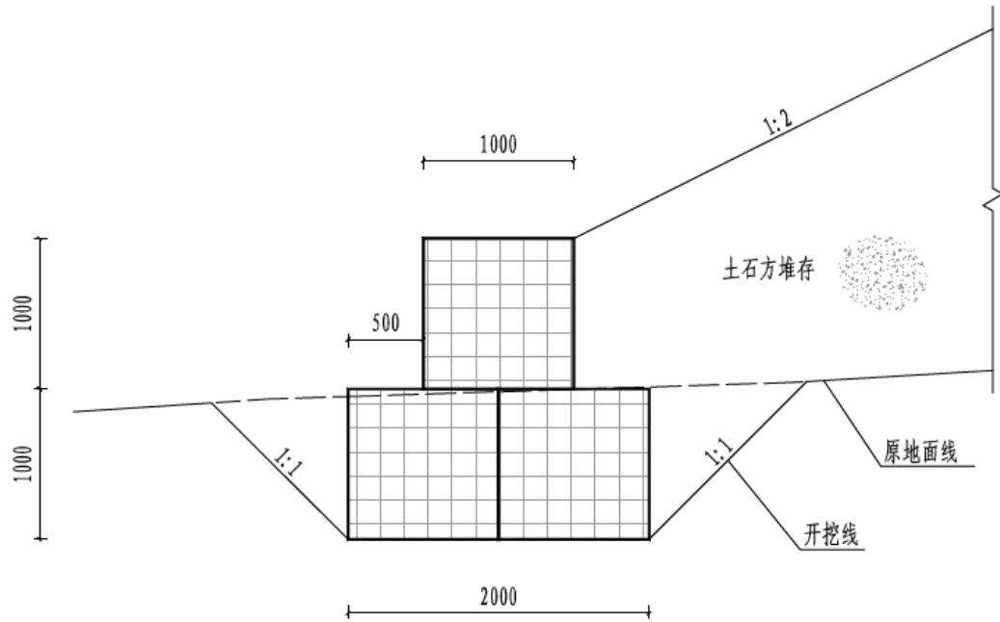  
图 3.2-3 钢筋石笼断面图

## 2）周边排水沟

主体工程在临时周转场内周边布置排水沟，长 902m，采用梯形断面，断面尺寸为1.4m×1.4m（底宽×高），两侧边坡坡比1:0.5，采用C20混凝土现浇，衬砌厚度30cm，排水沟每10m设伸缩缝，缝间采用闭孔塑料板填缝。排水沟经沉沙池后排入大海。

## 3）顶面、坡面、马道排水沟

主体考虑堆存期间，在顶面及马道分别布置顶面及马道排水沟，通过坡面排水沟汇入周边排水沟。顶面排水沟为梯形断面，断面尺寸为 $0 . 4 \mathrm { m } \times 0 . 4 \mathrm { m }$ （宽×深），坡比 1:0.5，衬砌厚度0.15m，采用 C20混凝土现浇。马道排水沟为矩形断面，断面尺寸为 $0 . 3 \mathrm { m } \times 0 . 3 \mathrm { m }$ （宽×深），衬砌厚度 0.15m，采用C20混凝土现浇。坡面排水沟为梯形断面，断面尺寸为 $0 . 5 \mathrm { m } \times 0 . 5 \mathrm { m }$ （底宽×高），两侧坡比 1:0.5，衬砌厚度 0.15m，采用 C20 混凝土现浇。

周边、顶面和马道排水沟能排导边坡汇水，防护边坡不受雨水冲刷，能够起到水土保持的作用，根据《生产建设项目水土保持技术标准》（GB 50433-2018）中的界定原

则，该项工程界定为水土保持措施。

## 4）沉沙池

主体设计在周边排水沟出口设置沉沙池，采用 C25混凝土结构。共设置 1座沉沙池，尺寸6m×3m×2m（长×宽×深），壁厚0.5m。

沉沙池既可起到排水沉沙的作用，也能起到排水消能的作用，根据《生产建设项目水土保持技术标准》（GB 50433-2018）中的界定原则，该项工程界定为水土保持措施。

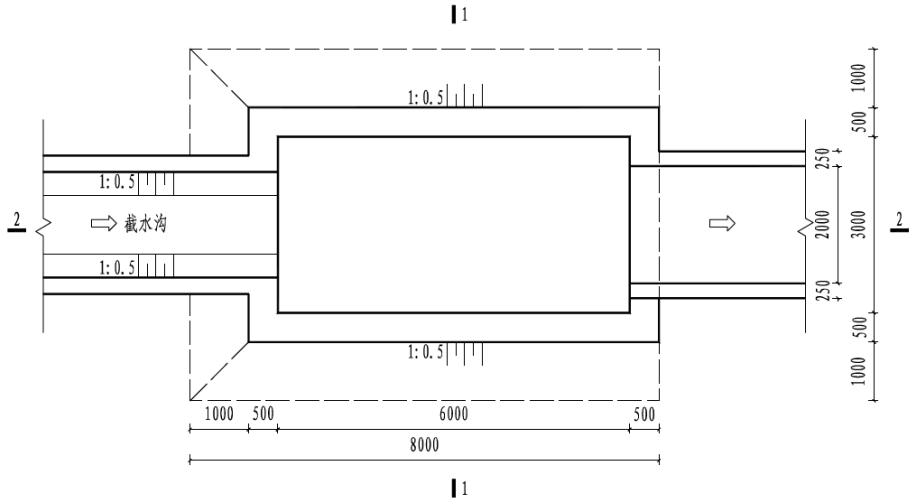  
图3.2-4 沉沙池尺寸设计图

## （2） 需补充的水保措施

主体工程考虑了临时周转场区钢筋石笼挡墙、周边排水沟、顶面、坡面及马道排水沟、沉沙池等措施，本方案补充施工期间布设临时苫盖措施，施工结束后对，对施工迹地表土回覆、土地平整并采用乔灌草恢复植被。

## 3.2.8.5 海工区

## （1） 工程措施

## 1）厂区内护岸

本工程厂区内护岸主要功能为保证厂区岸坡稳定，具有一定水土保持作用，但根据《生产建设项目水土保持技术标准》（GB 50433-2018）中的界定原则，该措施以主体设计功能为主，不界定为水土保持措施。

## （2） 需补充的水保措施

海工工程区只有厂内护岸和防波堤位于海面以上，本区无需另补充水土保持措施。

## 3.2.8.6 本期工程依托的一、二期工程水土保持措施评价

本期工程依托一、二期工程的水土保持措施包括厂外辅助设施及现场服务区西侧边

表 3.3-1  
主体设计中界定为水土保持措施的工程量及投资
<table><tr><td rowspan=1 colspan=1>分区</td><td rowspan=1 colspan=1>措施类型</td><td rowspan=1 colspan=2>措施名称</td><td rowspan=1 colspan=1>单位</td><td rowspan=1 colspan=1>数量</td><td rowspan=1 colspan=1>单价（元）</td><td rowspan=1 colspan=1>合计（万元）</td></tr><tr><td rowspan=20 colspan=1>厂区</td><td rowspan=19 colspan=1>工程措施</td><td rowspan=18 colspan=1>雨水排水管网</td><td rowspan=1 colspan=1>DN300</td><td rowspan=1 colspan=1>m</td><td rowspan=1 colspan=1>3000</td><td rowspan=1 colspan=1>143.77</td><td rowspan=1 colspan=1>43.13</td></tr><tr><td rowspan=1 colspan=1>DN400</td><td rowspan=1 colspan=1>m</td><td rowspan=1 colspan=1>500</td><td rowspan=1 colspan=1>234.10</td><td rowspan=1 colspan=1>11.71</td></tr><tr><td rowspan=1 colspan=1>DN500</td><td rowspan=1 colspan=1>m</td><td rowspan=1 colspan=1>800</td><td rowspan=1 colspan=1>370.34</td><td rowspan=1 colspan=1>29.63</td></tr><tr><td rowspan=1 colspan=1>DN600</td><td rowspan=1 colspan=1>m</td><td rowspan=1 colspan=1>900</td><td rowspan=1 colspan=1>464.27</td><td rowspan=1 colspan=1>41.78</td></tr><tr><td rowspan=1 colspan=1>DN700</td><td rowspan=1 colspan=1>m</td><td rowspan=1 colspan=1>1200</td><td rowspan=1 colspan=1>606.19</td><td rowspan=1 colspan=1>72.74</td></tr><tr><td rowspan=1 colspan=1>DN800</td><td rowspan=1 colspan=1>m</td><td rowspan=1 colspan=1>600</td><td rowspan=1 colspan=1>748.11</td><td rowspan=1 colspan=1>44.89</td></tr><tr><td rowspan=1 colspan=1>DN900</td><td rowspan=1 colspan=1>m</td><td rowspan=1 colspan=1>500</td><td rowspan=1 colspan=1>971.34</td><td rowspan=1 colspan=1>48.57</td></tr><tr><td rowspan=1 colspan=1>DN1000</td><td rowspan=1 colspan=1>m</td><td rowspan=1 colspan=1>750</td><td rowspan=1 colspan=1>1194.56</td><td rowspan=1 colspan=1>89.59</td></tr><tr><td rowspan=1 colspan=1>DN1100</td><td rowspan=1 colspan=1>m</td><td rowspan=1 colspan=1>400</td><td rowspan=1 colspan=1>1480.21</td><td rowspan=1 colspan=1>59.21</td></tr><tr><td rowspan=1 colspan=1>DN1200</td><td rowspan=1 colspan=1>m</td><td rowspan=1 colspan=1>300</td><td rowspan=1 colspan=1>1592.12</td><td rowspan=1 colspan=1>47.76</td></tr><tr><td rowspan=1 colspan=1>DN1300</td><td rowspan=1 colspan=1>m</td><td rowspan=1 colspan=1>100</td><td rowspan=1 colspan=1>1784.25</td><td rowspan=1 colspan=1>17.84</td></tr><tr><td rowspan=1 colspan=1>DN1400</td><td rowspan=1 colspan=1>m</td><td rowspan=1 colspan=1>500</td><td rowspan=1 colspan=1>1976.37</td><td rowspan=1 colspan=1>98.82</td></tr><tr><td rowspan=1 colspan=1>DN1500</td><td rowspan=1 colspan=1>m</td><td rowspan=1 colspan=1>550</td><td rowspan=1 colspan=1>2266.55</td><td rowspan=1 colspan=1>124.66</td></tr><tr><td rowspan=1 colspan=1>DN1600</td><td rowspan=1 colspan=1>m</td><td rowspan=1 colspan=1>500</td><td rowspan=1 colspan=1>2545.66</td><td rowspan=1 colspan=1>127.28</td></tr><tr><td rowspan=1 colspan=1>DN1700</td><td rowspan=1 colspan=1>m</td><td rowspan=1 colspan=1>150</td><td rowspan=1 colspan=1>2912.77</td><td rowspan=1 colspan=1>43.69</td></tr><tr><td rowspan=1 colspan=1>DN1800</td><td rowspan=1 colspan=1>m</td><td rowspan=1 colspan=1>100</td><td rowspan=1 colspan=1>3279.87</td><td rowspan=1 colspan=1>32.80</td></tr><tr><td rowspan=1 colspan=1>DN1900</td><td rowspan=1 colspan=1>m</td><td rowspan=1 colspan=1>350</td><td rowspan=1 colspan=1>3565.83</td><td rowspan=1 colspan=1>124.80</td></tr><tr><td rowspan=1 colspan=1>DN2000</td><td rowspan=1 colspan=1>m</td><td rowspan=1 colspan=1>100</td><td rowspan=1 colspan=1>3851.97</td><td rowspan=1 colspan=1>38.52</td></tr><tr><td rowspan=1 colspan=2>碎石压盖</td><td rowspan=1 colspan=1>m³</td><td rowspan=1 colspan=1>4620</td><td rowspan=1 colspan=1>588</td><td rowspan=1 colspan=1>271.66</td></tr><tr><td rowspan=1 colspan=1>植物措施</td><td rowspan=1 colspan=2>园林绿化</td><td rowspan=1 colspan=1>hm2</td><td rowspan=1 colspan=1>1.21</td><td rowspan=1 colspan=1>2000000</td><td rowspan=1 colspan=1>242.42</td></tr><tr><td rowspan=6 colspan=1>临时周转场区</td><td rowspan=6 colspan=1>工程措施</td><td rowspan=1 colspan=2>钢筋石笼</td><td rowspan=1 colspan=1>m</td><td rowspan=1 colspan=1>888</td><td rowspan=1 colspan=1>1600</td><td rowspan=1 colspan=1>142.08</td></tr><tr><td rowspan=1 colspan=2>周边排水沟</td><td rowspan=1 colspan=1>m</td><td rowspan=1 colspan=1>902</td><td rowspan=1 colspan=1>600</td><td rowspan=1 colspan=1>54.12</td></tr><tr><td rowspan=1 colspan=2>顶面排水沟</td><td rowspan=1 colspan=1>m</td><td rowspan=1 colspan=1>602</td><td rowspan=1 colspan=1>350</td><td rowspan=1 colspan=1>21.07</td></tr><tr><td rowspan=1 colspan=2>坡面排水沟</td><td rowspan=1 colspan=1>m</td><td rowspan=1 colspan=1>246</td><td rowspan=1 colspan=1>260</td><td rowspan=1 colspan=1>6.40</td></tr><tr><td rowspan=1 colspan=2>马道排水沟</td><td rowspan=1 colspan=1>m</td><td rowspan=1 colspan=1>775</td><td rowspan=1 colspan=1>230</td><td rowspan=1 colspan=1>17.83</td></tr><tr><td rowspan=1 colspan=2>沉沙池</td><td rowspan=1 colspan=1>座</td><td rowspan=1 colspan=1>1</td><td rowspan=1 colspan=1>8000</td><td rowspan=1 colspan=1>0.80</td></tr><tr><td rowspan=1 colspan=1>合计</td><td rowspan=1 colspan=1></td><td rowspan=1 colspan=2></td><td rowspan=1 colspan=1></td><td rowspan=1 colspan=1></td><td rowspan=1 colspan=1></td><td rowspan=1 colspan=1>1853.79</td></tr></table>

## 4 水土流失分析与预测

## 4.1 水土流失现状

## （1）项目区水土流失现状

本工程位于广东省惠州市惠东县黄埠镇，按照《全国水土保持规划（2015-2030年）》（国函〔2015〕160号），项目区属于南方红壤区（南方山地丘陵区）-华南沿海丘陵台地区-华南沿海丘陵台地人居环境维护区，容许土壤流失量为 $5 0 0 \mathrm { t } / \ ( \mathrm { k m } ^ { 2 } \cdot \mathrm { a } )$ 。项目区水土流失主要为水力侵蚀，侵蚀形式主要为面蚀和沟蚀。

根据《广东省水土保持公报（2024 年）》，惠州市水土流失面积共 $1 0 4 7 . 6 6 \mathrm { k m } ^ { 2 }$ 其中轻度侵蚀面积 $8 5 5 . 6 8 \mathrm { k m } ^ { 2 }$ 、中度侵蚀面积 $1 3 3 . 8 5 \mathrm { k m } ^ { 2 }$ 、强烈侵蚀面积 $4 5 . 3 6 \mathrm { k m } ^ { 2 }$ 、极强烈侵蚀面积 $6 . 6 4 \mathrm { k m } ^ { 2 }$ 、剧烈侵蚀面积 $6 . 1 3 \mathrm { k m } ^ { 2 }$

## （2）工程建设区水土流失现状

厂址所在地区属沿海丘陵地带，厂址区三面环山，南面临海，地形总体由北向南逐渐倾斜。一、二期工程施工区域已完成大规模场平，目前 1～4 号机组厂区、厂外辅助设施及现场服务区、施工生产区等均已完成场平，场平标高 16.5m。5、6号机组厂区场平正挖由二期工程实施，目前正在进行场平正挖施工，三期工程无场平正挖工程。根据二期工程水土保持监测成果，结合现场调查来看，已场平区域土地平整，道路已硬化，两侧均有排水沟布设，建设单位及参建单位现场施工生产区域地表均已硬化或绿化，整个场地布设了较为完善的排水系统，水土流失程度较轻，土壤侵蚀模数约为 528t/$( \mathrm { k m } ^ { 2 } \cdot \mathrm { a } )$

## 4.2 水土流失影响因素分析

## 4.2.1 自然因素水土流失分析

在工程施工中涉及土石方开挖和临时堆土等建设活动，施工裸露面在雨滴打击、水流冲刷等外力的作用下易产生水土流失。项目区降水集中，强度大，对土壤的侵蚀力大；雨季地表土壤处于湿润状态，抗蚀能力较差，遇暴雨会导致严重的土壤侵蚀，侵蚀形式以面蚀和沟蚀为主。

## 4.2.2 建设期水土流失影响分析

工程建设过程中所造成的水土流失影响如下：

## （1） 土石方工程

工程建设期间的建构筑物基础开挖与回填等施工活动会产生大量的土石方。在土石方开挖、倒运、回填和堆放过程中，松散土体及开挖裸露面在水力和风力侵蚀作用下将产生水土流失。若不采取有效预防措施，土石方工程施工极易造成水土流失。

## （2） 临时堆土水土流失影响

由于堆土体是一个相对松散的堆积体，如不采取防护措施，遇降雨和大风作用，易产生大量的水蚀和风蚀，并造成严重的水土流失危害。

## 4.2.3 自然恢复期水土流失影响分析

自然恢复期植物措施尚未完全发挥其水土保持功能之前，受降雨、径流冲刷以及大风影响，仍会有轻度的土壤流失发生，但随着植物生长，覆盖度增加，水土流失将会逐渐得到控制。

## 4.2.4 扰动地表、损毁植被面积及弃渣量

## （1） 扰动地表面积

工程建设过程中，地面设施的兴建、开挖、填筑等活动都不同程度、不同形式地扰动了原地貌形态，损坏了地表土体结构和植被。按防治分区，本工程扰动地表面积共计$8 2 . 9 6 \mathrm { h m } ^ { 2 }$ ，详见表 4.2-1。

表 4.2-1  
工程扰动地表面积
<table><tr><td rowspan=1 colspan=1>序号</td><td rowspan=1 colspan=1>项目</td><td rowspan=1 colspan=1>扰动地表面积(hm²)</td></tr><tr><td rowspan=1 colspan=1>1</td><td rowspan=1 colspan=1>厂区</td><td rowspan=1 colspan=1>21.22</td></tr><tr><td rowspan=1 colspan=1>2</td><td rowspan=1 colspan=1>现场服务区</td><td rowspan=1 colspan=1>0.07</td></tr><tr><td rowspan=1 colspan=1>3</td><td rowspan=1 colspan=1>施工生产区</td><td rowspan=1 colspan=1>51.97</td></tr><tr><td rowspan=1 colspan=1>4</td><td rowspan=1 colspan=1>临时周转场区</td><td rowspan=1 colspan=1>5.27</td></tr><tr><td rowspan=1 colspan=1>5</td><td rowspan=1 colspan=1>表土堆存场区</td><td rowspan=1 colspan=1>1.70</td></tr><tr><td rowspan=1 colspan=1>6</td><td rowspan=1 colspan=1>海工区</td><td rowspan=1 colspan=1>2.73</td></tr><tr><td rowspan=1 colspan=1></td><td rowspan=1 colspan=1>合计</td><td rowspan=1 colspan=1>82.96</td></tr></table>

## （2） 损毁植被面积

由于一、二期工程完成场平工作，三期工程在一、二期工程场平基础上进行扩建，施工区域大部分在一、二期工程实际施工扰动范围内，现状已无地表植被。本期新增的施工生产区 G区核岛安装场地占地主要为工矿仓储用地，也无地表植被。

## （3） 弃渣量

本工程土石方不产生弃渣。海工工程共产生海域淤泥 159.64 万 $\mathrm { m } ^ { 3 }$ ，淤泥不上岸，拟全部倾倒至指定的海洋倾倒区。施工结束后临建设施及硬化层拆除产生建筑垃圾 7.80万 $\mathbf { m } ^ { 3 }$ 由中广核环境科技（深圳）有限责任公司统一进行资源化处理。

## 4.3 土壤流失量预测

## 4.3.1 预测单元

预测单元为工程建设扰动时段、扰动形式总体相同、扰动强度和特点大体一致的区域。根据《生产建设项目土壤流失量测算导则》（SL 773-2018）规定，结合建设项目的特点，按各单元工程及占地利用情况，将项目区水土流失预测单元划分为①厂区；②现场服务区；③施工生产区；④临时周转场区；⑤表土堆存场区；⑥海工区。根据每个预测单元在工程施工期（含施工准备期）和自然恢复期土壤侵蚀模数的变化情况，分别预测施工期（含施工准备期）和自然恢复期的土壤流失总量。

## 4.3.2 预测时段

根据《生产建设项目水土保持技术标准》（GB 50433-2018），水土流失预测应按施工期（含施工准备期）和自然恢复期两个时段进行。结合工程特点，将施工准备期并入施工期进行预测。

## 1）施工期（含施工准备期）

施工期（含施工准备期）预测时段根据各单元进度安排，参照有关技术规范要求，结合工程区自然生态条件，每个预测单元的预测时段按最不利情况考虑，预测时间超过一个雨季长度的按全年计算，未超过雨季长度按其占雨季时间的比例计算。项目所在地区雨季为 4～9 月。由于各施工项目跨越雨季不同，故施工期的预测时段有所差异，不同分区预测时段按照施工进度安排确定。

## ① 厂区

厂区施工主要包括场地清理、土建负挖、建筑工程施工、安装工程施工。计划于 2026年11月开始负挖，计划 2033年6月结束，预测时段按7 年计。

## ② 现场服务区

本区施工时段为 2028 年 1 月至 2028 年 12 月，本区预测时段按 1 年计。

③ 施工生产区

施工生产区施工时段为 2026 年3 月至2033 年6 月，该单元预测时段按 7 年计。

## ④ 临时周转场区

工程土石方开挖临时周转堆存时段为 2026 年 11 月至 2030 年 6 月，预测时段按 4年计。

## ⑤ 表土堆存场区

三期工程利用表土的时段为 2033年1月至2033年6 月，预测时段按0.5年计。

## ⑥ 海工区

海工区取水工程施工时段为 2027年10月至2031年11 月，预测时段按4年计。

## 2）自然恢复期

工程施工结束后，因施工引起水土流失的各项因素逐渐消失，地表扰动基本停止，水土流失将明显减小，但由于植物措施防护效果的相对滞后性，在自然恢复期项目区仍会有一定量的水土流失，根据《生产建设项目水土保持技术标准》（GB 50433-2018）及工程区自然条件和工程建设特点，确定本项目自然恢复期按 2年计算。

本工程水土流失预测范围和时段划分详见表4.3-1。

表 4.3-1  
水土流失预测范围和预测时段表
<table><tr><td rowspan=3 colspan=1>序号</td><td rowspan=3 colspan=1>预测单元</td><td rowspan=1 colspan=2>施工期（含施工准备期）</td><td rowspan=1 colspan=2>自然恢复期</td></tr><tr><td rowspan=1 colspan=1>预测面积</td><td rowspan=1 colspan=1>预测时段</td><td rowspan=1 colspan=1>预测面积</td><td rowspan=1 colspan=1>预测时段</td></tr><tr><td rowspan=1 colspan=1> $( \mathrm { h m } ^ { 2 } )$ </td><td rowspan=1 colspan=1> $\textbf { ( a ) }$ </td><td rowspan=1 colspan=1> $( \mathrm { h m } ^ { 2 } )$ </td><td rowspan=1 colspan=1>(a)</td></tr><tr><td rowspan=1 colspan=1>1</td><td rowspan=1 colspan=1>厂区</td><td rowspan=1 colspan=1>21.22</td><td rowspan=1 colspan=1>7</td><td rowspan=1 colspan=1>1.21</td><td rowspan=1 colspan=1>2</td></tr><tr><td rowspan=1 colspan=1>2</td><td rowspan=1 colspan=1>现场服务区</td><td rowspan=1 colspan=1>0.07</td><td rowspan=1 colspan=1>1</td><td rowspan=1 colspan=1></td><td rowspan=1 colspan=1></td></tr><tr><td rowspan=1 colspan=1>3</td><td rowspan=1 colspan=1>施工生产区</td><td rowspan=1 colspan=1>51.97</td><td rowspan=1 colspan=1>7</td><td rowspan=1 colspan=1>51.97</td><td rowspan=1 colspan=1>2</td></tr><tr><td rowspan=1 colspan=1>4</td><td rowspan=1 colspan=1>临时周转场区</td><td rowspan=1 colspan=1>5.27</td><td rowspan=1 colspan=1>4</td><td rowspan=1 colspan=1>5.27</td><td rowspan=1 colspan=1>2</td></tr><tr><td rowspan=1 colspan=1>5</td><td rowspan=1 colspan=1>表土堆存场区</td><td rowspan=1 colspan=1>1.70</td><td rowspan=1 colspan=1>0.5</td><td rowspan=1 colspan=1>1.70</td><td rowspan=1 colspan=1>2</td></tr><tr><td rowspan=1 colspan=1>6</td><td rowspan=1 colspan=1>海工区</td><td rowspan=1 colspan=1>2.73</td><td rowspan=1 colspan=1>4</td><td rowspan=1 colspan=1></td><td rowspan=1 colspan=1></td></tr><tr><td rowspan=1 colspan=1></td><td rowspan=1 colspan=1>合计</td><td rowspan=1 colspan=1>82.96</td><td rowspan=1 colspan=1></td><td rowspan=1 colspan=1>60.15</td><td rowspan=1 colspan=1></td></tr></table>

## 4.3.3 土壤侵蚀模数

## 4.3.3.1 原地貌土壤侵蚀模数

通过对施工占地范围内土地利用现状的抽样典型调查，结合施工征地范围内的土地利用现状分析，工程区水土流失以轻度侵蚀为主。依据工程区降雨、土地利用类型、植被覆盖度、地面坡度、土壤类型等因子，参考《土壤侵蚀分类分级标准》（SL 190-2007）对工程各防治区内土壤侵蚀强度进行分析，工程区平均土壤侵蚀模数为 $5 7 0 \mathrm { t } / \left( \mathrm { k m } ^ { 2 } \cdot \mathrm { a } \right)$ 各预测单元原生土壤侵蚀模数详见表 4.3-2。

表 4.3-2  
工程区原生土壤侵蚀模数计算表
<table><tr><td rowspan=1 colspan=2>项目分区</td><td rowspan=1 colspan=1>工矿仓储用地</td><td rowspan=1 colspan=1>水域及水利设施</td><td rowspan=1 colspan=1>小计</td></tr><tr><td rowspan=5 colspan=1>厂区</td><td rowspan=1 colspan=1>面积 $( \mathrm { h m } ^ { 2 } )$ </td><td rowspan=1 colspan=1>16.34</td><td rowspan=1 colspan=1>4.88</td><td rowspan=1 colspan=1>21.22</td></tr><tr><td rowspan=1 colspan=1>坡度（°）</td><td rowspan=1 colspan=1>0~5</td><td rowspan=1 colspan=1>5~25</td><td rowspan=1 colspan=1></td></tr><tr><td rowspan=1 colspan=1>植被覆盖度（%）</td><td rowspan=1 colspan=1>-</td><td rowspan=1 colspan=1>-</td><td rowspan=1 colspan=1></td></tr><tr><td rowspan=1 colspan=1>流失强度</td><td rowspan=1 colspan=1>轻度</td><td rowspan=1 colspan=1>微度</td><td rowspan=1 colspan=1></td></tr><tr><td rowspan=1 colspan=1>平均侵蚀模数 $\left( \mathrm { { t } } { \mathrm { { k m } } ^ { 2 } } \mathrm { { a } } \right)$ </td><td rowspan=1 colspan=1>550</td><td rowspan=1 colspan=1>0</td><td rowspan=1 colspan=1>420</td></tr><tr><td rowspan=5 colspan=1>现场服务区</td><td rowspan=1 colspan=1>面积 $( \mathrm { h m } ^ { 2 } )$ </td><td rowspan=1 colspan=1>0.07</td><td rowspan=1 colspan=1></td><td rowspan=1 colspan=1>0.07</td></tr><tr><td rowspan=1 colspan=1>坡度（°）</td><td rowspan=1 colspan=1>0~5</td><td rowspan=1 colspan=1></td><td rowspan=1 colspan=1></td></tr><tr><td rowspan=1 colspan=1>植被覆盖度（%）</td><td rowspan=1 colspan=1>-</td><td rowspan=1 colspan=1></td><td rowspan=1 colspan=1></td></tr><tr><td rowspan=1 colspan=1>流失强度</td><td rowspan=1 colspan=1>微度</td><td rowspan=1 colspan=1></td><td rowspan=1 colspan=1></td></tr><tr><td rowspan=1 colspan=1>平均侵蚀模数 $\left( \mathrm { { t } } { \mathrm { { k m } } ^ { 2 } } \mathrm { { a } } \right)$ </td><td rowspan=1 colspan=1>430</td><td rowspan=1 colspan=1></td><td rowspan=1 colspan=1>430</td></tr><tr><td rowspan=5 colspan=1>施工生产区</td><td rowspan=1 colspan=1>面积 $( \mathrm { h m } ^ { 2 } )$ </td><td rowspan=1 colspan=1>51.97</td><td rowspan=1 colspan=1></td><td rowspan=1 colspan=1>51.97</td></tr><tr><td rowspan=1 colspan=1>坡度（°）</td><td rowspan=1 colspan=1>0~15</td><td rowspan=1 colspan=1></td><td rowspan=1 colspan=1></td></tr><tr><td rowspan=1 colspan=1>植被覆盖度（%）</td><td rowspan=1 colspan=1>-</td><td rowspan=1 colspan=1></td><td rowspan=1 colspan=1></td></tr><tr><td rowspan=1 colspan=1>流失强度</td><td rowspan=1 colspan=1>轻度</td><td rowspan=1 colspan=1></td><td rowspan=1 colspan=1></td></tr><tr><td rowspan=1 colspan=1>平均侵蚀模数 $\left( \mathrm { { t } } { \mathrm { { k m } } ^ { 2 } } \mathrm { { a } } \right)$ </td><td rowspan=1 colspan=1>660</td><td rowspan=1 colspan=1></td><td rowspan=1 colspan=1>660</td></tr><tr><td rowspan=5 colspan=1>临时周转场区</td><td rowspan=1 colspan=1>面积 $( \mathrm { h m } ^ { 2 } )$ </td><td rowspan=1 colspan=1>5.27</td><td rowspan=1 colspan=1></td><td rowspan=1 colspan=1>5.27</td></tr><tr><td rowspan=1 colspan=1>坡度（°）</td><td rowspan=1 colspan=1>0~15</td><td rowspan=1 colspan=1></td><td rowspan=1 colspan=1></td></tr><tr><td rowspan=1 colspan=1>植被覆盖度（%）</td><td rowspan=1 colspan=1>-</td><td rowspan=1 colspan=1></td><td rowspan=1 colspan=1></td></tr><tr><td rowspan=1 colspan=1>流失强度</td><td rowspan=1 colspan=1>轻度</td><td rowspan=1 colspan=1></td><td rowspan=1 colspan=1></td></tr><tr><td rowspan=1 colspan=1>平均侵蚀模数 $\left( \mathrm { { t } } { \mathrm { { k m } } ^ { 2 } } \mathrm { { a } } \right)$ </td><td rowspan=1 colspan=1>550</td><td rowspan=1 colspan=1></td><td rowspan=1 colspan=1>550</td></tr><tr><td rowspan=5 colspan=1>表土堆存场区</td><td rowspan=1 colspan=1>面积 $( \mathrm { h m } ^ { 2 } )$ </td><td rowspan=1 colspan=1>1.70</td><td rowspan=1 colspan=1></td><td rowspan=1 colspan=1>1.70</td></tr><tr><td rowspan=1 colspan=1>坡度（°）</td><td rowspan=1 colspan=1>0~35</td><td rowspan=1 colspan=1></td><td rowspan=1 colspan=1></td></tr><tr><td rowspan=1 colspan=1>植被覆盖度（%）</td><td rowspan=1 colspan=1>40</td><td rowspan=1 colspan=1></td><td rowspan=1 colspan=1></td></tr><tr><td rowspan=1 colspan=1>流失强度</td><td rowspan=1 colspan=1>轻度</td><td rowspan=1 colspan=1></td><td rowspan=1 colspan=1></td></tr><tr><td rowspan=1 colspan=1>平均侵蚀模数 $\left( \mathrm { { t } } { \ m } ^ { 2 } \mathrm { { a } } \right)$ </td><td rowspan=1 colspan=1>650</td><td rowspan=1 colspan=1></td><td rowspan=1 colspan=1>650</td></tr><tr><td rowspan=5 colspan=1>海工区</td><td rowspan=1 colspan=1>面积 $( \mathrm { h m } ^ { 2 } )$ </td><td rowspan=1 colspan=1></td><td rowspan=1 colspan=1>2.73</td><td rowspan=1 colspan=1>2.73</td></tr><tr><td rowspan=1 colspan=1>坡度（°）</td><td rowspan=1 colspan=1></td><td rowspan=1 colspan=1>0~15</td><td rowspan=1 colspan=1></td></tr><tr><td rowspan=1 colspan=1>植被覆盖度（%）</td><td rowspan=1 colspan=1></td><td rowspan=1 colspan=1>-</td><td rowspan=1 colspan=1></td></tr><tr><td rowspan=1 colspan=1>流失强度</td><td rowspan=1 colspan=1></td><td rowspan=1 colspan=1>微度</td><td rowspan=1 colspan=1></td></tr><tr><td rowspan=1 colspan=1>平均侵蚀模数 $\left( \mathrm { { t } } { \ m } ^ { 2 } \mathrm { { a } } \right)$ </td><td rowspan=1 colspan=1></td><td rowspan=1 colspan=1>0</td><td rowspan=1 colspan=1>0</td></tr><tr><td rowspan=1 colspan=2>工程区平均侵蚀模数 $\mathrm { ~ ( ~ t ~ m ~ } ^ { 2 } { \cdot } \mathbf { a _ { \lambda } } )$ </td><td rowspan=1 colspan=1></td><td rowspan=1 colspan=1></td><td rowspan=1 colspan=1>570</td></tr></table>

## 4.3.3.2 扰动后土壤侵蚀模数

项目施工建设将损坏原有地形地貌和植被，增加土壤的可侵蚀性；另一方面，由于场地平整时，挖、填土方不仅造成大面积的裸露地面，而且会改变原地形，增大侵蚀扰动表面积。施工期土壤流失量根据《生产建设项目土壤流失量测算导则》（SL 773-2018）推荐公式计算，扰动后的土壤侵蚀因子可根据项目区地形地貌、气候（降雨、风速等）、土地利用、植被情况等实际情况结合工程特点，参照《生产建设项目土壤流失量测算导则》（SL 773-2018）计算确定。

## （1）扰动单元划分

在项目区预测单元的基础上，根据空间连续性、扰动方式、扰动强度、扰动规模等划分不同规模的扰动单元，共划分 10个不同规模的扰动单元，划分情况见表4.3-3。

表 4.3-3  
扰动单元划分情况表
<table><tr><td rowspan=2 colspan=1>预测单元</td><td rowspan=1 colspan=2>扰动单元</td><td rowspan=2 colspan=1>扰动方式</td><td rowspan=2 colspan=1>扰动规模</td><td rowspan=2 colspan=1>面积（hm²）</td></tr><tr><td rowspan=1 colspan=1>序号</td><td rowspan=1 colspan=1>项目</td></tr><tr><td rowspan=2 colspan=1>厂区</td><td rowspan=1 colspan=1>扰动单元1</td><td rowspan=1 colspan=1>厂区陆域区域</td><td rowspan=1 colspan=1>一般扰动地表</td><td rowspan=1 colspan=1>大</td><td rowspan=1 colspan=1>16.34</td></tr><tr><td rowspan=1 colspan=1>扰动单元2</td><td rowspan=1 colspan=1>厂区海域填筑区域</td><td rowspan=1 colspan=1>工程堆积体</td><td rowspan=1 colspan=1>中</td><td rowspan=1 colspan=1>4.88</td></tr><tr><td rowspan=1 colspan=1>现场服务区</td><td rowspan=1 colspan=1>扰动单元3</td><td rowspan=1 colspan=1>污水处理厂区域</td><td rowspan=1 colspan=1>一般扰动地表</td><td rowspan=1 colspan=1>中</td><td rowspan=1 colspan=1>0.07</td></tr><tr><td rowspan=2 colspan=1>施工生产区</td><td rowspan=1 colspan=1>扰动单元4</td><td rowspan=1 colspan=1>D区</td><td rowspan=1 colspan=1>一般扰动地表</td><td rowspan=1 colspan=1>大</td><td rowspan=1 colspan=1>44.50</td></tr><tr><td rowspan=1 colspan=1>扰动单元5</td><td rowspan=1 colspan=1>G区</td><td rowspan=1 colspan=1>一般扰动地表</td><td rowspan=1 colspan=1>中</td><td rowspan=1 colspan=1>7.47</td></tr><tr><td rowspan=1 colspan=1>临时周转场区</td><td rowspan=1 colspan=1>扰动单元6</td><td rowspan=1 colspan=1>临时周转场</td><td rowspan=1 colspan=1>工程堆积体</td><td rowspan=1 colspan=1>中</td><td rowspan=1 colspan=1>5.27</td></tr><tr><td rowspan=2 colspan=1>表土堆存场区</td><td rowspan=1 colspan=1>扰动单元7</td><td rowspan=1 colspan=1>西北侧表土堆存场</td><td rowspan=1 colspan=1>工程堆积体</td><td rowspan=1 colspan=1>小</td><td rowspan=1 colspan=1>1.00</td></tr><tr><td rowspan=1 colspan=1>扰动单元8</td><td rowspan=1 colspan=1>西侧表土堆存场</td><td rowspan=1 colspan=1>工程堆积体</td><td rowspan=1 colspan=1>小</td><td rowspan=1 colspan=1>0.70</td></tr><tr><td rowspan=2 colspan=1>海工区</td><td rowspan=1 colspan=1>扰动单元9</td><td rowspan=1 colspan=1>中隔堤</td><td rowspan=1 colspan=1>工程堆积体</td><td rowspan=1 colspan=1>中</td><td rowspan=1 colspan=1>0.63</td></tr><tr><td rowspan=1 colspan=1>扰动单元 10</td><td rowspan=1 colspan=1>厂区内护岸</td><td rowspan=1 colspan=1>工程堆积体</td><td rowspan=1 colspan=1>中</td><td rowspan=1 colspan=1>2.10</td></tr><tr><td rowspan=1 colspan=1>合计</td><td rowspan=1 colspan=1>10个</td><td rowspan=1 colspan=1></td><td rowspan=1 colspan=1></td><td rowspan=1 colspan=1></td><td rowspan=1 colspan=1>82.96</td></tr></table>

## （2）典型扰动单元划分

根据导则，项目扰动单元数量小于20个时，应全部确定为典型扰动单元。故本工程扰动单元全部为典型扰动单元。

## （3）计算单元划分

根据现场查勘和实验测定的相关数据，按照扰动方式、坡度、坡长、地表覆盖、土壤类型和质地、气象条件等参数相对一致的原则，在适当比例尺的图件上，将每个典型扰动单元进一步划分为生产建设项目土壤流失类型三级分类对应的计算单元，本项目共划分10个计算单元。计算单元划分情况见表4.3-4。

表 4.3-4  
计算单元划分情况表
<table><tr><td rowspan=2 colspan=1>预测单元</td><td rowspan=1 colspan=2>扰动单元</td><td rowspan=2 colspan=1>扰动方式</td><td rowspan=2 colspan=1>土壤流失三级分类</td><td rowspan=2 colspan=1>扰动规模</td><td rowspan=2 colspan=1>面积 $( \mathrm { h m } ^ { 2 } )$ </td></tr><tr><td rowspan=1 colspan=1>序号</td><td rowspan=1 colspan=1>项目</td></tr><tr><td rowspan=2 colspan=1>厂区</td><td rowspan=1 colspan=1>扰动单元1</td><td rowspan=1 colspan=1>厂区陆域区域</td><td rowspan=1 colspan=1>一般扰动地表</td><td rowspan=1 colspan=1>地表翻扰型一般扰动地表</td><td rowspan=1 colspan=1>大</td><td rowspan=1 colspan=1>16.34</td></tr><tr><td rowspan=1 colspan=1>扰动单元2</td><td rowspan=1 colspan=1>厂区海域填筑区域</td><td rowspan=1 colspan=1>工程堆积体</td><td rowspan=1 colspan=1>上方无来水工程堆积体</td><td rowspan=1 colspan=1>中</td><td rowspan=1 colspan=1>4.88</td></tr><tr><td rowspan=1 colspan=1>现场服务区</td><td rowspan=1 colspan=1>扰动单元3</td><td rowspan=1 colspan=1>污水处理厂区域</td><td rowspan=1 colspan=1>一般扰动地表</td><td rowspan=1 colspan=1>地表翻扰型一般扰动地表</td><td rowspan=1 colspan=1>中</td><td rowspan=1 colspan=1>0.07</td></tr><tr><td rowspan=2 colspan=1>施工生产区</td><td rowspan=1 colspan=1>扰动单元4</td><td rowspan=1 colspan=1>D区</td><td rowspan=1 colspan=1>一般扰动地表</td><td rowspan=1 colspan=1>地表翻扰型一般扰动地表</td><td rowspan=1 colspan=1>大</td><td rowspan=1 colspan=1>44.50</td></tr><tr><td rowspan=1 colspan=1>扰动单元5</td><td rowspan=1 colspan=1>G区</td><td rowspan=1 colspan=1>一般扰动地表</td><td rowspan=1 colspan=1>地表翻扰型一般扰动地表</td><td rowspan=1 colspan=1>中</td><td rowspan=1 colspan=1>7.47</td></tr><tr><td rowspan=1 colspan=1>临时周转场区</td><td rowspan=1 colspan=1>扰动单元6</td><td rowspan=1 colspan=1>临时周转场</td><td rowspan=1 colspan=1>工程堆积体</td><td rowspan=1 colspan=1>上方无来水工程堆积体</td><td rowspan=1 colspan=1>中</td><td rowspan=1 colspan=1>5.27</td></tr><tr><td rowspan=2 colspan=1>表土堆存场区</td><td rowspan=1 colspan=1>扰动单元7</td><td rowspan=1 colspan=1>西北侧表土堆存场</td><td rowspan=1 colspan=1>工程堆积体</td><td rowspan=1 colspan=1>上方无来水工程堆积体</td><td rowspan=1 colspan=1>小</td><td rowspan=1 colspan=1>1.00</td></tr><tr><td rowspan=1 colspan=1>扰动单元8</td><td rowspan=1 colspan=1>西侧表土堆存场</td><td rowspan=1 colspan=1>工程堆积体</td><td rowspan=1 colspan=1>上方无来水工程堆积体</td><td rowspan=1 colspan=1>小</td><td rowspan=1 colspan=1>0.70</td></tr><tr><td rowspan=2 colspan=1>海工区</td><td rowspan=1 colspan=1>扰动单元9</td><td rowspan=1 colspan=1>中隔堤</td><td rowspan=1 colspan=1>工程堆积体</td><td rowspan=1 colspan=1>上方无来水工程堆积体</td><td rowspan=1 colspan=1>中</td><td rowspan=1 colspan=1>0.63</td></tr><tr><td rowspan=1 colspan=1>扰动单元10</td><td rowspan=1 colspan=1>厂区内护岸</td><td rowspan=1 colspan=1>工程堆积体</td><td rowspan=1 colspan=1>上方无来水工程堆积体</td><td rowspan=1 colspan=1>中</td><td rowspan=1 colspan=1>2.10</td></tr><tr><td rowspan=1 colspan=1>合计</td><td rowspan=1 colspan=1>10个</td><td rowspan=1 colspan=1></td><td rowspan=1 colspan=1></td><td rowspan=1 colspan=1></td><td rowspan=1 colspan=1></td><td rowspan=1 colspan=1>82.96</td></tr></table>

（4）施工期各计算单元土壤流失侵蚀模数

根据各计算单元所属的扰动类型，按土壤流失类型三级分类选择相应的计算公式进行土壤侵蚀模数的计算，本项目计算单元主要涉及地表翻扰型一般扰动地表、上方无来水工程开挖面、上方无来水工程堆积体 3种形式。

①地表翻扰型一般扰动地表土壤侵蚀模数测算

地表翻扰型一般扰动地表计算单元土壤流失量按下列公式计算：

$$
\mathbf { M } _ { \mathrm { y d } } { = } \mathbf { R } \mathbf { K } _ { \mathrm { y d } } \mathbf { L } _ { \mathrm { y } } \mathbf { S } _ { \mathrm { y } } \mathbf { B } \mathbf { E } \mathbf { T } \mathbf { A }
$$

式中：

M $( \mathbf { \nabla } \mathbf { M } _ { \mathrm { k w } } \mathbf { , \nabla } \mathbf { M } _ { \mathrm { d w } } \mathbf { , \nabla } \mathbf { M } _ { \mathrm { y d } } \mathbf { , \nabla } \mathbf { M } _ { \mathrm { y Z } }$ 等）——扰动地表计算单元土壤流失量，t；

R——降雨侵蚀力因子， $\mathrm { M J } { \bullet \mathrm { m m } } / \ ( \ \mathrm { h m } ^ { 2 } { \bullet \mathrm { h } } )$ ；

K $( \mathrm { \ K _ { y d } } )$ ——土壤可蚀性因子， $\mathrm { \pmb { t } \bullet h m ^ { 2 } \bullet h / \left( \ h m ^ { 2 } \bullet M J \bullet m m \right) }$ ；

L $( \mathrm { L _ { y } , \ L _ { d w } , \ L _ { k w } }$ 等）——坡长因子，无量纲；

S $( \mathbf { \nabla } \mathbf { S } _ { \mathrm { y } } , \ \mathbf { \nabla } \mathbf { S } _ { \mathrm { d w } } \mathbf { \cdot } \ \mathbf { \nabla } \mathbf { S } _ { \mathrm { k w } }$ 等）——坡度因子，无量纲；

B——植被覆盖因子，无量纲；

E——工程措施因子，无量纲；

T——耕作措施因子，无量纲；

A——计算单元的水平投影面积，hm²。

因此，地表翻扰型一般扰动地表的年均侵蚀模数计算公式为：

$$
\mathrm { M _ { j i } { = } R K _ { y d } L _ { y } S _ { y } B E T { * } 1 0 0 }
$$

共涉及到 4个计算单元，其土壤流失量计算如表4.3-5 所示。

表 4.3-5  
地表翻扰型一般扰动地表计算单元土壤侵蚀模数
<table><tr><td rowspan=2 colspan=2>预测单元</td><td rowspan=1 colspan=1> $\mathbf { M } _ { \mathrm { y d } }$ </td><td rowspan=1 colspan=1>R</td><td rowspan=1 colspan=1> $\mathrm { K _ { y d } }$ </td><td rowspan=1 colspan=1></td><td rowspan=2 colspan=1> $\mathrm { S _ { y } }$ </td><td rowspan=2 colspan=1>B</td><td rowspan=2 colspan=1>E</td><td rowspan=2 colspan=1>T</td><td rowspan=2 colspan=1>A</td><td rowspan=1 colspan=1> $\mathbf { M } _ { \mathrm { j i } }$ </td></tr><tr><td rowspan=1 colspan=1>(t)</td><td rowspan=1 colspan=1> $\mathrm { M J } { \cdot } \mathrm { m m } /$  $( \mathrm { h m } ^ { 2 } \bullet$ h)</td><td rowspan=1 colspan=1> $\mathrm { t } \bullet \mathrm { h m } ^ { 2 } \bullet \mathrm { h } /$  $\left( \mathrm { { h m } } ^ { 2 } { \bullet } \mathrm { { M J } } \right.$ ·mm)</td><td rowspan=1 colspan=1> $\mathrm { L } _ { \mathrm { y } }$ </td><td rowspan=1 colspan=1> $( \mathrm { \ t / k m } ^ { 2 }$ a)</td></tr><tr><td rowspan=1 colspan=1>厂区</td><td rowspan=1 colspan=1>扰动单元1</td><td rowspan=1 colspan=1>1334</td><td rowspan=1 colspan=1>14639</td><td rowspan=1 colspan=1>0.013</td><td rowspan=1 colspan=1>0.99512</td><td rowspan=1 colspan=1>1.7249</td><td rowspan=1 colspan=1>0.25</td><td rowspan=1 colspan=1>1</td><td rowspan=1 colspan=1>1</td><td rowspan=1 colspan=1>16.34</td><td rowspan=1 colspan=1>8161</td></tr><tr><td rowspan=1 colspan=1>现场服务区</td><td rowspan=1 colspan=1>扰动单元3</td><td rowspan=1 colspan=1>5</td><td rowspan=1 colspan=1>14639</td><td rowspan=1 colspan=1>0.013</td><td rowspan=1 colspan=1>0.99627</td><td rowspan=1 colspan=1>1.4579</td><td rowspan=1 colspan=1>0.25</td><td rowspan=1 colspan=1>1</td><td rowspan=1 colspan=1>1</td><td rowspan=1 colspan=1>0.07</td><td rowspan=1 colspan=1>6906</td></tr><tr><td rowspan=2 colspan=1>施工生产区</td><td rowspan=1 colspan=1>扰动单元4</td><td rowspan=1 colspan=1>679</td><td rowspan=1 colspan=1>14639</td><td rowspan=1 colspan=1>0.013</td><td rowspan=1 colspan=1>0.85776</td><td rowspan=1 colspan=1>0.3738</td><td rowspan=1 colspan=1>0.25</td><td rowspan=1 colspan=1>1</td><td rowspan=1 colspan=1>1</td><td rowspan=1 colspan=1>44.50</td><td rowspan=1 colspan=1>1524</td></tr><tr><td rowspan=1 colspan=1>扰动单元5</td><td rowspan=1 colspan=1>151</td><td rowspan=1 colspan=1>14639</td><td rowspan=1 colspan=1>0.013</td><td rowspan=1 colspan=1>0.75935</td><td rowspan=1 colspan=1>0.5588</td><td rowspan=1 colspan=1>0.25</td><td rowspan=1 colspan=1>1</td><td rowspan=1 colspan=1>1</td><td rowspan=1 colspan=1>7.47</td><td rowspan=1 colspan=1>2017</td></tr></table>

②上方无来水工程堆积体土壤流失量测算

上方无来水工程堆积体土壤流失量按下列公式计算：

$$
\scriptstyle \mathbf { M } _ { \mathrm { d w } } = \mathbf { X } \mathbf { R } \mathbf { G } _ { \mathrm { d w } } \mathbf { L } _ { \mathrm { d w } } \mathbf { S } _ { \mathrm { d w } } \mathbf { A }
$$

式中：

X——工程堆积体形态因子，无量纲；

$\mathrm { G } _ { \mathrm { d w } }$ ——上方无来水工程堆积体土石质因子， $\mathrm { \pmb { t } \bullet h m ^ { 2 } \bullet h / \left( \ h m ^ { 2 } \bullet M J \bullet m m \right) }$ o

因此，上方无来水工程堆积体的年均侵蚀模数计算公式为：

$$
\mathbf { M } _ { \mathrm { j i } } { = } \mathbf { \mathrm { X R G } } _ { \mathrm { d w } } \mathbf { L } _ { \mathrm { d w } } \mathbf { S } _ { \mathrm { d w } ^ { * } } 1 0 0
$$

共涉及到 6 个计算单元，其土壤流失量计算如表4.3-6 所示。

表 4.3-6  
上方无来水工程堆积体计算单元土壤侵蚀模数
<table><tr><td rowspan=2 colspan=2>预测单元</td><td rowspan=1 colspan=1> $\mathbf { M } _ { \mathrm { d w } }$ </td><td rowspan=1 colspan=1></td><td rowspan=1 colspan=1>R</td><td rowspan=1 colspan=1> $\mathrm { G } _ { \mathrm { d w } }$ </td><td rowspan=2 colspan=1> $\mathrm { L } _ { \mathrm { d w } }$ </td><td rowspan=2 colspan=1> $ { S _ { \mathrm { d w } } }$ </td><td rowspan=2 colspan=1>A</td><td rowspan=1 colspan=1> $\mathbf { M } _ { \mathrm { j i } }$ </td></tr><tr><td rowspan=1 colspan=1>(t)</td><td rowspan=1 colspan=1>X</td><td rowspan=1 colspan=1> $\overline { { { \bf { M J } } { \bf { \cdot m m } } / { \bf { \Lambda } } } }$  $\left( \mathrm { { h m } } ^ { 2 } \bullet \mathrm { { h } } \right)$ </td><td rowspan=1 colspan=1>t•hm²•h/ $\left( \mathrm { { h m ^ { 2 } \bullet M J \bullet m m } } \right)$ </td><td rowspan=1 colspan=1>(t/k $\mathrm { m } ^ { 2 } \mathrm { ~ a ~ } )$ </td></tr><tr><td rowspan=1 colspan=1> $r \boxtimes$ </td><td rowspan=1 colspan=1>扰动单元2</td><td rowspan=1 colspan=1>314</td><td rowspan=1 colspan=1>1</td><td rowspan=1 colspan=1>14639</td><td rowspan=1 colspan=1>0.00848</td><td rowspan=1 colspan=1>0.9783</td><td rowspan=1 colspan=1>0.5294</td><td rowspan=1 colspan=1>4.88</td><td rowspan=1 colspan=1>6431</td></tr><tr><td rowspan=1 colspan=1>临时周转场区</td><td rowspan=1 colspan=1>扰动单元6</td><td rowspan=1 colspan=1>339</td><td rowspan=1 colspan=1>1</td><td rowspan=1 colspan=1>14639</td><td rowspan=1 colspan=1>0.00848</td><td rowspan=1 colspan=1>0.9783</td><td rowspan=1 colspan=1>0.5294</td><td rowspan=1 colspan=1>5.27</td><td rowspan=1 colspan=1>6431</td></tr><tr><td rowspan=2 colspan=1>表土堆存场区</td><td rowspan=1 colspan=1>扰动单元7</td><td rowspan=1 colspan=1>39</td><td rowspan=1 colspan=1>1</td><td rowspan=1 colspan=1>14639</td><td rowspan=1 colspan=1>0.00848</td><td rowspan=1 colspan=1>0.9904</td><td rowspan=1 colspan=1>0.3196</td><td rowspan=1 colspan=1>1.00</td><td rowspan=1 colspan=1>3930</td></tr><tr><td rowspan=1 colspan=1>扰动单元8</td><td rowspan=1 colspan=1>24</td><td rowspan=1 colspan=1>1</td><td rowspan=1 colspan=1>14639</td><td rowspan=1 colspan=1>0.00848</td><td rowspan=1 colspan=1>0.9922</td><td rowspan=1 colspan=1>0.2803</td><td rowspan=1 colspan=1>0.70</td><td rowspan=1 colspan=1>3453</td></tr><tr><td rowspan=2 colspan=1>海工区</td><td rowspan=1 colspan=1>扰动单元9</td><td rowspan=1 colspan=1>34</td><td rowspan=1 colspan=1>1</td><td rowspan=1 colspan=1>14639</td><td rowspan=1 colspan=1>0.00848</td><td rowspan=1 colspan=1>0.9837</td><td rowspan=1 colspan=1>0.4430</td><td rowspan=1 colspan=1>0.63</td><td rowspan=1 colspan=1>5411</td></tr><tr><td rowspan=1 colspan=1>扰动单元10</td><td rowspan=1 colspan=1>124</td><td rowspan=1 colspan=1>1</td><td rowspan=1 colspan=1>14639</td><td rowspan=1 colspan=1>0.00848</td><td rowspan=1 colspan=1>0.9811</td><td rowspan=1 colspan=1>0.4858</td><td rowspan=1 colspan=1>2.10</td><td rowspan=1 colspan=1>5919</td></tr></table>

## （5）预测单元施工期（含施工准备期）侵蚀模数

按各类型和规模的扰动单元面积与土壤侵蚀模数进行加权平均，得到施工期（含施工准备期）各预测分区的土壤侵蚀模数，见表 4.3-7。

表 4.3-7  
预测单元施工期各时期侵蚀模数
<table><tr><td rowspan=2 colspan=1>预测单元</td><td rowspan=1 colspan=1>扰动后侵蚀模数</td></tr><tr><td rowspan=1 colspan=1>施工期（含施工准备期）</td></tr><tr><td rowspan=1 colspan=1>厂区</td><td rowspan=1 colspan=1>7763</td></tr><tr><td rowspan=1 colspan=1>现场服务区</td><td rowspan=1 colspan=1>6906</td></tr><tr><td rowspan=1 colspan=1>施工生产区</td><td rowspan=1 colspan=1>1595</td></tr><tr><td rowspan=1 colspan=1>临时周转场区</td><td rowspan=1 colspan=1>6431</td></tr><tr><td rowspan=1 colspan=1>表土堆存场区</td><td rowspan=1 colspan=1>3734</td></tr><tr><td rowspan=1 colspan=1>海工区</td><td rowspan=1 colspan=1>5802</td></tr></table>

## （6）自然恢复期土壤侵蚀模数

自然恢复期时，项目区人为扰动基本已经停止，植被覆盖和郁闭度渐渐增长到扰动前的指标。土壤侵蚀因子可根据项目区地形地貌、气候（降雨、风速等）、土地利用、植被情况等实际情况结合工程特点，参照《生产建设项目土壤流失量测算导则》（SL773-2018）计算确定。对各计算单元土壤侵蚀模数参照植被破坏型一般扰动地表公式进行计算。植被破坏型一般扰动地表计算单元土壤流失量公式如下：

$$
\scriptstyle \mathbf { M } _ { \mathrm { y Z } } = \mathbf { R K L } , \mathbf { S } _ { \mathrm { y } } \mathbf { B } \mathbf { E T A }
$$

因此，植被破坏型一般扰动地表的年均侵蚀模数计算公式为：

$$
\mathrm { M _ { j i } mathrm { = } R K L _ { y } S _ { y } B E T { * } 1 0 0 }
$$

自然恢复期各计算单元相关因子取值及侵蚀模数计算结果见表4.3-8。

表 4.3-8  
自然恢复期土壤侵蚀模数
<table><tr><td rowspan=2 colspan=1>自然恢复期</td><td rowspan=1 colspan=1> $\mathbf { M } _ { \mathrm { d w } }$ </td><td rowspan=1 colspan=1>R</td><td rowspan=1 colspan=1> $\mathrm { K _ { y d } }$ </td><td rowspan=2 colspan=1> $\mathrm { L _ { y } }$ </td><td rowspan=2 colspan=1> $\mathrm { S _ { y } }$ </td><td rowspan=2 colspan=1>B</td><td rowspan=2 colspan=1>E</td><td rowspan=2 colspan=1>T</td><td rowspan=2 colspan=1>A</td><td rowspan=2 colspan=1>Mji</td></tr><tr><td rowspan=1 colspan=1>(t)</td><td rowspan=1 colspan=1>MJ•mm/ $\left( \mathrm { { h m } } ^ { 2 } \bullet \mathrm { { h } } \right)$ </td><td rowspan=1 colspan=1> $\overline { { { \mathrm { t } } \bullet \mathrm { h m } ^ { 2 } \bullet \mathrm { h } / } }$  $\left( \mathrm { { h m ^ { 2 } \bullet M J \bullet m m } } \right)$ </td></tr><tr><td rowspan=1 colspan=1>厂区</td><td rowspan=1 colspan=1>75</td><td rowspan=1 colspan=1>14639</td><td rowspan=1 colspan=1>0.014</td><td rowspan=1 colspan=1>0.9951</td><td rowspan=1 colspan=1>1.7249</td><td rowspan=1 colspan=1>0.010</td><td rowspan=1 colspan=1>1</td><td rowspan=1 colspan=1>1</td><td rowspan=1 colspan=1>21.22</td><td rowspan=1 colspan=1>350</td></tr><tr><td rowspan=1 colspan=1>场服务区</td><td rowspan=1 colspan=1>0</td><td rowspan=1 colspan=1>14639</td><td rowspan=1 colspan=1>0.014</td><td rowspan=1 colspan=1>0.8565</td><td rowspan=1 colspan=1>2.9646</td><td rowspan=1 colspan=1>0.008</td><td rowspan=1 colspan=1>1</td><td rowspan=1 colspan=1>1</td><td rowspan=1 colspan=1>0.07</td><td rowspan=1 colspan=1>420</td></tr><tr><td rowspan=1 colspan=1>施工生产区</td><td rowspan=1 colspan=1>410</td><td rowspan=1 colspan=1>14639</td><td rowspan=1 colspan=1>0.014</td><td rowspan=1 colspan=1>0.8578</td><td rowspan=1 colspan=1>0.2991</td><td rowspan=1 colspan=1>0.150</td><td rowspan=1 colspan=1>1</td><td rowspan=1 colspan=1>1</td><td rowspan=1 colspan=1>51.97</td><td rowspan=1 colspan=1>790</td></tr><tr><td rowspan=1 colspan=1>临时周转场区</td><td rowspan=1 colspan=1>38</td><td rowspan=1 colspan=1>14639</td><td rowspan=1 colspan=1>0.014</td><td rowspan=1 colspan=1>0.9837</td><td rowspan=1 colspan=1>0.4430</td><td rowspan=1 colspan=1>0.080</td><td rowspan=1 colspan=1>1</td><td rowspan=1 colspan=1>1</td><td rowspan=1 colspan=1>5.27</td><td rowspan=1 colspan=1>710</td></tr><tr><td rowspan=1 colspan=1>表土堆存场区</td><td rowspan=1 colspan=1>13</td><td rowspan=1 colspan=1>14639</td><td rowspan=1 colspan=1>0.014</td><td rowspan=1 colspan=1>0.9811</td><td rowspan=1 colspan=1>0.4858</td><td rowspan=1 colspan=1>0.080</td><td rowspan=1 colspan=1>1</td><td rowspan=1 colspan=1>1</td><td rowspan=1 colspan=1>1.70</td><td rowspan=1 colspan=1>780</td></tr><tr><td rowspan=1 colspan=1>海工区</td><td rowspan=1 colspan=1>0</td><td rowspan=1 colspan=1>14639</td><td rowspan=1 colspan=1>0.014</td><td rowspan=1 colspan=1>0.9783</td><td rowspan=1 colspan=1>0.5294</td><td rowspan=1 colspan=1>0.000</td><td rowspan=1 colspan=1>1</td><td rowspan=1 colspan=1>1</td><td rowspan=1 colspan=1>2.73</td><td rowspan=1 colspan=1>0</td></tr></table>

综上，各预测单元土壤侵蚀模数见表4.3-9。

表 4.3-9  
土壤侵蚀模数汇总表
<table><tr><td rowspan=2 colspan=1>预测单元</td><td rowspan=1 colspan=3>侵蚀模数 $\left( \mathrm { \ t { k m } } ^ { 2 } \mathrm { \ a } \right)$ </td></tr><tr><td rowspan=1 colspan=1>原生侵蚀模数</td><td rowspan=1 colspan=1>施工期（含施工准备期）</td><td rowspan=1 colspan=1>自然恢复期</td></tr><tr><td rowspan=1 colspan=1>厂区</td><td rowspan=1 colspan=1>420</td><td rowspan=1 colspan=1>7763</td><td rowspan=1 colspan=1>350</td></tr><tr><td rowspan=1 colspan=1>现场服务区</td><td rowspan=1 colspan=1>430</td><td rowspan=1 colspan=1>6906</td><td rowspan=1 colspan=1>420</td></tr><tr><td rowspan=1 colspan=1>施工生产区</td><td rowspan=1 colspan=1>660</td><td rowspan=1 colspan=1>1595</td><td rowspan=1 colspan=1>790</td></tr><tr><td rowspan=1 colspan=1>临时周转场区</td><td rowspan=1 colspan=1>550</td><td rowspan=1 colspan=1>6431</td><td rowspan=1 colspan=1>710</td></tr><tr><td rowspan=1 colspan=1>表土堆存场区</td><td rowspan=1 colspan=1>650</td><td rowspan=1 colspan=1>3734</td><td rowspan=1 colspan=1>780</td></tr><tr><td rowspan=1 colspan=1>海工区</td><td rowspan=1 colspan=1>0</td><td rowspan=1 colspan=1>5802</td><td rowspan=1 colspan=1>0</td></tr></table>

## 4.3.4 预测结果

## 4.3.4.1 计算公式

根据《生产建设项目水土保持技术标准》（GB 50433-2018）4.5.3条进行土壤流失量预测，土壤流失量和新增土壤流失量计算公式如下：

$$
W = \sum _ { j = 1 } ^ { 3 } \mathrm { ~ \sum _ { \it { i = 1 } } ^ { \it { n } } ( \boldsymbol { F } _ { j i } \times \boldsymbol { M } _ { j i } \times \boldsymbol { T } _ { j i } ) }
$$

$$
\Delta W = \sum _ { j = 1 } ^ { 3 } \sum _ { i = 1 } ^ { n } ( F _ { j i } \times \Delta M _ { { j i } } \times T _ { j i } )
$$

式中：

$W$ —土壤流失量，t；

$\Delta W$ —新增土壤流失量，t；

$F _ { j i }$ —某时段某单元的预测面积， $\tan ^ { 2 } { : }$

$M _ { j i }$ —某时段某单元的土壤侵蚀模数， $\operatorname { t } / \mathrm { k m } ^ { 2 } \mathrm { ~ a ~ }$ ；

$\Delta M _ { j i }$ —某时段某单元的新增土壤侵蚀模数， $\mathrm { t } / \mathrm { k m } ^ { 2 } \mathrm { a } ;$

$\mathrm { T _ { j i } }$ —某时段某单元的预测时间，a；

i—预测单元，i=1、2、3、……n；

j—预测时段，j=1、2，指工程施工期（含施工准备期）和自然恢复期。

## 4.3.4.2 预测结果

根据前述可能造成的水土流失量预测方法、确定的预测参数以及各预测单元水土流失面积，对工程建设过程中可能造成的土壤流失量进行预测。

经计算，本项目可能造成的土壤流失总量为 20290t，新增土壤流失总量 16369t。其中施工期（含施工准备期）土壤流失量 19359t，新增土壤流失量 16212t；自然恢复期土

壤流失量931t，新增土壤流失量156t。工程区土壤流失量预测详见表 4.3-10～4.3-12。

表 4.3-10  
施工期（含施工准备期）土壤流失量预测表
<table><tr><td rowspan=1 colspan=1>预测时段</td><td rowspan=1 colspan=1>预测单元</td><td rowspan=1 colspan=1>预测面积 $\left( \mathrm { h m } ^ { 2 } \right)$ </td><td rowspan=1 colspan=1>原生侵蚀模数 $\left( { \bf { t } } { \bf { / k } } { \bf { m } } ^ { 2 } { \bf { \bullet } } { \bf { \right) } }$ </td><td rowspan=1 colspan=1>扰动后侵蚀模数 $\left( { \bf { t } } { \bf { { k } } } { \bf { { m } } } ^ { 2 } { \bf { \bullet } } { \bf { { a } } } \right)$ </td><td rowspan=1 colspan=1>预测时段（a）</td><td rowspan=1 colspan=1>土壤流失总量（t)</td><td rowspan=1 colspan=1>新增土壤流失量(t)</td></tr><tr><td rowspan=7 colspan=1>施工期(含施工准备期）</td><td rowspan=1 colspan=1>厂区</td><td rowspan=1 colspan=1>21.22</td><td rowspan=1 colspan=1>420</td><td rowspan=1 colspan=1>7763</td><td rowspan=1 colspan=1>7</td><td rowspan=1 colspan=1>11531</td><td rowspan=1 colspan=1>10908</td></tr><tr><td rowspan=1 colspan=1>现场服务区</td><td rowspan=1 colspan=1>0.07</td><td rowspan=1 colspan=1>430</td><td rowspan=1 colspan=1>6906</td><td rowspan=1 colspan=1>1</td><td rowspan=1 colspan=1>5</td><td rowspan=1 colspan=1>5</td></tr><tr><td rowspan=1 colspan=1>施工生产区</td><td rowspan=1 colspan=1>51.97</td><td rowspan=1 colspan=1>660</td><td rowspan=1 colspan=1>1595</td><td rowspan=1 colspan=1>7</td><td rowspan=1 colspan=1>5802</td><td rowspan=1 colspan=1>3401</td></tr><tr><td rowspan=1 colspan=1>临时周转场区</td><td rowspan=1 colspan=1>5.27</td><td rowspan=1 colspan=1>550</td><td rowspan=1 colspan=1>6431</td><td rowspan=1 colspan=1>4</td><td rowspan=1 colspan=1>1356</td><td rowspan=1 colspan=1>1240</td></tr><tr><td rowspan=1 colspan=1>表土堆存场区</td><td rowspan=1 colspan=1>1.70</td><td rowspan=1 colspan=1>650</td><td rowspan=1 colspan=1>3734</td><td rowspan=1 colspan=1>0.5</td><td rowspan=1 colspan=1>32</td><td rowspan=1 colspan=1>26</td></tr><tr><td rowspan=1 colspan=1>海工区</td><td rowspan=1 colspan=1>2.73</td><td rowspan=1 colspan=1></td><td rowspan=1 colspan=1>5802</td><td rowspan=1 colspan=1>4</td><td rowspan=1 colspan=1>634</td><td rowspan=1 colspan=1>634</td></tr><tr><td rowspan=1 colspan=1>小计</td><td rowspan=1 colspan=1>82.96</td><td rowspan=1 colspan=1></td><td rowspan=1 colspan=1></td><td rowspan=1 colspan=1></td><td rowspan=1 colspan=1>19359</td><td rowspan=1 colspan=1>16212</td></tr></table>

表 4.3-11  
自然恢复期土壤流失量预测表
<table><tr><td rowspan=1 colspan=1>预测时段</td><td rowspan=1 colspan=1>预测单元</td><td rowspan=1 colspan=1>预测面积 $( \mathrm { h m } ^ { 2 } )$ </td><td rowspan=1 colspan=1>原生侵蚀模数 $\left( { \bf { t } } { \bf { / k } } { \bf { m } } ^ { 2 } { \bf { \bullet } } { \bf { \right) } }$ </td><td rowspan=1 colspan=1>扰动后侵蚀模数(t/km²·a)</td><td rowspan=1 colspan=1>预测时段（a)</td><td rowspan=1 colspan=1>土壤流失总量（t）</td><td rowspan=1 colspan=1>新增土壤流失量(t)</td></tr><tr><td rowspan=5 colspan=1>自然恢复期</td><td rowspan=1 colspan=1>厂区</td><td rowspan=1 colspan=1>1.21</td><td rowspan=1 colspan=1>420</td><td rowspan=1 colspan=1>350</td><td rowspan=1 colspan=1>2</td><td rowspan=1 colspan=1>8</td><td rowspan=1 colspan=1>0</td></tr><tr><td rowspan=1 colspan=1>施工生产区</td><td rowspan=1 colspan=1>51.97</td><td rowspan=1 colspan=1>660</td><td rowspan=1 colspan=1>790</td><td rowspan=1 colspan=1>2</td><td rowspan=1 colspan=1>821</td><td rowspan=1 colspan=1>135</td></tr><tr><td rowspan=1 colspan=1>临时周转场区</td><td rowspan=1 colspan=1>5.27</td><td rowspan=1 colspan=1>550</td><td rowspan=1 colspan=1>710</td><td rowspan=1 colspan=1>2</td><td rowspan=1 colspan=1>75</td><td rowspan=1 colspan=1>17</td></tr><tr><td rowspan=1 colspan=1>表土堆存场区</td><td rowspan=1 colspan=1>1.70</td><td rowspan=1 colspan=1>650</td><td rowspan=1 colspan=1>780</td><td rowspan=1 colspan=1>2</td><td rowspan=1 colspan=1>27</td><td rowspan=1 colspan=1>4</td></tr><tr><td rowspan=1 colspan=1>小计</td><td rowspan=1 colspan=1>60.15</td><td rowspan=1 colspan=1></td><td rowspan=1 colspan=1></td><td rowspan=1 colspan=1></td><td rowspan=1 colspan=1>931</td><td rowspan=1 colspan=1>156</td></tr></table>

表 4.3-12  
土壤流失量汇总表  
单位：t
<table><tr><td rowspan=2 colspan=1>预测单元</td><td rowspan=1 colspan=2>施工期（含施工准备期）</td><td rowspan=1 colspan=2>自然恢复期</td><td rowspan=1 colspan=2>合计</td></tr><tr><td rowspan=1 colspan=1>新增流失量</td><td rowspan=1 colspan=1>总流失量</td><td rowspan=1 colspan=1>新增流失量</td><td rowspan=1 colspan=1>总流失量</td><td rowspan=1 colspan=1>新增流失量</td><td rowspan=1 colspan=1>总流失量</td></tr><tr><td rowspan=1 colspan=1>厂区</td><td rowspan=1 colspan=1>10908</td><td rowspan=1 colspan=1>11531</td><td rowspan=1 colspan=1>0</td><td rowspan=1 colspan=1>8</td><td rowspan=1 colspan=1>10908</td><td rowspan=1 colspan=1>11540</td></tr><tr><td rowspan=1 colspan=1>现场服务区</td><td rowspan=1 colspan=1>5</td><td rowspan=1 colspan=1>5</td><td rowspan=1 colspan=1>0</td><td rowspan=1 colspan=1>0</td><td rowspan=1 colspan=1>5</td><td rowspan=1 colspan=1>5</td></tr><tr><td rowspan=1 colspan=1>施工生产区</td><td rowspan=1 colspan=1>3401</td><td rowspan=1 colspan=1>5802</td><td rowspan=1 colspan=1>135</td><td rowspan=1 colspan=1>821</td><td rowspan=1 colspan=1>3536</td><td rowspan=1 colspan=1>6623</td></tr><tr><td rowspan=1 colspan=1>临时周转场区</td><td rowspan=1 colspan=1>1240</td><td rowspan=1 colspan=1>1356</td><td rowspan=1 colspan=1>17</td><td rowspan=1 colspan=1>75</td><td rowspan=1 colspan=1>1257</td><td rowspan=1 colspan=1>1430</td></tr><tr><td rowspan=1 colspan=1>表土堆存场区</td><td rowspan=1 colspan=1>26</td><td rowspan=1 colspan=1>32</td><td rowspan=1 colspan=1>4</td><td rowspan=1 colspan=1>27</td><td rowspan=1 colspan=1>31</td><td rowspan=1 colspan=1>58</td></tr><tr><td rowspan=1 colspan=1>海工区</td><td rowspan=1 colspan=1>634</td><td rowspan=1 colspan=1>634</td><td rowspan=1 colspan=1>0</td><td rowspan=1 colspan=1>0</td><td rowspan=1 colspan=1>634</td><td rowspan=1 colspan=1>634</td></tr><tr><td rowspan=1 colspan=1>合计</td><td rowspan=1 colspan=1>16212</td><td rowspan=1 colspan=1>19359</td><td rowspan=1 colspan=1>156</td><td rowspan=1 colspan=1>931</td><td rowspan=1 colspan=1>16369</td><td rowspan=1 colspan=1>20290</td></tr></table>

## 4.4 水土流失危害分析

通过上述预测可以看出，工程建设对当地水土流失的影响主要表现为施工过程中对地面的扰动，在一定程度上改变、破坏了原有地貌地物，在不同程度上对原有水土保持设施造成了破坏，形成土层松散、地表裸露，使土壤失去了原有固土能力，从而引起水土流失。在核电厂建设与生产过程中如不采取有效的综合防治措施，必然引发和加剧区域水土流失，可能使电厂自身各项工程设施受到一定威胁，而且可能对周边生态环境造成不良影响，导致当地生态环境恶化，给当地工农业生产带来不利影响。本工程在其建设和运行中可能造成的水土流失危害主要表现在以下方面：

## （1）影响临近海域水质

施工场地填筑土石过程中引起的水土流失，可能增加工程附近海域局部水体浑浊度，含沙量增大，将对临近海域局部水质与环境产生负面影响。海工工程淤泥疏挖工程量大，根据主体工程的设计，疏挖淤泥将倾倒至海事部门指定的抛泥区，如果在疏挖过程中，对淤泥处理不当，直接负面影响有两方面：一是如果疏挖淤泥进入工程已建的取水口可使取水口淤积，影响取水水深；二是将会导致作业区海域水质恶化，影响海域水生生态环境，从而对海边养殖及水生物产生不利影响。

## （2）对工程区及周边生态环境的影响

水土流失本身是一项衡量区域生态环境状况的重要指标，水土流失的加剧，意味着生态环境质量的降低。由于本工程的建设，在施工期间，工程区域特别是大面积的开挖场地，将产生大量的裸露地表和大量的临时堆土，如果水土保持防护措施不到位，将破坏工程区域的生态环境状况。做好本工程水土保持工作，不仅可以使工程区植被最大限度的得到恢复，还可以抑制原生水土流失的发生和发展。

## （3）破坏土地资源，对当地生产生活造成影响

工程建设期场地开挖、填筑等施工活动，使用水域、破坏土体结构，如不采取有效的防治措施，将造成水土流失，可能对周边渔业生产和渔民生活造成影响。

水土流失的危害往往具有潜在性，若形成水土流失危害后再实施治理，不但会造成土地资源的破坏和土地生产能力的下降，而且治理难度增大，费用增高。通过对本工程可能造成的水土流失危害的预测，根据预测结果采取相应的防治措施，可有效地减少水土流失。

## 4.5 指导性意见

本项目水土流失的重点环节是施工期（含施工准备期）。因此方案应加强施工期（含施工准备期）区域的水土保持监测管理和临时防护措施设计，同时要结合项目区以水力侵蚀为主，水土流失分散的特点，做好拦挡工程、排水工程施工组织设计。

## （1） 对施工进度安排和措施布设的指导性意见

根据预测结果，施工期（含施工准备期）是产生水土流失的主要时段，应合理进行施工组织设计，有效减少扰动影响范围，缩短施工时间。土石方开挖、排水沟开挖等施工应避开雨天开挖，需加强临时预防措施，同时结合相应的工程、临时措施以有效地防

治建设区的水土流失。措施安排原则上应当先实施工程措施、临时措施，后植物措施。根据拟建项目水土流失的变化情况，工程措施的排水、拦挡工程要在施工初期完成，植物措施须在工程结束后尽早实施。

## （2） 对水土保持监测的指导性意见

为控制和减少项目建设可能造成的水土流失及危害，应加强项目区水土保持监测工作。厂区和施工生产区、临时周转场区为本项目水土保持监测的重点区域，应加强监测；施工期为重点监测时段，水土流失主要发生在雨季，对雨季应增加监测频次。

## 5 水土保持措施

## 5.1 防治区划分

## 5.1.1 分区依据、原则及方法

## （1） 分区依据

水土流失防治分区应根据工程布局，施工扰动特点、建设时序、地貌特征、自然属性、水土流失影响等进行。

（2） 分区原则

1） 各区之间应具有显著差异性。

2） 相同分区内造成的水土流失的主导因子相近或相似。

3） 各级分区应层次分明，具有关联性和系统性。

## （3） 分区方法

采用实地调查勘测、资料收集与数据分析相结合的方法进行分区。

## 5.1.2 防治分区

根据中广核广东太平岭核电厂三期工程施工布置、占地类型及用途、占用方式、建设时序、水土流失状况等工程建设特点，结合工程建设区的自然环境及特征，将工程水土流失防治分区划分为厂区、现场服务区、施工生产区、临时周转场区、表土堆存场区和海工区等 6个防治分区。本工程水土流失防治分区详见表 5.1-1。

表 5.1-1  
水土流失防治分区
<table><tr><td rowspan=1 colspan=1>序号</td><td rowspan=1 colspan=1>防治分区</td><td rowspan=1 colspan=1>防治责任范围 $( \mathrm { h m } ^ { 2 } )$ </td></tr><tr><td rowspan=1 colspan=1>1</td><td rowspan=1 colspan=1>厂区</td><td rowspan=1 colspan=1>21.22</td></tr><tr><td rowspan=1 colspan=1>2</td><td rowspan=1 colspan=1>现场服务区</td><td rowspan=1 colspan=1>0.07</td></tr><tr><td rowspan=1 colspan=1>3</td><td rowspan=1 colspan=1>施工生产区</td><td rowspan=1 colspan=1>51.97</td></tr><tr><td rowspan=1 colspan=1>4</td><td rowspan=1 colspan=1>临时周转场区</td><td rowspan=1 colspan=1>5.27</td></tr><tr><td rowspan=1 colspan=1>5</td><td rowspan=1 colspan=1>表土堆存场区</td><td rowspan=1 colspan=1>1.70</td></tr><tr><td rowspan=1 colspan=1>6</td><td rowspan=1 colspan=1>海工区</td><td rowspan=1 colspan=1>2.73</td></tr><tr><td rowspan=1 colspan=1>合计</td><td rowspan=1 colspan=1></td><td rowspan=1 colspan=1>82.96</td></tr></table>

## 5.2 措施总体布局

## 5.2.1 布设原则

为维护本工程建设及运行的安全，保护项目建设区生态环境，本工程水土保持设计中必须结合工程实际和项目区特点，遵循生态规律和经济规律，突出“生态优先、绿色发展”的理念，因地制宜提出工程措施、植物措施和临时措施有机结合的综合防治措施体系。本工程水土保持措施设计应遵守以下原则：

1）坚持树立基础设施建设和生态环境保护并重的思想，实施分区防治，以“因地制宜、因害设防、综合防治、科学管理”为原则，采用“点、线、面”相结合，全面防治”与“重点防治”相结合，通过排水、拦挡等工程措施与植物措施以及临时排水沉沙、临时拦挡等临时措施相结合，形成有效的水土流失防治体系。

2）在水土保持措施布设上坚持落实“与主体工程同时设计、同时施工、同时投产使用”三同时制度的原则。

3）注重生态环境保护的原则。工程建设过程中为保护其周边的自然生态环境，在施工期考虑对主体工程施工区域采取临时性防护措施，以便将工程建设的扰动面积尽量控制在征地范围内。

4）注重借鉴当地水土保持的成功经验。通过对一、二期工程和广东省内台山、陆丰等核电工程建设水土保持情况的了解和咨询，制定本项目的水土流失防治措施，使得提出的措施具有针对性和可操作性。

5）树立人与自然和谐相处的理念，尊重自然规律，做到与周边景观相协调。水土保持植物措施尽量选择当地的乡土物种。

6）坚持水土保持设施具有投资省、效益好和可操作性好的原则，以便使各项水土流失防治措施更加符合工程施工的实际情况，便于实际操作，真正达到防治水土流失的目的。

## 5.2.2 总体布局

本方案在对主体工程设计中具有水土保持功能措施分析评价的基础上，提出防治水土流失需要补充、完善和细化的防治措施和内容，结合主体界定的水土保持措施，形成综合防治措施体系，有效控制防治责任范围内的水土流失，使项目区生态环境得到明显改善。

（1）厂区

厂区施工过程中，沿厂区外边界布设临时排水沟，出口处配套沉沙池，顺接场地已有排水系统；施工过程中在厂内主要道路两侧布设临时排水沟，排水沟出口设临时沉沙池；厂房等主要建构筑物基坑周边地表布设临时排水沟，并与道路两侧临时排水沟连接；

临时堆土坡脚布设袋装土临时拦挡，堆土表面采用彩条布临时苫盖；施工后期沿厂内道路和建筑物周边设置雨水管并顺接至厂区周边排水沟。施工结束后主厂房附近空地采用碎石压盖，保护区外围绿化区进行表土回覆、土地平整，并进行园林式绿化。

## （2） 现场服务区

施工过程中沿场地四周布设临时排水沟，排水沟出口设临时沉沙池；对施工裸露面采用彩条布进行临时苫盖。

## （3）施工生产区

三期工程施工生产区场地均利用一、二期工程现有的场地，场地基本均已完成了排水、沉沙、护坡、场地硬化等水土保持措施，三期工程在施工期间对施工生产区 G区布置的三期核岛安装场地周边补充临时排水沟，排水沟出口设临时沉沙池；根据一、二期水保措施实施效果，在施工生产区 D区临时排水沟汇流处增设沉沙池；在盾构施工场地设置泥浆沉淀池；施工结束后拆除施工生产区硬化地面后，对迹地进行土地平整并回覆表土，采用乔灌草结合的方式恢复植被。

## （4）临时周转场区

临时周转场主要堆存三期工程自身开挖需要回填利用的土石方，现状为一、二期工程在用的物资堆场及拌合站系统，场地周边已采取了拦挡、排水措施。三期工程施工期间，沿临时周转场周边坡脚处布设钢筋石笼挡墙，在临时周转场周边布设排水沟向西排入大海，出口处布设沉沙池，在顶面、坡面及马道分别布设排水沟，并汇入周边排水沟，堆存扰动期间，对堆存临时坡面采用彩条布进行临时苫盖；施工结束后，对临时周转场迹地进行土地平整并回覆表土，采用乔灌草结合的方式恢复植被。

## （5）表土堆存场区

表土堆存场主要堆存一期工程剥离的表土，周边已采取了拦挡、排水措施，表面采取了临时绿化、苫盖措施。三期工程利用完表土之后，对表土堆存场迹地进行土地平整，采用乔灌草结合的方式恢复植被。

## （6）海工区

施工期间，考虑对海工区厂区内护岸及直立翼墙形成的裸露边坡进行临时苫盖。  
本工程水土保持措施总体布局详见表5.2-1和图5.2-1。

表 5.2-1  
水土保持措施总体布局表
<table><tr><td rowspan=1 colspan=1>防治分区</td><td rowspan=1 colspan=1>措施类型</td><td rowspan=1 colspan=1>水土保持措施体系</td></tr><tr><td rowspan=8 colspan=1>厂区</td><td rowspan=4 colspan=1>工程措施</td><td rowspan=1 colspan=1>雨水排水管*</td></tr><tr><td rowspan=1 colspan=1>碎石压盖*</td></tr><tr><td rowspan=1 colspan=1>土地平整</td></tr><tr><td rowspan=1 colspan=1>表土回覆</td></tr><tr><td rowspan=1 colspan=1>植物措施</td><td rowspan=1 colspan=1>园林绿化*</td></tr><tr><td rowspan=3 colspan=1>临时措施</td><td rowspan=1 colspan=1>临时排水沟、临时沉沙池</td></tr><tr><td rowspan=1 colspan=1>临时拦挡</td></tr><tr><td rowspan=1 colspan=1>临时苫盖</td></tr><tr><td rowspan=2 colspan=1>现场服务区</td><td rowspan=2 colspan=1>临时措施</td><td rowspan=1 colspan=1>临时排水沟、临时沉沙池</td></tr><tr><td rowspan=1 colspan=1>临时苫盖</td></tr><tr><td rowspan=3 colspan=1>施工生产区</td><td rowspan=1 colspan=1>工程措施</td><td rowspan=1 colspan=1>土地平整、表土回覆</td></tr><tr><td rowspan=1 colspan=1>植物措施</td><td rowspan=1 colspan=1>恢复植被</td></tr><tr><td rowspan=1 colspan=1>临时措施</td><td rowspan=1 colspan=1>临时排水沟、临时沉沙池、泥浆沉淀池</td></tr><tr><td rowspan=10 colspan=1>临时周转场区</td><td rowspan=8 colspan=1>工程措施</td><td rowspan=1 colspan=1>表土回覆</td></tr><tr><td rowspan=1 colspan=1>土地平整</td></tr><tr><td rowspan=1 colspan=1>钢筋石笼*</td></tr><tr><td rowspan=1 colspan=1>周边排水沟*</td></tr><tr><td rowspan=1 colspan=1>顶面排水沟*</td></tr><tr><td rowspan=1 colspan=1>坡面排水沟*</td></tr><tr><td rowspan=1 colspan=1>马道排水沟*</td></tr><tr><td rowspan=1 colspan=1>沉沙池*</td></tr><tr><td rowspan=1 colspan=1>植物措施</td><td rowspan=1 colspan=1>恢复植被</td></tr><tr><td rowspan=1 colspan=1>临时措施</td><td rowspan=1 colspan=1>临时苫盖</td></tr><tr><td rowspan=2 colspan=1>表土堆存场区</td><td rowspan=1 colspan=1>工程措施</td><td rowspan=1 colspan=1>土地平整</td></tr><tr><td rowspan=1 colspan=1>植物措施</td><td rowspan=1 colspan=1>恢复植被</td></tr><tr><td rowspan=1 colspan=1>海工区</td><td rowspan=1 colspan=1>临时措施</td><td rowspan=1 colspan=1>临时苫盖</td></tr></table>

注：\*为主体工程已有水土保持措施。

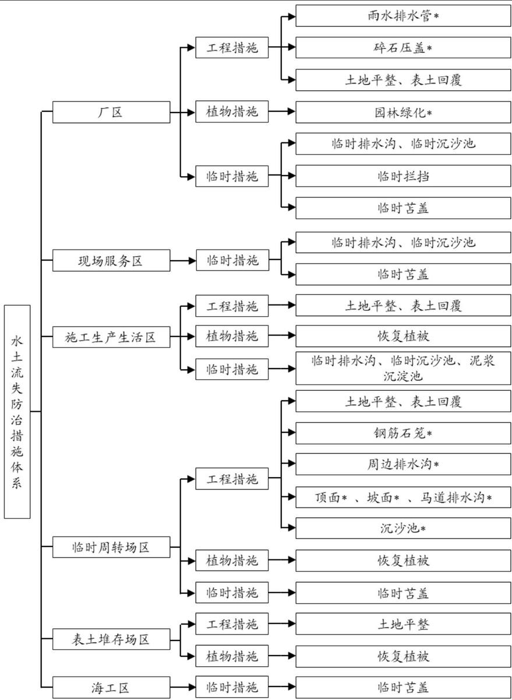  
注：\*为主体工程已有水土保持措施

图5.2-1 水土保持措施体系框图

## 5.3 分区措施布设

## 5.3.1 设计标准及要求

## （1）工程措施

根据主体工程可行性研究报告，核电厂排洪标准为 1000 年一遇1h设计暴雨，雨水管网级别为 1级，设计标准为1000年一遇10min 短历时设计暴雨。

## （2）植物措施

根据《水土保持工程设计规范》（GB 51018-2014），植被恢复工程级别应根据主体工程所处的自然及人文环境、气候条件、立地条件、征地范围、绿化要求综合确定。

三期工程厂区周边园林绿化具有景观、环境保护和生态防护多重功能，应满足《水土保持工程设计规范》（GB 51018-2014）1级植被建设工程标准。施工生产区、临时周转场区、表土堆存场区等临时用地植被恢复措施按3级植被建设工程标准设计。

## （3）临时措施

根据《水土保持工程设计规范》（GB 51018-2014），本工程临时排水措施采用标准为5年一遇 10min 短历时设计暴雨。

## 5.3.2 分区防治措施布设

## 5.3.2.1 厂区

## 5.3.2.1.1 一、二期工程水保措施实施效果

## （1）工程措施

## 1）排洪沟

二期工程在本期工程厂区北侧边坡坡脚修建了东排洪沟，接入施工生产区 D区已建的1#排洪沟，最终将洪水排入海域，排洪沟长度 418m。

## （2）临时措施

## 1）临时排水、沉沙措施

本期工程主厂区范围在二期工程中作为临时土石方堆存场使用，目前二期工程在该区土石方堆存场周边修建了临时排水沟，长度 2260m，排水沟末端共修建了沉沙池 3座。

## 2）临时拦挡、苫盖措施

二期工程在土石方堆存场周边修建了干砌石拦挡措施，并对堆存的土石方边坡进行了临时苫盖，共修建干砌石拦挡 1778m，临时苫盖 $1 2 1 6 8 \mathrm { m } ^ { 2 }$

该部分措施均由一、二期工程设计并实施，起到了良好的水土保持效果，相关费用

已纳入一、二期工程，本期工程不重复计列。本期工程开工后，基于一、二期工程已实施的水保措施，布设本期工程水保措施。

## 5.3.2.1.2 本期工程水保措施布设

## （1） 工程措施

## 1） 雨水排水管网（主体已列）

厂区采用独立的雨水排水管网系统进行有组织的雨水排水，考虑到核电厂厂址地坪标高高于设计基准洪水位，因此全厂排水拟采用分区排水、重力自流排放原则。考虑到主厂区排洪的重要性，主厂区内设计暴雨强度采用千年一遇标准，并按 PMP（可能最大暴雨）标准校核。厂区雨水经管网均向东排至外海。

厂区共设雨水管 11300m，采用 HDPE 增强缠绕型管道，管径 DN300\~DN2000。

## 2） 碎石压盖（主体已列）

核电厂主厂房区由于有剂量防护、卫生防护、安全保卫等方面的特殊要求，主厂房四周空地严禁布置绿化措施，主体设计采用了碎石压盖，碎石压盖面积 4.62hm2，压盖厚度10cm，工程量为铺碎石4620m3。

## 3） 表土回覆（方案新增）

厂区主体工程施工结束后，对厂区保护区外围可绿化区域进行表土回覆，主要为保护区围栏外的空闲场地，表土回覆面积 1.21hm2，采用 74kW 推土机推土回填，回覆表土厚度 50cm，覆土量 0.61 万 m3。

## 4） 土地平整（方案新增）

在厂区实施绿化前，对绿化区域进行土地平整，改善绿化迹地的土壤性状，以满足后期植被生长的环境需求，土地平整面积 1.21hm2。

## （2） 植物措施（主体已列）

根据《核电厂总平面及运输设计规范》（GB/T 50294-2014）的要求，核电厂保护区不应绿化，可用于绿化的范围包括保护区围栏外的空闲场地。厂区采取园林绿措施，绿化面积 1.21hm2，采用乔、灌、花、草相结合的方式，点、线、面相协调，平面和立体绿化相结合的方法创造宜人的环境。

## ① 树种草种选择

适地适树、适地适草、因地制宜，依据各树种的生态学和生物学特性，选择当地优良的乡土树种和草种，或多年栽培、适应性较强的树种和草种为主，栽植模式可选用乔、

冠、草、绿篱相结合，树种草种选择可参见表 5.3-1。

表 5.3-1  
树种草种的生态学特性表
<table><tr><td rowspan=1 colspan=1>生长型</td><td rowspan=1 colspan=1>序号</td><td rowspan=1 colspan=1>树（草）种</td><td rowspan=1 colspan=1>生长习性</td><td rowspan=1 colspan=1>适用部位及用途</td></tr><tr><td rowspan=7 colspan=1>乔木</td><td rowspan=1 colspan=1>1</td><td rowspan=1 colspan=1>宫粉紫荆</td><td rowspan=1 colspan=1>常绿乔木、适应性强、喜温暖湿润气候、生命力强、抗风</td><td rowspan=1 colspan=1>风景区、行道树</td></tr><tr><td rowspan=1 colspan=1>2</td><td rowspan=1 colspan=1>大叶紫薇</td><td rowspan=1 colspan=1>乔木，高7-25m，阳性植物。需强光。耐热、不耐寒、耐碱、耐风、耐半荫、耐剪、抗污染、大树较难移植。对土壤选择不严，抗风，耐寒，耐干旱和耐瘠薄</td><td rowspan=1 colspan=1>用作高级行道树；园景树，单植、列植、群植均可</td></tr><tr><td rowspan=1 colspan=1>3</td><td rowspan=1 colspan=1>小叶榕</td><td rowspan=1 colspan=1>常绿小乔木</td><td rowspan=1 colspan=1>行道树、园景树、防火树、防风树、绿篱树</td></tr><tr><td rowspan=1 colspan=1>4</td><td rowspan=1 colspan=1>木麻黄</td><td rowspan=1 colspan=1>常绿乔木，喜光，喜热、耐盐碱、耐贫瘠土壤，耐干旱，也耐潮湿；生长迅速，抗风力强，沙地和海滨地区均可栽植</td><td rowspan=1 colspan=1>南方滨海防风固土的优良树种；行道树、防护林或绿篱</td></tr><tr><td rowspan=1 colspan=1>5</td><td rowspan=1 colspan=1>大王椰子</td><td rowspan=1 colspan=1>常绿乔木</td><td rowspan=1 colspan=1>风景区、行道树、孤植造景</td></tr><tr><td rowspan=1 colspan=1>6</td><td rowspan=1 colspan=1>蒲桃</td><td rowspan=1 colspan=1>常绿乔木，喜光，稍耐荫。喜深厚肥沃土壤的水湿酸性土，多生于水边及河谷湿地，但亦能生长于沙地</td><td rowspan=1 colspan=1>水库、河岸防浪林</td></tr><tr><td rowspan=1 colspan=1>7</td><td rowspan=1 colspan=1>大叶桉</td><td rowspan=1 colspan=1>常绿乔木，主要生长于沼泽地和沿海沙壤土</td><td rowspan=1 colspan=1>行道树、绿化、防风林</td></tr><tr><td rowspan=4 colspan=1>灌木</td><td rowspan=1 colspan=1>1</td><td rowspan=1 colspan=1>米兰</td><td rowspan=1 colspan=1>常绿灌木、适应性强、耐贫瘠、易修剪，喜温暖湿润和阳光充足环境，不耐寒，稍耐阴，土壤以疏松、肥沃的微酸性土壤为最好，冬季温度不低于10℃</td><td rowspan=1 colspan=1>绿篱、隔离带</td></tr><tr><td rowspan=1 colspan=1>2</td><td rowspan=1 colspan=1>九里香</td><td rowspan=1 colspan=1>常绿灌木，对土壤要求不严，宜选用含腐殖质丰富、疏松、肥沃的沙质土壤</td><td rowspan=1 colspan=1>绿化、绿篱</td></tr><tr><td rowspan=1 colspan=1>3</td><td rowspan=1 colspan=1>勒杜鹃</td><td rowspan=1 colspan=1>常绿攀援状灌木。喜湿，耐高温、干旱，忌寒冻，喜肥，抗贫瘠能力强。具有较强观赏价值</td><td rowspan=1 colspan=1>园林绿化</td></tr><tr><td rowspan=1 colspan=1>4</td><td rowspan=1 colspan=1>夹竹桃</td><td rowspan=1 colspan=1>常绿大灌木，喜光，喜温暖湿润气候，不耐寒，忌水渍。适生于中性土壤，对土壤要求不严，耐烟尘，抗有毒气体</td><td rowspan=1 colspan=1>造景、抗污染树种</td></tr><tr><td rowspan=4 colspan=1>灌木</td><td rowspan=1 colspan=1>5</td><td rowspan=1 colspan=1>铺地木兰</td><td rowspan=1 colspan=1>常绿亚灌木，耐贫瘠、耐干旱、多分枝、来窝或直立，高 0.3—1.0m</td><td rowspan=1 colspan=1>绿化、造景</td></tr><tr><td rowspan=1 colspan=1>6</td><td rowspan=1 colspan=1>小叶女贞</td><td rowspan=1 colspan=1>常绿灌木、适应性强、耐贫瘠、易修剪</td><td rowspan=1 colspan=1>绿篱、抗污染树种、隔离带、路边</td></tr><tr><td rowspan=1 colspan=1>7</td><td rowspan=1 colspan=1>野牡丹</td><td rowspan=1 colspan=1>直立灌木，高1-1.5m，花大色艳丽，花期长，喜光、喜高温湿润气候，耐半荫</td><td rowspan=1 colspan=1>绿化、造景</td></tr><tr><td rowspan=1 colspan=1>8</td><td rowspan=1 colspan=1>毛杜鹃</td><td rowspan=1 colspan=1>常绿灌木、适应性强、耐贫瘠、易修剪，喜温暖湿润气候，耐阴，忌阳光暴晒</td><td rowspan=1 colspan=1>绿化、造景</td></tr><tr><td rowspan=6 colspan=1>草本</td><td rowspan=1 colspan=1>1</td><td rowspan=1 colspan=1>假俭草</td><td rowspan=1 colspan=1>根深耐旱，耐贫瘠，耐阴湿，生长迅速，侵占性和再生能力强，成坪快，覆盖率高，草层厚，耐粗放管理</td><td rowspan=1 colspan=1>各类草坪及护坡、护埂、护堤</td></tr><tr><td rowspan=1 colspan=1>2</td><td rowspan=1 colspan=1>狗牙根</td><td rowspan=1 colspan=1>多年生，生活力强，繁殖迅速，蔓延快，成片生长，不怕践踏</td><td rowspan=1 colspan=1>固土护坡绿化材料种植。</td></tr><tr><td rowspan=1 colspan=1>3</td><td rowspan=1 colspan=1>百喜草</td><td rowspan=1 colspan=1>多年生，根系发达，对土壤要求不严，在肥力较低、较干旱的沙质土壤上生长能力仍很强，耐践踏</td><td rowspan=1 colspan=1>斜坡和道路护坡、水土保持绿化植物。</td></tr><tr><td rowspan=1 colspan=1>4</td><td rowspan=1 colspan=1>台湾草</td><td rowspan=1 colspan=1>多年生草本植物，根系发达，固坡能力强、景观效果好</td><td rowspan=1 colspan=1>土边坡、风景区</td></tr><tr><td rowspan=1 colspan=1>5</td><td rowspan=1 colspan=1>结缕草</td><td rowspan=1 colspan=1>适应性较强，喜温暖气候，喜阳光。耐高温，抗干旱，耐荫</td><td rowspan=1 colspan=1>优良的草坪植物，还是良好的固土护坡植物</td></tr><tr><td rowspan=1 colspan=1>6</td><td rowspan=1 colspan=1>地毯草</td><td rowspan=1 colspan=1>多年生草本，耐酸性土壤和贫瘠的土壤环境</td><td rowspan=1 colspan=1>常作为斜坡或路边水土保持用草</td></tr></table>

续表 5.3-1

树种草种的生态学特性表
<table><tr><td rowspan=1 colspan=1>生长型</td><td rowspan=1 colspan=1>序号</td><td rowspan=1 colspan=1>树（草）种</td><td rowspan=1 colspan=1>生长习性</td><td rowspan=1 colspan=1>适用部位及用途</td></tr><tr><td rowspan=1 colspan=1></td><td rowspan=1 colspan=1>7</td><td rowspan=1 colspan=1>竹节草</td><td rowspan=1 colspan=1>多年生，根茎发达，抗旱、耐湿，耐践踏，不抗寒，耐贫瘠土壤</td><td rowspan=1 colspan=1>路旁和作水土保持草坪</td></tr></table>

## ② 植物配置与密度

在选择植物时，需考虑植物对当地土壤、气候的适应性。结合太平岭核电厂的适生植被，并考虑色彩的搭配，厂区乔木推荐宫粉紫荆、大叶紫薇等，乔木单植一排，株距2.5m，采用穴植法。灌木推荐选择九里香、米兰、勒杜鹃等，大灌木单植一排，株距2m，采用穴植法；小灌木种植密度 6株 $/ \mathrm { m } ^ { 2 } \sim 2 5$ 株 $\cdot / \mathrm { m } ^ { 2 }$ ，采用分段片植。草籽采用撒播方式，草种推荐假俭草，撒播密度为 $8 0 \mathrm { k g / h m } ^ { 2 }$ 0

为提高幼苗的成活率和保存率，栽植后应根据造林立地条件和幼苗成活、生长发育不同时期的要求，及时进行抚育管理。

## ③ 植物栽植技术

## a、苗木规格要求

用于水土保持植物措施的苗木和草种必须是一级苗和一级种，并且要有“一签、三证”，即要有标签、生产经营许可证、合格证和检疫证。乔木质量要求：无病虫害；土球完整，无破裂或松散。具体规格可参考表5.3-2\~5.3-3。

表 5.3-2  
部分乔木规格参考表
<table><tr><td rowspan=2 colspan=1>品种</td><td rowspan=1 colspan=3>规格</td><td rowspan=1 colspan=2>土球规格</td></tr><tr><td rowspan=1 colspan=1>胸径（cm）</td><td rowspan=1 colspan=1>苗高（m）</td><td rowspan=1 colspan=1>定干高度（m）</td><td rowspan=1 colspan=1>直径（cm）</td><td rowspan=1 colspan=1>深度（cm）</td></tr><tr><td rowspan=2 colspan=1>宫粉紫荆</td><td rowspan=1 colspan=1>5~6</td><td rowspan=1 colspan=1>3.0~3.5</td><td rowspan=1 colspan=1>2.0</td><td rowspan=1 colspan=1>50</td><td rowspan=1 colspan=1>50</td></tr><tr><td rowspan=1 colspan=1>7~8</td><td rowspan=1 colspan=1>3.6~4.0</td><td rowspan=1 colspan=1>2.0</td><td rowspan=1 colspan=1>60</td><td rowspan=1 colspan=1>60</td></tr><tr><td rowspan=3 colspan=1>大叶紫薇</td><td rowspan=1 colspan=1>5~6</td><td rowspan=1 colspan=1>3.0~3.3</td><td rowspan=1 colspan=1>2.0</td><td rowspan=1 colspan=1>50</td><td rowspan=1 colspan=1>50</td></tr><tr><td rowspan=1 colspan=1>7~8</td><td rowspan=1 colspan=1>3.4~3.7</td><td rowspan=1 colspan=1>2.0</td><td rowspan=1 colspan=1>60</td><td rowspan=1 colspan=1>60</td></tr><tr><td rowspan=1 colspan=1>9~10</td><td rowspan=1 colspan=1>3.8~4.0</td><td rowspan=1 colspan=1>2.0</td><td rowspan=1 colspan=1>70</td><td rowspan=1 colspan=1>70</td></tr></table>

表 5.3-3  
部分灌木规格参考表
<table><tr><td rowspan=2 colspan=1>品种</td><td rowspan=1 colspan=2>规格</td><td rowspan=1 colspan=2>土球规格</td></tr><tr><td rowspan=1 colspan=1>苗高×冠幅(cm×cm)</td><td rowspan=1 colspan=1>主枝数（枝）</td><td rowspan=1 colspan=1>直径（cm）</td><td rowspan=1 colspan=1>深度（cm）</td></tr><tr><td rowspan=4 colspan=1>九里香</td><td rowspan=1 colspan=1>80×60</td><td rowspan=1 colspan=1>3以上</td><td rowspan=1 colspan=1>30</td><td rowspan=1 colspan=1>30</td></tr><tr><td rowspan=1 colspan=1>100×80</td><td rowspan=1 colspan=1>3以上</td><td rowspan=1 colspan=1>40</td><td rowspan=1 colspan=1>40</td></tr><tr><td rowspan=1 colspan=1>120×100</td><td rowspan=1 colspan=1>3以上</td><td rowspan=1 colspan=1>50</td><td rowspan=1 colspan=1>50</td></tr><tr><td rowspan=1 colspan=1>150×120</td><td rowspan=1 colspan=1>3以上</td><td rowspan=1 colspan=1>60</td><td rowspan=1 colspan=1>60</td></tr></table>

续表 5.3-3  
部分灌木规格参考表
<table><tr><td rowspan=2 colspan=1>品种</td><td rowspan=1 colspan=2>规格</td><td rowspan=1 colspan=2>土球规格</td></tr><tr><td rowspan=1 colspan=1>苗高×冠幅(cm×cm)</td><td rowspan=1 colspan=1>主枝数（枝）</td><td rowspan=1 colspan=1>直径（cm）</td><td rowspan=1 colspan=1>深度（cm）</td></tr><tr><td rowspan=4 colspan=1>米兰</td><td rowspan=1 colspan=1>80×60</td><td rowspan=1 colspan=1>3以上</td><td rowspan=1 colspan=1>30</td><td rowspan=1 colspan=1>30</td></tr><tr><td rowspan=1 colspan=1>100×80</td><td rowspan=1 colspan=1>3以上</td><td rowspan=1 colspan=1>40</td><td rowspan=1 colspan=1>40</td></tr><tr><td rowspan=1 colspan=1>120×100</td><td rowspan=1 colspan=1>3以上</td><td rowspan=1 colspan=1>50</td><td rowspan=1 colspan=1>50</td></tr><tr><td rowspan=1 colspan=1>150×120</td><td rowspan=1 colspan=1>3以上</td><td rowspan=1 colspan=1>60</td><td rowspan=1 colspan=1>60</td></tr><tr><td rowspan=3 colspan=1>勒杜鹃</td><td rowspan=1 colspan=1>60×60</td><td rowspan=1 colspan=1>3以上</td><td rowspan=1 colspan=1>30</td><td rowspan=1 colspan=1>30</td></tr><tr><td rowspan=1 colspan=1>80×80</td><td rowspan=1 colspan=1>3以上</td><td rowspan=1 colspan=1>40</td><td rowspan=1 colspan=1>40</td></tr><tr><td rowspan=1 colspan=1>100×100</td><td rowspan=1 colspan=1>3以上</td><td rowspan=1 colspan=1>50</td><td rowspan=1 colspan=1>50</td></tr></table>

## b、整地方式

栽植乔灌树种以穴状整地和块状整地为主；种植绿篱以开沟整地为主，挖沟槽宽25\~50cm，槽深 25\~40cm，槽宽和槽深根据苗木高度确定；在建植草坪的绿化地块，对土壤要求较高，播前应全面整地。立地条件较差时，如地表为建筑垃圾、灰渣土或土壤贫瘠，需客土栽植，表层覆土厚 30cm-80cm。

## c、栽植技术

所用绿化苗木选择树形好、抗性强、无病害，根系完整的优质壮苗，常绿树种及大中型苗木移植时带土坨。以春季植苗造林为主，随整地随造林，在坑穴底部铺 10\~20cm厩肥。保持根系伸展，深栽实埋，栽后即时灌水，灌后覆土，防止蒸发。

苗木栽种前整理根系，舒展放入施有底肥的坑中，分层填压细土，踏紧压实，浇水适量（雨天不植树）。栽种 3 天内浇水 1～2次/天，以后一个月内视土壤干湿度每 3 天浇水一次。草坪应及时喷洒水保证土壤湿润，要安排专人巡视，防止人蓄践踏，同时注意及时补栽。

## d、大树移植时应注意以下事项：

大树移植前应对移植的大树生长情况、立地条件、周围环境、交通状况进行调查研究，制定移植的技术方案。当需移植大树时，移植时间宜一年前确定，移植前应分期断根、修剪，做好移植准备。

地上部枝干截口涂保护剂，主干用草绳缠紧，以减少水分蒸发；

移栽后做牢支护，防止倒伏；

移栽后切忌连续浇大水，防止因土壤通气不良造成烂根；

浇水一定要配合施用“生根粉”，以促使萌生新根；

移植后，两年内应配备专职技术人员做好修剪、剥芽、喷雾、施肥、浇水、防寒、

防病虫害等一系列养护管理工作。建立技术档案，内容包括：实施方案、施工和竣工记录、图纸、照片或录像资料及管护技术措施和验收资料。

## ④ 抚育管理

浇水、松土、除草、施肥、补植、整形修剪、防治病虫害、防牲畜、人为损害等。结合一期工程绿化灌溉经验，厂区绿化灌溉水源利用核电厂生活区经处理后的中水，采用灌溉车进行灌溉。

## （3） 临时措施

## 1）临时排水沟（方案新增）

本期工程厂区考虑施工期间沿场地外边界、主要道路和基坑周边布设临时排水沟，以排除场地汇水，收集的雨水经沉沙后排放至西侧和北侧前期施工场地已有的雨水排水系统，估算本区临时排水沟总长度约为 3420m，其中外边界排水沟长度约 2020m，道路及基坑外围排水沟长度约 1400m。由于本工程施工期较长，且根据一、二期工程实践经验，排水沟采用砖砌结构，M10砂浆抹面，矩形断面，断面尺寸为 1.20m×1.2m～1.00m×1.00m。排水沟在运行中应及时清淤，暴雨后及时进行检修。

临时排水标准按照 5年一遇10min 短历时暴雨设计。根据《水土保持工程设计规范》（GB 51018-2014），项目区雨水设计流量按下列公式计算：

$$
Q { = } I 6 . 6 7 \varphi q F
$$

式中：

Q——最大洪峰流量， $\mathrm { m } ^ { 3 } / \mathrm { s }$

φ——径流系数（取 0.55）；

q——设计重现期和降雨历时内的平均降雨强度（mm/min），取2.1mm/min；

F——最大集水面积， $\mathrm { k m } ^ { 2 }$

表 5.3-4  
设计流量计算表
<table><tr><td rowspan=1 colspan=1>名称</td><td rowspan=1 colspan=1> $\varphi$ </td><td rowspan=1 colspan=1> $q \ \mathrm { ( \ m m / m i n \ ) }$ </td><td rowspan=1 colspan=1> $F \ ( \mathrm { h m } ^ { 2 } )$ </td><td rowspan=1 colspan=1>Q $( \mathrm { m } ^ { 3 } / \mathrm { s } ^ { \ ) }$ </td></tr><tr><td rowspan=1 colspan=1>厂区边界</td><td rowspan=1 colspan=1>0.55</td><td rowspan=1 colspan=1>2.1</td><td rowspan=1 colspan=1>20</td><td rowspan=1 colspan=1>3.85</td></tr><tr><td rowspan=1 colspan=1>主要道路及基坑周边</td><td rowspan=1 colspan=1>0.55</td><td rowspan=1 colspan=1>2.1</td><td rowspan=1 colspan=1>12</td><td rowspan=1 colspan=1>2.31</td></tr></table>

排水沟采用矩形断面，断面尺按明渠均匀流公式试算求得。

$$
A = \frac { Q } { C \sqrt { R i } }
$$

$$
R = \frac { A } { \chi }
$$

$$
C = \frac { 1 } { n } R ^ { 1 / 6 }
$$

$$
A = b h
$$

$$
\chi = b + 2 h
$$

式中：

Q——渠道设计流量， $\mathrm { m } ^ { 3 } / \mathrm { s }$

A——渠道过水断面面积， $\mathrm { m } ^ { 2 } ;$

C——谢才系数；

R——水力半径，m；

i——水力比降；

n——渠床糙率；

χ——湿周，m；

b——渠底宽，m；

h——水深，m；

表 5.3-5  
临时排水沟尺寸计算表
<table><tr><td rowspan=2 colspan=1>名称</td><td rowspan=1 colspan=1>深</td><td rowspan=1 colspan=1>底宽</td><td rowspan=1 colspan=1>糙率</td><td rowspan=1 colspan=1>底坡</td><td rowspan=1 colspan=1>流量</td></tr><tr><td rowspan=1 colspan=1>h(m)</td><td rowspan=1 colspan=1>b(m)</td><td rowspan=1 colspan=1>n</td><td rowspan=1 colspan=1>i</td><td rowspan=1 colspan=1> $\mathrm { ~ Q ~ } ( \mathrm { { m } ^ { 3 } / s \mathrm { ~ } ) }$ </td></tr><tr><td rowspan=1 colspan=1>厂区边界</td><td rowspan=1 colspan=1>1.20</td><td rowspan=1 colspan=1>1.20</td><td rowspan=1 colspan=1>0.0125</td><td rowspan=1 colspan=1>0.005</td><td rowspan=1 colspan=1>4.42</td></tr><tr><td rowspan=1 colspan=1>主要道路及基坑周边</td><td rowspan=1 colspan=1>1.00</td><td rowspan=1 colspan=1>1.00</td><td rowspan=1 colspan=1>0.0125</td><td rowspan=1 colspan=1>0.005</td><td rowspan=1 colspan=1>2.72</td></tr></table>

## 2）临时沉沙池（方案新增）

施工期间，在厂区临时排水沟出口处布设沉沙池，由于施工期较长，采用临时砖砌沉沙池。临时沉沙池和临时排水沟配合使用，共同防治施工期间的水土流失。厂区共设置8座沉沙池，拟定沉沙池断面6m×2m×1.5m（长×宽×深），用砖砌结构，壁厚 240mm，底厚120mm，20mm水泥砂浆抹面防护。施工期间应定期对沉沙池进行清理，暴雨后及时进行检修，施工结束后对沉沙池进行拆除，并回填夯实。

## 3）临时拦挡、临时苫盖（方案新增）

厂区建筑物基坑开挖的土方需要临时存放后回填。对于堆存时间较短的回填土方，依照就近原则及厂区布置，在堆土前，堆土外围设置临时编织袋土挡墙，袋装土挡墙采用梯形断面，顶宽为 0.5m，底宽为 1m，高为 1m；临时堆土表面采用彩条布覆盖，避

免堆土颗粒随风迁移和大雨冲刷造成水土流失。估算本区共布设临时编织袋土挡墙700m，彩条布面积约 $1 3 0 0 0 \mathrm { m } ^ { 2 }$ 。施工中尽量缩短临时堆土时间，及时转运；土石料运走后，拆除临时袋装土挡墙，平整土地。

厂区水土保持措施工程量统计见表 5.3-6。

表 5.3-6  
厂区水土保持措施工程量
<table><tr><td rowspan=1 colspan=1>序号</td><td rowspan=1 colspan=1>措施类型</td><td rowspan=1 colspan=1>单位</td><td rowspan=1 colspan=1>数量</td><td rowspan=1 colspan=1>备注</td></tr><tr><td rowspan=1 colspan=1>一</td><td rowspan=1 colspan=1>工程措施</td><td rowspan=1 colspan=1></td><td rowspan=1 colspan=1></td><td rowspan=1 colspan=1></td></tr><tr><td rowspan=1 colspan=1>1</td><td rowspan=1 colspan=1>雨水排水管</td><td rowspan=1 colspan=1>m</td><td rowspan=1 colspan=1>11300</td><td rowspan=1 colspan=1>主体已列</td></tr><tr><td rowspan=1 colspan=1>2</td><td rowspan=1 colspan=1>碎石压盖</td><td rowspan=1 colspan=1> $\overline { { { \bf m } ^ { 3 } } }$ </td><td rowspan=1 colspan=1>4620</td><td rowspan=1 colspan=1>主体已列</td></tr><tr><td rowspan=1 colspan=1>3</td><td rowspan=1 colspan=1>表土回覆</td><td rowspan=1 colspan=1> $\overline { { \mathcal { D } } } \mathrm { ~ m } ^ { 3 }$ </td><td rowspan=1 colspan=1>0.61</td><td rowspan=1 colspan=1>方案新增</td></tr><tr><td rowspan=1 colspan=1>4</td><td rowspan=1 colspan=1>土地平整</td><td rowspan=1 colspan=1> $\mathrm { h m } ^ { 2 }$ </td><td rowspan=1 colspan=1>1.21</td><td rowspan=1 colspan=1>方案新增</td></tr><tr><td rowspan=1 colspan=1> $\underline { { \underline { { \mathbf { \delta \pi } } } } }$ </td><td rowspan=1 colspan=1>植物措施</td><td rowspan=1 colspan=1></td><td rowspan=1 colspan=1></td><td rowspan=1 colspan=1></td></tr><tr><td rowspan=1 colspan=1>1</td><td rowspan=1 colspan=1>园林绿化</td><td rowspan=1 colspan=1> $\mathrm { h m } ^ { 2 }$ </td><td rowspan=1 colspan=1>1.21</td><td rowspan=1 colspan=1>主体已列</td></tr><tr><td rowspan=1 colspan=1>三</td><td rowspan=1 colspan=1>临时措施</td><td rowspan=1 colspan=1></td><td rowspan=1 colspan=1></td><td rowspan=1 colspan=1></td></tr><tr><td rowspan=1 colspan=1>1</td><td rowspan=1 colspan=1>临时排水沟</td><td rowspan=1 colspan=1>m</td><td rowspan=1 colspan=1>3420</td><td rowspan=1 colspan=1>方案新增</td></tr><tr><td rowspan=1 colspan=1></td><td rowspan=1 colspan=1>砌砖</td><td rowspan=1 colspan=1> $\mathrm { m } ^ { 3 }$ </td><td rowspan=1 colspan=1>3574</td><td rowspan=1 colspan=1></td></tr><tr><td rowspan=1 colspan=1></td><td rowspan=1 colspan=1>土方开挖</td><td rowspan=1 colspan=1> $\mathrm { m } ^ { 3 }$ </td><td rowspan=1 colspan=1>14040</td><td rowspan=1 colspan=1></td></tr><tr><td rowspan=1 colspan=1></td><td rowspan=1 colspan=1>土方回填</td><td rowspan=1 colspan=1> $\mathrm { m } ^ { 3 }$ </td><td rowspan=1 colspan=1>545</td><td rowspan=1 colspan=1></td></tr><tr><td rowspan=1 colspan=1></td><td rowspan=1 colspan=1>M10 水泥砂浆</td><td rowspan=1 colspan=1> $\mathrm { m } ^ { 2 }$ </td><td rowspan=1 colspan=1>16402</td><td rowspan=1 colspan=1></td></tr><tr><td rowspan=1 colspan=1>2</td><td rowspan=1 colspan=1>临时沉沙池</td><td rowspan=1 colspan=1> $\tilde { \mathcal { P } }$ </td><td rowspan=1 colspan=1>8</td><td rowspan=1 colspan=1>方案新增</td></tr><tr><td rowspan=1 colspan=1></td><td rowspan=1 colspan=1>砌砖</td><td rowspan=1 colspan=1> $\mathrm { m } ^ { 3 }$ </td><td rowspan=1 colspan=1>65</td><td rowspan=1 colspan=1></td></tr><tr><td rowspan=1 colspan=1></td><td rowspan=1 colspan=1>土方开挖</td><td rowspan=1 colspan=1> $\mathrm { m } ^ { 3 }$ </td><td rowspan=1 colspan=1>204</td><td rowspan=1 colspan=1></td></tr><tr><td rowspan=1 colspan=1></td><td rowspan=1 colspan=1>土方回填</td><td rowspan=1 colspan=1> $\overline { { { \bf { m } } ^ { 3 } } }$ </td><td rowspan=1 colspan=1>34</td><td rowspan=1 colspan=1></td></tr><tr><td rowspan=1 colspan=1></td><td rowspan=1 colspan=1>M10 水泥砂浆</td><td rowspan=1 colspan=1> $\mathrm { m } ^ { 2 }$ </td><td rowspan=1 colspan=1>255</td><td rowspan=1 colspan=1></td></tr><tr><td rowspan=1 colspan=1>3</td><td rowspan=1 colspan=1>袋装土挡墙</td><td rowspan=1 colspan=1> $\mathbf { m }$ </td><td rowspan=1 colspan=1>700</td><td rowspan=1 colspan=1>方案新增</td></tr><tr><td rowspan=1 colspan=1></td><td rowspan=1 colspan=1>袋装土填筑</td><td rowspan=1 colspan=1> $\mathrm { m } ^ { 3 }$ </td><td rowspan=1 colspan=1>551</td><td rowspan=1 colspan=1></td></tr><tr><td rowspan=1 colspan=1></td><td rowspan=1 colspan=1>袋装土拆除</td><td rowspan=1 colspan=1> $\mathrm { m } ^ { 3 }$ </td><td rowspan=1 colspan=1>551</td><td rowspan=1 colspan=1></td></tr><tr><td rowspan=1 colspan=1>4</td><td rowspan=1 colspan=1>临时苫盖</td><td rowspan=1 colspan=1></td><td rowspan=1 colspan=1></td><td rowspan=1 colspan=1>方案新增</td></tr><tr><td rowspan=1 colspan=1></td><td rowspan=1 colspan=1>彩条布</td><td rowspan=1 colspan=1> $\mathrm { m } ^ { 2 }$ </td><td rowspan=1 colspan=1>13000</td><td rowspan=1 colspan=1></td></tr></table>

## 5.3.2.2 现场服务区

## （1） 临时措施

## 1）临时排水沟（方案新增）

在污水处理厂施工区周边布设临时排水沟，以排除场地汇水，收集的雨水经沉沙后排放至已有的雨水排水系统，估算本区临时排水沟总长度约为 120m。排水沟采用砖砌结构，M10 砂浆抹面，矩形断面，断面尺寸为 $0 . 5 0 \mathrm { m } \times 0 . 5 0 \mathrm { m }$ 。排水沟在运行中应及时

清淤，暴雨后及时进行检修。

## 2）临时沉沙池（方案新增）

施工期间，在本区临时排水沟出口处布设沉沙池，以配合临时排水沟共同防治施工期间的水土流失。共设置 2座沉沙池，拟定沉沙池断面6m×2m×1.5m（长×宽×深），用砖砌结构，壁厚 240mm，底厚 120mm，20mm 水泥砂浆抹面防护。施工期间应定期对沉沙池进行清理，暴雨后及时进行检修，施工结束后对沉沙池进行拆除，并回填夯实。

## 3）临时苫盖（方案新增）

在降雨前考虑对本区施工裸露迹地采用彩条布进行临时苫盖，避免大雨冲刷造成水土流失。估算本区共需彩条布面积约1000m2。

现场服务区水土保持措施工程量统计见表5.3-7。

表 5.3-7  
现场服务区水土保持措施工程量
<table><tr><td rowspan=1 colspan=1>序号</td><td rowspan=1 colspan=1>措施类型</td><td rowspan=1 colspan=1>单位</td><td rowspan=1 colspan=1>数量</td><td rowspan=1 colspan=1>备注</td></tr><tr><td rowspan=1 colspan=1>一</td><td rowspan=1 colspan=1>临时措施</td><td rowspan=1 colspan=1></td><td rowspan=1 colspan=1></td><td rowspan=1 colspan=1></td></tr><tr><td rowspan=1 colspan=1>1</td><td rowspan=1 colspan=1>临时排水沟</td><td rowspan=1 colspan=1>m</td><td rowspan=1 colspan=1>120</td><td rowspan=1 colspan=1>方案新增</td></tr><tr><td rowspan=1 colspan=1></td><td rowspan=1 colspan=1>砌砖</td><td rowspan=1 colspan=1> $\mathrm { m } ^ { 3 }$ </td><td rowspan=1 colspan=1>63</td><td rowspan=1 colspan=1></td></tr><tr><td rowspan=1 colspan=1></td><td rowspan=1 colspan=1>土方开挖</td><td rowspan=1 colspan=1> $\mathrm { m } ^ { 3 }$ </td><td rowspan=1 colspan=1>115</td><td rowspan=1 colspan=1></td></tr><tr><td rowspan=1 colspan=1></td><td rowspan=1 colspan=1>土方回填</td><td rowspan=1 colspan=1> $\mathrm { m } ^ { 3 }$ </td><td rowspan=1 colspan=1>19</td><td rowspan=1 colspan=1></td></tr><tr><td rowspan=1 colspan=1></td><td rowspan=1 colspan=1>M10 水泥砂浆</td><td rowspan=1 colspan=1> $\mathrm { m } ^ { 2 }$ </td><td rowspan=1 colspan=1>261</td><td rowspan=1 colspan=1></td></tr><tr><td rowspan=1 colspan=1>2</td><td rowspan=1 colspan=1>临时沉沙池</td><td rowspan=1 colspan=1> $\tilde { \mathcal { P } }$ </td><td rowspan=1 colspan=1>2</td><td rowspan=1 colspan=1>方案新增</td></tr><tr><td rowspan=1 colspan=1></td><td rowspan=1 colspan=1>砌砖</td><td rowspan=1 colspan=1> $\mathrm { m } ^ { 3 }$ </td><td rowspan=1 colspan=1>16</td><td rowspan=1 colspan=1></td></tr><tr><td rowspan=1 colspan=1></td><td rowspan=1 colspan=1>土方开挖</td><td rowspan=1 colspan=1> $\overline { { { \bf { m } } ^ { 3 } } }$ </td><td rowspan=1 colspan=1>51</td><td rowspan=1 colspan=1></td></tr><tr><td rowspan=1 colspan=1></td><td rowspan=1 colspan=1>土方回填</td><td rowspan=1 colspan=1> $\overline { { { \bf { m } } ^ { 3 } } }$ </td><td rowspan=1 colspan=1>8</td><td rowspan=1 colspan=1></td></tr><tr><td rowspan=1 colspan=1></td><td rowspan=1 colspan=1>M10 水泥砂浆</td><td rowspan=1 colspan=1> $\overline { { { \bf m } ^ { 2 } } }$ </td><td rowspan=1 colspan=1>64</td><td rowspan=1 colspan=1></td></tr><tr><td rowspan=1 colspan=1>3</td><td rowspan=1 colspan=1>临时苫盖</td><td rowspan=1 colspan=1></td><td rowspan=1 colspan=1></td><td rowspan=1 colspan=1>方案新增</td></tr><tr><td rowspan=1 colspan=1></td><td rowspan=1 colspan=1>彩条布</td><td rowspan=1 colspan=1> $\mathrm { m } ^ { 2 }$ </td><td rowspan=1 colspan=1>1000</td><td rowspan=1 colspan=1></td></tr></table>

5.3.2.3 施工生产区

## 5.3.2.3.1 一、二期工程水保措施实施效果

## （1）工程措施

## 1）排洪沟

一期工程在施工生产区 D区四周分别修建了1#排洪沟、2#排洪沟，2条排洪沟在施工生产区D区西南角汇流，最终将洪水排入海域，1#排洪沟长1020m，2#排洪沟长2180m。

施工生产区 G区南侧利用厂前区排洪沟进行排洪，西侧利用进场道路路基排水沟，

一期工程在西侧和北侧修建了周边排洪沟，排水均向南汇入厂前区排洪沟，最终排入海域。

## 2）雨水管网

一、二期工程在施工生产区 D区、G区内部铺设雨水管网进行有组织的排水，通过雨水管网与周边已有排水系统衔接，雨水管径为 DN300～1000，共设雨水管3731m，采用HDPE增强缠绕型管道。

## （2）植物措施

## 1）边坡绿化

一期工程对施工生产区 D区边坡实施了喷播绿化措施，绿化面积约 6.40hm2。

## （3）临时措施

## 1）临时排水、沉沙措施

一、二期工程施工期间在施工生产区 D区、G 区各施工临建子项周边修建了临时排水沟，长度约 2485m，排水沟末端共修建了沉沙池 7座。

该部分措施均由一、二期工程设计并实施，起到了良好的水土保持效果，相关费用已纳入一、二期工程，本期工程不重复计列。本期工程开工后，基于一、二期工程已实施的水保措施，补充布设本期工程水保措施。

## 5.3.2.3.2 本期工程水保措施布设

（1） 工程措施

## 1） 土地平整（方案新增）

施工结束后，对施工生产区拆除地表硬化并进行土地平整，土地平整面积51.97hm2。

## 2） 表土回覆（方案新增）

土地平整后对施工生产区迹地进行表土回覆，表土回覆面积 $5 1 . 9 7 \mathrm { h m } ^ { 2 }$ ，回覆表土厚度 0.3m，覆土量 15.59 万 m3。

## （2） 植物措施（方案新增）

施工结束后为避免施工迹地裸露，在施工生产区完成土地平整和表土回覆之后，对迹地采用乔灌草结合的方式恢复植被，面积共 $5 1 . 9 7 \mathrm { h m } ^ { 2 } .$ 。乔木种选择当地乡土树种小叶榕、海南红豆混合种植，冠幅 100-130cm，株距 3m×3m，共需种植乔木 60632 株；灌木种选择当地乡土树种勒杜鹃、九里香等混合种植，冠幅 60-80cm，株距1.5m×1.5m，共需种植灌木 242526 株；草种选择白喜草，撒播密度 $8 0 \mathrm { k g / h m } ^ { 2 }$ 。植物养护期间，灌溉水源利用核电厂生活区经处理后的中水，采用灌溉车进行灌溉。

## （3） 临时措施

## 1）临时排水沟（方案新增）

本期工程施工生产区场地充分利用一、二期工程现有的场地，场地基本均已完成了排水、沉沙、护坡、场地硬化等水土保持措施，本期工程在施工期间仅对施工生产区 G区布置的三期核岛安装场地周边补充临时排水沟，排除场地汇水，收集的雨水经沉沙后排放至周边自然水系。临时排水沟采用砖砌结构，M7.5 砂浆抹面，矩形断面，断面尺寸为 $0 . 5 \mathrm { m } \times 0 . 5 \mathrm { m }$ 。排水沟在运行中应及时清淤，暴雨后及时进行检修。施工期间共设置临时排水沟 610m。

## 2）临时沉沙池（方案新增）

施工期间，在施工生产区G区核岛安装场地临时排水沟出口处布设沉沙池，以配合临时排水沟共同防治施工期间的水土流失。共设置 2 座沉沙池，拟定沉沙池断面6m×2m×1.5m（长×宽×深），用砖砌结构，壁厚 240mm，底厚 120mm，20mm 水泥砂浆抹面防护。施工期间应定期对沉沙池进行清理，暴雨后及时进行检修，施工结束后对沉沙池进行拆除，并回填夯实。

另根据一、二期工程在施工生产区 D区布设的临时排水、沉沙措施运行情况，在 D区已有的临时排水沟汇流处增设 2座沉沙池，以减轻现有沉沙池淤积问题。拟定沉沙池断面 6m×2m×1.5m（长×宽×深），用砖砌结构，壁厚 240mm，底厚 120mm，20mm 水泥砂浆抹面防护。施工期间应定期对沉沙池进行清理，暴雨后及时进行检修，施工结束后对沉沙池进行拆除，并回填夯实。

## 3）泥浆沉淀池（方案新增）

排水隧洞盾构临时施工场地布置在厂区范围内，盾构施工过程中会产生少量的泥浆，在盾构施工场地设置泥浆沉淀池，对泥浆进行回收利用及固化，避免工程施工过程中泥浆漫流，造成对周边环境的不利影响。本区共设置泥浆沉淀池 2座。

施工生产区水土保持措施工程量统计见表5.3-8。

表 5.3-8  
施工生产区水土保持措施工程量
<table><tr><td rowspan=1 colspan=1>序号</td><td rowspan=1 colspan=1>措施类型</td><td rowspan=1 colspan=1>单位</td><td rowspan=1 colspan=1>数量</td><td rowspan=1 colspan=1>备注</td></tr><tr><td rowspan=1 colspan=1>二</td><td rowspan=1 colspan=1>工程措施</td><td rowspan=1 colspan=1></td><td rowspan=1 colspan=1></td><td rowspan=1 colspan=1></td></tr><tr><td rowspan=1 colspan=1>1</td><td rowspan=1 colspan=1>表土回覆</td><td rowspan=1 colspan=1> $\overline { { \mathcal { D } } } \mathrm { ~ m } ^ { 3 }$ </td><td rowspan=1 colspan=1>15.59</td><td rowspan=1 colspan=1>方案新增</td></tr><tr><td rowspan=1 colspan=1>2</td><td rowspan=1 colspan=1>土地平整</td><td rowspan=1 colspan=1> $\mathrm { h m } ^ { 2 }$ </td><td rowspan=1 colspan=1>51.97</td><td rowspan=1 colspan=1>方案新增</td></tr></table>

续表 5.3-8  
施工生产区水土保持措施工程量
<table><tr><td rowspan=1 colspan=1>序号</td><td rowspan=1 colspan=1>措施类型</td><td rowspan=1 colspan=1>单位</td><td rowspan=1 colspan=1>数量</td><td rowspan=1 colspan=1></td></tr><tr><td rowspan=1 colspan=1>二</td><td rowspan=1 colspan=1>植物措施</td><td rowspan=1 colspan=1></td><td rowspan=1 colspan=1></td><td rowspan=1 colspan=1></td></tr><tr><td rowspan=1 colspan=1>1</td><td rowspan=1 colspan=1>栽植乔木</td><td rowspan=1 colspan=1></td><td rowspan=1 colspan=1></td><td rowspan=1 colspan=1>方案新增</td></tr><tr><td rowspan=1 colspan=1></td><td rowspan=1 colspan=1>小叶榕</td><td rowspan=1 colspan=1>株</td><td rowspan=1 colspan=1>30316</td><td rowspan=1 colspan=1></td></tr><tr><td rowspan=1 colspan=1></td><td rowspan=1 colspan=1>海南红豆</td><td rowspan=1 colspan=1>株</td><td rowspan=1 colspan=1>30316</td><td rowspan=1 colspan=1></td></tr><tr><td rowspan=1 colspan=1>2</td><td rowspan=1 colspan=1>栽植灌木</td><td rowspan=1 colspan=1></td><td rowspan=1 colspan=1></td><td rowspan=1 colspan=1>方案新增</td></tr><tr><td rowspan=1 colspan=1></td><td rowspan=1 colspan=1>九里香</td><td rowspan=1 colspan=1>株</td><td rowspan=1 colspan=1>121263</td><td rowspan=1 colspan=1></td></tr><tr><td rowspan=1 colspan=1></td><td rowspan=1 colspan=1>勒杜鹃</td><td rowspan=1 colspan=1>株</td><td rowspan=1 colspan=1>121263</td><td rowspan=1 colspan=1></td></tr><tr><td rowspan=1 colspan=1>3</td><td rowspan=1 colspan=1>撒播草籽</td><td rowspan=1 colspan=1> $\mathrm { h m } ^ { 2 }$ </td><td rowspan=1 colspan=1>51.97</td><td rowspan=1 colspan=1>方案新增</td></tr><tr><td rowspan=1 colspan=1></td><td rowspan=1 colspan=1>百喜草</td><td rowspan=1 colspan=1> $\mathrm { k g }$ </td><td rowspan=1 colspan=1>4365</td><td rowspan=1 colspan=1></td></tr><tr><td rowspan=1 colspan=1>三</td><td rowspan=1 colspan=1>临时措施</td><td rowspan=1 colspan=1></td><td rowspan=1 colspan=1></td><td rowspan=1 colspan=1></td></tr><tr><td rowspan=1 colspan=1>1</td><td rowspan=1 colspan=1>临时排水沟</td><td rowspan=1 colspan=1>m</td><td rowspan=1 colspan=1>610</td><td rowspan=1 colspan=1>方案新增</td></tr><tr><td rowspan=1 colspan=1></td><td rowspan=1 colspan=1>砌砖</td><td rowspan=1 colspan=1> $\mathbf { m } ^ { 3 }$ </td><td rowspan=1 colspan=1>319</td><td rowspan=1 colspan=1></td></tr><tr><td rowspan=1 colspan=1></td><td rowspan=1 colspan=1>土方开挖</td><td rowspan=1 colspan=1> $\mathrm { m } ^ { 3 }$ </td><td rowspan=1 colspan=1>584</td><td rowspan=1 colspan=1></td></tr><tr><td rowspan=1 colspan=1></td><td rowspan=1 colspan=1>土方回填</td><td rowspan=1 colspan=1> $\mathrm { m } ^ { 3 }$ </td><td rowspan=1 colspan=1>97</td><td rowspan=1 colspan=1></td></tr><tr><td rowspan=1 colspan=1></td><td rowspan=1 colspan=1>M10 水泥砂浆</td><td rowspan=1 colspan=1> $\mathrm { m } ^ { 2 }$ </td><td rowspan=1 colspan=1>1329</td><td rowspan=1 colspan=1></td></tr><tr><td rowspan=1 colspan=1>2</td><td rowspan=1 colspan=1>临时沉沙池</td><td rowspan=1 colspan=1> $\tilde { \mathcal { P } }$ </td><td rowspan=1 colspan=1>4</td><td rowspan=1 colspan=1>方案新增</td></tr><tr><td rowspan=1 colspan=1></td><td rowspan=1 colspan=1>砌砖</td><td rowspan=1 colspan=1> $\mathrm { m } ^ { 3 }$ </td><td rowspan=1 colspan=1>32</td><td rowspan=1 colspan=1></td></tr><tr><td rowspan=1 colspan=1></td><td rowspan=1 colspan=1>土方开挖</td><td rowspan=1 colspan=1> $\overline { { { \bf { m } } ^ { 3 } } }$ </td><td rowspan=1 colspan=1>102</td><td rowspan=1 colspan=1></td></tr><tr><td rowspan=1 colspan=1></td><td rowspan=1 colspan=1>土方回填</td><td rowspan=1 colspan=1> $\mathrm { m } ^ { 3 }$ </td><td rowspan=1 colspan=1>17</td><td rowspan=1 colspan=1></td></tr><tr><td rowspan=1 colspan=1></td><td rowspan=1 colspan=1>M10 水泥砂浆</td><td rowspan=1 colspan=1> $\mathrm { m } ^ { 2 }$ </td><td rowspan=1 colspan=1>128</td><td rowspan=1 colspan=1></td></tr><tr><td rowspan=1 colspan=1>3</td><td rowspan=1 colspan=1>泥浆沉淀池</td><td rowspan=1 colspan=1> $\tilde { \mathcal { P } }$ </td><td rowspan=1 colspan=1>2</td><td rowspan=1 colspan=1>方案新增</td></tr><tr><td rowspan=1 colspan=1></td><td rowspan=1 colspan=1>土方开挖</td><td rowspan=1 colspan=1> $\mathrm { m } ^ { 3 }$ </td><td rowspan=1 colspan=1>26</td><td rowspan=1 colspan=1></td></tr></table>

## 5.3.2.4 临时周转场区

临时周转场主要堆存三期工程自身开挖需要回填的土石方，现状为一、二期工程在用的物资堆场及拌合站系统，场地周边已采取了拦挡、排水措施。三期工程施工期间，沿临时周转场周边坡脚处布设钢筋石笼挡墙，在临时周转场周边布设排水沟向西排入大海，出口处布设沉沙池，在顶面、坡面及马道分别布设排水沟，并汇入周边排水沟，堆存扰动期间，对堆存临时坡面采用彩条布进行临时苫盖；施工结束后，对临时周转场迹地进行土地平整并回覆表土，采用乔灌草结合的方式恢复植被。

## （1）工程措施

## 1）钢筋石笼挡墙（主体已列）

土石方中转料堆放前，在临时周转场周边坡脚设置钢筋石笼挡墙，避免堆存过程中

石方向下滑落；钢筋石笼采用品字形堆砌，顶宽1.0m，高 2.0m（埋置深度1.0m），开挖回填坡比 1:1，钢筋石笼长888m。

## 2）周边排水沟（主体已列）

在临时周转场周边布置排水沟，长902m，采用梯形断面，断面尺寸为 1.4m×1.4m（底宽×高），两侧边坡坡比 1:0.5，采用C20 混凝土现浇，衬砌厚度 30cm，排水沟每10m设伸缩缝，缝间采用闭孔塑料板填缝。排水沟经沉沙池后排入大海。

## 3）顶面、坡面、马道排水沟（主体已列）

主体考虑堆存期间，在顶面及马道分别布置顶面及马道排水沟，通过坡面排水沟汇入周边排水沟。顶面排水沟为梯形断面，断面尺寸为0.4m×0.4m（宽×深），坡比 1:0.5，衬砌厚度0.15m，采用 C20混凝土现浇，顶面排水沟长602m。马道排水沟为矩形断面，断面尺寸为 0.3m×0.3m（宽×深），衬砌厚度0.15m，采用 C20混凝土现浇，马道排水沟长775m。坡面排水沟为梯形断面，断面尺寸为0.5m×0.5m（底宽×高），两侧坡比1:0.5，衬砌厚度 0.15m，采用C20混凝土现浇，坡面排水沟长 246m。

## 4）沉沙池（主体已列）

在周边排水沟出口设置 1 座沉沙池，采用 C20 混凝土结构，尺寸 6m×3m×2m（长×宽×深），壁厚 0.5m。

## 5）土地平整（方案新增）

施工结束后，对中转料临时周转场占地范围进行土地平整，改善绿化迹地的土壤性状，以满足后期植被生长的环境需求，土地平整面积 5.27hm2。

## 6）表土回覆（方案新增）

土地平整结束后，对中转料临时周转场迹地进行绿化覆土，表土回覆面积5.27hm2，回覆表土厚度 30cm，覆土量 1.58万 m3。

## （2）植物措施（方案新增）

临时周转场迹地完成土地平整和表土回覆之后，对迹地采用乔灌草结合的方式恢复植被，面积共 $5 . 2 7 \mathrm { h m } ^ { 2 }$ 。乔木种选择当地乡土树种小叶榕、海南红豆混合种植，冠幅100-130cm，株距3m×3m，共需种植乔木 6148株；灌木种选择当地乡土树种勒杜鹃、九里香等混合种植，冠幅 60-80cm，株距1.5m×1.5m，共需种植灌木 24594株；草种选择白喜草，撒播密度 $8 0 \mathrm { k g / h m } ^ { 2 }$ 。植物养护期间，灌溉水源利用核电厂生活区经处理后的中水，采用灌溉车进行灌溉。

## （3）临时措施

## 1）临时苫盖（方案新增）

施工期间，根据土石方中转料堆置及开挖的动态施工进展，对短期形成的坡面进行临时苫盖，共需 $3 0 0 0 0 \mathrm { m } ^ { 2 }$

临时周转场区水土保持措施工程量详见表5.3-9。

表 5.3-9  
临时周转场区水土保持措施工程量
<table><tr><td rowspan=1 colspan=1>序号</td><td rowspan=1 colspan=1>措施类型</td><td rowspan=1 colspan=1>单位</td><td rowspan=1 colspan=1>数量</td><td rowspan=1 colspan=1>备注</td></tr><tr><td rowspan=1 colspan=1>一</td><td rowspan=1 colspan=1>工程措施</td><td rowspan=1 colspan=1></td><td rowspan=1 colspan=1></td><td rowspan=1 colspan=1></td></tr><tr><td rowspan=1 colspan=1>1</td><td rowspan=1 colspan=1>钢筋石笼</td><td rowspan=1 colspan=1>m</td><td rowspan=1 colspan=1>888</td><td rowspan=1 colspan=1>主体已列</td></tr><tr><td rowspan=1 colspan=1>2</td><td rowspan=1 colspan=1>周边截水沟</td><td rowspan=1 colspan=1>m</td><td rowspan=1 colspan=1>902</td><td rowspan=1 colspan=1>主体已列</td></tr><tr><td rowspan=1 colspan=1>3</td><td rowspan=1 colspan=1>顶面排水沟</td><td rowspan=1 colspan=1>m</td><td rowspan=1 colspan=1>602</td><td rowspan=1 colspan=1>主体已列</td></tr><tr><td rowspan=1 colspan=1>4</td><td rowspan=1 colspan=1>坡面排水沟</td><td rowspan=1 colspan=1>m</td><td rowspan=1 colspan=1>246</td><td rowspan=1 colspan=1>主体已列</td></tr><tr><td rowspan=1 colspan=1>5</td><td rowspan=1 colspan=1>马道排水沟</td><td rowspan=1 colspan=1>m</td><td rowspan=1 colspan=1>775</td><td rowspan=1 colspan=1>主体已列</td></tr><tr><td rowspan=1 colspan=1>6</td><td rowspan=1 colspan=1>沉沙池</td><td rowspan=1 colspan=1> $\tilde { \mathcal { P } }$ </td><td rowspan=1 colspan=1>1</td><td rowspan=1 colspan=1>主体已列</td></tr><tr><td rowspan=1 colspan=1>7</td><td rowspan=1 colspan=1>表土回覆</td><td rowspan=1 colspan=1> $\mathcal { F } \mathrm { m } ^ { 3 }$ </td><td rowspan=1 colspan=1>1.58</td><td rowspan=1 colspan=1>方案新增</td></tr><tr><td rowspan=1 colspan=1>8</td><td rowspan=1 colspan=1>土地平整</td><td rowspan=1 colspan=1> $\mathrm { h m } ^ { 2 }$ </td><td rowspan=1 colspan=1>5.27</td><td rowspan=1 colspan=1>方案新增</td></tr><tr><td rowspan=1 colspan=1>二</td><td rowspan=1 colspan=1>植物措施</td><td rowspan=1 colspan=1></td><td rowspan=1 colspan=1></td><td rowspan=1 colspan=1></td></tr><tr><td rowspan=1 colspan=1>1</td><td rowspan=1 colspan=1>栽植乔木</td><td rowspan=1 colspan=1></td><td rowspan=1 colspan=1></td><td rowspan=1 colspan=1>方案新增</td></tr><tr><td rowspan=1 colspan=1></td><td rowspan=1 colspan=1>小叶榕</td><td rowspan=1 colspan=1>株</td><td rowspan=1 colspan=1>3074</td><td rowspan=1 colspan=1></td></tr><tr><td rowspan=1 colspan=1></td><td rowspan=1 colspan=1>海南红豆</td><td rowspan=1 colspan=1>株</td><td rowspan=1 colspan=1>3074</td><td rowspan=1 colspan=1></td></tr><tr><td rowspan=1 colspan=1>2</td><td rowspan=1 colspan=1>栽植灌木</td><td rowspan=1 colspan=1></td><td rowspan=1 colspan=1></td><td rowspan=1 colspan=1>方案新增</td></tr><tr><td rowspan=1 colspan=1></td><td rowspan=1 colspan=1>九里香</td><td rowspan=1 colspan=1>株</td><td rowspan=1 colspan=1>12297</td><td rowspan=1 colspan=1></td></tr><tr><td rowspan=1 colspan=1></td><td rowspan=1 colspan=1>勒杜鹃</td><td rowspan=1 colspan=1>株</td><td rowspan=1 colspan=1>12297</td><td rowspan=1 colspan=1></td></tr><tr><td rowspan=1 colspan=1>3</td><td rowspan=1 colspan=1>撒播草籽</td><td rowspan=1 colspan=1> $\mathrm { h m } ^ { 2 }$ </td><td rowspan=1 colspan=1>5.27</td><td rowspan=1 colspan=1>方案新增</td></tr><tr><td rowspan=1 colspan=1></td><td rowspan=1 colspan=1>百喜草</td><td rowspan=1 colspan=1> $\mathrm { k g }$ </td><td rowspan=1 colspan=1>443</td><td rowspan=1 colspan=1></td></tr><tr><td rowspan=1 colspan=1>三</td><td rowspan=1 colspan=1>临时措施</td><td rowspan=1 colspan=1></td><td rowspan=1 colspan=1></td><td rowspan=1 colspan=1></td></tr><tr><td rowspan=1 colspan=1>1</td><td rowspan=1 colspan=1>临时苫盖</td><td rowspan=1 colspan=1></td><td rowspan=1 colspan=1></td><td rowspan=1 colspan=1>方案新增</td></tr><tr><td rowspan=1 colspan=1></td><td rowspan=1 colspan=1>彩条布</td><td rowspan=1 colspan=1> $\mathrm { m } ^ { 2 }$ </td><td rowspan=1 colspan=1>30000</td><td rowspan=1 colspan=1></td></tr></table>

## 5.3.2.5 表土堆存场区

## 5.3.2.5.1 一、二期工程水保措施实施效果

## （1）临时措施

一期工程对临时堆存的表土周边修建了临时挡土墙及排水沟，临时挡土墙及排水沟长约 558m，在表土裸露期间进行了临时苫盖措施，苫盖面积约 $1 0 0 0 0 \mathrm { m } ^ { 2 }$ ，并对表土堆存表面实施了临时绿化，临时绿化面积约 7000m2。

该部分措施均由一期工程设计并实施，起到了良好的水土保持效果，相关费用已纳入一期工程，本期工程不重复计列。本期工程施工后期利用一期工程表土进行覆土绿化，表土堆存场区纳入本期工程防治责任范围，在表土利用完成后，本期工程补充表土堆存场区的迹地恢复措施。

## 5.3.2.5.2 本期工程水保措施布设

## （1）工程措施

## 1）土地平整（方案新增）

施工结束后，对表土堆存场占地范围进行土地平整，改善绿化迹地的土壤性状，以满足后期植被生长的环境需求，土地平整面积 1.70hm2。

## （2）植物措施（方案新增）

表土堆存场迹地完成土地平整之后，对迹地采用乔灌草结合的方式恢复植被，面积共 $1 . 7 0 \mathrm { h m } ^ { 2 } .$ 。乔木种选择当地乡土树种小叶榕、海南红豆混合种植，冠幅 100-130cm，株距 $3 \mathrm { m } \times 3 \mathrm { m }$ ，共需种植乔木 1984 株；灌木种选择当地乡土树种勒杜鹃、九里香等混合种植，冠幅 60-80cm，株距 $1 . 5 \mathrm { m } \times 1 . 5 \mathrm { m }$ ，共需种植灌木 7934 株；草种选择白喜草，撒播密度 $8 0 \mathrm { k g / h m } ^ { 2 }$ 。植物养护期间，灌溉水源利用核电厂生活区经处理后的中水，采用灌溉车进行灌溉。

表土堆存场区水土保持措施工程量详见表 5.3-10。

表 5.3-10  
表土堆存场区水土保持措施工程量
<table><tr><td rowspan=1 colspan=1>序号</td><td rowspan=1 colspan=1>措施类型</td><td rowspan=1 colspan=1>单位</td><td rowspan=1 colspan=1>数量</td><td rowspan=1 colspan=1>备注</td></tr><tr><td rowspan=1 colspan=1>一</td><td rowspan=1 colspan=1>工程措施</td><td rowspan=1 colspan=1></td><td rowspan=1 colspan=1></td><td rowspan=1 colspan=1></td></tr><tr><td rowspan=1 colspan=1>1</td><td rowspan=1 colspan=1>土地平整</td><td rowspan=1 colspan=1> $\mathrm { h m } ^ { 2 }$ </td><td rowspan=1 colspan=1>1.70</td><td rowspan=1 colspan=1>方案新增</td></tr><tr><td rowspan=1 colspan=1>二</td><td rowspan=1 colspan=1>植物措施</td><td rowspan=1 colspan=1></td><td rowspan=1 colspan=1></td><td rowspan=1 colspan=1></td></tr><tr><td rowspan=1 colspan=1>1</td><td rowspan=1 colspan=1>栽植乔木</td><td rowspan=1 colspan=1></td><td rowspan=1 colspan=1></td><td rowspan=1 colspan=1>方案新增</td></tr><tr><td rowspan=1 colspan=1></td><td rowspan=1 colspan=1>小叶榕</td><td rowspan=1 colspan=1>株</td><td rowspan=1 colspan=1>992</td><td rowspan=1 colspan=1></td></tr><tr><td rowspan=1 colspan=1></td><td rowspan=1 colspan=1>海南红豆</td><td rowspan=1 colspan=1>株</td><td rowspan=1 colspan=1>992</td><td rowspan=1 colspan=1></td></tr><tr><td rowspan=1 colspan=1>2</td><td rowspan=1 colspan=1>栽植灌木</td><td rowspan=1 colspan=1></td><td rowspan=1 colspan=1></td><td rowspan=1 colspan=1>方案新增</td></tr><tr><td rowspan=1 colspan=1></td><td rowspan=1 colspan=1>九里香</td><td rowspan=1 colspan=1>株</td><td rowspan=1 colspan=1>3967</td><td rowspan=1 colspan=1></td></tr><tr><td rowspan=1 colspan=1></td><td rowspan=1 colspan=1>勒杜鹃</td><td rowspan=1 colspan=1>株</td><td rowspan=1 colspan=1>3967</td><td rowspan=1 colspan=1></td></tr><tr><td rowspan=1 colspan=1>3</td><td rowspan=1 colspan=1>撒播草籽</td><td rowspan=1 colspan=1> $\mathrm { h m } ^ { 2 }$ </td><td rowspan=1 colspan=1>1.70</td><td rowspan=1 colspan=1>方案新增</td></tr><tr><td rowspan=1 colspan=1></td><td rowspan=1 colspan=1>百喜草</td><td rowspan=1 colspan=1>kg</td><td rowspan=1 colspan=1>143</td><td rowspan=1 colspan=1></td></tr></table>

## 5.3.2.6 海工区

## （1）临时措施

## 1）临时苫盖（方案新增）

施工期间，考虑对海工区厂区内护岸及直立翼墙形成的裸露边坡进行临时苫盖，面积约 12500m2。

海工区水土保持措施工程量详见表 5.3-11。

表 5.3-11  
海工区水土保持措施工程量
<table><tr><td rowspan=1 colspan=1>序号</td><td rowspan=1 colspan=1>措施类型</td><td rowspan=1 colspan=1>单位</td><td rowspan=1 colspan=1>数量</td><td rowspan=1 colspan=1>备注</td></tr><tr><td rowspan=1 colspan=1>一</td><td rowspan=1 colspan=1>临时措施</td><td rowspan=1 colspan=1></td><td rowspan=1 colspan=1></td><td rowspan=1 colspan=1></td></tr><tr><td rowspan=1 colspan=1>1</td><td rowspan=1 colspan=1>临时苫盖</td><td rowspan=1 colspan=1></td><td rowspan=1 colspan=1></td><td rowspan=1 colspan=1>方案新增</td></tr><tr><td rowspan=1 colspan=1>1.1</td><td rowspan=1 colspan=1>彩条布</td><td rowspan=1 colspan=1> $\mathrm { m } ^ { 2 }$ </td><td rowspan=1 colspan=1>12500</td><td rowspan=1 colspan=1></td></tr></table>

## 5.3.3 防治措施工程量

在对主体工程已有水土保持功能措施的分析和评价的基础上，本方案补充完善了各防治区水土保持措施，形成了完整的水土保持措施防护体系。水土保持措施工程量汇总详见表 5.3-12。

表 5.3-12  
水土保持措施工程量汇总表
<table><tr><td rowspan=1 colspan=1>序号</td><td rowspan=1 colspan=1>措施类型</td><td rowspan=1 colspan=1>单位</td><td rowspan=1 colspan=1>厂区</td><td rowspan=1 colspan=1>现场服务区</td><td rowspan=1 colspan=1>施工生产区</td><td rowspan=1 colspan=1>临时周转场区</td><td rowspan=1 colspan=1>表土堆存场区</td><td rowspan=1 colspan=1>海工区</td><td rowspan=1 colspan=1>合计</td></tr><tr><td rowspan=1 colspan=1>一</td><td rowspan=1 colspan=1>工程措施</td><td rowspan=1 colspan=1></td><td rowspan=1 colspan=1></td><td rowspan=1 colspan=1></td><td rowspan=1 colspan=1></td><td rowspan=1 colspan=1></td><td rowspan=1 colspan=1></td><td rowspan=1 colspan=1></td><td rowspan=1 colspan=1></td></tr><tr><td rowspan=1 colspan=1>1</td><td rowspan=1 colspan=1>雨水排水管</td><td rowspan=1 colspan=1>m</td><td rowspan=1 colspan=1>11300</td><td rowspan=1 colspan=1></td><td rowspan=1 colspan=1></td><td rowspan=1 colspan=1></td><td rowspan=1 colspan=1></td><td rowspan=1 colspan=1></td><td rowspan=1 colspan=1>11300</td></tr><tr><td rowspan=1 colspan=1></td><td rowspan=1 colspan=1>DN300</td><td rowspan=1 colspan=1>m</td><td rowspan=1 colspan=1>3000</td><td rowspan=1 colspan=1></td><td rowspan=1 colspan=1></td><td rowspan=1 colspan=1></td><td rowspan=1 colspan=1></td><td rowspan=1 colspan=1></td><td rowspan=1 colspan=1>3000</td></tr><tr><td rowspan=1 colspan=1></td><td rowspan=1 colspan=1>DN400</td><td rowspan=1 colspan=1>m</td><td rowspan=1 colspan=1>500</td><td rowspan=1 colspan=1></td><td rowspan=1 colspan=1></td><td rowspan=1 colspan=1></td><td rowspan=1 colspan=1></td><td rowspan=1 colspan=1></td><td rowspan=1 colspan=1>500</td></tr><tr><td rowspan=1 colspan=1></td><td rowspan=1 colspan=1>DN500</td><td rowspan=1 colspan=1>m</td><td rowspan=1 colspan=1>800</td><td rowspan=1 colspan=1></td><td rowspan=1 colspan=1></td><td rowspan=1 colspan=1></td><td rowspan=1 colspan=1></td><td rowspan=1 colspan=1></td><td rowspan=1 colspan=1>800</td></tr><tr><td rowspan=1 colspan=1></td><td rowspan=1 colspan=1>DN600</td><td rowspan=1 colspan=1>m</td><td rowspan=1 colspan=1>900</td><td rowspan=1 colspan=1></td><td rowspan=1 colspan=1></td><td rowspan=1 colspan=1></td><td rowspan=1 colspan=1></td><td rowspan=1 colspan=1></td><td rowspan=1 colspan=1>900</td></tr><tr><td rowspan=1 colspan=1></td><td rowspan=1 colspan=1>DN700</td><td rowspan=1 colspan=1>m</td><td rowspan=1 colspan=1>1200</td><td rowspan=1 colspan=1></td><td rowspan=1 colspan=1></td><td rowspan=1 colspan=1></td><td rowspan=1 colspan=1></td><td rowspan=1 colspan=1></td><td rowspan=1 colspan=1>1200</td></tr><tr><td rowspan=1 colspan=1></td><td rowspan=1 colspan=1>DN800</td><td rowspan=1 colspan=1>m</td><td rowspan=1 colspan=1>600</td><td rowspan=1 colspan=1></td><td rowspan=1 colspan=1></td><td rowspan=1 colspan=1></td><td rowspan=1 colspan=1></td><td rowspan=1 colspan=1></td><td rowspan=1 colspan=1>600</td></tr><tr><td rowspan=1 colspan=1></td><td rowspan=1 colspan=1>DN900</td><td rowspan=1 colspan=1>m</td><td rowspan=1 colspan=1>500</td><td rowspan=1 colspan=1></td><td rowspan=1 colspan=1></td><td rowspan=1 colspan=1></td><td rowspan=1 colspan=1></td><td rowspan=1 colspan=1></td><td rowspan=1 colspan=1>500</td></tr><tr><td rowspan=1 colspan=1></td><td rowspan=1 colspan=1>DN1000</td><td rowspan=1 colspan=1>m</td><td rowspan=1 colspan=1>750</td><td rowspan=1 colspan=1></td><td rowspan=1 colspan=1></td><td rowspan=1 colspan=1></td><td rowspan=1 colspan=1></td><td rowspan=1 colspan=1></td><td rowspan=1 colspan=1>750</td></tr><tr><td rowspan=1 colspan=1></td><td rowspan=1 colspan=1>DN1300</td><td rowspan=1 colspan=1>m</td><td rowspan=1 colspan=1>400</td><td rowspan=1 colspan=1></td><td rowspan=1 colspan=1></td><td rowspan=1 colspan=1></td><td rowspan=1 colspan=1></td><td rowspan=1 colspan=1></td><td rowspan=1 colspan=1>400</td></tr><tr><td rowspan=1 colspan=1></td><td rowspan=1 colspan=1>DN1400</td><td rowspan=1 colspan=1>m</td><td rowspan=1 colspan=1>300</td><td rowspan=1 colspan=1></td><td rowspan=1 colspan=1></td><td rowspan=1 colspan=1></td><td rowspan=1 colspan=1></td><td rowspan=1 colspan=1></td><td rowspan=1 colspan=1>300</td></tr><tr><td rowspan=1 colspan=1></td><td rowspan=1 colspan=1>DN1500</td><td rowspan=1 colspan=1>m</td><td rowspan=1 colspan=1>100</td><td rowspan=1 colspan=1></td><td rowspan=1 colspan=1></td><td rowspan=1 colspan=1></td><td rowspan=1 colspan=1></td><td rowspan=1 colspan=1></td><td rowspan=1 colspan=1>100</td></tr><tr><td rowspan=1 colspan=1></td><td rowspan=1 colspan=1>DN1600</td><td rowspan=1 colspan=1>m</td><td rowspan=1 colspan=1>500</td><td rowspan=1 colspan=1></td><td rowspan=1 colspan=1></td><td rowspan=1 colspan=1></td><td rowspan=1 colspan=1></td><td rowspan=1 colspan=1></td><td rowspan=1 colspan=1>500</td></tr><tr><td rowspan=1 colspan=1></td><td rowspan=1 colspan=1>DN1700</td><td rowspan=1 colspan=1>m</td><td rowspan=1 colspan=1>550</td><td rowspan=1 colspan=1></td><td rowspan=1 colspan=1></td><td rowspan=1 colspan=1></td><td rowspan=1 colspan=1></td><td rowspan=1 colspan=1></td><td rowspan=1 colspan=1>550</td></tr><tr><td rowspan=1 colspan=1></td><td rowspan=1 colspan=1>DN1800</td><td rowspan=1 colspan=1>m</td><td rowspan=1 colspan=1>500</td><td rowspan=1 colspan=1></td><td rowspan=1 colspan=1></td><td rowspan=1 colspan=1></td><td rowspan=1 colspan=1></td><td rowspan=1 colspan=1></td><td rowspan=1 colspan=1>500</td></tr><tr><td rowspan=1 colspan=1></td><td rowspan=1 colspan=1>DN1900</td><td rowspan=1 colspan=1>m</td><td rowspan=1 colspan=1>150</td><td rowspan=1 colspan=1></td><td rowspan=1 colspan=1></td><td rowspan=1 colspan=1></td><td rowspan=1 colspan=1></td><td rowspan=1 colspan=1></td><td rowspan=1 colspan=1>150</td></tr><tr><td rowspan=1 colspan=1></td><td rowspan=1 colspan=1>DN2000</td><td rowspan=1 colspan=1>m</td><td rowspan=1 colspan=1>100</td><td rowspan=1 colspan=1></td><td rowspan=1 colspan=1></td><td rowspan=1 colspan=1></td><td rowspan=1 colspan=1></td><td rowspan=1 colspan=1></td><td rowspan=1 colspan=1>100</td></tr><tr><td rowspan=1 colspan=1></td><td rowspan=1 colspan=1>DN2100</td><td rowspan=1 colspan=1>m</td><td rowspan=1 colspan=1>350</td><td rowspan=1 colspan=1></td><td rowspan=1 colspan=1></td><td rowspan=1 colspan=1></td><td rowspan=1 colspan=1></td><td rowspan=1 colspan=1></td><td rowspan=1 colspan=1>350</td></tr></table>

续表 5.3-12

水土保持措施工程量汇总表
<table><tr><td rowspan=1 colspan=1>序号</td><td rowspan=1 colspan=1>措施类型</td><td rowspan=1 colspan=1>单位</td><td rowspan=1 colspan=1>厂区</td><td rowspan=1 colspan=1>现场服务区</td><td rowspan=1 colspan=1>施工生产区</td><td rowspan=1 colspan=1>临时周转场区</td><td rowspan=1 colspan=1>表土堆存场区</td><td rowspan=1 colspan=1>海工区</td><td rowspan=1 colspan=1>合计</td></tr><tr><td rowspan=1 colspan=1></td><td rowspan=1 colspan=1>DN2200</td><td rowspan=1 colspan=1>m</td><td rowspan=1 colspan=1>100</td><td rowspan=1 colspan=1></td><td rowspan=1 colspan=1></td><td rowspan=1 colspan=1></td><td rowspan=1 colspan=1></td><td rowspan=1 colspan=1></td><td rowspan=1 colspan=1>100</td></tr><tr><td rowspan=1 colspan=1>2</td><td rowspan=1 colspan=1>碎石压盖</td><td rowspan=1 colspan=1> $\mathrm { m } ^ { 3 }$ </td><td rowspan=1 colspan=1>4620</td><td rowspan=1 colspan=1></td><td rowspan=1 colspan=1></td><td rowspan=1 colspan=1></td><td rowspan=1 colspan=1></td><td rowspan=1 colspan=1></td><td rowspan=1 colspan=1>4620</td></tr><tr><td rowspan=1 colspan=1>3</td><td rowspan=1 colspan=1>钢筋石笼</td><td rowspan=1 colspan=1>m</td><td rowspan=1 colspan=1></td><td rowspan=1 colspan=1></td><td rowspan=1 colspan=1></td><td rowspan=1 colspan=1>888</td><td rowspan=1 colspan=1></td><td rowspan=1 colspan=1></td><td rowspan=1 colspan=1>888</td></tr><tr><td rowspan=1 colspan=1>4</td><td rowspan=1 colspan=1>周边截水沟</td><td rowspan=1 colspan=1>m</td><td rowspan=1 colspan=1></td><td rowspan=1 colspan=1></td><td rowspan=1 colspan=1></td><td rowspan=1 colspan=1>902</td><td rowspan=1 colspan=1></td><td rowspan=1 colspan=1></td><td rowspan=1 colspan=1>902</td></tr><tr><td rowspan=1 colspan=1>5</td><td rowspan=1 colspan=1>顶面排水沟</td><td rowspan=1 colspan=1>m</td><td rowspan=1 colspan=1></td><td rowspan=1 colspan=1></td><td rowspan=1 colspan=1></td><td rowspan=1 colspan=1>602</td><td rowspan=1 colspan=1></td><td rowspan=1 colspan=1></td><td rowspan=1 colspan=1>602</td></tr><tr><td rowspan=1 colspan=1>6</td><td rowspan=1 colspan=1>坡面排水沟</td><td rowspan=1 colspan=1>m</td><td rowspan=1 colspan=1></td><td rowspan=1 colspan=1></td><td rowspan=1 colspan=1></td><td rowspan=1 colspan=1>246</td><td rowspan=1 colspan=1></td><td rowspan=1 colspan=1></td><td rowspan=1 colspan=1>246</td></tr><tr><td rowspan=1 colspan=1>7</td><td rowspan=1 colspan=1>马道排水沟</td><td rowspan=1 colspan=1>m</td><td rowspan=1 colspan=1></td><td rowspan=1 colspan=1></td><td rowspan=1 colspan=1></td><td rowspan=1 colspan=1>775</td><td rowspan=1 colspan=1></td><td rowspan=1 colspan=1></td><td rowspan=1 colspan=1>775</td></tr><tr><td rowspan=1 colspan=1>8</td><td rowspan=1 colspan=1>沉沙池</td><td rowspan=1 colspan=1>座</td><td rowspan=1 colspan=1></td><td rowspan=1 colspan=1></td><td rowspan=1 colspan=1></td><td rowspan=1 colspan=1>1</td><td rowspan=1 colspan=1></td><td rowspan=1 colspan=1></td><td rowspan=1 colspan=1>1</td></tr><tr><td rowspan=1 colspan=1>9</td><td rowspan=1 colspan=1>表土回覆</td><td rowspan=1 colspan=1>万m³</td><td rowspan=1 colspan=1>0.61</td><td rowspan=1 colspan=1></td><td rowspan=1 colspan=1>15.59</td><td rowspan=1 colspan=1>1.58</td><td rowspan=1 colspan=1></td><td rowspan=1 colspan=1></td><td rowspan=1 colspan=1>17.78</td></tr><tr><td rowspan=1 colspan=1>10</td><td rowspan=1 colspan=1>土地平整</td><td rowspan=1 colspan=1> $\mathrm { h m } ^ { 2 }$ </td><td rowspan=1 colspan=1>1.21</td><td rowspan=1 colspan=1></td><td rowspan=1 colspan=1>51.97</td><td rowspan=1 colspan=1>5.27</td><td rowspan=1 colspan=1>1.70</td><td rowspan=1 colspan=1></td><td rowspan=1 colspan=1>60.15</td></tr><tr><td rowspan=1 colspan=1>二</td><td rowspan=1 colspan=1>植物措施</td><td rowspan=1 colspan=1></td><td rowspan=1 colspan=1></td><td rowspan=1 colspan=1></td><td rowspan=1 colspan=1></td><td rowspan=1 colspan=1></td><td rowspan=1 colspan=1></td><td rowspan=1 colspan=1></td><td rowspan=1 colspan=1></td></tr><tr><td rowspan=1 colspan=1>1</td><td rowspan=1 colspan=1>园林绿化</td><td rowspan=1 colspan=1> $\mathrm { h m } ^ { 2 }$ </td><td rowspan=1 colspan=1>1.21</td><td rowspan=1 colspan=1></td><td rowspan=1 colspan=1></td><td rowspan=1 colspan=1></td><td rowspan=1 colspan=1></td><td rowspan=1 colspan=1></td><td rowspan=1 colspan=1>1.21</td></tr><tr><td rowspan=1 colspan=1>2</td><td rowspan=1 colspan=1>栽植乔木</td><td rowspan=1 colspan=1></td><td rowspan=1 colspan=1></td><td rowspan=1 colspan=1></td><td rowspan=1 colspan=1></td><td rowspan=1 colspan=1></td><td rowspan=1 colspan=1></td><td rowspan=1 colspan=1></td><td rowspan=1 colspan=1></td></tr><tr><td rowspan=1 colspan=1></td><td rowspan=1 colspan=1>小叶榕</td><td rowspan=1 colspan=1>株</td><td rowspan=1 colspan=1></td><td rowspan=1 colspan=1></td><td rowspan=1 colspan=1>30316</td><td rowspan=1 colspan=1>3074</td><td rowspan=1 colspan=1>992</td><td rowspan=1 colspan=1></td><td rowspan=1 colspan=1>34382</td></tr><tr><td rowspan=1 colspan=1></td><td rowspan=1 colspan=1>海南红豆</td><td rowspan=1 colspan=1>株</td><td rowspan=1 colspan=1></td><td rowspan=1 colspan=1></td><td rowspan=1 colspan=1>30316</td><td rowspan=1 colspan=1>3074</td><td rowspan=1 colspan=1>992</td><td rowspan=1 colspan=1></td><td rowspan=1 colspan=1>34382</td></tr><tr><td rowspan=1 colspan=1>3</td><td rowspan=1 colspan=1>栽植灌木</td><td rowspan=1 colspan=1></td><td rowspan=1 colspan=1></td><td rowspan=1 colspan=1></td><td rowspan=1 colspan=1></td><td rowspan=1 colspan=1></td><td rowspan=1 colspan=1></td><td rowspan=1 colspan=1></td><td rowspan=1 colspan=1></td></tr><tr><td rowspan=1 colspan=1></td><td rowspan=1 colspan=1>九里香</td><td rowspan=1 colspan=1>株</td><td rowspan=1 colspan=1></td><td rowspan=1 colspan=1></td><td rowspan=1 colspan=1>121263</td><td rowspan=1 colspan=1>12297</td><td rowspan=1 colspan=1>3967</td><td rowspan=1 colspan=1></td><td rowspan=1 colspan=1>137527</td></tr><tr><td rowspan=1 colspan=1></td><td rowspan=1 colspan=1>勒杜鹃</td><td rowspan=1 colspan=1>株</td><td rowspan=1 colspan=1></td><td rowspan=1 colspan=1></td><td rowspan=1 colspan=1>121263</td><td rowspan=1 colspan=1>12297</td><td rowspan=1 colspan=1>3967</td><td rowspan=1 colspan=1></td><td rowspan=1 colspan=1>137527</td></tr><tr><td rowspan=1 colspan=1>4</td><td rowspan=1 colspan=1>撒播草籽</td><td rowspan=1 colspan=1> $\mathrm { h m } ^ { 2 }$ </td><td rowspan=1 colspan=1></td><td rowspan=1 colspan=1></td><td rowspan=1 colspan=1>51.97</td><td rowspan=1 colspan=1>5.27</td><td rowspan=1 colspan=1>1.70</td><td rowspan=1 colspan=1></td><td rowspan=1 colspan=1>58.94</td></tr><tr><td rowspan=1 colspan=1></td><td rowspan=1 colspan=1>百喜草</td><td rowspan=1 colspan=1>kg</td><td rowspan=1 colspan=1></td><td rowspan=1 colspan=1></td><td rowspan=1 colspan=1>4365</td><td rowspan=1 colspan=1>443</td><td rowspan=1 colspan=1>143</td><td rowspan=1 colspan=1></td><td rowspan=1 colspan=1>4951</td></tr><tr><td rowspan=1 colspan=1>三</td><td rowspan=1 colspan=1>临时措施</td><td rowspan=1 colspan=1></td><td rowspan=1 colspan=1></td><td rowspan=1 colspan=1></td><td rowspan=1 colspan=1></td><td rowspan=1 colspan=1></td><td rowspan=1 colspan=1></td><td rowspan=1 colspan=1></td><td rowspan=1 colspan=1></td></tr><tr><td rowspan=1 colspan=1>1</td><td rowspan=1 colspan=1>临时排水沟</td><td rowspan=1 colspan=1>m</td><td rowspan=1 colspan=1>3420</td><td rowspan=1 colspan=1>120</td><td rowspan=1 colspan=1>610</td><td rowspan=1 colspan=1></td><td rowspan=1 colspan=1></td><td rowspan=1 colspan=1></td><td rowspan=1 colspan=1>4150</td></tr><tr><td rowspan=1 colspan=1></td><td rowspan=1 colspan=1>砌砖</td><td rowspan=1 colspan=1> $\mathrm { m } ^ { 3 }$ </td><td rowspan=1 colspan=1>3574</td><td rowspan=1 colspan=1>63</td><td rowspan=1 colspan=1>319</td><td rowspan=1 colspan=1></td><td rowspan=1 colspan=1></td><td rowspan=1 colspan=1></td><td rowspan=1 colspan=1>3955</td></tr><tr><td rowspan=1 colspan=1></td><td rowspan=1 colspan=1>土方开挖</td><td rowspan=1 colspan=1> $\mathbf { m } ^ { 3 }$ </td><td rowspan=1 colspan=1>14040</td><td rowspan=1 colspan=1>115</td><td rowspan=1 colspan=1>584</td><td rowspan=1 colspan=1></td><td rowspan=1 colspan=1></td><td rowspan=1 colspan=1></td><td rowspan=1 colspan=1>14738</td></tr><tr><td rowspan=1 colspan=1></td><td rowspan=1 colspan=1>土方回填</td><td rowspan=1 colspan=1> $\mathrm { m } ^ { 3 }$ </td><td rowspan=1 colspan=1>545</td><td rowspan=1 colspan=1>19</td><td rowspan=1 colspan=1>97</td><td rowspan=1 colspan=1></td><td rowspan=1 colspan=1></td><td rowspan=1 colspan=1></td><td rowspan=1 colspan=1>662</td></tr><tr><td rowspan=1 colspan=1></td><td rowspan=1 colspan=1>M10 水泥砂浆</td><td rowspan=1 colspan=1> $\mathrm { m } ^ { 2 }$ </td><td rowspan=1 colspan=1>16402</td><td rowspan=1 colspan=1>261</td><td rowspan=1 colspan=1>1329</td><td rowspan=1 colspan=1></td><td rowspan=1 colspan=1></td><td rowspan=1 colspan=1></td><td rowspan=1 colspan=1>17992</td></tr><tr><td rowspan=1 colspan=1>2</td><td rowspan=1 colspan=1>临时沉沙池</td><td rowspan=1 colspan=1>座</td><td rowspan=1 colspan=1>8</td><td rowspan=1 colspan=1>2</td><td rowspan=1 colspan=1>4</td><td rowspan=1 colspan=1></td><td rowspan=1 colspan=1></td><td rowspan=1 colspan=1></td><td rowspan=1 colspan=1>14</td></tr><tr><td rowspan=1 colspan=1></td><td rowspan=1 colspan=1>砌砖</td><td rowspan=1 colspan=1> $\mathrm { m } ^ { 3 }$ </td><td rowspan=1 colspan=1>65</td><td rowspan=1 colspan=1>16</td><td rowspan=1 colspan=1>32</td><td rowspan=1 colspan=1></td><td rowspan=1 colspan=1></td><td rowspan=1 colspan=1></td><td rowspan=1 colspan=1>113</td></tr><tr><td rowspan=1 colspan=1></td><td rowspan=1 colspan=1>土方开挖</td><td rowspan=1 colspan=1> $\mathbf { m } ^ { 3 }$ </td><td rowspan=1 colspan=1>204</td><td rowspan=1 colspan=1>51</td><td rowspan=1 colspan=1>102</td><td rowspan=1 colspan=1></td><td rowspan=1 colspan=1></td><td rowspan=1 colspan=1></td><td rowspan=1 colspan=1>357</td></tr><tr><td rowspan=1 colspan=1></td><td rowspan=1 colspan=1>土方回填</td><td rowspan=1 colspan=1> $\mathrm { m } ^ { 3 }$ </td><td rowspan=1 colspan=1>34</td><td rowspan=1 colspan=1>8</td><td rowspan=1 colspan=1>17</td><td rowspan=1 colspan=1></td><td rowspan=1 colspan=1></td><td rowspan=1 colspan=1></td><td rowspan=1 colspan=1>59</td></tr><tr><td rowspan=1 colspan=1></td><td rowspan=1 colspan=1>M10 水泥砂浆</td><td rowspan=1 colspan=1> $\mathrm { m } ^ { 2 }$ </td><td rowspan=1 colspan=1>255</td><td rowspan=1 colspan=1>64</td><td rowspan=1 colspan=1>128</td><td rowspan=1 colspan=1></td><td rowspan=1 colspan=1></td><td rowspan=1 colspan=1></td><td rowspan=1 colspan=1>447</td></tr><tr><td rowspan=1 colspan=1>3</td><td rowspan=1 colspan=1>袋装土挡墙</td><td rowspan=1 colspan=1>m</td><td rowspan=1 colspan=1>700</td><td rowspan=1 colspan=1></td><td rowspan=1 colspan=1></td><td rowspan=1 colspan=1></td><td rowspan=1 colspan=1></td><td rowspan=1 colspan=1></td><td rowspan=1 colspan=1>700</td></tr><tr><td rowspan=1 colspan=1></td><td rowspan=1 colspan=1>袋装土填筑</td><td rowspan=1 colspan=1> $\mathrm { m } ^ { 3 }$ </td><td rowspan=1 colspan=1>551</td><td rowspan=1 colspan=1></td><td rowspan=1 colspan=1></td><td rowspan=1 colspan=1></td><td rowspan=1 colspan=1></td><td rowspan=1 colspan=1></td><td rowspan=1 colspan=1>551</td></tr><tr><td rowspan=1 colspan=1></td><td rowspan=1 colspan=1>袋装土拆除</td><td rowspan=1 colspan=1> $\mathrm { m } ^ { 3 }$ </td><td rowspan=1 colspan=1>551</td><td rowspan=1 colspan=1></td><td rowspan=1 colspan=1></td><td rowspan=1 colspan=1></td><td rowspan=1 colspan=1></td><td rowspan=1 colspan=1></td><td rowspan=1 colspan=1>551</td></tr><tr><td rowspan=1 colspan=1>4</td><td rowspan=1 colspan=1>泥浆沉淀池</td><td rowspan=1 colspan=1> $\tilde { \mathcal { P } }$ </td><td rowspan=1 colspan=1></td><td rowspan=1 colspan=1></td><td rowspan=1 colspan=1>2</td><td rowspan=1 colspan=1></td><td rowspan=1 colspan=1></td><td rowspan=1 colspan=1></td><td rowspan=1 colspan=1>2</td></tr></table>

续表 5.3-12  
水土保持措施工程量汇总表
<table><tr><td rowspan=1 colspan=1>序号</td><td rowspan=1 colspan=1>措施类型</td><td rowspan=1 colspan=1>单位</td><td rowspan=1 colspan=1> $r \not \perp$ </td><td rowspan=1 colspan=1>现场服务区</td><td rowspan=1 colspan=1>施工生产区</td><td rowspan=1 colspan=1>临时周转场区</td><td rowspan=1 colspan=1>表土堆存场区</td><td rowspan=1 colspan=1>海工区</td><td rowspan=1 colspan=1>合计</td></tr><tr><td rowspan=1 colspan=1></td><td rowspan=1 colspan=1>土方开挖</td><td rowspan=1 colspan=1> $\overline { { { \bf m } ^ { 3 } } }$ </td><td rowspan=1 colspan=1></td><td rowspan=1 colspan=1></td><td rowspan=1 colspan=1>26</td><td rowspan=1 colspan=1></td><td rowspan=1 colspan=1></td><td rowspan=1 colspan=1></td><td rowspan=1 colspan=1>26</td></tr><tr><td rowspan=1 colspan=1>5</td><td rowspan=1 colspan=1>临时苫盖</td><td rowspan=1 colspan=1></td><td rowspan=1 colspan=1></td><td rowspan=1 colspan=1></td><td rowspan=1 colspan=1></td><td rowspan=1 colspan=1></td><td rowspan=1 colspan=1></td><td rowspan=1 colspan=1></td><td rowspan=1 colspan=1></td></tr><tr><td rowspan=1 colspan=1></td><td rowspan=1 colspan=1>彩条布</td><td rowspan=1 colspan=1> $\mathrm { m } ^ { 2 }$ </td><td rowspan=1 colspan=1>13000</td><td rowspan=1 colspan=1>1000</td><td rowspan=1 colspan=1></td><td rowspan=1 colspan=1>30000</td><td rowspan=1 colspan=1></td><td rowspan=1 colspan=1>12500</td><td rowspan=1 colspan=1>56500</td></tr></table>

## 5.4 施工要求

## 5.4.1 施工方法

本方案防护措施主要有工程措施、植物措施和临时措施，不同的措施其施工组织形式不同，应区别对待。施工时应根据各防治区域具体的工程措施合理安排各施工工序，减少或避免各工序间的互相干扰，与主体工程施工一并进行。

## （1） 工程措施

本方案水土保持工程措施的实施，均与主体工程配套进行，故其施工条件与设施，原则上利用主体工程已有设施和施工条件。施工时应根据各防治区域具体的工程措施安排各施工时序，减少或避免各工序间的相互干扰。

## 1）砌石工程施工

水土保持工程所需的砌石工程规模较小，采用人工砌筑。首先进行挂线，使用镐、锹等工具进行土方开挖，采用常规砌石施工方法，人工选石、修石、冲洗，人工砌筑片石，并用水泥砂浆进行勾缝。

## 2）土地平整

土地平整工程主要包括土地平整、坑凹回填。整治中充分利用废弃土、石料，力争回填后坑平渣尽。坑凹回填根据坑凹容积与废弃土石方体积，合理安排废弃土、石料的运行路线与倾倒方式，提高回填工效；坑凹回填后进一步平整地面，有条件的表层覆土，为植物措施布设创造条件。

## 3）表土回填

表土回填顺为：粗颗粒弃渣—细颗粒弃渣—腐殖土，保证植物生长所需的立地条件。

## （2）植物措施

实施时应与当地水土保持和林业部门协调合作。所需林木种苗尽量在本地采购，同时选择有经验的施工队伍进行施工。种植过程中科学使用保水剂、长效肥、微量元素、激素等先进材料和技术，以保证苗木的成活率。

种植后，注重草木的成活率检查，决定补植（成活率41～85%）或重新造林（成活率在40%以下）与合格验收（成活率在85%以上，且分布均匀），补植应根据检查结果拟定补植措施，幼林补植时需用同一树种的大苗或同龄苗（幼林抚育及补植工程费用来自预备费）。

## （3）临时措施

## 1）临时排水沟、沉沙池

临时排水沟开挖后对沟底和沟壁进行夯实，表面覆盖塑料布，再用编织袋封压；沉沙池首先池体开挖，开挖后夯实池壁，池体砌（浇）筑、土方回填、池底及池壁抹面。

## 2）临时编织袋挡墙

编织袋土埂施工工艺：人工装弃渣、封包、堆筑。施工结束后拆除、清理。

加强施工组织管理与临时防护措施，严格控制施工用地，严禁随意扩大占压、扰动面积和损坏地貌、植被，开挖土石必须及时利用，禁止随意堆放，临时堆放须采取防护措施，严格控制施工过程中可能造成的水土流失。

## 5.4.2 施工进度安排

## （1） 施工进度安排原则

中广核广东太平岭核电厂三期工程各项措施施工进度安排及施工自然条件、水土流失防治时效性等因素，为保证水土保持各项措施能够有效落实，制定以下相应的实施进度安排原则：

1） 与主体工程“三同时”的原则。水土保持措施实施时间与主体工程各项措施实施进度相结合。

2） “先拦后弃”的原则。拦挡、排水设施应在施工前完成，同时考虑到项目区降雨主要集中在 4 月～9 月，为防止雨季施工造成的水土流失，拦挡及排水设施应在雨季前完成。

3） 适时绿化的原则。植物措施结合树（草）种的生物习性、季节性等因素，可比工程措施滞后，但必须在第一绿化期实施。绿化工程一般在春季或秋季实施，在冬季苗木停止生长活动时进行补植。

## （2） 施工进度计划

本项目主体工程于 2026 年 3 月开始施工，计划 2033 年 6 月完工，工期 87 个月。水土保持各项措施实施进度应建立在主体工程施工进度的基础上，同时结合各防治分区

水土流失特点，合理安排。水土保持工程措施（如排水沟）应在主体工程施工前进行，水土保持临时措施需结合各项工程的实施进度安排，水土保持植物措施相对滞后，应在主体土建设施完工后进行。

表 5.4-1  
水土保持措施实施进度表
<table><tr><td rowspan=2 colspan=2>项目</td><td rowspan=1 colspan=1>年份</td><td rowspan=1 colspan=3>2026</td><td rowspan=1 colspan=1></td><td rowspan=1 colspan=1></td><td rowspan=1 colspan=3>2027</td><td rowspan=1 colspan=1></td><td rowspan=1 colspan=2>2028</td><td rowspan=1 colspan=1></td><td rowspan=1 colspan=1></td><td rowspan=1 colspan=3>2029</td><td rowspan=1 colspan=4>2030</td><td rowspan=1 colspan=4>2031</td><td rowspan=1 colspan=3>2032</td><td rowspan=1 colspan=1></td><td rowspan=1 colspan=1></td><td rowspan=1 colspan=3>2033</td></tr><tr><td rowspan=1 colspan=1>季度</td><td rowspan=1 colspan=1>1</td><td rowspan=1 colspan=1>2</td><td rowspan=1 colspan=1>3</td><td rowspan=1 colspan=1>4</td><td rowspan=1 colspan=1>1</td><td rowspan=1 colspan=1>2</td><td rowspan=1 colspan=1>3</td><td rowspan=1 colspan=1>4</td><td rowspan=1 colspan=1>1</td><td rowspan=1 colspan=1>2</td><td rowspan=1 colspan=1>3</td><td rowspan=1 colspan=1>4</td><td rowspan=1 colspan=1></td><td rowspan=1 colspan=1>2</td><td rowspan=1 colspan=1>3</td><td rowspan=1 colspan=1>4</td><td rowspan=1 colspan=1>1</td><td rowspan=1 colspan=1>2</td><td rowspan=1 colspan=1>3</td><td rowspan=1 colspan=1>4</td><td rowspan=1 colspan=1>1</td><td rowspan=1 colspan=1>2</td><td rowspan=1 colspan=1>3</td><td rowspan=1 colspan=1>4</td><td rowspan=1 colspan=1></td><td rowspan=1 colspan=1>2</td><td rowspan=1 colspan=1>3</td><td rowspan=1 colspan=1>4</td><td rowspan=1 colspan=1>1</td><td rowspan=1 colspan=1>2</td><td rowspan=1 colspan=1>3</td><td rowspan=1 colspan=1>4</td></tr><tr><td rowspan=9 colspan=1>厂区</td><td rowspan=4 colspan=1>工程措施</td><td rowspan=1 colspan=1>雨水排水管</td><td rowspan=1 colspan=1></td><td rowspan=1 colspan=1></td><td rowspan=1 colspan=1></td><td rowspan=1 colspan=1></td><td rowspan=1 colspan=1></td><td rowspan=1 colspan=1></td><td rowspan=1 colspan=1></td><td rowspan=1 colspan=1></td><td></td><td></td><td></td><td></td><td></td><td></td><td></td><td></td><td></td><td></td><td></td><td></td><td></td><td></td><td></td><td></td><td></td><td></td><td></td><td rowspan=1 colspan=1></td><td rowspan=1 colspan=1></td><td rowspan=1 colspan=1></td><td rowspan=1 colspan=1></td><td rowspan=1 colspan=1></td></tr><tr><td rowspan=1 colspan=1>碎石压盖</td><td rowspan=1 colspan=1></td><td rowspan=1 colspan=1></td><td rowspan=1 colspan=1></td><td rowspan=1 colspan=1></td><td rowspan=1 colspan=1></td><td rowspan=1 colspan=1></td><td rowspan=1 colspan=1></td><td rowspan=1 colspan=1></td><td rowspan=1 colspan=1></td><td rowspan=1 colspan=1></td><td rowspan=1 colspan=1></td><td rowspan=1 colspan=1></td><td rowspan=1 colspan=1></td><td rowspan=1 colspan=1></td><td rowspan=1 colspan=1></td><td rowspan=1 colspan=1></td><td rowspan=1 colspan=1></td><td rowspan=1 colspan=1></td><td rowspan=1 colspan=1></td><td rowspan=1 colspan=1></td><td rowspan=1 colspan=1></td><td rowspan=1 colspan=1></td><td rowspan=1 colspan=1></td><td rowspan=1 colspan=1></td><td rowspan=1 colspan=1></td><td rowspan=1 colspan=1></td><td rowspan=1 colspan=1>■</td><td rowspan=1 colspan=1>---</td><td rowspan=1 colspan=1>--</td><td rowspan=1 colspan=1></td><td rowspan=1 colspan=1></td><td rowspan=1 colspan=1></td></tr><tr><td rowspan=1 colspan=1>表土回覆</td><td rowspan=1 colspan=1></td><td rowspan=1 colspan=1></td><td rowspan=1 colspan=1></td><td rowspan=1 colspan=1></td><td rowspan=1 colspan=1></td><td rowspan=1 colspan=1></td><td rowspan=1 colspan=1></td><td rowspan=1 colspan=1></td><td rowspan=1 colspan=1></td><td rowspan=1 colspan=1></td><td rowspan=1 colspan=1></td><td rowspan=1 colspan=1></td><td rowspan=1 colspan=1></td><td rowspan=1 colspan=1></td><td rowspan=1 colspan=1></td><td rowspan=1 colspan=1></td><td rowspan=1 colspan=1></td><td rowspan=1 colspan=1></td><td rowspan=1 colspan=1></td><td rowspan=1 colspan=1></td><td rowspan=1 colspan=1></td><td rowspan=1 colspan=1></td><td rowspan=1 colspan=1></td><td rowspan=1 colspan=1></td><td rowspan=1 colspan=1></td><td rowspan=1 colspan=1></td><td rowspan=1 colspan=1></td><td rowspan=1 colspan=1></td><td rowspan=1 colspan=1>--</td><td rowspan=1 colspan=1>--</td><td rowspan=1 colspan=1></td><td rowspan=1 colspan=1></td></tr><tr><td rowspan=1 colspan=1>土地平整</td><td rowspan=1 colspan=1></td><td rowspan=1 colspan=1></td><td rowspan=1 colspan=1></td><td rowspan=1 colspan=1></td><td rowspan=1 colspan=1></td><td rowspan=1 colspan=1></td><td rowspan=1 colspan=1></td><td rowspan=1 colspan=1></td><td rowspan=1 colspan=1></td><td rowspan=1 colspan=1></td><td rowspan=1 colspan=1></td><td rowspan=1 colspan=1></td><td rowspan=1 colspan=1></td><td rowspan=1 colspan=1></td><td rowspan=1 colspan=1></td><td rowspan=1 colspan=1></td><td rowspan=1 colspan=1></td><td rowspan=1 colspan=1></td><td rowspan=1 colspan=1></td><td rowspan=1 colspan=1></td><td rowspan=1 colspan=1></td><td rowspan=1 colspan=1></td><td rowspan=1 colspan=1></td><td rowspan=1 colspan=1></td><td rowspan=1 colspan=1></td><td rowspan=1 colspan=1></td><td rowspan=1 colspan=1></td><td rowspan=1 colspan=1></td><td rowspan=1 colspan=1>---</td><td rowspan=1 colspan=1>--</td><td rowspan=1 colspan=1></td><td rowspan=1 colspan=1></td></tr><tr><td rowspan=1 colspan=1>植物措施</td><td rowspan=1 colspan=1>园林绿化</td><td rowspan=1 colspan=1></td><td rowspan=1 colspan=1></td><td rowspan=1 colspan=1></td><td rowspan=1 colspan=1></td><td rowspan=1 colspan=1></td><td rowspan=1 colspan=1></td><td rowspan=1 colspan=1></td><td rowspan=1 colspan=1></td><td rowspan=1 colspan=1></td><td rowspan=1 colspan=1></td><td rowspan=1 colspan=1></td><td rowspan=1 colspan=1></td><td rowspan=1 colspan=1></td><td rowspan=1 colspan=1></td><td rowspan=1 colspan=1></td><td rowspan=1 colspan=1></td><td rowspan=1 colspan=1></td><td rowspan=1 colspan=1></td><td rowspan=1 colspan=1></td><td rowspan=1 colspan=1></td><td rowspan=1 colspan=1></td><td rowspan=1 colspan=1></td><td rowspan=1 colspan=1></td><td rowspan=1 colspan=1></td><td rowspan=1 colspan=1></td><td rowspan=1 colspan=1></td><td rowspan=1 colspan=1></td><td rowspan=1 colspan=1></td><td rowspan=1 colspan=1>■</td><td rowspan=1 colspan=1>----</td><td rowspan=1 colspan=1></td><td rowspan=1 colspan=1></td></tr><tr><td rowspan=4 colspan=1>临时措施</td><td rowspan=1 colspan=1>临时排水沟</td><td rowspan=1 colspan=1></td><td rowspan=1 colspan=1></td><td rowspan=1 colspan=1></td><td rowspan=1 colspan=1>---</td><td rowspan=1 colspan=1>----</td><td rowspan=1 colspan=1>---</td><td></td><td></td><td></td><td rowspan=1 colspan=1>---</td><td rowspan=1 colspan=1>----</td><td rowspan=1 colspan=1>----</td><td rowspan=1 colspan=1>----</td><td rowspan=1 colspan=1>---</td><td rowspan=1 colspan=1></td><td rowspan=1 colspan=1></td><td rowspan=1 colspan=1></td><td rowspan=1 colspan=1></td><td rowspan=1 colspan=1></td><td rowspan=1 colspan=1></td><td rowspan=1 colspan=1></td><td rowspan=1 colspan=1></td><td rowspan=1 colspan=1></td><td rowspan=1 colspan=1></td><td rowspan=1 colspan=1></td><td rowspan=1 colspan=1></td><td rowspan=1 colspan=1></td><td rowspan=1 colspan=1></td><td rowspan=1 colspan=1></td><td rowspan=1 colspan=1></td><td rowspan=1 colspan=1></td><td rowspan=1 colspan=1></td></tr><tr><td rowspan=1 colspan=1>临时沉沙池</td><td rowspan=1 colspan=1></td><td rowspan=1 colspan=1></td><td rowspan=1 colspan=1></td><td rowspan=1 colspan=1></td><td rowspan=1 colspan=1>-</td><td rowspan=1 colspan=1>---</td><td></td><td></td><td></td><td></td><td></td><td></td><td rowspan=1 colspan=1>---</td><td rowspan=1 colspan=1>---</td><td rowspan=1 colspan=1></td><td rowspan=1 colspan=1></td><td rowspan=1 colspan=1></td><td rowspan=1 colspan=1></td><td rowspan=1 colspan=1></td><td rowspan=1 colspan=1></td><td rowspan=1 colspan=1></td><td rowspan=1 colspan=1></td><td rowspan=1 colspan=1></td><td rowspan=1 colspan=1></td><td rowspan=1 colspan=1></td><td rowspan=1 colspan=1></td><td rowspan=1 colspan=1></td><td rowspan=1 colspan=1></td><td rowspan=1 colspan=1></td><td rowspan=1 colspan=1></td><td rowspan=1 colspan=1></td><td rowspan=1 colspan=1></td></tr><tr><td rowspan=1 colspan=1>袋装土挡墙</td><td rowspan=1 colspan=1></td><td rowspan=1 colspan=1></td><td rowspan=1 colspan=1></td><td rowspan=1 colspan=1></td><td rowspan=1 colspan=1></td><td rowspan=1 colspan=1>---</td><td rowspan=1 colspan=1>---</td><td rowspan=1 colspan=1>---</td><td rowspan=1 colspan=1>---</td><td rowspan=1 colspan=1>---</td><td rowspan=1 colspan=1>---</td><td rowspan=1 colspan=1>---</td><td rowspan=1 colspan=1>----</td><td rowspan=1 colspan=1>---</td><td rowspan=1 colspan=1></td><td rowspan=1 colspan=1></td><td rowspan=1 colspan=1></td><td rowspan=1 colspan=1></td><td rowspan=1 colspan=1></td><td rowspan=1 colspan=1></td><td rowspan=1 colspan=1></td><td rowspan=1 colspan=1></td><td rowspan=1 colspan=1></td><td rowspan=1 colspan=1></td><td rowspan=1 colspan=1></td><td rowspan=1 colspan=1></td><td rowspan=1 colspan=1></td><td rowspan=1 colspan=1></td><td rowspan=1 colspan=1></td><td rowspan=1 colspan=1></td><td rowspan=1 colspan=1></td><td rowspan=1 colspan=1></td></tr><tr><td rowspan=1 colspan=1>临时苫盖</td><td rowspan=1 colspan=1></td><td rowspan=1 colspan=1></td><td rowspan=1 colspan=1></td><td rowspan=1 colspan=1></td><td rowspan=1 colspan=1></td><td></td><td></td><td></td><td></td><td></td><td></td><td></td><td></td><td rowspan=1 colspan=1>■</td><td rowspan=1 colspan=1></td><td rowspan=1 colspan=1></td><td rowspan=1 colspan=1></td><td rowspan=1 colspan=1></td><td rowspan=1 colspan=1></td><td rowspan=1 colspan=1></td><td rowspan=1 colspan=1></td><td rowspan=1 colspan=1></td><td rowspan=1 colspan=1></td><td rowspan=1 colspan=1></td><td rowspan=1 colspan=1></td><td rowspan=1 colspan=1></td><td rowspan=1 colspan=1></td><td rowspan=1 colspan=1></td><td rowspan=1 colspan=1></td><td rowspan=1 colspan=1></td><td rowspan=1 colspan=1></td><td rowspan=1 colspan=1></td></tr><tr><td rowspan=3 colspan=1>现场服务区</td><td rowspan=3 colspan=1>临时措施</td><td rowspan=1 colspan=1>临时排水沟</td><td rowspan=1 colspan=1></td><td rowspan=1 colspan=1></td><td rowspan=1 colspan=1></td><td rowspan=1 colspan=1></td><td rowspan=1 colspan=1></td><td rowspan=1 colspan=1></td><td rowspan=1 colspan=1></td><td rowspan=1 colspan=1></td><td rowspan=1 colspan=1></td><td rowspan=1 colspan=1>----</td><td rowspan=1 colspan=1>--</td><td rowspan=1 colspan=1></td><td rowspan=1 colspan=1></td><td rowspan=1 colspan=1></td><td rowspan=1 colspan=1></td><td rowspan=1 colspan=1></td><td rowspan=1 colspan=1></td><td rowspan=1 colspan=1></td><td rowspan=1 colspan=1></td><td rowspan=1 colspan=1></td><td rowspan=1 colspan=1></td><td rowspan=1 colspan=1></td><td rowspan=1 colspan=1></td><td rowspan=1 colspan=1></td><td rowspan=1 colspan=1></td><td rowspan=1 colspan=1></td><td rowspan=1 colspan=1></td><td rowspan=1 colspan=1></td><td rowspan=1 colspan=1></td><td rowspan=1 colspan=1></td><td rowspan=1 colspan=1></td><td rowspan=1 colspan=1></td></tr><tr><td rowspan=1 colspan=1>临时沉沙池</td><td rowspan=1 colspan=1></td><td rowspan=1 colspan=1></td><td rowspan=1 colspan=1></td><td rowspan=1 colspan=1></td><td rowspan=1 colspan=1></td><td rowspan=1 colspan=1></td><td rowspan=1 colspan=1></td><td rowspan=1 colspan=1></td><td rowspan=1 colspan=1>---</td><td rowspan=1 colspan=1>----</td><td rowspan=1 colspan=1>--</td><td rowspan=1 colspan=1></td><td rowspan=1 colspan=1></td><td rowspan=1 colspan=1></td><td rowspan=1 colspan=1></td><td rowspan=1 colspan=1></td><td rowspan=1 colspan=1></td><td rowspan=1 colspan=1></td><td rowspan=1 colspan=1></td><td rowspan=1 colspan=1></td><td rowspan=1 colspan=1></td><td rowspan=1 colspan=1></td><td rowspan=1 colspan=1></td><td rowspan=1 colspan=1></td><td rowspan=1 colspan=1></td><td rowspan=1 colspan=1></td><td rowspan=1 colspan=1></td><td rowspan=1 colspan=1></td><td rowspan=1 colspan=1></td><td rowspan=1 colspan=1></td><td rowspan=1 colspan=1></td><td rowspan=1 colspan=1></td></tr><tr><td rowspan=1 colspan=1>临时苫盖</td><td rowspan=1 colspan=1></td><td rowspan=1 colspan=1></td><td rowspan=1 colspan=1></td><td rowspan=1 colspan=1></td><td rowspan=1 colspan=1></td><td rowspan=1 colspan=1></td><td rowspan=1 colspan=1></td><td rowspan=1 colspan=1></td><td rowspan=1 colspan=1></td><td rowspan=1 colspan=1>----</td><td></td><td rowspan=1 colspan=1>---</td><td rowspan=1 colspan=1></td><td rowspan=1 colspan=1></td><td rowspan=1 colspan=1></td><td rowspan=1 colspan=1></td><td rowspan=1 colspan=1></td><td rowspan=1 colspan=1></td><td rowspan=1 colspan=1></td><td rowspan=1 colspan=1></td><td rowspan=1 colspan=1></td><td rowspan=1 colspan=1></td><td rowspan=1 colspan=1></td><td rowspan=1 colspan=1></td><td rowspan=1 colspan=1></td><td rowspan=1 colspan=1></td><td rowspan=1 colspan=1></td><td rowspan=1 colspan=1></td><td rowspan=1 colspan=1></td><td rowspan=1 colspan=1></td><td rowspan=1 colspan=1></td><td rowspan=1 colspan=1></td></tr><tr><td rowspan=6 colspan=1>施工生产区</td><td rowspan=2 colspan=1>工程措施</td><td rowspan=1 colspan=1>表土回覆</td><td rowspan=1 colspan=1></td><td rowspan=1 colspan=1></td><td rowspan=1 colspan=1></td><td rowspan=1 colspan=1></td><td rowspan=1 colspan=1></td><td rowspan=1 colspan=1></td><td rowspan=1 colspan=1></td><td rowspan=1 colspan=1></td><td rowspan=1 colspan=1></td><td rowspan=1 colspan=1></td><td rowspan=1 colspan=1></td><td rowspan=1 colspan=1></td><td rowspan=1 colspan=1></td><td rowspan=1 colspan=1></td><td rowspan=1 colspan=1></td><td rowspan=1 colspan=1></td><td rowspan=1 colspan=1></td><td rowspan=1 colspan=1></td><td rowspan=1 colspan=1></td><td rowspan=1 colspan=1></td><td rowspan=1 colspan=1></td><td rowspan=1 colspan=1></td><td rowspan=1 colspan=1></td><td rowspan=1 colspan=1></td><td rowspan=1 colspan=1></td><td rowspan=1 colspan=1></td><td rowspan=1 colspan=1></td><td rowspan=1 colspan=1></td><td rowspan=1 colspan=1>■ </td><td rowspan=1 colspan=1>■</td><td rowspan=1 colspan=1></td><td rowspan=1 colspan=1></td></tr><tr><td rowspan=1 colspan=1>土地平整</td><td rowspan=1 colspan=1></td><td rowspan=1 colspan=1></td><td rowspan=1 colspan=1></td><td rowspan=1 colspan=1></td><td rowspan=1 colspan=1></td><td rowspan=1 colspan=1></td><td rowspan=1 colspan=1></td><td rowspan=1 colspan=1></td><td rowspan=1 colspan=1></td><td rowspan=1 colspan=1></td><td rowspan=1 colspan=1></td><td rowspan=1 colspan=1></td><td rowspan=1 colspan=1></td><td rowspan=1 colspan=1></td><td rowspan=1 colspan=1></td><td rowspan=1 colspan=1></td><td rowspan=1 colspan=1></td><td rowspan=1 colspan=1></td><td rowspan=1 colspan=1></td><td rowspan=1 colspan=1></td><td rowspan=1 colspan=1></td><td rowspan=1 colspan=1></td><td rowspan=1 colspan=1></td><td rowspan=1 colspan=1></td><td rowspan=1 colspan=1></td><td rowspan=1 colspan=1></td><td rowspan=1 colspan=1></td><td rowspan=1 colspan=1></td><td rowspan=1 colspan=1>--</td><td rowspan=1 colspan=1>--</td><td rowspan=1 colspan=1></td><td rowspan=1 colspan=1></td></tr><tr><td rowspan=2 colspan=1>植物措施</td><td rowspan=1 colspan=1>栽植乔灌木</td><td rowspan=1 colspan=1></td><td rowspan=1 colspan=1></td><td rowspan=1 colspan=1></td><td rowspan=1 colspan=1></td><td rowspan=1 colspan=1></td><td rowspan=1 colspan=1></td><td rowspan=1 colspan=1></td><td rowspan=1 colspan=1></td><td rowspan=1 colspan=1></td><td rowspan=1 colspan=1></td><td rowspan=1 colspan=1></td><td rowspan=1 colspan=1></td><td rowspan=1 colspan=1></td><td rowspan=1 colspan=1></td><td rowspan=1 colspan=1></td><td rowspan=1 colspan=1></td><td rowspan=1 colspan=1></td><td rowspan=1 colspan=1></td><td rowspan=1 colspan=1></td><td rowspan=1 colspan=1></td><td rowspan=1 colspan=1></td><td rowspan=1 colspan=1></td><td rowspan=1 colspan=1></td><td rowspan=1 colspan=1></td><td rowspan=1 colspan=1></td><td rowspan=1 colspan=1></td><td rowspan=1 colspan=1></td><td rowspan=1 colspan=1></td><td rowspan=1 colspan=1>--</td><td rowspan=1 colspan=1>---</td><td rowspan=1 colspan=1></td><td rowspan=1 colspan=1></td></tr><tr><td rowspan=1 colspan=1>撒播草籽</td><td rowspan=1 colspan=1></td><td rowspan=1 colspan=1></td><td rowspan=1 colspan=1></td><td rowspan=1 colspan=1></td><td rowspan=1 colspan=1></td><td rowspan=1 colspan=1></td><td rowspan=1 colspan=1></td><td rowspan=1 colspan=1></td><td rowspan=1 colspan=1></td><td rowspan=1 colspan=1></td><td rowspan=1 colspan=1></td><td rowspan=1 colspan=1></td><td rowspan=1 colspan=1></td><td rowspan=1 colspan=1></td><td rowspan=1 colspan=1></td><td rowspan=1 colspan=1></td><td rowspan=1 colspan=1></td><td rowspan=1 colspan=1></td><td rowspan=1 colspan=1></td><td rowspan=1 colspan=1></td><td rowspan=1 colspan=1></td><td rowspan=1 colspan=1></td><td rowspan=1 colspan=1></td><td rowspan=1 colspan=1></td><td rowspan=1 colspan=1></td><td rowspan=1 colspan=1></td><td rowspan=1 colspan=1></td><td rowspan=1 colspan=1></td><td rowspan=1 colspan=1>--</td><td rowspan=1 colspan=1>---</td><td rowspan=1 colspan=1></td><td rowspan=1 colspan=1></td></tr><tr><td rowspan=2 colspan=1>临时措施</td><td rowspan=1 colspan=1>临时排水沟</td><td rowspan=1 colspan=1></td><td></td><td></td><td></td><td></td><td></td><td rowspan=1 colspan=1>--</td><td rowspan=1 colspan=1></td><td rowspan=1 colspan=1></td><td rowspan=1 colspan=1></td><td rowspan=1 colspan=1></td><td rowspan=1 colspan=1></td><td rowspan=1 colspan=1></td><td rowspan=1 colspan=1></td><td rowspan=1 colspan=1></td><td rowspan=1 colspan=1></td><td rowspan=1 colspan=1></td><td rowspan=1 colspan=1></td><td rowspan=1 colspan=1></td><td rowspan=1 colspan=1></td><td rowspan=1 colspan=1></td><td rowspan=1 colspan=1></td><td rowspan=1 colspan=1></td><td rowspan=1 colspan=1></td><td rowspan=1 colspan=1></td><td rowspan=1 colspan=1></td><td rowspan=1 colspan=1></td><td rowspan=1 colspan=1></td><td rowspan=1 colspan=1></td><td rowspan=1 colspan=1></td><td rowspan=1 colspan=1></td><td rowspan=1 colspan=1></td></tr><tr><td rowspan=1 colspan=1>临时沉沙池</td><td rowspan=1 colspan=1></td><td></td><td></td><td></td><td></td><td rowspan=1 colspan=1>----</td><td rowspan=1 colspan=1>--</td><td rowspan=1 colspan=1></td><td rowspan=1 colspan=1></td><td rowspan=1 colspan=1></td><td rowspan=1 colspan=1></td><td rowspan=1 colspan=1></td><td rowspan=1 colspan=1></td><td rowspan=1 colspan=1></td><td rowspan=1 colspan=1></td><td rowspan=1 colspan=1></td><td rowspan=1 colspan=1></td><td rowspan=1 colspan=1></td><td rowspan=1 colspan=1></td><td rowspan=1 colspan=1></td><td rowspan=1 colspan=1></td><td rowspan=1 colspan=1></td><td rowspan=1 colspan=1></td><td rowspan=1 colspan=1></td><td rowspan=1 colspan=1></td><td rowspan=1 colspan=1></td><td rowspan=1 colspan=1></td><td rowspan=1 colspan=1></td><td rowspan=1 colspan=1></td><td rowspan=1 colspan=1></td><td rowspan=1 colspan=1></td><td rowspan=1 colspan=1></td></tr><tr><td rowspan=11 colspan=1>临时周转场区</td><td rowspan=8 colspan=1>工程措施</td><td rowspan=1 colspan=1>钢筋石笼</td><td rowspan=1 colspan=1></td><td rowspan=1 colspan=1></td><td rowspan=1 colspan=1></td><td rowspan=1 colspan=1>--</td><td rowspan=1 colspan=1></td><td rowspan=1 colspan=1></td><td rowspan=1 colspan=1></td><td rowspan=1 colspan=1></td><td rowspan=1 colspan=1></td><td rowspan=1 colspan=1></td><td rowspan=1 colspan=1></td><td rowspan=1 colspan=1></td><td rowspan=1 colspan=1></td><td rowspan=1 colspan=1></td><td rowspan=1 colspan=1></td><td rowspan=1 colspan=1></td><td rowspan=1 colspan=1></td><td rowspan=1 colspan=1></td><td rowspan=1 colspan=1></td><td rowspan=1 colspan=1></td><td rowspan=1 colspan=1></td><td rowspan=1 colspan=1></td><td rowspan=1 colspan=1></td><td rowspan=1 colspan=1></td><td rowspan=1 colspan=1></td><td rowspan=1 colspan=1></td><td rowspan=1 colspan=1></td><td rowspan=1 colspan=1></td><td rowspan=1 colspan=1></td><td rowspan=1 colspan=1></td><td rowspan=1 colspan=1></td><td rowspan=1 colspan=1></td></tr><tr><td rowspan=1 colspan=1>周边截水沟</td><td rowspan=1 colspan=1></td><td rowspan=1 colspan=1></td><td rowspan=1 colspan=1></td><td rowspan=1 colspan=1>--</td><td rowspan=1 colspan=1></td><td rowspan=1 colspan=1></td><td rowspan=1 colspan=1></td><td rowspan=1 colspan=1></td><td rowspan=1 colspan=1></td><td rowspan=1 colspan=1></td><td rowspan=1 colspan=1></td><td rowspan=1 colspan=1></td><td rowspan=1 colspan=1></td><td rowspan=1 colspan=1></td><td rowspan=1 colspan=1></td><td rowspan=1 colspan=1></td><td rowspan=1 colspan=1></td><td rowspan=1 colspan=1></td><td rowspan=1 colspan=1></td><td rowspan=1 colspan=1></td><td rowspan=1 colspan=1></td><td rowspan=1 colspan=1></td><td rowspan=1 colspan=1></td><td rowspan=1 colspan=1></td><td rowspan=1 colspan=1></td><td rowspan=1 colspan=1></td><td rowspan=1 colspan=1></td><td rowspan=1 colspan=1></td><td rowspan=1 colspan=1></td><td rowspan=1 colspan=1></td><td rowspan=1 colspan=1></td><td rowspan=1 colspan=1></td></tr><tr><td rowspan=1 colspan=1>顶面排水沟</td><td rowspan=1 colspan=1></td><td rowspan=1 colspan=1></td><td rowspan=1 colspan=1></td><td rowspan=1 colspan=1></td><td></td><td></td><td></td><td rowspan=1 colspan=1></td><td rowspan=1 colspan=1></td><td rowspan=1 colspan=1>----</td><td rowspan=1 colspan=1>----</td><td rowspan=1 colspan=1></td><td rowspan=1 colspan=1></td><td rowspan=1 colspan=1></td><td rowspan=1 colspan=1></td><td rowspan=1 colspan=1></td><td rowspan=1 colspan=1>---:</td><td rowspan=1 colspan=1>--:</td><td rowspan=1 colspan=1></td><td rowspan=1 colspan=1></td><td rowspan=1 colspan=1></td><td rowspan=1 colspan=1></td><td rowspan=1 colspan=1></td><td rowspan=1 colspan=1></td><td rowspan=1 colspan=1></td><td rowspan=1 colspan=1></td><td rowspan=1 colspan=1></td><td rowspan=1 colspan=1></td><td rowspan=1 colspan=1></td><td rowspan=1 colspan=1></td><td rowspan=1 colspan=1></td><td rowspan=1 colspan=1></td></tr><tr><td></td><td></td><td></td><td></td><td></td><td></td><td rowspan=1 colspan=2>坡面排水沟</td><td rowspan=1 colspan=1></td><td rowspan=1 colspan=1></td><td rowspan=1 colspan=1></td><td rowspan=1 colspan=1></td><td rowspan=1 colspan=1>---</td><td rowspan=1 colspan=1>---</td><td rowspan=1 colspan=1>----</td><td rowspan=1 colspan=1>----</td><td rowspan=1 colspan=1></td><td rowspan=1 colspan=1>---</td><td rowspan=1 colspan=1>--.</td><td rowspan=1 colspan=1></td><td rowspan=1 colspan=1></td><td rowspan=1 colspan=1></td><td rowspan=1 colspan=1></td><td rowspan=1 colspan=1></td><td rowspan=1 colspan=1></td><td rowspan=1 colspan=1></td><td rowspan=1 colspan=1></td><td rowspan=1 colspan=1></td><td rowspan=1 colspan=1></td><td rowspan=1 colspan=1></td><td rowspan=1 colspan=1></td><td rowspan=1 colspan=1></td><td rowspan=1 colspan=1></td></tr><tr><td rowspan=1 colspan=1>马道排水沟</td><td rowspan=1 colspan=1></td><td rowspan=1 colspan=1></td><td rowspan=1 colspan=1></td><td rowspan=1 colspan=1></td><td></td><td></td><td></td><td></td><td></td><td></td><td></td><td></td><td></td><td></td><td></td><td></td><td></td><td rowspan=1 colspan=1></td><td rowspan=1 colspan=1></td><td rowspan=1 colspan=1></td><td rowspan=1 colspan=1></td><td rowspan=1 colspan=1></td><td rowspan=1 colspan=1></td><td rowspan=1 colspan=1></td><td rowspan=1 colspan=1></td><td rowspan=1 colspan=1></td><td rowspan=1 colspan=1></td><td rowspan=1 colspan=1></td><td rowspan=1 colspan=1></td><td rowspan=1 colspan=1></td><td rowspan=1 colspan=1></td><td rowspan=1 colspan=1></td></tr><tr><td rowspan=1 colspan=1>沉沙池</td><td rowspan=1 colspan=1></td><td rowspan=1 colspan=1></td><td rowspan=1 colspan=1></td><td rowspan=1 colspan=1>-</td><td rowspan=1 colspan=1></td><td rowspan=1 colspan=1></td><td rowspan=1 colspan=1></td><td rowspan=1 colspan=1></td><td rowspan=1 colspan=1></td><td rowspan=1 colspan=1></td><td rowspan=1 colspan=1></td><td rowspan=1 colspan=1></td><td rowspan=1 colspan=1></td><td rowspan=1 colspan=1></td><td rowspan=1 colspan=1></td><td rowspan=1 colspan=1></td><td rowspan=1 colspan=1></td><td rowspan=1 colspan=1></td><td rowspan=1 colspan=1></td><td rowspan=1 colspan=1></td><td rowspan=1 colspan=1></td><td rowspan=1 colspan=1></td><td rowspan=1 colspan=1></td><td rowspan=1 colspan=1></td><td rowspan=1 colspan=1></td><td rowspan=1 colspan=1></td><td rowspan=1 colspan=1></td><td rowspan=1 colspan=1></td><td rowspan=1 colspan=1></td><td rowspan=1 colspan=1></td><td rowspan=1 colspan=1></td><td rowspan=1 colspan=1></td></tr><tr><td rowspan=1 colspan=1>表土回覆</td><td rowspan=1 colspan=1></td><td rowspan=1 colspan=1></td><td rowspan=1 colspan=1></td><td rowspan=1 colspan=1></td><td rowspan=1 colspan=1></td><td rowspan=1 colspan=1></td><td rowspan=1 colspan=1></td><td rowspan=1 colspan=1></td><td rowspan=1 colspan=1></td><td rowspan=1 colspan=1></td><td rowspan=1 colspan=1></td><td rowspan=1 colspan=1></td><td rowspan=1 colspan=1></td><td rowspan=1 colspan=1></td><td rowspan=1 colspan=1></td><td rowspan=1 colspan=1></td><td rowspan=1 colspan=1></td><td rowspan=1 colspan=1></td><td rowspan=1 colspan=1></td><td rowspan=1 colspan=1></td><td rowspan=1 colspan=1></td><td rowspan=1 colspan=1></td><td rowspan=1 colspan=1></td><td rowspan=1 colspan=1></td><td rowspan=1 colspan=1></td><td rowspan=1 colspan=1></td><td rowspan=1 colspan=1></td><td rowspan=1 colspan=1></td><td rowspan=1 colspan=1></td><td rowspan=1 colspan=1>--</td><td rowspan=1 colspan=1></td><td rowspan=1 colspan=1></td></tr><tr><td rowspan=1 colspan=1>土地平整</td><td rowspan=1 colspan=1></td><td rowspan=1 colspan=1></td><td rowspan=1 colspan=1></td><td rowspan=1 colspan=1></td><td rowspan=1 colspan=1></td><td rowspan=1 colspan=1></td><td rowspan=1 colspan=1></td><td rowspan=1 colspan=1></td><td rowspan=1 colspan=1></td><td rowspan=1 colspan=1></td><td rowspan=1 colspan=1></td><td rowspan=1 colspan=1></td><td rowspan=1 colspan=1></td><td rowspan=1 colspan=1></td><td rowspan=1 colspan=1></td><td rowspan=1 colspan=1></td><td rowspan=1 colspan=1></td><td rowspan=1 colspan=1></td><td rowspan=1 colspan=1></td><td rowspan=1 colspan=1></td><td rowspan=1 colspan=1></td><td rowspan=1 colspan=1></td><td rowspan=1 colspan=1></td><td rowspan=1 colspan=1></td><td rowspan=1 colspan=1></td><td rowspan=1 colspan=1></td><td rowspan=1 colspan=1></td><td rowspan=1 colspan=1></td><td rowspan=1 colspan=1>---</td><td rowspan=1 colspan=1>i</td><td rowspan=1 colspan=1></td><td rowspan=1 colspan=1></td></tr><tr><td rowspan=2 colspan=1>植物措施</td><td rowspan=1 colspan=1>栽植乔灌木</td><td rowspan=1 colspan=1></td><td rowspan=1 colspan=1></td><td rowspan=1 colspan=1></td><td rowspan=1 colspan=1></td><td rowspan=1 colspan=1></td><td rowspan=1 colspan=1></td><td rowspan=1 colspan=1></td><td rowspan=1 colspan=1></td><td rowspan=1 colspan=1></td><td rowspan=1 colspan=1></td><td rowspan=1 colspan=1></td><td rowspan=1 colspan=1></td><td rowspan=1 colspan=1></td><td rowspan=1 colspan=1></td><td rowspan=1 colspan=1></td><td rowspan=1 colspan=1></td><td rowspan=1 colspan=1></td><td rowspan=1 colspan=1></td><td rowspan=1 colspan=1></td><td rowspan=1 colspan=1></td><td rowspan=1 colspan=1></td><td rowspan=1 colspan=1></td><td rowspan=1 colspan=1></td><td rowspan=1 colspan=1></td><td rowspan=1 colspan=1></td><td rowspan=1 colspan=1></td><td rowspan=1 colspan=1></td><td rowspan=1 colspan=1></td><td rowspan=1 colspan=1>--</td><td rowspan=1 colspan=1>----</td><td rowspan=1 colspan=1></td><td rowspan=1 colspan=1></td></tr><tr><td rowspan=1 colspan=1>撒播草籽</td><td rowspan=1 colspan=1></td><td rowspan=1 colspan=1></td><td rowspan=1 colspan=1></td><td rowspan=1 colspan=1></td><td rowspan=1 colspan=1></td><td rowspan=1 colspan=1></td><td rowspan=1 colspan=1></td><td rowspan=1 colspan=1></td><td rowspan=1 colspan=1></td><td rowspan=1 colspan=1></td><td rowspan=1 colspan=1></td><td rowspan=1 colspan=1></td><td rowspan=1 colspan=1></td><td rowspan=1 colspan=1></td><td rowspan=1 colspan=1></td><td rowspan=1 colspan=1></td><td rowspan=1 colspan=1></td><td rowspan=1 colspan=1></td><td rowspan=1 colspan=1></td><td rowspan=1 colspan=1></td><td rowspan=1 colspan=1></td><td rowspan=1 colspan=1></td><td rowspan=1 colspan=1></td><td rowspan=1 colspan=1></td><td rowspan=1 colspan=1></td><td rowspan=1 colspan=1></td><td rowspan=1 colspan=1></td><td rowspan=1 colspan=1></td><td rowspan=1 colspan=1>_-</td><td rowspan=1 colspan=1></td><td rowspan=1 colspan=1></td><td rowspan=1 colspan=1></td></tr><tr><td rowspan=1 colspan=1>临时措施</td><td rowspan=1 colspan=1>临时苫盖</td><td rowspan=1 colspan=1></td><td rowspan=1 colspan=1></td><td rowspan=1 colspan=1>-+--</td><td></td><td></td><td></td><td></td><td></td><td></td><td></td><td></td><td></td><td></td><td></td><td></td><td></td><td></td><td rowspan=1 colspan=1>■</td><td rowspan=1 colspan=1></td><td rowspan=1 colspan=1></td><td rowspan=1 colspan=1></td><td rowspan=1 colspan=1></td><td rowspan=1 colspan=1></td><td rowspan=1 colspan=1></td><td rowspan=1 colspan=1></td><td rowspan=1 colspan=1></td><td rowspan=1 colspan=1></td><td rowspan=1 colspan=1></td><td rowspan=1 colspan=1></td><td rowspan=1 colspan=1></td><td rowspan=1 colspan=1></td><td rowspan=1 colspan=1></td></tr><tr><td rowspan=3 colspan=1>表土堆存场区</td><td rowspan=1 colspan=1>工程措施</td><td rowspan=1 colspan=1>土地平整</td><td rowspan=1 colspan=1></td><td rowspan=1 colspan=1></td><td rowspan=1 colspan=1></td><td rowspan=1 colspan=1></td><td rowspan=1 colspan=1></td><td rowspan=1 colspan=1></td><td rowspan=1 colspan=1></td><td rowspan=1 colspan=1></td><td rowspan=1 colspan=1></td><td rowspan=1 colspan=1></td><td rowspan=1 colspan=1></td><td rowspan=1 colspan=1></td><td rowspan=1 colspan=1></td><td rowspan=1 colspan=1></td><td rowspan=1 colspan=1></td><td rowspan=1 colspan=1></td><td rowspan=1 colspan=1></td><td rowspan=1 colspan=1></td><td rowspan=1 colspan=1></td><td rowspan=1 colspan=1></td><td rowspan=1 colspan=1></td><td rowspan=1 colspan=1></td><td rowspan=1 colspan=1></td><td rowspan=1 colspan=1></td><td rowspan=1 colspan=1></td><td rowspan=1 colspan=1></td><td rowspan=1 colspan=1></td><td rowspan=1 colspan=1></td><td rowspan=1 colspan=1></td><td rowspan=1 colspan=1>一</td><td rowspan=1 colspan=1></td><td rowspan=1 colspan=1></td></tr><tr><td rowspan=2 colspan=1>植物措施</td><td rowspan=1 colspan=1>栽植乔灌木</td><td rowspan=1 colspan=1></td><td rowspan=1 colspan=1></td><td rowspan=1 colspan=1></td><td rowspan=1 colspan=1></td><td rowspan=1 colspan=1></td><td rowspan=1 colspan=1></td><td rowspan=1 colspan=1></td><td rowspan=1 colspan=1></td><td rowspan=1 colspan=1></td><td rowspan=1 colspan=1></td><td rowspan=1 colspan=1></td><td rowspan=1 colspan=1></td><td rowspan=1 colspan=1></td><td rowspan=1 colspan=1></td><td rowspan=1 colspan=1></td><td rowspan=1 colspan=1></td><td rowspan=1 colspan=1></td><td rowspan=1 colspan=1></td><td rowspan=1 colspan=1></td><td rowspan=1 colspan=1></td><td rowspan=1 colspan=1></td><td rowspan=1 colspan=1></td><td rowspan=1 colspan=1></td><td rowspan=1 colspan=1></td><td rowspan=1 colspan=1></td><td rowspan=1 colspan=1></td><td rowspan=1 colspan=1></td><td rowspan=1 colspan=1></td><td rowspan=1 colspan=1></td><td rowspan=1 colspan=1>--</td><td rowspan=1 colspan=1></td><td rowspan=1 colspan=1></td></tr><tr><td rowspan=1 colspan=1>撒播草籽</td><td rowspan=1 colspan=1></td><td rowspan=1 colspan=1></td><td rowspan=1 colspan=1></td><td rowspan=1 colspan=1></td><td rowspan=1 colspan=1></td><td rowspan=1 colspan=1></td><td rowspan=1 colspan=1></td><td rowspan=1 colspan=1></td><td rowspan=1 colspan=1></td><td rowspan=1 colspan=1></td><td rowspan=1 colspan=1></td><td rowspan=1 colspan=1></td><td rowspan=1 colspan=1></td><td rowspan=1 colspan=1></td><td rowspan=1 colspan=1></td><td rowspan=1 colspan=1></td><td rowspan=1 colspan=1></td><td rowspan=1 colspan=1></td><td rowspan=1 colspan=1></td><td rowspan=1 colspan=1></td><td rowspan=1 colspan=1></td><td rowspan=1 colspan=1></td><td rowspan=1 colspan=1></td><td rowspan=1 colspan=1></td><td rowspan=1 colspan=1></td><td rowspan=1 colspan=1></td><td rowspan=1 colspan=1></td><td rowspan=1 colspan=1></td><td rowspan=1 colspan=1></td><td rowspan=1 colspan=1>---</td><td rowspan=1 colspan=1></td><td rowspan=1 colspan=1></td></tr><tr><td rowspan=1 colspan=1>海工区</td><td rowspan=1 colspan=1>临时措施</td><td rowspan=1 colspan=1>临时苫盖</td><td rowspan=1 colspan=1></td><td rowspan=1 colspan=1></td><td rowspan=1 colspan=1></td><td rowspan=1 colspan=1></td><td rowspan=1 colspan=1></td><td rowspan=1 colspan=1></td><td rowspan=1 colspan=1></td><td rowspan=1 colspan=1>----</td><td rowspan=1 colspan=1>----</td><td rowspan=1 colspan=1>----</td><td rowspan=1 colspan=1>---</td><td rowspan=1 colspan=1>---</td><td rowspan=1 colspan=1>---</td><td rowspan=1 colspan=1></td><td rowspan=1 colspan=1></td><td rowspan=1 colspan=1></td><td rowspan=1 colspan=1></td><td rowspan=1 colspan=1></td><td rowspan=1 colspan=1></td><td rowspan=1 colspan=1></td><td rowspan=1 colspan=1></td><td rowspan=1 colspan=1></td><td rowspan=1 colspan=1></td><td rowspan=1 colspan=1></td><td rowspan=1 colspan=1></td><td rowspan=1 colspan=1></td><td rowspan=1 colspan=1></td><td rowspan=1 colspan=1></td><td rowspan=1 colspan=1></td><td rowspan=1 colspan=1></td><td rowspan=1 colspan=1></td><td rowspan=1 colspan=1></td></tr></table>

## 6 水土保持监测

## 6.1 范围和时段

## 6.1.1 监测范围

水土保持监测范围为本方案确定的水土流失防治责任范围，本工程水土保持监测范围面积为82.96hm2。监测分区与水土流失防治分区一致，根据各分区水土流失特点，结合水土流失预测分析，施工生产区是本工程重点监测区域。

## 6.1.2 监测时段

本项目水土保持监测时段应从施工准备期开始至设计水平年结束。根据主体工程施工进度安排，本工程计划于 2026 年 3 月开工，计划 2033 年 6 月完工，工期 87 个月。方案设计水平年为工程完工当年（即2033年）。

监测时段为 2026年3月至2033年12月，共93个月。监测时段分为施工期（2026年 3 月至 2033 年 6 月）和试运行期（2033 年 7 月至 2033 年 12月），水土流失监测的重点时段是施工期。由于项目区降雨主要集中在4～9月，因此 4～9月为本项目水土保持监测的重点时段。

## 6.2 内容和方法

## 6.2.1 监测内容

根据《生产建设项目水土保持监测与评价标准》（GB/T 51240-2018）和《水利部办公厅关于进一步加强生产建设项目水土保持监测工作的通知》（办水保〔2020〕161号），结合本工程的实际情况确定监测内容，主要包括水土流失自然影响因素、扰动土地情况、水土流失状况、水土流失防治成效、水土流失危害等。

## 6.2.1.1 水土流失自然影响因素监测

（1）降雨和风力等气象资料；

（2）水位、流量和泥沙量等水文资料；

（3）地形地貌、地表组成物质、植被等自然影响因素。

## 6.2.1.2 扰动土地监测

（1）项目建设对原地表、水土保持设施、植被的占压和损毁情况；

（2）项目征占地和水土流失防治责任范围变化情况；

（3）项目临时堆土（石）场的占地面积、堆土（石）量及堆放方式。

## 6.2.1.3 水土流失状况监测

（1）水土流失的类型、形式、面积、分布及强度；

（2）各监测分区及其重点对象的土壤流失量。

## 6.2.1.4 水土流失防治成效

重点监测水土保持工程、植物和临时措施的位置、数量，以及实施水土保持措施前后的防治效果对比情况等。计算水土流失 6项防治目标（水土流失治理度、土壤流失控制比、渣土防护率、表土保护率、林草植被恢复率、林草覆盖率）。主要包括：

（1）工程措施的类型、数量、分布和完好程度；

（2）植物措施的种类、面积、分布、生长状况、成活率、保存率和林草覆盖率；

（3）临时措施的类型、数量和分布；

（4）主体工程和各项水土保持措施的实施进展情况；

（5）水土保持措施对主体工程安全建设和运行发挥的作用；

（6）水土保持措施对周边生态环境发挥的作用。

## 6.2.1.5 水土流失危害监测

（1）水土流失对厂区建筑物及周边重要设施等造成危害的方式、数量和程度；

（2）临时周转场堆存的土石方对周边道路的影响；

（3）对海工工程、航道的危害，有可能直接进入海洋的临时堆土（石）情况。

## 6.2.2 监测方法和频次

## 6.2.2.1 监测方法

根据《生产建设项目水土保持监测与评价标准》（GB/T 51240-2018）和《水利部办公厅关于进一步加强生产建设项目水土保持监测工作的通知》（办水保〔2020〕161号），本工程水土保持监测方法主要采用地面观测、实地调查量测、卫星遥感监测、无人机遥感监测等方法，可根据实际施工条件灵活采用，以全面有效开展项目区水土保持监测。为了提高技术含量，可根据工程建设实际情况适当采用互联网+、大数据等其他高新信息技术，提高监测质量和水平。

## （1） 地面观测

地面监测方法包括测钎法、侵蚀沟量测法、集沙池法等，监测对象主要为土壤流失量。

## 1） 测钎法

在选定的土壤侵蚀量监测点选择有代表性的原地表与扰动地表布设简易水土流失观测场（观测场的面积按实地地形确定，一般为 $1 0 \mathrm { m } ^ { 2 } )$ ，在区内布设土壤侵蚀钢钎（钢钎布设密度 1根 $/ \mathrm { m } ^ { 2 } )$ ），定期观测土壤侵蚀情况。钢钎直径0.5cm～1cm、长50cm～100cm，分上中下、左中右纵横各三排垂直钉入坡面，上端涂红漆，并与坡面平齐。每次暴雨后和汛期末及大风前后，观察上端露出地面的高度，计算土壤侵蚀深度和土壤侵蚀量。计算公式如下：

$$
S _ { T } = \gamma _ { s } S L \cos \theta { \times } 1 0 ^ { 3 }
$$

式中：

$S _ { T }$ ——土壤流失量（g）；

$\gamma _ { \mathrm { s } }$ ——土壤容重 $( \mathrm { g } / \mathrm { c m } ^ { 3 } )$ ；

S——观测区坡面面积 $( \mathbf { m } ^ { 2 } )$ ；

L——平均土壤流失厚度（m）；

——观测区坡面坡度（°）。

## 2） 侵蚀沟量测法

侵蚀沟量测法适用于暂不扰动的土质开挖面、土质或土与粒径较小的石砾混合物堆垫坡面的土壤流失量的测定。

一般选择存在时间超过 1年以上的开挖面或堆垫面，在坡面上中下均匀布设量测场地或从坡顶至坡底全面量测，根据实际情况确定量测坡面的数量。量测内容包括坡面形成初期的坡度、坡长、地面物质组成、容重等；每次降雨或多次降雨后，量测侵蚀沟的数量、体积，计算出土壤流失量。计算公式如下：

$$
\begin{array} { c } { { V _ { t } = \displaystyle \sum _ { i = 1 } ^ { n } \sum _ { j = 1 } ^ { m } \overline { { { b _ { i j } } } } \overline { { { h _ { i j } } } } l _ { i j } } } \\ { { S _ { T } = V _ { r } \gamma _ { s } } } \end{array}
$$

式中：

$V _ { t }$ ——侵蚀沟体积 $\left( \mathrm { c m } ^ { 3 } \right)$ ；

$\mathsf { b } _ { i j }$ ——侵蚀沟的平均宽度（cm）；

$\overline { { \mathsf { h } _ { i j } } }$ ——侵蚀沟的平均深度（cm）；

$\mathrm { l _ { i j } }$ ——侵蚀沟的长度（cm）；

$S _ { T }$ ——土壤流失量（g）；

$\gamma _ { \mathrm { s } }$ ——土壤容重 $( \mathrm { g } / \mathrm { c m } ^ { 3 } )$ ；

i——量测断面序号，为1，2，3，…，n；

j——断面内侵蚀沟序号，为1，2，3，…，m。

## 3） 集沙池法

集沙池法适用于径流冲刷物颗粒较大、汇水面积不大、有集中出口汇水区的土壤流失量监测。按照设计频次观测集沙池中的泥沙厚度。宜在集沙池的四个角及中心点分别测量泥沙厚度，并测算泥沙密度，计算土壤流失量。计算公式如下：

$$
S _ { T } = \frac { h _ { 1 } + h _ { 2 } + h _ { 3 } + h _ { 4 } + h _ { 5 } } { 5 } S _ { \rho S } \times 1 0 ^ { 4 }
$$

式中：

$S _ { T }$ ——汇水区土壤流失量（g）；

$h _ { i }$ ——集沙池四角和中心点的泥沙厚度（cm）；

$S$ 集沙池底面面积 $( \mathbf { m } ^ { 2 } )$ ；

$\rho _ { s }$ ——泥沙密度 $( { \mathrm { g } } / { \mathrm { c m } } ^ { 3 } )$

## （2） 实地调查量测法

实地调查量测法分为普查调查、典型调查与抽样调查。

普查调查适用于面积较小的面上监测项目的调查，并根据需要对水土流失重点单元进行详查，调查内容和方法按《水土保持综合治理 规划通则》（GB/T15772-2008）的规定执行。

典型调查适用于滑坡、崩塌、泥石流的调查，可采用收集资料、实地考察和量测、访问、开调查会等多种形式，也可根据实际要求布设样地或设置固定观测点观测，并填写调查表。

抽样调查适用于范围较大的面上监测项目的调查，由抽样方案设计、现场踏勘、预备调查、外业测定、内业分析等环节组成，按《水土保持监测技术规范》（SL/T277-2024）的规定执行。

## （3） 卫星遥感监测

卫星遥感监测是通过遥感信息结合其他地理信息，通过专业处理系统，监测工程扰动面积状况、土壤侵蚀的类型、强度及空间分布状况，以及水土流失防治措施与效果情况，适用于区域水土流失状况监测。遥感监测主要技术内容包括：前期准备、遥感影像

纠正处理、外业调查、遥感解译、空间分析、成果复核、数据统计分析等。本项目防治责任范围较大，监测单位可购买卫星影像，通过不同时段遥感资料的对比判读项目建设引起水土流失情况，获得及时准确的监测资料。

## （4） 无人机遥感监测

无人机遥感监测是以项目区平面布置图及区域地形图为基础，利用小微型无人机对监测区范围内进行航拍，获取现场高清影像资料；后期通过专业无人机影像处理软件对航测数据进行解译处理，可以精确计算监测区实际扰动土地面积、堆渣方量、表土剥离量、水土保持措施位置及面积、潜在水土流失量等重要信息。

## 6.2.2.2 监测频次

根据《生产建设项目水土保持监测与评价标准》（GB/T 51240-2018）和《水利部办公厅关于进一步加强生产建设项目水土保持监测工作的通知》（办水保〔2020〕161号），结合本项目的水土流失与防治特点，针对各项水土保持监测内容拟定监测频次。

## （1）水土流失自然影响因素

地形地貌状况：整个监测期监测 1次；地表组成物质：施工准备期和设计水平年各监测1次；植被状况：施工准备期前测定 1次；气象因子：每月 1次。

## （2）扰动土地情况

扰动土地情况应至少每月监测 1次，其中正在使用的临时堆土（石）料场应至少每两周监测1 次。

## （3）水土流失状况

水土流失状况应至少每月监测 1次，发生强降雨等情况后应及时加测。其中土壤流失量结合拦挡、排水等措施，设置必要的控制站，进行定量观测。

## （4）水土流失防治成效

水土保持工程、植物措施类型、面积及数量应至少每季度监测 1次，其中临时措施应至少每月监测 1次。植物措施植物成活率、保存率及生长状况每季度调查 1次，郁闭度与盖度在每年植被生长最茂盛的季节监测 1次。

## （5）水土流失危害

水土流失危害应结合上述监测内容与水土流失状况一并开展。若发生突发水土流失灾害事件，应在 1周内完成监测工作。

水土保持监测方法和频次详见表6.2-1。

表 6.2-1  
水土保持监测方法和频次一览表
<table><tr><td rowspan=1 colspan=1>编号</td><td rowspan=1 colspan=2>监测内容</td><td rowspan=1 colspan=1>监测指标</td><td rowspan=1 colspan=1>监测方法</td><td rowspan=1 colspan=1>监测频次</td></tr><tr><td rowspan=4 colspan=1>1</td><td rowspan=4 colspan=2>水土流失自然影响因素</td><td rowspan=1 colspan=1>气象水文</td><td rowspan=1 colspan=1>气象站、水文站收集，设备观测</td><td rowspan=1 colspan=1>每月监测1次</td></tr><tr><td rowspan=1 colspan=1>地形地貌</td><td rowspan=1 colspan=1>实地调查、查阅资料等</td><td rowspan=1 colspan=1>整个监测期监测1次</td></tr><tr><td rowspan=1 colspan=1>地表组成物质</td><td rowspan=1 colspan=1>实地调查</td><td rowspan=1 colspan=1>施工准备期和设计水平年各监测1次</td></tr><tr><td rowspan=1 colspan=1>植被状况</td><td rowspan=1 colspan=1>实地调查</td><td rowspan=1 colspan=1>施工准备期前测定1次</td></tr><tr><td rowspan=3 colspan=1>2</td><td rowspan=3 colspan=2>扰动土地</td><td rowspan=1 colspan=1>原地表、植被的占压和损毁情况</td><td rowspan=1 colspan=1>实地调查、查阅资料等</td><td rowspan=1 colspan=1>每月监测1次</td></tr><tr><td rowspan=1 colspan=1>项目征占地和水土流失防治责任范围变化情况</td><td rowspan=1 colspan=1>遥感监测、无人机监测</td><td rowspan=1 colspan=1>每月监测1次</td></tr><tr><td rowspan=1 colspan=1>临时堆土场占地面积、堆土量、堆放方式及变化情况</td><td rowspan=1 colspan=1>视频监控、实地调查、查阅资料、无人机监测等</td><td rowspan=1 colspan=1>正在使用的，应每2周监测1次。其他时段应每季度监测不少于1次</td></tr><tr><td rowspan=4 colspan=1>3</td><td rowspan=4 colspan=2>水土流失状况</td><td rowspan=1 colspan=1>水土流失类型及形式</td><td rowspan=1 colspan=1>遥感监测、无人机监测</td><td rowspan=1 colspan=1>每年不应少于1次</td></tr><tr><td rowspan=1 colspan=1>水土流失面积</td><td rowspan=1 colspan=1>实地调查</td><td rowspan=1 colspan=1>每季度1次</td></tr><tr><td rowspan=1 colspan=1>土壤侵蚀强度</td><td rowspan=1 colspan=1>查阅资料</td><td rowspan=1 colspan=1>施工准备期前和监测期末各1次，施工期每年不应少于1次</td></tr><tr><td rowspan=1 colspan=1>土壤流失量</td><td rowspan=1 colspan=1>测钎法、侵蚀沟量测法、集沙池法</td><td rowspan=1 colspan=1>每月1次</td></tr><tr><td rowspan=12 colspan=1>4</td><td rowspan=12 colspan=1>水土流失防治成效</td><td rowspan=3 colspan=1>植物措施</td><td rowspan=1 colspan=1>植物种类和面积</td><td rowspan=1 colspan=1>综合分析、实地调查</td><td rowspan=1 colspan=1>每季度监测1次</td></tr><tr><td rowspan=1 colspan=1>成活率、保存率及生长状况</td><td rowspan=1 colspan=1>抽样调查，乔木采用样地或样线调查法，灌木采用样地调查法</td><td rowspan=1 colspan=1>栽植6个月后调查成活率，且每年1次保存率及生长状况</td></tr><tr><td rowspan=1 colspan=1>郁闭度与盖度</td><td rowspan=1 colspan=1>统计分析</td><td rowspan=1 colspan=1>郁闭度与盖度每年在植被生长最茂盛的季节监测1次</td></tr><tr><td rowspan=3 colspan=1>工程措施</td><td rowspan=1 colspan=1>措施类型及数量</td><td rowspan=1 colspan=1>查阅资料、实地勘测和全面巡查</td><td rowspan=3 colspan=1>重点区域每月监测1次，整体状况应每季度1次</td></tr><tr><td rowspan=1 colspan=1>措施分布情况</td><td rowspan=1 colspan=1>查阅资料、调查询问和实地调查</td></tr><tr><td rowspan=1 colspan=1>措施完好程度</td><td rowspan=1 colspan=1>巡查为主</td></tr><tr><td rowspan=3 colspan=1>临时措施</td><td rowspan=1 colspan=1>措施实施情况</td><td rowspan=3 colspan=1>查阅资料、实地调查</td><td rowspan=3 colspan=1>每月监测1次</td></tr><tr><td rowspan=1 colspan=1>措施类型及数量</td></tr><tr><td rowspan=1 colspan=1>措施分布情况</td></tr><tr><td rowspan=1 colspan=2>主体工程和各项水土保持措施实施进展情况</td><td rowspan=1 colspan=1>实地调查、全面巡查</td><td rowspan=2 colspan=1>每年汛期前后及暴雨后进行调查</td></tr><tr><td rowspan=1 colspan=2>水土保持措施对主体工程安全和运行发挥的作用</td><td rowspan=1 colspan=1>实地调查、全面巡查</td></tr><tr><td rowspan=1 colspan=2>水土保持措施对周边生态环境发挥的作用</td><td rowspan=1 colspan=1>实地调查、全面巡查</td><td rowspan=1 colspan=1>每年汛期前后及暴雨后进行调查</td></tr><tr><td rowspan=1 colspan=1>5</td><td rowspan=1 colspan=1>水土流失危害</td><td rowspan=1 colspan=2>水土流失对主体工程、周边重要设施影响及危害</td><td rowspan=1 colspan=1>实地调查、全面巡查、视频监控、遥感监测、无人机监测</td><td rowspan=1 colspan=1>1 周内应完成监测</td></tr></table>

## 6.3 点位布设

针对各防治分区的水土流失特点，按照代表性、方便性、少受干扰的原则，结合工程建设特点，共布置水土保持监测点位13处，详见表6.3-1。

表 6.3-1  
水土保持监测点布置一览表
<table><tr><td rowspan=1 colspan=1>监测分区</td><td rowspan=1 colspan=1>监测点位置</td><td rowspan=1 colspan=1>监测点数量</td><td rowspan=1 colspan=1>监测方法</td></tr><tr><td rowspan=2 colspan=1>厂区</td><td rowspan=1 colspan=1>排水沟出口末端</td><td rowspan=1 colspan=1>2</td><td rowspan=1 colspan=1>沉沙池法</td></tr><tr><td rowspan=1 colspan=1>厂区建筑物基坑临时边坡</td><td rowspan=1 colspan=1>2</td><td rowspan=1 colspan=1>调查法、遥感监测</td></tr><tr><td rowspan=1 colspan=1>现场服务区</td><td rowspan=1 colspan=1>排水沟出口末端</td><td rowspan=1 colspan=1>1</td><td rowspan=1 colspan=1>沉沙池法</td></tr><tr><td rowspan=3 colspan=1>施工生产区</td><td rowspan=1 colspan=1>D区边坡</td><td rowspan=1 colspan=1>1</td><td rowspan=1 colspan=1>调查法、遥感监测</td></tr><tr><td rowspan=1 colspan=1>D区排洪沟出口末端</td><td rowspan=1 colspan=1>1</td><td rowspan=1 colspan=1>沉沙池法</td></tr><tr><td rowspan=1 colspan=1>G区排水沟出口末端</td><td rowspan=1 colspan=1>1</td><td rowspan=1 colspan=1>沉沙池法</td></tr><tr><td rowspan=2 colspan=1>临时周转场区</td><td rowspan=1 colspan=1>周转场边坡</td><td rowspan=1 colspan=1>1</td><td rowspan=1 colspan=1>调查法、遥感监测</td></tr><tr><td rowspan=1 colspan=1>周转场周边排水沟出口末端</td><td rowspan=1 colspan=1>1</td><td rowspan=1 colspan=1>沉沙池法</td></tr><tr><td rowspan=2 colspan=1>表土堆存场区</td><td rowspan=1 colspan=1>表土堆存边坡</td><td rowspan=1 colspan=1>1</td><td rowspan=1 colspan=1>测钎法、调查法</td></tr><tr><td rowspan=1 colspan=1>表土堆存场周边排水沟出口末端</td><td rowspan=1 colspan=1>1</td><td rowspan=1 colspan=1>沉沙池法</td></tr><tr><td rowspan=1 colspan=1>海工区</td><td rowspan=1 colspan=1>厂区内护岸边坡</td><td rowspan=1 colspan=1>1</td><td rowspan=1 colspan=1>调查法、遥感监测</td></tr><tr><td rowspan=1 colspan=1>合计</td><td rowspan=1 colspan=1></td><td rowspan=1 colspan=1>13</td><td rowspan=1 colspan=1></td></tr></table>

## 6.4 实施条件和成果

## 6.4.1 监测设施设备

为准确获取各项地面定位观测及调查数据，水土保持监测必须采用现代技术与传统手段相结合的方法，借助一定的先进仪器设备，使监测方法更科学，监测结论更合理。如利用全球定位系统（GPS）进行动态监测，利用无人机、视频监控、地理信息系统（GIS）建立动态监测数据库，用水样、土样分析仪器分析典型区域含沙量以及土壤养分等。

## 6.4.2 监测人员安排

监测所需人工主要指施工期间开展水土保持监测工作所需要的监测项目负责人、监测工程师、监测员等外业和内业水土保持监测人员。

本项目水土保持监测工作需配备监测项目负责人1名，监测工程师1名，监测员2名。

## 6.4.3 监测成果

监测单位应该严格按照《生产建设项目水土保持监测与评价标准》（GB/T 51240-2018）、《关于进一步深化“放管服”改革 全面加强水土保持监管的意见》（水保〔2019〕160号）和《水利部办公厅关于进一步加强生产建设项目水土保持监测工作的通知》（办水保〔2020〕161号）要求，开展本工程的水土保持监测工作。具体监测成果及要求如下：

（1） 监测成果应包括水土保持监测实施方案、监测报告、图件、数据表(册)、影像

资料等。

（2） 在施工准备期之前应进行现场查勘和调查，并应根据相关技术标准和水土保持方案编制《生产建设项目水土保持监测实施方案》。

（3） 水土保持监测报告应包括季度报告表、专项报告和总结报告。监测期间，应编制《生产建设项目水土保持监测季度报告表》，报告表格式应按《生产建设项目水土保持监测与评价标准》（GB/T 51240-2018）附录P执行。发生严重水土流失灾害事件时，应于事件发生后一周内完成专项报告。监测工作完成后，应编制《生产建设项目水土保持监测总结报告》。

（4） 图件应包括项目区地理位置图、扰动地表分布图、监测分区与监测点分布图、土壤侵蚀强度图、水土保持措施分布图等。

（5） 数据表（册）应包括原始记录表和汇总分析表。

（6） 影像资料应包括监测过程中拍摄的反映水土流失动态变化及其治理措施实施情况的照片、录像等。

（7） 监测成果应采用纸质和电子版形式保存，做好数据备份。

（8） 水土保持监测工作实行“绿黄红”三色评价，监测单位应在监测季报和总结报告等监测成果中提出“绿黄红”三色评价结论。建设单位在工程建设期间将水土保持监测季报在其官方网站公开，同时在业主项目部和施工项目部公开。建议监测单位在监测过程中，及时与建设单位及施工单位沟通，对水土流失较为严重的区域及时段，给以水土流失防治建议及意见，避免“红”色结论。

（9） 监测单位应将监测实施方案、日常监测记录和数据、监测意见、监测季报和总结报告及时提交建设单位，监测过程中发现可能发生水土流失危害情况的，应随时向建设单位报告。

（10）监测单位应当在每季度第一个月向审批水土保持方案的水行政主管部门（或者其他审批机关的同级水行政主管部门）报送上一季度的监测季度报告。其中，水利部审批水土保持方案的生产建设项目，监测季度报告向珠江水利委员会报送。

## 6.4.4 成果评价

本项目水土保持监测成果评价执行三色评价，三色评价是指监测单位依据扰动土地情况、水土流失状况、防治成效及水土流失危害等监测结果，对生产建设项目水土流失防治情况进行评价，在监测季报和总计报告中明确“绿黄红”三色评价结论。三色评价结论是生产建设单位落实参建单位责任、控制施工过程水土流失的重要依据，也是各流域管理机构和地方各级水行政主管部门实施监管的重要依据。

三色评价以水土保持方案确定的防治目标为基础，以监测获取的实际数据为依据，针对不同的监测内容，采取定量评价和定性分析相结合方式进行量化打分。三色评价采用评分法，满分为100分，得分80分及以上的为“绿”色，60分及以上不足80分的为“黄”色，不足60分的为“红”色。

监测季报三色评价得分为本季度实际得分，监测总结报告评价得分为全部监测季报得分的平均值。

## 6.4.5 成果应用

生产建设单位要根据水土保持监测成果和三色评价结论，不断优化水土保持设计，加强施工组织管理，对监测发现的问题建立台账，及时组织有关参建单位采取整改措施，有效控制新增水土流失。对监测总结报告三色评价结论为“红”色的，务必整改措施到位并发挥效益后，方可通过水土保持设施自主验收。

（1）对监测季报和总结报告三色评价结论为“绿”色的，可不进行现场检查和验收核查。对监测季报和总结报告三色评价结论为“黄”色的，应随机抽取不少于20％的项目开展现场检查和验收核查。对监测季报和总结报告三色评价结论为“红”色的，应进行现场检查和验收核查。

（2）结合监督性监测工作，重点抽取三色评价结论为“绿”色的产建设项目，对其监测成果的真实性进行检查，核实三色评价结论，为监督执法、责任追究、信用惩戒等提供依据。

（3）对存在未按时报送监测季报、监测季报不符合规定、作出不实三色评价结论以及监测工作未按有关规定开展等情形的，要根据生产建设项目水土保持问题分类和责任追究标准、水土保持信用监管“两单”制度等规定，依法依规追究生产建设单位、监测单位及相关人员的责任，列入水土保持“重点关注名单”及“黑名单”，纳入全国及省级水利建设市场监管服务平台及信用平台。

## 7 水土保持投资估算及效益分析

## 7.1 投资估算

## 7.1.1 编制原则及依据

## （1） 编制原则

1） 投资估算编制的项目划分、费用构成、编制方法、估算表格等依据《水利工程设计概（估）算编制规定（水土保持工程）》（水总〔2024〕323号文）编写；

2） 水保投资估算价格水平、主要材料预算价格、施工机械台班费与主体工程一致，不足部分用相关行业标准；

3） 水保投资估算定额、取费项目及费率与主体工程一致，主体工程没有明确规定的，依据水利部“水总〔2024〕323号”《水利工程设计概（估）算编制规定（水土保持工程）》、《水土保持工程概算定额》和当地现行价或相关行业的定额、取费项目及费率；

4） 对主体工程中具有水土保持功能的工程费用计入本工程水土保持方案投资估算；

5） 苗木价格依据当地市场价格水平确定；

6） 为与主体工程设计水平年一致，本方案价格水平确定为2024年3月。

（2） 编制依据

1）《水利工程设计概（估）算编制规定（水土保持工程）》（水总〔2024〕323 号）；

2）《水土保持工程概算定额》（水总〔2024〕323号）；

3）《核电厂建设项目建设预算编制方法》（NB/T 20024-2010）；

4）《核电厂建设工程常规岛建筑安装工程费用定额》（NB/T 20356-2018）；

5）《核电厂建设工程机械台班费用定额》（NB/T 20357-2018）；

6） 国家计委、建设部《工程勘察设计收费标准》（计价格〔2002〕10号）；

7） 国家发改委、建设部《建设工程监理与相关服务收费标准》（发改价格〔2007〕670 号）；

8）《关于印发<水土保持补偿费征收使用管理办法>的通知》（财综〔2014〕8 号）；

9）广东省发展改革委 广东省财政厅 广东省水利厅 《关于规范水土保持补偿费征收标准的通知》（粤发改价格〔2021〕231号）；

10）主体有关单价、费率及相关文件资料。

## 7.1.2 编制说明及估算成果

## 7.1.2.1 编制说明

## （1）项目划分

根据《生产建设项目水土保持技术标准》和《水利工程设计概（估）算编制规定（水土保持工程）》，水土保持工程专项投资划分为工程措施费、植物措施费、监测措施费、施工临时工程费、独立费、基本预备费以及水土保持补偿费。

## （2）编制方法

按水利部规定的编制方法，即水土保持投资估算费用由工程措施费、植物措施费、监测措施费、施工临时工程费、独立费用等五部分及预备费、水土保持补偿费构成。依据水利部《水利工程设计概（估）算编制规定（水土保持工程）》与《水土保持工程概算定额》进行编制，按费用构成的有关规定计算各个工程项目的单价，再对照相应的水土保持措施工程量，计算得各防治区各项措施投资，并依据水利部的有关规定，计算独立费用：包括建设管理费、工程建设监理费、科研勘测设计费以及相应的基本预备费，最终得出总投资。

## （3）工程措施费和植物措施费

水土保持工程措施估算按设计工程量乘以工程单价进行编制，单价由直接费、间接费、利润、材料补差和税金组成；植物措施费按设计苗木、草、种子等植物措施量乘以植物措施单价进行编制。

## （4）监测措施费

监测措施费包括土建设施费、设备及安装费、建设期观测费三部分，其中土建设施设备按设计工程量或设备清单乘以工程（设备）单价进行编制，建设期观测费按水总〔2024〕323 号文发布的《水利工程设计概（估）算编制规定（水土保持工程）》计算。

## （5）施工临时工程

施工临时工程投资包括临时防护工程、其他临时工程和施工安全生产专项三部分，其中临时防护工程费按设计方案工程量乘以单价编制，其他临时工程按第一部分工程措施费、第二部分植物措施费和第三部分监测措施费之和的 2.0%编制，施工安全生产专项按一至四部分建安工作量（不含设备购置费）之和的 2.5%计算。

## 7.1.2.2 取费标准

## （1）人工单价

依据水总〔2024〕323 号文发布的《水利工程设计概（估）算编制规定（水土保持

工程）》，人工预算单价按一般地区 6.38 元/工时计。

## （2）主要材料单价

主要材料预算价格采用 2024 年 3 月价格水平。材料预算价格按不含增值税的基础价格计算，超过限价时，按限价计入工程单价参与取费，超过部分以材料补差形式计算，列入单价表并计取税金。主要材料预算价格如下：

表 7.1-1  
主要材料预算单价
<table><tr><td rowspan=1 colspan=1>材料名称</td><td rowspan=1 colspan=1>单位</td><td rowspan=1 colspan=1>预算单价</td><td rowspan=1 colspan=1>限价</td><td rowspan=1 colspan=1>价差</td></tr><tr><td rowspan=1 colspan=1>水泥 425#</td><td rowspan=1 colspan=1>元/t</td><td rowspan=1 colspan=1>401.77</td><td rowspan=1 colspan=1>260</td><td rowspan=1 colspan=1>141.77</td></tr><tr><td rowspan=1 colspan=1>钢筋</td><td rowspan=1 colspan=1>元/t</td><td rowspan=1 colspan=1>3843.92</td><td rowspan=1 colspan=1>2580</td><td rowspan=1 colspan=1>1263.92</td></tr><tr><td rowspan=1 colspan=1>柴油</td><td rowspan=1 colspan=1>元/t</td><td rowspan=1 colspan=1>7831.86</td><td rowspan=1 colspan=1>3020</td><td rowspan=1 colspan=1>4811.86</td></tr><tr><td rowspan=1 colspan=1>砂</td><td rowspan=1 colspan=1> $\overline { { \hat { \pi } / \mathrm { m } ^ { 3 } } }$ </td><td rowspan=1 colspan=1>230.10</td><td rowspan=1 colspan=1>70</td><td rowspan=1 colspan=1>160.10</td></tr><tr><td rowspan=1 colspan=1>碎石</td><td rowspan=1 colspan=1> $\bar { \pi } / \mathrm { m } ^ { 3 }$ </td><td rowspan=1 colspan=1>140.78</td><td rowspan=1 colspan=1>70</td><td rowspan=1 colspan=1>70.78</td></tr><tr><td rowspan=1 colspan=1>块石</td><td rowspan=1 colspan=1> $\bar { \pi } / \mathrm { m } ^ { 3 }$ </td><td rowspan=1 colspan=1>115.53</td><td rowspan=1 colspan=1>70</td><td rowspan=1 colspan=1>45.53</td></tr></table>

## （3）苗木价格

苗木价格采用 2024 年 3 月当地市场价作预算价；对苗木、草皮、种子预算价格实行限价，乔木限价 15 元/株、灌木限价 5 元/株、草皮限价 10 元/m2、种子限价 60/kg，超过限价部分计取税金之后列入相应部分。本工程主要采用的苗木价格为如下：

表 7.1-2  
主要苗木单价
<table><tr><td rowspan=1 colspan=1>序号</td><td rowspan=1 colspan=1>名称</td><td rowspan=1 colspan=1>单位</td><td rowspan=1 colspan=1>单价</td><td rowspan=1 colspan=1>限价</td><td rowspan=1 colspan=1>规格</td></tr><tr><td rowspan=1 colspan=1>1</td><td rowspan=1 colspan=1>小叶榕</td><td rowspan=1 colspan=1>株</td><td rowspan=1 colspan=1>45.71</td><td rowspan=1 colspan=1>15</td><td rowspan=1 colspan=1>I级苗、苗高&gt;2.0m，胸径&gt;3cm，冠幅&gt;1.0m</td></tr><tr><td rowspan=1 colspan=1>2</td><td rowspan=1 colspan=1>海南红豆</td><td rowspan=1 colspan=1>株</td><td rowspan=1 colspan=1>63.73</td><td rowspan=1 colspan=1>15</td><td rowspan=1 colspan=1>I级苗、苗高&gt;2.0m，胸径&gt;3cm，冠幅&gt;1.0m</td></tr><tr><td rowspan=1 colspan=1>3</td><td rowspan=1 colspan=1>九里香</td><td rowspan=1 colspan=1>株</td><td rowspan=1 colspan=1>14.72</td><td rowspan=1 colspan=1>5</td><td rowspan=1 colspan=1>I级苗、苗高&gt;0.6m，土球直径&gt;30cm</td></tr><tr><td rowspan=1 colspan=1>4</td><td rowspan=1 colspan=1>勒杜鹃</td><td rowspan=1 colspan=1>株</td><td rowspan=1 colspan=1>16.92</td><td rowspan=1 colspan=1>5</td><td rowspan=1 colspan=1>I级苗、苗高&gt;0.6m，土球直径&gt;30cm</td></tr><tr><td rowspan=1 colspan=1>5</td><td rowspan=1 colspan=1>白喜草</td><td rowspan=1 colspan=1>kg</td><td rowspan=1 colspan=1>45.00</td><td rowspan=1 colspan=1>60</td><td rowspan=1 colspan=1>一级种，净度≥90%，发芽率≥85%</td></tr></table>

## （4）施工用电、水预算价格

施工用电、用水、用风预算价格与主体工程一致。施工用电、用水、用风预算价格如下：

施工用风 0.18 元/m3

施工用水 4.47 元/m3

施工用电 0.59 元/kW·h

## （5）施工机械使用费

施工机械使用费与主体工程一致，不足部分依据《水利工程施工机械台时费定额》

及有关规定计算。

## （6）工程单价编制

水土保持工程单价由直接费（基本直接费、其他直接费）、间接费、利润、材料补差和税金组成，按可行性研究阶段深度扩大 10%。

1） 基本直接费：包括人工费、材料费及机械使用费。

2） 其他直接费：包括冬雨季施工增加费、夜间施工增加费、临时设施费及其他。其他直接费＝基本直接费×其他直接费费率。

3） 间接费：包括规费、企业管理费，间接费＝直接费×间接费费率。

4） 利润：利润=（直接费+间接费）×利润率

5） 材料补差：材料补差=（材料预算价格－材料基价）×材料消耗量

6） 税金：税金=（直接费+间接费+利润+材料补差）×税率

工程单价有关费率标准根据《水利工程设计概（估）算编制规定（水土保持工程）》（水总〔2024〕323号）的规定采用如下：

表 7.1-3  
取费标准费率表
<table><tr><td rowspan=1 colspan=1>代号</td><td rowspan=1 colspan=1>工程类别</td><td rowspan=1 colspan=1>其它直接费</td><td rowspan=1 colspan=1>间接费</td><td rowspan=1 colspan=1>企业利润</td><td rowspan=1 colspan=1>税金</td></tr><tr><td rowspan=1 colspan=1>f</td><td rowspan=1 colspan=1>土方工程</td><td rowspan=1 colspan=1>3.30%</td><td rowspan=1 colspan=1>5.00%</td><td rowspan=1 colspan=1>7.00%</td><td rowspan=1 colspan=1>9.00%</td></tr><tr><td rowspan=1 colspan=1>sf</td><td rowspan=1 colspan=1>石方工程</td><td rowspan=1 colspan=1>3.30%</td><td rowspan=1 colspan=1>8.00%</td><td rowspan=1 colspan=1>7.00%</td><td rowspan=1 colspan=1>9.00%</td></tr><tr><td rowspan=1 colspan=1>hnt</td><td rowspan=1 colspan=1>混凝土工程</td><td rowspan=1 colspan=1>3.30%</td><td rowspan=1 colspan=1>7.00%</td><td rowspan=1 colspan=1>7.00%</td><td rowspan=1 colspan=1>9.00%</td></tr><tr><td rowspan=1 colspan=1>qt</td><td rowspan=1 colspan=1>其他工程</td><td rowspan=1 colspan=1>3.30%</td><td rowspan=1 colspan=1>7.00%</td><td rowspan=1 colspan=1>7.00%</td><td rowspan=1 colspan=1>9.00%</td></tr><tr><td rowspan=1 colspan=1>td</td><td rowspan=1 colspan=1>土地整治工程</td><td rowspan=1 colspan=1>2.00%</td><td rowspan=1 colspan=1>7.00%</td><td rowspan=1 colspan=1>7.00%</td><td rowspan=1 colspan=1>9.00%</td></tr><tr><td rowspan=1 colspan=1>ZW</td><td rowspan=1 colspan=1>植物措施</td><td rowspan=1 colspan=1>2.00%</td><td rowspan=1 colspan=1>6.00%</td><td rowspan=1 colspan=1>7.00%</td><td rowspan=1 colspan=1>9.00%</td></tr></table>

## （7）独立费用

## ① 建设管理费

项目经常费按一至四部分之和的 2.5％计算，水土保持竣工验收费按市场调节价计列；技术咨询费按一至四部分之和的 1.5％计算。

## ② 监测建设监理费

参考《建设工程监理与相关服务收费管理规定》(发改价格〔2007〕670 号)，且满足实际需要。

## ③ 科研勘测设计费

科研勘测设计费包括工程科学研究试验费和工程勘测设计费。

本期工程的工程科学研究试验费包括核电厂安全与生态功能协同的植物景观配置关键技术研究和核电项目长期堆存表土质量退化机理与生态化改良修复技术研究两项。

勘测设计费参照国家计委、建设部关于发布《<工程勘察设计收费管理规定>的通知》（计价格〔2002〕10号）和国家发改委、建设部《水利、水电、电力建设项目前期工作工程勘察收费暂行规定》（发改价格〔2006〕1352号）的规定计列，且满足实际需要。

## （8）基本预备费

预备费按水土保持工程措施费、植物措施费、监测措施费、施工临时工程费、独立费用五部分合计的 10%计取。

## （9）水土保持补偿费

根据广东省发展改革委 广东省财政厅 广东省水利厅 《关于规范水土保持补偿费征收标准的通知》（粤发改价格〔2021〕231 号），本工程属于一般性生产建设项目，按照征占用土地面积一次性计征水土保持补偿费，按0.6元/m2 计取。本期工程利用一、二期工程占地面积 73.20hm2，该部分由一期工程和二期工程缴纳水土保持补偿费；一、二期工程水土流失防治责任范围以外占地 9.76hm2，该部分由三期工程计列水土保持补偿费，故本期工程水土保持补偿费为 5.86万元。

## 7.1.2.3 估算成果

本工程水土保持总投资 5826.95 万元，其中工程措施费 1905.53 万元，植物措施费1427.91 万元，监测措施费 452.75 万元，临时措施投资 503.78 万元，独立费用 1001.94万元，基本预备费 529.19万元，水土保持补偿费5.86万元。

总估算表、工程措施估算表、植物措施估算表、监测措施费用表、临时措施估算表、独立费用估算表、分年度投资估算投资表、工程单价汇总表见表7.1-4～表7.1-11。

表 7.1-4  
水土保持投资总估算表  
单位：万元
<table><tr><td rowspan=1 colspan=1>序号</td><td rowspan=1 colspan=1>工程或费用名称</td><td rowspan=1 colspan=1>建筑安装工程费</td><td rowspan=1 colspan=1>设备购置费</td><td rowspan=1 colspan=1>独立费用</td><td rowspan=1 colspan=1>合计</td></tr><tr><td rowspan=1 colspan=1>一</td><td rowspan=1 colspan=1>第一部分 工程措施</td><td rowspan=1 colspan=1>1905.53</td><td rowspan=1 colspan=1></td><td rowspan=1 colspan=1></td><td rowspan=1 colspan=1>1905.53</td></tr><tr><td rowspan=1 colspan=1>1</td><td rowspan=1 colspan=1>厂区</td><td rowspan=1 colspan=1>1378.54</td><td rowspan=1 colspan=1></td><td rowspan=1 colspan=1></td><td rowspan=1 colspan=1>1378.54</td></tr><tr><td rowspan=1 colspan=1>2</td><td rowspan=1 colspan=1>现场服务区</td><td rowspan=1 colspan=1></td><td rowspan=1 colspan=1></td><td rowspan=1 colspan=1></td><td rowspan=1 colspan=1></td></tr><tr><td rowspan=1 colspan=1>3</td><td rowspan=1 colspan=1>施工生产区</td><td rowspan=1 colspan=1>257.45</td><td rowspan=1 colspan=1></td><td rowspan=1 colspan=1></td><td rowspan=1 colspan=1>257.45</td></tr><tr><td rowspan=1 colspan=1>4</td><td rowspan=1 colspan=1>临时周转场区</td><td rowspan=1 colspan=1>268.40</td><td rowspan=1 colspan=1></td><td rowspan=1 colspan=1></td><td rowspan=1 colspan=1>268.40</td></tr><tr><td rowspan=1 colspan=1>5</td><td rowspan=1 colspan=1>表土堆存场区</td><td rowspan=1 colspan=1>1.15</td><td rowspan=1 colspan=1></td><td rowspan=1 colspan=1></td><td rowspan=1 colspan=1>1.15</td></tr><tr><td rowspan=1 colspan=1>6</td><td rowspan=1 colspan=1>海工区</td><td rowspan=1 colspan=1></td><td rowspan=1 colspan=1></td><td rowspan=1 colspan=1></td><td rowspan=1 colspan=1></td></tr><tr><td rowspan=1 colspan=1>二</td><td rowspan=1 colspan=1>第二部分植物措施</td><td rowspan=1 colspan=1>1427.91</td><td rowspan=1 colspan=1></td><td rowspan=1 colspan=1></td><td rowspan=1 colspan=1>1427.91</td></tr><tr><td rowspan=1 colspan=1>1</td><td rowspan=1 colspan=1>厂区</td><td rowspan=1 colspan=1>242.42</td><td rowspan=1 colspan=1></td><td rowspan=1 colspan=1></td><td rowspan=1 colspan=1>242.42</td></tr><tr><td rowspan=1 colspan=1>2</td><td rowspan=1 colspan=1>现场服务区</td><td rowspan=1 colspan=1></td><td rowspan=1 colspan=1></td><td rowspan=1 colspan=1></td><td rowspan=1 colspan=1></td></tr><tr><td rowspan=1 colspan=1>3</td><td rowspan=1 colspan=1>施工生产区</td><td rowspan=1 colspan=1>1045.29</td><td rowspan=1 colspan=1></td><td rowspan=1 colspan=1></td><td rowspan=1 colspan=1>1045.29</td></tr><tr><td rowspan=1 colspan=1>4</td><td rowspan=1 colspan=1>临时周转场区</td><td rowspan=1 colspan=1>106.00</td><td rowspan=1 colspan=1></td><td rowspan=1 colspan=1></td><td rowspan=1 colspan=1>106.00</td></tr><tr><td rowspan=1 colspan=1>5</td><td rowspan=1 colspan=1>表土堆存场区</td><td rowspan=1 colspan=1>34.20</td><td rowspan=1 colspan=1></td><td rowspan=1 colspan=1></td><td rowspan=1 colspan=1>34.20</td></tr><tr><td rowspan=1 colspan=1>6</td><td rowspan=1 colspan=1>海工区</td><td rowspan=1 colspan=1></td><td rowspan=1 colspan=1></td><td rowspan=1 colspan=1></td><td rowspan=1 colspan=1></td></tr><tr><td rowspan=1 colspan=1>三</td><td rowspan=1 colspan=1>第三部分 监测措施</td><td rowspan=1 colspan=1>452.75</td><td rowspan=1 colspan=1></td><td rowspan=1 colspan=1></td><td rowspan=1 colspan=1>452.75</td></tr><tr><td rowspan=1 colspan=1>1</td><td rowspan=1 colspan=1>水土保持监测</td><td rowspan=1 colspan=1>3.25</td><td rowspan=1 colspan=1></td><td rowspan=1 colspan=1></td><td rowspan=1 colspan=1>3.25</td></tr><tr><td rowspan=1 colspan=1>2</td><td rowspan=1 colspan=1>建设期观测费</td><td rowspan=1 colspan=1>449.50</td><td rowspan=1 colspan=1></td><td rowspan=1 colspan=1></td><td rowspan=1 colspan=1>449.50</td></tr><tr><td rowspan=1 colspan=1>四</td><td rowspan=1 colspan=1>第四部分 施工临时工程</td><td rowspan=1 colspan=1>503.78</td><td rowspan=1 colspan=1></td><td rowspan=1 colspan=1></td><td rowspan=1 colspan=1>503.78</td></tr><tr><td rowspan=1 colspan=1>(1)</td><td rowspan=1 colspan=1>临时防护工程</td><td rowspan=1 colspan=1>325.27</td><td rowspan=1 colspan=1></td><td rowspan=1 colspan=1></td><td rowspan=1 colspan=1>325.27</td></tr><tr><td rowspan=1 colspan=1>1</td><td rowspan=1 colspan=1>厂区</td><td rowspan=1 colspan=1>274.69</td><td rowspan=1 colspan=1></td><td rowspan=1 colspan=1></td><td rowspan=1 colspan=1>274.69</td></tr><tr><td rowspan=1 colspan=1>2</td><td rowspan=1 colspan=1>现场服务区</td><td rowspan=1 colspan=1>5.78</td><td rowspan=1 colspan=1></td><td rowspan=1 colspan=1></td><td rowspan=1 colspan=1>5.78</td></tr><tr><td rowspan=1 colspan=1>3</td><td rowspan=1 colspan=1>施工生产区</td><td rowspan=1 colspan=1>23.55</td><td rowspan=1 colspan=1></td><td rowspan=1 colspan=1></td><td rowspan=1 colspan=1>23.55</td></tr><tr><td rowspan=1 colspan=1>4</td><td rowspan=1 colspan=1>临时周转场区</td><td rowspan=1 colspan=1>15.00</td><td rowspan=1 colspan=1></td><td rowspan=1 colspan=1></td><td rowspan=1 colspan=1>15.00</td></tr><tr><td rowspan=1 colspan=1>5</td><td rowspan=1 colspan=1>表土堆存场区</td><td rowspan=1 colspan=1></td><td rowspan=1 colspan=1></td><td rowspan=1 colspan=1></td><td rowspan=1 colspan=1></td></tr><tr><td rowspan=1 colspan=1>6</td><td rowspan=1 colspan=1>海工区</td><td rowspan=1 colspan=1>6.25</td><td rowspan=1 colspan=1></td><td rowspan=1 colspan=1></td><td rowspan=1 colspan=1>6.25</td></tr><tr><td rowspan=1 colspan=1>(2)</td><td rowspan=1 colspan=1>其他临时工程</td><td rowspan=1 colspan=1>75.72</td><td rowspan=1 colspan=1></td><td rowspan=1 colspan=1></td><td rowspan=1 colspan=1>75.72</td></tr><tr><td rowspan=1 colspan=1>(3)</td><td rowspan=1 colspan=1>施工安全生产专项</td><td rowspan=1 colspan=1>102.79</td><td rowspan=1 colspan=1></td><td rowspan=1 colspan=1></td><td rowspan=1 colspan=1>102.79</td></tr><tr><td rowspan=1 colspan=1>五</td><td rowspan=1 colspan=1>第五部分独立费用</td><td rowspan=1 colspan=1></td><td rowspan=1 colspan=1></td><td rowspan=1 colspan=1>1001.94</td><td rowspan=1 colspan=1>1001.94</td></tr><tr><td rowspan=1 colspan=1>1</td><td rowspan=1 colspan=1>建设管理费</td><td rowspan=1 colspan=1></td><td rowspan=1 colspan=1></td><td rowspan=1 colspan=1>150.15</td><td rowspan=1 colspan=1>150.15</td></tr><tr><td rowspan=1 colspan=1>2</td><td rowspan=1 colspan=1>工程建设监理费</td><td rowspan=1 colspan=1></td><td rowspan=1 colspan=1></td><td rowspan=1 colspan=1>304.95</td><td rowspan=1 colspan=1>304.95</td></tr><tr><td rowspan=1 colspan=1>3</td><td rowspan=1 colspan=1>科研勘测设计费</td><td rowspan=1 colspan=1></td><td rowspan=1 colspan=1></td><td rowspan=1 colspan=1>546.84</td><td rowspan=1 colspan=1>546.84</td></tr><tr><td rowspan=1 colspan=1>六</td><td rowspan=1 colspan=1>一至五部分合计</td><td rowspan=1 colspan=1></td><td rowspan=1 colspan=1></td><td rowspan=1 colspan=1></td><td rowspan=1 colspan=1>5291.90</td></tr><tr><td rowspan=1 colspan=1>七</td><td rowspan=1 colspan=1>基本预备费(10%)</td><td rowspan=1 colspan=1></td><td rowspan=1 colspan=1></td><td rowspan=1 colspan=1></td><td rowspan=1 colspan=1>529.19</td></tr><tr><td rowspan=1 colspan=1>八</td><td rowspan=1 colspan=1>水土保持补偿费</td><td rowspan=1 colspan=1></td><td rowspan=1 colspan=1></td><td rowspan=1 colspan=1></td><td rowspan=1 colspan=1>5.86</td></tr><tr><td rowspan=1 colspan=1>九</td><td rowspan=1 colspan=1>水土保持总投资</td><td rowspan=1 colspan=1></td><td rowspan=1 colspan=1></td><td rowspan=1 colspan=1></td><td rowspan=1 colspan=1>5826.95</td></tr></table>

表 7.1-5  
工程措施估算表
<table><tr><td rowspan=1 colspan=1>序号</td><td rowspan=1 colspan=1>工程或费用名称</td><td rowspan=1 colspan=1>单位</td><td rowspan=1 colspan=1>数量</td><td rowspan=1 colspan=1>单价(元)</td><td rowspan=1 colspan=1>合价(元)</td></tr><tr><td rowspan=1 colspan=1>一</td><td rowspan=1 colspan=1>工程措施</td><td rowspan=1 colspan=1></td><td rowspan=1 colspan=1></td><td rowspan=1 colspan=1></td><td rowspan=1 colspan=1>19055328</td></tr><tr><td rowspan=1 colspan=1>(1)</td><td rowspan=1 colspan=1>厂区</td><td rowspan=1 colspan=1></td><td rowspan=1 colspan=1></td><td rowspan=1 colspan=1></td><td rowspan=1 colspan=1>13785410</td></tr><tr><td rowspan=1 colspan=1>1</td><td rowspan=1 colspan=1>雨水排水管</td><td rowspan=1 colspan=1>m</td><td rowspan=1 colspan=1>11300</td><td rowspan=1 colspan=1></td><td rowspan=1 colspan=1>10974240</td></tr><tr><td rowspan=1 colspan=1></td><td rowspan=1 colspan=1>DN300</td><td rowspan=1 colspan=1>m</td><td rowspan=1 colspan=1>3000</td><td rowspan=1 colspan=1>144</td><td rowspan=1 colspan=1>431310</td></tr><tr><td rowspan=1 colspan=1></td><td rowspan=1 colspan=1>DN400</td><td rowspan=1 colspan=1>m</td><td rowspan=1 colspan=1>500</td><td rowspan=1 colspan=1>234</td><td rowspan=1 colspan=1>117050</td></tr><tr><td rowspan=1 colspan=1></td><td rowspan=1 colspan=1>DN500</td><td rowspan=1 colspan=1>m</td><td rowspan=1 colspan=1>800</td><td rowspan=1 colspan=1>370</td><td rowspan=1 colspan=1>296272</td></tr><tr><td rowspan=1 colspan=1></td><td rowspan=1 colspan=1>DN600</td><td rowspan=1 colspan=1>m</td><td rowspan=1 colspan=1>900</td><td rowspan=1 colspan=1>464</td><td rowspan=1 colspan=1>417843</td></tr><tr><td rowspan=1 colspan=1></td><td rowspan=1 colspan=1>DN700</td><td rowspan=1 colspan=1>m</td><td rowspan=1 colspan=1>1200</td><td rowspan=1 colspan=1>606</td><td rowspan=1 colspan=1>727428</td></tr><tr><td rowspan=1 colspan=1></td><td rowspan=1 colspan=1>DN800</td><td rowspan=1 colspan=1>m</td><td rowspan=1 colspan=1>600</td><td rowspan=1 colspan=1>748</td><td rowspan=1 colspan=1>448866</td></tr><tr><td rowspan=1 colspan=1></td><td rowspan=1 colspan=1>DN900</td><td rowspan=1 colspan=1>m</td><td rowspan=1 colspan=1>500</td><td rowspan=1 colspan=1>971</td><td rowspan=1 colspan=1>485668</td></tr><tr><td rowspan=1 colspan=1></td><td rowspan=1 colspan=1>DN1000</td><td rowspan=1 colspan=1>m</td><td rowspan=1 colspan=1>750</td><td rowspan=1 colspan=1>1195</td><td rowspan=1 colspan=1>895920</td></tr><tr><td rowspan=1 colspan=1></td><td rowspan=1 colspan=1>DN1100</td><td rowspan=1 colspan=1>m</td><td rowspan=1 colspan=1>400</td><td rowspan=1 colspan=1>1480</td><td rowspan=1 colspan=1>592084</td></tr><tr><td rowspan=1 colspan=1></td><td rowspan=1 colspan=1>DN1200</td><td rowspan=1 colspan=1>m</td><td rowspan=1 colspan=1>300</td><td rowspan=1 colspan=1>1592</td><td rowspan=1 colspan=1>477636</td></tr><tr><td rowspan=1 colspan=1></td><td rowspan=1 colspan=1>DN1300</td><td rowspan=1 colspan=1>m</td><td rowspan=1 colspan=1>100</td><td rowspan=1 colspan=1>1784</td><td rowspan=1 colspan=1>178425</td></tr><tr><td rowspan=1 colspan=1></td><td rowspan=1 colspan=1>DN1400</td><td rowspan=1 colspan=1>m</td><td rowspan=1 colspan=1>500</td><td rowspan=1 colspan=1>1976</td><td rowspan=1 colspan=1>988185</td></tr><tr><td rowspan=1 colspan=1></td><td rowspan=1 colspan=1>DN1500</td><td rowspan=1 colspan=1>m</td><td rowspan=1 colspan=1>550</td><td rowspan=1 colspan=1>2267</td><td rowspan=1 colspan=1>1246603</td></tr><tr><td rowspan=1 colspan=1></td><td rowspan=1 colspan=1>DN1600</td><td rowspan=1 colspan=1>m</td><td rowspan=1 colspan=1>500</td><td rowspan=1 colspan=1>2546</td><td rowspan=1 colspan=1>1272830</td></tr><tr><td rowspan=1 colspan=1></td><td rowspan=1 colspan=1>DN1700</td><td rowspan=1 colspan=1>m</td><td rowspan=1 colspan=1>150</td><td rowspan=1 colspan=1>2913</td><td rowspan=1 colspan=1>436915</td></tr><tr><td rowspan=1 colspan=1></td><td rowspan=1 colspan=1>DN1800</td><td rowspan=1 colspan=1>m</td><td rowspan=1 colspan=1>100</td><td rowspan=1 colspan=1>3280</td><td rowspan=1 colspan=1>327987</td></tr><tr><td rowspan=1 colspan=1></td><td rowspan=1 colspan=1>DN1900</td><td rowspan=1 colspan=1>m</td><td rowspan=1 colspan=1>350</td><td rowspan=1 colspan=1>3566</td><td rowspan=1 colspan=1>1248041</td></tr><tr><td rowspan=1 colspan=1></td><td rowspan=1 colspan=1>DN2000</td><td rowspan=1 colspan=1>m</td><td rowspan=1 colspan=1>100</td><td rowspan=1 colspan=1>3852</td><td rowspan=1 colspan=1>385179</td></tr><tr><td rowspan=1 colspan=1>2</td><td rowspan=1 colspan=1>碎石压盖</td><td rowspan=1 colspan=1>m³</td><td rowspan=1 colspan=1>4620</td><td rowspan=1 colspan=1>588</td><td rowspan=1 colspan=1>2716560</td></tr><tr><td rowspan=1 colspan=1>3</td><td rowspan=1 colspan=1>表土回覆</td><td rowspan=1 colspan=1>万m³</td><td rowspan=1 colspan=1>0.61</td><td rowspan=1 colspan=1>142588</td><td rowspan=1 colspan=1>86415</td></tr><tr><td rowspan=1 colspan=1>4</td><td rowspan=1 colspan=1>土地平整</td><td rowspan=1 colspan=1>hm2</td><td rowspan=1 colspan=1>1.21</td><td rowspan=1 colspan=1>6761</td><td rowspan=1 colspan=1>8195</td></tr><tr><td rowspan=1 colspan=1>(2)</td><td rowspan=1 colspan=1>施工生产区</td><td rowspan=1 colspan=1></td><td rowspan=1 colspan=1></td><td rowspan=1 colspan=1></td><td rowspan=1 colspan=1>2574453</td></tr><tr><td rowspan=1 colspan=1>1</td><td rowspan=1 colspan=1>表土回覆</td><td rowspan=1 colspan=1>万m³</td><td rowspan=1 colspan=1>15.59</td><td rowspan=1 colspan=1>142588</td><td rowspan=1 colspan=1>2223086</td></tr><tr><td rowspan=1 colspan=1>2</td><td rowspan=1 colspan=1>土地平整</td><td rowspan=1 colspan=1>hm2</td><td rowspan=1 colspan=1>51.97</td><td rowspan=1 colspan=1>6761</td><td rowspan=1 colspan=1>351366</td></tr><tr><td rowspan=1 colspan=1>(3)</td><td rowspan=1 colspan=1>临时周转场区</td><td rowspan=1 colspan=1></td><td rowspan=1 colspan=1></td><td rowspan=1 colspan=1></td><td rowspan=1 colspan=1>2683971</td></tr><tr><td rowspan=1 colspan=1>1</td><td rowspan=1 colspan=1>钢筋石笼</td><td rowspan=1 colspan=1>m</td><td rowspan=1 colspan=1>888</td><td rowspan=1 colspan=1>1600</td><td rowspan=1 colspan=1>1420800</td></tr><tr><td rowspan=1 colspan=1>2</td><td rowspan=1 colspan=1>周边排水沟</td><td rowspan=1 colspan=1>m</td><td rowspan=1 colspan=1>902</td><td rowspan=1 colspan=1>600</td><td rowspan=1 colspan=1>541200</td></tr><tr><td rowspan=1 colspan=1>3</td><td rowspan=1 colspan=1>顶面排水沟</td><td rowspan=1 colspan=1>m</td><td rowspan=1 colspan=1>602</td><td rowspan=1 colspan=1>350</td><td rowspan=1 colspan=1>210700</td></tr><tr><td rowspan=1 colspan=1>4</td><td rowspan=1 colspan=1>坡面排水沟</td><td rowspan=1 colspan=1>m</td><td rowspan=1 colspan=1>246</td><td rowspan=1 colspan=1>260</td><td rowspan=1 colspan=1>63960</td></tr><tr><td rowspan=1 colspan=1>5</td><td rowspan=1 colspan=1>马道排水沟</td><td rowspan=1 colspan=1>m</td><td rowspan=1 colspan=1>775</td><td rowspan=1 colspan=1>230</td><td rowspan=1 colspan=1>178250</td></tr><tr><td rowspan=1 colspan=1>6</td><td rowspan=1 colspan=1>沉沙池</td><td rowspan=1 colspan=1>座</td><td rowspan=1 colspan=1>1</td><td rowspan=1 colspan=1>8000</td><td rowspan=1 colspan=1>8000</td></tr><tr><td rowspan=1 colspan=1>7</td><td rowspan=1 colspan=1>表土回覆</td><td rowspan=1 colspan=1>万m³</td><td rowspan=1 colspan=1>1.58</td><td rowspan=1 colspan=1>142588</td><td rowspan=1 colspan=1>225431</td></tr><tr><td rowspan=1 colspan=1>8</td><td rowspan=1 colspan=1>土地平整</td><td rowspan=1 colspan=1>hm2</td><td rowspan=1 colspan=1>5.27</td><td rowspan=1 colspan=1>6761</td><td rowspan=1 colspan=1>35630</td></tr><tr><td rowspan=1 colspan=1>(4)</td><td rowspan=1 colspan=1>表土堆存场区区</td><td rowspan=1 colspan=1></td><td rowspan=1 colspan=1></td><td rowspan=1 colspan=1></td><td rowspan=1 colspan=1>11494</td></tr><tr><td rowspan=1 colspan=1>1</td><td rowspan=1 colspan=1>土地平整</td><td rowspan=1 colspan=1>hm2</td><td rowspan=1 colspan=1>1.70</td><td rowspan=1 colspan=1>6761</td><td rowspan=1 colspan=1>11494</td></tr></table>

表 7.1-6  
植物措施估算表
<table><tr><td rowspan=1 colspan=1>序号</td><td rowspan=1 colspan=1>工程或费用名称</td><td rowspan=1 colspan=1>单位</td><td rowspan=1 colspan=1>数量</td><td rowspan=1 colspan=1>单价(元)</td><td rowspan=1 colspan=1>合价(元)</td></tr><tr><td rowspan=1 colspan=1>二</td><td rowspan=1 colspan=1>植物措施</td><td rowspan=1 colspan=1></td><td rowspan=1 colspan=1></td><td rowspan=1 colspan=1></td><td rowspan=1 colspan=1>14279082</td></tr><tr><td rowspan=1 colspan=1>(1)</td><td rowspan=1 colspan=1>厂区</td><td rowspan=1 colspan=1></td><td rowspan=1 colspan=1></td><td rowspan=1 colspan=1></td><td rowspan=1 colspan=1>2424200</td></tr><tr><td rowspan=1 colspan=1>1</td><td rowspan=1 colspan=1>园林绿化</td><td rowspan=1 colspan=1>hm²</td><td rowspan=1 colspan=1>1.21</td><td rowspan=1 colspan=1>2000000</td><td rowspan=1 colspan=1>2424200</td></tr><tr><td rowspan=1 colspan=1>(2)</td><td rowspan=1 colspan=1>施工生产区</td><td rowspan=1 colspan=1></td><td rowspan=1 colspan=1></td><td rowspan=1 colspan=1></td><td rowspan=1 colspan=1>10452925</td></tr><tr><td rowspan=1 colspan=1>1</td><td rowspan=1 colspan=1>栽植乔木</td><td rowspan=1 colspan=1></td><td rowspan=1 colspan=1></td><td rowspan=1 colspan=1></td><td rowspan=1 colspan=1></td></tr><tr><td rowspan=1 colspan=1></td><td rowspan=1 colspan=1>小叶榕</td><td rowspan=1 colspan=1>株</td><td rowspan=1 colspan=1>30316</td><td rowspan=1 colspan=1>66.03</td><td rowspan=1 colspan=1>2001778</td></tr><tr><td rowspan=1 colspan=1></td><td rowspan=1 colspan=1>海南红豆</td><td rowspan=1 colspan=1>株</td><td rowspan=1 colspan=1>30316</td><td rowspan=1 colspan=1>88.07</td><td rowspan=1 colspan=1>2669885</td></tr><tr><td rowspan=1 colspan=1>2</td><td rowspan=1 colspan=1>栽植灌木</td><td rowspan=1 colspan=1></td><td rowspan=1 colspan=1></td><td rowspan=1 colspan=1></td><td rowspan=1 colspan=1></td></tr><tr><td rowspan=1 colspan=1></td><td rowspan=1 colspan=1>九里香</td><td rowspan=1 colspan=1>株</td><td rowspan=1 colspan=1>121263</td><td rowspan=1 colspan=1>21.26</td><td rowspan=1 colspan=1>2578490</td></tr><tr><td rowspan=1 colspan=1></td><td rowspan=1 colspan=1>勒杜鹃</td><td rowspan=1 colspan=1>株</td><td rowspan=1 colspan=1>121263</td><td rowspan=1 colspan=1>23.95</td><td rowspan=1 colspan=1>2904755</td></tr><tr><td rowspan=1 colspan=1>3</td><td rowspan=1 colspan=1>撒播草籽</td><td rowspan=1 colspan=1></td><td rowspan=1 colspan=1></td><td rowspan=1 colspan=1></td><td rowspan=1 colspan=1></td></tr><tr><td rowspan=1 colspan=1></td><td rowspan=1 colspan=1>撒播草籽</td><td rowspan=1 colspan=1>hm2</td><td rowspan=1 colspan=1>51.97</td><td rowspan=1 colspan=1>5734.41</td><td rowspan=1 colspan=1>298017</td></tr><tr><td rowspan=1 colspan=1>(3)</td><td rowspan=1 colspan=1>临时周转场区</td><td rowspan=1 colspan=1></td><td rowspan=1 colspan=1></td><td rowspan=1 colspan=1></td><td rowspan=1 colspan=1>1059964</td></tr><tr><td rowspan=1 colspan=1>1</td><td rowspan=1 colspan=1>栽植乔木</td><td rowspan=1 colspan=1></td><td rowspan=1 colspan=1></td><td rowspan=1 colspan=1></td><td rowspan=1 colspan=1></td></tr><tr><td rowspan=1 colspan=1></td><td rowspan=1 colspan=1>小叶榕</td><td rowspan=1 colspan=1>株</td><td rowspan=1 colspan=1>3074</td><td rowspan=1 colspan=1>66.03</td><td rowspan=1 colspan=1>202977</td></tr><tr><td rowspan=1 colspan=1></td><td rowspan=1 colspan=1>海南红豆</td><td rowspan=1 colspan=1>株</td><td rowspan=1 colspan=1>3074</td><td rowspan=1 colspan=1>88.07</td><td rowspan=1 colspan=1>270723</td></tr><tr><td rowspan=1 colspan=1>2</td><td rowspan=1 colspan=1>栽植灌木</td><td rowspan=1 colspan=1></td><td rowspan=1 colspan=1></td><td rowspan=1 colspan=1></td><td rowspan=1 colspan=1></td></tr><tr><td rowspan=1 colspan=1></td><td rowspan=1 colspan=1>九里香</td><td rowspan=1 colspan=1>株</td><td rowspan=1 colspan=1>12297</td><td rowspan=1 colspan=1>21.26</td><td rowspan=1 colspan=1>261479</td></tr><tr><td rowspan=1 colspan=1></td><td rowspan=1 colspan=1>勒杜鹃</td><td rowspan=1 colspan=1>株</td><td rowspan=1 colspan=1>12297</td><td rowspan=1 colspan=1>23.95</td><td rowspan=1 colspan=1>294564</td></tr><tr><td rowspan=1 colspan=1>3</td><td rowspan=1 colspan=1>撒播草籽</td><td rowspan=1 colspan=1></td><td rowspan=1 colspan=1></td><td rowspan=1 colspan=1></td><td rowspan=1 colspan=1></td></tr><tr><td rowspan=1 colspan=1></td><td rowspan=1 colspan=1>撒播草籽</td><td rowspan=1 colspan=1>hm²</td><td rowspan=1 colspan=1>5.27</td><td rowspan=1 colspan=1>5734.41</td><td rowspan=1 colspan=1>30220</td></tr><tr><td rowspan=1 colspan=1>(4)</td><td rowspan=1 colspan=1>表土堆存场区</td><td rowspan=1 colspan=1></td><td rowspan=1 colspan=1></td><td rowspan=1 colspan=1></td><td rowspan=1 colspan=1>341994</td></tr><tr><td rowspan=1 colspan=1>1</td><td rowspan=1 colspan=1>栽植乔木</td><td rowspan=1 colspan=1></td><td rowspan=1 colspan=1></td><td rowspan=1 colspan=1></td><td rowspan=1 colspan=1></td></tr><tr><td rowspan=1 colspan=1></td><td rowspan=1 colspan=1>小叶榕</td><td rowspan=1 colspan=1>株</td><td rowspan=1 colspan=1>992</td><td rowspan=1 colspan=1>66.03</td><td rowspan=1 colspan=1>65502</td></tr><tr><td rowspan=1 colspan=1></td><td rowspan=1 colspan=1>海南红豆</td><td rowspan=1 colspan=1>株</td><td rowspan=1 colspan=1>992</td><td rowspan=1 colspan=1>88.07</td><td rowspan=1 colspan=1>87364</td></tr><tr><td rowspan=1 colspan=1>2</td><td rowspan=1 colspan=1>栽植灌木</td><td rowspan=1 colspan=1></td><td rowspan=1 colspan=1></td><td rowspan=1 colspan=1></td><td rowspan=1 colspan=1></td></tr><tr><td rowspan=1 colspan=1></td><td rowspan=1 colspan=1>九里香</td><td rowspan=1 colspan=1>株</td><td rowspan=1 colspan=1>3967</td><td rowspan=1 colspan=1>21.26</td><td rowspan=1 colspan=1>84353</td></tr><tr><td rowspan=1 colspan=1></td><td rowspan=1 colspan=1>勒杜鹃</td><td rowspan=1 colspan=1>株</td><td rowspan=1 colspan=1>3967</td><td rowspan=1 colspan=1>23.95</td><td rowspan=1 colspan=1>95026</td></tr><tr><td rowspan=1 colspan=1>3</td><td rowspan=1 colspan=1>撒播草籽</td><td rowspan=1 colspan=1></td><td rowspan=1 colspan=1></td><td rowspan=1 colspan=1></td><td rowspan=1 colspan=1></td></tr><tr><td rowspan=1 colspan=1></td><td rowspan=1 colspan=1>撒播草籽</td><td rowspan=1 colspan=1>hm²</td><td rowspan=1 colspan=1>1.70</td><td rowspan=1 colspan=1>5734.41</td><td rowspan=1 colspan=1>9749</td></tr></table>

表 7.1-7

监测措施费用估算表
<table><tr><td rowspan=1 colspan=1>序号</td><td rowspan=1 colspan=1>工程或费用名称</td><td rowspan=1 colspan=1>单位</td><td rowspan=1 colspan=1>数量</td><td rowspan=1 colspan=1>单价（元）</td><td rowspan=1 colspan=1>合价（万元）</td></tr><tr><td rowspan=1 colspan=1></td><td rowspan=1 colspan=1>监测措施</td><td rowspan=1 colspan=1></td><td rowspan=1 colspan=1></td><td rowspan=1 colspan=1></td><td rowspan=1 colspan=1>452.75</td></tr><tr><td rowspan=1 colspan=1>一</td><td rowspan=1 colspan=1>水土保持监测</td><td rowspan=1 colspan=1></td><td rowspan=1 colspan=1></td><td rowspan=1 colspan=1></td><td rowspan=1 colspan=1>1.75</td></tr><tr><td rowspan=1 colspan=1>1</td><td rowspan=1 colspan=1>水土流失简易观测场</td><td rowspan=1 colspan=1>个</td><td rowspan=1 colspan=1>13</td><td rowspan=1 colspan=1>2500</td><td rowspan=1 colspan=1>3.25</td></tr><tr><td rowspan=1 colspan=1>二</td><td rowspan=1 colspan=1>建设期观测费</td><td rowspan=1 colspan=1></td><td rowspan=1 colspan=1></td><td rowspan=1 colspan=1></td><td rowspan=1 colspan=1>449.50</td></tr></table>

表 7.1-8  
临时措施估算表
<table><tr><td rowspan=1 colspan=1>序号</td><td rowspan=1 colspan=1>工程或费用名称</td><td rowspan=1 colspan=1>单位</td><td rowspan=1 colspan=1>数量</td><td rowspan=1 colspan=1>单价(元)</td><td rowspan=1 colspan=1>合价(元)</td></tr><tr><td rowspan=1 colspan=1>三</td><td rowspan=1 colspan=1>临时措施</td><td rowspan=1 colspan=1></td><td rowspan=1 colspan=1></td><td rowspan=1 colspan=1></td><td rowspan=1 colspan=1>5037760</td></tr><tr><td rowspan=1 colspan=1>(1)</td><td rowspan=1 colspan=1>厂区</td><td rowspan=1 colspan=1></td><td rowspan=1 colspan=1></td><td rowspan=1 colspan=1></td><td rowspan=1 colspan=1>2746873</td></tr><tr><td rowspan=1 colspan=1>1</td><td rowspan=1 colspan=1>临时排水沟</td><td rowspan=1 colspan=1>m</td><td rowspan=1 colspan=1>3420</td><td rowspan=1 colspan=1></td><td rowspan=1 colspan=1></td></tr><tr><td rowspan=1 colspan=1></td><td rowspan=1 colspan=1>砌砖</td><td rowspan=1 colspan=1> $\mathrm { m } ^ { 3 }$ </td><td rowspan=1 colspan=1>3574</td><td rowspan=1 colspan=1>521.18</td><td rowspan=1 colspan=1>1862634</td></tr><tr><td rowspan=1 colspan=1></td><td rowspan=1 colspan=1>土方开挖</td><td rowspan=1 colspan=1> $\mathrm { m } ^ { 3 }$ </td><td rowspan=1 colspan=1>14040</td><td rowspan=1 colspan=1>16.87</td><td rowspan=1 colspan=1>236868</td></tr><tr><td rowspan=1 colspan=1></td><td rowspan=1 colspan=1>土方回填</td><td rowspan=1 colspan=1> $\mathrm { m } ^ { 3 }$ </td><td rowspan=1 colspan=1>545</td><td rowspan=1 colspan=1>29.78</td><td rowspan=1 colspan=1>16247</td></tr><tr><td rowspan=1 colspan=1></td><td rowspan=1 colspan=1>M10 水泥砂浆</td><td rowspan=1 colspan=1> $\mathrm { m } ^ { 2 }$ </td><td rowspan=1 colspan=1>16402</td><td rowspan=1 colspan=1>26.24</td><td rowspan=1 colspan=1>430431</td></tr><tr><td rowspan=1 colspan=1>2</td><td rowspan=1 colspan=1>临时沉沙池</td><td rowspan=1 colspan=1> $\tilde { \mathcal { P } }$ </td><td rowspan=1 colspan=1>8</td><td rowspan=1 colspan=1></td><td rowspan=1 colspan=1></td></tr><tr><td rowspan=1 colspan=1></td><td rowspan=1 colspan=1>砌砖</td><td rowspan=1 colspan=1> $\mathrm { m } ^ { 3 }$ </td><td rowspan=1 colspan=1>65</td><td rowspan=1 colspan=1>521.18</td><td rowspan=1 colspan=1>33618</td></tr><tr><td rowspan=1 colspan=1></td><td rowspan=1 colspan=1>土方开挖</td><td rowspan=1 colspan=1> $\mathrm { m } ^ { 3 }$ </td><td rowspan=1 colspan=1>204</td><td rowspan=1 colspan=1>8.49</td><td rowspan=1 colspan=1>1731</td></tr><tr><td rowspan=1 colspan=1></td><td rowspan=1 colspan=1>土方回填</td><td rowspan=1 colspan=1> $\mathrm { m } ^ { 3 }$ </td><td rowspan=1 colspan=1>34</td><td rowspan=1 colspan=1>29.78</td><td rowspan=1 colspan=1>1012</td></tr><tr><td rowspan=1 colspan=1></td><td rowspan=1 colspan=1>M10 水泥砂浆</td><td rowspan=1 colspan=1> $\mathrm { m } ^ { 2 }$ </td><td rowspan=1 colspan=1>255</td><td rowspan=1 colspan=1>26.24</td><td rowspan=1 colspan=1>6697</td></tr><tr><td rowspan=1 colspan=1>3</td><td rowspan=1 colspan=1>袋装土挡墙</td><td rowspan=1 colspan=1>m</td><td rowspan=1 colspan=1>700</td><td rowspan=1 colspan=1></td><td rowspan=1 colspan=1></td></tr><tr><td rowspan=1 colspan=1></td><td rowspan=1 colspan=1>袋装土填筑</td><td rowspan=1 colspan=1> $\mathrm { m } ^ { 3 }$ </td><td rowspan=1 colspan=1>551</td><td rowspan=1 colspan=1>152.39</td><td rowspan=1 colspan=1>84005</td></tr><tr><td rowspan=1 colspan=1></td><td rowspan=1 colspan=1>袋装土拆除</td><td rowspan=1 colspan=1> $\mathrm { m } ^ { 3 }$ </td><td rowspan=1 colspan=1>551</td><td rowspan=1 colspan=1>15.66</td><td rowspan=1 colspan=1>8630</td></tr><tr><td rowspan=1 colspan=1>4</td><td rowspan=1 colspan=1>临时苫盖</td><td rowspan=1 colspan=1></td><td rowspan=1 colspan=1></td><td rowspan=1 colspan=1></td><td rowspan=1 colspan=1></td></tr><tr><td rowspan=1 colspan=1></td><td rowspan=1 colspan=1>彩条布</td><td rowspan=1 colspan=1> $\mathrm { m } ^ { 2 }$ </td><td rowspan=1 colspan=1>13000</td><td rowspan=1 colspan=1>5.00</td><td rowspan=1 colspan=1>65000</td></tr><tr><td rowspan=1 colspan=1>(2)</td><td rowspan=1 colspan=1>现场服务区</td><td rowspan=1 colspan=1></td><td rowspan=1 colspan=1></td><td rowspan=1 colspan=1></td><td rowspan=1 colspan=1>57808</td></tr><tr><td rowspan=1 colspan=1>1</td><td rowspan=1 colspan=1>临时排水沟</td><td rowspan=1 colspan=1>m</td><td rowspan=1 colspan=1>120</td><td rowspan=1 colspan=1></td><td rowspan=1 colspan=1></td></tr><tr><td rowspan=1 colspan=1></td><td rowspan=1 colspan=1>砌砖</td><td rowspan=1 colspan=1> $\mathrm { m } ^ { 3 }$ </td><td rowspan=1 colspan=1>63</td><td rowspan=1 colspan=1>521.18</td><td rowspan=1 colspan=1>32678</td></tr><tr><td rowspan=1 colspan=1></td><td rowspan=1 colspan=1>土方开挖</td><td rowspan=1 colspan=1> $\mathrm { m } ^ { 3 }$ </td><td rowspan=1 colspan=1>115</td><td rowspan=1 colspan=1>16.87</td><td rowspan=1 colspan=1>1937</td></tr><tr><td rowspan=1 colspan=1></td><td rowspan=1 colspan=1>土方回填</td><td rowspan=1 colspan=1> $\mathrm { m } ^ { 3 }$ </td><td rowspan=1 colspan=1>19</td><td rowspan=1 colspan=1>29.78</td><td rowspan=1 colspan=1>570</td></tr><tr><td rowspan=1 colspan=1></td><td rowspan=1 colspan=1>M10 水泥砂浆</td><td rowspan=1 colspan=1> $\mathrm { m } ^ { 2 }$ </td><td rowspan=1 colspan=1>261</td><td rowspan=1 colspan=1>26.24</td><td rowspan=1 colspan=1>6859</td></tr><tr><td rowspan=1 colspan=1>2</td><td rowspan=1 colspan=1>临时沉沙池</td><td rowspan=1 colspan=1>座</td><td rowspan=1 colspan=1>2</td><td rowspan=1 colspan=1></td><td rowspan=1 colspan=1></td></tr><tr><td rowspan=1 colspan=1></td><td rowspan=1 colspan=1>砌砖</td><td rowspan=1 colspan=1> $\mathrm { m } ^ { 3 }$ </td><td rowspan=1 colspan=1>16</td><td rowspan=1 colspan=1>521.18</td><td rowspan=1 colspan=1>8404</td></tr><tr><td rowspan=1 colspan=1></td><td rowspan=1 colspan=1>土方开挖</td><td rowspan=1 colspan=1> $\mathrm { m } ^ { 3 }$ </td><td rowspan=1 colspan=1>51</td><td rowspan=1 colspan=1>8.49</td><td rowspan=1 colspan=1>433</td></tr><tr><td rowspan=1 colspan=1></td><td rowspan=1 colspan=1>土方回填</td><td rowspan=1 colspan=1> $\mathrm { m } ^ { 3 }$ </td><td rowspan=1 colspan=1>8</td><td rowspan=1 colspan=1>29.78</td><td rowspan=1 colspan=1>253</td></tr><tr><td rowspan=1 colspan=1></td><td rowspan=1 colspan=1>M10 水泥砂浆</td><td rowspan=1 colspan=1> $\mathrm { m } ^ { 2 }$ </td><td rowspan=1 colspan=1>64</td><td rowspan=1 colspan=1>26.24</td><td rowspan=1 colspan=1>1674</td></tr><tr><td rowspan=1 colspan=1>3</td><td rowspan=1 colspan=1>临时苫盖</td><td rowspan=1 colspan=1></td><td rowspan=1 colspan=1></td><td rowspan=1 colspan=1></td><td rowspan=1 colspan=1></td></tr><tr><td rowspan=1 colspan=1></td><td rowspan=1 colspan=1>彩条布</td><td rowspan=1 colspan=1> $\mathrm { m } ^ { 2 }$ </td><td rowspan=1 colspan=1>1000</td><td rowspan=1 colspan=1>5.00</td><td rowspan=1 colspan=1>5000</td></tr><tr><td rowspan=1 colspan=1>(3)</td><td rowspan=1 colspan=1>施工生产区</td><td rowspan=1 colspan=1></td><td rowspan=1 colspan=1></td><td rowspan=1 colspan=1></td><td rowspan=1 colspan=1>235476</td></tr><tr><td rowspan=1 colspan=1>1</td><td rowspan=1 colspan=1>临时排水沟</td><td rowspan=1 colspan=1>m</td><td rowspan=1 colspan=1>610</td><td rowspan=1 colspan=1></td><td rowspan=1 colspan=1></td></tr><tr><td rowspan=1 colspan=1></td><td rowspan=1 colspan=1>砌砖</td><td rowspan=1 colspan=1> $\mathrm { m } ^ { 3 }$ </td><td rowspan=1 colspan=1>319</td><td rowspan=1 colspan=1>521.18</td><td rowspan=1 colspan=1>166112</td></tr><tr><td rowspan=1 colspan=1></td><td rowspan=1 colspan=1>土方开挖</td><td rowspan=1 colspan=1> $\overline { { { \bf m } ^ { 3 } } }$ </td><td rowspan=1 colspan=1>584</td><td rowspan=1 colspan=1>16.87</td><td rowspan=1 colspan=1>9849</td></tr><tr><td rowspan=1 colspan=1></td><td rowspan=1 colspan=1>土方回填</td><td rowspan=1 colspan=1> $\mathrm { m } ^ { 3 }$ </td><td rowspan=1 colspan=1>97</td><td rowspan=1 colspan=1>29.78</td><td rowspan=1 colspan=1>2898</td></tr><tr><td rowspan=1 colspan=1></td><td rowspan=1 colspan=1>M10 水泥砂浆</td><td rowspan=1 colspan=1> $\mathrm { m } ^ { 2 }$ </td><td rowspan=1 colspan=1>1329</td><td rowspan=1 colspan=1>26.24</td><td rowspan=1 colspan=1>34865</td></tr></table>

续表 7.1-8  
临时措施估算表
<table><tr><td rowspan=1 colspan=1>序号</td><td rowspan=1 colspan=1>工程或费用名称</td><td rowspan=1 colspan=1>单位</td><td rowspan=1 colspan=1>数量</td><td rowspan=1 colspan=1>单价(元)</td><td rowspan=1 colspan=1>合价(元)</td></tr><tr><td rowspan=1 colspan=1>2</td><td rowspan=1 colspan=1>临时沉沙池</td><td rowspan=1 colspan=1> $\tilde { \mathcal { P } }$ </td><td rowspan=1 colspan=1>4</td><td rowspan=1 colspan=1></td><td rowspan=1 colspan=1></td></tr><tr><td rowspan=1 colspan=1></td><td rowspan=1 colspan=1>砌砖</td><td rowspan=1 colspan=1> $\mathrm { m } ^ { 3 }$ </td><td rowspan=1 colspan=1>32</td><td rowspan=1 colspan=1>521.18</td><td rowspan=1 colspan=1>16809</td></tr><tr><td rowspan=1 colspan=1></td><td rowspan=1 colspan=1>土方开挖</td><td rowspan=1 colspan=1> $\mathrm { m } ^ { 3 }$ </td><td rowspan=1 colspan=1>102</td><td rowspan=1 colspan=1>8.49</td><td rowspan=1 colspan=1>865</td></tr><tr><td rowspan=1 colspan=1></td><td rowspan=1 colspan=1>土方回填</td><td rowspan=1 colspan=1> $\mathrm { m } ^ { 3 }$ </td><td rowspan=1 colspan=1>17</td><td rowspan=1 colspan=1>29.78</td><td rowspan=1 colspan=1>506</td></tr><tr><td rowspan=1 colspan=1></td><td rowspan=1 colspan=1>M10 水泥砂浆</td><td rowspan=1 colspan=1> $\mathrm { m } ^ { 2 }$ </td><td rowspan=1 colspan=1>128</td><td rowspan=1 colspan=1>26.24</td><td rowspan=1 colspan=1>3348</td></tr><tr><td rowspan=1 colspan=1>3</td><td rowspan=1 colspan=1>泥浆沉淀池</td><td rowspan=1 colspan=1> $\tilde { \mathcal { P } }$ </td><td rowspan=1 colspan=1>2</td><td rowspan=1 colspan=1></td><td rowspan=1 colspan=1></td></tr><tr><td rowspan=1 colspan=1></td><td rowspan=1 colspan=1>土方开挖</td><td rowspan=1 colspan=1> $\mathrm { m } ^ { 3 }$ </td><td rowspan=1 colspan=1>26</td><td rowspan=1 colspan=1>8.49</td><td rowspan=1 colspan=1>224</td></tr><tr><td rowspan=1 colspan=1>(4)</td><td rowspan=1 colspan=1>临时周转场区</td><td rowspan=1 colspan=1></td><td rowspan=1 colspan=1></td><td rowspan=1 colspan=1></td><td rowspan=1 colspan=1>150000</td></tr><tr><td rowspan=1 colspan=1>1</td><td rowspan=1 colspan=1>临时苫盖</td><td rowspan=1 colspan=1></td><td rowspan=1 colspan=1></td><td rowspan=1 colspan=1></td><td rowspan=1 colspan=1></td></tr><tr><td rowspan=1 colspan=1></td><td rowspan=1 colspan=1>彩条布</td><td rowspan=1 colspan=1> $\mathrm { m } ^ { 2 }$ </td><td rowspan=1 colspan=1>30000</td><td rowspan=1 colspan=1>5.00</td><td rowspan=1 colspan=1>150000</td></tr><tr><td rowspan=1 colspan=1>(5)</td><td rowspan=1 colspan=1>海工区</td><td rowspan=1 colspan=1></td><td rowspan=1 colspan=1></td><td rowspan=1 colspan=1></td><td rowspan=1 colspan=1>62500</td></tr><tr><td rowspan=1 colspan=1>1</td><td rowspan=1 colspan=1>临时苫盖</td><td rowspan=1 colspan=1></td><td rowspan=1 colspan=1></td><td rowspan=1 colspan=1></td><td rowspan=1 colspan=1></td></tr><tr><td rowspan=1 colspan=1></td><td rowspan=1 colspan=1>彩条布</td><td rowspan=1 colspan=1> $\mathrm { m } ^ { 2 }$ </td><td rowspan=1 colspan=1>12500</td><td rowspan=1 colspan=1>5.00</td><td rowspan=1 colspan=1>62500</td></tr><tr><td rowspan=1 colspan=1>(6)</td><td rowspan=1 colspan=1>其他临时工程</td><td rowspan=1 colspan=1></td><td rowspan=1 colspan=1></td><td rowspan=1 colspan=1></td><td rowspan=1 colspan=1>757238</td></tr><tr><td rowspan=1 colspan=1>(7)</td><td rowspan=1 colspan=1>施工安全生产专项</td><td rowspan=1 colspan=1></td><td rowspan=1 colspan=1></td><td rowspan=1 colspan=1></td><td rowspan=1 colspan=1>1027864</td></tr></table>

表 7.1-9  
独立费用计算表
<table><tr><td rowspan=1 colspan=1>序号</td><td rowspan=1 colspan=1>工程或费用名称</td><td rowspan=1 colspan=1>合计（万元）</td><td rowspan=1 colspan=1>备注</td></tr><tr><td rowspan=1 colspan=1></td><td rowspan=1 colspan=1>合价</td><td rowspan=1 colspan=1>1001.94</td><td rowspan=1 colspan=1></td></tr><tr><td rowspan=1 colspan=1>一</td><td rowspan=1 colspan=1>建设管理费</td><td rowspan=1 colspan=1>150.15</td><td rowspan=1 colspan=1></td></tr><tr><td rowspan=1 colspan=1>1</td><td rowspan=1 colspan=1>项目经常费</td><td rowspan=1 colspan=1>107.25</td><td rowspan=1 colspan=1>按一至四部分投资合计的2.5%计列，含水土保持竣工验收费90.00万元</td></tr><tr><td rowspan=1 colspan=1>2</td><td rowspan=1 colspan=1>技术咨询费</td><td rowspan=1 colspan=1>42.90</td><td rowspan=1 colspan=1>按一至四部分投资合计的1.0%计列</td></tr><tr><td rowspan=1 colspan=1>二</td><td rowspan=1 colspan=1>科研勘测设计费</td><td rowspan=1 colspan=1>546.84</td><td rowspan=1 colspan=1></td></tr><tr><td rowspan=1 colspan=1>1</td><td rowspan=1 colspan=1>工程科学研究试验费</td><td rowspan=1 colspan=1>200.00</td><td rowspan=1 colspan=1></td></tr><tr><td rowspan=1 colspan=1></td><td rowspan=1 colspan=1>核电厂安全与生态功能协同的植物景观配置关键技术研究</td><td rowspan=1 colspan=1>100.00</td><td rowspan=1 colspan=1></td></tr><tr><td rowspan=1 colspan=1></td><td rowspan=1 colspan=1>核电项目长期堆存表土质量退化机理与生态化改良修复技术研究</td><td rowspan=1 colspan=1>100.00</td><td rowspan=1 colspan=1></td></tr><tr><td rowspan=1 colspan=1>2</td><td rowspan=1 colspan=1>勘测费</td><td rowspan=1 colspan=1>122.13</td><td rowspan=2 colspan=1>按发改价格〔2006〕1352号文、国家计委、建设部计价格〔2002〕10号文计列</td></tr><tr><td rowspan=1 colspan=1>3</td><td rowspan=1 colspan=1>设计费</td><td rowspan=1 colspan=1>159.71</td></tr><tr><td rowspan=1 colspan=1>4</td><td rowspan=1 colspan=1>水土保持方案编制费</td><td rowspan=1 colspan=1>65.00</td><td rowspan=1 colspan=1>根据实际计列</td></tr><tr><td rowspan=1 colspan=1>三</td><td rowspan=1 colspan=1>工程建设监理费</td><td rowspan=1 colspan=1>304.95</td><td rowspan=1 colspan=1>按发改价格〔2007〕670号文计列</td></tr></table>

表 7.1-10

分年度投资估算表
<table><tr><td rowspan=1 colspan=1>序号</td><td rowspan=1 colspan=1>工程或费用名称</td><td rowspan=1 colspan=1>合计</td><td rowspan=1 colspan=1>2026年</td><td rowspan=1 colspan=1>2027年</td><td rowspan=1 colspan=1>2028年</td><td rowspan=1 colspan=1>2029年</td><td rowspan=1 colspan=1>2030年</td><td rowspan=1 colspan=1>2031年</td><td rowspan=1 colspan=1>2032年</td><td rowspan=1 colspan=1>2033年</td></tr><tr><td rowspan=1 colspan=1>一</td><td rowspan=1 colspan=1>第一部分 工程措施</td><td rowspan=1 colspan=1>1905.53</td><td rowspan=1 colspan=1>61.73</td><td rowspan=1 colspan=1>88.57</td><td rowspan=1 colspan=1>80.52</td><td rowspan=1 colspan=1>137.85</td><td rowspan=1 colspan=1>165.42</td><td rowspan=1 colspan=1>206.78</td><td rowspan=1 colspan=1>206.78</td><td rowspan=1 colspan=1>957.87</td></tr><tr><td rowspan=1 colspan=1>1</td><td rowspan=1 colspan=1>厂区</td><td rowspan=1 colspan=1>1378.54</td><td rowspan=1 colspan=1></td><td rowspan=1 colspan=1></td><td rowspan=1 colspan=1></td><td rowspan=1 colspan=1>137.85</td><td rowspan=1 colspan=1>165.42</td><td rowspan=1 colspan=1>206.78</td><td rowspan=1 colspan=1>206.78</td><td rowspan=1 colspan=1>661.70</td></tr><tr><td rowspan=1 colspan=1>2</td><td rowspan=1 colspan=1>现场服务区</td><td rowspan=1 colspan=1></td><td rowspan=1 colspan=1></td><td rowspan=1 colspan=1></td><td rowspan=1 colspan=1></td><td rowspan=1 colspan=1></td><td rowspan=1 colspan=1></td><td rowspan=1 colspan=1></td><td rowspan=1 colspan=1></td><td rowspan=1 colspan=1></td></tr><tr><td rowspan=1 colspan=1>3</td><td rowspan=1 colspan=1>施工生产区</td><td rowspan=1 colspan=1>257.45</td><td rowspan=1 colspan=1></td><td rowspan=1 colspan=1></td><td rowspan=1 colspan=1></td><td rowspan=1 colspan=1></td><td rowspan=1 colspan=1></td><td rowspan=1 colspan=1></td><td rowspan=1 colspan=1></td><td rowspan=1 colspan=1>257.45</td></tr><tr><td rowspan=1 colspan=1>4</td><td rowspan=1 colspan=1>临时周转场区</td><td rowspan=1 colspan=1>268.40</td><td rowspan=1 colspan=1>61.73</td><td rowspan=1 colspan=1>88.57</td><td rowspan=1 colspan=1>80.52</td><td rowspan=1 colspan=1></td><td rowspan=1 colspan=1></td><td rowspan=1 colspan=1></td><td rowspan=1 colspan=1></td><td rowspan=1 colspan=1>37.58</td></tr><tr><td rowspan=1 colspan=1>5</td><td rowspan=1 colspan=1>表土堆存场区</td><td rowspan=1 colspan=1>1.15</td><td rowspan=1 colspan=1></td><td rowspan=1 colspan=1></td><td rowspan=1 colspan=1></td><td rowspan=1 colspan=1></td><td rowspan=1 colspan=1></td><td rowspan=1 colspan=1></td><td rowspan=1 colspan=1></td><td rowspan=1 colspan=1>1.15</td></tr><tr><td rowspan=1 colspan=1>6</td><td rowspan=1 colspan=1>海工区</td><td rowspan=1 colspan=1></td><td rowspan=1 colspan=1></td><td rowspan=1 colspan=1></td><td rowspan=1 colspan=1></td><td rowspan=1 colspan=1></td><td rowspan=1 colspan=1></td><td rowspan=1 colspan=1></td><td rowspan=1 colspan=1></td><td rowspan=1 colspan=1></td></tr><tr><td rowspan=1 colspan=1>二</td><td rowspan=1 colspan=1>第二部分 植物措施</td><td rowspan=1 colspan=1>1427.91</td><td rowspan=1 colspan=1></td><td rowspan=1 colspan=1></td><td rowspan=1 colspan=1></td><td rowspan=1 colspan=1></td><td rowspan=1 colspan=1></td><td rowspan=1 colspan=1>242.42</td><td rowspan=1 colspan=1></td><td rowspan=1 colspan=1>1185.49</td></tr><tr><td rowspan=1 colspan=1>1</td><td rowspan=1 colspan=1>厂区</td><td rowspan=1 colspan=1>242.42</td><td rowspan=1 colspan=1></td><td rowspan=1 colspan=1></td><td rowspan=1 colspan=1></td><td rowspan=1 colspan=1></td><td rowspan=1 colspan=1></td><td rowspan=1 colspan=1>242.42</td><td rowspan=1 colspan=1></td><td rowspan=1 colspan=1></td></tr><tr><td rowspan=1 colspan=1>2</td><td rowspan=1 colspan=1>现场服务区</td><td rowspan=1 colspan=1></td><td rowspan=1 colspan=1></td><td rowspan=1 colspan=1></td><td rowspan=1 colspan=1></td><td rowspan=1 colspan=1></td><td rowspan=1 colspan=1></td><td rowspan=1 colspan=1></td><td rowspan=1 colspan=1></td><td rowspan=1 colspan=1></td></tr><tr><td rowspan=1 colspan=1>3</td><td rowspan=1 colspan=1>施工生产区</td><td rowspan=1 colspan=1>1045.29</td><td rowspan=1 colspan=1></td><td rowspan=1 colspan=1></td><td rowspan=1 colspan=1></td><td rowspan=1 colspan=1></td><td rowspan=1 colspan=1></td><td rowspan=1 colspan=1></td><td rowspan=1 colspan=1></td><td rowspan=1 colspan=1>1045.29</td></tr><tr><td rowspan=1 colspan=1>4</td><td rowspan=1 colspan=1>临时周转场区</td><td rowspan=1 colspan=1>106.00</td><td rowspan=1 colspan=1></td><td rowspan=1 colspan=1></td><td rowspan=1 colspan=1></td><td rowspan=1 colspan=1></td><td rowspan=1 colspan=1></td><td rowspan=1 colspan=1></td><td rowspan=1 colspan=1></td><td rowspan=1 colspan=1>106.00</td></tr><tr><td rowspan=1 colspan=1>5</td><td rowspan=1 colspan=1>表土堆存场区</td><td rowspan=1 colspan=1>34.20</td><td rowspan=1 colspan=1></td><td rowspan=1 colspan=1></td><td rowspan=1 colspan=1></td><td rowspan=1 colspan=1></td><td rowspan=1 colspan=1></td><td rowspan=1 colspan=1></td><td rowspan=1 colspan=1></td><td rowspan=1 colspan=1>34.20</td></tr><tr><td rowspan=1 colspan=1>6</td><td rowspan=1 colspan=1>海工区</td><td rowspan=1 colspan=1></td><td rowspan=1 colspan=1></td><td rowspan=1 colspan=1></td><td rowspan=1 colspan=1></td><td rowspan=1 colspan=1></td><td rowspan=1 colspan=1></td><td rowspan=1 colspan=1></td><td rowspan=1 colspan=1></td><td rowspan=1 colspan=1></td></tr><tr><td rowspan=1 colspan=1>三</td><td rowspan=1 colspan=1>第三部分 监测措施</td><td rowspan=1 colspan=1>452.75</td><td rowspan=1 colspan=1>59.44</td><td rowspan=1 colspan=1>56.19</td><td rowspan=1 colspan=1>56.19</td><td rowspan=1 colspan=1>56.19</td><td rowspan=1 colspan=1>56.19</td><td rowspan=1 colspan=1>56.19</td><td rowspan=1 colspan=1>56.19</td><td rowspan=1 colspan=1>56.19</td></tr><tr><td rowspan=1 colspan=1>1</td><td rowspan=1 colspan=1>水土保持监测</td><td rowspan=1 colspan=1>3.25</td><td rowspan=1 colspan=1>3.25</td><td rowspan=1 colspan=1></td><td rowspan=1 colspan=1></td><td rowspan=1 colspan=1></td><td rowspan=1 colspan=1></td><td rowspan=1 colspan=1></td><td rowspan=1 colspan=1></td><td rowspan=1 colspan=1></td></tr><tr><td rowspan=1 colspan=1>2</td><td rowspan=1 colspan=1>建设期观测费</td><td rowspan=1 colspan=1>449.50</td><td rowspan=1 colspan=1>56.19</td><td rowspan=1 colspan=1>56.19</td><td rowspan=1 colspan=1>56.19</td><td rowspan=1 colspan=1>56.19</td><td rowspan=1 colspan=1>56.19</td><td rowspan=1 colspan=1>56.19</td><td rowspan=1 colspan=1>56.19</td><td rowspan=1 colspan=1>56.19</td></tr><tr><td rowspan=1 colspan=1>四</td><td rowspan=1 colspan=1>第四部分 施工临时工程</td><td rowspan=1 colspan=1>503.78</td><td rowspan=1 colspan=1>48.35</td><td rowspan=1 colspan=1>146.03</td><td rowspan=1 colspan=1>146.45</td><td rowspan=1 colspan=1>19.42</td><td rowspan=1 colspan=1>9.97</td><td rowspan=1 colspan=1>22.74</td><td rowspan=1 colspan=1>11.83</td><td rowspan=1 colspan=1>98.98</td></tr><tr><td rowspan=1 colspan=1>(1)</td><td rowspan=1 colspan=1>临时防护工程</td><td rowspan=1 colspan=1>325.27</td><td rowspan=1 colspan=1>41.85</td><td rowspan=1 colspan=1>136.11</td><td rowspan=1 colspan=1>136.88</td><td rowspan=1 colspan=1>10.43</td><td rowspan=1 colspan=1></td><td rowspan=1 colspan=1></td><td rowspan=1 colspan=1></td><td rowspan=1 colspan=1></td></tr><tr><td rowspan=1 colspan=1>1</td><td rowspan=1 colspan=1>厂区</td><td rowspan=1 colspan=1>274.69</td><td rowspan=1 colspan=1>32.96</td><td rowspan=1 colspan=1>123.61</td><td rowspan=1 colspan=1>118.12</td><td rowspan=1 colspan=1></td><td rowspan=1 colspan=1></td><td rowspan=1 colspan=1></td><td rowspan=1 colspan=1></td><td rowspan=1 colspan=1></td></tr><tr><td rowspan=1 colspan=1>2</td><td rowspan=1 colspan=1>现场服务区</td><td rowspan=1 colspan=1>5.78</td><td rowspan=1 colspan=1></td><td rowspan=1 colspan=1>5.78</td><td rowspan=1 colspan=1></td><td rowspan=1 colspan=1></td><td rowspan=1 colspan=1></td><td rowspan=1 colspan=1></td><td rowspan=1 colspan=1></td><td rowspan=1 colspan=1></td></tr><tr><td rowspan=1 colspan=1>3</td><td rowspan=1 colspan=1>施工生产区</td><td rowspan=1 colspan=1>23.55</td><td rowspan=1 colspan=1>5.89</td><td rowspan=1 colspan=1>3.53</td><td rowspan=1 colspan=1>5.89</td><td rowspan=1 colspan=1>8.24</td><td rowspan=1 colspan=1></td><td rowspan=1 colspan=1></td><td rowspan=1 colspan=1></td><td rowspan=1 colspan=1></td></tr></table>

续表 7.1-10  
分年度投资估算表
<table><tr><td rowspan=1 colspan=1>序号</td><td rowspan=1 colspan=1>工程或费用名称</td><td rowspan=1 colspan=1>合计</td><td rowspan=1 colspan=1>2026年</td><td rowspan=1 colspan=1>2027年</td><td rowspan=1 colspan=1>2028年</td><td rowspan=1 colspan=1>2029年</td><td rowspan=1 colspan=1>2030年</td><td rowspan=1 colspan=1>2031年</td><td rowspan=1 colspan=1>2032年</td><td rowspan=1 colspan=1>2033年</td></tr><tr><td rowspan=1 colspan=1>4</td><td rowspan=1 colspan=1>临时周转场区</td><td rowspan=1 colspan=1>15.00</td><td rowspan=1 colspan=1>3.00</td><td rowspan=1 colspan=1>2.25</td><td rowspan=1 colspan=1>9.75</td><td rowspan=1 colspan=1></td><td rowspan=1 colspan=1></td><td rowspan=1 colspan=1></td><td rowspan=1 colspan=1></td><td rowspan=1 colspan=1></td></tr><tr><td rowspan=1 colspan=1>5</td><td rowspan=1 colspan=1>表土堆存场区</td><td rowspan=1 colspan=1></td><td rowspan=1 colspan=1></td><td rowspan=1 colspan=1></td><td rowspan=1 colspan=1></td><td rowspan=1 colspan=1></td><td rowspan=1 colspan=1></td><td rowspan=1 colspan=1></td><td rowspan=1 colspan=1></td><td rowspan=1 colspan=1></td></tr><tr><td rowspan=1 colspan=1>6</td><td rowspan=1 colspan=1>海工区</td><td rowspan=1 colspan=1>6.25</td><td rowspan=1 colspan=1></td><td rowspan=1 colspan=1>0.94</td><td rowspan=1 colspan=1>3.13</td><td rowspan=1 colspan=1>2.19</td><td rowspan=1 colspan=1></td><td rowspan=1 colspan=1></td><td rowspan=1 colspan=1></td><td rowspan=1 colspan=1></td></tr><tr><td rowspan=1 colspan=1>(2)</td><td rowspan=1 colspan=1>其他临时工程</td><td rowspan=1 colspan=1>75.72</td><td rowspan=1 colspan=1>2.42</td><td rowspan=1 colspan=1>2.90</td><td rowspan=1 colspan=1>2.73</td><td rowspan=1 colspan=1>3.88</td><td rowspan=1 colspan=1>4.43</td><td rowspan=1 colspan=1>10.11</td><td rowspan=1 colspan=1>5.26</td><td rowspan=1 colspan=1>43.99</td></tr><tr><td rowspan=1 colspan=1>(3)</td><td rowspan=1 colspan=1>施工安全生产专项</td><td rowspan=1 colspan=1>102.79</td><td rowspan=1 colspan=1>4.08</td><td rowspan=1 colspan=1>7.02</td><td rowspan=1 colspan=1>6.84</td><td rowspan=1 colspan=1>5.11</td><td rowspan=1 colspan=1>5.54</td><td rowspan=1 colspan=1>12.63</td><td rowspan=1 colspan=1>6.57</td><td rowspan=1 colspan=1>54.99</td></tr><tr><td rowspan=1 colspan=1>五</td><td rowspan=1 colspan=1>第五部分独立费用</td><td rowspan=1 colspan=1>1001.94</td><td rowspan=1 colspan=1>110.71</td><td rowspan=1 colspan=1>113.74</td><td rowspan=1 colspan=1>113.55</td><td rowspan=1 colspan=1>111.81</td><td rowspan=1 colspan=1>112.26</td><td rowspan=1 colspan=1>119.68</td><td rowspan=1 colspan=1>113.34</td><td rowspan=1 colspan=1>206.84</td></tr><tr><td rowspan=1 colspan=1>1</td><td rowspan=1 colspan=1>建设管理费</td><td rowspan=1 colspan=1>150.15</td><td rowspan=1 colspan=1>4.24</td><td rowspan=1 colspan=1>7.27</td><td rowspan=1 colspan=1>7.08</td><td rowspan=1 colspan=1>5.34</td><td rowspan=1 colspan=1>5.79</td><td rowspan=1 colspan=1>13.20</td><td rowspan=1 colspan=1>6.87</td><td rowspan=1 colspan=1>100.36</td></tr><tr><td rowspan=1 colspan=1>2</td><td rowspan=1 colspan=1>工程建设监理费</td><td rowspan=1 colspan=1>304.95</td><td rowspan=1 colspan=1>38.12</td><td rowspan=1 colspan=1>38.12</td><td rowspan=1 colspan=1>38.12</td><td rowspan=1 colspan=1>38.12</td><td rowspan=1 colspan=1>38.12</td><td rowspan=1 colspan=1>38.12</td><td rowspan=1 colspan=1>38.12</td><td rowspan=1 colspan=1>38.12</td></tr><tr><td rowspan=1 colspan=1>3</td><td rowspan=1 colspan=1>科研勘测设计费</td><td rowspan=1 colspan=1>546.84</td><td rowspan=1 colspan=1>68.36</td><td rowspan=1 colspan=1>68.36</td><td rowspan=1 colspan=1>68.36</td><td rowspan=1 colspan=1>68.36</td><td rowspan=1 colspan=1>68.36</td><td rowspan=1 colspan=1>68.36</td><td rowspan=1 colspan=1>68.36</td><td rowspan=1 colspan=1>68.36</td></tr><tr><td rowspan=1 colspan=1>六</td><td rowspan=1 colspan=1>一至五部分合计</td><td rowspan=1 colspan=1>5291.90</td><td rowspan=1 colspan=1>280.23</td><td rowspan=1 colspan=1>404.53</td><td rowspan=1 colspan=1>396.71</td><td rowspan=1 colspan=1>325.27</td><td rowspan=1 colspan=1>343.85</td><td rowspan=1 colspan=1>647.81</td><td rowspan=1 colspan=1>388.15</td><td rowspan=1 colspan=1>2505.36</td></tr><tr><td rowspan=1 colspan=1>七</td><td rowspan=1 colspan=1>基本预备费(10%)</td><td rowspan=1 colspan=1>529.19</td><td rowspan=1 colspan=1>28.02</td><td rowspan=1 colspan=1>40.45</td><td rowspan=1 colspan=1>39.67</td><td rowspan=1 colspan=1>32.53</td><td rowspan=1 colspan=1>34.38</td><td rowspan=1 colspan=1>64.78</td><td rowspan=1 colspan=1>38.81</td><td rowspan=1 colspan=1>250.54</td></tr><tr><td rowspan=1 colspan=1>八</td><td rowspan=1 colspan=1>水土保持补偿费</td><td rowspan=1 colspan=1>5.86</td><td rowspan=1 colspan=1>5.86</td><td rowspan=1 colspan=1></td><td rowspan=1 colspan=1></td><td rowspan=1 colspan=1></td><td rowspan=1 colspan=1></td><td rowspan=1 colspan=1></td><td rowspan=1 colspan=1></td><td rowspan=1 colspan=1></td></tr><tr><td rowspan=1 colspan=1>九</td><td rowspan=1 colspan=1>水土保持总投资</td><td rowspan=1 colspan=1>5826.95</td><td rowspan=1 colspan=1>314.11</td><td rowspan=1 colspan=1>444.98</td><td rowspan=1 colspan=1>436.38</td><td rowspan=1 colspan=1>357.80</td><td rowspan=1 colspan=1>378.23</td><td rowspan=1 colspan=1>712.59</td><td rowspan=1 colspan=1>426.96</td><td rowspan=1 colspan=1>2755.90</td></tr></table>

表 7.1-11  
工程单价汇总表
<table><tr><td rowspan=2 colspan=1>序号</td><td rowspan=2 colspan=1>名称</td><td rowspan=2 colspan=1>单位</td><td rowspan=2 colspan=1>单价(元)</td><td rowspan=1 colspan=9>其中</td></tr><tr><td rowspan=1 colspan=1>人工费</td><td rowspan=1 colspan=1>材料费</td><td rowspan=1 colspan=1>机械使用费</td><td rowspan=1 colspan=1>其他直接费</td><td rowspan=1 colspan=1>间接费</td><td rowspan=1 colspan=1>利润</td><td rowspan=1 colspan=1>材料补差</td><td rowspan=1 colspan=1>税金</td><td rowspan=1 colspan=1>扩大10%</td></tr><tr><td rowspan=1 colspan=1>一</td><td rowspan=1 colspan=1>土方工程</td><td rowspan=1 colspan=1></td><td rowspan=1 colspan=1></td><td rowspan=1 colspan=1></td><td rowspan=1 colspan=1></td><td rowspan=1 colspan=1></td><td rowspan=1 colspan=1></td><td rowspan=1 colspan=1></td><td rowspan=1 colspan=1></td><td rowspan=1 colspan=1></td><td rowspan=1 colspan=1></td><td rowspan=1 colspan=1></td></tr><tr><td rowspan=1 colspan=1>1</td><td rowspan=1 colspan=1>土方开挖排水沟</td><td rowspan=1 colspan=1>100m自然方</td><td rowspan=1 colspan=1>1687.12</td><td rowspan=1 colspan=1>1177.11</td><td rowspan=1 colspan=1>35.31</td><td rowspan=1 colspan=1></td><td rowspan=1 colspan=1>40.01</td><td rowspan=1 colspan=1>62.62</td><td rowspan=1 colspan=1>92.05</td><td rowspan=1 colspan=1></td><td rowspan=1 colspan=1>126.64</td><td rowspan=1 colspan=1>153.37</td></tr><tr><td rowspan=1 colspan=1>2</td><td rowspan=1 colspan=1>土方开挖沉沙池</td><td rowspan=1 colspan=1>100m自然方</td><td rowspan=1 colspan=1>849.25</td><td rowspan=1 colspan=1>570.37</td><td rowspan=1 colspan=1>39.93</td><td rowspan=1 colspan=1></td><td rowspan=1 colspan=1>20.14</td><td rowspan=1 colspan=1>31.52</td><td rowspan=1 colspan=1>46.34</td><td rowspan=1 colspan=1></td><td rowspan=1 colspan=1>63.75</td><td rowspan=1 colspan=1>77.20</td></tr><tr><td rowspan=1 colspan=1>3</td><td rowspan=1 colspan=1>土方回填</td><td rowspan=1 colspan=1>100m自然方</td><td rowspan=1 colspan=1>2978.33</td><td rowspan=1 colspan=1>2038.41</td><td rowspan=1 colspan=1>101.92</td><td rowspan=1 colspan=1></td><td rowspan=1 colspan=1>70.63</td><td rowspan=1 colspan=1>110.55</td><td rowspan=1 colspan=1>162.51</td><td rowspan=1 colspan=1></td><td rowspan=1 colspan=1>223.56</td><td rowspan=1 colspan=1>270.76</td></tr><tr><td rowspan=1 colspan=1>4</td><td rowspan=1 colspan=1>表土回填</td><td rowspan=1 colspan=1>100m自然方</td><td rowspan=1 colspan=1>1425.88</td><td rowspan=1 colspan=1>19.78</td><td rowspan=1 colspan=1>70.06</td><td rowspan=1 colspan=1>617.18</td><td rowspan=1 colspan=1>23.33</td><td rowspan=1 colspan=1>51.12</td><td rowspan=1 colspan=1>54.70</td><td rowspan=1 colspan=1>353.04</td><td rowspan=1 colspan=1>107.03</td><td rowspan=1 colspan=1>129.63</td></tr><tr><td rowspan=1 colspan=1>5</td><td rowspan=1 colspan=1>土地平整</td><td rowspan=1 colspan=1>100m²</td><td rowspan=1 colspan=1>67.61</td><td rowspan=1 colspan=1>4.47</td><td rowspan=1 colspan=1>5.27</td><td rowspan=1 colspan=1>26.51</td><td rowspan=1 colspan=1>0.72</td><td rowspan=1 colspan=1>2.59</td><td rowspan=1 colspan=1>2.77</td><td rowspan=1 colspan=1>14.07</td><td rowspan=1 colspan=1>5.07</td><td rowspan=1 colspan=1>6.15</td></tr><tr><td rowspan=1 colspan=1>6</td><td rowspan=1 colspan=1>编织袋土填筑</td><td rowspan=1 colspan=1>100m自然方</td><td rowspan=1 colspan=1>15239.00</td><td rowspan=1 colspan=1>7413.56</td><td rowspan=1 colspan=1>3333.00</td><td rowspan=1 colspan=1></td><td rowspan=1 colspan=1>354.64</td><td rowspan=1 colspan=1>777.08</td><td rowspan=1 colspan=1>831.48</td><td rowspan=1 colspan=1></td><td rowspan=1 colspan=1>1143.88</td><td rowspan=1 colspan=1>1385.36</td></tr><tr><td rowspan=1 colspan=1>7</td><td rowspan=1 colspan=1>编织袋土拆除</td><td rowspan=1 colspan=1>100m自然方</td><td rowspan=1 colspan=1>1565.50</td><td rowspan=1 colspan=1>1071.84</td><td rowspan=1 colspan=1>32.16</td><td rowspan=1 colspan=1></td><td rowspan=1 colspan=1>36.43</td><td rowspan=1 colspan=1>79.83</td><td rowspan=1 colspan=1>85.42</td><td rowspan=1 colspan=1></td><td rowspan=1 colspan=1>117.51</td><td rowspan=1 colspan=1>142.32</td></tr><tr><td rowspan=1 colspan=1>8</td><td rowspan=1 colspan=1>砌砖</td><td rowspan=1 colspan=1>100m³砌体方</td><td rowspan=1 colspan=1>52117.69</td><td rowspan=1 colspan=1>3688.92</td><td rowspan=1 colspan=1>32931.26</td><td rowspan=1 colspan=1>133.28</td><td rowspan=1 colspan=1>1212.86</td><td rowspan=1 colspan=1>2657.64</td><td rowspan=1 colspan=1>2843.68</td><td rowspan=1 colspan=1></td><td rowspan=1 colspan=1>3912.09</td><td rowspan=1 colspan=1>4737.97</td></tr><tr><td rowspan=1 colspan=1>9</td><td rowspan=1 colspan=1>水泥砂浆抹面</td><td rowspan=1 colspan=1>100m2</td><td rowspan=1 colspan=1>2624.21</td><td rowspan=1 colspan=1>536.56</td><td rowspan=1 colspan=1>886.72</td><td rowspan=1 colspan=1>11.34</td><td rowspan=1 colspan=1>47.34</td><td rowspan=1 colspan=1>103.74</td><td rowspan=1 colspan=1>111.00</td><td rowspan=1 colspan=1>491.97</td><td rowspan=1 colspan=1>196.98</td><td rowspan=1 colspan=1>238.56</td></tr><tr><td rowspan=1 colspan=1>二</td><td rowspan=1 colspan=1>林草工程</td><td rowspan=1 colspan=1></td><td rowspan=1 colspan=1></td><td rowspan=1 colspan=1></td><td rowspan=1 colspan=1></td><td rowspan=1 colspan=1></td><td rowspan=1 colspan=1></td><td rowspan=1 colspan=1></td><td rowspan=1 colspan=1></td><td rowspan=1 colspan=1></td><td rowspan=1 colspan=1></td><td rowspan=1 colspan=1></td></tr><tr><td rowspan=1 colspan=1>1</td><td rowspan=1 colspan=1>直播种草—白喜草(80kg/hm²)</td><td rowspan=1 colspan=1>hm²</td><td rowspan=1 colspan=1>5734.41</td><td rowspan=1 colspan=1>354.09</td><td rowspan=1 colspan=1>3780.00</td><td rowspan=1 colspan=1></td><td rowspan=1 colspan=1>82.68</td><td rowspan=1 colspan=1>253.01</td><td rowspan=1 colspan=1>312.88</td><td rowspan=1 colspan=1></td><td rowspan=1 colspan=1>430.44</td><td rowspan=1 colspan=1>521.31</td></tr><tr><td rowspan=1 colspan=1>2</td><td rowspan=1 colspan=1>栽植勒杜鹃</td><td rowspan=1 colspan=1>100株</td><td rowspan=1 colspan=1>2395.42</td><td rowspan=1 colspan=1>144.83</td><td rowspan=1 colspan=1>531.13</td><td rowspan=1 colspan=1></td><td rowspan=1 colspan=1>13.52</td><td rowspan=1 colspan=1>41.37</td><td rowspan=1 colspan=1>51.16</td><td rowspan=1 colspan=1>1215.84</td><td rowspan=1 colspan=1>179.81</td><td rowspan=1 colspan=1>217.77</td></tr><tr><td rowspan=1 colspan=1>3</td><td rowspan=1 colspan=1>栽植九里香</td><td rowspan=1 colspan=1>100株</td><td rowspan=1 colspan=1>2126.36</td><td rowspan=1 colspan=1>144.83</td><td rowspan=1 colspan=1>531.13</td><td rowspan=1 colspan=1></td><td rowspan=1 colspan=1>13.52</td><td rowspan=1 colspan=1>41.37</td><td rowspan=1 colspan=1>51.16</td><td rowspan=1 colspan=1>991.44</td><td rowspan=1 colspan=1>159.61</td><td rowspan=1 colspan=1>193.31</td></tr><tr><td rowspan=1 colspan=1>4</td><td rowspan=1 colspan=1>栽植小叶榕</td><td rowspan=1 colspan=1>100株</td><td rowspan=1 colspan=1>6603.04</td><td rowspan=1 colspan=1>470.21</td><td rowspan=1 colspan=1>1582.47</td><td rowspan=1 colspan=1></td><td rowspan=1 colspan=1>41.05</td><td rowspan=1 colspan=1>125.62</td><td rowspan=1 colspan=1>155.35</td><td rowspan=1 colspan=1>3132.42</td><td rowspan=1 colspan=1>495.64</td><td rowspan=1 colspan=1>600.28</td></tr><tr><td rowspan=1 colspan=1>5</td><td rowspan=1 colspan=1>栽植海南红豆</td><td rowspan=1 colspan=1>100株</td><td rowspan=1 colspan=1>8806.85</td><td rowspan=1 colspan=1>470.21</td><td rowspan=1 colspan=1>1582.47</td><td rowspan=1 colspan=1></td><td rowspan=1 colspan=1>41.05</td><td rowspan=1 colspan=1>125.62</td><td rowspan=1 colspan=1>155.35</td><td rowspan=1 colspan=1>4970.46</td><td rowspan=1 colspan=1>661.06</td><td rowspan=1 colspan=1>800.62</td></tr></table>

## 7.2 效益分析

## （1）生态效益

通过实施水土保持治理措施，水土流失防治责任范围内因工程建设造成的新增水土流失能够得到有效治理。可治理水土流失面积 82.96hm2，恢复林草植被面积 60.15hm2，减少土壤流失量1.70万 t。本项目水土保持工作的顺利开展，能够有效地控制水土流失，提高水土资源利用率，改善周边生态环境，具有明显的生态效益。

## （2）社会效益

水土保持方案实施后，形成工程和植物措施结合的综合防治体系，使项目区人为造成的水土流失得到有效地控制和治理。各项水土保持措施实施后，可使工程区内水土流失得到有效的控制，增加工程区内地表植被覆盖度，控制区内水土流失，保护水土资源，改善项目区生态环境，为当地经济发展创造良好的外部环境，促进地区经济社会的可持续发展，具有显著的社会效益。

## （3）经济效益

各项水土保持措施实施后，可使工程建设新增土壤流失量得到控制，可控制和减轻项目区水土流失的危害。一方面可减免因水土流失造成的灾害经济损失；另一方面可以通过水土保持植物措施，更好地防治水土流失，美化区域生态环境，为当地经济发展创造良好的外部环境条件，促进地区经济的可持续发展。

## 8 水土保持管理

## 8.1 组织管理

## 8.1.1 组织领导

一、二期工程在水土保持方案批复后，中广核惠州核电有限公司、中广核惠州第二核电有限公司分别成立了专门的水土保持管理机构，配备专人负责具体的管理和技术工作。根据国家有关法律法规，参照一、二期工程良好经验，本期工程水土保持方案经水利部批准后，中广核惠州第三核电有限公司应成立水土保持管理机构，并指定专人负责水土保持工作，切实做好水土保持工程的招标工作，落实水土保持工程的设计、施工、监理、监测工作，要求项目施工单位具有相应的专业资质，尤其注意在承包合同中明确水土流失防治责任，全力保证水土保持工作按年度、按计划进行，并主动与水行政主管部门密切配合，自觉接受水行政主管部门的监督检查，做好水土保持工程的竣工验收备案工作。水土保持管理机构主要工作职责如下：

（1）认真贯彻、执行“预防为主、保护优先、全面规划、综合治理、因地制宜、突出重点、科学管理、注重效益”的水土保持方针，确保水土保持工程安全，充分发挥水土保持工程效益，减少或避免工程建设可能造成的水土流失及其危害的发生。

（2）建立水土保持工程目标责任制，并制定详细的水土保持方案实施、检查和验收的具体方法和要求，防范建设中不规范的行为及与水土保持方案相抵触的现象发生；同时，将水土保持工程列为质量考核的内容之一，并按年度向水行政主管部门报告水土流失治理情况。

（3）工程施工期间，负责与设计、施工、监理单位之间保持联系，协调好水土保持与主体工程的关系，确保水土保持工程的正常开展和顺利进行，并按时竣工。

（4）按照《关于加强新时代水土保持工作的意见》的要求，全面落实弃渣减量和综合利用要求，最大限度减少可能造成的水土流失。

（5）对水土保持工程现场进行定期或不定期的检查和观测，掌握工程建设期和自然恢复期的水土流失及其防治措施落实与成效状况，为相关部门决策提供基础资料。

（6）建立、健全各项档案管理，不断积累、分析、整编水土保持资料，为水土保持工程竣工验收提供相关资料依据。

## 8.1.2 管理职责

（1） 认真执行水土保持法规和标准；

（2） 制定并组织实施水土保持方案计划；

（3） 建立水土保持工程档案；

（4） 项目正式开始时以及每年的年初应向审批机关及当地的水行政主管部门报告建设信息及水土保持工作情况。

（5） 领导和组织本项目的水土保持监测、监理工作；

（6） 负责本方案水土保持工程的招投标工作；

（7） 检查本项目水土保持措施落实情况，注重积累并整理水土保持资料，特别是质量评定的原始资料和临时防护措施的影响资料；

（8） 负责推广应用水土保持先进技术和经验；

（9） 组织开展本项目的水土保持专业培训、提高人员素质水平；

（10） 负责建立健全方案实施、检查、验收的具体办法和制度，切实保证年度的水土保持工作按本方案的要求落到实处；

（11） 负责组织本项目水土保持设施自主验收工作，并向方案批复水行政主管部门报备；

（12） 负责合理安排使用水土保持资金。

## 8.2 后续设计与科研

## 8.2.1 后续设计

随着主体工程设计深度的深入，工程布局和工程量更加细化和精确，建设单位要委托设计部门对照已批复的水土保持方案报告书及其批复意见，按照有关规定进行水土保持工程的施工图设计，在主体工程的施工图设计中应将批复后的防治措施和投资纳入，编制单册或专章。

根据《生产建设项目水土保持方案管理办法》（水利部令第 53 号），水土保持方案经批准后存在下列情形之一的，建设单位应当补充或者修改水土保持方案，报原审批部门审批：

（1）工程扰动新涉及水土流失重点预防区或者重点治理区的；

（2）水土流失防治责任范围或者开挖填筑土石方总量增加 30%以上的；

（3）表土剥离量或者植物措施总面积减少 30%以上的；

（4）水土保持重要单位工程措施发生变化，可能导致水土保持功能显著降低或者

在此基础上，研发针对性的生态化改良与快速复活技术体系。核心内容包括：筛选并复配高效、经济且环境友好的改良材料（如基于厂区产生的草木屑、绿废堆肥、生物炭等废弃物资源化利用），探索其最佳施用比例；开发兼具保水、透气功能的结构改良技术；以及通过接种功能性微生物菌剂，重构健康土壤微生物群落，激活土壤活力。

## 8.3 水土保持监测

根据《生产建设项目水土保持方案管理办法》（水利部令第 53 号）有关要求，对可能造成严重水土流失的大中型生产建设项目，生产建设单位应当组织对生产建设活动造成的水土流失进行监测，及时定量掌握水土流失及防治状况，科学评价防治成效，按照有关规定向水行政主管部门报送监测情况。承担生产建设项目水土保持监测工作的单位不得作为该生产建设项目水土保持设施验收报告编制的第三方机构。未依法依规开展水土保持监测的，水土保持设施验收结论应当为不合格，生产建设项目不得投产使用。

一、二期工程均已正常开展，根据《水利部办公厅关于进一步加强生产建设项目水土保持监测工作的通知》（办水保〔2020〕161 号）要求，三期工程开工前，中广核惠州第三核电有限公司可自行或委托具备相应技术条件的机构开展水土保持监测工作。承担水土保持工程监测工作的单位在监测工作开展前要制定监测实施方案，在监测期间要做好监测记录和数据整编，按季度编制监测报告，在水土保持设施验收前编制监测总结报告。监测实施方案、日常监测记录和数据、监测意见、监测季报和总结报告，应及时提交建设单位。监测单位应当在每季度第一个月向珠江水利委员会报送上一季度的监测季报。监测单位发现可能发生水土流失危害情况的，应随时向建设单位报告。

水土保持监测实行“绿黄红”三色评价，监测单位根据监测情况，在监测季报和总结报告等监测成果中提出“绿黄红”三色评价结论。监测成果应当公开，建设单位应在工程建设期间将水土保持监测季报在其官方网站公开，同时在业主项目部和施工项目部公开。

## 8.4 水土保持监理

## （1） 监理要求

根据《水利部关于进一步深化“放管服”改革 全面加强水土保持监管的意见》（水保〔2019〕160 号），凡主体工程开展监理工作的项目，应当按照水土保持监理标准和规范开展水土保持工程施工监理。其中，征占地面积在 20 公顷以上或者挖填土石方总量在 20万立方米以上的项目，应当配备具有水土保持专业监理资格的工程师；征占地面积在 200公顷以上或者挖填土石方总量在 200 万立方米以上的项目，应当由具有水土保持工程施工监理专业资质的单位承担监理任务。因此，本工程应委托具有水土保持工程施工监理专业资质的单位承担监理任务。

根据《生产建设项目水土保持方案管理办法》（水利部令第 53 号）有关要求，生产建设项目的水土保持监理，应当按照水利工程建设监理的规定和水土保持监理规范执行。承担生产建设项目水土保持监理工作的单位不得作为该生产建设项目水土保持设施验收报告编制的第三方机构。未依法依规开展水土保持监理的，水土保持设施验收结论应当为不合格，生产建设项目不得投产使用。

## （2） 监理工作

水土保持监理单位严格按照《水土保持监理规范》（SL/T 523-2024）等水土保持相关要求，做好施工阶段的监理工作，其主要职责：

1） 核验批复的水土保持方案和后续设计文件所确定的各项水土保持措施的落实情况与符合性，对水土保持工程、植物措施实施形象进度、质量、投资、安全进行跟踪检查，协调解决水土保持相关事宜，保障各类水土保持措施体系的完整性及功能有效发挥。

2） 协助建设单位制定水土保持管理制度等管理性文件，并参与宣传培训、监督管理工作。协助建设单位做好与各级水行政主管部门的沟通、协调工作。

3） 参与主体工程施工技术方案相关水土保持的审核、主体工程监理规划及实施细则的制定与审核等相关工作。

4） 组织会审土石方周转场使用规划及年度使用计划、表土剥离保护利用规划及年度利用计划。收集施工单位的周转场周记录、动态形貌图等水土保持资料。

5） 复核表土剥离保护、临时防护措施落实情况的见证与记录。检查复核水土保持方案变更（含弃场变更）情况，督促落实相应变更程序，履行水土保持工程设计变更管理职责。

6） 针对水土保持各项措施落实情况、“三同时”执行情况，核实检查过程中发现的问题，据实向建设单位提出书面整改意见和建议。

7） 负责土地整治、植被恢复与建设，以及合同约定的其他工程施工的质量控制、进度控制、投资控制、安全与文明施工管理，以及相应的信息管理、合同管理。

8） 参与涉及水土保持的分部工程、单位工程验收，以及工程阶段水土保持设施验收、临时占地水土保持设施验收、工程竣工水土保持设施验收。

9） 负责水土保持监理资料整理和档案管理工作，并报送建设单位。

## 8.5 水土保持施工

在工程发包标书中提出水土保持要求，将水土保持工程纳入招投标文件一起招标。在招标文件中，详细列出水土保持工程内容，明确施工单位的施工责任，明确其防治水土流失的责任范围。

承担主体工程施工和水土保持工程的施工单位必须具有熟悉水土保持业务的技术人员，熟悉各项水土保持措施技术要求；并加强施工队伍的水土保持培训，强化施工人员的水土保持意识，提高施工人员的技术水平和环境意识，把水土流失预防工作放在首位。在工程建设中应严格按照批准的水土保持工程方案施工，严格执行《生产建设项目水土保持技术标准》（GB 50433-2018）及水土流失综合治理相关技术标准及规范。施工单位要严格按图施工，建设好各项水土保持措施，各类施工活动要严格限定在用地范围内，并做好表土剥离和利用工作，严禁随意占压、扰动和破坏地表植被；要根据水土保持方案，按照“三同时”的要求科学编制施工组织方案，合理安排主体工程施工时序和水土保持措施实施进度，做好临时防护措施，严格控制施工期可能造成的水土流失。

## 8.6 水土保持设施验收

依据《水利部办公厅关于贯彻落实<国务院关于取消一批性质许可事项的决定>的通知》（办政法函〔2017〕1277号）、《水利部关于加强事中事后监管规范生产建设项目水土保持设施自主验收的通知》（水保〔2017〕365 号）和《水利部办公厅关于印发生产建设项目水土保持设施自主验收规程（试行）的通知》（办水保〔2018〕133 号）的规定，项目完工后，建设单位应及时开展水土保持设施自主验收工作，验收时应依据水土保持方案及其审批决定等，组织第三方机构编制水土保持设施验收报告。根据《生产建设项目水土保持方案管理办法》（水利部令第 53 号），承担本项目水土保持方案技术评审、水土保持监测、水土保持监理工作的单位不得作为本项目水土保持设施验收报告编制的第三方机构。

水土保持设施验收报告编制完成后，中广核惠州第三核电有限公司应当按照水土保持法律法规、标准规范、水土保持方案及其审批决定、水土保持后续设计等，组织水土保持设施验收工作，形成水土保持设施验收鉴定书，明确水土保持设施验收合格的结论。然后通过建设单位的官方网站或其他便于公众知悉的方式向社会公开水土保持设施验收鉴定书、水土保持设施验收报告和水土保持监测总结报告；对公众反映的问题和意见，建设单位应当及时予以处理或者回应。公开水土保持设施验收材料后、投产使用前，向水土保持方案审批机关报备水土保持设施验收材料。水土保持设施验收后，应由中广核惠州第三核电有限公司负责对项目建设区的水土保持设施进行后续管理和维修，运行管护维修费用从生产运行费中列支。