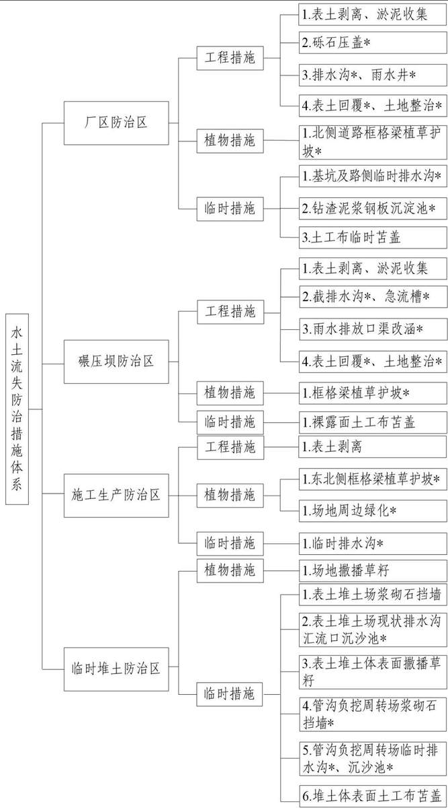
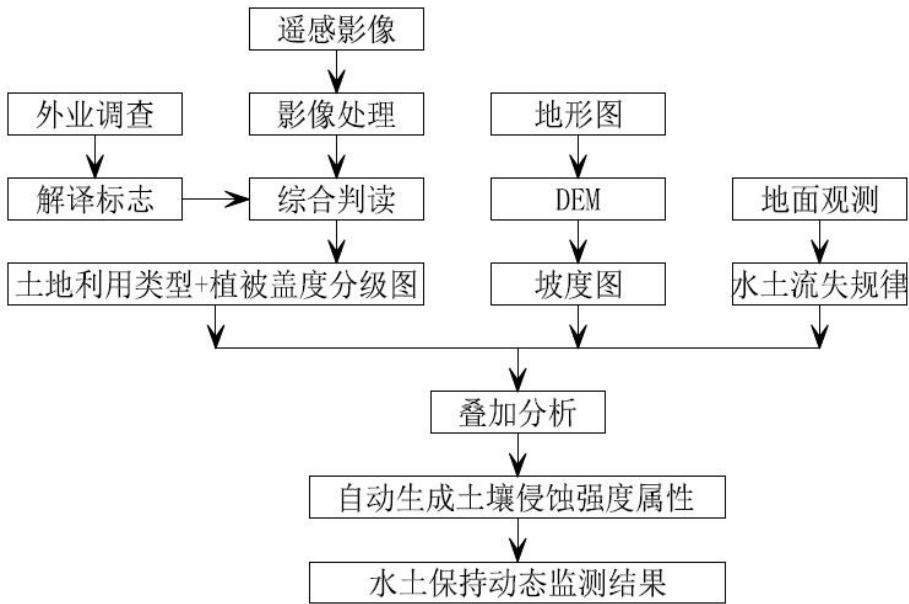

> **Zone C（应用范例层）使用边界**——仅可用于**写作风格、章节展开方式、表达逻辑、表格设计**的参考。
> **不得**用于合规判断；**不得**引入其项目数据（名称／地点／数字／单位名）；
> **不得**因其"曾经通过审批"而推定其做法在当前标准下仍然合规。
> 与 Zone A 冲突时**一律以 Zone A 为准**；Zone A 未明确规定时输出
> 「**Zone A 未明确规定，以下为参考写法，需人工判断**」。
>
> **坐标系警告**：本范例为**老八章结构**（GB 50433—2018 附录B），与 2026 版 10 章模板**同号不同义**
> （老 `1.5`＝防治目标，新 `1.5`＝水土流失预测结果；老 4→新 6 …偏移 +2；新版第 4/5 章老结构无独立章）。
> 因此 **`chapter_mapping: pending`——不得按章节号挂载**，检索一律走 `topic_tags`。
>
> **待加工**：`topic_tags`（主题标签）、`approval_basis_list`（编制依据逐字清单）、
> `structure_summary`（只提取结构：章节展开顺序／段落功能／表格栏目结构／句式模板／论证链步骤）。

1综合说明..  
1.1 项目简况 ..  
1.2 编制依据 ...  
1.3 设计水平年 ....  
1.4水土流失防治责任范围...  
1.5 水土流失防治目标 ......  
1.6项目水土保持评价结论... 11  
1.7 水土流失预测结果 ....... ... 14  
1.8水土保持措施布设成果 .... 15  
1.9 水土保持监测方案..... ... 17  
1.10水土保持投资及效益分析.... ... 17  
1.11 结论 ..... .... 17  
2 项目概况... ....20  
2.1项目组成及工程布置.. .... 20  
2.2 施工组织 ... ... 38  
2.3 工程占地 .... ... 46  
2.4 土石方平衡 .... ... 48  
2.5拆迁安置与专项设施改建.... .... 55  
2.6 施工进度 .... ... 55  
2.7 自然概况 ... .... 57  
3项目水土保持评价.... .. 62  
3.1主体工程选址（线）水土保持评价.. .... 62  
3.2建设方案与布局水土保持评价.... ... 63  
3.3主体工程设计中水土保持措施界定... ..... 90  
4水土流失分析与预测.... .... 93  
4.1 水土流失现状 ...... ... 93  
4.2水土流失影响因素分析.... ..... 93  
4.3 土壤流失量预测.... ... 95  
4.4水土流失危害分析.. ... 103  
5水土保持措施.. ... 105  
5.1防治分区划分.. ..... 105  
5.2 措施总体布局... ..... 105  
5.3 分区措施布设... ... 109  
5.4 施工要求 ... .... 124  
6水土保持监测. ... 129  
6.1监测范围和时段. .... 129  
6.2 内容和方法 ... .... 129  
6.3 点位布设 ... .... 137  
6.4实施条件和成果... .... 141  
7水土保持投资估算及效益分析.. .... 143  
7.1 投资估算 .. ... 143  
7.2 效益分析 ... ... 154  
8水土保持管理.... ... 155  
8.1 组织领导与管理.... .... 155  
8.2 后续设计 ... ... 156  
8.3水土保持监测. .... 157  
8.4水土保持监理.. .... 157  
8.5水土保持施工 ... 158  
8.6水土保持设施验收... ... 159

## 1综合说明

## 1.1项目简况

## 1.1.1项目基本情况

## （1）项目建设的必要性

广东廉江核电项目规划建设6台压水堆核电机组（2台CAP1000机组+4台国和一号三代机组），总装机容量8500MW，一次规划，分三期建设。广东廉江核电项目（一期工程）（以下简称一期工程）建设2台CAP1000核电机组，广东廉江核电项目二期工程（以下简称本期工程）和广东廉江核电项目三期工程（以下简称三期工程）分别建设2台国和一号三代机组。

本期工程为国家重点工程，已列入《“十四五”现代能源体系规划》（发改能源〔2022〕210号）《广东省发展改革委关于下达广东省2025年重点建设项目计划的通知》（粤发改重点〔2025〕90号）《广东省能源发展“十四五”规划（2021-2025年）》《北部湾城市群建设“十四五”实施方案》《粤港澳大湾区发展规划纲要》等国家、北部湾和广东能源电力发展规划，是广东基荷能源和保障能源电力安全的重要力量，对支持广东西部、海南自由贸易区和北部湾城市群建设，加快电力结构调整，构建清洁低碳、安全高效的能源体系具有重要意义。本期工程建设十分必要。

## （2）项目简况

项目位置：本期工程位于广东省湛江市廉江市车板镇，一期工程北侧。

建设性质、规模与等级：本期工程属扩建、建设类项目，所属行业为核电工程。

项目组成：本期工程拟建设2台国和一号核电机组（装机容量为3000MWe），配套辅助设施等。主要包括厂区、碾压坝、施工生产区和临时堆土区。

1）厂区：①主厂房区主要包括反应堆厂房、辅助厂房、附属厂房、放射性废物厂房、汽机房等，占地16.39hm2；②冷却塔区主要包括自然通风海水冷却塔、机械通风冷却塔等，占地35.15hm2；③新建主厂房、冷却塔北侧主干道长1004m，宽17.5m，总占地5.92hm2（含边坡占地4.16hm2）。

2）碾压坝：新建碾压坝长1250m，位于厂址西北侧边界处，占地13.72hm2。

3）施工生产区：本期工程布设21处，总占地33.17hm2。其中，利用一期工程17处，占地26.75hm2；新设4处，占地6.42hm2（一期工程永久占地范围内2.30hm2，二期工程永久占地范围内4.12hm2）。

4）临时堆土区：本期临时堆土主要为场平表土剥离和管沟负挖（建筑物基坑负挖土方直接用于碾压坝填筑，不临时堆存）土方的堆放。共布设 4 处堆放场，总占地9.31hm2。其中，表土堆土场临时占地 1.56hm2（其中西区占地 0.71hm2、东区占地0.85hm2），布置于一期临时表土堆土场东西两侧已挖除表土区域；管沟负挖周转场7.75hm2（其中 1#管沟负挖周转场占地 4.51hm2、2#管沟负挖周转场占地 3.24hm2），分别布置于本期永久占地范围内3、4号冷却塔西侧。

5）管线、沟道：包括雨污水、电力通信、循环冷却水、综合管廊等。

①雨水排水：包括建构筑物周边排水、道路排水、施工生产区排水。

建构筑物周边排水：主厂房区、冷却塔区建构筑物周边排水系统“永临结合”，建构筑物基坑开挖前在永久排水位置先期开挖临时排水明渠，建筑物封顶后改为永久盖板排水沟，排水沟长2342m。区内雨水经排水沟、雨水井（16个）收集后通过场内道路边沟向西接至厂外P4排放口，最终排至卖皂河。

道路排水：场内道路排水系统“永临结合”，场平结束后在永久排水位置先期开挖临时排水边沟，永久路面铺设后改为永久盖板排水沟，排水沟长4226m，场内雨水经排水沟、雨水井（140个）收集后通过场内道路边沟向西接至厂外P4排放口，最终排至卖皂河。

施工生产区排水：新增施工生产区周边布设临时排水沟共计2122m，区内雨水经排水沟收集后通过场内道路边沟，最终排入卖皂河。

②污水：包括生活污水、放射性生产废水、非放射性生产废水。

生活污水：在综合管廊内设置收集各污水排水点的管线，接至一期已建管线，收集至已建1号冷却塔附近生活污水处理站处理后用于道路冲洗及绿化养护。

放射性生产废水：新建3、4号核岛接东侧场界专用排污管线各45m，收集后经厂址废物处理设施区、液态流出物储罐处理达标后由海水排水管线排至北部湾。

非放射性生产废水：在新建综合管廊内布置从非放射性生产废水处理厂房至3号冷却塔南侧已建一期综合管廊的污水管线160m。经生产废水处理系统达标处理后，由一期已建排海管道排放至北部湾。

③电力通信：新建发电机至东侧场界500kV埋管932m，东侧场界至起备变220kV电缆沟1455m。新建各功能区至东侧场界通信线路2528m。

④综合管廊：沿主厂房区、冷却塔区四周布置，含生活水管、工业水管、消防厂用水管、除盐水管及压缩空气管，综合管廊长2166m，由主厂房南侧一期综合管廊接

入。

⑤循环冷却水：新建循环水泵房至汽机厂房供水管线1358m，汽机厂房至大型冷却塔排水管线1440m。

⑥海水取水管线：新建西南侧场界至海水预处理及储存设施的场内管线66m。

## 本期工程依托一期工程情况：

1）场地平整：廉江核电厂按一次完成场平，分期建设设计，本期工程依托一期工程已平整场地 55.85hm2。

2）道路、边坡及厂外排水口：依托已建进场道路、应急道路和大件码头运输道路，道路总长约 12.63km；依托已建厂区 2个出入口至本期工程用地界的重件道路、主干道、次干道和支路等；依托已建西北侧护坡东延段 170m；依托已建 P3、P4厂外排水口明渠段和Pb1厂外排水口。

3）辅助生产设施：依托一期工程建设的环境监测站（待建）、气象站（已建）、厂址废物处理设施（在建）、生活污水处理站（已建）、淡水处理厂（已建）、消防站（已建）和海水淡化厂房（在建）。

4）大件码头工程：依托已建龙头沙渔港防波堤南侧约300m处大件码头。

5）海水取排水设施：依托已建喇叭型取水头部+引水箱涵+陆域泵房海域取水相关设施及海域排水相关设施。

6）海水取排水管线：场外段依托一期工程在建的 2条 DN2000陆域补给水管道和4条 DN1400陆域排水管道；场内段依托一期工程已敷设沿西南侧环厂道路向北接至本期工程3号冷却塔南侧的海水输水管道，总长930m。

7）淡水取水工程：施工期和运行期淡水依托一期工程已建卖皂河和九洲江取水设施及管线。

8）电力工程：110kV施工用电依托位于本期工程 3号冷却塔西南侧 110kV变电站；220kV、500kV 输变电依托已建 220kV、500kV 开关站。

9）通信工程：依托已建沿重件道路敷设至主厂房东侧的通信工程。

10）生活生产污水管线：生活污水依托已建 1号冷却塔东南侧生活污水处理站；放射性生产废水依托已建沿重件道路至主厂房东侧的专用排污管线；非放射性废水依托已建综合管廊内布置的排水管线。

拆迁（移民）安置及专项设施改建：不涉及。

占地及土石方：工程总占地105.91hm2，其中永久占地102.05hm2，临时占地

3.86hm2。土石方挖方总量290.26万m3（其中表土剥离3.77万m3、淤泥1.02万m3、土方285.47万m3），填方总量290.26万m3（其中表土和淤泥回填4.79万m3、一般土方285.47万m3）。

工期与投资：本期工程计划于2026年6月开工，2033年2月建成，总工期81个月。工程估算总投资507.28亿元，其中土建投资309.26亿元，由国核湛江核电有限公司自筹。

## 1.1.2项目前期工作进展情况

## （1）工程设计情况

2018年2月，中国能源建设集团广东省电力设计研究院有限公司编制完成了《国核廉江核电项目厂外淡水工程可行性研究报告》。

2019年5月，上海核工程研究设计院有限公司编制完成了《国核廉江核电项目“四通一平”工程初步设计报告》。

2019年6月，中国能源建设集团广东省电力设计研究院有限公司编制完成了《国核廉江核电项目取排水方案研究专题报告》。

2019年10月，广东省水利水电科学研究院受建设单位委托编制完成了《国核廉江核电项目工程防洪评价报告》；2019年11月13日，廉江市水务局以《关于国核廉江核电项目工程防洪评价报告的批复函》（廉水函〔2019〕230号）批复了本期工程防洪评价报告。

2019年11月25日，广东湛江红树林国家级自然保护区管理局以《关于<湛江核电关于确认国核廉江核电项目用海范围是否涉及湛江红树林保护区的函>的复函》（粤湛红保函〔2019〕95号），确认工程涉海范围不在《广东湛江红树林国家级自然保护区四至界定方案》范围内。

2025年2月28日，国家能源局组织召开了广东廉江核电（扩建）项目（含二三期工程）前期工作座谈会，会议认为当前启动扩建工程前期工作是必要的；2025年3月17日，国家能源局下发《关于廉江核电（扩建）项目前期工作座谈会议纪要》（国能综纪核电〔2025〕4号），提出各相关部门和单位应进一步加强协同配合，为推动项目顺利实施打下坚实基础。

2025年4月，北京沃尔德防灾绿化技术有限公司编制完成了《广东廉江核电项目二期工程表土资源调查分析报告》。

2025年8月，上海核工程研究设计院股份有限公司编制完成了《广东廉江核电项目二期工程环境影响评价报告》，2026年1月，水利部珠江水利委员会以《珠江委关于广东廉江核电项目二期工程取水许可申请准予水行政许可决定书》（珠许可决〔2026〕1号）批准本项目的取水申请。

2025年8月，上海核工程研究设计院股份有限公司、国核电力规划设计研究院有限公司编制完成了《广东廉江核电项目二期工程可行性研究报告》（以下简称“可研报告”）。11月17日至20日，电力规划设计总院组织召开了可研报告审查会并形成了审查意见。

2025年 12月31日，自然资源部下发《建设项目用地预审与选址意见书》。

2025年 12月，上海核工程研究设计院股份有限公司编制完成了《广东廉江核电项目二期工程“四通一平”设计方案》《广东廉江核电项目二期工程弃渣减量化、资源化利用论证方案》。

2025年 12月，国核电力规划设计研究院有限公司编制完成了《全厂碾压坝设计方案》；2026年1月编制完成了《碾压坝可行性研究阶段岩土工程勘察报告》。

目前，国家核安全局已正式受理项目环境影响评价报告，目前正在评审中。

（2）水土保持方案编制情况

2024年4月，中国水利水电科学研究院受国核湛江核电有限公司委托，承担本期工程水土保持方案编制工作。接受委托后，方案编制工作组6次查勘项目现场。开展了项目区自然概况、表土资源、水土流失现状及水土保持敏感区调查和相关资料收集等工作，依据工程可行性研究报告及其他主体设计资料，在水土流失调查及预测的基础上，设计了相应的水土流失防治措施及投资，于2025年12月编制完成了《广东廉江核电项目二期工程水土保持方案报告书》。

## 1.1.3自然简况

（1）地貌类型：项目区地貌类型属华南沿海丘陵台地。厂址地貌总体以侵蚀丘陵地貌为主，包括低丘、冲沟等类型，地形起伏不大，地形坡度一般为5～15°，局部达到25°，原始高程1.0\~38.3m。西南至东北方向的山体长度约1475m，其余为零星山体，原始地形标高一般为18.7\~38.3mm，西侧、西北侧和西南侧为低洼区域，原始地形标高约1m\~18.7m。

（2）气候类型与主要气象要素：项目区气候类型属亚热带海洋性季风气候，多年平均气温23.0℃，多年平均降水量1735.5mm，多年平均蒸发量1635.9mm，≥10℃活动积温为8180℃，多年平均风速为2.4m/s，无霜期为360天，无冻土层。

（3）土壤类型与占地类型：项目区主要为赤红壤。项目占地类型为林地、草地、水域及水利设施用地、交通运输用地和住宅用地等，其中林地、果园、其他草地可剥离表土，剥离厚度为5\~20cm。

（4）林草植被类型与覆盖率：项目区植被类型为亚热带常绿阔叶林。核电厂址范围内残丘坡地主要种植有桉树林，丘间洼地主要种植经济作物和桉树林，林草覆盖率约60%。

（5）水土保持区划及容许土壤流失量：根据《水利部办公厅关于印发<全国水土保持区划（试行）>的通知》（办水保〔2012〕512号），项目区涉及的广东省廉江市一级区划属南方红壤区，二级区划属华南沿海丘陵台地区，三级区划属华南沿海丘陵台地人居环境维护区。根据《土壤侵蚀分类分级标准》（SL190-2007），项目区处于南方红壤丘陵区，容许土壤流失量500t/(km2·a)。

（6）土壤侵蚀类型及强度：项目区土壤侵蚀类型以水力侵蚀为主。根据《广东省水土保持公报（2024年）》等资料，项目区土壤侵蚀强度以轻度为主（占比91.11%），项目区原地貌土壤侵蚀模数为0\~760t/(km2·a)。

（7）水土流失重点防治区：根据《水利部关于全国水土保持规划国家级水土流失重点预防区和重点治理区复核划分成果的通知》（办水保〔2013〕188号）《水利部办公厅关于做好国家级水土流失重点预防区和重点治理区落地上图成果应用的通知》（办水保〔2025〕170号），项目区所处的湛江市廉江市，不涉及国家级水土流失重点防治区。根据《广东省水利厅关于划分省级水土流失重点预防区和重点治理区的公告》（2015年10月13日）《2024年度广东省水土流失动态监测成果报告》，项目区不涉及省级水土流失重点防治区；根据《湛江市水土保持规划》，项目区不涉及市级水土流失重点防治区。

（8）水土保持敏感区：项目区不涉及饮用水水源保护区、水功能一级区的保护区和保留区、世界文化和自然遗产地、风景名胜区、地质公园、森林公园、重要湿地、生态脆弱区等水土保持敏感区域。

## 1.2编制依据

## 1.2.1法律法规

（1）《中华人民共和国水土保持法》（全国人大常委会，1991年6月29日颁布，2010年12月25日修订，2011年3月1日施行）；

（2）《广东省水土保持条例》（广东省人大常委会，2016年9月29日通过，2017

年1月1日起施行）。

## 1.2.2部委规章

（1）《生产建设项目水土保持方案管理办法》（水利部令第53号）；

（2）《水土保持生态环境监测网络管理办法》（水利部令第12号）。

## 1.2.3规范性文件

（1）《关于全国水土保持规划（2015-2030年）的批复》（国函〔2015〕160号）；

（2）《水利部办公厅关于印发<全国水土保持规划国家级水土流失重点预防区和重点治理区复核划分成果>的通知》（办水保〔2013〕188号）；

（3）《水利部办公厅关于转发国家发展改革委财政部降低水土保持补偿费收费标准的通知》（办财务〔2017〕113号）；

（4）《水利部办公厅关于印发生产建设项目水土保持技术文件编写和印制格式规定（试行）的通知》（办水保〔2018〕135号）；

（5）《水利部关于进一步深化“放管服”改革全面加强水土保持监管的意见》（水保〔2019〕160号）；

（6）《水利部办公厅关于印发2025年水土保持工作要点的通知》（办水保〔2025〕38号）；

（7）《广东省发展改革委 广东省财政厅 广东省水利厅关于规范水土保持补偿费征收标准的通知》（粤发改价格〔2021〕231号）；

（8）《广东省水利厅关于划分省级水土流失重点预防区和重点治理区的公告》（2015年10月13日）；

（9）《广东省水利厅关于进一步加强生产建设项目水土保持监管的通知》（粤水水保函〔2019〕712号，2019年4月1日）；

（10）《2024年度广东省水土流失动态监测成果报告》（广东省水利厅，2025年1月）。

## 1.2.4技术规范、标准

（1）《生产建设项目水土保持技术标准》（GB 50433-2018）；

（2）《生产建设项目水土流失防治标准》（GB/T50434-2018）；

（3）《水土保持工程设计规范》（GB 51018-2014）；

（4）《水土保持工程调查与勘测标准》（GB/T51297-2018）；

（5）《土壤侵蚀分类分级标准》（SL190-2007）；

（6）《生产建设项目土壤流失量测算导则》（SL773-2018）；

（7）《生产建设项目水土保持监测与评价标准》（GB/T51240-2018）；

（8）《水利水电工程制图标准 水土保持图》（SL73.6-2013）；

（9）《防洪标准》（GB 50201-2014）；

（10）《土地利用现状分类》（GB/T 21010-2017）；

（11）《水土保持监理规范》（SL/T523-2024）；

（12）《表土剥离及其再利用技术要求》（GBT45107-2024）。

## 1.2.5主要技术文件及资料

（1）《全国水土保持规划（2015\~2030年）》；

（2）《广东省水土保持规划（2016\~2030年）》；

（3）《湛江市水土保持规划（2018\~2030年）》；

（4）《广东省水土保持公报（2024年）》；

（5）《广东省第五次水土流失遥感普查成果报告》，广东省水利厅、水利部珠江水利委员会、珠江水利科学研究院，2017年11月；

（6）《广东廉江核电项目二期工程可行性研究报告》，上海核工程研究设计院股份有限公司、国核电力规划设计研究院有限公司，2025年8月；

（7）《广东廉江核电项目二期工程防洪评价报告》（报批稿），广东省水利水电科学研究院，2019年10月；

（8）《广东廉江核电项目二期工程节约集约用地论证分析专章》，广东国地科技股份有限公司，2025年7月；

（9）《全厂碾压坝设计方案》，国核电力规划设计研究院有限公司，2025年 12月；

（10）《碾压坝可行性研究阶段岩土工程勘察报告》，国核电力规划设计研究院有限公司，2026年 1月；

（11）《2024年度广东省水土流失动态监测成果报告》；

（12）国核廉江核电一期工程水土保持监测资料；

（13）工程地勘及现场查勘所得的有关资料。

## 1.3设计水平年

工程 2026年 6月开始施工准备，施工准备期为 2个月，2033年 2月建成，总工期81个月。方案设计水平年为工程完工当年，即设计水平年为2033年。

## 1.4水土流失防治责任范围

本期工程水土流失防治责任范围 105.91hm2，全部位于广东省湛江市廉江市。水土流失防治责任主体为国核湛江核电有限公司。其中：

## （1）永久征地

工程永久征地包括厂区、碾压坝、施工生产区（混凝土供应系统、CV筒体组装厂房、CA模块组装厂房等12处）等，总占地102.05hm2。

## （2）临时占地

工程临时占地为临时堆土区和施工生产区，纳入本期工程水土流失防治责任范围为 3.86hm2。其中，表土临时堆土区总面积 1.56hm2（2处），布设于一期临时堆土区范围内；施工生产区 2.30hm2（6-3核岛土建临建区、6-4核岛土建临建区 2处），布设于一期永久占地范围内。

## 1.5水土流失防治目标

## 1.5.1执行标准等级

根据《全国水土保持规划（2015-2030年）》《广东省水利厅关于划分省级水土流失重点预防区和重点治理区的公告》《水利部办公厅关于做好国家级水土流失重点预防区和重点治理区落地上图成果应用的通知》（办水保〔2025〕170号）《湛江市水土保持规划》等，项目区不涉及国家级、省级、市县级水土流失重点防治区。项目区不涉及饮用水水源保护区、水功能一级区的保护区和保留区、自然保护区、世界文化和自然遗产地、风景名胜区、地质公园、森林公园、重要湿地范围内，也不属于县级及以上城市区域范围。

根据《生产建设项目水土流失防治标准》（GB/T50434-2018）4.0.1第二款规定，项目位于建成山佳水库、南蒙塘水库周边，卖皂河（四级河道）两岸汇流范围内，周边500m范围内有孔子陂村居民点，且不在一级标准区域。应水土流失防治标准执行南方红壤区水土流失防治二级标准。鉴于项目紧邻独流入海的卖皂河（四级河道，流域面积约33.67km2），距卖皂河口约3km，河口两岸分布大片红树林（属于广东湛江红树林国家级自然保护区），水土流失防治标准执行南方红壤区水土流失防治一级标准。

## 1.5.2防治目标

## （1）定性目标：

根据《生产建设项目水土保持技术标准》（GB50433-2018），生产建设项目应达到的水土流失基本目标：

本期工程水土流失防治责任范围内扰动土地应全面整治，新增水土流失应得到有效控制，原有水土流失应得到治理，预防和治理因工程建设导致的新的水土流失，在确保工程建设安全运行的前提下，保护和合理利用水土资源，提高土地生产力，重建良好的生态环境，最大限度地发挥水土保持工程的功能与效益。

## （2）定量目标：

水土流失治理度、土壤流失控制比、渣土防护率、表土保护率、林草植被恢复率、林草覆盖率六项指标应符合现行国家标准《生产建设项目水土流失防治标准》（GB/T 50434-2018）的规定。

根据《生产建设项目水土流失防治标准》（GB/T 50434-2018）：

1）水土流失治理度、林草植被恢复率：根据条款4.0.6，项目区未位于极干旱、干旱地区，水土流失治理度、林草植被恢复率不作调整。

2）土壤流失控制比：根据条款 4.0.7，土壤流失控制比在以轻度侵蚀为主的区域不应小于1.0，土壤流失控制比指标值调整为 1.0。

3）渣土防护率：根据条款 4.0.8、4.0.9，项目区未处于中山及以上山区和城市区， 渣土防护率不作调整。

4）林草覆盖率：根据条款 4.0.10对林草植被有限制的项目，林草覆盖率可按相关规定适当调整；根据《核电厂总平面及运输设计规范》（GB/T50294-2014）9.1.3条，核电厂绿地率宜控制在 5%～10%，方案取上限林草覆盖率取10%。

综上，本方案调整后的指标值详见下表。

表1.5-1 水土流失防治指标值
<table><tr><td rowspan=2 colspan=1>防治目标</td><td rowspan=1 colspan=2>标准值</td><td rowspan=1 colspan=2>调整情况</td><td rowspan=1 colspan=2>执行标准</td></tr><tr><td rowspan=1 colspan=1>施工期</td><td rowspan=1 colspan=1>设计水平年</td><td rowspan=1 colspan=1>依据</td><td rowspan=1 colspan=1>数值</td><td rowspan=1 colspan=1>施工期</td><td rowspan=1 colspan=1>设计水平年</td></tr><tr><td rowspan=1 colspan=1>水土流失治理度（%）</td><td rowspan=1 colspan=1></td><td rowspan=1 colspan=1>98</td><td rowspan=1 colspan=1></td><td rowspan=1 colspan=1></td><td rowspan=1 colspan=1></td><td rowspan=1 colspan=1>98</td></tr><tr><td rowspan=1 colspan=1>土壤流失控制比</td><td rowspan=1 colspan=1>/</td><td rowspan=1 colspan=1>0.90</td><td rowspan=1 colspan=1>轻度侵蚀为主的区域</td><td rowspan=1 colspan=1>+0.1</td><td rowspan=1 colspan=1></td><td rowspan=1 colspan=1>1.0</td></tr><tr><td rowspan=1 colspan=1>渣土防护率（%）</td><td rowspan=1 colspan=1>95</td><td rowspan=1 colspan=1>97</td><td rowspan=1 colspan=1></td><td rowspan=1 colspan=1></td><td rowspan=1 colspan=1>95</td><td rowspan=1 colspan=1>97</td></tr><tr><td rowspan=1 colspan=1>表土保护率（%）</td><td rowspan=1 colspan=1>92</td><td rowspan=1 colspan=1>92</td><td rowspan=1 colspan=1></td><td rowspan=1 colspan=1></td><td rowspan=1 colspan=1>92</td><td rowspan=1 colspan=1>92</td></tr><tr><td rowspan=1 colspan=1>林草植被恢复率（%）</td><td rowspan=1 colspan=1>二</td><td rowspan=1 colspan=1>98</td><td rowspan=1 colspan=1></td><td rowspan=1 colspan=1></td><td rowspan=1 colspan=1>一</td><td rowspan=1 colspan=1>98</td></tr><tr><td rowspan=1 colspan=1>林草覆盖率（%）</td><td rowspan=1 colspan=1></td><td rowspan=1 colspan=1>25</td><td rowspan=1 colspan=1>核电厂总平面及运输设计规范</td><td rowspan=1 colspan=1>-15</td><td rowspan=1 colspan=1></td><td rowspan=1 colspan=1>10</td></tr></table>

## 1.6项目水土保持评价结论

## 1.6.1主体工程选址（线）评价

本期工程的选址（线）不涉及水土流失重点预防区和重点治理区，泥石流易发区、崩塌滑坡危险区以及易引起严重水土流失和生态恶化的地区，河流两岸、湖泊和水库周边的植物保护带，全国水土保持监测网络中的水土保持监测站点、重点试验区和水土保持长期定位观测站；项目区土壤侵蚀以轻度水力侵蚀为主，未处于水土流失严重、生态脆弱区域；本期工程选址不涉及饮用水水源保护区、水功能一级区的保护区和保留区、自然保护区、世界文化和自然遗产地、风景名胜区、地质公园、森林公园、重要湿地等。

工程选址符合《中华人民共和国水土保持法》《生产建设项目水土保持技术标准》（GB 50433-2018）、《广东省水土保持条例》等法律法规要求。工程选址可行。

## 1.6.2建设方案与布局评价

## （1）工程建设方案的评价结论

本期工程不涉及《生产建设项目水土保持技术标准》（GB 50433-2018）3.2.2条条款内容；根据《水利部办公厅关于印发生产建设项目水土保持方案审查要点的通知》（办水保〔2023〕177号）：“9.工程布局与建设方案应符合绿色设计要求，主体设计应开展减少工程征占地面积和土石方数量的相关工作，临时占地应避免占用耕地、林地、草地等，施工结束后恢复为原土地利用类型，工程建设方案应从水土保持角度进行比选分析论证，并对工程建设推荐方案从水土保持角度提出具体建议和要求。”

## 1）主体设计开展了减少工程征占地面积和土石方数量的相关工作，符合绿色设计要求。

工程永久占地符合《电力工程项目建设用地指标》（建标〔2010〕78号）的指标值；建设单位会同主体设计规划本期工程施工场地布置，本期工程施工场地均位于永久征地范围内。

主体设计单位编制了《广东廉江核电项目二期工程弃渣减量化、资源化利用论证方案》《全厂碾压坝设计方案》。厂址场平正挖土方均用于场平填方及碾压坝填筑；建筑物基坑大部分采用挡土灌注排桩，减少大开挖放坡，各类管沟开挖断面、施工时序结合一期工程经验及科学计算，碾压坝填筑、建筑物基坑肥槽和管沟回填全部来源于工程挖方，最大限度地减少开挖填筑数量。

2）临时占地均处于一期、二期永久用地范围内，未在厂址范围外新增临时占地，符合绿色设计要求。

本期工程仅新增施工生产区4处，其中2处布置于本期工程永久占地范围内，2处布置于一期工程永久占地范围内，均未在厂址以外新增临时占地。

本期工程临时堆土区共布设4处，其中表土堆土场利用一期已有临时堆土区，堆置结束后全部绿化回用，场地后续为三期工程永久用地；管沟负挖周转场位于本期工程永久占地范围内，后期建为本期工程永久建筑物。

## 3）碾压坝资源化利用工程余土，落实了绿色设计、提高水土资源利用效率、弃渣减量、源头治理要求。

在保障核电厂主体安全和降噪的前提下，采用碾压坝降噪方案，兼顾了工程余土就地资源化利用，实现工程土方内部消纳；碾压坝边坡采用框格梁+植草+锚杆锁固综合护坡，基础采用抗滑桩加固，高标准地治理了工程余土。该方案落实了《关于加强新时代水土保持工作的意见》《生产建设项目水土保持方案管理办法》和《“无废城市”建设试点工作方案》的“绿色设计、提高水土资源利用效率、弃渣减量、源头治理”要求，符合水土保持要求。

## （2）工程占地的评价结论

本期工程占地切实贯彻了科学用地、合理用地和节约、集约用地的原则，永久占地经多次复核研判较节约集约用地论证分析专章减少了占地数量，建设单位将在用地报批前落实耕地占补平衡；施工临建大部分利用一期既有场地，施工用水、用电均沿用一期已建工程，利用一期工程既有堆放场地和本期工程永久占地边角地设置土方周转和临时堆存场地、施工道路全部利用现状道路等方式；占地基本符合电力行业用地标准规定。工程占地不存在漏项、符合行业指标、临时占地合理，从水土保持角度分析，本期工程占地合理。

## （3）土石方平衡的评价结论

## 1）弃渣减量化分析

主体工程设计通过建筑物基坑全部采用挡土灌注排桩开挖方式进行工程开挖土石料的源头减量。在保障核电厂主体安全和降噪的前提下，采用碾压坝降噪方案，工程余土全部用于碾压坝填筑。通过挖方减量化和资源化利用，本期工程土石方全部回填利用，从源头减少工程开挖量，提高工程土石方利用率，满足水土保持要求。

## 2）土石方平衡分析

## 1）表土保护利用评价

建设单位组织开展了表土资源调查专项调查，摸清了工程扰动区域需剥离表土的范围及厚度，为四通一平和保护表土资源工作提供了科学依据。本期工程剥离表土利用一期工程现状表土堆土场东西两侧空地堆置，该堆土区场地四周已布置3道横向排水沟及急流槽并与P3排水口相连，坡脚设置了砖砌挡墙。方案补充堆土体表面临时苫盖及撒播草籽措施，将砖砌挡墙改为浆砌石。二期工程表土在施工末期全部用于框格梁内及行道树绿化用土。从表土剥离、堆存、回用方面，本期工程表土资源保护利用符合水土保持要求。

## 2）挖方减量化评价

本期工程挖方主要为一期工程临时堆土占用区域正挖及建筑物基坑、管廊管沟负挖。其中一期工程临时堆土占用本期工程区域需由现状33m堆高堆土体降至设计标高18.7m，是工程建设必要的；主体设计主要的生产工艺建筑物基坑部分采用挡土灌注排桩开挖方式，其他建构筑物采用放坡开挖方式，尽可能地减少方量；循环水和综合管廊因管径和箱体巨大，按行业要求采用放坡开挖方式。本方案认为工程挖方数量、施工工艺、组织等符合水土保持减量化要求。

## 3）挖方用于填方评价

根据《弃渣减量化资源化利用论证方案》，一期堆土及厂区工程挖方可用于碾压坝填筑;二期工程核岛负挖岩石主要为强\~中风化岩石，岩性主要为砂岩、粉砂质泥岩。根据上述回填技术指标要求，厂区工程挖方可用于场地及基坑回填。本方案结合一期工程土建经验认为本期工程填方数量及来源、施工工艺组织等符合水土保持减量化要求。

## 4）调运评价

本期工程内部土石方充分调运，调运方总量为215.62万m3，占挖填方总量的74%。表土调运：场平阶段剥离核电厂区、碾压坝占用的林地、草地等表层土和核电厂区占用坑塘水面清淤，剥离量3.41万m3，清淤量1.02万m3，临时堆存在一期表土堆土场的已挖除空地。一般土方调运：场平阶段本期占用一期临时堆土区挖除现有堆土80.77万m3、建筑物基坑负挖余方75.74万m3和管沟负挖余方11.22万m3运至碾压坝填筑。根据施工进度安排，管沟负挖回填土高峰期堆土量约26.5万m3，在冷却塔区西侧布设临时周转场地2处。本方案认为工程土石方运输节点适宜、时序可行、运距合理，减少水土流失环节，符合水土保持要求。

## （4）取土场、弃渣场设置的评价结论

本期工程无借方，无需专门设置取土场。本期工程表土运至表土堆土场堆存，管沟负挖土石方运至管沟负挖周转场堆存，厂外不设置弃渣场。

表土堆土场和管沟负挖周转场布置、安全防护距离、堆置方案和稳定性验算均满足规范要求，表土堆土场和管沟负挖周转场下游无公共设施、基础设施和居民点，经挡土墙和碾压坝拦挡后，对下游厂内相关建筑物无危害；表土堆土场和管沟负挖周转场选址不涉及河湖管理范围，表土堆土场和管沟负挖周转场设置是合理的。

（5）施工工艺与方法的评价结论

施工场地均在厂址永久征地范围内，减少了新增占地，且布置紧凑，各分项工程施工场地明确，避免了随意占用地表；场平施工土方开挖采用梯段法，保证了边坡稳定，且减少施工周期，避免因大规模无层次开挖造成的水土流失。建筑基础优先采用挡土灌注排桩，减少了土石方量，同时针对挡土灌注排桩施工设置泥浆沉淀池，采取了泥浆固化和循环使用等措施。主体工程在进度控制、工期选择、施工顺序、施工布置和施工工艺等方面设计基本合理，符合水土保持要求，但主体设计对施工期间的临时防护考虑不足，包括临时排水、沉沙、苫盖、拦挡等措施，本方案予以补充完善，并进一步细化施工组织，减少地表扰动范围及程度。

（6）主体设计中具有水土保持功能工程的评价和界定

主体工程设计了裸露地表砾石压盖、基坑四周永久排水沟及雨水井、道路两侧永久排水边沟及雨水井、基坑四周临时排水沟及钢板泥浆池、道路两侧临时排水边沟、施工场地周边行道树绿化、碾压坝坡面排水系统、碾压坝占压现状排水口渠改涵、管沟负挖周转场浆砌石挡墙，临时堆土场四周临时排水沟、临时沉沙池、框格梁植草综合护坡等水土保持措施，符合水土保持要求，纳入本方案。本方案主要补充临时堆土区的排水、苫盖、拦挡、临时绿化等临时措施，以及细化土地整治、表土保护利用、植物种配置等。经本方案补充完善后，工程建设方案及布局可满足水土保持要求。

## 1.7水土流失预测结果

本期工程扰动地表面积 78.99hm2，损坏植被面积 27.92hm2，不设弃渣场，本期工程建设可能造成土壤流失总量 35133.58t，新增土壤流失总量 32259.40t。从预测结果看，水土流失重点时段为施工期，厂区、碾压坝区和临时堆土区是水土流失防治和水土保持监测的重点区域。

水土流失危害主要表现为：项目建设可能导致土地生产力的降低；破坏植被、加速土壤侵蚀、对生态环境造成一定影响。在工程施工过程中损坏了防治责任范围内林草植被。雨季、风季在项目建设区内水土流失面积和强度将会增加，并对周边环境可能造成一定影响。工程建设过程中的开挖和临时堆土如不采取防治措施，在遇到大雨、大风时将造成一定程度的水土流失，部分泥沙将会随径流进入附近的卖皂河，可能造成河流泥沙增加。

## 1.8水土保持措施布设成果

## 1.8.1水土流失防治分区

根据主体工程各区特点，本方案将水土流失防治区分为厂区防治区、碾压坝防治区、施工生产防治区及临时堆土防治区 4个水土流失防治分区。其中厂区防治区为二期主要建构筑物土建场地及道路管线施工用地，碾压坝防治区为碾压坝工程施工所占用区域，施工生产区为施工生产及构建安装所需场地，临时堆土区为剥离表土、清淤土以及建筑物基坑肥槽、管顶回覆所需回填土临时堆置及周转场地。

## 1.8.2水土保持措施分区布局

## 1.厂区防治区

四通一平阶段，剥离占用的林地、园地及草地地表的表土和占用坑塘水面的淤泥晾晒后集中堆存于一期工程已设的表土堆土场；建构筑物基坑开挖前，四周设临时排水沟、排水井并与道路侧临时排水沟连接，最终顺接至厂界 P4排放口；施工中，挡土灌注排桩基坑施工区域设置钢板泥浆池，建构筑物与道路之间暂无作业安排的空地采用土工布苫盖，管沟开挖两侧边坡设土工布苫盖，道路两侧设临时排水沟；建构筑物地下结构施工结束后，建构筑物基坑四周和道路两侧临时排水沟改为永久排水边沟顶部加盖雨篦子；施工末期，厂区北侧边坡布设框格梁植草护坡框格梁内回填表土、土地整治，建构筑物与道路之间空地设砾石压盖。

工程措施量：占用的林地、园地及草地表土剥离 1.70万 m3，占用坑塘水面清淤0.82万 m3，建构筑物与道路之间空地砾石压盖 8.79hm2，主厂房和冷却塔场地内部盖板排水沟 2342m及雨水井 16个，路侧盖板排水边沟 4226m及雨水井 140个，框格梁内表土回覆 1.61 万 m3，土地整治 1.61hm2。

植物措施量：厂区北侧边坡框格梁植草护坡1.64hm2。

临时措施量：建构筑物基坑四周临时排水沟 2342m，路侧临时排水沟 4226m，挡土灌注排桩基坑施工区域钢板泥浆池 10座，建构筑物与道路之间空地土工布苫盖 8.79万m2，管沟开挖两侧边坡土工布苫盖7.99万m2。

## 2.碾压坝防治区

四通一平阶段，剥离本期工程占用的林地、园地及草地地表的表土和占用沼泽草地、坑塘水面的淤泥晾晒后集中堆存于一期工程已设的表土堆土场，现状 P3、P4厂外雨水排放口碾压坝覆盖段明渠改为暗涵；碾压坝填筑期间裸露面设土工布苫盖；碾压坝填筑结束后，两侧坡面实施框格梁植草护坡，坡面马道内侧设横向截水沟，坡面设纵向跌水急流槽，坝体坡脚外侧设排水沟末端顺接至 P4排放口。

工程措施量：占用的林地、园地及草地表土剥离 1.24万m3，占用沼泽草地、坑塘水面清淤 0.02万 m3，雨水排放口渠改涵 350.76m（P3雨水排放口 141.60m、P4雨水排放口 209.16m），马道排水沟 2320m，急流槽 5135m，坡脚排水 2500m，表土回覆3.74 万 m3，坡面土地整治 9.38hm2。

植物措施量：坝体框格梁植草护坡 9.38hm2。

临时措施量：坝体裸露面土工布苫盖 9.38万m2。

## 3.施工生产区

四通一平阶段，剥离龙门吊停放兼 SC拼装场、6-4核岛土建临建区④、常规岛临建区占用的林地、园地及草地地表的表土集中堆存于一期工程已设的表土堆土场；四通一平结束后，场地四周设临时钢筋盖板临时排水沟；施工末期，CV筒体组装厂房、CA模块组装厂房、核岛土建临建用地①周边道路两侧布置行道树绿化，东北侧边坡布设框格梁植草护坡。

工程措施量：占用的林地、园地及草地表土剥离 0.83万m3。

植物措施量：场地周边绿化 0.19hm2，其中栽植乔木 72株，栽植花灌木 0.10hm2，铺设草皮996m2；东北侧边坡框格梁植草护坡0.31hm2。

临时措施量：场地四周临时排水沟 2122m。

4.临时堆土区

四通一平阶段，增设一期工程已设表土堆土场四周浆砌石挡墙及现状排水沟汇流口沉沙池；上述剥离表土堆存至该场地东、西侧已挖除空余区域，堆土体表面采用土工布苫盖及撒播草籽措施；四通一平结束后，管沟负挖周转场四周设临时浆砌石挡墙，挡墙外侧设临时排水沟顺接至周边道路临时排水沟；施工中，管沟开挖土方棱台状堆放至管沟负挖周转场内，暂不需回填的堆土体表面采用土工布苫盖；表土堆土场使用结束后占用区域撒播草籽恢复植被。

植物措施量：场地撒播草籽绿化 1.56hm2。

临时措施量：表土堆土场：浆砌石挡墙 1006m，现状排水沟汇流口沉沙池 2座，土工布苫盖 1.63hm2，撒播草籽 1.63hm2；管沟负挖周转场：土工布苫盖 8.06hm2，浆砌石挡墙3134m，临时排水沟2250m，临时沉沙池7座。

## 1.9水土保持监测方案

（1）本期工程监测内容包括：水土流失自然影响因素、项目施工全过程各阶段扰动土地情况、水土流失状况、水土流失防治成效、水土流失危害等。

（2）监测方法采用调查、巡查和定位观测相结合的方法。具体方法主要包括：调查巡测（侵蚀沟测量法）、定位观测（简易水土流失观测场法、沉沙池法、测钎法）、查阅资料、遥感（卫星遥感、无人机遥感）监测等。

（3）监测时段。从2026年6月开始至设计水平年末（2033年 12月）结束。

（4）监测频次。在工程施工前的准备阶段对每一个典型地段进行一次水土流失背景值调查，提供水土流失原状的基础资料；扰动地表面积每月监测 1次。遥感监测应在施工期每年不少于1次。

正在使用的临时堆土场每 10天监测 1次；主体工程建设进度、水土流失影响因子、水土保持植物措施生长情况等每 3个月监测记录 1次。工程措施、临时措施及防治成效每月监测记录1次。水土流失灾害事件发生后1周内完成监测。

（5）定位监测点位。选取不同的地貌类型、工程水土流失及施工特点设定位监测点9处，其中厂区3处、碾压坝区3处、施工生产区1处、临时堆土区2处。

## 1.10水土保持投资及效益分析

本期工程水土保持工程估算总投资 9486.96万元。其中工程措施 1013.68万元，植物措施 5754.85 万元，监测措施 325.29 万元，临时措施 620.58 万元，独立费用 953.72万元，基本预备费用771.44万元，水土保持补偿费47.40万元。

本方案实施后，设计水平年可治理水土流失面积 105.14hm2，林草植被建设面积10.52hm2，减少水土流失量 32009.21t。六项防治指标预测值均能达到目标值。

## 1.11 结论

本期工程符合国家和地方经济发展的要求，符合水土保持、水土资源管理等法律法规的要求，工程占地、土石方调配，施工组织、施工工艺基本合理。项目建设可行。

主体工程设计充分考虑了主体工程安全问题，开展了排水系统、护坡、砾石压盖、临时堆土防护等一系列防护措施设计，既能够保障主体工程的安全运行，又具有水土保持的功能。本方案补充完善的水土保持措施主要有细化表土剥离范围、厚度，淤泥处置，绿化苗木种类及数量，临时排水沟布置；补充暂无作业安排空地、管沟开挖边坡、碾压坝边坡及堆土面土工布苫盖，表土堆土场使用结束后植被恢复；提高表土堆土场拦挡措施标准，复核临时排水沟过水能力。

在工程建设过程中按本方案的要求落实各项水土保持措施防治水土流失，可有效控制因项目建设引发的新增水土流失，工程建设可行。

建议进一步做好下列工作：

（1）设计单位进一步深化、细化本方案中的水土保持措施。

（2）在施工过程中坚决贯彻防治结合，预防为主的方针，落实“三同时”制度，施工单位在施工过程中应文明施工，避免随意扩大扰动面积。

（3）施工期做好各区域雨水排放、利用规划，排水沟做到永临结合，避免积水及径流对地表冲刷。

（4）进一步优化施工组织，减少土石方重复挖填，避免大雨和大风天气施工，明确施工界限，减少扰动地表范围。施工过程中应当加强临时防护措施，并在施工中加强管理。

（5）水土保持监测单位加强现场监测，及时提出现场存在的问题及建议，协助做好水土流失防治工作，开展水土保持监测三色评价，及时向水行政主管部门和流域管理机构报送水土保持监测报告。

（6）水土保持监理单位加强现场监理，协助做好现场水土保持措施落实工作，做好现场记录，及时提交水土保持监理报告。

1 综合说明  
水土保持方案特性表
<table><tr><td rowspan=1 colspan=6>项目名称</td><td rowspan=1 colspan=5>广东廉江核电项目二期工程</td><td rowspan=1 colspan=4>流域管理机构</td><td rowspan=1 colspan=2>水利部珠江水利委员会</td></tr><tr><td rowspan=1 colspan=6>涉及省（区、市）</td><td rowspan=1 colspan=2>广东省</td><td rowspan=1 colspan=3>涉及地市或个数</td><td rowspan=1 colspan=4>湛江市</td><td rowspan=1 colspan=1>涉及县或个数</td><td rowspan=1 colspan=1>廉江市</td></tr><tr><td rowspan=1 colspan=4>项目规模</td><td rowspan=1 colspan=5>建设2台国和一号机组</td><td rowspan=1 colspan=3>总投资（亿元）</td><td rowspan=1 colspan=3>507.28</td><td rowspan=1 colspan=1>土建投资（亿元）</td><td rowspan=1 colspan=1>309.26</td></tr><tr><td rowspan=1 colspan=6>动工时间</td><td rowspan=1 colspan=2>2026年6月</td><td rowspan=1 colspan=3>完工时间</td><td rowspan=1 colspan=4>2033年2月</td><td rowspan=1 colspan=1>设计水平年</td><td rowspan=1 colspan=1>2033年</td></tr><tr><td rowspan=1 colspan=6>工程占地(hm²)</td><td rowspan=1 colspan=2>105.91</td><td rowspan=1 colspan=3>永久占地(hm²)</td><td rowspan=1 colspan=4>102.05</td><td rowspan=1 colspan=1>临时占地(hm²)</td><td rowspan=1 colspan=1>3.86</td></tr><tr><td rowspan=2 colspan=8>土石方量(万 m³)</td><td rowspan=1 colspan=3>挖方</td><td rowspan=1 colspan=4>填方</td><td rowspan=1 colspan=1>借方</td><td rowspan=1 colspan=1>余（弃）方</td></tr><tr><td rowspan=1 colspan=3>290.26</td><td rowspan=1 colspan=4>290.26</td><td rowspan=1 colspan=1>1</td><td rowspan=1 colspan=1>/</td></tr><tr><td rowspan=1 colspan=8>重点防治区名称</td><td rowspan=1 colspan=3></td><td rowspan=1 colspan=5>不涉及</td><td rowspan=1 colspan=1></td></tr><tr><td rowspan=1 colspan=8>地貌类型</td><td rowspan=1 colspan=3>滨海丘陵</td><td rowspan=1 colspan=5>水土保持区划</td><td rowspan=1 colspan=1>南方红壤区</td></tr><tr><td rowspan=1 colspan=8>土壤侵蚀类型</td><td rowspan=1 colspan=3>水力侵蚀</td><td rowspan=1 colspan=5>土壤侵蚀强度</td><td rowspan=1 colspan=1>轻度</td></tr><tr><td rowspan=1 colspan=8>防治责任范围面积(hm²)</td><td rowspan=1 colspan=3>105.91</td><td rowspan=1 colspan=5>容许土壤流失量[t/(km².a)]</td><td rowspan=1 colspan=1>500</td></tr><tr><td rowspan=1 colspan=8>土壤流失预测总量(t)</td><td rowspan=1 colspan=3>35133.58</td><td rowspan=1 colspan=5>新增水土流失量(t)</td><td rowspan=1 colspan=1>32259.40</td></tr><tr><td rowspan=1 colspan=8>水土流失防治标准执行等级</td><td rowspan=1 colspan=9>南方红壤区建设类项目二级防治标准</td></tr><tr><td rowspan=3 colspan=2>防治指标</td><td rowspan=1 colspan=6>水土流失治理度(%)</td><td rowspan=1 colspan=3>98</td><td rowspan=1 colspan=5>土壤流失控制比</td><td rowspan=1 colspan=1>1.0</td></tr><tr><td rowspan=1 colspan=6>渣土防护率(%)</td><td rowspan=1 colspan=3>97</td><td rowspan=1 colspan=5>表土保护率(%)</td><td rowspan=1 colspan=1>92</td></tr><tr><td rowspan=1 colspan=6>林草植被恢复率（%）</td><td rowspan=1 colspan=3>98</td><td rowspan=1 colspan=5>林草覆盖率(%)</td><td rowspan=1 colspan=1>10</td></tr><tr><td rowspan=3 colspan=1>防治措施及工程量</td><td rowspan=1 colspan=2>防治分区</td><td rowspan=1 colspan=7>工程措施</td><td rowspan=1 colspan=4>植物措施</td><td rowspan=1 colspan=3>临时措施</td></tr><tr><td rowspan=1 colspan=2>厂区防治区</td><td rowspan=1 colspan=7>占用林地、园地及草地表土剥离1.70万m3，占用坑塘水面清淤0.82万m³，建构筑物与道路之间空地砾石压盖8.79hm²，主厂房和冷却塔场地内部盖板排水沟2342m及雨水井16个，路侧盖板排水边沟4226m及雨水井140个，框格梁内表土回覆1.61万m3，土地整治1.61hm²。</td><td rowspan=1 colspan=4>区北侧边坡框格梁植草护坡 1.64hm²。</td><td rowspan=1 colspan=3>建构筑物基坑四周临时排水沟2342m，路侧临时排水沟4226m，挡土灌注排桩基坑施工区域钢板泥浆池10座，建构筑物与道路之间空地土工布苫盖8.79万m²，管沟开挖两侧边坡土工布苫盖7.99万m²。</td></tr><tr><td rowspan=1 colspan=2>碾压坝防治区</td><td rowspan=1 colspan=7>占用林地、园地及草地表土剥离1.24万m3，占用沼泽草地、坑塘水面清淤0.02万m3，雨水排放口渠改涵350.76m（P3雨水排放口141.60m、P4雨水排放口209.16m），马道排水沟2320m，急流槽5135m，坡脚排水2500m，表土回覆3.74万m³，坡面土地整治9.38hm²。</td><td rowspan=1 colspan=4>坝体框格梁植草护坡9.38hm2。</td><td rowspan=1 colspan=3>坝体裸露面土工布苫盖9.38万m²。</td></tr><tr><td rowspan=1 colspan=1></td><td rowspan=1 colspan=2>施工生产防治区</td><td rowspan=1 colspan=7>占用林地、园地及草地表土剥离0.83万m³。</td><td rowspan=1 colspan=4>场地周边绿化 0.19hm²，其中栽植乔木72株，栽植花灌木0.10hm²，铺设草皮临996m²；东北侧边坡框格梁植草护坡0.31hm²。</td><td rowspan=1 colspan=3>时排水沟2122m</td></tr><tr><td rowspan=1 colspan=1></td><td rowspan=1 colspan=2>临时堆土防治区</td><td rowspan=1 colspan=7></td><td rowspan=1 colspan=4>场地撒播草籽绿化1.56hm²。</td><td rowspan=1 colspan=3>表土堆土场：浆砌石挡墙1006m，现状排水沟汇流口沉沙池2座，土工布苫盖1.63hm²，撒播草籽1.63hm²；管沟负挖周转场：土工布苫盖8.06hm²，浆砌石挡墙3134m，临时排水沟2250m，临时沉沙池7座。</td></tr><tr><td rowspan=1 colspan=3>投资(万元)</td><td rowspan=1 colspan=7>1013.68</td><td rowspan=1 colspan=4>5754.85</td><td rowspan=1 colspan=3>620.58</td></tr><tr><td rowspan=1 colspan=7>水土保持总投资（万元）</td><td rowspan=1 colspan=3>9486.96</td><td rowspan=1 colspan=4>独立费用(万元)</td><td rowspan=1 colspan=3>953.72</td></tr><tr><td rowspan=1 colspan=5>监理费（万元）</td><td rowspan=1 colspan=4>320</td><td rowspan=1 colspan=4>监测费(万元)</td><td rowspan=1 colspan=2>325.29</td><td rowspan=1 colspan=1>补偿费（万元）</td><td rowspan=1 colspan=1>47.40</td></tr><tr><td rowspan=1 colspan=5>方案编制单位</td><td rowspan=1 colspan=6>中国水利水电科学研究院</td><td rowspan=1 colspan=4>建设单位</td><td rowspan=1 colspan=2>国核湛江核电有限公司</td></tr><tr><td rowspan=1 colspan=5>法定代表人</td><td rowspan=1 colspan=6>彭静</td><td rowspan=1 colspan=4>法定代表人</td><td rowspan=1 colspan=2>魏光军</td></tr><tr><td rowspan=1 colspan=5>地址</td><td rowspan=1 colspan=6>北京市海淀区车公庄西路20号</td><td rowspan=1 colspan=4>地址</td><td rowspan=1 colspan=2>广东省廉江市环市北路154号</td></tr><tr><td rowspan=1 colspan=5>邮编</td><td rowspan=1 colspan=6>100048</td><td rowspan=1 colspan=4>邮编</td><td rowspan=1 colspan=2>524400</td></tr><tr><td rowspan=1 colspan=5>联系人及电话</td><td rowspan=1 colspan=6>成晨(010)68786630</td><td rowspan=1 colspan=4>联系人及电话</td><td rowspan=1 colspan=2>联系人/【已脱敏】</td></tr><tr><td rowspan=1 colspan=5>传真</td><td rowspan=1 colspan=6>(010)68416371</td><td rowspan=1 colspan=4>传真</td><td rowspan=1 colspan=2>(0759)6986666</td></tr><tr><td rowspan=1 colspan=5>电子信箱</td><td rowspan=1 colspan=6>chengchen@iwhr.com</td><td rowspan=1 colspan=4>电子信箱</td><td rowspan=1 colspan=2>wukai1@snpic.com.cn</td></tr></table>

## 2项目概况

## 2.1项目组成及工程布置

## 2.1.1一期和本期工程依托关系

## 2.1.1.1 一期工程概况

一期工程建设内容包括：核电厂区（场地工程、一期工程主厂房、辅助设施及厂前区、厂区周边边坡及厂外排水工程等）、码头工程、海水取排水工程、厂外淡水工程、厂外附属设施（气象观测站、环境监测站、倒班宿舍）等。

## （1）水土保持方案编报

2019年8月，建设单位委托中国能源建设集团广东省电力设计研究院有限公司开展了国核廉江核电项目（一期工程）水土保持方案编制工作，2020年5月完成水土保持方案报告书的编制并上报水利部。2020年7月1日，水利部以《水利部关于国核廉江核电项目（一期工程）水土保持方案的批复》（水许可决〔2020〕30号）予以批复。批复的水土流失防治责任范围300.02hm2。包括全厂用地一次场平分期建设。

## （2）水土保持监理、监测开展情况

2020年9月21日，建设单位委托中国水利水电科学研究院开展国核廉江核电项目（一期工程）水土保持监测工作，委托北京海策工程咨询有限公司开展国核廉江核电项目（一期工程）水土保持监理工作。工程于2022年4月25日开工。

## （3）余土综合利用情况

方案批复情况：工程陆域土石余方 89.49万 m3、钻渣 0.32万 m3、建筑垃圾 14.65万 m3，共 104.46万 m3，拟由廉江市欢裕建筑材料有限公司综合利用（用于环保建材生产原材料及租赁用地填埋平整）。

综合利用情况：建设单位与廉江市欢裕建筑材料有限公司多次协商，该企业无法消纳工程全部余土。截至目前综合利用为 4个受纳方，协议约定外运总计 113万 m3：①工程余土 60万 m3用于广西博白鸿益建材有限公司制砖，②工程余土 35万 m3用于廉江市欢裕建筑材料有限公司制砖，③工程余土 10万 m3用于广西博白县峰达建材销售有限公司制砖，④工程余土 15万 m3用于信创新能源（廉江）有限公司车板镇 200兆瓦光伏渔光互补项目综合利用。目前现场实际已外运综合利用74.4万m3。

堆土防护措施设置情况：尚需综合利用土方及本期、三期工程场平回填所需一般土及表土堆置于厂区西北侧填方区域。

## （4）表土剥离及保护情况

## 批复情况：

## 1）表土剥离及堆存

本项目厂区、海水取排水管线、淡水管线、厂外附属设施等占用部分林地、草地、耕地和园地，施工前进行表土剥离，剥离面积为283.01hm2，平均剥离厚度20cm，表土剥离量为59.71万m3。

核电厂区剥离的表土50.40万m3堆放至厂区堆土场，堆高不大于3m；海水取排水工程和淡水工程剥离表土共7.64万m3，全部装袋，用作管线开挖临时堆土护脚；厂外附属设施区剥离表土共1.67万m3，堆放至倒班宿舍规划运动、环境监测站和气象观测站规划绿地范围内，堆高不大于3m。

## 2）表土后续利用

核电厂区剥离的表土共 50.40万 m3，其中 43.49万 m3 用作一期工程规划绿地覆土、预留场地以及填方边坡后期覆土，覆土面积为 $1 4 4 . 9 8 \mathrm { h m } ^ { 2 }$ （包括一期工程绿化区域、预留场地和填方边坡），覆土厚度 0.30m，剩余 6.91万 m3临时堆放至场地内，用作二、三期绿化覆土；海水取排水工程和淡水工程剥离表土共 7.64万 $\mathrm { m } ^ { 3 }$ ，后期全部拆袋平铺至管线地表，覆土厚度为 0.20m；厂外附属设施区剥离表土 1.67万 m3，后期用作绿化覆土，覆土厚度为0.48m。

## 落实情况：

## 1）表土剥离范围

截至目前，厂区、海水取排水管线、淡水管线、厂外附属设施等占用部分林地、草地、耕地和园地，已扰动区域剥离表土 $2 3 6 . 8 9 \mathrm { h m } ^ { 2 }$ 。其中核电厂区剥离 $2 0 2 . 8 0 \mathrm { h m } ^ { 2 }$ 全部为林地，剥离平均厚度30cm；厂外淡水工程剥离19.14 hm2，主要为林地、耕地，剥离平均厚度30-50cm；海水取排水工程剥离14.95hm2，主要为林地、耕地，剥离平均厚度30-50cm。

核电厂区剥离的表土50.40万m3堆放至厂区堆土场，堆高不大于3m；海水取排水工程和淡水工程剥离表土共7.64万m3，全部装袋，用作管线开挖临时堆土护脚；厂外附属设施区剥离表土共1.67万m3，堆放至倒班宿舍规划运动、环境监测站和气象观测站规划绿地范围内，堆高不大于3m。

## 2）表土剥离数量

核电厂区需剥离表土数量为 50.40万 m3，根据场地清理表层情况，表土层中含有大量树根和树桩，目前工程实施剥离表土 34.85万 m3；厂外淡水工程需剥离表土数量为 3.04万 m3，目前工程实施剥离表土 5.38万 m3；海水取排水工程需剥离表土数量为4.60万 m3，目前工程实施剥离表土 5.08万 m3；厂外附属设施区中倒班宿舍设计优化设置于厂内，其剥离表土工程量纳入核电厂区。

## 3）表土保存情况

核电厂区：场平工程剥离后表土按照批准水土保持方案要求，集中堆存至厂区西北角堆土场（该场地后期用于二三期工程用地），并且按照要求实施了在表土堆土场坡面设置了防尘网苫盖（已完成），坡脚设置了编织袋装土拦挡（已完成），底部边坡设置两道排水沟（正在实施），待表土堆至设计标高计划在顶面苫盖防尘网。

厂外淡水工程：管沟开挖前按照批准水土保持方案要求，集中单独堆放至作业面单侧，并且按照要求设置了防尘网苫盖措施。

海水取排水工程：管沟开挖前按照批准水土保持方案要求，集中单独堆放至临近未施工作业面区域，并且按照要求设置了防尘网苫盖和装土编织袋拦挡措施。

## 4）表土利用情况

核电厂区：施工临建和施工场地区空地实施了临时绿化 4.81hm2，调用场平剥离表土约 2.40万 m3用作绿化种植土；集控楼及地面停车场实施了永久绿化 $2 5 3 5 \mathrm { m } ^ { 2 }$ ，调用场平剥离表土约 937 m3 用作绿化种植土；厂外边坡及围墙内侧空地实施了永久绿化4.80hm2，调用场平剥离表土约2.16 万m3用作绿化种植土。

厂外淡水工程：已敷设完毕管沟作业面回覆剥离表土5.06万m3。

## 2.1.1.2 依托关系

本期工程与一期依托关系详见下表。

表2.1-1 一期和本期工程依托关系汇总表
<table><tr><td rowspan=1 colspan=1>依托工程</td><td rowspan=1 colspan=1>一期工程</td><td rowspan=1 colspan=1>本期工程</td></tr><tr><td rowspan=1 colspan=1>场地平整</td><td rowspan=1 colspan=1>一期水土保持方案包含一期、二期、三期工程场平工程，目前因用地手续办理未全部场平</td><td rowspan=1 colspan=1>本期依托一期已完成场平面积55.85hm²</td></tr><tr><td rowspan=1 colspan=1>厂外道路</td><td rowspan=1 colspan=1>已建进场道路、应急道路和大件码头运输道路</td><td rowspan=1 colspan=1>本期依托</td></tr><tr><td rowspan=1 colspan=1>厂内道路</td><td rowspan=1 colspan=1>已建重件道路、主干道、次干道和支路</td><td rowspan=1 colspan=1>本期依托</td></tr><tr><td rowspan=1 colspan=1>厂区边坡</td><td rowspan=1 colspan=1>已完成西北侧边坡990m、西侧边坡200m</td><td rowspan=1 colspan=1>碾压坝覆盖大部分既有边坡，依托已建西北侧护坡东延段170m</td></tr><tr><td rowspan=1 colspan=1>厂外排水口</td><td rowspan=1 colspan=1>已完成P3、P4、Pb1厂外排水口</td><td rowspan=1 colspan=1>厂外P3、P4厂外排水口处于碾压坝下部，由明渠改为暗涵，依托已建明渠段和Pb1厂外排水口</td></tr><tr><td rowspan=1 colspan=1>辅助生产设施</td><td rowspan=1 colspan=1>环境监测站、气象站、厂址废物处理设施、生活污水处理站、淡水处理厂、消防站和海水淡化厂房</td><td rowspan=1 colspan=1>本期依托</td></tr></table>

2 项目概况
<table><tr><td rowspan=1 colspan=1>依托工程</td><td rowspan=1 colspan=1>一期工程</td><td rowspan=1 colspan=1>本期工程</td></tr><tr><td rowspan=1 colspan=1>大件码头</td><td rowspan=1 colspan=1>已在龙头沙渔港防波堤南侧约300m处建设大件码头</td><td rowspan=1 colspan=1>本期依托</td></tr><tr><td rowspan=1 colspan=1>海水取水设施</td><td rowspan=1 colspan=1>已按一期、二期、三期核电机组需求建成了喇叭型取水头部+引水箱涵+陆域泵房海域取水相关设施</td><td rowspan=1 colspan=1>增加安装水泵等设备</td></tr><tr><td rowspan=1 colspan=1>海水取排水管线（厂外段）</td><td rowspan=1 colspan=1>已按全厂海水取排水量设计建设2条DN2000陆域补给水管道和4条DN1400陆域排水管道，补给水管和排水管分别采用玻璃钢夹砂管和HDPE管，单条管道长度约11km</td><td rowspan=1 colspan=1>本期依托</td></tr><tr><td rowspan=1 colspan=1>海水取排水管线（厂内段）</td><td rowspan=1 colspan=1>一期工程已敷设厂内部分沿西南侧环厂道路向北接至3号冷却塔南侧场界输水管道，总长930m</td><td rowspan=1 colspan=1>新建场界至海水预处理及储存设施场内管线66m</td></tr><tr><td rowspan=1 colspan=1>淡水取水工程（厂外段）</td><td rowspan=1 colspan=1>①已建卖皂河取水口、取水泵房和净水厂，已敷设至厂址管线约360m；②已建九洲江取水口及取水泵站，已敷设淡水输水管线全长约26.4km</td><td rowspan=1 colspan=1>本期依托</td></tr><tr><td rowspan=1 colspan=1>淡水取水工程（厂内段）</td><td rowspan=1 colspan=1>已敷设施工用水管线由卖皂河净水厂向东接至混凝土拌和站；运行期生活生产用淡水管线由淡水处理站引出布置于综合管廊，接至本期工程主厂房东南侧场界</td><td rowspan=1 colspan=1>新建东南侧场界至各需水点场内管线，布置于综合管廊箱涵内</td></tr><tr><td rowspan=1 colspan=1>电力工程（110kV施工用电）</td><td rowspan=1 colspan=1>已在本期工程3号冷却塔西南侧建110kV变电站作为施工供电使用</td><td rowspan=1 colspan=1>沿施工道路敷设110kV施工电缆向各用电点供电。</td></tr><tr><td rowspan=1 colspan=1>电力工程（220kV、500kV输变电）</td><td rowspan=1 colspan=1>已建220kV、500kV开关站分别作为运行期备用电源及送出变电站，输电线路由主厂房东侧场界接入</td><td rowspan=1 colspan=1>新建东侧场界至发电机500kV埋管932m，东侧场界至起备变220kV电缆沟1455m</td></tr><tr><td rowspan=1 colspan=1>通信工程</td><td rowspan=1 colspan=1>已建通信工程沿重件道路敷设至主厂房东侧</td><td rowspan=1 colspan=1>新建东侧场界至各功能区通信线路2528m</td></tr><tr><td rowspan=1 colspan=1>排水管线（生活污水）</td><td rowspan=1 colspan=1>已建生活污水处理站至3号冷却塔场界污水管线</td><td rowspan=1 colspan=1>在综合管廊箱涵内设置收集各污水排水点管线，接至一期已建管线</td></tr><tr><td rowspan=1 colspan=1>排水管线（放射性生产废水）</td><td rowspan=1 colspan=1>已建沿重件道路专用排污管线至本期工程3、4号核岛东侧，长度分别为749m、1012m</td><td rowspan=1 colspan=1>新建3、4号核岛与东侧场界专用排污管线各45m</td></tr><tr><td rowspan=1 colspan=1>排水管线（非放射性生产废水）</td><td rowspan=1 colspan=1>已建海水排水管线至3号冷却塔场界综合管廊，含污水管线</td><td rowspan=1 colspan=1>新建非放射性生产废水处理厂房至3号冷却塔南侧综合管廊，含污水管线160m</td></tr><tr><td rowspan=1 colspan=1>施工临建</td><td rowspan=1 colspan=1>已建搅拌站及砂石料场、CV筒体组装厂房、CA模块组装厂房、核岛土建、核岛安装、常规岛土建安装临建区、冷却塔临建区、总包及核岛土建及安装一体化办公楼、甲供物资仓库、运维、场平及负挖临建区</td><td rowspan=1 colspan=1>新设8.24hm²（其中一期工程永久占地范围内设龙门吊停放兼SC拼装、常规岛临建区①、常规岛临建区②，二期工程永久占地范围内设核岛土建临建区③、核岛土建临建区④)</td></tr></table>

## （1）场地平整

廉江核电按一次场平，分期建设设计。核电厂区场地平整为一期设计建设内容，场平完成后，二、三期场地作为预留用地，兼做一期的施工临建场地和临时堆土区。一期工程根据施工需要完成了本期工程用地内冷却塔区、主厂房区、集中施工场地部

分场平工作，即已达设计标高18.7m，总面积55.85hm2。

## （2）道路、边坡及厂外排水口

1）厂外道路：一期工程对外道路包括进场道路、应急道路和大件码头运输道路，道路总长约 12.63km。

一期工程已建进厂道路自厂区主出入口向东接至大件运输道路，采用二级公路标准。本期工程利用既有进厂道路；一期工程已建应急道路自厂区应急出入口先后接至大件设备运输道路、省道 S388和高速公路 G75，采用二级公路标准。本期工程利用既有应急道路。

上述道路已由廉江市发改局以《廉江市发展和改革局关于廉江市车板镇大件运输道路工程项目招投标的核准意见》（廉发改综〔2017〕28号）核准建设，建设单位为廉江市车板镇人民政府，编报了水土保持方案，目前均已建成投用。

2）厂内道路：设重件道路、主干道、次干道和支路等由厂区 2个出入口至本期工程用地界道路均为一期已建成道路。

## 3）厂区周边边坡及排水口

核电厂区边坡防护、边界截排水均为一期设计建设内容，一期实际施工过程中，根据实际需要完成了二、三期部分边坡和排水工程。

一期工程完成的部分西北侧护坡 990m、西侧护坡 200m，将由二期碾压坝覆盖；本期工程依托已建西北侧护坡东延段 170m，现状厂外 P3、P4 排水口由明渠改为暗涵，本期工程依托已建明渠段。

## （3）辅助生产设施

环境监测站、气象站、厂址废物处理设施、生活污水处理站、淡水处理厂、除盐水厂房、消防站和海水淡化厂房由一期工程建设，全厂共用。其中，气象站、厂址废物处理设施、淡水处理厂已建成；环境监测站未建，将在一期工程投产之前建成；海水淡化厂房一期工程在建，本期工程仅加装设备。

## （4）大件码头工程

一期工程已在龙头沙渔港防波堤南侧约 300m处建设大件码头，并部分利用车板镇既有道路建设大件运输道路。大件码头设 1个 3000t级驳船泊位和 1台 1200t固定旋转式起重机。本期工程利用该大件码头。

## （5）海水取水设施

一期工程已按1号～6号核电机组需求建成了采用喇叭型取水头部+引水箱涵+陆域泵房海域取水相关设施，按 1号～4号核电机组需求建成了海域排水相关设施：取水口布置在龙头沙渔港以南海域，离岸约 194m，附近海床自然标高约-1.0m，设计底标高-6.3m；排水口布置在大件码头航道附近，离岸约 1270m，附近海床自然标高约-1.2m，设计底标高-4.1m。

一期工程按规划容量机组取水量建设海水取水头部、引水箱涵、取水泵房（土建部分）、海生物监测及防控系统（WFS系统），按本期和一期工程排水量建设排水头部和排水箱涵。本期工程利用一期工程建设的取排水设施，仅增加安装水泵等设备。

## （6）海水取排水管线

1）厂外段：一期工程已按本期和一期工程海水取排水量设计建设 2条 DN2000陆域补给水管道和 4条 DN1400陆域排水管道，补给水管和排水管分别采用玻璃钢夹砂管和 HDPE管，单条管道长度约 11km，由一期工程南侧接入厂区，本期工程继续利用一期工程建设的陆域补给水管道和排水管道。

2）厂内段：一期工程已敷设厂内部分沿西南侧环厂道路向北接至本期工程 3号冷却塔南侧的海水输水管道，总长930m。

## （7）淡水取水工程

厂区施工期和运行期淡水取自卖皂河、九洲江。

厂外段：淡水取水工程由一期建成，全厂共用。其中①卖皂河取水口设置在卖皂河塘仔山水陂坝体上游 30m深槽内，于左岸布置卖皂河取水泵房和净水厂后敷设至厂址管线约 360m，一期工程已建，本期工程依托。②九洲江取水口设在九洲江营仔河水闸上游1.6km右岸处，输水管线全长约26.4km。

厂内段：施工用水管线由卖皂河净水厂（设计供水能力为 200m³/h）向东接至混凝土拌和站；运行期生活生产用淡水管线由淡水处理站（设计供水能力为 400m³/h）引出布置于综合管廊，接至本期工程主厂房东南侧。

## （8）电力工程

1）110kV施工用电：一期工程在本期工程 3号冷却塔西南侧已建 110kV变电站作为施工供电使用，本期工程依托。

2）220kV、500kV输变电：一期工程已建 220kV、500kV开关站分别作为运行期备用电源及送出变电站，输电线路由主厂房东侧接入，本期工程依托。

## （9）通信工程

一期已建通信工程沿重件道路敷设至主厂房东侧，本期工程依托。

## （10）生活生产污水管线

1）生活污水：一期工程建设 1座生活污水处理站（1号冷却塔东南侧），按满足6台机组生活污水处理需要考虑，本期工程生活污水经收集后，经污水管网排至处理站，全厂生活污水系统经处理达标后回用厂区绿化养护和冲洗地面，一期工程已建污水处理站至本期工程 3号冷却塔东南侧污水管线长 570m，本期工程在综合管廊内设置收集各污水排水点的管线。

2）放射性生产废水：全厂放射性生产废水由排污管线收集后经厂址废物处理设施区、液态流出物储罐处理达标后由排水管线排至北部湾，一期工程沿重件道路已建专用排污管线至本期工程 3、4号核岛东侧分别长749m、1012m，本期工程依托。

3）非放射性废水：主要为厂房的设备和楼面冲洗排水，经油水分离器分离出的废油通过重力自流至小型废油池，废油定期通过汽车外运处理。剩余废水经过生产废水处理系统达标处理后，由综合管廊布置排水管线 160m至一期已建海水排水管线排放至海岸边的排水混合井，继而通过排水暗涵排放至北部湾。

## （11）施工临建设施

一期已建成搅拌站及砂石料场、CV筒体组装厂房、CA模块组装厂房、核岛土建、核岛安装、常规岛土建安装临建区、冷却塔临建区、总包及核岛土建及安装一体化办公楼、甲供物资仓库、运维、场平及负挖临建区等施工临建设施，本期工程施工依托一期已建施工临建设施情况如下表 2.1-2和图2.1-6所示。

表2.1-2 本期工程依托一期工程已建施工临建设施情况表
<table><tr><td rowspan=1 colspan=1>区域编号</td><td rowspan=1 colspan=1>用地功能</td><td rowspan=1 colspan=1>面积（hm²）</td><td rowspan=1 colspan=1>布置主体/共用关系</td></tr><tr><td rowspan=1 colspan=1>1</td><td rowspan=1 colspan=1>混凝土供应系统</td><td rowspan=1 colspan=1>6.31</td><td rowspan=1 colspan=1>一期已建/全厂共用</td></tr><tr><td rowspan=1 colspan=1>2</td><td rowspan=1 colspan=1>CV筒体组装厂房</td><td rowspan=1 colspan=1>4.09</td><td rowspan=1 colspan=1>一期已建/全厂共用</td></tr><tr><td rowspan=1 colspan=1>3</td><td rowspan=1 colspan=1>CA 模块组装厂房</td><td rowspan=1 colspan=1>1.72</td><td rowspan=1 colspan=1>一期已建/全厂共用</td></tr><tr><td rowspan=1 colspan=1>6-1</td><td rowspan=1 colspan=1>核岛土建临建区（钢结构加工车间）</td><td rowspan=1 colspan=1>1.74</td><td rowspan=1 colspan=1>一期已建/一二期共用</td></tr><tr><td rowspan=1 colspan=1>7-1</td><td rowspan=1 colspan=1>核岛安装临建区1</td><td rowspan=1 colspan=1>1.31</td><td rowspan=1 colspan=1>一期已建/一二期共用</td></tr><tr><td rowspan=1 colspan=1>7-2</td><td rowspan=1 colspan=1>核岛安装临建区2</td><td rowspan=1 colspan=1>1.10</td><td rowspan=1 colspan=1>一期已建/一二期共用</td></tr><tr><td rowspan=1 colspan=1>7-3</td><td rowspan=1 colspan=1>核岛安装临建区3</td><td rowspan=1 colspan=1>1.40</td><td rowspan=1 colspan=1>一期已建/一二期共用</td></tr><tr><td rowspan=1 colspan=1>8-1</td><td rowspan=1 colspan=1>核岛安装临建区3</td><td rowspan=1 colspan=1>1.27</td><td rowspan=1 colspan=1>一期已建/一二期共用</td></tr><tr><td rowspan=1 colspan=1>8-2</td><td rowspan=1 colspan=1>常规岛管道车间</td><td rowspan=1 colspan=1>0.42</td><td rowspan=1 colspan=1>一期在建/一二期共用</td></tr><tr><td rowspan=1 colspan=1>9</td><td rowspan=1 colspan=1>冷却塔临建区</td><td rowspan=1 colspan=1>2.8</td><td rowspan=1 colspan=1>一期已建/一二期共用</td></tr><tr><td rowspan=1 colspan=1>4</td><td rowspan=1 colspan=1>总包及核岛土建及安装一体化办公楼</td><td rowspan=1 colspan=1>1.40</td><td rowspan=1 colspan=1>一期已建/全厂共用</td></tr><tr><td rowspan=1 colspan=1>6-2</td><td rowspan=1 colspan=1>核岛土建临建区②</td><td rowspan=1 colspan=1>1.0</td><td rowspan=1 colspan=1>一期已建/全厂共用</td></tr></table>

2 项目概况
<table><tr><td rowspan=1 colspan=1>区域编号</td><td rowspan=1 colspan=1>用地功能</td><td rowspan=1 colspan=1>面积（hm²）</td><td rowspan=1 colspan=1>布置主体/共用关系</td></tr><tr><td rowspan=1 colspan=1>10-1</td><td rowspan=1 colspan=1>甲供物资仓库①</td><td rowspan=1 colspan=1>0.8</td><td rowspan=1 colspan=1>一期已建/全厂共用</td></tr><tr><td rowspan=1 colspan=1>10-2</td><td rowspan=1 colspan=1>甲供物资仓库②</td><td rowspan=1 colspan=1>0.6</td><td rowspan=1 colspan=1>一期在建/全厂共用</td></tr><tr><td rowspan=1 colspan=1>11</td><td rowspan=1 colspan=1>运维、场平及负挖临建区</td><td rowspan=1 colspan=1>0.4</td><td rowspan=1 colspan=1>一期已建/一二期共用</td></tr><tr><td rowspan=1 colspan=1></td><td rowspan=1 colspan=1>施工 110kV 变电站</td><td rowspan=1 colspan=1>0.30</td><td rowspan=1 colspan=1>一期已建/全厂共用</td></tr><tr><td rowspan=1 colspan=1></td><td rowspan=1 colspan=1>施工净水站</td><td rowspan=1 colspan=1>0.09</td><td rowspan=1 colspan=1>一期已建/全厂共用</td></tr><tr><td rowspan=1 colspan=1>合计</td><td rowspan=1 colspan=1></td><td rowspan=1 colspan=1>26.75</td><td rowspan=1 colspan=1></td></tr></table>

## 2.1.2本期工程基本情况

（1）项目名称：广东廉江核电项目二期工程。

（2）项目组成：本期工程主要由主厂房区、冷却塔区、碾压坝工程、道路管线工程、施工生产区和临时堆土区组成。

（3）地理位置：厂址位于广东省湛江市廉江市车板镇，南距车板镇镇区约 4km，东距廉江市约 48km，东南距湛江市区约 65km，厂址中心坐标为东经 109°48′，北纬21°34′。

全厂按 2台 CAP1000和 4台国和一号核电机组一次规划，分期实施。6台机组主厂房呈反“L”形由南向北依次布置，均采用带海水冷却塔的循环供水系统，循环水系统补充水取水口，排水暗涵和大件码头均布置在龙头沙渔港南侧海域，电力送出线路向东出线，进厂道路和应急道路均向东接至县道 X673和高速公路G75。

本期工程 3、4号机组并列布置在一期工程北侧，核岛朝东，常规岛朝西，核岛中心与一期工程核岛中心东西向对齐。3号机组与 2号机组核岛中心间距为 256m，4号核岛与 3号核岛中心间距为 260m，2 座自然通风冷却塔分别布置在对应主厂房的西侧。

（4）建设单位：国核湛江核电有限公司。

（5）建设性质：扩建、建设类工程。

（6）工程等级与规模：建设2台国和一号机组，装机容量3000MW。

（7）总投资与土建投资：二期工程总投资507.28亿元（含土建投资309.26亿元），由建设单位国核湛江核电有限公司自筹。

（8）建设工期：工程计划于 2026年 6月开始施工准备，2033年 2月建成，总工期81个月。

广东廉江核电项目二期工程组成及主要技术指标见下表。

表 2.1-3 项目组成及主要技术指标表
<table><tr><td rowspan=1 colspan=8>一、基本情况</td></tr><tr><td rowspan=1 colspan=2>1</td><td rowspan=1 colspan=2>项目名称</td><td rowspan=1 colspan=4>广东廉江核电项目二期工程</td></tr><tr><td rowspan=1 colspan=2>2</td><td rowspan=1 colspan=2>建设地点</td><td rowspan=1 colspan=3>广东省湛江市廉江市</td><td rowspan=1 colspan=1>所在流域</td></tr><tr><td rowspan=1 colspan=2>3</td><td rowspan=1 colspan=2>工程性质</td><td rowspan=1 colspan=4>扩建、建设类</td></tr><tr><td rowspan=1 colspan=2>4</td><td rowspan=1 colspan=2>建设单位</td><td rowspan=1 colspan=4>国核湛江核电有限公司</td></tr><tr><td rowspan=1 colspan=2>5</td><td rowspan=1 colspan=2>建设规模</td><td rowspan=1 colspan=4>规划建设6台压水堆核电机组（2台CAP1000机组+4台国和一号机组）。本期建设2台国和一号机组（3、4号机组）</td></tr><tr><td rowspan=1 colspan=2>6</td><td rowspan=1 colspan=2>行业类别</td><td rowspan=1 colspan=4>核电工程</td></tr><tr><td rowspan=1 colspan=2>7</td><td rowspan=1 colspan=2>总投资</td><td rowspan=1 colspan=4>本期工程总投资507.28亿元（含土建投资309.26亿元）</td></tr><tr><td rowspan=1 colspan=2>8</td><td rowspan=1 colspan=2>建设期</td><td rowspan=1 colspan=4>计划于2026年6月开始施工准备，2033年2月建成，总工期81个月</td></tr><tr><td rowspan=1 colspan=8>二、项目组成及占地情况</td></tr><tr><td rowspan=2 colspan=3>项目组成</td><td rowspan=1 colspan=4>占地面积（m²）</td><td rowspan=2 colspan=1>主要建设内容</td></tr><tr><td rowspan=1 colspan=2>合计</td><td rowspan=1 colspan=1>永久</td><td rowspan=1 colspan=1>临时</td></tr><tr><td rowspan=3 colspan=1>厂区</td><td rowspan=1 colspan=2>主厂房</td><td rowspan=1 colspan=2>16.39</td><td rowspan=1 colspan=1>16.39</td><td rowspan=1 colspan=1>1</td><td rowspan=1 colspan=1>主要包括反应堆厂房、核辅助厂房、附属厂房、放射性废物厂房、汽机厂房等</td></tr><tr><td rowspan=1 colspan=2>冷却塔</td><td rowspan=1 colspan=2>35.15</td><td rowspan=1 colspan=1>35.15</td><td rowspan=1 colspan=1>/</td><td rowspan=1 colspan=1>每台机组配一座自然通风冷却塔，共设2座，布置在主厂房西侧。主要包括大型冷却塔、循环水泵房、应急补水泵房等。</td></tr><tr><td rowspan=1 colspan=2>道路</td><td rowspan=1 colspan=2>5.92</td><td rowspan=1 colspan=1>5.92</td><td rowspan=1 colspan=1>1</td><td rowspan=1 colspan=1>新建主厂房区、冷却塔区北侧场内道路总长1004m占地1.76hm²；北侧框格梁植草护坡占地4.16hm²。</td></tr><tr><td rowspan=1 colspan=3>碾压坝</td><td rowspan=1 colspan=2>13.72</td><td rowspan=1 colspan=1>13.72</td><td rowspan=1 colspan=1>1</td><td rowspan=1 colspan=1>冷却塔的西侧厂界围墙处设碾压坝总长度约1250m。坝体绝对标高35.7m，相对标高17m（场平标高18.7m）。</td></tr><tr><td rowspan=1 colspan=3>施工生产区</td><td rowspan=1 colspan=2>33.17</td><td rowspan=1 colspan=1>30.87</td><td rowspan=1 colspan=1>2.30</td><td rowspan=1 colspan=1>布设施工生产区共21处，其中一、二期共用17处，新增4处。施工生产区总面积33.17hm²。</td></tr><tr><td rowspan=2 colspan=3>临时堆土区</td><td rowspan=2 colspan=2>1.56</td><td rowspan=2 colspan=1></td><td rowspan=2 colspan=1>1.56</td><td rowspan=1 colspan=1>利用一期表土堆土场西南侧（7088m²）和东南侧区域（8520m²）共布设2处。合计15608m²。</td></tr><tr><td rowspan=1 colspan=1>管沟负挖周转场布置在冷却塔西侧，分别占地45095m²、32395m²。</td></tr><tr><td rowspan=1 colspan=3>合计</td><td rowspan=1 colspan=2>105.91</td><td rowspan=1 colspan=1>102.05</td><td rowspan=1 colspan=1>3.86</td><td rowspan=1 colspan=1></td></tr></table>

## 2.1.3项目组成平面布置

本期工程由二期核电主厂房、冷却塔、碾压坝、施工生产区及配套道路管线等组成。红线内永久占地面积102.05hm2。

根据功能需求及自然环境条件，场内由西向东依次为碾压坝、冷却塔区、主厂房区。场区主出入口布设于东南侧，应急出入口布设于东侧中部。

## 2.1.3.1 主厂房

主厂房区总面积约 16.39hm2。本期工程的 3、4号机组主厂房并列布置在一期工程的 1、2号机组北侧，核岛朝向东布置、常规岛朝向西布置，固定端在南侧，扩建方向为由南向北。每一台机组由核岛与常规岛组成，核岛主要包括：反应堆厂房、辅助厂房、附属厂房、放射性废物厂房；常规岛建构筑物包括：汽机厂房和变压器区域构筑物。

## 2.1.3.2 冷却塔

冷却塔区总面积约 35.15hm2。本期工程每台机组配置 1座自然通风海水冷却塔和1座循环水泵房，每座自然通风冷却塔淋水面积 24000m2，零米直径 193m，高度为240.37m。3、4号机组的冷却塔区均布置在主厂房区的西侧。机械通风冷却塔和厂用水泵房布置在4号机组自然通风冷却塔东侧。

## 2.1.3.3 道路

道路总长度约2497m。其中：

新建主厂房区、冷却塔区北侧场内道路总长 1004m，宽17.5m。

新建主厂房区四周和两台机组之间道路。宽 9m，双向 2 车道，道路转弯半径9m，长 1963m。

新建冷却塔区内部道路宽7m，双向2车道，道路转弯半径9m，长534m。

道路边缘距建筑外墙的距离≥6m，连接各建构筑物出入口的道路宽度同建筑坡道宽度，车辆和人行都较少的道路以及消防道路为支道。

## 2.1.3.4 管线沟道

（1）雨水排水系统

建构筑物周边排水：主厂房区、冷却塔区建构筑物周边排水系统“永临结合”，建构筑物基坑开挖前在永久排水位置先期开挖临时排水明渠，建筑物封顶后改为永久盖板排水沟，排水沟长2342m。区内雨水经排水沟、雨水井（16个）收集后通过场内道路边沟向西接至厂外P4排放口，最终排至卖皂河。

道路排水：场内道路排水系统“永临结合”，场平结束后在永久排水位置先期开挖临时排水边沟，永久路面铺设后改为永久盖板排水沟，排水沟长4226m，场内雨水经排水沟、雨水井（140个）收集后通过场内道路边沟向西接至厂外P4排放口，最终排至卖皂河。

施工生产区排水：新增施工生产区周边布设临时排水沟共计2122m，区内雨水经临时排水沟收集后通过场内道路边沟，最终排至卖皂河。

## （2）通信线路

一期工程已建通信线路沿重件道路敷设至主厂房东侧，本期工程新建东侧场界至各功能区通信线路2528m。

## （3）电力管线

本期工程 2台机组暂按以发电机－变压器组单元接线接入一期工程已建 500kV开关站，500kV配电装置采用 3/2断路器接线，本期工程 2回机组进线和 2回500kV出线形成 2个完整串。本期工程建设500kV埋管932m。

从 220kV 开关站到起备变的连接考虑采用电缆沟的敷设方式。500kV 埋管和220kV 电缆沟与综合管廊相互之间存在交叉，通过标高变化来解决。本期工程建设220kV 电缆沟 1455m。

## （4）循环冷却水管线

本期工程 2台国和一号核电机组拟采用带海水冷却塔的循环供水系统，最大取水量约为4.91m3/s，排水量约为 2.22m3/s。冷却塔均尽可能靠近其汽机厂房，新建循环水泵房至汽机厂房供水管线 1292m，汽机厂房至大型冷却塔排水管线 1440m，新建场界至预处理及储存设施海水供排水管线 66m，埋深7\~9.4m。

## （5）综合管廊

主厂房周围的管线种类多、数量大，占用的空间很大，故在主厂房周围设置综合管廊来布设管线，综合管廊围绕 2台机组呈“日”字形布置，主要包含厂用水管、消防水管、工业水环网管、生活水环网管、工艺管线、压缩空气管以及供动力电缆和控制电缆使用的电缆桥架等。管廊总长度约 2166m。

## 1）给水管网：

## ①取水方案

本期工程施工期以卖皂河、九洲江为取水水源，总取水量 226.68万 m3。其中，卖皂河取水31.87万m3，主要用于混凝土浇筑、安装用水，九洲江取水 194.81万m3，主要用于生活、调试用水；最大年取水量为 91.74万m3，其中卖皂河 1.26万m3、九洲江90.48 万 m3。

本期工程运行期以九洲江和海水淡化为淡水取水水源，运行期年总淡水取水量306.82万 m3，其中，九洲江取水量 143.4万 m3，海水淡化取水量 163.42万 m3。九洲江取水设施采用施工期取水设施。采用反渗透法作为项目海水淡化工程的技术方案，本期工程海水淡化可供水量为 400m3/h（280万 m3/a），海水淡化产品水可满足厂用水系统、除盐水处理系统水源的要求。

②管线路径：海水取水工程、淡水取水泵房及厂外输水管线等已由一期工程建设完成。本期工程淡水给水由东侧重件道路已有淡水处理站引出，沿东侧重件道路接至本期工程主厂房东侧，向西输送至各用水单元。海水淡化由一期已建淡化厂引出沿厂区西侧北上接至本期工程西侧海水预处理及储存设施。

2）污水：

## ①生活污水处理

核电厂运行期污水主要为核岛、常规岛及 BOP等建筑物的生活污水。二期工程正常运行期生活污水最大日产量为 437m3/d。排入生活污水处理站（一期建设，全厂共用）对生活污水进行集中处理。污水处理构筑物设计处理能力为 20m3/h，设置两组处理装置，分别为 A列和 B列，每组的处理能力为 10m3/h。生活污水处理以生化处理为主，采用周期循环活性污泥法（CASS）处理工艺。生活污水处理后的中水回收利用，用于车辆冲洗、绿化、道路清扫。生活污水处理站的剩余污泥排入污泥池内，定期由清运车抽吸清理。

②非放射性生产废水：非放射性厂房的设备和楼面冲洗生产废水经油水分离器分离出的废油通过重力自流至小型废油池，废油定期通过汽车外运处理，废水经过一期已建生产废水处理系统达标处理后，由一期已建排海管道排放至北部湾。

③放射性生产废水：全厂放射性生产废水由排污管线收集后经厂址废物处理设施区、液态流出物储罐处理达标后由海水排水管线排至北部湾。

1）压缩空气管在综合管廊内设置母管，各用户点通过直埋的支管输送压缩空气。

表2.1-4 管线、管廊、排水沟开挖特征统计表
<table><tr><td rowspan=2 colspan=1>序号</td><td rowspan=2 colspan=1>工程名称</td><td rowspan=2 colspan=1>长度(m)</td><td rowspan=2 colspan=1>施工时段</td><td rowspan=1 colspan=2>2026年</td><td rowspan=1 colspan=2>2027年</td><td rowspan=1 colspan=2>2028年</td><td rowspan=1 colspan=2>2029年</td><td rowspan=1 colspan=2>小计</td></tr><tr><td rowspan=1 colspan=1>挖方(万m³)</td><td rowspan=1 colspan=1>填方(万m³)</td><td rowspan=1 colspan=1>挖方(万m³)</td><td rowspan=1 colspan=1>填方(万m³)</td><td rowspan=1 colspan=1>挖方(万m³)</td><td rowspan=1 colspan=1>填方(万m³)</td><td rowspan=1 colspan=1>挖方(万m³)</td><td rowspan=1 colspan=1>填方(万m³)</td><td rowspan=1 colspan=1>挖方(万m³)</td><td rowspan=1 colspan=1>填方(万m³)</td></tr><tr><td rowspan=1 colspan=1>1</td><td rowspan=1 colspan=1>雨水排水系统</td><td rowspan=1 colspan=1>7049</td><td rowspan=1 colspan=1>2026.6-2028.2</td><td rowspan=1 colspan=1>0.48</td><td rowspan=1 colspan=1>0.16</td><td rowspan=1 colspan=1></td><td rowspan=1 colspan=1></td><td rowspan=1 colspan=1>0.35</td><td rowspan=1 colspan=1>0.12</td><td rowspan=1 colspan=1></td><td rowspan=1 colspan=1></td><td rowspan=1 colspan=1>0.83</td><td rowspan=1 colspan=1>0.26</td></tr><tr><td rowspan=1 colspan=1>2</td><td rowspan=1 colspan=1>通信管线</td><td rowspan=1 colspan=1>2528</td><td rowspan=2 colspan=1>2026.6-2027.4</td><td rowspan=2 colspan=1>1.02</td><td rowspan=2 colspan=1>0.82</td><td rowspan=2 colspan=1>0.68</td><td rowspan=2 colspan=1>0.54</td><td rowspan=2 colspan=1></td><td rowspan=2 colspan=1></td><td rowspan=2 colspan=1></td><td rowspan=2 colspan=1></td><td rowspan=2 colspan=1>1.7</td><td rowspan=2 colspan=1>1.36</td></tr><tr><td rowspan=1 colspan=1>3</td><td rowspan=1 colspan=1>电力管线（含500kV埋管932m、220kV 电缆沟 1455m）</td><td rowspan=1 colspan=1>2387</td></tr><tr><td rowspan=1 colspan=1>4</td><td rowspan=1 colspan=1>循环水管线</td><td rowspan=1 colspan=1>2798</td><td rowspan=1 colspan=1></td><td rowspan=1 colspan=1>8</td><td rowspan=1 colspan=1>4.93</td><td rowspan=1 colspan=1>10.86</td><td rowspan=1 colspan=1>10.28</td><td rowspan=1 colspan=1>2.1</td><td rowspan=1 colspan=1>1.71</td><td rowspan=1 colspan=1></td><td rowspan=1 colspan=1></td><td rowspan=1 colspan=1>20.76</td><td rowspan=1 colspan=1>17.12</td></tr><tr><td rowspan=1 colspan=1>4.1</td><td rowspan=1 colspan=1>供水管</td><td rowspan=1 colspan=1>1358</td><td rowspan=1 colspan=1>2026.6-2028.2</td><td rowspan=1 colspan=1>3.9</td><td rowspan=1 colspan=1>2.49</td><td rowspan=1 colspan=1>5.25</td><td rowspan=1 colspan=1>4.99</td><td rowspan=1 colspan=1>1.02</td><td rowspan=1 colspan=1>0.83</td><td rowspan=1 colspan=1></td><td rowspan=1 colspan=1></td><td rowspan=1 colspan=1>10.17</td><td rowspan=1 colspan=1>8.31</td></tr><tr><td rowspan=1 colspan=1>4.2</td><td rowspan=1 colspan=1>排水管</td><td rowspan=1 colspan=1>1440</td><td rowspan=1 colspan=1>2026.6-2028.2</td><td rowspan=1 colspan=1>4.1</td><td rowspan=1 colspan=1>2.64</td><td rowspan=1 colspan=1>5.61</td><td rowspan=1 colspan=1>5.29</td><td rowspan=1 colspan=1>1.08</td><td rowspan=1 colspan=1>0.88</td><td rowspan=1 colspan=1></td><td rowspan=1 colspan=1></td><td rowspan=1 colspan=1>10.79</td><td rowspan=1 colspan=1>8.81</td></tr><tr><td rowspan=1 colspan=1>5</td><td rowspan=1 colspan=1>综合管廊</td><td rowspan=1 colspan=1>2166</td><td rowspan=1 colspan=1></td><td rowspan=1 colspan=1>5.92</td><td rowspan=1 colspan=1>4.83</td><td rowspan=1 colspan=1>14.96</td><td rowspan=1 colspan=1>12.2</td><td rowspan=1 colspan=1>14.71</td><td rowspan=1 colspan=1>11.99</td><td rowspan=1 colspan=1>0.74</td><td rowspan=1 colspan=1>0.6</td><td rowspan=1 colspan=1>36.33</td><td rowspan=1 colspan=1>29.62</td></tr><tr><td rowspan=1 colspan=1>5.1</td><td rowspan=1 colspan=1>①主厂房东侧综合管廊、循环水管</td><td rowspan=1 colspan=1>480</td><td rowspan=1 colspan=1>2026.6-2027.4</td><td rowspan=1 colspan=1>4.83</td><td rowspan=1 colspan=1>3.94</td><td rowspan=1 colspan=1>3.22</td><td rowspan=1 colspan=1>2.62</td><td rowspan=1 colspan=1></td><td rowspan=1 colspan=1></td><td rowspan=1 colspan=1></td><td rowspan=1 colspan=1></td><td rowspan=1 colspan=1>8.05</td><td rowspan=1 colspan=1>6.56</td></tr><tr><td rowspan=1 colspan=1>5.2</td><td rowspan=1 colspan=1>②3号机南侧综合管廊</td><td rowspan=1 colspan=1>326</td><td rowspan=1 colspan=1>2026.11-2027.9</td><td rowspan=1 colspan=1>1.09</td><td rowspan=1 colspan=1>0.89</td><td rowspan=1 colspan=1>4.38</td><td rowspan=1 colspan=1>3.57</td><td rowspan=1 colspan=1></td><td rowspan=1 colspan=1></td><td rowspan=1 colspan=1></td><td rowspan=1 colspan=1></td><td rowspan=1 colspan=1>5.47</td><td rowspan=1 colspan=1>4.46</td></tr><tr><td rowspan=1 colspan=1>5.3</td><td rowspan=1 colspan=1>③3、4号机中间综合管廊</td><td rowspan=1 colspan=1>393</td><td rowspan=1 colspan=1>2027.4-2028.2</td><td rowspan=1 colspan=1></td><td rowspan=1 colspan=1></td><td rowspan=1 colspan=1>5.27</td><td rowspan=1 colspan=1>4.3</td><td rowspan=1 colspan=1>1.32</td><td rowspan=1 colspan=1>1.07</td><td rowspan=1 colspan=1></td><td rowspan=1 colspan=1></td><td rowspan=1 colspan=1>6.59</td><td rowspan=1 colspan=1>5.37</td></tr><tr><td rowspan=1 colspan=1>5.4</td><td rowspan=1 colspan=1>④主厂房西侧综合管廊</td><td rowspan=1 colspan=1>416</td><td rowspan=1 colspan=1>2027.9-2028.7</td><td rowspan=1 colspan=1></td><td rowspan=1 colspan=1></td><td rowspan=1 colspan=1>2.09</td><td rowspan=1 colspan=1>1.71</td><td rowspan=1 colspan=1>4.89</td><td rowspan=1 colspan=1>3.98</td><td rowspan=1 colspan=1></td><td rowspan=1 colspan=1></td><td rowspan=1 colspan=1>6.98</td><td rowspan=1 colspan=1>5.69</td></tr><tr><td rowspan=1 colspan=1>5.5</td><td rowspan=1 colspan=1>⑤4号机北侧综合管廊</td><td rowspan=1 colspan=1>463</td><td rowspan=1 colspan=1>2028.2-2028.12</td><td rowspan=1 colspan=1></td><td rowspan=1 colspan=1></td><td rowspan=1 colspan=1></td><td rowspan=1 colspan=1></td><td rowspan=1 colspan=1>7.77</td><td rowspan=1 colspan=1>6.33</td><td rowspan=1 colspan=1></td><td rowspan=1 colspan=1></td><td rowspan=1 colspan=1>7.77</td><td rowspan=1 colspan=1>6.33</td></tr><tr><td rowspan=1 colspan=1>5.6</td><td rowspan=1 colspan=1>⑥厂用水泵房连接段管廊</td><td rowspan=1 colspan=1>88</td><td rowspan=1 colspan=1>2028.7-2029.5</td><td rowspan=1 colspan=1></td><td rowspan=1 colspan=1></td><td rowspan=1 colspan=1></td><td rowspan=1 colspan=1></td><td rowspan=1 colspan=1>0.73</td><td rowspan=1 colspan=1>0.61</td><td rowspan=1 colspan=1>0.74</td><td rowspan=1 colspan=1>0.6</td><td rowspan=1 colspan=1>1.47</td><td rowspan=1 colspan=1>1.21</td></tr><tr><td rowspan=1 colspan=1></td><td rowspan=1 colspan=1>合计</td><td rowspan=1 colspan=1></td><td rowspan=1 colspan=1></td><td rowspan=1 colspan=1>15.32</td><td rowspan=1 colspan=1>10.96</td><td rowspan=1 colspan=1>26.5</td><td rowspan=1 colspan=1>23.02</td><td rowspan=1 colspan=1>17.06</td><td rowspan=1 colspan=1>13.82</td><td rowspan=1 colspan=1>0.74</td><td rowspan=1 colspan=1>0.6</td><td rowspan=1 colspan=1>59.62</td><td rowspan=1 colspan=1>48.40</td></tr></table>

## 2.1.3.5 边坡

本期工程边坡共计 2处，总面积约1.95hm2（投影面积1.72hm2）。其中：

厂内边坡：厂区北侧边坡采用 1:2 框格梁护坡，格内植草皮绿化，护坡面积1.64hm2（投影面积 1.46hm2）。

厂外边坡：施工生产区东北侧边坡采用 1:1.5框格梁护坡，格内植草皮绿化，护坡面积 0.31hm2（投影面积 0.26hm2）。

## 2.1.3.6 碾压坝

廉江核电项目是我国第一个采用二次循环的核电项目。本期工程高位收水冷却塔高 240.37m，淋水面积 24000m2，进风口高度 17.871m，冷却塔壳底直径 179.956m，零米直径 191.497m。由于高位塔声源面积大，且靠近厂界，需采取必要的降噪措施进行治理。为减少噪声，主体工程在厂界围墙处设碾压坝，总长约 1250m，坝体绝对标高35.7m，相对标高 17m（场平标高 18.7m）。

## （1）声环境影响环保要求

1）主管部门意见：根据《湛江市生态环境局关于广东廉江核电项目环境影响评价执行标准的复函》，“本期工程评价范围的声环境质量结合项目周边具体情况参照执行《声环境质量标准》（GB3096-2008）”；根据湛江市生态环境局廉江分局《关于确认广东廉江核电项目非辐射环境影响评价标准的复函》，“本期工程评价范围的声环境质量结合项目周边具体情况参照执行《声环境质量标准》（GB3096-2008），厂外环境敏感点声环境质量评价执行 GB3096-2008的 2类标准”，即敏感点昼间噪声不超过 60dB（A），夜间噪声不超过 50dB（A）。

2）冷却塔设计情况：①根据《工业企业厂界环境噪声排放标准》（GB12348-2008）中 3类标准；东厂界、南厂界噪声排放均低于设计目标值，距冷却塔较近且地势高的西厂界、北厂界有不同程度的超标，最大超标量为 11.2dB（A）。②根据《声环境质量标准》（GB3096-2008）中 2类标准。东侧和南侧敏感点噪声排放均低于设计目标值，北侧和西侧敏感点有不同程度的超标，其中，距三期冷却塔最近的北侧敏感点最大超标量为 13.8dB（A），距一期冷却塔最近的西侧敏感点最大超标量为 3.9dB（A），受二、三期冷却塔叠加影响最大的西侧敏感点最大超标量为6.3dB（A）。

## （2）碾压坝的必要性

经查阅《全厂碾压坝设计方案》（国核电力规划设计研究院有限公司，2025年 12月）主体设计开展了声屏障降噪、消声器降噪、声屏障与消声器结合降噪、碾压坝方案技经比选，为确保全厂 6台机组超 60年安全运行，避免传统声屏障在强台风、盐雾腐蚀及老化作用下破损，从而产生飞射物对核安全构筑物、周边村庄及居民造成不利影响，采用碾压坝方案作为声屏障，以满足环保降噪、消纳土方、景观绿化、结构安全等多方面要求。

## （3）碾压坝防洪评价征求意见

因碾压坝 2处距离卖皂河河道管理范围较近，建设单位组织编制了防洪评价报告，廉江市水务局以《廉江市水务局关于征求广东廉江核电项目二期工程防洪评价报告意见的复函》（廉水函〔2025〕498号）函复：“鉴于廉江核电项目防洪评价报告已取得我局《关于国核廉江核电项目工程防洪评价报告的批复函》（廉水函〔2019〕230号），二期工程无新建排水口，拟建工程不占用河道管理范围，原则上无需再进行行政审批。”

## （4）筑坝材料

根据《碾压坝可行性研究阶段岩土工程勘察报告》及钻孔揭露，一、二期工程负挖余方及二期工程场平余方主要包括人工成因的素填土、坡残积硬塑状粉质黏土、全风化砂岩及全风化粉砂质泥岩、强风化砂岩及强风化粉砂质泥岩等，均可用于坝体基础和面层填筑。

## （5）碾压坝设计

## 1）断面设计

二期碾压坝采用碾压式土石坝，坝顶标高 35.7m，坝体设计总高度 17m（从厂坪标高 18.7m起算），坝顶宽 5.5m。坝体两侧边坡均按 1:2坡度对称放坡，内侧设一道2m宽马道，马道标高 26.7m；外侧设两道 2m宽马道，标高分别为 26.7m、17.7m，采用 C30混凝土铺装。坡面生态混凝土框格梁植草护坡，框格交界处嵌入锚杆增强坝体稳定性。

为有效控制坝体在洪水及地震工况下的整体深层滑动风险，拟在钻孔 KB16 至KBK07、TK19 至 TLK20、KT005 至 TK23 之间的坝轴线以下 70 处设置混凝土预制桩以起到抗滑作用。桩布置如图 2.1-14 所示。桩体采用直径 500mm的钢筋混凝土预制桩，混凝土强度等级不低于 C40。桩位按梅花形或矩形网格布置，中心间距控制为3.5m，确保地基处理范围的连续性及应力扩散的均匀性。桩端需穿透软弱下卧层，深入下部稳定的强风化岩层不小于 5.0m，以实现端承摩擦桩的受力机制，保证端阻力的有效发挥。同时，为满足上部结构连接及受力需求，桩顶露出处离地面高度不小于

3.0m。

## 2）平面布置

二期工程碾压坝自桩号 K2+000 起至 K2+1250，全长约 1250m。

## 3）生态护坡

全坝坡面采用生态混凝土框格+植草综合护坡方案。坡面结构如下：

结构层：全坡表面设置 C25 混凝土框格网架，网格尺寸 2m×2m，肋梁截面宽200mm、高 300mm，交界处设锚杆锁固，形成连续抗冲刷骨架。

生态层：框格内回填 300\~400mm厚种植土（有机质含量≥8%），播撒草种，草种密度≥30g/m²。植被根系深度可达0.8\~1.2m，与混凝土框格协同抑制坡面水土流失。

坡脚防护：坡体与自然地面交接处设置浆砌石护趾，尺寸宽 500mm×高 800mm，采用 M10水泥砂浆砌筑块石（粒径200\~400mm），护坡图见附图6.4-2。

## 4）排水系统

坝顶路面设置 2%单向排水坡（向外排），引导雨水流向外侧。坡面台阶兼急流槽：每隔 500m在坝体内侧边坡设置一道上坡台阶，台阶宽 600mm，采用素混凝土结构。坝体排水采用纵向沟+横向沟+排水口三级排水系统。

## ①马道排水沟

每侧边坡的马道内侧各设 1道，全坝共 3道；矩形断面尺寸 400mm×400mm，采用C25混凝土现浇，纵向坡度≥1%。

## ②横向排水沟急流槽

沿 坝 轴 线 方 向 每 25m 设 置 一 道 ， 贯 通 两 侧 纵 向 沟 ； 断 面 同 纵 向 沟（500mm×400mm），与纵向沟交接处设置喇叭口扩槽（600mm×600mm），减少水力冲击。

## ③坝体坡脚排水

在坝内、外侧坝体坡脚处各设置一道倒梯形排水沟，用于汇集坝体表面雨水，采用钢筋混凝土结构，内侧坝脚排水沟尺寸 1250×1000×500mm，外侧坝脚排水沟尺寸1500mm×1200mm×600mm。坝脚排水沟与原厂区排水口相连，总长度 2500m。

## 5）边坡稳定性

经查阅《碾压式土石坝安全稳定分析报告》边坡稳定性采用理正岩土边坡稳定分析系统（7.0）进行分析。根据《碾压式土石坝设计规范》（NB/T 10872-2021）中的规定，设计采用有效应力法进行计算。其安全系数允许值为 1.20，经计算，滑动安全系

数：1.249；地基沉降：0.338m；承载力满足设计要求。

## 2.1.4项目组成竖向布置

## （1）现状地形

本期工程建设场地主要位于在建的一期工程厂区北侧。建设场地北部为一期工程临时堆土区，堆土顶标高 18.7m～33.9m；东侧为临时观景平台，观景平台最高处标高约为 40.50m；南侧和东北侧现为一期工程施工临建区标高 18.70m；其他区域大部分现仍为原始地貌。

## （2）现状标高、室外标高

本期总体平坡式竖向布置，局部台阶式竖向布置。根据核安全导则《滨河核电厂厂址设计基准洪水位的确定》，厂址设计基准洪水位为 17.56m。一期核岛区设计高程19.00m，二期主厂房区设计高程19.00m，三期预留用地设计高程 18.70～19.00m。

表2.1-5 厂区各区域高程统计表
<table><tr><td rowspan=1 colspan=1>区域</td><td rowspan=1 colspan=1>现状高程（m）</td><td rowspan=1 colspan=1>设计高程（m）</td></tr><tr><td rowspan=1 colspan=1>厂区</td><td rowspan=1 colspan=1>12.80（鱼塘）~40.50（观景平台）</td><td rowspan=1 colspan=1>18.70~19.00</td></tr><tr><td rowspan=1 colspan=1>碾压坝</td><td rowspan=1 colspan=1>5.18（排水口）~18.70（外边坡）</td><td rowspan=1 colspan=1>35.7</td></tr><tr><td rowspan=1 colspan=1>集中施工场地</td><td rowspan=1 colspan=1>11.12（东北侧）~18.70（既有施工临建）</td><td rowspan=1 colspan=1>18.70~19.00</td></tr></table>

## （3）基坑挖深

表 2.1-6 厂区现状标高、室外标高及基坑挖深明细表
<table><tr><td rowspan=1 colspan=1>区域</td><td rowspan=1 colspan=1>子项</td><td rowspan=1 colspan=1>现状标高（m）</td><td rowspan=1 colspan=1>室外设计标高(m)</td><td rowspan=1 colspan=1>基坑开挖形式</td><td rowspan=1 colspan=1>基坑挖深(m)</td></tr><tr><td rowspan=15 colspan=1>主厂房区</td><td rowspan=1 colspan=1>反应堆厂房</td><td rowspan=1 colspan=1>20.0</td><td rowspan=1 colspan=1>19</td><td rowspan=1 colspan=1>挡土灌注排桩</td><td rowspan=1 colspan=1>-15.76</td></tr><tr><td rowspan=1 colspan=1>核辅助厂房</td><td rowspan=1 colspan=1>19.6</td><td rowspan=1 colspan=1>19</td><td rowspan=1 colspan=1>挡土灌注排桩</td><td rowspan=1 colspan=1>-15.06</td></tr><tr><td rowspan=1 colspan=1>附属厂房</td><td rowspan=1 colspan=1>27.8</td><td rowspan=1 colspan=1>19</td><td rowspan=1 colspan=1>放坡开挖、挡土灌注排桩</td><td rowspan=1 colspan=1>-3、-10</td></tr><tr><td rowspan=1 colspan=1>放射性废物厂房</td><td rowspan=1 colspan=1>17.5</td><td rowspan=1 colspan=1>19</td><td rowspan=1 colspan=1>挡土灌注排桩</td><td rowspan=1 colspan=1>-4.7</td></tr><tr><td rowspan=1 colspan=1>汽机厂房</td><td rowspan=1 colspan=1>15.4</td><td rowspan=1 colspan=1>19</td><td rowspan=1 colspan=1>放坡开挖、挡土灌注排桩</td><td rowspan=1 colspan=1>-5.5、-12.2</td></tr><tr><td rowspan=1 colspan=1>柴油发电机厂房</td><td rowspan=1 colspan=1>20.1</td><td rowspan=1 colspan=1>19</td><td rowspan=1 colspan=1>放坡开挖</td><td rowspan=1 colspan=1>-2.5</td></tr><tr><td rowspan=1 colspan=1>燃油贮存罐</td><td rowspan=1 colspan=1>18.6</td><td rowspan=1 colspan=1>19</td><td rowspan=1 colspan=1>放坡开挖</td><td rowspan=1 colspan=1>-2</td></tr><tr><td rowspan=1 colspan=1>气体厂房</td><td rowspan=1 colspan=1>16.6</td><td rowspan=1 colspan=1>19</td><td rowspan=1 colspan=1>放坡开挖</td><td rowspan=1 colspan=1>-2</td></tr><tr><td rowspan=1 colspan=1>非放射生产废水处理厂房</td><td rowspan=1 colspan=1>12.8</td><td rowspan=1 colspan=1>19</td><td rowspan=1 colspan=1>放坡开挖</td><td rowspan=1 colspan=1>-6</td></tr><tr><td rowspan=1 colspan=1>含油废水处理厂房</td><td rowspan=1 colspan=1>13.1</td><td rowspan=1 colspan=1>19</td><td rowspan=1 colspan=1>放坡开挖</td><td rowspan=1 colspan=1>-6</td></tr><tr><td rowspan=1 colspan=1>润滑油贮油箱</td><td rowspan=1 colspan=1>18.9</td><td rowspan=1 colspan=1>19</td><td rowspan=1 colspan=1>放坡开挖</td><td rowspan=1 colspan=1>-2</td></tr><tr><td rowspan=1 colspan=1>凝结水贮箱</td><td rowspan=1 colspan=1>18.5</td><td rowspan=1 colspan=1>19</td><td rowspan=1 colspan=1>放坡开挖</td><td rowspan=1 colspan=1>-1.5</td></tr><tr><td rowspan=1 colspan=1>高压氢气站</td><td rowspan=1 colspan=1>20.9</td><td rowspan=1 colspan=1>19</td><td rowspan=1 colspan=1>放坡开挖</td><td rowspan=1 colspan=1>-2.3</td></tr><tr><td rowspan=1 colspan=1>柴油驱动消防泵</td><td rowspan=1 colspan=1>17.2</td><td rowspan=1 colspan=1>19</td><td rowspan=1 colspan=1>放坡开挖</td><td rowspan=1 colspan=1>-2.3</td></tr><tr><td rowspan=1 colspan=1>轻水泡沫站</td><td rowspan=1 colspan=1>18.9</td><td rowspan=1 colspan=1>19</td><td rowspan=1 colspan=1>放坡开挖</td><td rowspan=1 colspan=1>-2.3</td></tr></table>

2 项目概况
<table><tr><td rowspan=1 colspan=1>区域</td><td rowspan=1 colspan=1>子项</td><td rowspan=1 colspan=1>现状标高（m）</td><td rowspan=1 colspan=1>室外设计标高(m)</td><td rowspan=1 colspan=1>基坑开挖形式</td><td rowspan=1 colspan=1>基坑挖深(m)</td></tr><tr><td rowspan=2 colspan=1></td><td rowspan=1 colspan=1>变压器区域构筑物</td><td rowspan=1 colspan=1>14.1</td><td rowspan=1 colspan=1>19</td><td rowspan=1 colspan=1>放坡开挖</td><td rowspan=1 colspan=1>-3</td></tr><tr><td rowspan=1 colspan=1>输油泵房</td><td rowspan=1 colspan=1>17.8</td><td rowspan=1 colspan=1>19</td><td rowspan=1 colspan=1>放坡开挖</td><td rowspan=1 colspan=1>-5</td></tr><tr><td rowspan=8 colspan=1>冷却塔区</td><td rowspan=1 colspan=1>大型冷却塔</td><td rowspan=1 colspan=1>18.9</td><td rowspan=1 colspan=1>18.7</td><td rowspan=1 colspan=1>放坡开挖</td><td rowspan=1 colspan=1>-15</td></tr><tr><td rowspan=1 colspan=1>循环水泵房</td><td rowspan=1 colspan=1>19.9</td><td rowspan=1 colspan=1>18.7</td><td rowspan=1 colspan=1>放坡开挖</td><td rowspan=1 colspan=1>-5</td></tr><tr><td rowspan=1 colspan=1>应急补水泵房</td><td rowspan=1 colspan=1>19.9</td><td rowspan=1 colspan=1>18.7</td><td rowspan=1 colspan=1>放坡开挖</td><td rowspan=1 colspan=1>-5.3</td></tr><tr><td rowspan=1 colspan=1>厂用水泵房</td><td rowspan=1 colspan=1>18.8</td><td rowspan=1 colspan=1>18.7</td><td rowspan=1 colspan=1>放坡开挖</td><td rowspan=1 colspan=1>-6.1</td></tr><tr><td rowspan=1 colspan=1>溢流池</td><td rowspan=1 colspan=1>18.8</td><td rowspan=1 colspan=1>18.7</td><td rowspan=1 colspan=1>放坡开挖</td><td rowspan=1 colspan=1>-7.9</td></tr><tr><td rowspan=1 colspan=1>循环水处理车间</td><td rowspan=1 colspan=1>18.8</td><td rowspan=1 colspan=1>18.7</td><td rowspan=1 colspan=1>放坡开挖</td><td rowspan=1 colspan=1>-3</td></tr><tr><td rowspan=1 colspan=1>机械通风冷却塔及水池</td><td rowspan=1 colspan=1>12.9</td><td rowspan=1 colspan=1>18.7</td><td rowspan=1 colspan=1>放坡开挖</td><td rowspan=1 colspan=1>-3.3m、-6.6m</td></tr><tr><td rowspan=1 colspan=1>海水预处理及储存设施</td><td rowspan=1 colspan=1>18.8</td><td rowspan=1 colspan=1>18.7</td><td rowspan=1 colspan=1>放坡开挖</td><td rowspan=1 colspan=1>-4</td></tr></table>

## 2.1.5厂区防洪

核电厂主厂房区排水标准为1000年一遇10min短历时设计暴雨，其他生产性区域为100年一遇10min短历时设计暴雨，厂前区和东侧施工区内部雨水管网级别为1级，设计标准为10年一遇10min短历时设计暴雨。厂区共设置9个永久排放口， $\mathrm { P _ { b l } }$ $\mathrm { P } _ { \mathsf { b } 2 }$ 、P1、P2点的排水进入厂址以北的小支流最后汇入卖皂河，P3、P4点则排向卖皂河，P5、P6和P7点排入山佳水库，通过水库的调蓄功能调洪后再由水库进入卖皂河。厂区雨水排出口方案已取得廉江市水务局和廉江市车板镇人民政府的同意，见附件。

本期工程施工期间和运行期，厂区的雨水通过临时排水沟收集经 P4排放口排向西侧卖皂河干流；施工生产区的 雨水通过临时排水沟收集经 $\mathrm { P _ { b l } }$ 、 $\mathrm { P } _ { \mathrm { b } 2 }$ 排放口排向北侧卖皂河支流。汇水区域设计雨水排放资料表见表 2.1-7。

表2.1-7排放口设计参数表
<table><tr><td rowspan=1 colspan=1>厂外雨水口</td><td rowspan=1 colspan=1>汇水区域</td><td rowspan=1 colspan=1>设计标准(10min)</td><td rowspan=1 colspan=1>汇水面积(km²)</td><td rowspan=1 colspan=1>洪峰流量(m³/s)</td><td rowspan=1 colspan=1>断面尺寸m</td></tr><tr><td rowspan=3 colspan=1>P1</td><td rowspan=1 colspan=1>拼装场地G</td><td rowspan=1 colspan=1>100年</td><td rowspan=3 colspan=1>0.58</td><td rowspan=3 colspan=1>41.21</td><td rowspan=3 colspan=1>渠道 5.0m×1.5m</td></tr><tr><td rowspan=1 colspan=1>施工临建区H</td><td rowspan=1 colspan=1>10年</td></tr><tr><td rowspan=1 colspan=1>#6机组冷却塔区域J</td><td rowspan=1 colspan=1>100年</td></tr><tr><td rowspan=1 colspan=1>P2</td><td rowspan=1 colspan=1>三期主厂房区C</td><td rowspan=1 colspan=1>1000年</td><td rowspan=1 colspan=1>0.19</td><td rowspan=1 colspan=1>16.29</td><td rowspan=1 colspan=1>渠道 3.5m×1.5m</td></tr><tr><td rowspan=1 colspan=1>P3</td><td rowspan=1 colspan=1>#5机组冷却塔区域I</td><td rowspan=1 colspan=1>100年</td><td rowspan=1 colspan=1>0.14</td><td rowspan=1 colspan=1>9.95</td><td rowspan=1 colspan=1>渠道 2.0m×1.5m</td></tr><tr><td rowspan=2 colspan=1>P4</td><td rowspan=1 colspan=1>二期主厂房区B</td><td rowspan=1 colspan=1>1000年</td><td rowspan=2 colspan=1>0.62</td><td rowspan=2 colspan=1>53.16</td><td rowspan=2 colspan=1>渠道 5.5m×2.0m</td></tr><tr><td rowspan=1 colspan=1>期、二期冷却塔区域F</td><td rowspan=1 colspan=1>100年</td></tr><tr><td rowspan=1 colspan=1>P5</td><td rowspan=1 colspan=1>水处理区域，重件道路D</td><td rowspan=1 colspan=1>100年</td><td rowspan=1 colspan=1>0.19</td><td rowspan=1 colspan=1>13.50</td><td rowspan=1 colspan=1>管道 DN2200</td></tr><tr><td rowspan=1 colspan=1>P6</td><td rowspan=1 colspan=1>一期主厂房区A</td><td rowspan=1 colspan=1>1000年</td><td rowspan=1 colspan=1>0.21</td><td rowspan=1 colspan=1>18.00</td><td rowspan=1 colspan=1>管道 DN2600</td></tr><tr><td rowspan=1 colspan=1>P7</td><td rowspan=1 colspan=1>厂前区E</td><td rowspan=1 colspan=1>10年</td><td rowspan=1 colspan=1>0.22</td><td rowspan=1 colspan=1>12.04</td><td rowspan=1 colspan=1>管道 DN2200</td></tr><tr><td rowspan=1 colspan=1>Pb1、Pb2</td><td rowspan=1 colspan=1>施工临建区H</td><td rowspan=1 colspan=1>10年</td><td rowspan=1 colspan=1>0.24</td><td rowspan=1 colspan=1>13.77</td><td rowspan=1 colspan=1>渠道 2.0m×1.5m</td></tr></table>

## 2.1.6送出线路工程

本期工程电气出线拟以500kV等级出线，一期工程采用2回500kV线路出线，分别

接至茂名站1回、高州站1回。目前正在开展输电规划研究专题工作，接入系统将由中国南方电网有限责任公司负责建设，单独立项编报水土保持方案。

## 2.2施工组织

## 2.2.1施工生产区与临时堆土设置

## 2.2.1.1 施工生产区

项目涉及的施工生活区由承包商就近租用现有场所和设施，本期工程涉及的施工生产生活区全部为施工生产区。

本工程布设施工生产区共21处，其中一、二期共用17处，新增4处。施工生产区总面积 $3 3 . 1 7 \mathrm { h m } ^ { 2 }$ ，其中一期工程和本期工程共用 $2 6 . 7 5 \mathrm { h m } ^ { 2 }$ ，本期工程新建临建6.42hm2（其中一期工程永久占地范围内2.30hm2，二期工程永久占地范围内 $4 . 1 2 \mathrm { h m } ^ { 2 } \cdot$ ）。施工生产区布设详见表2.2-1。

表2.2-1 施工生产区布设按用地功能分类统计表
<table><tr><td rowspan=1 colspan=1>区域</td><td rowspan=1 colspan=2>编号</td><td rowspan=1 colspan=1>用地功能</td><td rowspan=1 colspan=1>面积(hm²)</td><td rowspan=1 colspan=1>布置主体/共用关系</td></tr><tr><td rowspan=17 colspan=1>二期永久占地范围内</td><td rowspan=1 colspan=2>一期工程已建/在建</td><td rowspan=1 colspan=1>22.55</td><td rowspan=1 colspan=1></td><td rowspan=1 colspan=1></td></tr><tr><td rowspan=1 colspan=1>1</td><td rowspan=1 colspan=1>混凝土供应系统</td><td rowspan=1 colspan=1>6.31</td><td rowspan=1 colspan=1>一期已建/全厂共用</td><td rowspan=1 colspan=1>已投用，至三期工程完建</td></tr><tr><td rowspan=1 colspan=1>2</td><td rowspan=1 colspan=1>CV筒体组装厂房</td><td rowspan=1 colspan=1>4.09</td><td rowspan=1 colspan=1>一期已建/全厂共用</td><td rowspan=1 colspan=1>已投用，至三期工程完建</td></tr><tr><td rowspan=1 colspan=1>3</td><td rowspan=1 colspan=1>CA 模块组装厂房</td><td rowspan=1 colspan=1>1.72</td><td rowspan=1 colspan=1>一期已建/全厂共用</td><td rowspan=1 colspan=1>已投用，至三期工程完建</td></tr><tr><td rowspan=1 colspan=1>6-1</td><td rowspan=1 colspan=1>核岛土建临建用地①</td><td rowspan=1 colspan=1>1.74</td><td rowspan=1 colspan=1>一期已建/一二期共用</td><td rowspan=1 colspan=1>已投用，至二期工程完建</td></tr><tr><td rowspan=1 colspan=1>7-1</td><td rowspan=1 colspan=1>核岛安装临建区①</td><td rowspan=1 colspan=1>1.31</td><td rowspan=1 colspan=1>一期已建/一二期共用</td><td rowspan=1 colspan=1>已投用，至二期工程完建</td></tr><tr><td rowspan=1 colspan=1>7-2</td><td rowspan=1 colspan=1>核岛安装临建区②</td><td rowspan=1 colspan=1>1.10</td><td rowspan=1 colspan=1>一期已建/一二期共用</td><td rowspan=1 colspan=1>已投用，至二期工程完建</td></tr><tr><td rowspan=1 colspan=1>7-3</td><td rowspan=1 colspan=1>核岛安装临建区③</td><td rowspan=1 colspan=1>1.40</td><td rowspan=1 colspan=1>一期已建/一二期共用</td><td rowspan=1 colspan=1>已投用，至二期工程完建</td></tr><tr><td rowspan=1 colspan=1>8-1</td><td rowspan=1 colspan=1>常规岛临建区</td><td rowspan=1 colspan=1>1.27</td><td rowspan=1 colspan=1>一期已建/一二期共用</td><td rowspan=1 colspan=1>已投用，至三期工程完建</td></tr><tr><td rowspan=1 colspan=1>8-2</td><td rowspan=1 colspan=1>常规岛管道车间</td><td rowspan=1 colspan=1>0.42</td><td rowspan=1 colspan=1>一期在建/一二期共用</td><td rowspan=1 colspan=1>已投用，至三期工程完建</td></tr><tr><td rowspan=1 colspan=1>9</td><td rowspan=1 colspan=1>冷却塔临建区</td><td rowspan=1 colspan=1>2.80</td><td rowspan=1 colspan=1>一期已建/一二期共用</td><td rowspan=1 colspan=1>已投用，至2031年6月</td></tr><tr><td rowspan=1 colspan=1></td><td rowspan=1 colspan=1>施工 110kV变电站</td><td rowspan=1 colspan=1>0.30</td><td rowspan=1 colspan=1>一期已建/全厂共用</td><td rowspan=1 colspan=1>已投用，至三期工程完建</td></tr><tr><td rowspan=1 colspan=1></td><td rowspan=1 colspan=1>施工净水站</td><td rowspan=1 colspan=1>0.09</td><td rowspan=1 colspan=1>一期已建/全厂共用</td><td rowspan=1 colspan=1>已投用，至三期工程完建</td></tr><tr><td rowspan=1 colspan=2>二期新建</td><td rowspan=1 colspan=1>4.12</td><td rowspan=1 colspan=1></td><td rowspan=1 colspan=1></td></tr><tr><td rowspan=1 colspan=1>5</td><td rowspan=1 colspan=1>龙门吊停放兼 SC 拼装</td><td rowspan=1 colspan=1>1.67</td><td rowspan=1 colspan=1>二期新增</td><td rowspan=1 colspan=1>2026年12月至2033年2月</td></tr><tr><td rowspan=1 colspan=1>8-1</td><td rowspan=1 colspan=1>常规岛临建区（本期工程新建区域）</td><td rowspan=1 colspan=1>2.45</td><td rowspan=1 colspan=1>二期新增</td><td rowspan=1 colspan=1>2026年12月至2033年2月</td></tr><tr><td rowspan=1 colspan=1>小计</td><td rowspan=1 colspan=1></td><td rowspan=1 colspan=1>26.67</td><td rowspan=1 colspan=1></td><td rowspan=1 colspan=1></td></tr><tr><td rowspan=3 colspan=1>一期永久占地范围内</td><td rowspan=1 colspan=2>一期工程已建/在建</td><td rowspan=1 colspan=1>4.20</td><td rowspan=1 colspan=1></td><td rowspan=1 colspan=1></td></tr><tr><td rowspan=1 colspan=1>4</td><td rowspan=1 colspan=1>总包及核岛土建及安装一体化办公楼</td><td rowspan=1 colspan=1>1.40</td><td rowspan=1 colspan=1>一期已建/全厂共用</td><td rowspan=1 colspan=1>已投用，三期工程持续使用</td></tr><tr><td rowspan=1 colspan=1>6-2</td><td rowspan=1 colspan=1>核岛土建临建区②</td><td rowspan=1 colspan=1>1.00</td><td rowspan=1 colspan=1>一期已建/一二期共用</td><td rowspan=1 colspan=1>已投用，至二期工程完建</td></tr></table>

2 项目概况
<table><tr><td rowspan=1 colspan=1>区域</td><td rowspan=1 colspan=2>编号</td><td rowspan=1 colspan=1>用地功能</td><td rowspan=1 colspan=1>面积(hm²)</td><td rowspan=1 colspan=1>布置主体/共用关系</td></tr><tr><td rowspan=7 colspan=1></td><td rowspan=1 colspan=1>10-1</td><td rowspan=1 colspan=1>甲供物资仓库①</td><td rowspan=1 colspan=1>0.80</td><td rowspan=1 colspan=1>一期在建/全厂共用</td><td rowspan=1 colspan=1>2026年6月至三期工程建成</td></tr><tr><td rowspan=1 colspan=1>10-2</td><td rowspan=1 colspan=1>甲供物资仓库②</td><td rowspan=1 colspan=1>0.60</td><td rowspan=1 colspan=1>一期在建/全厂共用</td><td rowspan=1 colspan=1>2026年6月至三期工程建成</td></tr><tr><td rowspan=1 colspan=1>11</td><td rowspan=1 colspan=1>运维、场平及负挖临建区</td><td rowspan=1 colspan=1>0.40</td><td rowspan=1 colspan=1>一期已建/一二期共用</td><td rowspan=1 colspan=1>已投用，至二期工程完建</td></tr><tr><td rowspan=1 colspan=2>二期新建</td><td rowspan=1 colspan=1>2.30</td><td rowspan=1 colspan=1></td><td rowspan=1 colspan=1></td></tr><tr><td rowspan=1 colspan=1>6-3</td><td rowspan=1 colspan=1>核岛土建临建区③</td><td rowspan=1 colspan=1>1.60</td><td rowspan=1 colspan=1>二期新建/一二期共用</td><td rowspan=1 colspan=1>2026年12月至二期工程完建</td></tr><tr><td rowspan=1 colspan=1>6-4</td><td rowspan=1 colspan=1>核岛土建临建区④</td><td rowspan=1 colspan=1>0.70</td><td rowspan=1 colspan=1></td><td rowspan=1 colspan=1></td></tr><tr><td rowspan=1 colspan=1>小计</td><td rowspan=1 colspan=1></td><td rowspan=1 colspan=1>6.50</td><td rowspan=1 colspan=1></td><td rowspan=1 colspan=1></td></tr><tr><td rowspan=1 colspan=3>一期工程和本期工程共用临建</td><td rowspan=1 colspan=1>26.75</td><td rowspan=1 colspan=1></td><td rowspan=1 colspan=1></td></tr><tr><td rowspan=1 colspan=3>本期工程新建临建</td><td rowspan=1 colspan=1>6.42</td><td rowspan=1 colspan=1></td><td rowspan=1 colspan=1></td></tr><tr><td rowspan=1 colspan=3>合计</td><td rowspan=1 colspan=1>33.17</td><td rowspan=1 colspan=1></td><td rowspan=1 colspan=1></td></tr></table>

## 2.2.1.2 临时堆土区

本期临时堆土主要为场平表土剥离、管沟负挖（建筑物基坑负挖土方直接用于碾压坝填筑，不临时堆存）土方的堆放。共布设 4处堆放场，总占地 $9 . 3 1 \mathrm { h m } ^ { 2 }$ （含表土堆土场 1.56hm2，管沟负挖周转场 7.75hm2）。

表2.2-2 临时堆土场布设情况表
<table><tr><td rowspan=1 colspan=1>名称</td><td rowspan=1 colspan=1>位置</td><td rowspan=1 colspan=1>占地面积(m2)</td><td rowspan=1 colspan=1>堆土边坡比</td><td rowspan=1 colspan=1>最大堆土高度(m)</td><td rowspan=1 colspan=1>堆放量(m³)</td><td rowspan=1 colspan=1>堆放时间</td></tr><tr><td rowspan=1 colspan=1>表土堆土场西区</td><td rowspan=1 colspan=1>一期表土堆土场西南侧挖除区域</td><td rowspan=1 colspan=1>7088</td><td rowspan=1 colspan=1>1:1.8</td><td rowspan=1 colspan=1>3.6</td><td rowspan=1 colspan=1>19935</td><td rowspan=1 colspan=1>2026.6~2033.2</td></tr><tr><td rowspan=1 colspan=1>表土堆土场东区</td><td rowspan=1 colspan=1>一期表土堆土场东南侧挖除区域</td><td rowspan=1 colspan=1>8520</td><td rowspan=1 colspan=1>1:1.8</td><td rowspan=1 colspan=1>3.6</td><td rowspan=1 colspan=1>24365</td><td rowspan=1 colspan=1>2026.6~2033.2</td></tr><tr><td rowspan=1 colspan=1>1#管沟负挖周转场</td><td rowspan=1 colspan=1>4号冷却塔西侧</td><td rowspan=1 colspan=1>45095</td><td rowspan=1 colspan=1>1:2.5</td><td rowspan=1 colspan=1>3.9</td><td rowspan=1 colspan=1>153000</td><td rowspan=1 colspan=1>2026.6~2029.5</td></tr><tr><td rowspan=1 colspan=1>2#管沟负挖周转场</td><td rowspan=1 colspan=1>3号冷却塔西侧</td><td rowspan=1 colspan=1>32395</td><td rowspan=1 colspan=1>1:2.5</td><td rowspan=1 colspan=1>3.9</td><td rowspan=1 colspan=1>112000</td><td rowspan=1 colspan=1>2026.6~2029.5</td></tr></table>

## （1）表土堆土场

四通一平阶段，剥离核电厂区、碾压坝占用的林地、园地、草地等表层土，以及核电厂区占用坑塘水面清淤，表土剥离量 3.77万 m3，清淤量 1.02万 m3，临时堆存在一期表土堆土场的已挖除利用的 2 处空地西南侧（7088m2 ）和东南侧区域（8520m2 ），最大堆高 3.6m，总占地约 $1 5 6 0 8 \mathrm { m } ^ { 2 }$ 。2 处堆土场现状高程在27.82\~31.71m之间，使用结束后与现状一期堆土区一并场平至18.70m建设三期工程。

## （2）管沟负挖周转场

四通一平阶段，一期工程临时堆土占用本期工程区域降至设计标高和本期工程建筑物基坑、管沟负挖方大部分运至碾压坝填筑。根据施工进度安排，管沟、管廊开挖负挖一般土方高峰期堆土量约 26.5万 m3，2026年 6月至 2029年 5月需周转堆存。在冷却塔西侧设置 2处周转场，总占地约 $7 7 4 9 0 \mathrm { m } ^ { 2 }$ 。2处周转场临时占用应急补水泵房、淡水处理设施、厂内海水预处理及存储设施及周边道路永久用地，参照一期工程建设进度上述3个子项的建设均晚于主厂房及冷却塔3年，故该场地不影响其实施。

## 2.2.2施工道路

## （1）对外交通运输方案

根据核电厂对交通运输的要求和厂址的自然条件，本期工程的交通运输采用以水运和公路联运为主、铁路运输为辅的运输方式。施工安装期间大型设备和少量进口设备采用水运，建筑材料及人员交通以公路运输为主。

## （2）施工道路

## 1）对外道路

本期工程对外道路利用由廉江市车板镇人民政府负责建设的进场道路和应急道路，该道路工程单独立项，现已建成，进厂道路和应急道路满足通行条件，无需新建施工便道。

## 2）厂区内施工生产区道路

在厂区内北侧、西侧和南侧厂区边缘设置环厂道路（永临结合），道路宽4.50m。厂区东北侧施工生产临建区南侧边缘，一期工程已建厂内大件运输道路，在道路两侧预留管线通道，厂内大件运输道路宽16.50m，一端与厂内重件道路衔接，另一端与厂外大件运输道路衔接。在东北侧施工临建区设置的施工临时道路宽9.00m。厂区西侧施工生产临建区东侧和北侧设置施工临时道路；道路两侧预留施工用管线通道，道路宽9.00m。厂区西侧占用永久建构筑物区所设置的施工生产临建区，采用施工临时道路，解决各区域的交通运输；各施工功能区之间的施工临时道路以及施工生产区到现场施工区之间的施工临时道路，道路宽9.00m或者7.00m，以解决施工生产临建区与现场施工区之间的交通运输联系。

## 2.2.3施工给排水

## （1）施工用水来源

施工期（土建安装阶段）淡水水源为卖皂河，最大年取用水量为 48.54万 $\mathrm { m } ^ { 3 }$ ，供水保证率 80%；施工期（调试阶段）所需淡水取自九洲江，年取水量约 136.44万 m3，供水保证率 90%。相关手续已由一期工程办理完成。由一期已建成的净水站（设计供

水能力为 200m³/h）及淡水处理站（设计供水能力为 400m³/h）供应，高峰期按生产12h计，总供水能力为 7200m³/d，满足供水要求。一期供水管网已沿重件道路敷设至搅拌站，二期工程可由此接引供水。厂区供水现状能够满足二期施工的需要。

## （2）施工用水种类与数量

施工用水主要包括施工生产用水、施工人员的生活用水和消防用水等。

施工期用水最大日水量平衡计算见表 2.2-3。

表2.2-3施工期用水最大日水量平衡计算表（m3/d）
<table><tr><td rowspan=1 colspan=1>用水项目</td><td rowspan=1 colspan=1>取水量</td><td rowspan=1 colspan=1>用水量</td><td rowspan=1 colspan=1>耗水量</td><td rowspan=1 colspan=1>外排量</td><td rowspan=1 colspan=1>回收水量</td><td rowspan=1 colspan=1>回用水量</td></tr><tr><td rowspan=1 colspan=1>施工期生活用水</td><td rowspan=1 colspan=1>522.0</td><td rowspan=1 colspan=1>522.0</td><td rowspan=1 colspan=1>52.3</td><td rowspan=1 colspan=1>0.0</td><td rowspan=1 colspan=1>469.9</td><td rowspan=1 colspan=1>0.0</td></tr><tr><td rowspan=1 colspan=1>施工期生产用水</td><td rowspan=1 colspan=1>1099.9</td><td rowspan=1 colspan=1>1099.9</td><td rowspan=1 colspan=1>935.0</td><td rowspan=1 colspan=1>165.1</td><td rowspan=1 colspan=1>0.0</td><td rowspan=1 colspan=1>0.0</td></tr><tr><td rowspan=1 colspan=1>未预见水量</td><td rowspan=1 colspan=1>129.8</td><td rowspan=1 colspan=1>129.8</td><td rowspan=1 colspan=1>129.8</td><td rowspan=1 colspan=1>0.0</td><td rowspan=1 colspan=1>0.0</td><td rowspan=1 colspan=1>0.0</td></tr><tr><td rowspan=1 colspan=1>厂内管网漏损</td><td rowspan=1 colspan=1>87.6</td><td rowspan=1 colspan=1>87.6</td><td rowspan=1 colspan=1>87.6</td><td rowspan=1 colspan=1>0.0</td><td rowspan=1 colspan=1>0.0</td><td rowspan=1 colspan=1>0.0</td></tr><tr><td rowspan=1 colspan=1>净水站自用水量</td><td rowspan=1 colspan=1>147.1</td><td rowspan=1 colspan=1>147.1</td><td rowspan=1 colspan=1>147.1</td><td rowspan=1 colspan=1>0.0</td><td rowspan=1 colspan=1>0.0</td><td rowspan=1 colspan=1>0.0</td></tr><tr><td rowspan=1 colspan=1>厂外管网漏损</td><td rowspan=1 colspan=1>99.4</td><td rowspan=1 colspan=1>99.4</td><td rowspan=1 colspan=1>99.4</td><td rowspan=1 colspan=1>0.0</td><td rowspan=1 colspan=1>0.0</td><td rowspan=1 colspan=1>0.0</td></tr><tr><td rowspan=1 colspan=1>污水处理系统</td><td rowspan=1 colspan=1>0.0</td><td rowspan=1 colspan=1>469.9</td><td rowspan=1 colspan=1>47.0</td><td rowspan=1 colspan=1>234.5</td><td rowspan=1 colspan=1>0.0</td><td rowspan=1 colspan=1>187.7</td></tr><tr><td rowspan=1 colspan=1>浇洒道路绿化除尘用水</td><td rowspan=1 colspan=1>0.0</td><td rowspan=1 colspan=1>188.4</td><td rowspan=1 colspan=1>188.4</td><td rowspan=1 colspan=1>0.0</td><td rowspan=1 colspan=1>0.0</td><td rowspan=1 colspan=1>0.0</td></tr><tr><td rowspan=1 colspan=1>合计</td><td rowspan=1 colspan=1>2085.8</td><td rowspan=1 colspan=1>2744.1</td><td rowspan=1 colspan=1>1686.6</td><td rowspan=1 colspan=1>399.6</td><td rowspan=1 colspan=1>469.9</td><td rowspan=1 colspan=1>187.7</td></tr></table>

## （3）施工期排水

施工期排水主要包括生活污水、生产废水、雨水排水。

施工生产用水主要用于消耗和重复利用。石料加工场及冲洗机具排水经过沟渠进入沉淀池，经过二级沉淀后复用。施工期生活污水最大日产量为 1557m3/d。施工期间生活污水通过相应污水管网汇集至生活污水处理站，经生化处理和深度处理达标后，用于施工场地降尘和洗车等。

建构筑物周边排水：主厂房区、冷却塔区建构筑物周边排水系统“永临结合”，建构筑物基坑开挖前在永久排水位置先期开挖临时排水明渠，排水沟长2342m。区内雨水经收集后通过场内道路边沟向西接至厂外P4排放口，最终排至卖皂河。

道路排水：场内道路排水系统“永临结合”，场平结束后在永久排水位置先期开挖临时排水边沟，排水沟长4226m，场内雨水经收集后通过场内道路边沟向西接至厂外P4排放口，最终排至卖皂河。

施工生产区排水：新增施工生产区周边布设临时排水沟共计 2122m，区内雨水经场内道路边沟收集，最终排至卖皂河。

表土堆放区排水：一期工程表土堆放场四周已布设有完善的临时排水沟，并与厂

区围墙内排水沟顺接至厂外P3排放口，最终排至卖皂河，因此无需再重新布设。

管沟负挖周转场排水：管沟负挖周转场四周布设临时排水沟 2128m，出口顺接至厂外 Pb1排放口，最终排至卖皂河。

## 2.2.4施工用电

施工电源从厂区西北方向 110kV 高桥变电站接入，一期工程分别建设 10kV、110kV单回路架空线路 2.0km。一期工程已建成的 110kV施工变电站，可供二期施工供电使用，变电站内设置了2台20000kVA变压器，通过电缆沟向各用电点供电。

## 2.2.5施工通信

工程地处经济发达地区，有线通信网络已十分完善，施工通讯可与当地通信、电信部门协商，从当地通信网络就近接入。同时，工程沿线有移动通信信号覆盖，工程建设可利用现有的移动通信资源，作为有线通信的补充。

## 2.2.6施工方法与工艺

## 2.2.6.1 场地平整

施工工序为：场地平整→负挖施工→建筑基础施工→建筑物施工、硬化施工→绿化→设备安装、调试、投产。

施工工艺为：场区地形复核→表土剥离→回填区分区域场地平整→正挖区土方开挖→回填区施工。

场地平整表面最小坡度不宜大于 0.3%，困难情况下不应大于 0.5%。

（1）表土剥离

挖掘机与推土机相互配合，剥离表土并单独堆存于表土场地。

（2）土方开挖运输

土方开挖采用梯段法施工，从上往下分层分段依次进行，根据地势做成一定的坡势。在接近设计坑底标高或边坡边界时预留 200～300mm厚的土层，用机械开挖和修整，边挖边修坡，以保证不扰动土和标高符合设计要求。

（3）土方回填

填方地段应分层压实或采取强夯措施。回填层处理后的地基承载力应达到150kPa，回填层变形模量 10MPa，回填层压实度不小于 0.90，场地回填及地基处理的工后沉降不超过30cm。

采用自卸汽车连续运送土石方。土方运输至填方区后，从里面往外面填，然后用履带式推土机配合，边填边推。堆放场回填分层进行：第一层填 0.5m厚，每 0.5m碾

压2-4遍，防止回填土层太松散。边填边压实，整个场地填完后，再进行第二层回填。

## （4）施工排水

施工过程中场内主要道路两侧布设临时排水沟，排水沟转角及出口设临时沉沙池，场外排水沟先行开挖，施工期用作临时排水沟，后期衬砌。

## 2.2.6.2 建筑物

核岛反应堆厂房、辅助厂房、附属厂房等大部分厂房建筑物采用筏板基础，氮气储气站、高压氢气站等采用独立基础；废物处理设施、放射源库等采用筏板+桩基础。筏板及扩展基础施工顺序：定位放线→土方开挖（降水与排水）→基槽验收→垫层施工→承台施工→验收→土方回填。

## （1）地基与基础开挖

核岛建构筑物基础采用现浇钢筋混凝土筏板基础，常规岛建构筑物基础采用现浇钢筋砼基础或桩基础。BOP建、构筑物基础拟采用放置在天然地基或经处理后的人工地基上的现浇钢筋混凝土扩展基础或条形基础或筏板基础，个别建、构筑物基础采用桩基础。

## 1）筏板及扩展基础施工

## ①土方开挖

采用反铲式液压挖掘机开挖，人工配合修整边坡、清挖桩间土、基（槽）底排水沟，对于机械不便开挖部分，采用人工开挖。为防止机械挖土扰动原土，挖至设计标高上方30cm时停止机械挖土，采用人工进行基槽清理。

## ②土方回填

回填土应分层铺摊。每层铺土厚度应根据土质、密实度要求和机具性能确定。

一般蛙式打夯机每层铺土厚度为 200\~250mm；人工打夯不大于 200mm。每层铺摊后，随之耙平。回填土每层至少夯打三遍。

## ③降水与排水

基坑顶排水：先在基坑顶四周设临时排水沟或截水沟，临时排水沟与场区道路两侧临时排水沟接顺，最终排出场外。基坑底排水：在地下水位较低和土质较好的情况下，基坑底四周设置排水沟、集水井。基坑底地下水由排水沟流入集水井，然后用高扬程潜水泵排走。

基坑降水：选择钻孔集水井降水或轻型井点降水。

## 2）桩基施工

挡土灌注排桩采用回旋钻机钻进，泥浆护壁，导管法灌注水下混凝土的施工工艺。工艺流程：测量放线→埋设护筒→钻机就位、泥浆制作→冲击（或冲抓机、旋转、潜水钻）成孔→抽渣→补浆→检孔→清孔→检查沉渣→安放钢筋笼→下导管→灌注水下混凝土→验收。

桩基础钻孔前应挖好泥浆池和沉淀池，钻孔过程中经泥浆循环固壁，并在循环过程中将土石带入泥浆池和沉淀池进行土石的沉淀，沉淀后的泥浆循环利用。

钻机就位后，进行桩位校核。造浆完毕后在孔内倒入泥浆，即可冲击钻进。破碎的钻渣和部分泥浆一起被挤进孔壁，大部分需清出孔外，每进尺 0.5m掏渣一次，掏出的钻渣倒入泥浆池沉淀后捞出运走。

## （2）基础肥槽土方回填

基础工程完成，强度达到要求后进行土方回填。

工艺流程：基坑（槽）底地坪上清理→检验土质→分层铺土、耙平→夯打密实→检验密实度→修整找平。

填土前应将基坑（槽）底或地坪上的垃圾等杂物清理干净；回填前，必须清理到基础底面标高，将回落的松散垃圾、砂浆、石子等杂物清除干净。

检验回填土的质量有无杂物，粒径是否符合规定，以及回填土的含水量是否在控制的范围内；如含水量偏高，可采用翻松、晾晒或均匀掺入干土等措施；如遇回填土的含水量偏低，可采用预先洒水润湿等措施。

回填土应分层铺摊。每层铺土厚度应根据土质、密实度要求和机具性能确定。一般蛙式打夯机每层铺土厚度为 200～250mm；人工打夯不大于 200mm。每层铺摊后，随之耙平。

回填土每层至少夯打三遍。打夯应一夯压半夯，夯夯相接，行行相连，纵横交叉。并且严禁采用水浇使土下沉的所谓“水夯”法。深浅两基坑（槽）相连时，应先填夯深基础；填至浅基坑相同的标高时，再与浅基础一起填夯。如必须分段填夯时，交接处应填成阶梯形，梯形的高宽比一般为 1:2。上下层错缝距离不小于 1.0m。回填土每层填土夯实后，应按规范规定进行环刀取样，测出干土的质量密度；达到要求后，再进行上一层的铺土。填土全部完成后，应进行表面拉线找平，凡超过标准高程的地方，及时依线铲平；凡低于标准高程的地方，应补土夯实。

## （3）土石方运输防护

土石方采用自卸汽车运输，运输路线应严格按照规划路线行驶，运输过程中，应

注意控制超载，严防土石沿途遗撒，载物表面宜采取苫盖措施。

## （4）临时堆土防护

临时堆土区域施工前应结合堆场现状排水设施情况，场地四周设置截排水沟，并设置好场内排水系统。在堆土边缘设置挡土墙或者利用袋装土进行挡护，堆土高度一般不得超过5m，应采取临时苫盖避免堆土遭雨水冲刷造成水土流失。

## 2.2.6.3 碾压坝

（1）坝基处理

1）开挖与清理：采用挖掘机配合自卸汽车对坝基进行开挖，开挖至设计高程后，用推土机平整坝基表面。清除坝基范围内的树根、杂草、淤泥等杂物，确保坝基土的质量。

2）特殊地质处理：对坝基中较浅的淤泥层进行清理，对较深淤泥或软弱地基采用钢筋混凝土预制桩基础，以提高坝基的整体性和稳定性和抗滑移能力。

3）填筑分区：根据坝体结构和设计要求，坝体不设防渗体（黏土心墙），坝体填筑按照从底向上分层压实的顺序进行。推土机将填筑料摊铺平整，摊铺厚度根据试验确定，一般为 30\~50cm。摊铺时注意均匀布料，避免出现局部堆积或凹陷。在填筑过程中，注意相邻区域的衔接，避免出现施工缝。

4）碾压：采用振动碾对填筑料进行碾压，碾压遍数根据试验确定，一般为 6-8遍。碾压时从坝基边缘向中心推进，相邻碾压带重叠宽度不小于 20cm。碾压时控制碾压速度，一般为2-3km/h。

5）质量检测：在填筑过程中，定期对填筑料的压实度、含水量等指标进行检测。压实度检测采用环刀法或灌砂法，含水量检测采用烘干法。检测频率一般为每 1000m2检测一组。

6）护脚施工：浆砌石护脚位于坝体下游，采用堆石体或碎石体作为砌筑材料。护脚施工与坝体填筑同步进行，其顶部高程高于坝体浸润线。

（2）坝顶和护坡施工

1）坝顶施工：坝顶采用混凝土路面，路面宽度为 4m，厚度为 20cm。混凝土路面施工前，先对坝顶土基进行碾压夯实，然后铺设基层和面层。基层采用级配碎石，厚度为 15cm；面层采用 C25混凝土，采用滑模摊铺机进行施工。

2）护坡施工：坝体上下游边坡采用混凝土井字格栅护坡，护坡厚度为 30cm。护坡施工前，先对边坡进行修整，确保边坡坡度符合设计要求。护坡顶部设置压顶，压顶采用混凝土浇筑，厚度为20cm，宽度为50cm。

## 2.3工程占地

根据《廉江市自然资源局关于广东廉江核电项目二期工程节约集约用地论证分析专章的审查意见》，工程总占地 103.53hm2。除了因可研评审意见取消建设厂外取排水构筑物（山佳水库取水泵房），包含一期已建设厂外取排水管线阀门井，取消 P1排放口，（详见 3.2.2.1章节）；本方案提出碾压坝应避让卖皂河河道管理范围，补充表土堆土场及管沟负挖周转场地布置。

经方案优化后，工程总占地 105.91hm2，其中永久占地 102.05hm2，临时占地3.86hm2，全部位于核电厂址范围内。工程占地类型涉及工矿仓储用地、林地、草地、水域及水利设施用地、交通运输用地、住宅用地等，详见下表。

## 表2.3-1 工程占地面积表

单位：hm2

<table><tr><td rowspan=3 colspan=2>项目组成</td><td rowspan=3 colspan=1>占地属性</td><td rowspan=2 colspan=8>工矿仓储用地-工业用地（一期工程已扰动）</td><td rowspan=1 colspan=11>未扰动区域</td><td rowspan=3 colspan=1>合计</td></tr><tr><td rowspan=1 colspan=4>林地</td><td rowspan=1 colspan=2>草地</td><td rowspan=1 colspan=2>水域及水利设施用地</td><td rowspan=1 colspan=1>交通运输用地</td><td rowspan=1 colspan=1>住宅地</td><td rowspan=2 colspan=1>小计</td></tr><tr><td rowspan=1 colspan=1>施工场地</td><td rowspan=1 colspan=1>堆土</td><td rowspan=1 colspan=1>裸老</td><td rowspan=1 colspan=1>护坡</td><td rowspan=1 colspan=1>排水</td><td rowspan=1 colspan=1>绿化</td><td rowspan=1 colspan=1>便道</td><td rowspan=1 colspan=1>小计</td><td rowspan=1 colspan=1>乔木林地</td><td rowspan=1 colspan=1>灌木林地</td><td rowspan=1 colspan=1>其他林地</td><td rowspan=1 colspan=1>果园</td><td rowspan=1 colspan=1>其他草地</td><td rowspan=1 colspan=1>沼泽草地</td><td rowspan=1 colspan=1>坑塘水面</td><td rowspan=1 colspan=1>沟渠</td><td rowspan=1 colspan=1>农村道路</td><td rowspan=1 colspan=1>衣等地</td></tr><tr><td rowspan=4 colspan=1>厂区</td><td rowspan=1 colspan=1>主厂房</td><td rowspan=1 colspan=1>永久</td><td rowspan=1 colspan=1>5.84</td><td rowspan=1 colspan=1></td><td rowspan=1 colspan=1></td><td rowspan=1 colspan=1></td><td rowspan=1 colspan=1></td><td rowspan=1 colspan=1></td><td rowspan=1 colspan=1></td><td rowspan=1 colspan=1>5.84</td><td rowspan=1 colspan=1></td><td rowspan=1 colspan=1></td><td rowspan=1 colspan=1>6.87</td><td rowspan=1 colspan=1></td><td rowspan=1 colspan=1>1.51</td><td rowspan=1 colspan=1></td><td rowspan=1 colspan=1>1.99</td><td rowspan=1 colspan=1></td><td rowspan=1 colspan=1>0.19</td><td rowspan=1 colspan=1></td><td rowspan=1 colspan=1>10.55</td><td rowspan=1 colspan=1>16.39</td></tr><tr><td rowspan=1 colspan=1>冷却塔</td><td rowspan=1 colspan=1>永久</td><td rowspan=1 colspan=1>18.00</td><td rowspan=1 colspan=1>5.04</td><td rowspan=1 colspan=1>6.76</td><td rowspan=1 colspan=1></td><td rowspan=1 colspan=1>0.72</td><td rowspan=1 colspan=1></td><td rowspan=1 colspan=1>1.24</td><td rowspan=1 colspan=1>31.76</td><td rowspan=1 colspan=1></td><td rowspan=1 colspan=1></td><td rowspan=1 colspan=1>1.61</td><td rowspan=1 colspan=1></td><td rowspan=1 colspan=1></td><td rowspan=1 colspan=1></td><td rowspan=1 colspan=1>1.74</td><td rowspan=1 colspan=1></td><td rowspan=1 colspan=1>0.03</td><td rowspan=1 colspan=1></td><td rowspan=1 colspan=1>3.39</td><td rowspan=1 colspan=1>35.15</td></tr><tr><td rowspan=1 colspan=1>道路</td><td rowspan=1 colspan=1></td><td rowspan=1 colspan=1></td><td rowspan=1 colspan=1>2.34</td><td rowspan=1 colspan=1></td><td rowspan=1 colspan=1></td><td rowspan=1 colspan=1>0.06</td><td rowspan=1 colspan=1></td><td rowspan=1 colspan=1>0.41</td><td rowspan=1 colspan=1>2.81</td><td rowspan=1 colspan=1></td><td rowspan=1 colspan=1>1.85</td><td rowspan=1 colspan=1>0.49</td><td rowspan=1 colspan=1></td><td rowspan=1 colspan=1>0.44</td><td rowspan=1 colspan=1></td><td rowspan=1 colspan=1>0.33</td><td rowspan=1 colspan=1></td><td rowspan=1 colspan=1></td><td rowspan=1 colspan=1></td><td rowspan=1 colspan=1>3.11</td><td rowspan=1 colspan=1>5.92</td></tr><tr><td rowspan=1 colspan=1>小计</td><td rowspan=1 colspan=1></td><td rowspan=1 colspan=1>23.83</td><td rowspan=1 colspan=1>7.38</td><td rowspan=1 colspan=1>6.76</td><td rowspan=1 colspan=1></td><td rowspan=1 colspan=1>0.78</td><td rowspan=1 colspan=1></td><td rowspan=1 colspan=1>1.65</td><td rowspan=1 colspan=1>40.41</td><td rowspan=1 colspan=1></td><td rowspan=1 colspan=1>1.85</td><td rowspan=1 colspan=1>8.97</td><td rowspan=1 colspan=1></td><td rowspan=1 colspan=1>1.95</td><td rowspan=1 colspan=1></td><td rowspan=1 colspan=1>4.06</td><td rowspan=1 colspan=1></td><td rowspan=1 colspan=1>0.22</td><td rowspan=1 colspan=1></td><td rowspan=1 colspan=1>17.05</td><td rowspan=1 colspan=1>57.46</td></tr><tr><td rowspan=4 colspan=1>施工生产区</td><td rowspan=1 colspan=1>混凝土供应、CACV组装、常规岛临建区</td><td rowspan=1 colspan=1>永久</td><td rowspan=1 colspan=1>22.31</td><td rowspan=1 colspan=1></td><td rowspan=1 colspan=1>1.42</td><td rowspan=1 colspan=1>0.21</td><td rowspan=1 colspan=1>0.10</td><td rowspan=1 colspan=1>1.18</td><td rowspan=1 colspan=1>1.21</td><td rowspan=1 colspan=1>26.44</td><td rowspan=1 colspan=1>0.18</td><td rowspan=1 colspan=1>1.00</td><td rowspan=1 colspan=1>1.31</td><td rowspan=1 colspan=1></td><td rowspan=1 colspan=1>1.95</td><td rowspan=1 colspan=1></td><td rowspan=1 colspan=1></td><td rowspan=1 colspan=1></td><td rowspan=1 colspan=1></td><td rowspan=1 colspan=1></td><td rowspan=1 colspan=1>4.43</td><td rowspan=1 colspan=1>30.87</td></tr><tr><td rowspan=1 colspan=1>6-3核岛土建临建区③</td><td rowspan=1 colspan=1>临时</td><td rowspan=1 colspan=1>1.60</td><td rowspan=1 colspan=1></td><td rowspan=1 colspan=1></td><td rowspan=1 colspan=1></td><td rowspan=1 colspan=1></td><td rowspan=1 colspan=1></td><td rowspan=1 colspan=1></td><td rowspan=1 colspan=1>1.60</td><td rowspan=1 colspan=1></td><td rowspan=1 colspan=1></td><td rowspan=1 colspan=1></td><td rowspan=1 colspan=1></td><td rowspan=1 colspan=1></td><td rowspan=1 colspan=1></td><td rowspan=1 colspan=1></td><td rowspan=1 colspan=1></td><td rowspan=1 colspan=1></td><td rowspan=1 colspan=1></td><td rowspan=1 colspan=1></td><td rowspan=1 colspan=1>1.60</td></tr><tr><td rowspan=1 colspan=1>6-4核岛土建临建区④</td><td rowspan=1 colspan=1>临时</td><td rowspan=1 colspan=1></td><td rowspan=1 colspan=1></td><td rowspan=1 colspan=1></td><td rowspan=1 colspan=1></td><td rowspan=1 colspan=1></td><td rowspan=1 colspan=1>0.70</td><td rowspan=1 colspan=1></td><td rowspan=1 colspan=1>0.70</td><td rowspan=1 colspan=1></td><td rowspan=1 colspan=1></td><td rowspan=1 colspan=1></td><td rowspan=1 colspan=1></td><td rowspan=1 colspan=1></td><td rowspan=1 colspan=1></td><td rowspan=1 colspan=1></td><td rowspan=1 colspan=1></td><td rowspan=1 colspan=1></td><td rowspan=1 colspan=1></td><td rowspan=1 colspan=1></td><td rowspan=1 colspan=1>0.70</td></tr><tr><td rowspan=1 colspan=1>小计</td><td rowspan=1 colspan=1></td><td rowspan=1 colspan=1>23.91</td><td rowspan=1 colspan=1></td><td rowspan=1 colspan=1>1.42</td><td rowspan=1 colspan=1>0.21</td><td rowspan=1 colspan=1>0.10</td><td rowspan=1 colspan=1>1.88</td><td rowspan=1 colspan=1>1.21</td><td rowspan=1 colspan=1>28.74</td><td rowspan=1 colspan=1>0.18</td><td rowspan=1 colspan=1>1.00</td><td rowspan=1 colspan=1>1.31</td><td rowspan=1 colspan=1></td><td rowspan=1 colspan=1>1.95</td><td rowspan=1 colspan=1></td><td rowspan=1 colspan=1></td><td rowspan=1 colspan=1></td><td rowspan=1 colspan=1></td><td rowspan=1 colspan=1></td><td rowspan=1 colspan=1>4.43</td><td rowspan=1 colspan=1>33.17</td></tr><tr><td rowspan=1 colspan=1></td><td rowspan=1 colspan=1>碾压坝区</td><td rowspan=1 colspan=1>永久</td><td rowspan=1 colspan=1>0.82</td><td rowspan=1 colspan=1></td><td rowspan=1 colspan=1>0.89</td><td rowspan=1 colspan=1>3.30</td><td rowspan=1 colspan=1>0.34</td><td rowspan=1 colspan=1></td><td rowspan=1 colspan=1></td><td rowspan=1 colspan=1>5.35</td><td rowspan=1 colspan=1>2.75</td><td rowspan=1 colspan=1>0.05</td><td rowspan=1 colspan=1>0.25</td><td rowspan=1 colspan=1>3.43</td><td rowspan=1 colspan=1>0.57</td><td rowspan=1 colspan=1>0.84</td><td rowspan=1 colspan=1>0.27</td><td rowspan=1 colspan=1></td><td rowspan=1 colspan=1></td><td rowspan=1 colspan=1>0.21</td><td rowspan=1 colspan=1>8.37</td><td rowspan=1 colspan=1>13.72</td></tr><tr><td rowspan=5 colspan=1>临时堆土区</td><td rowspan=1 colspan=1>表土堆土场西区</td><td rowspan=1 colspan=1>临时</td><td rowspan=1 colspan=1></td><td rowspan=1 colspan=1>0.71</td><td rowspan=1 colspan=1></td><td rowspan=1 colspan=1></td><td rowspan=1 colspan=1></td><td rowspan=1 colspan=1></td><td rowspan=1 colspan=1></td><td rowspan=1 colspan=1>0.71</td><td rowspan=1 colspan=1></td><td rowspan=1 colspan=1></td><td rowspan=1 colspan=1></td><td rowspan=1 colspan=1></td><td rowspan=1 colspan=1></td><td rowspan=1 colspan=1></td><td rowspan=1 colspan=1></td><td rowspan=1 colspan=1></td><td rowspan=1 colspan=1></td><td rowspan=1 colspan=1></td><td rowspan=1 colspan=1></td><td rowspan=1 colspan=1>0.71</td></tr><tr><td rowspan=1 colspan=1>表土堆土场东区</td><td rowspan=1 colspan=1>临时</td><td rowspan=1 colspan=1></td><td rowspan=1 colspan=1>0.85</td><td rowspan=1 colspan=1></td><td rowspan=1 colspan=1></td><td rowspan=1 colspan=1></td><td rowspan=1 colspan=1></td><td rowspan=1 colspan=1></td><td rowspan=1 colspan=1>0.85</td><td rowspan=1 colspan=1></td><td rowspan=1 colspan=1></td><td rowspan=1 colspan=1></td><td rowspan=1 colspan=1></td><td rowspan=1 colspan=1></td><td rowspan=1 colspan=1></td><td rowspan=1 colspan=1></td><td rowspan=1 colspan=1></td><td rowspan=1 colspan=1></td><td rowspan=1 colspan=1></td><td rowspan=1 colspan=1></td><td rowspan=1 colspan=1>0.85</td></tr><tr><td rowspan=1 colspan=1>1#管沟负挖周转场</td><td rowspan=1 colspan=1>临时</td><td rowspan=1 colspan=1>(0.10)</td><td rowspan=1 colspan=1>(2.41)</td><td rowspan=1 colspan=1>(2.00)</td><td rowspan=1 colspan=1></td><td rowspan=1 colspan=1></td><td rowspan=1 colspan=1></td><td rowspan=1 colspan=1></td><td rowspan=1 colspan=1>(4.51)</td><td rowspan=1 colspan=1></td><td rowspan=1 colspan=1></td><td rowspan=1 colspan=1></td><td rowspan=1 colspan=1></td><td rowspan=1 colspan=1></td><td rowspan=1 colspan=1></td><td rowspan=1 colspan=1></td><td rowspan=1 colspan=1></td><td rowspan=1 colspan=1></td><td rowspan=1 colspan=1></td><td rowspan=1 colspan=1></td><td rowspan=1 colspan=1>(4.51)</td></tr><tr><td rowspan=1 colspan=1>2#管沟负挖周转场</td><td rowspan=1 colspan=1></td><td rowspan=1 colspan=1>(3.24)</td><td rowspan=1 colspan=1></td><td rowspan=1 colspan=1></td><td rowspan=1 colspan=1></td><td rowspan=1 colspan=1></td><td rowspan=1 colspan=1></td><td rowspan=1 colspan=1></td><td rowspan=1 colspan=1>(3.24)</td><td rowspan=1 colspan=1></td><td rowspan=1 colspan=1></td><td rowspan=1 colspan=1></td><td rowspan=1 colspan=1></td><td rowspan=1 colspan=1></td><td rowspan=1 colspan=1></td><td rowspan=1 colspan=1></td><td rowspan=1 colspan=1></td><td rowspan=1 colspan=1></td><td rowspan=1 colspan=1></td><td rowspan=1 colspan=1></td><td rowspan=1 colspan=1>(3.24)</td></tr><tr><td rowspan=1 colspan=1>小计</td><td rowspan=1 colspan=1></td><td rowspan=1 colspan=1></td><td rowspan=1 colspan=1>1.56</td><td rowspan=1 colspan=1></td><td rowspan=1 colspan=1></td><td rowspan=1 colspan=1></td><td rowspan=1 colspan=1></td><td rowspan=1 colspan=1></td><td rowspan=1 colspan=1>1.56</td><td rowspan=1 colspan=1></td><td rowspan=1 colspan=1></td><td rowspan=1 colspan=1></td><td rowspan=1 colspan=1></td><td rowspan=1 colspan=1></td><td rowspan=1 colspan=1></td><td rowspan=1 colspan=1></td><td rowspan=1 colspan=1></td><td rowspan=1 colspan=1></td><td rowspan=1 colspan=1></td><td rowspan=1 colspan=1></td><td rowspan=1 colspan=1>1.56</td></tr><tr><td rowspan=1 colspan=2>永久占地小计</td><td rowspan=1 colspan=1>永久</td><td rowspan=1 colspan=1>46.96</td><td rowspan=1 colspan=1>7.38</td><td rowspan=1 colspan=1>9.07</td><td rowspan=1 colspan=1>3.51</td><td rowspan=1 colspan=1>1.22</td><td rowspan=1 colspan=1>1.18</td><td rowspan=1 colspan=1>2.86</td><td rowspan=1 colspan=1>72.19</td><td rowspan=1 colspan=1>2.92</td><td rowspan=1 colspan=1>2.90</td><td rowspan=1 colspan=1>10.52</td><td rowspan=1 colspan=1>3.43</td><td rowspan=1 colspan=1>4.47</td><td rowspan=1 colspan=1>0.84</td><td rowspan=1 colspan=1>4.34</td><td rowspan=1 colspan=1></td><td rowspan=1 colspan=1>0.22</td><td rowspan=1 colspan=1>0.21</td><td rowspan=1 colspan=1>29.86</td><td rowspan=1 colspan=1>102.05</td></tr><tr><td rowspan=1 colspan=2>临时占地小计</td><td rowspan=1 colspan=1>临时</td><td rowspan=1 colspan=1>1.60</td><td rowspan=1 colspan=1>1.56</td><td rowspan=1 colspan=1></td><td rowspan=1 colspan=1></td><td rowspan=1 colspan=1></td><td rowspan=1 colspan=1>0.70</td><td rowspan=1 colspan=1></td><td rowspan=1 colspan=1>3.86</td><td rowspan=1 colspan=1></td><td rowspan=1 colspan=1></td><td rowspan=1 colspan=1></td><td rowspan=1 colspan=1></td><td rowspan=1 colspan=1></td><td rowspan=1 colspan=1></td><td rowspan=1 colspan=1></td><td rowspan=1 colspan=1></td><td rowspan=1 colspan=1></td><td rowspan=1 colspan=1></td><td rowspan=1 colspan=1></td><td rowspan=1 colspan=1>3.86</td></tr><tr><td rowspan=1 colspan=2>占地合计</td><td rowspan=1 colspan=1></td><td rowspan=1 colspan=1>48.56</td><td rowspan=1 colspan=1>8.94</td><td rowspan=1 colspan=1>9.07</td><td rowspan=1 colspan=1>3.51</td><td rowspan=1 colspan=1>1.22</td><td rowspan=1 colspan=1>1.88</td><td rowspan=1 colspan=1>2.86</td><td rowspan=1 colspan=1>76.05</td><td rowspan=1 colspan=1>2.92</td><td rowspan=1 colspan=1>2.90</td><td rowspan=1 colspan=1>10.52</td><td rowspan=1 colspan=1>3.43</td><td rowspan=1 colspan=1>4.47</td><td rowspan=1 colspan=1>0.84</td><td rowspan=1 colspan=1>4.34</td><td rowspan=1 colspan=1></td><td rowspan=1 colspan=1>0.22</td><td rowspan=1 colspan=1>0.21</td><td rowspan=1 colspan=1>29.86</td><td rowspan=1 colspan=1>105.91</td></tr></table>

## 2.4土石方平衡

主体阶段设计考虑了核电厂场平、负挖等的土石方开挖与回填量的平衡，但对表土部分未做深入细致地分析，且主体设计土方平衡是基于各专题的计算，未按项目整体考虑。本方案通过表土资源调查，细化了表土剥离范围及厚度，协助主设单位进一步细化了建筑物基坑和管线管廊开挖及回填、碾压坝填筑土方施工组织安排及堆存转运，实现了项目整体土石方平衡。

以下以主体设计、方案优化设计与最终土石方平衡方案3个阶段介绍：

## 2.4.1主体设计土石方平衡

依据工程可行性研究报告、场地平整工程初步设计资料，核电厂区场平阶段土石方挖方量 123.87万 m3，填方量 43.10万 m3，本期工程负挖 132.00万 m3，主体设计资料都是以松散方量计算（松散系数1.07-1.15）。计算过程如下：

## 2.4.1.1 场平土石方

场区用地区域自然标高约 18.2m\~58.0m，场平标高 33.70\~39.70m，土石方开挖量总计 266.19万m3。场地内土地平整土方量明细见下表。

表2.4-1 二期工程土地平整土方量明细表
<table><tr><td rowspan=1 colspan=1>区域</td><td rowspan=1 colspan=1>面积（万m2)</td><td rowspan=1 colspan=1>填方（万m³)</td><td rowspan=1 colspan=1>挖方（万m3)</td><td rowspan=1 colspan=1>余/欠方(万m³)</td><td rowspan=1 colspan=1>备注</td></tr><tr><td rowspan=1 colspan=1>观景平台西侧鱼塘等低洼区域</td><td rowspan=1 colspan=1>9.03</td><td rowspan=1 colspan=1>30.9</td><td rowspan=1 colspan=1></td><td rowspan=1 colspan=1>-30.9</td><td rowspan=1 colspan=1></td></tr><tr><td rowspan=1 colspan=1>观景平台、一期堆土场占用本期工程区域</td><td rowspan=1 colspan=1>21.78</td><td rowspan=1 colspan=1></td><td rowspan=1 colspan=1>123.87</td><td rowspan=1 colspan=1>123.87</td><td rowspan=1 colspan=1>边坡坡率1：1.5，为一期基坑开挖堆土</td></tr><tr><td rowspan=1 colspan=1>施工生产区东北侧</td><td rowspan=1 colspan=1>3.50</td><td rowspan=1 colspan=1>12.20</td><td rowspan=1 colspan=1></td><td rowspan=1 colspan=1>-12.20</td><td rowspan=1 colspan=1>边坡坡率1：1.5</td></tr><tr><td rowspan=1 colspan=1>合计</td><td rowspan=1 colspan=1>34.31</td><td rowspan=1 colspan=1>43.10</td><td rowspan=1 colspan=1>123.87</td><td rowspan=1 colspan=1>80.77</td><td rowspan=1 colspan=1></td></tr></table>

## 2.4.1.2建筑物和管道管廊基础负挖

场区与核安全有关的区域，其室外地面设计标高定为 19.00m；其他部分区域室外地面设计标高初步定为 18.70m。根据主体工程设计资料，主厂区范围内所有建构筑物包括核岛、常规岛、BOP、泵房、廊道等，均涉及负挖及基坑回填，总计挖方 158.77万 m3，回填方 71.81 万 m3。

## 2.4.1.3碾压坝填筑土石方

碾压坝区占地面积约 137212m2，场平高程约 18.7m，设计高程约 35.7m，两侧放坡，经计算，场平至18.7m填方量约57.38万m3。

## 2.4.2优化的土石方平衡

## 2.4.2.1表土剥离及淤泥收集

据《广东廉江核电项目二期工程表土资源调查报告》，项目区现状表土剥离区域主要为林地、果园和草地，地表土厚度约 13cm\~35cm，本期工程表土可剥离面积234448m2，表土剥离量 3.77万m3。现状清淤区域主要为沼泽草地、坑塘水面，经现场调查、查阅历史遥感影像及咨询当地居民，现状坑塘为自然荒沟，沼泽草地为卖皂河浅滩自然草地，二者淤泥重金属、有机质、卫生学指标均未超标，经脱水、堆置熟化等处理后，可改善土壤结构、提升肥力，适合于厂区绿化、碾压坝边坡等非食用绿化场景，清淤厚度约 30cm\~50cm，二期厂区可清淤面积 51785m2，剔除含水率 40%-60%，经晾晒后淤泥量约 1.02万 m3。全部用于边坡、行道树、碾压坝边坡绿化覆土。详见下表。

表2.4-2表土平衡汇总表
<table><tr><td rowspan=2 colspan=2>表土剥离回覆区域</td><td rowspan=2 colspan=1>剥离数量(万m³)</td><td rowspan=1 colspan=2>临时堆存</td><td rowspan=1 colspan=3>表土回覆</td></tr><tr><td rowspan=1 colspan=1>数量(万m³)</td><td rowspan=1 colspan=1>位置</td><td rowspan=1 colspan=1>厚度(cm)</td><td rowspan=1 colspan=1>数量(万m³)</td><td rowspan=1 colspan=1>部位</td></tr><tr><td rowspan=4 colspan=1>厂区</td><td rowspan=1 colspan=1>主厂房</td><td rowspan=1 colspan=1>1.49</td><td rowspan=1 colspan=1>1.49</td><td rowspan=10 colspan=1>表土堆土区</td><td rowspan=1 colspan=1></td><td rowspan=1 colspan=1></td><td rowspan=1 colspan=1></td></tr><tr><td rowspan=1 colspan=1>冷却塔</td><td rowspan=1 colspan=1>0.50</td><td rowspan=1 colspan=1>0.50</td><td rowspan=1 colspan=1></td><td rowspan=1 colspan=1></td><td rowspan=1 colspan=1></td></tr><tr><td rowspan=2 colspan=1>北侧道路</td><td rowspan=2 colspan=1>0.53</td><td rowspan=2 colspan=1>0.53</td><td rowspan=1 colspan=1>50</td><td rowspan=1 colspan=1>0.81</td><td rowspan=1 colspan=1>外侧框格梁护坡</td></tr><tr><td rowspan=1 colspan=1></td><td rowspan=1 colspan=1></td><td rowspan=1 colspan=1></td></tr><tr><td rowspan=5 colspan=1>施工生产区</td><td rowspan=1 colspan=1>龙门吊停放兼 SC拼装</td><td rowspan=1 colspan=1>0.15</td><td rowspan=1 colspan=1>0.15</td><td rowspan=1 colspan=1></td><td rowspan=1 colspan=1></td><td rowspan=1 colspan=1></td></tr><tr><td rowspan=1 colspan=1>常规岛临建区</td><td rowspan=1 colspan=1>0.46</td><td rowspan=1 colspan=1>0.46</td><td rowspan=1 colspan=1></td><td rowspan=1 colspan=1></td><td rowspan=1 colspan=1></td></tr><tr><td rowspan=1 colspan=1>核岛土建临建区④</td><td rowspan=1 colspan=1>0.22</td><td rowspan=1 colspan=1>0.22</td><td rowspan=1 colspan=1></td><td rowspan=1 colspan=1></td><td rowspan=1 colspan=1></td></tr><tr><td rowspan=1 colspan=1>东北侧边坡</td><td rowspan=1 colspan=1></td><td rowspan=1 colspan=1></td><td rowspan=1 colspan=1>50</td><td rowspan=1 colspan=1>0.15</td><td rowspan=1 colspan=1>框格梁护坡</td></tr><tr><td rowspan=1 colspan=1>CV/CA、核岛土建周边</td><td rowspan=1 colspan=1></td><td rowspan=1 colspan=1></td><td rowspan=1 colspan=1>50</td><td rowspan=1 colspan=1>0.09</td><td rowspan=1 colspan=1>道路行道绿化</td></tr><tr><td rowspan=1 colspan=2>碾压坝</td><td rowspan=1 colspan=1>1.44</td><td rowspan=1 colspan=1>1.44</td><td rowspan=1 colspan=1>40</td><td rowspan=1 colspan=1>3.74</td><td rowspan=1 colspan=1></td></tr><tr><td rowspan=1 colspan=2>合计</td><td rowspan=1 colspan=1>4.79</td><td rowspan=1 colspan=1>4.79</td><td rowspan=1 colspan=1></td><td rowspan=1 colspan=1></td><td rowspan=1 colspan=1>4.79</td><td rowspan=1 colspan=1></td></tr></table>

表2.4-3 表土剥离范围和清淤范围统计表
<table><tr><td rowspan=3 colspan=2>剥离区域</td><td rowspan=1 colspan=6>表土剥离范围（m²）</td><td rowspan=1 colspan=3>清淤范围（m²）</td><td rowspan=3 colspan=1>合计</td></tr><tr><td rowspan=1 colspan=4>林地</td><td rowspan=1 colspan=1>草地</td><td rowspan=1 colspan=1>表土小计</td><td rowspan=1 colspan=1>草地</td><td rowspan=1 colspan=1>水域及水利设施用地</td><td rowspan=2 colspan=1>淤泥小计</td></tr><tr><td rowspan=1 colspan=1>乔木林地</td><td rowspan=1 colspan=1>灌木林地</td><td rowspan=1 colspan=1>其他林地</td><td rowspan=1 colspan=1>果园</td><td rowspan=1 colspan=1>其他草地</td><td rowspan=1 colspan=1></td><td rowspan=1 colspan=1>沼泽草地</td><td rowspan=1 colspan=1>坑塘水面</td></tr><tr><td rowspan=3 colspan=1>厂区</td><td rowspan=1 colspan=1>主厂房</td><td rowspan=1 colspan=1></td><td rowspan=1 colspan=1></td><td rowspan=1 colspan=1>68650</td><td rowspan=1 colspan=1></td><td rowspan=1 colspan=1>15149</td><td rowspan=1 colspan=1>83799</td><td rowspan=1 colspan=1></td><td rowspan=1 colspan=1>19861</td><td rowspan=1 colspan=1>19861</td><td rowspan=1 colspan=1>103660</td></tr><tr><td rowspan=1 colspan=1>冷却塔</td><td rowspan=1 colspan=1></td><td rowspan=1 colspan=1></td><td rowspan=1 colspan=1>16140</td><td rowspan=1 colspan=1></td><td rowspan=1 colspan=1></td><td rowspan=1 colspan=1>16140</td><td rowspan=1 colspan=1></td><td rowspan=1 colspan=1>17424</td><td rowspan=1 colspan=1>17424</td><td rowspan=1 colspan=1>33564</td></tr><tr><td rowspan=1 colspan=1>北侧道路</td><td rowspan=1 colspan=1></td><td rowspan=1 colspan=1>18491</td><td rowspan=1 colspan=1>4887</td><td rowspan=1 colspan=1></td><td rowspan=1 colspan=1>4368</td><td rowspan=1 colspan=1>27746</td><td rowspan=1 colspan=1></td><td rowspan=1 colspan=1>3347</td><td rowspan=1 colspan=1>3347</td><td rowspan=1 colspan=1>31093</td></tr><tr><td rowspan=3 colspan=1>施工生产区</td><td rowspan=1 colspan=1>龙门吊停放兼 SC拼装</td><td rowspan=1 colspan=1></td><td rowspan=1 colspan=1>10009</td><td rowspan=1 colspan=1></td><td rowspan=1 colspan=1></td><td rowspan=1 colspan=1></td><td rowspan=1 colspan=1>10009</td><td rowspan=1 colspan=1></td><td rowspan=1 colspan=1></td><td rowspan=1 colspan=1></td><td rowspan=1 colspan=1>10009</td></tr><tr><td rowspan=1 colspan=1>常规岛临建区</td><td rowspan=1 colspan=1></td><td rowspan=1 colspan=1></td><td rowspan=1 colspan=1>6552</td><td rowspan=1 colspan=1></td><td rowspan=1 colspan=1>12766</td><td rowspan=1 colspan=1>19318</td><td rowspan=1 colspan=1></td><td rowspan=1 colspan=1></td><td rowspan=1 colspan=1></td><td rowspan=1 colspan=1>19318</td></tr><tr><td rowspan=1 colspan=1>核岛土建临建区④</td><td rowspan=1 colspan=1></td><td rowspan=1 colspan=1></td><td rowspan=1 colspan=1></td><td rowspan=1 colspan=1></td><td rowspan=1 colspan=1>7000</td><td rowspan=1 colspan=1>7000</td><td rowspan=1 colspan=1></td><td rowspan=1 colspan=1></td><td rowspan=1 colspan=1></td><td rowspan=1 colspan=1></td></tr><tr><td rowspan=1 colspan=1></td><td rowspan=1 colspan=1>碾压坝</td><td rowspan=1 colspan=1>27472</td><td rowspan=1 colspan=1>488</td><td rowspan=1 colspan=1>2481</td><td rowspan=1 colspan=1>34274</td><td rowspan=1 colspan=1>5721</td><td rowspan=1 colspan=1>70436</td><td rowspan=1 colspan=1>8408</td><td rowspan=1 colspan=1>2745</td><td rowspan=1 colspan=1>11153</td><td rowspan=1 colspan=1>81589</td></tr><tr><td rowspan=1 colspan=2>合计</td><td rowspan=1 colspan=1>27472</td><td rowspan=1 colspan=1>28988</td><td rowspan=1 colspan=1>98710</td><td rowspan=1 colspan=1>34274</td><td rowspan=1 colspan=1>45004</td><td rowspan=1 colspan=1>234448</td><td rowspan=1 colspan=1>8408</td><td rowspan=1 colspan=1>43377</td><td rowspan=1 colspan=1>51785</td><td rowspan=1 colspan=1>279233</td></tr></table>

表2.4-4 表土剥离量和清淤量统计表
<table><tr><td rowspan=2 colspan=3>剥离区域</td><td rowspan=1 colspan=3>表土剥离数量(</td><td rowspan=1 colspan=3>万m³)</td><td rowspan=1 colspan=2>淤泥数量(万m³)</td><td rowspan=1 colspan=1></td><td rowspan=2 colspan=1>合计</td></tr><tr><td rowspan=1 colspan=1>乔木林地(18~22cm,剔除树根30%)</td><td rowspan=1 colspan=1>灌木林地(13~17cm)</td><td rowspan=1 colspan=1>其他林地(15~20cm ,剔除树根10%)</td><td rowspan=1 colspan=1>果        园(17~25cm,剔除树根10%)</td><td rowspan=1 colspan=1>其他草地(20~35cm)</td><td rowspan=1 colspan=1>小计</td><td rowspan=1 colspan=1>沼泽草地(30cm ,剔除含水率40%)</td><td rowspan=1 colspan=1>坑塘水面(50cm ，剔除含水率60%)</td><td rowspan=1 colspan=1>小计</td></tr><tr><td rowspan=1 colspan=2></td><td rowspan=1 colspan=1>主厂房</td><td rowspan=1 colspan=1></td><td rowspan=1 colspan=1></td><td rowspan=1 colspan=1>0.62</td><td rowspan=1 colspan=1></td><td rowspan=1 colspan=1>0.47</td><td rowspan=1 colspan=1>1.09</td><td rowspan=1 colspan=1></td><td rowspan=1 colspan=1>0.40</td><td rowspan=1 colspan=1>0.40</td><td rowspan=1 colspan=1>1.49</td></tr><tr><td rowspan=4 colspan=2>厂区</td><td></td><td></td><td></td><td></td><td></td><td></td><td></td><td></td><td></td><td></td><td></td></tr><tr><td rowspan=1 colspan=1></td><td></td><td></td><td></td><td></td><td></td><td></td><td></td><td></td><td></td><td></td><td></td></tr><tr><td rowspan=1 colspan=1>冷却塔</td><td rowspan=1 colspan=1></td><td rowspan=1 colspan=1></td><td rowspan=1 colspan=1>0.15</td><td rowspan=1 colspan=1></td><td rowspan=1 colspan=1></td><td rowspan=1 colspan=1>0.15</td><td rowspan=1 colspan=1></td><td rowspan=1 colspan=1>0.35</td><td rowspan=1 colspan=1>0.35</td><td rowspan=1 colspan=1>0.50</td></tr><tr><td rowspan=1 colspan=1>北侧道路</td><td rowspan=1 colspan=1></td><td rowspan=1 colspan=1>0.28</td><td rowspan=1 colspan=1>0.04</td><td rowspan=1 colspan=1></td><td rowspan=1 colspan=1>0.14</td><td rowspan=1 colspan=1>0.46</td><td rowspan=1 colspan=1></td><td rowspan=1 colspan=1>0.07</td><td rowspan=1 colspan=1>0.07</td><td rowspan=1 colspan=1>0.53</td></tr><tr><td rowspan=3 colspan=2>施工生产区</td><td rowspan=1 colspan=1>龙门吊兼 SC拼装</td><td rowspan=1 colspan=1></td><td rowspan=1 colspan=1>0.15</td><td rowspan=1 colspan=1></td><td rowspan=1 colspan=1></td><td rowspan=1 colspan=1></td><td rowspan=1 colspan=1>0.15</td><td rowspan=1 colspan=1></td><td rowspan=1 colspan=1></td><td rowspan=1 colspan=1></td><td rowspan=1 colspan=1>0.15</td></tr><tr><td rowspan=1 colspan=1>常规岛临建区</td><td rowspan=1 colspan=1></td><td rowspan=1 colspan=1></td><td rowspan=1 colspan=1>0.06</td><td rowspan=1 colspan=1></td><td rowspan=1 colspan=1>0.40</td><td rowspan=1 colspan=1>0.46</td><td rowspan=1 colspan=1></td><td rowspan=1 colspan=1></td><td rowspan=1 colspan=1></td><td rowspan=1 colspan=1>0.46</td></tr><tr><td rowspan=1 colspan=1>核岛土建临建区④</td><td rowspan=1 colspan=1></td><td rowspan=1 colspan=1></td><td rowspan=1 colspan=1></td><td rowspan=1 colspan=1></td><td rowspan=1 colspan=1>0.22</td><td rowspan=1 colspan=1>0.22</td><td rowspan=1 colspan=1></td><td rowspan=1 colspan=1></td><td rowspan=1 colspan=1></td><td rowspan=1 colspan=1>0.22</td></tr><tr><td rowspan=1 colspan=3>碾压坝</td><td rowspan=1 colspan=1>0.38</td><td rowspan=1 colspan=1>0.01</td><td rowspan=1 colspan=1>0.02</td><td rowspan=1 colspan=1>0.65</td><td rowspan=1 colspan=1>0.18</td><td rowspan=1 colspan=1>1.24</td><td rowspan=1 colspan=1>0.15</td><td rowspan=1 colspan=1>0.05</td><td rowspan=1 colspan=1>0.20</td><td rowspan=1 colspan=1>1.44</td></tr><tr><td rowspan=1 colspan=3>合计</td><td rowspan=1 colspan=1>0.38</td><td rowspan=1 colspan=1>0.44</td><td rowspan=1 colspan=1>0.89</td><td rowspan=1 colspan=1>0.65</td><td rowspan=1 colspan=1>1.41</td><td rowspan=1 colspan=1>3.77</td><td rowspan=1 colspan=1>0.15</td><td rowspan=1 colspan=1>0.87</td><td rowspan=1 colspan=1>1.02</td><td rowspan=1 colspan=1>4.79</td></tr></table>

## 2.4.2.2建筑物基坑

建筑物基坑开挖土石方总量99.15万 $\mathrm { m } ^ { 3 }$ ，填方 23.41 万 $\mathrm { m } ^ { 3 }$ 。

表2.4-5建筑物挖填方量计算表

<table><tr><td rowspan=1 colspan=1>区域</td><td rowspan=1 colspan=1>子项</td><td rowspan=1 colspan=1>基坑底面积(m2)</td><td rowspan=1 colspan=1>开挖面积(m²)</td><td rowspan=1 colspan=1>现状标高(m)</td><td rowspan=1 colspan=1>设计标高(m)</td><td rowspan=1 colspan=1>挖深(m)</td><td rowspan=1 colspan=1>挖方量(万 $\mathbf { m } ^ { 3 } )$ </td><td rowspan=1 colspan=1>填方量(万 $\mathbf { m } ^ { 3 } )$ </td></tr><tr><td rowspan=18 colspan=1>主厂房</td><td rowspan=1 colspan=1>反应堆厂房</td><td rowspan=1 colspan=1>3614</td><td rowspan=1 colspan=1></td><td rowspan=1 colspan=1>20.0</td><td rowspan=1 colspan=1>19</td><td rowspan=1 colspan=1>-15.76</td><td rowspan=4 colspan=1>23.34</td><td rowspan=4 colspan=1>6.07</td></tr><tr><td rowspan=1 colspan=1>核辅助厂房</td><td rowspan=1 colspan=1>4550</td><td rowspan=3 colspan=1>19446</td><td rowspan=1 colspan=1>19.6</td><td rowspan=1 colspan=1>19</td><td rowspan=1 colspan=1>-15.06</td></tr><tr><td rowspan=1 colspan=1>附属厂房</td><td rowspan=1 colspan=1>7764</td><td rowspan=1 colspan=1>27.8</td><td rowspan=1 colspan=1>19</td><td rowspan=1 colspan=1>-3、-10</td></tr><tr><td rowspan=1 colspan=1>放射性废物厂房</td><td rowspan=1 colspan=1>804</td><td rowspan=1 colspan=1>17.5</td><td rowspan=1 colspan=1>19</td><td rowspan=1 colspan=1>-4.7</td></tr><tr><td rowspan=1 colspan=1>汽机厂房</td><td rowspan=1 colspan=1>20522</td><td rowspan=1 colspan=1>23234</td><td rowspan=1 colspan=1>15.4</td><td rowspan=1 colspan=1>19</td><td rowspan=1 colspan=1>-5.5、-12.2</td><td rowspan=1 colspan=1>17.60</td><td rowspan=1 colspan=1>3.87</td></tr><tr><td rowspan=1 colspan=1>柴油发电机厂房</td><td rowspan=1 colspan=1>1250</td><td rowspan=1 colspan=1>1590</td><td rowspan=1 colspan=1>20.1</td><td rowspan=1 colspan=1>19</td><td rowspan=1 colspan=1>-2.5</td><td rowspan=1 colspan=1>0.40</td><td rowspan=1 colspan=1>0.07</td></tr><tr><td rowspan=1 colspan=1>燃油贮存罐</td><td rowspan=1 colspan=1>980</td><td rowspan=1 colspan=1>1450</td><td rowspan=1 colspan=1>18.6</td><td rowspan=1 colspan=1>19</td><td rowspan=1 colspan=1>-2</td><td rowspan=1 colspan=1>0.36</td><td rowspan=1 colspan=1>0.09</td></tr><tr><td rowspan=1 colspan=1>气体厂房</td><td rowspan=1 colspan=1>1364</td><td rowspan=1 colspan=1>1840</td><td rowspan=1 colspan=1>16.6</td><td rowspan=1 colspan=1>19</td><td rowspan=1 colspan=1>-2</td><td rowspan=1 colspan=1>0.37</td><td rowspan=1 colspan=1>0.10</td></tr><tr><td rowspan=1 colspan=1>非放射性生产废水处理厂房</td><td rowspan=1 colspan=1>926</td><td rowspan=2 colspan=1>1674</td><td rowspan=1 colspan=1>12.8</td><td rowspan=1 colspan=1>19</td><td rowspan=1 colspan=1>-6</td><td rowspan=2 colspan=1>1.00</td><td rowspan=2 colspan=1>0.22</td></tr><tr><td rowspan=1 colspan=1>含油废水处理厂房</td><td rowspan=1 colspan=1>375</td><td rowspan=1 colspan=1>13.1</td><td rowspan=1 colspan=1>19</td><td rowspan=1 colspan=1>-6</td></tr><tr><td rowspan=1 colspan=1>润滑油贮油箱</td><td rowspan=1 colspan=1>880</td><td rowspan=1 colspan=1>1266</td><td rowspan=1 colspan=1>18.9</td><td rowspan=1 colspan=1>19</td><td rowspan=1 colspan=1>-2</td><td rowspan=1 colspan=1>0.25</td><td rowspan=1 colspan=1>0.08</td></tr><tr><td rowspan=1 colspan=1>凝结水贮箱</td><td rowspan=1 colspan=1>380</td><td rowspan=1 colspan=1>598</td><td rowspan=1 colspan=1>18.5</td><td rowspan=1 colspan=1>19</td><td rowspan=1 colspan=1>-1.5</td><td rowspan=1 colspan=1>0.09</td><td rowspan=1 colspan=1>0.03</td></tr><tr><td rowspan=1 colspan=1>高压氢气站</td><td rowspan=1 colspan=1>70</td><td rowspan=1 colspan=1>198</td><td rowspan=1 colspan=1>20.9</td><td rowspan=1 colspan=1>19</td><td rowspan=1 colspan=1>-2.3</td><td rowspan=1 colspan=1>0.05</td><td rowspan=1 colspan=1>0.03</td></tr><tr><td rowspan=1 colspan=1>柴油驱动消防泵</td><td rowspan=1 colspan=1>450</td><td rowspan=1 colspan=1>700</td><td rowspan=1 colspan=1>17.2</td><td rowspan=1 colspan=1>19</td><td rowspan=1 colspan=1>-2.3</td><td rowspan=1 colspan=1>0.16</td><td rowspan=1 colspan=1>0.06</td></tr><tr><td rowspan=1 colspan=1>轻水泡沫站</td><td rowspan=1 colspan=1>300</td><td rowspan=1 colspan=1>550</td><td rowspan=1 colspan=1>18.9</td><td rowspan=1 colspan=1>19</td><td rowspan=1 colspan=1>-2.3</td><td rowspan=1 colspan=1>0.13</td><td rowspan=1 colspan=1>0.06</td></tr><tr><td rowspan=1 colspan=1>变压器区域构筑物</td><td rowspan=1 colspan=1>10595</td><td rowspan=1 colspan=1>11664</td><td rowspan=1 colspan=1>14.1</td><td rowspan=1 colspan=1>19</td><td rowspan=1 colspan=1>-3</td><td rowspan=1 colspan=1>3.50</td><td rowspan=1 colspan=1>0.32</td></tr><tr><td rowspan=1 colspan=1>输油泵房</td><td rowspan=1 colspan=1>272</td><td rowspan=1 colspan=1>508</td><td rowspan=1 colspan=1>17.8</td><td rowspan=1 colspan=1>19</td><td rowspan=1 colspan=1>-5</td><td rowspan=1 colspan=1>0.25</td><td rowspan=1 colspan=1>0.12</td></tr><tr><td rowspan=1 colspan=1>小计/平均</td><td rowspan=1 colspan=1>55096</td><td rowspan=1 colspan=1>64718</td><td rowspan=1 colspan=1></td><td rowspan=1 colspan=1></td><td rowspan=1 colspan=1></td><td rowspan=1 colspan=1>47.50</td><td rowspan=1 colspan=1>11.12</td></tr><tr><td rowspan=9 colspan=1>冷却塔</td><td rowspan=1 colspan=1>大型冷却塔</td><td rowspan=1 colspan=1>64730</td><td rowspan=1 colspan=1>68614</td><td rowspan=1 colspan=1>18.9</td><td rowspan=1 colspan=1>18.7</td><td rowspan=1 colspan=1>-15</td><td rowspan=1 colspan=1>34.31</td><td rowspan=1 colspan=1>9.02</td></tr><tr><td rowspan=1 colspan=1>循环水泵房</td><td rowspan=1 colspan=1>4588</td><td rowspan=1 colspan=1>5936</td><td rowspan=1 colspan=1>19.9</td><td rowspan=1 colspan=1>18.7</td><td rowspan=1 colspan=1>-5</td><td rowspan=1 colspan=1>2.97</td><td rowspan=1 colspan=1>0.67</td></tr><tr><td rowspan=1 colspan=1>应急补水泵房</td><td rowspan=1 colspan=1>460</td><td rowspan=1 colspan=1>675</td><td rowspan=1 colspan=1>19.9</td><td rowspan=1 colspan=1>18.7</td><td rowspan=1 colspan=1>-5.3</td><td rowspan=1 colspan=1>0.36</td><td rowspan=1 colspan=1>0.11</td></tr><tr><td rowspan=1 colspan=1>厂用水泵房</td><td rowspan=1 colspan=1>1108</td><td rowspan=1 colspan=1>1520</td><td rowspan=1 colspan=1>18.8</td><td rowspan=1 colspan=1>18.7</td><td rowspan=1 colspan=1>-6.1</td><td rowspan=1 colspan=1>0.93</td><td rowspan=1 colspan=1>0.25</td></tr><tr><td rowspan=1 colspan=1>溢流池</td><td rowspan=1 colspan=1>2925</td><td rowspan=1 colspan=1>3621</td><td rowspan=1 colspan=1>18.8</td><td rowspan=1 colspan=1>18.7</td><td rowspan=1 colspan=1>-7.9</td><td rowspan=1 colspan=1>2.86</td><td rowspan=1 colspan=1>0.55</td></tr><tr><td rowspan=1 colspan=1>循环水处理车间</td><td rowspan=1 colspan=1>1360</td><td rowspan=1 colspan=1>1710</td><td rowspan=1 colspan=1>18.8</td><td rowspan=1 colspan=1>18.7</td><td rowspan=1 colspan=1>-3</td><td rowspan=1 colspan=1>0.51</td><td rowspan=1 colspan=1>0.11</td></tr><tr><td rowspan=1 colspan=1>机械通风冷却塔及水池</td><td rowspan=1 colspan=1>4070</td><td rowspan=1 colspan=1>5002</td><td rowspan=1 colspan=1>12.9</td><td rowspan=1 colspan=1>18.7</td><td rowspan=1 colspan=1>-3.3m、-6.6m</td><td rowspan=1 colspan=1>2.50</td><td rowspan=1 colspan=1>0.47</td></tr><tr><td rowspan=1 colspan=1>厂内海水预处理及储存设施</td><td rowspan=1 colspan=1>15239</td><td rowspan=1 colspan=1>18016</td><td rowspan=1 colspan=1>18.8</td><td rowspan=1 colspan=1>18.7</td><td rowspan=1 colspan=1>-4</td><td rowspan=1 colspan=1>7.21</td><td rowspan=1 colspan=1>1.11</td></tr><tr><td rowspan=1 colspan=1>小计/平均</td><td rowspan=1 colspan=1>94480</td><td rowspan=1 colspan=1>105094</td><td rowspan=1 colspan=1></td><td rowspan=1 colspan=1></td><td rowspan=1 colspan=1></td><td rowspan=1 colspan=1>51.65</td><td rowspan=1 colspan=1>12.29</td></tr><tr><td rowspan=1 colspan=2>合计</td><td rowspan=1 colspan=1>149576</td><td rowspan=1 colspan=1>169812</td><td rowspan=1 colspan=1></td><td rowspan=1 colspan=1></td><td rowspan=1 colspan=1></td><td rowspan=1 colspan=1>99.15</td><td rowspan=1 colspan=1>23.41</td></tr></table>

## 2.4.2.3管线、沟道

管线、沟道开挖土石方总量59.62万 $\mathrm { m } ^ { 3 }$ ，填方 48.40 万 $\mathrm { m } ^ { 3 }$ 。

表2.4-6 管线工程区挖填方量计算表
<table><tr><td rowspan=1 colspan=1>工程名称</td><td rowspan=1 colspan=1>规格/管径</td><td rowspan=1 colspan=1>长度(m)</td><td rowspan=1 colspan=1>管沟顶宽(m)</td><td rowspan=1 colspan=1>管沟底宽(m)</td><td rowspan=1 colspan=1>管沟槽深(m)</td><td rowspan=1 colspan=1>开挖面积 $( \mathbf { m } ^ { 2 } )$ </td><td rowspan=1 colspan=1>挖方 $( \mathcal { F } \mathrm { ~ m } ^ { 3 } )$ </td><td rowspan=1 colspan=1>填方 $( \mathcal { F } \mathrm { ~ m } ^ { 3 } )$ </td></tr><tr><td rowspan=4 colspan=1>1. 雨水排水明沟</td><td rowspan=1 colspan=1>建筑物排水</td><td rowspan=1 colspan=1>2342</td><td rowspan=1 colspan=1>1.0~1.6</td><td rowspan=1 colspan=1>0.5~0.8</td><td rowspan=1 colspan=1>0.5~0.8</td><td rowspan=1 colspan=1>3045</td><td rowspan=1 colspan=1>0.15</td><td rowspan=1 colspan=1>0.05</td></tr><tr><td rowspan=1 colspan=1>道路边沟</td><td rowspan=1 colspan=1>4226</td><td rowspan=1 colspan=1>2</td><td rowspan=1 colspan=1>1</td><td rowspan=1 colspan=1>1</td><td rowspan=1 colspan=1>8452</td><td rowspan=1 colspan=1>0.63</td><td rowspan=1 colspan=1>0.21</td></tr><tr><td rowspan=1 colspan=1>施工场地</td><td rowspan=1 colspan=1>481</td><td rowspan=1 colspan=1>1</td><td rowspan=1 colspan=1>1</td><td rowspan=1 colspan=1>1</td><td rowspan=1 colspan=1>481</td><td rowspan=1 colspan=1>0.05</td><td rowspan=1 colspan=1></td></tr><tr><td rowspan=1 colspan=1>小计</td><td rowspan=1 colspan=1>7049</td><td rowspan=1 colspan=1>8.4</td><td rowspan=1 colspan=1>3.5</td><td rowspan=1 colspan=1>2.7</td><td rowspan=1 colspan=1>11978</td><td rowspan=1 colspan=1>0.83</td><td rowspan=1 colspan=1>0.26</td></tr><tr><td rowspan=1 colspan=1>2.通信管线</td><td rowspan=1 colspan=1></td><td rowspan=1 colspan=1>2528</td><td rowspan=1 colspan=1>1</td><td rowspan=1 colspan=1>0.5</td><td rowspan=1 colspan=1>0.5</td><td rowspan=3 colspan=1>3752</td><td rowspan=3 colspan=1>1.7</td><td rowspan=3 colspan=1>1.36</td></tr><tr><td rowspan=2 colspan=1>3. 电力管线</td><td rowspan=1 colspan=1>500kV埋管</td><td rowspan=1 colspan=1>932</td><td rowspan=2 colspan=1>1.2</td><td rowspan=2 colspan=1>0.5</td><td rowspan=2 colspan=1>6.4</td></tr><tr><td rowspan=1 colspan=1>220kV 电缆沟</td><td rowspan=1 colspan=1>1455</td></tr><tr><td rowspan=1 colspan=1>4.循环水管线</td><td rowspan=1 colspan=1></td><td rowspan=1 colspan=1>2798</td><td rowspan=1 colspan=1>31.4</td><td rowspan=1 colspan=1>11.4</td><td rowspan=1 colspan=1>7~9.4</td><td rowspan=1 colspan=1>43928</td><td rowspan=1 colspan=1>20.76</td><td rowspan=1 colspan=1>17.16</td></tr><tr><td rowspan=1 colspan=1>5.综合管廊</td><td rowspan=1 colspan=1></td><td rowspan=1 colspan=1>2166</td><td rowspan=1 colspan=1>30</td><td rowspan=1 colspan=1>12.55</td><td rowspan=1 colspan=1>6-10.5</td><td rowspan=1 colspan=1>64980</td><td rowspan=1 colspan=1>36.33</td><td rowspan=1 colspan=1>29.62</td></tr><tr><td rowspan=1 colspan=1>合计</td><td rowspan=1 colspan=1></td><td rowspan=1 colspan=1></td><td rowspan=1 colspan=1></td><td rowspan=1 colspan=1></td><td rowspan=1 colspan=1></td><td rowspan=1 colspan=1>124638</td><td rowspan=1 colspan=1>59.62</td><td rowspan=1 colspan=1>48.40</td></tr></table>

①主厂房东侧综合管廊、循环水管，施工时间段：2026年 6月-2027年2月，管廊长度约 480m；2026年 6月-2028年 2月，循环水管线长度约 2798m。②3号机南侧综合管廊，施工时间段：2026年 11月-2027年 9月，管廊长度约 326m。③3、4号机中间综合管廊，施工时间段：2027年 4月-2028年 2月，管廊长度约 393m。④主厂房西侧综合管廊，施工时间段：2027年 9月-2028年 7月，管廊长度约 416m。⑤4号机北侧综合管廊，施工时间段：2028年 2月-2028年 12月，管廊长度约 463m。⑥厂用水泵房连接段管廊，施工时间段：2028年7月-2029年5月，管廊长度约88m。

## 2.4.2.4管沟负挖周转场

场平阶段本期占用一期临时堆土区挖除现有堆土 80.77万 m3和建筑物基坑负挖方土方 75.74 万 $\mathrm { m } ^ { 3 }$ 运至碾压坝填筑。根据施工进度安排，管沟、管廊开挖负挖一般土方高峰期堆土量约 $2 6 . 5 \mathrm { ~ \mathscr ~ { ~ H ~ } ~ m ~ } ^ { 3 }$ ，堆存时段为 2026年 6月至 2029年 5月。高峰期堆存量及主要管线工程施工进度详见下表。

表2.4-7管沟负挖周转场高峰期堆存量接续表
<table><tr><td rowspan=2 colspan=1>施工时段</td><td rowspan=1 colspan=2>挖方</td><td rowspan=1 colspan=2>填方</td><td rowspan=2 colspan=1>高峰期堆存量（万m³）</td></tr><tr><td rowspan=1 colspan=1>开挖部位</td><td rowspan=1 colspan=1>土石方量(万 m³)</td><td rowspan=1 colspan=1>填方来源</td><td rowspan=1 colspan=1>土石方量(万 m³)</td></tr><tr><td rowspan=4 colspan=1>2026.6~2026.12</td><td rowspan=1 colspan=1>四通一平挖方</td><td rowspan=1 colspan=1>108.72</td><td rowspan=1 colspan=1>场地平整挖方</td><td rowspan=1 colspan=1>38.07</td><td rowspan=4 colspan=1>24.54</td></tr><tr><td rowspan=1 colspan=1>建筑物基坑</td><td rowspan=1 colspan=1>19.83</td><td rowspan=1 colspan=1>建筑物基坑</td><td rowspan=1 colspan=1>4.68</td></tr><tr><td rowspan=1 colspan=1>管廊、管线</td><td rowspan=1 colspan=1>24.54</td><td rowspan=1 colspan=1>管廊、管线</td><td rowspan=1 colspan=1>10.96</td></tr><tr><td rowspan=1 colspan=1>碾压坝</td><td rowspan=1 colspan=1>2.83</td><td rowspan=1 colspan=1>场地平整挖方</td><td rowspan=1 colspan=1>78.57</td></tr><tr><td rowspan=4 colspan=1>2027.1~2027.12</td><td rowspan=1 colspan=1>四通一平挖方</td><td rowspan=1 colspan=1>15.15</td><td rowspan=1 colspan=1>场地平整挖方</td><td rowspan=1 colspan=1>5.03</td><td rowspan=4 colspan=1>26.50</td></tr><tr><td rowspan=1 colspan=1>建筑物基坑</td><td rowspan=1 colspan=1>41.15</td><td rowspan=1 colspan=1>建筑物基坑</td><td rowspan=1 colspan=1>11.24</td></tr><tr><td rowspan=1 colspan=1>管廊、管线</td><td rowspan=1 colspan=1>26.50</td><td rowspan=1 colspan=1>管廊、管线</td><td rowspan=1 colspan=1>23.02</td></tr><tr><td rowspan=1 colspan=1>碾压坝</td><td rowspan=1 colspan=1></td><td rowspan=1 colspan=1>建筑物基坑</td><td rowspan=1 colspan=1>31.43</td></tr><tr><td rowspan=3 colspan=1>2028.1~2028.12</td><td rowspan=1 colspan=1>建筑物基坑</td><td rowspan=1 colspan=1>31.43</td><td rowspan=1 colspan=1>建筑物基坑</td><td rowspan=1 colspan=1>6.24</td><td rowspan=3 colspan=1>17.06</td></tr><tr><td rowspan=1 colspan=1>管廊、管线</td><td rowspan=1 colspan=1>17.06</td><td rowspan=1 colspan=1>管廊、管线</td><td rowspan=1 colspan=1>13.82</td></tr><tr><td rowspan=1 colspan=1>碾压坝</td><td rowspan=1 colspan=1></td><td rowspan=1 colspan=1>建筑物基坑</td><td rowspan=1 colspan=1>31.43</td></tr><tr><td rowspan=3 colspan=1>2029.1~2029.5</td><td rowspan=1 colspan=1>建筑物基坑</td><td rowspan=1 colspan=1>6.74</td><td rowspan=1 colspan=1>建筑物基坑</td><td rowspan=1 colspan=1>1.24</td><td rowspan=3 colspan=1>0.74</td></tr><tr><td rowspan=1 colspan=1>管廊、管线</td><td rowspan=1 colspan=1>0.74</td><td rowspan=1 colspan=1>管廊、管线</td><td rowspan=1 colspan=1>0.60</td></tr><tr><td rowspan=1 colspan=1>碾压坝</td><td rowspan=1 colspan=1></td><td rowspan=1 colspan=1>建筑物基坑</td><td rowspan=1 colspan=1>15.71</td></tr></table>

## 2.4.2.5 碾压坝

碾压坝基础挖方 2.83万 $\mathrm { m } ^ { 3 }$ 。碾压坝场平高程 18.7m，设计高程约 35.7m，两侧放坡，填方量约 57.38 万 $\mathrm { m } ^ { 3 }$ ；填至标高 35.7m，土方填方量约 99.75 万 $\mathrm { m } ^ { 3 }$ ，填方量约170.56 万 $\mathrm { m } ^ { 3 }$

## 2.4.3项目最终土石方平衡

根据主体设计，结合项目特点、组成和施工工艺，经本方案优化后的项目挖方总量290.26万m3（其中表土剥离3.77万 $\mathrm { \dot { m } } ^ { 3 }$ 、淤泥1.02万m3、土方285.47万m3），填方总量290.26万m3（其中表土和淤泥回填4.79万m3、一般土方285.47万 $\mathrm { m } ^ { 3 } )$ ）。

土石方平衡汇总见表2.4-8。

表2.4-8工程土石方调配表

单位：万 m3（自然方）

<table><tr><td rowspan=1 colspan=3></td><td rowspan=1 colspan=4></td><td rowspan=1 colspan=11></td></tr><tr><td rowspan=2 colspan=3>项目</td><td rowspan=1 colspan=4>挖方(万m³)</td><td rowspan=1 colspan=2>填方(万m³)</td><td rowspan=1 colspan=1></td><td rowspan=1 colspan=2>调入方</td><td rowspan=1 colspan=2>(万m³)</td><td rowspan=1 colspan=2>调出方(</td><td rowspan=1 colspan=2>万m³)</td></tr><tr><td rowspan=1 colspan=1>表土</td><td rowspan=1 colspan=1>淤泥</td><td rowspan=1 colspan=1>一般土方</td><td rowspan=1 colspan=1>合计</td><td rowspan=1 colspan=1>表土</td><td rowspan=1 colspan=1>一般土方</td><td rowspan=1 colspan=1>合计</td><td rowspan=1 colspan=1>表土</td><td rowspan=1 colspan=1>来源</td><td rowspan=1 colspan=1>一般土方</td><td rowspan=1 colspan=1>来源</td><td rowspan=1 colspan=1>表土</td><td rowspan=1 colspan=1>去向</td><td rowspan=1 colspan=1>一般土方</td><td rowspan=1 colspan=1>去向</td></tr><tr><td rowspan=14 colspan=1>①四通一平</td><td rowspan=7 colspan=1>表土及淤泥</td><td rowspan=1 colspan=1>①-1 主厂房</td><td rowspan=1 colspan=1>1.09</td><td rowspan=1 colspan=1>0.40</td><td rowspan=1 colspan=1></td><td rowspan=1 colspan=1>1.49</td><td rowspan=1 colspan=1></td><td rowspan=1 colspan=1></td><td rowspan=1 colspan=1></td><td rowspan=1 colspan=1></td><td rowspan=1 colspan=1></td><td rowspan=1 colspan=1></td><td rowspan=1 colspan=1></td><td rowspan=4 colspan=1>4.79</td><td rowspan=4 colspan=1>0.81②-33.74④0.24⑤</td><td rowspan=1 colspan=1></td><td rowspan=1 colspan=1></td></tr><tr><td rowspan=1 colspan=1>①-2冷却塔</td><td rowspan=1 colspan=1>0.15</td><td rowspan=1 colspan=1>0.35</td><td rowspan=1 colspan=1></td><td rowspan=1 colspan=1>0.50</td><td rowspan=1 colspan=1></td><td rowspan=1 colspan=1></td><td rowspan=1 colspan=1></td><td rowspan=1 colspan=1></td><td rowspan=1 colspan=1></td><td rowspan=1 colspan=1></td><td rowspan=1 colspan=1></td><td rowspan=1 colspan=1></td><td rowspan=1 colspan=1></td></tr><tr><td rowspan=1 colspan=1>①-3 常规岛临建区</td><td rowspan=1 colspan=1>0.61</td><td rowspan=1 colspan=1></td><td rowspan=1 colspan=1></td><td rowspan=1 colspan=1>0.61</td><td rowspan=1 colspan=1></td><td rowspan=1 colspan=1></td><td rowspan=1 colspan=1></td><td rowspan=1 colspan=1></td><td rowspan=1 colspan=1></td><td rowspan=1 colspan=1></td><td rowspan=1 colspan=1></td><td rowspan=1 colspan=1></td><td rowspan=1 colspan=1></td></tr><tr><td rowspan=1 colspan=1>①-4厂区北侧道路</td><td rowspan=1 colspan=1>0.46</td><td rowspan=1 colspan=1>0.07</td><td rowspan=1 colspan=1></td><td rowspan=1 colspan=1>0.53</td><td rowspan=1 colspan=1></td><td rowspan=1 colspan=1></td><td rowspan=1 colspan=1></td><td rowspan=1 colspan=1></td><td rowspan=1 colspan=1></td><td rowspan=1 colspan=1></td><td rowspan=1 colspan=1></td><td rowspan=1 colspan=1></td><td rowspan=1 colspan=1></td></tr><tr><td rowspan=1 colspan=1>①-5 碾压坝</td><td rowspan=1 colspan=1>1.24</td><td rowspan=1 colspan=1>0.20</td><td rowspan=1 colspan=1></td><td rowspan=1 colspan=1>1.44</td><td rowspan=1 colspan=1></td><td rowspan=1 colspan=1></td><td rowspan=1 colspan=1></td><td rowspan=1 colspan=1></td><td rowspan=1 colspan=1></td><td rowspan=1 colspan=1></td><td rowspan=1 colspan=1></td><td rowspan=2 colspan=1></td><td rowspan=2 colspan=1></td><td rowspan=1 colspan=1></td><td rowspan=1 colspan=1></td></tr><tr><td rowspan=1 colspan=1>①-6核岛土建④</td><td rowspan=1 colspan=1>0.22</td><td rowspan=1 colspan=1></td><td rowspan=1 colspan=1></td><td rowspan=1 colspan=1>0.22</td><td rowspan=1 colspan=1></td><td rowspan=1 colspan=1></td><td rowspan=1 colspan=1></td><td rowspan=1 colspan=1></td><td rowspan=1 colspan=1></td><td rowspan=1 colspan=1></td><td rowspan=1 colspan=1></td><td rowspan=1 colspan=1></td><td rowspan=1 colspan=1></td></tr><tr><td rowspan=1 colspan=1>小计</td><td rowspan=1 colspan=1>3.77</td><td rowspan=1 colspan=1>1.02</td><td rowspan=1 colspan=1></td><td rowspan=1 colspan=1>4.79</td><td rowspan=1 colspan=1></td><td rowspan=1 colspan=1></td><td rowspan=1 colspan=1></td><td rowspan=1 colspan=1></td><td rowspan=1 colspan=1></td><td rowspan=1 colspan=1></td><td rowspan=1 colspan=1></td><td rowspan=1 colspan=1>4.79</td><td rowspan=1 colspan=1></td><td rowspan=1 colspan=1></td><td rowspan=1 colspan=1></td></tr><tr><td rowspan=6 colspan=1>一般分</td><td rowspan=1 colspan=1>①-7观景平台拆除</td><td rowspan=1 colspan=1></td><td rowspan=1 colspan=1></td><td rowspan=1 colspan=1>29.64</td><td rowspan=1 colspan=1>29.64</td><td rowspan=1 colspan=1></td><td rowspan=1 colspan=1></td><td rowspan=1 colspan=1></td><td rowspan=1 colspan=1></td><td rowspan=1 colspan=1></td><td rowspan=1 colspan=1></td><td rowspan=1 colspan=1></td><td rowspan=1 colspan=1></td><td rowspan=1 colspan=1></td><td rowspan=1 colspan=1>29.64</td><td rowspan=1 colspan=1>①-9①-10</td></tr><tr><td rowspan=2 colspan=1>①-8一期临时堆土降低</td><td rowspan=1 colspan=1></td><td rowspan=1 colspan=1></td><td rowspan=1 colspan=1>94.23</td><td rowspan=1 colspan=1>94.23</td><td rowspan=1 colspan=1></td><td rowspan=1 colspan=1></td><td rowspan=1 colspan=1></td><td rowspan=1 colspan=1></td><td rowspan=1 colspan=1></td><td rowspan=1 colspan=1></td><td rowspan=1 colspan=1></td><td rowspan=1 colspan=1></td><td rowspan=1 colspan=1></td><td rowspan=1 colspan=1>94.23</td><td rowspan=1 colspan=1>13.46①-9①-10</td></tr><tr><td rowspan=1 colspan=1></td><td rowspan=1 colspan=1></td><td rowspan=1 colspan=1></td><td rowspan=1 colspan=1></td><td rowspan=1 colspan=1></td><td rowspan=1 colspan=1></td><td rowspan=1 colspan=1></td><td rowspan=1 colspan=1></td><td rowspan=1 colspan=1></td><td rowspan=1 colspan=1></td><td rowspan=1 colspan=1></td><td rowspan=1 colspan=1></td><td rowspan=1 colspan=1></td><td rowspan=1 colspan=1></td><td rowspan=1 colspan=1>80.77④</td></tr><tr><td rowspan=1 colspan=1>①-9 常规岛临建区填高</td><td rowspan=1 colspan=1></td><td rowspan=1 colspan=1></td><td rowspan=1 colspan=1></td><td rowspan=1 colspan=1></td><td rowspan=1 colspan=1></td><td rowspan=1 colspan=1>12.20</td><td rowspan=1 colspan=1>12.20</td><td rowspan=1 colspan=1></td><td rowspan=1 colspan=1></td><td rowspan=1 colspan=1></td><td rowspan=1 colspan=1></td><td rowspan=1 colspan=1></td><td rowspan=1 colspan=1></td><td rowspan=1 colspan=1></td><td rowspan=1 colspan=1></td></tr><tr><td rowspan=1 colspan=1>①-10 现状鱼塘填高</td><td rowspan=1 colspan=1></td><td rowspan=1 colspan=1></td><td rowspan=1 colspan=1></td><td rowspan=1 colspan=1></td><td rowspan=1 colspan=1></td><td rowspan=1 colspan=1>30.90</td><td rowspan=1 colspan=1>30.90</td><td rowspan=1 colspan=1></td><td rowspan=1 colspan=1></td><td rowspan=1 colspan=1>43.10</td><td rowspan=1 colspan=1>①-7①-8</td><td rowspan=1 colspan=1></td><td rowspan=1 colspan=1></td><td rowspan=1 colspan=1></td><td rowspan=1 colspan=1></td></tr><tr><td rowspan=1 colspan=1>小计</td><td rowspan=1 colspan=1></td><td rowspan=1 colspan=1></td><td rowspan=1 colspan=1>123.87</td><td rowspan=1 colspan=1>123.87</td><td rowspan=1 colspan=1></td><td rowspan=1 colspan=1>43.10</td><td rowspan=1 colspan=1>43.10</td><td rowspan=1 colspan=1></td><td rowspan=1 colspan=1></td><td rowspan=1 colspan=1>43.10</td><td rowspan=1 colspan=1></td><td rowspan=1 colspan=1></td><td rowspan=1 colspan=1></td><td rowspan=1 colspan=1>123.87</td><td rowspan=1 colspan=1></td></tr><tr><td rowspan=1 colspan=2>小计</td><td rowspan=1 colspan=1>3.77</td><td rowspan=1 colspan=1>1.02</td><td rowspan=1 colspan=1>123.87</td><td rowspan=1 colspan=1>128.66</td><td rowspan=1 colspan=1></td><td rowspan=1 colspan=1>43.10</td><td rowspan=1 colspan=1>43.10</td><td rowspan=1 colspan=1></td><td rowspan=1 colspan=1></td><td rowspan=1 colspan=1>43.10</td><td rowspan=1 colspan=1></td><td rowspan=1 colspan=1>4.79</td><td rowspan=1 colspan=1></td><td rowspan=1 colspan=1>123.87</td><td rowspan=1 colspan=1></td></tr><tr><td rowspan=4 colspan=1>②厂区</td><td rowspan=1 colspan=2>②-1 主厂房</td><td rowspan=1 colspan=1></td><td rowspan=1 colspan=1></td><td rowspan=1 colspan=1>47.50</td><td rowspan=1 colspan=1>47.50</td><td rowspan=1 colspan=1></td><td rowspan=1 colspan=1>11.12</td><td rowspan=1 colspan=1>11.12</td><td rowspan=1 colspan=1></td><td rowspan=1 colspan=1></td><td rowspan=1 colspan=1></td><td rowspan=1 colspan=1></td><td rowspan=1 colspan=1></td><td rowspan=1 colspan=1></td><td rowspan=1 colspan=1>36.38</td><td rowspan=1 colspan=1>④</td></tr><tr><td rowspan=1 colspan=2>②-2 冷却塔</td><td rowspan=1 colspan=1></td><td rowspan=1 colspan=1></td><td rowspan=1 colspan=1>51.65</td><td rowspan=1 colspan=1>51.65</td><td rowspan=1 colspan=1></td><td rowspan=1 colspan=1>12.29</td><td rowspan=1 colspan=1>12.29</td><td rowspan=1 colspan=1></td><td rowspan=1 colspan=1></td><td rowspan=1 colspan=1></td><td rowspan=1 colspan=1></td><td rowspan=1 colspan=1></td><td rowspan=1 colspan=1></td><td rowspan=1 colspan=1>39.36</td><td rowspan=1 colspan=1>④</td></tr><tr><td rowspan=1 colspan=2>②-3北侧道路</td><td rowspan=1 colspan=1></td><td rowspan=1 colspan=1></td><td rowspan=1 colspan=1></td><td rowspan=1 colspan=1></td><td rowspan=1 colspan=1>0.81</td><td rowspan=1 colspan=1></td><td rowspan=1 colspan=1>0.81</td><td rowspan=1 colspan=1>0.81</td><td rowspan=1 colspan=1>①</td><td rowspan=1 colspan=1></td><td rowspan=1 colspan=1></td><td rowspan=1 colspan=1></td><td rowspan=1 colspan=1></td><td rowspan=1 colspan=1></td><td rowspan=1 colspan=1></td></tr><tr><td rowspan=1 colspan=2>小计</td><td rowspan=1 colspan=1></td><td rowspan=1 colspan=1></td><td rowspan=1 colspan=1>99.15</td><td rowspan=1 colspan=1>99.15</td><td rowspan=1 colspan=1>0.81</td><td rowspan=1 colspan=1>23.41</td><td rowspan=1 colspan=1>24.22</td><td rowspan=1 colspan=1>0.81</td><td rowspan=1 colspan=1></td><td rowspan=1 colspan=1></td><td rowspan=1 colspan=1></td><td rowspan=1 colspan=1></td><td rowspan=1 colspan=1></td><td rowspan=1 colspan=1>75.74</td><td rowspan=1 colspan=1></td></tr><tr><td rowspan=5 colspan=1>③管沟、管廊、排水沟</td><td rowspan=1 colspan=2>③-1 雨水排水明沟</td><td rowspan=1 colspan=1></td><td rowspan=1 colspan=1></td><td rowspan=1 colspan=1>0.83</td><td rowspan=1 colspan=1>0.83</td><td rowspan=1 colspan=1></td><td rowspan=1 colspan=1>0.26</td><td rowspan=1 colspan=1>0.26</td><td rowspan=1 colspan=1></td><td rowspan=1 colspan=1></td><td rowspan=1 colspan=1></td><td rowspan=1 colspan=1></td><td rowspan=1 colspan=1></td><td rowspan=1 colspan=1></td><td rowspan=1 colspan=1>0.57</td><td rowspan=1 colspan=1>④</td></tr><tr><td rowspan=1 colspan=2>③-2 电力电信管线</td><td rowspan=1 colspan=1></td><td rowspan=1 colspan=1></td><td rowspan=1 colspan=1>1.70</td><td rowspan=1 colspan=1>1.70</td><td rowspan=1 colspan=1></td><td rowspan=1 colspan=1>1.36</td><td rowspan=1 colspan=1>1.36</td><td rowspan=1 colspan=1></td><td rowspan=1 colspan=1></td><td rowspan=1 colspan=1></td><td rowspan=1 colspan=1></td><td rowspan=1 colspan=1></td><td rowspan=1 colspan=1></td><td rowspan=1 colspan=1>0.34</td><td rowspan=1 colspan=1>④</td></tr><tr><td rowspan=1 colspan=2>③-3 综合管廊</td><td rowspan=1 colspan=1></td><td rowspan=1 colspan=1></td><td rowspan=1 colspan=1>36.33</td><td rowspan=1 colspan=1>36.33</td><td rowspan=1 colspan=1></td><td rowspan=1 colspan=1>29.62</td><td rowspan=1 colspan=1>29.62</td><td rowspan=1 colspan=1></td><td rowspan=1 colspan=1></td><td rowspan=1 colspan=1></td><td rowspan=1 colspan=1></td><td rowspan=1 colspan=1></td><td rowspan=1 colspan=1></td><td rowspan=1 colspan=1>6.71</td><td rowspan=1 colspan=1>④</td></tr><tr><td rowspan=1 colspan=2>③-4 循环水管线</td><td rowspan=1 colspan=1></td><td rowspan=1 colspan=1></td><td rowspan=1 colspan=1>20.76</td><td rowspan=1 colspan=1>20.76</td><td rowspan=1 colspan=1></td><td rowspan=1 colspan=1>17.16</td><td rowspan=1 colspan=1>17.16</td><td rowspan=1 colspan=1></td><td rowspan=1 colspan=1></td><td rowspan=1 colspan=1></td><td rowspan=1 colspan=1></td><td rowspan=1 colspan=1></td><td rowspan=1 colspan=1></td><td rowspan=1 colspan=1>3.60</td><td rowspan=1 colspan=1>④</td></tr><tr><td rowspan=1 colspan=2>小计</td><td rowspan=1 colspan=1></td><td rowspan=1 colspan=1></td><td rowspan=1 colspan=1>59.62</td><td rowspan=1 colspan=1>59.62</td><td rowspan=1 colspan=1></td><td rowspan=1 colspan=1>48.40</td><td rowspan=1 colspan=1>48.40</td><td rowspan=1 colspan=1></td><td rowspan=1 colspan=1></td><td rowspan=1 colspan=1></td><td rowspan=1 colspan=1></td><td rowspan=1 colspan=1></td><td rowspan=1 colspan=1></td><td rowspan=1 colspan=1>11.22</td><td rowspan=1 colspan=1></td></tr><tr><td rowspan=3 colspan=1></td><td rowspan=3 colspan=2>④碾压坝</td><td rowspan=3 colspan=1></td><td rowspan=3 colspan=1></td><td rowspan=3 colspan=1>2.83</td><td rowspan=3 colspan=1>2.83</td><td rowspan=1 colspan=1></td><td rowspan=1 colspan=1></td><td rowspan=1 colspan=1></td><td rowspan=1 colspan=1></td><td rowspan=1 colspan=1></td><td rowspan=1 colspan=1>91.99</td><td rowspan=1 colspan=1>①</td><td rowspan=1 colspan=1></td><td rowspan=1 colspan=1></td><td rowspan=1 colspan=1></td><td rowspan=1 colspan=1></td></tr><tr><td rowspan=2 colspan=1>3.74</td><td rowspan=2 colspan=1>170.56</td><td rowspan=1 colspan=1>174.30</td><td rowspan=1 colspan=1>3.74</td><td rowspan=1 colspan=1>①</td><td rowspan=1 colspan=1>75.74</td><td rowspan=1 colspan=1>②</td><td rowspan=1 colspan=1></td><td rowspan=1 colspan=1></td><td rowspan=1 colspan=1></td><td rowspan=1 colspan=1></td></tr><tr><td rowspan=1 colspan=1></td><td rowspan=1 colspan=1></td><td rowspan=1 colspan=1></td><td rowspan=1 colspan=1>11.22</td><td rowspan=1 colspan=1>③</td><td rowspan=1 colspan=1></td><td rowspan=1 colspan=1></td><td rowspan=1 colspan=1></td><td rowspan=1 colspan=1></td></tr><tr><td rowspan=3 colspan=1>⑤施工生产区</td><td rowspan=1 colspan=2>东北侧边坡</td><td rowspan=1 colspan=1></td><td rowspan=1 colspan=1></td><td rowspan=1 colspan=1></td><td rowspan=1 colspan=1></td><td rowspan=1 colspan=1>0.15</td><td rowspan=1 colspan=1></td><td rowspan=1 colspan=1>0.15</td><td rowspan=1 colspan=1>0.15</td><td rowspan=1 colspan=1></td><td rowspan=1 colspan=1></td><td rowspan=1 colspan=1></td><td rowspan=1 colspan=1></td><td rowspan=1 colspan=1></td><td rowspan=1 colspan=1></td><td rowspan=1 colspan=1></td></tr><tr><td rowspan=1 colspan=2>CV/CA、核岛土建周边行道</td><td rowspan=1 colspan=1></td><td rowspan=1 colspan=1></td><td rowspan=1 colspan=1></td><td rowspan=1 colspan=1></td><td rowspan=1 colspan=1>0.09</td><td rowspan=1 colspan=1></td><td rowspan=1 colspan=1>0.09</td><td rowspan=1 colspan=1>0.09</td><td rowspan=1 colspan=1>①</td><td rowspan=1 colspan=1></td><td rowspan=1 colspan=1></td><td rowspan=1 colspan=1></td><td rowspan=1 colspan=1></td><td rowspan=1 colspan=1></td><td rowspan=1 colspan=1></td></tr><tr><td rowspan=1 colspan=2>小计</td><td rowspan=1 colspan=1></td><td rowspan=1 colspan=1></td><td rowspan=1 colspan=1></td><td rowspan=1 colspan=1></td><td rowspan=1 colspan=1>0.24</td><td rowspan=1 colspan=1></td><td rowspan=1 colspan=1>0.24</td><td rowspan=1 colspan=1>0.24</td><td rowspan=1 colspan=1></td><td rowspan=1 colspan=1></td><td rowspan=1 colspan=1></td><td rowspan=1 colspan=1></td><td rowspan=1 colspan=1></td><td rowspan=1 colspan=1></td><td rowspan=1 colspan=1></td></tr><tr><td rowspan=1 colspan=3>合计</td><td rowspan=1 colspan=1>3.77</td><td rowspan=1 colspan=1>1.02</td><td rowspan=1 colspan=1>285.47</td><td rowspan=1 colspan=1>290.26</td><td rowspan=1 colspan=1>4.79</td><td rowspan=1 colspan=1>285.47</td><td rowspan=1 colspan=1>290.26</td><td rowspan=1 colspan=1>4.79</td><td rowspan=1 colspan=1></td><td rowspan=1 colspan=1>210.83</td><td rowspan=1 colspan=1></td><td rowspan=1 colspan=1>4.79</td><td rowspan=1 colspan=1></td><td rowspan=1 colspan=1>210.83</td><td rowspan=1 colspan=1></td></tr></table>

注：  
表土及晾晒后淤泥松散系数取 1.30；场平挖方及管沟挖方为素填土、坡残积硬塑状粉质黏土、全风化砂岩及全风化粉砂质泥岩、强风化砂岩及强风化粉砂质泥岩，松散系数取 1.24。  
建筑物肥槽回填、管沟回填压实系数 0.98，回填体积折算系数取 1.58；碾压坝填筑压实系数 0.95，回填体积折算系数取 1.52。

## 2.5拆迁安置与专项设施改建

本期工程不涉及拆迁安置与专项设施改建。

## 2.6施工进度

本期工程计划于 2026年 6月开始施工准备，2033年 2月建成，总工期 81个月，工程施工计划进度如表 2.6-1。

表2.6-1施工进度安排表
<table><tr><td rowspan=1 colspan=1>年度</td><td rowspan=1 colspan=4>2026年</td><td rowspan=1 colspan=4>2027年</td><td rowspan=1 colspan=4>2028年</td><td rowspan=1 colspan=4>2029年</td><td rowspan=1 colspan=4>2030年</td><td rowspan=1 colspan=4>2031年</td><td rowspan=1 colspan=4>2032年</td><td rowspan=1 colspan=4>2033年</td></tr><tr><td rowspan=1 colspan=1>季度分项工程</td><td rowspan=1 colspan=1>I</td><td rowspan=1 colspan=1>II</td><td rowspan=1 colspan=1>II</td><td rowspan=1 colspan=1>IV</td><td rowspan=1 colspan=1>I</td><td rowspan=1 colspan=1>ⅡI</td><td rowspan=1 colspan=1>ⅢII</td><td rowspan=1 colspan=1>IV</td><td rowspan=1 colspan=1>I</td><td rowspan=1 colspan=1>ⅡI</td><td rowspan=1 colspan=1>Ⅲ</td><td rowspan=1 colspan=1>IV</td><td rowspan=1 colspan=1>I</td><td rowspan=1 colspan=1>II</td><td rowspan=1 colspan=1>II</td><td rowspan=1 colspan=1>IV</td><td rowspan=1 colspan=1>I</td><td rowspan=1 colspan=1>ⅡI</td><td rowspan=1 colspan=1>ⅢI</td><td rowspan=1 colspan=1>IV</td><td rowspan=1 colspan=1>I</td><td rowspan=1 colspan=1>ⅡI</td><td rowspan=1 colspan=1>III</td><td rowspan=1 colspan=1>IV</td><td rowspan=1 colspan=1>I</td><td rowspan=1 colspan=1>ⅡI</td><td rowspan=1 colspan=1>ⅢI</td><td rowspan=1 colspan=1>IV</td><td rowspan=1 colspan=1>I</td><td rowspan=1 colspan=1>ⅡI</td><td rowspan=1 colspan=1>Ⅲ</td><td rowspan=1 colspan=1>IV</td></tr><tr><td rowspan=1 colspan=1>施工准备</td><td rowspan=1 colspan=1></td><td rowspan=1 colspan=1></td><td rowspan=1 colspan=1></td><td rowspan=1 colspan=1></td><td rowspan=1 colspan=1></td><td rowspan=1 colspan=1></td><td rowspan=1 colspan=1></td><td rowspan=1 colspan=1></td><td rowspan=1 colspan=1></td><td rowspan=1 colspan=1></td><td rowspan=1 colspan=1></td><td rowspan=1 colspan=1></td><td rowspan=1 colspan=1></td><td rowspan=1 colspan=1></td><td rowspan=1 colspan=1></td><td rowspan=1 colspan=1></td><td rowspan=1 colspan=1></td><td rowspan=1 colspan=1></td><td rowspan=1 colspan=1></td><td rowspan=1 colspan=1></td><td rowspan=1 colspan=1></td><td rowspan=1 colspan=1></td><td rowspan=1 colspan=1></td><td rowspan=1 colspan=1></td><td rowspan=1 colspan=1></td><td rowspan=1 colspan=1></td><td rowspan=1 colspan=1></td><td rowspan=1 colspan=1></td><td rowspan=1 colspan=1></td><td rowspan=1 colspan=1></td><td rowspan=1 colspan=1></td><td rowspan=1 colspan=1></td></tr><tr><td rowspan=1 colspan=1>场地平整</td><td rowspan=1 colspan=1></td><td rowspan=1 colspan=1></td><td rowspan=1 colspan=1></td><td rowspan=1 colspan=1>I</td><td rowspan=1 colspan=1>--</td><td rowspan=1 colspan=1>一</td><td rowspan=1 colspan=1>--</td><td rowspan=1 colspan=1>一</td><td rowspan=1 colspan=1>--</td><td rowspan=1 colspan=1></td><td rowspan=1 colspan=1></td><td rowspan=1 colspan=1></td><td rowspan=1 colspan=1></td><td rowspan=1 colspan=1></td><td rowspan=1 colspan=1></td><td rowspan=1 colspan=1></td><td rowspan=1 colspan=1></td><td rowspan=1 colspan=1></td><td rowspan=1 colspan=1></td><td rowspan=1 colspan=1></td><td rowspan=1 colspan=1></td><td rowspan=1 colspan=1></td><td rowspan=1 colspan=1></td><td rowspan=1 colspan=1></td><td rowspan=1 colspan=1></td><td rowspan=1 colspan=1></td><td rowspan=1 colspan=1></td><td rowspan=1 colspan=1></td><td rowspan=1 colspan=1></td><td rowspan=1 colspan=1></td><td rowspan=1 colspan=1></td><td rowspan=1 colspan=1></td></tr><tr><td rowspan=1 colspan=1>主厂房</td><td rowspan=1 colspan=1></td><td rowspan=1 colspan=1></td><td rowspan=1 colspan=1></td><td rowspan=1 colspan=1></td><td rowspan=1 colspan=1>--</td><td rowspan=1 colspan=1>-</td><td rowspan=1 colspan=1>--</td><td rowspan=1 colspan=1>-</td><td rowspan=1 colspan=1>--</td><td rowspan=1 colspan=1>-</td><td rowspan=1 colspan=1>-</td><td rowspan=1 colspan=1>-</td><td rowspan=1 colspan=1>-</td><td rowspan=1 colspan=1></td><td rowspan=1 colspan=1>-</td><td rowspan=1 colspan=1></td><td rowspan=1 colspan=1>-</td><td rowspan=1 colspan=1>-</td><td rowspan=1 colspan=1>-</td><td rowspan=1 colspan=1>-</td><td rowspan=1 colspan=1></td><td rowspan=1 colspan=1></td><td rowspan=1 colspan=1>-</td><td rowspan=1 colspan=1></td><td rowspan=1 colspan=1>-</td><td rowspan=1 colspan=1>-</td><td rowspan=1 colspan=1></td><td rowspan=1 colspan=1></td><td rowspan=1 colspan=1>-</td><td rowspan=1 colspan=1></td><td rowspan=1 colspan=1></td><td rowspan=1 colspan=1></td></tr><tr><td rowspan=2 colspan=1>冷却塔</td><td rowspan=2 colspan=1></td><td rowspan=2 colspan=1></td><td rowspan=2 colspan=1></td><td rowspan=2 colspan=1></td><td rowspan=2 colspan=1>-</td><td rowspan=2 colspan=1>-</td><td rowspan=2 colspan=1>--</td><td rowspan=2 colspan=1>-</td><td rowspan=2 colspan=1>--</td><td rowspan=2 colspan=1>-</td><td rowspan=2 colspan=1>-</td><td rowspan=2 colspan=1>-</td><td rowspan=1 colspan=1></td><td rowspan=2 colspan=1></td><td rowspan=2 colspan=1>--</td><td rowspan=2 colspan=1></td><td rowspan=1 colspan=1></td><td rowspan=1 colspan=1></td><td rowspan=2 colspan=1>-</td><td rowspan=2 colspan=1>-</td><td rowspan=2 colspan=1>-</td><td rowspan=1 colspan=1></td><td rowspan=1 colspan=1></td><td rowspan=2 colspan=1>-</td><td rowspan=1 colspan=1></td><td rowspan=1 colspan=1></td><td rowspan=2 colspan=1></td><td rowspan=2 colspan=1>-</td><td rowspan=2 colspan=1>-</td><td rowspan=2 colspan=1></td><td rowspan=2 colspan=1></td><td rowspan=2 colspan=1></td></tr><tr><td rowspan=1 colspan=1></td><td rowspan=1 colspan=1></td><td rowspan=1 colspan=1></td><td rowspan=1 colspan=1></td><td rowspan=1 colspan=1></td><td rowspan=1 colspan=1></td><td rowspan=1 colspan=1></td></tr><tr><td rowspan=1 colspan=1>碾压坝</td><td rowspan=1 colspan=1></td><td rowspan=1 colspan=1></td><td rowspan=1 colspan=1></td><td rowspan=1 colspan=1>-</td><td rowspan=1 colspan=1>--</td><td rowspan=1 colspan=1></td><td rowspan=1 colspan=1>一</td><td rowspan=1 colspan=1></td><td rowspan=1 colspan=1></td><td rowspan=1 colspan=1></td><td rowspan=1 colspan=1></td><td rowspan=1 colspan=1></td><td rowspan=1 colspan=1></td><td rowspan=1 colspan=1></td><td rowspan=1 colspan=1></td><td rowspan=1 colspan=1></td><td rowspan=1 colspan=1></td><td rowspan=1 colspan=1></td><td rowspan=1 colspan=1></td><td rowspan=1 colspan=1></td><td rowspan=1 colspan=1></td><td rowspan=1 colspan=1></td><td rowspan=1 colspan=1></td><td rowspan=1 colspan=1></td><td rowspan=1 colspan=1></td><td rowspan=1 colspan=1></td><td rowspan=1 colspan=1></td><td rowspan=1 colspan=1></td><td rowspan=1 colspan=1></td><td rowspan=1 colspan=1></td><td rowspan=1 colspan=1></td><td rowspan=1 colspan=1></td></tr><tr><td rowspan=1 colspan=1>雨水排水系统</td><td rowspan=1 colspan=1></td><td rowspan=1 colspan=1></td><td rowspan=1 colspan=1></td><td rowspan=1 colspan=1>-</td><td rowspan=1 colspan=1>--</td><td rowspan=1 colspan=1>-</td><td rowspan=1 colspan=1>-</td><td rowspan=1 colspan=1>-</td><td rowspan=1 colspan=1>--</td><td rowspan=1 colspan=1>-</td><td rowspan=1 colspan=1>-</td><td rowspan=1 colspan=1></td><td rowspan=1 colspan=1>-</td><td rowspan=1 colspan=1>-</td><td rowspan=1 colspan=1>-</td><td rowspan=1 colspan=1></td><td rowspan=1 colspan=1></td><td rowspan=1 colspan=1></td><td rowspan=1 colspan=1></td><td rowspan=1 colspan=1></td><td rowspan=1 colspan=1></td><td rowspan=1 colspan=1></td><td rowspan=1 colspan=1></td><td rowspan=1 colspan=1></td><td rowspan=1 colspan=1></td><td rowspan=1 colspan=1></td><td rowspan=1 colspan=1></td><td rowspan=1 colspan=1></td><td rowspan=1 colspan=1></td><td rowspan=1 colspan=1></td><td rowspan=1 colspan=1></td><td rowspan=1 colspan=1></td></tr><tr><td rowspan=1 colspan=1>通信管线</td><td rowspan=1 colspan=1></td><td rowspan=1 colspan=1></td><td rowspan=1 colspan=1></td><td rowspan=1 colspan=1>-</td><td rowspan=1 colspan=1>-</td><td rowspan=1 colspan=1></td><td rowspan=1 colspan=1></td><td rowspan=1 colspan=1></td><td rowspan=1 colspan=1></td><td rowspan=1 colspan=1></td><td rowspan=1 colspan=1></td><td rowspan=1 colspan=1></td><td rowspan=1 colspan=1></td><td rowspan=1 colspan=1></td><td rowspan=1 colspan=1></td><td rowspan=1 colspan=1></td><td rowspan=1 colspan=1></td><td rowspan=1 colspan=1></td><td rowspan=1 colspan=1></td><td rowspan=1 colspan=1></td><td rowspan=1 colspan=1></td><td rowspan=1 colspan=1></td><td rowspan=1 colspan=1></td><td rowspan=1 colspan=1></td><td rowspan=1 colspan=1></td><td rowspan=1 colspan=1></td><td rowspan=1 colspan=1></td><td rowspan=1 colspan=1></td><td rowspan=1 colspan=1></td><td rowspan=1 colspan=1></td><td rowspan=1 colspan=1></td><td rowspan=1 colspan=1></td></tr><tr><td rowspan=1 colspan=1>电力管线</td><td rowspan=1 colspan=1></td><td rowspan=1 colspan=1></td><td rowspan=1 colspan=1></td><td rowspan=1 colspan=1>-</td><td rowspan=1 colspan=1>-</td><td rowspan=1 colspan=1></td><td rowspan=1 colspan=1></td><td rowspan=1 colspan=1></td><td rowspan=1 colspan=1></td><td rowspan=1 colspan=1></td><td rowspan=1 colspan=1></td><td rowspan=1 colspan=1></td><td rowspan=1 colspan=1></td><td rowspan=1 colspan=1></td><td rowspan=1 colspan=1></td><td rowspan=1 colspan=1></td><td rowspan=1 colspan=1></td><td rowspan=1 colspan=1></td><td rowspan=1 colspan=1></td><td rowspan=1 colspan=1></td><td rowspan=1 colspan=1></td><td rowspan=1 colspan=1></td><td rowspan=1 colspan=1></td><td rowspan=1 colspan=1></td><td rowspan=1 colspan=1></td><td rowspan=1 colspan=1></td><td rowspan=1 colspan=1></td><td rowspan=1 colspan=1></td><td rowspan=1 colspan=1></td><td rowspan=1 colspan=1></td><td rowspan=1 colspan=1></td><td rowspan=1 colspan=1></td></tr><tr><td rowspan=1 colspan=1>循环水管线</td><td rowspan=1 colspan=1></td><td rowspan=1 colspan=1></td><td rowspan=1 colspan=1></td><td rowspan=1 colspan=1>-</td><td rowspan=1 colspan=1>--</td><td rowspan=1 colspan=1></td><td rowspan=1 colspan=1>-</td><td rowspan=1 colspan=1>一</td><td rowspan=1 colspan=1>一</td><td rowspan=1 colspan=1>■</td><td rowspan=1 colspan=1></td><td rowspan=1 colspan=1></td><td rowspan=1 colspan=1></td><td rowspan=1 colspan=1></td><td rowspan=1 colspan=1></td><td rowspan=1 colspan=1></td><td rowspan=1 colspan=1></td><td rowspan=1 colspan=1></td><td rowspan=1 colspan=1></td><td rowspan=1 colspan=1></td><td rowspan=1 colspan=1></td><td rowspan=1 colspan=1></td><td rowspan=1 colspan=1></td><td rowspan=1 colspan=1></td><td rowspan=1 colspan=1></td><td rowspan=1 colspan=1></td><td rowspan=1 colspan=1></td><td rowspan=1 colspan=1></td><td rowspan=1 colspan=1></td><td rowspan=1 colspan=1></td><td rowspan=1 colspan=1></td><td rowspan=1 colspan=1></td></tr><tr><td rowspan=1 colspan=1>综合管廊</td><td rowspan=1 colspan=1></td><td rowspan=1 colspan=1></td><td rowspan=1 colspan=1></td><td rowspan=1 colspan=1>-</td><td rowspan=1 colspan=1>-</td><td rowspan=1 colspan=1>-</td><td rowspan=1 colspan=1>-</td><td rowspan=1 colspan=1>-</td><td rowspan=1 colspan=1>-</td><td rowspan=1 colspan=1>-</td><td rowspan=1 colspan=1>-</td><td rowspan=1 colspan=1>-</td><td rowspan=1 colspan=1></td><td rowspan=1 colspan=1></td><td rowspan=1 colspan=1></td><td rowspan=1 colspan=1></td><td rowspan=1 colspan=1></td><td rowspan=1 colspan=1></td><td rowspan=1 colspan=1></td><td rowspan=1 colspan=1></td><td rowspan=1 colspan=1></td><td rowspan=1 colspan=1></td><td rowspan=1 colspan=1></td><td rowspan=1 colspan=1></td><td rowspan=1 colspan=1></td><td rowspan=1 colspan=1></td><td rowspan=1 colspan=1></td><td rowspan=1 colspan=1></td><td rowspan=1 colspan=1></td><td rowspan=1 colspan=1></td><td rowspan=1 colspan=1></td><td rowspan=1 colspan=1></td></tr></table>

## 2.7自然概况

## 2.7.1自然条件

## 2.7.1.1 地质

## （1）区域地质构造

区域范围及邻近地区分别涉及华南加里东褶皱带（Ⅰ）（后加里东准地台或新地台）、钦州华力西褶皱带（Ⅱ）、右江印支褶皱带（Ⅲ），以及北部湾新生代裂陷盆地（Ⅳ）等四个主要构造单元。厂址位于华南加里东褶皱带（Ⅰ）。

## （2）地层岩性

厂址区内地层出露有泥盆系、第四系地层。依据岩石组合特征，泥盆系划分2个地层单位（老虎头组 $( \mathrm { ~ D } _ { 1 - 2 } l )$ 以及杨溪组 $\left( \mathrm { ~ D _ { 1 - 2 } y x ~ } \right)$ ），依据成因类型及时代，第四系可划分出5个地层单位（冲积层 $( \mathbf { \nabla } Q ^ { a l } )$ 、海陆交互沉积层 ${ \bigl ( } { \mathsf { Q } } ^ { m c } { \bigr ) }$ 、北海组 $\bigl ( \mathrm { C O } _ { \mathsf { p } } { } ^ { 2 } \bigr )$ 、湛江组 $\left( \mathsf { Q } _ { \mathsf { p } } ^ { \mathrm { ~ 1 ~ } } \right)$ 、残坡积层 $( \boldsymbol { \mathrm { Q } } ^ { e d l } )$ ）。

第四系土层主要由粉质黏土、砂土、淤泥质土和碎石组成。泥盆系地层岩性主要有砂岩、粉砂质泥岩和少量的硅化碎裂岩。

## （3）水文地质

厂址区地下水类型为松散岩类孔隙水和碎屑岩类裂隙水，多为潜水，局部具承压 性质。厂址区土层透水性总体为微透水～弱透水层，冲积平原及冲沟地段砂层、砾 石、碎石土透水性中等～强；全风化～强风化岩体透水性总体为弱，局部强风化岩体 透水性中等；中等风化岩体透水性弱。地下水静止水位埋深为1.80～9.60m。

## （4）不良地质情况

根据本场地勘察钻探所揭露基底岩石稳定性、连续性较好，未发现滑坡、岩溶、泥石流、采空区、地面塌陷等不良地质情况。

## 2.7.1.2 地貌

廉江市地形南宽北窄，东西两面若曲尺之外向，颇似“凸”字形。地势北高南低，从丘陵到台地呈阶梯状分布，并且延伸到海。北部山峦起伏，若高远之画境，双峰嶂顶海拔382m，为廉江市（也是湛江市）的最高点。九洲江从北东向西南斜贯市境流入北部湾，沿河两岸及其下游三角洲有较大的冲积平原分布，南部宽阔平坦。全市地形大致分为三类：北及北西部为丘陵区，东南部及中部属缓坡低丘陵地带，南及西南濒海地带。

厂址地貌总体以侵蚀丘陵地貌为主，包括低丘、冲沟等类型，地形起伏不大，地形坡度一般为5～15°，局部达到25°，原始高程1\~38.3m。西南至东北方向的山体长度约1475m，其余为零星山体，原始地形标高一般为18.7m\~38.3m，西侧、西北侧和西南侧为低洼区域，原始地形标高约1m\~18.7m。残丘坡地主要种植有桉树林，丘间洼地主要种植经济作物和桉树林。

## 2.7.1.3 气象

廉江市属属南亚热带、北热带、亚湿润季风气候，夏季炎热漫长，冬季无严寒。降雨主要集中在每年4～9月份，占全年降雨量的85%。

据廉江气象站1957—2024年资料统计，多年平均气温23.0℃，极端最高气温38℃，极端最低气温2.9℃；多年平均降水量1735.5mm，历年最大年降水量2539.7mm，历年最小年降水量929.7mm，历年最大24h降雨量220.46mm，10年一遇10min短历时设计暴雨25.47mm；多年平均蒸发量1635.9mm，历年最大蒸发量2031.4mm，历年最小蒸发量1363.1mm；多年平均相对湿度81%；年日照时数1795.8h； ${ \ge } 1 0 ^ { \circ } \mathrm { C }$ 活动积温为8180℃；无霜期为360天。多年平均风速为2.4m/s，历年最大风速22.0m/s，主导风向为SE～ESE。

表2.7-1气象要素年值统计表
<table><tr><td rowspan=1 colspan=1>序号</td><td rowspan=1 colspan=1>项目</td><td rowspan=1 colspan=1>单位</td><td rowspan=1 colspan=1>数值</td></tr><tr><td rowspan=1 colspan=1>1</td><td rowspan=1 colspan=1>多年平均气温</td><td rowspan=4 colspan=1>℃</td><td rowspan=1 colspan=1>23.0</td></tr><tr><td rowspan=1 colspan=1>2</td><td rowspan=1 colspan=1>极端最高气温</td><td rowspan=1 colspan=1>38</td></tr><tr><td rowspan=1 colspan=1>3</td><td rowspan=1 colspan=1>极端最低气温</td><td rowspan=1 colspan=1>2.9</td></tr><tr><td rowspan=1 colspan=1>4</td><td rowspan=1 colspan=1>≥10积温</td><td rowspan=1 colspan=1>8180</td></tr><tr><td rowspan=1 colspan=1>5</td><td rowspan=1 colspan=1>多年平均降水量</td><td rowspan=4 colspan=1>mm</td><td rowspan=1 colspan=1>1735.5</td></tr><tr><td rowspan=1 colspan=1>6</td><td rowspan=1 colspan=1>年最大降水量（1985年）</td><td rowspan=1 colspan=1>2539.7</td></tr><tr><td rowspan=1 colspan=1>7</td><td rowspan=1 colspan=1>年最小降水量（1977年）</td><td rowspan=1 colspan=1>929.7</td></tr><tr><td rowspan=1 colspan=1>8</td><td rowspan=1 colspan=1>年蒸发量</td><td rowspan=1 colspan=1>1635.9</td></tr><tr><td rowspan=1 colspan=1>9</td><td rowspan=1 colspan=1>平均风速</td><td rowspan=2 colspan=1>m/s</td><td rowspan=1 colspan=1>2.4</td></tr><tr><td rowspan=1 colspan=1>10</td><td rowspan=1 colspan=1>最大风速</td><td rowspan=1 colspan=1>22</td></tr><tr><td rowspan=1 colspan=1>11</td><td rowspan=1 colspan=1>主导风向</td><td rowspan=1 colspan=1></td><td rowspan=1 colspan=1>夏季为偏东南风，冬季为偏北风</td></tr><tr><td rowspan=1 colspan=1>12</td><td rowspan=1 colspan=1>无霜期</td><td rowspan=1 colspan=1>d</td><td rowspan=1 colspan=1>360</td></tr></table>

注：以上数据来自廉江气象站，建站日期1952年9月。

## 2.7.1.4 水文

1.陆域水文

（1）河流

廉江市河流众多，主要河道集雨面积在100km2以上的干、支流有10条（包括九洲江干流、廉江河、武陵河、沙铲河、塘蓬河、陀村河、良垌河、南桥河、青平河、卖皂河），其中直接入海的有5条（九洲江、南桥河、良垌河、青平河、卖皂河），分布在廉江境内的主河道总长332km，共计流域面积2786km2。项目区水系属于粤、桂、琼沿海诸河水系，附近河涌主要有卖皂河、九洲江，为施工期和运行期淡水水源，均为直接入海的河流。

九洲江干流全长162km，其中在廉江境内89km，自鹤地水库主坝角至出海口河长65km。流域集雨面积3337km2，其中集雨面积大于100km2的支流有7条，大于800 km2的一级支流有沙铲河，流域多年平均径流量为31亿m3。流域上游已建成大型水库2宗（鹤地水库、长青水库），中型水库2宗，小型水库130宗，山塘1919宗，共控制集雨面积1919m2，占流域面积58%，总库容14.52亿m3。干流已建大型水闸三座（高墩、营仔、木岭闸），引水灌溉流量10m3/s。

卖皂河位于厂址西侧，总集雨面积33.67km2，河流长度20.451km，河流比降i=0.001276。卖皂河出海口水面宽阔，水面宽度在700m左右，中间河段比较圆顺，河床宽度在50\~200m之间。厂址以上集水面积为72.28km2，河长L=21.72km，纵坡降J=0.00244，卖皂河厂址断面PMF洪峰流量为1874.2m3/s，同时考虑厂址南侧支流溃坝洪水（2579.8m3/s）及海域DBF（8.50m）组合后，卖皂河厂址断面设计DBF为10.88m。

## （2）水库

厂址南侧及东南侧有两座小型水库，分别为山佳水库和南蒙塘水库。

山佳水库为小（1）型水库，以灌溉为主，其洪水设计标准为20年一遇，100年一遇校核。山佳水库的坝顶高程为17.4m，集水面积为1.80km2，总库容为118万m3。

南蒙塘水库为小（2）型水库，以灌溉为主、兼顾防洪，其洪水设计标准为10年一遇，50年一遇校核。南蒙塘水库的坝顶高程为21.2m，集水面积为0.7km2，总库容为86万m3。

## 2.海洋水文

根据《广东廉江核电项目可行性研究阶段海洋水文专题研究报告》，主要潮位特征参数（1985高程基准）见表2.7-2。

表2.7-2 潮位特征参数比较单位（cm）
<table><tr><td rowspan=1 colspan=1>历时累积频率1%高水位</td><td rowspan=1 colspan=1>192</td></tr><tr><td rowspan=1 colspan=1>历时累积频率 98%低水位</td><td rowspan=1 colspan=1>-161</td></tr><tr><td rowspan=1 colspan=1>10%超越频率天文高潮位</td><td rowspan=1 colspan=1>198</td></tr><tr><td rowspan=1 colspan=1>10%超越频率天文低潮位</td><td rowspan=1 colspan=1>-219</td></tr><tr><td rowspan=1 colspan=1>万年一遇高水位</td><td rowspan=1 colspan=1>363</td></tr><tr><td rowspan=1 colspan=1>千年一遇高水位</td><td rowspan=1 colspan=1>328</td></tr><tr><td rowspan=1 colspan=1>百年一遇高水位</td><td rowspan=1 colspan=1>292</td></tr><tr><td rowspan=1 colspan=1>五十年一遇高水位</td><td rowspan=1 colspan=1>281</td></tr><tr><td rowspan=1 colspan=1>五十年一遇低水位</td><td rowspan=1 colspan=1>-263</td></tr><tr><td rowspan=1 colspan=1>百年一遇低水位</td><td rowspan=1 colspan=1>-271</td></tr><tr><td rowspan=1 colspan=1>千年一遇低水位</td><td rowspan=1 colspan=1>-300</td></tr><tr><td rowspan=1 colspan=1>万年一遇低水位</td><td rowspan=1 colspan=1>-328</td></tr></table>

## 2.7.1.5 土壤

项目区地带性土壤为赤红壤，赤红壤呈红色或棕红色，酸性土壤，pH值5.0\~5.5，其剖面层次分异明显，具有腐殖质表层（A层）、粘化层（B层）和母质层（C层）。土壤有机质含量较低，正常情况下，赤红壤区的生物气候条件有利于土壤有机质的积累。土壤总孔隙度较大，微团聚性和渗透性较好，土壤抗蚀性较好。

## 2.7.1.6 植被

项目区地带性植被类型为亚热带常绿阔叶林。该区域热量充足，雨量充沛，植物生长期长，植物资源丰富，由于长期以来，人类活动不断加剧，目前野生植物较少，大部分是人工植物，主要品种有阔叶桉树、台湾相思、榕树、樟树、铁冬青等，林草覆盖率约为60%。

核电厂址范围内残丘坡地主要种植有桉树林，丘间洼地主要种植红江橙等经济作物和桉树林。

## 2.7.2水土流失现状

根据《土壤侵蚀分类分级标准》（SL190-2007），本期工程所在的廉江市一级类型区为水力侵蚀类型区。

项目区容许土壤流失量为 $5 0 0 0 [ \mathbf { \lambda } ( \mathbf { \lambda } \mathbf { k m } ^ { 2 } { \cdot } \mathbf { a } \mathbf { \lambda } )$ ， 水 土 流 失 背 景 值 为 260\~1020t/$\left( \mathrm { { k m } ^ { 2 } { \cdot } a } \right)$ ），以轻度水力侵蚀为主。

## 2.7.3水土保持敏感区

根据《水利部关于印发全国水土保持区划（试行）的通知》（办水保〔2013〕512号），项目所在的广东省廉江市一级区划属南方红壤区，二级区划属华南沿海丘陵台地区，三级区划属华南沿海丘陵台地人居环境维护区；根据《《全国水土保持规划（2015-2030年）》（国函〔2015〕160号）《水利部办公厅关于做好国家级水土流失重点预防区和重点治理区落地上图成果应用的通知》（办水保〔2025〕170号），项目区不涉及国家级水土流失重点防治区；根据《广东省水利厅关于划分省级水土流失重点预防区和重点治理区的公告》（2015年10月13日），项目区不涉及广东省水土流失重点防治区；根据《湛江市水土保持规划》（广东省水利电力勘测设计研究院，2019年5月），项目区不涉及湛江市水土流失重点防治区。

根据《廉江市自然资源局关于广东廉江核电项目二期工程节约集约用地论证分析专章的审查意见》：“项目选址不涉及生态保护红线。”

根据《关于广东廉江核电项目二期工程是否涉及饮用水水源保护区的复函》：“广东廉江核电项目二期工程不涉及饮用水水源保护区”。

根据《对<关于确认广东廉江核电项目二期工程是否涉及自然保护区的函>的复函》：“广东廉江核电项目二期工程不涉及自然保护区，我局对该选址原则上无意见。

根据《廉江市水务局关于征求广东廉江核电项目二期工程防洪评价报告意见的复函》（廉水函〔2025〕498号）：“鉴于廉江核电项目防洪评价报告已取得我局《关于国核廉江核电项目工程防洪评价报告的批复函》（廉水函〔2019〕230号），二期工程无新建排水口，拟建工程不占用河道管理范围，原则上无需再进行行政审批。”

根据《广东湛江红树林国家级自然保护区管理局关于<湛江核电关于确认国核廉江核电项目用海范围是否涉及湛江红树林保护区的函>的复函》（粤湛红保函〔2019〕95号）：“根据对贵单位提供的经纬度坐标进行审核，来函涉及的用海范围不在我局编制的《广东湛江红树林国家级自然保护区四至界定方案》范围内”。

项目区不涉及饮用水水源保护区、水功能一级区的保护区和保留区、世界文化和自然遗产地、风景名胜区、地质公园、森林公园、重要湿地等水土保持敏感区域。

## 3项目水土保持评价

## 3.1主体工程选址（线）水土保持评价

遵照《中华人民共和国水土保持法》（2011年实施）《生产建设项目水土保持技术标准》（GB50433-2018）和《广东省水土保持条例》中有关规定和要求，结合本期工程实际情况，对主体工程选址的水土保持制约性因素逐条比对分析，详见表3.1-1、表3.1-2。

表3.1-1《中华人民共和国水土保持法》选址相关条款分析评价
<table><tr><td rowspan=1 colspan=1>水土保持法有关规定</td><td rowspan=1 colspan=1>本期工程情况</td><td rowspan=1 colspan=1>结论</td></tr><tr><td rowspan=1 colspan=1>第十七条：禁止在崩塌、滑坡危险区和泥石流易发区从事取土、挖砂、采石等可能造成水土流失的活动。</td><td rowspan=1 colspan=1>工程选址不涉及崩塌、滑坡危险区和泥石流易发区。</td><td rowspan=1 colspan=1>符合</td></tr><tr><td rowspan=1 colspan=1>第二十四条：生产建设项目选址、选线应当避让水土流失重点预防区和重点治理区；无法避让的，应当提高防治标准，优化施工工艺，减少地表扰动和植被损坏范围，有效控制可能造成的水土流失。</td><td rowspan=1 colspan=1>工程选址不涉及国家、广东省及湛江市水土流失重点预防区和重点治理区。</td><td rowspan=1 colspan=1>符合</td></tr><tr><td rowspan=1 colspan=1>第二十五条：在山区、丘陵区、风沙区以及水土保持规划确定的容易发生水土流失的其他区域开办可能造成水土流失的生产建设项目，生产建设单位应当编制水土保持方案，报县级以上人民政府水行政主管部门审批，并按照经批准的水土保持方案，采取水土流失预防和治理措施。没有能力编制水土保持方案的，应当委托具备相应技术条件的机构编制。</td><td rowspan=1 colspan=1>工程选址处于滨海丘陵，建设单位委托中国水利水电科学研究院编制本期工程水土保持方案。</td><td rowspan=1 colspan=1>符合</td></tr></table>

表3.1-2按照《生产建设项目水土保持技术标准》分析评价
<table><tr><td rowspan=1 colspan=1>3.2.1 条主体工程选址（线）应避让下列区域：</td><td rowspan=1 colspan=1>本期工程情况</td><td rowspan=1 colspan=1>结论</td></tr><tr><td rowspan=1 colspan=1>1、水土流失重点预防区和重点治理区。</td><td rowspan=1 colspan=1>工程选址不涉及国家、广东省及湛江市水土流失重点预防区和重点治理区。</td><td rowspan=1 colspan=1>符合</td></tr><tr><td rowspan=1 colspan=1>2、河流两岸、湖泊和水库周边的植物保护带。</td><td rowspan=1 colspan=1>工程选址不涉及卖皂河、山佳水库、南蒙塘水库周边的植物保护带。经比对，碾压坝区原方案的西北侧、西南侧部分区域占用了河道管理范围，主体设计单位优化了方案，经调整，避让了河道管理范围。此外，建设单位委托广东省水利水电科学研究院编制本期工程防洪评价报告。</td><td rowspan=1 colspan=1>符合</td></tr><tr><td rowspan=1 colspan=1>3、全国水土保持监测网络中的水土保持监测站点、重点试验区及国家确定的水土保持长期定位监测站。</td><td rowspan=1 colspan=1>工程选址不涉及全国水土保持监测网络中的水土保持监测站点、重点试验区及国家确定的水土保持长期定位监测站。</td><td rowspan=1 colspan=1>符合</td></tr></table>

本期工程的选址（线）不涉及水土流失重点预防区和重点治理区，泥石流易发区、崩塌滑坡危险区以及易引起严重水土流失和生态恶化的地区，河流两岸、湖泊和水库周边的植物保护带，全国水土保持监测网络中的水土保持监测站点、重点试验区和水土保持长期定位观测站；项目区土壤侵蚀以轻度水力侵蚀为主，未处于水土流失严重、生态脆弱区域；本期工程选址不涉及饮用水水源保护区、水功能一级区的保护区和保留区、自然保护区、世界文化和自然遗产地、风景名胜区、地质公园、森林公

园、重要湿地等。

《廉江市自然资源局关于广东廉江核电项目二期工程节约集约用地论证分析专章的审查意见》所述“涉及占用耕地3.3566 hm2（含永久基本农田0.1062 hm2）”，除0.1062hm2为一期工程海水取排水管线阀门井涉及基本农田，其余3.2504hm2耕地为本期工程冷却塔区域，该处现状为一期工程施工临建及平整后未利用地，本期工程不可避免占用耕地，后期将在用地报批前落实耕地占补平衡，达到占补耕地数量相等、质量相当的要求。

从水土保持角度考虑，工程选址符合《中华人民共和国水土保持法》《生产建设项目水土保持技术标准》（GB 50433-2018）、《广东省水土保持条例》等相关法律法规要求，工程选址可行。

## 3.2建设方案与布局水土保持评价

## 3.2.1建设方案评价

1.根据《生产建设项目水土保持技术标准》（GB 50433-2018）3.2.2条，本期工程均不涉及4个条款内容，详见下表。

表3.2-1按照《生产建设项目水土保持技术标准》分析评价
<table><tr><td rowspan=1 colspan=1>3.2.2 条建设方案相关规定</td><td rowspan=1 colspan=1>本期工程情况</td><td rowspan=1 colspan=1>结论</td></tr><tr><td rowspan=1 colspan=1>1、公路、铁路工程在高填深挖路段，应采用加大桥隧比例的方案，减少大填大挖；填高大于20m，挖深大于30m的，应进行桥隧替代方案论证；路堤、路堑在保证边坡稳定的基础上，应采用植物防护或工程与植物防护相结合的设计方案。</td><td rowspan=1 colspan=1>本期工程为核电工程，非公路、铁路工程。</td><td rowspan=1 colspan=1>不涉及左栏情形</td></tr><tr><td rowspan=1 colspan=1>2、城镇区的建设项目应提高植被建设标准，注重景观效果配套建设灌溉、排水和雨水利用设施。</td><td rowspan=1 colspan=1>本期工程位置不在城镇区。</td><td rowspan=1 colspan=1>不涉及左栏情形</td></tr><tr><td rowspan=1 colspan=1>3、山丘区输电工程塔基应采用不等高基础，经过林区的应采用加高杆塔跨越方式</td><td rowspan=1 colspan=1>本期工程为核电工程，非山丘区输电工程塔基。</td><td rowspan=1 colspan=1>不涉及左栏情形</td></tr><tr><td rowspan=1 colspan=1>4、对无法避让水土流失重点预防区和重点治理区的生产建设项目，建设方案应符合相关规定</td><td rowspan=1 colspan=1>工程选址避让了国家、广东省及湛江市水土流失重点预防区和重点治理区</td><td rowspan=1 colspan=1>不涉及左栏情形</td></tr></table>

2.根据《水利部办公厅关于印发生产建设项目水土保持方案审查要点的通知》（办水保〔2023〕177号）：“9.工程布局与建设方案应符合绿色设计要求，主体设计应开展减少工程征占地面积和土石方数量的相关工作，临时占地应避免占用耕地、林地、草地等，施工结束后恢复为原土地利用类型，工程建设方案应从水土保持角度进行比选分析论证，并对工程建设推荐方案从水土保持角度提出具体建议和要求。”

（1）主体设计开展了减少工程征占地面积和土石方数量工作，符合绿色设计要求

工程永久占地符合《电力工程项目建设用地指标》（建标〔2010〕78号）的指标值；本期工程施工场地均位于核电厂址永久征地范围内未新增占地；碾压坝方案经优化后，避让了河道管理范围。

主体设计编制了《广东廉江核电项目二期工程弃渣减量化、资源化利用论证方案》《全厂碾压坝设计方案》。厂址竖向按场平正挖土方均用于场平填方及碾压坝填筑；主厂房区大部分建筑物基坑采用挡土灌注排桩减少大开挖放坡，各类管沟开挖断面、施工时序结合一期工程经验及科学计算，碾压坝填筑、建筑物基坑肥槽和管沟回填全部来源于工程挖方，最大限度地减少开挖填筑数量。

## （2）临时占地均处于一期、本期工程永久用地范围内，未在厂址范围外新增临时占地，符合绿色设计要求

本期工程仅新增施工生产区4处，其中2处布置于本期工程永久占地范围内，2处布置于一期工程永久占地范围内。均未在厂址以外新增临时占地，虽部分占用林地、草地，后期作为本期工程永久建筑物和三期工程续用。

本期工程临时堆土区共布设4处，其中表土堆土场充分利用一期已有临时堆土区，堆置结束后全部绿化回用，场地后续为三期工程永久用地；管沟负挖周转场位于本期工程永久占地范围内，后期建为本期工程永久建筑物。

（3）碾压坝资源化利用工程余土，落实了绿色设计、提高水土资源利用效率、弃渣减量、源头治理要求。

在保障核电厂主体安全和降噪的前提下，采用碾压坝降噪方案，兼顾了工程余土就地资源化利用，实现工程土方内部消纳；碾压坝边坡采用框格梁+植草+锚杆锁固综合护坡，基础采用抗滑桩加固，高标准地治理了工程余土。该方案落实了《关于加强新时代水土保持工作的意见》《生产建设项目水土保持方案管理办法》和《“无废城市”建设试点工作方案》的“绿色设计、提高水土资源利用效率、弃渣减量、源头治理”要求，符合水土保持要求。

## （4）建设方案比选分析

## 1）主厂房及冷却塔布置方案比选分析

本期工程平面布置充分考虑厂区的地形地貌、周边情况和场地大小及形状，科学地布置各建构筑物和功能区。主体设计考虑一期工程已实施一机一塔方案，从放大冷却塔塔型，提高循环水浓缩倍率等方面对二、三期工程采用一机一塔、两机三塔、一机两塔方案开展了对比分析，本方案从水土保持角度加以分析比选结果如表3.2-2。

由表3.2-2分析可知，投资从低到高排序，依次为方案1-A、1-B、1-C、2-B、2-C，方案1-A虽在噪声方面劣于其他方案，但在减少工程占地、减少土石方以及技经方面均优于其他方案。故本方案从水土保持角度同意方案1-A为冷却塔配置推荐方案。

此外，主体设计针对4号机组冷却塔东移方案进行分析，本方案从水土保持角度加以分析比选，见表3.2-3，4号机组冷却塔位置见图3.2-1。

方案1在工程占地和循环水管线长度方面劣于方案2和方案3，但方案1可利用一期已建设施无需拆除搬迁，对三期工程用地影响较小，可提高场地的利用率，且土石方余方量较少。故本方案从水土保持角度同意方案1为4号机组冷却塔位置推荐方案。

表3.2-2主厂房及冷却塔方案比选分析一览表
<table><tr><td rowspan=1 colspan=2>比选因素</td><td rowspan=1 colspan=1>方案1-A</td><td rowspan=1 colspan=1>方案1-B</td><td rowspan=1 colspan=1>方案1-C</td><td rowspan=1 colspan=1>方案2-A</td><td rowspan=1 colspan=1>方案2-B</td></tr><tr><td rowspan=1 colspan=2>冷却塔配置</td><td rowspan=1 colspan=1>一机一塔</td><td rowspan=1 colspan=1>两机三塔</td><td rowspan=1 colspan=1>一机两塔</td><td rowspan=1 colspan=1>两机三塔</td><td rowspan=1 colspan=1>一机两塔</td></tr><tr><td rowspan=1 colspan=2>浓缩倍率</td><td rowspan=1 colspan=1>1.9</td><td rowspan=1 colspan=1>1.9</td><td rowspan=1 colspan=1>1.9</td><td rowspan=1 colspan=1>1.5</td><td rowspan=1 colspan=1>1.5</td></tr><tr><td rowspan=1 colspan=2>单塔面积（m²）</td><td rowspan=1 colspan=1>24000</td><td rowspan=1 colspan=1>20000</td><td rowspan=1 colspan=1>16500</td><td rowspan=1 colspan=1>20000</td><td rowspan=1 colspan=1>16500</td></tr><tr><td rowspan=1 colspan=2>单机组凝汽器面积（m²）</td><td rowspan=1 colspan=1>150000</td><td rowspan=1 colspan=1>151125</td><td rowspan=1 colspan=1>151125</td><td rowspan=1 colspan=1>150000</td><td rowspan=1 colspan=1>150000</td></tr><tr><td rowspan=1 colspan=2>海水取排水管线</td><td rowspan=1 colspan=3>利用现有管线，无需新建</td><td rowspan=1 colspan=2>新建 1×DN2000 取水+2×DN1400 排水</td></tr><tr><td rowspan=1 colspan=2>海水预处理设施</td><td rowspan=1 colspan=3>新建 9.36m³/s 海水预处理设施</td><td rowspan=1 colspan=2>新建 12.9m³/s 海水预处理设施</td></tr><tr><td rowspan=1 colspan=2>循环水系统布置</td><td rowspan=1 colspan=1>系统布置简短顺畅</td><td rowspan=1 colspan=1>循环水管/沟存在交叉，受场地限制，冷却塔内部布置不同，相对复杂。</td><td rowspan=1 colspan=1>每台机组对应两座冷却塔，布置比一塔复杂。</td><td rowspan=1 colspan=1>同方案3-B</td><td rowspan=1 colspan=1>同方案3-C</td></tr><tr><td rowspan=1 colspan=2>冷却塔降噪</td><td rowspan=1 colspan=1>噪声影响最大，考虑设置堆土坝降噪方案。</td><td rowspan=1 colspan=1>噪声影响居中，考虑设置噪堆土坝降噪方案</td><td rowspan=1 colspan=1>声影响最小，考虑设置噪堆土坝降噪方案</td><td rowspan=1 colspan=1>声影响居中，考虑设置噪堆土坝降噪方案</td><td rowspan=1 colspan=1>声影响最小，考虑设置堆土坝降噪方案</td></tr><tr><td rowspan=4 colspan=1>排水箱涵</td><td rowspan=1 colspan=1>建设时间</td><td rowspan=1 colspan=3>随三期建设</td><td rowspan=1 colspan=2>随二期建设</td></tr><tr><td rowspan=1 colspan=1>长度km</td><td rowspan=1 colspan=1>2.9</td><td rowspan=1 colspan=1>2.9</td><td rowspan=1 colspan=1>2.9</td><td rowspan=1 colspan=1>2.9</td><td rowspan=1 colspan=1>2.9</td></tr><tr><td rowspan=1 colspan=1>配置</td><td rowspan=1 colspan=1>单孔</td><td rowspan=1 colspan=1>单孔</td><td rowspan=1 colspan=1>单孔</td><td rowspan=1 colspan=1>两孔共壁</td><td rowspan=1 colspan=1>两孔共壁</td></tr><tr><td rowspan=1 colspan=1>单孔截面尺寸（m）</td><td rowspan=1 colspan=1>1.6×1.6</td><td rowspan=1 colspan=1>1.6×1.6</td><td rowspan=1 colspan=1>1.6×1.6</td><td rowspan=1 colspan=1>1.8×1.8</td><td rowspan=1 colspan=1>1.8×1.8</td></tr><tr><td rowspan=1 colspan=2>以上投资合计（亿元）</td><td rowspan=1 colspan=1>51.48</td><td rowspan=1 colspan=1>57.07</td><td rowspan=1 colspan=1>58.34</td><td rowspan=1 colspan=1>60.77</td><td rowspan=1 colspan=1>62.04</td></tr><tr><td rowspan=3 colspan=1>水土保持角度分析</td><td rowspan=1 colspan=1>总占地面积（hm²）</td><td rowspan=1 colspan=1>21.00</td><td rowspan=1 colspan=1>29.77</td><td rowspan=1 colspan=1>38.47</td><td rowspan=1 colspan=1>29.57</td><td rowspan=1 colspan=1>38.20</td></tr><tr><td rowspan=1 colspan=1>占地范围</td><td rowspan=1 colspan=1>影响三期用地需外扩15m</td><td rowspan=1 colspan=1>均布置在用地边界内</td><td rowspan=1 colspan=1>均布置在用地边界内</td><td rowspan=1 colspan=1>均布置在用地边界内</td><td rowspan=1 colspan=1>均布置在用地边界内</td></tr><tr><td rowspan=1 colspan=1>工程余方（万m³）</td><td rowspan=1 colspan=1>42.56</td><td rowspan=1 colspan=1>60.34</td><td rowspan=1 colspan=1>77.97</td><td rowspan=1 colspan=1>59.93</td><td rowspan=1 colspan=1>77.42</td></tr><tr><td rowspan=1 colspan=2>比选结论</td><td rowspan=1 colspan=1>推荐方案</td><td rowspan=1 colspan=1></td><td rowspan=1 colspan=1></td><td rowspan=1 colspan=1></td><td rowspan=1 colspan=1></td></tr></table>

表3.2-3 3、4号机组冷却塔方案比选分析一览表
<table><tr><td rowspan=1 colspan=1>序号</td><td rowspan=1 colspan=1>比较内容</td><td rowspan=1 colspan=1>方案1</td><td rowspan=1 colspan=1>方案2</td><td rowspan=1 colspan=1>方案3</td><td rowspan=1 colspan=1>方案比选</td></tr><tr><td rowspan=1 colspan=1>1</td><td rowspan=1 colspan=1>布置方案</td><td rowspan=1 colspan=1>3、4号机组冷却塔呈斜线布置在二期工程主厂房西侧，同时4号冷却塔距离三期工程西侧核岛净距为246.7m；距离三期工程东侧核岛净距414.1m。</td><td rowspan=1 colspan=1>4号机组冷却塔东移，3、4号机组主厂房区并列布置在1、2号机组主厂房北侧，3、4号机组核岛的中心间距260m，3号机组与2号机组核岛的中心间距256m。</td><td rowspan=1 colspan=1>4号机组冷却塔东移，3、4号机组主厂房区并列布置在1、2号机组主厂房北侧，3、4号机组核岛的中心间距260m；3号机组与2号机组核岛的中心间距256m。</td><td rowspan=1 colspan=1>/</td></tr><tr><td rowspan=1 colspan=1>2厂</td><td rowspan=1 colspan=1>区边坡至</td><td rowspan=1 colspan=1>西侧平台设计方案为平台+边坡，平台顶地面设计标高为35.7m，分别向两侧放坡；平台向厂外放坡自然地形，厂外侧形成高度不等的高边坡。平台向厂内放坡至厂内地面设计标高18.70m，厂内侧形成约 17.0m 高的高边坡。</td><td rowspan=1 colspan=1>西侧平台设计方案为平台+边坡，平台顶地面设计标高为35.7m，平台宽10m；分别向两侧放坡；厂平台向厂外放坡至自然地形，厂外侧形成高度不等至的高边坡。平台向厂内放最坡至厂内地面设计标高18.70m，厂内侧形成17.0m高的高边坡。</td><td rowspan=1 colspan=1>内场地设计标高为18.70m；厂区向外放坡自然地形，边坡高度高约15m。</td><td rowspan=1 colspan=1>方案3较优</td></tr><tr><td rowspan=1 colspan=1>3</td><td rowspan=1 colspan=1>循环水管线</td><td rowspan=1 colspan=1>2798m</td><td rowspan=1 colspan=1>2310m</td><td rowspan=1 colspan=1>2310m</td><td rowspan=1 colspan=1>方案2、3较优</td></tr><tr><td rowspan=1 colspan=1>4</td><td rowspan=1 colspan=1>厂区雨水排放和</td><td rowspan=1 colspan=1>本期工程范围，两处穿越厂厂区边坡已预留雨水管道排水沟（接至排放口）需可使用</td><td rowspan=1 colspan=1>本期工程范围，两处穿越区边坡已预留雨水管道和排水沟（接至排放口）越要改造，在参观平台下管方设置暗涵实现厂区雨水排放</td><td rowspan=1 colspan=1>本期工程范围，两处穿厂区边坡已预留雨水道和排水沟（接至排放口）可使用</td><td rowspan=1 colspan=1>/</td></tr><tr><td rowspan=1 colspan=1>5</td><td rowspan=1 colspan=1>一期已建工程的影响</td><td rowspan=1 colspan=1>一期已建设施无需拆除搬迁</td><td rowspan=1 colspan=1>需拆除和新建已建砂石料厂；</td><td rowspan=1 colspan=1>需拆除和新建已建砂石料厂；</td><td rowspan=1 colspan=1>方案 1 较优</td></tr><tr><td rowspan=1 colspan=1>6</td><td rowspan=1 colspan=1>对三期工程的影响</td><td rowspan=1 colspan=1>本期工程和三期工程呈90度夹角，三期工程区域无三角地，可提高场地的利用率，与本期工程衔接顺畅。</td><td rowspan=1 colspan=1>本期工程和三期工程呈本115度夹角，三期工程区1域形成不少三角用地，对三期工程辅助设施区布置不利；且与本期工程的衔施接不畅。</td><td rowspan=1 colspan=1>期工程和三期工程呈15度夹角，三期工程区域形成不少三角用地，对三期工程辅助设区布置不利；且与本期工程的衔接不畅。</td><td rowspan=1 colspan=1>方案 1 较优</td></tr><tr><td rowspan=1 colspan=1>水土</td><td rowspan=1 colspan=1>用地面积</td><td rowspan=1 colspan=1>102hm²</td><td rowspan=1 colspan=1>99.55hm²</td><td rowspan=1 colspan=1>99.55hm²</td><td rowspan=1 colspan=1>方案2、3较优</td></tr><tr><td rowspan=1 colspan=1>保持</td><td rowspan=1 colspan=1>场平挖方量</td><td rowspan=1 colspan=1>123.87万m³</td><td rowspan=1 colspan=1>122万m³</td><td rowspan=1 colspan=1>126.7万 m³</td><td rowspan=4 colspan=1>方案 1 较优</td></tr><tr><td rowspan=1 colspan=1>角度</td><td rowspan=1 colspan=1>建筑物负挖方量</td><td rowspan=1 colspan=1>99.15万m³</td><td rowspan=1 colspan=1>86.96万m³</td><td rowspan=1 colspan=1>86.96万m³</td></tr><tr><td rowspan=2 colspan=1>分析</td><td rowspan=1 colspan=1>填方量</td><td rowspan=1 colspan=1>200.23万m³</td><td rowspan=1 colspan=1>119.3万m³</td><td rowspan=1 colspan=1>55.97万m³</td></tr><tr><td rowspan=1 colspan=1>余方</td><td rowspan=1 colspan=1>22.79万m³</td><td rowspan=1 colspan=1>89.66万 m³</td><td rowspan=1 colspan=1>157.69万m³</td></tr><tr><td rowspan=1 colspan=2>比选结论</td><td rowspan=1 colspan=1>推荐方案</td><td rowspan=1 colspan=1></td><td rowspan=1 colspan=1></td><td rowspan=1 colspan=1></td></tr></table>

## 2）冷却塔噪声治理方案比选分析

经查阅《廉江核电项目二期工程碾压坝设计方案》，主体设计根据

SoundPlan软件对全厂6台机组运行期声环境影响建模计算结果，分别就一期声屏障+二、三期堆土降噪（方案1）、一、二、三期声屏障+三期消声器（方案2A）、一、三期声屏障+二方案（方案2B）、三期冷却塔以消声器为主和一期声屏障+二、三期声屏障和冷却塔消声器结合（方案2C）4种降噪方案进行了分析对比，本方案从水土保持角度加以分析比选结果如下：

表3.2-4冷却塔噪声治理方案比选分析一览表
<table><tr><td rowspan=1 colspan=3>比选要素</td><td rowspan=1 colspan=1>方案1</td><td rowspan=1 colspan=1>方案2A</td><td rowspan=1 colspan=1>方案2B</td><td rowspan=1 colspan=1>方案2C</td></tr><tr><td rowspan=1 colspan=3>降噪方式</td><td rowspan=1 colspan=1>一期声屏障+二、三期堆土降噪方案</td><td rowspan=1 colspan=1>一、二、三期声屏障+三期冷却塔消当声器</td><td rowspan=1 colspan=1>一、三期声屏障+二、三期冷却塔以消声器为主</td><td rowspan=1 colspan=1>一期声屏障+二、三期声屏障和冷却塔消声器结合</td></tr><tr><td rowspan=1 colspan=3>风荷载标准</td><td rowspan=1 colspan=1>不受风荷载影响</td><td rowspan=1 colspan=1>百年一遇风压</td><td rowspan=1 colspan=1>百年一遇风压</td><td rowspan=1 colspan=1>百年一遇风压</td></tr><tr><td rowspan=1 colspan=3>安全（台风等）</td><td rowspan=1 colspan=1>梯形断面结构不受影响</td><td rowspan=1 colspan=3>结构设计风荷载为100年一遇（36.2m/s），在强台风作用下，存在破损风险</td></tr><tr><td rowspan=1 colspan=3>地基处理</td><td rowspan=1 colspan=1>钢筋混凝土预制桩</td><td rowspan=1 colspan=1>灌注桩</td><td rowspan=1 colspan=1>灌注桩</td><td rowspan=1 colspan=1>灌注桩</td></tr><tr><td rowspan=2 colspan=2>构筑物位置</td><td rowspan=1 colspan=1>一期</td><td rowspan=1 colspan=1>厂区红线</td><td rowspan=2 colspan=1>平18.7m标高边界</td><td rowspan=1 colspan=1>厂区红线</td><td rowspan=1 colspan=1>厂区红线</td></tr><tr><td rowspan=1 colspan=1>二三期</td><td rowspan=1 colspan=1>场平18.7m标高边场界向外堆高</td><td rowspan=1 colspan=1>场平18.7m标高边场界</td><td rowspan=1 colspan=1>平18.7m 标高边界</td></tr><tr><td rowspan=2 colspan=2>长度</td><td rowspan=1 colspan=1>一期</td><td rowspan=1 colspan=1>670m</td><td rowspan=2 colspan=1>声屏障：2742m消声器：480m</td><td rowspan=1 colspan=1>670m</td><td rowspan=1 colspan=1>670m</td></tr><tr><td rowspan=1 colspan=1>二三期</td><td rowspan=1 colspan=1>2250m</td><td rowspan=1 colspan=1>声屏障：291m消声器：1912m</td><td rowspan=1 colspan=1>声屏障：1942m消声器：1060m</td></tr><tr><td rowspan=2 colspan=2>高度</td><td rowspan=1 colspan=1>一期</td><td rowspan=1 colspan=1>5m</td><td rowspan=1 colspan=1>17m</td><td rowspan=1 colspan=1>5m</td><td rowspan=1 colspan=1>5m</td></tr><tr><td rowspan=1 colspan=1>二三期</td><td rowspan=1 colspan=1>17m</td><td rowspan=1 colspan=1>17m</td><td rowspan=1 colspan=1>17m</td><td rowspan=1 colspan=1>17m</td></tr><tr><td rowspan=1 colspan=3>运维</td><td rowspan=1 colspan=1>边坡维护</td><td rowspan=1 colspan=3>日常维护，受盐雾腐蚀、大风或外力撞击等作用受损时修补或局部更换，声屏障寿命25年，消声器寿命25年，到期前更换。</td></tr><tr><td rowspan=1 colspan=3>造价</td><td rowspan=1 colspan=1>31213万元</td><td rowspan=1 colspan=1>68154万元</td><td rowspan=1 colspan=1>147474万元</td><td rowspan=1 colspan=1>101156万元</td></tr><tr><td rowspan=6 colspan=1>水土保持角度分析</td><td rowspan=1 colspan=2>新增占地</td><td rowspan=1 colspan=1>13.72hm²</td><td rowspan=1 colspan=1>一</td><td rowspan=1 colspan=1>一</td><td rowspan=1 colspan=1>一</td></tr><tr><td rowspan=1 colspan=2>占用耕地</td><td rowspan=1 colspan=1></td><td rowspan=1 colspan=1>一</td><td rowspan=1 colspan=1>一</td><td rowspan=1 colspan=1>一</td></tr><tr><td rowspan=1 colspan=2>占用林地</td><td rowspan=1 colspan=1>6.47hm²</td><td rowspan=1 colspan=1>一</td><td rowspan=1 colspan=1>一</td><td rowspan=1 colspan=1>1</td></tr><tr><td rowspan=1 colspan=2>占用草地</td><td rowspan=1 colspan=1>1.41hm²</td><td rowspan=1 colspan=1></td><td rowspan=1 colspan=1></td><td rowspan=1 colspan=1></td></tr><tr><td rowspan=1 colspan=2>二期消纳工程余土</td><td rowspan=1 colspan=1>160.37万m³</td><td rowspan=1 colspan=1>外运弃土或综合利用</td><td rowspan=1 colspan=1>外运弃土或综合利用</td><td rowspan=1 colspan=1>外运弃土或综合利用</td></tr><tr><td rowspan=1 colspan=2>绿色设计</td><td rowspan=1 colspan=1>坝体综合护坡，落工实绿色设计</td><td rowspan=1 colspan=1>业设施，无绿色工设计</td><td rowspan=1 colspan=1>业设施，无绿色工设计</td><td rowspan=1 colspan=1>业设施，无绿色设计</td></tr><tr><td rowspan=1 colspan=3>比选结论</td><td rowspan=1 colspan=1>推荐方案</td><td rowspan=1 colspan=1></td><td rowspan=1 colspan=1></td><td rowspan=1 colspan=1></td></tr></table>

由上表分析，方案1本方案虽在减少占地，避免占用林地、草地2个方面略于其他方案，但在减少土石方和落实绿色设计以及技经方面均优于其他方案。故本方案从水土保持角度同意方案1为降噪推荐方案。

综上，主体设计通过对工程建设方案与总体布局的系统优化，充分利用现有设施，有效减少工程占地和地表扰动，降低土石方开挖量并避免二次扰动，可有效控制水土流失。本期工程在建设方案和布局上符合水土保持要求。

## 3.2.2工程占地评价

根据 GB 50433-2018、办水保〔2023〕177 号文和水保监〔2020〕63 号文等要求，工程占地评价主要从是否节约用地、存在漏项、行业指标、临时占地是否合理等三个方面展开评价，从水土保持角度分析，工程占地符合要求，临时占地满足施工要求，具体分析如下：

## 3.2.2.1永久占地节约用地评价

本方案编制单位与建设单位、设计单位、节约集约用地论证分析专章编制单位多次研判复核，并按照可研审查意见修改建设内容。本期工程占地范围较《广东廉江核电项目二期工程节约集约用地论证分析专章》及《廉江市自然资源局关于广东廉江核电项目二期工程节约集约用地论证分析专章的审查意见》的优化调整如下表所示。

表3.2-5节约集约用地论证分析面积及本水保方案研究范围面积优化分析评价表
<table><tr><td rowspan=1 colspan=1>内容</td><td rowspan=1 colspan=1>占地面积(m²)</td><td rowspan=1 colspan=1>调整占地原因</td></tr><tr><td rowspan=1 colspan=1>用地预审面积</td><td rowspan=1 colspan=1>1035260</td><td rowspan=1 colspan=1></td></tr><tr><td rowspan=1 colspan=1>取消建设厂外取排水构筑物（山佳水库取水泵房）</td><td rowspan=1 colspan=1>2852</td><td rowspan=1 colspan=1>经查阅可研审查意见中的（七）水工工艺及结构13. 建议补充论证本期工程增设山佳水库备用补水设施的必要性），经设计单位和建设单位论证研究，山佳水库取水泵房为全厂共用的备用补水设施，目前取水指标尚未办理，且目前淡水满足4台机组运行，故二期工程暂不实施山佳水库取水泵房，非本方案研究内容。</td></tr><tr><td rowspan=1 colspan=1>一期已建设厂外取排水管线阀门井</td><td rowspan=1 colspan=1>2460（含永久基本农田0.1062hm²）</td><td rowspan=1 colspan=1>厂外取排水管线（海水取排水管线）阀门井为一期工程建设内容且已完建，用地为临时租地，本期工程仅为转为正式用地，非本方案研究内容。</td></tr><tr><td rowspan=1 colspan=1>P1 排放口</td><td rowspan=1 colspan=1>1136</td><td rowspan=1 colspan=1>因涉及三期规划，暂不具备实施条件。</td></tr><tr><td rowspan=1 colspan=1>避让卖皂河河道管理范围</td><td rowspan=1 colspan=1>8329</td><td rowspan=1 colspan=1>节约集约用地论证分析专章中碾压坝的西北侧、西南侧部分区域占用了卖皂河河道管理范围，本方案提出建设方案应避让河道管理范围并编制防洪评价报告及征求主管部门意见。建设单位及主设单位采纳了本方案的意见，最终碾压坝设计方案避让了河道管理范围。</td></tr><tr><td rowspan=1 colspan=1>纳入本水保方案研究范围面积</td><td rowspan=1 colspan=1>1020483</td><td rowspan=1 colspan=1>减少 14777m²</td></tr></table>

## 1.二期工程取消建设厂外取排水构筑物（山佳水库取水泵房）

经查阅可研审查意见中的（七）水工工艺及结构 13. 建议补充论证本期工程增设山佳水库备用补水设施的必要性），经设计单位和建设单位论证研究，山佳水库取水泵房为全厂共用的备用补水设施，目前取水指标尚未办理，且目前淡水满足 4台机组运行，故二期工程暂不实施山佳水库取水泵房，非本方案研究内容。

## 2.厂外取排水管线阀门井

优化原因：厂外取排水管线（海水取排水管线）阀门井为一期工程建设内容且已完建，用地为临时租地，在本期工程用地预审仅转为正式用地，非本期工程建设内容。

## 3.避让卖皂河河道管理范围

经比对用地预审面积西侧红线与河道管理范围线，碾压坝区建设方案的西北侧、西南侧部分区域占用了卖皂河河道管理范围，本方案提出建设方案不得占用河道并征求主管部门意见，随后编制防洪评价报告并征求主管部门意见。主体设计单位优化了方案，建设单位编制了《广东廉江核电项目二期工程防洪评价报告防洪评价报告》，廉江市水务局以《廉江市水务局关于征求广东廉江核电项目二期工程防洪评价报告意见的复函》（廉水函〔2025〕498 号）函复：“鉴于廉江核电项目防洪评价报告已取得我局《关于国核廉江核电项目工程防洪评价报告的批复函》(廉水函〔2019〕230号)，二期工程无新建排水口，拟建工程不占用河道管理范围，原则上无需再进行行政审批。”

廉江市水务局以《廉江市水务局关于征求广东廉江核电项目二期工程防洪评价报告意见的复函》（廉水函〔2025〕498号）函复：“鉴于廉江核电项目防洪评价报告已取得我局《关于国核廉江核电项目工程防洪评价报告的批复函》（廉水函〔2019〕230号），二期工程无新建排水口，拟建工程不占用河道管理范围，原则上无需再进行行政审批。”碾压坝建设区域不涉及卖皂河管理范围。

另外《廉江市自然资源局关于广东廉江核电项目二期工程节约集约用地论证分析专章的审查意见》所述“涉及占用耕地 3.3566 hm2（含永久基本农田0.1062 hm2）”，除 0.1062hm2 为一期工程海水取排水管线阀门井涉及基本农田，其余 3.2504hm2耕地为本期工程冷却塔区域，该处现状为一期工程施工临建及平整后未利用地，本期工程不可避免占用耕地，后期将在用地报批前落实耕地占补平衡，达到占补耕地数量相等、质量相当的要求。

综上，永久占地经多次复核研判较节约集约用地论证分析专章减少了占地数量，占用耕地建设单位将在用地报批前落实耕地占补平衡，永久占地数量和类型符合水土保持要求。

## 3.2.2.2 临时占地节约用地评价

## （1）施工生产区数量和占地评价

主体设计的施工生产区主要为核岛及常规岛土建和安装场地，均位于一期和本期工程永久占地范围内，充分利用永久建构筑物的边角地紧凑布置；施工生活区均采取租用地方民房，未新增临时占地。满足水土保持减少占地要求。

通过查阅《广东廉江核电项目二期工程总平初步规划》《广东廉江核电项目二期工程总平初步规划》等相关资料，为尽量减少项目建设对基本农田、耕地等的占用和破坏，对核电厂大型施工临建选址进行了充分论证，做到了最大程度的避让。

本期工程施工生产区主要布设 21处，利用一期工程 17处，最大程度减少了新增临时占地；新增施工生产区亦布置在永久征地范围内，且未占用基本农田、耕地。占地数量和占地类型符合水土保持且满足施工需要。

## （2）临时堆土区数量和占地评价

主体设计考虑了施工生产区临时占地，但未考虑临时堆土周转与临时堆存等占地。本方案以尽量减少地表扰动和植被破坏为原则，提出了在本期工程冷却塔西侧永久占地范围内设置管沟负挖临时周转场地，在一期工程已有表土堆放区堆存表土，同时提高了表土堆土场坡脚拦挡措施标准。

临时堆土区充分利用了一期临时堆土区和本期工程永久占地内边角地，无新增扰动区域。减少了项目建设对基本农田、耕地等占用和破坏，最大程度减少了临时占地，能够满足施工需要，且符合水土保持要求。

此外，本期工程结合管线建设实际需求，部分相交和平行管线同沟敷设，避免重复开挖建设，沿途充分利用现有道路作为施工道路，采用分段开挖、敷设的方式，下一段开挖的土方回填至已完成敷设的上一段管线。管线临时占地满足施工要求，并尽可能控制宽度，减少扰动面积，符合水土保持要求。

## 3.2.2.3 差漏项分析

## （1）给排水

根据主体设计，运行期核电机组常规岛循环水和核岛厂用水均采用海水淡化水，施工期用水取自九洲江供水工程和卖皂河供水，一期工程占地已涵盖了陆域取排水管线、海水淡化厂与施工用水管线等内容。本期工程无需单独考虑。不存在漏项。

## （2）对外交通

核电厂对外交通已由对外道路利用正在施工的进场道路和应急道路，单独立项，由廉江市车板镇人民政府负责建设。本期工程开工前，进场道路和应急道路满足通行条件，无需新建施工便道。

## （3）施工用水用电

施工用水水源来自九洲江供水工程和卖皂河供水工程，已由一期工程建设完成，本期工程无需单独考虑施工用水配套管线建设等内容；施工用电已由一期工程建设完成。本期工程无需单独考虑施工用电配套工程建设等内容。因此，本期工程不额外新增临时施工用水、用电工程占地。

## （4）施工道路

核电厂周边路网发达，工程施工充分利用省道和乡道等既有的公路。在主厂区与既有道路衔接处，充分利用一期新建的进厂道路，进厂道路完全满足施工需要，不额外新增临时道路。施工时充分利用既有国道、省道和乡村道路等既有道路，不额外新增临时道路。

## 3.2.2.4行业用地指标评价

经查阅《广东廉江核电项目二期工程节约集约用地论证分析专章》（广东国地科技股份有限公司，2025年 7月）及廉江市自然资源局出具的关于广东廉江核电项目二期工程节约集约用地论证分析专章的审查意见，该项目主要依据《电力工程项目建设用地指标（火电厂、核电厂、变电站和换流站）》（建标〔2010〕78号）（以下简称“《用地指标》”）等进行设计，该项目选址方案拟新建 21个功能分区，功能分区和用地指标对比结果如下表所示。

表3.2-6 本期工程 21 个功能分区和用地指标比对结果
<table><tr><td rowspan=1 colspan=2>功能分区（共21项）</td><td rowspan=1 colspan=1>《用地指标》</td><td rowspan=1 colspan=1>说明</td></tr><tr><td rowspan=1 colspan=2>①主厂房区②气体制备设施区、③废/污水处理设施、④实物保护区、⑤机械通风冷却塔、⑥重要厂用水泵房区、⑦重要厂用水储水池、⑧高位水池、⑨边坡/挡土墙及防洪设施、⑩厂外取水构筑物等10个功能分区</td><td rowspan=1 colspan=1>符合</td><td rowspan=1 colspan=1>/</td></tr><tr><td rowspan=1 colspan=2>①移动电源设施用地、②液态流出物储罐区③液态流出物氚减排处理区、④常规岛循环冷却水储存区、⑤危险废物储存库、⑥声屏障区域、⑦温排水冷却水池、⑧乏燃料干式储存区⑨、核能综合利用区、⑩厂外取排水管线阀门井等10个功能分区</td><td rowspan=1 colspan=1>不涉及</td><td rowspan=1 colspan=1>采用定性分析与定量分析相结合的方式</td></tr><tr><td rowspan=1 colspan=2>冷却塔</td><td rowspan=1 colspan=1>略高于用地指标</td><td rowspan=1 colspan=1>本期工程21.6181hm²《用地指标》标准为17.3753hm²， 差 值4.2406hm²。</td></tr><tr><td rowspan=1 colspan=1>总体结论</td><td rowspan=1 colspan=3>本期工程为满足生态环保、相关规范要求，并结合项目所在地气温、台风等自然条件，统筹考虑，因地制宜，冷却塔单体的占地面积及塔群占地面积均有所增加，相关配套设施集约布置于冷却塔区域，未增加非必要用地，符合节集约用地要求</td></tr></table>

本期工程大型冷却塔用地 21.6181hm2，《用地指标》标准为 17.3753hm2，差值 4.2406hm2。超过《用地指标》标准主要原因为：

1.广东廉江核电项目采用带自然通风海水冷却塔的二次循环供水系统，根据广东廉江核电项目一期工程环评审批要求，广东廉江核电项目温排水的 0.5℃温升区不得进入生态保护区，按照 2025年 6月与生态环境部核安全局安审中心沟通情况，二期工程叠加一期工程温排水仍需满足 0.5℃温升区不得进入保护区的要求，因此需按照该要求确定本期工程冷端配置方案。

2.按照《建筑结构荷载规范》（GB 50009-2012），湛江区域基本风压为0.95kpa，风压参数远高于国内其他地区，且项目所在地更是台风多发区，风荷载对廉江项目冷却塔的影响最为关键，因此为降低风荷载影响及风险，采取了控制冷却塔高度的措施，相应地需增加冷却塔换热面积。

3.由于廉江项目地处北回归线以南，全年无气象意义上的冬季，年平均气温高，因此需通过增加冷却塔规模的方式提高能效。

4.《电力工程项目建设用地指标》（建标〔2010〕78号）颁布于 2010年，其核电项目用地指标主要适用于单机容量 600MW级和 1000MW级的新建或按规划扩容的电厂，且指标中主厂房区等用地指标推荐值采用 AP1000堆型布置的计算值，本期工程使用的是 2台国和一号机组，装机容量 3000MW，因此冷却塔区略大于该指标值，其余指标基本满足要求，总体上本期工程永久占地满足《电力工程项目建设用地指标》（建标〔2010〕78号）要求。

综上，本期工程结合项目所在地气温、台风等自然条件，统筹考虑，因地制宜，冷却塔单体的占地面积及塔群占地面积均有所增加，相关配套设施集约布置于冷却塔区域，未增加非必要用地，符合节集约用地要求。

总体上，本期工程占地切实贯彻了科学用地、合理用地和节约、集约用地的原则，永久占地经多次复核研判较节约集约用地论证分析专章减少了占地数量，占用耕地建设单位将在用地报批前落实耕地占补平衡；施工临建大部分利用一期既有场地，施工用水、用电均沿用一期已建工程，利用一期工程既有堆放场地和本期工程永久占地边角地设置土方周转和临时堆存场地、施工道路全部利用现状道路等方式；占地基本符合电力行业用地标准规定。工程占地不存在漏项、符合行业指标、临时占地合理，从水土保持角度分析，本期工程占地合理。

## 3.2.3土石方平衡评价

主体设计考虑了核电厂场平、负挖等土石方开挖与回填量平衡，但对表土部分未做深入细致地分析，且主体设计土方平衡是基于各专题的计算，未按项目整体考虑。本方案以最大化的提高水土资源的利用效率为原则，细化了表土资源的调查、分析与平衡，优化了主体工程土石方设计思路和施工时序，将核电厂区各子项土方统筹设计，充分利用了核电厂区余方，部分用于碾压坝土石方坝筑坝，实现了项目整体土石方平衡，且土石方内部调运节点适宜、时序可行、运距合理，符合水土保持要求。

为充分实现土方资源化利用，确保优化方案的可行性，设计单位对本期工程弃渣减量化与资源化利用进行了充分论证，编制了《广东廉江核电项目二期工程弃渣减量化、资源化利用论证方案》，该论证方案包括土石方减量化论证、挖方能够用于土方回填及碾压坝填筑的技术论证等内容。

## 3.2.3.1 挖方减量化评价

本期工程挖方主要为一期工程临时堆土占用区域正挖及建筑物基坑、管廊管沟负挖。其中一期工程临时堆土占用本期工程区域需由现状 33m堆高堆土体降至设计标高 18.7m，是工程建设必要的；主体设计主要的生产工艺建筑物基坑部分采用挡土灌注排桩开挖方式，其他建构筑物采用放坡开挖方式，尽可能地减少方量；循环水和综合管廊因管径和箱体巨大，按行业要求采用放坡开挖方式。本方案结合一期工程土建经验认为工程挖方数量、施工工艺、组织等符合水土保持减量化要求。

## 3.2.3.2 填方评价

## ①碾压坝填筑

碾压坝填筑材料主要为一期工程临时堆土区（正挖）及本期工程建筑物基坑负挖土方。根据《碾压坝可行性研究阶段岩土工程勘察报告》及钻孔揭露，一期工程负挖余方主要包括人工成因素填土、中等风化砂岩、强风化砂岩等；根据《中电投广东廉江核电项目可行性研究阶段岩土工程勘察报告》建筑物基坑负挖主要为湛江组（Qp1）岩性以碎石土、砂砾、砂、粘土为主，北海组（Qp2）岩性为淡黄色、褐红色粘土质砂或粉砂粘土质砂，杨溪组下段（D1-2y1）岩性为青灰色、灰色、灰黄色泥质板岩、泥质粉砂岩夹褐黄色细粒长石石英砂岩、细粒石英砂岩，杨溪组上段（D1-2y2）岩性为灰黄色、褐红色、青灰色含砾石英砂岩，中粗粒石英砂岩、细粒石英杂砂岩、紫红色中薄层状—中厚层状细粒长石石英砂岩、细粒石英砂岩等。

根据《全厂碾压坝设计方案》，厂区建设过程中产生的大量符合填筑要求的土石方，去除建筑物基坑肥槽回填用优质料后，经过筛选和必要的处理后（如剔除大粒径块石、控制含水率等），可直接用于坝体的填筑。不仅显著降低了外购土石料的成本和运输费用，减少了工程总投资，更有效利用了原本可能需外运弃置的余土资源，大幅削减了弃土场的占地需求和环境影响。

根据《弃渣减量化资源化利用论证方案》，一期堆土及厂区工程挖方可用于碾压坝填筑。

②建筑物基坑肥槽、管沟回填

根据《中电投广东廉江核电项目可行性研究阶段岩土工程勘察报告》基坑负挖主要为湛江组（Qp1）岩性以碎石土、砂砾、砂、粘土为主，北海组（Qp2）岩性为淡黄色、褐红色粘土质砂或粉砂粘土质砂，杨溪组下段（D1-

2y1）岩性为青灰色、灰色、灰黄色泥质板岩、泥质粉砂岩夹褐黄色细粒长石石 英砂岩、细粒石英砂岩，杨溪组上段（D1-2y2）岩性为灰黄色、褐红色、青灰 色含砾石英砂岩，中粗粒石英砂岩、细粒石英杂砂岩、紫红色中薄层状—中厚 层状细粒长石石英砂岩、细粒石英砂岩等。

根据《弃渣减量化资源化利用论证方案》，二期工程核岛负挖岩石主要为强\~中风化岩石，岩性主要为砂岩、粉砂质泥岩。根据上述回填技术指标要求，厂区工程挖方可用于场地及基坑回填。

本方案结合一期工程土建经验认为本期工程填方数量及来源、施工工艺组织等符合水土保持减量化要求。

## 3.2.3.3 方案补充主体设计土石方未考虑部分

场地平整工程开挖土石方总量 123.87万 m3（不含表土），填方 43.1万 $\mathrm { m } ^ { 3 }$ （不含表土），填方全部来源于本区挖方。但场区缺少表土剥离措施、清淤措施，本方案补充该了施工前剥离表土 3.41万 $\mathrm { m } ^ { 3 }$ ，清淤 1.02万 m3，单独集中堆放并防护，用于项目内绿化覆土。

## 3.2.3.4表土资源保护利用

建设单位组织开展了表土资源调查专项调查，摸清了工程扰动区域需剥离表土的范围及厚度，为四通一平和保护表土资源工作提供了科学依据。本期工程剥离表土利用一期工程现状表土堆土场东西两侧空地堆置，该堆土区场地四周已布置 3道横向排水沟及急流槽并与 P3排水口相连，坡脚设置了砖砌挡墙。方案补充堆土体表面临时苫盖及撒播草籽措施，现状砖砌挡墙改为浆砌石挡墙。二期工程表土在施工末期全部用于框格梁内及行道树绿化用土。综上，从表土剥离、堆存、回用方面，本期工程表土资源保护利用符合水土保持要求。

## 3.2.3.5 调运评价

本期工程内部土石方充分调运，调运方总量为 210.83万m3，占挖方总量的72.64%。表土调运：场平阶段剥离核电厂区、碾压坝占用的林地、草地等表层土和核电厂区占用坑塘水面清淤，临时堆存在一期表土堆土场的已挖除空地，最大运距为 1.2km。一般土方调运：场平阶段本期占用一期临时堆土区挖除现有堆土、建筑物基坑负挖余方和管沟负挖余方运至碾压坝填筑。根据施工进度安排，管沟负挖回填土高峰期堆土量约 26.5万m3，在冷却塔区西侧布设临时周转场地 2处，最大运距为 0.5km。工程土石方运输节点适宜、时序可行、运距合理，减少水土流失环节，符合水土保持要求。

## 3.2.4临时堆土区设置评价

根据本期工程施工时序安排及厂内施工场地限制，需布设临时堆土区用于中转堆存剥离的表土、清理的淤泥和管沟负挖周转的土石方，堆存结束后中转堆料全部用于表土回覆、管沟回填及碾压坝填筑。本期工程共布设 4处临时堆土场，其中表土堆土场 2 处布设于一期工程临时堆土区，管沟负挖周转场 2处，布设于冷却塔区西侧。

表3.2-7-1 表土临时堆土场主要特性表
<table><tr><td rowspan=1 colspan=1>名称</td><td rowspan=1 colspan=1>表土堆土场西区</td><td rowspan=1 colspan=1>所属行政区划</td><td rowspan=1 colspan=1>廉江市</td><td rowspan=1 colspan=1>经纬度</td><td rowspan=1 colspan=1>109°48&#x27;33&quot;，21°34&#x27;1&quot;</td><td rowspan=1 colspan=1>汇水面积（km²）</td><td rowspan=1 colspan=1>无上游汇水</td><td rowspan=1 colspan=1>占地面积（hm²）</td><td rowspan=1 colspan=1>0.71</td></tr><tr><td rowspan=1 colspan=1>类型</td><td rowspan=1 colspan=1>平地型</td><td rowspan=1 colspan=1>容量（万m³）</td><td rowspan=1 colspan=1>2.1</td><td rowspan=1 colspan=1>堆渣方案</td><td rowspan=1 colspan=1>棱台状，自下而上堆放</td><td rowspan=1 colspan=1>堆渣量（万m³）</td><td rowspan=1 colspan=1>1.99</td><td rowspan=1 colspan=1>最大堆高（m）</td><td rowspan=1 colspan=1>3.6</td></tr><tr><td rowspan=1 colspan=1>分级数</td><td rowspan=1 colspan=1>1</td><td rowspan=1 colspan=1>渣场级别</td><td rowspan=1 colspan=1>5级</td><td rowspan=1 colspan=1>拦挡措施</td><td rowspan=1 colspan=1>挡渣墙高1m</td><td rowspan=1 colspan=1>占地类型</td><td rowspan=1 colspan=1>一期工程堆土场</td><td rowspan=1 colspan=1>敏感点</td><td rowspan=1 colspan=1>无</td></tr><tr><td rowspan=1 colspan=1>分析评价</td><td rowspan=1 colspan=1></td><td rowspan=1 colspan=1>不涉及在对</td><td rowspan=1 colspan=1>重要基础设施、人</td><td rowspan=1 colspan=2>民群众生命财产安全及行洪安全有重要影响的区域布</td><td rowspan=1 colspan=1>设渣场，不影响周边</td><td rowspan=1 colspan=2>公共设施、工业企业、居民点等的安全。</td><td rowspan=1 colspan=1></td></tr><tr><td rowspan=1 colspan=1>名称</td><td rowspan=1 colspan=1>表土堆土场东区</td><td rowspan=1 colspan=1>所属行政区划</td><td rowspan=1 colspan=1>廉江市</td><td rowspan=1 colspan=1>经纬度</td><td rowspan=1 colspan=1>109°48&#x27;43&quot;，21°33&#x27;58&quot;</td><td rowspan=1 colspan=1>汇水面积（km²）</td><td rowspan=1 colspan=1>无上游汇水</td><td rowspan=1 colspan=1>占地面积（hm²）</td><td rowspan=1 colspan=1>0.85</td></tr><tr><td rowspan=1 colspan=1>类型</td><td rowspan=1 colspan=1>平地型</td><td rowspan=1 colspan=1>容量（万m³）</td><td rowspan=1 colspan=1>2.5</td><td rowspan=1 colspan=1>堆渣方案</td><td rowspan=1 colspan=1>棱台状，自下而上堆放</td><td rowspan=1 colspan=1>堆渣量（万m³）</td><td rowspan=1 colspan=1>2.44</td><td rowspan=1 colspan=1>最大堆高（m）</td><td rowspan=1 colspan=1>3.6</td></tr><tr><td rowspan=1 colspan=1>分级数</td><td rowspan=1 colspan=1>1</td><td rowspan=1 colspan=1>渣场级别</td><td rowspan=1 colspan=1>5级</td><td rowspan=1 colspan=1>拦挡措施</td><td rowspan=1 colspan=1>挡渣墙高1m</td><td rowspan=1 colspan=1>占地类型</td><td rowspan=1 colspan=1>一期工程堆土场</td><td rowspan=1 colspan=1>敏感点</td><td rowspan=1 colspan=1>无</td></tr><tr><td rowspan=1 colspan=1>分析评价</td><td rowspan=1 colspan=2>不涉及在对</td><td rowspan=1 colspan=1>重要基础设施、人</td><td rowspan=1 colspan=3>民群众生命财产安全及行洪安全有重要影响的区域布设渣场，不影响周边</td><td rowspan=1 colspan=3>公共设施、工业企业、居民点等的安全。</td></tr></table>

表3.2-7-2 管沟负挖周转场特性表
<table><tr><td rowspan=1 colspan=20>管沟负挖周转场特性表</td></tr><tr><td rowspan=1 colspan=2>名称</td><td rowspan=1 colspan=4>1#管沟负挖周转场</td><td rowspan=1 colspan=1>所属行政区划</td><td rowspan=1 colspan=2>廉江市</td><td rowspan=1 colspan=2>经纬度</td><td rowspan=1 colspan=2>109°48&#x27;13&quot;,21°33&#x27;55&quot;</td><td rowspan=1 colspan=2>汇水面积（m²）</td><td rowspan=1 colspan=2>42777</td><td rowspan=1 colspan=2>占地面积（m²）</td><td rowspan=1 colspan=1>45095</td></tr><tr><td rowspan=1 colspan=2>类型</td><td rowspan=1 colspan=4>平地型</td><td rowspan=1 colspan=1>容量（m³）</td><td rowspan=1 colspan=2>153509</td><td rowspan=1 colspan=2>堆渣方案</td><td rowspan=1 colspan=2>棱台状，自下而上堆放</td><td rowspan=1 colspan=2>堆土量（万m³）</td><td rowspan=1 colspan=2>15.30</td><td rowspan=1 colspan=2>最大堆高（m）</td><td rowspan=1 colspan=1>3.9</td></tr><tr><td rowspan=1 colspan=2>边坡比</td><td rowspan=1 colspan=1>1</td><td rowspan=1 colspan=3>:2.5</td><td rowspan=1 colspan=1>级别</td><td rowspan=1 colspan=2>4级</td><td rowspan=1 colspan=4>拦挡措施                    挡渣墙高1m</td><td rowspan=1 colspan=2>占地类型</td><td rowspan=1 colspan=2>工业用地</td><td rowspan=1 colspan=2>位置</td><td rowspan=1 colspan=1>永久用地范围内</td></tr><tr><td rowspan=1 colspan=3>敏感点位置关系</td><td rowspan=1 colspan=17>距东侧4#冷却塔基坑开挖边界30.3m、40.8m，距南侧既有110kV施工变电站35.64m</td></tr><tr><td rowspan=1 colspan=3>安全分析</td><td rowspan=1 colspan=17>堆载范围/限值：《建筑深基坑工程施工安全技术规范》JGJ311-2013、《建筑地基基础工程施工质量验收标准》GB50202-2018、《建筑地基基础工程施工规范》GB51004-2015的“按土质/深度/坡率从严”原则，软土/高边坡/深基坑常取1.0-1.5倍坑深，冷却塔基坑-15米，周转场安全距离按15×1.5=22.5米。采用值：考虑按最大值22.5米要求，取25米。安全距离满足要求。敏感点安全距离：《水利水电工程水土保持技术规范》(SL575-2012)：周转场堆高最高4米，周转场安全距离按3.9×2=7.8米。安全距离满足要求。</td></tr><tr><td rowspan=1 colspan=1>名称</td><td rowspan=1 colspan=4>2#管沟负挖周转场</td><td rowspan=1 colspan=3>所属行政区划</td><td rowspan=1 colspan=4>廉江市             经纬度</td><td rowspan=1 colspan=2>109°48&#x27;17&quot;，21°33&#x27;45&quot;</td><td rowspan=1 colspan=2>汇水面积（m²）</td><td rowspan=1 colspan=2>31313</td><td rowspan=1 colspan=1>占地面积（m²）</td><td rowspan=1 colspan=1>32395</td></tr><tr><td rowspan=1 colspan=1>类型</td><td rowspan=1 colspan=4>平地型</td><td rowspan=1 colspan=3>容量（m³）</td><td rowspan=1 colspan=2>115888</td><td rowspan=1 colspan=2>堆渣方式</td><td rowspan=1 colspan=2>棱台状，自下而上堆放</td><td rowspan=1 colspan=2>堆土量（万m³）</td><td rowspan=1 colspan=2>11.20</td><td rowspan=1 colspan=1>最大堆高（m）</td><td rowspan=1 colspan=1>3.9</td></tr><tr><td rowspan=1 colspan=1>边坡比</td><td rowspan=1 colspan=4>1:2.5</td><td rowspan=1 colspan=3>级别</td><td rowspan=1 colspan=2>4级</td><td rowspan=1 colspan=2>拦挡措施</td><td rowspan=1 colspan=2>挡渣墙高1m</td><td rowspan=1 colspan=2>占地类型</td><td rowspan=1 colspan=2>工业用地</td><td rowspan=1 colspan=1>位置</td><td rowspan=1 colspan=1>永久用地范围内</td></tr><tr><td rowspan=1 colspan=4>敏感点位置关系</td><td rowspan=1 colspan=16>距东侧3#冷却塔基坑开挖边界37.5m，距北侧4#冷却塔基坑开挖边界40.0m，距西侧既有施工净水池24.8m，距南侧施工临建33.8m、60.0m</td></tr><tr><td rowspan=1 colspan=4>安全分析</td><td rowspan=1 colspan=16>堆载范围/限值：《建筑深基坑工程施工安全技术规范》JGJ311-2013、《建筑地基基础工程施工质量验收标准》GB50202-2018、《建筑地基基础工程施工规范》GB51004-2015的“按土质/深度/坡率从严”原则，软土/高边坡/深基坑常取1.0-1.5倍坑深，冷却塔基坑-15米，周转场安全距离按15×1.5=22.5米。采用值：考虑按最大值22.5米要求，取25米。安全距离满足要求。敏感点安全距离：《水利水电工程水土保持技术规范》(SL575-2012）：周转场堆高最高4米，周转场安全距离按3.9×2=7.8米。安全距离满足要求。</td></tr></table>

## 3.2.4.1 选址安全评价

场址工程地质条件：引自《广东廉江核电项目二期工程可行性研究报告 第三卷》，本期工程场地内无滑坡、岩溶、泥石流、采空区、地面塌陷等不良地质作用。满足安全稳定要求。

## （1）表土堆土场选址安全评价

2处表土堆土场场地现状均为一期工程表土堆土场已挖除区域，表土堆土场（西区）现状高程24.0m，表土堆土场（东区）现状地面高程28.0\~30.0m，地形平坦。

根据《碾压坝可行性研究阶段岩土工程勘察报告》，区域场地稳定，适宜工程建设，K22至 K25钻孔揭露的岩土层主要分布有人工成因素填土、中等风化砂岩、强风化砂岩分述如下：

1）人工成因素填土（ $\left( { \bf Q } { \bf { 4 } } ^ { \mathrm { m l } } \right.$ ，层号）：杂色，主要由电厂施工区域负挖所产生的风化岩块及碎屑组成，人工成因，稍湿，中密\~密实。本次钻探在 ZK22\~ZK25钻孔中揭露，揭露深度范围内层厚度为 15.90\~22.90m，层底面高程为 9.28\~17.30m。

2）中等风化砂岩（ $\mathrm { Q 4 } ^ { \mathrm { a l + p l } }$ ，层号③）:褐黄、青灰色，矿物成分以石英长石为主，粉砂质结构、层状构造，节理裂隙发育，岩芯多呈半岩半土状，局部地段含多量中等风化岩块，岩芯手折可断，遇水易软化，岩质软弱。该层厚度为 1.00\~9.00m，层底面高程为-2.32\~14.00m，层顶面高程为 2.09\~21.53m。

3）强风化砂岩 $( \mathrm { ~ D } _ { 1 - 2 , }$ 层号⑦1）:青灰、黄褐色，粉砂质结构，层状构造，矿物成分主要为石英、长石等，岩芯多呈块状，块径一般 3\~5cm，最大 10cm，节理裂隙发育，节理面多见铁锰质渲染，锤击声脆，不易碎。该层厚度为 1.20\~12.30m，层顶面高程为-2.71\~14.00m。

该报告结论为“碾压坝区附近未发现影响场地稳定性的地面崩塌、滑坡、泥石流、砂土液化、地面沉降、地裂缝、地下采空区等不良地质作用，综合分析工程场地适宜工程建设。”

## （2）管沟负挖周转场选址安全评价

管沟负挖周转场场地现状为施工临建场地，原始地面高程18.7m。根据《国核廉江核电项目场地平整回填区及人工挖方边坡 施工图设计阶段岩土工程勘察报告》，区域场地稳定，管沟负挖周转场TK01至TK05钻孔揭露的岩土层按层号顺序分述如下。

## 1）冲积成因粉质黏土 $( \mathrm { Q 4 ^ { a l } }$ ，层号③)

灰黄色，含多量石英粉细砂颗粒，局部含少量植物根系，黏性一般，韧性一般，

冲积成因，湿，可塑。揭露深度范围内该层厚度为0.50～3.50m，层底面高程为0.50～14.82m，层顶面高程为4.00～15.62m。

## 2）冲洪积成因粗砂(Q4al+pl，层号③3)

褐黄、褐红色，砂颗粒矿物成分主要为石英，含少量黏性土及中、细砂，颗粒较均匀，级配差，冲洪积成因，饱和，稍密。揭露深度范围内该层厚度为0.70～4.80m，层底面高程为-1.30～3.58m，层顶面高程为0.70～6.21m。

## 3）坡残积成因粉质黏土(Qdl+el，层号⑤)

灰黄色，黄褐色，含多量石英砂及原岩碎石，块径一般2\~5cm，黏性较差，韧性一般，干强度高，遇水易软化，坡残积成因，稍湿，硬塑。揭露深度范围内该层厚度为0.50～12.80m，层底面高程为-19.62～28.53m，层顶面高程为-17.22～30.03m。

## 4）全风化砂岩(层号⑦1-1)

褐黄、青灰色，矿物成分除石英外均已风化成黏土矿物，岩芯多呈坚硬土状，局部地段含少量中等风化岩块，岩芯手折易断，遇水易软化，岩质极软弱。该层厚度为0.50～3.00m，层底面高程为-13.68～12.56m，层顶面高程为-13.18～15.36m。

## 5）强风化砂岩(层号⑦1-2)

褐黄、青灰色，矿物成分除石英外大部分已风化成黏土矿物，岩芯多呈半岩半土状，局部地段含多量中等风化岩块，岩芯手折可断，遇水易软化，岩质软弱。该层厚度为0.80～18.40m，层底面高程为-17.58～21.38m，层顶面高程为-16.18～30.19m。

## 6）中等风化砂岩(层号⑦1-3)

青灰、黄褐色，砂状结构，层状构造，泥质胶结，层理倾角多见50°，矿物成分主要为石英、长石等，岩芯多呈块状，块径一般4\~9cm，最大15cm，节理裂隙发育，节理面多见铁锰质渲染，锤击声稍脆，岩质较软。该层厚度为0.50～16.50m，层顶面高程为-17.30～19.65m，勘察深度内未揭穿。

## 7）强风化粉砂质泥岩（层号⑦2-2）

褐黄色，青灰色，矿物成分除石英外大部分已风化成黏土矿物，岩芯多呈半岩半土状，局部地段含多量中等风化岩块，块径一般3\~8cm，岩芯手折可断，遇水易软化，岩质极软弱。该层厚度为0.30～17.20m，层底面高程为-22.92～23.57m，层顶面高程为-19.62～25.54m。

## 8）中等风化粉砂质泥岩(层号⑦2-3)

青灰色，灰黄色，泥质结构，层状构造，层理倾角多见50°，岩芯呈块状，块径一

般4\~9cm，节理裂隙发育，节理面多见铁锰质渲染，锤击声稍脆，岩质软。该层厚度为0.50～12.20m，层顶面高程为-14.73～23.57m，勘察深度内未揭穿。

该报告结论为“厂址区附近未发现影响场地稳定性的地面崩塌、滑坡、泥石流、砂土液化、地面沉降、地裂缝、地下采空区等不良地质作用，综合分析工程场地及地基基本稳定。

## 3.2.4.2选址约束性因素评价

（1）表土堆土场（西区）

居民点：西南侧现有 4处居民点，根据《关于广东廉江核电项目非居住区车板镇零星拆迁户房屋征收拆迁补偿安置的公告》（廉府通〔2024〕100号）均属非居住区车板镇零星拆迁户房屋，由车板镇人民政府负责征收迁建。

公共设施、基础设施：不涉及。

工业企业：不涉及。

对主体工程影响：堆土场坡脚距本期工程西北侧场界直线距离 273m，其间布置有一期临时堆土区最大标高34m，对主体工程无影响。

（2）表土堆土场（东区）

居民点：不涉及。

公共设施、基础设施：不涉及。

工业企业：不涉及。

对主体工程影响：堆土场坡脚距本期工程西北侧场界直线距离 230m，其间布置有一期临时堆土区最大标高34m，对主体工程无影响。

（3）1#管沟负挖周转场

居民点：不涉及。

公共设施、基础设施：不涉及。

工业企业：不涉及。

对主体工程影响：堆载范围/限值：《建筑深基坑工程施工安全技术规范》（JGJ311-2013）、《建筑地基基础工程施工质量验收标准》（GB 50202-2018）、《建筑地基基础工程施工规范》（GB 51004-2015）的“按土质/深度/坡率从严”原则，软土/高边坡/深基坑常取 1.0\~1.5倍坑深，冷却塔基坑-15m，周转场安全距离按 15×1.5=22.5m。采用值：考虑按最大值 22.5m要求，取25m。

敏感点安全距离：《水利水电工程水土保持技术规范》（SL575-2012）：周转场

堆高最高4m，周转场安全距离按3.9×2=7.8m。

东侧 4#冷却塔基坑开挖边界 30.3m、40.8m，距南侧既有 110kV 施工变电站35.64m。安全距离满足要求，对主体工程影响较轻。

## （4）2#管沟负挖周转场

居民点：不涉及。

公共设施、基础设施：不涉及。

工业企业：不涉及。

对主体工程影响：堆载范围/限值：《建筑深基坑工程施工安全技术规范》（JGJ311-2013）、《建筑地基基础工程施工质量验收标准》（GB 50202-2018）、《建筑地基基础工程施工规范》（GB 51004-2015）的“按土质/深度/坡率从严”原则，软土/高边坡/深基坑常取 1.0\~1.5倍坑深，冷却塔基坑-15m，周转场安全距离按 15×1.5=22.5m。采用值：考虑按最大值 22.5m要求，取25m。

敏感点安全距离：《水利水电工程水土保持技术规范》(SL575-2012）：周转场堆高最高4米，周转场安全距离按3.9×2=7.8m。

距东侧 3#冷却塔基坑开挖边界 37.5m，距北侧 4#冷却塔基坑开挖边界 40.0m，距西侧既有施工净水池 24.8m，距南侧施工临建 33.8m、60.0m。安全距离满足要求，对主体工程影响较轻。

表土堆土场和管沟负挖周转场选址制约性因素分析详见表3.2-8。

表 3.2-8 临时堆土区水土保持制约性因素分析评价表
<table><tr><td rowspan=3 colspan=1>名称</td><td rowspan=1 colspan=7>《生产建设项目水土保持技术标准》（GB50433-2018）3.2.5、3.2.6</td></tr><tr><td rowspan=1 colspan=4>有无重大影响</td><td rowspan=2 colspan=1>是否设置在河道、湖泊和建成水库管理范围内</td><td rowspan=2 colspan=1>平原区宜选择凹地、荒地</td><td rowspan=2 colspan=1>应综合考虑弃土结束后的土地利用.</td></tr><tr><td rowspan=1 colspan=1>公共设施</td><td rowspan=1 colspan=1>基础设施</td><td rowspan=1 colspan=1>工业企业</td><td rowspan=1 colspan=1>居民点</td></tr><tr><td rowspan=1 colspan=1>表土堆土场西区</td><td rowspan=1 colspan=1>无</td><td rowspan=1 colspan=1>无</td><td rowspan=1 colspan=1>无</td><td rowspan=1 colspan=1>无</td><td rowspan=1 colspan=1>否</td><td rowspan=1 colspan=1>充分利用既有一期工程堆土区</td><td rowspan=1 colspan=1>后期作为三期工程建设用地</td></tr><tr><td rowspan=1 colspan=1>表土堆土场东区</td><td rowspan=1 colspan=1>无</td><td rowspan=1 colspan=1>无</td><td rowspan=1 colspan=1>无</td><td rowspan=1 colspan=1>无</td><td rowspan=1 colspan=1>否</td><td rowspan=1 colspan=1>充分利用既有一期工程堆土区</td><td rowspan=1 colspan=1>后期作为三期工程建设用地</td></tr><tr><td rowspan=1 colspan=1>管沟负挖周转场</td><td rowspan=1 colspan=1>无</td><td rowspan=1 colspan=1>无</td><td rowspan=1 colspan=1>影响较轻</td><td rowspan=1 colspan=1>无</td><td rowspan=1 colspan=1>否</td><td rowspan=1 colspan=1>充分利用永久占地范围内空地</td><td rowspan=1 colspan=1>后期作为本期工程建筑用地</td></tr></table>

## 3.2.4.3 运输方案评价

## （1）表土堆土场

2处表土堆土场主要用于堆存场地内剥离表土和清理淤泥，表土剥离及清淤位置见图 2.4-7 和图 2.4-8。

表土收集路线以减少对表土碾压破坏为原则，充分利用一期工程已建成的重件道路和施工临时道路设置表土运输路线，并优先剥离、收集路线上的表土。运输机械选用自卸汽车，表土剥离按后退式路线行走，避免机械在表土上直接碾压。运输路线遵循线路最短、成本最低原则，工程各部位剥离表土沿场内道路运至表土堆土场，最大运距为1.2km，小于10km，运距合理。

## （2）管沟负挖周转场

管沟负挖周转场主要用于堆存管沟、管廊开挖负挖土石方。

从运输方案上看，管沟负挖周转布置在冷却塔西侧边角地土石方运输极为便利，最大运距为0.5km，运距合理。

## 3.2.4.4 施工方法评价

## （1）表土堆土场

首先在堆存场地四周设置挡土墙，布设排水沟，并根据运输路线留出进出通道。表土堆放时由内向外进行，依次向出入口处推进，堆放时自下而上堆放，堆存区表土堆存设置为台体，堆放边坡比为 1:1.8，最大堆高 3.6m，确保堆放过程中表土能保持生物活性和结构稳定。表土堆放紧凑，减少占地面积，堆放容量已考虑了土石方松方堆存要求；最大堆高和边坡控制合理，符合水土保持要求。

## （2）管沟负挖周转场

首先堆存场地四周设置浆砌石挡土墙，布设排水沟，并根据运输路线留出进出通道。土石方堆放时由内向外进行，依次向出入口处推进，堆放时自下而上堆放，堆存区设置为台体，堆放边坡比为 1:2.5，最大堆高 3.9m。土石方堆放紧凑，减少占地面积，堆放容量已考虑了土石方松方堆存要求；最大堆高和边坡控制合理，符合水土保持要求。

## 3.2.4.5 级别

根据《水土保持工程设计规范》（GB 51018-2014）规定，弃渣场级别根据堆渣量、堆渣最大高度和渣场失事后对主体工程及环境造成的危害程度确定。本期工程临时堆土区参照渣场级别详见下表。

## 表3.2-9参照渣场级别一览表

<table><tr><td rowspan=2 colspan=1>序号</td><td rowspan=2 colspan=1>项目</td><td rowspan=2 colspan=1>堆存类型</td><td rowspan=1 colspan=1>堆放量</td><td rowspan=1 colspan=1>最大堆放高度</td><td rowspan=2 colspan=1>渣场失事对主体及工程或环境造成的危害程度</td><td rowspan=2 colspan=1>参照渣场级别</td></tr><tr><td rowspan=1 colspan=1>万 $\mathbf { m } ^ { 3 }$ </td><td rowspan=1 colspan=1>m</td></tr><tr><td rowspan=1 colspan=1>1</td><td rowspan=1 colspan=1>表土堆土场（西区）</td><td rowspan=1 colspan=1>平地型</td><td rowspan=1 colspan=1>1.99</td><td rowspan=1 colspan=1>3.6</td><td rowspan=1 colspan=1>无危害</td><td rowspan=1 colspan=1>5</td></tr><tr><td rowspan=1 colspan=1>2</td><td rowspan=1 colspan=1>表土堆土场（东区）</td><td rowspan=1 colspan=1>平地型</td><td rowspan=1 colspan=1>2.44</td><td rowspan=1 colspan=1>3.6</td><td rowspan=1 colspan=1>无危害</td><td rowspan=1 colspan=1>5</td></tr><tr><td rowspan=1 colspan=1>3</td><td rowspan=1 colspan=1>1#管沟负挖周转场</td><td rowspan=1 colspan=1>平地型</td><td rowspan=1 colspan=1>15.30</td><td rowspan=1 colspan=1>3.9</td><td rowspan=1 colspan=1>影响较小</td><td rowspan=1 colspan=1>4</td></tr><tr><td rowspan=1 colspan=1>4</td><td rowspan=1 colspan=1>2#管沟负挖周转场</td><td rowspan=1 colspan=1>平地型</td><td rowspan=1 colspan=1>11.56</td><td rowspan=1 colspan=1>3.9</td><td rowspan=1 colspan=1>影响较小</td><td rowspan=1 colspan=1>4</td></tr></table>

综上，临时堆土区无不良地质现象，地质条件较好，且场地汇水面积较小，均有利于临时堆料的稳定。临时堆土区选址不涉及河道、湖泊管理范围，不占用农田。表土堆土场利用一期工程已有的场地，在一定程度上减少了对工程区周边环境的破坏。同时临时堆土区取得了相关部门的选址同意意见，场地设置不存在水土保持制约性因素。

## 3.2.4.6 稳定性评价

引自《广东廉江核电项目扩建工程 廉江堆土方案及稳定性评估报告》管沟负挖周转场稳定性评估计算如下：

## （1）计算方法

采用理正岩土 7.0PB2，采用极限平衡原理中的瑞典条分法，搜索坡体内最不利圆弧滑动面，对滑体条分，通过分别对各个滑块进行力和力矩的平衡分析得到边坡稳定性系数。

## （2）计算参数

本期工程堆土上无荷载，堆土中禁止含有不合适的材料，包括：泥炭、木材、淤泥、耕土、膨胀性土以及有机质含量大于 5%的土及易腐烂及易自燃的材料；液限超过80以及塑性指数超过 55的粘土、泥浆；含水量大于规范中此种材料允许最大值的材料。堆土应分层回填和压实，每层厚度约 0.5\~1m，压实系数不小于0.92。

根据上述堆土要求，本次计算填土黏聚力 7kPa，内摩擦角取 20°，重度为18kN/m3。其他土层计算参数见下表。

表3.2-10管沟负挖周转场土层计算参数
<table><tr><td rowspan=2 colspan=1>层号</td><td rowspan=2 colspan=1>岩土名称</td><td rowspan=1 colspan=1>密度</td><td rowspan=1 colspan=2>抗剪强度</td></tr><tr><td rowspan=1 colspan=1> $\mathbf { g } / \mathbf { c } \mathbf { m } ^ { 3 }$ </td><td rowspan=1 colspan=1>黏聚力c(kPa)</td><td rowspan=1 colspan=1>内摩擦角φ(°)</td></tr><tr><td rowspan=1 colspan=1>①</td><td rowspan=1 colspan=1>填土</td><td rowspan=1 colspan=1>20</td><td rowspan=1 colspan=1>12</td><td rowspan=1 colspan=1>25</td></tr><tr><td rowspan=1 colspan=1>③</td><td rowspan=1 colspan=1>粉质黏土</td><td rowspan=1 colspan=1>20.4</td><td rowspan=1 colspan=1>25</td><td rowspan=1 colspan=1>15</td></tr><tr><td rowspan=1 colspan=1>③3</td><td rowspan=1 colspan=1>粗砂</td><td rowspan=1 colspan=1>18.8</td><td rowspan=1 colspan=1>0</td><td rowspan=1 colspan=1>26</td></tr><tr><td rowspan=1 colspan=1>⑤</td><td rowspan=1 colspan=1>粉质黏土</td><td rowspan=1 colspan=1>19.9</td><td rowspan=1 colspan=1>30</td><td rowspan=1 colspan=1>28</td></tr><tr><td rowspan=1 colspan=1>⑦1-1</td><td rowspan=1 colspan=1>全风化砂岩</td><td rowspan=1 colspan=1>20</td><td rowspan=1 colspan=1>40</td><td rowspan=1 colspan=1>30</td></tr><tr><td rowspan=1 colspan=1>⑦1-2</td><td rowspan=1 colspan=1>强风化砂岩</td><td rowspan=1 colspan=1>20</td><td rowspan=1 colspan=1>20</td><td rowspan=1 colspan=1>35</td></tr><tr><td rowspan=1 colspan=1>⑦1-3</td><td rowspan=1 colspan=1>中风化砂岩</td><td rowspan=1 colspan=1>24.5</td><td rowspan=1 colspan=1>35</td><td rowspan=1 colspan=1>35</td></tr></table>

## （3）安全系数标准

管沟负挖周转场为临时堆土，堆土时间大于两年，按永久边坡进行考虑，根据《建筑边坡工程技术规范》(GB 50330-2013)3.2.1条及5.3.2条，厂区边坡安全等级为一级，本期工程边坡稳定安全系数不宜小于 1.35。

## （4）计算结果

在按照设计的布置及堆置坡比实施并进行防护后，管沟负挖周转场边坡的稳定性均能满足规范的要求。

表3.2-11管沟负挖周转场边坡稳定安全系数计算结果一览表
<table><tr><td rowspan=1 colspan=1>区域</td><td rowspan=1 colspan=1>堆土边坡方案（3.9m）</td><td rowspan=1 colspan=1>边坡稳定安全系数</td><td rowspan=1 colspan=1>允许值</td></tr><tr><td rowspan=1 colspan=1>场内堆土边坡</td><td rowspan=1 colspan=1>1:2.5</td><td rowspan=1 colspan=1>2.353</td><td rowspan=1 colspan=1>1.25</td></tr></table>

## 3.2.4.7 挡墙稳定性分析

表土堆土场利用一期工程表土堆土场挖空区域，一期表土堆土场现状砖砌挡墙（挡墙宽 48cm、埋深 21.2cm、高 42.4cm）标准较低，本方案提高标准，在本期表土堆土场四周补充 1006m 浆砌石重力挡土墙，挡墙高为 1m，顶宽 0.25m，背坡坡比1:0.5。管沟负挖周转场沿堆土坡脚外侧设置浆砌石挡土墙长度 2128m、高 2.5m，挡土墙基底埋深0.3m。

方案复核浆砌石挡土墙抗滑、抗倾覆稳定计算成果见下表。根据计算结果可知，浆砌石挡土墙抗滑、抗倾覆稳定安全系数在各种工况下均达到规范要求。

表3.2-12挡土墙稳定性计算表
<table><tr><td rowspan=2 colspan=1>名称</td><td rowspan=2 colspan=1>挡土墙高(m)</td><td rowspan=2 colspan=1>工况</td><td rowspan=1 colspan=2>抗滑稳定验算</td><td rowspan=1 colspan=2>抗倾覆稳定验算</td></tr><tr><td rowspan=1 colspan=1>安全系数 Kc</td><td rowspan=1 colspan=1>规范允许值</td><td rowspan=1 colspan=1>安全系数 Ko</td><td rowspan=1 colspan=1>规范允许值</td></tr><tr><td rowspan=2 colspan=1>表土堆土场</td><td rowspan=2 colspan=1>1</td><td rowspan=1 colspan=1>正常运用</td><td rowspan=1 colspan=1>4.89</td><td rowspan=1 colspan=1>1.20</td><td rowspan=1 colspan=1>7.05</td><td rowspan=1 colspan=1>1.40</td></tr><tr><td rowspan=1 colspan=1>非常运用</td><td rowspan=1 colspan=1>3.56</td><td rowspan=1 colspan=1>1.05</td><td rowspan=1 colspan=1>5.46</td><td rowspan=1 colspan=1>1.30</td></tr><tr><td rowspan=2 colspan=1>管沟负挖周转场</td><td rowspan=2 colspan=1>2.5</td><td rowspan=1 colspan=1>正常运用</td><td rowspan=1 colspan=1>4.96</td><td rowspan=1 colspan=1>1.20</td><td rowspan=1 colspan=1>7.38</td><td rowspan=1 colspan=1>1.40</td></tr><tr><td rowspan=1 colspan=1>非常运用</td><td rowspan=1 colspan=1>3.82</td><td rowspan=1 colspan=1>1.05</td><td rowspan=1 colspan=1>5.67</td><td rowspan=1 colspan=1>1.30</td></tr></table>

## 3.2.5施工方法与工艺评价

## 3.2.5.1施工工艺分析与评价

## （1）场地平整

场区场平施工时，土方开挖采用梯段法施工，从上往下分层分段依次进行。在接近设计坑底标高或边坡边界时预留 200～300mm厚的土层，用机械开挖和修整，边挖边修坡，以保证不扰动土和标高符合设计要求。

场平时土方开挖采用梯段法，避免因大规模无层次开挖造成大规模地表裸露，可有效减轻水土流失；石方开挖尽可能加快施工进度，减少地表裸露时间。

## （2）负挖

负挖时将整个开挖区域按核岛的设计标高进行开挖，采用台阶式开挖，有利于减少地表裸露的时间，有利于水土保持。

## （3）建筑基础

本期工程建筑主要采用筏板基础、独立基础、挡土灌注排桩基础等，挡土灌注排桩基础施工有效减小了开挖面，有利于水土保持，同时主体设计针对挡土灌注排桩施工设置泥浆沉淀池，采取了泥浆固化和循环使用等措施，避免工程施工过程中泥浆漫流，造成对周边环境的不利影响。

## （4）管线、电缆

本期工程供水、雨水、污水等管线、供电电缆等均采用分段开挖、敷设的方式，尽量同沟布设，有利于减少扰动面积，符合水土保持要求。方案补充管线开挖边坡土工布苫盖，防止扬尘和雨水冲刷。

## （5）碾压坝

碾压坝坝体填筑规定明确的摊铺厚度和碾压参数（遍数、速度、重叠宽度），有助于实现坝体的均匀、密实填筑，增强了坝体自身的抗侵蚀和抗渗能力。坝体两侧边坡采用混凝土井字格栅护坡，能有效抵抗坡面径流冲刷，防止边坡表层土体面蚀。主体设计缺乏对边坡绿化前的土地整治及绿化覆土，本方案予以补充。

## （6）土方堆放工艺水土保持评价

土方的运输、堆放随工程施工进行，根据工程进度计划，土石方堆放场地先行修建排水沟及下部浆砌石挡土墙，修建完成后开始堆放土石方。土石方的运输及堆放过程中，定时对运输道路进行洒水，对运输车辆的落渣及时进行清理。堆放土石方过程中，严格按照设计要求及坡比堆存土石方，在堆土体初步形成后，及时进行堆土体的修整，这些措施能够有效防止堆土体的坍塌和堆料的流失。严格按设计坡比堆存土石方，分层摊铺、推平，以提高堆土体的稳定性。从水土保持角度，主体工程规划的土石方堆放工艺是合适的，但在土石方堆放结束后，应及时平整堆土平台和坡面。

综上所述，本期工程通过采取土方梯段开挖、分层开挖，分期分段进行，负挖分台阶施工，建筑筏板基础、独立基础、挡土灌注排桩基础，碾压坝分区分层碾压、管线分段敷设等优化了施工工艺，均有利于减少地表扰动的面积和裸露的时间，符合水土保持要求，但主体设计对施工期间的临时防护考虑不足，包括临时排水、沉沙、苫盖、拦挡等措施，本方案将予以补充完善。

## 3.2.5.2施工组织设计评价

按照《生产建设项目水土保持技术标准》（GB50433-2018）中有关施工组织设计规定和要求逐条比对分析，详见下表。

表3.2-13按照《生产建设项目水土保持技术标准》分析评价
<table><tr><td rowspan=1 colspan=1>施工组织设计相关规定</td><td rowspan=1 colspan=1>本期工程情况</td><td rowspan=1 colspan=1>分析评价</td></tr><tr><td rowspan=1 colspan=1>应控制施工场地占地，避开植被良好的区域和基本农田区。</td><td rowspan=1 colspan=1>施工占地尽可能避开植被良好区域和基本农田。</td><td rowspan=1 colspan=1>符合</td></tr><tr><td rowspan=1 colspan=1>应合理安排施工，防止重复开挖和多次倒运，减少裸露时间和范围。</td><td rowspan=1 colspan=1>经本方案优化后，一期临时堆土优先用于场平工程，多余土方用于筑坝。基坑负挖土方及管沟开挖土方除回填土方外，其余随挖随运至筑坝区域。减少了重复开挖，和多次倒运。</td><td rowspan=1 colspan=1>符合</td></tr><tr><td rowspan=1 colspan=1>在河岸陡坡开挖土石方，以及开挖边坡下方有河渠、公路、铁路、居民点和其他重要基础设施时，宜设计渣石渡槽、溜渣洞等专门设施，将开挖的土石导出。</td><td rowspan=1 colspan=1>本期工程不涉及河岸陡坡开挖土石方，以及开挖边坡下方有河渠、公路、铁路、居民点和其他重要基础设施。</td><td rowspan=1 colspan=1>符合</td></tr><tr><td rowspan=1 colspan=1>弃土、弃石、弃渣分类堆放。</td><td rowspan=1 colspan=1>表土与一般土方集中分别堆放</td><td rowspan=1 colspan=1>符合</td></tr><tr><td rowspan=1 colspan=1>外借土石方应优先考虑利用其他工程废弃的土（石、渣），外购土（石、料）应选择合规的料场。</td><td rowspan=1 colspan=1>本期工程场平和筑坝充分利用一期工程余土堆土，不涉及外借土石方。</td><td rowspan=1 colspan=1>符合</td></tr><tr><td rowspan=1 colspan=1>大型料场宜分台阶开采，控制开挖深度。爆破开挖应控制装药量和爆破范围。</td><td rowspan=1 colspan=1>本期工程不涉及大型料场及爆破开挖。</td><td rowspan=1 colspan=1>符合</td></tr><tr><td rowspan=1 colspan=1>工程标段划分应考虑合理调配土石方，减少取土（石）方、弃土（石、渣）方和临时占地数量。</td><td rowspan=1 colspan=1>经本方案优化后，基坑回填土方及管沟回填土方布设于一期临时堆土区内，减少了取弃土量和临时占地数量。</td><td rowspan=1 colspan=1>方案补充后符合</td></tr></table>

施工进度方面，工程本着坚持基本建设程序，加快建设速度的原则，本期工程采取分区施工的方式，开设多个标段，减少各区域范围，确保工程建设进度。

施工时序方面，合理安排施工时间和施工顺序。按照先表土剥离、清表、场平、负挖、建筑、安装调试的顺序进行，场区场平先期开工，同步实施边坡防护、防洪排水工程后续进行；尽量缩短松散土体裸露堆放的时间，同时避免在暴雨大风天气施工，减少水土流失量。

施工布置方面，施工生产区结合施工时序，充分利用永久占地，施工用水依托一期工程卖皂河取水管线，施工用电依托一期工程施工用电，施工道路利用进厂道路，尽量将施工扰动控制在工程建设范围内，减少占地和对周边环境的影响。

综上，主体工程在进度控制、工期选择、施工顺序、施工布置等施工组织方面的设计基本合理，符合水土保持要求。建议主体设计单位在下一阶段设计过程中，进一步优化土石方开挖、回填施工工艺，施工场地布置，尽量减少地表裸露时间，减少占地及土石方量。

## 3.2.6主体设计中具有水土保持功能工程的评价

主体工程在设计时已充分考虑其功能与安全需求，配置了具备水土保持功能的设

施，在保障主体工程稳定运行的同时，对防治水土流失起到了积极作用。为全面预防和治理水土流失，本方案将对主体工程中具有水土保持功能的工程进行分析与论证，并对其中尚不符合水土保持要求的部分，予以补充和完善设计。

## 3.2.6.1以防治水土流失为目的的防护工程

## （1）工程措施

## 1）表土剥离及清淤

四通一平阶段，首先剥离主厂房区、冷却塔区、区内道路、碾压坝、施工场地临建区占用的林地、草地等 10\~30cm厚表层土，并堆存于一期工程临时堆土区两侧挖除空地，后期作为土石坝绿化覆土土源。

## 2）排水系统

厂区：主厂房、冷却塔排水系统“永临结合”，建构筑物基坑四周在永久排水位置先期开挖临时排水明渠，建筑物封顶后改为永久盖板排水沟。区内雨水经排水沟、雨水井收集后通过区间道路边沟向西接至厂外 P4排放口，最终排至卖皂河。排水沟长2342m，采用矩形断面，底宽 0.5\~0.8m 深 0.5\~0.8m，材质为砖砌，顶部加盖雨水盖板。布设雨水井 16个。场平结束后，先期沿道路两侧开挖临时排水边沟，后期改为永久排水边沟。排水沟总长 4226m，采用矩形断面(宽 1.0m×深 1.0m)，浆砌石+水泥抹面结构，同时布设雨水井 140个。

碾压坝：边坡排水系统采用纵向沟+横向沟+排水口三级排水系统：沿马道平台设排水沟，矩形断面尺寸400mm×400mm，采用 C25混凝土现浇，总长度2320m；坡面设急流 槽 ， 横 向 沟 （ 500mm×400mm ） ， 与 纵 向 沟 交 接 处 设 置 喇 叭 口 扩 槽（600mm×600mm），累计长度5135m，顺接至坡脚排水沟；坝体坡脚排水沟，内侧坝脚排水沟尺寸 1000×500mm，外侧坝脚排水沟尺寸 1500mm×1200×600mm。坝脚排水沟与原厂区排水口相连，总长度2500m。现状P3、P4厂外雨水排放口碾压坝覆盖段明渠改为暗涵，雨水排放口渠改涵 350.76m（P3雨水排放口 141.60m、P4雨水排放口 209.16m）。

## 3）砾石压盖

主体设计厂区建筑物与道路之间空地采用砾石压盖，碎石粒径 30～60mm，厚100mm左右，铺设面积 8.79hm2。

## （2）植物措施

厂区：主体设计北侧道路边坡采用 1：2框格梁护坡，格内植草皮绿化，护坡面积1.64hm2（投影面积 1.46hm2）。

碾压坝：碾压坝坡面采用框格梁植草综合护坡的方式，对坡面填筑表土后进行植草绿化。碾压坝草皮绿化8.55hm2。

施工生产区：主体设计东北外侧边坡采用 1：1.5框格梁护坡，格内植草皮绿化，护坡面积 0.31hm2（投影面积 0.26hm2）。

## （3）临时措施

厂区：场平结束后，主厂房、冷却塔内设临时排水沟长 2342m，采用梯形断面（顶宽 1.0\~1.6m，底宽 0.5\~0.8m，深 0.5\~0.8m），沟壁水泥喷浆处理；基坑施工前四周边角地设钢板泥浆池 10座。区内道路先期沿两侧开挖临时排水边沟长 4226m，梯形断面（顶宽2.0m×底宽1.0m×深1.0m），沟壁水泥喷浆处理。

施工生产区：主体设计常规岛临建区、核岛土土建临建区 3、核岛土土建临建区4、龙门吊停放场周边布设临时排水沟分别长 846m、456m、330m、490m，总长2122m。矩形断面（宽1.0m×深1.0m），采用水泥抹面结构，顶部加盖雨水盖板。

临时堆土区：主体设计在管沟负挖周转场堆土坡脚四周设浆砌石挡土墙 3134m，挡墙外侧设临时排水沟 2250m，临时沉沙池 7座；主体设计根据现状一期工程表土堆土场四周临时排水沟淤堵及养护情况，增设一期工程已设表土堆土场四周现状临时排水沟汇流口沉沙池2座。

## 3.2.6.2主体设计不界定为水土保持的措施

建筑物、道路、施工场地等永久设施的硬化措施覆盖地表，有效控制了土壤侵蚀，兼有水土保持功能，然而硬化地表也使降水不能在原地表入渗，增加了地表径流不界定为水土保持措施；碾压坝体与自然地面交接处设置浆砌石护趾，主要为坝体坡脚抗滑稳定，不界定为水土保持措施。

## 3.2.6.3方案细化完善的水土保持措施

上述主体设计的防护措施在保障主体工程安全和改善环境的同时，具备水土保持功能，方案予以补充完善后，形成完善的措施体系，见下表。

表 3.2-14主体设计中具有水土保持功能的措施及方案补充措施汇总表
<table><tr><td colspan="1" rowspan="2">项目组成</td><td colspan="1" rowspan="2">措施类型</td><td colspan="2" rowspan="1">主体设计中具有水土保持功能的措施</td><td colspan="1" rowspan="2">本方案补充的措施</td></tr><tr><td colspan="1" rowspan="1">不纳入水土保持方案的措施</td><td colspan="1" rowspan="1">纳入水土保持方案的措施</td></tr><tr><td colspan="1" rowspan="2">厂区</td><td colspan="1" rowspan="1">工程措施</td><td colspan="1" rowspan="1">建筑、道路硬化、</td><td colspan="1" rowspan="1">砾石压盖、基坑四周永久排水沟及雨水井、道路两侧永久排水边沟及雨水井、表土回覆、土地整治</td><td colspan="1" rowspan="1">新增表土剥离范围、厚度和淤泥处置，细化表土回填、土地整治措施</td></tr><tr><td colspan="1" rowspan="1">植物措施</td><td colspan="1" rowspan="1"></td><td colspan="1" rowspan="1">框格梁植草综合护坡</td><td colspan="1" rowspan="1">细化绿化苗木种类及数量</td></tr><tr><td colspan="1" rowspan="1"></td><td colspan="1" rowspan="1">临时措施</td><td colspan="1" rowspan="1"></td><td colspan="1" rowspan="1">基坑四周临时排水沟、钢板泥浆池、道路两侧临时排水边沟</td><td colspan="1" rowspan="1">补充暂无作业安排空地及管沟开挖边坡土工布苫盖措施，细化临时排水沟措施</td></tr><tr><td colspan="1" rowspan="3">碾压坝</td><td colspan="1" rowspan="1">工程措施</td><td colspan="1" rowspan="1">坝体坡脚浆砌石护趾</td><td colspan="1" rowspan="1">坡面排水系统、现状排水口渠改涵</td><td colspan="1" rowspan="1">细化表土回覆、土地整治措施</td></tr><tr><td colspan="1" rowspan="1">植物措施</td><td colspan="1" rowspan="1"></td><td colspan="1" rowspan="1">框格梁植草综合护坡</td><td colspan="1" rowspan="1"></td></tr><tr><td colspan="1" rowspan="1">临时措施</td><td colspan="1" rowspan="1"></td><td colspan="1" rowspan="1"></td><td colspan="1" rowspan="1">补充填筑面土工布苫盖措施</td></tr><tr><td colspan="1" rowspan="3">施工生产区</td><td colspan="1" rowspan="1">工程措施</td><td colspan="1" rowspan="1">场地硬化</td><td colspan="1" rowspan="1">表土回覆、土地整治</td><td colspan="1" rowspan="1">细化表土回填、土地整治措施</td></tr><tr><td colspan="1" rowspan="1">植物措施</td><td colspan="1" rowspan="1"></td><td colspan="1" rowspan="1">框格梁植草综合护坡、场地周边行道树绿化</td><td colspan="1" rowspan="1"></td></tr><tr><td colspan="1" rowspan="1">临时措施</td><td colspan="1" rowspan="1">施工场地硬化</td><td colspan="1" rowspan="1">临时排水沟、表土回填、土地整治</td><td colspan="1" rowspan="1">方案复核过水能力</td></tr><tr><td colspan="1" rowspan="2">临时堆土区</td><td colspan="1" rowspan="1">植物措施</td><td colspan="1" rowspan="1"></td><td colspan="1" rowspan="1"></td><td colspan="1" rowspan="1">补充表土堆土场使用结束后植被恢复措施</td></tr><tr><td colspan="1" rowspan="1">临时措施</td><td colspan="1" rowspan="1"></td><td colspan="1" rowspan="1">管沟负挖周转场浆砌石挡墙，临时堆土场四周临时排水沟、临时沉沙池</td><td colspan="1" rowspan="1">补充堆土面土工布苫盖措施，提高现状一期工程表土堆土场拦挡措施</td></tr></table>

## 3.3主体工程设计中水土保持措施界定

依据《生产建设项目水土保持技术标准》（GB 50433-2018）附录 D，将主体设计中以水土保持功能为主的工程界定为水土保持措施。统计结果见表3.3-1、2、3。

表3.3-1 主体设计中界定为水土保持工程措施
<table><tr><td colspan="1" rowspan="1">序号</td><td colspan="1" rowspan="1">工程或费用名称</td><td colspan="1" rowspan="1">单位</td><td colspan="1" rowspan="1">数量</td><td colspan="1" rowspan="1">单价(元)</td><td colspan="1" rowspan="1">主体已有(万元)</td><td colspan="1" rowspan="1">布设位置</td></tr><tr><td colspan="2" rowspan="1">第一部分工程措施费</td><td colspan="1" rowspan="1"></td><td colspan="1" rowspan="1"></td><td colspan="1" rowspan="1"></td><td colspan="1" rowspan="1">972.38</td><td colspan="1" rowspan="1"></td></tr><tr><td colspan="1" rowspan="1">一</td><td colspan="1" rowspan="1">厂区防治区</td><td colspan="1" rowspan="1"></td><td colspan="1" rowspan="1"></td><td colspan="1" rowspan="1"></td><td colspan="1" rowspan="1">422.98</td><td colspan="1" rowspan="1"></td></tr><tr><td colspan="1" rowspan="1">3</td><td colspan="1" rowspan="1">砾石压盖</td><td colspan="1" rowspan="1"> $1 0 0 \mathrm { m } ^ { 2 }$ </td><td colspan="1" rowspan="1">879.00</td><td colspan="1" rowspan="1">604.70</td><td colspan="1" rowspan="1">53.15</td><td colspan="1" rowspan="1">暂无作业区域</td></tr><tr><td colspan="1" rowspan="1">4</td><td colspan="1" rowspan="1">建筑物四周雨水井</td><td colspan="1" rowspan="1"> $\uparrow$ </td><td colspan="1" rowspan="1">16.00</td><td colspan="1" rowspan="1">904.62</td><td colspan="1" rowspan="1">1.45</td><td colspan="1" rowspan="1">排水沟出口</td></tr><tr><td colspan="1" rowspan="1">5</td><td colspan="1" rowspan="1">建筑物四周排水沟</td><td colspan="1" rowspan="1">m</td><td colspan="1" rowspan="1">2342</td><td colspan="1" rowspan="1"></td><td colspan="1" rowspan="1"></td><td colspan="1" rowspan="4">基坑四周</td></tr><tr><td colspan="1" rowspan="1">5.1</td><td colspan="1" rowspan="1">回填土方</td><td colspan="1" rowspan="1"> $\mathrm { m } ^ { 3 }$ </td><td colspan="1" rowspan="1">495</td><td colspan="1" rowspan="1">27.94</td><td colspan="1" rowspan="1">1.38</td></tr><tr><td colspan="1" rowspan="1">5.2</td><td colspan="1" rowspan="1">砖砌排水沟</td><td colspan="1" rowspan="1"> $\mathrm { m } ^ { 3 }$ </td><td colspan="1" rowspan="1">913</td><td colspan="1" rowspan="1">307.96</td><td colspan="1" rowspan="1">28.12</td></tr><tr><td colspan="1" rowspan="1">5.3</td><td colspan="1" rowspan="1">钢格栅盖板</td><td colspan="1" rowspan="1">t</td><td colspan="1" rowspan="1">38.06</td><td colspan="1" rowspan="1">11004.71</td><td colspan="1" rowspan="1">41.88</td></tr><tr><td colspan="1" rowspan="1">6</td><td colspan="1" rowspan="1">道路两侧排水沟</td><td colspan="1" rowspan="1">m</td><td colspan="1" rowspan="1">4226</td><td colspan="1" rowspan="1"></td><td colspan="1" rowspan="1"></td><td colspan="1" rowspan="5">道路两侧</td></tr><tr><td colspan="1" rowspan="1">6.1</td><td colspan="1" rowspan="1">回填土方</td><td colspan="1" rowspan="1"> $\mathrm { m } ^ { 3 }$ </td><td colspan="1" rowspan="1">2113</td><td colspan="1" rowspan="1">27.94</td><td colspan="1" rowspan="1">5.90</td></tr><tr><td colspan="1" rowspan="1">6.2</td><td colspan="1" rowspan="1">砖砌排水沟</td><td colspan="1" rowspan="1"> $\mathrm { m } ^ { 3 }$ </td><td colspan="1" rowspan="1">2536</td><td colspan="1" rowspan="1">307.96</td><td colspan="1" rowspan="1">78.10</td></tr><tr><td colspan="1" rowspan="1">6.3</td><td colspan="1" rowspan="1">砂浆抹面</td><td colspan="1" rowspan="1"> $\mathrm { m } ^ { 2 }$ </td><td colspan="1" rowspan="1">12678</td><td colspan="1" rowspan="1">31.88</td><td colspan="1" rowspan="1">40.42</td></tr><tr><td colspan="1" rowspan="1">6.4</td><td colspan="1" rowspan="1">钢格栅盖板</td><td colspan="1" rowspan="1">t</td><td colspan="1" rowspan="1">105.65</td><td colspan="1" rowspan="1">11004.71</td><td colspan="1" rowspan="1">116.26</td></tr><tr><td colspan="1" rowspan="1">7</td><td colspan="1" rowspan="1">道路两侧雨水井</td><td colspan="1" rowspan="1">个</td><td colspan="1" rowspan="1">140</td><td colspan="1" rowspan="1">904.62</td><td colspan="1" rowspan="1">12.66</td><td colspan="1" rowspan="1">排水沟沿线</td></tr><tr><td colspan="1" rowspan="1">8</td><td colspan="1" rowspan="1">表土回覆</td><td colspan="1" rowspan="1"> $1 0 0 \mathrm { m } ^ { 3 }$ </td><td colspan="1" rowspan="1">89</td><td colspan="1" rowspan="1">4542.00</td><td colspan="1" rowspan="1">40.42</td><td colspan="1" rowspan="2">行道绿化及边坡</td></tr><tr><td colspan="1" rowspan="1">9</td><td colspan="1" rowspan="1">土地整治</td><td colspan="1" rowspan="1"> $\mathrm { m } ^ { 2 }$ </td><td colspan="1" rowspan="1">16100</td><td colspan="1" rowspan="1">2.00</td><td colspan="1" rowspan="1">3.22</td></tr><tr><td colspan="1" rowspan="1">二</td><td colspan="1" rowspan="1">碾压坝防治区</td><td colspan="1" rowspan="1"></td><td colspan="1" rowspan="1"></td><td colspan="1" rowspan="1"></td><td colspan="1" rowspan="1">537.49</td><td colspan="1" rowspan="1"></td></tr><tr><td colspan="1" rowspan="1">1</td><td colspan="1" rowspan="1">马道排水沟（400mm×400mm）</td><td colspan="1" rowspan="1">m</td><td colspan="1" rowspan="1">2320</td><td colspan="1" rowspan="1"></td><td colspan="1" rowspan="1"></td><td colspan="1" rowspan="3">马道内侧</td></tr><tr><td colspan="1" rowspan="1">1.1</td><td colspan="1" rowspan="1">开挖土方</td><td colspan="1" rowspan="1"> $\mathrm { m } ^ { 3 }$ </td><td colspan="1" rowspan="1">1114</td><td colspan="1" rowspan="1">20.91</td><td colspan="1" rowspan="1">2.33</td></tr><tr><td colspan="1" rowspan="1">1.2</td><td colspan="1" rowspan="1">浆砌片石</td><td colspan="1" rowspan="1"> $\mathrm { m } ^ { 3 }$ </td><td colspan="1" rowspan="1">742</td><td colspan="1" rowspan="1">554.48</td><td colspan="1" rowspan="1">41.14</td></tr><tr><td colspan="1" rowspan="1">2</td><td colspan="1" rowspan="1">急流槽（500mm×400mm）</td><td colspan="1" rowspan="1"> $\mathbf { m }$ </td><td colspan="1" rowspan="1">5135</td><td colspan="1" rowspan="1"></td><td colspan="1" rowspan="1"></td><td colspan="1" rowspan="3">边坡竖向</td></tr><tr><td colspan="1" rowspan="1">2.1</td><td colspan="1" rowspan="1">开挖土方</td><td colspan="1" rowspan="1"> $\mathrm { m } ^ { 3 }$ </td><td colspan="1" rowspan="1">2773</td><td colspan="1" rowspan="1">20.91</td><td colspan="1" rowspan="1">5.80</td></tr><tr><td colspan="1" rowspan="1">2.2</td><td colspan="1" rowspan="1">浆砌片石</td><td colspan="1" rowspan="1"> $\mathrm { m } ^ { 3 }$ </td><td colspan="1" rowspan="1">1746</td><td colspan="1" rowspan="1">554.48</td><td colspan="1" rowspan="1">96.81</td></tr><tr><td colspan="1" rowspan="1">3</td><td colspan="1" rowspan="1">坝脚排水沟(1000mm×500mm)</td><td colspan="1" rowspan="1">m</td><td colspan="1" rowspan="1">1250</td><td colspan="1" rowspan="1"></td><td colspan="1" rowspan="1"></td><td colspan="1" rowspan="6">坝体坡脚</td></tr><tr><td colspan="1" rowspan="1">3.1</td><td colspan="1" rowspan="1">开挖土方</td><td colspan="1" rowspan="1"> $\mathrm { m } ^ { 3 }$ </td><td colspan="1" rowspan="1">1425</td><td colspan="1" rowspan="1">20.91</td><td colspan="1" rowspan="1">2.98</td></tr><tr><td colspan="1" rowspan="1">3.2</td><td colspan="1" rowspan="1">浆砌片石</td><td colspan="1" rowspan="1"> $\mathrm { m } ^ { 3 }$ </td><td colspan="1" rowspan="1">381</td><td colspan="1" rowspan="1">554.48</td><td colspan="1" rowspan="1">21.13</td></tr><tr><td colspan="1" rowspan="1">4</td><td colspan="1" rowspan="1">坝脚排水沟(1500mm×1200mm×600mm)</td><td colspan="1" rowspan="1">m</td><td colspan="1" rowspan="1">1250</td><td colspan="1" rowspan="1"></td><td colspan="1" rowspan="1"></td></tr><tr><td colspan="1" rowspan="1">4.1</td><td colspan="1" rowspan="1">开挖土方</td><td colspan="1" rowspan="1"> $\mathrm { m } ^ { 3 }$ </td><td colspan="1" rowspan="1">1863</td><td colspan="1" rowspan="1">20.91</td><td colspan="1" rowspan="1">3.90</td></tr><tr><td colspan="1" rowspan="1">4.2</td><td colspan="1" rowspan="1">浆砌片石</td><td colspan="1" rowspan="1"> $\mathrm { m } ^ { 3 }$ </td><td colspan="1" rowspan="1">457</td><td colspan="1" rowspan="1">554.48</td><td colspan="1" rowspan="1">25.34</td></tr><tr><td colspan="1" rowspan="1">5</td><td colspan="1" rowspan="1">雨水排放口渠改涵</td><td colspan="1" rowspan="1">m</td><td colspan="1" rowspan="1">351</td><td colspan="1" rowspan="1"></td><td colspan="1" rowspan="1"></td><td colspan="1" rowspan="4">碾压坝覆盖现状排水口区域</td></tr><tr><td colspan="1" rowspan="1">5.1</td><td colspan="1" rowspan="1">开挖土方</td><td colspan="1" rowspan="1"> $\mathrm { m } ^ { 3 }$ </td><td colspan="1" rowspan="1">632</td><td colspan="1" rowspan="1">20.91</td><td colspan="1" rowspan="1">1.32</td></tr><tr><td colspan="1" rowspan="1">5.2</td><td colspan="1" rowspan="1">混凝土浇注</td><td colspan="1" rowspan="1"> $\mathrm { m } ^ { 3 }$ </td><td colspan="1" rowspan="1">2106</td><td colspan="1" rowspan="1">691.32</td><td colspan="1" rowspan="1">145.59</td></tr><tr><td colspan="1" rowspan="1">5.3</td><td colspan="1" rowspan="1">钢筋制安</td><td colspan="1" rowspan="1"> $\mathrm { t }$ </td><td colspan="1" rowspan="1">2.42</td><td colspan="1" rowspan="1">10389.65</td><td colspan="1" rowspan="1">2.51</td></tr><tr><td colspan="1" rowspan="1">6</td><td colspan="1" rowspan="1">表土回覆</td><td colspan="1" rowspan="1"> $1 0 0 \mathrm { m } ^ { 3 }$ </td><td colspan="1" rowspan="1">374.00</td><td colspan="1" rowspan="1">4542.00</td><td colspan="1" rowspan="1">169.87</td><td colspan="1" rowspan="2">坝体两侧边坡</td></tr><tr><td colspan="1" rowspan="1">7</td><td colspan="1" rowspan="1">土地整治</td><td colspan="1" rowspan="1"> $\mathrm { m } ^ { 2 }$ </td><td colspan="1" rowspan="1">93840</td><td colspan="1" rowspan="1">2.00</td><td colspan="1" rowspan="1">18.77</td></tr><tr><td colspan="1" rowspan="1">三</td><td colspan="1" rowspan="1">施工生产防治区</td><td colspan="1" rowspan="1"></td><td colspan="1" rowspan="1"></td><td colspan="1" rowspan="1"></td><td colspan="1" rowspan="1">11.91</td><td colspan="1" rowspan="1"></td></tr><tr><td colspan="1" rowspan="1">2</td><td colspan="1" rowspan="1">表土回覆</td><td colspan="1" rowspan="1"> $1 0 0 \mathrm { m } ^ { 3 }$ </td><td colspan="1" rowspan="1">24.00</td><td colspan="1" rowspan="1">4542.00</td><td colspan="1" rowspan="1">10.90</td><td colspan="1" rowspan="2">东北侧边坡及场地周边绿化区域</td></tr><tr><td colspan="1" rowspan="1">3</td><td colspan="1" rowspan="1">土地整治</td><td colspan="1" rowspan="1"> $\mathrm { m } ^ { 2 }$ </td><td colspan="1" rowspan="1">5000</td><td colspan="1" rowspan="1">2.00</td><td colspan="1" rowspan="1">1.00</td></tr><tr><td colspan="2" rowspan="1">合计</td><td colspan="1" rowspan="1"></td><td colspan="1" rowspan="1"></td><td colspan="1" rowspan="1"></td><td colspan="1" rowspan="1">972.38</td><td colspan="1" rowspan="1"></td></tr></table>

表3.3-2 主体设计中界定为水土保持植物措施
<table><tr><td rowspan=1 colspan=1>序号</td><td rowspan=1 colspan=1>工程或费用名称</td><td rowspan=1 colspan=1>单位</td><td rowspan=1 colspan=1>数量</td><td rowspan=1 colspan=1>单价(元)</td><td rowspan=1 colspan=1>主体已有(万元)</td></tr><tr><td rowspan=1 colspan=1></td><td rowspan=1 colspan=1>第二部分植物措施费</td><td rowspan=1 colspan=1></td><td rowspan=1 colspan=1></td><td rowspan=1 colspan=1></td><td rowspan=1 colspan=1>826.64</td></tr><tr><td rowspan=1 colspan=1>一</td><td rowspan=1 colspan=1>厂区防治区</td><td rowspan=1 colspan=1></td><td rowspan=1 colspan=1></td><td rowspan=1 colspan=1></td><td rowspan=1 colspan=1>826.64</td></tr><tr><td rowspan=1 colspan=1>1</td><td rowspan=1 colspan=1>北侧框格梁植草护坡（1:2）</td><td rowspan=1 colspan=1> $\mathrm { m } ^ { 2 }$ </td><td rowspan=1 colspan=1>16400</td><td rowspan=1 colspan=1>504.05</td><td rowspan=1 colspan=1>826.64</td></tr><tr><td rowspan=1 colspan=1>二</td><td rowspan=1 colspan=1>碾压坝防治区</td><td rowspan=1 colspan=1></td><td rowspan=1 colspan=1></td><td rowspan=1 colspan=1></td><td rowspan=1 colspan=1>4730.01</td></tr><tr><td rowspan=1 colspan=1>1</td><td rowspan=1 colspan=1>框格梁植草护坡（1:2）</td><td rowspan=1 colspan=1> $\mathrm { m } ^ { 2 }$ </td><td rowspan=1 colspan=1>93840</td><td rowspan=1 colspan=1>504.05</td><td rowspan=1 colspan=1>4730.01</td></tr><tr><td rowspan=1 colspan=1>三</td><td rowspan=1 colspan=1>施工生产防治区</td><td rowspan=1 colspan=1></td><td rowspan=1 colspan=1></td><td rowspan=1 colspan=1></td><td rowspan=1 colspan=1>190.86</td></tr><tr><td rowspan=1 colspan=1>1</td><td rowspan=1 colspan=1>框格梁植草护坡（1:1.5）</td><td rowspan=1 colspan=1> $\mathrm { m } ^ { 2 }$ </td><td rowspan=1 colspan=1>3100</td><td rowspan=1 colspan=1>504.05</td><td rowspan=1 colspan=1>156.26</td></tr><tr><td rowspan=1 colspan=1>2</td><td rowspan=1 colspan=1>场地周边绿化</td><td rowspan=1 colspan=1> $\mathrm { m } ^ { 2 }$ </td><td rowspan=1 colspan=1>1900</td><td rowspan=1 colspan=1></td><td rowspan=1 colspan=1></td></tr><tr><td rowspan=1 colspan=1>2.1</td><td rowspan=1 colspan=1>栽植带土球乔木（黄槿）</td><td rowspan=1 colspan=1>株</td><td rowspan=1 colspan=1>72</td><td rowspan=1 colspan=1>703.98</td><td rowspan=1 colspan=1>5.07</td></tr><tr><td rowspan=1 colspan=1>2.2</td><td rowspan=1 colspan=1>栽植带土球乔木（小叶榕）</td><td rowspan=1 colspan=1>株</td><td rowspan=1 colspan=1>72</td><td rowspan=1 colspan=1>566.49</td><td rowspan=1 colspan=1>4.08</td></tr><tr><td rowspan=1 colspan=1>2.3</td><td rowspan=1 colspan=1>栽植带土球乔木（秋枫）</td><td rowspan=1 colspan=1>株</td><td rowspan=1 colspan=1>72</td><td rowspan=1 colspan=1>914.56</td><td rowspan=1 colspan=1>6.58</td></tr><tr><td rowspan=1 colspan=1>2.4</td><td rowspan=1 colspan=1>栽植带土球灌木（福建茶）</td><td rowspan=1 colspan=1> $\mathrm { m } ^ { 2 }$ </td><td rowspan=1 colspan=1>250</td><td rowspan=1 colspan=1>99.04</td><td rowspan=1 colspan=1>2.48</td></tr><tr><td rowspan=1 colspan=1>2.5</td><td rowspan=1 colspan=1>栽植带土球灌木（鹅掌柴）</td><td rowspan=1 colspan=1> $\mathrm { m } ^ { 2 }$ </td><td rowspan=1 colspan=1>250</td><td rowspan=1 colspan=1>86.69</td><td rowspan=1 colspan=1>2.17</td></tr><tr><td rowspan=1 colspan=1>2.6</td><td rowspan=1 colspan=1>栽植带土球灌木（九里香）</td><td rowspan=1 colspan=1> $\mathrm { m } ^ { 2 }$ </td><td rowspan=1 colspan=1>250</td><td rowspan=1 colspan=1>111.07</td><td rowspan=1 colspan=1>2.78</td></tr><tr><td rowspan=1 colspan=1>2.7</td><td rowspan=1 colspan=1>栽植带土球灌木（黄金榕）</td><td rowspan=1 colspan=1> $\mathrm { m } ^ { 2 }$ </td><td rowspan=1 colspan=1>250</td><td rowspan=1 colspan=1>103.90</td><td rowspan=1 colspan=1>2.60</td></tr><tr><td rowspan=1 colspan=1>2.8</td><td rowspan=1 colspan=1>草皮铺种</td><td rowspan=1 colspan=1> $\mathrm { m } ^ { 2 }$ </td><td rowspan=1 colspan=1>996</td><td rowspan=1 colspan=1>88.77</td><td rowspan=1 colspan=1>8.84</td></tr><tr><td rowspan=1 colspan=2>合计</td><td rowspan=1 colspan=1></td><td rowspan=1 colspan=1></td><td rowspan=1 colspan=1></td><td rowspan=1 colspan=1>5747.49</td></tr></table>

表3.3-3 主体设计中界定为水土保持临时措施数量
<table><tr><td rowspan=1 colspan=1>序号</td><td rowspan=1 colspan=1>工程或费用名称</td><td rowspan=1 colspan=1>单位</td><td rowspan=1 colspan=1>数量</td><td rowspan=1 colspan=1>单价(元)</td><td rowspan=1 colspan=1>主体已有(万元)</td><td rowspan=1 colspan=1>布设位置</td></tr><tr><td rowspan=1 colspan=2>第四部分施工临时工程费</td><td rowspan=1 colspan=1></td><td rowspan=1 colspan=1></td><td rowspan=1 colspan=1></td><td rowspan=1 colspan=1>248.84</td><td rowspan=1 colspan=1></td></tr></table>

3项目水土保持评价
<table><tr><td rowspan=1 colspan=1>一</td><td rowspan=1 colspan=1>厂区防治区</td><td rowspan=1 colspan=1></td><td rowspan=1 colspan=1></td><td rowspan=1 colspan=1></td><td rowspan=1 colspan=1>81.03</td><td rowspan=1 colspan=1></td></tr><tr><td rowspan=1 colspan=1>1</td><td rowspan=1 colspan=1>基坑四周临时排水沟</td><td rowspan=1 colspan=1>m</td><td rowspan=1 colspan=1>2342</td><td rowspan=1 colspan=1></td><td rowspan=1 colspan=1></td><td rowspan=6 colspan=1>基坑四周</td></tr><tr><td rowspan=1 colspan=1>1.1</td><td rowspan=1 colspan=1>开挖土方</td><td rowspan=1 colspan=1> $\mathrm { m } ^ { 3 }$ </td><td rowspan=1 colspan=1>1484</td><td rowspan=1 colspan=1>20.91</td><td rowspan=1 colspan=1>3.10</td></tr><tr><td rowspan=1 colspan=1>1.2</td><td rowspan=1 colspan=1>砂浆抹面</td><td rowspan=1 colspan=1> $\mathrm { m } ^ { 2 }$ </td><td rowspan=1 colspan=1>4926</td><td rowspan=1 colspan=1>31.88</td><td rowspan=1 colspan=1>15.70</td></tr><tr><td rowspan=1 colspan=1>2</td><td rowspan=1 colspan=1>钢板泥浆池</td><td rowspan=1 colspan=1> $\boxed { \frac { \sqrt { \underline { { A } } } } { \underline { { A } } } }$ </td><td rowspan=1 colspan=1>10</td><td rowspan=1 colspan=1></td><td rowspan=1 colspan=1></td></tr><tr><td rowspan=1 colspan=1>2.1</td><td rowspan=1 colspan=1>开挖土方</td><td rowspan=1 colspan=1> $\mathrm { m } ^ { 3 }$ </td><td rowspan=1 colspan=1>1445</td><td rowspan=1 colspan=1>20.91</td><td rowspan=1 colspan=1>3.02</td></tr><tr><td rowspan=1 colspan=1>2.2</td><td rowspan=1 colspan=1>钢板池</td><td rowspan=1 colspan=1>座</td><td rowspan=1 colspan=1>10</td><td rowspan=1 colspan=1>2352.012</td><td rowspan=1 colspan=1>2.35</td></tr><tr><td rowspan=1 colspan=1>5</td><td rowspan=1 colspan=1>道路两侧临时排水沟</td><td rowspan=1 colspan=1>m</td><td rowspan=1 colspan=1>4226</td><td rowspan=1 colspan=1></td><td rowspan=1 colspan=1></td><td rowspan=3 colspan=1>道路两侧</td></tr><tr><td rowspan=1 colspan=1>5.1</td><td rowspan=1 colspan=1>挖明渠土方</td><td rowspan=1 colspan=1> $\mathrm { m } ^ { 3 }$ </td><td rowspan=1 colspan=1>6339</td><td rowspan=1 colspan=1>20.91</td><td rowspan=1 colspan=1>13.25</td></tr><tr><td rowspan=1 colspan=1>5.2</td><td rowspan=1 colspan=1>砂浆抹面</td><td rowspan=1 colspan=1> $\mathrm { m } ^ { 2 }$ </td><td rowspan=1 colspan=1>13676</td><td rowspan=1 colspan=1>31.88</td><td rowspan=1 colspan=1>43.60</td></tr><tr><td rowspan=1 colspan=1>二</td><td rowspan=1 colspan=1>施工生产防治区</td><td rowspan=1 colspan=1></td><td rowspan=1 colspan=1></td><td rowspan=1 colspan=1></td><td rowspan=1 colspan=1>24.73</td><td rowspan=1 colspan=1></td></tr><tr><td rowspan=1 colspan=1>1</td><td rowspan=1 colspan=1>临时排水沟</td><td rowspan=1 colspan=1>m</td><td rowspan=1 colspan=1>2122</td><td rowspan=1 colspan=1></td><td rowspan=1 colspan=1></td><td rowspan=3 colspan=1>场地四周</td></tr><tr><td rowspan=1 colspan=1>1.1</td><td rowspan=1 colspan=1>挖明渠土方</td><td rowspan=1 colspan=1> $\mathrm { m } ^ { 3 }$ </td><td rowspan=1 colspan=1>2122</td><td rowspan=1 colspan=1>20.91</td><td rowspan=1 colspan=1>4.44</td></tr><tr><td rowspan=1 colspan=1>1.2</td><td rowspan=1 colspan=1>砂浆抹面</td><td rowspan=1 colspan=1> $\mathrm { m } ^ { 2 }$ </td><td rowspan=1 colspan=1>6366</td><td rowspan=1 colspan=1>31.88</td><td rowspan=1 colspan=1>20.29</td></tr><tr><td rowspan=1 colspan=1>三</td><td rowspan=1 colspan=1>临时堆土防治区</td><td rowspan=1 colspan=1></td><td rowspan=1 colspan=1></td><td rowspan=1 colspan=1></td><td rowspan=1 colspan=1>143.08</td><td rowspan=1 colspan=1></td></tr><tr><td rowspan=1 colspan=1>3</td><td rowspan=1 colspan=1>管沟负挖周转场挡墙,高1m</td><td rowspan=1 colspan=1>m</td><td rowspan=1 colspan=1>2128</td><td rowspan=1 colspan=1></td><td rowspan=1 colspan=1></td><td rowspan=5 colspan=1>堆土体坡腳四周</td></tr><tr><td rowspan=1 colspan=1>3.1</td><td rowspan=1 colspan=1>开挖土方</td><td rowspan=1 colspan=1> $\mathrm { m } ^ { 3 }$ </td><td rowspan=1 colspan=1>670</td><td rowspan=1 colspan=1>20.91</td><td rowspan=1 colspan=1>1.40</td></tr><tr><td rowspan=1 colspan=1>3.2</td><td rowspan=1 colspan=1>回填土方</td><td rowspan=1 colspan=1> $\mathrm { m } ^ { 3 }$ </td><td rowspan=1 colspan=1>67</td><td rowspan=1 colspan=1>8.82</td><td rowspan=1 colspan=1>0.06</td></tr><tr><td rowspan=1 colspan=1>3.3</td><td rowspan=1 colspan=1>铺筑垫层</td><td rowspan=1 colspan=1> $\mathrm { m } ^ { 3 }$ </td><td rowspan=1 colspan=1>315</td><td rowspan=1 colspan=1>315.10</td><td rowspan=1 colspan=1>9.93</td></tr><tr><td rowspan=1 colspan=1>3.4</td><td rowspan=1 colspan=1>浆砌毛石</td><td rowspan=1 colspan=1> $\mathrm { m } ^ { 3 }$ </td><td rowspan=1 colspan=1>1381</td><td rowspan=1 colspan=1>554.48</td><td rowspan=1 colspan=1>76.57</td></tr><tr><td rowspan=1 colspan=1>5</td><td rowspan=1 colspan=1>管沟负挖周转场临时排水沟</td><td rowspan=1 colspan=1>m</td><td rowspan=1 colspan=1>2250</td><td rowspan=1 colspan=1></td><td rowspan=1 colspan=1></td><td rowspan=3 colspan=1>挡墙外侧</td></tr><tr><td rowspan=1 colspan=1>5.1</td><td rowspan=1 colspan=1>开挖土方</td><td rowspan=1 colspan=1> $\mathrm { m } ^ { 3 }$ </td><td rowspan=1 colspan=1>3375</td><td rowspan=1 colspan=1>20.91</td><td rowspan=1 colspan=1>7.06</td></tr><tr><td rowspan=1 colspan=1>5.2</td><td rowspan=1 colspan=1>砖砌排水沟</td><td rowspan=1 colspan=1> $\mathrm { m } ^ { 3 }$ </td><td rowspan=1 colspan=1>1458</td><td rowspan=1 colspan=1>307.96</td><td rowspan=1 colspan=1>44.90</td></tr><tr><td rowspan=1 colspan=1>6</td><td rowspan=1 colspan=1>管沟负挖周转场临时沉沙池</td><td rowspan=1 colspan=1>座</td><td rowspan=1 colspan=1>7</td><td rowspan=1 colspan=1></td><td rowspan=1 colspan=1></td><td rowspan=3 colspan=1>排水沟末端</td></tr><tr><td rowspan=1 colspan=1>6.1</td><td rowspan=1 colspan=1>开挖土方</td><td rowspan=1 colspan=1> $\mathrm { m } ^ { 3 }$ </td><td rowspan=1 colspan=1>76</td><td rowspan=1 colspan=1>20.91</td><td rowspan=1 colspan=1>0.16</td></tr><tr><td rowspan=1 colspan=1>6.2</td><td rowspan=1 colspan=1>砖砌</td><td rowspan=1 colspan=1> $\mathrm { m } ^ { 3 }$ </td><td rowspan=1 colspan=1>26</td><td rowspan=1 colspan=1>307.96</td><td rowspan=1 colspan=1>0.80</td></tr><tr><td rowspan=1 colspan=1>7</td><td rowspan=1 colspan=1>表土堆放区增设临时沉沙池</td><td rowspan=1 colspan=1>座</td><td rowspan=1 colspan=1>2</td><td rowspan=1 colspan=1>10973.5</td><td rowspan=1 colspan=1>2.19</td><td rowspan=1 colspan=1>一期排水沟汇流处</td></tr></table>

## 4水土流失分析与预测

通过对项目区地形地貌、土壤植被、地表组成物质及水土流失现状等因素进行全面调查分析，同时根据工程具体布局，着重对工程施工过程中可能造成的地表扰动、破坏植被及损坏水土保持设施情况，以及各施工单元的新增水土流失量及其危害进行预测和评价，并掌握工程施工建设过程中新增水土流失发生的重点时段和重点部位，为制定水土流失防治总体布局和单项防治措施设计提供可靠的理论依据。

## 4.1水土流失现状

1.区域水土保持现状。根据《广东省水土保持公报（2024）》，湛江市水土流失面积共 344.63km2，其中轻度侵蚀面积 313.99km2、中度侵蚀面积 25.56km2、强烈侵蚀面积 3.76km2、极强烈侵蚀面积 1.21km2、剧烈侵蚀面积 $0 . 1 1 \mathrm { k m } ^ { 2 }$ 。根据《土壤侵蚀分类分级标准》（SL190-2007），湛江市属水力侵蚀为主的南方红壤丘陵区，区域容许土壤流失量为 $5 0 0 \mathrm { t } / \ \left( \mathrm { k m } ^ { 2 } { \cdot } \mathbf { a } \right)$

2.项目区水土流失现状。根据国核廉江核电项目（一期工程）水土保持监测季报、年报，并结合项目现场实际情况，确定项目原地貌土壤侵蚀强度为 $0 { \sim } 7 6 0 \mathrm { t / ~ } \left( \mathrm { k m } ^ { 2 } { \cdot } \mathrm { a } \right)$

表 4.1-1 本期工程土壤侵蚀模数背景值 单位：t/（km2·a）
<table><tr><td rowspan=1 colspan=16>工矿仓储用地-工业用地（一期工程已扰动）</td></tr><tr><td rowspan=1 colspan=2>堆土</td><td rowspan=1 colspan=2>裸土地</td><td rowspan=1 colspan=3>护坡</td><td rowspan=1 colspan=2>绿化</td><td rowspan=1 colspan=3>便道</td><td rowspan=1 colspan=2>施工场地</td><td rowspan=1 colspan=2>排水</td></tr><tr><td rowspan=1 colspan=2>760</td><td rowspan=1 colspan=2>330</td><td rowspan=1 colspan=3>100</td><td rowspan=1 colspan=2>160</td><td rowspan=1 colspan=3>430</td><td rowspan=1 colspan=2></td><td rowspan=1 colspan=2></td></tr><tr><td rowspan=1 colspan=16>未扰动区域</td></tr><tr><td rowspan=1 colspan=6>林地</td><td rowspan=1 colspan=4>草地</td><td rowspan=1 colspan=1>交通运输用地</td><td rowspan=1 colspan=4>水域及水利设施用地</td><td rowspan=1 colspan=1>住宅用地</td></tr><tr><td rowspan=1 colspan=1>乔木林地</td><td rowspan=1 colspan=2>灌木林地</td><td rowspan=1 colspan=2>其他林地</td><td rowspan=1 colspan=1>果园</td><td rowspan=1 colspan=2>其他草地</td><td rowspan=1 colspan=2>沼泽草地</td><td rowspan=1 colspan=1>农村道路</td><td rowspan=1 colspan=2>坑塘水面</td><td rowspan=1 colspan=2>沟渠</td><td rowspan=1 colspan=1>农村宅基地</td></tr><tr><td rowspan=1 colspan=1>160</td><td rowspan=1 colspan=2>120</td><td rowspan=1 colspan=2>200</td><td rowspan=1 colspan=1>220</td><td rowspan=1 colspan=2>100</td><td rowspan=1 colspan=2>0</td><td rowspan=1 colspan=1>430</td><td rowspan=1 colspan=2>0</td><td rowspan=1 colspan=2>0</td><td rowspan=1 colspan=1>0</td></tr></table>

## 4.2 水土流失影响因素分析

## 4.2.1施工期水土流失影响分析

项目建设对水土流失的影响主要在建设期和植被恢复期。建设期损坏原地貌及植被，使工程用地范围内原地貌植被所具有的水土保持功能迅速降低或丧失，大量松散堆积物易被冲刷造成流失；植被恢复期由于植被恢复是一个缓慢的过程，水土流失强度仍高于工程未建设前的水平。

项目建设伴随着场地平整、管沟开挖、基坑负挖、土方堆存等都将占压土地、改变原有地貌、毁坏植被或原有水土保持设施，降低植被覆盖率，造成地表裸露，增加水土流失发生的可能性和危害程度。

此外，项目建设过程中若临时防护措施未及时实施，产生的水土流失将给项目区及其周边环境带来危害。因此，科学预测工程建设过程中造成的水土流失及其影响，为尽可能减少工程施工对原地貌的破坏、合理布设防护措施、有效防治新增水土流失、重建和恢复区域生态防护体系提供依据，以保证项目建设的安全施工和运营以及生态环境的良性循环，为当地经济的可持续发展服务。

## 4.2.2自然恢复期水土流失影响分析

本期工程建成后，大部分区域被建（构）筑物所占压，同时对空地区域等进行绿化，随着植被逐渐恢复，土壤侵蚀强度减弱，水土流失极大减少。

## 4.2.3扰动地表、损毁植被面积预测

根据主体工程设计资料及实地查勘，结合征地范围，对项目建设期开挖扰动地表、占压土地和破坏林草植被面积测算统计，本期工程共扰动地表 78.99hm2、损毁植被面积 27.92hm2，具体见表 4.2-1。

表4.2-1扰动地表及损毁植被面积表 单位hm2
<table><tr><td rowspan=2 colspan=2>项目组成</td><td rowspan=2 colspan=1>占地面积</td><td rowspan=2 colspan=1>扰动地表面积</td><td rowspan=1 colspan=7>损毁植被面积</td></tr><tr><td rowspan=1 colspan=1>乔木林地</td><td rowspan=1 colspan=1>灌木林地</td><td rowspan=1 colspan=1>其他林地</td><td rowspan=1 colspan=1>果园</td><td rowspan=1 colspan=1>其他草地</td><td rowspan=1 colspan=1>沼泽草地</td><td rowspan=1 colspan=1>小计</td></tr><tr><td rowspan=3 colspan=1>厂区</td><td rowspan=1 colspan=1>主厂房</td><td rowspan=1 colspan=1>16.39</td><td rowspan=1 colspan=1>16.39</td><td rowspan=1 colspan=1></td><td rowspan=1 colspan=1></td><td rowspan=1 colspan=1>6.87</td><td rowspan=1 colspan=1></td><td rowspan=1 colspan=1>1.51</td><td rowspan=1 colspan=1></td><td rowspan=1 colspan=1>8.38</td></tr><tr><td rowspan=1 colspan=1>冷却塔</td><td rowspan=1 colspan=1>35.15</td><td rowspan=1 colspan=1>35.15</td><td rowspan=1 colspan=1></td><td rowspan=1 colspan=1></td><td rowspan=1 colspan=1>1.61</td><td rowspan=1 colspan=1></td><td rowspan=1 colspan=1></td><td rowspan=1 colspan=1></td><td rowspan=1 colspan=1>1.61</td></tr><tr><td rowspan=1 colspan=1>道路</td><td rowspan=1 colspan=1>5.92</td><td rowspan=1 colspan=1>5.92</td><td rowspan=1 colspan=1></td><td rowspan=1 colspan=1>1.85</td><td rowspan=1 colspan=1>0.49</td><td rowspan=1 colspan=1></td><td rowspan=1 colspan=1>0.44</td><td rowspan=1 colspan=1></td><td rowspan=1 colspan=1>2.78</td></tr><tr><td rowspan=1 colspan=1></td><td rowspan=1 colspan=1>碾压坝区</td><td rowspan=1 colspan=1>13.72</td><td rowspan=1 colspan=1>13.72</td><td rowspan=1 colspan=1>2.75</td><td rowspan=1 colspan=1>0.05</td><td rowspan=1 colspan=1>0.25</td><td rowspan=1 colspan=1>3.43</td><td rowspan=1 colspan=1>0.57</td><td rowspan=1 colspan=1>0.84</td><td rowspan=1 colspan=1>7.88</td></tr><tr><td rowspan=6 colspan=1>施工生产区</td><td rowspan=1 colspan=1>利用一期场地</td><td rowspan=1 colspan=1>26.91</td><td rowspan=1 colspan=1></td><td rowspan=1 colspan=1></td><td rowspan=1 colspan=1></td><td rowspan=1 colspan=1></td><td rowspan=1 colspan=1></td><td rowspan=1 colspan=1></td><td rowspan=1 colspan=1></td><td rowspan=1 colspan=1></td></tr><tr><td rowspan=1 colspan=1>龙门吊停放兼 SC 拼装</td><td rowspan=1 colspan=1>1.67</td><td rowspan=1 colspan=1>1.67</td><td rowspan=1 colspan=1></td><td rowspan=1 colspan=1>1.00</td><td rowspan=1 colspan=1></td><td rowspan=1 colspan=1></td><td rowspan=1 colspan=1></td><td rowspan=1 colspan=1></td><td rowspan=1 colspan=1>1.00</td></tr><tr><td rowspan=1 colspan=1>8-1 常规岛临建区</td><td rowspan=1 colspan=1>2.29</td><td rowspan=1 colspan=1>2.29</td><td rowspan=1 colspan=1></td><td rowspan=1 colspan=1></td><td rowspan=1 colspan=1>0.66</td><td rowspan=1 colspan=1></td><td rowspan=1 colspan=1>1.28</td><td rowspan=1 colspan=1></td><td rowspan=1 colspan=1>1.93</td></tr><tr><td rowspan=1 colspan=1>核岛土建临建区③</td><td rowspan=1 colspan=1>1.60</td><td rowspan=1 colspan=1>1.60</td><td rowspan=1 colspan=1></td><td rowspan=1 colspan=1></td><td rowspan=1 colspan=1></td><td rowspan=1 colspan=1></td><td rowspan=1 colspan=1></td><td rowspan=1 colspan=1></td><td rowspan=1 colspan=1></td></tr><tr><td rowspan=1 colspan=1>核岛土建临建区④</td><td rowspan=1 colspan=1>0.70</td><td rowspan=1 colspan=1>0.70</td><td rowspan=1 colspan=1></td><td rowspan=1 colspan=1></td><td rowspan=1 colspan=1></td><td rowspan=1 colspan=1></td><td rowspan=1 colspan=1>0.70</td><td rowspan=1 colspan=1></td><td rowspan=1 colspan=1>0.70</td></tr><tr><td rowspan=1 colspan=1>小计</td><td rowspan=1 colspan=1></td><td rowspan=1 colspan=1>6.26</td><td rowspan=1 colspan=1></td><td rowspan=1 colspan=1>1.00</td><td rowspan=1 colspan=1>0.66</td><td rowspan=1 colspan=1></td><td rowspan=1 colspan=1>1.98</td><td rowspan=1 colspan=1></td><td rowspan=1 colspan=1>3.63</td></tr><tr><td rowspan=2 colspan=1>临时堆土区</td><td rowspan=1 colspan=1>表土堆土场西区</td><td rowspan=1 colspan=1>0.71</td><td rowspan=1 colspan=1>0.71</td><td rowspan=1 colspan=1></td><td rowspan=1 colspan=1></td><td rowspan=1 colspan=1></td><td rowspan=1 colspan=1></td><td rowspan=1 colspan=1></td><td rowspan=1 colspan=1></td><td rowspan=1 colspan=1></td></tr><tr><td rowspan=1 colspan=1>表土堆土场东区</td><td rowspan=1 colspan=1>0.85</td><td rowspan=1 colspan=1>0.85</td><td rowspan=1 colspan=1></td><td rowspan=1 colspan=1></td><td rowspan=1 colspan=1></td><td rowspan=1 colspan=1></td><td rowspan=1 colspan=1></td><td rowspan=1 colspan=1></td><td rowspan=1 colspan=1></td></tr><tr><td rowspan=1 colspan=2>总计</td><td rowspan=1 colspan=1>105.91</td><td rowspan=1 colspan=1>78.99</td><td rowspan=1 colspan=1>2.75</td><td rowspan=1 colspan=1>3.90</td><td rowspan=1 colspan=1>10.53</td><td rowspan=1 colspan=1>3.43</td><td rowspan=1 colspan=1>6.48</td><td rowspan=1 colspan=1>0.84</td><td rowspan=1 colspan=1>27.92</td></tr></table>

## 4.2.4废弃土（石、渣、灰、矸石、尾矿）量预测

本期工程挖方总量 290.26万 $\mathrm { m } ^ { 3 }$ （其中表土剥离 3.77万 $\mathrm { m } ^ { 3 }$ 、淤泥 1.02 万 $\mathrm { m } ^ { 3 }$ 、土方285.47 万 $\mathrm { m } ^ { 3 } \mathrm { ~ , ~ }$ ），填方总量290.26 万 $\mathrm { m } ^ { 3 }$ （其中表土和淤泥回填 4.79 万 $\mathrm { m } ^ { 3 }$ 、一般土方285.47 万 $\mathrm { m } ^ { 3 } \mathrm { ~ . ~ }$ ）。挖方均用于填方，无废弃土（石、渣、灰、矸石、尾矿）量。

## 4.3土壤流失量预测

## 4.3.1预测单元

预测单元为工程建设扰动地表的时段、扰动形式总体相同、扰动强度和特点大体一致的区域。根据《生产建设项目土壤流失量测算导则》（SL773-2018）规定，结合点型施工建设项目的特点，结合规范的相关规定，按各单元工程及占地利用情况，本期工程共划分 5个一级水土流失预测单元：厂区、施工生产区、碾压坝区和临时堆土区，根据各预测单元不同的扰动特点将各单元分区块进行详细预测。本期工程各预测单元不同时段预测面积详见表4.3-1。

表4.3-1 水土流失扰动单元划分表
<table><tr><td rowspan=2 colspan=2>预测单元</td><td rowspan=1 colspan=2>预测范围</td></tr><tr><td rowspan=1 colspan=1>施工期</td><td rowspan=1 colspan=1>自然恢复期</td></tr><tr><td rowspan=4 colspan=1>厂区</td><td rowspan=1 colspan=1>主厂房</td><td rowspan=1 colspan=1>16.39</td><td rowspan=1 colspan=1></td></tr><tr><td rowspan=1 colspan=1>冷却塔</td><td rowspan=1 colspan=1>37.65</td><td rowspan=1 colspan=1></td></tr><tr><td rowspan=1 colspan=1>道路</td><td rowspan=1 colspan=1>5.92</td><td rowspan=1 colspan=1>1.64</td></tr><tr><td rowspan=1 colspan=1>小计</td><td rowspan=1 colspan=1>57.45</td><td rowspan=1 colspan=1>1.64</td></tr><tr><td rowspan=1 colspan=2>碾压坝</td><td rowspan=1 colspan=1>13.72</td><td rowspan=1 colspan=1>9.38</td></tr><tr><td rowspan=5 colspan=1>施工生产区</td><td rowspan=1 colspan=1>龙门吊停放兼SC拼装</td><td rowspan=1 colspan=1>1.67</td><td rowspan=4 colspan=1>0.50</td></tr><tr><td rowspan=1 colspan=1>8-1 常规岛临建区</td><td rowspan=1 colspan=1>2.29</td></tr><tr><td rowspan=1 colspan=1>核岛土建临建区③</td><td rowspan=1 colspan=1>4.51</td></tr><tr><td rowspan=1 colspan=1>核岛土建临建区④</td><td rowspan=1 colspan=1>3.24</td></tr><tr><td rowspan=1 colspan=1>小计</td><td rowspan=1 colspan=1>6.26</td><td rowspan=1 colspan=1>0.50</td></tr><tr><td rowspan=5 colspan=1>临时堆土区</td><td rowspan=1 colspan=1>临时堆土西区</td><td rowspan=1 colspan=1>0.71</td><td rowspan=1 colspan=1>0.71</td></tr><tr><td rowspan=1 colspan=1>临时堆土东区</td><td rowspan=1 colspan=1>0.85</td><td rowspan=1 colspan=1>0.85</td></tr><tr><td rowspan=1 colspan=1>1#管沟负挖周转场</td><td rowspan=1 colspan=1>(4.51)</td><td rowspan=1 colspan=1></td></tr><tr><td rowspan=1 colspan=1>2#管沟负挖周转场</td><td rowspan=1 colspan=1>(3.24)</td><td rowspan=1 colspan=1></td></tr><tr><td rowspan=1 colspan=1>小计</td><td rowspan=1 colspan=1>1.56</td><td rowspan=1 colspan=1>1.56</td></tr><tr><td rowspan=1 colspan=2>合计</td><td rowspan=1 colspan=1>78.99</td><td rowspan=1 colspan=1>13.57</td></tr></table>

## 4.3.2预测时段

根据《生产建设项目水土保持技术标准》（GB50433－2018），水土流失预测应按施工期（含施工准备期）和自然恢复期两个时段进行。结合工程特点，将施工准备期并入施工期进行预测。施工准备期和施工期的预测时段根据各施工单元的施工进度安排，结合产生水土流失的季节，按照最不利条件确定，施工时段超过雨季长度的按全年计算，不超过雨季的按所在雨季长度的比例计算，项目区雨季为 4～9月份。根据施工进度确定各预测单元施工时间段。

自然恢复期为项目区在消除人为干扰后地表植被自然生长恢复到初步发挥水土保持功效所需的时间，根据本期工程区气候特点（湿润区）和植物生长特性，确定自然恢复期为1年。各单元水土流失预测计算时段见表4.3-2。

表4.3-2 水土流失预测时段及预测范围表
<table><tr><td rowspan=1 colspan=1>预测期</td><td rowspan=1 colspan=3>预测单元</td><td rowspan=1 colspan=1>施工时段</td><td rowspan=1 colspan=1>预测时段（年）</td></tr><tr><td rowspan=9 colspan=1>施工期(含施工准备期）</td><td rowspan=3 colspan=1>厂区</td><td rowspan=1 colspan=2>主厂房</td><td rowspan=1 colspan=1>2026.6~2031.1</td><td rowspan=1 colspan=1>4.58</td></tr><tr><td rowspan=1 colspan=2>冷却塔</td><td rowspan=1 colspan=1>2026.6~2031.1</td><td rowspan=1 colspan=1>4.58</td></tr><tr><td rowspan=1 colspan=2>道路</td><td rowspan=1 colspan=1>2026.6~2029.5</td><td rowspan=1 colspan=1>3.0</td></tr><tr><td rowspan=1 colspan=1></td><td rowspan=1 colspan=2>碾压坝区</td><td rowspan=1 colspan=1>2026.6~2033.2</td><td rowspan=1 colspan=1>6.67</td></tr><tr><td rowspan=4 colspan=1>施工生产区</td><td rowspan=1 colspan=2>龙门吊停放兼 SC 拼装</td><td rowspan=1 colspan=1>2026.6~2033.2</td><td rowspan=1 colspan=1>6.67</td></tr><tr><td rowspan=1 colspan=2>8-1 常规岛临建区</td><td rowspan=1 colspan=1>2026.6~2033.2</td><td rowspan=1 colspan=1>6.67</td></tr><tr><td rowspan=1 colspan=2>核岛土建临建区③</td><td rowspan=1 colspan=1>2026.12~2033.2</td><td rowspan=1 colspan=1>6.17</td></tr><tr><td rowspan=1 colspan=2>核岛土建临建区④</td><td rowspan=1 colspan=1>2026.12~2033.2</td><td rowspan=1 colspan=1>6.17</td></tr><tr><td rowspan=1 colspan=3>临时堆土区</td><td rowspan=1 colspan=1>2026.6-2033.2</td><td rowspan=1 colspan=1>6.67</td></tr><tr><td rowspan=4 colspan=1>自然恢复期</td><td rowspan=1 colspan=2>厂区</td><td rowspan=1 colspan=1>北侧道路框格梁护坡</td><td rowspan=1 colspan=1>2033.3~2034.3</td><td rowspan=1 colspan=1>1</td></tr><tr><td rowspan=1 colspan=2>碾压坝</td><td rowspan=1 colspan=1>框格梁护坡</td><td rowspan=1 colspan=1>2033.3~2034.3</td><td rowspan=1 colspan=1>1</td></tr><tr><td rowspan=1 colspan=2>施工生产区</td><td rowspan=1 colspan=1>东北侧框格梁护坡及周边绿化</td><td rowspan=1 colspan=1>2033.3~2034.3</td><td rowspan=1 colspan=1>1</td></tr><tr><td rowspan=1 colspan=2>临时堆土区</td><td rowspan=1 colspan=1>表土堆土场</td><td rowspan=1 colspan=1>2033.3~2034.3</td><td rowspan=1 colspan=1>1</td></tr></table>

## 4.3.3土壤侵蚀模数

## 4.3.3.1土壤侵蚀模数背景值确定

工程区原地貌水土流失类型以水力侵蚀为主，主要由降雨和地表径流作用产生，侵蚀形式以沟蚀、面蚀为主，根据对项目区水土流失背景值的调查和分析，经加权平均计算，确定项目占地范围内水土流失背景值，具体见表4.1-1。

## 4.3.3.2扰动后土壤侵蚀模数选取

根据《生产建设项目土壤流失量测算导则》（SL773-2018）的计算方法进行测算。扰动类型划分为水力侵蚀一般扰动地表、工程开挖面、工程堆积体三种。

各单元土壤流失量预测公式如下：

## （1）工程开挖面

基坑周边设置拦挡，避免雨水流入基坑，工程施工期土壤侵蚀模数可按照上方无来水工程开挖面土壤流失量公式计算。

上方无来水工程开挖面公式如下：

$$
M _ { k w } { = } 1 0 0 { \cdot } R G _ { k w } L _ { k w } S _ { k w }
$$

式中：

$M _ { k w }$ —上方无来水工程开挖面测算单元土壤侵蚀模数， $\mathbf { t } / \mathbf { \Gamma } \left( \mathbf { k m } ^ { 2 } { \cdot } \mathbf { a } \right)$

$G _ { k w }$ —上方无来水工程开挖面土质因子，无量纲；

$L _ { k w }$ —上方无来水工程开挖面坡长因子，无量纲；

$S _ { k w }$ —上方无来水工程开挖面坡度因子，无量纲。

根据上式计算，工程开挖面上方无来水土壤侵蚀模数计算详见表4.3.3。

表4.3.3施工期工程开挖面土壤侵蚀模数计算表单位： $\mathbf { t } / \ \left( \mathbf { k m } ^ { 2 } { \cdot } \mathbf { a } \ \right)$
<table><tr><td rowspan=1 colspan=1>序号</td><td rowspan=1 colspan=1>项目</td><td rowspan=1 colspan=1>因子</td><td rowspan=1 colspan=1>公式</td></tr><tr><td rowspan=1 colspan=1>1</td><td rowspan=1 colspan=1>工程开挖面侵蚀模（无来水）</td><td rowspan=1 colspan=1> $M _ { k w }$ </td><td rowspan=1 colspan=1> $M _ { k w } { = } 1 0 0 { \cdot } R G _ { k w } L _ { k w } S _ { k w }$ </td></tr><tr><td rowspan=1 colspan=1>1.1</td><td rowspan=1 colspan=1>降雨侵蚀力因子</td><td rowspan=1 colspan=1> $R$ </td><td rowspan=1 colspan=1></td></tr><tr><td rowspan=1 colspan=1>1.2</td><td rowspan=1 colspan=1>土质因子</td><td rowspan=1 colspan=1> $G _ { k w }$ </td><td rowspan=1 colspan=1> $\overline { { G _ { k w } { = } 0 . 0 0 4 e ^ { 4 . 2 8 S I L ( 1 - C L A ) / \rho } } }$ </td></tr><tr><td rowspan=1 colspan=1></td><td rowspan=1 colspan=1>土体密度  $\overline { { ( \mathrm { { g } / \mathrm { { c m } } ^ { 3 } } ) } }$ </td><td rowspan=1 colspan=1> $\mathcal { P }$ </td><td rowspan=1 colspan=1></td></tr><tr><td rowspan=1 colspan=1></td><td rowspan=1 colspan=1>粉粒 $\overline { { \left( \ 0 . 0 0 2 { \sim } 0 . 0 5 \mathrm { { m m } } \right) } }$ 含量</td><td rowspan=1 colspan=1> $S I L$ </td><td rowspan=1 colspan=1></td></tr><tr><td rowspan=1 colspan=1></td><td rowspan=1 colspan=1>粘粒 $\overline { { ( \mathbf { \nabla } < 0 . 0 0 2 \mathbf { m m } ) } }$ 含量</td><td rowspan=1 colspan=1> $C L A$ </td><td rowspan=1 colspan=1></td></tr><tr><td rowspan=1 colspan=1>1.3</td><td rowspan=1 colspan=1>坡长因子</td><td rowspan=1 colspan=1> $L _ { k w }$ </td><td rowspan=1 colspan=1> $\overline { { L _ { k w } = \ ( \lambda / 5 \ ) \ ^ { - 0 . 5 7 } } }$ </td></tr><tr><td rowspan=1 colspan=1></td><td rowspan=1 colspan=1>水平投影坡长（m）</td><td rowspan=1 colspan=1> $\lambda$ </td><td rowspan=1 colspan=1> $\lambda { = } \lambda _ { x } c o s \theta$ </td></tr><tr><td rowspan=1 colspan=1></td><td rowspan=1 colspan=1>斜坡长度（m）</td><td rowspan=1 colspan=1> $\lambda _ { x }$ </td><td rowspan=1 colspan=1></td></tr><tr><td rowspan=1 colspan=1>1.4</td><td rowspan=1 colspan=1>坡度因子</td><td rowspan=1 colspan=1> $S _ { k w }$ </td><td rowspan=1 colspan=1> $S _ { k w } { = } 0 . 8 s i n { \theta } { + } 0 . 3 8$ </td></tr><tr><td rowspan=1 colspan=1></td><td rowspan=1 colspan=1>坡度（弧度）</td><td rowspan=1 colspan=1> $\theta$ </td><td rowspan=1 colspan=1></td></tr><tr><td rowspan=1 colspan=1></td><td rowspan=1 colspan=1>坡度（°）</td><td rowspan=1 colspan=1> $\theta$ </td><td rowspan=1 colspan=1></td></tr></table>

（2）一般扰动地表区

a.植被破坏型一般扰动地表，土壤侵蚀模数可按照下式计算：

$$
M _ { y s } = R K L _ { y } S _ { y } B E T A
$$

式中：

$M _ { y s }$ ——植被破坏型一般扰动地表计算单元土壤流失量，t；

R—降雨侵蚀力因子， $\mathbf { M J \cdot m m } / \ ( \mathbf { \lambda } \mathbf { h m } ^ { 2 } { \cdot } \mathbf { h } \ )$ ；

K—土壤可蚀性因子， $\mathrm { t \cdot h m ^ { 2 } \cdot h / ( \ h m ^ { 2 } { \cdot } M J { \cdot } m m ) }$ ；

$L _ { y }$ —坡长因子，无量纲；

$L _ { y }$ —坡度因子，无量纲；

B—植被覆盖因子，无量纲；

E—工程措施因子，无量纲；

T—耕作措施因子，无量纲；

A —计算单元的水平投影面积， $\mathrm { h m } ^ { 2 }$

根据上式计算，植被破坏型一般扰动地表土壤侵蚀模数计算详见表4.3.5。

b.地表翻扰型一般扰动地表，土壤侵蚀模数可按照下式计算：

$$
\begin{array} { r } { M _ { y d } { = } 1 0 0 { \cdot } R K _ { y d } L _ { y } S _ { y } B E T } \\ { K _ { y d } { = } N K } \end{array}
$$

式中：

$M _ { y d }$ —地表翻扰型一般扰动地表测算单元土壤侵蚀模数， $\mathbf { t } / \mathbf { \Gamma } ( \mathrm { k m } ^ { 2 } { \cdot } \mathbf { a } )$

R—降雨侵蚀力因子， $\mathbf { M J \cdot m m } / \ ( \mathbf { \ h m ^ { 2 } \cdot h } )$ ；

$K _ { y d }$ —地表翻扰后土壤可蚀性因子， $\mathbf { t \cdot h m } ^ { 2 } \mathbf { \cdot h } / \textrm { ( h m } ^ { 2 } \mathbf { \cdot M J \cdot m m ) }$ ；

N—地表翻扰后可蚀性因子增大系数。

根据上式计算，地表翻扰型一般扰动地表土壤侵蚀模数计算详见表4.3.4。

表4.3.4地表翻扰型一般扰动地表土壤侵蚀模数计算表
<table><tr><td rowspan=1 colspan=1>序号</td><td rowspan=1 colspan=1>项目</td><td rowspan=1 colspan=1>因子</td><td rowspan=1 colspan=1>公式</td></tr><tr><td rowspan=1 colspan=1>1</td><td rowspan=1 colspan=1>地表翻扰型</td><td rowspan=1 colspan=1> $M _ { y d }$ </td><td rowspan=1 colspan=1> $M _ { y d } = 1 0 0 \cdot R K _ { y d } L _ { y } S _ { y } B E T$ </td></tr><tr><td rowspan=1 colspan=1>1.1</td><td rowspan=1 colspan=1>降雨侵蚀力因子</td><td rowspan=1 colspan=1> $R$ </td><td rowspan=1 colspan=1>附录C</td></tr><tr><td rowspan=1 colspan=1>1.2</td><td rowspan=1 colspan=1>地表翻扰后土壤可蚀性因子</td><td rowspan=1 colspan=1> $K _ { y d }$ </td><td rowspan=1 colspan=1> $K _ { y d } { = } N K$ </td></tr><tr><td rowspan=1 colspan=1></td><td rowspan=1 colspan=1>土壤可蚀性因子</td><td rowspan=1 colspan=1> $K$ </td><td rowspan=1 colspan=1>附录 C</td></tr><tr><td rowspan=1 colspan=1></td><td rowspan=1 colspan=1>可蚀性因子增大系数</td><td rowspan=1 colspan=1> $N$ </td><td rowspan=1 colspan=1></td></tr><tr><td rowspan=1 colspan=1>1.3</td><td rowspan=1 colspan=1>坡长因子</td><td rowspan=1 colspan=1> $L _ { y }$ </td><td rowspan=1 colspan=1> $L y = \mathbf { \Gamma } ( \lambda / 2 0 \mathbf { \Gamma } ) \mathbf { \Gamma } ^ { m }$ </td></tr><tr><td rowspan=1 colspan=1></td><td rowspan=1 colspan=1>水平投影坡长（m）</td><td rowspan=1 colspan=1>2</td><td rowspan=1 colspan=1> $\lambda { = } \lambda _ { x } c o s \theta$ </td></tr><tr><td rowspan=1 colspan=1></td><td rowspan=1 colspan=1>斜坡长度（m）</td><td rowspan=1 colspan=1> $\lambda _ { x }$ </td><td rowspan=1 colspan=1></td></tr><tr><td rowspan=1 colspan=1></td><td rowspan=1 colspan=1>坡长指数</td><td rowspan=1 colspan=1> $m$ </td><td rowspan=1 colspan=1></td></tr><tr><td rowspan=1 colspan=1>1.4</td><td rowspan=1 colspan=1>坡度因子</td><td rowspan=1 colspan=1> $S _ { y }$ </td><td rowspan=1 colspan=1> $ S _ { y } { = } { - } 1 . 5 { + } 1 7 / [ I + e ^ { ( 2 . 3 { - } 6 . I s i n \theta ^ { \prime } ) } J $ </td></tr><tr><td rowspan=1 colspan=1></td><td rowspan=1 colspan=1>坡度（弧度）</td><td rowspan=1 colspan=1>θ</td><td rowspan=1 colspan=1></td></tr><tr><td rowspan=1 colspan=1></td><td rowspan=1 colspan=1>坡度（°）</td><td rowspan=1 colspan=1>θ</td><td rowspan=1 colspan=1></td></tr><tr><td rowspan=1 colspan=1>1.5</td><td rowspan=1 colspan=1>植被覆盖因子</td><td rowspan=1 colspan=1>B</td><td rowspan=1 colspan=1></td></tr><tr><td rowspan=1 colspan=1>1.6</td><td rowspan=1 colspan=1>工程措施因子</td><td rowspan=1 colspan=1>E</td><td rowspan=1 colspan=1></td></tr><tr><td rowspan=1 colspan=1>1.7</td><td rowspan=1 colspan=1>耕作措施因子</td><td rowspan=1 colspan=1> $T$ </td><td rowspan=1 colspan=1></td></tr></table>

## （3）工程堆积体

项目区地势平坦，因此临时堆土在施工期按照工程堆积体上方无来水土壤流失量公式计算。工程堆积体土壤流失量公式如下：

$$
M _ { d w } { = } 1 0 0 { \cdot } X R G _ { d w } L _ { d w } S _ { d w }
$$

式中：

$M _ { d u }$ —上方无来水工程堆积体测算单元土壤侵蚀模数， $\mathbf { t } / \mathbf { \Gamma } \left( \mathbf { k m } ^ { 2 } { \cdot } \mathbf { a } \right)$

X—工程堆积体形态因子，无量纲；

R—降雨侵蚀力因子， $\mathbf { M J \cdot m m } / ( \mathbf { h m } ^ { 2 } { \cdot } \mathbf { h } )$

$G _ { d w }$ —上方无来水工程堆积体土石质因子， $\mathrm { t \cdot h m ^ { 2 } \cdot h / ( h m ^ { 2 } \cdot M J \cdot m m ) }$ ；

$L _ { d w }$ —上方无来水工程堆积体坡长因子，无量纲；

$S _ { d w }$ —上方无来水工程堆积体坡度因子，无量纲。

根据上式计算，工程堆积体上方无来水土壤侵蚀模数计算详见表4.3.5。

表4.3.5施工期工程堆积体土壤侵蚀模数计算表 单位：t/ $\left( \mathbf { k } \mathbf { m } ^ { 2 } { \cdot } \mathbf { a } \right)$
<table><tr><td rowspan=1 colspan=1>序号</td><td rowspan=1 colspan=1>项目</td><td rowspan=1 colspan=1>因子</td><td rowspan=1 colspan=1>公式</td></tr><tr><td rowspan=1 colspan=1>1</td><td rowspan=1 colspan=1>工程堆积体侵蚀模（无来水）</td><td rowspan=1 colspan=1> $M _ { d w }$ </td><td rowspan=1 colspan=1> $M _ { d w } { = } 1 0 0 { \cdot } X R G _ { d w } L _ { d w } S _ { d w }$ </td></tr><tr><td rowspan=1 colspan=1>1.1</td><td rowspan=1 colspan=1>工程堆积体形态因子</td><td rowspan=1 colspan=1> $X$ </td><td rowspan=1 colspan=1></td></tr><tr><td rowspan=1 colspan=1>1.2</td><td rowspan=1 colspan=1>降雨侵蚀力因子</td><td rowspan=1 colspan=1> $R$ </td><td rowspan=1 colspan=1></td></tr><tr><td rowspan=1 colspan=1>1.3</td><td rowspan=1 colspan=1>土石质因子</td><td rowspan=1 colspan=1> $G _ { d w }$ </td><td rowspan=1 colspan=1> $G _ { d w } { = } a _ { I } e ^ { b I { \delta } }$ </td></tr><tr><td rowspan=1 colspan=1></td><td rowspan=1 colspan=1>侵蚀面土体砾石含量</td><td rowspan=1 colspan=1> $\delta$ </td><td rowspan=1 colspan=1></td></tr><tr><td rowspan=1 colspan=1></td><td rowspan=2 colspan=1>上方无来水土石质因子系数</td><td rowspan=1 colspan=1> $a _ { I }$ </td><td rowspan=1 colspan=1></td></tr><tr><td rowspan=1 colspan=1></td><td rowspan=1 colspan=1> $b _ { I }$ </td><td rowspan=1 colspan=1></td></tr><tr><td rowspan=1 colspan=1>1.4</td><td rowspan=1 colspan=1>坡长因子</td><td rowspan=1 colspan=1> $L _ { d w }$ </td><td rowspan=1 colspan=1> $L _ { d w } \mathrm { = } \ ( \lambda / 5 \ ) \ : f I$ </td></tr><tr><td rowspan=1 colspan=1></td><td rowspan=1 colspan=1>水平投影坡长（m）</td><td rowspan=1 colspan=1> $\lambda$ </td><td rowspan=1 colspan=1> $\lambda { = } \lambda _ { x } c o s \theta$ </td></tr><tr><td rowspan=1 colspan=1></td><td rowspan=1 colspan=1>斜坡长度（m）</td><td rowspan=1 colspan=1> $\lambda _ { x }$ </td><td rowspan=1 colspan=1></td></tr><tr><td rowspan=1 colspan=1></td><td rowspan=1 colspan=1>上方无来水坡长因子系数</td><td rowspan=1 colspan=1> $f _ { I }$ </td><td rowspan=1 colspan=1></td></tr><tr><td rowspan=1 colspan=1>1.5</td><td rowspan=1 colspan=1>坡度因子</td><td rowspan=1 colspan=1> $S _ { d w }$ </td><td rowspan=1 colspan=1> $S _ { d w } { = } ( \theta / 2 5 ) ^ { d I }$ </td></tr><tr><td rowspan=1 colspan=1></td><td rowspan=1 colspan=1>坡度（°）</td><td rowspan=1 colspan=1> $\theta$ </td><td rowspan=1 colspan=1></td></tr><tr><td rowspan=1 colspan=1></td><td rowspan=1 colspan=1>上方无来水坡度因子系数</td><td rowspan=1 colspan=1> $d _ { I }$ </td><td rowspan=1 colspan=1></td></tr></table>

根据扰动区域气象条件、土质、地表覆盖、扰动面、扰动方式等划分计算单元及计算结果见表4.3-6。

表4.3-6 土壤侵蚀模数统计表 单位：t/ $\left( \mathbf { k } \mathbf { m } ^ { 2 } { \cdot } \mathbf { a } \right)$
<table><tr><td colspan="2" rowspan="1">计算单元</td><td colspan="2" rowspan="1">扰动类型</td><td colspan="1" rowspan="1">斜坡长(m)</td><td colspan="1" rowspan="1">斜坡宽(m)</td><td colspan="1" rowspan="1">坡度()</td><td colspan="1" rowspan="1">年土壤流失量(t)</td><td colspan="1" rowspan="1">土壤侵蚀模数 $. [ \mathbf { t } /$  $\left( { \bf k m } ^ { 2 } . { \bf a } \right) ]$ </td><td colspan="1" rowspan="1">取值</td></tr><tr><td colspan="2" rowspan="1">施工期（含施工准备期）</td><td colspan="1" rowspan="1"></td><td colspan="1" rowspan="1"></td><td colspan="1" rowspan="1"></td><td colspan="1" rowspan="1"></td><td colspan="1" rowspan="1"></td><td colspan="1" rowspan="1"></td><td colspan="1" rowspan="1"></td><td colspan="1" rowspan="1"></td></tr><tr><td colspan="1" rowspan="12">厂区</td><td colspan="1" rowspan="4">主厂房区</td><td colspan="1" rowspan="2">一般扰动地表</td><td colspan="1" rowspan="2">地表翻扰型</td><td colspan="1" rowspan="1">50</td><td colspan="1" rowspan="1">10</td><td colspan="1" rowspan="1">3</td><td colspan="1" rowspan="1">3.32</td><td colspan="1" rowspan="1">6657</td><td colspan="1" rowspan="2">5648</td></tr><tr><td colspan="1" rowspan="1">15</td><td colspan="1" rowspan="1">9</td><td colspan="1" rowspan="1">3</td><td colspan="1" rowspan="1">0.63</td><td colspan="1" rowspan="1">4639</td></tr><tr><td colspan="1" rowspan="2">工程开挖面</td><td colspan="1" rowspan="2">上方无来水工程开挖面</td><td colspan="1" rowspan="1">7</td><td colspan="1" rowspan="1">220</td><td colspan="1" rowspan="1">53.1</td><td colspan="1" rowspan="1">3.08</td><td colspan="1" rowspan="1">3332</td><td colspan="1" rowspan="2">2954</td></tr><tr><td colspan="1" rowspan="1">11</td><td colspan="1" rowspan="1">50</td><td colspan="1" rowspan="1">53.1</td><td colspan="1" rowspan="1">0.85</td><td colspan="1" rowspan="1">2575</td></tr><tr><td colspan="1" rowspan="4">冷却塔区</td><td colspan="1" rowspan="2">一般扰动地表</td><td colspan="1" rowspan="2">地表翻扰型</td><td colspan="1" rowspan="1">10</td><td colspan="1" rowspan="1">10</td><td colspan="1" rowspan="1">3</td><td colspan="1" rowspan="1">0.41</td><td colspan="1" rowspan="1">4108</td><td colspan="1" rowspan="2">3722</td></tr><tr><td colspan="1" rowspan="1">5</td><td colspan="1" rowspan="1">8</td><td colspan="1" rowspan="1">3</td><td colspan="1" rowspan="1">0.13</td><td colspan="1" rowspan="1">3336</td></tr><tr><td colspan="1" rowspan="2">工程开挖面</td><td colspan="1" rowspan="2">上方无来水工程开挖面</td><td colspan="1" rowspan="1">7</td><td colspan="1" rowspan="1">30</td><td colspan="1" rowspan="1">53.1</td><td colspan="1" rowspan="1">0.42</td><td colspan="1" rowspan="1">3332</td><td colspan="1" rowspan="2">2745</td></tr><tr><td colspan="1" rowspan="1">15</td><td colspan="1" rowspan="1">20</td><td colspan="1" rowspan="1">53.1</td><td colspan="1" rowspan="1">0.39</td><td colspan="1" rowspan="1">2158</td></tr><tr><td colspan="1" rowspan="2">道路</td><td colspan="1" rowspan="2">一般扰动地表</td><td colspan="1" rowspan="2">地表翻扰型</td><td colspan="1" rowspan="1">45</td><td colspan="1" rowspan="1">15</td><td colspan="1" rowspan="1">3</td><td colspan="1" rowspan="1">4.35</td><td colspan="1" rowspan="1">6450</td><td colspan="1" rowspan="2">6365</td></tr><tr><td colspan="1" rowspan="1">16</td><td colspan="1" rowspan="1">20</td><td colspan="1" rowspan="1">4</td><td colspan="1" rowspan="1">2.00</td><td colspan="1" rowspan="1">6280</td></tr><tr><td colspan="1" rowspan="2">管线、管廊</td><td colspan="1" rowspan="2">工程开挖面</td><td colspan="1" rowspan="2">上方无来水工程开挖面</td><td colspan="1" rowspan="1">6</td><td colspan="1" rowspan="1">50</td><td colspan="1" rowspan="1">53.1</td><td colspan="1" rowspan="1">0.66</td><td colspan="1" rowspan="1">3638</td><td colspan="1" rowspan="2">3179</td></tr><tr><td colspan="1" rowspan="1">10</td><td colspan="1" rowspan="1">100</td><td colspan="1" rowspan="1">53.1</td><td colspan="1" rowspan="1">1.63</td><td colspan="1" rowspan="1">2719</td></tr><tr><td colspan="2" rowspan="1">碾压坝区</td><td colspan="1" rowspan="1">工程堆积体</td><td colspan="1" rowspan="1">上方无来水工程堆积体</td><td colspan="1" rowspan="1">67.80</td><td colspan="1" rowspan="1">30</td><td colspan="1" rowspan="1">25.0</td><td colspan="1" rowspan="1">3.98</td><td colspan="1" rowspan="1">18449</td><td colspan="1" rowspan="1">18449</td></tr><tr><td colspan="2" rowspan="1">计算单元</td><td colspan="2" rowspan="1">扰动类型</td><td colspan="1" rowspan="1">斜坡长(m)</td><td colspan="1" rowspan="1">斜坡宽(m)</td><td colspan="1" rowspan="1">坡度(°)</td><td colspan="1" rowspan="1">年土壤流失量(t)</td><td colspan="1" rowspan="1">土壤侵蚀模数[t/ $\left( { \bf { k } } { \bf { m } } ^ { 2 } . { \bf { a } } ) \right]$ </td><td colspan="1" rowspan="1">取值</td></tr><tr><td colspan="1" rowspan="4">施工生产区</td><td colspan="1" rowspan="1">施工生产区(核岛土建临建区③）</td><td colspan="1" rowspan="1">一般扰动地表</td><td colspan="1" rowspan="1">地表翻扰型</td><td colspan="1" rowspan="1">30</td><td colspan="1" rowspan="1">50</td><td colspan="1" rowspan="1">3</td><td colspan="1" rowspan="1">8.56</td><td colspan="1" rowspan="1">5711</td><td colspan="1" rowspan="1">5711</td></tr><tr><td colspan="1" rowspan="1">施工生产区(核岛土建临建区④）</td><td colspan="1" rowspan="1">一般扰动地表</td><td colspan="1" rowspan="1">地表翻扰型</td><td colspan="1" rowspan="1">30</td><td colspan="1" rowspan="1">50</td><td colspan="1" rowspan="1">3</td><td colspan="1" rowspan="1">8.56</td><td colspan="1" rowspan="1">5711</td><td colspan="1" rowspan="1">5711</td></tr><tr><td colspan="1" rowspan="2">龙门吊停放、常规岛临建</td><td colspan="1" rowspan="2">一般扰动地表</td><td colspan="1" rowspan="2">地表翻扰型</td><td colspan="1" rowspan="1">35</td><td colspan="1" rowspan="1">50</td><td colspan="1" rowspan="1">2.5</td><td colspan="1" rowspan="1">8.69</td><td colspan="1" rowspan="1">4972</td><td colspan="1" rowspan="2">5015</td></tr><tr><td colspan="1" rowspan="1">20</td><td colspan="1" rowspan="1">20</td><td colspan="1" rowspan="1">3</td><td colspan="1" rowspan="1">2.02</td><td colspan="1" rowspan="1">5057</td></tr><tr><td colspan="1" rowspan="3">临时堆土区</td><td colspan="1" rowspan="1">表土堆土场西区</td><td colspan="1" rowspan="2">工程堆积体</td><td colspan="1" rowspan="2">上方无来水工程堆积体</td><td colspan="1" rowspan="1">7.41</td><td colspan="1" rowspan="1">20</td><td colspan="1" rowspan="1">29.1</td><td colspan="1" rowspan="1">1.61</td><td colspan="1" rowspan="1">14864</td><td colspan="1" rowspan="1">14864</td></tr><tr><td colspan="1" rowspan="1">表土堆土场东区</td><td colspan="1" rowspan="1">8.41</td><td colspan="1" rowspan="1">20</td><td colspan="1" rowspan="1">29.1</td><td colspan="1" rowspan="1">1.61</td><td colspan="1" rowspan="1">14864</td><td colspan="1" rowspan="1">14864</td></tr><tr><td colspan="1" rowspan="1">管沟负挖周转工场</td><td colspan="1" rowspan="1">程堆积体</td><td colspan="1" rowspan="1">上方无来水工程堆积体</td><td colspan="1" rowspan="1">26.93</td><td colspan="1" rowspan="1">20</td><td colspan="1" rowspan="1">21.8</td><td colspan="1" rowspan="1">1.13</td><td colspan="1" rowspan="1">10405</td><td colspan="1" rowspan="1">10405</td></tr><tr><td colspan="2" rowspan="1">自然恢复期</td><td colspan="1" rowspan="1"></td><td colspan="1" rowspan="1"></td><td colspan="1" rowspan="1"></td><td colspan="1" rowspan="1"></td><td colspan="1" rowspan="1"></td><td colspan="1" rowspan="1"></td><td colspan="1" rowspan="1"></td><td colspan="1" rowspan="1"></td></tr><tr><td colspan="1" rowspan="2">厂区</td><td colspan="1" rowspan="2">道路</td><td colspan="1" rowspan="2">一般扰动地表</td><td colspan="1" rowspan="2">植被破坏型</td><td colspan="1" rowspan="1">15</td><td colspan="1" rowspan="1">10</td><td colspan="1" rowspan="1">1.8</td><td colspan="1" rowspan="1">0.20</td><td colspan="1" rowspan="1">1320</td><td colspan="1" rowspan="2">1270</td></tr><tr><td colspan="1" rowspan="1">20</td><td colspan="1" rowspan="1">10</td><td colspan="1" rowspan="1">1.5</td><td colspan="1" rowspan="1">0.24</td><td colspan="1" rowspan="1">1219</td></tr><tr><td colspan="2" rowspan="2">施工生产区</td><td colspan="1" rowspan="2">一般扰动地表</td><td colspan="1" rowspan="2">植被破坏型</td><td colspan="1" rowspan="1">60</td><td colspan="1" rowspan="1">30</td><td colspan="1" rowspan="1">1.1</td><td colspan="1" rowspan="1">2.34</td><td colspan="1" rowspan="1">1300</td><td colspan="1" rowspan="1"></td></tr><tr><td colspan="1" rowspan="1">40</td><td colspan="1" rowspan="1">100</td><td colspan="1" rowspan="1">1.2</td><td colspan="1" rowspan="1">4.95</td><td colspan="1" rowspan="1">1237</td><td colspan="1" rowspan="1"></td></tr><tr><td colspan="2" rowspan="1">碾压坝区</td><td colspan="1" rowspan="1">一般扰动地表</td><td colspan="1" rowspan="1">植被破坏型</td><td colspan="1" rowspan="1">40</td><td colspan="1" rowspan="1">160</td><td colspan="1" rowspan="1">1.4</td><td colspan="1" rowspan="1">9.60</td><td colspan="1" rowspan="1">1501</td><td colspan="1" rowspan="1">1501</td></tr><tr><td colspan="1" rowspan="1">临时堆土区</td><td colspan="1" rowspan="1">表土堆土场</td><td colspan="1" rowspan="1">一般扰动地表</td><td colspan="1" rowspan="1">植被破坏型</td><td colspan="1" rowspan="1">40</td><td colspan="1" rowspan="1">170</td><td colspan="1" rowspan="1">1.5</td><td colspan="1" rowspan="1">9.60</td><td colspan="1" rowspan="1">1413</td><td colspan="1" rowspan="1">1413</td></tr></table>

## 4.3.4预测结果

根据上述预测的各单元土壤流失强度、面积和各时段预测时间，按下列公式计算土壤流失量。土壤流失量计算公式：

$$
W = \sum _ { j = 1 } ^ { 2 } \sum _ { i = 1 } ^ { n } F _ { j i } M _ { j i } T _ { j i }
$$

式中：W—土壤流失量（t）；

j—预测时段，j=1，2，指施工期（含施工准备期）和自然恢复期两个时段；

i—预测单元，i=1，2，3，···，n-1，n；

$\mathrm { F j i }$ —第j预测时段、第i预测单元的面积 $\left( \mathrm { k m } ^ { 2 } \right)$ ；

$\mathrm { M _ { j i } }$ —第j预测时段、第i预测单元的土壤侵蚀模数 $\left[ \mathbf { t } / \mathbf { \tau } \right] ( \mathbf { k m } ^ { 2 } { \cdot } \mathbf { a } )$ ]；

$\mathrm { T _ { j i } }$ —第j预测时段、第i预测单元的预测时段长（a）。

根据前文确定的土壤侵蚀模数，采用上列的计算公式，预测工程施工期及自然恢

复期土壤流失量。

## 4.3.4.1原生地面土壤流失量预测

本工程扰动后造成的土壤流失量采用数学模型测算的方法计算。项目区原生地面侵蚀量见表4.3-7。

表4.3-7项目区原生地面土壤流失量预测结果
<table><tr><td rowspan=2 colspan=1>预测单元</td><td rowspan=2 colspan=1>土地类型</td><td rowspan=1 colspan=2>预测时段(a)</td><td rowspan=2 colspan=1>占地面积(hm²)</td><td rowspan=2 colspan=1>侵蚀模数(t/km².a)</td><td rowspan=2 colspan=1>年侵蚀量(t)</td><td rowspan=1 colspan=3>侵蚀总量(t)</td></tr><tr><td rowspan=1 colspan=1>施工期</td><td rowspan=1 colspan=1>自然恢复期</td><td rowspan=1 colspan=1>施工期(含施工准备期)</td><td rowspan=1 colspan=1>自然恢复期</td><td rowspan=1 colspan=1>合计</td></tr><tr><td rowspan=8 colspan=1>厂区</td><td rowspan=1 colspan=1>堆土</td><td rowspan=1 colspan=1>4.58</td><td rowspan=1 colspan=1>1</td><td rowspan=1 colspan=1>7.38</td><td rowspan=1 colspan=1>760</td><td rowspan=1 colspan=1>56.11</td><td rowspan=1 colspan=1>257.00</td><td rowspan=1 colspan=1>56.11</td><td rowspan=1 colspan=1>313.12</td></tr><tr><td rowspan=1 colspan=1>裸土地</td><td rowspan=1 colspan=1>4.58</td><td rowspan=1 colspan=1>1</td><td rowspan=1 colspan=1>6.76</td><td rowspan=1 colspan=1>330</td><td rowspan=1 colspan=1>22.31</td><td rowspan=1 colspan=1>102.18</td><td rowspan=1 colspan=1>22.31</td><td rowspan=1 colspan=1>124.49</td></tr><tr><td rowspan=1 colspan=1>便道</td><td rowspan=1 colspan=1>4.58</td><td rowspan=1 colspan=1>1</td><td rowspan=1 colspan=1>1.65</td><td rowspan=1 colspan=1>430</td><td rowspan=1 colspan=1>7.09</td><td rowspan=1 colspan=1>32.45</td><td rowspan=1 colspan=1>7.09</td><td rowspan=1 colspan=1>39.54</td></tr><tr><td rowspan=1 colspan=1>灌木林地</td><td rowspan=1 colspan=1>4.58</td><td rowspan=1 colspan=1>1</td><td rowspan=1 colspan=1>1.85</td><td rowspan=1 colspan=1>120</td><td rowspan=1 colspan=1>2.22</td><td rowspan=1 colspan=1>10.16</td><td rowspan=1 colspan=1>2.22</td><td rowspan=1 colspan=1>12.38</td></tr><tr><td rowspan=1 colspan=1>其他林地</td><td rowspan=1 colspan=1>4.58</td><td rowspan=1 colspan=1>1</td><td rowspan=1 colspan=1>8.97</td><td rowspan=1 colspan=1>200</td><td rowspan=1 colspan=1>17.94</td><td rowspan=1 colspan=1>82.14</td><td rowspan=1 colspan=1>17.94</td><td rowspan=1 colspan=1>100.08</td></tr><tr><td rowspan=1 colspan=1>其他草地</td><td rowspan=1 colspan=1>4.58</td><td rowspan=1 colspan=1>1</td><td rowspan=1 colspan=1>1.95</td><td rowspan=1 colspan=1>100</td><td rowspan=1 colspan=1>1.95</td><td rowspan=1 colspan=1>8.94</td><td rowspan=1 colspan=1>1.95</td><td rowspan=1 colspan=1>10.89</td></tr><tr><td rowspan=1 colspan=1>农村道路</td><td rowspan=1 colspan=1>4.58</td><td rowspan=1 colspan=1>1</td><td rowspan=1 colspan=1>0.22</td><td rowspan=1 colspan=1>430</td><td rowspan=1 colspan=1>0.95</td><td rowspan=1 colspan=1>4.33</td><td rowspan=1 colspan=1>0.95</td><td rowspan=1 colspan=1>5.28</td></tr><tr><td rowspan=1 colspan=1>小计</td><td rowspan=1 colspan=1></td><td rowspan=1 colspan=1></td><td rowspan=1 colspan=1>28.78</td><td rowspan=1 colspan=1></td><td rowspan=1 colspan=1>108.56</td><td rowspan=1 colspan=1>497.21</td><td rowspan=1 colspan=1>108.56</td><td rowspan=1 colspan=1>605.77</td></tr><tr><td rowspan=9 colspan=1>施工场地</td><td rowspan=1 colspan=1>裸土地</td><td rowspan=1 colspan=1>6.67</td><td rowspan=1 colspan=1>1</td><td rowspan=1 colspan=1>1.42</td><td rowspan=1 colspan=1>330</td><td rowspan=1 colspan=1>4.70</td><td rowspan=1 colspan=1>31.36</td><td rowspan=1 colspan=1>4.70</td><td rowspan=1 colspan=1>36.06</td></tr><tr><td rowspan=1 colspan=1>护坡</td><td rowspan=1 colspan=1>6.67</td><td rowspan=1 colspan=1>1</td><td rowspan=1 colspan=1>0.21</td><td rowspan=1 colspan=1>100</td><td rowspan=1 colspan=1>0.21</td><td rowspan=1 colspan=1>1.37</td><td rowspan=1 colspan=1>0.21</td><td rowspan=1 colspan=1>1.57</td></tr><tr><td rowspan=1 colspan=1>绿化</td><td rowspan=1 colspan=1>6.67</td><td rowspan=1 colspan=1>1</td><td rowspan=1 colspan=1>1.88</td><td rowspan=1 colspan=1>160</td><td rowspan=1 colspan=1>3.01</td><td rowspan=1 colspan=1>20.07</td><td rowspan=1 colspan=1>3.01</td><td rowspan=1 colspan=1>23.08</td></tr><tr><td rowspan=1 colspan=1>便道</td><td rowspan=1 colspan=1>6.67</td><td rowspan=1 colspan=1>1</td><td rowspan=1 colspan=1>1.21</td><td rowspan=1 colspan=1>430</td><td rowspan=1 colspan=1>5.21</td><td rowspan=1 colspan=1>34.73</td><td rowspan=1 colspan=1>5.21</td><td rowspan=1 colspan=1>39.94</td></tr><tr><td rowspan=1 colspan=1>乔木林地</td><td rowspan=1 colspan=1>6.67</td><td rowspan=1 colspan=1>1</td><td rowspan=1 colspan=1>0.18</td><td rowspan=1 colspan=1>160</td><td rowspan=1 colspan=1>0.28</td><td rowspan=1 colspan=1>1.88</td><td rowspan=1 colspan=1>0.28</td><td rowspan=1 colspan=1>2.16</td></tr><tr><td rowspan=1 colspan=1>灌木林地</td><td rowspan=1 colspan=1>6.67</td><td rowspan=1 colspan=1>1</td><td rowspan=1 colspan=1>1.00</td><td rowspan=1 colspan=1>120</td><td rowspan=1 colspan=1>1.20</td><td rowspan=1 colspan=1>8.01</td><td rowspan=1 colspan=1>1.20</td><td rowspan=1 colspan=1>9.21</td></tr><tr><td rowspan=1 colspan=1>其他林地</td><td rowspan=1 colspan=1>6.67</td><td rowspan=1 colspan=1>1</td><td rowspan=1 colspan=1>1.31</td><td rowspan=1 colspan=1>200</td><td rowspan=1 colspan=1>2.62</td><td rowspan=1 colspan=1>17.45</td><td rowspan=1 colspan=1>2.62</td><td rowspan=1 colspan=1>20.07</td></tr><tr><td rowspan=1 colspan=1>其他草地</td><td rowspan=1 colspan=1>6.67</td><td rowspan=1 colspan=1>1</td><td rowspan=1 colspan=1>1.95</td><td rowspan=1 colspan=1>100</td><td rowspan=1 colspan=1>1.95</td><td rowspan=1 colspan=1>12.98</td><td rowspan=1 colspan=1>1.95</td><td rowspan=1 colspan=1>14.93</td></tr><tr><td rowspan=1 colspan=1>小计</td><td rowspan=1 colspan=1></td><td rowspan=1 colspan=1></td><td rowspan=1 colspan=1>9.15</td><td rowspan=1 colspan=1></td><td rowspan=1 colspan=1>19.17</td><td rowspan=1 colspan=1>127.85</td><td rowspan=1 colspan=1>19.17</td><td rowspan=1 colspan=1>147.02</td></tr><tr><td rowspan=8 colspan=1>碾压坝区</td><td rowspan=1 colspan=1>裸土地</td><td rowspan=1 colspan=1>6.67</td><td rowspan=1 colspan=1>1</td><td rowspan=1 colspan=1>0.89</td><td rowspan=1 colspan=1>330</td><td rowspan=1 colspan=1>2.93</td><td rowspan=1 colspan=1>19.54</td><td rowspan=1 colspan=1>2.93</td><td rowspan=1 colspan=1>22.47</td></tr><tr><td rowspan=1 colspan=1>护坡</td><td rowspan=1 colspan=1>6.67</td><td rowspan=1 colspan=1>1</td><td rowspan=1 colspan=1>3.30</td><td rowspan=1 colspan=1>100</td><td rowspan=1 colspan=1>3.30</td><td rowspan=1 colspan=1>22.03</td><td rowspan=1 colspan=1>3.30</td><td rowspan=1 colspan=1>25.33</td></tr><tr><td rowspan=1 colspan=1>乔木林地</td><td rowspan=1 colspan=1>6.67</td><td rowspan=1 colspan=1>1</td><td rowspan=1 colspan=1>2.75</td><td rowspan=1 colspan=1>160</td><td rowspan=1 colspan=1>4.40</td><td rowspan=1 colspan=1>29.32</td><td rowspan=1 colspan=1>4.40</td><td rowspan=1 colspan=1>33.71</td></tr><tr><td rowspan=1 colspan=1>灌木林地</td><td rowspan=1 colspan=1>6.67</td><td rowspan=1 colspan=1>1</td><td rowspan=1 colspan=1>0.05</td><td rowspan=1 colspan=1>120</td><td rowspan=1 colspan=1>0.06</td><td rowspan=1 colspan=1>0.39</td><td rowspan=1 colspan=1>0.06</td><td rowspan=1 colspan=1>0.45</td></tr><tr><td rowspan=1 colspan=1>其他林地</td><td rowspan=1 colspan=1>6.67</td><td rowspan=1 colspan=1>1</td><td rowspan=1 colspan=1>0.25</td><td rowspan=1 colspan=1>200</td><td rowspan=1 colspan=1>0.50</td><td rowspan=1 colspan=1>3.31</td><td rowspan=1 colspan=1>0.50</td><td rowspan=1 colspan=1>3.81</td></tr><tr><td rowspan=1 colspan=1>果园</td><td rowspan=1 colspan=1>6.67</td><td rowspan=1 colspan=1>1</td><td rowspan=1 colspan=1>3.43</td><td rowspan=1 colspan=1>220</td><td rowspan=1 colspan=1>7.54</td><td rowspan=1 colspan=1>50.29</td><td rowspan=1 colspan=1>7.54</td><td rowspan=1 colspan=1>57.83</td></tr><tr><td rowspan=1 colspan=1>其他草地</td><td rowspan=1 colspan=1>6.67</td><td rowspan=1 colspan=1>1</td><td rowspan=1 colspan=1>0.57</td><td rowspan=1 colspan=1>100</td><td rowspan=1 colspan=1>0.57</td><td rowspan=1 colspan=1>3.82</td><td rowspan=1 colspan=1>0.57</td><td rowspan=1 colspan=1>4.39</td></tr><tr><td rowspan=1 colspan=1>小计</td><td rowspan=1 colspan=1></td><td rowspan=1 colspan=1></td><td rowspan=1 colspan=1>11.23</td><td rowspan=1 colspan=1></td><td rowspan=1 colspan=1>19.30</td><td rowspan=1 colspan=1>128.70</td><td rowspan=1 colspan=1>19.30</td><td rowspan=1 colspan=1>147.99</td></tr><tr><td rowspan=1 colspan=1>临时堆土区西区</td><td rowspan=1 colspan=1>堆土</td><td rowspan=1 colspan=1>6.17</td><td rowspan=1 colspan=1>1</td><td rowspan=1 colspan=1>0.71</td><td rowspan=1 colspan=1>760</td><td rowspan=1 colspan=1>5.39</td><td rowspan=1 colspan=1>33.24</td><td rowspan=1 colspan=1>5.39</td><td rowspan=1 colspan=1>38.62</td></tr><tr><td rowspan=1 colspan=1>临时堆土区东区</td><td rowspan=1 colspan=1>堆土</td><td rowspan=1 colspan=1>6.17</td><td rowspan=1 colspan=1>1</td><td rowspan=1 colspan=1>0.85</td><td rowspan=1 colspan=1>760</td><td rowspan=1 colspan=1>6.48</td><td rowspan=1 colspan=1>39.95</td><td rowspan=1 colspan=1>6.48</td><td rowspan=1 colspan=1>46.43</td></tr><tr><td rowspan=1 colspan=2>合计</td><td rowspan=1 colspan=1></td><td rowspan=1 colspan=1></td><td rowspan=1 colspan=1>50.73</td><td rowspan=1 colspan=1>1520.00</td><td rowspan=1 colspan=1>158.89</td><td rowspan=1 colspan=1>826.95</td><td rowspan=1 colspan=1>158.89</td><td rowspan=1 colspan=1>985.84</td></tr></table>

## 4.3.4.2新增土壤流失总量的计算结果

根据以上原生地表土壤流失量预测结果，加之扰动地表土壤流失量预测，计算新增土壤流失量。水土流失预测期内，项目区原地貌土壤流失总量为 985.84t，扰动地表土壤流失总量为35133.58t，新增土壤流失总量32259.40t。计算结果详见下表。

表 4.3-8项目区扰动地面土壤侵蚀量
<table><tr><td rowspan=1 colspan=2>预测单元</td><td rowspan=1 colspan=1>扰动类型</td><td rowspan=1 colspan=1>预测时段(a)</td><td rowspan=1 colspan=1>预测面积(hm²)</td><td rowspan=1 colspan=1>侵蚀模数(t/km².a)</td><td rowspan=1 colspan=1>年侵蚀量(t)</td><td rowspan=1 colspan=1>土壤侵蚀总量(t)</td></tr><tr><td rowspan=1 colspan=2>施工期(含施工准备期)</td><td rowspan=1 colspan=1></td><td rowspan=1 colspan=1></td><td rowspan=1 colspan=1></td><td rowspan=1 colspan=1></td><td rowspan=1 colspan=1>6296.94</td><td rowspan=1 colspan=1>34968.25</td></tr><tr><td rowspan=7 colspan=1>厂区</td><td rowspan=2 colspan=1>主厂房区</td><td rowspan=1 colspan=1>地表翻扰型</td><td rowspan=1 colspan=1>4.58</td><td rowspan=1 colspan=1>9.92</td><td rowspan=1 colspan=1>5648</td><td rowspan=1 colspan=1>560.30</td><td rowspan=1 colspan=1>2566.19</td></tr><tr><td rowspan=1 colspan=1>上方无来水工程开挖面</td><td rowspan=1 colspan=1>4.58</td><td rowspan=1 colspan=1>6.47</td><td rowspan=1 colspan=1>2954</td><td rowspan=1 colspan=1>191.18</td><td rowspan=1 colspan=1>875.59</td></tr><tr><td rowspan=2 colspan=1>冷却塔区</td><td rowspan=1 colspan=1>地表翻扰型</td><td rowspan=1 colspan=1>4.58</td><td rowspan=1 colspan=1>24.64</td><td rowspan=1 colspan=1>3722</td><td rowspan=1 colspan=1>628.54</td><td rowspan=1 colspan=1>2878.72</td></tr><tr><td rowspan=1 colspan=1>上方无来水工程开挖面</td><td rowspan=1 colspan=1>4.58</td><td rowspan=1 colspan=1>10.51</td><td rowspan=1 colspan=1>2745</td><td rowspan=1 colspan=1>288.48</td><td rowspan=1 colspan=1>1321.25</td></tr><tr><td rowspan=1 colspan=1>道路</td><td rowspan=1 colspan=1>地表翻扰型</td><td rowspan=1 colspan=1>1</td><td rowspan=1 colspan=1>5.92</td><td rowspan=1 colspan=1>6365</td><td rowspan=1 colspan=1>376.76</td><td rowspan=1 colspan=1>376.76</td></tr><tr><td rowspan=1 colspan=1>管线、管廊</td><td rowspan=1 colspan=1>上方无来水工程开挖面</td><td rowspan=1 colspan=1>3</td><td rowspan=1 colspan=1>(12.46)</td><td rowspan=1 colspan=1>2954</td><td rowspan=1 colspan=1>368.18</td><td rowspan=1 colspan=1>1104.54</td></tr><tr><td rowspan=1 colspan=1>小计</td><td rowspan=1 colspan=1></td><td rowspan=1 colspan=1></td><td rowspan=1 colspan=1>57.46</td><td rowspan=1 colspan=1></td><td rowspan=1 colspan=1>2413.45</td><td rowspan=1 colspan=1>9123.06</td></tr><tr><td rowspan=5 colspan=1>集中施工场地</td><td rowspan=1 colspan=1>龙门吊停放兼 SC拼装</td><td rowspan=1 colspan=1>地表翻扰型</td><td rowspan=1 colspan=1>6.67</td><td rowspan=1 colspan=1>1.67</td><td rowspan=1 colspan=1>5015</td><td rowspan=1 colspan=1>83.75</td><td rowspan=1 colspan=1>558.62</td></tr><tr><td rowspan=1 colspan=1>常规岛临建区</td><td rowspan=1 colspan=1>地表翻扰型</td><td rowspan=1 colspan=1>6.67</td><td rowspan=1 colspan=1>2.29</td><td rowspan=1 colspan=1>5015</td><td rowspan=1 colspan=1>114.70</td><td rowspan=1 colspan=1>765.07</td></tr><tr><td rowspan=1 colspan=1>核岛土建临建区③</td><td rowspan=1 colspan=1>地表翻扰型</td><td rowspan=1 colspan=1>6.17</td><td rowspan=1 colspan=1>1.60</td><td rowspan=1 colspan=1>5015</td><td rowspan=1 colspan=1>80.24</td><td rowspan=1 colspan=1>495.08</td></tr><tr><td rowspan=1 colspan=1>核岛土建临建区④</td><td rowspan=1 colspan=1>地表翻扰型</td><td rowspan=1 colspan=1>6.17</td><td rowspan=1 colspan=1>0.70</td><td rowspan=1 colspan=1>5015</td><td rowspan=1 colspan=1>35.11</td><td rowspan=1 colspan=1>216.60</td></tr><tr><td rowspan=1 colspan=1>小计</td><td rowspan=1 colspan=1></td><td rowspan=1 colspan=1></td><td rowspan=1 colspan=1>6.26</td><td rowspan=1 colspan=1></td><td rowspan=1 colspan=1>313.80</td><td rowspan=1 colspan=1>2035.36</td></tr><tr><td rowspan=1 colspan=2>碾压坝区</td><td rowspan=1 colspan=1>上方无来水工程堆积体</td><td rowspan=1 colspan=1>6.67</td><td rowspan=1 colspan=1>13.72</td><td rowspan=1 colspan=1>18449</td><td rowspan=1 colspan=1>2531.42</td><td rowspan=1 colspan=1>16884.60</td></tr><tr><td rowspan=5 colspan=1>临时堆土区</td><td rowspan=1 colspan=1>表土堆土场西区</td><td rowspan=2 colspan=1>上方无来水工程堆积体</td><td rowspan=1 colspan=1>6.67</td><td rowspan=1 colspan=1>0.71</td><td rowspan=1 colspan=1>14864</td><td rowspan=1 colspan=1>105.36</td><td rowspan=1 colspan=1>702.72</td></tr><tr><td rowspan=1 colspan=1>表土堆土场东区</td><td rowspan=1 colspan=1>6.67</td><td rowspan=1 colspan=1>0.85</td><td rowspan=1 colspan=1>14864</td><td rowspan=1 colspan=1>126.64</td><td rowspan=1 colspan=1>844.70</td></tr><tr><td rowspan=1 colspan=1>1#管沟负挖周转场</td><td rowspan=1 colspan=1>上方无来水工程开挖面</td><td rowspan=1 colspan=1>6.67</td><td rowspan=1 colspan=1>(4.51)</td><td rowspan=1 colspan=1>10404.8</td><td rowspan=1 colspan=1>469.20</td><td rowspan=1 colspan=1>3129.59</td></tr><tr><td rowspan=1 colspan=1>2#管沟负挖周转场</td><td rowspan=1 colspan=1>上方无来水工程开挖面</td><td rowspan=1 colspan=1>6.67</td><td rowspan=1 colspan=1>(3.24)</td><td rowspan=1 colspan=1>10404.8</td><td rowspan=1 colspan=1>337.06</td><td rowspan=1 colspan=1>2248.21</td></tr><tr><td rowspan=1 colspan=1>小计</td><td rowspan=1 colspan=1></td><td rowspan=1 colspan=1></td><td rowspan=1 colspan=1>1.56</td><td rowspan=1 colspan=1></td><td rowspan=1 colspan=1>1038.27</td><td rowspan=1 colspan=1>6925.23</td></tr><tr><td rowspan=1 colspan=2>自然恢复期</td><td rowspan=1 colspan=1></td><td rowspan=1 colspan=1></td><td rowspan=1 colspan=1>37.94</td><td rowspan=1 colspan=1></td><td rowspan=1 colspan=1>165.32</td><td rowspan=1 colspan=1>165.32</td></tr><tr><td rowspan=1 colspan=1>厂区</td><td rowspan=1 colspan=1>道路</td><td rowspan=1 colspan=1>植被破坏型</td><td rowspan=1 colspan=1>1</td><td rowspan=1 colspan=1>0.19</td><td rowspan=1 colspan=1>1270</td><td rowspan=1 colspan=1>2.41</td><td rowspan=1 colspan=1>2.41</td></tr><tr><td rowspan=1 colspan=2>碾压坝区</td><td rowspan=1 colspan=1>植被破坏型</td><td rowspan=1 colspan=1>1</td><td rowspan=1 colspan=1>9.38</td><td rowspan=1 colspan=1>1501</td><td rowspan=1 colspan=1>140.85</td><td rowspan=1 colspan=1>140.85</td></tr><tr><td rowspan=3 colspan=1>临时堆土区</td><td rowspan=1 colspan=1>表土堆土场西区</td><td rowspan=1 colspan=1>植被破坏型</td><td rowspan=1 colspan=1>1</td><td rowspan=1 colspan=1>0.71</td><td rowspan=1 colspan=1>1413</td><td rowspan=1 colspan=1>10.02</td><td rowspan=1 colspan=1>10.02</td></tr><tr><td rowspan=1 colspan=1>表土堆土场东区</td><td rowspan=1 colspan=1>植被破坏型</td><td rowspan=1 colspan=1>1</td><td rowspan=1 colspan=1>0.85</td><td rowspan=1 colspan=1>1413</td><td rowspan=1 colspan=1>12.04</td><td rowspan=1 colspan=1>12.04</td></tr><tr><td rowspan=1 colspan=1>小计</td><td rowspan=1 colspan=1></td><td rowspan=1 colspan=1></td><td rowspan=1 colspan=1>1.56</td><td rowspan=1 colspan=1></td><td rowspan=1 colspan=1>22.05</td><td rowspan=1 colspan=1>22.05</td></tr><tr><td rowspan=1 colspan=2>合计</td><td rowspan=1 colspan=1></td><td rowspan=1 colspan=1></td><td rowspan=1 colspan=1></td><td rowspan=1 colspan=1></td><td rowspan=1 colspan=1>6094.08</td><td rowspan=1 colspan=1>35133.58</td></tr></table>

表4.3-9 各预测单元土壤流失量预测汇总表
<table><tr><td rowspan=1 colspan=2>预测单元</td><td rowspan=1 colspan=1>预测面积(hm²)</td><td rowspan=1 colspan=1>原生土壤侵蚀(t)</td><td rowspan=1 colspan=1>土壤侵蚀总量(t)</td><td rowspan=1 colspan=1>新增土壤侵蚀量(t)</td></tr><tr><td rowspan=1 colspan=2>厂区</td><td rowspan=1 colspan=1>57.46</td><td rowspan=1 colspan=1>605.77</td><td rowspan=1 colspan=1>9125.47</td><td rowspan=1 colspan=1>8519.70</td></tr><tr><td rowspan=1 colspan=2>碾压坝区</td><td rowspan=1 colspan=1>13.72</td><td rowspan=1 colspan=1>147.99</td><td rowspan=1 colspan=1>17025.45</td><td rowspan=1 colspan=1>16877.46</td></tr><tr><td rowspan=1 colspan=2>施工生产区</td><td rowspan=1 colspan=1>6.26</td><td rowspan=1 colspan=1>147.02</td><td rowspan=1 colspan=1>2035.36</td><td rowspan=1 colspan=1>0.00</td></tr><tr><td rowspan=4 colspan=1>临时堆土区</td><td rowspan=1 colspan=1>表土堆土场西区</td><td rowspan=1 colspan=1>0.71</td><td rowspan=1 colspan=1>38.62</td><td rowspan=1 colspan=1>712.74</td><td rowspan=1 colspan=1>674.12</td></tr><tr><td rowspan=1 colspan=1>表土堆土场东区</td><td rowspan=1 colspan=1>0.85</td><td rowspan=1 colspan=1>46.43</td><td rowspan=1 colspan=1>856.74</td><td rowspan=1 colspan=1>810.31</td></tr><tr><td rowspan=1 colspan=1>1#管沟负挖周转场</td><td rowspan=1 colspan=1>(4.51)</td><td rowspan=1 colspan=1></td><td rowspan=1 colspan=1>3129.59</td><td rowspan=1 colspan=1>3129.59</td></tr><tr><td rowspan=1 colspan=1>2#管沟负挖周转场</td><td rowspan=1 colspan=1>(3.24)</td><td rowspan=1 colspan=1></td><td rowspan=1 colspan=1>2248.21</td><td rowspan=1 colspan=1>2248.21</td></tr><tr><td rowspan=1 colspan=2>总计</td><td rowspan=1 colspan=1>78.99</td><td rowspan=1 colspan=1>985.84</td><td rowspan=1 colspan=1>35133.58</td><td rowspan=1 colspan=1>32259.40</td></tr></table>

## 4.4水土流失危害分析

## 4.4.1综合分析

项目建设活动，一方面场平施工扰动了地表，损坏了原有的地表、植被，使其原有的蓄水保土功能降低或丧失；另一方面土建施工开挖、填筑土石方量较大，极易引发次生水土流失危害。根据项目特点及沿线的地形、地质、土壤、植被、降雨以及施工工艺、组织等，本期工程可能造成的水土流失危害主要表现在以下几个方面：

## （1）破坏地表原有植被

除利用既有设施以外新建项目组成难免要破坏现有稳定的植被群，破坏草地、林地。植被防止水土流失的作用主要表现在覆盖地表、截渗蓄降雨、减缓地表地下径流流速、分散流量以及固定土壤和改良土壤等方面。据预测，本项目水土流失特别是强度以上流失几乎都发生在地表原生植被遭破坏的地方。植被的好与坏，直接影响土壤侵蚀的形成和侵蚀量的大小。

## （2）导致土地生产力的降低

本工程建设将新增扰动林地、草地。施工中由于扰动地表，不同程度地改变原有地貌形态及土壤结构，建筑物、道路、管线、碾压坝建设中形成的扰动和裸露面是造成水土流失的主要因素。扰动和裸露面的位置、形式不同，流失程度有较大差异，所造成的危害也有所不同。经过水力作用将形成土壤流失，压埋地表植被，破坏土壤母质，威胁工程安全。

## （3）对生态环境的影响

该项目的建设使土地格局发生变化，将草地、林地、坑塘变为建筑物、临建场地等硬化地，植被遭到破坏，使自然体系生产能力受到一定程度的影响，自然体系的生产能力降低，地表的破坏及产生的水土流失将影响周边的生态环境。

## （4）对河流水域的危害

由于工程的土石方开挖回填，占地扰动，如不采取必要的措施必然使土壤流失对附近的卖皂河、山佳水库等造成一定的淤积，增加水体的含沙量，有必要对项目建设区布设水土保持措施，以减少对河流的危害。

## （5）影响一期工程建设

本期工程为分期建设一次规划场平，地表扰动量巨大，造成地貌土体自身抗侵蚀能力较弱，堆场、辅助生产建筑物等施工会加剧扰动破坏，更容易产生水土流失。本

期工程土石方开挖量大，土石方若不能及时利用、转运将影响施工进度。同时，暴雨大风天气流失的水土进入工区，将会直接影响本期工程及一期工程施工的正常进行。

## （6）影响周边人居环境

本期工程周边一定范围内有村庄，若不注意施工过程中大面积扰动地表、堆土及土方倒运的临时排水、拦挡、苫盖防护，易产生因水土流失导致的道路泥水乱流和尘土飞扬，影响村民出行和生产生活。

## 4.4.2指导性意见

施工准备及施工期是产生水土流失的主要时段，厂区、碾压坝区及临时堆土区是水土保持监测和水土流失防治重点区域。在施工过程中应及时采取相应的水土保持措施，把可能造成的水土流失降至最低程度。与此同时也应做好水土保持监理、监测工作，重点关注临时堆土防护、场地排水沉沙情况等，以便及时掌握其水土流失状况及防治措施的效果，并及时采取补充措施，从而更加有效地防治工程建设可能产生的水土流失。

## 5水土保持措施

## 5.1防治分区划分

## 5.1.1防治分区的依据

依据主体工程布局、建设内容、施工扰动特点、建设时序和项目区地形地貌、水土流失特点等因素进行分区。

## 5.1.2防治分区的原则

（1）按“区内相同、区间差异”原则分区。本期工程按施工区域及防治措施划分；

（2）分区结果应对防治措施总体布局有分类作用，有利于分类实施防治措施；

（3）考虑主体工程施工的类别、性质、施工时序和不同功能单元的工艺流程；

（4）分区结果应有利于水土流失预测及对方案实施效果的客观评价。

## 5.1.3防治分区结果

根据上述分区原则与依据，结合本期工程特点，本方案将水土流失防治区分为 4个防治分区，即厂区防治区、碾压坝防治区、施工生产防治区及临时堆土防治区。水土流失防治分区及重点防治项目见表 5.1-1。

表5.1-1水土流失防治分区表
<table><tr><td rowspan=1 colspan=1>防治分区</td><td rowspan=1 colspan=1>占地（hm²）</td><td rowspan=1 colspan=1>主要工程区域</td><td rowspan=1 colspan=1>重点防治部位、对象</td></tr><tr><td rowspan=1 colspan=1>厂区防治区</td><td rowspan=1 colspan=1>57.46</td><td rowspan=1 colspan=1>主厂房、冷却塔、北侧主干道</td><td rowspan=1 colspan=1>表土资源保护、建筑与道路之间空地、管沟开挖区边坡、道路两侧</td></tr><tr><td rowspan=1 colspan=1>碾压坝防治区</td><td rowspan=1 colspan=1>13.72</td><td rowspan=1 colspan=1>碾压坝</td><td rowspan=1 colspan=1>碾压坝两侧边坡</td></tr><tr><td rowspan=1 colspan=1>施工生产防治区</td><td rowspan=1 colspan=1>33.17</td><td rowspan=1 colspan=1>依托一期工程施工场地和新设常规岛临建区、核岛土土建临建区3、核岛土土建临建区4、龙门吊停放场</td><td rowspan=1 colspan=1>常规岛临建区、核岛土土建临建区3、核岛土土建临建区4、龙门吊停放场场地雨水排导</td></tr><tr><td rowspan=1 colspan=1>临时堆土防治区</td><td rowspan=1 colspan=1>1.56</td><td rowspan=1 colspan=1>表土堆土场、管沟负挖周转场</td><td rowspan=1 colspan=1>临时堆土体表面、坡脚、雨水排导</td></tr><tr><td rowspan=1 colspan=1>合计</td><td rowspan=1 colspan=1>105.91</td><td rowspan=1 colspan=1></td><td rowspan=1 colspan=1></td></tr></table>

## 5.2措施总体布局

## 5.2.1水土流失防治措施布设原则

## 1.生态优先、绿色发展

水土流失防治措施布设应在满足主体工程安全的前提下，措施设计应践行创新、协调、新发展理念，落实绿色设计。

2.贯彻落实“三同时”制度

水土保持设施的设计与主体工程设计相协调，设计深度与主体工程相一致，并与主体工程同时实施、同时投产使用。

## 3.永久性防治措施与临时性防治措施相结合综合治理

结合工程实际和项目区水土流失现状，水土流失防治措施以工程措施和植物措施为主，辅以必要的临时措施。本期工程施工环境总体较好，施工队伍和设备易于展开，但施工过程中仍需加强临时排水、拦挡、苫盖，并加强其他临时防护措施的实施，最大限度地控制因工程建设造成的水土流失。

## 4.与主体工程相衔接的原则

在充分论证主体设计中已布设的具有水土保持功能措施基础上，与主体工程设计相协调，避免重复，同时合理地安排主体工程和水土保持工程的实施进度和施工工序。并将主体工程设计中已有水土保持工程与本方案新增的水土保持措施一并纳入水土保持措施总体布局中，统一协调施工。

## 5.分区防治、因地制宜

根据水土流失防治区的划分，各防治区布设相应的防治措施。按照工程施工时序、工程布局，因地制宜、因害设防，全面合理地配置各项防治措施。

## 6.突出重点

本期工程防治重点是项目区表土保护及利用、施工期裸露地面及临时堆放的松散土方，相应的防治方案和综合治理措施。

## 7.经济合理

通过对主体工程中已有水土保持功能的措施进行比选分析和评价，确定补充完善或新增的水土保持措施项目，提出经济及合理减少水土流失的设计方案。

## 5.2.2水土流失防治措施总体布局和防治措施体系

## 5.2.2.1水土流失防治措施总体布局

本期工程的水土流失防治措施按厂区防治区、碾压坝防治区、施工生产防治区及临时堆土防治区4个防治分区进行布局。

## 1.厂区防治区

四通一平阶段，剥离占用的林地、园地及草地地表的表土和占用坑塘水面的淤泥晾晒后集中堆存于一期工程已设的表土堆土场；建构筑物基坑开挖前，四周设临时排水沟、排水井并与道路侧临时排水沟连接，最终顺接至厂界 P4排放口；施工中，挡土灌注排桩基坑施工区域设置钢板泥浆池，建构筑物与道路之间暂无作业安排的空地采用土工布苫盖，管沟开挖两侧边坡设土工布苫盖，道路两侧设临时排水沟；建构筑物地下结构施工结束后，建构筑物基坑四周和道路两侧临时排水沟改为永久排水边沟顶部加盖雨篦子；施工末期，厂区北侧边坡布设框格梁植草护坡框格梁内回填表土、土地整治，建构筑物与道路之间空地设砾石压盖。

## 2.碾压坝防治区

四通一平阶段，剥离本期工程占用的林地、园地及草地地表的表土和占用沼泽草地、坑塘水面的淤泥晾晒后集中堆存于一期工程已设的表土堆土场，现状 P3、P4厂外雨水排放口碾压坝覆盖段明渠改为暗涵；碾压坝填筑期间裸露面设土工布苫盖；碾压坝填筑结束后，两侧坡面实施框格梁植草护坡，坡面马道内侧设横向截水沟，坡面设纵向跌水急流槽，坝体坡脚外侧设排水沟末端顺接至 P4排放口。

## 3.施工生产防治区

四通一平阶段，剥离龙门吊停放兼 SC拼装场、6-4核岛土建临建区④、常规岛临建区占用的林地、园地及草地地表的表土集中堆存于一期工程已设的表土堆土场；四通一平结束后，场地四周设临时钢筋盖板临时排水沟；施工末期，CV筒体组装厂房、CA模块组装厂房、核岛土建临建用地①周边道路两侧布置行道树绿化，东北侧边坡布设框格梁植草护坡。

## 4.临时堆土防治区

四通一平阶段，增设一期工程已设表土堆土场四周浆砌石挡墙及现状排水沟汇流口沉沙池；上述剥离表土堆存至该场地东、西侧已挖除空余区域，堆土体表面采用土工布苫盖及撒播草籽措施；四通一平结束后，管沟负挖周转场四周设临时浆砌石挡墙，挡墙外侧设临时排水沟顺接至周边道路临时排水沟；施工中，管沟开挖土方棱台状堆放至管沟负挖周转场内，暂不需回填的堆土体表面采用土工布苫盖；表土堆土场使用结束后占用区域撒播草籽恢复植被。

## 5.2.2.2水土流失防治措施体系

本方案水土保持工程由工程措施、植物措施和临时防护措施三部分组成，其中工程措施包括表土剥离及保护、土地整治、防洪排导、斜坡防护、降水蓄渗工程；植物措施包括植被恢复工程；临时措施包括临时防护工程。

水土保持措施体系框图见图5.2-1、表5.2-1。

  
注:\*为主体设计已有水土保持措施

图5.2-1 水土保持措施体系框图

5.2-1水土保持措施体系总体布局表
<table><tr><td rowspan=1 colspan=1>防治分区</td><td rowspan=1 colspan=1>工程措施</td><td rowspan=1 colspan=1>植物措施</td><td rowspan=1 colspan=1>临时措施</td></tr><tr><td rowspan=1 colspan=1>厂区防治区</td><td rowspan=1 colspan=1>表土剥离和淤泥收集、基坑四周和道路两侧临时排水沟改为永久雨篦子排水沟、厂区北侧边坡框格梁植草护坡框格梁内回填表土及土地整治、建构筑物与道路之间空地设砾石压盖。</td><td rowspan=1 colspan=1>厂区北侧边坡框格梁植草护坡框格梁护坡。</td><td rowspan=1 colspan=1>建构筑物基坑四周和道路两侧临时排水沟和排水井、挡土灌注排桩基坑施工区域钢板泥浆池、建构筑物与道路之间暂无作业安排的空地土工布苫盖、管沟开挖两侧边坡、土工布苫盖。</td></tr><tr><td rowspan=1 colspan=1>碾压坝防治区</td><td rowspan=1 colspan=1>表土剥离和淤泥收集、现状P3、P4厂外雨水排放口碾压坝覆盖段明渠改为暗涵、坡面马道内侧横向截水沟、坡面纵向跌水急流槽、坡脚外侧设排水沟。</td><td rowspan=1 colspan=1>碾压坝两侧坡面框格梁植草护坡。</td><td rowspan=1 colspan=1>碾压坝填筑裸露面土工布苫盖。</td></tr><tr><td rowspan=1 colspan=1>施工生产防治区</td><td rowspan=1 colspan=1>表土剥离、框格梁植草护坡框格梁内回填表土及土地整治。</td><td rowspan=1 colspan=1>东北侧边坡框格梁植草护坡、场地周边行道树绿化。</td><td rowspan=1 colspan=1>场地四周临时钢筋盖板临时排水沟。</td></tr><tr><td rowspan=1 colspan=1>临时堆土防治区</td><td rowspan=1 colspan=1></td><td rowspan=1 colspan=1>表土堆土场使用结束后占用区域撒播草籽。</td><td rowspan=1 colspan=1>表土堆土场堆土体表面土工布苫盖及临时撒播草籽、管沟负挖周转场堆土体表面土工布苫盖、堆土场四周浆砌石挡墙、表土堆土场现状排水沟汇流口沉沙池</td></tr></table>

## 5.3分区措施布设

## 5.3.1工程级别与设计标准

## 5.3.1.1 工程级别

## （1）临时拦挡工程级别

根据《水土保持工程设计规范》（GB 51018-2014）表 5.7.1以及表 5.7.2，堆土区临时拦挡、排水措施执行挡渣墙5级、排洪工程5级。

## （2）植被恢复与建设工程级别

根据《水土保持工程设计规范》（GB 51018-2014）表 5.11.3-2。场内道路绿化、碾压坝坡面绿化属电力项目附属工程，植被恢复与建设工程级别执行2级。

## 5.3.1.2 设计标准

## （1）截排水工程设计标准

根据《LJG-GX-X0R-001 3 CFC 厂址有关设计参数》，厂址设计基准降水值如表5.3-1所示。本期工程截排水设计标准与主体设计一致，详见表5.3-2。

表5.3-1厂址设计基准降水值
<table><tr><td rowspan=1 colspan=1>时段</td><td rowspan=1 colspan=1>千年一遇</td><td rowspan=1 colspan=1>百年一遇</td><td rowspan=1 colspan=1>50年一遇</td><td rowspan=1 colspan=1>20年一遇</td><td rowspan=1 colspan=1>10年一遇</td><td rowspan=1 colspan=1>10年一遇</td><td rowspan=1 colspan=1>1年一遇</td></tr><tr><td rowspan=1 colspan=1>5min(mm)</td><td rowspan=1 colspan=1>32.7</td><td rowspan=1 colspan=1>26.9</td><td rowspan=1 colspan=1>25.1</td><td rowspan=1 colspan=1>22.7</td><td rowspan=1 colspan=1>20.7</td><td rowspan=1 colspan=1>18.5</td><td rowspan=1 colspan=1>10.3</td></tr><tr><td rowspan=1 colspan=1>10min(mm)</td><td rowspan=1 colspan=1>51.4</td><td rowspan=1 colspan=1>42.6</td><td rowspan=1 colspan=1>39.8</td><td rowspan=1 colspan=1>35.9</td><td rowspan=1 colspan=1>32.8</td><td rowspan=1 colspan=1>29.3</td><td rowspan=1 colspan=1>16.7</td></tr><tr><td rowspan=1 colspan=1>30min(mm)</td><td rowspan=1 colspan=1>126.4</td><td rowspan=1 colspan=1>100.8</td><td rowspan=1 colspan=1>92.8</td><td rowspan=1 colspan=1>81.9</td><td rowspan=1 colspan=1>73.3</td><td rowspan=1 colspan=1>64.1</td><td rowspan=1 colspan=1>32.3</td></tr><tr><td rowspan=1 colspan=1>1h（mm)</td><td rowspan=1 colspan=1>241.4</td><td rowspan=1 colspan=1>178.5</td><td rowspan=1 colspan=1>159.3</td><td rowspan=1 colspan=1>133.6</td><td rowspan=1 colspan=1>115.0</td><td rowspan=1 colspan=1>96.1</td><td rowspan=1 colspan=1>45.0</td></tr><tr><td rowspan=1 colspan=1>24h（mm）</td><td rowspan=1 colspan=1>754.8</td><td rowspan=1 colspan=1>543.4</td><td rowspan=1 colspan=1>479.4</td><td rowspan=1 colspan=1>398.7</td><td rowspan=1 colspan=1>336.4</td><td rowspan=1 colspan=1>272.3</td><td rowspan=1 colspan=1>103.6</td></tr></table>

表5.3-2 截排水工程设计标准明细表
<table><tr><td colspan="1" rowspan="1">截排水</td><td colspan="1" rowspan="1">汇水区域</td><td colspan="1" rowspan="1">设计依据</td><td colspan="1" rowspan="1">设计标准(10min)</td><td colspan="1" rowspan="1">汇水面积(km2)</td><td colspan="1" rowspan="1">洪峰流量(m³/s)</td><td colspan="1" rowspan="1">断面尺寸m</td><td colspan="1" rowspan="1">设计流量（m³/s）</td></tr><tr><td colspan="1" rowspan="3">P1厂外雨水口</td><td colspan="1" rowspan="1">拼装场地G</td><td colspan="1" rowspan="1">《核电厂水工设计规范》NB/T25046-2015</td><td colspan="1" rowspan="1">100年</td><td colspan="1" rowspan="2">0.58</td><td colspan="1" rowspan="3">41.21</td><td colspan="1" rowspan="3">渠道 5.0m×1.5m</td><td colspan="1" rowspan="3">54.74</td></tr><tr><td colspan="1" rowspan="1">施工临建区H</td><td colspan="1" rowspan="1">《室外排水设计标准》GB50014-2021</td><td colspan="1" rowspan="1">10年</td></tr><tr><td colspan="1" rowspan="1">#6 机组冷却塔区域 J</td><td colspan="1" rowspan="1">《核电厂水工设计规范》NB/T25046-2015</td><td colspan="1" rowspan="1">100年</td><td colspan="1" rowspan="1"></td></tr><tr><td colspan="1" rowspan="1">P2厂外雨水口</td><td colspan="1" rowspan="1">三期主厂房区C</td><td colspan="1" rowspan="1">《核电厂水工设计规范》NB/T25046-2015</td><td colspan="1" rowspan="1">1000年</td><td colspan="1" rowspan="1">0.19</td><td colspan="1" rowspan="1">16.29</td><td colspan="1" rowspan="1">渠道3.5m×1.5m</td><td colspan="1" rowspan="1">35.14</td></tr><tr><td colspan="1" rowspan="1">P3厂外雨水口</td><td colspan="1" rowspan="1">#5 机组冷却塔区域 I</td><td colspan="1" rowspan="1">《核电厂水工设计规范》NB/T25046-2015</td><td colspan="1" rowspan="1">100年</td><td colspan="1" rowspan="1">0.14</td><td colspan="1" rowspan="1">9.95</td><td colspan="1" rowspan="1">渠道 2.0m×1.5m</td><td colspan="1" rowspan="1">16.81</td></tr><tr><td colspan="1" rowspan="2">P4厂外雨水口</td><td colspan="1" rowspan="1">二期主厂房区B</td><td colspan="1" rowspan="1">《核电厂水工设计规范》NB/T25046-2015</td><td colspan="1" rowspan="1">1000年</td><td colspan="1" rowspan="2">0.62</td><td colspan="1" rowspan="2">53.16</td><td colspan="1" rowspan="2">渠道 5.5m×2.0m</td><td colspan="1" rowspan="2">93.04</td></tr><tr><td colspan="1" rowspan="1">一期、二期冷却塔区域F</td><td colspan="1" rowspan="1">《核电厂水工设计规范》NB/T25046-2015</td><td colspan="1" rowspan="1">100年</td></tr><tr><td colspan="1" rowspan="1">P5厂外雨水口</td><td colspan="1" rowspan="1">水处理区域，重件道路D</td><td colspan="1" rowspan="1">《核电厂水工设计规范》NB/T25046-2015</td><td colspan="1" rowspan="1">100年</td><td colspan="1" rowspan="1">0.19</td><td colspan="1" rowspan="1">13.50</td><td colspan="1" rowspan="1">管道 DN2200</td><td colspan="1" rowspan="1">22.71</td></tr><tr><td colspan="1" rowspan="1">P6厂外雨水口</td><td colspan="1" rowspan="1">一期主厂房区A</td><td colspan="1" rowspan="1">《核电厂水工设计规范》NB/T25046-2015</td><td colspan="1" rowspan="1">1000年</td><td colspan="1" rowspan="1">0.21</td><td colspan="1" rowspan="1">18.00</td><td colspan="1" rowspan="1">管道 DN2600</td><td colspan="1" rowspan="1">44.08</td></tr><tr><td colspan="1" rowspan="1">P7厂外雨水口</td><td colspan="1" rowspan="1">厂前区E</td><td colspan="1" rowspan="1">《室外排水设计标准》GB50014-2021</td><td colspan="1" rowspan="1">10年</td><td colspan="1" rowspan="1">0.22</td><td colspan="1" rowspan="1">12.04</td><td colspan="1" rowspan="1">管道 DN2200</td><td colspan="1" rowspan="1">22.71</td></tr><tr><td colspan="1" rowspan="1">三号冷却塔永久排水沟</td><td colspan="1" rowspan="1">三号冷却塔区域</td><td colspan="1" rowspan="1">《室外排水设计标准》GB50014-2021</td><td colspan="1" rowspan="1">10年</td><td colspan="1" rowspan="1">0.021</td><td colspan="1" rowspan="1">1.15</td><td colspan="1" rowspan="1">渠道宽 0.5~0.8m×深0.5~0.8m</td><td colspan="1" rowspan="1">1.21</td></tr><tr><td colspan="1" rowspan="1">四号冷却塔永久排水沟</td><td colspan="1" rowspan="1">四号冷却塔区域</td><td colspan="1" rowspan="1">《室外排水设计标准》GB50014-2021</td><td colspan="1" rowspan="1">10年</td><td colspan="1" rowspan="1">0.022</td><td colspan="1" rowspan="1">1.20</td><td colspan="1" rowspan="1">渠道宽 0.5~0.8m×深0.5~0.8m</td><td colspan="1" rowspan="1">1.21</td></tr><tr><td colspan="1" rowspan="1">三号机组永久排水沟</td><td colspan="1" rowspan="1">三号机组区域</td><td colspan="1" rowspan="1">《室外排水设计标准》GB50014-2021</td><td colspan="1" rowspan="1">10年</td><td colspan="1" rowspan="1">0.018</td><td colspan="1" rowspan="1">0.98</td><td colspan="1" rowspan="1">渠道宽 0.5~0.8m×深0.5~0.8m</td><td colspan="1" rowspan="1">1.21</td></tr><tr><td colspan="1" rowspan="1">四号机组永久排水沟</td><td colspan="1" rowspan="1">四号机组区域</td><td colspan="1" rowspan="1">《室外排水设计标准》GB50014-2021</td><td colspan="1" rowspan="1">10年</td><td colspan="1" rowspan="1">0.013</td><td colspan="1" rowspan="1">0.71</td><td colspan="1" rowspan="1">渠道宽0.5~0.8m×深0.5~0.8m</td><td colspan="1" rowspan="1">1.21</td></tr><tr><td colspan="1" rowspan="1">三号冷却塔临时排</td><td colspan="1" rowspan="1">三号冷却塔区域</td><td colspan="1" rowspan="1">《室外排水设计标准》</td><td colspan="1" rowspan="1">10年</td><td colspan="1" rowspan="1">0.043</td><td colspan="1" rowspan="1">2.35</td><td colspan="1" rowspan="1">渠道顶宽1.0~1.6m，</td><td colspan="1" rowspan="1">2.38</td></tr><tr><td colspan="1" rowspan="1">水沟</td><td colspan="1" rowspan="1"></td><td colspan="1" rowspan="1">GB50014-2021</td><td colspan="1" rowspan="1"></td><td colspan="1" rowspan="1"></td><td colspan="1" rowspan="1"></td><td colspan="1" rowspan="1">底宽 0.5~0.8m，深0.5~0.8m</td><td colspan="1" rowspan="1"></td></tr><tr><td colspan="1" rowspan="1">四号冷却塔临时排水沟</td><td colspan="1" rowspan="1">四号冷却塔区域</td><td colspan="1" rowspan="1">《室外排水设计标准》GB50014-2021</td><td colspan="1" rowspan="1">10年</td><td colspan="1" rowspan="1">0.041</td><td colspan="1" rowspan="1">2.24</td><td colspan="1" rowspan="1">渠道顶宽1.0~1.6m，底宽 0.5~0.8m，深0.5~0.8m</td><td colspan="1" rowspan="1">2.38</td></tr><tr><td colspan="1" rowspan="1">三号机组临时排水沟</td><td colspan="1" rowspan="1">三号机组区域</td><td colspan="1" rowspan="1">《室外排水设计标准》GB50014-2021</td><td colspan="1" rowspan="1">10年</td><td colspan="1" rowspan="1">0.018</td><td colspan="1" rowspan="1">0.98</td><td colspan="1" rowspan="1">渠道顶宽1.0~1.6m，底宽 0.5~0.8m，深0.5~0.8m</td><td colspan="1" rowspan="1">2.38</td></tr><tr><td colspan="1" rowspan="1">四号机组临时排水沟</td><td colspan="1" rowspan="1">四号机组区域</td><td colspan="1" rowspan="1">《室外排水设计标准》GB50014-2021</td><td colspan="1" rowspan="1">10年</td><td colspan="1" rowspan="1">0.013</td><td colspan="1" rowspan="1">0.71</td><td colspan="1" rowspan="1">渠道顶宽1.0~1.6m，底宽 0.5~0.8m，深0.5~0.8m</td><td colspan="1" rowspan="1">1.45</td></tr><tr><td colspan="1" rowspan="1">厂内道路永久排水沟</td><td colspan="1" rowspan="1">厂区</td><td colspan="1" rowspan="1">《室外排水设计标准》GB50014-2021</td><td colspan="1" rowspan="1">10年</td><td colspan="1" rowspan="1">0.019</td><td colspan="1" rowspan="1">1.04</td><td colspan="1" rowspan="1">渠道顶宽1.0~1.6m，底宽 0.5~0.8m，深0.5~0.8m</td><td colspan="1" rowspan="1">1.12</td></tr><tr><td colspan="1" rowspan="1">厂内道路临时排水</td><td colspan="1" rowspan="1">厂区</td><td colspan="1" rowspan="1">《室外排水设计标准》GB50014-2021</td><td colspan="1" rowspan="1">10年</td><td colspan="1" rowspan="1">0.052</td><td colspan="1" rowspan="1">2.84</td><td colspan="1" rowspan="1">渠道顶宽 1.0~1.6m，底宽 0.5~0.8m，深0.5~0.8m</td><td colspan="1" rowspan="1">3.02</td></tr><tr><td colspan="1" rowspan="1">碾压坝坡脚内侧排水沟</td><td colspan="1" rowspan="1">内侧边坡</td><td colspan="1" rowspan="1">《核电厂水工设计规范》NB/T25046-2015</td><td colspan="1" rowspan="1">100年</td><td colspan="1" rowspan="1">0.0158</td><td colspan="1" rowspan="1">1.12</td><td colspan="1" rowspan="1">顶宽1250mm×底宽1000×深 500mm</td><td colspan="1" rowspan="1">1.22</td></tr><tr><td colspan="1" rowspan="1">碾压坝坡脚外侧排水沟</td><td colspan="1" rowspan="1">外侧边坡</td><td colspan="1" rowspan="1">《核电厂水工设计规范》NB/T25046-2015</td><td colspan="1" rowspan="1">100年</td><td colspan="1" rowspan="1">0.0260</td><td colspan="1" rowspan="1">1.85</td><td colspan="1" rowspan="1">顶宽1500mm×底宽1200mm×深 600mm</td><td colspan="1" rowspan="1">2.07</td></tr><tr><td colspan="1" rowspan="1">常规岛临建区</td><td colspan="1" rowspan="1">场地区域</td><td colspan="1" rowspan="1">《室外排水设计标准》GB50014-2021</td><td colspan="1" rowspan="1">10年</td><td colspan="1" rowspan="1">0.0229</td><td colspan="1" rowspan="1">1.25</td><td colspan="1" rowspan="1">宽1000mm×深1000mm</td><td colspan="1" rowspan="1">3.28</td></tr><tr><td colspan="1" rowspan="1">核岛土土建临建区3</td><td colspan="1" rowspan="1">场地区域</td><td colspan="1" rowspan="1">《室外排水设计标准》GB50014-2021</td><td colspan="1" rowspan="1">10年</td><td colspan="1" rowspan="1">0.016</td><td colspan="1" rowspan="1">0.88</td><td colspan="1" rowspan="1">宽1000mm×深1000mm</td><td colspan="1" rowspan="1">2.64</td></tr><tr><td colspan="1" rowspan="1">核岛土土建临建区4</td><td colspan="1" rowspan="1">场地区域</td><td colspan="1" rowspan="1">《室外排水设计标准》GB50014-2021</td><td colspan="1" rowspan="1">10年</td><td colspan="1" rowspan="1">0.007</td><td colspan="1" rowspan="1">0.38</td><td colspan="1" rowspan="1">宽1000mm×深1000mm</td><td colspan="1" rowspan="1">2.90</td></tr><tr><td colspan="1" rowspan="1">龙门吊停放场</td><td colspan="1" rowspan="1">场地区域</td><td colspan="1" rowspan="1">《室外排水设计标准》GB50014-2021</td><td colspan="1" rowspan="1">10年</td><td colspan="1" rowspan="1">0.0167</td><td colspan="1" rowspan="1">0.91</td><td colspan="1" rowspan="1">宽1000mm×深1000mm</td><td colspan="1" rowspan="1">3.29</td></tr></table>

## （2）临时拦挡工程设计标准

根据《水土保持工程设计规范》（GB 51018-2014）表 5.7.1以及表 5.7.2的要求，表土堆土场参照 5级弃渣场，临时拦挡执行挡渣墙 5级、排洪工程 5级；管沟负挖周转场参照4级弃渣场，临时拦挡执行挡渣墙5级、排洪工程4级。

表土堆土场、管沟负挖周转场临时拦挡防洪标准取5年一遇。

## （3）植被恢复与建设工程设计标准

根据《水土保持工程设计规范》（GB 51018-2014）5.11.4条。场内边坡及道路绿化、碾压坝坡面绿化属电力项目附属工程，植被恢复与建设工程级别执行2级。

植物措施的布局是在服从运行、保障安全、保持水土、改善环境的基础上，力求全面规划、因地制宜、因害设防、突出重点，确定合理布局形式，点、线、面结合，组成较完整的植物防护体系，以减少工程对周围环境的影响。

项目区现状高程 1\~38.3m，位于低山丘陵区，方案水土保持植物措施设计结合一期工程绿化经验，提出与立地条件适配的树草种和植物配置模式，不仅考虑树种的生物、生态学特征，同时考虑树草种绿化美化效果。所选树种的生态学特性、栽植技术、规格等列于表5.3-3。

表5.3-3适生树种生态学特性及营造技术一览表
<table><tr><td colspan="1" rowspan="2">植物名称</td><td colspan="1" rowspan="2">生物学特性</td><td colspan="3" rowspan="1">栽植技术</td><td colspan="1" rowspan="2">规格(cm)</td></tr><tr><td colspan="1" rowspan="1">整地方式</td><td colspan="1" rowspan="1">种植方法</td><td colspan="1" rowspan="1">株行距(m)</td></tr><tr><td colspan="1" rowspan="1">黃槿</td><td colspan="1" rowspan="1">性喜温暖、湿润的气候和阳光充足的环境，不耐寒，耐瘠薄，耐干旱，耐盐碱，耐修剪，生长势强，喜水但忌积水。对土壤要求不严，但在肥沃、疏松、排水好的砂壤土能旺盛生长。</td><td colspan="1" rowspan="1">穴状整地</td><td colspan="1" rowspan="1">植苗</td><td colspan="1" rowspan="1">5×5</td><td colspan="1" rowspan="1">H151-200</td></tr><tr><td colspan="1" rowspan="1">小叶榕</td><td colspan="1" rowspan="1">桑科榕属的常绿乔木，喜暖热多雨气候及酸性土，耐湿，抗风；对土壤要求不高，除盐碱土外一般均可适应，但以疏松、肥沃、排水良好的微酸性壤土或粘土壤为好。</td><td colspan="1" rowspan="1">穴状整地</td><td colspan="1" rowspan="1">植苗</td><td colspan="1" rowspan="1">5×5</td><td colspan="1" rowspan="1">H151-200</td></tr><tr><td colspan="1" rowspan="1">秋枫</td><td colspan="1" rowspan="1">喜水喜湿，为热带和亚热带常绿季雨林中的主要树种，在干旱环境生长不良；其喜阳，能稍耐阴，根系发达，能抗风，对土壤适应范围广，在湿润肥沃的壤土上生长迅速；其喜温暖，但耐寒性较差，生长最适温度15-30℃；其可抗有毒气体</td><td colspan="1" rowspan="1">穴状整地</td><td colspan="1" rowspan="1">植苗</td><td colspan="1" rowspan="1">5×5</td><td colspan="1" rowspan="1">H601-650</td></tr><tr><td colspan="1" rowspan="1">福建茶</td><td colspan="1" rowspan="1">学名基及树，分布于中国台湾、海南和广东西南部；生长于低海拔平原、丘陵及空旷灌丛处；喜温暖湿润和阳光照射的环境，不择土壤；不耐寒。</td><td colspan="1" rowspan="1">全面整地</td><td colspan="1" rowspan="1">袋苗</td><td colspan="1" rowspan="1">36袋/m²</td><td colspan="1" rowspan="1">H45-50</td></tr><tr><td colspan="1" rowspan="1">鹅掌柴</td><td colspan="1" rowspan="1">鹅掌柴为热带、亚热带地区常绿阔叶林常见的植物，有时也生于阳坡上。鹅掌柴喜温暖、湿润、半阳环境。宜生于土质深厚肥沃的酸性土中，稍耐瘠薄。鹅掌柴的生长适温为16-27℃。在30℃以上高温条件下仍能正常生长。冬季温度不低于5℃。</td><td colspan="1" rowspan="1">全面整地</td><td colspan="1" rowspan="1">袋苗 2</td><td colspan="1" rowspan="1">5袋/m²</td><td colspan="1" rowspan="1">H45-50</td></tr><tr><td colspan="1" rowspan="1">九里香</td><td colspan="1" rowspan="1">芸香科九里香属植物，常绿灌木或小乔木，分布于亚洲一些热带及亚热带地区，在我国分布于云南、贵州、湖南、广东、广西、福建、台湾、海南等地。九里香生长全于海拔700-1400米的地区，常分布于较湿润的平地、缓坡、小丘陵，喜阳光充足，也耐半阴，喜温暖，最适宜生长的温度为20-32℃。</td><td colspan="1" rowspan="1">面整地</td><td colspan="1" rowspan="1">袋苗 3</td><td colspan="1" rowspan="1">6袋/m²</td><td colspan="1" rowspan="1">H45-50</td></tr><tr><td colspan="1" rowspan="1">黄金榕</td><td colspan="1" rowspan="1">属常绿小乔木植物，原产热带、亚热带的亚洲地区，在中国台湾及华南地区都有分布。喜光，耐热、耐湿、耐瘠，不耐阴，抗污染，耐剪，易移植；喜温暖湿润的气候及酸性土壤，耐涝，抗污染能力强。</td><td colspan="1" rowspan="1">全面整地</td><td colspan="1" rowspan="1">袋苗</td><td colspan="1" rowspan="1">36袋/m²</td><td colspan="1" rowspan="1">H45-50</td></tr><tr><td colspan="1" rowspan="1">台湾草</td><td colspan="1" rowspan="1">多年生宿根性直立草本，高约30~50cm。耐寒性较强，喜阳光充足，气候凉爽，耐寒力强，亦耐半阴环境。</td><td colspan="1" rowspan="1">全面整地</td><td colspan="1" rowspan="1">植草皮、撒草籽</td><td colspan="1" rowspan="1"></td><td colspan="1" rowspan="1"></td></tr></table>

## （4）土工布质量要求

根据《核电厂雨水排水设计技术规程》（NB/T 20497-2018）排水要求，控制区、核岛周边等关键区域采用长丝土工布（《长丝纺粘针刺非织造土工布》（GB/T 17639-2017）），满足抗老化、抗穿刺、长期稳定要求；管沟开挖边坡、堆土表面可采用短丝土工布（《短纤针刺非织造土工布》（GB/T 17638-2017）），本期工程所使用土工布应不低于以下质量要求：

表5.3-4核电雨水排水专用土工布质量要求表
<table><tr><td rowspan=1 colspan=1>应用部位</td><td rowspan=1 colspan=1>土工布类型</td><td rowspan=1 colspan=1>规格</td><td rowspan=1 colspan=1>要求</td></tr><tr><td rowspan=1 colspan=1>厂区基坑</td><td rowspan=1 colspan=1>长丝针刺土工布</td><td rowspan=1 colspan=1>400g/m²</td><td rowspan=1 colspan=1>抗 UV等级优级，CBR 顶破强力≥2.8kN（400g）</td></tr><tr><td rowspan=1 colspan=1>管沟开挖边坡、堆土表面和碾压坝边坡</td><td rowspan=1 colspan=1>短丝针刺土工布</td><td rowspan=1 colspan=1>300g/m²</td><td rowspan=1 colspan=1>断裂伸长率40%-80%，耐酸碱腐蚀，等效孔径0.07-0.15mm，渗透系数≥1×10-3cm/s</td></tr></table>

## 5.3.1.3一期工程借鉴经验

本方案水土保持措施充分借鉴一期工程已实施的土地整治、斜坡防护、防洪排导、植被恢复及临时防护措施布设经验。补充完善了一期表土堆放区临时沉沙池，堆土体表面苫盖采用土工布苫盖提高抗老化、抗穿刺性能，现状临时砖砌拦挡改为浆砌石拦挡以期确保堆积体边坡稳定和预防次生水土流失危害。

## 5.3.2分区防治措施设计

## 5.3.2.1 厂区防治区

## 1.工程措施

## （1）表土剥离及淤泥收集（方案新增）

四通一平阶段，剥离占用的林地、园地及草地地表的表土和收集占用坑塘水面的淤泥经晾晒后堆存于一期工程临时堆土区两侧挖除空地，后期作为绿化覆土。表土剥离厚度 13\~35cm，清淤深度 50cm。表土剥离量为 1.70万 m3，淤泥收集 0.82万 m3。

（2）建筑物与道路之间空地砾石压盖（主体已有）

主体设计建构筑物封顶后建筑物与道路之间空地采用砾石压盖，碎石粒径 30～60mm，厚 150mm 左右，铺设面积 8.79 万 m2。

（3）建筑物四周排水系统（主体已有）

主体设计排水系统“永临结合”，建构筑物基坑四周在永久排水位置先期开挖临时排水明渠，建筑物封顶后改为永久盖板排水沟。区内雨水经排水沟、雨水井收集后通过区间道路边沟向西接至厂外 P4排放口，最终排至卖皂河。排水沟长 2342m，采用矩形断面（宽0.5\~0.8m×深0.5\~0.8m），材质为砖砌，顶部加盖雨水盖板。排水沟中间段落布设雨水井16个。厂区雨水排水系统布设图见附图8-1-1。

（4）道路两侧排水系统（主体已有）

主体设计场平结束后，先期沿两侧开挖临时排水边沟，后期改为永久排水边沟(过流能力复核详见临时排水沟内容)。排水沟总长 4226m，采用矩形断面(宽 1.0m×深1.0m)，浆砌石+水泥抹面结构，同时布设雨水井140个。

（5）表土回填及土地整治（方案细化）

主体设计施工结束后，表土堆土场堆存的表土回覆至厂区北侧道路边坡框格梁内用作绿化用土，表土回覆 0.15万 m3，回覆厚度 50cm，回覆面积 1.61hm2。经土地整治后绿化美化，土地整治面积1.61hm2。

## 2.植物措施

（1）厂区北侧道路边坡框格梁植草综合护坡（主体已有）

厂区北侧道路边坡采用 1:2框格梁护坡，格内植草皮绿化，护坡面积 1.64hm2（混凝土框格梁0.03万m2，框格梁内种植草皮1.61hm2），投影面积1.46hm2（混凝土框格梁 0.02万 m2，框格梁内种植草皮 1.44hm2）。

## 3.临时措施

（1）基坑四周临时排水沟（主体已有方案复核）

主体设计场平结束后，建筑物基坑四周设置临时排水沟总长 2342m，采用梯形断面（顶宽 1.0\~1.6m，底宽 0.5\~0.8m，深 0.5\~0.8m），沟壁水泥喷浆处理。经本方案复核，排水沟过流能力满足排水要求，计算过程如下：

排水沟排水流量根据《水土保持工程设计规范》（GB 51018-2014）计算。

A计算公式：

$$
Q _ { m } { = } I 6 . 6 7 \varphi q F\tag{.(5-1}
$$

式中： $\mathcal { Q } _ { m ^ { - } }$ —设计排水流量， $\mathrm { m } ^ { 3 } / \mathrm { s }$ ； $\varphi \mathrm { - }$ —径流系数，取 0.5；q—10年一遇10min降雨强度，mm/min；F—集水面积， $\mathrm { k m } ^ { 2 }$

$$
q { = } C _ { p } C _ { t } q _ { 5 , I 0 }\tag{.(5-2}
$$

式中： $C _ { p ^ { - } }$ —重现期转换系数；Ct—降雨历时转换系数； $q _ { 5 , I O - } 5$ 年重现期和 10min降雨历时的标准降雨强度（mm/min），取3.0mm/min。

排水沟断面试算：

$$
Q _ { i \mathcal { Z } } = \omega C ( R i ) ^ { 1 / 2 }\tag{.(5-3}
$$

式中： $\mathcal { Q } _ { \mathit { \Pi } _ { i \xi } }$ —设计流量， $\mathrm { m } ^ { 3 } / \mathrm { s }$ ； —过水断面面积， $\omega = \mathrm { { \small ~ ( \ b + m h ~ ) ~ h , ~ } \ m ^ { 2 } ; }$ ；C—谢才系数， $\mathrm { C } = \mathrm { \left( \ 1 / n \right) \mathrm { R } ^ { 1 / 6 } }$ ；R—水力半径， $\scriptstyle \mathrm { R } = \omega / \mathbf { x }$ ，m；i—坡降；n—糙率系数；b—槽底宽，m；h—槽深，m；x—湿周，m。

## B计算结果

排水沟断面尺寸试算，设计流量加 20%计算，试算结果见下表。

表5.3-5基坑临时排水沟断面设计试算结果表
<table><tr><td rowspan=1 colspan=1>工程名称</td><td rowspan=1 colspan=1> $Q _ { m }$  $( \mathbf { m } ^ { 3 } / \mathbf { s } )$ </td><td rowspan=1 colspan=1> $\varrho _ { \varkappa }$  $( \mathbf { m } ^ { 3 } / \mathbf { s } )$ </td><td rowspan=1 colspan=1>b(m)</td><td rowspan=1 colspan=1>h(m)</td><td rowspan=1 colspan=1>x(m)</td><td rowspan=1 colspan=1>i</td><td rowspan=1 colspan=1>ω $( \mathbf { m } ^ { 2 } )$ </td><td rowspan=1 colspan=1>R(m)</td><td rowspan=1 colspan=1>n</td><td rowspan=1 colspan=1>F $( \mathbf { k } \mathbf { m } ^ { 2 } )$ </td></tr><tr><td rowspan=1 colspan=1>三号冷却塔</td><td rowspan=1 colspan=1>1.26</td><td rowspan=1 colspan=1>4.15</td><td rowspan=1 colspan=1>0.8</td><td rowspan=1 colspan=1>0.8</td><td rowspan=1 colspan=1>2.08</td><td rowspan=1 colspan=1>0.025</td><td rowspan=1 colspan=1>0.768</td><td rowspan=1 colspan=1>0.37</td><td rowspan=1 colspan=1>0.015</td><td rowspan=1 colspan=1>0.043</td></tr><tr><td rowspan=1 colspan=1>四号冷却塔</td><td rowspan=1 colspan=1>1.65</td><td rowspan=1 colspan=1>4.15</td><td rowspan=1 colspan=1>0.8</td><td rowspan=1 colspan=1>0.8</td><td rowspan=1 colspan=1>2.08</td><td rowspan=1 colspan=1>0.025</td><td rowspan=1 colspan=1>0.768</td><td rowspan=1 colspan=1>0.37</td><td rowspan=1 colspan=1>0.015</td><td rowspan=1 colspan=1>0.057</td></tr><tr><td rowspan=1 colspan=1>三号机组</td><td rowspan=1 colspan=1>0.52</td><td rowspan=1 colspan=1>1.18</td><td rowspan=1 colspan=1>0.5</td><td rowspan=1 colspan=1>0.5</td><td rowspan=1 colspan=1>1.3</td><td rowspan=1 colspan=1>0.025</td><td rowspan=1 colspan=1>0.3</td><td rowspan=1 colspan=1>0.23</td><td rowspan=1 colspan=1>0.015</td><td rowspan=1 colspan=1>0.018</td></tr><tr><td rowspan=1 colspan=1>四号机组</td><td rowspan=1 colspan=1>0.37</td><td rowspan=1 colspan=1>1.18</td><td rowspan=1 colspan=1>0.5</td><td rowspan=1 colspan=1>0.5</td><td rowspan=1 colspan=1>1.3</td><td rowspan=1 colspan=1>0.025</td><td rowspan=1 colspan=1>0.3</td><td rowspan=1 colspan=1>0.23</td><td rowspan=1 colspan=1>0.015</td><td rowspan=1 colspan=1>0.013</td></tr></table>

## （2）道路两侧临时排水沟（主体已有）

场平结束后，先期沿道路两侧开挖临时排水边沟总长 4226m，梯形断面（顶宽2.0m×底宽1.0m×深1.0m），沟壁水泥喷浆处理。排水沟过流能力计算结果如下：

表5.3-6道路临时排水沟断面设计试算结果表
<table><tr><td rowspan=1 colspan=1>工程名称</td><td rowspan=1 colspan=1> $\varrho _ { m }$  $( \mathbf { m } ^ { 3 } / \mathbf { s } )$ </td><td rowspan=1 colspan=1> $\varrho _ { \sharp }$  $( \mathbf { m } ^ { 3 } / \mathbf { s } )$ </td><td rowspan=1 colspan=1>b(m)</td><td rowspan=1 colspan=1>h(m)</td><td rowspan=1 colspan=1>x(m)</td><td rowspan=1 colspan=1>i</td><td rowspan=1 colspan=1>ω $( \mathbf { m } ^ { 2 } )$ </td><td rowspan=1 colspan=1>R(m)</td><td rowspan=1 colspan=1>n</td><td rowspan=1 colspan=1>F $( \mathbf { k } \mathbf { m } ^ { 2 } )$ </td></tr><tr><td rowspan=1 colspan=1>临时排水沟</td><td rowspan=1 colspan=1>1.93</td><td rowspan=1 colspan=1>7.52</td><td rowspan=1 colspan=1>1</td><td rowspan=1 colspan=1>1</td><td rowspan=1 colspan=1>2.6</td><td rowspan=1 colspan=1>0.025</td><td rowspan=1 colspan=1>1.2</td><td rowspan=1 colspan=1>0.46</td><td rowspan=1 colspan=1>0.015</td><td rowspan=1 colspan=1>0.066</td></tr><tr><td rowspan=1 colspan=1>永久排水沟</td><td rowspan=1 colspan=1>1.93</td><td rowspan=1 colspan=1>4.78</td><td rowspan=1 colspan=1>1</td><td rowspan=1 colspan=1>1</td><td rowspan=1 colspan=1>2.6</td><td rowspan=1 colspan=1>0.025</td><td rowspan=1 colspan=1>0.8</td><td rowspan=1 colspan=1>0.31</td><td rowspan=1 colspan=1>0.012</td><td rowspan=1 colspan=1>0.066</td></tr></table>

## （3）钢板泥浆池（主体已有）

主体设计反应堆厂房、核辅助厂房、附属厂房、放射性废物厂房、汽机厂房基坑挡土灌注排桩开挖，采用钢板沉淀池初步固化钻渣。钢板沉淀池长 8m、宽 6m、深2m，8mm 厚钢板焊接而成。池体分为两个部分，较深区域为泥浆沉淀池，较浅区域为清水过滤池，沉淀后泥浆定期清理，清水池中水质达到排放标准后排放。泥浆池周围采用安全护栏围封。泥浆产生强度为 6000m3/月，布置在上述每个子项基坑边角地 2

座，共设10座，循环利用。

## （4）建构筑物与道路之间空地土工布苫盖（方案新增）

施工中，建构筑物与道路之间暂无作业安排空地采用长丝针刺土工布苫盖，苫盖面积 8.79 万 m2。

## （5）管沟边坡土工布苫盖（方案新增）

施工期的场内管线开挖边坡采取临时防护措施，裸露边坡采用短丝针刺土工布苫盖，共需土工布苫盖面积7.99万m2。

厂区防治区水土保持工程量汇总见下表。

表5.3-7厂区防治区水土保持措施量汇总表
<table><tr><td rowspan=2 colspan=1>措施类型</td><td rowspan=1 colspan=3>措施量</td><td rowspan=1 colspan=3>工程量</td><td rowspan=2 colspan=1>备注</td></tr><tr><td rowspan=1 colspan=1>名称</td><td rowspan=1 colspan=1>单位</td><td rowspan=1 colspan=1>数量</td><td rowspan=1 colspan=1>项目</td><td rowspan=1 colspan=1>单位</td><td rowspan=1 colspan=1>数量</td></tr><tr><td rowspan=16 colspan=1>工程措施</td><td rowspan=2 colspan=1>表土剥离</td><td rowspan=2 colspan=1>万m³</td><td rowspan=2 colspan=1>1.70</td><td rowspan=1 colspan=1>表土剥离</td><td rowspan=1 colspan=1> $\mathrm { m } ^ { 2 }$ </td><td rowspan=1 colspan=1>127685</td><td rowspan=1 colspan=1>方案新增</td></tr><tr><td rowspan=1 colspan=1>表土转运</td><td rowspan=1 colspan=1>万 $\mathrm { m } ^ { 3 }$ </td><td rowspan=1 colspan=1>1.70</td><td rowspan=1 colspan=1>方案新增</td></tr><tr><td rowspan=2 colspan=1>鱼塘清淤</td><td rowspan=2 colspan=1>万m³</td><td rowspan=2 colspan=1>0.82</td><td rowspan=1 colspan=1>鱼塘清淤</td><td rowspan=1 colspan=1> $\mathrm { m } ^ { 2 }$ </td><td rowspan=1 colspan=1>40632</td><td rowspan=1 colspan=1>方案细化</td></tr><tr><td rowspan=1 colspan=1>淤泥清运</td><td rowspan=1 colspan=1> $\mathcal { F } \mathrm { ~ m } ^ { 3 }$ </td><td rowspan=1 colspan=1>0.82</td><td rowspan=1 colspan=1>方案细化</td></tr><tr><td rowspan=1 colspan=1>砾石压盖</td><td rowspan=1 colspan=1>万m2</td><td rowspan=1 colspan=1>8.79</td><td rowspan=1 colspan=1></td><td rowspan=1 colspan=1></td><td rowspan=1 colspan=1></td><td rowspan=1 colspan=1>主体已列</td></tr><tr><td rowspan=3 colspan=1>建筑物四周排水沟</td><td rowspan=3 colspan=1>m</td><td rowspan=3 colspan=1>2342</td><td rowspan=1 colspan=1>人工回填土方</td><td rowspan=1 colspan=1> $\mathrm { m } ^ { 3 }$ </td><td rowspan=1 colspan=1>495</td><td rowspan=1 colspan=1>主体已列</td></tr><tr><td rowspan=1 colspan=1>砖砌</td><td rowspan=1 colspan=1> $\mathrm { m } ^ { 3 }$ </td><td rowspan=1 colspan=1>913</td><td rowspan=1 colspan=1>主体已列</td></tr><tr><td rowspan=1 colspan=1>雨水盖板</td><td rowspan=1 colspan=1> $\mathrm { m } ^ { 2 }$ </td><td rowspan=1 colspan=1>1522</td><td rowspan=1 colspan=1>主体已列</td></tr><tr><td rowspan=1 colspan=1>建筑物四周雨水井</td><td rowspan=1 colspan=1>个</td><td rowspan=1 colspan=1>16</td><td rowspan=1 colspan=1></td><td rowspan=1 colspan=1></td><td rowspan=1 colspan=1></td><td rowspan=1 colspan=1>主体已列</td></tr><tr><td rowspan=4 colspan=1>道路两侧排水沟</td><td rowspan=4 colspan=1>m</td><td rowspan=4 colspan=1>4226</td><td rowspan=1 colspan=1>人工回填土方</td><td rowspan=1 colspan=1> $\mathrm { m } ^ { 3 }$ </td><td rowspan=1 colspan=1>2113</td><td rowspan=1 colspan=1>方案细化</td></tr><tr><td rowspan=1 colspan=1>砖砌</td><td rowspan=1 colspan=1> $\mathrm { m } ^ { 3 }$ </td><td rowspan=1 colspan=1>2535.6</td><td rowspan=1 colspan=1>方案细化</td></tr><tr><td rowspan=1 colspan=1>砂浆抹面</td><td rowspan=1 colspan=1> $\mathrm { m } ^ { 2 }$ </td><td rowspan=1 colspan=1>12678</td><td rowspan=1 colspan=1>方案细化</td></tr><tr><td rowspan=1 colspan=1>雨水盖板</td><td rowspan=1 colspan=1> $\mathrm { m } ^ { 2 }$ </td><td rowspan=1 colspan=1>4226</td><td rowspan=1 colspan=1>主体已列</td></tr><tr><td rowspan=1 colspan=1>道路两侧雨水井</td><td rowspan=1 colspan=1>个</td><td rowspan=1 colspan=1>140</td><td rowspan=1 colspan=1></td><td rowspan=1 colspan=1></td><td rowspan=1 colspan=1></td><td rowspan=1 colspan=1>主体已列</td></tr><tr><td rowspan=1 colspan=1>框格梁内表土回覆</td><td rowspan=1 colspan=1>万m³</td><td rowspan=1 colspan=1>0.89</td><td rowspan=1 colspan=1>回覆面积</td><td rowspan=1 colspan=1> $\mathrm { h m } ^ { 2 }$ </td><td rowspan=1 colspan=1>1.61</td><td rowspan=1 colspan=1>方案细化</td></tr><tr><td rowspan=1 colspan=1>框格梁内土地整治</td><td rowspan=1 colspan=1>hm²</td><td rowspan=1 colspan=1>1.61</td><td rowspan=1 colspan=1></td><td rowspan=1 colspan=1></td><td rowspan=1 colspan=1></td><td rowspan=1 colspan=1>方案细化</td></tr><tr><td rowspan=2 colspan=1>植物措施</td><td rowspan=2 colspan=1>框格梁植草护坡</td><td rowspan=2 colspan=1> $\mathrm { h m } ^ { 2 }$ </td><td rowspan=2 colspan=1>1.64</td><td rowspan=1 colspan=1>框格梁护坡</td><td rowspan=1 colspan=1> $\mathrm { h m } ^ { 2 }$ </td><td rowspan=1 colspan=1>0.03</td><td rowspan=1 colspan=1>主体已列</td></tr><tr><td rowspan=1 colspan=1>植草皮</td><td rowspan=1 colspan=1> $\mathrm { h m } ^ { 2 }$ </td><td rowspan=1 colspan=1>1.61</td><td rowspan=1 colspan=1>主体已列</td></tr><tr><td rowspan=8 colspan=1>临时措施</td><td rowspan=2 colspan=1>基坑四周临时排水沟</td><td rowspan=2 colspan=1>m</td><td rowspan=2 colspan=1>2342</td><td rowspan=1 colspan=1>挖明渠土方</td><td rowspan=1 colspan=1> $\mathrm { m } ^ { 3 }$ </td><td rowspan=1 colspan=1>1484</td><td rowspan=2 colspan=1>主体已列方案复核</td></tr><tr><td rowspan=1 colspan=1>砂浆抹面</td><td rowspan=1 colspan=1> $\mathrm { m } ^ { 2 }$ </td><td rowspan=1 colspan=1>4926</td></tr><tr><td rowspan=2 colspan=1>道路两侧临时排水沟</td><td rowspan=2 colspan=1>m</td><td rowspan=2 colspan=1>4226</td><td rowspan=1 colspan=1>挖明渠土方</td><td rowspan=1 colspan=1> $\mathrm { m } ^ { 3 }$ </td><td rowspan=1 colspan=1>6339</td><td rowspan=2 colspan=1>主体已列方案复核</td></tr><tr><td rowspan=1 colspan=1>水泥喷浆</td><td rowspan=1 colspan=1> $\mathrm { m } ^ { 2 }$ </td><td rowspan=1 colspan=1>13676</td></tr><tr><td rowspan=2 colspan=1>钢板泥浆池</td><td rowspan=2 colspan=1>座</td><td rowspan=2 colspan=1>10</td><td rowspan=1 colspan=1>开挖土方</td><td rowspan=1 colspan=1> $\mathrm { m } ^ { 3 }$ </td><td rowspan=1 colspan=1>1445</td><td rowspan=1 colspan=1>主体已列</td></tr><tr><td rowspan=1 colspan=1>池体</td><td rowspan=1 colspan=1> $\uparrow$ </td><td rowspan=1 colspan=1>10</td><td rowspan=1 colspan=1>主体已列</td></tr><tr><td rowspan=1 colspan=1>空地土工布苫盖</td><td rowspan=1 colspan=1>万m2</td><td rowspan=1 colspan=1>8.79</td><td rowspan=1 colspan=1>长丝针刺土工布</td><td rowspan=1 colspan=1>万m2</td><td rowspan=1 colspan=1>8.79</td><td rowspan=1 colspan=1>方案新增</td></tr><tr><td rowspan=1 colspan=1>管沟临时苫盖</td><td rowspan=1 colspan=1>万m²</td><td rowspan=1 colspan=1>7.99</td><td rowspan=1 colspan=1>短丝针刺土工布</td><td rowspan=1 colspan=1>万m²</td><td rowspan=1 colspan=1>7.99</td><td rowspan=1 colspan=1>方案新增</td></tr></table>

## 5.3.2.2 碾压坝防治区

## 1.工程措施

## （1）表土剥离及淤泥收集（方案新增）

四通一平阶段，剥离占用的林地、园地及草地地表的表土和收集占用坑塘水面的淤

泥经晾晒后堆存于一期工程临时堆土区两侧挖除空地，后期作为绿化覆土。表土剥离厚度 13\~35cm，清淤深度 30\~50cm。表土剥离量为 1.24万 m3，淤泥收集 0.20万 m3。

## （2）坝体排水（主体已有）

排水系统采用纵向沟+横向沟+排水口三级排水系统：

①马道排水沟（主体已有）

全坝共设3道马道，其中厂区侧坡面设置1道，外侧坡面设置2道。马道内侧设浆砌片石排水沟，矩形断面，尺寸400mm×400mm，纵向坡度≥1%，总长2320m。

## ②急流槽（主体已有）

沿坝轴线方向每 25m 设置 1 道浆砌片石急流槽，矩形断面，尺寸 500mm×400mm，总长 5135m。

## ③坝体坡脚排水（主体已有）

坝内、外侧坡脚处各设置梯形浆砌片石排水沟，用于汇集坝体表面雨水，内侧坝脚排水沟尺寸顶宽1250mm×底宽1000×深500mm，外侧坝脚排水沟尺寸顶宽 1500mm×底宽1200×深600mm。坝脚排水沟末端汇入P3、P4排水口，各长1250m。

## （3）雨水排放口渠改涵（主体已有）

现状 P3、P4厂外雨水排放口碾压坝覆盖段明渠改为暗涵，雨水排放口渠改涵350.76m。其中 P3雨水排放口明渠改造为矩形暗涵长 141.60m，尺寸 2000mm×2000mm；P4雨水排放口明渠改造为圆形暗涵长209.16m，半径3.6m。

## （4）表土回覆及土地整治（方案细化）

随着各子项工程施工推进，项目剥离的表土中 3.74万 m3运至碾压坝坡面绿化使用。需土地整治面积9.38hm2。

## 2.植物措施

主体设计碾压坝坡面采用框格梁植草综合护坡。总面积 9.38hm2（框格梁 0.15万m2，框格梁内种植草皮9.23hm2）。

## 3.临时措施

碾压坝填筑工期较长，方案补充坡面及坝顶在未实施框格梁植草护坡前裸露面临时土工布苫盖措施。需短丝针刺土工布苫盖 9.38万m2。

碾压坝防治区水土保持工程量汇总见下表。

表5.3-8碾压坝防治区水土保持措施量汇总表
<table><tr><td rowspan=2 colspan=1>措施类型</td><td rowspan=1 colspan=3>措施量</td><td rowspan=1 colspan=3>工程量</td><td rowspan=2 colspan=1>备注</td></tr><tr><td rowspan=1 colspan=1>名称</td><td rowspan=1 colspan=1>单位</td><td rowspan=1 colspan=1>数量</td><td rowspan=1 colspan=1>项目</td><td rowspan=1 colspan=1>单位</td><td rowspan=1 colspan=1>数量</td></tr><tr><td rowspan=18 colspan=1>工程措施</td><td rowspan=2 colspan=1>表土剥离</td><td rowspan=2 colspan=1>万m³</td><td rowspan=2 colspan=1>1.24</td><td rowspan=1 colspan=1>表土剥离</td><td rowspan=1 colspan=1>m2</td><td rowspan=1 colspan=1>70436</td><td rowspan=1 colspan=1>方案新增</td></tr><tr><td rowspan=1 colspan=1>表土转运</td><td rowspan=1 colspan=1>万m³</td><td rowspan=1 colspan=1>1.24</td><td rowspan=1 colspan=1>方案新增</td></tr><tr><td rowspan=2 colspan=1>淤泥收集</td><td rowspan=2 colspan=1>万m³</td><td rowspan=2 colspan=1>0.20</td><td rowspan=1 colspan=1>清淤</td><td rowspan=1 colspan=1>m2</td><td rowspan=1 colspan=1>11153</td><td rowspan=1 colspan=1>方案细化</td></tr><tr><td rowspan=1 colspan=1>淤泥清运</td><td rowspan=1 colspan=1>万m³</td><td rowspan=1 colspan=1>0.20</td><td rowspan=1 colspan=1>方案细化</td></tr><tr><td rowspan=2 colspan=1>马道排水沟(400mm×400mm)</td><td rowspan=2 colspan=1>m</td><td rowspan=2 colspan=1>2320</td><td rowspan=1 colspan=1>开挖土方</td><td rowspan=1 colspan=1>m³</td><td rowspan=1 colspan=1>1114</td><td rowspan=1 colspan=1>主体已列</td></tr><tr><td rowspan=1 colspan=1>浆砌片石</td><td rowspan=1 colspan=1>m2</td><td rowspan=1 colspan=1>742</td><td rowspan=1 colspan=1>主体已列</td></tr><tr><td rowspan=2 colspan=1>急流槽(500mm×400mm)</td><td rowspan=2 colspan=1>m</td><td rowspan=2 colspan=1>5135</td><td rowspan=1 colspan=1>开挖土方</td><td rowspan=1 colspan=1>m³</td><td rowspan=1 colspan=1>2773</td><td rowspan=1 colspan=1>主体已列</td></tr><tr><td rowspan=1 colspan=1>浆砌片石</td><td rowspan=1 colspan=1>m2</td><td rowspan=1 colspan=1>1746</td><td rowspan=1 colspan=1>主体已列</td></tr><tr><td rowspan=2 colspan=1>坝体坡脚排水沟(1250mm×1000mm×500mm)</td><td rowspan=2 colspan=1>m</td><td rowspan=2 colspan=1>1250</td><td rowspan=1 colspan=1>开挖土方</td><td rowspan=1 colspan=1>m³</td><td rowspan=1 colspan=1>1425</td><td rowspan=1 colspan=1>主体已列</td></tr><tr><td rowspan=1 colspan=1>浆砌片石</td><td rowspan=1 colspan=1>m²</td><td rowspan=1 colspan=1>381</td><td rowspan=1 colspan=1>主体已列</td></tr><tr><td rowspan=2 colspan=1>坝体坡脚排水沟(1500mm×1200mm×600mm)</td><td rowspan=2 colspan=1>m</td><td rowspan=2 colspan=1>1250</td><td rowspan=1 colspan=1>开挖土方</td><td rowspan=1 colspan=1>m3</td><td rowspan=1 colspan=1>1863</td><td rowspan=1 colspan=1>主体已列</td></tr><tr><td rowspan=1 colspan=1>浆砌片石</td><td rowspan=1 colspan=1>m2</td><td rowspan=1 colspan=1>457</td><td rowspan=1 colspan=1>主体已列</td></tr><tr><td rowspan=2 colspan=1>P3雨水排放口渠改涵</td><td rowspan=2 colspan=1>m</td><td rowspan=2 colspan=1>141.60</td><td rowspan=1 colspan=1>开挖土方</td><td rowspan=1 colspan=1>m³</td><td rowspan=1 colspan=1>163</td><td rowspan=1 colspan=1>主体已列</td></tr><tr><td rowspan=1 colspan=1>钢筋混凝土</td><td rowspan=1 colspan=1>m2</td><td rowspan=1 colspan=1>544</td><td rowspan=1 colspan=1>主体已列</td></tr><tr><td rowspan=2 colspan=1>P4雨水排放口渠改涵</td><td rowspan=2 colspan=1>m</td><td rowspan=2 colspan=1>209.16</td><td rowspan=1 colspan=1>开挖土方</td><td rowspan=1 colspan=1>m3</td><td rowspan=1 colspan=1>469</td><td rowspan=1 colspan=1>主体已列</td></tr><tr><td rowspan=1 colspan=1>钢筋混凝土</td><td rowspan=1 colspan=1>m²</td><td rowspan=1 colspan=1>1562</td><td rowspan=1 colspan=1>主体已列</td></tr><tr><td rowspan=1 colspan=1>表土回覆</td><td rowspan=1 colspan=1>万m³</td><td rowspan=1 colspan=1>3.74</td><td rowspan=1 colspan=1>回覆面积</td><td rowspan=1 colspan=1>hm²</td><td rowspan=1 colspan=1>9.38</td><td rowspan=1 colspan=1>方案细化</td></tr><tr><td rowspan=1 colspan=1>土地整治</td><td rowspan=1 colspan=1>hm²</td><td rowspan=1 colspan=1>9.38</td><td rowspan=1 colspan=1></td><td rowspan=1 colspan=1></td><td rowspan=1 colspan=1>9.38</td><td rowspan=1 colspan=1>方案细化</td></tr><tr><td rowspan=2 colspan=1>植物措施</td><td rowspan=2 colspan=1>框格梁植草护坡</td><td rowspan=2 colspan=1>hm²</td><td rowspan=2 colspan=1>9.38</td><td rowspan=1 colspan=1>框格梁</td><td rowspan=1 colspan=1>hm²</td><td rowspan=1 colspan=1>0.15</td><td rowspan=1 colspan=1>主体已列</td></tr><tr><td rowspan=1 colspan=1>植草</td><td rowspan=1 colspan=1>hm²</td><td rowspan=1 colspan=1>9.23</td><td rowspan=1 colspan=1>主体已列</td></tr><tr><td rowspan=1 colspan=1>临时措施</td><td rowspan=1 colspan=1>裸露面临时苫盖</td><td rowspan=1 colspan=1>万m²</td><td rowspan=1 colspan=1>9.38</td><td rowspan=1 colspan=1>短丝针刺土工布</td><td rowspan=1 colspan=1>万m²</td><td rowspan=1 colspan=1>9.38</td><td rowspan=1 colspan=1>方案新增</td></tr></table>

## 5.3.2.3 施工生产防治区

## 1.工程措施

## （1）表土剥离（方案新增）

四通一平阶段，剥离龙门吊停放兼 SC拼装场、6-4核岛土建临建区④、常规岛临建区占用的林地、园地及草地地表的表土集中堆存于一期工程已设的表土堆土场，表土剥离厚度 13\~35cm，表土剥离量 0.83 万 m3.

## （2）表土回填及土地整治（方案细化）

主体施工结束后，表土堆土场堆存的表土 0.24万m3，回覆至施工场地道路两侧绿化带 900m3，厂区东北侧外侧边坡 1500m3，回覆厚度50cm，用作绿化用土。绿化区域土地整治后绿化美化，土地整治面积 0.50hm2。

## 2.植物措施

## （1）东北侧边坡框格梁植草综合护坡（主体已有）

东北侧边坡采用 1:1.5框格梁护坡，格内植草皮绿化，护坡面积 $0 . 3 1 \mathrm { h m } ^ { 2 }$ （混凝土框格梁 0.005万 m2，框格梁内种植草皮 0.30hm2），投影面积 0.26hm2（混凝土框格梁0.04 万 $\mathrm { m } ^ { 2 }$ ，框格梁内种植草皮0.25hm2）。

## （2）周边道路两侧行道树绿化（主体已有）

主体设计 CV筒体组装厂房、CA模块组装厂房、核岛土建临建用地①周边道路两侧布置行道树绿化。厂区内道路两侧种植以乔灌草组成的绿化带。乔木选择黄槿、小叶榕和秋枫；灌木选择福建茶、鹅掌柴、九里香和黄金榕，地被为台湾草草皮。主体工程设计厂区道路两侧绿化面积 $0 . 1 9 \mathrm { h m } ^ { 2 }$ ，其中种植黄槿、小叶榕和秋枫各 72株，福建茶、九里香、黄金榕和鹅掌柴各 $2 5 0 \mathrm { m } ^ { 2 }$ ，铺设草皮（台湾草）996m2。

## 3.临时措施

（1）临时排水沟（主体已有）：

主体设计常规岛临建区、核岛土土建临建区 3、核岛土土建临建区 4、龙门吊停放场周边布设临时排水沟分别长 846m、456m、330m、490m，总长 2122m。矩形断面（宽 1.0m×深 1.0m），采用水泥抹面结构，顶部加盖雨水盖板。方案复核排水沟过流能力计算结果如下：

表5.3-9施工生产防治区临时排水沟断面设计试算结果表
<table><tr><td rowspan=1 colspan=1>工程名称</td><td rowspan=1 colspan=1> $Q _ { m }$  $( \mathbf { m } ^ { 3 } / \mathbf { s } )$ </td><td rowspan=1 colspan=1> $\varrho _ { \varkappa }$  $( \mathbf { m } ^ { 3 } / \mathbf { s } )$ </td><td rowspan=1 colspan=1>b(m)</td><td rowspan=1 colspan=1>h(m)</td><td rowspan=1 colspan=1>x(m)</td><td rowspan=1 colspan=1>i</td><td rowspan=1 colspan=1> $\omega$  $( \mathbf { m } ^ { 2 } )$ </td><td rowspan=1 colspan=1>R(m)</td><td rowspan=1 colspan=1>n</td><td rowspan=1 colspan=1> $F$  $( \mathbf { k } \mathbf { m } ^ { 2 } )$ </td></tr><tr><td rowspan=1 colspan=1>施工生 $\vec { y ^ { \nu } }$ 区临时排水沟</td><td rowspan=1 colspan=1>1.40</td><td rowspan=1 colspan=1>3.83</td><td rowspan=1 colspan=1>1</td><td rowspan=1 colspan=1>1</td><td rowspan=1 colspan=1>2.6</td><td rowspan=1 colspan=1>0.025</td><td rowspan=1 colspan=1>1</td><td rowspan=1 colspan=1>0.31</td><td rowspan=1 colspan=1>0.015</td><td rowspan=1 colspan=1>0.048</td></tr></table>

表5.3-10施工生产防治区水土保持措施量汇总表
<table><tr><td rowspan=1 colspan=1>措施</td><td rowspan=1 colspan=3>措施量</td><td rowspan=1 colspan=3>工程量</td><td rowspan=2 colspan=1>备注</td></tr><tr><td rowspan=1 colspan=1>类型</td><td rowspan=1 colspan=1>名称</td><td rowspan=1 colspan=1>单位</td><td rowspan=1 colspan=1>合计</td><td rowspan=1 colspan=1>项目</td><td rowspan=1 colspan=1>单位</td><td rowspan=1 colspan=1>合计</td></tr><tr><td rowspan=6 colspan=1>工程措施</td><td rowspan=2 colspan=1>表土剥离</td><td rowspan=2 colspan=1> $\mathcal { F } \mathrm { ~ m } ^ { 3 }$ </td><td rowspan=2 colspan=1>0.83</td><td rowspan=1 colspan=1>表土剥离</td><td rowspan=1 colspan=1> $\mathrm { m } ^ { 2 }$ </td><td rowspan=1 colspan=1>36327</td><td rowspan=1 colspan=1>方案新增</td></tr><tr><td rowspan=1 colspan=1>表土转运</td><td rowspan=1 colspan=1> $\mathcal { F } \mathrm { ~ m } ^ { 3 }$ </td><td rowspan=1 colspan=1>0.83</td><td rowspan=1 colspan=1>方案新增</td></tr><tr><td rowspan=1 colspan=1>框格梁内表土回覆</td><td rowspan=1 colspan=1>万 $\mathrm { m } ^ { 3 }$ </td><td rowspan=1 colspan=1>0.15</td><td rowspan=1 colspan=1>回覆面积</td><td rowspan=1 colspan=1> $\mathrm { h m } ^ { 2 }$ </td><td rowspan=1 colspan=1>0.31</td><td rowspan=1 colspan=1>方案细化</td></tr><tr><td rowspan=1 colspan=1>框格梁内土地整治</td><td rowspan=1 colspan=1> $\mathrm { h m } ^ { 2 }$ </td><td rowspan=1 colspan=1>0.31</td><td rowspan=1 colspan=1></td><td rowspan=1 colspan=1></td><td rowspan=1 colspan=1></td><td rowspan=1 colspan=1>方案细化</td></tr><tr><td rowspan=1 colspan=1>场地周边绿化覆土</td><td rowspan=1 colspan=1> $\mathcal { F } \mathrm { ~ m } ^ { 3 }$ </td><td rowspan=1 colspan=1>0.09</td><td rowspan=1 colspan=1>回覆面积</td><td rowspan=1 colspan=1> $\mathrm { h m } ^ { 2 }$ </td><td rowspan=1 colspan=1>0.19</td><td rowspan=1 colspan=1>方案细化</td></tr><tr><td rowspan=1 colspan=1>场地周边土地整治</td><td rowspan=1 colspan=1> $\mathrm { h m } ^ { 2 }$ </td><td rowspan=1 colspan=1>0.19</td><td rowspan=1 colspan=1></td><td rowspan=1 colspan=1></td><td rowspan=1 colspan=1></td><td rowspan=1 colspan=1>方案细化</td></tr><tr><td rowspan=10 colspan=1>植物措施</td><td rowspan=2 colspan=1>框格梁植草护坡</td><td rowspan=2 colspan=1> $\mathrm { h m } ^ { 2 }$ </td><td rowspan=2 colspan=1>0.31</td><td rowspan=1 colspan=1>框格梁</td><td rowspan=1 colspan=1> $\mathrm { h m } ^ { 2 }$ </td><td rowspan=1 colspan=1>0.01</td><td rowspan=1 colspan=1>主体已列</td></tr><tr><td rowspan=1 colspan=1>植草皮</td><td rowspan=1 colspan=1> $\mathrm { h m } ^ { 2 }$ </td><td rowspan=1 colspan=1>0.30</td><td rowspan=1 colspan=1>主体已列</td></tr><tr><td rowspan=8 colspan=1>场地周边绿化覆土</td><td rowspan=8 colspan=1> $\mathrm { h m } ^ { 2 }$ </td><td rowspan=8 colspan=1>0.19</td><td rowspan=1 colspan=1>栽植黄槿</td><td rowspan=1 colspan=1>株</td><td rowspan=1 colspan=1>72</td><td rowspan=8 colspan=1>方案细化</td></tr><tr><td rowspan=1 colspan=1>栽植小叶榕</td><td rowspan=1 colspan=1>株</td><td rowspan=1 colspan=1>72</td></tr><tr><td rowspan=1 colspan=1>栽植秋枫</td><td rowspan=1 colspan=1>株</td><td rowspan=1 colspan=1>72</td></tr><tr><td rowspan=1 colspan=1>栽植福建茶</td><td rowspan=1 colspan=1> $\mathrm { m } ^ { 2 }$ </td><td rowspan=1 colspan=1>250</td></tr><tr><td rowspan=1 colspan=1>栽植鹅掌柴</td><td rowspan=1 colspan=1> $\mathrm { m } ^ { 2 }$ </td><td rowspan=1 colspan=1>250</td></tr><tr><td rowspan=1 colspan=1>栽植九里香</td><td rowspan=1 colspan=1> $\mathrm { m } ^ { 2 }$ </td><td rowspan=1 colspan=1>250</td></tr><tr><td rowspan=1 colspan=1>栽植黄金榕</td><td rowspan=1 colspan=1> $\mathrm { m } ^ { 2 }$ </td><td rowspan=1 colspan=1>250</td></tr><tr><td rowspan=1 colspan=1>园林草皮铺种</td><td rowspan=1 colspan=1> $\mathrm { m } ^ { 2 }$ </td><td rowspan=1 colspan=1>996</td></tr><tr><td rowspan=2 colspan=1>临时措施</td><td rowspan=2 colspan=1>临时排水沟(1000mm×1000mm)</td><td rowspan=2 colspan=1>m</td><td rowspan=2 colspan=1>2122</td><td rowspan=1 colspan=1>开挖土方</td><td rowspan=1 colspan=1> $\mathrm { m } ^ { 3 }$ </td><td rowspan=1 colspan=1>2122</td><td rowspan=1 colspan=1>主体已列</td></tr><tr><td rowspan=1 colspan=1>砂浆抹面</td><td rowspan=1 colspan=1> $\mathrm { m } ^ { 2 }$ </td><td rowspan=1 colspan=1>6366</td><td rowspan=1 colspan=1>主体已列</td></tr></table>

## 5.3.2.4 临时堆土防治区

## 1.表土堆土场

表土及基坑回填土石方单独棱台状堆放；堆土体表面采用土工布苫盖，其中表土堆土体增设临时植草措施；堆土体坡脚处设临时浆砌石挡墙；挡墙外侧设临时排水沟顺接至厂界永久排水沟。

## （1）表土及清淤土方堆存位置

暂存在临时堆土区内（平地型堆场），本期工程表土堆土场利用一期表土堆土场 2处挖除区域。用于堆存场平期表土 3.41万 $\mathrm { m } ^ { 3 }$ 及淤泥 1.02万 m3，直至碾压坝填筑结束后绿化需土。

## （2）表土及清淤土方堆置要素及防护

## 1）堆土体跛脚浆砌石挡墙（方案提高）

一期表土堆土场设计砖砌挡墙（挡墙宽 48cm、埋深 21.2cm、高 42.4cm）标准较低，本方案将现状砖砌挡墙改为浆砌石挡墙，在堆土体四周补充浆砌石重力挡土墙1006m，挡墙高为 1m，顶宽 0.25m，背坡坡比 1:0.5，在北侧、南侧以及西南侧均留有10m宽进出口。

## Ⅰ.断面设计

墙高及埋深：挡土墙设计高度为 1.0m，基础埋深0.3m。

砌体材料：砌体材料采用M10水泥砂浆和MU30块石砌筑，墙顶用 M10水泥砂浆抹顶，厚 30mm。墙体施工采取铺浆法分层卧砌且上下错缝、内外搭接，石块间的竖向缝隙必须灌浆饱满，灰缝厚度为 2～3cm，严禁采用外面侧立石块、中间填心的砌法。

## Ⅱ.稳定性计算

挡土墙的计算条件：墙体材料浆砌石容重 22kN/m3，堆渣体容重 19kN/m3，基底对地基静摩擦系数取0.5，渣体内摩擦角 35；地基承载力容许值取[0.5MPa]。

计算公式如下：

A．抗滑稳定计算公式：

$$
K _ { c } = \frac { f \times \sum N } { \sum P }\tag{5-5}
$$

其中： $K _ { c }$ ——抗滑稳定安全系数；

N —— 墙体受到的铅直向力（向下为正，向上为负，kN）；

P ——墙体受到的水平向力（向下游为正，向上游为负，kN）；

f ——墙体基础摩擦系数。

B．抗倾覆稳定计算公式：

$$
K _ { o } = { \frac { M ( + ) } { M ( - ) } }\tag{5-6}
$$

其中： $K _ { o }$ ——抗倾覆稳定安全系数；

M(+)——作用于墙体的稳定力矩（kN/m）；

M(-) ——作用于墙体的倾覆力矩（kN/m）；

C．基底应力计算公式：

$$
\sigma _ { \mathrm { m i n } } ^ { \mathrm { m a x } } = \frac { \sum N } { B } \bigg ( 1 \pm \frac { 6 e } { B } \bigg )\tag{5-7}
$$

其中： $\sigma _ { \mathrm { m a x } }$ ——地基最大应力（kPa）；

$\sigma _ { \mathrm { m i n } }$ ——地基最小应力（kPa）；

e ——偏心距（m）；

B ——墙底宽度（m）。

D．计算结果

挡土墙稳定及基底应力成果见表 5.3-11、表5.3-12。

表5.3-11 挡土墙稳定性计算表
<table><tr><td rowspan=2 colspan=1>挡土墙位置</td><td rowspan=2 colspan=1>挡土墙高 ${ \cal H } _ { I }  { \mathrm { ~ ( ~ } }  { \mathbf { m } }  { ) }$ </td><td rowspan=2 colspan=1>工况</td><td rowspan=1 colspan=2>抗滑稳定验算</td><td rowspan=1 colspan=2>抗倾覆稳定验算</td></tr><tr><td rowspan=1 colspan=1>安全系数 Kc</td><td rowspan=1 colspan=1>规范允许值*</td><td rowspan=1 colspan=1>安全系数Ko</td><td rowspan=1 colspan=1>规范允许值*</td></tr><tr><td rowspan=2 colspan=1>表土堆土场</td><td rowspan=2 colspan=1>1</td><td rowspan=1 colspan=1>正常运用</td><td rowspan=1 colspan=1>4.89</td><td rowspan=1 colspan=1>1.20</td><td rowspan=1 colspan=1>7.05</td><td rowspan=1 colspan=1>1.40</td></tr><tr><td rowspan=1 colspan=1>非常运用</td><td rowspan=1 colspan=1>3.56</td><td rowspan=1 colspan=1>1.05</td><td rowspan=1 colspan=1>5.46</td><td rowspan=1 colspan=1>1.30</td></tr></table>

\*备注：参照《水土保持工程设计规范》（GB51018-2014）弃渣场 4、5级挡渣墙抗滑稳定安全系数、抗倾覆安全系数。

表5.3-12挡土墙基底应力计算表
<table><tr><td rowspan=1 colspan=1>挡土墙高 $\mathbf { H } _ { 1 } ( \mathbf { m } )$ </td><td rowspan=1 colspan=1>平均基底应力（kpa）</td><td rowspan=1 colspan=1>基底最大压应力（kpa）</td><td rowspan=1 colspan=1>基底最小压应力（kpa）</td><td rowspan=1 colspan=1>地基允许承载力(kpa)</td><td rowspan=1 colspan=1>安全系数（应力大小比）计算值</td></tr><tr><td rowspan=1 colspan=1>1</td><td rowspan=1 colspan=1>36.12</td><td rowspan=1 colspan=1>43.99</td><td rowspan=1 colspan=1>28.24</td><td rowspan=1 colspan=1>500</td><td rowspan=1 colspan=1>1.56</td></tr><tr><td rowspan=1 colspan=1>1</td><td rowspan=1 colspan=1>37.42</td><td rowspan=1 colspan=1>43.99</td><td rowspan=1 colspan=1>28.24</td><td rowspan=1 colspan=1>500</td><td rowspan=1 colspan=1>1.32</td></tr></table>

由上表可知，挡土墙基底应力平均值、最大基底应力均小于地基允许承载力，基底应力最大值与最小值之比小于 2.0，满足《水土保持工程设计规范》（GB51018-2014）要求。

2）堆土体表面苫盖及临时绿化（方案新增）

方案新增堆土体表面采用短丝针刺土工布覆盖。因堆存时间较长，还需采取撒播草籽措施，草籽选用台湾草，撒播密度 $8 \mathrm { g } / \mathrm { m } ^ { 2 }$

表土堆土场东区最大堆放高度 3.6m、堆放量 2.03万 $\mathrm { m } ^ { 3 }$ ，需土工布苫盖及临时绿

化 7389m2；表土堆土场西区最大堆放高度 3.6m、堆放量 2.40万 m3，土工布苫盖及临时绿化 8895m2。

## 3）增设沉沙池（主体已有）

主体设计根据现状一期工程表土堆土场四周临时排水沟淤堵及养护情况，增设一期工程已设表土堆土场四周现状临时排水沟汇流口沉沙池2座。

## 4）场地绿化（方案新增）

表土堆土场使用结束后占用区域在三期四通一平未实施前裸露时间较长，方案补充场地内撒播草籽恢复植被，草籽选用台湾草，撒播密度 8g/m2，撒播草籽总面积1.56hm2，其中西区 7088m2、东区 8520m2。

## 2.管沟负挖周转场

## （1）堆土边坡稳定性

引用《广东廉江核电项目扩建工程廉江堆土方案及稳定性评估报告》（上海核工程研究设计院股份有限公司，2026年 1月），管沟负挖周转场堆土坡比 1:2.5，3.9m高度进行放坡，堆土边坡稳定性满足要求。

## （2）挡土墙

主体设计在堆土坡脚四周设浆砌石挡土墙设计高度为 1.0m，基础埋深 0.3m。1#和2#管沟负挖周转场四周分别设置挡墙 1449m、679m。

## （3）临时排水沟（方案复核）

根据《广东廉江核电项目扩建工程廉江堆土方案及稳定性评估报告》（上海核工程研究设计院股份有限公司，2026年 1月），主体设计 1#和2#管沟负挖周转场挡墙外侧临时排水沟分别为 1520m、730m，排水汇流及出口位置分别设置临时沉沙池 4座、3座，方案复核其过水能力。排水沟采用梯形断面（顶宽 2.0m×底宽 1.0m×深 1.0m），采用砖砌+砂浆抹面结构。沉沙池为矩形断面，尺寸为长 2.0m×宽 2.0m×深 1.8m，采用砖砌+砂浆抹面结构。排水沟过流能力复核同建筑物区排水沟计算过程，计算结果如下：

表5.3-13管沟负挖周转场临时排水沟断面设计试算结果表
<table><tr><td rowspan=1 colspan=1>工程名称</td><td rowspan=1 colspan=1> $Q _ { m }$ (m³/s)</td><td rowspan=1 colspan=1> $\varrho _ { \varkappa }$ (m³/s)</td><td rowspan=1 colspan=1>b(m)</td><td rowspan=1 colspan=1>h(m)</td><td rowspan=1 colspan=1>x(m)</td><td rowspan=1 colspan=1>i</td><td rowspan=1 colspan=1>ω(m²)</td><td rowspan=1 colspan=1>R(m)</td><td rowspan=1 colspan=1>n</td><td rowspan=1 colspan=1>F(km²)</td></tr><tr><td rowspan=1 colspan=1>1#管沟负挖周转场</td><td rowspan=1 colspan=1>1.38</td><td rowspan=1 colspan=1>7.52</td><td rowspan=1 colspan=1>1</td><td rowspan=1 colspan=1>1</td><td rowspan=1 colspan=1>2.6</td><td rowspan=1 colspan=1>0.025</td><td rowspan=1 colspan=1>1.2</td><td rowspan=1 colspan=1>0.46</td><td rowspan=1 colspan=1>0.015</td><td rowspan=1 colspan=1>0.047</td></tr><tr><td rowspan=1 colspan=1>2#管沟负挖周转场</td><td rowspan=1 colspan=1>0.97</td><td rowspan=1 colspan=1>7.52</td><td rowspan=1 colspan=1>1</td><td rowspan=1 colspan=1>1</td><td rowspan=1 colspan=1>2.6</td><td rowspan=1 colspan=1>0.025</td><td rowspan=1 colspan=1>1.2</td><td rowspan=1 colspan=1>0.46</td><td rowspan=1 colspan=1>0.015</td><td rowspan=1 colspan=1>0.033</td></tr></table>

（4）堆土体表面苫盖及临时绿化（方案新增）

方案新增堆土体表面采用土工布覆盖。1#和 2#管沟负挖周转场堆土体表面土工布苫盖分别为 47200、33410m2。

临时堆土防治区水土保持工程量汇总见下表。

表5.3-14临时堆土防治区水土保持措施量汇总表
<table><tr><td rowspan=2 colspan=2>措施类型</td><td rowspan=1 colspan=3>措施量</td><td rowspan=2 colspan=1>备注</td></tr><tr><td rowspan=1 colspan=1>名称</td><td rowspan=1 colspan=1>单位</td><td rowspan=1 colspan=1>数量</td></tr><tr><td rowspan=14 colspan=1>临时措施</td><td rowspan=2 colspan=1>表土堆土场西区</td><td rowspan=1 colspan=1>土工布苫盖</td><td rowspan=1 colspan=1> $\mathcal { F } \mathrm { ~ m } ^ { 2 }$ </td><td rowspan=1 colspan=1>0.74</td><td rowspan=1 colspan=1>方案新增</td></tr><tr><td rowspan=1 colspan=1>临时撒播草籽</td><td rowspan=1 colspan=1>万 $\mathrm { m } ^ { 2 }$ </td><td rowspan=1 colspan=1>0.74</td><td rowspan=1 colspan=1>方案新增</td></tr><tr><td rowspan=2 colspan=1>表土堆土场东区</td><td rowspan=1 colspan=1>土工布苫盖</td><td rowspan=1 colspan=1>万 $\mathrm { m } ^ { 2 }$ </td><td rowspan=1 colspan=1>0.89</td><td rowspan=1 colspan=1>方案新增</td></tr><tr><td rowspan=1 colspan=1>临时撒播草籽</td><td rowspan=1 colspan=1> $\mathcal { F } \mathrm { ~ m } ^ { 2 }$ </td><td rowspan=1 colspan=1>0.89</td><td rowspan=1 colspan=1>方案新增</td></tr><tr><td rowspan=2 colspan=1>表土堆土场</td><td rowspan=1 colspan=1>浆砌石挡墙</td><td rowspan=1 colspan=1>m</td><td rowspan=1 colspan=1>1006</td><td rowspan=1 colspan=1>一期表土堆土场整体四周，本方案改现状砖砌挡墙为浆砌石挡墙</td></tr><tr><td rowspan=1 colspan=1>增设沉沙池</td><td rowspan=1 colspan=1>座</td><td rowspan=1 colspan=1>2</td><td rowspan=1 colspan=1>主体已有</td></tr><tr><td rowspan=4 colspan=1>1#管沟负挖周转场</td><td rowspan=1 colspan=1>浆砌石挡墙</td><td rowspan=1 colspan=1>m</td><td rowspan=1 colspan=1>1449</td><td rowspan=1 colspan=1>主体已有，方案复核</td></tr><tr><td rowspan=1 colspan=1>临时排水沟</td><td rowspan=1 colspan=1>m</td><td rowspan=1 colspan=1>1520</td><td rowspan=1 colspan=1>主体已有，方案复核</td></tr><tr><td rowspan=1 colspan=1>临时沉沙池</td><td rowspan=1 colspan=1>座</td><td rowspan=1 colspan=1>4</td><td rowspan=1 colspan=1>主体已有</td></tr><tr><td rowspan=1 colspan=1>土工布苫盖</td><td rowspan=1 colspan=1> $\mathcal { F } \mathrm { ~ m } ^ { 2 }$ </td><td rowspan=1 colspan=1>4.72</td><td rowspan=1 colspan=1>方案新增</td></tr><tr><td rowspan=4 colspan=1>2#管沟负挖周转场</td><td rowspan=1 colspan=1>浆砌石挡墙</td><td rowspan=1 colspan=1>m</td><td rowspan=1 colspan=1>679</td><td rowspan=1 colspan=1>主体已有，方案复核</td></tr><tr><td rowspan=1 colspan=1>临时排水沟</td><td rowspan=1 colspan=1>m</td><td rowspan=1 colspan=1>730</td><td rowspan=1 colspan=1>主体已有，方案复核</td></tr><tr><td rowspan=1 colspan=1>临时沉沙池</td><td rowspan=1 colspan=1>座</td><td rowspan=1 colspan=1>3</td><td rowspan=1 colspan=1>主体已有</td></tr><tr><td rowspan=1 colspan=1>土工布苫盖</td><td rowspan=1 colspan=1> $\mathrm { m } ^ { 2 }$ </td><td rowspan=1 colspan=1>3.34</td><td rowspan=1 colspan=1>方案新增</td></tr></table>

## 5.3.2.5水土保持措施工程量汇总

水土保持措施工程量汇总见下表。

表5.3-15 水土保持措施工程量汇总表

<table><tr><td colspan="2" rowspan="1">措施类型</td><td colspan="1" rowspan="1">单位</td><td colspan="1" rowspan="1">厂区防治区</td><td colspan="1" rowspan="1">碾压坝防治区</td><td colspan="1" rowspan="1">施工生产防治区</td><td colspan="1" rowspan="1">临时堆土防治区</td><td colspan="1" rowspan="1">合计</td></tr><tr><td colspan="1" rowspan="11">工程措施</td><td colspan="1" rowspan="1">表土剥离</td><td colspan="1" rowspan="1">万 $\mathrm { m } ^ { 3 }$ </td><td colspan="1" rowspan="1">1.70</td><td colspan="1" rowspan="1">1.24</td><td colspan="1" rowspan="1">0.83</td><td colspan="1" rowspan="1"></td><td colspan="1" rowspan="1">3.77</td></tr><tr><td colspan="1" rowspan="1">表土回覆</td><td colspan="1" rowspan="1">万 $\mathrm { m } ^ { 3 }$ </td><td colspan="1" rowspan="1">0.89</td><td colspan="1" rowspan="1">3.74</td><td colspan="1" rowspan="1">0.24</td><td colspan="1" rowspan="1"></td><td colspan="1" rowspan="1">4.87</td></tr><tr><td colspan="1" rowspan="1">淤泥收集</td><td colspan="1" rowspan="1">万 $\mathrm { m } ^ { 3 }$ </td><td colspan="1" rowspan="1">0.82</td><td colspan="1" rowspan="1">0.20</td><td colspan="1" rowspan="1"></td><td colspan="1" rowspan="1"></td><td colspan="1" rowspan="1">1.02</td></tr><tr><td colspan="1" rowspan="1">砾石压盖</td><td colspan="1" rowspan="1">万 $\mathrm { m } ^ { 2 }$ </td><td colspan="1" rowspan="1">8.79</td><td colspan="1" rowspan="1"></td><td colspan="1" rowspan="1"></td><td colspan="1" rowspan="1"></td><td colspan="1" rowspan="1">8.79</td></tr><tr><td colspan="1" rowspan="1">排水沟</td><td colspan="1" rowspan="1">m</td><td colspan="1" rowspan="1">6568</td><td colspan="1" rowspan="1"></td><td colspan="1" rowspan="1"></td><td colspan="1" rowspan="1"></td><td colspan="1" rowspan="1">6568</td></tr><tr><td colspan="1" rowspan="1">马道排水沟</td><td colspan="1" rowspan="1">m</td><td colspan="1" rowspan="1"></td><td colspan="1" rowspan="1">2320</td><td colspan="1" rowspan="1"></td><td colspan="1" rowspan="1"></td><td colspan="1" rowspan="1">2320</td></tr><tr><td colspan="1" rowspan="1">急流槽</td><td colspan="1" rowspan="1">m</td><td colspan="1" rowspan="1"></td><td colspan="1" rowspan="1">5135</td><td colspan="1" rowspan="1"></td><td colspan="1" rowspan="1"></td><td colspan="1" rowspan="1">5135</td></tr><tr><td colspan="1" rowspan="1">坝体坡脚排水</td><td colspan="1" rowspan="1">m</td><td colspan="1" rowspan="1"></td><td colspan="1" rowspan="1">2500</td><td colspan="1" rowspan="1"></td><td colspan="1" rowspan="1"></td><td colspan="1" rowspan="1">2500</td></tr><tr><td colspan="1" rowspan="1">雨水井</td><td colspan="1" rowspan="1">个</td><td colspan="1" rowspan="1">156</td><td colspan="1" rowspan="1"></td><td colspan="1" rowspan="1"></td><td colspan="1" rowspan="1"></td><td colspan="1" rowspan="1">156</td></tr><tr><td colspan="1" rowspan="1">渠改涵</td><td colspan="1" rowspan="1">m</td><td colspan="1" rowspan="1"></td><td colspan="1" rowspan="1">350.76</td><td colspan="1" rowspan="1"></td><td colspan="1" rowspan="1"></td><td colspan="1" rowspan="1">350.76</td></tr><tr><td colspan="1" rowspan="1">土地整治</td><td colspan="1" rowspan="1"> $\mathrm { h m } ^ { 2 }$ </td><td colspan="1" rowspan="1">1.61</td><td colspan="1" rowspan="1">9.38</td><td colspan="1" rowspan="1">0.50</td><td colspan="1" rowspan="1"></td><td colspan="1" rowspan="1">11.49</td></tr><tr><td colspan="1" rowspan="9">植物措施</td><td colspan="1" rowspan="1">绿化面积</td><td colspan="1" rowspan="1"> $\mathrm { h m } ^ { 2 }$ </td><td colspan="1" rowspan="1">1.64</td><td colspan="1" rowspan="1">9.38</td><td colspan="1" rowspan="1">0.50</td><td colspan="1" rowspan="1">1.56</td><td colspan="1" rowspan="1">13.08</td></tr><tr><td colspan="1" rowspan="1">框格梁植草护坡</td><td colspan="1" rowspan="1"> $\mathrm { h m } ^ { 2 }$ </td><td colspan="1" rowspan="1">1.64</td><td colspan="1" rowspan="1">9.38</td><td colspan="1" rowspan="1">0.31</td><td colspan="1" rowspan="1"></td><td colspan="1" rowspan="1">11.33</td></tr><tr><td colspan="1" rowspan="1">栽植黄槿</td><td colspan="1" rowspan="1">株</td><td colspan="1" rowspan="1"></td><td colspan="1" rowspan="1"></td><td colspan="1" rowspan="1">72</td><td colspan="1" rowspan="1"></td><td colspan="1" rowspan="1">72</td></tr><tr><td colspan="1" rowspan="1">栽植小叶榕</td><td colspan="1" rowspan="1">株</td><td colspan="1" rowspan="1"></td><td colspan="1" rowspan="1"></td><td colspan="1" rowspan="1">72</td><td colspan="1" rowspan="1"></td><td colspan="1" rowspan="1">72</td></tr><tr><td colspan="1" rowspan="1">栽植秋枫</td><td colspan="1" rowspan="1">株</td><td colspan="1" rowspan="1"></td><td colspan="1" rowspan="1"></td><td colspan="1" rowspan="1">72</td><td colspan="1" rowspan="1"></td><td colspan="1" rowspan="1">72</td></tr><tr><td colspan="1" rowspan="1">栽植福建茶</td><td colspan="1" rowspan="1"> $\mathrm { m } ^ { 2 }$ </td><td colspan="1" rowspan="1"></td><td colspan="1" rowspan="1"></td><td colspan="1" rowspan="1">250</td><td colspan="1" rowspan="1"></td><td colspan="1" rowspan="1">250</td></tr><tr><td colspan="1" rowspan="1">栽植鹅掌柴</td><td colspan="1" rowspan="1"> $\mathrm { m } ^ { 2 }$ </td><td colspan="1" rowspan="1"></td><td colspan="1" rowspan="1"></td><td colspan="1" rowspan="1">250</td><td colspan="1" rowspan="1"></td><td colspan="1" rowspan="1">250</td></tr><tr><td colspan="1" rowspan="1">栽植九里香</td><td colspan="1" rowspan="1"> $\mathrm { m } ^ { 2 }$ </td><td colspan="1" rowspan="1"></td><td colspan="1" rowspan="1"></td><td colspan="1" rowspan="1">250</td><td colspan="1" rowspan="1"></td><td colspan="1" rowspan="1">250</td></tr><tr><td colspan="1" rowspan="1">栽植黄金榕</td><td colspan="1" rowspan="1"> $\mathrm { m } ^ { 2 }$ </td><td colspan="1" rowspan="1"></td><td colspan="1" rowspan="1"></td><td colspan="1" rowspan="1">250</td><td colspan="1" rowspan="1"></td><td colspan="1" rowspan="1">250</td></tr><tr><td colspan="1" rowspan="2"></td><td colspan="1" rowspan="1">草皮铺设</td><td colspan="1" rowspan="1">hm²</td><td colspan="1" rowspan="1">1.61</td><td colspan="1" rowspan="1">9.23</td><td colspan="1" rowspan="1">0.40</td><td colspan="1" rowspan="1"></td><td colspan="1" rowspan="1">11.24</td></tr><tr><td colspan="1" rowspan="1">撒播草籽</td><td colspan="1" rowspan="1"> $\mathcal { F } \mathrm { ~ m } ^ { 2 }$ </td><td colspan="1" rowspan="1"></td><td colspan="1" rowspan="1"></td><td colspan="1" rowspan="1"></td><td colspan="1" rowspan="1">1.56</td><td colspan="1" rowspan="1">1.56</td></tr><tr><td colspan="1" rowspan="6">临时措施</td><td colspan="1" rowspan="1">临时排水沟</td><td colspan="1" rowspan="1">m</td><td colspan="1" rowspan="1">6568</td><td colspan="1" rowspan="1"></td><td colspan="1" rowspan="1">2122</td><td colspan="1" rowspan="1">2250</td><td colspan="1" rowspan="1">10940</td></tr><tr><td colspan="1" rowspan="1">临时沉沙池</td><td colspan="1" rowspan="1">座</td><td colspan="1" rowspan="1"></td><td colspan="1" rowspan="1"></td><td colspan="1" rowspan="1"></td><td colspan="1" rowspan="1">9</td><td colspan="1" rowspan="1">9</td></tr><tr><td colspan="1" rowspan="1">钢板泥浆池</td><td colspan="1" rowspan="1">座</td><td colspan="1" rowspan="1">10</td><td colspan="1" rowspan="1"></td><td colspan="1" rowspan="1"></td><td colspan="1" rowspan="1"></td><td colspan="1" rowspan="1">10</td></tr><tr><td colspan="1" rowspan="1">浆砌石挡墙</td><td colspan="1" rowspan="1">m</td><td colspan="1" rowspan="1"></td><td colspan="1" rowspan="1"></td><td colspan="1" rowspan="1"></td><td colspan="1" rowspan="1">3134</td><td colspan="1" rowspan="1">3134</td></tr><tr><td colspan="1" rowspan="1">土工布苫盖</td><td colspan="1" rowspan="1">万m2</td><td colspan="1" rowspan="1">16.78</td><td colspan="1" rowspan="1"></td><td colspan="1" rowspan="1"></td><td colspan="1" rowspan="1">9.69</td><td colspan="1" rowspan="1">26.47</td></tr><tr><td colspan="1" rowspan="1">临时撒播草籽</td><td colspan="1" rowspan="1">万m²</td><td colspan="1" rowspan="1"></td><td colspan="1" rowspan="1"></td><td colspan="1" rowspan="1"></td><td colspan="1" rowspan="1">1.63</td><td colspan="1" rowspan="1">1.63</td></tr></table>

## 5.4施工要求

## 5.4.1组织原则

1.工程措施与主体工程同步安排，排水系统优先布设。

2.植物措施待地面整理完成后及时布设，避免裸露区超过一年。

3.临时防护措施在施工前和施工过程中布置安排。

4.建设期的监测随工程开工同步进行，运行期的监测随运行期进行。

5.水土保持施工可依托主体工程的交通、水电、道路、机械等施工条件，实施建设应避开大风集中期。

6.建筑材料纳入主体工程材料供应体系，苗木、种子在当地采购。

7.水土保持实施工程措施与植物措施应与主体工程同时进行，协调发展。工程措施应避开主汛期，植物措施应以春秋季为主。

8.临时堆土场必须先实施拦挡措施后，才能堆土石方，即先挡后弃。

## 5.4.2施工组织与方法

1.施工组织

## （1）施工交通条件

水土保持工程交通与主体工程交通保持一致，利用主体工程的交通条件，主要利用现有的周边道路。

## （2）施工材料

水土保持工程措施建设所需材料来源与主体工程保持一致。植物措施苗木主要来源于当地，采用购买的方式获取。

## （3）施工用水、用电

与主体工程一致。

2.施工方法

本方案防治措施主要有工程措施、植物措施和临时防护措施，不同的措施其施工组织形式不同，应区别对待。

施工时应根据各防治区域具体的工程措施合理安排各施工工序，减少或避免各工序间的相互干扰，与主体工程施工一并进行。

## （1）工程措施

## 1）土地整治

土地整治标准参考《水土保持工程设计规范》（GB 51018-2014）。按各品种种植的要求对地形进行整理。注意将埋在土壤内的杂物等清除。整地时可同时施入基肥，同时要注意增施氮肥，酌施钾肥。施基肥应混入 10cm土层中，整地施肥时注意土地整平，耕松表土，用滚轴压平，使其紧实，坑洼处填平。

## 2）绿化覆土

表土回覆、绿化覆土应根据绿化措施种类进行，覆土需平整或结合绿地地形，土壤疏松符合绿化要求。采用挖掘 1.0m3挖土，自卸汽车 10t装运，59kW推土机推平，回填厚度为30cm。

## 3）排水沟

浆砌石截排水沟、护坡、挡土墙：施工先后步骤为施工放样、沟槽开挖、浆砌石砌筑、回填。沟槽开挖采取机械开挖为主，人工配合为辅进行。砌体结构所用片石选用厚度不小于15cm具有一定长度和宽度的片状石料，石料质地强韧、密实，无风化剥落、裂纹和结构缺陷，表面清洁无污染，由运输车运至施工区域，采用浆砌施工工艺。混凝土排洪沟施工工序：包括定位放线、基础土方开挖、垫层施工、模板施工、混凝土施工、土方回填。混凝土浇筑工序：槽底或模板内清理、混凝土浇筑、混凝土振捣、混凝土找平、混凝土养护。混凝土浇筑应连续浇筑。

## 4）淤泥收集

对沼泽草地、坑塘水面的淤泥进行清理，其施工步骤如下：

a.排水与干塘作业：首先在场地四周开挖导流沟，将水导流至低洼处用水泵抽排积水，确保塘底淤泥充分暴露，抽水后在原场地内翻搅晾晒3-5天。

b.淤泥清理与开挖：待淤泥充分晾晒后，采用挖掘机将其沿塘边向中心推进开挖，淤泥清理厚度30\~50cm，对边坡及机械死角采用人工方式进行清理。

c.脱水与转运：开挖的淤泥经板框压滤机（压力 0.2-0.4MPa）脱水至含水率≤40%，检测合格后外运至表土堆土场集中堆存。

## （2）植物措施

植物措施设计以经济实用、方便施工和美观大方为原则。核电厂区结合主体工程进行乔、灌绿化措施。植物措施应在主体工程各单项工程完工后选择雨季或雨季来临之前及早进行，防止恶劣天气造成不必要的损失，保证存活率。

## 1）全面整地

项目区定植灌木要全面整地、栽植后浇定植水。整地时间在春季、秋季。定植穴大小依树苗规格、土质优劣而定。一般灌木栽植穴规格为 0.4m×0.3m（挖坑直径×坑深）。

## 2）栽植技术

所用苗木宜选择树形好、抗性强、无病害，根系完整的当地苗木，常绿树种移植时须带土球。栽植前需覆盖剥离的表土 10\~30cm，播前需仔细整地、平坡，保持良好土壤水分。播种后及时喷水，注意水量细、雾状为好，同时定期修剪，加强抚育管理，喷施氮肥。在栽植树种时，在坑穴底铺 10cm的有机肥，常绿树种带土球。

## （3）临时措施

临时排水沟、沉沙池：施工前进行沟底定线，沟槽采用人工开挖，并对边坡、坡底拍实，确保边坡稳定、平实。

临时苫盖：对临时堆放的砂石料、土方应及时采取覆盖等临时防护措施。干燥、起风天气还应对施工道路及时洒水以减少扬尘。

## 5.4.3施工质量要求

水土保持工程实施后，各项治理措施必须符合规定的质量要求，并经规定的质量测定方法确定后，才能作为治理成果进行数量统计。

根据《生产建设项目水土保持技术标准》（GB 50433-2018）、《水土保持工程质量验收与评价规范》（SL/T 336—2025）、《生产建设项目水土保持设施验收技术规程》（GB/T 22490-2025）等和其他相关行业的相关规定：水土保持各项治理措施的基本要求是总体布局合理，各项措施位置符合规划要求，规格、尺寸、质量和使用材料、施工方法符合施工和设计标准，经大风、降雨考验后基本完好。经设计频率的暴雨考验后，排水沟的完好率在 90％以上。水土保持植树的位置应符合各类品种所需要的立地条件，种植密度达到设计要求。当年出苗率与成活率在 80％以上，2年后保存率在 70％以上。

## 5.4.4水土保持工程施工进度安排

根据“三同时”制度的要求，水土保持工程应与主体工程同时实施。在制定具体计划时，首先要在可能产生水土流失的区域采取防治措施；其次，部分工程在主体工程建设前就要布设水土保持措施，植物措施按完工季节穿插适时进行。主体工程投产使用前，对水土保持工程完成验收并报备。

本期工程计划2026年 6月开始施工准备，2033年2月建成，总工期81个月：

根据主体工程施工进度，本方案布设的各项防治措施实施进度安排见下图（图 5.4-1）。

<table><tr><td rowspan=2 colspan=1>措施类型</td><td rowspan=2 colspan=1>水保措施</td><td rowspan=1 colspan=2>2026年</td><td rowspan=1 colspan=4>2027年</td><td rowspan=1 colspan=4>2028年</td><td rowspan=1 colspan=4>2029年</td><td rowspan=1 colspan=4>2030年</td><td rowspan=1 colspan=4>2031年</td><td rowspan=1 colspan=4>2032年</td><td rowspan=1 colspan=1>2033年</td></tr><tr><td rowspan=1 colspan=1>6~9月</td><td rowspan=1 colspan=1>10~12月</td><td rowspan=1 colspan=1>1~3月</td><td rowspan=1 colspan=1>4~6月</td><td rowspan=1 colspan=1>7~9月</td><td rowspan=1 colspan=1>10~12月</td><td rowspan=1 colspan=1>1~3月</td><td rowspan=1 colspan=1>4~6月</td><td rowspan=1 colspan=1>7~9月</td><td rowspan=1 colspan=1>10~12月</td><td rowspan=1 colspan=1>1~3月</td><td rowspan=1 colspan=1>4~6月</td><td rowspan=1 colspan=1>7~9月</td><td rowspan=1 colspan=1>10~12月</td><td rowspan=1 colspan=1>1~3月</td><td rowspan=1 colspan=1>4~6月</td><td rowspan=1 colspan=1>7~9月</td><td rowspan=1 colspan=1>10~12月</td><td rowspan=1 colspan=1>1~3月</td><td rowspan=1 colspan=1>4~6月</td><td rowspan=1 colspan=1>7~9月</td><td rowspan=1 colspan=1>10~12月</td><td rowspan=1 colspan=1>1~3月</td><td rowspan=1 colspan=1>4~6月</td><td rowspan=1 colspan=1>7~9月</td><td rowspan=1 colspan=1>10~12月</td><td rowspan=1 colspan=1>1~2月</td></tr><tr><td rowspan=1 colspan=2>主体工程进度</td><td rowspan=1 colspan=1></td><td rowspan=1 colspan=1></td><td rowspan=1 colspan=1></td><td rowspan=1 colspan=1></td><td rowspan=1 colspan=1></td><td rowspan=1 colspan=1></td><td rowspan=1 colspan=1></td><td rowspan=1 colspan=1></td><td rowspan=1 colspan=1></td><td rowspan=1 colspan=1></td><td rowspan=1 colspan=1></td><td rowspan=1 colspan=1></td><td rowspan=1 colspan=1></td><td rowspan=1 colspan=1></td><td rowspan=1 colspan=1></td><td rowspan=1 colspan=1></td><td rowspan=1 colspan=1></td><td rowspan=1 colspan=1></td><td rowspan=1 colspan=1></td><td rowspan=1 colspan=1></td><td rowspan=1 colspan=1></td><td rowspan=1 colspan=1></td><td rowspan=1 colspan=1></td><td rowspan=1 colspan=1></td><td rowspan=1 colspan=1></td><td rowspan=1 colspan=1></td><td rowspan=1 colspan=1></td></tr><tr><td rowspan=7 colspan=1>工程措施</td><td rowspan=1 colspan=1>表土剥离</td><td rowspan=1 colspan=1></td><td rowspan=1 colspan=1></td><td rowspan=1 colspan=1></td><td rowspan=1 colspan=1></td><td rowspan=1 colspan=1></td><td rowspan=1 colspan=1></td><td rowspan=1 colspan=1></td><td rowspan=1 colspan=1></td><td rowspan=1 colspan=1></td><td rowspan=1 colspan=1></td><td rowspan=1 colspan=1></td><td rowspan=1 colspan=1></td><td rowspan=1 colspan=1></td><td rowspan=1 colspan=1></td><td rowspan=1 colspan=1></td><td rowspan=1 colspan=1></td><td rowspan=1 colspan=1></td><td rowspan=1 colspan=1></td><td rowspan=1 colspan=1></td><td rowspan=1 colspan=1></td><td rowspan=1 colspan=1></td><td rowspan=1 colspan=1></td><td rowspan=1 colspan=1></td><td rowspan=1 colspan=1></td><td rowspan=1 colspan=1></td><td rowspan=1 colspan=1></td><td rowspan=1 colspan=1></td></tr><tr><td rowspan=1 colspan=1>淤泥收集</td><td rowspan=1 colspan=1></td><td rowspan=1 colspan=1></td><td rowspan=1 colspan=1></td><td rowspan=1 colspan=1></td><td rowspan=1 colspan=1></td><td rowspan=1 colspan=1></td><td rowspan=1 colspan=1></td><td rowspan=1 colspan=1></td><td rowspan=1 colspan=1></td><td rowspan=1 colspan=1></td><td rowspan=1 colspan=1></td><td rowspan=1 colspan=1></td><td rowspan=1 colspan=1></td><td rowspan=1 colspan=1></td><td rowspan=1 colspan=1></td><td rowspan=1 colspan=1></td><td rowspan=1 colspan=1></td><td rowspan=1 colspan=1></td><td rowspan=1 colspan=1></td><td rowspan=1 colspan=1></td><td rowspan=1 colspan=1></td><td rowspan=1 colspan=1></td><td rowspan=1 colspan=1></td><td rowspan=1 colspan=1></td><td rowspan=1 colspan=1></td><td rowspan=1 colspan=1></td><td rowspan=1 colspan=1></td></tr><tr><td rowspan=1 colspan=1>截/排水沟</td><td rowspan=1 colspan=1></td><td rowspan=1 colspan=1></td><td rowspan=1 colspan=1></td><td rowspan=1 colspan=1></td><td rowspan=1 colspan=1></td><td rowspan=1 colspan=1></td><td rowspan=1 colspan=1></td><td rowspan=1 colspan=1></td><td rowspan=1 colspan=1></td><td rowspan=1 colspan=1></td><td rowspan=1 colspan=1></td><td rowspan=1 colspan=1></td><td rowspan=1 colspan=1></td><td rowspan=1 colspan=1></td><td rowspan=1 colspan=1></td><td rowspan=1 colspan=1></td><td rowspan=1 colspan=1></td><td rowspan=1 colspan=1></td><td rowspan=1 colspan=1></td><td rowspan=1 colspan=1></td><td rowspan=1 colspan=1></td><td rowspan=1 colspan=1></td><td rowspan=1 colspan=1></td><td rowspan=1 colspan=1></td><td rowspan=1 colspan=1></td><td rowspan=1 colspan=1></td><td rowspan=1 colspan=1></td></tr><tr><td rowspan=1 colspan=1>急流槽</td><td rowspan=1 colspan=1></td><td rowspan=1 colspan=1></td><td rowspan=1 colspan=1></td><td rowspan=1 colspan=1></td><td rowspan=1 colspan=1></td><td rowspan=1 colspan=1></td><td rowspan=1 colspan=1></td><td rowspan=1 colspan=1></td><td rowspan=1 colspan=1></td><td rowspan=1 colspan=1></td><td rowspan=1 colspan=1></td><td rowspan=1 colspan=1></td><td rowspan=1 colspan=1></td><td rowspan=1 colspan=1></td><td rowspan=1 colspan=1></td><td rowspan=1 colspan=1></td><td rowspan=1 colspan=1></td><td rowspan=1 colspan=1></td><td rowspan=1 colspan=1></td><td rowspan=1 colspan=1></td><td rowspan=1 colspan=1></td><td rowspan=1 colspan=1></td><td rowspan=1 colspan=1></td><td rowspan=1 colspan=1></td><td rowspan=1 colspan=1></td><td rowspan=1 colspan=1></td><td rowspan=1 colspan=1></td></tr><tr><td rowspan=1 colspan=1>砾石压盖</td><td rowspan=1 colspan=1></td><td rowspan=1 colspan=1></td><td rowspan=1 colspan=1></td><td rowspan=1 colspan=1></td><td rowspan=1 colspan=1></td><td rowspan=1 colspan=1></td><td rowspan=1 colspan=1></td><td rowspan=1 colspan=1></td><td rowspan=1 colspan=1></td><td rowspan=1 colspan=1></td><td rowspan=1 colspan=1></td><td rowspan=1 colspan=1></td><td rowspan=1 colspan=1></td><td rowspan=1 colspan=1></td><td rowspan=1 colspan=1></td><td rowspan=1 colspan=1></td><td rowspan=1 colspan=1></td><td rowspan=1 colspan=1></td><td rowspan=1 colspan=1></td><td rowspan=1 colspan=1></td><td rowspan=1 colspan=1></td><td rowspan=1 colspan=1></td><td rowspan=1 colspan=1></td><td rowspan=1 colspan=1></td><td rowspan=1 colspan=1></td><td rowspan=1 colspan=1></td><td rowspan=1 colspan=1></td></tr><tr><td rowspan=1 colspan=1>土地整治</td><td rowspan=1 colspan=1></td><td rowspan=1 colspan=1></td><td rowspan=1 colspan=1></td><td rowspan=1 colspan=1></td><td rowspan=1 colspan=1></td><td rowspan=1 colspan=1></td><td rowspan=1 colspan=1></td><td rowspan=1 colspan=1></td><td rowspan=1 colspan=1></td><td rowspan=1 colspan=1></td><td rowspan=1 colspan=1></td><td rowspan=1 colspan=1></td><td rowspan=1 colspan=1></td><td rowspan=1 colspan=1></td><td rowspan=1 colspan=1></td><td rowspan=1 colspan=1></td><td rowspan=1 colspan=1></td><td rowspan=1 colspan=1></td><td rowspan=1 colspan=1></td><td rowspan=1 colspan=1></td><td rowspan=1 colspan=1></td><td rowspan=1 colspan=1></td><td rowspan=1 colspan=1></td><td rowspan=1 colspan=1></td><td rowspan=1 colspan=1></td><td rowspan=1 colspan=1></td><td rowspan=1 colspan=1></td></tr><tr><td rowspan=1 colspan=1>表土回覆</td><td rowspan=1 colspan=1></td><td rowspan=1 colspan=1></td><td rowspan=1 colspan=1></td><td rowspan=1 colspan=1></td><td rowspan=1 colspan=1></td><td rowspan=1 colspan=1></td><td rowspan=1 colspan=1></td><td rowspan=1 colspan=1></td><td rowspan=1 colspan=1></td><td rowspan=1 colspan=1></td><td rowspan=1 colspan=1></td><td rowspan=1 colspan=1></td><td rowspan=1 colspan=1></td><td rowspan=1 colspan=1></td><td rowspan=1 colspan=1></td><td rowspan=1 colspan=1></td><td rowspan=1 colspan=1></td><td rowspan=1 colspan=1></td><td rowspan=1 colspan=1></td><td rowspan=1 colspan=1></td><td rowspan=1 colspan=1></td><td rowspan=1 colspan=1></td><td rowspan=1 colspan=1></td><td rowspan=1 colspan=1></td><td rowspan=1 colspan=1></td><td rowspan=1 colspan=1></td><td rowspan=1 colspan=1></td></tr><tr><td rowspan=3 colspan=1>植物措施</td><td rowspan=1 colspan=1>景观绿化</td><td rowspan=1 colspan=1></td><td rowspan=1 colspan=1></td><td rowspan=1 colspan=1></td><td rowspan=1 colspan=1></td><td rowspan=1 colspan=1></td><td rowspan=1 colspan=1></td><td rowspan=1 colspan=1></td><td rowspan=1 colspan=1></td><td rowspan=1 colspan=1></td><td rowspan=1 colspan=1></td><td rowspan=1 colspan=1></td><td rowspan=1 colspan=1></td><td rowspan=1 colspan=1></td><td rowspan=1 colspan=1></td><td rowspan=1 colspan=1></td><td rowspan=1 colspan=1></td><td rowspan=1 colspan=1></td><td rowspan=1 colspan=1></td><td rowspan=1 colspan=1></td><td rowspan=1 colspan=1></td><td rowspan=1 colspan=1></td><td rowspan=1 colspan=1></td><td rowspan=1 colspan=1></td><td rowspan=1 colspan=1></td><td rowspan=1 colspan=1></td><td rowspan=1 colspan=1></td><td rowspan=1 colspan=1></td></tr><tr><td rowspan=1 colspan=1>植草护坡</td><td rowspan=1 colspan=1></td><td rowspan=1 colspan=1></td><td rowspan=1 colspan=1></td><td rowspan=1 colspan=1></td><td rowspan=1 colspan=1></td><td rowspan=1 colspan=1></td><td rowspan=1 colspan=1></td><td rowspan=1 colspan=1></td><td rowspan=1 colspan=1></td><td rowspan=1 colspan=1></td><td rowspan=1 colspan=1></td><td rowspan=1 colspan=1></td><td rowspan=1 colspan=1></td><td rowspan=1 colspan=1></td><td rowspan=1 colspan=1></td><td rowspan=1 colspan=1></td><td rowspan=1 colspan=1></td><td rowspan=1 colspan=1></td><td rowspan=1 colspan=1></td><td rowspan=1 colspan=1></td><td rowspan=1 colspan=1></td><td rowspan=1 colspan=1></td><td rowspan=1 colspan=1></td><td rowspan=1 colspan=1></td><td rowspan=1 colspan=1></td><td rowspan=1 colspan=1></td><td rowspan=1 colspan=1></td></tr><tr><td rowspan=1 colspan=1>撒播草籽</td><td rowspan=1 colspan=1></td><td rowspan=1 colspan=1></td><td rowspan=1 colspan=1></td><td rowspan=1 colspan=1></td><td rowspan=1 colspan=1></td><td rowspan=1 colspan=1></td><td rowspan=1 colspan=1></td><td rowspan=1 colspan=1></td><td rowspan=1 colspan=1></td><td rowspan=1 colspan=1></td><td rowspan=1 colspan=1></td><td rowspan=1 colspan=1></td><td rowspan=1 colspan=1></td><td rowspan=1 colspan=1></td><td rowspan=1 colspan=1></td><td rowspan=1 colspan=1></td><td rowspan=1 colspan=1></td><td rowspan=1 colspan=1></td><td rowspan=1 colspan=1></td><td rowspan=1 colspan=1></td><td rowspan=1 colspan=1></td><td rowspan=1 colspan=1></td><td rowspan=1 colspan=1></td><td rowspan=1 colspan=1></td><td rowspan=1 colspan=1></td><td rowspan=1 colspan=1></td><td rowspan=1 colspan=1></td></tr><tr><td rowspan=5 colspan=1>临时措施</td><td rowspan=1 colspan=1>临时苫盖</td><td rowspan=1 colspan=1></td><td rowspan=1 colspan=1></td><td rowspan=1 colspan=1></td><td rowspan=1 colspan=1></td><td rowspan=1 colspan=1></td><td rowspan=1 colspan=1></td><td rowspan=1 colspan=1></td><td rowspan=1 colspan=1></td><td rowspan=1 colspan=1></td><td rowspan=1 colspan=1></td><td rowspan=1 colspan=1></td><td rowspan=1 colspan=1></td><td rowspan=1 colspan=1></td><td rowspan=1 colspan=1></td><td rowspan=1 colspan=1></td><td rowspan=1 colspan=1></td><td rowspan=1 colspan=1></td><td rowspan=1 colspan=1></td><td rowspan=1 colspan=1></td><td rowspan=1 colspan=1></td><td rowspan=1 colspan=1></td><td rowspan=1 colspan=1></td><td rowspan=1 colspan=1></td><td rowspan=1 colspan=1></td><td rowspan=1 colspan=1></td><td rowspan=1 colspan=1></td><td rowspan=1 colspan=1></td></tr><tr><td rowspan=1 colspan=1>临时排水沟</td><td rowspan=1 colspan=1></td><td rowspan=1 colspan=1></td><td rowspan=1 colspan=1></td><td rowspan=1 colspan=1></td><td rowspan=1 colspan=1></td><td rowspan=1 colspan=1></td><td rowspan=1 colspan=1></td><td rowspan=1 colspan=1></td><td rowspan=1 colspan=1></td><td rowspan=1 colspan=1></td><td rowspan=1 colspan=1></td><td rowspan=1 colspan=1></td><td rowspan=1 colspan=1></td><td rowspan=1 colspan=1></td><td rowspan=1 colspan=1></td><td rowspan=1 colspan=1></td><td rowspan=1 colspan=1></td><td rowspan=1 colspan=1></td><td rowspan=1 colspan=1></td><td rowspan=1 colspan=1></td><td rowspan=1 colspan=1></td><td rowspan=1 colspan=1></td><td rowspan=1 colspan=1></td><td rowspan=1 colspan=1></td><td rowspan=1 colspan=1></td><td rowspan=1 colspan=1></td><td rowspan=1 colspan=1></td></tr><tr><td rowspan=1 colspan=1>钢板泥浆池</td><td rowspan=1 colspan=1></td><td rowspan=1 colspan=1></td><td rowspan=1 colspan=1></td><td rowspan=1 colspan=1></td><td rowspan=1 colspan=1></td><td rowspan=1 colspan=1></td><td rowspan=1 colspan=1></td><td rowspan=1 colspan=1></td><td rowspan=1 colspan=1></td><td rowspan=1 colspan=1></td><td rowspan=1 colspan=1></td><td rowspan=1 colspan=1></td><td rowspan=1 colspan=1></td><td rowspan=1 colspan=1></td><td rowspan=1 colspan=1></td><td rowspan=1 colspan=1></td><td rowspan=1 colspan=1></td><td rowspan=1 colspan=1></td><td rowspan=1 colspan=1></td><td rowspan=1 colspan=1></td><td rowspan=1 colspan=1></td><td rowspan=1 colspan=1></td><td rowspan=1 colspan=1></td><td rowspan=1 colspan=1></td><td rowspan=1 colspan=1></td><td rowspan=1 colspan=1></td><td rowspan=1 colspan=1></td></tr><tr><td rowspan=1 colspan=1>临时沉沙池</td><td rowspan=1 colspan=1></td><td rowspan=1 colspan=1></td><td rowspan=1 colspan=1></td><td rowspan=1 colspan=1></td><td rowspan=1 colspan=1></td><td rowspan=1 colspan=1></td><td rowspan=1 colspan=1></td><td rowspan=1 colspan=1></td><td rowspan=1 colspan=1></td><td rowspan=1 colspan=1></td><td rowspan=1 colspan=1></td><td rowspan=1 colspan=1></td><td rowspan=1 colspan=1></td><td rowspan=1 colspan=1></td><td rowspan=1 colspan=1></td><td rowspan=1 colspan=1></td><td rowspan=1 colspan=1></td><td rowspan=1 colspan=1></td><td rowspan=1 colspan=1></td><td rowspan=1 colspan=1></td><td rowspan=1 colspan=1></td><td rowspan=1 colspan=1></td><td rowspan=1 colspan=1></td><td rowspan=1 colspan=1></td><td rowspan=1 colspan=1></td><td rowspan=1 colspan=1></td><td rowspan=1 colspan=1></td></tr><tr><td rowspan=1 colspan=1>临时植草</td><td rowspan=1 colspan=1></td><td rowspan=1 colspan=1></td><td rowspan=1 colspan=1></td><td rowspan=1 colspan=1></td><td rowspan=1 colspan=1></td><td rowspan=1 colspan=1></td><td rowspan=1 colspan=1></td><td rowspan=1 colspan=1></td><td rowspan=1 colspan=1></td><td rowspan=1 colspan=1></td><td rowspan=1 colspan=1></td><td rowspan=1 colspan=1></td><td rowspan=1 colspan=1></td><td rowspan=1 colspan=1></td><td rowspan=1 colspan=1></td><td rowspan=1 colspan=1></td><td rowspan=1 colspan=1></td><td rowspan=1 colspan=1></td><td rowspan=1 colspan=1></td><td rowspan=1 colspan=1></td><td rowspan=1 colspan=1></td><td rowspan=1 colspan=1></td><td rowspan=1 colspan=1></td><td rowspan=1 colspan=1></td><td rowspan=1 colspan=1></td><td rowspan=1 colspan=1></td><td rowspan=1 colspan=1></td></tr></table>

图5.4-1 水土保持工程施工进度关系双线横道图

## 6水土保持监测

## 6.1监测范围和时段

## 6.1.1监测范围

本期工程水土保持监测范围为建设期水土流失防治责任范围。水土保持监测分区分为 5个一级分区，即厂区、碾压坝区、施工生产区及临时堆土区。各监测分区的监测单元区域和监测面积总计 105.91hm2，如表 6.1-1 所示。

表6.1-1 水土保持监测分区表 单位：hm2
<table><tr><td rowspan=1 colspan=2>监测分区</td><td rowspan=1 colspan=1>监测范围</td><td rowspan=1 colspan=1>重点监测时段</td><td rowspan=1 colspan=1>重点监测部位</td></tr><tr><td rowspan=3 colspan=1>厂区</td><td rowspan=1 colspan=1>主厂房</td><td rowspan=1 colspan=1>16.39</td><td rowspan=7 colspan=1>施工期</td><td rowspan=2 colspan=1>基坑周边裸露地表</td></tr><tr><td rowspan=1 colspan=1>冷却塔</td><td rowspan=1 colspan=1>35.15</td></tr><tr><td rowspan=1 colspan=1>道路</td><td rowspan=1 colspan=1>5.92</td><td rowspan=1 colspan=1>管沟开挖边坡</td></tr><tr><td rowspan=1 colspan=2>碾压坝工程区</td><td rowspan=1 colspan=1>13.72</td><td rowspan=1 colspan=1>碾压坝两侧边坡</td></tr><tr><td rowspan=1 colspan=2>施工生产区</td><td rowspan=1 colspan=1>33.17</td><td rowspan=1 colspan=1>龙门吊停放兼SC拼装、常规岛临建、核岛土建临建区③、核岛土建临建区④</td></tr><tr><td rowspan=1 colspan=2>临时堆土区</td><td rowspan=1 colspan=1>1.56</td><td rowspan=1 colspan=1>管沟负挖周转场、表土堆土场</td></tr><tr><td rowspan=1 colspan=2>合计</td><td rowspan=1 colspan=1>105.91</td><td rowspan=1 colspan=1></td></tr></table>

## 6.1.2监测时段

根据主体工程建设进度和水土保持措施实施进度安排，为保证监测的实时性和准确性，水土保持监测应与主体工程建设同步进行。依据《生产建设项目水土保持技术标准》（GB50433-2018）、《生产建设项目水土保持监测与评价标准》（GB/T 51240-2018）和《水利部办公厅关于进一步加强生产建设项目水土保持监测工作的通知》（办水保〔2020〕161号），本期工程为建设类项目，水土保持监测从施工准备期开始至设计水平年结束，在施工准备期前进行本底值监测。本期工程计划于 2026年 6月开工建设，计划 2033年 2月完工，设计水平年为完工后当年，即 2033年，确定本期工程的监测时段为 2026年 6月至设计水平年末（2033年12月）。

## 6.2内容和方法

## 6.2.1监测内容

根据《生产建设项目水土保持监测与评价标准》（GB/T 51240-2018）和《水利部办公厅关于进一步加强生产建设项目水土保持监测工作的通知》（办水保〔2020〕161号）等要求，结合本期工程的水土流失与防治特点，本期工程监测内容主要包括水土流失自然影响因素、项目施工全过程各阶段扰动土地情况、水土流失状况、水土流失防治成效、水土流失危害等。

## （1）水土流失自然影响因素

主要包括气象水文、地形地貌、地表物质组成、植被等自然影响因素。

## （2）项目施工全过程各阶段扰动土地情况

包括项目建设对原地表、植被占压和损毁情况，项目征占地和水土流失防治责任范围变化情况等。临时堆土场的数量、位置、占地面积、堆存量、堆放方式及变化情况等。本期工程应重点监测实际发生的永久和临时占地、扰动地表植被面积变化情况等。

## （3）水土流失状况

重点监测水土流失面积、分布、土壤流失量及变化情况等。

## （4）水土流失防治成效

重点监测采取水土保持工程、植物和临时措施的位置、数量，以及实施水土保持措施前后的防治效果对比情况等。计算水土流失 6项防治目标（水土流失治理度、土壤流失控制比、渣土防护率、表土保护率、林草植被恢复率、林草覆盖率）。主要包括：

①植物措施的种类、面积、分布、生长状况、成活率、保存率和林草覆盖率。

②工程措施的类型、数量、分布和完好程度。

③临时措施的类型、数量和分布。

④主体工程和各项水土保持措施的实施进展情况。

⑤水土保持措施对主体工程安全建设和运行发挥的作用。

⑥水土保持措施对周边生态环境发挥的作用。

## （5）水土流失危害

重点监测水土流失对核电厂主体工程、周边水库、公路等重要设施造成的影响及危害等。主要包括：

①水土流失对工程造成危害的方式、数量和程度。

②对周边公路、输变电等重大工程造成的危害。

③对周边河湖的危害，有可能直接进入江河湖泊或产生行洪安全影响的弃渣情况等。

## 6.2.2监测方法

根据《水土保持监测技术规范》（SL/T277-2024）和《生产建设项目水土保持监测与评价标准》（GB/T51240-2018），结合项目特点，选择有代表性的部位进行定位监测和对比，调查扰动地表面积和水土保持措施实施情况。根据本期工程施工区域“点、面、线”的特点和可能造成水土流失的实际情况，本方案结合工程实际，采取实地调查量测、地面观测、查阅资料、遥感（卫星遥感、无人机遥感）监测等相结合的方法，选取点面各监测分区不同监测点进行水土保持定位监测，并对全部区域采用遥感调查，实现对生产建设项目水土流失的定

量监测和过程控制。

## 6.2.2.1水土流失影响因素监测

## （1）气象监测

本期工程建设区范围较大，充分利用既有厂址气象观测站，结合建设过程中建立的临时降雨观测站。降雨特征值通过气象站观测值与当地气象站、水文站实测资料对比分析综合确定。利用自记雨量计、雨量筒、风速风向仪、蒸发皿等测得基本信息，分析整理获得降雨量、降雨强度、降雨历时、降雨类型、蒸发量、风速风向等。降雨径流量可用径流系数法计算。通过收集当地气象站、水文站实测资料来分析计算本期工程建设区的暴雨量、降雨强度、降雨历时以及产生的径流量。资料收集可在降雨后进行，并与现场观测值对比，综合分析降雨特征值的合理性。

统计每月降水量、平均风速和风向。日降水量超过 25mm或1h降水量超过 8mm的降水应统计降水量和历时，风速大于5m/s时应统计风速、风向、出现频率。

## （2）地形地貌状况

采用实地调查和查阅资料等方法获取。

## （3）地表物质组成

采用实地调查的方法获取。

## （4）植被状况

采用实地调查的方法获取，主要确定植被类型和优势种。应按植被类型选择 3\~5个有代表性的样地，测定林地郁闭度和灌草地盖度。

## 6.2.2.2 调查巡视监测

包括实地调查和遥感监测。实地调查巡视监测采取每年4～5次巡查为宜。

重点监测厂区、碾压坝区及临时堆土区。采用遥感（卫星、无人机）对全部区域进行调查，施工前1次；施工期每年1次或根据实际情况增加次数；施工结束后1次。

根据不同类型区典型地段的实地调查，监测项目工程在施工期及自然恢复期水土流失程度和强度的变化，同时收集当地有关部门资料与之进行对比。调查内容主要有：植物措施成活率和保存率、扰动地表对周边造成的危害以及影响因素等。结合定位监测和典型监测，得出6项量化的防治目标值，作为水土保持验收的依据。

（1）地形地貌、土地利用变化监测、施工前后地形地貌。

（2）扰动地表面积监测：采用 GPS定位仪结合实地测量进行，利用遥感监测项目进展、地形变化等扰动情况。首先对调查区按扰动类型进行分区（如表土覆盖、填方等）、同时记录调查点的名称、工程类型、扰动类型和监测数据编号等。实地量测每个监测点的占地面积、扰动地面面积。

（3）植被监测：每年夏季进行一次植被生长发育及覆盖率状况调查，主要调查树高、胸径、地径、郁闭度及密闭度等，同时调查植被成活率、密度等生长情况。

在绿化区设置标准地，以便抽样调查造林成活率，未满足成活率标准的应补植。标准地面积为投影面积，要求乔木林 20×20m、灌木林 5×5m、草地 2×2m。采用标准地法进行观测并计算林地郁闭度、草地覆盖度和类型区林草植被覆盖度。计算公式如下：

$$
D { } / \qquad + f _ { d } / f _ { c } . . . . . . . . . . . . . . . . . . . . . . . . . . . . . . . . . . . . . . . . . . . . . . . . . . . . . . . . . . . . . . . . . .
$$

$$
C = f / F . . . . . . . . . . . . . . . . . . . . . . . . . . . . . . . . . . . . . . . . . . . . . . . . . . . . . . . . . . . . . . . . . . . . .
$$

式中： $D$ 一林地郁闭度（或草地的盖度）；

C—林（或草）植被覆盖度（%）；

$f _ { c }$ 一样方面积（m²）；

$f _ { d }$ 一样方内树冠（或草冠）垂直投影面积 $( \mathrm { m } ^ { 2 } )$

f—林地（或草地）面积（m²）;

F一类型区面积 $( \mathrm { m } ^ { 2 } )$

植物措施实施当年秋季（9月）调查造林成活率，未满足成活率标准的应补植。保存率于每年春季（5月）、秋季（9月）调查2次，连续调查2年。

林木生长发育状况于每年春季、秋季调查 2次，主要调查标准地内树高、胸径、地径、郁闭度及密度等。

（4）侵蚀沟量测法：可适用于暂不扰动的土质开挖面、土质或土与粒径较小的石砾混合物堆垫坡面的土壤流失量监测。通过量测小区中冲沟的长度、断面、深度等指标来计算小区土壤侵蚀量的方法。一般来说，侵蚀沟的冲切体积即为土壤侵蚀的体积，按照土壤相应的容重转换计算为侵蚀量，然后根据小区面积可计算单位面积的土壤侵蚀模数。侵蚀沟量测法应用时最好配合插钎法同时使用，以免忽略小区上游产生的面蚀和小区下游产生的淤积，从而保障监测结果的准确性。

（5）土石方开挖与回填量监测、表土保护利用量监测。

（6）防治措施监测：各项防治措施的面积、数量和质量，工程措施的稳定性、完好程度和运行情况

（7）水土流失危害、生态环境变化监测：施工期、运行期对周边水质、植被等带来的不利影响。

## （8）遥感监测：

包括卫星遥感监测和无人机监测。遥感监测频次为施工前一次，施工期每年不少于一次，施工结束后一次。

## 1）工作程序

根据《水土保持监测技术规范》（SL/T277-2024）的要求，卫星遥感监测以卫星为空中平台，以地理信息系统为手段，通过对项目区地形、土地利用、植被盖度等基础地理信息进行提取和加工，再将地面监测资料与前述基础地理信息进行叠加分析，从而获得项目区土壤侵蚀情况的方法。之后再将项目建设各个不同时期的遥感监测结果进行比对分析，即可得到项目建设过程中水土保持动态监测结果。卫星遥感监测工作包括资料准备、遥感影像选择与预处理、解译标志建立、信息提取、野外验证、分析评价和成果资料管理等程序。

无人机监测以无人机为空中平台，通过遥感传感器获取信息，用计算机对图像信息进行处理，并按照一定精度要求制作成图像。

## 2）技术要求

①遥感影像选择：调查对象为土地利用及植物措施宜选择 2月上旬至 3月上旬4月进入雨季或 10月下旬至 11月上旬的影像；调查对象为水土保持工程措施宜选择 2月上旬或 11月下旬的影像。

②开展各比例尺水土保持遥感监测的大地基准应按《国家大地测量基本技术规定》（GB 22021-2008）中 3.1 的要求，采用 CGCS 2000 国家大地坐标系统；高程基准应按 GB22021-2008 中 5.1 的要求，采用 1985 国家高程基准。

③开展各比例尺水土保持遥感监测投影应按《数字地形图产品基本要求》（GB/T17278-2009）中 10.1 的要求执行。

## ④时间基准采用公元纪年。

⑤水土保持遥感监测成果比例尺参照《国家基本比例尺地形图分幅和编号》（GB/T13989）规定的国家基本比例尺地形图系列执行，比例尺不小于1:10000。

⑥遥感影像空间分辨率应不低于 2.5m。

## 3）数据分析和管理

①应结合实地调查量测、地面观测、水土流失防治等资料，对水土保持遥感监测结果进行合理性分析。

②监测成果面积量算与汇总应以图幅理论面积作为控制面积，并进行面积量算。

③理论面积与实际面积误差范围不得大于理论面积的 1/400。面积应平差到每个图斑，平差后差值应赋予图中面积最大的图斑。

④在遥感解译、野外验证工作完成后，应进行资料的整理和综合分析，并按对应的工作阶段形成文字报告。

⑤原始数据、中间成果和最终成果均应有元数据；中间资料和成果资料应分类整理，并及时归档；最终成果应为数字化产品，并按有关规定进行编码。

⑥遥感影像与解译的成果或专题图宜采用地理信息系统技术进行分层管理，符合《水土保持信息管理技术规程》（SL/T341-2021）要求，满足水土保持信息化管理的需要。

⑦影像成果整饰应符合《遥感影像平面图制作规范》（GB/T 15968-2008），线划成果整饰应符合《水利水电工程制图标准 水土保持图》（SL73.6-2015）的要求。

  
图6.2-1遥感监测技术路线图

## 6.2.2.3 定位观测

定位观测法主要包括沉沙池法、简易水土流失观测场法等。

本方案共设置 16个定位观测点，其监测分区、监测内容、监测方法、监测时段及频次、监测点布设等情况见表6.3-1。

## （1）简易水土流失观测场法

用木板、铁皮或其他隔湿材料围成矩形小区，木板、铁皮或其他隔湿材料高出地面10～20cm，入地下 30cm，在较低的一端安装收集槽和测量设备，以确定每次降雨的径流量和土壤流失量。简易径流小区设置依据监测点实际地形，通过简单布置形成简易径流场，测定径流、泥沙。简易径流场分为固定式和临时式两种。

## （2）测钎法

测钎法可适用于开挖、填筑和临时堆土形成的、以土质为主的稳定坡面土壤流失量简易监测。选择有代表性的坡面布设测钎，选址应避免周边来水的影响。应将直径小于 0.5cm、

长 50cm\~100cm类似钉子形状的测钎，根据坡面面积，按网格状等间距设置。测钎间距宜为1m\~3m，数量不应少于 9根。测钎沿铅锤方向打入坡面，编号登记入册。

## （3）沉沙池法

利用排水沟末端设置的沉沙池进行水土流失量观测。厂区、施工生产区、临时堆土区均设有临时沉沙池，可以用于观测各防治区的水土流失量，测算土壤侵蚀模数。

## 6.2.3监测频次

（1）实地调查监测频次：调查监测应根据监测内容和工程进度确定监测频次；扰动土地情况应至少每月监测 1次，正在使用的临时堆（存）土区至少每 10天监测 1次；水土流失状况应至少每月监测 1次，发生强降水等情况后应及时加测；其中土壤流失量结合拦挡、排水等措施，设置必要的控制站，进行定量观测；水土流失防治效果应至少每季度监测 1次，其中临时措施应至少每月监测 1次；施工进度、水土保持植物措施情况至少每月调查记录1次；水土流失灾害事件发生后1周内完成监测。

（2）定位监测频次：定位监测应根据监测内容和方法采用连续观测或定期观测，排水含沙量监测应在雨季降雨时连续进行。

## 6.2.4分区监测

（1）厂区

采取现场调查、巡查、地面观测、遥感的方法开展水土保持监测。

## ①水土流失量观测

主要采用施工期遥感解译、调查、简易水土流失观测场、测钎法、沉沙池的方法进行观测。

数据用于计算土壤流失控制比、工程建设新增水土流失量等。

②工程措施防治效果观测

监测表土保护利用情况，排水沟、临时覆盖等运行效果等。

对于工程设施应开展完好率调查：编制调查表，在每年汛期前后对临时苫盖措施的运行情况进行巡查监测，若有损坏情况，应及时提出修补或重建的监测意见。

数据用于计算水土流失治理度、土壤流失控制比、表土保护率、渣土防护率。

③林草生长发育状况

采用遥感、标准地调查的方法监测。

数据用于计算水土流失治理度、林草植被恢复率、林草覆盖率。

④扰动地表面积、土石方量、水土保持措施面积、工程进度采用遥感、现场调查、巡查

结合工程图件量测等方法。

数据用于计算水土流失治理度、土壤流失控制比、表土保护率。

## （2）碾压坝区

采取调查、巡查、地面观测、遥感的方法开展水土保持监测。

①水土流失量观测

主要采用遥感解译、调查、简易水土流失观测场、沉沙池进行观测。

数据用于计算土壤流失控制比、工程建设新增水土流失等。

②工程措施防治效果观测

监测表土保护利用情况，嵌草砖铺装等水土保持措施的建设情况，观测临时苫盖等水土保持临时措施的防护效果。

对于工程设施应开展完好率调查：编制调查表，在每年汛期前后对排水工程、透水砖、植草砖的质量和运行情况进行巡查监测，若有损坏情况，应及时提出修补或重建的监测意见。

数据用于计算水土流失治理度、土壤流失控制比、表土保护率。

③林草生长发育状况

采用遥感、标准地调查的方法监测。

数据用于计算水土流失治理度、林草植被恢复率、林草覆盖率。

④扰动地表面积、土石方量、水土保持措施面积、工程进度

采用遥感、现场调查、巡查结合工程图件量测等方法。

数据用于计算水土流失总治理度、土壤流失控制比。

## （3）施工生产区

采用调查、巡查、地面观测、遥感相结合的方法。

①水土流失量观测

主要采用遥感解译、调查、测钎法、沉沙池等定位观测和调查相结合的方法观测。

数据用于计算土壤流失控制比、工程建设新增水土流失等。

②工程措施防治效果观测

监测表土保护利用情况，监测临时排水、临时沉沙措施等水土保持措施的建设情况，稳定性及运行效果。

对于工程设施应开展完好率调查：编制调查表，在每年汛期前后对排水措施、沉沙措施的质量和运行情况巡查监测，若有损坏情况，应及时提出修补或重建的监测意见。

数据用于计算水土流失治理度、土壤流失控制比、渣土防护率、表土保护率。

③扰动地表面积、土石方量、水土保持措施面积、工程进度采用遥感、现场调查、巡查结合工程图件量测等方法。

数据用于计算水土流失治理度、土壤流失控制比、渣土防护率。

（4）临时堆土区

采取调查、巡查、地面观测、遥感的方法开展水土保持监测。

①水土流失量观测

主要采用遥感解译、调查、沉沙池进行观测。

数据用于计算土壤流失控制比、工程建设新增水土流失等。

②工程措施防治效果观测

监测表土堆土保护情况，排水沟、沉沙池等水土保持临时措施的建设及运行情况，观测浆砌石挡土墙的稳定性及运行效果。

对于工程设施应开展完好率调查：编制调查表，在每年汛期前后对排水工程、透水砖、植草砖的质量和运行情况进行巡查监测，若有损坏情况，应及时提出修补或重建的监测意见。

数据用于计算水土流失治理度、土壤流失控制比、表土保护率、渣土防护率。

③林草生长发育状况

采用遥感、标准地调查的方法监测。

数据用于计算水土流失治理度、林草植被恢复率、林草覆盖率。

④扰动地表面积、土石方量、水土保持措施面积、工程进度

采用遥感、现场调查、巡查结合工程图件量测等方法。

数据用于计算水土流失治理度、土壤流失控制比。

## 6.3点位布设

选取不同分区布设定位监测点，见表6.3-1。

表6.3-1 监测点位布设及监测内容情况表
<table><tr><td rowspan=1 colspan=2>监测分区</td><td rowspan=1 colspan=1>监测点位置</td><td rowspan=1 colspan=1>监测点类型</td><td rowspan=1 colspan=1>监测点编号</td><td rowspan=1 colspan=1>监测内容</td></tr><tr><td rowspan=4 colspan=1>施工准备期</td><td rowspan=2 colspan=1>厂区</td><td rowspan=1 colspan=1>冷却塔区、主厂房区表土剥离区域2处</td><td rowspan=1 colspan=1>工程措施监测点2处</td><td rowspan=1 colspan=1>测1~测2</td><td rowspan=4 colspan=1>在本时段主要是地面组成物质、水文气象、土地利用现状、水土流失状况等基本情况调查，分析掌握建设前项目区的土壤侵蚀背景值。</td></tr><tr><td rowspan=1 colspan=1>道路表土剥离区域1处</td><td rowspan=1 colspan=1>工程措施监测点1处</td><td rowspan=1 colspan=1>测3</td></tr><tr><td rowspan=1 colspan=1>碾压坝区</td><td rowspan=1 colspan=1>表土剥离区域1处、淤泥收集区域1处，共2处。</td><td rowspan=1 colspan=1>工程措施监测点1处，土壤流失量监测点1处</td><td rowspan=1 colspan=1>测4~测5</td></tr><tr><td rowspan=1 colspan=1>施工生产区</td><td rowspan=1 colspan=1>表土剥离区域1 处</td><td rowspan=1 colspan=1>工程措施监测点1处</td><td rowspan=1 colspan=1>测6</td></tr></table>

6水土保持监测
<table><tr><td rowspan=1 colspan=2>监测分区</td><td rowspan=1 colspan=1>监测点位置</td><td rowspan=1 colspan=1>监测点类型</td><td rowspan=1 colspan=1>监测点编号</td><td rowspan=1 colspan=1>监测内容</td></tr><tr><td rowspan=2 colspan=1></td><td rowspan=1 colspan=1>临时堆土区</td><td rowspan=1 colspan=1>场地平整区域2 处</td><td rowspan=1 colspan=1>土壤流失量监测点2处</td><td rowspan=1 colspan=1>测7~测8</td><td rowspan=2 colspan=1></td></tr><tr><td rowspan=1 colspan=1>合计</td><td rowspan=1 colspan=1>8处</td><td rowspan=1 colspan=1></td><td rowspan=1 colspan=1></td></tr><tr><td rowspan=6 colspan=1>施工期</td><td rowspan=2 colspan=1>厂区</td><td rowspan=1 colspan=1>冷却塔区、主厂房区建筑物周边空地各1处，共2处</td><td rowspan=1 colspan=1>土壤流失量监测点2处</td><td rowspan=1 colspan=1>测1~测2</td><td rowspan=6 colspan=1>（1）降雨量、降雨强度、风力风向等；（2）扰动土地面积、破坏水土保持措施面积、永久建筑面积；（3）水土流失分布、面积及侵蚀量；（4）临时防护措施实施情况及运行效果；（5）重大水土流失灾害及隐患监测。</td></tr><tr><td rowspan=1 colspan=1>管沟开挖区域1处</td><td rowspan=1 colspan=1>土壤流失量监测点1处</td><td rowspan=1 colspan=1>测3</td></tr><tr><td rowspan=1 colspan=1>碾压坝区</td><td rowspan=1 colspan=1>边坡区域3处。</td><td rowspan=1 colspan=1>土壤流失量监测点3处</td><td rowspan=1 colspan=1>测4~测6</td></tr><tr><td rowspan=1 colspan=1>施工生产区</td><td rowspan=1 colspan=1>龙门吊停放场地区1处</td><td rowspan=1 colspan=1>土壤流失量监测点1处</td><td rowspan=1 colspan=1>测7</td></tr><tr><td rowspan=1 colspan=1>临时堆土区</td><td rowspan=1 colspan=1>表土堆场临时堆土1 处，管沟土方堆场1处，共2处</td><td rowspan=1 colspan=1>土壤流失量监测点2处</td><td rowspan=1 colspan=1>测8~测9</td></tr><tr><td rowspan=1 colspan=1>合计</td><td rowspan=1 colspan=1>9处</td><td rowspan=1 colspan=1></td><td rowspan=1 colspan=1></td></tr><tr><td rowspan=6 colspan=1>施工结束至设计水平年</td><td rowspan=2 colspan=1>厂区</td><td rowspan=1 colspan=1>冷却塔区、主厂房区建筑物周边空地各1处，共2处</td><td rowspan=1 colspan=1>土壤流失量监测点2处。</td><td rowspan=1 colspan=1>测1~测2</td><td rowspan=6 colspan=1>（1）降雨量、降雨强度、风力风向等；（2）水土流失量及变化；（3）林草生长、成活率、覆盖面积及防治水土流失效果；（4）防治措施运行效果、水保措施种类及面积。</td></tr><tr><td rowspan=1 colspan=1>管沟开挖区域 1 处</td><td rowspan=1 colspan=1>土壤流失量监测点1处</td><td rowspan=1 colspan=1>测3</td></tr><tr><td rowspan=1 colspan=1>碾压坝区</td><td rowspan=1 colspan=1>边坡绿化区域2处</td><td rowspan=1 colspan=1>植物措施监测点2处</td><td rowspan=1 colspan=1>测 4~测 5</td></tr><tr><td rowspan=1 colspan=1>施工生产区</td><td rowspan=1 colspan=1>龙门吊停放场地区1处。</td><td rowspan=1 colspan=1>土壤流失量监测点1处</td><td rowspan=1 colspan=1>测6</td></tr><tr><td rowspan=1 colspan=1>临时堆土区</td><td rowspan=1 colspan=1>表土堆场临时堆土1 处，管沟土方堆场1处，共2处。</td><td rowspan=1 colspan=1>土壤流失量监测点1处，植物措施监测点1处</td><td rowspan=1 colspan=1>测7~测8</td></tr><tr><td rowspan=1 colspan=1>合计</td><td rowspan=1 colspan=1>8处</td><td rowspan=1 colspan=1></td><td rowspan=1 colspan=1></td></tr></table>

表 6.3-2水土保持监测内容、方法、频次与点位布设一览表
<table><tr><td rowspan=2 colspan=1>监测分区</td><td rowspan=2 colspan=1>监测内容</td><td rowspan=2 colspan=1>监测方法</td><td rowspan=1 colspan=3>监测时期及频次（2026.6-2033.12）</td></tr><tr><td rowspan=1 colspan=1>施工准备期</td><td rowspan=1 colspan=1>施工期</td><td rowspan=1 colspan=1>施工结束至设计水平年末</td></tr><tr><td rowspan=2 colspan=1>全区</td><td rowspan=1 colspan=1>风速、降雨量、暴雨特征值等水土流失影响因子、重大水土流失事件调查</td><td rowspan=1 colspan=1>水文站实测、自记雨量计法、雨量筒法</td><td rowspan=1 colspan=2>汛期6~8月每月监测1次，其他时段每3个月监测1次，产生地表径流的降雨，另加测1次。</td><td rowspan=1 colspan=1>每月监测1次，产生地表径流降雨，另加测1次。</td></tr><tr><td rowspan=1 colspan=1>背景值监测</td><td rowspan=1 colspan=1>调查法、资料分析、遥感</td><td rowspan=1 colspan=1>地表物质组成1次，植被状况准备期前监测1次。</td><td rowspan=1 colspan=1>调查：地形地貌状况监测1次。地表扰动情况、水土流失防治责任范围实地量测监测每季度1次，典型地段应每月监测1次。遥感：施工期每年1次，或根据实际情况增加次数。</td><td rowspan=1 colspan=1>调查：地表物质组成1次遥感：每年1次。</td></tr><tr><td rowspan=1 colspan=1>厂区</td><td rowspan=1 colspan=1>扰动土地情况、水土流失状况、水土流失防治成效、水土流失危害</td><td rowspan=1 colspan=1>简易水土流失观测场法、测钎法、沉沙池法、调查巡测法、遥感</td><td rowspan=1 colspan=1>地表扰动情况：每月监测1次；水土流失状况每月监测1次，发生强降水等情况后及时加测。</td><td rowspan=1 colspan=1>（1）扰动土地：地表扰动情况：每月监测1次。正在使用的临时堆土场每10天监测1次。遥感监测应在施工期每年不少于1次。（2）水土流失状况：水土流失状况至少每月监测1次，发生强降水等情况后及时加测。（3）水土流失防治成效：①工程措施及防治成效每月监测记录1次。②植物措施生长情况每季度监测记录1次。③临时措施每月监测记录1次。④主体工程实施进展情况、水土保持措施对主体工程安全建设和运行发挥的作用、水土保持措施对周边生态环境发挥的作用至少每季度监测1次。（4）水土流失危害：结合上述监测内容与水土流失状况一并开展，灾害事件发生后1周内完成监测。</td><td rowspan=1 colspan=1>土壤侵蚀强度监测期末1次。其他每季度监测1次。</td></tr><tr><td rowspan=1 colspan=1>碾压坝区</td><td rowspan=1 colspan=1>扰动土地情况、水土流失状况、水土流失防治成效、水土流失危害</td><td rowspan=1 colspan=1>简易水土流失观测场法、沉沙池法、调查巡测法、遥感</td><td rowspan=1 colspan=1>地表扰动情况：每月监测1次；水土流失状况每月监测1次，发生强降水等情况后及时加测。</td><td rowspan=1 colspan=1>（1）扰动土地：地表扰动情况：每月监测1次。正在使用的临时堆土场每10天监测1次。遥感监测应在施工期每年不少于1次。（2）水土流失状况：水土流失状况至少每月监测1次，发生强降水等情况后及时加测。（3）水土流失防治成效：①工程措施及防治成效每月监测记录1次。②植物措施生长情况每季度监测记录1次。③临时措施每月监测记录1次。④主体工程实施进展情况、水土保持措施对主体工程安全建设和运行发挥的作用、水土保持措施对周边生态环境发挥的作用至少每季度监测1次。（4）水土流失危害：结合上述监测内容与水土流失状况一并开展，灾害事件发生后1周内完成监测。</td><td rowspan=1 colspan=1>土壤侵蚀强度监测期末1次。其他每季度监测1次。</td></tr></table>

## 6水土保持监测

<table><tr><td rowspan=2 colspan=1>监测分区</td><td rowspan=2 colspan=1>监测内容</td><td rowspan=2 colspan=1>监测方法</td><td rowspan=1 colspan=3>监测时期及频次（2026.6-2033.12）</td></tr><tr><td rowspan=1 colspan=1>施工准备期</td><td rowspan=1 colspan=1>施工期</td><td rowspan=1 colspan=1>施工结束至设计水平年末</td></tr><tr><td rowspan=1 colspan=1>施工生产区</td><td rowspan=1 colspan=1>扰动土地情况、水土流失状况、水土流失防治成效、水土流失危害</td><td rowspan=1 colspan=1>沉沙池法、调查巡测法、遥感</td><td rowspan=1 colspan=1>地表扰动情况：每月监测1次；水土流失状况每月监测1次，发生强降水等情况后及时加测。</td><td rowspan=1 colspan=1>（1）扰动土地：地表扰动情况：每月监测1次。正在使用的临时堆土场每10天监测1次。遥感监测应在施工期每年不少于1次。（2）水土流失状况：水土流失状况至少每月监测1次，发生强降水等情况后及时加测。（3）水土流失防治成效：①工程措施及防治成效每月监测记录1次。②植物措施生长情况每季度监测记录1次。③临时措施每月监测记录1次。④主体工程实施进展情况、水土保持措施对主体工程安全建设和运行发挥的作用、水土保持措施对周边生态环境发挥的作用至少每季度监测1次。（4）水土流失危害：结合上述监测内容与水土流失状况一并开展，灾害事件发生后1周内完成监测。</td><td rowspan=1 colspan=1>土壤侵蚀强度监测期末1次。其他每季度监测1次。</td></tr><tr><td rowspan=1 colspan=1>临时堆土区</td><td rowspan=1 colspan=1>扰动土地情况、水土流失状况、水土流失防治成效、水土流失危害</td><td rowspan=1 colspan=1>沉沙池法、调查巡测法、遥感</td><td rowspan=1 colspan=1>地表扰动情况：每月监测1次；水土流失状况每月监测1次，发生强降水等情况后及时加测。</td><td rowspan=1 colspan=1>（1）扰动土地：地表扰动情况：每月监测1次。正在使用的临时堆土场每10天监测1次。遥感监测应在施工期每年不少于1次。（2）水土流失状况：水土流失状况至少每月监测1次，发生强降水等情况后及时加测。（3）水土流失防治成效：①工程措施及防治成效每月监测记录1次。②植物措施生长情况每季度监测记录1次。③临时措施每月监测记录1次。④主体工程实施进展情况、水土保持措施对主体工程安全建设和运行发挥的作用、水土保持措施对周边生态环境发挥的作用至少每季度监测1次。（4）水土流失危害：结合上述监测内容与水土流失状况一并开展，灾害事件发生后1周内完成监测。</td><td rowspan=1 colspan=1>土壤侵蚀强度监测期末1次。其他每季度监测1次。</td></tr></table>

## 6.4实施条件和成果

## 6.4.1监测设施、设备及人员配备

## 6.4.1.1监测仪器设施、设备

为准确获取各项地面观测及调查数据，水土保持监测必须采用现代技术与传统手段相结合的方法，借助先进仪器设备，使监测方法更科学，监测结论更合理。根据监测方法采用适当的监测设施保证监测结果的科学性和可信度，除使用通用的监测设备外，还可购买遥感影像资料并借以，对临时堆土场形态变化做动态监测；对扰动土地面积、扰动土地整治面积等进行现场量测；现场布设简易径流小区，并做好围栏和警示牌，定点监测施工过程中的水土流失变化。水土保持监测设施见表6.4-1。

表6.4-1 水土保持监测所需设施及仪器名称数量统计表
<table><tr><td rowspan=1 colspan=1>序号</td><td rowspan=1 colspan=1>项目</td><td rowspan=1 colspan=1>单位</td><td rowspan=1 colspan=1>数量</td><td rowspan=1 colspan=1>序号</td><td rowspan=1 colspan=1>项目</td><td rowspan=1 colspan=1>单位</td><td rowspan=1 colspan=1>数量</td></tr><tr><td rowspan=1 colspan=1>一</td><td rowspan=1 colspan=1>土建设施</td><td rowspan=1 colspan=1></td><td rowspan=1 colspan=1></td><td rowspan=1 colspan=1>2</td><td rowspan=1 colspan=1>分析设备</td><td rowspan=1 colspan=1></td><td rowspan=1 colspan=1></td></tr><tr><td rowspan=1 colspan=1>1</td><td rowspan=1 colspan=1>简易径流小区</td><td rowspan=1 colspan=1>个</td><td rowspan=1 colspan=1>5</td><td rowspan=1 colspan=1>(1)</td><td rowspan=1 colspan=1>土壤筛</td><td rowspan=1 colspan=1>个</td><td rowspan=1 colspan=1>1</td></tr><tr><td rowspan=1 colspan=1>二</td><td rowspan=1 colspan=1>监测设备</td><td rowspan=1 colspan=1></td><td rowspan=1 colspan=1></td><td rowspan=1 colspan=1>(2)</td><td rowspan=1 colspan=1>坡度仪</td><td rowspan=1 colspan=1>台</td><td rowspan=1 colspan=1>2</td></tr><tr><td rowspan=1 colspan=1>1</td><td rowspan=1 colspan=1>消耗性设备</td><td rowspan=1 colspan=1></td><td rowspan=1 colspan=1></td><td rowspan=1 colspan=1>(3)</td><td rowspan=1 colspan=1>土壤水分快速测定仪</td><td rowspan=1 colspan=1>台</td><td rowspan=1 colspan=1>1</td></tr><tr><td rowspan=1 colspan=1>(1)</td><td rowspan=1 colspan=1>50m 卷尺</td><td rowspan=1 colspan=1>个</td><td rowspan=1 colspan=1>20</td><td rowspan=1 colspan=1>(4)</td><td rowspan=1 colspan=1>风向风速仪</td><td rowspan=1 colspan=1>台</td><td rowspan=1 colspan=1>1</td></tr><tr><td rowspan=1 colspan=1>(2)</td><td rowspan=1 colspan=1>5m 卷尺</td><td rowspan=1 colspan=1>个</td><td rowspan=1 colspan=1>50</td><td rowspan=1 colspan=1>(5)</td><td rowspan=1 colspan=1>降尘缸</td><td rowspan=1 colspan=1>个</td><td rowspan=1 colspan=1>1</td></tr><tr><td rowspan=1 colspan=1>(3)</td><td rowspan=1 colspan=1>铝盒</td><td rowspan=1 colspan=1>个</td><td rowspan=1 colspan=1>50</td><td rowspan=1 colspan=1>(6)</td><td rowspan=1 colspan=1>自记雨量计</td><td rowspan=1 colspan=1>台</td><td rowspan=1 colspan=1>1</td></tr><tr><td rowspan=1 colspan=1>(4)</td><td rowspan=1 colspan=1>环刀</td><td rowspan=1 colspan=1>个</td><td rowspan=1 colspan=1>5</td><td rowspan=1 colspan=1>(7)</td><td rowspan=1 colspan=1>手持 GPS</td><td rowspan=1 colspan=1>台</td><td rowspan=1 colspan=1>1</td></tr><tr><td rowspan=1 colspan=1>(5)</td><td rowspan=1 colspan=1>蒸发皿</td><td rowspan=1 colspan=1>个</td><td rowspan=1 colspan=1>50</td><td rowspan=1 colspan=1>(8)</td><td rowspan=1 colspan=1>游标卡尺</td><td rowspan=1 colspan=1>把</td><td rowspan=1 colspan=1>2</td></tr><tr><td rowspan=1 colspan=1>(6)</td><td rowspan=1 colspan=1>集流筒</td><td rowspan=1 colspan=1>个</td><td rowspan=1 colspan=1>30</td><td rowspan=1 colspan=1>(9)</td><td rowspan=1 colspan=1>罗盘</td><td rowspan=1 colspan=1>架</td><td rowspan=1 colspan=1>1</td></tr><tr><td rowspan=1 colspan=1>(7)</td><td rowspan=1 colspan=1>标志绳</td><td rowspan=1 colspan=1>m</td><td rowspan=1 colspan=1>400</td><td rowspan=1 colspan=1>(10)</td><td rowspan=1 colspan=1>探针</td><td rowspan=1 colspan=1>只</td><td rowspan=1 colspan=1>10</td></tr><tr><td rowspan=1 colspan=1>(8)</td><td rowspan=1 colspan=1>小钢架</td><td rowspan=1 colspan=1>个</td><td rowspan=1 colspan=1>50</td><td rowspan=1 colspan=1>(11)</td><td rowspan=1 colspan=1>皮尺</td><td rowspan=1 colspan=1>个</td><td rowspan=1 colspan=1>1</td></tr><tr><td rowspan=1 colspan=1>(9)</td><td rowspan=1 colspan=1>标志牌</td><td rowspan=1 colspan=1>个</td><td rowspan=1 colspan=1>20</td><td rowspan=1 colspan=1>(12)</td><td rowspan=1 colspan=1>无人机</td><td rowspan=1 colspan=1>台</td><td rowspan=1 colspan=1>1</td></tr></table>

## 6.4.1.2 监测人员安排

水土保持监测应由建设单位自行监测或委托具有相应监测水平的专门机构进行。承担委托的监测机构应设监测项目部，总监测工程师 1人、监测工程师2人。

## 6.4.2监测成果

按照《生产建设项目水土保持监测与评价标准》（GB/T 51240-2018）、《水利部办公厅关于进一步加强生产建设项目水土保持监测工作的通知》（办水保〔2020〕161号）要求，需提交水土保持监测实施方案、监测季报、监测年报、监测总结报告、观测及调查数据、图件、录像资料等监测成果，并进行水土保持监测三色评价。建设单位应向所属流域管理机构（水利部珠江水利委员会）、广东省水利厅等水行政主管部门报送水土保持监测实施方案、监测季报、监测年报、监测总结报告。

## （1）监测实施方案

建设单位应在监测单位进场 1 个月内向水行政主管部门报送监测实施方案。实施方案主要内容应包括：①建设项目及项目区概况；②水土保持监测布局；③ 监测内容和方法；④预期成果及形式；⑤监测工作组织及质量保证等。

## （2）水土保持监测季报

建设单位应在每季度第一个月底前向水行政主管部门报送上一季度水土保持监测季度报告。监测季报主要内容包括：① 各防治分区重点部位水土流失动态监测结果；②水土保持工程进度；③存在问题与建议；④现场照片。

（3）监测表格：主要是监测过程中填写完成的表格。

（4）水土保持监测意见：监测单位每次现场监测后，应向建设单位及时提出水土保持监测意见。监测意见分为意见和监测照片两个部分。

## （5）水土保持监测年度报告

监测年度报告宜与第四季度报告结合上报。年度报告主要内容包括：① 建设项目及水土保持工作概况；② 重点部位水土流失动态监测结果；③水土流失防治措施监测结果；④土壤流失情况动态监测；⑤ 存在问题与建议；⑥下一年工作计划等。

## （6）水土保持监测总结报告

监测工作完成后 3个月内报送水土保持监测总结报告。监测总结报告主要内容包括：①建设项目及水土保持工作概况；② 监测内容与方法；③重点部位水土流失动态监测；④ 水土流失防治措施监测结果；⑤土壤流失情况监测；⑥水土流失防治效果监测结果；⑦结论；⑧附图附件附表。

（7）监测图件：主要包括工程地理位置图、水土流失防治责任范围图、监测分区及监测点布设图等。

（8）影像资料：包括照片集和影音资料。照片集应包含监测项目部和监测点照片。同一监测点每次监测应拍摄同一位置、角度照片不少于 3张，并且照片应标注拍摄时间。

（9）附件：包括监测技术服务合同和水土保持方案批复函等。

## 7水土保持投资估算及效益分析

## 7.1投资估算

## 7.1.1编制原则及依据

## 7.1.1.1 编制原则

（1）估算编制的项目划分、费用构成、编制方法、概算表格等应依据水利部《开发建设项目水土保持工程概（估）算编制规定》编写。

（2）估算的编制依据、价格水平年、工程主要材料价格、机械台时费、主要工程单价及单价中的有关费率应与主体工程相一致（计算标准同主体工程）。主体工程估算中未明确的，可查当地造价信息确定或参照相关行业标准。

## 7.1.1.2 编制依据

（1）水利部关于发布《水利工程设计概（估）算编制规定》及水利工程系列定额的通知，水总〔2024〕323号；

（2）《水土保持综合治理效益计算方法》（GB/T15774-2008）；

（3）《全国性及中央部门和单位涉企行政事业性收费目录清单》，财政部、国家发展和改革委员会，2017年4月1日；

（4）《国家发展改革委 财政部关于降低电信网码号资源占用费等部分行政事业性收费标准的通知》（发改价格〔2017〕1186号，国家发展改革委、财政部，2017年 6月22日）；

（5）《关于印发<水土保持补偿费征收使用管理办法>的通知》（财综〔2014〕8号），财政部、国家发展改革委、水利部、中国人民银行，2014年1月29日；

（6）《关于规范水土保持补偿费征收标准的通知》（粤发改价格〔2021〕231号）广东省发展改革委、广东省财政厅、广东省水利厅，2022年 4月22日；

（7）《关于水土保持补偿费收费标准（试行）的通知》（发改价格〔2014〕886号），国家发展改革委、财政部、水利部，2014年5月7日；

（8）《核电厂建设项目费用性质及项目划分导则》（NB/T20639-2023）；

（9）《核电厂建设项目建设预算编制方法》（国家能源局，2010年）；

（10）《核电厂建设项目工程其他费用编制规定》（国家能源局，2010年）；

（11）经过调查后的当地植物苗木种子价格。

## 7.1.1.3 价格水平年

本方案投资估算价格水平年与主体工程一致，为 2025年第三季度。

## 7.1.2编制说明与估算成果

根据水利部有关编制规定，水土保持投资概算费用由工程措施费、植物措施费、监测措施费、施工临时工程费、独立费用及基本预备费、水土保持补偿费构成。本方案采用主体工程有关文件规定计算人工、材料、机械台班费基础单价，不足部分采用《水利工程设计概（估）算编制规定》（水土保持工程）（水总〔2024〕323号），按费用构成的有关规定，计算独立费用和预备费，最终得出总投资。独立费用包括建设管理费、工程建设监理费、科研勘测设计费三项组成。

## 7.1.2.1 基础单价

## （1）人工单价

人工单价与主体工程一致，工程措施人工单价为 98元/工日，植物措施人工单价为49.28 元/工日。

## （2）材料单价

主要材料预算单价与主体工程相一致，其余材料采用 2025年 11月《湛江工程造价信息网》的材料价格，缺项材料采用现行市场价格。

主要材料价格采用主体工程价格，本方案新增工程的建筑材料预算单价采用主体工程单价，植物措施单价采用当地苗圃价格。材料费包括材料原价、运杂费及采购及保管费。主体设计植物措施单价采用主体可研报告中的价格。主要材料概算价格见投资估算附表。

根据《水利工程设计概（估）算编制规定》（水土保持工程）（水总〔2024〕323号），工程措施材料采购及保管费费率调整为 2.3%，林草措施、封育治理措施材料采购及保管费费率调整为 0.55%\~1.1%。主要材料概算价格见投资概算附表。

## （3）税率调整

根据《水利工程设计概（估）算编制规定》（水土保持工程）（水总〔2024〕323号），水土保持工程部分的税金税率调整为 9%。

## （4）施工机械台时费

施工机械使用费与主体工程一致，不足部分采用水利部《水利工程施工机台时费定额》（水总〔2024〕323号）计算。主要施工机械台时费汇总见投资估算附表。

## （5）水电价格

参照市场价格，工程用水水费按 4.05元/t计，用电电费按0.8元/kW·h计。

## 7.1.2.2工程、植物措施单价编制

水土保持措施单价采用主体工程分析价，不足部分依据《水利工程设计概（估）算编制规定》及水利工程系列定额的通知（水总〔2024〕323号）来确定。单价由直接费、间接费、利润、材料补差、税金和扩大6部分组成；直接费包括基本直接费和其他直接费；基本直接费指人工费、材料费和施工机械使用费。具体计算方法和费率取值如下。

## ①直接费

由基本直接费和其他直接费组成。基本直接费包括人工费、材料费、施工机械使用费。其他直接费包括冬雨季施工增加费、夜间施工增加费、临时设施费和其他，其他直接费中冬雨季施工增加费按基本直接费的0.8%-1.5%计算（本方案取1.0%）；其他直接费中夜间施工增加费按基本直接费的0.3%计算；其他直接费中临时设施费工程措施（除固沙及土地整治工程）、监测措施：按基本直接费的2.0%计算，工程措施（固沙及土地整治工程）、植物措施：按基本直接费的1.0%计算；其他按基本直接费的0.5%计算。

②间接费：以直接费为取费基础，详见表7.1-1。

表7.1-1间接费费率表
<table><tr><td rowspan=1 colspan=1>工程类别</td><td rowspan=1 colspan=1>计算基础</td><td rowspan=1 colspan=1>间接费费率</td><td rowspan=1 colspan=1>工程类别</td><td rowspan=1 colspan=1>计算基础</td><td rowspan=1 colspan=1>间接费费率</td></tr><tr><td rowspan=1 colspan=1>土方工程</td><td rowspan=1 colspan=1>直接费</td><td rowspan=1 colspan=1>5</td><td rowspan=1 colspan=1>钢筋制安工程</td><td rowspan=1 colspan=1>直接费</td><td rowspan=1 colspan=1>5</td></tr><tr><td rowspan=1 colspan=1>石方工程</td><td rowspan=1 colspan=1>直接费</td><td rowspan=1 colspan=1>8</td><td rowspan=1 colspan=1>基础处理工程</td><td rowspan=1 colspan=1>直接费</td><td rowspan=1 colspan=1>10</td></tr><tr><td rowspan=1 colspan=1>混凝土工程</td><td rowspan=1 colspan=1>直接费</td><td rowspan=1 colspan=1>7</td><td rowspan=1 colspan=1>其他工程</td><td rowspan=1 colspan=1>直接费</td><td rowspan=1 colspan=1>7</td></tr></table>

③利润：以直接费和间接费之和为取费基础，费率取7%。

④税金：以直接费、间接费、利润、材料补差之和为取费基础，税率取9%。

⑤扩大：以直接费、间接费、利润、税金四项之和为取费基础，税率取10%。

## 7.1.2.3 工程估算编制

（1）工程措施费：1）按设计工程量或设备清单乘以工程（设备）单价计算；2）安装费按设备费的百分率计算；3）一级项目和二级项目按本规定执行，三级项目可根据水土保持初步设计阶段工作深度要求和工程实际情况进行调整。

（2）植物措施费：按工程量乘以工程单价计算。

（3）监测措施费：a、水土保持监测：1）土建设施及设备按设计工程量或设备清单乘以工程（设备）单价进行编制，2）安装费按设备费的百分率计算；b、弃渣场稳定监测：根据弃渣场稳定监测需要，按照弃渣场稳定监测方案有关监测内容、设施设备等计算；c、建设期观测费：建设期观测费包括系统运行材料费、维护检修费和常规观测费，可在具体监测范围、监测内容、监测方法及监测时段的基础上分项计算，或按主体工程土建投资合计为基数，按照建设期观测费标准计列。

## （4）施工临时工程费：

1）临时防护工程：临时防护工程是指施工期间为防治水土流失采取的临时防护措施，按设计工程量乘以单价计算。

2）其他临时工程：其他临时工程按一至三部分投资合计的 1.0%\~2.0%计列，本期工程取值2.0%。

3）施工安全生产专项：依据现行规定，施工安全生产专项按一至四部分建安工作量（不含设备购置费）之和的 2.5%计算。费率变化时，应根据国家财政主管部门发布的文件适时调整。

## （5）预备费

1）基本预备费：本方案编制阶段为可行性研究阶段，投资估算基本预备费费率取10%。

2）差价预备费：因物价指数为零，不计差价预备费。

## （6）独立费用

## 1）建设管理费

①项目经常费按照一部分至四部分新增投资合计的 0.6%\~2.5%计算（水土保持竣工验收费可按市场调节价计列或根据实际计算），投资规模大取小值，规模小取大值；核电等重点项目通常取1.0%～1.5%，本期工程按1.0%计列。

②技术咨询费根据工作内容，按一至四部分投资合计的 0.4%\~1.5%计算，本期工程按 1.5%计列。

## 2）工程建设监理费

参照国家发展改革委、建设部以发改价格〔2007〕670号印发的《建设工程监理与相关服务收费管理规定》计算，并结合工程实际情况计列。

## 3）科研勘测设计费

①科学研究试验费。遇大型、特殊工程，经论证确需开展有关科学研究试验的可列入此项费用，一般按一至四部分投资合计的 0.2%\~0.5%计列，也可根据工程实际需求经方案论证后计列。本期工程拟开展施工期土壤流失四预模型研究。

②工程勘测设计费。前期工作阶段（项目建议书、可行性研究阶段）的工程勘测设计费按照批复费用计列。初步设计、招标设计及施工图设计阶段的工程勘测费、设计费参照《国家计委、建设部关于发布<工程勘察设计收费管理规定>的通知》（计价

格〔2002〕10号）计算。本期工程拟开展长期堆存表土质量检测及提升设计、项目区表土资源调查、核安全及降噪边坡绿化设计、碾压坝和临时堆土区稳定性及溃坝分析、水土保持智慧系统平台设计、水土保持措施配置与源汇平衡设计。

## （7）水土保持补偿费

根据《广东省发展改革委 广东省财政厅 广东省水利厅关于规范水土保持补偿费征收标准的通知》（粤发改价格〔2021〕231号）本期工程均布置在规划厂址内，一期工程水土保持补偿费按规划厂址计算，目前已足额缴纳，本期工程新扰动面积789941m2，一次性计征，每平方米0.6元，水土保持补偿费473965元。

## 7.1.2.4水土保持措施总投资估算

本期工程水土保持工程估算总投资 9486.96万元。其中工程措施 1013.68万元，植物措施 5754.85 万元，监测措施 325.29 万元，临时措施 620.58 万元，独立费用 953.72万元，基本预备费用771.44万元，水土保持补偿费47.40万元。

表7.1-2 水土保持投资估算总表  
单位：万元
<table><tr><td rowspan=1 colspan=1>序号</td><td rowspan=1 colspan=1>工程或费用名称</td><td rowspan=1 colspan=1>建设安装工程费</td><td rowspan=1 colspan=1>设备购置费</td><td rowspan=1 colspan=1>独立费用</td><td rowspan=1 colspan=1>合计</td><td rowspan=1 colspan=1>主体已有</td><td rowspan=1 colspan=1>方案新增</td></tr><tr><td rowspan=1 colspan=1>一</td><td rowspan=1 colspan=1>第一部分 工程措施</td><td rowspan=1 colspan=1></td><td rowspan=1 colspan=1></td><td rowspan=1 colspan=1></td><td rowspan=1 colspan=1>1013.68</td><td rowspan=1 colspan=1>972.38</td><td rowspan=1 colspan=1>41.30</td></tr><tr><td rowspan=1 colspan=1>1</td><td rowspan=1 colspan=1>区防治区</td><td rowspan=1 colspan=1>446.53</td><td rowspan=1 colspan=1></td><td rowspan=1 colspan=1></td><td rowspan=1 colspan=1>446.53</td><td rowspan=1 colspan=1>422.98</td><td rowspan=1 colspan=1>23.55</td></tr><tr><td rowspan=1 colspan=1>2</td><td rowspan=1 colspan=1>碾压坝防治区</td><td rowspan=1 colspan=1>549.45</td><td rowspan=1 colspan=1></td><td rowspan=1 colspan=1></td><td rowspan=1 colspan=1>549.45</td><td rowspan=1 colspan=1>537.49</td><td rowspan=1 colspan=1>11.96</td></tr><tr><td rowspan=1 colspan=1>3</td><td rowspan=1 colspan=1>施工生产防治区</td><td rowspan=1 colspan=1>17.70</td><td rowspan=1 colspan=1></td><td rowspan=1 colspan=1></td><td rowspan=1 colspan=1>17.70</td><td rowspan=1 colspan=1>11.91</td><td rowspan=1 colspan=1>5.79</td></tr><tr><td rowspan=1 colspan=1>二</td><td rowspan=1 colspan=1>第二部分 植物措施</td><td rowspan=1 colspan=1></td><td rowspan=1 colspan=1></td><td rowspan=1 colspan=1></td><td rowspan=1 colspan=1>5754.85</td><td rowspan=1 colspan=1>5747.50</td><td rowspan=1 colspan=1>7.35</td></tr><tr><td rowspan=1 colspan=1>1</td><td rowspan=1 colspan=1>厂区防治区</td><td rowspan=1 colspan=1>826.64</td><td rowspan=1 colspan=1></td><td rowspan=1 colspan=1></td><td rowspan=1 colspan=1>826.64</td><td rowspan=1 colspan=1>826.64</td><td rowspan=1 colspan=1></td></tr><tr><td rowspan=1 colspan=1>2</td><td rowspan=1 colspan=1>碾压坝防治区</td><td rowspan=1 colspan=1>4730.01</td><td rowspan=1 colspan=1></td><td rowspan=1 colspan=1></td><td rowspan=1 colspan=1>4730.01</td><td rowspan=1 colspan=1>4730.01</td><td rowspan=1 colspan=1></td></tr><tr><td rowspan=1 colspan=1>3</td><td rowspan=1 colspan=1>施工生产防治区</td><td rowspan=1 colspan=1>190.85</td><td rowspan=1 colspan=1></td><td rowspan=1 colspan=1></td><td rowspan=1 colspan=1>190.85</td><td rowspan=1 colspan=1>190.85</td><td rowspan=1 colspan=1></td></tr><tr><td rowspan=1 colspan=1>4</td><td rowspan=1 colspan=1>临时堆土防治区</td><td rowspan=1 colspan=1>7.35</td><td rowspan=1 colspan=1></td><td rowspan=1 colspan=1></td><td rowspan=1 colspan=1>7.35</td><td rowspan=1 colspan=1></td><td rowspan=1 colspan=1>7.35</td></tr><tr><td rowspan=1 colspan=1>三</td><td rowspan=1 colspan=1>第三部分监测措施</td><td rowspan=1 colspan=1></td><td rowspan=1 colspan=1></td><td rowspan=1 colspan=1></td><td rowspan=1 colspan=1>325.29</td><td rowspan=1 colspan=1></td><td rowspan=1 colspan=1>325.29</td></tr><tr><td rowspan=1 colspan=1>1</td><td rowspan=1 colspan=1>第三部分水土保持监测</td><td rowspan=1 colspan=1>2.50</td><td rowspan=1 colspan=1>18.79</td><td rowspan=1 colspan=1></td><td rowspan=1 colspan=1>21.29</td><td rowspan=1 colspan=1></td><td rowspan=1 colspan=1>21.29</td></tr><tr><td rowspan=1 colspan=1>2</td><td rowspan=1 colspan=1>建设期观测费</td><td rowspan=1 colspan=1>304.00</td><td rowspan=1 colspan=1></td><td rowspan=1 colspan=1></td><td rowspan=1 colspan=1>304.00</td><td rowspan=1 colspan=1></td><td rowspan=1 colspan=1>304.00</td></tr><tr><td rowspan=1 colspan=1>四</td><td rowspan=1 colspan=1>第四部分施工临时工程</td><td rowspan=1 colspan=1></td><td rowspan=1 colspan=1></td><td rowspan=1 colspan=1></td><td rowspan=1 colspan=1>620.58</td><td rowspan=1 colspan=1>248.82</td><td rowspan=1 colspan=1>371.76</td></tr><tr><td rowspan=1 colspan=1>1</td><td rowspan=1 colspan=1>临时防护工程</td><td rowspan=1 colspan=1></td><td rowspan=1 colspan=1></td><td rowspan=1 colspan=1></td><td rowspan=1 colspan=1>478.70</td><td rowspan=1 colspan=1>248.82</td><td rowspan=1 colspan=1>229.87</td></tr><tr><td rowspan=1 colspan=1>1.1</td><td rowspan=1 colspan=1>厂区防治区</td><td rowspan=1 colspan=1>175.95</td><td rowspan=1 colspan=1></td><td rowspan=1 colspan=1></td><td rowspan=1 colspan=1>175.95</td><td rowspan=1 colspan=1>81.02</td><td rowspan=1 colspan=1>94.92</td></tr><tr><td rowspan=1 colspan=1>1.2</td><td rowspan=1 colspan=1>碾压坝防治区</td><td rowspan=1 colspan=1>42.16</td><td rowspan=1 colspan=1></td><td rowspan=1 colspan=1></td><td rowspan=1 colspan=1>42.16</td><td rowspan=1 colspan=1></td><td rowspan=1 colspan=1>42.16</td></tr><tr><td rowspan=1 colspan=1>1.3</td><td rowspan=1 colspan=1>施工生产防治区</td><td rowspan=1 colspan=1>24.73</td><td rowspan=1 colspan=1></td><td rowspan=1 colspan=1></td><td rowspan=1 colspan=1>24.73</td><td rowspan=1 colspan=1>24.73</td><td rowspan=1 colspan=1></td></tr><tr><td rowspan=1 colspan=1>1.4</td><td rowspan=1 colspan=1>临时堆土防治区</td><td rowspan=1 colspan=1>235.86</td><td rowspan=1 colspan=1></td><td rowspan=1 colspan=1></td><td rowspan=1 colspan=1>235.86</td><td rowspan=1 colspan=1>143.07</td><td rowspan=1 colspan=1>92.79</td></tr><tr><td rowspan=1 colspan=1>2</td><td rowspan=1 colspan=1>其他临时工程</td><td rowspan=1 colspan=1>141.88</td><td rowspan=1 colspan=1></td><td rowspan=1 colspan=1></td><td rowspan=1 colspan=1>141.88</td><td rowspan=1 colspan=1></td><td rowspan=1 colspan=1>141.88</td></tr><tr><td rowspan=1 colspan=1>五</td><td rowspan=1 colspan=1>第五部分 独立费用</td><td rowspan=1 colspan=1></td><td rowspan=1 colspan=1></td><td rowspan=1 colspan=1>953.72</td><td rowspan=1 colspan=1>953.72</td><td rowspan=1 colspan=1></td><td rowspan=1 colspan=1>953.72</td></tr><tr><td rowspan=1 colspan=1>1</td><td rowspan=1 colspan=1>建设管理费</td><td rowspan=1 colspan=1></td><td rowspan=1 colspan=1></td><td rowspan=1 colspan=1>192.86</td><td rowspan=1 colspan=1>192.86</td><td rowspan=1 colspan=1></td><td rowspan=1 colspan=1>192.86</td></tr><tr><td rowspan=1 colspan=1>2</td><td rowspan=1 colspan=1>工程建设监理费</td><td rowspan=1 colspan=1></td><td rowspan=1 colspan=1></td><td rowspan=1 colspan=1>320.00</td><td rowspan=1 colspan=1>320.00</td><td rowspan=1 colspan=1></td><td rowspan=1 colspan=1>320.00</td></tr><tr><td rowspan=1 colspan=1>3</td><td rowspan=1 colspan=1>科研勘测设计费</td><td rowspan=1 colspan=1></td><td rowspan=1 colspan=1></td><td rowspan=1 colspan=1>440.86</td><td rowspan=1 colspan=1>440.86</td><td rowspan=1 colspan=1></td><td rowspan=1 colspan=1>440.86</td></tr><tr><td rowspan=1 colspan=1>六</td><td rowspan=1 colspan=1>一至五部分合计</td><td rowspan=1 colspan=1></td><td rowspan=1 colspan=1></td><td rowspan=1 colspan=1></td><td rowspan=1 colspan=1>8668.12</td><td rowspan=1 colspan=1>6968.71</td><td rowspan=1 colspan=1>1699.42</td></tr><tr><td rowspan=1 colspan=1>七</td><td rowspan=1 colspan=1>基本预备费</td><td rowspan=1 colspan=1></td><td rowspan=1 colspan=1></td><td rowspan=1 colspan=1></td><td rowspan=1 colspan=1>771.44</td><td rowspan=1 colspan=1></td><td rowspan=1 colspan=1>771.44</td></tr><tr><td rowspan=1 colspan=1>八</td><td rowspan=1 colspan=1>水土保持补偿费</td><td rowspan=1 colspan=1></td><td rowspan=1 colspan=1></td><td rowspan=1 colspan=1></td><td rowspan=1 colspan=1>47.40</td><td rowspan=1 colspan=1></td><td rowspan=1 colspan=1>47.40</td></tr><tr><td rowspan=1 colspan=1>九</td><td rowspan=1 colspan=1>水土保持工程总投资</td><td rowspan=1 colspan=1></td><td rowspan=1 colspan=1></td><td rowspan=1 colspan=1></td><td rowspan=1 colspan=1>9486.96</td><td rowspan=1 colspan=1>6968.71</td><td rowspan=1 colspan=1>2518.26</td></tr></table>

表7.1-3工程措施估算表
<table><tr><td rowspan=1 colspan=1>序号</td><td rowspan=1 colspan=1>工程或费用名称</td><td rowspan=1 colspan=1>单位</td><td rowspan=1 colspan=1>数量</td><td rowspan=1 colspan=1>单价(元)</td><td rowspan=1 colspan=1>合计(元)</td><td rowspan=1 colspan=1>主体已有(万元)</td><td rowspan=1 colspan=1>方案新增(万元)</td></tr><tr><td rowspan=1 colspan=1></td><td rowspan=1 colspan=1>第一部分工程措施费</td><td rowspan=1 colspan=1></td><td rowspan=1 colspan=1></td><td rowspan=1 colspan=1></td><td rowspan=1 colspan=1></td><td rowspan=1 colspan=1></td><td rowspan=1 colspan=1></td></tr><tr><td rowspan=1 colspan=1>一</td><td rowspan=1 colspan=1>厂区防治区</td><td rowspan=1 colspan=1></td><td rowspan=1 colspan=1></td><td rowspan=1 colspan=1></td><td rowspan=1 colspan=1>4465286</td><td rowspan=1 colspan=1>422.98</td><td rowspan=1 colspan=1>23.55</td></tr><tr><td rowspan=2 colspan=1>1</td><td rowspan=1 colspan=1>表土剥离</td><td rowspan=1 colspan=1>100m²</td><td rowspan=1 colspan=1>1276.85</td><td rowspan=1 colspan=1>102.50</td><td rowspan=1 colspan=1>130877</td><td rowspan=1 colspan=1></td><td rowspan=1 colspan=1>13.09</td></tr><tr><td rowspan=1 colspan=1>表土转运</td><td rowspan=1 colspan=1>100m³</td><td rowspan=1 colspan=1>170.00</td><td rowspan=1 colspan=1>249.95</td><td rowspan=1 colspan=1>42492</td><td rowspan=1 colspan=1></td><td rowspan=1 colspan=1>4.25</td></tr><tr><td rowspan=2 colspan=1>2</td><td rowspan=1 colspan=1>鱼塘清淤</td><td rowspan=1 colspan=1>100m²</td><td rowspan=1 colspan=1>406.32</td><td rowspan=1 colspan=1>102.50</td><td rowspan=1 colspan=1>41648</td><td rowspan=1 colspan=1></td><td rowspan=1 colspan=1>4.16</td></tr><tr><td rowspan=1 colspan=1>淤泥搬运</td><td rowspan=1 colspan=1>100m³</td><td rowspan=1 colspan=1>82.00</td><td rowspan=1 colspan=1>249.95</td><td rowspan=1 colspan=1>20496</td><td rowspan=1 colspan=1></td><td rowspan=1 colspan=1>2.05</td></tr><tr><td rowspan=1 colspan=1>3</td><td rowspan=1 colspan=1>砾石压盖</td><td rowspan=1 colspan=1>100m2</td><td rowspan=1 colspan=1>879.00</td><td rowspan=1 colspan=1>604.70</td><td rowspan=1 colspan=1>531531</td><td rowspan=1 colspan=1>53.15</td><td rowspan=1 colspan=1></td></tr><tr><td rowspan=1 colspan=1>4</td><td rowspan=1 colspan=1>建筑物四周雨水井</td><td rowspan=1 colspan=1>个</td><td rowspan=1 colspan=1>16.00</td><td rowspan=1 colspan=1>904.62</td><td rowspan=1 colspan=1>14474</td><td rowspan=1 colspan=1>1.45</td><td rowspan=1 colspan=1></td></tr><tr><td rowspan=1 colspan=1>5</td><td rowspan=1 colspan=1>建筑物四周排水沟</td><td rowspan=1 colspan=1>m</td><td rowspan=1 colspan=1>2342</td><td rowspan=1 colspan=1></td><td rowspan=1 colspan=1></td><td rowspan=1 colspan=1></td><td rowspan=1 colspan=1></td></tr><tr><td rowspan=1 colspan=1>5.1</td><td rowspan=1 colspan=1>回填土方</td><td rowspan=1 colspan=1>m³</td><td rowspan=1 colspan=1>495</td><td rowspan=1 colspan=1>27.94</td><td rowspan=1 colspan=1>13830</td><td rowspan=1 colspan=1>1.38</td><td rowspan=1 colspan=1></td></tr><tr><td rowspan=1 colspan=1>5.2</td><td rowspan=1 colspan=1>砖砌排水沟</td><td rowspan=1 colspan=1>m³</td><td rowspan=1 colspan=1>913</td><td rowspan=1 colspan=1>307.96</td><td rowspan=1 colspan=1>281167</td><td rowspan=1 colspan=1>28.12</td><td rowspan=1 colspan=1></td></tr><tr><td rowspan=1 colspan=1>5.3</td><td rowspan=1 colspan=1>钢格栅盖板</td><td rowspan=1 colspan=1>t</td><td rowspan=1 colspan=1>38.06</td><td rowspan=1 colspan=1>11004.71</td><td rowspan=1 colspan=1>418839</td><td rowspan=1 colspan=1>41.88</td><td rowspan=1 colspan=1></td></tr><tr><td rowspan=1 colspan=1>6</td><td rowspan=1 colspan=1>道路两侧排水沟</td><td rowspan=1 colspan=1>m</td><td rowspan=1 colspan=1>4226</td><td rowspan=1 colspan=1></td><td rowspan=1 colspan=1></td><td rowspan=1 colspan=1></td><td rowspan=1 colspan=1></td></tr><tr><td rowspan=1 colspan=1>6.1</td><td rowspan=1 colspan=1>回填土方</td><td rowspan=1 colspan=1>m³</td><td rowspan=1 colspan=1>2113</td><td rowspan=1 colspan=1>27.94</td><td rowspan=1 colspan=1>59037</td><td rowspan=1 colspan=1>5.90</td><td rowspan=1 colspan=1></td></tr><tr><td rowspan=1 colspan=1>6.2</td><td rowspan=1 colspan=1>砖砌排水沟</td><td rowspan=1 colspan=1>m³</td><td rowspan=1 colspan=1>2536</td><td rowspan=1 colspan=1>307.96</td><td rowspan=1 colspan=1>780987</td><td rowspan=1 colspan=1>78.10</td><td rowspan=1 colspan=1></td></tr><tr><td rowspan=1 colspan=1>6.3</td><td rowspan=1 colspan=1>砂浆抹面</td><td rowspan=1 colspan=1>m²</td><td rowspan=1 colspan=1>12678</td><td rowspan=1 colspan=1>31.88</td><td rowspan=1 colspan=1>404175</td><td rowspan=1 colspan=1>40.42</td><td rowspan=1 colspan=1></td></tr><tr><td rowspan=1 colspan=1>6.4</td><td rowspan=1 colspan=1>钢格栅盖板</td><td rowspan=1 colspan=1>t</td><td rowspan=1 colspan=1>105.65</td><td rowspan=1 colspan=1>11004.71</td><td rowspan=1 colspan=1>1162648</td><td rowspan=1 colspan=1>116.26</td><td rowspan=1 colspan=1></td></tr><tr><td rowspan=1 colspan=1>7</td><td rowspan=1 colspan=1>道路两侧雨水井</td><td rowspan=1 colspan=1>个</td><td rowspan=1 colspan=1>140</td><td rowspan=1 colspan=1>904.62</td><td rowspan=1 colspan=1>126647</td><td rowspan=1 colspan=1>12.66</td><td rowspan=1 colspan=1></td></tr><tr><td rowspan=1 colspan=1>8</td><td rowspan=1 colspan=1>表土回覆</td><td rowspan=1 colspan=1>100m³</td><td rowspan=1 colspan=1>89</td><td rowspan=1 colspan=1>4542.00</td><td rowspan=1 colspan=1>404238</td><td rowspan=1 colspan=1>40.42</td><td rowspan=1 colspan=1></td></tr><tr><td rowspan=1 colspan=1>9</td><td rowspan=1 colspan=1>土地整治</td><td rowspan=1 colspan=1>m²</td><td rowspan=1 colspan=1>16100</td><td rowspan=1 colspan=1>2.00</td><td rowspan=1 colspan=1>32200</td><td rowspan=1 colspan=1>3.22</td><td rowspan=1 colspan=1></td></tr><tr><td rowspan=1 colspan=1>二</td><td rowspan=1 colspan=1>碾压坝防治区</td><td rowspan=1 colspan=1></td><td rowspan=1 colspan=1></td><td rowspan=1 colspan=1></td><td rowspan=1 colspan=1>5494517</td><td rowspan=1 colspan=1>537.49</td><td rowspan=1 colspan=1>11.96</td></tr><tr><td rowspan=1 colspan=1>1</td><td rowspan=1 colspan=1>马道排水沟(400mm×400mm)</td><td rowspan=1 colspan=1>m</td><td rowspan=1 colspan=1>2320</td><td rowspan=1 colspan=1></td><td rowspan=1 colspan=1></td><td rowspan=1 colspan=1></td><td rowspan=1 colspan=1></td></tr><tr><td rowspan=1 colspan=1>1.1</td><td rowspan=1 colspan=1>开挖土方</td><td rowspan=1 colspan=1>m³</td><td rowspan=1 colspan=1>1114</td><td rowspan=1 colspan=1>20.91</td><td rowspan=1 colspan=1>23294</td><td rowspan=1 colspan=1>2.33</td><td rowspan=1 colspan=1></td></tr><tr><td rowspan=1 colspan=1>1.2</td><td rowspan=1 colspan=1>浆砌片石</td><td rowspan=1 colspan=1>m3</td><td rowspan=1 colspan=1>742</td><td rowspan=1 colspan=1>554.48</td><td rowspan=1 colspan=1>411424</td><td rowspan=1 colspan=1>41.14</td><td rowspan=1 colspan=1></td></tr><tr><td rowspan=1 colspan=1>2</td><td rowspan=1 colspan=1>急流槽（500mm×400mm）</td><td rowspan=1 colspan=1>m</td><td rowspan=1 colspan=1>5135</td><td rowspan=1 colspan=1></td><td rowspan=1 colspan=1></td><td rowspan=1 colspan=1></td><td rowspan=1 colspan=1></td></tr><tr><td rowspan=1 colspan=1>2.1</td><td rowspan=1 colspan=1>开挖土方</td><td rowspan=1 colspan=1>m3</td><td rowspan=1 colspan=1>2773</td><td rowspan=1 colspan=1>20.91</td><td rowspan=1 colspan=1>57983</td><td rowspan=1 colspan=1>5.80</td><td rowspan=1 colspan=1></td></tr><tr><td rowspan=1 colspan=1>2.2</td><td rowspan=1 colspan=1>浆砌片石</td><td rowspan=1 colspan=1>m³</td><td rowspan=1 colspan=1>1746</td><td rowspan=1 colspan=1>554.48</td><td rowspan=1 colspan=1>968122</td><td rowspan=1 colspan=1>96.81</td><td rowspan=1 colspan=1></td></tr><tr><td rowspan=1 colspan=1>3</td><td rowspan=1 colspan=1>坝脚排水沟(1250mm×1000mm×500mm)</td><td rowspan=1 colspan=1>m</td><td rowspan=1 colspan=1>1250</td><td rowspan=1 colspan=1></td><td rowspan=1 colspan=1></td><td rowspan=1 colspan=1></td><td rowspan=1 colspan=1></td></tr><tr><td rowspan=1 colspan=1>3.1</td><td rowspan=1 colspan=1>开挖土方</td><td rowspan=1 colspan=1>m³</td><td rowspan=1 colspan=1>1425</td><td rowspan=1 colspan=1>20.91</td><td rowspan=1 colspan=1>29797</td><td rowspan=1 colspan=1>2.98</td><td rowspan=1 colspan=1></td></tr><tr><td rowspan=1 colspan=1>3.2</td><td rowspan=1 colspan=1>浆砌片石</td><td rowspan=1 colspan=1>m³</td><td rowspan=1 colspan=1>381</td><td rowspan=1 colspan=1>554.48</td><td rowspan=1 colspan=1>211257</td><td rowspan=1 colspan=1>21.13</td><td rowspan=1 colspan=1></td></tr><tr><td rowspan=1 colspan=1>4</td><td rowspan=1 colspan=1>坝脚排水沟(1500mm×1200mm×600mm)</td><td rowspan=1 colspan=1>m</td><td rowspan=1 colspan=1>1250</td><td rowspan=1 colspan=1></td><td rowspan=1 colspan=1></td><td rowspan=1 colspan=1></td><td rowspan=1 colspan=1></td></tr><tr><td rowspan=1 colspan=1>4.1</td><td rowspan=1 colspan=1>开挖土方</td><td rowspan=1 colspan=1>m³</td><td rowspan=1 colspan=1>1863</td><td rowspan=1 colspan=1>20.91</td><td rowspan=1 colspan=1>38955</td><td rowspan=1 colspan=1>3.90</td><td rowspan=1 colspan=1></td></tr><tr><td rowspan=1 colspan=1>4.2</td><td rowspan=1 colspan=1>浆砌片石</td><td rowspan=1 colspan=1>m³</td><td rowspan=1 colspan=1>457</td><td rowspan=1 colspan=1>554.48</td><td rowspan=1 colspan=1>253397</td><td rowspan=1 colspan=1>25.34</td><td rowspan=1 colspan=1></td></tr><tr><td rowspan=1 colspan=1>5</td><td rowspan=1 colspan=1>雨水排放口渠改涵</td><td rowspan=1 colspan=1>m</td><td rowspan=1 colspan=1>351</td><td rowspan=1 colspan=1></td><td rowspan=1 colspan=1></td><td rowspan=1 colspan=1></td><td rowspan=1 colspan=1></td></tr><tr><td rowspan=1 colspan=1>5.1</td><td rowspan=1 colspan=1>开挖土方</td><td rowspan=1 colspan=1>m3</td><td rowspan=1 colspan=1>632</td><td rowspan=1 colspan=1>20.91</td><td rowspan=1 colspan=1>13215</td><td rowspan=1 colspan=1>1.32</td><td rowspan=1 colspan=1></td></tr><tr><td rowspan=1 colspan=1>5.2</td><td rowspan=1 colspan=1>混凝土浇注</td><td rowspan=1 colspan=1>m3</td><td rowspan=1 colspan=1>2106</td><td rowspan=1 colspan=1>691.32</td><td rowspan=1 colspan=1>1455920</td><td rowspan=1 colspan=1>145.59</td><td rowspan=1 colspan=1></td></tr><tr><td rowspan=1 colspan=1>5.3</td><td rowspan=1 colspan=1>钢筋制安</td><td rowspan=1 colspan=1>t</td><td rowspan=1 colspan=1>2.42</td><td rowspan=1 colspan=1>10389.65</td><td rowspan=1 colspan=1>25143</td><td rowspan=1 colspan=1>2.51</td><td rowspan=1 colspan=1></td></tr><tr><td rowspan=1 colspan=1>6</td><td rowspan=1 colspan=1>表土回覆</td><td rowspan=1 colspan=1>100m³</td><td rowspan=1 colspan=1>374.00</td><td rowspan=1 colspan=1>4542.00</td><td rowspan=1 colspan=1>1698708</td><td rowspan=1 colspan=1>169.87</td><td rowspan=1 colspan=1></td></tr><tr><td rowspan=1 colspan=1>7</td><td rowspan=1 colspan=1>土地整治</td><td rowspan=1 colspan=1>m2</td><td rowspan=1 colspan=1>93840</td><td rowspan=1 colspan=1>2.00</td><td rowspan=1 colspan=1>187680</td><td rowspan=1 colspan=1>18.77</td><td rowspan=1 colspan=1></td></tr><tr><td rowspan=1 colspan=1>8</td><td rowspan=1 colspan=1>表土剥离</td><td rowspan=1 colspan=1>100m²</td><td rowspan=1 colspan=1>704.36</td><td rowspan=1 colspan=1>102.50</td><td rowspan=1 colspan=1>72197</td><td rowspan=1 colspan=1></td><td rowspan=1 colspan=1>7.22</td></tr></table>

7水土保持投资估算及效益分析
<table><tr><td rowspan=1 colspan=1>序号</td><td rowspan=1 colspan=1>工程或费用名称</td><td rowspan=1 colspan=1>单位</td><td rowspan=1 colspan=1>数量</td><td rowspan=1 colspan=1>单价(元)</td><td rowspan=1 colspan=1>合计(元)</td><td rowspan=1 colspan=1>主体已有方(万元)</td><td rowspan=1 colspan=1>案新增(万元)</td></tr><tr><td rowspan=1 colspan=1></td><td rowspan=1 colspan=1>表土转运</td><td rowspan=1 colspan=1> $1 0 0 \mathrm m ^ { 3 }$ </td><td rowspan=1 colspan=1>124.00</td><td rowspan=1 colspan=1>249.95</td><td rowspan=1 colspan=1>30994</td><td rowspan=1 colspan=1></td><td rowspan=1 colspan=1>3.10</td></tr><tr><td rowspan=2 colspan=1>9</td><td rowspan=1 colspan=1>鱼塘清淤</td><td rowspan=1 colspan=1> $1 0 0 \mathrm { m } ^ { 2 }$ </td><td rowspan=1 colspan=1>111.53</td><td rowspan=1 colspan=1>102.50</td><td rowspan=1 colspan=1>11432</td><td rowspan=1 colspan=1></td><td rowspan=1 colspan=1>1.14</td></tr><tr><td rowspan=1 colspan=1>淤泥搬运</td><td rowspan=1 colspan=1> $1 0 0 \mathrm m ^ { 3 }$ </td><td rowspan=1 colspan=1>20.00</td><td rowspan=1 colspan=1>249.95</td><td rowspan=1 colspan=1>4999</td><td rowspan=1 colspan=1></td><td rowspan=1 colspan=1>0.50</td></tr><tr><td rowspan=1 colspan=1>三</td><td rowspan=1 colspan=1>施工生产防治区</td><td rowspan=1 colspan=1></td><td rowspan=1 colspan=1></td><td rowspan=1 colspan=1></td><td rowspan=1 colspan=1>176989</td><td rowspan=1 colspan=1>11.91</td><td rowspan=1 colspan=1>5.79</td></tr><tr><td rowspan=2 colspan=1>1</td><td rowspan=1 colspan=1>表土剥离</td><td rowspan=1 colspan=1> $1 0 0 \mathrm { m } ^ { 2 }$ </td><td rowspan=1 colspan=1>363.27</td><td rowspan=1 colspan=1>102.50</td><td rowspan=1 colspan=1>37235</td><td rowspan=1 colspan=1></td><td rowspan=1 colspan=1>3.72</td></tr><tr><td rowspan=1 colspan=1>表土转运</td><td rowspan=1 colspan=1> $1 0 0 \mathrm m ^ { 3 }$ </td><td rowspan=1 colspan=1>83.00</td><td rowspan=1 colspan=1>249.95</td><td rowspan=1 colspan=1>20746</td><td rowspan=1 colspan=1></td><td rowspan=1 colspan=1>2.07</td></tr><tr><td rowspan=1 colspan=1>2</td><td rowspan=1 colspan=1>表土回覆</td><td rowspan=1 colspan=1> $1 0 0 \mathrm m ^ { 3 }$ </td><td rowspan=1 colspan=1>24.00</td><td rowspan=1 colspan=1>4542.00</td><td rowspan=1 colspan=1>109008</td><td rowspan=1 colspan=1>10.90</td><td rowspan=1 colspan=1></td></tr><tr><td rowspan=1 colspan=1>3</td><td rowspan=1 colspan=1>土地整治</td><td rowspan=1 colspan=1> $\mathrm { m } ^ { 2 }$ </td><td rowspan=1 colspan=1>5000</td><td rowspan=1 colspan=1>2.00</td><td rowspan=1 colspan=1>10000</td><td rowspan=1 colspan=1>1.00</td><td rowspan=1 colspan=1></td></tr><tr><td rowspan=1 colspan=2>合计</td><td rowspan=1 colspan=1></td><td rowspan=1 colspan=1></td><td rowspan=1 colspan=1></td><td rowspan=1 colspan=1>10136792</td><td rowspan=1 colspan=1>972.38</td><td rowspan=1 colspan=1>41.30</td></tr></table>

表7.1-4植物措施估算表
<table><tr><td rowspan=1 colspan=1>序号</td><td rowspan=1 colspan=1>工程或费用名称</td><td rowspan=1 colspan=1>单位</td><td rowspan=1 colspan=1>数量</td><td rowspan=1 colspan=1>单价(元)</td><td rowspan=1 colspan=1>合计(元)</td><td rowspan=1 colspan=1>主体已有方(万元)</td><td rowspan=1 colspan=1>案新增(万元)</td></tr><tr><td rowspan=1 colspan=2>第二部分植物措施费</td><td rowspan=1 colspan=1></td><td rowspan=1 colspan=1></td><td rowspan=1 colspan=1></td><td rowspan=1 colspan=1></td><td rowspan=1 colspan=1></td><td rowspan=1 colspan=1></td></tr><tr><td rowspan=1 colspan=1>一</td><td rowspan=1 colspan=1>厂区防治区</td><td rowspan=1 colspan=1></td><td rowspan=1 colspan=1></td><td rowspan=1 colspan=1></td><td rowspan=1 colspan=1>8266420</td><td rowspan=1 colspan=1>826.64</td><td rowspan=1 colspan=1></td></tr><tr><td rowspan=1 colspan=1>1</td><td rowspan=1 colspan=1>北侧框格梁植草护坡（1:2）</td><td rowspan=1 colspan=1> $\mathrm { m } ^ { 2 }$ </td><td rowspan=1 colspan=1>16400</td><td rowspan=1 colspan=1>504.05</td><td rowspan=1 colspan=1>8266420</td><td rowspan=1 colspan=1>826.64</td><td rowspan=1 colspan=1></td></tr><tr><td rowspan=1 colspan=1>二</td><td rowspan=1 colspan=1>碾压坝防治区</td><td rowspan=1 colspan=1></td><td rowspan=1 colspan=1></td><td rowspan=1 colspan=1></td><td rowspan=1 colspan=1>47300052</td><td rowspan=1 colspan=1>4730.01</td><td rowspan=1 colspan=1></td></tr><tr><td rowspan=1 colspan=1>1</td><td rowspan=1 colspan=1>框格梁植草护坡（1:2）</td><td rowspan=1 colspan=1> $\mathrm { m } ^ { 2 }$ </td><td rowspan=1 colspan=1>93840</td><td rowspan=1 colspan=1>504.05</td><td rowspan=1 colspan=1>47300052</td><td rowspan=1 colspan=1>4730.01</td><td rowspan=1 colspan=1></td></tr><tr><td rowspan=1 colspan=1>三</td><td rowspan=1 colspan=1>施工生产防治区</td><td rowspan=1 colspan=1></td><td rowspan=1 colspan=1></td><td rowspan=1 colspan=1></td><td rowspan=1 colspan=1>1908468</td><td rowspan=1 colspan=1>190.85</td><td rowspan=1 colspan=1></td></tr><tr><td rowspan=1 colspan=1>1</td><td rowspan=1 colspan=1>框格梁植草护坡（1:1.5）</td><td rowspan=1 colspan=1> $\mathrm { m } ^ { 2 }$ </td><td rowspan=1 colspan=1>3100</td><td rowspan=1 colspan=1>504.05</td><td rowspan=1 colspan=1>1562555</td><td rowspan=1 colspan=1>156.26</td><td rowspan=1 colspan=1></td></tr><tr><td rowspan=1 colspan=1>2</td><td rowspan=1 colspan=1>场地周边绿化</td><td rowspan=1 colspan=1> $\mathrm { m } ^ { 2 }$ </td><td rowspan=1 colspan=1>1900</td><td rowspan=1 colspan=1></td><td rowspan=1 colspan=1></td><td rowspan=1 colspan=1></td><td rowspan=1 colspan=1></td></tr><tr><td rowspan=1 colspan=1>2.1</td><td rowspan=1 colspan=1>栽植带土球乔木（黄槿）</td><td rowspan=1 colspan=1>株</td><td rowspan=1 colspan=1>72</td><td rowspan=1 colspan=1>703.98</td><td rowspan=1 colspan=1>50687</td><td rowspan=1 colspan=1>5.07</td><td rowspan=1 colspan=1></td></tr><tr><td rowspan=1 colspan=1>2.2</td><td rowspan=1 colspan=1>栽植带土球乔木（小叶榕）</td><td rowspan=1 colspan=1>株</td><td rowspan=1 colspan=1>72</td><td rowspan=1 colspan=1>566.49</td><td rowspan=1 colspan=1>40787</td><td rowspan=1 colspan=1>4.08</td><td rowspan=1 colspan=1></td></tr><tr><td rowspan=1 colspan=1>2.3</td><td rowspan=1 colspan=1>栽植带土球乔木（秋枫）</td><td rowspan=1 colspan=1>株</td><td rowspan=1 colspan=1>72</td><td rowspan=1 colspan=1>914.56</td><td rowspan=1 colspan=1>65848</td><td rowspan=1 colspan=1>6.58</td><td rowspan=1 colspan=1></td></tr><tr><td rowspan=1 colspan=1>2.4</td><td rowspan=1 colspan=1>栽植带土球灌木（福建茶）</td><td rowspan=1 colspan=1> $\mathrm { m } ^ { 2 }$ </td><td rowspan=1 colspan=1>250</td><td rowspan=1 colspan=1>99.04</td><td rowspan=1 colspan=1>24760</td><td rowspan=1 colspan=1>2.48</td><td rowspan=1 colspan=1></td></tr><tr><td rowspan=1 colspan=1>2.5</td><td rowspan=1 colspan=1>栽植带土球灌木（鹅掌柴）</td><td rowspan=1 colspan=1> $\mathrm { m } ^ { 2 }$ </td><td rowspan=1 colspan=1>250</td><td rowspan=1 colspan=1>86.69</td><td rowspan=1 colspan=1>21673</td><td rowspan=1 colspan=1>2.17</td><td rowspan=1 colspan=1></td></tr><tr><td rowspan=1 colspan=1>2.6</td><td rowspan=1 colspan=1>栽植带土球灌木（九里香）</td><td rowspan=1 colspan=1> $\mathrm { m } ^ { 2 }$ </td><td rowspan=1 colspan=1>250</td><td rowspan=1 colspan=1>111.07</td><td rowspan=1 colspan=1>27768</td><td rowspan=1 colspan=1>2.78</td><td rowspan=1 colspan=1></td></tr><tr><td rowspan=1 colspan=1>2.7</td><td rowspan=1 colspan=1>栽植带土球灌木（黄金榕）</td><td rowspan=1 colspan=1> $\mathrm { m } ^ { 2 }$ </td><td rowspan=1 colspan=1>250</td><td rowspan=1 colspan=1>103.90</td><td rowspan=1 colspan=1>25975</td><td rowspan=1 colspan=1>2.60</td><td rowspan=1 colspan=1></td></tr><tr><td rowspan=1 colspan=1>2.8</td><td rowspan=1 colspan=1>草皮铺种</td><td rowspan=1 colspan=1> $\mathrm { m } ^ { 2 }$ </td><td rowspan=1 colspan=1>996</td><td rowspan=1 colspan=1>88.77</td><td rowspan=1 colspan=1>88415</td><td rowspan=1 colspan=1>8.84</td><td rowspan=1 colspan=1></td></tr><tr><td rowspan=1 colspan=1>四</td><td rowspan=1 colspan=1>临时堆土防治区</td><td rowspan=1 colspan=1></td><td rowspan=1 colspan=1></td><td rowspan=1 colspan=1></td><td rowspan=1 colspan=1>73514</td><td rowspan=1 colspan=1></td><td rowspan=1 colspan=1>7.35</td></tr><tr><td rowspan=1 colspan=1>1</td><td rowspan=1 colspan=1>场地撒播草籽</td><td rowspan=1 colspan=1> $\mathrm { m } ^ { 2 }$ </td><td rowspan=1 colspan=1>15608</td><td rowspan=1 colspan=1>4.71</td><td rowspan=1 colspan=1>73514</td><td rowspan=1 colspan=1></td><td rowspan=1 colspan=1>7.35</td></tr><tr><td rowspan=1 colspan=2>合计</td><td rowspan=1 colspan=1></td><td rowspan=1 colspan=1></td><td rowspan=1 colspan=1></td><td rowspan=1 colspan=1>57548454</td><td rowspan=1 colspan=1>5747.50</td><td rowspan=1 colspan=1>7.35</td></tr></table>

表7.1-5监测措施估算表
<table><tr><td rowspan=1 colspan=1>序号</td><td rowspan=1 colspan=1>设施和设备</td><td rowspan=1 colspan=1>单位</td><td rowspan=1 colspan=1>数量</td><td rowspan=1 colspan=1>单价（元）</td><td rowspan=1 colspan=1>合计（元）</td></tr><tr><td rowspan=1 colspan=2>第三部分水土保持监测</td><td rowspan=1 colspan=1></td><td rowspan=1 colspan=1></td><td rowspan=1 colspan=1></td><td rowspan=1 colspan=1>212945.24</td></tr><tr><td rowspan=1 colspan=1>一</td><td rowspan=1 colspan=1>土建设施</td><td rowspan=1 colspan=1></td><td rowspan=1 colspan=1></td><td rowspan=1 colspan=1></td><td rowspan=1 colspan=1>25000</td></tr><tr><td rowspan=1 colspan=1>1</td><td rowspan=1 colspan=1>简易径流小区</td><td rowspan=1 colspan=1>个</td><td rowspan=1 colspan=1>5</td><td rowspan=1 colspan=1>5000</td><td rowspan=1 colspan=1>25000</td></tr><tr><td rowspan=1 colspan=1>二</td><td rowspan=1 colspan=1>设备及安装</td><td rowspan=1 colspan=1></td><td rowspan=1 colspan=1></td><td rowspan=1 colspan=1></td><td rowspan=1 colspan=1>187945.24</td></tr><tr><td rowspan=1 colspan=1></td><td rowspan=1 colspan=1>消耗性设备费</td><td rowspan=1 colspan=1></td><td rowspan=1 colspan=1></td><td rowspan=1 colspan=1></td><td rowspan=1 colspan=1>57475</td></tr><tr><td rowspan=1 colspan=1>1</td><td rowspan=1 colspan=1>50m 卷尺</td><td rowspan=1 colspan=1>个</td><td rowspan=1 colspan=1>20</td><td rowspan=1 colspan=1>65</td><td rowspan=1 colspan=1>1300</td></tr><tr><td rowspan=1 colspan=1>2</td><td rowspan=1 colspan=1>5m 卷尺</td><td rowspan=1 colspan=1>个</td><td rowspan=1 colspan=1>50</td><td rowspan=1 colspan=1>32</td><td rowspan=1 colspan=1>1600</td></tr></table>

7水土保持投资估算及效益分析
<table><tr><td rowspan=1 colspan=1>序号</td><td rowspan=1 colspan=1>设施和设备</td><td rowspan=1 colspan=1>单位</td><td rowspan=1 colspan=1>数量</td><td rowspan=1 colspan=1>单价（元）</td><td rowspan=1 colspan=1>合计（元）</td></tr><tr><td rowspan=1 colspan=1>3</td><td rowspan=1 colspan=1>环刀</td><td rowspan=1 colspan=1>个</td><td rowspan=1 colspan=1>50</td><td rowspan=1 colspan=1>10</td><td rowspan=1 colspan=1>500</td></tr><tr><td rowspan=1 colspan=1>4</td><td rowspan=1 colspan=1>铝盒</td><td rowspan=1 colspan=1>个</td><td rowspan=1 colspan=1>50</td><td rowspan=1 colspan=1>5</td><td rowspan=1 colspan=1>250</td></tr><tr><td rowspan=1 colspan=1>5</td><td rowspan=1 colspan=1>蒸发皿</td><td rowspan=1 colspan=1>个</td><td rowspan=1 colspan=1>50</td><td rowspan=1 colspan=1>50</td><td rowspan=1 colspan=1>2500</td></tr><tr><td rowspan=1 colspan=1>6</td><td rowspan=1 colspan=1>集流筒</td><td rowspan=1 colspan=1>个</td><td rowspan=1 colspan=1>30</td><td rowspan=1 colspan=1>800</td><td rowspan=1 colspan=1>24000</td></tr><tr><td rowspan=1 colspan=1>7</td><td rowspan=1 colspan=1>标志绳</td><td rowspan=1 colspan=1>m</td><td rowspan=1 colspan=1>400</td><td rowspan=1 colspan=1>2</td><td rowspan=1 colspan=1>800</td></tr><tr><td rowspan=1 colspan=1>8</td><td rowspan=1 colspan=1>小钢架</td><td rowspan=1 colspan=1>个</td><td rowspan=1 colspan=1>50</td><td rowspan=1 colspan=1>4</td><td rowspan=1 colspan=1>200</td></tr><tr><td rowspan=1 colspan=1>9</td><td rowspan=1 colspan=1>标志牌</td><td rowspan=1 colspan=1>个</td><td rowspan=1 colspan=1>20</td><td rowspan=1 colspan=1>25</td><td rowspan=1 colspan=1>500</td></tr><tr><td rowspan=1 colspan=1>10</td><td rowspan=1 colspan=1>钢钎</td><td rowspan=1 colspan=1>个</td><td rowspan=1 colspan=1>20</td><td rowspan=1 colspan=1>30</td><td rowspan=1 colspan=1>600</td></tr><tr><td rowspan=1 colspan=1>11</td><td rowspan=1 colspan=1>其它消耗品</td><td rowspan=1 colspan=1></td><td rowspan=1 colspan=1></td><td rowspan=1 colspan=1></td><td rowspan=1 colspan=1>20000</td></tr><tr><td rowspan=1 colspan=1>12</td><td rowspan=1 colspan=1>设备安装费</td><td rowspan=1 colspan=1>%</td><td rowspan=1 colspan=1>10</td><td rowspan=1 colspan=1></td><td rowspan=1 colspan=1>5225</td></tr><tr><td rowspan=1 colspan=1>三</td><td rowspan=1 colspan=1>固定设备折旧费</td><td rowspan=1 colspan=1>年折旧率 15%</td><td rowspan=1 colspan=1></td><td rowspan=1 colspan=1></td><td rowspan=1 colspan=1>130470.24</td></tr><tr><td rowspan=1 colspan=1>1</td><td rowspan=1 colspan=1>土壤筛</td><td rowspan=1 colspan=1>个</td><td rowspan=1 colspan=1>1</td><td rowspan=1 colspan=1>3500</td><td rowspan=1 colspan=1>3500</td></tr><tr><td rowspan=1 colspan=1>2</td><td rowspan=1 colspan=1>坡度仪</td><td rowspan=1 colspan=1>台</td><td rowspan=1 colspan=1>2</td><td rowspan=1 colspan=1>3000</td><td rowspan=1 colspan=1>6000</td></tr><tr><td rowspan=1 colspan=1>3</td><td rowspan=1 colspan=1>土壤水分快速测定仪</td><td rowspan=1 colspan=1>台</td><td rowspan=1 colspan=1>1</td><td rowspan=1 colspan=1>50000</td><td rowspan=1 colspan=1>50000</td></tr><tr><td rowspan=1 colspan=1>4</td><td rowspan=1 colspan=1>风向风速仪</td><td rowspan=1 colspan=1>台</td><td rowspan=1 colspan=1>1</td><td rowspan=1 colspan=1>1500</td><td rowspan=1 colspan=1>1500</td></tr><tr><td rowspan=1 colspan=1>5</td><td rowspan=1 colspan=1>降尘缸</td><td rowspan=1 colspan=1>个</td><td rowspan=1 colspan=1>1</td><td rowspan=1 colspan=1>120</td><td rowspan=1 colspan=1>120</td></tr><tr><td rowspan=1 colspan=1>6</td><td rowspan=1 colspan=1>自记雨量计</td><td rowspan=1 colspan=1>台</td><td rowspan=1 colspan=1>1</td><td rowspan=1 colspan=1>1800</td><td rowspan=1 colspan=1>1800</td></tr><tr><td rowspan=1 colspan=1>7</td><td rowspan=1 colspan=1>手持 GPS</td><td rowspan=1 colspan=1>台</td><td rowspan=1 colspan=1>1</td><td rowspan=1 colspan=1>3000</td><td rowspan=1 colspan=1>3000</td></tr><tr><td rowspan=1 colspan=1>8</td><td rowspan=1 colspan=1>游标卡尺</td><td rowspan=1 colspan=1>把</td><td rowspan=1 colspan=1>2</td><td rowspan=1 colspan=1>150</td><td rowspan=1 colspan=1>300</td></tr><tr><td rowspan=1 colspan=1>9</td><td rowspan=1 colspan=1>罗盘</td><td rowspan=1 colspan=1>架</td><td rowspan=1 colspan=1>1</td><td rowspan=1 colspan=1>800</td><td rowspan=1 colspan=1>800</td></tr><tr><td rowspan=1 colspan=1>10</td><td rowspan=1 colspan=1>探针</td><td rowspan=1 colspan=1>只</td><td rowspan=1 colspan=1>10</td><td rowspan=1 colspan=1>50</td><td rowspan=1 colspan=1>500</td></tr><tr><td rowspan=1 colspan=1>11</td><td rowspan=1 colspan=1>皮尺</td><td rowspan=1 colspan=1>个</td><td rowspan=1 colspan=1>1</td><td rowspan=1 colspan=1>120</td><td rowspan=1 colspan=1>120</td></tr><tr><td rowspan=1 colspan=1>12</td><td rowspan=1 colspan=1>无人机</td><td rowspan=1 colspan=1>台</td><td rowspan=1 colspan=1>1</td><td rowspan=1 colspan=1>24500</td><td rowspan=1 colspan=1>24500</td></tr><tr><td rowspan=1 colspan=1>四</td><td rowspan=1 colspan=1>建设期观测费</td><td rowspan=1 colspan=1></td><td rowspan=1 colspan=1></td><td rowspan=1 colspan=1></td><td rowspan=1 colspan=1>3040000</td></tr><tr><td rowspan=1 colspan=1>合计</td><td rowspan=1 colspan=1></td><td rowspan=1 colspan=1></td><td rowspan=1 colspan=1></td><td rowspan=1 colspan=1></td><td rowspan=1 colspan=1>3252945.24</td></tr></table>

表7.1-6 施工临时工程估算表
<table><tr><td colspan="1" rowspan="1">序号</td><td colspan="1" rowspan="1">工程或费用名称</td><td colspan="1" rowspan="1">单位</td><td colspan="1" rowspan="1">数量</td><td colspan="1" rowspan="1">单价(元)</td><td colspan="1" rowspan="1">合计(元)</td><td colspan="1" rowspan="1">主体已有(万元)</td><td colspan="1" rowspan="1">方案新增(万元)</td></tr><tr><td colspan="2" rowspan="1">第四部分施工临时工程费</td><td colspan="1" rowspan="1"></td><td colspan="1" rowspan="1"></td><td colspan="1" rowspan="1"></td><td colspan="1" rowspan="1"></td><td colspan="1" rowspan="1"></td><td colspan="1" rowspan="1"></td></tr><tr><td colspan="1" rowspan="1">一</td><td colspan="1" rowspan="1">厂区防治区</td><td colspan="1" rowspan="1"></td><td colspan="1" rowspan="1"></td><td colspan="1" rowspan="1"></td><td colspan="1" rowspan="1">1759493</td><td colspan="1" rowspan="1">81.02</td><td colspan="1" rowspan="1">94.92</td></tr><tr><td colspan="1" rowspan="1">1</td><td colspan="1" rowspan="1">基坑四周临时排水沟</td><td colspan="1" rowspan="1">m</td><td colspan="1" rowspan="1">2342</td><td colspan="1" rowspan="1"></td><td colspan="1" rowspan="1"></td><td colspan="1" rowspan="1"></td><td colspan="1" rowspan="1"></td></tr><tr><td colspan="1" rowspan="1">1.1</td><td colspan="1" rowspan="1">开挖土方</td><td colspan="1" rowspan="1">m³</td><td colspan="1" rowspan="1">1484</td><td colspan="1" rowspan="1">20.91</td><td colspan="1" rowspan="1">31030</td><td colspan="1" rowspan="1">3.10</td><td colspan="1" rowspan="1"></td></tr><tr><td colspan="1" rowspan="1">1.2</td><td colspan="1" rowspan="1">砂浆抹面</td><td colspan="1" rowspan="1">m²</td><td colspan="1" rowspan="1">4926</td><td colspan="1" rowspan="1">31.88</td><td colspan="1" rowspan="1">157041</td><td colspan="1" rowspan="1">15.70</td><td colspan="1" rowspan="1"></td></tr><tr><td colspan="1" rowspan="1">2</td><td colspan="1" rowspan="1">钢板泥浆池</td><td colspan="1" rowspan="1">座</td><td colspan="1" rowspan="1">10</td><td colspan="1" rowspan="1"></td><td colspan="1" rowspan="1"></td><td colspan="1" rowspan="1"></td><td colspan="1" rowspan="1"></td></tr><tr><td colspan="1" rowspan="1">2.1</td><td colspan="1" rowspan="1">开挖土方</td><td colspan="1" rowspan="1">m³</td><td colspan="1" rowspan="1">1445</td><td colspan="1" rowspan="1">20.91</td><td colspan="1" rowspan="1">30215</td><td colspan="1" rowspan="1">3.02</td><td colspan="1" rowspan="1"></td></tr><tr><td colspan="1" rowspan="1">2.2</td><td colspan="1" rowspan="1">钢板池</td><td colspan="1" rowspan="1">座</td><td colspan="1" rowspan="1">10</td><td colspan="1" rowspan="1">2352.012</td><td colspan="1" rowspan="1">23520</td><td colspan="1" rowspan="1">2.35</td><td colspan="1" rowspan="1"></td></tr><tr><td colspan="1" rowspan="1">3</td><td colspan="1" rowspan="1">空地土工布苫盖</td><td colspan="1" rowspan="1">100m²</td><td colspan="1" rowspan="1">879.00</td><td colspan="1" rowspan="1">693.70</td><td colspan="1" rowspan="1">394882</td><td colspan="1" rowspan="1"></td><td colspan="1" rowspan="1">39.49</td></tr><tr><td colspan="1" rowspan="1">4</td><td colspan="1" rowspan="1">管沟土工布苫盖</td><td colspan="1" rowspan="1">100m²</td><td colspan="1" rowspan="1">799.00</td><td colspan="1" rowspan="1">449.24</td><td colspan="1" rowspan="1">554266</td><td colspan="1" rowspan="1"></td><td colspan="1" rowspan="1">55.43</td></tr><tr><td colspan="1" rowspan="1">5</td><td colspan="1" rowspan="1">道路两侧临时排水沟</td><td colspan="1" rowspan="1">m</td><td colspan="1" rowspan="1">4226</td><td colspan="1" rowspan="1"></td><td colspan="1" rowspan="1"></td><td colspan="1" rowspan="1"></td><td colspan="1" rowspan="1"></td></tr><tr><td colspan="1" rowspan="1">5.1</td><td colspan="1" rowspan="1">挖明渠土方</td><td colspan="1" rowspan="1">m³</td><td colspan="1" rowspan="1">6339</td><td colspan="1" rowspan="1">20.91</td><td colspan="1" rowspan="1">132548</td><td colspan="1" rowspan="1">13.25</td><td colspan="1" rowspan="1"></td></tr><tr><td colspan="1" rowspan="1">5.2</td><td colspan="1" rowspan="1">砂浆抹面</td><td colspan="1" rowspan="1">m²</td><td colspan="1" rowspan="1">13676</td><td colspan="1" rowspan="1">31.88</td><td colspan="1" rowspan="1">435991</td><td colspan="1" rowspan="1">43.60</td><td colspan="1" rowspan="1"></td></tr><tr><td colspan="1" rowspan="1">二</td><td colspan="1" rowspan="1">碾压坝防治区</td><td colspan="1" rowspan="1"></td><td colspan="1" rowspan="1"></td><td colspan="1" rowspan="1"></td><td colspan="1" rowspan="1">421567</td><td colspan="1" rowspan="1"></td><td colspan="1" rowspan="1">42.16</td></tr><tr><td colspan="1" rowspan="1">1</td><td colspan="1" rowspan="1">裸露面土工布苫盖</td><td colspan="1" rowspan="1">100m²</td><td colspan="1" rowspan="1">938.40</td><td colspan="1" rowspan="1">449.24</td><td colspan="1" rowspan="1">421567</td><td colspan="1" rowspan="1"></td><td colspan="1" rowspan="1">42.16</td></tr><tr><td colspan="1" rowspan="1">三</td><td colspan="1" rowspan="1">施工生产防治区</td><td colspan="1" rowspan="1"></td><td colspan="1" rowspan="1"></td><td colspan="1" rowspan="1"></td><td colspan="1" rowspan="1">247319</td><td colspan="1" rowspan="1">24.73</td><td colspan="1" rowspan="1"></td></tr><tr><td colspan="1" rowspan="1">1</td><td colspan="1" rowspan="1">临时排水沟</td><td colspan="1" rowspan="1">m</td><td colspan="1" rowspan="1">2122</td><td colspan="1" rowspan="1"></td><td colspan="1" rowspan="1"></td><td colspan="1" rowspan="1"></td><td colspan="1" rowspan="1"></td></tr><tr><td colspan="1" rowspan="1">1.1</td><td colspan="1" rowspan="1">挖明渠土方</td><td colspan="1" rowspan="1">m³</td><td colspan="1" rowspan="1">2122</td><td colspan="1" rowspan="1">20.91</td><td colspan="1" rowspan="1">44371</td><td colspan="1" rowspan="1">4.44</td><td colspan="1" rowspan="1"></td></tr><tr><td colspan="1" rowspan="1">1.2</td><td colspan="1" rowspan="1">砂浆抹面</td><td colspan="1" rowspan="1">m²</td><td colspan="1" rowspan="1">6366</td><td colspan="1" rowspan="1">31.88</td><td colspan="1" rowspan="1">202948</td><td colspan="1" rowspan="1">20.29</td><td colspan="1" rowspan="1"></td></tr><tr><td colspan="1" rowspan="1">四</td><td colspan="1" rowspan="1">临时堆土防治区</td><td colspan="1" rowspan="1"></td><td colspan="1" rowspan="1"></td><td colspan="1" rowspan="1"></td><td colspan="1" rowspan="1">2358580</td><td colspan="1" rowspan="1">143.07</td><td colspan="1" rowspan="1">92.79</td></tr><tr><td colspan="1" rowspan="1">1</td><td colspan="1" rowspan="1">土工布苫盖</td><td colspan="1" rowspan="1">100m²</td><td colspan="1" rowspan="1">968.83</td><td colspan="1" rowspan="1">449.24</td><td colspan="1" rowspan="1">435237</td><td colspan="1" rowspan="1"></td><td colspan="1" rowspan="1">43.52</td></tr><tr><td colspan="1" rowspan="1">2</td><td colspan="1" rowspan="1">表土堆土场挡墙，高1m</td><td colspan="1" rowspan="1">m</td><td colspan="1" rowspan="1">1006</td><td colspan="1" rowspan="1"></td><td colspan="1" rowspan="1"></td><td colspan="1" rowspan="1"></td><td colspan="1" rowspan="1"></td></tr><tr><td colspan="1" rowspan="1">2.1</td><td colspan="1" rowspan="1">开挖土方</td><td colspan="1" rowspan="1">m³</td><td colspan="1" rowspan="1">317</td><td colspan="1" rowspan="1">20.91</td><td colspan="1" rowspan="1">6628</td><td colspan="1" rowspan="1"></td><td colspan="1" rowspan="1">0.66</td></tr><tr><td colspan="1" rowspan="1">2.2</td><td colspan="1" rowspan="1">回填土方</td><td colspan="1" rowspan="1">m³</td><td colspan="1" rowspan="1">32</td><td colspan="1" rowspan="1">8.82</td><td colspan="1" rowspan="1">282</td><td colspan="1" rowspan="1"></td><td colspan="1" rowspan="1">0.03</td></tr><tr><td colspan="1" rowspan="1">2.3</td><td colspan="1" rowspan="1">铺筑垫层</td><td colspan="1" rowspan="1">m³</td><td colspan="1" rowspan="1">149</td><td colspan="1" rowspan="1">315.10</td><td colspan="1" rowspan="1">46950</td><td colspan="1" rowspan="1"></td><td colspan="1" rowspan="1">4.70</td></tr><tr><td colspan="1" rowspan="1">2.4</td><td colspan="1" rowspan="1">浆砌毛石</td><td colspan="1" rowspan="1">m³</td><td colspan="1" rowspan="1">653</td><td colspan="1" rowspan="1">554.48</td><td colspan="1" rowspan="1">362075</td><td colspan="1" rowspan="1"></td><td colspan="1" rowspan="1">36.21</td></tr><tr><td colspan="1" rowspan="1">3</td><td colspan="1" rowspan="1">管沟负挖周转场挡墙,高1m</td><td colspan="1" rowspan="1">m</td><td colspan="1" rowspan="1">2128</td><td colspan="1" rowspan="1"></td><td colspan="1" rowspan="1"></td><td colspan="1" rowspan="1"></td><td colspan="1" rowspan="1"></td></tr><tr><td colspan="1" rowspan="1">3.1</td><td colspan="1" rowspan="1">开挖土方</td><td colspan="1" rowspan="1">m³</td><td colspan="1" rowspan="1">670</td><td colspan="1" rowspan="1">20.91</td><td colspan="1" rowspan="1">14010</td><td colspan="1" rowspan="1">1.40</td><td colspan="1" rowspan="1"></td></tr><tr><td colspan="1" rowspan="1">3.2</td><td colspan="1" rowspan="1">回填土方</td><td colspan="1" rowspan="1">m³</td><td colspan="1" rowspan="1">67</td><td colspan="1" rowspan="1">8.82</td><td colspan="1" rowspan="1">591</td><td colspan="1" rowspan="1">0.06</td><td colspan="1" rowspan="1"></td></tr><tr><td colspan="1" rowspan="1">3.3</td><td colspan="1" rowspan="1">铺筑垫层</td><td colspan="1" rowspan="1">m³</td><td colspan="1" rowspan="1">315</td><td colspan="1" rowspan="1">315.10</td><td colspan="1" rowspan="1">99257</td><td colspan="1" rowspan="1">9.93</td><td colspan="1" rowspan="1"></td></tr><tr><td colspan="1" rowspan="1">3.4</td><td colspan="1" rowspan="1">浆砌毛石</td><td colspan="1" rowspan="1">m³</td><td colspan="1" rowspan="1">1381</td><td colspan="1" rowspan="1">554.48</td><td colspan="1" rowspan="1">765737</td><td colspan="1" rowspan="1">76.57</td><td colspan="1" rowspan="1"></td></tr><tr><td colspan="1" rowspan="1">4</td><td colspan="1" rowspan="1">表土堆土场撒播草籽</td><td colspan="1" rowspan="1">m²</td><td colspan="1" rowspan="1">16283</td><td colspan="1" rowspan="1">4.71</td><td colspan="1" rowspan="1">76693</td><td colspan="1" rowspan="1"></td><td colspan="1" rowspan="1">7.67</td></tr><tr><td colspan="1" rowspan="1">5</td><td colspan="1" rowspan="1">管沟负挖周转场临时排水沟</td><td colspan="1" rowspan="1">m</td><td colspan="1" rowspan="1">2250</td><td colspan="1" rowspan="1"></td><td colspan="1" rowspan="1"></td><td colspan="1" rowspan="1"></td><td colspan="1" rowspan="1"></td></tr><tr><td colspan="1" rowspan="1">5.1</td><td colspan="1" rowspan="1">开挖土方</td><td colspan="1" rowspan="1">m³</td><td colspan="1" rowspan="1">3375</td><td colspan="1" rowspan="1">20.91</td><td colspan="1" rowspan="1">70571</td><td colspan="1" rowspan="1">7.06</td><td colspan="1" rowspan="1"></td></tr><tr><td colspan="1" rowspan="1">5.2</td><td colspan="1" rowspan="1">砖砌排水沟</td><td colspan="1" rowspan="1">m³</td><td colspan="1" rowspan="1">1458</td><td colspan="1" rowspan="1">307.96</td><td colspan="1" rowspan="1">449006</td><td colspan="1" rowspan="1">44.90</td><td colspan="1" rowspan="1"></td></tr><tr><td colspan="1" rowspan="1">6</td><td colspan="1" rowspan="1">管沟负挖周转场临时沉沙池</td><td colspan="1" rowspan="1">座</td><td colspan="1" rowspan="1">7</td><td colspan="1" rowspan="1"></td><td colspan="1" rowspan="1"></td><td colspan="1" rowspan="1"></td><td colspan="1" rowspan="1"></td></tr><tr><td colspan="1" rowspan="1">6.1</td><td colspan="1" rowspan="1">开挖土方</td><td colspan="1" rowspan="1">m³</td><td colspan="1" rowspan="1">76</td><td colspan="1" rowspan="1">20.91</td><td colspan="1" rowspan="1">1589</td><td colspan="1" rowspan="1">0.16</td><td colspan="1" rowspan="1"></td></tr><tr><td colspan="1" rowspan="1">6.2</td><td colspan="1" rowspan="1">砖砌</td><td colspan="1" rowspan="1">m³</td><td colspan="1" rowspan="1">26</td><td colspan="1" rowspan="1">307.96</td><td colspan="1" rowspan="1">8007</td><td colspan="1" rowspan="1">0.80</td><td colspan="1" rowspan="1"></td></tr><tr><td colspan="1" rowspan="1">7</td><td colspan="1" rowspan="1">表土堆土场增设临时沉沙池</td><td colspan="1" rowspan="1">座</td><td colspan="1" rowspan="1">2</td><td colspan="1" rowspan="1">10973.5</td><td colspan="1" rowspan="1">21947</td><td colspan="1" rowspan="1">2.19</td><td colspan="1" rowspan="1"></td></tr><tr><td colspan="1" rowspan="1">五</td><td colspan="1" rowspan="1">其他临时工程</td><td colspan="1" rowspan="1">%</td><td colspan="1" rowspan="1">70938191</td><td colspan="1" rowspan="1">2.00</td><td colspan="1" rowspan="1">1418764</td><td colspan="1" rowspan="1"></td><td colspan="1" rowspan="1">141.88</td></tr><tr><td colspan="2" rowspan="1">合计</td><td colspan="1" rowspan="1"></td><td colspan="1" rowspan="1"></td><td colspan="1" rowspan="1"></td><td colspan="1" rowspan="1">6205723</td><td colspan="1" rowspan="1">248.82</td><td colspan="1" rowspan="1">371.76</td></tr></table>

表 7.1-7 独立费用估算表 单位：万元
<table><tr><td rowspan=1 colspan=1>序号</td><td rowspan=1 colspan=1>独立费用名称</td><td rowspan=1 colspan=1>投资(万元)</td></tr><tr><td rowspan=1 colspan=1></td><td rowspan=1 colspan=1>第四部分独立费用</td><td rowspan=1 colspan=1>953.72</td></tr><tr><td rowspan=1 colspan=1>一</td><td rowspan=1 colspan=1>建设管理费</td><td rowspan=1 colspan=1>192.86</td></tr><tr><td rowspan=1 colspan=1>1</td><td rowspan=1 colspan=1>项目经常费</td><td rowspan=1 colspan=1>77.14</td></tr><tr><td rowspan=1 colspan=1>2</td><td rowspan=1 colspan=1>技术咨询费</td><td rowspan=1 colspan=1>115.72</td></tr><tr><td rowspan=1 colspan=1>二</td><td rowspan=1 colspan=1>工程建设监理费</td><td rowspan=1 colspan=1>320.00</td></tr><tr><td rowspan=1 colspan=1>三</td><td rowspan=1 colspan=1>科研勘测设计费</td><td rowspan=1 colspan=1>440.86</td></tr><tr><td rowspan=1 colspan=1>1</td><td rowspan=1 colspan=1>工程勘测设计费</td><td rowspan=1 colspan=1>410.00</td></tr><tr><td rowspan=1 colspan=1>1.1</td><td rowspan=1 colspan=1>长期堆存表土质量检测及提升设计</td><td rowspan=1 colspan=1>35.00</td></tr><tr><td rowspan=1 colspan=1>1.2</td><td rowspan=1 colspan=1>项目区表土资源调查</td><td rowspan=1 colspan=1>40.00</td></tr><tr><td rowspan=1 colspan=1>1.3</td><td rowspan=1 colspan=1>核安全及降噪边坡绿化设计</td><td rowspan=1 colspan=1>20.00</td></tr><tr><td rowspan=1 colspan=1>1.4</td><td rowspan=1 colspan=1>碾压坝和临时堆土区稳定性及溃坝分析</td><td rowspan=1 colspan=1>120.00</td></tr><tr><td rowspan=1 colspan=1>1.5</td><td rowspan=1 colspan=1>水土保持智慧系统平台设计</td><td rowspan=1 colspan=1>140.00</td></tr><tr><td rowspan=1 colspan=1>1.6</td><td rowspan=1 colspan=1>水土保持措施配置与源汇平衡设计</td><td rowspan=1 colspan=1>55.00</td></tr><tr><td rowspan=1 colspan=1>2</td><td rowspan=1 colspan=1>科学研究试验费</td><td rowspan=1 colspan=1>30.86</td></tr><tr><td rowspan=1 colspan=1>2.1</td><td rowspan=1 colspan=1>施工期土壤流失四预模型研究</td><td rowspan=1 colspan=1>30.86</td></tr></table>

表 7.1-8 分年度投资估算表 单位：万元
<table><tr><td rowspan=2 colspan=1>序号工</td><td rowspan=2 colspan=1>程或费用名称</td><td rowspan=2 colspan=1>合计</td><td rowspan=1 colspan=8>建设工期</td></tr><tr><td rowspan=1 colspan=1>2026</td><td rowspan=1 colspan=1>2027</td><td rowspan=1 colspan=1>2028</td><td rowspan=1 colspan=1>2029</td><td rowspan=1 colspan=1>2030</td><td rowspan=1 colspan=1>2031</td><td rowspan=1 colspan=1>2032</td><td rowspan=1 colspan=1>2033</td></tr><tr><td rowspan=1 colspan=1>一</td><td rowspan=1 colspan=1>工程措施</td><td rowspan=1 colspan=1>1013.68</td><td rowspan=1 colspan=1>219.16</td><td rowspan=1 colspan=1></td><td rowspan=1 colspan=1></td><td rowspan=1 colspan=1></td><td rowspan=1 colspan=1></td><td rowspan=1 colspan=1>201.94</td><td rowspan=1 colspan=1>200.54</td><td rowspan=1 colspan=1>392.03</td></tr><tr><td rowspan=1 colspan=1>1</td><td rowspan=1 colspan=1>厂区防治区</td><td rowspan=1 colspan=1>446.53</td><td rowspan=1 colspan=1>54.50</td><td rowspan=1 colspan=1></td><td rowspan=1 colspan=1></td><td rowspan=1 colspan=1></td><td rowspan=1 colspan=1></td><td rowspan=1 colspan=1></td><td rowspan=1 colspan=1></td><td rowspan=1 colspan=1>392.03</td></tr><tr><td rowspan=1 colspan=1>2</td><td rowspan=1 colspan=1>碾压坝防治区</td><td rowspan=1 colspan=1>549.45</td><td rowspan=1 colspan=1>158.87</td><td rowspan=1 colspan=1></td><td rowspan=1 colspan=1></td><td rowspan=1 colspan=1></td><td rowspan=1 colspan=1></td><td rowspan=1 colspan=1>201.94</td><td rowspan=1 colspan=1>188.64</td><td rowspan=1 colspan=1></td></tr><tr><td rowspan=1 colspan=1>3</td><td rowspan=1 colspan=1>施工生产防治区</td><td rowspan=1 colspan=1>17.70</td><td rowspan=1 colspan=1>5.79</td><td rowspan=1 colspan=1></td><td rowspan=1 colspan=1></td><td rowspan=1 colspan=1></td><td rowspan=1 colspan=1></td><td rowspan=1 colspan=1></td><td rowspan=1 colspan=1>11.90</td><td rowspan=1 colspan=1></td></tr><tr><td rowspan=1 colspan=1>二</td><td rowspan=1 colspan=1>植物措施</td><td rowspan=1 colspan=1>5754.85</td><td rowspan=1 colspan=1></td><td rowspan=1 colspan=1></td><td rowspan=1 colspan=1></td><td rowspan=1 colspan=1></td><td rowspan=1 colspan=1></td><td rowspan=1 colspan=1></td><td rowspan=1 colspan=1>2586.37</td><td rowspan=1 colspan=1>3168.48</td></tr><tr><td rowspan=1 colspan=1>1</td><td rowspan=1 colspan=1>厂区防治区</td><td rowspan=1 colspan=1>826.64</td><td rowspan=1 colspan=1></td><td rowspan=1 colspan=1></td><td rowspan=1 colspan=1></td><td rowspan=1 colspan=1></td><td rowspan=1 colspan=1></td><td rowspan=1 colspan=1></td><td rowspan=1 colspan=1>371.99</td><td rowspan=1 colspan=1>454.65</td></tr><tr><td rowspan=1 colspan=1>2</td><td rowspan=1 colspan=1>碾压坝防治区</td><td rowspan=1 colspan=1>4730.01</td><td rowspan=1 colspan=1></td><td rowspan=1 colspan=1></td><td rowspan=1 colspan=1></td><td rowspan=1 colspan=1></td><td rowspan=1 colspan=1></td><td rowspan=1 colspan=1></td><td rowspan=1 colspan=1>2128.50</td><td rowspan=1 colspan=1>2601.51</td></tr><tr><td rowspan=1 colspan=1>3</td><td rowspan=1 colspan=1>施工生产防治区</td><td rowspan=1 colspan=1>190.85</td><td rowspan=1 colspan=1></td><td rowspan=1 colspan=1></td><td rowspan=1 colspan=1></td><td rowspan=1 colspan=1></td><td rowspan=1 colspan=1></td><td rowspan=1 colspan=1></td><td rowspan=1 colspan=1>85.88</td><td rowspan=1 colspan=1>104.97</td></tr><tr><td rowspan=1 colspan=1>4</td><td rowspan=1 colspan=1>临时堆土防治区</td><td rowspan=1 colspan=1>7.35</td><td rowspan=1 colspan=1></td><td rowspan=1 colspan=1></td><td rowspan=1 colspan=1></td><td rowspan=1 colspan=1></td><td rowspan=1 colspan=1></td><td rowspan=1 colspan=1></td><td rowspan=1 colspan=1></td><td rowspan=1 colspan=1>7.35</td></tr><tr><td rowspan=1 colspan=1>三</td><td rowspan=1 colspan=1>监测措施</td><td rowspan=1 colspan=1>325.29</td><td rowspan=1 colspan=1>32</td><td rowspan=1 colspan=1>47.56</td><td rowspan=1 colspan=1>47.56</td><td rowspan=1 colspan=1>47.56</td><td rowspan=1 colspan=1>47.56</td><td rowspan=1 colspan=1>47.56</td><td rowspan=1 colspan=1>47.56</td><td rowspan=1 colspan=1>7.93</td></tr><tr><td rowspan=1 colspan=1>1</td><td rowspan=1 colspan=1>水土保持监测</td><td rowspan=1 colspan=1>21.29</td><td rowspan=1 colspan=1>9.2</td><td rowspan=1 colspan=1>1.96</td><td rowspan=1 colspan=1>1.96</td><td rowspan=1 colspan=1>1.96</td><td rowspan=1 colspan=1>1.96</td><td rowspan=1 colspan=1>1.96</td><td rowspan=1 colspan=1>1.96</td><td rowspan=1 colspan=1>0.33</td></tr><tr><td rowspan=1 colspan=1>1.1</td><td rowspan=1 colspan=1>土建设施</td><td rowspan=1 colspan=1>2.50</td><td rowspan=1 colspan=1>2.5</td><td rowspan=1 colspan=1></td><td rowspan=1 colspan=1></td><td rowspan=1 colspan=1></td><td rowspan=1 colspan=1></td><td rowspan=1 colspan=1></td><td rowspan=1 colspan=1></td><td rowspan=1 colspan=1></td></tr><tr><td rowspan=1 colspan=1>1.2</td><td rowspan=1 colspan=1>设备及安装</td><td rowspan=1 colspan=1>18.79</td><td rowspan=1 colspan=1>6.7</td><td rowspan=1 colspan=1>1.96</td><td rowspan=1 colspan=1>1.96</td><td rowspan=1 colspan=1>1.96</td><td rowspan=1 colspan=1>1.96</td><td rowspan=1 colspan=1>1.96</td><td rowspan=1 colspan=1>1.96</td><td rowspan=1 colspan=1>0.33</td></tr><tr><td rowspan=1 colspan=1>2</td><td rowspan=1 colspan=1>建设期观测费</td><td rowspan=1 colspan=1>304.00</td><td rowspan=1 colspan=1>22.8</td><td rowspan=1 colspan=1>45.60</td><td rowspan=1 colspan=1>45.60</td><td rowspan=1 colspan=1>45.60</td><td rowspan=1 colspan=1>45.60</td><td rowspan=1 colspan=1>45.60</td><td rowspan=1 colspan=1>45.60</td><td rowspan=1 colspan=1>7.60</td></tr><tr><td rowspan=1 colspan=1>四</td><td rowspan=1 colspan=1>施工临时措施</td><td rowspan=1 colspan=1>620.58</td><td rowspan=1 colspan=1>287.85</td><td rowspan=1 colspan=1>55.91</td><td rowspan=1 colspan=1>55.91</td><td rowspan=1 colspan=1>55.91</td><td rowspan=1 colspan=1>54.7</td><td rowspan=1 colspan=1>54.7</td><td rowspan=1 colspan=1>47.67</td><td rowspan=1 colspan=1>7.95</td></tr><tr><td rowspan=1 colspan=1>1</td><td rowspan=1 colspan=1>临时防护工程</td><td rowspan=1 colspan=1>478.7</td><td rowspan=1 colspan=1>277.2</td><td rowspan=1 colspan=1>34.63</td><td rowspan=1 colspan=1>34.63</td><td rowspan=1 colspan=1>34.63</td><td rowspan=1 colspan=1>33.42</td><td rowspan=1 colspan=1>33.42</td><td rowspan=1 colspan=1>26.39</td><td rowspan=1 colspan=1>4.4</td></tr><tr><td rowspan=1 colspan=1>1.1</td><td rowspan=1 colspan=1>厂区防治区</td><td rowspan=1 colspan=1>175.95</td><td rowspan=1 colspan=1>13.21</td><td rowspan=1 colspan=1>26.39</td><td rowspan=1 colspan=1>26.39</td><td rowspan=1 colspan=1>26.39</td><td rowspan=1 colspan=1>26.39</td><td rowspan=1 colspan=1>26.39</td><td rowspan=1 colspan=1>26.39</td><td rowspan=1 colspan=1>4.40</td></tr><tr><td rowspan=1 colspan=1>1.2</td><td rowspan=1 colspan=1>碾压坝防治区</td><td rowspan=1 colspan=1>42.16</td><td rowspan=1 colspan=1>7.03</td><td rowspan=1 colspan=1>7.03</td><td rowspan=1 colspan=1>7.03</td><td rowspan=1 colspan=1>7.03</td><td rowspan=1 colspan=1>7.03</td><td rowspan=1 colspan=1>7.03</td><td rowspan=1 colspan=1></td><td rowspan=1 colspan=1></td></tr><tr><td rowspan=1 colspan=1>1.3</td><td rowspan=1 colspan=1>施工生产防治区</td><td rowspan=1 colspan=1>24.73</td><td rowspan=1 colspan=1>24.73</td><td rowspan=1 colspan=1></td><td rowspan=1 colspan=1></td><td rowspan=1 colspan=1></td><td rowspan=1 colspan=1></td><td rowspan=1 colspan=1></td><td rowspan=1 colspan=1></td><td rowspan=1 colspan=1></td></tr><tr><td rowspan=1 colspan=1>1.4</td><td rowspan=1 colspan=1>临时堆土防治区</td><td rowspan=1 colspan=1>235.86</td><td rowspan=1 colspan=1>232.23</td><td rowspan=1 colspan=1>1.21</td><td rowspan=1 colspan=1>1.21</td><td rowspan=1 colspan=1>1.21</td><td rowspan=1 colspan=1></td><td rowspan=1 colspan=1></td><td rowspan=1 colspan=1></td><td rowspan=1 colspan=1></td></tr><tr><td rowspan=1 colspan=1>2</td><td rowspan=1 colspan=1>其他临时工程</td><td rowspan=1 colspan=1>141.88</td><td rowspan=1 colspan=1>10.65</td><td rowspan=1 colspan=1>21.28</td><td rowspan=1 colspan=1>21.28</td><td rowspan=1 colspan=1>21.28</td><td rowspan=1 colspan=1>21.28</td><td rowspan=1 colspan=1>21.28</td><td rowspan=1 colspan=1>21.28</td><td rowspan=1 colspan=1>3.55</td></tr><tr><td rowspan=1 colspan=1>五</td><td rowspan=1 colspan=1>独立费用</td><td rowspan=1 colspan=1>953.72</td><td rowspan=1 colspan=1>126.93</td><td rowspan=1 colspan=1>81.21</td><td rowspan=1 colspan=1>464.41</td><td rowspan=1 colspan=1>67.48</td><td rowspan=1 colspan=1>67.48</td><td rowspan=1 colspan=1>67.48</td><td rowspan=1 colspan=1>67.48</td><td rowspan=1 colspan=1>11.25</td></tr><tr><td rowspan=1 colspan=1>1</td><td rowspan=1 colspan=1>建设管理费</td><td rowspan=1 colspan=1>192.86</td><td rowspan=1 colspan=1>14.46</td><td rowspan=1 colspan=1>28.93</td><td rowspan=1 colspan=1>28.93</td><td rowspan=1 colspan=1>28.93</td><td rowspan=1 colspan=1>28.93</td><td rowspan=1 colspan=1>28.93</td><td rowspan=1 colspan=1>28.93</td><td rowspan=1 colspan=1>4.82</td></tr><tr><td rowspan=1 colspan=1>2</td><td rowspan=1 colspan=1>工程建设监理费</td><td rowspan=1 colspan=1>320</td><td rowspan=1 colspan=1>82.27</td><td rowspan=1 colspan=1>38.55</td><td rowspan=1 colspan=1>38.55</td><td rowspan=1 colspan=1>38.55</td><td rowspan=1 colspan=1>38.55</td><td rowspan=1 colspan=1>38.55</td><td rowspan=1 colspan=1>38.55</td><td rowspan=1 colspan=1>6.43</td></tr><tr><td rowspan=1 colspan=1>3</td><td rowspan=1 colspan=1>科研勘测设计费</td><td rowspan=1 colspan=1>440.86</td><td rowspan=1 colspan=1>30.20</td><td rowspan=1 colspan=1>13.73</td><td rowspan=1 colspan=1>396.93</td><td rowspan=1 colspan=1></td><td rowspan=1 colspan=1></td><td rowspan=1 colspan=1></td><td rowspan=1 colspan=1></td><td rowspan=1 colspan=1></td></tr><tr><td rowspan=1 colspan=2>一至五部分合计</td><td rowspan=1 colspan=1>8668.12</td><td rowspan=1 colspan=1>665.94</td><td rowspan=1 colspan=1>184.68</td><td rowspan=1 colspan=1>567.88</td><td rowspan=1 colspan=1>170.95</td><td rowspan=1 colspan=1>169.74</td><td rowspan=1 colspan=1>371.68</td><td rowspan=1 colspan=1>2949.62</td><td rowspan=1 colspan=1>3587.64</td></tr><tr><td rowspan=1 colspan=2>预备费</td><td rowspan=1 colspan=1>771.44</td><td rowspan=1 colspan=1>16.17</td><td rowspan=1 colspan=1>3.10</td><td rowspan=1 colspan=1>3.10</td><td rowspan=1 colspan=1>3.10</td><td rowspan=1 colspan=1>3.07</td><td rowspan=1 colspan=1>9.13</td><td rowspan=1 colspan=1>86.46</td><td rowspan=1 colspan=1>647.31</td></tr><tr><td rowspan=1 colspan=2>水土保持补偿费</td><td rowspan=1 colspan=1>47.40</td><td rowspan=1 colspan=1>47.40</td><td rowspan=1 colspan=1></td><td rowspan=1 colspan=1></td><td rowspan=1 colspan=1></td><td rowspan=1 colspan=1></td><td rowspan=1 colspan=1></td><td rowspan=1 colspan=1></td><td rowspan=1 colspan=1></td></tr><tr><td rowspan=1 colspan=2>合计</td><td rowspan=1 colspan=1>9486.96</td><td rowspan=1 colspan=1>729.51</td><td rowspan=1 colspan=1>187.78</td><td rowspan=1 colspan=1>570.98</td><td rowspan=1 colspan=1>174.05</td><td rowspan=1 colspan=1>172.81</td><td rowspan=1 colspan=1>380.81</td><td rowspan=1 colspan=1>3036.08</td><td rowspan=1 colspan=1>4234.95</td></tr></table>

表7.1-9 水土保持工程单价汇总表 单位：元
<table><tr><td rowspan=1 colspan=1>编号</td><td rowspan=1 colspan=1>工程名称</td><td rowspan=1 colspan=1>单位</td><td rowspan=1 colspan=1>单价</td><td rowspan=1 colspan=1>人工费</td><td rowspan=1 colspan=1>材料费</td><td rowspan=1 colspan=1>机械使用费</td><td rowspan=1 colspan=1>其他直接费</td><td rowspan=1 colspan=1>间接费</td><td rowspan=1 colspan=1>利润</td><td rowspan=1 colspan=1>税金</td><td rowspan=1 colspan=1>扩大10%</td></tr><tr><td rowspan=1 colspan=1>1162</td><td rowspan=1 colspan=1>表土剥离</td><td rowspan=1 colspan=1> $1 0 0 \mathrm { m } ^ { 2 }$ </td><td rowspan=1 colspan=1>102.50</td><td rowspan=1 colspan=1>8.58</td><td rowspan=1 colspan=1>10.69</td><td rowspan=1 colspan=1>54.30</td><td rowspan=1 colspan=1>2.65</td><td rowspan=1 colspan=1>3.68</td><td rowspan=1 colspan=1>5.59</td><td rowspan=1 colspan=1>7.69</td><td rowspan=1 colspan=1>9.32</td></tr><tr><td rowspan=1 colspan=1>1220</td><td rowspan=1 colspan=1>铲运机铲运土</td><td rowspan=1 colspan=1> $1 0 0 \mathrm m ^ { 3 }$ </td><td rowspan=1 colspan=1>249.95</td><td rowspan=1 colspan=1>98.00</td><td rowspan=1 colspan=1>17.78</td><td rowspan=1 colspan=1>63.62</td><td rowspan=1 colspan=1>6.46</td><td rowspan=1 colspan=1>8.97</td><td rowspan=1 colspan=1>13.64</td><td rowspan=1 colspan=1>18.76</td><td rowspan=1 colspan=1>22.72</td></tr><tr><td rowspan=1 colspan=1>040504009001</td><td rowspan=1 colspan=1>雨水井</td><td rowspan=1 colspan=1> $\nVDash$ </td><td rowspan=1 colspan=1>904.62</td><td rowspan=1 colspan=1>357.42</td><td rowspan=1 colspan=1>229.01</td><td rowspan=1 colspan=1>71.48</td><td rowspan=1 colspan=1>24.04</td><td rowspan=1 colspan=1>33.53</td><td rowspan=1 colspan=1>41.12</td><td rowspan=1 colspan=1>65.79</td><td rowspan=1 colspan=1>82.24</td></tr><tr><td rowspan=1 colspan=1>1AJECASA0417</td><td rowspan=1 colspan=1>挖明渠土方</td><td rowspan=1 colspan=1> $\mathrm { m } ^ { 3 }$ </td><td rowspan=1 colspan=1>20.91</td><td rowspan=1 colspan=1>0.22</td><td rowspan=1 colspan=1>13.34</td><td rowspan=1 colspan=1>1.65</td><td rowspan=1 colspan=1>0.55</td><td rowspan=1 colspan=1>0.77</td><td rowspan=1 colspan=1>0.95</td><td rowspan=1 colspan=1>1.52</td><td rowspan=1 colspan=1>1.90</td></tr><tr><td rowspan=1 colspan=1>1AJECASE4201</td><td rowspan=1 colspan=1>钢格栅盖板</td><td rowspan=1 colspan=1>t</td><td rowspan=1 colspan=1>11004.71</td><td rowspan=1 colspan=1>117.86</td><td rowspan=1 colspan=1>7015.95</td><td rowspan=1 colspan=1>869.60</td><td rowspan=1 colspan=1>292.44</td><td rowspan=1 colspan=1>407.86</td><td rowspan=1 colspan=1>500.22</td><td rowspan=1 colspan=1>800.35</td><td rowspan=1 colspan=1>1000.43</td></tr><tr><td rowspan=1 colspan=1>1AJEBASA1301</td><td rowspan=1 colspan=1>回填方（排水沟）</td><td rowspan=1 colspan=1> $\mathrm { m } ^ { 3 }$ </td><td rowspan=1 colspan=1>27.94</td><td rowspan=1 colspan=1>12.25</td><td rowspan=1 colspan=1>5.78</td><td rowspan=1 colspan=1>2.50</td><td rowspan=1 colspan=1>0.21</td><td rowspan=1 colspan=1>1.04</td><td rowspan=1 colspan=1>1.52</td><td rowspan=1 colspan=1>2.10</td><td rowspan=1 colspan=1>2.54</td></tr><tr><td rowspan=1 colspan=1>1AJECASA1302</td><td rowspan=1 colspan=1>回填方（挡墙）</td><td rowspan=1 colspan=1> $\mathrm { m } ^ { 3 }$ </td><td rowspan=1 colspan=1>8.82</td><td rowspan=1 colspan=1>0.25</td><td rowspan=1 colspan=1>5.45</td><td rowspan=1 colspan=1>0.70</td><td rowspan=1 colspan=1>0.24</td><td rowspan=1 colspan=1>0.33</td><td rowspan=1 colspan=1>0.40</td><td rowspan=1 colspan=1>0.65</td><td rowspan=1 colspan=1>0.80</td></tr><tr><td rowspan=1 colspan=1>1AJECASC1720</td><td rowspan=1 colspan=1>浆砌片石</td><td rowspan=1 colspan=1> $\mathrm { m } ^ { 3 }$ </td><td rowspan=1 colspan=1>554.48</td><td rowspan=1 colspan=1>118.55</td><td rowspan=1 colspan=1>240.88</td><td rowspan=1 colspan=1>43.82</td><td rowspan=1 colspan=1>14.74</td><td rowspan=1 colspan=1>20.55</td><td rowspan=1 colspan=1>25.20</td><td rowspan=1 colspan=1>40.33</td><td rowspan=1 colspan=1>50.41</td></tr><tr><td rowspan=1 colspan=1>1AJECASL0101</td><td rowspan=1 colspan=1>水泥砂浆抹面</td><td rowspan=1 colspan=1> $\mathrm { m } ^ { 2 }$ </td><td rowspan=1 colspan=1>31.88</td><td rowspan=1 colspan=1>10.38</td><td rowspan=1 colspan=1>10.29</td><td rowspan=1 colspan=1>2.52</td><td rowspan=1 colspan=1>0.85</td><td rowspan=1 colspan=1>1.18</td><td rowspan=1 colspan=1>1.45</td><td rowspan=1 colspan=1>2.32</td><td rowspan=1 colspan=1>2.90</td></tr><tr><td rowspan=1 colspan=1>050101009001</td><td rowspan=1 colspan=1>种植土回(换)填</td><td rowspan=1 colspan=1> $\mathrm { m } ^ { 3 }$ </td><td rowspan=1 colspan=1>45.42</td><td rowspan=1 colspan=1>17.95</td><td rowspan=1 colspan=1>11.50</td><td rowspan=1 colspan=1>3.59</td><td rowspan=1 colspan=1>1.21</td><td rowspan=1 colspan=1>1.68</td><td rowspan=1 colspan=1>2.06</td><td rowspan=1 colspan=1>3.30</td><td rowspan=1 colspan=1>4.13</td></tr><tr><td rowspan=1 colspan=1>050101012001</td><td rowspan=1 colspan=1>绿化基底处理</td><td rowspan=1 colspan=1> $\mathrm { m } ^ { 2 }$ </td><td rowspan=1 colspan=1>2.00</td><td rowspan=1 colspan=1>0.79</td><td rowspan=1 colspan=1>0.51</td><td rowspan=1 colspan=1>0.15</td><td rowspan=1 colspan=1>0.05</td><td rowspan=1 colspan=1>0.07</td><td rowspan=1 colspan=1>0.09</td><td rowspan=1 colspan=1>0.15</td><td rowspan=1 colspan=1>0.18</td></tr><tr><td rowspan=1 colspan=1>1AJEBASC1802</td><td rowspan=1 colspan=1>方格型截水骨架护坡</td><td rowspan=1 colspan=1> $\mathrm { m } ^ { 2 }$ </td><td rowspan=1 colspan=1>504.05</td><td rowspan=1 colspan=1>46.18</td><td rowspan=1 colspan=1>284.78</td><td rowspan=1 colspan=1>39.69</td><td rowspan=1 colspan=1>3.71</td><td rowspan=1 colspan=1>18.53</td><td rowspan=1 colspan=1>27.50</td><td rowspan=1 colspan=1>37.84</td><td rowspan=1 colspan=1>45.82</td></tr><tr><td rowspan=1 colspan=1>1AJECASC1086</td><td rowspan=1 colspan=1>砾石压盖</td><td rowspan=1 colspan=1>100m²</td><td rowspan=1 colspan=1>604.70</td><td rowspan=1 colspan=1>377.30</td><td rowspan=1 colspan=1>5.05</td><td rowspan=1 colspan=1>43.83</td><td rowspan=1 colspan=1>11.08</td><td rowspan=1 colspan=1>34.09</td><td rowspan=1 colspan=1>32.99</td><td rowspan=1 colspan=1>45.39</td><td rowspan=1 colspan=1>54.97</td></tr><tr><td rowspan=1 colspan=1>1AJECASC3007</td><td rowspan=1 colspan=1>砌砖</td><td rowspan=1 colspan=1>100m³</td><td rowspan=1 colspan=1>30796.40</td><td rowspan=1 colspan=1>10892.70</td><td rowspan=1 colspan=1>10372.82</td><td rowspan=1 colspan=1>438.58</td><td rowspan=1 colspan=1>781.35</td><td rowspan=1 colspan=1>1519.29</td><td rowspan=1 colspan=1>1680.33</td><td rowspan=1 colspan=1>2311.66</td><td rowspan=1 colspan=1>2799.67</td></tr><tr><td rowspan=1 colspan=1>1AJECASL4068</td><td rowspan=1 colspan=1>钢筋制作安装</td><td rowspan=1 colspan=1>t</td><td rowspan=1 colspan=1>10389.65</td><td rowspan=1 colspan=1>1274.00</td><td rowspan=1 colspan=1>5789.84</td><td rowspan=1 colspan=1>380.89</td><td rowspan=1 colspan=1>268.01</td><td rowspan=1 colspan=1>385.64</td><td rowspan=1 colspan=1>566.89</td><td rowspan=1 colspan=1>779.87</td><td rowspan=1 colspan=1>944.51</td></tr><tr><td rowspan=1 colspan=1>1AJECASL4015</td><td rowspan=1 colspan=1>混凝土浇注</td><td rowspan=1 colspan=1>100m³</td><td rowspan=1 colspan=1>69132.29</td><td rowspan=1 colspan=1>7762.83</td><td rowspan=1 colspan=1>38973.75</td><td rowspan=1 colspan=1>1874.40</td><td rowspan=1 colspan=1>1750.00</td><td rowspan=1 colspan=1>3525.27</td><td rowspan=1 colspan=1>3772.04</td><td rowspan=1 colspan=1>5189.25</td><td rowspan=1 colspan=1>6284.75</td></tr><tr><td rowspan=1 colspan=1>措施 - 临 - 015</td><td rowspan=1 colspan=1>土工布苫盖（长丝针刺）</td><td rowspan=1 colspan=1>100m2</td><td rowspan=1 colspan=1>693.70</td><td rowspan=1 colspan=1>122.50</td><td rowspan=1 colspan=1>365.29</td><td rowspan=1 colspan=1>0.00</td><td rowspan=1 colspan=1>17.56</td><td rowspan=1 colspan=1>35.37</td><td rowspan=1 colspan=1>37.85</td><td rowspan=1 colspan=1>0.00</td><td rowspan=1 colspan=1>52.07</td></tr><tr><td rowspan=1 colspan=1>措施 - 临 - 015</td><td rowspan=1 colspan=1>土工布苫盖（短丝针刺）</td><td rowspan=1 colspan=1>100m²</td><td rowspan=1 colspan=1>449.24</td><td rowspan=1 colspan=1>122.50</td><td rowspan=1 colspan=1>193.39</td><td rowspan=1 colspan=1>0.00</td><td rowspan=1 colspan=1>11.37</td><td rowspan=1 colspan=1>22.91</td><td rowspan=1 colspan=1>24.51</td><td rowspan=1 colspan=1>0.00</td><td rowspan=1 colspan=1>33.72</td></tr><tr><td rowspan=1 colspan=1>1AJEBASD3001</td><td rowspan=1 colspan=1>铺筑垫层</td><td rowspan=1 colspan=1>100m³</td><td rowspan=1 colspan=1>31510.20</td><td rowspan=1 colspan=1>6218.10</td><td rowspan=1 colspan=1>12823.28</td><td rowspan=1 colspan=1>544.84</td><td rowspan=1 colspan=1>979.31</td><td rowspan=1 colspan=1>2232.83</td><td rowspan=1 colspan=1>1719.28</td><td rowspan=1 colspan=1>2365.24</td><td rowspan=1 colspan=1>2864.56</td></tr><tr><td rowspan=1 colspan=1>50102001006</td><td rowspan=1 colspan=1>栽植乔木（黄槿）</td><td rowspan=1 colspan=1>株</td><td rowspan=1 colspan=1>703.98</td><td rowspan=1 colspan=1>4.56</td><td rowspan=1 colspan=1>491.58</td><td rowspan=1 colspan=1>0.00</td><td rowspan=1 colspan=1>17.86</td><td rowspan=1 colspan=1>34.73</td><td rowspan=1 colspan=1>38.41</td><td rowspan=1 colspan=1>52.84</td><td rowspan=1 colspan=1>64.00</td></tr><tr><td rowspan=1 colspan=1>50102001005</td><td rowspan=1 colspan=1>栽植乔木（小叶榕）</td><td rowspan=1 colspan=1>株</td><td rowspan=1 colspan=1>566.49</td><td rowspan=1 colspan=1>4.56</td><td rowspan=1 colspan=1>394.68</td><td rowspan=1 colspan=1>0.00</td><td rowspan=1 colspan=1>14.37</td><td rowspan=1 colspan=1>27.95</td><td rowspan=1 colspan=1>30.91</td><td rowspan=1 colspan=1>42.52</td><td rowspan=1 colspan=1>51.50</td></tr><tr><td rowspan=1 colspan=1>50102001002</td><td rowspan=1 colspan=1>栽植乔木（秋枫）</td><td rowspan=1 colspan=1>株</td><td rowspan=1 colspan=1>914.56</td><td rowspan=1 colspan=1>4.56</td><td rowspan=1 colspan=1>639.99</td><td rowspan=1 colspan=1>0.00</td><td rowspan=1 colspan=1>23.20</td><td rowspan=1 colspan=1>45.12</td><td rowspan=1 colspan=1>49.90</td><td rowspan=1 colspan=1>68.65</td><td rowspan=1 colspan=1>83.14</td></tr><tr><td rowspan=1 colspan=1>50102005018</td><td rowspan=1 colspan=1>栽植绿篱（福建茶）</td><td rowspan=1 colspan=1> $\mathrm { m } ^ { 2 }$ </td><td rowspan=1 colspan=1>99.04</td><td rowspan=1 colspan=1>1.42</td><td rowspan=1 colspan=1>68.39</td><td rowspan=1 colspan=1>0.00</td><td rowspan=1 colspan=1>2.51</td><td rowspan=1 colspan=1>4.89</td><td rowspan=1 colspan=1>5.40</td><td rowspan=1 colspan=1>7.43</td><td rowspan=1 colspan=1>9.00</td></tr><tr><td rowspan=1 colspan=1>50102005009</td><td rowspan=1 colspan=1>栽植绿篱（鹅掌柴）</td><td rowspan=1 colspan=1> $\mathrm { m } ^ { 2 }$ </td><td rowspan=1 colspan=1>86.69</td><td rowspan=1 colspan=1>1.42</td><td rowspan=1 colspan=1>60.23</td><td rowspan=1 colspan=1>0.00</td><td rowspan=1 colspan=1>2.22</td><td rowspan=1 colspan=1>3.70</td><td rowspan=1 colspan=1>4.73</td><td rowspan=1 colspan=1>6.51</td><td rowspan=1 colspan=1>7.88</td></tr><tr><td rowspan=1 colspan=1>50102005016</td><td rowspan=1 colspan=1>栽植绿篱（九里香）</td><td rowspan=1 colspan=1>m2</td><td rowspan=1 colspan=1>111.07</td><td rowspan=1 colspan=1>1.42</td><td rowspan=1 colspan=1>77.57</td><td rowspan=1 colspan=1>0.00</td><td rowspan=1 colspan=1>2.84</td><td rowspan=1 colspan=1>4.74</td><td rowspan=1 colspan=1>6.06</td><td rowspan=1 colspan=1>8.34</td><td rowspan=1 colspan=1>10.10</td></tr><tr><td rowspan=1 colspan=1>50102005014</td><td rowspan=1 colspan=1>栽植绿篱（黄金榕）</td><td rowspan=1 colspan=1> $\mathrm { m } ^ { 2 }$ </td><td rowspan=1 colspan=1>103.90</td><td rowspan=1 colspan=1>1.42</td><td rowspan=1 colspan=1>72.47</td><td rowspan=1 colspan=1>0.00</td><td rowspan=1 colspan=1>2.66</td><td rowspan=1 colspan=1>4.43</td><td rowspan=1 colspan=1>5.67</td><td rowspan=1 colspan=1>7.80</td><td rowspan=1 colspan=1>9.45</td></tr><tr><td rowspan=1 colspan=1>50102012003</td><td rowspan=1 colspan=1>园林草皮铺种</td><td rowspan=1 colspan=1>100m²</td><td rowspan=1 colspan=1>8876.64</td><td rowspan=1 colspan=1>468.16</td><td rowspan=1 colspan=1>5787.76</td><td rowspan=1 colspan=1>0.00</td><td rowspan=1 colspan=1>225.21</td><td rowspan=1 colspan=1>437.91</td><td rowspan=1 colspan=1>484.33</td><td rowspan=1 colspan=1>666.30</td><td rowspan=1 colspan=1>806.97</td></tr><tr><td rowspan=1 colspan=1>50102013001</td><td rowspan=1 colspan=1>撒播草籽（台湾草）</td><td rowspan=1 colspan=1>m2</td><td rowspan=1 colspan=1>4.71</td><td rowspan=1 colspan=1>2.77</td><td rowspan=1 colspan=1>0.19</td><td rowspan=1 colspan=1>0.55</td><td rowspan=1 colspan=1>0.05</td><td rowspan=1 colspan=1>0.11</td><td rowspan=1 colspan=1>0.26</td><td rowspan=1 colspan=1>0.35</td><td rowspan=1 colspan=1>0.43</td></tr></table>

## 7.2效益分析

本方案实施后，设计水平年可治理水土流失面积 105.14hm2，林草植被建设面积$1 0 . 5 2 \mathrm { h m } ^ { 2 }$ （投影面积），减少水土流失量 32009.21t。六项防治指标预测值均能达到目标值。

## 8水土保持管理

为保证本水土保持方案的顺利实施，工程建设造成的水土流失得到有效控制、施工建设区及周边生态环境能够良性发展，建设单位应该根据《中华人民共和国水土保持法》《生产建设项目水土保持方案管理办法》（水利部令第 53号）等要求，在组织领导、技术力量、资金来源以及监督验收等方面制定切实可行的管理措施。

## 8.1组织领导与管理

国核湛江核电有限公司是本期工程水土流失防治的责任主体，应当加强全过程水土保持管理，优化施工工艺和时序，提高水土资源利用效率，减少地表扰动和植被损坏，及时采取水土保持措施，有效控制可能造成的水土流失，因此建设单位应设立水土保持管理机构、落实人员、制定管理制度、建立水土保持档案等。

（1）本方案由国核湛江核电有限公司统一组织实施，当地各级水行政主管部门进行指导和监督，设计、施工、监理、监测单位配合。建设单位在工程管理部门设置水土保持方案实施管理机构，配备专职工作人员，负责协调组织开展各项水土保持工作，确保落实水土保持方案。工程开工前应向当地各级水行政主管部门备案。限于设计深度，本方案中的水土保持措施在初步设计和施工中会发生变化，应及时将变更情况向当地各级水行政主管部门备案，请有资质的后续设计单位进行水保措施变更设计。

（2）该管理机构应负责建立健全水土保持管理规章制度，建立水土保持工程档案。

（3）建设单位要接受各级水行政主管部门的监督和检查，与当地各级水行政主管部门密切配合，对工程建设过程中的水土保持设施建设进行监督与技术指导，保证水土保持方案高标准、高质量、高效率地按进度计划落实。

（4）定期向当地水行政主管部门报告水土保持工程的实施进展情况、存在的问题，结合工程进度提出具体的改进和补救措施，确保水土保持工程的全面完成，把“三同时”制度落到实处。

（5）与水土保持方案实施管理机构合作，对水土保持方案实施进行定期检查和不定期抽查，施工结束后，报请有关部门，组织相关管理人员和工程技术人员对完工的水土保持设施进行检查验收。

（6）邀请当地水行政主管部门的有关人员和项目部人员一同对水土保持方案报告书的执行情况进行常规检查和验收，督促施工承包商按计划完成各项水土保持措施，对没有完成水土保持措施的要采取行政和经济的办法督促其完成，如水土保持工程不完整，主体工程将不得验收、不得投入使用。

（7）在主体工程竣工验收前（即设计水平年），建设单位应以书面形式向水土保持方案批准机关提出对水土保持设施进行专项验收申请。

## 8.2后续设计

经批复后的水土保持方案，由主体工程设计单位，将方案确定的水土保持防治措施落实到主体工程初步设计中，与主体工程同时实施。

（1）根据《生产建设项目水土保持方案管理办法》（2023年 1月水利部令第 53号发布）第十九条，建设单位国核湛江核电有限公司应当按照经批准的水土保持方案，采取水土流失预防和治理措施，初步设计应当包括水土保持篇章，明确水土流失防治措施、标准和水土保持投资，施工图设计应当细化水土保持措施设计。

（2）水土保持方案和工程设计变更按规定报批。限于设计深度，水土保持措施的位置及数量等在初步设计中会有变化，应及时向当地水行政主管部门备案并进行变更设计。

（3）根据《生产建设项目水土保持方案管理办法》（2023年 1月水利部令第 53号发布）第十六条，水土保持方案经批准后存在下列情形之一的，建设单位应当补充或者修改水土保持方案，报原审批部门审批：

1）工程扰动新涉及水土流失重点预防区或者重点治理区的；

2）水土流失防治责任范围或者开挖填筑土石方总量增加30%以上的；

3）线型工程山区、丘陵区部分线路横向位移超过 300米的长度累计达到该部分线路长度30%以上的；

4）表土剥离量或者植物措施总面积减少 30%以上的；

5）水土保持重要单位工程措施发生变化，可能导致水土保持功能显著降低或者丧失的。

因工程扰动范围减少，相应表土剥离和植物措施数量减少的，不需要补充或者修改水土保持方案。

根据《生产建设项目水土保持方案管理办法》第十七条，在水土保持方案确定的弃渣场以外新设弃渣场的，或者因弃渣量增加导致弃渣场等级提高的，建设还应当开展弃渣减量化、资源化论证，并在弃渣前编制水土保持方案补充报告，报原审批部门审批。根据《生产建设项目水土保持方案管理办法》第十八条，水土保持方案自批准之日起满3年，工程方开工建设，水土保持方案应当报原审批部门重新审核。

## 8.3水土保持监测

根据《生产建设项目水土保持方案管理办法》（2023年 1月水利部令第 53号发布）第二十条国核湛江核电有限公司应当组织对生产建设活动造成的水土流失进行监测，及时定量掌握水土流失及防治状况，科学评价防治成效，按照有关规定向水行政主管部门报送监测情况。

建设单位下一步应及时委托具有相应技术水平的水土保持监测单位按《生产建设项目水土保持监测与评价标准》（GB/T 51240-2018）、《水利部办公厅关于进一步加强生产建设项目水土保持监测工作的通知》（办水保〔2020〕161号）等要求开展水土保持监测工作，编制水土保持监测实施方案、水土保持监测季度报告、年度报告和监测总结报告，进行水土保持监测三色评价，在监测季报和总结报告中明确“绿黄红”三色评价结论，并及时公开监测成果、报送水行政主管部门，作为监督检查和水土保持设施竣工验收依据之一。水土保持设施验收时，组织监测单位及时提交水土保持监测总结报告（含监测季报、监测原始记录等）和影像资料等。

## 8.4水土保持监理

国核湛江核电有限公司应当及时委托开展水土保持专项监理工作，本期工程水土保持监理，应当按照水利工程建设监理的规定和水土保持监理规范执行。

根据《水利部关于进一步深化“放管服”改革全面加强水土保持监管的意见》（水保〔2019〕160号）要求，凡主体工程开展监理工作的项目，应当按照水土保持监理标准和规范开展水土保持工程施工监理。其中，征占地面积在 20公顷以上或者挖填土石方总量在 20万立方米以上的项目，应当配备水土保持专业监理 资格的工程师；征占地面积在 200公顷以上或者挖填土石方总量在 200万立方米以上的项目，应当由具有水土保持施工监理专业资质的单位承担监理任务。本期工程占地 $1 0 5 . 9 1 \mathrm { h m } ^ { 2 }$ ，建设单位国核湛江核电有限公司应委托具有水土保持施工监理专业资质的单位开展水土保持监理工作，对水土保持工程的质量、进度及投资等进行控制，对水土保持工程实施信息管理和合同管理，确保工程如期完成。

（1）委托具有相应水土保持监理资质的单位承担施工监理任务，其监理人员须持有水土保持监理上岗证。

（2）水土保持专职监理人员对水土保持方案报告中的水土保持各项工程进行专职监理，各项工程施工结束后，水土保持监理工程师要对水土保持方案的落实情况进行验收，确保水土保持各项措施的数量和质量。应建立施工过程中临时措施影像等档案资料，编写监理报告作为水土保持设施竣工验收的依据。

（3）水土保持竣工验收时需提交水土保持专项监理报告、临时措施的影像资料和质量评定的原始资料。

## 8.5水土保持施工

根据《生产建设项目水土保持方案管理办法》（2023年 1月水利部令第 53号发布）第十九条，国核湛江核电有限公司应当将水土保持工作任务和内容纳入施工合同，落实施工单位水土保持责任，在建设过程中同步实施水土保持方案提出的水土保持措施，保证水土保持措施的质量、实施进度和资金投入。在建设中加强施工管理，要求施工单位做好未完工的水土保持措施施工组织，明确施工界限，减少扰动地表面积和重复土石方挖填量。按照本方案确定的水土保持措施数量及进度安排与主体工程同时施工，并注意加强施工期临时防护措施，控制水土流失。要求施工单位配备专人进行水土保持工程施工管理，建立施工记录、影像资料、施工总结等施工档案（包含临时防护措施）。在施工管理中明确水土保持要求。

在方案实施过程中，建设单位应经常检查项目区水土流失防治情况及对周边的影响，若对周边造成直接影响时应及时处理。建设单位应自觉接受各级水行政主管部门，对项目水土保持方案落实情况和水土保持设施运行情况的跟踪检查。建设单位对水行政主管部门在监督检查中发现的问题应及时处理，遇重大突发事件，及时上报。建设单位应严格要求施工单位在水土流失防治责任范围内进行施工活动，严格控制施工扰动范围，禁止随意占压破坏地表植被。建设单位应当加强对施工单位的管理，在招标文件和施工合同中明确施工单位的水土保持责任，强化奖惩制度，规范施工行为。施工单位要严格按照水土保持方案将施工期的各项防护措施落实到位，如果施工单位对水土保持工程、植物、临时措施落实到位不足 50%的；未按照监督检查、监测、监理意见要求对未批先弃、乱弃乱倒、顺坡溜渣、随意开挖等问题进行整改的或者存在弄虚作假等违法行为；按照《水利部办公厅关于实施生产建设项目水土保持信用监管“两单”制度的通知》（办水保〔2020〕157号）相关要求，如果施工单位违反上述文件的规定，视情节严重情况应当将施工单位列入水土保持“重点关注名单”或者“黑名单”。

## 8.6水土保持设施验收

本期工程投产使用前，国核湛江核电有限公司应当按照水利部规定的标准和要求，开展水土保持设施自主验收，将验收结果向社会公开并报审批水土保持方案的水行政主管部门备案。具体的，建设单位需根据水土保持方案及水行政主管部门批复文件，并按“水利部关于加强事中事后监管规范生产建设项目水土保持设施自主验收的通知”（水保〔2017〕365号）、《生产建设项目水土保持设施自主验收规程（试行）》（办水保〔2018〕133号）、《开发建设项目水土保持设施验收技术规程》等相关文件和标准的要求，及时组织第三方机构编制水土保持设施验收报告，且根据《生产建设项目水土保持方案管理办法》（水利部令第 53号）承担生产建设项目水土保持方案技术评审、水土保持监测、水土保持监理工作的单位不得作为该生产建设项目水土保持设施验收报告编制的第三方机构。水土保持设施验收报告编制完成后，及时组织水土保持设施验收工作，形成水土保持设施验收鉴定书，确保本期工程投产使用前，水土保持设施验收合格。在水土保持设施验收合格后，在国核湛江核电有限公司官方网站或者其他便于公众知悉的方式向社会公开水土保持设施验收鉴定书、水土保持设施验收报告和水土保持监测总结报告。在向社会公开水土保持设施验收材料后、项目投产使用前，向水土保持方案审批机关报备水土保持设施验收材料。

生产建设项目水土保持设施验收合格后，生产建设单位或者运行管理单位应当依法防治生产运行过程中发生的水土流失，加强对水土保持设施的管理维护，确保水土保持设施长期发挥效益。