> **Zone C（应用范例层）使用边界**——仅可用于**写作风格、章节展开方式、表达逻辑、表格设计**的参考。
> **不得**用于合规判断；**不得**引入其项目数据（名称／地点／数字／单位名）；
> **不得**因其"曾经通过审批"而推定其做法在当前标准下仍然合规。
> 与 Zone A 冲突时**一律以 Zone A 为准**；Zone A 未明确规定时输出
> 「**Zone A 未明确规定，以下为参考写法，需人工判断**」。
>
> **坐标系警告**：本范例为**老八章结构**（GB 50433—2018 附录B），与 2026 版 10 章模板**同号不同义**
> （老 `1.5`＝防治目标，新 `1.5`＝水土流失预测结果；老 4→新 6 …偏移 +2；新版第 4/5 章老结构无独立章）。
> 因此 **`chapter_mapping: pending`——不得按章节号挂载**，检索一律走 `topic_tags`。
>
> **待加工**：`topic_tags`（主题标签）、`approval_basis_list`（编制依据逐字清单）、
> `structure_summary`（只提取结构：章节展开顺序／段落功能／表格栏目结构／句式模板／论证链步骤）。

1 综合说明.  
1.1 项目简况..  
1.2 编制依据...  
1.3 设计水平年.. . 5  
1.4 水土流失防治责任范围..  
1.5 水土流失防治目标... .. 6  
1.6 项目水土保持评价结论.  
1.7 水土流失预测结果... .. 9  
1.8 水土保持措施布设成果. ..9  
1.9 水土保持监测方案.... .. 11  
1.10 水土保持投资及效益分析成果... .. 12  
1.11 结 论.. ... 12  
2 项目概况.. .. 15  
2.1 项目组成及工程布置.. ...15  
2.2 施工组织.. ... 50  
2.3 工程占地... ... 69  
2.4 土石方平衡.... ... 72  
2.5 拆迁（移民）安置与专项设施改（迁）建... ... 82  
2.6 施工进度.. ... 82  
2.7 自然概况.... .... 84  
3 项目水土保持评价... ... 90  
3.1 主体工程选址（线）水土保持评价.. ... 90  
3.2 建设方案与布局水土保持评价.. ... 91  
3.3 主体工程设计中水土保持措施界定. .. 118  
4 水土流失分析与预测.... .... 120  
4.1 水土流失现状...... .... 120  
4.2 水土流失影响因素分析.. ....120  
4.3 土壤流失量预测.... ...122  
4.4 水土流失危害分析... ...129  
4.5 指导性意见.... ... 130  
5 水土保持措施... ... 131  
5.1 防治区划分.. ... 131  
5.2 措施总体布局... .... 131  
5.3 分区措施布设... .... 135  
5.4 施工要求 ..... .... 152  
6 水土保持监测. ... 156  
6.1 范围和时段... ... 156  
6.2 内容和方法.... ... 156  
6.3 点位布设.... ... 162  
6.4 实施条件和成果... .... 162  
7 投资估算及效益分析.. ... 166  
7.1 投资估算.... .... 166  
7.2 效益分析.... ... 179  
8 水土保持管理.... .... 181  
8.1 组织管理... ... 181  
8.2 后续设计与科研... .... 182  
8.3 水土保持监测.. ..183  
8.4 水土保持监理. ..184  
8.5 水土保持施工... ...185  
8.6 水土保持设施验收.... ...186  
附 表 ....... ....187  
附表1 防治责任范围表.. ...187  
附表2 单价分析表.... ...188  
附 件 .... ...194  
附件1 广东陆丰核电3、4号机组前期工作座谈会议纪要.. ........ 194  
附件2 关于广东陆丰核电一期工程水土保持方案的批复... ..... 198  
附件 3 广东陆丰核电 5、6 号机组项目水土保持方案审批准予行政许可  
决定书 .... .. 201  
附件 4 建设单位与陆丰市碣石临港工业园开发有限公司签订的富余土方  
综合利用备忘录.. ....204  
附件5 陆丰市碣石海工基地（三期）项目工程可行性研究报告（修编）  
的批复 ..... ... 206  
附件6 陆丰市碣石海工基地（三期）项目水土保持方案审批准予行政许  
可决定书... .. 208  
附件7 陆丰市自然资源局关于土石方临时周转场选址建议的函.........210  
附件8 陆丰市自然资源局关于土石方临时周转场和表土堆存场选址意见  
函 .... . 211  
附件9 陆丰市林业局关于土石方临时周转场和表土堆存场选址意见函217  
附件10 陆丰市水务局关于土石方临时周转场和表土堆存场选址意见函218  
附件 11 碣石镇人民政府关于临时土石方周转场和表土堆存场选址意  
见函 .... .... 219  
附件12 关于植物龙北侧生活营地相关情况的说明.... ... 220  
附件13 土石方临时周转场专题论证报告.... .. 221  
附件 14 土壤检测报告....... ...224  
附件 15 广东陆丰核电 3、4 号机组可研报告审查会议纪要.................232  
附件16 广东陆丰核电3、4 号水土流失防治责任范围与敏感区叠图.245  
附件 17  
序号 图名  
1 项目区地理位置图  
2 项目区水系图  
3 项目区土壤侵蚀强度分布图  
4 项目区水土流失区划图  
5 厂址总体规划图  
6 广东陆丰核电3、4号机组施工总布置图  
7 广东陆丰核电3、4号机组海工平面布置图  
8 水土流失防治责任范围及监测点位图  
9 广东陆丰核电3、4号机组表土分布图  
10 厂区水土保持措施布设图  
11 海工区水土保持措施布设图  
12 施工生产生活区水土保持措施布设图  
13 1#石方周转场水土保持措施平面布置图  
14 1#石方周转场水土保持措施剖面图  
15 2#石方周转场水土保持措施平面布置图  
16 2#石方周转场水土保持措施剖面图  
17 1#土方周转场和1#表土堆存场 水土保持措施平面布置图  
18 1#土方周转场和1#表土堆存场水土保持措施剖面图  
19 2#土方周转场和2#表土堆存场水土保持措施平面布置图  
20 2#土方周转场和2#表土堆存场水土保持措施剖面图  
21 土石方临时周转场水土保持措施典型设计图  
22 植物措施布设图

## 1 综合说明

## 1.1 项目简况

## 1.1.1 项目基本情况

广东陆丰核电 3、4 号机组项目符合国家积极安全有序发展核电的能源战略，是支撑实现“双碳”目标、构建新型能源体系的重要举措。广东省一次能源匮乏，电力需求持续增长，能源安全保障压力较大。发展核电可有效提升能源自给率，优化能源结构，减少对化石能源的依赖。与燃煤发电相比，核电建设将大幅减少大气污染物排放，有力改善区域环境质量，推动绿色低碳可持续发展，兼具能源安全与生态环保双重效益。因此，建设陆丰核电3、4号机组项目是必要的。

陆丰核电厂位于汕尾市辖的陆丰市碣石湾东岸，碣石镇南方约8km 的田尾山，厂址东、南两面临海，西侧和北侧与陆地接壤，厂址地理坐标为：115º49′E、22º45′N，规划容量6台百万千瓦级核电机组，一次规划，分三期建设，分别为广东陆丰核电1、2号机组项目，广东陆丰核电3、4号机组（以下简称“本期工程”）以及广东陆丰核电 5、6号机组项目。1、2号机组建设2台CAP1000核电机组，装机容量2×1245MW，水土保持方案报告书于 2012 年 8 月 1 日取得水利部批复（水保函〔2012〕216 号），2024年 8 月 19 日获准建设。5、6 号机组建设 2 台华龙一号机组，装机容量 2×1200MW，水土保持方案报告书于 2021年2月 8日取得水利部批复（水许可决〔2021〕10号），2022 年5月16日取得《国家发展改革委关于核准广东陆丰核电站5、6号机组项目的批复》（发改能源〔2022〕738 号），同年 9月 8日正式开工。本期工程拟建设 2台华龙一号核电机组，装机容量2×1200MW，属扩建项目，所属行业类别为核电工程。

本期工程包括厂区、施工生产生活区、海工区、表土堆存场区、临时周转场区等，厂区布置于1、2号机组与5、6号机组中间。工程占地总面积 $1 1 1 . 0 9 \mathrm { h m } ^ { 2 }$ ，其中永久占地 $3 6 . 2 7 \mathrm { h m } ^ { 2 }$ ，临时占地 $7 4 . 8 2 \mathrm { h m } ^ { 2 }$ ，占地类型主要为林地、 $I ^ { \bar { \mu } ) ^ { \dot { } } }$ 仓储用地、海域等。本期工程不涉及拆迁（移民）安置与专项设施改（迁）建。

本期工程建设开挖土石方总量343.38 万 $\mathrm { m } ^ { 3 }$ （自然方，下同），其中表土 4.96 万$\mathrm { m } ^ { 3 }$ ，土方 163.82 万 $\mathrm { m } ^ { 3 }$ ，石方 174.60 万 $\mathrm { m } ^ { 3 } ;$ ；回填土石方总量231.22 万 $\mathrm { m } ^ { 3 }$ ，其中表土 17.76万 $\mathbf { m } ^ { 3 } .$ ，土方 132.58 万 $\mathrm { m } ^ { 3 }$ ，石方 80.88 万 $\mathbf { m } ^ { 3 } ;$ ；区间调配量76.98万 $\mathrm { m } ^ { 3 }$ （ 含厂区调出土方12.80万 $\mathrm { m } ^ { 3 }$ 至施工生产生活区、临时周转场区改良为表土利用）；作为混凝土骨料等建材利用料88.0 万m3；余方总量24.16万m3，其中土方18.44万m3、石方5.72万m3。余方中土方18.44 万 $\mathrm { m } ^ { 3 }$ 由陆丰市碣石陆丰市碣石海工基地（三期）项目综合利用，石方5.72万 $\mathrm { m } ^ { 3 }$ 由陆丰核电5、6号机组项目海工导流堤利用。本期工程拆除建筑垃圾 $7 . 4 6 \mathrm { ~ \mathscr ~ { ~ H ~ m ~ } ~ } ^ { 3 }$ ，由陆丰市恒元再生资源有限公司回收再利用处理。海工海域淤泥开挖20.48 万m3，运至碣石湾外倾倒区进行处置。

本期工程静态总投资404亿元，其中土建工程投资95亿元。本期工程计划 2026年4月开工，2033 年6月底完工，工期 87个月。

## 1.1.2 项目前期工作进展情况

## 1.1.2.1 前期规划设计情况

2010年12月，国家发改委正式签发《国家发展和改革委办公厅关于同意广东陆丰核电一期工程开展前期工作的函》，同意陆丰核电厂址按6台百万千瓦机组规划，一期工程（1、2号机组）建设2 台CPR1000 机组，开展陆丰核电一期工程的前期工作。

2011年3月11日，受日本福岛核事故影响，广东陆丰核电1、2号机组的前期准备工作暂停。

2012年3月27日，陆丰核电公司发出“按CAP1000技术路线开展前期工作”的委托（广核陆内〔2012〕0018号），要求中广核设计公司按照全厂规划建设4台CAP1000核电机组（预留5、6号机用地）开展广东陆丰核电项目工程初步可行性研究和可行性研究工作。

2013 年 3 月 13 日，国家发改委发出《关于同意广东陆丰核电一期工程调整为CAP1000技术方案的函》（发改办能源〔2013〕636号）。同年12月11日～13日电力规划设计总院在广东省汕尾市组织专家对《广东陆丰核电一期工程（CAP1000 技术方案）可行性研究报告》进行审查，并原则通过。

2014年7月10日，电力规划设计总院对《广东陆丰核电一期工程（CAP1000 技术方案）可行性研究报告》正式出具审查意见（电规发电〔2014〕629号），认为工程在安全、技术、环境和经济方面可行。

2016 年10 月 16 日～18 日，受国家发展和改革委委托，中国国际工程咨询公司在广东省深圳市主持召开了广东陆丰核电 1、2 号机组项目核准评估会，并形成评估意见提交国家发展和改革委，项目待核准。

2022年4月，广东陆丰核电5、6号机组完成前期准备工作并获得国家核准。

2024年2月，国家能源局印发《广东陆丰核电3、4号机组前期工作座谈会议纪要》

（国能综纪核电〔2024〕1号），同意开展前期工作。

2024年8月，广东陆丰核电1、2号机组完成前期准备工作并获得国家核准。

2025年9月，深圳中广核工程设计有限公司在可研阶段各项专题成果基础上按照华龙一号技术融合方案编制完成了 3、4 号机组可行性研究报告。同月，中国国际工程咨询有限公司在广东省汕尾市组织召开了 3、4 号机组可行性研究报告审查会，并形成了可研报告审查会议纪要（附件15）。

## 1.1.2.2 水土保持方案编制情况

2005年11月，建设单位中广核陆丰核电有限公司委托广东省电力设计研究院开展了广东陆丰核电1、2 号机组的水土保持方案编制工作，并于2012 年8月1 日取得水利部批复（水保函〔2012〕216 号）。2020 年 10 月，建设单位中广核陆丰核电有限公司委托广东省电力设计研究院开展了广东陆丰核电 5、6号机组的水土保持方案编制工作，并于 2021 年2月8 日取得水利部批复（水许可决〔2021〕10号）。

受中广核陆丰核电有限公司委托，长江勘测规划设计研究有限责任公司承担了《广东陆丰核电 3、4 号机组水土保持方案报告书》编制工作。接受任务后，在本期工程可行性研究报告成果的基础上，项目组织设计人员对项目现场进行了查勘，收集了项目区有关自然概况、水土流失及水土保持等方面资料，并通过认真分析研究，严格依照国家现行有关水土保持的法律法规、政策文件和技术规范的要求，于 2026 年 2 月编制完成了《广东陆丰核电3、4号机组水土保持方案报告书》。

## 1.1.3 自然简况

项目位于广东省汕尾市辖的陆丰市碣石镇，项目区原始地貌类型为滨海丘陵，场址现状大部分已由前期工程扰动，本期工程厂区位置已基本整平至厂坪标高（15.30m），主要为人工地貌，西侧临近南海，西侧局部地段因5、6号机组施工开挖，标高-10.0m～10.0m；少部分新增施工生产生活区未扰动，现状为海岸平原地貌。项目区属亚热带季风气候，光照充足，雨量充沛，水热同季，多年平均气温 22.2℃，多年平均降水量2027.1mm，多年平均蒸发量1635.9mm。降雨量的年内分配也不均匀，大多集中在汛期的 4～9 月（雨季），多年平均风速为 2.4m/s。项目区土壤类型为赤红壤，地带性植被类型主要为亚热带常绿阔叶林，项目建设区原地貌林草植被覆盖率约 58%。厂址附近3km内无重要河流分布，项目区属于水力侵蚀类型区中的 $\mathrm { I } _ { 4 }$ 南方红壤丘陵区，容许土壤流失量为 $5 0 0 \mathrm { t } / \ \left( \mathrm { k m } ^ { 2 } \cdot \mathrm { ~ a ~ } \right)$ 。项目区现状水土流失以轻度水力侵蚀为主，经计算，本期工程场地平均土壤侵蚀模数为 $7 0 7 \mathrm { t } / \ \left( \mathrm { k m } ^ { 2 } \cdot \mathrm { ~ a ~ } \right)$

## 1.2 编制依据

## 1.2.1 法律法规与部委规章

（1） 《中华人民共和国水土保持法》（1991年6月29日发布，2010年12月25日修订，2011年3月1日施行）；

（2） 《广东省水土保持条例》（广东省人大常委会，2016年9月29日通过）；

（3） 《生产建设项目水土保持方案管理办法》（水利部令第53号发布，2023年3月 1日）。

## 1.2.2 规范性文件

（1）《全国水土保持规划国家级水土流失重点预防区和重点治理区复核划分成果》（办水保〔2013〕188 号）；

（2） 《水利部办公厅关于印发生产建设项目水土保持技术文件编写和印制格式规定（试行）的通知》（办水保〔2018〕135号）；

（3） 《水利部办公厅关于印发生产建设项目水土保持方案审查要点的通知》（办水保〔2023〕177 号）；

（4） 《广东省水利厅关于划分省级水土流失重点预防区和重点治理区的公告》（2015 年 10 月 13 日）；

（5） 《水利部办公厅关于做好国家级水土流失重点预防区和重点治理区落地上图成果应用的通知》（办水保〔2025〕170号）。

## 1.2.3 技术标准、规范

（1） 《生产建设项目水土保持技术标准》（GB 50433-2018）；

（2） 《生产建设项目水土流失防治标准》（GB/T50434-2018）；

（3） 《生产建设项目水土保持监测与评价标准》（GB/T51240-2018）；

（4） 《水土保持工程设计规范》（GB 51018-2014）；

（5） 《水土保持综合治理 效益计算方法》（GB/T15774-2008）；

（6） 《土壤侵蚀分类分级标准》（SL190-2007）；

（7） 《水利水电工程制图标准 水土保持图》（SL73.6-2015）；

（8） 《防洪标准》（GB 50201-2014）；

（9） 《生产建设项目土壤流失量测算导则》（SL773-2018）；

（10） 《水土保持工程调查与勘测标准》（GB/T51297-2018）；

（11） 《水土保持监理规范》（SL/T523-2024）。

## 1.2.4 技术文件

（1） 《广东陆丰核电3、4号机组可行性研究报告》（2025 年9月）；

（2） 《广东陆丰核电3、4号机组土石方静态平衡分析报告（E 版）》（2025 年12月）；

（3） 《广东陆丰核电3、4号机组海工工程可行性研究报告》（2025年9月）；

（4） 《广东省水土保持规划（2016-2030 年）》；

（5） 《陆丰市水土保持规划（2022～2030年）》。

## 1.3 设计水平年

根据《生产建设项目水土保持技术标准》（GB 50433-2018）规定，设计水平年应为工程完工的当年或后一年。按照本期工程进度安排，计划2026年4月开工，2033年6月底完工，设计水平年取主体工程完工的当年，即2033年。

## 1.4 水土流失防治责任范围

## 1.4.1 防治责任范围界定的原则与依据

依据《生产建设项目水土保持技术标准》（GB50433-2018）的规定，结合3、4号机组总体布局及项目特点，确定本期工程水土流失防治责任范围包括永久占地和临时占地。

## 1.4.2 水土流失防治责任范围确定

（1） 永久占地

本期工程永久占地主要包括厂区、海工区和利用永久征地布置的施工生产生活区等占地，总面积 36.27hm2。

（2） 临时占地

本期工程临时占地主要包括施工生产生活区、临时周转场区和表土堆存场区占地，面积共计 74.82hm2。

经统计，本期工程水土流失防治责任范围总面积为 $1 1 1 . 0 9 \mathrm { h m } ^ { 2 } ; \quad$ ，全部位于广东省汕

尾市陆丰市，水土流失防治责任主体为中广核陆丰核电有限公司。

表 1.4-1  
3、4 号机组项目水土流失防治责任范围表
<table><tr><td rowspan=1 colspan=1>项目组成</td><td rowspan=1 colspan=1>永久占地 $\left( \mathrm { h m } ^ { 2 } \right)$ </td><td rowspan=1 colspan=1>临时占地 $\left( \mathrm { h m } ^ { 2 } \right)$ </td><td rowspan=1 colspan=1>小计 $\left( \mathrm { h m } ^ { 2 } \right)$ </td></tr><tr><td rowspan=1 colspan=1>厂区</td><td rowspan=1 colspan=1>26.05</td><td rowspan=1 colspan=1>1</td><td rowspan=1 colspan=1>26.05</td></tr><tr><td rowspan=1 colspan=1>施工生产生活区</td><td rowspan=1 colspan=1>3.94</td><td rowspan=1 colspan=1>35.62</td><td rowspan=1 colspan=1>39.56</td></tr><tr><td rowspan=1 colspan=1>海工区</td><td rowspan=1 colspan=1>6.28</td><td rowspan=1 colspan=1>1</td><td rowspan=1 colspan=1>6.28</td></tr><tr><td rowspan=1 colspan=1>表土堆存场</td><td rowspan=1 colspan=1>1</td><td rowspan=1 colspan=1>5.00</td><td rowspan=1 colspan=1>5.00</td></tr><tr><td rowspan=1 colspan=1>临时周转场区</td><td rowspan=1 colspan=1>1</td><td rowspan=1 colspan=1>34.20</td><td rowspan=1 colspan=1>34.20</td></tr><tr><td rowspan=1 colspan=1>合计</td><td rowspan=1 colspan=1>36.27</td><td rowspan=1 colspan=1>74.82</td><td rowspan=1 colspan=1>111.09</td></tr></table>

## 1.5 水土流失防治目标

## 1.5.1 执行标准等级

按照《生产建设项目水土流失防治标准》（GB/T 50434-2018）的有关规定，生产建设项目水土流失防治标准等级应根据项目所处地区水土保持敏感程度和水土流失影响程度确定。

根据《水利部办公厅关于做好国家级水土流失重点预防区和重点治理区落地上图成果应用的通知》，项目区不涉及国家级水土流失重点预防区和重点治理区。根据《广东省水利厅关于划分省级水土流失重点预防区和重点治理区的公告》（2015 年 10 月 13日），项目区不涉及广东省水土流失重点预防区和重点治理区。根据《陆丰市水土保持规划（2022～2030年）》，本期工程所在的碣石镇涉及陆丰市县级水土流失重点治理区，项目区不涉及饮用水水源保护区、水功能一级区的保护区和保留区、自然保护区、世界文化和自然遗产地、风景名胜区、地质公园、森林公园、重要湿地范围内，也不属于县级及以上城市区域范围。根据《生产建设项目水土流失防治标准》（GB/T 50434-2018），水土流失防治标准执行南方红壤区一级标准。

## 1.5.2 防治目标

根据3、4号机组的建设特点、环境现状等，明确3、4号机组水土流失防治的基本目标为：

（1） 项目建设范围内的新增水土流失得到有效控制，原有水土流失得到治理；

（2） 项目建设区内各项水土保持设施安全有效；

（3） 项目建设区内水土资源、林草植被得到最大限度地保护与恢复；

（4） 各项水土流失防治指标达到《生产建设项目水土流失防治标准》（GB/T

50434-2018）的要求。

3、4 号机组执行南方红壤区一级标准，水土流失防治目标值为：施工期渣土防护率95%，表土保护率92%；设计水平年水土流失治理度98%、土壤流失控制比0.90、渣土防护率97%、表土保护率92%、林草植被恢复率98%、林草覆盖率25%。结合 3、4号机组所在土壤侵蚀强度、项目区位等因素，需对水土流失防治目标值进行修正，确定水土流失防治目标。项目区土壤侵蚀以轻度水力侵蚀为主，土壤流失控制比应不小于1.0；工程所在的碣石镇涉及陆丰市县级水土流失重点治理区，林草覆盖率提高 2%，修正后综合防治目标值详见表 1.5-1。

表 1.5-1  
水土流失防治目标值修正计算表
<table><tr><td rowspan=2 colspan=1>防治指标</td><td rowspan=1 colspan=2>一级标准</td><td rowspan=1 colspan=1>按土壤侵蚀</td><td rowspan=2 colspan=1>按项目所处区位修正</td><td rowspan=1 colspan=2>采用标准</td></tr><tr><td rowspan=1 colspan=1>施工期</td><td rowspan=1 colspan=1>设计水平年</td><td rowspan=1 colspan=1>强度修正</td><td rowspan=1 colspan=1>施工期设</td><td rowspan=1 colspan=1>计水平年</td></tr><tr><td rowspan=1 colspan=1>水土流失治理度（%）</td><td rowspan=1 colspan=1>*</td><td rowspan=1 colspan=1>98</td><td rowspan=1 colspan=1></td><td rowspan=1 colspan=1></td><td rowspan=1 colspan=1>*</td><td rowspan=1 colspan=1>98</td></tr><tr><td rowspan=1 colspan=1>土壤流失控制比</td><td rowspan=1 colspan=1>*</td><td rowspan=1 colspan=1>0.90</td><td rowspan=1 colspan=1>+0.10</td><td rowspan=1 colspan=1></td><td rowspan=1 colspan=1>*</td><td rowspan=1 colspan=1>1.0</td></tr><tr><td rowspan=1 colspan=1>渣土防护率（%）</td><td rowspan=1 colspan=1>95</td><td rowspan=1 colspan=1>97</td><td rowspan=1 colspan=1></td><td rowspan=1 colspan=1></td><td rowspan=1 colspan=1>95</td><td rowspan=1 colspan=1>97</td></tr><tr><td rowspan=1 colspan=1>表土保护率（%）</td><td rowspan=1 colspan=1>92</td><td rowspan=1 colspan=1>92</td><td rowspan=1 colspan=1></td><td rowspan=1 colspan=1></td><td rowspan=1 colspan=1>92</td><td rowspan=1 colspan=1>92</td></tr><tr><td rowspan=1 colspan=1>林草植被恢复率（%）</td><td rowspan=1 colspan=1>*</td><td rowspan=1 colspan=1>98</td><td rowspan=1 colspan=1></td><td rowspan=1 colspan=1></td><td rowspan=1 colspan=1>*</td><td rowspan=1 colspan=1>98</td></tr><tr><td rowspan=1 colspan=1>林草覆盖率（%）</td><td rowspan=1 colspan=1>*</td><td rowspan=1 colspan=1>25</td><td rowspan=1 colspan=1></td><td rowspan=1 colspan=1>+2</td><td rowspan=1 colspan=1>*</td><td rowspan=1 colspan=1>27</td></tr></table>

## 1.6 项目水土保持评价结论

## 1.6.1 主体工程选址（线）评价

本期工程选址不涉及河流两岸、湖泊和水库周边的植物保护带，不涉及全国水土保持监测网络中的水土保持监测站点、重点试验区及国家确定的水土保持长期定位观测站，也不属于泥石流易发区、崩塌滑坡危险区以及易引起严重水土流失和生态恶化的地区。本期工程不涉及饮用水水源保护区、水功能一级区的保护区和保留区、自然保护区、世界文化和自然遗产地、风景名胜区、地质公园、森林公园、重要湿地等。本期工程所在地碣石镇涉及陆丰市县级水土流失重点治理区，水土流失防治标准执行南方红壤区一级标准，并将林草覆盖率提高2%。3、4 号机组选址符合《广东省能源发展“十四五”规划》的要求，本期主体工程尽量利用前期工程已有占地，并优化施工工艺，减少地表扰动和植被损坏范围。本方案补充设计表土保护、临时排水、拦挡、苫盖等一系列的水保措施后，可有效控制可能造成的水土流失。从水土保持角度考虑，主体工程选址符合《中华人民共和国水土保持法》《生产建设项目水土保持技术标准》（GB 50433-2018）等相关法律法规和规范的要求。

## 1.6.2 建设方案与布局评价

## （1） 建设方案评价

陆丰核电厂规划建设六台百万千瓦级核电机组，统一规划，分期建设。本期工程建设方案依托地方建设的对外交通，5、6号机组和 1、2号机组项目场地平整、边坡及排洪工程、施工生产生活区等；厂区子项配置尽可能与前期工程共用BOP，采用联合泵房设计，将两台机组的循环水泵房、重要厂用水泵房等联合布置，厂区建（构）筑物紧凑布置，室外管线尽量布置在综合管廊内，减少工程土石方量和占地面积。

主体工程设计在核电厂总体规划的基础上，建设方案充分考虑与5、6 号机组和1、2号机组项目的建设内容和占地的衔接，通过优化工程建设方案和总体布局，尽可能利用现有设施，优化施工工艺，减少工程占地和地表扰动，减少土石方开挖量和二次扰动，最大限度控制水土流失。从水土保持角度分析，本期工程建设方案符合《生产建设项目水土保持技术标准》（GB 50433-2018）的要求。

## （2） 工程占地评价

主体工程充分考虑厂区、施工生产生活区、临时周转场、表土堆存场区及海工区等占地，不存在漏项。本期工程是在5、6号机组和1、2 号机组项目场平的基础上进行建设，工程占地68.15%在5、6 号机组和 1、2号机组已征占地范围内，新增占地31.85%，根据《广东陆丰核电 3、4 号机组项目节地评价报告》，本期工程为最后一期工程，已充分衔接 5、6 号机组与 1、2 号机组工程，不存在远期预留用地，符合节约用地的原则。从占地性质来看，本期工程永久占地占比为 32.65 %，主要为厂区、海工区和利用永久占地布置的施工生产生活区等占地，占地面积共 36.27hm2；临时占地占比为67.35%，主要为施工生产生活区、临时周转场区、表土堆存场区等，占地面积共 74.82hm2，施工完成后根据原地类进行恢复。从占地类型来看，工程占地类型主要为林地、工矿仓储用地、海域，林地占总面积 34.27 %、工矿仓储用地占总面积 63.65 %、海域占总面积 2.08 %。工程不可避免占用林地，施工结束后及时进行植被恢复。从水土保持角度分析工程占地基本合理。

## （3） 土石方平衡评价

本期工程优先利用自身开挖土石方，土石方自身利用率达 92.96%，多余的石方用于5、6 号机组导流堤优化利用，多余的土方通过陆丰市碣石陆丰市碣石海工基地（三期）项目综合利用进行消纳，弃渣综合利用率为 100%，相关手续齐全符合水土保持要求。工程在满足自身填筑要求的基础上，最大程度的利用工程自身开挖料，减少了工程

余方，满足水土保持要求。

## （4） 施工方法与工艺评价

主体工程施工工艺和方法技术成熟，施工时序和工期安排合理，符合水土保持要求。

## （5） 具有水土保持功能工程的评价

主体工程考虑了厂区雨水排水管网、碎石压盖，施工生产生活区和海工区边坡绿化，临时周转场拦挡、排水、被动防护网等措施具有较好的水土保持功能，符合水土保持要求，但这些措施还不完善，不能达到水土流失防治标准。本方案在主体已有水土保持措施的基础上补充完善施工期间临时防护、施工结束后的土地整治、植被恢复等一系列工程、植物、临时措施后，形成完整的水土流失防治措施综合体系，才能使工程建设造成的水土流失得到有效控制，水土流失防治效果达到水土保持要求。

## 1.7 水土流失预测结果

经预测，本期工程可能造成土壤流失总量为4.53万t，新增土壤流失总量3.92万t。在工程建设过程中，临时周转场区、厂区、施工生产生活区是本期工程水土流失重点防治区域，施工期（含施工准备期）是重点防治阶段，同时也是水土保持监测的重点时段。水土流失危害主要表现为影响临近海域水质，对工程区及周边生态环境造成影响，破坏土地资源，对当地生产生活造成影响。

## 1.8 水土保持措施布设成果

## （1） 厂区

3、4 号机组厂区四周已修建完善的排水沟、沉沙池，该部分措施由1、2号和5、6号机组设计并实施，相关费用已纳入1、2号和5、6 号机组。建筑物施工前在厂内主要道路两侧布设临时排水沟，排水沟转角及出口设临时沉沙池，建构筑物基坑周边地表布设临时排水沟，并与道路临时排水沟连接；施工过程中，裸露地表进行临时苫盖，临时堆土进行临时拦挡；施工后期沿厂内道路和建筑物周边设置雨水管并顺接至厂区周边排水沟；施工结束后主厂房附近空地采用砾石压盖。

工程措施：雨水排水管网10800m， 碎石压盖4620m3。

临时措施：临时排水沟 3420m，临时沉沙池 4 座，袋装土拦挡 700m，防水土工布苫盖 50000m2。

## （2） 施工生产生活区

3、4 号机组施工生产生活区包括两部分：一是利用5、6 号机组和1、2 号机组项目现有施工生产生活区，场地基本均已完成了排水、沉沙、护坡、绿化等水土保持措施，该部分措施均由1、2号和 5、6号机组设计并实施，相关费用已纳入1、2号和5、6号机组；二是新增场外施工生产区。施工前对新增施工生产区分布表土进行剥离，并集中堆存在3、4号机组表土堆存场；施工过程中，对该区场平形成的边坡均采用钢筋混凝土格构与植生袋相结合的方式进行防护，沿新增场外施工生产区周边布设临时排水沟，排水沟出口设临时沉沙池，在盾构施工场地周边设置泥浆沉淀池，对施工过程中零星堆土和裸露施工迹地表面进行临时苫盖，对自土方临时周转场调入为表土利用的土方进行改良；施工结束后对全部临时占用施工迹地进行土地平整并回覆表土，采用乔灌草结合的方式进行植被恢复。

工程措施：表土剥离0.45万m3，表土回覆5.02 万m3，土壤改良4.57 万m3，土地平整 25.98hm2。

植物措施：栽植乔木19956株，灌木19956 株，撒播草籽25.98hm2，钢筋混凝土格 + 2.20hm2。

临时措施：临时排水沟 400m，临时沉沙池 2 座，泥浆沉淀池2 座，防水土工布苫盖 6000m2。

## （3） 海工区

施工期间，考虑对海工区开挖明渠边坡进行临时苫盖，泵房前池两侧边坡坡脚处布设临时排水沟，高程14.8m以上取水明渠边坡喷混植生结合马道种植槽绿化防护。

植物措施：喷混植生3300m2， 种植槽绿化430m。

临时措施：防水土工布苫盖6000m2，临时排水沟700m。

（4） 表土堆存场区

堆表土前，沿表土堆存场周边布设临时排水沟，出口处布设沉沙池，坡脚布设临时拦挡，堆存期间，为防止雨水冲刷，对表土堆存场表面进行临时苫盖和撒播草籽临时绿化；施工结束后，对表土堆存场施工迹地进行土地平整、植被恢复。

工程措施：土地平整5.00hm2。

植物措施：栽植乔木22222株，灌木 22222株，撒播草籽5.00hm2。

临时措施：临时排水沟879m，临时沉沙池1座，临时拦挡869m，密目网苫盖50000m2，临时绿化 5.00hm2。

## （5） 临时周转场区

临时周转场区包括 1处建筑垃圾周转场、2处土方临时周转场和 2处石方临时周转场，其中建筑垃圾周转场直接利用 1、2 号机组已建成的垃圾周转场，相关的排水、沉沙等措施已建成，该部分措施均由1、2号机组设计并实施，相关费用已纳入1、2号机组。2#石方周转场为1、2号机组石料堆存场占地，1、2 号机组利用完后再将部分场地转为 3、4 号机组作为 2#石方周转场。其他 3处土石方临时周转场地为场外新增临时占地。堆存前，对新增土石方临时周转场地内分布表土进行剥离，沿临时周转场坡脚布设钢筋石笼或浆砌石挡墙拦挡，在土方、石方临时周转场周边布设排水沟经沉沙池后接入现状沟道，堆存期间，在顶面及马道布设顶面和马道截水沟，坡面布设截水沟，并汇入周边排水沟，在土方临时周转场地紧临道路及施工临建区一侧设置被动防护网，并对坡面进行临时苫盖；施工后期，对自土方临时周转场调入为表土利用的土方进行改良；施工结束后，对临时周转场迹地进行土地平整、表土回覆、植被恢复。

工程措施：表土剥离 4.51 万 m3，表土回覆 12.74 万 m3，土壤改良 8.23 万 m3，土地平整34.20 hm2，钢筋石笼4626m，浆砌石挡墙538m，周边排水沟5060m，顶面、 马4819m， 9 ， 2244m。

植物措施：栽植乔木 134725 株，灌木 134725 株，撒播草籽 34.20 hm2。

临时措施：防水土工布苫盖75000m2，密目网苫盖85000m2。

## 1.9 水土保持监测方案

## （1） 监测范围

水土保持监测范围为工程的水土流失防治责任范围，面积共计111.09hm2。

## （2） 监测内容

水土保持监测主要内容包括水土流失自然影响因素、扰动土地情况、水土流失状况、水土流失防治成效、水土流失危害等。

## （3） 监测时段

本期工程为建设类项目，监测时段从施工准备期开始至设计水平年结束，即 2026年 4 月至 2033 年 12 月，共 93 个月。

## （4） 监测方法

水土保持监测方法主要采用地面观测、实地调查量测、卫星遥感监测、无人机遥感监测等方法。

（5） 监测点位布设

本期工程共布设 14 个监测点位，其中厂区 4 个、海工区 1 个、施工生产生活区 3个、临时周转场4个、表土堆存场2 个。

## 1.10 水土保持投资及效益分析成果

本期工程水土保持总投资 12124.21 万元，其中工程措施费 3455.25 万元，植物措施费 4835.11 万元，监测措施费 418.67 万元，临时措施费 719.27 万元，独立费用 1574.41万元，基本预备费1100.27 万元，水土保持补偿费21.23 万元。

方案实施后，本期工程水土流失防治责任范围内因工程建设造成的新增水土流失能够得到有效治理，周边生态环境得到改善，水土资源得到有效保护。

## 1.11 结 论

本期工程建设不涉及河流两岸、湖泊和水库周边的植物保护带，也不涉及饮用水水源保护区、水功能一级区的保护区和保留区、自然保护区、世界文化和自然遗产地、风景名胜区、地质公园、森林公园以及重要湿地等环境敏感目标。工程建设涉及陆丰市县级水土流失重点治理区，通过执行一级防治标准，严格控制施工扰动范围，采取工程、植物和临时相结合的水土保持措施可以有效控制水土流失。总体来看，从水土保持角度，广东陆丰核电3、4 号机组项目建设是可行的。

建设单位应定期组织水土保持相关培训，加强各参建单位生态文明理念和水土保持意识。工程施工过程中，加强落实各项临时防护措施；施工单位在编制施工计划时，应把水土保持工程实施计划作为重点，纳入其施工计划中。建设单位应积极主动与各级水行政主管部门加强联系，自觉接受各级水行政主管部门的监督检查；及时开展水土保持监测和监理工作；工程完工后建设单位应及时自行组织水土保持设施验收，验收合格后报水行政主管部门备案后方可投入运行。

附：广东陆丰核电 3、4号机组水土保持方案特性表。

水土保持方案特性表
<table><tr><td rowspan=1 colspan=1>项目名称</td><td rowspan=1 colspan=3>广东陆丰核电3、4号机组</td><td rowspan=1 colspan=1>流域管理机构</td><td rowspan=1 colspan=2>珠江水利委员会</td></tr><tr><td rowspan=1 colspan=1>涉及省(市、区)</td><td rowspan=1 colspan=1>广东省</td><td rowspan=1 colspan=2>涉及地市或个数</td><td rowspan=1 colspan=1>汕尾市</td><td rowspan=1 colspan=1>涉及县或个数</td><td rowspan=1 colspan=1>陆丰市</td></tr><tr><td rowspan=1 colspan=1>项目规模</td><td rowspan=1 colspan=1>2 台百万千瓦级核电机组</td><td rowspan=1 colspan=2>总投资（亿元）</td><td rowspan=1 colspan=1>404</td><td rowspan=1 colspan=1>土建投资（亿元）</td><td rowspan=1 colspan=1>95</td></tr><tr><td rowspan=1 colspan=1>动工时间</td><td rowspan=1 colspan=1>2026年4月</td><td rowspan=1 colspan=2>完工时间</td><td rowspan=1 colspan=1>2033年6月</td><td rowspan=1 colspan=1>设计水平年</td><td rowspan=1 colspan=1>2033年</td></tr><tr><td rowspan=1 colspan=1>工程占地（hm²）</td><td rowspan=1 colspan=1>111.09</td><td rowspan=1 colspan=2>永久占地（hm²）</td><td rowspan=1 colspan=1>36.27</td><td rowspan=1 colspan=1>临时占地（hm²）</td><td rowspan=1 colspan=1>74.82</td></tr><tr><td rowspan=6 colspan=1>土石方（万m³）</td><td rowspan=1 colspan=1>分区</td><td rowspan=1 colspan=2>挖方</td><td rowspan=1 colspan=1>填方</td><td rowspan=1 colspan=1>作为混凝土骨料等建材利用料</td><td rowspan=1 colspan=1>余（弃）方</td></tr><tr><td rowspan=1 colspan=1>厂区</td><td rowspan=1 colspan=2>234.65</td><td rowspan=1 colspan=1>117.53</td><td rowspan=1 colspan=1>78.69</td><td rowspan=1 colspan=1></td></tr><tr><td rowspan=1 colspan=1>施工生产生活区</td><td rowspan=1 colspan=2>1.95</td><td rowspan=1 colspan=1>70.70</td><td rowspan=1 colspan=1></td><td rowspan=1 colspan=1></td></tr><tr><td rowspan=1 colspan=1>海工区</td><td rowspan=1 colspan=2>102.27</td><td rowspan=1 colspan=1>30.25</td><td rowspan=1 colspan=1>9.31</td><td rowspan=1 colspan=1>24.16</td></tr><tr><td rowspan=1 colspan=1>临时周转场区</td><td rowspan=1 colspan=2>4.51</td><td rowspan=1 colspan=1>12.74</td><td rowspan=1 colspan=1></td><td rowspan=1 colspan=1></td></tr><tr><td rowspan=1 colspan=1>合计</td><td rowspan=1 colspan=2>343.38</td><td rowspan=1 colspan=1>231.22</td><td rowspan=1 colspan=1>88.00</td><td rowspan=1 colspan=1>24.16</td></tr><tr><td rowspan=1 colspan=2>重点防治区名称</td><td rowspan=1 colspan=2></td><td rowspan=1 colspan=3>陆丰市县级重点治理区</td></tr><tr><td rowspan=1 colspan=2>地貌类型</td><td rowspan=1 colspan=2>海岸平原地貌</td><td rowspan=1 colspan=1>水土保持区划</td><td rowspan=1 colspan=2>南方红壤区</td></tr><tr><td rowspan=1 colspan=2>土壤侵蚀类型</td><td rowspan=1 colspan=2>水力侵蚀</td><td rowspan=1 colspan=1>土壤侵蚀强度</td><td rowspan=1 colspan=2>轻度</td></tr><tr><td rowspan=1 colspan=2>防治责任范围面积（hm²）</td><td rowspan=1 colspan=2>111.09</td><td rowspan=1 colspan=1>容许土壤流失量[t/（km²·a）]</td><td rowspan=1 colspan=2>500</td></tr><tr><td rowspan=1 colspan=2>土壤流失预测总量（万t）</td><td rowspan=1 colspan=2>4.53</td><td rowspan=1 colspan=1>新增土壤流失量(万t)</td><td rowspan=1 colspan=2>3.92</td></tr><tr><td rowspan=1 colspan=2>水土流失防治标准执行等级</td><td rowspan=1 colspan=5>南方红壤区一级标准</td></tr><tr><td rowspan=3 colspan=1>防治目标</td><td rowspan=1 colspan=1>水土流失治理度（%）</td><td rowspan=1 colspan=2>98</td><td rowspan=1 colspan=1>土壤流失控制比</td><td rowspan=1 colspan=2>1.0</td></tr><tr><td rowspan=1 colspan=1>渣土防护率（%）</td><td rowspan=1 colspan=2>97</td><td rowspan=1 colspan=1>表土保护率（%）</td><td rowspan=1 colspan=2>92</td></tr><tr><td rowspan=1 colspan=1>林草植被恢复率（%）</td><td rowspan=1 colspan=2>98</td><td rowspan=1 colspan=1>林草覆盖率（%）</td><td rowspan=1 colspan=2>27</td></tr><tr><td rowspan=1 colspan=1>防治分区</td><td rowspan=1 colspan=2>工程措施</td><td rowspan=1 colspan=2>植物措施</td><td rowspan=1 colspan=2>临时措施</td></tr><tr><td rowspan=1 colspan=1>厂区</td><td rowspan=1 colspan=2>雨水排水管网10800m，碎石压盖4620m³</td><td rowspan=1 colspan=2></td><td rowspan=1 colspan=2>临时排水沟3420m，临时沉沙池4座，袋装土拦挡700m，防水土工布苫盖50000m2</td></tr><tr><td rowspan=1 colspan=1>施工生产生活区</td><td rowspan=1 colspan=2>表土剥离0.45万m³，表土回覆5.02万m³，土壤改良4.57万m³，土地平整 25.98hm²</td><td rowspan=1 colspan=2>栽植乔木19956株，灌木19956株，撒播草籽25.98hm²，钢筋混凝土格构+植生袋护坡2.20hm²</td><td rowspan=1 colspan=2>临时排水沟400m，临时沉沙池2座，泥浆沉淀池2座，防水土工布苫盖6000m²</td></tr><tr><td rowspan=1 colspan=1>海工区</td><td rowspan=1 colspan=2></td><td rowspan=1 colspan=2>喷混植生3300m2，种植槽绿防化 430m</td><td rowspan=1 colspan=2>水土工布苫盖6000m²，临时排水沟700m</td></tr><tr><td rowspan=1 colspan=1>表土堆存场区</td><td rowspan=1 colspan=2>土地平整 5.00hm²</td><td rowspan=1 colspan=2>栽植乔木22222株，灌木22222株，撒播草籽5.00hm22</td><td rowspan=1 colspan=2>临时排水沟879m，临时沉沙池1座，临时拦挡869m，密目网苫盖50000m²，临时绿化5.00hm²</td></tr><tr><td rowspan=1 colspan=1>临时周转场区</td><td rowspan=1 colspan=2>表土剥离4.51万m³，表土回覆12.74万m3，土壤改良8.23万m³，土地平整34.20 hm²，钢筋石笼4626m，浆砌石挡墙538m，周边排水沟5060m，顶面、马道h及坡面截排水沟4819m，沉沙池9座，被动防护网 2244m</td><td rowspan=1 colspan=2>栽植乔木134725株，灌木134725 株，撒播草籽 34.20m²</td><td rowspan=1 colspan=2>防水土工布苫盖75000m²，密目网苫盖85000m²</td></tr><tr><td rowspan=1 colspan=1>投资（万元）</td><td rowspan=1 colspan=2>3455.25</td><td rowspan=1 colspan=2>4835.11</td><td rowspan=1 colspan=2>719.27</td></tr><tr><td rowspan=1 colspan=1>水土保持总投资(万元)</td><td rowspan=1 colspan=3>12124.21</td><td rowspan=1 colspan=1>独立费用（万元）</td><td rowspan=1 colspan=2>1574.41</td></tr><tr><td rowspan=1 colspan=1>监理费（万元）</td><td rowspan=1 colspan=2>252.92</td><td rowspan=1 colspan=1>监测费(万元)</td><td rowspan=1 colspan=1>418.67</td><td rowspan=1 colspan=1>补偿费(万元)</td><td rowspan=1 colspan=1>21.23</td></tr></table>

续水土保持方案特性表
<table><tr><td rowspan=1 colspan=1>分省措施费(万元)</td><td rowspan=1 colspan=1>1</td><td rowspan=1 colspan=1>分省补偿费（万元）</td><td rowspan=1 colspan=1>1</td></tr><tr><td rowspan=1 colspan=1>方案编制单位</td><td rowspan=1 colspan=1>长江勘测规划设计研究有限责任公司</td><td rowspan=1 colspan=1>建设单位</td><td rowspan=1 colspan=1>中广核陆丰核电有限公司</td></tr><tr><td rowspan=1 colspan=1>法定代表人</td><td rowspan=1 colspan=1>胡向阳</td><td rowspan=1 colspan=1>法定代表人</td><td rowspan=1 colspan=1>李乐晓</td></tr><tr><td rowspan=1 colspan=1>地址</td><td rowspan=1 colspan=1>湖北省武汉市解放大道1863号</td><td rowspan=1 colspan=1>地址</td><td rowspan=1 colspan=1>广东省陆丰市碣石镇田尾山</td></tr><tr><td rowspan=1 colspan=1>邮编</td><td rowspan=1 colspan=1>430010</td><td rowspan=1 colspan=1>邮编</td><td rowspan=1 colspan=1>516545</td></tr><tr><td rowspan=1 colspan=1>联系人及电话</td><td rowspan=1 colspan=1>联系人/【已脱敏】</td><td rowspan=1 colspan=1>联系人及电话</td><td rowspan=1 colspan=1>联系人/【已脱敏】</td></tr><tr><td rowspan=1 colspan=1>传真</td><td rowspan=1 colspan=1>027-82820432</td><td rowspan=1 colspan=1>传真</td><td rowspan=1 colspan=1>/</td></tr><tr><td rowspan=1 colspan=1>电子信箱</td><td rowspan=1 colspan=1>zhangxue@cjwsjy.com.cn</td><td rowspan=1 colspan=1>电子信箱</td><td rowspan=1 colspan=1>jiangzihao@cgnpc.com.cn</td></tr></table>

## 2 项目概况

## 2.1 项目组成及工程布置

## 2.1.1 项目基本情况

## （1） 基本情况

项目名称：广东陆丰核电3、4 号机组

建设单位：中广核陆丰核电有限公司

建设地点：广东省汕尾市陆丰市碣石镇

所属流域：珠江流域

建设性质：扩建

建设规模：拟建设 2台（3、4号）华龙一号核电机组，装机容量百万千瓦级

建设工期：计划 2026 年 4 月开工，2033 年 6 月底完工，工期 87 个月

工程投资：项目总投资404亿元，其中土建工程投资95亿元

本期工程项目组成及主要技术指标表见表 2.1-1。

表 2.1-1  
项目组成及主要技术指标表
<table><tr><td rowspan=1 colspan=4>一、项目基本情况</td></tr><tr><td rowspan=1 colspan=1>项目名称</td><td rowspan=1 colspan=3>广东陆丰核电3、4号机组</td></tr><tr><td rowspan=1 colspan=1>建设单位</td><td rowspan=1 colspan=3>中广核陆丰核电有限公司</td></tr><tr><td rowspan=1 colspan=1>建设地点</td><td rowspan=1 colspan=3>广东省汕尾市陆丰市碣石镇</td></tr><tr><td rowspan=1 colspan=1>工程性质</td><td rowspan=1 colspan=3>扩建</td></tr><tr><td rowspan=1 colspan=1>建设规模</td><td rowspan=1 colspan=3>2台华龙一号核电机组，装机容量百万千瓦级</td></tr><tr><td rowspan=1 colspan=1>建设工期</td><td rowspan=1 colspan=3>2026年4月~2033年6月，总工期87个月</td></tr><tr><td rowspan=1 colspan=1>工程总投资</td><td rowspan=1 colspan=1>404亿元</td><td rowspan=1 colspan=1>土建投资</td><td rowspan=1 colspan=1>95 亿元</td></tr><tr><td rowspan=1 colspan=4>二、项目组成及占地情况</td></tr><tr><td rowspan=2 colspan=1>项目</td><td rowspan=2 colspan=1>项目组成</td><td rowspan=1 colspan=2>占地面积</td></tr><tr><td rowspan=1 colspan=1>永久占地（hm²）临</td><td rowspan=1 colspan=1>时占地（hm²</td></tr><tr><td rowspan=1 colspan=1>厂区</td><td rowspan=1 colspan=1>主厂房区、放射性辅助生产设施、循环冷却水、实物保护、排水虹吸井等</td><td rowspan=1 colspan=1>26.05</td><td rowspan=1 colspan=1>1</td></tr><tr><td rowspan=1 colspan=1>施工生产生活区</td><td rowspan=1 colspan=1>利用前期工程施工生产生活区和本期工程新增施工生产生活区等</td><td rowspan=1 colspan=1>3.94</td><td rowspan=1 colspan=1>35.62</td></tr><tr><td rowspan=1 colspan=1>海工区</td><td rowspan=1 colspan=1>取水明渠、各导流堤、护岸等海工建筑物</td><td rowspan=1 colspan=1>6.28</td><td rowspan=1 colspan=1></td></tr></table>

续表 2.1-1  
项目组成及主要技术指标表
<table><tr><td rowspan=1 colspan=1>表土堆存场区</td><td rowspan=1 colspan=3>2 处表土堆存场</td><td rowspan=1 colspan=1></td><td rowspan=1 colspan=1>5.00</td></tr><tr><td rowspan=1 colspan=1>临时周转场区</td><td rowspan=1 colspan=3>临时周转场包括利用1、2号机组建筑垃圾周转场（目前已建成、全厂共用）和4处土石方临时周转场（其中2处土方临时周转场、2 处石方临时周转场）</td><td rowspan=1 colspan=1></td><td rowspan=1 colspan=1>34.20</td></tr><tr><td rowspan=1 colspan=1>合计</td><td rowspan=1 colspan=3></td><td rowspan=1 colspan=1>36.27</td><td rowspan=1 colspan=1>74.82</td></tr><tr><td rowspan=1 colspan=1></td><td rowspan=1 colspan=5>三、土石方平衡（万m³）</td></tr><tr><td rowspan=1 colspan=1>项目组成</td><td rowspan=1 colspan=1>挖方</td><td rowspan=1 colspan=1>填方</td><td rowspan=1 colspan=2>作为混凝土骨料等建材利用料</td><td rowspan=1 colspan=1>余（弃）方</td></tr><tr><td rowspan=1 colspan=1>厂区</td><td rowspan=1 colspan=1>234.65</td><td rowspan=1 colspan=1>117.53</td><td rowspan=1 colspan=2>78.69</td><td rowspan=1 colspan=1></td></tr><tr><td rowspan=1 colspan=1>施工生产生活区</td><td rowspan=1 colspan=1>1.95</td><td rowspan=1 colspan=1>70.70</td><td rowspan=1 colspan=2></td><td rowspan=1 colspan=1></td></tr><tr><td rowspan=1 colspan=1>海工区</td><td rowspan=1 colspan=1>102.27</td><td rowspan=1 colspan=1>30.25</td><td rowspan=1 colspan=2>9.31</td><td rowspan=1 colspan=1>24.16</td></tr><tr><td rowspan=1 colspan=1>临时周转场区</td><td rowspan=1 colspan=1>4.51</td><td rowspan=1 colspan=1>12.74</td><td rowspan=1 colspan=2></td><td rowspan=1 colspan=1></td></tr><tr><td rowspan=1 colspan=1>合计</td><td rowspan=1 colspan=1>343.38</td><td rowspan=1 colspan=1>231.22</td><td rowspan=1 colspan=2>88.00</td><td rowspan=1 colspan=1>24.16</td></tr></table>

## （2） 地理位置

陆丰核电厂厂址位于汕尾市辖的陆丰市碣石湾东岸，碣石镇南方约8km的田尾山，地理坐标115º49′E、22º45′N。厂址东、南两面临海，西侧和北侧与陆地接壤，西北距陆丰市约 26km，西距汕尾市约 45km，东北距惠来县约 58km，东北距揭阳市、汕头市均约120km。厂址地理位置如下图2.1-1 所示。

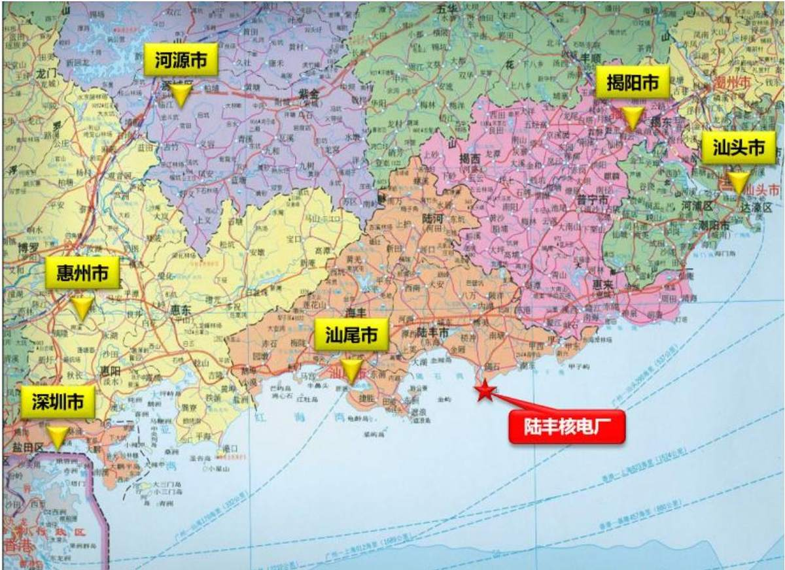  
图2.1-1 地理位置示意图

区（厂外辅助设施区、现场服务区、配电装置区）、海工、施工生产区（包括利用1、2号机组已建施工生产临建和新建场区西侧施工生产临建）和保留区等，已于 2020 年 5月开始场平，目前，正在进行核岛、常规岛安装。

3、4号机组主要建设内容包括 3、4号机组厂区、海工区、施工生产生活区（包括利用部分1、2号及5、6号机组已建施工生产临建和新建施工生产临建、生活区）、临时周转场区、表土堆存场区等。3、4号机组是在 1、2号机组完成厂区场平的基础上进行建设，施工生产生活区、附属设施区、边坡及排洪工程、进厂道路、应急道路、重件码头、场外管线工程等设施全厂共用，已建成。

## 2.1.2.2 1、2号机组水土保持工作情况

## （1）水土保持方案报告书

2005年11月，建设单位中广核陆丰核电有限公司委托广东省电力设计研究院开展了广东陆丰核电1、2 号机组的水土保持方案编制工作，并于2012 年8月1 日取得水利部批复（水保函〔2012〕216号）。

（2） 水土保持监理监测情况

1、2号机组开工至2024年12月底，建设单位委托北京华夏山川生态环境科技有限公司承担1、2号机组水土保持监测工作；自2025年1 月起，建设单位委托北京水保生态工程咨询有限公司承担 1、2 号机组水土保持监测工作；自开工以来，由黄河工程咨询监理有限责任公司承担水土保持监理工作。

结合北京水保生态工程咨询有限公司编制的《广东陆丰核电1、2号机组项目2025年第四季度水土保持监测报告》及收集施工月报、监理月报等相关资料和现场调查得知，截至 2025 年12 月，1、2 号机组厂区已全面扰动，扰动地表面积 $2 4 7 . 8 8 \mathrm { h m } ^ { 2 }$ ，已产生土石方开挖总量 1557.62 万 m3，累计回填土石方 991.37 万 m3；外运 441.14 万 m3土石方至周边综合利用，临时堆存土石方125.11万m3于场内临时堆存场。

1、2号机组开工以来，各级水行政主管部门分别在2013年5月7日、2017年8月9日～10日、2022年 5月5 日对广东陆丰核电1、2号机组项目进行了监督检查，建设单位对检查组提出的整改意见均进行了回复和整改，详见表2.1-2。

## 2.1.2.11 接入系统

陆丰核电厂规划容量为 6 台百万千瓦级核电机组，规划 8 回 500kV 出线，前期工程已建设 5 回线路，其中 2 回至茅湖站，2回至陆丰站，1 回至甲子海上风电。本期工程拟建设2回500kV出线，预留第8 回出线。

220kV 施工与辅助电源变站规划以2回220kV接入系统，目前已经建成1回 220kV线路，接入220kV丰港变电站，长度 25km。第2回220kV 线路在 陆丰1、2 号机组工程阶段建设完成。

本期送出线路工程属于单独立项、单独建设内容，最终方案以电网公司批复意见为准，不纳入本期工程水土流失防治责任范围。

## 2.1.2.12 厂外供水系统

目前已建成厂外供水管线长度47.36km，本期工程可直接利用，不纳入本期工程水土流失防治责任范围。

## 2.1.3 本期工程项目组成及布置

## 2.1.3.1 项目组成

附属设施区、现场服务区、防排洪、进场交通、接入系统、供水系统等由前期工程或地方设计并建设，本期工程主要建设内容由厂区和海工区组成。

（1） 厂 区

3、4号机组核电厂厂区用地面积26.05hm2，包括主厂房区、放射性辅助生产设施、循环冷却水、实物保护、排水虹吸井。

主厂房区包括核岛和常规岛，由反应堆厂房、核辅助厂房、核附属厂房、燃料厂房、电气厂房、备用冷却厂房、柴油发电机厂房和汽轮发电机厂房等组成，是核电厂最重要的组成部分。BOP 子项配置原则为尽可能与前期工程共用，规划建设放射性辅助生产设施、循环冷却水、实物保护、排水虹吸井等 2 机共用子项。

（2） 海工区

3、4 号机组海工区主要包括取水西导流堤、取水南导流堤、取水护岸、排水隧洞等，其中排水隧洞位于水域，不计列占地，总占地面积6.28hm2。

组之间。热机修车间（BBH）、循环水消泡加药厂房（BEV）、虹吸井（BCC）、制氯站（BZD）和联合泵房（BPX）布置在厂区南部。

## （2） 放射性辅助生产设施

3、4号机组放射性辅助生产设施主要包括放射性废油废溶剂处理站（BER/BES）、放射性废油贮存库（BQR/BQV）、热洗衣机房（BQE）、核岛/常规岛废液贮存厂房（BQA/BQB）等布置在主厂房区东部，占地面积为3.01hm2。

热机修车间和仓库分成冷区和热区，结构上分为地下一层，地上一层、局部二层，长约 66.6m，宽约45.0m，布置在主厂房区南侧。

## （3） 循环冷却水

循环冷却水设施包括联合泵房（BPX）及制氯站（BZD），按2台机组共用原则设计。联合泵房分地上和地下两层结构，分鼓网区、泵区和检修区等三部分，长 168m，宽64.9m。制氯站为单层建筑物，包括酸碱贮存及中和池区域、水泵间、冷却间、通信间、控制间、电解室、整流器间等。结构形式为钢筋混凝土框架结构建筑高度为 9.3m（至室外地坪），占地面积2.90hm2。

## （4） 实物保护

根据核电厂各种设施的重要程度有所不同，将厂区由外向内划分为三个保护区域，依次为：控制区、保护区、要害区，这三个区域的周界（包括出入口）连续并构成完整的实体屏障。本期工程实物保护区面积 2.06hm2。

控制区围栏，与前期工程共用。保护区设置双层（间隔 6m）可视围栏，包围所有直接影响核电厂运行的主生产区和生产辅助设施区，并装有探测设施，高度为2.5m、总长度 2720m的透空围栏。要害区位于保护区内，主要为核岛要害区。设置由带轻质防护栏的单层钢丝网围栏及建筑物混凝土墙体屏障组合构成的双层（间隔1.5m）可视围墙，装有探测设施，高度分别为2.5m 与1.5m、总长度为2100m 的透空围栏，要害区围栏外侧设置了车辆巡逻通道，供保安人员巡逻监视用。

出入口控制：在控制区、保护区的出入口均设置有出入口设施，由出入口控制系统控制和记录人员和车辆的通行。3、4 号机组厂区建成后，与 1、2 号和 5、6 号机组合围一个厂区边界，出入口利用 1、2 号和 5、6 号机组已建的出入口。

## （1） 取水内护岸

## 1） 取水东护岸、取水南护岸、取水北护岸一段、取水西护岸

取水东护岸、取水南护岸、取水西护岸、取水北护岸一段位于厂址陆域，不受波浪作用影响，为炸岩形成的取水泵房前池护岸，根据现场反馈，本区域场平标高已整平至15.3m/14.8m，护岸顶高程根据所处位置确定，取水东护岸、取水西护岸一段顶高程为15.3m～14.8m，取水北护岸一段顶高程为15.3m，取水南护岸、取水西护岸二段顶高程为 14.8m。取水头部及两侧直立翼墙开挖底标高为-7.5m，开挖深度 22.3m～22.8m。据地质报告显示，边坡范围内自上而下依次为：孤石、全风化花岗岩、强风化花岗岩、强风化花岗岩、微风化花岗岩。

边坡开挖根据地质条件的差异，开挖放坡坡率也不同，在孤石、全风化岩及强风化岩中放坡坡率为1∶1，在中风化岩及微风化岩中，放坡坡率为1∶0.5。

边坡坡面防护采用锚喷支护，锚杆直径 20mm，长度2.5m。

坡面采用挂网喷混护坡，挂网采用双层钢筋网，钢筋直径8mm，强度等级HPB300，按200mm×200mm 方格编织，并与坡面锚杆焊接固定。

坡面喷射 200mm 厚 C20 早强混凝土，喷射混凝土 1 天龄期不低于 5MPa。喷射混凝土沿边坡纵向每 10-15m 长度分段设置伸缩缝，缝宽 20mm，并按要求充填沥青防水材料。

在坡面设置泄水孔，泄水孔直径110mm，外倾5%，间距3.0m，梅花形布置。泄水孔深度为0.3m，泄水孔长度约0.5m，内置软式透水管（直径100mmPVC带孔波纹管，外包反滤土工布）。喷混前应对泄水管出口进行遮挡，喷混完工后除去遮挡物。最下排泄水孔出水口高于取水渠设计水位不小于 200mm。

## 2） 取水北护岸二段

护岸顶高程为14.8m，为斜坡式结构。首先需对自然山体的岩面进行开挖，开挖坡比为 1∶1.5，开挖在-1.0m 高程处设置肩台，在肩台上部的岩面外侧回填1～500kg开山石作为堤心石，护面块体采用2t四脚空心方块，上部出水位置采用浆砌块石，垫层块石为抛填 150～200kg 块石垫层，厚 850mm，护脚棱体块石同样采用 150～200kg 块石，护脚棱体顶高程为1.0m，护底块石为60～100kg块石，厚2m。斜坡坡比为1∶1.5。

（2） 海工区

3、4号机组新建取水西导流堤顶高程为12.0m～14.8m，取水南导流堤顶高程12.0m。取水西护岸一段、取水东护岸顶高程为 15.3m～14.8m，其余护岸顶高程为14.8m。

## 2.1.4 全厂用水及水量平衡

## （1） 海水用水量

本期工程建设2台华龙一号核电机组，电厂循环冷却水包括凝汽器冷却水、辅机冷却水和核岛厂用水冷却用水。

本期工程循环冷却水系统采用海水直流系统，采用厂址东侧“闭口长明渠+隧洞”取水、隧洞离岸深排的方案。本期工程单台机组凝汽器冷却水量约为222156m3/h，辅机冷却水量约为 7920m3/h，厂用水冷却水量约为4500m3/h，滤网冲洗水量约为 600m3/h，2 台机组制氯站用水量约为 400m3/h。本期工程2 台机组海水用水量约为 130.8m3/s。

## （2）淡水用水量

本期工程两台机组正常运行最高日耗水量约为3240m3/d，启动工况下最高日取水量约为 5500m3/d，两台机组年取水量约为 $1 1 0 \times 1 0 ^ { 4 } \mathrm { m } ^ { 3 } / \mathrm { a }$ 。两台机组正常运行时平均小时淡水用水量约为 132.92m3/h，取 135m3/h，机组耗水率约为 0.02m3/（s·GW）。

## 2.2 施工组织

## 2.2.1 施工导流

本期工程泵房前池南侧山体岩质较好，多为中风化/微风化岩，结合因地制宜的施工组织方案，可利用天然山体作为防渗结构，无需设置临时围堰和防渗墙。

## 2.2.2 交通运输

## 2.2.2.1 场外交通

## （1） 公路

厂址所在的陆丰市公路交通较为发达。境内有高速公路G15 沈海高速（深汕高速），国道 G324，县道 X139 内南碣公路、X133 碣博河公路等公路网主干道路；在海丰县境内有深汕高速公路、甬莞高速公路及在建的兴汕高速公路，在惠来县境内有深汕高速公路、潮惠高速公路等。

厂址北距沈海高速约24km，西北距国道324线约23km，北距省道南碣（内湖镇—南塘镇—碣石镇）公路8km，北距沿海公路约8km。目前已建成有永久性进厂道路（碣田公路）可通至厂址，永久进厂道路起于碣石镇东部的大路岭处南碣公路，终点位于陆丰核电厂区，路线由北往东南走，按公路 II 级设计，全长约12.6km。

## （2） 铁路

厦深铁路也称杭深铁路厦深段，是中国东南沿海地带连接福建省和广东省之间的省际快速铁路、国家Ⅰ级客货干线铁路，呈东北至西南走向；为中国“八纵八横”高速铁路沿海通道南段的组成部分之一。厦深铁路于2013年12月28日全线通车运营。该铁路北起厦门北站、南至深圳北站，正线全长514km，设计速度250km/h，列车初期运营速度200km/h。

厦深铁路东西向经过陆丰市境内，离厂址最近距离约28km（N 方位）。

## （3） 海上交通

核电厂超大、超重设备较多，根据陆丰核电厂的交通运输条件，建设期间的大件运输拟采用水运方式为主，公路为辅的运输方案。为接卸核电厂建设期间的重大件设备，1、2 号机组建设了3000吨级杂货船码头，大件设备由海运直接抵达自备码头进行接卸，然后通过厂内重件运输道路运送至施工现场。

## 2.2.2.2 场内交通

经过1、2号机组和5、6号机组前期建设，场区布设了较为完善的厂内施工道路，结合后期永久道路永临结合布设，现有施工道路为水泥路面，宽 4.0m～9.0m 之间，两侧均布设了临时排水沟。

## 2.2.3 施工生产生活区布置

主体设计本着方便施工、节省投资、缩短工期、节约用地的原则，充分利用现有的施工生产生活设施为施工所用，尽量减少新增不必要的施工生产生活设施。

## （1） 施工生活区

场内已建成 LC 工程办公楼、LD 工程办公楼，本期工程再新增 1 处临时办公楼，占地面积0.8hm2，位于2号机组北侧，属于1、2号机厂区永久占地。

## （2） 施工生产区

根据施工生产的需要，本期工程可研阶段规划了 3/4 号危险品库、危废暂存场、C级堆场、CI 土建、C 级库、重件库、停车场、临时放射源库、安全技能培训中心、CI安装、NI 安装、泥水处理场、混凝土生产链、施工供水加压站、消防营地、A/B 物资库房、临时办公楼、NI生产临建等生产临建，以上施工生产临建的布置利用3、4号机组厂区永久征地 0.30 hm2。

综上，本期工程施工生产生活区总占地面积 39.56 hm2（不含与 3、4号厂区重复占

表 2.2-1  
施工生产生活区场地竖向标高统计表
<table><tr><td rowspan=1 colspan=1>序号</td><td rowspan=1 colspan=1>项目</td><td rowspan=1 colspan=1>占地面积(hm²)</td><td rowspan=1 colspan=1>现状场地标高</td><td rowspan=1 colspan=1>设计标高</td></tr><tr><td rowspan=1 colspan=1>1</td><td rowspan=1 colspan=1>3/4号危险品库</td><td rowspan=1 colspan=1>0.8</td><td rowspan=8 colspan=1>24.0m</td><td rowspan=8 colspan=1>24.0m</td></tr><tr><td rowspan=1 colspan=1>2</td><td rowspan=1 colspan=1>危废暂存场</td><td rowspan=1 colspan=1>0.16</td></tr><tr><td rowspan=1 colspan=1>3</td><td rowspan=1 colspan=1>3/4号CI土建</td><td rowspan=1 colspan=1>4</td></tr><tr><td rowspan=1 colspan=1>4</td><td rowspan=1 colspan=1>3/4号C级堆场1</td><td rowspan=1 colspan=1>0.9</td></tr><tr><td rowspan=1 colspan=1>5</td><td rowspan=1 colspan=1>临时放射源库</td><td rowspan=1 colspan=1>0.03</td></tr><tr><td rowspan=1 colspan=1>6</td><td rowspan=1 colspan=1>5/6机新增临建区停车场</td><td rowspan=1 colspan=1>0.61</td></tr><tr><td rowspan=1 colspan=1>7</td><td rowspan=1 colspan=1>安全技能培训中心</td><td rowspan=1 colspan=1>0.3</td></tr><tr><td rowspan=1 colspan=1>8</td><td rowspan=1 colspan=1>3/4号CI安装</td><td rowspan=1 colspan=1>3.2</td></tr><tr><td rowspan=1 colspan=1>9</td><td rowspan=1 colspan=1>3/4号C级库 1</td><td rowspan=1 colspan=1>4.26</td><td rowspan=4 colspan=1>14.8m</td><td rowspan=4 colspan=1>24.0m</td></tr><tr><td rowspan=1 colspan=1>10</td><td rowspan=1 colspan=1>3/4号重件库</td><td rowspan=1 colspan=1>1.5</td></tr><tr><td rowspan=1 colspan=1>11</td><td rowspan=1 colspan=1>3/4号C级库2</td><td rowspan=1 colspan=1>0.4</td></tr><tr><td rowspan=1 colspan=1>12</td><td rowspan=1 colspan=1>3/4号C级库西侧停车场</td><td rowspan=1 colspan=1>0.1</td></tr><tr><td rowspan=1 colspan=1>13</td><td rowspan=1 colspan=1>3/4号NI安装</td><td rowspan=1 colspan=1>6.3</td><td rowspan=1 colspan=1>17.0m</td><td rowspan=1 colspan=1>24.0m</td></tr><tr><td rowspan=1 colspan=1>14</td><td rowspan=1 colspan=1>3/4号泥水处理场</td><td rowspan=1 colspan=1>0.92</td><td rowspan=5 colspan=1>14.8m</td><td rowspan=5 colspan=1>14.8m</td></tr><tr><td rowspan=1 colspan=1>15</td><td rowspan=1 colspan=1>3/4号C级堆场 4</td><td rowspan=1 colspan=1>0.48</td></tr><tr><td rowspan=1 colspan=1>16</td><td rowspan=1 colspan=1>混凝土生产链</td><td rowspan=3 colspan=1>7.57</td></tr><tr><td rowspan=1 colspan=1>17</td><td rowspan=1 colspan=1>施工供水加压站</td></tr><tr><td rowspan=1 colspan=1>18</td><td rowspan=1 colspan=1>消防营地</td></tr><tr><td rowspan=1 colspan=1>19</td><td rowspan=1 colspan=1>3/4 号 A/B 物资库房</td><td rowspan=1 colspan=1>2.1</td><td rowspan=1 colspan=1></td><td rowspan=1 colspan=1></td></tr><tr><td rowspan=1 colspan=1>20</td><td rowspan=1 colspan=1>3/4号C级堆场 2</td><td rowspan=1 colspan=1>0.83</td><td rowspan=1 colspan=1></td><td rowspan=1 colspan=1></td></tr><tr><td rowspan=1 colspan=1>21</td><td rowspan=1 colspan=1>临时办公楼</td><td rowspan=1 colspan=1>0.8</td><td rowspan=1 colspan=1></td><td rowspan=1 colspan=1></td></tr><tr><td rowspan=1 colspan=1>22</td><td rowspan=1 colspan=1>3/4号NI生产临建</td><td rowspan=1 colspan=1>4.3</td><td rowspan=1 colspan=1>17.0~22.0m</td><td rowspan=1 colspan=1>18.0~20.0m</td></tr><tr><td rowspan=1 colspan=1>合计</td><td rowspan=1 colspan=1></td><td rowspan=1 colspan=1>39.56</td><td rowspan=1 colspan=1></td><td rowspan=1 colspan=1></td></tr></table>

## 2.2.4 土石方临时周转场区

3、4 号机组为满足实际施工需求，布置4处土石方临时周转场地，分别为 1#石方周转场、2#石方周转场、1#土方周转场和2#土方周转场，面积 $1 1 . 4 5 \mathrm { { h m } } ^ { 2 } , 3 . 7 7 \mathrm { { h m } } ^ { 2 } , 1 2 . 8 0 \mathrm { { h m } } ^ { 2 }$ 5.82hm2，2#石方周转场利用前期工程已有占地，其他 3 处土石方临时周转场地属于本期新增占地布置，新增临时占地面积 $3 0 . 0 7 \mathrm { h m } ^ { 2 }$ 。本期工程采取分类、分区堆存动态最大土方量和石方量，由于施工生产区场平开挖土方量 1.50 万 $\mathrm { m } ^ { 3 }$ ，在场平范围内直接从场地高处往低处推平、压实，不涉及周转，所以该部分土方量不在动态平衡表中计列，本期工程土方、石方开挖最大动态堆存量详见表2.2-3 和表2.2-4，经计算，土方动态最大堆存量=改良为表土利用的土方 12.80万 $\mathrm { m } ^ { 3 }$ （折合成松散方 16.38 万 $\mathrm { m } ^ { 3 }$ ） $+ 1 5 0 . 8 2 \ \overline { { \mathcal { H } } } \ \mathrm { m } ^ { 3 }$ （松散方，查表 2.2-3）=167.20 万 $\mathrm { m } ^ { 3 }$ （松散方），石方动态最大堆存量为117.67万 $\mathrm { m } ^ { 3 }$ （松散方，查表2.2-4）。

地，地表植被覆盖良好。场地内存在1 条既有土路，计划予以拆除，且无需进行原貌恢复。该区域现状地面标高为15.0～22.1m，相对高差较小，起伏较小，地势总体较平坦。经地质分析，场地周边范围无能动断层，场地边界范围内无断层经过，未发现滑坡、泥石流、地面塌陷、岩溶、采空区等不良地质作用，没有可供开采的矿产资源，也没有影响场地和地基安全的人类活动，总体评价场地是稳定的。

2#石方周转场原始地貌为海积平原，现状为 1、2 号机组石方临时周转场，已场平至 14.8m，总占地面积 12.0hm2，现状堆存石料约 140 万 m3，平均每月消耗量约为 8.0万m3，计划2027年4月底全部利用完后，于2027年10月启动堆存3、4号机组石方，本期工程利用该地块面积 3.77hm2，本期工程未利用前（即 2027年 10月前）防治责任范围属于1、2号机组，该地块属于中广核陆丰核电有限公司招拍挂用地。经地质分析，场地范围内未发现岩溶、泥石流、采空区、地面沉降等不良地质作用。

2#土方周转场位于核电厂北侧约 6.0km，碣田公路西侧，植物龙区域南侧之间的林地上。根据成因、岩性和形态等特征，场地属海岸平原地貌，现阶段主要为林地，地表植被覆盖良好，场地内无可用道路，周边存在硬化路面的田间路。场地现状涉及 1 基500kV输电塔（A4 塔），属于原500kV玄茅线。根据电力规划设计总院《关于500kV陆丰核电一期接入系统工程初步设计的评审意见》（电规电网〔2025〕563号），为配合区域电网整体布局优化，将对原 500kV玄茅线A2～A5塔段进行改造，并重新规划建设新的输电线路。经核实，新建线路位于周转场西北侧 200m之外，土方临时中转不会对新建线路构成影响。原A4 塔计划于 2026年4月拆除。该区域现状地面标高为12.0～15.3m，相对高差较小，起伏较小，地势总体较平坦。经地质分析，场地周边范围无能动断层，场地边界范围内无断层经过，未发现滑坡、泥石流、地面塌陷、岩溶、采空区等不良地质作用，没有可供开采的矿产资源，也没有影响场地和地基安全的人类活动，总体评价场地是稳定的。

4处土方、石方临时周转场总面积33.84hm2，容量为286.70万m3（松散方），主要用于临时转存本期工程自身利用的土方、石方，土石方最大堆存总量211.78万m3（自然方，折合松散方284.87万m3），分区堆放，土方堆存坡比1∶3.0，石方堆存坡比1∶2.0，最大堆存高度10.0m～15.0m。临时周转场可利用周边现有道路，交通便利，现状为林地、工矿仓储用地，不涉及基本农田。

土石方临时周转场特性表见下表 2.2-2。

表 2.2-2  
土石方临时周转场特性一览表
<table><tr><td rowspan=1 colspan=1>名称</td><td rowspan=1 colspan=1>1#石方周转场</td><td rowspan=1 colspan=1>2#石方周转场</td><td rowspan=1 colspan=1>1#土方周转场</td><td rowspan=1 colspan=1>2#土方周转场</td><td rowspan=1 colspan=1>小计</td></tr><tr><td rowspan=1 colspan=1>占地面积（hm²）</td><td rowspan=1 colspan=1>11.45</td><td rowspan=1 colspan=1>3.77</td><td rowspan=1 colspan=1>12.80</td><td rowspan=1 colspan=1>5.82</td><td rowspan=1 colspan=1>33.84</td></tr><tr><td rowspan=1 colspan=1>场址中心坐标</td><td rowspan=1 colspan=1>115°49&#x27;23&quot;E，22°45&#x27;25&quot;N</td><td rowspan=1 colspan=1>115°49&#x27;35&quot;E,22°44&#x27;54&quot;N</td><td rowspan=1 colspan=1>115°49′45″E，22°45′15″N</td><td rowspan=1 colspan=1>115°51&#x27;23&quot;E，22°47&#x27;27″N</td><td rowspan=1 colspan=1>1</td></tr><tr><td rowspan=1 colspan=1>现状高程（m）</td><td rowspan=1 colspan=1>15.0~18.5</td><td rowspan=1 colspan=1>14.8</td><td rowspan=1 colspan=1>17.0~22.1</td><td rowspan=1 colspan=1>12.0~15.3</td><td rowspan=1 colspan=1>1</td></tr><tr><td rowspan=1 colspan=1>顶面高程（m）</td><td rowspan=1 colspan=1>25</td><td rowspan=1 colspan=1>29.8</td><td rowspan=1 colspan=1>32.0</td><td rowspan=1 colspan=1>27.0</td><td rowspan=1 colspan=1>1</td></tr><tr><td rowspan=1 colspan=1>堆置坡比</td><td rowspan=1 colspan=1>1:2</td><td rowspan=1 colspan=1>1:2</td><td rowspan=1 colspan=1>1:3</td><td rowspan=1 colspan=1>1:3</td><td rowspan=1 colspan=1>1</td></tr><tr><td rowspan=1 colspan=1>容量（万m³）</td><td rowspan=1 colspan=1>78.00</td><td rowspan=1 colspan=1>40.70</td><td rowspan=1 colspan=1>98.00</td><td rowspan=1 colspan=1>70</td><td rowspan=1 colspan=1>286.70</td></tr><tr><td rowspan=1 colspan=1>最大堆存量（万m³，自然方)</td><td rowspan=1 colspan=1>53.33</td><td rowspan=1 colspan=1>27.83</td><td rowspan=1 colspan=1>76.20</td><td rowspan=1 colspan=1>54.43</td><td rowspan=1 colspan=1>211.78</td></tr><tr><td rowspan=1 colspan=1>最大堆存量（万m³，松散方）</td><td rowspan=1 colspan=1>77.32</td><td rowspan=1 colspan=1>40.35</td><td rowspan=1 colspan=1>97.53</td><td rowspan=1 colspan=1>69.67</td><td rowspan=1 colspan=1>284.87</td></tr><tr><td rowspan=1 colspan=1>最大堆高（m）</td><td rowspan=1 colspan=1>10.0</td><td rowspan=1 colspan=1>15.0</td><td rowspan=1 colspan=1>15.0</td><td rowspan=1 colspan=1>15.0</td><td rowspan=1 colspan=1>1</td></tr><tr><td rowspan=1 colspan=1>级别</td><td rowspan=1 colspan=1>4级</td><td rowspan=1 colspan=1>5级</td><td rowspan=1 colspan=1>4级</td><td rowspan=1 colspan=1>4级</td><td rowspan=1 colspan=1>1</td></tr><tr><td rowspan=1 colspan=1>堆存时间</td><td rowspan=1 colspan=1>2026年7月~2029年6月</td><td rowspan=1 colspan=1>2027年10月~2032年3月</td><td rowspan=1 colspan=1>2026年4月~2033年6月</td><td rowspan=1 colspan=1>2028年2月~2030年9月</td><td rowspan=1 colspan=1></td></tr></table>

响不大的施工不作介绍。

## 2.2.7.1 建构筑地基及基础施工

核岛建构筑物基础采用现浇钢筋混凝土筏板基础，常规岛建构筑物基础采用现浇钢筋砼筏板基础和扩展基础。BOP 土建、构筑物基础拟采用放置在天然地基或经处理后的人工地基上的现浇钢筋混凝土扩展基础或条形基础或筏板基础。

核岛与常规岛建构筑是工程施工工期的控制工程，最先施工，然后施工 BOP 建构筑。

## （1） 筏板及扩展基础施工

筏板及扩展基础施工顺序：定位放线→土方开挖（降水与排水）→基槽验收→垫层施工→承台施工→验收→土方回填。根据水保要求，本节仅介绍土方开挖、土方回填及施工降水与排水。

## 1） 土方开挖

工艺流程：放线→挖土、挖基坑周边地面截（排）水沟→修边坡→维护坡面→挖土至坑底面设计标高并验槽→挖基底周边排水沟、基底找平。

采用反铲式液压挖掘机进行大开挖，人工配合修整边坡、清挖桩间土、基（槽）底排水沟，对于机械不便开挖部分，采用人工开挖。采用自卸汽车运土，直接运至土石方临时周转场，用于肥槽回填的土方直接运至表土堆存场。由于基础开挖面积较大，应根据每台挖土机的挖土范围、交通流量，布置挖土作业面和相应数量的运输车辆。为防止机械挖土扰动原土，挖至设计标高上方30cm 时停止机械挖土，采用人工进行基槽清理。按规范及计算确定边坡坡度或坑壁支护。

## 2） 土方回填

基础工程完成，强度达到要求后进行土方回填。

工艺流程：基坑（槽）底地坪上清理→检验土质→分层铺土、耙平→夯打密实→检验密实度→修整找平。

填土前应将基坑（槽）底或地坪上的垃圾等杂物清理干净；肥槽回填前，必须清理到基础底面标高，将回落的松散垃圾、砂浆、石子等杂物清除干净。

检验回填土的质量有无杂物，粒径是否符合规定，以及回填土的含水量是否在控制的范围内；如含水量偏高，可采用翻松、晾晒或均匀掺入干土等措施；如遇回填土的含水量偏低，可采用预先洒水润湿等措施。

回填土应分层铺摊。每层铺土厚度应根据土质、密实度要求和机具性能确定。

一般蛙式打夯机每层铺土厚度为 200～250mm；人工打夯不大于 200mm。每层铺摊后，随之耙平。

回填土每层至少夯打三遍。打夯应一夯压半夯，夯夯相接，行行相连，纵横交叉。并且严禁采用水浇使土下沉的所谓"水夯"法。

深浅两基坑（槽）相连时，应先填夯深基础；填至浅基坑相同的标高时，再与浅基础一起填夯。如必须分段填夯时，交接处应填成阶梯形，梯形的高宽比一般为1∶2。上下层错缝距离不小于1.0m。

回填土每层填土夯实后，应按规范规定进行环刀取样，测出干土的质量密度；达到要求后，再进行上一层的铺土。

填土全部完成后，应进行表面拉线找平，凡超过标准高程的地方，及时依线铲平；凡低于标准高程的地方，应补土夯实。

## 3） 降水与排水

① 基坑底排水：在地下水位较低和土质较好的情况下，基坑底四周设置排水沟、集水井，采用明沟排水的方法，必要时可在中间加设小支沟与边沟连通。排水沟的截面宜为 300～400mm（宽）×400mm（深），纵向坡度宜为0.5%。集水井的截面宜为600mm（长）×600mm（宽）×1000mm（深），每20～30m 设一个。基坑底地下水由排水沟流入集水井，然后用高扬程潜水泵排走。

② 基坑壁围蔽截水：围蔽截水的施工方法可以选择钢板桩、钢筋混凝土排桩、地下连续墙、定喷桩幕墙、旋喷桩、深层搅拌桩等，其可根据施工地形、水文地质资料和施工方法等确定，并在施工组织设计中确定。

③ 基坑降水：采用人工降低地下水位的方法，应根据挖土的深度和规模，选择钻孔集水井降水或轻型井点降水，其井点的布置数量和形式，要根据含水层渗透系数和涌水量计算确定，并相应配套抽水设备。

## 2.2.7.2 海 工

## （1） 取水导流堤

工艺流程：测量放线--基槽挖泥--堤心推填--护底石抛填--垫层块石抛填--护面块体安装--挡浪墙浇筑

基槽开挖采用挖泥船开挖，泥驳运输至海上指定弃淤区倾倒；堤心石推填，采用自卸车运输石料，推土机陆上推填、挖掘机理坡成型。护底及垫层块石，采用自卸车转运块石上驳船，挖掘机上驳船进行抛填。护面块体采用平板车运输，起重船起重吊装方式

进行安装。

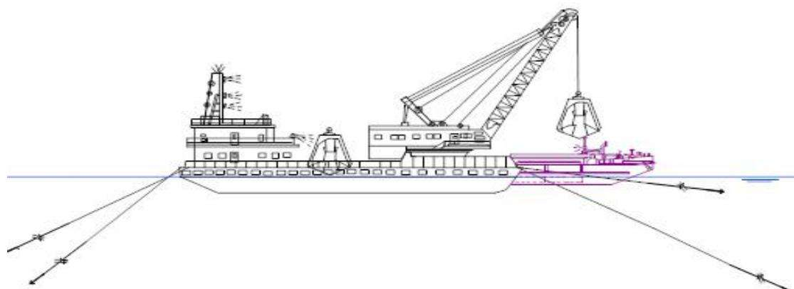  
图2.2-6 挖泥施工示意图

## （2） 排水隧洞

本期工程盾构机单次掘进最大长度约 1.5km，最大水头压力约 5.6bar。从施工要求看，盾构施工的要素是要保证“稳得住，掘得进，突得出”，本期工程为海底隧道工程，为安全考虑计划推荐采用复合式泥水平衡盾构。

盾构机从盾构工作井始发掘进，盾构到达设计终点后，拆除相应设备，并进行顶升施工。掘进 3、4 号取水隧洞采用 1 台盾构机施工，从 3 号盾构始发井向 3 号盾构接收井掘进，然后吊出转场至4号盾构始发井向4号接收井掘进。排水隧洞开挖石方可作为场地填料。泥水平衡盾构段施工，泥浆应进行循环利用，废弃泥浆应排放到专用的沉淀池中固化后集中处理，避免随意排放，造成环境污染。本着尽量减少用地的原则，盾构开挖产生的泥浆应采用分级式泥水处理设备（泥水分离设备和压滤设备）泥土经露天晾晒干以后统一调配处理。

排水隧洞盾构始发后导洞施工采用矿山法施工工艺。

## （3） 护岸工程

工艺流程：测量放线--石方爆破后开挖边坡--锚喷支护

陆上爆破石方后采用挖掘机开挖形成边坡，在边坡上安装锚杆，并铺设钢筋网后喷射混凝土进行支护。

## 2.2.7.3 施工生产生活区

施工工艺为：场区地形复核→表土剥离→回填区分区域场地平整→回填区施工。

## （1） 表土剥离

工程施工前，需对工程占地范围内的表层土进行剥离，然后再进行施工。剥离表土

采用机械配合人工方式，施工机械采用推土机，根据项目区表土的厚度情况，场区内剥离厚度约0.15m，剥离的表土集中堆置于表土堆存场内，后期用于绿化覆土。

## （2） 土方开挖

土方开挖自上而下分层、分区域开挖，在接近设计边坡标高时，预留 20～30cm 厚度土层，利用挖掘机进行修坡，避免对原状土进行扰动及标高满足设计要求。

## （3） 场地回填

采用自卸汽车连续运送土石方。土方运输至填方区后，从里面往外面填，然后用履带式推土机配合，边填边推。堆放场回填分层进行：第一层填0.5m 厚，并每0.5m 碾压2-4 遍，以防止回填土层太松散。边填边压实，整个场地填完后，再进行第二层回填。

## 2.2.7.4 临时周转场

（1） 土石方堆存需按照“先拦后弃、先排后弃”的原则进行，堆存前保证拦挡及排水等设施建设完备。

（2）土石方回采作业必须严格执行“水平分层、逐层剥离”模式，从料堆顶部开始，沿整个工作面均匀下挖，每层回采厚度控制在设备一铲能力范围内，严禁从底部掏挖或在中部形成“悬岩”，防止塌料混批；作业时要保持回采断面平齐整齐，上一层的物料未取净之前不得侵入下一层，不同类型的料堆之间必须留有明显界线或物理隔断，严禁跨越取料，从根源上杜绝坍塌伤人风险。

## 2.2.7.5 土壤改良

土壤改良计划安排在工程完工最后半年施工。采用“分层铺放、整体搅拌”的方法。在作业区先铺一层约30cm厚的处理土。均匀撒上一层腐熟有机肥和植物性辅料。按量撒入微生物菌剂和pH调节剂。重复以上步骤，直至堆置到预定高度（通常1.5-2.0m为宜）。使用挖掘机或专用搅拌机进行充分、均匀的混合，至少翻拌3遍，确保各组分分布均匀。

## 2.2.8 施工用水、用电、通讯

## （1） 施工电源

## 1） 10kV 线路

10kV供电线路全长 18km，从110kV石变电站接出，沿沿海公路经碣石公路至角溪村约接入碣田道路，沿碣田公路进入厂内，大部分路径利用原供电局 10kV线路走廊和塔架。目前已由1、2号机组项目建成。

## 2） 220kV 变电站及 1 回 220kV 专线

220kV变电站及220kV专线作为现场主要的施工电源，容量考虑核电厂最终的安全辅助电源的容量。220kV 施工与辅助电源变电站规划以2 回220kV接入系统，目前已经建成 1回220kV线路，接入 220kV丰港变电站，长度25km。第2 回220kV 线路在陆丰1、2号机组工程阶段建设完成，最终的接入系统方案以电网部门审定的方案为准。不属于本期工程防治责任范围。

## （2） 施工水源

1、2 号机组开工时，已从角清村的碣石镇自来水公司生活供水管网接出 DN200 的临时供水管道，经原西湖村从核电厂西北角接入厂区内，供施工生产使用。3、4号机组建设时，可直接利用。

## （3） 施工通讯

按照核电工程建设要求，施工通信设施包括为工程建设提供服务的办公电话、传真、手持移动终端、计算机、安防监控、门禁等各类通信设施。

通过租用本地电信运营商光纤链路链接到办公楼，利用厂区现场办公点设立计算机网络和办公电话通信系统，提供信息化办公条件。通过中国电信的广域网链路实现与中国广核集团有限公司和工程公司的互联。

可用的通信资源有内部网、IP 电话、本地固定电话、传真等业务。

现场的无线通讯信号基本覆盖，中国电信的电话线路已铺设到现场附近的西湖、后埔等村落，当地的电信部门可受理装机和接线等事宜。现场建设单位、承包商将配备足够的计算机及其外设、网络设备、计算机软件，以及办公设备、文印设备等，以便实现与业主进行网上信息沟通、电子文件交换、电子办公，以及施工文件图纸的传递、复印、分发等现代化施工管理手段。

## 2.2.9 料源规划

3、4号机组建设所需的土方、石料优先由项目内部提供，不足部分的水泥、石料、碎石、砂子、砖等建筑材料均从国内市场通过招投标的方式采购，相应水土流失防治责任由供货方承担。

## 2.3 工程占地

3、4号机组总征占地面积为111.09hm2，其中利用5、6 号机组和1、2 号机组的占地面积75.71hm2，新增占地面积35.38hm2。永久征地包括厂区、海工区和利用永久征地布置的施工生产生活区等占地，总面积36.27hm2。临时占地包括施工生产生活区、临时周转场区、表土堆存场区，总面积为 74.82hm2。

工程占地全部位于汕尾市辖的陆丰市碣石镇，具体分区占地情况如下。

## 2.3.1 厂 区

3、4号机组厂区占地面积为26.05hm2，全部为1、2号机组临时占地，本期转化为永久占地，包括主厂房区占地16.83hm2，放射性辅助生产设施占地3.01hm2、循环冷却水设施占地2.90hm2、实物保护区占地2.06hm2、排水虹吸井1.25hm2，现状为1、2号和5、6号机组施工生产区，占地现状类型为工矿仓储用地中的工业用地，占地性质为永久占地。

## 2.3.2 施工生产生活区

3、4 号机组施工生产生活区总占地面积 39.56hm2，其中利用 1、2 号机组占地21.50hm2，利用 5、6 号机组占地 15.06 hm2，新增临建场地（3/4 号 NI 生产临建）3.0hm2，占地现状类型包括林地中的乔木林地和工矿仓储用地中的工业用地。

## 2.3.3 海工区

本区总占地面积为 6.28hm2，主体设计仅统计泵房前池用地 2.19hm2（现状为 1、2号机组施工场地），未统计取水堤、护岸等占地 4.09 hm2，其中利用 1、2 号机组占地3.97hm2，新增海域用地 2.31hm2。

## 2.3.4 表土堆存场区

2处表土堆存场，总面积5.0hm2，占地现状类型为林地，全部为新增占地。

## 2.3.5 临时周转场区

临时周转场包括利用1、2号机组建筑垃圾周转场（目前已建成、全厂共用）和4处土石方临时周转场。本区总占地面积为34.20hm2，其中利用1、2号机组已建建筑垃圾周转场0.36hm2，土石方临时周转场 $3 3 . 8 4 \mathrm { h m } ^ { 2 }$ （其中利用1、2号临时占地3.77hm2，本期新增临时占地30.07hm2），占地现状类型包括工矿仓储用地中的工业用地和林地中的乔木林地。

工程占地详见表2.3-1。

表 2.3-1  
工程征占地统计表  
单位：hm2
<table><tr><td rowspan=2 colspan=1>区域</td><td rowspan=2 colspan=1>占地性质</td><td rowspan=1 colspan=4>占地类型</td><td rowspan=2 colspan=1>利用5、6号机组征占地</td><td rowspan=2 colspan=1>利用1、2号机组征占地</td><td rowspan=2 colspan=1>新增征占地</td><td rowspan=2 colspan=1>备注</td></tr><tr><td rowspan=1 colspan=1>林地</td><td rowspan=1 colspan=1>工矿仓储用地</td><td rowspan=1 colspan=1>海域</td><td rowspan=1 colspan=1>小计</td></tr><tr><td rowspan=1 colspan=1>厂区</td><td rowspan=1 colspan=1>永久征地</td><td rowspan=1 colspan=1></td><td rowspan=1 colspan=1>26.05</td><td rowspan=1 colspan=1></td><td rowspan=1 colspan=1>26.05</td><td rowspan=1 colspan=1></td><td rowspan=1 colspan=1>26.05</td><td rowspan=1 colspan=1></td><td rowspan=1 colspan=1>属于1、2号机临时占地，本期转为永久占地</td></tr><tr><td rowspan=1 colspan=1>施工生产</td><td rowspan=1 colspan=1>永久征地</td><td rowspan=1 colspan=1></td><td rowspan=1 colspan=1>3.94</td><td rowspan=1 colspan=1></td><td rowspan=1 colspan=1>3.94</td><td rowspan=1 colspan=1>3.14</td><td rowspan=1 colspan=1>0.80</td><td rowspan=1 colspan=1></td><td rowspan=1 colspan=1>占用厂外辅助设施区、5、6号机厂区和1、2号机厂区永久占地布置</td></tr><tr><td rowspan=1 colspan=1>生活区</td><td rowspan=1 colspan=1>临时占地</td><td rowspan=1 colspan=1>3.00</td><td rowspan=1 colspan=1>32.62</td><td rowspan=1 colspan=1></td><td rowspan=1 colspan=1>35.62</td><td rowspan=1 colspan=1>18.36</td><td rowspan=1 colspan=1>14.26</td><td rowspan=1 colspan=1>3.00</td><td rowspan=1 colspan=1>部分利用5、6号和1、2号机临时占地布置</td></tr><tr><td rowspan=1 colspan=1>海工区</td><td rowspan=1 colspan=1>永久征地</td><td rowspan=1 colspan=1></td><td rowspan=1 colspan=1>3.97</td><td rowspan=1 colspan=1>2.31</td><td rowspan=1 colspan=1>6.28</td><td rowspan=1 colspan=1></td><td rowspan=1 colspan=1>3.97</td><td rowspan=1 colspan=1>2.31</td><td rowspan=1 colspan=1>利用1、2号机永久占地1.78hm2，利用1、2号机临时占地2.19hm²(本期转为永久占地)</td></tr><tr><td rowspan=1 colspan=1>临时周转场区</td><td rowspan=1 colspan=1>临时占地</td><td rowspan=1 colspan=1>30.07</td><td rowspan=1 colspan=1>4.13</td><td rowspan=1 colspan=1></td><td rowspan=1 colspan=1>34.20</td><td rowspan=1 colspan=1></td><td rowspan=1 colspan=1>4.13</td><td rowspan=1 colspan=1>30.07</td><td rowspan=1 colspan=1>2#石方周转场和建筑垃圾周转场占用1、2号机临时占地，其余3处均为新增临时占地。</td></tr><tr><td rowspan=1 colspan=1>表土堆存场区</td><td rowspan=1 colspan=1>临时占地</td><td rowspan=1 colspan=1>5.00</td><td rowspan=1 colspan=1></td><td rowspan=1 colspan=1></td><td rowspan=1 colspan=1>5.00</td><td rowspan=1 colspan=1></td><td rowspan=1 colspan=1>5.00</td><td rowspan=1 colspan=1></td><td rowspan=1 colspan=1></td></tr><tr><td rowspan=3 colspan=1>合计</td><td rowspan=1 colspan=1>永久征地</td><td rowspan=1 colspan=1></td><td rowspan=1 colspan=1>33.96</td><td rowspan=1 colspan=1>2.31</td><td rowspan=1 colspan=1>36.27</td><td rowspan=1 colspan=1>3.14</td><td rowspan=1 colspan=1>30.82</td><td rowspan=1 colspan=1>2.31</td><td rowspan=1 colspan=1></td></tr><tr><td rowspan=1 colspan=1>临时占地</td><td rowspan=1 colspan=1>38.07</td><td rowspan=1 colspan=1>36.75</td><td rowspan=1 colspan=1></td><td rowspan=1 colspan=1>74.82</td><td rowspan=1 colspan=1>18.36</td><td rowspan=1 colspan=1>23.39</td><td rowspan=1 colspan=1>33.07</td><td rowspan=1 colspan=1></td></tr><tr><td rowspan=1 colspan=1>合计</td><td rowspan=1 colspan=1>38.07</td><td rowspan=1 colspan=1>70.71</td><td rowspan=1 colspan=1>2.31</td><td rowspan=1 colspan=1>111.09</td><td rowspan=1 colspan=1>21.50</td><td rowspan=1 colspan=1>54.21</td><td rowspan=1 colspan=1>35.38</td><td rowspan=1 colspan=1></td></tr></table>

## 2.4 土石方平衡

## 2.4.1 土石方平衡

## 2.4.1.1 厂区

3、4号机组厂区已由 1、2号机组完成了场平，后续土石方量主要是厂区基坑和海工区明渠等负挖，包括核岛、常规岛、BOP、廊道、虹吸井等。

经主体设计估算，3、4 号机组厂区范围建构筑物基础土石方负挖产生挖方量约234.65 万 m3，其中土方约 104.66 万 m3，石方约 129.99 万 m3；回填量约 117.53 万 m3，其中土方约66.23万 m3，石方约51.309 万m3。回填土石方全部由本期工程挖方提供。

表 2.4-1  
3、4号机组工程厂区负挖工程量
<table><tr><td rowspan=1 colspan=1>序号</td><td rowspan=1 colspan=1>项目</td><td rowspan=1 colspan=1>石方</td><td rowspan=1 colspan=1>土方</td><td rowspan=1 colspan=1>合计</td></tr><tr><td rowspan=1 colspan=1>1</td><td rowspan=1 colspan=1>3号核岛</td><td rowspan=1 colspan=1>10.01</td><td rowspan=1 colspan=1>11.99</td><td rowspan=1 colspan=1>22</td></tr><tr><td rowspan=1 colspan=1>2</td><td rowspan=1 colspan=1>4号核岛</td><td rowspan=1 colspan=1>10.01</td><td rowspan=1 colspan=1>11.99</td><td rowspan=1 colspan=1>22</td></tr><tr><td rowspan=1 colspan=1>3</td><td rowspan=1 colspan=1>虹吸井</td><td rowspan=1 colspan=1>11.57</td><td rowspan=1 colspan=1>8.93</td><td rowspan=1 colspan=1>20.5</td></tr><tr><td rowspan=1 colspan=1>4</td><td rowspan=1 colspan=1>3号常规岛</td><td rowspan=1 colspan=1>7.74</td><td rowspan=1 colspan=1>5.17</td><td rowspan=1 colspan=1>12.9</td></tr><tr><td rowspan=1 colspan=1>5</td><td rowspan=1 colspan=1>4号常规岛</td><td rowspan=1 colspan=1>8.13</td><td rowspan=1 colspan=1>5.38</td><td rowspan=1 colspan=1>13.5</td></tr><tr><td rowspan=1 colspan=1>6</td><td rowspan=1 colspan=1>3、4号机组 BOP</td><td rowspan=1 colspan=1>3.58</td><td rowspan=1 colspan=1>5.93</td><td rowspan=1 colspan=1>9.5</td></tr><tr><td rowspan=1 colspan=1>7</td><td rowspan=1 colspan=1>3、4号机组泵房</td><td rowspan=1 colspan=1>24.45</td><td rowspan=1 colspan=1>13.55</td><td rowspan=1 colspan=1>38</td></tr><tr><td rowspan=1 colspan=1>8</td><td rowspan=1 colspan=1>3、4号机组廊道</td><td rowspan=1 colspan=1>54.52</td><td rowspan=1 colspan=1>41.73</td><td rowspan=1 colspan=1>96.25</td></tr><tr><td rowspan=1 colspan=2>合计</td><td rowspan=1 colspan=1>129.99</td><td rowspan=1 colspan=1>104.66</td><td rowspan=1 colspan=1>234.65</td></tr></table>

3、4 号机组厂区场地已平整到位，厂区后续建设需要的土石方主要为回填工程、少量细平需求，详见表2.4-2。

表 2.4-2  
3、4号机组建设土石方需求  
（自然方，单位：万m3）
<table><tr><td rowspan=1 colspan=1>序号</td><td rowspan=1 colspan=1>项目</td><td rowspan=1 colspan=1>石方</td><td rowspan=1 colspan=1>土方</td><td rowspan=1 colspan=1>合计</td></tr><tr><td rowspan=1 colspan=1>1</td><td rowspan=1 colspan=1>3、4号机组廊道回填</td><td rowspan=1 colspan=1>26.95</td><td rowspan=1 colspan=1>50.05</td><td rowspan=1 colspan=1>77</td></tr><tr><td rowspan=1 colspan=1>2</td><td rowspan=1 colspan=1>3、4号机组基坑回填</td><td rowspan=1 colspan=1>21.6</td><td rowspan=1 colspan=1>4.5</td><td rowspan=1 colspan=1>26.1</td></tr><tr><td rowspan=1 colspan=1>3</td><td rowspan=1 colspan=1>3、4号机组厂区细平</td><td rowspan=1 colspan=1>5</td><td rowspan=1 colspan=1></td><td rowspan=1 colspan=1>5</td></tr><tr><td rowspan=1 colspan=1>4</td><td rowspan=1 colspan=1>3、4号机组泵房回填</td><td rowspan=1 colspan=1>8</td><td rowspan=1 colspan=1>15</td><td rowspan=1 colspan=1>23</td></tr><tr><td rowspan=1 colspan=2>小计（实方）</td><td rowspan=1 colspan=1>61.55</td><td rowspan=1 colspan=1>69.55</td><td rowspan=1 colspan=1>131.1</td></tr><tr><td rowspan=1 colspan=2>小计（自然方）</td><td rowspan=1 colspan=1>51.30</td><td rowspan=1 colspan=1>66.23</td><td rowspan=1 colspan=1>117.53</td></tr></table>

## 2.4.1.2 施工生产生活区

根据 $\ll $ 东陆丰核电3、4 号机组土石方静态平衡分析报告（E版）》，施工生产生活区场平回填土方总量64.18万 $\mathrm { m } ^ { 3 }$ ，场地植被恢复前改良土方回填4.57万 $\mathbf { m } ^ { 3 } .$ 。经复核，主体设计未考虑新增施工生产生活区表土剥离、场平和表土回覆。经计算分析，新增施工生产生活区表土剥离面积 $3 . 0 \mathrm { h m } ^ { 2 }$ ，表土剥离量 $0 . 4 5 \mathrm { ~ \mathscr ~ { ~ H ~ } ~ m ~ } ^ { 3 }$ ，场平开挖土方 $1 . 5 0 \mathrm { ~ \mathscr { H } ~ m ^ { 3 } }$ ，回填土方 1.50 万 $\mathrm { m } ^ { 3 }$ ，表土回覆量0.45万 $\mathrm { m } ^ { 3 }$ 。复核后，施工生产生活区开挖土方1.95万 $\mathrm { m } ^ { 3 }$ （含表土剥离量0.45万m3），回填土方70.70万 $\mathrm { m } ^ { 3 }$ （含表土回覆量5.02万m3）。

## 2.4.1.3 临时周转场区

主要为利用建筑垃圾周转场和石方临时周转场地后期迹地恢复回覆表土，其中表土剥离量 4.51 万 $\mathrm { m } ^ { 3 }$ ，表土回覆量 12.74 万 $\mathrm { m } ^ { 3 }$

表 2.4-3  
临时周转场区表土平衡表  
（自然方，单位：万 $\mathbf { m } ^ { 3 } )$
<table><tr><td rowspan=2 colspan=1>名称</td><td rowspan=1 colspan=2>表土剥离量</td><td rowspan=1 colspan=1>表土回覆量</td><td rowspan=1 colspan=1></td></tr><tr><td rowspan=1 colspan=1>实际剥离面积(hm²)</td><td rowspan=1 colspan=1>实际剥离量(万m³)</td><td rowspan=1 colspan=1>实际回覆面积(hm²)</td><td rowspan=1 colspan=1>实际回覆量(万m³)</td></tr><tr><td rowspan=1 colspan=1>1#石方周转场</td><td rowspan=1 colspan=1>11.45</td><td rowspan=1 colspan=1>1.72</td><td rowspan=1 colspan=1>11.45</td><td rowspan=1 colspan=1>4.58</td></tr><tr><td rowspan=1 colspan=1>2#石方周转场</td><td rowspan=1 colspan=1>1</td><td rowspan=1 colspan=1>1</td><td rowspan=1 colspan=1>3.77</td><td rowspan=1 colspan=1>0.57</td></tr><tr><td rowspan=1 colspan=1>1#土方周转场</td><td rowspan=1 colspan=1>12.80</td><td rowspan=1 colspan=1>1.92</td><td rowspan=1 colspan=1>12.80</td><td rowspan=1 colspan=1>5.12</td></tr><tr><td rowspan=1 colspan=1>2#土方周转场</td><td rowspan=1 colspan=1>5.82</td><td rowspan=1 colspan=1>0.87</td><td rowspan=1 colspan=1>5.82</td><td rowspan=1 colspan=1>2.33</td></tr><tr><td rowspan=1 colspan=1>建筑垃圾周转场</td><td rowspan=1 colspan=1>1</td><td rowspan=1 colspan=1>1</td><td rowspan=1 colspan=1>0.36</td><td rowspan=1 colspan=1>0.14</td></tr><tr><td rowspan=1 colspan=1>合计</td><td rowspan=1 colspan=1>30.07</td><td rowspan=1 colspan=1>4.51</td><td rowspan=1 colspan=1>34.20</td><td rowspan=1 colspan=1>12.74</td></tr></table>

## 2.4.1.4 海工区

海工工程包含泵房前池、取排水工程、冷源工程等，依据 3、4 号机组海工可研报告，海工开挖土石方102.27 万 $\mathrm { m } ^ { 3 }$ ，回填土石方30.25 万 $\mathrm { m } ^ { 3 }$ ，产生淤泥20.48万 $\mathrm { m } ^ { 3 }$ 。

表 2.4-4  
3、4 号机组海工区土石方平衡  
（自然方，单位：万m3）
<table><tr><td rowspan=2 colspan=1>项目</td><td rowspan=1 colspan=3>消纳土石方量</td><td rowspan=1 colspan=3>产生土石方、清淤量</td></tr><tr><td rowspan=1 colspan=1>开山石</td><td rowspan=1 colspan=1>规格石</td><td rowspan=1 colspan=1>土方</td><td rowspan=1 colspan=1>产生土方</td><td rowspan=1 colspan=1>产生石方</td><td rowspan=1 colspan=1>清淤/礁</td></tr><tr><td rowspan=1 colspan=1>取水西护岸</td><td rowspan=1 colspan=1></td><td rowspan=1 colspan=1></td><td rowspan=1 colspan=1></td><td rowspan=1 colspan=1>2.67</td><td rowspan=1 colspan=1>2.23</td><td rowspan=1 colspan=1></td></tr><tr><td rowspan=1 colspan=1>取水南护岸</td><td rowspan=1 colspan=1>0.39</td><td rowspan=1 colspan=1>0.20</td><td rowspan=1 colspan=1></td><td rowspan=1 colspan=1>2.32</td><td rowspan=1 colspan=1>1.94</td><td rowspan=1 colspan=1></td></tr><tr><td rowspan=1 colspan=1>取水东护岸</td><td rowspan=1 colspan=1>1.58</td><td rowspan=1 colspan=1>1.18</td><td rowspan=1 colspan=1></td><td rowspan=1 colspan=1>12.94</td><td rowspan=1 colspan=1>0.90</td><td rowspan=1 colspan=1></td></tr><tr><td rowspan=1 colspan=1>取水北护岸一段</td><td rowspan=1 colspan=1></td><td rowspan=1 colspan=1></td><td rowspan=1 colspan=1></td><td rowspan=1 colspan=1>0.60</td><td rowspan=1 colspan=1>0.50</td><td rowspan=1 colspan=1></td></tr><tr><td rowspan=1 colspan=1>取水北护岸二段</td><td rowspan=1 colspan=1>0.36</td><td rowspan=1 colspan=1>0.02</td><td rowspan=1 colspan=1></td><td rowspan=1 colspan=1>0.30</td><td rowspan=1 colspan=1>0.57</td><td rowspan=1 colspan=1></td></tr><tr><td rowspan=1 colspan=1>直立翼墙</td><td rowspan=1 colspan=1></td><td rowspan=1 colspan=1>0.83</td><td rowspan=1 colspan=1>0.47</td><td rowspan=1 colspan=1>0.84</td><td rowspan=1 colspan=1>1.56</td><td rowspan=1 colspan=1></td></tr><tr><td rowspan=1 colspan=1>取水西导流堤</td><td rowspan=1 colspan=1>3.14</td><td rowspan=1 colspan=1>2.38</td><td rowspan=1 colspan=1></td><td rowspan=1 colspan=1></td><td rowspan=1 colspan=1></td><td rowspan=1 colspan=1>2.61</td></tr></table>

续表 2.4-4  
3、4号机组海工区土石方平衡  
（自然方，单位： $\mathcal { F } \mathrm { m } ^ { 3 } )$
<table><tr><td rowspan=2 colspan=2>项目</td><td rowspan=1 colspan=3>消纳土石方量</td><td rowspan=1 colspan=3>产生土石方、清淤量</td></tr><tr><td rowspan=1 colspan=1>开山石</td><td rowspan=1 colspan=1>规格石</td><td rowspan=1 colspan=1>土方</td><td rowspan=1 colspan=1>产生土方</td><td rowspan=1 colspan=1>产生石方</td><td rowspan=1 colspan=1>清淤/礁</td></tr><tr><td rowspan=1 colspan=2>取水南导流堤</td><td rowspan=1 colspan=1></td><td rowspan=1 colspan=1>17.69</td><td rowspan=1 colspan=1></td><td rowspan=1 colspan=1></td><td rowspan=1 colspan=1></td><td rowspan=1 colspan=1>9.47</td></tr><tr><td rowspan=2 colspan=1>运维通道</td><td rowspan=1 colspan=1>场平</td><td rowspan=1 colspan=1></td><td rowspan=1 colspan=1></td><td rowspan=1 colspan=1></td><td rowspan=1 colspan=1>3.50</td><td rowspan=1 colspan=1>6.50</td><td rowspan=1 colspan=1></td></tr><tr><td rowspan=1 colspan=1>基础</td><td rowspan=1 colspan=1></td><td rowspan=1 colspan=1></td><td rowspan=1 colspan=1></td><td rowspan=1 colspan=1></td><td rowspan=1 colspan=1></td><td rowspan=1 colspan=1>0.1</td></tr><tr><td rowspan=1 colspan=2>冷源工程</td><td rowspan=1 colspan=1></td><td rowspan=1 colspan=1></td><td rowspan=1 colspan=1></td><td rowspan=1 colspan=1></td><td rowspan=1 colspan=1></td><td rowspan=1 colspan=1>0.7</td></tr><tr><td rowspan=1 colspan=2>泵房前池陆上炸岩</td><td rowspan=1 colspan=1></td><td rowspan=1 colspan=1></td><td rowspan=1 colspan=1></td><td rowspan=1 colspan=1>24.38</td><td rowspan=1 colspan=1>30.42</td><td rowspan=1 colspan=1></td></tr><tr><td rowspan=1 colspan=2>泵房前池水上炸岩</td><td rowspan=1 colspan=1></td><td rowspan=1 colspan=1></td><td rowspan=1 colspan=1></td><td rowspan=1 colspan=1></td><td rowspan=1 colspan=1></td><td rowspan=1 colspan=1>1.5</td></tr><tr><td rowspan=1 colspan=2>明渠疏浚</td><td rowspan=1 colspan=1></td><td rowspan=1 colspan=1></td><td rowspan=1 colspan=1></td><td rowspan=1 colspan=1></td><td rowspan=1 colspan=1></td><td rowspan=1 colspan=1>3.6</td></tr><tr><td rowspan=1 colspan=2>3号机组排水隧洞</td><td rowspan=1 colspan=1></td><td rowspan=1 colspan=1></td><td rowspan=1 colspan=1>0.10</td><td rowspan=2 colspan=1>10.1</td><td rowspan=1 colspan=1></td><td rowspan=1 colspan=1></td></tr><tr><td rowspan=1 colspan=2>4号机组排水隧洞</td><td rowspan=1 colspan=1></td><td rowspan=1 colspan=1></td><td rowspan=1 colspan=1>0.10</td><td rowspan=1 colspan=1></td><td rowspan=1 colspan=1></td></tr><tr><td rowspan=1 colspan=2>排水头部构筑物</td><td rowspan=1 colspan=1>0.50</td><td rowspan=1 colspan=1>1.33</td><td rowspan=1 colspan=1></td><td rowspan=1 colspan=1></td><td rowspan=1 colspan=1></td><td rowspan=1 colspan=1>2.5</td></tr><tr><td rowspan=1 colspan=2>合计（自然方）</td><td rowspan=1 colspan=1>5.96</td><td rowspan=1 colspan=1>23.62</td><td rowspan=1 colspan=1>0.67</td><td rowspan=1 colspan=1>57.66</td><td rowspan=1 colspan=1>44.61</td><td rowspan=1 colspan=1>20.48</td></tr></table>

综上，广东陆丰核电 3、4 号机组建设开挖土石方总量 343.38 万 $\mathrm { m } ^ { 3 }$ （自然方，下同），其中表土 4.96 万 $\mathrm { m } ^ { 3 }$ ，土方 $1 6 3 . 8 2 \mathrm { ~ \mathscr { F } ~ m ^ { 3 } }$ ，石方 174.60 万 $\mathrm { m } ^ { 3 }$ ；回填土石方总量 231.22 万 $\mathrm { m } ^ { 3 }$ ，其中表土17.76 万 $\mathrm { m } ^ { 3 } .$ ，土方 132.58 万 $\mathrm { m } ^ { 3 }$ ，石方 80.88 万 $\mathbf { m } ^ { 3 } \mathbf { ; }$ ；区间调配量 76.98 万 $\mathrm { m } ^ { 3 }$ （含厂区调出土方 12.80 万 $\mathrm { m } ^ { 3 }$ 至施工生产生活区、临时周转场区改良为表土利用）；作为混凝土骨料等建材利用料 88.0 万 $\mathrm { m } ^ { 3 }$ ，余方总量 $2 4 . 1 6 \mathrm { ~ \mathcal ~ { ~ H ~ } ~ m ~ } ^ { 3 }$ ，其中土方 18.44 万 $\mathrm { m } ^ { 3 }$ 、石方 5.72 万 $\mathrm { m } ^ { 3 }$ 。余方中土方 18.44万 $\mathrm { m } ^ { 3 }$ 由陆丰市碣石陆丰市碣石海工基地（三期）项目综合利用，石方5.72万 $\mathrm { m } ^ { 3 }$ 由陆丰核电5、6 号机组项目海工导流堤利用。土石方平衡详见表2.4-5。

海工海域淤泥开挖 20.48 万 $\mathrm { m } ^ { 3 }$ ，运至碣石湾外倾倒区，位于 115°52′16.734$\mathrm { E / 2 2 ^ { \circ } ~ 3 9 ^ { \prime } ~ 0 . 3 5 8 ^ { \circ } ~ N , ~ 1 1 5 ^ { \circ } ~ 5 2 ^ { \prime } ~ 1 6 . 7 3 4 ^ { \dprime } ~ E / 2 2 ^ { \circ } ~ 3 8 ^ { \prime } ~ 0 . 1 5 7 ^ { \prime \prime } ~ N , ~ 1 1 5 ^ { \circ } ~ 5 4 ^ { \prime } ~ 1 3 . 0 9 ^ { \prime } ~ \mathrm { E / 2 2 ^ { \circ } } }$ 38′0.157″N、115°54′13.09″E/22°39′0.358″N 四点连线围成的海域，面积$6 . 1 9 \mathrm { k m } ^ { 2 }$ 。根据《水利部办公厅关于印发生产建设项目水土保持方案审查要点的通知》（办水保〔2023〕177 号），该部分不计入本方案土石方平衡中。

表 2.4-5  
本期工程土石方平衡表  
（自然方，单位：万m3）
<table><tr><td rowspan=3 colspan=1>项目组成</td><td rowspan=3 colspan=1>序号</td><td rowspan=3 colspan=1>名称</td><td rowspan=3 colspan=1>类别</td><td rowspan=3 colspan=1>挖方</td><td rowspan=3 colspan=1>填方</td><td rowspan=1 colspan=4>直接调运</td><td rowspan=3 colspan=1>作为混凝土骨料等建材利用料</td><td rowspan=1 colspan=2>余方</td></tr><tr><td rowspan=1 colspan=2>调入</td><td rowspan=1 colspan=2>调出</td><td rowspan=2 colspan=1>数量</td><td rowspan=2 colspan=1>去向</td></tr><tr><td rowspan=1 colspan=1>数量</td><td rowspan=1 colspan=1>来源</td><td rowspan=1 colspan=1>数量</td><td rowspan=1 colspan=1>去向</td></tr><tr><td rowspan=4 colspan=1>厂区</td><td rowspan=4 colspan=1>1</td><td rowspan=4 colspan=1>建筑物基础</td><td rowspan=2 colspan=1>土方</td><td rowspan=2 colspan=1>104.66</td><td rowspan=2 colspan=1>66.23</td><td rowspan=2 colspan=1></td><td rowspan=2 colspan=1></td><td rowspan=1 colspan=1>12.80</td><td rowspan=1 colspan=1>施工生产生活区、临时周转场区、表土堆存场区改良为表土利用</td><td rowspan=2 colspan=1></td><td rowspan=2 colspan=1></td><td rowspan=2 colspan=1></td></tr><tr><td rowspan=1 colspan=1>25.63</td><td rowspan=1 colspan=1>施工生产生活区</td></tr><tr><td rowspan=1 colspan=1>石方</td><td rowspan=1 colspan=1>129.99</td><td rowspan=1 colspan=1>51.30</td><td rowspan=1 colspan=1></td><td rowspan=1 colspan=1></td><td rowspan=1 colspan=1></td><td rowspan=1 colspan=1></td><td rowspan=1 colspan=1>78.69</td><td rowspan=1 colspan=1></td><td rowspan=1 colspan=1></td></tr><tr><td rowspan=1 colspan=1>小计</td><td rowspan=1 colspan=1>234.65</td><td rowspan=1 colspan=1>117.53</td><td rowspan=1 colspan=1></td><td rowspan=1 colspan=1></td><td rowspan=1 colspan=1>38.43</td><td rowspan=1 colspan=1></td><td rowspan=1 colspan=1>78.69</td><td rowspan=1 colspan=1></td><td rowspan=1 colspan=1></td></tr><tr><td rowspan=3 colspan=1>施工生产生活区</td><td rowspan=3 colspan=1>2</td><td rowspan=3 colspan=1>临建设施基础、植被恢复</td><td rowspan=1 colspan=1>表土</td><td rowspan=1 colspan=1>0.45</td><td rowspan=1 colspan=1>5.02</td><td rowspan=1 colspan=1>4.57</td><td rowspan=1 colspan=1>厂区</td><td rowspan=1 colspan=1></td><td rowspan=1 colspan=1></td><td rowspan=1 colspan=1></td><td rowspan=1 colspan=1></td><td rowspan=1 colspan=1></td></tr><tr><td rowspan=1 colspan=1>土方</td><td rowspan=1 colspan=1>1.50</td><td rowspan=1 colspan=1>65.68</td><td rowspan=1 colspan=1>64.18</td><td rowspan=1 colspan=1>厂区</td><td rowspan=1 colspan=1></td><td rowspan=1 colspan=1></td><td rowspan=1 colspan=1></td><td rowspan=1 colspan=1></td><td rowspan=1 colspan=1></td></tr><tr><td rowspan=1 colspan=1>小计</td><td rowspan=1 colspan=1>1.95</td><td rowspan=1 colspan=1>70.70</td><td rowspan=1 colspan=1>68.75</td><td rowspan=1 colspan=1></td><td rowspan=1 colspan=1></td><td rowspan=1 colspan=1></td><td rowspan=1 colspan=1></td><td rowspan=1 colspan=1></td><td rowspan=1 colspan=1></td></tr><tr><td rowspan=1 colspan=1>临时周转场区</td><td rowspan=1 colspan=1>3</td><td rowspan=1 colspan=1>植被恢复</td><td rowspan=1 colspan=1>表土</td><td rowspan=1 colspan=1>4.51</td><td rowspan=1 colspan=1>12.74</td><td rowspan=1 colspan=1>8.23</td><td rowspan=1 colspan=1>厂区</td><td rowspan=1 colspan=1></td><td rowspan=1 colspan=1></td><td rowspan=1 colspan=1></td><td rowspan=1 colspan=1></td><td rowspan=1 colspan=1></td></tr><tr><td rowspan=3 colspan=1>海工区</td><td rowspan=3 colspan=1>5</td><td rowspan=3 colspan=1>隧洞、导流堤等</td><td rowspan=1 colspan=1>土方</td><td rowspan=1 colspan=1>57.66</td><td rowspan=1 colspan=1>0.67</td><td rowspan=1 colspan=1></td><td rowspan=1 colspan=1></td><td rowspan=1 colspan=1>38.55</td><td rowspan=1 colspan=1></td><td rowspan=1 colspan=1></td><td rowspan=1 colspan=1>18.44</td><td rowspan=1 colspan=1>海工基地三期项目消纳</td></tr><tr><td rowspan=1 colspan=1>石方</td><td rowspan=1 colspan=1>44.61</td><td rowspan=1 colspan=1>29.58</td><td rowspan=1 colspan=1></td><td rowspan=1 colspan=1></td><td rowspan=1 colspan=1></td><td rowspan=1 colspan=1></td><td rowspan=1 colspan=1>9.31</td><td rowspan=1 colspan=1>5.72</td><td rowspan=1 colspan=1>5、6号机导流堤优化利用</td></tr><tr><td rowspan=1 colspan=1>小计</td><td rowspan=1 colspan=1>102.27</td><td rowspan=1 colspan=1>30.25</td><td rowspan=1 colspan=1></td><td rowspan=1 colspan=1></td><td rowspan=1 colspan=1>38.55</td><td rowspan=1 colspan=1></td><td rowspan=1 colspan=1>9.31</td><td rowspan=1 colspan=1>24.16</td><td rowspan=1 colspan=1></td></tr><tr><td rowspan=4 colspan=3>合计</td><td rowspan=1 colspan=1>表土</td><td rowspan=1 colspan=1>4.96</td><td rowspan=1 colspan=1>17.76</td><td rowspan=1 colspan=1>12.80</td><td rowspan=1 colspan=1></td><td rowspan=1 colspan=1></td><td rowspan=1 colspan=1></td><td rowspan=1 colspan=1></td><td rowspan=1 colspan=1></td><td rowspan=1 colspan=1></td></tr><tr><td rowspan=1 colspan=1>土方</td><td rowspan=1 colspan=1>163.82</td><td rowspan=1 colspan=1>132.58</td><td rowspan=1 colspan=1>64.18</td><td rowspan=1 colspan=1></td><td rowspan=1 colspan=1>76.98</td><td rowspan=1 colspan=1></td><td rowspan=1 colspan=1></td><td rowspan=1 colspan=1>18.44</td><td rowspan=1 colspan=1>海工基地三期项目消纳</td></tr><tr><td rowspan=1 colspan=1>石方</td><td rowspan=1 colspan=1>174.60</td><td rowspan=1 colspan=1>80.88</td><td rowspan=1 colspan=1></td><td rowspan=1 colspan=1></td><td rowspan=1 colspan=1></td><td rowspan=1 colspan=1></td><td rowspan=1 colspan=1>88.00</td><td rowspan=1 colspan=1>5.72</td><td rowspan=1 colspan=1>5、6号机导流堤优化利用</td></tr><tr><td rowspan=1 colspan=1>小计</td><td rowspan=1 colspan=1>343.38</td><td rowspan=1 colspan=1>231.22</td><td rowspan=1 colspan=1>76.98</td><td rowspan=1 colspan=1></td><td rowspan=1 colspan=1>76.98</td><td rowspan=1 colspan=1></td><td rowspan=1 colspan=1>88.00</td><td rowspan=1 colspan=1>24.16</td><td rowspan=1 colspan=1></td></tr></table>

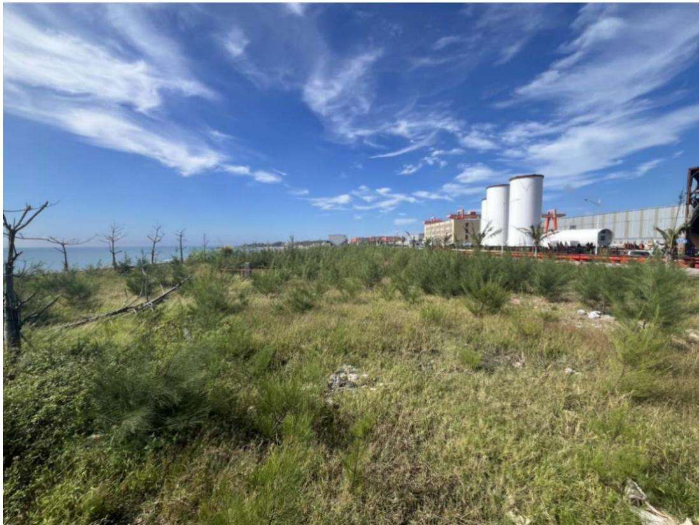  
图2.4-9 海洋工程基地项目现状图

## （3） 改良土方

针对 3、4 号机组区域表土回覆量不足的问题，方案编制人员开展了现场调查，计划采用土方改良技术。从外观上分析，核电厂负挖土方土壤颜色深、湿润、具光泽、质地良好，初步判断经筛分处理后具备改良为植被恢复覆土的潜力。

方案编制人员对上述土方进行取样检测。采样点分别设置于土方堆存场阳面与阴面的坡顶及坡脚位置，共采集 4份土样，送交华中师范大学进行理化性质分析。检测指标包括pH值、有机质、可溶性全氮、可溶性全磷、速效钾、土壤颗粒组成及土粒比表面积等，结果见表2.4-7。

表 2.4-7  
土壤检测参数表
<table><tr><td rowspan=1 colspan=1>取样点</td><td rowspan=1 colspan=1> $\mathsf { p H }$ </td><td rowspan=1 colspan=1>有机质(g/kg)</td><td rowspan=1 colspan=1>可溶性全磷（g/kg）</td><td rowspan=1 colspan=1>可溶性全氮（mg/kg）</td><td rowspan=1 colspan=1>速效钾(ug/ml)</td><td rowspan=1 colspan=1>粘粒(0-2um, %)</td><td rowspan=1 colspan=1>粉粒(2-50um, %)</td><td rowspan=1 colspan=1>砂粒(50-2000um, %)</td></tr><tr><td rowspan=1 colspan=1>1#取样点</td><td rowspan=1 colspan=1>7.05</td><td rowspan=1 colspan=1>12.12</td><td rowspan=1 colspan=1>未检出</td><td rowspan=1 colspan=1>95.97</td><td rowspan=1 colspan=1>22.7</td><td rowspan=1 colspan=1>2.14</td><td rowspan=1 colspan=1>48.26</td><td rowspan=1 colspan=1>46.52</td></tr><tr><td rowspan=1 colspan=1>2#取样点</td><td rowspan=1 colspan=1>8.31</td><td rowspan=1 colspan=1>9.78</td><td rowspan=1 colspan=1>未检出</td><td rowspan=1 colspan=1>94.39</td><td rowspan=1 colspan=1>14.8</td><td rowspan=1 colspan=1>0.75</td><td rowspan=1 colspan=1>36.33</td><td rowspan=1 colspan=1>62.91</td></tr><tr><td rowspan=1 colspan=1>3#取样点</td><td rowspan=1 colspan=1>7.50</td><td rowspan=1 colspan=1>12.62</td><td rowspan=1 colspan=1>未检出</td><td rowspan=1 colspan=1>94.31</td><td rowspan=1 colspan=1>99.4</td><td rowspan=1 colspan=1>52.2</td><td rowspan=1 colspan=1>46.28</td><td rowspan=1 colspan=1>1.52</td></tr><tr><td rowspan=1 colspan=1>4#取样点</td><td rowspan=1 colspan=1>7.78</td><td rowspan=1 colspan=1>14.30</td><td rowspan=1 colspan=1>10.63</td><td rowspan=1 colspan=1>94.01</td><td rowspan=1 colspan=1>11.0</td><td rowspan=1 colspan=1>4.49</td><td rowspan=1 colspan=1>59.83</td><td rowspan=1 colspan=1>35.68</td></tr></table>

根据附件 12《土壤检测报告》结果表明：参照绿化种植土壤主控指标要求，除 2#取样点有机质含量未达标外，其余三点有机质含量虽达标但整体偏低；在土壤质地方面，1#、4#为粉质壤土，2#为砂质粘土，3#为粉质粘土。根据技术要求，植被恢复覆土应以壤土类为宜，其中3#点虽不符合壤土标准，但具备土壤改良条件。因此，方案编制人员建议在满足植被恢复表土回覆需求的前提下，对本期工程负挖土方进行改良。

基于上述分析，陆丰核电厂负挖土方同样具备改良为植被恢复覆土的潜力。本方案依据表土平衡原则，计划将 3、4号机组厂区负挖土方经改良后用于本期工程植被恢复覆土。

3、4 号机组厂区计划 2026 年 4 月开始负挖，根据本期工程表土平衡，回填表土量缺口为 12.80 万 m3，故本方案设计 3、4 号机组厂区负挖用于改良的土方量为12.80 万 m3。

## （4） 表土保护及利用规划

本期工程需进行表土回覆的区域主要为施工生产生活区、土石方临时周转场，总面积60.18hm2，根据后期植被恢复方案对表土回覆厚度的要求，确定表土回覆量为17.76万 m3，表土来源本期工程剥离表土和厂区负挖土方改良后利用，其中利用本期工程表土 4.96 万 m3，改良土方 12.80 万 m3。

表 2.4-8  
表土利用分析表
<table><tr><td rowspan=3 colspan=1>项目区</td><td rowspan=1 colspan=5>表土回覆</td><td rowspan=1 colspan=2>来源</td></tr><tr><td rowspan=1 colspan=2>覆土面积（hm²）</td><td rowspan=1 colspan=2>覆土厚度（m）</td><td rowspan=2 colspan=1>覆土量(万m³)</td><td rowspan=2 colspan=1>自身剥离表土量(万m³)</td><td rowspan=2 colspan=1>厂区土方改良(万m³)</td></tr><tr><td rowspan=1 colspan=1>恢复林地</td><td rowspan=1 colspan=1>恢复草地</td><td rowspan=1 colspan=1>恢复林地</td><td rowspan=1 colspan=1>恢复草地</td></tr><tr><td rowspan=1 colspan=1>施工生产生活区</td><td rowspan=1 colspan=1>4.49</td><td rowspan=1 colspan=1>21.49</td><td rowspan=1 colspan=1>0.40</td><td rowspan=1 colspan=1>0.15</td><td rowspan=1 colspan=1>5.02</td><td rowspan=1 colspan=1>0.45</td><td rowspan=1 colspan=1>4.57</td></tr><tr><td rowspan=1 colspan=1>临时周转场区</td><td rowspan=1 colspan=1>30.43</td><td rowspan=1 colspan=1>3.77</td><td rowspan=1 colspan=1>0.40</td><td rowspan=1 colspan=1>0.15</td><td rowspan=1 colspan=1>12.74</td><td rowspan=1 colspan=1>4.51</td><td rowspan=1 colspan=1>8.23</td></tr><tr><td rowspan=1 colspan=1>合计</td><td rowspan=1 colspan=1>34.92</td><td rowspan=1 colspan=1>25.26</td><td rowspan=1 colspan=1></td><td rowspan=1 colspan=1></td><td rowspan=1 colspan=1>17.76</td><td rowspan=1 colspan=1>4.96</td><td rowspan=1 colspan=1>12.80</td></tr></table>

## （5） 土壤改良

土壤改良计划在 2033 年 1 月启动，临时周转场和大部分施工生产临建场地等已经使用完毕，且场地周边均布设有完善的临时排水沉沙措施，本方案设计利用 3/4 号 CI土建、CI安装两块场地进行培肥改良，这两块场地计划在2032 年12 月前退场，场地总面积 7.2hm2。

## 2.5 拆迁（移民）安置与专项设施改（迁）建

本期工程不涉及拆迁（移民）安置与专项设施改（迁）建工程。

## 2.6 施工进度

本期工程计划2026 年4月开始施工生产生活区场平、厂区负挖，2033年 6月底完工，工期87个月。

表 2.6-1  
本期工程分区施工进度计划表
<table><tr><td rowspan=2 colspan=1>项目</td><td rowspan=1 colspan=1>年份</td><td rowspan=1 colspan=4>2026年</td><td rowspan=1 colspan=4>2027年</td><td rowspan=1 colspan=4>2028年</td><td rowspan=1 colspan=4>2029年</td><td rowspan=1 colspan=4>2030年</td><td rowspan=1 colspan=2>2031</td><td rowspan=1 colspan=2>年</td><td rowspan=1 colspan=4>2032年</td><td rowspan=1 colspan=4>2033年</td></tr><tr><td rowspan=1 colspan=1>季度</td><td rowspan=1 colspan=1>1</td><td rowspan=1 colspan=1>2</td><td rowspan=1 colspan=1>3</td><td rowspan=1 colspan=1>4</td><td rowspan=1 colspan=1>1</td><td rowspan=1 colspan=1>2</td><td rowspan=1 colspan=1>3</td><td rowspan=1 colspan=1>4</td><td rowspan=1 colspan=1>1</td><td rowspan=1 colspan=1>2</td><td rowspan=1 colspan=1>3</td><td rowspan=1 colspan=1>4</td><td rowspan=1 colspan=1>1</td><td rowspan=1 colspan=1>2</td><td rowspan=1 colspan=1>3</td><td rowspan=1 colspan=1>4</td><td rowspan=1 colspan=1>1</td><td rowspan=1 colspan=1>2</td><td rowspan=1 colspan=1>3</td><td rowspan=1 colspan=1>4</td><td rowspan=1 colspan=1>1</td><td rowspan=1 colspan=1>2</td><td rowspan=1 colspan=1>3</td><td rowspan=1 colspan=1>4</td><td rowspan=1 colspan=1>1</td><td rowspan=1 colspan=1>2</td><td rowspan=1 colspan=1>3</td><td rowspan=1 colspan=1>4</td><td rowspan=1 colspan=1>1</td><td rowspan=1 colspan=1>2</td><td rowspan=1 colspan=1>3</td><td rowspan=1 colspan=1>4</td></tr><tr><td rowspan=6 colspan=1>厂区</td><td rowspan=1 colspan=1>负挖</td><td rowspan=1 colspan=1></td><td rowspan=1 colspan=1></td><td rowspan=1 colspan=1></td><td rowspan=1 colspan=1></td><td rowspan=1 colspan=1></td><td rowspan=1 colspan=1></td><td rowspan=1 colspan=1></td><td rowspan=1 colspan=1></td><td rowspan=1 colspan=1></td><td rowspan=1 colspan=1></td><td rowspan=1 colspan=1></td><td rowspan=1 colspan=1></td><td rowspan=1 colspan=1></td><td rowspan=1 colspan=1></td><td rowspan=1 colspan=1></td><td rowspan=1 colspan=1></td><td rowspan=1 colspan=1></td><td rowspan=1 colspan=1></td><td rowspan=1 colspan=1></td><td rowspan=1 colspan=1></td><td rowspan=1 colspan=1></td><td rowspan=1 colspan=1></td><td rowspan=1 colspan=1></td><td rowspan=1 colspan=1></td><td rowspan=1 colspan=1></td><td rowspan=1 colspan=1></td><td rowspan=1 colspan=1></td><td rowspan=1 colspan=1></td><td rowspan=1 colspan=1></td><td rowspan=1 colspan=1></td><td rowspan=1 colspan=1></td><td rowspan=1 colspan=1></td></tr><tr><td rowspan=1 colspan=1>核岛土建</td><td rowspan=1 colspan=1></td><td rowspan=1 colspan=1></td><td rowspan=1 colspan=1></td><td rowspan=1 colspan=1></td><td rowspan=1 colspan=1></td><td rowspan=1 colspan=1></td><td rowspan=1 colspan=1></td><td rowspan=1 colspan=1></td><td rowspan=1 colspan=1></td><td rowspan=1 colspan=1></td><td rowspan=1 colspan=1>H</td><td rowspan=1 colspan=1></td><td rowspan=1 colspan=1></td><td rowspan=1 colspan=1></td><td rowspan=1 colspan=1></td><td rowspan=1 colspan=1></td><td rowspan=1 colspan=1></td><td rowspan=1 colspan=1></td><td rowspan=1 colspan=1></td><td rowspan=1 colspan=1></td><td rowspan=1 colspan=1></td><td rowspan=1 colspan=1></td><td rowspan=1 colspan=1></td><td rowspan=1 colspan=1></td><td rowspan=1 colspan=1></td><td rowspan=1 colspan=1></td><td rowspan=1 colspan=1></td><td rowspan=1 colspan=1></td><td rowspan=1 colspan=1></td><td rowspan=1 colspan=1></td><td rowspan=1 colspan=1></td><td rowspan=1 colspan=1></td></tr><tr><td rowspan=1 colspan=1>常规岛土建</td><td rowspan=1 colspan=1></td><td rowspan=1 colspan=1></td><td rowspan=1 colspan=1></td><td rowspan=1 colspan=1></td><td rowspan=1 colspan=1></td><td rowspan=1 colspan=1></td><td rowspan=1 colspan=1></td><td rowspan=1 colspan=1>H</td><td rowspan=1 colspan=1>H</td><td rowspan=1 colspan=1></td><td rowspan=1 colspan=1></td><td rowspan=1 colspan=1></td><td rowspan=1 colspan=1>H</td><td rowspan=1 colspan=1></td><td rowspan=1 colspan=1></td><td rowspan=1 colspan=1>H</td><td rowspan=1 colspan=1>H</td><td rowspan=1 colspan=1></td><td rowspan=1 colspan=1></td><td rowspan=1 colspan=1></td><td rowspan=1 colspan=1>H</td><td rowspan=1 colspan=1></td><td rowspan=1 colspan=1></td><td rowspan=1 colspan=1></td><td rowspan=1 colspan=1></td><td rowspan=1 colspan=1></td><td rowspan=1 colspan=1></td><td rowspan=1 colspan=1></td><td rowspan=1 colspan=1></td><td rowspan=1 colspan=1></td><td rowspan=1 colspan=1></td><td rowspan=1 colspan=1></td></tr><tr><td rowspan=1 colspan=1>泵房及 BOP 土建</td><td rowspan=1 colspan=1></td><td rowspan=1 colspan=1></td><td rowspan=1 colspan=1></td><td rowspan=1 colspan=1></td><td rowspan=1 colspan=1></td><td rowspan=1 colspan=1></td><td rowspan=1 colspan=1></td><td rowspan=1 colspan=1></td><td rowspan=1 colspan=1></td><td rowspan=1 colspan=1></td><td rowspan=1 colspan=1></td><td rowspan=1 colspan=1></td><td rowspan=1 colspan=1></td><td rowspan=1 colspan=1></td><td rowspan=1 colspan=1></td><td rowspan=1 colspan=1></td><td rowspan=1 colspan=1></td><td rowspan=1 colspan=1></td><td rowspan=1 colspan=1></td><td rowspan=1 colspan=1></td><td rowspan=1 colspan=1></td><td rowspan=1 colspan=1></td><td rowspan=1 colspan=1></td><td rowspan=1 colspan=1></td><td rowspan=1 colspan=1></td><td rowspan=1 colspan=1></td><td rowspan=1 colspan=1></td><td rowspan=1 colspan=1></td><td rowspan=1 colspan=1></td><td rowspan=1 colspan=1></td><td rowspan=1 colspan=1></td><td rowspan=1 colspan=1></td></tr><tr><td rowspan=1 colspan=1>核岛安装</td><td rowspan=1 colspan=1></td><td rowspan=1 colspan=1></td><td rowspan=1 colspan=1></td><td rowspan=1 colspan=1></td><td rowspan=1 colspan=1></td><td rowspan=1 colspan=1></td><td rowspan=1 colspan=1></td><td rowspan=1 colspan=1></td><td rowspan=1 colspan=1></td><td rowspan=1 colspan=1></td><td rowspan=1 colspan=1></td><td rowspan=1 colspan=1></td><td rowspan=1 colspan=1></td><td rowspan=1 colspan=1></td><td rowspan=1 colspan=1></td><td rowspan=1 colspan=1></td><td rowspan=1 colspan=1></td><td rowspan=1 colspan=1></td><td rowspan=1 colspan=1></td><td rowspan=1 colspan=1>H</td><td rowspan=1 colspan=1></td><td rowspan=1 colspan=1></td><td rowspan=1 colspan=1></td><td rowspan=1 colspan=1>H</td><td rowspan=1 colspan=1></td><td rowspan=1 colspan=1></td><td rowspan=1 colspan=1></td><td rowspan=1 colspan=1></td><td rowspan=1 colspan=1></td><td rowspan=1 colspan=1></td><td rowspan=1 colspan=1></td><td rowspan=1 colspan=1></td></tr><tr><td rowspan=1 colspan=1>常规岛及 BOP 安装</td><td rowspan=1 colspan=1></td><td rowspan=1 colspan=1></td><td rowspan=1 colspan=1></td><td rowspan=1 colspan=1></td><td rowspan=1 colspan=1></td><td rowspan=1 colspan=1></td><td rowspan=1 colspan=1></td><td rowspan=1 colspan=1></td><td rowspan=1 colspan=1></td><td rowspan=1 colspan=1></td><td rowspan=1 colspan=1></td><td rowspan=1 colspan=1></td><td rowspan=1 colspan=1></td><td rowspan=1 colspan=1></td><td rowspan=1 colspan=1></td><td rowspan=1 colspan=1></td><td rowspan=1 colspan=1></td><td rowspan=1 colspan=1></td><td rowspan=1 colspan=1></td><td rowspan=1 colspan=1></td><td rowspan=1 colspan=1></td><td rowspan=1 colspan=1></td><td rowspan=1 colspan=1></td><td rowspan=1 colspan=1></td><td rowspan=1 colspan=1></td><td rowspan=1 colspan=1></td><td rowspan=1 colspan=1></td><td rowspan=1 colspan=1></td><td rowspan=1 colspan=1></td><td rowspan=1 colspan=1></td><td rowspan=1 colspan=1></td><td rowspan=1 colspan=1></td></tr><tr><td rowspan=1 colspan=2>施工生产生活区</td><td rowspan=1 colspan=1></td><td rowspan=1 colspan=1></td><td rowspan=1 colspan=1></td><td rowspan=1 colspan=1>H</td><td rowspan=1 colspan=1></td><td rowspan=1 colspan=1></td><td rowspan=1 colspan=1></td><td rowspan=1 colspan=1></td><td rowspan=1 colspan=1></td><td rowspan=1 colspan=1></td><td rowspan=1 colspan=1></td><td rowspan=1 colspan=1></td><td rowspan=1 colspan=1></td><td rowspan=1 colspan=1></td><td rowspan=1 colspan=1></td><td rowspan=1 colspan=1>H</td><td rowspan=1 colspan=1></td><td rowspan=1 colspan=1></td><td rowspan=1 colspan=1></td><td rowspan=1 colspan=1></td><td rowspan=1 colspan=1></td><td rowspan=1 colspan=1></td><td rowspan=1 colspan=1></td><td rowspan=1 colspan=1>H</td><td rowspan=1 colspan=1></td><td rowspan=1 colspan=1></td><td rowspan=1 colspan=1></td><td rowspan=1 colspan=1></td><td rowspan=1 colspan=1></td><td rowspan=1 colspan=1></td><td rowspan=1 colspan=1></td><td rowspan=1 colspan=1></td></tr><tr><td rowspan=2 colspan=1></td><td rowspan=2 colspan=1>表土堆存场区</td><td rowspan=2 colspan=1></td><td rowspan=2 colspan=1></td><td rowspan=2 colspan=1></td><td rowspan=2 colspan=1></td><td rowspan=2 colspan=1></td><td rowspan=2 colspan=1></td><td rowspan=2 colspan=1></td><td rowspan=2 colspan=1></td><td rowspan=2 colspan=1></td><td rowspan=2 colspan=1></td><td rowspan=2 colspan=1></td><td rowspan=2 colspan=1></td><td rowspan=2 colspan=1></td><td rowspan=2 colspan=1></td><td rowspan=1 colspan=1></td><td rowspan=2 colspan=1></td><td rowspan=2 colspan=1></td><td rowspan=2 colspan=1></td><td rowspan=2 colspan=1></td><td rowspan=1 colspan=1></td><td rowspan=1 colspan=1></td><td rowspan=1 colspan=1></td><td rowspan=1 colspan=1></td><td rowspan=1 colspan=1></td><td rowspan=1 colspan=1></td><td rowspan=2 colspan=1></td><td rowspan=2 colspan=1></td><td rowspan=2 colspan=1>H</td><td rowspan=2 colspan=1></td><td rowspan=2 colspan=1></td><td rowspan=2 colspan=1></td><td rowspan=2 colspan=1></td></tr><tr><td rowspan=1 colspan=1></td><td rowspan=1 colspan=1></td><td rowspan=1 colspan=1></td><td rowspan=1 colspan=1></td><td rowspan=1 colspan=1></td><td rowspan=1 colspan=1></td><td rowspan=1 colspan=1></td></tr><tr><td rowspan=4 colspan=1></td><td rowspan=4 colspan=1>临时周转场区</td><td rowspan=4 colspan=1></td><td rowspan=4 colspan=1></td><td rowspan=4 colspan=1></td><td rowspan=4 colspan=1></td><td rowspan=4 colspan=1></td><td rowspan=4 colspan=1></td><td rowspan=4 colspan=1></td><td rowspan=1 colspan=1></td><td rowspan=1 colspan=1></td><td rowspan=1 colspan=1></td><td rowspan=1 colspan=1></td><td rowspan=1 colspan=1></td><td rowspan=1 colspan=1></td><td rowspan=1 colspan=1></td><td rowspan=1 colspan=1></td><td rowspan=1 colspan=1></td><td rowspan=1 colspan=1></td><td rowspan=4 colspan=1></td><td rowspan=4 colspan=1></td><td rowspan=1 colspan=1></td><td rowspan=1 colspan=1></td><td></td><td></td><td></td><td></td><td></td><td></td><td></td><td></td><td></td><td></td><td></td></tr><tr><td></td><td></td><td></td><td rowspan=3 colspan=1></td><td rowspan=3 colspan=1></td><td rowspan=3 colspan=1></td><td rowspan=3 colspan=1></td><td rowspan=3 colspan=1></td><td rowspan=3 colspan=1></td><td rowspan=3 colspan=1></td><td rowspan=3 colspan=1></td><td rowspan=3 colspan=1></td><td></td><td></td><td></td><td></td><td></td><td></td><td></td><td></td><td></td><td></td><td></td></tr><tr><td></td><td></td><td></td><td rowspan=2 colspan=1></td><td rowspan=2 colspan=1></td><td rowspan=2 colspan=1>H</td><td rowspan=2 colspan=1>H</td><td rowspan=2 colspan=1></td><td rowspan=2 colspan=1></td><td rowspan=2 colspan=1>H</td><td rowspan=2 colspan=1></td><td rowspan=2 colspan=1></td><td rowspan=2 colspan=1></td><td rowspan=2 colspan=1></td></tr><tr><td rowspan=1 colspan=1></td><td rowspan=1 colspan=1></td><td rowspan=1 colspan=1></td></tr><tr><td rowspan=6 colspan=1>海工区</td><td rowspan=4 colspan=1>海域回填场平</td><td rowspan=4 colspan=1></td><td rowspan=4 colspan=1></td><td rowspan=4 colspan=1></td><td rowspan=4 colspan=1></td><td rowspan=4 colspan=1></td><td rowspan=4 colspan=1></td><td rowspan=4 colspan=1></td><td rowspan=4 colspan=1></td><td rowspan=4 colspan=1></td><td rowspan=4 colspan=1></td><td rowspan=4 colspan=1></td><td rowspan=4 colspan=1></td><td rowspan=4 colspan=1></td><td rowspan=1 colspan=1></td><td rowspan=1 colspan=1></td><td rowspan=1 colspan=1></td><td></td><td></td><td></td><td></td><td></td><td></td><td></td><td></td><td></td><td></td><td></td><td></td><td></td><td></td><td></td><td></td></tr><tr><td></td><td rowspan=3 colspan=1></td><td></td><td></td><td></td><td></td><td></td><td></td><td></td><td></td><td></td><td></td><td></td><td></td><td></td><td></td><td></td><td></td><td></td></tr><tr><td></td><td></td><td rowspan=2 colspan=1></td><td rowspan=2 colspan=1></td><td rowspan=2 colspan=1></td><td rowspan=2 colspan=1></td><td rowspan=2 colspan=1></td><td rowspan=2 colspan=1></td><td rowspan=2 colspan=1></td><td rowspan=2 colspan=1></td><td rowspan=2 colspan=1></td><td rowspan=2 colspan=1></td><td rowspan=2 colspan=1></td><td rowspan=2 colspan=1></td><td rowspan=2 colspan=1></td><td rowspan=2 colspan=1></td><td rowspan=2 colspan=1></td><td rowspan=2 colspan=1></td></tr><tr><td rowspan=1 colspan=1></td><td rowspan=1 colspan=1></td></tr><tr><td rowspan=1 colspan=1>取水工程</td><td rowspan=1 colspan=1></td><td rowspan=1 colspan=1></td><td rowspan=1 colspan=1></td><td rowspan=1 colspan=1></td><td rowspan=1 colspan=1></td><td rowspan=1 colspan=1></td><td rowspan=1 colspan=1></td><td rowspan=1 colspan=1></td><td rowspan=1 colspan=1></td><td rowspan=1 colspan=1></td><td rowspan=1 colspan=1></td><td rowspan=1 colspan=1></td><td rowspan=1 colspan=1></td><td rowspan=1 colspan=1></td><td rowspan=1 colspan=1></td><td rowspan=1 colspan=1></td><td rowspan=1 colspan=1></td><td rowspan=1 colspan=1></td><td rowspan=1 colspan=1></td><td rowspan=1 colspan=1></td><td rowspan=1 colspan=1></td><td rowspan=1 colspan=1></td><td rowspan=1 colspan=1></td><td rowspan=1 colspan=1></td><td rowspan=1 colspan=1></td><td rowspan=1 colspan=1></td><td rowspan=1 colspan=1></td><td rowspan=1 colspan=1></td><td rowspan=1 colspan=1></td><td rowspan=1 colspan=1></td><td rowspan=1 colspan=1></td><td rowspan=1 colspan=1></td></tr><tr><td rowspan=1 colspan=1>排水隧洞</td><td rowspan=1 colspan=1></td><td rowspan=1 colspan=1></td><td rowspan=1 colspan=1></td><td rowspan=1 colspan=1></td><td rowspan=1 colspan=1></td><td rowspan=1 colspan=1></td><td rowspan=1 colspan=1></td><td rowspan=1 colspan=1></td><td rowspan=1 colspan=1></td><td rowspan=1 colspan=1></td><td rowspan=1 colspan=1></td><td rowspan=1 colspan=1></td><td rowspan=1 colspan=1></td><td rowspan=1 colspan=1></td><td rowspan=1 colspan=1></td><td rowspan=1 colspan=1></td><td rowspan=1 colspan=1></td><td rowspan=1 colspan=1></td><td rowspan=1 colspan=1></td><td rowspan=1 colspan=1></td><td rowspan=1 colspan=1></td><td rowspan=1 colspan=1></td><td rowspan=1 colspan=1></td><td rowspan=1 colspan=1></td><td rowspan=1 colspan=1></td><td rowspan=1 colspan=1></td><td rowspan=1 colspan=1></td><td rowspan=1 colspan=1></td><td rowspan=1 colspan=1></td><td rowspan=1 colspan=1></td><td rowspan=1 colspan=1></td><td rowspan=1 colspan=1></td></tr></table>

## 2.7 自然概况

## 2.7.1 地形地貌

广东陆丰核电厂厂址为滨海厂址，厂区周围主要是海边山地、沙滩及荒地，地势起伏较大。厂址东、南两侧临海，被碣石湾包围。

厂址场地西南高东北低，地形起伏较大，西田尾山山体较高，山顶高程最高约134.27m，东田尾山山体相对较低，山顶高程最高约 84.3m；厂址位于东田尾山北侧，核电厂规划范围内场地自然地形标高 2.6m～72.3m。厂址区主要为丘陵剥蚀地貌，其次为平原地貌和海岸地貌。3、4号机组场地为原始丘陵地貌，北低南高，自然标高约6.7m～84m，西侧临近天然冲沟，自然标高约 2m～11m；全厂规划 1～6号机组厂区及附属设施区均完成场平。

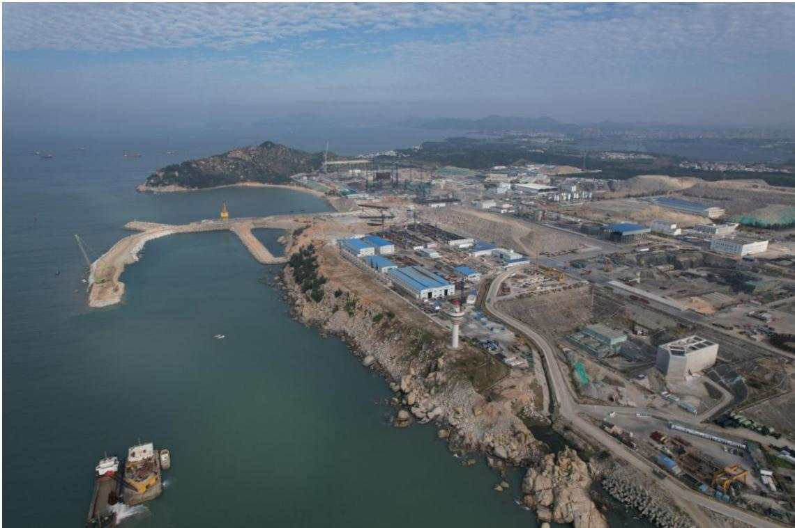  
图2.7-1 陆丰核电厂现状航拍图

## 2.7.2 地 质

## （1） 地层岩性

根据工程地质测绘和钻探资料，厂区地层有早白垩世花岗岩、脉岩和第四纪地层。厂址区早白垩世侵入岩为中粗粒斑状黑云母二长花岗岩，略呈北西向带状展布，为厂址区最主要的岩石类型。

区内岩脉较发育，岩脉走向以北西及北东向为主，个别近南北向或东西向，多沿花岗岩体中的节理裂隙贯入。脉幅一般小于 50cm，与围岩之间的接触面结合较紧密，岩性以酸性岩类为主。

第四系土层主要分布在海滩、山坡、山前以及沟谷部位。分残坡积层、晚更新世海一风积层、全新世泻湖沉积层、全新世海积层、全新世冲积层5个地层单位。

厂址附近出露之基岩为白垩纪粗粒斑状黑云二长花岗岩 $( \mathrm { K } _ { 1 } { } ^ { 2 } \eta \mathrm { ~ \gamma ~ } )$ ，地表可见相互堆迭的石蛋地貌，岩石表面有海蚀龛、海蚀洞等海蚀痕迹。

在山地东北，绝大部分为堆积台地。高程15～40m 的地段主要为晚更新世风海积物${ \bf ( 0 p 3 } ^ { m e o l } ~ ,$ ）高程 15m 以下地段为全新世海滩中细积物 $\left( \mathrm { { Q h } } ^ { m } \right)$ ），局部地段见封闭或半封闭环境下产出的泻湖堆积 $( \mathbf { \nabla } { \cal { Q } } \mathrm { { h } } ^ { m l } )$

## （2） 地震参数

根据《中国地震动参数区划图》（GB 18306-2015）的划分，陆丰核电厂项目所在地区地震动反应谱特征周期为0.40s，地震动峰值加速度为0.10g，相当于地震基本烈度Ⅶ度。

## （3） 地下水类型、埋藏条件及含水层的岩性特征

根据地层的含水介质特征及水理性质，厂址区地下水可分为松散岩类孔隙水和基岩裂隙水两类。

## 1） 松散岩类孔隙水

主要赋存于第四系人工堆积层、海积层、冲积层、风-海积层及残积层的砾质黏性土、砂砾等的孔隙中，均为潜水。

## ① 冲积层孔隙水

主要分布于厂址区中部沟谷平原区的山间小河两侧，堆积物主要为砾质黏性土，厚度5.4m。根据前期资料成果，冲积层孔隙水富水量中等。冲积层孔隙水除接受大气降水补给外，主要接受溪流直接注入，富水性状良好，排泄给残积层。

## ② 海积层孔隙水

主要分布于厂址区南部一带滨海浅滩区，堆积物以中细砂为主，一般厚5m～10m，堆积稍密。根据前期资料成果，该层透水性以中等透水为主，富水性差。海积层孔隙水主要接受大气降水补给，排泄至大海。

## ③ 残积层孔隙水

厂址区广泛分布，地貌上为低缓状丘陵及坡地。堆积物主要为砾质黏性土，含水层厚度 0.8m～14.1m，变化较大。受地形影响水力坡降由坡顶向坡脚及沟谷方向倾斜。根据前期资料成果，该层透水性以微～中等透水为主。残积层孔隙水主要接受大气降水补给，向下入渗排泄给基岩或向地势低洼的沟谷排泄流出。

## ④ 风-海积层孔隙水

主要分布于厂址区东北部，堆积物主要为中细砂，厚度一般1m～5.1m，堆积密实，富水性差。根据前期资料成果，该层透水性以弱～中等透水为主。风-海积层孔隙水主要接受大气降水补给，排泄给残积层。

## 2） 基岩裂隙水

基岩裂隙水主要赋存于早白垩世花岗岩基岩地层中，主要为风化裂隙水，其次为构造裂隙水。厂址区地质构造相对简单，岩体多完整致密，地下水多赋存于上部浅地表或近地表风化程度较高的基岩风化带中，基岩的原生节理和构造节理在地表风化作用下不断扩大、延伸、交错成网，使浅部风化节理极其发育，向深度随着风化程度的减弱而减弱，到微风化带节理不发育，岩体基本呈不透水层。

## ① 风化裂隙水

主要分布于全风化～强风化带基岩，其特点是风化节理极为发育，呈网状，原岩结构被破坏，岩体呈散体状，地下水的赋存和运移特点也接近于松散岩类孔隙水。含水层厚度变化较大，在1.3m～21.2m。根据现场抽水试验，全风化～强风化带基岩渗透系数多在 $1 \times 1 0 ^ { - 4 } \mathrm { c m / s } \sim 4 . 6 8 \times 1 0 ^ { - 3 } \mathrm { c m / s }$ ，透水性以中等透水为主。

## ② 构造裂隙水

主要分布于中等风化～微风化花岗岩中，地下水的赋存和运移取决于节理的发育程度，包括节理的密度、宽度、闭合和连通程度等条件。由于构造节理发育的不均一性，导致其含水和透水性存在有较大的不均一性。构造破碎带和节理密集带构成良好的导水通道，透水性较好，有较充足的赋水空间，地下水多以脉状形式赋存。微风化花岗岩完整性一般为较完整，岩体中节理一般不发育，节理连通性差，地下水没有导水通道，基本不透水。中等风化花岗岩完整性一般为较破碎，岩体中节理一般较发育，其透水性受节理开度及连通程度影响，现场压水试验成果显示，中等风化～微风化花岗岩的透水率多在 0.1Lu～1.0Lu 之间，属微透水层。由于岩体节理分布不均一及贯通性差，地下水位往往不能构成统一、连续的水位面。

## （4） 不良地质作用

据主体设计提供的现场地质测绘调查、钻探并结合前期资料，厂址区内无滑坡、泥石流、崩塌、岩溶、地裂缝、地面塌陷等不良地质作用及其它地质灾害，也无可供开采的矿（床）、油（气）田以及其它潜在的塌陷区等。

## （5） 土石方临时周转场地质情况

场地周边范围无能动断层，场地边界范围内无断层经过，未发现滑坡、泥石流、地面塌陷、岩溶、采空区等不良地质作用，没有可供开采的矿产资源，也没有影响场地和地基安全的人类活动，总体评价场地是稳定的。

场地分布第四系和基岩，第四系主要有人工填土层 $\mathrm { ( Q _ { 4 m l } ) }$ 、海-风积层 $\left( \mathbf { \nabla } Q _ { 3 \mathrm { m + e o l } } \right)$ 及残积层 $\left( \mathrm { { Q } _ { \mathrm { { e l } } } } \right)$ ；下伏基岩为各风化等级的花岗岩。

场地内地下水类型主要分为第四系松散岩类孔隙水和基岩裂隙水两大类。第四系松散岩类孔隙水主要赋存于第四纪残积层 $( { \bf \nabla } { Q } _ { e l } )$ 和海-风积层 $\left( \mathbf { Q } _ { 3 m + e o l } \right)$ 孔隙中，主要接受大气降水补给，同时向下或侧向补给基岩裂隙水；基岩裂隙水在场地内广泛分布，主要为风化裂隙水，其次为构造裂隙水，基岩裂隙水主要受大气降水和上部第四系松散岩类孔隙水渗透补给，排泄方式主要为泉、蒸发和径流。

## 2.7.3 气 象

陆丰市属亚热带海洋性季风气候，夏季炎热漫长，冬季无严寒。降雨主要集中在每年4～9月份，占全年降雨量的85%，即雨季为每年的4～9 月份。

根据陆丰气象站 1959年～2018 年实测气温资料，多年平均气温为 $2 2 . 2 \mathrm { { ^ { \circ } C } }$ ，极端最高气温 $3 8 . 3 \mathrm { { ‰} }$ ，极端最低气温 $0 . 9 \mathrm { { ^ circ C } }$ ；多年平均降水量 2027.1mm，历年最大年降水量3045mm（1961 年），历年最小年降水量 942.2mm（1963 年）；多年平均蒸发量 1635.9mm，历年最大蒸发量2031.4mm，历年最小蒸发量1363.1mm；多年平均相对湿度79%；年日照时数1795.8h；无霜期为 360天。多年平均风速为2.4m/s，历年最大风速22.0m/s，主导风向为东北偏东风（ENE）。

## 2.7.4 水 文

## （1） 陆丰市主要河流水系

陆丰市中、小河流遍布，多数河流自北向南倾泻入海，形成独立水系。

陆丰市境内集雨面积在 $4 0 \mathrm { k m } ^ { 2 }$ 以上河流共 11条，总长463.8km，集水面积在 $1 0 0 \mathrm { k m } ^ { 2 }$ 以上河流共5 条，分别为螺河、乌坎河、长山河、龙潭河和鳌江。陆丰市河流的共同特

征是受上游降雨影响明显，上游降雨量大，径流则大，当上游降雨量小或没有降雨，径流就小。分散小河流，冬春季节多数断流。旱象常有出现。

## （2） 海洋

厂址附近由汕尾站 1970年～2018 年历年验潮资料统计得：

调查最高潮位2.64m（1953年9月2日）；

历年最高高潮位2.71m（2013年9月22日）；

历年最低低潮位-0.81m（2004 年 7 月 4日）；

多年平均高潮位0.97m；

多年平均低潮位0.11m；

多年平均潮位0.58m；

历年最大潮差 2.58m（1971 年 7 月 22 日）；

历年平均潮差0.85m；

平均涨潮历时 6h56min；

平均落潮历时 5h22min。

## 2.7.5 土 壤

项目区地带性土壤为赤红壤，自然土壤主要包括花岗岩赤红壤、砂页岩赤红壤、第四纪沉积物赤红壤等，土壤养分充足，适宜各种植物生长。赤红壤主要分布于低山、丘陵、台地，在植被覆盖较好的地方，回归表土的枯枝落叶较多，表土层有机质含量一般可达 2～3%，土壤的通透性较强。但植被一旦破坏，有机质迅速分解降低，土壤的理化性状迅速恶化，易发生水土流失而成为侵蚀赤红壤。由花岗岩发育形成的赤红壤保水保肥能力差，而由砂页岩发育形成的赤红壤保水保肥能力较强。

## 2.7.6 植 被

项目区植被由于地形、气候与人为因素等的综合影响，南亚热带常绿阔叶林等原始地带性代表植被已荡然无存，只有在局部谷地或村庄旁边的风水林等少量残存的次生林及丘陵台地分布的少量人工林，其它均以稀树灌丛和草灌丛为主并间以农田，条件较好的丘陵台地，多已开辟农田和果园，种植水稻、旱田作物及各种果树。区域植被类型总的来说以木麻黄为主，乔木主要有松科、杉科、樟科木麻黄科等。草被以芒其为主，蕨类次之，常见芒其群和木麻黄、岗松、小叶樟、大叶樟、鸭脚木、乌桕、荷木、桃金娘、野牡丹和算盘子等。

厂址范围主要为海边低山丘陵，目前现场除新增施工生产生活区、土石方临时周转场，3、4号机组项目其他场地已全部场平，结合前期设计资料和卫星影像，以草灌丛为主，原地貌植被覆盖率 58%。

## 2.7.7 其 他

本期工程建设范围内无饮用水水源保护区、水功能一级区的保护区和保留区、自然保护区、世界文化和自然遗产地、风景名胜区、地质公园、森林公园、重要湿地等，不涉及河道管理范围线和生态保护红线。

## 3 项目水土保持评价

## 3.1 主体工程选址（线）水土保持评价

根据《中华人民共和国水土保持法》、《生产建设项目水土保持技术标准》（GB50433-2018），对项目水土保持制约性因素逐条分析和评价，对照分析结果见表3.1-1。

表 3.1-1  
水土保持制约因素分析与评价结果一览表
<table><tr><td rowspan=1 colspan=1>名称</td><td rowspan=1 colspan=1>编号</td><td rowspan=1 colspan=1>相关条文</td><td rowspan=1 colspan=1>本期工程情况分析</td><td rowspan=1 colspan=1>结论</td></tr><tr><td rowspan=3 colspan=1>《中华人民共和国水土保持法》</td><td rowspan=1 colspan=1>1</td><td rowspan=1 colspan=1>第十七条禁止在崩塌、滑坡危险区和泥石流易发区从事取土、挖砂、采石等可能造成的水土流失的活动。崩塌、滑坡危险区和泥石流易发区的范围，由县级以上地方人民政府划定并公告。</td><td rowspan=1 colspan=1>未涉及县级以上地方人民政府划定并公告的崩塌、滑坡危险区和泥石流易发区。</td><td rowspan=1 colspan=1>符合</td></tr><tr><td rowspan=1 colspan=1>2</td><td rowspan=1 colspan=1>第二十四条生产建设项目选址、选线应当避让水土流失重点预防区和重点治理区，无法避让的，应当提高防治标1准，优化施工工艺，减少地表扰动和植时被损坏范围，有效控制可能造成的水土流失。</td><td rowspan=1 colspan=1>项目所在碣石镇涉及陆丰市县级重点治理区，水土流失防治标准执行一级标准，并将林草覆盖率提高2%，临时周转场不涉及排洪，周边排水沟采用高标准(近主厂区的1#石方周转场、2#石方周转场和#土方周转场采用100年一遇10min短历设计暴雨，2#土方周转场位于厂区外，采用10年一遇10min短历时设计暴雨)。主体工程已经尽量优化了施工工艺，减少地表扰动和植被损坏范围，通过本方案实施一系列的水保措施后，可有效控制可能造成的水土流失。</td><td rowspan=1 colspan=1>符合</td></tr><tr><td rowspan=1 colspan=1>3</td><td rowspan=1 colspan=1>第二十八条依法应当编制水土保持方案的生产建设项目，其生产建设活动中本排弃的砂、石、土、矸石、尾矿、废渣基等应当综合利用；不能综合利用，确需6废弃的，应当堆放在水土保持方案确定丰专门存放地，并采取措施保证不产生新的危害。</td><td rowspan=1 colspan=1>期工程余方中土方由陆丰市碣石海工地（三期）项目综合利用，石方由5、号机组导流堤优化利用，建筑垃圾由陆市恒元再生资源有限公司回收再利用处理。</td><td rowspan=1 colspan=1>符合</td></tr><tr><td rowspan=3 colspan=1>《生产建设项目水土保持技术标准》(GB 50433-2018)</td><td rowspan=1 colspan=1>1</td><td rowspan=1 colspan=1>主体工程选址（线）应避让水土流失重点预防区和重点治理区。</td><td rowspan=1 colspan=1>项目所在碣石镇涉及陆丰市县级重点治理区，项目区水土流失防治标准执行一级标准，并适当提高防治目标值。主体工程已经尽量优化了施工工艺，减少地表扰动和植被损坏范围，通过本方案实施一系列的水保措施后，可有效控制可能造成的水土流失。</td><td rowspan=1 colspan=1>符合</td></tr><tr><td rowspan=1 colspan=1>2</td><td rowspan=1 colspan=1>主体工程选址（线）应避让河流两岸、湖泊和水库周边植物保护带。</td><td rowspan=1 colspan=1>不涉及</td><td rowspan=1 colspan=1>符合</td></tr><tr><td rowspan=1 colspan=1>3</td><td rowspan=1 colspan=1>选址（线）应避开全国水土保持监测网络中的水土保持监测地点、重点试验区及国家确定的水土保持长期定位观测站。</td><td rowspan=1 colspan=1>不涉及</td><td rowspan=1 colspan=1>符合</td></tr></table>

项目所在地碣石镇涉及陆丰市县级重点治理区，项目区水土流失防治标准执行南方红壤区一级标准，并适当提高防治目标值。主体工程已经尽量优化了工程方案、施工工艺，减少地表扰动和植被损坏范围，通过本方案实施一系列的水保措施后，可有效控制

可能造成的水土流失。

主体工程选址不涉及河流两岸、湖泊和水库周边的植物保护带，也不涉及全国水土保持监测网络中的水土保持监测站点、重点试验区及国家确定的水土保持长期定位观测站，符合要求。厂址周边无重要江河、湖泊以及跨省（自治区、直辖市）的其他江河、湖泊的水功能一级区的保护区和保留区，水功能二级区的饮用水源区。

## 3.2 建设方案与布局水土保持评价

## 3.2.1 建设方案评价

陆丰核电厂规划建设六台百万千瓦级核电机组，统一规划，分期建设。本期工程 3、4 号机组从建设总体布局来看，充分利用 5、6 号机组和 1、2 号机组项目平整场地、边坡及排洪工程、施工生产生活区、附属设施区、施工水源、施工用电等，减少工程土石方量和扰动地表面积。

从核电厂厂区各子项建设方案来看，独立建设核岛厂房及构筑物、常规岛厂房及构筑物，BOP 子项配置尽可能与前期工程共用，仅规划建设放射性辅助生产设施、循环冷却水、实物保护、排水虹吸井等 2 机共用子项，水泥石灰仓库、废物辅助厂房、海水淡化厂房、值班宿舍、冷机修车间/非放射性机电仪仓库、车库、辐射计量实验室/职业医疗室、危险品库、生产办公楼/档案馆/厂区餐厅、培训中心、消防站、环境实验室、消防培训中心、冷机修仓库/材料库、生活区污水处理站等子项将随 5、6 号及 1、2 号机组建设完成，采取联合布置方案减少地表扰动和土石方量。

从施工生产生活区布置方案来看，施工生活区部分依托 5、6 号已建成的 LC、LD 办公楼，新增 1 处 8000m2 临时办公楼；施工生产区优先共用 5、6 号及 1、2 号机组建设的生产临建，但与 3、4 号采用相同华龙技术的 5、6 号机组布置的 NI 生产临建位于 3、4 号厂区永久征地范围内，3、4 号机组开工后需搬离，所以 3、4 号施工生产临建新增了 NI生产临建。

海工设计方案，经过比选，推荐采用独立明渠取水方案，较开口长明渠、闭口长明渠等方案，减少了扰动地表面积 10.0hm2～20.0hm2。

由于 3、4 号机组为最后一期工程，各期工程同步施工，自身利用土石方量大，为保证工程安全，不影响各期工程商业运行时间，需布置土石方临时周转场，本期工程充分利用场地已有的建筑垃圾周转场，不考虑新增；临时周转场的布置充分利用前期工程占地布置 1 处，在场外新增 3 处。综上所述，本期工程建设方案充分考虑了利用前期工程已有设施，大幅减少了工程土石方量和扰动地表面积，符合水土保持要求。

在绿色建造方面，本期工程与5、6 号及1、2号机组厂区共用控制区（详见图2.1-15），仅布置保护区、核心区，根据《核电厂总平面及运输设计规范》（GB/T50294-2014），为了尽量不产生放射性废物，保护区不应绿化，主要是考虑由于大量枯枝残叶可能造成潜在的放射性废物给生产管理带来的困难，所以本期工程厂区未进行绿化。附属设施区（含厂前区）全厂共用，5、6 号机组在附属设施区（含厂前区）已考虑了布设园林绿化措施，园林绿化不仅能够美化环境，同时对改善区域生态和防治水土流失有重要作用，符合水土保持要求。

总体来看，主体工程建设方案考虑尽可能利用现有设施，减少工程占地和地表扰动，减少土石方开挖量，最大限度控制水土流失，工程建设方案符合《生产建设项目水土保持技术标准》（GB 50433-2018）的要求。

## 3.2.2 工程占地评价

根据主体工程设计，3、4 号机组占地总面积111.09hm2，其中永久占地36.27hm2，临时占地74.82hm2。3、4 号机组建设秉着节约用地、减少地表扰动的原则，充分利用5、6号机组和1、2 号机组已建设施，避免二次扰动，减少工程新增占地面积，利用 5、6 号机组和 1、2 号机组占地面积 75.71 hm2，占总面积的 68.15%，新增占地 35.38hm2，占总面积的31.85%，符合水土保持要求。

根据《广东陆丰核电3、4 号机组项目节地评价报告》，本期工程为最后一期工程，已充分衔接 5、6 号机组与 1、2 号机组工程，不存在远期预留用地，采用地下布设管线等方式，利用了地下空间，主厂房区循环水廊道利用地上地下空间充分复合利用，可节约用地约0.8502hm2；运用了华龙一号技术机组，采用联合泵房设计，将两台机组的循环水泵房、重要厂用水泵房等联合布置，可有效节约用地0.8340hm2。采用华龙一号工艺技术，避免粗放开挖浪费土地，减少周边环境破坏，各功能分区结构较合理，布局较紧凑，不存在为降低建设成本而粗放用地的情形。

主体设计经过论证分析，海工取水方案最终推荐独立明渠取水方案，相比闭口长明

渠方案、长明渠方案，减少占地面积 $1 0 . 0 \sim 2 0 . 0 \mathrm { h m } ^ { 2 }$ ，更节约用地，符合水土保持要求。

从占地性质方面分析，本期工程永久占地占比为 32.65 %，主要为厂区、海工区和利用永久占地布置的施工生产生活区等占地，占地面积共 $3 6 . 2 7 \mathrm { h m } ^ { 2 } ;$ ；临时占地占比为 67.35%，主要为施工生产生活区、临时周转场区、表土堆存场区等，占地面积共 74.82 hm2，施工完成后根据原地类进行恢复。

从占地类型方面分析，工程占地类型主要为林地、工矿仓储用地、海域，林地占总面积 34.27%、工矿仓储用地占总面积63.65%、海域占总面积2.08 %。工程不可避免占用林地，施工结束后及时进行植被恢复，符合水土保持要求。

综上，本着施工便利的原则，本期工程布置符合节约用地的要求，已充分考虑利用5、6 号机组和1、2号机组已征占地，减少新增占地，能够节约用地、减少地表扰动，临时占地在施工完成后进行植被恢复，最大程度的减少工程占地，从水土保持角度分析工程占地基本合理。

## 3.2.3 土石方平衡评价

## 3.2.3.1 土石方平衡评价

3、4 号机组项目建设开挖量 343.38 万 $\mathrm { m } ^ { 3 }$ （自然方，下同），其中表土 4.96 万$\mathrm { m } ^ { 3 }$ ，土方 163.82 万 $\mathrm { m } ^ { 3 }$ ，石方 174.60 万 $\mathbf { m } ^ { 3 } \mathbf { ; }$ ；回填土石方总量231.22 万 $\mathrm { m } ^ { 3 }$ ，其中表土 17.76万 $\mathrm { m } ^ { 3 }$ ，土方 $1 3 2 . 5 8$ 万 $\mathrm { m } ^ { 3 }$ ，石方 $8 0 . 8 8 \mathrm { ~ \mathscr ~ { ~ H ~ } ~ m ~ } ^ { 3 }$ ；区间调配量 76.98万 $\mathrm { m } ^ { 3 }$ （含厂区调出土方12.80 万 $\mathrm { m } ^ { 3 }$ 至施工生产生活区、临时周转场区改良为表土利用）；作为混凝土骨料等建材利用料 88.0 万 $\mathrm { m } ^ { 3 }$ ，余方总量 $2 4 . 1 6 \mathrm { ~ \mathcal ~ { ~ H ~ } ~ m ~ } ^ { 3 }$ ，其中土方 18.44 万 $\mathrm { m } ^ { 3 }$ 、石方 5.72 万$\mathrm { m } ^ { 3 }$ 。余方中土方 18.44 万 $\mathrm { m } ^ { 3 }$ 由陆丰市碣石陆丰市碣石海工基地（三期）项目综合利用，石方 5.72 万 $\mathrm { m } ^ { 3 }$ 由陆丰核电5、6 号机组项目海工导流堤利用。本期工程施工结束后拆除建筑垃圾 $7 . 4 6 \mathrm { ~ } \mathcal { F } \mathrm { ~ m } ^ { 3 }$ ，由陆丰市恒元再生资源有限公司资源化处置。

本期工程填筑全部利用自身开挖料，共设置 4 处土方、石方临时周转场，用于堆存填筑料、骨料等。工程均充分利用开挖方作为填筑料源，避免了新增料场开采对地表的扰动破坏和大量料场无用层弃渣的产生，同时设置了临时周转场，容量286.70 万 $\mathrm { m } ^ { 3 }$ （松方），考虑了厂区利用土方、石方，海工区利用石方和改良土方、余方堆存周转需要，满足了工程开挖填筑中施工时序的需要，避免了工程土石方的二次或多次转运现象。填筑料在周转时序、容量等时空条件上满足要求，开挖料有序利用，有利于减少工程余方，有利于水土保持。本期工程回填表土不足，本方案设计采用自身负挖土方改良利用，减少余方，经计算本期工程土石方自身利用率达92.96%，多余的石方用于 5、6 号机组导流堤优化利用，多余的土方通过陆丰市碣石陆丰市碣石海工基地（三期）项目综合利用进行消纳，弃渣综合利用率为 100%。工程在满足自身填筑要求的基础上，最大程度的利用工程自身开挖料，减少了工程余方，满足水土保持要求。

因此，工程土石方从数量平衡及调配、利用率等方面分析，符合工程实际及水土保持要求，是合理、可行的。

## 3.2.3.2 余方利用

经土石方内部平衡后，3、4 号机组项目余方总量 24.16 万 m3。根据建设单位与陆丰市碣石临港工业园开发有限公司签订的富余土方综合利用备忘录，余方中土方 18.44万m3由陆丰市碣石陆丰市碣石海工基地（三期）项目综合利用，石方5.72万m3由5、6号机组导流堤优化利用。

## （1） 余方中土方处置

2025年9月对陆丰市碣石海工基地（三期）项目进行现场调查，距离陆丰核电厂距离6.0-7.0km，周边有碣田公路，可直接利用，交通便利。陆丰市发展和改革局于2022年11月对海工基地（三期）项目可行性研究报告进行了批复（陆发改投审﹝2022﹞189号），后由于征地问题，海工基地（三期）项目于 2025 年 7 月组织设计单位编制完成了陆丰市碣石海工基地（三期）项目工程可行性研究报告（修编），并于 2025 年 8 月15日取得陆丰市发展和改革局关于陆丰市碣石海工基地（三期）项目可行性研究报告（修编）的批复（陆发改投审﹝2025﹞63号）。陆丰市碣石海工基地（三期）项目主要建设内容包括场平工程、道路工程、雨水工程、污水工程、给水工程等，计划2026年12月开工，2028年12月完工，2026年12月进行清表，2027 年1月—2027 年7月进行场平，场地平整面积约785000m2，场平地块现状标高约8～14m，设计需要外购土方101.5 万m3进行场平，计划自陆丰核电厂调入，距离陆丰核电厂距离6-7km，周边有碣石公路可到达，也可通过码头运输，详见图3.2-1～3.2-2。该项目水土保持方案报告书于 2026年1月 26 日取得陆丰市水务局的批复（陆水〔2026〕22号）。

经分析3、4 号机组土石方平衡，其余方主要为土方，土方主要来源厂区建筑物负挖和海工开挖，土方主要成分为粉质黏土、全风化花岗岩、强风化花岗岩等，可用于场地平整等。根据表 2.2-4，扣除预留本期工程改良为表土利用的土方后，2027 年 3 月下旬可提供土方至陆丰市碣石海工基地（三期）项目，截至2027 年7月中旬可产生土方18.44万m3，从工程施工时序、土方数量及性质上，本期工程余方可以满足陆丰市碣石海工基地（三期）项目填筑需求。产生余方后，可及时运至陆丰市碣石海工基地（三期）项目征占地范围内（78.50hm2）指定的临时周转场或直接利用，由陆丰市碣石海工基地（三期）项目负责其堆存期间的水土流失防治责任。

表 3.2-1  
陆丰市碣石海工基地（三期）项目基本情况
<table><tr><td rowspan=1 colspan=1>项目名称</td><td rowspan=1 colspan=1>位置</td><td rowspan=1 colspan=1>主要建设内容</td><td rowspan=1 colspan=1>立项文件</td><td rowspan=1 colspan=1>水保方案批复</td><td rowspan=1 colspan=1>建设期间</td><td rowspan=1 colspan=1>利用道路及距离</td><td rowspan=1 colspan=1>土石方需求量（万m³）</td></tr><tr><td rowspan=1 colspan=1>陆丰市碣石海工基地（三期）项目</td><td rowspan=1 colspan=1>汕尾市陆丰市碣石镇田尾山东侧</td><td rowspan=1 colspan=1>场平工程、道路工程、雨水工程、污水工程、给水工程等相关工程。</td><td rowspan=1 colspan=1>2210-441581-04-01-194872</td><td rowspan=1 colspan=1>陆水[2026〕22]号</td><td rowspan=1 colspan=1>2026年12月至2028年12月</td><td rowspan=1 colspan=1>碣田公路/6.0-7.0km</td><td rowspan=1 colspan=1>101.5</td></tr></table>

## （2） 余方中石方处置

原 5、6 号机组导流堤采用抛石斜坡堤结构方案，包括西导流堤和东导流堤，目前已建成。随着核电冷源安全监管要求的提升，该导流堤已无法满足当前部委最新监管要求及冷源防护标准中的消浪指标。为此，计划在西导流堤、东导流堤基础上新增西导流支堤、东导流支堤，采用抛石斜坡堤方案，堤顶高程 7.6m，堤顶宽 23m（含堤顶道路5m），新增西导流支堤、东导流支堤共需填筑石料约91万m3，计划2026年12月开工、2028 年12月完工。该变更方案已于 2025年 8月11日经中广核陆丰核电有限公司委员会2025年第十五次会议审议通过（会议纪要：广核陆党纪〔2025〕43号）。本期工程余方中可利用石方 5.72万 m3，拟优先用于新增导流支堤填筑，可通过场内道路陆运及重件码头水运抵达。

经分析3、4 号机组土石方平衡，本期工程2027 年1月—2027 年6月石方开挖可满足5、6 号机组导流堤优化利用的石方需求。若临时出现其他变动，本期工程设置的石方周转场地在容量及防护措施上考虑了该部分石方量，从时间、交通、应急能力等方面满足要求。

## （3）建筑垃圾处置

自陆丰核电厂开工以来，建设单位持续委托陆丰市恒元再生资源有限公司处理建筑垃圾。该公司位于城东镇双寨村，占地 1.97hm²，处于在生产状态，经营范围涵盖再生资源回收利用、建筑砌块及砖瓦制造等，具备城市建筑垃圾处置清运资质。本期工程余方中 7.46 万 m³建筑垃圾由该公司回收再利用，运距 35km，周边有 X313公路到达。该处置方案可实现资源节约利用，符合水土保持要求。

综上所述，3、4号机组主体设计的土石方平衡基本合理，工程无法自身利用的余方计划全部外运至周边项目综合利用，能够实现资源节约和保护，本期工程土石方平衡符合水土保持要求。

## 3.2.3.3 弃渣减量化设计

## （1） 核电厂技术路线优化

本期工程土石方量主要来源于厂区和海工区，主体工程设计推荐华龙一号 2.0技术路线，相比华龙一号1.0 技术路线，挖方减少了44.60 万m3，海工设计推荐独立明渠取水方案对比了闭口长明渠方案挖方减少了 49.73万m3。

## （2） 负挖优化

主体设计采用主厂房联合布置、辅助厂房共用等减少3、4 号机组项目余方。

## 1） 主厂房联合布置

核电厂主厂房包括核岛和常规岛厂房。 其中，核岛厂房由反应堆厂房（BRX）、燃料厂房（BFX）、电气厂房（BLX）、核辅助厂房（BNX）、核岛烟囱（BIX）、备用冷却厂房（BEJ）、补给水工艺厂房（BPS）、附属厂房A（BAA）、附属厂房B（BAB）、附属厂房C （BAC）、专用抗震柴油发电机厂房（BDU/BDV）等建构筑物组成；常规岛厂房由汽轮发电机厂房（BMX）、润滑油传送间（BMO）、凝结水精处理间（BMP）、常规岛电气厂房（BML）、压缩空气生产间（BMC）、启动给水间（BMD）等建构筑物组成。

主厂房是整个厂区体量最大，占地最多的建构筑物。如采用分离式布置，主厂房占地面积约4.10hm2，设计上对主厂房采用贴临联合布置的方案，减少了防火间距，组成建筑群，主厂房占地面积约2.50 hm2，减少约 39%，进而减少了土石方开挖8.00 万m3、土石方回填3.50 万m3。

## 2） 辅助厂房共用

本期工程为电厂第三期工程，子项配置原则为尽可能利用前期已建设的子项，其中，现场服务区、厂外辅助设施区、厂前区、开关站（配电装置区）均按全厂共用配置。厂区辅助设施（ BOP） 尽可能按全厂（ 或 4 机） 共用配置， 3、 4 号机组仅布置单机或两机配置的 BOP，一共建设约57个子项，剩余约54个子项均利用前序工程建设成果。因此减少厂区占地面积约 20%，进而减少了土石方开挖15.00万m3、土石方回填 5.50 万 m3。

## （3） 改良负挖土方回填表土利用

本方案采取改良本期工程区负挖土方回填表土利用措施，共消纳余方12.80万m3。

综合分析，本期工程推荐方案从源头上减少挖方，最大程度地利用工程自身开挖料，充分利用开挖土方改良为表土回覆利用，并开展项目区周边综合利用调查，减小了工程弃渣和弃渣场占地，工程土石方从数量平衡及调配、利用率等方面分析，符合工程实际及水土保持要求。

## 3.2.4 表土堆存场设置分析评价

本期工程规划布置了2处表土堆存场，主要用于堆存施工剥离的表土。选址遵循就近原则，旨在有效减少土方运距。同时，表土堆存场地周边可利用现有道路系统，交通便利，有利于运输作业的开展。表土堆存高度控制在 2.0～3.0m，堆存坡比为 1∶3.0，整体坡缓低矮，地形平缓。堆存前已在坡脚设置临时拦挡措施，堆存期间对堆体表面采取临时绿化防护，可有效避免对周边环境造成影响。此外，所选场址不占用基本农田、生态保护红线等敏感区域，符合水土保持要求。

## 3.2.5 临时周转场设置分析评价

根据陆丰市自然资源局等主管部门意见，结合项目区地形地貌确本期工程在场区内及场址北侧共布置了4处土石方临时周转场，各土石方临时周转场特性详见表2.2-2，

## 3.2.5.1 选址合理性分析

4处土石方临时周转场交通便利，可直接利用现状交通，现状为林地、工矿仓储用地，不涉及基本农田。根据项目区岩土勘察报告，项目区不涉及泥石流、滑坡和崩塌等不良地质。4 处土石方临时周转场均不涉及在河道、湖泊管理范围，各临时周转场场地地形较平坦，汇水均以周转场自身汇水为主。

因此，4 处土石方临时周转场布置预留的安全距离均满足《水利水电工程水土保持技术规范》（SL575-2012）中表10.4.2规定。根据《土石方临时周转场专题论证报告》研究成果，4 处土石方临时周转场场地较为平缓，且不存在地质不良现象和软弱夹层，场地整体安全稳定，即使在极端工况下发生失稳，其最大滑移距离亦不超出预留的安全防护范围，不会对相关的敏感点造成影响。总的来说，临时周转场选址合理且稳定安全可控。

## 3.2.5.2 土石方临时周转场各区最大堆存量分析

根据施工组织设计，土方周转场最大堆存量130.63万m3（自然方，折合松散方167.20万 m3），详见表 2.2-3。根据计算，本期工程设置用于堆存本期工程土方的2处土方临时周转场，1#土方周转场和2#土方周转场容量为 $1 6 8 . 0 \mathrm { ~ \mathscr { H } ~ m ^ { 3 } }$ ，满足本期工程开挖土方最大转运量需求。石方最大堆存量81.16万m3（自然方，折合松散方117.67万m3），详见表2.2-4。根据计算，石方周转场场地1、石方周转场地2总容量为118.7万m3，满足设计堆存的石方量。

## 3.2.6 取土（石、砂）场设置分析评价

本期工程不涉及取土，无单独设置的取土、石、砂料场，所需建筑材料拟从就近的建材市场合法供应商购买解决，外购合同中明确运输前的水土流失防治责任由相应的供应商负责。

## 3.2.7 弃土（石、渣、灰、矸石、尾矿）场分析评价

本期工程产生的余方全部资源化处理，不单独布设弃渣场，运至接收点后由接收方负责水土流失防护及综合利用。

## 3.2.8 施工方法与工艺评价

（1） 施工场地评价

3、4 号机组施工生产生活区充分利用5、6 号机组和1、2号机组项目施工场地和生产区，不涉及基本农田，既能满足施工要求，又能控制施工范围，施工过程中可有效减少对地面的二次扰动及产生的水土流失，减少对周围环境的影响。

施工道路全部利用已建施工道路，并结合厂区永久道路，不另设施工道路，最大限度地减少了工程占地。

## （2） 施工时序评价

土建工程施工避免在大风和暴雨天气进行土建施工，在施工期间适当增加临时措施，及时疏通施工场地的排水沟道，及时排水，保证施工场地安全，排除水土流失隐患发生。工程工序紧凑，可大幅度减少临时堆土（石）料时间，进而减小临时堆土（石）料区域发生的水土流失。各区的施工时序相互衔接，可保证土石方开挖后及时调配利用，减少了临时堆土占地。主体工程施工进度安排总体较为合理。

## （3） 施工工艺评价

根据 3、4 号机组项目的建设特点，以及地形地貌、地层岩性、土壤、植被及水文气象等自然环境特征，确定 3、4号机组建设过程中可能导致水土流失的主要工序为核岛、常规岛及辅助设施建筑物基础的开挖和回填。在挖方工程中，核实建构筑物长度、岩土成分，基坑一次开挖成型；统一规划管沟，一次建成，避免二次扰动；对土方及松动爆破后的岩石，以挖土机或推土机作业，配以装载机和自卸翻斗车运至临时堆土（石）料场，严禁在路上滞留；对于临时堆土（石），采取先拦后弃，将临时堆土（石）运送至规划的临时周转场内，避免随意堆放。

综上，主体工程在施工场地布置、施工时序、施工工艺等方面设计合理，基本符合水土保持的要求。

## 3.2.9 主体工程设计中具有水土保持功能工程的评价

主体工程从自身功能和安全角度考虑，布置了一系列具有水土保持功能的设施，在充分发挥主体工程自身作用的同时，有效地防治了水土流失。主体工程中设计的具有水土保持功能的工程主要有厂区雨水排水管网、碎石压盖、地面硬化；临时周转场区拦挡、排水沉沙、被动防护网；施工生产生活区边坡绿化；海工导流堤边坡绿化等。本方案将从全面防治水土流失的角度出发，对主体工程设计中具有水土保持功能的各项工程进行分析论证，对不能满足水土保持要求的，本方案将进行补充设计。

## 3.2.9.1 厂 区

## （1） 工程措施

## 1） 雨水排水管网

根据《核电厂水工设计规范》（NB/T 25046-2015），厂区雨水排水设计标准采用千年一遇10min 短历时暴雨强度，并按 PMP标准校核。厂区采用独立的雨水排水管网

系统进行有组织的雨水排水，考虑到核电厂厂址地坪标高高于设计基准洪水位，因此全厂排水拟采用分区排水、重力自流排放原则。

厂区共设雨水管 10800m，采用 HDPE 缠绕结构壁管，管径 DN300～DN2000。

雨水管径采用暴雨强度公式试算求得。

$$
q = \frac { A \times ( 1 + C \times \lg P ) } { \left( t + B \right) ^ { D } }
$$

式中：A=2122.170 B=0 C=0 D=0.358适用降雨历时范围（分钟）：0＜t≤10000

适用重现期范围（年）：0＜P≤1000

表 3.2-3  
雨水计算表格
<table><tr><td rowspan=1 colspan=1>管段编号</td><td rowspan=1 colspan=1>接入管段</td><td rowspan=1 colspan=1>重现期(年)</td><td rowspan=1 colspan=1>暴雨强度(L/(s*ha)</td><td rowspan=1 colspan=1>转输面积(m2)</td><td rowspan=1 colspan=1>汇流面积(m²)</td><td rowspan=1 colspan=1>转输流量(m³/s)</td><td rowspan=1 colspan=1>设计流量(m³/s)</td><td rowspan=1 colspan=1>管径/水深(mm)</td><td rowspan=1 colspan=1>坡度</td></tr><tr><td rowspan=1 colspan=1>Y19-Y20</td><td rowspan=1 colspan=1></td><td rowspan=1 colspan=1>1000</td><td rowspan=1 colspan=1>930.64</td><td rowspan=1 colspan=1>0</td><td rowspan=1 colspan=1>3207.2</td><td rowspan=1 colspan=1>0</td><td rowspan=1 colspan=1>0.239</td><td rowspan=1 colspan=1>500</td><td rowspan=1 colspan=1>0.003</td></tr><tr><td rowspan=1 colspan=1>Y20-Y21</td><td rowspan=1 colspan=1></td><td rowspan=1 colspan=1>1000</td><td rowspan=1 colspan=1>906.2</td><td rowspan=1 colspan=1>3207.2</td><td rowspan=1 colspan=1>8142.8</td><td rowspan=1 colspan=1>0.239</td><td rowspan=1 colspan=1>0.597</td><td rowspan=1 colspan=1>700</td><td rowspan=1 colspan=1>0.003</td></tr><tr><td rowspan=1 colspan=1>Y21-Y13</td><td rowspan=1 colspan=1></td><td rowspan=1 colspan=1>1000</td><td rowspan=1 colspan=1>888.32</td><td rowspan=1 colspan=1>8142.7</td><td rowspan=1 colspan=1>11277.8</td><td rowspan=1 colspan=1>0.597</td><td rowspan=1 colspan=1>0.819</td><td rowspan=1 colspan=1>800</td><td rowspan=1 colspan=1>0.003</td></tr><tr><td rowspan=1 colspan=1>Y13-Y24</td><td rowspan=1 colspan=1>Y12-Y13</td><td rowspan=1 colspan=1>1000</td><td rowspan=1 colspan=1>880.78</td><td rowspan=1 colspan=1>28834.9</td><td rowspan=1 colspan=1>32757</td><td rowspan=1 colspan=1>2.103</td><td rowspan=1 colspan=1>2.379</td><td rowspan=1 colspan=1>1200</td><td rowspan=1 colspan=1>0.003</td></tr><tr><td rowspan=1 colspan=1>Y24-Y27</td><td rowspan=1 colspan=1>Y23-Y24</td><td rowspan=1 colspan=1>1000</td><td rowspan=1 colspan=1>867.47</td><td rowspan=1 colspan=1>38800.9</td><td rowspan=1 colspan=1>47547.8</td><td rowspan=1 colspan=1>2.825</td><td rowspan=1 colspan=1>3.432</td><td rowspan=1 colspan=1>1400</td><td rowspan=1 colspan=1>0.003</td></tr><tr><td rowspan=1 colspan=1>Y27-Y14</td><td rowspan=1 colspan=1>Y26-Y27</td><td rowspan=1 colspan=1>1000</td><td rowspan=1 colspan=1>857.18</td><td rowspan=1 colspan=1>50881.4</td><td rowspan=1 colspan=1>56841.9</td><td rowspan=1 colspan=1>3.68</td><td rowspan=1 colspan=1>4.089</td><td rowspan=1 colspan=1>1500</td><td rowspan=1 colspan=1>0.003</td></tr><tr><td rowspan=1 colspan=1>Y14-Y69</td><td rowspan=1 colspan=1></td><td rowspan=1 colspan=1>1000</td><td rowspan=1 colspan=1>851.18</td><td rowspan=1 colspan=1>56841.9</td><td rowspan=1 colspan=1>59051.8</td><td rowspan=1 colspan=1>4.089</td><td rowspan=1 colspan=1>4.239</td><td rowspan=1 colspan=1>1500</td><td rowspan=1 colspan=1>0.003</td></tr><tr><td rowspan=1 colspan=1>Y69-Y70</td><td rowspan=1 colspan=1></td><td rowspan=1 colspan=1>1000</td><td rowspan=1 colspan=1>845.81</td><td rowspan=1 colspan=1>59051.8</td><td rowspan=1 colspan=1>63082</td><td rowspan=1 colspan=1>4.239</td><td rowspan=1 colspan=1>4.512</td><td rowspan=1 colspan=1>1500</td><td rowspan=1 colspan=1>0.003</td></tr><tr><td rowspan=1 colspan=1>Y70-Y75</td><td rowspan=1 colspan=1></td><td rowspan=1 colspan=1>1000</td><td rowspan=1 colspan=1>835.7</td><td rowspan=1 colspan=1>63082</td><td rowspan=1 colspan=1>67206</td><td rowspan=1 colspan=1>4.512</td><td rowspan=1 colspan=1>4.787</td><td rowspan=1 colspan=1>1600</td><td rowspan=1 colspan=1>0.003</td></tr><tr><td rowspan=1 colspan=1>Y75-Y81</td><td rowspan=1 colspan=1>Y74-Y75</td><td rowspan=1 colspan=1>1000</td><td rowspan=1 colspan=1>832.21</td><td rowspan=1 colspan=1>70463.3</td><td rowspan=1 colspan=1>72648.9</td><td rowspan=1 colspan=1>5.028</td><td rowspan=1 colspan=1>5.173</td><td rowspan=1 colspan=1>1800</td><td rowspan=1 colspan=1>0.003</td></tr><tr><td rowspan=1 colspan=1>Y37-Y38</td><td rowspan=1 colspan=1></td><td rowspan=1 colspan=1>1000</td><td rowspan=1 colspan=1>930.64</td><td rowspan=1 colspan=1>0</td><td rowspan=1 colspan=1>2289.8</td><td rowspan=1 colspan=1>0</td><td rowspan=1 colspan=1>0.17</td><td rowspan=1 colspan=1>500</td><td rowspan=1 colspan=1>0.003</td></tr><tr><td rowspan=1 colspan=1>Y38-Y39</td><td rowspan=1 colspan=1></td><td rowspan=1 colspan=1>1000</td><td rowspan=1 colspan=1>906.43</td><td rowspan=1 colspan=1>2289.8</td><td rowspan=1 colspan=1>4275.2</td><td rowspan=1 colspan=1>0.17</td><td rowspan=1 colspan=1>0.314</td><td rowspan=1 colspan=1>600</td><td rowspan=1 colspan=1>0.003</td></tr><tr><td rowspan=1 colspan=1>Y39-Y40</td><td rowspan=1 colspan=1></td><td rowspan=1 colspan=1>1000</td><td rowspan=1 colspan=1>886.87</td><td rowspan=1 colspan=1>4275.2</td><td rowspan=1 colspan=1>6393.5</td><td rowspan=1 colspan=1>0.314</td><td rowspan=1 colspan=1>0.465</td><td rowspan=1 colspan=1>700</td><td rowspan=1 colspan=1>0.003</td></tr><tr><td rowspan=1 colspan=1>Y40-Y41</td><td rowspan=1 colspan=1></td><td rowspan=1 colspan=1>1000</td><td rowspan=1 colspan=1>870.52</td><td rowspan=1 colspan=1>6393.5</td><td rowspan=1 colspan=1>8392.5</td><td rowspan=1 colspan=1>0.465</td><td rowspan=1 colspan=1>0.604</td><td rowspan=1 colspan=1>700</td><td rowspan=1 colspan=1>0.003</td></tr><tr><td rowspan=1 colspan=1>Y41-Y52</td><td rowspan=1 colspan=1></td><td rowspan=1 colspan=1>1000</td><td rowspan=1 colspan=1>855.26</td><td rowspan=1 colspan=1>8392.5</td><td rowspan=1 colspan=1>9910</td><td rowspan=1 colspan=1>0.604</td><td rowspan=1 colspan=1>0.708</td><td rowspan=1 colspan=1>800</td><td rowspan=1 colspan=1>0.003</td></tr><tr><td rowspan=1 colspan=1>Y52-Y56</td><td rowspan=1 colspan=1>Y51-Y52</td><td rowspan=1 colspan=1>1000</td><td rowspan=1 colspan=1>838.78</td><td rowspan=1 colspan=1>19846.6</td><td rowspan=1 colspan=1>23010.9</td><td rowspan=1 colspan=1>1.426</td><td rowspan=1 colspan=1>1.638</td><td rowspan=1 colspan=1>1100</td><td rowspan=1 colspan=1>0.003</td></tr><tr><td rowspan=1 colspan=1>Y56-Y63</td><td rowspan=1 colspan=1>Y55-Y56</td><td rowspan=1 colspan=1>1000</td><td rowspan=1 colspan=1>829.71</td><td rowspan=1 colspan=1>32853.6</td><td rowspan=1 colspan=1>34642.7</td><td rowspan=1 colspan=1>2.358</td><td rowspan=1 colspan=1>2.477</td><td rowspan=1 colspan=1>1200</td><td rowspan=1 colspan=1>0.003</td></tr><tr><td rowspan=1 colspan=1>Y63-Y62</td><td rowspan=1 colspan=1>Y61-Y63</td><td rowspan=1 colspan=1>1000</td><td rowspan=1 colspan=1>823.91</td><td rowspan=1 colspan=1>36210.4</td><td rowspan=1 colspan=1>37376.5</td><td rowspan=1 colspan=1>2.593</td><td rowspan=1 colspan=1>2.67</td><td rowspan=1 colspan=1>1300</td><td rowspan=1 colspan=1>0.003</td></tr><tr><td rowspan=1 colspan=1>Y62-Y42</td><td rowspan=1 colspan=1></td><td rowspan=1 colspan=1>1000</td><td rowspan=1 colspan=1>816.36</td><td rowspan=1 colspan=1>37376.5</td><td rowspan=1 colspan=1>39536.2</td><td rowspan=1 colspan=1>2.67</td><td rowspan=1 colspan=1>2.811</td><td rowspan=1 colspan=1>1300</td><td rowspan=1 colspan=1>0.003</td></tr><tr><td rowspan=1 colspan=1>Y42-Y43</td><td rowspan=1 colspan=1></td><td rowspan=1 colspan=1>1000</td><td rowspan=1 colspan=1>809.06</td><td rowspan=1 colspan=1>39536.3</td><td rowspan=1 colspan=1>41084.5</td><td rowspan=1 colspan=1>2.811</td><td rowspan=1 colspan=1>2.911</td><td rowspan=1 colspan=1>1300</td><td rowspan=1 colspan=1>0.003</td></tr></table>

续表 3.2-3  
雨水计算表格
<table><tr><td rowspan=1 colspan=1>管段编号</td><td rowspan=1 colspan=1>接入管段</td><td rowspan=1 colspan=1>重现期(年)</td><td rowspan=1 colspan=1>暴雨强度(L/(s*ha)</td><td rowspan=1 colspan=1>转输面积(m²)</td><td rowspan=1 colspan=1>汇流面积(m²）</td><td rowspan=1 colspan=1>转输流量(m³/s)</td><td rowspan=1 colspan=1>设计流量(m³/s)</td><td rowspan=1 colspan=1>管径/水深(mm)</td><td rowspan=1 colspan=1>坡度</td></tr><tr><td rowspan=1 colspan=1>Y43-Y58</td><td rowspan=1 colspan=1></td><td rowspan=1 colspan=1>1000</td><td rowspan=1 colspan=1>802.47</td><td rowspan=1 colspan=1>41084.5</td><td rowspan=1 colspan=1>42357.4</td><td rowspan=1 colspan=1>2.911</td><td rowspan=1 colspan=1>2.993</td><td rowspan=1 colspan=1>1300</td><td rowspan=1 colspan=1>0.003</td></tr><tr><td rowspan=1 colspan=1>Y58-Y60</td><td rowspan=1 colspan=1>Y80-Y58</td><td rowspan=1 colspan=1>1000</td><td rowspan=1 colspan=1>798.75</td><td rowspan=1 colspan=1>46654</td><td rowspan=1 colspan=1>51414.9</td><td rowspan=1 colspan=1>3.309</td><td rowspan=1 colspan=1>3.613</td><td rowspan=1 colspan=1>1400</td><td rowspan=1 colspan=1>0.003</td></tr><tr><td rowspan=1 colspan=1>Y60-Y59</td><td rowspan=1 colspan=1>Y68-Y60</td><td rowspan=1 colspan=1>1000</td><td rowspan=1 colspan=1>792.63</td><td rowspan=1 colspan=1>70111.8</td><td rowspan=1 colspan=1>78466.5</td><td rowspan=1 colspan=1>4.959</td><td rowspan=1 colspan=1>5.488</td><td rowspan=1 colspan=1>1600</td><td rowspan=1 colspan=1>0.003</td></tr><tr><td rowspan=1 colspan=1>Y59-Y44</td><td rowspan=1 colspan=1></td><td rowspan=1 colspan=1>1000</td><td rowspan=1 colspan=1>785.98</td><td rowspan=1 colspan=1>78466.5</td><td rowspan=1 colspan=1>88730.4</td><td rowspan=1 colspan=1>5.488</td><td rowspan=1 colspan=1>6.134</td><td rowspan=1 colspan=1>1700</td><td rowspan=1 colspan=1>0.003</td></tr><tr><td rowspan=1 colspan=1>Y44-Y45</td><td rowspan=1 colspan=1></td><td rowspan=1 colspan=1>1000</td><td rowspan=1 colspan=1>779.78</td><td rowspan=1 colspan=1>88730.4</td><td rowspan=1 colspan=1>92002.4</td><td rowspan=1 colspan=1>6.134</td><td rowspan=1 colspan=1>6.338</td><td rowspan=1 colspan=1>1700</td><td rowspan=1 colspan=1>0.003</td></tr><tr><td rowspan=1 colspan=1>Y45-Y46</td><td rowspan=1 colspan=1></td><td rowspan=1 colspan=1>1000</td><td rowspan=1 colspan=1>775.01</td><td rowspan=1 colspan=1>92002.5</td><td rowspan=1 colspan=1>94890.7</td><td rowspan=1 colspan=1>6.338</td><td rowspan=1 colspan=1>6.517</td><td rowspan=1 colspan=1>1700</td><td rowspan=1 colspan=1>0.003</td></tr><tr><td rowspan=1 colspan=1>Y46-Y78</td><td rowspan=1 colspan=1></td><td rowspan=1 colspan=1>1000</td><td rowspan=1 colspan=1>770.54</td><td rowspan=1 colspan=1>94890.6</td><td rowspan=1 colspan=1>98386.6</td><td rowspan=1 colspan=1>6.517</td><td rowspan=1 colspan=1>6.733</td><td rowspan=1 colspan=1>1800</td><td rowspan=1 colspan=1>0.003</td></tr><tr><td rowspan=1 colspan=1>Y78-Y47</td><td rowspan=1 colspan=1>Y77-Y78</td><td rowspan=1 colspan=1>1000</td><td rowspan=1 colspan=1>769.11</td><td rowspan=1 colspan=1>102152.2</td><td rowspan=1 colspan=1>102152.2</td><td rowspan=1 colspan=1>7.008</td><td rowspan=1 colspan=1>7.008</td><td rowspan=1 colspan=1>2000</td><td rowspan=1 colspan=1>0.003</td></tr><tr><td rowspan=1 colspan=1>Y1-Y10</td><td rowspan=1 colspan=1></td><td rowspan=1 colspan=1>1000</td><td rowspan=1 colspan=1>930.64</td><td rowspan=1 colspan=1>0</td><td rowspan=1 colspan=1>2425.5</td><td rowspan=1 colspan=1>0</td><td rowspan=1 colspan=1>0.181</td><td rowspan=1 colspan=1>500</td><td rowspan=1 colspan=1>0.003</td></tr><tr><td rowspan=1 colspan=1>Y10-Y9</td><td rowspan=1 colspan=1>Y8-Y10</td><td rowspan=1 colspan=1>1000</td><td rowspan=1 colspan=1>900.83</td><td rowspan=1 colspan=1>4096.9</td><td rowspan=1 colspan=1>8105.6</td><td rowspan=1 colspan=1>0.305</td><td rowspan=1 colspan=1>0.594</td><td rowspan=1 colspan=1>700</td><td rowspan=1 colspan=1>0.003</td></tr><tr><td rowspan=1 colspan=1>Y9-Y2</td><td rowspan=1 colspan=1></td><td rowspan=1 colspan=1>1000</td><td rowspan=1 colspan=1>879.12</td><td rowspan=1 colspan=1>8105.7</td><td rowspan=1 colspan=1>12408.6</td><td rowspan=1 colspan=1>0.594</td><td rowspan=1 colspan=1>0.897</td><td rowspan=1 colspan=1>900</td><td rowspan=1 colspan=1>0.003</td></tr><tr><td rowspan=1 colspan=1>Y2-Y3</td><td rowspan=1 colspan=1></td><td rowspan=1 colspan=1>1000</td><td rowspan=1 colspan=1>862.23</td><td rowspan=1 colspan=1>12408.6</td><td rowspan=1 colspan=1>17591.2</td><td rowspan=1 colspan=1>0.897</td><td rowspan=1 colspan=1>1.254</td><td rowspan=1 colspan=1>1000</td><td rowspan=1 colspan=1>0.003</td></tr><tr><td rowspan=1 colspan=1>Y3-Y4</td><td rowspan=1 colspan=1></td><td rowspan=1 colspan=1>1000</td><td rowspan=1 colspan=1>846.58</td><td rowspan=1 colspan=1>17591.2</td><td rowspan=1 colspan=1>29678.7</td><td rowspan=1 colspan=1>1.254</td><td rowspan=1 colspan=1>2.073</td><td rowspan=1 colspan=1>1200</td><td rowspan=1 colspan=1>0.003</td></tr><tr><td rowspan=1 colspan=1>Y4-Y5</td><td rowspan=1 colspan=1></td><td rowspan=1 colspan=1>1000</td><td rowspan=1 colspan=1>833.58</td><td rowspan=1 colspan=1>29678.7</td><td rowspan=1 colspan=1>42215.4</td><td rowspan=1 colspan=1>2.073</td><td rowspan=1 colspan=1>2.909</td><td rowspan=1 colspan=1>1300</td><td rowspan=1 colspan=1>0.003</td></tr><tr><td rowspan=1 colspan=1>Y5-Y6</td><td rowspan=1 colspan=1></td><td rowspan=1 colspan=1>1000</td><td rowspan=1 colspan=1>821.94</td><td rowspan=1 colspan=1>42215.4</td><td rowspan=1 colspan=1>55185.1</td><td rowspan=1 colspan=1>2.909</td><td rowspan=1 colspan=1>3.762</td><td rowspan=1 colspan=1>1400</td><td rowspan=1 colspan=1>0.003</td></tr><tr><td rowspan=1 colspan=1>Y6-Y7</td><td rowspan=1 colspan=1>Y36-Y6</td><td rowspan=1 colspan=1>1000</td><td rowspan=1 colspan=1>811.4</td><td rowspan=1 colspan=1>91679.6</td><td rowspan=1 colspan=1>93174.4</td><td rowspan=1 colspan=1>6.373</td><td rowspan=1 colspan=1>6.47</td><td rowspan=1 colspan=1>1700</td><td rowspan=1 colspan=1>0.003</td></tr><tr><td rowspan=1 colspan=1>Y28-Y72</td><td rowspan=1 colspan=1></td><td rowspan=1 colspan=1>1000</td><td rowspan=1 colspan=1>930.64</td><td rowspan=1 colspan=1>0</td><td rowspan=1 colspan=1>814.5</td><td rowspan=1 colspan=1>0</td><td rowspan=1 colspan=1>0.061</td><td rowspan=1 colspan=1>300</td><td rowspan=1 colspan=1>0.003</td></tr><tr><td rowspan=1 colspan=1>Y72-Y29</td><td rowspan=1 colspan=1>Y71-Y72</td><td rowspan=1 colspan=1>1000</td><td rowspan=1 colspan=1>911.86</td><td rowspan=1 colspan=1>2812.6</td><td rowspan=1 colspan=1>3431.3</td><td rowspan=1 colspan=1>0.209</td><td rowspan=1 colspan=1>0.255</td><td rowspan=1 colspan=1>600</td><td rowspan=1 colspan=1>0.003</td></tr><tr><td rowspan=1 colspan=1>Y29-Y31</td><td rowspan=1 colspan=1></td><td rowspan=1 colspan=1>1000</td><td rowspan=1 colspan=1>897.72</td><td rowspan=1 colspan=1>3431.3</td><td rowspan=1 colspan=1>8178.6</td><td rowspan=1 colspan=1>0.255</td><td rowspan=1 colspan=1>0.595</td><td rowspan=1 colspan=1>700</td><td rowspan=1 colspan=1>0.003</td></tr><tr><td rowspan=1 colspan=1>Y31-Y35</td><td rowspan=1 colspan=1>Y30-Y31</td><td rowspan=1 colspan=1>1000</td><td rowspan=1 colspan=1>878.99</td><td rowspan=1 colspan=1>12799.5</td><td rowspan=1 colspan=1>18848.4</td><td rowspan=1 colspan=1>0.94</td><td rowspan=1 colspan=1>1.365</td><td rowspan=1 colspan=1>1000</td><td rowspan=1 colspan=1>0.003</td></tr><tr><td rowspan=1 colspan=1>Y35-Y36</td><td rowspan=1 colspan=1></td><td rowspan=1 colspan=1>1000</td><td rowspan=1 colspan=1>865.52</td><td rowspan=1 colspan=1>18848.5</td><td rowspan=1 colspan=1>22859.5</td><td rowspan=1 colspan=1>1.365</td><td rowspan=1 colspan=1>1.643</td><td rowspan=1 colspan=1>1100</td><td rowspan=1 colspan=1>0.003</td></tr><tr><td rowspan=1 colspan=1>Y36-Y6</td><td rowspan=1 colspan=1>Y34-Y36</td><td rowspan=1 colspan=1>1000</td><td rowspan=1 colspan=1>853.56</td><td rowspan=1 colspan=1>32896.8</td><td rowspan=1 colspan=1>36494.5</td><td rowspan=1 colspan=1>2.366</td><td rowspan=1 colspan=1>2.612</td><td rowspan=1 colspan=1>1300</td><td rowspan=1 colspan=1>0.003</td></tr><tr><td rowspan=1 colspan=1>Y8-Y10</td><td rowspan=1 colspan=1></td><td rowspan=1 colspan=1>1000</td><td rowspan=1 colspan=1>930.64</td><td rowspan=1 colspan=1>0</td><td rowspan=1 colspan=1>1671.4</td><td rowspan=1 colspan=1>0</td><td rowspan=1 colspan=1>0.124</td><td rowspan=1 colspan=1>400</td><td rowspan=1 colspan=1>0.003</td></tr><tr><td rowspan=1 colspan=1>Y32-Y33</td><td rowspan=1 colspan=1></td><td rowspan=1 colspan=1>1000</td><td rowspan=1 colspan=1>930.64</td><td rowspan=1 colspan=1>0</td><td rowspan=1 colspan=1>1327</td><td rowspan=1 colspan=1>0</td><td rowspan=1 colspan=1>0.099</td><td rowspan=1 colspan=1>400</td><td rowspan=1 colspan=1>0.003</td></tr><tr><td rowspan=1 colspan=1>Y33-Y34</td><td rowspan=1 colspan=1></td><td rowspan=1 colspan=1>1000</td><td rowspan=1 colspan=1>904.72</td><td rowspan=1 colspan=1>1327</td><td rowspan=1 colspan=1>6748.8</td><td rowspan=1 colspan=1>0.099</td><td rowspan=1 colspan=1>0.491</td><td rowspan=1 colspan=1>700</td><td rowspan=1 colspan=1>0.003</td></tr><tr><td rowspan=1 colspan=1>Y34-Y36</td><td rowspan=1 colspan=1></td><td rowspan=1 colspan=1>1000</td><td rowspan=1 colspan=1>882.52</td><td rowspan=1 colspan=1>6748.8</td><td rowspan=1 colspan=1>10037.3</td><td rowspan=1 colspan=1>0.491</td><td rowspan=1 colspan=1>0.723</td><td rowspan=1 colspan=1>800</td><td rowspan=1 colspan=1>0.003</td></tr><tr><td rowspan=1 colspan=1>Y30-Y31</td><td rowspan=1 colspan=1></td><td rowspan=1 colspan=1>1000</td><td rowspan=1 colspan=1>930.64</td><td rowspan=1 colspan=1>0</td><td rowspan=1 colspan=1>4621</td><td rowspan=1 colspan=1>0</td><td rowspan=1 colspan=1>0.344</td><td rowspan=1 colspan=1>600</td><td rowspan=1 colspan=1>0.003</td></tr><tr><td rowspan=1 colspan=1>Y71-Y72</td><td rowspan=1 colspan=1></td><td rowspan=1 colspan=1>1000</td><td rowspan=1 colspan=1>930.64</td><td rowspan=1 colspan=1>0</td><td rowspan=1 colspan=1>1998.1</td><td rowspan=1 colspan=1>0</td><td rowspan=1 colspan=1>0.149</td><td rowspan=1 colspan=1>500</td><td rowspan=1 colspan=1>0.003</td></tr><tr><td rowspan=1 colspan=1>Y76-Y77</td><td rowspan=1 colspan=1></td><td rowspan=1 colspan=1>1000</td><td rowspan=1 colspan=1>930.64</td><td rowspan=1 colspan=1>0</td><td rowspan=1 colspan=1>1493.3</td><td rowspan=1 colspan=1>0</td><td rowspan=1 colspan=1>0.111</td><td rowspan=1 colspan=1>400</td><td rowspan=1 colspan=1>0.003</td></tr><tr><td rowspan=1 colspan=1>Y77-Y78</td><td rowspan=1 colspan=1></td><td rowspan=1 colspan=1>1000</td><td rowspan=1 colspan=1>905.05</td><td rowspan=1 colspan=1>1493.3</td><td rowspan=1 colspan=1>3765.5</td><td rowspan=1 colspan=1>0.111</td><td rowspan=1 colspan=1>0.276</td><td rowspan=1 colspan=1>600</td><td rowspan=1 colspan=1>0.003</td></tr><tr><td rowspan=1 colspan=1>Y64-Y65</td><td rowspan=1 colspan=1></td><td rowspan=1 colspan=1>1000</td><td rowspan=1 colspan=1>930.64</td><td rowspan=1 colspan=1>0</td><td rowspan=1 colspan=1>1582.2</td><td rowspan=1 colspan=1>0</td><td rowspan=1 colspan=1>0.118</td><td rowspan=1 colspan=1>400</td><td rowspan=1 colspan=1>0.003</td></tr><tr><td rowspan=1 colspan=1>Y65-Y66</td><td rowspan=1 colspan=1></td><td rowspan=1 colspan=1>1000</td><td rowspan=1 colspan=1>908</td><td rowspan=1 colspan=1>1582.2</td><td rowspan=1 colspan=1>3719</td><td rowspan=1 colspan=1>0.118</td><td rowspan=1 colspan=1>0.273</td><td rowspan=1 colspan=1>600</td><td rowspan=1 colspan=1>0.003</td></tr><tr><td rowspan=1 colspan=1>Y66-Y68</td><td rowspan=1 colspan=1></td><td rowspan=1 colspan=1>1000</td><td rowspan=1 colspan=1>892.06</td><td rowspan=1 colspan=1>3719</td><td rowspan=1 colspan=1>4984.8</td><td rowspan=1 colspan=1>0.273</td><td rowspan=1 colspan=1>0.363</td><td rowspan=1 colspan=1>600</td><td rowspan=1 colspan=1>0.003</td></tr><tr><td rowspan=1 colspan=1>Y68-Y60</td><td rowspan=1 colspan=1>Y67-Y68</td><td rowspan=1 colspan=1>1000</td><td rowspan=1 colspan=1>878.88</td><td rowspan=1 colspan=1>13597.4</td><td rowspan=1 colspan=1>18696.9</td><td rowspan=1 colspan=1>0.987</td><td rowspan=1 colspan=1>1.346</td><td rowspan=1 colspan=1>1000</td><td rowspan=1 colspan=1>0.003</td></tr><tr><td rowspan=1 colspan=1>Y79-Y80</td><td rowspan=1 colspan=1></td><td rowspan=1 colspan=1>1000</td><td rowspan=1 colspan=1>930.64</td><td rowspan=1 colspan=1>0</td><td rowspan=1 colspan=1>1232.7</td><td rowspan=1 colspan=1>0</td><td rowspan=1 colspan=1>0.092</td><td rowspan=1 colspan=1>400</td><td rowspan=1 colspan=1>0.003</td></tr><tr><td rowspan=1 colspan=1>Y80-Y58</td><td rowspan=1 colspan=1></td><td rowspan=1 colspan=1>1000</td><td rowspan=1 colspan=1>913.27</td><td rowspan=1 colspan=1>1232.7</td><td rowspan=1 colspan=1>4296.6</td><td rowspan=1 colspan=1>0.092</td><td rowspan=1 colspan=1>0.316</td><td rowspan=1 colspan=1>600</td><td rowspan=1 colspan=1>0.003</td></tr><tr><td rowspan=1 colspan=1>Y61-Y63</td><td rowspan=1 colspan=1></td><td rowspan=1 colspan=1>1000</td><td rowspan=1 colspan=1>930.64</td><td rowspan=1 colspan=1>0</td><td rowspan=1 colspan=1>1567.7</td><td rowspan=1 colspan=1>0</td><td rowspan=1 colspan=1>0.117</td><td rowspan=1 colspan=1>400</td><td rowspan=1 colspan=1>0.003</td></tr><tr><td rowspan=1 colspan=1>Y53-Y54</td><td rowspan=1 colspan=1></td><td rowspan=1 colspan=1>1000</td><td rowspan=1 colspan=1>930.64</td><td rowspan=1 colspan=1>0</td><td rowspan=1 colspan=1>2195.4</td><td rowspan=1 colspan=1>0</td><td rowspan=1 colspan=1>0.163</td><td rowspan=1 colspan=1>500</td><td rowspan=1 colspan=1>0.003</td></tr><tr><td rowspan=1 colspan=1>Y54-Y55</td><td rowspan=1 colspan=1></td><td rowspan=1 colspan=1>1000</td><td rowspan=1 colspan=1>916.83</td><td rowspan=1 colspan=1>2195.4</td><td rowspan=1 colspan=1>7069.3</td><td rowspan=1 colspan=1>0.163</td><td rowspan=1 colspan=1>0.521</td><td rowspan=1 colspan=1>700</td><td rowspan=1 colspan=1>0.003</td></tr><tr><td rowspan=1 colspan=1>Y55-Y56</td><td rowspan=1 colspan=1></td><td rowspan=1 colspan=1>1000</td><td rowspan=1 colspan=1>896.62</td><td rowspan=1 colspan=1>7069.4</td><td rowspan=1 colspan=1>9842.7</td><td rowspan=1 colspan=1>0.521</td><td rowspan=1 colspan=1>0.72</td><td rowspan=1 colspan=1>800</td><td rowspan=1 colspan=1>0.003</td></tr></table>

续表 3.2-3  
雨水计算表格
<table><tr><td rowspan=1 colspan=1>管段编号</td><td rowspan=1 colspan=1>接入管段</td><td rowspan=1 colspan=1>重现期(年)</td><td rowspan=1 colspan=1>暴雨强度(L/(s*ha)</td><td rowspan=1 colspan=1>转输面积(m²)</td><td rowspan=1 colspan=1>汇流面积(m²)</td><td rowspan=1 colspan=1>转输流量(m³/s)</td><td rowspan=1 colspan=1>设计流量(m³/s)</td><td rowspan=1 colspan=1>管径/水深(mm)</td><td rowspan=1 colspan=1>坡度</td></tr><tr><td rowspan=1 colspan=1>Y48-Y49</td><td rowspan=1 colspan=1></td><td rowspan=1 colspan=1>1000</td><td rowspan=1 colspan=1>930.64</td><td rowspan=1 colspan=1>0</td><td rowspan=1 colspan=1>1911.9</td><td rowspan=1 colspan=1>0</td><td rowspan=1 colspan=1>0.142</td><td rowspan=1 colspan=1>500</td><td rowspan=1 colspan=1>0.003</td></tr><tr><td rowspan=1 colspan=1>Y49-Y50</td><td rowspan=1 colspan=1></td><td rowspan=1 colspan=1>1000</td><td rowspan=1 colspan=1>915.37</td><td rowspan=1 colspan=1>1911.9</td><td rowspan=1 colspan=1>3701.8</td><td rowspan=1 colspan=1>0.142</td><td rowspan=1 colspan=1>0.273</td><td rowspan=1 colspan=1>600</td><td rowspan=1 colspan=1>0.003</td></tr><tr><td rowspan=1 colspan=1>Y50-Y51</td><td rowspan=1 colspan=1></td><td rowspan=1 colspan=1>1000</td><td rowspan=1 colspan=1>906.56</td><td rowspan=1 colspan=1>3701.8</td><td rowspan=1 colspan=1>5031.7</td><td rowspan=1 colspan=1>0.273</td><td rowspan=1 colspan=1>0.37</td><td rowspan=1 colspan=1>600</td><td rowspan=1 colspan=1>0.003</td></tr><tr><td rowspan=1 colspan=1>Y51-Y52</td><td rowspan=1 colspan=1></td><td rowspan=1 colspan=1>1000</td><td rowspan=1 colspan=1>886.66</td><td rowspan=1 colspan=1>5031.7</td><td rowspan=1 colspan=1>9936.6</td><td rowspan=1 colspan=1>0.37</td><td rowspan=1 colspan=1>0.718</td><td rowspan=1 colspan=1>800</td><td rowspan=1 colspan=1>0.003</td></tr><tr><td rowspan=1 colspan=1>Y57-Y67</td><td rowspan=1 colspan=1></td><td rowspan=1 colspan=1>1000</td><td rowspan=1 colspan=1>930.64</td><td rowspan=1 colspan=1>0</td><td rowspan=1 colspan=1>1124.5</td><td rowspan=1 colspan=1>0</td><td rowspan=1 colspan=1>0.084</td><td rowspan=1 colspan=1>400</td><td rowspan=1 colspan=1>0.003</td></tr><tr><td rowspan=1 colspan=1>Y67-Y68</td><td rowspan=1 colspan=1></td><td rowspan=1 colspan=1>1000</td><td rowspan=1 colspan=1>901.71</td><td rowspan=1 colspan=1>1124.5</td><td rowspan=1 colspan=1>8612.7</td><td rowspan=1 colspan=1>0.084</td><td rowspan=1 colspan=1>0.624</td><td rowspan=1 colspan=1>800</td><td rowspan=1 colspan=1>0.003</td></tr><tr><td rowspan=1 colspan=1>Y73-Y74</td><td rowspan=1 colspan=1></td><td rowspan=1 colspan=1>1000</td><td rowspan=1 colspan=1>930.64</td><td rowspan=1 colspan=1>0</td><td rowspan=1 colspan=1>1728.9</td><td rowspan=1 colspan=1>0</td><td rowspan=1 colspan=1>0.129</td><td rowspan=1 colspan=1>400</td><td rowspan=1 colspan=1>0.003</td></tr><tr><td rowspan=1 colspan=1>Y74-Y75</td><td rowspan=1 colspan=1></td><td rowspan=1 colspan=1>1000</td><td rowspan=1 colspan=1>911.01</td><td rowspan=1 colspan=1>1728.9</td><td rowspan=1 colspan=1>3257.3</td><td rowspan=1 colspan=1>0.129</td><td rowspan=1 colspan=1>0.24</td><td rowspan=1 colspan=1>500</td><td rowspan=1 colspan=1>0.003</td></tr><tr><td rowspan=1 colspan=1>Y25-Y26</td><td rowspan=1 colspan=1></td><td rowspan=1 colspan=1>1000</td><td rowspan=1 colspan=1>930.64</td><td rowspan=1 colspan=1>0</td><td rowspan=1 colspan=1>3333.7</td><td rowspan=1 colspan=1>0</td><td rowspan=1 colspan=1>0.248</td><td rowspan=1 colspan=1>500</td><td rowspan=1 colspan=1>0.003</td></tr><tr><td rowspan=1 colspan=1>Y26-Y27</td><td rowspan=1 colspan=1></td><td rowspan=1 colspan=1>1000</td><td rowspan=1 colspan=1>913.79</td><td rowspan=1 colspan=1>3333.7</td><td rowspan=1 colspan=1>3333.7</td><td rowspan=1 colspan=1>0.248</td><td rowspan=1 colspan=1>0.248</td><td rowspan=1 colspan=1>500</td><td rowspan=1 colspan=1>0.003</td></tr><tr><td rowspan=1 colspan=1>Y22-Y23</td><td rowspan=1 colspan=1></td><td rowspan=1 colspan=1>1000</td><td rowspan=1 colspan=1>930.64</td><td rowspan=1 colspan=1>0</td><td rowspan=1 colspan=1>3184.1</td><td rowspan=1 colspan=1>0</td><td rowspan=1 colspan=1>0.237</td><td rowspan=1 colspan=1>500</td><td rowspan=1 colspan=1>0.003</td></tr><tr><td rowspan=1 colspan=1>Y23-Y24</td><td rowspan=1 colspan=1></td><td rowspan=1 colspan=1>1000</td><td rowspan=1 colspan=1>910.44</td><td rowspan=1 colspan=1>3184.1</td><td rowspan=1 colspan=1>6043.8</td><td rowspan=1 colspan=1>0.237</td><td rowspan=1 colspan=1>0.445</td><td rowspan=1 colspan=1>700</td><td rowspan=1 colspan=1>0.003</td></tr><tr><td rowspan=1 colspan=1>Y11-Y18</td><td rowspan=1 colspan=1></td><td rowspan=1 colspan=1>1000</td><td rowspan=1 colspan=1>930.64</td><td rowspan=1 colspan=1>0</td><td rowspan=1 colspan=1>2248.3</td><td rowspan=1 colspan=1>0</td><td rowspan=1 colspan=1>0.167</td><td rowspan=1 colspan=1>500</td><td rowspan=1 colspan=1>0.003</td></tr><tr><td rowspan=1 colspan=1>Y18-Y12</td><td rowspan=1 colspan=1>Y17-Y18</td><td rowspan=1 colspan=1>1000</td><td rowspan=1 colspan=1>907.7</td><td rowspan=1 colspan=1>4220.4</td><td rowspan=1 colspan=1>7688.1</td><td rowspan=1 colspan=1>0.314</td><td rowspan=1 colspan=1>0.566</td><td rowspan=1 colspan=1>700</td><td rowspan=1 colspan=1>0.003</td></tr><tr><td rowspan=1 colspan=1>Y12-Y13</td><td rowspan=1 colspan=1>Y16-Y12</td><td rowspan=1 colspan=1>1000</td><td rowspan=1 colspan=1>888.61</td><td rowspan=1 colspan=1>14712.5</td><td rowspan=1 colspan=1>17557.1</td><td rowspan=1 colspan=1>1.081</td><td rowspan=1 colspan=1>1.284</td><td rowspan=1 colspan=1>1000</td><td rowspan=1 colspan=1>0.003</td></tr><tr><td rowspan=1 colspan=1>Y15-Y16</td><td rowspan=1 colspan=1></td><td rowspan=1 colspan=1>1000</td><td rowspan=1 colspan=1>930.64</td><td rowspan=1 colspan=1>0</td><td rowspan=1 colspan=1>2061.6</td><td rowspan=1 colspan=1>0</td><td rowspan=1 colspan=1>0.153</td><td rowspan=1 colspan=1>500</td><td rowspan=1 colspan=1>0.003</td></tr><tr><td rowspan=1 colspan=1>Y16-Y12</td><td rowspan=1 colspan=1></td><td rowspan=1 colspan=1>1000</td><td rowspan=1 colspan=1>911.21</td><td rowspan=1 colspan=1>2061.6</td><td rowspan=1 colspan=1>7024.4</td><td rowspan=1 colspan=1>0.153</td><td rowspan=1 colspan=1>0.515</td><td rowspan=1 colspan=1>700</td><td rowspan=1 colspan=1>0.003</td></tr><tr><td rowspan=1 colspan=1>Y17-Y18</td><td rowspan=1 colspan=1></td><td rowspan=1 colspan=1>1000</td><td rowspan=1 colspan=1>930.64</td><td rowspan=1 colspan=1>0</td><td rowspan=1 colspan=1>1972.2</td><td rowspan=1 colspan=1>0</td><td rowspan=1 colspan=1>0.147</td><td rowspan=1 colspan=1>500</td><td rowspan=1 colspan=1>0.003</td></tr></table>

雨水排水系统能够有组织排出降雨时产生的地面径流，避免场地积水和地表冲刷，能够起到水土保持的作用，根据《生产建设项目水土保持技术标准》（GB 50433-2018）中的界定原则，该项工程界定为水土保持措施。

## 2） 碎石压盖

核电厂主厂房区由于有剂量防护、卫生防护、安全保卫等方面的特殊要求，主厂房四周空地严禁布置绿化措施，主体设计采用了碎石压盖，在夯实土基上铺设粒径 30～60mm 碎石，厚度 100mm，碎石压盖工程量为 4620m3。

碎石压盖能够有效防止水土流失，具有水土保持功能，根据《生产建设项目水土保持技术标准》（GB 50433-2018）中的界定原则，该项工程界定为水土保持措施。

## 3） 地表硬化

厂区采用混凝土路面，核岛及泵房核心区域空地均采取地表硬化措施，硬化面积共 计 1.83hm2。

地表硬化能够有效防止水土流失，具有水土保持功能，但根据《生产建设项目水土保持技术标准》（GB 50433-2018）中的界定原则，该项工程以主体设计功能为主，不

界定为水土保持措施。

## （2） 需补充的水保措施

主体工程考虑了雨水排水管网、碎石压盖等措施，本方案需补充完善的水保措施有：施工期间布设临时排水、拦挡、苫盖、沉沙等措施。

## 3.2.9.2 海工区

## （1） 工程措施

## 1） 厂区内护岸

3、4 号机组项目海工取水东护岸、南护岸、北护岸一段、西护岸主要功能为保证厂区岸坡稳定，具有一定水土保持作用，但根据《生产建设项目水土保持技术标准》（GB50433-2018）中的界定原则，该措施以主体设计功能为主，不界定为水土保持措施。

## 2） 泵房直立翼墙

泵房直立翼墙采用重力式现浇沉箱结构型式，主要功能为保证厂区边坡稳定并引导海水，具有一定的水土保持作用，但根据《生产建设项目水土保持技术标准》（GB50433-2018）中的界定原则，该措施以主体设计功能为主，不界定为水土保持措施。

## 3） 取水明渠边坡

取水明渠通过开挖山体形成，开挖面自30.0m标高起始，向下开挖。其中，14.8m至30.0m标高的边坡段采用喷混植生进行防护，并在14.8m和24.8m马道上设置绿化种植槽，槽内填土，并种植灌木与攀援植物，灌木选择三角梅等，攀援植物选择炮仗花等。喷混植生面积3300m2，种植槽绿化长度430m。

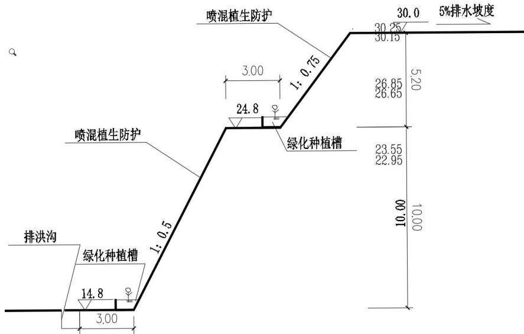  
图3.2-17 取水明渠边坡防护典型断面图

## （2） 需补充的水保措施

主体工程考虑了生态护坡等措施，海工工程后期主要恢复为水域或建成建筑物，本方案补充施工期间布设临时苫盖、临时排水等措施。

## 3.2.9.3 施工生产生活区

## （1）植物措施

施工生产生活区场地平整将形成边坡，边坡高度在2.0 至9.0m之间，其中，西侧与南侧边坡高度最大，东侧边坡高度相对较小。该边坡主要为填方边坡，局部存在挖方边坡，设计坡比均为1:2，主体工程设计采用C25 采用钢筋混凝土格构与植生袋相结合进行护坡，面积 22000m2。

## （2） 临时措施

隧洞采用泥水平衡盾构机施工过程中会产生大量的泥浆，在主体设计中已考虑了泥浆沉淀池，采取了泥浆固化和循环使用等措施，避免工程施工过程中泥浆漫流，造成对周边环境的不利影响。本区共需设置泥浆沉淀池2 座。泥浆沉淀池具有一定的水土保持作用，根据《生产建设项目水土保持技术标准》（GB 50433-2018）中的界定原则，该措施界定为水土保持措施。

## （2） 需补充的水保措施

主体工程考虑了施工生产生活区边坡生态防护、盾构施工场地处泥浆沉淀池等措施，本方案补充施工期间布设临时苫盖措施，施工结束后，对开挖土方进行土壤改良、培肥后作为表土对其他分区回覆。

## 3.2.9.4 临时周转场区

## （1） 工程措施

## 1） 拦挡工程

在土石方堆存前，应在堆存坡脚设置拦挡工程，避免堆存过程中土石方向下滑落。

1#石方周转场北侧设置浆砌石挡墙，挡墙顶宽 1.0m，最大墙高 3.0m（其中基础最大埋深1m），临渣侧边坡 1∶0.4，临空侧坡比1∶0.1，底部铺设10cm 厚碎石垫层。为排除堆存体内积水，墙体内设置排Φ80PVC 排水管，水平间距 2m，进口外包土工布。其余周边设置3m高钢筋石笼拦挡，钢筋石笼采用品字形堆砌，顶宽1.0m，高3.0m（埋置深度0.5m），开挖回填坡比1∶1。

2#石方周转场各侧坡脚设置钢筋石笼拦挡，拦挡高3m，采用品字形堆砌，顶宽1.0m，埋置深度0.5m，开挖回填坡比1∶1。

1#土方周转场各侧坡脚设置钢筋石笼拦挡，拦挡高3m，采用品字形堆砌，顶宽1.0m，埋置深度0.5m，开挖回填坡比1∶1。

2#土方周转场各侧坡脚设置钢筋石笼拦挡，拦挡高3m，采用品字形堆砌，顶宽1.0m，埋置深度0.5m，开挖回填坡比1∶1。

挡墙、钢筋石笼能有效防止堆存料的滑移，同时也能有效防治水土流失，根据《生产建设项目水土保持技术标准》（GB 50433-2018）中的界定原则，该项工程界定为水土保持措施。

## 2） 周边排水沟

## ① 区域汇水分析

场址所在区域汇水总体分南北两个单元，南侧靠海区域汇流经场内排洪沟收集后入海，北侧汇流经天然沟道进入北侧内洋外排入海。

1#石方周转场所在场地汇水流向为远离厂区方向北侧，防洪排导工程布置后不阻断区域汇流排水通道，布设前后区域汇流单元和排水路径不发生变化，仍为远离厂区方向，对厂区排水体系无影响。

1#土方周转场所在场地西侧部分属于厂区东排洪沟汇流范围，防洪排导工程布置后该部分区域排水路径不发生变化，仍汇入厂区主排洪沟。其余区域分别汇入厂区东排洪沟或排往远离厂区方向东北侧。汇入厂区东排洪沟的汇水面积约 0.053km2，流量按照100 年一遇设计标准计算为 2.25m3/s。根据主体工程设计资料，东排洪沟原设计流量为14.5m3/s,东排洪沟断面过流能力为18.75m3/s，临时周转场汇水进入东排洪沟后，东排洪沟仍可满足过流要求。

2#石方周转场位于厂区范围内，主体工程设计厂区排水体系已考虑该区域汇水，因此，2#石方周转场汇水收集后汇入厂区排水体系，对厂区排水体系无影响。

## ② 周边排水沟设计

在临时周转场地周边布置周边排水沟，1#石方周转场周边排水沟断面尺寸为 1.0m×1.0m（宽×高），2#石方周转场周边排水沟断面尺寸为 $0 . 5 \mathrm { m } \times 0 . 5 \mathrm { m }$ （宽×高），1#土方周转场周边排水沟断面尺寸为 $0 . 7 \mathrm { m } \times 0 . 7 \mathrm { m }$ （宽×高），2#土方周转场周边排水沟断面尺寸为0.6m×0.6m（宽×高），均采用C20 混凝土现浇，衬砌厚度30cm，排水沟每10m设伸缩缝，缝间采用闭孔塑料板填缝。周边排水接入现状池塘、沟道或厂区内排水系统。周边排水沟总长5060m。

## 3） 顶面、马道和坡面排水沟

堆存期间，在顶面及马道分别布置顶面及马道截排水沟，通过坡面排水沟排导至坡脚沉沙池。顶面截水沟及坡面排水沟为梯形断面，1#石方周转场和 1#土方周转场顶面截水沟及坡面排水沟断面尺寸为 0.5m×0.5m（宽×深），2#石方周转场和2#土方周转场顶面截水沟及坡面排水沟断面尺寸为 0.4m×0.4m（宽×深），坡比 1∶0.5，衬砌厚度0.15m，采用C20 混凝土现浇，共布设3009m。马道截水沟均为矩形断面，断面尺寸为0.3m×0.3m（宽×深），衬砌厚度0.15m，采用C20 混凝土现浇，共布设1810m。

周边、顶面和马道排水沟能排导边坡汇水，防护边坡不受雨水冲刷，能够起到水土保持的作用，根据《生产建设项目水土保持技术标准》（GB 50433-2018）中的界定原则，该项工程界定为水土保持措施。

## 4） 沉沙池

在坡面排水沟末端出口设置沉沙池，采用 C25 混凝土结构。共设置 9 座，尺寸4m×3m×1.5m（长×宽×深），壁厚 0.5m。

沉沙池既可起到排水沉沙的作用，也能起到排水消能的作用，根据《生产建设项目水土保持技术标准》（GB50433-2018）中的界定原则，该项工程界定为水土保持措施。

## 5） 被动防护网

在土方临时周转场地邻道路及施工临建区侧设置被动防护网，路基被动防护网主要由高强度钢丝绳网、环形网、固定系统（包括锚杆、拉锚绳、基座和支撑绳等）、减压环和钢柱等部分组成，可有效拦截和阻挡滚石、土块，从而保护交通线路的安全畅通以及周边人员和财产的安全。被动防护网采用 PPS-075，高度为3m，总长约2244m。

被动防护网既能保证边坡安全稳定，也能防治边坡水土流失，根据《生产建设项目

水土保持技术标准》（GB50433-2018）中的界定原则，该项工程界定为水土保持措施。

## （2） 需补充的水保措施

主体工程考虑了临时周转场区浆砌石挡墙、钢筋石笼拦挡、周边排水沟、坡面排水沟、顶面及马道截水沟、沉沙池等措施，本方案补充施工前表土剥离，施工期间布设临时苫盖措施，施工结束后对施工迹地表土回覆、土地平整并采用乔灌草植被恢复。

## 3.2.9.5 本期工程依托5、6号机组和1、2 号机组项目水土保持措施评价

本期工程依托 5、6 号机组和 1、2 号机组项目的水土保持措施主要为 3、4 号机组厂区周边临时排水沟、施工生产生活区边坡绿化及排水等措施。这些措施均具有较好的水土保持功能，但均为 5、6号机组和 1、2号机组项目已建措施，本期工程直接利用，不纳入3、4号机组水土保持措施体系。

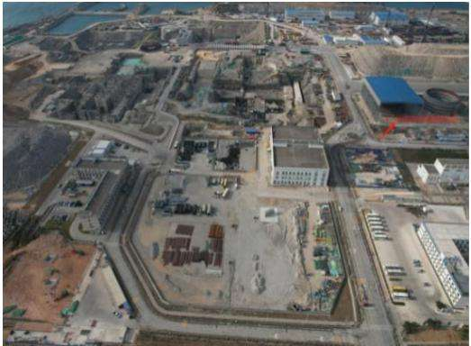

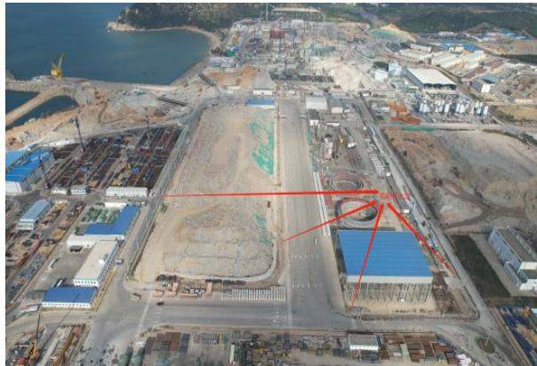  
1、2 号和5、6号机组于 3、4 号机组厂区周边布置排水

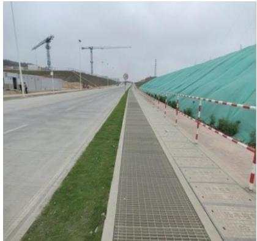

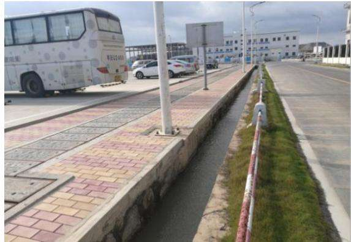  
场内主要道路两侧临时排水和空地绿化

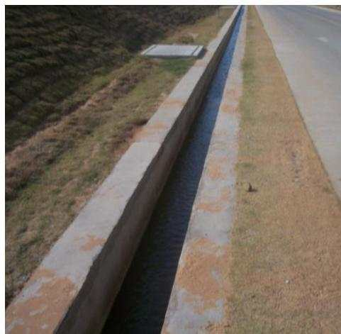

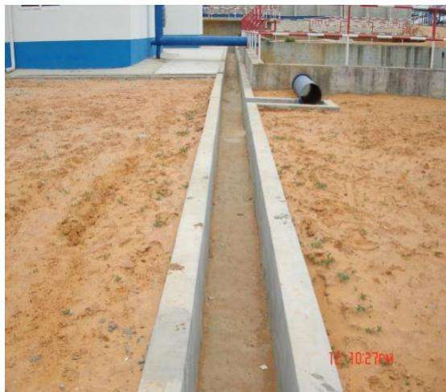  
临时排水沟

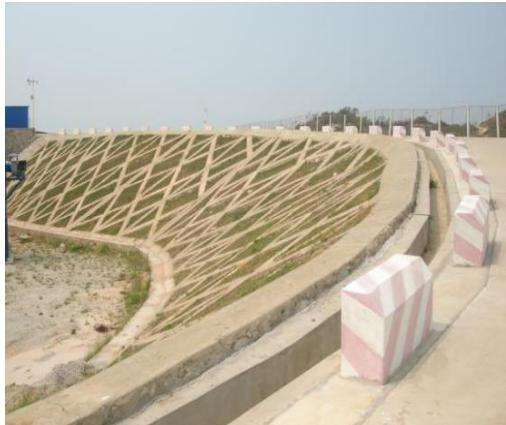  
施工生产生活区砂石加工系统周边砼框格植草护坡

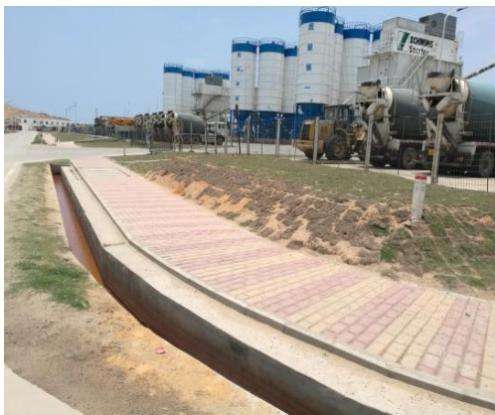  
拌合站场地边坡植草护坡  
图3.2-21 本期工程依托5、6号和1、2号机组项目的水土保持措施

## 3.3 主体工程设计中水土保持措施界定

根据主体工程设计资料及以上项目划分，对界定为水土保持措施的工程数量按分区和措施类别进行统计。主体工程中已有水土保持措施为工程措施和植物措施，工程措施包括：厂区雨水排水管网10800m、碎石压盖 $4 . 6 2 \mathrm { h m } ^ { 2 }$ ，临时周转场钢筋石笼拦挡4626m，浆砌石挡墙 538m，周边排水沟 5060m、顶面、马道及坡面截排水沟 4819m、沉沙池 9座，钢筋混凝土格构结合植生袋护坡 $2 2 0 0 0 \mathrm { m } ^ { 2 }$ ，喷混植生 $3 3 0 0 \mathrm { m } ^ { 2 }$ ，种植槽绿化 430m，泥浆沉淀池2 座。主体工程设计的水土保持措施总投资为5329.59 万元。

主体工程设计中界定为水土保持措施的工程量及投资详见表3.3-1。

表 3.3-1  
主体设计中界定为水土保持措施的工程量及投资
<table><tr><td rowspan=1 colspan=1>分区</td><td rowspan=1 colspan=1>措施类型</td><td rowspan=1 colspan=2>措施名称</td><td rowspan=1 colspan=1>单位</td><td rowspan=1 colspan=1>数量</td><td rowspan=1 colspan=1>单价(元)</td><td rowspan=1 colspan=1>合计(万元)</td></tr><tr><td rowspan=20 colspan=1>厂区</td><td rowspan=20 colspan=1>工程措施</td><td rowspan=19 colspan=1>雨水排水管网</td><td rowspan=1 colspan=1>HDPE 缠绕增强管 B 型 SN8DN300</td><td rowspan=1 colspan=1>m</td><td rowspan=1 colspan=1>50</td><td rowspan=1 colspan=1>144</td><td rowspan=1 colspan=1>0.72</td></tr><tr><td rowspan=1 colspan=1>HDPE 缠绕增强管 B 型 SN8DN400</td><td rowspan=1 colspan=1>m</td><td rowspan=1 colspan=1>600</td><td rowspan=1 colspan=1>234</td><td rowspan=1 colspan=1>14.05</td></tr><tr><td rowspan=1 colspan=1>HDPE 缠绕增强管 B 型 SN8DN500</td><td rowspan=1 colspan=1>m</td><td rowspan=1 colspan=1>950</td><td rowspan=1 colspan=1>370</td><td rowspan=1 colspan=1>35.18</td></tr><tr><td rowspan=1 colspan=1>HDPE 缠绕增强管 B 型 SN8DN600</td><td rowspan=1 colspan=1>m</td><td rowspan=1 colspan=1>700</td><td rowspan=1 colspan=1>464</td><td rowspan=1 colspan=1>32.50</td></tr><tr><td rowspan=1 colspan=1>HDPE 缠绕增强管 B 型 SN8DN700</td><td rowspan=1 colspan=1>m</td><td rowspan=1 colspan=1>950</td><td rowspan=1 colspan=1>606</td><td rowspan=1 colspan=1>57.59</td></tr><tr><td rowspan=1 colspan=1>HDPE 缠绕增强管 B 型 SN8DN800</td><td rowspan=1 colspan=1>m</td><td rowspan=1 colspan=1>600</td><td rowspan=1 colspan=1>748</td><td rowspan=1 colspan=1>44.89</td></tr><tr><td rowspan=1 colspan=1>HDPE 缠绕增强管 B 型 SN8DN900</td><td rowspan=1 colspan=1>m</td><td rowspan=1 colspan=1>150</td><td rowspan=1 colspan=1>971</td><td rowspan=1 colspan=1>14.57</td></tr><tr><td rowspan=1 colspan=1>HDPE 缠绕增强管 B 型 SN8DN1000</td><td rowspan=1 colspan=1>m</td><td rowspan=1 colspan=1>300</td><td rowspan=1 colspan=1>1195</td><td rowspan=1 colspan=1>35.84</td></tr><tr><td rowspan=1 colspan=1>HDPE 缠绕增强管 B 型 SN8DN1100</td><td rowspan=1 colspan=1>m</td><td rowspan=1 colspan=1>200</td><td rowspan=1 colspan=1>1480</td><td rowspan=1 colspan=1>29.60</td></tr><tr><td rowspan=1 colspan=1>HDPE 缠绕增强管 B 型 SN8DN1200</td><td rowspan=1 colspan=1>m</td><td rowspan=1 colspan=1>300</td><td rowspan=1 colspan=1>1592</td><td rowspan=1 colspan=1>47.76</td></tr><tr><td rowspan=1 colspan=1>HDPE 缠绕增强管 B 型 SN8DN1300</td><td rowspan=1 colspan=1>m</td><td rowspan=1 colspan=1>450</td><td rowspan=1 colspan=1>1784</td><td rowspan=1 colspan=1>80.29</td></tr><tr><td rowspan=1 colspan=1>HDPE 缠绕增强管 B 型 SN8DN1400</td><td rowspan=1 colspan=1>m</td><td rowspan=1 colspan=1>300</td><td rowspan=1 colspan=1>1976</td><td rowspan=1 colspan=1>59.29</td></tr><tr><td rowspan=1 colspan=1>HDPE 缠绕增强管 B 型 SN8DN1500</td><td rowspan=1 colspan=1>m</td><td rowspan=1 colspan=1>250</td><td rowspan=1 colspan=1>2267</td><td rowspan=1 colspan=1>56.66</td></tr><tr><td rowspan=1 colspan=1>HDPE 缠绕增强管 B 型 SN8DN1600</td><td rowspan=1 colspan=1>m</td><td rowspan=1 colspan=1>150</td><td rowspan=1 colspan=1>2546</td><td rowspan=1 colspan=1>38.18</td></tr><tr><td rowspan=1 colspan=1>HDPE 缠绕增强管 B 型 SN8DN1700</td><td rowspan=1 colspan=1>m</td><td rowspan=1 colspan=1>300</td><td rowspan=1 colspan=1>2913</td><td rowspan=1 colspan=1>87.38</td></tr><tr><td rowspan=1 colspan=1>HDPE 缠绕增强管 B 型 SN8DN1800</td><td rowspan=1 colspan=1>m</td><td rowspan=1 colspan=1>50</td><td rowspan=1 colspan=1>3280</td><td rowspan=1 colspan=1>16.40</td></tr><tr><td rowspan=1 colspan=1>HDPE 缠绕增强管 B 型 SN8DN2000</td><td rowspan=1 colspan=1>m</td><td rowspan=1 colspan=1>50</td><td rowspan=1 colspan=1>3566</td><td rowspan=1 colspan=1>17.83</td></tr><tr><td rowspan=1 colspan=1>HDPE 缠绕增强管 B 型 SN16DN300</td><td rowspan=1 colspan=1>m</td><td rowspan=1 colspan=1>4350</td><td rowspan=1 colspan=1>168</td><td rowspan=1 colspan=1>73.08</td></tr><tr><td rowspan=1 colspan=1>HDPE 缠绕增强管 B 型 SN16DN400</td><td rowspan=1 colspan=1>m</td><td rowspan=1 colspan=1>100</td><td rowspan=1 colspan=1>275</td><td rowspan=1 colspan=1>2.75</td></tr><tr><td rowspan=1 colspan=2>碎石压盖</td><td rowspan=1 colspan=1>m³</td><td rowspan=1 colspan=1>4620</td><td rowspan=1 colspan=1>588</td><td rowspan=1 colspan=1>271.66</td></tr><tr><td rowspan=6 colspan=1>临时周转场区</td><td rowspan=6 colspan=1>工程措施</td><td rowspan=1 colspan=2>钢筋石笼</td><td rowspan=1 colspan=1>m</td><td rowspan=1 colspan=1>4626</td><td rowspan=1 colspan=1>1600</td><td rowspan=1 colspan=1>740.16</td></tr><tr><td rowspan=1 colspan=2>浆砌石挡墙</td><td rowspan=1 colspan=1>m</td><td rowspan=1 colspan=1>538</td><td rowspan=1 colspan=1>3000</td><td rowspan=1 colspan=1>161.4</td></tr><tr><td rowspan=1 colspan=2>顶面、马道及坡面截排水沟</td><td rowspan=1 colspan=1>m</td><td rowspan=1 colspan=1>4819</td><td rowspan=1 colspan=1>500</td><td rowspan=1 colspan=1>240.95</td></tr><tr><td rowspan=1 colspan=2>周边排水沟</td><td rowspan=1 colspan=1>m</td><td rowspan=1 colspan=1>5060</td><td rowspan=1 colspan=1>650</td><td rowspan=1 colspan=1>328.90</td></tr><tr><td rowspan=1 colspan=2>沉沙池</td><td rowspan=1 colspan=1>座</td><td rowspan=1 colspan=1>9</td><td rowspan=1 colspan=1>6000</td><td rowspan=1 colspan=1>5.4</td></tr><tr><td rowspan=1 colspan=2>被动防护网</td><td rowspan=1 colspan=1>m</td><td rowspan=1 colspan=1>2244</td><td rowspan=1 colspan=1>500</td><td rowspan=1 colspan=1>112.2</td></tr><tr><td rowspan=2 colspan=1>施工生产区</td><td rowspan=1 colspan=1>植物措施</td><td rowspan=1 colspan=2>钢筋混凝土格构+植生袋护坡</td><td rowspan=1 colspan=1>m²</td><td rowspan=1 colspan=1>22000</td><td rowspan=1 colspan=1>1200</td><td rowspan=1 colspan=1>2640</td></tr><tr><td rowspan=1 colspan=1>临时措施</td><td rowspan=1 colspan=2>泥浆沉淀池</td><td rowspan=1 colspan=1>座</td><td rowspan=1 colspan=1>2</td><td rowspan=1 colspan=1>491.34</td><td rowspan=1 colspan=1>0.10</td></tr><tr><td rowspan=2 colspan=1>海工区</td><td rowspan=2 colspan=1>植物措施</td><td rowspan=1 colspan=2>喷混植生</td><td rowspan=1 colspan=1>m²</td><td rowspan=1 colspan=1>3300</td><td rowspan=1 colspan=1>235.00</td><td rowspan=1 colspan=1>77.55</td></tr><tr><td rowspan=1 colspan=2>种植槽绿化</td><td rowspan=1 colspan=1>m</td><td rowspan=1 colspan=1>430</td><td rowspan=1 colspan=1>156.00</td><td rowspan=1 colspan=1>6.71</td></tr><tr><td rowspan=1 colspan=1>合计</td><td rowspan=1 colspan=1></td><td rowspan=1 colspan=2></td><td rowspan=1 colspan=1></td><td rowspan=1 colspan=1></td><td rowspan=1 colspan=1></td><td rowspan=1 colspan=1>5329.59</td></tr></table>

## 4 水土流失分析与预测

## 4.1 水土流失现状

## 4.1.1 陆丰市水土流失现状

根据《陆丰市水土保持规划（2022～2030 年）》，陆丰市碣石镇水土流失面积共$1 4 . 9 7 \mathrm { k m } ^ { 2 }$ ，其中轻度侵蚀面积 $1 1 . 6 5 \mathrm { k m } ^ { 2 }$ 、中度侵蚀面积 $2 . 8 3 \mathrm { k m } ^ { 2 }$ 、强烈侵蚀面积 $0 . 2 8 \mathrm { k m } ^ { 2 }$ 极强烈侵蚀面积 $0 . 1 4 \mathrm { k m } ^ { 2 }$ 、剧烈侵蚀面积 $0 . 0 7 \mathrm { k m } ^ { 2 }$

陆丰核电厂隶属陆丰市碣石镇，属于南方红壤区，容许土壤流失量为 $5 0 0 \mathrm { t } / ( \mathrm { k m } ^ { 2 } \cdot \mathrm { a } )$ ）。项目区水土流失主要为水力侵蚀，侵蚀形式主要为面蚀。

## 4.1.2 项目区水土流失现状

厂址为滨海厂址，厂区周围主要是海边山地、沙滩及荒地，地势起伏较大，东、南两面临海，西侧和北侧与陆地接壤。目前现场除新增施工生产生活区、土石方临时周转场外，3、4号机组项目其他场地已全部场平。根据前期工程水土保持监测成果，结合现场调查来看，场平区域已土地平整，道路已硬化，两侧均有排水沟布设，建设单位及参建单位现场施工生产生活区域地表均已硬化或绿化，已扰动区域场地布设了较为完善的排水系统，水土流失较轻，土壤侵蚀模数约为 $6 0 0 \mathrm { t } / \ \left( \mathrm { k m } ^ { 2 } \cdot \mathrm { ~ a ~ } \right)$ 。3、4 号机组新增施工生产生活区、土石方临时周转场区，现状未扰动，土地利用类型为林地，植被覆盖度较高，水土流失较轻，现状土壤侵蚀模数 $5 0 0 \sim 1 5 0 0 \mathrm { t / \Omega ( \ k m ^ { 2 } \cdot \mathrm { a } ) }$

## 4.2 水土流失影响因素分析

## 4.2.1 自然因素水土流失分析

在工程施工中涉及土石方开挖和临时堆土等建设活动，在雨滴打击、水流冲刷等外力的作用下易产生水土流失。项目区降水集中，强度大，对土壤的侵蚀力大；雨季地表土壤处于湿润状态，抗蚀能力较差，遇暴雨会导致严重的土壤侵蚀，侵蚀形式以面蚀和沟蚀为主。

## 4.2.2 建设期水土流失影响分析

工程建设过程中所造成的水土流失影响如下：

## （1） 土石方工程

工程建设期间的建构筑物基础开挖与回填等施工活动会产生大量的土石方。在土石

方开挖、倒运、回填和堆放过程中，松散土体及开挖裸露面在水力和风力侵蚀作用下将产生水土流失。若不采取有效预防措施，土石方工程施工极易造成水土流失。

## （2） 临时堆土水土流失影响

由于堆土体是一个相对松散的堆积体，如不采取防护措施，遇降雨和大风作用，易产生大量的水蚀和风蚀，并造成严重的水土流失危害。

## 4.2.3 自然恢复期水土流失影响分析

自然恢复期植物措施尚未完全发挥其水土保持功能之前，受降雨、径流冲刷以及大风影响，仍会有轻度的土壤流失发生，但随着植物生长，覆盖度增加，水土流失将会逐渐得到控制，并降低到容许水土流失强度以下。

## 4.2.4 扰动地表、损毁植被面积及弃渣量

## （1） 扰动地表面积

工程建设过程中，地面设施的兴建、开挖、填筑等都不同程度、不同形式地扰动了原地貌形态，损坏了地表土体结构和地面植被。按防治分区，本期工程扰动地表面积共计 $1 1 1 . 0 9 \mathrm { h m } ^ { 2 }$ ，详见表 4.2-1。

表 4.2-1  
工程扰动地表面积
<table><tr><td rowspan=1 colspan=1>序号</td><td rowspan=1 colspan=1>项目</td><td rowspan=1 colspan=1>扰动地表面积 $\left( \mathrm { h m } ^ { 2 } \right)$ </td></tr><tr><td rowspan=1 colspan=1>1</td><td rowspan=1 colspan=1>厂区</td><td rowspan=1 colspan=1>26.05</td></tr><tr><td rowspan=1 colspan=1>2</td><td rowspan=1 colspan=1>施工生产生活区</td><td rowspan=1 colspan=1>39.56</td></tr><tr><td rowspan=1 colspan=1>3</td><td rowspan=1 colspan=1>海工区</td><td rowspan=1 colspan=1>6.28</td></tr><tr><td rowspan=1 colspan=1>4</td><td rowspan=1 colspan=1>临时周转场区</td><td rowspan=1 colspan=1>34.20</td></tr><tr><td rowspan=1 colspan=1>5</td><td rowspan=1 colspan=1>表土堆存场区</td><td rowspan=1 colspan=1>5.00</td></tr><tr><td rowspan=1 colspan=1></td><td rowspan=1 colspan=1>合计</td><td rowspan=1 colspan=1>111.09</td></tr></table>

## （2） 损毁植被面积

本期工程损毁植被面积36.87hm2。

## （3）余方量

本期工程余方量 24.16 万 m3，其中土方 18.44 万 m3、石方 5.72 万 $\mathrm { m } ^ { 3 }$ 。余方中土方由陆丰市碣石陆丰市碣石海工基地（三期）项目综合利用，石方由 5、6 号机组导流堤优化利用。本期工程拆除建筑垃圾7.46万m3由陆丰市恒元再生资源有限公司资源化处置。

## 4.3 土壤流失量预测

## 4.3.1 预测单元

预测单元为工程建设扰动时段、扰动形式总体相同、扰动强度和特点大体一致的区域。根据《生产建设项目土壤流失量测算导则》（SL773-2018）规定，结合建设项目的特点，按各单元工程及占地利用情况，将项目区水土流失预测单元划分为①厂区；②施工生产生活区；③临时周转场区；④表土堆存场区；⑤海工区。根据每个预测单元在工程施工期（含施工准备期）和自然恢复期土壤侵蚀模数的变化情况，分别预测施工期（含施工准备期）和自然恢复期的土壤侵蚀总量。

## 4.3.2 预测时段

根据《生产建设项目水土保持技术标准》（GB 50433-2018），水土流失预测应按施工期（含施工准备期）和自然恢复期两个时段进行。结合工程特点，将施工准备期并入施工期进行预测。

## （1） 施工期（含施工准备期）

施工期（含施工准备期）预测时段根据各单元进度安排，结合工程区自然生态条件，参照有关技术规范要求，每个预测单元的时段按最不利情况考虑，超过雨季长度的按全年计算，未超过雨季长度按其占雨季时间的比例计算。项目所在地区雨季为 4～9 月。由于各施工项目跨越雨季不同，故施工期的预测时段有所差异，不同分区预测时段按照施工进度安排确定。

## 1） 厂区

厂区施工主要包括场地清理、土建负挖、建筑工程施工、安装工程施工。计划于2026年4 月开始负挖，计划 2032年5月结束，预测时段按 6.17年计。

## 2） 施工生产生活区

工程施工时段为 2026 年 4 月至 2033 年 6 月，预测时段按 7.25 年计。

## 3） 临时周转场区

工程土石方开挖临时中转堆存时段为 2026 年 4 月至 2033 年 6 月，预测时段按7.25 年计。

## 4） 表土堆存场区

表土堆存时段为2026 年 4 月至 2033 年 6 月，预测时段按 7.25 年计。

## 5） 海工区

海工区施工时段为 2026年7月至 2032年6月，预测时段按6年计。

## （2） 自然恢复期

工程施工结束后，因施工引起水土流失的各项因素逐渐消失，地表扰动基本停止，水土流失将明显减小，但由于植物措施防护效果的相对滞后性，在自然恢复期项目区仍会有一定量的水土流失，根据《生产建设项目水土保持技术标准》（GB 50433-2018）及工程区自然条件和工程建设特点，确定本期工程自然恢复期按2年计算。

本期工程水土流失预测范围和时段划分详见表4.3-1。

表 4.3-1  
水土流失预测范围和预测时段表
<table><tr><td rowspan=3 colspan=1>序号</td><td rowspan=3 colspan=1>预测单元</td><td rowspan=1 colspan=2>施工期（含施工准备期）</td><td rowspan=1 colspan=2>自然恢复期</td></tr><tr><td rowspan=1 colspan=1>预测面积</td><td rowspan=1 colspan=1>预测时段</td><td rowspan=1 colspan=1>预测面积</td><td rowspan=1 colspan=1>预测时段</td></tr><tr><td rowspan=1 colspan=1>(hm²)</td><td rowspan=1 colspan=1>(a)</td><td rowspan=1 colspan=1>(hm²)</td><td rowspan=1 colspan=1>(a)</td></tr><tr><td rowspan=1 colspan=1>1</td><td rowspan=1 colspan=1>厂区</td><td rowspan=1 colspan=1>26.05</td><td rowspan=1 colspan=1>6.17</td><td rowspan=1 colspan=1>/</td><td rowspan=1 colspan=1>/</td></tr><tr><td rowspan=1 colspan=1>2</td><td rowspan=1 colspan=1>海工区</td><td rowspan=1 colspan=1>6.28</td><td rowspan=1 colspan=1>6</td><td rowspan=1 colspan=1>/</td><td rowspan=1 colspan=1>/</td></tr><tr><td rowspan=1 colspan=1>3</td><td rowspan=1 colspan=1>施工生产生活区</td><td rowspan=1 colspan=1>39.56</td><td rowspan=1 colspan=1>7.25</td><td rowspan=1 colspan=1>25.98</td><td rowspan=1 colspan=1>2</td></tr><tr><td rowspan=1 colspan=1>4</td><td rowspan=1 colspan=1>表土堆存场区</td><td rowspan=1 colspan=1>5.00</td><td rowspan=1 colspan=1>7.25</td><td rowspan=1 colspan=1>5.00</td><td rowspan=1 colspan=1>2</td></tr><tr><td rowspan=1 colspan=1>5</td><td rowspan=1 colspan=1>临时周转场区</td><td rowspan=1 colspan=1>34.20</td><td rowspan=1 colspan=1>7.25</td><td rowspan=1 colspan=1>34.20</td><td rowspan=1 colspan=1>2</td></tr><tr><td rowspan=1 colspan=2>合计</td><td rowspan=1 colspan=1>111.09</td><td rowspan=1 colspan=1></td><td rowspan=1 colspan=1>65.18</td><td rowspan=1 colspan=1></td></tr></table>

## 4.3.3 土壤侵蚀模数

## 4.3.3.1 原地貌土壤侵蚀模数

通过对施工占地范围内土地利用现状的抽样典型调查，结合施工征地范围内的土地利用现状分析，工程区水土流失以轻度侵蚀为主。依据前期工程水土保持监测成果和工程区降雨、土地利用类型、植被覆盖度、地面坡度、土壤类型等因子，参考《土壤侵蚀分类分级标准》（SL 190-2007）对工程各防治区内土壤侵蚀强度进行分析，工程区平均土壤侵蚀模数为 $7 0 7 \mathrm { t } / \mathrm { \Omega } ( \mathrm { k m } ^ { 2 } \cdot \mathrm { \Omega } \mathrm { a } )$ 。各预测单元原生土壤侵蚀模数详见表4.3-2。

表 4.3-2  
工程区原生土壤侵蚀模数计算表
<table><tr><td rowspan=1 colspan=1>防治分区</td><td rowspan=1 colspan=1>占地类型</td><td rowspan=1 colspan=1>面积(hm²)</td><td rowspan=1 colspan=1>坡度(°)</td><td rowspan=1 colspan=1>侵蚀强度</td><td rowspan=1 colspan=1>各地块平均土壤侵蚀模数(t/km² a</td><td rowspan=1 colspan=1>各区平均土壤平均土壤侵蚀模数(t/km²·a)</td></tr><tr><td rowspan=1 colspan=1>厂区</td><td rowspan=1 colspan=1>工矿仓储用地</td><td rowspan=1 colspan=1>26.05</td><td rowspan=1 colspan=1>0-5</td><td rowspan=1 colspan=1>轻度</td><td rowspan=1 colspan=1>600</td><td rowspan=1 colspan=1>600</td></tr><tr><td rowspan=2 colspan=1>海工区</td><td rowspan=1 colspan=1>工矿仓储用地</td><td rowspan=1 colspan=1>3.97</td><td rowspan=1 colspan=1>0-5</td><td rowspan=1 colspan=1>轻度</td><td rowspan=1 colspan=1>600</td><td rowspan=2 colspan=1>379</td></tr><tr><td rowspan=1 colspan=1>海域</td><td rowspan=1 colspan=1>2.31</td><td rowspan=1 colspan=1>1</td><td rowspan=1 colspan=1>1</td><td rowspan=1 colspan=1>1</td></tr><tr><td rowspan=2 colspan=1>施工生产生活区</td><td rowspan=1 colspan=1>工矿仓储用地</td><td rowspan=1 colspan=1>36.56</td><td rowspan=1 colspan=1>0-5</td><td rowspan=1 colspan=1>轻度</td><td rowspan=1 colspan=1>600</td><td rowspan=2 colspan=1>630</td></tr><tr><td rowspan=1 colspan=1>林地</td><td rowspan=1 colspan=1>3.00</td><td rowspan=1 colspan=1>5-35</td><td rowspan=1 colspan=1>轻度</td><td rowspan=1 colspan=1>500~1500</td></tr><tr><td rowspan=1 colspan=1>表土堆存场区</td><td rowspan=1 colspan=1>林地</td><td rowspan=1 colspan=1>5.00</td><td rowspan=1 colspan=1>0-5</td><td rowspan=1 colspan=1>轻度</td><td rowspan=1 colspan=1>500~1500</td><td rowspan=1 colspan=1>750</td></tr><tr><td rowspan=2 colspan=1>临时周转场区</td><td rowspan=1 colspan=1>林地</td><td rowspan=1 colspan=1>30.07</td><td rowspan=1 colspan=1>5-35</td><td rowspan=1 colspan=1>轻度</td><td rowspan=1 colspan=1>500~1500</td><td rowspan=2 colspan=1>952</td></tr><tr><td rowspan=1 colspan=1>工矿仓储用地</td><td rowspan=1 colspan=1>4.13</td><td rowspan=1 colspan=1>0-5</td><td rowspan=1 colspan=1>轻度</td><td rowspan=1 colspan=1>600</td></tr><tr><td rowspan=1 colspan=1>合计</td><td rowspan=1 colspan=1></td><td rowspan=1 colspan=1>111.09</td><td rowspan=1 colspan=1></td><td rowspan=1 colspan=1>1</td><td rowspan=1 colspan=1>/</td><td rowspan=1 colspan=1>707</td></tr></table>

## 4.3.3.2 扰动后土壤侵蚀模数

项目施工建设将损坏原有地形地貌和植被，增加土壤的可侵蚀性；另一方面，由于场地平整时，挖、填土方不仅造成大面积的裸露地面，而且会改变原地形，增大侵蚀扰动表面积。施工期土壤流失量根据《生产建设项目土壤流失量测算导则》（SL773-2018）推荐公式计算，扰动后的土壤侵蚀因子可根据项目区地形地貌、气候（降雨、风速等）、土地利用、植被情况等实际情况结合工程特点，参照《生产建设项目土壤流失量测算导则》（SL 773-2018）计算确定。

## （1） 扰动单元划分

在项目区预测单元的基础上，根据空间连续性、扰动方式、扰动强度、扰动规模等划分不同规模的扰动单元，共划分9 个不同规模的扰动单元，划分情况见表4.3-3。

表 4.3-3  
扰动单元划分情况表
<table><tr><td rowspan=2 colspan=1>预测单元</td><td rowspan=1 colspan=2>扰动单元</td><td rowspan=2 colspan=1>扰动方式</td><td rowspan=2 colspan=1>扰动规模</td><td rowspan=2 colspan=1>面积（hm²）</td></tr><tr><td rowspan=1 colspan=1>序号</td><td rowspan=1 colspan=1>项目</td></tr><tr><td rowspan=1 colspan=1>厂区</td><td rowspan=1 colspan=1>扰动单元1</td><td rowspan=1 colspan=1>厂区陆域区域</td><td rowspan=1 colspan=1>一般扰动地表</td><td rowspan=1 colspan=1>大</td><td rowspan=1 colspan=1>26.05</td></tr><tr><td rowspan=2 colspan=1>施工生产生活区</td><td rowspan=1 colspan=1>扰动单元2</td><td rowspan=1 colspan=1>新增施工生产生活区</td><td rowspan=1 colspan=1>一般扰动地表</td><td rowspan=1 colspan=1>中</td><td rowspan=1 colspan=1>3.00</td></tr><tr><td rowspan=1 colspan=1>扰动单元3</td><td rowspan=1 colspan=1>利用已有施工生产生活区</td><td rowspan=1 colspan=1>一般扰动地表</td><td rowspan=1 colspan=1>大</td><td rowspan=1 colspan=1>36.56</td></tr><tr><td rowspan=2 colspan=1>海工区</td><td rowspan=1 colspan=1>扰动单元4</td><td rowspan=1 colspan=1>取水导流堤</td><td rowspan=1 colspan=1>工程堆积体</td><td rowspan=1 colspan=1>中</td><td rowspan=1 colspan=1>2.31</td></tr><tr><td rowspan=1 colspan=1>扰动单元5</td><td rowspan=1 colspan=1>取水明渠</td><td rowspan=1 colspan=1>一般扰动地表</td><td rowspan=1 colspan=1>中</td><td rowspan=1 colspan=1>3.97</td></tr><tr><td rowspan=1 colspan=1>表土堆存场区</td><td rowspan=1 colspan=1>扰动单元6</td><td rowspan=1 colspan=1>堆存表土场地</td><td rowspan=1 colspan=1>工程堆积体</td><td rowspan=1 colspan=1>小</td><td rowspan=1 colspan=1>5.00</td></tr><tr><td rowspan=3 colspan=1>临时周转场区</td><td rowspan=1 colspan=1>扰动单元7</td><td rowspan=1 colspan=1>石方周转场</td><td rowspan=1 colspan=1>工程堆积体</td><td rowspan=1 colspan=1>大</td><td rowspan=1 colspan=1>15.22</td></tr><tr><td rowspan=1 colspan=1>扰动单元8</td><td rowspan=1 colspan=1>土方周转场</td><td rowspan=1 colspan=1>工程堆积体</td><td rowspan=1 colspan=1>大</td><td rowspan=1 colspan=1>18.62</td></tr><tr><td rowspan=1 colspan=1>扰动单元9</td><td rowspan=1 colspan=1>建筑垃圾周转场</td><td rowspan=1 colspan=1>工程堆积体</td><td rowspan=1 colspan=1>小</td><td rowspan=1 colspan=1>0.36</td></tr><tr><td rowspan=1 colspan=1>合计</td><td rowspan=1 colspan=1>9个</td><td rowspan=1 colspan=1></td><td rowspan=1 colspan=1></td><td rowspan=1 colspan=1></td><td rowspan=1 colspan=1>111.09</td></tr></table>

## （2） 典型扰动单元划分

根据导则，项目扰动单元数量小于 20 个时，应全部确定为典型扰动单元，故本期工程施工期扰动单元为 9个典型扰动单元。

## （3） 计算单元划分

根据现场查勘和实验测定的相关数据，按照扰动方式、坡度、坡长、地表覆盖、土壤类型和质地、气象条件等参数相对一致的原则，在适当比例尺的图件上，将每个典型扰动单元进一步划分为生产建设项目土壤流失类型三级分类对应的计算单元，本期工程共划分9个计算单元。计算单元划分情况见表 4.3-4。

表 4.3-4  
计算单元划分情况表
<table><tr><td rowspan=1 colspan=2>扰动单元</td><td rowspan=2 colspan=1>扰动方式</td><td rowspan=2 colspan=1>土壤流失三级分类</td><td rowspan=2 colspan=1>扰动规模</td><td rowspan=2 colspan=1> $\mp \pi \neq \infty ( \mathrm { h m } ^ { 2 } )$ </td></tr><tr><td rowspan=1 colspan=1>序号</td><td rowspan=1 colspan=1>项目</td></tr><tr><td rowspan=1 colspan=1>扰动单元1</td><td rowspan=1 colspan=1>厂区陆域区域</td><td rowspan=1 colspan=1>一般扰动地表</td><td rowspan=1 colspan=1>地表翻扰型一般扰动地表</td><td rowspan=1 colspan=1>大</td><td rowspan=1 colspan=1>26.05</td></tr><tr><td rowspan=1 colspan=1>扰动单元2</td><td rowspan=1 colspan=1>新增施工生产生活区</td><td rowspan=1 colspan=1>一般扰动地表</td><td rowspan=1 colspan=1>地表翻扰型一般扰动地表</td><td rowspan=1 colspan=1>中</td><td rowspan=1 colspan=1>3.00</td></tr><tr><td rowspan=1 colspan=1>扰动单元3</td><td rowspan=1 colspan=1>利用已有施工生产生活区</td><td rowspan=1 colspan=1>一般扰动地表</td><td rowspan=1 colspan=1>地表翻扰型一般扰动地表</td><td rowspan=1 colspan=1>大</td><td rowspan=1 colspan=1>36.56</td></tr><tr><td rowspan=1 colspan=1>扰动单元4</td><td rowspan=1 colspan=1>取水导流堤</td><td rowspan=1 colspan=1>工程堆积体</td><td rowspan=1 colspan=1>上方无来水工程堆积体</td><td rowspan=1 colspan=1>中</td><td rowspan=1 colspan=1>2.31</td></tr><tr><td rowspan=1 colspan=1>扰动单元5</td><td rowspan=1 colspan=1>取水明渠</td><td rowspan=1 colspan=1>一般扰动地表</td><td rowspan=1 colspan=1>地表翻扰型一般扰动地表</td><td rowspan=1 colspan=1>中</td><td rowspan=1 colspan=1>3.97</td></tr><tr><td rowspan=1 colspan=1>扰动单元6</td><td rowspan=1 colspan=1>堆存表土场地</td><td rowspan=1 colspan=1>工程堆积体</td><td rowspan=1 colspan=1>上方无来水工程堆积体</td><td rowspan=1 colspan=1>小</td><td rowspan=1 colspan=1>5.00</td></tr><tr><td rowspan=1 colspan=1>扰动单元7</td><td rowspan=1 colspan=1>石方周转场</td><td rowspan=1 colspan=1>工程堆积体</td><td rowspan=1 colspan=1>上方无来水工程堆积体</td><td rowspan=1 colspan=1>大</td><td rowspan=1 colspan=1>15.22</td></tr><tr><td rowspan=1 colspan=1>扰动单元8</td><td rowspan=1 colspan=1>土方周转场</td><td rowspan=1 colspan=1>工程堆积体</td><td rowspan=1 colspan=1>上方无来水工程堆积体</td><td rowspan=1 colspan=1>大</td><td rowspan=1 colspan=1>18.62</td></tr><tr><td rowspan=1 colspan=1>扰动单元9</td><td rowspan=1 colspan=1>建筑垃圾周转场</td><td rowspan=1 colspan=1>工程堆积体</td><td rowspan=1 colspan=1>上方无来水工程堆积体</td><td rowspan=1 colspan=1>小</td><td rowspan=1 colspan=1>0.36</td></tr><tr><td rowspan=1 colspan=1>合计</td><td rowspan=1 colspan=1></td><td rowspan=1 colspan=1></td><td rowspan=1 colspan=1></td><td rowspan=1 colspan=1></td><td rowspan=1 colspan=1>111.09</td></tr></table>

（4） 施工期各计算单元土壤流失侵蚀模数

根据各计算单元所属的扰动类型，按土壤流失类型三级分类选择相应的计算公式进行土壤侵蚀模数的计算，本期工程计算单元主要涉及地表翻扰型一般扰动地表、上方无来水工程堆积体2种形式。

① 地表翻扰型一般扰动地表土壤侵蚀模数测算

地表翻扰型一般扰动地表计算单元土壤流失量按下列公式计算：

$$
M _ { y d } { = } R K _ { y d } L _ { y } S _ { y } B E T A
$$

式中：

$M \ ( \ M _ { k w } \cdot \ M _ { d w } \bullet \ M _ { y d } \bullet \ M _ { y Z }$ 等）——扰动地表计算单元土壤流失量，t；

R——降雨侵蚀力因子， $\mathrm { M J } { \bullet \mathrm { m m } } / \ ( \ \mathrm { h m } ^ { 2 } { \bullet \mathrm { h } } )$ ；

K $( K _ { y d } )$ ——土壤可蚀性因子， $\mathrm { \bf t \bullet h m ^ { 2 } \bullet h / \Gamma ( \ h m ^ { 2 } \bullet M J \bullet \ m m ) }$ ；

L $( L _ { y } , \ L _ { d w } , \ L _ { k w }$ 等）——坡长因子，无量纲；

S $( \ S _ { y } , \ S _ { d w } , \ S _ { k w }$ 等）——坡度因子，无量纲；

B——植被覆盖因子，无量纲；

E——工程措施因子，无量纲；

T——耕作措施因子，无量纲；

A——计算单元的水平投影面积， $\mathrm { h m } ^ { 2 }$

因此，地表翻扰型一般扰动地表的年均侵蚀模数计算公式为：

$$
M _ { j i } { = } R K _ { y d } L _ { y } S _ { y } B E T { * } 1 0 0
$$

共涉及到3 个计算单元，其土壤流失量计算如表 4.3-5 所示。

表 4.3-5 地表翻扰型一般扰动地表计算单元土壤侵蚀模数
<table><tr><td rowspan=2 colspan=2>预测单元</td><td rowspan=1 colspan=1> $M _ { y d }$ </td><td rowspan=1 colspan=1>R</td><td rowspan=1 colspan=1> $K _ { y d }$ </td><td rowspan=2 colspan=1> $L _ { y }$ </td><td rowspan=2 colspan=1> $S _ { y }$ </td><td rowspan=2 colspan=1>B</td><td rowspan=2 colspan=1> $E$ </td><td rowspan=2 colspan=1>T</td><td rowspan=2 colspan=1>A</td><td rowspan=1 colspan=1> $M _ { j i }$ </td></tr><tr><td rowspan=1 colspan=1> $\left( \mathrm { \Omega t } \right)$ </td><td rowspan=1 colspan=1>MJ·mm/ $\left( \mathrm { h m } ^ { 2 } \bullet \mathrm { h } \right)$ </td><td rowspan=1 colspan=1> $\mathrm { t } \bullet \mathrm { h m } ^ { 2 } \bullet \mathrm { h } /$  $\mathrm { ( { h m ^ { 2 } \bullet M J \bullet m m } ) }$ </td><td rowspan=1 colspan=1> $\left( { \bf { t } } / { \bf { k } } { \bf { m } } ^ { 2 } \cdot { \bf { a } } \right)$ </td></tr><tr><td rowspan=1 colspan=1>厂区</td><td rowspan=1 colspan=1>扰动单元1</td><td rowspan=1 colspan=1>1692</td><td rowspan=1 colspan=1>16082.76</td><td rowspan=1 colspan=1>0.0066</td><td rowspan=1 colspan=1>2.50806</td><td rowspan=1 colspan=1>0.9753</td><td rowspan=1 colspan=1>0.25</td><td rowspan=1 colspan=1>1</td><td rowspan=1 colspan=1>1</td><td rowspan=1 colspan=1>26.05</td><td rowspan=1 colspan=1>6494</td></tr><tr><td rowspan=2 colspan=1>施工生产生活区</td><td rowspan=1 colspan=1>扰动单元2</td><td rowspan=1 colspan=1>192</td><td rowspan=1 colspan=1>16082.76</td><td rowspan=1 colspan=1>0.0066</td><td rowspan=1 colspan=1>1.99451</td><td rowspan=1 colspan=1>1.2081</td><td rowspan=1 colspan=1>0.25</td><td rowspan=1 colspan=1>1</td><td rowspan=1 colspan=1>1</td><td rowspan=1 colspan=1>3.00</td><td rowspan=1 colspan=1>6397</td></tr><tr><td rowspan=1 colspan=1>扰动单元3</td><td rowspan=1 colspan=1>953</td><td rowspan=1 colspan=1>16082.76</td><td rowspan=1 colspan=1>0.0066</td><td rowspan=1 colspan=1>2.62605</td><td rowspan=1 colspan=1>0.3738</td><td rowspan=1 colspan=1>0.25</td><td rowspan=1 colspan=1>1</td><td rowspan=1 colspan=1>1</td><td rowspan=1 colspan=1>36.56</td><td rowspan=1 colspan=1>2606</td></tr><tr><td rowspan=1 colspan=1>海工区</td><td rowspan=1 colspan=1>扰动单元5</td><td rowspan=1 colspan=1>371</td><td rowspan=1 colspan=1>16082.76</td><td rowspan=1 colspan=1>0.0066</td><td rowspan=1 colspan=1>0.76129</td><td rowspan=1 colspan=1>4.0595</td><td rowspan=1 colspan=1>0.25</td><td rowspan=1 colspan=1>1</td><td rowspan=1 colspan=1>1</td><td rowspan=1 colspan=1>3.97</td><td rowspan=1 colspan=1>8204</td></tr></table>

## ② 上方无来水工程堆积体土壤流失量测算

上方无来水工程堆积体土壤流失量按下列公式计算：

$$
\scriptstyle M _ { d w } = X R G _ { d w } L _ { d w } S _ { d w } A
$$

式中：

X——工程堆积体形态因子，无量纲；

$G _ { d w }$ ——上方无来水工程堆积体土石质因子， $\mathrm { \bf t \bullet h m ^ { 2 } \bullet h / \Gamma ( \ h m ^ { 2 } \bullet M J \bullet m m ) }$

因此，上方无来水工程堆积体的年均侵蚀模数计算公式为：

$$
M _ { j i } { = } X R G _ { d w } L _ { d w } S _ { d w } { * } 1 0 0
$$

共涉及到7 个计算单元，其土壤流失量计算如表 4.3-6 所示。

表 4.3-6 上方无来水工程堆积体计算单元土壤侵蚀模数
<table><tr><td rowspan=2 colspan=2>预测单元</td><td rowspan=1 colspan=1> $M _ { d w }$ </td><td rowspan=1 colspan=1></td><td rowspan=1 colspan=1>R</td><td rowspan=1 colspan=1> $G _ { d w }$ </td><td rowspan=2 colspan=1> $L _ { d w }$ </td><td rowspan=2 colspan=1> $S _ { d w }$ </td><td rowspan=2 colspan=1>A</td><td rowspan=1 colspan=1> $M _ { j i }$ </td></tr><tr><td rowspan=1 colspan=1>(t)</td><td rowspan=1 colspan=1> $X$ </td><td rowspan=1 colspan=1>MJ·mm/ $\left( \mathrm { h m } ^ { 2 } \bullet \mathrm { h } \right)$ </td><td rowspan=1 colspan=1> $\overline { { { \bf { t } } { \bullet } { \bf { h } } m ^ { 2 } { \bullet } { \bf { h } } / } }$  $\mathrm { ( { h m ^ { 2 } \bullet M J \bullet m m } ) }$ </td><td rowspan=1 colspan=1> $\left( { \bf { t } } / { \bf { k } } { \bf { m } } ^ { 2 } \cdot { \bf { a } } \right)$ </td></tr><tr><td rowspan=1 colspan=1>海工区</td><td rowspan=1 colspan=1>扰动单元4</td><td rowspan=1 colspan=1>155</td><td rowspan=1 colspan=1>1</td><td rowspan=1 colspan=1>16082.76</td><td rowspan=1 colspan=1>0.00848</td><td rowspan=1 colspan=1>1.5348</td><td rowspan=1 colspan=1>0.3196</td><td rowspan=1 colspan=1>2.31</td><td rowspan=1 colspan=1>6691</td></tr><tr><td rowspan=1 colspan=1>表土堆存场区</td><td rowspan=1 colspan=1>扰动单元6</td><td rowspan=1 colspan=1>353</td><td rowspan=1 colspan=1>1</td><td rowspan=1 colspan=1>16082.76</td><td rowspan=1 colspan=1>0.00848</td><td rowspan=1 colspan=1>0.9783</td><td rowspan=1 colspan=1>0.5294</td><td rowspan=1 colspan=1>5.00</td><td rowspan=1 colspan=1>7066</td></tr><tr><td rowspan=3 colspan=1>临时周转场区</td><td rowspan=1 colspan=1>扰动单元7</td><td rowspan=1 colspan=1>1331</td><td rowspan=1 colspan=1>1</td><td rowspan=1 colspan=1>16082.76</td><td rowspan=1 colspan=1>0.00848</td><td rowspan=1 colspan=1>1.2101</td><td rowspan=1 colspan=1>0.5294</td><td rowspan=1 colspan=1>15.22</td><td rowspan=1 colspan=1>8740</td></tr><tr><td rowspan=1 colspan=1>扰动单元8</td><td rowspan=1 colspan=1>1498</td><td rowspan=1 colspan=1>1</td><td rowspan=1 colspan=1>16082.76</td><td rowspan=1 colspan=1>0.00848</td><td rowspan=1 colspan=1>1.2136</td><td rowspan=1 colspan=1>0.4858</td><td rowspan=1 colspan=1>18.62</td><td rowspan=1 colspan=1>8044</td></tr><tr><td rowspan=1 colspan=1>扰动单元9</td><td rowspan=1 colspan=1>15</td><td rowspan=1 colspan=1>1</td><td rowspan=1 colspan=1>16082.76</td><td rowspan=1 colspan=1>0.00848</td><td rowspan=1 colspan=1>1.2293</td><td rowspan=1 colspan=1>0.2421</td><td rowspan=1 colspan=1>0.36</td><td rowspan=1 colspan=1>4059</td></tr></table>

## （5） 预测单元施工期（含施工准备期）侵蚀模数

按各类型和规模的扰动单元面积与土壤侵蚀模数进行加权平均，得到施工期（含施工准备期）各预测分区的土壤侵蚀模数，见表 4.3-7。

表 4.3-7  
预测单元施工期各时期侵蚀模数
<table><tr><td rowspan=2 colspan=1>预测单元</td><td rowspan=1 colspan=1>扰动后侵蚀模数</td></tr><tr><td rowspan=1 colspan=1>施工期（含施工准备期）</td></tr><tr><td rowspan=1 colspan=1>厂区</td><td rowspan=1 colspan=1>6494</td></tr><tr><td rowspan=1 colspan=1>施工生产生活区</td><td rowspan=1 colspan=1>2893</td></tr><tr><td rowspan=1 colspan=1>海工区</td><td rowspan=1 colspan=1>7647</td></tr><tr><td rowspan=1 colspan=1>表土堆存场区</td><td rowspan=1 colspan=1>7066</td></tr><tr><td rowspan=1 colspan=1>临时周转场区</td><td rowspan=1 colspan=1>8312</td></tr></table>

## （6） 自然恢复期土壤侵蚀模数

自然恢复期时，项目区人为扰动基本已经停止，植被覆盖和郁闭度渐渐增长到扰动前的指标。土壤侵蚀因子可根据项目区地形地貌、气候（降雨、风速等）、土地利用、植被情况等实际情况结合工程特点，参照《生产建设项目土壤流失量测算导则》（SL773-2018）计算确定。对各计算单元土壤侵蚀模数参照植被破坏型一般扰动地表公式进行计算。植被破坏型一般扰动地表计算单元土壤流失量公式如下：

$$
M _ { y Z } { = } R K L _ { y } S _ { y } B E T A
$$

因此，植被破坏型一般扰动地表的年均侵蚀模数计算公式为：

$$
\scriptstyle M _ { j i } = R K L _ { y } S _ { y } B E T * 1 0 0
$$

自然恢复期各计算单元相关因子取值及侵蚀模数计算结果见表4.3-8。

表 4.3-8  
自然恢复期土壤侵蚀模数
<table><tr><td rowspan=2 colspan=1>自然恢复期</td><td rowspan=1 colspan=1>R</td><td rowspan=1 colspan=1> $K _ { y d }$ </td><td rowspan=2 colspan=1> $L _ { y }$ </td><td rowspan=2 colspan=1> $S _ { y }$ </td><td rowspan=2 colspan=1> $B$ </td><td rowspan=2 colspan=1>E</td><td rowspan=2 colspan=1> $T$ </td><td rowspan=2 colspan=1>Mji</td></tr><tr><td rowspan=1 colspan=1>MJ·mm/(hm²• h)</td><td rowspan=1 colspan=1> $\mathrm { t } \bullet \mathrm { h m } ^ { 2 } \bullet \mathrm { h } /$ (hm²•MJ•mm)</td></tr><tr><td rowspan=1 colspan=1>施工生产生活区</td><td rowspan=1 colspan=1>16082.76</td><td rowspan=1 colspan=1>0.0066</td><td rowspan=1 colspan=1>0.1500</td><td rowspan=1 colspan=1>0.9500</td><td rowspan=1 colspan=1>0.260</td><td rowspan=1 colspan=1>1</td><td rowspan=1 colspan=1>1</td><td rowspan=1 colspan=1>390</td></tr><tr><td rowspan=1 colspan=1>表土堆存场区</td><td rowspan=1 colspan=1>16082.76</td><td rowspan=1 colspan=1>0.0066</td><td rowspan=1 colspan=1>0.4853</td><td rowspan=1 colspan=1>0.4564</td><td rowspan=1 colspan=1>0.167</td><td rowspan=1 colspan=1>1</td><td rowspan=1 colspan=1>1</td><td rowspan=1 colspan=1>390</td></tr><tr><td rowspan=1 colspan=1>临时周转场区</td><td rowspan=1 colspan=1>16082.76</td><td rowspan=1 colspan=1>0.0066</td><td rowspan=1 colspan=1>0.26718</td><td rowspan=1 colspan=1>0.4396</td><td rowspan=1 colspan=1>0.342</td><td rowspan=1 colspan=1>1</td><td rowspan=1 colspan=1>1</td><td rowspan=1 colspan=1>430</td></tr></table>

综上，各预测单元土壤侵蚀模数见表 4.3-9。

表 4.3-9  
土壤侵蚀模数汇总表
<table><tr><td rowspan=2 colspan=1>预测单元</td><td rowspan=1 colspan=3>侵蚀模数 $\mathbf { t } / \ ( \ \mathrm { k m } ^ { 2 } \cdot \mathrm { a } )$ </td></tr><tr><td rowspan=1 colspan=1>现状侵蚀模数</td><td rowspan=1 colspan=1>施工期</td><td rowspan=1 colspan=1>自然恢复期</td></tr><tr><td rowspan=1 colspan=1> $r \boxtimes$ </td><td rowspan=1 colspan=1>600</td><td rowspan=1 colspan=1>6494</td><td rowspan=1 colspan=1>/</td></tr><tr><td rowspan=1 colspan=1>施工生产生活区</td><td rowspan=1 colspan=1>630</td><td rowspan=1 colspan=1>2893</td><td rowspan=1 colspan=1>390</td></tr><tr><td rowspan=1 colspan=1>海工区</td><td rowspan=1 colspan=1>379</td><td rowspan=1 colspan=1>7647</td><td rowspan=1 colspan=1>1</td></tr><tr><td rowspan=1 colspan=1>表土堆存场区</td><td rowspan=1 colspan=1>750</td><td rowspan=1 colspan=1>7066</td><td rowspan=1 colspan=1>390</td></tr><tr><td rowspan=1 colspan=1>临时周转场区</td><td rowspan=1 colspan=1>956</td><td rowspan=1 colspan=1>8312</td><td rowspan=1 colspan=1>430</td></tr></table>

## 4.3.4 预测结果

## 4.3.4.1 计算公式

根据《生产建设项目水土保持技术标准》（GB 50433-2018）4.5.3条进行土壤流失量预测，土壤流失量和新增土壤流失量计算公式如下：

$$
W = \sum _ { j = 1 } ^ { 3 } \mathrm { ~ \sum _ { \it { i = 1 } } ^ { \it { n } } ( F _ { { j i } } \times M _ { { j i } } \times T _ { { j i } } ) }
$$

$$
\Delta W = \sum _ { j = 1 } ^ { 3 } \sum _ { i = 1 } ^ { n } ( F _ { j i } \times \Delta M _ { _ { j i } } \times T _ { _ { j i } } )
$$

式中：

W—土壤流失量，t；

$\Delta W$ —新增土壤流失量，t；

$F _ { j i }$ —某时段某单元的预测面积， $\mathrm { k m } ^ { 2 }$

$M _ { j i }$ —某时段某单元的土壤侵蚀模数， $\mathrm { t } / \mathrm { k m } ^ { 2 } \cdot \mathrm { ~ a ~ }$ ；

$\Delta M _ { j i }$ —某时段某单元的新增土壤侵蚀模数， $\operatorname { t } / \operatorname { k m } ^ { 2 } \cdot \operatorname { a } ;$

Tji—某时段某单元的预测时间，a；

i—预测单元，i=1、2、3、……n；

j—预测时段，j=1、2，指工程施工期（含施工准备期）和自然恢复期。

## 4.3.4.2 预测结果

根据前述可能造成的水土流失量预测方法、确定的预测参数以及各预测单元水土流失面积，对工程建设过程中可能造成的土壤流失量进行预测。

经计算，本期工程可能造成的土壤流失总量为4.53万t，新增土壤流失总量3.92万 t。其中施工期（含施工准备期）土壤流失量4.48万t，新增土壤流失量3.92万t；自然恢复期土壤流失量0.05万t，无新增土壤流失量。本期工程土壤流失量预测详见表4.3-10～4.3-12。

表 4.3-10  
施工期（含施工准备期）土壤流失量预测表
<table><tr><td rowspan=1 colspan=1>预测时段</td><td rowspan=1 colspan=1>预测单元</td><td rowspan=1 colspan=1>预测面积 $\left( \mathrm { h m } ^ { 2 } \right)$ </td><td rowspan=1 colspan=1>原生侵蚀模数 $\left( { \bf { \ t } } / { \bf { k } } { \bf { m } } ^ { 2 } { \bf { \bullet } } _ { \bf { a } } \right)$ </td><td rowspan=1 colspan=1>扰动后侵蚀模数 $\left( { \bf { \ t } } / { \bf { k } } { \bf { m } } ^ { 2 } { \bf { \bullet } } { \bf { a } } \right)$ </td><td rowspan=1 colspan=1>预测时段(a)</td><td rowspan=1 colspan=1>土壤流失总量(t)</td><td rowspan=1 colspan=1>新增土壤流失量(t)</td></tr><tr><td rowspan=6 colspan=1>施工期（含施工准备期）</td><td rowspan=1 colspan=1>厂区</td><td rowspan=1 colspan=1>26.05</td><td rowspan=1 colspan=1>600</td><td rowspan=1 colspan=1>6494</td><td rowspan=1 colspan=1>6.17</td><td rowspan=1 colspan=1>10438</td><td rowspan=1 colspan=1>9473</td></tr><tr><td rowspan=1 colspan=1>施工生产生活区</td><td rowspan=1 colspan=1>39.56</td><td rowspan=1 colspan=1>630</td><td rowspan=1 colspan=1>2893</td><td rowspan=1 colspan=1>7.25</td><td rowspan=1 colspan=1>8299</td><td rowspan=1 colspan=1>6491</td></tr><tr><td rowspan=1 colspan=1>海工区</td><td rowspan=1 colspan=1>6.28</td><td rowspan=1 colspan=1>379</td><td rowspan=1 colspan=1>7647</td><td rowspan=1 colspan=1>6</td><td rowspan=1 colspan=1>2882</td><td rowspan=1 colspan=1>2739</td></tr><tr><td rowspan=1 colspan=1>表土堆存场区</td><td rowspan=1 colspan=1>5.00</td><td rowspan=1 colspan=1>750</td><td rowspan=1 colspan=1>7066</td><td rowspan=1 colspan=1>7.25</td><td rowspan=1 colspan=1>2561</td><td rowspan=1 colspan=1>2290</td></tr><tr><td rowspan=1 colspan=1>临时周转场区</td><td rowspan=1 colspan=1>34.20</td><td rowspan=1 colspan=1>952</td><td rowspan=1 colspan=1>8312</td><td rowspan=1 colspan=1>7.25</td><td rowspan=1 colspan=1>20610</td><td rowspan=1 colspan=1>18250</td></tr><tr><td rowspan=1 colspan=1>小计</td><td rowspan=1 colspan=1>111.09</td><td rowspan=1 colspan=1></td><td rowspan=1 colspan=1></td><td rowspan=1 colspan=1></td><td rowspan=1 colspan=1>44790</td><td rowspan=1 colspan=1>39243</td></tr></table>

表 4.3-11  
自然恢复期土壤流失量预测表
<table><tr><td rowspan=1 colspan=1>预测时段</td><td rowspan=1 colspan=1>预测单元</td><td rowspan=1 colspan=1>预测面积 $\left( \mathrm { h m } ^ { 2 } \right)$ </td><td rowspan=1 colspan=1>原生侵蚀模数 $\left( { \bf { \ t } } / { \bf { k } } { \bf { m } } ^ { 2 } { \bf { \bullet } } { \bf { a } } \right)$ </td><td rowspan=1 colspan=1>扰动后侵蚀模数 $\left( { \bf { \ t } } / { \bf { k } } { \bf { m } } ^ { 2 } { \bf { \bullet } } { \bf { a } } \right)$ </td><td rowspan=1 colspan=1>预测时段(a)</td><td rowspan=1 colspan=1>土壤流失总量(t)</td><td rowspan=1 colspan=1>新增土壤流失量(t)</td></tr><tr><td rowspan=4 colspan=1>自然恢复期</td><td rowspan=1 colspan=1>施工生产生活区</td><td rowspan=1 colspan=1>25.98</td><td rowspan=1 colspan=1>630</td><td rowspan=1 colspan=1>390</td><td rowspan=1 colspan=1>2</td><td rowspan=1 colspan=1>203</td><td rowspan=1 colspan=1>0</td></tr><tr><td rowspan=1 colspan=1>表土堆存场区</td><td rowspan=1 colspan=1>5.00</td><td rowspan=1 colspan=1>750</td><td rowspan=1 colspan=1>390</td><td rowspan=1 colspan=1>2</td><td rowspan=1 colspan=1>39</td><td rowspan=1 colspan=1>0</td></tr><tr><td rowspan=1 colspan=1>临时周转场区</td><td rowspan=1 colspan=1>34.20</td><td rowspan=1 colspan=1>952</td><td rowspan=1 colspan=1>430</td><td rowspan=1 colspan=1>2</td><td rowspan=1 colspan=1>294</td><td rowspan=1 colspan=1>0</td></tr><tr><td rowspan=1 colspan=1>小计</td><td rowspan=1 colspan=1>65.18</td><td rowspan=1 colspan=1></td><td rowspan=1 colspan=1></td><td rowspan=1 colspan=1></td><td rowspan=1 colspan=1>536</td><td rowspan=1 colspan=1>0</td></tr></table>

表 4.3-12  
土壤流失量汇总表  
单位：t
<table><tr><td rowspan=2 colspan=1>预测单元</td><td rowspan=1 colspan=2>施工期（含施工准备期）</td><td rowspan=1 colspan=2>自然恢复期</td><td rowspan=1 colspan=2>合计</td></tr><tr><td rowspan=1 colspan=1>新增流失量</td><td rowspan=1 colspan=1>总流失量</td><td rowspan=1 colspan=1>新增流失量</td><td rowspan=1 colspan=1>总流失量</td><td rowspan=1 colspan=1>新增流失量</td><td rowspan=1 colspan=1>总流失量</td></tr><tr><td rowspan=1 colspan=1>厂区</td><td rowspan=1 colspan=1>9473</td><td rowspan=1 colspan=1>10438</td><td rowspan=1 colspan=1></td><td rowspan=1 colspan=1></td><td rowspan=1 colspan=1>9473</td><td rowspan=1 colspan=1>10438</td></tr><tr><td rowspan=1 colspan=1>施工生产生活区</td><td rowspan=1 colspan=1>6491</td><td rowspan=1 colspan=1>8299</td><td rowspan=1 colspan=1>0</td><td rowspan=1 colspan=1>203</td><td rowspan=1 colspan=1>6491</td><td rowspan=1 colspan=1>8501</td></tr><tr><td rowspan=1 colspan=1>海工区</td><td rowspan=1 colspan=1>2739</td><td rowspan=1 colspan=1>2882</td><td rowspan=1 colspan=1></td><td rowspan=1 colspan=1></td><td rowspan=1 colspan=1>2739</td><td rowspan=1 colspan=1>2882</td></tr><tr><td rowspan=1 colspan=1>表土堆存场区</td><td rowspan=1 colspan=1>2290</td><td rowspan=1 colspan=1>2561</td><td rowspan=1 colspan=1>0</td><td rowspan=1 colspan=1>39</td><td rowspan=1 colspan=1>2290</td><td rowspan=1 colspan=1>2600</td></tr><tr><td rowspan=1 colspan=1>临时周转场区</td><td rowspan=1 colspan=1>18250</td><td rowspan=1 colspan=1>20610</td><td rowspan=1 colspan=1>0</td><td rowspan=1 colspan=1>294</td><td rowspan=1 colspan=1>18250</td><td rowspan=1 colspan=1>20904</td></tr><tr><td rowspan=1 colspan=1>合计</td><td rowspan=1 colspan=1>39243</td><td rowspan=1 colspan=1>44790</td><td rowspan=1 colspan=1>0</td><td rowspan=1 colspan=1>536</td><td rowspan=1 colspan=1>39243</td><td rowspan=1 colspan=1>45326</td></tr></table>

## 4.4 水土流失危害分析

## 4.4.1 预测结果

## 4.4.1.1 水土流失影响分析

通过预测分析，本工程建设所引发的水土流失，主要源于施工活动对地表的扰动、原有地貌植被的破坏以及水土保持功能的削弱，导致土层松散、地表裸露，抗蚀能力下降。若不采取有效的综合防治措施，将加剧区域水土流失，其危害主要体现在以下方面：

## （1） 影响临近海域水质

施工场地填筑土石过程中引起的水土流失，可能增加工程附近海域局部水体浑浊度，含沙量增大，将对邻近海域局部水质与环境产生负面影响。海工工程淤泥疏挖工程量大，根据主体工程的设计，疏挖淤泥将抛弃至海事部门指定的抛泥区，如果在疏挖过程中，对淤泥处理不当，直接负面影响有两方面：一是如果疏挖淤泥进入工程已建的取水口可使取水口淤积，影响取水水深；二是将会导致作业区海域水质恶化，影响海域水生生态环境，从而对海边养殖及水生物产生不利影响。

## （2） 对工程区及周边生态环境的影响

水土流失本身是一项衡量区域生态环境状况的重要指标，水土流失的加剧，意味着生态环境质量的降低。由于本期工程的建设，在施工期间，工程区域特别是大面积的开挖场地，将产生大量的裸露地表和大量的临时堆土，如果水土保持防护措施不到位，将破坏工程区域的生态环境状况。做好本期工程水土保持工作，不仅可以使工程区植被最大限度的得到恢复，还可以抑制原生水土流失的发生和发展。

## （3） 破坏土地资源，对当地生产生活造成影响

工程建设期场地开挖、填筑等施工活动，损坏植被、使用水域、破坏土体结构，如不采取有效的防治措施，将造成水土流失，可能对周边渔业生产和渔民生活造成影响。

## 4.4.1.2 水土流失风险点及危害分析

本期工程的水土流失风险点为土方、石方临时周转场。

## （1）危害形式

主要为施工期降雨或风力作用下产生的土壤侵蚀，以及由此引发的泥沙外泄。

## （2）危害程度与范围

本着交通便利的原则，周转场周边多布置交通道路，且项目区临海，若防护不当，流失的土石将直接冲刷至道路，影响交通安全；或进入海域，导致近岸水质恶化，危害海洋生态环境。

## 4.5 指导性意见

本期工程水土流失的重点时段是施工期（含施工准备期）。因此方案应加强施工期（含施工准备期）区域的水土保持监测管理和临时防护措施设计，同时要结合项目区以水力侵蚀为主，水土流失分散的特点，做好拦挡工程、排水工程施工组织设计。

## （1） 对施工进度安排和措施布设的指导性意见

根据预测结果，施工期（含施工准备期）是产生水土流失的主要时段，应合理进行施工组织设计，有效减少扰动影响范围，缩短施工时间。土石方开挖、排水沟开挖等施工应避开雨天开挖，需加强临时预防措施，同时结合相应的工程、临时措施以有效地防治建设区的水土流失。措施安排原则上应当先实施工程措施，后植物措施。根据拟建项目水土流失的变化情况，工程措施的排水、拦挡工程要在施工初期完成，植物措施须在工程结束后尽早实施。

## （2） 对水土保持监测的指导性意见

为控制和减少项目建设可能造成的水土流失及危害，应加强项目区水土保持监测工作。临时周转场区为本期工程水土保持监测的重点区域，需在其周边布设电子围栏，并开展水土流失智能预警监测，从而实现对水土流失状况的动态监控，提升整体监测效能；施工期为重点监测时段，水土流失主要发生在雨季，对雨季应增加监测频次。

## 5 水土保持措施

## 5.1 防治区划分

## 5.1.1 分区依据、原则及方法

## （1） 分区依据

水土流失防治分区应根据工程布局，施工扰动特点、建设时序、地貌特征、自然属性、水土流失影响等进行。

（2） 分区原则

1） 各区之间应具有显著差异性。

2） 相同分区内造成的水土流失的主导因子相近或相似。

3） 各级分区应层次分明，具有关联性和系统性。

（3） 分区方法

采用实地调查勘测、资料收集与数据分析相结合的方法进行分区。

## 5.1.2 防治分区

根据广东陆丰核电 3、4号机组施工布置、占地类型及用途、占用方式、建设时序、水土流失状况等工程建设特点，结合工程建设区的自然环境及特征，将工程水土流失防治分区划分为厂区、施工生产生活区、海工区、表土堆存场区、临时周转场区等 5个防治分区。本期工程水土流失防治分区详见表 5.1-1。

表 5.1-1  
水土流失防治分区
<table><tr><td rowspan=1 colspan=1>项目组成</td><td rowspan=1 colspan=1>永久占地（hm²）</td><td rowspan=1 colspan=1>临时占地（hm²）</td><td rowspan=1 colspan=1>防治责任范围（hm²）</td></tr><tr><td rowspan=1 colspan=1>厂区</td><td rowspan=1 colspan=1>26.05</td><td rowspan=1 colspan=1></td><td rowspan=1 colspan=1>26.05</td></tr><tr><td rowspan=1 colspan=1>施工生产生活区</td><td rowspan=1 colspan=1>3.94</td><td rowspan=1 colspan=1>35.62</td><td rowspan=1 colspan=1>39.56</td></tr><tr><td rowspan=1 colspan=1>海工区</td><td rowspan=1 colspan=1>6.28</td><td rowspan=1 colspan=1></td><td rowspan=1 colspan=1>6.28</td></tr><tr><td rowspan=1 colspan=1>表土堆存场区</td><td rowspan=1 colspan=1></td><td rowspan=1 colspan=1>5.00</td><td rowspan=1 colspan=1>5.00</td></tr><tr><td rowspan=1 colspan=1>临时周转场区</td><td rowspan=1 colspan=1></td><td rowspan=1 colspan=1>34.20</td><td rowspan=1 colspan=1>34.20</td></tr><tr><td rowspan=1 colspan=1>总计</td><td rowspan=1 colspan=1>36.27</td><td rowspan=1 colspan=1>74.82</td><td rowspan=1 colspan=1>111.09</td></tr></table>

## 5.2 措施总体布局

## 5.2.1 布设原则

为维护本期工程建设及运行的安全，保护项目建设区生态环境，本期工程水土保持设计中必须结合工程实际和项目区特点，遵循生态规律和经济规律，突出“生态优先、绿色发展”的理念，因地制宜提出工程措施、植物措施和临时措施有机结合的综合防治措施体系。本期工程水土保持措施设计应遵守以下原则：

（1） 坚持树立基础设施建设和生态环境保护并重的思想，实施分区防治，以“因地制宜、因害设防、综合防治、科学管理”为原则，采用“点、线、面”相结合，全面防治”与“重点防治”相结合，通过排水、拦挡等工程措施与植物措施以及临时排水沉沙、临时拦挡等临时措施相结合，形成有效的水土流失防治体系。

（2） 在水土保持措施布设上坚持落实“与主体工程同时设计、同时施工、同时投产使用”三同时制度的原则。

（3） 注重生态环境保护的原则。工程建设过程中为保护其周边的自然生态环境，在施工期考虑对主体工程施工区域采取临时性防护措施，以便将工程建设的扰动面积尽量控制在征地范围内。

（4） 注重借鉴国内水土保持的成功经验。通过对国内其他核电或核能工程建设水土保持情况的了解和咨询，制定本期工程的水土流失防治措施，使得提出的措施具有针对性和可操作性。

（5） 树立人与自然和谐相处的理念，尊重自然规律，做到与周边景观相协调。水土保持植物措施尽量选择当地的乡土物种。

（6） 坚持水土保持设施具有投资省、效益好和可操作性好的原则，以便使各项水土流失防治措施更加符合工程施工的实际情况，便于实际操作，真正达到防治水土流失的目的。

## 5.2.2 总体布局

本方案在对主体工程设计中具有水土保持功能措施分析评价的基础上，结合工程实际及现场水土流失情况，提出完善的防治措施和内容，形成综合防治措施体系，有效控制防治责任范围内的水土流失，使项目区生态环境得到明显改善。

（1） 厂区

3、4 号机组厂区四周已修建完善的排水沟、沉沙池，该部分措施由1、2号和5、6号机组设计并实施，相关费用已纳入1、2号和5、6 号机组。建筑物施工前在厂内主要道路两侧布设临时排水沟，排水沟转角及出口设临时沉沙池，建构筑物基坑周边地表布设临时排水沟，并与道路临时排水沟连接；施工过程中，裸露地表进行临时苫盖，临时堆土进行临时拦挡；施工后期沿厂内道路和建筑物周边设置雨水管并顺接至厂区周边排水沟；施工结束后主厂房附近空地采用砾石压盖。

## （2） 施工生产生活区

3、4 号机组施工生产生活区包括两部分：一是利用5、6 号机组和1、2 号机组项目现有施工生产生活区，场地基本均已完成了排水、沉沙、护坡、绿化等水土保持措施，该部分措施均由1、2号和 5、6号机组设计并实施，相关费用已纳入1、2号和5、6号机组；二是新增场外施工生产区。施工前对新增施工生产区分布表土进行剥离，并集中堆存在3、4号机组表土堆存场；施工过程中，对该区场平形成的边坡均采用钢筋混凝土格构与植生袋相结合的方式进行防护，沿新增场外施工生产区周边布设临时排水沟，排水沟出口设临时沉沙池，在盾构施工场地周边设置泥浆沉淀池，对施工过程中零星堆土和裸露施工迹地表面进行临时苫盖，对自土方临时周转场调入为表土利用的土方进行改良；施工结束后对全部临时占用施工迹地进行土地平整并回覆表土，采用乔灌草结合的方式进行植被恢复。

## （3） 海工区

施工期间，考虑对海工区开挖明渠边坡进行临时苫盖，泵房前池两侧边坡坡脚处布设临时排水沟，高程14.8m以上取水明渠边坡喷混植生结合马道种植槽绿化防护。

## （4） 表土堆存场区

堆表土前，沿表土堆存场周边布设临时排水沟，出口处布设沉沙池，坡脚布设临时拦挡，堆存期间，为防止雨水冲刷，对表土堆存场表面进行临时苫盖和撒播草籽临时绿化；施工结束后，对表土堆存场施工迹地进行土地平整、植被恢复。

## （5） 临时周转场区

临时周转场区包括 1处建筑垃圾周转场、2处土方临时周转场和 2处石方临时周转场，其中建筑垃圾周转场直接利用 1、2 号机组已建成的垃圾周转场，相关的排水、沉沙等措施已建成，该部分措施均由1、2号机组设计并实施，相关费用已纳入1、2号机组。2#石方周转场为1、2号机组石料堆存场占地，1、2 号机组利用完后再将部分场地转为 3、4 号机组作为 2#石方周转场。其他 3处土石方临时周转场地为场外新增临时占地。堆存前，对新增土石方临时周转场地内分布表土进行剥离，沿临时周转场坡脚布设钢筋石笼或浆砌石挡墙拦挡，在土方、石方临时周转场周边布设排水沟经沉沙池后接入现状沟道，堆存期间，在顶面及马道布设顶面和马道截水沟，坡面布设截水沟，并汇入周边排水沟，在土方临时周转场地紧临道路及施工临建区一侧设置被动防护网，并对坡面进行临时苫盖；施工后期，对自土方临时周转场调入为表土利用的土方进行改良；施工结束后，对临时周转场迹地进行土地平整、表土回覆、植被恢复。

本期工程水土保持措施总体布局详见表 5.2-1。

表 5.2-1  
水土流失防治措施总体布局表
<table><tr><td rowspan=1 colspan=1>防治分区</td><td rowspan=1 colspan=1>措施类型</td><td rowspan=1 colspan=1>水土保持措施体系</td></tr><tr><td rowspan=6 colspan=1>厂区</td><td rowspan=2 colspan=1>工程措施</td><td rowspan=1 colspan=1>雨水排水管*</td></tr><tr><td rowspan=1 colspan=1>碎石压盖*</td></tr><tr><td rowspan=4 colspan=1>临时措施</td><td rowspan=1 colspan=1>临时排水沟</td></tr><tr><td rowspan=1 colspan=1>临时沉沙池</td></tr><tr><td rowspan=1 colspan=1>临时拦挡</td></tr><tr><td rowspan=1 colspan=1>临时苫盖</td></tr><tr><td rowspan=8 colspan=1>施工生产生活区</td><td rowspan=3 colspan=1>工程措施</td><td rowspan=1 colspan=1>表土剥离</td></tr><tr><td rowspan=1 colspan=1>土地平整</td></tr><tr><td rowspan=1 colspan=1>土壤改良、表土回覆</td></tr><tr><td rowspan=1 colspan=1>植物措施</td><td rowspan=1 colspan=1>钢筋混凝土格构与植生袋相结合护坡*、迹地植被恢复</td></tr><tr><td rowspan=4 colspan=1>临时措施</td><td rowspan=1 colspan=1>临时排水沟</td></tr><tr><td rowspan=1 colspan=1>临时沉沙池</td></tr><tr><td rowspan=1 colspan=1>临时苫盖</td></tr><tr><td rowspan=1 colspan=1>泥浆沉淀池*</td></tr><tr><td rowspan=2 colspan=1>海工区</td><td rowspan=1 colspan=1>植物措施</td><td rowspan=1 colspan=1>喷混植生*、种植槽绿化*</td></tr><tr><td rowspan=1 colspan=1>临时措施</td><td rowspan=1 colspan=1>临时苫盖、临时排水沟</td></tr><tr><td rowspan=5 colspan=1>表土堆存场区</td><td rowspan=1 colspan=1>工程措施</td><td rowspan=1 colspan=1>土地平整</td></tr><tr><td rowspan=1 colspan=1>植物措施</td><td rowspan=1 colspan=1>植被恢复</td></tr><tr><td rowspan=3 colspan=1>临时措施</td><td rowspan=1 colspan=1>临时拦挡</td></tr><tr><td rowspan=1 colspan=1>临时苫盖</td></tr><tr><td rowspan=1 colspan=1>临时绿化</td></tr><tr><td rowspan=9 colspan=1>临时周转场区</td><td rowspan=7 colspan=1>工程措施</td><td rowspan=1 colspan=1>表土剥离、土地平整、土壤改良、表土回覆</td></tr><tr><td rowspan=1 colspan=1>浆砌石挡墙*、钢筋石笼*、被动防护网*</td></tr><tr><td rowspan=1 colspan=1>周边排水沟*</td></tr><tr><td rowspan=1 colspan=1>顶面截水沟*</td></tr><tr><td rowspan=1 colspan=1>坡面截水沟*</td></tr><tr><td rowspan=1 colspan=1>马道截水沟*</td></tr><tr><td rowspan=1 colspan=1>沉沙池*</td></tr><tr><td rowspan=1 colspan=1>植物措施</td><td rowspan=1 colspan=1>迹地植被恢复</td></tr><tr><td rowspan=1 colspan=1>临时措施</td><td rowspan=1 colspan=1>临时苫盖</td></tr></table>

注：\*为主体已有措施

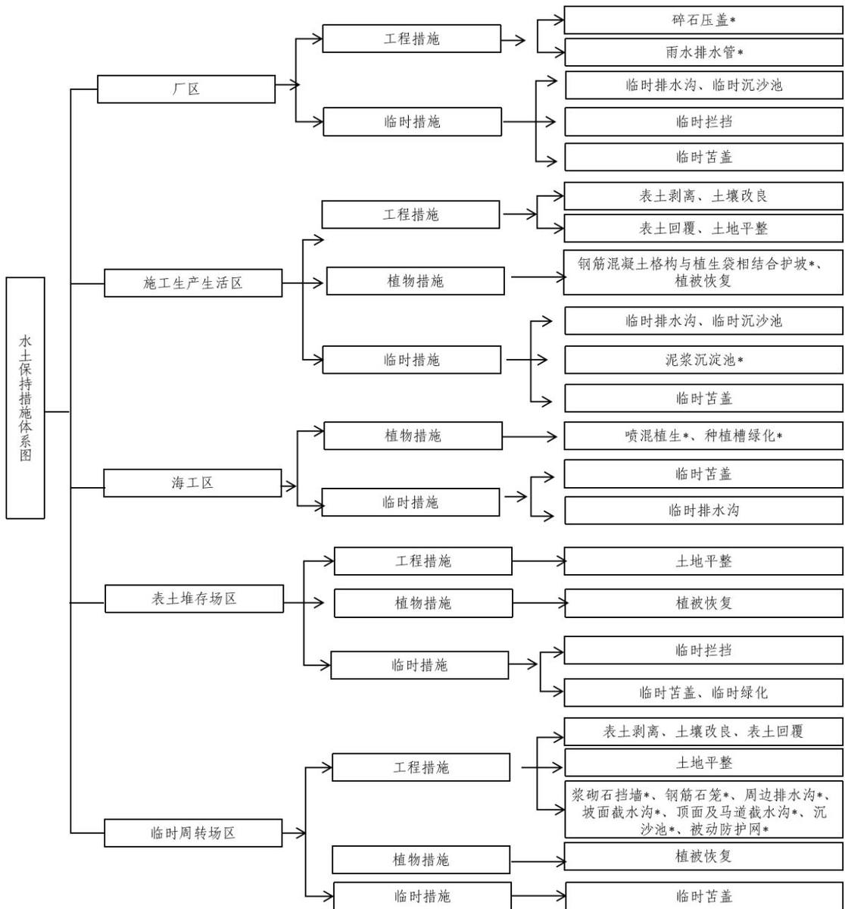  
图5.2-1 水土保持措施体系框图

## 5.3 分区措施布设

## 5.3.1 工程措施

（1） 根据可行性研究报告，核电主厂区雨排水标准为 1000 年一遇暴雨、降雨短历时 10min 设计。

（2）临时周转场参照弃渣场确定排水、拦挡标准。

1）临时周转场排水标准：本期工程设置的4处土石方临时周转场场址地形较平缓，不涉及周边汇水，不涉及排洪，仅需布置周边排水沟。其中1#石方周转场、2#石方周转场和 1#土方周转场临近主厂区，因此周边排水沟设计标准采用临近东排洪沟相同的设计

标准，即100 年一遇10min短历时设计暴雨。2#土方周转场排水出口为顺接天然沟道，结合《室外排水设计标准》（GB50014-2021）、《水土保持工程设计规范》（GB 51018-2014）等规范，本着“就高不就低”的原则，采用标准为10年一遇10min短历时设计暴雨。

2）临时周转场拦挡标准：参照《水土保持工程设计规范》（GB 51018–2014），4级和 5级弃渣场的挡渣墙工程级别为 5级，本工程所在碣石镇涉及陆丰市县级重点治理区，拦渣工程级别提高一级，4级及 5级周转场拦挡工程建筑物级别为4级。

## 5.3.2 植物措施

## （1） 植物措施等级

根据《水土保持工程设计规范》（GB 51018-2014）的规定，确定施工生产生活区、临时周转场、表土堆存场等植被恢复与建设工程级别为3 级。海工取水明渠高程14.80m以上采用喷混植生结合种植槽绿化。

## （2） 立地条件分析

项目区位于亚热带海洋性季风气候，夏季炎热漫长，冬季无严寒。多年平均气温为22.2℃，多年平均降水量2027.1mm，多年平均蒸发量1635.9mm。土类主要为赤红壤。工程区水、光、土壤等立地条件良好，植被恢复条件较好。

## （3） 适宜物种选择

根据当地自然条件和植被恢复目标，本着“因地制宜、适地适树、适地适草”的原则，综合考虑水土保持功能要求，确定植物措施的草种。草种选择主要以乡土草种或者在当地绿化中已推广使用的草种为首选。草种应具有较强的固土护坡功能，根系发达，草层紧密，耐践踏、耐寒、耐旱，对土壤气候条件有较强的适应性。在条件许可的情况下，可适当引进新的优良树草种，以满足生物多样性和美化环境的要求。陆丰核电厂临海，在树种选择上，应具备防风的效果。

根据以上适宜植物选择原则，本期工程选择的主要树、草种的生物学、生态学特性及主要用途见表5.3-1。

表 5.3-1  
本期工程拟选用植物介绍
<table><tr><td rowspan=1 colspan=1>类型</td><td rowspan=1 colspan=1>树（草）种</td><td rowspan=1 colspan=1>生长习性</td><td rowspan=1 colspan=1>适用部位及用途</td></tr><tr><td rowspan=2 colspan=1>乔木</td><td rowspan=1 colspan=1>木麻黄</td><td rowspan=1 colspan=1>常绿乔木，喜光不耐阴、耐旱亦耐水湿、耐贫瘠、耐沙埋，适应性强，不拘土质，生长速度快，萌芽力强</td><td rowspan=1 colspan=1>绿化</td></tr><tr><td rowspan=1 colspan=1>台湾相思</td><td rowspan=1 colspan=1>常绿乔木，在对土壤条件要求不高，极耐干旱和瘠薄，在土壤冲刷严重的酸性粗骨土、沙质土均能生长。</td><td rowspan=1 colspan=1>园林绿化</td></tr><tr><td rowspan=1 colspan=1>灌木</td><td rowspan=1 colspan=1>九里香</td><td rowspan=1 colspan=1>常绿灌木，对土壤要求不严，宜选用含腐殖质丰富、疏松、肥沃的沙质土壤</td><td rowspan=1 colspan=1>绿化、绿篱</td></tr><tr><td rowspan=1 colspan=1>草本</td><td rowspan=1 colspan=1>百喜草</td><td rowspan=1 colspan=1>多年生，根系发达，对土壤要求不严，在肥力较低、较干旱的沙质土壤上生长能力仍很强，耐践踏</td><td rowspan=1 colspan=1>斜坡和道路护坡、水土保持绿化植物</td></tr></table>

## 5.3.3 临时措施

厂区及施工生产生活区临时排水沟结合《室外排水设计标准》（GB50014-2021）、《水土保持工程设计规范》（GB 51018-2014），采用标准为10 年一遇10min短历时设计暴雨。

本期工程设有2处表土堆存场，分别与2处土方临时周转场相邻布置，其周边排水系统相互连通。表土堆存场的周边排水设计同邻近的土石方临时周转场。

## 5.3.4 分区防治措施设计

## 5.3.4.1 厂 区

## （1） 工程措施

## 1） 雨水排水管网（主体已列）

厂区采用独立的雨水排水管网系统进行有组织的雨水排水，考虑到厂区积水会引发内部水淹事件，厂区内设计暴雨强度采用千年一遇标准，并按PMP（可能最大暴雨）标准校核。厂区雨水经管网收集后通过 5、6号机组排洪沟和3、4号机组虹吸井入海。

厂区共设雨水管 10800m，采用 HDPE 缠绕结构壁管，管径 DN300～DN2000。

## 2） 碎石压盖（主体已列）

核电厂主厂房区由于有剂量防护、卫生防护、安全保卫等方面的特殊要求，主厂房四周空地严禁布置绿化措施，主体设计采用了碎石压盖，在夯实土基上铺设粒径 30～60mm 碎石，厚度 100mm，碎石压盖工程量为 4620m3。

## （2） 临时措施

## 1） 临时排水沟（方案新增）

3、4号机组厂区外边界已布设完善的排水系统，主要考虑负挖施工期间沿主要道路和基坑周边布设临时排水沟，以排除场地汇水，收集的雨水经沉沙后排放至厂区四周已有的雨水排水系统，估算本区临时排水沟总长度约为 3420m。根据前期工程实践经验，排水沟采用砖砌结构，M10 砂浆抹面，矩形断面，断面尺寸为 $1 . 2 0 \mathrm { m } \times 1 . 2 \mathrm { m } \sim 1 . 0 0 \mathrm { m } \times$ 1.00m。排水沟在运行中应及时清淤，暴雨后及时进行检修。

临时排水标准按照 10 年一遇 10min 短历时暴雨设计。根据《水土保持工程设计规范》（GB 51018-2014），项目区雨水设计流量按下列公式计算：

$$
\mathrm { Q { = } } 1 6 . 6 7 \varphi \mathrm { q F }
$$

式中：

Q——最大洪峰流量，m3/s；

φ——径流系数（取 0.55）；

q——设计重现期和降雨历时内的平均降雨强度（mm/min），取3.51mm/min；

F——最大集水面积， $\mathrm { k m } ^ { 2 } .$

表 5.3-2  
设计流量计算表
<table><tr><td rowspan=1 colspan=1>名称</td><td rowspan=1 colspan=1>φ</td><td rowspan=1 colspan=1> $q$ (mm/min)</td><td rowspan=1 colspan=1> $\mathrm { ~ F ~ } ( \mathrm { h m } ^ { 2 } )$ </td><td rowspan=1 colspan=1> $\textit { Q } \ : ( \mathrm { m } ^ { 3 } / \mathrm { s } \ : )$ </td></tr><tr><td rowspan=1 colspan=1>厂区边界</td><td rowspan=1 colspan=1>0.55</td><td rowspan=1 colspan=1>3.51</td><td rowspan=1 colspan=1>13.5</td><td rowspan=1 colspan=1>4.3</td></tr><tr><td rowspan=1 colspan=1>主要道路及基坑周边</td><td rowspan=1 colspan=1>0.55</td><td rowspan=1 colspan=1>3.51</td><td rowspan=1 colspan=1>7.0</td><td rowspan=1 colspan=1>2.3</td></tr></table>

排水沟采用矩形断面，断面尺寸按明渠均匀流公式试算求得。

$$
A = \frac { Q } { C \sqrt { R i } }
$$

$$
R = \frac { A } { \chi }
$$

$$
C = \frac { 1 } { n } R ^ { 1 / 6 }
$$

$$
A = b h
$$

$$
\chi = b + 2 h
$$

式中：

Q——渠道设计流量， $\mathrm { m } ^ { 3 } / \mathrm { s }$

A——渠道过水断面面积， $\mathrm { m } ^ { 2 } ;$

C——谢才系数；

R——水力半径，m；

i——水力比降；

n——渠床糙率；

χ——湿周，m；

b——渠底宽，m；

h——水深，m；

表 5.3-3  
临时排水沟尺寸计算表
<table><tr><td rowspan=2 colspan=1>名称</td><td rowspan=1 colspan=1>深</td><td rowspan=1 colspan=1>底宽</td><td rowspan=1 colspan=1>糙率</td><td rowspan=1 colspan=1>底坡</td><td rowspan=1 colspan=1>流量</td></tr><tr><td rowspan=1 colspan=1> $\mathrm { ~ h ~ } ( \mathrm { ~ m ~ } )$ </td><td rowspan=1 colspan=1>b（m)</td><td rowspan=1 colspan=1>n</td><td rowspan=1 colspan=1>i</td><td rowspan=1 colspan=1> $\mathrm { ~ Q ~ } ( \mathrm { m } ^ { 3 } / \mathrm { s } )$ </td></tr><tr><td rowspan=1 colspan=1>厂区边界</td><td rowspan=1 colspan=1>1.20</td><td rowspan=1 colspan=1>1.20</td><td rowspan=1 colspan=1>0.0125</td><td rowspan=1 colspan=1>0.005</td><td rowspan=1 colspan=1>4.42</td></tr><tr><td rowspan=1 colspan=1>主要道路及基坑周边</td><td rowspan=1 colspan=1>1.00</td><td rowspan=1 colspan=1>1.00</td><td rowspan=1 colspan=1>0.0125</td><td rowspan=1 colspan=1>0.005</td><td rowspan=1 colspan=1>2.72</td></tr></table>

## 2） 临时沉沙池（方案新增）

施工期间，在厂区临时排水沟出口处布设沉沙池，采用临时砖砌沉沙池。临时沉沙池和临时排水沟配合使用，共同防治施工期间的水土流失。厂区共设置4座沉沙池，拟定沉沙池断面4m×2m×1.5m（长×宽×深），用砖砌结构，壁厚240mm，底厚120mm，20mm水泥砂浆抹面防护。施工期间应定期对沉沙池进行清理，暴雨后及时进行检修，施工结束后对沉沙池进行拆除，并回填夯实。

## 3） 临时拦挡、临时苫盖（方案新增）

厂区建筑物基坑开挖的土方需要临时存放后回填。由于基坑开挖土方较多，依照就近原则及厂区布置，在堆土前，堆土外围设置临时袋装土挡墙，袋装土挡墙采用梯形断面，顶宽为 0.5m，底宽为 1m，高为 1m；临时堆土表面采用防水土工布覆盖，避免堆土颗粒随风迁移和大雨冲刷造成水土流失。估算本区共布设临时袋装土挡墙 700m，防水土工布面积约50000m2。施工中尽量缩短临时堆土时间，及时转运；土石料运走后，拆除临时袋装土挡墙，平整土地。

厂区水土保持措施工程量统计见表 5.3-4。

表 5.3-4  
厂区水土保持措施工程量
<table><tr><td rowspan=1 colspan=1>序号</td><td rowspan=1 colspan=1>措施类型</td><td rowspan=1 colspan=1>单位</td><td rowspan=1 colspan=1>工程量</td></tr><tr><td rowspan=1 colspan=1>一</td><td rowspan=1 colspan=1>工程措施</td><td rowspan=1 colspan=1></td><td rowspan=1 colspan=1></td></tr><tr><td rowspan=1 colspan=1>1</td><td rowspan=1 colspan=1>雨水排水管</td><td rowspan=1 colspan=1> $\mathbf { m }$ </td><td rowspan=1 colspan=1>10800</td></tr><tr><td rowspan=1 colspan=1>2</td><td rowspan=1 colspan=1>碎石压盖</td><td rowspan=1 colspan=1> $\mathrm { m } ^ { 3 }$ </td><td rowspan=1 colspan=1>4620</td></tr><tr><td rowspan=1 colspan=1>三</td><td rowspan=1 colspan=1>临时措施</td><td rowspan=1 colspan=1></td><td rowspan=1 colspan=1></td></tr><tr><td rowspan=1 colspan=1>1</td><td rowspan=1 colspan=1>临时排水沟</td><td rowspan=1 colspan=1> $\mathbf { m }$ </td><td rowspan=1 colspan=1>3420</td></tr><tr><td rowspan=1 colspan=1></td><td rowspan=1 colspan=1>砌砖</td><td rowspan=1 colspan=1> $\mathrm { m } ^ { 3 }$ </td><td rowspan=1 colspan=1>2462</td></tr><tr><td rowspan=1 colspan=1></td><td rowspan=1 colspan=1>土方开挖</td><td rowspan=1 colspan=1> $\mathrm { m } ^ { 3 }$ </td><td rowspan=1 colspan=1>6464</td></tr><tr><td rowspan=1 colspan=1></td><td rowspan=1 colspan=1>土方回填</td><td rowspan=1 colspan=1> $\mathrm { m } ^ { 3 }$ </td><td rowspan=1 colspan=1>2770</td></tr><tr><td rowspan=1 colspan=1></td><td rowspan=1 colspan=1>M10 水泥砂浆</td><td rowspan=1 colspan=1> $\mathrm { m } ^ { 2 }$ </td><td rowspan=1 colspan=1>287</td></tr><tr><td rowspan=1 colspan=1>2</td><td rowspan=1 colspan=1>临时沉沙池</td><td rowspan=1 colspan=1> $\dot { \mathcal { L } }$ </td><td rowspan=1 colspan=1>4</td></tr><tr><td rowspan=1 colspan=1></td><td rowspan=1 colspan=1>砌砖</td><td rowspan=1 colspan=1> $\mathbf { m } ^ { 3 }$ </td><td rowspan=1 colspan=1>32</td></tr><tr><td rowspan=1 colspan=1></td><td rowspan=1 colspan=1>土方开挖</td><td rowspan=1 colspan=1> $\mathrm { m } ^ { 3 }$ </td><td rowspan=1 colspan=1>102</td></tr><tr><td rowspan=1 colspan=1></td><td rowspan=1 colspan=1>土方回填</td><td rowspan=1 colspan=1> $\mathrm { m } ^ { 3 }$ </td><td rowspan=1 colspan=1>17</td></tr><tr><td rowspan=1 colspan=1></td><td rowspan=1 colspan=1>M10 水泥砂浆</td><td rowspan=1 colspan=1> $\mathrm { m } ^ { 2 }$ </td><td rowspan=1 colspan=1>128</td></tr><tr><td rowspan=1 colspan=1>3</td><td rowspan=1 colspan=1>袋装土挡墙</td><td rowspan=1 colspan=1>m</td><td rowspan=1 colspan=1>700</td></tr><tr><td rowspan=1 colspan=1></td><td rowspan=1 colspan=1>袋装土拦挡</td><td rowspan=1 colspan=1> $\mathrm { m } ^ { 3 }$ </td><td rowspan=1 colspan=1>551</td></tr><tr><td rowspan=1 colspan=1></td><td rowspan=1 colspan=1>袋装土拆除</td><td rowspan=1 colspan=1> $\mathrm { m } ^ { 3 }$ </td><td rowspan=1 colspan=1>551</td></tr><tr><td rowspan=1 colspan=1>4</td><td rowspan=1 colspan=1>临时苫盖</td><td rowspan=1 colspan=1></td><td rowspan=1 colspan=1></td></tr><tr><td rowspan=1 colspan=1></td><td rowspan=1 colspan=1>防水土工布</td><td rowspan=1 colspan=1> $\mathrm { m } ^ { 2 }$ </td><td rowspan=1 colspan=1>50000</td></tr></table>

## 5.3.4.2 施工生产生活区

## （1） 工程措施

## 1） 表土剥离（方案新增）

施工前对新增施工生产临建占地范围具备剥离条件的进行表土剥离，根据现场表土调查情况，平均剥离厚度15cm、表土剥离面积约为3.0hm2，剥离量约0.45万 $\mathrm { m } ^ { 3 }$ ，剥离后

运至 3、4 号机组表土堆存场内。

## 2） 土地平整（方案新增）

施工结束后，对施工生产生活区除建设永久建筑物外的其他占地进行土地平整，土地平整面积 25.98hm2。

## 3） 土壤改良（方案新增）

本区自厂区调入拟改良回填利用的土方数量为4.57万m3。

## 4） 表土回覆（方案新增）

土地平整后对施工生产生活区迹地进行表土回覆，表土回覆面积25.98hm2，林地恢复区域回覆表土厚度0.40m，草地恢复区域回覆表土厚度0.15m，覆土量5.02万m3。

## （2） 植物措施

## 1）生态护坡（主体已列）

施工生产生活区场地平整将形成边坡，边坡高度在2.0至9.0m 之间。该边坡主要为填方边坡，局部存在挖方边坡，设计坡比均为 1:2，主体工程设计采用 C25 采用钢筋混凝土格构与植生袋相结合进行护坡，面积 22000m2。

## 2）植被恢复（方案新增）

施工结束后为避免施工迹地裸露，在施工生产生活区完成土地平整和表土回覆之后，对施工迹地采取植被恢复措施，植被恢复面积25.98hm2。对占用的招拍挂用地采取撒播草籽的方式进行迹地恢复，其他临时占地植被恢复采用乔灌草结合的方式，乔木选择当地乡土树种台湾相思和防风树种木麻黄混合种植，苗高1.3～1.5m，带状混交，2行木麻黄 + 1 行台湾相思，乔木株行距 1.5m×1.5m，共需种植乔木 19956 株；灌木种选择当地乡土树种九里香等混合种植，冠幅60-80cm，株距1.5m×1.5m，共需种植灌木19956株；草种选择百喜草，撒播密度80kg/hm2。

表 5.3-5  
施工生产生活区迹地恢复方案统计表
<table><tr><td rowspan=1 colspan=1>序号</td><td rowspan=1 colspan=1>项目</td><td rowspan=1 colspan=1>占地面积(hm²)</td><td rowspan=1 colspan=1>占地面积(hm²)</td><td rowspan=1 colspan=1>恢复方案</td></tr><tr><td rowspan=1 colspan=1>1</td><td rowspan=1 colspan=1>3/4号危险品库</td><td rowspan=1 colspan=1>0.8</td><td rowspan=1 colspan=1>0.8</td><td rowspan=1 colspan=1>招拍挂用地，种草恢复迹地</td></tr><tr><td rowspan=1 colspan=1>2</td><td rowspan=1 colspan=1>危废暂存场</td><td rowspan=1 colspan=1>0.16</td><td rowspan=1 colspan=1>0.16</td><td rowspan=1 colspan=1>招拍挂用地，种草恢复迹地</td></tr><tr><td rowspan=1 colspan=1>3</td><td rowspan=1 colspan=1>3/4号Cl 土建</td><td rowspan=1 colspan=1>4</td><td rowspan=1 colspan=1>4</td><td rowspan=1 colspan=1>招拍挂用地，种草恢复迹地</td></tr><tr><td rowspan=1 colspan=1>4</td><td rowspan=1 colspan=1>3/4号C级堆场 1</td><td rowspan=1 colspan=1>0.9</td><td rowspan=1 colspan=1>0.9</td><td rowspan=1 colspan=1>招拍挂用地，种草恢复迹地</td></tr><tr><td rowspan=1 colspan=1>5</td><td rowspan=1 colspan=1>3/4号C级库 1</td><td rowspan=1 colspan=1>4.26</td><td rowspan=1 colspan=1>4.26</td><td rowspan=1 colspan=1>招拍挂用地，种草恢复迹地</td></tr><tr><td rowspan=1 colspan=1>6</td><td rowspan=1 colspan=1>3/4号重件库</td><td rowspan=1 colspan=1>1.5</td><td rowspan=1 colspan=1>1.5</td><td rowspan=1 colspan=1>招拍挂用地，种草恢复迹地</td></tr><tr><td rowspan=1 colspan=1>7</td><td rowspan=1 colspan=1>5/6机新增临建区停车场</td><td rowspan=1 colspan=1>0.61</td><td rowspan=1 colspan=1>0.61</td><td rowspan=1 colspan=1>招拍挂用地，种草恢复迹地</td></tr><tr><td rowspan=1 colspan=1>8</td><td rowspan=1 colspan=1>临时放射源库</td><td rowspan=1 colspan=1>0.03</td><td rowspan=1 colspan=1>0.03</td><td rowspan=1 colspan=1>招拍挂用地，种草恢复迹地</td></tr></table>

续表 5.3-5

施工生产生活区迹地恢复方向统计表
<table><tr><td rowspan=1 colspan=1>序号</td><td rowspan=1 colspan=1>项目</td><td rowspan=1 colspan=1>占地面积(hm²)</td><td rowspan=1 colspan=1>占地面积(hm²)</td><td rowspan=1 colspan=1>恢复方向</td></tr><tr><td rowspan=1 colspan=1>9</td><td rowspan=1 colspan=1>安全技能培训中心</td><td rowspan=1 colspan=1>0.3</td><td rowspan=1 colspan=1>0.3</td><td rowspan=1 colspan=1>招拍挂用地，种草恢复迹地</td></tr><tr><td rowspan=1 colspan=1>10</td><td rowspan=1 colspan=1>3/4号 Cl 安装</td><td rowspan=1 colspan=1>3.2</td><td rowspan=1 colspan=1>3.2</td><td rowspan=1 colspan=1>招拍挂用地，种草恢复迹地</td></tr><tr><td rowspan=2 colspan=1>11</td><td rowspan=2 colspan=1>3/4号NI安装</td><td rowspan=1 colspan=1>6.3</td><td rowspan=1 colspan=1>4.04</td><td rowspan=1 colspan=1>招拍挂用地，种草恢复迹地</td></tr><tr><td rowspan=1 colspan=1></td><td rowspan=1 colspan=1>2.26</td><td rowspan=1 colspan=1>1、2号机组征地，交还1、2号机组建设永久子项</td></tr><tr><td rowspan=1 colspan=1>12</td><td rowspan=1 colspan=1>3/4号C级库2</td><td rowspan=1 colspan=1>0.4</td><td rowspan=1 colspan=1>0.4</td><td rowspan=1 colspan=1>招拍挂用地，种草恢复迹地</td></tr><tr><td rowspan=1 colspan=1>13</td><td rowspan=1 colspan=1>3/4号C 级库西侧停车场</td><td rowspan=1 colspan=1>0.1</td><td rowspan=1 colspan=1>0.1</td><td rowspan=1 colspan=1>招拍挂用地，种草恢复迹地</td></tr><tr><td rowspan=1 colspan=1>14</td><td rowspan=1 colspan=1>3/4号泥水处理场</td><td rowspan=1 colspan=1>0.92</td><td rowspan=1 colspan=1>0.92</td><td rowspan=2 colspan=1>5、6号机组征地，交还5、6号机组建设永久子项</td></tr><tr><td rowspan=1 colspan=1>15</td><td rowspan=1 colspan=1>3/4号C 级堆场 4</td><td rowspan=1 colspan=1>0.48</td><td rowspan=1 colspan=1>0.48</td></tr><tr><td rowspan=1 colspan=1>16</td><td rowspan=1 colspan=1>混凝土生产链</td><td rowspan=2 colspan=1>7.38</td><td rowspan=2 colspan=1>7.38</td><td rowspan=2 colspan=1>1、2号机组征地，交还1、2号机组建设永久子项</td></tr><tr><td rowspan=1 colspan=1>17</td><td rowspan=1 colspan=1>施工供水加压站</td></tr><tr><td rowspan=1 colspan=1>18</td><td rowspan=1 colspan=1>消防营地</td><td rowspan=1 colspan=1>0.19</td><td rowspan=1 colspan=1>0.19</td><td rowspan=1 colspan=1>1、2号机组临时占地，乔灌草植被恢复</td></tr><tr><td rowspan=2 colspan=1>19</td><td rowspan=2 colspan=1>3/4 号 A/B 物资库房</td><td rowspan=1 colspan=1>2.1</td><td rowspan=1 colspan=1>1.74</td><td rowspan=1 colspan=1>5、6号机组征地，交还5、6号机组建设永久子项</td></tr><tr><td rowspan=1 colspan=1></td><td rowspan=1 colspan=1>0.36</td><td rowspan=1 colspan=1>招拍挂用地，种草恢复迹地</td></tr><tr><td rowspan=1 colspan=1>20</td><td rowspan=1 colspan=1>3/4号C级堆场2</td><td rowspan=1 colspan=1>0.83</td><td rowspan=1 colspan=1>0.83</td><td rowspan=1 colspan=1>招拍挂用地，种草恢复迹地</td></tr><tr><td rowspan=1 colspan=1>21</td><td rowspan=1 colspan=1>临时办公楼</td><td rowspan=1 colspan=1>0.8</td><td rowspan=1 colspan=1>0.8</td><td rowspan=1 colspan=1>交还1、2号机组建设永久子项</td></tr><tr><td rowspan=2 colspan=1>22</td><td rowspan=2 colspan=1>3/4号N1生产临建</td><td rowspan=1 colspan=1>4.3</td><td rowspan=1 colspan=1>1.3</td><td rowspan=1 colspan=1>1、2号机组临时占地，乔灌草植被恢复</td></tr><tr><td rowspan=1 colspan=1></td><td rowspan=1 colspan=1>3</td><td rowspan=1 colspan=1>3、4号机组临时占地，乔灌草植被恢复</td></tr><tr><td rowspan=1 colspan=1>合计</td><td rowspan=1 colspan=1></td><td rowspan=1 colspan=1>39.56</td><td rowspan=1 colspan=1>39.56</td><td rowspan=1 colspan=1></td></tr><tr><td rowspan=1 colspan=1></td><td rowspan=1 colspan=1>乔灌草植被恢复</td><td rowspan=1 colspan=1></td><td rowspan=1 colspan=1>4.49</td><td rowspan=1 colspan=1></td></tr><tr><td rowspan=1 colspan=1></td><td rowspan=1 colspan=1>种草恢复迹地</td><td rowspan=1 colspan=1></td><td rowspan=1 colspan=1>21.49</td><td rowspan=1 colspan=1></td></tr><tr><td rowspan=1 colspan=1></td><td rowspan=1 colspan=1>交还前期工程建永久子项</td><td rowspan=1 colspan=1></td><td rowspan=1 colspan=1>13.58</td><td rowspan=1 colspan=1></td></tr></table>

## （3） 临时措施

3、4 号机组施工生产生活区利用 5、6号机组和1、2 号机组项目现有的场地，场地基本均已完成了排水、沉沙、护坡、场地硬化等水土保持措施。主要新增临建区水土保持临时措施。

## 1） 临时排水沟（方案新增）

在施工生产生活区沿场外边界布设临时排水沟，以排除场地汇水，收集的雨水经沉沙后排放至周边排水系统。考虑到施工生产生活区紧邻现有施工生产临时设施，为保持设计上的连续性，本方案参照周边现有场地排水沟的结构形式，对施工生产生活区周边的排水沟采用砖砌结构进行设计，矩形断面，断面尺寸为 0.8m×0.8m（宽×深）。排水沟在运行中应及时清淤，暴雨后及时进行检修。施工期间共设置临时排水沟400m。

临时排水标准按照 10 年一遇 10min 短历时暴雨设计。根据《水土保持工程设计规范》（GB 51018-2014），项目区雨水设计流量按下列公式计算：

$$
\mathrm { Q { = } } 1 6 . 6 7 \varphi \mathrm { q F }
$$

式中：

Q——最大洪峰流量， $\mathbf { m } ^ { 3 } / \mathbf { s } ;$

φ——径流系数（取 0.55）；

q——设计重现期和降雨历时内的平均降雨强度（mm/min），取3.51mm/min；

F——最大集水面积，km2。

表 5.3-6  
设计流量计算表
<table><tr><td rowspan=1 colspan=1>名称</td><td rowspan=1 colspan=1>φ</td><td rowspan=1 colspan=1> $q \ \mathrm { ( \ m m / m i n \ ) }$ </td><td rowspan=1 colspan=1> $\mathrm { ~ F ~ } ( \mathrm { h m } ^ { 2 } )$ </td><td rowspan=1 colspan=1> $\textit { Q } \ : ( \mathrm { m } ^ { 3 } / \mathrm { s } \ : )$ </td></tr><tr><td rowspan=1 colspan=1>3、4号NI生产临建新增部分</td><td rowspan=1 colspan=1>0.55</td><td rowspan=1 colspan=1>3.51</td><td rowspan=1 colspan=1>3.0</td><td rowspan=1 colspan=1>1.0</td></tr></table>

排水沟采用矩形断面，断面尺寸按明渠均匀流公式试算求得。

$$
A = { \frac { Q } { C { \sqrt { R i } } } }
$$

$$
R = \frac { A } { \chi }
$$

$$
C = \frac { 1 } { n } R ^ { 1 / 6 }
$$

$$
A = b h
$$

$$
\chi = b + 2 h
$$

式中：

Q——渠道设计流量，m3/s；

A——渠道过水断面面积， $\mathrm { m } ^ { 2 } ;$

C——谢才系数；

R——水力半径，m；

i——水力比降；

n——渠床糙率；

χ——湿周，m；

b——渠底宽，m；

h——水深，m；

表 5.3-7  
临时排水沟尺寸计算表
<table><tr><td rowspan=2 colspan=1>名称</td><td rowspan=1 colspan=1>深</td><td rowspan=1 colspan=1>底宽</td><td rowspan=1 colspan=1>糙率</td><td rowspan=1 colspan=1>底坡</td><td rowspan=1 colspan=1>流量</td></tr><tr><td rowspan=1 colspan=1>h(m)</td><td rowspan=1 colspan=1>b(m)</td><td rowspan=1 colspan=1>n</td><td rowspan=1 colspan=1>i</td><td rowspan=1 colspan=1>Q(m³/s)</td></tr><tr><td rowspan=1 colspan=1>3、4号NI生产临建新增部分</td><td rowspan=1 colspan=1>0.8</td><td rowspan=1 colspan=1>0.8</td><td rowspan=1 colspan=1>0.0125</td><td rowspan=1 colspan=1>0.005</td><td rowspan=1 colspan=1>1.50</td></tr></table>

## 2） 临时沉沙池（方案新增）

施工期间，在临时排水沟出口处布设沉沙池，以配合临时排水沟共同防治施工期间的水土流失。施工生产生活区共设置 2 座沉沙池，采用砖砌结构，壁厚 240mm，底厚120mm，20mm水泥砂浆抹面防护，尺寸 4m×2m×1.5m（长×宽×深）。施工期间应定期对沉沙池进行清理，暴雨后及时进行检修，施工结束后对沉沙池进行拆除，并回填夯实。

## 3） 临时苫盖（方案新增）

临建设施施工期间，对临时堆土和施工裸露面采用防水土工布进行临时苫盖，面积约6000m2。

## 4） 泥浆沉淀池（主体已列）

排水隧洞盾构临时施工场地布置在厂区范围内，盾构施工过程中会产生少量的泥浆，在盾构施工场地周边设置泥浆沉淀池，对泥浆进行回收利用及固化，避免工程施工过程中泥浆漫流，造成对周边环境的不利影响。本区共设置泥浆沉淀池2 座。

施工生产生活区水土保持措施工程量统计见表5.3-8。

表 5.3-8  
施工生产生活区水土保持措施工程量
<table><tr><td rowspan=1 colspan=1>序号</td><td rowspan=1 colspan=1>措施类型</td><td rowspan=1 colspan=1>单位</td><td rowspan=1 colspan=1>工程量</td></tr><tr><td rowspan=1 colspan=1>一</td><td rowspan=1 colspan=1>工程措施</td><td rowspan=1 colspan=1></td><td rowspan=1 colspan=1></td></tr><tr><td rowspan=1 colspan=1>1</td><td rowspan=1 colspan=1>表土剥离</td><td rowspan=1 colspan=1> $\mathcal { F } \mathrm { ~ m } ^ { 3 }$ </td><td rowspan=1 colspan=1>0.45</td></tr><tr><td rowspan=1 colspan=1>2</td><td rowspan=1 colspan=1>表土回覆</td><td rowspan=1 colspan=1> $\mathcal { F } \mathrm { ~ m } ^ { 3 }$ </td><td rowspan=1 colspan=1>5.02</td></tr><tr><td rowspan=1 colspan=1>3</td><td rowspan=1 colspan=1>土壤改良</td><td rowspan=1 colspan=1> $\mathcal { F } \mathrm { ~ m } ^ { 3 }$ </td><td rowspan=1 colspan=1>4.57</td></tr><tr><td rowspan=1 colspan=1>4</td><td rowspan=1 colspan=1>土地平整</td><td rowspan=1 colspan=1> $\mathrm { h m } ^ { 2 }$ </td><td rowspan=1 colspan=1>25.98</td></tr><tr><td rowspan=1 colspan=1>二</td><td rowspan=1 colspan=1>植物措施</td><td rowspan=1 colspan=1></td><td rowspan=1 colspan=1></td></tr><tr><td rowspan=1 colspan=1>1</td><td rowspan=1 colspan=1>栽植乔木</td><td rowspan=1 colspan=1></td><td rowspan=1 colspan=1></td></tr><tr><td rowspan=1 colspan=1></td><td rowspan=1 colspan=1>木麻黄</td><td rowspan=1 colspan=1>株</td><td rowspan=1 colspan=1>13304</td></tr><tr><td rowspan=1 colspan=1></td><td rowspan=1 colspan=1>台湾相思</td><td rowspan=1 colspan=1>株</td><td rowspan=1 colspan=1>6652</td></tr><tr><td rowspan=1 colspan=1>2</td><td rowspan=1 colspan=1>栽植灌木</td><td rowspan=1 colspan=1></td><td rowspan=1 colspan=1></td></tr><tr><td rowspan=1 colspan=1></td><td rowspan=1 colspan=1>九里香</td><td rowspan=1 colspan=1>株</td><td rowspan=1 colspan=1>19956</td></tr><tr><td rowspan=1 colspan=1>3</td><td rowspan=1 colspan=1>撒播草籽</td><td rowspan=1 colspan=1> $\mathrm { h m } ^ { 2 }$ </td><td rowspan=1 colspan=1>25.98</td></tr><tr><td rowspan=1 colspan=1></td><td rowspan=1 colspan=1>百喜草</td><td rowspan=1 colspan=1> $\mathbf { k g }$ </td><td rowspan=1 colspan=1>2182</td></tr><tr><td rowspan=1 colspan=1>4</td><td rowspan=1 colspan=1>钢筋混凝土格构+植生袋护坡</td><td rowspan=1 colspan=1> $\mathrm { m } ^ { 2 }$ </td><td rowspan=1 colspan=1>22000</td></tr></table>

续表 5.3-8  
施工生产生活区水土保持措施工程量
<table><tr><td rowspan=1 colspan=1>序号</td><td rowspan=1 colspan=1>措施类型</td><td rowspan=1 colspan=1>单位</td><td rowspan=1 colspan=1>工程量</td></tr><tr><td rowspan=1 colspan=1> $\underline { { \underline { { \mathbf { \Pi } } } } }$ </td><td rowspan=1 colspan=1>临时措施</td><td rowspan=1 colspan=1></td><td rowspan=1 colspan=1></td></tr><tr><td rowspan=1 colspan=1>1</td><td rowspan=1 colspan=1>临时排水沟</td><td rowspan=1 colspan=1> $\mathbf { m }$ </td><td rowspan=1 colspan=1>400</td></tr><tr><td rowspan=1 colspan=1></td><td rowspan=1 colspan=1>砌砖</td><td rowspan=1 colspan=1> $\mathrm { m } ^ { 3 }$ </td><td rowspan=1 colspan=1>230</td></tr><tr><td rowspan=1 colspan=1></td><td rowspan=1 colspan=1>土方开挖</td><td rowspan=1 colspan=1> $\mathrm { m } ^ { 3 }$ </td><td rowspan=1 colspan=1>605</td></tr><tr><td rowspan=1 colspan=1></td><td rowspan=1 colspan=1>土方回填</td><td rowspan=1 colspan=1> $\mathrm { m } ^ { 3 }$ </td><td rowspan=1 colspan=1>259</td></tr><tr><td rowspan=1 colspan=1></td><td rowspan=1 colspan=1>M10 水泥砂浆</td><td rowspan=1 colspan=1> $\mathrm { m } ^ { 2 }$ </td><td rowspan=1 colspan=1>27</td></tr><tr><td rowspan=1 colspan=1>2</td><td rowspan=1 colspan=1>临时沉沙池</td><td rowspan=1 colspan=1> $\dot { \mathcal { L } }$ </td><td rowspan=1 colspan=1>2</td></tr><tr><td rowspan=1 colspan=1></td><td rowspan=1 colspan=1>砌砖</td><td rowspan=1 colspan=1> $\mathrm { m } ^ { 3 }$ </td><td rowspan=1 colspan=1>16</td></tr><tr><td rowspan=1 colspan=1></td><td rowspan=1 colspan=1>土方开挖</td><td rowspan=1 colspan=1> $\mathrm { m } ^ { 3 }$ </td><td rowspan=1 colspan=1>36</td></tr><tr><td rowspan=1 colspan=1></td><td rowspan=1 colspan=1>土方回填</td><td rowspan=1 colspan=1> $\mathrm { m } ^ { 3 }$ </td><td rowspan=1 colspan=1>38</td></tr><tr><td rowspan=1 colspan=1></td><td rowspan=1 colspan=1>M10 水泥砂浆</td><td rowspan=1 colspan=1> $\mathrm { m } ^ { 2 }$ </td><td rowspan=1 colspan=1>40</td></tr><tr><td rowspan=1 colspan=1>3</td><td rowspan=1 colspan=1>泥浆沉淀池</td><td rowspan=1 colspan=1> $\dot { \mathcal { L } }$ </td><td rowspan=1 colspan=1>2</td></tr><tr><td rowspan=1 colspan=1></td><td rowspan=1 colspan=1>土方开挖</td><td rowspan=1 colspan=1> $\mathrm { m } ^ { 3 }$ </td><td rowspan=1 colspan=1>26</td></tr><tr><td rowspan=1 colspan=1>4</td><td rowspan=1 colspan=1>临时苫盖</td><td rowspan=1 colspan=1></td><td rowspan=1 colspan=1></td></tr><tr><td rowspan=1 colspan=1></td><td rowspan=1 colspan=1>防水土工布</td><td rowspan=1 colspan=1> $\mathrm { m } ^ { 2 }$ </td><td rowspan=1 colspan=1>6000</td></tr></table>

## 5.3.4.3 海工区

## （1）植物措施（主体已列）

取水明渠通过开挖山体形成，开挖面自 30.0m高程起始，向下开挖。其中，14.8m至30.0m高程的边坡段采用喷混植生进行防护，并在 14.8m 和24.8m 马道上设置绿化种植槽，槽内填土，并种植灌木与攀援植物，灌木选择三角梅等，攀援植物选择炮仗花等。喷混植生面积3300m2，种植槽绿化长度430m。

（2）临时措施

## 1） 临时苫盖（方案新增）

施工期间，对本区明渠的开挖边坡进行临时苫盖，采用防水土工布进行临时苫盖，面积约 6000m2。

## 2） 临时排水沟（方案新增）

在海工明渠的开挖两处边坡坡脚布设临时排水沟，以排除边坡汇水，收集的雨水排放至排水明渠内。排水沟采用砖砌结构，M10 砂浆抹面，矩形断面，断面尺寸为0.30m×0.30m。排水沟在运行中应及时清淤，暴雨后及时进行检修。施工期间共设置临时排水沟700m。

海工区水土保持措施工程量详见表 5.3-9。

表 5.3-9  
海工区水土保持措施工程量
<table><tr><td rowspan=1 colspan=1>序号</td><td rowspan=1 colspan=1>措施类型</td><td rowspan=1 colspan=1>单位</td><td rowspan=1 colspan=1>工程量</td></tr><tr><td rowspan=1 colspan=1>一</td><td rowspan=1 colspan=1>植物措施</td><td rowspan=1 colspan=1></td><td rowspan=1 colspan=1></td></tr><tr><td rowspan=1 colspan=1>1</td><td rowspan=1 colspan=1>喷混植生</td><td rowspan=1 colspan=1> $\mathrm { m } ^ { 2 }$ </td><td rowspan=1 colspan=1>3300</td></tr><tr><td rowspan=1 colspan=1>2</td><td rowspan=1 colspan=1>种植槽绿化</td><td rowspan=1 colspan=1>m</td><td rowspan=1 colspan=1>430</td></tr><tr><td rowspan=1 colspan=1>二</td><td rowspan=1 colspan=1>临时措施</td><td rowspan=1 colspan=1></td><td rowspan=1 colspan=1></td></tr><tr><td rowspan=1 colspan=1>1</td><td rowspan=1 colspan=1>临时苫盖</td><td rowspan=1 colspan=1></td><td rowspan=1 colspan=1></td></tr><tr><td rowspan=1 colspan=1>1.1</td><td rowspan=1 colspan=1>防水土工布</td><td rowspan=1 colspan=1> $\mathrm { m } ^ { 2 }$ </td><td rowspan=1 colspan=1>6000</td></tr><tr><td rowspan=1 colspan=1>2</td><td rowspan=1 colspan=1>临时排水沟</td><td rowspan=1 colspan=1>m</td><td rowspan=1 colspan=1>700</td></tr><tr><td rowspan=1 colspan=1></td><td rowspan=1 colspan=1>砌砖</td><td rowspan=1 colspan=1> $\mathrm { m } ^ { 3 }$ </td><td rowspan=1 colspan=1>504</td></tr><tr><td rowspan=1 colspan=1></td><td rowspan=1 colspan=1>土方开挖</td><td rowspan=1 colspan=1> $\mathrm { m } ^ { 3 }$ </td><td rowspan=1 colspan=1>1323</td></tr><tr><td rowspan=1 colspan=1></td><td rowspan=1 colspan=1>土方回填</td><td rowspan=1 colspan=1> $\mathrm { m } ^ { 3 }$ </td><td rowspan=1 colspan=1>567</td></tr><tr><td rowspan=1 colspan=1></td><td rowspan=1 colspan=1>M10 水泥砂浆</td><td rowspan=1 colspan=1> $\mathrm { m } ^ { 2 }$ </td><td rowspan=1 colspan=1>59</td></tr></table>

## 5.3.4.4 表土堆存场区

## （1） 工程措施

## 1） 土地平整（方案新增）

施工结束后，对表土堆存场占地范围进行土地平整，改善绿化迹地的土壤性状，以满足后期植被生长的环境需求，土地平整面积 5.00hm2。

## （2） 植物措施（方案新增）

施工结束后为避免施工迹地裸露，在表土堆存场完成土地平整后，对施工迹地采取植被恢复措施，植被恢复面积 5.00hm2。植被恢复采用乔灌草结合的方式，乔木选择当地乡土树种台湾相思和防风树种木麻黄混合种植，苗高1.3～1.5m，带状混交，2行木麻黄 + 1 行台湾相思，乔木株行距 1.5m×1.5m；灌木种选择当地乡土树种九里香等混合种植，冠幅 60-80cm，株距 1.5m×1.5m；草种选择百喜草，撒播密度 80kg/hm2。

## （3） 临时措施

## 1） 临时排水（方案新增）

2处表土堆存场均紧邻土方周转场布置，为保持设计上的连续性，本方案设计表土堆存场周边排水沟与临近土方临时周转场一致，1#表土堆存场周边排水沟断面尺寸为0.6m×0.6m（宽×高），2#表土堆存场周边排水沟断面尺寸为0.4m×0.4m（宽×高），均采用C20混凝土现浇，衬砌厚度30cm，排水沟每10m 设伸缩缝，缝间采用闭孔塑料板填缝。共设置临时排水沟879m。

## 2） 临时沉沙（方案新增）

根据地形，结合排水出口设计，在 1#表土堆存场周边排水沟末端出口设置沉沙池，

采用 C25混凝土结构。共设置1座，尺寸4m×3m×1.5m（长×宽×深），壁厚0.5m。

## 3） 临时拦挡（方案新增）

表土堆存前，在表土堆存场周边坡脚处设置袋装土挡墙临时拦挡，避免堆存过程中表土向下滑落；袋装土挡墙采用梯形断面，顶宽为 0.5m，底宽为 1m，高为 1m。估算本区共布设临时袋装土挡墙869m。

## 4） 临时苫盖（方案新增）

施工期间，对临时堆存的表土采用密目网进行临时苫盖，面积约50000m2。

## 5） 临时绿化（方案新增）

本期工程施工周期较长，表土预计堆放时间在6年以上，因此针对该区域表土进行临时绿化。草种选择狗牙根和百喜草，撒播密度 80kg/hm2，撒播面积5.00hm2。

表土堆存场水土保持措施工程量详见表 5.3-10。

表 5.3-10  
表土堆存场区水土保持措施工程量
<table><tr><td rowspan=1 colspan=1>序号</td><td rowspan=1 colspan=1>措施类型</td><td rowspan=1 colspan=1>单位</td><td rowspan=1 colspan=1>工程量</td></tr><tr><td rowspan=1 colspan=1>一</td><td rowspan=1 colspan=1>工程措施</td><td rowspan=1 colspan=1></td><td rowspan=1 colspan=1></td></tr><tr><td rowspan=1 colspan=1>1</td><td rowspan=1 colspan=1>土地平整</td><td rowspan=1 colspan=1> $\mathrm { h m } ^ { 2 }$ </td><td rowspan=1 colspan=1>5.00</td></tr><tr><td rowspan=1 colspan=1>二</td><td rowspan=1 colspan=1>植物措施</td><td rowspan=1 colspan=1></td><td rowspan=1 colspan=1></td></tr><tr><td rowspan=1 colspan=1>1</td><td rowspan=1 colspan=1>栽植乔木</td><td rowspan=1 colspan=1></td><td rowspan=1 colspan=1></td></tr><tr><td rowspan=1 colspan=1></td><td rowspan=1 colspan=1>木麻黄</td><td rowspan=1 colspan=1>株</td><td rowspan=1 colspan=1>14815</td></tr><tr><td rowspan=1 colspan=1></td><td rowspan=1 colspan=1>台湾相思</td><td rowspan=1 colspan=1>株</td><td rowspan=1 colspan=1>7407</td></tr><tr><td rowspan=1 colspan=1>2</td><td rowspan=1 colspan=1>栽植灌木</td><td rowspan=1 colspan=1></td><td rowspan=1 colspan=1></td></tr><tr><td rowspan=1 colspan=1></td><td rowspan=1 colspan=1>九里香</td><td rowspan=1 colspan=1>株</td><td rowspan=1 colspan=1>22222</td></tr><tr><td rowspan=1 colspan=1>3</td><td rowspan=1 colspan=1>撒播草籽</td><td rowspan=1 colspan=1> $\mathrm { h m } ^ { 2 }$ </td><td rowspan=1 colspan=1>5.00</td></tr><tr><td rowspan=1 colspan=1></td><td rowspan=1 colspan=1>百喜草</td><td rowspan=1 colspan=1> $\mathrm { k g }$ </td><td rowspan=1 colspan=1>420</td></tr><tr><td rowspan=1 colspan=1>三</td><td rowspan=1 colspan=1>临时措施</td><td rowspan=1 colspan=1></td><td rowspan=1 colspan=1></td></tr><tr><td rowspan=1 colspan=1>1</td><td rowspan=1 colspan=1>临时混凝土排水沟</td><td rowspan=1 colspan=1> $\mathbf { m }$ </td><td rowspan=1 colspan=1>879</td></tr><tr><td rowspan=1 colspan=1></td><td rowspan=1 colspan=1>土方开挖</td><td rowspan=1 colspan=1> $\mathbf { m } ^ { 3 }$ </td><td rowspan=1 colspan=1>3424</td></tr><tr><td rowspan=1 colspan=1></td><td rowspan=1 colspan=1>土方回填</td><td rowspan=1 colspan=1> $\mathrm { m } ^ { 3 }$ </td><td rowspan=1 colspan=1>1233</td></tr><tr><td rowspan=1 colspan=1></td><td rowspan=1 colspan=1>C20 混凝土</td><td rowspan=1 colspan=1> $\mathrm { m } ^ { 3 }$ </td><td rowspan=1 colspan=1>685</td></tr><tr><td rowspan=1 colspan=1></td><td rowspan=1 colspan=1>碎石垫层</td><td rowspan=1 colspan=1> $\mathrm { m } ^ { 2 }$ </td><td rowspan=1 colspan=1>117</td></tr><tr><td rowspan=1 colspan=1></td><td rowspan=1 colspan=1>闭孔塑料板</td><td rowspan=1 colspan=1> $\mathrm { m } ^ { 2 }$ </td><td rowspan=1 colspan=1>68</td></tr><tr><td rowspan=1 colspan=1>2</td><td rowspan=1 colspan=1>临时混凝土沉沙池</td><td rowspan=1 colspan=1> $\dot { \mathcal { L } }$ </td><td rowspan=1 colspan=1>1</td></tr><tr><td rowspan=1 colspan=1></td><td rowspan=1 colspan=1>土方开挖</td><td rowspan=1 colspan=1> $\mathbf { m } ^ { 3 }$ </td><td rowspan=1 colspan=1>156</td></tr><tr><td rowspan=1 colspan=1></td><td rowspan=1 colspan=1>土方回填</td><td rowspan=1 colspan=1> $\mathrm { m } ^ { 3 }$ </td><td rowspan=1 colspan=1>115</td></tr><tr><td rowspan=1 colspan=1></td><td rowspan=1 colspan=1>C25 砼</td><td rowspan=1 colspan=1> $\mathbf { m } ^ { 3 }$ </td><td rowspan=1 colspan=1>17</td></tr><tr><td rowspan=1 colspan=1></td><td rowspan=1 colspan=1>碎石垫层</td><td rowspan=1 colspan=1> $\mathrm { m } ^ { 3 }$ </td><td rowspan=1 colspan=1>2</td></tr><tr><td rowspan=1 colspan=1>3</td><td rowspan=1 colspan=1>袋装土挡墙</td><td rowspan=1 colspan=1> $\mathbf { m }$ </td><td rowspan=1 colspan=1>869</td></tr><tr><td rowspan=1 colspan=1></td><td rowspan=1 colspan=1>袋装土拦挡</td><td rowspan=1 colspan=1> $\mathbf { m } ^ { 3 }$ </td><td rowspan=1 colspan=1>345</td></tr><tr><td rowspan=1 colspan=1></td><td rowspan=1 colspan=1>袋装土拆除</td><td rowspan=1 colspan=1> $\mathrm { m } ^ { 3 }$ </td><td rowspan=1 colspan=1>345</td></tr><tr><td rowspan=1 colspan=1>4</td><td rowspan=1 colspan=1>临时苫盖</td><td rowspan=1 colspan=1></td><td rowspan=1 colspan=1></td></tr><tr><td rowspan=1 colspan=1></td><td rowspan=1 colspan=1>密目网</td><td rowspan=1 colspan=1> $\mathrm { m } ^ { 2 }$ </td><td rowspan=1 colspan=1>50000</td></tr><tr><td rowspan=1 colspan=1>5</td><td rowspan=1 colspan=1>临时绿化</td><td rowspan=1 colspan=1> $\mathrm { h m } ^ { 2 }$ </td><td rowspan=1 colspan=1>5.00</td></tr></table>

## 5.3.4.5 临时周转场区

## （1） 工程措施

## 1） 表土剥离（方案新增）

施工前对新增土石方堆存场占地范围具备剥离条件的进行表土剥离，剥离量约4.51万m3，剥离后运至3、4号机组表土堆存场内。

## 3） 土壤改良（方案新增）

本区自厂区调入拟改良回填利用的土方数量为8.23万m3。

## 3） 土地平整（方案新增）

施工结束后，对临时周转场除建设永久建筑物以外的其他占地进行土地平整，改善绿化迹地的土壤性状，以满足后期植被生长的环境需求，土地平整面积34.20 hm2。

## 4） 表土回覆（方案新增）

施工结束后，对占用的临时周转场地施工迹地进行覆土，林地恢复区域回覆表土厚度0.40m，草地恢复区域回覆表土厚度0.15m，回覆量12.74万m3。

## 5）拦挡工程（主体已列）

在土石方堆存前，应在堆存坡脚设置拦挡工程，避免堆存过程中土石方向下滑落。

1#石方周转场北侧设置浆砌石挡墙，挡墙顶宽 1.0m，最大墙高 3.0m（其中基础最大埋深1m），临渣侧边坡1∶0.4，临空侧坡比 1∶0.1，底部铺设 10cm 厚碎石垫层。为排除堆存体内积水，墙体内设置排Φ80PVC排水管，水平间距 2m，进口外包土工布。其余各侧坡脚设置3m高钢筋石笼拦挡，钢筋石笼采用品字形堆砌，顶宽1.0m，高3.0m（埋置深度0.5m），开挖回填坡比1∶1。

2#石方周转场、1#土方周转场～2各侧坡脚设置钢筋石笼拦挡，拦挡高3m，采用品字形堆砌，顶宽1.0m，埋置深度0.5m，开挖回填坡比1∶1。

## 6）周边排水沟（主体已列）

在临时周转场地周边布置周边排水沟，1#石方周转场周边排水沟断面尺寸为 1.0m×1.0m（宽×高），2#石方周转场周边排水沟断面尺寸为 0.5m×0.5m（宽×高），1#土方周转场周边排水沟断面尺寸为 0.7m×0.7m（宽×高），2#土方周转场周边排水沟断面尺寸为0.6m×0.6m（宽×高），均采用C20 混凝土现浇，衬砌厚度30cm，排水沟每10m设伸缩缝，缝间采用闭孔塑料板填缝。周边排水接入现状池塘、沟道或厂区内排水系统。周边排水沟总长5060m。

堆存期间，在顶面及马道分别布置顶面及马道截排水沟，通过坡面排水沟排导至坡脚沉沙池。顶面截水沟及坡面排水沟为梯形断面，1#石方周转场和1#土方周转场顶面截水沟及坡面排水沟断面尺寸为0.5m×0.5m（宽×深），2#石方周转场和2#土方周转场顶面截水沟及坡面排水沟断面尺寸为0.4m×0.4m（宽×深），坡比1∶0.5，衬砌厚度0.15m，采用C20混凝土现浇，共布设3009m。马道截水沟均为矩形断面，断面尺寸为0.3m×0.3m（宽×深），衬砌厚度0.15m，采用C20混凝土现浇，共布设1810m。

## 7）沉沙池（主体已列）

在坡面排水沟末端出口设置沉沙池，采用 C25混凝土结构。共设置 9 座，尺寸 4m×3m×1.5m（长×宽×深），壁厚 0.5m。

## 8）被动防护网（主体已列）

在土方临时周转场地邻道路及施工临建区侧设置被动防护网，路基被动防护网主要由高强度钢丝绳网、环形网、固定系统（包括锚杆、拉锚绳、基座和支撑绳等）、减压环和钢柱等部分组成，可有效拦截和阻挡滚石、土块，从而保护交通线路的安全畅通以及周边人员和财产的安全。被动防护网采用 PPS-075，高度为3m，总长约2244m。

## （2） 植物措施（方案新增）

施工结束后为避免施工迹地裸露，在临时周转场完成土地平整、表土回覆后，对施工迹地采取植被恢复措施，植被恢复面积 $3 4 . 2 0 \mathrm { h m } ^ { 2 }$ 。对占用的招拍挂用地采取撒播草籽的方式进行迹地恢复，其他临时占地植被恢复采用乔灌草结合的方式，乔木选择当地乡土树种台湾相思和防风树种木麻黄混合种植，苗高1.3～1.5m，带状混交，2行木麻黄 +1行台湾相思，乔木株行距1.5m×1.5m；灌木种选择当地乡土树种九里香等混合种植，冠幅 60-80cm，株距 1.5m×1.5m；草种选择百喜草，撒播密度 80kg/hm2。

表 5.3-11  
土石方临时周转场地迹地恢复方案统计表
<table><tr><td rowspan=1 colspan=1>序号</td><td rowspan=1 colspan=1>名称</td><td rowspan=1 colspan=1>占地面积（hm²）</td><td rowspan=1 colspan=1>恢复方案</td></tr><tr><td rowspan=1 colspan=1>1</td><td rowspan=1 colspan=1>1#石方周转场</td><td rowspan=1 colspan=1>11.45</td><td rowspan=1 colspan=1>3、4号机组临时占地，乔灌草植被恢复</td></tr><tr><td rowspan=1 colspan=1>2</td><td rowspan=1 colspan=1>2#石方周转场</td><td rowspan=1 colspan=1>3.77</td><td rowspan=1 colspan=1>招拍挂用地，种草恢复迹地</td></tr><tr><td rowspan=1 colspan=1>3</td><td rowspan=1 colspan=1>1#土方周转场</td><td rowspan=1 colspan=1>12.80</td><td rowspan=1 colspan=1>3、4号机组临时占地，乔灌草植被恢复</td></tr><tr><td rowspan=1 colspan=1>4</td><td rowspan=1 colspan=1>2#土方周转场</td><td rowspan=1 colspan=1>5.82</td><td rowspan=1 colspan=1>3、4号机组临时占地，乔灌草植被恢复</td></tr><tr><td rowspan=1 colspan=1>5</td><td rowspan=1 colspan=1>建筑垃圾周转场</td><td rowspan=1 colspan=1>0.36</td><td rowspan=1 colspan=1>1、2号机组临时占地，乔灌草植被恢复</td></tr><tr><td rowspan=1 colspan=1>合计</td><td rowspan=1 colspan=1></td><td rowspan=1 colspan=1>34.20</td><td rowspan=1 colspan=1></td></tr><tr><td rowspan=1 colspan=1></td><td rowspan=1 colspan=1>乔灌草植被恢复</td><td rowspan=1 colspan=1>30.43</td><td rowspan=1 colspan=1></td></tr><tr><td rowspan=1 colspan=1></td><td rowspan=1 colspan=1>种草恢复迹地</td><td rowspan=1 colspan=1>3.77</td><td rowspan=1 colspan=1></td></tr></table>

## （3） 临时措施（方案新增）

考虑到转存料堆存时间长，施工期间，对石方临时周转场和建筑垃圾周转场顶面和坡面进行密目网苫盖，共需85000m2，对土方周转场顶面和坡面进行防水土工布苫盖，共需 75000m2。密目网、防水土工布可重复利用。

表 5.3-12  
临时周转场区水土保持措施工程量
<table><tr><td rowspan=1 colspan=1>序号</td><td rowspan=1 colspan=1>措施类型</td><td rowspan=1 colspan=1>单位</td><td rowspan=1 colspan=1>工程量</td></tr><tr><td rowspan=1 colspan=1>一</td><td rowspan=1 colspan=1>工程措施</td><td rowspan=1 colspan=1></td><td rowspan=1 colspan=1></td></tr><tr><td rowspan=1 colspan=1>1</td><td rowspan=1 colspan=1>浆砌石挡墙</td><td rowspan=1 colspan=1>m</td><td rowspan=1 colspan=1>538</td></tr><tr><td rowspan=1 colspan=1>2</td><td rowspan=1 colspan=1>钢筋石笼</td><td rowspan=1 colspan=1>m</td><td rowspan=1 colspan=1>4626</td></tr><tr><td rowspan=1 colspan=1>3</td><td rowspan=1 colspan=1>周边排水沟</td><td rowspan=1 colspan=1>m</td><td rowspan=1 colspan=1>5060</td></tr><tr><td rowspan=1 colspan=1>4</td><td rowspan=1 colspan=1>顶面、马道及坡面截排水沟</td><td rowspan=1 colspan=1>m</td><td rowspan=1 colspan=1>4819</td></tr><tr><td rowspan=1 colspan=1>5</td><td rowspan=1 colspan=1>沉沙池</td><td rowspan=1 colspan=1>座</td><td rowspan=1 colspan=1>9</td></tr><tr><td rowspan=1 colspan=1>6</td><td rowspan=1 colspan=1>被动防护网</td><td rowspan=1 colspan=1>m</td><td rowspan=1 colspan=1>2244</td></tr><tr><td rowspan=1 colspan=1>7</td><td rowspan=1 colspan=1>表土剥离</td><td rowspan=1 colspan=1>万m³</td><td rowspan=1 colspan=1>4.51</td></tr><tr><td rowspan=1 colspan=1>8</td><td rowspan=1 colspan=1>表土回覆</td><td rowspan=1 colspan=1>万m³</td><td rowspan=1 colspan=1>12.74</td></tr><tr><td rowspan=1 colspan=1>9</td><td rowspan=1 colspan=1>土壤改良</td><td rowspan=1 colspan=1>万m³</td><td rowspan=1 colspan=1>8.23</td></tr><tr><td rowspan=1 colspan=1>10</td><td rowspan=1 colspan=1>土地平整</td><td rowspan=1 colspan=1>hm²</td><td rowspan=1 colspan=1>34.20</td></tr><tr><td rowspan=1 colspan=1>二</td><td rowspan=1 colspan=1>植物措施</td><td rowspan=1 colspan=1></td><td rowspan=1 colspan=1></td></tr><tr><td rowspan=1 colspan=1>1</td><td rowspan=1 colspan=1>栽植乔木</td><td rowspan=1 colspan=1></td><td rowspan=1 colspan=1></td></tr><tr><td rowspan=1 colspan=1></td><td rowspan=1 colspan=1>木麻黄</td><td rowspan=1 colspan=1>株</td><td rowspan=1 colspan=1>90172</td></tr><tr><td rowspan=1 colspan=1></td><td rowspan=1 colspan=1>台湾相思</td><td rowspan=1 colspan=1>株</td><td rowspan=1 colspan=1>44553</td></tr><tr><td rowspan=1 colspan=1>2</td><td rowspan=1 colspan=1>栽植灌木</td><td rowspan=1 colspan=1></td><td rowspan=1 colspan=1></td></tr><tr><td rowspan=1 colspan=1></td><td rowspan=1 colspan=1>九里香</td><td rowspan=1 colspan=1>株</td><td rowspan=1 colspan=1>134725</td></tr><tr><td rowspan=1 colspan=1>3</td><td rowspan=1 colspan=1>撒播草籽</td><td rowspan=1 colspan=1>hm²</td><td rowspan=1 colspan=1>34.20</td></tr><tr><td rowspan=1 colspan=1></td><td rowspan=1 colspan=1>百喜草</td><td rowspan=1 colspan=1>kg</td><td rowspan=1 colspan=1>2873</td></tr><tr><td rowspan=1 colspan=1>三</td><td rowspan=1 colspan=1>临时措施</td><td rowspan=1 colspan=1></td><td rowspan=1 colspan=1></td></tr><tr><td rowspan=1 colspan=1>1</td><td rowspan=1 colspan=1>临时苫盖</td><td rowspan=1 colspan=1></td><td rowspan=1 colspan=1></td></tr><tr><td rowspan=1 colspan=1></td><td rowspan=1 colspan=1>密目网</td><td rowspan=1 colspan=1>m²</td><td rowspan=1 colspan=1>85000</td></tr><tr><td rowspan=1 colspan=1></td><td rowspan=1 colspan=1>防水土工布</td><td rowspan=1 colspan=1>m²</td><td rowspan=1 colspan=1>75000</td></tr></table>

## 5.3.5 防治措施工程量

在对主体工程已有水土保持功能措施基础上，本方案补充完善了各防治区的水土保持措施，形成了完整的水土保持措施防护体系。水土保持措施工程量汇总详见表5.3-13。

表 5.3-13  
水土保持措施工程量汇总表
<table><tr><td rowspan=1 colspan=1>序号</td><td rowspan=1 colspan=1>措施类型</td><td rowspan=1 colspan=1>单位</td><td rowspan=1 colspan=1>厂区</td><td rowspan=1 colspan=1>海工区</td><td rowspan=1 colspan=1>施工生产生活区</td><td rowspan=1 colspan=1>临时周转场区</td><td rowspan=1 colspan=1>表土堆存场区</td><td rowspan=1 colspan=1>合计</td></tr><tr><td rowspan=1 colspan=1>一</td><td rowspan=1 colspan=1>工程措施</td><td rowspan=1 colspan=1></td><td rowspan=1 colspan=1></td><td rowspan=1 colspan=1></td><td rowspan=1 colspan=1></td><td rowspan=1 colspan=1></td><td rowspan=1 colspan=1></td><td rowspan=1 colspan=1></td></tr><tr><td rowspan=1 colspan=1>1</td><td rowspan=1 colspan=1>雨水排水管</td><td rowspan=1 colspan=1>m</td><td rowspan=1 colspan=1>10800</td><td rowspan=1 colspan=1></td><td rowspan=1 colspan=1></td><td rowspan=1 colspan=1></td><td rowspan=1 colspan=1></td><td rowspan=1 colspan=1>10800</td></tr><tr><td rowspan=1 colspan=1></td><td rowspan=1 colspan=1>DN300</td><td rowspan=1 colspan=1>m</td><td rowspan=1 colspan=1>50</td><td rowspan=1 colspan=1></td><td rowspan=1 colspan=1></td><td rowspan=1 colspan=1></td><td rowspan=1 colspan=1></td><td rowspan=1 colspan=1>50</td></tr><tr><td rowspan=1 colspan=1></td><td rowspan=1 colspan=1>DN400</td><td rowspan=1 colspan=1>m</td><td rowspan=1 colspan=1>600</td><td rowspan=1 colspan=1></td><td rowspan=1 colspan=1></td><td rowspan=1 colspan=1></td><td rowspan=1 colspan=1></td><td rowspan=1 colspan=1>600</td></tr><tr><td rowspan=1 colspan=1></td><td rowspan=1 colspan=1>DN500</td><td rowspan=1 colspan=1>m</td><td rowspan=1 colspan=1>950</td><td rowspan=1 colspan=1></td><td rowspan=1 colspan=1></td><td rowspan=1 colspan=1></td><td rowspan=1 colspan=1></td><td rowspan=1 colspan=1>950</td></tr><tr><td rowspan=1 colspan=1></td><td rowspan=1 colspan=1>DN600</td><td rowspan=1 colspan=1>m</td><td rowspan=1 colspan=1>700</td><td rowspan=1 colspan=1></td><td rowspan=1 colspan=1></td><td rowspan=1 colspan=1></td><td rowspan=1 colspan=1></td><td rowspan=1 colspan=1>700</td></tr><tr><td rowspan=1 colspan=1></td><td rowspan=1 colspan=1>DN700</td><td rowspan=1 colspan=1>m</td><td rowspan=1 colspan=1>950</td><td rowspan=1 colspan=1></td><td rowspan=1 colspan=1></td><td rowspan=1 colspan=1></td><td rowspan=1 colspan=1></td><td rowspan=1 colspan=1>950</td></tr><tr><td rowspan=1 colspan=1></td><td rowspan=1 colspan=1>DN800</td><td rowspan=1 colspan=1>m</td><td rowspan=1 colspan=1>600</td><td rowspan=1 colspan=1></td><td rowspan=1 colspan=1></td><td rowspan=1 colspan=1></td><td rowspan=1 colspan=1></td><td rowspan=1 colspan=1>600</td></tr><tr><td rowspan=1 colspan=1></td><td rowspan=1 colspan=1>DN900</td><td rowspan=1 colspan=1>m</td><td rowspan=1 colspan=1>150</td><td rowspan=1 colspan=1></td><td rowspan=1 colspan=1></td><td rowspan=1 colspan=1></td><td rowspan=1 colspan=1></td><td rowspan=1 colspan=1>150</td></tr><tr><td rowspan=1 colspan=1></td><td rowspan=1 colspan=1>DN1000</td><td rowspan=1 colspan=1>m</td><td rowspan=1 colspan=1>300</td><td rowspan=1 colspan=1></td><td rowspan=1 colspan=1></td><td rowspan=1 colspan=1></td><td rowspan=1 colspan=1></td><td rowspan=1 colspan=1>300</td></tr><tr><td rowspan=1 colspan=1></td><td rowspan=1 colspan=1>DN1100</td><td rowspan=1 colspan=1>m</td><td rowspan=1 colspan=1>200</td><td rowspan=1 colspan=1></td><td rowspan=1 colspan=1></td><td rowspan=1 colspan=1></td><td rowspan=1 colspan=1></td><td rowspan=1 colspan=1>200</td></tr><tr><td rowspan=1 colspan=1></td><td rowspan=1 colspan=1>DN1200</td><td rowspan=1 colspan=1>m</td><td rowspan=1 colspan=1>300</td><td rowspan=1 colspan=1></td><td rowspan=1 colspan=1></td><td rowspan=1 colspan=1></td><td rowspan=1 colspan=1></td><td rowspan=1 colspan=1>300</td></tr><tr><td rowspan=1 colspan=1></td><td rowspan=1 colspan=1>DN1300</td><td rowspan=1 colspan=1>m</td><td rowspan=1 colspan=1>450</td><td rowspan=1 colspan=1></td><td rowspan=1 colspan=1></td><td rowspan=1 colspan=1></td><td rowspan=1 colspan=1></td><td rowspan=1 colspan=1>450</td></tr><tr><td rowspan=1 colspan=1></td><td rowspan=1 colspan=1>DN1400</td><td rowspan=1 colspan=1>m</td><td rowspan=1 colspan=1>300</td><td rowspan=1 colspan=1></td><td rowspan=1 colspan=1></td><td rowspan=1 colspan=1></td><td rowspan=1 colspan=1></td><td rowspan=1 colspan=1>300</td></tr><tr><td rowspan=1 colspan=1></td><td rowspan=1 colspan=1>DN1500</td><td rowspan=1 colspan=1>m</td><td rowspan=1 colspan=1>250</td><td rowspan=1 colspan=1></td><td rowspan=1 colspan=1></td><td rowspan=1 colspan=1></td><td rowspan=1 colspan=1></td><td rowspan=1 colspan=1>250</td></tr><tr><td rowspan=1 colspan=1></td><td rowspan=1 colspan=1>DN1600</td><td rowspan=1 colspan=1>m</td><td rowspan=1 colspan=1>150</td><td rowspan=1 colspan=1></td><td rowspan=1 colspan=1></td><td rowspan=1 colspan=1></td><td rowspan=1 colspan=1></td><td rowspan=1 colspan=1>150</td></tr><tr><td rowspan=1 colspan=1></td><td rowspan=1 colspan=1>DN1700</td><td rowspan=1 colspan=1>m</td><td rowspan=1 colspan=1>300</td><td rowspan=1 colspan=1></td><td rowspan=1 colspan=1></td><td rowspan=1 colspan=1></td><td rowspan=1 colspan=1></td><td rowspan=1 colspan=1>300</td></tr><tr><td rowspan=1 colspan=1></td><td rowspan=1 colspan=1>DN1800</td><td rowspan=1 colspan=1>m</td><td rowspan=1 colspan=1>50</td><td rowspan=1 colspan=1></td><td rowspan=1 colspan=1></td><td rowspan=1 colspan=1></td><td rowspan=1 colspan=1></td><td rowspan=1 colspan=1>50</td></tr><tr><td rowspan=1 colspan=1></td><td rowspan=1 colspan=1>DN2000</td><td rowspan=1 colspan=1>m</td><td rowspan=1 colspan=1>50</td><td rowspan=1 colspan=1></td><td rowspan=1 colspan=1></td><td rowspan=1 colspan=1></td><td rowspan=1 colspan=1></td><td rowspan=1 colspan=1>50</td></tr><tr><td rowspan=1 colspan=1></td><td rowspan=1 colspan=1>DN300</td><td rowspan=1 colspan=1>m</td><td rowspan=1 colspan=1>4350</td><td rowspan=1 colspan=1></td><td rowspan=1 colspan=1></td><td rowspan=1 colspan=1></td><td rowspan=1 colspan=1></td><td rowspan=1 colspan=1>4350</td></tr><tr><td rowspan=1 colspan=1></td><td rowspan=1 colspan=1>DN400</td><td rowspan=1 colspan=1>m</td><td rowspan=1 colspan=1>100</td><td rowspan=1 colspan=1></td><td rowspan=1 colspan=1></td><td rowspan=1 colspan=1></td><td rowspan=1 colspan=1></td><td rowspan=1 colspan=1>100</td></tr><tr><td rowspan=1 colspan=1>2</td><td rowspan=1 colspan=1>碎石压盖</td><td rowspan=1 colspan=1>m3</td><td rowspan=1 colspan=1>4620</td><td rowspan=1 colspan=1></td><td rowspan=1 colspan=1></td><td rowspan=1 colspan=1></td><td rowspan=1 colspan=1></td><td rowspan=1 colspan=1>4620</td></tr><tr><td rowspan=1 colspan=1>3</td><td rowspan=1 colspan=1>浆砌石挡墙</td><td rowspan=1 colspan=1>m</td><td rowspan=1 colspan=1></td><td rowspan=1 colspan=1></td><td rowspan=1 colspan=1></td><td rowspan=1 colspan=1>538</td><td rowspan=1 colspan=1></td><td rowspan=1 colspan=1>538</td></tr><tr><td rowspan=1 colspan=1>4</td><td rowspan=1 colspan=1>钢筋石笼</td><td rowspan=1 colspan=1>m</td><td rowspan=1 colspan=1></td><td rowspan=1 colspan=1></td><td rowspan=1 colspan=1></td><td rowspan=1 colspan=1>4626</td><td rowspan=1 colspan=1></td><td rowspan=1 colspan=1>4626</td></tr><tr><td rowspan=1 colspan=1>5</td><td rowspan=1 colspan=1>周边排水沟</td><td rowspan=1 colspan=1>m</td><td rowspan=1 colspan=1></td><td rowspan=1 colspan=1></td><td rowspan=1 colspan=1></td><td rowspan=1 colspan=1>5060</td><td rowspan=1 colspan=1></td><td rowspan=1 colspan=1>5060</td></tr><tr><td rowspan=1 colspan=1>6</td><td rowspan=1 colspan=1>顶面、马道及坡面截排水沟</td><td rowspan=1 colspan=1>m</td><td rowspan=1 colspan=1></td><td rowspan=1 colspan=1></td><td rowspan=1 colspan=1></td><td rowspan=1 colspan=1>4819</td><td rowspan=1 colspan=1></td><td rowspan=1 colspan=1>4819</td></tr><tr><td rowspan=1 colspan=1>7</td><td rowspan=1 colspan=1>沉沙池</td><td rowspan=1 colspan=1>座</td><td rowspan=1 colspan=1></td><td rowspan=1 colspan=1></td><td rowspan=1 colspan=1></td><td rowspan=1 colspan=1>9</td><td rowspan=1 colspan=1></td><td rowspan=1 colspan=1>9</td></tr><tr><td rowspan=1 colspan=1>8</td><td rowspan=1 colspan=1>被动防护网</td><td rowspan=1 colspan=1>m</td><td rowspan=1 colspan=1></td><td rowspan=1 colspan=1></td><td rowspan=1 colspan=1></td><td rowspan=1 colspan=1>2244</td><td rowspan=1 colspan=1></td><td rowspan=1 colspan=1>2244</td></tr><tr><td rowspan=1 colspan=1>9</td><td rowspan=1 colspan=1>表土剥离</td><td rowspan=1 colspan=1>万m³</td><td rowspan=1 colspan=1></td><td rowspan=1 colspan=1></td><td rowspan=1 colspan=1>0.45</td><td rowspan=1 colspan=1>4.51</td><td rowspan=1 colspan=1></td><td rowspan=1 colspan=1>4.96</td></tr><tr><td rowspan=1 colspan=1>10</td><td rowspan=1 colspan=1>表土回覆</td><td rowspan=1 colspan=1>万m³</td><td rowspan=1 colspan=1></td><td rowspan=1 colspan=1></td><td rowspan=1 colspan=1>5.02</td><td rowspan=1 colspan=1>12.74</td><td rowspan=1 colspan=1></td><td rowspan=1 colspan=1>17.76</td></tr><tr><td rowspan=1 colspan=1>11</td><td rowspan=1 colspan=1>土壤改良</td><td rowspan=1 colspan=1>万m³</td><td rowspan=1 colspan=1></td><td rowspan=1 colspan=1></td><td rowspan=1 colspan=1>4.57</td><td rowspan=1 colspan=1>8.23</td><td rowspan=1 colspan=1></td><td rowspan=1 colspan=1>12.80</td></tr><tr><td rowspan=1 colspan=1>12</td><td rowspan=1 colspan=1>土地平整</td><td rowspan=1 colspan=1>hm²</td><td rowspan=1 colspan=1></td><td rowspan=1 colspan=1></td><td rowspan=1 colspan=1>25.98</td><td rowspan=1 colspan=1>34.20</td><td rowspan=1 colspan=1>5.00</td><td rowspan=1 colspan=1>65.18</td></tr><tr><td rowspan=1 colspan=1>二</td><td rowspan=1 colspan=1>植物措施</td><td rowspan=1 colspan=1></td><td rowspan=1 colspan=1></td><td rowspan=1 colspan=1></td><td rowspan=1 colspan=1></td><td rowspan=1 colspan=1></td><td rowspan=1 colspan=1></td><td rowspan=1 colspan=1></td></tr><tr><td rowspan=1 colspan=1>1</td><td rowspan=1 colspan=1>栽植乔木</td><td rowspan=1 colspan=1></td><td rowspan=1 colspan=1></td><td rowspan=1 colspan=1></td><td rowspan=1 colspan=1></td><td rowspan=1 colspan=1></td><td rowspan=1 colspan=1></td><td rowspan=1 colspan=1></td></tr><tr><td rowspan=1 colspan=1></td><td rowspan=1 colspan=1>木麻黄</td><td rowspan=1 colspan=1>株</td><td rowspan=1 colspan=1></td><td rowspan=1 colspan=1></td><td rowspan=1 colspan=1>13304</td><td rowspan=1 colspan=1>90172</td><td rowspan=1 colspan=1>14815</td><td rowspan=1 colspan=1>118290</td></tr><tr><td rowspan=1 colspan=1></td><td rowspan=1 colspan=1>台湾相思</td><td rowspan=1 colspan=1>株</td><td rowspan=1 colspan=1></td><td rowspan=1 colspan=1></td><td rowspan=1 colspan=1>6652</td><td rowspan=1 colspan=1>44553</td><td rowspan=1 colspan=1>7407</td><td rowspan=1 colspan=1>58612</td></tr><tr><td rowspan=1 colspan=1>2</td><td rowspan=1 colspan=1>栽植灌木</td><td rowspan=1 colspan=1></td><td rowspan=1 colspan=1></td><td rowspan=1 colspan=1></td><td rowspan=1 colspan=1></td><td rowspan=1 colspan=1></td><td rowspan=1 colspan=1></td><td rowspan=1 colspan=1></td></tr><tr><td rowspan=1 colspan=1></td><td rowspan=1 colspan=1>九里香</td><td rowspan=1 colspan=1>株</td><td rowspan=1 colspan=1></td><td rowspan=1 colspan=1></td><td rowspan=1 colspan=1>19956</td><td rowspan=1 colspan=1>134725</td><td rowspan=1 colspan=1>22222</td><td rowspan=1 colspan=1>176903</td></tr></table>

续表 5.3-13

水土保持措施工程量汇总表
<table><tr><td rowspan=1 colspan=1>序号</td><td rowspan=1 colspan=1>措施类型</td><td rowspan=1 colspan=1>单位</td><td rowspan=1 colspan=1>厂区</td><td rowspan=1 colspan=1>海工区</td><td rowspan=1 colspan=1>施工生产生活区</td><td rowspan=1 colspan=1>临时周转场区</td><td rowspan=1 colspan=1>表土堆存场区</td><td rowspan=1 colspan=1>合计</td></tr><tr><td rowspan=1 colspan=1>3</td><td rowspan=1 colspan=1>撒播草籽</td><td rowspan=1 colspan=1> $\mathrm { h m } ^ { 2 }$ </td><td rowspan=1 colspan=1></td><td rowspan=1 colspan=1></td><td rowspan=1 colspan=1>25.98</td><td rowspan=1 colspan=1>34.20</td><td rowspan=1 colspan=1>5.00</td><td rowspan=1 colspan=1>65.18</td></tr><tr><td rowspan=1 colspan=1></td><td rowspan=1 colspan=1>百喜草</td><td rowspan=1 colspan=1> $\mathrm { k g }$ </td><td rowspan=1 colspan=1></td><td rowspan=1 colspan=1></td><td rowspan=1 colspan=1>2182</td><td rowspan=1 colspan=1>2873</td><td rowspan=1 colspan=1>420</td><td rowspan=1 colspan=1>5475</td></tr><tr><td rowspan=1 colspan=1>4</td><td rowspan=1 colspan=1>喷混植生</td><td rowspan=1 colspan=1> $\mathrm { m } ^ { 2 }$ </td><td rowspan=1 colspan=1></td><td rowspan=1 colspan=1>3300</td><td rowspan=1 colspan=1></td><td rowspan=1 colspan=1></td><td rowspan=1 colspan=1></td><td rowspan=1 colspan=1>3300</td></tr><tr><td rowspan=1 colspan=1>5</td><td rowspan=1 colspan=1>钢筋格构+植生袋护坡</td><td rowspan=1 colspan=1> $\mathrm { m } ^ { 2 }$ </td><td rowspan=1 colspan=1></td><td rowspan=1 colspan=1></td><td rowspan=1 colspan=1>22000</td><td rowspan=1 colspan=1></td><td rowspan=1 colspan=1></td><td rowspan=1 colspan=1>22000</td></tr><tr><td rowspan=1 colspan=1>6</td><td rowspan=1 colspan=1>种植槽绿化</td><td rowspan=1 colspan=1>m</td><td rowspan=1 colspan=1></td><td rowspan=1 colspan=1>430</td><td rowspan=1 colspan=1></td><td rowspan=1 colspan=1></td><td rowspan=1 colspan=1></td><td rowspan=1 colspan=1>430</td></tr><tr><td rowspan=1 colspan=1>三</td><td rowspan=1 colspan=1>临时措施</td><td rowspan=1 colspan=1></td><td rowspan=1 colspan=1></td><td rowspan=1 colspan=1></td><td rowspan=1 colspan=1></td><td rowspan=1 colspan=1></td><td rowspan=1 colspan=1></td><td rowspan=1 colspan=1></td></tr><tr><td rowspan=1 colspan=1>1</td><td rowspan=1 colspan=1>临时砖砌排水沟</td><td rowspan=1 colspan=1>m</td><td rowspan=1 colspan=1>3420</td><td rowspan=1 colspan=1>700</td><td rowspan=1 colspan=1>400</td><td rowspan=1 colspan=1></td><td rowspan=1 colspan=1></td><td rowspan=1 colspan=1>4520</td></tr><tr><td rowspan=1 colspan=1></td><td rowspan=1 colspan=1>砌砖</td><td rowspan=1 colspan=1> $\mathbf { m } ^ { 3 }$ </td><td rowspan=1 colspan=1>2462</td><td rowspan=1 colspan=1>504</td><td rowspan=1 colspan=1>230</td><td rowspan=1 colspan=1></td><td rowspan=1 colspan=1></td><td rowspan=1 colspan=1>3197</td></tr><tr><td rowspan=1 colspan=1></td><td rowspan=1 colspan=1>土方开挖</td><td rowspan=1 colspan=1> $\mathbf { m } ^ { 3 }$ </td><td rowspan=1 colspan=1>6464</td><td rowspan=1 colspan=1>1323</td><td rowspan=1 colspan=1>605</td><td rowspan=1 colspan=1></td><td rowspan=1 colspan=1></td><td rowspan=1 colspan=1>8392</td></tr><tr><td rowspan=1 colspan=1></td><td rowspan=1 colspan=1>土方回填</td><td rowspan=1 colspan=1> $\mathbf { m } ^ { 3 }$ </td><td rowspan=1 colspan=1>2770</td><td rowspan=1 colspan=1>567</td><td rowspan=1 colspan=1>259</td><td rowspan=1 colspan=1></td><td rowspan=1 colspan=1></td><td rowspan=1 colspan=1>3596</td></tr><tr><td rowspan=1 colspan=1></td><td rowspan=1 colspan=1>M10 水泥砂浆</td><td rowspan=1 colspan=1> $\mathrm { m } ^ { 2 }$ </td><td rowspan=1 colspan=1>287</td><td rowspan=1 colspan=1>59</td><td rowspan=1 colspan=1>27</td><td rowspan=1 colspan=1></td><td rowspan=1 colspan=1></td><td rowspan=1 colspan=1>373</td></tr><tr><td rowspan=1 colspan=1>2</td><td rowspan=1 colspan=1>临时混凝土排水沟</td><td rowspan=1 colspan=1> $\mathbf { m }$ </td><td rowspan=1 colspan=1></td><td rowspan=1 colspan=1></td><td rowspan=1 colspan=1></td><td rowspan=1 colspan=1></td><td rowspan=1 colspan=1>879</td><td rowspan=1 colspan=1>879</td></tr><tr><td rowspan=1 colspan=1></td><td rowspan=1 colspan=1>土方开挖</td><td rowspan=1 colspan=1> $\mathrm { m } ^ { 3 }$ </td><td rowspan=1 colspan=1></td><td rowspan=1 colspan=1></td><td rowspan=1 colspan=1></td><td rowspan=1 colspan=1></td><td rowspan=1 colspan=1>3424</td><td rowspan=1 colspan=1>3424</td></tr><tr><td rowspan=1 colspan=1></td><td rowspan=1 colspan=1>土方回填</td><td rowspan=1 colspan=1> $\mathrm { m } ^ { 3 }$ </td><td rowspan=1 colspan=1></td><td rowspan=1 colspan=1></td><td rowspan=1 colspan=1></td><td rowspan=1 colspan=1></td><td rowspan=1 colspan=1>1233</td><td rowspan=1 colspan=1>1233</td></tr><tr><td rowspan=1 colspan=1></td><td rowspan=1 colspan=1>C20 混凝土</td><td rowspan=1 colspan=1> $\mathrm { m } ^ { 3 }$ </td><td rowspan=1 colspan=1></td><td rowspan=1 colspan=1></td><td rowspan=1 colspan=1></td><td rowspan=1 colspan=1></td><td rowspan=1 colspan=1>685</td><td rowspan=1 colspan=1>685</td></tr><tr><td rowspan=1 colspan=1></td><td rowspan=1 colspan=1>碎石垫层</td><td rowspan=1 colspan=1> $\mathrm { m } ^ { 2 }$ </td><td rowspan=1 colspan=1></td><td rowspan=1 colspan=1></td><td rowspan=1 colspan=1></td><td rowspan=1 colspan=1></td><td rowspan=1 colspan=1>117</td><td rowspan=1 colspan=1>117</td></tr><tr><td rowspan=1 colspan=1></td><td rowspan=1 colspan=1>闭孔塑料板</td><td rowspan=1 colspan=1> $\mathrm { m } ^ { 2 }$ </td><td rowspan=1 colspan=1></td><td rowspan=1 colspan=1></td><td rowspan=1 colspan=1></td><td rowspan=1 colspan=1></td><td rowspan=1 colspan=1>68</td><td rowspan=1 colspan=1>68</td></tr><tr><td rowspan=1 colspan=1>3</td><td rowspan=1 colspan=1>临时砖砌沉沙池</td><td rowspan=1 colspan=1> $\dot { \mathcal { L } }$ </td><td rowspan=1 colspan=1>4</td><td rowspan=1 colspan=1></td><td rowspan=1 colspan=1>2</td><td rowspan=1 colspan=1></td><td rowspan=1 colspan=1></td><td rowspan=1 colspan=1>6</td></tr><tr><td rowspan=1 colspan=1></td><td rowspan=1 colspan=1>砌砖</td><td rowspan=1 colspan=1> $\mathrm { m } ^ { 3 }$ </td><td rowspan=1 colspan=1>32</td><td rowspan=1 colspan=1></td><td rowspan=1 colspan=1>16</td><td rowspan=1 colspan=1></td><td rowspan=1 colspan=1></td><td rowspan=1 colspan=1>48</td></tr><tr><td rowspan=1 colspan=1></td><td rowspan=1 colspan=1>土方开挖</td><td rowspan=1 colspan=1> $\mathrm { m } ^ { 3 }$ </td><td rowspan=1 colspan=1>102</td><td rowspan=1 colspan=1></td><td rowspan=1 colspan=1>36</td><td rowspan=1 colspan=1></td><td rowspan=1 colspan=1></td><td rowspan=1 colspan=1>138</td></tr><tr><td rowspan=1 colspan=1></td><td rowspan=1 colspan=1>土方回填</td><td rowspan=1 colspan=1> $\mathrm { m } ^ { 3 }$ </td><td rowspan=1 colspan=1>17</td><td rowspan=1 colspan=1></td><td rowspan=1 colspan=1>38</td><td rowspan=1 colspan=1></td><td rowspan=1 colspan=1></td><td rowspan=1 colspan=1>55</td></tr><tr><td rowspan=1 colspan=1></td><td rowspan=1 colspan=1>M10 水泥砂浆</td><td rowspan=1 colspan=1> $\mathrm { m } ^ { 2 }$ </td><td rowspan=1 colspan=1>128</td><td rowspan=1 colspan=1></td><td rowspan=1 colspan=1>40</td><td rowspan=1 colspan=1></td><td rowspan=1 colspan=1></td><td rowspan=1 colspan=1>168</td></tr><tr><td rowspan=1 colspan=1>4</td><td rowspan=1 colspan=1>临时混凝土沉沙池</td><td rowspan=1 colspan=1>座</td><td rowspan=1 colspan=1></td><td rowspan=1 colspan=1></td><td rowspan=1 colspan=1></td><td rowspan=1 colspan=1></td><td rowspan=1 colspan=1>1</td><td rowspan=1 colspan=1>1</td></tr><tr><td rowspan=1 colspan=1></td><td rowspan=1 colspan=1>土方开挖</td><td rowspan=1 colspan=1> $\mathrm { m } ^ { 3 }$ </td><td rowspan=1 colspan=1></td><td rowspan=1 colspan=1></td><td rowspan=1 colspan=1></td><td rowspan=1 colspan=1></td><td rowspan=1 colspan=1>156</td><td rowspan=1 colspan=1>156</td></tr><tr><td rowspan=1 colspan=1></td><td rowspan=1 colspan=1>土方回填</td><td rowspan=1 colspan=1> $\mathrm { m } ^ { 3 }$ </td><td rowspan=1 colspan=1></td><td rowspan=1 colspan=1></td><td rowspan=1 colspan=1></td><td rowspan=1 colspan=1></td><td rowspan=1 colspan=1>115</td><td rowspan=1 colspan=1>115</td></tr><tr><td rowspan=1 colspan=1></td><td rowspan=1 colspan=1>C25 砼</td><td rowspan=1 colspan=1> $\mathrm { m } ^ { 3 }$ </td><td rowspan=1 colspan=1></td><td rowspan=1 colspan=1></td><td rowspan=1 colspan=1></td><td rowspan=1 colspan=1></td><td rowspan=1 colspan=1>17</td><td rowspan=1 colspan=1>17</td></tr><tr><td rowspan=1 colspan=1></td><td rowspan=1 colspan=1>碎石垫层</td><td rowspan=1 colspan=1> $\mathrm { m } ^ { 3 }$ </td><td rowspan=1 colspan=1></td><td rowspan=1 colspan=1></td><td rowspan=1 colspan=1></td><td rowspan=1 colspan=1></td><td rowspan=1 colspan=1>2</td><td rowspan=1 colspan=1>2</td></tr><tr><td rowspan=1 colspan=1>5</td><td rowspan=1 colspan=1>临时拦挡</td><td rowspan=1 colspan=1>m</td><td rowspan=1 colspan=1>700</td><td rowspan=1 colspan=1></td><td rowspan=1 colspan=1></td><td rowspan=1 colspan=1></td><td rowspan=1 colspan=1>869</td><td rowspan=1 colspan=1>1569</td></tr><tr><td rowspan=1 colspan=1></td><td rowspan=1 colspan=1>袋装土拦挡</td><td rowspan=1 colspan=1> $\mathrm { m } ^ { 3 }$ </td><td rowspan=1 colspan=1>551</td><td rowspan=1 colspan=1></td><td rowspan=1 colspan=1></td><td rowspan=1 colspan=1></td><td rowspan=1 colspan=1>345</td><td rowspan=1 colspan=1>896</td></tr><tr><td rowspan=1 colspan=1></td><td rowspan=1 colspan=1>袋装土拆除</td><td rowspan=1 colspan=1> $\mathrm { m } ^ { 3 }$ </td><td rowspan=1 colspan=1>551</td><td rowspan=1 colspan=1></td><td rowspan=1 colspan=1></td><td rowspan=1 colspan=1></td><td rowspan=1 colspan=1>345</td><td rowspan=1 colspan=1>896</td></tr><tr><td rowspan=1 colspan=1>6</td><td rowspan=1 colspan=1>钢筋石笼</td><td rowspan=1 colspan=1>m</td><td rowspan=1 colspan=1></td><td rowspan=1 colspan=1></td><td rowspan=1 colspan=1></td><td rowspan=1 colspan=1></td><td rowspan=1 colspan=1></td><td rowspan=1 colspan=1>0</td></tr><tr><td rowspan=1 colspan=1>7</td><td rowspan=1 colspan=1>泥浆沉淀池</td><td rowspan=1 colspan=1>座</td><td rowspan=1 colspan=1></td><td rowspan=1 colspan=1></td><td rowspan=1 colspan=1>2</td><td rowspan=1 colspan=1></td><td rowspan=1 colspan=1></td><td rowspan=1 colspan=1>2</td></tr><tr><td rowspan=1 colspan=1></td><td rowspan=1 colspan=1>土方开挖</td><td rowspan=1 colspan=1> $\mathrm { m } ^ { 3 }$ </td><td rowspan=1 colspan=1></td><td rowspan=1 colspan=1></td><td rowspan=1 colspan=1>26</td><td rowspan=1 colspan=1></td><td rowspan=1 colspan=1></td><td rowspan=1 colspan=1>26</td></tr><tr><td rowspan=1 colspan=1>8</td><td rowspan=1 colspan=1>临时苫盖</td><td rowspan=1 colspan=1></td><td rowspan=1 colspan=1></td><td rowspan=1 colspan=1></td><td rowspan=1 colspan=1></td><td rowspan=1 colspan=1></td><td rowspan=1 colspan=1></td><td rowspan=1 colspan=1></td></tr><tr><td rowspan=1 colspan=1></td><td rowspan=1 colspan=1>密目网</td><td rowspan=1 colspan=1> $\mathrm { m } ^ { 2 }$ </td><td rowspan=1 colspan=1></td><td rowspan=1 colspan=1></td><td rowspan=1 colspan=1></td><td rowspan=1 colspan=1>85000</td><td rowspan=1 colspan=1>50000</td><td rowspan=1 colspan=1>135000</td></tr><tr><td rowspan=1 colspan=1></td><td rowspan=1 colspan=1>防水土工布</td><td rowspan=1 colspan=1> $\mathrm { m } ^ { 2 }$ </td><td rowspan=1 colspan=1>50000</td><td rowspan=1 colspan=1>6000</td><td rowspan=1 colspan=1>6000</td><td rowspan=1 colspan=1>75000</td><td rowspan=1 colspan=1></td><td rowspan=1 colspan=1>137000</td></tr><tr><td rowspan=1 colspan=1>9</td><td rowspan=1 colspan=1>临时绿化</td><td rowspan=1 colspan=1> $\mathrm { h m } ^ { 2 }$ </td><td rowspan=1 colspan=1></td><td rowspan=1 colspan=1></td><td rowspan=1 colspan=1></td><td rowspan=1 colspan=1></td><td rowspan=1 colspan=1>5</td><td rowspan=1 colspan=1>5</td></tr></table>

## 5.4 施工要求

## 5.4.1 施工组织形式

水土保持措施是对主体工程设计中可能产生水土流失防护措施不足的补充，本着“同时设计，同时施工，同时投产使用”的原则，水土保持方案投资纳入项目投资，实行项目法人制，招标投标制及项目监理制，本期工程的水土保持工程与主体工程一起招标，签订施工合同时明确施工单位的水土保持责任，要求施工单位按照施工合同完成防治任务。

## 5.4.2 物资采购

水土保持工程所需的编织袋、防水土工布、密目网等材料与主体工程一起采购；主要的树种、草种在当地苗圃基地采购。

## 5.4.3 施工条件

水土保持工程与主体工程在同一地区施工，主体工程已布置了施工道路和施工区，各施工区均有道路相通，可以满足施工材料运输需要。水土流失防治工程施工用水和用电量相对较小，水土保持措施工程施工用水和用电均可由主体工程水电系统统一供应。

## 5.4.4 施工方法

本方案防护措施主要有工程措施、植物措施和临时措施，不同的措施其施工组织形式不同，应区别对待。施工时应根据各防治区域具体的工程措施合理安排各施工工序，减少或避免各工序间的互相干扰，与主体工程施工一并进行。

## （1） 工程措施

本方案水土保持工程措施的实施，均与主体工程配套进行，故其施工条件与设施，原则上利用主体工程已有设施和施工条件。施工时应根据各防治区域具体的工程措施安排各施工时序，减少或避免各工序间的相互干扰。

## 1） 砌石工程施工

水土保持工程所需的砌石工程规模较小，采用人工砌筑。首先进行挂线，使用镐、锹等工具进行土方开挖，采用常规砌石施工方法，人工选石、修石、冲洗，人工砌筑片石，并用水泥砂浆进行勾缝。

## 2） 土地平整

土地平整工程主要包括土地平整、坑凹回填。整治中充分利用废弃土、石料，力争

回填后坑平渣尽。坑凹回填根据坑凹容积与废弃土石方体积，合理安排废弃土、石料的运行路线与倾倒方式，提高回填工效；坑凹回填后进一步平整地面，有条件的表层覆土，为植物措施布设创造条件。

## 3） 表土回填

粗颗粒土方—细颗粒土方渣—腐殖土，保证植物生长所需的立地条件。

## （2） 植物措施

实施时应与当地水土保持和林业部门协调合作。所需林木种苗尽量在本地采购，同时选择有经验的施工队伍进行施工。种植过程中科学使用保水剂、长效肥、微量元素、激素等先进材料和技术，以保证苗木的成活率。

种植后，注重草木的成活率检查，决定补植（成活率41～85%）或重新造林（成活率在 40%以下）与合格验收（成活率在85%以上，且分布均匀），补植应根据检查结果拟定补植措施，幼林补植时需用同一树种的大苗或同龄苗（幼林抚育及补植工程费用来自预备费）。

## （3） 临时措施

## 1） 临时排水沟、沉沙池

临时排水沟开挖后对沟底和沟壁进行夯实，表面覆盖塑料布，再用编织袋封压；沉沙池首先池体开挖，开挖后夯实池壁，池体砌（浇）筑、土方回填、池底及池壁抹面。

## 2）袋装土挡墙

施工工艺：人工装土石方、封包、堆筑。施工结束后拆除、清理。

加强施工组织管理与临时防护措施，严格控制施工用地，严禁随意扩大占压、扰动面积和损坏地貌、植被，开挖土石必须及时利用，禁止随意堆放，临时堆放须采取防护措施，严格控制施工过程中可能造成的水土流失。

## 5.4.5 施工进度安排

## （1） 施工进度安排原则

根据本期工程各项措施施工进度安排及施工自然条件、水土流失防治时效性等因素，为保证水土保持各项措施能够有效落实，制定以下相应的实施进度安排原则：

1） 与主体工程“三同时”的原则。水土保持措施实施时间与主体工程各项措施实施进度相结合。

2） 适时绿化的原则。植物措施结合树（草）种的生物习性、季节性等因素，可比工程措施滞后，绿化工程一般在春季或秋季实施，在冬季苗木停止生长活动时进行补植。

（2） 施工进度计划

本期工程计划2026年4月开工，2033年6月底完工，总工期87 个月。水土保持各项措施实施进度应建立在主体工程施工进度的基础上，同时结合各防治分区水土流失特点，合理安排。水土保持工程措施（如表土剥离、排水沟）应在主体工程施工前进行，水土保持临时措施需结合各项工程的实施进度安排，应在主体土建设施完工后进行。

表 5.4-1

水土保持措施实施进度表
<table><tr><td rowspan=2 colspan=3>项目</td><td rowspan=1 colspan=2>2026</td><td rowspan=1 colspan=1></td><td rowspan=1 colspan=2>202</td><td rowspan=1 colspan=2>7</td><td rowspan=1 colspan=1></td><td rowspan=1 colspan=1>202</td><td rowspan=1 colspan=2>8</td><td rowspan=1 colspan=4>2029</td><td rowspan=1 colspan=4>2030</td><td rowspan=1 colspan=4>2031</td><td rowspan=1 colspan=3>2032</td><td rowspan=1 colspan=1></td><td rowspan=1 colspan=2>2033</td></tr><tr><td rowspan=1 colspan=1>2季度</td><td rowspan=1 colspan=1>3季度</td><td rowspan=1 colspan=1>4季度</td><td rowspan=1 colspan=1>1季度</td><td rowspan=1 colspan=1>2季度</td><td rowspan=1 colspan=1>3季度</td><td rowspan=1 colspan=1>4季度</td><td rowspan=1 colspan=1>1季度</td><td rowspan=1 colspan=1>2季度</td><td rowspan=1 colspan=1>3季度</td><td rowspan=1 colspan=1>4季度</td><td rowspan=1 colspan=1>1季度</td><td rowspan=1 colspan=1>2季度</td><td rowspan=1 colspan=1>3季度</td><td rowspan=1 colspan=1>4季度</td><td rowspan=1 colspan=1>1季度</td><td rowspan=1 colspan=1>2季度</td><td rowspan=1 colspan=1>3季度</td><td rowspan=1 colspan=1>4季度</td><td rowspan=1 colspan=1>1季度</td><td rowspan=1 colspan=1>2季度</td><td rowspan=1 colspan=1>3季度</td><td rowspan=1 colspan=1>4季度</td><td rowspan=1 colspan=1>1季度</td><td rowspan=1 colspan=1>2季度</td><td rowspan=1 colspan=1>3季度</td><td rowspan=1 colspan=1>4季度</td><td rowspan=1 colspan=1>1季度</td><td rowspan=1 colspan=1>2季度</td></tr><tr><td rowspan=6 colspan=1>厂区</td><td rowspan=2 colspan=1>工程措施</td><td rowspan=1 colspan=1>雨水排水管</td><td rowspan=1 colspan=1></td><td rowspan=1 colspan=1></td><td rowspan=1 colspan=1></td><td rowspan=1 colspan=1></td><td rowspan=1 colspan=1></td><td rowspan=1 colspan=1></td><td rowspan=1 colspan=1></td><td rowspan=1 colspan=1>1</td><td rowspan=1 colspan=1>- –</td><td rowspan=1 colspan=1>+.</td><td rowspan=1 colspan=1></td><td rowspan=1 colspan=1></td><td rowspan=1 colspan=1></td><td rowspan=1 colspan=1></td><td rowspan=1 colspan=1></td><td rowspan=1 colspan=1></td><td rowspan=1 colspan=1></td><td rowspan=1 colspan=1></td><td rowspan=1 colspan=1></td><td rowspan=1 colspan=1></td><td rowspan=1 colspan=1></td><td rowspan=1 colspan=1></td><td rowspan=1 colspan=1></td><td rowspan=1 colspan=1></td><td rowspan=1 colspan=1></td><td rowspan=1 colspan=1></td><td rowspan=1 colspan=1></td><td rowspan=1 colspan=1></td><td rowspan=1 colspan=1></td></tr><tr><td rowspan=1 colspan=1>碎石压盖</td><td rowspan=1 colspan=1></td><td rowspan=1 colspan=1></td><td rowspan=1 colspan=1></td><td rowspan=1 colspan=1></td><td rowspan=1 colspan=1></td><td rowspan=1 colspan=1></td><td rowspan=1 colspan=1></td><td rowspan=1 colspan=1></td><td rowspan=1 colspan=1></td><td rowspan=1 colspan=1></td><td rowspan=1 colspan=1></td><td rowspan=1 colspan=1></td><td rowspan=1 colspan=1></td><td rowspan=1 colspan=1></td><td rowspan=1 colspan=1></td><td rowspan=1 colspan=1></td><td rowspan=1 colspan=1></td><td rowspan=1 colspan=1></td><td rowspan=1 colspan=1></td><td rowspan=1 colspan=1></td><td rowspan=1 colspan=1></td><td rowspan=1 colspan=1></td><td rowspan=1 colspan=1></td><td rowspan=1 colspan=1></td><td rowspan=1 colspan=1></td><td rowspan=1 colspan=1></td><td rowspan=1 colspan=1></td><td rowspan=1 colspan=1></td><td rowspan=1 colspan=1></td></tr><tr><td rowspan=4 colspan=1>临时措施</td><td rowspan=1 colspan=1>临时排水沟</td><td rowspan=1 colspan=1></td><td rowspan=1 colspan=1>- --</td><td rowspan=1 colspan=1></td><td rowspan=1 colspan=1>- -</td><td rowspan=1 colspan=1></td><td rowspan=1 colspan=1>---</td><td rowspan=1 colspan=1>---</td><td rowspan=1 colspan=1></td><td rowspan=1 colspan=1>– – –</td><td rowspan=1 colspan=1></td><td rowspan=1 colspan=1></td><td rowspan=1 colspan=1></td><td rowspan=1 colspan=1></td><td rowspan=1 colspan=1></td><td rowspan=1 colspan=1></td><td rowspan=1 colspan=1></td><td rowspan=1 colspan=1></td><td rowspan=1 colspan=1></td><td rowspan=1 colspan=1></td><td rowspan=1 colspan=1>--</td><td rowspan=1 colspan=1>--</td><td rowspan=1 colspan=1></td><td rowspan=1 colspan=1></td><td rowspan=1 colspan=1></td><td rowspan=1 colspan=1></td><td rowspan=1 colspan=1></td><td rowspan=1 colspan=1></td><td rowspan=1 colspan=1></td><td rowspan=1 colspan=1></td></tr><tr><td rowspan=1 colspan=1>临时沉沙池</td><td rowspan=1 colspan=1></td><td rowspan=1 colspan=1></td><td rowspan=1 colspan=1></td><td rowspan=1 colspan=1></td><td rowspan=1 colspan=1></td><td rowspan=1 colspan=1>---</td><td rowspan=1 colspan=1>- - -</td><td rowspan=1 colspan=1></td><td rowspan=1 colspan=1></td><td rowspan=1 colspan=1></td><td rowspan=1 colspan=1></td><td rowspan=1 colspan=1></td><td rowspan=1 colspan=1></td><td rowspan=1 colspan=1></td><td rowspan=1 colspan=1></td><td rowspan=1 colspan=1></td><td rowspan=1 colspan=1></td><td rowspan=1 colspan=1></td><td rowspan=1 colspan=1></td><td rowspan=1 colspan=1></td><td rowspan=1 colspan=1></td><td rowspan=1 colspan=1></td><td rowspan=1 colspan=1></td><td rowspan=1 colspan=1></td><td rowspan=1 colspan=1></td><td rowspan=1 colspan=1></td><td rowspan=1 colspan=1></td><td rowspan=1 colspan=1></td><td rowspan=1 colspan=1></td></tr><tr><td rowspan=1 colspan=1>临时拦挡</td><td rowspan=1 colspan=1></td><td rowspan=1 colspan=1></td><td rowspan=1 colspan=1></td><td rowspan=1 colspan=1>- --</td><td rowspan=1 colspan=1>---</td><td rowspan=1 colspan=1>---</td><td rowspan=1 colspan=1>- --</td><td rowspan=1 colspan=1></td><td rowspan=1 colspan=1>-  -</td><td rowspan=1 colspan=1>- - </td><td rowspan=1 colspan=1></td><td rowspan=1 colspan=1></td><td rowspan=1 colspan=1>--</td><td rowspan=1 colspan=1></td><td rowspan=1 colspan=1>-</td><td rowspan=1 colspan=1>--</td><td rowspan=1 colspan=1>--</td><td rowspan=1 colspan=1></td><td rowspan=1 colspan=1></td><td rowspan=1 colspan=1></td><td rowspan=1 colspan=1></td><td rowspan=1 colspan=1></td><td rowspan=1 colspan=1></td><td rowspan=1 colspan=1></td><td rowspan=1 colspan=1></td><td rowspan=1 colspan=1></td><td rowspan=1 colspan=1></td><td rowspan=1 colspan=1></td><td rowspan=1 colspan=1></td></tr><tr><td rowspan=1 colspan=1>临时苫盖</td><td rowspan=1 colspan=1></td><td rowspan=1 colspan=1></td><td rowspan=1 colspan=1></td><td rowspan=1 colspan=1></td><td rowspan=1 colspan=1>- - -</td><td rowspan=1 colspan=1>---</td><td rowspan=1 colspan=1></td><td rowspan=1 colspan=1>--</td><td rowspan=1 colspan=1> - –</td><td rowspan=1 colspan=1></td><td rowspan=1 colspan=1></td><td rowspan=1 colspan=1></td><td rowspan=1 colspan=1></td><td rowspan=1 colspan=1></td><td rowspan=1 colspan=1></td><td rowspan=1 colspan=1></td><td rowspan=1 colspan=1></td><td rowspan=1 colspan=1></td><td rowspan=1 colspan=1></td><td rowspan=1 colspan=1>--</td><td rowspan=1 colspan=1></td><td rowspan=1 colspan=1></td><td rowspan=1 colspan=1>--</td><td rowspan=1 colspan=1>- -</td><td rowspan=1 colspan=1>--</td><td rowspan=1 colspan=1></td><td rowspan=1 colspan=1></td><td rowspan=1 colspan=1></td><td rowspan=1 colspan=1></td></tr><tr><td rowspan=9 colspan=1>施工生产生活区</td><td rowspan=3 colspan=1>工程措施</td><td rowspan=1 colspan=1>表土剥离</td><td rowspan=1 colspan=1></td><td rowspan=1 colspan=1></td><td rowspan=1 colspan=1></td><td rowspan=1 colspan=1></td><td rowspan=1 colspan=1></td><td rowspan=1 colspan=1></td><td rowspan=1 colspan=1></td><td rowspan=1 colspan=1></td><td rowspan=1 colspan=1></td><td rowspan=1 colspan=1></td><td rowspan=1 colspan=1></td><td rowspan=1 colspan=1></td><td rowspan=1 colspan=1></td><td rowspan=1 colspan=1></td><td rowspan=1 colspan=1></td><td rowspan=1 colspan=1></td><td rowspan=1 colspan=1></td><td rowspan=1 colspan=1></td><td rowspan=1 colspan=1></td><td rowspan=1 colspan=1></td><td rowspan=1 colspan=1></td><td rowspan=1 colspan=1></td><td rowspan=1 colspan=1></td><td rowspan=1 colspan=1></td><td rowspan=1 colspan=1></td><td rowspan=1 colspan=1></td><td rowspan=1 colspan=1></td><td rowspan=1 colspan=1></td><td rowspan=1 colspan=1></td></tr><tr><td rowspan=1 colspan=1>土地平整</td><td rowspan=1 colspan=1></td><td rowspan=1 colspan=1></td><td rowspan=1 colspan=1></td><td rowspan=1 colspan=1></td><td rowspan=1 colspan=1></td><td rowspan=1 colspan=1></td><td rowspan=1 colspan=1></td><td rowspan=1 colspan=1></td><td rowspan=1 colspan=1></td><td rowspan=1 colspan=1></td><td rowspan=1 colspan=1></td><td rowspan=1 colspan=1></td><td rowspan=1 colspan=1></td><td rowspan=1 colspan=1></td><td rowspan=1 colspan=1></td><td rowspan=1 colspan=1></td><td rowspan=1 colspan=1></td><td rowspan=1 colspan=1></td><td rowspan=1 colspan=1></td><td rowspan=1 colspan=1></td><td rowspan=1 colspan=1></td><td rowspan=1 colspan=1></td><td rowspan=1 colspan=1></td><td rowspan=1 colspan=1></td><td rowspan=1 colspan=1></td><td rowspan=1 colspan=1></td><td rowspan=1 colspan=1></td><td rowspan=1 colspan=1></td><td rowspan=1 colspan=1></td></tr><tr><td rowspan=1 colspan=1>土壤改良、表土回覆</td><td rowspan=1 colspan=1></td><td rowspan=1 colspan=1></td><td rowspan=1 colspan=1></td><td rowspan=1 colspan=1></td><td rowspan=1 colspan=1></td><td rowspan=1 colspan=1></td><td rowspan=1 colspan=1></td><td rowspan=1 colspan=1></td><td rowspan=1 colspan=1></td><td rowspan=1 colspan=1></td><td rowspan=1 colspan=1></td><td rowspan=1 colspan=1></td><td rowspan=1 colspan=1></td><td rowspan=1 colspan=1></td><td rowspan=1 colspan=1></td><td rowspan=1 colspan=1></td><td rowspan=1 colspan=1></td><td rowspan=1 colspan=1></td><td rowspan=1 colspan=1></td><td rowspan=1 colspan=1></td><td rowspan=1 colspan=1></td><td rowspan=1 colspan=1></td><td rowspan=1 colspan=1></td><td rowspan=1 colspan=1></td><td rowspan=1 colspan=1></td><td rowspan=1 colspan=1></td><td rowspan=1 colspan=1></td><td rowspan=1 colspan=1></td><td rowspan=1 colspan=1></td></tr><tr><td rowspan=2 colspan=1>植物措施</td><td rowspan=1 colspan=1>钢筋混凝土格构、植生袋</td><td rowspan=1 colspan=1></td><td rowspan=1 colspan=1></td><td rowspan=1 colspan=1></td><td rowspan=1 colspan=1>- - -</td><td rowspan=1 colspan=1>-0</td><td rowspan=1 colspan=1></td><td rowspan=1 colspan=1></td><td rowspan=1 colspan=1></td><td rowspan=1 colspan=1></td><td rowspan=1 colspan=1></td><td rowspan=1 colspan=1></td><td rowspan=1 colspan=1></td><td rowspan=1 colspan=1></td><td rowspan=1 colspan=1></td><td rowspan=1 colspan=1></td><td rowspan=1 colspan=1></td><td rowspan=1 colspan=1></td><td rowspan=1 colspan=1></td><td rowspan=1 colspan=1></td><td rowspan=1 colspan=1></td><td rowspan=1 colspan=1></td><td rowspan=1 colspan=1></td><td rowspan=1 colspan=1></td><td rowspan=1 colspan=1></td><td rowspan=1 colspan=1></td><td rowspan=1 colspan=1></td><td rowspan=1 colspan=1></td><td rowspan=1 colspan=1></td><td rowspan=1 colspan=1>– –</td></tr><tr><td rowspan=1 colspan=1>植被恢复</td><td rowspan=1 colspan=1></td><td rowspan=1 colspan=1></td><td rowspan=1 colspan=1></td><td rowspan=1 colspan=1></td><td rowspan=1 colspan=1></td><td rowspan=1 colspan=1></td><td rowspan=1 colspan=1></td><td rowspan=1 colspan=1></td><td rowspan=1 colspan=1></td><td rowspan=1 colspan=1></td><td rowspan=1 colspan=1></td><td rowspan=1 colspan=1></td><td rowspan=1 colspan=1></td><td rowspan=1 colspan=1></td><td rowspan=1 colspan=1></td><td rowspan=1 colspan=1></td><td rowspan=1 colspan=1></td><td rowspan=1 colspan=1></td><td rowspan=1 colspan=1></td><td rowspan=1 colspan=1></td><td rowspan=1 colspan=1></td><td rowspan=1 colspan=1></td><td rowspan=1 colspan=1></td><td rowspan=1 colspan=1></td><td rowspan=1 colspan=1></td><td rowspan=1 colspan=1></td><td rowspan=1 colspan=1></td><td rowspan=1 colspan=1></td><td rowspan=1 colspan=1></td></tr><tr><td rowspan=1 colspan=1></td><td rowspan=1 colspan=1>临时排水沟</td><td rowspan=1 colspan=1></td><td rowspan=1 colspan=1></td><td rowspan=1 colspan=1>-</td><td rowspan=1 colspan=1>--</td><td rowspan=1 colspan=1>-</td><td rowspan=1 colspan=1>e--</td><td rowspan=1 colspan=1></td><td rowspan=1 colspan=1></td><td rowspan=1 colspan=1></td><td rowspan=1 colspan=1>--</td><td rowspan=1 colspan=1></td><td rowspan=1 colspan=1>--</td><td rowspan=1 colspan=1></td><td rowspan=1 colspan=1>-</td><td rowspan=1 colspan=1>-</td><td rowspan=1 colspan=1>-</td><td rowspan=1 colspan=1></td><td rowspan=1 colspan=1>-</td><td rowspan=1 colspan=1>--</td><td rowspan=1 colspan=1></td><td rowspan=1 colspan=1></td><td rowspan=1 colspan=1>-</td><td rowspan=1 colspan=1>-</td><td rowspan=1 colspan=1>--</td><td rowspan=1 colspan=1></td><td rowspan=1 colspan=1></td><td rowspan=1 colspan=1></td><td rowspan=1 colspan=1></td><td rowspan=1 colspan=1></td></tr><tr><td rowspan=3 colspan=1>临时措施</td><td rowspan=1 colspan=1>临时沉沙池</td><td rowspan=1 colspan=1></td><td rowspan=1 colspan=1></td><td rowspan=1 colspan=1>--</td><td rowspan=1 colspan=1>--</td><td rowspan=1 colspan=1>--</td><td rowspan=1 colspan=1></td><td rowspan=1 colspan=1>--</td><td rowspan=1 colspan=1>--</td><td rowspan=1 colspan=1></td><td rowspan=1 colspan=1>--</td><td rowspan=1 colspan=1></td><td rowspan=1 colspan=1>--</td><td rowspan=1 colspan=1></td><td rowspan=1 colspan=1></td><td rowspan=1 colspan=1></td><td rowspan=1 colspan=1>--</td><td rowspan=1 colspan=1></td><td rowspan=1 colspan=1></td><td rowspan=1 colspan=1></td><td rowspan=1 colspan=1></td><td rowspan=1 colspan=1></td><td rowspan=1 colspan=1></td><td rowspan=1 colspan=1>-</td><td rowspan=1 colspan=1>--</td><td rowspan=1 colspan=1></td><td rowspan=1 colspan=1></td><td rowspan=1 colspan=1></td><td rowspan=1 colspan=1></td><td rowspan=1 colspan=1></td></tr><tr><td rowspan=1 colspan=1>临时苫盖</td><td rowspan=1 colspan=1>--</td><td rowspan=1 colspan=1>1</td><td rowspan=1 colspan=1>一</td><td rowspan=1 colspan=1>---</td><td rowspan=1 colspan=1>--</td><td rowspan=1 colspan=1>---</td><td rowspan=1 colspan=1>---</td><td rowspan=1 colspan=1></td><td rowspan=1 colspan=1></td><td rowspan=1 colspan=1></td><td rowspan=1 colspan=1></td><td rowspan=1 colspan=1>m</td><td rowspan=1 colspan=1></td><td rowspan=1 colspan=1>--</td><td rowspan=1 colspan=1></td><td rowspan=1 colspan=1>--</td><td rowspan=1 colspan=1>---</td><td rowspan=1 colspan=1></td><td rowspan=1 colspan=1></td><td rowspan=1 colspan=1></td><td rowspan=1 colspan=1>--</td><td rowspan=1 colspan=1>-</td><td rowspan=1 colspan=1>-</td><td rowspan=1 colspan=1></td><td rowspan=1 colspan=1></td><td rowspan=1 colspan=1></td><td rowspan=1 colspan=1></td><td rowspan=1 colspan=1></td><td rowspan=1 colspan=1>–</td></tr><tr><td rowspan=1 colspan=1>泥浆沉淀池</td><td rowspan=1 colspan=1></td><td rowspan=1 colspan=1>一</td><td rowspan=1 colspan=1>HMN</td><td rowspan=1 colspan=1>---</td><td rowspan=1 colspan=1></td><td rowspan=1 colspan=1>1.--</td><td rowspan=1 colspan=1></td><td rowspan=1 colspan=1></td><td rowspan=1 colspan=1>- - –</td><td rowspan=1 colspan=1></td><td rowspan=1 colspan=1>- - -</td><td rowspan=1 colspan=1>- -</td><td rowspan=1 colspan=1>--</td><td rowspan=1 colspan=1>--</td><td rowspan=1 colspan=1>-</td><td rowspan=1 colspan=1></td><td rowspan=1 colspan=1>- - -</td><td rowspan=1 colspan=1></td><td rowspan=1 colspan=1>- -</td><td rowspan=1 colspan=1></td><td rowspan=1 colspan=1></td><td rowspan=1 colspan=1></td><td rowspan=1 colspan=1></td><td rowspan=1 colspan=1></td><td rowspan=1 colspan=1></td><td rowspan=1 colspan=1></td><td rowspan=1 colspan=1></td><td rowspan=1 colspan=1></td><td rowspan=1 colspan=1></td></tr><tr><td rowspan=3 colspan=1>海工区</td><td rowspan=1 colspan=1>植物措施</td><td rowspan=1 colspan=1>喷混植生、种植槽绿化</td><td rowspan=1 colspan=1></td><td rowspan=1 colspan=1></td><td rowspan=1 colspan=1></td><td rowspan=1 colspan=1></td><td rowspan=1 colspan=1></td><td rowspan=1 colspan=1></td><td rowspan=1 colspan=1></td><td rowspan=1 colspan=1></td><td rowspan=1 colspan=1>– – –</td><td rowspan=1 colspan=1></td><td rowspan=1 colspan=1></td><td rowspan=1 colspan=1></td><td rowspan=1 colspan=1></td><td rowspan=1 colspan=1></td><td rowspan=1 colspan=1></td><td rowspan=1 colspan=1></td><td rowspan=1 colspan=1></td><td rowspan=1 colspan=1></td><td rowspan=1 colspan=1></td><td rowspan=1 colspan=1></td><td rowspan=1 colspan=1></td><td rowspan=1 colspan=1></td><td rowspan=1 colspan=1></td><td rowspan=1 colspan=1></td><td rowspan=1 colspan=1></td><td rowspan=1 colspan=1></td><td rowspan=1 colspan=1></td><td rowspan=1 colspan=1></td><td rowspan=1 colspan=1></td></tr><tr><td rowspan=2 colspan=1>临时措施</td><td rowspan=1 colspan=1>临时排水沟</td><td rowspan=1 colspan=1></td><td rowspan=1 colspan=1></td><td rowspan=1 colspan=1></td><td rowspan=1 colspan=1></td><td rowspan=1 colspan=1>--</td><td rowspan=1 colspan=1></td><td rowspan=1 colspan=1></td><td rowspan=1 colspan=1></td><td rowspan=1 colspan=1>-</td><td rowspan=1 colspan=1>--</td><td rowspan=1 colspan=1>- -</td><td rowspan=1 colspan=1></td><td rowspan=1 colspan=1>– – </td><td rowspan=1 colspan=1></td><td rowspan=1 colspan=1></td><td rowspan=1 colspan=1></td><td rowspan=1 colspan=1>--</td><td rowspan=1 colspan=1></td><td rowspan=1 colspan=1></td><td rowspan=1 colspan=1></td><td rowspan=1 colspan=1></td><td rowspan=1 colspan=1></td><td rowspan=1 colspan=1></td><td rowspan=1 colspan=1></td><td rowspan=1 colspan=1></td><td rowspan=1 colspan=1></td><td rowspan=1 colspan=1></td><td rowspan=1 colspan=1></td><td rowspan=1 colspan=1></td></tr><tr><td rowspan=1 colspan=1>临时苫盖</td><td rowspan=1 colspan=1></td><td rowspan=1 colspan=1></td><td rowspan=1 colspan=1></td><td rowspan=1 colspan=1>- - -</td><td rowspan=1 colspan=1>--</td><td rowspan=1 colspan=1></td><td rowspan=1 colspan=1></td><td rowspan=1 colspan=1>- - -</td><td rowspan=1 colspan=1>- --</td><td rowspan=1 colspan=1></td><td rowspan=1 colspan=1>- - –</td><td rowspan=1 colspan=1>--</td><td rowspan=1 colspan=1>•  </td><td rowspan=1 colspan=1></td><td rowspan=1 colspan=1>– - -</td><td rowspan=1 colspan=1></td><td rowspan=1 colspan=1>- - </td><td rowspan=1 colspan=1> – –</td><td rowspan=1 colspan=1>--</td><td rowspan=1 colspan=1></td><td rowspan=1 colspan=1></td><td rowspan=1 colspan=1></td><td rowspan=1 colspan=1></td><td rowspan=1 colspan=1></td><td rowspan=1 colspan=1></td><td rowspan=1 colspan=1></td><td rowspan=1 colspan=1></td><td rowspan=1 colspan=1></td><td rowspan=1 colspan=1></td></tr><tr><td rowspan=5 colspan=1>表土堆存场区</td><td rowspan=1 colspan=1>工程措施</td><td rowspan=1 colspan=1>土地平整</td><td rowspan=1 colspan=1></td><td rowspan=1 colspan=1></td><td rowspan=1 colspan=1></td><td rowspan=1 colspan=1></td><td rowspan=1 colspan=1></td><td rowspan=1 colspan=1></td><td rowspan=1 colspan=1></td><td rowspan=1 colspan=1></td><td rowspan=1 colspan=1></td><td rowspan=1 colspan=1></td><td rowspan=1 colspan=1></td><td rowspan=1 colspan=1></td><td rowspan=1 colspan=1></td><td rowspan=1 colspan=1></td><td rowspan=1 colspan=1></td><td rowspan=1 colspan=1></td><td rowspan=1 colspan=1></td><td rowspan=1 colspan=1></td><td rowspan=1 colspan=1></td><td rowspan=1 colspan=1></td><td rowspan=1 colspan=1></td><td rowspan=1 colspan=1></td><td rowspan=1 colspan=1></td><td rowspan=1 colspan=1></td><td rowspan=1 colspan=1></td><td rowspan=1 colspan=1></td><td rowspan=1 colspan=1></td><td rowspan=1 colspan=1></td><td rowspan=1 colspan=1></td></tr><tr><td rowspan=1 colspan=1>植物措施</td><td rowspan=1 colspan=1>植被恢复</td><td rowspan=1 colspan=1></td><td rowspan=1 colspan=1></td><td rowspan=1 colspan=1></td><td rowspan=1 colspan=1></td><td rowspan=1 colspan=1></td><td rowspan=1 colspan=1></td><td rowspan=1 colspan=1></td><td rowspan=1 colspan=1></td><td rowspan=1 colspan=1></td><td rowspan=1 colspan=1></td><td rowspan=1 colspan=1></td><td rowspan=1 colspan=1></td><td rowspan=1 colspan=1></td><td rowspan=1 colspan=1></td><td rowspan=1 colspan=1></td><td rowspan=1 colspan=1></td><td rowspan=1 colspan=1></td><td rowspan=1 colspan=1></td><td rowspan=1 colspan=1></td><td rowspan=1 colspan=1></td><td rowspan=1 colspan=1></td><td rowspan=1 colspan=1></td><td rowspan=1 colspan=1></td><td rowspan=1 colspan=1></td><td rowspan=1 colspan=1></td><td rowspan=1 colspan=1></td><td rowspan=1 colspan=1></td><td rowspan=1 colspan=1></td><td rowspan=1 colspan=1></td></tr><tr><td rowspan=1 colspan=1></td><td rowspan=1 colspan=1>临时拦挡</td><td rowspan=1 colspan=1>--</td><td rowspan=1 colspan=1></td><td rowspan=1 colspan=1>--</td><td rowspan=1 colspan=1>---</td><td rowspan=1 colspan=1></td><td rowspan=1 colspan=1></td><td rowspan=1 colspan=1>- --</td><td rowspan=1 colspan=1></td><td rowspan=1 colspan=1>– – –</td><td rowspan=1 colspan=1>--</td><td rowspan=1 colspan=1></td><td rowspan=1 colspan=1>– –</td><td rowspan=1 colspan=1>-</td><td rowspan=1 colspan=1></td><td rowspan=1 colspan=1>--</td><td rowspan=1 colspan=1>--</td><td rowspan=1 colspan=1></td><td rowspan=1 colspan=1>-</td><td rowspan=1 colspan=1>- -</td><td rowspan=1 colspan=1></td><td rowspan=1 colspan=1></td><td rowspan=1 colspan=1></td><td rowspan=1 colspan=1>--</td><td rowspan=1 colspan=1>--</td><td rowspan=1 colspan=1>--</td><td rowspan=1 colspan=1></td><td rowspan=1 colspan=1></td><td rowspan=1 colspan=1></td><td rowspan=1 colspan=1></td></tr><tr><td rowspan=2 colspan=1>临时措施</td><td rowspan=1 colspan=1>临时苫盖</td><td rowspan=1 colspan=1></td><td rowspan=1 colspan=1>H</td><td rowspan=1 colspan=1></td><td rowspan=1 colspan=1></td><td rowspan=1 colspan=1></td><td rowspan=1 colspan=1></td><td rowspan=1 colspan=1>--</td><td rowspan=1 colspan=1></td><td rowspan=1 colspan=1></td><td rowspan=1 colspan=1></td><td rowspan=1 colspan=1></td><td rowspan=1 colspan=1></td><td rowspan=1 colspan=1></td><td rowspan=1 colspan=1></td><td rowspan=1 colspan=1>-</td><td rowspan=1 colspan=1>-</td><td rowspan=1 colspan=1></td><td rowspan=1 colspan=1></td><td rowspan=1 colspan=1></td><td rowspan=1 colspan=1></td><td rowspan=1 colspan=1></td><td rowspan=1 colspan=1></td><td rowspan=1 colspan=1></td><td rowspan=1 colspan=1></td><td rowspan=1 colspan=1></td><td rowspan=1 colspan=1></td><td rowspan=1 colspan=1></td><td rowspan=1 colspan=1></td><td rowspan=1 colspan=1></td></tr><tr><td rowspan=1 colspan=1>临时绿化</td><td rowspan=1 colspan=1></td><td rowspan=1 colspan=1>H-</td><td rowspan=1 colspan=1></td><td rowspan=1 colspan=1>- -</td><td rowspan=1 colspan=1></td><td rowspan=1 colspan=1></td><td rowspan=1 colspan=1></td><td rowspan=1 colspan=1></td><td rowspan=1 colspan=1></td><td rowspan=1 colspan=1>– –</td><td rowspan=1 colspan=1></td><td rowspan=1 colspan=1></td><td rowspan=1 colspan=1></td><td rowspan=1 colspan=1>-</td><td rowspan=1 colspan=1></td><td rowspan=1 colspan=1></td><td rowspan=1 colspan=1></td><td rowspan=1 colspan=1></td><td rowspan=1 colspan=1></td><td rowspan=1 colspan=1></td><td rowspan=1 colspan=1>-</td><td rowspan=1 colspan=1></td><td rowspan=1 colspan=1></td><td rowspan=1 colspan=1></td><td rowspan=1 colspan=1></td><td rowspan=1 colspan=1></td><td rowspan=1 colspan=1></td><td rowspan=1 colspan=1></td><td rowspan=1 colspan=1></td></tr><tr><td rowspan=10 colspan=1>临时周转场区</td><td rowspan=8 colspan=1>工程措施</td><td rowspan=1 colspan=1>表土剥离</td><td rowspan=1 colspan=1>– – </td><td rowspan=1 colspan=1></td><td rowspan=1 colspan=1></td><td rowspan=1 colspan=1></td><td rowspan=1 colspan=1></td><td rowspan=1 colspan=1></td><td rowspan=1 colspan=1></td><td rowspan=1 colspan=1></td><td rowspan=1 colspan=1></td><td rowspan=1 colspan=1></td><td rowspan=1 colspan=1></td><td rowspan=1 colspan=1></td><td rowspan=1 colspan=1></td><td rowspan=1 colspan=1></td><td rowspan=1 colspan=1></td><td rowspan=1 colspan=1></td><td rowspan=1 colspan=1></td><td rowspan=1 colspan=1></td><td rowspan=1 colspan=1></td><td rowspan=1 colspan=1></td><td rowspan=1 colspan=1></td><td rowspan=1 colspan=1></td><td rowspan=1 colspan=1></td><td rowspan=1 colspan=1></td><td rowspan=1 colspan=1></td><td rowspan=1 colspan=1></td><td rowspan=1 colspan=1></td><td rowspan=1 colspan=1></td><td rowspan=1 colspan=1></td></tr><tr><td rowspan=1 colspan=1>土地平整</td><td rowspan=1 colspan=1></td><td rowspan=1 colspan=1></td><td rowspan=1 colspan=1></td><td rowspan=1 colspan=1></td><td rowspan=1 colspan=1></td><td rowspan=1 colspan=1></td><td rowspan=1 colspan=1></td><td rowspan=1 colspan=1></td><td rowspan=1 colspan=1></td><td rowspan=1 colspan=1></td><td rowspan=1 colspan=1></td><td rowspan=1 colspan=1></td><td rowspan=1 colspan=1></td><td rowspan=1 colspan=1></td><td rowspan=1 colspan=1></td><td rowspan=1 colspan=1></td><td rowspan=1 colspan=1></td><td rowspan=1 colspan=1></td><td rowspan=1 colspan=1></td><td rowspan=1 colspan=1></td><td rowspan=1 colspan=1></td><td rowspan=1 colspan=1></td><td rowspan=1 colspan=1></td><td rowspan=1 colspan=1></td><td rowspan=1 colspan=1></td><td rowspan=1 colspan=1></td><td rowspan=1 colspan=1></td><td rowspan=1 colspan=1>--</td><td rowspan=1 colspan=1></td></tr><tr><td rowspan=1 colspan=1>土壤改良、表土回覆</td><td rowspan=1 colspan=1></td><td rowspan=1 colspan=1></td><td rowspan=1 colspan=1></td><td rowspan=1 colspan=1></td><td rowspan=1 colspan=1></td><td rowspan=1 colspan=1></td><td rowspan=1 colspan=1></td><td rowspan=1 colspan=1></td><td rowspan=1 colspan=1></td><td rowspan=1 colspan=1></td><td rowspan=1 colspan=1></td><td rowspan=1 colspan=1></td><td rowspan=1 colspan=1></td><td rowspan=1 colspan=1></td><td rowspan=1 colspan=1></td><td rowspan=1 colspan=1></td><td rowspan=1 colspan=1></td><td rowspan=1 colspan=1></td><td rowspan=1 colspan=1></td><td rowspan=1 colspan=1></td><td rowspan=1 colspan=1></td><td rowspan=1 colspan=1></td><td rowspan=1 colspan=1></td><td rowspan=1 colspan=1></td><td rowspan=1 colspan=1></td><td rowspan=1 colspan=1></td><td rowspan=1 colspan=1></td><td rowspan=1 colspan=1>– –</td><td rowspan=1 colspan=1></td></tr><tr><td rowspan=1 colspan=1>浆砌石挡墙、钢筋石笼</td><td rowspan=1 colspan=1></td><td rowspan=1 colspan=1></td><td rowspan=1 colspan=1></td><td rowspan=1 colspan=1></td><td rowspan=1 colspan=1></td><td rowspan=1 colspan=1>  –</td><td rowspan=1 colspan=1></td><td rowspan=1 colspan=1></td><td rowspan=1 colspan=1></td><td rowspan=1 colspan=1></td><td rowspan=1 colspan=1></td><td rowspan=1 colspan=1></td><td rowspan=1 colspan=1></td><td rowspan=1 colspan=1></td><td rowspan=1 colspan=1></td><td rowspan=1 colspan=1></td><td rowspan=1 colspan=1></td><td rowspan=1 colspan=1></td><td rowspan=1 colspan=1></td><td rowspan=1 colspan=1></td><td rowspan=1 colspan=1></td><td rowspan=1 colspan=1></td><td rowspan=1 colspan=1>--</td><td rowspan=1 colspan=1></td><td rowspan=1 colspan=1></td><td rowspan=1 colspan=1></td><td rowspan=1 colspan=1>-</td><td rowspan=1 colspan=1></td><td rowspan=1 colspan=1></td></tr><tr><td rowspan=1 colspan=1>顶面、马道及坡面截排水沟</td><td rowspan=1 colspan=1></td><td rowspan=1 colspan=1></td><td rowspan=1 colspan=1>-</td><td rowspan=1 colspan=1></td><td rowspan=1 colspan=1>---</td><td rowspan=1 colspan=1>--</td><td rowspan=1 colspan=1></td><td rowspan=1 colspan=1></td><td rowspan=1 colspan=1></td><td rowspan=1 colspan=1></td><td rowspan=1 colspan=1></td><td rowspan=1 colspan=1></td><td rowspan=1 colspan=1></td><td rowspan=1 colspan=1></td><td rowspan=1 colspan=1>- - –</td><td rowspan=1 colspan=1>--</td><td rowspan=1 colspan=1>- --</td><td rowspan=1 colspan=1></td><td rowspan=1 colspan=1>– – </td><td rowspan=1 colspan=1>-</td><td rowspan=1 colspan=1></td><td rowspan=1 colspan=1></td><td rowspan=1 colspan=1></td><td rowspan=1 colspan=1></td><td rowspan=1 colspan=1></td><td rowspan=1 colspan=1>- - -</td><td rowspan=1 colspan=1></td><td rowspan=1 colspan=1></td><td rowspan=1 colspan=1></td></tr><tr><td rowspan=1 colspan=1>马道排水沟</td><td rowspan=1 colspan=1>- – -</td><td rowspan=1 colspan=1></td><td rowspan=1 colspan=1>– – </td><td rowspan=1 colspan=1></td><td rowspan=1 colspan=1>- - –</td><td rowspan=1 colspan=1></td><td rowspan=1 colspan=1>- - –</td><td rowspan=1 colspan=1>- -</td><td rowspan=1 colspan=1></td><td rowspan=1 colspan=1></td><td rowspan=1 colspan=1></td><td rowspan=1 colspan=1></td><td rowspan=1 colspan=1></td><td rowspan=1 colspan=1> --</td><td rowspan=1 colspan=1></td><td rowspan=1 colspan=1>- – -</td><td rowspan=1 colspan=1></td><td rowspan=1 colspan=1>- -</td><td rowspan=1 colspan=1>--</td><td rowspan=1 colspan=1>- -</td><td rowspan=1 colspan=1></td><td rowspan=1 colspan=1>--</td><td rowspan=1 colspan=1>--</td><td rowspan=1 colspan=1>- -</td><td rowspan=1 colspan=1></td><td rowspan=1 colspan=1>--</td><td rowspan=1 colspan=1></td><td rowspan=1 colspan=1></td><td rowspan=1 colspan=1></td></tr><tr><td rowspan=1 colspan=1>沉沙池</td><td rowspan=1 colspan=1>- --</td><td rowspan=1 colspan=1></td><td rowspan=1 colspan=1></td><td rowspan=1 colspan=1></td><td rowspan=1 colspan=1></td><td rowspan=1 colspan=1></td><td rowspan=1 colspan=1>– - –</td><td rowspan=1 colspan=1></td><td rowspan=1 colspan=1></td><td rowspan=1 colspan=1></td><td rowspan=1 colspan=1></td><td rowspan=1 colspan=1></td><td rowspan=1 colspan=1></td><td rowspan=1 colspan=1> – -</td><td rowspan=1 colspan=1></td><td rowspan=1 colspan=1>- – -</td><td rowspan=1 colspan=1></td><td rowspan=1 colspan=1>– – -</td><td rowspan=1 colspan=1></td><td rowspan=1 colspan=1>- –</td><td rowspan=1 colspan=1></td><td rowspan=1 colspan=1>– –</td><td rowspan=1 colspan=1>– –</td><td rowspan=1 colspan=1>- – -</td><td rowspan=1 colspan=1></td><td rowspan=1 colspan=1>– -</td><td rowspan=1 colspan=1></td><td rowspan=1 colspan=1></td><td rowspan=1 colspan=1></td></tr><tr><td rowspan=1 colspan=1>被动防护网</td><td rowspan=1 colspan=1></td><td rowspan=1 colspan=1></td><td rowspan=1 colspan=1></td><td rowspan=1 colspan=1></td><td rowspan=1 colspan=1></td><td rowspan=1 colspan=1>--</td><td rowspan=1 colspan=1>---</td><td rowspan=1 colspan=1></td><td rowspan=1 colspan=1></td><td rowspan=1 colspan=1>- - -</td><td rowspan=1 colspan=1></td><td rowspan=1 colspan=1></td><td rowspan=1 colspan=1></td><td rowspan=1 colspan=1></td><td rowspan=1 colspan=1></td><td rowspan=1 colspan=1>– – –</td><td rowspan=1 colspan=1>--</td><td rowspan=1 colspan=1>– – </td><td rowspan=1 colspan=1></td><td rowspan=1 colspan=1></td><td rowspan=1 colspan=1>- </td><td rowspan=1 colspan=1>一一</td><td rowspan=1 colspan=1>– –</td><td rowspan=1 colspan=1>– – </td><td rowspan=1 colspan=1></td><td rowspan=1 colspan=1>– -</td><td rowspan=1 colspan=1>–  </td><td rowspan=1 colspan=1></td><td rowspan=1 colspan=1></td></tr><tr><td rowspan=1 colspan=1>植物措施</td><td rowspan=1 colspan=1>植被恢复</td><td rowspan=1 colspan=1></td><td rowspan=1 colspan=1></td><td rowspan=1 colspan=1></td><td rowspan=1 colspan=1></td><td rowspan=1 colspan=1></td><td rowspan=1 colspan=1></td><td rowspan=1 colspan=1></td><td rowspan=1 colspan=1></td><td rowspan=1 colspan=1></td><td rowspan=1 colspan=1></td><td rowspan=1 colspan=1></td><td rowspan=1 colspan=1></td><td rowspan=1 colspan=1></td><td rowspan=1 colspan=1></td><td rowspan=1 colspan=1></td><td rowspan=1 colspan=1></td><td rowspan=1 colspan=1></td><td rowspan=1 colspan=1></td><td rowspan=1 colspan=1></td><td rowspan=1 colspan=1></td><td rowspan=1 colspan=1></td><td rowspan=1 colspan=1></td><td rowspan=1 colspan=1></td><td rowspan=1 colspan=1></td><td rowspan=1 colspan=1></td><td rowspan=1 colspan=1></td><td rowspan=1 colspan=1></td><td rowspan=1 colspan=1>– –</td><td rowspan=1 colspan=1></td></tr><tr><td rowspan=1 colspan=1>临时措施</td><td rowspan=1 colspan=1>临时苫盖</td><td rowspan=1 colspan=1></td><td rowspan=1 colspan=1></td><td rowspan=1 colspan=1></td><td rowspan=1 colspan=1></td><td rowspan=1 colspan=1>-</td><td rowspan=1 colspan=1>-</td><td rowspan=1 colspan=1></td><td rowspan=1 colspan=1></td><td rowspan=1 colspan=1></td><td rowspan=1 colspan=1></td><td rowspan=1 colspan=1></td><td rowspan=1 colspan=1></td><td rowspan=1 colspan=1></td><td rowspan=1 colspan=1></td><td rowspan=1 colspan=1></td><td rowspan=1 colspan=1></td><td rowspan=1 colspan=1>-</td><td rowspan=1 colspan=1></td><td rowspan=1 colspan=1></td><td rowspan=1 colspan=1></td><td rowspan=1 colspan=1></td><td rowspan=1 colspan=1></td><td rowspan=1 colspan=1></td><td rowspan=1 colspan=1></td><td rowspan=1 colspan=1></td><td rowspan=1 colspan=1>– – </td><td rowspan=1 colspan=1></td><td rowspan=1 colspan=1></td><td rowspan=1 colspan=1></td></tr></table>

## 6 水土保持监测

## 6.1 范围和时段

## 6.1.1 监测范围

根据《生产建设项目水土保持技术标准》（GB 50433-2018），水土保持监测范围确定为3、4号机组项目的水土流失防治责任范围，总面积111.09hm2。

水土保持监测分区与水土流失防治分区一致，分为厂区、施工生产生活区、海工区、表土堆存场区、临时周转场区 5个监测分区。根据水土流失预测结果，厂区和临时周转场区为重点监测区域。

## 6.1.2 监测时段

3、4号机组项目水土保持监测时段应从施工准备期开始，至设计水平年结束；另外，在施工准备期前进行本底值监测。

根据主体工程施工进度安排，3、4号机组项目总工期87个月，计划2026 年4月开工，2033年6月底完工。方案设计水平年为工程完工的当年（即 2033年）。因此，确定 3、4 号机组项目水土保持监测时段为 2026年 4 月至 2033 年 12 月，共计 93 个月。根据水土流失预测结果，施工期是水土保持监测的重点时段，由于项目区降雨主要集中在4～9月，应重点加强4～9 月时段监测。如果主体工程延误，水土保持监测时段顺延。

## 6.2 内容和方法

## 6.2.1 监测内容

根据《生产建设项目水土保持监测与评价标准》（GB/T 51240-2018）和《水利部办公厅关于进一步加强生产建设项目水土保持监测工作的通知》（办水保〔2020〕161号），结合 3、4 号机组项目的实际情况确定监测内容，主要包括水土流失自然影响因素、扰动土地情况、水土流失状况、水土流失防治成效、水土流失危害等。

## 6.2.1.1 水土流失自然影响因素监测

（1） 降雨和风力等气象资料；

（2） 水位、流量和泥沙量等水文资料；

（3） 地形地貌、地表组成物质、植被等自然影响因素。

## 6.2.1.2 扰动土地监测

（1） 项目建设对原地表、水土保持设施、植被的占压和损毁情况；

（2） 项目征占地和水土流失防治责任范围变化情况；

（3） 项目临时堆土（石）场的占地面积、堆土（石）量及堆放方式。

## 6.2.1.3 水土流失状况监测

（1） 水土流失的类型、形式、面积、分布及强度；

（2） 各监测分区及其重点对象的土壤流失量。

## 6.2.1.4 水土流失防治成效

（1） 工程措施的类型、数量、分布和完好程度；

（2） 植物措施的种类、面积、分布、生长状况、成活率、保存率和林草覆盖率；

（3） 临时措施的类型、数量和分布；

（4） 主体工程和各项水土保持措施的实施进展情况；

（5） 水土保持措施对主体工程安全建设和运行发挥的作用；

（6） 水土保持措施对周边生态环境发挥的作用。

## 6.2.1.5 水土流失危害监测

（1） 水土流失对主体工程及周边重要设施等造成危害的方式、数量和程度；

（2） 生产建设项目造成的沙化、崩塌、滑坡、泥石流等灾害；

（3） 对江河、航道的危害，有可能直接进入江河的临时堆土（石）情况。

## 6.2.2 监测方法和频次

## 6.2.2.1 监测方法

根据《生产建设项目水土保持监测与评价标准》（GB/T 51240-2018）和《水利部办公厅关于进一步加强生产建设项目水土保持监测工作的通知》（办水保〔2020〕161号），3、4 号机组项目水土保持监测方法主要采用地面观测、实地调查量测、卫星遥感监测、无人机遥感监测、水土流失智能预警监测等方法，可根据实际施工条件灵活采用，以全面有效开展项目区水土保持监测。为了提高技术含量，可根据工程建设实际情况适当采用互联网+、大数据等其他高新信息技术，提高监测质量和水平。

## （1） 地面观测

地面监测方法包括测钎法、侵蚀沟量测法、集沙池法等，监测对象主要为土壤流失量。

## 1） 测钎法

在选定的土壤侵蚀量监测点选择有代表性的原地表与扰动地表布设简易水土流失观测场（观测场的面积按实地地形确定，一般为10m2），在区内布设土壤侵蚀钢钎（钢钎布设密度1根/m2），定期观测土壤侵蚀情况。钢钎直径0.5cm～1cm、长50cm～100cm，分上中下、左中右纵横各三排垂直钉入坡面，上端涂红漆，并与坡面平齐。每次暴雨后和汛期末及大风前后，观察上端露出地面的高度，计算土壤侵蚀深度和土壤侵蚀量。计算公式如下：

$$
S _ { T } = \gamma _ { s } S L \cos \theta { \times } 1 0 ^ { 3 }
$$

式中：

$S _ { T }$ ——小区土壤流失量（g）；

$\gamma _ { \mathrm { s } }$ ——土壤容重 $\mathrm { ( ~ g / c m ^ { 3 } ~ ) }$ ；

S——观测区坡面面积 $\left( \mathbf { m } ^ { 2 } \right)$ ；

L——平均土壤流失厚度（m）；

——观测区坡面坡度（°）。

## 2） 侵蚀沟量测法

侵蚀沟量测法适用于暂不扰动的土质开挖面、土质或土与粒径较小的石砾混合物堆垫坡面的土壤流失量的测定。

一般选择存在时间超过1年以上的开挖面或堆垫面，在坡面上中下均匀布设量测场地或从坡顶至坡底全面量测，根据实际情况确定量测坡面的数量。量测内容包括坡面形成初期的坡度、坡长、地面物质组成、容重等；每次降雨或多次降雨后，量测侵蚀沟的数量、体积，计算出土壤流失量。计算公式如下：

$$
V _ { _ t } = \sum _ { i = 1 } ^ { { \mathrm n } } \sum _ { j = 1 } ^ { m } \overline { { b _ { i j } } } \overline { { h _ { i j } } } l _ { i j }
$$

$$
S _ { T } = V _ { r } \gamma _ { s }
$$

式中：

$V _ { t }$ ——侵蚀沟体积 $\left( \mathrm { c m } ^ { 3 } \right)$ ；

$\overline { { \mathbf { b } _ { i i } } }$ ——侵蚀沟的平均宽度（cm）；

$\overline { { \mathbf { h } _ { i i } } }$ ——侵蚀沟的平均深度（cm）；

$\mathrm { l i j } ^ { \cdot }$ ——侵蚀沟的长度（cm）；

$S _ { T }$ ——土壤流失量（g）；

$\gamma _ { \mathrm { s } }$ ——土壤容重 $\mathrm { ( ~ g / c m ^ { 3 } ~ ) }$

i——量测断面序号，为1，2，3，…，n；

j——断面内侵蚀沟序号，为1，2，3，…，m。

## 3） 集沙池法

集沙池法适用于径流冲刷物颗粒较大、汇水面积不大、有集中出口汇水区的土壤流失量监测。按照设计频次观测集沙池中的泥沙厚度。宜在集沙池的四个角及中心点分别测量泥沙厚度，并测算泥沙密度，计算土壤流失量。计算公式如下：

$$
S _ { T } = \frac { h _ { 1 } + h _ { 2 } + h _ { 3 } + h _ { 4 } + h _ { 5 } } { 5 } S _ { \rho S } \times 1 0 ^ { 4 }
$$

式中：

$S _ { T }$ ——汇水区土壤流失量（g）；

$h _ { i }$ ——集沙池四角和中心点的泥沙厚度（cm）；

$S$ ——集沙池底面面积 $\left( \mathbf { m } ^ { 2 } \right)$

$\rho _ { s }$ ——泥沙密度 $\mathrm { ( ~ g / c m ^ { 3 } ~ ) }$

（2） 实地调查量测法

实地调查量测法分为普查调查、典型调查与抽样调查。

普查调查适用于面积较小的面上监测项目的调查，并根据需要对水土流失重点单元进行详查，调查内容和方法按《水土保持综合治理 规划通则》（GB/T15772-2008）的规定执行。

典型调查适用于滑坡、崩塌、泥石流的调查，可采用收集资料、实地考察和量测、访问、开调查会等多种形式，也可根据实际要求布设样地或设置固定观测点观测，并填写调查表。

抽样调查适用于范围较大的面上监测项目的调查，由抽样方案设计、现场踏勘、预备调查、外业测定、内业分析等环节组成，按《水土保持监测技术规范》（SL/T277-2024）的规定执行。

（3） 卫星遥感监测

卫星遥感监测是通过遥感信息结合其他地理信息，通过专业处理系统，监测工程扰动面积状况、土壤侵蚀的类型、强度及空间分布状况，以及水土流失防治措施与效果情况，适用于区域水土流失状况监测。遥感监测主要技术内容包括：前期准备、遥感影像纠正处理、外业调查、遥感解译、空间分析、成果复核、数据统计分析等。1、2号机组防治责任范围较大，监测单位可购买卫星影像，通过不同时段遥感资料的对比判读项目建设引起水土流失情况，获得及时准确的监测资料。

## （4） 无人机遥感监测

无人机遥感监测是以项目区平面布置图及区域地形图为基础，利用小微型无人机对监测区范围内进行航拍，获取现场高清影像资料；后期通过专业无人机影像处理软件对航测数据进行解译处理，可以精确计算监测区实际扰动土地面积、堆渣方量、表土剥离量、水土保持措施位置及面积、潜在水土流失量等重要信息。

## （5） 水土流失智能预警与调控系统

考虑到本期工程的土石方临时周转场堆存量大，且部分周转场临近村庄与道路，为有效防控水土流失风险、提升应急响应能力，有必要同步建设一套水土流失智能预警与调控系统。该系统应与汕尾市已建成的地质灾害监测预警平台实现数据互联与功能协同，形成全域一体化的智能监管体系。该系统是集监测、分析与自动控制于一体的智能水保平台。通过布设于边坡、周转场等风险点的传感器与自动设备，实时感知水土状态，遇暴雨等风险时自动启闭排水阀、拦挡等设施，实现水土流失的智能预警与快速处置。

在临时周转场、排水出口等关键位置安装传感与控制终端，通过中央平台进行统一调度，形成“感知-决策-执行”的闭环管理，有效降低水土流失对工程与周边环境的影响。

## 6.2.2.2 监测频次

根据《生产建设项目水土保持监测与评价标准》（GB/T51240-2018）和《水利部办公厅关于进一步加强生产建设项目水土保持监测工作的通知》（办水保〔2020〕161号），结合3、4号机组项目的水土流失与防治特点，针对各项水土保持监测内容拟定监测频次。

## （1） 水土流失自然影响因素

地形地貌状况：整个监测期监测1次；地表组成物质：施工准备期和设计水平年各监测 1次；植被状况：施工准备期前测定 1次；气象因子：每月1次。

## （2） 扰动土地情况

扰动土地情况应至少每月监测1 次，其中正在使用的临时堆土（石）料场应至少每两周监测1次。

## （3） 水土流失状况

水土流失状况应至少每月监测1 次，发生强降雨等情况后应及时加测。其中土壤流

失量结合拦挡、排水等措施，设置必要的控制站，进行定量观测。

## （4） 水土流失防治成效

水土保持工程、植物措施类型、面积及数量应至少每季度监测 1次，其中临时措施应至少每月监测1次。植物措施植物成活率、保存率及生长状况每季度调查1 次，郁闭度与盖度在每年植被生长最茂盛的季节监测 1次。

## （5） 水土流失危害

水土流失危害应结合上述监测内容与水土流失状况一并开展。若发生突发水土流失灾害事件，应在1周内完成监测工作。

水土保持监测方法和频次详见表 6.2-1。

表 6.2-1  
水土保持监测方法和频次一览表
<table><tr><td rowspan=1 colspan=1>编号</td><td rowspan=1 colspan=2>监测内容</td><td rowspan=1 colspan=1>监测指标</td><td rowspan=1 colspan=1>监测方法</td><td rowspan=1 colspan=1>监测频次</td></tr><tr><td rowspan=4 colspan=1>1</td><td rowspan=4 colspan=2>水土流失自然影响因素</td><td rowspan=1 colspan=1>气象水文</td><td rowspan=1 colspan=1>气象站、水文站收集，设备观测</td><td rowspan=1 colspan=1>每月监测1次</td></tr><tr><td rowspan=1 colspan=1>地形地貌</td><td rowspan=1 colspan=1>实地调查、查阅资料等</td><td rowspan=1 colspan=1>整个监测期监测1次</td></tr><tr><td rowspan=1 colspan=1>地表组成物质</td><td rowspan=1 colspan=1>实地调查</td><td rowspan=1 colspan=1>施工准备期和设计水平年各监测1次</td></tr><tr><td rowspan=1 colspan=1>植被状况</td><td rowspan=1 colspan=1>实地调查</td><td rowspan=1 colspan=1>施工准备期前测定1次</td></tr><tr><td rowspan=3 colspan=1>2</td><td rowspan=3 colspan=2>扰动土地</td><td rowspan=1 colspan=1>原地表、植被的占压和损毁情况</td><td rowspan=1 colspan=1>实地调查、查阅资料等</td><td rowspan=1 colspan=1>每月监测1次</td></tr><tr><td rowspan=1 colspan=1>项目征占地和水土流失防治责任范围变化情况</td><td rowspan=1 colspan=1>遥感监测、无人机监测</td><td rowspan=1 colspan=1>每月监测1次</td></tr><tr><td rowspan=1 colspan=1>临时堆土场占地面积、堆土量、堆放方式及变化情况</td><td rowspan=1 colspan=1>视频监控、实地调查、查阅资料、无人机监测等</td><td rowspan=1 colspan=1>正在使用的，应每2周监测1次。其他时段应每季度监测不少于1次</td></tr><tr><td rowspan=4 colspan=1>3</td><td rowspan=4 colspan=2>水土流失状况</td><td rowspan=1 colspan=1>水土流失类型及形式</td><td rowspan=1 colspan=1>遥感监测、无人机监测</td><td rowspan=1 colspan=1>每年不应少于1次</td></tr><tr><td rowspan=1 colspan=1>水土流失面积</td><td rowspan=1 colspan=1>实地调查</td><td rowspan=1 colspan=1>每季度1次</td></tr><tr><td rowspan=1 colspan=1>土壤侵蚀强度</td><td rowspan=1 colspan=1>查阅资料</td><td rowspan=1 colspan=1>施工准备期前和监测期末各1次，施工期每年不应少于1次</td></tr><tr><td rowspan=1 colspan=1>土壤流失量</td><td rowspan=1 colspan=1>测钎法、侵蚀沟量测法、集沙池法</td><td rowspan=1 colspan=1>每月1次</td></tr><tr><td rowspan=12 colspan=1>4</td><td rowspan=12 colspan=1>水土流失防治成效</td><td rowspan=3 colspan=1>植物措施</td><td rowspan=1 colspan=1>植物种类和面积</td><td rowspan=1 colspan=1>综合分析、实地调查</td><td rowspan=1 colspan=1>每季度监测1次</td></tr><tr><td rowspan=1 colspan=1>成活率、保存率及生长状况</td><td rowspan=1 colspan=1>抽样调查，乔木采用样地或样线调查法，灌木采用样地调查法</td><td rowspan=1 colspan=1>栽植6个月后调查成活率，且每年1次保存率及生长状况</td></tr><tr><td rowspan=1 colspan=1>郁闭度与盖度</td><td rowspan=1 colspan=1>统计分析</td><td rowspan=1 colspan=1>郁闭度与盖度每年在植被生长最茂盛的季节监测1次</td></tr><tr><td rowspan=3 colspan=1>工程措施</td><td rowspan=1 colspan=1>措施类型及数量</td><td rowspan=1 colspan=1>查阅资料、实地勘测和全面巡查</td><td rowspan=3 colspan=1>重点区域每月监测1次，整体状况应每季度1次</td></tr><tr><td rowspan=1 colspan=1>措施分布情况</td><td rowspan=1 colspan=1>查阅资料、调查询问和实地调查</td></tr><tr><td rowspan=1 colspan=1>措施完好程度</td><td rowspan=1 colspan=1>巡查为主</td></tr><tr><td rowspan=3 colspan=1>临时措施</td><td rowspan=1 colspan=1>措施实施情况</td><td rowspan=3 colspan=1>查阅资料、实地调查</td><td rowspan=3 colspan=1>每月监测1次</td></tr><tr><td rowspan=1 colspan=1>措施类型及数量</td></tr><tr><td rowspan=1 colspan=1>措施分布情况</td></tr><tr><td rowspan=1 colspan=2>主体工程和各项水土保持措施实施进展情况</td><td rowspan=1 colspan=1>实地调查、全面巡查</td><td rowspan=2 colspan=1>每年汛期前后及暴雨后进行调查</td></tr><tr><td rowspan=1 colspan=2>水土保持措施对主体工程安全和运行发挥的作用</td><td rowspan=1 colspan=1>实地调查、全面巡查</td></tr><tr><td rowspan=1 colspan=2>水土保持措施对周边生态环境发挥的作用</td><td rowspan=1 colspan=1>实地调查、全面巡查</td><td rowspan=1 colspan=1>每年汛期前后及暴雨后进行调查</td></tr><tr><td rowspan=1 colspan=1>5</td><td rowspan=1 colspan=1>水土流失危害</td><td rowspan=1 colspan=2>水土流失对主体工程、周边重要设施影响及危害</td><td rowspan=1 colspan=1>实地调查、全面巡查、视频监控、遥感监测、无人机监测</td><td rowspan=1 colspan=1>1 周内应完成监测</td></tr></table>

长江勘测规划设计研究有限责任公司

## 6.3 点位布设

针对各防治分区的水土流失特点，按照代表性、方便性、少受干扰的原则，考虑与工程施工建设环境相适应的条件，在统筹规划的基础上，进行工程水土保持监测点位布设。

3、4 号机组项目水土保持监测分区与水土流失防治分区一致，分为厂区、施工生产生活区、海工区、表土堆存场区、临时周转场区5 个监测分区。选择布设水土保持监测点，共 14处，进行定点、定位监测。

监测点布设位置及数量详见表6.3-1。

表 6.3-1  
水土保持监测点布置一览表
<table><tr><td rowspan=1 colspan=1>监测分区</td><td rowspan=1 colspan=1>监测点位置</td><td rowspan=1 colspan=1>监测点数量</td><td rowspan=1 colspan=1>监测方法</td><td rowspan=1 colspan=1>备注</td></tr><tr><td rowspan=2 colspan=1>厂区</td><td rowspan=1 colspan=1>排水沟出口末端</td><td rowspan=1 colspan=1>2</td><td rowspan=1 colspan=1>沉沙池法</td><td rowspan=1 colspan=1></td></tr><tr><td rowspan=1 colspan=1>厂区建筑物基坑临时边坡</td><td rowspan=1 colspan=1>2</td><td rowspan=1 colspan=1>调查法、遥感监测</td><td rowspan=1 colspan=1></td></tr><tr><td rowspan=3 colspan=1>施工生产区</td><td rowspan=1 colspan=1>利用5、6号施工生产临建排水沟出口末端</td><td rowspan=1 colspan=1>1</td><td rowspan=1 colspan=1>沉沙池法</td><td rowspan=1 colspan=1>利用已有</td></tr><tr><td rowspan=1 colspan=1>利用1、2号施工生产临建排水沟出口末端</td><td rowspan=1 colspan=1>1</td><td rowspan=1 colspan=1>沉沙池法</td><td rowspan=1 colspan=1>利用已有</td></tr><tr><td rowspan=1 colspan=1>新建NI生产临建排水沟末端</td><td rowspan=1 colspan=1>1</td><td rowspan=1 colspan=1>沉沙池法</td><td rowspan=1 colspan=1></td></tr><tr><td rowspan=4 colspan=1>临时周转场区</td><td rowspan=1 colspan=1>2#土方周转场周边排水沟出口末端</td><td rowspan=1 colspan=1>1</td><td rowspan=1 colspan=1>沉沙池法</td><td rowspan=1 colspan=1></td></tr><tr><td rowspan=1 colspan=1>2#石方周转场周边排水沟出口末端</td><td rowspan=1 colspan=1>1</td><td rowspan=1 colspan=1>沉沙池法</td><td rowspan=1 colspan=1></td></tr><tr><td rowspan=1 colspan=1>2#土方周转场边坡</td><td rowspan=1 colspan=1>1</td><td rowspan=1 colspan=1>调查法、遥感监测</td><td rowspan=1 colspan=1></td></tr><tr><td rowspan=1 colspan=1>2#土方周转场周边排水沟出口末端</td><td rowspan=1 colspan=1>1</td><td rowspan=1 colspan=1>沉沙池法</td><td rowspan=1 colspan=1></td></tr><tr><td rowspan=2 colspan=1>表土堆存场区</td><td rowspan=1 colspan=1>表土堆存边坡</td><td rowspan=1 colspan=1>1</td><td rowspan=1 colspan=1>测钎法、调查法</td><td rowspan=1 colspan=1></td></tr><tr><td rowspan=1 colspan=1>表土堆存场周边排水沟出口末端</td><td rowspan=1 colspan=1>1</td><td rowspan=1 colspan=1>沉沙池法</td><td rowspan=1 colspan=1></td></tr><tr><td rowspan=1 colspan=1>海工区</td><td rowspan=1 colspan=1>泵房前池</td><td rowspan=1 colspan=1>1</td><td rowspan=1 colspan=1>调查法、遥感监测</td><td rowspan=1 colspan=1></td></tr><tr><td rowspan=1 colspan=1>合计</td><td rowspan=1 colspan=1></td><td rowspan=1 colspan=1>14</td><td rowspan=1 colspan=1></td><td rowspan=1 colspan=1></td></tr></table>

## 6.4 实施条件和成果

## 6.4.1 监测设施设备

为准确获取各项地面定位观测及调查数据，水土保持监测必须采用现代技术与传统手段相结合的方法，借助一定的先进仪器设备，使监测方法更科学，监测结论更合理。如利用全球定位系统（GPS）、全站仪进行动态监测，利用无人机、地理信息系统（GIS）建立动态监测数据库，用水样、土样分析仪器分析典型区域含沙量以及土壤养分等。

## 6.4.2 监测人员安排

监测所需人员主要指施工期间开展水土保持监测工作所需要的监测项目负责人、监测工程师、监测员等外业和内业水土保持监测人员。

水土保持监测工作需配备监测项目负责人 1名，监测工程师1名，监测员4 名。

## 6.4.3 监测成果

监测单位应该严格按照《生产建设项目水土保持监测与评价标准》（GB/T51240-2018）《水利部关于进一步深化“放管服”改革全面加强水土保持监管的意见》（水保〔2019〕160号）和《水利部办公厅关于进一步加强生产建设项目水土保持监测工作的通知》（办水保〔2020〕161号）要求，开展3、4号机组项目的水土保持监测工作。具体监测成果及要求如下：

（1） 监测成果应包括水土保持监测实施方案、监测报告、图件、数据表（册）、影像资料等。

（2） 在施工准备期之前应进行现场查勘和调查，并应根据相关技术标准和水土保持方案编制《生产建设项目水土保持监测实施方案》。

（3） 水土保持监测报告应包括季度报告、年度报告和总结报告。监测期间，应编制《生产建设项目水土保持监测季度报告表》，报告表格式应按《生产建设项目水土保持监测与评价标准》（GB/T51240-2018）附录P执行。发生严重水土流失灾害事件时，应于事件发生后一周内完成专项报告。监测工作完成后，应编制《生产建设项目水土保持监测总结报告》。

（4） 图件应包括项目区地理位置图、扰动地表分布图、监测分区与监测点分布图、土壤侵蚀强度图、水土保持措施分布图等。

（5） 数据表（册）应包括原始记录表和汇总分析表。

（6） 影像资料应包括监测过程中拍摄的反映水土流失动态变化及其治理措施实施情况的照片、录像等。

（7） 监测成果应采用纸质和电子版形式保存，做好数据备份。

（8） 水土保持监测工作实行“绿黄红”三色评价，监测单位应在监测季报和总结报告等监测成果中提出“绿黄红”三色评价结论。建设单位在工程建设期间将水土保持监测季报在其官方网站公开，同时在业主项目部和施工项目部公开。建议监测单位在监测过程中，及时与建设单位及施工单位沟通，对水土流失较为严重的区域及时段，给予水土流失防治建议及意见，避免“红”色结论。

（9） 监测单位应将监测实施方案、日常监测记录和数据、监测意见、监测季报和总结报告及时提交建设单位，监测过程中发现可能发生水土流失危害情况的，应随时向建设单位报告。

（10）监测单位应当在每季度第一个月向审批水土保持方案的水行政主管部门（或者其他审批机关的同级水行政主管部门）报送上一季度的监测季度报告。其中，水利部审批水土保持方案的生产建设项目，监测季度报告向项目涉及的流域管理机构报送。

## 6.4.4 成果评价

水土保持监测成果评价执行三色评价，三色评价是指监测单位依据扰动土地情况、水土流失状况、防治成效及水土流失危害等监测结果，对生产建设项目水土流失防治情况进行评价，在监测季报和总结报告中明确“绿黄红”三色评价结论。三色评价结论是生产建设单位落实参建单位责任、控制施工过程水土流失的重要依据，也是各流域管理机构和地方各级水行政主管部门实施监管的重要依据。

三色评价以水土保持方案确定的防治目标为基础，以监测获取的实际数据为依据，针对不同的监测内容，采取定量评价和定性分析相结合方式进行量化打分。三色评价采用评分法，满分为100分，得分80分及以上的为“绿”色，60分及以上不足80分的为“黄”色，不足60 分的为“红”色。

监测季报三色评价得分为本季度实际得分，监测总结报告评价得分为全部监测季报得分的平均值。

## 6.4.5 成果应用

生产建设单位要根据水土保持监测成果和三色评价结论，不断优化水土保持设计，加强施工组织管理，对监测发现的问题建立台账，及时组织有关参建单位采取整改措施，有效控制新增水土流失。对监测总结报告三色评价结论为“红”色的，务必整改措施到位并发挥效益后，方可通过水土保持设施自主验收。

（1） 对监测季报和总结报告三色评价结论为“绿”色的，可不进行现场检查和验收核查。对监测季报和总结报告三色评价结论为“黄”色的，应随机抽取不少于20％的项目开展现场检查和验收核查。对监测季报和总结报告三色评价结论为“红”色的，应进行现场检查和验收核查。

（2） 结合监督性监测工作，重点抽取三色评价结论为“绿”色的建设项目，对其监测成果的真实性进行检查，核实三色评价结论，为监督执法、责任追究、信用惩戒等

提供依据。

（3） 对存在未按时报送监测季报、监测季报不符合规定、作出不实三色评价结论以及监测工作未按有关规定开展等情形的，要根据生产建设项目水土保持问题分类和责任追究标准、水土保持信用监管“两单”制度等规定，依法依规追究生产建设单位、监测单位及相关人员的责任，列入水土保持“重点关注名单”及“黑名单”，纳入全国及省级水利建设市场监管服务平台及信用平台。

## 7 投资估算及效益分析

## 7.1 投资估算

## （1） 编制原则

1） 投资估算编制的项目划分、费用构成、编制方法、估算表格等依据《水利工程概（估）算编制规定 水土保持工程》（水利部水总〔2024〕323号文）编写；

2） 本水保投资估算价格水平、主要材料预算价格、施工机械台班费与主体工程一致，不足部分用相关行业标准；

3） 本水保投资估算定额、取费项目及费率与主体工程一致，主体工程未明确规定的，依据水利部“水总〔2024〕323 号”《水利工程概（估）算编制规定（水土保持工程）》、《水土保持工程概算定额》和当地现行价或相关行业的定额、取费项目及费率；

4） 对主体工程中具有水土保持功能的工程费用计入本期工程水土保持方案投资估算；

5） 苗木价格依据当地市场价格水平确定；

6） 独立费用中建设管理费、工程监理费，勘测设计费等以新增水土保持投资作为计费基础；

7） 为与主体工程设计水平年一致，本方案价格水平确定为2025年三季度。

## （2） 编制依据

1） 《水利工程概（估）算编制规定（水土保持工程）》（水利部水总〔2024〕323号）；

2） 《水土保持工程概算定额》（水利部水总〔2024〕323号）；

3）《核电厂建设项目建设预算编制方法》（NB/T20024-2010）；

4）《核电厂建设工程常规岛建筑安装工程费用定额》（NB/T20356-2018）；

5）《核电厂建设工程机械台班费用定额》（NB/T20357-2018）；

6） 国家计委、建设部《工程勘察设计收费标准》（计价格〔2002〕10号）；

7） 国家发改委、建设部《建设工程监理与相关服务收费标准》（发改价格〔2007670 号）；

8）《关于印发<水土保持补偿费征收使用管理办法>的通知》（财综〔2014〕8号）；

9） 《广东省发展改革委 广东省财政厅 广东省水利厅关于规范水土保持补偿费征收标准的通知》（粤发改价格〔2021〕231号）；

10） 主体有关单价、费率及相关文件资料。

## 7.1.1 编制说明及估算成果

## 7.1.1.1 编制说明

## （1） 项目划分

根据《生产建设项目水土保持技术标准》和《水土保持工程概（估）编制规定》，水土保持工程专项投资划分为工程措施费、植物措施费、监测措施、临时工程措施费、独立费以及基本预备费组成。

## （2） 编制方法

水土保持投资估算依据水利部《水利工程概（估）算编制规定（水土保持工程）》、《水土保持工程概算定额》进行编制，按费用构成的有关规定计算各个工程项目的单价，再对照相应的水土保持措施工程量，计算得各防治区各项措施投资。

## （3） 工程措施费和植物措施费

水土保持工程措施投资按设计工程量乘以工程单价进行编制，单价由直接费、间接费、利润、材料补差和税金组成；植物措施投资按苗木、草、种子等设计工程量乘以植物单价编制。

## （4） 施工临时工程

施工临时工程投资包括临时防护工程、其他临时工程和施工安全生产专项三部分。临时防护措施工程按设计工程量乘以工程单价编制；其他临时工程投资按一至三部分投资合计的 1.0%计算；施工安全生产专项按一至四部分建安工作量（不含设备购置费）之和的2.5%计算。

## 7.1.1.2 取费标准

## （1） 人工单价

水土保持措施的人工单价参照《水利工程概（估）算编制规定（水土保持工程）》，取 6.38 元/工时。

## （2） 主要材料单价

主要材料预算价格采用2025年三季度价格水平。材料预算价格按不含增值税的基础价格计算，超过限价时，按限价计入工程单价参与取费，超过部分以价差形式计算，列入单价表并计取税金。主要材料预算价格如下：

表 7.1-1  
主要材料预算单价
<table><tr><td rowspan=1 colspan=1>材料名称</td><td rowspan=1 colspan=1>单位</td><td rowspan=1 colspan=1>预算单价</td><td rowspan=1 colspan=1>限价</td><td rowspan=1 colspan=1>价差</td></tr><tr><td rowspan=1 colspan=1>水泥 425#</td><td rowspan=1 colspan=1>元/t</td><td rowspan=1 colspan=1>401.77</td><td rowspan=1 colspan=1>260</td><td rowspan=1 colspan=1>141.77</td></tr><tr><td rowspan=1 colspan=1>钢筋</td><td rowspan=1 colspan=1>元/t</td><td rowspan=1 colspan=1>3843.92</td><td rowspan=1 colspan=1>2580</td><td rowspan=1 colspan=1>1263.92</td></tr><tr><td rowspan=1 colspan=1>柴油</td><td rowspan=1 colspan=1>元/t</td><td rowspan=1 colspan=1>7831.86</td><td rowspan=1 colspan=1>3020</td><td rowspan=1 colspan=1>4811.86</td></tr><tr><td rowspan=1 colspan=1>汽油</td><td rowspan=1 colspan=1>元/t</td><td rowspan=1 colspan=1>9292.04</td><td rowspan=1 colspan=1></td><td rowspan=1 colspan=1></td></tr><tr><td rowspan=1 colspan=1>砂</td><td rowspan=1 colspan=1>元/m³</td><td rowspan=1 colspan=1>230.10</td><td rowspan=1 colspan=1>70</td><td rowspan=1 colspan=1>160.10</td></tr><tr><td rowspan=1 colspan=1>碎石</td><td rowspan=1 colspan=1>元/m³</td><td rowspan=1 colspan=1>140.78</td><td rowspan=1 colspan=1>70</td><td rowspan=1 colspan=1>70.78</td></tr><tr><td rowspan=1 colspan=1>块石</td><td rowspan=1 colspan=1>元/m³</td><td rowspan=1 colspan=1>115.53</td><td rowspan=1 colspan=1>70</td><td rowspan=1 colspan=1>45.53</td></tr></table>

## （3） 苗木价格

苗木价格采用 2025 年三季度当地市场价作预算价；对苗木、草皮、种子预算价格实行限价，乔木限价15元/株、灌木限价 5元/株、种子限价60元/kg，超过限价部分计取税金之后列入相应部分。本期工程主要采用的苗木价格为如下：

表 7.1-2  
主要苗木单价
<table><tr><td rowspan=1 colspan=1>序号</td><td rowspan=1 colspan=1>名称</td><td rowspan=1 colspan=1>单位</td><td rowspan=1 colspan=1>单价</td><td rowspan=1 colspan=1>限价</td><td rowspan=1 colspan=1>价差</td><td rowspan=1 colspan=1>规格</td></tr><tr><td rowspan=1 colspan=1>1</td><td rowspan=1 colspan=1>木麻黄</td><td rowspan=1 colspan=1>株</td><td rowspan=1 colspan=1>10</td><td rowspan=1 colspan=1>15</td><td rowspan=1 colspan=1></td><td rowspan=1 colspan=1>Ⅰ级苗、容器苗，苗高约1.5m</td></tr><tr><td rowspan=1 colspan=1>2</td><td rowspan=1 colspan=1>台湾相思</td><td rowspan=1 colspan=1>株</td><td rowspan=1 colspan=1>144.52</td><td rowspan=1 colspan=1>15</td><td rowspan=1 colspan=1>129.52</td><td rowspan=1 colspan=1>Ⅰ级苗、土球苗，苗高1.3~1.5m</td></tr><tr><td rowspan=1 colspan=1>3</td><td rowspan=1 colspan=1>九里香</td><td rowspan=1 colspan=1>株</td><td rowspan=1 colspan=1>27.10</td><td rowspan=1 colspan=1>5</td><td rowspan=1 colspan=1>22.10</td><td rowspan=1 colspan=1>I级苗、苗高&gt;0.8m，土球直径&gt;30cm</td></tr><tr><td rowspan=1 colspan=1>4</td><td rowspan=1 colspan=1>百喜草</td><td rowspan=1 colspan=1>kg</td><td rowspan=1 colspan=1>45.00</td><td rowspan=1 colspan=1>60</td><td rowspan=1 colspan=1></td><td rowspan=1 colspan=1>一级种，净度≥90%，发芽率≥85%</td></tr></table>

## （4） 施工用电、水预算价格

施工用电、用水、用风预算价格与主体工程一致。施工用电、用水、用风预算价格如下：

施工用风 0.18 元/m3

施工用水 4.47 元/m3

施工用电 0.55 元/kW·h

## （5） 施工机械台时费

施工机械台时费采用《水利工程施工机械台时费定额》。

## （6） 工程单价编制

水土保持工程单价优先采用主体工程已有的定额单价。其中未涵盖的部分，按依据水利部“水总〔2024〕323号”《水利工程概（估）算编制规定（水土保持工程）》、《水土保持工程概算定额》编制，由直接费（基本直接费、其他直接费）、间接费、利润、材料补差和税金组成，按可行性研究阶段深度扩大10%。工程单价有关费率标准根据“323号文”的规定，详见表7.1-4。

表 7.1-3  
直接套用主体工程的相应定额单价
<table><tr><td rowspan=1 colspan=1>定额名称</td><td rowspan=1 colspan=1>单位</td><td rowspan=1 colspan=1>单价</td></tr><tr><td rowspan=1 colspan=1>土方开挖</td><td rowspan=1 colspan=1> $\mathrm { \hbar } \mathrm { \bar { \pi } } / \mathrm { m } ^ { 3 }$ </td><td rowspan=1 colspan=1>17.36</td></tr><tr><td rowspan=1 colspan=1>土方回填</td><td rowspan=1 colspan=1> $\mathrm { { \bar { \pi } } } / \mathrm { m } ^ { 3 }$ </td><td rowspan=1 colspan=1>25.45</td></tr><tr><td rowspan=1 colspan=1>C20 混凝土（明渠）</td><td rowspan=1 colspan=1> $\mathrm { \hbar } \mathrm { \bar { \pi } } / \mathrm { m } ^ { 3 }$ </td><td rowspan=1 colspan=1>820</td></tr><tr><td rowspan=1 colspan=1>C25砼（底板）</td><td rowspan=1 colspan=1> $\mathrm { \hbar } \mathrm { \bar { \pi } } / \mathrm { m } ^ { 3 }$ </td><td rowspan=1 colspan=1>900</td></tr><tr><td rowspan=1 colspan=1>碎石垫层</td><td rowspan=1 colspan=1> $\mathrm { { \bar { \pi } } } / \mathrm { m } ^ { 3 }$ </td><td rowspan=1 colspan=1>300</td></tr><tr><td rowspan=1 colspan=1>M10 水泥砂浆</td><td rowspan=1 colspan=1> $\scriptstyle { \overline { { \pi } } } / \ln ^ { 2 }$ </td><td rowspan=1 colspan=1>700</td></tr><tr><td rowspan=1 colspan=1>2m 高钢筋石笼</td><td rowspan=1 colspan=1> $\bar { \pi } / \mathrm { m }$ </td><td rowspan=1 colspan=1>1400</td></tr></table>

表 7.1-4  
投资估算费率表
<table><tr><td rowspan=1 colspan=1>代号</td><td rowspan=1 colspan=1>工程类别</td><td rowspan=1 colspan=1>其它直接费</td><td rowspan=1 colspan=1>间接费</td><td rowspan=1 colspan=1>企业利润</td><td rowspan=1 colspan=1>税金</td></tr><tr><td rowspan=1 colspan=1>tf</td><td rowspan=1 colspan=1>土石方工程</td><td rowspan=1 colspan=1>3.60%</td><td rowspan=1 colspan=1>5.00%</td><td rowspan=1 colspan=1>7.00%</td><td rowspan=1 colspan=1>9.00%</td></tr><tr><td rowspan=1 colspan=1>hnt</td><td rowspan=1 colspan=1>混凝土工程</td><td rowspan=1 colspan=1>2.30%</td><td rowspan=1 colspan=1>7.00%</td><td rowspan=1 colspan=1>7.00%</td><td rowspan=1 colspan=1>9.00%</td></tr><tr><td rowspan=1 colspan=1>qt</td><td rowspan=1 colspan=1>其他工程</td><td rowspan=1 colspan=1>3.60%</td><td rowspan=1 colspan=1>7.00%</td><td rowspan=1 colspan=1>7.00%</td><td rowspan=1 colspan=1>9.00%</td></tr><tr><td rowspan=1 colspan=1>td</td><td rowspan=1 colspan=1>土地整治工程</td><td rowspan=1 colspan=1>2.00%</td><td rowspan=1 colspan=1>7.00%</td><td rowspan=1 colspan=1>7.00%</td><td rowspan=1 colspan=1>9.00%</td></tr><tr><td rowspan=1 colspan=1>ZW</td><td rowspan=1 colspan=1>植物措施</td><td rowspan=1 colspan=1>2.00%</td><td rowspan=1 colspan=1>6.00%</td><td rowspan=1 colspan=1>700%</td><td rowspan=1 colspan=1>9.00%</td></tr></table>

## （7） 独立费用估算

## ① 建设管理费

项目经常费按一至四部分投资合计的 2.5%计算。技术咨询费按一至四部分投资合计的 1.5%计算。

## ② 水土保持监理费

参考《建设工程监理与相关服务收费管理规定》（发改价格〔2007〕670 号），且满足实际需要。

## ③ 科研勘测设计费

科研勘测设计费包括工程科学研究试验费和工程勘测设计费。本期工程的工程科学研究试验费包括基于数字孪生的土石方堆存场水土流失风险动态预警模型研究和少耕作土条件下土壤重构及熟化保水技术研究 2项。

工程勘测设计费中的勘测费和设计费参照国家计委、建设部关于发布《<工程勘察设计收费管理规定>的通知》（计价格〔2002〕10号）和国家发改委、建设部发改价格〔2006〕1352号文《水利、水电、电力建设项目前期工作工程勘察收费暂行规定》的规定计列，且满足实际需要。水土保持方案编制费按合同计列。

## （8） 基本预备费

基本预备费按一至五部分投资合计的 10%计算。

## （9） 水土保持补偿费

根据《广东省发展改革委 广东省财政厅 广东省水利厅关于规范水土保持补偿费征收标准的通知》（粤发改价格〔2021〕231号），本期工程属于一般性生产建设项目，按照新增占地面积一次性计征水土保持补偿费，按0.6元/m2计取。3、4 号机组利用 5、6 号机组和 1、2 号机组占地面积 75.71 hm2，新增占地 35.38 hm2，故3、4 号机组水土保持补偿费为21.23万元。

## 7.1.1.3 估算成果

本期工程水土保持总投资 12124.21 万元，其中工程措施费 3455.25 万元，植物措施费 4835.11 万元，监测措施费 418.67 万元，临时措施费 719.27 万元，独立费用 1574.41万元，基本预备费1100.27 万元，水土保持补偿费21.23 万元。

总估算表、工程措施估算表、植物措施估算表、临时措施估算表、独立费用估算表、分年度投资估算投资表、工程单价汇总表见表 7.1-5～表7.1-11。

表 7.1-5  
水土保持投资总估算表  
单位：万元
<table><tr><td rowspan=1 colspan=1>序号</td><td rowspan=1 colspan=1>工程或费用名称</td><td rowspan=1 colspan=1>建安工程费</td><td rowspan=1 colspan=1>植物措施费</td><td rowspan=1 colspan=1>设备费</td><td rowspan=1 colspan=1>独立费用</td><td rowspan=1 colspan=1>合计</td></tr><tr><td rowspan=1 colspan=1>一</td><td rowspan=1 colspan=1>第一部分 工程措施</td><td rowspan=1 colspan=1>3455.25</td><td rowspan=1 colspan=1></td><td rowspan=1 colspan=1></td><td rowspan=1 colspan=1></td><td rowspan=1 colspan=1>3455.25</td></tr><tr><td rowspan=1 colspan=1>1</td><td rowspan=1 colspan=1>厂区</td><td rowspan=1 colspan=1>1016.22</td><td rowspan=1 colspan=1></td><td rowspan=1 colspan=1></td><td rowspan=1 colspan=1></td><td rowspan=1 colspan=1>1016.22</td></tr><tr><td rowspan=1 colspan=1>2</td><td rowspan=1 colspan=1>海工区</td><td rowspan=1 colspan=1></td><td rowspan=1 colspan=1></td><td rowspan=1 colspan=1></td><td rowspan=1 colspan=1></td><td rowspan=1 colspan=1></td></tr><tr><td rowspan=1 colspan=1>3</td><td rowspan=1 colspan=1>表土堆存场区</td><td rowspan=1 colspan=1>2.94</td><td rowspan=1 colspan=1></td><td rowspan=1 colspan=1></td><td rowspan=1 colspan=1></td><td rowspan=1 colspan=1>2.94</td></tr><tr><td rowspan=1 colspan=1>4</td><td rowspan=1 colspan=1>施工生产生活区</td><td rowspan=1 colspan=1>272.35</td><td rowspan=1 colspan=1></td><td rowspan=1 colspan=1></td><td rowspan=1 colspan=1></td><td rowspan=1 colspan=1>272.35</td></tr><tr><td rowspan=1 colspan=1>5</td><td rowspan=1 colspan=1>临时周转场区</td><td rowspan=1 colspan=1>2163.74</td><td rowspan=1 colspan=1></td><td rowspan=1 colspan=1></td><td rowspan=1 colspan=1></td><td rowspan=1 colspan=1>2163.74</td></tr><tr><td rowspan=1 colspan=1>二</td><td rowspan=1 colspan=1>第二部分 植物措施</td><td rowspan=1 colspan=1></td><td rowspan=1 colspan=1>4835.11</td><td rowspan=1 colspan=1></td><td rowspan=1 colspan=1></td><td rowspan=1 colspan=1>4835.11</td></tr><tr><td rowspan=1 colspan=1>1</td><td rowspan=1 colspan=1>厂区</td><td rowspan=1 colspan=1></td><td rowspan=1 colspan=1></td><td rowspan=1 colspan=1></td><td rowspan=1 colspan=1></td><td rowspan=1 colspan=1></td></tr><tr><td rowspan=1 colspan=1>2</td><td rowspan=1 colspan=1>海工区</td><td rowspan=1 colspan=1></td><td rowspan=1 colspan=1>84.26</td><td rowspan=1 colspan=1></td><td rowspan=1 colspan=1></td><td rowspan=1 colspan=1>84.26</td></tr><tr><td rowspan=1 colspan=1>3</td><td rowspan=1 colspan=1>表土堆存场区</td><td rowspan=1 colspan=1></td><td rowspan=1 colspan=1>264.11</td><td rowspan=1 colspan=1></td><td rowspan=1 colspan=1></td><td rowspan=1 colspan=1>264.11</td></tr><tr><td rowspan=1 colspan=1>4</td><td rowspan=1 colspan=1>施工生产生活区</td><td rowspan=1 colspan=1></td><td rowspan=1 colspan=1>2889.50</td><td rowspan=1 colspan=1></td><td rowspan=1 colspan=1></td><td rowspan=1 colspan=1>2889.50</td></tr><tr><td rowspan=1 colspan=1>5</td><td rowspan=1 colspan=1>临时周转场区</td><td rowspan=1 colspan=1></td><td rowspan=1 colspan=1>1597.24</td><td rowspan=1 colspan=1></td><td rowspan=1 colspan=1></td><td rowspan=1 colspan=1>1597.24</td></tr><tr><td rowspan=1 colspan=1>三</td><td rowspan=1 colspan=1>第三部分 监测措施</td><td rowspan=1 colspan=1>411.08</td><td rowspan=1 colspan=1></td><td rowspan=1 colspan=1>7.59</td><td rowspan=1 colspan=1></td><td rowspan=1 colspan=1>418.67</td></tr><tr><td rowspan=1 colspan=1>1</td><td rowspan=1 colspan=1>水土保持监测费</td><td rowspan=1 colspan=1>3.08</td><td rowspan=1 colspan=1></td><td rowspan=1 colspan=1>7.59</td><td rowspan=1 colspan=1></td><td rowspan=1 colspan=1>10.67</td></tr><tr><td rowspan=1 colspan=1></td><td rowspan=1 colspan=1>土建设施</td><td rowspan=1 colspan=1>2.50</td><td rowspan=1 colspan=1></td><td rowspan=1 colspan=1></td><td rowspan=1 colspan=1></td><td rowspan=1 colspan=1>2.50</td></tr><tr><td rowspan=1 colspan=1></td><td rowspan=1 colspan=1>设备及安装</td><td rowspan=1 colspan=1>0.58</td><td rowspan=1 colspan=1></td><td rowspan=1 colspan=1>7.59</td><td rowspan=1 colspan=1></td><td rowspan=1 colspan=1>8.17</td></tr><tr><td rowspan=1 colspan=1>2</td><td rowspan=1 colspan=1>建设期观测费</td><td rowspan=1 colspan=1>408.00</td><td rowspan=1 colspan=1></td><td rowspan=1 colspan=1></td><td rowspan=1 colspan=1></td><td rowspan=1 colspan=1>408.00</td></tr><tr><td rowspan=1 colspan=1>四</td><td rowspan=1 colspan=1>第四部分 施工临时工程</td><td rowspan=1 colspan=1>719.27</td><td rowspan=1 colspan=1></td><td rowspan=1 colspan=1></td><td rowspan=1 colspan=1></td><td rowspan=1 colspan=1>719.27</td></tr><tr><td rowspan=1 colspan=1>(1)</td><td rowspan=1 colspan=1>临时防护工程</td><td rowspan=1 colspan=1>404.53</td><td rowspan=1 colspan=1></td><td rowspan=1 colspan=1></td><td rowspan=1 colspan=1></td><td rowspan=1 colspan=1>404.53</td></tr><tr><td rowspan=1 colspan=1>1</td><td rowspan=1 colspan=1>厂区</td><td rowspan=1 colspan=1>192.84</td><td rowspan=1 colspan=1></td><td rowspan=1 colspan=1></td><td rowspan=1 colspan=1></td><td rowspan=1 colspan=1>192.84</td></tr><tr><td rowspan=1 colspan=1>2</td><td rowspan=1 colspan=1>海工区</td><td rowspan=1 colspan=1>33.29</td><td rowspan=1 colspan=1></td><td rowspan=1 colspan=1></td><td rowspan=1 colspan=1></td><td rowspan=1 colspan=1>33.29</td></tr><tr><td rowspan=1 colspan=1>3</td><td rowspan=1 colspan=1>表土堆存场区</td><td rowspan=1 colspan=1>94.84</td><td rowspan=1 colspan=1></td><td rowspan=1 colspan=1></td><td rowspan=1 colspan=1></td><td rowspan=1 colspan=1>94.84</td></tr></table>

续表 7.1-5  
水土保持投资总估算表  
单位：万元
<table><tr><td rowspan=1 colspan=1>序号</td><td rowspan=1 colspan=1>工程或费用名称</td><td rowspan=1 colspan=1>建安工程费</td><td rowspan=1 colspan=1>植物措施费</td><td rowspan=1 colspan=1>设备费</td><td rowspan=1 colspan=1>独立费用</td><td rowspan=1 colspan=1>合计</td></tr><tr><td rowspan=1 colspan=1>4</td><td rowspan=1 colspan=1>施工生产生活区</td><td rowspan=1 colspan=1>20.56</td><td rowspan=1 colspan=1></td><td rowspan=1 colspan=1></td><td rowspan=1 colspan=1></td><td rowspan=1 colspan=1>20.56</td></tr><tr><td rowspan=1 colspan=1>5</td><td rowspan=1 colspan=1>临时周转场区</td><td rowspan=1 colspan=1>63.00</td><td rowspan=1 colspan=1></td><td rowspan=1 colspan=1></td><td rowspan=1 colspan=1></td><td rowspan=1 colspan=1>63.00</td></tr><tr><td rowspan=1 colspan=1>(2)</td><td rowspan=1 colspan=1>其他临时工程</td><td rowspan=1 colspan=1>87.09</td><td rowspan=1 colspan=1></td><td rowspan=1 colspan=1></td><td rowspan=1 colspan=1></td><td rowspan=1 colspan=1>87.09</td></tr><tr><td rowspan=1 colspan=1>(3)</td><td rowspan=1 colspan=1>施工生产安全专项</td><td rowspan=1 colspan=1>227.65</td><td rowspan=1 colspan=1></td><td rowspan=1 colspan=1></td><td rowspan=1 colspan=1></td><td rowspan=1 colspan=1>227.65</td></tr><tr><td rowspan=1 colspan=1>五</td><td rowspan=1 colspan=1>第五部分独立费用</td><td rowspan=1 colspan=1></td><td rowspan=1 colspan=1></td><td rowspan=1 colspan=1></td><td rowspan=1 colspan=1>1574.41</td><td rowspan=1 colspan=1>1574.41</td></tr><tr><td rowspan=1 colspan=1>1</td><td rowspan=1 colspan=1>建设管理费</td><td rowspan=1 colspan=1></td><td rowspan=1 colspan=1></td><td rowspan=1 colspan=1></td><td rowspan=1 colspan=1>377.13</td><td rowspan=1 colspan=1>377.13</td></tr><tr><td rowspan=1 colspan=1>2</td><td rowspan=1 colspan=1>工程建设监理费</td><td rowspan=1 colspan=1></td><td rowspan=1 colspan=1></td><td rowspan=1 colspan=1></td><td rowspan=1 colspan=1>252.92</td><td rowspan=1 colspan=1>252.92</td></tr><tr><td rowspan=1 colspan=1>3</td><td rowspan=1 colspan=1>科研勘测设计费</td><td rowspan=1 colspan=1></td><td rowspan=1 colspan=1></td><td rowspan=1 colspan=1></td><td rowspan=1 colspan=1>944.36</td><td rowspan=1 colspan=1>944.36</td></tr><tr><td rowspan=1 colspan=1>六</td><td rowspan=1 colspan=1>一至五部分合计</td><td rowspan=1 colspan=1></td><td rowspan=1 colspan=1></td><td rowspan=1 colspan=1></td><td rowspan=1 colspan=1></td><td rowspan=1 colspan=1>11002.71</td></tr><tr><td rowspan=1 colspan=1>七</td><td rowspan=1 colspan=1>基本预备费（10%）</td><td rowspan=1 colspan=1></td><td rowspan=1 colspan=1></td><td rowspan=1 colspan=1></td><td rowspan=1 colspan=1></td><td rowspan=1 colspan=1>1100.27</td></tr><tr><td rowspan=1 colspan=1>八</td><td rowspan=1 colspan=1>水土保持补偿费</td><td rowspan=1 colspan=1></td><td rowspan=1 colspan=1></td><td rowspan=1 colspan=1></td><td rowspan=1 colspan=1></td><td rowspan=1 colspan=1>21.23</td></tr><tr><td rowspan=1 colspan=1>九</td><td rowspan=1 colspan=1>水土保持投资</td><td rowspan=1 colspan=1></td><td rowspan=1 colspan=1></td><td rowspan=1 colspan=1></td><td rowspan=1 colspan=1></td><td rowspan=1 colspan=1>12124.21</td></tr></table>

表 7.1-6  
工程措施估算表
<table><tr><td rowspan=1 colspan=1>序号</td><td rowspan=1 colspan=1>工程或费用名称</td><td rowspan=1 colspan=1>单位</td><td rowspan=1 colspan=1>数量</td><td rowspan=1 colspan=1>单价（元）</td><td rowspan=1 colspan=1>合价（元）</td></tr><tr><td rowspan=1 colspan=1>一</td><td rowspan=1 colspan=1>工程措施</td><td rowspan=1 colspan=1></td><td rowspan=1 colspan=1></td><td rowspan=1 colspan=1></td><td rowspan=1 colspan=1>34552433</td></tr><tr><td rowspan=1 colspan=1>(1)</td><td rowspan=1 colspan=1>厂区</td><td rowspan=1 colspan=1></td><td rowspan=1 colspan=1></td><td rowspan=1 colspan=1></td><td rowspan=1 colspan=1>10162236</td></tr><tr><td rowspan=1 colspan=1>1</td><td rowspan=1 colspan=1>雨水排水管</td><td rowspan=1 colspan=1>m</td><td rowspan=1 colspan=1>10800</td><td rowspan=1 colspan=1></td><td rowspan=1 colspan=1>7445676</td></tr><tr><td rowspan=1 colspan=1></td><td rowspan=1 colspan=1>DN300</td><td rowspan=1 colspan=1>m</td><td rowspan=1 colspan=1>50</td><td rowspan=1 colspan=1>144</td><td rowspan=1 colspan=1>7189</td></tr><tr><td rowspan=1 colspan=1></td><td rowspan=1 colspan=1>DN400</td><td rowspan=1 colspan=1>m</td><td rowspan=1 colspan=1>600</td><td rowspan=1 colspan=1>234</td><td rowspan=1 colspan=1>140460</td></tr><tr><td rowspan=1 colspan=1></td><td rowspan=1 colspan=1>DN500</td><td rowspan=1 colspan=1>m</td><td rowspan=1 colspan=1>950</td><td rowspan=1 colspan=1>370</td><td rowspan=1 colspan=1>351823</td></tr><tr><td rowspan=1 colspan=1></td><td rowspan=1 colspan=1>DN600</td><td rowspan=1 colspan=1>m</td><td rowspan=1 colspan=1>700</td><td rowspan=1 colspan=1>464</td><td rowspan=1 colspan=1>324989</td></tr><tr><td rowspan=1 colspan=1></td><td rowspan=1 colspan=1>DN700</td><td rowspan=1 colspan=1>m</td><td rowspan=1 colspan=1>950</td><td rowspan=1 colspan=1>606</td><td rowspan=1 colspan=1>575881</td></tr><tr><td rowspan=1 colspan=1></td><td rowspan=1 colspan=1>DN800</td><td rowspan=1 colspan=1>m</td><td rowspan=1 colspan=1>600</td><td rowspan=1 colspan=1>748</td><td rowspan=1 colspan=1>448866</td></tr><tr><td rowspan=1 colspan=1></td><td rowspan=1 colspan=1>DN900</td><td rowspan=1 colspan=1>m</td><td rowspan=1 colspan=1>150</td><td rowspan=1 colspan=1>971</td><td rowspan=1 colspan=1>145700</td></tr><tr><td rowspan=1 colspan=1></td><td rowspan=1 colspan=1>DN1000</td><td rowspan=1 colspan=1>m</td><td rowspan=1 colspan=1>300</td><td rowspan=1 colspan=1>1195</td><td rowspan=1 colspan=1>358368</td></tr><tr><td rowspan=1 colspan=1></td><td rowspan=1 colspan=1>DN1100</td><td rowspan=1 colspan=1>m</td><td rowspan=1 colspan=1>200</td><td rowspan=1 colspan=1>1480</td><td rowspan=1 colspan=1>296042</td></tr><tr><td rowspan=1 colspan=1></td><td rowspan=1 colspan=1>DN1200</td><td rowspan=1 colspan=1>m</td><td rowspan=1 colspan=1>300</td><td rowspan=1 colspan=1>1592</td><td rowspan=1 colspan=1>477636</td></tr><tr><td rowspan=1 colspan=1></td><td rowspan=1 colspan=1>DN1300</td><td rowspan=1 colspan=1>m</td><td rowspan=1 colspan=1>450</td><td rowspan=1 colspan=1>1784</td><td rowspan=1 colspan=1>802910</td></tr><tr><td rowspan=1 colspan=1></td><td rowspan=1 colspan=1>DN1400</td><td rowspan=1 colspan=1>m</td><td rowspan=1 colspan=1>300</td><td rowspan=1 colspan=1>1976</td><td rowspan=1 colspan=1>592911</td></tr><tr><td rowspan=1 colspan=1></td><td rowspan=1 colspan=1>DN1500</td><td rowspan=1 colspan=1>m</td><td rowspan=1 colspan=1>250</td><td rowspan=1 colspan=1>2267</td><td rowspan=1 colspan=1>566638</td></tr><tr><td rowspan=1 colspan=1></td><td rowspan=1 colspan=1>DN1600</td><td rowspan=1 colspan=1>m</td><td rowspan=1 colspan=1>150</td><td rowspan=1 colspan=1>2546</td><td rowspan=1 colspan=1>381849</td></tr><tr><td rowspan=1 colspan=1></td><td rowspan=1 colspan=1>DN1700</td><td rowspan=1 colspan=1>m</td><td rowspan=1 colspan=1>300</td><td rowspan=1 colspan=1>2913</td><td rowspan=1 colspan=1>873830</td></tr><tr><td rowspan=1 colspan=1></td><td rowspan=1 colspan=1>DN1800</td><td rowspan=1 colspan=1>m</td><td rowspan=1 colspan=1>50</td><td rowspan=1 colspan=1>3280</td><td rowspan=1 colspan=1>163994</td></tr><tr><td rowspan=1 colspan=1></td><td rowspan=1 colspan=1>DN2000</td><td rowspan=1 colspan=1>m</td><td rowspan=1 colspan=1>50</td><td rowspan=1 colspan=1>3566</td><td rowspan=1 colspan=1>178292</td></tr><tr><td rowspan=1 colspan=1></td><td rowspan=1 colspan=1>DN300</td><td rowspan=1 colspan=1>m</td><td rowspan=1 colspan=1>4350</td><td rowspan=1 colspan=1>168</td><td rowspan=1 colspan=1>730800</td></tr><tr><td rowspan=1 colspan=1></td><td rowspan=1 colspan=1>DN400</td><td rowspan=1 colspan=1>m</td><td rowspan=1 colspan=1>100</td><td rowspan=1 colspan=1>275</td><td rowspan=1 colspan=1>27500</td></tr><tr><td rowspan=1 colspan=1>2</td><td rowspan=1 colspan=1>碎石压盖</td><td rowspan=1 colspan=1>m³</td><td rowspan=1 colspan=1>4620</td><td rowspan=1 colspan=1>588</td><td rowspan=1 colspan=1>2716560</td></tr><tr><td rowspan=1 colspan=1>(2)</td><td rowspan=1 colspan=1>海工区</td><td rowspan=1 colspan=1></td><td rowspan=1 colspan=1></td><td rowspan=1 colspan=1></td><td rowspan=1 colspan=1>/</td></tr></table>

续表 7.1-6  
工程措施估算表
<table><tr><td rowspan=1 colspan=1>序号</td><td rowspan=1 colspan=1>工程或费用名称</td><td rowspan=1 colspan=1>单位</td><td rowspan=1 colspan=1>数量</td><td rowspan=1 colspan=1>单价（元）</td><td rowspan=1 colspan=1>合价（元）</td></tr><tr><td rowspan=1 colspan=1>(3)</td><td rowspan=1 colspan=1>表土堆存场区</td><td rowspan=1 colspan=1></td><td rowspan=1 colspan=1></td><td rowspan=1 colspan=1></td><td rowspan=1 colspan=1>29371</td></tr><tr><td rowspan=1 colspan=1>1</td><td rowspan=1 colspan=1>表土回覆</td><td rowspan=1 colspan=1>万m³</td><td rowspan=1 colspan=1></td><td rowspan=1 colspan=1>121539</td><td rowspan=1 colspan=1></td></tr><tr><td rowspan=1 colspan=1>2</td><td rowspan=1 colspan=1>土壤改良</td><td rowspan=1 colspan=1>万m3</td><td rowspan=1 colspan=1></td><td rowspan=1 colspan=1>416211</td><td rowspan=1 colspan=1></td></tr><tr><td rowspan=1 colspan=1>3</td><td rowspan=1 colspan=1>土地平整</td><td rowspan=1 colspan=1>hm²</td><td rowspan=1 colspan=1>5.00</td><td rowspan=1 colspan=1>5874</td><td rowspan=1 colspan=1>29371</td></tr><tr><td rowspan=1 colspan=1>(4)</td><td rowspan=1 colspan=1>施工生产生活区</td><td rowspan=1 colspan=1></td><td rowspan=1 colspan=1></td><td rowspan=1 colspan=1></td><td rowspan=1 colspan=1>2723450</td></tr><tr><td rowspan=1 colspan=1>1</td><td rowspan=1 colspan=1>表土剥离</td><td rowspan=1 colspan=1>万m³</td><td rowspan=1 colspan=1>0.45</td><td rowspan=1 colspan=1>127184</td><td rowspan=1 colspan=1>57233</td></tr><tr><td rowspan=1 colspan=1>2</td><td rowspan=1 colspan=1>表土回覆</td><td rowspan=1 colspan=1>万m³</td><td rowspan=1 colspan=1>5.02</td><td rowspan=1 colspan=1>121539</td><td rowspan=1 colspan=1>610063</td></tr><tr><td rowspan=1 colspan=1>3</td><td rowspan=1 colspan=1>土壤改良</td><td rowspan=1 colspan=1>万m³</td><td rowspan=1 colspan=1>4.57</td><td rowspan=1 colspan=1>416211</td><td rowspan=1 colspan=1>1903541</td></tr><tr><td rowspan=1 colspan=1>4</td><td rowspan=1 colspan=1>土地平整</td><td rowspan=1 colspan=1>hm²</td><td rowspan=1 colspan=1>25.98</td><td rowspan=1 colspan=1>5874</td><td rowspan=1 colspan=1>152614</td></tr><tr><td rowspan=1 colspan=1>(5)</td><td rowspan=1 colspan=1>临时周转场区</td><td rowspan=1 colspan=1></td><td rowspan=1 colspan=1></td><td rowspan=1 colspan=1></td><td rowspan=1 colspan=1>21637376</td></tr><tr><td rowspan=1 colspan=1>1</td><td rowspan=1 colspan=1>浆砌石挡墙</td><td rowspan=1 colspan=1>m</td><td rowspan=1 colspan=1>538</td><td rowspan=1 colspan=1>3000</td><td rowspan=1 colspan=1>1614000</td></tr><tr><td rowspan=1 colspan=1>2</td><td rowspan=1 colspan=1>钢筋石笼</td><td rowspan=1 colspan=1>m</td><td rowspan=1 colspan=1>4626</td><td rowspan=1 colspan=1>1600</td><td rowspan=1 colspan=1>7401600</td></tr><tr><td rowspan=1 colspan=1>3</td><td rowspan=1 colspan=1>周边截水沟</td><td rowspan=1 colspan=1>m</td><td rowspan=1 colspan=1>5060</td><td rowspan=1 colspan=1>650</td><td rowspan=1 colspan=1>3289000</td></tr><tr><td rowspan=1 colspan=1>4</td><td rowspan=1 colspan=1>顶面排水沟</td><td rowspan=1 colspan=1>m</td><td rowspan=1 colspan=1>4819</td><td rowspan=1 colspan=1>500</td><td rowspan=1 colspan=1>2409500</td></tr><tr><td rowspan=1 colspan=1>5</td><td rowspan=1 colspan=1>沉沙池</td><td rowspan=1 colspan=1>座</td><td rowspan=1 colspan=1>9</td><td rowspan=1 colspan=1>6000</td><td rowspan=1 colspan=1>54000</td></tr><tr><td rowspan=1 colspan=1>6</td><td rowspan=1 colspan=1>被动防护网</td><td rowspan=1 colspan=1>m</td><td rowspan=1 colspan=1>2244</td><td rowspan=1 colspan=1>500</td><td rowspan=1 colspan=1>1122000</td></tr><tr><td rowspan=1 colspan=1>7</td><td rowspan=1 colspan=1>表土剥离</td><td rowspan=1 colspan=1>万m³</td><td rowspan=1 colspan=1>4.51</td><td rowspan=1 colspan=1>127184</td><td rowspan=1 colspan=1>573721</td></tr><tr><td rowspan=1 colspan=1>8</td><td rowspan=1 colspan=1>表土回覆</td><td rowspan=1 colspan=1>万m3</td><td rowspan=1 colspan=1>12.74</td><td rowspan=1 colspan=1>121539</td><td rowspan=1 colspan=1>1548225</td></tr><tr><td rowspan=1 colspan=1>9</td><td rowspan=1 colspan=1>土壤改良</td><td rowspan=1 colspan=1>万m3</td><td rowspan=1 colspan=1>8.23</td><td rowspan=1 colspan=1>416211</td><td rowspan=1 colspan=1>3424417</td></tr><tr><td rowspan=1 colspan=1>10</td><td rowspan=1 colspan=1>土地平整</td><td rowspan=1 colspan=1>hm²</td><td rowspan=1 colspan=1>34.20</td><td rowspan=1 colspan=1>5874</td><td rowspan=1 colspan=1>200912</td></tr></table>

表 7.1-7  
植物措施估算表
<table><tr><td rowspan=1 colspan=1>序号</td><td rowspan=1 colspan=1>工程或费用名称</td><td rowspan=1 colspan=1>单位</td><td rowspan=1 colspan=1>数量</td><td rowspan=1 colspan=1>单价（元）</td><td rowspan=1 colspan=1>合价（元）</td></tr><tr><td rowspan=1 colspan=1>二</td><td rowspan=1 colspan=1>植物措施</td><td rowspan=1 colspan=1></td><td rowspan=1 colspan=1></td><td rowspan=1 colspan=1></td><td rowspan=1 colspan=1>48351126</td></tr><tr><td rowspan=1 colspan=1>(1)</td><td rowspan=1 colspan=1>表土堆存场区</td><td rowspan=1 colspan=1></td><td rowspan=1 colspan=1></td><td rowspan=1 colspan=1></td><td rowspan=1 colspan=1>2641142</td></tr><tr><td rowspan=1 colspan=1>1</td><td rowspan=1 colspan=1>栽植乔木</td><td rowspan=1 colspan=1>hm²</td><td rowspan=1 colspan=1></td><td rowspan=1 colspan=1></td><td rowspan=1 colspan=1></td></tr><tr><td rowspan=1 colspan=1></td><td rowspan=1 colspan=1>木麻黄</td><td rowspan=1 colspan=1>株</td><td rowspan=1 colspan=1>14815</td><td rowspan=1 colspan=1>23.22</td><td rowspan=1 colspan=1>344057</td></tr><tr><td rowspan=1 colspan=1></td><td rowspan=1 colspan=1>台湾相思</td><td rowspan=1 colspan=1>株</td><td rowspan=1 colspan=1>7407</td><td rowspan=1 colspan=1>197.82</td><td rowspan=1 colspan=1>1465339</td></tr><tr><td rowspan=1 colspan=1>2</td><td rowspan=1 colspan=1>栽植灌木</td><td rowspan=1 colspan=1>hm²</td><td rowspan=1 colspan=1></td><td rowspan=1 colspan=1></td><td rowspan=1 colspan=1></td></tr><tr><td rowspan=1 colspan=1></td><td rowspan=1 colspan=1>九里香</td><td rowspan=1 colspan=1>株</td><td rowspan=1 colspan=1>22222</td><td rowspan=1 colspan=1>36.14</td><td rowspan=1 colspan=1>803074</td></tr><tr><td rowspan=1 colspan=1>3</td><td rowspan=1 colspan=1>撒播草籽</td><td rowspan=1 colspan=1></td><td rowspan=1 colspan=1></td><td rowspan=1 colspan=1></td><td rowspan=1 colspan=1></td></tr><tr><td rowspan=1 colspan=1></td><td rowspan=1 colspan=1>撒播草籽</td><td rowspan=1 colspan=1>hm²</td><td rowspan=1 colspan=1></td><td rowspan=1 colspan=1>5734.4</td><td rowspan=1 colspan=1>28672</td></tr><tr><td rowspan=1 colspan=1>(2)</td><td rowspan=1 colspan=1>施工生产生活区</td><td rowspan=1 colspan=1></td><td rowspan=1 colspan=1></td><td rowspan=1 colspan=1></td><td rowspan=1 colspan=1>28894978</td></tr><tr><td rowspan=1 colspan=1>1</td><td rowspan=1 colspan=1>栽植乔木</td><td rowspan=1 colspan=1>hm2</td><td rowspan=1 colspan=1>25.98</td><td rowspan=1 colspan=1></td><td rowspan=1 colspan=1></td></tr><tr><td rowspan=1 colspan=1></td><td rowspan=1 colspan=1>木麻黄</td><td rowspan=1 colspan=1>株</td><td rowspan=1 colspan=1>13304</td><td rowspan=1 colspan=1>23.22</td><td rowspan=1 colspan=1>308963</td></tr><tr><td rowspan=1 colspan=1></td><td rowspan=1 colspan=1>台湾相思</td><td rowspan=1 colspan=1>株</td><td rowspan=1 colspan=1>6652</td><td rowspan=1 colspan=1>197.82</td><td rowspan=1 colspan=1>1315874</td></tr><tr><td rowspan=1 colspan=1>2</td><td rowspan=1 colspan=1>栽植灌木</td><td rowspan=1 colspan=1>hm2</td><td rowspan=1 colspan=1>25.98</td><td rowspan=1 colspan=1></td><td rowspan=1 colspan=1></td></tr><tr><td rowspan=1 colspan=1></td><td rowspan=1 colspan=1>九里香</td><td rowspan=1 colspan=1>株</td><td rowspan=1 colspan=1>19956</td><td rowspan=1 colspan=1>36.14</td><td rowspan=1 colspan=1>721160</td></tr><tr><td rowspan=1 colspan=1>3</td><td rowspan=1 colspan=1>撒播草籽</td><td rowspan=1 colspan=1></td><td rowspan=1 colspan=1></td><td rowspan=1 colspan=1></td><td rowspan=1 colspan=1></td></tr><tr><td rowspan=1 colspan=1></td><td rowspan=1 colspan=1>撒播草籽</td><td rowspan=1 colspan=1>hm²</td><td rowspan=1 colspan=1>25.98</td><td rowspan=1 colspan=1>5734</td><td rowspan=1 colspan=1>148980</td></tr></table>

续表 7.1-7  
植物措施估算表
<table><tr><td rowspan=1 colspan=1>序号</td><td rowspan=1 colspan=1>工程或费用名称</td><td rowspan=1 colspan=1>单位</td><td rowspan=1 colspan=1>数量</td><td rowspan=1 colspan=1>单价（元）</td><td rowspan=1 colspan=1>合价（元）</td></tr><tr><td rowspan=1 colspan=1>4</td><td rowspan=1 colspan=1>钢筋格构+植生袋护坡</td><td rowspan=1 colspan=1> $\mathrm { m } ^ { 2 }$ </td><td rowspan=1 colspan=1>2.20</td><td rowspan=1 colspan=1>12000000</td><td rowspan=1 colspan=1>26400000</td></tr><tr><td rowspan=1 colspan=1>(3)</td><td rowspan=1 colspan=1>临时周转场区</td><td rowspan=1 colspan=1></td><td rowspan=1 colspan=1></td><td rowspan=1 colspan=1></td><td rowspan=1 colspan=1>15972427</td></tr><tr><td rowspan=1 colspan=1>1</td><td rowspan=1 colspan=1>栽植乔木</td><td rowspan=1 colspan=1> $\mathrm { h m } ^ { 2 }$ </td><td rowspan=1 colspan=1>34.20</td><td rowspan=1 colspan=1></td><td rowspan=1 colspan=1></td></tr><tr><td rowspan=1 colspan=1></td><td rowspan=1 colspan=1>木麻黄</td><td rowspan=1 colspan=1>株</td><td rowspan=1 colspan=1>90172</td><td rowspan=1 colspan=1>23.22</td><td rowspan=1 colspan=1>2094137</td></tr><tr><td rowspan=1 colspan=1></td><td rowspan=1 colspan=1>台湾相思</td><td rowspan=1 colspan=1>株</td><td rowspan=1 colspan=1>44553</td><td rowspan=1 colspan=1>197.82</td><td rowspan=1 colspan=1>8813427</td></tr><tr><td rowspan=1 colspan=1>2</td><td rowspan=1 colspan=1>栽植灌木</td><td rowspan=1 colspan=1> $\mathrm { h m } ^ { 2 }$ </td><td rowspan=1 colspan=1>34.20</td><td rowspan=1 colspan=1></td><td rowspan=1 colspan=1></td></tr><tr><td rowspan=1 colspan=1></td><td rowspan=1 colspan=1>九里香</td><td rowspan=1 colspan=1>株</td><td rowspan=1 colspan=1>134725</td><td rowspan=1 colspan=1>36.14</td><td rowspan=1 colspan=1>4868734</td></tr><tr><td rowspan=1 colspan=1>3</td><td rowspan=1 colspan=1>撒播草籽</td><td rowspan=1 colspan=1></td><td rowspan=1 colspan=1></td><td rowspan=1 colspan=1></td><td rowspan=1 colspan=1></td></tr><tr><td rowspan=1 colspan=1></td><td rowspan=1 colspan=1>撒播草籽</td><td rowspan=1 colspan=1> $\mathrm { h m } ^ { 2 }$ </td><td rowspan=1 colspan=1>34.20</td><td rowspan=1 colspan=1>5734</td><td rowspan=1 colspan=1>196128</td></tr><tr><td rowspan=1 colspan=1>(4)</td><td rowspan=1 colspan=1>海工区</td><td rowspan=1 colspan=1></td><td rowspan=1 colspan=1></td><td rowspan=1 colspan=1></td><td rowspan=1 colspan=1>842580</td></tr><tr><td rowspan=1 colspan=1></td><td rowspan=1 colspan=1>喷混植生</td><td rowspan=1 colspan=1> $\mathrm { h m } ^ { 2 }$ </td><td rowspan=1 colspan=1>0.33</td><td rowspan=1 colspan=1>2350000</td><td rowspan=1 colspan=1>775500</td></tr><tr><td rowspan=1 colspan=1></td><td rowspan=1 colspan=1>种植槽绿化</td><td rowspan=1 colspan=1>m</td><td rowspan=1 colspan=1>430</td><td rowspan=1 colspan=1>156</td><td rowspan=1 colspan=1>67080</td></tr></table>

表 7.1-8  
临时措施估算表
<table><tr><td rowspan=1 colspan=1>序号</td><td rowspan=1 colspan=1>工程或费用名称</td><td rowspan=1 colspan=1>单位</td><td rowspan=1 colspan=1>数量</td><td rowspan=1 colspan=1>单价（元）</td><td rowspan=1 colspan=1>合价（元）</td></tr><tr><td rowspan=1 colspan=1>三</td><td rowspan=1 colspan=1>临时措施</td><td rowspan=1 colspan=1></td><td rowspan=1 colspan=1></td><td rowspan=1 colspan=1></td><td rowspan=1 colspan=1>7192697</td></tr><tr><td rowspan=1 colspan=1>(1)</td><td rowspan=1 colspan=1>厂区</td><td rowspan=1 colspan=1></td><td rowspan=1 colspan=1></td><td rowspan=1 colspan=1></td><td rowspan=1 colspan=1>1928371</td></tr><tr><td rowspan=1 colspan=1>1</td><td rowspan=1 colspan=1>临时排水沟</td><td rowspan=1 colspan=1>m</td><td rowspan=1 colspan=1>3420</td><td rowspan=1 colspan=1></td><td rowspan=1 colspan=1></td></tr><tr><td rowspan=1 colspan=1></td><td rowspan=1 colspan=1>砌砖</td><td rowspan=1 colspan=1> $\mathrm { m } ^ { 3 }$ </td><td rowspan=1 colspan=1>2462</td><td rowspan=1 colspan=1>444.80</td><td rowspan=1 colspan=1>1095267</td></tr><tr><td rowspan=1 colspan=1></td><td rowspan=1 colspan=1>土方开挖</td><td rowspan=1 colspan=1> $\mathrm { m } ^ { 3 }$ </td><td rowspan=1 colspan=1>6464</td><td rowspan=1 colspan=1>17.36</td><td rowspan=1 colspan=1>112212</td></tr><tr><td rowspan=1 colspan=1></td><td rowspan=1 colspan=1>土方回填</td><td rowspan=1 colspan=1> $\mathrm { m } ^ { 3 }$ </td><td rowspan=1 colspan=1>2770</td><td rowspan=1 colspan=1>25.45</td><td rowspan=1 colspan=1>70502</td></tr><tr><td rowspan=1 colspan=1></td><td rowspan=1 colspan=1>M10 水泥砂浆</td><td rowspan=1 colspan=1> $\mathrm { m } ^ { 2 }$ </td><td rowspan=1 colspan=1>287</td><td rowspan=1 colspan=1>700.00</td><td rowspan=1 colspan=1>201096</td></tr><tr><td rowspan=1 colspan=1>2</td><td rowspan=1 colspan=1>临时沉沙池</td><td rowspan=1 colspan=1> $\dot { \mathcal { L } }$ </td><td rowspan=1 colspan=1>4</td><td rowspan=1 colspan=1></td><td rowspan=1 colspan=1></td></tr><tr><td rowspan=1 colspan=1></td><td rowspan=1 colspan=1>砌砖</td><td rowspan=1 colspan=1> $\mathrm { m } ^ { 3 }$ </td><td rowspan=1 colspan=1>32</td><td rowspan=1 colspan=1>444.80</td><td rowspan=1 colspan=1>14346</td></tr><tr><td rowspan=1 colspan=1></td><td rowspan=1 colspan=1>土方开挖</td><td rowspan=1 colspan=1> $\mathrm { m } ^ { 3 }$ </td><td rowspan=1 colspan=1>102</td><td rowspan=1 colspan=1>17.36</td><td rowspan=1 colspan=1>1769</td></tr><tr><td rowspan=1 colspan=1></td><td rowspan=1 colspan=1>土方回填</td><td rowspan=1 colspan=1> $\mathrm { m } ^ { 3 }$ </td><td rowspan=1 colspan=1>17</td><td rowspan=1 colspan=1>25.45</td><td rowspan=1 colspan=1>432</td></tr><tr><td rowspan=1 colspan=1></td><td rowspan=1 colspan=1>M10 水泥砂浆</td><td rowspan=1 colspan=1> $\mathrm { m } ^ { 2 }$ </td><td rowspan=1 colspan=1>128</td><td rowspan=1 colspan=1>700.00</td><td rowspan=1 colspan=1>89320</td></tr><tr><td rowspan=1 colspan=1>3</td><td rowspan=1 colspan=1>袋装土挡墙</td><td rowspan=1 colspan=1>m</td><td rowspan=1 colspan=1>700</td><td rowspan=1 colspan=1></td><td rowspan=1 colspan=1></td></tr><tr><td rowspan=1 colspan=1></td><td rowspan=1 colspan=1>袋装土拦挡</td><td rowspan=1 colspan=1> $\mathrm { m } ^ { 3 }$ </td><td rowspan=1 colspan=1>551</td><td rowspan=1 colspan=1>154.24</td><td rowspan=1 colspan=1>85025</td></tr><tr><td rowspan=1 colspan=1></td><td rowspan=1 colspan=1>袋装土拆除</td><td rowspan=1 colspan=1> $\mathrm { m } ^ { 3 }$ </td><td rowspan=1 colspan=1>551</td><td rowspan=1 colspan=1>15.24</td><td rowspan=1 colspan=1>8403</td></tr><tr><td rowspan=1 colspan=1>4</td><td rowspan=1 colspan=1>临时苫盖</td><td rowspan=1 colspan=1></td><td rowspan=1 colspan=1></td><td rowspan=1 colspan=1></td><td rowspan=1 colspan=1></td></tr><tr><td rowspan=1 colspan=1></td><td rowspan=1 colspan=1>防水土工布</td><td rowspan=1 colspan=1> $\mathrm { m } ^ { 2 }$ </td><td rowspan=1 colspan=1>50000</td><td rowspan=1 colspan=1>5.00</td><td rowspan=1 colspan=1>250000</td></tr><tr><td rowspan=1 colspan=1>(2)</td><td rowspan=1 colspan=1>海工区</td><td rowspan=1 colspan=1></td><td rowspan=1 colspan=1></td><td rowspan=1 colspan=1></td><td rowspan=1 colspan=1>332875</td></tr><tr><td rowspan=1 colspan=1>1</td><td rowspan=1 colspan=1>临时排水沟</td><td rowspan=1 colspan=1>m</td><td rowspan=1 colspan=1></td><td rowspan=1 colspan=1></td><td rowspan=1 colspan=1></td></tr><tr><td rowspan=1 colspan=1></td><td rowspan=1 colspan=1>砌砖</td><td rowspan=1 colspan=1> $\mathrm { m } ^ { 3 }$ </td><td rowspan=1 colspan=1>700</td><td rowspan=1 colspan=1>444.80</td><td rowspan=1 colspan=1>224178</td></tr><tr><td rowspan=1 colspan=1></td><td rowspan=1 colspan=1>土方开挖</td><td rowspan=1 colspan=1> $\mathrm { m } ^ { 3 }$ </td><td rowspan=1 colspan=1>504</td><td rowspan=1 colspan=1>17.36</td><td rowspan=1 colspan=1>22967</td></tr><tr><td rowspan=1 colspan=1></td><td rowspan=1 colspan=1>土方回填</td><td rowspan=1 colspan=1> $\mathrm { m } ^ { 3 }$ </td><td rowspan=1 colspan=1>1323</td><td rowspan=1 colspan=1>25.45</td><td rowspan=1 colspan=1>14430</td></tr><tr><td rowspan=1 colspan=1></td><td rowspan=1 colspan=1>M10 水泥砂浆</td><td rowspan=1 colspan=1> $\mathrm { m } ^ { 2 }$ </td><td rowspan=1 colspan=1>567</td><td rowspan=1 colspan=1>700.00</td><td rowspan=1 colspan=1>41300</td></tr><tr><td rowspan=1 colspan=1>2</td><td rowspan=1 colspan=1>临时苫盖</td><td rowspan=1 colspan=1></td><td rowspan=1 colspan=1></td><td rowspan=1 colspan=1></td><td rowspan=1 colspan=1></td></tr><tr><td rowspan=1 colspan=1></td><td rowspan=1 colspan=1>防水土工布</td><td rowspan=1 colspan=1> $\mathrm { m } ^ { 2 }$ </td><td rowspan=1 colspan=1>6000</td><td rowspan=1 colspan=1>5.00</td><td rowspan=1 colspan=1>30000</td></tr><tr><td rowspan=1 colspan=1>(3)</td><td rowspan=1 colspan=1>表土堆存场区</td><td rowspan=1 colspan=1></td><td rowspan=1 colspan=1></td><td rowspan=1 colspan=1></td><td rowspan=1 colspan=1>948422</td></tr></table>

续表 7.1-8  
临时措施估算表
<table><tr><td rowspan=1 colspan=1>序号</td><td rowspan=1 colspan=1>工程或费用名称</td><td rowspan=1 colspan=1>单位</td><td rowspan=1 colspan=1>数量</td><td rowspan=1 colspan=1>单价（元）</td><td rowspan=1 colspan=1>合价（元）</td></tr><tr><td rowspan=1 colspan=1>1</td><td rowspan=1 colspan=1>袋装土挡墙</td><td rowspan=1 colspan=1>m</td><td rowspan=1 colspan=1>869</td><td rowspan=1 colspan=1></td><td rowspan=1 colspan=1></td></tr><tr><td rowspan=1 colspan=1></td><td rowspan=1 colspan=1>袋装土拦挡</td><td rowspan=1 colspan=1> $\mathrm { m } ^ { 3 }$ </td><td rowspan=1 colspan=1>345</td><td rowspan=1 colspan=1>154.24</td><td rowspan=1 colspan=1>53279</td></tr><tr><td rowspan=1 colspan=1></td><td rowspan=1 colspan=1>袋装土拆除</td><td rowspan=1 colspan=1> $\mathrm { m } ^ { 3 }$ </td><td rowspan=1 colspan=1>345</td><td rowspan=1 colspan=1>15.24</td><td rowspan=1 colspan=1>5265</td></tr><tr><td rowspan=1 colspan=1>2</td><td rowspan=1 colspan=1>临时苫盖</td><td rowspan=1 colspan=1></td><td rowspan=1 colspan=1></td><td rowspan=1 colspan=1></td><td rowspan=1 colspan=1></td></tr><tr><td rowspan=1 colspan=1></td><td rowspan=1 colspan=1>密目网</td><td rowspan=1 colspan=1> $\mathrm { m } ^ { 2 }$ </td><td rowspan=1 colspan=1>50000</td><td rowspan=1 colspan=1>3.00</td><td rowspan=1 colspan=1>150000</td></tr><tr><td rowspan=1 colspan=1>3</td><td rowspan=1 colspan=1>临时绿化</td><td rowspan=1 colspan=1> $\mathrm { h m } ^ { 2 }$ </td><td rowspan=1 colspan=1>5.0</td><td rowspan=1 colspan=1>5734.41</td><td rowspan=1 colspan=1>28672</td></tr><tr><td rowspan=1 colspan=1>4</td><td rowspan=1 colspan=1>临时排水沟</td><td rowspan=1 colspan=1>m</td><td rowspan=1 colspan=1></td><td rowspan=1 colspan=1></td><td rowspan=1 colspan=1></td></tr><tr><td rowspan=1 colspan=1></td><td rowspan=1 colspan=1>土方开挖</td><td rowspan=1 colspan=1> $\mathrm { m } ^ { 3 }$ </td><td rowspan=1 colspan=1>3424</td><td rowspan=1 colspan=1>17.36</td><td rowspan=1 colspan=1>59446</td></tr><tr><td rowspan=1 colspan=1></td><td rowspan=1 colspan=1>土方回填</td><td rowspan=1 colspan=1> $\mathrm { m } ^ { 3 }$ </td><td rowspan=1 colspan=1>1233</td><td rowspan=1 colspan=1>25.45</td><td rowspan=1 colspan=1>31373</td></tr><tr><td rowspan=1 colspan=1></td><td rowspan=1 colspan=1>C20 混凝土</td><td rowspan=1 colspan=1> $\mathrm { m } ^ { 3 }$ </td><td rowspan=1 colspan=1>685</td><td rowspan=1 colspan=1>820.00</td><td rowspan=1 colspan=1>561583</td></tr><tr><td rowspan=1 colspan=1></td><td rowspan=1 colspan=1>碎石垫层</td><td rowspan=1 colspan=1> $\mathrm { m } ^ { 2 }$ </td><td rowspan=1 colspan=1>117</td><td rowspan=1 colspan=1>300.00</td><td rowspan=1 colspan=1>35057</td></tr><tr><td rowspan=1 colspan=1></td><td rowspan=1 colspan=1>闭孔塑料板</td><td rowspan=1 colspan=1> $\mathrm { m } ^ { 2 }$ </td><td rowspan=1 colspan=1>68</td><td rowspan=1 colspan=1>25.00</td><td rowspan=1 colspan=1>1712</td></tr><tr><td rowspan=1 colspan=1>5</td><td rowspan=1 colspan=1>临时沉沙池</td><td rowspan=1 colspan=1> $\dot { \mathcal { L } }$ </td><td rowspan=1 colspan=1></td><td rowspan=1 colspan=1></td><td rowspan=1 colspan=1></td></tr><tr><td rowspan=1 colspan=1></td><td rowspan=1 colspan=1>土方开挖</td><td rowspan=1 colspan=1> $\mathrm { m } ^ { 3 }$ </td><td rowspan=1 colspan=1>156</td><td rowspan=1 colspan=1>17.36</td><td rowspan=1 colspan=1>2714</td></tr><tr><td rowspan=1 colspan=1></td><td rowspan=1 colspan=1>土方回填</td><td rowspan=1 colspan=1> $\mathrm { m } ^ { 3 }$ </td><td rowspan=1 colspan=1>115</td><td rowspan=1 colspan=1>25.45</td><td rowspan=1 colspan=1>2917</td></tr><tr><td rowspan=1 colspan=1></td><td rowspan=1 colspan=1>C25 砼</td><td rowspan=1 colspan=1> $\mathrm { m } ^ { 3 }$ </td><td rowspan=1 colspan=1>17</td><td rowspan=1 colspan=1>900.00</td><td rowspan=1 colspan=1>15746</td></tr><tr><td rowspan=1 colspan=1></td><td rowspan=1 colspan=1>碎石垫层</td><td rowspan=1 colspan=1> $\mathrm { m } ^ { 3 }$ </td><td rowspan=1 colspan=1>2</td><td rowspan=1 colspan=1>300.00</td><td rowspan=1 colspan=1>657</td></tr><tr><td rowspan=1 colspan=1>(4)</td><td rowspan=1 colspan=1>施工生产生活区</td><td rowspan=1 colspan=1></td><td rowspan=1 colspan=1></td><td rowspan=1 colspan=1></td><td rowspan=1 colspan=1>205635</td></tr><tr><td rowspan=1 colspan=1>1</td><td rowspan=1 colspan=1>临时排水沟</td><td rowspan=1 colspan=1>m</td><td rowspan=1 colspan=1></td><td rowspan=1 colspan=1></td><td rowspan=1 colspan=1></td></tr><tr><td rowspan=1 colspan=1></td><td rowspan=1 colspan=1>砌砖</td><td rowspan=1 colspan=1> $\mathrm { m } ^ { 3 }$ </td><td rowspan=1 colspan=1>230</td><td rowspan=1 colspan=1>444.80</td><td rowspan=1 colspan=1>102481</td></tr><tr><td rowspan=1 colspan=1></td><td rowspan=1 colspan=1>土方开挖</td><td rowspan=1 colspan=1> $\mathrm { m } ^ { 3 }$ </td><td rowspan=1 colspan=1>605</td><td rowspan=1 colspan=1>17.36</td><td rowspan=1 colspan=1>10499</td></tr><tr><td rowspan=1 colspan=1></td><td rowspan=1 colspan=1>土方回填</td><td rowspan=1 colspan=1> $\mathrm { m } ^ { 3 }$ </td><td rowspan=1 colspan=1>259</td><td rowspan=1 colspan=1>25.45</td><td rowspan=1 colspan=1>6597</td></tr><tr><td rowspan=1 colspan=1></td><td rowspan=1 colspan=1>M10 水泥砂浆</td><td rowspan=1 colspan=1> $\mathrm { m } ^ { 2 }$ </td><td rowspan=1 colspan=1>27</td><td rowspan=1 colspan=1>700.00</td><td rowspan=1 colspan=1>18816</td></tr><tr><td rowspan=1 colspan=1></td><td rowspan=1 colspan=1>喷混</td><td rowspan=1 colspan=1> $\mathrm { m } ^ { 2 }$ </td><td rowspan=1 colspan=1></td><td rowspan=1 colspan=1>24.00</td><td rowspan=1 colspan=1></td></tr><tr><td rowspan=1 colspan=1>2</td><td rowspan=1 colspan=1>临时沉沙池</td><td rowspan=1 colspan=1>座</td><td rowspan=1 colspan=1>2</td><td rowspan=1 colspan=1></td><td rowspan=1 colspan=1></td></tr><tr><td rowspan=1 colspan=1></td><td rowspan=1 colspan=1>砌砖</td><td rowspan=1 colspan=1> $\mathrm { m } ^ { 3 }$ </td><td rowspan=1 colspan=1>16</td><td rowspan=1 colspan=1>444.80</td><td rowspan=1 colspan=1>7117</td></tr><tr><td rowspan=1 colspan=1></td><td rowspan=1 colspan=1>土方开挖</td><td rowspan=1 colspan=1> $\mathrm { m } ^ { 3 }$ </td><td rowspan=1 colspan=1>36</td><td rowspan=1 colspan=1>17.36</td><td rowspan=1 colspan=1>627</td></tr><tr><td rowspan=1 colspan=1></td><td rowspan=1 colspan=1>土方回填</td><td rowspan=1 colspan=1> $\mathrm { m } ^ { 3 }$ </td><td rowspan=1 colspan=1>38</td><td rowspan=1 colspan=1>25.45</td><td rowspan=1 colspan=1>970</td></tr><tr><td rowspan=1 colspan=1></td><td rowspan=1 colspan=1>M10 水泥砂浆</td><td rowspan=1 colspan=1> $\mathrm { m } ^ { 2 }$ </td><td rowspan=1 colspan=1>40</td><td rowspan=1 colspan=1>700.00</td><td rowspan=1 colspan=1>28070</td></tr><tr><td rowspan=1 colspan=1>3</td><td rowspan=1 colspan=1>泥浆沉淀池</td><td rowspan=1 colspan=1>座</td><td rowspan=1 colspan=1>2</td><td rowspan=1 colspan=1></td><td rowspan=1 colspan=1></td></tr><tr><td rowspan=1 colspan=1></td><td rowspan=1 colspan=1>土方开挖</td><td rowspan=1 colspan=1> $\mathrm { m } ^ { 3 }$ </td><td rowspan=1 colspan=1>26</td><td rowspan=1 colspan=1>17.36</td><td rowspan=1 colspan=1>458</td></tr><tr><td rowspan=1 colspan=1>4</td><td rowspan=1 colspan=1>临时苫盖</td><td rowspan=1 colspan=1></td><td rowspan=1 colspan=1></td><td rowspan=1 colspan=1></td><td rowspan=1 colspan=1></td></tr><tr><td rowspan=1 colspan=1></td><td rowspan=1 colspan=1>防水土工布</td><td rowspan=1 colspan=1> $\mathrm { m } ^ { 2 }$ </td><td rowspan=1 colspan=1>6000</td><td rowspan=1 colspan=1>5.00</td><td rowspan=1 colspan=1>30000</td></tr><tr><td rowspan=1 colspan=1>(5)</td><td rowspan=1 colspan=1>临时周转场区</td><td rowspan=1 colspan=1></td><td rowspan=1 colspan=1></td><td rowspan=1 colspan=1></td><td rowspan=1 colspan=1>630000</td></tr><tr><td rowspan=1 colspan=1>1</td><td rowspan=1 colspan=1>临时苫盖</td><td rowspan=1 colspan=1></td><td rowspan=1 colspan=1></td><td rowspan=1 colspan=1></td><td rowspan=1 colspan=1></td></tr><tr><td rowspan=1 colspan=1></td><td rowspan=1 colspan=1>密目网</td><td rowspan=1 colspan=1> $\mathrm { m } ^ { 2 }$ </td><td rowspan=1 colspan=1>75000</td><td rowspan=1 colspan=1>5.00</td><td rowspan=1 colspan=1>375000</td></tr><tr><td rowspan=1 colspan=1></td><td rowspan=1 colspan=1>防水土工布</td><td rowspan=1 colspan=1> $\mathrm { m } ^ { 2 }$ </td><td rowspan=1 colspan=1>85000</td><td rowspan=1 colspan=1>3.00</td><td rowspan=1 colspan=1>255000</td></tr><tr><td rowspan=1 colspan=1>(6)</td><td rowspan=1 colspan=1>其他临时工程</td><td rowspan=1 colspan=1></td><td rowspan=1 colspan=1></td><td rowspan=1 colspan=1></td><td rowspan=1 colspan=1>870903</td></tr><tr><td rowspan=1 colspan=1>(7)</td><td rowspan=1 colspan=1>施工生产安全专项</td><td rowspan=1 colspan=1></td><td rowspan=1 colspan=1></td><td rowspan=1 colspan=1></td><td rowspan=1 colspan=1>2276492</td></tr></table>

表 7.1-9  
独立费用计算表
<table><tr><td rowspan=1 colspan=1>序号</td><td rowspan=1 colspan=1>工程或费用名称</td><td rowspan=1 colspan=1>单位</td><td rowspan=1 colspan=1>数量</td><td rowspan=1 colspan=1>单价(元)</td><td rowspan=1 colspan=1>合价(元)</td><td rowspan=1 colspan=1>备注</td></tr><tr><td rowspan=1 colspan=1></td><td rowspan=1 colspan=1>合价</td><td rowspan=1 colspan=1></td><td rowspan=1 colspan=1></td><td rowspan=1 colspan=1></td><td rowspan=1 colspan=1>15744134</td><td rowspan=1 colspan=1></td></tr><tr><td rowspan=1 colspan=1>一</td><td rowspan=1 colspan=1>建设管理费</td><td rowspan=1 colspan=1>%</td><td rowspan=1 colspan=1>4.0</td><td rowspan=1 colspan=1>94282956</td><td rowspan=1 colspan=1>3771318</td><td rowspan=1 colspan=1>按一至三部分之和（方案新增投资）的4.0%计</td></tr><tr><td rowspan=1 colspan=1>二</td><td rowspan=1 colspan=1>工程建设监理费</td><td rowspan=1 colspan=1></td><td rowspan=1 colspan=1></td><td rowspan=1 colspan=1></td><td rowspan=1 colspan=1>2529211</td><td rowspan=1 colspan=1>按国家发展改革委、建设部发改价格[2007]670号文计</td></tr><tr><td rowspan=1 colspan=1>三</td><td rowspan=1 colspan=1>勘测设计费</td><td rowspan=1 colspan=1></td><td rowspan=1 colspan=1></td><td rowspan=1 colspan=1></td><td rowspan=1 colspan=1>9443605</td><td rowspan=1 colspan=1></td></tr><tr><td rowspan=1 colspan=1>1</td><td rowspan=1 colspan=1>勘测费</td><td rowspan=1 colspan=1></td><td rowspan=1 colspan=1></td><td rowspan=1 colspan=1></td><td rowspan=1 colspan=1>2285280</td><td rowspan=2 colspan=1>按建设部计价格[2002]10号计</td></tr><tr><td rowspan=1 colspan=1>2</td><td rowspan=1 colspan=1>设计费</td><td rowspan=1 colspan=1></td><td rowspan=1 colspan=1></td><td rowspan=1 colspan=1></td><td rowspan=1 colspan=1>2158325</td></tr><tr><td rowspan=1 colspan=1>3</td><td rowspan=1 colspan=1>其他专题</td><td rowspan=1 colspan=1></td><td rowspan=1 colspan=1></td><td rowspan=1 colspan=1></td><td rowspan=1 colspan=1>5000000</td><td rowspan=1 colspan=1>基于数字孪生的土石方堆存场水土流失风险动态预警模型研究（380万元）、少耕作土条件下土壤重构及熟化保水技术研究（120万元）</td></tr></table>

表 7.1-10

分年度投资估算投资表  
单位：万元
<table><tr><td rowspan=1 colspan=1>序号</td><td rowspan=1 colspan=1>工程或费用名称</td><td rowspan=1 colspan=1>合计</td><td rowspan=1 colspan=1>2026年</td><td rowspan=1 colspan=1>2027年</td><td rowspan=1 colspan=1>2028年</td><td rowspan=1 colspan=1>2029年</td><td rowspan=1 colspan=1>2030年</td><td rowspan=1 colspan=1>2031年</td><td rowspan=1 colspan=1>2032年</td><td rowspan=1 colspan=1>2033年</td></tr><tr><td rowspan=1 colspan=1>一</td><td rowspan=1 colspan=1>第一部分 工程措施</td><td rowspan=1 colspan=1>3455.25</td><td rowspan=1 colspan=1>1828.94</td><td rowspan=1 colspan=1>1.03</td><td rowspan=1 colspan=1>122.83</td><td rowspan=1 colspan=1></td><td rowspan=1 colspan=1></td><td rowspan=1 colspan=1>894.28</td><td rowspan=1 colspan=1>270.84</td><td rowspan=1 colspan=1>337.33</td></tr><tr><td rowspan=1 colspan=1>1</td><td rowspan=1 colspan=1>厂区</td><td rowspan=1 colspan=1>1016.22</td><td rowspan=1 colspan=1></td><td rowspan=1 colspan=1></td><td rowspan=1 colspan=1>121.95</td><td rowspan=1 colspan=1></td><td rowspan=1 colspan=1></td><td rowspan=1 colspan=1>894.28</td><td rowspan=1 colspan=1></td><td rowspan=1 colspan=1></td></tr><tr><td rowspan=1 colspan=1>2</td><td rowspan=1 colspan=1>海工区</td><td rowspan=1 colspan=1></td><td rowspan=1 colspan=1></td><td rowspan=1 colspan=1></td><td rowspan=1 colspan=1></td><td rowspan=1 colspan=1></td><td rowspan=1 colspan=1></td><td rowspan=1 colspan=1></td><td rowspan=1 colspan=1></td><td rowspan=1 colspan=1></td></tr><tr><td rowspan=1 colspan=1>3</td><td rowspan=1 colspan=1>表土堆存场区</td><td rowspan=1 colspan=1>2.94</td><td rowspan=1 colspan=1>0.35</td><td rowspan=1 colspan=1>1.03</td><td rowspan=1 colspan=1>0.88</td><td rowspan=1 colspan=1></td><td rowspan=1 colspan=1></td><td rowspan=1 colspan=1></td><td rowspan=1 colspan=1></td><td rowspan=1 colspan=1>0.68</td></tr><tr><td rowspan=1 colspan=1>4</td><td rowspan=1 colspan=1>施工生产生活区</td><td rowspan=1 colspan=1>272.35</td><td rowspan=1 colspan=1>32.68</td><td rowspan=1 colspan=1></td><td rowspan=1 colspan=1></td><td rowspan=1 colspan=1></td><td rowspan=1 colspan=1></td><td rowspan=1 colspan=1></td><td rowspan=1 colspan=1>54.47</td><td rowspan=1 colspan=1>185.19</td></tr><tr><td rowspan=1 colspan=1>5</td><td rowspan=1 colspan=1>临时周转场区</td><td rowspan=1 colspan=1>2163.74</td><td rowspan=1 colspan=1>1795.90</td><td rowspan=1 colspan=1></td><td rowspan=1 colspan=1></td><td rowspan=1 colspan=1></td><td rowspan=1 colspan=1></td><td rowspan=1 colspan=1></td><td rowspan=1 colspan=1>216.37</td><td rowspan=1 colspan=1>151.46</td></tr><tr><td rowspan=1 colspan=1>二</td><td rowspan=1 colspan=1>第二部分植物措施</td><td rowspan=1 colspan=1>4835.11</td><td rowspan=1 colspan=1></td><td rowspan=1 colspan=1></td><td rowspan=1 colspan=1></td><td rowspan=1 colspan=1></td><td rowspan=1 colspan=1>84.26</td><td rowspan=1 colspan=1></td><td rowspan=1 colspan=1></td><td rowspan=1 colspan=1>4750.85</td></tr><tr><td rowspan=1 colspan=1>1</td><td rowspan=1 colspan=1>厂区</td><td rowspan=1 colspan=1></td><td rowspan=1 colspan=1></td><td rowspan=1 colspan=1></td><td rowspan=1 colspan=1></td><td rowspan=1 colspan=1></td><td rowspan=1 colspan=1></td><td rowspan=1 colspan=1></td><td rowspan=1 colspan=1></td><td rowspan=1 colspan=1></td></tr><tr><td rowspan=1 colspan=1>2</td><td rowspan=1 colspan=1>海工区</td><td rowspan=1 colspan=1>84.26</td><td rowspan=1 colspan=1></td><td rowspan=1 colspan=1></td><td rowspan=1 colspan=1></td><td rowspan=1 colspan=1></td><td rowspan=1 colspan=1>84.26</td><td rowspan=1 colspan=1></td><td rowspan=1 colspan=1></td><td rowspan=1 colspan=1></td></tr><tr><td rowspan=1 colspan=1>3</td><td rowspan=1 colspan=1>表土堆存场区</td><td rowspan=1 colspan=1>264.11</td><td rowspan=1 colspan=1></td><td rowspan=1 colspan=1></td><td rowspan=1 colspan=1></td><td rowspan=1 colspan=1></td><td rowspan=1 colspan=1></td><td rowspan=1 colspan=1></td><td rowspan=1 colspan=1></td><td rowspan=1 colspan=1>264.11</td></tr><tr><td rowspan=1 colspan=1>4</td><td rowspan=1 colspan=1>施工生产生活区</td><td rowspan=1 colspan=1>2889.50</td><td rowspan=1 colspan=1></td><td rowspan=1 colspan=1></td><td rowspan=1 colspan=1></td><td rowspan=1 colspan=1></td><td rowspan=1 colspan=1></td><td rowspan=1 colspan=1></td><td rowspan=1 colspan=1></td><td rowspan=1 colspan=1>2889.50</td></tr><tr><td rowspan=1 colspan=1>5</td><td rowspan=1 colspan=1>临时周转场区</td><td rowspan=1 colspan=1>1597.24</td><td rowspan=1 colspan=1></td><td rowspan=1 colspan=1></td><td rowspan=1 colspan=1></td><td rowspan=1 colspan=1></td><td rowspan=1 colspan=1></td><td rowspan=1 colspan=1></td><td rowspan=1 colspan=1></td><td rowspan=1 colspan=1>1597.24</td></tr><tr><td rowspan=1 colspan=1>三</td><td rowspan=1 colspan=1>第三部分 监测措施</td><td rowspan=1 colspan=1>418.67</td><td rowspan=1 colspan=1>36.32</td><td rowspan=1 colspan=1>58.29</td><td rowspan=1 colspan=1>58.29</td><td rowspan=1 colspan=1>58.29</td><td rowspan=1 colspan=1>58.29</td><td rowspan=1 colspan=1>58.29</td><td rowspan=1 colspan=1>58.29</td><td rowspan=1 colspan=1>32.64</td></tr><tr><td rowspan=1 colspan=1>1</td><td rowspan=1 colspan=1>水土保持监测费</td><td rowspan=1 colspan=1>10.67</td><td rowspan=1 colspan=1>10.67</td><td rowspan=1 colspan=1></td><td rowspan=1 colspan=1></td><td rowspan=1 colspan=1></td><td rowspan=1 colspan=1></td><td rowspan=1 colspan=1></td><td rowspan=1 colspan=1></td><td rowspan=1 colspan=1></td></tr><tr><td rowspan=1 colspan=1></td><td rowspan=1 colspan=1>土建设施</td><td rowspan=1 colspan=1>2.50</td><td rowspan=1 colspan=1>2.50</td><td rowspan=1 colspan=1></td><td rowspan=1 colspan=1></td><td rowspan=1 colspan=1></td><td rowspan=1 colspan=1></td><td rowspan=1 colspan=1></td><td rowspan=1 colspan=1></td><td rowspan=1 colspan=1></td></tr><tr><td rowspan=1 colspan=1></td><td rowspan=1 colspan=1>设备及安装</td><td rowspan=1 colspan=1>8.17</td><td rowspan=1 colspan=1>8.17</td><td rowspan=1 colspan=1></td><td rowspan=1 colspan=1></td><td rowspan=1 colspan=1></td><td rowspan=1 colspan=1></td><td rowspan=1 colspan=1></td><td rowspan=1 colspan=1></td><td rowspan=1 colspan=1></td></tr><tr><td rowspan=1 colspan=1>2</td><td rowspan=1 colspan=1>建设期观测费</td><td rowspan=1 colspan=1>408.00</td><td rowspan=1 colspan=1>25.65</td><td rowspan=1 colspan=1>58.29</td><td rowspan=1 colspan=1>58.29</td><td rowspan=1 colspan=1>58.29</td><td rowspan=1 colspan=1>58.29</td><td rowspan=1 colspan=1>58.29</td><td rowspan=1 colspan=1>58.29</td><td rowspan=1 colspan=1>32.64</td></tr><tr><td rowspan=1 colspan=1>四</td><td rowspan=1 colspan=1>第四部分施工临时工程</td><td rowspan=1 colspan=1>719.27</td><td rowspan=1 colspan=1>107.03</td><td rowspan=1 colspan=1>201.70</td><td rowspan=1 colspan=1>112.85</td><td rowspan=1 colspan=1>67.32</td><td rowspan=1 colspan=1>57.59</td><td rowspan=1 colspan=1>65.18</td><td rowspan=1 colspan=1>48.51</td><td rowspan=1 colspan=1>59.09</td></tr><tr><td rowspan=1 colspan=1>(1)</td><td rowspan=1 colspan=1>临时防护工程</td><td rowspan=1 colspan=1>404.53</td><td rowspan=1 colspan=1>47.68</td><td rowspan=1 colspan=1>170.94</td><td rowspan=1 colspan=1>81.80</td><td rowspan=1 colspan=1>38.66</td><td rowspan=1 colspan=1>24.94</td><td rowspan=1 colspan=1>15.43</td><td rowspan=1 colspan=1>13.50</td><td rowspan=1 colspan=1>11.57</td></tr><tr><td rowspan=1 colspan=1>1</td><td rowspan=1 colspan=1>厂区</td><td rowspan=1 colspan=1>192.84</td><td rowspan=1 colspan=1></td><td rowspan=1 colspan=1>86.78</td><td rowspan=1 colspan=1>23.14</td><td rowspan=1 colspan=1>23.14</td><td rowspan=1 colspan=1>19.28</td><td rowspan=1 colspan=1>15.43</td><td rowspan=1 colspan=1>13.50</td><td rowspan=1 colspan=1>11.57</td></tr><tr><td rowspan=1 colspan=1>2</td><td rowspan=1 colspan=1>海工区</td><td rowspan=1 colspan=1>33.29</td><td rowspan=1 colspan=1></td><td rowspan=1 colspan=1>9.99</td><td rowspan=1 colspan=1>9.32</td><td rowspan=1 colspan=1>8.32</td><td rowspan=1 colspan=1>5.66</td><td rowspan=1 colspan=1></td><td rowspan=1 colspan=1></td><td rowspan=1 colspan=1></td></tr><tr><td rowspan=1 colspan=1>3</td><td rowspan=1 colspan=1>表土堆存场区</td><td rowspan=1 colspan=1>94.84</td><td rowspan=1 colspan=1>4.74</td><td rowspan=1 colspan=1>61.65</td><td rowspan=1 colspan=1>28.45</td><td rowspan=1 colspan=1></td><td rowspan=1 colspan=1></td><td rowspan=1 colspan=1></td><td rowspan=1 colspan=1></td><td rowspan=1 colspan=1></td></tr><tr><td rowspan=1 colspan=1>4</td><td rowspan=1 colspan=1>施工生产生活区</td><td rowspan=1 colspan=1>20.56</td><td rowspan=1 colspan=1>5.14</td><td rowspan=1 colspan=1>3.08</td><td rowspan=1 colspan=1>5.14</td><td rowspan=1 colspan=1>7.20</td><td rowspan=1 colspan=1></td><td rowspan=1 colspan=1></td><td rowspan=1 colspan=1></td><td rowspan=1 colspan=1></td></tr></table>

续表 7.1-10  
分年度投资估算投资表  
单位：万元
<table><tr><td rowspan=1 colspan=1>序号</td><td rowspan=1 colspan=1>工程或费用名称</td><td rowspan=1 colspan=1>合计</td><td rowspan=1 colspan=1>2026年</td><td rowspan=1 colspan=1>2027年</td><td rowspan=1 colspan=1>2028年</td><td rowspan=1 colspan=1>2029年</td><td rowspan=1 colspan=1>2030年</td><td rowspan=1 colspan=1>2031年</td><td rowspan=1 colspan=1>2032年</td><td rowspan=1 colspan=1>2033年</td></tr><tr><td rowspan=1 colspan=1>5</td><td rowspan=1 colspan=1>临时周转场区</td><td rowspan=1 colspan=1>63.00</td><td rowspan=1 colspan=1>37.80</td><td rowspan=1 colspan=1>9.45</td><td rowspan=1 colspan=1>15.75</td><td rowspan=1 colspan=1></td><td rowspan=1 colspan=1></td><td rowspan=1 colspan=1></td><td rowspan=1 colspan=1></td><td rowspan=1 colspan=1></td></tr><tr><td rowspan=1 colspan=1>(2)</td><td rowspan=1 colspan=1>其他临时工程</td><td rowspan=1 colspan=1>87.09</td><td rowspan=1 colspan=1>36.58</td><td rowspan=1 colspan=1>0.021</td><td rowspan=1 colspan=1>2.46</td><td rowspan=1 colspan=1></td><td rowspan=1 colspan=1>1.69</td><td rowspan=1 colspan=1>17.89</td><td rowspan=1 colspan=1>5.42</td><td rowspan=1 colspan=1>23.05</td></tr><tr><td rowspan=1 colspan=1>(3)</td><td rowspan=1 colspan=1>施工生产安全专项</td><td rowspan=1 colspan=1>227.65</td><td rowspan=1 colspan=1>22.76</td><td rowspan=1 colspan=1>30.73</td><td rowspan=1 colspan=1>28.59</td><td rowspan=1 colspan=1>28.66</td><td rowspan=1 colspan=1>30.96</td><td rowspan=1 colspan=1>31.87</td><td rowspan=1 colspan=1>29.59</td><td rowspan=1 colspan=1>24.47</td></tr><tr><td rowspan=1 colspan=1>五</td><td rowspan=1 colspan=1>第五部分独立费用</td><td rowspan=1 colspan=1>1574.41</td><td rowspan=1 colspan=1>987.95</td><td rowspan=1 colspan=1>62.53</td><td rowspan=1 colspan=1>48.61</td><td rowspan=1 colspan=1>45.58</td><td rowspan=1 colspan=1>60.49</td><td rowspan=1 colspan=1>44.59</td><td rowspan=1 colspan=1>38.50</td><td rowspan=1 colspan=1>286.16</td></tr><tr><td rowspan=1 colspan=1>1</td><td rowspan=1 colspan=1>建设管理费</td><td rowspan=1 colspan=1>377.13</td><td rowspan=1 colspan=1>15.49</td><td rowspan=1 colspan=1>30.41</td><td rowspan=1 colspan=1>16.50</td><td rowspan=1 colspan=1>13.46</td><td rowspan=1 colspan=1>28.37</td><td rowspan=1 colspan=1>12.47</td><td rowspan=1 colspan=1>6.39</td><td rowspan=1 colspan=1>254.04</td></tr><tr><td rowspan=1 colspan=1>2</td><td rowspan=1 colspan=1>工程建设监理费</td><td rowspan=1 colspan=1>252.92</td><td rowspan=1 colspan=1>28.10</td><td rowspan=1 colspan=1>32.12</td><td rowspan=1 colspan=1>32.12</td><td rowspan=1 colspan=1>32.12</td><td rowspan=1 colspan=1>32.12</td><td rowspan=1 colspan=1>32.12</td><td rowspan=1 colspan=1>32.12</td><td rowspan=1 colspan=1>32.12</td></tr><tr><td rowspan=1 colspan=1>3</td><td rowspan=1 colspan=1>科研勘测设计费</td><td rowspan=1 colspan=1>944.36</td><td rowspan=1 colspan=1>944.36</td><td rowspan=1 colspan=1></td><td rowspan=1 colspan=1></td><td rowspan=1 colspan=1></td><td rowspan=1 colspan=1></td><td rowspan=1 colspan=1></td><td rowspan=1 colspan=1></td><td rowspan=1 colspan=1></td></tr><tr><td rowspan=1 colspan=1>六</td><td rowspan=1 colspan=1>一至五部分合计</td><td rowspan=1 colspan=1>11002.71</td><td rowspan=1 colspan=1>2960.23</td><td rowspan=1 colspan=1>323.54</td><td rowspan=1 colspan=1>342.58</td><td rowspan=1 colspan=1>171.19</td><td rowspan=1 colspan=1>260.62</td><td rowspan=1 colspan=1>1062.34</td><td rowspan=1 colspan=1>416.14</td><td rowspan=1 colspan=1>5466.07</td></tr><tr><td rowspan=1 colspan=1>七</td><td rowspan=1 colspan=1>基本预备费（10%）</td><td rowspan=1 colspan=1>1100.27</td><td rowspan=1 colspan=1>110.03</td><td rowspan=1 colspan=1>143.04</td><td rowspan=1 colspan=1>143.04</td><td rowspan=1 colspan=1>143.04</td><td rowspan=1 colspan=1>143.04</td><td rowspan=1 colspan=1>143.04</td><td rowspan=1 colspan=1>143.04</td><td rowspan=1 colspan=1>132.03</td></tr><tr><td rowspan=1 colspan=1>八</td><td rowspan=1 colspan=1>水土保持补偿费</td><td rowspan=1 colspan=1>21.23</td><td rowspan=1 colspan=1>21.23</td><td rowspan=1 colspan=1></td><td rowspan=1 colspan=1></td><td rowspan=1 colspan=1></td><td rowspan=1 colspan=1></td><td rowspan=1 colspan=1></td><td rowspan=1 colspan=1></td><td rowspan=1 colspan=1></td></tr><tr><td rowspan=1 colspan=1>九</td><td rowspan=1 colspan=1>水土保持投资</td><td rowspan=1 colspan=1>12124.21</td><td rowspan=1 colspan=1>3091.49</td><td rowspan=1 colspan=1>466.57</td><td rowspan=1 colspan=1>485.62</td><td rowspan=1 colspan=1>314.22</td><td rowspan=1 colspan=1>403.65</td><td rowspan=1 colspan=1>1205.37</td><td rowspan=1 colspan=1>559.18</td><td rowspan=1 colspan=1>5598.11</td></tr></table>

表 7.1-11  
工程单价汇总表  
单位：元
<table><tr><td rowspan=2 colspan=1>序号</td><td rowspan=2 colspan=1>名称</td><td rowspan=2 colspan=1>单位</td><td rowspan=2 colspan=1>单价（元）</td><td rowspan=1 colspan=9>其中</td></tr><tr><td rowspan=1 colspan=1>人工费</td><td rowspan=1 colspan=1>材料费</td><td rowspan=1 colspan=1>机械使用费</td><td rowspan=1 colspan=1>其他直接费</td><td rowspan=1 colspan=1>间接费</td><td rowspan=1 colspan=1>企业利润</td><td rowspan=1 colspan=1>材料补差</td><td rowspan=1 colspan=1>税金</td><td rowspan=1 colspan=1>扩大10%</td></tr><tr><td rowspan=1 colspan=1>一</td><td rowspan=1 colspan=1>工程措施</td><td rowspan=1 colspan=1></td><td rowspan=1 colspan=1></td><td rowspan=1 colspan=1></td><td rowspan=1 colspan=1></td><td rowspan=1 colspan=1></td><td rowspan=1 colspan=1></td><td rowspan=1 colspan=1></td><td rowspan=1 colspan=1></td><td rowspan=1 colspan=1></td><td rowspan=1 colspan=1></td><td rowspan=1 colspan=1></td></tr><tr><td rowspan=1 colspan=1>1</td><td rowspan=1 colspan=1>表土剥离-推土机推土</td><td rowspan=1 colspan=1>100m³自然方</td><td rowspan=1 colspan=1>1271.84</td><td rowspan=1 colspan=1>45.23</td><td rowspan=1 colspan=1>0.40</td><td rowspan=1 colspan=1>577.81</td><td rowspan=1 colspan=1>22.44</td><td rowspan=1 colspan=1>32.29</td><td rowspan=1 colspan=1>47.47</td><td rowspan=1 colspan=1>335.09</td><td rowspan=1 colspan=1>95.47</td><td rowspan=1 colspan=1>115.62</td></tr><tr><td rowspan=1 colspan=1>2</td><td rowspan=1 colspan=1>表土回填</td><td rowspan=1 colspan=1>100m³自然方</td><td rowspan=1 colspan=1>1215.39</td><td rowspan=1 colspan=1>42.04</td><td rowspan=1 colspan=1>0.37</td><td rowspan=1 colspan=1>552.24</td><td rowspan=1 colspan=1>21.41</td><td rowspan=1 colspan=1>30.80</td><td rowspan=1 colspan=1>45.28</td><td rowspan=1 colspan=1>321.52</td><td rowspan=1 colspan=1>91.23</td><td rowspan=1 colspan=1>110.49</td></tr><tr><td rowspan=1 colspan=1>3</td><td rowspan=1 colspan=1>土地平整</td><td rowspan=1 colspan=1>100m²</td><td rowspan=1 colspan=1>58.74</td><td rowspan=1 colspan=1>4.47</td><td rowspan=1 colspan=1>4.60</td><td rowspan=1 colspan=1>22.61</td><td rowspan=1 colspan=1>0.63</td><td rowspan=1 colspan=1>2.26</td><td rowspan=1 colspan=1>2.42</td><td rowspan=1 colspan=1>12.00</td><td rowspan=1 colspan=1>4.41</td><td rowspan=1 colspan=1>5.34</td></tr><tr><td rowspan=1 colspan=1>4</td><td rowspan=1 colspan=1>编织袋土填筑</td><td rowspan=1 colspan=1>100m³自然方</td><td rowspan=1 colspan=1>15424.05</td><td rowspan=1 colspan=1>7413.56</td><td rowspan=1 colspan=1>3432.00</td><td rowspan=1 colspan=1></td><td rowspan=1 colspan=1>390.44</td><td rowspan=1 colspan=1>786.52</td><td rowspan=1 colspan=1>841.58</td><td rowspan=1 colspan=1></td><td rowspan=1 colspan=1>1157.77</td><td rowspan=1 colspan=1>1402.19</td></tr><tr><td rowspan=1 colspan=1>5</td><td rowspan=1 colspan=1>编织袋土拆除</td><td rowspan=1 colspan=1>100m³自然方</td><td rowspan=1 colspan=1>1524.32</td><td rowspan=1 colspan=1>1071.84</td><td rowspan=1 colspan=1></td><td rowspan=1 colspan=1></td><td rowspan=1 colspan=1>38.59</td><td rowspan=1 colspan=1>77.73</td><td rowspan=1 colspan=1>83.17</td><td rowspan=1 colspan=1></td><td rowspan=1 colspan=1>114.42</td><td rowspan=1 colspan=1>138.57</td></tr><tr><td rowspan=1 colspan=1>6</td><td rowspan=1 colspan=1>砌砖</td><td rowspan=1 colspan=1>100m³砌体方</td><td rowspan=1 colspan=1>44479.66</td><td rowspan=1 colspan=1>3688.92</td><td rowspan=1 colspan=1>27466.88</td><td rowspan=1 colspan=1>120.48</td><td rowspan=1 colspan=1>1125.95</td><td rowspan=1 colspan=1>2268.16</td><td rowspan=1 colspan=1>2426.93</td><td rowspan=1 colspan=1></td><td rowspan=1 colspan=1>3338.76</td><td rowspan=1 colspan=1>4043.61</td></tr><tr><td rowspan=1 colspan=1>7</td><td rowspan=1 colspan=1>土壤改良</td><td rowspan=1 colspan=1>1万m³</td><td rowspan=1 colspan=1>416210.98</td><td rowspan=1 colspan=1>484.88</td><td rowspan=1 colspan=1>292805.60</td><td rowspan=1 colspan=1>3438.40</td><td rowspan=1 colspan=1>10682.24</td><td rowspan=1 colspan=1>15370.56</td><td rowspan=1 colspan=1>22594.72</td><td rowspan=1 colspan=1></td><td rowspan=1 colspan=1>31241.86</td><td rowspan=1 colspan=1>37661.83</td></tr><tr><td rowspan=1 colspan=1>二</td><td rowspan=1 colspan=1>林草工程</td><td rowspan=1 colspan=1></td><td rowspan=1 colspan=1></td><td rowspan=1 colspan=1></td><td rowspan=1 colspan=1></td><td rowspan=1 colspan=1></td><td rowspan=1 colspan=1></td><td rowspan=1 colspan=1></td><td rowspan=1 colspan=1></td><td rowspan=1 colspan=1></td><td rowspan=1 colspan=1></td><td rowspan=1 colspan=1></td></tr><tr><td rowspan=1 colspan=1>1</td><td rowspan=1 colspan=1>直播种草一百喜草(80kg/hm²)</td><td rowspan=1 colspan=1>hm²</td><td rowspan=1 colspan=1>5734.41</td><td rowspan=1 colspan=1>354.09</td><td rowspan=1 colspan=1>3780.00</td><td rowspan=1 colspan=1></td><td rowspan=1 colspan=1>82.68</td><td rowspan=1 colspan=1>253.01</td><td rowspan=1 colspan=1>312.88</td><td rowspan=1 colspan=1></td><td rowspan=1 colspan=1>430.44</td><td rowspan=1 colspan=1>521.31</td></tr><tr><td rowspan=1 colspan=1>2</td><td rowspan=1 colspan=1>栽植九里香土球</td><td rowspan=1 colspan=1>100株</td><td rowspan=1 colspan=1>3613.83</td><td rowspan=1 colspan=1>118.03</td><td rowspan=1 colspan=1>538.77</td><td rowspan=1 colspan=1></td><td rowspan=1 colspan=1>13.14</td><td rowspan=1 colspan=1>40.20</td><td rowspan=1 colspan=1>49.71</td><td rowspan=1 colspan=1>2254.20</td><td rowspan=1 colspan=1>271.26</td><td rowspan=1 colspan=1>328.53</td></tr><tr><td rowspan=1 colspan=1>3</td><td rowspan=1 colspan=1>栽植木麻黄</td><td rowspan=1 colspan=1>100株</td><td rowspan=1 colspan=1>2322.38</td><td rowspan=1 colspan=1>76.56</td><td rowspan=1 colspan=1>1597.71</td><td rowspan=1 colspan=1></td><td rowspan=1 colspan=1>33.49</td><td rowspan=1 colspan=1>102.47</td><td rowspan=1 colspan=1>126.72</td><td rowspan=1 colspan=1></td><td rowspan=1 colspan=1>174.32</td><td rowspan=1 colspan=1>211.13</td></tr><tr><td rowspan=1 colspan=1>4</td><td rowspan=1 colspan=1>栽植台湾相思土球</td><td rowspan=1 colspan=1>100株</td><td rowspan=1 colspan=1>19708.89</td><td rowspan=1 colspan=1>1148.40</td><td rowspan=1 colspan=1>1628.39</td><td rowspan=1 colspan=1></td><td rowspan=1 colspan=1>56.45</td><td rowspan=1 colspan=1>172.75</td><td rowspan=1 colspan=1>152.60</td><td rowspan=1 colspan=1>13233.22</td><td rowspan=1 colspan=1>1479.40</td><td rowspan=1 colspan=1>1787.12</td></tr></table>

## 7.2 效益分析

3、4号机组项目建设区面积111.09hm2，通过实施水土保持治理措施，项目区水土流失治理面积合计111.09hm2，其中水土保持措施面积65.97hm2，建筑物及硬化、水域面积 44.91hm2，据此计算水土流失治理防治指标达到情况。

## （1） 水土流失治理度

通过工程建设中对防治责任范围内建设施工活动造成的水土流失进行防治，可使各类土地的土壤流失量下降到规定范围内，达到水土流失治理度98%的防治目标。

## （2） 土壤流失控制比

本方案对工程建设扰动范围内可能造成水土流失的区域均采取了治理措施，对开挖、排弃、堆垫等场地应进行防护、整治，并采取必要的拦挡、排水措施。通过水土保持监测，对施工过程中发生的土壤流失及时采取控制措施，使各阶段的土壤流失防治均达到防治目标，治理后的土壤流失控制比达到防治目标。

## （3） 渣土防护率

通过采取相应的措施，对防治责任范围内临时堆存的填筑料和临时堆存表土进行有效防护，达到渣土防护率97％以上的防治目标。

## （4） 表土保护率

通过采取相应的措施，对防治责任范围内表土进行有效保护，达到表土保护率92％以上的防治目标。

## （5） 林草植被恢复率

方案实施后，将恢复受工程建设影响和破坏的原地表植被，达到林草植被恢复率98%的防治目标。

## （6） 林草覆盖率

方案实施后，将恢复和改善项目区的生态环境状况，在工程建设产生的裸露地表可恢复植被的区域植树种草，防治责任范围内林草覆盖率可达到27%的防治目标。

通过水土保持方案的实施，可以减少项目区的水土流失危害，保障主体工程的安全，减轻水土流失对周边环境的影响，促进生态环境向良性方向发展。因此，3、4 号机组项目水土保持工作的顺利开展，能够有效地控制水土流失，提高水土资源利用率，改善周边生态环境，具有明显的生态效益。

## 8 水土保持管理

## 8.1 组织管理

## 8.1.1 组织领导

根据《中华人民共和国水土保持法》，水土保持方案报请水利部批准后，由建设单位负责组织实施。为保证水土保持方案的顺利实施，建立强有力的管理机构是十分必要的。广东陆丰核电 3、4 号机组为陆丰核电厂三期工程，中广核陆丰核电有限公司在一期工程水保方案批复后，已成立了专门的水土保持管理机构，配备专人负责具体的管理和技术工作，水土保持专职人员负责水土保持工程的建设管理。同时对设计、咨询、水保监理、水保监测及施工单位建立同水土保持管理机构相配套的机构和人员，建立健全工程现场统一的水土保持管理体系。广东陆丰核电项目工程部作为本期工程水保工作的管理部门，设有2名专职人员，对施工期的水保工作进行指导和管理；协调施工、水保监理、水保监测、地方水行政主管部门等方的日常工作，调查处理施工期间的水土流失和生态环境破坏事件。水土保持管理机构主要工作职责如下：

（1） 认真贯彻、执行“预防为主、保护优先、全面规划、综合治理、因地制宜、突出重点、科学管理、注重效益”的水土保持方针，确保水土保持工程安全，充分发挥水土保持工程效益，减少或避免工程建设可能造成的水土流失及其危害的发生。

（2） 建立水土保持工程目标责任制，并制定详细的水土保持方案实施、检查和验收的具体方法和要求，防范建设中不规范的行为及与水土保持方案相抵触的现象发生；同时，将水土保持工程列为质量考核的内容之一，并按年度向水行政主管部门报告水土流失治理情况。

（3） 工程施工期间，负责与设计、施工、监理单位之间保持联系，协调好水土保持与主体工程的关系，确保水土保持工程的正常开展和顺利进行，并按时竣工。

（4） 按照《关于加强新时代水土保持工作的意见》的要求，全面落实弃渣减量和综合利用要求，最大限度减少可能造成的水土流失。

（5） 水土保持工程实施动态监测与评估，涵盖建设期与自然恢复期。需督促施工单位在各临时周转场周边设置电子围栏，并定期或不定期开展现场检查与观测。此举旨在掌握水土流失状况及防治措施成效，为相关决策提供基础资料。

（6） 建立、健全各项档案管理，不断积累、分析、整编水土保持资料，为水土保

持工程竣工验收提供相关资料依据。

## 8.1.2 管理职责

（1） 认真执行水土保持法规和标准；

（2） 制定并组织实施水土保持方案计划；

（3） 建立水土保持工程档案；

（4） 项目正式开始时以及每年的年初应向审批机关及当地的水行政主管部门报告建设信息及水土保持工作情况；

（5） 领导和组织本期工程的水土保持监测、监理工作；

（6） 负责本方案水土保持工程的招投标工作；

（7） 检查本期工程水土保持措施落实情况，注重积累并整理水土保持资料，特别是质量评定的原始资料和临时防护措施的影响资料；

（8） 负责推广应用水土保持先进技术和经验；

（9） 组织开展本期工程的水土保持专业培训、提高人员素质水平；

（10） 负责建立健全方案实施、检查、验收的具体办法和制度，切实保证年度的水土保持工作按本方案的要求落到实处；

（11） 负责组织本期工程水土保持设施自主验收工作，并向方案批复水行政主管部门报备；

（12） 负责合理安排使用水土保持资金。

## 8.2 后续设计与科研

## 8.2.1 后续设计

随着主体工程设计深度的深入，工程布局和工程量更加细化和精确，建设单位要委托设计部门对照已批复的水土保持方案报告书及其批复意见，按照有关规定进行水土保持工程的施工图设计，在主体工程的施工图设计中应将批复后的防治措施和投资纳入，编制单册或专章。

根据《生产建设项目水土保持方案管理办法》（水利部令第 53 号），水土保持方案经批准后存在下列情形之一的，建设单位应当补充或者修改水土保持方案，报原审批部门审批：

（1） 工程扰动新涉及水土流失重点预防区或者重点治理区的；

（2） 水土流失防治责任范围或者开挖填筑土石方总量增加30%以上的；

（3） 表土剥离量或者植物措施总面积减少 30%以上的；

（4） 水土保持重要单位工程措施发生变化，可能导致水土保持功能显著降低或者丧失的。

因工程扰动范围减少，相应表土剥离和植物措施数量减少的，不需要补充或者修改水土保持方案。

若水土保持方案自批准之日起满 3年，本期工程方开工建设，水土保持方案应当报水利部重新审核。

## 8.2.2 科研

## （1） 基于数字孪生的土石方堆存场水土流失风险动态预警模型研究

本期工程分4个场地堆存土石方 284.87 万m3（松散方），受用地指标限制，堆存场周边多布置有施工临建设施与交通道路。堆存体量大、堆存场数量多、堆存时间长，为保障堆存场的安全稳定，方便建设单位管理，有必要研究旨在构建一个针对大型临时堆土体的“天空地一体”水土流失风险动态预警体系。通过集成卫星遥感、无人机巡测与物联网传感网络，实时获取堆存体形态、位移、含水率及气象等关键指标。基于多源数据融合，研发结合物理机理与机器学习算法的动态预警模型，建立蓝、黄、橙、红四级预警机制。研究将开发智能预警平台，实现风险可视化与信息自动推送，为本期工程200多万m3土石方的四个堆存区提供从被动治理到主动预警的技术支撑，形成可推广的大型工程水土保持风险管理模式。

## （2）少耕作土条件下土壤重构及熟化保水技术研究

以陆丰核电厂植被恢复中耕作土短缺问题为导向，聚焦“少耕作土条件下土壤重构及熟化保水技术”，通过系统分析工程区开挖土方理化特性，研发基于“开挖土+有机改良剂+微生物菌剂”的复合基质重构技术，结合覆盖保墒与绿肥轮作等加速熟化措施，同步筛选适配耐瘠薄乡土植物，旨在建立核电工程土方“剥离-改良-回用”的闭环利用模式，最终形成适用于滨海丘陵区的低成本快速土壤改良技术体系，为类似工程的生态修复提供科学范式。

## 8.3 水土保持监测

根据《生产建设项目水土保持方案管理办法》（水利部令第 53 号）有关要求，对可能造成严重水土流失的大中型生产建设项目，生产建设单位应当组织对生产建设活动造成的水土流失进行监测，及时定量掌握水土流失及防治状况，科学评价防治成效，按照有关规定向水行政主管部门报送监测情况。承担生产建设项目水土保持监测工作的单位不得作为该生产建设项目水土保持设施验收报告编制的第三方机构。未依法依规开展水土保持监测的，水土保持设施验收结论应当为不合格，生产建设项目不得投产使用。

根据《水利部办公厅关于进一步加强生产建设项目水土保持监测工作的通知》（办水保〔2020〕161号）要求，建设单位可自行或委托具备相应技术条件的机构开展水土保持监测工作。承担水土保持工程监测工作的单位在监测工作开展前要制定监测实施方案，在监测期间要做好监测记录和数据整编，按季度编制监测报告，在水土保持设施验收前编制监测总结报告。监测实施方案、日常监测记录和数据、监测意见、监测季报和总结报告，应及时提交建设单位。监测单位应当在每季度第一个月向珠江水利委员会报送上一季度的监测季报。监测单位发现可能发生水土流失危害情况的，应随时向建设单位报告。

水土保持监测实行“绿黄红”三色评价，监测单位根据监测情况，在监测季报和总结报告等监测成果中提出“绿黄红”三色评价结论。监测成果应当公开，建设单位应在工程建设期间将水土保持监测季报在其官方网站公开，同时在业主项目部和施工项目部公开。

## 8.4 水土保持监理

## （1） 监理要求

根据《水利部关于进一步深化“放管服”改革全面加强水土保持监管的意见》（水保〔2019〕160号），凡主体工程开展监理工作的项目，应当按照水土保持监理标准和规范开展水土保持工程施工监理。其中，征占地面积在 20 公顷以上或者挖填土石方总量在 20 万立方米以上的项目，应当配备具有水土保持专业监理资格的工程师；征占地面积在200公顷以上或者挖填土石方总量在 200万立方米以上的项目，应当由具有水土保持工程施工监理专业资质的单位承担监理任务。因此，本期工程应委托具有水土保持工程施工监理专业资质的单位承担监理任务。

根据《生产建设项目水土保持方案管理办法》（水利部令第 53 号）有关要求，生产建设项目的水土保持监理，应当按照水利工程建设监理的规定和水土保持监理规范执行。承担生产建设项目水土保持监理工作的单位不得作为该生产建设项目水土保持设施验收报告编制的第三方机构。未依法依规开展水土保持监理的，水土保持设施验收结论应当为不合格，生产建设项目不得投产使用。

## （2） 监理工作

水土保持监理单位严格按照《水土保持监理规范》（SL/T523-2024）等水土保持相关要求，做好施工阶段的监理工作，其主要职责：

1） 核验批复的水土保持方案和后续设计文件所确定的各项水土保持措施的落实情况与符合性，对水土保持工程、植物措施实施形象进度、质量、投资、安全进行跟踪检查，协调解决水土保持相关事宜，保障各类水土保持措施体系的完整性及功能有效发挥。

2） 协助建设单位制定水土保持管理制度等管理性文件，并参与宣传培训、监督管理工作。协助建设单位做好与各级水行政主管部门的沟通、协调工作。

3） 参与主体工程施工技术方案相关水土保持的审核、主体工程监理规划及实施细则的制定与审核等相关工作。

4） 组织会审弃渣场（临时周转场）使用规划及年度使用计划、表土剥离保护利用规划及年度利用计划。收集施工单位的弃渣场周记录、动态形貌图等水土保持资料。

5） 复核表土剥离保护、临时防护措施落实情况的见证与记录。检查复核水土保持方案变更（含弃场变更）情况，督促落实相应变更程序，行水土保持工程设计变更管理职责。

6） 针对水土保持各项措施落实情况、“三同时”执行情况，核实检查过程中发现的问题，据实向建设单位提出书面整改意见和建议。

7） 负责土地整治、植被恢复与建设，以及合同约定的其他工程施工的质量控制、进度控制、投资控制、安全与文明施工管理，以及相应的信息管理、合同管理。

8） 参与涉及水土保持的分部工程、单位工程验收，以及工程阶段水土保持设施验收临时占地水土保持设施验收、工程竣工水土保持设施验收。

9） 负责水土保持监理资料整理和档案管理工作，并报送建设单位。

## 8.5 水土保持施工

在工程发包标书中提出水土保持要求，将水土保持工程纳入招投标文件一起招标。在招标文件中，详细列出水土保持工程内容，明确施工单位的施工责任，明确其防治水土流失的责任范围。

承担主体工程施工和水土保持工程的施工单位必须具有熟悉水土保持业务的技术人员，熟悉各项水土保持措施技术要求；并加强施工队伍的水土保持培训，强化施工人员的水土保持意识，提高施工人员的技术水平和环境意识，把水土流失预防工作放在首位。在工程建设中应严格按照批准的水土保持工程方案施工，严格执行《生产建设项目水土保持技术标准》（GB 50433-2018）及水土流失综合治理相关技术标准及规范。施工单位要严格按图施工，建设好各项水土保持措施，各类施工活动要严格限定在用地范围内，并做好表土剥离和利用工作，严禁随意占压、扰动和破坏地表植被；要根据水土保持方案，按照“三同时”的要求科学编制施工组织方案，合理安排主体工程施工时序和水土保持措施实施进度，做好临时防护措施，严格控制施工期可能造成的水土流失。

## 8.6 水土保持设施验收

依据《水利部办公厅关于贯彻落实<国务院关于取消一批性质许可事项的决定>的通知》（办政法函〔2017〕1277号）《水利部关于加强事中事后监管规范生产建设项目水土保持设施自主验收的通知》（水保〔2017〕365号）和《水利部办公厅关于印发生产建设项目水土保持设施自主验收规程（试行）的通知》（办水保〔2018〕133 号）的规定，项目完工后，建设单位应及时开展水土保持设施自主验收工作，验收时应依据水土保持方案及其审批决定等，组织第三方机构编制水土保持设施验收报告。根据《生产建设项目水土保持方案管理办法》（水利部令第 53 号），承担本期工程水土保持方案技术评审、水土保持监测、水土保持监理工作的单位不得作为本期工程水土保持设施验收报告编制的第三方机构。

水土保持设施验收报告编制完成后，建设单位应当按照水土保持法律法规、标准规范、水土保持方案及其审批决定、水土保持后续设计等，组织水土保持设施验收工作，形成水土保持设施验收鉴定书，明确水土保持设施验收合格的结论。然后通过建设单位的官方网站或其他便于公众知悉的方式向社会公开水土保持设施验收鉴定书、水土保持设施验收报告和水土保持监测总结报告；对公众反映的问题和意见，建设单位应当及时予以处理或者回应。公开水土保持设施验收材料后、投产使用前，向水土保持方案审批机关报备水土保持设施验收材料。水土保持设施验收后，应由项目法人负责对项目建设区的水土保持设施进行后续管理和维修，运行管护维修费用从生产运行费中列支。