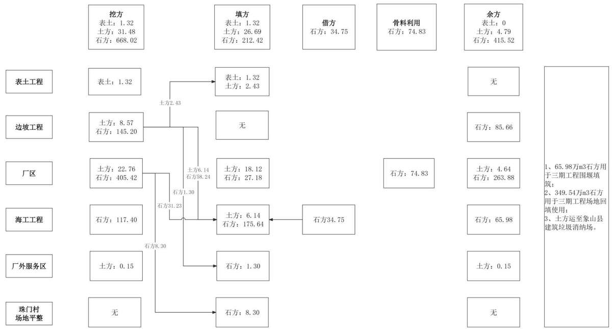
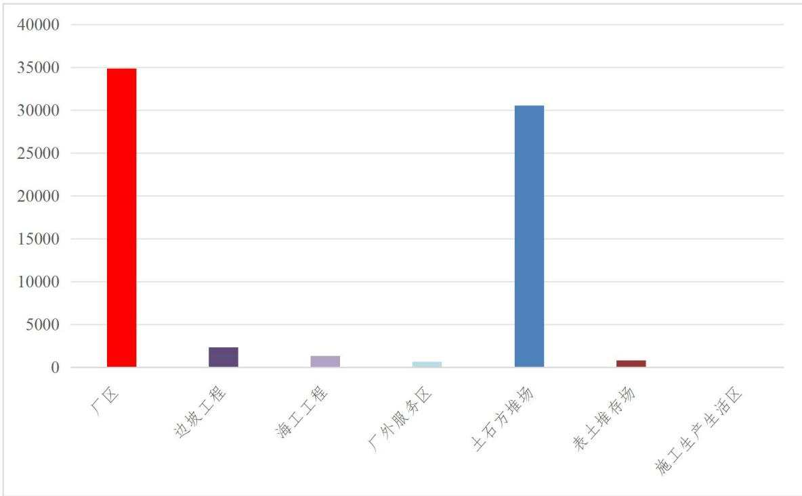
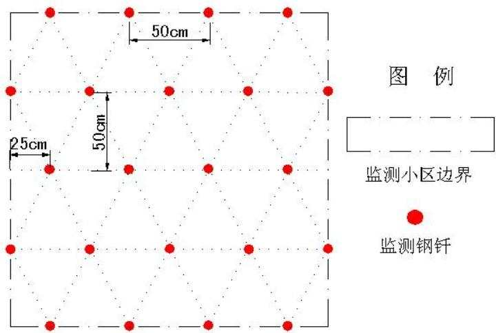

> **Zone C（应用范例层）使用边界**——仅可用于**写作风格、章节展开方式、表达逻辑、表格设计**的参考。
> **不得**用于合规判断；**不得**引入其项目数据（名称／地点／数字／单位名）；
> **不得**因其"曾经通过审批"而推定其做法在当前标准下仍然合规。
> 与 Zone A 冲突时**一律以 Zone A 为准**；Zone A 未明确规定时输出
> 「**Zone A 未明确规定，以下为参考写法，需人工判断**」。
>
> **坐标系警告**：本范例为**老八章结构**（GB 50433—2018 附录B），与 2026 版 10 章模板**同号不同义**
> （老 `1.5`＝防治目标，新 `1.5`＝水土流失预测结果；老 4→新 6 …偏移 +2；新版第 4/5 章老结构无独立章）。
> 因此 **`chapter_mapping: pending`——不得按章节号挂载**，检索一律走 `topic_tags`。
>
> **待加工**：`topic_tags`（主题标签）、`approval_basis_list`（编制依据逐字清单）、
> `structure_summary`（只提取结构：章节展开顺序／段落功能／表格栏目结构／句式模板／论证链步骤）。

<!-- 本文件由原方案 PDF 分段转换后拼接：共 2 段，原 220 页（MinerU 云单文件上限 200 页） -->

1 综合说明 ....  
1.1 项目概况..  
1.2 编制依据 .....  
1.3 设计水平年.. ..7  
1.4 水土流失防治责任范围...  
1.5 水土流失防治目标... .. 8  
1.6 项目水土保持评价结论.. .. 9  
1.7 水土流失预测结果.... .. 16  
1.8 水土保持措施布设成果.. .. 16  
1.9 水土保持监测方案.... .. 19  
1.10 水土保持投资及效益分析成果... .. 19  
1.11 结论... ...19  
2 项目概况 ....... ....23  
2.1 项目组成及工程布置.. .. 23  
2.2 施工组织.. ...46  
2.3 工程占地... ...61  
2.4 工程土石方平衡..... . 63  
2.5 拆迁（移民）安置与专项设施改（迁）建..... ....78  
2.6 施工进度 ..... ....78  
2.7 自然概况... ...81  
3 项目水土保持评价...... ... 86  
3.1 主体工程选址（线）水土保持评价.... .... 86  
3.2 建设方案与布局水土保持评价..... ... 90  
4水土流失分析与预测...... ....... 120  
4.1 水土流失现状... . 120  
4.2 水土流失影响因素分析... .. 120  
4.3 土壤流失量预测.... . 123  
4.4 水土流失危害分析.. .. 145  
4.5 指导性意见... ...146  
5 水土保持措施 ....... .... 147  
5.1 防治区划分.. ...147  
5.2 措施总体布局.. ... 148  
5.3 分区措施布设 ...... ... 214  
5.4 施工要求... ...184  
6 水土保持监测 ........ ..... 190  
6.1 范围和时段.... ...190  
6.2 内容和方法... ...190  
6.3 点位布设 ....... ..199  
6.4实施条件和成果.. .. 200  
7水土保持投资估算及效益分析..... ..... 202  
7.1 投资估算.... ..202  
7.2 效益分析... ..209  
8 水土保持管理..... .... 212  
8.1 组织管理.. ..212  
8.2 后续设计... ..214  
8.3 水土保持监测... .. 214  
8.4 水土保持监理.. ... 215  
8.5 水土保持施工... .. 215  
8.6 水土保持方案变更... .. 216  
8.7 水土保持设施验收... ... 217

## ·1 综合说明

## 1.1 项目概况

## 1.1.1 项目基本情况

## 1）项目建设必要性

核电是一种安全、可靠、清洁、经济的能源，由于其具备资源消耗少、环境影响小和供应能力强等优点，已成为与火电、水电并列的世界三大电力供应支柱，在世界能源结构中有着重要的地位。加快发展核电，逐步提高核电在能源供应中的比例，已成为国家重要的能源发展战略。

发展核电是满足电力需求、优化能源结构、保障能源安全，促进经济持续、健康发展的重大战略举措。发展核电，对于保护生态环境，减少环境污染，促进能源与经济社会的可持续发展，将起到更加重要的作用。

浙江金七门核电厂已列入国家《“十四五”现代能源体系规划》（发改能源〔2022210号）、国家《“十四五”电力发展规划》《核电中长期发展规划（2021—2035年）》和浙江省《能源发展“十四五”规划》等规划中明确安排的项目，属于国家级重大项目。

2025 年 7 月 17 日，国家能源局正式明确 3、4 号项目为“华龙一号”2.0 技术创新示范工程。

## 2）项目概况

浙江金七门核电厂位于浙江省宁波市象山县鹤浦镇金七门村，地处南田岛南缘，猫头洋北岸，规划建设 6 台百万千瓦级压水堆核电机组，一次规划，分三期建设，分期场平，每期建设2台核电机组。

一期工程建设两台“华龙一号”百万千瓦级压水堆核电机组及其配套设施、交通工程、生产配套服务区等，水土保持方案已于2023年1月取得水利部批复。现一期工程各项建设内容均已开工，其中厂区部分已于 2024 年 1 月开工，2025 年 8 月 10日进行1#机组核岛第一罐混凝土浇筑（以下简称“FCD”）。

浙江金七门核电厂 3、4 号机组（以下简称“二期工程”）建设两台“华龙一号”百万千瓦级压水堆核电机组及其配套设施，主要建设内容包括厂区、海工工程、边坡工程、厂外服务区等。

厂外服务区位于一期工程生产配套服务区西侧，占地面积0.80hm2，新建3栋值班宿舍楼，绿化率30%，绿化面积 2400m2。

二期工程总占地面积170.52hm2，其中永久占地 $3 9 . 8 4 \mathrm { h m } ^ { 2 }$ ，临时占地 130.68hm2。永久占地包括厂区占地39.04hm2，厂外服务区占地0.80hm2。临时占地主要包括施工场地、土石方中转场、表土堆存场、临时堆渣场、施工便道和施工围堰用地，其中施工场地利用一期工程已建的杨柳坑村 1#、2#施工场地，土石方中转场和表土堆存场结合二期工程永久用地和已建施工场地布设。考虑到二期工程多余土石方临时堆存后运至三期工程进行场地回填的需求，补充红卫塘外塘临时堆渣场和珠门村临时堆渣场。为满足红卫塘外塘临时堆渣场土石方运输需求，减少对周边河道的影响，设置钢便桥 1座。二期工程排水围堰施工与陆域搭接部分临时占用面积0.02hm2。施工道路、施工用水用电等均已由一期工程建设完成，可满足一期、二期工程共同使用。

二期工程开挖土石方共700.82 万 $\mathrm { m } ^ { 3 }$ （自然方，下同），其中表土1.32万m3，土方 31.48 万 $\mathrm { m } ^ { 3 }$ ，石方 668.02 万 $\mathrm { m } ^ { 3 }$ ；回填土石方共240.43 万 $\mathrm { m } ^ { 3 }$ ，其中表土1.32万$\mathrm { m } ^ { 3 }$ ，土方 26.69 万 $\mathrm { m } ^ { 3 }$ ，石方 212.42 万 $\mathrm { m } ^ { 3 }$ ；借方 34.75 万 $\mathrm { m } ^ { 3 }$ ，全部为一期工程施工围堰拆除石方；加工骨料利用 74.83 万 $\mathbf { m } ^ { 3 } \mathbf { ; }$ ；余方 420.31 万 $\mathrm { m } ^ { 3 }$ ，其中土方4.79万 $\mathrm { m } ^ { 3 }$ 石方 415.52 万 $\mathrm { m } ^ { 3 }$ 。余方处置方式如下：①石方65.98万 $\mathrm { m } ^ { 3 }$ 为二期工程围堰拆除方，后期用于三期工程围堰填筑使用，可以满足三期工程围堰填筑需求（65.98万m3）；②石方 349.54 万 $\mathrm { m } ^ { 3 }$ （松方为 471.88 万 m3）临时堆放于红卫塘外塘临时堆渣场和珠门村临时堆渣场，后期用于三期工程场地回填使用；③土方4.79万 $\mathrm { m } ^ { 3 }$ 运至象山县建筑垃圾消纳场，通过宁波市建筑垃圾管理服务信息平台匹配消纳点位，编制建筑垃圾处理方案并提交象山县住房和城乡建设局备案，根据备案意见进行处置。二期工程海工工程开挖产生淤泥86.5万m3，采用海抛方式处置，不计入土石方平衡。开工后，建设单位按规定格式填报倾倒废弃物申请书，并附报废弃物特性和成分检验单，向主管部门提出申请，经审批同意后，向许可区域进行倾倒。

厂址用地范围及 500m 非居住区内搬迁工作已由一期工程完成，二期工程永久用地范围内不涉及拆迁安置。二期工程珠门村临时堆渣场场地内、场地东北侧及西北侧各有1 处房屋拆除。

工程计划总投资 420 亿元，其中土建投资 90 亿元。工程计划于 2026 年3月进入施工准备期，2027年12月15日FCD，至2033年4 月完工，总工期85 个月。

3）二期工程与一期工程、三期工程衔接关系

一期工程已于 2024 年 1月开工，二期工程计划于 2026 年3月开工，三期工程已纳入《核电中长期发展规划（2023—2035年）》，国家能源局召开浙江金七门核电项目前期工作座谈会中明确建设 6 台“华龙一号”压水堆机组。按照目前工作安排，三期工程计划在2028年开工建设。

浙江金七门核电厂一次规划，分期实施，一期工程施工阶段已充分考虑后续施工需求，已实施的杨柳坑村 1#、2#施工场地，施工用电、用水管线可供后续项目接续使用。根据二期工程施工组织安排，施工场地利用一期工程已建杨柳坑村 1#、2#施工场地，土石方中转场和表土堆存场结合永久用地和施工场地布设。根据现阶段三期工程初步施工组织安排，三期工程接续利用杨柳坑村 1#、2#施工场地，二期工程布设的 2 处临时堆渣场待二期工程土石方转运至三期工程进行场地回填后，三期工程不再继续使用。

## 1.1.2 项目前期工作进展情况

2014 年 10 月 30 日至 31 日，电力规划设计总院在杭州主持召开了三门湾核电项目初步可行性研究报告审查会，印发了《关于三门湾核电项目初步可行性研究报告的审查意见》（电规发电〔2015〕22 号），确定金七门厂址为优先候选厂址开展后续工作。

2023年1月，取得《浙江金七门核电厂一期工程（华龙一号）水土保持方案审

批准予行政许可决定书》（水许可决〔2023〕2号）。

2024年1月，浙江金七门核电厂一期工程（华龙一号）四通一平开工。

2025 年 1 月 8 日，浙江金七门核电厂 3、4 号机组获取国家发展和改革委员会全国投资项目在线审批监管平台的项目代码。

2025年8月13日，宁波市自然资源和规划局核发《浙江金七门核电厂3、4号机组项目建设项目用地预审与选址意见书》。

2025年9月2日至4日，电规总院在浙江省宁波市主持召开了浙江金七门核电厂 3、4号机组工程可行性研究报告审查会。

2025 年 10 月 11日，《浙江金七门核电厂 3、4 号机组（排水工程）对浙江象山南田岛省级森林公园生态影响评价报告》已取得浙江省林业局批复。

2025年10月30日，浙江省人民政府向自然资源部报送浙江金七门核电厂3号、4号机组项目涉及生态保护红线不可避让论证意见。

根据水土保持相关法律法规要求，浙江金七门核电厂3、4 号机组建设应编制水土保持报告书。2025 年 3 月，浙江省水利水电勘测设计院有限责任公司承担金七门核电厂二期工程水土保持方案编制工作，结合项目情况及现场踏勘资料编制完成工程水土保持技术大纲和质保大纲。2025 年4月-10 月，浙江省水利水电勘测设计院有限责任公司按照规范要求对工程现场进行多次实地查勘，收集工程所在地区的自然环境概况、社会经济状况以及水土流失等基础资料。在此基础上，依据可行性研究报告、施工组织方案、地质勘测报告等设计资料，结合工程特点，从工程占地、施工布置、土石方调运、水土流失预测、水土保持措施布设等方面进行了论述，制定了相应的水土流失防治方案，提出防治措施的投资估算，于 2025 年 10 月编制完成《浙江金七门核电厂3、4号机组水土保持方案报告书》。

## 1.1.3 自 然 简 况

工程区地貌属于滨海丘陵地貌，属中亚热带湿润季风气候，冬夏季风交替显著，四季分明，温和湿润，无严寒酷暑，光照充足，雨量充沛，年平均风速为 5.1m/s，多年平均降水量 1410.2mm。丘陵区以红壤为主，土壤呈微酸性，沿海潮间带内主要分布盐土土类。森林植被属中亚热带常绿阔叶林。项目区内多为低矮灌木林，涉及滩涂多为耐盐草本，林草覆盖率 59.77%。工程区属以水力侵蚀为主要类型的南方红壤区，水土流失类型以地表径流冲刷引起的水力侵蚀为主，区域土壤侵蚀模数背景值约为 $3 0 0 \mathrm { t } / \ \left( \mathrm { k m } ^ { 2 } \bullet _ { \mathrm { a } } \right)$ ），容许土壤流失量 $5 0 0 \mathrm { t } / \ ( \mathrm { k m } ^ { 2 } \bullet \mathrm { a } )$ ，工程占地范围平均土壤侵蚀模数为 $3 4 4 \mathrm { t / k m } ^ { 2 } \cdot \mathbf { a }$ （计算过程见章节 4.3.3.1）。

根据《水利部办公厅关于做好国家级水土流失重点预防区和重点治理区落地上图成果应用的通知》（办水保〔2025〕170号），工程所在区域不涉及国家级水土流失重点预防区及重点治理区。根据《浙江省水利厅浙江省发展和改革委员会关于公布省级水土流失重点预防区和重点治理区的公告》（公告〔2015〕2 号），工程所在区域不涉及省级水土流失重点预防区及重点治理区。根据《宁波市水土保持规划》，厂外服务区涉及象山县鹤浦镇水土流失重点治理区（XZ02254）。

二期工程厂区永久用地部分涉及国家级生态公益林约 $1 4 \mathrm { h m } ^ { 2 }$ ，临时用地排水围堰与陆域搭接部分临时占用生态保护红线和森林公园陆域部分 $1 0 2 \mathrm { m } ^ { 2 }$ ，海域部分26m2。建设单位已委托浙江海洋大学开展生态红线不可避让论证，委托浙江省林业勘测规划设计有限公司编制森林公园生态影响评价报告，均已取得批复文件。二期工程红卫塘外塘临时堆渣场施工便道以钢便桥形式跨越南田新塘及排洪沟、四都河，涉及河湖管理范围。综上，二期工程永久占地涉及县级水土流失重点治理区、生态公益林，临时占地涉及生态保护红线、自然保护地（森林公园）和河湖管理范围。二期工程不涉及饮用水源保护区、水功能一级区的保护区和保留区、世界文化和自然遗产地、风景名胜区、地质公园、重要湿地等生态敏感区。

## 1.2 编制依据

## 1.2.1 法律法规与部委规章

1）《中华人民共和国水土保持法》（中华人民共和国主席令第39号，2010年12 月25 日修订，2011年3月1 日实施）；

2）《中华人民共和国环境保护法》（2014 年4月24日第十二届全国人民代表

大会常务委员会第八次会议修订）；

3）《生产建设项目水土保持方案管理办法》（水利部〔2023〕53 号令，2023年 1月17日）。

4）《浙江省水土保持条例》（浙江省第十二届人民代表大会常务委员会第十三次会议，2014 年 9 月 26 日，2020 年 11 月 27 日修订浙江省第十三届人民代表大会常务委员会公告第40 号）。

## 1.2.2 政 策 文 件

1）《关于印发〈生产建设项目水土保持方案技术审查要点〉的通知》（办水保2023〕177 号）；

2）《水利部办公厅关于进一步加强生产建设项目水土保持监测工作的通知》（办水保〔2020〕161 号）；

3）《水利部办公厅关于实施生产建设项目水土保持信用监管“两单”制度的通知》（办水保〔2020〕157号）。

4）《水利部办公厅关于印发生产建设项目水土保持技术文件编写和印制格式规定（试行）的通知》（办水保〔2018〕135号）；

5）《水利部关于进一步深化“放管服”改革全面加强水土保持监管的意见》（水利部水保〔2019〕160号）；

6）《水利部办公厅关于进一步加强部批项目水土保持监管工作的通知》（办水保〔2024〕57 号）；

7）《水利部办公厅关于做好国家级水土流失重点预防区和重点治理区落地上图成果应用的通知》（办水保〔2025〕170号）。

## 1.2.3 技 术 标 准

1）《生产建设项目水土保持技术标准》（GB50433-2018）；

2）《生产建设项目水土流失防治标准》（GB/T50434-2018）；

3）《土壤侵蚀分类分级标准》（SL190-2007）；

4）《水土保持工程设计规范》（GB51018-2014）；

5）《水土保持工程调查与勘测标准》（GB/T51297-2018）；

6）《生产建设项目水土保持监测与评价标准》（GB/T51240-2018）；

7）《水土保持监测技术规范》（SL/T227-2024）；

8）《生产建设项目土壤流失量测算导则》（SL773-2018）；

9）《水利水电工程制图标准水土保持图》（SL73.6-2015）；

10）《土地利用现状分类》（GB/T21010-2017）；

11）《防洪标准》（GB50201-2014）。

## 1.2.4 技术文件及相关资料

1）《浙江金七门核电厂 3、4 号机组可行性研究报告》（2025年9月）

2）《浙江金七门核电厂3、4 号机组总平面专题报告》（2025年7月）；

3）《浙江金七门核电厂3、4号机组海工工程可行性研究报告》（2025年7月）；

4）《浙江金七门核电厂3、4号机组项目规划选址和用地预审论证报告》（2025年 7月）；

5）《浙江省水土保持“十四五”规划》；

6）《宁波市水土保持规划》（2015\~2030 年）。

## 1.3 设计水平年

根据主体工程的施工进度安排及二期工程的建设特点，工程计划2026年3月开工，2033 年4月完工，总工期85个月，故确定方案设计水平年为工程完工后的当年，即 2033 年。

## 1.4 水土流失防治责任范围

工程水土流失防治责任范围共计 170.52hm2，其中永久占地包括厂区、边坡工程、海工工程、厂外服务区等占地，面积共计 39.84hm2；施工临时占地包括施工场地、表土堆存场、临时堆渣场、土石方中转场、施工围堰、施工便道等各类临时设施占地，面积共计 130.68hm2。二期工程防治责任范围中杨柳坑村 1#施工场地、杨柳坑村2#施工场地与一期工程防治责任范围重叠，该区域为一期工程和二期工程共同扰动范围，无明显分界。根据施工进度安排，一期工程水土保持设施验收时，杨柳坑村1#、2#施工场将移交至二期工程，故该区域纳入二期工程防治责任范围。

二期工程水土流失防治责任范围均位于浙江省宁波市象山县，防治责任主体为中核浙能能源有限公司。

## 1.5 水土流失防治目标

## 1.5.1 执行标准等级

二期工程属于新建建设类项目。根据《水利部办公厅关于做好国家级水土流失重点预防区和重点治理区落地上图成果应用的通知》《浙江省水土保持规划》《宁波市水土保持规划》，项目区不涉及国家级和省级水土流失重点预防区和重点治理区，厂外服务区涉及象山县鹤浦镇水土流失重点治理区（XZ02254）。考虑到二期工程涉及县级水土流失重点治理区，且挖填土石方工程量大、施工扰动时间长等特点，二期工程水土流失防治执行南方红壤区一级标准。

## 1.5.2 防 治 目 标

## 1）定性目标

（1）项目水土流失防治责任范围内扰动土地应全面整治，新增水土流失应得到有效控制，原有水土流失得到治理；

（2）水土保持设施应安全有效；

（3）水土资源、林草植被应得到最大限度地保护和恢复。

## 2）定量目标

水土流失治理度、土壤流失控制比、渣土防护率、表土保护率、林草植被恢复率、林草覆盖率六项指标应符合现行国家标准的规定。六项指标按施工期和设计水平年2个时段分别确定。

根据《生产建设项目水土流失防治标准》《生产建设项目水土保持技术标准》，项目区土壤侵蚀以微度水力侵蚀为主，土壤流失控制比目标值不应小于1。二期工程占地中仅厂外服务区占地（0.80hm2）位于城镇区域，综合考虑到厂外服务区面积占二期工程总面积比例较低，故二期工程渣土防护率保持不变。

根据《核电厂总平面及运输设计规范》（GB50294-2014）、《核设施实物保护导则》（HAD501/02-2018），核电项目绿化受行业限制，厂区核安全保护区内空地多采用碎石压盖方式，无绿化条件。二期工程临时占地中杨柳坑村1#、2#施工场地后续将移交至三期工程使用；红卫塘外塘临时堆渣场原用地类型为养殖坑塘，使用完成恢复原用地类型，无绿化条件。因此二期工程适当降低了林草覆盖率指标，林草覆盖率调整为 10%。

二期工程水土流失防治目标详见下表。

表 1.5-1  
水土流失防治目标表
<table><tr><td rowspan=2 colspan=1>防治指标</td><td rowspan=1 colspan=2>一级标准</td><td rowspan=2 colspan=1>修正</td><td rowspan=1 colspan=2>采用标准</td></tr><tr><td rowspan=1 colspan=1>施工期</td><td rowspan=1 colspan=1>设计水平年</td><td rowspan=1 colspan=1>施工期</td><td rowspan=1 colspan=1>设计水平年</td></tr><tr><td rowspan=1 colspan=1>水土流失治理度（%）</td><td rowspan=1 colspan=1>*</td><td rowspan=1 colspan=1>98</td><td rowspan=1 colspan=1></td><td rowspan=1 colspan=1>*</td><td rowspan=1 colspan=1>98</td></tr><tr><td rowspan=1 colspan=1>土壤流失控制比（%）</td><td rowspan=1 colspan=1>*</td><td rowspan=1 colspan=1>0.9</td><td rowspan=1 colspan=1>+0.1</td><td rowspan=1 colspan=1>*</td><td rowspan=1 colspan=1>1.0</td></tr><tr><td rowspan=1 colspan=1>渣土防护率（%）</td><td rowspan=1 colspan=1>95</td><td rowspan=1 colspan=1>97</td><td rowspan=1 colspan=1></td><td rowspan=1 colspan=1>95</td><td rowspan=1 colspan=1>97</td></tr><tr><td rowspan=1 colspan=1>表土保护率（%）</td><td rowspan=1 colspan=1>92</td><td rowspan=1 colspan=1>92</td><td rowspan=1 colspan=1></td><td rowspan=1 colspan=1>92</td><td rowspan=1 colspan=1>92</td></tr><tr><td rowspan=1 colspan=1>林草植被恢复率（%）</td><td rowspan=1 colspan=1>*</td><td rowspan=1 colspan=1>98</td><td rowspan=1 colspan=1></td><td rowspan=1 colspan=1>*</td><td rowspan=1 colspan=1>98</td></tr><tr><td rowspan=1 colspan=1>林草覆盖率（%）</td><td rowspan=1 colspan=1>*</td><td rowspan=1 colspan=1>25</td><td rowspan=1 colspan=1>-15</td><td rowspan=1 colspan=1>*</td><td rowspan=1 colspan=1>10</td></tr></table>

## 1.6 项目水土保持评价结论

## 1.6.1 主体工程选址（线）评价

工程被列入国家有关能源电力规划，是浙江省能源建设的重点项目，工程建设符合国家产业政策和规划要求。

工程区不涉及生态脆弱区、泥石流易发区、崩塌滑坡危险区以及易引起严重水土流失和生态恶化地区，不涉及占用全国水土保持监测网络中的水土保持监测站点、重点试验区及水土保持长期定位观测站，不涉及水功能一级区的保护区。

二期工程不涉及国家级和省级水土流失重点预防区和重点治理区，厂外服务区涉及象山县鹤浦镇水土流失重点治理区（XZ02254），厂区涉及国家级生态公益林，临时占地涉及生态保护红线（浙江宁波象山南田岛省级森林公园生态保护红线）、自然保护地（象山南田岛省级森林公园）、河湖管理范围（红卫塘外塘施工便道钢便桥跨越）。二期工程不涉及饮用水源保护区、水功能一级区的保护区和保留区、世界文化和自然遗产地、风景名胜区、地质公园、重要湿地等生态敏感区。

主体设计优化了设计方案，优化了施工工艺及方法，合理安排施工时序，提高截排水措施、拦挡措施、绿化等工程等级和防护标准，完善各项防护措施，加强组织管理，可减少地表扰动和植被破坏范围，有效控制可能造成的水土流失，符合水土保持要求。

从水土保持角度考虑，主体工程选址（线）符合《中华人民共和国水土保持法》《生产建设项目水土保持技术标准》（GB50433-2018）等要求，不存在水土保持制约性因素。

## 1.6.2 建设方案与布局评价

## 1.6.2.1 建设方案评价

浙江金七门核电厂规划建设六台百万千瓦级核电机组，统一规划，分期建设。统一规划，合理组合，可以产生规模化效应，最终达到全厂总体规划集约、节约用地的目的。考虑项目的总体经济性，并满足厂坪标高需高于厂址设计基准洪水位（不考虑波浪影响）8.32m 和波浪影响下的洪水位 15.36m 的设计要求，且统筹考虑一期工程至三期工程总体土石方平衡，最终确定15.50m为浙江金七门核电厂厂坪标高，满足水土保持要求。根据《核电厂总平面及运输设计规范（GB/T 50294-2014）》，主厂房区由于有剂量防护、卫生防护、安全保卫等方面的特殊要求，核安全保护区内不得布置绿化措施，主体设计采用了碎石压盖措施，核安全保护区范围外采用乔灌草绿化。厂区北侧边坡部分区域属于核安全相关边坡，故设立专项研究课题分析边坡绿化方案，非核安全相关边坡采用植被混凝土进行绿化。边坡马道平台采用灌草绿化。

工程选址无法避让象山县鹤浦镇水土流失重点治理区，工程采取了提高水土保持措施等级和标准，减少占地面积、减少土石方量、充分考虑项目绿化范围和景观效果，符合生产建设项目水土保持技术标准。

## 1.6.2.2 工程占地评价

## 1）永久占地评价

二期工程永久占地39.84hm2，占地类型主要包括耕地、林地、工矿仓储用地、园地等。推荐选址方案各功能分区布局合理，属于用地总体指标符合国家标准，节地评价成果符合《电力工程项目建设用地指标（火电厂、核电厂、变电站和交流站）》（建标〔2010〕78号）的要求，项目严格执行行业用地标准，根据工程条件因地制宜减少用地规模，符合节约集约用地要求。

## 2）临时占地评价

工程施工临时设施尽量布设在厂区永久占地范围和杨柳坑村1#、2#施工场地内，减少工程扰动土地面积。经分析现场施工条件，表土堆存场、土石方中转场均可利用永久占地及杨柳坑村 1#、2#施工场地布设。但二期工程余方量大，金七门村及杨柳坑村场地均无法容纳，故设置厂外临时堆渣场 2 处，分别为红卫塘外塘临时堆渣场和珠门村临时堆渣场。

经复核完善，二期工程临时占地总面积为 130.68hm2，利用一期工程已有场地面积为68.52hm2，其中杨柳坑村1#施工场地 $3 . 4 2 \mathrm { h m } ^ { 2 }$ ，杨柳坑村 2#施工场地 57.57hm2，杨柳坑村料石中转场 6.96hm2，杨柳坑村表土堆存场 0.57hm2；补充临时用地面积$6 2 . 1 6 \mathrm { h m } ^ { 2 }$ ，其中红卫塘外塘临时堆渣场53.86hm2，珠门村临时堆渣场 $8 . 0 9 \mathrm { h m } ^ { 2 }$ ，红卫塘外塘施工便道 $0 . 1 9 \mathrm { h m } ^ { 2 }$ ，排水围堰 $0 . 0 2 \mathrm { h m } ^ { 2 }$ 。临时占地类型以设施农用地、工矿仓储用地为主。

根据施工组织安排，一期工程施工场地通过合理安排施工时序、错峰施工等方式，可满足一期、二期工程同时施工需求，因此二期工程充分利用一期工程现有施工场地，无新增施工场地。同时，充分优化施工布置，合理安排施工时序，尽量利用二期工程永久占地范围内设置金七门土石方中转场进行堆渣，减少临时占地。受象山县地形及交通条件限制，二期工程可作为土石方堆场的场地很少，经多次现场调查后确定红卫塘外塘临时堆渣场和珠门村临时堆渣场作为二期工程多余石方暂存场地，三期工程开工后用于场地回填。现有临时占地方案已充分考虑现有客观条件及项目施工需求，已尽可能减少临时占地面积。施工过程中，及时采取拦挡、截排水、苫盖等措施，可有效降低水土流失。因此，临时用地符合水土保持要求。

二期工程临时用地中杨柳坑村1#、2#施工场地已取得象山县自然资源和规划局批复，红卫塘外塘临时堆渣场、珠门村临时堆渣场、杨柳坑村料石中转场、杨柳坑村表土堆存场选址意见已由当地乡镇人民政府、象山县水利局和象山县自然资源和规划局确认，并取得土地权属单位同意，项目开工前办理审批手续。排水围堰与陆域搭接部分不可避免临时占用生态保护红线和森林公园，陆域部分102m2，海域部分26m2。建设单位已委托浙江海洋大学开展生态红线不可避让论证，委托浙江省林业勘测规划设计有限公司编制森林公园生态影响评价报告，均已取得批复文件。

施工完成后，杨柳坑村1#、2#施工场地交由三期工程使用，珠门村临时堆渣场进行植被恢复，红卫塘外塘临时堆渣场恢复至养殖坑塘。

综上，二期工程已充分考虑节约用地，减少对周边环境的扰动，土石方堆场选址合理并取得相关部门确认，排水围堰临时占地涉及生态敏感区已开展专题论证，因此，二期工程占地合理，满足水土保持要求。

## 1.6.2.3 土石方平衡评价

## 1）表土保护评价

二期工程新增扰动范围内地类以林地、园地为主，其中林地剥离厚度10cm\~15cm，园地剥离厚度 30cm，可剥离量为 1.32 万 $\mathbf { m } ^ { 3 }$ 。剥离表土进行集中堆置并防护，施工后期自身利用或调运利用至邻近区域回填利用，有效保护了表土资源。

## 2）土石方平衡评价

主体工程设计中的土石方平衡内容主要反映了主体中各单项工程的开挖回填量，但未考虑表土剥离、基础施工产生的钻渣、一期工程围堰拆除利用、施工生产生活区的场地回填量等土石方回填量。本方案补充了厂内表土剥离及回填1.32万 $\mathrm { m } ^ { 3 }$ （自然方，下同），珠门村临时堆渣场场地平整回填石方8.30万 $\mathrm { m } ^ { 3 }$ ，一期工程围堰拆除方利用 34.75 万 $\mathrm { m } ^ { 3 }$ ，建构筑物基础施工产生钻渣4.79万 $\mathrm { m } ^ { 3 }$ 。经方案复核后，二期工程开挖土石方共 700.82 万 m3，回填土石方共 240.43 万 m3，借方 34.75 万 m3，加工骨料利用 74.83 万 $\mathrm { m } ^ { 3 }$ ，余方 420.31 万 $\mathrm { m } ^ { 3 }$ 。经复核完善后，二期工程土石方不存在缺漏项，土石方平衡较为合理。

## 3）自身骨料利用评价

根据《浙江金七门核电厂3、4 号机组可行性研究阶段陆域岩土工程勘察报告》《浙江金七门核电厂3、4号机组可行性研究阶段海域岩土工程勘察报告》，二期工程开挖石方以粉质粘土混碎石层，强风化、中风化、微风化凝灰岩为主。开挖石方充分用于二期工程混凝土骨料加工利用，同时参照一期工程经验，因工程开挖石方潜在碱活性指标偏高，无法满足核岛及直接接触海水建构筑物对混凝土骨料质量要求。故现阶段开挖石方经加工后，仅可作为常规岛、配套建构筑物、厂内道路等用途。根据地质专业提供的开挖土石方材质，二期工程除核岛及直接接触海水建构筑物外，常规岛、虹吸井等建构筑物骨料需求量共 74.83 万 m3，全部利用工程开挖石方加工，有效减少了工程弃渣。

## 4）弃渣减量化评价

金七门核电厂总体规划阶段在满足场地防洪等要求的前提下，厂坪标高15.50m方案，一期工程至三期工程土石方挖填基本平衡，因此该厂坪标高作为金七门核电厂厂坪标准符合水土保持要求。

二期工程边坡与一期工程边坡顺接，断面形式与一期工程施工图阶段设计断面相同，考虑到现状边坡坡率为1:0.5，已尽最大可能优化，最大限度的减少了工程开挖，从而减少可能引起的水土流失。二期工程厂内建构筑物中核岛、常规岛、联合泵房、管廊等基坑开挖充分借鉴一期工程施工经验，对于基岩区域采用1:0.3进行放坡开挖，施工完成后回填；对于强风化区域采用支护桩进行基坑支护；对于场内回填区域，采用边地基施工，边场地回填。同时，方案补充了珠门村临时堆渣场场地平整，消纳石方 8.30万m3。

综上，工程从竖向布置、边坡开挖、骨料加工利用、场地回填等方面充分考虑减少土石方开挖，增加土石方回填，符合水土保持弃渣减量化要求。同时，充分考虑了土石方调运利用，厂区及边坡工程多余土石方优先调运至海工工程、厂外服务区、珠门村场地平整等进行回填，减少了工程弃渣。二期工程已充分考虑弃渣减量化，符合水土保持要求。

## 5）余方处置评价

二期工程余方处置方式已全部落实，其中石方临时堆存后运至三期工程进行场地回填和施工围堰填筑，未设置弃渣场。土方按照要求宁波市建筑垃圾管理要求，及时向象山县住房和城乡建设局提交建筑垃圾处理方案，取得备案后委托专业运输公司外运至指定消纳点。海工工程开挖产生的淤泥无可利用途径，拟采用海抛形式处置，不计入土石方平衡。工程开工后，按相关法规要求，办理废弃物海洋倾倒许可证，在许可证指定的海洋倾倒区进行倾倒，淤泥不上岸。综上，二期工程余方处置有利于生态环境保护，符合水土保持要求。

## 1.6.2.4 弃土（石、渣）场评价

工程余方 420.31 万 m3，其中土方 4.79 万 m3，石方 415.52 万 m3。余方处置方式如下：石方65.98 万m3为二期工程围堰拆除方，后期用于三期工程围堰填筑使用；石方349.52 万 m3（松方 471.88 万m3）临时堆放于红卫塘外塘临时堆渣场和珠门村临时堆渣场，后期用于三期工程场地回填使用；土方4.79 万m3运至象山县建筑垃圾消纳场。因此，二期工程无弃渣场。

## 1.6.2.5 土石方堆场评价

二期工程设置临时堆渣场 2 处，分别为珠门村临时堆渣场、红卫塘外塘临时堆渣场；设置土石方中转场 2 处，分别为金七门村土石方中转场、杨柳坑村料石中转场；设置表土堆存场2处，分别为杨柳坑村表土堆存场、厂外服务区表土堆存场。

红卫塘外塘临时堆渣场位于鹤浦镇大南田村西南侧，占地53.86hm2，堆渣高度7m，设计容量 350 万 m3，最大堆存量 349 万 m3，渣场级别为 3 级，属于平地型堆渣场。红卫塘外塘临时堆渣场外侧约 170m 处为现状海塘-南田新塘，通过采取地基加固、修建拦渣堤等方式降低对南田新塘的影响。根据《象山县红卫塘外塘堆渣场论证报告》《浙江金七门核电厂二期工程堆渣场溃渣分析评估报告》，采用有限元分析、理论公式计算和数值模拟等方法分析了红卫塘外塘临时堆渣场对南田新塘的影响，结论为影响较小。经分析，堆渣期间对南田新塘基本无影响。

珠门村临时堆渣场位于高塘岛乡珠门村西侧，占地 8.09hm2，堆渣高度 30m，设计容量 125.94万 m3，最大堆存量 122.88 万 m3，渣场级别为 3 级，属于平地型堆渣场。珠门村临时堆渣场现状为建设用地。场地内有 1 处房屋，属于违章建筑；场地外西北侧有1处房屋，现状无居住条件，地类属于设施农用地，距离堆渣边界60m；场地外东北侧有 1 处破旧房屋，现状无居住条件，地类属于农村宅基地，距离堆渣边界 60m。根据《浙江金七门核电厂二期工程堆渣场溃渣分析评估报告》，采用理论公式计算和数值模拟等方法分析了珠门村临时堆渣场对场地外房屋的影响，结论为无影响。考虑到场外 2 处方案距离堆渣场较近，为避免极端情况下可能存在的安全风险，珠门村临时堆渣场使用前对场内和场外3处房屋进行拆除。

金七门村土石方中转场位于二期工程永久占地范围内，占地 6.70hm2，堆渣高度15m，设计容量82.73 万m3，最大堆存量80万m3，渣场级别为4级，属于平地型堆渣场。距离一期工程在建2#常规岛厂房300m。根据《浙江金七门核电厂二期工程堆渣场溃渣分析评估报告》，采用理论公式计算和数值模拟等方法分析了金七门村土石方中转场对一期工程在建设施的影响，结论为无影响。

杨柳坑村料石中转场位于杨柳坑村2#施工场地，占地6.96hm2，堆渣高度7m，设计容量45.13万m3，最大堆存量 45 万m3，渣场级别为 5级，属于平地型堆渣场，周边无敏感点。

杨柳坑村表土堆存场位于杨柳坑村 2#施工场地西北侧，占地约 0.57hm2，堆渣高度3m，设计容量1.53万m3，最大堆存量1.46 万m3，周边无敏感点。

厂外服务区表土堆存场位于厂外服务区永久占地范围内，占地约0.06hm2，堆渣高度3m，设计容量0.14万m3，最大堆存量0.12 万m3，周边无敏感点。

金七门村土石方中转场和杨柳坑村料石中转场利用场内道路进行土石方转运，运距约1km\~3km，红卫塘外塘临时堆渣场采用陆运形式运输，运距约12km；珠门村临时堆渣场采用海运形式运输，运距约10海里（18km）。二期工程土石方转运已充分考虑交通运输条件及运距，尽量减少土石方二次转运。

土石方堆场占地不涉及生态保护红线、生态公益林、自然保护地、河湖管理范围、永久基本农田、海域等敏感因素。用地功能符合施工用地要求，施工结束后恢复原有用地类型，珠门村临时堆渣场进行植被恢复，在此基础上符合水土保持要求。

## 1.6.2.6 具有水土保持功能工程的评价

主体工程设计中的以防治水土流失为主要目标的工程主要包括雨水管网、边坡截排水沟、碎石压盖、绿化措施、拦渣堤等措施，能够较好的起到控制水土流失的作用。以主体设计功能为主同时具有水土保持功能的工程包括道路硬化措施。但是，主体设计及施工中仍存在不足之处，需补充完善土地平整、表土剥离及回覆、土壤改良、铺草皮、乔灌草绿化、施工期临时拦挡、苫盖、临时排水沟、沉沙池、钢板沉淀池、临时种草等措施。补充了各项水土保持措施后，二期工程的实施是可行的。

## 1.7 水土流失预测结果

二期工程扰动土地面积 170.52hm2，损坏植被面积 13.28hm2，余方420.31万 m3，建设可能产生的水土流失总量约70583t，新增水土流失总量约67889t。施工期是二期工程建设可能产生水土流失最为严重的时期，期间水土流失量70462t，占水土流失总量99.83%。施工期水土流失重点区域为厂区、土石方堆场。施工结束后的自然恢复期，也将有一定程度的水土流失发生。因此，各区域要采取相应的防护措施加以治理，水土保持措施需与主体工程同时实施，相互协调，有序进行，并进行水土流失状况监测。

由于二期工程为一期工程的后续项目，且部分区域施工扰动范围相同，故对于一期工程已缴纳水土保持补偿费的部分面积，二期工程不再重新计征水土保持补偿费，故二期工程水土保持补偿费计征面积为114.75hm2。

## 1.8 水土保持措施布设成果

## 1.8.1 防 治 分 区

1）厂区防治区，包括常规岛、核岛及配套建筑物等，面积共计20.10hm2。

2）边坡工程防治区，包括边坡范围、防排洪设施、未扰动边坡区域等范围，面积共计 $9 . 3 3 \mathrm { h m } ^ { 2 }$ o

3）海工工程防治区，包括取水工程、排水工程、护岸工程、施工围堰等，面积为 $2 . 9 3 \mathrm { h m } ^ { 2 }$ o

4）厂外服务区防治区，包括3 栋值班宿舍楼，面积为0.74hm2。

5）土石方堆场防治区，包括红卫塘外塘临时堆渣场、珠门村临时堆渣场、金七门村土石方中转场、杨柳坑村料石中转场，面积为75.61hm2。

6）表土堆存场防治区，包括杨柳坑村表土堆存场、厂外服务区表土堆存场，面积为 0.63hm2。

7）施工生产生活区防治区，包括杨柳坑村 1#、2#施工场地、红卫塘外塘施工便道等，面积为 61.18hm2。

## 1.8.2 措 施 布 置

## 1）厂区防治区

施工前剥离表土，就近堆置于杨柳坑村表土堆存场并防护。厂区范围内结合厂区现场条件，布设临时排水、沉沙措施，临时排水沟沿厂区四周布设，采用梯形断面，浆砌片石砌筑，尾部接沉沙池。土石方裸露区域采用密目网苫盖。厂区出入口设洗车池 1 座。建构筑物施工期间，钻孔灌注桩施工区设置钢板沉淀池，用于沉淀干化钻渣泥浆。施工后期，厂区铺设雨水管网，核安全保护区内裸露面采用碎石压盖措施，核安全保护区外采用乔灌草绿化。

## 2）边坡工程防治区

施工前剥离表土，临时堆置于杨柳坑村表土堆存场；边坡开挖前，首先开展截洪沟、截水沟施工，减少上游来水对开挖边坡的冲刷。边坡开挖时，底部设置临时排水沟、沉沙池，用于减少边坡开挖过程中产生的水土流失。边坡开挖完成后，坡脚设置排洪沟，并及时实施马道排水沟、跌水等边坡排水措施。未扰动边坡撒播灌草籽，提升林草覆盖度。施工后期，非核安全相关边坡采用植被混凝土进行绿化，马道绿化区域回填表土并采用灌草绿化。厂区东侧临时边坡坡顶设置截水沟，采用

梯形断面，C25砼浇筑。

## 3）海工工程防治区

施工过程中布设临时排水沟、沉沙池等措施，临时排水沟采用梯形断面，浆砌 片石砌筑，沉沙池采用矩形断面，浆砌片石砌筑。

## 4）厂外服务区防治区

施工前剥离表土，就地堆放于厂外服务区表土堆存场，后期用于厂外服务区场地绿化使用；施工阶段沿厂外服务区四周布设临时排水沟、沉沙池，临时排水沟采用梯形断面，C25砼浇筑，沉沙池采用矩形断面，C25砼浇筑。建构筑物施工期间，钻孔灌注桩施工区设置钢板沉淀池，用于沉淀干化钻渣泥浆。施工区出入口设置洗车池 1座。施工后期铺设雨水管网，对绿化区域进行表土回填及场地平整，并栽植乔灌草进行园林绿化。

## 5）土石方堆场防治区

堆渣前实施拦挡及截排水等措施，红卫塘外塘临时堆渣场需采取排水板进行地基处理，修筑干砌块石拦渣堤等防护措施。珠门村临时堆渣场堆渣前进行场地平整，修筑浆砌块石挡渣墙、浆砌片石排水沟、浆砌片石沉沙池，堆渣期间及时采取密目网苫盖等防护措施。金七门村土石方中转场和杨柳坑村料石中转场堆渣前修筑挡渣墙及排水沉沙措施，并在临时排水沟尾部布设临时沉沙池。堆渣结束后，红卫塘外塘临时堆渣场恢复至养殖坑塘，珠门村临时堆渣场进行土壤改良、灌草绿化，杨柳坑村料石中转场如三期工程未及时使用，采用撒播草籽进行临时绿化。

## 6）表土堆存场防治区

开工后，实施拦挡、排水、沉沙等措施，表土堆放完成后，采取密目网苫盖，撒播草籽等边坡防护措施。施工完成后，将表土堆存场中的表土运至绿化区域进行表土回填。杨柳坑村表土堆存场使用完成后，如三期工程未及时使用，采用撒播草籽进行临时绿化。

## 7）施工生产生活区防治区

施工场地现状已布设截排水沟、雨水管网、沉沙池等措施，可满足施工场地排

水需求。考虑到二期工程施工场地中排水沟、苫盖等措施破损等情况，补充部分措施。

## 1.9 水土保持监测方案

监测时段自施工准备期开始，至设计水平年结束，即 2026 年 3 月\~2033 年 12月。

监测方法以调查和查阅资料为主，结合巡查和遥感监测、视频监测等动态监测手段。扰动地表情况和水土流失防治责任范围每月 1 次；土石方堆场每 2 周1 次，珠门村临时堆渣场和红卫塘外塘临时堆渣场采用视频监测；水土流失类型及形式调查每年不少于 1 次；水土流失面积监测每季度 1 次；土壤侵蚀强度施工准备期前和监测期末各 1 次，施工期每年不应少于 1 次。植物类型及面积每季度 1 次，成活率栽植后 6 个月后调查，保存率及生长状况、郁闭度与盖度每年监测 1 次。工程措施及临时措施每季度统计1次。二期工程共设监测点16个，包括厂区、边坡工程、海工工程、厂外服务区、土石方堆场、表土堆存场、施工生产生活区、绿化区、排水出口、未受扰动区域等监测点。监测内容包括：水土流失影响因素、扰动土地情况、水土流失状况、水土流失防治成效、水土流失危害。

## 1.10 水土保持投资及效益分析成果

工程水土保持投资 13115.74 万元，其中工程措施投资 7118.54万元，植物措施投资669.76 万元，监测措施投资 595.89万元，临时措施投资 1591.98 万元，独立费用 1652.35 万元，基本预备费 1395.42 万元，水土保持补偿费 91.80 万元（918016 元）。

采取本方案中的水土保持措施以后，水土保持方案实施后至设计水平年，水土流失治理度达 98%以上，土壤流失控制比达 1.0 以上，渣土防护率达 97%以上，表土保护率达 92%以上，林草植被恢复率达 98%以上，林草覆盖率达 10%以上，六项指标均达到目标值要求。

## 1.11 结 论

工程建设符合国家产业政策和规划要求，工程选址不存在水土保持制约因素，

工程建设方案和布局较为合理，各防治区通过采取工程措施、植物措施、临时措施和管理措施，符合水土保持法律法规、技术标准的规定，实施水土保持措施后能达到控制水土流失、保护生态环境的目的。

水土保持方案特性表
<table><tr><td colspan="2" rowspan="1">项目名称</td><td colspan="5" rowspan="1">浙江金七门核电厂3、4号机组</td><td colspan="3" rowspan="1">流域管理机构</td><td colspan="1" rowspan="1">太湖流域管理局</td></tr><tr><td colspan="2" rowspan="1">涉及省(市、区)</td><td colspan="1" rowspan="1">浙江省</td><td colspan="1" rowspan="1">涉及地市或个数</td><td colspan="3" rowspan="1">宁波市</td><td colspan="3" rowspan="1">涉及县或个数</td><td colspan="1" rowspan="1">象山县</td></tr><tr><td colspan="2" rowspan="1">项目规模</td><td colspan="1" rowspan="1">2台百万千瓦级压水堆核电机组</td><td colspan="1" rowspan="1">总投资（万元）</td><td colspan="3" rowspan="1">4200000</td><td colspan="3" rowspan="1">土建投资（万元）</td><td colspan="1" rowspan="1">900000</td></tr><tr><td colspan="2" rowspan="1">动工时间</td><td colspan="1" rowspan="1">2026年3月</td><td colspan="1" rowspan="1">完工时间</td><td colspan="3" rowspan="1">2033年4月</td><td colspan="3" rowspan="1">设计水平年</td><td colspan="1" rowspan="1">2033年</td></tr><tr><td colspan="2" rowspan="1">工程占地(hm²)</td><td colspan="1" rowspan="1">170.52</td><td colspan="1" rowspan="1">永久占地（hm²）</td><td colspan="3" rowspan="1">39.84</td><td colspan="3" rowspan="1">临时占地（hm²）</td><td colspan="1" rowspan="1">130.68</td></tr><tr><td colspan="3" rowspan="2">土石方量（万m³）</td><td colspan="1" rowspan="1">挖方</td><td colspan="3" rowspan="1">填方</td><td colspan="2" rowspan="1">骨料加工</td><td colspan="1" rowspan="1">借方</td><td colspan="1" rowspan="1">余（弃）方</td></tr><tr><td colspan="1" rowspan="1">700.82</td><td colspan="3" rowspan="1">240.43</td><td colspan="2" rowspan="1">74.83</td><td colspan="1" rowspan="1">34.75</td><td colspan="1" rowspan="1">420.31</td></tr><tr><td colspan="3" rowspan="1">重点防治区名称</td><td colspan="8" rowspan="1">象山县鹤浦镇水土流失重点治理区（XZ02254）</td></tr><tr><td colspan="3" rowspan="1">地貌类型</td><td colspan="3" rowspan="1">滨海丘陵</td><td colspan="4" rowspan="1">水土保持区划</td><td colspan="1" rowspan="1">南方红壤区</td></tr><tr><td colspan="3" rowspan="1">土壤侵蚀类型</td><td colspan="3" rowspan="1">水力侵蚀为主</td><td colspan="4" rowspan="1">土壤侵蚀强度</td><td colspan="1" rowspan="1">微度</td></tr><tr><td colspan="3" rowspan="1">防治责任范围面积（hm²）</td><td colspan="3" rowspan="1">170.52</td><td colspan="4" rowspan="1">容许土壤流失量[t/(km²·a)]</td><td colspan="1" rowspan="1">500</td></tr><tr><td colspan="3" rowspan="1">水土流失预测总量（t）</td><td colspan="3" rowspan="1">70583</td><td colspan="4" rowspan="1">新增水土流失量（t）</td><td colspan="1" rowspan="1">67889</td></tr><tr><td colspan="3" rowspan="1">水土流失防治标准执行等级</td><td colspan="8" rowspan="1">南方红壤区一级标准</td></tr><tr><td colspan="1" rowspan="3">防治指标</td><td colspan="2" rowspan="1">水土流失治理度(%)</td><td colspan="2" rowspan="1">98</td><td colspan="3" rowspan="1">土壤流失控制比</td><td colspan="3" rowspan="1">1.0</td></tr><tr><td colspan="2" rowspan="1">渣土防护率（%）</td><td colspan="2" rowspan="1">97</td><td colspan="3" rowspan="1">表土保护率（%）</td><td colspan="3" rowspan="1">92</td></tr><tr><td colspan="2" rowspan="1">林草植被恢复率(%)</td><td colspan="2" rowspan="1">98</td><td colspan="3" rowspan="1">林草覆盖率（%）</td><td colspan="3" rowspan="1">10</td></tr><tr><td colspan="1" rowspan="5">防治措施及工程量</td><td colspan="2" rowspan="1">防治分区</td><td colspan="2" rowspan="1">工程措施</td><td colspan="3" rowspan="1">植物措施</td><td colspan="3" rowspan="1">临时措施</td></tr><tr><td colspan="2" rowspan="1">厂区防治区</td><td colspan="2" rowspan="1">表土剥离 0.48万m³，表土回填 0.82万m³，土地平整4.07hm²，雨水管网*8880m(*为主体已列措施，下同），碎石压盖*1.02万m³。</td><td colspan="3" rowspan="1">铺草皮3.32hm²，栽植红花卜木0.75hm²，栽植香樟 232 株，幼林抚育4.07hm²。</td><td colspan="3" rowspan="1">临时排水沟4134m，沉沙池6座，密目网苫盖5.0hm²，洗车池1座，钢板沉淀池40座。</td></tr><tr><td colspan="2" rowspan="1">边坡工程防治区</td><td colspan="2" rowspan="1">表土剥离0.74万m³，表土回填 0.40万m³，土地平整面积 5654m²。截洪沟*712m，截水沟*685m，排洪沟*705m，马道排水沟*3505m，跌水*523m，马道绿化挡墙*4211m。</td><td colspan="3" rowspan="1">植被混凝土绿化14455m²，撒播灌草籽4.95hm²，栽植五叶地锦*8422株，栽植小叶黄杨球1404株，幼林抚育6.39hm²。</td><td colspan="3" rowspan="1">临时排水沟329m，沉沙池1座，截水沟113m。</td></tr><tr><td colspan="2" rowspan="1">海工工程防治区</td><td colspan="2" rowspan="1">1</td><td colspan="3" rowspan="1">1</td><td colspan="3" rowspan="1">临时排水沟429m，沉沙池1座。</td></tr><tr><td colspan="2" rowspan="1">厂外服务区防治区</td><td colspan="2" rowspan="1">表土剥离0.10万m³，表土回填0.10万m³，土地平整2400m²，雨水管网*628m。</td><td colspan="3" rowspan="1">园林绿化2400m²，幼林抚育 2400m²。</td><td colspan="3" rowspan="1">临时排水沟366m，沉沙池1座，洗车池1座，钢板沉淀池 5座，密目网苫盖4000m²。</td></tr><tr><td colspan="1" rowspan="3"></td><td colspan="1" rowspan="1">土石方堆场防治区</td><td colspan="2" rowspan="1">珠门村临时堆渣场：土壤改良2.43万m³，种植土回填2.43万m³，土地平整8.09hm²，浆砌石挡墙1083m；红卫塘外塘临时堆渣场：拦渣堤*2940m，地基加固*；杨柳坑村料石中转场：土壤改良1.39万m³，种植土回填1.39万m³，土地平整6.96hm²，钢丝石笼挡墙1088m；金七门村土石方中转场：钢丝石笼挡墙1012m。</td><td colspan="1" rowspan="1">珠门村临时堆渣场：海滨木槿种植 20225 株，撒播草籽8.09hm²，幼林抚育面积8.09hm²。</td><td colspan="6" rowspan="1">珠门村临时堆渣场：临时排水沟1117m，沉沙池4座，密目网苫盖 8.15hm²；红卫塘外塘临时堆渣场：临时排水沟2980m，沉沙池5座，临时排水渠523m，密目网苫盖54.0hm²；金七门村土石方中转场：临时排水沟1026m，沉沙池1座，密目网苫盖7.00hm2；杨柳坑村料石中转场：临时排水沟1118m，沉沙池2座，密目网苫盖7.70hm²，撒播草籽 6.96hm²。</td></tr><tr><td colspan="1" rowspan="1">表土堆存场防治区</td><td colspan="2" rowspan="1">杨柳坑村表土堆存场：土壤改良0.11万m³，种植土回填 0.11万m³，土地平整 0.57hm²。</td><td colspan="1" rowspan="1">1</td><td colspan="6" rowspan="1">杨柳坑村表土堆存场：填土编织袋挡墙354m，撒播草籽1.18hm²，密目网苫盖0.61hm²，临时排水沟376m，临时沉沙池1座；厂外服务区表土堆存场：填土编织袋挡墙110m，撒播草籽0.06hm²，密目网苫盖0.06hm²，临时排水沟54m。</td></tr><tr><td colspan="1" rowspan="1">施工生产生活区防治区</td><td colspan="2" rowspan="1">1</td><td colspan="1" rowspan="1">1</td><td colspan="6" rowspan="1">临时排水沟1000m，密目网苫盖 3.0hm²</td></tr><tr><td colspan="2" rowspan="1">投资（万元）</td><td colspan="2" rowspan="1">7118.54</td><td colspan="1" rowspan="1">669.76</td><td colspan="6" rowspan="1">1591.98</td></tr><tr><td colspan="2" rowspan="1">水土保持总投资（万元）</td><td colspan="2" rowspan="1">13115.74</td><td colspan="1" rowspan="1">独立费用(万元)</td><td colspan="6" rowspan="1">1652.35</td></tr><tr><td colspan="2" rowspan="1">监理费（万元）</td><td colspan="1" rowspan="1">261.78</td><td colspan="1" rowspan="1">监测费（万元）</td><td colspan="1" rowspan="1">595.89</td><td colspan="1" rowspan="1">补偿费（万元）</td><td colspan="5" rowspan="1">91.80</td></tr><tr><td colspan="3" rowspan="1">分省措施费（万元）</td><td colspan="1" rowspan="1"></td><td colspan="2" rowspan="1">分省补偿费（万元）</td><td colspan="5" rowspan="1"></td></tr><tr><td colspan="2" rowspan="1">方案编制单位</td><td colspan="2" rowspan="1">浙江省水利水电勘测设计院有限责任公司</td><td colspan="1" rowspan="1">建设单位</td><td colspan="6" rowspan="1">中核浙能能源有限公司</td></tr><tr><td colspan="2" rowspan="1">法定代表人</td><td colspan="2" rowspan="1">叶垭兴</td><td colspan="1" rowspan="1">法定代表人</td><td colspan="6" rowspan="1">钟华</td></tr><tr><td colspan="2" rowspan="1">地址</td><td colspan="2" rowspan="1">杭州市抚宁巷66号</td><td colspan="1" rowspan="1">地址</td><td colspan="6" rowspan="1">浙江省宁波市象山县鹤浦镇兴南路61-12号</td></tr><tr><td colspan="2" rowspan="1">邮编</td><td colspan="2" rowspan="1">310002</td><td colspan="1" rowspan="1">邮编</td><td colspan="6" rowspan="1">315733</td></tr><tr><td colspan="2" rowspan="1">联系人及电话</td><td colspan="2" rowspan="1">穆家伟，【已脱敏手机号】</td><td colspan="1" rowspan="1">联系人及电话</td><td colspan="6" rowspan="1">汤荣平，【已脱敏手机号】</td></tr><tr><td colspan="2" rowspan="1">传真</td><td colspan="2" rowspan="1">1</td><td colspan="1" rowspan="1">传真</td><td colspan="6" rowspan="1">1</td></tr><tr><td colspan="2" rowspan="1">电子信箱</td><td colspan="2" rowspan="1">【已脱敏邮箱】</td><td colspan="1" rowspan="1">电子信箱</td><td colspan="6" rowspan="1">tangrp@cnnp.com.cn</td></tr></table>

## 2 项目概况

## 2.1 项目组成及工程布置

## 2.1.1 项目基本情况

项目名称：浙江金七门核电厂3、4号机组。

行业类型：核电工程。

建设单位：中核浙能能源有限公司。

建设性质：新建建设类。

建设规模：大型。

建设地点：浙江金七门核电厂3、4号机组（以下简称二期工程）厂址位于浙江省宁波市象山县鹤浦镇金七门村，地处南田岛南缘，猫头洋北岸。

建设规模：建设两台“华龙一号”百万千瓦级压水堆核电机组。

项目组成：二期工程建设内容包括厂区、海工工程、边坡工程、厂外服务区等。

工程投资：工程计划总投资420亿元，其中土建投资90亿元。

建设工期：工程计划于 2026 年 3 月进入施工准备期，2027 年 12 月 15 日浇灌核岛第一罐混凝土，至 2033年4月完工，总工期 85 个月。

表 2.1-1  
浙江金七门核电厂3、4号机组项目组成
<table><tr><td rowspan=1 colspan=8>一总体概况</td></tr><tr><td rowspan=1 colspan=2>项目名称</td><td rowspan=1 colspan=6>浙江金七门核电厂3、4号机组</td></tr><tr><td rowspan=1 colspan=2>行业类型</td><td rowspan=1 colspan=2>核电工程</td><td rowspan=1 colspan=2>建设单位</td><td rowspan=1 colspan=2>中核浙能能源有限公司</td></tr><tr><td rowspan=1 colspan=2>建设性质</td><td rowspan=1 colspan=2>新建建设类</td><td rowspan=1 colspan=2>建设规模</td><td rowspan=1 colspan=2>大型</td></tr><tr><td rowspan=1 colspan=2>建设地点</td><td rowspan=1 colspan=6>浙江省宁波市象山县鹤浦镇金七门村</td></tr><tr><td rowspan=1 colspan=2>建设规模及内容</td><td rowspan=1 colspan=6>建设两台“华龙一号”百万千瓦级压水堆核电机组、配套设施、厂外服务区</td></tr><tr><td rowspan=1 colspan=2>工程投资</td><td rowspan=1 colspan=6>工程计划总投资420亿元，其中土建投资90亿元</td></tr><tr><td rowspan=1 colspan=2>总工期</td><td rowspan=1 colspan=6>2026年3月进入施工准备期，2027年12月15日浇灌核岛第一罐混凝土，至2033年4月完工，总工期85个月</td></tr><tr><td rowspan=1 colspan=8>二项目组成及占地情况</td></tr><tr><td rowspan=1 colspan=1>序号</td><td rowspan=1 colspan=2>工程名称</td><td rowspan=1 colspan=2>永久占地（hm²）</td><td rowspan=1 colspan=2>临时占地（hm²）</td><td rowspan=1 colspan=1>备注</td></tr><tr><td rowspan=1 colspan=1>1</td><td rowspan=1 colspan=2>厂区</td><td rowspan=1 colspan=2>20.10</td><td rowspan=1 colspan=2></td><td rowspan=1 colspan=1>常规岛、核岛及配套设施等，扣除金七门村土石方中转场 6.70hm²</td></tr><tr><td rowspan=1 colspan=1>2</td><td rowspan=1 colspan=2>边坡工程</td><td rowspan=1 colspan=2>9.33</td><td rowspan=1 colspan=2></td><td rowspan=1 colspan=1>边坡范围、边坡防排洪措施等</td></tr><tr><td rowspan=1 colspan=1>3</td><td rowspan=1 colspan=2>海工工程</td><td rowspan=1 colspan=2>2.91</td><td rowspan=1 colspan=2>0.02</td><td rowspan=1 colspan=1></td></tr><tr><td rowspan=1 colspan=1>(1)</td><td rowspan=1 colspan=1>护岸工程</td><td rowspan=1 colspan=1>南护岸、北护岸</td><td rowspan=1 colspan=2>1.48</td><td rowspan=1 colspan=2></td><td rowspan=1 colspan=1>南护岸、北护岸</td></tr><tr><td rowspan=3 colspan=1>(2)</td><td rowspan=3 colspan=1>取排水工程</td><td rowspan=1 colspan=1>取水工程</td><td rowspan=2 colspan=2>1.43</td><td rowspan=2 colspan=2></td><td rowspan=1 colspan=1>二期进水间、二期循环水取水暗涵</td></tr><tr><td rowspan=1 colspan=1>排水工程</td><td rowspan=1 colspan=1>二期闸门井、二期排水暗涵</td></tr><tr><td rowspan=1 colspan=1>排水围堰</td><td rowspan=1 colspan=2></td><td rowspan=1 colspan=2>0.02</td><td rowspan=1 colspan=1></td></tr><tr><td rowspan=1 colspan=1>4</td><td rowspan=1 colspan=2>厂外服务区</td><td rowspan=1 colspan=2>0.74</td><td rowspan=1 colspan=2></td><td rowspan=1 colspan=1>值班宿舍3栋，扣除厂外服务区表土堆存场0.06hm²</td></tr><tr><td rowspan=1 colspan=1>5</td><td rowspan=1 colspan=2>土石方堆场</td><td rowspan=1 colspan=2>6.70</td><td rowspan=1 colspan=2>68.91</td><td rowspan=1 colspan=1></td></tr><tr><td rowspan=1 colspan=1>(1)</td><td rowspan=1 colspan=2>红卫塘外塘临时堆渣场</td><td rowspan=1 colspan=2></td><td rowspan=1 colspan=2>53.86</td><td rowspan=1 colspan=1></td></tr><tr><td rowspan=1 colspan=1>(2)</td><td rowspan=1 colspan=2>珠门村临时堆渣场</td><td rowspan=1 colspan=2></td><td rowspan=1 colspan=2>8.09</td><td rowspan=1 colspan=1></td></tr><tr><td rowspan=1 colspan=1>(3)</td><td rowspan=1 colspan=2>金七门村土石方中转场</td><td rowspan=1 colspan=2>6.70</td><td rowspan=1 colspan=2></td><td rowspan=1 colspan=1></td></tr></table>

第 2章项目概况

<table><tr><td rowspan=1 colspan=1>(4)</td><td rowspan=1 colspan=3>杨柳坑村料石中转场</td><td rowspan=1 colspan=3></td><td rowspan=1 colspan=3>6.96</td><td rowspan=1 colspan=5></td></tr><tr><td rowspan=1 colspan=1>6</td><td rowspan=1 colspan=3>表土堆存场</td><td rowspan=1 colspan=3>0.06</td><td rowspan=1 colspan=3>0.57</td><td rowspan=1 colspan=5>杨柳坑村表土堆存场、厂外服务区表土堆存场</td></tr><tr><td rowspan=1 colspan=1>7</td><td rowspan=1 colspan=3>施工生产生活区</td><td rowspan=1 colspan=3></td><td rowspan=1 colspan=3>61.18</td><td rowspan=1 colspan=5></td></tr><tr><td rowspan=1 colspan=1>(1)</td><td rowspan=1 colspan=3>杨柳坑村 1#施工场地</td><td rowspan=1 colspan=3></td><td rowspan=1 colspan=3>3.42</td><td rowspan=1 colspan=5></td></tr><tr><td rowspan=1 colspan=1>(2)</td><td rowspan=1 colspan=3>杨柳坑村 2#施工场地</td><td rowspan=1 colspan=3></td><td rowspan=1 colspan=3>57.57</td><td rowspan=1 colspan=5>扣除杨柳坑村表土堆存场0.57hm²，杨柳坑村料石中转场6.96hm²</td></tr><tr><td rowspan=1 colspan=1>(3)</td><td rowspan=1 colspan=3>红卫塘外塘施工便道</td><td rowspan=1 colspan=3></td><td rowspan=1 colspan=3>0.19</td><td rowspan=1 colspan=5>钢便桥</td></tr><tr><td rowspan=1 colspan=4>合计</td><td rowspan=1 colspan=3>39.84</td><td rowspan=1 colspan=3>130.68</td><td rowspan=1 colspan=5></td></tr><tr><td rowspan=1 colspan=15>三土石方工程量（万m³）</td></tr><tr><td rowspan=2 colspan=1>序号</td><td rowspan=2 colspan=1>项目名称</td><td rowspan=2 colspan=1>开挖</td><td rowspan=2 colspan=2>填方</td><td rowspan=1 colspan=3>纵向调入利用</td><td rowspan=1 colspan=3>纵向调出利用</td><td rowspan=2 colspan=1>骨料利用</td><td rowspan=1 colspan=2>借方</td><td rowspan=2 colspan=1>余方</td></tr><tr><td rowspan=1 colspan=1>方量</td><td rowspan=1 colspan=2>来源</td><td rowspan=1 colspan=1>方量</td><td rowspan=1 colspan=2>去向</td><td rowspan=1 colspan=1>方量</td><td rowspan=1 colspan=1>来源</td></tr><tr><td rowspan=1 colspan=1>1</td><td rowspan=1 colspan=1>厂区</td><td rowspan=1 colspan=1>428.66</td><td rowspan=1 colspan=2>46.12</td><td rowspan=1 colspan=1>0.34</td><td rowspan=1 colspan=2>边坡工程</td><td rowspan=1 colspan=1>39.53</td><td rowspan=1 colspan=2>海工工程珠门村场地平整</td><td rowspan=1 colspan=1>74.83</td><td rowspan=1 colspan=1></td><td rowspan=1 colspan=1></td><td rowspan=1 colspan=1>268.52</td></tr><tr><td rowspan=1 colspan=1>2</td><td rowspan=1 colspan=1>海工工程</td><td rowspan=1 colspan=1>117.4</td><td rowspan=1 colspan=2>181.78</td><td rowspan=1 colspan=1>95.61</td><td rowspan=1 colspan=2>边坡工程厂区</td><td rowspan=1 colspan=1></td><td rowspan=1 colspan=2></td><td rowspan=1 colspan=1></td><td rowspan=1 colspan=1>34.75</td><td rowspan=1 colspan=1>一期工程围堰拆除</td><td rowspan=1 colspan=1>65.98</td></tr><tr><td rowspan=1 colspan=1>3</td><td rowspan=1 colspan=1>边坡工程</td><td rowspan=1 colspan=1>154.51</td><td rowspan=1 colspan=2>0.4</td><td rowspan=1 colspan=1></td><td rowspan=1 colspan=2></td><td rowspan=1 colspan=1>68.45</td><td rowspan=1 colspan=2>厂区海工工程厂外服务区珠门村场地平整</td><td rowspan=1 colspan=1></td><td rowspan=1 colspan=1></td><td rowspan=1 colspan=1></td><td rowspan=1 colspan=1>85.66</td></tr><tr><td rowspan=1 colspan=1>4</td><td rowspan=1 colspan=1>厂外服务区</td><td rowspan=1 colspan=1>0.25</td><td rowspan=1 colspan=2>1.4</td><td rowspan=1 colspan=1>1.3</td><td rowspan=1 colspan=2>边坡工程</td><td rowspan=1 colspan=1></td><td rowspan=1 colspan=2></td><td rowspan=1 colspan=1></td><td rowspan=1 colspan=1></td><td rowspan=1 colspan=1></td><td rowspan=1 colspan=1>0.15</td></tr><tr><td rowspan=1 colspan=1>5</td><td rowspan=1 colspan=1>珠门村场地平整</td><td rowspan=1 colspan=1></td><td rowspan=1 colspan=2>10.73</td><td rowspan=1 colspan=1>10.73</td><td rowspan=1 colspan=2>边坡工程</td><td rowspan=1 colspan=1></td><td rowspan=1 colspan=2></td><td rowspan=1 colspan=1></td><td rowspan=1 colspan=1></td><td rowspan=1 colspan=1></td><td rowspan=1 colspan=1>0</td></tr><tr><td rowspan=1 colspan=1>6</td><td rowspan=1 colspan=1>合计</td><td rowspan=1 colspan=1>700.82</td><td rowspan=1 colspan=2>240.43</td><td rowspan=1 colspan=1>107.98</td><td rowspan=1 colspan=2></td><td rowspan=1 colspan=1>107.98</td><td rowspan=1 colspan=2></td><td rowspan=1 colspan=1>74.83</td><td rowspan=1 colspan=1>34.75</td><td rowspan=1 colspan=1></td><td rowspan=1 colspan=1>420.31</td></tr></table>

## 2.1.2 地理位置

工程位于浙江省宁波市象山县鹤浦镇金七门村，地处南田岛南缘，猫头洋北岸。厂区位于金七门村，三面临海，北靠低山丘陵区。厂址北北东距舟山市约106km（直线距离，下同），北北西距象山县约 42km、距宁波市约 89km，西北距绍兴市约170km、距杭州市约220km，西距三门核电厂约 31km，西南距台州市约78km，西南距南山岛约 200m。厂址位于金七门村，金七门村已由一期工程移民拆迁完成，另一个距厂址最近的居民点为厂址西北侧的杨柳坑村约1.4km，杨柳坑村已由一期工程移民完成，尚未拆迁。杨柳坑与厂址隔龙王山及炮台山，其中龙王山位于厂址北侧，最高峰标高约267m，炮台山位于厂址西侧，最高峰标高 143.5m。

## 2.1.3 项目总平面布置

## 2.1.3.1 金七门核电工程总布置

浙江金七门核电厂工程规划建设6 台百万千瓦级压水堆核电机组，一次规划，分三期建设，每期建设2台核电机组。同时，实施交通工程、大件码头、厂外办公生活场地等配套设施。

## 1）厂区

一期工程建设 1#、2#机组及相关设施（已取得水土保持方案批复，目前正在施工中）；二期工程建设3#、4#机组及相关设施（二期工程，目前正在开展前期各项专题论证）；三期工程建设5#、6#机组及相关设施（后续实施）。

## 2）交通工程

主要进厂道路全长10.260km，采用双向二车道二级公路标准，设计速度60km/h，路线起点顺接规划石浦－鹤浦通道，与规划环石浦环港陆岛工程（乌岩港大桥及接线公路）平交，路线终点位于金电厂区东侧电站出口处。

次要进厂道路路线全长11.79km，利用老路 7.38km，采用双向二车道三级公路标准，设计速度 30km/h，路线起点位于鹤浦镇外川洞村东北侧，终点位于金电电厂西侧进口处。

核应急隧道道路总长6.667km，其中含特长隧道3900m/1座，采用一级公路技术标准，设计时速为 80km/h。核应急隧道工程起自沿海南线、利用沿海南线作为跨海通道工程的一级疏解道路，设隧道穿越海区，在小鱼山处接乌岩港大桥接线公路。

## 3）大件码头

厂址西侧自建一座5000 吨级核电专用大件码头，码头平台长 145m，宽40m。码头通过引桥与后方厂区相连，引桥长约179m，宽12m。码头装卸设备采用1000t全回转固定式起重机。

## 4）厂外办公生活场地

为满足浙江金七门核电厂办公及生活需求，拟在象山县鹤浦镇建设必要的厂外办公生活区，主要包括办公场地、值班和检修宿舍、实验室、食堂、技能培训中心等。

## 2.1.3.2 二期工程平面布置

二期工程包括厂区和厂外服务区2 部分。厂区主要包括3#、4#机组核岛厂房、常规岛厂房及配套服务设施。3#、4#机组核岛和常规岛呈南北并列布置，位于厂区中部偏南位置。取水工程、排水工程、联合泵房、虹吸井等配套设施分布在核岛厂房和常规岛厂房四周。场地北侧为龙王山现状边坡，二期工程按照 1:0.5 开挖后形成人工边坡，边坡设置截排水措施。场地南侧临海，沿用地红线修建护岸工程，南护岸长度788.80m，北护岸长度 80m，取水工程位于场地南侧，通过取水暗涵取水。排水工程位于由虹吸井沿龙王山山体自西向东通过隧洞形式延伸至场地东北侧，并通过排水暗涵排至海域。厂外服务区位于鹤浦镇，占地面积 0.80hm2，建设 3 栋值班宿舍楼。

## 1）厂区

根据核电厂的前期建设和生产运营特点，二期工程用地按功能划分为：核岛厂房、常规岛厂房、配套设施、厂外服务区等。

## （1）核岛厂房

核岛厂房主要由反应堆厂房、燃料厂房、电气厂房、核辅助厂房、备用冷却厂房、DEC 柴油机厂房等组成。

反应堆厂房主要用于布置核蒸汽供应系统，位于核岛厂房中心位置，与燃料厂房、电气厂房、核辅助厂房和备用冷却厂房相连。燃料厂房主要用于燃料装卸、运输、贮存系统的设备布置及操作，燃料厂房与反应堆厂房、备用冷却厂房及核辅助厂房相邻，并与反应堆厂房通过燃料转运通道相连。燃料厂房与反应堆厂房共用一个底板。电气厂房主要用于为核岛安全相关的电仪设备提供保护和隔离，电气厂房与反应堆厂房、附属厂房、核辅助厂房相邻，与备用冷却厂房通过廊道相接，与反应堆厂房共用一个底板。核辅助厂房主要用于核辅助系统设备及管道布置，公共放射性废物贮存、处理及装卸等。备用冷却厂房在功能上分为两个区，分别为主设备运输区和冷却系统区。主设备运输区兼顾龙门架的功能，保证进出反应堆厂房设备的运输需求；冷却系统区主要用于保证 DEC 工况相关冷却系统的运行。附属厂房按照功能和主要设备所属系统类型分为电气区和机械区，分别主要用于布置非安全级电气设备和机械设备。此外，附属厂房还包括核岛要害区出入口和卫生出入口，用于控制人员在正常运行和停堆检修期间进出核岛及放射性控制区。

## （2）常规岛厂房

常规岛厂房在核岛厂房的北侧布置，包括：汽轮发电机厂房、辅助变压器平台、除氧间、常规岛事故排油坑、常规岛电气厂房、主变压器和降压变压器平台、辅助变压区域等。汽机房中，靠近汽轮机机头侧主要布置主蒸汽联箱、主蒸汽管道、汽轮机旁路管道、核岛化学和容积控制系统相关设备、MSR疏水泵等。

## （3）辅助生产设施区

辅助生产设施区主要包括1000kV开关站、备用柴油发电机厂房、备用柴油发电机主贮油罐区、10kV 公用配电间、乏燃料离堆储存场地、核废物厂房、先进废物处理中心、联合泵房、虹吸井、取水隧洞、空压机房等。

## ①放射性废物处理设施区

二期工程新建设施包括：核岛液态流出物排放厂房、常规岛液态流出物排放厂房、常规岛废水处理站及乏燃料干法贮存场地。乏燃料干法贮存场地布置于厂区东侧，其余子项集中布置在3号机组核岛厂房南侧、联合泵房西侧。

## ②非放射性辅助生产设施区

二期工程新建设施包括：备用柴油发电机组厂房、公共气体贮存区1、公共气体贮存区2、空气压缩机房、氢气贮存及分配站。

备用柴油发电机组厂房布置在3号机组核岛厂房南侧；公共气体贮存区1、公共气体贮存区2分别布置在3号机组常规岛厂房北侧及4号机组常规岛厂房东侧；空气压缩机房布置在 3 号机组常规岛厂房东侧；氢气贮存及分配站布置在 2、3 号机组常规岛厂房之间。

## （4）厂区道路

厂内道路分为重型路和轻型路，重型路路面宽度为9m，轻型路路面宽度为7m、4m。重型路布置在主厂房四周，并连接至大件码头；轻型路划分各分区，并与各厂房相连。主次干道转弯内半径不小于9m，车间引道转弯内半径不小于6m。沿控制区和保护区围墙内侧、要害区围墙外侧，设置巡逻通道。各级道路除满足生产运输安全保卫要求外，还兼作消防通道。

## （5）厂区排水

厂区按雨污分流进行设计，雨水通过管网收集后，集中排放入海；生活污水及生产废水送至生产生活污废水处理站。生活污水处理达标后尽量回用，剩余部分经虹吸井排放入海；生产废水处理达标后经虹吸井排放入海。

厂区雨水采用独立的雨水排水管网系统进行有组织的雨水排水，考虑到核电厂厂址地坪标高15.50m，高于设计基准洪水位8.32m，高于最高天文潮位3.48m，因此全厂排水拟采用重力自流排放原则。考虑到主厂区排洪的重要性，主厂区内设计暴雨强度采用千年一遇标准，并按可能最大降雨（PMP）工况校核。

二期工程雨水管网沿厂内道路铺设，总长8880m，共设4 个排放口，直排入海出口3个以及厂区虹吸井。雨水管网采用HDPE管铺设，管道直径为DN300-DN2200。厂区北侧雨水汇入虹吸井并经排水管道排入海域，厂区南侧雨水经雨水管网收集后直排入海，末端排水管径初步规划为DN2200。

## （6）厂区绿化

根据《核电厂总平面及运输设计规范》（GB50294-2014），核安全保护区内不得绿化。故核安全保护区内，建构筑物四周与厂内道路间空地采用碎石压盖，厚度为10cm，面积为10.21hm2，铺设碎石1.02万 m3。核安全保护区外，采用乔灌草绿化，绿化面积为4.07hm2。

根据《核设施实物保护导则》（HAD501/02-2018），核电厂各区周界屏障两侧不得有利于攀爬的依附物，应避免出现利于入侵者藏匿或掩蔽的场所。厂区栽植乔木、灌木时需充分考虑以上因素。因此乔木主要栽植在厂区北侧道路两侧及厂区南侧道路一侧，共栽植香樟 232 株。厂区北侧虹吸井东侧道路间空地、厂区南侧取水安全监测间、清污拦截仓储间两侧空地密植紫花檵木，种植密度 16 株/m2，栽植面积 7508m2。

厂区绿化和碎石压盖布置图如下。

## 2）海工工程

海工工程包含取水工程、排水工程、护岸工程、施工围堰等。

## （1）取水工程

循环水及厂用水系统共用取水暗涵取水，取水暗涵头部设取水窗口。取水暗涵由二期取水泵房起，在厂区陆域范围，呈Y字形由单孔暗涵过渡至双孔共壁暗涵，再延伸至外海取水口，单条暗涵流道长度为471.0m。2条单孔暗涵总长2×100.7m，取水暗涵单孔尺度为5.8m×5.8m。双孔暗涵总长370.3m，其中陆域段取水箱涵长度59.1m，海域段取水箱涵长度 311.2m。取水口采用多点式取水头，取水头部水深约-11.0m\~-14.0m，单孔设6个取水头，间距 8m。取水头四面进水，进水窗上沿标高-6.3m。取水头部外侧设拦污防撞设施，由一圈桩基墩台加装拦污网组成，并于桩

基墩台上设警示标志。

## （2）排水工程

排水工程由陆域排水隧洞、排水转换井、海域排水暗涵组成。排水口布置于厂区东侧、西北距一期排水口约145m，水深约-10.4m处。排水转换井尺寸为33m×14m，内底标高为-18.0m。排水暗涵为双孔共壁形式，一机一孔，总长度 895m。单孔过水断面尺寸为 6.0m×6.0m，暗涵内底标高-17.0m\~-22.37m。排水头部淹没出流，排水窗口顶标高-5.0m、底标高-7.0m。排水口附近设灯浮标2 座，结合1、2号机组工程布设的灯浮标，形成警示区域，对过往船只起警示作用。

## （3）护岸工程

## ①南护岸

南护岸位于二期厂区外侧，西接一期厂区分界线，东接三期的东南护岸。南护岸根据海域地形布置，由多段折线形成。二期工程新建南护岸总长度 788.8m。厂区南护岸根据所在区域地质情况不同，采用不同断面形式。对于岩面较高区域采用平整岩面后上部现浇钢筋混凝土胸墙结构。胸墙采用反“Z”字结构，其顶标高20.0m，泵房前沿护岸胸墙顶高程为22.1m。对于岩面相对较低的区域厂区护岸采用现浇重力式沉箱结构形式，沉箱上部现浇胸墙，胸墙采用反“Z”字结构，顶标高 20.0m。海蚀沟处护岸采用混合式护岸结构，挖除护岸所在区域淤泥质土层至岩面，回填并夯实 10～100kg 块石基床至标高 3.0m，上部现浇钢筋混凝土沉箱。沉箱上部现浇胸墙，胸墙采用反“Z”字结构，顶标高 20.0m。后方设 10～100kg 抛石棱体和碎石倒滤层。基床外侧依次抛理 0.8m 厚 100\~200kg 以及 1.95m 厚 1.8\~3.0t 块石垫层，其外侧安放 36t扭王字块体护面。护底块石采用100\~200kg块石。根据其所处位置地形和波高的不同，结构形式分为5种。

## ②北护岸

北护岸位于二期厂区东北侧，乏燃料干法贮存场地北侧，与南护岸最北端平行。二期北护岸长80.0m，胸墙顶高程16.0m，结构形式共1种。

## （4）施工围堰

取水工程和排水工程施工前，需修建施工围堰，为施工作业提供场地。施工围堰分为取水围堰和排水围堰，围堰于岸线外侧填筑形成，取水围堰长 499.3m。排水围堰长 212.6m。

## 3）边坡工程

二期工程场地平整后将在场址北侧龙王山以及南侧 5、6#机组长皮长半岛区域形成高边坡，厂址北侧形成人工挖方边坡，长度约650m，最大坡高约为140m。坡底距 4#核岛厂房最小距离约为 177.5m，小于 1.4 倍人工挖方边坡高度，属于核安全相关边坡。

二期工程北侧边坡属于核安全相关边坡，根据规定，核安全相关边坡需满足抗震稳定，即 SL-2 极限安全地震状况下边坡稳定。经与设计单位沟通，非核安全相关边坡采取植被混凝土等绿化，绿化面积 14455m2（投影面积 6453m2），并设立专项课题研究核安全相关边坡绿化方案。对于边坡马道区域，为提升边坡景观效果，边坡马道平台内侧砌筑挡坎，回填表土采用撒播灌草籽绿化，马道内侧栽植五叶地锦、小叶黄杨球、撒播草籽等，绿化面积为5654m2。

边坡排水主要包括山体截洪沟、坡顶截水沟、马道平台排水沟、跌水、坡底排洪沟等，以拦截和导排厂区外围山洪，共同承担主厂区的防排洪功能。

根据原始地形资料和地质专业提供的边坡布置情况，山体截洪沟起始点需设置在山体顶部高点，在北侧挖方边坡坡顶设置截洪沟，长度约 712m，两侧顺接至一期工程截洪沟，并排出厂外。截水沟设置在边坡顶部，长度 685m，汇水经边坡跌水流入坡底排洪沟。马道平台排水沟沿马道内侧布设，汇水经边坡跌水流入坡底排洪沟，长度 3505m。排洪沟收集边坡汇水后沿边坡坡脚流出厂外，最终排入海域，长度 705m。

## 4）厂外服务区

二期工程可行性研究报告中拟建厂外服务区1 处，包括技能培训中心、值班宿舍、检修宿舍等。现规划选址与用地预审意见书中厂外服务区批复用地0.80hm2，未能满足二期工程厂外服务区建设需求，不足部分建设单位暂定采用代建回购或购买等方式建设厂外服务区，该项费用已纳入二期工程可行性研究项目投资。

考虑到厂外服务区中技能培训中心及值班宿舍存在不确定性，且用地未纳入规划选址与用地预审意见书，本方案中厂外服务区仅考虑值班宿舍楼，位于一期工程生产配套服务区西侧，占地面积0.80hm2，建设值班宿舍楼3 座，每栋11层，总建筑面积15653m2。宿舍楼四周采用栽植乔灌草进行绿化，绿化面积为2400m2，绿化率 30%。厂外服务区内沿道路布设雨水管网，雨水管网采用HDPE 管，直径为DN300-DN800，雨水管网总长628m。雨水管网出口接入一期工程配套服务区。

## 5）二期工程新建建构筑物

二期工程新建建构筑物统计如下：

表 2.1-2  
二期工程新建建构筑物一览表
<table><tr><td colspan="1" rowspan="1">序号</td><td colspan="1" rowspan="1">分区</td><td colspan="1" rowspan="1">机组代码</td><td colspan="1" rowspan="1">子项号</td><td colspan="1" rowspan="1">建构筑物名称</td><td colspan="1" rowspan="1">占地面积 $( \mathbf { m } ^ { 2 } )$ </td><td colspan="1" rowspan="1">备注</td></tr><tr><td colspan="1" rowspan="1">1</td><td colspan="1" rowspan="7">核岛</td><td colspan="1" rowspan="1">03，04</td><td colspan="1" rowspan="1">UCA10</td><td colspan="1" rowspan="1">电气厂房</td><td colspan="1" rowspan="1">1675</td><td colspan="1" rowspan="1"></td></tr><tr><td colspan="1" rowspan="1">2</td><td colspan="1" rowspan="1">03，04</td><td colspan="1" rowspan="1">UFA10</td><td colspan="1" rowspan="1">燃料厂房</td><td colspan="1" rowspan="1">1235</td><td colspan="1" rowspan="1"></td></tr><tr><td colspan="1" rowspan="1">3</td><td colspan="1" rowspan="1">03，04</td><td colspan="1" rowspan="1">UJA10</td><td colspan="1" rowspan="1">反应堆厂房</td><td colspan="1" rowspan="1">1955</td><td colspan="1" rowspan="1"></td></tr><tr><td colspan="1" rowspan="1">4</td><td colspan="1" rowspan="1">03，04</td><td colspan="1" rowspan="1">UBM20</td><td colspan="1" rowspan="1">DEC柴油发电机厂房</td><td colspan="1" rowspan="1">325</td><td colspan="1" rowspan="1"></td></tr><tr><td colspan="1" rowspan="1">5</td><td colspan="1" rowspan="1">03，04</td><td colspan="1" rowspan="1">UKA10</td><td colspan="1" rowspan="1">核辅助厂房</td><td colspan="1" rowspan="1">1923</td><td colspan="1" rowspan="1"></td></tr><tr><td colspan="1" rowspan="1">6</td><td colspan="1" rowspan="1">03，04</td><td colspan="1" rowspan="1">UKB10</td><td colspan="1" rowspan="1">附属厂房</td><td colspan="1" rowspan="1">3220</td><td colspan="1" rowspan="1"></td></tr><tr><td colspan="1" rowspan="1">7</td><td colspan="1" rowspan="1">03，04</td><td colspan="1" rowspan="1">UKD10</td><td colspan="1" rowspan="1">备用冷却厂房</td><td colspan="1" rowspan="1">906</td><td colspan="1" rowspan="1"></td></tr><tr><td colspan="1" rowspan="1">8</td><td colspan="1" rowspan="9">常规岛</td><td colspan="1" rowspan="1">03，04</td><td colspan="1" rowspan="1">UAQ10</td><td colspan="1" rowspan="1">主变压器和降压变压器平台</td><td colspan="1" rowspan="1">684.8</td><td colspan="1" rowspan="1"></td></tr><tr><td colspan="1" rowspan="1">9</td><td colspan="1" rowspan="1">62</td><td colspan="1" rowspan="1">UAR10</td><td colspan="1" rowspan="1">主变备用相平台</td><td colspan="1" rowspan="1">128.82</td><td colspan="1" rowspan="1"></td></tr><tr><td colspan="1" rowspan="1">10</td><td colspan="1" rowspan="1">03，04</td><td colspan="1" rowspan="1">UBD10</td><td colspan="1" rowspan="1">辅助变压器区域</td><td colspan="1" rowspan="1">825</td><td colspan="1" rowspan="1"></td></tr><tr><td colspan="1" rowspan="1">11</td><td colspan="1" rowspan="1">03，04</td><td colspan="1" rowspan="1">ULD12</td><td colspan="1" rowspan="1">再生除盐水箱</td><td colspan="1" rowspan="1">96</td><td colspan="1" rowspan="1"></td></tr><tr><td colspan="1" rowspan="1">12</td><td colspan="1" rowspan="1">03，04</td><td colspan="1" rowspan="1">ULD13</td><td colspan="1" rowspan="1">启动给水系统除盐水箱</td><td colspan="1" rowspan="1">254</td><td colspan="1" rowspan="1"></td></tr><tr><td colspan="1" rowspan="1">13</td><td colspan="1" rowspan="1">03，04</td><td colspan="1" rowspan="1">UMA10</td><td colspan="1" rowspan="1">汽轮发电机厂房</td><td colspan="1" rowspan="1">8352.5</td><td colspan="1" rowspan="1"></td></tr><tr><td colspan="1" rowspan="1">14</td><td colspan="1" rowspan="1">03，04</td><td colspan="1" rowspan="1">UMT10</td><td colspan="1" rowspan="1">常规岛事故排油坑</td><td colspan="1" rowspan="1">242/76.62</td><td colspan="1" rowspan="1"></td></tr><tr><td colspan="1" rowspan="1">15</td><td colspan="1" rowspan="1">62</td><td colspan="1" rowspan="1">UMU10</td><td colspan="1" rowspan="1">润滑油转运间</td><td colspan="1" rowspan="1">174.9</td><td colspan="1" rowspan="1"></td></tr><tr><td colspan="1" rowspan="1">16</td><td colspan="1" rowspan="1">03，04</td><td colspan="1" rowspan="1">UQC10</td><td colspan="1" rowspan="1">精处理酸碱储存区</td><td colspan="1" rowspan="1">190</td><td colspan="1" rowspan="1"></td></tr><tr><td colspan="1" rowspan="1">17</td><td colspan="1" rowspan="1"></td><td colspan="1" rowspan="1">03，04</td><td colspan="1" rowspan="1">UQF10</td><td colspan="1" rowspan="1">压缩空气储气罐</td><td colspan="1" rowspan="1">12</td><td colspan="1" rowspan="1"></td></tr><tr><td colspan="1" rowspan="1">18</td><td colspan="1" rowspan="30">辅助设施</td><td colspan="1" rowspan="1">92</td><td colspan="1" rowspan="1">UAB10</td><td colspan="1" rowspan="1">1000kV 开关站</td><td colspan="1" rowspan="1">6709.72</td><td colspan="1" rowspan="1"></td></tr><tr><td colspan="1" rowspan="1">19</td><td colspan="1" rowspan="1">03，04</td><td colspan="1" rowspan="1">UBM41</td><td colspan="1" rowspan="1">备用柴油发电机厂房</td><td colspan="1" rowspan="2">1300</td><td colspan="1" rowspan="1"></td></tr><tr><td colspan="1" rowspan="1">20</td><td colspan="1" rowspan="1">03，04</td><td colspan="1" rowspan="1">UBM42</td><td colspan="1" rowspan="1">备用柴油发电机主贮油罐区</td><td colspan="1" rowspan="1"></td></tr><tr><td colspan="1" rowspan="1">21</td><td colspan="1" rowspan="1">62</td><td colspan="1" rowspan="1">UBQ10</td><td colspan="1" rowspan="1">10kV 公用配电间</td><td colspan="1" rowspan="1">519.75</td><td colspan="1" rowspan="1"></td></tr><tr><td colspan="1" rowspan="1">22</td><td colspan="1" rowspan="1">91</td><td colspan="1" rowspan="1">UFD10</td><td colspan="1" rowspan="1">乏燃料离堆储存场地</td><td colspan="1" rowspan="1">8104</td><td colspan="1" rowspan="1"></td></tr><tr><td colspan="1" rowspan="1">23</td><td colspan="1" rowspan="1">62</td><td colspan="1" rowspan="1">UGN10</td><td colspan="1" rowspan="1">非放含油废水处理站</td><td colspan="1" rowspan="1">暂缺</td><td colspan="1" rowspan="1"></td></tr><tr><td colspan="1" rowspan="1">24</td><td colspan="1" rowspan="1">62</td><td colspan="1" rowspan="1">UKT11</td><td colspan="1" rowspan="1">核岛液态流出物排放厂房</td><td colspan="1" rowspan="2">1720</td><td colspan="1" rowspan="2"></td></tr><tr><td colspan="1" rowspan="1">25</td><td colspan="1" rowspan="1">62</td><td colspan="1" rowspan="1">UKT12</td><td colspan="1" rowspan="1">常规岛液态流出物排放厂房</td></tr><tr><td colspan="1" rowspan="1">26</td><td colspan="1" rowspan="1">62</td><td colspan="1" rowspan="1">UKS11</td><td colspan="1" rowspan="1">核废物厂房</td><td colspan="1" rowspan="1">5803</td><td colspan="1" rowspan="1"></td></tr><tr><td colspan="1" rowspan="1">27</td><td colspan="1" rowspan="1">00</td><td colspan="1" rowspan="1">UKS14</td><td colspan="1" rowspan="1">先进废物处理中心</td><td colspan="1" rowspan="1">4050</td><td colspan="1" rowspan="1"></td></tr><tr><td colspan="1" rowspan="1">28</td><td colspan="1" rowspan="1">62</td><td colspan="1" rowspan="1">UPA10</td><td colspan="1" rowspan="1">联合泵房</td><td colspan="1" rowspan="1">9427.96</td><td colspan="1" rowspan="1"></td></tr><tr><td colspan="1" rowspan="1">29</td><td colspan="1" rowspan="1">62</td><td colspan="1" rowspan="1">UPL10</td><td colspan="1" rowspan="1">虹吸井</td><td colspan="1" rowspan="1">2156</td><td colspan="1" rowspan="1"></td></tr><tr><td colspan="1" rowspan="1">30</td><td colspan="1" rowspan="1">62</td><td colspan="1" rowspan="1">UPN10</td><td colspan="1" rowspan="1">制氯站</td><td colspan="1" rowspan="1">2109.75</td><td colspan="1" rowspan="1"></td></tr><tr><td colspan="1" rowspan="1">31</td><td colspan="1" rowspan="1">62</td><td colspan="1" rowspan="1">UPP20</td><td colspan="1" rowspan="1">取水安全监测间</td><td colspan="1" rowspan="1">900</td><td colspan="1" rowspan="1"></td></tr><tr><td colspan="1" rowspan="1">32</td><td colspan="1" rowspan="1">62</td><td colspan="1" rowspan="1">UPP30</td><td colspan="1" rowspan="1">清污拦截仓储间</td><td colspan="1" rowspan="1">1350</td><td colspan="1" rowspan="1"></td></tr><tr><td colspan="1" rowspan="1">33</td><td colspan="1" rowspan="1">62</td><td colspan="1" rowspan="1">UPQ10</td><td colspan="1" rowspan="1">集中制冷站</td><td colspan="1" rowspan="1">1647.36</td><td colspan="1" rowspan="1"></td></tr><tr><td colspan="1" rowspan="1">34</td><td colspan="1" rowspan="1">62</td><td colspan="1" rowspan="1">UPZ2*</td><td colspan="1" rowspan="1">海域取水隧洞</td><td colspan="1" rowspan="1"></td><td colspan="1" rowspan="1"></td></tr><tr><td colspan="1" rowspan="1">35</td><td colspan="1" rowspan="1">62</td><td colspan="1" rowspan="1">UPZ3*</td><td colspan="1" rowspan="1">陆域取水隧洞</td><td colspan="1" rowspan="1"></td><td colspan="1" rowspan="1"></td></tr><tr><td colspan="1" rowspan="1">36</td><td colspan="1" rowspan="1">62</td><td colspan="1" rowspan="1">UPZ5*</td><td colspan="1" rowspan="1">陆域排水隧洞</td><td colspan="1" rowspan="1"></td><td colspan="1" rowspan="1"></td></tr><tr><td colspan="1" rowspan="1">37</td><td colspan="1" rowspan="1">62</td><td colspan="1" rowspan="1">UPZ6*</td><td colspan="1" rowspan="1">海域排水隧洞</td><td colspan="1" rowspan="1">-</td><td colspan="1" rowspan="1"></td></tr><tr><td colspan="1" rowspan="1">38</td><td colspan="1" rowspan="1">62</td><td colspan="1" rowspan="1">UQE10</td><td colspan="1" rowspan="1">空压机房</td><td colspan="1" rowspan="1">699.6</td><td colspan="1" rowspan="1"></td></tr><tr><td colspan="1" rowspan="1">39</td><td colspan="1" rowspan="1">62</td><td colspan="1" rowspan="1">UQJ10</td><td colspan="1" rowspan="1">公用气体储存区1</td><td colspan="1" rowspan="1">312</td><td colspan="1" rowspan="1"></td></tr><tr><td colspan="1" rowspan="1">40</td><td colspan="1" rowspan="1">04</td><td colspan="1" rowspan="1">UQJ20</td><td colspan="1" rowspan="1">公用气体储存区2</td><td colspan="1" rowspan="1">66</td><td colspan="1" rowspan="1"></td></tr><tr><td colspan="1" rowspan="1">41</td><td colspan="1" rowspan="1">62</td><td colspan="1" rowspan="1">UQJ30</td><td colspan="1" rowspan="1">氢气储存及分配站</td><td colspan="1" rowspan="1">636.54</td><td colspan="1" rowspan="1"></td></tr><tr><td colspan="1" rowspan="1">42</td><td colspan="1" rowspan="1">62</td><td colspan="1" rowspan="1">ZXG11</td><td colspan="1" rowspan="1">核岛消防泵房</td><td colspan="1" rowspan="1">1200</td><td colspan="1" rowspan="1"></td></tr><tr><td colspan="1" rowspan="1">43</td><td colspan="1" rowspan="1">00</td><td colspan="1" rowspan="1">ZWB13</td><td colspan="1" rowspan="1">技能培训中心</td><td colspan="1" rowspan="1">10000</td><td colspan="1" rowspan="1">厂外</td></tr><tr><td colspan="1" rowspan="1">44</td><td colspan="1" rowspan="1">62</td><td colspan="1" rowspan="1">ZWG30</td><td colspan="1" rowspan="1">值班宿舍</td><td colspan="1" rowspan="1">16600</td><td colspan="1" rowspan="1">厂外</td></tr><tr><td colspan="1" rowspan="1">45</td><td colspan="1" rowspan="1">62</td><td colspan="1" rowspan="1">ZWG50</td><td colspan="1" rowspan="1">检修宿舍</td><td colspan="1" rowspan="1">3000</td><td colspan="1" rowspan="1">厂外</td></tr><tr><td colspan="1" rowspan="1">46</td><td colspan="1" rowspan="1">00</td><td colspan="1" rowspan="1">ZYB*</td><td colspan="1" rowspan="1">厂区地下水监测井</td><td colspan="1" rowspan="1">暂缺</td><td colspan="1" rowspan="1">数量待定</td></tr><tr><td colspan="1" rowspan="1">47</td><td colspan="1" rowspan="1">00</td><td colspan="1" rowspan="1">ZYB*</td><td colspan="1" rowspan="1">环境监测站</td><td colspan="1" rowspan="1">暂缺</td><td colspan="1" rowspan="1">数量待定</td></tr><tr><td colspan="1" rowspan="1">48</td><td colspan="1" rowspan="2"></td><td colspan="1" rowspan="1">62</td><td colspan="1" rowspan="1">ZZF10</td><td colspan="1" rowspan="1">厂区护岸</td><td colspan="1" rowspan="1">-</td><td colspan="1" rowspan="1"></td></tr><tr><td colspan="1" rowspan="1">49</td><td colspan="1" rowspan="1">62</td><td colspan="1" rowspan="1">ZZN10</td><td colspan="1" rowspan="1">厂区室外工程</td><td colspan="1" rowspan="1">1</td><td colspan="1" rowspan="1"></td></tr></table>

说明：机组代码 03，04 代表 3、4号机组单独设置；62代表 3、4 号机组共用；91代表 1\~4 号机组共用；92代表 3\~6号机组共用；00 代表全厂共用。

## 2.1.4 依托工程情况

## 2.1.4.1一期工程厂区布置

一期工程包括核电厂区（1、2号机组、配套设施、边坡工程及海工工程等），同时实施交通工程、大件码头工程、生产配套服务区、施工用电用水等内容。

## 1）厂区

厂区主要包括1、2号机组主厂房区、冷却水设施区，配电装置区、辅助生产设施区、厂前建筑区、厂内道路、边坡工程、厂区绿化等。

## 2）交通工程

主要进厂道路、次要进厂道路、核应急隧道等交通工程由一期工程实施，具体内容见章节 2.1.3.1。

## 3）生产配套服务区

生产配套服务区位于象山县鹤浦镇中心位置，占地面积3.95hm2，包括管理服务楼、值班宿舍、检修宿舍、环境实验室、停车场等。

## 4）大件码头

大件码头由一期工程实施，具体内容见章节2.1.3.1。

## 5）施工用电

核电厂主体施工阶段，施工用电引自 1、2号机组BOP 区东北部的35kV 变电站，从110kV鹤岛变新建两回35kV线路至35kV变电站。

35kV 金电变电站位于核电厂区大件中转场地的北侧，围墙内总用地面积2423.5m2，该区域场地平整与核电厂区场地平整统一进行。

## 6）施工用水

一期工程已建樊岙水厂至金七门核电的供水干管，施工期间用水主要包括生产用水、人员生活用水、消防用水和施工现场的降尘、洗车用水等，其中生产用水主要包括生产、浇筑、养护、冲洗机具、石料加工场冲洗和降尘、砌砖等施工用水。

## 2.1.4.2 二期工程与一期工程位置关系

根据用地预审与选址意见书中二期工程用地红线，其中厂区部分总用地面积为39.04hm2，部分区域与一期工程厂区部分实际征地区域重叠，面积为 6.82hm2，相对位置见下图。

二期工程厂外服务区范围与一期工程厂外生产配套服务区相邻，无交叉面积。

## 2.1.4.3 二期工程与一期工程依托关系

## 1）依托工程

二期工程依托一期工程建设内容主要包括：大件码头、主要进场道路、次要进场道路、核应急隧道、生产配套服务区等均已由一期工程实施。

## 2）共用工程

部分辅助生产设施为一期工程和二期工程共用，均已由一期工程实施，纳入一期工程防治责任范围。由一期工程实施的共用工程主要集中在厂区建筑物区，其中多数建构筑物为一期至三期工程共用，包括：220KV开关站、非放射性机修车间、综合仓库、海水淡化厂房、生产办公楼、厂区实验楼、应急指挥中心、武警营房、消防站、保安楼、武警岗楼等。

表 2.1-3  
二期工程与一期工程建构筑物共用工程
<table><tr><td colspan="1" rowspan="1">序号</td><td colspan="1" rowspan="1">子项号</td><td colspan="1" rowspan="1">建构筑物名称</td><td colspan="1" rowspan="1">共用情况</td><td colspan="1" rowspan="1">新增/已建</td><td colspan="1" rowspan="1">备注</td></tr><tr><td colspan="1" rowspan="1">1</td><td colspan="1" rowspan="1">TC</td><td colspan="1" rowspan="1">网控楼</td><td colspan="1" rowspan="1">全厂共用</td><td colspan="1" rowspan="1">一期已建</td><td colspan="1" rowspan="1"></td></tr><tr><td colspan="1" rowspan="1">2</td><td colspan="1" rowspan="1">TD</td><td colspan="1" rowspan="1">220kV 开关站</td><td colspan="1" rowspan="1">全厂共用</td><td colspan="1" rowspan="1">一期已建</td><td colspan="1" rowspan="1"></td></tr><tr><td colspan="1" rowspan="1">3</td><td colspan="1" rowspan="1">AA</td><td colspan="1" rowspan="1">非放射性机修车间</td><td colspan="1" rowspan="1">全厂共用</td><td colspan="1" rowspan="1">一期已建</td><td colspan="1" rowspan="1"></td></tr><tr><td colspan="1" rowspan="1">4</td><td colspan="1" rowspan="1">AB</td><td colspan="1" rowspan="1">综合仓库</td><td colspan="1" rowspan="1">全厂共用</td><td colspan="1" rowspan="1">一期已建</td><td colspan="1" rowspan="1"></td></tr><tr><td colspan="1" rowspan="1">5</td><td colspan="1" rowspan="1">AE</td><td colspan="1" rowspan="1">棚库</td><td colspan="1" rowspan="1">全厂共用</td><td colspan="1" rowspan="1">一期已建</td><td colspan="1" rowspan="1"></td></tr><tr><td colspan="1" rowspan="1">6</td><td colspan="1" rowspan="1">AF</td><td colspan="1" rowspan="1">电仪修及专用工具库</td><td colspan="1" rowspan="1">全厂共用</td><td colspan="1" rowspan="1">一期已建</td><td colspan="1" rowspan="1"></td></tr><tr><td colspan="1" rowspan="1">7</td><td colspan="1" rowspan="1">AM</td><td colspan="1" rowspan="1">化学品库1</td><td colspan="1" rowspan="1">全厂共用</td><td colspan="1" rowspan="1">一期已建</td><td colspan="1" rowspan="1"></td></tr><tr><td colspan="1" rowspan="1">8</td><td colspan="1" rowspan="1">AN</td><td colspan="1" rowspan="1">化学品库2</td><td colspan="1" rowspan="1">全厂共用</td><td colspan="1" rowspan="1">一期已建</td><td colspan="1" rowspan="1"></td></tr><tr><td colspan="1" rowspan="1">9</td><td colspan="1" rowspan="1">AO</td><td colspan="1" rowspan="1">危废品库</td><td colspan="1" rowspan="1">全厂共用</td><td colspan="1" rowspan="1">一期已建</td><td colspan="1" rowspan="1"></td></tr><tr><td colspan="1" rowspan="1">10</td><td colspan="1" rowspan="1">AQ</td><td colspan="1" rowspan="1">龙门吊小车仓库</td><td colspan="1" rowspan="1">全厂共用</td><td colspan="1" rowspan="1">一期已建</td><td colspan="1" rowspan="1"></td></tr><tr><td colspan="1" rowspan="1">11</td><td colspan="1" rowspan="1">AT</td><td colspan="1" rowspan="1">润滑油和油脂库</td><td colspan="1" rowspan="1">全厂共用</td><td colspan="1" rowspan="1">一期已建</td><td colspan="1" rowspan="1"></td></tr><tr><td colspan="1" rowspan="1">12</td><td colspan="1" rowspan="1">CQ</td><td colspan="1" rowspan="1">大件码头</td><td colspan="1" rowspan="1">全厂共用</td><td colspan="1" rowspan="1">一期已建</td><td colspan="1" rowspan="1"></td></tr><tr><td colspan="1" rowspan="1">13</td><td colspan="1" rowspan="1">OP</td><td colspan="1" rowspan="1">海水淡化反应沉淀池厂房</td><td colspan="1" rowspan="1">全厂共用</td><td colspan="1" rowspan="1">一期已建</td><td colspan="1" rowspan="1"></td></tr><tr><td colspan="1" rowspan="1">14</td><td colspan="1" rowspan="1">OQ</td><td colspan="1" rowspan="1">海水淡化滤池厂房</td><td colspan="1" rowspan="1">全厂共用</td><td colspan="1" rowspan="1">一期已建</td><td colspan="1" rowspan="1"></td></tr><tr><td colspan="1" rowspan="1">15</td><td colspan="1" rowspan="1">OR</td><td colspan="1" rowspan="1">海水淡化预处理水泵房</td><td colspan="1" rowspan="1">全厂共用</td><td colspan="1" rowspan="1">一期已建</td><td colspan="1" rowspan="1"></td></tr><tr><td colspan="1" rowspan="1">16</td><td colspan="1" rowspan="1">OS</td><td colspan="1" rowspan="1">海水淡化预处理附属厂房</td><td colspan="1" rowspan="1">全厂共用</td><td colspan="1" rowspan="1">一期已建</td><td colspan="1" rowspan="1"></td></tr><tr><td colspan="1" rowspan="1">17</td><td colspan="1" rowspan="1">OT</td><td colspan="1" rowspan="1">海水淡化膜处理厂房</td><td colspan="1" rowspan="1">全厂共用</td><td colspan="1" rowspan="1">一期已建</td><td colspan="1" rowspan="1"></td></tr><tr><td colspan="1" rowspan="1">18</td><td colspan="1" rowspan="1">OV</td><td colspan="1" rowspan="1">高位水池</td><td colspan="1" rowspan="1">全厂共用</td><td colspan="1" rowspan="1">一期已建</td><td colspan="1" rowspan="1"></td></tr><tr><td colspan="1" rowspan="1">19</td><td colspan="1" rowspan="1">OW</td><td colspan="1" rowspan="1">厂区消防补水泵房</td><td colspan="1" rowspan="1">全厂共用</td><td colspan="1" rowspan="1">一期已建</td><td colspan="1" rowspan="1"></td></tr><tr><td colspan="1" rowspan="1">20</td><td colspan="1" rowspan="1">OX</td><td colspan="1" rowspan="1">消防输水管线</td><td colspan="1" rowspan="1">全厂共用</td><td colspan="1" rowspan="1">一期已建</td><td colspan="1" rowspan="1"></td></tr><tr><td colspan="1" rowspan="1">21</td><td colspan="1" rowspan="1">QC</td><td colspan="1" rowspan="1">放射性机修及去污车间</td><td colspan="1" rowspan="1">全厂共用</td><td colspan="1" rowspan="1">一期已建</td><td colspan="1" rowspan="1"></td></tr><tr><td colspan="1" rowspan="1">22</td><td colspan="1" rowspan="1">QE</td><td colspan="1" rowspan="1">常规岛废水处理站</td><td colspan="1" rowspan="1">1#-4#机组共用</td><td colspan="1" rowspan="1">一期已建</td><td colspan="1" rowspan="1"></td></tr><tr><td colspan="1" rowspan="1">23</td><td colspan="1" rowspan="1">QK</td><td colspan="1" rowspan="1">放射源库</td><td colspan="1" rowspan="1">全厂共用</td><td colspan="1" rowspan="1">一期已建</td><td colspan="1" rowspan="1"></td></tr><tr><td colspan="1" rowspan="1">24</td><td colspan="1" rowspan="1">QL</td><td colspan="1" rowspan="1">厂区实验楼</td><td colspan="1" rowspan="1">全厂共用</td><td colspan="1" rowspan="1">一期已建</td><td colspan="1" rowspan="1">与监督性流出物实验室合建</td></tr><tr><td colspan="1" rowspan="1">25</td><td colspan="1" rowspan="1">QM</td><td colspan="1" rowspan="1">监督性流出物实验室</td><td colspan="1" rowspan="1">全厂共用</td><td colspan="1" rowspan="1">一期已建</td><td colspan="1" rowspan="1">与厂区实验楼合建</td></tr><tr><td colspan="1" rowspan="1">26</td><td colspan="1" rowspan="1">QR</td><td colspan="1" rowspan="1">放射性废油暂存库</td><td colspan="1" rowspan="1">全厂共用</td><td colspan="1" rowspan="1">一期已建</td><td colspan="1" rowspan="1"></td></tr><tr><td colspan="1" rowspan="1">27</td><td colspan="1" rowspan="1">QS</td><td colspan="1" rowspan="1">废物处理中心</td><td colspan="1" rowspan="1">全厂共用</td><td colspan="1" rowspan="1">一期已建</td><td colspan="1" rowspan="1"></td></tr><tr><td colspan="1" rowspan="1">28</td><td colspan="1" rowspan="1">QT</td><td colspan="1" rowspan="1">放射性固体废物暂存库</td><td colspan="1" rowspan="1">全厂共用</td><td colspan="1" rowspan="1">一期已建</td><td colspan="1" rowspan="1"></td></tr><tr><td colspan="1" rowspan="1">29</td><td colspan="1" rowspan="1">QV</td><td colspan="1" rowspan="1">特种车辆库</td><td colspan="1" rowspan="1">全厂共用</td><td colspan="1" rowspan="1">一期已建</td><td colspan="1" rowspan="1"></td></tr><tr><td colspan="1" rowspan="1">30</td><td colspan="1" rowspan="1">QX</td><td colspan="1" rowspan="1">新燃料组件运输中转贮存场地</td><td colspan="1" rowspan="1">全厂共用</td><td colspan="1" rowspan="1">一期已建</td><td colspan="1" rowspan="1"></td></tr><tr><td colspan="1" rowspan="1">31</td><td colspan="1" rowspan="1">SC</td><td colspan="1" rowspan="1">生产生活污废水处理站</td><td colspan="1" rowspan="1">全厂共用</td><td colspan="1" rowspan="1">一期已建</td><td colspan="1" rowspan="1"></td></tr><tr><td colspan="1" rowspan="1">32</td><td colspan="1" rowspan="1">UB</td><td colspan="1" rowspan="1">围栏</td><td colspan="1" rowspan="1">全厂共用</td><td colspan="1" rowspan="1">一期已建</td><td colspan="1" rowspan="1"></td></tr><tr><td colspan="1" rowspan="1">33</td><td colspan="1" rowspan="1">UG</td><td colspan="1" rowspan="1">保卫控制中心</td><td colspan="1" rowspan="1">1#-4#机组共用</td><td colspan="1" rowspan="1">一期已建</td><td colspan="1" rowspan="1"></td></tr><tr><td colspan="1" rowspan="1">34</td><td colspan="1" rowspan="1">UH</td><td colspan="1" rowspan="1">武警岗楼</td><td colspan="1" rowspan="1">全厂共用</td><td colspan="1" rowspan="1">一期已建</td><td colspan="1" rowspan="1"></td></tr><tr><td colspan="1" rowspan="1">35</td><td colspan="1" rowspan="1">YA</td><td colspan="1" rowspan="1">除盐水生产厂房</td><td colspan="1" rowspan="1">全厂共用</td><td colspan="1" rowspan="1">一期已建</td><td colspan="1" rowspan="1"></td></tr><tr><td colspan="1" rowspan="1">36</td><td colspan="1" rowspan="1">YB</td><td colspan="1" rowspan="1">除盐水储存罐</td><td colspan="1" rowspan="1">全厂共用</td><td colspan="1" rowspan="1">一期已建</td><td colspan="1" rowspan="1"></td></tr><tr><td colspan="1" rowspan="1">37</td><td colspan="1" rowspan="1">ZA</td><td colspan="1" rowspan="1">辅助锅炉房</td><td colspan="1" rowspan="1">全厂共用</td><td colspan="1" rowspan="1">一期已建</td><td colspan="1" rowspan="1"></td></tr><tr><td colspan="1" rowspan="1">38</td><td colspan="1" rowspan="1">AP</td><td colspan="1" rowspan="1">应急物资贮存中心</td><td colspan="1" rowspan="1">全厂共用</td><td colspan="1" rowspan="1">一期已建</td><td colspan="1" rowspan="1"></td></tr><tr><td colspan="1" rowspan="1">39</td><td colspan="1" rowspan="1">BA</td><td colspan="1" rowspan="1">综合办公楼</td><td colspan="1" rowspan="1">全厂共用</td><td colspan="1" rowspan="1">一期已建</td><td colspan="1" rowspan="1"></td></tr><tr><td colspan="1" rowspan="1">40</td><td colspan="1" rowspan="1">BE</td><td colspan="1" rowspan="1">生产办公楼</td><td colspan="1" rowspan="1">1#-4#机组共用</td><td colspan="1" rowspan="1">一期已建</td><td colspan="1" rowspan="1">包含公共食堂部分功能及洗衣房浴室</td></tr><tr><td colspan="1" rowspan="1">41</td><td colspan="1" rowspan="1">BF</td><td colspan="1" rowspan="1">室外连廊</td><td colspan="1" rowspan="1">全厂共用</td><td colspan="1" rowspan="1">一期已建</td><td colspan="1" rowspan="1"></td></tr><tr><td colspan="1" rowspan="1">42</td><td colspan="1" rowspan="1">ED1</td><td colspan="1" rowspan="1">停车场及候车廊</td><td colspan="1" rowspan="1">全厂共用</td><td colspan="1" rowspan="1">一期已建</td><td colspan="1" rowspan="1"></td></tr><tr><td colspan="1" rowspan="1">43</td><td colspan="1" rowspan="1">EF</td><td colspan="1" rowspan="1">消防站</td><td colspan="1" rowspan="1">全厂共用</td><td colspan="1" rowspan="1">一期已建</td><td colspan="1" rowspan="1"></td></tr><tr><td colspan="1" rowspan="1">44</td><td colspan="1" rowspan="1">EG</td><td colspan="1" rowspan="1">大门、保安楼</td><td colspan="1" rowspan="1">全厂共用</td><td colspan="1" rowspan="1">一期已建</td><td colspan="1" rowspan="1"></td></tr><tr><td colspan="1" rowspan="1">45</td><td colspan="1" rowspan="1">EM</td><td colspan="1" rowspan="1">应急指挥中心</td><td colspan="1" rowspan="1">全厂共用</td><td colspan="1" rowspan="1">一期已建</td><td colspan="1" rowspan="1"></td></tr><tr><td colspan="1" rowspan="1">46</td><td colspan="1" rowspan="1">EN</td><td colspan="1" rowspan="1">武警营房</td><td colspan="1" rowspan="1">全厂共用</td><td colspan="1" rowspan="1">一期已建</td><td colspan="1" rowspan="1"></td></tr><tr><td colspan="1" rowspan="1">47</td><td colspan="1" rowspan="1">EY</td><td colspan="1" rowspan="1">主要进厂道路入口大门</td><td colspan="1" rowspan="1">全厂共用</td><td colspan="1" rowspan="1">一期已建</td><td colspan="1" rowspan="1"></td></tr><tr><td colspan="1" rowspan="1">48</td><td colspan="1" rowspan="1">GH</td><td colspan="1" rowspan="1">施工用淡水管线</td><td colspan="1" rowspan="1">全厂共用</td><td colspan="1" rowspan="1">一期已建</td><td colspan="1" rowspan="1">厂区/厂外</td></tr><tr><td colspan="1" rowspan="1">49</td><td colspan="1" rowspan="1">HG</td><td colspan="1" rowspan="1">施工变电站</td><td colspan="1" rowspan="1">全厂共用</td><td colspan="1" rowspan="1">一期已建</td><td colspan="1" rowspan="1"></td></tr><tr><td colspan="1" rowspan="1">50</td><td colspan="1" rowspan="1">WA</td><td colspan="1" rowspan="1">调试检修综合楼</td><td colspan="1" rowspan="1">全厂共用</td><td colspan="1" rowspan="1">一期已建</td><td colspan="1" rowspan="1">包含公共食堂部分功能及厂区值班宿舍</td></tr><tr><td colspan="1" rowspan="1">51</td><td colspan="1" rowspan="1">00</td><td colspan="1" rowspan="1">厂区室外工程</td><td colspan="1" rowspan="1">全厂共用</td><td colspan="1" rowspan="1">一期已建</td><td colspan="1" rowspan="1"></td></tr><tr><td colspan="6" rowspan="1">厂外</td></tr><tr><td colspan="1" rowspan="1">52</td><td colspan="1" rowspan="1"></td><td colspan="1" rowspan="1">生产配套服务区（鹤浦镇）</td><td colspan="1" rowspan="1">全厂共用</td><td colspan="1" rowspan="1">一期已建</td><td colspan="1" rowspan="1"></td></tr><tr><td colspan="1" rowspan="1">53</td><td colspan="1" rowspan="1">MR</td><td colspan="1" rowspan="1">主要进厂道路（含跨海隧道）</td><td colspan="1" rowspan="1">全厂共用</td><td colspan="1" rowspan="1">一期已建</td><td colspan="1" rowspan="1"></td></tr><tr><td colspan="1" rowspan="1">54</td><td colspan="1" rowspan="1">ER</td><td colspan="1" rowspan="1">次要进厂道路</td><td colspan="1" rowspan="1">全厂共用</td><td colspan="1" rowspan="1">一期已建</td><td colspan="1" rowspan="1"></td></tr></table>

## 3）续用工程

二期工程开工后，与一期工程共用现有施工场地，包括杨柳坑村1#施工场地、杨柳坑村2#施工场地。

一期工程已实施施工用水、施工用电场外线路的接入杨柳坑村 1#施工场地、杨柳坑村2#施工场地，该场地同时作为二期工程施工场地使用，可满足二期工程施工生产生活需求，二期工程无需新增施工用水、施工用电线路。

表 2.1-4  
续用工程统计表
<table><tr><td rowspan=1 colspan=1>序号</td><td rowspan=1 colspan=2>项目组成</td><td rowspan=1 colspan=1>二期工程</td><td rowspan=1 colspan=1>一期工程</td></tr><tr><td rowspan=1 colspan=1>1</td><td rowspan=1 colspan=1></td><td rowspan=1 colspan=1>杨柳坑村 1#施工场地</td><td rowspan=1 colspan=1>二期工程利用面积3.42hm²，使用时间2026年3月至2033年4月。</td><td rowspan=1 colspan=1>一期工程已建，面积为3.42hm²，现状为混凝土搅拌站，使用时间2024年1月至2031年6月。</td></tr><tr><td rowspan=1 colspan=1>2</td><td rowspan=1 colspan=1>施工生产生活区</td><td rowspan=1 colspan=1>杨柳坑村 2#施工场地</td><td rowspan=1 colspan=1>二期工程利用面积 65.10hm²，使用时间2026年3月至2033年4月。</td><td rowspan=1 colspan=1>一期工程已建，面积为66.53hm²，现状为一期工程施工场地，使用时间2024年1月至2031年6月。</td></tr><tr><td rowspan=1 colspan=1>3</td><td rowspan=1 colspan=1></td><td rowspan=1 colspan=1>金七门村土石方中转场</td><td rowspan=1 colspan=1>二期工程布设土石方中转场，位于二期工程永久用地范围内，面积6.70hm²，使用时间2026年4月至2028年9月。</td><td rowspan=1 colspan=1>一期工程正在使用，面积为10.70hm2，使用时间2024年1月至2026年3月。</td></tr><tr><td rowspan=1 colspan=1>4</td><td rowspan=1 colspan=1></td><td rowspan=1 colspan=1>施工用水</td><td rowspan=1 colspan=2>一期工程沿次要进场道路，由樊岙水厂铺设供水管网至金七门核电厂，长度约10km，供水量可满足1-4号机组同时施工使用。</td></tr><tr><td rowspan=1 colspan=1>5</td><td rowspan=1 colspan=1>厂外管线</td><td rowspan=1 colspan=1>施工用电</td><td rowspan=1 colspan=2>一期工程在厂区东北侧建设施工区35kV变电站，现已投入使用。施工输电线路自110kV鹤岛变起，新建电缆向南穿过供电所围墙，沿现状电缆通道南侧、西侧至鹤浦大河南侧，改为架空向南沿汇能光伏110kV线路至升压站东侧，与利用汇能光伏110kV线路的备用线路合并，继续向南沿山地至金七门厂区的西侧，改为电缆接至35kV变电站。</td></tr></table>

## 3）二期工程与一期工程排水工程衔接关系

## （1）厂区排水

厂区排水分为雨水管网和边坡排水两部分。一期工程与二期工程雨水管网均沿厂区道路布设，二期工程雨水管网在场地西侧沿道路与一期工程雨水管网顺接。二期工程雨水管网在场地东南侧沿道路与三期工程雨水管网顺接。

二期工程厂区北侧边坡东西两侧均为一期工程开挖边坡，故二期工程边坡设计方案与一期工程一致，截洪沟、截水沟、排洪沟等均与一期工程顺接。其中截洪沟位于边坡顶部，二期工程范围汇水分东西方向分别流入一期工程截洪沟并排出厂外；截水沟位于人工开挖边坡顶部，二期工程截水沟与东西两侧一期工程截水沟顺接，截水沟内汇水通过边坡跌水汇入边坡底部排洪沟。二期工程排洪沟东西两侧均与一期工程排洪沟顺接，分东西两侧流出厂外。

## （2）厂外服务区排水

二期工程厂外服务区位于一期工程场地西侧，雨水管网沿道路布设，并接入一

期工程生产配套服务区雨水管网，统一流入市政雨水管网。

## 2.1.4.4 二期工程与三期工程衔接关系

二期工程开工后，多余土石方运至珠门村临时堆渣场、红卫塘外塘临时堆渣场暂存，待三期工程开工后，运至三期工程进行场地回填。珠门村临时堆渣场、红卫塘外塘临时堆渣场进行场地恢复，三期工程不进行利用。二期工程利用的杨柳坑村1#、2#施工场地，待三期工程开工后与三期工程共用。二期工程杨柳坑村料石中转场和杨柳坑村表土堆存场使用完成后，场地交由三期工程利用。

表 2.1-5  
二期工程与三期工程衔接关系
<table><tr><td rowspan=1 colspan=1>序号</td><td rowspan=1 colspan=1>施工场地</td><td rowspan=1 colspan=1>二期工程</td><td rowspan=1 colspan=1>三期工程</td></tr><tr><td rowspan=1 colspan=1>1</td><td rowspan=1 colspan=1>杨柳坑村1#施工场地</td><td rowspan=2 colspan=1>使用时间为2026年3月至2033年4月，使用完成后交由三期工程。</td><td rowspan=1 colspan=1>续用</td></tr><tr><td rowspan=1 colspan=1>2</td><td rowspan=1 colspan=1>杨柳坑村 2#施工场地</td><td rowspan=1 colspan=1>续用</td></tr><tr><td rowspan=1 colspan=1>3</td><td rowspan=1 colspan=1>珠门村临时堆渣场</td><td rowspan=2 colspan=1>使用时间为2026年4月至2029年9月，使用完成后进行场地恢复。</td><td rowspan=1 colspan=1>1</td></tr><tr><td rowspan=1 colspan=1>4</td><td rowspan=1 colspan=1>红卫塘外塘临时堆渣场</td><td rowspan=1 colspan=1>/</td></tr><tr><td rowspan=1 colspan=1>5</td><td rowspan=1 colspan=1>金七门村土石方中转场</td><td rowspan=1 colspan=1>使用时间为2026年4月至2028年9月，使用完成后进行二期工程建构筑物施工。</td><td rowspan=1 colspan=1>1</td></tr><tr><td rowspan=1 colspan=1>6</td><td rowspan=1 colspan=1>杨柳坑村料石中转场</td><td rowspan=1 colspan=1>使用时间为2026年9月至2030年9月，使用完成后场地交由三期工程。</td><td rowspan=2 colspan=1>根据三期工程施工组织安排确定场地利用方向。</td></tr><tr><td rowspan=1 colspan=1>7</td><td rowspan=1 colspan=1>杨柳坑村表土堆存场</td><td rowspan=1 colspan=1>使用时间为2026年4月至2033年3月，使用完成后场地交由三期工程。</td></tr><tr><td rowspan=1 colspan=1>8</td><td rowspan=1 colspan=1>厂外服务区表土堆存场</td><td rowspan=1 colspan=1>使用时间为2027年5月至2029年4月，使用完成后进行厂外服务区道路及绿化施工。</td><td rowspan=1 colspan=1>1</td></tr></table>

## 2.1.5 项目竖向布置

场地自北向南，北侧为龙王山，用地边界高程约160m，北侧边坡顶部高度约150m\~160m。场地中部为原金七门村，现状为一期工程土石方堆场，最大堆高约35m。场地南部为小南山，最大高程约 90m。场地北侧边坡经开挖后形成人工边坡，边坡坡比为 1:0.5。场地中部和南部布设核岛厂房、常规岛厂房及配套设施，厂坪标高为15.50m。场地临海侧护岸顶高程约 20.0m。

根据浙江金七门核电厂总体规划，结合工程地质条件、防洪条件、冷却水扬程及全厂土石方工程量等因素，进行了厂址厂坪设计标高论证工作。根据论证工作情况（在满足防洪要求的基础上，厂坪设计标高越低，主厂房地基条件及工程经济性越好），确定厂坪设计标高为15.50m。

## 2.1.5.1 厂区

厂区工程采用平坡式布置，厂坪设计标高 15.50m，主要建构筑物包括核岛厂房、常规岛厂房及配套设施等。其中，核岛厂房主要包括反应堆厂房、燃料厂房、电气厂房等，基底高程 9.50m，顶高程 66.0m；常规岛厂房主要包括汽轮机房、除氧间、辅助间，基底高程-4.0m，顶高程 55.50m；联合泵房位于核岛厂房南侧，地上 1层，地下多层，基底高程-11.50m，顶高程 34.10m；虹吸井位于常规岛厂房北侧，地下1层，地上1层，基底高程-6.80m，顶高程24.10m。辅助设施多在厂坪标高以上建设，无地下建构筑物。厂区填方区域主要位于小南山南侧，最大回填高度约 8.0m，厂区最大挖深为北侧边坡区域，最大开挖深度为140m，厂区建构筑物基坑开挖最大深度为27.0m。

表 2.1-6  
主要建构筑物竖向设计统计表
<table><tr><td rowspan=1 colspan=1>序号</td><td rowspan=1 colspan=1>建、构筑物名称</td><td rowspan=1 colspan=1>建筑层数</td><td rowspan=1 colspan=1>建筑高度(m)</td><td rowspan=1 colspan=1>埋深/m</td></tr><tr><td rowspan=1 colspan=1>1</td><td rowspan=1 colspan=1>核岛厂房</td><td rowspan=1 colspan=1></td><td rowspan=1 colspan=1>50.50</td><td rowspan=1 colspan=1>6</td></tr><tr><td rowspan=1 colspan=1>2</td><td rowspan=1 colspan=1>常规岛厂房</td><td rowspan=1 colspan=1></td><td rowspan=1 colspan=1>40</td><td rowspan=1 colspan=1>19.5</td></tr><tr><td rowspan=1 colspan=1>3</td><td rowspan=1 colspan=1>放射性机修及去污车间</td><td rowspan=1 colspan=1>地下一层，地上一层、局部二层</td><td rowspan=1 colspan=1>20.01</td><td rowspan=1 colspan=1>6.5</td></tr><tr><td rowspan=1 colspan=1>4</td><td rowspan=1 colspan=1>厂区实验楼</td><td rowspan=1 colspan=1>地上三层、地下一层</td><td rowspan=1 colspan=1>14.8</td><td rowspan=1 colspan=1>4.5</td></tr><tr><td rowspan=1 colspan=1>5</td><td rowspan=1 colspan=1>辅助锅炉房</td><td rowspan=1 colspan=1>地上一层，局部二层</td><td rowspan=1 colspan=1>15.9</td><td rowspan=1 colspan=1>1</td></tr><tr><td rowspan=1 colspan=1>6</td><td rowspan=1 colspan=1>海水淡化预处理水泵房</td><td rowspan=1 colspan=1>地下局部一层，地上一层，局部二层</td><td rowspan=1 colspan=1>12.3</td><td rowspan=1 colspan=1>5（局部）</td></tr><tr><td rowspan=1 colspan=1>7</td><td rowspan=1 colspan=1>海水淡化预处理厂房</td><td rowspan=1 colspan=1>地下局部一层，地上二层</td><td rowspan=1 colspan=1>15.3</td><td rowspan=1 colspan=1>5（局部）</td></tr><tr><td rowspan=1 colspan=1>8</td><td rowspan=1 colspan=1>海水淡化膜处理厂房</td><td rowspan=1 colspan=1>地上一层，局部地下一层</td><td rowspan=1 colspan=1>16.05</td><td rowspan=1 colspan=1>6（局部）</td></tr><tr><td rowspan=1 colspan=1>9</td><td rowspan=1 colspan=1>污水处理构筑物</td><td rowspan=1 colspan=1>地上一层，局部地下一层</td><td rowspan=1 colspan=1>5.6</td><td rowspan=1 colspan=1>4.2</td></tr><tr><td rowspan=1 colspan=1>10</td><td rowspan=1 colspan=1>非放射性机修车间</td><td rowspan=1 colspan=1>地上一层，局部二层</td><td rowspan=1 colspan=1>19.1</td><td rowspan=1 colspan=1>1.5</td></tr><tr><td rowspan=1 colspan=1>11</td><td rowspan=1 colspan=1>联合泵房</td><td rowspan=1 colspan=1>地上一层，地下为多个结构构筑空间</td><td rowspan=1 colspan=1>18.58</td><td rowspan=1 colspan=1>27.0</td></tr><tr><td rowspan=1 colspan=1>12</td><td rowspan=1 colspan=1>虹吸井</td><td rowspan=1 colspan=1>地下一层，地上一层</td><td rowspan=1 colspan=1>8.6</td><td rowspan=1 colspan=1>22.3</td></tr></table>

## 2.1.5.2 海工工程

取水工程位于厂区南侧，现状地貌为小南山山体，地表高程为10m～75m。厂坪标高为15.50m，取水头部起始端位于海底泥面标高约-14.0m。施工阶段外围设置取水围堰，取水围堰采用抛石斜坡堤结构，围堰顶标高 8m，胸墙顶标高 12m，施工完成后全部拆除。

排水工程位于东侧，现状地貌为龙王山山体，无地面永久建筑物，排水头部末端位于海底泥面标高约-10.5m处。施工阶段排水围堰采用抛石斜坡堤结构，围堰顶标高4.8m，胸墙顶标高9.5m，施工完成后全部拆除。

护岸工程分为南护岸和北护岸。其中南护岸位于厂区南侧，现状小南山山体海陆交界处，部分区域为填海造陆。南护岸陆地区域现状高程为 5m～60m，设计顶标高 20.0m，泵房前沿护岸胸墙顶高程为 22.1m。北护岸位于厂区东侧，现状长皮长半岛山体海陆交界处。北护岸陆地区域现状高程为5m～20m，设计顶标高20.0m。

## 2.1.5.3 边坡工程

厂址北侧形成的永久人工挖方边坡长度约650m，东段边坡最大高差约为140m，小于 1.4 倍人工边坡高度，属于核安全相关边坡。边坡按 1:0.5 的坡率进行分级放坡加固，单级坡高 15m，两级边坡之间设 3m 宽度的平台，每隔两个平台设 7m 宽度的平台，并采用喷砼护坡。

厂区东侧二期、三期工程交界处形成临时边坡，边坡高度约30m，边坡采用喷射混凝土护坡防护。三期工程开工后，该边坡将由三期工程进行开挖施工。

## 2.1.5.4 厂外服务区

厂外服务区采用平坡式布置，现状标高约0.7m，设计地表高程为2.65m，平均填高约2.0m，最大填高约2.3m，值班宿舍楼11层高，1 层为架空层，无地下室。

## 2.1.6 主体建筑物

## 2.1.6.1 厂区

厂区主要由核岛厂房、常规岛厂房、联合泵房、辅助生产设施区等组成。

## 1）核岛厂房

项目核岛主厂房根据工艺要求，由功能不同的建筑物有机的组成一个综合整体。

## （1）反应堆厂房（RX）

反应堆厂房与燃料厂房、电气厂房、核辅助厂房和备用冷却厂房相连，反应堆厂房分为 6 层，高程范围为-4m～40m。布置了堆芯、蒸汽发生器、稳压器等，主要设备为安全相关设备。

## （2）燃料厂房

燃料厂房主要用于燃料装卸、运输、贮存系统的设备布置及操作。燃料厂房分为 12 层，包括地下1 层，地上11层。燃料厂房与反应堆厂房、备用冷却厂房及核辅助厂房相邻，并与反应堆厂房通过燃料转运通道相连。

## （3）电气厂房

电气厂房主要用于为核岛安全相关的电仪设备提供保护和隔离。电气厂房与反应堆厂房、附属厂房、核辅助厂房相邻，与备用冷却厂房通过廊道相接，电气厂房分为11层，包括地下1层，地上10层。

## 2）常规岛厂房

常规岛厂房主要包括：汽轮发电机厂房、辅助变压器平台、除氧间、常规岛事故排油坑、常规岛电气厂房、主变压器和降压变压器平台、辅助变压区域等。汽轮发电机厂房采用半转速三缸四排汽凝汽式汽轮机，配置一个高中压合缸和两个低压缸。根据汽轮机厂房主要设备的布置特点，并考虑机组运行及检修条件，尽量减小厂房占地面积，厂房采用不等柱距，设为8m、10m、12m、13m 四种，共设 10 档柱距，总长 108m。

## 3）辅助生产建（构）筑物和附属建（构）筑物建筑

辅助生产设施区主要包括1000kV开关站、备用柴油发电机厂房、备用柴油发电机主贮油罐区、10kV 公用配电间、乏燃料离堆储存场地、核废物厂房、先进废物处理中心、联合泵房、虹吸井、取水隧洞、空压机房等。

联合泵房中集中布置循环水泵、厂用水泵、循环水处理海水泵、鼓网反冲洗泵等。海水通过取水明渠引至泵房，然后通过循环水泵将海水输送至常规岛；通过重要厂用水泵将海水输送至核岛厂房和制冷站厂房；通过循环水处理海水泵将海水输送至制氯站厂房。

## 2.1.6.2 海工工程

## 1）取水工程

3、4号机组循环水及重要厂取水工程由取水泵房+取水暗涵组成，2台机组共用一座循环水取水泵房，循环水及重要厂用水共用双孔共壁暗涵取水，由二期厂区东南侧、一期取水口东北约 233m 处取水。取水口底标高约-11.0m\~-14.0m。

取水暗涵由二期取水泵房起，在厂区陆域范围，呈 Y 字形由单孔暗涵过渡至双孔共壁暗涵，再延伸至外海取水口，单条暗涵流道长度为471.0m。2 条单孔暗涵总长2×100.7m，采用明挖法现浇箱涵，取水暗涵单孔尺度为5.8m×5.8m；双孔暗涵总长370.3m，其中陆域段取水箱涵长度59.1m，采用明挖法现浇箱涵；海域段取水箱涵长度 311.2m，采用预制安装方式。取水头部外侧设拦污防撞设施，由一圈桩基墩台加装拦污网组成，并于桩基墩台上设警示标志。取水口采用多点式取水头，单孔设6个取水口，间距8m。

## 2）排水工程

排水工程由陆域排水隧洞、转换井、海域排水暗涵组成。排水口布置于厂区东侧、西北距一期排水口约145m，水深约-10.4m 处。排水转换井尺寸为33m×14m，内底标高为-18.0m。排水暗涵为双孔共壁形式，一机一孔，沉管总长 895m。单孔过水断面尺度为：6.0m×6.0m，暗涵内底标高-17.0m～22.37m。排水头部淹没出流，排水窗口顶标高-5.0m、底标高-7.0m。排水口附近设灯浮标2 座，结合1、2号机组工程布设的灯浮标，形成警示区域，对过往船只起警示作用。

## 3）护岸工程

南护岸为核岛区护岸，采用直立式结构，长788.80m。根据其所处位置地形和

波高的不同，结构形式为5种。

北护岸位于二期厂区东北侧，乏燃料干法贮存场地北侧，与南护岸最北端平行。二期北护岸长80.0m，采用直立式结构，结构形式为 1种。

## （1）结构形式一

结构形式一为现浇混凝土胸墙的结构形式，反“Z”字结构，顶标高 20.0m，后方厂坪为 15.5m。

## （2）结构形式二

护岸采用直立式沉箱的结构，其底部标高1.5m，顶部标高13.5m，沉箱上部现浇胸墙，胸墙采用反“Z”字结构，其顶标高为20.0m，后方厂坪标高为15.5m。

## （3）结构形式三

护岸采用直立式沉箱的结构，其底部标高5.0m，顶部标高13.5m，沉箱上部现浇胸墙，胸墙采用反“Z”字结构，其顶标高为20.0m，后方厂坪标高为15.5m。

## （4）结构形式四

护岸采用直立式沉箱的结构，其底部标高-8.0m，顶部标高9.0m，沉箱上部现浇胸墙，胸墙采用反“Z”字结构，其顶标高为22.10m，后方厂坪标高为15.5m。

## （5）结构形式五

结构形式五采用直立式沉箱的结构，将沉箱在抛石基床上进行现浇，其底部标高 1.5m，顶部标高 13.5m。沉箱上部现浇胸墙，胸墙采用反“Z”字结构，其顶标高为 20m，后方厂坪标高为15.5m。外侧回填块石和混凝土块护坡。

## （6）结构形式六

该断面为北护岸典型断面，采用直立式结构，岸线清理后浇筑胸墙，胸墙采用矩形断面结构，其顶标高为16.0m，后方厂坪标高为15.5m。北护岸为临时性护岸，三期工程开工后，北护岸将被拆除。

## 4）施工围堰

## （1）取水围堰

取水临时围堰均采用斜坡式结构，顶标高 12.0m，堤心采用 1kg～500kg 开山石，外侧采用20t 扭王字块体进行防护，护面块石与堤心石之间为 1650mm 厚1t～2t 块石和 750mm 厚 100kg～200kg 块石。

## （2）排水围堰

排水临时围堰靠海侧采用斜坡式，顶标高9.5m，堤心采用1kg～300kg开山石，外侧采用20t扭王字块体进行防护，护面块石与堤心石之间为1650mm厚1t～2t 块石和 750mm 厚 100kg～200kg 块石。

## 2.1.6.3 厂外服务区

厂外服务区设值班宿舍楼3 栋，每栋11层，总建筑面积 $1 5 6 5 3 \mathrm { m } ^ { 2 }$ ，绿化率30%。建筑基础采用钻孔灌注桩基础。

## 2.2 施工组织

## 2.2.1 施工场地

## 2.2.1.1 施工生产区

## 1）杨柳坑村 1#施工场地

该场地已由一期工程建成，面积 $3 . 4 2 \mathrm { h m } ^ { 2 }$ ，设有5套搅拌机组及配套设备，已考虑一期至三期工程高峰期混凝土需求，现有设备每小时可供应混凝土$3 0 0 \mathrm { m } ^ { 3 } { \cdot } 4 0 0 \mathrm { m } ^ { 3 }$ ，通过水泥罐车运输至施工场地可满足一期和二期工程共同使用。

场地内四周原有截排水沟，截水沟沿场地东侧边坡布设，采用梯形断面，长度为 310m；场地西侧现有部分排水沟，采用矩形断面，长度为140m，截水沟及排水沟均直流入海。同时，在场地内部补充排水沟已布设排水沟270m，采用矩形断面，宽 30cm，深40cm，采用20cm 厚C30混凝土浇筑，顶部设置预制 C30 钢筋混凝土盖板，排水沟尾部直流入海。现场场地均已硬化，已实施水土保持措施满足水土流失防治要求。

## 2）杨柳坑村 2#施工场地

该场地已由一期工程建成并使用，场地内设有办公生活区、钢筋加工厂、安装

预制场地、仓库、材料堆场等，施工场地布置随工程进度进行同步调整。该场地已充分考虑一期、二期工程交叉使用的情况，待二期工程开工后，可满足二期工程施工要求。

场地四周设有排洪沟，天然沟道断面，沟道宽度约3m～6m，厂外汇水经排洪沟汇集后直排入海。场地设有雨水管网，场内汇水经雨水管网汇集后直排入海。场地除表土堆存场、料石堆场、待建场地等区域外，其他区域均已硬化。

## 2.2.1.2 施工生活区

施工生活区位于杨柳坑村2#施工场地内，包括办公区、宿舍、食堂等。

## 2.2.1.3 土石方堆场

## 1）红卫塘外塘临时堆渣场

红卫塘外塘临时堆渣场位于象山县鹤浦镇大南田村西南侧，在一期工程红卫塘外塘施工场地的基础上向北侧、东侧扩大28.05hm2，扩容后面积为53.86hm2。红卫塘外塘临时堆渣场堆渣高度7m，边坡比1:2，设计容量350 万m3，最大堆存量349万 m3，堆渣场等级为 3 级，堆渣时间为 2026 年 4 月至 2029 年 9 月，存放二期工程多余土石方，待三期工程开工后，运至三期工程进行场地回填使用。

建设单位委托中核勘察设计研究院有限公司承担该临建区域岩土工程勘察工作，为场地布设提供技术资料。同时，建设单位委托浙江省电力设计院根据地质勘察成果，开展堆渣专题论证方案。根据《象山县红卫塘外塘堆渣论证方案》（2025年 7月），红卫塘外塘临时堆渣场属于平地型堆渣场。红卫塘外塘排水系统完善，堆渣场外围汇水通过现有排洪沟直排入海，故堆渣场汇水面积53.86hm2。堆渣场四周设置拦渣堤，堤顶高程为 5.0m，堤下设置120kN/m 有纺土工布，采用B 型排水插板处理，处理深度20m，间距1.5m 布置；堆渣区域采用 B 型排水插板处理，处理深度10m，间距1.5m 布置。经调查，红卫塘外塘历史最高水位为4.0m，低于拦渣堤顶高程 5.0m，满足防洪要求。拦渣堤四周设置临时排水沟，并经沉沙池沉淀后流入护塘河。

红卫塘外塘堆渣场周边均为养殖水塘，无居民点，距离南田新塘最近点约170m，根据《象山县红卫塘外塘堆渣论证方案》《浙江金七门核电厂二期工程堆渣场溃渣分析评估报告》分析结论，红卫塘外塘堆渣场对现状南田新塘影响较小。

## 2）珠门村临时堆渣场

珠门村临时堆渣场位于象山县高塘岛乡珠门村西侧，该场地为建设用地，现场地质条件较好，地面标高 1.5m～6.0m，堆渣前对场地进行平整，将低洼地回填至5.0m高程。珠门村临时堆渣场占地面积8.09hm2，属于平地形堆渣场，堆渣高度30m，设计容量125.94万m3，最大堆存量122.88万m3，堆渣场等级为3级。采用分级堆渣，每隔15m设置2m 宽马道，边坡比为1:2，堆渣时间为2026年4月至2029年9月，存放二期工程多余土石方，待三期工程开工后，运至三期工程进行场地回填使用。

建设单位已委托浙江省电力设计院开展地质勘察。根据地勘成果，场地内表层分布有碎石宕渣和块石宕渣，地质条件良好，利于堆渣。场地三面临海，北侧为耕地和园地，场地标高约1.5m 左右，低于堆渣区域高程，故汇水面积为8.09hm2。二期工程使用完成后，该场地恢复植被。

珠门村临时堆渣场场地内有1处房屋，属于违章建筑；场外西北侧有1处房屋，地类属于设施农用地，距离堆渣边界60m；场外东北侧有1 处破旧房屋，现状无居住条件，地类属于农村宅基地，距离堆渣边界60m。建设单位将委托高塘岛乡人民政府开展场地内及周边区域政策处理问题，珠门村临时堆渣场使用前，将完成以上3处房屋拆除工作。因此，珠门村临时堆渣场堆渣期间，场地周边无居民点及重要基础设施。

## 3）金七门村土石方中转场

金七门村土石方中转场位于二期工程永久占地范围内，主要用于中转开挖土石方，使用完成后进行厂内建构筑物施工，现状为一期工程临时堆渣使用。金七门村土石方中转场占地6.70hm2，属于平地形堆渣场，堆渣高度15m，边坡坡比1:2，设计容量 82.73 万 m3，最大堆存量 80 万 m3，堆渣场等级为 4 级，堆渣时间为 2026年 4 月至 2028 年 9 月。金七门村北侧边坡汇水已由边坡截水沟、截洪沟、排洪沟导排入海，不纳入金七门村土石方中转场汇水范围，故金七门村土石方中转场汇水面积为6.70hm2。金七门村土石方中转场堆渣期间周边无居民点及重要基础设施。

## 4）杨柳坑村料石中转场

杨柳坑村料石中转场位于杨柳坑村2#施工场地西北侧，该场地原为养殖坑塘，后经场平及地基处理后，现状作为一期工程料石堆场使用，2026年 9月可交由二期工程进行料石堆放。

根据二期工程施工进度安排，二期工程杨柳坑村料石中转场占地面积6.96hm2，堆渣高度7m，边坡比为1:2，设计容量45.13万m3，最大堆存量 45万m3，堆渣场等级为5级，堆渣时间为2026年9月至2030年9月，二期工程用于料石存放。

表2.2-1 土石方堆场堆渣方案汇总表
<table><tr><td rowspan=1 colspan=1>序号</td><td rowspan=1 colspan=1>堆渣场</td><td rowspan=1 colspan=1>位置</td><td rowspan=1 colspan=1>占地面积/hm2</td><td rowspan=1 colspan=1>堆渣高度/m</td><td rowspan=1 colspan=1>容量/万m³</td><td rowspan=1 colspan=1>堆存量/万m³</td><td rowspan=1 colspan=1>汇水面积/hm2</td><td rowspan=1 colspan=1>堆场等级</td><td rowspan=1 colspan=1>堆渣时间/年</td><td rowspan=1 colspan=1>现状地貌</td></tr><tr><td rowspan=1 colspan=1>1</td><td rowspan=1 colspan=1>红卫塘外塘临时堆渣场</td><td rowspan=1 colspan=1>鹤浦镇大南田村</td><td rowspan=1 colspan=1>53.86</td><td rowspan=1 colspan=1>7</td><td rowspan=1 colspan=1>350</td><td rowspan=1 colspan=1>349</td><td rowspan=1 colspan=1>53.86</td><td rowspan=1 colspan=1>3级</td><td rowspan=1 colspan=1>3.5</td><td rowspan=1 colspan=1>养殖坑塘</td></tr><tr><td rowspan=1 colspan=1>2</td><td rowspan=1 colspan=1>珠门村临时堆渣场</td><td rowspan=1 colspan=1>高塘岛乡珠门村</td><td rowspan=1 colspan=1>8.09</td><td rowspan=1 colspan=1>30</td><td rowspan=1 colspan=1>125.94</td><td rowspan=1 colspan=1>122.88</td><td rowspan=1 colspan=1>8.09</td><td rowspan=1 colspan=1>3级</td><td rowspan=1 colspan=1>3.5</td><td rowspan=1 colspan=1>建设用地</td></tr><tr><td rowspan=1 colspan=1>3</td><td rowspan=1 colspan=1>金七门村土石方中转场</td><td rowspan=1 colspan=1>鹤浦镇金七门村</td><td rowspan=1 colspan=1>6.7</td><td rowspan=1 colspan=1>15</td><td rowspan=1 colspan=1>82.73</td><td rowspan=1 colspan=1>80</td><td rowspan=1 colspan=1>6.7</td><td rowspan=1 colspan=1>4级</td><td rowspan=1 colspan=1>2.5</td><td rowspan=1 colspan=1>一期工程土石方堆场</td></tr><tr><td rowspan=1 colspan=1>4</td><td rowspan=1 colspan=1>杨柳坑村料石中转场</td><td rowspan=1 colspan=1>鹤浦镇杨柳坑村</td><td rowspan=1 colspan=1>6.96</td><td rowspan=1 colspan=1>7</td><td rowspan=1 colspan=1>45.13</td><td rowspan=1 colspan=1>45</td><td rowspan=1 colspan=1>6.96</td><td rowspan=1 colspan=1>5级</td><td rowspan=1 colspan=1>4.1</td><td rowspan=1 colspan=1>一期工程料石堆场</td></tr><tr><td rowspan=1 colspan=2>合计</td><td rowspan=1 colspan=1></td><td rowspan=1 colspan=1>75.61</td><td rowspan=1 colspan=1>1</td><td rowspan=1 colspan=1>1</td><td rowspan=1 colspan=1>1</td><td rowspan=1 colspan=1>1</td><td rowspan=1 colspan=1></td><td rowspan=1 colspan=1>1</td><td rowspan=1 colspan=1>/</td></tr></table>

## 5）土石方堆场地质条件

二期工程涉及 4级及以上堆渣场3 处，分别为珠门村临时堆渣场、红卫塘外塘临时堆渣场和金七门村土石方中转场；涉及5级堆渣场1处为杨柳坑村料石中转场。以上土石方堆场均已开展地质勘察，主要内容如下：

## （1）珠门村临时堆渣场

珠门村临时堆渣场位于浙江省宁波市象山县高塘岛乡珠门村，场地由山体爆破开挖后形成，地面高程2.16\~7.82m，场地内有较多中等风化凝灰岩基岩出露，局部表层分布有碎石宕渣和块石宕渣。场地现状主要为养鸭塘、渔民生活生产用地，地表水较发育，地表植被一般发育，以野草为主。

地勘结论为：根据区域地质资料，拟建场区及周边无区域性大断裂通过，构造活动与地震活动较为微弱，属于区域构造较稳定区。从岩土工程条件而言，场地作为堆渣场是可行的。

## （2）红卫塘外塘临时堆渣场

场地现状主要为渔业养殖池塘，场地地形较平坦，地形起伏小于10%，现地面标高1.93～3.18m，平均为2.45m，相对高差最大约1.25m，拟建场地内塘埂堤坝纵横交错，塘埂堤坝宽度多为 1.6～5.8m；鱼塘密集，鱼塘近规则四边形展布，鱼塘规模多为100m×200m左右，塘内水深多为1.1～2.5m，地表水较发育，场地西侧距海岸线250～350m，所处地貌单元属滨海相冲积平原。

地勘结论：根据区域地质资料，拟建场地内无全新世活动断裂记载，本拟建场地 10km范围内无全新活动断裂记载，可不考虑发震断裂错动对地面建筑的影响。拟建场地内未发现对工程安全有影响的诸如岩溶、泥石流、滑坡、崩塌、塌陷、采空区、地面沉降、地裂等不良地质作用；拟建场地内不存在埋藏的河道、沟浜、防空洞、墓穴、孤石等对工程不利的埋藏物。综合判定认为该场地是稳定的，适宜工程建设。

## （3）金七门村土石方中转场

金七门村土石方中转场原为金七门村所在地，原始标高为 8m，场地已由一期工程利用开工开挖土石方进行场地平整，场平后至15.0m。现金七门村作为一期工程临时堆渣场使用，最大堆渣容量约 140 万 m3。金七门村基础底面处大部分地段为中等～微风化凝灰岩，少部分地段为第四系粉质黏土和粉质黏土混碎石层，局部

分布强风化凝灰岩，基础条件较好。

根据区域地质资料，拟建场区及周边无区域性大断裂通过，构造活动与地震活动较为微弱，属于区域构造较稳定区。从岩土工程条件而言，场地作为堆渣场是可行的。

## （4）杨柳坑村料石中转场

杨柳坑村料石中转场原为海域滩涂，由海湾促淤成滩，经过人工围涂而成塘，塘间为人工修筑道路，整个场地均为人工地貌单元。该场地经场地回填后，采用强夯形式进行地基加固，现状为一期工程临时堆放石料。

根据区域地质资料，拟建场区及周边无区域性大断裂通过，构造活动与地震活动较为微弱，属于区域构造较稳定区。该场地经过堆载预压+强夯处理，等地基处理方案，地基承载力可满足施工现场堆渣需求。

## 2.2.1.4 表土堆存场

二期工程共设表土堆存场2 处，分别为杨柳坑村表土堆存场、厂外服务区表土堆存场。

杨柳坑村表土堆存场位于杨柳坑村2#施工场地西北侧，占地约0.57hm2，堆渣高度3m，容量1.53 万m3，可满足堆放二期工程剥离表土 $1 . 2 2 \ \mathcal { F } \ \mathrm { m } ^ { 3 }$ （自然方，折合松方1.46 万m3），后期用于边坡工程马道绿化使用。

厂外服务区表土堆存场位于厂外服务区永久占地范围内，占地约 0.06hm2，堆渣高度3m，容量 0.14 万m3，可满足堆放二期工程剥离表土 0.10万 $\mathrm { m } ^ { 3 }$ （自然方，折合松方0.12 万m3），后期用于厂外服务区场地绿化使用。

表 2.2-2  
表土堆存场统计表
<table><tr><td rowspan=1 colspan=1>序号</td><td rowspan=1 colspan=1>表土堆存场</td><td rowspan=1 colspan=1>位置</td><td rowspan=1 colspan=1>占地面积/hm²</td><td rowspan=1 colspan=1>堆高/m</td><td rowspan=1 colspan=1>容量/万m³</td><td rowspan=1 colspan=1>堆渣量/万m³</td><td rowspan=1 colspan=1>堆场等级</td><td rowspan=1 colspan=1>堆放时间/年</td><td rowspan=1 colspan=1>来源</td></tr><tr><td rowspan=1 colspan=1>1</td><td rowspan=1 colspan=1>厂外服务区表土堆存场</td><td rowspan=1 colspan=1>鹤浦镇万全塘村</td><td rowspan=1 colspan=1>0.06</td><td rowspan=1 colspan=1>3</td><td rowspan=1 colspan=1>0.14</td><td rowspan=1 colspan=1>0.12</td><td rowspan=1 colspan=1>5级</td><td rowspan=1 colspan=1>2</td><td rowspan=1 colspan=1>厂外服务区</td></tr><tr><td rowspan=1 colspan=1>2</td><td rowspan=1 colspan=1>杨柳坑村表土堆存场</td><td rowspan=1 colspan=1>鹤浦镇杨柳坑村</td><td rowspan=1 colspan=1>0.57</td><td rowspan=1 colspan=1>3</td><td rowspan=1 colspan=1>1.53</td><td rowspan=1 colspan=1>1.46</td><td rowspan=1 colspan=1>5级</td><td rowspan=1 colspan=1>7</td><td rowspan=1 colspan=1>厂区</td></tr><tr><td rowspan=1 colspan=3>合计</td><td rowspan=1 colspan=1>0.63</td><td rowspan=1 colspan=1></td><td rowspan=1 colspan=1>1.67</td><td rowspan=1 colspan=1>1.58</td><td rowspan=1 colspan=1></td><td rowspan=1 colspan=1></td><td rowspan=1 colspan=1></td></tr></table>

## 2.2.2 施工交通

## 2.2.2.1 场外交通

二期工程位于浙江省宁波市象山县鹤浦镇金七门村，地处南田岛南缘，猫头洋北岸。

## 1）公路

核电厂位于南田岛南端，南田岛的西面为高塘岛，南田岛和高塘岛的北面为石浦镇，相互隔海相望。由于石浦港的阻隔，南田岛内无高速公路、铁路、国道及省道等高等级道路通过，鹤浦镇处于县域交通网络的末端，区域对外交通出行主要由X508 县道石三线承担。现状石三线除鹤浦镇区段1.29km 为四车道一级公路外，其余路段均为双车道三级公路，路基宽度8.5m；通往金电项目厂址的Y607 乡道南金线技术等级较低，现状南五至牧童岙段为双车道三级公路，牧童岙至金七门段为单车道四级公路。

同时，一期工程建设主要进厂道路（10.26km）、次要进厂道路（11.49km）、核应急隧道等线路，并结合现状地方道路，满足工程建设及运营需求。

现主要进厂道路已于2024年10月30日开工，计划完工时间为2026年10月29 日。次要进厂道路已于 2024 年 10 月 30 日开工，计划完工时间为 2029 年 4 月30 日。核应急隧道已于 2025 年 7 月 10 日开工，计划完工时间为 2028 年 6 月 30日。

## 2）铁路

厂址 5km 范围内无铁路通过，目前距离厂址较近的两个铁路枢纽为宁波站和台州站，宁波站距离厂址约 145km，台州站距离厂址约 72km。规划中的象山港铁路支线在象山县北侧通过，距离厂址约60km。

## 3）水运

金七门核电厂厂址三面临海，南接猫头洋，核电厂周边的大型港口为宁波—舟山港，距离约165km。厂址附近港有八排门散货码头、石浦港、象山港。八排门散货码头，距离厂址 5km，方位为正西；石浦港距离厂址约 17km，方位为北；象山港距离厂址约60km，方位为北北西。

一期工程在厂址西侧自建一座5000吨级核电专用大件码头，码头平台长145m，宽 40m。码头通过引桥与后方厂区相连，引桥长约 179m，宽12m。码头装卸设备采用1000t全回转固定式起重机。二期工程大件运输道路起点为大件码头，路径：大件码头-引桥-厂内重件道路。

## 3）空运

厂址半径16km 范围内无大型机场。厂址半径4km 范围内没有经过的航线及起落通道。距离厂址最近的机场为台州市机场，距离厂址 75km，方位为西南。宁波栎社国际机场距离厂址约 97km，方位为北北西。

## 4）红卫塘外塘临时堆渣场运输路线

厂区至红卫塘外塘临时堆渣场直线距离约8km，陆运运输路线全长约11.2km，现状路宽 4.5m～8m，一期工程设计阶段针对厂区至红卫塘外塘施工场地，现阶段中国核工业第二建设有限公司编制《浙江金七门核电厂土石方工程（华龙一号）一、二标段土石方挖运施工调研规划书》，提出厂区至红卫塘施工场地的3种运输方案，并给出一定的措施建议。陆路运输方案考虑在急弯处加设凸面镜、警示标识等，并在必要时采取加固、铺设钢板、维修补偿等措施，以满足施工要求。陆路运输终点为南田新塘水闸，在水闸与施工场地之间修建施工钢便桥，将石渣运至场地内。

为满足土石方运输需求，需修建红卫塘外塘钢便桥 1座，长度约 300m，连接现状道路与红卫塘外塘临时堆渣场。施工便道以钢便桥形式跨越排洪沟、南田新塘及四都河，减小了对周边环境及河道的影响。

表 2.2-3  
施工道路设置情况一览
<table><tr><td rowspan=1 colspan=1>线路</td><td rowspan=1 colspan=1>线度（km）</td><td rowspan=1 colspan=1>路宽（m）</td><td rowspan=1 colspan=1>备注</td></tr><tr><td rowspan=1 colspan=1>厂区至红卫塘施工场地外围</td><td rowspan=1 colspan=1>11.2</td><td rowspan=1 colspan=1>4.5~8</td><td rowspan=1 colspan=1>充分利用现状道路，加设凸面镜、警示标识灯，必要时采取补偿措施</td></tr><tr><td rowspan=1 colspan=1>至红卫塘施工场地钢便桥</td><td rowspan=1 colspan=1>0.3</td><td rowspan=1 colspan=1>6.0</td><td rowspan=1 colspan=1></td></tr></table>

## 5）珠门村临时堆渣场运输路线

二期工程开工后，二期工程多余土石方从大件码头出发，通过海运形式经南田湾、珠门港运至珠门村临时码头，距离约10海里（18km）。珠门村临时码头具备3000t 货船停靠条件，通过海运可直接将土石方运至珠门村临时堆渣场，有效降低运输成本。根据《浙江省港口管理条例》，申请使用适宜建设 3000 吨级以上泊位的沿海港口非深水岸线的，由所在地港口管理部门审查并出具意见后，报省交通运输行政主管部门征求省发展和改革行政主管部门意见后批准。后续建设单位将根据审批要求办理相关审批手续，并按照管理要求做好临时码头管理工作。

## 2.2.2.2 场内交通

场内交通二期工程与一期工程充分衔接，充分考虑项目整体情况。现二期工程场内设主干道、次干道、车间引道及人行道。厂内重型路路面宽度为 9m，轻型路路面宽度为 7m、4m。重型路布置在主厂房四周，并与一期工程场地道路相连；轻型路划分各分区，并与各厂房相连。主次干道转弯内半径不小于 9m，车间引道转弯内半径不小于 6m。厂内设置巡逻通道。

厂区东北角设人流出入口，紧邻厂前区及主要进厂道路；厂区西北角设备用出入口，与次要进厂道路相连，用于常规货运及厂区应急等特殊情况。大件运输通过码头—引桥—备用出入口进入厂区。

场内交通采取分阶段分区域实施方案，永临结合（如永久道路、临时道路、先临时后永久、先临时后拆除再永久等）构建主施工区、施工准备区独立环形路网，并在主施工区和施工准备区间构建环形路网，道路两侧设置排水沟。

## 2.2.3 施工用水用电

## （1）施工用水

施工用水利用一期工程已建供水管线。

施工用水主要包括生产用水、生活用水、降尘和洗车用水等组成，由樊岙水厂和中水回用提供。一期工程已建供水管线，由樊岙水厂沿次要进场道路铺设供水管网至金七门核电厂，长度约10km，供水量可满足 1-4 号机组同时施工使用。

## （2）施工用电

施工用电利用一期工程已建35KV输电线路。

一期工程在厂区东北侧建设施工区35kV变电站，现已投入使用。施工输电线路自110kV鹤岛变起，新建电缆向南穿过供电所围墙，沿现状电缆通道南侧、西侧至鹤浦大河南侧，改为架空向南沿汇能光伏 110kV线路至升压站东侧，与利用汇能光伏110kV线路的备用线路合并，继续向南沿山地至金七门厂区的西侧，改为电缆接至35kV变电站。

## 2.2.4 取土（料）场

二期工程回填土石方全部利用开挖方，绿化所需表土不足部分利用一般土方进行改良。因此，二期工程不设置取土（料）场。

## 2.2.5 弃土（渣）场

二期工程不设置弃渣场，设置临时堆渣场 2处，土石方中转场 2处，分别为红卫塘外塘临时堆渣场位于鹤浦镇大南田村西南侧，珠门村临时堆渣场位于高塘岛乡珠门村西侧，用于堆放二期工程多余土石方，后期运至三期工程进行场地回填使用；金七门村土石方中转场位于项目永久占地范围内，主要用于临时堆放开挖土石方，后期用于厂区和海工工程场地回填使用；料石中转场位于杨柳坑村2#施工场地西侧。

土石方堆场堆渣方案、特性表及影像资料见章节2.2.1。

## 2.2.6 施工工艺

## 2.2.6.1 主厂区施工

## 1）表土剥离

挖掘机与推土机相互配合，剥离表土并单独堆存于厂区内表土堆存场。

## 2）厂区平整

二期工程厂坪设计标高 15.50m，厂区挖方范围主要为龙王山、长皮长半岛山体开挖，其中龙王山开挖后形成永久开挖边坡，长皮长半岛4号与三期5号机组之间形成临时开挖边坡。根据场区地形条件及山体赋存状况，山体开挖采用自上而下按 15m 高的台阶分台阶开挖，工作线沿地形等高线方向布置。山体开挖采用自上而下、中深孔穿孔爆破、挖掘机铲装，汽车运输的方法，直至场区标高。当上部平台开采工作面具备一定的宽度后进行下部平台的开采，在满足上述原则的基础上，最大限度的进行多平台同步推进作业。开挖方在土石方中转场堆置后，用于场地回填，多余部分运至珠门村堆渣场、红卫塘外塘堆渣场。

厂区填方范围主要为小南山坡麓区，分层填筑后，采用分层强夯（点夯+满夯），点夯按正方形布置，夯点间距4m。满夯锤印搭接1/4，每点夯击次数3击。厂平工程结束后，经检测，场地满足设计的承载力等要求后，再根据固化后的总平面布置对各个建筑物子项、地下廊道进行负挖与基坑支护等。

## 3）负挖及基础施工

主厂区场平开挖结束后，采用明挖方式在主厂区进行负挖施工至设计高程，主要采用台阶微差爆破方法自上而下进行岩体剥离，负挖结束后开始厂区建筑物基础及砼工程施工。负挖区主要布置核岛、常规岛、泵房及管沟等。

核岛厂房基础为钢筋混凝土筏板型式基础，基础坐落在微风化的基岩上。常规岛厂房地基部分位于回填区，采用钻孔灌注桩基础进行施工。建筑基坑开挖采用机械化大开挖，挖掘机挖土，自卸汽车运土，推土机配合下进行联合作业。回填采用

机械和人工相结合的施工方法，土方由挖掘机装土，自卸汽车运土，推土机铺土、摊平，用振动碾压机碾压，边缘压实辅以人工和电动冲击夯实。

## 4）土石方运输

厂区开挖土石方除用于场地回填及骨料利用外，多余土石方运输至珠门村堆渣场、红卫塘外塘堆渣场。其中红卫塘外塘堆渣场采用自卸汽车运输，运输路线应严格按照规划路线行驶，运输过程中，应注意控制超载，严防土石方沿途洒落，在土石方表面宜采用彩条布进行苫盖。珠门村堆渣场采用海运方式，多余土石方在大件码头装船后，运至珠门村临时码头，并堆放在珠门村堆渣场。

## 5）临时堆土（石）防护

临时堆土（石）区域在启用前应在场地四周设置截排水沟，并设置好场内排水系统。在堆土（石）边缘位置设置拦挡或者利用袋装土进行拦挡防护，表土采取临时苫盖措施避免雨水冲刷带来的水土流失。

## 2.2.6.2 海工工程施工

## 1）护岸工程

## （1）基槽挖泥施工

基槽挖泥可用抓斗式挖泥船，配 $5 0 0 \mathrm { m } ^ { 3 } \sim 1 0 0 0 \mathrm { m } ^ { 3 }$ 自航泥驳进行挖泥，挖泥船定位可采用船上配备的 GPS 测量系统控制船位。挖泥施工根据开挖深度宜分段、分层进行。每完成一段及时进行验收以便下一工序进行施工。基槽挖泥运送至指定地点弃淤。

## （2）基床抛石

通常用方驳做定位船（由船上的 GPS 测量系统控制船位），民船在抛石工指挥下进行装、运、抛填施工。也可由 1000t 方驳配反铲进行抛填。施工中要求及时监测船位、及时用水砣测抛填块石顶面标高，做到宁低勿高严禁超高。

## （3）基床夯实

采用方驳吊机组吊重锤按规范分层夯实，夯实施工要求每点 8 夯次（横向、

纵向各压半夯，夯击两遍），每层厚度不大于 2m，夯击能量不小于 120KN/m2。  
夯实范围：箱涵两边各加宽1.0m。

## （4）现浇沉箱施工

厂区南护岸部分区域采用现浇沉箱结构。根据结构特点采用分层浇筑，模板采用大片钢板作板面，以型钢围檩、钢桁架作为模板骨架，内模采用分层组装，吊装架整体支立、抽芯。底板钢筋现场绑扎，墙体钢筋采用预绑钢筋网片安装与现场绑扎相结合的工艺，绑扎在托架上进行，水平筋通长，竖向筋长度分层进行，并注意接头分层错开；混凝土由混凝土拌和站拌和，混凝土搅拌车水平运输，泵车泵送入模的施工工艺，混凝土分层浇筑，浇筑完成后及时洒水养护。

## （5）堆石护坡

棱体块石、护底块石抛填施工时，在堤顶配置大型履带吊机（150t），棱体块石由汽车运到现场后，吊机利用吊杆根据不同的水平转角和仰角，分层、定点、定量将棱体块石、护底块石抛到预定位置，外侧码放扭王字块。

## 2）取排水暗涵施工

## （1）沉管基槽开挖

水上基槽开挖的土质为为淤泥、中砂、粉质粘土等，采用抓斗挖泥船水上分层开挖。

## （2）沉管基础施工

基床开挖完成后由岸边向海侧进行抛填碎石垫层施工，抛填施工主要采用1000t 左右的自航驳上配备 1m3 钩机进行定点定量抛填，基础抛填碎石垫层需要加强测量定位，勤测水深，达到标高分段进行基床整平施工，碎石垫层整平后安装沉管。

## （3）沉管出运

顶升气囊布置在管节的两端，横卧管节底部。顶升气囊充气，将沉管顶升，在沉管底下放置木墩或钢墩，顶升气囊放气，沉管坐落于支墩上。沉管顶升后，重新部署拉移气囊，将其从底胎模位置拉移至码头边寄放，等待装船，或直接拉移上半

潜驳甲板面。

在预制场一侧布置两台80kN的卷扬机，提供沉管拉移的牵引力。在预制场另一侧布置一台卷扬机，提供沉管拉移的制动力。在码头边或半潜驳甲板上布置沉管拉移的承力点，在沉管两侧墙上设置拉力点。

用厚20mm 的钢板制作两个沉管拉移拉力点，如下图所示。沉管预制时，在每边侧墙上预留两个φ50mm的孔，沉管拉移时，将两个拉力点安装到侧墙上，当沉管拉移装船到位，拆除拉力点后再用高强砂浆进行预留孔洞封堵。

## （4）沉管沉放安装

沉管采用浮箱助浮和起重船配合吊装的方式安装，取、排水口沉管亦采用浮箱助浮和起重船配合吊装的方式安装。在测量人员的指引下和潜水员水下指导下，起重船将沉管安装到位，完成初步对接。潜水员安装拉合装置，启动拉合千斤顶，将沉管拉合，止水带压缩，直到对接缝符合设计要求为止。

## （5）沉管基槽回填

管段的回填、覆盖一般均采用石料，由1000t 左右的自航驳上配备1m3钩机进行定点定量抛填，沉管表层10kg\~100kg护面块石和200kg\~300kg 护面块石。

## 3）施工围堰

为满足核电厂取排水管道、转换井及其附属构筑物的干施工条件，需于构筑物外侧设置围堰或结合构筑物搭设防渗墙。

二期工程临时围堰包括取水围堰以及排水围堰。取水工程于岸线外侧填筑形成围堰，并于填筑区内打设防渗墙作为止水设施。

取水围堰均采用斜坡式结构，顶标高 12.0m，堤心采用 1kg～500kg 开山石，外侧采用20t扭王字块体进行防护，护面块石与堤心石之间为1650mm厚1t～2t 块石和 750mm 厚 100kg～200kg 块石。

排水围堰靠海测采用斜坡式，顶标高9.5m，堤心采用1kg～300kg开山石，外侧采用20t扭王字块体进行防护，护面块石与堤心石之间为 1650mm厚1t～2t 块石

和 750mm 厚 100kg～200kg 块石。

## 2.2.6.3 厂外服务区施工

## 1）场地回填

厂外服务区现状标高约0.7m，设计标高为2.65m，故需将场地回填至设计标高后进行基础施工。

## 2）钻孔灌注桩施工

根据设计方案，值班宿舍楼基础采用钻孔灌注桩施工施工工艺。钻孔灌注桩施工时，采用钻机钻进成孔，成孔过程中为防止孔壁坍塌，在孔内注入人工泥浆或利用钻削下来的粘性土与水混合的自造泥浆保护孔壁。护壁泥浆与钻孔的土屑混合，边钻边排出，同时这些泥浆被重新灌入钻孔进行孔内补浆。当钻孔达到规定深度后，安放钢筋笼，在泥浆下灌注混凝土，浮在混凝土之上的泥浆被抽吸出来，钻孔排出的钻渣泥浆通过管道流入泥浆池，使钻渣和泥浆得以分离，分离出来的泥浆循环利用。方案补充钻渣泥浆沉淀池，待泥浆干化后外运。

## 3）建筑物基础施工工艺流程

现场清理→放线定位→机械挖土至相应标高→人工铲除边坡松土→边坡支护→人工清坑、验坑→混凝土垫层浇筑、养护→抄平、放线→基础底板钢筋绑扎、支模板→相关专业施工（如避雷接地施工）→钢筋、模板质量检查，清理→基础混凝土浇筑→混凝土养护→拆模。

## 4）园林绿化施工

## （1）乔、灌木种植

熟悉施工现场及图纸→现场放大样→圃地选苗→苗木定位放样→挖洞窟→苗木进场→植物修剪→种植、浇水→卷干→支撑→清理。

## （2）草坪种植

施工流程为：翻土、细平→铺草坪→浇水→滚筒二次碾压→清理、警示围护。

## 2.3 工程占地

## 2.3.1 主体设计

二期工程仅对 3、4号机组及其配套设施进行征地，5、6号机组保持现状山体不进行扰动。同时，一期工程征地范围与二期工程占地范围部分区域重叠，因此二期工程新增征地面积小于用地面积。根据《浙江金七门核电厂 3、4 号机组工程项目规划选址和用地预审论证报告》，工程永久占地面积 $3 9 . 8 4 \mathrm { h m } ^ { 2 }$ ，新增征地面积$3 1 . 2 0 \mathrm { h m } ^ { 2 }$ ，二期工程占地范围包括厂区、海工工程、边坡工程、厂外服务区等永久占地。

## 2.3-1

二期工程永久用地统计表  
单位：m2
<table><tr><td rowspan=2 colspan=1>分区</td><td rowspan=2 colspan=1>耕地</td><td rowspan=2 colspan=1>林地</td><td rowspan=2 colspan=1>园地</td><td rowspan=2 colspan=1>工矿仓储用地</td><td rowspan=2 colspan=1>住宅用地</td><td rowspan=2 colspan=1>交通运输用地</td><td rowspan=1 colspan=1>水域及水利设施用地</td><td rowspan=2 colspan=1>海域</td><td rowspan=2 colspan=1>小计</td></tr><tr><td rowspan=1 colspan=1>沿海滩涂</td></tr><tr><td rowspan=1 colspan=1>边坡工程</td><td rowspan=1 colspan=1>0</td><td rowspan=1 colspan=1>93328</td><td rowspan=1 colspan=1>0</td><td rowspan=1 colspan=1>0</td><td rowspan=1 colspan=1>0</td><td rowspan=1 colspan=1>0</td><td rowspan=1 colspan=1>0</td><td rowspan=1 colspan=1>0</td><td rowspan=1 colspan=1>93328</td></tr><tr><td rowspan=1 colspan=1>厂区工程</td><td rowspan=1 colspan=1>8350</td><td rowspan=1 colspan=1>132457</td><td rowspan=1 colspan=1>11483</td><td rowspan=1 colspan=1>68214</td><td rowspan=1 colspan=1>13663</td><td rowspan=1 colspan=1>15267</td><td rowspan=1 colspan=1>6233</td><td rowspan=1 colspan=1>12184</td><td rowspan=1 colspan=1>267851</td></tr><tr><td rowspan=1 colspan=1>取排水工程</td><td rowspan=1 colspan=1>0</td><td rowspan=1 colspan=1>7794</td><td rowspan=1 colspan=1>0</td><td rowspan=1 colspan=1>0</td><td rowspan=1 colspan=1>0</td><td rowspan=1 colspan=1>0</td><td rowspan=1 colspan=1>5974</td><td rowspan=1 colspan=1>548</td><td rowspan=1 colspan=1>14316</td></tr><tr><td rowspan=1 colspan=1>护岸工程</td><td rowspan=1 colspan=1>0</td><td rowspan=1 colspan=1>4042</td><td rowspan=1 colspan=1>0</td><td rowspan=1 colspan=1>753</td><td rowspan=1 colspan=1>0</td><td rowspan=1 colspan=1>109</td><td rowspan=1 colspan=1>4524</td><td rowspan=1 colspan=1>5492</td><td rowspan=1 colspan=1>14920</td></tr><tr><td rowspan=1 colspan=1>厂外服务区</td><td rowspan=1 colspan=1>0</td><td rowspan=1 colspan=1>0</td><td rowspan=1 colspan=1>7996</td><td rowspan=1 colspan=1>0</td><td rowspan=1 colspan=1>5</td><td rowspan=1 colspan=1>0</td><td rowspan=1 colspan=1>0</td><td rowspan=1 colspan=1>0</td><td rowspan=1 colspan=1>8001</td></tr><tr><td rowspan=1 colspan=1>合计</td><td rowspan=1 colspan=1>8350</td><td rowspan=1 colspan=1>237621</td><td rowspan=1 colspan=1>19479</td><td rowspan=1 colspan=1>68967</td><td rowspan=1 colspan=1>13668</td><td rowspan=1 colspan=1>15376</td><td rowspan=1 colspan=1>16731</td><td rowspan=1 colspan=1>18224</td><td rowspan=1 colspan=1>398416</td></tr></table>

二期工程临时占地包括施工场地、临时堆渣场、施工围堰、施工便道等占地，其中施工场地利用一期工程现有场地可满足二期工程建设需要，设置红卫塘外塘临时堆渣场、珠门村临时堆渣场用于二期工程多余土石方堆存。施工道路、施工用水、施工用电已由一期工程实施，可满足二期工程施工需求。

2.3-2

二期工程临时用地统计表  
单位： $\mathbf { m } ^ { 2 }$
<table><tr><td rowspan=2 colspan=1>序号</td><td rowspan=2 colspan=1>工程名称</td><td rowspan=2 colspan=1>园地</td><td rowspan=2 colspan=1>工矿仓储用地</td><td rowspan=2 colspan=1>交通运输用地</td><td rowspan=1 colspan=2>水域及水利设施用地</td><td rowspan=1 colspan=1>其他土地</td><td rowspan=2 colspan=1>小计</td></tr><tr><td rowspan=1 colspan=1>沿海滩涂</td><td rowspan=1 colspan=1>河流水面和水工建筑用地</td><td rowspan=1 colspan=1>设施农用地</td></tr><tr><td rowspan=1 colspan=1>1</td><td rowspan=1 colspan=1>杨柳坑村1#施工场地</td><td rowspan=1 colspan=1></td><td rowspan=1 colspan=1>34185</td><td rowspan=1 colspan=1></td><td rowspan=1 colspan=1></td><td rowspan=1 colspan=1></td><td rowspan=1 colspan=1></td><td rowspan=1 colspan=1>34185</td></tr><tr><td rowspan=1 colspan=1>2</td><td rowspan=1 colspan=1>杨柳坑村2#施工场地</td><td rowspan=1 colspan=1>274</td><td rowspan=1 colspan=1></td><td rowspan=1 colspan=1></td><td rowspan=1 colspan=1></td><td rowspan=1 colspan=1></td><td rowspan=1 colspan=1>650708</td><td rowspan=1 colspan=1>650982</td></tr><tr><td rowspan=1 colspan=1>3</td><td rowspan=1 colspan=1>红卫塘外塘临时堆渣场</td><td rowspan=1 colspan=1></td><td rowspan=1 colspan=1></td><td rowspan=1 colspan=1></td><td rowspan=1 colspan=1></td><td rowspan=1 colspan=1></td><td rowspan=1 colspan=1>538649</td><td rowspan=1 colspan=1>538649</td></tr><tr><td rowspan=1 colspan=1>4</td><td rowspan=1 colspan=1>红卫塘外塘施工便道</td><td rowspan=1 colspan=1></td><td rowspan=1 colspan=1></td><td rowspan=1 colspan=1>65</td><td rowspan=1 colspan=1></td><td rowspan=1 colspan=1>192</td><td rowspan=1 colspan=1>1627</td><td rowspan=1 colspan=1>1884</td></tr><tr><td rowspan=1 colspan=1>5</td><td rowspan=1 colspan=1>珠门村临时堆渣场</td><td rowspan=1 colspan=1></td><td rowspan=1 colspan=1>80882</td><td rowspan=1 colspan=1></td><td rowspan=1 colspan=1></td><td rowspan=1 colspan=1></td><td rowspan=1 colspan=1></td><td rowspan=1 colspan=1>80882</td></tr><tr><td rowspan=1 colspan=1>6</td><td rowspan=1 colspan=1>排水围堰</td><td rowspan=1 colspan=1></td><td rowspan=1 colspan=1></td><td rowspan=1 colspan=1></td><td rowspan=1 colspan=1>159</td><td rowspan=1 colspan=1></td><td rowspan=1 colspan=1></td><td rowspan=1 colspan=1>159</td></tr><tr><td rowspan=1 colspan=1>7</td><td rowspan=1 colspan=1>小计</td><td rowspan=1 colspan=1>274</td><td rowspan=1 colspan=1>115067</td><td rowspan=1 colspan=1>65</td><td rowspan=1 colspan=1>159</td><td rowspan=1 colspan=1>192</td><td rowspan=1 colspan=1>1190984</td><td rowspan=1 colspan=1>1306741</td></tr></table>

注：红卫塘外塘施工便道采用钢便桥形式跨越排洪沟及南田新塘

经统计，二期工程占地面积为 $1 7 0 . 5 2 \mathrm { h m } ^ { 2 }$ ，其中永久占地 $3 9 . 8 4 \mathrm { h m } ^ { 2 }$ ，临时占地130.68hm2。

## 2.3.2 水土保持方案复核

根据水土保持方案复核，现有施工场地范围内未明确表土堆存场、土石方中转场、料石堆场等内容，水土保持方案本着“利于生产、方便生活、经济可靠、易于管理”的原则，补充临时占地布设。

与业主单位沟通后，生产办公等临时设施利用一期工程已建杨柳坑村 1#、2#施工场地，可同时满足一期、二期工程施工安排，现状道路满足施工要求，无需新增占地；在对施工场地、土石方中转场进行补充时，尽量就近布设在永久占地范围内，对临时占地面积仍不满足施工要求的，尽量避让永久基本农田的同时，着重考虑到施工方便性及交通便利性，就近布置在施工作业面附近。

根据土石方平衡计算，二期工程多余土石方需临时堆场，后期用于三期工程场地填筑使用，拟布设2个临时堆渣场。珠门村临时堆渣场、红卫塘外塘临时堆渣场等占地，共 61.95hm2；

为满足红卫塘外塘临时堆渣场土石方运输条件，红卫塘外塘范围需设置钢便桥

施工便道，钢便桥投影范围面积 $0 . 1 9 \mathrm { h m } ^ { 2 }$ o

施工排水工程临时围堰施工部分区域将占用陆域部分，面积为 $1 5 9 \mathrm { m } ^ { 2 }$ ，待施工完成后进行拆除。

## 2.4 工程土石方平衡

## 2.4.1 主体工程土石方平衡

## 2.4.1.1 场地平整工程

本期工程仅对 3、4号机组及其配套设施进行征地，5、6号机组保持现状山体不进行扰动，场地平整工程范围：厂区场地开挖、回填、厂区负挖、海域回填沉降量等。

场地平整工程土石方共开挖 463.25 万 $\mathrm { m } ^ { 3 }$ （自然方，下同），回填共计 16.10万 $\mathrm { m } ^ { 3 }$ ；骨料利用 74.83 万 $\mathrm { m } ^ { 3 }$ ；跨项调出 129.86 万 $\mathrm { m } ^ { 3 }$ ；余方共计 242.46 万 $\mathrm { m } ^ { 3 }$ ，均为石方。

## 2.4.1.2 基槽余土

厂区负挖工程为常规岛、核岛、附属设施、管廊等建构筑物基础开挖工程量，工程量为建构筑物基础所占用体积，未考虑基坑放坡开挖工程量。

基槽余土土石方开挖92.22万 $\mathrm { m } ^ { 3 }$ ，无回填量，余方为92.22万 $\mathrm { m } ^ { 3 }$ 。

## 2.4.1.3 海工工程

海工工程包括取水工程、排水工程、护岸工程、围堰工程等。

海工工程土石方开挖共计51.42万 $\mathrm { m } ^ { 3 }$ ；回填共计 179.98 万 $\mathrm { m } ^ { 3 }$ ，跨项调入 128.56万 $\mathrm { m } ^ { 3 }$ ，无余方；

二期围堰填筑需 65.98 万 $\mathrm { m } ^ { 3 }$ ，利用工程开挖土石方；二期工程施工围堰使用完毕后，运至三期工程作为施工围堰使用。

## 2.4.1.4 厂外服务区

厂外服务区现状地势较低，现状标高约0.7m，设计地表高程为2.65m，平均填高约2.0m，最大填高约2.3m。需回填土石方约1.30万 $\mathrm { m } ^ { 3 }$ 。

## 2.4.1.5 主体土石方平衡汇总

主体土石方挖方共计 606.89 万 $\mathrm { m } ^ { 3 }$ ，回填共计 197.38 万 $\mathrm { m } ^ { 3 }$ ，骨料利用 74.83万 $\mathrm { m } ^ { 3 }$ ；余方 334.68 万 $\mathrm { m } ^ { 3 }$ ，均为石方。

海工工程开挖产生淤泥86.5万 $\mathrm { m } ^ { 3 }$ （淤泥不纳入土石方平衡计算）。

## 2.4.2 水土保持方案复核

## 2.4.2.1 工程土石方平衡原则

主体工程设计中的土石方平衡内容主要是反映了主体中各单项工程的开挖回填量，但未考虑施工生产生活区的开挖回填量等土石方回填量。

因此，本方案的土石方平衡分析中，对主体工程土石方量进行复核补充，并将表土数量单独进行平衡后纳入整个工程的土石方平衡中，在此基础上考虑挖填方材料质量的差别及施工时序，完善土石方的调运。

## 1）厂区

主体设计中厂区负挖工程量为工程建构筑物断面体积，未考虑放坡开挖所占土石方工程量，本方案结合施工经验增加了厂区负挖过程中边坡开挖部分土石方工程量，纳入土石方平衡。同时，常规岛、开关站及电缆廊道等施工需采用钻孔灌注桩基础，补充了钻渣工程量。

## 2）海工工程

根据项目目前工作进展，明确二期工程海工工程中施工围堰部分利用一期工程施工围堰拆除方，施工时序和材质均满足要求，不足部分利用二期工程开挖土石方。护岸及围堰基础施工产生的淤泥通过海洋倾废方式处置，施工阶段办理相关审批手续。

## 3）厂外服务区

厂外服务区场地填高需外借土石方，值班宿舍楼地基钻孔灌注桩施工补充了钻渣工程量。

## 4）珠门村临时堆渣场场地平整

因施工需要，在高塘岛乡珠门村设置临时堆渣场，但现状场地内四周高，中间低，雨水聚集后形成坑塘水面，考虑到该场地堆渣需求及后期植被恢复的需要，拟对珠门村堆渣场进行场地平整。结合周边现状地形，拟将该场地土地平整高程为5m。该场地回填工程量计入土石方平衡。

## 5）表土

二期工程永久占地范围内部分区域属于一期工程临时占地范围，该范围内表土已由一期工程剥离保护，二期工程不进行计算。

根据工程实际表土情况，对主体表土、土方工程量进行重新划分，补充了各区的表土回填量。

## 2.4.2.2 表土工程

## 1）表土资源调查

经现场调查，二期工程防治责任范围内，部分区域已作为一期工程临时用地，已有施工扰动，现场无表土可剥离。植被破坏区域主要集中在金七门村土石方堆场范围和厂外服务区永久占地范围北侧区域。通过对二期工程，现有植被覆盖区域进行调查，现二期工程征占地范围内植被覆盖面积约17.66hm2，其中以林地为主，其次为园地。通过开挖土壤剖面，林地区域靠近临海迎风边坡区域多为强风化碎石，无表土覆盖，面积约 3.99hm2。林地可剥离表土区域主要集中在场地北侧龙王山边坡区域和小南山山体部分区域，表土覆盖厚度约 10cm\~15cm。园地区域主要位于厂外服务区，可剥离表土区域约0.33hm2，表土覆盖厚度约30cm。

同时，二期工程北侧边坡顶部区域为保留边坡，无施工扰动，故该区域不进行表土剥离，该区域面积为4.38hm2。

故二期工程表土资源分布面积为13.67hm2，表土可剥离范围为9.29hm2，林地区域表土厚度10cm\~15cm，园地区域表土厚度为30cm，表土资源量为1.98 万m3，可剥离表土 1.32万m3。

## 2）表土剥离范围

工程占地范围内应剥离的表土主要是林地、园地表层土，从表土保护的角度出发，需要根据实际情况复核表土剥离的可行性，并对剥离表土进行堆置防护，用于项目后期工程绿化覆土等。

结合现场踏勘情况，工程占地范围内的林地，一般表土厚度约 10cm\~15cm，重点对覆盖层较厚的坡地部分进行剥离，部分林地范围内植物生长于岩石缝隙中，表土厚度薄，多掺杂砂砾、乔木根系，施工难度大，剥离的可行性低。厂区北侧开挖边坡最高处与截洪沟之间有 4.38hm2 自然边坡，施工期间不进行扰动，表土不进行剥离。故厂区可剥离表土面积为8.96hm2。

厂外服务区位于生产配套服务区西侧，地类以园地为主。经现场踏勘，部分区域已无表土，结合现场实际情况，厂外服务区可剥离表土面积约0.33m2。

表 2.4-1  
表土剥离量统计表
<table><tr><td rowspan=3 colspan=1>分类</td><td rowspan=3 colspan=1>名称</td><td rowspan=1 colspan=6>表土资源量</td><td rowspan=1 colspan=6>表土剥离量</td></tr><tr><td rowspan=1 colspan=3>林地</td><td rowspan=1 colspan=3>园地</td><td rowspan=1 colspan=3>林地</td><td rowspan=1 colspan=3>园地</td></tr><tr><td rowspan=1 colspan=1>可剥离面积/hm²</td><td rowspan=1 colspan=1>平均剥离厚度/cm</td><td rowspan=1 colspan=1>剥离量/万m³</td><td rowspan=1 colspan=1>可剥离面积/hm²</td><td rowspan=1 colspan=1>剥离厚度/cm</td><td rowspan=1 colspan=1>剥离量/万m³</td><td rowspan=1 colspan=1>可剥离面积/hm²</td><td rowspan=1 colspan=1>剥离厚度/cm</td><td rowspan=1 colspan=1>剥离量/万m³</td><td rowspan=1 colspan=1>可剥离面积/hm²</td><td rowspan=1 colspan=1>剥离厚度/cm</td><td rowspan=1 colspan=1>剥离量/万m³</td></tr><tr><td rowspan=4 colspan=1>永久用地</td><td rowspan=1 colspan=1>边坡工程</td><td rowspan=1 colspan=1>9.33</td><td rowspan=1 colspan=1>15</td><td rowspan=1 colspan=1>1.4</td><td rowspan=1 colspan=1></td><td rowspan=1 colspan=1></td><td rowspan=1 colspan=1></td><td rowspan=1 colspan=1>4.95</td><td rowspan=1 colspan=1>15</td><td rowspan=1 colspan=1>0.74</td><td rowspan=1 colspan=1></td><td rowspan=1 colspan=1></td><td rowspan=1 colspan=1></td></tr><tr><td rowspan=1 colspan=1>厂区</td><td rowspan=1 colspan=1>4.01</td><td rowspan=1 colspan=1>10-15</td><td rowspan=1 colspan=1>0.48</td><td rowspan=1 colspan=1></td><td rowspan=1 colspan=1></td><td rowspan=1 colspan=1></td><td rowspan=1 colspan=1>4.01</td><td rowspan=1 colspan=1>10-15</td><td rowspan=1 colspan=1>0.48</td><td rowspan=1 colspan=1></td><td rowspan=1 colspan=1></td><td rowspan=1 colspan=1></td></tr><tr><td rowspan=1 colspan=1>海工工程</td><td rowspan=1 colspan=1></td><td rowspan=1 colspan=1></td><td rowspan=1 colspan=1></td><td rowspan=1 colspan=1></td><td rowspan=1 colspan=1></td><td rowspan=1 colspan=1></td><td rowspan=1 colspan=1></td><td rowspan=1 colspan=1></td><td rowspan=1 colspan=1></td><td rowspan=1 colspan=1></td><td rowspan=1 colspan=1></td><td rowspan=1 colspan=1></td></tr><tr><td rowspan=1 colspan=1>厂外服务区</td><td rowspan=1 colspan=1></td><td rowspan=1 colspan=1></td><td rowspan=1 colspan=1></td><td rowspan=1 colspan=1>0.33</td><td rowspan=1 colspan=1>30</td><td rowspan=1 colspan=1>0.1</td><td rowspan=1 colspan=1></td><td rowspan=1 colspan=1></td><td rowspan=1 colspan=1></td><td rowspan=1 colspan=1>0.33</td><td rowspan=1 colspan=1>30</td><td rowspan=1 colspan=1>0.1</td></tr><tr><td rowspan=5 colspan=1>临时用地</td><td rowspan=1 colspan=1>杨柳坑村1#施工场地</td><td rowspan=1 colspan=1>1</td><td rowspan=1 colspan=1>1</td><td rowspan=1 colspan=1>1</td><td rowspan=1 colspan=1>1</td><td rowspan=1 colspan=1>1</td><td rowspan=1 colspan=1>1</td><td rowspan=1 colspan=1>1</td><td rowspan=1 colspan=1>1</td><td rowspan=1 colspan=1></td><td rowspan=1 colspan=1>1</td><td rowspan=1 colspan=1>一</td><td rowspan=1 colspan=1>1</td></tr><tr><td rowspan=1 colspan=1>杨柳坑村2#施工场地</td><td rowspan=1 colspan=1>1</td><td rowspan=1 colspan=1>1</td><td rowspan=1 colspan=1>1</td><td rowspan=1 colspan=1>1</td><td rowspan=1 colspan=1>1</td><td rowspan=1 colspan=1>1</td><td rowspan=1 colspan=1>1</td><td rowspan=1 colspan=1>1</td><td rowspan=1 colspan=1></td><td rowspan=1 colspan=1>1</td><td rowspan=1 colspan=1>1</td><td rowspan=1 colspan=1>一</td></tr><tr><td rowspan=1 colspan=1>红卫塘外塘临时堆渣场</td><td rowspan=1 colspan=1>1</td><td rowspan=1 colspan=1>1</td><td rowspan=1 colspan=1>1</td><td rowspan=1 colspan=1>一</td><td rowspan=1 colspan=1>1</td><td rowspan=1 colspan=1>一</td><td rowspan=1 colspan=1>1</td><td rowspan=1 colspan=1>1</td><td rowspan=1 colspan=1></td><td rowspan=1 colspan=1>1</td><td rowspan=1 colspan=1>1</td><td rowspan=1 colspan=1>1</td></tr><tr><td rowspan=1 colspan=1>珠门村临时堆渣场</td><td rowspan=1 colspan=1>1</td><td rowspan=1 colspan=1>1</td><td rowspan=1 colspan=1>1</td><td rowspan=1 colspan=1>1</td><td rowspan=1 colspan=1>一</td><td rowspan=1 colspan=1>1</td><td rowspan=1 colspan=1>1</td><td rowspan=1 colspan=1>1</td><td rowspan=1 colspan=1></td><td rowspan=1 colspan=1>1</td><td rowspan=1 colspan=1>1</td><td rowspan=1 colspan=1>一</td></tr><tr><td rowspan=1 colspan=1>施工围堰</td><td rowspan=1 colspan=1>1</td><td rowspan=1 colspan=1>1</td><td rowspan=1 colspan=1>1</td><td rowspan=1 colspan=1>1</td><td rowspan=1 colspan=1>1</td><td rowspan=1 colspan=1>1</td><td rowspan=1 colspan=1>1</td><td rowspan=1 colspan=1>1</td><td rowspan=1 colspan=1></td><td rowspan=1 colspan=1>1</td><td rowspan=1 colspan=1>1</td><td rowspan=1 colspan=1>一</td></tr><tr><td rowspan=1 colspan=2>合计</td><td rowspan=1 colspan=1></td><td rowspan=1 colspan=1></td><td rowspan=1 colspan=1>1.88</td><td rowspan=1 colspan=1></td><td rowspan=1 colspan=1></td><td rowspan=1 colspan=1>0.1</td><td rowspan=1 colspan=1></td><td rowspan=1 colspan=1></td><td rowspan=1 colspan=1>1.22</td><td rowspan=1 colspan=1></td><td rowspan=1 colspan=1></td><td rowspan=1 colspan=1>0.1</td></tr></table>

## 2）表土回填利用

根据现场踏勘，工程占地范围内以林地和园地为主，表土主要分布在厂区山坡，可剥离表土总量为 1.32 万 m3，剥离的表土 pH 值以中性为主，适合作为绿化覆土使用。

## （1）厂区、海工工程、边坡工程

根据《核电厂总平面及运输设计规范（GB/T 50294-2014）》，主厂房区由于有剂量防护、卫生防护、安全保卫等方面的特殊要求，主厂房四周空地不得布置绿化措施，主体设计采用了碎石压盖措施。

核安全保护区外侧空地采用乔灌草绿化，绿化区主要集中在场地北侧边坡坡脚、乏燃料干储场地四周及南侧临海区域，绿化面积共 4.07hm2，回填表土厚度0.1m\~0.3m，回填表土 0.82 万 m3。

海工工程中护岸工程为直立式结构，无绿化条件，因此无法进行绿化。

二期工程北侧人工边坡中非核安全相关边坡区域采取植被混凝土方式绿化，核安全相关边坡区域设置专项研究课题，根据专项研究成果确定核安全相关边坡绿化方案。边坡马道平台内侧采用栽植灌木+攀缘植物进行绿化，绿化面积为5654m2，表土回填厚度0.80m，栽植五叶地锦 8422株，栽植小叶黄杨球1404株，回填表土0.40 万 m3。

（2）厂外服务区绿化率为30%，绿化面积为2400m2，采用综合绿化，绿化前回覆表土 0.4m\~0.5m，需回填表土 0.10 万 m3。

## （3）杨柳坑村1#、2#施工场地

二期工程施工完成后，杨柳坑村 1#、2#施工场地交由三期工程使用，二期工程不考虑该场地植被恢复措施。

## （4）珠门村临时堆渣场

珠门村临时堆渣场现状为建设用地，地表部分区域地势低洼现状为坑塘水面，二期工程施工完成后，对该区域进行场地平整及植被恢复。经统计，绿化面积为

8.09hm2，表土回填厚度 0.30m，需回填表土 2.43 万 m3。

二期工程可剥离表土无法满足珠门村临时堆渣场场地绿化覆土工程量，拟采用土壤改良的形式，将边坡工程开挖产生的一般土方改良为种植土，作为珠门村临时堆渣场场地绿化用土，拟调运边坡工程一般土方 2.43 万m3，经土壤改良后作为种植土进行绿化覆土。

## （5）红卫塘外塘临时堆渣场

红卫塘外塘临时堆渣场施工完成后，恢复养殖塘，无植被恢复条件。

表 2.4-2

表土平衡表  
单位：万m3
<table><tr><td rowspan=3 colspan=1>序号</td><td rowspan=3 colspan=1>项目名称</td><td rowspan=2 colspan=1>开挖</td><td rowspan=1 colspan=5>填筑方</td><td rowspan=2 colspan=2>纵向调出利用</td><td rowspan=2 colspan=2>边坡工程调入</td><td rowspan=2 colspan=1>余方</td></tr><tr><td rowspan=1 colspan=1>本项利用</td><td rowspan=1 colspan=2>纵向调入利用</td><td rowspan=1 colspan=1>边坡工程调入</td><td rowspan=2 colspan=1>小计</td></tr><tr><td rowspan=1 colspan=1>表土</td><td rowspan=1 colspan=1>表土</td><td rowspan=1 colspan=1>表土</td><td rowspan=1 colspan=1>来源</td><td rowspan=1 colspan=1>土方</td><td rowspan=1 colspan=1>表土</td><td rowspan=1 colspan=1>去向</td><td rowspan=1 colspan=1>土方</td><td rowspan=1 colspan=1>来源</td><td rowspan=1 colspan=1>表土</td></tr><tr><td rowspan=1 colspan=1>1</td><td rowspan=1 colspan=1>边坡工程</td><td rowspan=1 colspan=1>0.74</td><td rowspan=1 colspan=1>0.4</td><td rowspan=1 colspan=1></td><td rowspan=1 colspan=1></td><td rowspan=1 colspan=1></td><td rowspan=1 colspan=1>0.4</td><td rowspan=1 colspan=1>0.34</td><td rowspan=1 colspan=1>2)、9)</td><td rowspan=1 colspan=1></td><td rowspan=1 colspan=1></td><td rowspan=1 colspan=1>0</td></tr><tr><td rowspan=1 colspan=1>2</td><td rowspan=1 colspan=1>厂区</td><td rowspan=1 colspan=1>0.48</td><td rowspan=1 colspan=1>0.48</td><td rowspan=1 colspan=1>0.34</td><td rowspan=1 colspan=1>1)</td><td rowspan=1 colspan=1></td><td rowspan=1 colspan=1>0.82</td><td rowspan=1 colspan=1></td><td rowspan=1 colspan=1></td><td rowspan=1 colspan=1></td><td rowspan=1 colspan=1></td><td rowspan=1 colspan=1>0</td></tr><tr><td rowspan=1 colspan=1>3</td><td rowspan=1 colspan=1>护岸工程</td><td rowspan=1 colspan=1></td><td rowspan=1 colspan=1></td><td rowspan=1 colspan=1></td><td rowspan=1 colspan=1></td><td rowspan=1 colspan=1></td><td rowspan=1 colspan=1></td><td rowspan=1 colspan=1></td><td rowspan=1 colspan=1></td><td rowspan=1 colspan=1></td><td rowspan=1 colspan=1></td><td rowspan=1 colspan=1>0</td></tr><tr><td rowspan=1 colspan=1>4</td><td rowspan=1 colspan=1>取排水工程</td><td rowspan=1 colspan=1></td><td rowspan=1 colspan=1></td><td rowspan=1 colspan=1></td><td rowspan=1 colspan=1></td><td rowspan=1 colspan=1></td><td rowspan=1 colspan=1></td><td rowspan=1 colspan=1></td><td rowspan=1 colspan=1></td><td rowspan=1 colspan=1></td><td rowspan=1 colspan=1></td><td rowspan=1 colspan=1>0</td></tr><tr><td rowspan=1 colspan=1>5</td><td rowspan=1 colspan=1>厂外服务区</td><td rowspan=1 colspan=1>0.1</td><td rowspan=1 colspan=1>0.1</td><td rowspan=1 colspan=1></td><td rowspan=1 colspan=1></td><td rowspan=1 colspan=1></td><td rowspan=1 colspan=1>0.1</td><td rowspan=1 colspan=1></td><td rowspan=1 colspan=1></td><td rowspan=1 colspan=1></td><td rowspan=1 colspan=1></td><td rowspan=1 colspan=1>0</td></tr><tr><td rowspan=1 colspan=1>6</td><td rowspan=1 colspan=1>杨柳坑村1#施工场地</td><td rowspan=1 colspan=1></td><td rowspan=1 colspan=1></td><td rowspan=1 colspan=1></td><td rowspan=1 colspan=1></td><td rowspan=1 colspan=1></td><td rowspan=1 colspan=1></td><td rowspan=1 colspan=1></td><td rowspan=1 colspan=1></td><td rowspan=1 colspan=1></td><td rowspan=1 colspan=1></td><td rowspan=1 colspan=1>0</td></tr><tr><td rowspan=1 colspan=1>7</td><td rowspan=1 colspan=1>杨柳坑村 2#施工场地</td><td rowspan=1 colspan=1></td><td rowspan=1 colspan=1></td><td rowspan=1 colspan=1></td><td rowspan=1 colspan=1></td><td rowspan=1 colspan=1></td><td rowspan=1 colspan=1></td><td rowspan=1 colspan=1></td><td rowspan=1 colspan=1></td><td rowspan=1 colspan=1></td><td rowspan=1 colspan=1></td><td rowspan=1 colspan=1>0</td></tr><tr><td rowspan=1 colspan=1>8</td><td rowspan=1 colspan=1>红卫塘外塘临时堆渣场</td><td rowspan=1 colspan=1></td><td rowspan=1 colspan=1></td><td rowspan=1 colspan=1></td><td rowspan=1 colspan=1></td><td rowspan=1 colspan=1></td><td rowspan=1 colspan=1></td><td rowspan=1 colspan=1></td><td rowspan=1 colspan=1></td><td rowspan=1 colspan=1></td><td rowspan=1 colspan=1></td><td rowspan=1 colspan=1>0</td></tr><tr><td rowspan=1 colspan=1>9</td><td rowspan=1 colspan=1>珠门村临时堆渣场</td><td rowspan=1 colspan=1></td><td rowspan=1 colspan=1></td><td rowspan=1 colspan=1></td><td rowspan=1 colspan=1></td><td rowspan=1 colspan=1>2.43</td><td rowspan=1 colspan=1>2.43</td><td rowspan=1 colspan=1></td><td rowspan=1 colspan=1></td><td rowspan=1 colspan=1>2.43</td><td rowspan=1 colspan=1>边坡工程</td><td rowspan=1 colspan=1>0</td></tr><tr><td rowspan=1 colspan=2>合计</td><td rowspan=1 colspan=1>1.32</td><td rowspan=1 colspan=1>0.98</td><td rowspan=1 colspan=1>0.34</td><td rowspan=1 colspan=1></td><td rowspan=1 colspan=1>2.43</td><td rowspan=1 colspan=1>3.75</td><td rowspan=1 colspan=1>0.34</td><td rowspan=1 colspan=1></td><td rowspan=1 colspan=1>2.43</td><td rowspan=1 colspan=1></td><td rowspan=1 colspan=1>0</td></tr></table>

## 2.4.2.3 边坡工程

二期工程北侧边坡采用分级开挖，边坡按 1:0.5的坡率进行分级放坡加固，单级坡高 15m，两级边坡之间设 3m 宽度的平台，每隔两个平台设 7m 宽度的平台，并采用喷砼护坡。

经计算，边坡工程土石方开挖共计153.77万 $\mathrm { m } ^ { 3 }$ ，其中土方8.57 万 $\mathrm { m } ^ { 3 }$ ，石方145.20 万 $\mathrm { m } ^ { 3 }$ ；无回填；跨项调运土石方68.11 万 $\mathrm { m } ^ { 3 }$ 运至表土工程、海工工程、厂外服务区回填使用；余方85.66万 $\mathrm { m } ^ { 3 }$ ，均为石方。

## 2.4.2.4 场平工程

场平工程包括小南山山体开挖及场内局部回填，厂坪标高为15.50m。

经计算，场平工程土石方开挖共计308.26万 $\mathrm { m } ^ { 3 }$ ，其中土方 18.12 万 $\mathrm { m } ^ { 3 }$ ，石方 290.14 万 $\mathrm { m } ^ { 3 }$ ；土石方回填共计 21.39 万 $\mathrm { m } ^ { 3 }$ ，其中土方 18.12 万 $\mathrm { m } ^ { 3 }$ ，石方3.27 万 $\mathrm { m } ^ { 3 }$ ；跨项调运石方 40.38 万 $\mathrm { m } ^ { 3 }$ ，其中 31.23 万 $\mathrm { m } ^ { 3 }$ 运至海工工程，厂区碎石压盖 0.85 万 $\mathrm { m } ^ { 3 }$ ，8.30 万 $\mathrm { m } ^ { 3 }$ 运至珠门村临时占地进行场地平整；骨料加工利用石方 57.33 万 $\mathrm { m } ^ { 3 }$ ；余方 189.16 万 $\mathrm { m } ^ { 3 }$ ，均为石方。

## 2.4.2.5 厂区建构筑物、管廊等工程

厂区核岛、常规岛、泵房等建构筑物基础施工、地下管廊等工程施工。

厂区建构筑物、管廊等工程部分基础采用灌注桩施工，产生钻渣4.64 万 $\mathrm { m } ^ { 3 }$ ，计入土方。

经计算，厂区建构筑物、管廊等工程土石方开挖共计119.92 万 $\mathrm { m } ^ { 3 }$ ，其中土方 4.64 万 $\mathrm { m } ^ { 3 }$ ，石方 115.28 万 $\mathrm { m } ^ { 3 }$ ；土石方回填共计 23.06 万 $\mathrm { m } ^ { 3 }$ ，均为石方；骨料加工利用石方 17.50 万 $\mathrm { m } ^ { 3 }$ ；余方 79.36 万 $\mathrm { m } ^ { 3 }$ ；其中土方 4.64 万 $\mathrm { m } ^ { 3 }$ ，石方 74.72 万 $\mathrm { m } ^ { 3 }$ 。

## 2.4.2.6 厂区碎石压盖

厂区内建构筑物四周与厂内道路间空地采用碎石压盖，厚度为10cm，面积为$1 0 . 2 1 \mathrm { h m } ^ { 2 }$ ，铺设碎石1.02万 $\mathrm { m } ^ { 3 }$ ，折合自然方0.85万 $\mathrm { m } ^ { 3 }$ 。

## 2.4.2.7 海工工程

与主体设计单位沟通，海工工程土方开挖主要为取排水工程、护岸工程及围堰工程石方主要为取排水工程炸岩及围堰拆除方。同时，一期工程围堰拆除方为34.75万 $\mathrm { m } ^ { 3 }$ （压实方为41.7万m3），调运至二期围堰填筑使用，不足部分使用二期工程场地开挖土石方。

一期工程施工围堰填筑所需石方共 34.75 万 $\mathrm { m } ^ { 3 }$ ，二期工程施工围堰填筑所需石方共 65.98 万 $\mathrm { m } ^ { 3 }$ ，三期工程施工围堰填筑所需石方共65.98万 $\mathrm { m } ^ { 3 }$ 。一期工程施工围堰拆除后全部用于二期工程施工围堰填筑，不足部分 31.23 万 $\mathrm { m } ^ { 3 }$ 利用二期工程开挖土石方。二期工程施工围堰拆除后全部用于三期工程施工围堰填筑，可满足三期工程施工围堰填筑需求。

经计算，海工工程土石方开挖117.40万 $\mathrm { m } ^ { 3 }$ ，均为石方；土石方回填181.78万$\mathrm { m } ^ { 3 }$ ，其中土方6.14万 $\mathrm { m } ^ { 3 }$ ，石方 175.64 万 $\mathrm { m } ^ { 3 }$ ；跨项调入土石方回填 95.61万 $\mathrm { m } ^ { 3 }$ 其中土方6.14 万 $\mathrm { m } ^ { 3 }$ ，石方 89.47 万 $\mathrm { m } ^ { 3 }$ ；借方 34.75 万 $\mathrm { m } ^ { 3 }$ ，来自一期工程施工围堰拆除；余方65.98万 $\mathrm { m } ^ { 3 }$ ，为二期工程围堰拆除方，后期用于三期工程围堰填筑使用。

## 2.4.2.8 厂外服务区

厂外服务区现状标高低于厂坪标高，需进行土石方回填，施工过程中灌注桩施工将产生钻渣泥浆0.15万 $\mathrm { m } ^ { 3 }$ ，计入土方。

经计算，厂外服务区土石方开挖 0.15 万 $\mathrm { m } ^ { 3 }$ ，均为土方；土石方回填 1.30 万$\mathrm { m } ^ { 3 }$ ，均为石方；跨项调入土石方回填 1.30 万 $\mathrm { m } ^ { 3 }$ ，均为石方；余方 0.15万 $\mathrm { m } ^ { 3 }$ ，均为土方。

## 2.4.2.9 珠门村场地平整

珠门村临时堆渣场现状场地中部高程约 2.0m 左右，四周高程约 4.5-7.0m，考虑到珠门村场地绿化效果，故对珠门村临时堆渣场进行场地平整，并在此基础上进行堆渣。

经统计二期工程施工生产生活区土石方开挖量 0 万 $\mathrm { m } ^ { 3 }$ ，石方回填量 8.30 万

$\mathrm { m } ^ { 3 }$ ，跨项调入石方 8.30万 $\mathrm { m } ^ { 3 }$ ，无余方。

## 2.4.2.10 表土工程

珠门村临时堆渣场施工完成后需进行绿化，二期工程剥离表土无法满足该场地表土回填需求，故需对二期工程开挖土方进行土壤改良，作为种植土满足珠门村临时堆渣场使用，跨项调运一般土方2.43万 $\mathrm { m } ^ { 3 }$ 。

## 2.4.2.10 土石方综合平衡

经统计，二期工程开挖土石方共700.82万 $\mathrm { m } ^ { 3 }$ （自然方，下同），其中表土1.32万 m3，土方 31.48 万 $\mathrm { m } ^ { 3 }$ ，石方 668.02 万 $\mathrm { m } ^ { 3 }$ ；回填土石方共 240.43 万 $\mathrm { m } ^ { 3 }$ ，其中表土 1.32 万 $\mathrm { m } ^ { 3 }$ ，土方 26.69 万 $\mathrm { m } ^ { 3 }$ ，石方 212.42 万 $\mathrm { m } ^ { 3 }$ ；借方 34.75 万 $\mathrm { m } ^ { 3 }$ ，全部为一期工程施工围堰拆除石方，用于二期工程施工围堰填筑（65.98万 $\mathbf { m } ^ { 3 } )$ ），不足部分31.23 万 $\mathrm { m } ^ { 3 }$ 利用二期工程自身开挖土石方；加工骨料利用74.83万 $\mathrm { m } ^ { 3 }$ ；余方 420.31万 $\mathrm { m } ^ { 3 }$ ，其中土方 4.79 万 $\mathrm { m } ^ { 3 }$ ，石方 415.52 万 $\mathrm { m } ^ { 3 }$ 。余方处置方式如下：土方运至象山县建筑垃圾消纳场；石方 65.98 万 $\mathrm { m } ^ { 3 }$ 为二期工程围堰拆除方，后期用于三期工程围堰填筑使用，可以满足三期工程围堰填筑需求（65.98万 $\mathbf { m } ^ { 3 } ,$ ）；石方 349.54 万$\mathrm { m } ^ { 3 }$ （松方为 471.88 万 $\mathbf { m } ^ { 3 } ,$ ）临时堆放于红卫塘外塘临时堆渣场和珠门村临时堆渣场，后期用于三期工程场地回填使用。二期工程海工工程开挖产生淤泥 86.5万 $\mathrm { m } ^ { 3 }$ ，采用海抛方式处置，不纳入土石方平衡计算。工程土石方总平衡见表2.4-3。

## 1）石方松散系数

根据《水土保持工程设计规范》（GB 51018-2014），对于石方最大边长小于30cm 的岩石，松散系数一般为1.25\~1.40，结合一期工程施工情况，开挖石方均较为破碎，故松散系数取值为1.35。

## 2）土方处置

宁波市建筑垃圾管理服务信息平台已上线运行（《宁波市建筑垃圾管理条例》第三十四条），在全国率先实现建筑垃圾精准计量，实现从粗略粗放向精准精细转变。建筑垃圾分为工程渣土、工程泥浆、工程弃料、拆除弃料、装修垃圾等5类（《宁波市建筑垃圾管理条例》第三条），二期工程建构筑物基础施工产生的钻渣属于工程泥浆。工程施工产生的建筑垃圾如需外运处置均需编制建筑垃圾处理方案（《浙江省住房和城乡建设厅关于进一步规范建筑垃圾治理工作的实施意见》（浙建〔202114 号），第二章第四条）。建筑垃圾处理方案由施工单位负责编制，并在施工开始十五日前报送市容环境卫生主管部门备案（《宁波市建筑垃圾管理条例》第十六条）。宁波市建筑垃圾管理服务信息平台中供需土等有关信息每半年更新一次（《象山县建筑垃圾管理办法》第十六条）。截至2025年12 月，宁波市建筑垃圾管理服务信息平台公示的象山县工程泥浆处置点位共3 处，分别为大目湾利用渣土（泥浆）工程回填、宁波象源环保科技有限公司、宁波卓源环境科技有限公司。二期工程开工前，由施工单位编制建筑垃圾处理方案，明确建筑垃圾预计产生量、处置去向等关键要素，并报送象山县住建局备案。

现宁波市建筑垃圾管理服务信息平台登记出土工程项目超过600个，处置场地近 300 个，车辆 4500 多辆，实现“两点一线”基础数据全覆盖。土石方供需双方可录入工程土石方信息，并根据平台内现有信息寻找土石方意向合作方，极大提高了工程渣土消纳处置效率。

## 3）淤泥处置

二期工程海工工程开挖产生淤泥86.5 万m3，采用海抛方式处置，工程开工后按相关法规要求，办理废弃物海洋倾倒许可证，在许可证指定的海洋倾倒区进行倾倒，淤泥不上岸。根据《中华人民共和国海洋倾废管理条例》第六条及第十四条的规定，需要向海洋倾倒废弃物的单位，应事先向主管部门提出申请，按规定格式填报倾倒废弃物申请书，并附报废弃物特性和成分检验单，主管部门接到申请书之日起两个月内予以审批，颁发倾倒许可证，将按照许可证注明的期限和条件，到指定区域进行倾倒。

二期工程周边可利用且运距近的海洋倾倒区为象山石浦檀头山倾倒区。

象山石浦檀头山倾倒区是国务院在2024 年批准的长期倾倒区（生态环境部 公告 2024年第19号），年控制倾倒量为1600万m3，距离二期工程直线距离为47km。

表 2.4-3

工程土石方总平衡表  
单位：万m3
<table><tr><td rowspan=3 colspan=1>序号1</td><td rowspan=3 colspan=1>项目名称表土工程</td><td rowspan=2 colspan=4>开挖方</td><td rowspan=1 colspan=11>填筑方</td><td rowspan=2 colspan=4>跨项调出利用</td><td rowspan=2 colspan=3>借方</td><td rowspan=2 colspan=1>加工骨料</td><td rowspan=2 colspan=4>余方</td></tr><tr><td rowspan=1 colspan=3>本项利用小计</td><td rowspan=1 colspan=5>跨项调入利用</td><td rowspan=1 colspan=2>借方</td><td rowspan=1 colspan=1>小计</td></tr><tr><td rowspan=1 colspan=1>表土1.32</td><td rowspan=1 colspan=1>土方</td><td rowspan=1 colspan=1>石方</td><td rowspan=1 colspan=1>小计1.32</td><td rowspan=1 colspan=1>表土1.32</td><td rowspan=1 colspan=1>土方</td><td rowspan=1 colspan=1>石方1.32</td><td rowspan=1 colspan=2>土方   来源2.43  边坡工程</td><td rowspan=1 colspan=1>石方</td><td rowspan=1 colspan=1>来源</td><td rowspan=1 colspan=1>小计2.43</td><td rowspan=1 colspan=1>石方</td><td rowspan=1 colspan=1>小计0</td><td rowspan=1 colspan=1>3.75</td><td rowspan=1 colspan=1>土方   去向</td><td rowspan=1 colspan=1>石方</td><td rowspan=1 colspan=1>去向</td><td rowspan=1 colspan=1>小计</td><td rowspan=1 colspan=1>石方</td><td rowspan=1 colspan=1>来源</td><td rowspan=1 colspan=1>小计</td><td rowspan=1 colspan=1></td><td rowspan=1 colspan=1>表土0</td><td rowspan=1 colspan=1>土方</td><td rowspan=1 colspan=1>石方</td><td rowspan=1 colspan=1>小计0</td></tr><tr><td rowspan=1 colspan=1>2</td><td rowspan=1 colspan=1>边坡工程</td><td rowspan=1 colspan=1></td><td rowspan=2 colspan=1>8.5722.76</td><td rowspan=2 colspan=1>145.2405.42</td><td rowspan=2 colspan=1>153.77428.18</td><td rowspan=1 colspan=1></td><td rowspan=1 colspan=1></td><td rowspan=1 colspan=1>0</td><td rowspan=2 colspan=2></td><td rowspan=1 colspan=1></td><td rowspan=1 colspan=1></td><td rowspan=1 colspan=1>0</td><td rowspan=1 colspan=1></td><td rowspan=1 colspan=1>0</td><td rowspan=1 colspan=1>0</td><td rowspan=2 colspan=1>表土工程8.57海工工程</td><td rowspan=1 colspan=1>59.54</td><td rowspan=2 colspan=1>海工工程厂外服务区海工工程珠门村场地平整</td><td rowspan=1 colspan=1>68.11</td><td rowspan=1 colspan=1></td><td rowspan=2 colspan=1></td><td rowspan=2 colspan=1></td><td rowspan=1 colspan=1></td><td rowspan=1 colspan=1></td><td rowspan=2 colspan=1>04.64</td><td rowspan=2 colspan=1>85.66263.88</td><td rowspan=2 colspan=1>85.66268.52</td></tr><tr><td rowspan=1 colspan=1>3</td><td rowspan=1 colspan=1>厂区</td><td rowspan=1 colspan=1></td><td rowspan=1 colspan=1></td><td rowspan=1 colspan=1>18.12</td><td rowspan=1 colspan=1>27.18  45.3</td><td rowspan=1 colspan=1></td><td rowspan=1 colspan=1></td><td rowspan=1 colspan=1>0</td><td rowspan=1 colspan=1></td><td rowspan=1 colspan=1>0</td><td rowspan=1 colspan=1>45.3</td><td rowspan=1 colspan=1>39.53</td><td rowspan=1 colspan=1>39.53</td><td rowspan=1 colspan=1></td><td rowspan=1 colspan=1>74.83</td><td rowspan=1 colspan=1></td></tr><tr><td rowspan=1 colspan=1>4</td><td rowspan=1 colspan=1>海工工程</td><td rowspan=1 colspan=1></td><td rowspan=1 colspan=1></td><td rowspan=1 colspan=1>117.4</td><td rowspan=1 colspan=1>117.4</td><td rowspan=1 colspan=1></td><td rowspan=1 colspan=1></td><td rowspan=1 colspan=1>51.42 51.42</td><td rowspan=1 colspan=2>6.14  边坡工程</td><td rowspan=1 colspan=1>89.47</td><td rowspan=1 colspan=1>边坡工程厂区工程</td><td rowspan=1 colspan=1>95.61</td><td rowspan=1 colspan=1>34.75</td><td rowspan=1 colspan=1>34.75</td><td rowspan=1 colspan=1>181.78</td><td rowspan=1 colspan=1></td><td rowspan=1 colspan=1></td><td rowspan=1 colspan=1></td><td rowspan=1 colspan=1></td><td rowspan=1 colspan=1>34.75</td><td rowspan=1 colspan=1>一期工程围堰拆除</td><td rowspan=1 colspan=1>34.75</td><td rowspan=1 colspan=1></td><td rowspan=1 colspan=1></td><td rowspan=1 colspan=1>0</td><td rowspan=1 colspan=1>65.98</td><td rowspan=1 colspan=1>65.98</td></tr><tr><td rowspan=1 colspan=1>5</td><td rowspan=1 colspan=1>厂外服务区</td><td rowspan=1 colspan=1></td><td rowspan=1 colspan=1>0.15</td><td rowspan=1 colspan=1></td><td rowspan=1 colspan=1>0.15</td><td rowspan=1 colspan=1></td><td rowspan=1 colspan=1></td><td rowspan=1 colspan=1></td><td rowspan=1 colspan=1></td><td rowspan=1 colspan=1></td><td rowspan=1 colspan=1>1.3</td><td rowspan=1 colspan=1>边坡工程</td><td rowspan=1 colspan=1>1.3</td><td rowspan=1 colspan=1></td><td rowspan=1 colspan=1>0</td><td rowspan=1 colspan=1>1.3</td><td rowspan=1 colspan=1></td><td rowspan=1 colspan=1></td><td rowspan=1 colspan=1></td><td rowspan=1 colspan=1></td><td rowspan=1 colspan=1></td><td rowspan=1 colspan=1></td><td rowspan=1 colspan=1></td><td rowspan=1 colspan=1></td><td rowspan=1 colspan=1></td><td rowspan=1 colspan=1>0.15</td><td rowspan=1 colspan=1></td><td rowspan=1 colspan=1>0.15</td></tr><tr><td rowspan=1 colspan=1>6</td><td rowspan=1 colspan=1>珠门村场地平整</td><td rowspan=1 colspan=1></td><td rowspan=1 colspan=1></td><td rowspan=1 colspan=1></td><td rowspan=1 colspan=1></td><td rowspan=1 colspan=1></td><td rowspan=1 colspan=1></td><td rowspan=1 colspan=1></td><td rowspan=1 colspan=1></td><td rowspan=1 colspan=1></td><td rowspan=1 colspan=1>8.3</td><td rowspan=1 colspan=1>厂区工程</td><td rowspan=1 colspan=1>8.3</td><td rowspan=1 colspan=1></td><td rowspan=1 colspan=1>0</td><td rowspan=1 colspan=1>8.3</td><td rowspan=1 colspan=1></td><td rowspan=1 colspan=1></td><td rowspan=1 colspan=1></td><td rowspan=1 colspan=1></td><td rowspan=1 colspan=1></td><td rowspan=1 colspan=1></td><td rowspan=1 colspan=1></td><td rowspan=1 colspan=1></td><td rowspan=1 colspan=1></td><td rowspan=1 colspan=1>0</td><td rowspan=1 colspan=1>0</td><td rowspan=2 colspan=1>0420.31</td></tr><tr><td rowspan=1 colspan=2>合计</td><td rowspan=1 colspan=1>1.32</td><td rowspan=1 colspan=1>31.48</td><td rowspan=1 colspan=1>668.02</td><td rowspan=1 colspan=1>700.82</td><td rowspan=1 colspan=1>1.32</td><td rowspan=1 colspan=1>18.12</td><td rowspan=1 colspan=1>78.6  98.04</td><td rowspan=1 colspan=1>8.57</td><td rowspan=1 colspan=1></td><td rowspan=1 colspan=1>99.07</td><td rowspan=1 colspan=1></td><td rowspan=1 colspan=1>107.64</td><td rowspan=1 colspan=1>34.75</td><td rowspan=1 colspan=1>34.75</td><td rowspan=1 colspan=1>240.43</td><td rowspan=1 colspan=1>8.57</td><td rowspan=1 colspan=1>99.07</td><td rowspan=1 colspan=1></td><td rowspan=1 colspan=1>107.64</td><td rowspan=1 colspan=1>34.75</td><td rowspan=1 colspan=1></td><td rowspan=1 colspan=1>34.75</td><td rowspan=1 colspan=1>74.83</td><td rowspan=1 colspan=1>0</td><td rowspan=1 colspan=1>4.79</td><td rowspan=1 colspan=1>415.52</td></tr></table>

注：厂区、厂外服务区建构筑物基础施工产生的钻渣 4.79万 m3计入土方。

  
图2.4-4 土石方平衡框图

## 2.5 拆迁（移民）安置与专项设施改（迁）建

一期工程已完成金七门村、杨柳坑村拆迁工作，二期工程永久占地区域不涉及拆迁安置，珠门村临时堆渣场涉及场内和场外3处房屋拆除。

## 2.6 施工进度

二期工程计划 2026年3月进入施工准备期，2027年12月15日浇灌核岛第一罐混凝土，至2033 年4 月完工，总工期85 个月。

## 1）边坡工程

边坡工程计划于 2026 年 3 月开工，2028 年 8 月完工，工期29个月。

## 2）场平工程

场平工程计划于2026年3月开工，2029年 3月完工，工期31个月。

## 3）场地负挖

场平工程计划于2026年11 月开工，2029年12月完工，工期 38个月。

## 4）海工工程

海工工程计划于2026年10 月开工，2030年6 月完工，工期45个月。

## 5）核岛土建

3#机组核岛FCD计划于2027年12月浇灌第一罐混凝土开工，4#机组核岛FCD计划于2028年10月浇灌第一罐混凝土，两台机组间隔10个月。

核岛土建计划于2027年12 月开工，2031年7 月完工，工期44个月。

## 6）常规岛土建

常规岛土建计划于2028年1月开工，2030年9月完工，工期 33个月。

## 7）核岛安装

3 号机组计划于 2032 年 6 月 15 日具备商业运行条件，4 号机组计划于 2033年 4月15具备商业运行条件。

核岛安装计划于2029年1月开工，2032年 10 月完工，工期46个月。

## 8）常规岛安装

常规岛安装计划于2029年10月开工，2032年6 月完工，工期33个月。

## 9）配套设施建设

配套设施建设计划于2028年10月开工，2032 年6月完工，工期45个月。

## 10）厂外服务区

厂外服务区计划于2027年5月开工，2029年4月完工，工期 24个月。

## 11）施工场地

二期工程与一期工程共用杨柳坑村 1#、2#施工场地，一期工程建设完成，二期工程使用完成后交由三期工程使用。

## 12）土石方堆场

土石方堆场包括红卫塘外塘临时堆渣场（二期工程余方暂存后运至三期工程场地回填）、珠门村临时堆渣场（二期工程余方暂存后运至三期工程场地回填）、金七门村土石方中转场（厂内中转土石方）、杨柳坑村料石中转场（料石存放及利用）。三期工程计划开工时间为2028年9月。

红卫塘外塘临时堆渣场、珠门村临时堆渣场计划于2026年4月开始使用，2029年 9 月堆渣清理完成并进行场地恢复，工期 42个月；金七门村土石方中转场计划于 2026年4月开始使用，2028年 9月结束，工期30个月；杨柳坑村料石中转场计划 2026年9月开始使用，2030年9月结束，工期49 个月。

施工进度计划见表2.6-1。

表 2.6-1

二期工程施工进度计划表
<table><tr><td rowspan=2 colspan=1>序号</td><td rowspan=2 colspan=1>名称</td><td rowspan=1 colspan=4>2026年</td><td rowspan=1 colspan=4>2027年</td><td rowspan=1 colspan=4>2028年</td><td rowspan=1 colspan=4>2029年</td><td rowspan=1 colspan=4>2030年</td><td rowspan=1 colspan=4>2031年</td><td rowspan=1 colspan=4>2032年</td><td rowspan=1 colspan=4>2033年</td></tr><tr><td rowspan=1 colspan=1>1季度</td><td rowspan=1 colspan=1>2季度</td><td rowspan=1 colspan=1>3季度</td><td rowspan=1 colspan=1>4季度</td><td rowspan=1 colspan=1>季度</td><td rowspan=1 colspan=1>2季度</td><td rowspan=1 colspan=1>3季度</td><td rowspan=1 colspan=1>4季度</td><td rowspan=1 colspan=1>1季度</td><td rowspan=1 colspan=1>2季度</td><td rowspan=1 colspan=1>3季度</td><td rowspan=1 colspan=1>4季度</td><td rowspan=1 colspan=1>1季度</td><td rowspan=1 colspan=1>2季度</td><td rowspan=1 colspan=1>3季度</td><td rowspan=1 colspan=1>4季度</td><td rowspan=1 colspan=1>1季度</td><td rowspan=1 colspan=1>2季度</td><td rowspan=1 colspan=1>3季度</td><td rowspan=1 colspan=1>4季度</td><td rowspan=1 colspan=1>1季度</td><td rowspan=1 colspan=1>2季度</td><td rowspan=1 colspan=1>3季度</td><td rowspan=1 colspan=1>4季度</td><td rowspan=1 colspan=1>1季度</td><td rowspan=1 colspan=1>2季度</td><td rowspan=1 colspan=1>3季度</td><td rowspan=1 colspan=1>4季度</td><td rowspan=1 colspan=1>1季度</td><td rowspan=1 colspan=1>2季度</td><td rowspan=1 colspan=1>3季度</td><td rowspan=1 colspan=1>4季度</td></tr><tr><td rowspan=2 colspan=1>1</td><td rowspan=2 colspan=1>边坡工程</td><td rowspan=2 colspan=1></td><td rowspan=1 colspan=1></td><td rowspan=1 colspan=1></td><td rowspan=1 colspan=1></td><td rowspan=1 colspan=1></td><td rowspan=1 colspan=1></td><td rowspan=1 colspan=1></td><td rowspan=1 colspan=1></td><td rowspan=1 colspan=1></td><td rowspan=1 colspan=1></td><td rowspan=1 colspan=1></td><td rowspan=2 colspan=1></td><td rowspan=2 colspan=1></td><td rowspan=2 colspan=1></td><td rowspan=2 colspan=1></td><td rowspan=2 colspan=1></td><td rowspan=2 colspan=1></td><td rowspan=2 colspan=1></td><td rowspan=2 colspan=1></td><td rowspan=2 colspan=1></td><td rowspan=2 colspan=1></td><td rowspan=2 colspan=1></td><td rowspan=2 colspan=1></td><td rowspan=2 colspan=1></td><td rowspan=2 colspan=1></td><td rowspan=2 colspan=1></td><td rowspan=2 colspan=1></td><td rowspan=2 colspan=1></td><td rowspan=2 colspan=1></td><td rowspan=2 colspan=1></td><td rowspan=2 colspan=1></td><td rowspan=2 colspan=1></td></tr><tr><td rowspan=1 colspan=1></td><td rowspan=1 colspan=1></td><td rowspan=1 colspan=1></td><td rowspan=1 colspan=1></td><td rowspan=1 colspan=1></td><td rowspan=1 colspan=1></td><td rowspan=1 colspan=1></td><td rowspan=1 colspan=1></td><td rowspan=1 colspan=1></td><td rowspan=1 colspan=1></td></tr><tr><td rowspan=2 colspan=1>2</td><td rowspan=2 colspan=1>场平工程</td><td rowspan=2 colspan=1></td><td rowspan=1 colspan=1></td><td rowspan=1 colspan=1></td><td rowspan=1 colspan=1></td><td rowspan=1 colspan=1></td><td rowspan=1 colspan=1></td><td rowspan=1 colspan=1></td><td rowspan=1 colspan=1></td><td rowspan=1 colspan=1></td><td rowspan=1 colspan=1></td><td rowspan=1 colspan=1></td><td rowspan=1 colspan=1></td><td rowspan=1 colspan=1></td><td rowspan=2 colspan=1></td><td rowspan=2 colspan=1></td><td rowspan=2 colspan=1></td><td rowspan=2 colspan=1></td><td rowspan=2 colspan=1></td><td rowspan=2 colspan=1></td><td rowspan=2 colspan=1></td><td rowspan=2 colspan=1></td><td rowspan=2 colspan=1></td><td rowspan=2 colspan=1></td><td rowspan=2 colspan=1></td><td rowspan=2 colspan=1></td><td rowspan=2 colspan=1></td><td rowspan=2 colspan=1></td><td rowspan=2 colspan=1></td><td rowspan=2 colspan=1></td><td rowspan=2 colspan=1></td><td rowspan=2 colspan=1></td><td rowspan=2 colspan=1></td></tr><tr><td rowspan=1 colspan=1></td><td rowspan=1 colspan=1></td><td rowspan=1 colspan=1></td><td rowspan=1 colspan=1></td><td rowspan=1 colspan=1></td><td rowspan=1 colspan=1></td><td rowspan=1 colspan=1></td><td rowspan=1 colspan=1></td><td rowspan=1 colspan=1></td><td rowspan=1 colspan=1></td><td rowspan=1 colspan=1></td><td rowspan=1 colspan=1></td></tr><tr><td rowspan=2 colspan=1>3</td><td rowspan=2 colspan=1>场地负挖</td><td rowspan=2 colspan=1></td><td rowspan=2 colspan=1></td><td rowspan=2 colspan=1></td><td rowspan=2 colspan=1>-</td><td rowspan=1 colspan=1></td><td rowspan=1 colspan=1></td><td rowspan=1 colspan=1></td><td rowspan=1 colspan=1></td><td rowspan=1 colspan=1></td><td rowspan=1 colspan=1></td><td rowspan=1 colspan=1></td><td rowspan=1 colspan=1></td><td rowspan=1 colspan=1></td><td rowspan=1 colspan=1></td><td rowspan=1 colspan=1></td><td rowspan=1 colspan=1></td><td rowspan=2 colspan=1></td><td rowspan=2 colspan=1></td><td rowspan=2 colspan=1></td><td rowspan=2 colspan=1></td><td rowspan=2 colspan=1></td><td rowspan=2 colspan=1></td><td rowspan=2 colspan=1></td><td rowspan=2 colspan=1></td><td rowspan=2 colspan=1></td><td rowspan=2 colspan=1></td><td rowspan=2 colspan=1></td><td rowspan=2 colspan=1></td><td rowspan=2 colspan=1></td><td rowspan=2 colspan=1></td><td rowspan=2 colspan=1></td><td rowspan=2 colspan=1></td></tr><tr><td rowspan=1 colspan=1></td><td rowspan=1 colspan=1></td><td rowspan=1 colspan=1></td><td rowspan=1 colspan=1></td><td rowspan=1 colspan=1></td><td rowspan=1 colspan=1></td><td rowspan=1 colspan=1></td><td rowspan=1 colspan=1></td><td rowspan=1 colspan=1></td><td rowspan=1 colspan=1></td><td rowspan=1 colspan=1></td><td rowspan=1 colspan=1></td></tr><tr><td rowspan=2 colspan=1>4</td><td rowspan=2 colspan=1>海工工程</td><td rowspan=2 colspan=1></td><td rowspan=2 colspan=1></td><td rowspan=2 colspan=1></td><td rowspan=1 colspan=1></td><td rowspan=1 colspan=1></td><td rowspan=1 colspan=1></td><td rowspan=1 colspan=1></td><td rowspan=1 colspan=1></td><td rowspan=1 colspan=1></td><td rowspan=1 colspan=1></td><td rowspan=1 colspan=1></td><td rowspan=1 colspan=1></td><td rowspan=1 colspan=1></td><td rowspan=1 colspan=1></td><td rowspan=1 colspan=1></td><td rowspan=1 colspan=1></td><td rowspan=1 colspan=1></td><td rowspan=1 colspan=1></td><td rowspan=2 colspan=1></td><td rowspan=2 colspan=1></td><td rowspan=2 colspan=1></td><td rowspan=2 colspan=1></td><td rowspan=2 colspan=1></td><td rowspan=2 colspan=1></td><td rowspan=2 colspan=1></td><td rowspan=2 colspan=1></td><td rowspan=2 colspan=1></td><td rowspan=2 colspan=1></td><td rowspan=2 colspan=1></td><td rowspan=2 colspan=1></td><td rowspan=2 colspan=1></td><td rowspan=2 colspan=1></td></tr><tr><td rowspan=1 colspan=1></td><td rowspan=1 colspan=1></td><td rowspan=1 colspan=1></td><td rowspan=1 colspan=1></td><td rowspan=1 colspan=1></td><td rowspan=1 colspan=1></td><td rowspan=1 colspan=1></td><td rowspan=1 colspan=1></td><td rowspan=1 colspan=1></td><td rowspan=1 colspan=1></td><td rowspan=1 colspan=1></td><td rowspan=1 colspan=1></td><td rowspan=1 colspan=1></td><td rowspan=1 colspan=1></td><td rowspan=1 colspan=1></td></tr><tr><td rowspan=2 colspan=1>5</td><td rowspan=2 colspan=1>核岛土建</td><td rowspan=2 colspan=1></td><td rowspan=2 colspan=1></td><td rowspan=2 colspan=1></td><td rowspan=2 colspan=1></td><td rowspan=2 colspan=1></td><td rowspan=2 colspan=1></td><td rowspan=2 colspan=1></td><td rowspan=1 colspan=1></td><td rowspan=1 colspan=1></td><td rowspan=1 colspan=1></td><td rowspan=1 colspan=1></td><td rowspan=1 colspan=1></td><td rowspan=1 colspan=1></td><td rowspan=1 colspan=1></td><td rowspan=1 colspan=1></td><td rowspan=1 colspan=1></td><td rowspan=1 colspan=1></td><td rowspan=1 colspan=1></td><td rowspan=1 colspan=1></td><td rowspan=1 colspan=1></td><td rowspan=1 colspan=1></td><td rowspan=1 colspan=1></td><td rowspan=2 colspan=1>-</td><td rowspan=2 colspan=1></td><td rowspan=2 colspan=1></td><td rowspan=2 colspan=1></td><td rowspan=2 colspan=1></td><td rowspan=2 colspan=1></td><td rowspan=2 colspan=1></td><td rowspan=2 colspan=1></td><td rowspan=2 colspan=1></td><td rowspan=2 colspan=1></td></tr><tr><td rowspan=1 colspan=1></td><td rowspan=1 colspan=1></td><td rowspan=1 colspan=1></td><td rowspan=1 colspan=1></td><td rowspan=1 colspan=1></td><td rowspan=1 colspan=1></td><td rowspan=1 colspan=1></td><td rowspan=1 colspan=1></td><td rowspan=1 colspan=1></td><td rowspan=1 colspan=1></td><td rowspan=1 colspan=1></td><td rowspan=1 colspan=1></td><td rowspan=1 colspan=1></td><td rowspan=1 colspan=1></td><td rowspan=1 colspan=1></td></tr><tr><td rowspan=2 colspan=1>6</td><td rowspan=2 colspan=1>常规岛土建</td><td rowspan=2 colspan=1></td><td rowspan=2 colspan=1></td><td rowspan=2 colspan=1></td><td rowspan=2 colspan=1></td><td rowspan=2 colspan=1></td><td rowspan=2 colspan=1></td><td rowspan=2 colspan=1></td><td rowspan=2 colspan=1></td><td rowspan=1 colspan=1></td><td rowspan=1 colspan=1></td><td rowspan=1 colspan=1></td><td rowspan=1 colspan=1></td><td rowspan=1 colspan=1></td><td rowspan=1 colspan=1></td><td rowspan=1 colspan=1></td><td rowspan=1 colspan=1></td><td rowspan=1 colspan=1></td><td rowspan=1 colspan=1></td><td rowspan=1 colspan=1></td><td rowspan=2 colspan=1></td><td rowspan=2 colspan=1></td><td rowspan=2 colspan=1></td><td rowspan=2 colspan=1></td><td rowspan=2 colspan=1></td><td rowspan=2 colspan=1></td><td rowspan=2 colspan=1></td><td rowspan=2 colspan=1></td><td rowspan=2 colspan=1></td><td rowspan=2 colspan=1></td><td rowspan=2 colspan=1></td><td rowspan=2 colspan=1></td><td rowspan=2 colspan=1></td></tr><tr><td rowspan=1 colspan=1></td><td rowspan=1 colspan=1></td><td rowspan=1 colspan=1></td><td rowspan=1 colspan=1></td><td rowspan=1 colspan=1></td><td rowspan=1 colspan=1></td><td rowspan=1 colspan=1></td><td rowspan=1 colspan=1></td><td rowspan=1 colspan=1></td><td rowspan=1 colspan=1></td><td rowspan=1 colspan=1></td></tr><tr><td rowspan=2 colspan=1>7</td><td rowspan=2 colspan=1>核岛安装</td><td rowspan=2 colspan=1></td><td rowspan=2 colspan=1></td><td rowspan=2 colspan=1></td><td rowspan=2 colspan=1></td><td rowspan=2 colspan=1></td><td rowspan=2 colspan=1></td><td rowspan=2 colspan=1></td><td rowspan=2 colspan=1></td><td rowspan=2 colspan=1></td><td rowspan=2 colspan=1></td><td rowspan=2 colspan=1></td><td rowspan=2 colspan=1></td><td rowspan=1 colspan=1></td><td rowspan=1 colspan=1></td><td rowspan=1 colspan=1></td><td rowspan=1 colspan=1></td><td rowspan=1 colspan=1></td><td rowspan=1 colspan=1></td><td rowspan=1 colspan=1></td><td rowspan=1 colspan=1></td><td rowspan=1 colspan=1></td><td rowspan=1 colspan=1></td><td rowspan=1 colspan=1></td><td rowspan=1 colspan=1></td><td rowspan=1 colspan=1></td><td rowspan=1 colspan=1></td><td rowspan=1 colspan=1></td><td rowspan=2 colspan=1></td><td rowspan=2 colspan=1></td><td rowspan=2 colspan=1></td><td rowspan=2 colspan=1></td><td rowspan=2 colspan=1></td></tr><tr><td rowspan=1 colspan=1></td><td rowspan=1 colspan=1></td><td rowspan=1 colspan=1></td><td rowspan=1 colspan=1></td><td rowspan=1 colspan=1></td><td rowspan=1 colspan=1></td><td rowspan=1 colspan=1></td><td rowspan=1 colspan=1></td><td rowspan=1 colspan=1></td><td rowspan=1 colspan=1></td><td rowspan=1 colspan=1></td><td rowspan=1 colspan=1></td><td rowspan=1 colspan=1></td><td rowspan=1 colspan=1></td><td rowspan=1 colspan=1></td></tr><tr><td rowspan=2 colspan=1>8</td><td rowspan=2 colspan=1>常规岛安装</td><td rowspan=2 colspan=1></td><td rowspan=2 colspan=1></td><td rowspan=2 colspan=1></td><td rowspan=2 colspan=1></td><td rowspan=2 colspan=1></td><td rowspan=2 colspan=1></td><td rowspan=2 colspan=1></td><td rowspan=2 colspan=1></td><td rowspan=2 colspan=1></td><td rowspan=2 colspan=1></td><td rowspan=2 colspan=1></td><td rowspan=2 colspan=1></td><td rowspan=2 colspan=1></td><td rowspan=1 colspan=1></td><td rowspan=1 colspan=1></td><td rowspan=1 colspan=1></td><td rowspan=1 colspan=1></td><td rowspan=1 colspan=1></td><td rowspan=1 colspan=1></td><td rowspan=1 colspan=1></td><td rowspan=1 colspan=1></td><td rowspan=1 colspan=1></td><td rowspan=1 colspan=1></td><td rowspan=1 colspan=1></td><td rowspan=1 colspan=1></td><td rowspan=1 colspan=1></td><td rowspan=2 colspan=1></td><td rowspan=2 colspan=1></td><td rowspan=2 colspan=1></td><td rowspan=2 colspan=1></td><td rowspan=2 colspan=1></td><td rowspan=2 colspan=1></td></tr><tr><td rowspan=1 colspan=1></td><td rowspan=1 colspan=1></td><td rowspan=1 colspan=1></td><td rowspan=1 colspan=1></td><td rowspan=1 colspan=1></td><td rowspan=1 colspan=1></td><td rowspan=1 colspan=1></td><td rowspan=1 colspan=1></td><td rowspan=1 colspan=1></td><td rowspan=1 colspan=1></td><td rowspan=1 colspan=1></td><td rowspan=1 colspan=1></td><td rowspan=1 colspan=1></td></tr><tr><td rowspan=2 colspan=1></td><td rowspan=2 colspan=1>配套设施建设</td><td rowspan=2 colspan=1></td><td rowspan=2 colspan=1></td><td rowspan=2 colspan=1></td><td rowspan=2 colspan=1></td><td rowspan=2 colspan=1></td><td rowspan=2 colspan=1></td><td rowspan=2 colspan=1></td><td rowspan=2 colspan=1></td><td rowspan=2 colspan=1></td><td rowspan=1 colspan=1></td><td rowspan=1 colspan=1></td><td rowspan=1 colspan=1></td><td rowspan=1 colspan=1></td><td rowspan=1 colspan=1></td><td rowspan=1 colspan=1></td><td rowspan=1 colspan=1></td><td rowspan=1 colspan=1></td><td rowspan=1 colspan=1></td><td rowspan=1 colspan=1></td><td rowspan=1 colspan=1></td><td rowspan=1 colspan=1></td><td rowspan=1 colspan=1></td><td rowspan=1 colspan=1></td><td rowspan=1 colspan=1></td><td rowspan=1 colspan=1></td><td rowspan=1 colspan=1></td><td rowspan=2 colspan=1></td><td rowspan=2 colspan=1></td><td rowspan=2 colspan=1></td><td rowspan=2 colspan=1></td><td rowspan=2 colspan=1></td><td rowspan=2 colspan=1></td></tr><tr><td rowspan=1 colspan=1></td><td rowspan=1 colspan=1></td><td rowspan=1 colspan=1></td><td rowspan=1 colspan=1></td><td rowspan=1 colspan=1></td><td rowspan=1 colspan=1></td><td rowspan=1 colspan=1></td><td rowspan=1 colspan=1></td><td rowspan=1 colspan=1></td><td rowspan=1 colspan=1></td><td rowspan=1 colspan=1></td><td rowspan=1 colspan=1></td><td rowspan=1 colspan=1></td><td rowspan=1 colspan=1></td><td rowspan=1 colspan=1></td><td rowspan=1 colspan=1></td><td rowspan=1 colspan=1></td></tr><tr><td rowspan=2 colspan=1>10</td><td rowspan=2 colspan=1>厂外服务区</td><td rowspan=2 colspan=1></td><td rowspan=2 colspan=1></td><td rowspan=2 colspan=1></td><td rowspan=2 colspan=1></td><td rowspan=2 colspan=1></td><td rowspan=1 colspan=1></td><td rowspan=1 colspan=1></td><td rowspan=1 colspan=1></td><td rowspan=1 colspan=1></td><td rowspan=1 colspan=1></td><td rowspan=1 colspan=1></td><td rowspan=1 colspan=1></td><td rowspan=1 colspan=1></td><td rowspan=1 colspan=1></td><td rowspan=2 colspan=1></td><td rowspan=2 colspan=1></td><td rowspan=2 colspan=1></td><td rowspan=2 colspan=1></td><td rowspan=2 colspan=1></td><td rowspan=2 colspan=1></td><td rowspan=2 colspan=1></td><td rowspan=2 colspan=1></td><td rowspan=2 colspan=1></td><td rowspan=2 colspan=1></td><td rowspan=2 colspan=1></td><td rowspan=2 colspan=1></td><td rowspan=2 colspan=1></td><td rowspan=2 colspan=1></td><td rowspan=2 colspan=1></td><td rowspan=2 colspan=1></td><td rowspan=2 colspan=1></td><td rowspan=2 colspan=1></td></tr><tr><td rowspan=1 colspan=1></td><td rowspan=1 colspan=1></td><td rowspan=1 colspan=1></td><td rowspan=1 colspan=1></td><td rowspan=1 colspan=1></td><td rowspan=1 colspan=1></td><td rowspan=1 colspan=1></td><td rowspan=1 colspan=1></td><td rowspan=1 colspan=1></td></tr><tr><td rowspan=2 colspan=1>11</td><td rowspan=2 colspan=1>施工场地</td><td rowspan=1 colspan=1></td><td rowspan=1 colspan=1></td><td rowspan=1 colspan=1></td><td rowspan=1 colspan=1></td><td rowspan=1 colspan=1></td><td rowspan=1 colspan=1></td><td rowspan=1 colspan=1></td><td rowspan=1 colspan=1></td><td rowspan=1 colspan=1></td><td rowspan=1 colspan=1></td><td rowspan=1 colspan=1></td><td rowspan=1 colspan=1></td><td rowspan=1 colspan=1></td><td rowspan=1 colspan=1></td><td rowspan=1 colspan=1></td><td rowspan=1 colspan=1></td><td rowspan=1 colspan=1></td><td rowspan=1 colspan=1></td><td rowspan=1 colspan=1></td><td rowspan=1 colspan=1></td><td rowspan=1 colspan=1></td><td rowspan=1 colspan=1></td><td rowspan=1 colspan=1></td><td rowspan=1 colspan=1></td><td rowspan=1 colspan=1></td><td rowspan=1 colspan=1></td><td rowspan=1 colspan=1></td><td rowspan=1 colspan=1></td><td rowspan=1 colspan=1></td><td rowspan=2 colspan=1></td><td rowspan=2 colspan=1></td><td rowspan=2 colspan=1></td></tr><tr><td rowspan=1 colspan=1></td><td rowspan=1 colspan=1></td><td rowspan=1 colspan=1></td><td rowspan=1 colspan=1></td><td rowspan=1 colspan=1></td><td rowspan=1 colspan=1></td><td rowspan=1 colspan=1></td><td rowspan=1 colspan=1></td><td rowspan=1 colspan=1></td><td rowspan=1 colspan=1></td><td rowspan=1 colspan=1></td><td rowspan=1 colspan=1></td><td rowspan=1 colspan=1></td><td rowspan=1 colspan=1></td><td rowspan=1 colspan=1></td><td rowspan=1 colspan=1></td><td rowspan=1 colspan=1></td><td rowspan=1 colspan=1></td><td rowspan=1 colspan=1></td><td rowspan=1 colspan=1></td><td rowspan=1 colspan=1></td><td rowspan=1 colspan=1></td><td rowspan=1 colspan=1></td><td rowspan=1 colspan=1></td><td rowspan=1 colspan=1></td><td rowspan=1 colspan=1></td><td rowspan=1 colspan=1></td><td rowspan=1 colspan=1></td><td rowspan=1 colspan=1></td></tr><tr><td rowspan=2 colspan=1>12</td><td rowspan=2 colspan=1>土石方堆场</td><td rowspan=2 colspan=1></td><td rowspan=1 colspan=1></td><td rowspan=1 colspan=1></td><td rowspan=1 colspan=1></td><td rowspan=1 colspan=1></td><td rowspan=1 colspan=1></td><td rowspan=1 colspan=1></td><td rowspan=1 colspan=1></td><td rowspan=1 colspan=1></td><td rowspan=1 colspan=1></td><td rowspan=1 colspan=1></td><td rowspan=1 colspan=1></td><td rowspan=1 colspan=1></td><td rowspan=1 colspan=1></td><td rowspan=1 colspan=1></td><td rowspan=1 colspan=1></td><td rowspan=1 colspan=1></td><td rowspan=1 colspan=1></td><td rowspan=1 colspan=1></td><td rowspan=1 colspan=1></td><td rowspan=1 colspan=1></td><td rowspan=2 colspan=1></td><td rowspan=2 colspan=1></td><td rowspan=2 colspan=1></td><td rowspan=2 colspan=1></td><td rowspan=2 colspan=1></td><td rowspan=2 colspan=1></td><td rowspan=2 colspan=1></td><td rowspan=2 colspan=1></td><td rowspan=2 colspan=1></td><td rowspan=2 colspan=1></td><td rowspan=2 colspan=1></td></tr><tr><td rowspan=1 colspan=1></td><td rowspan=1 colspan=1></td><td rowspan=1 colspan=1></td><td rowspan=1 colspan=1></td><td rowspan=1 colspan=1></td><td rowspan=1 colspan=1></td><td rowspan=1 colspan=1></td><td rowspan=1 colspan=1></td><td rowspan=1 colspan=1></td><td rowspan=1 colspan=1></td><td rowspan=1 colspan=1></td><td rowspan=1 colspan=1></td><td rowspan=1 colspan=1></td><td rowspan=1 colspan=1></td><td rowspan=1 colspan=1></td><td rowspan=1 colspan=1></td><td rowspan=1 colspan=1></td><td rowspan=1 colspan=1></td><td rowspan=1 colspan=1></td><td rowspan=1 colspan=1></td></tr></table>

## 2.7 自然概况

## 2.7.1 地形地貌

项目位于浙江东部沿海象山半岛低山丘陵区，属天台山脉东部沿象山港延展部分。区内以侵蚀剥蚀、堆积地貌为主，地貌形态为丘陵、沟谷和滩涂，局部为坡洪积（山麓、斜坡堆积）坳谷与海积滩涂地貌。区内大多为海蚀崖（礁）地貌，海拔高程一般为 3m\~20m（1985 国家高程基准，下同）。

厂址南面临海，北靠龙王山，西侧为一期工程，东侧为长皮长半岛，厂址中部为原金七门村位置，现状为一期工程金七门村堆渣场，厂址南部为小南山，场平阶段将开挖至厂坪标高。龙王山最高点标高约267m（1985 国家高程基准，下同），长皮长半岛最高点标高约64m，小南山最高点标高为103m。

## 2.7.2 工程地质

厂址位于浙江东部沿海象山半岛低山丘陵区，属天台山脉东部沿象山港延展部分，地貌形态主要为丘陵、岩质海岸、缓坡坳谷、砂质或砾质海岸及人工地貌。3、4号机组厂址西侧紧邻1、2号机组，南侧和东侧临海，且东侧与长皮长半岛有陆地相连，北靠龙王山。厂址所在小南山半岛呈北东—南西向展布。沿海岸分布海蚀地貌，海拔高程一般为3m\~20m。

厂区土层主要为第四系全新统 $( \mathrm { Q _ { 4 } ^ { m l } } , \mathrm { Q _ { 4 } ^ { \mathrm { c o l } } } , \mathrm { Q _ { 4 } ^ { \mathrm { m } } } , \mathrm { Q _ { 4 } ^ { \mathrm { a l + m } } } , \mathrm { Q _ { 4 } ^ { \mathrm { d l + e l } } } )$ 、第四系更新统 $( \mathrm { Q _ { 3 } } ^ { \mathrm { a l + 1 } } \mathrm { , ~ \mathrm { Q _ { 3 } } ^ { \mathrm { m } } \mathrm { , ~ \mathrm { Q _ { 3 } } ^ { \mathrm { a l + m } } \mathrm { , ~ \mathrm { Q _ { p } } ^ { \mathrm { d l + e l } } \mathrm { ) } } } }$ ，主要基岩为下白垩统西山头组 $\left( \mathbf { K } _ { 1 \mathbf { X } } \right)$ 凝灰岩；此外，厂区岩浆侵入岩不发育，零星见安山玢岩脉（αμ），其侵入强度较弱。

场地内未见断层，地质构造主要为节理裂隙及由此产生的节理裂隙密集带，在陡崖处局部发育张开的卸荷裂隙。

厂区不存在滑坡、崩塌、泥石流、岩溶、地面塌陷和地面沉降等不良地质作用与地质灾害，厂区及附近没有可开采的矿产资源，也没有采空区、地下工程等影响地基安全的人类活动。

厂区内不良地质作用主要为海蚀洞没有继续向陆地内发展的趋势推测在采取适当工程措施后，可确保周边建（构）筑物地基及基坑边坡稳定，但需在下阶段有针对性地开展勘察工作。

核岛、液态流出物厂房、联合泵房、重要厂用水进水廊道、重要厂用水取水箱涵、南护岸、循环水取水箱涵陆域段和陆域排水隧洞基底标高处主要为中等\~微风化凝灰岩，其中3#核岛安全厂房基础底面处分布一近东西走向的中等风化安山玢岩岩脉（αμ），厚0.5m 左右，宽0.5m\~1.5m，倾角70°\~80°，两侧围岩为凝灰岩，接触面一般比较清晰，与围岩结合良好。

## 2.7.3 气象

金七门厂址所在的浙江省属于中亚热带湿润气候，气温适中，四季分明，水热同季，湿润多雨，但变率较大，雨量集中在夏季。

根据厂址代表性气象站石浦站1956\~2020 年的气象观测资料，厂址地区年平均气压为 1001.5hPa，极端最高气压为 1025.1hPa，极端最低气压为 954.5hPa。年平均气温为 $1 6 . 6 \mathrm { { ^ \circ C } }$ ，极端最高气温为 $3 8 . 8 ^ { \circ } \mathrm { C }$ ，极端最低气温为 $- 7 . 5 \mathrm { { ^ \circ C } } .$ 。年平均风速为5.1m/s，最大风速为 40.0m/s（最大风速发生时段为台风登陆的时候，台风影响时间较短）。年平均相对湿度为 80.2%，最小相对湿度为 4.0%。平均年降水量为 1410.2mm，一日最大降水量为 286.7mm。年平均蒸发量为1338.7mm。年平均日照时数为1893.8h。

## 2.7.4 水文

厂址三面临海，无地表河流。厂址海域的潮汐性质属于正规半日潮型，潮流性质为非正规半日浅海潮流的类型，浅水效应较为显著，具体表现为涨、落潮的流速不等和涨、落潮流的历时不等。根据厂址附近长期验潮站健跳站2015\~2021 年潮位观测资料，潮位在一定范围内具有一致性，厂址工程海域最高天文潮位为3.48m，最低天文潮位为-2.92m；10%超越概率天文高潮位 3.32m，10%超越概率天文低潮位-2.72m；厂址工程海域的最大增、减水主要由台风造成，可能最大台风增水为4.77m，可能最大台风减水为-2.83m。33 年一遇高潮位为 4.60m，50年一遇高潮位为 4.78m，100 年一遇高潮位为 5.11m。

## 2.7.5 土壤

工程经过路段土壤共有红壤、黄壤、盐土、潮土和水稻土五大类。低山丘陵覆盖的土壤类型主要是：缓坡及山脚属红壤土类黄泥土属黄砾泥土；海拔500m 以上的山地，多属黄壤类山地黄泥土属山地香灰土；山弄、山脚属潴育型水稻土的黄泥砂田和洪积泥砂田。滨海平原区土壤都是近代浅海沉积物，土壤类型主要是盐土类、潮土与水稻土类，从海边到内陆，依次分布着重咸粘土、中咸粘土、轻咸粘土，经过长期的垦种和水利工程建设，逐步演变为淡塘泥田、灰泥田。

经调查二期工程占地范围内，金七门村周边区域均已纳入一期工程临时占地，同时一期工程与二期工程占地面积重叠区域已由一期工程扰动，故二期工程现状未扰动区域主要集中在北侧龙王山边坡及南侧小南山山体边坡区域。二期工程已扰动区域无土壤分布，未扰动区域地类以林地和园地为主。

经现场调查，林地区域表土厚度约 10cm-15cm，主要分布在厂区边坡区域；园地区域表土厚度为30cm，主要分布在场外服务区未被扰动的区域。

## 2.7.6 植被

工程地处亚热带常绿阔叶林生物气候带，高温多雨，生物繁茂。山地上生长草甸草本植物，主要是金茅草、硬骨、五节芒、山楂等灌木为主，部分地夹有金钱松、马尾松、短叶松、栎树、毛竹、杉树、油茶、桔树等用材林和经济林，林草覆盖率59.77%。

项目区植被主要集中在龙王山和小南山边坡，以次生林为主。

## 2.7.7 水土保持现状

根据全国土壤侵蚀类型区划，工程区属以水力侵蚀为主类型区中的南方红壤丘陵区。工程区水土流失类型以地表径流冲刷引起的水力侵蚀为主，主要表现形式为面蚀。项目区基本上无明显的水土流失产生，工程占地范围平均土壤侵蚀模数为$3 4 4 \mathrm { t } / \mathrm { k m } ^ { 2 } \bullet \mathbf { a }$ ，小于工程区容许土壤流失量 $5 0 0 \mathrm { t } / \ \left( \mathrm { k m } ^ { 2 } \bullet _ { \mathrm { a } } \right)$ ，土壤侵蚀强度属微度。

## 2.7.8 涉及水土保持敏感区情况

## 1）涉及水土流失重点防治区情况

根据《水利部办公厅关于做好国家级水土流失重点预防区和重点治理区落地上图成果应用的通知》《浙江省水土保持规划》《宁波市水土保持规划》，二期工程不涉及国家级和省级水土流失重点预防区及治理区，涉及象山县鹤浦镇水土流失重点治理区（XZ02254）。

## 2）涉及生态公益林情况

工程用地红线范围内公益林总面积约14hm2，主要分布厂内北侧边坡范围内，均为国家级生态公益林。

根据《国家级公益林管理办法》（林资发〔2017〕34 号）第 9 条：“严格控制勘查、开采矿藏和工程建设使用国家级公益林地。确需使用的，严格按照《建设项目使用林地审核审批管理办法》有关规定办理使用林地手续”。同时《建设项目使用林地审核审批管理办法》第4.2条：“国务院批准、同意的建设项目，国务院有关部门和省级人民政府及其有关部门批准的基础设施、公共事业、民生建设项目，可以使用Ⅱ级及其以下保护林地”。项目所涉及国家二级公益林为Ⅱ级保护林地，二期工程属于国家级重大项目，符合占用Ⅱ级保护林地的条件（《建设项目使用林地审核审批管理办法》（国家林业和草原局令第35 号）4.2 条，见附录20）。根据林地审批要求，提交林地使用申请时需提供二期工程核准文件（《建设项目使用林地审核审批管理办法》（国家林业和草原局令第35号）7.2条），故林地审批在项目核准后进行，故现阶段不具备开展国家公益林占用相关审批手续的条件。项目核准后，建设单位委托开展《建设项目使用林地可行性报告》编制工作，经浙江省林业局审核，报国家林草局批复后，取得《使用林地审核同意书》，并由林业主管部门审核办理公益林调整手续。

## 3）涉及生态保护红线情况

二期工程永久占地范围不涉及生态保护红线，排水工程隧洞和暗涵穿越生态保护红线（浙江宁波象山南田岛省级森林公园生态保护红线），排水围堰施工围堰布设与陆域搭接部分临时占用生态保护红线陆域部分102m2，海域部分26m2。建设单位已委托浙江海洋大学开展生态红线不可避让论证，经专家评审并修改完善后，报送浙江省人民政府，现已取得浙江省人民政府认可。

## 4）涉及森林公园情况

二期工程排水隧道穿越森林公园（象山南田岛省级森林公园），同时排水围堰临时占用该森林公园，涉及的区域与生态保护红线一致，临时占用面积为陆域部分102m2，海域部分26m2。建设单位已委托浙江省林业勘测规划设计有限公司编制森林公园生态影响评价报告，编制单位根据专家评审意见修改完善后报送浙江省林业局，现已取得浙江省林业局批复。

## 5）河湖管理范围

红卫塘外塘现状道路无法满足土石方运输需求，需新建钢便桥 1 座，长度约300m。该钢便桥跨越现状南田新塘排洪沟、南田新塘及四都河，最终连接至现状道路，临时占用部分河道及其管理范围，使用时间为 3.5 年。南田新塘排洪沟已纳入象山县河道名录，无河道名称，属于百丈灌区引水渠道。四都河为乡级河道，主要功能为行洪排涝、灌溉供水。

根据《浙江省河道管理条例》第三十五条“因施工需要临时筑坝围堰、开挖堤坝、管道穿越堤坝、修建阻水便道便桥的，应当事先报经县级以上人民政府水行政主管部门批准”。红卫塘外塘施工便道施工前，按要求编报防洪影响评价报告，确保符合防洪要求，保护河道水域，报送象山县水利局批准后，方可进行施工。施工过程中做好日常管理工作。施工完成后及时拆除钢便桥并恢复至河道原状。

## 6）其他

工程不涉及永久基本农田、饮用水源保护区、水功能一级区的保护区和保留区、世界文化和自然遗产地、风景名胜区、地质公园、重要湿地等生态敏感区。

## 3 项目水土保持评价

## 3.1 主体工程选址（线）水土保持评价

项目不属于《促进产业结构调整暂行规定》（国发〔2013〕21 号）、国家发展和改革委员会发布的《产业结构调整指导目录（2024年本）》中限制类和淘汰类产业的生产建设项目。2021年12月31日，国家能源局出具了《关于浙江金七门核电项目前期工作座谈会的会议纪要（国能综纪核电〔2021〕15号）》明确：“浙江金七门核电厂项目已被列入国家有关能源电力规划，是浙江省能源建设的重点项目，应加快推进实施”。二期工程在国家发展和改革委员会全国投资项目在线审批监管平台上进行备案，并取得国家发展和改革委员会项目赋码表，项目代码为2501-000000-04-01-608430，属于国家能源项目。

经调查，工程区不涉及生态脆弱区、泥石流易发区、崩塌滑坡危险区以及易引起严重水土流失和生态恶化地区。工程不涉及河流两岸、湖泊和水库周边的植物保护带；不涉及占用全国水土保持监测网络中的水土保持监测站点、重点试验区及国家确定的水土保持长期定位观测站。

建设单位已委托浙江融贯土地规划设计有限公司编制项目规划选址和用地预审论证报告。2025年 7月14 日，浙江省自然资源厅在杭州组织召开了项目规划选址和用地预审论证会，认为项目符合相关规划，项目选址方案合理，用地规模符合国家相关土地使用标准，体现了保护耕地、节约集约用地要求，符合国家供地政策和产业政策。专家组同意方案通过论证。2025 年8 月13 日取得宁波市自然资源和规划局核发的二期工程用地预审与选址意见书（用字第3302002025XS0000003J）。

二期工程排水工程隧洞和暗涵穿越生态保护红线（浙江宁波象山南田岛省级森林公园生态保护红线）和森林公园（象山南田岛省级森林公园），排水工程临时围堰临时占用浙江宁波象山南田岛省级森林公园生态保护红线和象山南田岛省级森林公园。建设单位已委托浙江海洋大学开展生态红线不可避让论证、委托浙江省林业勘测规划设计有限公司编制森林公园生态影响评价报告。经分析，排水工程隧道和临时围堰需避让一期工程排水管道，同时预留三期工程排水管道空间，且需避让海底电缆等。因此，二期工程排水工程隧道和临时围堰无法避让该生态保护红线和森林公园。根据文件要求，二期工程属于国家重大项目，符合生态保护红线和森林公园的准入条件。二期工程排水隧道下穿生态保护红线和森林公园，施工围堰仅占用南田岛潮间部分区域，占用区域均为基岩，对陆域生物多样性影响较小，施工围堰拆除后，相关区域的潮间带生物将逐渐恢复。同时，施工过程中尽量减少对周边环境及动植物的影响。综上，二期工程对森林公园生态系统及生物多样性、自然景观、自然遗迹和历史文化资源、环境风险、社会因素等方面影响较轻，评价结论可靠，提出的保护措施具有可操作性，符合生态保护红线和森林公园管理要求。

二期工程厂区部分永久占用国家级生态公益林约14hm2，根据《建设项目使用林地审核审批管理办法》（国家林业和草原局令第35 号），项目所涉及国家二级公益林为Ⅱ级保护林地，二期工程属于国家级重大项目，符合占用Ⅱ级保护林地的条件。

为满足红卫塘外塘临时堆渣场土石方转运需求，布设施工便道1条。红卫塘外塘施工便道采用钢便桥的形式跨越排洪沟、南田新塘及四都河，涉及河湖管理范围。钢便桥使用时间为3.5年，已尽量减少对河道及周边环境的影响，符合临时占用河湖管理范围的相关要求。下阶段根据相关文件要求，防洪影响评价报告取得象山县水利局批复后，方可进行施工作业。

根据《水利部办公厅关于做好国家级水土流失重点预防区和重点治理区落地上图成果应用的通知》《浙江省水土保持规划》《宁波市水土保持规划》，项目区不涉及国家级和省级水土流失重点预防区和重点治理区，厂外服务区涉及象山县鹤浦镇水土流失重点治理区（XZ02254）。

综上，二期工程永久用地涉及象山县鹤浦镇水土流失重点治理区（XZ02254）、生态公益林，临时用地涉及生态保护红线、自然保护地（森林公园）、河湖管理范围等敏感区。二期工程不涉及饮用水源保护区、水功能一级区的保护区和保留区、世界文化和自然遗产地、风景名胜区、地质公园、重要湿地等生态敏感区。

考虑到二期工程涉及象山县鹤浦镇水土流失重点治理区（XZ02254）、生态保护红线、森林公园等生态敏感区，通过提高工程水土流失防治标准、提高水土保持措施规格的方法，严格控制工程建设过程中产生的水土流失。临时排水沟排水标准由 3年一遇提高至5 年一遇，同时将土质排水沟改为浆砌片石排水沟。土石方堆场四周均设置浆砌块石挡渣墙及截排水措施，拦挡标准提高一级，可有效减少水土流失量。表土剥离后单独存放，并设置填土编织袋拦挡、撒播草籽、苫盖等防护措施。厂外服务区绿化工程级别为1级，执行园林绿化工程标准，边坡工程林草工程级别由 3 级提高至 2 级，临时占地绿化恢复级别由3 级提高至2 级。通过提高水土保持措施等级，可有效控制水土流失，符合水土保持管理要求。

根据《中华人民共和国水土保持法》《生产建设项目水土保持技术标准》（GB50433-2018）、关于印发《生产建设项目水土保持方案技术审查要点》的通知（水保监〔2020〕63号），对项目水土保持制约性因素逐条分析和评价，对照分析结果见表3.1-1。总体而言，二期工程选址不存在水土保持制约因素。

表 3.1-1  
水土保持制约因素分析
<table><tr><td colspan="1" rowspan="1">依据名称</td><td colspan="1" rowspan="1">编号</td><td colspan="1" rowspan="1">相关条文</td><td colspan="1" rowspan="1">制约性因素分析</td></tr><tr><td colspan="1" rowspan="2">《中华民人共和国水保法》</td><td colspan="1" rowspan="1">1</td><td colspan="1" rowspan="1">禁止在崩塌、滑坡危险区和泥石流易发区从事取土、挖砂、采石等可能造成水土流失的活动。</td><td colspan="1" rowspan="1">不涉及</td></tr><tr><td colspan="1" rowspan="1">2</td><td colspan="1" rowspan="1">生产建设项目选址、选线应当避让水土流失重点预防区和重点治理区；无法避让的，应当提高防治标准，优化施工工艺，减少地表扰动和植被损坏范围，有效控制可能造成的水土流失。</td><td colspan="1" rowspan="1">厂外服务区涉及象山县鹤浦镇水土流失重点治理区（XZ02254），方案执行南方红壤区一级防治标准，通过将临时排水沟排水标准由3年一遇提高至5年一遇，同时将土质排水沟改为浆砌片石排水沟。土石方堆场四周均设置挡渣墙及截排水措施，拦挡标准提高一级。表土剥离后单独存放，并设置填土编织袋拦挡、撒播草籽等防护措施。厂区绿化工程级别为1级，厂外服务区绿化工程级别为1级，执行园林绿化工程标准，边坡工程林草工程级别由3级提高至2级，临时占地绿化恢复级别由3级提高至2级。通过提高工程水土流失防治标准、提高水土保持措施规格的方法，严格控制工程建设过程中产生的水土流失。</td></tr><tr><td colspan="1" rowspan="1">依据</td><td colspan="1" rowspan="1">编号</td><td colspan="1" rowspan="1">相关条文</td><td colspan="1" rowspan="1">制约性因素分析</td></tr><tr><td colspan="1" rowspan="3"></td><td colspan="1" rowspan="1">3</td><td colspan="1" rowspan="1">依法应当编制水土保持方案的生产建设项目，其生产建设活动中排弃的砂、石、土、矸石、尾矿、废渣等应当综合利用；不能综合利用，确需废弃的，应当堆放在水土保持方案确定的专门存放地，并采取措施保证不产生新的危害。</td><td colspan="1" rowspan="1">工程余方堆放在临时堆渣场，后期作为三期工程场地回填使用，取排水围堰拆除后交由三期工程进行施工围堰填筑，钻渣运至建筑垃圾消纳场，不设置弃渣场。</td></tr><tr><td colspan="1" rowspan="1">4</td><td colspan="1" rowspan="1">在山区、丘陵区、风沙区以及水土保持规划确定的容易发生水土流失的其他区域开办生产建设项目或者从事其他生产建设活动，损坏水土保持设施、地貌植被，不能恢复原有水土保持功能的，应当缴纳水土保持补偿费，专项用于水土流失预防和治理。</td><td colspan="1" rowspan="1">已计列水土保持补偿费</td></tr><tr><td colspan="1" rowspan="1">5</td><td colspan="1" rowspan="1">对生产建设活动所占用土地的地表土应当进行分层剥离、保存和利用，做到土石方挖填平衡，减少地表扰动范围；对废弃的砂、石、土、矸石、尾矿、废渣等存放地，应当采取拦挡、坡面防护、防洪排导等措施。</td><td colspan="1" rowspan="1">已对可剥离表土的土地分层剥离、保存和利用；余方实现资源化综合利用和规范化处置，不设置弃渣场</td></tr><tr><td colspan="1" rowspan="7">生H标 《生保(GB50433-2018）</td><td colspan="1" rowspan="1">1</td><td colspan="1" rowspan="1">严禁在崩塌和滑坡危险区、泥石流易发区内设置取土（石、砂）场</td><td colspan="1" rowspan="1">不涉及</td></tr><tr><td colspan="1" rowspan="1">2</td><td colspan="1" rowspan="1">严禁在对公共设施、基础设施、工业企业、居民点等有重大影响的区域设置弃土（石、渣、灰、矸石、尾矿）场</td><td colspan="1" rowspan="1">不涉及</td></tr><tr><td colspan="1" rowspan="1">3</td><td colspan="1" rowspan="1">工程选址（线）应避让水土流失重点预防区和重点治理区，无法避让时，应设计优化方案，提高工程等级和防护标准</td><td colspan="1" rowspan="1">厂外服务区涉及象山县鹤浦镇水土流失重点治理区（XZ02254），方案执行南方红壤区一级防治标准，通过将临时排水沟排水标准由3年一遇提高至5年一遇，同时将土质排水沟改为浆砌片石排水沟。土石方堆场四周均设置挡渣墙及截排水措施，拦挡标准提高一级。表土剥离后单独存放，并设置填土编织袋拦挡、撒播草籽等防护措施。厂区绿化工程级别为1级，厂外服务区绿化工程级别为1级，执行园林绿化工程标准，边坡工程林草工程级别由3级提高至2级，临时占地绿化恢复级别由3级提高至2级。通过提高工程水土流失防治标准、提高水土保持措施规格的方法，严格控制工程建设过程中产生的水土流失。</td></tr><tr><td colspan="1" rowspan="1">4</td><td colspan="1" rowspan="1">主体工程选址（线）应避让河流两岸、湖泊和水库周边植物保护带</td><td colspan="1" rowspan="1">不涉及</td></tr><tr><td colspan="1" rowspan="1">5</td><td colspan="1" rowspan="1">应控制施工场地占地，避开植被相对良好区域和基本农田区</td><td colspan="1" rowspan="1">工程施工场地尽量布置在永久占地范围内，不足时利用临时占地进行布置，且已避开植被良好区域和基本农田区</td></tr><tr><td colspan="1" rowspan="1">6</td><td colspan="1" rowspan="1">合理安排施工，防治重复开挖和多次倒运，减少裸露时间和范围；裸露地表应及时防护，减少裸露时间；填筑土方应随挖随运、随填、随压。</td><td colspan="1" rowspan="1">已合理安排时序，做到开挖方尽可能及时回填利用或外运，减少地表裸露时间，针对不可避免的裸露面，采取有效防护措施</td></tr><tr><td colspan="1" rowspan="1">7</td><td colspan="1" rowspan="1">施工开始时应首先对表土进行剥离或保护，剥离的表土应集中堆放，并采取防护措施。</td><td colspan="1" rowspan="1">施工前剥离表土，就近集中堆置，并采取拦挡、排水、撒播草籽等临时防护措施</td></tr><tr><td colspan="1" rowspan="1">依据名称</td><td colspan="1" rowspan="1">编号</td><td colspan="1" rowspan="1">相关条文</td><td colspan="1" rowspan="1">制约性因素分析</td></tr><tr><td colspan="1" rowspan="2"></td><td colspan="1" rowspan="1">8</td><td colspan="1" rowspan="1">临时堆土（石、渣）应集中堆放，并采取临时拦挡、苫盖、排水、沉沙等措施</td><td colspan="1" rowspan="1">临时堆土（石、渣）就近集中堆置，并采取临时拦挡、苫盖、排水、沉沙等措施</td></tr><tr><td colspan="1" rowspan="1">9</td><td colspan="1" rowspan="1">坡面应布设径流排导工程，防止引发崩岗、滑坡等灾害</td><td colspan="1" rowspan="1">工程永久及临时占地范围的边坡均采取了截排水及消能措施。</td></tr><tr><td colspan="1" rowspan="4">《浙江省水土保持条例》的限制性条文</td><td colspan="1" rowspan="1">1</td><td colspan="1" rowspan="1">生产建设项目在法律法规规定禁止建设的区域的</td><td colspan="1" rowspan="1">不涉及</td></tr><tr><td colspan="1" rowspan="1">2</td><td colspan="1" rowspan="1">生产建设项目无法避让水土流失重点预防区和重点治理区，未相应提高水土流失防治标准的</td><td colspan="1" rowspan="1">厂外服务区涉及象山县鹤浦镇水土流失重点治理区（XZ02254），方案执行南方红壤区一级防治标准，通过将临时排水沟排水标准由3年一遇提高至5年一遇，同时将土质排水沟改为浆砌片石排水沟。土石方堆场四周均设置挡渣墙及截排水措施，拦挡标准提高一级。表土剥离后单独存放，并设置填土编织袋拦挡、撒播草籽等防护措施。厂区绿化工程级别为1级，厂外服务区绿化工程级别为1级，执行园林绿化工程标准，边坡工程林草工程级别由3级提高至2级，临时占地绿化恢复级别由3级提高至2级。通过提高工程水土流失防治标准、提高水土保持措施规格的方法，严格控制工程建设过程中产生的水土流失。</td></tr><tr><td colspan="1" rowspan="1">3</td><td colspan="1" rowspan="1">生产建设项目取土场地未落实，或者取土场选址、设置不符合法律法规规定和水土保持技术标准的</td><td colspan="1" rowspan="1">不涉及</td></tr><tr><td colspan="1" rowspan="1">4</td><td colspan="1" rowspan="1">生产建设项目排弃的砂、石、土、矸石、尾矿、废渣等，应当综合利用没有综合利用方案；或者确需排弃没有落实存放地，以及存放地选址、设置不符合法律法规规定和水土保持技术标准的</td><td colspan="1" rowspan="1">工程余方已实现资源化综合利用和规范化处置，不设置弃渣场</td></tr></table>

## 3.2 建设方案与布局水土保持评价

## 3.2.1 建设方案评价

## 1）厂区规划、平面布置分析评价

浙江金七门核电厂规划建设六台百万千瓦级核电机组，统一规划，分期建设，一期工程建设 1、2 号机组生产区和厂前建筑群区、开挖边坡、对外交通道路、海工工程、取排水工程、施工用电工程、施工生产生活区等。六台机组，统一规划，合理组合，可以产生规模化效应，最终达到全厂总体规划集约、节约用地的目的。本期工程2 台机组采用技术融合型的华龙一号机组，在构筑物尺寸上更小、布置上更加紧凑，节约占地，且核岛土石方工程量更小，有利于水土保持。

从平面布置图上来看，主厂房区与辅助设施布置紧凑，工艺管线短捷，符合水土保持要求。

## 2）竖向布置分析评价

## ①场内设计标高

一期工程设计时，结合工程地质条件、防洪条件、冷却水扬程、全厂土石方工程量及全厂土石方工程平衡情况等因素，从优化土石方开挖、减少弃方量的角度对主体设计提出专业建议。主体设计综合考虑重要厂房地基、常规岛布置、联合泵房布置、土石方工程量、厂区防洪、工程经济等方面因素，对15.50m、18.00m、20.00m高程进行优化比选。考虑项目的总体经济性，并满足厂坪标高需高于厂址设计基准洪水位（不考虑波浪影响）8.32m 和波浪影响下的洪水位 15.36m 的设计要求，因此推荐方案 15.50m为浙江金七门核电厂厂坪标高。同时，从长远角度考虑，15.5m厂坪高程可实现一期至三期工程统筹协调设计，土石方挖填量基本平衡。因此，二期工程厂坪设计标高沿用15.50m。

## ②边坡设计方案

一期工程设计阶段，结合边坡地质参数及设计要求，经多次讨论后，确定边坡设计方案为按1:0.5的坡率进行分级放坡加固，单级坡高约10m，两级边坡之间设3m 宽度的平台，每隔两个平台设 6m 宽度的平台，并采用喷射混凝土护坡。施工阶段对边坡进一步优化调整，坡率仍为 1:0.5，单级坡高调整为 15m，平台宽度调整为3m，每隔两个平台设7m 宽度的平台，进一步减少了土石方开挖。

二期工程边坡与一期工程边坡顺接，断面形式与一期工程施工图阶段设计断面一致，已充分优化边坡设计方案，符合水土保持要求。

## 3）防洪排水分析评价

项目主厂区排水设计标准采用千年一遇重现期进行设计，二期工程的设计基准洪水位8.32m，本厂址属滨海厂址，厂址附近无大的溪流和江河通过，因此不存在陆域洪水在厂址上引起洪水泛滥。厂坪标高定为 15.50m，高于设计基准洪水位。

厂址对于波浪影响的防御，是通过护岸防波堤来实现的，确保在设计基准洪水位及相应台风浪作用下不会对核岛的安全产生影响。由于厂区布置在海边，降雨直排入海，厂区四周海工护岸阻止越浪水体进入厂区，厂区内设排洪排水系统，满足厂区排水要求。

## 4）厂内道路分析评价

项目建成后需考虑项目整体与一期、三期工程的衔接，场内道路需尽量做到与一期、三期工程顺接，提高道路的连通性。同时为便于管理，场内道路均采用统一标准进行建设，厂内道路分为重型路和轻型路。重型路布置在主厂房四周，并连接至一期工程重型路；轻型路划分各分区，并与各厂房相连。路面宽度分为9m、7m、4m。主干道、次干道道路转弯内半径不小于9m，车间引道转弯内半径不小于6m。沿控制区和保护区围墙内侧、要害区围墙外侧，设置巡逻通道。主、次干道兼作消防通道。

厂内道路布设合理，符合水土保持相关要求，不存在限制工程建设的制约性因素。

## 5）绿化方案分析评价

根据《核电厂总平面及运输设计规范》（GB50294-2014），核安全保护区内不得绿化。根据《核设施实物保护导则》（HAD501/02-2018），核电厂各区周界屏障两侧不得有利于攀爬的依附物，应避免出现利于入侵者藏匿或掩蔽的场所。故核安全保护区内，建构筑物四周与厂内道路间空地采用碎石压盖，厚度为 10cm，面积为10.21hm2，铺设碎石 1.02万m3。核安全保护区外，采用乔灌草综合绿化，绿化面积为 4.07hm2。护岸工程为直立式结构，无绿化条件。

二期工程北侧部分边坡属于核安全相关边坡。经与设计单位沟通，非核安全相关边坡采取植被混凝土绿化，绿化面积 14455m2（投影面积 6453m2），并设立专项课题研究核安全相关边坡绿化方案，根据研究结论确定核安全相关边坡绿化方案。边坡马道内侧栽植五叶地锦、小叶黄杨球、撒播草籽等，绿化面积为5654m2。

厂外服务区占地面积 8000m2，宿舍楼四周采用种植乔灌草进行综合绿化，绿化面积2400m2，绿化率30%，符合水土保持要求。

考虑到核电项目特殊要求，且建构筑物四周空地采用碎石压盖等措施，同样可以有效防止水土流失。厂区、边坡工程已充分采取绿化措施，厂外服务区采用种植乔灌草进行综合绿化。因此，考虑到核电项目的特殊性，并已采取相关替代方案，二期工程绿化方案可行，符合水土保持相关要求，不存在限制工程建设的制约性因素。

## 3.2.2 工程占地评价

## 3.2.2.1 永久占地评价

建设单位委托浙江融贯土地规划设计有限公司编制项目规划选址和用地预审论证报告，并于 2025 年7月 14 日召开论证会，2025 年8月13日取得用地预审与选址意见书。

根据《浙江金七门核电厂3、4号机组工程项目规划选址和用地预审论证报告》，项目用地总规模 $3 9 . 8 4 1 6 \mathrm { h m } ^ { 2 }$ ，申请用地 $3 1 . 1 9 6 4 \mathrm { h m } ^ { 2 }$ ，利用一期工程已征面积6.8228hm2。其中厂区用地 $3 9 . 0 4 1 5 \mathrm { h m } ^ { 2 }$ ，厂外服务区用地 $0 . 8 0 0 1 \mathrm { h m } ^ { 2 }$ 。永久占地类型主要包括耕地、林地、工矿仓储用地、园地等。

前期阶段，从各方面进行了方案比选，确定推荐方案。二期工程推荐选址方案各功能分区布局合理，属于用地总体指标符合国家标准的情形。项目严格执行行业用地标准，根据工程条件因地制宜减少用地规模，符合节约集约用地要求。厂区占地符合行业规范。

## 3.2.2.2 临时占地分析

施工临时占地主要包括施工场地、土石方堆场、临时堆渣场、表土堆存场、施工围堰等占地。主体设计中将杨柳坑村1#、2#施工场地作为二期工程施工场地，可同时满足一期、二期工程施工需要，但并未详细考虑各施工环节土石方的开挖、堆置、中转及利用情况，本方案予以补充，如设置表土堆存场、临时堆渣场、土石方中转场等。临时占地总面积 130.68hm2，占地类型以设施农用地、工矿仓储用地为主。

## 1）充分利用一期工程已建施工场地，无新增施工场地

针对核电厂区，主体设计考虑施工临时设施尽量布设在厂区永久占地范围内，充分利用一期工程已建施工场地，如仍无法满足施工需要，再考虑新增临时占地。

现一期工程厂区施工场地主要有 2 处，分别为杨柳坑村 1#施工场地、杨柳坑村 2#施工场地。一期工程征用临时占地时，已考虑二期、三期工程建设需求，杨柳坑村1#、2#施工场地可满足一期至三期工程同时使用。因此二期工程施工场地利用杨柳坑村1#施工场地、杨柳坑村2#施工场地，无新增施工场地。

## （1）杨柳坑村1#施工场地

杨柳坑村 1#施工场地位于杨柳坑村西南方向，现状为一期工程骨料加工场、混凝土搅拌站等场地，该场地实际扰动面积为3.42hm2。二期工程利用杨柳坑村1#施工场地，不再新增骨料加工场、混凝土搅拌站等场地。该场地可满足一期、二期工程同时施工需要。

## （2）杨柳坑村2#施工场地

该场地是一期工程施工生产生活场地，占地面积 66.53hm2，场地内设有办公区、生活区、钢筋加工区、安装预制场、材料堆场、表土堆存场、料石中转场、砂石堆场等设施。二期工程充分利用杨柳坑村 2#施工场地面积 65.10hm2，并在该场地内布设表土堆存场、料石中转场。办公生活区、钢筋加工区等二期工程与一期工程共用，高峰期存在重叠；安装预制场可做到错峰使用，无高峰期叠加。

## 2）土石方中转场、表土堆存场等均无新增临时用地

为满足二期工程场地土石方中转需求，需设置土石方中转场、料石中转场，同时为满足表土单独存放要求，需设置表土堆存场。考虑到二期工程实际施工需求，充分提高已扰动区域土地利用效率，经与建设单位和主设沟通，拟将土石方中转场地设置在金七门村位置，面积6.70hm2。该区域全部位于二期工程永久占地范围内，无新增临时占地，进一步减少了对周边环境的扰动。经合理施工组织，场平阶段设置金七门村土石方中转场不会影响施工进度，且减少了土石方运距，符合水土保持要求。

二期工程开挖石方部分可作为骨料加工施工，供常规岛及配套设施混凝土浇筑使用。现场可供料石堆场的场地仅杨柳坑村 2#施工场地可供选择，经分析施工场地规划安排及场地地基条件后，拟在杨柳坑村2#施工场地内设置杨柳坑村料石中转场，占地面积 6.96hm2，用于存放二期工程自身加工骨料。根据可研报告，二期工程开挖石方中部分可用于骨料加工，预计可加工骨料 74.83 万 m3。料石堆场堆渣高度7m，边坡比为 1:2，四周设置浆砌块石挡墙，可存放骨料约45.13万m3。根据二期工程施工组织，料石最大堆存量为 45万m3，因此杨柳坑村料石中转场可满足工程施工需要。

二期工程表土剥离范围主要集中在厂区和厂外服务区，表土剥离总量为 1.32万 m3。为避免因表土堆存场而新增临时占地面积，拟将表土就近堆放在绿化区域，故设置杨柳坑村表土堆存场满足场内绿化区域表土回填需求，占地面积 0.57hm2；设置厂外服务区表土堆存场满足场内绿化区域表土回填需求，占地面积 0.06hm2。以上表土堆存场均无新增临时占地，同时满足了表土防护要求，符合水土保持要求。

## 3）与一期工程共用施工场地防治责任划分

二期工程开工后，利用一期工程已建杨柳坑村 1#、2#施工场地，并根据施工组织设计，在杨柳坑村2#施工场地区域划分出杨柳坑村料石堆场和杨柳坑村表土堆存场。

二期工程防治责任范围中杨柳坑村 1#施工场地、杨柳坑村 2#施工场地与一期工程防治责任范围重叠，该区域为一期工程和二期工程共同扰动范围，无明显分界。根据施工进度安排，一期工程水土保持设施验收时，杨柳坑村1#、2#施工场将移交至二期工程，故该区域纳入二期工程防治责任范围。

## 3.2.2.3临时用地审批及恢复

建设单位目前正积极与地方各级自然资源部门沟通，办理临时用地手续，后续需持续推进临时用地征用审批手续，用地结束后落实临时用地恢复责任。现已取得杨柳坑村1#、2#施工场地临时用地批复。本期工程堆渣结束后，红卫塘外塘临时堆渣场恢复至养殖坑塘，珠门村临时堆渣场覆土后进行绿化。杨柳坑村1#施工场地、杨柳坑村2#施工场地将作为金七门核电厂三期工程施工场地继续使用，因此上述两区域不再恢复其原有土地利用功能。建设单位应做好二期、三期土地利用相关协调工作。

二期工程临时用地涉及生态保护红线、自然保护地（森林公园）、河湖管理范围等敏感区。根据相关要求，均符合临时占用条件，下阶段按照要求办理审批手续，并做好施工期间的管理工作。

工程临时占用耕地，为节约占地，减少对基本农田的扰动和破坏，建议实际施工中，优化施工布置及施工时序，加大土石渣利用协调工作力度，尽量减少临时占地面积。施工单位应严格控制施工范围，在自然资源主管部门同意的范围内进行施工。

## 3.2.2.4 临时占地评价

二期工程临时占地总面积为 130.68hm2，其中利用一期工程已有场地面积为68.52hm2，其中杨柳坑村 1#施工场地 3.42hm2，杨柳坑村 2#施工场地 65.10hm2（包含杨柳坑村料石中转场、杨柳坑村表土堆存场）；新增临时用地面积62.16hm2，其中红卫塘外塘临时堆渣场53.86hm2，珠门村临时堆渣场和表土堆存场共8.09hm2，红卫塘外塘施工便道0.19hm2，排水围堰0.02hm2，现有用地可满足施工要求。二期工程充分利用一期工程现有施工场地，无新增施工场地。同时，受象山县地形及交通条件影响，二期工程临时堆渣场地选择空间少，通过合理安排施工时序，尽量利用二期工程永久占地范围内进行堆渣，同时对于二期工程多余土石方，已尽可能减少对现有植被的破坏。现有临时占地方案已充分考虑现有客观条件及项目施工需求，已尽可能减少临时占地面积。

施工用水、用电均利用一期工程现有线路，无新增临时占地；施工道路充分利用一期工程已有道路，无新增临时道路占地；以上占地充分考虑了节约用地理念，在满足施工要求的前提下，按照少扰动、少破坏的原则进行方案设计，严格控制用地面积，尽量利用永久用地和已建施工场地，最大限度减少临时占地面积，基本符合水土保持要求。

## 3.2.3 土石方平衡评价

## 3.2.3.1 主体设计土石方平衡评价

主体设计土石方考虑了边坡开挖、场地平整、场地负挖、海工工程等土石方挖填量，主体土石方挖方共计606.89万 $\mathrm { m } ^ { 3 }$ ，回填共计 197.38 万 $\mathrm { m } ^ { 3 }$ ，骨料利用 74.83万 $\mathrm { m } ^ { 3 }$ ；余方 334.68 万 $\mathrm { m } ^ { 3 }$ ，均为石方。海工工程开挖产生淤泥86.5万 $\mathrm { m } ^ { 3 }$ （淤泥不纳入土石方平衡计算），采用海抛方式处置。

但主体工程设计未考虑表土剥离、场地平整、厂外服务区场地回填、一期工程围堰拆除方利用、建构筑物基础施工产生的钻渣等，本方案予以补充完善。

## 3.2.3.2 方案复核完善的土石方平衡评价

本方案补充了厂内表土剥离及回填1.32万 $\mathrm { m } ^ { 3 }$ （自然方，下同），珠门村临时堆渣场场地平整回填石方8.30 万 $\mathrm { m } ^ { 3 }$ ，一期工程围堰拆除方利用 34.75万 $\mathrm { m } ^ { 3 }$ ，建构筑物基础施工产生钻渣4.79 万 $\mathrm { m } ^ { 3 }$ 。

经方案复核后，二期工程开挖土石方共700.82 万 $\mathrm { m } ^ { 3 }$ （自然方，下同），其中表土 1.32 万 $\mathrm { m } ^ { 3 }$ ，土方 31.48 万 $\mathrm { m } ^ { 3 }$ ，石方 668.02 万 $\mathrm { m } ^ { 3 }$ ；回填土石方共240.43 万 $\mathrm { m } ^ { 3 }$ 其中表土 1.32 万 $\mathrm { m } ^ { 3 }$ ，土方 26.69 万 $\mathrm { m } ^ { 3 }$ ，石方 $2 1 2 . 4 2 \mathrm { ~ \mathscr { F } ~ m ^ { 3 } ~ }$ ；借方 34.75 万 $\mathrm { m } ^ { 3 }$ ，全部为一期工程施工围堰拆除石方，用于二期工程施工围堰填筑（65.98万 $\mathbf { m } ^ { 3 } )$ ），二期工程施工围堰填筑不足部分 31.23 万 $\mathrm { m } ^ { 3 }$ 利用二期工程自身开挖土石方；加工骨料利用 74.83 万 $\mathrm { m } ^ { 3 }$ ；余方 $4 2 0 . 3 1 \mathrm { ~ \mathscr { F } ~ m ^ { 3 } }$ ，其中土方4.79万 $\mathrm { m } ^ { 3 }$ ，石方 415.52 万 $\mathrm { m } ^ { 3 }$ 。余方处置方式如下：土方运至象山县建筑垃圾消纳场；石方中 65.98 万 $\mathrm { m } ^ { 3 }$ 为二期工程围堰拆除方，后期用于三期工程围堰填筑使用，可以满足三期工程围堰填筑需求（65.98 万 m3）；石方中 349.54 万m3临时堆放于红卫塘外塘临时堆渣场和珠门村临时堆渣场，后期用于三期工程场地回填使用。二期工程海工工程开挖产生淤泥86.5万m3，采用海抛方式处置，不纳入土石方平衡计算。

经复核完善后，二期工程土石方不存在缺漏项，土石方平衡较为合理。

## 3.2.3.3 余方综合利用

余方处置方式如下：65.98万 m3石方为二期工程围堰拆除方，后期用于三期工程围堰填筑使用；349.54万m3（松方471.88 万m3）石方临时堆放于红卫塘外塘临时堆渣场和珠门村临时堆渣场，后期用于三期工程场地回填使用；4.79 万 m3土方运至象山县建筑垃圾消纳场。二期工程余方处置方式已全部落实，其中石方全部综合利用，未设置弃渣场。

## 1）三期工程填方工程量测算

根据浙江金七门核电厂规划方案，1～4 号机组自西南向东北，在同一轴线上并列布置于小南山半岛，核岛东南向、常规岛西北向。5、6 号机组自西向东顺列布置于长皮长半岛，核岛东向，常规岛西向。该方案三期工程将主厂房区布置在长皮长半岛陆域，以充分利用陆域良好的自然基岩作为主厂房的地基；冷却水设施区中取水设施布置在主厂房区西侧，排水设施布置在主厂房区东南侧；其他辅助生产设施根据工艺联系布置在主厂房区南北两侧。该方案中三期工程已充分利用厂内用地，尽可能减少了扰动范围，占地面积约32hm2。

根据金七门核电厂总体规划，厂坪标高 15.50m 时，一期工程至三期工程总体土石方基本平衡，符合水土保持要求。现阶段，三期工程以15.50m 高程计算场地开挖回填工程量。同时，考虑到三期工程与二期工程建设内容基本相同，三期工程骨料利用量参照二期工程骨料利用量暂估，后期需根据三期工程地质资料进行调整。

在三期工程占地已充分优化，厂坪标高15.50m 已确定的前提下，三期工程土石方挖填工程量基本稳定，海工工程回填方主要集中在基础换填和护岸基础填筑。

根据现阶段设计资料，三期工程施工围堰利用二期工程施工围堰拆除方进行填筑，三期工程施工围堰使用完成后进行拆除，从施工时序考虑，三期工程施工围堰拆除方不满足场地回填的时序安排，因此三期工程施工围堰拆除方处置方案需进一步研究。三期工程场地回填需借方 429.06 万m3（自然方，下同），其中可利用二期工程余方 349.54万 m3。故三期工程可以全部利用二期工程余方。

## 2）土方和淤泥处置

二期工程海工工程开挖产生淤泥86.5 万m3，经现场调查，淤泥无可利用途径，故采用海抛方式处置。建构筑物基础施工产生土方（钻渣）4.79 万 m3，经初步调查，周边无资源化利用去向，拟运至象山县建筑垃圾消纳场。

综上，三期工程可完全消纳二期工程多余石方，二期工程余方中可利用部分已全部综合利用，对于无法综合利用的淤泥采用海抛方式处置，土方（钻渣）运至建筑垃圾消纳场，有利于资源节约及生态环境保护，符合水土保持要求。

## 3.2.3.4 弃渣减量化评价

二期工程水土保持工作开始后，积极与主体设计单位沟通协调，在符合设计要求的基础上，从边坡设计方案、厂坪标高、施工围堰、基坑支护形式等角度探讨工程弃渣减量化的可行性。

## 1）边坡设计方案优化

项目初期，边坡设计方案按照分级放坡，单级坡高 10m，平台宽度3m，坡率1:1进行设计。考虑到边坡开挖工程量较大，经与地质专业沟通，边坡所在区域地质条件较好，主要出露地层可分基岩与第四系覆土层两大部分。第四系覆土层0.4m～5.0m 不等。基岩主要为白垩纪西山头组（K1x）凝灰岩，局部存在安山玢岩岩脉（αμ），以微风化为主。同时，对项目周边山体边坡进行调查，项目周边村庄道路旁分布有人工开挖形成的高陡边坡，坡高约 5m～50m，坡度一般近直立，坡体岩性主要为中等风化～微风化凝灰岩。这些人工边坡历经了多年风雨，除坡顶偶尔有岩块塌落现象外，未发生过整体失稳现象，坡体处于稳定状态。进一步与地质单位、边坡设计单位、建设单位沟通，最终确定边坡坡率由1:1 调整至1:0.5，单级边坡高度10m，两级边坡之间设3m宽度的平台，每隔两个平台设6m 宽度的平台，并采用喷射混凝土护坡。

该项工作已在一期工程设计阶段讨论确定最终方案。一期工程边坡工程施工图阶段，对边坡设计方案进一步优化，边坡坡率不变，单级坡高由10m 调整至15m，两级边坡之间设 3m 宽度的平台，每隔两个平台设 7m 宽度的平台，并采用喷射混凝土护坡。

现边坡设计方案已较为合理，同时考虑到一期边坡与二期边坡的一致性，故二期工程边坡设计方案为单级坡高15m，两级边坡之间设3m宽度的平台，每隔两个平台设7m宽度的平台，并采用喷射混凝土护坡。

综上，较原始边坡设计方案，现边坡方案可减少石方开挖73.56万m3。

## 2）厂坪标高分析

金七门核电厂总体规划阶段，按照一至三期采用相同厂坪标高设计方案进行规划设计，场平标高论证方案A（15.50m）、方案B（18.00m）、方案C（20.00m），主要考虑的因素包括工程地质条件、防洪条件、冷却水扬程、土石方平衡、建设成本、核电运行成本、设计基准洪水等。

从防洪条件考虑，厂址设计基准洪水位8.32m，波浪影响下的洪水位15.36m，厂坪标高不应低于 15.50m。从地质条件考虑，核岛重要厂房地基方面，方案 A 中重要建构筑物基础均坐落在岩石地基上，条件较好。从核电运行成本考虑，设计标高越低，循环冷却水系统的运行费用越低。从土石方平衡角度分析，如考虑开挖石方仅作为常规岛及配套设施骨料使用，方案A 中一期至三期工程土石方整体余方量约 53.46 万m3。方案B 和方案C中一期至三期工程缺方量约300 万m3\~700 万m3。因此，从水土保持角度分析，厂坪标高15.50m为最优方案。

同时，对厂区内分级厂坪的方案进行分析，为便于运行和管理，核岛和常规岛需布设在同一高程，配套设施可分台阶布设。二期工程场地面积紧张，核岛和常规岛位于场地中部和东部区域，配套设施区分布在常规岛北侧和东侧，且面积较小，不具备分级厂坪的条件，因此，二期工程厂区采用统一厂坪标高进行设计。

综上，二期工程厂坪标高采用15.50m，符合水土保持要求。

## 3）基坑开挖边坡

二期工程场内建构筑物主要包括核岛、常规岛、联合泵房、管廊等，其中核岛、常规岛、联合泵房、虹吸井等设施埋深深度较深，需进行基坑开挖施工。经与设计单位沟通，现阶段土石方平衡计算中基槽余土为建构筑物基础所占土石方，未考虑边坡开挖及回填土石方。结合一期工程核岛、常规岛等基坑支护方案，对于基岩区域采用 1:0.3 进行放坡开挖，施工完成后回填；对于强风化区域采用支护桩进行基坑支护；对于场内回填区域，采用边地基施工，边场地回填。现阶段二期工程基坑开挖参照一期工程施工工艺，已尽量减少土石方开挖回填，符合水土保持要求。

## 4）临时堆渣场场地平整

珠门村临时堆渣场现状为建设用地，场地四周标高约 5m，场地中部标高约2m。场地中部由于地势，自然汇水形成水面，水深约 3m。考虑到珠门村临时堆渣场后期场地植被恢复，故对堆渣区域进行场地平整，回填石方约8.30 万 $\mathrm { m } ^ { 3 }$ （自然方）。二期工程施工完成后恢复植被，符合水土保持要求。

## 5）结论

考虑到金七门核电厂总体设计阶段已充分考虑全厂土石方平衡，二期工程阶段边坡设计方案及场地标高均采用一期工程阶段已有边坡设计及厂坪标高。现阶段已充分考虑减少土石方开挖，增加土石方回填，符合水土保持弃渣减量化要求。

## 3.2.3.5 表土资源及平衡评价

工程建设占用耕地、园地、林地等，其中二期工程部分占地已由一期工程作为施工场地使用，该范围内表土由一期工程负责剥离，不纳入二期工程表土剥离范围。二期工程新增扰动范围内地类以林地、园地为主，林地剥离厚度10cm\~15cm，园地剥离厚度30cm，表土资源量为1.98万 $\mathrm { m } ^ { 3 }$ 。剥离表土进行集中堆置并防护，施工后期自身利用或调运利用至临近区域回填利用，有效保护了表土资源。

二期工程共剥离表土1.32万 $\mathrm { m } ^ { 3 }$ ，设置表土堆存场2 处，分别为杨柳坑村表土堆存场、厂外服务区表土堆存场。杨柳坑村表土堆存场位于杨柳坑村2#施工场地西北角，占地 $0 . 5 7 \mathrm { h m } ^ { 2 }$ ，属于平地型，堆高3.0m。厂外服务区表土堆存场位于厂外服务区东北角，占地面积0.06hm2，属于平地型，堆高3.0m。表土堆存场四周均采取拦挡、撒播草籽等措施，可有效控制表土堆存场水土流失。待项目完工后，对绿化区域进行表土回覆，共需表土3.75 万 $\mathrm { m } ^ { 3 }$ ，不足部分从边坡工程调运一般土方并经土壤改良后作为种植土使用。二期工程剥离表土已全部利用，及时实施绿化及养护措施，有效保障了表土全过程的规范处置，有利于水土保持。

综上，二期工程已充分保护和利用占地范围内表土资源，并及时采取单独堆存、拦挡、撒播草籽等措施，未破坏及随意处置表土资源，符合水土保持要求。

## 3.2.3.6 综合评价

二期工程经弃渣减量化、资源化论证后，二期工程开挖土石方共700.82 万 $\mathrm { m } ^ { 3 }$ 回填土石方共240.43万 $\mathrm { m } ^ { 3 } .$ ，借方 34.75 万 $\mathrm { m } ^ { 3 }$ ，加工骨料利用74.83万 $\mathrm { m } ^ { 3 }$ ，余方 420.31万 $\mathrm { m } ^ { 3 }$ ，其中 4.79 万 $\mathrm { m } ^ { 3 }$ 土方运至象山县建筑垃圾消纳场；65.98万 $\mathrm { m } ^ { 3 }$ 石方为二期工程围堰拆除方，用于三期工程围堰填筑使用；349.54万 $\mathrm { m } ^ { 3 }$ （松方为 471.88 万 $\mathbf { m } ^ { 3 } )$ ）石方临时堆放于红卫塘外塘临时堆渣场和珠门村临时堆渣场，后期用于三期工程场地回填使用。经弃渣减量化、资源化论证，二期工程已充分落实弃渣减量化。经表土资源调查论证，二期工程可剥离表土 1.32 万 $\mathrm { m } ^ { 3 }$ ，施工结束后剥离表土全部回覆至临时堆土场区植被恢复利用。

综上，结合地形设计工程标高，控制了土石方量，挖方大部分原工程区回填，并充分调配利用土石方，调配合理，充分利用开挖石方作为二期工程骨料等建材利用，进行了弃渣减量化、资源化论证、表土资源调查论证，余方全部综合利用，综合利用方案合理可行，符合水土保持法律法规及相关技术标准规范的要求。

## 3.2.4 取土（石）场设置评价

无。

## 3.2.5 弃土（石、渣）场设置评价

无。

## 3.2.6 土石方堆场设置评价

二期工程设置临时堆渣场2 处，分别为珠门村临时堆渣场、红卫塘外塘临时堆渣场；设置土石方中转场2处，分别为金七门村土石方中转场、杨柳坑村料石中转场；设置表土堆存场2处，分别为杨柳坑村表土堆存场、厂外服务区表土堆存场。

## 3.2.6.1土石方堆场选址敏感点分析

红卫塘外塘临时堆渣场占地面积 $5 3 . 8 6 \mathrm { h m } ^ { 2 }$ ，堆渣高度 7m，边坡坡比 1:2，设计容量350 万m3，最大堆存量 349万m3，属于3 级堆渣场，为平地型堆渣场。红卫塘外塘临时堆渣场外侧约170m处为南田新塘，通过采取地基加固、降低堆高等方式，根据《象山县红卫塘外塘堆渣场论证报告》《浙江金七门核电厂二期工程堆渣场溃渣分析评估报告》，堆渣期间对南田新塘基本无影响。

珠门村临时堆渣场占地面积 8.09hm2，堆渣高度 30m，边坡坡比 1:2，设计容量 125.94万m3，最大堆存量122.88万m3，属于3 级堆渣场，为平地型堆渣场。珠门村临时堆渣场场地内有房屋1 处；场地外西北侧有1 处房屋，地类属于设施农用地，距离堆渣边界60m；场地外东北侧有1处房屋，现状无居住条件，地类属于农村宅基地，距离堆渣边界60m。根据《浙江金七门核电厂二期工程堆渣场溃渣分析评估报告》珠门村临时堆渣场对现有房屋无影响。考虑到极端情况可能存在的风险，堆渣前完成 3处房屋的拆除工作。

金七门村土石方中转场位于二期工程永久占地范围内，占地面积 6.70hm2，属于平地形堆渣场，堆渣高度 15m，边坡坡比 1:2，设计容量82.73万 m3，最大堆存量 80 万m3，堆渣场等级为 4级，属于平地型堆渣场。金七门土石方中转场距离一期工程在建的2#常规岛厂房距离约300m，根据《浙江金七门核电厂二期工程堆渣场溃渣分析评估报告》，中转场边坡发生垮塌后，影响范围为 25.70m，故对敏感点无影响。

杨柳坑村料石中转场位于杨柳坑村2#施工场地西北侧，该场地原为养殖坑塘，后经场平及地基处理后，现状作为一期工程料石堆场使用。杨柳坑村料石中转场占地面积 $6 . 9 6 \mathrm { h m } ^ { 2 }$ ，堆渣高度7m，边坡比为 1:2，设计容量45.13万 $\mathrm { m } ^ { 3 }$ ，最大堆存量45 万 $\mathrm { m } ^ { 3 }$ ，堆渣场等级为5级，周边无敏感点。

杨柳坑村表土堆存场位于杨柳坑村2#施工场地西北侧，占地约0.57hm2，堆渣高度3m，边坡坡比1:1.5，设计容量1.53万 $\mathrm { m } ^ { 3 }$ ，最大堆存量1.46万 $\mathrm { m } ^ { 3 }$ ，周边无敏感点。

厂外服务区表土堆存场位于厂外服务区永久占地范围内，占地约 0.06hm2，堆渣高度3m，边坡坡比1:1.5，设计容量0.14 万 $\mathrm { m } ^ { 3 }$ ，最大堆存量0.12万 $\mathrm { m } ^ { 3 }$ ，周边无敏感点。

以上土石方堆场均不涉及生态保护红线、生态公益林、永久基本农田、饮用水水源保护区、自然保护地等敏感区，不涉及崩塌、滑坡危险区、泥石流易发区，对周边基础设施及居民点无不利影响，选址合理。土石方堆场影像资料见章节2.2.1。

表 3.2-1  
土石方堆场特性表
<table><tr><td rowspan=1 colspan=1>序号</td><td rowspan=1 colspan=1>堆渣场</td><td rowspan=1 colspan=1>面积 $/ \mathbf { h } \mathbf { m } ^ { 2 }$ </td><td rowspan=1 colspan=1>堆渣高度/m</td><td rowspan=1 colspan=1>边坡比</td><td rowspan=1 colspan=1>容量/ $\mathcal { F } \mathbf { m } ^ { 3 }$ </td><td rowspan=1 colspan=1>堆存量/ $\mathcal { F } \mathbf { m } ^ { 3 }$ </td><td rowspan=1 colspan=1>集雨面积/hm²</td><td rowspan=1 colspan=1>渣场等级</td><td rowspan=1 colspan=1>堆渣场类型</td><td rowspan=1 colspan=1>堆存时间1年</td></tr><tr><td rowspan=1 colspan=1>1</td><td rowspan=1 colspan=1>红卫塘外塘临时堆渣场</td><td rowspan=1 colspan=1>53.86</td><td rowspan=1 colspan=1>7</td><td rowspan=1 colspan=1>1:2</td><td rowspan=1 colspan=1>350</td><td rowspan=1 colspan=1>349</td><td rowspan=1 colspan=1>53.86</td><td rowspan=1 colspan=1>3级</td><td rowspan=1 colspan=1>平地型</td><td rowspan=1 colspan=1>3.5</td></tr><tr><td rowspan=1 colspan=1>2</td><td rowspan=1 colspan=1>珠门村临时堆渣场</td><td rowspan=1 colspan=1>8.09</td><td rowspan=1 colspan=1>30</td><td rowspan=1 colspan=1>1:2</td><td rowspan=1 colspan=1>125.94</td><td rowspan=1 colspan=1>122.88</td><td rowspan=1 colspan=1>8.09</td><td rowspan=1 colspan=1>3级</td><td rowspan=1 colspan=1>平地型</td><td rowspan=1 colspan=1>3.5</td></tr><tr><td rowspan=1 colspan=1>3</td><td rowspan=1 colspan=1>金七门村土石方中转场</td><td rowspan=1 colspan=1>6.70</td><td rowspan=1 colspan=1>15</td><td rowspan=1 colspan=1>1:2</td><td rowspan=1 colspan=1>82.73</td><td rowspan=1 colspan=1>80</td><td rowspan=1 colspan=1>6.70</td><td rowspan=1 colspan=1>4级</td><td rowspan=1 colspan=1>平地型</td><td rowspan=1 colspan=1>2.5</td></tr><tr><td rowspan=1 colspan=1>4</td><td rowspan=1 colspan=1>杨柳坑村料石中转场</td><td rowspan=1 colspan=1>6.96</td><td rowspan=1 colspan=1>7</td><td rowspan=1 colspan=1>1:2</td><td rowspan=1 colspan=1>45.13</td><td rowspan=1 colspan=1>45</td><td rowspan=1 colspan=1>6.96</td><td rowspan=1 colspan=1>5级</td><td rowspan=1 colspan=1>平地型</td><td rowspan=1 colspan=1>4.1</td></tr><tr><td rowspan=1 colspan=1>5</td><td rowspan=1 colspan=1>厂外服务区表土堆存场</td><td rowspan=1 colspan=1>0.06</td><td rowspan=1 colspan=1>3</td><td rowspan=1 colspan=1>1:1.5</td><td rowspan=1 colspan=1>0.14</td><td rowspan=1 colspan=1>0.12</td><td rowspan=1 colspan=1>0.06</td><td rowspan=1 colspan=1>5级</td><td rowspan=1 colspan=1>平地型</td><td rowspan=1 colspan=1>2</td></tr><tr><td rowspan=1 colspan=1>6</td><td rowspan=1 colspan=1>杨柳坑村表土堆存场</td><td rowspan=1 colspan=1>0.57</td><td rowspan=1 colspan=1>3</td><td rowspan=1 colspan=1>1:1.5</td><td rowspan=1 colspan=1>1.53</td><td rowspan=1 colspan=1>1.46</td><td rowspan=1 colspan=1>0.57</td><td rowspan=1 colspan=1>5级</td><td rowspan=1 colspan=1>平地型</td><td rowspan=1 colspan=1>7</td></tr></table>

表 3.2-2  
土石方堆场敏感点分析
<table><tr><td rowspan=2 colspan=1>序号</td><td rowspan=2 colspan=1>堆渣场</td><td rowspan=1 colspan=7>敏感点</td></tr><tr><td rowspan=1 colspan=1>居民点</td><td rowspan=1 colspan=1>基础设施</td><td rowspan=1 colspan=1>生态保护红线</td><td rowspan=1 colspan=1>生态公益林</td><td rowspan=1 colspan=1>永久基本农田</td><td rowspan=1 colspan=1>河道及管理范围</td><td rowspan=1 colspan=1>备注</td></tr><tr><td rowspan=1 colspan=1>1</td><td rowspan=1 colspan=1>红卫塘外塘临时堆渣场</td><td rowspan=1 colspan=2>堆渣边界距离南田新塘约170m，南田新塘防潮标准为20年一遇，工程等别IV等，海堤级别4级。堆渣区域已采取地基处理措施，根据《象山县红卫塘外塘堆渣论证方案》《浙江金七门核电厂二期工程堆渣场溃渣分析评估报告》，对南田新塘影响较小。</td><td rowspan=1 colspan=1>无</td><td rowspan=1 colspan=1>无</td><td rowspan=1 colspan=1>无</td><td rowspan=1 colspan=1>无</td><td rowspan=1 colspan=1>南田新塘堤顶高程为5.3m-5.8m，高于50年一遇高潮位 4.78m。红卫塘外塘历史高水位为4.0m，拦渣堤顶标高为 5.0m，满足防洪要求。</td></tr><tr><td rowspan=1 colspan=1>2</td><td rowspan=1 colspan=1>珠门村临时堆渣场</td><td rowspan=1 colspan=2>场地内有房屋1处，场地外西北侧有房屋1处，地类属于设施农用地；场地外东北侧有房屋1处，地类属于农村宅基地，现状房屋破损严重，不具备居住条件。堆渣边界距离敏感点距离约60m。根据《浙江金七门核电厂二期工程堆渣场溃渣分析评估报告》，临时堆渣边坡发生垮塌后，影响范围为51.40，对敏感点无影响。考虑到极端情况可能存在的风险，堆渣前完成3处房屋的拆除工作。</td><td rowspan=1 colspan=1>无</td><td rowspan=1 colspan=1>无</td><td rowspan=1 colspan=1>无</td><td rowspan=1 colspan=1>无</td><td rowspan=1 colspan=1>珠门村临时堆渣场设计高程5.0m，挡墙顶高程7.5m，50年一遇高潮位4.78m，满足防洪防潮要求。</td></tr><tr><td rowspan=1 colspan=1>3</td><td rowspan=1 colspan=1>金七门村土石方中转场</td><td rowspan=1 colspan=2>金七门土石方中转场位于二期工程永久占地范围内，距离一期工程在建的2#常规岛厂房距离约300m，根据《浙江金七门核电厂二期工程堆渣场溃渣分析评估报告》，中转场边坡发生垮塌后，影响范围为25.70m，故对敏感点无影响。</td><td rowspan=1 colspan=1>无</td><td rowspan=1 colspan=1>无</td><td rowspan=1 colspan=1>无</td><td rowspan=1 colspan=1>无</td><td rowspan=1 colspan=1></td></tr><tr><td rowspan=1 colspan=1>4</td><td rowspan=1 colspan=1>杨柳坑村料石中转场</td><td rowspan=1 colspan=2>杨柳坑村料石中转场位于杨柳坑村2#施工场地，周边无敏感点。</td><td rowspan=1 colspan=1>无</td><td rowspan=1 colspan=1>无</td><td rowspan=1 colspan=1>无</td><td rowspan=1 colspan=1>无</td><td rowspan=1 colspan=1></td></tr><tr><td rowspan=1 colspan=1>5</td><td rowspan=1 colspan=1>厂外服务区表土堆存场</td><td rowspan=1 colspan=2>无</td><td rowspan=1 colspan=1>无</td><td rowspan=1 colspan=1>无</td><td rowspan=1 colspan=1>无</td><td rowspan=1 colspan=1>无</td><td rowspan=1 colspan=1></td></tr><tr><td rowspan=1 colspan=1>6</td><td rowspan=1 colspan=1>杨柳坑村表土堆存场</td><td rowspan=1 colspan=2>无</td><td rowspan=1 colspan=1>无</td><td rowspan=1 colspan=1>无</td><td rowspan=1 colspan=1>无</td><td rowspan=1 colspan=1>无</td><td rowspan=1 colspan=1></td></tr></table>

## 3.2.6.2土石方堆场占地评价

珠门村临时堆渣场用地类型属于建设用地，该地块权属为象山县人民政府，使用权为高塘岛乡人民政府。珠门村临时堆渣场西北侧 60m 处房屋地类为设施农用地，属于违建，东北侧房屋地类为农村宅基地，权属为象山县人民政府。红卫塘外塘临时堆渣场用地类型属于养殖坑塘，该地块权属为象山县人民政府，使用权为鹤浦镇人民政府。杨柳坑村表土堆存场和杨柳坑村料石中转场所在区域，建设单位已与象山县人民政府签署了 20 年的租赁协议，在此期间的用地使用权为中核浙能能源有限公司。

临时堆渣场占地不涉及生态保护红线、生态公益林、自然保护地、河湖管理范围、永久基本农田、海域等敏感因素。用地功能符合施工用地要求，施工结束后恢复原有用地类型，珠门村临时堆渣场进行植被恢复，在此基础上符合水土保持要求。

## 3.2.6.3土石方堆场稳定性及溃渣风险评价

## 1）土石方堆场防护级别

根据《水土保持工程设计规范》（GB 51018-2014），并结合临时堆渣场实际情况，红卫塘外塘临时堆渣场、珠门村临时堆渣场参照3级渣场进行设计和管理、金七门村土石方中转场参照4级渣场进行设计和管理，杨柳坑村料石中转场参照5级渣场进行设计和管理。二期工程共设置表土堆存场2处，均属于平地堆渣，堆渣高度3m，容量均低于 $2 . 0 \mathrm { ~ \mathscr ~ { ~ H ~ } ~ m ~ } ^ { 3 }$ ，按照5 级渣场进行设计和管理。二期工程土石方堆渣场均为平地堆渣，周边无汇水，排水标准按照5年一遇10min降雨进行设计。

表 3.2-3 土石方堆场措施级别和防护标准汇总表
<table><tr><td rowspan=1 colspan=1>序号</td><td rowspan=1 colspan=1>堆渣场</td><td rowspan=1 colspan=1>占地面积 $/ \mathbf { h } \mathbf { m } ^ { 2 }$ </td><td rowspan=1 colspan=1>堆渣高 $\bigstar \bigstar \bigstar$ </td><td rowspan=1 colspan=1>容量/ $\mathcal { F } \mathbf { m } ^ { 3 }$ </td><td rowspan=1 colspan=1>堆存量/ $\mathcal { F } \mathbf { m } ^ { 3 }$ </td><td rowspan=1 colspan=1>渣场等级</td><td rowspan=1 colspan=1>拦挡工程级别</td><td rowspan=1 colspan=1>排洪工程级别</td></tr><tr><td rowspan=1 colspan=1>1</td><td rowspan=1 colspan=1>红卫塘外塘临时堆渣场</td><td rowspan=1 colspan=1>53.86</td><td rowspan=1 colspan=1>7.0</td><td rowspan=1 colspan=1>350</td><td rowspan=1 colspan=1>349</td><td rowspan=1 colspan=1>3</td><td rowspan=1 colspan=1>2</td><td rowspan=1 colspan=1>2</td></tr><tr><td rowspan=1 colspan=1>2</td><td rowspan=1 colspan=1>珠门村临时堆渣场</td><td rowspan=1 colspan=1>8.09</td><td rowspan=1 colspan=1>30</td><td rowspan=1 colspan=1>125.94</td><td rowspan=1 colspan=1>122.88</td><td rowspan=1 colspan=1>3</td><td rowspan=1 colspan=1>3</td><td rowspan=1 colspan=1>2</td></tr><tr><td rowspan=1 colspan=1>3</td><td rowspan=1 colspan=1>金七门村土石方中转场</td><td rowspan=1 colspan=1>6.7</td><td rowspan=1 colspan=1>15</td><td rowspan=1 colspan=1>82.73</td><td rowspan=1 colspan=1>80</td><td rowspan=1 colspan=1>4</td><td rowspan=1 colspan=1>4</td><td rowspan=1 colspan=1>3</td></tr><tr><td rowspan=1 colspan=1>4</td><td rowspan=1 colspan=1>杨柳坑村料石中转场</td><td rowspan=1 colspan=1>6.96</td><td rowspan=1 colspan=1>10</td><td rowspan=1 colspan=1>45.13</td><td rowspan=1 colspan=1>45</td><td rowspan=1 colspan=1>5</td><td rowspan=1 colspan=1>4</td><td rowspan=1 colspan=1>4</td></tr></table>

表 3.2-4  
土石方堆场安全稳定计算参数汇总表
<table><tr><td rowspan=2 colspan=1>序号</td><td rowspan=2 colspan=1>堆渣场</td><td rowspan=2 colspan=1>渣场等级</td><td rowspan=1 colspan=2>弃渣场抗滑稳定安全系数</td><td rowspan=1 colspan=2>挡渣墙抗滑稳定安全系数</td><td rowspan=1 colspan=2>挡渣墙抗倾覆安全系数</td></tr><tr><td rowspan=1 colspan=1>正常运用</td><td rowspan=1 colspan=1>非正常运用</td><td rowspan=1 colspan=1>正常运用</td><td rowspan=1 colspan=1>非正常运用</td><td rowspan=1 colspan=1>正常运用</td><td rowspan=1 colspan=1>非正常运用</td></tr><tr><td rowspan=1 colspan=1>1</td><td rowspan=1 colspan=1>红卫塘外塘临时堆渣场</td><td rowspan=1 colspan=1>3</td><td rowspan=1 colspan=1>1.30</td><td rowspan=1 colspan=1>1.15</td><td rowspan=1 colspan=1>1.30</td><td rowspan=1 colspan=1>1.1</td><td rowspan=1 colspan=1>1.50</td><td rowspan=1 colspan=1>1.40</td></tr><tr><td rowspan=1 colspan=1>2</td><td rowspan=1 colspan=1>珠门村临时堆渣场</td><td rowspan=1 colspan=1>3</td><td rowspan=1 colspan=1>1.25</td><td rowspan=1 colspan=1>1.10</td><td rowspan=1 colspan=1>1.25</td><td rowspan=1 colspan=1>1.10</td><td rowspan=1 colspan=1>1.45</td><td rowspan=1 colspan=1>1.35</td></tr><tr><td rowspan=1 colspan=1>3</td><td rowspan=1 colspan=1>金七门村土石方中转场</td><td rowspan=1 colspan=1>4</td><td rowspan=1 colspan=1>1.2</td><td rowspan=1 colspan=1>1.05</td><td rowspan=1 colspan=1>1.2</td><td rowspan=1 colspan=1>1.05</td><td rowspan=1 colspan=1>1.4</td><td rowspan=1 colspan=1>1.3</td></tr><tr><td rowspan=1 colspan=1>4</td><td rowspan=1 colspan=1>杨柳坑村料石中转场</td><td rowspan=1 colspan=1>5</td><td rowspan=1 colspan=1>1.2</td><td rowspan=1 colspan=1>1.05</td><td rowspan=1 colspan=1>1.2</td><td rowspan=1 colspan=1>1.05</td><td rowspan=1 colspan=1>1.4</td><td rowspan=1 colspan=1>1.3</td></tr></table>

## 2）土石方堆场基础参数

二期工程涉及红卫塘外塘临时堆渣场等4 处土石方堆场，均已开展地质勘测，地层情况见章节 2.2.1。根据地质勘测报告，土石方堆场基础参数取值如下：

表 3.2-5  
土石方堆场基础参数统计表
<table><tr><td rowspan=1 colspan=1>序号</td><td rowspan=1 colspan=1>堆渣场</td><td rowspan=1 colspan=1>工况</td><td rowspan=1 colspan=1>重度/饱和重度（KN/m³</td><td rowspan=1 colspan=1>粘聚力(Kpa)</td><td rowspan=1 colspan=1>基础内摩擦角（°）</td><td rowspan=1 colspan=1>地基承载力/kPa</td><td rowspan=1 colspan=1>基础现状情况</td></tr><tr><td rowspan=1 colspan=1>1</td><td rowspan=1 colspan=1>红卫塘</td><td rowspan=1 colspan=1>地基处理前</td><td rowspan=1 colspan=1>17.2</td><td rowspan=1 colspan=1>15.8</td><td rowspan=1 colspan=1>6.5</td><td rowspan=1 colspan=1>60</td><td rowspan=2 colspan=1>现状为养殖坑塘，坑塘底部为淤泥质黏土、黏土等，厚度约18m。</td></tr><tr><td rowspan=1 colspan=1>2</td><td rowspan=1 colspan=1>外塘临时堆渣场</td><td rowspan=1 colspan=1>地基处理后</td><td rowspan=1 colspan=1>19</td><td rowspan=1 colspan=1>20</td><td rowspan=1 colspan=1>10</td><td rowspan=1 colspan=1>150</td></tr><tr><td rowspan=1 colspan=1>3</td><td rowspan=1 colspan=1>珠门村临时堆渣场</td><td rowspan=1 colspan=1>正常</td><td rowspan=1 colspan=1>22</td><td rowspan=1 colspan=1>25</td><td rowspan=1 colspan=1>50</td><td rowspan=1 colspan=1>2000</td><td rowspan=1 colspan=1>现状为建设用地，基础较好，部分位置为杂填土，部分区域由于地势低洼现状为水面。</td></tr><tr><td rowspan=1 colspan=1>4</td><td rowspan=2 colspan=1>金七门村土石方中转场</td><td rowspan=1 colspan=1>地基处理前</td><td rowspan=1 colspan=1>22</td><td rowspan=1 colspan=1>0</td><td rowspan=1 colspan=1>25</td><td rowspan=1 colspan=1>200</td><td rowspan=2 colspan=1>现状为一期工程金七门堆渣位置，原始地貌为金七门村，已由一期工程进行场地回填并进行基础加固。</td></tr><tr><td rowspan=1 colspan=1>5</td><td rowspan=1 colspan=1>地基处理后</td><td rowspan=1 colspan=1>24</td><td rowspan=1 colspan=1>3</td><td rowspan=1 colspan=1>35</td><td rowspan=1 colspan=1>500</td></tr><tr><td rowspan=1 colspan=1>6</td><td rowspan=1 colspan=1>杨柳坑</td><td rowspan=1 colspan=1>地基处理前</td><td rowspan=1 colspan=1>22</td><td rowspan=1 colspan=1>0</td><td rowspan=1 colspan=1>25</td><td rowspan=1 colspan=1>60</td><td rowspan=2 colspan=1>现状为一期工程料石堆场，并由一期工程进行场地基础加固。</td></tr><tr><td rowspan=1 colspan=1>7</td><td rowspan=1 colspan=1>村料石中转场</td><td rowspan=1 colspan=1>地基处理后</td><td rowspan=1 colspan=1>24</td><td rowspan=1 colspan=1>3</td><td rowspan=1 colspan=1>35</td><td rowspan=1 colspan=1>150</td></tr></table>

## 3）边坡稳定计算

临时堆渣场稳定计算涉及红卫塘外塘临时堆渣场、珠门村临时堆渣场、金七门村土石方中转场、杨柳坑村料石中转场。红卫塘外塘临时堆渣场参照《象山县红卫塘外塘堆渣场论证报告》相关设计及计算成果。

堆渣体稳定性分析不考虑挡墙设施，按照最不利条件进行整个堆渣体稳定性分析。

临时堆渣场边坡稳定性分析计算工况一般为：正常状况、降雨状况。临时堆渣场边坡稳定性分析采用简化毕肖普法进行计算。

堆渣前，首先剥离占地范围内可剥离的表土，二期工程临时堆渣场现状均无表土，故无需表土剥离。堆渣时，渣体周边采取拦挡措施；复核、完善渣场周边排水系统；堆渣分层弃、压，随弃随压实，并保证堆渣堆置边坡不大于1:2，挡墙以上边坡每隔15m设置2m 宽马道。红卫塘外塘临时堆渣场分级堆渣，一级平台高程为2.5m，二级平台高程为5.0m，三级平台限制高程为7.0m。

二期工程临时堆渣场参照弃渣场相关要求进行设计，依据《水利水电工程水土保持技术规范》（SL575-2012），堆渣场抗滑稳定计算分为正常运用工况和连续降雨工况。由于二期工程厂址位于华南沿海地震带潜在震源区，震级上限为5.0级，不考虑地震工况。

正常运用工况：堆渣场在正常和持久的条件下运用，堆渣场处在最终堆渣状态时，渣体内无渗流或稳定渗流。

连续降雨工况：各弃渣场在正常运用工况下遭遇连续降雨。根据《水利水电工程水土保持技术规范》（SL575-2012），连续降雨的工况其安全系数按非正常运用工况采用。

堆渣体稳定计算的重点是计算渣体在自重及外荷载（主要是地震荷载）作用下是否会发生通过渣体或渣体与渣场基础的整体剪切破坏。

## （1）计算假定

堆渣体的成分中均为石方，渣体粘聚力c值取0kPa，重度 $2 0 \mathrm { K N } / \mathrm { m } ^ { 3 }$ ，内摩擦角 30°，假设堆渣体渣料单一均匀。

## （2）计算公式

计算方法采用条分法中的毕肖普公式计算，公式见式3-1：

$$
\mathrm { K } = \frac { \sum \left( \left( \left( W \pm \nabla \right) \sec \alpha - \operatorname { u b s e c } \alpha \right) \tan \varphi { l } + \alpha \log \alpha \right) \left( 1 / \left( 1 + \tan \alpha \tan \varphi ^ { \prime } / k \right) \right) } { \sum \left( \left( W \pm \nabla \right) \sin \alpha + M \cot \beta \right) }\tag{3-1}
$$

式中：b—条块宽度，m；

W—条块重力，kN；

V—水平和垂直地震惯性力（向上为负，向下为正）；

u—作用于土条底面的孔隙压力，kPa；

α—条块重力线与通过此条块底面中点的半径之间的夹角，（°）；

—土条底面的有效应力抗剪强度指标；

Mc—水平地震惯性力对圆心的力矩；

R—圆弧半径。

根据堆渣场渣体物质组成、堆放高度、堆放坡度，结合土坡稳定计算参数建议值进行边坡稳定计算参数选取。计算过程中假定堆渣体渣料单一均匀，按照最不利因素原则，选定基本组合工况下渣体粘结力c取0kPa，渣体内摩擦角φ取30º；连续降雨工况下渣体粘聚力c取0kPa，渣体内摩擦角φ取20º，计算出各个渣场相应的最小安全系数。

表3.2-6  
边坡稳定计算结果
<table><tr><td colspan="1" rowspan="2">堆渣场</td><td colspan="1" rowspan="2">工况</td><td colspan="2" rowspan="1">堆渣设计</td><td colspan="3" rowspan="1">计算参数</td><td colspan="2" rowspan="1">渣体稳定安全系数K</td></tr><tr><td colspan="1" rowspan="1">堆渣高度（m）</td><td colspan="1" rowspan="1">边坡比</td><td colspan="1" rowspan="1">粘聚力C(Kpa)</td><td colspan="1" rowspan="1">内摩擦角Φ(°)</td><td colspan="1" rowspan="1">重度 $\Gamma ( \mathbf { K N } / \mathbf { m } ^ { 3 } )$ </td><td colspan="1" rowspan="1">计算值</td><td colspan="1" rowspan="1">规范值</td></tr><tr><td colspan="1" rowspan="2">红卫塘外塘临时堆渣场</td><td colspan="1" rowspan="1">正常</td><td colspan="1" rowspan="1">7.0</td><td colspan="1" rowspan="1">1:2</td><td colspan="1" rowspan="1">0</td><td colspan="1" rowspan="1">30</td><td colspan="1" rowspan="1">20</td><td colspan="1" rowspan="1">1.407</td><td colspan="1" rowspan="1">1.30</td></tr><tr><td colspan="1" rowspan="1">连续降雨工况</td><td colspan="1" rowspan="1">7.0</td><td colspan="1" rowspan="1">1:2</td><td colspan="1" rowspan="1">0</td><td colspan="1" rowspan="1">20</td><td colspan="1" rowspan="1">22</td><td colspan="1" rowspan="1">1.228</td><td colspan="1" rowspan="1">1.15</td></tr><tr><td colspan="1" rowspan="2">珠门村临时堆渣场</td><td colspan="1" rowspan="1">正常</td><td colspan="1" rowspan="1">30</td><td colspan="1" rowspan="1">1:2</td><td colspan="1" rowspan="1">0</td><td colspan="1" rowspan="1">30</td><td colspan="1" rowspan="1">20</td><td colspan="1" rowspan="1">1.317</td><td colspan="1" rowspan="1">1.25</td></tr><tr><td colspan="1" rowspan="1">连续降雨工况</td><td colspan="1" rowspan="1">30</td><td colspan="1" rowspan="1">1:2</td><td colspan="1" rowspan="1">0</td><td colspan="1" rowspan="1">20</td><td colspan="1" rowspan="1">22</td><td colspan="1" rowspan="1">1.292</td><td colspan="1" rowspan="1">1.10</td></tr><tr><td colspan="1" rowspan="2">金七门村土石方中转场</td><td colspan="1" rowspan="1">正常</td><td colspan="1" rowspan="1">15</td><td colspan="1" rowspan="1">1:2</td><td colspan="1" rowspan="1">0</td><td colspan="1" rowspan="1">30</td><td colspan="1" rowspan="1">20</td><td colspan="1" rowspan="1">1.371</td><td colspan="1" rowspan="1">1.20</td></tr><tr><td colspan="1" rowspan="1">连续降雨工况</td><td colspan="1" rowspan="1">15</td><td colspan="1" rowspan="1">1:2</td><td colspan="1" rowspan="1">0</td><td colspan="1" rowspan="1">20</td><td colspan="1" rowspan="1">22</td><td colspan="1" rowspan="1">1.210</td><td colspan="1" rowspan="1">1.05</td></tr><tr><td colspan="1" rowspan="2">杨柳坑村料石中转场</td><td colspan="1" rowspan="1">正常</td><td colspan="1" rowspan="1">10</td><td colspan="1" rowspan="1">1:2</td><td colspan="1" rowspan="1">0</td><td colspan="1" rowspan="1">30</td><td colspan="1" rowspan="1">20</td><td colspan="1" rowspan="1">1.412</td><td colspan="1" rowspan="1">1.20</td></tr><tr><td colspan="1" rowspan="1">连续降雨工况</td><td colspan="1" rowspan="1">10</td><td colspan="1" rowspan="1">1:2</td><td colspan="1" rowspan="1">0</td><td colspan="1" rowspan="1">20</td><td colspan="1" rowspan="1">22</td><td colspan="1" rowspan="1">1.228</td><td colspan="1" rowspan="1">1.05</td></tr></table>

## 4）土石方堆场溃渣风险分析

为分析土石方堆场在非正常工况下发生溃渣后的影响范围，建设单位委托中国能源建设集团浙江省电力设计院有限公司专题研究了二期工程红卫塘外塘临时堆渣场等4个土石方堆场溃渣风险。《浙江金七门核电厂二期工程堆渣场溃渣分析评估报告》通过理论分析和数值模拟2种方式对土石方堆场的溃渣影响范围进行了分析。

## （1）理论分析法

理论分析采用了规范确定法、舒德格尔公式法、能量方程法这 3种方法进行了分析，计算结果如下：

表 3.2-7 土石方堆场溃渣影响范围（理论分析法）  
单位：m
<table><tr><td rowspan=1 colspan=1>理论分析方法</td><td rowspan=1 colspan=1>红卫塘外塘临时堆渣场</td><td rowspan=1 colspan=1>珠门村临时堆渣场</td><td rowspan=1 colspan=1>金七门村土石方中转场</td><td rowspan=1 colspan=1>杨柳坑村料石中转场</td></tr><tr><td rowspan=1 colspan=1>《建筑边坡工程技术规范》</td><td rowspan=1 colspan=1>1.0</td><td rowspan=1 colspan=1>17.2</td><td rowspan=1 colspan=1>9.1</td><td rowspan=1 colspan=1>4.2</td></tr><tr><td rowspan=1 colspan=1>舒德格尔公式法</td><td rowspan=1 colspan=1>11</td><td rowspan=1 colspan=1>40</td><td rowspan=1 colspan=1>19</td><td rowspan=1 colspan=1>8</td></tr><tr><td rowspan=1 colspan=1>能量方程法</td><td rowspan=1 colspan=1>2.8</td><td rowspan=1 colspan=1>51.4</td><td rowspan=1 colspan=1>25.7</td><td rowspan=1 colspan=1>12.0</td></tr></table>

## （2）数值模拟分析

颗粒流程序数值模拟作为一种新技术，其理论基础是 Cundall 等提出的离散单元法，可用于颗粒材料力学性态分析，如颗粒团粒体的稳定、变形及本构关系，

专门用于模拟固体力学大变形问题。通过圆形（或异型）离散单元来模拟颗粒介质的运动及其相互作用。根据平面内的平动和转动运动方程来确定每一时刻颗粒的位置和速度。

数值模拟方法因为考虑因素更全面，更能符合现场实际。因此，采用颗粒流数值模拟法，主要分析极端条件下，各堆渣场产生滑动，计算滑动距离并分析对周围建设区的影响。

①红卫塘外塘临时堆渣场溃渣影响分析

天然工况下，堆渣场渣体重度为20kN/m3，黏聚力0kPa，内摩擦角30°，颗粒摩擦系数取 0.3，经数值模拟分析，天然状态下，堆渣场处于稳定状态。

溃渣工况下，堆渣场渣体重度为22kN/m3，对抗滑参数进行折减，颗粒摩擦系数降至0.1，内摩擦角度降至15°，坡体发生垮塌，且第一级梯形块石子堤和第二级梯形石料挡渣堤因强度不足亦产生滑塌，最大滑动距离为2.8m。

计算结果显示：溃渣工况下，堆渣场坡体最大滑动距离为2.8m。

②珠门村临时堆渣场溃渣影响分析

堆渣场总高30m，分2级填筑，每级坡高15m，填筑坡比1：2，中间设置2m宽马道，天然工况下，堆渣场渣体重度为20kN/m3，黏聚力0kPa，内摩擦角30°，颗粒摩擦系数取0.3，经数值模拟分析，天然状态下，堆渣场处于稳定状态，具体如图3.2-9所示。

溃渣工况下，堆渣场渣体重度为22kN/m3，对抗滑参数进行折减，颗粒摩擦系数降至0.1，内摩擦角度降至15°，坡体发生垮塌。

计算结果：溃渣工况下，堆渣场二级边坡后缘的变形主要为下沉，堆渣场坡体前缘向前产生位移，最大滑动距离约11.9m。

③金七门村土石方中转场溃渣影响分析

堆渣场坡高15m，分1级填筑，填筑坡比1：2，底部设置拦渣坝，坝高2.5m，埋深0.5m，天然工况下，堆渣场渣体重度为20kN/m3，黏聚力0kPa，内摩擦角30°，颗粒摩擦系数取0.3，经数值模拟分析，天然状态下，堆渣场处于稳定状态，具体如图3.2-11

所示。

溃渣工况下，堆渣场渣体重度为22kN/m3，对抗滑参数进行折减，颗粒摩擦系数降至0.1，内摩擦角度降至15°，坡体发生垮塌。

计算结果：溃渣工况下，堆渣场坡体前缘向前产生位移，最大滑动距离约7.9m。

## ④杨柳坑村料石中转场溃渣影响分析

堆渣场坡高7m，分1级填筑，填筑坡比1：2，底部设置拦渣坝，坝高2.5m，埋深0.5m，天然工况下，堆渣场渣体重度为20kN/m3，黏聚力0kPa，内摩擦角30°，颗粒摩擦系数取0.3，经数值模拟分析，天然状态下，堆渣场处于稳定状态，具体如图3.2-13所示。

溃渣工况下，堆渣场渣体重度为22kN/m3，对抗滑参数进行折减，颗粒摩擦系数降至0.1，内摩擦角度降至15°，坡体发生垮塌。

计算结果：溃渣工况下，堆渣场坡体前缘向前产生位移，最大滑动距离约3.8m。

⑤数值模拟结果

经数值模拟，红卫塘外塘临时堆渣场等4 座土石方堆场溃渣影响范围如下：

表 3.2-8  
土石方堆场溃渣影响范围（数值模拟）  
单位：m
<table><tr><td rowspan=1 colspan=1>理论分析方法</td><td rowspan=1 colspan=1>红卫塘外塘临时堆渣场</td><td rowspan=1 colspan=1>珠门村临时堆渣场</td><td rowspan=1 colspan=1>金七门村土石方中转场</td><td rowspan=1 colspan=1>杨柳坑村料石中转场</td></tr><tr><td rowspan=1 colspan=1>数值模拟（m）</td><td rowspan=1 colspan=1>2.80</td><td rowspan=1 colspan=1>11.90</td><td rowspan=1 colspan=1>7.90</td><td rowspan=1 colspan=1>3.80</td></tr></table>

## （3）土石方堆场溃渣风险分析结论

经理论分析、数值模拟等方式计算后，红卫塘外塘临时堆渣场等4 座土石方堆场溃渣影响范围如下：

表 3.2-9  
土石方堆场溃渣影响范围  
单位：m
<table><tr><td rowspan=1 colspan=1>影响范围</td><td rowspan=1 colspan=1>红卫塘外塘临时堆渣场</td><td rowspan=1 colspan=1>珠门村临时堆渣场</td><td rowspan=1 colspan=1>金七门村土石方中转场</td><td rowspan=1 colspan=1>杨柳坑村料石中转场</td></tr><tr><td rowspan=1 colspan=1>溃渣影响距离</td><td rowspan=1 colspan=1>11.0</td><td rowspan=1 colspan=1>51.40</td><td rowspan=1 colspan=1>25.70</td><td rowspan=1 colspan=1>12.0</td></tr><tr><td rowspan=1 colspan=1>敏感点距离</td><td rowspan=1 colspan=1>170</td><td rowspan=1 colspan=1>60</td><td rowspan=1 colspan=1>300</td><td rowspan=1 colspan=1>/</td></tr></table>

综上，红卫塘外塘临时堆渣场距离南田新塘 170m，堆渣发生溃渣的影响范围为 $1 1 \mathrm { m } < 1 7 0 \mathrm { m }$ ，因此红卫塘外塘临时堆渣场对南田新塘无影响；珠门村临时堆渣场外侧 2 处房屋距离 60m，堆渣发生溃渣的影响范围为 $5 1 . 4 \mathrm { m } { < } 6 0 \mathrm { m }$ ，考虑到计算结果与 60m 较为接近，为避免极端情况下对房屋的影响，堆渣场将对 2 处房屋进行拆除；金七门村土石方中转场位于二期工程永久用地范围内，溃渣影响距离为25.70m，周边无敏感点；杨柳坑村料石中转场位于杨柳坑村 2#施工场地，周边无敏感点。

## 3.2.7 施工方法与工艺评价

## 3.2.7.1 施工组织评价

## 1）建筑材料

二期工程所需建筑材料主要有表土、土石方等。工程绿化用土部分利用永久占地剥离表土，不足部分利用边坡工程一般土方进行改良，作为种植土使用。工程填筑土石方优先采用工程开挖土石方，既减少了借方量，又减少了弃土量，不仅节约了工程的成本，而且从整体上对项目区的水土保持、生态环境的保护有利。

## 2）施工总布置

工程施工总布置本着“利于生产、方便生活、经济可靠、易于管理”的原则进行布设，施工临时设施尽量布设在永久占地范围内，不足部分方在永久占地外临时借地进行布设。施工期，办公及生活福利设施尽可能租用当地民房，施工道路主要利用周边现有国道、省道和县乡道等，结合现状道路修建主要进厂道路和次要进厂道路，满足施工运输要求及运行期管理要求。

临时设施尽量利用永久占地进行布设可以有效减少施工临时借地的面积和损坏水土保持设施的面积，保护了土地资源，同时也减少了扰动地表的面积和可能产生的水土流失量，对水土保持、生态环境保护有利。

## 3）施工时序

二期工程总工期7年，项目组成复杂、工期长、规模大，跨雨季施工不可避免，

因此可考虑在不影响整体施工进度的前提下，适当优化调整施工计划，充分利用非汛期施工时段，尽量避免在雨天进行大规模的土石填筑作业，在土石方挖、填时序的安排上，尽可能衔接，以减少工程余方，并及时防护，减少裸露期。

一期工程计划完工时间为2031年6月，二期工程与一期工程施工重叠时间共63 个月，在此期间杨柳坑村 1#、2#施工场地共用，需合理安排施工进度，做好一期与二期工程衔接。

总体来说，主体工程设计在建筑材料、施工总布置、施工时序等方面的安排均考虑了在工程建设的同时也注重水土保持、生态环境的保护。

## 3.2.7.2施工方法与工艺评价

## 1）表土工程

工程施工前对占用林地、园地表层土进行剥离，清表厚度0.10m\~0.30m，剥离表土临时堆置并采取临时防护措施，后期用于复耕复绿覆土；此种措施充分利用了表土资源，有效减少了随意堆弃表土带来的水土流失。

## 2）厂区边坡开挖施工

核电厂区挖方主要是对龙王山和小南山山体进行开挖。土石方开挖时，采用梯段开挖，并修建上山道路连接各平台，采用多段、梯段微差台阶控制爆破方法自上而下进行岩体剥离，当上部平台开采工作面具备一定的宽度后进行下部平台的开采，在满足上述原则的基础上，最大限度的进行多平台同步推进作业。该开挖方案较为合理，有利于施工期间山体的稳定性，并有利于减少超挖。龙王山开挖后将形成永久边坡，按永久标准进行边坡防护，小南山开挖后形成临时边坡，二期工程实施时将继续开挖，考虑采取临时防护措施。结合边坡性质，采取不同防护措施，有利于水土保持。

## 3）红卫塘外塘施工场地基础施工

红卫塘外塘施工场地沿场地四周布置基础拦挡，在其下部设置 120kN/m 有纺土工布，采用B型排水插板进行基础处理，并通过坡脚布置砼排水沟完善场地排水，整体场地回填采用土石混合料，土石料回填分层梯级作业，分层填筑、分层密实，一般每层厚度控制在1.0m左右，回填边坡均为 1:2。

施工场地在保证海堤、河道安全稳定的情况下，明确了基础回填的堆存高度、位置和范围；通过施工场地的基础处理，大大提高了基础承载力，从水土保持角度看，通过施工场地的基础处理，减少了施工过程中因施工扰动造成的基础淤泥层对周边水系影响，有利于水土保持工作。

综上所述，主体工程中拟采取的各项施工方法和工艺一定程度上体现了水土保持的要求，对于施工过程中保持水土、减少水土流失的发生起到了积极的促进作用。

## 3.3. 主体工程中具有水土保持功能的措施

## 3.3.1 主体工程具有水土保持功能措施的界定

## 1）厂区防治区

## （1）永久排水措施

项目区主要建筑物四周及道路路面设有雨水口，道路一侧设有雨水管道，地面及道路雨水经雨水口排入雨水管道。雨水管网依据《核电厂雨水排水设计技术规程》（NB/T 20497-2018）进行设计，设计标准为1000年一遇降雨。雨水管网选用HDPE管，管径为 DN300\~DN2200，雨水管网共设有4个排放口，其中3 处直排入海，1处排入虹吸井。雨水管网总长度8880m。

## （2）碎石压盖

主厂房区由于有剂量防护、卫生防护、安全保卫等方面的特殊要求，保护区内空地不得布置绿化措施，主体设计采用了碎石压盖，压盖厚度 10cm，面积为10.21hm2，铺设碎石 1.02 万 m3。

## 2）边坡工程防治区

根据《核电厂水工设计规范》（NB/T 25046-2015），边坡截排水系统按1000年一遇进行设计。

## （1）坡顶截水措施

厂址北侧形成的人工挖方边坡坡顶分别设置山顶截洪沟、坡顶截水沟，截洪沟采用C25钢筋砼进行砌筑，矩形结构，截洪沟底宽1.4m，沟深0.5m～1.2m，总长712m；截水沟采用浆砌块石进行砌筑，梯形断面，底宽0.6m，边坡比1:0.5，深0.8m，总长 685m。

## （2）边坡排水措施

边坡每隔 15m 设置马道平台，平台内侧设置排水沟，平台间纵向排水设置跌水。马道排水沟采用浆砌块石进行砌筑，矩形断面，底宽0.6m，深0.5m，总长3505m；跌水采用C25 砼浇筑，矩形台阶状结构，底宽1.5m，深0.4m，坡度与边坡坡比一致，总长523m。

## （3）坡底排洪沟

主体设计在北边坡坡底设置排洪沟，排洪沟两侧均与一期工程排洪沟顺接。排洪沟采用 C25 钢筋砼进行砌筑，矩形结构，排洪沟总长 705m，沟宽均 2m，沟深2.9m。

## （4）马道绿化

边坡马道平台内侧砌筑种植槽，并栽植五叶地锦8422株。

## 3）厂外服务区

## （1）雨水管网

根据《室外排水设计标准》（GB50014-2021），厂外服务区雨水管网排水设计标准为 50 年一遇。雨水管网沿道路布设，地面及道路雨水经雨水口排入雨水管道，雨水管网全部选用HDPE管，管径为DN300\~DN800，雨水管网总长度628m。

## （2）园林绿化

厂外服务区采用乔灌草结合的园林绿化方式对建筑物周边进行绿化，绿化率30%，绿化面积 2400m2。

## 4）土石方堆场

红卫塘外塘临时堆渣场地基处理及拦渣堤为主体工程设计及实施，主要包括拦

渣堤修建及地基加固。

## 5）水土保持措施界定

通过对主体设计中具有水土保持功能工程的分析评价，按界定原则，上述主体已考虑的措施均为水土保持措施，位置、工程量、投资详见下表。

表 3.3-1 主体工程设计中具有水土保持功能措施工程量汇总
<table><tr><td colspan="1" rowspan="1">分区</td><td colspan="1" rowspan="1">编号</td><td colspan="1" rowspan="1">措施名称</td><td colspan="1" rowspan="1">单位</td><td colspan="1" rowspan="1">数量</td><td colspan="1" rowspan="1">单价(元)</td><td colspan="1" rowspan="1">合价(万元)</td></tr><tr><td colspan="1" rowspan="16">厂区防治区</td><td colspan="1" rowspan="1">一</td><td colspan="1" rowspan="1">工程措施</td><td colspan="1" rowspan="1"></td><td colspan="1" rowspan="1"></td><td colspan="1" rowspan="1"></td><td colspan="1" rowspan="1">1682.65</td></tr><tr><td colspan="1" rowspan="1">1.1</td><td colspan="1" rowspan="1">HDPE 排水管</td><td colspan="1" rowspan="1">m</td><td colspan="1" rowspan="1">8880</td><td colspan="1" rowspan="1"></td><td colspan="1" rowspan="1">1646.91</td></tr><tr><td colspan="1" rowspan="1">1)</td><td colspan="1" rowspan="1">DN300</td><td colspan="1" rowspan="1">m</td><td colspan="1" rowspan="1">2800</td><td colspan="1" rowspan="1">260</td><td colspan="1" rowspan="1">72.8</td></tr><tr><td colspan="1" rowspan="1">2)</td><td colspan="1" rowspan="1">DN400</td><td colspan="1" rowspan="1">m</td><td colspan="1" rowspan="1">1100</td><td colspan="1" rowspan="1">410</td><td colspan="1" rowspan="1">45.1</td></tr><tr><td colspan="1" rowspan="1">3)</td><td colspan="1" rowspan="1">DN500</td><td colspan="1" rowspan="1">m</td><td colspan="1" rowspan="1">580</td><td colspan="1" rowspan="1">460</td><td colspan="1" rowspan="1">26.68</td></tr><tr><td colspan="1" rowspan="1">4)</td><td colspan="1" rowspan="1">DN600</td><td colspan="1" rowspan="1">m</td><td colspan="1" rowspan="1">730</td><td colspan="1" rowspan="1">530</td><td colspan="1" rowspan="1">38.69</td></tr><tr><td colspan="1" rowspan="1">5)</td><td colspan="1" rowspan="1">DN800</td><td colspan="1" rowspan="1">m</td><td colspan="1" rowspan="1">740</td><td colspan="1" rowspan="1">960</td><td colspan="1" rowspan="1">71.04</td></tr><tr><td colspan="1" rowspan="1">6)</td><td colspan="1" rowspan="1">DN1000</td><td colspan="1" rowspan="1">m</td><td colspan="1" rowspan="1">690</td><td colspan="1" rowspan="1">1500</td><td colspan="1" rowspan="1">103.5</td></tr><tr><td colspan="1" rowspan="1">7)</td><td colspan="1" rowspan="1">DN1200</td><td colspan="1" rowspan="1">m</td><td colspan="1" rowspan="1">650</td><td colspan="1" rowspan="1">1800</td><td colspan="1" rowspan="1">117</td></tr><tr><td colspan="1" rowspan="1">8)</td><td colspan="1" rowspan="1">DN1400</td><td colspan="1" rowspan="1">m</td><td colspan="1" rowspan="1">530</td><td colspan="1" rowspan="1">3300</td><td colspan="1" rowspan="1">174.9</td></tr><tr><td colspan="1" rowspan="1">9)</td><td colspan="1" rowspan="1">DN1600</td><td colspan="1" rowspan="1">m</td><td colspan="1" rowspan="1">440</td><td colspan="1" rowspan="1">3900</td><td colspan="1" rowspan="1">171.6</td></tr><tr><td colspan="1" rowspan="1">10)</td><td colspan="1" rowspan="1">DN1800</td><td colspan="1" rowspan="1">m</td><td colspan="1" rowspan="1">270</td><td colspan="1" rowspan="1">5800</td><td colspan="1" rowspan="1">156.6</td></tr><tr><td colspan="1" rowspan="1">11)</td><td colspan="1" rowspan="1">DN2000</td><td colspan="1" rowspan="1">m</td><td colspan="1" rowspan="1">260</td><td colspan="1" rowspan="1">7000</td><td colspan="1" rowspan="1">182</td></tr><tr><td colspan="1" rowspan="1">12)</td><td colspan="1" rowspan="1">DN2200</td><td colspan="1" rowspan="1">m</td><td colspan="1" rowspan="1">90</td><td colspan="1" rowspan="1">9000</td><td colspan="1" rowspan="1">81</td></tr><tr><td colspan="1" rowspan="1">13)</td><td colspan="1" rowspan="1">雨水井</td><td colspan="1" rowspan="1">个</td><td colspan="1" rowspan="1">280</td><td colspan="1" rowspan="1">14500</td><td colspan="1" rowspan="1">406</td></tr><tr><td colspan="1" rowspan="1">1.2</td><td colspan="1" rowspan="1">碎石压盖</td><td colspan="1" rowspan="1">m³</td><td colspan="1" rowspan="1">10211</td><td colspan="1" rowspan="1">35</td><td colspan="1" rowspan="1">35.74</td></tr><tr><td colspan="1" rowspan="12">边坡工程防治区</td><td colspan="1" rowspan="1">一</td><td colspan="1" rowspan="1">工程措施</td><td colspan="1" rowspan="1"></td><td colspan="1" rowspan="1"></td><td colspan="1" rowspan="1"></td><td colspan="1" rowspan="1">422.89</td></tr><tr><td colspan="1" rowspan="1">1.1</td><td colspan="1" rowspan="1">截洪沟</td><td colspan="1" rowspan="1">m</td><td colspan="1" rowspan="1">712</td><td colspan="1" rowspan="1"></td><td colspan="1" rowspan="1"></td></tr><tr><td colspan="1" rowspan="1">1)</td><td colspan="1" rowspan="1">土方开挖</td><td colspan="1" rowspan="1">m³</td><td colspan="1" rowspan="1">287</td><td colspan="1" rowspan="1">16.35</td><td colspan="1" rowspan="1">0.47</td></tr><tr><td colspan="1" rowspan="1">2)</td><td colspan="1" rowspan="1">石方开挖</td><td colspan="1" rowspan="1">m³</td><td colspan="1" rowspan="1">1628</td><td colspan="1" rowspan="1">43.82</td><td colspan="1" rowspan="1">7.13</td></tr><tr><td colspan="1" rowspan="1">3)</td><td colspan="1" rowspan="1">C25 砼</td><td colspan="1" rowspan="1">m³</td><td colspan="1" rowspan="1">829</td><td colspan="1" rowspan="1">796.63</td><td colspan="1" rowspan="1">66.04</td></tr><tr><td colspan="1" rowspan="1">4)</td><td colspan="1" rowspan="1">钢筋</td><td colspan="1" rowspan="1">t</td><td colspan="1" rowspan="1">21</td><td colspan="1" rowspan="1">6857.94</td><td colspan="1" rowspan="1">14.4</td></tr><tr><td colspan="1" rowspan="1">1.2</td><td colspan="1" rowspan="1">排洪沟</td><td colspan="1" rowspan="1">m</td><td colspan="1" rowspan="1">705</td><td colspan="1" rowspan="1"></td><td colspan="1" rowspan="1"></td></tr><tr><td colspan="1" rowspan="1">1)</td><td colspan="1" rowspan="1">土方开挖</td><td colspan="1" rowspan="1">m³</td><td colspan="1" rowspan="1">495</td><td colspan="1" rowspan="1">16.35</td><td colspan="1" rowspan="1">0.81</td></tr><tr><td colspan="1" rowspan="1">2)</td><td colspan="1" rowspan="1">石方开挖</td><td colspan="1" rowspan="1">m³</td><td colspan="1" rowspan="1">2804</td><td colspan="1" rowspan="1">43.82</td><td colspan="1" rowspan="1">12.29</td></tr><tr><td colspan="1" rowspan="1">3)</td><td colspan="1" rowspan="1">C25 砼</td><td colspan="1" rowspan="1">m³</td><td colspan="1" rowspan="1">1184</td><td colspan="1" rowspan="1">796.63</td><td colspan="1" rowspan="1">94.32</td></tr><tr><td colspan="1" rowspan="1">4)</td><td colspan="1" rowspan="1">钢筋</td><td colspan="1" rowspan="1">t</td><td colspan="1" rowspan="1">30</td><td colspan="1" rowspan="1">6857.94</td><td colspan="1" rowspan="1">20.57</td></tr><tr><td colspan="1" rowspan="1">1.3</td><td colspan="1" rowspan="1">截水沟</td><td colspan="1" rowspan="1">m</td><td colspan="1" rowspan="1">685</td><td colspan="1" rowspan="1"></td><td colspan="1" rowspan="1"></td></tr><tr><td colspan="1" rowspan="17"></td><td colspan="1" rowspan="1">1)</td><td colspan="1" rowspan="1">土方开挖</td><td colspan="1" rowspan="1"> $\mathrm { m } ^ { 3 }$ </td><td colspan="1" rowspan="1">198</td><td colspan="1" rowspan="1">16.35</td><td colspan="1" rowspan="1">0.32</td></tr><tr><td colspan="1" rowspan="1">2)</td><td colspan="1" rowspan="1">石方开挖</td><td colspan="1" rowspan="1"> $\mathrm { m } ^ { 3 }$ </td><td colspan="1" rowspan="1">324</td><td colspan="1" rowspan="1">43.82</td><td colspan="1" rowspan="1">1.42</td></tr><tr><td colspan="1" rowspan="1">3)</td><td colspan="1" rowspan="1">浆砌块石</td><td colspan="1" rowspan="1"> $\mathrm { m } ^ { 3 }$ </td><td colspan="1" rowspan="1">233</td><td colspan="1" rowspan="1">274.27</td><td colspan="1" rowspan="1">6.39</td></tr><tr><td colspan="1" rowspan="1">4)</td><td colspan="1" rowspan="1">水泥砂浆抹面</td><td colspan="1" rowspan="1"> $\mathrm { m } ^ { 2 }$ </td><td colspan="1" rowspan="1">557</td><td colspan="1" rowspan="1">19.18</td><td colspan="1" rowspan="1">1.07</td></tr><tr><td colspan="1" rowspan="1">1.4</td><td colspan="1" rowspan="1">马道排水沟</td><td colspan="1" rowspan="1">m</td><td colspan="1" rowspan="1">3505</td><td colspan="1" rowspan="1"></td><td colspan="1" rowspan="1"></td></tr><tr><td colspan="1" rowspan="1">1)</td><td colspan="1" rowspan="1">土方开挖</td><td colspan="1" rowspan="1"> $\mathrm { m } ^ { 3 }$ </td><td colspan="1" rowspan="1">662</td><td colspan="1" rowspan="1">16.35</td><td colspan="1" rowspan="1">1.08</td></tr><tr><td colspan="1" rowspan="1">2)</td><td colspan="1" rowspan="1">石方开挖</td><td colspan="1" rowspan="1"> $\mathrm { m } ^ { 3 }$ </td><td colspan="1" rowspan="1">3754</td><td colspan="1" rowspan="1">43.82</td><td colspan="1" rowspan="1">16.45</td></tr><tr><td colspan="1" rowspan="1">3)</td><td colspan="1" rowspan="1">浆砌块石</td><td colspan="1" rowspan="1"> $\mathrm { m } ^ { 3 }$ </td><td colspan="1" rowspan="1">3365</td><td colspan="1" rowspan="1">274.27</td><td colspan="1" rowspan="1">92.29</td></tr><tr><td colspan="1" rowspan="1">4)</td><td colspan="1" rowspan="1">水泥砂浆抹面</td><td colspan="1" rowspan="1"> $\mathrm { m } ^ { 2 }$ </td><td colspan="1" rowspan="1">5608</td><td colspan="1" rowspan="1">19.18</td><td colspan="1" rowspan="1">10.76</td></tr><tr><td colspan="1" rowspan="1">1.5</td><td colspan="1" rowspan="1">跌水</td><td colspan="1" rowspan="1">m</td><td colspan="1" rowspan="1">523</td><td colspan="1" rowspan="1"></td><td colspan="1" rowspan="1"></td></tr><tr><td colspan="1" rowspan="1">1)</td><td colspan="1" rowspan="1">土方开挖</td><td colspan="1" rowspan="1"> $\mathrm { m } ^ { 3 }$ </td><td colspan="1" rowspan="1">678</td><td colspan="1" rowspan="1">16.35</td><td colspan="1" rowspan="1">1.11</td></tr><tr><td colspan="1" rowspan="1">2)</td><td colspan="1" rowspan="1">石方开挖</td><td colspan="1" rowspan="1"> $\mathrm { m } ^ { 3 }$ </td><td colspan="1" rowspan="1">452</td><td colspan="1" rowspan="1">43.82</td><td colspan="1" rowspan="1">1.98</td></tr><tr><td colspan="1" rowspan="1">3)</td><td colspan="1" rowspan="1">C25 砼</td><td colspan="1" rowspan="1"> $\mathrm { m } ^ { 3 }$ </td><td colspan="1" rowspan="1">502</td><td colspan="1" rowspan="1">796.63</td><td colspan="1" rowspan="1">39.99</td></tr><tr><td colspan="1" rowspan="1">1.6</td><td colspan="1" rowspan="1">马道挡墙</td><td colspan="1" rowspan="1"></td><td colspan="1" rowspan="1"></td><td colspan="1" rowspan="1"></td><td colspan="1" rowspan="1"></td></tr><tr><td colspan="1" rowspan="1">1)</td><td colspan="1" rowspan="1">浆砌块石</td><td colspan="1" rowspan="1"> $\mathrm { m } ^ { 3 }$ </td><td colspan="1" rowspan="1">1122</td><td colspan="1" rowspan="1">266.63</td><td colspan="1" rowspan="1">29.92</td></tr><tr><td colspan="1" rowspan="1">二</td><td colspan="1" rowspan="1">植物措施</td><td colspan="1" rowspan="1"></td><td colspan="1" rowspan="1"></td><td colspan="1" rowspan="1"></td><td colspan="1" rowspan="1">4.08</td></tr><tr><td colspan="1" rowspan="1">2.1</td><td colspan="1" rowspan="1">栽植五叶地锦</td><td colspan="1" rowspan="1">株</td><td colspan="1" rowspan="1">8422</td><td colspan="1" rowspan="1">4.84</td><td colspan="1" rowspan="1">4.08</td></tr><tr><td colspan="1" rowspan="9">厂外服务区</td><td colspan="1" rowspan="1">一</td><td colspan="1" rowspan="1">工程措施</td><td colspan="1" rowspan="1"></td><td colspan="1" rowspan="1"></td><td colspan="1" rowspan="1"></td><td colspan="1" rowspan="1">35.65</td></tr><tr><td colspan="1" rowspan="1">1.1</td><td colspan="1" rowspan="1">HDPE 排水管</td><td colspan="1" rowspan="1">m</td><td colspan="1" rowspan="1">628</td><td colspan="1" rowspan="1"></td><td colspan="1" rowspan="1">35.65</td></tr><tr><td colspan="1" rowspan="1">(1)</td><td colspan="1" rowspan="1">DN300</td><td colspan="1" rowspan="1">m</td><td colspan="1" rowspan="1">180</td><td colspan="1" rowspan="1">260</td><td colspan="1" rowspan="1">4.68</td></tr><tr><td colspan="1" rowspan="1">(2)</td><td colspan="1" rowspan="1">DN400</td><td colspan="1" rowspan="1">m</td><td colspan="1" rowspan="1">302</td><td colspan="1" rowspan="1">410</td><td colspan="1" rowspan="1">12.38</td></tr><tr><td colspan="1" rowspan="1">(3)</td><td colspan="1" rowspan="1">DN600</td><td colspan="1" rowspan="1">m</td><td colspan="1" rowspan="1">96</td><td colspan="1" rowspan="1">530</td><td colspan="1" rowspan="1">5.09</td></tr><tr><td colspan="1" rowspan="1">(4)</td><td colspan="1" rowspan="1">DN800</td><td colspan="1" rowspan="1">m</td><td colspan="1" rowspan="1">50</td><td colspan="1" rowspan="1">960</td><td colspan="1" rowspan="1">4.8</td></tr><tr><td colspan="1" rowspan="1">(5)</td><td colspan="1" rowspan="1">雨水井</td><td colspan="1" rowspan="1">个</td><td colspan="1" rowspan="1">6</td><td colspan="1" rowspan="1">14500</td><td colspan="1" rowspan="1">8.7</td></tr><tr><td colspan="1" rowspan="1">二</td><td colspan="1" rowspan="1">植物措施</td><td colspan="1" rowspan="1"></td><td colspan="1" rowspan="1"></td><td colspan="1" rowspan="1"></td><td colspan="1" rowspan="1">28.8</td></tr><tr><td colspan="1" rowspan="1">2.1</td><td colspan="1" rowspan="1">园林绿化</td><td colspan="1" rowspan="1"> $\mathrm { m } ^ { 2 }$ </td><td colspan="1" rowspan="1">2400</td><td colspan="1" rowspan="1">120</td><td colspan="1" rowspan="1">28.8</td></tr><tr><td colspan="1" rowspan="8">土石方堆场防治区</td><td colspan="1" rowspan="1">一</td><td colspan="1" rowspan="1">工程措施</td><td colspan="1" rowspan="1"></td><td colspan="1" rowspan="1"></td><td colspan="1" rowspan="1"></td><td colspan="1" rowspan="1">3988.41</td></tr><tr><td colspan="1" rowspan="1">1.1</td><td colspan="1" rowspan="1">拦渣堤</td><td colspan="1" rowspan="1"></td><td colspan="1" rowspan="1"></td><td colspan="1" rowspan="1"></td><td colspan="1" rowspan="1"></td></tr><tr><td colspan="1" rowspan="1">1)</td><td colspan="1" rowspan="1">石方填筑</td><td colspan="1" rowspan="1"> $\mathrm { m } ^ { 3 }$ </td><td colspan="1" rowspan="1">163732</td><td colspan="1" rowspan="1">62</td><td colspan="1" rowspan="1">1015.14</td></tr><tr><td colspan="1" rowspan="1">2)</td><td colspan="1" rowspan="1">干砌块石</td><td colspan="1" rowspan="1"> $\mathrm { m } ^ { 3 }$ </td><td colspan="1" rowspan="1">89063</td><td colspan="1" rowspan="1">52.45</td><td colspan="1" rowspan="1">467.14</td></tr><tr><td colspan="1" rowspan="1">1.2</td><td colspan="1" rowspan="1">地基加固</td><td colspan="1" rowspan="1"></td><td colspan="1" rowspan="1"></td><td colspan="1" rowspan="1"></td><td colspan="1" rowspan="1"></td></tr><tr><td colspan="1" rowspan="1">1)</td><td colspan="1" rowspan="1">排水插板</td><td colspan="1" rowspan="1">m</td><td colspan="1" rowspan="1">2837440</td><td colspan="1" rowspan="1">5</td><td colspan="1" rowspan="1">1418.72</td></tr><tr><td colspan="1" rowspan="1">2)</td><td colspan="1" rowspan="1">碎石垫层</td><td colspan="1" rowspan="1"> $\mathrm { m } ^ { 3 }$ </td><td colspan="1" rowspan="1">34391</td><td colspan="1" rowspan="1">35</td><td colspan="1" rowspan="1">120.37</td></tr><tr><td colspan="1" rowspan="1">3)</td><td colspan="1" rowspan="1">土工布</td><td colspan="1" rowspan="1"> $\mathrm { m } ^ { 2 }$ </td><td colspan="1" rowspan="1">537246</td><td colspan="1" rowspan="1">18</td><td colspan="1" rowspan="1">967.04</td></tr></table>

## 3.3.2 主体工程水土保持措施综合评价

主体工程从自身功能和安全角度考虑，布置了一系列具有水土保持功能的设施，在充分发挥主体工程自身作用的同时，有效地防治了水土流失。本方案将从全面防治水土流失的角度出发，对主体工程设计中具有水土保持功能的各项工程进行分析论证，对不能满足水土保持要求的，本方案将进行补充设计

厂区防治区：通过对厂区防治区水土保持措施的分析，主体工程设计考虑了永久排水措施、碎石覆盖等，其布设位置和工程量合理，满足水土保持要求。但主体工程没有考虑厂区表土剥离及回填、厂区绿化、临时排水沉沙等措施，等，本方案将从这些方面进行补充设计。

边坡工程防治区：主体工程考虑厂址北侧边坡截洪沟、截水沟、跌水、马道排水沟、排洪沟等，但未考虑表土剥离、边坡绿化、绿化区域抚育管理等措施，本方案将从这些方面进行补充设计。

海工工程防治区：本方案补充临时排水沉沙等措施。

厂外服务区防治区：主体工程考虑了场内雨水管网、综合绿化等措施，但未考虑表土剥离及回填、抚育管理、临时排水沉沙等措施，本方案将从这些方面进行补充设计。

土石方堆场防治区：主体考虑了红卫塘外塘临时堆渣场地基处理及拦渣堤等措施，未考虑珠门村临时堆渣场、杨柳坑村料石中转场和金七门村土石方中转场的拦挡、截排水、苫盖、植被恢复等措施，本方案将从这些方面进行补充设计。

施工生产生活区：主体已考虑现有杨柳坑村 1#、2#施工场地截排水措施，场地内措施已较为完善，并考虑施工工程中水土保持措施破损，补充了临时排水和苫盖等措施。

## 4 水土流失分析与预测

## 4.1 水土流失现状

根据全国土壤侵蚀类型区划，工程区属以水力侵蚀为主类型区中的南方红壤丘陵区。工程区水土流失类型以地表径流冲刷引起的水力侵蚀为主，风力侵蚀次之。工程所在的宁波市、象山县水土流失情况见表4.1-1。

表 4.1-1 工程所在宁波市、象山县水土流失情况单位： $\mathbf { k m } ^ { 2 }$
<table><tr><td rowspan=2 colspan=1>行政区</td><td rowspan=2 colspan=1>土地总面积</td><td rowspan=1 colspan=6>水土流失面积</td><td rowspan=2 colspan=1>流失比例</td></tr><tr><td rowspan=1 colspan=1>轻度</td><td rowspan=1 colspan=1>中度</td><td rowspan=1 colspan=1>强烈</td><td rowspan=1 colspan=1>极强烈</td><td rowspan=1 colspan=1>剧烈</td><td rowspan=1 colspan=1>小计</td></tr><tr><td rowspan=1 colspan=1>宁波市</td><td rowspan=1 colspan=1>9123.96</td><td rowspan=1 colspan=1>174.19</td><td rowspan=1 colspan=1>221.99</td><td rowspan=1 colspan=1>84.64</td><td rowspan=1 colspan=1>31.56</td><td rowspan=1 colspan=1>5.2</td><td rowspan=1 colspan=1>517.58</td><td rowspan=1 colspan=1>5.67</td></tr><tr><td rowspan=1 colspan=1>象山县</td><td rowspan=1 colspan=1>1207.63</td><td rowspan=1 colspan=1>16.07</td><td rowspan=1 colspan=1>28.12</td><td rowspan=1 colspan=1>8.83</td><td rowspan=1 colspan=1>2.56</td><td rowspan=1 colspan=1>0.42</td><td rowspan=1 colspan=1>56.00</td><td rowspan=1 colspan=1>4.64</td></tr></table>

象山沿海地区的水土流失主要是自然因素和人为活动综合作用的产物。近年来，随着生产建设项目的增多，生产建设过程中产生的水土流失也不容忽视。

根据工程区的水土流失现状图及现场调查，工程所在的象山沿海地区水土流失以轻度、中度水土流失为主，还有部分为强烈水土流失。水土流失的主要原因是沿海丘陵地区山体的表土较薄；丘陵区的植被覆盖度一般，多为灌草丛，山体表面裸露面积的比例较大，导致轻度和中度水土流失发生。在平地区基本无明显水土流失发生。

## 4.2 水土流失影响因素分析

根据工程施工的特点，工程可能造成的水土流失主要发生在工程开挖、填筑等地表扰动区域，包括厂区、边坡工程、海工工程、厂外服务区、土石方堆场、表土堆存场、施工生产生活区等。

二期工程的水土流失主要发生在施工期和自然恢复期。工程区内的场地开挖、回填会对工程占地范围内产生扰动。施工期间，施工活动将对土壤环境造成直接与间接损害，原有地形地貌受到较大程度的扰动和损坏，使区域内土壤抗侵蚀能力降低，水土流失加剧。施工建设期指开挖、场地填筑以及土建工程大规模施工直至施工结束。此时，由于厂区边坡开挖、场地的填筑等建设活动破坏了占地范围内原有地貌和植被，将会有大量的开挖和填筑裸露面产生，裸露面表层结构疏松，侵蚀强度较大，施工时土石方的搬运和堆置过程中造成的水土流失量也较大。

自然恢复期，由于扰动地表的各项施工活动已基本停止，水土流失量将较施工期明显减少，侵蚀模数逐渐减弱，并逐渐达到背景值，但此过程中仍有一定量的水土流失。

在项目建设过程中，若临时防护措施不到位，产生的新增水土流失将给项目区及其周边环境带来危害。因此，科学预测工程建设过程中造成的水土流失及其影响，为尽可能减少工程施工对原地貌的破坏、合理布设防护措施、有效防治新增水土流失、重建和恢复区域生态防护体系提供依据，以保证项目建设的安全施工和运营以及生态环境的良性循环，为当地经济的可持续发展服务。

## 4.2.1 扰动地表及损坏植被面积

工程建设过程中，地面设施的兴建、开挖、填筑等都不同程度、不同形式地扰动了原地貌形态，损坏了地表土体结构和地面植被。根据主体工程设计资料及实地查勘，结合征占地使用范围，对项目建设区开挖扰动地表及损坏植被面积进行测算统计。二期工程总占地面积 $1 7 0 . 5 2 \mathrm { h m } ^ { 2 }$ o

按防治分区，二期工程扰动地表面积共计 $1 7 0 . 5 2 \mathrm { h m } ^ { 2 }$ ，损坏植被面积 $1 3 . 2 8 \mathrm { h m } ^ { 2 }$ 详见表 4.2-1、表 4.2-2。

表 4.2-1  
工程扰动地表面积  
单位：hm2
<table><tr><td rowspan=1 colspan=1>序号</td><td rowspan=1 colspan=1>名称</td><td rowspan=1 colspan=1>分区说明</td><td rowspan=1 colspan=1>面积</td></tr><tr><td rowspan=1 colspan=1>1</td><td rowspan=1 colspan=1>厂区防治区</td><td rowspan=1 colspan=1>包括常规岛、核岛及配套设施等</td><td rowspan=1 colspan=1>20.10</td></tr><tr><td rowspan=1 colspan=1>2</td><td rowspan=1 colspan=1>边坡工程防治区</td><td rowspan=1 colspan=1>边坡范围、截排洪设施工程等范围</td><td rowspan=1 colspan=1>9.33</td></tr><tr><td rowspan=1 colspan=1>3</td><td rowspan=1 colspan=1>海工工程防治区</td><td rowspan=1 colspan=1>取水工程、排水工程、护岸工程、围堰工程等</td><td rowspan=1 colspan=1>2.93</td></tr><tr><td rowspan=1 colspan=1>4</td><td rowspan=1 colspan=1>厂外服务区防治区</td><td rowspan=1 colspan=1>包括值班宿舍楼等</td><td rowspan=1 colspan=1>0.74</td></tr><tr><td rowspan=1 colspan=1>5</td><td rowspan=1 colspan=1>土石方堆场防治区</td><td rowspan=1 colspan=1>珠门村临时堆渣场、红卫塘外塘临时堆渣场、金七门村土石方中转场、杨柳坑村料石中转场</td><td rowspan=1 colspan=1>75.61</td></tr><tr><td rowspan=1 colspan=1>6</td><td rowspan=1 colspan=1>表土堆存场防治区</td><td rowspan=1 colspan=1>杨柳坑村表土堆存场、厂外服务区表土堆存场</td><td rowspan=1 colspan=1>0.63</td></tr><tr><td rowspan=1 colspan=1>7</td><td rowspan=1 colspan=1>施工生产生活防治区</td><td rowspan=1 colspan=1>杨柳坑村1#、2#施工场地、红卫塘外塘施工便道</td><td rowspan=1 colspan=1>61.18</td></tr><tr><td rowspan=1 colspan=3>合计</td><td rowspan=1 colspan=1>170.52</td></tr></table>

表 4.2-2  
工程损坏植被面积  
单位：hm2
<table><tr><td rowspan=2 colspan=1>序号</td><td rowspan=2 colspan=1>名称</td><td rowspan=2 colspan=1>分区说明</td><td rowspan=1 colspan=3>面积</td></tr><tr><td rowspan=1 colspan=1>园地</td><td rowspan=1 colspan=1>林地</td><td rowspan=1 colspan=1>合计</td></tr><tr><td rowspan=1 colspan=1>1</td><td rowspan=1 colspan=1>厂区防治区</td><td rowspan=1 colspan=1>包括常规岛、核岛及配套设施等</td><td rowspan=1 colspan=1></td><td rowspan=1 colspan=1>6.82</td><td rowspan=1 colspan=1>6.82</td></tr><tr><td rowspan=1 colspan=1>2</td><td rowspan=1 colspan=1>边坡工程防治区</td><td rowspan=1 colspan=1>边坡范围、截排洪设施工程等范围</td><td rowspan=1 colspan=1></td><td rowspan=1 colspan=1>4.95</td><td rowspan=1 colspan=1>4.95</td></tr><tr><td rowspan=1 colspan=1>3</td><td rowspan=1 colspan=1>海工工程防治区</td><td rowspan=1 colspan=1>取水工程、排水工程、护岸工程、围堰工程等</td><td rowspan=1 colspan=1></td><td rowspan=1 colspan=1>1.18</td><td rowspan=1 colspan=1>1.18</td></tr><tr><td rowspan=1 colspan=1>4</td><td rowspan=1 colspan=1>厂外服务区防治区</td><td rowspan=1 colspan=1>包括值班宿舍楼等</td><td rowspan=1 colspan=1>0.33</td><td rowspan=1 colspan=1></td><td rowspan=1 colspan=1>0.33</td></tr><tr><td rowspan=1 colspan=1>5</td><td rowspan=1 colspan=1>土石方堆场防治区</td><td rowspan=1 colspan=1>珠门村临时堆渣场、红卫塘外塘临时堆渣场、金七门村土石方中转场、杨柳坑村料石中转场</td><td rowspan=1 colspan=1></td><td rowspan=1 colspan=1></td><td rowspan=1 colspan=1></td></tr><tr><td rowspan=1 colspan=1>6</td><td rowspan=1 colspan=1>表土堆存场防治区</td><td rowspan=1 colspan=1>杨柳坑村表土堆存场、厂外服务区表土堆存场</td><td rowspan=1 colspan=1></td><td rowspan=1 colspan=1></td><td rowspan=1 colspan=1></td></tr><tr><td rowspan=1 colspan=1>7</td><td rowspan=1 colspan=1>施工生产生活区防治区</td><td rowspan=1 colspan=1>杨柳坑村1#、2#施工场地、红卫塘外塘施工便道</td><td rowspan=1 colspan=1></td><td rowspan=1 colspan=1></td><td rowspan=1 colspan=1></td></tr><tr><td rowspan=1 colspan=3>合计</td><td rowspan=1 colspan=1>0.33</td><td rowspan=1 colspan=1>12.95</td><td rowspan=1 colspan=1>13.28</td></tr></table>

## 4.2.2 水土保持补偿费计征面积

根据浙价费〔2014〕224 号及浙政办发〔2015〕107号文件，工程水土保持补偿费计征面积主要由工程征占地引起，按工程征占地计取。考虑到金七门核电分期实施的情况，以及二期工程与一期工程施工扰动区域重叠，故对于一期工程已缴纳水土保持补偿费的区域，二期工程不再重新计征水土保持补偿费。

与一期工程水土保持方案中防治责任范围进行比对，二期工程防治责任范围中部分厂区用地、杨柳坑村 1#施工场地、红卫塘外塘临时堆渣场均与一期工程重叠。扣除一期工程已缴纳水土保持补偿费区域后，二期工程水土保持补偿费计征面积为 1147520m2。

二期工程水土保持补偿费计征面积统计  
单位： $\mathbf { m } ^ { 2 }$
<table><tr><td rowspan=2 colspan=1>序号</td><td rowspan=2 colspan=1>占地类型</td><td rowspan=2 colspan=1>名称</td><td rowspan=1 colspan=3>二期工程总占地面积</td></tr><tr><td rowspan=1 colspan=1>一期工程已缴纳补偿费面积</td><td rowspan=1 colspan=1>二期工程需缴纳补偿费面积</td><td rowspan=1 colspan=1>合计</td></tr><tr><td rowspan=1 colspan=1>1</td><td rowspan=2 colspan=1>永久占地</td><td rowspan=1 colspan=1>厂区</td><td rowspan=1 colspan=1>263452</td><td rowspan=1 colspan=1>126963</td><td rowspan=1 colspan=1>390415</td></tr><tr><td rowspan=1 colspan=1>2</td><td rowspan=1 colspan=1>厂外服务区</td><td rowspan=1 colspan=1></td><td rowspan=1 colspan=1>8001</td><td rowspan=1 colspan=1>8001</td></tr><tr><td rowspan=1 colspan=1>3</td><td rowspan=6 colspan=1>临时用地</td><td rowspan=1 colspan=1>杨柳坑村1#施工场地</td><td rowspan=1 colspan=1>34185</td><td rowspan=1 colspan=1></td><td rowspan=1 colspan=1>34185</td></tr><tr><td rowspan=1 colspan=1>4</td><td rowspan=1 colspan=1>杨柳坑村 2#施工场地</td><td rowspan=1 colspan=1></td><td rowspan=1 colspan=1>650982</td><td rowspan=1 colspan=1>650982</td></tr><tr><td rowspan=1 colspan=1>5</td><td rowspan=1 colspan=1>红卫塘外塘临时堆渣场</td><td rowspan=1 colspan=1>260000</td><td rowspan=1 colspan=1>278649</td><td rowspan=1 colspan=1>538649</td></tr><tr><td rowspan=1 colspan=1>6</td><td rowspan=1 colspan=1>红卫塘外塘施工便道</td><td rowspan=1 colspan=1></td><td rowspan=1 colspan=1>1884</td><td rowspan=1 colspan=1>1884</td></tr><tr><td rowspan=1 colspan=1>7</td><td rowspan=1 colspan=1>珠门村临时堆渣场</td><td rowspan=1 colspan=1></td><td rowspan=1 colspan=1>80882</td><td rowspan=1 colspan=1>80882</td></tr><tr><td rowspan=1 colspan=1>8</td><td rowspan=1 colspan=1>排水围堰</td><td rowspan=1 colspan=1></td><td rowspan=1 colspan=1>159</td><td rowspan=1 colspan=1>159</td></tr><tr><td rowspan=1 colspan=3>合计</td><td rowspan=1 colspan=1>557637</td><td rowspan=1 colspan=1>1147520</td><td rowspan=1 colspan=1>1705157</td></tr></table>

## 4.2.3弃土（石、渣）量

二期工程开挖土石方共700.82 万 $\mathrm { m } ^ { 3 }$ ，回填土石方共240.43万 $\mathrm { m } ^ { 3 }$ ，借方 34.75万 $\mathrm { m } ^ { 3 }$ ，加工骨料利用 74.83 万 $\mathrm { m } ^ { 3 }$ ，余方 420.31 万 $\mathrm { m } ^ { 3 }$ 。其中二期工程围堰拆除方65.98 万 $\mathrm { m } ^ { 3 }$ ，用于三期工程围堰填筑使用，349.54 万 $\mathrm { m } ^ { 3 }$ 临时堆放于红卫塘外塘临时堆渣场和珠门村临时堆渣场，后期用于三期工程场地回填使用，土方4.79 万 $\mathrm { m } ^ { 3 }$ 运至象山县建筑垃圾消纳场。二期工程海工工程开挖产生淤泥 86.5万 $\mathrm { m } ^ { 3 }$ ，采用海抛方式处置，不纳入土石方平衡计算。

## 4.3 土壤流失量预测

二期工程的水土流失预测范围为项目建设区，本方案主要是对厂区、边坡工程、

海工工程、厂外服务区、土石方堆场、表土堆存场、施工生产生活区等可能产生的水土流失进行预测。

## 4.3.1 预测单元

水土流失预测的目的是确定行之有效的水土保持措施总体布局，预测项目建设及运营带来的水土流失总量及分布，分析可能造成的水土流失危害，明确重点防治区。因此根据项目建设的不同情况，依据以下原则进行水土流失预测单元的划分：

1）同一预测单元的地貌、地表的物质组成相同；

2）同一预测单元扰动地表的形成机理与形态相同；

3）同一预测单元土地利用现状基本一致；

4）同一预测单位主要土壤侵蚀因子基本一致。

根据核电厂建设项目的特点及扰动单元的划分原则，按不同的分部分项工程占地，将项目水土流失扰动单元划分为包括厂区、边坡工程、海工工程、厂外服务区、土石方堆场、表土堆存场、施工生产生活区等7 个扰动单元。根据《生产建设项目土壤流失量测算导则》（SL773-2018），考虑扰动方式、扰动后下垫面类型、地表组成物质等相近原则划分一般扰动地表、工程开挖面和工程堆积体等二级预测单元，根据人为活动类型及上方有无来水等情况，划分三级预测单元。各区内未采取水土流失防治措施的碾压地表、填压面（填筑面）参照工程开挖面计算水土流失量。

工程区年平均风速5.1m/s，台风登陆的时候风速较大，但持续时间较短，因此受风力侵蚀影响不大，二期工程不再进行风力侵蚀预测。

工程水土流失预测单元划分情况详见表4.3-1。

表 4.3-1  
水土流失预测单元划分
<table><tr><td rowspan=2 colspan=2>区域</td><td rowspan=2 colspan=1>一级预测单元</td><td rowspan=2 colspan=1>二级预测单元</td><td rowspan=2 colspan=1>三级预测单元</td><td rowspan=1 colspan=2>预测面积（hm²）</td></tr><tr><td rowspan=1 colspan=1>施工期（含施工准备期）</td><td rowspan=1 colspan=1>自然恢复期</td></tr><tr><td rowspan=2 colspan=1>厂区</td><td rowspan=1 colspan=1>一期已扰动</td><td rowspan=13 colspan=1>水力作用下的土壤流失</td><td rowspan=1 colspan=1>工程开挖面</td><td rowspan=1 colspan=1>上方无来水</td><td rowspan=1 colspan=1>11.71</td><td rowspan=1 colspan=1>4.07</td></tr><tr><td rowspan=1 colspan=1>自然地貌，开工后扰动</td><td rowspan=1 colspan=1>工程开挖面</td><td rowspan=1 colspan=1>上方无来水</td><td rowspan=1 colspan=1>8.39</td><td rowspan=1 colspan=1>0</td></tr><tr><td rowspan=1 colspan=1>边坡工程</td><td rowspan=1 colspan=1>开挖区域</td><td rowspan=1 colspan=1>工程开挖面</td><td rowspan=1 colspan=1>上方有来水</td><td rowspan=1 colspan=1>4.95</td><td rowspan=1 colspan=1>1.21</td></tr><tr><td rowspan=2 colspan=1>海工工程</td><td rowspan=1 colspan=1>一期已扰动</td><td rowspan=1 colspan=1>工程开挖面</td><td rowspan=1 colspan=1>上方无来水</td><td rowspan=1 colspan=1>0.08</td><td rowspan=1 colspan=1>0</td></tr><tr><td rowspan=1 colspan=1>自然地貌，开工后扰动</td><td rowspan=1 colspan=1>工程开挖面</td><td rowspan=1 colspan=1>上方无来水</td><td rowspan=1 colspan=1>2.85</td><td rowspan=1 colspan=1>0</td></tr><tr><td rowspan=2 colspan=1>厂外服务区</td><td rowspan=1 colspan=1>自然地貌，开工后扰动</td><td rowspan=1 colspan=1>工程开挖面</td><td rowspan=1 colspan=1>上方无来水</td><td rowspan=1 colspan=1>0.33</td><td rowspan=1 colspan=1>0</td></tr><tr><td rowspan=1 colspan=1>地表植被已破坏</td><td rowspan=1 colspan=1>工程开挖面</td><td rowspan=1 colspan=1>上方无来水</td><td rowspan=1 colspan=1>0.41</td><td rowspan=1 colspan=1>0.24</td></tr><tr><td rowspan=4 colspan=1>土石方堆场</td><td rowspan=1 colspan=1>红卫塘临时堆渣场</td><td rowspan=1 colspan=1>工程堆积体</td><td rowspan=1 colspan=1>上方无来水</td><td rowspan=1 colspan=1>53.86</td><td rowspan=1 colspan=1>0</td></tr><tr><td rowspan=1 colspan=1>珠门村临时堆渣场</td><td rowspan=1 colspan=1>工程堆积体</td><td rowspan=1 colspan=1>上方无来水</td><td rowspan=1 colspan=1>8.09</td><td rowspan=1 colspan=1>8.09</td></tr><tr><td rowspan=1 colspan=1>金七门村土石方中转场</td><td rowspan=1 colspan=1>工程堆积体</td><td rowspan=1 colspan=1>上方无来水</td><td rowspan=1 colspan=1>6.70</td><td rowspan=1 colspan=1>0</td></tr><tr><td rowspan=1 colspan=1>杨柳坑村料石中转场</td><td rowspan=1 colspan=1>工程堆积体</td><td rowspan=1 colspan=1>上方无来水</td><td rowspan=1 colspan=1>6.96</td><td rowspan=1 colspan=1>0</td></tr><tr><td rowspan=1 colspan=1>表土堆存场</td><td rowspan=1 colspan=1>表土堆存场</td><td rowspan=1 colspan=1>工程堆积体</td><td rowspan=1 colspan=1>上方无来水</td><td rowspan=1 colspan=1>0.63</td><td rowspan=1 colspan=1>0</td></tr><tr><td rowspan=1 colspan=1>施工生产生活区</td><td rowspan=1 colspan=1>施工生产生活区</td><td rowspan=1 colspan=1>工程开挖面</td><td rowspan=1 colspan=1>上方无来水</td><td rowspan=1 colspan=1>61.18</td><td rowspan=1 colspan=1>0</td></tr><tr><td rowspan=1 colspan=2>合计</td><td rowspan=1 colspan=1></td><td rowspan=1 colspan=1></td><td rowspan=1 colspan=1></td><td rowspan=1 colspan=1>166.14</td><td rowspan=1 colspan=1>13.61</td></tr></table>

注：边坡工程保留边坡未扰动面积 4.38hm2，不计入水土流失预测面积。

## 4.3.2 预测时段

## 1）预测时段确定原则

（1）预测时段应分施工期（含施工准备期）和自然恢复期。

（2）各预测单元施工期和自然恢复期应根据施工进度分别确定；施工期为实际扰动地表时间；自然恢复期为施工扰动结束后，不采取水土保持措施的情况下，土壤侵蚀强度自然恢复到扰动前土壤侵蚀强度所需要的时间，应根据当地自然条件确定，二期工程属于湿润区，取2年。

（3）施工期预测时间应按连续 12个月为一年计；不足 12 个月，但达到一个雨（风）季长度的，按一年计；不足一个雨（风）季长度的，按占雨（风）季长度的比例计算。

## 2）预测时段确定

厂区施工主要包括边坡开挖、场地平整、建构筑物施工、道路管线施工等，总工期7年；海工工程主要包括护岸、取排水工程等，施工总工期3.50 年；施工场地、表土堆存场服务于邻近的厂区、海工工程等，施工总工期7年；珠门村临时堆渣场、红卫塘外塘临时堆渣场用于堆场二期工程多余土石方，施工总工期3.5 年；土石方中转场主要用于堆存或中转二期工程开挖土石方，其中杨柳坑村料石中转场施工总工期为4.1年，金七门土石方中转场施工总工期2.5 年；厂外服务区施工期约2年，预测时段根据所服务对象的施工时间及场地需求确定。

各区预测时段详见表4.3-2。

表 4.3-2  
各区预测时段表
<table><tr><td rowspan=2 colspan=2>区域</td><td rowspan=2 colspan=1>一级预测单元</td><td rowspan=2 colspan=1>二级预测单元</td><td rowspan=2 colspan=1>三级预测单元</td><td rowspan=1 colspan=2>预测时段（年）</td></tr><tr><td rowspan=1 colspan=1>施工期（含施工准备期）</td><td rowspan=1 colspan=1>自然恢复期</td></tr><tr><td rowspan=2 colspan=1>厂区</td><td rowspan=1 colspan=1>二期工程占地范围内，一期工程临时占用</td><td rowspan=13 colspan=1>水力作用下的土壤流失</td><td rowspan=1 colspan=1>工程开挖面</td><td rowspan=1 colspan=1>上方无来水</td><td rowspan=1 colspan=1>7.0</td><td rowspan=1 colspan=1>2</td></tr><tr><td rowspan=1 colspan=1>自然地貌，开工后扰动</td><td rowspan=1 colspan=1>工程开挖面</td><td rowspan=1 colspan=1>上方无来水</td><td rowspan=1 colspan=1>7.0</td><td rowspan=1 colspan=1>2</td></tr><tr><td rowspan=1 colspan=1>边坡工程</td><td rowspan=1 colspan=1>开挖区域</td><td rowspan=1 colspan=1>工程开挖面</td><td rowspan=1 colspan=1>上方有来水</td><td rowspan=1 colspan=1>2</td><td rowspan=1 colspan=1>2</td></tr><tr><td rowspan=2 colspan=1>海工工程</td><td rowspan=1 colspan=1>二期工程占地范围内，一期工程临时占用</td><td rowspan=1 colspan=1>工程开挖面</td><td rowspan=1 colspan=1>上方无来水</td><td rowspan=1 colspan=1>3.50</td><td rowspan=1 colspan=1>2</td></tr><tr><td rowspan=1 colspan=1>自然地貌，开工后扰动</td><td rowspan=1 colspan=1>工程开挖面</td><td rowspan=1 colspan=1>上方无来水</td><td rowspan=1 colspan=1>3.50</td><td rowspan=1 colspan=1>2</td></tr><tr><td rowspan=2 colspan=1>厂外服务区</td><td rowspan=1 colspan=1>自然地貌，开工后扰动</td><td rowspan=1 colspan=1>工程开挖面</td><td rowspan=1 colspan=1>上方无来水</td><td rowspan=1 colspan=1>2</td><td rowspan=1 colspan=1>2</td></tr><tr><td rowspan=1 colspan=1>地表植被已破坏</td><td rowspan=1 colspan=1>工程开挖面</td><td rowspan=1 colspan=1>上方无来水</td><td rowspan=1 colspan=1>2</td><td rowspan=1 colspan=1>2</td></tr><tr><td rowspan=4 colspan=1>土石方堆场</td><td rowspan=1 colspan=1>红卫塘临时堆渣场</td><td rowspan=1 colspan=1>工程堆积体</td><td rowspan=1 colspan=1>上方无来水</td><td rowspan=1 colspan=1>3.5</td><td rowspan=1 colspan=1>2</td></tr><tr><td rowspan=1 colspan=1>珠门村临时堆渣场</td><td rowspan=1 colspan=1>工程堆积体</td><td rowspan=1 colspan=1>上方无来水</td><td rowspan=1 colspan=1>3.5</td><td rowspan=1 colspan=1>2</td></tr><tr><td rowspan=1 colspan=1>金七门村土石方中转场</td><td rowspan=1 colspan=1>工程堆积体</td><td rowspan=1 colspan=1>上方无来水</td><td rowspan=1 colspan=1>2.5</td><td rowspan=1 colspan=1>2</td></tr><tr><td rowspan=1 colspan=1>杨柳坑村料石中转场</td><td rowspan=1 colspan=1>工程堆积体</td><td rowspan=1 colspan=1>上方无来水</td><td rowspan=1 colspan=1>4.1</td><td rowspan=1 colspan=1>2</td></tr><tr><td rowspan=1 colspan=1>表土堆存场</td><td rowspan=1 colspan=1>表土堆存场</td><td rowspan=1 colspan=1>工程堆积体</td><td rowspan=1 colspan=1>上方无来水</td><td rowspan=1 colspan=1>7.0</td><td rowspan=1 colspan=1>2</td></tr><tr><td rowspan=1 colspan=1>施工生产生活区</td><td rowspan=1 colspan=1>施工生产生活区</td><td rowspan=1 colspan=1>工程开挖面</td><td rowspan=1 colspan=1>上方无来水</td><td rowspan=1 colspan=1>7.0</td><td rowspan=1 colspan=1>2</td></tr></table>

## 4.3.3 土壤侵蚀模数

## 4.3.3.1 原地表土壤侵蚀模数

参考批复的《浙江金七门核电厂一期工程（华龙一号）水土保持方案报告书》及一期的水土流失监测情况，2025年4月～5月，我公司组织技术人员对项目区的地面坡度、植被、地表覆盖物等水土流失因子重新进行复核调查。

原地貌土壤侵蚀模数采用现场调查取得，通过调查坡面的冲沟数量，对冲沟按大沟（U型沟）、中沟（V型沟）、细沟分类调查，测量每条冲沟的长度、沟深及沟宽，分别计算冲沟的断面面积，从而确定沟蚀土壤流失量；面蚀现场调查地表固定标的物上因水土流失留下的痕迹，量算痕迹厚度，从而确定面蚀土壤流失量。工程区扰动前水土流失类型以水力侵蚀为主，主要由降雨和地表径流冲刷形成，侵蚀形式以沟蚀、面蚀为主，项目区现状地表侵蚀强度属微度，各占地类型土壤侵蚀强度背景值见表4.3-3。

表 4.3-3 项目区各占地类型土壤侵蚀强度背景值一览
<table><tr><td rowspan=2 colspan=1>占地类型</td><td rowspan=1 colspan=1>坡度</td><td rowspan=1 colspan=1>林草覆盖率</td><td rowspan=1 colspan=1>平均土壤侵蚀模数</td><td rowspan=2 colspan=1>土壤侵蚀强度</td></tr><tr><td rowspan=1 colspan=1>(°)</td><td rowspan=1 colspan=1>(%)</td><td rowspan=1 colspan=1>tu $( \mathbf { k m } ^ { 2 } \bullet \mathbf { a } )$ </td></tr><tr><td rowspan=1 colspan=1>耕地</td><td rowspan=1 colspan=1>0~5</td><td rowspan=1 colspan=1></td><td rowspan=1 colspan=1>400</td><td rowspan=1 colspan=1>微度</td></tr><tr><td rowspan=1 colspan=1>园地</td><td rowspan=1 colspan=1>0~5</td><td rowspan=1 colspan=1></td><td rowspan=1 colspan=1>340</td><td rowspan=1 colspan=1>微度</td></tr><tr><td rowspan=1 colspan=1>林地</td><td rowspan=1 colspan=1>5~25</td><td rowspan=1 colspan=1>&gt;59.77</td><td rowspan=1 colspan=1>350</td><td rowspan=1 colspan=1>微度</td></tr><tr><td rowspan=1 colspan=1>工况仓储用地</td><td rowspan=1 colspan=1>0~5</td><td rowspan=1 colspan=1></td><td rowspan=1 colspan=1>260</td><td rowspan=1 colspan=1>微度</td></tr><tr><td rowspan=1 colspan=1>住宅用地</td><td rowspan=1 colspan=1>0~5</td><td rowspan=1 colspan=1></td><td rowspan=1 colspan=1>200</td><td rowspan=1 colspan=1>微度</td></tr><tr><td rowspan=1 colspan=1>交通运输用地</td><td rowspan=1 colspan=1>0~5</td><td rowspan=1 colspan=1></td><td rowspan=1 colspan=1>260</td><td rowspan=1 colspan=1>微度</td></tr><tr><td rowspan=1 colspan=1>水域及水利设施用地及其它土地（设施农用地）</td><td rowspan=1 colspan=1>0~5</td><td rowspan=1 colspan=1></td><td rowspan=1 colspan=1>150</td><td rowspan=1 colspan=1>微度</td></tr><tr><td rowspan=1 colspan=1>海域</td><td rowspan=1 colspan=1>0~5</td><td rowspan=1 colspan=1></td><td rowspan=1 colspan=1>0</td><td rowspan=1 colspan=1>1</td></tr></table>

采取以下方法确定水土流失背景值。

估算公式： $\begin{array} { r } { M _ { 0 } { = } ( \sum _ { i = 1 } ^ { n } M _ { i } { \times } F _ { i } ) ~ / F _ { 0 } } \end{array}$

式中：

M0——施工区土壤侵蚀模数平均背景值 $\left( { \bf t } / { \bf k m } ^ { 2 } { \bullet \mathbf { a } } \right)$

$\mathrm { M } _ { \mathrm { i } }$ ——施工区各地貌类型原生土壤侵蚀模数 $\left( { \bf t } / { \bf k m } ^ { 2 } { \bullet \mathrm { a } } \right)$

$\operatorname { F } _ { \mathrm { i } }$ ——施工区各地貌单元面积 $( \mathrm { k m } ^ { 2 } )$

$\mathrm { F } _ { 0 }$ ——施工区总面积 $( \mathrm { k m } ^ { 2 } )$ C

根据以上调查的侵蚀模数，结合各占地类型的面积经加权平均计算，确定项目占地范围内原生平均土壤侵蚀模数为 $3 4 4 \mathrm { t / k m ^ { 2 } { \bullet } a }$ $\left( 3 . 4 4 \mathrm { t / h m } ^ { 2 } \cdot \mathbf { a } \right)$

表 4.3-4  
工程扰动范围内水土流失背景值
<table><tr><td rowspan=1 colspan=2>区域</td><td rowspan=1 colspan=1>背景土壤侵蚀模数 $\mathbf { \left( t / k m ^ { 2 } \bullet a \right) }$ </td><td rowspan=1 colspan=1>背景土壤侵蚀模数 $\mathbf { \left( t / h m ^ { 2 } { \bullet } a \right) }$ </td></tr><tr><td rowspan=2 colspan=1> $\ulcorner \boxed { \times }$ </td><td rowspan=1 colspan=1>二期工程占地范围内，一期工程临时占用</td><td rowspan=1 colspan=1>1600</td><td rowspan=1 colspan=1>16</td></tr><tr><td rowspan=1 colspan=1>自然地貌，开工后扰动</td><td rowspan=1 colspan=1>350</td><td rowspan=1 colspan=1>3.5</td></tr><tr><td rowspan=2 colspan=1>边坡工程</td><td rowspan=1 colspan=1>开挖区域</td><td rowspan=1 colspan=1>350</td><td rowspan=1 colspan=1>3.5</td></tr><tr><td rowspan=1 colspan=1>保留区域</td><td rowspan=1 colspan=1>350</td><td rowspan=1 colspan=1>3.5</td></tr><tr><td rowspan=2 colspan=1>海工工程</td><td rowspan=1 colspan=1>二期工程占地范围内，一期工程临时占用</td><td rowspan=1 colspan=1>1600</td><td rowspan=1 colspan=1>16</td></tr><tr><td rowspan=1 colspan=1>自然地貌，开工后扰动</td><td rowspan=1 colspan=1>350</td><td rowspan=1 colspan=1>3.5</td></tr><tr><td rowspan=2 colspan=1>厂外服务区</td><td rowspan=1 colspan=1>自然地貌，开工后扰动</td><td rowspan=1 colspan=1>300</td><td rowspan=1 colspan=1>3</td></tr><tr><td rowspan=1 colspan=1>地表植被已破坏</td><td rowspan=1 colspan=1>800</td><td rowspan=1 colspan=1>8</td></tr><tr><td rowspan=4 colspan=1>土石方堆场</td><td rowspan=1 colspan=1>红卫塘外塘临时堆渣场</td><td rowspan=1 colspan=1>150</td><td rowspan=1 colspan=1>1.5</td></tr><tr><td rowspan=1 colspan=1>珠门村临时堆渣场</td><td rowspan=1 colspan=1>260</td><td rowspan=1 colspan=1>2.6</td></tr><tr><td rowspan=1 colspan=1>金七门村土石方中转场</td><td rowspan=1 colspan=1>1600</td><td rowspan=1 colspan=1>16</td></tr><tr><td rowspan=1 colspan=1>杨柳坑村料石中转场</td><td rowspan=1 colspan=1>1600</td><td rowspan=1 colspan=1>16</td></tr><tr><td rowspan=1 colspan=1>表土堆存场</td><td rowspan=1 colspan=1>表土堆存场</td><td rowspan=1 colspan=1>260</td><td rowspan=1 colspan=1>2.6</td></tr><tr><td rowspan=1 colspan=1>施工生产生活区</td><td rowspan=1 colspan=1>施工生产生活区</td><td rowspan=1 colspan=1>0</td><td rowspan=1 colspan=1>0</td></tr><tr><td rowspan=1 colspan=2>整体工程</td><td rowspan=1 colspan=1>344</td><td rowspan=1 colspan=1>3.44</td></tr></table>

## 4.3.3.2 扰动后土壤侵蚀模数

根据工程建设内容及典型扰动单元的划分，结合工程实际情况，将7个扰动单元划分为生产建设项目土壤流失类型三级分类对应的计算单元。一级分类属水力作用下的土壤流失，二级分类依据下垫面工程扰动形态划分为工程开挖面和工程堆积

体，三级分类依据扰动程度、上方无来水等因素划分为上方有来水工程开挖面、上方无来水工程开挖面、上方无来水工程堆积体等。

土壤侵蚀模数根据各计算单元所属的扰动类型，分别选取相应的公式（4-1\~4-17）进行计算。

## 1）植被破坏型一般扰动地表

植被破坏型一般扰动地表计算单元土壤流失量按公式（4-1）\~公式（4-4）计算。

$$
\mathrm { M _ { y z } = R K L _ { y } S _ { y } B E T A }\tag{4-1}
$$

式中：

R——降雨侵蚀力因子， $\mathrm { M J } { \cdot } \mathrm { m m } / ( \mathrm { h m } ^ { 2 } { \cdot } \mathrm { h } )$ ；

K——土壤可蚀性因子， $\mathrm { \Delta t { \bullet h m } ^ { 2 } { \bullet h } / ( \ h m ^ { 2 } { \bullet \mathrm { M J } \bullet \mathrm { m m } } ) }$

$\mathrm { L _ { y } }$ ——坡长因子，无量纲；

$\mathrm { S _ { y } }$ ——坡度因子，无量纲；

B——植被覆盖因子，无量纲；

E—工程措施因子，无量纲；

T-耕作措施因子，无量纲；

A-计算单元的水平投影面积， $\mathrm { h m } ^ { 2 }$

根据查阅相关表格，象山县年降雨侵蚀力因子为 $6 3 8 4 . 1 \mathrm { M J } \bullet \mathrm { m m } / ( \mathrm { h m } ^ { 2 } \bullet \mathrm { h } )$ ，土壤可蚀性因子为 $0 . 3 1 { \mathrm { t } } { \bullet } \mathrm { h m } ^ { 2 } { \bullet } \mathrm { h } / ( \mathrm { h m } ^ { 2 } { \bullet } \mathrm { M J } { \bullet } \mathrm { m m } )$ o

坡度因子按式 4-2、式 4-3 计算。

$$
\mathrm { L y } = \mathrm { ~ ( } \lambda / 2 0 \mathrm { ) ~ } ^ { \mathrm { ~ m ~ } }
$$

$$
\lambda { = } \lambda _ { \mathrm { x } } { \cos \theta }\tag{4-2}
$$

(4-3)

式中：

λ——计算单元水平投影坡长度，m，对一般扰动地表，水平投影坡长≤100m时按实际值计算，水平投影坡长＞100m按100m 计算；

θ——计算单元坡度（°），取值范围为 $0 ^ { \circ } { \sim } 9 0 ^ { \circ }$

m——坡长指数，其中θ≤1°时，m 取0.2； $1 ^ { \circ } < \theta \leq 3 ^ { \circ }$ 时，m 取 0.3； $3 ^ { \circ } < \theta { \leq } 5 ^ { \circ }$ 时，

m 取 0.4； $\theta > 5 ^ { \circ }$ 时，m 取 0.5；

$\lambda _ { \mathrm { x } }$ ——计算单元斜坡长度， $\mathbf { m }$ 。

坡长因子按式 4-4 计算。 $\theta { \le } 3 5 ^ { \circ }$ 时按实际值计算，超过 $3 5 ^ { \circ }$ 时按 $3 5 ^ { \circ }$ 计算。坡度为 $0 ^ { \circ } \mathfrak { k }$ 时， $\mathrm { S y }$ 取0。

$$
\mathrm { S _ { y } } { = } { - 1 . 5 } { + } 1 7 / [ 1 { + } \mathrm { e } ^ { ( 2 . 3 { - } 6 . 1 \ \mathrm { s i n } \mathrm { \Gamma } ) } ]\tag{4-4}
$$

式中：

e——自然对数的底，可取2.72。

自然恢复期，除建构筑物区、硬化区域及水域外，其它区域已根据设计要求实施植物措施或恢复原有土地利用类型，但措施尚未发挥保持水土的全部功能，可参照植被破坏型一般扰动地表土壤流失量计算公式来计算土壤侵蚀模数。该公式适用于厂外服务区绿化区、开挖边坡、厂区绿化区、珠门村临时堆渣场绿化区等；二期施工场地在施工结束后不再拆除，供三期工程继续使用，因现状均已硬化，场地土壤侵蚀模数为零；杨柳坑村料石中转场、表土堆存场施工结束后场地平整后供三期继续使用，自然恢复期土壤侵蚀模数参照施工期模数；红卫塘临时堆渣场施工结束后恢复坑塘水面，自然恢复期土壤侵蚀模数为零。

表 4.3-5  
施工期一般扰动地表土壤侵蚀模数计算表
<table><tr><td rowspan=1 colspan=1>序号</td><td rowspan=1 colspan=1>项目</td><td rowspan=1 colspan=1>因子</td><td rowspan=1 colspan=1>单位</td><td rowspan=1 colspan=1>公式</td><td rowspan=1 colspan=1>厂外服务区</td></tr><tr><td rowspan=1 colspan=1>1</td><td rowspan=1 colspan=1>土壤侵蚀模数</td><td rowspan=1 colspan=1> $\mathrm { M _ { y d } }$ </td><td rowspan=1 colspan=1> $\mathbf { t } / \mathbf { \Gamma } ( \mathrm { h m } ^ { 2 } { \cdot } \mathbf { a } )$ </td><td rowspan=1 colspan=1> $\mathrm { M _ { y d } { = } R K _ { y d } L _ { y } S _ { y } B E T }$ </td><td rowspan=1 colspan=1>62.65</td></tr><tr><td rowspan=1 colspan=1>1.1</td><td rowspan=1 colspan=1>降雨侵蚀力因子</td><td rowspan=1 colspan=1>R</td><td rowspan=1 colspan=1> $\mathrm { M J } { \bullet \mathrm { m m } } / \ \left( \mathrm { h m } ^ { 2 } { \bullet \mathrm { h } } \right)$ </td><td rowspan=1 colspan=1></td><td rowspan=1 colspan=1>6384.1</td></tr><tr><td rowspan=1 colspan=1>1.2</td><td rowspan=1 colspan=1>土壤可蚀性因子</td><td rowspan=1 colspan=1>K</td><td rowspan=1 colspan=1> ${ \bf t } { \bf n } { \bf m } ^ { 2 } { \bf \cdot h } ( { \bf h } { \bf m } ^ { 2 } { \bf \cdot M } { \bf J } { \bf \cdot } { \bf m } { \bf m } )$ </td><td rowspan=1 colspan=1></td><td rowspan=1 colspan=1>0.0031</td></tr><tr><td rowspan=1 colspan=1>1.3</td><td rowspan=1 colspan=1>一般扰动地表坡长因子</td><td rowspan=1 colspan=1> $\mathrm { L _ { y } }$ </td><td rowspan=1 colspan=1>无量纲</td><td rowspan=1 colspan=1> $\mathrm { L } _ { \mathrm { y } } { = } ~ ( \lambda / 2 0 ) ~ \mathrm { ~ m ~ }$ </td><td rowspan=1 colspan=1>2.236</td></tr><tr><td rowspan=1 colspan=1>1)</td><td rowspan=1 colspan=1>水平投影坡长</td><td rowspan=1 colspan=1> $\lambda$ </td><td rowspan=1 colspan=1>M</td><td rowspan=1 colspan=1></td><td rowspan=1 colspan=1>100</td></tr><tr><td rowspan=1 colspan=1>2)</td><td rowspan=1 colspan=1>坡长指数</td><td rowspan=1 colspan=1>m</td><td rowspan=1 colspan=1>无量纲</td><td rowspan=1 colspan=1></td><td rowspan=1 colspan=1>0.5</td></tr><tr><td rowspan=1 colspan=1>1.4</td><td rowspan=1 colspan=1>一般扰动地表坡度因子</td><td rowspan=1 colspan=1> $\mathrm { S _ { y } }$ </td><td rowspan=1 colspan=1>无量纲</td><td rowspan=1 colspan=1> $\operatorname { S y } = - 1 . 5 + 1 7 / [ 1 + \mathrm { e } ^ { ( 2 . 3 - 6 . 1 \sin \theta ) } ]$ </td><td rowspan=1 colspan=1>2.962</td></tr><tr><td rowspan=1 colspan=1>1)</td><td rowspan=1 colspan=1>坡度</td><td rowspan=1 colspan=1>θ</td><td rowspan=1 colspan=1>o</td><td rowspan=1 colspan=1></td><td rowspan=1 colspan=1>12</td></tr><tr><td rowspan=1 colspan=1>1.5</td><td rowspan=1 colspan=1>植被覆盖因子</td><td rowspan=1 colspan=1>B</td><td rowspan=1 colspan=1>无量纲</td><td rowspan=1 colspan=1></td><td rowspan=1 colspan=1>0.478</td></tr><tr><td rowspan=1 colspan=1>1.6</td><td rowspan=1 colspan=1>工程措施因子</td><td rowspan=1 colspan=1>E</td><td rowspan=1 colspan=1>无量纲</td><td rowspan=1 colspan=1></td><td rowspan=1 colspan=1>1</td></tr><tr><td rowspan=1 colspan=1>1.7</td><td rowspan=1 colspan=1>耕作措施因子</td><td rowspan=1 colspan=1>T</td><td rowspan=1 colspan=1>无量纲</td><td rowspan=1 colspan=1></td><td rowspan=1 colspan=1>1</td></tr><tr><td rowspan=1 colspan=1>1)</td><td rowspan=1 colspan=1>整地及种植方式因子</td><td rowspan=1 colspan=1>T1</td><td rowspan=1 colspan=1>无量纲</td><td rowspan=1 colspan=1></td><td rowspan=1 colspan=1></td></tr><tr><td rowspan=1 colspan=1>2)</td><td rowspan=1 colspan=1>轮作制度因子</td><td rowspan=1 colspan=1>T2</td><td rowspan=1 colspan=1></td><td rowspan=1 colspan=1></td><td rowspan=1 colspan=1></td></tr></table>

表 4.3-6  
自然恢复期一般扰动地表土壤侵蚀模数计算表
<table><tr><td rowspan=1 colspan=1>序号</td><td rowspan=1 colspan=1>项目</td><td rowspan=1 colspan=1>因子</td><td rowspan=1 colspan=1>单位</td><td rowspan=1 colspan=1>公式</td><td rowspan=1 colspan=1>厂外服务区</td><td rowspan=1 colspan=1>边坡工程</td><td rowspan=1 colspan=1> $r \boxtimes$ </td><td rowspan=1 colspan=1>珠门村临时堆渣场</td></tr><tr><td rowspan=1 colspan=1>1</td><td rowspan=1 colspan=1>土壤侵蚀模数</td><td rowspan=1 colspan=1> $\mathrm { M _ { y d } }$ </td><td rowspan=1 colspan=1> $\mathbf { t } / \mathbf { \Gamma } ( \mathrm { h m } ^ { 2 } { \cdot } \mathbf { a } )$ </td><td rowspan=1 colspan=1> $\mathrm { M _ { y d } { = } R K _ { y d } L _ { y } S _ { y } B E T }$ </td><td rowspan=1 colspan=1>3.15</td><td rowspan=1 colspan=1>4.46</td><td rowspan=1 colspan=1>4.00</td><td rowspan=1 colspan=1>4.66</td></tr><tr><td rowspan=1 colspan=1>1.1</td><td rowspan=1 colspan=1>降雨侵蚀力因子</td><td rowspan=1 colspan=1>R</td><td rowspan=1 colspan=1>MJ·mm/（hm²·h)</td><td rowspan=1 colspan=1></td><td rowspan=1 colspan=1>6384.1</td><td rowspan=1 colspan=1>6384.1</td><td rowspan=1 colspan=1>6384.1</td><td rowspan=1 colspan=1>6384.1</td></tr><tr><td rowspan=1 colspan=1>1.2</td><td rowspan=1 colspan=1>土壤可蚀性因子</td><td rowspan=1 colspan=1>K</td><td rowspan=1 colspan=1> ${ \bf t } { \bf n } { \bf m } ^ { 2 } { \bf \cdot h } ( { \bf h } { \bf m } ^ { 2 } { \bf \cdot M } { \bf J } { \bf \cdot } { \bf m } { \bf m } )$ </td><td rowspan=1 colspan=1></td><td rowspan=1 colspan=1>0.0031</td><td rowspan=1 colspan=1>0.0031</td><td rowspan=1 colspan=1>0.0031</td><td rowspan=1 colspan=1>0.0031</td></tr><tr><td rowspan=1 colspan=1>1.3</td><td rowspan=1 colspan=1>一般扰动地表坡长因子</td><td rowspan=1 colspan=1> $\mathrm { L _ { y } }$ </td><td rowspan=1 colspan=1>无量纲</td><td rowspan=1 colspan=1> $\mathrm { L } _ { \mathrm { y } } { = } ~ ( { \lambda } / { 2 0 } ) ~ \mathrm { ~ m ~ }$ </td><td rowspan=1 colspan=1>1.094</td><td rowspan=1 colspan=1>1.55</td><td rowspan=1 colspan=1>1.39</td><td rowspan=1 colspan=1>1.62</td></tr><tr><td rowspan=1 colspan=1>1)</td><td rowspan=1 colspan=1>水平投影坡长</td><td rowspan=1 colspan=1>λ</td><td rowspan=1 colspan=1>M</td><td rowspan=1 colspan=1></td><td rowspan=1 colspan=1>25</td><td rowspan=1 colspan=1>60</td><td rowspan=1 colspan=1>60</td><td rowspan=1 colspan=1>100</td></tr><tr><td rowspan=1 colspan=1>2)</td><td rowspan=1 colspan=1>坡长指数</td><td rowspan=1 colspan=1>m</td><td rowspan=1 colspan=1>无量纲</td><td rowspan=1 colspan=1></td><td rowspan=1 colspan=1>0.4</td><td rowspan=1 colspan=1>0.4</td><td rowspan=1 colspan=1>0.3</td><td rowspan=1 colspan=1>0.3</td></tr><tr><td rowspan=1 colspan=1>1.4</td><td rowspan=1 colspan=1>一般扰动地表坡度因子</td><td rowspan=1 colspan=1> $\mathrm { S _ { y } }$ </td><td rowspan=1 colspan=1>无量纲</td><td rowspan=1 colspan=1> $\operatorname { S y } = - 1 . 5 + 1 7 / [ 1 + \mathrm { e } ^ { ( 2 . 3 - 6 . 1 \sin \theta ) } ]$ </td><td rowspan=1 colspan=1>0.97</td><td rowspan=1 colspan=1>0.97</td><td rowspan=1 colspan=1>0.97</td><td rowspan=1 colspan=1>0.97</td></tr><tr><td rowspan=1 colspan=1>1)</td><td rowspan=1 colspan=1>坡度</td><td rowspan=1 colspan=1>θ</td><td rowspan=1 colspan=1>o</td><td rowspan=1 colspan=1></td><td rowspan=1 colspan=1>5</td><td rowspan=1 colspan=1>5</td><td rowspan=1 colspan=1>5</td><td rowspan=1 colspan=1>5</td></tr><tr><td rowspan=1 colspan=1>1.5</td><td rowspan=1 colspan=1>植被覆盖因子</td><td rowspan=1 colspan=1>B</td><td rowspan=1 colspan=1>无量纲</td><td rowspan=1 colspan=1></td><td rowspan=1 colspan=1>0.15</td><td rowspan=1 colspan=1>0.15</td><td rowspan=1 colspan=1>0.15</td><td rowspan=1 colspan=1>0.15</td></tr><tr><td rowspan=1 colspan=1>1.6</td><td rowspan=1 colspan=1>工程措施因子</td><td rowspan=1 colspan=1>E</td><td rowspan=1 colspan=1>无量纲</td><td rowspan=1 colspan=1></td><td rowspan=1 colspan=1>1</td><td rowspan=1 colspan=1>1</td><td rowspan=1 colspan=1>1</td><td rowspan=1 colspan=1>1</td></tr><tr><td rowspan=1 colspan=1>1.7</td><td rowspan=1 colspan=1>耕作措施因子</td><td rowspan=1 colspan=1>T</td><td rowspan=1 colspan=1>无量纲</td><td rowspan=1 colspan=1></td><td rowspan=1 colspan=1>1</td><td rowspan=1 colspan=1>1</td><td rowspan=1 colspan=1>1</td><td rowspan=1 colspan=1>1</td></tr><tr><td rowspan=1 colspan=1>1)</td><td rowspan=1 colspan=1>整地及种植方式因子</td><td rowspan=1 colspan=1>T1</td><td rowspan=1 colspan=1>无量纲</td><td rowspan=1 colspan=1></td><td rowspan=1 colspan=1></td><td rowspan=1 colspan=1></td><td rowspan=1 colspan=1></td><td rowspan=1 colspan=1></td></tr><tr><td rowspan=1 colspan=1>2)</td><td rowspan=1 colspan=1>轮作制度因子</td><td rowspan=1 colspan=1>T2</td><td rowspan=1 colspan=1></td><td rowspan=1 colspan=1></td><td rowspan=1 colspan=1></td><td rowspan=1 colspan=1></td><td rowspan=1 colspan=1></td><td rowspan=1 colspan=1></td></tr></table>

## 2）上方无来水工程开挖面

上方无来水工程开挖面土壤流失量按公式（4-5）\~公式（4-9）计算：

$$
\mathrm { M k w } { = } \mathrm { R G k w L k w S k w A }\tag{4-5}
$$

式中：

$\mathrm { M } _ { \mathrm { k w } }$ ——上方无来水工程开挖面计算单元土壤流失量，t;

$\mathrm { G } _ { \mathrm { k w } }$ —上方无来水工程开挖面土质因子， $\mathrm { t . h m ^ { 2 } . h / ( \ h m ^ { 2 } { . } M J . m m ) }$

$\mathrm { L } _ { \mathrm { k w } }$ ——上方无来水工程开挖面坡长因子，无量纲；

$\mathrm { S _ { k w } }$ ——上方无来水工程开挖面坡度因子，无量纲。

$$
\mathrm { G _ { k w } = } 0 4 \mathrm { e } ^ { 4 . 2 8 \mathrm { S I L } ( 1 \mathrm { - } \mathrm { C L A } ) / \rho }\tag{4-6}
$$

式中：

ρ——土体密度， $\mathrm { g } / \mathrm { m } ^ { 3 }$

SIL——粉粒（02\~0.05mm）含量，取小数；

CLA——黏粒（<02mm）含量，取小数。

$$
{ \mathrm { L } } _ { \mathrm { k w } } = { \mathrm { ~ ( } } { \lambda } / { 5 } { \mathrm { ) } } \ { \cdot } 0 . 5 7\tag{4-7}
$$

式中：

λ——计算单元水平投影坡长度，m，对一般扰动地表，水平投影坡长≤100m时按实际值计算，水平投影坡长＞100m按100m 计算。

$$
\mathrm { S k w } = 0 . 8 0 \mathrm { s i n } \Theta + 0 . 3 8\tag{4-8}
$$

式中：

θ——计算单元坡度，（°），取值范围为 $0 ^ { \circ } { \sim } 9 0 ^ { \circ }$

施工期，厂区、海工工程、施工生产生活区及混凝土搅拌站均参照上方无来水工程开挖面计算土壤流失量。施工生产生活区及混凝土搅拌站均采用一期工程已布置的施工生产生活设施，现状场地均已硬化，施工期土壤侵蚀模数为零，二期工程施工结束后，施工生产生活设施、混凝土搅拌站等施工场地均不再拆除，供三期工程继续使用，上方无来水工程开挖面土壤侵蚀模数计算详见表4.3-7。

表 4.3-7 上方无来水工程开挖面土壤侵蚀模数计算表（施工期）
<table><tr><td rowspan=1 colspan=1>序号</td><td rowspan=1 colspan=1>项目</td><td rowspan=1 colspan=1>因子</td><td rowspan=1 colspan=1>单位</td><td rowspan=1 colspan=1>厂区</td><td rowspan=1 colspan=1>海工工程区</td></tr><tr><td rowspan=1 colspan=1>1</td><td rowspan=1 colspan=1>土壤侵蚀模数</td><td rowspan=1 colspan=1>Mkw</td><td rowspan=1 colspan=1> $\mathrm { t } / \ \left( \mathrm { h m } ^ { 2 } \mathbf { \cdot } \mathbf { a } \right)$ </td><td rowspan=1 colspan=1>118.86</td><td rowspan=1 colspan=1>128.75</td></tr><tr><td rowspan=1 colspan=1>1.1</td><td rowspan=1 colspan=1>降雨侵蚀力因子</td><td rowspan=1 colspan=1>R</td><td rowspan=1 colspan=1> $\mathrm { M J } { \cdot } \mathrm { m m } /$  $( \mathrm { h m } ^ { 2 } \mathbf { \bullet } \mathrm { h } )$ </td><td rowspan=1 colspan=1>6384.1</td><td rowspan=1 colspan=1>6384.1</td></tr><tr><td rowspan=1 colspan=1>1.2</td><td rowspan=1 colspan=1>土质因子</td><td rowspan=1 colspan=1>Gkw</td><td rowspan=1 colspan=1> $\mathrm { \Delta t ^ { \bullet } h m ^ { 2 } \bullet h ~ \Delta ( h m ^ { 2 } \bullet M J }$  $\mathbf { \delta m m } )$ </td><td rowspan=1 colspan=1>0.0174</td><td rowspan=1 colspan=1>0.0174</td></tr><tr><td rowspan=1 colspan=1>1)</td><td rowspan=1 colspan=1>土体密度</td><td rowspan=1 colspan=1>P</td><td rowspan=1 colspan=1> $\mathrm { g } / \mathrm { c m } ^ { 3 }$ </td><td rowspan=1 colspan=1>1.8</td><td rowspan=1 colspan=1>1.8</td></tr><tr><td rowspan=1 colspan=1>2)</td><td rowspan=1 colspan=1>粉粒含量</td><td rowspan=1 colspan=1>SIL</td><td rowspan=1 colspan=1>无量纲</td><td rowspan=1 colspan=1>0.50</td><td rowspan=1 colspan=1>0.50</td></tr><tr><td rowspan=1 colspan=1>3)</td><td rowspan=1 colspan=1>粘粒含量</td><td rowspan=1 colspan=1>CLA</td><td rowspan=1 colspan=1>无量纲</td><td rowspan=1 colspan=1>0.05</td><td rowspan=1 colspan=1>0.05</td></tr><tr><td rowspan=1 colspan=1>1.3</td><td rowspan=1 colspan=1>坡长因子</td><td rowspan=1 colspan=1>Lkw</td><td rowspan=1 colspan=1>无量纲</td><td rowspan=1 colspan=1>1.0</td><td rowspan=1 colspan=1>1.22</td></tr><tr><td rowspan=1 colspan=1></td><td rowspan=1 colspan=1>坡长</td><td rowspan=1 colspan=1>λ</td><td rowspan=1 colspan=1>m</td><td rowspan=1 colspan=1>10</td><td rowspan=1 colspan=1>5</td></tr><tr><td rowspan=1 colspan=1>1.4</td><td rowspan=1 colspan=1>坡度因子</td><td rowspan=1 colspan=1>Skw</td><td rowspan=1 colspan=1>无量纲</td><td rowspan=1 colspan=1>1.07</td><td rowspan=1 colspan=1>0.95</td></tr><tr><td rowspan=1 colspan=1></td><td rowspan=1 colspan=1>坡度</td><td rowspan=1 colspan=1>θ</td><td rowspan=1 colspan=1>o</td><td rowspan=1 colspan=1>60</td><td rowspan=1 colspan=1>45</td></tr></table>

## 4）上方有来水工程开挖面

上方有来水工程开挖面土壤流失量按公式（4-9）\~公式（4-13）计算：

$$
\mathrm { M k y ^ { = } F k y G k y L k y S k y A ^ { + } M k w }\tag{4-9}
$$

式中：

$\mathrm { M k y }$ ——上方有来水工程开挖面计算单元土壤流失量，t;

$\operatorname { F } _ { \mathbf { k } \mathbf { y } - }$ ——上方有来水工程开挖面径流冲蚀力因子， $\mathrm { M J / h m } ^ { 2 }$

$\mathrm { G } _ { \mathrm { k y } }$ ——上方有来水工程开挖面土质因子， $\mathrm { t } \bullet \mathrm { h m } ^ { 2 } / ( \mathrm { h m } ^ { 2 } \bullet \mathrm { M J } )$

$\mathrm { L } \mathrm { k y } ^ { - }$ ——上方有来水工程开挖面坡长因子，无量纲；

$\mathrm { S k y }$ ——上方有来水工程开挖面坡度因子，无量纲。

$$
\mathrm { F _ { k y } { = } 1 0 0 0 0 W ^ { 0 . 9 5 } }\tag{4-10}
$$

式中：

W——上方单次来水总量， $\mathrm { m } ^ { 3 } / \mathrm { m }$

$$
\mathrm { G } _ { \mathrm { k y } } { = } 0 4 \mathrm { e } ^ { 1 . 8 6 \mathrm { S I L } ( 1 { - } \mathrm { C L A } ) / \rho }\tag{4-11}
$$

式中：

ρ——土体密度， $\mathrm { g } / \mathrm { m } ^ { 3 }$

SIL——粉粒（02\~0.05mm）含量，取小数；

CLA——黏粒（<02mm）含量，取小数。

$$
\mathrm { L _ { k w } } \mathrm { = } \ ( \lambda / 5 ) \ \AA ^ { - 0 . 7 3 }\tag{4-12}
$$

式中：

λ——计算单元水平投影坡长度，m，对一般扰动地表，水平投影坡长≤100m时按实际值计算，水平投影坡长＞100m 按100m 计算。

$$
\mathrm { S _ { k y } = 1 } \mathrm { . 1 8 s i n \ \theta + 0 . 1 0 }\tag{4-13}
$$

式中：

θ——计算单元坡度，（°），取值范围为 $0 ^ { \circ } { \sim } 9 0 ^ { \circ }$

施工期，厂区开挖边坡采用上方有来水工程开挖面计算土壤流失量。上方有来水工程开挖面土壤侵蚀模数计算详见表4.3-8。

表 4.3-8 上方有来水工程开挖面土壤侵蚀模数计算表（施工期）
<table><tr><td rowspan=1 colspan=1>序号</td><td rowspan=1 colspan=1>项目</td><td rowspan=1 colspan=1>因子</td><td rowspan=1 colspan=1>单位</td><td rowspan=1 colspan=1>公式</td><td rowspan=1 colspan=1>边坡工程</td></tr><tr><td rowspan=1 colspan=1>1</td><td rowspan=1 colspan=1>土壤侵蚀模数</td><td rowspan=1 colspan=1> $\mathrm { M } _ { \mathrm { k y } }$ </td><td rowspan=1 colspan=1> $\mathrm { t } / \ \left( \mathrm { h m } ^ { 2 } \mathbf { \cdot } \mathbf { a } \right)$ </td><td rowspan=1 colspan=1> $\mathrm { M k y = F _ { k y } G _ { k y } L _ { k y } S _ { k y } + M _ { k w } }$ </td><td rowspan=1 colspan=1>235.93</td></tr><tr><td rowspan=1 colspan=1>1.1</td><td rowspan=1 colspan=1>开挖面径流冲蚀力因子</td><td rowspan=1 colspan=1> $\mathrm { F _ { k y } }$ </td><td rowspan=1 colspan=1> $\mathrm { M J / h m } ^ { 2 }$ </td><td rowspan=1 colspan=1></td><td rowspan=1 colspan=1>256448</td></tr><tr><td rowspan=1 colspan=1></td><td rowspan=1 colspan=1>上方单宽次来水总量</td><td rowspan=1 colspan=1> $\mathrm { W }$ </td><td rowspan=1 colspan=1> $\mathrm { m } ^ { 3 } / \mathrm { m }$ </td><td rowspan=1 colspan=1></td><td rowspan=1 colspan=1>58.19</td></tr><tr><td rowspan=1 colspan=1>1.2</td><td rowspan=1 colspan=1>土质因子</td><td rowspan=1 colspan=1> $\mathrm { G } _ { \mathrm { k y } }$ </td><td rowspan=1 colspan=1> $\mathrm { t } { \bullet } \mathrm { h m } ^ { 2 } \ \left( \mathrm { h m } ^ { 2 } { \bullet } \mathrm { M J } \right)$ </td><td rowspan=1 colspan=1> $\mathrm { G k w { = } 0 4 e ^ { [ 1 . 8 6 5 \mathrm { { L } ^ { ( 1 . \mathrm { { C L A } ^ { ) } / \rho } ] } } } }$ </td><td rowspan=1 colspan=1>0.5</td></tr><tr><td rowspan=1 colspan=1>1)</td><td rowspan=1 colspan=1>土体密度</td><td rowspan=1 colspan=1> $\rho$ </td><td rowspan=1 colspan=1> $\mathrm { g } / \mathrm { c m } ^ { 3 }$ </td><td rowspan=1 colspan=1></td><td rowspan=1 colspan=1>2.0</td></tr><tr><td rowspan=1 colspan=1>2)</td><td rowspan=1 colspan=1>粉粒含量</td><td rowspan=1 colspan=1>SIL</td><td rowspan=1 colspan=1>无量纲</td><td rowspan=1 colspan=1></td><td rowspan=1 colspan=1>0.4</td></tr><tr><td rowspan=1 colspan=1>3)</td><td rowspan=1 colspan=1>粘粒含量</td><td rowspan=1 colspan=1>CLA</td><td rowspan=1 colspan=1>无量纲</td><td rowspan=1 colspan=1></td><td rowspan=1 colspan=1>0.25</td></tr><tr><td rowspan=1 colspan=1>1.3</td><td rowspan=1 colspan=1>坡长因子</td><td rowspan=1 colspan=1> $\mathrm { L } _ { \mathrm { k y } }$ </td><td rowspan=1 colspan=1>无量纲</td><td rowspan=1 colspan=1> $\mathrm { L } _ { \mathrm { k w } } = \ ( \lambda / 5 ) \ ^ { - 0 . 7 3 }$ </td><td rowspan=1 colspan=1>0.16</td></tr><tr><td rowspan=1 colspan=1></td><td rowspan=1 colspan=1>坡长</td><td rowspan=1 colspan=1> $\lambda$ </td><td rowspan=1 colspan=1>m</td><td rowspan=1 colspan=1></td><td rowspan=1 colspan=1>63</td></tr><tr><td rowspan=1 colspan=1>1.4</td><td rowspan=1 colspan=1>坡度因子</td><td rowspan=1 colspan=1> $\mathrm { S _ { k w } }$ </td><td rowspan=1 colspan=1>无量纲</td><td rowspan=1 colspan=1> $\mathrm { S _ { k w } { = } 1 . 1 8 s i n } \theta { + } 0 . 1 0$ </td><td rowspan=1 colspan=1>1.15</td></tr><tr><td rowspan=1 colspan=1></td><td rowspan=1 colspan=1>坡度</td><td rowspan=1 colspan=1>0</td><td rowspan=1 colspan=1>o</td><td rowspan=1 colspan=1></td><td rowspan=1 colspan=1>63</td></tr></table>

## 5）上方无来水工程堆积体

上方无来水工程堆积体水土流失量按公式（4-14）\~公式（4-17）计算：

$$
\mathrm { M } _ { \mathrm { d w } } { = } \mathrm { X R G } _ { \mathrm { d w } } \mathrm { L } _ { \mathrm { d w } } \mathrm { S } _ { \mathrm { d w } } \mathrm { A }\tag{4-14}
$$

式中：

$\mathrm { M } _ { \mathrm { d w } }$ ——上方无来水工程堆积体计算单元土壤流失量，t；

X——工程堆积体形态因子，无量纲；

R——降雨侵蚀力因子， $\mathbf { M J \cdot m m } / ( \mathbf { \lambda } \mathbf { h m } ^ { 2 } { \cdot } \mathbf { h } )$

$\mathrm { G } _ { \mathrm { d w } }$ ——上方无来水工程堆积体土石质因子， $\mathbf { t \cdot h m } ^ { 2 } \mathbf { \cdot h } / \mathbf { \Gamma } \left( \mathbf { h m } ^ { 2 } \mathbf { \cdot M J \cdot m m } \right)$

$\mathrm { L } \mathrm { d w }$ ——上方无来水工程堆积体坡长因子，无量纲；

$\mathbf { S } _ { \mathrm { d w } }$ ——上方无来水工程堆积体坡度因子，无量纲。

$$
\scriptstyle \mathbf { G } _ { \mathrm { d w } } = \mathbf { a } _ { 1 } \mathbf { e } ^ { \mathrm { { b } } 1 \delta }\tag{4-15}
$$

式中：

δ——计算单元侵蚀面土体砾石含量，重量百分数，取小数；

a1、b1——上方无来水工程堆积体土石质因子系数。

$$
\mathrm { S } _ { \mathrm { d w } } = \mathrm { ~ ( } \theta / 2 5 \mathrm { ~ ) ~ } ^ { \mathrm { d 1 } }\tag{4-16}
$$

式中：

d1——上方无来水工程堆积体坡度因子系数。

$$
\mathrm { L } _ { \mathrm { d w } } \mathbf { = } \mathbf { \Gamma } ( \lambda / 5 ) \mathbf { \Gamma } ^ { \mathrm { f 1 } }\tag{4-17}
$$

式中：

f1——上方无来水工程堆积体坡长因子系数。

施工期，表土堆存场、杨柳坑村料石中转场、金七门村土石方中转场、红卫塘外塘临时堆渣场、珠门村临时堆渣场采用上方无来水工程堆积体计算土壤流失量。上方无来水工程堆积体土壤侵蚀模数计算详见表4.3-9。

## 6）土壤侵蚀模数汇总

工程各计算单元土壤侵蚀模数汇总详见表4.3-10。

表 4.3-9

上方无来水工程堆积体土壤侵蚀模数计算表
<table><tr><td rowspan=1 colspan=1>序号</td><td rowspan=1 colspan=1>项目</td><td rowspan=1 colspan=1>因子</td><td rowspan=1 colspan=1>单位</td><td rowspan=1 colspan=1>公式</td><td rowspan=1 colspan=1>表土堆场</td><td rowspan=1 colspan=1>杨柳坑村料石中转场</td><td rowspan=1 colspan=1>金七门村土石方中转场</td><td rowspan=1 colspan=1>红卫塘外塘临时堆渣场</td><td rowspan=1 colspan=1>珠门村临时堆渣场</td></tr><tr><td rowspan=1 colspan=1>1</td><td rowspan=1 colspan=1>土壤侵蚀模数</td><td rowspan=1 colspan=1> $\mathrm { M } _ { \mathrm { d w } }$ </td><td rowspan=1 colspan=1> $\mathbf { t } / \mathbf { \Gamma } ( \mathrm { h m } ^ { 2 } { \cdot } \mathbf { a } )$ </td><td rowspan=1 colspan=1> $\scriptstyle \mathrm { M _ { d w } = X R G _ { d w } L _ { d w } }$  $\mathrm { \Delta S _ { d w } }$ </td><td rowspan=1 colspan=1>184.80</td><td rowspan=1 colspan=1>88.10</td><td rowspan=1 colspan=1>166.07</td><td rowspan=1 colspan=1>114.88</td><td rowspan=1 colspan=1>125.10</td></tr><tr><td rowspan=1 colspan=1>1.1</td><td rowspan=1 colspan=1>工程堆积体形态因 $\ J$ </td><td rowspan=1 colspan=1>X</td><td rowspan=1 colspan=1></td><td rowspan=1 colspan=1></td><td rowspan=1 colspan=1>0.92</td><td rowspan=1 colspan=1>0.92</td><td rowspan=1 colspan=1>0.92</td><td rowspan=1 colspan=1>0.92</td><td rowspan=1 colspan=1>0.92</td></tr><tr><td rowspan=1 colspan=1>1.2</td><td rowspan=1 colspan=1>降雨侵蚀力因子</td><td rowspan=1 colspan=1>R</td><td rowspan=1 colspan=1> $\mathrm { M J } { \bullet \mathrm { m m } } / \ \left( \mathrm { h m } ^ { 2 } { \bullet \mathrm { h } } \right)$ </td><td rowspan=1 colspan=1></td><td rowspan=1 colspan=1>6384.1</td><td rowspan=1 colspan=1>6384.1</td><td rowspan=1 colspan=1>6384.1</td><td rowspan=1 colspan=1>6384.1</td><td rowspan=1 colspan=1>6384.1</td></tr><tr><td rowspan=1 colspan=1>1.3</td><td rowspan=1 colspan=1>工程堆积体土石质因子</td><td rowspan=1 colspan=1> $\mathrm { G } _ { \mathrm { d w } }$ </td><td rowspan=1 colspan=1> $\mathrm { t } { \cdot } \mathrm { h m } ^ { 2 } { \cdot } \mathrm { h }$  $\left( \mathrm { h m } ^ { 2 } { \bullet } \mathrm { M J } { \bullet } \mathrm { m m } \right)$ </td><td rowspan=1 colspan=1> $\scriptstyle \mathbf { G } _ { \mathrm { d w } } = \mathbf { a } _ { 1 } \mathbf { e } ^ { \mathrm { { b } } 1 \delta }$ </td><td rowspan=1 colspan=1>0.046</td><td rowspan=1 colspan=1>0.004</td><td rowspan=1 colspan=1>0.013</td><td rowspan=1 colspan=1>0.004</td><td rowspan=1 colspan=1>0.004</td></tr><tr><td rowspan=1 colspan=1>1)</td><td rowspan=1 colspan=1>土体砾石含量</td><td rowspan=1 colspan=1>δ</td><td rowspan=1 colspan=1>重量百分数，取小数</td><td rowspan=1 colspan=1></td><td rowspan=1 colspan=1>0</td><td rowspan=1 colspan=1>0.8</td><td rowspan=1 colspan=1>0.5</td><td rowspan=1 colspan=1>0.8</td><td rowspan=1 colspan=1>0.8</td></tr><tr><td rowspan=1 colspan=1>2)</td><td rowspan=1 colspan=1>土石质因子系数</td><td rowspan=1 colspan=1>al</td><td rowspan=1 colspan=1>无量纲</td><td rowspan=1 colspan=1></td><td rowspan=1 colspan=1>0.046</td><td rowspan=1 colspan=1>0.075</td><td rowspan=1 colspan=1>0.046</td><td rowspan=1 colspan=1>0.075</td><td rowspan=1 colspan=1>0.075</td></tr><tr><td rowspan=1 colspan=1>3)</td><td rowspan=1 colspan=1>土石质因子系数</td><td rowspan=1 colspan=1>b1</td><td rowspan=1 colspan=1></td><td rowspan=1 colspan=1></td><td rowspan=1 colspan=1>-3.379</td><td rowspan=1 colspan=1>-3.570</td><td rowspan=1 colspan=1>-3.379</td><td rowspan=1 colspan=1>-3.570</td><td rowspan=1 colspan=1>-3.570</td></tr><tr><td rowspan=1 colspan=1>1.4</td><td rowspan=1 colspan=1>坡度因子</td><td rowspan=1 colspan=1> $\mathbf { S } _ { \mathrm { d w } }$ </td><td rowspan=1 colspan=1>无量纲</td><td rowspan=1 colspan=1> $\mathrm { S } _ { \mathrm { d w } } \mathrm { = } \ \left( \mathrm { \theta / 2 5 } \right)$ dl</td><td rowspan=1 colspan=1>0.76</td><td rowspan=1 colspan=1>1.50</td><td rowspan=1 colspan=1>1.50</td><td rowspan=1 colspan=1>1.50</td><td rowspan=1 colspan=1>1.50</td></tr><tr><td rowspan=1 colspan=1>1)</td><td rowspan=1 colspan=1>坡度</td><td rowspan=1 colspan=1>θ</td><td rowspan=1 colspan=1>0</td><td rowspan=1 colspan=1></td><td rowspan=1 colspan=1>20</td><td rowspan=1 colspan=1>35</td><td rowspan=1 colspan=1>35</td><td rowspan=1 colspan=1>35</td><td rowspan=1 colspan=1>35</td></tr><tr><td rowspan=1 colspan=1>2)</td><td rowspan=1 colspan=1>坡度因子系数</td><td rowspan=1 colspan=1>d1</td><td rowspan=1 colspan=1>无量纲</td><td rowspan=1 colspan=1></td><td rowspan=1 colspan=1>1.245</td><td rowspan=1 colspan=1>1.212</td><td rowspan=1 colspan=1>1.212</td><td rowspan=1 colspan=1>1.212</td><td rowspan=1 colspan=1>1.212</td></tr><tr><td rowspan=1 colspan=1>1.5</td><td rowspan=1 colspan=1>坡长因子</td><td rowspan=1 colspan=1> $\mathrm { L } _ { \mathrm { d w } }$ </td><td rowspan=1 colspan=1>无量纲</td><td rowspan=1 colspan=1> $\mathrm { L } _ { \mathrm { d w } } \equiv \ ( \lambda / 5 ) ^ { \mathrm { ~ f 1 ~ } }$ </td><td rowspan=1 colspan=1>0.90</td><td rowspan=1 colspan=1>2.50</td><td rowspan=1 colspan=1>1.45</td><td rowspan=1 colspan=1>3.26</td><td rowspan=1 colspan=1>3.55</td></tr><tr><td rowspan=1 colspan=1>1)</td><td rowspan=1 colspan=1>坡长</td><td rowspan=1 colspan=1>λ</td><td rowspan=1 colspan=1>m</td><td rowspan=1 colspan=1></td><td rowspan=1 colspan=1>4.5</td><td rowspan=1 colspan=1>20</td><td rowspan=1 colspan=1>10</td><td rowspan=1 colspan=1>15</td><td rowspan=1 colspan=1>15</td></tr><tr><td rowspan=1 colspan=1>2)</td><td rowspan=1 colspan=1>坡长因子系数</td><td rowspan=1 colspan=1>f1</td><td rowspan=1 colspan=1>无量纲</td><td rowspan=1 colspan=1></td><td rowspan=1 colspan=1>0.632</td><td rowspan=1 colspan=1>0.751</td><td rowspan=1 colspan=1>0.751</td><td rowspan=1 colspan=1>0.751</td><td rowspan=1 colspan=1>0.751</td></tr></table>

表 4.3-10  
工程土壤侵蚀模数汇总
<table><tr><td rowspan=2 colspan=2>区域</td><td rowspan=2 colspan=1>一级预测单元</td><td rowspan=2 colspan=1>二级预测单元</td><td rowspan=2 colspan=1>三级预测单元</td><td rowspan=1 colspan=2>土壤侵蚀模数t/（hm²a）</td></tr><tr><td rowspan=1 colspan=1>施工期</td><td rowspan=1 colspan=1>自然恢复期</td></tr><tr><td rowspan=2 colspan=1>厂区</td><td rowspan=1 colspan=1>二期工程占地范围内，一期工程临时占用</td><td rowspan=13 colspan=1>水力作用下的土壤流失</td><td rowspan=1 colspan=1>工程堆积体</td><td rowspan=1 colspan=1>上方无来水</td><td rowspan=1 colspan=1>118.86</td><td rowspan=1 colspan=1>4.00</td></tr><tr><td rowspan=1 colspan=1>自然地貌，开工后扰动</td><td rowspan=1 colspan=1>工程开挖面</td><td rowspan=1 colspan=1>上方无来水</td><td rowspan=1 colspan=1>118.86</td><td rowspan=1 colspan=1>0</td></tr><tr><td rowspan=1 colspan=1>边坡工程</td><td rowspan=1 colspan=1>开挖区域</td><td rowspan=1 colspan=1>工程开挖面</td><td rowspan=1 colspan=1>上方有来水</td><td rowspan=1 colspan=1>235.93</td><td rowspan=1 colspan=1>4.46</td></tr><tr><td rowspan=2 colspan=1>海工工程</td><td rowspan=1 colspan=1>二期工程占地范围内，一期工程临时占用</td><td rowspan=1 colspan=1>参照工程开挖面</td><td rowspan=1 colspan=1>上方无来水</td><td rowspan=1 colspan=1>128.75</td><td rowspan=1 colspan=1>0</td></tr><tr><td rowspan=1 colspan=1>自然地貌，开工后扰动</td><td rowspan=1 colspan=1>参照工程开挖面</td><td rowspan=1 colspan=1>上方无来水</td><td rowspan=1 colspan=1>128.75</td><td rowspan=1 colspan=1>0</td></tr><tr><td rowspan=2 colspan=1>厂外服务区</td><td rowspan=1 colspan=1>自然地貌，开工后扰动</td><td rowspan=1 colspan=1>参照工程开挖面</td><td rowspan=1 colspan=1>上方无来水</td><td rowspan=1 colspan=1>62.65</td><td rowspan=1 colspan=1></td></tr><tr><td rowspan=1 colspan=1>地表植被已破坏</td><td rowspan=1 colspan=1>参照工程开挖面</td><td rowspan=1 colspan=1>上方无来水</td><td rowspan=1 colspan=1>62.65</td><td rowspan=1 colspan=1>3.15</td></tr><tr><td rowspan=4 colspan=1>土石方堆场</td><td rowspan=1 colspan=1>红卫塘临时堆渣场</td><td rowspan=1 colspan=1>工程堆积体</td><td rowspan=1 colspan=1>上方无来水</td><td rowspan=1 colspan=1>114.88</td><td rowspan=1 colspan=1>0</td></tr><tr><td rowspan=1 colspan=1>珠门村临时堆渣场</td><td rowspan=1 colspan=1>工程堆积体</td><td rowspan=1 colspan=1>上方无来水</td><td rowspan=1 colspan=1>125.10</td><td rowspan=1 colspan=1>4.66</td></tr><tr><td rowspan=1 colspan=1>金七门村土石方中转场</td><td rowspan=1 colspan=1>工程堆积体</td><td rowspan=1 colspan=1>上方无来水</td><td rowspan=1 colspan=1>166.07</td><td rowspan=1 colspan=1>0</td></tr><tr><td rowspan=1 colspan=1>杨柳坑村料石中转场</td><td rowspan=1 colspan=1>工程堆积体</td><td rowspan=1 colspan=1>上方无来水</td><td rowspan=1 colspan=1>88.10</td><td rowspan=1 colspan=1>0</td></tr><tr><td rowspan=1 colspan=1>表土堆存场</td><td rowspan=1 colspan=1>表土堆存场</td><td rowspan=1 colspan=1>工程堆积体</td><td rowspan=1 colspan=1>上方无来水</td><td rowspan=1 colspan=1>184.8</td><td rowspan=1 colspan=1>0</td></tr><tr><td rowspan=1 colspan=1>施工生产生活区</td><td rowspan=1 colspan=1>施工生产生活区</td><td rowspan=1 colspan=1>参照工程开挖面</td><td rowspan=1 colspan=1>上方无来水</td><td rowspan=1 colspan=1>0</td><td rowspan=1 colspan=1>0</td></tr></table>

## 4.3.4 预测结果

## 1）预测方法

结合二期工程实际情况对相关的预测参数进行修正后，根据受扰动地表水土流失量计算公式来计算二期工程的水土流失量。

水土流失量按下式计算：

$$
\mathrm { W } { = } { \sum } _ { j { = 1 } } ^ { 2 } \sum _ { i { = 1 } } ^ { n } \mathrm { ( F j i { \times } \Delta M j i { \times } T j i ) }\tag{4-18}
$$

$$
\Delta \mathrm { W } { = } { \sum } _ { j { = 1 } } ^ { 2 } \sum _ { i { = 1 } } ^ { n } \mathrm { ( F j i { \times } \Delta M _ { j i } { \times } T _ { j i } ) }\tag{4-19}
$$

式中：

W——土壤流失量，t；

$\Delta \mathrm { W } .$ ——新增土壤流失量，t；

$\mathrm { F _ { j i } }$ ——某时段某单元的预测面积， $\mathrm { k m } ^ { 2 }$

$\mathrm { M _ { j i } }$ ——某时段某单元的土壤侵蚀模数， $\mathrm { t } / \mathrm { k m } ^ { 2 } \cdot \mathbf { a }$

$\Delta \mathrm { M } _ { \mathrm { j i } }$ ——某时段某单元的新增土壤侵蚀模数， $\mathrm { t } / \mathrm { k m } ^ { 2 } \cdot \mathbf { a }$

$$
\Delta \mathrm { M _ { j i } } = \frac { ( \mathrm { M _ { j i } } - \mathrm { M _ { \mathrm { 0 i } } } ) + \left| \mathrm { M _ { j i } } - \mathrm { M _ { \mathrm { 0 i } } } \right| } { 2 }\tag{4-20}
$$

$\mathbf { M } _ { 0 \mathrm { i } }$ ——某单元的土壤侵蚀模数背景值， $\mathrm { t } / \mathrm { k m } ^ { 2 } \cdot \mathbf { a }$

$\mathrm { T _ { j i } }$ ——某时段某单元的预测时间，a；

i——预测单元，i＝1、2、3、…、n；

j——预测时段，j＝1、2，指施工期和自然恢复期。

2）钻渣泥浆流失量计算公式如下：

$$
\mathrm { W } _ { \mathrm { S } } { = } \mathrm { A } { \times } \mathrm { Q } { \times } \gamma\tag{4-21}
$$

式中： $\mathrm { W _ { S } }$ —新增水土流失量，t；

A——钻渣泥浆流失系数，%，本次取值为 $10 \%$ ；

Q——钻渣泥浆堆放量， $\mathrm { m } ^ { 3 }$ ；

γ——堆体容重， $\mathrm { t } / \mathrm { m } ^ { 3 }$ ，本次取值为 1.3；

钻渣与钻渣泥浆体积比为1:3。

## 3）可能产生的水土流失总量

根据前面确定的参数，对照各个区域的占地面积，对工程建设可能产生的水土流失情况进行预测，结果见表4.3-11、表4.3-12。

表 4.3-11

工程水土流失量预测计算
<table><tr><td rowspan=3 colspan=2>预测区域</td><td rowspan=2 colspan=1>侵蚀背景值</td><td rowspan=1 colspan=4>施工期水土流失量</td><td rowspan=1 colspan=4>自然恢复期水土流失量</td><td rowspan=1 colspan=3>水土流失量</td></tr><tr><td rowspan=1 colspan=1>侵蚀模数</td><td rowspan=1 colspan=1>侵蚀时间</td><td rowspan=1 colspan=1>侵蚀面积</td><td rowspan=1 colspan=1>水土流失量</td><td rowspan=1 colspan=1>侵蚀模数</td><td rowspan=1 colspan=1>侵蚀时间</td><td rowspan=1 colspan=1>侵蚀面积</td><td rowspan=1 colspan=1>水土流失量</td><td rowspan=1 colspan=1>水土流失总量</td><td rowspan=1 colspan=1>背景水土流失量</td><td rowspan=1 colspan=1>新增水土流失量</td></tr><tr><td rowspan=1 colspan=1>(t/hm².a)</td><td rowspan=1 colspan=1>(t/hm².a)</td><td rowspan=1 colspan=1>(a)</td><td rowspan=1 colspan=1>(hm²)</td><td rowspan=1 colspan=1>(t)</td><td rowspan=1 colspan=1>(t/hm².a)</td><td rowspan=1 colspan=1>(a)</td><td rowspan=1 colspan=1>(hm²)</td><td rowspan=1 colspan=1>(t)</td><td rowspan=1 colspan=1>(t)</td><td rowspan=1 colspan=1>(t)</td><td rowspan=1 colspan=1>(t)</td></tr><tr><td rowspan=3 colspan=1>厂区工程</td><td rowspan=1 colspan=1>二期工程占地范围内，一期工程临时占用</td><td rowspan=1 colspan=1>16</td><td rowspan=1 colspan=1>118.86</td><td rowspan=1 colspan=1>7</td><td rowspan=1 colspan=1>11.71</td><td rowspan=1 colspan=1>9743</td><td rowspan=1 colspan=1>4</td><td rowspan=1 colspan=1>2</td><td rowspan=1 colspan=1>4.07</td><td rowspan=1 colspan=1>33</td><td rowspan=1 colspan=1>9776</td><td rowspan=1 colspan=1>1312</td><td rowspan=1 colspan=1>8464</td></tr><tr><td rowspan=1 colspan=1>自然地貌，开工后扰动</td><td rowspan=1 colspan=1>3.5</td><td rowspan=1 colspan=1>118.86</td><td rowspan=1 colspan=1>7</td><td rowspan=1 colspan=1>8.39</td><td rowspan=1 colspan=1>6981</td><td rowspan=1 colspan=1>0</td><td rowspan=1 colspan=1>2</td><td rowspan=1 colspan=1>0</td><td rowspan=1 colspan=1>0</td><td rowspan=1 colspan=1>6981</td><td rowspan=1 colspan=1>206</td><td rowspan=1 colspan=1>6775</td></tr><tr><td rowspan=1 colspan=1>钻渣泥浆</td><td rowspan=1 colspan=1></td><td rowspan=1 colspan=1>流弃比 0.1</td><td rowspan=1 colspan=1></td><td rowspan=1 colspan=1></td><td rowspan=1 colspan=1>18096</td><td rowspan=1 colspan=1></td><td rowspan=1 colspan=1></td><td rowspan=1 colspan=1></td><td rowspan=1 colspan=1>0</td><td rowspan=1 colspan=1>18096</td><td rowspan=1 colspan=1>0</td><td rowspan=1 colspan=1>18096</td></tr><tr><td rowspan=1 colspan=1>边坡工程</td><td rowspan=1 colspan=1>开挖区域</td><td rowspan=1 colspan=1>3.5</td><td rowspan=1 colspan=1>235.93</td><td rowspan=1 colspan=1>2</td><td rowspan=1 colspan=1>4.95</td><td rowspan=1 colspan=1>2336</td><td rowspan=1 colspan=1>4.46</td><td rowspan=1 colspan=1>2</td><td rowspan=1 colspan=1>1.21</td><td rowspan=1 colspan=1>11</td><td rowspan=1 colspan=1>2347</td><td rowspan=1 colspan=1>35</td><td rowspan=1 colspan=1>2312</td></tr><tr><td rowspan=2 colspan=1>海工工程</td><td rowspan=1 colspan=1>二期工程占地范围内，一期工程临时占用</td><td rowspan=1 colspan=1>16</td><td rowspan=1 colspan=1>128.75</td><td rowspan=1 colspan=1>3.5</td><td rowspan=1 colspan=1>0.08</td><td rowspan=1 colspan=1>36</td><td rowspan=1 colspan=1>0</td><td rowspan=1 colspan=1>2</td><td rowspan=1 colspan=1>0</td><td rowspan=1 colspan=1>0</td><td rowspan=1 colspan=1>36</td><td rowspan=1 colspan=1>4</td><td rowspan=1 colspan=1>32</td></tr><tr><td rowspan=1 colspan=1>自然地貌，开工后扰动</td><td rowspan=1 colspan=1>3.5</td><td rowspan=1 colspan=1>128.75</td><td rowspan=1 colspan=1>3.5</td><td rowspan=1 colspan=1>2.85</td><td rowspan=1 colspan=1>1284</td><td rowspan=1 colspan=1>0</td><td rowspan=1 colspan=1>2</td><td rowspan=1 colspan=1>0</td><td rowspan=1 colspan=1>0</td><td rowspan=1 colspan=1>1284</td><td rowspan=1 colspan=1>35</td><td rowspan=1 colspan=1>1249</td></tr><tr><td rowspan=3 colspan=1>厂外服务区</td><td rowspan=1 colspan=1>自然地貌，开工后扰动</td><td rowspan=1 colspan=1>3</td><td rowspan=1 colspan=1>62.65</td><td rowspan=1 colspan=1>2</td><td rowspan=1 colspan=1>0.33</td><td rowspan=1 colspan=1>41</td><td rowspan=1 colspan=1>0</td><td rowspan=1 colspan=1>2</td><td rowspan=1 colspan=1>0</td><td rowspan=1 colspan=1>0</td><td rowspan=1 colspan=1>41</td><td rowspan=1 colspan=1>2</td><td rowspan=1 colspan=1>39</td></tr><tr><td rowspan=1 colspan=1>地表植被已破坏</td><td rowspan=1 colspan=1>8</td><td rowspan=1 colspan=1>62.65</td><td rowspan=1 colspan=1>2</td><td rowspan=1 colspan=1>0.41</td><td rowspan=1 colspan=1>51</td><td rowspan=1 colspan=1>3.15</td><td rowspan=1 colspan=1>2</td><td rowspan=1 colspan=1>0.24</td><td rowspan=1 colspan=1>2</td><td rowspan=1 colspan=1>53</td><td rowspan=1 colspan=1>7</td><td rowspan=1 colspan=1>46</td></tr><tr><td rowspan=1 colspan=1>钻渣泥浆</td><td rowspan=1 colspan=1></td><td rowspan=1 colspan=1>流弃比 0.1</td><td rowspan=1 colspan=1></td><td rowspan=1 colspan=1></td><td rowspan=1 colspan=1>585</td><td rowspan=1 colspan=1></td><td rowspan=1 colspan=1></td><td rowspan=1 colspan=1></td><td rowspan=1 colspan=1>0</td><td rowspan=1 colspan=1>585</td><td rowspan=1 colspan=1>0</td><td rowspan=1 colspan=1>585</td></tr><tr><td rowspan=4 colspan=1>土石方堆场</td><td rowspan=1 colspan=1>红卫塘临时堆渣场</td><td rowspan=1 colspan=1>1.5</td><td rowspan=1 colspan=1>114.88</td><td rowspan=1 colspan=1>3.5</td><td rowspan=1 colspan=1>53.86</td><td rowspan=1 colspan=1>21656</td><td rowspan=1 colspan=1>0</td><td rowspan=1 colspan=1>2</td><td rowspan=1 colspan=1>0</td><td rowspan=1 colspan=1>0</td><td rowspan=1 colspan=1>21656</td><td rowspan=1 colspan=1>283</td><td rowspan=1 colspan=1>21373</td></tr><tr><td rowspan=1 colspan=1>珠门村临时堆渣场</td><td rowspan=1 colspan=1>2.6</td><td rowspan=1 colspan=1>125.10</td><td rowspan=1 colspan=1>3.5</td><td rowspan=1 colspan=1>8.09</td><td rowspan=1 colspan=1>3542</td><td rowspan=1 colspan=1>4.66</td><td rowspan=1 colspan=1>2</td><td rowspan=1 colspan=1>8.09</td><td rowspan=1 colspan=1>75</td><td rowspan=1 colspan=1>3617</td><td rowspan=1 colspan=1>74</td><td rowspan=1 colspan=1>3543</td></tr><tr><td rowspan=1 colspan=1>金七门村土石方中转场</td><td rowspan=1 colspan=1>16</td><td rowspan=1 colspan=1>166.07</td><td rowspan=1 colspan=1>2.5</td><td rowspan=1 colspan=1>6.7</td><td rowspan=1 colspan=1>2782</td><td rowspan=1 colspan=1>0</td><td rowspan=1 colspan=1>2</td><td rowspan=1 colspan=1>0</td><td rowspan=1 colspan=1>0</td><td rowspan=1 colspan=1>2782</td><td rowspan=1 colspan=1>268</td><td rowspan=1 colspan=1>2514</td></tr><tr><td rowspan=1 colspan=1>杨柳坑村料石中转场</td><td rowspan=1 colspan=1>16</td><td rowspan=1 colspan=1>88.10</td><td rowspan=1 colspan=1>4.1</td><td rowspan=1 colspan=1>6.96</td><td rowspan=1 colspan=1>2514</td><td rowspan=1 colspan=1>0</td><td rowspan=1 colspan=1>2</td><td rowspan=1 colspan=1>0</td><td rowspan=1 colspan=1>0</td><td rowspan=1 colspan=1>2514</td><td rowspan=1 colspan=1>457</td><td rowspan=1 colspan=1>2057</td></tr><tr><td rowspan=1 colspan=1>表土堆存场</td><td rowspan=1 colspan=1>表土堆存场</td><td rowspan=1 colspan=1>2.6</td><td rowspan=1 colspan=1>184.8</td><td rowspan=1 colspan=1>7</td><td rowspan=1 colspan=1>0.63</td><td rowspan=1 colspan=1>815</td><td rowspan=1 colspan=1>0</td><td rowspan=1 colspan=1>2</td><td rowspan=1 colspan=1>0</td><td rowspan=1 colspan=1>0</td><td rowspan=1 colspan=1>815</td><td rowspan=1 colspan=1>11</td><td rowspan=1 colspan=1>804</td></tr><tr><td rowspan=1 colspan=1>施工生产生活区</td><td rowspan=1 colspan=1>施工生产生活区</td><td rowspan=1 colspan=1>0</td><td rowspan=1 colspan=1>0</td><td rowspan=1 colspan=1>7</td><td rowspan=1 colspan=1>61.18</td><td rowspan=1 colspan=1>0</td><td rowspan=1 colspan=1>0</td><td rowspan=1 colspan=1>2</td><td rowspan=1 colspan=1>0</td><td rowspan=1 colspan=1>0</td><td rowspan=1 colspan=1>0</td><td rowspan=1 colspan=1>0</td><td rowspan=1 colspan=1>0</td></tr><tr><td rowspan=1 colspan=2>总计</td><td rowspan=1 colspan=1></td><td rowspan=1 colspan=1></td><td rowspan=1 colspan=1></td><td rowspan=1 colspan=1>166.14</td><td rowspan=1 colspan=1>70462</td><td rowspan=1 colspan=1></td><td rowspan=1 colspan=1></td><td rowspan=1 colspan=1>13.61</td><td rowspan=1 colspan=1>121</td><td rowspan=1 colspan=1>70583</td><td rowspan=1 colspan=1>2694</td><td rowspan=1 colspan=1>67889</td></tr></table>

注：边坡工程保留边坡未扰动面积 4.38hm2，不计入水土流失预测面积。

表 4.3-12  
工程水土流失量预测统计  
单位：t
<table><tr><td rowspan=2 colspan=1>工程区域</td><td rowspan=1 colspan=3>水土流失量</td><td rowspan=2 colspan=1>背景水土流失量</td><td rowspan=2 colspan=1>新增水土流失量</td></tr><tr><td rowspan=1 colspan=1>施工期水土流失量</td><td rowspan=1 colspan=1>自然恢复期水土流失量</td><td rowspan=1 colspan=1>水土流失总量</td></tr><tr><td rowspan=1 colspan=1>厂区</td><td rowspan=1 colspan=1>34820</td><td rowspan=1 colspan=1>33</td><td rowspan=1 colspan=1>34853</td><td rowspan=1 colspan=1>1518</td><td rowspan=1 colspan=1>33335</td></tr><tr><td rowspan=1 colspan=1>边坡工程</td><td rowspan=1 colspan=1>2336</td><td rowspan=1 colspan=1>11</td><td rowspan=1 colspan=1>2347</td><td rowspan=1 colspan=1>35</td><td rowspan=1 colspan=1>2312</td></tr><tr><td rowspan=1 colspan=1>海工工程</td><td rowspan=1 colspan=1>1320</td><td rowspan=1 colspan=1>0</td><td rowspan=1 colspan=1>1320</td><td rowspan=1 colspan=1>39</td><td rowspan=1 colspan=1>1281</td></tr><tr><td rowspan=1 colspan=1>厂外服务区</td><td rowspan=1 colspan=1>677</td><td rowspan=1 colspan=1>2</td><td rowspan=1 colspan=1>679</td><td rowspan=1 colspan=1>9</td><td rowspan=1 colspan=1>670</td></tr><tr><td rowspan=1 colspan=1>土石方堆场</td><td rowspan=1 colspan=1>30494</td><td rowspan=1 colspan=1>75</td><td rowspan=1 colspan=1>30569</td><td rowspan=1 colspan=1>1082</td><td rowspan=1 colspan=1>29487</td></tr><tr><td rowspan=1 colspan=1>表土堆存场</td><td rowspan=1 colspan=1>815</td><td rowspan=1 colspan=1>0</td><td rowspan=1 colspan=1>815</td><td rowspan=1 colspan=1>11</td><td rowspan=1 colspan=1>804</td></tr><tr><td rowspan=1 colspan=1>施工生产生活区</td><td rowspan=1 colspan=1>0</td><td rowspan=1 colspan=1>0</td><td rowspan=1 colspan=1>0</td><td rowspan=1 colspan=1>0</td><td rowspan=1 colspan=1>0</td></tr><tr><td rowspan=1 colspan=1>总计</td><td rowspan=1 colspan=1>70462</td><td rowspan=1 colspan=1>121</td><td rowspan=1 colspan=1>70583</td><td rowspan=1 colspan=1>2694</td><td rowspan=1 colspan=1>67889</td></tr></table>

  
图4.3-1 分区水土流失总量分析图

综合以上分析，二期工程建设可能产生的水土流失总量约70583t，新增水土流失总量约67889t。施工期是二期工程建设可能产生水土流失最为严重的时期，期间水土流失量 70462t，占水土流失总量 99.83%。施工期水土流失重点区域为厂区、土石方堆场。施工结束后的自然恢复期，也将有一定程度的水土流失发生。因此，各区域要采取相应的防护措施加以治理，水保措施需与主体工程同时实施，相互协调，有序进行，并进行水土流失状况监测。

## 4.4 水土流失危害分析

二期工程建设过程中，一方面扰动了沿线的原地形地貌，损坏了原有的地表、植被，使其原有的蓄水保土功能降低或丧失；另一方面工程施工过程中开挖、填筑土石方量较大，这些都成为新增的水土流失源，极易引发水土流失危害。

根据工程性质及沿线的地形、地质、土壤、植被、降雨以及施工方式等特点，二期工程可能造成的水土流失危害主要表现在以下几个方面：

## 1）诱发多种形式的水土流失

工程施工期间是水土流失最严重的时期，若不做好施工期间的临时防护和相应的管理措施，在施工区域内将产生重力侵蚀、雨滴击溅侵蚀、面蚀等多种形式的水土流失。

## 2）影响临近海域水质

工程核电厂区布置在海边，施工场地开挖填筑土石以及海工工程取排水设施布设过程中引起的水土流失，可能增加工程附近海域局部水体浑浊度，含沙量增大，将对临近海域局部水质与环境产生负面影响。

## 3）引起土地退化，降低生态环境质量

二期工程占用了大量林地，工程建设过程中，由于机械碾压、土石压占和地表植被剥离，改变了原土体结构，地表裸露，抗蚀能力降低，一些含有丰富有机质的表层土易被侵蚀，降低土壤肥力。施工中土石方开挖、填筑、碾压、爆破等活动，造成原地表的水土保持设施的损害，而植被的损坏，使其截留降雨，含蓄水分、滞缓径流、固土拦泥的作用降低，造成水土保持功能下降，加剧水土流失，生态环境质量和水土保持功能大大减弱。

## 4）影响工程安全

工程核电厂区开挖回填、海工工程炸礁施工，大量土石方堆置在工程区周边，

由于工程区汇水面积较大，水流侵蚀冲刷强烈。在施工过程中，如不采取临时拦挡、支护、排水等措施，在水力侵蚀和重力侵蚀的双重作用下，易造成开挖边坡失稳、坍塌等地质灾害，威胁施工安全，影响施工进度。

## 4.5 指导性意见

综上，二期工程扰动地表面积 $1 7 0 . 5 2 \mathrm { h m } ^ { 2 }$ ，损坏植被面积 $1 3 . 2 8 \mathrm { h m } ^ { 2 }$ ，水土保持补偿费计征面积 $1 1 4 . 7 5 \mathrm { h m } ^ { 2 }$ ，产生余方 420.31 万 $\mathrm { m } ^ { 3 }$ ，工程建设可能产生水土流失总量 70583t，新增水土流失总量 67889t，详见表 4.5-1。

表4.5-1 水土流失预测结果汇总
<table><tr><td rowspan=1 colspan=1>序号</td><td rowspan=1 colspan=1>项目</td><td rowspan=1 colspan=1>单位</td><td rowspan=1 colspan=1>数量</td></tr><tr><td rowspan=1 colspan=1>1</td><td rowspan=1 colspan=1>扰动地表面积</td><td rowspan=1 colspan=1> $\mathrm { h m } ^ { 2 }$ </td><td rowspan=1 colspan=1>170.52</td></tr><tr><td rowspan=1 colspan=1>2</td><td rowspan=1 colspan=1>损坏植被面积</td><td rowspan=1 colspan=1> $\mathrm { h m } ^ { 2 }$ </td><td rowspan=1 colspan=1>13.28</td></tr><tr><td rowspan=1 colspan=1>3</td><td rowspan=1 colspan=1>水土保持补偿费计征面积</td><td rowspan=1 colspan=1> $\mathrm { h m } ^ { 2 }$ </td><td rowspan=1 colspan=1>114.75</td></tr><tr><td rowspan=1 colspan=1>3</td><td rowspan=1 colspan=1>产生弃（余）方总量</td><td rowspan=1 colspan=1> $\mathcal { F } \mathrm { ~ m } ^ { 3 }$ </td><td rowspan=1 colspan=1>420.31</td></tr><tr><td rowspan=1 colspan=1>4</td><td rowspan=1 colspan=1>可能产生的水土流失总量</td><td rowspan=1 colspan=1>t</td><td rowspan=1 colspan=1>70583</td></tr><tr><td rowspan=1 colspan=1>5</td><td rowspan=1 colspan=1>新增水土流失总量</td><td rowspan=1 colspan=1>t</td><td rowspan=1 colspan=1>67889</td></tr></table>

工程施工期是水土流失最为严重的时段，水土流失的重点区域为土石方堆场、厂区。因此，对二期工程建设而引发水土流失的区域，必须采取行之有效的水土保持措施，根据工程区实际及建设特点，有针对性地对上述区域进行水土流失防治设计——对于临时堆场，实施拦挡、排水、苫盖、表面撒播草籽等防护措施，尽量减少松散土石方在重力及降雨作用下带来的水土流失；对于厂区钻孔灌注桩施工，及时设置钢板沉淀池；对于施工生产生活区及时采取截排水及坡面防护措施。

总之，在施工过程中，要及时采取相应的水土保持措施，通过有效的防治，把建设过程中产生的水土流失降至最低程度。与此同时也要做好工程的水土保持监理、监测工作，特别是要重点关注山体开挖边坡、余方处置情况、临时堆土防护、场地排水沉沙等，以便及时掌握其水土流失状况及防治措施的效果，并及时采取补充措施，从而更加有效地防治工程建设可能产生的水土流失。

## 5 水土保持措施

## 5.1 防治区划分

根据防治责任范围准确、治理措施布局合理、技术指标可行、方案实施后经济有效的原则，结合方案编制总则、二期工程的特点以及对水土流失影响、区域自然条件、工程的功能分区等，确定本方案水土流失防治区共分7 个区：

厂区防治区包括常规岛、核岛及配套设施，面积共计20.10hm2。

边坡工程防治区包括边坡范围、防排洪设施、未扰动边坡区域及其他工程等范围，面积共计 9.33hm2。

海工工程防治区包括取水工程、排水工程、护岸工程、施工围堰等，面积为$2 . 9 3 \mathrm { h m } ^ { 2 }$ 0

厂外服务区防治区包括值班宿舍楼等，面积为0.74hm2。

土石方堆场防治区包括珠门村临时堆渣场、红卫塘外塘临时堆渣场、金七门村土石方中转场、杨柳坑村料石中转场等，面积为75.61hm2。

表土堆存场防治区包括杨柳坑村表土堆存场、厂外服务区表土堆存场等，面积为 $0 . 6 3 \mathrm { h m } ^ { 2 }$

施工生产生活区包括杨柳坑村 1#、2#施工场地、红卫塘外塘施工便道等，面积为 61.18hm2。

表 5.1-1  
水土保持防治分区面积表  
单位：hm2
<table><tr><td colspan="1" rowspan="1">序号</td><td colspan="1" rowspan="1">名称</td><td colspan="1" rowspan="1">分区说明</td><td colspan="1" rowspan="1">永久占地</td><td colspan="1" rowspan="1">临时占地</td><td colspan="1" rowspan="1">合计</td><td colspan="1" rowspan="1">备注</td></tr><tr><td colspan="1" rowspan="1">1</td><td colspan="1" rowspan="1">厂区防治区</td><td colspan="1" rowspan="1">包括常规岛、核岛及配套设施等</td><td colspan="1" rowspan="1">20.1</td><td colspan="1" rowspan="1"></td><td colspan="1" rowspan="1">20.1</td><td colspan="1" rowspan="1">扣除金七门土石方中转场 6.70hm²</td></tr><tr><td colspan="1" rowspan="1">2</td><td colspan="1" rowspan="1">边坡工程防治区</td><td colspan="1" rowspan="1">边坡范围、防排洪设施、未扰动边坡区域及其他工程等范围</td><td colspan="1" rowspan="1">9.33</td><td colspan="1" rowspan="1"></td><td colspan="1" rowspan="1">9.33</td><td colspan="1" rowspan="1"></td></tr><tr><td colspan="1" rowspan="1">3</td><td colspan="1" rowspan="1">海工工程防治区</td><td colspan="1" rowspan="1">取水工程、排水工程、护岸工程、围堰工程等</td><td colspan="1" rowspan="1">2.91</td><td colspan="1" rowspan="1">0.02</td><td colspan="1" rowspan="1">2.93</td><td colspan="1" rowspan="1"></td></tr><tr><td colspan="1" rowspan="1">4</td><td colspan="1" rowspan="1">厂外服务区防治区</td><td colspan="1" rowspan="1">包括值班宿舍楼等</td><td colspan="1" rowspan="1">0.74</td><td colspan="1" rowspan="1"></td><td colspan="1" rowspan="1">0.74</td><td colspan="1" rowspan="1">扣除表土堆存场 0.06hm²</td></tr><tr><td colspan="1" rowspan="1">5</td><td colspan="1" rowspan="1">土石方堆场防治区</td><td colspan="1" rowspan="1">珠门村临时堆渣场、红卫塘外塘临时堆渣场、金七门村土石方中转场、杨柳坑村料石中转场</td><td colspan="1" rowspan="1">6.7</td><td colspan="1" rowspan="1">68.91</td><td colspan="1" rowspan="1">75.61</td><td colspan="1" rowspan="1"></td></tr><tr><td colspan="1" rowspan="1">6</td><td colspan="1" rowspan="1">表土堆存场防治区</td><td colspan="1" rowspan="1">杨柳坑村表土堆存场、厂外服务区表土堆存场</td><td colspan="1" rowspan="1">0.06</td><td colspan="1" rowspan="1">0.57</td><td colspan="1" rowspan="1">0.63</td><td colspan="1" rowspan="1"></td></tr><tr><td colspan="1" rowspan="1">7</td><td colspan="1" rowspan="1">施工生产生活区防治区</td><td colspan="1" rowspan="1">杨柳坑村1#、2#施工场地、红卫塘外塘施工便道</td><td colspan="1" rowspan="1"></td><td colspan="1" rowspan="1">61.18</td><td colspan="1" rowspan="1">61.18</td><td colspan="1" rowspan="1"></td></tr><tr><td colspan="1" rowspan="1">合计</td><td colspan="1" rowspan="1"></td><td colspan="1" rowspan="1"></td><td colspan="1" rowspan="1">39.84</td><td colspan="1" rowspan="1">130.68</td><td colspan="1" rowspan="1">170.52</td><td colspan="1" rowspan="1"></td></tr></table>

## 5.2 措施总体布局

## 5.2.1 水土流失防治措施布设原则

1）坚持树立基础设施建设和生态环境保护并重的思想，实施分区防治，以“因地制宜、因害设防、综合防治、科学管理”为原则，采用“点、线、面”相结合，全面防治”与“重点防治”相结合，通过排水、拦挡等工程措施与植物措施以及临时排水沉沙、临时拦挡等临时措施相结合，形成有效的水土流失防治体系。

2）在水土保持措施布设上坚持落实“与主体工程同时设计、同时施工、同时投产使用”三同时制度的原则。

3）注重生态环境保护的原则。工程建设过程中为保护其周边的自然生态环境，在施工期考虑对主体工程施工区域采取临时性防护措施，以便将工程建设的扰动面积尽量控制在征地范围内。

4）注重借鉴当地水土保持的成功经验。通过对浙江省内核电工程建设水土保持情况的了解和咨询，制定二期工程的水土流失防治措施，使得提出的措施具有针对性和可操作性。

5）树立人与自然和谐相处的理念，尊重自然规律，做到与周边景观相协调。水土保持植物措施尽量选择当地的乡土物种。

6）坚持水土保持设施具有投资省、效益好和可操作性好的原则，以便使各项水土流失防治措施更加符合工程施工的实际情况，便于实际操作，真正达到防治水土流失的目的。

## 5.2.2 水土保持措施总体布局

根据二期工程水土流失的特点，将工程措施、植物措施、临时措施有机衔接，做到“点、线、面”结合，形成完整的防护体系。根据不同施工区的特点，建立分区防治措施总体布局。

厂区防治区：施工前剥离表土，运至杨柳坑村表土堆存场。施工期，根据不同施工时段并结合厂区布局，布设临时排水、沉沙措施；厂区出入口设洗车池1座；钻孔灌注桩施工区设置钢板沉淀池。厂区沿道路布设雨水管网，设置雨水排放口4处。施工完成后，厂区核安全保护区内裸露面采用碎石压盖措施，核安全保护区外空地，表土回填后进行绿化，并做好绿化养护工作。

边坡工程防治区：施工前剥离表土，临时堆置于表土堆存场；开挖边坡前，坡顶需先设置永久截洪沟、截水沟；边坡开挖完成后，需在坡脚设置排洪沟，马道平台设置横向排水沟，各级马道之间设置纵向跌水；马道平台砌筑挡墙并回填表土，采用撒播灌草籽、栽植五叶地锦和小叶黄杨球绿化；施工期，布设临时排水、沉沙措施；施工后期，非核安全边坡采用 CBS 绿化防护，核安全边坡绿化方式待专题研究方案确定后实施。

海工工程防治区：施工期，布设临时排水、沉沙等措施。

厂外服务区防治区：施工前剥离表土，临时堆置于表土堆存场，后期用于本区绿化使用；施工中及时设置临时排水沟、沉沙池、洗车池；钻孔灌注桩施工区设置钢板沉淀池；裸露面采用密目网苫盖；施工完成后，及时进行表土回填，并进行园林绿化。

土石方堆场防治区：施工期采取拦挡、排水、沉沙、苫盖等防护措施，做好临时堆渣防护工作。对于临时堆渣场，堆渣完成后，恢复原有土地利用功能。对于土石方中转场，使用完成后根据施工安排进行下一阶段施工。同时，考虑杨柳坑村料石中转场使用完成后，三期工程未开工等情况，本方案补充临时绿化措施。

表土堆存场防治区：剥离后的表土运至表土堆存场进行堆放，并采取临时拦挡、撒播草籽、苫盖措施。工程具备绿化条件后，将表土运至绿化区域。表土堆存场使用完成后，厂外服务区表土堆存场进行道路工程等施工。考虑杨柳坑村表土堆存场使用完成后，三期工程未开工等情况，本方案补充临时绿化措施。

施工生产生活区：施工场地利用一期工程施工场地防护措施，做好措施维护工作，修缮临时排水沟，增设苫盖措施。二期工程施工结束后，交由三期工程继续使用。

表 5.2-1  
水土保持措施防治体系
<table><tr><td colspan="2" rowspan="1">分区名称</td><td colspan="1" rowspan="1">措施名称</td><td colspan="1" rowspan="1">具体措施內容</td></tr><tr><td colspan="1" rowspan="4">1</td><td colspan="1" rowspan="4">厂区防治区</td><td colspan="1" rowspan="2">工程措施</td><td colspan="1" rowspan="1">雨水管网*、碎石压盖*</td></tr><tr><td colspan="1" rowspan="1">表土保护、土地平整</td></tr><tr><td colspan="1" rowspan="1">植物措施</td><td colspan="1" rowspan="1">乔灌草绿化、幼林抚育</td></tr><tr><td colspan="1" rowspan="1">临时措施</td><td colspan="1" rowspan="1">临时排水沉沙、洗车池、钢板沉淀池</td></tr><tr><td colspan="1" rowspan="5">2</td><td colspan="1" rowspan="5">边坡工程防治区</td><td colspan="1" rowspan="2">工程措施</td><td colspan="1" rowspan="1">边坡截洪沟*、截水沟及跌水*、坡地排水沟*、马道排水*、马道绿化挡墙*</td></tr><tr><td colspan="1" rowspan="1">表土保护、土地平整</td></tr><tr><td colspan="1" rowspan="2">植物措施</td><td colspan="1" rowspan="1">栽植五叶地锦*</td></tr><tr><td colspan="1" rowspan="1">灌草绿化、植被混凝土绿化、幼林抚育</td></tr><tr><td colspan="1" rowspan="1">临时措施</td><td colspan="1" rowspan="1">临时排水沉沙</td></tr><tr><td colspan="1" rowspan="1">3</td><td colspan="1" rowspan="1">海工工程防治区</td><td colspan="1" rowspan="1">临时措施</td><td colspan="1" rowspan="1">临时排水沉沙</td></tr><tr><td colspan="1" rowspan="5">4</td><td colspan="1" rowspan="5">厂外服务区防治区</td><td colspan="1" rowspan="2">工程措施</td><td colspan="1" rowspan="1">雨水管网*</td></tr><tr><td colspan="1" rowspan="1">表土保护、土地平整</td></tr><tr><td colspan="1" rowspan="2">植物措施</td><td colspan="1" rowspan="1">园林绿化*</td></tr><tr><td colspan="1" rowspan="1">幼林抚育</td></tr><tr><td colspan="1" rowspan="1">临时措施</td><td colspan="1" rowspan="1">临时排水沉沙、洗车池、钢板沉淀池、苫盖</td></tr><tr><td colspan="1" rowspan="4">5</td><td colspan="1" rowspan="4">土石方堆场防治区</td><td colspan="1" rowspan="2">工程措施</td><td colspan="1" rowspan="1">拦渣堤*、地基加固*</td></tr><tr><td colspan="1" rowspan="1">表土保护、土地平整、土壤改良、拦挡</td></tr><tr><td colspan="1" rowspan="1">植物措施</td><td colspan="1" rowspan="1">灌草绿化、幼林抚育</td></tr><tr><td colspan="1" rowspan="1">临时措施</td><td colspan="1" rowspan="1">临时排水沉沙、苫盖、临时绿化</td></tr><tr><td colspan="1" rowspan="1">6</td><td colspan="1" rowspan="1">表土堆存场</td><td colspan="1" rowspan="1">工程措施</td><td colspan="1" rowspan="1">土地平整、土壤改良</td></tr><tr><td colspan="2" rowspan="1">分区名称</td><td colspan="1" rowspan="1">措施名称</td><td colspan="1" rowspan="1">具体措施内容</td></tr><tr><td colspan="1" rowspan="1"></td><td colspan="1" rowspan="1">防治区</td><td colspan="1" rowspan="1">临时措施</td><td colspan="1" rowspan="1">临时排水沉沙、拦挡、苫盖、临时绿化</td></tr><tr><td colspan="1" rowspan="1">7</td><td colspan="1" rowspan="1">施工生产生活区防治区</td><td colspan="1" rowspan="1">临时措施</td><td colspan="1" rowspan="1">临时排水沉沙、苫盖</td></tr></table>

\*为主体工程设计中具有水土保持功能措施

## 5.2.3 设计等级

## 5.2.3.1 边坡截排水工程设计标准

边坡截排水工程按照主体工程设计标准，设计标准为千年一遇，降雨历时为10min。

表 5.2-2 PMP 和设计暴雨计算成果表
<table><tr><td rowspan=2 colspan=1>历时</td><td rowspan=2 colspan=1>PMP(mm)</td><td rowspan=1 colspan=7>不同频率（%）设计值（mm）</td></tr><tr><td rowspan=1 colspan=1>0.01%</td><td rowspan=1 colspan=1>0.10%</td><td rowspan=1 colspan=1>1%</td><td rowspan=1 colspan=1>2%</td><td rowspan=1 colspan=1>3.03%</td><td rowspan=1 colspan=1>10%</td><td rowspan=1 colspan=1>20%</td></tr><tr><td rowspan=1 colspan=1>10min</td><td rowspan=1 colspan=1>81.4</td><td rowspan=1 colspan=1>74.9</td><td rowspan=1 colspan=1>60.5</td><td rowspan=1 colspan=1>45.7</td><td rowspan=1 colspan=1>41.1</td><td rowspan=1 colspan=1>38.3</td><td rowspan=1 colspan=1>30</td><td rowspan=1 colspan=1>25</td></tr><tr><td rowspan=1 colspan=1>30min</td><td rowspan=1 colspan=1>173.3</td><td rowspan=1 colspan=1>159.4</td><td rowspan=1 colspan=1>125.7</td><td rowspan=1 colspan=1>91.5</td><td rowspan=1 colspan=1>81.1</td><td rowspan=1 colspan=1>74.8</td><td rowspan=1 colspan=1>56.2</td><td rowspan=1 colspan=1>45.2</td></tr><tr><td rowspan=1 colspan=1>1h</td><td rowspan=1 colspan=1>279.2</td><td rowspan=1 colspan=1>256.8</td><td rowspan=1 colspan=1>199.5</td><td rowspan=1 colspan=1>141.9</td><td rowspan=1 colspan=1>124.5</td><td rowspan=1 colspan=1>114</td><td rowspan=1 colspan=1>83.6</td><td rowspan=1 colspan=1>65.8</td></tr><tr><td rowspan=1 colspan=1>3h</td><td rowspan=1 colspan=1>486.6</td><td rowspan=1 colspan=1>447.5</td><td rowspan=1 colspan=1>342.8</td><td rowspan=1 colspan=1>238.4</td><td rowspan=1 colspan=1>207</td><td rowspan=1 colspan=1>188.2</td><td rowspan=1 colspan=1>134.2</td><td rowspan=1 colspan=1>103.1</td></tr><tr><td rowspan=1 colspan=1>6h</td><td rowspan=1 colspan=1>690.8</td><td rowspan=1 colspan=1>635.4</td><td rowspan=1 colspan=1>482.5</td><td rowspan=1 colspan=1>330.7</td><td rowspan=1 colspan=1>285.3</td><td rowspan=1 colspan=1>258.2</td><td rowspan=1 colspan=1>180.9</td><td rowspan=1 colspan=1>136.8</td></tr><tr><td rowspan=1 colspan=1>24h</td><td rowspan=1 colspan=1>1240</td><td rowspan=1 colspan=1>1140.5</td><td rowspan=1 colspan=1>858.4</td><td rowspan=1 colspan=1>579.4</td><td rowspan=1 colspan=1>496.5</td><td rowspan=1 colspan=1>447.1</td><td rowspan=1 colspan=1>307.3</td><td rowspan=1 colspan=1>228.5</td></tr></table>

## 5.2.3.2 雨水排水系统工程标准

厂区的雨水排水系统，按千年一遇降雨量设计，PMP进行校核。

## 5.2.3.3 林草工程标准

## 1）林草工程级别

厂区植被恢复措施布设依据采用《核电厂总平面及运输设计规范》（GB/T50294-2014）要求，厂区核安全保护区外绿化工程级别为1级。根据《水土保持工程设计规范》，厂外服务区绿化工程级别为1级，执行园林绿化工程标准，边坡工程林草工程级别为2级，临时占地绿化恢复执行2级植被恢复标准。

## 2）树、草种选择原则

根据《造林技术规程》（GB/T15776-2016），按照“适地适树（草）”的原

则，根据当地的气候土壤等环境条件、项目类别以及植物的生物学特性因地制宜选择适于栽培的树（草）种。绿化植物种类的筛选原则如下：

①对气候适应性强，耐水湿、耐高温、耐瘠薄、耐海潮；

②根系发达、成活率高、固土效果好、生长快、常绿、落叶期短，对地表覆盖能力强；

③优先选用周边绿化适生草树种，重点考虑选用抗风防台能力强的植物种类。

二期工程考虑到植物生长的地域性差异，为了能更好地减少水土流失的发生，在采取植物措施时，需考虑植物对当地土壤、气候的适应性，选择具有较好的水土保持功能的乡土树草种。推荐植物的主要生物学习性见下。

表 5.2-3  
推荐植物的主要生物学习性
<table><tr><td colspan="2" rowspan="1">树（草）种</td><td colspan="1" rowspan="1">主要生物习性</td></tr><tr><td colspan="1" rowspan="5">乔木</td><td colspan="1" rowspan="1">香樟</td><td colspan="1" rowspan="1">常绿乔木，是喜温树种，以土层深厚肥沃、湿润呈中性或酸性发硬的粘质土壤为宜(pH5.5～7），耐低温，幼年耐荫，壮年喜强光，寿命长，村旁常有老树。</td></tr><tr><td colspan="1" rowspan="1">杜英</td><td colspan="1" rowspan="1">常绿乔木，亚热带暖地树种，较速生。喜温暖湿润环境，多与常绿阔叶树混生于低山溪谷。较耐阴、耐寒。根系发达，萌芽边强，较耐修剪。枝叶茂密，在园林绿地中宜丛植、群植或对植，也可植于草坪边缘或作隔声防噪林带的中层树种。它对二氧化硫的抗性较强，亦宜作厂矿区绿化树种。</td></tr><tr><td colspan="1" rowspan="1">桧柏</td><td colspan="1" rowspan="1">乔木，喜光但耐荫性很强。耐寒、耐热，对土壤要求不严，能生于酸性、中性及石灰质土壤上，对土壤的于旱和潮湿均有一定的抗性。寿命极长，对多种气体有一定的抗性，是针叶树中对氯气和氟化氢抗性较强的树种，对二氧化硫有较强的抗性，能吸收一定的硫和汞，阻尘和隔音效果良好。</td></tr><tr><td colspan="1" rowspan="1">龙柏</td><td colspan="1" rowspan="1">乔木，喜阳，稍耐阴。喜温暖、湿润环境，抗寒。抗于旱，忌积水，排水不良时易产生落叶或生长不良。适生于于燥、肥沃、深厚的土壤，对土壤酸碱度适应性强，较耐盐碱。对氧化硫和氯抗性强，但对烟尘的抗性较差</td></tr><tr><td colspan="1" rowspan="1">木槿</td><td colspan="1" rowspan="1">落叶小乔木或灌木，对环境的适应性很强，较耐于燥和贫瘠，对土壤要求不严格，尤喜光和温暖潮润的气候。稍耐阴、喜温暖、湿润气候，耐修剪、耐热又耐寒，萌蘖性强。</td></tr><tr><td colspan="1" rowspan="8">灌木</td><td colspan="1" rowspan="1">海桐</td><td colspan="1" rowspan="1">常绿小乔木或灌木，喜光照和温暖的气候，略耐阴，对土壤要求不严，粘土、沙土、偏碱性土及中性土均能适应，萌芽力强，耐修剪。能耐盐碱，抗风防潮，是工矿区和沿海地区优良的绿化树种</td></tr><tr><td colspan="1" rowspan="1">海滨木槿</td><td colspan="1" rowspan="1">落叶小乔木，株高3m-5m，分布于浙江舟山群岛和福建的沿海岛屿。性喜光，对土壤的适应能力强，酸性、碱性土都能生长良好。耐短期水涝，耐高温，耐低温。</td></tr><tr><td colspan="1" rowspan="1">珊瑚树</td><td colspan="1" rowspan="1">常绿灌木，喜温暖、喜光稍耐阴。在潮湿、肥沃的中性土壤中生长迅速旺盛，也能适应酸性或微碱性土壤。根系发达、萌芽性强，耐修剪，对有毒气体抗性强</td></tr><tr><td colspan="1" rowspan="1">夹竹桃</td><td colspan="1" rowspan="1">灌木，适应性强，耐寒、耐热，不论地栽、盆栽均可</td></tr><tr><td colspan="1" rowspan="1">小叶女贞</td><td colspan="1" rowspan="1">喜光照，稍耐荫，较耐寒，萌发力强</td></tr><tr><td colspan="1" rowspan="1">红花卜木</td><td colspan="1" rowspan="1">常绿小灌木，喜温暖湿润和阳光充足的环境。适应性强。耐寒、耐半阴、耐干旱，发枝力强，耐修剪，耐瘠薄。适用于小庭院点缀或丛植于公园、山坡和路旁</td></tr><tr><td colspan="1" rowspan="1">小叶黄杨</td><td colspan="1" rowspan="1">喜光，稍耐阴。适应性强，耐旱。喜温暖，耐寒冷。萌芽力和发枝力强，耐修剪。耐瘠薄，但适宜在肥沃、湿润的微酸性土壤中生长</td></tr><tr><td colspan="1" rowspan="1">紫穗槐</td><td colspan="1" rowspan="1">多年生优良绿肥，蜜源植物，耐瘠，耐水湿和轻度盐碱土，又能固氮。</td></tr><tr><td colspan="1" rowspan="4"></td><td colspan="1" rowspan="1">多花木兰</td><td colspan="1" rowspan="1">具有较高的水土保持效益多花木兰根系发达、生长速度快。枝叶茂密、覆盖度大、寿命长，能有效截留水滴。发达的根系能固土保水，防止土壤冲刷，是一种抗性强的水土保持树种。</td></tr><tr><td colspan="1" rowspan="1">小叶胡枝子</td><td colspan="1" rowspan="1">耐旱、耐瘠薄、耐酸性、耐盐碱，对土壤适应性强，在瘠薄新开垦地上可以生长。</td></tr><tr><td colspan="1" rowspan="1">银合欢</td><td colspan="1" rowspan="1">喜温暖湿润气候，-3℃~35℃仍能维持生长，具有很强的抗旱能力。适应土壤条件范围广，适应pH值在5.0-8.0之间，石山的岩石缝隙只要潮湿也能生长。</td></tr><tr><td colspan="1" rowspan="1">马棘</td><td colspan="1" rowspan="1">生长期长、对土壤要求不严，具有抗旱、耐贫瘠、生命力强。</td></tr><tr><td colspan="1" rowspan="2">攀缘植物</td><td colspan="1" rowspan="1">五叶地锦</td><td colspan="1" rowspan="1">落叶大藤本，是一种美丽的垂直绿化植物。适应性强，对土壤要求不严，阴湿环境或向阳处，均能茁壮生长</td></tr><tr><td colspan="1" rowspan="1">常春藤</td><td colspan="1" rowspan="1">原产于我国，在我国主要分布在华中、华南、西南、甘肃和陕西等地。性喜温暖、荫蔽的环境，忌阳光直射，但喜光线充足，较耐寒，抗性强，对土壤和水分的要求不严，以中性和微酸性为最好。</td></tr><tr><td colspan="1" rowspan="6">草</td><td colspan="1" rowspan="1">沿阶草</td><td colspan="1" rowspan="1">又名麦冬、书带草、麦门冬，为百合科沿阶草属多年生常绿草本植物。须根较粗壮，根的顶端或中部常膨大成为纺锤状肉质小块</td></tr><tr><td colspan="1" rowspan="1">马尼拉草</td><td colspan="1" rowspan="1">季型草，略能耐寒，抗旱能力强，且耐瘠薄。草层茂密，略耐践踏，根状茎基部直立，具有一定的韧度与弹性。草色翠绿，病虫害少，分蘖能力强，覆盖度，观赏价值高，在深厚肥沃、排水良好的土壤中栽培，生长迅速，成坪较快</td></tr><tr><td colspan="1" rowspan="1">高羊茅</td><td colspan="1" rowspan="1">养护管理粗放，主要用于园林绿化和水土保持，耐寒能力和耐热能力均强。</td></tr><tr><td colspan="1" rowspan="1">狗牙根</td><td colspan="1" rowspan="1">多年生深根杂草，暖地型草种，是禾本科绊根草属多年生草坪植物。喜光，稍能耐半阴，草质细，耐践踏，在排水良好的肥沃土壤中生长良好。</td></tr><tr><td colspan="1" rowspan="1">黑麦草</td><td colspan="1" rowspan="1">多年生，适宜在夏季凉爽，冬无严寒的地区生长。耐寒性较差，遮荫对生长不利。</td></tr><tr><td colspan="1" rowspan="1">紫花苜蓿</td><td colspan="1" rowspan="1">适应性广，喜温暖、半于燥、半湿润的气候条件，对土壤要求不严，耐盐性较强可在可溶性盐0.3%以下的土壤中生长。</td></tr></table>

## 5.2.3.4 土石方堆场防护措施标准

二期工程仅涉及到临时堆渣场和土石方中转场，参照永久弃渣场进行设计，并提高防治标准。工程完工后，临时堆渣场和土石方中转场均已清理完成，无弃渣场。

参考《水土保持设计规范》（GB51018-2014）弃渣场拦挡工程建筑物级别标准，同时考虑到二期工程涉及县级象山县鹤浦镇水土流失重点治理区（XZ02254），提高防护措施等级：红卫塘外塘临时堆渣场参照3级弃渣场，拦挡工程执行2级标准，排洪工程执行2 级标准；珠门村临时堆渣场参照 3级弃渣场，拦挡工程执行3级标准，排洪工程执行2 级标准；金七门村土石方中转场参照4级弃渣场，拦挡工程执行4级标准，排洪工程执行3级标准；杨柳坑村料石中转场参照5级弃渣场，拦挡工程执行4级标准，排洪工程执行4级标准；表土堆存场参照 5级弃渣场，拦挡工程执行 4级标准，排洪工程执行4级标准。

表 5.2-4  
水土保持措施防治体系
<table><tr><td rowspan=1 colspan=1>序号</td><td rowspan=1 colspan=1>堆渣场</td><td rowspan=1 colspan=1>占地面 $\widehat { \mathbb { B } } / \mathbf { h m } ^ { 2 }$ </td><td rowspan=1 colspan=1>堆渣高度/m</td><td rowspan=1 colspan=1>容量/ $\mathcal { F } \mathbf { \delta m } ^ { 3 }$ </td><td rowspan=1 colspan=1>堆渣量/ $\mathcal { F } \mathbf { \delta m } ^ { 3 }$ </td><td rowspan=1 colspan=1>渣场等级</td><td rowspan=1 colspan=1>拦挡工程级别</td><td rowspan=1 colspan=1>排洪工程级别</td><td rowspan=1 colspan=1>防洪设计标准</td></tr><tr><td rowspan=1 colspan=1>1</td><td rowspan=1 colspan=1>红卫塘外塘临时堆渣场</td><td rowspan=1 colspan=1>53.86</td><td rowspan=1 colspan=1>7</td><td rowspan=1 colspan=1>350</td><td rowspan=1 colspan=1>349</td><td rowspan=1 colspan=1>3</td><td rowspan=1 colspan=1>2</td><td rowspan=1 colspan=1>2</td><td rowspan=1 colspan=1>50年一遇</td></tr><tr><td rowspan=1 colspan=1>2</td><td rowspan=1 colspan=1>珠门村临时堆渣场</td><td rowspan=1 colspan=1>8.09</td><td rowspan=1 colspan=1>30</td><td rowspan=1 colspan=1>125.94</td><td rowspan=1 colspan=1>122.88</td><td rowspan=1 colspan=1>3</td><td rowspan=1 colspan=1>3</td><td rowspan=1 colspan=1>2</td><td rowspan=1 colspan=1>50年一遇</td></tr><tr><td rowspan=1 colspan=1>3</td><td rowspan=1 colspan=1>金七门村土石方中转场</td><td rowspan=1 colspan=1>6.7</td><td rowspan=1 colspan=1>15</td><td rowspan=1 colspan=1>82.73</td><td rowspan=1 colspan=1>80</td><td rowspan=1 colspan=1>4</td><td rowspan=1 colspan=1>4</td><td rowspan=1 colspan=1>3</td><td rowspan=1 colspan=1>30年一遇</td></tr><tr><td rowspan=1 colspan=1>4</td><td rowspan=1 colspan=1>杨柳坑村料石中转场</td><td rowspan=1 colspan=1>6.96</td><td rowspan=1 colspan=1>7</td><td rowspan=1 colspan=1>45.13</td><td rowspan=1 colspan=1>45</td><td rowspan=1 colspan=1>5</td><td rowspan=1 colspan=1>4</td><td rowspan=1 colspan=1>4</td><td rowspan=1 colspan=1>20年一遇</td></tr></table>

## 5.2.3.5 临时排水沟标准

临时性防洪排导工程由暴雨标准由3年一遇提高至 5年一遇，同时将土质排水沟、沉沙池采用 C25砼、浆砌块石进行衬砌。

表 5.2-5  
防治措施标准一览表
<table><tr><td colspan="1" rowspan="1">序号</td><td colspan="1" rowspan="1">分区</td><td colspan="1" rowspan="1">措施类型</td><td colspan="1" rowspan="1">标准措施</td><td colspan="1" rowspan="1">本方案采用标准</td></tr><tr><td colspan="1" rowspan="1">1</td><td colspan="1" rowspan="3">厂区</td><td colspan="1" rowspan="1">厂区排水</td><td colspan="1" rowspan="1">1000年一遇设计，PMP校核</td><td colspan="1" rowspan="1">1000年一遇设计，PMP校核</td></tr><tr><td colspan="1" rowspan="1">2</td><td colspan="1" rowspan="1">林草措施</td><td colspan="1" rowspan="1">1 级标准</td><td colspan="1" rowspan="1">1 级标准</td></tr><tr><td colspan="1" rowspan="1">3</td><td colspan="1" rowspan="1">临时排水</td><td colspan="1" rowspan="1">3年一遇 10min 暴雨</td><td colspan="1" rowspan="1">5 年一遇 10min 暴雨</td></tr><tr><td colspan="1" rowspan="1">4</td><td colspan="1" rowspan="3">边坡工程</td><td colspan="1" rowspan="1">截排水措施</td><td colspan="1" rowspan="1">1000年一遇设计，PMP校核</td><td colspan="1" rowspan="1">1000 年一遇 10min 暴雨</td></tr><tr><td colspan="1" rowspan="1">5</td><td colspan="1" rowspan="1">林草措施</td><td colspan="1" rowspan="1">3级标准</td><td colspan="1" rowspan="1">2 级标准</td></tr><tr><td colspan="1" rowspan="1">6</td><td colspan="1" rowspan="1">临时排水</td><td colspan="1" rowspan="1">3年一遇 10min 暴雨</td><td colspan="1" rowspan="1">5 年一遇 10min 暴雨</td></tr><tr><td colspan="1" rowspan="1">7</td><td colspan="1" rowspan="1">海工工程</td><td colspan="1" rowspan="1">临时排水</td><td colspan="1" rowspan="1">3年一遇 10min 暴雨</td><td colspan="1" rowspan="1">5年一遇 10min 暴雨</td></tr><tr><td colspan="1" rowspan="1">8</td><td colspan="1" rowspan="2">厂外服务区</td><td colspan="1" rowspan="1">林草措施</td><td colspan="1" rowspan="1">1 级标准</td><td colspan="1" rowspan="1">1 级标准</td></tr><tr><td colspan="1" rowspan="1">9</td><td colspan="1" rowspan="1">临时排水</td><td colspan="1" rowspan="1">3年一遇 10min 暴雨</td><td colspan="1" rowspan="1">5年一遇 10min 暴雨</td></tr><tr><td colspan="1" rowspan="1">10</td><td colspan="1" rowspan="1">土石方堆场</td><td colspan="1" rowspan="1">拦挡和防洪标准</td><td colspan="1" rowspan="1">红卫塘外塘临时堆渣场参照3级弃渣场，拦挡工程执行3级标准，排洪工程执行3级标准；珠门村临时堆渣场参照3级弃渣场，拦挡工程执行4级标准，排洪工程执行3级标准；金七门村土石方中转场参照4级弃渣场，拦挡工程执行5 级标准，排洪工程执行4级标准；</td><td colspan="1" rowspan="1">红卫塘外塘临时堆渣场参照3级弃渣场，拦挡工程执行2级标准，排洪工程执行2级标准；珠门村临时堆渣场参照3级弃渣场，拦挡工程执行3级标准，排洪工程执行2级标准；金七门村土石方中转场参照4级弃渣场，拦挡工程执行4 级标准，排洪工程执行3级标准；杨柳坑村料石中转场参照5级弃渣场，拦挡工程执行</td></tr><tr><td colspan="1" rowspan="1"></td><td colspan="1" rowspan="3"></td><td colspan="1" rowspan="1"></td><td colspan="1" rowspan="1">杨柳坑村料石中转场参照 5 级弃渣场，拦挡工程执行5级标准，排洪工程执行5级标准。</td><td colspan="1" rowspan="1">4级标准，排洪工程执行4级标准；表土堆存场参照5级弃渣场，拦挡工程执行4级标准，排洪工程执行4级标准。</td></tr><tr><td colspan="1" rowspan="1">10</td><td colspan="1" rowspan="1">临时排水</td><td colspan="1" rowspan="1">3年一遇 10min 暴雨</td><td colspan="1" rowspan="1">5 年一遇 10min 暴雨</td></tr><tr><td colspan="1" rowspan="1">11</td><td colspan="1" rowspan="1">林草措施</td><td colspan="1" rowspan="1">3级标准</td><td colspan="1" rowspan="1">2 级标准</td></tr><tr><td colspan="1" rowspan="1">12</td><td colspan="1" rowspan="2">表土堆存场</td><td colspan="1" rowspan="1">拦挡标准</td><td colspan="1" rowspan="1">表土堆存场参照 5 级弃渣场，拦挡工程执行5级标准</td><td colspan="1" rowspan="1">表土堆存场参照5级弃渣场，拦挡工程执行4级标准</td></tr><tr><td colspan="1" rowspan="1">13</td><td colspan="1" rowspan="1">临时排水</td><td colspan="1" rowspan="1">3年一遇 10min 暴雨</td><td colspan="1" rowspan="1">5年一遇 10min 暴雨</td></tr><tr><td colspan="1" rowspan="1">14</td><td colspan="1" rowspan="1">施工生产生活区</td><td colspan="1" rowspan="1">临时排水</td><td colspan="1" rowspan="1">3年一遇 10min 暴雨</td><td colspan="1" rowspan="1">5 年一遇 10min 暴雨</td></tr></table>

## 5.3 分区措施布设

## 5.3.1 厂区防治区

## 5.3.1.1 工程措施

## 1）表土剥离（方案新增）

为保护表土资源，厂区施工前，根据后期绿化覆土需求、施工扰动范围及程度、表土可剥离性等，剥离表层肥力较高土壤。厂区占地类型为园地、林地、海域等，且以林地为主，表土可剥离厚度为0.10m\~0.15m，剥离面积4.01hm2，剥离总量0.48万 m3。表土剥离后运至杨柳坑村表土堆存场统一防护利用。

工程量：表土剥离0.48万m3。

## 2）表土回填（方案新增）

厂区北侧及南侧部分区域位于核安全保护区外，具备绿化条件。绿化前进行表土回填，厚度20cm-30cm，乔木栽植穴换填表土0.8m，共需回填表土0.82 万m3。

工程量：表土回填0.82万m3。

## 3）土地平整（方案新增）

绿化区域完成表土回填后，进行土地平整，为绿化施工做好准备工作，土地平整面积 40669m2。

工程量：土地平整40669m2。

## 4）雨水管网（主体已列）

场地排水采用有组织的管道或明沟排水系统，厂区雨水经管网收集后排入大海。项目区主要建筑物四周及道路路面设有雨水口，道路一侧设有雨水管道，地面及道路雨水经雨水口排入雨水管道，厂区雨水排水管道管径为DN300\~DN2200，全部选用 HDPE 管。主厂区的雨水排水系统设计标准：千年一遇降雨量设计，PMP 进行校核。

主体雨水排水管道设计排水流量按照《室外排水设计规范》（GB50014-2021）相关计算要求进行复核：

## （1）雨水排水管道设计流量

$$
Q _ { s } ~ = ~ q \varphi F
$$

式中：

$Q _ { s }$ ——雨水设计流量，L/s；

$q$ ——设计暴雨强度， $\mathrm { L } / ( \mathrm { s } { \cdot } \mathrm { h m } ^ { 2 } )$ ；

$\varphi$ ——径流系数，取 0.85；

——集雨面积 $( \mathrm { h m } ^ { 2 } )$

根据主体雨水排水管道布置，集雨面积 $0 . 0 8 \mathrm { h m } ^ { 2 } { \sim } 7 . 0 \mathrm { h m } ^ { 2 }$

## （2）降雨历时

雨水管渠的降雨历时，应按下列公式计算：

$$
\mathrm { \ t { = } t _ { 1 } { + } m t _ { 2 } }
$$

式中：

t——降雨历时，min；

t1——地面集水时间，min，视距离长短、地形坡度和地面铺盖情况而定，一般采用 5\~15min；

m——折减系数，暗管折减系数m=2，明渠折减系数m=1.2，在陡坡地区，暗管折减系数 m=1.2\~2；

$\mathfrak { t } _ { 2 ^ { - } }$ ——管渠内雨水流行时间，min。

## （3）降雨强度

计算得降雨历时 t=7min，根据设计暴雨计算成果表，采用 10min 暴雨历史，频率为0.1%，查表得到暴雨设计值为74.9mm，降雨强度 $\mathsf { q } { = } 1 . 2 4 \mathrm { m m } / \mathrm { s }$

经过计算，雨水设计流量： $\mathrm { Q _ { s } { = } 0 . 0 8 m ^ { 3 } / s { \sim } 7 . } 4 3 \mathrm { m } ^ { 3 } / \mathrm { s } ,$

（4）管道过流能力计算：

$$
Q \ = \ A V
$$

式中：

A——水流有效断面面积， $\mathrm { m } ^ { 2 }$

Q——设计流量， $\mathrm { m } ^ { 3 } / \mathrm { s }$

v——流速，m/s；

$$
V ~ = ~ \frac { 1 } { n } ~ R ^ { 2 / 3 } I ^ { 1 / 2 }
$$

式中：

R——水力半径，m；

I——水力坡降；

n——糙率，取值0.01。

厂区雨水排水管道管径为 DN300\~DN2200，根据《室外排水设计规范》（GB50014-2021），DN300 雨水管道最大充满度按照 0.55 进行计算，DN2400 按照 0.70，计算得 $\mathrm { Q { = } 0 . 1 0 { \sim } 1 4 . 2 0 m ^ { 3 } / s }$ ，满足排水需求。

工程量：厂区雨水HDPE 管共计 8880m，雨水井280个。

表 5.3-1  
厂区雨水管网措施统计表
<table><tr><td colspan="1" rowspan="1">措施名称</td><td colspan="1" rowspan="1">单位</td><td colspan="1" rowspan="1">工程量</td></tr><tr><td colspan="1" rowspan="1">DN300</td><td colspan="1" rowspan="1">m</td><td colspan="1" rowspan="1">2800</td></tr><tr><td colspan="1" rowspan="1">DN400</td><td colspan="1" rowspan="1">m</td><td colspan="1" rowspan="1">1100</td></tr><tr><td colspan="1" rowspan="1">DN500</td><td colspan="1" rowspan="1">m</td><td colspan="1" rowspan="1">580</td></tr><tr><td colspan="1" rowspan="1">DN600</td><td colspan="1" rowspan="1">m</td><td colspan="1" rowspan="1">730</td></tr><tr><td colspan="1" rowspan="1">DN800</td><td colspan="1" rowspan="1">m</td><td colspan="1" rowspan="1">740</td></tr><tr><td colspan="1" rowspan="1">DN1000</td><td colspan="1" rowspan="1">m</td><td colspan="1" rowspan="1">690</td></tr><tr><td colspan="1" rowspan="1">DN1200</td><td colspan="1" rowspan="1">m</td><td colspan="1" rowspan="1">650</td></tr><tr><td colspan="1" rowspan="1">DN1400</td><td colspan="1" rowspan="1">m</td><td colspan="1" rowspan="1">530</td></tr><tr><td colspan="1" rowspan="1">DN1600</td><td colspan="1" rowspan="1">m</td><td colspan="1" rowspan="1">440</td></tr><tr><td colspan="1" rowspan="1">DN1800</td><td colspan="1" rowspan="1">m</td><td colspan="1" rowspan="1">270</td></tr><tr><td colspan="1" rowspan="1">DN2000</td><td colspan="1" rowspan="1">m</td><td colspan="1" rowspan="1">260</td></tr><tr><td colspan="1" rowspan="1">DN2200</td><td colspan="1" rowspan="1">m</td><td colspan="1" rowspan="1">90</td></tr><tr><td colspan="1" rowspan="1">雨水井</td><td colspan="1" rowspan="1">个</td><td colspan="1" rowspan="1">280</td></tr></table>

## 5）碎石压盖（主体已列）

主厂房区由于有剂量防护、卫生防护、安全保卫等方面的特殊要求，主厂房四周空地不得布置绿化措施，主体设计采用了碎石压盖措施，压盖厚度 10cm，碎石压盖面积为 102111m2，碎石压盖总量 10211m3。

工程量：碎石压盖10211m3。

## 5.3.1.2 植物措施

## 1）铺草皮绿化（方案新增）

厂区北侧及南侧部分区域位于核安全保护区外，具备绿化条件，拟采用铺草皮的方式进行绿化，草皮采用马尼拉品种，铺草皮 33161m2。

工程量：铺草皮 3.32hm2。

## 2）栽植香樟（方案新增）

根据《核设施实物保护导则》（HAD501/02-2018）、《核电厂总平面及运输设计规范》（GB/T 50294-2014）等，核电厂各区周界屏障两侧不得有利于攀爬的依附物，应避免出现利于入侵者藏匿或掩蔽的场所。厂区栽植乔木、灌木时需充分考虑以上因素。因此乔木主要栽植在厂区北侧道路两侧及厂区南侧道路一侧，共栽植香樟 232 株。

工程量：栽植香樟 232 株。

## 3）栽植红花檵木（方案新增）

厂区北侧虹吸井东侧道路间空地、厂区南侧取水安全监测间、清污拦截仓储间两侧空地密植紫花檵木，种植密度 16 株/m2，栽植面积 7508m2。

工程量：栽植红花檵木 7508m2。

## 4）幼林抚育（方案新增）

为提高幼苗的成活率和保存率，栽植后应根据造林立地条件和幼苗成活、生长发育不同时期的要求，及时进行抚育管理，抚育面积 4.07hm2。

工程量：幼林抚育4.07hm2。

## 5.3.1.3 临时措施

厂区施工时间持续较长，前后工作面变化大，施工场地也随着施工进展有不同的高程，功能也有所变化，厂区防治区临时措施按照场平阶段、土建及安装阶段两个不同施工时段进行布置临时措施。

## 1）场平阶段

厂区主要范围内部分已由一期工程扰动，扰动部分一期施工时已考虑临时排水沉沙措施，本期需要新开挖部分山体，开挖方临时堆置后用于场地回填，厂区场平阶段的临时防护，在厂区内结合场地布置布设临时排水沟，并在排水口出口处设置沉沙池。

## （1）临时排水沟（方案新增）

厂区临时排水沟按设计参照《水土保持工程设计规范》，采用5 年一遇10min排导标准设计。洪峰流量计算公式为：

$$
Q _ { _ { m } } \ = \ 1 6 . 6 7 \varphi q F
$$

式中：

$Q _ { m }$ ——洪峰流量， $\mathrm { m } ^ { 3 } / \mathrm { s }$

a ——设计重现期和降雨历时内的平均降雨强度，mm/min；

φ 径流系数，取 0.75；

——集雨面积 $( \mathrm { k m } ^ { 2 } )$

降雨强度按照设计暴雨计算成果，5 年一遇10min暴雨设计值为25mm，降雨强度 q=2.5mm/min。

根据工程布置情况，厂区集雨面积20.10hm2，考虑分三个区块进行两侧排水，区块临时排水沟最大汇水面积约 $\mathrm { F } { = } 0 . 0 7 \mathrm { k m } ^ { 2 }$ ，据此计算洪峰流量为Q $= 2 . 8 2 \mathrm { m } ^ { 3 } / \mathrm { s }$ o

临时排水沟过流能力按明渠均匀流公式确定：

$$
Q \ = \ A V
$$

$$
V = \frac { 1 } { n } R ^ { 2 / 3 } i ^ { 1 / 2 }
$$

式中：

A——过流断面面积， $\mathrm { m } ^ { 2 }$ ；

Q——设计流量， $\mathrm { m } ^ { 3 } / \mathrm { s }$

V——流速，m/s；

R——水力半径，m；

i——排水沟比降，取值0.5%；

n——糙率系数，取值0.015。

临时排水沟采用浆砌片石结构，排水沟采用梯形断面，沟壁厚 0.30m，底宽0.9m，深 1.0m，表面采用砂浆抹面，边坡比 1：0.5，沟底坡度 i 取 0.3%。经计算，临时排水沟过流能力为 $2 . 9 7 \mathrm { m } ^ { 3 } / \mathrm { s }$ ，满足截流能力要求。

工程量：临时排水沟 1771m（土方开挖 $6 0 7 8 \mathrm { m } ^ { 3 }$ ，浆砌片石 $2 1 7 9 \mathrm { m } ^ { 3 }$ ，砂浆抹面$7 2 6 3 \mathrm { m } ^ { 2 } )$ 。

（2）临时沉沙池（方案新增）

排水沟集水排入海域前设置临时沉沙池缓流沉沙，沉沙池进水口与临时排水沟相衔接，沉沙池按水力停留时间30s考虑，水量 $8 4 . 6 \mathrm { m } ^ { 3 }$ 。沉沙池采用矩形断面，临时沉沙池底宽5.0m，底长10.0m，深2.0m，有效容积为 $1 0 0 \mathrm m ^ { 3 }$ ，设置沉沙池5座，满足沉沙要求。沉沙池使用时间长，采用30cm 厚浆砌片石进行衬砌，开挖土方就地在池子四周平整压实，并采取定期清淤。沉沙池开挖土石方堆置于四周，压实并拍实边坡。沉沙池周边要设计明显的警示标识，沉沙池要定期清淤，并加强施工期间的管理，避免安全隐患。

工程量：沉沙池5座（土方开挖 $9 8 1 \mathrm m ^ { 3 }$ ，土方回填 $2 5 0 \mathrm { m } ^ { 3 }$ ，浆砌片石 $1 8 2 \mathrm { m } ^ { 3 } )$ ）。

（3）苫盖（方案新增）

厂区施工阶段，对于长时间无施工作业的裸露区域采用密目网进行苫盖，减少水土流失量，密目网苫盖面积5.0hm2。

工程量：密目网苫盖5.0hm2。

## （4）洗车池（方案新增）

厂区出入口位于次要进厂道路与厂区交接处，在出入口处设置洗车平台一座，冲洗施工车辆轮胎渣土，洗车平台长 14.3m，宽 5.2m，混凝土浇筑厚 25cm，碎石垫层厚 50cm。洗车池废水收集后汇入周边临时排水沟，排水沟接排水出口前的沉沙池，洗车池溢水经临时沉沙池沉淀泥沙后可循环利用。

工程量：洗车池1座。

## 2）土建及安装阶段

## （1）临时排水沟、沉沙池（方案新增）

此阶段，场地内临时堆场已取消，针对厂区及海工工程在场内布设了生产临建设施，主要为施工材料堆放场地、穹顶拼装堆场等，布置在厂区建筑附近。厂区达到厂平高程后，为避免场地内汇水影响施工，结合厂区永久排水管线布设线路、边坡坡底排洪沟，在厂区防治区布置临时排水沟，统一排导场地内的汇水。汇水在沉沙池沉淀后排入大海。区块临时排水沟可结合场平阶段排水沟布置，在场平阶段的排水沟基础上，完善临时排水体系，根据实际布设设计，共需新增临时排水沟2363m，新增沉沙池 1座。临时排水沟规格与场平阶段保持一致。

工程量：临时排水沟 2363m（土方开挖8110m3，浆砌片石1907m3，砂浆抹面9690m2），沉沙池1座（土方开挖196m3，土方回填50m3，浆砌片石36m3）。

## （2）钢板沉淀池（方案新增）

厂区建构筑物、管廊工程施工产生泥浆 12.92 万 m3，方案考虑采用钢板沉淀池初步固化钻渣。钢板沉淀池长8m、宽6m、深2m，8mm厚钢板焊接而成，钻渣初步固化后采用封闭槽罐车外运处置。二期工程泥浆产生强度为 6000m3/月，考虑

半个月循环，工程共需布设钢板沉淀池40 座，布置在永久占地范围内，循环利用。

工程量：钢板沉淀池40座。

## 3）厂区施工作业要求

由于土建工期较长，地表长时间裸露，当地雨季时间较长，暴雨频繁，容易产生水土流失，施工单位应严格按照施工组织设计进行施工防护，对临时堆存的土石方，及时进行临时防护拦挡。施工后期，及时硬化或覆石。

工程开挖回填的土石方量较大，建设单位需严格做好土石方的调配计划，工程开挖方需及时回填，余方及时外运利用。不能及时外运的土石方临时堆置在项目区设置的中转场内，尽量减少开挖方的二次搬运。

## 4）其它临时措施

在梅雨和台风期，建议避免大面积的开挖和回填，以防大面积的施工裸露施工产生水土流失，从而影响工程质量和进度。遇暴雨和台风天气，开挖裸露面、临时堆场均需增加临时覆盖措施并用石头进行压盖，工程量算入其他临时工程费用中。工程开挖方需进行外运堆置利用，运输时要做好防护工作，运输车辆应采用蓬布遮盖，避免敞开式运输和沿路抛洒现象的发生，以减少土石方在运输中流失。在工程区内易起尘的区域要定期洒水，减少施工过程中的起尘。土石方运输过程中应最大程度减少对运输道路周边生活、生产环境造成的影响。

## 5.3.2 边坡工程防治区

## 5.3.2.1 工程措施

## 1）表土剥离、表土回填及土地平整（方案新增）

边坡工程施工前，根据后期绿化覆土需求、施工扰动范围及程度、表土可剥离性等，剥离表层肥力较高土壤。本区占地类型为林地，表土剥离面积为 4.95hm2，表土可剥离厚度约 0.15m，表土剥离总量 0.74 万 m3，运往杨柳坑村表土堆存场进行堆置并防护，用于边坡后期绿化覆土用。

施工后期，对马道进行表土回填、土地平整，为绿化工作开展创造条件。马道

表土回填厚度0.80m，表土回填量0.40 万 $\mathrm { m } ^ { 3 }$ ，土地平整面积 $5 6 5 4 \mathrm { m } ^ { 2 }$ o

工程量：表土剥离0.74万 $\mathrm { m } ^ { 3 }$ ，表土回填0.40万 $\mathrm { m } ^ { 3 }$ ，土地平整 $5 6 5 4 \mathrm { m } ^ { 2 }$

## 2）截洪沟、排洪沟（主体已列）

根据主体设计，在厂址北侧形成的人工挖方边坡坡顶设置截洪沟，底部设置排洪沟。一期和本期项目边坡相连接，排水沟尺寸按照片区集水情况统一考虑，其中涉及本期的截洪沟长度约712m，排洪沟长度约 705m。

主体永久截排洪沟设计排水流量按照以下步骤进行复核：

## （1）截排洪沟设计流量

$$
Q _ { _ { m } } \ = \ 1 6 . 6 7 \varphi q F\tag{5-1}
$$

式中：

$Q _ { \phantom { } _ { m } }$ ——洪峰流量， $\mathrm { m } ^ { 3 } / \mathrm { s }$

——设计重现期和降雨历时内的平均降雨强度，mm/min；

9 径流系数，厂区外围山洪径流系数取0.40；边坡上的径流系数取0.85；

——集雨面积 $( \mathrm { k m } ^ { 2 } )$ 。截洪沟集雨范围为山坡顶部区域，面积为 $8 . 2 8 \mathrm { h m } ^ { 2 }$ 排洪沟集雨范围为厂区用地范围内边坡区域及部分一期工程边坡区域，面积为$1 5 . 2 6 \mathrm { h m } ^ { 2 }$ 0

## （2）降雨强度

按照0.1%设计频率10min 降雨历时进行设计，根据表5.2-2，设计暴雨设计值为 60.50mm，降雨强度 $\scriptstyle { \mathsf { q } } = 6 . 0 5 { \mathrm { m m } } / { \mathrm { m i n } }$

（3）截排洪沟过流能力计算：

$$
\mathrm { A } { = } \frac { \mathrm { \Delta Q } } { \mathrm { C } \sqrt { \mathrm { R i } } }\tag{5-2}
$$

式中：

A——截排水沟断面面积， $\mathrm { m } ^ { 2 }$ ；

Q——设计坡面最大径流量， $\mathrm { m } ^ { 3 } / \mathrm { s }$

C——谢才系数；

R——水力半径，m；

i——渠底比降；

$$
\mathrm { R = \frac { A } { x } }
$$

$$
\mathrm { C = \frac { 1 } { n } \mathrm { R } ^ { 1 / 6 } }\tag{5-3}
$$

（5-4）

式中：

χ——湿周，m；

n——糙率，取值0.015。

截洪沟 C 段沟宽 1.4m，沟深 0.5m\~1.7m，C0 断面处深度为 0.5m，C1 断面处深度为 1.7m，C1-C2 断面为陡坡段，底坡坡度为 0.33，深度为 1.2m。经计算，截洪沟尺寸过流能力为 $4 . 4 5 \mathrm { { m } ^ { 3 } / \mathrm { { s } } > 3 . 3 4 \mathrm { { m } ^ { 3 } / \mathrm { { s } } } }$ ，满足截洪要求。

排洪沟 A 段沟宽 2.0m，沟深 0.5m\~2.9m，A1 断面处深度为 0.5m，底坡为 0.002，排洪沟深度随长度逐步增加，尾部深度为 2.9m。排洪沟尺寸过流能力为 $1 4 . 1 9 \mathrm { m } ^ { 3 } / \mathrm { s }$ $> 1 3 . 0 8 \mathrm { m } ^ { 3 } / \mathrm { s }$ ，满足排洪要求。

工程量：坡顶截洪沟712m（土方开挖 $2 8 7 \mathrm { m } ^ { 3 }$ ，石方开挖 $1 6 2 8 \mathrm { m } ^ { 3 }$ ，C25 砼 $8 2 9 \mathrm { m } ^ { 3 }$ 钢筋21t）、坡底排洪沟705m（土方开挖 $4 9 5 \mathrm { m } ^ { 3 }$ ，石方开挖 $2 8 0 4 \mathrm { m } ^ { 3 }$ ，C25 砼 $1 1 8 4 \mathrm { m } ^ { 3 }$ 钢筋30t）。

3）截水沟（主体已列）

主体工程在项目开挖边坡坡顶设置截水沟，用于排除截洪沟与截水沟之间的集水，单个集雨区域面积约 $0 . 0 1 \mathrm { k m } ^ { 2 }$ ，计算得降雨历时 t=10min，根据设计暴雨计算成果表内插计算，得暴雨设计值为60.5mm，降雨强度 $\scriptstyle { \mathsf { q } } = 6 . 0 5 { \mathrm { m m } } / { \mathrm { m i n } }$ ，截水沟洪峰流量 $0 . 4 0 \mathrm { m } ^ { 3 } / \mathrm { s }$ 。截水沟底宽 0.6m，沟深0.8m，边坡比 1:0.5，设计流量 $0 . 6 9 \mathrm { m } ^ { 3 } / \mathrm { s }$ 满足排水要求。项目区截水沟集水可通过跌水排入下方排洪沟，跌水沟底宽1.5m，每个台阶0.6m。

工程量：截水沟685m（土方开挖 $1 9 8 \mathrm m ^ { 3 }$ ，石方开挖 $3 2 4 \mathrm { m } ^ { 3 }$ ，浆砌块石 $2 3 3 \mathrm { m } ^ { 3 }$ 水泥砂浆抹面 $5 5 7 \mathrm { m } ^ { 2 } )$ 、跌水 523m（土方开挖 $6 7 8 \mathrm m ^ { 3 }$ ，石方开挖 $4 5 2 \mathrm { m } ^ { 3 }$ ，C25 砼

502m3）。

## 4）马道排水（主体已列）

对边坡工程中的马道补充设置排水沟，排水沟采用浆砌块石结构，排水沟采用矩形断面，沟壁厚0.40m，底宽0.65m，深0.5m，表面采用砂浆抹面，沿马道走向进行修建。

工程量：马道 C25排水沟 3505m（土方开挖662m3，石方开挖3754m3，浆砌块石 3365m3，水泥砂浆抹面 5608m2）。

## 5）马道绿化挡墙（主体已列）

马道绿化种植土防护，结合马道排水采用浆砌石挡墙拦挡，挡墙高0.80m，宽0.4m。

工程量：马道挡墙3505m（浆砌块石1122m3）。

## 5.3.2.2 植物措施

## 1）边坡绿化（方案新增）

二期工程边坡区域不属于核安全相关边坡的范围采取植被混凝土进行边坡绿化，同时设立专项研究课题，研究分析核安全相关边坡绿化方式。二期工程边坡坡面绿化面积共计 14455m2（投影面积 6453m2）。

植被混凝土厚 10cm，面层 2cm，基层8cm，采用锚杆+镀锌铁丝网固定技术，将配制好植被混凝土基材通过液压喷播机喷射到设计边坡范围进行施工。配制植被混凝土基材由砂壤土、水泥、有机质、植被混凝土绿化添加剂混合组成，喷植分为两次进行，先用不含混合草籽的基层喷射，再喷植掺杂混合草籽的面层。

考虑到未扰动边坡部分区域植被长势较差，因此增加撒播灌草籽措施，提高未扰动边坡植被覆盖度，提升绿化水平。

边坡绿化树草种选用耐贫瘠、根系发达、抗旱、耐盐性较强的植物，选定灌木主品种：紫穗槐、多花木兰，辅助品种：小叶胡枝子、银合欢、马棘，草本冷季型品种：紫花苜蓿、高羊茅，暖季型：黑麦草，狗牙根，并配搭野花进行点缀。

工程量：植被混凝土绿化14455m2、撒播灌草籽4.38hm2。

## 2）马道绿化

## （1）栽植五叶地锦（主体已列）

为提高边坡工程景观效果，马道内侧考虑栽植攀缘植物绿化。五叶地锦采用3年生苗，长度1.0m（L100），共栽植1排，株距50cm，共需栽植 8422 株。

工程量：栽植五叶地锦1404株。

## （2）撒播灌草籽、栽植小叶黄杨球（方案新增）

马道内侧种植槽内拟采用栽植小叶黄杨球+撒播灌草籽方式对马道进行绿化，绿化面积共计5654m2。灌草籽混合比例紫穗槐：多花木兰：狗牙根：高羊茅=2:2:1:3，撒播密度 100kg/hm2。

工程量：撒播灌草籽5654m2、栽植小叶黄杨球1404 株。

## （3）幼林抚育（方案新增）

种植后需及时进行抚育管理，面积6.39hm2。

工程量：幼林抚育6.39hm2。

## 5.3.2.3 临时措施

## 1）临时排水沟（方案新增）

边坡施工期间，考虑在边坡防治区南侧边界处设置临时排水沟，用于排除施工期间顶部边坡截洪沟与边坡南侧边界之间范围集水，计算得降雨历时 t=10min，降雨强度按照设计暴雨计算成果，5 年一遇暴雨设计值为 25mm，降雨强度q=2.5mm/min，集雨面积约 0.04km2，洪峰流量为 1.25m3/s。临时排水沟采用浆砌片石结构，排水沟采用梯形断面，沟壁厚 0.30m，底宽 0.7m，深 0.7m，表面采用砂浆抹面，边坡比1：0.5，沟底坡度i取0.3%。经计算，临时排水沟过流能力为1.27m3/s，满足截流能力要求。场平阶段坡脚排水沟和永久排水沟一致，永临结合，不需新增水土保持措施工程量。

工程量：临时排水沟 387m（土方开挖 851m3，浆砌片石 342m3，砂浆抹面

$1 1 4 1 \mathrm m ^ { 2 } )$

## 2）临时沉沙池（方案新增）

排水沟集水排入海域前设置临时沉沙池缓流沉沙，沉沙池进水口与临时排水沟相衔接，沉沙池按水力停留时间 30s 考虑，水量 37.50m3。沉沙池采用矩形断面，临时沉沙池底宽 4.0m，底长 8.0m，深1.5m，有效容积为48m3，设置沉沙池1座，满足沉沙要求。沉沙池使用时间长，采用30cm 厚浆砌片石进行衬砌，开挖土方就地在池子四周平整压实，并采取定期清淤。沉沙池开挖土石方堆置于四周，压实并拍实边坡。沉沙池周边要设计明显的警示标识，沉沙池要定期清淤，并加强施工期间的管理，避免安全隐患。

工程量：沉沙池 1 座（土方开挖 100m3，土方回填25m3，浆砌片石22m3）。

## 3）东侧临时截水沟（方案新增）

厂区东侧临时边坡为后期与三期工程的临时边坡，坡顶设置截水沟，将上部集水排入海域。边坡上方集雨面积 $0 . 0 1 \mathrm { k m } ^ { 2 }$ ，面积小。临时截水沟采用现浇C25 混凝土砌筑，混凝土壁厚 0.15m，梯形断面，底宽 0.30m，深 0.30m，边坡比 1：1，满足截流能力要求。

工程量：截水沟113m（土方开挖 $4 3 \mathrm { m } ^ { 3 }$ ，C25 砼 26m3）。

## 5.3.3 海工工程防治区

## 5.3.3.1 临时措施

## （1）场平阶段

## 1）临时排水沟（方案新增）

海工施工期间，临海测设置一圈临时排水沟，用于排除施工期间集水，降雨强度 $\scriptstyle \mathsf { q } = 2 . 5 \mathrm { m m } / \mathrm { m i n }$ ，集雨面积约 $0 . 0 1 5 \mathrm { k m } ^ { 2 }$ ，洪峰流量 $0 . 4 7 \mathrm { m } ^ { 3 } / \mathrm { s } .$ 。临时排水沟采用浆砌片石结构，排水沟采用梯形断面，沟壁厚 0.30m，底宽 0.5m，深 0.4m，表面采用砂浆抹面，边坡比 1：0.5，沟底坡度 i 取 0.4%。经计算，临时排水沟过流能力为0.49m3/s，满足截流能力要求。

工程量：临时排水沟285m（土方开挖 $3 5 1 \mathrm { m } ^ { 3 }$ ，浆砌片石 $1 5 3 \mathrm { m } ^ { 3 }$ ，砂浆抹面 $5 1 1 \mathrm { m } ^ { 2 } )$ ）。

## 2）沉沙池（方案新增）

排水沟集水排入海域前设置临时沉沙池缓流沉沙，沉沙池进水口与临时排水沟相衔接，沉沙池按水力停留时间 30s 考虑，水量 $1 4 . 1 0 \mathrm { m } ^ { 3 }$ 。沉沙池采用矩形断面，临时沉沙池底宽 2.0m，底长 5.0m，深1.5m，有效容积为15m3，设置沉沙池1座，满足沉沙要求。沉沙池使用时间长，采用30cm 厚浆砌片石进行衬砌，开挖土方就地在池子四周平整压实，并采取定期清淤。沉沙池开挖土石方堆置于四周，压实并拍实边坡。沉沙池周边要设计明显的警示标识，沉沙池要定期清淤，并加强施工期间的管理，避免安全隐患。

工程量：沉沙池1座（土方开挖 $4 3 \mathrm { m } ^ { 3 }$ ，土方回填 $1 7 \mathrm m ^ { 3 }$ ，浆砌片石10m3）。

## （2）土建及安装阶段

## 1）临时排水沟（方案新增）

海工工程结合项目永久排水布设，完善海工工区临时排水体系，经优化后新增排水沟144m，尺寸与场平阶段一致。

工程量：临时排水沟144m（土方开挖 $1 7 7 \mathrm { m } ^ { 3 }$ ，浆砌片石 $7 8 \mathrm { m } ^ { 3 }$ ，砂浆抹面 $2 5 8 \mathrm { m } ^ { 2 } ,$ ）。

## 5.3.4 厂外服务区防治区

## 5.3.4.1 工程措施

## 1）表土剥离、回填及土地平整（方案新增）

厂外服务区现状占用耕地，表土可剥离厚度约 0.30m，剥离范围 $0 . 3 3 \mathrm { h m } ^ { 2 }$ ，剥离总量约0.10 万 $\mathrm { m } ^ { 3 }$ 。剥离的表土全部在厂外服务区内设置的表土堆存场进行堆置，并采取临时措施进行防护，后续用于本区绿化用土。施工后期，对生活区绿化区域进行土地平整、回覆表土，为绿化工作开展创造条件。厂区绿化覆土厚度0.40m\~0.50m，覆土总量 0.1 万 m3，土地平整面积 2400m2。

工程量：表土剥离0.10万 $\mathrm { m } ^ { 3 }$ ，覆土 0.10 万 $\mathrm { m } ^ { 3 }$ ，土地平整 $2 4 0 0 \mathrm { m } ^ { 2 }$

## 2）雨水管网（主体已列）

场地排水采用有组织的管道排水系统，厂区雨水经管网收集后排入市政管网。雨水管网沿道路布设，管径为DN300\~DN800，全部选用 HDPE管。

工程量：雨水 HDPE 管共计628m，雨水井6个。

表 5.3-2  
厂外服务区雨水管网措施统计表
<table><tr><td rowspan=1 colspan=1>措施名称</td><td rowspan=1 colspan=1>单位</td><td rowspan=1 colspan=1>工程量</td></tr><tr><td rowspan=1 colspan=1>DN300</td><td rowspan=1 colspan=1>m</td><td rowspan=1 colspan=1>180</td></tr><tr><td rowspan=1 colspan=1>DN400</td><td rowspan=1 colspan=1>m</td><td rowspan=1 colspan=1>302</td></tr><tr><td rowspan=1 colspan=1>DN600</td><td rowspan=1 colspan=1>m</td><td rowspan=1 colspan=1>96</td></tr><tr><td rowspan=1 colspan=1>DN800</td><td rowspan=1 colspan=1>m</td><td rowspan=1 colspan=1>50</td></tr><tr><td rowspan=1 colspan=1>雨水井</td><td rowspan=1 colspan=1>个</td><td rowspan=1 colspan=1>6</td></tr></table>

## 5.3.4.2 植物措施

## 1）绿化布置（主体已列）

主干道两侧种植由乔木、灌木组成的绿化带；生活区前空地以硬化地面为主，花坛内具体绿化布局采用混合式，植物配置采用丛植、群植、孤植，达到美观目的；周围道路两侧种植花灌木，其余空地铺设草坪，点缀种植花灌木，绿化面积 $2 4 0 0 \mathrm { m } ^ { 2 }$ 需种植乔木约400株，大灌木500 株，小灌木 $3 0 0 \mathrm { m } ^ { 2 }$ ，铺植草皮 $2 4 0 0 \mathrm { m } ^ { 2 }$ 。植物选取适合场地特性和景观要求的植物树种，推荐香樟、木槿海桐、夹竹桃、红花檵木、银合欢、马尼拉草、黑麦草等。

工程量：园林绿化2400m2。

## 2）幼林抚育（方案新增）

为提高幼苗的成活率和保存率，栽植后应根据造林立地条件和幼苗成活、生长发育不同时期的要求，及时进行抚育管理，抚育面积 $2 4 0 0 \mathrm { m } ^ { 2 }$ o

工程量：幼林抚育2400m2。

## 5.3.4.3 临时措施

## 1）临时排水沟（方案新增）

施工期间为防止降雨对厂外服务区施工场地产生影响，在红线内设置临时排水

沟。降雨强度按照设计暴雨计算成果，5 年一遇 10min 暴雨设计值为 25mm，降雨强度 q=2.5mm/min。根据工程布置情况，区块临时排水沟最大汇水面积约$\scriptstyle \mathrm { F = } 0 . 0 0 8 \mathrm { k m } ^ { 2 }$ ，据此计算临时排水设计洪峰流量为 $\mathrm { Q { = } } 0 . 2 5 \mathrm { m } ^ { 3 } / \mathrm { s }$

临时排水沟采用现浇 C25 混凝土砌筑，混凝土壁厚 0.15m，梯形断面，底宽0.30m，深 0.30m，边坡比 1:1，沟底坡度i 取0.5%。经计算，临时排水沟采用双向排水，过流能力为0.50m3/s，满足截流能力要求。

工程量：临时排水沟366m（土方开挖163m3，C25 砼69m3）。

## 2）沉沙池（方案新增）

排水沟集水排入海域前设置临时沉沙池缓流沉沙，沉沙池进水口与临时排水沟相衔接，沉沙池按水力停留时间 30s 考虑，水量 7.5m3。沉沙池采用矩形断面，临时沉沙池底宽2.0m，底长3.0m，深1.5m，有效容积为9m3，设置沉沙池1座，满足沉沙要求。沉沙池使用时间长，采用20cm 厚C25 混凝土进行衬砌，开挖土方就地在池子四周平整压实，并采取定期清淤。沉沙池开挖土石方堆置于四周，压实并拍实边坡。沉沙池周边要设计明显的警示标识，沉沙池要定期清淤，并加强施工期间的管理，避免安全隐患。

工程量：沉沙池1座（土方开挖25m3，土方回填11m3，C25 砼5m3）。

3）洗车池（方案新增）

施工场地基本位于现状施工出口附近，出入工程车辆轮胎带有渣土，易造成工程水土流失。在施工场地出入口设置洗车平台一座，冲洗施工车辆轮胎渣土，洗车平台长14.3m，宽5.2m，混凝土浇筑厚25cm，碎石垫层厚50cm。洗车池废水收集后汇入周边临时排水沟，排水沟接排水出口前的沉沙池，洗车池溢水经临时沉沙池沉淀泥沙后可循环利用。

工程量：洗车池1座。

## 4）钢板沉淀池（方案新增）

厂外服务区施工产生泥浆0.45万 m3，方案考虑采用钢板沉淀池初步固化钻渣。

钢板沉淀池长8m、宽6m、深2m，8mm 厚钢板焊接而成，钻渣初步固化后采用封闭槽罐车外运处置。工程共布设钢板沉淀池5座，布置在永久占地范围内，循环利用。

工程量：钢板沉淀池5座。

## 5）苫盖（方案新增）

施工过程中，尽力缩短开挖回填周期、避开雨日施工，以减少水土流失，裸露面需采用密目网进行临时覆盖防护。

工程量：密目网苫盖 $4 0 0 0 \mathrm { m } ^ { 2 }$

## 5.3.5 土石方堆场防治区

该防治区包括 4个土石方堆场，分别为红卫塘外塘临时堆渣场、珠门村临时堆渣场、金七门村土石方中转场和杨柳坑村料石中转场。土石方堆场主要采取了拦挡、截排水、苫盖等措施，弃渣拦挡措施为浆砌块石挡墙和拦渣堤，以下为拦挡措施稳定性计算。

表 5.3-3  
临时堆渣场情况一览表
<table><tr><td rowspan=1 colspan=1>序号</td><td rowspan=1 colspan=1>名称</td><td rowspan=1 colspan=1>面积/hm²</td><td rowspan=1 colspan=1>容量/万 $\mathbf { m } ^ { 3 }$ </td><td rowspan=1 colspan=1>堆渣量/万 $\mathbf { m } ^ { 3 }$ </td><td rowspan=1 colspan=1>堆渣高度/m</td><td rowspan=1 colspan=1>渣场级别</td><td rowspan=1 colspan=1>堆渣时间/年</td></tr><tr><td rowspan=1 colspan=1>1</td><td rowspan=1 colspan=1>红卫塘外塘临时堆渣场</td><td rowspan=1 colspan=1>53.86</td><td rowspan=1 colspan=1>350</td><td rowspan=1 colspan=1>349</td><td rowspan=1 colspan=1>7</td><td rowspan=1 colspan=1>3</td><td rowspan=1 colspan=1>3.5</td></tr><tr><td rowspan=1 colspan=1>2</td><td rowspan=1 colspan=1>珠门村临时堆渣场</td><td rowspan=1 colspan=1>8.09</td><td rowspan=1 colspan=1>125.94</td><td rowspan=1 colspan=1>122.88</td><td rowspan=1 colspan=1>30</td><td rowspan=1 colspan=1>3</td><td rowspan=1 colspan=1>3.5</td></tr><tr><td rowspan=1 colspan=1>3</td><td rowspan=1 colspan=1>金七门村土石方中转场</td><td rowspan=1 colspan=1>6.7</td><td rowspan=1 colspan=1>82.73</td><td rowspan=1 colspan=1>80</td><td rowspan=1 colspan=1>15</td><td rowspan=1 colspan=1>4</td><td rowspan=1 colspan=1>2.5</td></tr><tr><td rowspan=1 colspan=1>4</td><td rowspan=1 colspan=1>杨柳坑村料石中转场</td><td rowspan=1 colspan=1>6.96</td><td rowspan=1 colspan=1>45.13</td><td rowspan=1 colspan=1>45</td><td rowspan=1 colspan=1>7</td><td rowspan=1 colspan=1>5</td><td rowspan=1 colspan=1>4.1</td></tr></table>

表 5.3-4  
临时堆渣场挡渣墙尺寸
<table><tr><td rowspan=1 colspan=1>名称</td><td rowspan=1 colspan=1>顶宽/m</td><td rowspan=1 colspan=1>高度/m</td><td rowspan=1 colspan=1>基础厚度/m</td><td rowspan=1 colspan=1>面坡坡比</td><td rowspan=1 colspan=1>背坡坡比</td><td rowspan=1 colspan=1>拦挡措施</td></tr><tr><td rowspan=1 colspan=1>红卫塘外塘临时堆渣场</td><td rowspan=1 colspan=1>7</td><td rowspan=1 colspan=1>5</td><td rowspan=1 colspan=1>/</td><td rowspan=1 colspan=1>1:2</td><td rowspan=1 colspan=1>1:3</td><td rowspan=1 colspan=1>拦渣堤，干砌块石子堤+石料填筑</td></tr><tr><td rowspan=1 colspan=1>珠门村临时堆渣场</td><td rowspan=1 colspan=1>1</td><td rowspan=1 colspan=1>2.5</td><td rowspan=1 colspan=1>0.5</td><td rowspan=1 colspan=1>1:0.2</td><td rowspan=1 colspan=1>1:0.5</td><td rowspan=1 colspan=1>挡渣墙，浆砌块石</td></tr><tr><td rowspan=1 colspan=1>金七门村土石方中转场</td><td rowspan=1 colspan=1>1</td><td rowspan=1 colspan=1>2.5</td><td rowspan=1 colspan=1>0.5</td><td rowspan=1 colspan=1>/</td><td rowspan=1 colspan=1>垂直</td><td rowspan=1 colspan=1>挡渣墙，钢丝石笼挡墙</td></tr><tr><td rowspan=1 colspan=1>杨柳坑村料石中转场</td><td rowspan=1 colspan=1>1</td><td rowspan=1 colspan=1>2.5</td><td rowspan=1 colspan=1>0.5</td><td rowspan=1 colspan=1>/</td><td rowspan=1 colspan=1>垂直</td><td rowspan=1 colspan=1>挡渣墙，钢丝石笼挡墙</td></tr></table>

## 1）挡墙稳定计算

（1）堆渣场挡渣墙稳定分析计算如下：

采用北京理正软件公司开发的理正岩土计算软件6.5PB2.0版中挡土墙稳定分析模块，经计算，各堆渣场稳定安全系数K大于规范值，因此认为堆渣体是稳定的，并有一定的安全裕度。

## （2）挡渣墙的稳定分析

堆渣体的成分中大部分为石方，渣体粘聚力c值取0kPa，重度 $2 0 \mathrm { K N } / \mathrm { m } ^ { 3 }$ ，内摩擦角30°，假设堆渣体渣料单一均匀。挡墙基础为含砂粉质粘土和含碎石粉质粘土。

对拦渣堤的稳定性和抗倾性进行分析，计算公式如下：

①抗滑稳定安全计算

$$
K c \ = \ { \frac { f \times \sum W } { \sum P } }\tag{5-5}
$$

式中：

Kc──墙体抗滑稳定安全系数；

f──浆砌石与基础摩擦系数，摩擦系数0.3；

ΣW──竖向荷载总和；

ΣP──水平荷载总和。

②抗倾稳定计算

$$
\displaystyle \frac { W a + N _ { y } b } { N _ { x } h }\tag{5-6}
$$

式中：

K0──抗倾稳定安全系数；

W──墙体自重；

Ny──墙体外部荷载的竖向分力；

Nx──墙体外部荷载的水平分力；

a──W 对墙址点的力矩；

b──Ny 对墙址点的力矩；

h──Nx 对墙址点的力矩。

堆渣场拦渣堤形式均为浆砌石重力式挡墙，采用北京理正软件公司开发的理正岩土计算软件6.5PB2.0 版中挡土墙设计计算拦渣堤整体抗滑稳定和抗倾覆稳定。经计算各堆渣场整体抗滑稳定和抗倾覆稳定均大于安全系数。挡墙尺寸及计算结果见下表。

表 5.3-5  
挡墙稳定计算结果
<table><tr><td rowspan=2 colspan=1>拦渣墙</td><td rowspan=2 colspan=1>工况情况</td><td rowspan=1 colspan=2> $\mathbf { K } \mathbf { c }$ </td><td rowspan=1 colspan=2> $\bf { K } _ { 0 }$ </td><td rowspan=2 colspan=1>地基承载力验算基底最大压应力（KPa）</td></tr><tr><td rowspan=1 colspan=1>计算值</td><td rowspan=1 colspan=1>规范值</td><td rowspan=1 colspan=1>计算值</td><td rowspan=1 colspan=1>规范值</td></tr><tr><td rowspan=2 colspan=1>红卫塘外塘临时堆渣场</td><td rowspan=1 colspan=1>正常</td><td rowspan=1 colspan=1>1.314</td><td rowspan=1 colspan=1>1.3</td><td rowspan=1 colspan=1>/</td><td rowspan=1 colspan=1>1.5</td><td rowspan=1 colspan=1>58.8&lt;140</td></tr><tr><td rowspan=1 colspan=1>连续降雨工况</td><td rowspan=1 colspan=1>1.267</td><td rowspan=1 colspan=1>1.10</td><td rowspan=1 colspan=1>1</td><td rowspan=1 colspan=1>1.4</td><td rowspan=1 colspan=1>59.40&lt;140</td></tr><tr><td rowspan=2 colspan=1>珠门村临时堆渣场</td><td rowspan=1 colspan=1>正常</td><td rowspan=1 colspan=1>1.375</td><td rowspan=1 colspan=1>1.25</td><td rowspan=1 colspan=1>5.690</td><td rowspan=1 colspan=1>1.45</td><td rowspan=1 colspan=1>67.729&lt;200</td></tr><tr><td rowspan=1 colspan=1>连续降雨工况</td><td rowspan=1 colspan=1>1.289</td><td rowspan=1 colspan=1>1.10</td><td rowspan=1 colspan=1>4.388</td><td rowspan=1 colspan=1>1.35</td><td rowspan=1 colspan=1>67.536&lt;200</td></tr><tr><td rowspan=2 colspan=1>金七门村土石方中转场</td><td rowspan=1 colspan=1>正常</td><td rowspan=1 colspan=1>2.300</td><td rowspan=1 colspan=1>1.2</td><td rowspan=1 colspan=1>10.058</td><td rowspan=1 colspan=1>1.4</td><td rowspan=1 colspan=1>67.053&lt;200</td></tr><tr><td rowspan=1 colspan=1>连续降雨工况</td><td rowspan=1 colspan=1>2.068</td><td rowspan=1 colspan=1>1.05</td><td rowspan=1 colspan=1>6.315</td><td rowspan=1 colspan=1>1.3</td><td rowspan=1 colspan=1>61.743&lt;200</td></tr><tr><td rowspan=2 colspan=1>杨柳坑村料石中转场</td><td rowspan=1 colspan=1>正常</td><td rowspan=1 colspan=1>2.393</td><td rowspan=1 colspan=1>1.2</td><td rowspan=1 colspan=1>10.434</td><td rowspan=1 colspan=1>1.4</td><td rowspan=1 colspan=1>66.898&lt;140</td></tr><tr><td rowspan=1 colspan=1>连续降雨工况</td><td rowspan=1 colspan=1>2.414</td><td rowspan=1 colspan=1>1.05</td><td rowspan=1 colspan=1>6.441</td><td rowspan=1 colspan=1>1.3</td><td rowspan=1 colspan=1>61.611&lt;140</td></tr></table>

## 2）防洪标准

根据《水土保持工程设计规范》（GB 51018-2014），堆渣场拦挡工程防洪标准参照弃渣场等级确定，同时考虑到二期工程涉及象山县鹤浦镇水土流失重点治理区，因此提高防洪工程等级。各堆渣场防洪工程标准见表5.2-4。

珠门村临时堆渣场三面临海，场地内临海侧现状高程约4.22m\~6.24m，挡渣墙顶高程 7.5m。经调查，珠门村 50 年一遇潮位为 4.78m，低于场地设计高程5.0m，低于挡渣墙顶高程7.50m，故珠门村临时堆渣场满足防潮要求。珠门村临时堆渣场四周无汇水，且场地高程高于周边农田高程，故珠门村临时堆渣场满足防洪要求。

红卫塘外塘临时堆渣场四周为养殖坑塘，高程约2.0m\~2.60m，拦渣堤顶标高5.0m，外侧南田新塘防潮标准为 20 年一遇，堤顶高程为 5.00m\~5.80m，承担红卫塘外塘区域防潮任务。经调查，红卫塘外塘场地内历史最高水位为 4.0m，低于拦渣堤堤顶高程，故红卫塘外塘临时堆渣场满足防洪要求。

杨柳坑村料石中转场位于杨柳坑村 2#施工场地内部，现状场地四周设有排洪沟，场地内设有雨水管网，可满足场地内防洪及排水需求。金七门村土石方中转场位于二期工程厂区永久占地范围内，周边无汇水。杨柳坑村料石中转场和金七门村土石方中转场均为平地型堆渣场，且周边排水体系完善，满足防洪要求。

## 5.3.5.1 工程措施

## 1）珠门村临时堆渣场

## （1）种植土回填、土地平整（方案新增）

珠门村临时堆渣场施工结束后回填种植土30cm，共计回填种植土2.43万m3，从边坡工程调入一般土方，并经土壤改良后，作为种植土进行回填。绿化前对绿化恢复区域进行土地平整，面积共8.09hm2。

工程量：种植土回填2.43万m3，土地平整8.09hm2。

## （2）土壤改良（方案新增）

土壤改良通过物理、化学、生物等手段，修复土壤结构、调节酸碱度、补充养分，使本工程开挖土方改良后，作为表土使用。土壤改良前需先进行土壤检测，取开挖土方，多点混合取样，通过实验室仪器分析或便携式检测设备快速测定，形成土壤检测报告。根据土壤检测报告结果，确定土壤改良方案，根据本工程地质勘察资料，本工程开挖土方主要为红壤和黄壤，土壤改良先掺入黏粒含量高的壤土或黏土，比例 1:3-1:5（黏土：砂土），均匀混合；根据检测报告情况通过化学药剂快速调整土壤理化性质，最后增加有机质，通过生物作用改善土壤微生物环境，改良后浇水养护后可用做表土使用，改良周期在一个月内完成。

工程量：土壤改良2.43万m3。

## （3）拦挡工程（方案新增）

堆场四周采用浆砌块石拦挡，挡墙高度 2.5m，顶宽 1.0m，底宽 2.75m，内边坡 1：0.5，外边坡1：0.2。挡墙基础采用C20砼基础，长3.75m，高0.5m。

工程量：浆砌石挡墙1083m（土方开挖2301m3，土方回填271m3，浆砌块石5077m3，C20 砼 2031m3）。

## 2）红卫塘外塘临时堆渣场

## （1）拦渣堤、地基加固（主体已列）

该场地设计容量350万m3，堆渣高度7m，占地约53.86hm2。为避免对外侧海塘及工程安全带来不利影响，建设单位委托中核勘察设计研究院有限公司承担该临建区域岩土工程勘察工作，为场地布设提供技术资料。同时，建设单位委托浙江省电力设计院根据地质勘察成果，开展堆渣专题论证方案。根据《红卫塘外塘堆渣论证方案》，场地四周坡脚需距离海塘护塘河护岸顶外沿线100m以上。

红卫塘外塘临时堆渣场需布设拦渣堤，拦渣堤中子堤采用干砌块石砌筑，单块石料重量≥50kg，拦渣堤采用石料填筑形成。拦渣堤顶高程5.0m。考虑到红卫塘外塘为软土地基，故堆渣前需进行地基处理，采用插水板进行地基加固，拦渣堤底部插排水板深度为 20m，间距为 1.5m，堆渣区域底部插排水板深度为 10m，间距为1.5m。拦渣堤底部铺设碎石垫层用于横向排水，并铺设有纺土工布。

工程量：拦渣堤 2940m（石方填筑 163732 万 m3，干砌块石 89063 万 m3）、地基加固（插排水板 2784240m、碎石垫层 33927m3、有纺土工布 527250m2）。

## 3）杨柳坑村料石中转场

（1）土壤改良、种植土回填、土地平整（方案新增）

考虑到二期工程杨柳坑村料石中转场使用完成后，如三期工程未开工，故考虑采用临时绿化的方式进行防护。绿化前利用一般土方进行土壤改良后进行回填，回填种植土 1.39 万 m3。

工程量：土壤改良1.39万m3，种植土回填 1.39 万m3，土地平整6.96hm2。

## （2）拦挡工程（方案新增）

杨柳坑村料石中转场布置在杨柳坑村 2#施工场地内，施工过程新增钢丝石笼临时拦挡。挡墙高度2.5m，顶宽1.0m，底宽2.0m，分三个台阶布置，基础埋深50cm。

工程量：钢丝石笼挡墙1088m（土方开挖 1360m3，土方回填 272m3，钢丝石笼 4896m3）。

## 4）金七门村土石方中转场

（1）拦挡工程（方案新增）

金七门村土石方中转场位于厂区范围内，主要是厂区施工过程中开挖土石方的临时堆置，堆场中转完后续继续开展厂区建设，中转场四周采用钢丝石笼临时拦挡。挡墙高度2.5m，顶宽1.0m，底宽2.0m，分三个台阶布置，基础埋深50cm。

工程量：钢丝石笼挡墙1012m（土方开挖 1265m3，土方回填 253m3，钢丝石笼 4554m3）。

## 5.3.5.2 植物措施

1）珠门村临时堆渣场

（1）场地绿化（方案新增）

本方案在此阶段绿化恢复选用灌草结合方式，灌木拟选海滨木槿，株行距为2m×2m，草籽选用狗牙根：高羊茅=1:3，撒播密度100kg/hm2。经估算，绿化恢复

8.09hm2，海滨木槿种植 20225 株，撒播草籽 8.09hm2。

工程量：海滨木槿种植20225株，撒播草籽8.09hm2。

## （2）幼林抚育（方案新增）

绿化措施实施后，需及时进行抚育管理。幼林抚育面积8.09hm2。

工程量：幼林抚育8.09hm2。

## 5.3.5.3 临时措施

## 1）珠门村临时堆渣场

## （1）临时排水沟（方案新增）

挡墙外侧布置挡墙排水沟，排水沟为临时性建筑，其规模根据区间汇水面积、降雨量确定。施工场地的面积约8.09hm2，分四个汇水区域，平均每个汇水面积为2.02hm2，降雨强度 q=2.5mm/min，径流系数为 0.75，相应的洪峰流量约 0.63m3/s。各施工场地临时排水沟结合施工布局进行布置，两边排水，排水沟采用梯形断面，浆砌片石结构，砂浆抹面，底宽0.5m，深0.5m，边坡比1:0.5，沟底坡度i 取5‰，排水沟采用双向排水，过水能力为1.34m3/s，满足排水要求。

工程量：临时排水沟1117m（土方开挖1291m3，浆砌片石579m3，砂浆抹面1931m2）。

## （2）沉沙池（方案新增）

排水沟集水排入周边水系前设置临时沉沙池缓流沉沙，沉沙池进水口与临时排水沟相衔接，珠门村临时堆场沉沙池按水力停留时间 30s 考虑，水量 25.20m3。沉沙池采用矩形断面，临时沉沙池底宽3.0m，底长6.0m，深1.5m，有效容积为27m3，设置沉沙池 4座，满足沉沙要求。沉沙池使用时间长，采用 30cm 浆砌片石进行衬砌，开挖土方就地在池子四周平整压实，并采取定期清淤。

工程量：沉沙池4座（土方开挖258m3，土方回填79m3，浆砌片石59m3）。

## （3）苫盖（方案新增）

临时堆渣场堆渣期间，对于长时间未扰动区域及时采取密目网苫盖措施。密目

网苫盖 8.15hm2。

工程量：密目网苫盖8.15hm2。

## 2）红卫塘外塘临时堆渣场

## （1）临时排水沟（方案新增）

边坡施工期间，考虑在边坡防治区南侧边界处设置临时排水沟，用于排除施工期间顶部边坡截洪沟与边坡南侧边界之间范围集水，计算得降雨历时 t=10min，降雨强度按照设计暴雨计算成果，5 年一遇暴雨设计值为 25mm，降雨强度q=2.5mm/min，分为5个汇水单元，每个区域集雨面积约10km2，洪峰流量为3.13m3/s。各施工场地临时排水沟结合施工布局进行布置，两边排水，排水沟采用梯形断面，浆砌片石结构，砂浆抹面，底宽0.8m，深0.8m，边坡比1:05，沟底坡度i取1%，排水沟过水能力为3.30m3/s，满足排水要求。

工程量：临时排水沟 2980m（土方开挖7933m3，浆砌片石3012m3，砂浆抹面10039m2）。

## （2）沉沙池（方案新增）

排水沟集水排入海域前设置临时沉沙池缓流沉沙，沉沙池进水口与临时排水沟相衔接，沉沙池按水力停留时间 30s 考虑，水量 93.90m3。沉沙池采用矩形断面，临时沉沙池底宽 5.0m，底长 10.0m，深 2.0m，有效容积为 100m3，设置沉沙池 5座，满足沉沙要求。沉沙池使用时间长，采用30cm 浆砌片石进行衬砌，开挖土方就地在池子四周平整压实，并采取定期清淤。

工程量：沉沙池5座（土方开挖981m3，土方回填250m3，浆砌片石182m3）。

## （3）临时排水渠（方案新增）

为确保红卫塘外塘临时堆渣场使用期间四周水系联通，新建排水渠 523m，断面形式与现状周边排水渠一致，顶宽20m，底宽15m，采用梯形断面，深2.5m。

工程量：临时排水渠523m（土方回填7110m3）。

## （4）苫盖（方案新增）

临时堆渣场堆渣期间，对于长时间未扰动区域及时采取密目网苫盖措施。密目网苫盖 54.0hm2。

工程量：密目网苫盖54.0hm2。

## 3）杨柳坑村料石中转场

## （1）临时排水沟（方案新增）

挡墙外侧布置挡墙排水沟，排水沟为临时性建筑，其规模根据区间汇水面积、降雨量确定。杨柳坑村料石中转场的面积约 6.96hm2，分为 2 个汇水区域，单个汇水面积为3.50hm2，降雨强度 q=2.50mm/min，径流系数为0.75，相应的洪峰流量约1.09m3/s。各施工场地临时排水沟结合施工布局进行布置，两边排水，排水沟采用梯形断面，浆砌片石结构，砂浆抹面，底宽 0.5m，深 0.6m，边坡比 1:05，沟底坡度 i取5‰，排水沟采用排水，过水能力为 1.43m3/s，满足排水要求。

工程量：临时排水沟1118m（土方开挖2214m3，浆砌片石952m3，砂浆抹面3173m2）。

## （2）沉沙池（方案新增）

排水沟集水排入周边水系前设置临时沉沙池缓流沉沙，沉沙池进水口与临时排水沟相衔接，临时沉沙池按水力停留时间30s 考虑，水量24.0m3。沉沙池采用矩形断面，临时沉沙池底宽 4.0m，底长 6.0m，深 1.5m，有效容积为 36m3，设置沉沙池 2座，满足沉沙要求。沉沙池使用时间长，采用 30cm 浆砌片石进行衬砌，开挖土方就地在池子四周平整压实，并采取定期清淤。

工程量：沉沙池2座（土方开挖158m3，土方回填43m3，浆砌片石36m3）。

## （3）苫盖（方案新增）

临时堆渣场堆渣期间，对于长时间未扰动区域及时采取密目网苫盖措施。密目网苫盖 7.70hm2。

工程量：密目网苫盖7.70hm2。

## （4）临时绿化（方案新增）

临时中转方全部利用后，考虑三期工程未开工情况，本方案补充场地临时绿化措施。堆场范围采用一般土方改良后作为种植土，覆土厚度 20cm，表面撒播混合草籽，草种选择狗牙根、高羊茅等，混合比1:3，植草密度100kg/hm2。

工程量：撒播草籽6.96hm2。

## 4）金七门村土石方中转场

## （1）临时排水沟（方案新增）

挡墙外侧布置挡墙排水沟，排水沟为临时性建筑，其规模根据区间汇水面积、降雨量确定。施工场地的面积约6.7hm2，降雨强度q=2.5mm/min，径流系数为0.75，相应的洪峰流量约2.09m3/s。各施工场地临时排水沟结合施工布局进行布置，两边排水，排水沟采用梯形断面，浆砌块石结构，砂浆抹面，底宽 0.7m，深 0.7m，边坡比1:05，沟底坡度 i 取 1%，排水沟采用双向排水，过水能力为 2.58m3/s，满足排水要求。

工程量：临时排水沟1026m（土方开挖2257m3，浆砌片石907m3，砂浆抹面3024m2）。

（2）沉沙池（方案新增）

排水沟集水排入周边水系前设置临时沉沙池缓流沉沙，沉沙池进水口与临时排水沟相衔接，沉沙池按水力停留时间30s 考虑，水量 62.70m3。沉沙池采用矩形断面，临时沉沙池底宽4.0m，底长8.0m，深2.0m，有效容积为64m3，设置沉沙池1座，满足沉沙要求。沉沙池使用时间长，采用30cm 浆砌片石进行衬砌，开挖土方就地在池子四周平整压实，并采取定期清淤。

工程量：沉沙池1座（土方开挖139m3，土方回填42m3，浆砌片石26m3）。

## （3）苫盖（方案新增）

临时堆渣场堆渣期间，对于长时间未扰动区域及时采取密目网苫盖措施。密目网苫盖 7.00hm2。

工程量：密目网苫盖7.00hm2。

## 5.3.6 表土堆存场防治区

表土堆存场防治区包括杨柳坑村表土堆存场和厂外服务区表土堆存场。

表 5.3-6  
表土堆存场情况一览表
<table><tr><td rowspan=1 colspan=1>序号</td><td rowspan=1 colspan=1>名称</td><td rowspan=1 colspan=1>面积/hm²</td><td rowspan=1 colspan=1>高度/m</td><td rowspan=1 colspan=1>容量/万m³</td><td rowspan=1 colspan=1>堆渣量/万m³</td><td rowspan=1 colspan=1>渣场级别</td><td rowspan=1 colspan=1>堆渣时间/年</td></tr><tr><td rowspan=1 colspan=1>1</td><td rowspan=1 colspan=1>杨柳坑村表土堆存场</td><td rowspan=1 colspan=1>0.57</td><td rowspan=1 colspan=1>3</td><td rowspan=1 colspan=1>1.53</td><td rowspan=1 colspan=1>1.46</td><td rowspan=1 colspan=1>5</td><td rowspan=1 colspan=1>7</td></tr><tr><td rowspan=1 colspan=1>2</td><td rowspan=1 colspan=1>厂外服务区表土堆存场</td><td rowspan=1 colspan=1>0.06</td><td rowspan=1 colspan=1>3</td><td rowspan=1 colspan=1>0.14</td><td rowspan=1 colspan=1>0.12</td><td rowspan=1 colspan=1>5</td><td rowspan=1 colspan=1>2</td></tr><tr><td rowspan=1 colspan=1></td><td rowspan=1 colspan=1>小计</td><td rowspan=1 colspan=1>0.63</td><td rowspan=1 colspan=1>1</td><td rowspan=1 colspan=1>1.67</td><td rowspan=1 colspan=1>1.58</td><td rowspan=1 colspan=1>1</td><td rowspan=1 colspan=1>1</td></tr></table>

## 5.3.6.1 工程措施

## 1）杨柳坑村表土堆存场

## （1）土壤改良、种植土回填、土地平整（方案新增）

杨柳坑村表土堆存场使用完成后，考虑三期工程未开工情况，本方案补充场地临时绿化措施。堆场范围采用一般土方改良后作为种植土，覆土厚度 20cm，绿化前进行土地平整。

工程量：土壤改良1140m3、种植土回填 $1 1 4 0 \mathrm { m } ^ { 3 }$ 、土地平整 0.57hm2。

## 5.3.6.2 临时措施

## 1）杨柳坑村表土堆存场

## （1）拦挡工程（方案新增）

杨柳坑村表土堆存场位于杨柳坑村 2#施工场地西北角，占地 0.57hm2，高度3m，容量 1.53万m3，用于堆存厂区和边坡工程开挖表土，后期用于厂区和边坡绿化使用。

表土堆存场先拦后堆，堆场四周坡脚用填土编织袋进行防护（编织袋高度0.5m，顶宽0.5m，底宽1.0m，边坡1:0.5），就地取用填土进行装填，挡墙长度354m。

工程量：填土编织袋挡墙354m（填土编织袋134m3）。

## （2）临时排水沟（方案新增）

堆砌初期在堆体的裸露表面进行密目网苫盖，后期在堆体表面撒播混合草籽，草种选择狗牙根、高羊茅等，混合比1:3，植草密度100kg/hm2。

四周设置临时排水沟，临时排水沟采用现浇C25混凝土砌筑，混凝土壁厚0.15m，梯形断面，底宽 0.30m，深0.30m，边坡比1:1，沟底坡度i取 0.5%。

工程量：临时排水沟376m（土方开挖166m3，C25砼69m3）。

（3）沉沙池（方案新增）

排水沟集水排入周边水系前设置临时沉沙池缓流沉沙，沉沙池进水口与临时排水沟相衔接，临时堆场沉沙池按水力停留时间30s 考虑，水量 2.0m3。沉沙池采用矩形断面，临时沉沙池底宽 1.0m，底长 2.0m，深 1.0m，有效容积为 27m3，设置沉沙池1座，满足沉沙要求。沉沙池使用时间长，采用 30cm 浆砌片石进行衬砌，开挖土方就地在池子四周平整压实，并采取定期清淤。

工程量：临时沉沙池1座（土方开挖6m3，土方回填2m3，浆砌片石2m3）。

（4）苫盖、撒播草籽（方案新增）

表土堆存期间及时进行密目网苫盖、撒播草籽进行防护，其中密目网苫盖面积0.61hm2，撒播草籽 0.61hm2。

工程量：密目网苫盖0.61hm2，撒播草籽0.61hm2。

（5）临时绿化（方案新增）

堆置表土全部回填后，考虑三期工程未开工情况，本方案补充场地临时绿化措施。堆场范围采用改良土作为表土，覆土厚度 20cm，表面撒播混合草籽，草种选择狗牙根、高羊茅等，混合比1:3，植草密度 100kg/hm2。

工程量：撒播草籽0.57hm2。

2）厂外服务区表土堆存场

（1）拦挡工程（方案新增）

厂外服务区表土堆存场位于厂外服务区永久占地范围内，占地约 0.06hm2，堆渣高度2m，容量 0.14 万m3，可满足堆放二期工程剥离表 0.10 万m3（自然方，折合松方 0.12万 m3），后期用于厂外服务区场地绿化使用。堆置期间，堆放边坡控制在1:1.5，堆场先拦后堆，堆场四周坡脚用填土编织袋进行防护（编织袋高度1.0m，顶宽0.5m，底宽1.5m，边坡1:0.5），就地取用填土进行装填。

工程量：填土编织袋挡墙110m（填土编织袋共41m3）。

## （1）临时排水沟（方案新增）

堆砌初期在堆体的裸露表面进行密目网苫盖，后期在堆体表面撒播混合草籽，草种选择狗牙根、高羊茅等，混合比1:3，植草密度100kg/hm2。施工期间表土堆存场外围可采用厂区服务区临时排水，靠服务区内侧新增临时排水沟，用于排水施工期间堆场集水。排水沟尺寸和厂外服务区一致，采用现浇C25 混凝土砌筑，混凝土壁厚 0.15m，梯形断面，底宽 0.30m，深 0.30m，边坡比 1:1，沟底坡度 i 取 0.5%。临时排水沟尾部与厂外服务区内排水沟相连，经沉沙池排至厂外。

工程量：临时排水沟54m（土方开挖24m3，C25 砼10m3）。

## （2）苫盖、撒播草籽（方案新增）

表土堆存期间及时进行密目网苫盖、撒播草籽进行防护，其中密目网苫盖面积0.06hm2，撒播草籽 0.06hm2。

工程量：撒播草籽0.06hm2，密目网苫盖0.06hm2。

## 5.3.7 施工生产生活区

## 5.3.7.1 临时措施

## 1）已有措施

杨柳坑村1#施工场地位于厂区外西侧约700m 处，作为混凝土搅拌场，占地类型主要为工矿仓储用地，现状地面已浇筑了混凝土地坪，四周布设有排水沟，现为一期项目利用。经现场查勘，现有水土保持措施运行良好，均为硬化措施，二期工程开工后，一期工程与二期工程利用。场地使用期限至三期项目结束，在本期施工结束后不进行绿化。

杨柳坑村 2#施工场地现在作为一期施工场地使用，场地四周设有排洪沟，天然沟道断面，沟道宽度约 3m～6m，厂外汇水经排洪沟汇集后直排入海。场地设有雨水管网，场内汇水经雨水管网汇集后直排入海。本期在杨柳坑村2#施工场地北侧新增表土堆存场、杨柳坑村料石中转场。现已布置场地四周已在布置排水沟作为场地排水措施，经现场查勘现有措施运行良好，均为硬化措施。场地使用期限至三期项目结束，在本期施工结束后不进行绿化。

杨柳坑村1#、2#施工场地截排水措施已运行1.5年，未发生排水不畅等问题。2025 年 7 月台风“竹节草”期间，象山县平均降雨量 132.5mm，施工场地降雨量约100mm，现场巡查过程中，施工场地排水良好。

## 2）方案新增措施

## （1）临时排水（方案新增）

根据现场查勘，目前已有措施可基本满足施工要求，考虑本期施工要求，对已实施的措施进行排查，计划对现有排水沟进行修缮，现有排水沟为C25 砼结构，底宽 30cm，深 40cm，厚度 30cm，修缮长度 1000m，需 C25 砼 480m3。

工程量：临时排水沟 1000m（C25 砼 480m3）。

## （2）苫盖措施（方案新增）

此外，对现有沉沙池、洗车池进行清理，施工期间预计新增苫盖措施3.0hm2。

工程量：密目网苫盖3.0hm2。

## 5.4 施工要求

## 5.4.1 施工组织形式

## 1）工程措施

水土保持工程的实施均与主体工程配套进行，施工中利用主体工程施工条件和施工设施，施工时根据各防治区具体的工程措施合理安排施工时序，减少或避免各工序间的相互干扰。

## 2）植物措施

本着“因地制宜、适地适树”的原则，所需苗木尽量在本区域附近购买，同时选用有经验的施工队伍进行施工。种植过程中科学使用保水剂、长效肥、微量元素等先进材料和技术，以保证苗木成活。

种植后，按照苗木的成活率检查结果，决定补植（成活率41%\~80%）、重新造林（成活率41%以下）与合格验收（成活率85%以上，且分布均匀）。补植时应根据检查结果拟定补植措施，幼苗补植时需选用同树种的同龄苗。

## 3）临时措施

做好临时排水、沉沙、苫盖、拦挡等防护措施，施工结束后及时进行场地清理措施。要加强施工组织管理与临时防护措施，严格控制施工用地，严禁随意扩大占压、扰动面积和损坏地貌、植被，开挖土石方及时进行清运，需要堆置的堆置在指定堆场，并采取排水、沉沙、拦挡等防护措施，禁止随意堆放，以严格控制施工中可能造成的水土流失。

## 5.4.2 施工条件

水土流失防治措施是与主体工程同一区域施工，主体工程已布置了施工道路和施工场地，满足施工材料运输需要。水土流失防治措施施工用水和用电量相对较小，施工用水、用电可由主体工程供电系统统一供应。

## 5.4.3 施工工艺

## 1）土石方开挖及回填

排水沟、沉沙池土方开挖采用人工开挖，就近堆放，回填采用人工回填，机械压实。

## 2）表土剥离及回填

采用机械施工，包括剥离、运送、集中堆置等施工工序。表土回填施工，待复耕复绿前实施，采用机械运送、推平、人工整平。

## 3）填土编织袋防护、拆除

装土、封包、堆筑以及拆除全部采用人工，土方从开挖土方获取。

## 4）土地平整

土地平整：采用人工配合机械全面平整的方法，对场地进行清理平整。

## 5）地基处理-插排水板

（1）地面清理及整平，将施工范围内的树木、杂物清理干净，并挖除树根，处理区域清表整平。

（2）插板时，插板机就位后通过振动锤驱动套管对准插孔位下沉，排水板从套管内穿过与端头的锚靴相连，套管顶住锚靴将排水板插到设计入土深度，拔起套管后，锚靴连同排水板一起留在土中，然后剪断连续的排水板，即完成一个排水孔插板操作。插板机就可移位到下一个排水孔继续施打。

（3）在剪断排水板时，要留有露出原地面 15-30cm 的“板头”；其后在“板头”旁边挖起砂土20cm 深成碗状的凹位，再将露出的板头切去，填平。

## 6）浆砌块石挡墙

（1）根据设计点位进行测量放线，开挖至设计深度后浇筑C20混凝土基础。

（2）在开始砌筑之前，务必清除砌体外石料表面的泥垢，并确保砌筑过程中体表面始终保持湿润。

（3）采用座浆法进行浆砌石施工，并分段砌筑。石块应由人工抬运和砌筑。在基础面上先铺一层3\~5cm 厚的稠砂浆，然后再安放石块。

（4）砌筑时，应遵循“角石-面石-腹石”的顺序。在选石和砌筑过程中需特别小心，选择方正的石块，并先行试放。如有必要，可稍作修凿。

（5）砌体工作完成后，为确保其稳固性和耐久性，需要进行充分的养护。

## 7）绿化

## 树木种植养护措施如下：

## （1）种苗的检验

根据水保及林草种选择要求，选择的树苗应为2年～3 年生的一级壮苗，要求苗木必须生长健壮、根系发达而完整、主根短直，接近根颈一定范围内有较多的侧根和须根，起苗后大根系应无劈裂。

## （2）种植密度及方法

一般在春季4月～5 月进行种植。挖穴时把表土与底土按统一规定分别放置，

使穴保持上口沿与底边垂直，大小一致。

## （3）栽后管理

苗木栽后应立即浇水，无雨天不超过一昼夜就应浇上头遍水。苗木封堰后应清 理现场，做到整洁美观，同时对受伤枝条或原修剪不理想的进行复剪。同时注意施 肥和病虫害的防治。

## 5.4.4 施工进度安排

根据工程实际水土保持措施与主体工程同步实施的原则，参照主体工程施工进度，各项水土保持措施的实施进度与相应的工程进度衔接。各防治区内的水土保持措施配合主体工程同时实施，相互协调，有序进行。一般以工程措施为先，植物措施根据季节安排随后。总体要求工程措施与主体工程同步完成，植物措施要通过合理安排，及时绿化，力争在总工期内完成所有水土保持措施。

表 5.4-1

水土保持措施进度安排
<table><tr><td rowspan=2 colspan=1>序号</td><td rowspan=2 colspan=1>名称</td><td rowspan=2 colspan=1>措施名称</td><td rowspan=2 colspan=1>具体措施内容主体工程</td><td rowspan=1 colspan=4>2026年</td><td rowspan=1 colspan=4>2027年</td><td rowspan=1 colspan=4>2028年</td><td rowspan=1 colspan=4>2029年</td><td rowspan=1 colspan=4>2030年</td><td rowspan=1 colspan=4>2031年</td><td rowspan=1 colspan=4>2032年</td><td rowspan=1 colspan=2>2033年</td></tr><tr><td rowspan=1 colspan=1>1季度</td><td rowspan=1 colspan=1>2季度</td><td rowspan=1 colspan=1>3季度</td><td rowspan=1 colspan=1>4季度</td><td rowspan=1 colspan=1>1季度</td><td rowspan=1 colspan=1>2季度</td><td rowspan=1 colspan=1>3季度</td><td rowspan=1 colspan=1>4季度</td><td rowspan=1 colspan=1>1季度</td><td rowspan=1 colspan=1>2季度</td><td rowspan=1 colspan=1>3季度</td><td rowspan=1 colspan=1>4季度</td><td rowspan=1 colspan=1>1季度</td><td rowspan=1 colspan=1>2季度</td><td rowspan=1 colspan=1>3季度</td><td rowspan=1 colspan=1>4季度</td><td rowspan=1 colspan=1>1季度</td><td rowspan=1 colspan=1>2季度</td><td rowspan=1 colspan=1>3季度</td><td rowspan=1 colspan=1>4季度</td><td rowspan=1 colspan=1>1季度</td><td rowspan=1 colspan=1>2季度</td><td rowspan=1 colspan=1>3季度</td><td rowspan=1 colspan=1>4季度</td><td rowspan=1 colspan=1>1季度</td><td rowspan=1 colspan=1>2季度</td><td rowspan=1 colspan=1>3季度</td><td rowspan=1 colspan=1>4季度</td><td rowspan=1 colspan=1>1季度</td><td rowspan=1 colspan=1>2季度</td></tr><tr><td rowspan=11 colspan=1></td><td rowspan=11 colspan=1>厂区防治区</td><td rowspan=5 colspan=1>工程措施</td><td rowspan=1 colspan=1>表土剥离</td><td rowspan=1 colspan=1></td><td rowspan=1 colspan=1>---</td><td rowspan=1 colspan=1></td><td rowspan=1 colspan=1></td><td rowspan=1 colspan=1></td><td rowspan=1 colspan=1></td><td rowspan=1 colspan=1></td><td rowspan=1 colspan=1></td><td rowspan=1 colspan=1></td><td rowspan=1 colspan=1></td><td rowspan=1 colspan=1></td><td rowspan=1 colspan=1></td><td rowspan=1 colspan=1></td><td rowspan=1 colspan=1></td><td rowspan=1 colspan=1></td><td rowspan=1 colspan=1></td><td rowspan=1 colspan=1></td><td rowspan=1 colspan=1></td><td rowspan=1 colspan=1></td><td rowspan=1 colspan=1></td><td rowspan=1 colspan=1></td><td rowspan=1 colspan=1></td><td rowspan=1 colspan=1></td><td rowspan=1 colspan=1></td><td rowspan=1 colspan=1></td><td rowspan=1 colspan=1></td><td rowspan=1 colspan=1></td><td rowspan=1 colspan=1></td><td rowspan=1 colspan=1></td><td rowspan=1 colspan=1></td></tr><tr><td rowspan=1 colspan=1>表土回填</td><td rowspan=1 colspan=1></td><td rowspan=1 colspan=1></td><td rowspan=1 colspan=1></td><td rowspan=1 colspan=1></td><td rowspan=1 colspan=1></td><td rowspan=1 colspan=1></td><td rowspan=1 colspan=1></td><td rowspan=1 colspan=1></td><td rowspan=1 colspan=1></td><td rowspan=1 colspan=1></td><td rowspan=1 colspan=1></td><td rowspan=1 colspan=1></td><td rowspan=1 colspan=1></td><td rowspan=1 colspan=1></td><td rowspan=1 colspan=1></td><td rowspan=1 colspan=1></td><td rowspan=1 colspan=1></td><td rowspan=1 colspan=1></td><td rowspan=1 colspan=1></td><td rowspan=1 colspan=1></td><td rowspan=1 colspan=1></td><td rowspan=1 colspan=1></td><td rowspan=1 colspan=1></td><td rowspan=1 colspan=1></td><td rowspan=1 colspan=1></td><td rowspan=1 colspan=1>----</td><td rowspan=1 colspan=1>---</td><td rowspan=1 colspan=1></td><td rowspan=1 colspan=1></td><td rowspan=1 colspan=1></td></tr><tr><td rowspan=1 colspan=1>土地平整</td><td rowspan=1 colspan=1></td><td rowspan=1 colspan=1></td><td rowspan=1 colspan=1></td><td rowspan=1 colspan=1></td><td rowspan=1 colspan=1></td><td rowspan=1 colspan=1></td><td rowspan=1 colspan=1></td><td rowspan=1 colspan=1></td><td rowspan=1 colspan=1></td><td rowspan=1 colspan=1></td><td rowspan=1 colspan=1></td><td rowspan=1 colspan=1></td><td rowspan=1 colspan=1></td><td rowspan=1 colspan=1></td><td rowspan=1 colspan=1></td><td rowspan=1 colspan=1></td><td rowspan=1 colspan=1></td><td rowspan=1 colspan=1></td><td rowspan=1 colspan=1></td><td rowspan=1 colspan=1></td><td rowspan=1 colspan=1></td><td rowspan=1 colspan=1></td><td rowspan=1 colspan=1></td><td rowspan=1 colspan=1></td><td rowspan=1 colspan=1></td><td rowspan=1 colspan=1></td><td rowspan=1 colspan=1>---</td><td rowspan=1 colspan=1></td><td rowspan=1 colspan=1></td><td rowspan=1 colspan=1></td></tr><tr><td rowspan=1 colspan=1>雨水管网</td><td rowspan=1 colspan=1></td><td rowspan=1 colspan=1></td><td rowspan=1 colspan=1></td><td rowspan=1 colspan=1></td><td rowspan=1 colspan=1></td><td rowspan=1 colspan=1></td><td rowspan=1 colspan=1></td><td rowspan=1 colspan=1></td><td rowspan=1 colspan=1></td><td rowspan=1 colspan=1></td><td rowspan=1 colspan=1></td><td rowspan=1 colspan=1></td><td rowspan=1 colspan=1></td><td rowspan=1 colspan=1></td><td rowspan=1 colspan=1></td><td rowspan=1 colspan=1></td><td rowspan=1 colspan=1></td><td rowspan=1 colspan=1></td><td rowspan=1 colspan=1></td><td rowspan=1 colspan=1></td><td rowspan=1 colspan=1></td><td rowspan=1 colspan=1>----</td><td rowspan=1 colspan=1>---</td><td rowspan=1 colspan=1></td><td rowspan=1 colspan=1>---</td><td rowspan=1 colspan=1></td><td rowspan=1 colspan=1></td><td rowspan=1 colspan=1></td><td rowspan=1 colspan=1></td><td rowspan=1 colspan=1></td></tr><tr><td rowspan=1 colspan=1>碎石压盖</td><td rowspan=1 colspan=1></td><td rowspan=1 colspan=1></td><td rowspan=1 colspan=1></td><td rowspan=1 colspan=1></td><td rowspan=1 colspan=1></td><td rowspan=1 colspan=1></td><td rowspan=1 colspan=1></td><td rowspan=1 colspan=1></td><td rowspan=1 colspan=1></td><td rowspan=1 colspan=1></td><td rowspan=1 colspan=1></td><td rowspan=1 colspan=1></td><td rowspan=1 colspan=1></td><td rowspan=1 colspan=1></td><td rowspan=1 colspan=1></td><td rowspan=1 colspan=1></td><td rowspan=1 colspan=1></td><td rowspan=1 colspan=1></td><td rowspan=1 colspan=1></td><td rowspan=1 colspan=1></td><td rowspan=1 colspan=1></td><td rowspan=1 colspan=1></td><td rowspan=1 colspan=1></td><td rowspan=1 colspan=1></td><td rowspan=1 colspan=1>--</td><td rowspan=1 colspan=1></td><td rowspan=1 colspan=1></td><td rowspan=1 colspan=1></td><td rowspan=1 colspan=1></td><td rowspan=1 colspan=1></td></tr><tr><td rowspan=2 colspan=1>植物措施</td><td rowspan=1 colspan=1>厂区绿化</td><td rowspan=1 colspan=1></td><td rowspan=1 colspan=1></td><td rowspan=1 colspan=1></td><td rowspan=1 colspan=1></td><td rowspan=1 colspan=1></td><td rowspan=1 colspan=1></td><td rowspan=1 colspan=1></td><td rowspan=1 colspan=1></td><td rowspan=1 colspan=1></td><td rowspan=1 colspan=1></td><td rowspan=1 colspan=1></td><td rowspan=1 colspan=1></td><td rowspan=1 colspan=1></td><td rowspan=1 colspan=1></td><td rowspan=1 colspan=1></td><td rowspan=1 colspan=1></td><td rowspan=1 colspan=1></td><td rowspan=1 colspan=1></td><td rowspan=1 colspan=1></td><td rowspan=1 colspan=1></td><td rowspan=1 colspan=1></td><td rowspan=1 colspan=1></td><td rowspan=1 colspan=1></td><td rowspan=1 colspan=1></td><td rowspan=1 colspan=1></td><td rowspan=1 colspan=1></td><td rowspan=1 colspan=1></td><td rowspan=1 colspan=1>---</td><td rowspan=1 colspan=1></td><td rowspan=1 colspan=1></td></tr><tr><td rowspan=1 colspan=1>幼林抚育</td><td rowspan=1 colspan=1></td><td rowspan=1 colspan=1></td><td rowspan=1 colspan=1></td><td rowspan=1 colspan=1></td><td rowspan=1 colspan=1></td><td rowspan=1 colspan=1></td><td rowspan=1 colspan=1></td><td rowspan=1 colspan=1></td><td rowspan=1 colspan=1></td><td rowspan=1 colspan=1></td><td rowspan=1 colspan=1></td><td rowspan=1 colspan=1></td><td rowspan=1 colspan=1></td><td rowspan=1 colspan=1></td><td rowspan=1 colspan=1></td><td rowspan=1 colspan=1></td><td rowspan=1 colspan=1></td><td rowspan=1 colspan=1></td><td rowspan=1 colspan=1></td><td rowspan=1 colspan=1></td><td rowspan=1 colspan=1></td><td rowspan=1 colspan=1></td><td rowspan=1 colspan=1></td><td rowspan=1 colspan=1></td><td rowspan=1 colspan=1></td><td rowspan=1 colspan=1></td><td rowspan=1 colspan=1></td><td rowspan=1 colspan=1></td><td rowspan=1 colspan=1>---</td><td rowspan=1 colspan=1></td></tr><tr><td rowspan=4 colspan=1>临时措施</td><td rowspan=1 colspan=1>临时排水</td><td rowspan=1 colspan=1></td><td rowspan=1 colspan=1></td><td rowspan=1 colspan=1>----</td><td rowspan=1 colspan=1>---</td><td rowspan=1 colspan=1>----</td><td rowspan=1 colspan=1></td><td rowspan=1 colspan=1></td><td rowspan=1 colspan=1></td><td rowspan=1 colspan=1></td><td rowspan=1 colspan=1></td><td rowspan=1 colspan=1>---</td><td rowspan=1 colspan=1>---</td><td rowspan=1 colspan=1>---</td><td rowspan=1 colspan=1>---</td><td rowspan=1 colspan=1>---</td><td rowspan=1 colspan=1>----</td><td rowspan=1 colspan=1></td><td rowspan=1 colspan=1></td><td rowspan=1 colspan=1></td><td rowspan=1 colspan=1></td><td rowspan=1 colspan=1></td><td rowspan=1 colspan=1></td><td rowspan=1 colspan=1></td><td rowspan=1 colspan=1></td><td rowspan=1 colspan=1></td><td rowspan=1 colspan=1></td><td rowspan=1 colspan=1></td><td rowspan=1 colspan=1></td><td rowspan=1 colspan=1></td><td rowspan=1 colspan=1></td></tr><tr><td rowspan=1 colspan=1>临时沉沙池</td><td rowspan=1 colspan=1></td><td rowspan=1 colspan=1></td><td rowspan=1 colspan=1></td><td rowspan=1 colspan=1>----</td><td rowspan=1 colspan=1></td><td rowspan=1 colspan=1>----</td><td rowspan=1 colspan=1></td><td rowspan=1 colspan=1></td><td rowspan=1 colspan=1></td><td rowspan=1 colspan=1></td><td rowspan=1 colspan=1></td><td rowspan=1 colspan=1></td><td rowspan=1 colspan=1></td><td rowspan=1 colspan=1></td><td rowspan=1 colspan=1></td><td rowspan=1 colspan=1>----</td><td rowspan=1 colspan=1></td><td rowspan=1 colspan=1></td><td rowspan=1 colspan=1></td><td rowspan=1 colspan=1></td><td rowspan=1 colspan=1></td><td rowspan=1 colspan=1></td><td rowspan=1 colspan=1></td><td rowspan=1 colspan=1></td><td rowspan=1 colspan=1></td><td rowspan=1 colspan=1></td><td rowspan=1 colspan=1></td><td rowspan=1 colspan=1></td><td rowspan=1 colspan=1></td><td rowspan=1 colspan=1></td></tr><tr><td rowspan=1 colspan=1>洗车池</td><td rowspan=1 colspan=1></td><td rowspan=1 colspan=1></td><td rowspan=1 colspan=1></td><td rowspan=1 colspan=1></td><td rowspan=1 colspan=1></td><td rowspan=1 colspan=1></td><td rowspan=1 colspan=1></td><td rowspan=1 colspan=1></td><td rowspan=1 colspan=1></td><td rowspan=1 colspan=1></td><td rowspan=1 colspan=1></td><td rowspan=1 colspan=1></td><td rowspan=1 colspan=1></td><td rowspan=1 colspan=1></td><td rowspan=1 colspan=1></td><td rowspan=1 colspan=1></td><td rowspan=1 colspan=1></td><td rowspan=1 colspan=1></td><td rowspan=1 colspan=1></td><td rowspan=1 colspan=1></td><td rowspan=1 colspan=1></td><td rowspan=1 colspan=1></td><td rowspan=1 colspan=1></td><td rowspan=1 colspan=1></td><td rowspan=1 colspan=1></td><td rowspan=1 colspan=1></td><td rowspan=1 colspan=1></td><td rowspan=1 colspan=1></td><td rowspan=1 colspan=1></td><td rowspan=1 colspan=1></td></tr><tr><td rowspan=1 colspan=1>钢板沉淀池</td><td rowspan=1 colspan=1></td><td rowspan=1 colspan=1></td><td rowspan=1 colspan=1></td><td rowspan=1 colspan=1></td><td rowspan=1 colspan=1></td><td rowspan=1 colspan=1></td><td rowspan=1 colspan=1></td><td rowspan=1 colspan=1></td><td rowspan=1 colspan=1></td><td rowspan=1 colspan=1>---</td><td rowspan=1 colspan=1>---</td><td rowspan=1 colspan=1>----</td><td rowspan=1 colspan=1>---</td><td rowspan=1 colspan=1>---</td><td rowspan=1 colspan=1>----</td><td rowspan=1 colspan=1>---</td><td rowspan=1 colspan=1>----</td><td rowspan=1 colspan=1>---</td><td rowspan=1 colspan=1>----</td><td rowspan=1 colspan=1>---</td><td rowspan=1 colspan=1></td><td rowspan=1 colspan=1></td><td rowspan=1 colspan=1></td><td rowspan=1 colspan=1></td><td rowspan=1 colspan=1></td><td rowspan=1 colspan=1></td><td rowspan=1 colspan=1></td><td rowspan=1 colspan=1></td><td rowspan=1 colspan=1></td><td rowspan=1 colspan=1></td></tr><tr><td rowspan=11 colspan=1>2</td><td rowspan=11 colspan=1>边披工程边城工</td><td rowspan=1 colspan=1></td><td rowspan=1 colspan=1>主体工程</td><td rowspan=1 colspan=1></td><td></td><td></td><td></td><td></td><td></td><td></td><td></td><td></td><td></td><td></td><td rowspan=1 colspan=1></td><td rowspan=1 colspan=1></td><td rowspan=1 colspan=1></td><td rowspan=1 colspan=1></td><td rowspan=1 colspan=1></td><td rowspan=1 colspan=1></td><td rowspan=1 colspan=1></td><td rowspan=1 colspan=1></td><td rowspan=1 colspan=1></td><td rowspan=1 colspan=1></td><td rowspan=1 colspan=1></td><td rowspan=1 colspan=1></td><td rowspan=1 colspan=1></td><td rowspan=1 colspan=1></td><td rowspan=1 colspan=1></td><td rowspan=1 colspan=1></td><td rowspan=1 colspan=1></td><td rowspan=1 colspan=1></td><td rowspan=1 colspan=1></td></tr><tr><td rowspan=5 colspan=1>工程措施</td><td rowspan=1 colspan=1>表土剥离</td><td rowspan=1 colspan=1></td><td rowspan=1 colspan=1></td><td rowspan=1 colspan=1>----</td><td rowspan=1 colspan=1>---</td><td rowspan=1 colspan=1></td><td rowspan=1 colspan=1></td><td rowspan=1 colspan=1></td><td rowspan=1 colspan=1></td><td rowspan=1 colspan=1></td><td rowspan=1 colspan=1></td><td rowspan=1 colspan=1></td><td rowspan=1 colspan=1></td><td rowspan=1 colspan=1></td><td rowspan=1 colspan=1></td><td rowspan=1 colspan=1></td><td rowspan=1 colspan=1></td><td rowspan=1 colspan=1></td><td rowspan=1 colspan=1></td><td rowspan=1 colspan=1></td><td rowspan=1 colspan=1></td><td rowspan=1 colspan=1></td><td rowspan=1 colspan=1></td><td rowspan=1 colspan=1></td><td rowspan=1 colspan=1></td><td rowspan=1 colspan=1></td><td rowspan=1 colspan=1></td><td rowspan=1 colspan=1></td><td rowspan=1 colspan=1></td><td rowspan=1 colspan=1></td><td rowspan=1 colspan=1></td></tr><tr><td rowspan=1 colspan=1>表土回填</td><td rowspan=1 colspan=1></td><td rowspan=1 colspan=1></td><td rowspan=1 colspan=1></td><td rowspan=1 colspan=1></td><td rowspan=1 colspan=1></td><td rowspan=1 colspan=1></td><td rowspan=1 colspan=1></td><td rowspan=1 colspan=1></td><td rowspan=1 colspan=1>----</td><td rowspan=1 colspan=1></td><td rowspan=1 colspan=1></td><td rowspan=1 colspan=1></td><td rowspan=1 colspan=1></td><td rowspan=1 colspan=1></td><td rowspan=1 colspan=1></td><td rowspan=1 colspan=1></td><td rowspan=1 colspan=1></td><td rowspan=1 colspan=1></td><td rowspan=1 colspan=1></td><td rowspan=1 colspan=1></td><td rowspan=1 colspan=1></td><td rowspan=1 colspan=1></td><td rowspan=1 colspan=1></td><td rowspan=1 colspan=1></td><td rowspan=1 colspan=1></td><td rowspan=1 colspan=1></td><td rowspan=1 colspan=1></td><td rowspan=1 colspan=1></td><td rowspan=1 colspan=1></td><td rowspan=1 colspan=1></td></tr><tr><td rowspan=1 colspan=1>土地平整</td><td rowspan=1 colspan=1></td><td rowspan=1 colspan=1></td><td rowspan=1 colspan=1></td><td rowspan=1 colspan=1></td><td rowspan=1 colspan=1></td><td rowspan=1 colspan=1></td><td rowspan=1 colspan=1></td><td rowspan=1 colspan=1></td><td rowspan=1 colspan=1></td><td rowspan=1 colspan=1></td><td rowspan=1 colspan=1></td><td rowspan=1 colspan=1></td><td rowspan=1 colspan=1></td><td rowspan=1 colspan=1></td><td rowspan=1 colspan=1></td><td rowspan=1 colspan=1></td><td rowspan=1 colspan=1></td><td rowspan=1 colspan=1></td><td rowspan=1 colspan=1></td><td rowspan=1 colspan=1></td><td rowspan=1 colspan=1></td><td rowspan=1 colspan=1></td><td rowspan=1 colspan=1></td><td rowspan=1 colspan=1></td><td rowspan=1 colspan=1></td><td rowspan=1 colspan=1></td><td rowspan=1 colspan=1></td><td rowspan=1 colspan=1></td><td rowspan=1 colspan=1></td><td rowspan=1 colspan=1></td></tr><tr><td rowspan=1 colspan=1>截排水措施</td><td rowspan=1 colspan=1></td><td rowspan=1 colspan=1>----</td><td rowspan=1 colspan=1></td><td rowspan=1 colspan=1></td><td rowspan=1 colspan=1></td><td rowspan=1 colspan=1></td><td rowspan=1 colspan=1></td><td rowspan=1 colspan=1></td><td rowspan=1 colspan=1></td><td rowspan=1 colspan=1>---</td><td rowspan=1 colspan=1>---</td><td rowspan=1 colspan=1></td><td rowspan=1 colspan=1></td><td rowspan=1 colspan=1></td><td rowspan=1 colspan=1></td><td rowspan=1 colspan=1></td><td rowspan=1 colspan=1></td><td rowspan=1 colspan=1></td><td rowspan=1 colspan=1></td><td rowspan=1 colspan=1></td><td rowspan=1 colspan=1></td><td rowspan=1 colspan=1></td><td rowspan=1 colspan=1></td><td rowspan=1 colspan=1></td><td rowspan=1 colspan=1></td><td rowspan=1 colspan=1></td><td rowspan=1 colspan=1></td><td rowspan=1 colspan=1></td><td rowspan=1 colspan=1></td><td rowspan=1 colspan=1></td></tr><tr><td rowspan=1 colspan=1>马道挡墙</td><td rowspan=1 colspan=1></td><td rowspan=1 colspan=1></td><td rowspan=1 colspan=1></td><td rowspan=1 colspan=1></td><td rowspan=1 colspan=1></td><td rowspan=1 colspan=1></td><td rowspan=1 colspan=1></td><td rowspan=1 colspan=1>---</td><td rowspan=1 colspan=1>---</td><td rowspan=1 colspan=1></td><td rowspan=1 colspan=1></td><td rowspan=1 colspan=1></td><td rowspan=1 colspan=1></td><td rowspan=1 colspan=1></td><td rowspan=1 colspan=1></td><td rowspan=1 colspan=1></td><td rowspan=1 colspan=1></td><td rowspan=1 colspan=1></td><td rowspan=1 colspan=1></td><td rowspan=1 colspan=1></td><td rowspan=1 colspan=1></td><td rowspan=1 colspan=1></td><td rowspan=1 colspan=1></td><td rowspan=1 colspan=1></td><td rowspan=1 colspan=1></td><td rowspan=1 colspan=1></td><td rowspan=1 colspan=1></td><td rowspan=1 colspan=1></td><td rowspan=1 colspan=1></td><td rowspan=1 colspan=1></td></tr><tr><td rowspan=3 colspan=1>植物措施</td><td rowspan=1 colspan=1>边披绿化</td><td rowspan=1 colspan=1></td><td rowspan=1 colspan=1></td><td rowspan=1 colspan=1></td><td rowspan=1 colspan=1></td><td rowspan=1 colspan=1></td><td rowspan=1 colspan=1></td><td rowspan=1 colspan=1></td><td rowspan=1 colspan=1></td><td rowspan=1 colspan=1></td><td rowspan=1 colspan=1></td><td rowspan=1 colspan=1></td><td rowspan=1 colspan=1></td><td rowspan=1 colspan=1></td><td rowspan=1 colspan=1></td><td rowspan=1 colspan=1></td><td rowspan=1 colspan=1></td><td rowspan=1 colspan=1></td><td rowspan=1 colspan=1></td><td rowspan=1 colspan=1></td><td rowspan=1 colspan=1></td><td rowspan=1 colspan=1></td><td rowspan=1 colspan=1></td><td rowspan=1 colspan=1></td><td rowspan=1 colspan=1></td><td rowspan=1 colspan=1></td><td rowspan=1 colspan=1></td><td rowspan=1 colspan=1></td><td rowspan=1 colspan=1></td><td rowspan=1 colspan=1></td><td rowspan=1 colspan=1></td></tr><tr><td rowspan=1 colspan=1>马道绿化</td><td rowspan=1 colspan=1></td><td rowspan=1 colspan=1></td><td rowspan=1 colspan=1></td><td rowspan=1 colspan=1></td><td rowspan=1 colspan=1></td><td rowspan=1 colspan=1></td><td rowspan=1 colspan=1></td><td rowspan=1 colspan=1></td><td rowspan=1 colspan=1></td><td rowspan=1 colspan=1></td><td rowspan=1 colspan=1>--</td><td rowspan=1 colspan=1></td><td rowspan=1 colspan=1></td><td rowspan=1 colspan=1></td><td rowspan=1 colspan=1></td><td rowspan=1 colspan=1></td><td rowspan=1 colspan=1></td><td rowspan=1 colspan=1></td><td rowspan=1 colspan=1></td><td rowspan=1 colspan=1></td><td rowspan=1 colspan=1></td><td rowspan=1 colspan=1></td><td rowspan=1 colspan=1></td><td rowspan=1 colspan=1></td><td rowspan=1 colspan=1></td><td rowspan=1 colspan=1></td><td rowspan=1 colspan=1></td><td rowspan=1 colspan=1></td><td rowspan=1 colspan=1></td><td rowspan=1 colspan=1></td></tr><tr><td rowspan=1 colspan=1>幼林抚育</td><td rowspan=1 colspan=1></td><td rowspan=1 colspan=1></td><td rowspan=1 colspan=1></td><td rowspan=1 colspan=1></td><td rowspan=1 colspan=1></td><td rowspan=1 colspan=1></td><td rowspan=1 colspan=1></td><td rowspan=1 colspan=1></td><td rowspan=1 colspan=1></td><td rowspan=1 colspan=1></td><td rowspan=1 colspan=1></td><td rowspan=1 colspan=1></td><td rowspan=1 colspan=1>---</td><td rowspan=1 colspan=1></td><td rowspan=1 colspan=1></td><td rowspan=1 colspan=1>---</td><td rowspan=1 colspan=1>----</td><td rowspan=1 colspan=1>---</td><td rowspan=1 colspan=1>----</td><td rowspan=1 colspan=1></td><td rowspan=1 colspan=1></td><td rowspan=1 colspan=1></td><td rowspan=1 colspan=1></td><td rowspan=1 colspan=1></td><td rowspan=1 colspan=1></td><td rowspan=1 colspan=1></td><td rowspan=1 colspan=1></td><td rowspan=1 colspan=1></td><td rowspan=1 colspan=1></td><td rowspan=1 colspan=1></td></tr><tr><td rowspan=2 colspan=1>临时措施</td><td rowspan=1 colspan=1>临时排水沟</td><td rowspan=1 colspan=1></td><td rowspan=1 colspan=1></td><td rowspan=1 colspan=1>----</td><td rowspan=1 colspan=1></td><td rowspan=1 colspan=1></td><td rowspan=1 colspan=1></td><td rowspan=1 colspan=1></td><td rowspan=1 colspan=1></td><td rowspan=1 colspan=1></td><td rowspan=1 colspan=1>---</td><td rowspan=1 colspan=1></td><td rowspan=1 colspan=1></td><td rowspan=1 colspan=1></td><td rowspan=1 colspan=1></td><td rowspan=1 colspan=1></td><td rowspan=1 colspan=1></td><td rowspan=1 colspan=1></td><td rowspan=1 colspan=1></td><td rowspan=1 colspan=1></td><td rowspan=1 colspan=1></td><td rowspan=1 colspan=1></td><td rowspan=1 colspan=1></td><td rowspan=1 colspan=1></td><td rowspan=1 colspan=1></td><td rowspan=1 colspan=1></td><td rowspan=1 colspan=1></td><td rowspan=1 colspan=1></td><td rowspan=1 colspan=1></td><td rowspan=1 colspan=1></td><td rowspan=1 colspan=1></td></tr><tr><td rowspan=1 colspan=1>沉沙池</td><td rowspan=1 colspan=1></td><td rowspan=1 colspan=1></td><td rowspan=1 colspan=1>----</td><td rowspan=1 colspan=1></td><td rowspan=1 colspan=1></td><td rowspan=1 colspan=1></td><td rowspan=1 colspan=1></td><td rowspan=1 colspan=1></td><td rowspan=1 colspan=1></td><td rowspan=1 colspan=1>---</td><td rowspan=1 colspan=1></td><td rowspan=1 colspan=1></td><td rowspan=1 colspan=1></td><td rowspan=1 colspan=1></td><td rowspan=1 colspan=1></td><td rowspan=1 colspan=1></td><td rowspan=1 colspan=1></td><td rowspan=1 colspan=1></td><td rowspan=1 colspan=1></td><td rowspan=1 colspan=1></td><td rowspan=1 colspan=1></td><td rowspan=1 colspan=1></td><td rowspan=1 colspan=1></td><td rowspan=1 colspan=1></td><td rowspan=1 colspan=1></td><td rowspan=1 colspan=1></td><td rowspan=1 colspan=1></td><td rowspan=1 colspan=1></td><td rowspan=1 colspan=1></td><td rowspan=1 colspan=1></td></tr><tr><td rowspan=5 colspan=1>3</td><td rowspan=5 colspan=1>海</td><td rowspan=3 colspan=1></td><td rowspan=3 colspan=1>主体工程</td><td rowspan=3 colspan=1></td><td rowspan=3 colspan=1></td><td rowspan=3 colspan=1></td><td></td><td></td><td></td><td></td><td></td><td></td><td></td><td></td><td></td><td></td><td></td><td></td><td></td><td></td><td></td><td></td><td></td><td></td><td></td><td></td><td></td><td></td><td></td><td></td><td></td><td></td><td></td></tr><tr><td rowspan=2 colspan=1></td><td rowspan=2 colspan=1></td><td rowspan=2 colspan=1></td><td rowspan=2 colspan=1></td><td rowspan=2 colspan=1></td><td rowspan=2 colspan=1></td><td rowspan=2 colspan=1></td><td rowspan=2 colspan=1></td><td rowspan=2 colspan=1></td><td rowspan=2 colspan=1></td><td rowspan=2 colspan=1></td><td rowspan=2 colspan=1></td><td rowspan=2 colspan=1></td><td rowspan=2 colspan=1></td><td rowspan=2 colspan=1></td><td rowspan=2 colspan=1></td><td rowspan=2 colspan=1></td><td></td><td></td><td></td><td></td><td></td><td></td><td></td><td></td><td></td><td></td></tr><tr><td rowspan=1 colspan=1></td><td rowspan=1 colspan=1></td><td rowspan=1 colspan=1></td><td rowspan=1 colspan=1></td><td rowspan=1 colspan=1></td><td rowspan=1 colspan=1></td><td rowspan=1 colspan=1></td><td rowspan=1 colspan=1></td><td rowspan=1 colspan=1></td><td rowspan=1 colspan=1></td></tr><tr><td rowspan=2 colspan=1>临时措施</td><td rowspan=1 colspan=1>临时排水</td><td rowspan=1 colspan=1></td><td rowspan=1 colspan=1></td><td rowspan=1 colspan=1></td><td rowspan=1 colspan=1>----</td><td rowspan=1 colspan=1>---</td><td rowspan=1 colspan=1></td><td rowspan=1 colspan=1></td><td rowspan=1 colspan=1></td><td rowspan=1 colspan=1></td><td rowspan=1 colspan=1></td><td rowspan=1 colspan=1></td><td rowspan=1 colspan=1></td><td rowspan=1 colspan=1></td><td rowspan=1 colspan=1></td><td rowspan=1 colspan=1></td><td rowspan=1 colspan=1></td><td rowspan=1 colspan=1></td><td rowspan=1 colspan=1></td><td rowspan=1 colspan=1></td><td rowspan=1 colspan=1></td><td rowspan=1 colspan=1></td><td rowspan=1 colspan=1></td><td rowspan=1 colspan=1></td><td rowspan=1 colspan=1></td><td rowspan=1 colspan=1></td><td rowspan=1 colspan=1></td><td rowspan=1 colspan=1></td><td rowspan=1 colspan=1></td><td rowspan=1 colspan=1></td><td rowspan=1 colspan=1></td></tr><tr><td rowspan=1 colspan=1>临时沉沙池</td><td rowspan=1 colspan=1></td><td rowspan=1 colspan=1></td><td rowspan=1 colspan=1></td><td rowspan=1 colspan=1></td><td rowspan=1 colspan=1></td><td rowspan=1 colspan=1></td><td rowspan=1 colspan=1></td><td rowspan=1 colspan=1></td><td rowspan=1 colspan=1></td><td rowspan=1 colspan=1></td><td rowspan=1 colspan=1></td><td rowspan=1 colspan=1></td><td rowspan=1 colspan=1></td><td rowspan=1 colspan=1></td><td rowspan=1 colspan=1></td><td rowspan=1 colspan=1></td><td rowspan=1 colspan=1></td><td rowspan=1 colspan=1></td><td rowspan=1 colspan=1></td><td rowspan=1 colspan=1></td><td rowspan=1 colspan=1></td><td rowspan=1 colspan=1></td><td rowspan=1 colspan=1></td><td rowspan=1 colspan=1></td><td rowspan=1 colspan=1></td><td rowspan=1 colspan=1></td><td rowspan=1 colspan=1></td><td rowspan=1 colspan=1></td><td rowspan=1 colspan=1></td><td rowspan=1 colspan=1></td></tr><tr><td rowspan=12 colspan=1></td><td rowspan=12 colspan=1>厂外服务区区</td><td rowspan=1 colspan=1></td><td rowspan=1 colspan=1>主体工程</td><td rowspan=1 colspan=1></td><td rowspan=1 colspan=1></td><td rowspan=1 colspan=1></td><td rowspan=1 colspan=1></td><td rowspan=1 colspan=1></td><td rowspan=1 colspan=1></td><td rowspan=1 colspan=1>_</td><td rowspan=1 colspan=1>_</td><td rowspan=1 colspan=1>_</td><td rowspan=1 colspan=1>_</td><td rowspan=1 colspan=1>_</td><td rowspan=1 colspan=1>_</td><td rowspan=1 colspan=1>_</td><td rowspan=1 colspan=1></td><td rowspan=1 colspan=1></td><td rowspan=1 colspan=1></td><td rowspan=1 colspan=1></td><td rowspan=1 colspan=1></td><td rowspan=1 colspan=1></td><td rowspan=1 colspan=1></td><td rowspan=1 colspan=1></td><td rowspan=1 colspan=1></td><td rowspan=1 colspan=1></td><td rowspan=1 colspan=1></td><td rowspan=1 colspan=1></td><td rowspan=1 colspan=1></td><td rowspan=1 colspan=1></td><td rowspan=1 colspan=1></td><td rowspan=1 colspan=1></td><td rowspan=1 colspan=1></td></tr><tr><td rowspan=4 colspan=1>工程措施</td><td rowspan=1 colspan=1>表土剥离</td><td rowspan=1 colspan=1></td><td rowspan=1 colspan=1></td><td rowspan=1 colspan=1></td><td rowspan=1 colspan=1></td><td rowspan=1 colspan=1></td><td rowspan=1 colspan=1></td><td rowspan=1 colspan=1>---</td><td rowspan=1 colspan=1></td><td rowspan=1 colspan=1></td><td rowspan=1 colspan=1></td><td rowspan=1 colspan=1></td><td rowspan=1 colspan=1></td><td rowspan=1 colspan=1></td><td rowspan=1 colspan=1></td><td rowspan=1 colspan=1></td><td rowspan=1 colspan=1></td><td rowspan=1 colspan=1></td><td rowspan=1 colspan=1></td><td rowspan=1 colspan=1></td><td rowspan=1 colspan=1></td><td rowspan=1 colspan=1></td><td rowspan=1 colspan=1></td><td rowspan=1 colspan=1></td><td rowspan=1 colspan=1></td><td rowspan=1 colspan=1></td><td rowspan=1 colspan=1></td><td rowspan=1 colspan=1></td><td rowspan=1 colspan=1></td><td rowspan=1 colspan=1></td><td rowspan=1 colspan=1></td></tr><tr><td rowspan=1 colspan=1>表土回填</td><td rowspan=1 colspan=1></td><td rowspan=1 colspan=1></td><td rowspan=1 colspan=1></td><td rowspan=1 colspan=1></td><td rowspan=1 colspan=1></td><td rowspan=1 colspan=1></td><td rowspan=1 colspan=1></td><td rowspan=1 colspan=1></td><td rowspan=1 colspan=1></td><td rowspan=1 colspan=1></td><td rowspan=1 colspan=1></td><td rowspan=1 colspan=1></td><td rowspan=1 colspan=1></td><td rowspan=1 colspan=1>___</td><td rowspan=1 colspan=1></td><td rowspan=1 colspan=1></td><td rowspan=1 colspan=1></td><td rowspan=1 colspan=1></td><td rowspan=1 colspan=1></td><td rowspan=1 colspan=1></td><td rowspan=1 colspan=1></td><td rowspan=1 colspan=1></td><td rowspan=1 colspan=1></td><td rowspan=1 colspan=1></td><td rowspan=1 colspan=1></td><td rowspan=1 colspan=1></td><td rowspan=1 colspan=1></td><td rowspan=1 colspan=1></td><td rowspan=1 colspan=1></td><td rowspan=1 colspan=1></td></tr><tr><td rowspan=1 colspan=1>土地平整</td><td rowspan=1 colspan=1></td><td rowspan=1 colspan=1></td><td rowspan=1 colspan=1></td><td rowspan=1 colspan=1></td><td rowspan=1 colspan=1></td><td rowspan=1 colspan=1></td><td rowspan=1 colspan=1></td><td rowspan=1 colspan=1></td><td rowspan=1 colspan=1></td><td rowspan=1 colspan=1></td><td rowspan=1 colspan=1></td><td rowspan=1 colspan=1></td><td rowspan=1 colspan=1></td><td rowspan=1 colspan=1></td><td rowspan=1 colspan=1></td><td rowspan=1 colspan=1></td><td rowspan=1 colspan=1></td><td rowspan=1 colspan=1></td><td rowspan=1 colspan=1></td><td rowspan=1 colspan=1></td><td rowspan=1 colspan=1></td><td rowspan=1 colspan=1></td><td rowspan=1 colspan=1></td><td rowspan=1 colspan=1></td><td rowspan=1 colspan=1></td><td rowspan=1 colspan=1></td><td rowspan=1 colspan=1></td><td rowspan=1 colspan=1></td><td rowspan=1 colspan=1></td><td rowspan=1 colspan=1></td></tr><tr><td rowspan=1 colspan=1>雨水管网</td><td rowspan=1 colspan=1></td><td rowspan=1 colspan=1></td><td rowspan=1 colspan=1></td><td rowspan=1 colspan=1></td><td rowspan=1 colspan=1></td><td rowspan=1 colspan=1></td><td rowspan=1 colspan=1></td><td rowspan=1 colspan=1></td><td rowspan=1 colspan=1></td><td rowspan=1 colspan=1></td><td rowspan=1 colspan=1></td><td rowspan=1 colspan=1></td><td rowspan=1 colspan=1></td><td rowspan=1 colspan=1></td><td rowspan=1 colspan=1></td><td rowspan=1 colspan=1></td><td rowspan=1 colspan=1></td><td rowspan=1 colspan=1></td><td rowspan=1 colspan=1></td><td rowspan=1 colspan=1></td><td rowspan=1 colspan=1></td><td rowspan=1 colspan=1></td><td rowspan=1 colspan=1></td><td rowspan=1 colspan=1></td><td rowspan=1 colspan=1></td><td rowspan=1 colspan=1></td><td rowspan=1 colspan=1></td><td rowspan=1 colspan=1></td><td rowspan=1 colspan=1></td><td rowspan=1 colspan=1></td></tr><tr><td rowspan=2 colspan=1>植物措施</td><td rowspan=1 colspan=1>园林绿化</td><td rowspan=1 colspan=1></td><td rowspan=1 colspan=1></td><td rowspan=1 colspan=1></td><td rowspan=1 colspan=1></td><td rowspan=1 colspan=1></td><td rowspan=1 colspan=1></td><td rowspan=1 colspan=1></td><td rowspan=1 colspan=1></td><td rowspan=1 colspan=1></td><td rowspan=1 colspan=1></td><td rowspan=1 colspan=1></td><td rowspan=1 colspan=1></td><td rowspan=1 colspan=1></td><td rowspan=1 colspan=1>___</td><td rowspan=1 colspan=1></td><td rowspan=1 colspan=1></td><td rowspan=1 colspan=1></td><td rowspan=1 colspan=1></td><td rowspan=1 colspan=1></td><td rowspan=1 colspan=1></td><td rowspan=1 colspan=1></td><td rowspan=1 colspan=1></td><td rowspan=1 colspan=1></td><td rowspan=1 colspan=1></td><td rowspan=1 colspan=1></td><td rowspan=1 colspan=1></td><td rowspan=1 colspan=1></td><td rowspan=1 colspan=1></td><td rowspan=1 colspan=1></td><td rowspan=1 colspan=1></td></tr><tr><td rowspan=1 colspan=1>幼林抚育</td><td rowspan=1 colspan=1></td><td rowspan=1 colspan=1></td><td rowspan=1 colspan=1></td><td rowspan=1 colspan=1></td><td rowspan=1 colspan=1></td><td rowspan=1 colspan=1></td><td rowspan=1 colspan=1></td><td rowspan=1 colspan=1></td><td rowspan=1 colspan=1></td><td rowspan=1 colspan=1></td><td rowspan=1 colspan=1></td><td rowspan=1 colspan=1></td><td rowspan=1 colspan=1></td><td rowspan=1 colspan=1></td><td rowspan=1 colspan=1></td><td rowspan=1 colspan=1></td><td rowspan=1 colspan=1></td><td rowspan=1 colspan=1></td><td rowspan=1 colspan=1>---</td><td rowspan=1 colspan=1></td><td rowspan=1 colspan=1></td><td rowspan=1 colspan=1></td><td rowspan=1 colspan=1></td><td rowspan=1 colspan=1></td><td rowspan=1 colspan=1></td><td rowspan=1 colspan=1></td><td rowspan=1 colspan=1></td><td rowspan=1 colspan=1></td><td rowspan=1 colspan=1></td><td rowspan=1 colspan=1></td></tr><tr><td rowspan=5 colspan=1>临时措施</td><td rowspan=1 colspan=1>临时排水沟</td><td rowspan=1 colspan=1></td><td rowspan=1 colspan=1></td><td rowspan=1 colspan=1></td><td rowspan=1 colspan=1></td><td rowspan=1 colspan=1></td><td rowspan=1 colspan=1></td><td rowspan=1 colspan=1></td><td rowspan=1 colspan=1></td><td rowspan=1 colspan=1></td><td rowspan=1 colspan=1></td><td rowspan=1 colspan=1></td><td rowspan=1 colspan=1></td><td rowspan=1 colspan=1></td><td rowspan=1 colspan=1></td><td rowspan=1 colspan=1></td><td rowspan=1 colspan=1></td><td rowspan=1 colspan=1></td><td rowspan=1 colspan=1></td><td rowspan=1 colspan=1></td><td rowspan=1 colspan=1></td><td rowspan=1 colspan=1></td><td rowspan=1 colspan=1></td><td rowspan=1 colspan=1></td><td rowspan=1 colspan=1></td><td rowspan=1 colspan=1></td><td rowspan=1 colspan=1></td><td rowspan=1 colspan=1></td><td rowspan=1 colspan=1></td><td rowspan=1 colspan=1></td><td rowspan=1 colspan=1></td></tr><tr><td rowspan=1 colspan=1>沉沙池</td><td rowspan=1 colspan=1></td><td rowspan=1 colspan=1></td><td rowspan=1 colspan=1></td><td rowspan=1 colspan=1></td><td rowspan=1 colspan=1></td><td rowspan=1 colspan=1></td><td rowspan=1 colspan=1>___</td><td rowspan=1 colspan=1>__</td><td rowspan=1 colspan=1></td><td rowspan=1 colspan=1></td><td rowspan=1 colspan=1></td><td rowspan=1 colspan=1></td><td rowspan=1 colspan=1></td><td rowspan=1 colspan=1></td><td rowspan=1 colspan=1></td><td rowspan=1 colspan=1></td><td rowspan=1 colspan=1></td><td rowspan=1 colspan=1></td><td rowspan=1 colspan=1></td><td rowspan=1 colspan=1></td><td rowspan=1 colspan=1></td><td rowspan=1 colspan=1></td><td rowspan=1 colspan=1></td><td rowspan=1 colspan=1></td><td rowspan=1 colspan=1></td><td rowspan=1 colspan=1></td><td rowspan=1 colspan=1></td><td rowspan=1 colspan=1></td><td rowspan=1 colspan=1></td><td rowspan=1 colspan=1></td></tr><tr><td rowspan=1 colspan=1>苫盖</td><td rowspan=1 colspan=1></td><td rowspan=1 colspan=1></td><td rowspan=1 colspan=1></td><td rowspan=1 colspan=1></td><td rowspan=1 colspan=1></td><td rowspan=1 colspan=1></td><td rowspan=1 colspan=1>_</td><td rowspan=1 colspan=1>_</td><td rowspan=1 colspan=1>__</td><td rowspan=1 colspan=1>_</td><td rowspan=1 colspan=1>__</td><td rowspan=1 colspan=1>__</td><td rowspan=1 colspan=1>_</td><td rowspan=1 colspan=1></td><td rowspan=1 colspan=1></td><td rowspan=1 colspan=1></td><td rowspan=1 colspan=1></td><td rowspan=1 colspan=1></td><td rowspan=1 colspan=1></td><td rowspan=1 colspan=1></td><td rowspan=1 colspan=1></td><td rowspan=1 colspan=1></td><td rowspan=1 colspan=1></td><td rowspan=1 colspan=1></td><td rowspan=1 colspan=1></td><td rowspan=1 colspan=1></td><td rowspan=1 colspan=1></td><td rowspan=1 colspan=1></td><td rowspan=1 colspan=1></td><td rowspan=1 colspan=1></td></tr><tr><td rowspan=1 colspan=1>洗车池</td><td rowspan=1 colspan=1></td><td rowspan=1 colspan=1></td><td rowspan=1 colspan=1></td><td rowspan=1 colspan=1></td><td rowspan=1 colspan=1></td><td rowspan=1 colspan=1></td><td rowspan=1 colspan=1></td><td rowspan=1 colspan=1></td><td rowspan=1 colspan=1></td><td rowspan=1 colspan=1></td><td rowspan=1 colspan=1></td><td rowspan=1 colspan=1></td><td rowspan=1 colspan=1></td><td rowspan=1 colspan=1></td><td rowspan=1 colspan=1></td><td rowspan=1 colspan=1></td><td rowspan=1 colspan=1></td><td rowspan=1 colspan=1></td><td rowspan=1 colspan=1></td><td rowspan=1 colspan=1></td><td rowspan=1 colspan=1></td><td rowspan=1 colspan=1></td><td rowspan=1 colspan=1></td><td rowspan=1 colspan=1></td><td rowspan=1 colspan=1></td><td rowspan=1 colspan=1></td><td rowspan=1 colspan=1></td><td rowspan=1 colspan=1></td><td rowspan=1 colspan=1></td><td rowspan=1 colspan=1></td></tr><tr><td rowspan=1 colspan=1>钢板沉淀池</td><td rowspan=1 colspan=1></td><td rowspan=1 colspan=1></td><td rowspan=1 colspan=1></td><td rowspan=1 colspan=1></td><td rowspan=1 colspan=1></td><td rowspan=1 colspan=1></td><td rowspan=1 colspan=1></td><td rowspan=1 colspan=1></td><td rowspan=1 colspan=1></td><td rowspan=1 colspan=1></td><td rowspan=1 colspan=1></td><td rowspan=1 colspan=1></td><td rowspan=1 colspan=1></td><td rowspan=1 colspan=1></td><td rowspan=1 colspan=1></td><td rowspan=1 colspan=1></td><td rowspan=1 colspan=1></td><td rowspan=1 colspan=1></td><td rowspan=1 colspan=1></td><td rowspan=1 colspan=1></td><td rowspan=1 colspan=1></td><td rowspan=1 colspan=1></td><td rowspan=1 colspan=1></td><td rowspan=1 colspan=1></td><td rowspan=1 colspan=1></td><td rowspan=1 colspan=1></td><td rowspan=1 colspan=1></td><td rowspan=1 colspan=1></td><td rowspan=1 colspan=1></td><td rowspan=1 colspan=1></td></tr><tr><td rowspan=1 colspan=1></td><td rowspan=1 colspan=1></td><td rowspan=1 colspan=1></td><td rowspan=1 colspan=2></td><td rowspan=1 colspan=2></td><td rowspan=1 colspan=2></td><td rowspan=1 colspan=1></td><td rowspan=1 colspan=2></td><td rowspan=1 colspan=3></td><td rowspan=1 colspan=1></td><td rowspan=1 colspan=1>_</td><td rowspan=1 colspan=1></td><td rowspan=1 colspan=1>_</td><td rowspan=1 colspan=1>_</td><td rowspan=1 colspan=1></td><td rowspan=1 colspan=1>_</td><td rowspan=1 colspan=1>_</td><td rowspan=1 colspan=1>_</td><td rowspan=1 colspan=2></td><td rowspan=1 colspan=3></td><td rowspan=1 colspan=2></td><td rowspan=1 colspan=1>_</td><td rowspan=1 colspan=1>_</td><td rowspan=1 colspan=1></td></tr></table>

第 5章水土保持措施

<table><tr><td rowspan=2 colspan=1>序号</td><td rowspan=2 colspan=1>名称</td><td rowspan=2 colspan=1>措施名称</td><td rowspan=2 colspan=1>具体措施内容</td><td rowspan=1 colspan=1></td><td rowspan=1 colspan=3></td><td rowspan=1 colspan=4></td><td rowspan=1 colspan=4></td><td rowspan=1 colspan=3></td><td rowspan=1 colspan=1></td><td rowspan=1 colspan=4></td><td rowspan=1 colspan=4></td><td rowspan=1 colspan=4></td><td rowspan=1 colspan=1></td></tr><tr><td rowspan=1 colspan=1>1季度</td><td rowspan=1 colspan=1>2季度</td><td rowspan=1 colspan=1>3季度</td><td rowspan=1 colspan=1>4季度</td><td rowspan=1 colspan=1>1季度</td><td rowspan=1 colspan=1>2季度</td><td rowspan=1 colspan=1>3季度</td><td rowspan=1 colspan=1>4季度</td><td rowspan=1 colspan=1>1季度</td><td rowspan=1 colspan=1>2季度</td><td rowspan=1 colspan=1>3季度</td><td rowspan=1 colspan=1>4季度</td><td rowspan=1 colspan=1>1季度</td><td rowspan=1 colspan=1>2季度</td><td rowspan=1 colspan=1>3季度</td><td rowspan=1 colspan=1>4季度</td><td rowspan=1 colspan=1>1季度</td><td rowspan=1 colspan=1>2季度</td><td rowspan=1 colspan=1>3季度</td><td rowspan=1 colspan=1>4季度</td><td rowspan=1 colspan=1>1季度</td><td rowspan=1 colspan=1>2季度</td><td rowspan=1 colspan=1>3季度</td><td rowspan=1 colspan=1>4季度</td><td rowspan=1 colspan=1>1季度</td><td rowspan=1 colspan=1>2季度</td><td rowspan=1 colspan=1>3季度</td><td rowspan=1 colspan=1>4季度</td><td rowspan=1 colspan=1>1季度</td></tr><tr><td rowspan=16 colspan=1></td><td rowspan=16 colspan=1>土场五方区区</td><td rowspan=3 colspan=1></td><td rowspan=3 colspan=1>主体工程</td><td rowspan=3 colspan=1></td><td></td><td></td><td></td><td></td><td></td><td></td><td></td><td></td><td></td><td></td><td></td><td></td><td></td><td></td><td></td><td></td><td></td><td></td><td></td><td></td><td></td><td></td><td></td><td></td><td></td><td></td><td></td><td></td></tr><tr><td rowspan=2 colspan=1></td><td rowspan=2 colspan=1></td><td rowspan=2 colspan=1></td><td rowspan=2 colspan=1></td><td rowspan=2 colspan=1></td><td rowspan=2 colspan=1></td><td rowspan=2 colspan=1></td><td rowspan=2 colspan=1></td><td rowspan=2 colspan=1></td><td rowspan=2 colspan=1></td><td rowspan=2 colspan=1></td><td rowspan=2 colspan=1></td><td rowspan=2 colspan=1></td><td rowspan=2 colspan=1></td><td rowspan=2 colspan=1></td><td rowspan=2 colspan=1></td><td rowspan=2 colspan=1></td><td rowspan=2 colspan=1></td><td></td><td></td><td></td><td></td><td></td><td></td><td></td><td></td><td></td><td></td></tr><tr><td rowspan=1 colspan=1></td><td rowspan=1 colspan=1></td><td rowspan=1 colspan=1></td><td rowspan=1 colspan=1></td><td rowspan=1 colspan=1></td><td rowspan=1 colspan=1></td><td rowspan=1 colspan=1></td><td rowspan=1 colspan=1></td><td rowspan=1 colspan=1></td><td rowspan=1 colspan=1></td></tr><tr><td rowspan=4 colspan=1>工程措施</td><td rowspan=1 colspan=1>红卫塘外塘临时堆渣场防护</td><td rowspan=1 colspan=1></td><td rowspan=1 colspan=1>----</td><td rowspan=1 colspan=1></td><td rowspan=1 colspan=1></td><td rowspan=1 colspan=1></td><td rowspan=1 colspan=1></td><td rowspan=1 colspan=1></td><td rowspan=1 colspan=1></td><td rowspan=1 colspan=1></td><td rowspan=1 colspan=1></td><td rowspan=1 colspan=1></td><td rowspan=1 colspan=1></td><td rowspan=1 colspan=1></td><td rowspan=1 colspan=1></td><td rowspan=1 colspan=1></td><td rowspan=1 colspan=1></td><td rowspan=1 colspan=1></td><td rowspan=1 colspan=1></td><td rowspan=1 colspan=1></td><td rowspan=1 colspan=1></td><td rowspan=1 colspan=1></td><td rowspan=1 colspan=1></td><td rowspan=1 colspan=1></td><td rowspan=1 colspan=1></td><td rowspan=1 colspan=1></td><td rowspan=1 colspan=1></td><td rowspan=1 colspan=1></td><td rowspan=1 colspan=1></td><td rowspan=1 colspan=1></td></tr><tr><td rowspan=1 colspan=1>珠门村临时堆渣场拦挡措施</td><td rowspan=1 colspan=1></td><td rowspan=1 colspan=1></td><td rowspan=1 colspan=1></td><td rowspan=1 colspan=1></td><td rowspan=1 colspan=1></td><td rowspan=1 colspan=1></td><td rowspan=1 colspan=1></td><td rowspan=1 colspan=1></td><td rowspan=1 colspan=1></td><td rowspan=1 colspan=1></td><td rowspan=1 colspan=1></td><td rowspan=1 colspan=1></td><td rowspan=1 colspan=1></td><td rowspan=1 colspan=1></td><td rowspan=1 colspan=1></td><td rowspan=1 colspan=1></td><td rowspan=1 colspan=1></td><td rowspan=1 colspan=1></td><td rowspan=1 colspan=1></td><td rowspan=1 colspan=1></td><td rowspan=1 colspan=1></td><td rowspan=1 colspan=1></td><td rowspan=1 colspan=1></td><td rowspan=1 colspan=1></td><td rowspan=1 colspan=1></td><td rowspan=1 colspan=1></td><td rowspan=1 colspan=1></td><td rowspan=1 colspan=1></td><td rowspan=1 colspan=1></td></tr><tr><td rowspan=1 colspan=1>金七门村土石方中转场拦挡措施</td><td rowspan=1 colspan=1></td><td rowspan=1 colspan=1>----</td><td rowspan=1 colspan=1></td><td rowspan=1 colspan=1></td><td rowspan=1 colspan=1></td><td rowspan=1 colspan=1></td><td rowspan=1 colspan=1></td><td rowspan=1 colspan=1></td><td rowspan=1 colspan=1></td><td rowspan=1 colspan=1></td><td rowspan=1 colspan=1></td><td rowspan=1 colspan=1></td><td rowspan=1 colspan=1></td><td rowspan=1 colspan=1></td><td rowspan=1 colspan=1></td><td rowspan=1 colspan=1></td><td rowspan=1 colspan=1></td><td rowspan=1 colspan=1></td><td rowspan=1 colspan=1></td><td rowspan=1 colspan=1></td><td rowspan=1 colspan=1></td><td rowspan=1 colspan=1></td><td rowspan=1 colspan=1></td><td rowspan=1 colspan=1></td><td rowspan=1 colspan=1></td><td rowspan=1 colspan=1></td><td rowspan=1 colspan=1></td><td rowspan=1 colspan=1></td><td rowspan=1 colspan=1></td></tr><tr><td rowspan=1 colspan=1>杨柳坑村料石中转场拦挡措施</td><td rowspan=1 colspan=1></td><td rowspan=1 colspan=1></td><td rowspan=1 colspan=1></td><td rowspan=1 colspan=1></td><td rowspan=1 colspan=1>----</td><td rowspan=1 colspan=1></td><td rowspan=1 colspan=1></td><td rowspan=1 colspan=1></td><td rowspan=1 colspan=1></td><td rowspan=1 colspan=1></td><td rowspan=1 colspan=1></td><td rowspan=1 colspan=1></td><td rowspan=1 colspan=1></td><td rowspan=1 colspan=1></td><td rowspan=1 colspan=1></td><td rowspan=1 colspan=1></td><td rowspan=1 colspan=1></td><td rowspan=1 colspan=1></td><td rowspan=1 colspan=1></td><td rowspan=1 colspan=1></td><td rowspan=1 colspan=1></td><td rowspan=1 colspan=1></td><td rowspan=1 colspan=1></td><td rowspan=1 colspan=1></td><td rowspan=1 colspan=1></td><td rowspan=1 colspan=1></td><td rowspan=1 colspan=1></td><td rowspan=1 colspan=1></td><td rowspan=1 colspan=1></td></tr><tr><td rowspan=2 colspan=1></td><td rowspan=1 colspan=1>表土回填、种植土回填</td><td rowspan=1 colspan=1></td><td rowspan=1 colspan=1></td><td rowspan=1 colspan=1></td><td rowspan=1 colspan=1></td><td rowspan=1 colspan=1></td><td rowspan=1 colspan=1></td><td rowspan=1 colspan=1></td><td rowspan=1 colspan=1></td><td rowspan=1 colspan=1></td><td rowspan=1 colspan=1></td><td rowspan=1 colspan=1></td><td rowspan=1 colspan=1></td><td rowspan=1 colspan=1></td><td rowspan=1 colspan=1></td><td rowspan=1 colspan=1>----</td><td rowspan=1 colspan=1></td><td rowspan=1 colspan=1></td><td rowspan=1 colspan=1></td><td rowspan=1 colspan=1>----</td><td rowspan=1 colspan=1></td><td rowspan=1 colspan=1></td><td rowspan=1 colspan=1></td><td rowspan=1 colspan=1></td><td rowspan=1 colspan=1></td><td rowspan=1 colspan=1></td><td rowspan=1 colspan=1></td><td rowspan=1 colspan=1></td><td rowspan=1 colspan=1></td><td rowspan=1 colspan=1></td></tr><tr><td rowspan=1 colspan=1>土壤改良、土地平整</td><td rowspan=1 colspan=1></td><td rowspan=1 colspan=1></td><td rowspan=1 colspan=1></td><td rowspan=1 colspan=1></td><td rowspan=1 colspan=1></td><td rowspan=1 colspan=1></td><td rowspan=1 colspan=1></td><td rowspan=1 colspan=1></td><td rowspan=1 colspan=1></td><td rowspan=1 colspan=1></td><td rowspan=1 colspan=1></td><td rowspan=1 colspan=1></td><td rowspan=1 colspan=1></td><td rowspan=1 colspan=1></td><td rowspan=1 colspan=1>----</td><td rowspan=1 colspan=1></td><td rowspan=1 colspan=1></td><td rowspan=1 colspan=1></td><td rowspan=1 colspan=1>----</td><td rowspan=1 colspan=1></td><td rowspan=1 colspan=1></td><td rowspan=1 colspan=1></td><td rowspan=1 colspan=1></td><td rowspan=1 colspan=1></td><td rowspan=1 colspan=1></td><td rowspan=1 colspan=1></td><td rowspan=1 colspan=1></td><td rowspan=1 colspan=1></td><td rowspan=1 colspan=1></td></tr><tr><td rowspan=2 colspan=1>植物措施</td><td rowspan=1 colspan=1>种草绿化</td><td rowspan=1 colspan=1></td><td rowspan=1 colspan=1></td><td rowspan=1 colspan=1></td><td rowspan=1 colspan=1></td><td rowspan=1 colspan=1></td><td rowspan=1 colspan=1></td><td rowspan=1 colspan=1></td><td rowspan=1 colspan=1></td><td rowspan=1 colspan=1></td><td rowspan=1 colspan=1></td><td rowspan=1 colspan=1></td><td rowspan=1 colspan=1></td><td rowspan=1 colspan=1></td><td rowspan=1 colspan=1></td><td rowspan=1 colspan=1></td><td rowspan=1 colspan=1></td><td rowspan=1 colspan=1></td><td rowspan=1 colspan=1></td><td rowspan=1 colspan=1></td><td rowspan=1 colspan=1></td><td rowspan=1 colspan=1></td><td rowspan=1 colspan=1></td><td rowspan=1 colspan=1></td><td rowspan=1 colspan=1></td><td rowspan=1 colspan=1></td><td rowspan=1 colspan=1></td><td rowspan=1 colspan=1></td><td rowspan=1 colspan=1></td><td rowspan=1 colspan=1></td></tr><tr><td rowspan=1 colspan=1>幼林抚育</td><td rowspan=1 colspan=1></td><td rowspan=1 colspan=1></td><td rowspan=1 colspan=1></td><td rowspan=1 colspan=1></td><td rowspan=1 colspan=1></td><td rowspan=1 colspan=1></td><td rowspan=1 colspan=1></td><td rowspan=1 colspan=1></td><td rowspan=1 colspan=1></td><td rowspan=1 colspan=1></td><td rowspan=1 colspan=1></td><td rowspan=1 colspan=1></td><td rowspan=1 colspan=1></td><td rowspan=1 colspan=1></td><td rowspan=1 colspan=1></td><td rowspan=1 colspan=1></td><td rowspan=1 colspan=1></td><td rowspan=1 colspan=1></td><td rowspan=1 colspan=1></td><td rowspan=1 colspan=1></td><td rowspan=1 colspan=1></td><td rowspan=1 colspan=1></td><td rowspan=1 colspan=1></td><td rowspan=1 colspan=1></td><td rowspan=1 colspan=1></td><td rowspan=1 colspan=1></td><td rowspan=1 colspan=1></td><td rowspan=1 colspan=1></td><td rowspan=1 colspan=1></td></tr><tr><td rowspan=5 colspan=1>临时措施</td><td rowspan=3 colspan=1>临时排水沟、沉沙池</td><td rowspan=3 colspan=1></td><td rowspan=3 colspan=1></td><td rowspan=3 colspan=1></td><td rowspan=1 colspan=1></td><td></td><td></td><td></td><td></td><td></td><td></td><td></td><td></td><td></td><td></td><td></td><td></td><td></td><td></td><td></td><td></td><td></td><td></td><td></td><td></td><td></td><td></td><td></td><td></td><td></td></tr><tr><td rowspan=2 colspan=1></td><td></td><td></td><td></td><td></td><td></td><td></td><td></td><td></td><td></td><td></td><td></td><td></td><td></td><td></td><td></td><td></td><td></td><td></td><td></td><td></td><td></td><td></td><td></td><td></td><td></td></tr><tr><td rowspan=1 colspan=1></td><td rowspan=1 colspan=1>---</td><td rowspan=1 colspan=1></td><td rowspan=1 colspan=1></td><td rowspan=1 colspan=1></td><td rowspan=1 colspan=1></td><td rowspan=1 colspan=1></td><td rowspan=1 colspan=1></td><td rowspan=1 colspan=1></td><td rowspan=1 colspan=1></td><td rowspan=1 colspan=1></td><td rowspan=1 colspan=1></td><td rowspan=1 colspan=1></td><td rowspan=1 colspan=1></td><td rowspan=1 colspan=1></td><td rowspan=1 colspan=1></td><td rowspan=1 colspan=1></td><td rowspan=1 colspan=1></td><td rowspan=1 colspan=1></td><td rowspan=1 colspan=1></td><td rowspan=1 colspan=1></td><td rowspan=1 colspan=1></td><td rowspan=1 colspan=1></td><td rowspan=1 colspan=1></td><td rowspan=1 colspan=1></td></tr><tr><td rowspan=1 colspan=1>苫盖</td><td rowspan=1 colspan=1></td><td rowspan=1 colspan=1>----</td><td rowspan=1 colspan=1>---</td><td rowspan=1 colspan=1></td><td rowspan=1 colspan=1>---</td><td rowspan=1 colspan=1>---</td><td rowspan=1 colspan=1>----</td><td rowspan=1 colspan=1>---</td><td rowspan=1 colspan=1>----</td><td rowspan=1 colspan=1>---</td><td rowspan=1 colspan=1>----</td><td rowspan=1 colspan=1>---</td><td rowspan=1 colspan=1>----</td><td rowspan=1 colspan=1>---</td><td rowspan=1 colspan=1>---</td><td rowspan=1 colspan=1></td><td rowspan=1 colspan=1>---</td><td rowspan=1 colspan=1></td><td rowspan=1 colspan=1></td><td rowspan=1 colspan=1></td><td rowspan=1 colspan=1></td><td rowspan=1 colspan=1></td><td rowspan=1 colspan=1></td><td rowspan=1 colspan=1></td><td rowspan=1 colspan=1></td><td rowspan=1 colspan=1></td><td rowspan=1 colspan=1></td><td rowspan=1 colspan=1></td><td rowspan=1 colspan=1></td></tr><tr><td rowspan=1 colspan=1>临时绿化</td><td rowspan=1 colspan=1></td><td rowspan=1 colspan=1></td><td rowspan=1 colspan=1></td><td rowspan=1 colspan=1></td><td rowspan=1 colspan=1></td><td rowspan=1 colspan=1></td><td rowspan=1 colspan=1></td><td rowspan=1 colspan=1></td><td rowspan=1 colspan=1></td><td rowspan=1 colspan=1></td><td rowspan=1 colspan=1></td><td rowspan=1 colspan=1></td><td rowspan=1 colspan=1></td><td rowspan=1 colspan=1></td><td rowspan=1 colspan=1></td><td rowspan=1 colspan=1></td><td rowspan=1 colspan=1></td><td rowspan=1 colspan=1></td><td rowspan=1 colspan=1>----</td><td rowspan=1 colspan=1></td><td rowspan=1 colspan=1></td><td rowspan=1 colspan=1></td><td rowspan=1 colspan=1></td><td rowspan=1 colspan=1></td><td rowspan=1 colspan=1></td><td rowspan=1 colspan=1></td><td rowspan=1 colspan=1></td><td rowspan=1 colspan=1></td><td rowspan=1 colspan=1></td></tr><tr><td rowspan=10 colspan=1></td><td rowspan=10 colspan=1>表土堆场防治区</td><td rowspan=1 colspan=1></td><td rowspan=1 colspan=1>主体工程</td><td rowspan=1 colspan=1></td><td rowspan=1 colspan=1></td><td rowspan=1 colspan=1>_</td><td rowspan=1 colspan=1></td><td rowspan=1 colspan=1></td><td rowspan=1 colspan=1>_</td><td rowspan=1 colspan=1></td><td rowspan=1 colspan=1>_</td><td rowspan=1 colspan=1>_</td><td rowspan=1 colspan=1></td><td rowspan=1 colspan=1>_</td><td rowspan=1 colspan=1>_</td><td rowspan=1 colspan=1></td><td rowspan=1 colspan=1></td><td rowspan=1 colspan=1>_</td><td rowspan=1 colspan=1>_</td><td rowspan=1 colspan=1>_</td><td rowspan=1 colspan=1></td><td rowspan=1 colspan=1>_</td><td rowspan=1 colspan=1>_</td><td rowspan=1 colspan=1></td><td rowspan=1 colspan=1></td><td rowspan=1 colspan=1>_</td><td rowspan=1 colspan=1></td><td rowspan=1 colspan=1></td><td rowspan=1 colspan=1>_</td><td rowspan=1 colspan=1></td><td rowspan=1 colspan=1>_</td><td rowspan=1 colspan=1></td></tr><tr><td rowspan=6 colspan=1>工程措施</td><td rowspan=5 colspan=1>填土编织袋拦挡</td><td rowspan=5 colspan=1></td><td rowspan=1 colspan=1></td><td rowspan=1 colspan=1>_</td><td rowspan=1 colspan=1>_</td><td rowspan=1 colspan=1></td><td rowspan=1 colspan=1>_</td><td rowspan=1 colspan=1></td><td rowspan=1 colspan=1>_</td><td rowspan=1 colspan=1></td><td rowspan=1 colspan=1></td><td rowspan=1 colspan=1></td><td rowspan=1 colspan=1></td><td rowspan=1 colspan=1></td><td rowspan=5 colspan=1></td><td rowspan=5 colspan=1></td><td rowspan=5 colspan=1></td><td rowspan=1 colspan=1>_</td><td rowspan=1 colspan=1></td><td></td><td></td><td></td><td></td><td></td><td></td><td></td><td></td><td></td><td></td><td></td></tr><tr><td></td><td></td><td></td><td></td><td></td><td></td><td></td><td></td><td></td><td></td><td rowspan=4 colspan=1></td><td rowspan=4 colspan=1></td><td rowspan=4 colspan=1></td><td rowspan=4 colspan=1></td><td rowspan=4 colspan=1></td><td></td><td></td><td></td><td></td><td></td><td></td><td></td><td></td><td></td><td></td></tr><tr><td></td><td></td><td></td><td></td><td></td><td></td><td></td><td></td><td></td><td></td><td rowspan=3 colspan=1></td><td rowspan=3 colspan=1></td><td></td><td></td><td></td><td></td><td></td><td></td><td></td><td></td></tr><tr><td></td><td></td><td></td><td></td><td></td><td></td><td></td><td></td><td></td><td></td><td rowspan=2 colspan=1></td><td rowspan=2 colspan=1></td><td rowspan=2 colspan=1></td><td rowspan=2 colspan=1></td><td></td><td></td><td></td><td></td></tr><tr><td></td><td></td><td></td><td></td><td></td><td></td><td></td><td></td><td></td><td></td><td rowspan=1 colspan=1></td><td rowspan=1 colspan=1></td><td rowspan=1 colspan=1></td><td rowspan=1 colspan=1></td></tr><tr><td rowspan=1 colspan=1>土壤改良、种植土回填、土地平整</td><td rowspan=1 colspan=1></td><td rowspan=1 colspan=1></td><td rowspan=1 colspan=1></td><td rowspan=1 colspan=1></td><td rowspan=1 colspan=1></td><td rowspan=1 colspan=1></td><td rowspan=1 colspan=1></td><td rowspan=1 colspan=1></td><td rowspan=1 colspan=1></td><td rowspan=1 colspan=1></td><td rowspan=1 colspan=1></td><td rowspan=1 colspan=1></td><td rowspan=1 colspan=1></td><td rowspan=1 colspan=1></td><td rowspan=1 colspan=1></td><td rowspan=1 colspan=1></td><td rowspan=1 colspan=1></td><td rowspan=1 colspan=1></td><td rowspan=1 colspan=1></td><td rowspan=1 colspan=1></td><td rowspan=1 colspan=1></td><td rowspan=1 colspan=1></td><td rowspan=1 colspan=1></td><td rowspan=1 colspan=1></td><td rowspan=1 colspan=1></td><td rowspan=1 colspan=1></td><td rowspan=1 colspan=1></td><td rowspan=1 colspan=1>---</td><td rowspan=1 colspan=1>---</td></tr><tr><td rowspan=3 colspan=1>临时措施</td><td rowspan=1 colspan=1>临时排水沟、沉沙池</td><td rowspan=1 colspan=1></td><td rowspan=1 colspan=1></td><td rowspan=1 colspan=1>___</td><td></td><td></td><td></td><td rowspan=1 colspan=1>___</td><td rowspan=1 colspan=1></td><td rowspan=1 colspan=1></td><td rowspan=1 colspan=1></td><td rowspan=1 colspan=1></td><td rowspan=1 colspan=1></td><td rowspan=1 colspan=1></td><td rowspan=1 colspan=1></td><td rowspan=1 colspan=1></td><td rowspan=1 colspan=1></td><td rowspan=1 colspan=1></td><td rowspan=1 colspan=1></td><td rowspan=1 colspan=1></td><td rowspan=1 colspan=1></td><td rowspan=1 colspan=1></td><td rowspan=1 colspan=1></td><td rowspan=1 colspan=1></td><td rowspan=1 colspan=1></td><td rowspan=1 colspan=1></td><td rowspan=1 colspan=1></td><td rowspan=1 colspan=1></td><td rowspan=1 colspan=1></td><td rowspan=1 colspan=1></td></tr><tr><td rowspan=1 colspan=1>苫盖</td><td rowspan=1 colspan=1></td><td rowspan=1 colspan=1></td><td rowspan=1 colspan=1></td><td rowspan=1 colspan=1>__-</td><td rowspan=1 colspan=1></td><td rowspan=1 colspan=1>__</td><td rowspan=1 colspan=1></td><td rowspan=1 colspan=1></td><td rowspan=1 colspan=1></td><td rowspan=1 colspan=1></td><td rowspan=1 colspan=1></td><td rowspan=1 colspan=1></td><td rowspan=1 colspan=1></td><td rowspan=1 colspan=1></td><td rowspan=1 colspan=1></td><td rowspan=1 colspan=1></td><td rowspan=1 colspan=1></td><td rowspan=1 colspan=1></td><td rowspan=1 colspan=1></td><td rowspan=1 colspan=1></td><td rowspan=1 colspan=1></td><td rowspan=1 colspan=1></td><td rowspan=1 colspan=1></td><td rowspan=1 colspan=1></td><td rowspan=1 colspan=1></td><td rowspan=1 colspan=1></td><td rowspan=1 colspan=1></td><td rowspan=1 colspan=1></td><td rowspan=1 colspan=1></td></tr><tr><td rowspan=1 colspan=1>临时绿化</td><td rowspan=1 colspan=1></td><td rowspan=1 colspan=1></td><td rowspan=1 colspan=1></td><td rowspan=1 colspan=1></td><td rowspan=1 colspan=1></td><td rowspan=1 colspan=1></td><td rowspan=1 colspan=1></td><td rowspan=1 colspan=1></td><td rowspan=1 colspan=1></td><td rowspan=1 colspan=1></td><td rowspan=1 colspan=1></td><td rowspan=1 colspan=1></td><td rowspan=1 colspan=1></td><td rowspan=1 colspan=1></td><td rowspan=1 colspan=1></td><td rowspan=1 colspan=1></td><td rowspan=1 colspan=1></td><td rowspan=1 colspan=1></td><td rowspan=1 colspan=1></td><td rowspan=1 colspan=1></td><td rowspan=1 colspan=1></td><td rowspan=1 colspan=1></td><td rowspan=1 colspan=1></td><td rowspan=1 colspan=1></td><td rowspan=1 colspan=1></td><td rowspan=1 colspan=1></td><td rowspan=1 colspan=1></td><td rowspan=1 colspan=1></td><td rowspan=1 colspan=1></td></tr><tr><td rowspan=4 colspan=1>7</td><td rowspan=4 colspan=1>施工生产生活区防治区</td><td rowspan=1 colspan=1></td><td rowspan=1 colspan=1>主体工程</td><td rowspan=1 colspan=1></td><td rowspan=1 colspan=1>_</td><td rowspan=1 colspan=1></td><td rowspan=1 colspan=1></td><td rowspan=1 colspan=1>_</td><td rowspan=1 colspan=1>_</td><td rowspan=1 colspan=1>_</td><td rowspan=1 colspan=1></td><td rowspan=1 colspan=1></td><td rowspan=1 colspan=1>_</td><td rowspan=1 colspan=1></td><td rowspan=1 colspan=1></td><td rowspan=1 colspan=1>_</td><td rowspan=1 colspan=1>_</td><td rowspan=1 colspan=1></td><td rowspan=1 colspan=1>_</td><td rowspan=1 colspan=1></td><td rowspan=1 colspan=1>_</td><td rowspan=1 colspan=1>_</td><td rowspan=1 colspan=1></td><td rowspan=1 colspan=1>_</td><td rowspan=1 colspan=1>_</td><td rowspan=1 colspan=1></td><td rowspan=1 colspan=1>_</td><td rowspan=1 colspan=1>_</td><td rowspan=1 colspan=1></td><td rowspan=1 colspan=1>_</td><td rowspan=1 colspan=1>_</td><td rowspan=1 colspan=1></td></tr><tr><td rowspan=3 colspan=1>临时措施</td><td rowspan=1 colspan=1>临时排水沟</td><td rowspan=1 colspan=1></td><td rowspan=1 colspan=1></td><td rowspan=1 colspan=1></td><td rowspan=1 colspan=1>__</td><td rowspan=1 colspan=1>_</td><td rowspan=1 colspan=1>_</td><td rowspan=1 colspan=1></td><td rowspan=1 colspan=1>_</td><td rowspan=1 colspan=1>_</td><td rowspan=1 colspan=1></td><td rowspan=1 colspan=1>_</td><td rowspan=1 colspan=1>_</td><td rowspan=1 colspan=1>_</td><td rowspan=1 colspan=1>_</td><td rowspan=1 colspan=1>_</td><td rowspan=1 colspan=1>_</td><td rowspan=1 colspan=1>_</td><td rowspan=1 colspan=1></td><td rowspan=1 colspan=1>_</td><td rowspan=1 colspan=1>_</td><td rowspan=1 colspan=1>_</td><td rowspan=1 colspan=1>_</td><td rowspan=1 colspan=1>_</td><td rowspan=1 colspan=1>_</td><td rowspan=1 colspan=1>_</td><td rowspan=1 colspan=1></td><td rowspan=1 colspan=1></td><td rowspan=1 colspan=1></td><td rowspan=1 colspan=1></td></tr><tr><td rowspan=2 colspan=1>苫盖</td><td rowspan=2 colspan=1></td><td rowspan=1 colspan=1>_</td><td rowspan=1 colspan=1>_</td><td rowspan=1 colspan=1></td><td rowspan=1 colspan=1>_</td><td rowspan=1 colspan=1>_</td><td rowspan=1 colspan=1>_</td><td rowspan=1 colspan=1>_</td><td rowspan=1 colspan=1>_</td><td rowspan=1 colspan=1>_</td><td rowspan=1 colspan=1>_</td><td rowspan=1 colspan=1>_</td><td rowspan=1 colspan=1>_</td><td rowspan=2 colspan=1></td><td rowspan=2 colspan=1></td><td rowspan=1 colspan=1></td><td rowspan=1 colspan=1></td><td rowspan=1 colspan=1></td><td rowspan=2 colspan=1></td><td rowspan=2 colspan=1></td><td rowspan=2 colspan=1></td><td rowspan=1 colspan=1></td><td rowspan=1 colspan=1></td><td rowspan=1 colspan=1></td><td></td><td></td><td></td><td></td><td></td></tr><tr><td></td><td></td><td></td><td></td><td></td><td></td><td></td><td></td><td></td><td></td><td></td><td></td><td rowspan=1 colspan=1></td><td rowspan=1 colspan=1></td><td rowspan=1 colspan=1></td><td rowspan=1 colspan=1></td><td rowspan=1 colspan=1></td><td rowspan=1 colspan=1></td><td rowspan=1 colspan=1></td><td rowspan=1 colspan=1></td><td rowspan=1 colspan=1></td><td rowspan=1 colspan=1></td></tr></table>

## 6 水土保持监测

## 6.1 范围和时段

根据《生产建设项目水土保持监测与评价标准》（GB/T51240-2018），水土保持监测范围为二期工程水土流失防治责任范围，包括永久占地、施工临时借地，总面积 170.52hm2。

本期工程水土保持监测时段应从施工准备期开始至设计水平年结束。根据主体工程施工进度安排，本期工程计划于2026年3月开始施工，于2033年4 月完工，工期85个月。方案设计水平年为工程完工当年（即2033年）。因此，确定二期工程水土保持监测时段为2026年3月至2033 年12月，共计93个月。由于项目区降雨主要集中在4～9月，因此4～9月为水土保持监测的重点时段。如果主体工程延误，水土保持监测时段顺延。

珠门村临时堆渣场和红卫塘外塘临时堆渣场监测期为堆渣开始至堆渣结束并完成场地恢复，监测时间为2026年4月至2029年9月。

## 6.2 内容和方法

## 6.2.1 监测内容

根据《生产建设项目水土保持监测与评价标准》（GB/T 51240-2018）和《关于进步加强生产建设项目水土保持监测工作的通知》（办水保〔2020〕161号），结合二期工程的实际情况确定监测内容，主要包括水土流失影响因素、扰动土地情况、水土流失状况、水土流失防治成效、水土流失危害等。

## 1）水土流失影响因素监测

监测内容包括：

（1）气象水文、地形地貌、地表组成物质、植被等自然影响因素。

（2）项目建设对原地表、水土保持设施、植被的占压和损毁情况。

（3）项目征占地和水土流失防治责任范围变化情况。

（4）临时堆渣场、土石方中转场、表土堆存场的占地面积、弃土（石、渣）量及堆放方式。

## 2）扰动土地情况监测

监测内容包括：

（1）实际发生的永久和临时占地。

（2）扰动地表植被面积。

（3）临时弃渣量及变化情况等。

3）水土流失状况监测

监测内容包括：

（1）水土流失的类型、形式、面积、分布及强度。

（2）各监测分区及其重点对象的土壤流失量。

## 4）水土流失防治成效监测

监测内容包括：

（1）植物措施的种类、面积、分布、生长状况、成活率、保存率和林草覆盖率。

（2）工程措施的类型、数量、分布和完好程度。

（3）临时措施的类型、数量和分布。

（4）主体工程和各项水土保持措施的实施进展情况。

（5）水土保持措施对主体工程安全建设和运行发挥的作用。

（6）临时堆渣场、土石方中转场、表土堆存场堆渣安全及水土保持措施落实情况。

（6）水土保持措施对周边生态环境发挥的作用。

## 5）水土流失危害监测

监测内容包括：

（1）水土流失对主体工程造成危害的方式、数量和程度。

（2）水土流失掩埋冲毁农田、道路等的数量、程度。

## 6）三色评价

生产建设项目水土保持监测三色评价是指监测单位依据扰动土地情况、水土流失状况、防治成效及水土流失危害等监测结果，对生产建设项目水土流失防治情况进行评价，在监测季报和总结报告中明确“绿黄红”三色评价结论。三色评价结论是生产建设单位落实参建单位责任、控制施工过程水土流失的重要依据，也是各流域管理机构和地方各级水行政主管部门实施监管的重要依据。

三色评价以水土保持方案确定的防治目标为基础，以监测获取的实际数据为依据，针对不同的监测内容，采取定量评价和定性分析相结合方式进行量化打分。三色评价采用评分法，满分为100 分；得分 80分及以上的为“绿”色，60分及以上不足 80 分的为“黄”色，不足 60分的为“红”色。监测季报三色评价得分为本季度实际得分，监测总结报告三色评价得分为全部监测季报得分的平均值。

表 6.2-1 生产建设项目水土保持监测三色评价赋分方法
<table><tr><td rowspan=1 colspan=2>评价指标</td><td rowspan=1 colspan=1>分值</td><td rowspan=1 colspan=1>赋分方法</td></tr><tr><td rowspan=3 colspan=1>扰动土地情况</td><td rowspan=1 colspan=1>扰动范围控制</td><td rowspan=1 colspan=1>15</td><td rowspan=1 colspan=1>擅自扩大施工扰动面积达到1000平方米，存在1处扣1分，超过1000平方米的按照其倍数扣分（不足1000平方米的部分不扣分）。扣完为止</td></tr><tr><td rowspan=1 colspan=1>表土剥离保护</td><td rowspan=1 colspan=1>5</td><td rowspan=1 colspan=1>表土剥离保护措施未实施面积达到1000平方米，存在1处扣1分，超过1000平方米的按照其倍数扣分（不足1000平方米的部分不扣分）。扣完为止</td></tr><tr><td rowspan=1 colspan=1>弃土（石、渣）堆放</td><td rowspan=1 colspan=1>15</td><td rowspan=1 colspan=1>在水土保持方案确定的专门存放地外新设弃渣场且未按规定履行手续的，存在1处3级以上弃渣场的扣5分，存在1处3级以下弃渣场的扣3分；乱堆乱弃或者顺坡溜渣，存在1处扣1分。扣完为止</td></tr><tr><td rowspan=1 colspan=2>水土流失状况</td><td rowspan=1 colspan=1>15</td><td rowspan=1 colspan=1>根据土壤流失总量扣分，每100立方米扣1分，不足100立方米的部分不扣分。扣完为止</td></tr><tr><td rowspan=3 colspan=1>水土流失防治成效</td><td rowspan=1 colspan=1>工程措施</td><td rowspan=1 colspan=1>20</td><td rowspan=1 colspan=1>水土保持工程措施（拦挡、截排水、工程护坡、土地整治等）落实不及时、不到位，存在1处扣1分；其中弃渣场“未拦先弃”的，存在1处3级以上弃渣场的扣3分，存在1处3级以下弃渣场的扣2分。扣完为止</td></tr><tr><td rowspan=1 colspan=1>植物措施</td><td rowspan=1 colspan=1>15</td><td rowspan=1 colspan=1>植物措施未落实或者已落实的成活率、覆盖率不达标面积达到1000平方米，存在1处扣1分，超过1000平方米的按照其倍数扣分（不足1000平方米的部分不扣分）。扣完为止</td></tr><tr><td rowspan=1 colspan=1>临时措施</td><td rowspan=1 colspan=1>10</td><td rowspan=1 colspan=1>水土保持临时防护措施（拦挡、排水、苫盖、植草、限定扰动范围等）落实不及时、不到位，存在1处扣1分。扣完为止</td></tr><tr><td rowspan=1 colspan=2>水土流失危害</td><td rowspan=1 colspan=1>5</td><td rowspan=1 colspan=1>一般危害扣5分；严重危害总得分为0</td></tr></table>

备注：1.监测季报三色评价得分为各项评价指标得分之和，满分为 100分。  
2.发生严重水土流失危害事件，或者拒不落实水行政主管部门限期整改要求的生产建设项目，

实行“一票否决”，三色评价结论为红色，总得分为 0。

3.上述扣分规则适用超过 100公顷的生产建设项目；不超过 100公顷的生产建设项目，各项评价指标（除“水土流失危害”）按上述扣分规则的两倍扣分。

## 6.2.2 监测方法和频次

监测方法以调查和查阅资料为主，结合巡查和现场调查等动态监测手段。考虑到一期工程水土保持方案属于保密工程，且二期工程紧邻一期工程，考虑到保密情况，故二期工程监测过程中做好保密管理工作。

## 6.2.2.1 水土流失自然影响因素

## 1）水文气象

内容：调查工程区的年降雨量、季节分布和暴雨情况。

指标：根据对日降雨量的统计，计算出月降雨量，年降雨量，暴雨出现雨量、强度等情况。

方法：利用周边气象观测站的降雨量实测值，室内分析及计算。

频次：整个监测期每月统计1次。

## 2）地形地貌

内容：调查工程区的地形地貌。

指标：地貌类型区、各施工区地形和地面坡度组成等。

方法：野外调查与室内地形图量算。

频次：整个监测期监测1次。

## 3）地表组成物质

内容：调查工程区的土壤类型及其分布范围、面积。

指标：土层厚度、土壤质地等。

方法：参考有关文献资料，野外调查与室内分析结合进行。

频次：施工准备期和试运行期各监测1次。

## 4）植被状况

内容：调查工程区林草植被的分布、质量、植被类型、优势种。

指标：种类、面积、生长情况、郁闭度、盖度等。

方法：野外实地调查、资料查询。郁闭度可采用样线法、照相法测定，盖度可采用针刺法、网格法和照相法测定。

频次：施工准备期前监测1 次。

## 6.2.2.2 扰动土地

## 1）扰动地类

内容：扰动地表面积和类型。

方法：采用实地调查并结合查阅资料的方法进行监测。调查中，可采用实测法、填图法和遥感监测法。实测法采用测绳法、测尺、全站仪、GPS或其它设施测量；填图法采用大比例尺地形图现场勾绘，并应进行室内量算；遥感监测采用高分辨率遥感影像。

频次：施工期全线巡查每季度不应少于 1次，典型地段每月监测1次。遥感监测每年不少于1次。

## 2）水土流失防治责任范围

内容：水土流失防治责任范围及面积。

方法：采用实地调查并结合查阅资料的方法进行监测。通过实地调查对现场扰动情况进行核实、细化和补充。

频次：施工期全线巡查每季度不应少于1 次，典型地段每月监测1次。

## 3）临时堆渣场、土石方中转场、表土堆存场监测（参照弃渣场要求）

内容：正在使用的临时堆渣场、土石方中转场堆置及防护措施实施情况

方法：采用实地调查并结合查阅资料的方法进行监测。考虑到临时堆渣场距离一期工程较远，可采用遥感监测、视频监测和无人机监测等方式进行。金七门村土石方中转场和杨柳坑村料石中转场距离一期工程较近，故不采用无人机监测方式。通过遥感影像信息在施工准备期、施工期和恢复期对临时堆渣场的堆置及防护措施情况进行监测，并通过实地调查对遥感影像监测成果进行核实、细化和补充。在卫星影像无法满足要求时，宜采用无人机影像进行补充。红卫塘外塘临时堆渣场、珠门村临时堆渣场参照3级弃渣场，采取视频监控方式，全过程记录弃渣和防护措施实施情况。视频监控采用前端一体化监控设备，含摄像机、4G 通讯模块、太阳能供电模块、4m 立杆等，可通过 4G 网络在手机 APP或计算机软件平台访问，视频数据存储在前端内存卡内，需备份的视频数据通过 4G网络人工下载备份。摄像机为高清激光球机，像素不低于 200 万，20 倍光学变焦、激光补光距离不小于 200米，室外防水IP66，带雨刷功能或防雨罩。内存卡容量不小于128G。

频次：正在使用中转场至少每 2周监测1次，对于参照3级弃渣场的临时堆渣场采用全过程视频记录。

## 6.2.2.3水土流失状况监测

根据项目区现场实际，水土流失状况监测的内容主要包括水土流失类型及形式、水土流失面积、土壤侵蚀强度、重点区域和重点对象不同时段的土壤流失量等。

指标：水土流失类型及形式、水土流失面积、土壤侵蚀强度、土壤流失量。

方法及频次：1）水土流失类型及形式在综合分析相关资料的基础上，实地调查确定。监测期每年不应少于1次。2）水土流失面积：采用抽样调查法，每季度1次。3）土壤侵蚀强度：施工准备期前和监测期末各 1 次，施工期每年不应少于 1次。4）土壤流失量：重点区域和重点对象不同时段的土壤流失量应通过监测点观测获得，在综合分析的基础上，计算项目建设过程中产生的土壤流失量，每月监测1次。

## 1）测钎法

对于边坡工程和土石方临时堆场填方边坡，根据坡面面积，将直径05m～0.01m、长 0.3m～0.5m 的钢钎按照间距0.5m 分上中下、左中右纵横各5排布设。根据坡面情况，钢钎数量可适当增加。钢钎应沿铅垂方向打入坡面，钉帽略高于坡面，并在钎帽上涂上红漆，编号登记入册，并记录初始刻度。每1个月观测 1次，观测钢钎刻度并记录，以此反映坡面水土流失的变化情况，同时在记录时需注意观察钢钎的沉降情况。

  
图 6.2-1 监测小区钢钎设置

## 2）侵蚀沟量测法

对土石方堆场、表土堆存场等长时间不扰动的边坡的侵蚀沟进行量测，以此反映水土流失情况。

## 3）集沙池法

利用施工场地内已有沉沙池，场地流失物沉积于池内，通过定期量测沉积物数量，降水时观测排水含沙量，从而推算水土流失情况。有条件时，暴雨时增加对沉沙池排水的取样及含沙量的测算。

## 4）径流小区法

土壤侵蚀背景值采用径流小区法进行监测。在杨柳坑村西侧原状地貌区块，周边采用砖砌墙围成矩形，并高出地面10cm～20cm，排水出口设沉沙池，降水时及时监测沉沙池泥沙量，从而推算该原状地貌区块的土壤流失量，即土壤侵蚀背景值。

## 6.2.2.4 水土流失防治成效监测

## 1）植物措施监测

内容：调查工程区现有的及二期工程正在实施和工程完工后的水土保持植物措施数量、质量。

指标：植被类型及面积、成活率、保存率及生长状况、郁闭度与盖度、林草覆盖率等。

方法及频次：①植物类型及面积应在综合分析相关技术资料的基础上，实地调查确定。每季度调查1次。②成活率、保存率及生长状况采用抽样调查的方法确定。在栽植6个月后调查成活率，且每年调查1次保存率及生长状况。乔木的成活率与保存率采用样地或样线调查，灌木的成活率与保存率采用样地调查法。③郁闭度与盖度按植被类型选择 3 个\~5 个有代表性的样地，测定林地郁闭度和灌草地盖度，取其计算平均值作为植被郁闭度（或盖度）。每年在植被生长最茂盛的季节监测1次。④林草覆盖率在统计林草地面积的基础上分类计算获得。

## 2）工程措施监测

内容：调查二期工程正在实施和工程完工后的水土保持设施数量、质量。

指标：水土保持设施分布、数量、运行状况。

方法及频次：措施的数量、分布和运行状况在查阅工程设计、监理、施工等资料的基础上，结合实地勘测与全面巡查确定。重点区域每月监测 1次，整体状况每季度1次。对于措施运行状况，设立监测点进行定期观测。

## 3）临时措施监测

内容：调查二期工程正在实施的水土保持临时措施数量、分布等。

指标：水土保持临时措施分布、数量。

方法及频次：临时措施在查阅工程施工、监理等资料的基础上，实地调查，并拍摄照片或录像等影像资料。施工期重点区域每月监测1次，整体状况每季度1次。对于措施运行状况，设立监测点进行定期观测。

## 4）措施实施情况监测

①水土保持措施实施情况在查阅工程施工、监理等资料的基础上，结合调查询问与实地调查确定。每季度统计1次。

②水土保持措施对主体工程安全建设和运行发挥的作用应以巡查为主。每年汛期前后及大风、暴雨后进行调查。

③水土保持措施对周边水土保持生态环境发挥的作用以巡查为主。每年汛期前后及大风、暴雨后进行调查。

## 6.2.2.5水土流失危害监测

内容：调查工程水土流失对周边及工程本身带来危害的情况。

指标：水土流失危害面积、危害程度等。主要包括工程区周边河道泥沙淤积、洪涝灾害，工程区植被及生态环境、当地社会环境遭受的影响等。

方法：水土流失危害的面积可采用实测法、填图法进行监测。水土流失危害的其它指标和危害可采用实地调查、量测和询问等方法进行监测。

频次：常规监测时巡查；危害发生时，一周内完成监测。

表 6.2-2  
水土保持监测内容及方法、频次
<table><tr><td colspan="2" rowspan="1">监测内容</td><td colspan="1" rowspan="1">方法</td><td colspan="2" rowspan="1">监测频次</td></tr><tr><td colspan="1" rowspan="6">水土流失影响因素</td><td colspan="1" rowspan="1">降雨、风力等气象资料</td><td colspan="1" rowspan="1">气象站、雨量站收集</td><td colspan="2" rowspan="1">每月统计，日降水量超过25mm 或1 小时降水量超过 8mm 统计降雨历时，风速大于5m/s 统计风速、风向和频率</td></tr><tr><td colspan="1" rowspan="1">地形、地貌</td><td colspan="1" rowspan="1">实地调查结合资料查阅</td><td colspan="2" rowspan="1">整个监测期1次</td></tr><tr><td colspan="1" rowspan="1">地表物质组成</td><td colspan="1" rowspan="1">实地调查</td><td colspan="2" rowspan="1">施工准备期前和试运行期各1次</td></tr><tr><td colspan="1" rowspan="1">植被状况</td><td colspan="1" rowspan="1">实地调查</td><td colspan="2" rowspan="1">施工准备期前1次</td></tr><tr><td colspan="1" rowspan="1">地表扰动情况</td><td colspan="1" rowspan="1">实地调查结合资料查阅</td><td colspan="2" rowspan="1">每月监测1次</td></tr><tr><td colspan="1" rowspan="1">防治责任范围</td><td colspan="1" rowspan="1">实地调查结合资料查阅</td><td colspan="2" rowspan="1">每月监测1次</td></tr><tr><td colspan="1" rowspan="3">扰动土地情况</td><td colspan="1" rowspan="1">地表扰动情况</td><td colspan="1" rowspan="1">实地调查结合资料查阅、无人机、遥感</td><td colspan="2" rowspan="2">施工期巡查每季度不应少于1次，典型地段每月监测1次。无人机监测每年不少于1次</td></tr><tr><td colspan="1" rowspan="1">防治责任范围</td><td colspan="2" rowspan="1">实地调查结合资料查阅</td></tr><tr><td colspan="1" rowspan="1">堆渣场监测</td><td colspan="1" rowspan="1">实地调查结合资料查阅、视频监测、无人机监测（红卫塘外塘临时堆渣场、珠门村临时堆渣场、金七门村土石方中转场、杨柳坑村料石中转场）</td><td colspan="2" rowspan="1">对于红卫塘外塘临时堆渣场、珠门村临时堆渣场采用全过程视频记录，每2周监测1次；对于金七门村土石方中转场、杨柳坑村料石中转场每月监测1次。</td></tr><tr><td colspan="1" rowspan="3">水土流失状况</td><td colspan="1" rowspan="1">水土流失类型及形式</td><td colspan="1" rowspan="1">简易坡面量测法、巡查</td><td colspan="2" rowspan="1">每年不少于1次</td></tr><tr><td colspan="1" rowspan="1">水土流失面积</td><td colspan="1" rowspan="1">现场调查法、巡查、资料分析</td><td colspan="2" rowspan="1">每季度不少于1次</td></tr><tr><td colspan="1" rowspan="1">土壤侵蚀强度</td><td colspan="1" rowspan="1">实地调查结合资料查阅</td><td colspan="2" rowspan="1">施工准备期前和监测期末各1次，每年不少于1次</td></tr><tr><td colspan="1" rowspan="1"></td><td colspan="2" rowspan="1">土壤流失量</td><td colspan="1" rowspan="1">测钎法、侵蚀沟量测法、集沙池法</td><td colspan="1" rowspan="1">每月监测1次</td></tr><tr><td colspan="1" rowspan="8">水土流失防治成效</td><td colspan="1" rowspan="4">植物措施</td><td colspan="1" rowspan="1">植物类型及面积</td><td colspan="1" rowspan="1">综合分析、实地调查</td><td colspan="1" rowspan="1">每季度调查1次</td></tr><tr><td colspan="1" rowspan="1">成活率、保存率及生长状况</td><td colspan="1" rowspan="1">抽样调查，乔木采用样地或样线调查法，灌木采用样地调查法</td><td colspan="1" rowspan="1">栽植6个月后调查成活率，每年调查1次保存率及生长状况</td></tr><tr><td colspan="1" rowspan="1">郁闭度及盖度</td><td colspan="1" rowspan="1">样地调查法</td><td colspan="1" rowspan="1">每年在植被生长最繁茂季节监测1次</td></tr><tr><td colspan="1" rowspan="1">林草覆盖率</td><td colspan="1" rowspan="1">统计计算</td><td colspan="1" rowspan="1">每季度调查1次</td></tr><tr><td colspan="1" rowspan="2">工程措施、临时措施</td><td colspan="1" rowspan="1">措施数量及分布、运行状况</td><td colspan="1" rowspan="1">查阅资料、实地勘测和全面巡查</td><td colspan="1" rowspan="2">重点区域每月监测1次，整体状况每季度监测1次</td></tr><tr><td colspan="1" rowspan="1">措施实施情况</td><td colspan="1" rowspan="1">查阅资料、调查询问和实地调查</td></tr><tr><td colspan="2" rowspan="1">对主体工程安全建设和运行发挥的作用</td><td colspan="1" rowspan="1">巡查</td><td colspan="1" rowspan="1">每年汛期前后及大风、暴雨后进行调查</td></tr><tr><td colspan="2" rowspan="1">对周边水土保持生态环境发挥的作用</td><td colspan="1" rowspan="1">巡查</td><td colspan="1" rowspan="1">每年汛期前后及大风、暴雨后进行调查</td></tr><tr><td colspan="1" rowspan="2">水土流失危害</td><td colspan="2" rowspan="1">危害面积</td><td colspan="1" rowspan="1">实测法、填图法、遥感监测法</td><td colspan="1" rowspan="1">危害事件发生后1 周内</td></tr><tr><td colspan="2" rowspan="1">危害指标和危害程度</td><td colspan="1" rowspan="1">实地调查、量测和询问等</td><td colspan="1" rowspan="1">危害事件发生后1周内</td></tr></table>

## 6.3 点位布设

二期工程水土保持定点监测点位共计 16 处，同时结合不定期的巡查等调查监测。

1）厂区，选择2 个点；

2）边坡工程，选择1个点；

3）海工工程，选择1个点；

4）厂外服务区，选择1个点；

5）土石方堆场，选择4个点；

6）表土堆存场，选择2个点；

7）施工生产生活区，选择2个点；

8）绿化区，选择1个点；

9）排水出口，选择1个点；

10）背景区（本底值监测）：选择未受扰动区域1处。

各重点监测点位的监测内容和方法见表6-3-1。

表 6.3-1  
水土保持监测内容和方法
<table><tr><td rowspan=1 colspan=1>序号</td><td rowspan=1 colspan=1>地段</td><td rowspan=1 colspan=1>内容</td><td rowspan=1 colspan=1>监测点布局</td></tr><tr><td rowspan=1 colspan=1>1</td><td rowspan=1 colspan=2>雨量</td><td rowspan=1 colspan=1>利用附近雨量站资料</td></tr><tr><td rowspan=1 colspan=1>2</td><td rowspan=1 colspan=1>厂区</td><td rowspan=1 colspan=1>扰动土地情况、水土流失影响因素、水土流失状况、水土流失防治成效</td><td rowspan=1 colspan=1>2个点（核岛、常规岛及配套设施区）</td></tr><tr><td rowspan=1 colspan=1>3</td><td rowspan=1 colspan=1>边坡工程</td><td rowspan=1 colspan=1>扰动土地情况、水土流失状况、水土流失防治成效、水土流失危害</td><td rowspan=1 colspan=1>1个点（北侧边坡）</td></tr><tr><td rowspan=1 colspan=1>4</td><td rowspan=1 colspan=1>海工工程</td><td rowspan=1 colspan=1>水土流失影响因素、水土流失状况、水土流失防治成效</td><td rowspan=1 colspan=1>1 个点（南护岸）</td></tr><tr><td rowspan=1 colspan=1>5</td><td rowspan=1 colspan=1>厂外服务区</td><td rowspan=1 colspan=1>土流失影响因素、水土流失状况、水土流失防治成效</td><td rowspan=1 colspan=1>1 个点</td></tr><tr><td rowspan=1 colspan=1>6</td><td rowspan=1 colspan=1>土石方堆场</td><td rowspan=1 colspan=1>扰动土地情况、水土流失状况、水土流失防治成效、视频监测、无人机监测、水土流失危害</td><td rowspan=1 colspan=1>4个点（珠门村临时堆渣场、红卫塘外塘临时堆渣场、金七门村土石方中转场、杨柳坑村料石中转场）</td></tr><tr><td rowspan=1 colspan=1>7</td><td rowspan=1 colspan=1>表土堆存场</td><td rowspan=1 colspan=1>扰动土地情况、水土流失状况、水土流失防治成效、水土流失危害</td><td rowspan=1 colspan=1>2个点（杨柳坑村表土堆存场、厂外服务区表土堆存场）</td></tr><tr><td rowspan=1 colspan=1>8</td><td rowspan=1 colspan=1>施工生产生活区</td><td rowspan=1 colspan=1>扰动土地情况、水土流失状况、水土流失防治成效、水土流失危害</td><td rowspan=1 colspan=1>1个点（杨柳坑村1#施工场地、杨柳坑村2#施工场地）</td></tr><tr><td rowspan=1 colspan=1>9</td><td rowspan=1 colspan=1>绿化区</td><td rowspan=1 colspan=1>水土流失防治成效</td><td rowspan=1 colspan=1>1个点（厂区绿化区）</td></tr><tr><td rowspan=1 colspan=1>10</td><td rowspan=1 colspan=1>排水出口</td><td rowspan=1 colspan=1>水土流失状况</td><td rowspan=1 colspan=1>1个点（沉沙池出口）</td></tr><tr><td rowspan=1 colspan=1>11</td><td rowspan=1 colspan=1>未受扰动区域</td><td rowspan=1 colspan=1>水土流失影响因素</td><td rowspan=1 colspan=1>1 个点，杨柳坑村周边未受扰动区域</td></tr></table>

## 6.4 实施条件和成果

## 6.4.1 监测设施设备及人员配置

监测单位在现场应设立监测项目部，监测项目部人员应不少于3名，监测人员中至少要有 1名取得水土保持监测人员上岗证书，所需监测设备及材料见表6.4-1。

表 6.4-1 水土保持监测人员、设备一览
<table><tr><td rowspan=1 colspan=1>序号</td><td rowspan=1 colspan=1>项目</td><td rowspan=1 colspan=1>单位</td><td rowspan=1 colspan=1>数量</td><td rowspan=1 colspan=1>备注</td></tr><tr><td rowspan=1 colspan=1>二</td><td rowspan=1 colspan=1>监测人员</td><td rowspan=1 colspan=1></td><td rowspan=1 colspan=1></td><td rowspan=1 colspan=1></td></tr><tr><td rowspan=1 colspan=1>1</td><td rowspan=1 colspan=1>人员</td><td rowspan=1 colspan=1>个</td><td rowspan=1 colspan=1>3</td><td rowspan=1 colspan=1></td></tr><tr><td rowspan=1 colspan=1>二</td><td rowspan=1 colspan=1>监测土建设施</td><td rowspan=1 colspan=1></td><td rowspan=1 colspan=1></td><td rowspan=1 colspan=1></td></tr><tr><td rowspan=1 colspan=1>1</td><td rowspan=1 colspan=1>径流小区</td><td rowspan=1 colspan=1>个</td><td rowspan=1 colspan=1>2</td><td rowspan=1 colspan=1></td></tr><tr><td rowspan=1 colspan=1>2</td><td rowspan=1 colspan=1>沉沙池</td><td rowspan=1 colspan=1>个</td><td rowspan=1 colspan=1>2</td><td rowspan=1 colspan=1></td></tr></table>

## 6.4.2 监测成果

监测成果包括水土保持监测实施方案、监测报告、图件、数据表（册）、影像

资料等。

## 1）水土保持监测实施方案

在施工准备期之前应进行现场查勘和调查，并应根据相关技术标准和水土保持方案编制《生产建设项目水土保持监测实施方案》。

## 2）水土保持监测报告

水土保持监测报告包括季度报告表、年度报告表、专项报告和总结报告。监测期间，每季度应编制《生产建设项目水土保持监测季度报告表》。二期工程工期超过 3年，每年应编制《生产建设项目水土保持监测年度报告表》；发生严重水土流失灾害事件时，应于事件发生后一周内完成专项报告。监测工作完成后，应编制《生产建设项目水土保持监测总结报告》。

## 3）图件

包括项目区地理位置图、扰动地表分布图、监测分区与监测点分布图、土壤侵蚀强度图、水土保持措施分布图等。

## 4）其他成果

数据表（册）包括原始记录表和汇总分析表。影像资料应包括监测过程中拍摄的反映水土流失动态变化及其治理措施实施情况的照片、录像等。

## 7 水土保持投资估算及效益分析

## 7.1 投资估算

## 7.1.1 编制原则及依据

## 7.1.1.1 编制原则

1）依据《水利工程设计概（估）算编制规定（水土保持工程）》，水土保持投资估算费用由工程措施费、植物措施费、监测措施费、施工临时工程费、独立费用、预备费和水土保持补偿费构成。

2）二期工程投资估算中的价格水平年与主体工程一致，工程措施、植物措施、临时防护工程的主要材料、机械台班、有关费率均采用水土保持工程有关定额。

3）对主体工程中具有水土保持功能的工程费用计入本期工程水土保持方案投资估算；

4）独立费用按照水利部的有关规定进行计算。

5）草种、苗木价格依据当地市场价格水平确定。

## 7.1.1.2 编制依据

1）《水利工程设计概（估）算编制规定（水土保持工程）》（水总〔2024〕323号）；

2）《水土保持工程概算定额》（水总〔2024〕323 号）；

3）《水利工程施工机械台时费定额》（水总〔2024〕323号）；

4）《核电厂建设工程概算定额第 1 部分：核岛土建工程》（NB/T20580.1-2021）；

5）《核电厂建设工程概算定额第7部分：常规岛建筑工程》（NB/T20580.7-2021）；

6）《关于印发〈水土保持补偿费征收使用管理办法〉的通知》（财综﹝2014﹞8号）；

7）《浙江省物价局浙江省财政厅浙江省水利厅关于水土保持补偿费收费标准的通知》（浙价费﹝2014﹞224号）；

8）《浙江省人民政府办公厅关于深入推进收费清理改革的通知》（浙政办发〔2015107 号）；

9）其他有关文件规定。

## 7.1.1.3 编制方法

1）工程措施、植物措施：可根据前述编制依据分析得各项工程单价，对照相应水土保持措施的工程量，计算得各防治区各项措施投资。

2）监测措施：土建设施及设备按设计工程量或设备清单乘以工程（设备）单价进行编制；安装费按设备费的百分率计算；建设期观测费包括系统运行材料费、维护检修费和常规观测费，可在具体监测范围、监测内容、监测方法及监测时段的基础上分项计算，或按主体工程土建投资合计为基数，依据《水利工程设计概（估）算编制规定 水土保持工程》中表1.4-4 计算建设期给观测费。

## 7.1.2 编制方法及计算标准

## 7.1.2.1 编制计算水平年

价格水平年与主体工程价格水平一致，即2025年第三季度。

## 7.1.2.2 基础单价

## 1）人工预算单价

主体工程采用电力建设工程人工单价标准，即 98 元/工日。采用依据《水利工程设计概（估）算编制规定 （水土保持工程）》，工程区位于浙江省宁波市象山县，属一般地区，人工预算单价6.38元/工时。

## 2）材料预算价格

主要材料价格参照《宁波建设工程造价信息》及市场现行价格。材料预算价格按不含增值税的基础价格计算，超过限价时，按限价计入工程单价参与取费，超过部分以价差形式计算，列入单价表并记取税金。主要材料预算价格如下：

表 7.1-1  
主要材料预算单价
<table><tr><td rowspan=1 colspan=1>编号</td><td rowspan=1 colspan=1>名称</td><td rowspan=1 colspan=1>单位</td><td rowspan=1 colspan=1>单价（元）</td><td rowspan=1 colspan=1>限价</td></tr><tr><td rowspan=1 colspan=1>1</td><td rowspan=1 colspan=1>32.5 级散装水泥</td><td rowspan=1 colspan=1>t</td><td rowspan=1 colspan=1>376</td><td rowspan=1 colspan=1>260</td></tr><tr><td rowspan=1 colspan=1>2</td><td rowspan=1 colspan=1>42.5 级散装</td><td rowspan=1 colspan=1>t</td><td rowspan=1 colspan=1>527.00</td><td rowspan=1 colspan=1>260</td></tr><tr><td rowspan=1 colspan=1>3</td><td rowspan=1 colspan=1>柴油</td><td rowspan=1 colspan=1>t</td><td rowspan=1 colspan=1>7880</td><td rowspan=1 colspan=1>3020</td></tr><tr><td rowspan=1 colspan=1>4</td><td rowspan=1 colspan=1>砂</td><td rowspan=1 colspan=1> $\mathrm { m } ^ { 3 }$ </td><td rowspan=1 colspan=1>247.50</td><td rowspan=1 colspan=1>70</td></tr><tr><td rowspan=1 colspan=1>5</td><td rowspan=1 colspan=1>碎石</td><td rowspan=1 colspan=1> $\mathrm { m } ^ { 3 }$ </td><td rowspan=1 colspan=1>150.67</td><td rowspan=1 colspan=1>70</td></tr><tr><td rowspan=1 colspan=1>6</td><td rowspan=1 colspan=1>块（片）石</td><td rowspan=1 colspan=1> $\mathrm { m } ^ { 3 }$ </td><td rowspan=1 colspan=1>118.84</td><td rowspan=1 colspan=1>70</td></tr><tr><td rowspan=1 colspan=1>7</td><td rowspan=1 colspan=1>钢筋</td><td rowspan=1 colspan=1>t</td><td rowspan=1 colspan=1>3283</td><td rowspan=1 colspan=1>2580</td></tr><tr><td rowspan=1 colspan=1>8</td><td rowspan=1 colspan=1>编织袋</td><td rowspan=1 colspan=1>个</td><td rowspan=1 colspan=1>1.3</td><td rowspan=1 colspan=1></td></tr><tr><td rowspan=1 colspan=1>9</td><td rowspan=1 colspan=1>密目网</td><td rowspan=1 colspan=1> $\mathrm { m } ^ { 2 }$ </td><td rowspan=1 colspan=1>3.18</td><td rowspan=1 colspan=1></td></tr></table>

## （3）苗木价格

苗木、草、种子预算价格为材料原价（到工地价）加采购及保管费，二期工程苗木、草、种子的采购及保管费按材料原价（到工地价））的1%计算。本期工程主要采用的苗木价格如下：

表 7.1-2  
主要苗木单价
<table><tr><td rowspan=1 colspan=1>编号</td><td rowspan=1 colspan=1>名称</td><td rowspan=1 colspan=1>单位</td><td rowspan=1 colspan=1>单价（元）</td><td rowspan=1 colspan=1>限价</td><td rowspan=1 colspan=1>备注</td></tr><tr><td rowspan=1 colspan=1>1</td><td rowspan=1 colspan=1>海滨木槿</td><td rowspan=1 colspan=1>株</td><td rowspan=1 colspan=1>45</td><td rowspan=1 colspan=1>5</td><td rowspan=1 colspan=1>株高1.0m，丛生</td></tr><tr><td rowspan=1 colspan=1>2</td><td rowspan=1 colspan=1>草种</td><td rowspan=1 colspan=1> $\mathrm { k g }$ </td><td rowspan=1 colspan=1>60</td><td rowspan=1 colspan=1>60</td><td rowspan=1 colspan=1>狗牙根等混合草种</td></tr><tr><td rowspan=1 colspan=1>3</td><td rowspan=1 colspan=1>五叶地锦</td><td rowspan=1 colspan=1>株</td><td rowspan=1 colspan=1>4.5</td><td rowspan=1 colspan=1>5</td><td rowspan=1 colspan=1>三年生</td></tr><tr><td rowspan=1 colspan=1>4</td><td rowspan=1 colspan=1>小叶黄杨球</td><td rowspan=1 colspan=1>株</td><td rowspan=1 colspan=1>90</td><td rowspan=1 colspan=1>5</td><td rowspan=1 colspan=1>冠幅 50cm，株高 70cm</td></tr><tr><td rowspan=1 colspan=1>5</td><td rowspan=1 colspan=1>红花卜木</td><td rowspan=1 colspan=1>株</td><td rowspan=1 colspan=1>3.75</td><td rowspan=1 colspan=1>5</td><td rowspan=1 colspan=1>株高 60cm</td></tr><tr><td rowspan=1 colspan=1>6</td><td rowspan=1 colspan=1>香樟</td><td rowspan=1 colspan=1>株</td><td rowspan=1 colspan=1>480</td><td rowspan=1 colspan=1>15</td><td rowspan=1 colspan=1>胸径 10cm</td></tr><tr><td rowspan=1 colspan=1>7</td><td rowspan=1 colspan=1>草皮</td><td rowspan=1 colspan=1> $\mathrm { m } ^ { 2 }$ </td><td rowspan=1 colspan=1>18.7</td><td rowspan=1 colspan=1>10</td><td rowspan=1 colspan=1>/</td></tr></table>

## 3）水、电、风预算价格

施工用电价格采用主体施工单价：0.589元/kW·h；

施工用水价格采用主体施工单价：5.63元/m3。

施工用风价格采用主体施工单价：0.18元/m3。

## 4）施工机械台时费

按水利部水总〔2024〕323号文发布的《水利工程施工机械台时费定额》计算。

表 7.1- 2  
施工机械台时费汇总表  
单位：元
<table><tr><td rowspan=2 colspan=1>序号</td><td rowspan=2 colspan=1>编号</td><td rowspan=2 colspan=1>名称及规格</td><td rowspan=2 colspan=1>台时费</td><td rowspan=1 colspan=5>其中</td></tr><tr><td rowspan=1 colspan=1>折旧费</td><td rowspan=1 colspan=1>修理及替换设备费</td><td rowspan=1 colspan=1>安拆费</td><td rowspan=1 colspan=1>人工费</td><td rowspan=1 colspan=1>动力燃料费</td></tr><tr><td rowspan=1 colspan=1>1</td><td rowspan=1 colspan=1>01013</td><td rowspan=1 colspan=1>单斗挖掘机液压2m³</td><td rowspan=1 colspan=1>172.63</td><td rowspan=1 colspan=1>69.80</td><td rowspan=1 colspan=1>36.18</td><td rowspan=1 colspan=1></td><td rowspan=1 colspan=1>15.31</td><td rowspan=1 colspan=1>51.34</td></tr><tr><td rowspan=1 colspan=1>2</td><td rowspan=1 colspan=1>01053</td><td rowspan=1 colspan=1>推土机 59kW</td><td rowspan=1 colspan=1>56.24</td><td rowspan=1 colspan=1>9.17</td><td rowspan=1 colspan=1>12.36</td><td rowspan=1 colspan=1>0.47</td><td rowspan=1 colspan=1>13.40</td><td rowspan=1 colspan=1>20.84</td></tr><tr><td rowspan=1 colspan=1>3</td><td rowspan=1 colspan=1>01054</td><td rowspan=1 colspan=1>推土机 74kW</td><td rowspan=1 colspan=1>77.96</td><td rowspan=1 colspan=1>16.81</td><td rowspan=1 colspan=1>20.92</td><td rowspan=1 colspan=1>0.86</td><td rowspan=1 colspan=1>13.40</td><td rowspan=1 colspan=1>25.97</td></tr><tr><td rowspan=1 colspan=1>4</td><td rowspan=1 colspan=1>03004</td><td rowspan=1 colspan=1>载重汽车 5t</td><td rowspan=1 colspan=1>23.50</td><td rowspan=1 colspan=1>6.47</td><td rowspan=1 colspan=1>9.37</td><td rowspan=1 colspan=1></td><td rowspan=1 colspan=1>7.66</td><td rowspan=1 colspan=1></td></tr><tr><td rowspan=1 colspan=1>5</td><td rowspan=1 colspan=1>03013</td><td rowspan=1 colspan=1>自卸汽车 8t</td><td rowspan=1 colspan=1>60.09</td><td rowspan=1 colspan=1>17.99</td><td rowspan=1 colspan=1>11.19</td><td rowspan=1 colspan=1></td><td rowspan=1 colspan=1>7.66</td><td rowspan=1 colspan=1>23.25</td></tr><tr><td rowspan=1 colspan=1>6</td><td rowspan=1 colspan=1>02002</td><td rowspan=1 colspan=1>胶轮车</td><td rowspan=1 colspan=1>0.68</td><td rowspan=1 colspan=1>0.19</td><td rowspan=1 colspan=1>0.49</td><td rowspan=1 colspan=1></td><td rowspan=1 colspan=1></td><td rowspan=1 colspan=1></td></tr><tr><td rowspan=1 colspan=1>7</td><td rowspan=1 colspan=1>03076</td><td rowspan=1 colspan=1>搅拌机 0.4m³</td><td rowspan=1 colspan=1>19.5254</td><td rowspan=1 colspan=1>2.65</td><td rowspan=1 colspan=1>4.46</td><td rowspan=1 colspan=1>0.97</td><td rowspan=1 colspan=1>6.38</td><td rowspan=1 colspan=1>5.0654</td></tr></table>

## 7.1.2.3 费率标准

水土保持工程单价由直接工程费（基本直接费、其它直接费）、间接费、利润、材料补差和税金组成。

## 1）直接费

直接费=基本直接费+其他直接费

基本直接费=人工费+材料费+施工机械使用费

其他直接费=基本直接费×其他直接费费率

## 2）间接费

间接费=直接费×间接费费率

3）利润

利润=（直接费+间接费）×利润率

## 4）材料补差

材料补差=（材料预算价格-材料基价）×材料消耗量

## 5）税金

税金=（直接费+间接费+利润+材料补差）×税率

工程单价取费标准见表 7.1-3。

表 7.1- 3  
工程主要费率
<table><tr><td rowspan=2 colspan=1>序号</td><td rowspan=2 colspan=1>项目</td><td rowspan=2 colspan=1>单位</td><td rowspan=1 colspan=6>工程措施、监测措施</td><td rowspan=2 colspan=1>植物措施</td></tr><tr><td rowspan=1 colspan=1>土方</td><td rowspan=1 colspan=1>石方</td><td rowspan=1 colspan=1>混凝土工程</td><td rowspan=1 colspan=1>钢筋制安工程</td><td rowspan=1 colspan=1>基础处理工程</td><td rowspan=1 colspan=1>其他工程</td></tr><tr><td rowspan=1 colspan=1>1</td><td rowspan=1 colspan=1>其它直接费</td><td rowspan=1 colspan=1>%</td><td rowspan=1 colspan=1>3.3</td><td rowspan=1 colspan=1>3.3</td><td rowspan=1 colspan=1>3.3</td><td rowspan=1 colspan=1>3.3</td><td rowspan=1 colspan=1>3.3</td><td rowspan=1 colspan=1>3.3</td><td rowspan=1 colspan=1>2</td></tr><tr><td rowspan=1 colspan=1>2</td><td rowspan=1 colspan=1>间接费</td><td rowspan=1 colspan=1>%</td><td rowspan=1 colspan=1>5</td><td rowspan=1 colspan=1>8</td><td rowspan=1 colspan=1>7</td><td rowspan=1 colspan=1>5</td><td rowspan=1 colspan=1>10</td><td rowspan=1 colspan=1>7</td><td rowspan=1 colspan=1>6</td></tr><tr><td rowspan=1 colspan=1>3</td><td rowspan=1 colspan=1>利润</td><td rowspan=1 colspan=1>%</td><td rowspan=1 colspan=1>7</td><td rowspan=1 colspan=1>7</td><td rowspan=1 colspan=1>7</td><td rowspan=1 colspan=1>7</td><td rowspan=1 colspan=1>7</td><td rowspan=1 colspan=1>7</td><td rowspan=1 colspan=1>7</td></tr><tr><td rowspan=1 colspan=1>4</td><td rowspan=1 colspan=1>税金</td><td rowspan=1 colspan=1>%</td><td rowspan=1 colspan=1>9</td><td rowspan=1 colspan=1>9</td><td rowspan=1 colspan=1>9</td><td rowspan=1 colspan=1>9</td><td rowspan=1 colspan=1>9</td><td rowspan=1 colspan=1>9</td><td rowspan=1 colspan=1>9</td></tr></table>

## 7.1.2.4 各部分投资编制

1）项目划分：第一部分工程措施；第二部分植物措施；第三部分监测措施；第四部分施工临时措施；第五部分独立费用，以及基本预备费和水土保持补偿费。

## 2）费用计算

（1）工程措施

按设计工程量乘以工程单价计算。

（2）植物措施

按设计工程量乘以工程单价计算。

## （3）监测措施

## ①水土保持监测

土建设施及设备按设计工程量及设备清单乘以工程（设备）单价进行编制。

监测设备安装费按监测设备费的10%计算。

## ②弃渣场稳定监测

二期工程不涉及弃渣场，本项费用不予计列。

## ③建设期观测费

按主体工程土建投资 90亿元为基数，《水利工程设计概（估）算编制规定 水土保持工程》中表1.4-4 采用内插法计列建设期观测费，此外工程监测期大于4年，建设期观测费在计算的基础上再乘1.1 的系数。

## （4）施工临时工程

①临时防护工程

按设计工程量乘以单价计算。

## ②其他临时工程

按一至三部分投资合计的2%计算。

## ③施工安全生产专项

依据现行规定，施工安全生产专项按一至四部分建安工作量（不含设备购置费）之和的2.5%计算。

## （5）独立费用

独立费用包括建设管理费、工程建设监理费、科研勘测设计费等。

## ①建设管理费

项目经常费按一\~四部分投资之和的2%计取。

技术咨询费按一\~四部分投资之和的1%计取。

## ②工程建设监理费

根据国家发改委建设部《建设工程监理与相关服务收费管理规定》（发改价格2007〕670 号），并结合工程实际情况计列。

## ③科研勘测设计费

二期工程北侧边坡属于核安全相关边坡，根据规定，核安全相关边坡需满足抗震稳定，即SL-2 极限安全地震状况下边坡稳定。因此，该边坡绿化方案需满足抗震要求，本方案拟设立专项课题研究经费，用于研究分析核安全边坡绿化方案，费用按一至四部分投资之和的0.5%计取。

工程勘测设计费：二期工程为可行性研究阶段，参照《国家计委、建设部关于发布<工程勘察设计收费管理规定>的通知》（计价格〔2002〕10号）计算，水土保持方案编制费根据实际计算。

## （6）预备费

基本预备费按一至五项部分投资合计的12%。

## （7）水土保持补偿费

根据《关于印发<水土保持补偿费征收使用管理办法>的通知》（浙财综〔2014

27 号）、《浙江省物价局 浙江省财政厅 浙江省水利厅 关于水土保持补偿费收费标准的通知》（浙价费〔2014〕224号），水土保持补偿费按 1.0 元/m2计列；依据《浙江省人民政府办公厅关于深入推进收费清理改革的通知》（浙政办发〔2015107 号）有关规定，水土保持补偿费按规定标准的 80%征收。水土保持补偿费计征面积为 $1 1 4 7 5 2 0 \mathrm { m } ^ { 2 }$ ，水土保持补偿费金额为918016 元。

## 7.1.2.5 估算成果

工程水土保持投资 13115.74 万元，其中工程措施投资 7118.54 万元，植物措施投资 669.76万元，监测措施投资595.89万元，临时措施投资1591.98万元，独立费用 1652.35 万元，基本预备费 1395.42 万元，水土保持补偿费 91.80 万元（918016 元）。

## 7.2 效益分析

## 7.2.1 水土流失防治效益

水土保持方案实施后，形成的综合防护体系起到了防治水土流失，保护生态环境的作用，将有效恢复和重塑因工程建设而破坏的植被和原生地貌。改善工程建设区及周边地区的生产和生活环境。设计水平年六项指标均达到了预期的防治目标，方案实施后效果显著。

二期工程防治责任范围为 $1 7 0 . 5 2 \mathrm { h m } ^ { 2 }$ ，项目各项水土保持措施实施后，道路、碎石压盖及建构筑物面积为 $3 0 . 8 5 \mathrm { h m } ^ { 2 }$ ，植被绿化面积为 $1 7 . 9 9 \mathrm { h m } ^ { 2 }$ ，恢复至养殖坑塘、施工场地移交等无绿化条件区域面积为 $1 2 2 . 5 9 \mathrm { h m } ^ { 2 }$ o

1）水土流失治理度（水土流失治理达标面积/水土流失总面积）

二期工程各项措施实施后，工程建设所影响的各水土流失区域均得到有效治理和改善，工程建设造成的水土流失得到了有效的治理，水土流失治理度达98%以上。水土保持方案中的各项水土保持措施实施以后，水土流失治理度可达到目标值。

## 2）水土流失控制比（项目区容许土壤失量/治理后平均土壤流失量）

采取工程和植物措施后，裸露面得到治理，减少了降雨、地面径流对裸露面的冲刷，有效地控制了防治责任范围内的水土流失，使工程区平均土壤侵蚀强度逐步恢复到 $3 4 4 \mathrm { t / k m } ^ { 2 } { \cdot } \mathbf { a }$ 以下。至设计水平年，项目区土壤流失控制比可达到目标值。

## 3）渣土防护率

通过采取相应的水土保持措施，对防治责任范围内临时堆存的填筑料进行有效防护。针对工程余方，二期工程围堰拆除方运至三期工程围堰填筑使用，多余土石方堆放在珠门村临时堆渣场、红卫塘外塘临时堆渣场，随后运至三期工程进行场地回填，钻渣运至建筑垃圾消纳场，淤泥采用海抛形式处置，达到资源化综合利用或规范处置。土石方在开挖、堆置、回填及运输利用过程中仍有少量流失。至设计水平年，渣土防护率可达到目标值。

## 4）表土防护率

二期工程设置表土堆存场对前期剥离表土进行堆置并防护。临近工作面剥离表土集中堆置采取临时拦挡、排水、撒播草籽等措施，可有效降低水土流失，但在表土剥离、堆置、回覆过程中仍有少量流失。至设计水平年，工程表土保护率可达到目标值。

## 5）林草植被恢复率

二期工程可绿化面积 17.99hm2，共计实施植物措施面积为 17.99hm2，至设计水平年，林草植被恢复率可达到目标值。

## 6）林草覆盖率

根据《核电厂总平面及运输设计规范》（GB50294-2014）、《核设施实物保护导则》（HAD501/02-2018），核电项目绿化受行业限制，厂区内空地多采用碎石压盖方式，无绿化条件。二期工程临时占地中杨柳坑村1#、2#施工场地在二期工程水土保持验收前将移交至三期工程，红卫塘外塘临时堆渣场原用地类型为养殖坑塘，以上场地使用完成后均无绿化条件。因此二期工程适当降低了林草覆盖率指标。各项水土保持措施实施后，林草类植被面积为17.99hm2，林草覆盖率达到目标值要求。

## 7）总结

综上，本方案各项水土保持措施实施后，水土流失防治六项指标均达到或超过了目标值，满足防治目标要求，详见表7.2-6。

表 7.2-6  
水土流失防治六项指标结果汇总
<table><tr><td rowspan=1 colspan=1>指标</td><td rowspan=1 colspan=1>目标值（%）</td><td rowspan=1 colspan=1>计算值（%）</td><td rowspan=1 colspan=1>达标情况</td></tr><tr><td rowspan=1 colspan=1>水土流失治理度（%）</td><td rowspan=1 colspan=1>98</td><td rowspan=1 colspan=1>&gt;98</td><td rowspan=1 colspan=1>达标</td></tr><tr><td rowspan=1 colspan=1>土壤流失控制比</td><td rowspan=1 colspan=1>1</td><td rowspan=1 colspan=1>&gt;1</td><td rowspan=1 colspan=1>达标</td></tr><tr><td rowspan=1 colspan=1>渣土防护率（%）</td><td rowspan=1 colspan=1>97</td><td rowspan=1 colspan=1>&gt;97</td><td rowspan=1 colspan=1>达标</td></tr><tr><td rowspan=1 colspan=1>表土保护率（%）</td><td rowspan=1 colspan=1>92</td><td rowspan=1 colspan=1>&gt;92</td><td rowspan=1 colspan=1>达标</td></tr><tr><td rowspan=1 colspan=1>林草植被恢复率（%）</td><td rowspan=1 colspan=1>98</td><td rowspan=1 colspan=1>&gt;98</td><td rowspan=1 colspan=1>达标</td></tr><tr><td rowspan=1 colspan=1>林草覆盖率（%）</td><td rowspan=1 colspan=1>10</td><td rowspan=1 colspan=1>&gt;10</td><td rowspan=1 colspan=1>达标</td></tr></table>

## 7.2.2 减蚀效益

工程方案设计中尽量考虑开挖土方的回填利用，并落实了余方的去向。施工期，通过采用工程措施、林草措施和临时措施相结合的综合防治措施体系，可有效控制水土流失。经估算，各项水土保持措施落实后，工程施工期可减少水土流失量约6.45万 t。

## 7.2.3 生态效益

二期工程水土保持措施布设合理，能够有效地控制施工过程中产生的水土流失，提高水土资源利用率，改善周边生态环境，有效降低了对周边生态环境的不利影响。项目完工后，绿化措施可有效提升厂区景观效果，增加了物种多样性，形成了完整的绿化体系，具有明显的生态效益。

## 7.2.4 社会效益

水土保持方案实施后，形成工程和植物措施结合的综合防治体系，使项目区人为造成的水土流失得到有效地控制和治理。各项水土保持措施实施后，可使工程区内水土流失得到有效的控制，促进地区经济社会的可持续发展，具有显著的社会效益。

## 8 水土保持管理

## 8.1 组织管理

## 8.1.1 组织机构

建设和运行管理单位应充分重视由于工程的兴建和运行可能给该地区带来的水土流失危害，为保证水土保持各项措施的顺利实施，建立强有力的组织领导是十分必要的。

根据《中华人民共和国水土保持法》，水土保持方案报经水行政主管部门批准后，由建设和运行管理单位成立专职机构进行管理、负责组织实施，协调本方案与主体工程的关系，保证各项水土保持设施与主体工程同时设计、同时施工、同时投产使用。

## 8.1.2 工作职责

认真贯彻、执行“预防为主、保护优先、全面规划、综合治理、因地制宜、突出重点、科学管理、注重效益”的水土保持工作方针。

建立水土保持目标责任制，把水土保持列为工程进度、质量考核的内容之一，按年度向水行政主管部门报告水土流失防治情况，制定水土保持方案的详细实施计划。

工程建设期间，负责与设计、施工、监理、监测单位保持联系，协调好水保方案与主体工程的关系，确保水保工程的正常开展和顺利进行，并保证水土保持工程按时竣工，最大限度地减少二期工程建设可能造成的水土流失和对生态环境的破坏。

工程运行期间，为保证工程的安全和正常运行，充分发挥工程的效益，必须制定科学的、切实可行的运行规程。

建立、健全各项档案，积累、分析整编资料，总结经验，不断改进水土保持管理工作。

加强管理人员的培训和工作业绩考核，使工程能够发挥最佳的经济效益和生态、环境效益。

## 8.1.3 操作程序

严格执行开发建设项目水土保持方案申报和审批制度。

水土保持初步设计与相应的主体工程一起，参与招、投标工作。

由建设单位按招、投标方式选定工程监理单位（应包括水土保持方案实施的监理），对方案的实施进行全过程监理。

建立健全水保管理规章制度，开工前应向水行政主管部门备案。

在实施过程中委托有相应资质的施工单位负责建设，施工单位必须严格按照设计要求施工。

施工完成后，按照设计要求进行验收。

## 8.1.4 日常管理

水土保持措施是生态建设的重要内容，建设单位要把水土保持工作列入重要议事日程，切实加强领导，真正做到责任、措施和投入“三到位”，认真组织方案的实施，施工中加强管理、文明施工、定期检查，并接受社会监督。

加强水土保持的宣传、教育工作，提高施工承包商和各级管理人员的水土保持意识。制定详细的水土保持方案实施进度，加强计划管理，以确保各项水土保持措施与主体工程同时设计、同时施工、同时投产使用。成立专业的技术监督队伍，确保水土保持工程的工程质量，使其能够发挥出最大作用。及时将水土保持工程施工进展情况向当地水行政主管部门报送。

二期工程位于宁波市象山县南部，临海而建，要制定台风暴雨期应急防护措施，配备足量排水设备，加强排水设施检查及疏通，加强开挖边坡及中转堆场巡查等。

总结一期工程出现的工程用地面积变化、施工场地调整、土石方挖填工程量调整等问题，分析并总结应对措施。二期工程水土保持管理工作要充分总结一期工程水土保持管理中遇到的问题和经验，落实“三同时”制度，根据批复的水土保持方案开展施工，做好水土保持现场管理工作，做好一期工程与二期工程水土保持衔接工作。

做好二期工程土石方调运管理工作，合理安排施工时序，合理利用已批复水土保持方案中规定的土石方堆场，及时落实堆渣期间的管理和安全监测工作，避免出现因施工组织不合理导致新增土石方堆场。

下阶段重点研究核安全边坡绿化研究专题，根据研究结论，落实厂区边坡绿化措施，并做好绿化养护工作，提升厂区景观面貌，更好的防治水土流失。

## 8.2 后续设计

水土保持方案经审批后作为水土保持后续设计的依据。方案批复后由具有相应工程设计资质的单位完成水土保持工程的初步设计、施工图设计，将方案制订的防治措施内容和投资纳入主体工程设计文件，并编制单册或专章。项目初步设计审查应同时审查水土保持初步设计，并有水土保持专业技术人员参加。水土保持方案批复后，水土保持工程设计如有变更，也应按规定报批手续报相应水行政主管部门批准。

## 8.3 水土保持监测

根据《水利部关于进一步深化“放管服”改革全面加强水土保持监管的意见》（水保〔2019〕160 号）和《水利部办公厅关于进一步加强生产建设项目水土保持监测工作的通知》（办水保〔2020〕161 号），开展生产建设项目水土保持监测，是生产建设单位应当履行的一项法定义务。生产建设单位应当自行或者委托具备相应技术条件的机构开展水土保持监测工作。

从施工准备期开始，落实和开展水土保持监测工作，水土保持监测工作由具有监测技术能力的单位承担，按批复后的水土保持方案中的监测要求和有关监测技术规范编制监测方案并实施。在监测工作进行过程中，监测单位应及时将监测资料进行整理，并提出有关的分析整理成果，并定期向有关水行政主管部门报送，水土保持设施竣工验收时提交水土保持监测总结报告。

推行水土保持监测“三色”评价制度，即水土保持监测单位根据生产建设项目水土流失及其防治情况，在水土保持监测季报和总结报告中给予生产建设项目水土保持工作“绿红黄”三个等级评价。全面推行监测成果网上上报，推进监测成果公开共享，由生产建设单位在其官方网站或公共信息网络平台公开，接受社会监督。

## 8.4 水土保持监理

根据《水利部关于进一步深化“放管服”改革全面加强水土保持监管的意见》（水保〔2019〕160号），征占地面积在200hm2 以上或者挖填土石方总量在200万m以上的项目，应当由具有水土保持工程施工监理专业资质的单位承担监理任务。因此二期工程应委托具有水土保持工程施工监理专业资质的单位承担监理任务。

水土保持工程必须纳入监理制度，可与工程监理一并进行。工程水土保持监理工作，应当按照水土保持监理标准和规范开展水土保持工程施工监理。二期工程挖填土石方总量在 200 万 m3 以上，应当由具有水土保持工程施工监理专业资质的单位承担监理任务。

监理单位在具体监理工作中，一要对水土保持工程建设的全过程进行投资控制、质量控制、进度控制；二要及时了解、掌握水土保持工程建设的各类信息，并对其进行管理；三要在工程实施过程中，对建设单位与施工单位发生的矛盾和纠纷组织协调。

监理人员在日常工作中应及时整理、归档有关的水土保持资料，定期向水土保持监理单位和建设单位报告现场水土保持工作情况，负责编写水土保持工程监理报告，水土保持竣工验收时需提交水土保持专项监理报告及临时措施的影像资料。

## 8.5 水土保持施工

由具有相应资质的设计单位依据批复后的水土保持方案完成水土保持工程初步设计及施工图设计。

水土保持工程施工过程中，建设单位需对施工单位提出具体的水土保持工程施工要求，并要求施工单位对其责任范围内的水土流失负责。

施工期间，施工单位应严格按照工程设计图纸和施工技术要求施工，并满足施工进度的要求。

施工过程中，应采取各种有效措施防止在其占用的土地上发生不必要的水土流失，防止其对占用地范围外土地的侵占及植被资源的损坏，严格控制和管理车辆机械的运行范围，防止扩大对地表的扰动。设立保护地表和植被的警示牌，施工过程中应注重保护表土和植被。注意施工及生活用火的安全，防止火灾烧毁地表植被。

各类工程措施，从总体部署、施工设计到备料、开挖、填筑、砌石等各道工序的质量都应及时进行测定，不合要求的应及时改正，以确保工程安全及治理效果。

植物措施从总体部署、施工设计到工程整地、植物选择、播种栽植等全部完成，各道工序的质量都应及时进行测定，不合要求的应及时更改。此外，还应加强植物的后期抚育工作，做好草皮抚育和管护，确保其成活率与保存率，以求尽早发挥植物措施的水土保持效益。

在水土保持施工过程中，如需进行设计变更，施工单位需及时与建设单位、设计单位和监理单位协商，按相关程序要求实施变更或补充设计，并经批准后方可实施。

## 8.6 水土保持方案变更

根据《生产建设项目水土保持方案管理办法》（水利部〔2023〕53号令，2023年 1月17日）的规定，

1）水土保持方案经批准后存在下列情形之一的，生产建设单位应当补充或者修改水土保持方案，报原审批部门审批：

（1）工程扰动新涉及水土流失重点预防区或者重点治理区的；：

（2）水土流失防治责任范围或者开挖填筑土石方总量增加30%以上的；

（3）线型工程山区、丘陵区部分横向位移超过 300米的长度累计达到该部分线路长度的 20%以上的；

（4）表土剥离量或者植物措施总面积减少30%以上的；

（5）水土保持重要单位工程措施发生变化，可能导致水土保持功能显著降低或者丧失的。

因工程扰动范围减少，相应表土剥离和植物措施数量减少的，不需要补充或者修改水土保持方案。

2）在水土保持方案确定的弃渣场以外新设弃渣场的，或者因弃渣量增加导致弃渣场等级提高的，生产建设单位应当开展弃渣减量化、资源化论证，并在弃渣前编制水土保持方案补充报告，报原审批部门审批。

3）水土保持方案自批准之日起满 3年，生产建设项目方开工建设的，其水土保持方案应当报原审批部门重新审核。原审批部门应当自收到生产建设项目水土保持方案之日起10个工作日内，将审核意见书面通知生产建设单位。

## 8.7 水土保持设施验收

水土保持方案经水行政主管部门审查批复后，建设单位应主动与水行政主管部门取得联系，自觉接受水行政主管部门的监督管理。施工过程中及工程建成后，应经常开展水土保持工作的检查，确保水土保持工程安全，充分发挥水土保持工程效益。

根据《水利部办公厅关于贯彻落实〈国务院关于取消一批行政许可事项的决定的通知》（办政法函〔2017〕1277号）、《水利部关于加强事中事后监管规范生产建设项目水土保持设施自主验收的通知》（水保〔2017〕365号）和《水利部办公厅关于印发生产建设项目水土保持设施自主验收规程（试行）的通知》（办水保〔2018133号）的规定，项目完工后，建设单位应及时开展水土保持设施自主验收工作，水土保持工程未经验收或验收不合格，主体工程不得投入使用。

根据《生产建设项目水土保持方案管理办法》（水利部〔2023〕53号令，2023年 1 月 17日），承担生产建设项目水土保持方案技术评审、水土保持监测、水土保持监理工作的单位不得作为该生产建设项目水土保持设施验收报告编制的第三方机构。

水土保持工程验收后，应由项目法人负责对项目建设区的水土保持设施进行后续管理为维修，运行管护维修费用从生产运行费中列支。