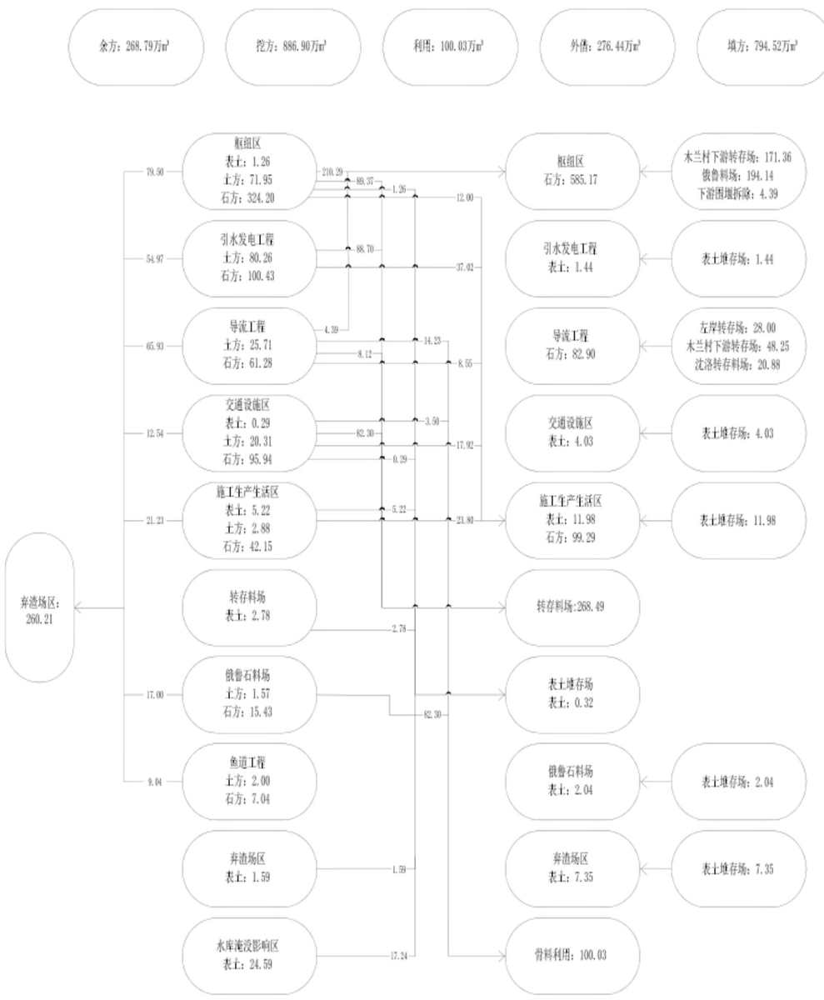
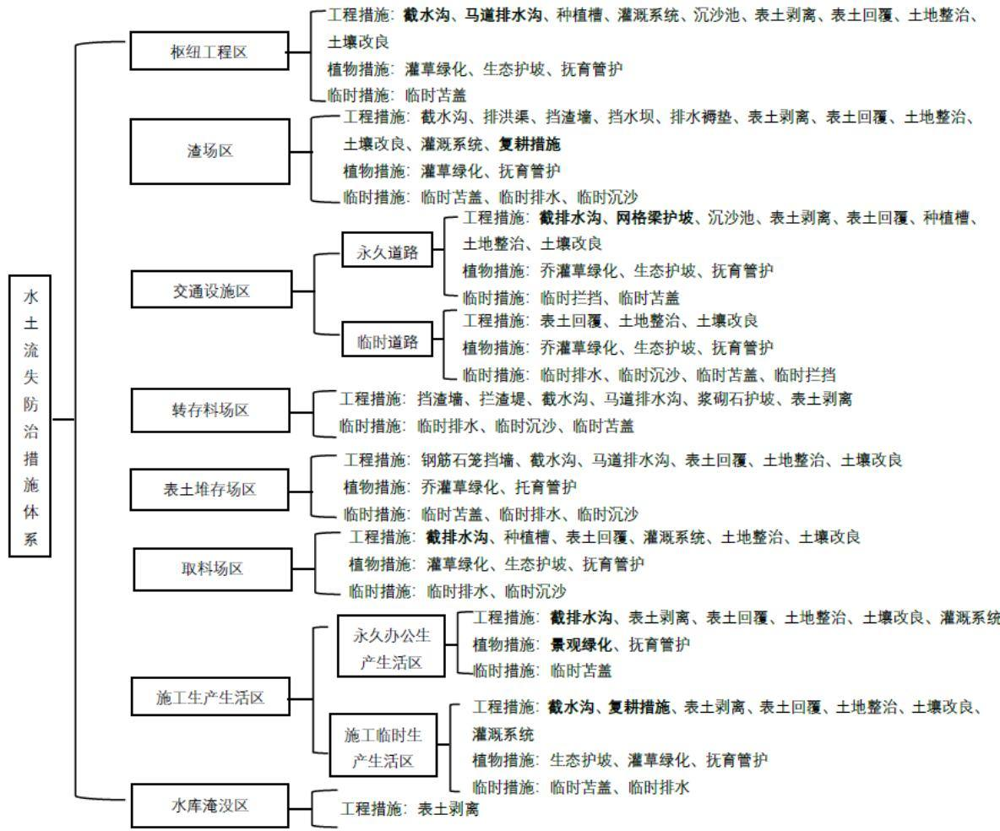
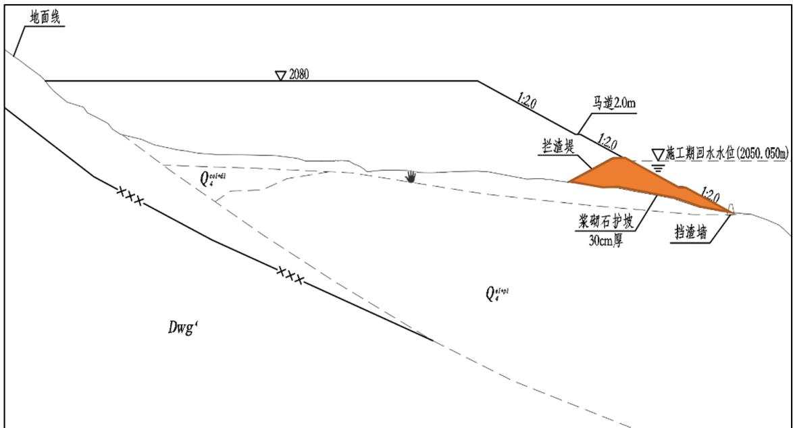

> **Zone C（应用范例层）使用边界**——仅可用于**写作风格、章节展开方式、表达逻辑、表格设计**的参考。
> **不得**用于合规判断；**不得**引入其项目数据（名称／地点／数字／单位名）；
> **不得**因其"曾经通过审批"而推定其做法在当前标准下仍然合规。
> 与 Zone A 冲突时**一律以 Zone A 为准**；Zone A 未明确规定时输出
> 「**Zone A 未明确规定，以下为参考写法，需人工判断**」。
>
> **坐标系警告**：本范例为**老八章结构**（GB 50433—2018 附录B），与 2026 版 10 章模板**同号不同义**
> （老 `1.5`＝防治目标，新 `1.5`＝水土流失预测结果；老 4→新 6 …偏移 +2；新版第 4/5 章老结构无独立章）。
> 因此 **`chapter_mapping: pending`——不得按章节号挂载**，检索一律走 `topic_tags`。
>
> **待加工**：`topic_tags`（主题标签）、`approval_basis_list`（编制依据逐字清单）、
> `structure_summary`（只提取结构：章节展开顺序／段落功能／表格栏目结构／句式模板／论证链步骤）。

<!-- 本文件由原方案 PDF 分段转换后拼接：共 2 段，原 316 页（MinerU 云单文件上限 200 页） -->

1 综合说明 .......  
1.1 项目简况 ...  
1.2 编制依据 ..  
1.3 设计水平年 ...  
1.4水土流失防治责任范围.  
1.5水土流失防治目标.... . 7  
1.6项目水土保持评价结论. ... 10  
1.7水土流失预测结果... ... 14  
1.8水土保持措施布设成果. ... 14  
1.9 水土保持监测方案....... ... 18  
1.10水土保持投资及效益分析成果..... ... 18  
1.11 结论 .. .. 19  
2 项目概况 ...... ... 24  
2.1项目组成及工程布置.. ... 24  
2.2 施工组织 .. ... 33  
2.3 工程占地 ... ... 79  
2.4 土石方平衡 ... ... 84  
2.5移民安置与专项设施改迁建..... ... 103  
2.6 施工进度 ... .. 123  
2.7 自然概况 ... ... 126  
3项目水土保持评价...... ... 135  
3.1主体工程选址（线）水土保持评价... .. 135  
3.2建设方案与布局水土保持评价..... ... 137  
3.3主体工程设计中水土保持措施界定.. ... 193  
4水土流失分析与预测....... ..... 198  
4.1 水土流失现状. ... 198  
4.2水土流失影响因素分析.. . 199  
4.3土壤流失量预测... . 200  
4.4水土流失危害分析.. .. 219  
4.5 指导性意见 ... .. 220  
5 水土保持措施 ....... .... 222  
5.1防治区划分. .. 222  
5.2措施总体布局. . 222  
5.3 分区措施布设... .. 242  
5.4 施工要求 ... .. 287  
6 水土保持监测..... .... 295  
6.1 范围和时段.. .. 295  
6.2 内容和方法 ... .. 295  
6.3 点位布设 ..... .. 304  
6.4实施条件和成果.. ... 308  
7水土保持投资估算及效益分析..... .... 312  
7.1 投资估算 ..... .... 312  
7.2 效益分析 ... .. 350  
8水土保持管理... ... 352  
8.1 组织管理 .. ... 352  
8.2 后续设计 ... ... 354  
8.3水土保持监测. .. 356  
8.4水土保持监理.. ... 358  
8.5水土保持施工. ... 359  
8.6水土保持设施验收.. ... 363

## 附表

1、单价分析表；

2、土壤指标检测表。

## 附件

附件1：关于委托开展巴底水电站工程水土保持方案报告书编制工作的函；

附件 2：国家发改委办公厅关于同意四川大渡河金川巴底水电站开展前期工作的复函（发改办能源〔2012〕3671号）；

附件 3：四川省发改委印发巴底水电站预可行性研究报告审查意见的通知（川发改能源函〔2011〕263号）；

附件4：关于印送《四川大渡河巴底水电站可行性研究报告（枢纽部分）评审意见》的函（水电规水工〔2023〕446号）；

附件5：四川省人民政府关于《四川大渡河巴底水电站建设征地移民安置规划大纲》的批复（川府函〔2024〕128号）；

附件 6：四川省水利厅关于《四川大渡河巴底水电站建设征地移民安置规划（审定本）》审核意见的函（川水函〔2024〕1372号）；

附件 7：水利部长江水利委员会关于四川省大渡河巴底水电站洪水影响评价的行政许可决定（长许可决〔2024〕239号）；

附件 8：四川省人民政府关于巴底水电站工程建设范围与墨尔多山自然保护区位置关系的复函意见；

附件9：自然资源部关于规范和完善砂石开采管理的通知（自然资发〔2023〕57号）；

附件10：弃渣场、转存料场及表土堆存场选址意见书；

附件11：四川大渡河巴底水电站弃渣减量和综合利用专题报告；

附件12：四川大渡河巴底水电站弃渣场及转存料场专题论证报告；

附件13：四川大渡河巴底水电站表土资源保护与利用专题报告；

附件14：四川大渡河巴底水电站弃渣场及转存料场地质调查与勘察报告。

## 附图

附图1 项目地理位置图

附图 2 项目区水系图

附图3 金川县土壤侵蚀图

附图4 丹巴县土壤侵蚀图

BJ165K-H1-1-1 枢纽工程布置图

BJ165K-H1-1-2 拦河坝布置图（1/2）

BJ165K-H1-1-3 拦河坝布置图（2/2）

BJ165K-P3-1 施工总布置图

BJ165K-T-1 水土流失防治责任范围图

BJ165K-T-2 水土保持措施总体布局图

BJ165K-T-3 水土保持监测点位布局图

BJ165K-D6-01 表土剥离范围图（1/4）

BJ165K-D6-02 表土剥离范围图（2/4）

BJ165K-D6-03 表土剥离范围图（3/4）

BJ165K-D6-04 表土剥离范围图（4/4）

BJ165K-T-4-1 枢纽工程区水土保持措施典型布设图（1/3）

BJ165K-T-4-2 枢纽工程区水土保持措施典型布设图（2/3）

BJ165K-T-4-3 枢纽工程区水土保持措施典型布设图（3/3）

BJ165K-T-5-1 交通设施区水土保持措施典型布设图（1/4）

BJ165K-T-5-2 交通设施区水土保持措施典型布设图（2/4）

BJ165K-T-5-3 交通设施区水土保持措施典型布设图（3/4）

BJ165K-T-5-4 交通设施区水土保持措施典型布设图（4/4）

BJ165K-T-6 沉沙池设计图

BJ165K-T-7-1 李家沟渣场规划及防护布置图（1/3）

BJ165K-T-7-2 李家沟渣场规划及防护布置图（2/3）

BJ165K-T-7-3 李家沟渣场规划及防护布置图（3/3）

BJ165K-T-8-1 木兰下坝体Ⅰ区转存料场规划及防护布置图(1/2)

BJ165K-T-8-2 木兰下坝体Ⅰ区转存料场规划及防护布置图(2/2)

BJ165K-T-8-3 木兰下坝体Ⅲ区转存料场规划及防护布置图（1/2）

BJ165K-T-8-4 木兰下坝体Ⅲ区转存料场规划及防护布置图（2/2）

BJ165K-T-8-5 木兰下上堰料转存料场规划及防护布置图（1/2）

BJ165K-T-8-6 木兰下上堰料转存料场规划及防护布置图（2/2）

BJ165K-T-8-7 坝区左岸上堰料转存料场规划及防护布置图（1/2）

BJ165K-T-8-8 坝区左岸上堰料转存料场规划及防护布置图（2/2）

BJ165K-T-8-9 沈洛转存料场规划及防护布置图（1/2）

BJ165K-T-8-10 沈洛转存料场规划及防护布置图（2/2）

BJ165K-T-9-1 左岸表土堆存场规划及防护布置图（1/2）

BJ165K-T-9-2 左岸表土堆存场规划及防护布置图（2/2）

BJ165K-T-9-3 右岸表土堆存场规划及防护布置图（1/2）

BJ165K-T-9-4 右岸表土堆存场规划及防护布置图（2/2）

BJ165K-P5-1-1 俄鲁石料场布置及开采规划图（1/2）

BJ165K-P5-1-2 俄鲁石料场布置及开采规划图（2/2）

BJ165K-T-10 客土喷播植草护坡典型设计图

BJ165K-T-11 植被混凝土生态护坡典型设计图

BJ165K-T-12 厚层基材植物护坡典型设计图

BJ165K-T-13 交通隧洞进出口洞脸水土保持措施布设图

BJ165K-T-14 渣场区典型植物措施设计图

BJ165K-T-15 施工生产生活区典型植物措施设计图

BJ165K-T-16 表土堆存场植物措施典型设计图

## 1 综合说明

## 1.1 项目简况

## 1.1.1 项目基本情况

## 1.1.1.1 项目建设必要性

《电力发展“十三五”规划(2016-2020 年)》中，要求“坚持干流开发优先、支流保护优先的原则，积极有序推进大型水电基地建设“继续做好金沙江下游、大渡河、雅砻江等水电基地建设”。我国《中共中央国务院关于新时代推进西部大开发形成新格局的指导意见》、《加快构建新型电力系统行动方案（2024-2027年）》、《“十四五”可再生能源发展规划》、《“十四五”现代能源体系规划》中将发展清洁低碳能源作为调整能源结构的主攻方向，以长江经济带上游四川、云南和西藏等地区为重点，坚持生态优先，优化大型水电开发布局，加强可再生能源开发利用，推进西电东送接续水电项目建设；坚持清洁低碳、安全充裕、经济高效、供需协同、灵活智能的基本原则，推动西南地区水电与风电、太阳能发电协同互补。

大渡河是岷江的最大支流，干流河道全长 1062km（四川省境内 852km），天然落差 2788m，干支流水力资源技术可开发容量 31476MW，占四川省水力资源的 26.6%，其中干流为24690MW，占四川省的 20.50%，是四川省的三大水电基地之一，也是国家规划的 13 个能源基地之一，在我国能源资源建设中具有重要的战略地位。大渡河梯级规划有下尔呷、双江口、瀑布沟三个调节性能较好的大水库，电能质量较好，同时河流距四川省主要负荷中心距离较近，输电线路短。

巴底水电站工程开发任务主要为发电，并促进地方经济社会发展。建设巴底水电站是我国能源发展的客观需要，是推进“西电东送”和“川电外送”战略的需求，巴底水电站装机规模适中，送电距离短，开发条件较好，对外交通方便，不存在制约工程建设的技术和社会因素，工程指标较优越，建成后发电效益显著，同时还有促进当地社会经济发展的作用，有利于改善当地基础设施条件。因此建设巴底水电站是十分必要的。

## 1.1.1.2 项目概况

巴底水电站位于四川省甘孜藏族自治州丹巴县和阿坝藏族羌族自治州金川县境内的大渡河干流上，坝址位于丹巴县巴底镇骆驼沟沟口上游 800m 处，地理坐标为东经101°53′，北纬 31°07′，为大渡河规划的 28 个梯级电站中的第 8 级，是金川至丹巴河段分级开发的第2级，上接安宁水电站，下邻丹巴水电站，坝址控制面积 4.25万km2。坝址距上游金川县城62km，距下游丹巴县城31km，坝址区右岸有国道G248 公路通过，对外交通方便。

巴底水电站为新建建设类项目，建设单位为国能大渡河流域水电开发有限公司。

项目为二等大（2）型工程，电站装机容量 720MW，多年平均年发电量 30.12/29.25亿kW·h（联调/单调）。电站挡水建筑物为沥青混凝土心墙堆石坝，坝顶总长度 379.00m，最大坝高 97.00m。电站水库正常蓄水位 2078.00m，相应库容 1.973 亿 $\mathrm { m } ^ { 3 } ;$ ；死水位 2073m，相应死库容1.577亿 $\mathrm { m } ^ { 3 }$

本项目建设内容包括枢纽工程（挡水建筑物、泄水建筑物、输水建筑物、发电建筑物、导流建筑物等）、1个渣场（李家沟渣场）、5个转存料场、2个表土堆存场（左岸、右岸）、1个取料场（俄鲁石料场）、交通设施（总长 21.86km，其中明线 18.70km，隧洞3.16km，桥梁6座）、施工生产生活场地、水库淹没区。

李家沟渣场位于大渡河右岸，坝址上游约 6.0km 的李家沟内，渣场类型为沟道型渣场。规划容量345.0万 $\mathrm { m } ^ { 3 }$ ，实际弃渣量260.21 万 $\mathrm { m } ^ { 3 }$ （折合松方 343.25 万 $\mathbf { m } ^ { 3 } \mathbf { \Gamma } ,$ ），1级弃渣场，最大堆渣高度138m。

工程总征占地面积为 $1 0 0 1 . 4 8 \mathrm { h m } ^ { 2 }$ ，其中永久占地面积为 $9 6 6 . 4 6 \mathrm { h m } ^ { 2 }$ ，临时占地面积为 $3 5 . 0 2 \mathrm { h m } ^ { 2 }$ ；工程占地涉及四川省甘孜藏族自治州丹巴县 $3 6 2 . 6 0 \mathrm { h m } ^ { 2 }$ 及阿坝藏族羌族自治州金川县 $6 3 8 . 8 8 \mathrm { h m } ^ { 2 }$ ；占地类型涉及耕地、园地、草地、林地、水域及水利设施用地、交通运输用地和其他土地。

本工程土石方挖填总量 1681.42 万 $\mathrm { m } ^ { 3 }$ ，其中挖方总量为 886.90 万 $\mathrm { m } ^ { 3 }$ （含剥离表土35.74 万 $\mathrm { m } ^ { 3 }$ ），填方总量 794.52万 $\mathrm { m } ^ { 3 }$ （含工程回覆表土 $2 7 . 1 6 \mathrm { ~ \mathcal ~ { ~ H ~ } ~ m ~ } ^ { 3 } .$ ），借方 276.44 万$\mathrm { m } ^ { 3 }$ ，利用方 100.03 万 $\mathrm { m } ^ { 3 }$ （用于混凝土骨料加工），余方 268.79 万 $\mathrm { m } ^ { 3 }$ （其中 260.21 万$\mathrm { m } ^ { 3 }$ 弃于李家沟弃渣场，移民安置工程综合利用 8.58万 $\mathrm { m } ^ { 3 }$ ）。本工程土石方综合利用率为 70.66%（工程回填及利用 626.69 万 $\mathrm { m } ^ { 3 }$ ）。

移民安置及专项设施改迁建工程包括移民集中安置工程和专项设施复建工程等，至规划设计水平年生产安置人口 2057 人，采取自行安置与逐年货币补偿安置相结合的方式；搬迁安置人口 2046 人，采取集中与分散安置相结合的方式；复建等级公路全长23.80km（其中明线 18.33km，隧道 5.47km），复建 10kV 输电线路 67.17km、复建 0.4kV输电线路 14.76km、复建通信杆路 294.36km、光纤 723.25km、供水管线 19.60km 等。移民安置及专项设施改迁建工程由丹巴县和金川县县政府组织搬迁和安置实施，搬迁和安置费用由国能大渡河流域水电开发有限公司承担。移民安置及专项设施改迁建工程另行中国电建集团北京勘测设计研究院有限公司 2

编报水土保持方案。

项目筹建工程预计 2026年4月开工，主体工程预计 2028年5月开工，2033年7月底完工，总工期为 88 个月。工程总投资 1246418.87 万元，其中土建投资 287563.90 万元，资金来源为建设单位自筹。

## 1.1.2项目前期工作进展情况

## （1）河流规划情况

巴底水电站位于岷江流域大渡河干流上游河段，干流全长 1062km，大渡河以泸定、铜街子为界分为上、中、下游。上中游河段多为高山峡谷，落差集中，水能资源丰富，下游河谷逐渐开阔，水流平缓，水量丰沛。

2003 年 7 月完成了《四川省大渡河干流水电规划调整报告》，2004 年 9 月，四川省人民政府办公厅以“川办函[2004]196 号”对大渡河干流水电规划调整报告的审查意见进行了批复，《四川省大渡河干流水电规划调整报告》及批复明确“以下尔呷、双江口为龙头水库的22级开发方案”。

根据大渡河规划调整报告审查意见，中国电建集团成都勘测设计研究院、北京勘测设计研究院（以下简称“北京院”）和华东勘测设计研究院（以下简称“华东院”）先后对大渡河干流金川～丹巴河段开发方案进行了研究，形成了《四川省大渡河金川～丹巴河段巴底开发方式研究报告》。2009年3月14 日\~15日，北京院和华东院共同编制的《大渡河金川至丹巴河段梯级开发方案研究报告》通过水电水利规划设计总院会同四川省发展和改革委员会的审查，该研究报告将巴底梯级分为安宁、巴底两个梯级。

## （2）项目设计情况

2010年6月，北京院完成《四川大渡河巴底水电站预可行性研究报告》，并于2010年11月14日通过了水电水利规划设计总院会同四川省发展和改革委员会、能源局的审查。

2011年7月，北京院完成《四川省大渡河巴底水电站可行性研究阶段坝址、坝型及枢纽布置格局选择专题报告》并于2011年8月 25日通过了中国水利水电建设工程咨询公司咨询。

2011年9月，北京院完成《四川省大渡河巴底水电站可行性研究阶段正常蓄水位选择专题报告》、《四川省大渡河巴底水电站可行性研究阶段施工总布置规划专题报告》，并于 2011 年 10 月 29 日通过了水电水利规划设计总院会同四川省发展和改革委员会、能源局的审查。

2020 年 7 月，《四川大渡河巴底水电站可行性研究阶段施工总布置规划专题报告》（重编）在成都通过了水利水电规划设计总院的审查，并于 2020年9月取得审查意见。

2021年1月，《四川省大渡河巴底水电站正常蓄水位选择专题报告（复核）》在成都通过了水电水利规划设计总院审查。

2023 年 11 月，《四川大渡河巴底水电站可行性研究报告（枢纽部分）》在北京通过了水电水利规划设计总院评审。

2024年7月，四川大渡河巴底水电站取得了建设项目用地预审与选址意见书。

2024年9月，《四川大渡河巴底水电站建设征地移民规划报告》通过了水电水利规划设计总院审查，并于 2024年11月取得了四川省水利厅批复。

2024 年 10 月，《四川省大渡河巴底水电站洪水影响评价报告》取得了水利部长江水利委员会批复。

## （3）水土保持方案编制情况

在开展巴底水电站可行性研究勘测设计的同时，北京院同步开展了巴底水电站选址水土保持评价、表土资源调查、弃渣减量和综合利用、水土保持措施总体布设等工作，并及时启动了项目水土保持方案编制工作，先后完成了《四川大渡河巴底水电站表土资源保护与利用专题报告》、《四川大渡河巴底水电站弃渣减量和综合利用专题报告》、《四川大渡河巴底水电站弃渣场及转存料场专题论证报告》、《四川大渡河巴底水电站弃渣场及转存料场地质调查与勘察报告》，并于 2025年10月编制完成了《四川大渡河巴底水电站水土保持方案报告书》。

## 1.1.3 自然概况

电站坝址区地处青藏高原东南部，高山峡谷地貌，属川西高原亚温带气候区，坝址所在的丹巴县多年平均年降水量为 616mm，多年平均气温 $1 4 . 3 ^ { \circ } \mathrm { C }$ ，多年平均蒸发量2441mm，多年平均风速 3.0m/s；库区金川县多年平均年降水量 675.4mm，多年平均气温 12.3℃，多年平均蒸发量 1577.9mm；多年平均风速 0.9m/s。坝址多年平均流量为555m3/s。项目区主要分布潮土、山地褐土等，植被主要为干旱河谷灌丛、针叶林、阔叶林，人工植被主要为经济林和农作物，项目区林草植被覆盖率为 35%。

项目区属青藏高原区，土壤侵蚀类型主要为水力侵蚀，容许土壤流失量 $5 0 0 \mathrm { t / k m } ^ { 2 } { \cdot } \mathrm { a }$ 项目区平均土壤侵蚀模数约 $1 4 3 0 . 1 4 \mathrm { t / k m } ^ { 2 } { \cdot } \mathrm { a }$ ，土壤侵蚀强度为轻度侵蚀。项目建设区不涉及国家级和省级水土流失重点防治区，不涉及饮用水水源保护区、水功能一级区的保护区和保留区、世界文化和自然遗产地、风景名胜区、地质公园、森林公园和重要湿地中国电建集团北京勘测设计研究院有限公司 4

等水土保持敏感区。

## 1.2 编制依据

## 1.2.1 法律法规

（1）《中华人民共和国水土保持法》（1991 年6月29日颁布，2010 年12月25日修订，2011年3月1日施行）；

（2）《中华人民共和国防洪法》（1997年8 月29日颁布，2016年7 月2日修正）；

（3）《中华人民共和国青藏高原生态保护法》（2023年4月26日颁布，2023年9月1日起施行）；

（4）《中华人民共和国长江保护法》（2020 年12月26日颁布，2021 年3月1日起施行）；

（5）《中华人民共和国水法》（1988年1 月21日颁布，2016年7 月2日修改）；

（6）《中华人民共和国河道管理条例》（1988年6 月10日发布，2018年3 月19日修正）；

（7）《四川省〈中华人民共和国水土保持法〉实施办法》（1997 年 10 月 17 日通过，2012年9月21日修订，2012年12月1日起施行）。

## 1.2.2部委规章及规范性文件

（1）中共中央办公厅、国务院办公厅《关于加强新时代水土保持工作的意见》（2023年1月3日发布）；

（2）《生产建设项目水土保持方案管理办法》（水利部令第 53号，2023年1月17日发布，2023年3月1 日起施行）；

（3）《水土保持生态环境监测网络管理办法》（水利部令第 12号，2014年8月19日水利部令第46号修改）；

（4）《水利部办公厅关于印发生产建设项目水土保持方案审查要点的通知》（办水保〔2023〕177 号）；

（5）《水利部关于加强水土保持空间管控的意见》（水保〔2024〕4号）；

（6）《水利部办公厅关于进一步加强部批项目水土保持监管工作的通知》（办水保〔2024〕57 号）；

（7）《水利部办公厅关于生产建设项目水土保持方案管理工作有关衔接事项的通知》（办水保函〔2023〕109号）；

（8）《水利部水土保持司关于进一步加强生产建设项目水土保持方案质量管理的中国电建集团北京勘测设计研究院有限公司 5

通知》（水保监督函〔2022〕21号）；

（9）《水利部关于开展国家水土保持示范创建工作的通知》（水保〔2021〕11号）；

（10）《水利部办公厅关于印发生产建设项目水土保持问题分类和责任追究标准的通知》（办水保函〔2020〕564号）；

（11）《水利部办公厅关于实施生产建设项目水土保持信用监管“两单”制度的通知》（办水保〔2020〕157 号）。

## 1.2.3 规范标准

（1）《生产建设项目水土保持技术标准》（GB 50433-2018）；

（2）《生产建设项目水土流失防治标准》（GB/T 50434-2018）；

（3）《水土保持工程调查与勘测标准》（GB/T 51297-2018）；

（4）《水土保持工程设计规范》（GB51018-2014）；

（5）《生产建设项目水土保持监测与评价标准》（GB/T 51240-2018）；

（6）《土地利用现状分类》（GB/T 21010-2017）；

（7）《防洪标准》（GB 50201-2014）；

（8）《中国地震动参数区划图》（GB18306-2015）；

（9）《中国气候区划名称与代码 气候带和气候大区》（GB/T 17297-1998）；

（10）《土壤侵蚀分类分级标准》（SL190-2007）；

（11）《水利水电工程制图标准 水土保持图》（SL73.6-2015）；

（12）《水电工程渣场设计规范》（NB/T 35111-2018）；

（13）《水电建设项目水土保持技术规范》（NB/T 10509-2021）；

（14）《水电工程水土保持设计规范》（NB/T 10344-2019）；

（15）《水电工程水土保持生态修复技术规范》（NB/T 10510-2021）；

（16）《水土保持监测技术规范》（SL/T 227-2024）；

（17）《水电工程制图标准第 7部分：水土保持》（NB/T 10883.7-2023）。

## 1.2.4 技术文件及资料

（1）《大渡河干流水电规划调整报告》（成都勘测设计研究院 2004年9月）；

（2）《四川省大渡河金川至丹巴河段梯级开发方案研究报告》（中国电建集团北京勘测设计研究院有限公司和中国电建集团华东勘测设计研究院有限公司 2010年9月）；

（3）《四川省大渡河巴底水电站可行性研究阶段施工总布置规划专题报告（重编）（审定稿）》（中国电建集团北京勘测设计研究院有限公司 2020年7 月）；

（4）《四川省大渡河巴底水电站可行性研究阶段正常蓄水位选择复核报告（审定本）》（中国电建集团北京勘测设计研究院有限公司 2021年11月）；

（5）《四川省大渡河巴底水电站可行性研究报告（枢纽部分）评审稿》（中国电建集团北京勘测设计研究院有限公司 2023年11 月）；

（6）《四川省大渡河巴底水电站建设用地地质灾害危险性评估报告》（中国电建集团成都勘测设计研究院有限公司 2023年9月）；

（7）《四川省大渡河巴底水电站洪水影响评价报告（审定稿）》（中国电建集团北京勘测设计研究院有限公司 2024年10月）；

（8）《四川大渡河巴底水电站移民安置规划报告（审定稿）》（中国电建集团北京勘测设计研究院有限公司 2024年11月）；

（9）《四川大渡河巴底水电站环境影响报告书（送审稿）》（中国电建集团北京勘测设计研究院有限公司 2025年6月）；

（10）与工程设计有关的其它技术资料。

## 1.3 设计水平年

根据《生产建设项目水土保持技术标准》（GB50433-2018）的规定，设计水平年为主体工程完工后的当年或后一年。本工程预计 2026年4月动工，2033年 7月底完工（含25个月筹建期）。水土保持方案设计水平年为主体工程完工后的一年，即 2034年。

## 1.4水土流失防治责任范围

本工程水土流失防治责任范围共计 $1 0 0 1 . 4 8 \mathrm { h m } ^ { 2 }$ （其中永久占地 $9 6 6 . 4 6 \mathrm { h m } ^ { 2 }$ ，临时占地 $3 5 . 0 2 \mathrm { h m } ^ { 2 }$ ），分属四川省甘孜藏族自治州丹巴县及阿坝藏族羌族自治州金川县，其中甘孜藏族自治州丹巴县 362.60hm²（其中永久占地 $3 4 4 . 6 8 \mathrm { h m } ^ { 2 }$ ，临时占地 17.92hm2），阿坝藏族羌族自治州金川县 638.88hm2（其中永久占地 $6 2 1 . 7 8 \mathrm { h m } ^ { 2 }$ ，临时占地 $1 7 . 1 0 \mathrm { h m } ^ { 2 } )$ 移民安置及专项设施改迁建工程由丹巴县和金川县县政府组织搬迁和安置实施，本工程水土流失防治责任范围不包括移民安置及专项设施改迁建工程建设范围。

## 1.5水土流失防治目标

## 1.5.1 执行标准等级

根据《水利部办公厅关于做好国家级水土流失重点预防区和重点治理区落地上图成果应用的通知》（办水保〔2025〕170号）和《四川省水利厅关于印发<四川省省级水土流失重点预防区和重点治理区划分成果>的通知》（川水函〔2017〕482 号），巴底水电站涉及的金川县、丹巴县不涉及国家级和省级水土流失重点防治区。根据《生产建设项目水土流失防治标准》（GB/T 50434-2018），工程位于四级以上河道两岸 3km 汇流范围内，因此，本项目水土流失防治标准执行建设类项目青藏高原区水土流失防治指标二级标准。

## 1.5.2 防治目标

## （1）基本目标

根据《生产建设项目水土保持技术标准》（GB50433-2018）规定，项目建设范围内的新增水土流失应得到有效控制，原有水土流失得到治理；水土保持设施应安全有效；水土资源、林草植被应得到最大限度的保护与恢复。

## （2）六项指标

根据《生产建设项目水土流失防治标准》（GB/T 50434-2018）4.0.2 和 4.0.6\~4.0.10条、《生产建设项目水土保持技术标准》（GB 50433-2018）3.2.2条规定，水土流失防治标准中的六项指标包含水土流失治理度、土壤流失控制比、渣土防护率、表土保护率、林草植被恢复率、林草覆盖率。六项指标应根据干旱程度、原地貌土壤侵蚀强度、地形地貌、地理位置、是否涉及各级水土流失重点防治区等因素进行调整。

1）根据《中国气候区划名称与代码气候带和气候大区》（GB/T17297-1998），本项目区属半湿润区，干燥度指数大于等于 1.0且小于 1.6，项目区不属于干旱地区，水土流失治理度、林草植被恢复率和林草覆盖率不调整；

2）项目区原地貌土壤侵蚀强度以轻度为主，土壤流失控制比不应小于 1.0；

3）项目区不涉及国家级和省级水土流失重点防治区，林草覆盖率不修正。但考虑本项目为能源绿化低碳项目，结合同期同流域水电工程水土保持方案报告书相关成果，将林草覆盖率提高12%。

综合考虑，本项目设计水平年水土流失防治目标值确定为水土流失治理度 82%、土壤流失控制比 1.0、渣土防护率 85%、表土保护率 85%、林草植被恢复率 90%、林草覆盖率25%。水土流失防治指标修正计算详见表 1.5-1。

表1.5-1  
巴底水电站工程水土流失防治目标表
<table><tr><td colspan="1" rowspan="2">防治指标</td><td colspan="2" rowspan="1">指标值（二级标准）</td><td colspan="1" rowspan="2">按原地貌土壤侵蚀强度调整</td><td colspan="1" rowspan="1">分析调整</td><td colspan="2" rowspan="1">目标值（二级标准）</td></tr><tr><td colspan="1" rowspan="1">施工期</td><td colspan="1" rowspan="1">设计水平年</td><td colspan="1" rowspan="1"></td><td colspan="1" rowspan="1">施工期</td><td colspan="1" rowspan="1">设计水平年</td></tr><tr><td colspan="1" rowspan="1">水土流失治理度(%)</td><td colspan="1" rowspan="1"></td><td colspan="1" rowspan="1">82</td><td colspan="1" rowspan="1"></td><td colspan="1" rowspan="1"></td><td colspan="1" rowspan="1"></td><td colspan="1" rowspan="1">82</td></tr><tr><td colspan="1" rowspan="1">土壤流失控制比</td><td colspan="1" rowspan="1">1</td><td colspan="1" rowspan="1">0.75</td><td colspan="1" rowspan="1">+0.25</td><td colspan="1" rowspan="1"></td><td colspan="1" rowspan="1">1</td><td colspan="1" rowspan="1">1.0</td></tr><tr><td colspan="1" rowspan="1">渣土防护率(%)</td><td colspan="1" rowspan="1">83</td><td colspan="1" rowspan="1">85</td><td colspan="1" rowspan="1"></td><td colspan="1" rowspan="1"></td><td colspan="1" rowspan="1">83</td><td colspan="1" rowspan="1">85</td></tr><tr><td colspan="1" rowspan="1">表土保护率(%)</td><td colspan="1" rowspan="1">85</td><td colspan="1" rowspan="1">85</td><td colspan="1" rowspan="1"></td><td colspan="1" rowspan="1"></td><td colspan="1" rowspan="1">85</td><td colspan="1" rowspan="1">85</td></tr><tr><td colspan="1" rowspan="1">林草植被恢复率(%)</td><td colspan="1" rowspan="1"></td><td colspan="1" rowspan="1">90</td><td colspan="1" rowspan="1"></td><td colspan="1" rowspan="1"></td><td colspan="1" rowspan="1"></td><td colspan="1" rowspan="1">90</td></tr><tr><td colspan="1" rowspan="1">林草覆盖率（%）</td><td colspan="1" rowspan="1">一</td><td colspan="1" rowspan="1">13</td><td colspan="1" rowspan="1"></td><td colspan="1" rowspan="1">+12</td><td colspan="1" rowspan="1"></td><td colspan="1" rowspan="1">25</td></tr></table>

## 1.5.3分阶段验收水土流失防治目标值

## （1）阶段验收划分

依据《水电工程水土保持设施验收规程》（NB/T 35119-2018），水电工程水土保持设施验收应分为阶段验收和竣工验收，阶段验收包括截流阶段验收和蓄水阶段验收。

## 1）截流验收阶段

依据《水电工程水土保持设施验收规程》（NB/T 35119-2018），截流阶段水土保持设施验收范围应以批准的水土保持方案所确定的水土流失防治责任范围为基础，根据截流前的实际扰动范围确定，以表土剥离区域及表土堆存场、转存料场、施工生产生活设施、场内交通等集中扰动区域为重点验收范围。

依据《生产建设项目水土流失防治标准》（GB/T 50434-2018），截流阶段设计水平年防治目标值为：渣土防护率 85％，表土保护率 85%。

## 2）蓄水验收阶段

依据《水电工程水土保持设施验收规程》（NB/T 35119-2018），蓄水阶段水土保持设施验收范围应以批准的水土保持方案确定的水土流失防治责任范围为基础，根据蓄水阶段实际扰动范围确定，以正常蓄水位以下集中扰动区域为重点验收范围。

依据《生产建设项目水土流失防治标准》（GB/T 50434-2018），蓄水阶段设计水平年防治目标值为：渣土防护率 85％，表土保护率 85%。

## 3）竣工验收阶段

依据《水电工程水土保持设施验收规程》（NB/T 35119-2018），工程竣工水土保持设施验收应以相关水土保持技术标准和批准的水土保持方案及其设计文件为依据，以批准的水土流失防治责任范围为基础。

工程在竣工阶段设计水平年防治目标值为：水土流失治理度 82％，土壤流失控制比

1.0，渣土防护率85％，表土保护率 85%，林草植被恢复率 90％，林草覆盖率 25％。

## 1.6项目水土保持评价结论

## 1.6.1主体工程选址（线）评价

工程位于四川省甘孜藏族自治州丹巴县及阿坝藏族羌族自治州金川县，工程建设不占用河流两岸、湖泊和水库周边的植物保护带，未涉及国家水土保持监测网络中的水土保持监测站点、重点试验区及国家确定的水土保持长期定位观测站、饮用水水源保护区、自然保护区、生态保护红线、水功能一级区的保护区和保留区、世界文化和自然遗产地、风景名胜区、地质公园、森林公园和重要湿地等敏感区。根据《生产建设项目水土保持方案审查要点》（办水保〔2023〕177 号）第 7 条：禁止在水土流失严重、生态脆弱区域开展可能造成水土流失的生产建设活动，确因国家发展战略和保障国计民生需要建设的，按照相关法律法规及政策要求，在科学论证的基础上，依法办理审批手续。本项目为纳入国家级规划的水电项目，属确因国家发展战略和保障国计民生需要建设的工程，后续将依法办理审批手续；从水土保持角度分析，主体工程选址（线）是合理可行的。

## 1.6.2 建设方案与布局评价

## 1.6.2.1 建设方案评价

本工程建设不涉及国家级和省级水土流失重点防治区，工程建设方案通过坝址比选、坝型比选等选择了土石方量较小，水土流失影响较小的方案，依据《生产建设项目水土保持技术标准》（GB50433-2018）要求，进一步优化了建筑物型式以减少开挖量，工程建设方案均采取了有利于减轻水土流失负面影响的方案，符合水土保持要求，总体是合理可行的。

## 1.6.2.2 工程占地评价

本工程占地面积、占地类型符合现场实际情况，未占用基本农田等；在建设方案比选中选择了工程占地面积较优的方案，尽可能节约用地，施工用地满足施工要求。本工程通过设置围挡措施，严格控制施工扰动范围，避开植被相对良好的区域，保护原有地表植被不被破坏。工程在永久占地范围内对具备植被恢复条件的区域实施了植被绿化，工程临时用地在施工结束后，拆除临建设施，按照其原有土地类型进行土地恢复，并通过实施植被绿化或复耕等，恢复其原有水土保持功能。综合所述，工程占地统计未漏项，主体工程在占地数量、占地类型、占地性质、占地可恢复性等方面无水土保持制约因素，基本符合水土保持要求。

## 1.6.2.3 土石方平衡分析

## （1）弃渣减量化分析

可研阶段通过枢纽建筑物结构优化、交通工程优化，施工场地优化等方式进行工程开挖土石料的源头减量，合计减少开挖量约 140.66 万 $\mathrm { m } ^ { 3 }$ 。本项目土石方综合利用途径主要为作为混凝土骨料、垫层料、围堰填筑料、土石回填料和表土回填等，本工程土石方挖填总量 1681.42 万 $\mathrm { m } ^ { 3 }$ ，其中挖方总量为 886.90 万 $\mathrm { m } ^ { 3 }$ （含剥离表土 $3 5 . 7 4 \mathrm { ~ \mathscr ~ { ~ H ~ } ~ m ~ } ^ { 3 } )$ ），填方总量 794.52 万 $\mathrm { m } ^ { 3 } ( $ （含工程回覆表土 $2 7 . 1 6 \mathrm { ~ \mathcal ~ { ~ H ~ } ~ m ~ } ^ { 3 } )$ ），借方 276.44 万 $\mathrm { m } ^ { 3 }$ ，利用方 100.03万 $\mathrm { m } ^ { 3 }$ （用于混凝土骨料加工），余方 268.79 万 $\mathrm { m } ^ { 3 }$ （其中 260.21 万 $\mathrm { m } ^ { 3 }$ 弃于李家沟弃渣场，移民安置工程综合利用 $8 . 5 8 \ \mathcal { F } \ \mathrm { m } ^ { 3 } )$ 。本工程土 $\overline { { \mathcal { A } } }$ 方综合利用率为 70.66%（工程回填及利用 626.69 万 $\mathrm { m } ^ { 3 }$ ）。通过减量化和资源化利用，优化土石方调配，从源头减少工程开挖料，提高工程土石方利用率，满足水土保持要求。

## （2）弃渣综合利用分析

## 1）外部综合利用

项目调查了周边在建、拟建项目金川水电站、丹巴水电站、金川县安宁镇莫莫扎村高碉沟泥石流治理工程、阿坝州西南片区维稳力量联合训练基地工程、G350 丹巴县段灾害绕避整治工程、丹巴县 Y081沈足一村-村公路水毁恢复工程，均不具备消纳本工程弃渣条件；金川县和丹巴县无耕地垦造与提升需求，不具备消纳本工程弃渣条件；项目周边的城镇距离本项目较远，无需要借方的项目。经调研，巴底电站移民安置及专项设施改迁建工程需用本项目表土量为 8.58万 $\mathrm { m } ^ { 3 }$

## 2）综合利用分析

从水土保持角度评价，项目本身也充分利用开挖料进行综合利用，确实不能利用的，作为弃渣运往渣场集中堆放；工程土石方综合利用满足水土保持要求。

经综合利用分析后，需设置渣场永久堆放量为 260.21 $\overline { { \mathcal { H } } } \mathrm { ~ m } ^ { 3 } .$

## （2）土石方平衡评价

## 1）表土平衡分析

本项目通过表土资源分布调查和表土剥离厚度调查等，已充分将施工扰动区域内可剥离的耕、园、林地进行表土剥离，并保存和利用，剥离表土主要在表土堆存场内堆存保护，后期在植被建设和耕园地复耕时利用；工程已充分剥离保护了施工扰动范围内的表土资源，合计可剥离保护表土总量为 35.74万 $\mathrm { m } ^ { 3 }$ ，施工结束后全部回覆至施工扰动区域，用于土地整治后植被恢复及耕园地复耕，表土剥离和保护实现了平衡；从水土保持中国电建集团北京勘测设计研究院有限公司 11

的角度考虑，本项目工程表土剥离保护与利用措施合理，为后期占地恢复利用创造先行条件，满足水土保持要求。

## 2）土石方挖填数量评价

本项目土石方综合利用途径主要为作为混凝土骨料、垫层料、围堰填筑料、和土石回填料、表土回填等，本工程土石方挖填总量1681.42 万 $\mathrm { m } ^ { 3 }$ ，其中挖方总量为 886.90万$\mathrm { m } ^ { 3 }$ （含剥离表土35.74万 $\mathrm { m } ^ { 3 }$ ），填方总量794.52 万 $\mathrm { m } ^ { 3 }$ （含工程回覆表土 27.16万 $\mathbf { m } ^ { 3 } )$ 借方 276.44 万 $\mathrm { m } ^ { 3 }$ ，利用方 100.03 万 $\mathrm { m } ^ { 3 }$ （用于混凝土骨料加工），余方 268.79 万 $\mathrm { m } ^ { 3 }$ （其中 260.21 万 $\mathrm { m } ^ { 3 }$ 弃于李家沟弃渣场，移民安置工程综合利用 8.58 万 $\mathrm { m } ^ { 3 }$ ）。本工程土石方综合利用率为70.66%（工程回填及利用 $6 2 6 . 6 9 \mathrm { ~ \mathscr ~ { ~ H ~ } ~ m ~ } ^ { 3 }$ ）。主体设计通过优化充分利用工程开挖有用石料作为大坝填筑料、混凝土骨料、围堰填筑、场地平整等，减少了工程永久弃渣量，增加土石利用率，借方用于拦河坝填筑和混凝土骨料加工，满足水土保持要求。

## 3）土石方调配评价

工程回填及利用料主要来源于工程开挖料，大部分开挖料堆存于木兰下坝体 I区转存料场、木兰下坝体 III 区转存料场、木兰下上堰料转存料场、坝址上堰料转存料场以及沈洛转存料场进行堆存，可保证有用料在不能及时消纳的情况下进行有效的保存，待后续工程需要利用从转存料场进行回采，既保证了回填利用料的充足来源，又能解决施工时间长、利用料时段长及数量不均匀的情况。

本工程开挖土石方优先考虑本工程自身回填利用，无法工程本身利用的余方考虑设置弃渣场。经综合利用分析后，需设置弃渣场永久堆放的量为 260.21万 $\mathrm { m } ^ { 3 }$

因此本项目土石方调运基本符合节点适宜、时序可行、运距合理的原则，从水土保持角度分析是合理可行的。

## 1.6.2.4 取土（石、砂）场设置评价

主体工程设置1个石料场，不涉及崩塌和滑坡危险区、泥石流易发区，且本方案已经考虑料场开采过程中的临时防护措施及取料结束后的土地整治措施和生态护坡等措施，不会产生较大水土流失影响，符合水土保持要求，料场设置是合理的。

## 1.6.2.5 渣场设置评价

## （1）渣场及转存料场选址论证及多方案比选

巴底水电站坝址下游 10km 至上游30km 范围内共普查了 34处可能弃渣场地，对普查场地依据 “是否占用基本农田、河道管理范围线、生态保护红线（自然保护区界）、中国电建集团北京勘测设计研究院有限公司 12

下游敏感要素”等限制因素进行筛选，初选出 8 处场地可做为弃渣场及转存料场场地。

8 处初选场地依据土石方平衡成果，从工程地质、渣场容量、运渣道路与运距、建设征地移民等方面进行分析论证，结合施工场地布置需要，选出木兰下滩地、左岸坝址高漫滩作为有用料转存料场、耿扎滩地和木兰下滩地作为表土转存料场，选出李家沟、周鸡沟、司地沟3处场地进一步进行弃渣场选址比较。

李家沟渣场具有运距短、占地范围较小、损毁林草植被面积小、新增水土流失量少等优点，推荐李家沟作为本工程弃渣场场址。

## （2）渣场设置评价

依据《水土保持工程设计规范》（GB 51018-2014）和《水电工程水土保持设计规范》（NB/T 10344-2019），渣场布置、安全防护距离、堆置方案和稳定性验算均满足规范要求，渣场堆渣前要求位于下游淹没区及占压范围内的居民搬迁完成；渣场选址不涉及河湖管理范围和其他水土保持敏感区等，渣场设置是合理的。

## （3）转存料场设置评价

依据《水土保持工程设计规范》（GB 51018-2014）和《水电工程水土保持设计规范》（NB/T 10344-2019），转存料场布置、安全防护距离、堆置方案和稳定性验算均满足规范要求，转存料场下游无居民点等敏感对象；转存料场选址不涉及河湖管理范围和其他水土保持敏感区等，转存料场设置是合理的。

## （4）表土堆存场设置评价

依据《水土保持工程设计规范》（GB 51018-2014）和《水电工程水土保持设计规范》（NB/T 10344-2019），表土堆存场布置、安全防护距离、堆置方案和稳定性验算均满足规范要求，右岸表土堆存场堆存前要求位于下游淹没区及占压范围内的居民搬迁完成，左岸表土堆存场下游无居民点等敏感对象；表土堆存场选址不涉及河湖管理范围和其他水土保持敏感区等，表土堆存场设置是合理的。

## 1.6.2.6 施工方法与工艺评价

本项目针对高陡边坡采取分台阶放坡开挖、锚喷、锚杆（锁）等支护措施加固了边坡稳定，有助于避免塌陷、边坡失稳的发生；严控场内道路的施工面积，采用预裂爆破减少扰动范围，实行先拦挡后施工，开挖的土石方及时回填或运至渣场及转存料场，可有效避免开挖料顺坡滑落；渣场、转存料场及表土堆存场严格执行先拦后弃，按设计坡比堆存料，堆存结束后平整渣体平台和坡面。上述施工方法、工艺有利于缩短施工时间，减少地表扰动范围和水土流失量，施工过程中需做好转存料的临时防护等工作；堆渣考中国电建集团北京勘测设计研究院有限公司 13

虑了放缓弃渣边坡坡比、设置马道、截排水及拦挡工程等有利于保证渣场、转存料场稳定和安全的措施，基本满足水土保持的要求。

## 1.6.2.7 主体工程设计中具有水土保持功能工程的评价

主体工程设计在枢纽的开挖及回填边坡布设了混凝土截水沟、马道排水沟、坡脚排水沟；渣场在施工结束后顶部及时复耕；在交通工程挖方边坡上游侧及隧道洞口洞顶设了截排水沟，边坡设置框格梁护坡；在取料场布设了截排水沟措施；在施工生产生活区设置了复耕、截排水沟和景观绿化措施。主体设计的上述措施具有水土保持功能，本方案将进一步对各防治分区因地制宜地完善水土保持措施体系，以达到防治水土流失防治的目的。

## 1.7水土流失预测结果

巴底水电站工程在预测时段内背景土壤流失量为 19769t，预测土壤流失总量为93133t，新增土壤流失量为 73364t。其中，施工期可能造成的水土流失总量为 87687t，新增水土流失量为 69694t；自然恢复期可能造成的水土流失总量为 5446t，新增水土流失量为 3671t。

预测时段内，施工期水土流失总量为 87687t，占整个预测时段水土流失总量的94.15%；自然恢复期水土流失总量为 5446t，占整个预测时段水土流失总量的 5.85%。施工期为本工程水土流失重点防治时段。

施工期水土流失量较大的区域为枢纽工程区、渣场区和转存料场区，因此上述区域为产生水土流失的重点部位，为水土流失防治和水土保持监测、监理的重点部位。

## 1.8水土保持措施布设成果

按照造成水土流失成因的区间差异性、区内相似性原则，根据实际情况分枢纽工程区、渣场区、交通设施区、转存料场区、表土堆存场区、取料场区、施工生产生活区和水库淹没区8个一级分区，其中交通设施区下分永久道路和临时道路 2 个二级分区，施工生产生活区下分永久办公生产生活区和施工临时生产生活区 2个二级分区。分区水土保持措施布设如下。

## （1）枢纽工程区

施工前进行剥离表土；施工过程中，边坡上游采取截（排）水沟措施，马道采取排水沟及种植槽措施，裸露边坡采取临时苫盖措施；施工结束后，进行土地平整、土壤改良，马道种植槽采取表土回覆、灌草绿化等措施，局部边坡采取生态护坡并配套灌溉措

施，并对植被进行抚育管护。

工程措施：混凝土截（排）水沟 5006m，混凝土马道排水沟 6008m，种植槽 6008m，沉沙池共10座，表土剥离 1.26万 $\mathrm { m } ^ { 3 }$ ³，土地整治 $3 . 6 4 \mathrm { h m } ^ { 2 }$ ²，土壤改良 $3 . 6 4 \mathrm { h m } ^ { 2 }$ ，覆土 1.44万 m³。

植物措施：种植灌木 11941 株，栽植藤本 10246 株，撒播植草 $2 . 4 8 \mathrm { h m } ^ { 2 }$ ²，植被混凝土护坡 1.16hm²，抚育管护 3.64hm²，灌溉系统 1 项。

临时措施：土工布苫盖 99700m²。

## （2）渣场区

施工前进行剥离表土；在渣场上游来水侧设置混凝土挡水坝，右侧设置截水沟，出口设置混凝土沉沙池；左侧设置排洪渠，出口设置消力池。渣场沟底铺设排水褥垫，在坡脚设置混凝土挡渣墙。施工期间，对裸露的堆渣（料）体采用临时苫盖，设置临时排水沟。施工后期，对渣场平台复耕、边坡种植灌草。在绿化区域设置灌溉措施，并对植被进行抚育管护。

工程措施：混凝土截（排）水沟 2728m，渣场设排洪渠703m，挡渣墙 355m，挡水坝15m，排水褥垫 $4 0 \mathrm { m } ^ { 2 } .$ ，表土剥离1.60万m³，土地整治 13.49hm²，土壤改良 $1 3 . 4 9 \mathrm { h m } ^ { 2 }$ 表土回覆7.35万 $\mathrm { m } ^ { 3 }$ ，复耕 $3 . 0 9 \mathrm { h m } ^ { 2 }$

植物措施：种植灌木26000株，撒播植草 $1 0 . 4 0 \mathrm { h m } ^ { 2 }$ ，灌溉系统1项，抚育管护 $1 0 . 4 0 \mathrm { h m } ^ { 2 }$ o临时措施：临时排水沟 1000m，临时沉沙池 3个，土工布苫盖36000m2。

## （3）交通设施区

## 1）永久道路区

施工前进行剥离表土；施工过程中，在道路挖方边坡上游设置截水沟，在路基侧设置排水沟，在隧洞洞顶上游及两侧设置截排水沟，在截排水沟末端建设沉沙池；局部边坡采取框格梁护坡，底部边坡采用土袋进行临时拦挡，在内侧挖方边坡坡脚设置混凝土排水沟并顺接至天然沟道，对上下边坡开挖形成的裸露面采用土工布苫盖防止雨水冲刷；施工后期，进行土地整治、土壤改良，挖填边坡坡面采取生态护坡措施，道路种植槽内种植灌木，其他低矮平缓的扰动区域进行土地整治后撒播草种恢复植被。对隧洞洞脸采取厚层基材植被护坡措施，并对植被进行抚育管护。

工程措施：表土剥离 0.29万 $\mathrm { m } ^ { 3 }$ ，混凝土排水沟 5055m，土地整治 $4 . 6 5 \mathrm { h m } ^ { 2 }$ ，土壤改良 $4 . 6 5 \mathrm { h m } ^ { 2 }$ ，表土回覆 1.45 万 $\mathrm { m } ^ { 3 }$ ，混凝土沉沙池 16 个，种植槽 3000m，框格梁护坡工程 $0 . 6 5 \mathrm { h m } ^ { 2 }$

植物措施：种植行道树 2970 株，种植灌木 8176 株，栽植藤本 6000 株，撒播植草2.07hm2，框格生态袋护坡 0.65hm2，厚层基材植物护坡 0.32hm2，植被混凝土护坡 0.3hm2，抚育管护 4.65hm2。

临时措施：土袋挡墙 12000m，土工布苫盖 40000m2。

## 2）临时道路区

施工过程中，对临时道路下边坡设编织袋土进行拦挡，道路沿线临时排水沟，出口设沉沙池；对无法及时恢复植被的裸露区域采取临时苫盖措施。施工后期，挖填边坡坡面采取生态护坡措施；道路利用完毕，对道路路面、低矮的土质边坡及平缓区域进行土地整治、土壤改良后种植乔灌草，并对植被进行抚育管护。

工程措施：土地整治 5.22hm2，土壤改良5.22hm2，表土回覆2.58万m3。

植物措施：种植灌木 10050株，撒播植草4.02hm2，客土喷播植草护坡 1.20hm2，抚 育管护 5.22hm2。

临时措施：土袋挡墙 3500m，土工布苫盖 40000m2，临时沉沙池10个。

## （4）转存料场区

施工前期，转存料场堆存前先进行表土剥离，剥离的表土运至表土堆存场堆存保护；在转存料场设置混凝土截水沟，截水沟出口设置混凝土沉沙池，其中沈洛转存料场及坝址左岸上堰料转存料场坡脚设置钢筋石笼挡渣墙。

木兰下坝体Ⅰ区转存料场、木兰下坝体Ⅲ区转存料场位于水库库区，迎水面设置拦渣堤，拦渣堤坡脚设置混凝土挡墙，迎水坡面采用浆砌石护坡。木兰下上堰料转存料场在围堰挡水度汛前已全部回采，在坡脚设置混凝土挡墙。堆料过程中，对转存料场裸露的堆料采用临时苫盖。堆料回采利用结束后，均位于水下不进行绿化。

工程措施：表土剥离 2.78 万 m3，挡渣墙 1167m，截排水沟 1697m，浆砌石护坡17408m2。

临时措施：临时排水沟 4270m，临时沉沙池 10个，土工布苫盖20000m2。

## （5）表土堆存场区

堆土前，设置混凝土截排水措施，坡脚采取钢筋石笼措施；堆存过程中，采取临时排水措施，排水沟出口采取沉沙池措施，裸露的表土采取苫盖措施；回采后，采取土地整治、土壤改良、乔灌草绿化措施，绿化区域采取苫盖及抚育管护措施。

工程措施：土地整治 0.98hm2，土壤改良0.98hm2，表土回填0.32万 $\mathrm { m } ^ { 3 }$ ，截排水沟687m，钢筋石笼 427m。

植物措施：种植乔木 1224 株，种植灌木 1224 株，撒播植草 $0 . 9 8 \mathrm { h m } ^ { 2 }$ ，抚育管护 $0 . 9 8 \mathrm { h m } ^ { 2 }$

临时措施：土工布苫盖 $3 9 0 0 0 \mathrm { m } ^ { 2 }$ ，临时排水沟 645m，临时沉沙池4 座。

## （6）取料场区

施工期间，对料场开挖边坡顶部及马道布设混凝土截排水沟，截排沟出口设混凝土沉沙池；采取临时排水措施，排水沟出口采取沉沙池措施。施工后期，进行土地整治、土壤改良，在水库淹没线以上开挖边坡马道设置种植槽；对种植槽内进行绿化；对开挖边坡采取厚层基材植物护坡等生态护坡措施，配套灌溉措施并对植被进行抚育管护。

工程措施：土地整治 4.72hm2，土壤改良4.72hm2，表土回填2.04万 $\mathrm { m } ^ { 3 }$ ，截排水沟3781m，种植槽长度 2881m。

植物措施：种植灌木 5762株，厚层基材植物护坡 4.72hm2，灌溉系统1项，抚育管护 4.72hm2。

临时措施：临时排水沟 1500m，临时沉沙池 2座。

（7）施工生产生活区

1）永久办公生产生活区

施工前采取表土剥离措施；施工过程中，场地上游及周边采取截排水沟措施，裸露区域采取临时苫盖措施；施工结束后，采取土地整治、回覆表土、景观绿化措施，边坡采取生态护坡并配套灌溉措施及抚育管护措施。

工程措施：截排水沟 157m，表土剥离 1.30 万 m3，土地平整 $2 . 6 3 \mathrm { h m } ^ { 2 }$ ，土壤改良2.63hm2，表土回覆 1.05 万 m3。

植物措施：景观绿化 1.43hm2，厚层基材植物护坡 1.20hm2，灌溉系统 1项，抚育管护 $2 . 6 3 \mathrm { h m } ^ { 2 }$

临时措施：土工布苫盖 13000m2。

## 2）施工临时生产生活区

施工前采取表土剥离措施，施工过程中，场地上游及周边采取截排水沟措施，施工场地边坡采取马道排水沟措施，临时堆土采取临时拦挡、苫盖措施；施工结束后，采取土地整治、土壤改良、回覆表土、复耕、灌草绿化措施，边坡采取生态护坡并配套灌溉措施和抚育管护措施。

工程措施：截排水沟 6272m，表土剥离 3.92 万 $\mathrm { m } ^ { 3 }$ ，土地平整 $1 5 . 7 7 \mathrm { h m } ^ { 2 }$ ，土壤改良15.77 hm2，表土回覆 10.93 万 m3。

植物措施：复耕面积 7.73hm2，客土喷播植草 $1 . 5 5 \mathrm { h m } ^ { 2 }$ ，种植乔木6900 株，种植灌 木9326株，撒播植草 $6 . 4 9 \mathrm { h m } ^ { 2 }$ ，灌溉系统1项，抚育管护 $8 . 0 4 \mathrm { h m } ^ { 2 }$ o

临时措施：土工布苫盖 $4 0 0 0 0 \mathrm { m } ^ { 2 }$ ，临时马道排水沟 1900m，临时截水沟 700m，临时排水沟 2748m。

## （8）水库淹没区

为充分利用水库淹没区内的表土资源，水库蓄水前按施工时序对库区内可剥离表土进行剥离，除即剥即用表土外，其余表土集中运至表土堆存场堆存。

工程措施：表土剥离 24.59 万 $\mathrm { m } ^ { 3 }$ 。

## 1.9水土保持监测方案

本工程监测时段从筹建期开始，至设计水平年结束，共计100个月。水土保持监测的内容主要包括水土流失影响因素、施工全过程各阶段扰动土地情况、水土流失状况、防治成效及水土流失危害、转存料场稳定性监测等。监测方法综合采取地面监测、实地调查监测、卫星和无人机遥感监测、视频监控等多种方式进行监测。本工程共布设24个监测点位，其中枢纽工程区 4 个、渣场区 2 个、转存料场区 5 个、表土堆存场区 2 个、取料场区1个、交通设施区 3个、施工生产生活区 7个。

## 1.10水土保持投资及效益分析成果

本工程水土保持总投资 22023.63 万元，其中主体工程中具有水土保持功能工程的投资3865.09万元，水土保持专项投资 18158.54 万元。

主体工程中具有水土保持功能工程投资中工程措施投资 3150.09 万元，植物措施投资 715.00 万元。

水土保持专项投资中工程措施投资 6862.06 万元，植物措施投资 3767.03 万元，监测措施投资 724.49 万元，施工临时工程投资 1476.10 万元，独立费用 3248.50 万元，预备费1607.82万元，水土保持补偿费472.537万元（其中丹巴县水土保持补偿费为295.165万元，金川县水土保持补偿费为 177.372万元）。

水土保持方案各项措施实施后，到设计水平年，本工程水土流失治理面积为$1 6 8 . 2 7 \mathrm { h m } ^ { 2 }$ ，林草植被建设面积为 $4 0 . 2 8 \mathrm { h m } ^ { 2 }$ ，可减少水土流失量84498t，渣土挡护量549.14$\overline { { \mathcal { H } } } \mathrm { ~ m } ^ { 3 }$ ，表土剥离及保护量 35.74万m3。水土流失各项防治指标均可达到防治目标要求，水土保持蓄水保土、生态效益、社会效益显著。

本工程水土保持方案得到全面实施后，将基本控制因工程建设造成的新增水土流失，在保证工程施工建设和运行安全的同时，通过改变微地形、增加地面植被，可改良土壤性质、增加土壤水分入渗，减轻土壤侵蚀，将产生明显的保水保土效益，防止因水土流失造成的损失，并在一定程度上改善项目区原有的水土流失及生态环境状况。

## 1.11 结论

## （1）结论

1）工程选址不在全国水土保持监测网络中的水土保持监测站点、重点试验区及国家确定的水土保持长期定位观测站，不涉及饮用水水源保护区、自然保护区、生态保护红线、水功能一级区的保护区和保留区、世界文化和自然遗产地、风景名胜区、地质公园、森林公园和重要湿地等敏感区，不涉及河流两岸、湖泊和水库周边的植物保护带；不涉及国家级和省级水土流失重点防治区，水土流失防治执行二级标准。主体设计进一步优化施工工艺，施工过程中严格按照审定的施工工艺和范围进行施工，减少地表扰动和植被破坏范围，有效控制可能造成的水土流失。工程选址符合生产建设项目水土保持技术标准要求。

2）工程建设方案符合水土保持要求。渣场、转存料场和表土堆存场未布设在对公共设施、基础设施、工业企业、居民点等有重大影响的区域，在土石方合理调配下，容量能够满足工程需要，在严格采取水土保持措施的前提下，渣场、转存料场和表土堆存场不存在水土保持重大制约性因素，合理可行。

3）本工程为二等大（2）型工程，本项目土石方综合利用途径主要为作为混凝土骨料、垫层料、围堰填筑料、土石回填料和表土回填等，本工程土石方挖填总量 1681.42$\overline { { \mathcal { H } } } \mathrm { ~ m } ^ { 3 }$ ，其中挖方总量为 886.90 万 $\mathrm { m } ^ { 3 }$ （含剥离表土 $3 5 . 7 4 \mathrm { ~ \mathcal ~ { ~ H ~ } ~ m ~ } ^ { 3 } .$ ），填方总量 794.52 万$\mathrm { m } ^ { 3 }$ （含工程回覆表土 $2 7 . 1 6 \mathrm { ~ \mathcal ~ { ~ H ~ } ~ m ~ } ^ { 3 } \mathrm { ~ , ~ }$ ），借方 276.44 万 $\mathrm { m } ^ { 3 }$ ，利用方 $1 0 0 . 0 3 \mathrm { ~ \mathscr ~ { ~ H ~ } ~ m ~ } ^ { 3 }$ （用于混凝土骨料加工），余方 268.79 万 $\mathrm { m } ^ { 3 }$ （其中 260.21 万 $\mathrm { m } ^ { 3 }$ 弃于李家沟弃渣场，移民安置工程综合利用8.58万 $\mathrm { m } ^ { 3 } \mathrm { ~ . ~ }$ ）。本工程土石方综合利用率为 70.66%（工程回填及利用 626.69万 $\mathrm { m } ^ { 3 }$ ）。本工程土石方综合利用率为 70.66%（工程回填及利用 626.69万 $\mathrm { m } ^ { 3 }$ ）。通过减量化和综合利用，优化土石方调配，从源头减少工程开挖料，提高工程土石方利用率，满足水土保持要求。

4）工程施工方法总体有利于缩短施工工期、减少地表裸露时间、地表扰动范围以及水土流失量，施工过程中仍需做好表土和草甸剥离、临时防护，避免造成水土流失。

5）本方案结合主体工程设计的水土保持措施，对各区因地制宜地完善水土保持措施体系。实施本方案提出的水土保持措施后，至设计水平年可以达到水土流失防治目标中国电建集团北京勘测设计研究院有限公司 19

值，起到控制水土流失、保护生态环境的作用。

## （2）建议

1）项目区位于四川省丹巴县、金川县境内，在工程设计和建设中应努力优化工程布局和施工组织设计，尽量减少对原地形地貌的扰动和植物的破坏，防止本项目工程建设所产生的水土流失对当地生态环境的破坏，促进当地经济、社会和环境的可持续协调发展。

2）建议开展下阶段水土保持工作时，重视水土保持施工图设计。细化施工生产设施、道路的截、排水沟设计；加强施工期临时防护措施设计，如临时堆料的防护、临时排水等。

3）在充分利用弃渣、土石方调配及外运的前提下，进一步优化施工时期土石方调配，合理堆存转存料，尽量减少渣料来回输送，减少渣料运输过程中的洒落，将工程建设的水土流失减少到最低限度。同时在施工期间建设单位需加强各工程施工单位的沟通协调，保证渣料能及时运输和堆存。

4）在招标文件和合同中明确施工单位的水土保持责任和义务，并明确水土保持工程量及投资。建立规章制度，严格控制工程建设的扰动范围和临时堆土石的堆放，施工过程尽可能保护地表植被免遭破坏。

5）水土保持工程完工后，应积极开展自主验收，向社会公开水土保持设施验收材料，并在水土保持方案审批机关报备水土保持设施验收材料。

6）项目若发生重大变更，应重新编制水土保持方案，报原审批机关审批。

表 1.11-1 水土保持方案特性表
<table><tr><td colspan="2" rowspan="1">项目名称</td><td colspan="3" rowspan="1">大渡河巴底水电站工程</td><td colspan="1" rowspan="1">流域管理机构</td><td colspan="3" rowspan="1">长江水利委员会</td></tr><tr><td colspan="2" rowspan="1">涉及省（市、区）</td><td colspan="1" rowspan="1">四川省</td><td colspan="2" rowspan="1">涉及地市或个数</td><td colspan="1" rowspan="1">甘孜藏族自治州、阿坝藏族羌族自治州</td><td colspan="2" rowspan="1">涉及县或个数</td><td colspan="1" rowspan="1">丹巴县、金川县</td></tr><tr><td colspan="2" rowspan="1">项目规模</td><td colspan="1" rowspan="1">二等大（2）型</td><td colspan="2" rowspan="1">总投资（万元）</td><td colspan="1" rowspan="1">1246418.87</td><td colspan="2" rowspan="1">土建投资（万元）</td><td colspan="1" rowspan="1">287563.9</td></tr><tr><td colspan="2" rowspan="1">动工时间</td><td colspan="1" rowspan="1">2026年4月</td><td colspan="2" rowspan="1">完工时间</td><td colspan="1" rowspan="1">2033年7月</td><td colspan="2" rowspan="1">设计水平年</td><td colspan="1" rowspan="1">2034年</td></tr><tr><td colspan="2" rowspan="1">工程占地（hm²）</td><td colspan="1" rowspan="1">1001.48</td><td colspan="2" rowspan="1">永久占地（hm²）</td><td colspan="1" rowspan="1">966.46</td><td colspan="2" rowspan="1">临时占地（hm²）</td><td colspan="1" rowspan="1">35.02</td></tr><tr><td colspan="3" rowspan="2">土石方量（万m³）</td><td colspan="1" rowspan="1">挖方</td><td colspan="1" rowspan="1">填方</td><td colspan="1" rowspan="1">借方</td><td colspan="2" rowspan="1">利用方</td><td colspan="1" rowspan="1">余（弃）方</td></tr><tr><td colspan="1" rowspan="1">886.90</td><td colspan="1" rowspan="1">794.52</td><td colspan="1" rowspan="1">276.44</td><td colspan="2" rowspan="1">100.03</td><td colspan="1" rowspan="1">268.79</td></tr><tr><td colspan="3" rowspan="1">重点防治区名称</td><td colspan="6" rowspan="1">不涉及国家级和省级水土流失重点防治区</td></tr><tr><td colspan="3" rowspan="1">地貌类型</td><td colspan="2" rowspan="1">高山峡谷地貌</td><td colspan="2" rowspan="1">水土保持区划</td><td colspan="2" rowspan="1">青藏高原区</td></tr><tr><td colspan="3" rowspan="1">土壤侵蚀类型</td><td colspan="2" rowspan="1">水力侵蚀</td><td colspan="2" rowspan="1">土壤侵蚀强度</td><td colspan="2" rowspan="1">轻度</td></tr><tr><td colspan="3" rowspan="1">防治责任范围面积（hm²）</td><td colspan="2" rowspan="1">1001.48</td><td colspan="2" rowspan="1">容许土壤流失量[t/（km²·a）]</td><td colspan="2" rowspan="1">500</td></tr><tr><td colspan="3" rowspan="1">土壤流失预测总量（t）</td><td colspan="2" rowspan="1">93133</td><td colspan="2" rowspan="1">新增土壤流失量（t）</td><td colspan="2" rowspan="1">73364</td></tr><tr><td colspan="3" rowspan="1">水土流失防治标准执行等级</td><td colspan="6" rowspan="1">青藏高原区二级标准</td></tr><tr><td colspan="1" rowspan="3">防治指标</td><td colspan="2" rowspan="1">水土流失治理度（%）</td><td colspan="2" rowspan="1">82</td><td colspan="2" rowspan="1">土壤流失控制比</td><td colspan="2" rowspan="1">1.0</td></tr><tr><td colspan="2" rowspan="1">渣土防护率（%）</td><td colspan="2" rowspan="1">85</td><td colspan="2" rowspan="1">表土保护率（%）</td><td colspan="2" rowspan="1">85</td></tr><tr><td colspan="2" rowspan="1">林草植被恢复率（%）</td><td colspan="2" rowspan="1">90</td><td colspan="2" rowspan="1">林草覆盖率（%）</td><td colspan="2" rowspan="1">25</td></tr><tr><td colspan="1" rowspan="3">防治措施及工程量</td><td colspan="2" rowspan="1">分区</td><td colspan="2" rowspan="1">工程措施</td><td colspan="2" rowspan="1">植物措施</td><td colspan="2" rowspan="1">临时措施</td></tr><tr><td colspan="2" rowspan="1">枢纽工程区</td><td colspan="2" rowspan="1">混凝土截（排）水沟5006m，混凝土马道排水沟6008m，种植槽6008m，沉沙池10个，表土剥离1.26万m³，土地整治 3.64hm²，土壤改良 3.64hm²，覆土1.44 万m³</td><td colspan="2" rowspan="1">种植灌木11941株，栽植藤本10246株，撒播植草2.48hm²，植被混凝土护坡1.16hm²，抚育管护3.64hm²，灌溉系统1项。</td><td colspan="2" rowspan="1">土工布苫盖 81900m²</td></tr><tr><td colspan="2" rowspan="1">渣场区</td><td colspan="2" rowspan="1">复耕3.09hm²，混凝土截（排）水沟</td><td colspan="2" rowspan="1">种植灌木 26000株，撒播植草</td><td colspan="2" rowspan="1">临时排水沟1000m，临时沉</td></tr><tr><td colspan="1" rowspan="9"></td><td colspan="2" rowspan="1"></td><td colspan="1" rowspan="1">2728m，渣场设排洪渠703m，挡渣墙355m，挡水坝15m，排水褥垫40m²，表土剥离1.60万m³，土地整治13.49hm²，土壤改良 13.49hm²，表土回覆 7.35万m³。</td><td colspan="1" rowspan="1">10.40hm²，灌溉系统1项，抚育管护10.40hm²。</td><td colspan="4" rowspan="1">沙池3个，土工布苫盖36000m²。</td></tr><tr><td colspan="1" rowspan="2">交通设施区</td><td colspan="1" rowspan="1">永久道路</td><td colspan="1" rowspan="1">混凝土排水沟 5055m，框格梁护坡工程0.65hm²，种植槽 3000m，表土剥离0.29万m³，土地整治4.65hm²，土壤改良 4.65hm²，表土回覆1.45万m³，混凝土沉沙池 16个。</td><td colspan="1" rowspan="1">种植行道树 2970株，种植灌木 8176株，栽植藤本6000株，撒播植草2.07hm²，框格生态袋护坡0.65hm²，厚层基材植物护坡0.32hm²，植被混凝土护坡 0.3hm²，抚育管护4.65hm²。</td><td colspan="4" rowspan="1">土袋挡墙12000m，土工布苫盖 40000m²。</td></tr><tr><td colspan="1" rowspan="1">临时道路</td><td colspan="1" rowspan="1">土地整治 5.22hm²，土壤改良 5.22hm²，表土回覆 2.58 万 m³。</td><td colspan="1" rowspan="1">种植灌木10050株，撒播植草4.02hm²，客土喷播植草护坡1.20hm²，抚育管护5.22hm²。</td><td colspan="4" rowspan="1">土袋挡墙3500m，土工布苫盖40000m²，临时浆砌石沉沙池 10个。</td></tr><tr><td colspan="2" rowspan="1">取料场区</td><td colspan="1" rowspan="1">截排水沟长度3781m，土地整治4.72hm²，土壤改良 4.72 hm²，表土回填2.04万m³，种植槽长度2881m。</td><td colspan="1" rowspan="1">种植灌木 5762株，植被混凝土护坡4.72hm²，灌溉系统1项，抚育管护4.72hm²。</td><td colspan="4" rowspan="1">临时排水沟1500m，临时沉沙池2座。</td></tr><tr><td colspan="2" rowspan="1">转存料场区</td><td colspan="1" rowspan="1">表土剥离2.78万m³，挡渣墙1167m，截排水沟1697m，浆砌石护坡17408m²。</td><td colspan="1" rowspan="1">1</td><td colspan="4" rowspan="1">临时排水沟4270m，临时沉沙池10个，土工布苫盖20000m²。</td></tr><tr><td colspan="2" rowspan="1">表土堆存场区</td><td colspan="1" rowspan="1">土地整治 0.98hm²，土壤改良 0.98hm²，表土回填0.32万m³，截排水沟687m，钢筋石笼427m。</td><td colspan="1" rowspan="1">种植乔木1224株，种植灌木1224株，撒播植草0.98hm²，抚育管护0.98hm²。</td><td colspan="4" rowspan="1">土工布苫盖39000m2，临时排水沟645m，临时沉沙池4座。</td></tr><tr><td colspan="1" rowspan="2">施工生产生活区</td><td colspan="1" rowspan="1">永久办公生产生活区</td><td colspan="1" rowspan="1">截排水沟157m，表土剥离1.30万m³，土地平整2.63hm²，土壤改良2.63hm²，表土回覆 1.05万m³。</td><td colspan="1" rowspan="1">景观绿化1.43hm²，厚层基材植物护坡1.20hm²，灌溉系统1项，抚育管护2.63hm²。</td><td colspan="4" rowspan="1">土工布苫盖 13000m²。</td></tr><tr><td colspan="1" rowspan="1">施工临时生产生活区</td><td colspan="1" rowspan="1">截排水沟 6272m，复耕措施7.73hm²，表土剥离3.92万m³，土地平整15.77hm²，土壤改良 15.77hm²，表土回覆 10.93 万 m³。</td><td colspan="1" rowspan="1">客土喷播植草1.55hm²，种植乔木6900株，种植灌木9326株，撒播植草 6.49hm²，灌溉系统1项，抚育管护8.04hm²。</td><td colspan="4" rowspan="1">土工布苫盖40000m²，马道排水沟1900m，临时截水沟700m，临时排水沟 2748m。</td></tr><tr><td colspan="2" rowspan="1">水库淹没区</td><td colspan="1" rowspan="1">表土剥离 24.59万m³</td><td colspan="1" rowspan="1">提出有关水土保持要求</td><td colspan="4" rowspan="1">提出有关水土保持要求</td></tr><tr><td colspan="3" rowspan="1">投资（万元）</td><td colspan="1" rowspan="1">10012.15</td><td colspan="1" rowspan="1">4482.03</td><td colspan="4" rowspan="1">1476.10</td></tr></table>

1综合说明
<table><tr><td rowspan=1 colspan=1>水土保持总投资（万元）</td><td rowspan=1 colspan=2>22023.63</td><td rowspan=1 colspan=3>独立费用（万元）</td><td rowspan=1 colspan=2>3248.50</td></tr><tr><td rowspan=1 colspan=1>监理费（万元）</td><td rowspan=1 colspan=1>424.61</td><td rowspan=1 colspan=1>监测费（万元）</td><td rowspan=1 colspan=1>724.49</td><td rowspan=1 colspan=3>补偿费（万元）</td><td rowspan=1 colspan=1>472.537</td></tr><tr><td rowspan=1 colspan=1>方案编制单位</td><td rowspan=1 colspan=2>中国电建集团北京勘测设计研究院有限公司</td><td rowspan=1 colspan=2>建设单位</td><td rowspan=1 colspan=3>国能大渡河流域水电开发有限公司</td></tr><tr><td rowspan=1 colspan=1>法定代表人</td><td rowspan=1 colspan=2>朱国金</td><td rowspan=1 colspan=2>法定代表人</td><td rowspan=1 colspan=3>薛年华</td></tr><tr><td rowspan=1 colspan=1>地址</td><td rowspan=1 colspan=2>北京市朝阳区定福庄西街1号</td><td rowspan=1 colspan=2>地址</td><td rowspan=1 colspan=3>四川省成都市高新区天韵路7号</td></tr><tr><td rowspan=1 colspan=1>邮编</td><td rowspan=1 colspan=2>100024</td><td rowspan=1 colspan=2>邮编</td><td rowspan=1 colspan=3>610041</td></tr><tr><td rowspan=1 colspan=1>联系人及电话</td><td rowspan=1 colspan=2>韩悦/010-51977238</td><td rowspan=1 colspan=2>联系人及电话</td><td rowspan=1 colspan=3>文浩 028-86896218</td></tr><tr><td rowspan=1 colspan=1>传真</td><td rowspan=1 colspan=2>010-65729087</td><td rowspan=1 colspan=2>传真</td><td rowspan=1 colspan=3>028-8689677</td></tr><tr><td rowspan=1 colspan=1>电子邮箱</td><td rowspan=1 colspan=2>hanyue@bjy.powerchina.cn</td><td rowspan=1 colspan=2>电子信箱</td><td rowspan=1 colspan=3>20084003@ceic.com</td></tr></table>

注：①加粗的为主体已列水保措施。

## 2 项目概况

## 2.1项目组成及工程布置

## 2.1.1项目基本情况

工程名称：四川大渡河巴底水电站

建设单位：国能大渡河流域水电开发有限公司

建设地点：四川省甘孜藏族自治州丹巴县、阿坝藏族羌族自治州金川县

所属流域：大渡河流域

工程等别：二等大（2）型工程

工程总投资/土建投资：1246418.87 万元/287563.90 万元

计划建设工期：工程建设总工期 88 个月（含筹建期 25 个月），其中筹建期 25 个月（2026 年 4 月\~2028 年 4 月），工程施工准备期 18 个月（2028 年 5 月\~2029 年 10月），主体工程施工工期 38 个月（2029 年 11 月\~2032 年 12 月），工程完建工期 7 个月（2033 年 1 月\~2033 年 7 月）。

## 2.1.1.1 地理位置

巴底水电站位于四川省甘孜藏族自治州丹巴县和阿坝藏族羌族自治州金川县境内的大渡河干流上，是大渡河 28 级梯级开发方案的第 8 级电站，上接安宁水电站，下邻丹巴水电站。

坝址位于四川省甘孜藏族自治州丹巴县和阿坝藏族羌族自治州金川县境内的大渡河干流上，丹巴县巴底镇骆驼沟沟口上游800m 处，东经101°53′，北纬 $3 1 ^ { \circ } 0 7 ^ { \prime }$ 。工程区右岸有国道G248公路通过，坝址距上游金川县城 62km，距下游丹巴县城 31km，距成都市公路里程约476km。巴底水电站地理位置详见附图1。

## 2.1.1.2 工程等级与规模

本工程为新建建设类项目，二等大（2）型工程，拦河坝、溢洪道、泄洪放空洞、输水系统、地下厂房等组成，挡水、泄水建筑物为 1级，输水发电建筑物为2级，次要建筑物为 3 级，临时建筑物为 4 级。正常蓄水位 2078m，死水位 2073m，总库容为 2.134亿 $\mathrm { m } ^ { 3 }$ ，死库容 1.577 亿 $\mathrm { m } ^ { 3 }$ ，调节库容 0.396 亿 $\mathrm { m } ^ { 3 }$ ，属于日调节水库，最大坝高 97m；电站装机容量为 720MW，多年平均年发电量 30.12/29.25 亿 kW·h（联调/单调）巴底水电站工程特性详见表2.1-1。

表 2.1-1 巴底水电站工程特性表
<table><tr><td colspan="1" rowspan="1">序号及名称</td><td colspan="1" rowspan="1">单位</td><td colspan="1" rowspan="1">数量</td><td colspan="1" rowspan="1">备注</td></tr><tr><td colspan="1" rowspan="1">一、水文、泥沙</td><td colspan="1" rowspan="1"></td><td colspan="1" rowspan="1"></td><td colspan="1" rowspan="1"></td></tr><tr><td colspan="1" rowspan="1">1. 流域面积</td><td colspan="1" rowspan="1"></td><td colspan="1" rowspan="1"></td><td colspan="1" rowspan="1"></td></tr><tr><td colspan="1" rowspan="1">全流域</td><td colspan="1" rowspan="1"> $\mathrm { k m } ^ { 2 }$ </td><td colspan="1" rowspan="1">77431</td><td colspan="1" rowspan="1">大渡河（不含青衣江)</td></tr><tr><td colspan="1" rowspan="1">工程坝址以上</td><td colspan="1" rowspan="1"> $\mathrm { k m } ^ { 2 }$ </td><td colspan="1" rowspan="1">42476</td><td colspan="1" rowspan="1"></td></tr><tr><td colspan="1" rowspan="1">2. 利用的水文系列年限</td><td colspan="1" rowspan="1"> $\ncong$ </td><td colspan="1" rowspan="1">63</td><td colspan="1" rowspan="1"></td></tr><tr><td colspan="1" rowspan="1">3. 多年平均流量</td><td colspan="1" rowspan="1"> $\mathrm { m } ^ { 3 } / \mathrm { s }$ </td><td colspan="1" rowspan="1">555</td><td colspan="1" rowspan="1"></td></tr><tr><td colspan="1" rowspan="1">4. 多年平均悬移质年输沙量</td><td colspan="1" rowspan="1"> $\overline { { \mathcal { A } } } { \mathrm { ~ t ~ } }$ </td><td colspan="1" rowspan="1">485</td><td colspan="1" rowspan="1"></td></tr><tr><td colspan="1" rowspan="1">5. 多年平均含沙量</td><td colspan="1" rowspan="1"> $\mathrm { k g } / \mathrm { m } ^ { 3 }$ </td><td colspan="1" rowspan="1">0.276</td><td colspan="1" rowspan="1"></td></tr><tr><td colspan="1" rowspan="1"> $\underline { { \underline { { \mathbf { \Pi } } } } } ,$ 水库</td><td colspan="1" rowspan="1"></td><td colspan="1" rowspan="1"></td><td colspan="1" rowspan="1"></td></tr><tr><td colspan="1" rowspan="1">1. 水库水位</td><td colspan="1" rowspan="1"></td><td colspan="1" rowspan="1"></td><td colspan="1" rowspan="1"></td></tr><tr><td colspan="1" rowspan="1">正常蓄水位</td><td colspan="1" rowspan="1">m</td><td colspan="1" rowspan="1">2078</td><td colspan="1" rowspan="1"></td></tr><tr><td colspan="1" rowspan="1">死水位</td><td colspan="1" rowspan="1">m</td><td colspan="1" rowspan="1">2073</td><td colspan="1" rowspan="1"></td></tr><tr><td colspan="1" rowspan="1">2. 正常蓄水位水库面积</td><td colspan="1" rowspan="1"> $\mathrm { k m } ^ { 2 }$ </td><td colspan="1" rowspan="1">8.67</td><td colspan="1" rowspan="1"></td></tr><tr><td colspan="1" rowspan="1">3. 回水长度</td><td colspan="1" rowspan="1">km</td><td colspan="1" rowspan="1">33.0</td><td colspan="1" rowspan="1"></td></tr><tr><td colspan="1" rowspan="1">4. 水库库容</td><td colspan="1" rowspan="1"></td><td colspan="1" rowspan="1"></td><td colspan="1" rowspan="1"></td></tr><tr><td colspan="1" rowspan="1">总库容</td><td colspan="1" rowspan="1"> $\mathrm { \Omega } \mathrm { \Omega } \mathrm { m } ^ { 3 }$ </td><td colspan="1" rowspan="1">2.134</td><td colspan="1" rowspan="1">校核洪水位2079.58 以下</td></tr><tr><td colspan="1" rowspan="1">正常蓄水位以下库容</td><td colspan="1" rowspan="1"> $\mathrm { \Omega } \mathrm { \Omega } \mathrm { m } ^ { 3 }$ </td><td colspan="1" rowspan="1">1.973/1.941</td><td colspan="1" rowspan="1">天然/运行30年</td></tr><tr><td colspan="1" rowspan="1">调节库容</td><td colspan="1" rowspan="1"> $\mathrm { \Omega } \mathrm { \Omega } \mathrm { m } ^ { 3 }$ </td><td colspan="1" rowspan="1">0.396/0.395</td><td colspan="1" rowspan="1">天然/运行30年</td></tr><tr><td colspan="1" rowspan="1">死库容</td><td colspan="1" rowspan="1"> $\mathrm { \Omega } \mathrm { \Omega } \mathrm { m } ^ { 3 }$ </td><td colspan="1" rowspan="1">1.577/1.546</td><td colspan="1" rowspan="1">天然/运行30年</td></tr><tr><td colspan="1" rowspan="1">5. 调节性能</td><td colspan="1" rowspan="1"></td><td colspan="1" rowspan="1">日</td><td colspan="1" rowspan="1"></td></tr><tr><td colspan="1" rowspan="1">三、工程效益</td><td colspan="1" rowspan="1"></td><td colspan="1" rowspan="1"></td><td colspan="1" rowspan="1"></td></tr><tr><td colspan="1" rowspan="1">1. 装机容量</td><td colspan="1" rowspan="1">MW</td><td colspan="1" rowspan="1">720</td><td colspan="1" rowspan="1"></td></tr><tr><td colspan="1" rowspan="1">2.保证出力（P=95%）</td><td colspan="1" rowspan="1">MW</td><td colspan="1" rowspan="1">188.9/89.5</td><td colspan="1" rowspan="1">联调/单调</td></tr><tr><td colspan="1" rowspan="1">3.装机年利用小时数</td><td colspan="1" rowspan="1">h</td><td colspan="1" rowspan="1">4093/3990</td><td colspan="1" rowspan="1">联调/单调</td></tr><tr><td colspan="1" rowspan="1">四、主要建筑物及设备</td><td colspan="1" rowspan="1"></td><td colspan="1" rowspan="1"></td><td colspan="1" rowspan="1"></td></tr><tr><td colspan="1" rowspan="1">1. 挡水建筑物</td><td colspan="1" rowspan="1"></td><td colspan="1" rowspan="1"></td><td colspan="1" rowspan="1"></td></tr><tr><td colspan="1" rowspan="1">型式</td><td colspan="1" rowspan="1"></td><td colspan="1" rowspan="1">沥青混凝土心墙堆石坝</td><td colspan="1" rowspan="1"></td></tr><tr><td colspan="1" rowspan="1">坝顶高程</td><td colspan="1" rowspan="1">m</td><td colspan="1" rowspan="1">2083</td><td colspan="1" rowspan="1"></td></tr><tr><td colspan="1" rowspan="1">最大坝高</td><td colspan="1" rowspan="1">m</td><td colspan="1" rowspan="1">97</td><td colspan="1" rowspan="1"></td></tr><tr><td colspan="1" rowspan="1">坝顶长度</td><td colspan="1" rowspan="1">m</td><td colspan="1" rowspan="1">379</td><td colspan="1" rowspan="1"></td></tr><tr><td colspan="1" rowspan="1">2. 泄水建筑物</td><td colspan="1" rowspan="1"></td><td colspan="1" rowspan="1">岸边溢洪道+泄洪放空洞</td><td colspan="1" rowspan="1"></td></tr><tr><td colspan="1" rowspan="1">溢洪道堰顶高程</td><td colspan="1" rowspan="1">m</td><td colspan="1" rowspan="1">2058.00</td><td colspan="1" rowspan="1"></td></tr><tr><td colspan="1" rowspan="1">泄洪放空洞进口底板高程</td><td colspan="1" rowspan="1">m</td><td colspan="1" rowspan="1">2016.8</td><td colspan="1" rowspan="1"></td></tr><tr><td colspan="1" rowspan="1">泄洪放空洞长度</td><td colspan="1" rowspan="1">m</td><td colspan="1" rowspan="1">1261</td><td colspan="1" rowspan="1"></td></tr><tr><td colspan="1" rowspan="1">3. 输水建筑物</td><td colspan="1" rowspan="1"></td><td colspan="1" rowspan="1"></td><td colspan="1" rowspan="1"></td></tr><tr><td colspan="1" rowspan="1">压力管道进口底板高程</td><td colspan="1" rowspan="1">m</td><td colspan="1" rowspan="1">2052</td><td colspan="1" rowspan="1"></td></tr><tr><td colspan="1" rowspan="1">尾水调压室底板高程</td><td colspan="1" rowspan="1">m</td><td colspan="1" rowspan="1">1979.6</td><td colspan="1" rowspan="1"></td></tr><tr><td colspan="1" rowspan="1">尾水调压室尺寸（内径）</td><td colspan="1" rowspan="1">m</td><td colspan="1" rowspan="1">15×49.75×101.5</td><td colspan="1" rowspan="1"></td></tr><tr><td colspan="1" rowspan="1">尾水隧洞条数/长度</td><td colspan="1" rowspan="1"> $\approx / \mathrm { m }$ </td><td colspan="1" rowspan="1">2/483~413</td><td colspan="1" rowspan="1"></td></tr><tr><td colspan="1" rowspan="1">尾水隧洞断面直径</td><td colspan="1" rowspan="1">m</td><td colspan="1" rowspan="1">14</td><td colspan="1" rowspan="1"></td></tr><tr><td colspan="1" rowspan="1">4. 发电厂房</td><td colspan="1" rowspan="1"></td><td colspan="1" rowspan="1"></td><td colspan="1" rowspan="1"></td></tr><tr><td colspan="1" rowspan="1">厂房型式</td><td colspan="1" rowspan="1"></td><td colspan="1" rowspan="1">首部式地下厂房</td><td colspan="1" rowspan="1"></td></tr><tr><td colspan="1" rowspan="1">围岩特性</td><td colspan="1" rowspan="1"></td><td colspan="1" rowspan="1">石英岩、大理岩</td><td colspan="1" rowspan="1"></td></tr><tr><td colspan="1" rowspan="1">地下厂房尺寸（长×宽×高）</td><td colspan="1" rowspan="1">m×m×m</td><td colspan="1" rowspan="1">170.0×23.4×60.7</td><td colspan="1" rowspan="1">开挖尺寸</td></tr><tr><td colspan="1" rowspan="1">水轮机安装高程</td><td colspan="1" rowspan="1">m</td><td colspan="1" rowspan="1">1984.3</td><td colspan="1" rowspan="1"></td></tr><tr><td colspan="1" rowspan="1">主变洞尺寸（长×宽×高）</td><td colspan="1" rowspan="1">m×m×m</td><td colspan="1" rowspan="1">114.7×17.3×22.2</td><td colspan="1" rowspan="1">开挖尺寸</td></tr><tr><td colspan="1" rowspan="1">5. 开关站</td><td colspan="1" rowspan="1"></td><td colspan="1" rowspan="1"></td><td colspan="1" rowspan="1"></td></tr><tr><td colspan="1" rowspan="1">开关站型式</td><td colspan="1" rowspan="1"></td><td colspan="1" rowspan="1">地面户内GIS</td><td colspan="1" rowspan="1"></td></tr><tr><td colspan="1" rowspan="1">场地平面尺寸（长×宽）</td><td colspan="1" rowspan="1">m×m</td><td colspan="1" rowspan="1">130.0×43.1</td><td colspan="1" rowspan="1"></td></tr><tr><td colspan="1" rowspan="1">五、施工</td><td colspan="1" rowspan="1"></td><td colspan="1" rowspan="1"></td><td colspan="1" rowspan="1"></td></tr><tr><td colspan="1" rowspan="1">1. 主体工程量</td><td colspan="1" rowspan="1"></td><td colspan="1" rowspan="1"></td><td colspan="1" rowspan="1"></td></tr><tr><td colspan="1" rowspan="1">土石方开挖</td><td colspan="1" rowspan="1">万m³</td><td colspan="1" rowspan="1">886.90</td><td colspan="1" rowspan="1"></td></tr><tr><td colspan="1" rowspan="1">土石方填筑</td><td colspan="1" rowspan="1">万m³</td><td colspan="1" rowspan="1">794.52</td><td colspan="1" rowspan="1"></td></tr><tr><td colspan="1" rowspan="1">土石方利用</td><td colspan="1" rowspan="1">万m³</td><td colspan="1" rowspan="1">100.03</td><td colspan="1" rowspan="1"></td></tr><tr><td colspan="1" rowspan="1">余（弃）方</td><td colspan="1" rowspan="1">万m³</td><td colspan="1" rowspan="1">268.79</td><td colspan="1" rowspan="1"></td></tr><tr><td colspan="1" rowspan="1">2. 施工导流</td><td colspan="1" rowspan="1"></td><td colspan="1" rowspan="1"></td><td colspan="1" rowspan="1"></td></tr><tr><td colspan="1" rowspan="1">导流方式</td><td colspan="1" rowspan="1"></td><td colspan="1" rowspan="1">围堰一次拦断河床，隧洞泄流</td><td colspan="1" rowspan="1"></td></tr><tr><td colspan="1" rowspan="1">导流建筑物</td><td colspan="1" rowspan="1"></td><td colspan="1" rowspan="1">上、下游土石围堰和导流隧洞</td><td colspan="1" rowspan="1"></td></tr><tr><td colspan="1" rowspan="1">3. 工程占地</td><td colspan="1" rowspan="1"></td><td colspan="1" rowspan="1"></td><td colspan="1" rowspan="1"></td></tr><tr><td colspan="1" rowspan="1">永久占地</td><td colspan="1" rowspan="1">hm²</td><td colspan="1" rowspan="1">966.46</td><td colspan="1" rowspan="1"></td></tr><tr><td colspan="1" rowspan="1">临时占地</td><td colspan="1" rowspan="1">hm2</td><td colspan="1" rowspan="1">35.02</td><td colspan="1" rowspan="1"></td></tr><tr><td colspan="1" rowspan="1">4. 料源规划</td><td colspan="1" rowspan="1"></td><td colspan="1" rowspan="1"></td><td colspan="1" rowspan="1"></td></tr><tr><td colspan="1" rowspan="1">混凝土骨料</td><td colspan="1" rowspan="1">万m³</td><td colspan="1" rowspan="1">100.03</td><td colspan="1" rowspan="2">工程开挖料及俄鲁石料场</td></tr><tr><td colspan="1" rowspan="1">填筑料</td><td colspan="1" rowspan="1">万m³</td><td colspan="1" rowspan="1">585.17</td></tr><tr><td colspan="1" rowspan="1">5. 场内交通规划</td><td colspan="1" rowspan="1"></td><td colspan="1" rowspan="1"></td><td colspan="1" rowspan="1"></td></tr><tr><td colspan="1" rowspan="1">新建永久公路/隧洞</td><td colspan="1" rowspan="1">km</td><td colspan="1" rowspan="1">9.94km（含隧道1.66km）</td><td colspan="1" rowspan="1"></td></tr><tr><td colspan="1" rowspan="1">新建临时公路/隧洞</td><td colspan="1" rowspan="1">km</td><td colspan="1" rowspan="1">11.92km（含隧道1.50km）</td><td colspan="1" rowspan="1"></td></tr><tr><td colspan="1" rowspan="1">6. 施工总工期</td><td colspan="1" rowspan="1">月</td><td colspan="1" rowspan="1">63</td><td colspan="1" rowspan="1">筹建期25个月</td></tr><tr><td colspan="1" rowspan="1">七、工程效益</td><td colspan="1" rowspan="1"></td><td colspan="1" rowspan="1"></td><td colspan="1" rowspan="1"></td></tr><tr><td colspan="1" rowspan="1">1. 装机容量</td><td colspan="1" rowspan="1">MW</td><td colspan="1" rowspan="1">720</td><td colspan="1" rowspan="1"></td></tr><tr><td colspan="1" rowspan="1">2. 多年平均年发电量</td><td colspan="1" rowspan="1">亿kW·h</td><td colspan="1" rowspan="1">30.12/29.25 亿</td><td colspan="1" rowspan="1">联调/单调</td></tr><tr><td colspan="1" rowspan="1">八、经济指标</td><td colspan="1" rowspan="1"></td><td colspan="1" rowspan="1"></td><td colspan="1" rowspan="1"></td></tr><tr><td colspan="1" rowspan="1">1. 工程静态投资</td><td colspan="1" rowspan="1">万元</td><td colspan="1" rowspan="1">1064099.36</td><td colspan="1" rowspan="1"></td></tr><tr><td colspan="1" rowspan="1">2. 单位千瓦投资</td><td colspan="1" rowspan="1">元/千瓦</td><td colspan="1" rowspan="1">14779.16</td><td colspan="1" rowspan="1"></td></tr></table>

## 2.1.2 工程项目组成

本工程包括枢纽工程、交通设施、渣场、表土堆存场、取料场、转存料场、施工生产生活设施、水库淹没区。工程项目组成详见表 2.1-2和图2.1-1。

表2.1-2  
巴底水电站工程项目组成表
<table><tr><td rowspan=1 colspan=2>名称</td><td rowspan=1 colspan=1>项目组成</td></tr><tr><td rowspan=7 colspan=1>枢纽工程</td><td rowspan=1 colspan=1>挡水建筑物</td><td rowspan=1 colspan=1>沥青混凝土心墙堆石坝</td></tr><tr><td rowspan=1 colspan=1>泄水建筑物</td><td rowspan=1 colspan=1>1 条右岸开敞式溢洪道、1条右岸泄洪放空洞</td></tr><tr><td rowspan=1 colspan=1>输水建筑物</td><td rowspan=1 colspan=1>岸塔式进水口，2条引水隧洞，1座调压室，4条压力钢管；2条尾水隧洞</td></tr><tr><td rowspan=1 colspan=1>发电厂房建筑物</td><td rowspan=1 colspan=1>首部式地下厂房，安装4台单机容量180MW的水轮发电机组</td></tr><tr><td rowspan=1 colspan=1>导流建筑物</td><td rowspan=1 colspan=1>上、下游围堰，1条导流隧洞</td></tr><tr><td rowspan=1 colspan=1>过鱼设施</td><td rowspan=1 colspan=1>鱼道</td></tr><tr><td rowspan=1 colspan=1>边坡防治工程</td><td rowspan=1 colspan=1>溢洪道边坡、泄洪放空洞出口边坡、导流洞进口边坡开挖、进水口边坡开挖、尾水出口边坡开挖、地面开关站开挖边坡</td></tr><tr><td rowspan=1 colspan=2>渣场</td><td rowspan=1 colspan=1>1个渣场：李家沟渣场</td></tr><tr><td rowspan=3 colspan=1>施工生产生活设施</td><td rowspan=1 colspan=1>永久办公生产生活设施</td><td rowspan=1 colspan=1>业主营地</td></tr><tr><td rowspan=1 colspan=1>施工临时生产生活设施</td><td rowspan=1 colspan=1>砂石加工系统、混凝土拌合系统，综合加工厂、综合仓库、机电和金属结构拼装场、炸药库</td></tr><tr><td rowspan=1 colspan=1>施工供水供电设施</td><td rowspan=1 colspan=1>施工变电站、施工供水、施工供电系统等</td></tr><tr><td rowspan=2 colspan=1>交通设施</td><td rowspan=1 colspan=1>永久公路</td><td rowspan=1 colspan=1>9.94km（含隧道1.66km/3座，桥梁0.76km/5座）</td></tr><tr><td rowspan=1 colspan=1>临时公路</td><td rowspan=1 colspan=1>11.92km（含隧道1.50km/3座，桥梁0.19km/1座）</td></tr><tr><td rowspan=1 colspan=2>取料场</td><td rowspan=1 colspan=1>俄鲁石料场</td></tr><tr><td rowspan=1 colspan=2>转存料场</td><td rowspan=1 colspan=1>5个转存料场：沈洛转存料场，上堰料转存料场，木兰下坝体Ⅰ区转存料场，木兰下坝体Ⅲ区转存料场，木兰下上堰料转存料场</td></tr><tr><td rowspan=1 colspan=2>表土堆存场</td><td rowspan=1 colspan=1>2个表土堆存场：左岸表土堆存场、右岸表土堆存场</td></tr><tr><td rowspan=1 colspan=2>水库淹没区</td><td rowspan=1 colspan=1>水库淹没范围</td></tr></table>

## 2.1.3 工程布置

## （1）枢纽布置

## 1）挡水建筑物

挡水建筑物采用沥青混凝土心墙堆石坝，坝顶高程 2083.00m，最大坝高 97m，坝顶长度 379m，坝顶宽度 10m。为解决上游坝脚基础砂层透镜体液化问题及软岩开挖料筑坝利用，减少工程弃渣，在上游设置堆石Ⅲ区。沥青混凝土心墙堆石坝坝体上游在高程为 2065.00m、2045.00m、2037.00m 分别设置 10m、74m、50m 宽平台，2045.00m 平台高程以上坡比为 1:1.8，2045.00m\~2037.00m 之间坡比为 1:3，2037.00m 平台高程以下坡比为1:2，上游与围堰相结合，综合坡比 1:3.89。为提高大坝的稳定、变形和抗滑稳定性，同时水工模型试验结果显示下游坡脚在泄洪时会掏刷坝脚，故在下游坝脚处设置72\~192m 宽堆石Ⅲ区，顶部高程 2017.00m。下游坝坡设“之”字型公路至 2017.00m 平台，路面宽 10m，下游坝坡综合坡度 1:2.03。坝坡采用 1m 厚的干砌石护坡，上游护坡到高程2070.00m，下游护坡到 2017.00m 平台。为增强坝体的整体抗震性，在上游堆石区内，高程2065.00m 以上每隔 2m 设置一层土工格栅。下游堆石区内，高程 2052.00m 每隔2m设置一层土工格栅。坝体采用沥青混凝土心墙防渗，心墙轴线位于坝轴线上游 2.4m 处，沥青混凝土心墙顶部高程 2081.80m，底高程 1993.80m。心墙采用渐变厚度设计，顶部厚度 0.6m，1996.80m 高程处厚度 1.0m，从 1996.80m 高程以下至高程 1993.80m 为心墙放大脚，心墙厚度由1m 逐渐加厚至3.0m。

为了协调沥青混凝土心墙与坝壳堆石体之间的变形，心墙上、下游分别设置粗、细过渡区，上、下游侧粗、细过渡区厚度均为 3m，心墙下游侧坝体与覆盖层坝基之间设置2m 厚的反滤层。河床覆盖层坝基防渗采用封闭式混凝土防渗墙，防渗墙厚度为 1m，顶部通过坝基廊道与上部沥青混凝土心墙相接，底部嵌入基岩内 1.0m。防渗墙最大设计深度105m，防渗墙下基岩进行帷幕灌浆，与两岸坝基帷幕灌浆形成全封闭式防渗系统，灌浆底线深入相对隔水层 3Lu 线以下 5.0m，并向两岸延伸，右岸与地下水位线相接，左岸和相对隔水层3Lu 范围底线相接。

## 2）泄水建筑物

泄水建筑物采用开敞式溢洪道和泄洪放空洞联合泄洪的布置方式，泄洪放空洞同时兼具前期导流。

溢洪道布置在右岸，布置型式为右岸岸边开敞式溢洪道。由 2 孔 14×20m（宽×高）溢洪道和1孔4.5×20m（宽×高）生态孔组成。岸边溢洪道由引渠段、控制段、泄槽段和中国电建集团北京勘测设计研究院有限公司 29

出口消力池组成。引渠布置为喇叭口型，堰前宽度 48.5m，上游喇叭口宽度 102m，底板采用混凝土衬砌，底板厚度 1m，引渠底板高程 2045.8m。控制段溢流堰轴线与坝轴线夹角 145°，桩号为溢 0-012.803～溢 0+030.161。正常蓄水位 2078.00m，校核水位 2079.82m，溢流堰采用 WES 堰，堰顶高程为 2058.00m，堰高 10.2m。泄槽采用等宽布置，矩形断面，宽42.5m，水平长度 127.2m，由缓坡段、变坡段（抛物线段）、陡坡段、反弧段组成。溢洪道采用底流消能，末端设置消力池，消力池底板高程 1974m。消力池长度 120m，尾坎高度16m，尾坎长度 16m；消力池后接30m 的护坦，护坦高程1985m。

泄洪放空洞布置于右岸山体内侧，总长 1261m。采用城门洞型断面，洞宽 9m，高12m，采用挑流消能方式。泄洪放空洞进水口为岸塔式短有压进口，布置在坝前右侧一山坳里。泄洪放空洞进水塔塔体尺寸 25m×19m×71.2m（长×宽×高），塔顶高程 2083m，基础高程2011.8m。进口引水渠底板高程为 2015.00m。有压洞段由直段和弯段组成，采用城门洞型，洞宽 9m，洞高 12m，洞长 762.40m。工作闸门井位于泄 0+773.80\~泄 0+801.30，前接有压洞，后接无压洞，闸室长 27.50m，宽 20m，底板高程为 2016.80m。无压洞段桩号为泄 0+801.30m 到泄 1+300.49m，采用城门洞型，洞宽 9m，高 12m，顶拱半径 5.2m，中心角 120°，洞长 499.18m，底坡 3.17%。挑坎段桩号为泄 1+300.49\~泄 0+623.254，宽度为 9m，长度为 25.38m。

## 3）输水建筑物

输水发电系统布置在左岸，包括：进水口、引水隧洞、地下厂房、主变室、尾水支管、尾水调压室、尾水隧洞及尾水出口。总长 777m\~612m。

引水隧洞采用“一洞一机”布置，垂直进厂；尾水系统采用“二机一室一洞”的布置。进水口采用岸塔式，布置在坝轴线上游左岸约 130m 处，底板高程为2055.00m，顶高程2083.00m，塔高33m。压力管道洞径为 8.6m、7.8m；尾水调压室采用地下长廊阻抗式，衬砌后跨度16m；两条尾水隧洞平行布置，断面尺寸为 12m×14m（宽×高）；尾水出口也采用岸塔式结构，顶高程 2008.00m，塔高35.2m。

## 4）发电厂房建筑物

地下厂房厂区建筑物主要由主厂房、副厂房、主变室、母线洞、出线竖井、进厂交通洞、通风兼安全洞、排水廊道和地面 GIS 开关楼等主要建筑物组成。

地下厂房、主变室和尾水调压室平行布置，主副厂房由主机间、安装间和副厂房组成，呈“一”字形布置。主厂房内安装 4 台单机容量 180MW 的立轴混流式水轮机组，总装机容量 720MW。地下厂房（含副厂房和安装间）开挖尺寸为：（长×宽×高）中国电建集团北京勘测设计研究院有限公司 30

170.0m×23.4m×60.7m。主变室平行布置于主厂房和尾水调压室之间，距离主厂房 40.0m。  
主变室开挖尺寸为 114.7m×17.3m×22.2m（长×宽×高）。

地面GIS 开关站和出线场布置在主变室右侧上方较为平缓的山坡上，场地开挖尺寸为：130.0m×43.1m。

## 5）过鱼设施

鱼道进口位于坝下左岸尾水渠一侧，沿左岸岸边展线，在坝下左岸回折多次后以隧洞形式进入库区，从隧洞出来后继续沿左岸向上游行至鱼道出口。鱼道全长约为 2922m，池室底坡 2.74%，鱼道净宽 2.0m、池室长 2.70m，每上升 4m 设立一个长 4.5m 的休息池。池室导、隔墙厚度为 0.20m，高3.0m，竖缝宽度 0.40m。

## 6）导流建筑物

本工程拦河坝施工初拟采用断流围堰一次拦断河流，导流隧洞泄流，基坑全年施工的导流方式。

## ①导流隧洞

导流隧洞布置在右岸，临近河床侧，根据河床纵剖面情况，导流隧洞进口处河床底高程约为 1990.00m，出口处河床底高程约为 1989.00m，综合考虑截流、出口水流和施工条件等因素，选择导流隧洞的进口高程为 1993.00m，出口高程 1985.00m。导流隧洞洞身断面型式为城门洞型，顶拱中心角 120°，过水断面尺寸为 12.5m×15m（宽×高），洞身长 1063.0m，隧洞纵坡 7.74‰。

## ②围堰设计

上游土石围堰顶高程为 2041.00m，复合土工膜斜墙顶高程为 2040.5m，堰顶宽为15m，堰顶长约 339.3m。上游迎水面边坡 1:2.5，下游背水面边坡 1:2.5，与坝体结合。复合土工膜斜墙布置在围堰上游侧，截流戗堤布置在堰体偏上游侧，戗堤轴线距离围堰轴线 52m，戗堤顶高程为 2002.00m，混凝土防渗墙施工平台高程为 2012.00m。悬挂式混凝土防渗墙轴线距离围堰轴线 86m，厚度为 0.8m，底部高程为 1940.00m，混凝土防渗墙最大深度为72m。

下游土石围堰顶高程为 2004.00m，复合土工膜心墙顶高程为 2003.5m，堰顶宽为10m，堰顶长约 171.37m。迎水面边坡 1:1.75，背水面边坡 1:1.5。混凝土防渗墙施工平台高程为1999.00m。悬挂式混凝土防渗墙厚度为 0.8m，底部高程为1955.00m，混凝土防渗墙最大深度为44m。

## 6）边坡防护工程

中国电建集团北京勘测设计研究院有限公司 31

根据巴底水电站枢纽布置情况，边坡开挖工程主要分布在溢洪道进\出口边坡、泄洪放空洞出口边坡、导流洞进口边坡、进水口边坡、尾水出口边坡、地面开关站边坡、进厂交通洞口边坡等部位，各边坡最大高度见表 2.1-3。

表 2.1-3 巴底水电站枢纽工程区主要建筑物边坡开挖最大高度
<table><tr><td rowspan=1 colspan=1>枢纽工程主要建筑物开挖边坡</td><td rowspan=1 colspan=1>边坡开挖最大高度（m）</td></tr><tr><td rowspan=1 colspan=1>溢洪道边坡</td><td rowspan=1 colspan=1>185</td></tr><tr><td rowspan=1 colspan=1>泄洪放空洞出口边坡</td><td rowspan=1 colspan=1>89</td></tr><tr><td rowspan=1 colspan=1>导流洞进口边坡</td><td rowspan=1 colspan=1>158</td></tr><tr><td rowspan=1 colspan=1>进水口边坡</td><td rowspan=1 colspan=1>53</td></tr><tr><td rowspan=1 colspan=1>尾水出口边坡</td><td rowspan=1 colspan=1>39</td></tr><tr><td rowspan=1 colspan=1>地面开关站边坡</td><td rowspan=1 colspan=1>110</td></tr><tr><td rowspan=1 colspan=1>进厂交通洞口边坡</td><td rowspan=1 colspan=1>105</td></tr></table>

## ①溢洪道引渠段边坡开挖

引渠段边坡天然地形相对较缓，地表地形坡度为 30\~50°。全部为岩质边坡。边坡开挖坡比为1:0.3，每20m 高程设一级2m 宽马道。边坡开挖高度约185m。对开挖边坡主要采取挂网喷护、系统排水孔、系统锚杆、锚索等支护处理措施。

## ②泄洪放空洞出口边坡开挖

泄洪放空洞出口边坡自然边坡较陡，地表大多被崩坡积碎石土覆盖，厚度为 10\~20m。边坡开挖坡比为 1:0.3，每 20m 高程设一级 2m 宽马道。边坡开挖高度约 89m。对开挖边坡主要采取挂网喷护、系统排水孔、系统锚杆、锚索等支护处理措施。

## ③导流洞进口边坡开挖

导流隧洞进口岩质边坡开挖坡比为1:0.3，土质边坡开挖坡比为 1:1.5，每20m 高程设一级 2m 宽马道。边坡开挖高度约 158m。对开挖边坡主要采取挂网喷护、系统排水孔、系统锚杆等支护处理措施。

## ④进水口边坡开挖

进水口开挖边坡最大高度约 53m，设计开挖坡比为 1:0.5，每20m 高程设一道 3m 宽的马道。进水口全部由基岩开挖而成，工程地质条件较好，进水塔地基为弱风化斜长角闪片麻岩和白云石大理岩，构造不发育，满足地基承载和变形要求。对开挖边坡主要采取挂网喷护、系统排水孔、系统锚杆、系统锚索等支护处理措施。

## ⑤尾水出口边坡开挖

尾水出口部位为崩坡积倒石锥，最厚处接近 70m。尾水出口边坡开挖边坡最大高度约 39m，边坡综合坡比 1:1.2 考虑，每 20m 高程设一级 2m 宽马道，对开挖边坡主要采

取挂网喷护、系统排水孔、系统锚杆、系统锚索等支护处理措施。

## ⑥地面开关站边坡

地面开关站地基为崩坡积碎石土，开挖边坡最大高度约 110m，边坡开挖按 1:0.7考虑，每20m 高程设一级 2m 宽马道，将崩坡积碎石全部清除至基岩。对开挖边坡主要采取挂网喷护、系统排水孔、系统锚杆、锚索等支护处理措施。

## ⑦进厂交通洞口边坡

进厂交通洞口部位为崩坡积倒石锥，最厚处接近 70m。进厂交通洞口开挖边坡最大高度约 105m，边坡开挖按微风化 1:0.5、弱风化 1:0.7 考虑，每 20m 高程设一级 2m 宽马道，将崩坡积碎石全部清除至基岩。对开挖边坡主要采取挂网喷护、系统排水孔、系统锚杆、锚索等支护处理措施。

## 2.2 施工组织

## 2.2.1施工生产生活设施

## （1）永久办公生产生活区

## 1）场地现状

该场地位于大渡河左岸、坝址下游缓坡台地上，地形平缓开阔，顺河长约 250m，宽约 150m，地面高程 2013.30m\~2032.10m，整体坡度 5\~10°，地表现状为林地，岩土层自上而下见有含砂粉质黏土、块石碎石土、含块石砂卵石等，局部分布粉砂透镜体。场地中部分布有2条冲沟，雨季时存在地表径流。场地整体稳定性较好，适宜性分级为适宜。

## 2）场地规划

该场地布置业主营地，用地面积已纳入施工生产生活区内；西侧紧邻 Y1 号公路，规划场地按2016m 高程、2018m 高程、2020m 高程 3个平台进行布置，场地在上游及两侧布置了截排水沟，末端排入下游大渡河内。业主营地建设位置卫星影像图如图 2.2-1所示。

表 2.2-1 施工生产生活设施特性表
<table><tr><td rowspan=1 colspan=3>名称</td><td rowspan=1 colspan=1>位置</td><td rowspan=1 colspan=1>地面高程（m）</td><td rowspan=1 colspan=1>场平后高程（m）</td><td rowspan=1 colspan=1>占地面积(m²)</td><td rowspan=1 colspan=1>备注</td></tr><tr><td rowspan=14 colspan=1>施工生产生活设施</td><td rowspan=1 colspan=1>永久办公生产生活区</td><td rowspan=1 colspan=1>业主营地</td><td rowspan=1 colspan=1>下游永久跨河大桥左桥头</td><td rowspan=1 colspan=1>2012.5~2033.2</td><td rowspan=1 colspan=1>2016~2020</td><td rowspan=1 colspan=1>44060.45</td><td rowspan=1 colspan=1></td></tr><tr><td rowspan=9 colspan=1>施工场地区</td><td rowspan=1 colspan=1>砂石加工系统</td><td rowspan=1 colspan=1>坝址上游侧右岸距坝址约2.2km 处</td><td rowspan=1 colspan=1>2050.8~2074.8</td><td rowspan=1 colspan=1>2060~2070</td><td rowspan=1 colspan=1>45670.06</td><td rowspan=1 colspan=1>其中与淹没重叠部分面积（27489.57m²）</td></tr><tr><td rowspan=1 colspan=1>导流工程砂石加工系统（沥青混凝土骨料加工系统）</td><td rowspan=1 colspan=1>导流洞进口附近</td><td rowspan=1 colspan=1>2027.4~2057.6</td><td rowspan=1 colspan=1>2050</td><td rowspan=1 colspan=1>77038.68</td><td rowspan=1 colspan=1>与淹没重叠部分面积(29843.13 m²)</td></tr><tr><td rowspan=1 colspan=1>厂房混凝土生产系统</td><td rowspan=1 colspan=1>坝址下游左岸约1.0km</td><td rowspan=1 colspan=1>2020.9~2026.4</td><td rowspan=1 colspan=1>2020~2040</td><td rowspan=1 colspan=1>10561.32</td><td rowspan=1 colspan=1></td></tr><tr><td rowspan=1 colspan=1>施工营地</td><td rowspan=1 colspan=1>左岸下游沈洛滩地</td><td rowspan=1 colspan=1>2001.9~2011.2</td><td rowspan=1 colspan=1>2008~2015</td><td rowspan=1 colspan=1>52704.13</td><td rowspan=1 colspan=1></td></tr><tr><td rowspan=1 colspan=1>综合加工厂</td><td rowspan=1 colspan=1>左岸下游沈洛滩地</td><td rowspan=1 colspan=1>2002~2012.1</td><td rowspan=1 colspan=1>2015</td><td rowspan=1 colspan=1>12640</td><td rowspan=1 colspan=1></td></tr><tr><td rowspan=1 colspan=1>综合仓库</td><td rowspan=1 colspan=1>左岸下游沈洛滩地</td><td rowspan=1 colspan=1>2000.0~2012.0</td><td rowspan=1 colspan=1>2013</td><td rowspan=1 colspan=1>12045</td><td rowspan=1 colspan=1></td></tr><tr><td rowspan=1 colspan=1>机械设备停放场</td><td rowspan=1 colspan=1>左岸下游支沟</td><td rowspan=1 colspan=1>2021.0~2049.8</td><td rowspan=1 colspan=1>2062</td><td rowspan=1 colspan=1>41800</td><td rowspan=1 colspan=1></td></tr><tr><td rowspan=1 colspan=1>加油站</td><td rowspan=1 colspan=1>坝址下游右岸1号公路边</td><td rowspan=1 colspan=1>2008~2014</td><td rowspan=1 colspan=1>2012</td><td rowspan=1 colspan=1>2180.30</td><td rowspan=1 colspan=1></td></tr><tr><td rowspan=1 colspan=1>炸药库</td><td rowspan=1 colspan=1>周鸡沟沟口</td><td rowspan=1 colspan=1>2066~2077</td><td rowspan=1 colspan=1>2072</td><td rowspan=1 colspan=1>63447.41</td><td rowspan=1 colspan=1>与淹没重叠部分面积(63447.41 m²)</td></tr><tr><td rowspan=4 colspan=1>施工供水供电区</td><td rowspan=1 colspan=1>右岸供水系统</td><td rowspan=1 colspan=1>坝址右岸上游约 500m 处</td><td rowspan=1 colspan=1>1990（取水口）/2120（高位水池）</td><td rowspan=1 colspan=1>1990（取水口）/2100（高位水池）</td><td rowspan=1 colspan=1>2887.41</td><td rowspan=1 colspan=1>取水口占地已纳入枢纽工程；高位水池占地范围（2887.41m2)</td></tr><tr><td rowspan=1 colspan=1>左岸供水系统</td><td rowspan=1 colspan=1>大坝下游左岸</td><td rowspan=1 colspan=1>1990（取水口）/2090（高位水池）</td><td rowspan=1 colspan=1>1990（取水口）/2080（高位水池）</td><td rowspan=1 colspan=1>3759.40</td><td rowspan=1 colspan=1>取水口占地已纳入枢纽工程；高位水池占地范围（3759.40m2)</td></tr><tr><td rowspan=1 colspan=1>砂石料供水系统</td><td rowspan=1 colspan=1>砂石加工系统上游</td><td rowspan=1 colspan=1>2000（取水口）/2090（高位水池）</td><td rowspan=1 colspan=1>2000（取水口）/2080（高位水池）</td><td rowspan=1 colspan=1>3000</td><td rowspan=1 colspan=1>占地已纳入砂石加工系统范围</td></tr><tr><td rowspan=1 colspan=1>施工变电站</td><td rowspan=1 colspan=1>左岸下游业主营地上游</td><td rowspan=1 colspan=1>2014~2034</td><td rowspan=1 colspan=1>2016</td><td rowspan=1 colspan=1>3463.99</td><td rowspan=1 colspan=1></td></tr><tr><td rowspan=1 colspan=3>合计</td><td rowspan=1 colspan=1></td><td rowspan=1 colspan=1></td><td rowspan=1 colspan=1></td><td rowspan=1 colspan=1>375258.15</td><td rowspan=1 colspan=1></td></tr></table>

中国电建集团北京勘测设计研究院有限公司

## 2.2.2 交通设施

## 2.2.2.1 对外交通

本河段现不通航，附近也无铁路。距工程区最近的铁路站为成昆铁路的乌斯河站，成都至乌斯河站铁路里程 280km，乌斯河站至坝址有公路相通，公路里程 413km。

本工程对外交通运输主要以成都为集散地，由成都起，经雅安、泸定甘谷地、泸定、康定瓦斯沟、丹巴至巴底水电站坝址，公路里程约 450km。对外交通主要依托于工程区右岸通过的国道G248。

## 2.2.2.2 场内交通

结合工程特点及布置条件，工程场内交通主要为新建场内道路至各工作面。

## （1）永久道路

## 1）道路布置情况

施工永久道路主要包括 1号公路(原G248国道-左岸上坝路）、2号公路（泄洪洞平台-溢洪道平台）、3号公路（1号公路-开关站）、8号公路（1号公路-木兰村现状村道）、13号公路（俄鲁村上山道路-G248复建公路丹巴段—现状道路）。永久公路总长度9.94km（含隧道1660m，桥梁 760m），永久道路占地面积为 14.11hm2。

## 2）分布情况

1号公路：1号公路设计标准为水电三级，路基路面宽度为 7.5/6.5m，水泥混凝土路面。路线起点由原 G248 公路接引，途经巴底大桥，尾水口平台，左坝肩，达到引水进水口2083m 平台，长约 2.69km。主要承担厂道开挖渣料运输任务。

2号公路：2号公路设计标准为水电三级，路基路面宽度为 7.5/6.5m，水泥混凝土路面。路线起点接泄洪洞平台，终点至溢洪道平台，长度约为 0.34km。主要承担溢洪道混凝土浇筑运输任务。

3号公路：3号公路设计标准为水电三级，路基路面宽度为 7.5/6.5m，水泥混凝土路面。起点接引 1号公路，终点至开关站平台，全部为明线，长度为 0.76km。主要承担开关站施工运输任务。

8号公路：8号公路设计标准为水电三级，路基路面宽度为 4.5/3.5m，水泥混凝土路面。由木兰村现状村道接引，终点至进水口平台，路线总长度为 3.86km，其中包括隧道1.5km/2 座。主要承担溢洪道、厂道系统开挖和大坝填筑运输任务要。

13号公路：13号公路设计标准为水电三级，路基路面宽度为 4.5m/3.5m，水泥混凝土路面。由俄鲁村现状道路接引至骆驼沟现状公路，路线全长约 2.29km。主要承担溢洪中国电建集团北京勘测设计研究院有限公司 41

道土石方开挖运输任务。

场内永久交通工程详见表 2.2-2\~2.2-4。

表 2.2-2 场内永久道路挖方边坡大于 30m 路段统计表
<table><tr><td rowspan=1 colspan=1>道路名称</td><td rowspan=1 colspan=3>桩号区间</td><td rowspan=1 colspan=1>平均挖方边坡高度（m)</td><td rowspan=1 colspan=1>最大挖方边坡高度（m）</td><td rowspan=1 colspan=1>采用支护形式</td></tr><tr><td rowspan=2 colspan=1>1号公路</td><td rowspan=1 colspan=1>K2+130</td><td rowspan=1 colspan=1>1</td><td rowspan=1 colspan=1>K2+190</td><td rowspan=1 colspan=1>38</td><td rowspan=1 colspan=1>50</td><td rowspan=1 colspan=1>喷锚</td></tr><tr><td rowspan=1 colspan=1>K2+240</td><td rowspan=1 colspan=1>1</td><td rowspan=1 colspan=1>K2+260</td><td rowspan=1 colspan=1>28</td><td rowspan=1 colspan=1>32</td><td rowspan=1 colspan=1>喷锚</td></tr><tr><td rowspan=1 colspan=1>2号公路</td><td rowspan=1 colspan=1>K0+000</td><td rowspan=1 colspan=1>1</td><td rowspan=1 colspan=1>K0+050</td><td rowspan=1 colspan=1>26</td><td rowspan=1 colspan=1>36</td><td rowspan=1 colspan=1>喷锚</td></tr><tr><td rowspan=6 colspan=1>13号公路</td><td rowspan=1 colspan=1>K0+400</td><td rowspan=1 colspan=1>1</td><td rowspan=1 colspan=1>K0+450</td><td rowspan=1 colspan=1>38</td><td rowspan=1 colspan=1>43</td><td rowspan=1 colspan=1>喷锚</td></tr><tr><td rowspan=1 colspan=1>K0+560</td><td rowspan=1 colspan=1>2</td><td rowspan=1 colspan=1>K0+600</td><td rowspan=1 colspan=1>36</td><td rowspan=1 colspan=1>42</td><td rowspan=1 colspan=1>喷锚</td></tr><tr><td rowspan=1 colspan=1>K0+700</td><td rowspan=1 colspan=1>1</td><td rowspan=1 colspan=1>K0+740</td><td rowspan=1 colspan=1>32</td><td rowspan=1 colspan=1>37</td><td rowspan=1 colspan=1>喷锚</td></tr><tr><td rowspan=1 colspan=1>K0+790</td><td rowspan=1 colspan=1>1</td><td rowspan=1 colspan=1>K0+835</td><td rowspan=1 colspan=1>35</td><td rowspan=1 colspan=1>43</td><td rowspan=1 colspan=1>喷锚</td></tr><tr><td rowspan=1 colspan=1>K1+195</td><td rowspan=1 colspan=1>~</td><td rowspan=1 colspan=1>K1+250</td><td rowspan=1 colspan=1>35</td><td rowspan=1 colspan=1>38</td><td rowspan=1 colspan=1>喷锚</td></tr><tr><td rowspan=1 colspan=1>K1+500</td><td rowspan=1 colspan=1>~</td><td rowspan=1 colspan=1>K1+550</td><td rowspan=1 colspan=1>36</td><td rowspan=1 colspan=1>45</td><td rowspan=1 colspan=1>喷锚</td></tr></table>

## 3）桥梁设置情况

## ①巴底大桥

规划在坝址下游约 1.8km 处建永久跨河桥一座。

巴底大桥采用装配式预应力钢筋混凝土 T 梁桥，桥长为 190m，桥面宽为净-8.5+2×0.5m，设计汽车荷载等级为汽车－40级，验算荷载特挂－160级，设计洪水标准为 1/50，桥面设计高程 2010.02m。

## ②1号公路1号桥

1号公路1号桥为装配式预应力混凝土T梁，桥长约280m，桥面宽为净-7.0+2×0.5m，设计汽车荷载等级为汽车－40级，设计洪水标准 1/50，桥面设计高程2014.88m。

## ③1 号公路 2 号桥

1号公路2号桥为钢筋混凝土现浇箱梁，桥长约 20m，桥面宽为净-7.0+2×0.5m，设计汽车荷载等级为汽车－40级，设计洪水标准 1/50，桥面设计高程2062.80m。

## ④小坪沟交通桥

小坪沟 1 号桥为位于 8 号路上的预应力混凝土变截面连续梁桥，桥长约 150m，桥面宽为净 4.0+2×0.5m，设计汽车荷载等级为汽车－40 级，设计洪水标准 1/50，桥面设计高程 2084m。

## ⑤13 号公路 1 号桥

13号路1号桥桥长约 120m，桥面宽为净4.0+2×0.5m，设计汽车荷载等级为汽车－40级，设计洪水标准1/50，桥面设计高程2037m。

表 2.2-3  
场内永久道路技术参数一览表
<table><tr><td rowspan=2 colspan=1>位置</td><td rowspan=2 colspan=1>明线隧道</td><td rowspan=2 colspan=1>名称</td><td rowspan=2 colspan=1>道路等级</td><td rowspan=2 colspan=1>长度(km)</td><td rowspan=2 colspan=1>路基宽度（m）/隧道净尺寸（宽×高m)</td><td rowspan=1 colspan=3>占地面积（hm²）</td><td rowspan=2 colspan=1>起讫地点</td><td rowspan=2 colspan=2>备注</td></tr><tr><td rowspan=1 colspan=1>永久占地</td><td rowspan=1 colspan=1>临时占地</td><td rowspan=1 colspan=1>小计</td></tr><tr><td rowspan=10 colspan=1>枢纽区</td><td rowspan=6 colspan=1>明线</td><td rowspan=1 colspan=1>1#公路</td><td rowspan=1 colspan=1>水电三级</td><td rowspan=1 colspan=1>2.69</td><td rowspan=1 colspan=1>7.5</td><td rowspan=1 colspan=1>2.17</td><td rowspan=1 colspan=1></td><td rowspan=1 colspan=1>2.17</td><td rowspan=1 colspan=1>G248 公路-引水进水口平台</td><td rowspan=1 colspan=1>混凝土路面</td><td rowspan=1 colspan=1>K0+000-K0+900, K0+900-终点占地已计入枢纽区</td></tr><tr><td rowspan=1 colspan=1>2#公路</td><td rowspan=1 colspan=1>水电三级</td><td rowspan=1 colspan=1>0.34</td><td rowspan=1 colspan=1>7.5</td><td rowspan=1 colspan=1></td><td rowspan=1 colspan=1></td><td rowspan=1 colspan=1></td><td rowspan=1 colspan=1>泄洪洞进口平台-溢洪道平台</td><td rowspan=1 colspan=1>混凝土路面</td><td rowspan=1 colspan=1>占地已进入枢纽工程</td></tr><tr><td rowspan=1 colspan=1>3#公路</td><td rowspan=1 colspan=1>水电三级</td><td rowspan=1 colspan=1>0.76</td><td rowspan=1 colspan=1>7.5</td><td rowspan=1 colspan=1></td><td rowspan=1 colspan=1></td><td rowspan=1 colspan=1></td><td rowspan=1 colspan=1>1#公路~开关站</td><td rowspan=1 colspan=1>混凝土路面</td><td rowspan=1 colspan=1>占地已进入枢纽工程</td></tr><tr><td rowspan=1 colspan=1>8#公路</td><td rowspan=1 colspan=1>水电三级</td><td rowspan=1 colspan=1>2.36</td><td rowspan=1 colspan=1>4.5</td><td rowspan=1 colspan=1>8.38</td><td rowspan=1 colspan=1></td><td rowspan=1 colspan=1>8.38</td><td rowspan=1 colspan=1>1号公路~现状木兰村道路</td><td rowspan=1 colspan=1>混凝土路面</td><td rowspan=1 colspan=1>占地计入8号公路</td></tr><tr><td rowspan=1 colspan=1>13#公路</td><td rowspan=1 colspan=1>水电三级</td><td rowspan=1 colspan=1>2.13</td><td rowspan=1 colspan=1>4.5</td><td rowspan=1 colspan=1>3.56</td><td rowspan=1 colspan=1></td><td rowspan=1 colspan=1>3.56</td><td rowspan=1 colspan=1>G248 复建公路丹巴段~俄鲁村上山道路</td><td rowspan=1 colspan=1>混凝土路面</td><td rowspan=1 colspan=1>K0+300-终点占地，K0+000- K0+300 占地已计入工程区</td></tr><tr><td rowspan=1 colspan=1>小计</td><td rowspan=1 colspan=1></td><td rowspan=1 colspan=1>8.28</td><td rowspan=1 colspan=1></td><td rowspan=1 colspan=1>14.11</td><td rowspan=1 colspan=1></td><td rowspan=1 colspan=1>14.11</td><td rowspan=1 colspan=1></td><td rowspan=1 colspan=1></td><td rowspan=1 colspan=1></td></tr><tr><td rowspan=4 colspan=1>隧道</td><td rowspan=1 colspan=1>8#公路1号隧道</td><td rowspan=1 colspan=1></td><td rowspan=1 colspan=1>0.20</td><td rowspan=1 colspan=1>5.0×6.0</td><td rowspan=1 colspan=1></td><td rowspan=1 colspan=1></td><td rowspan=1 colspan=1></td><td rowspan=1 colspan=1></td><td rowspan=1 colspan=1>混凝土路面</td><td rowspan=1 colspan=1>洞口占地已计入8#公路</td></tr><tr><td rowspan=1 colspan=1>8#公路2号隧道</td><td rowspan=1 colspan=1></td><td rowspan=1 colspan=1>1.30</td><td rowspan=1 colspan=1>5.0×6.0</td><td rowspan=1 colspan=1></td><td rowspan=1 colspan=1></td><td rowspan=1 colspan=1></td><td rowspan=1 colspan=1></td><td rowspan=1 colspan=1>混凝土路面</td><td rowspan=1 colspan=1>洞口占地已计入8#公路</td></tr><tr><td rowspan=1 colspan=1>13#公路隧道</td><td rowspan=1 colspan=1></td><td rowspan=1 colspan=1>0.16</td><td rowspan=1 colspan=1>5.0×6.0</td><td rowspan=1 colspan=1></td><td rowspan=1 colspan=1></td><td rowspan=1 colspan=1></td><td rowspan=1 colspan=1></td><td rowspan=1 colspan=1>混凝土路面</td><td rowspan=1 colspan=1>洞口占地已计入13#公路</td></tr><tr><td rowspan=1 colspan=1>小计</td><td rowspan=1 colspan=1></td><td rowspan=1 colspan=1>1.66</td><td rowspan=1 colspan=1></td><td rowspan=1 colspan=1></td><td rowspan=1 colspan=1></td><td rowspan=1 colspan=1></td><td rowspan=1 colspan=1></td><td rowspan=1 colspan=1></td><td rowspan=1 colspan=1></td></tr><tr><td rowspan=1 colspan=3>合计</td><td rowspan=1 colspan=1></td><td rowspan=1 colspan=1>9.94</td><td rowspan=1 colspan=1></td><td rowspan=1 colspan=1>14.11</td><td rowspan=1 colspan=1></td><td rowspan=1 colspan=1>14.11</td><td rowspan=1 colspan=1></td><td rowspan=1 colspan=1></td><td rowspan=1 colspan=1></td></tr></table>

表 2.2-4 永久桥梁技术特性表
<table><tr><td rowspan=1 colspan=1>项目</td><td rowspan=1 colspan=1>荷载等级</td><td rowspan=1 colspan=1>使用年限</td><td rowspan=1 colspan=1>洪水设计标准</td><td rowspan=1 colspan=1>桥型</td><td rowspan=1 colspan=1>桥长</td><td rowspan=1 colspan=1>桥宽</td><td rowspan=1 colspan=1>桥面高程</td></tr><tr><td rowspan=1 colspan=1>巴底大渡河大桥</td><td rowspan=1 colspan=1>汽车-40级特挂－160级</td><td rowspan=1 colspan=1>永久</td><td rowspan=1 colspan=1>1/50</td><td rowspan=1 colspan=1>预应力混凝土T梁桥</td><td rowspan=1 colspan=1>190m</td><td rowspan=1 colspan=1>8.5+2×0.5m</td><td rowspan=1 colspan=1>2010.02m</td></tr><tr><td rowspan=1 colspan=1>1号公路1号桥</td><td rowspan=1 colspan=1>汽车-40级</td><td rowspan=1 colspan=1>永久</td><td rowspan=1 colspan=1>1/50</td><td rowspan=1 colspan=1>装配式预应力混凝土T梁</td><td rowspan=1 colspan=1>280m</td><td rowspan=1 colspan=1>7.0+2×0.5m</td><td rowspan=1 colspan=1>2014.88m</td></tr><tr><td rowspan=1 colspan=1>1号公路2号桥</td><td rowspan=1 colspan=1>汽车-40级</td><td rowspan=1 colspan=1>永久</td><td rowspan=1 colspan=1>1/50</td><td rowspan=1 colspan=1>钢筋混凝土现浇箱梁</td><td rowspan=1 colspan=1>20m</td><td rowspan=1 colspan=1>8.5+2×0.5m</td><td rowspan=1 colspan=1>2062.8m</td></tr><tr><td rowspan=1 colspan=1>小坪沟交通桥</td><td rowspan=1 colspan=1>汽车-40级</td><td rowspan=1 colspan=1>永久</td><td rowspan=1 colspan=1>1/50</td><td rowspan=1 colspan=1>装配式预应力混凝土T梁桥</td><td rowspan=1 colspan=1>150m</td><td rowspan=1 colspan=1>4.0+2×0.5m</td><td rowspan=1 colspan=1>2084m</td></tr><tr><td rowspan=1 colspan=1>13号公路1号桥</td><td rowspan=1 colspan=1>汽车-40级</td><td rowspan=1 colspan=1>永久</td><td rowspan=1 colspan=1>1/50</td><td rowspan=1 colspan=1>钢筋混凝土现浇箱梁+钢混组合梁</td><td rowspan=1 colspan=1>120m</td><td rowspan=1 colspan=1>4.0+2×0.5m</td><td rowspan=1 colspan=1>2037m</td></tr><tr><td rowspan=1 colspan=1>合计</td><td rowspan=1 colspan=1></td><td rowspan=1 colspan=1></td><td rowspan=1 colspan=1></td><td rowspan=1 colspan=1></td><td rowspan=1 colspan=1>760m</td><td rowspan=1 colspan=1></td><td rowspan=1 colspan=1></td></tr></table>

## （2）临时道路

## 1）布置情况

施工道路主要包括 4 号公路、5 号公路、5-1 公路、6 号公路、7-1 号公路、7-2 公路、7-3 公路、7-4 号公路、9 号公路、9-1 号公路、10 号公路、11号公路、12 号公路、13-1号公路、13-2号公路、14号公路、15号公路、16号公路、17号公路、18号公路等临时交通设施，另外新建 1座临时桥，施工临时道路全长11.92km（含隧洞 1500m，桥梁251m）。施工临时道路规划详见表 2.2-5。

## 2）道路分布情况

4 号公路：由复建 G248 国道与 7-2 号路交叉口引出，经过砂石加工系统后接入当地村道，最终到达原 G248 国道，长约 0.91km（包含 1 条隧洞 L=230m），为俄鲁料场与砂石加工厂连接路，承担施工期砂石骨料原岩运进及成品料运出等任务，同时是柏松塘村民出行通道。

5号公路：由原G248 国道引出，经过沥青砂石加工系统，与 6号路交叉后接上 2号公路隧洞进口，到达泄洪洞进口 2083m 平台，长约 0.5km，承担 2 号公路及复建 G248国道洞挖支护、泄洪洞进口边坡开挖及混凝土运输任务。

5-1号公路：由5号公路引出，去往泄洪洞进口底部，长约 0.22km，承担泄洪洞进口土石方开挖支护及混凝土运输任务。

6 号公路：连接俄鲁料场中下部，经过沥青混凝土拌和系统，跨过泄洪洞进口，连接上游围堰右堰肩后，爬坡至溢洪道引渠段进口，也可通过上游围堰堰后之字路到达拦河坝填筑工作面，长约 1.57km（包含 1 座桥梁 L=45m，隧洞长度 0.65km）。主要担负泄洪洞、溢洪道开挖出渣，俄鲁料场有用料上坝填筑的任务。

7-1 号公路：由复建 G248 国道引出，到达俄鲁料场上部，长约 1.01km（包含 1 条隧洞 L=620m），主要担负俄鲁料场上部开挖取料等任务。

7-2号公路：由复建 G248国道引出，连接7-3号公路（4号公路）与俄鲁料场中部，长约0.32km，承担施工期砂石骨料原岩运进砂石加工厂等任务。

7-3号公路：由7-2 号公路（4号公路）引出，通过 4号公路连接砂石加工厂与俄鲁料场中下部，之字转弯后连接至上游临时桥右桥头，长约 0.57km，承担施工期砂石骨料原岩运进及成品料运出等任务。

7-4 号公路：由 7-3 号公路（上游临时桥右桥头）引出，连接原 G248 国道，长约0.39km，承担施工期连接上游左右岸及去往砂石加工厂等任务。

9号公路：自木兰下转存料场底部经上游临时桥左桥头，长约 0.5km。9号公路基本平行布置在8号公路下方，两条路之间通过 9-1 号公路进行连接。主要担负左岸建筑物开挖有用料运出至木兰下转存料场及回采等任务。

9-1号公路：连接 8号公路与9号公路，长约 0.35km，主要承担左岸高层路与中层路联系作用，并兼顾左岸当地村民外出交通的作用。

10 号公路：自 G248 路接引，至导流洞支洞进口，长约 0.1km，为工程前期导流洞施工过程中下层主要通道。

12 号公路：自 3 号公路接引，经下游围堰之字路进入坝体基坑，长约 0.55km，为坝体土石方开挖及基础处理、溢洪道泄槽段和消力池施工的主要通道。

13-1号公路：由13 号公路引出，连接溢洪道边坡 2120m，长约0.25km，主要承担溢洪道边坡开挖支护任务。

14号公路：由13-1号公路引出，连接泄洪洞出口边坡 2110m，长约 0.21km，主要承担泄洪洞出口边坡开挖支护任务。

15号公路：由原G248 国道引出，连接炸药库，长约 0.40km。主要承担材料运输任务。

16号公路：由原G248 国道引出，到达右岸表土场顶部，长约 1.26km。主要承担表土运输任务。

17号公路：由原G248 国道引出，长约0.52km。主要承担右岸表土场挡护施工的任务。

18号公路：由复建 G248国道周鸡沟桥引出，长约0.29km，用于库内施工场地运输渣料的任务。

## 3）施工临时桥梁

在坝址上游约 1.5km 处架设临时桥，临时桥采用装配式预应力钢筋混凝土 T 梁桥，设计洪水标准为1/50，桥面设计高程为2042.939m，桥长约191m，桥面宽为净-8.0+2×0.5m，设计汽车荷载等级为汽车－60级。施工临时桥梁规划详见表 2.2-6。

表 2.2-5 施工临时道路规划表
<table><tr><td colspan="1" rowspan="2">位置</td><td colspan="1" rowspan="2">名称</td><td colspan="1" rowspan="2">道路等级</td><td colspan="1" rowspan="2">总长(km)</td><td colspan="1" rowspan="2">路面宽度（m）/隧道净尺寸（宽×高m）</td><td colspan="3" rowspan="1">占地面积（hm²）</td><td colspan="1" rowspan="2">起讫地点</td><td colspan="2" rowspan="2">备注</td></tr><tr><td colspan="1" rowspan="1">永久占地</td><td colspan="1" rowspan="1">临时占地</td><td colspan="1" rowspan="1">小计</td></tr><tr><td colspan="1" rowspan="2">1</td><td colspan="1" rowspan="2">4号公路</td><td colspan="1" rowspan="1">水电三级</td><td colspan="1" rowspan="1">0.56</td><td colspan="1" rowspan="1">7.5</td><td colspan="1" rowspan="1"></td><td colspan="1" rowspan="1"></td><td colspan="1" rowspan="1"></td><td colspan="1" rowspan="1">村道～砂石加工厂</td><td colspan="1" rowspan="1">泥结碎石</td><td colspan="1" rowspan="1">已计入淹没区</td></tr><tr><td colspan="1" rowspan="1">水电三级</td><td colspan="1" rowspan="1">0.12</td><td colspan="1" rowspan="1">3.5</td><td colspan="1" rowspan="1"></td><td colspan="1" rowspan="1"></td><td colspan="1" rowspan="1"></td><td colspan="1" rowspan="1">砂石加工厂~7-3号公路</td><td colspan="1" rowspan="1">泥结碎石</td><td colspan="1" rowspan="1">计入7-3号公路征地</td></tr><tr><td colspan="1" rowspan="1">2</td><td colspan="1" rowspan="1">5号公路</td><td colspan="1" rowspan="1">水电三级</td><td colspan="1" rowspan="1">0.50</td><td colspan="1" rowspan="1">7.5</td><td colspan="1" rowspan="1"></td><td colspan="1" rowspan="1"></td><td colspan="1" rowspan="1"></td><td colspan="1" rowspan="1">原 G248 公路~沥青混凝土系统~泄洪洞进口2083m边坡（2号公路进口）</td><td colspan="1" rowspan="1">泥结碎石</td><td colspan="1" rowspan="1">已计入淹没区</td></tr><tr><td colspan="1" rowspan="1">3</td><td colspan="1" rowspan="1">5-1 号公路</td><td colspan="1" rowspan="1">水电三级</td><td colspan="1" rowspan="1">0.22</td><td colspan="1" rowspan="1">7.5</td><td colspan="1" rowspan="1"></td><td colspan="1" rowspan="1"></td><td colspan="1" rowspan="1"></td><td colspan="1" rowspan="1">5号公路~泄洪洞进口</td><td colspan="1" rowspan="1">泥结碎石</td><td colspan="1" rowspan="1">已计入淹没区</td></tr><tr><td colspan="1" rowspan="1">4</td><td colspan="1" rowspan="1">6号公路</td><td colspan="1" rowspan="1">水电三级</td><td colspan="1" rowspan="1">0.92</td><td colspan="1" rowspan="1">7.5</td><td colspan="1" rowspan="1"></td><td colspan="1" rowspan="1"></td><td colspan="1" rowspan="1"></td><td colspan="1" rowspan="1">石料场高程2071~泄洪放空洞进口~上游围堰～溢洪道引渠段进口</td><td colspan="1" rowspan="1">泥结碎石</td><td colspan="1" rowspan="1">已计入淹没区</td></tr><tr><td colspan="1" rowspan="1">5</td><td colspan="1" rowspan="1">7-1号公路</td><td colspan="1" rowspan="1">水电三级</td><td colspan="1" rowspan="1">0.39</td><td colspan="1" rowspan="1">7.5</td><td colspan="1" rowspan="1"></td><td colspan="1" rowspan="1">3.20</td><td colspan="1" rowspan="1"></td><td colspan="1" rowspan="1">G248复建路~石料场高程2191 高程</td><td colspan="1" rowspan="1">泥结碎石</td><td colspan="1" rowspan="1"></td></tr><tr><td colspan="1" rowspan="1">6</td><td colspan="1" rowspan="1">7-2号公路</td><td colspan="1" rowspan="1">水电三级</td><td colspan="1" rowspan="1">0.32</td><td colspan="1" rowspan="1">8.0</td><td colspan="1" rowspan="1"></td><td colspan="1" rowspan="1">2.16</td><td colspan="1" rowspan="1"></td><td colspan="1" rowspan="1">7-3号公路（4号公路）~石料场 2131m 高程</td><td colspan="1" rowspan="1">泥结碎石</td><td colspan="1" rowspan="1"></td></tr><tr><td colspan="1" rowspan="1">7</td><td colspan="1" rowspan="1">7-3号公路</td><td colspan="1" rowspan="1">水电三级</td><td colspan="1" rowspan="1">0.57</td><td colspan="1" rowspan="1">8.0</td><td colspan="1" rowspan="1"></td><td colspan="1" rowspan="1"></td><td colspan="1" rowspan="1"></td><td colspan="1" rowspan="1">4号公路~上游临时桥</td><td colspan="1" rowspan="1">泥结碎石</td><td colspan="1" rowspan="1"></td></tr><tr><td colspan="1" rowspan="1">8</td><td colspan="1" rowspan="1">7-4号公路</td><td colspan="1" rowspan="1">水电三级</td><td colspan="1" rowspan="1">0.39</td><td colspan="1" rowspan="1">7.5</td><td colspan="1" rowspan="1"></td><td colspan="1" rowspan="1"></td><td colspan="1" rowspan="1"></td><td colspan="1" rowspan="1">原 G248 公路~7-3 公路</td><td colspan="1" rowspan="1">泥结碎石</td><td colspan="1" rowspan="1">已计入淹没区</td></tr><tr><td colspan="1" rowspan="1">9</td><td colspan="1" rowspan="1">9号公路</td><td colspan="1" rowspan="1">水电三级</td><td colspan="1" rowspan="1">0.50</td><td colspan="1" rowspan="1">8.0</td><td colspan="1" rowspan="1"></td><td colspan="1" rowspan="1"></td><td colspan="1" rowspan="1"></td><td colspan="1" rowspan="1">木兰下转存料场～上游临时桥~上游围堰</td><td colspan="1" rowspan="1">泥结碎石</td><td colspan="1" rowspan="1">已计入淹没区</td></tr><tr><td colspan="1" rowspan="1">10</td><td colspan="1" rowspan="1">9-1 号公路</td><td colspan="1" rowspan="1">水电三级</td><td colspan="1" rowspan="1">0.35</td><td colspan="1" rowspan="1">7.5</td><td colspan="1" rowspan="1"></td><td colspan="1" rowspan="1"></td><td colspan="1" rowspan="1"></td><td colspan="1" rowspan="1">9号公路~8号公路</td><td colspan="1" rowspan="1">泥结碎石</td><td colspan="1" rowspan="1">已计入淹没区</td></tr><tr><td colspan="1" rowspan="1">11</td><td colspan="1" rowspan="1">10号公路</td><td colspan="1" rowspan="1">水电三级</td><td colspan="1" rowspan="1">0.1</td><td colspan="1" rowspan="1">7.5</td><td colspan="1" rowspan="1"></td><td colspan="1" rowspan="1"></td><td colspan="1" rowspan="1"></td><td colspan="1" rowspan="1">G248~导流洞支洞进口</td><td colspan="1" rowspan="1">泥结碎石</td><td colspan="1" rowspan="1">已计入淹没区</td></tr><tr><td colspan="1" rowspan="1">12</td><td colspan="1" rowspan="1">12号公路</td><td colspan="1" rowspan="1">水电三级</td><td colspan="1" rowspan="1">0.55</td><td colspan="1" rowspan="1">7.5</td><td colspan="1" rowspan="1"></td><td colspan="1" rowspan="1"></td><td colspan="1" rowspan="1"></td><td colspan="1" rowspan="1">3号公路~下游基坑</td><td colspan="1" rowspan="1">泥结碎石</td><td colspan="1" rowspan="1">已计入枢纽区</td></tr><tr><td colspan="1" rowspan="1">13</td><td colspan="1" rowspan="1">13-1 号公路</td><td colspan="1" rowspan="1">水电三级</td><td colspan="1" rowspan="1">0.25</td><td colspan="1" rowspan="1">7.5</td><td colspan="1" rowspan="1"></td><td colspan="1" rowspan="1"></td><td colspan="1" rowspan="1"></td><td colspan="1" rowspan="1"></td><td colspan="1" rowspan="1"></td><td colspan="1" rowspan="1"></td></tr><tr><td colspan="1" rowspan="1">14</td><td colspan="1" rowspan="1">14号公路</td><td colspan="1" rowspan="1">水电四级</td><td colspan="1" rowspan="1">0.21</td><td colspan="1" rowspan="1">7.5</td><td colspan="1" rowspan="1"></td><td colspan="1" rowspan="1">0.24</td><td colspan="1" rowspan="1"></td><td colspan="1" rowspan="1">13号公路~泄洪洞出口边坡2050m</td><td colspan="1" rowspan="1">泥结碎石</td><td colspan="1" rowspan="1"></td></tr><tr><td colspan="1" rowspan="1">15</td><td colspan="1" rowspan="1">15号公路</td><td colspan="1" rowspan="1">水电三级</td><td colspan="1" rowspan="1">0.4</td><td colspan="1" rowspan="1">7.5</td><td colspan="1" rowspan="1"></td><td colspan="1" rowspan="1"></td><td colspan="1" rowspan="1"></td><td colspan="1" rowspan="1">原 G248 公路~炸药库</td><td colspan="1" rowspan="1">泥结碎石</td><td colspan="1" rowspan="1">已计入淹没区</td></tr><tr><td colspan="1" rowspan="1">16</td><td colspan="1" rowspan="1">16号公路</td><td colspan="1" rowspan="1">水电三级</td><td colspan="1" rowspan="1">1.26</td><td colspan="1" rowspan="1">7.5</td><td colspan="1" rowspan="1"></td><td colspan="1" rowspan="1"></td><td colspan="1" rowspan="1"></td><td colspan="1" rowspan="1">原 G248 公路~右岸表土场</td><td colspan="1" rowspan="1">泥结碎石</td><td colspan="1" rowspan="1">已计入淹没区</td></tr><tr><td colspan="1" rowspan="1">17</td><td colspan="1" rowspan="1">17号公路</td><td colspan="1" rowspan="1">水电三级</td><td colspan="1" rowspan="1">0.52</td><td colspan="1" rowspan="1">7.5</td><td colspan="1" rowspan="1"></td><td colspan="1" rowspan="1"></td><td colspan="1" rowspan="1"></td><td colspan="1" rowspan="1">原 G248~右岸表土场底部</td><td colspan="1" rowspan="1">泥结碎石</td><td colspan="1" rowspan="1">已计入淹没区</td></tr><tr><td colspan="1" rowspan="1">18</td><td colspan="1" rowspan="1">18号公路</td><td colspan="1" rowspan="1">水电三级</td><td colspan="1" rowspan="1">0.29</td><td colspan="1" rowspan="1">7.5</td><td colspan="1" rowspan="1"></td><td colspan="1" rowspan="1">0.6</td><td colspan="1" rowspan="1"></td><td colspan="1" rowspan="1">复建 G248 国道周鸡沟桥~耿扎村</td><td colspan="1" rowspan="1">泥结碎石</td><td colspan="1" rowspan="1"></td></tr><tr><td colspan="1" rowspan="1">19</td><td colspan="1" rowspan="1">其他公路</td><td colspan="1" rowspan="1">水电三级</td><td colspan="1" rowspan="1">2.0</td><td colspan="1" rowspan="1">7.5</td><td colspan="1" rowspan="1"></td><td colspan="1" rowspan="1"></td><td colspan="1" rowspan="1"></td><td colspan="1" rowspan="1"></td><td colspan="1" rowspan="1"></td><td colspan="1" rowspan="1">已计入淹没区</td></tr><tr><td colspan="1" rowspan="1">18</td><td colspan="1" rowspan="1">4号公路隧洞</td><td colspan="1" rowspan="1"></td><td colspan="1" rowspan="1">0.23</td><td colspan="1" rowspan="1">7.5×6.5</td><td colspan="1" rowspan="1"></td><td colspan="1" rowspan="1"></td><td colspan="1" rowspan="1"></td><td colspan="1" rowspan="1"></td><td colspan="1" rowspan="1"></td><td colspan="1" rowspan="1">计入7-3号公路征地</td></tr><tr><td colspan="1" rowspan="1">19</td><td colspan="1" rowspan="1">7-1 号公路隧洞</td><td colspan="1" rowspan="1"></td><td colspan="1" rowspan="1">0.62</td><td colspan="1" rowspan="1">9×9</td><td colspan="1" rowspan="1"></td><td colspan="1" rowspan="1"></td><td colspan="1" rowspan="1"></td><td colspan="1" rowspan="1"></td><td colspan="1" rowspan="1"></td><td colspan="1" rowspan="1">进洞口为地下，出口占地已计入 7-1 公路</td></tr><tr><td colspan="1" rowspan="1">20</td><td colspan="1" rowspan="1">6号路隧洞</td><td colspan="1" rowspan="1"></td><td colspan="1" rowspan="1">0.65</td><td colspan="1" rowspan="1">8.5×7.0</td><td colspan="1" rowspan="1"></td><td colspan="1" rowspan="1"></td><td colspan="1" rowspan="1"></td><td colspan="1" rowspan="1"></td><td colspan="1" rowspan="1"></td><td colspan="1" rowspan="1">洞口已计入淹没区</td></tr><tr><td colspan="2" rowspan="1">合计</td><td colspan="1" rowspan="1"></td><td colspan="1" rowspan="1">11.92</td><td colspan="1" rowspan="1"></td><td colspan="1" rowspan="1"></td><td colspan="1" rowspan="1">6.20</td><td colspan="1" rowspan="1"></td><td colspan="1" rowspan="1"></td><td colspan="1" rowspan="1"></td><td colspan="1" rowspan="1"></td></tr></table>

表 2.2-6 施工临时桥梁规划表
<table><tr><td rowspan=1 colspan=1>项目</td><td rowspan=1 colspan=1>桥梁位置</td><td rowspan=1 colspan=1>荷载等级</td><td rowspan=1 colspan=1>使用年限</td><td rowspan=1 colspan=1>洪水设计标准</td><td rowspan=1 colspan=1>桥型</td><td rowspan=1 colspan=1>桥长（m）</td><td rowspan=1 colspan=1>桥宽（m）</td><td rowspan=1 colspan=1>桥面高程(m)</td></tr><tr><td rowspan=1 colspan=1>上游临时桥</td><td rowspan=1 colspan=1>坝址上游约 1.5km处</td><td rowspan=1 colspan=1>汽车-60级</td><td rowspan=1 colspan=1>临时</td><td rowspan=1 colspan=1>1/50</td><td rowspan=1 colspan=1>装配式预应力混凝土T桥</td><td rowspan=1 colspan=1>191</td><td rowspan=1 colspan=1>8.0+2×0.5</td><td rowspan=1 colspan=1>2042.94</td></tr></table>

## 2.2.3 施工导流

## （1）导流方式

根据坝址处地形、地质条件及水工枢纽布置，本工程不适宜采用明渠导流和分期导流方式。坝址区两岸山体雄厚，两岸均具备开挖大断面导流隧洞的地质条件。因此本阶段推荐拦河坝初期导流采用围堰一次拦断河床，隧洞泄流的导流方式。

## （2）导流标准

巴底水电站枢纽为二等大（2）型水电工程，挡水、泄水永久建筑物为 1级建筑物，引水建筑物、发电厂房等其他主要建筑物为 2级建筑物。根据《水电工程施工组织设计规范》（NB/T10491-2021）的规定，分析其保护对象、失事后果、使用年限和工程规模等指标，并参考国内同等规模类似工程经验，确定巴底水电站施工导流建筑物级别为 4级。

经堰型比选，选择土石类围堰。初期导流标准采用全年 20 年一遇，相应设计洪峰流量为4300m3/s；根据施工导流程序规划和施工总进度安排，中期导流阶段坝体拦蓄库容约 0.56 亿 m3，坝体施工期临时度汛标准采用全年 100 年一遇洪水，相应设计洪峰流量为5490m3/s；第5（2032年）年11 月初导流隧洞下闸封堵，工程进入后期导流阶段，坝体挡水标准采用 11 月\~次年 4 月时段 200 年一遇，考虑双江口机组满发下泄流量1048m3/s，叠加双江口\~巴底区间相应洪峰流量 241m3/s，坝址处洪峰流量为 1289m3/s。

本电站为地下厂房，地下厂房与进水口、尾水出口贯通且机组开始安装后，厂房施工期临时度汛标准采用全年 100年一遇洪水，相应洪峰流量为 5490m3/s。

## （3）导流程序

根据《水电工程施工组织设计规范》（NB/T10491-2021）的规定，结合巴底水电站施工总进度安排，同时根据导流挡、泄水建筑物的不同、相应拦洪库容及具体的施工形象，将大坝工程施工导流分为不同的阶段。

## 1）初期导流

初期导流时段自第 2 年（2029 年）11 月初截流至第 5 年（2032 年）5 月底。本阶段为从截流后至坝体施工期临时断面具备度汛条件前的时期，本期经历 3 个枯水期和 2个汛期，历时共31个月。

本期围堰挡水标准采用全年 20 年一遇设计洪水，相应流量为 4300m3/s。初期导流由上、下游围堰挡水，导流隧洞与泄洪放空洞联合泄流，上游围堰挡水位为 2039.04m，围堰堰顶高程 2041.0m，下游水位为 2002.46m，围堰堰顶高程 2004.0m。

本期主要完成上、下游围堰的施工及闭气、大坝基坑开挖、坝基防渗墙和防渗帷幕施工以及2060m 高程以下沥青混凝土心墙堆石坝填筑等工作。

## 2）中期导流

中期导流时段自第 5 年（2032 年）6 月初至第 5 年（2032 年）10 月底。本阶段为坝体施工期临时断面挡水度汛的时期，本期经历 1个汛期，历时共5个月。

本期坝体施工期临时度汛标准采用全年100年一遇设计洪水，相应流量为5490m3/s，相应上、下游水位分别为 2054.82m，2003.58m。由坝体施工期临时断面挡水，导流隧洞与泄洪放空洞联合泄流。

本期主要进行坝体中上部施工，至第 5 年（2032 年）10 月底坝体全线填筑至坝顶2083.00m 高程。

## 3）后期导流

后期导流自第5年（2032年）11月1日至第 6年（2033年）4月30 日，本期经历1个枯水期，历时共6 个月。

根据施工总进度计划，第 5年（2032年）11 月初导流隧洞下闸封堵，于第 6年（2033年）4月底导流隧洞封堵完成。本期坝体施工期临时断面挡水标准采用 11月\~次年4月时段 200 年一遇洪水，考虑双江口机组满发下泄流量 1048m3/s，叠加双江口\~巴底区间相应洪峰流量 241m3/s，坝址处洪峰流量为 1289m3/s。本期由坝体挡水，泄洪放空洞控泄。

本期主要进行导流隧洞封堵，第 5年（2032 年）12月底首批（两台）机组发电。

输水系统及厂房工程初期导流标准采用全年 20 年一遇，相应设计洪峰流量为4300m3/s，对应上游水位 2039.04m，低于输水系统进水口开挖高程 2050.00m；后期导流标准采用 11 月\~次年 4 月时段 200 年一遇洪水，相应流量为 1289m3/s，对应上游水位2056.37m；尾水隧洞出口位于基坑内下游围堰上游，因此不需要单独考虑施工导流。

## （4）导流建筑物设计

工程导流建筑物特性见表 2.2-7。

表 2.2-7 导流建筑物特性表
<table><tr><td colspan="2" rowspan="1">项目</td><td colspan="1" rowspan="1">单位</td><td colspan="1" rowspan="1">导流洞</td><td colspan="1" rowspan="1">上游/下游围堰</td></tr><tr><td colspan="1" rowspan="3">围堰</td><td colspan="1" rowspan="1">堰型</td><td colspan="1" rowspan="1"></td><td colspan="1" rowspan="1"></td><td colspan="1" rowspan="1">土石围堰</td></tr><tr><td colspan="1" rowspan="1">堰顶高程</td><td colspan="1" rowspan="1">m</td><td colspan="1" rowspan="1"></td><td colspan="1" rowspan="1">2041.00/2004.00</td></tr><tr><td colspan="1" rowspan="1">最大堰高</td><td colspan="1" rowspan="1">m</td><td colspan="1" rowspan="1"></td><td colspan="1" rowspan="1">51.0/24.0</td></tr><tr><td colspan="1" rowspan="5"></td><td colspan="1" rowspan="1">堰顶长度</td><td colspan="1" rowspan="1">m</td><td colspan="1" rowspan="1"></td><td colspan="1" rowspan="1">353.3/171.37</td></tr><tr><td colspan="1" rowspan="1">堰体防渗型式</td><td colspan="1" rowspan="1"></td><td colspan="1" rowspan="1"></td><td colspan="1" rowspan="1">复合土工膜心墙</td></tr><tr><td colspan="1" rowspan="1">堰体防渗深度</td><td colspan="1" rowspan="1">m</td><td colspan="1" rowspan="1"></td><td colspan="1" rowspan="1">29.0/5.0</td></tr><tr><td colspan="1" rowspan="1">防渗墙深度</td><td colspan="1" rowspan="1">m</td><td colspan="1" rowspan="1"></td><td colspan="1" rowspan="1">72.0/44.0</td></tr><tr><td colspan="1" rowspan="1">防渗墙厚度</td><td colspan="1" rowspan="1">m</td><td colspan="1" rowspan="1"></td><td colspan="1" rowspan="1">0.8/0.8</td></tr><tr><td colspan="1" rowspan="5">导流洞</td><td colspan="1" rowspan="1">进口高程</td><td colspan="1" rowspan="1">m</td><td colspan="1" rowspan="1">1993</td><td colspan="1" rowspan="1"></td></tr><tr><td colspan="1" rowspan="1">出口高程</td><td colspan="1" rowspan="1">m</td><td colspan="1" rowspan="1">1985</td><td colspan="1" rowspan="1"></td></tr><tr><td colspan="1" rowspan="1">洞身长度</td><td colspan="1" rowspan="1">m</td><td colspan="1" rowspan="1">1063</td><td colspan="1" rowspan="1"></td></tr><tr><td colspan="1" rowspan="1">洞身坡度</td><td colspan="1" rowspan="1">%0</td><td colspan="1" rowspan="1">7.74</td><td colspan="1" rowspan="1"></td></tr><tr><td colspan="1" rowspan="1">洞身断面尺寸（宽×高）</td><td colspan="1" rowspan="1">m</td><td colspan="1" rowspan="1">12.5×15.0</td><td colspan="1" rowspan="1"></td></tr></table>

## 2.2.4施工供风、水、电及通讯系统

## （1）施工供水系统

本工程枢纽布置相对集中，主要供应主体工程开挖、混凝土拌和及养护、砂石骨料加工、各施工工厂生产用水等。根据本工程布置情况，设 3套供水系统，分别为右岸供水系统、左岸供水系统、砂石料供水系统，施工供水水源为大渡河水。

右岸供水系统：供应泄洪放空洞开挖、溢洪道开挖、坝基及右坝肩开挖、坝体填筑、俄鲁石料场开挖等部位。在坝址右岸上游约 500m 处设1个取水站，在上部山坡▽2100m高程处设一个 $5 0 0 \mathrm { m } ^ { 3 }$ 高位水池，利用输水管道自流到各施工点。

左岸供水系统：主要供应厂房开挖、水道系统开挖、地面开关站及出线场开挖等部位的施工用水；业主营地、大坝标营地、厂房标营地和安装标营地的生活用水。在坝址左岸下游约 600m 处设 1 个取水站，在上部山坡▽2090m 处设一个 $3 0 0 \mathrm { m } ^ { 3 }$ 高位水池，利用输水管道自流到各施工点。生活用水设净化处理设备，保证生活用水达标使用。

砂石料加工供水系统：主要供应上游砂石加工厂的生产用水。在上游砂石加工厂下侧河道设1个取水站，在上部山坡▽2100m 处设一个 $5 0 0 \mathrm { m } ^ { 3 }$ 高位水池，利用输水管道自流到各施工点。

## （2）施工供电

本工程施工期施工用电电源拟从下游丹巴县革什扎河吉牛电站（国电大渡河控股）接线，架设 35kV 输电线路 32km 至施工区中心施工变电站，由四川省网供电，占总用电量的 95%。

为保证施工供电，拟在沈洛施工变电站临近区建一座备用发电厂，安装五台 200kW柴油发电机组，作为施工备用电源，占总电量 5%。

## （3）施工供风

根据枢纽布置特点及施工要求，考虑工程分标的情况，施工供风系统采用就近布置、集中供气的原则，拟设置压气站 8座，分别设于导流洞进口工区、导流洞出口工区、大坝左岸工区、大坝右岸工区、进水口施工区、地下厂房交通洞口区、地下厂房通风洞口区、俄鲁石料场，总供气量为 880m3/min。

## （4）施工通信

施工区对外行政通信将由施工区程控用户交换机与当地电信局实行中继来实现，即通过租用电信专线的方式实现与上级管理单位和外系统各部门的通信联系。

根据本工程施工区营地布置和高峰期施工人员投入数量（高峰施工人数 4680 人，平均施工人数 3750 人）及当前通信技术发展水平，通过经济技术比较，考虑在施工区业主营地设一台300门数字程控用户交换机，以满足施工期间各工区固定用户的通信需要。

## 2.2.5 转存料场

巴底水电站工程规划布置木兰下坝体 I 区转存料场、木兰下坝体 III 区转存料场、木兰下上堰料转存料场、坝址上堰料转存料场、沈洛转存料场5个转存料场。

各转存料场规划特性见表 2.2-8。

表 2.2-8 转存料场规划表
<table><tr><td rowspan=1 colspan=1>序号</td><td rowspan=1 colspan=2>名称</td><td rowspan=1 colspan=1>位置</td><td rowspan=1 colspan=1>堆料高程(m)</td><td rowspan=1 colspan=1>最大堆高(m)</td><td rowspan=1 colspan=1>占地面积 $\left( \mathrm { h m } ^ { 2 } \right)$ </td><td rowspan=1 colspan=1>规划容量(万m3)</td><td rowspan=1 colspan=1>最大堆存量（万m³，松方）</td><td rowspan=1 colspan=1>回采量（万m³，松方）</td><td rowspan=1 colspan=1>最终堆存量（万m³，松方）</td></tr><tr><td rowspan=1 colspan=1>1</td><td rowspan=1 colspan=2>沈洛转存料场</td><td rowspan=1 colspan=1>坝区左岸I级阶地</td><td rowspan=1 colspan=1>2003～2025</td><td rowspan=1 colspan=1>22</td><td rowspan=1 colspan=1>1.93</td><td rowspan=1 colspan=1>26.00</td><td rowspan=1 colspan=1>25.80</td><td rowspan=1 colspan=1>25.80</td><td rowspan=1 colspan=1>0.00</td></tr><tr><td rowspan=1 colspan=1>2</td><td rowspan=1 colspan=2>坝址上堰料转存料场</td><td rowspan=1 colspan=1>坝区左岸I级阶地</td><td rowspan=1 colspan=1>2003～2025</td><td rowspan=1 colspan=1>22</td><td rowspan=1 colspan=1>3.19</td><td rowspan=1 colspan=1>30.00</td><td rowspan=1 colspan=1>29.42</td><td rowspan=1 colspan=1>29.42</td><td rowspan=1 colspan=1>0.00</td></tr><tr><td rowspan=1 colspan=1>3</td><td rowspan=3 colspan=1>木兰村下游转存料场</td><td rowspan=1 colspan=1>木兰下坝体I区转存料场</td><td rowspan=1 colspan=1>左岸上游沿河台地</td><td rowspan=1 colspan=1>2031~2080</td><td rowspan=1 colspan=1>49</td><td rowspan=3 colspan=1>20.53</td><td rowspan=1 colspan=1>87.00</td><td rowspan=1 colspan=1>86.86</td><td rowspan=1 colspan=1>86.86</td><td rowspan=1 colspan=1>0.00</td></tr><tr><td rowspan=1 colspan=1>4</td><td rowspan=1 colspan=1>木兰下坝体区转存料场</td><td rowspan=1 colspan=1>左岸上游沿河台地</td><td rowspan=1 colspan=1>2018~2080</td><td rowspan=1 colspan=1>62</td><td rowspan=1 colspan=1>132.00</td><td rowspan=1 colspan=1>131.94</td><td rowspan=1 colspan=1>131.94</td><td rowspan=1 colspan=1>0.00</td></tr><tr><td rowspan=1 colspan=1>5</td><td rowspan=1 colspan=1>木兰下上堰料转存料场</td><td rowspan=1 colspan=1>左岸上游沿河台地</td><td rowspan=1 colspan=1>2019~2080</td><td rowspan=1 colspan=1>61</td><td rowspan=1 colspan=1>70.00</td><td rowspan=1 colspan=1>69.70</td><td rowspan=1 colspan=1>69.70</td><td rowspan=1 colspan=1>0.00</td></tr></table>

## （1）沈洛转存料场

## 1）场地概况

沈洛转存料场场地位于坝址左岸漫滩，地表高程 2000～2005m，宽度 40～102m，拔河高6～7m，表部平坦，现状为林地。根据坝址区钻孔揭露，由上而下总体可分 4大层：①粉砂层、②含漂砾卵石层、③含砂卵砾石层和④含漂砾卵石层。第①层粉砂层厚度1～2m，松散\~稍密，含少量粘粒，见较多植物根茎。第②层含漂砾卵石层厚度为 9～31m，主要以卵石、漂石等粗颗粒为主。地基土能够满足转存料场承载力要求。场地后部坡脚分布有崩坡积碎石土夹块石，多见小规模倒锥型的崩塌体，厚度一般 5\~12m；后部岸坡坡度30\~50°，基岩裸露，岩性以石英岩、大理岩及片麻岩等硬质岩为主，弱风化，岸坡整体稳定性较好。坝址左岸漫滩场地地质灾害不发育，综合评价沈洛转存料场场地地质灾害危险性较小，工程建设适宜性分级为适宜。沈洛转存料场现场卫星影像图如图2.2-7 所示。

## 2）堆存规划

沈洛转存料场位于大渡河左岸坝址处，转存料场类型为坡地型转存料场。转存料场堆存高程2003\~2025m，规划容量 26.0万m3，最终全部回采。沈洛转存料场场附近无重要城镇、大型工矿企业；沈洛转存料场在截流前全部回采。

根据《水电工程水土保持设计规范》（NB/T 10344-2019），沈洛转存料场级别为3级，相应防护洪水标准按 30 年一遇考虑，相应挡护级别为 4 级、排水建筑物级别为 3级。截排水沟采用C25 现浇混凝土，矩形断面，底宽 0.8m，深0.8m，衬砌厚 30cm，沈洛转存料场截排沟总长度 400m。

沈洛转存料场坡脚设置一道钢筋石笼挡渣墙，挡墙最大高度 2m，单个钢筋石笼尺寸为 200cm×100cm×100cm（长×宽×高）。

## 3）转存量来源、去向及堆存时间

沈洛转存料场主要用于堆存地下系统的石方洞挖可用料，全部作为前期导流洞骨料、围堰过渡料及垫层料加工的有用料综合利用，累计转存量为 25.8 万 $\mathrm { m } ^ { 3 }$ （松方），堆存料全部利用，无永久弃渣。转存时间从第 1年（2028年）1月厂房交通洞洞挖开始至第2年（2029年）10月、河床截流前完成（其中围堰过渡料及垫层料约 1 万 $\mathrm { m } ^ { 3 }$ 转至前期砂石加工系统场地），堆存时间约 1 年零 10 个月，最大堆存量约发生在第 2 年（2029年）5月初至10月底（时间约 6个月）。

根据《水电工程水土保持设计规范》（NB/T 10344-2019），转存料场级别为3级，防洪标准按 50 年一遇考虑，相应拦渣堤级别为 3 级、排水建筑物级别为 3 级。坝体转存料场设置一道截排水沟渠，截排水沟采用C25 现浇混凝土，矩形断面，底宽 0.8m，深0.8m，衬砌厚 30cm。

木兰下坝体I区转存料场、木兰下坝体III区转存料场设置渣体迎水面设置拦渣堤，拦渣堤坡脚设置混凝土挡墙，挡墙最大高度 4m，迎水坡面采用浆砌石护坡，浆砌石护坡厚 30cm。

## 3）转存量来源、去向及堆存时间

木兰村下游坝体 I区转存料场主要用于堆存主体工程石方开挖可用料，最大总堆渣量86.86万m3（松方），全部利用后剩余量为 0 万m3（松方）。转存时间由第 1年（2028年）9月至第4年（3031年）10月，堆存时间约 3年零1个月，最大堆存量约发生在第4年（3031年）5月初至 8月底（时间约4个月）。

## （4）木兰下坝体 III 区转存料场

## 1）场地概况

场地位于大渡河左岸，地貌形态处于河流漫滩中段，地形较平坦，横河向宽度170\~220m，地表高程2010\~2080m，生长灌木、杂草等，覆盖层物质表层为含砾砂质粉土，厚度 0.5\~1.5m，低处局部为粉砂层，松散\~稍密堆积；下部为洪积块碎石土，堆积状态中密\~密实；地基能够满足表土堆存场承载力要求。后部岸坡基岩裸露，坡度 30\~50不等，基岩岩性主要为大理岩，强风化厚度 5\~8m，岩体破碎。该场地地质灾害危险性较小，场地适宜性为适宜。

木兰下坝体 III区转存料场卫星影像图如图 2.2-9所示。

## 2）堆存规划

木兰下坝体 III 区转存料场位于大渡河左岸、坝体转存料场下游、坝址上游约2.5\~3.2km 的台地处，转存料场类型为坡地型转存料场。堆存高程2018\~2080m，规划容量 132.0 万 m3，最终全部回采上坝。木兰下坝体 III 区转存料场附近无重要城镇、大型工矿企业。

根据《水电工程水土保持设计规范》（NB/T 10344-2019），转存料场级别为2级，相应的拦挡及洪水标准按 50 年一遇考虑，相应拦渣堤级别为 2 级、排水建筑物级别为2 级。木兰下坝体 III 区转存料场截排水沟接填筑料截排水沟，截排水沟采用 C25 现浇混凝土，矩形断面，底宽 0.8m，深0.8m，衬砌厚 30cm。

防护布置见木兰下坝体 I区转存料场布置。

## 3）转存量来源、去向及堆存时间

木兰下坝体 III区转存料场主要用于导流洞、溢洪道、水道及厂房系统开挖可用料，最大总堆渣量131.94万 m3（松方）。转存时间由第 1年（2028年）2月至第4年（2031年）10月，堆存时间约 3年零6个月，最大堆存量约发生在第 4年（2031 年）5月初至第4年8月底（时间约 4个月）。

## （5）木兰下游上堰料转存料场

## 1）场地概况

场地位于大渡河左岸，前缘地貌形态处于河流漫滩下游段，地形平坦，横河向宽度150～170m，地表高程 2015\~2080m，生长灌木、杂草等，覆盖层物质表层为粉砂层，厚度0.3\~1.0m；松散\~稍密堆积；下部物质为洪积块碎石土堆积状态中密\~密实；地基能够满足表土堆存场承载力要求。后部岸坡基岩裸露，坡度 30\~50°不等，近山侧分布有较多崩坡积块、碎石堆积，出露基岩岩性主要为大理岩，岩体强风化厚度 5\~8m，岩体破碎。该场地场地无滑坡、崩塌、泥石流、地震液化等地质灾害，场地适宜性为适宜。木兰下游上堰料转存料场卫星影像图如图 2.2-9所示。

## 2）堆存规划

上堰料转存料场位于木兰下坝体 III 区转存料场下游，转存料场类型为坡地型转存料场。上堰料转存料场堆存高程 2022\~2080m，转存料场高峰堆存高程为 2080m，规划容量 $7 0 . 0 \mathrm { ~ } \mathcal { F } \mathrm { ~ m ~ } ^ { 3 }$ ，最终全部回采上堰。上堰料转存料场附近无重要城镇、大型工矿企业。

根据《水电工程水土保持设计规范》（NB/T 10344-2019），转存料场级别为3级，防洪标准按 30 年一遇考虑，相应挡护级别为 4 级、排水建筑物级别为 3 级。上堰料转存料场截排水沟接木兰下坝体III区转存料场截排水沟，截排水沟采用C25现浇混凝土，矩形断面，底宽0.8m，深 0.8m，衬砌厚30cm。

上堰料转存料场坡脚设置一道混凝土挡渣墙，挡墙最大高度 3m。

## 3）转存量来源、去向及堆存时间

上堰料转存料场主要用于堆存左岸场内公路、主体工程石方开挖料，最大总堆渣量69.70 万 $\mathrm { m } ^ { 3 }$ （松方），全部利用后剩余量为 0万 $\mathrm { m } ^ { 3 }$ （松方）。转存时间由第 1年（2028年）2月至第3年（2030年）5月，堆存时间约 2年零 4个月，最大堆存量约发生在第2（2029年）3月至10 月底（时间约8个月）。

## 2.2.6 渣场

根据土石方平衡结果，本工程最终弃方 260.21 万 $\mathrm { m } ^ { 3 }$ （松方 343.25 万 $\mathbf { m } ^ { 3 } )$ ），共设1处李家沟渣场永久堆放弃渣。

## （1）场地概况

李家沟渣场位于李家沟沟口段，堆渣区域内地形较为开阔，沟口段宽度 20\~25m，向低处逐渐沟宽变大，地表坡度 $1 5 { \sim } 2 0 ^ { \circ }$ ，两岸岸坡坡度 $3 0 { \sim } 5 0 ^ { \circ }$ 。堆渣范围内上游侧岸坡出露基岩岩性为燕山期马奈岩体 $( \gamma _ { 5 } ) ^ { 3 }$ ）黑云花岗岩、花岗闪长岩，以强风化为主，岩体较破碎；下游侧后部岸坡出露基岩岩性为泥盆系危关群（Dwg）石英片岩、片麻岩等，地表出露岩体以弱风化为主，少量强风化。渣场范围内场地沟口处覆盖层主要为第四系全新统崩坡积、洪积碎石土 $\mathrm { ( \Omega Q 4 ^ { c o l + d l } \mathrm { \Omega } ^ { \prime } }$ ），密实程度为中密\~密实。地基图能够满足表土堆存场承载力要求。

该场地整体稳定，具备布置弃渣场的地形地质条件。李家沟泥石流沟地质灾害不发育，历史上未发生过泥石流地质灾害；场地内无崩塌、滑坡等地质灾害。综合评价李家沟弃渣场地质灾害危险性较小，工程建设适宜性分级为较适宜。李家沟渣场现场卫星影像图如图2.2-10所示。

## （2）堆存规划

李家沟渣场位于大渡河右岸，坝址上游约6.0km 的李家沟内，渣场类型为沟道型渣场。堆渣范围布置淹没区外（堆渣脚高于正常蓄水位 2078m），堆渣高程介于2080.00\~2218.00m 之间，规划容量 345.0 万 $\mathrm { m } ^ { 3 }$ 。李家沟渣场下游无重要城镇、大型工矿企业；下游居民点位于淹没区内，堆渣前搬迁完毕。

根据《水电工程水土保持设计规范》（NB/T 10344-2019），该渣场防洪设计标准为100年，渣场级别为1 级，挡渣墙2级、排洪工程级别按 1级确定。排洪渠采用 C25 现浇混凝土，矩形断面，底宽 1.6m，深 1.6m，衬砌厚 40cm，李家沟渣场排洪渠总长度703m。坡脚设置混凝土挡渣墙，挡墙最大高度 8m。

## （3）堆存时序

李家沟渣场主要用于堆存工程开挖的无用料，累计堆存量为343.25 万 $\mathrm { m } ^ { 3 }$ （松方），堆存料不回采，全部是永久弃渣。堆存时间从第 1 年(2028 年)1 月开始至第 3 年（2030年）10 月完成。

李家沟渣场特性详见表2.2-11。

## 2.2.7 表土堆存场

## 2.2.7.1 左岸表土堆存场

## 1）场地概况

左岸表土转存料场位于库区内左岸木兰村下游侧，距坝址区 2.5km。场地地面高程2060\~2100m，地形坡度 10\~15°。覆盖层物质表层以含砾砂质粉土为主，厚度 0.5\~1.5m，见较多植物根茎，低处局部为粉砂层，松散\~稍密堆积；下部为洪积块碎石土，块碎石含量70\~80%，岩性主要为黑云花岗岩，棱角\~次棱角状，中粗砂夹少量粘粒填充，堆积状态中密\~密实。地基能够满足表土堆存场承载力要求。

表土堆存场上游分布有落洛沟。洛落沟由两条冲沟汇集形成，主沟为王国沟，沟长约5.2km，沟源高程4100m，沟口处高程2080m，整体坡降 388.5‰，流域面积 $1 0 . 3 \mathrm { k m } ^ { 2 }$ 支沟为大坪沟，沟长约 3.7km，沟源高程3750m，出山后右折在 2110m 高程汇入王国沟，整体坡降443.2‰；两条冲沟沟道顺直狭窄，流域面积共 $1 2 . 8 \mathrm { k m } ^ { 2 }$ ，洛落沟切割深度 10～20m，常年流水。根据调查与走访，洛落沟两支沟内固体物源分布较少，历史上未发生过较大规模泥石流地质灾害。表土堆存场上边界与洛落沟相距约 50m，受到影响较小，地质灾害基本不发育，场地适宜性分级为较适宜。左岸表土堆存场卫星影像图如图 2.2-11 所示。

## 2）堆存规划

左岸表土堆存场规划容量 7.8万 $\mathrm { m } ^ { 3 }$ ，下游无重要城镇、大型工矿企业。

根据《水电工程水土保持设计规范》（NB/T 10344-2019），表土场级别为 3级，防洪标准按 30 年一遇考虑，相应挡护级别为 4 级、排水建筑物级别为 3 级。左岸表土堆存场堆置高程为2068m\~2088m，高峰期最大堆存高程为2088m，堆存坡比 1：2.5，堆存场坡脚设置钢筋石笼挡渣墙，挡墙最大高度 2m，单个钢筋石笼尺寸为200cm×100cm×100cm（长×宽×高）。

左岸表土堆存场布置情况详见表 2.2-13。

表 2.2-13 左岸表土堆存场布置情况一览表
<table><tr><td rowspan=1 colspan=1>序号</td><td rowspan=1 colspan=1>项目</td><td rowspan=1 colspan=1>位置</td><td rowspan=1 colspan=1>堆存类型</td><td rowspan=1 colspan=1>参照水电渣场级别</td><td rowspan=1 colspan=1>表土堆存量(万m³)松方</td><td rowspan=1 colspan=1>容量 $\left( \mathcal { F } _ { \mathrm { ~ m ~ } ^ { 3 } } \right)$ </td><td rowspan=1 colspan=1>占地面积 $\left( \mathrm { h m } ^ { 2 } \right)$ </td></tr><tr><td rowspan=1 colspan=1>1</td><td rowspan=1 colspan=1>左岸表土堆存场</td><td rowspan=1 colspan=1>左岸上游沿河台地</td><td rowspan=1 colspan=1>坡地型</td><td rowspan=1 colspan=1>3级</td><td rowspan=1 colspan=1>7.5</td><td rowspan=1 colspan=1>7.8</td><td rowspan=1 colspan=1>3.64</td></tr></table>

注：表土堆存场级别参照《水电工程水土保持设计规范》（NB/T 10344-2019）中渣场级别。

## 2.2.8取土（石、料）场

## （1）地质概况

俄鲁石料场位于大渡河右岸、坝址上游约 1.0km 处山梁，地面高程从 2014\~2200m。料场拟开采长度约 460m，宽约 220m，前缘下方为国道 G248，开采、运输条件良好。料场岸坡总体坡度30\~45°，前缘及下游侧局部为陡壁。基岩裸露，植被不发育。下游侧下方为大渡河Ⅱ级阶地，地形开阔，宽80\~200m。

取料场岩性为泥盆系危关群第四岩组斜长角闪片麻岩、石英岩，岩体主要以弱风化为主，厚度50\~80m。卸荷带水平厚度 30\~50m。第四系崩坡碎石土主要分布在山体表部，厚度0.5\~2m，基岩大部裸露。地下水位埋藏较深。根据岩相法，初步判断片麻岩、石英片岩具潜在碱硅活性，根据砂浆棒快速法（14d），俄鲁石料场片麻岩、石英岩为非活性骨料。

俄鲁石料场位于突出山梁位置，无崩塌、滑坡等不良地质灾害，场地适宜性为较适宜。俄鲁石料场位置影像图如图 2.2-13所示。

## （2）取料场规划

俄鲁石料场规划开采面积8.41万 $\mathbf { m } ^ { 2 } ;$ ，开采高程2032\~2216m，终采平台高程2022m，征占地面积 $1 4 . 7 5 \mathrm { h m } ^ { 2 }$ ，规划开采区内开挖总量 293.44 万 $\mathrm { m } ^ { 3 } .$ ，其中无用料 17.0 万 $\mathrm { m } ^ { 3 }$ 有用石料约 276.44 万 $\mathrm { m } ^ { 3 }$ ，有用石料满足工程需要。

俄鲁石料场主要特性详见表 2.2-16。

表2.2-16 俄鲁石料场主要特性表
<table><tr><td rowspan=1 colspan=1>取料场</td><td rowspan=1 colspan=1>征地面积 $\left( \mathrm { h m } ^ { 2 } \right)$ </td><td rowspan=1 colspan=1>现状高程(m)</td><td rowspan=1 colspan=1>取料场（万 $\mathrm { m } ^ { 3 } )$ </td><td rowspan=1 colspan=1>有用料（万 $\mathbf { m } ^ { 3 } )$ </td><td rowspan=1 colspan=1>无用料（万 $\mathbf { m } ^ { 3 } )$ </td></tr><tr><td rowspan=1 colspan=1>俄鲁石料场</td><td rowspan=1 colspan=1>14.75</td><td rowspan=1 colspan=1>2216</td><td rowspan=1 colspan=1>293.44</td><td rowspan=1 colspan=1>276.44</td><td rowspan=1 colspan=1>17.0</td></tr></table>

结合地形条件，开挖规划采取从上至下分层单侧推进的开挖方式，取料场开采坡面每 30m 设置一条马道。取料场开采高程 2032m 至 2022m 部位低于全年 10 年一遇洪水水位，该部位开采时考虑沿江侧预留岩坎挡水。

出渣采用 $3 \mathrm { m } ^ { 3 }$ 装载机装 15t 自卸汽车出渣。2m 厚保护层开挖采用三臂凿岩台车和手风钻配合钻孔，三臂凿岩台车沿直墙钻水平孔，手风钻钻竖向斜孔，光面爆破。下层开挖主面采用液压钻机配合多臂钻钻垂直孔，直立边墙和底板采用轻型潜孔钻预裂，配合主面松动爆破开挖， $3 \mathrm { m } ^ { 3 }$ 装载机装15t 自卸汽车出渣。

## （2）上、下游围堰施工

围堰堆筑首先从戗堤截流开始，主要用 $3 \mathrm { m } ^ { 3 }$ 挖掘机装车，25t 自卸汽车运料，220HP推土机集料、平整、13.5t 振动碾碾压、辅以小型机械运输及局部人工夯实。

上游围堰戗堤形成后，过渡料和土石混合料均用自卸汽车运料，从戗堤顶依次卸料，推土机平料。堰体堆筑到水面以上后，用振动碾分层碾压，机械碾压不到的部位用夯板夯实。对于大块石保护区，水上部分直接用自卸汽车运料铺放，水下部分用大粒径抛填。下游围堰施工同上游。

## 2.2.9.3 泄水建筑物施工

## （1）泄洪放空洞

泄洪放空洞施工以进、出口作为施工通道，泄洪放空洞进、出口土石方明挖施工方法同溢洪道土石方明挖。设计断面为 9m×12m，最大开挖断面 11m×14m，石方洞挖分两层开挖，上层高6m，下层高 8m，上层开挖采用液压三臂凿岩台车钻孔，光面爆破， $3 \mathrm { m } ^ { 3 }$ 装载机装 15t 自卸汽车出碴。下层开挖主面采用液压单臂凿岩台车钻孔， $3 \mathrm { m } ^ { 3 }$ 液压挖掘机装15t 自卸汽车出渣。

## （2）溢洪道

溢洪道土石方开挖高程范围为 2203m\~2000m，高差203m，为避免施工干扰，2083m高程以上开挖先于右坝肩施工，主要是从上翻渣，从下部出渣。

溢洪道土方开挖采用 $3 \mathrm { m } ^ { 3 }$ 液压挖掘机挖装，20t 自卸汽车运输出渣，石方开挖采用分层梯段爆破开挖，梯段高度为 9\~12m，采用履带式液压钻钻孔， $3 \mathrm { m } ^ { 3 }$ 液压挖掘机装渣，20t 自卸汽车运输出渣。

## 2.2.9.4 输水系统施工

压力管道上平段由进水口进入，下平段由引水下部施工支洞进入，最大开挖洞径10.2m，全断面开挖，采用三臂凿岩台车钻孔，光面爆破， $3 \mathrm { m } ^ { 3 }$ 装载机配 15t 自卸汽车出渣。斜井段长84.9m 采用反井钻机开挖导井，自上而下扩挖，石渣经下平段和引水下支洞由 $3 \mathrm { m } ^ { 3 }$ 装载机配 15t 自卸汽车出渣。

尾水调压室施工分上、中、下三部分进行施工。上、下施工通道分别为尾调交通洞中国电建集团北京勘测设计研究院有限公司 76

和尾水洞，中部采用竖井溜渣至底部，经尾水隧洞出渣。

上、下层开挖拟采用三臂液压凿岩台车钻孔，光面爆破开挖， $3 \mathrm { m } ^ { 3 }$ 装载机装 15t 自卸汽车分别经调压室交通洞和尾水洞出渣。

上、下部开挖完成后，中部采用反井钻机开挖导井，再自上而下扩挖， $0 . 2 2 \mathrm { m } ^ { 3 }$ 反铲扒渣溜至导井底部，由 $3 \mathrm { m } ^ { 3 }$ 装载机配15t 自卸汽车经尾水洞出渣。

尾水隧洞开挖最大断面14×16m，分上下两层施工，上层开挖高7m，下层开挖高9m，下游段由尾水洞出口进入，上游段由尾水支洞进入，采用三臂钻钻孔、光爆， $3 \mathrm { m } ^ { 3 }$ 装载机配15t 级自卸汽车出渣。

## 2.2.9.5 厂房工程施工

主体专业考虑地下厂房分层开挖，考虑爆破、凿岩车等方式进行开挖， $3 \mathrm { m } ^ { 3 }$ 装载机配合 15t 自卸汽车出渣从尾水隧洞出渣或反铲配 12t 自卸车出渣料分别运至弃渣场或转存料场。

## 2.2.9.6料场、渣场、转存料场及表土堆存场施工

## （1）料场开采

开挖采取从上至下分层单侧推进的开挖方式，顶部开挖首先利用风钻或液压钻钻孔，采用小规模爆破，拓展开挖施工平台，形成平台后，即可分层开挖，梯段高度 9\~12m，采用液压钻钻孔，深孔梯段爆破，163kW 推土机集渣，由 $3 \mathrm { m } ^ { 3 }$ 装载机或挖掘机装 20t 自卸汽车运输至砂石加工厂或直接上坝填筑。覆盖层、夹层等无用料由 $3 \mathrm { m } ^ { 3 }$ ³装载机或挖掘机装20t 自卸汽车运输。

## （2）渣（料）堆放

渣场、转存料场运行前应遵循“先拦后弃，先截后排”的原则，在堆放前先修筑拦挡措施，周边设置截排水措施。开挖料装车时，禁止装得过满，以防止开挖料在运输过程中洒落，运输过程中，应进行防护，以免渣土沿途洒落，造成水土流失。应自下而上堆放，禁止自上而下倾倒，以防止大石块滚到外侧将先行建好的挡墙损毁。在堆放过程中边堆放边利用运输工具（自卸汽车等）对渣体进行碾压，同时进行削坡，将边坡控制在设计坡比以下。在堆放过程中预留马道。

## （3）表土堆存

表土堆存前，应做好拦挡、排水措施，由自卸汽车运输表土，运输过程中，应进行防护，以免表土沿途洒落，造成水土流失；表土堆存完毕后，应对该区域做好标识；由于施工期较长，应对表土做好防护。

## 2.2.9.7 交通设施施工

## （1）明线施工

路基土石方开挖和填筑采用机械化施工。开挖路段采用挖掘机、推土机作业，两侧开挖时，排水、拦挡及护坡同步实施；填筑路段采用挖掘机取料，自卸汽车运输，采取分层填筑，推土机推平，压路机压实处理。

开挖料及时运至规划的地点，抛洒于坡面上的浮渣及时进行清除，山坡上所有危石及不稳定岩体均撬挖排除，以保证施工和运行安全。

## （2）隧道施工

隧道施工遵循“早进洞、晚出洞”的原则，采用钻爆法施工，人工配合机械钻孔，推土机集渣，挖掘机配合自卸汽车运输出渣。开挖的洞渣采用自卸汽车进行出渣运输，对于能够及时利用的洞渣，则直接运至利用地点；余方则运至指定的区域进行综合利用。洞口施工采用从边坡、仰坡自上而下开挖的方式，采用全部明挖法或拱上明挖拱下暗挖法施工，台阶梯段爆破，液压钻钻孔，推土机集渣，挖掘机配合自卸汽车运输出渣。

## （3）桥梁施工

桥梁工程土石方主要涉及基础施工和桥头土石方明挖。桥梁钻孔桩基础施工时，先埋设护筒，然后钻孔、清孔，下钢筋笼，最后进行混凝土灌注，钻孔和清孔过程中泥浆钻渣由管道输送至布置在桥梁附近的泥浆池、沉淀池中，进行沉淀处理。

## 2.2.9.8施工生产生活区施工

为了有效保护利用耕植土资源，在场地施工前先对占用的耕园地进行表土剥离，剥离方式以人工作业为主，局部平缓地块采用推土机，剥离表土采用自卸汽车运至工程设置的表土堆存场堆放。

场地开挖与填筑采用爆破施工，挖掘机配合自卸汽车运输，推土机推平场地方式施工；防护设施基础开挖与砌筑主要指排水设施基础开挖、砌石施工等，采用人工配合机械方式施工；建筑物基础开挖采用人工配合小型机械施工。开挖土石方除用于填筑外，余方由自卸汽车运输至指定地点。

## 2.2.9.9 建筑材料

## （1）建筑材料开采

本工程主体工程混凝土骨料料源及过渡料、反滤料料源选择俄鲁石料场，俄鲁石料场位于大渡河右岸，根据勘探结果，料场有用料储量 5433.96万m3，其储量、材质等均满足本工程建设需要。

导流工程等临建工程混凝土骨料料源选择地下系统石方洞挖可利用料，考虑地质和施工因素后，地下系统洞挖石料作为混凝土骨料料源的设计可用量为 19.84 万 $\mathrm { m } ^ { 3 }$ 满足前期工程需要。工程坝体堆石填筑料料源选择优先利用工程开挖石料，不足部分由俄鲁石料场开采补充。

## （2）建筑材料加工

主体工程砂石加工系统位于坝址上游侧右岸距坝址约 2.2km 处，主要承担大坝、溢洪道、厂房、引水等主体工程混凝土所需的粗细骨料和过渡加工任务。

砂石料加工系统由粗碎、中碎、细碎、制砂、冲洗筛分等车间组成，设有半成品堆料场和成品堆料场等调节设施。砂石料原料由自卸汽车运至系统内的粗碎车间受料仓内，经粗碎、筛洗、筛分、细碎、棒磨、清洗后的成品骨料通过地弄胶带机运输至装车仓，采用自卸汽车运输至各用料点。

导流工程骨料砂石加工系统布置在导流洞进口附近，主要承担导流工程等临建工程的粗细骨料生产任务，料源为地下系统开挖料。

## 2.3 工程占地

本工程占地主要包括枢纽工程、渣场、交通设施、转存料场、表土堆存场、料场、施工生产生活设施、水库淹没等占地，其中包括了永久征地或临时管辖但不产生扰动的区域。水库淹没区面积已扣除施工期间重叠面积 $1 0 8 . 9 9 \mathrm { h m } ^ { 2 }$ ，且将位于水库淹没区面积计入永久占地。

工程征占地总面积为 $1 0 0 1 . 4 8 \mathrm { h m } ^ { 2 }$ ，按占地性质划分，永久占地 $9 6 6 . 4 6 \mathrm { h m } ^ { 2 }$ ，临时占地 $3 5 . 0 2 \mathrm { h m } ^ { 2 }$

按行政区划分，丹巴县 362.60hm2，金川县 $6 3 8 . 8 8 \mathrm { h m } ^ { 2 } .$

按工程区分，枢纽工程区 $8 2 . 8 3 \mathrm { h m } ^ { 2 }$ ，渣场区 $1 7 . 1 0 \mathrm { h m } ^ { 2 }$ ，转存料场区 $2 7 . 0 9 \mathrm { h m } ^ { 2 }$ ，表土堆存场区 $6 . 6 4 \mathrm { h m } ^ { 2 }$ ，交通设施区 $7 6 . 1 8 \mathrm { h m } ^ { 2 }$ ，取料场区 $1 4 . 7 5 \mathrm { h m } ^ { 2 }$ ，施工生产生活区 $3 7 . 5 3 \mathrm { h m } ^ { 2 }$ 水库淹没区 $7 3 9 . 3 6 \mathrm { h m } ^ { 2 }$

按占地类型划分，耕地 $2 0 . 3 2 \mathrm { h m } ^ { 2 }$ ，园地 $1 4 6 . 7 9 \mathrm { h m } ^ { 2 }$ ，林地 $3 0 1 . 5 2 \mathrm { h m } ^ { 2 }$ ，草地 $0 . 0 4 \mathrm { h m } ^ { 2 }$ 住宅用地 $3 6 . 4 5 \mathrm { h m } ^ { 2 }$ ，交通运输用地 $2 8 . 6 7 \mathrm { h m } ^ { 2 }$ ，水域及水利设施用地 $4 5 9 . 0 7 \mathrm { h m } ^ { 2 }$ ，其他用地 $8 . 6 2 \mathrm { h m } ^ { 2 }$

工程建设征占地详见表 2.3-1，各工程区建设征占地明细详见表 2.3-2，工程区建设征占地类型面积统计见表 2.3-3。

表 2.3-1 工程建设征占地一览表 单位：hm2
<table><tr><td rowspan=3 colspan=1>分区及项目组成</td><td rowspan=1 colspan=9>项目建设区</td><td rowspan=1 colspan=2>库区先期征地</td></tr><tr><td rowspan=1 colspan=3>丹巴县</td><td rowspan=1 colspan=3>金川县</td><td rowspan=1 colspan=3>合计</td><td rowspan=1 colspan=1>丹巴县</td><td rowspan=1 colspan=1>金川县</td></tr><tr><td rowspan=1 colspan=1>永久占地</td><td rowspan=1 colspan=1>临时占地</td><td rowspan=1 colspan=1>小计</td><td rowspan=1 colspan=1>永久占地</td><td rowspan=1 colspan=1>临时占地</td><td rowspan=1 colspan=1>小计</td><td rowspan=1 colspan=1>永久占地</td><td rowspan=1 colspan=1>临时占地</td><td rowspan=1 colspan=1>小计</td><td rowspan=1 colspan=1>永久征地</td><td rowspan=1 colspan=1>永久征地</td></tr><tr><td rowspan=1 colspan=1>枢纽工程区</td><td rowspan=1 colspan=1>82.83</td><td rowspan=1 colspan=1></td><td rowspan=1 colspan=1>82.83</td><td rowspan=1 colspan=1></td><td rowspan=1 colspan=1></td><td rowspan=1 colspan=1></td><td rowspan=1 colspan=1>82.83</td><td rowspan=1 colspan=1></td><td rowspan=1 colspan=1>82.83</td><td rowspan=1 colspan=1></td><td rowspan=1 colspan=1></td></tr><tr><td rowspan=1 colspan=1>渣场区</td><td rowspan=1 colspan=1></td><td rowspan=1 colspan=1></td><td rowspan=1 colspan=1></td><td rowspan=1 colspan=1></td><td rowspan=1 colspan=1>17.10</td><td rowspan=1 colspan=1>17.1</td><td rowspan=1 colspan=1></td><td rowspan=1 colspan=1>17.10</td><td rowspan=1 colspan=1>17.10</td><td rowspan=1 colspan=1></td><td rowspan=1 colspan=1></td></tr><tr><td rowspan=1 colspan=1>交通设施区</td><td rowspan=1 colspan=1>42.17</td><td rowspan=1 colspan=1>6.20</td><td rowspan=1 colspan=1>48.37</td><td rowspan=1 colspan=1>27.81</td><td rowspan=1 colspan=1></td><td rowspan=1 colspan=1>27.81</td><td rowspan=1 colspan=1>69.98</td><td rowspan=1 colspan=1>6.20</td><td rowspan=1 colspan=1>76.18</td><td rowspan=1 colspan=1>28.06</td><td rowspan=1 colspan=1>27.81</td></tr><tr><td rowspan=1 colspan=1>转存料场区</td><td rowspan=1 colspan=1>27.09</td><td rowspan=1 colspan=1></td><td rowspan=1 colspan=1>27.09</td><td rowspan=1 colspan=1></td><td rowspan=1 colspan=1></td><td rowspan=1 colspan=1></td><td rowspan=1 colspan=1>27.09</td><td rowspan=1 colspan=1></td><td rowspan=1 colspan=1>27.09</td><td rowspan=1 colspan=1>20.53</td><td rowspan=1 colspan=1></td></tr><tr><td rowspan=1 colspan=1>表土堆存场区</td><td rowspan=1 colspan=1>2.66</td><td rowspan=1 colspan=1>0.98</td><td rowspan=1 colspan=1>3.64</td><td rowspan=1 colspan=1>3.00</td><td rowspan=1 colspan=1>0.00</td><td rowspan=1 colspan=1>3.00</td><td rowspan=1 colspan=1>5.66</td><td rowspan=1 colspan=1>0.98</td><td rowspan=1 colspan=1>6.64</td><td rowspan=1 colspan=1>5.66</td><td rowspan=1 colspan=1></td></tr><tr><td rowspan=1 colspan=1>取料场区</td><td rowspan=1 colspan=1>14.75</td><td rowspan=1 colspan=1>0.00</td><td rowspan=1 colspan=1>14.75</td><td rowspan=1 colspan=1></td><td rowspan=1 colspan=1></td><td rowspan=1 colspan=1></td><td rowspan=1 colspan=1>14.75</td><td rowspan=1 colspan=1>0.00</td><td rowspan=1 colspan=1>14.75</td><td rowspan=1 colspan=1>9.08</td><td rowspan=1 colspan=1></td></tr><tr><td rowspan=1 colspan=1>施工生产生活区</td><td rowspan=1 colspan=1>20.45</td><td rowspan=1 colspan=1>10.74</td><td rowspan=1 colspan=1>31.19</td><td rowspan=1 colspan=1>6.34</td><td rowspan=1 colspan=1></td><td rowspan=1 colspan=1>6.34</td><td rowspan=1 colspan=1>26.79</td><td rowspan=1 colspan=1>10.74</td><td rowspan=1 colspan=1>37.53</td><td rowspan=1 colspan=1>17.85</td><td rowspan=1 colspan=1></td></tr><tr><td rowspan=1 colspan=1>水库淹没区</td><td rowspan=1 colspan=1>154.73</td><td rowspan=1 colspan=1></td><td rowspan=1 colspan=1>154.73</td><td rowspan=1 colspan=1>584.63</td><td rowspan=1 colspan=1></td><td rowspan=1 colspan=1>584.63</td><td rowspan=1 colspan=1>739.36</td><td rowspan=1 colspan=1></td><td rowspan=1 colspan=1>739.36</td><td rowspan=1 colspan=1></td><td rowspan=1 colspan=1></td></tr><tr><td rowspan=1 colspan=1>合计</td><td rowspan=1 colspan=1>344.68</td><td rowspan=1 colspan=1>17.92</td><td rowspan=1 colspan=1>362.60</td><td rowspan=1 colspan=1>621.78</td><td rowspan=1 colspan=1>17.10</td><td rowspan=1 colspan=1>638.88</td><td rowspan=1 colspan=1>966.46</td><td rowspan=1 colspan=1>35.02</td><td rowspan=1 colspan=1>1001.48</td><td rowspan=1 colspan=1>81.18</td><td rowspan=1 colspan=1>27.81</td></tr></table>

注：水库淹没区与其他区域重叠部分计入其他工程区域中，重叠部分共计 108.99hm2。

表 2.3-2 工程区建设征占地明细一览表 单位： $\mathbf { h } \mathbf { m } ^ { 2 }$
<table><tr><td rowspan=2 colspan=1>序号</td><td rowspan=2 colspan=1>项目</td><td rowspan=1 colspan=3>合计</td><td rowspan=1 colspan=3>丹巴县</td><td rowspan=1 colspan=3>金川县</td></tr><tr><td rowspan=1 colspan=1>永久占地</td><td rowspan=1 colspan=1>临时占地</td><td rowspan=1 colspan=1>小计</td><td rowspan=1 colspan=1>永久占地</td><td rowspan=1 colspan=1>临时占地</td><td rowspan=1 colspan=1>小计</td><td rowspan=1 colspan=1>永久占地</td><td rowspan=1 colspan=1>临时占地</td><td rowspan=1 colspan=1>小计</td></tr><tr><td rowspan=1 colspan=1>1</td><td rowspan=1 colspan=1>耕地</td><td rowspan=1 colspan=1>17.81</td><td rowspan=1 colspan=1>2.51</td><td rowspan=1 colspan=1>20.32</td><td rowspan=1 colspan=1>13.84</td><td rowspan=1 colspan=1>1.17</td><td rowspan=1 colspan=1>15.01</td><td rowspan=1 colspan=1>3.97</td><td rowspan=1 colspan=1>1.34</td><td rowspan=1 colspan=1>5.31</td></tr><tr><td rowspan=1 colspan=1>2</td><td rowspan=1 colspan=1>园地</td><td rowspan=1 colspan=1>131.93</td><td rowspan=1 colspan=1>14.86</td><td rowspan=1 colspan=1>146.79</td><td rowspan=1 colspan=1>44.91</td><td rowspan=1 colspan=1>11.54</td><td rowspan=1 colspan=1>56.45</td><td rowspan=1 colspan=1>87.02</td><td rowspan=1 colspan=1>3.32</td><td rowspan=1 colspan=1>90.34</td></tr><tr><td rowspan=1 colspan=1>3</td><td rowspan=1 colspan=1>林地</td><td rowspan=1 colspan=1>285.66</td><td rowspan=1 colspan=1>15.86</td><td rowspan=1 colspan=1>301.52</td><td rowspan=1 colspan=1>175.22</td><td rowspan=1 colspan=1>4.48</td><td rowspan=1 colspan=1>179.70</td><td rowspan=1 colspan=1>110.44</td><td rowspan=1 colspan=1>11.38</td><td rowspan=1 colspan=1>121.82</td></tr><tr><td rowspan=1 colspan=1>4</td><td rowspan=1 colspan=1>草地</td><td rowspan=1 colspan=1>0.00</td><td rowspan=1 colspan=1>0.04</td><td rowspan=1 colspan=1>0.04</td><td rowspan=1 colspan=1></td><td rowspan=1 colspan=1></td><td rowspan=1 colspan=1></td><td rowspan=1 colspan=1></td><td rowspan=1 colspan=1>0.04</td><td rowspan=1 colspan=1>0.04</td></tr><tr><td rowspan=1 colspan=1>5</td><td rowspan=1 colspan=1>住宅用地</td><td rowspan=1 colspan=1>35.88</td><td rowspan=1 colspan=1>0.57</td><td rowspan=1 colspan=1>36.45</td><td rowspan=1 colspan=1>11.54</td><td rowspan=1 colspan=1></td><td rowspan=1 colspan=1>11.54</td><td rowspan=1 colspan=1>24.34</td><td rowspan=1 colspan=1>0.57</td><td rowspan=1 colspan=1>24.91</td></tr><tr><td rowspan=1 colspan=1>6</td><td rowspan=1 colspan=1>交通运输用地</td><td rowspan=1 colspan=1>28.22</td><td rowspan=1 colspan=1>0.45</td><td rowspan=1 colspan=1>28.67</td><td rowspan=1 colspan=1>7.78</td><td rowspan=1 colspan=1></td><td rowspan=1 colspan=1>7.78</td><td rowspan=1 colspan=1>20.44</td><td rowspan=1 colspan=1>0.45</td><td rowspan=1 colspan=1>20.89</td></tr><tr><td rowspan=1 colspan=1>7</td><td rowspan=1 colspan=1>水域及水利设施用地</td><td rowspan=1 colspan=1>459.07</td><td rowspan=1 colspan=1>0.00</td><td rowspan=1 colspan=1>459.07</td><td rowspan=1 colspan=1>90.60</td><td rowspan=1 colspan=1></td><td rowspan=1 colspan=1>90.60</td><td rowspan=1 colspan=1>368.47</td><td rowspan=1 colspan=1>0.00</td><td rowspan=1 colspan=1>368.47</td></tr><tr><td rowspan=1 colspan=1>8</td><td rowspan=1 colspan=1>其他用地</td><td rowspan=1 colspan=1>7.89</td><td rowspan=1 colspan=1>0.73</td><td rowspan=1 colspan=1>8.62</td><td rowspan=1 colspan=1>0.79</td><td rowspan=1 colspan=1>0.73</td><td rowspan=1 colspan=1>1.52</td><td rowspan=1 colspan=1>7.10</td><td rowspan=1 colspan=1>0.00</td><td rowspan=1 colspan=1>7.10</td></tr><tr><td rowspan=1 colspan=1></td><td rowspan=1 colspan=1>合计</td><td rowspan=1 colspan=1>966.46</td><td rowspan=1 colspan=1>35.02</td><td rowspan=1 colspan=1>1001.48</td><td rowspan=1 colspan=1>344.68</td><td rowspan=1 colspan=1>17.92</td><td rowspan=1 colspan=1>362.60</td><td rowspan=1 colspan=1>621.78</td><td rowspan=1 colspan=1>17.10</td><td rowspan=1 colspan=1>638.88</td></tr></table>

表 2.3-3 巴底水电站征占地类型面积统计表 单位：hm2
<table><tr><td colspan="3" rowspan="3">分区及项目组成</td><td colspan="4" rowspan="2">占地性质</td><td colspan="8" rowspan="1">丹巴县</td><td colspan="9" rowspan="1">金川县</td></tr><tr><td colspan="4" rowspan="1">占地类</td><td colspan="4" rowspan="1">型</td><td colspan="3" rowspan="1"></td><td colspan="1" rowspan="1"></td><td colspan="5" rowspan="1">占地类型</td></tr><tr><td colspan="1" rowspan="1">合计</td><td colspan="1" rowspan="1">永久征地</td><td colspan="1" rowspan="1">先期征地</td><td colspan="1" rowspan="1">临时占地</td><td colspan="1" rowspan="1">耕地</td><td colspan="1" rowspan="1">园地</td><td colspan="1" rowspan="1">林地</td><td colspan="1" rowspan="1">住宅用地</td><td colspan="1" rowspan="1">交通运输用地</td><td colspan="1" rowspan="1">水域及水利设施用地</td><td colspan="1" rowspan="1">其他用地</td><td colspan="1" rowspan="1">小计</td><td colspan="1" rowspan="1">耕地</td><td colspan="1" rowspan="1">园地</td><td colspan="1" rowspan="1">林地</td><td colspan="1" rowspan="1">草地</td><td colspan="1" rowspan="1">住宅用地</td><td colspan="1" rowspan="1">交通运输用地</td><td colspan="1" rowspan="1">水域及水利设施用地</td><td colspan="1" rowspan="1">其他用地</td><td colspan="1" rowspan="1">小计</td></tr><tr><td colspan="1" rowspan="4">枢纽工程区</td><td colspan="1" rowspan="1">大坝工程区</td><td colspan="1" rowspan="1">挡水建筑物、泄水建筑物、导流建筑物、过鱼系统等</td><td colspan="1" rowspan="1">64.22</td><td colspan="1" rowspan="1">64.22</td><td colspan="1" rowspan="1"></td><td colspan="1" rowspan="1"></td><td colspan="1" rowspan="1">2.16</td><td colspan="1" rowspan="1">3.75</td><td colspan="1" rowspan="1">40.53</td><td colspan="1" rowspan="1">6.48</td><td colspan="1" rowspan="1">0.16</td><td colspan="1" rowspan="1">11.14</td><td colspan="1" rowspan="1"></td><td colspan="1" rowspan="1">64.22</td><td colspan="1" rowspan="1"></td><td colspan="1" rowspan="1"></td><td colspan="1" rowspan="1"></td><td colspan="1" rowspan="1"></td><td colspan="1" rowspan="1"></td><td colspan="1" rowspan="1"></td><td colspan="1" rowspan="1"></td><td colspan="1" rowspan="1"></td><td colspan="1" rowspan="1">0.00</td></tr><tr><td colspan="1" rowspan="1">水道系统</td><td colspan="1" rowspan="1">水道系统、进出水口</td><td colspan="1" rowspan="1">11.38</td><td colspan="1" rowspan="1">11.38</td><td colspan="1" rowspan="1"></td><td colspan="1" rowspan="1"></td><td colspan="1" rowspan="1"></td><td colspan="1" rowspan="1"></td><td colspan="1" rowspan="1">11.38</td><td colspan="1" rowspan="1"></td><td colspan="1" rowspan="1"></td><td colspan="1" rowspan="1"></td><td colspan="1" rowspan="1"></td><td colspan="1" rowspan="1">11.38</td><td colspan="1" rowspan="1"></td><td colspan="1" rowspan="1"></td><td colspan="1" rowspan="1"></td><td colspan="1" rowspan="1"></td><td colspan="1" rowspan="1"></td><td colspan="1" rowspan="1"></td><td colspan="1" rowspan="1"></td><td colspan="1" rowspan="1"></td><td colspan="1" rowspan="1">0.00</td></tr><tr><td colspan="1" rowspan="1">厂区工程区</td><td colspan="1" rowspan="1">厂区平台、开关站</td><td colspan="1" rowspan="1">7.23</td><td colspan="1" rowspan="1">7.23</td><td colspan="1" rowspan="1"></td><td colspan="1" rowspan="1"></td><td colspan="1" rowspan="1"></td><td colspan="1" rowspan="1"></td><td colspan="1" rowspan="1">7.23</td><td colspan="1" rowspan="1"></td><td colspan="1" rowspan="1"></td><td colspan="1" rowspan="1"></td><td colspan="1" rowspan="1"></td><td colspan="1" rowspan="1">7.23</td><td colspan="1" rowspan="1"></td><td colspan="1" rowspan="1"></td><td colspan="1" rowspan="1"></td><td colspan="1" rowspan="1"></td><td colspan="1" rowspan="1"></td><td colspan="1" rowspan="1"></td><td colspan="1" rowspan="1"></td><td colspan="1" rowspan="1"></td><td colspan="1" rowspan="1">0.00</td></tr><tr><td colspan="2" rowspan="1">小计</td><td colspan="1" rowspan="1">82.83</td><td colspan="1" rowspan="1">82.83</td><td colspan="1" rowspan="1"></td><td colspan="1" rowspan="1"></td><td colspan="1" rowspan="1">2.16</td><td colspan="1" rowspan="1">3.75</td><td colspan="1" rowspan="1">59.14</td><td colspan="1" rowspan="1">6.48</td><td colspan="1" rowspan="1">0.16</td><td colspan="1" rowspan="1">11.14</td><td colspan="1" rowspan="1">0.00</td><td colspan="1" rowspan="1">82.83</td><td colspan="1" rowspan="1"></td><td colspan="1" rowspan="1"></td><td colspan="1" rowspan="1"></td><td colspan="1" rowspan="1"></td><td colspan="1" rowspan="1"></td><td colspan="1" rowspan="1"></td><td colspan="1" rowspan="1"></td><td colspan="1" rowspan="1"></td><td colspan="1" rowspan="1">0.00</td></tr><tr><td colspan="1" rowspan="2">渣场区</td><td colspan="2" rowspan="1">李家沟渣场</td><td colspan="1" rowspan="1">17.10</td><td colspan="1" rowspan="1"></td><td colspan="1" rowspan="1"></td><td colspan="1" rowspan="1">17.10</td><td colspan="1" rowspan="1"></td><td colspan="1" rowspan="1"></td><td colspan="1" rowspan="1"></td><td colspan="1" rowspan="1"></td><td colspan="1" rowspan="1"></td><td colspan="1" rowspan="1"></td><td colspan="1" rowspan="1"></td><td colspan="1" rowspan="1">0.00</td><td colspan="1" rowspan="1">1.34</td><td colspan="1" rowspan="1">3.32</td><td colspan="1" rowspan="1">11.38</td><td colspan="1" rowspan="1">0.04</td><td colspan="1" rowspan="1">0.57</td><td colspan="1" rowspan="1">0.45</td><td colspan="1" rowspan="1"></td><td colspan="1" rowspan="1"></td><td colspan="1" rowspan="1">17.10</td></tr><tr><td colspan="2" rowspan="1">小计</td><td colspan="1" rowspan="1">17.10</td><td colspan="1" rowspan="1"></td><td colspan="1" rowspan="1"></td><td colspan="1" rowspan="1">17.10</td><td colspan="1" rowspan="1"></td><td colspan="1" rowspan="1"></td><td colspan="1" rowspan="1"></td><td colspan="1" rowspan="1"></td><td colspan="1" rowspan="1"></td><td colspan="1" rowspan="1"></td><td colspan="1" rowspan="1"></td><td colspan="1" rowspan="1">0.00</td><td colspan="1" rowspan="1">1.34</td><td colspan="1" rowspan="1">3.32</td><td colspan="1" rowspan="1">11.38</td><td colspan="1" rowspan="1">0.04</td><td colspan="1" rowspan="1">0.57</td><td colspan="1" rowspan="1">0.45</td><td colspan="1" rowspan="1"></td><td colspan="1" rowspan="1"></td><td colspan="1" rowspan="1">17.10</td></tr><tr><td colspan="1" rowspan="3">交通设施区</td><td colspan="2" rowspan="1">永久公路</td><td colspan="1" rowspan="1">14.11</td><td colspan="1" rowspan="1">14.11</td><td colspan="1" rowspan="1"></td><td colspan="1" rowspan="1"></td><td colspan="1" rowspan="1"></td><td colspan="1" rowspan="1">4.19</td><td colspan="1" rowspan="1">2.19</td><td colspan="1" rowspan="1"></td><td colspan="1" rowspan="1">5.25</td><td colspan="1" rowspan="1">2.48</td><td colspan="1" rowspan="1"></td><td colspan="1" rowspan="1">14.11</td><td colspan="1" rowspan="1"></td><td colspan="1" rowspan="1"></td><td colspan="1" rowspan="1"></td><td colspan="1" rowspan="1"></td><td colspan="1" rowspan="1"></td><td colspan="1" rowspan="1"></td><td colspan="1" rowspan="1"></td><td colspan="1" rowspan="1"></td><td colspan="1" rowspan="1">0.00</td></tr><tr><td colspan="2" rowspan="1">临时公路</td><td colspan="1" rowspan="1">62.07</td><td colspan="1" rowspan="1">55.87</td><td colspan="1" rowspan="1">55.87</td><td colspan="1" rowspan="1">6.20</td><td colspan="1" rowspan="1"></td><td colspan="1" rowspan="1">1.55</td><td colspan="1" rowspan="1">31.89</td><td colspan="1" rowspan="1"></td><td colspan="1" rowspan="1"></td><td colspan="1" rowspan="1"></td><td colspan="1" rowspan="1">0.82</td><td colspan="1" rowspan="1">34.26</td><td colspan="1" rowspan="1"></td><td colspan="1" rowspan="1">3.17</td><td colspan="1" rowspan="1">17.18</td><td colspan="1" rowspan="1"></td><td colspan="1" rowspan="1">5.29</td><td colspan="1" rowspan="1">1.90</td><td colspan="1" rowspan="1">0.27</td><td colspan="1" rowspan="1"></td><td colspan="1" rowspan="1">27.81</td></tr><tr><td colspan="2" rowspan="1">小计</td><td colspan="1" rowspan="1">76.18</td><td colspan="1" rowspan="1">69.98</td><td colspan="1" rowspan="1">55.87</td><td colspan="1" rowspan="1">6.20</td><td colspan="1" rowspan="1">0.00</td><td colspan="1" rowspan="1">5.74</td><td colspan="1" rowspan="1">34.08</td><td colspan="1" rowspan="1">0.00</td><td colspan="1" rowspan="1">5.25</td><td colspan="1" rowspan="1">2.48</td><td colspan="1" rowspan="1">0.82</td><td colspan="1" rowspan="1">48.37</td><td colspan="1" rowspan="1"></td><td colspan="1" rowspan="1">3.17</td><td colspan="1" rowspan="1">17.18</td><td colspan="1" rowspan="1"></td><td colspan="1" rowspan="1">5.29</td><td colspan="1" rowspan="1">1.90</td><td colspan="1" rowspan="1">0.27</td><td colspan="1" rowspan="1"></td><td colspan="1" rowspan="1">27.81</td></tr><tr><td colspan="1" rowspan="4">转存料场区</td><td colspan="2" rowspan="1">沈洛转存料场</td><td colspan="1" rowspan="1">3.37</td><td colspan="1" rowspan="1">3.37</td><td colspan="1" rowspan="1"></td><td colspan="1" rowspan="1"></td><td colspan="1" rowspan="1"></td><td colspan="1" rowspan="1"></td><td colspan="1" rowspan="1">3.37</td><td colspan="1" rowspan="1"></td><td colspan="1" rowspan="1"></td><td colspan="1" rowspan="1"></td><td colspan="1" rowspan="1"></td><td colspan="1" rowspan="1">3.37</td><td colspan="1" rowspan="1"></td><td colspan="1" rowspan="1"></td><td colspan="1" rowspan="1"></td><td colspan="1" rowspan="1"></td><td colspan="1" rowspan="1"></td><td colspan="1" rowspan="1"></td><td colspan="1" rowspan="1"></td><td colspan="1" rowspan="1"></td><td colspan="1" rowspan="1">0.00</td></tr><tr><td colspan="2" rowspan="1">上堰料转存料场</td><td colspan="1" rowspan="1">3.19</td><td colspan="1" rowspan="1">3.19</td><td colspan="1" rowspan="1"></td><td colspan="1" rowspan="1"></td><td colspan="1" rowspan="1"></td><td colspan="1" rowspan="1"></td><td colspan="1" rowspan="1">3.19</td><td colspan="1" rowspan="1"></td><td colspan="1" rowspan="1"></td><td colspan="1" rowspan="1"></td><td colspan="1" rowspan="1"></td><td colspan="1" rowspan="1">3.19</td><td colspan="1" rowspan="1"></td><td colspan="1" rowspan="1"></td><td colspan="1" rowspan="1"></td><td colspan="1" rowspan="1"></td><td colspan="1" rowspan="1"></td><td colspan="1" rowspan="1"></td><td colspan="1" rowspan="1"></td><td colspan="1" rowspan="1"></td><td colspan="1" rowspan="1">0.00</td></tr><tr><td colspan="2" rowspan="1">木兰村下游转存料场</td><td colspan="1" rowspan="1">20.53</td><td colspan="1" rowspan="1">20.53</td><td colspan="1" rowspan="1">20.53</td><td colspan="1" rowspan="1"></td><td colspan="1" rowspan="1">2.72</td><td colspan="1" rowspan="1">7.44</td><td colspan="1" rowspan="1">10.37</td><td colspan="1" rowspan="1"></td><td colspan="1" rowspan="1"></td><td colspan="1" rowspan="1"></td><td colspan="1" rowspan="1"></td><td colspan="1" rowspan="1">20.53</td><td colspan="1" rowspan="1"></td><td colspan="1" rowspan="1"></td><td colspan="1" rowspan="1"></td><td colspan="1" rowspan="1"></td><td colspan="1" rowspan="1"></td><td colspan="1" rowspan="1"></td><td colspan="1" rowspan="1"></td><td colspan="1" rowspan="1"></td><td colspan="1" rowspan="1">0.00</td></tr><tr><td colspan="2" rowspan="1">小计</td><td colspan="1" rowspan="1">27.09</td><td colspan="1" rowspan="1">27.09</td><td colspan="1" rowspan="1">20.53</td><td colspan="1" rowspan="1"></td><td colspan="1" rowspan="1">2.72</td><td colspan="1" rowspan="1">7.44</td><td colspan="1" rowspan="1">16.93</td><td colspan="1" rowspan="1"></td><td colspan="1" rowspan="1"></td><td colspan="1" rowspan="1"></td><td colspan="1" rowspan="1"></td><td colspan="1" rowspan="1">27.09</td><td colspan="1" rowspan="1"></td><td colspan="1" rowspan="1"></td><td colspan="1" rowspan="1"></td><td colspan="1" rowspan="1"></td><td colspan="1" rowspan="1"></td><td colspan="1" rowspan="1"></td><td colspan="1" rowspan="1"></td><td colspan="1" rowspan="1"></td><td colspan="1" rowspan="1">0.00</td></tr><tr><td colspan="1" rowspan="3">表土堆存场区</td><td colspan="2" rowspan="1">左岸表土堆存场</td><td colspan="1" rowspan="1">3.64</td><td colspan="1" rowspan="1">2.66</td><td colspan="1" rowspan="1">2.66</td><td colspan="1" rowspan="1">0.98</td><td colspan="1" rowspan="1"></td><td colspan="1" rowspan="1">2.63</td><td colspan="1" rowspan="1">1.01</td><td colspan="1" rowspan="1"></td><td colspan="1" rowspan="1"></td><td colspan="1" rowspan="1"></td><td colspan="1" rowspan="1"></td><td colspan="1" rowspan="1">3.64</td><td colspan="1" rowspan="1"></td><td colspan="1" rowspan="1"></td><td colspan="1" rowspan="1"></td><td colspan="1" rowspan="1"></td><td colspan="1" rowspan="1"></td><td colspan="1" rowspan="1"></td><td colspan="1" rowspan="1"></td><td colspan="1" rowspan="1"></td><td colspan="1" rowspan="1">0.00</td></tr><tr><td colspan="2" rowspan="1">右岸表土堆存场</td><td colspan="1" rowspan="1">3.00</td><td colspan="1" rowspan="1">3.00</td><td colspan="1" rowspan="1">3.00</td><td colspan="1" rowspan="1"></td><td colspan="1" rowspan="1"></td><td colspan="1" rowspan="1"></td><td colspan="1" rowspan="1"></td><td colspan="1" rowspan="1"></td><td colspan="1" rowspan="1"></td><td colspan="1" rowspan="1"></td><td colspan="1" rowspan="1"></td><td colspan="1" rowspan="1">0.00</td><td colspan="1" rowspan="1"></td><td colspan="1" rowspan="1">1.03</td><td colspan="1" rowspan="1">1.97</td><td colspan="1" rowspan="1"></td><td colspan="1" rowspan="1"></td><td colspan="1" rowspan="1"></td><td colspan="1" rowspan="1"></td><td colspan="1" rowspan="1"></td><td colspan="1" rowspan="1">3.00</td></tr><tr><td colspan="2" rowspan="1">小计</td><td colspan="1" rowspan="1">6.64</td><td colspan="1" rowspan="1">5.66</td><td colspan="1" rowspan="1">5.66</td><td colspan="1" rowspan="1">0.98</td><td colspan="1" rowspan="1">0.00</td><td colspan="1" rowspan="1">2.63</td><td colspan="1" rowspan="1">1.01</td><td colspan="1" rowspan="1"></td><td colspan="1" rowspan="1"></td><td colspan="1" rowspan="1"></td><td colspan="1" rowspan="1"></td><td colspan="1" rowspan="1">3.64</td><td colspan="1" rowspan="1"></td><td colspan="1" rowspan="1">1.03</td><td colspan="1" rowspan="1">1.97</td><td colspan="1" rowspan="1"></td><td colspan="1" rowspan="1"></td><td colspan="1" rowspan="1"></td><td colspan="1" rowspan="1"></td><td colspan="1" rowspan="1"></td><td colspan="1" rowspan="1">3.00</td></tr><tr><td colspan="1" rowspan="3">取料场区</td><td colspan="2" rowspan="1">俄鲁石料场水上部分</td><td colspan="1" rowspan="1">5.67</td><td colspan="1" rowspan="1">5.67</td><td colspan="1" rowspan="1"></td><td colspan="1" rowspan="1"></td><td colspan="1" rowspan="1"></td><td colspan="1" rowspan="1">1.59</td><td colspan="1" rowspan="1">3.49</td><td colspan="1" rowspan="1"></td><td colspan="1" rowspan="1">0.59</td><td colspan="1" rowspan="1"></td><td colspan="1" rowspan="1"></td><td colspan="1" rowspan="1">5.67</td><td colspan="1" rowspan="1"></td><td colspan="1" rowspan="1"></td><td colspan="1" rowspan="1"></td><td colspan="1" rowspan="1"></td><td colspan="1" rowspan="1"></td><td colspan="1" rowspan="1"></td><td colspan="1" rowspan="1"></td><td colspan="1" rowspan="1"></td><td colspan="1" rowspan="1">0.00</td></tr><tr><td colspan="2" rowspan="1">俄鲁石料场水下部分</td><td colspan="1" rowspan="1">9.08</td><td colspan="1" rowspan="1">9.08</td><td colspan="1" rowspan="1">9.08</td><td colspan="1" rowspan="1"></td><td colspan="1" rowspan="1"></td><td colspan="1" rowspan="1">1.15</td><td colspan="1" rowspan="1">7.93</td><td colspan="1" rowspan="1"></td><td colspan="1" rowspan="1"></td><td colspan="1" rowspan="1"></td><td colspan="1" rowspan="1"></td><td colspan="1" rowspan="1">9.08</td><td colspan="1" rowspan="1"></td><td colspan="1" rowspan="1"></td><td colspan="1" rowspan="1"></td><td colspan="1" rowspan="1"></td><td colspan="1" rowspan="1"></td><td colspan="1" rowspan="1"></td><td colspan="1" rowspan="1"></td><td colspan="1" rowspan="1"></td><td colspan="1" rowspan="1">0.00</td></tr><tr><td colspan="2" rowspan="1">小计</td><td colspan="1" rowspan="1">14.75</td><td colspan="1" rowspan="1">14.75</td><td colspan="1" rowspan="1">9.08</td><td colspan="1" rowspan="1"></td><td colspan="1" rowspan="1"></td><td colspan="1" rowspan="1">2.74</td><td colspan="1" rowspan="1">11.42</td><td colspan="1" rowspan="1"></td><td colspan="1" rowspan="1">0.59</td><td colspan="1" rowspan="1"></td><td colspan="1" rowspan="1"></td><td colspan="1" rowspan="1">14.75</td><td colspan="1" rowspan="1"></td><td colspan="1" rowspan="1"></td><td colspan="1" rowspan="1"></td><td colspan="1" rowspan="1"></td><td colspan="1" rowspan="1"></td><td colspan="1" rowspan="1"></td><td colspan="1" rowspan="1"></td><td colspan="1" rowspan="1"></td><td colspan="1" rowspan="1">0.00</td></tr><tr><td colspan="1" rowspan="13">施工生产生活区</td><td colspan="2" rowspan="1">业主营地区</td><td colspan="1" rowspan="1">4.41</td><td colspan="1" rowspan="1">4.41</td><td colspan="1" rowspan="1"></td><td colspan="1" rowspan="1"></td><td colspan="1" rowspan="1">0.33</td><td colspan="1" rowspan="1">4.01</td><td colspan="1" rowspan="1">0.07</td><td colspan="1" rowspan="1"></td><td colspan="1" rowspan="1"></td><td colspan="1" rowspan="1"></td><td colspan="1" rowspan="1"></td><td colspan="1" rowspan="1">4.41</td><td colspan="1" rowspan="1"></td><td colspan="1" rowspan="1"></td><td colspan="1" rowspan="1"></td><td colspan="1" rowspan="1"></td><td colspan="1" rowspan="1"></td><td colspan="1" rowspan="1"></td><td colspan="1" rowspan="1"></td><td colspan="1" rowspan="1"></td><td colspan="1" rowspan="1">0.00</td></tr><tr><td colspan="1" rowspan="8">施工场地区</td><td colspan="1" rowspan="1">砂石料加工系统</td><td colspan="1" rowspan="1">4.57</td><td colspan="1" rowspan="1">2.75</td><td colspan="1" rowspan="1">2.75</td><td colspan="1" rowspan="1">1.82</td><td colspan="1" rowspan="1">0.15</td><td colspan="1" rowspan="1">1.09</td><td colspan="1" rowspan="1">3.33</td><td colspan="1" rowspan="1"></td><td colspan="1" rowspan="1"></td><td colspan="1" rowspan="1"></td><td colspan="1" rowspan="1"></td><td colspan="1" rowspan="1">4.57</td><td colspan="1" rowspan="1"></td><td colspan="1" rowspan="1"></td><td colspan="1" rowspan="1"></td><td colspan="1" rowspan="1"></td><td colspan="1" rowspan="1"></td><td colspan="1" rowspan="1"></td><td colspan="1" rowspan="1"></td><td colspan="1" rowspan="1"></td><td colspan="1" rowspan="1">0.00</td></tr><tr><td colspan="1" rowspan="1">混凝土加工及生产系统</td><td colspan="1" rowspan="1">8.76</td><td colspan="1" rowspan="1">8.76</td><td colspan="1" rowspan="1">8.76</td><td colspan="1" rowspan="1"></td><td colspan="1" rowspan="1">0.25</td><td colspan="1" rowspan="1">1.79</td><td colspan="1" rowspan="1">6.72</td><td colspan="1" rowspan="1"></td><td colspan="1" rowspan="1"></td><td colspan="1" rowspan="1"></td><td colspan="1" rowspan="1"></td><td colspan="1" rowspan="1">8.76</td><td colspan="1" rowspan="1"></td><td colspan="1" rowspan="1"></td><td colspan="1" rowspan="1"></td><td colspan="1" rowspan="1"></td><td colspan="1" rowspan="1"></td><td colspan="1" rowspan="1"></td><td colspan="1" rowspan="1"></td><td colspan="1" rowspan="1"></td><td colspan="1" rowspan="1">0.00</td></tr><tr><td colspan="1" rowspan="1">施工营地</td><td colspan="1" rowspan="1">5.27</td><td colspan="1" rowspan="1"></td><td colspan="1" rowspan="1"></td><td colspan="1" rowspan="1">5.27</td><td colspan="1" rowspan="1">1.17</td><td colspan="1" rowspan="1">4.10</td><td colspan="1" rowspan="1"></td><td colspan="1" rowspan="1"></td><td colspan="1" rowspan="1"></td><td colspan="1" rowspan="1"></td><td colspan="1" rowspan="1"></td><td colspan="1" rowspan="1">5.27</td><td colspan="1" rowspan="1"></td><td colspan="1" rowspan="1"></td><td colspan="1" rowspan="1"></td><td colspan="1" rowspan="1"></td><td colspan="1" rowspan="1"></td><td colspan="1" rowspan="1"></td><td colspan="1" rowspan="1"></td><td colspan="1" rowspan="1"></td><td colspan="1" rowspan="1">0.00</td></tr><tr><td colspan="1" rowspan="1">综合加工场</td><td colspan="1" rowspan="1">1.26</td><td colspan="1" rowspan="1"></td><td colspan="1" rowspan="1"></td><td colspan="1" rowspan="1">1.26</td><td colspan="1" rowspan="1"></td><td colspan="1" rowspan="1"></td><td colspan="1" rowspan="1">1.26</td><td colspan="1" rowspan="1"></td><td colspan="1" rowspan="1"></td><td colspan="1" rowspan="1"></td><td colspan="1" rowspan="1"></td><td colspan="1" rowspan="1">1.26</td><td colspan="1" rowspan="1"></td><td colspan="1" rowspan="1"></td><td colspan="1" rowspan="1"></td><td colspan="1" rowspan="1"></td><td colspan="1" rowspan="1"></td><td colspan="1" rowspan="1"></td><td colspan="1" rowspan="1"></td><td colspan="1" rowspan="1"></td><td colspan="1" rowspan="1">0.00</td></tr><tr><td colspan="1" rowspan="1">综合仓库</td><td colspan="1" rowspan="1">1.20</td><td colspan="1" rowspan="1"></td><td colspan="1" rowspan="1"></td><td colspan="1" rowspan="1">1.20</td><td colspan="1" rowspan="1"></td><td colspan="1" rowspan="1">0.37</td><td colspan="1" rowspan="1">0.83</td><td colspan="1" rowspan="1"></td><td colspan="1" rowspan="1"></td><td colspan="1" rowspan="1"></td><td colspan="1" rowspan="1"></td><td colspan="1" rowspan="1">1.20</td><td colspan="1" rowspan="1"></td><td colspan="1" rowspan="1"></td><td colspan="1" rowspan="1"></td><td colspan="1" rowspan="1"></td><td colspan="1" rowspan="1"></td><td colspan="1" rowspan="1"></td><td colspan="1" rowspan="1"></td><td colspan="1" rowspan="1"></td><td colspan="1" rowspan="1">0.00</td></tr><tr><td colspan="1" rowspan="1">机械设备停放场</td><td colspan="1" rowspan="1">4.18</td><td colspan="1" rowspan="1">4.18</td><td colspan="1" rowspan="1"></td><td colspan="1" rowspan="1"></td><td colspan="1" rowspan="1">3.02</td><td colspan="1" rowspan="1">1.16</td><td colspan="1" rowspan="1"></td><td colspan="1" rowspan="1"></td><td colspan="1" rowspan="1"></td><td colspan="1" rowspan="1"></td><td colspan="1" rowspan="1"></td><td colspan="1" rowspan="1">4.18</td><td colspan="1" rowspan="1"></td><td colspan="1" rowspan="1"></td><td colspan="1" rowspan="1"></td><td colspan="1" rowspan="1"></td><td colspan="1" rowspan="1"></td><td colspan="1" rowspan="1"></td><td colspan="1" rowspan="1"></td><td colspan="1" rowspan="1"></td><td colspan="1" rowspan="1">0.00</td></tr><tr><td colspan="1" rowspan="1">加油站</td><td colspan="1" rowspan="1">0.22</td><td colspan="1" rowspan="1"></td><td colspan="1" rowspan="1"></td><td colspan="1" rowspan="1">0.22</td><td colspan="1" rowspan="1"></td><td colspan="1" rowspan="1"></td><td colspan="1" rowspan="1">0.22</td><td colspan="1" rowspan="1"></td><td colspan="1" rowspan="1"></td><td colspan="1" rowspan="1"></td><td colspan="1" rowspan="1"></td><td colspan="1" rowspan="1">0.22</td><td colspan="1" rowspan="1"></td><td colspan="1" rowspan="1"></td><td colspan="1" rowspan="1"></td><td colspan="1" rowspan="1"></td><td colspan="1" rowspan="1"></td><td colspan="1" rowspan="1"></td><td colspan="1" rowspan="1"></td><td colspan="1" rowspan="1"></td><td colspan="1" rowspan="1">0.00</td></tr><tr><td colspan="1" rowspan="1">炸药库</td><td colspan="1" rowspan="1">6.34</td><td colspan="1" rowspan="1">6.34</td><td colspan="1" rowspan="1">6.34</td><td colspan="1" rowspan="1"></td><td colspan="1" rowspan="1"></td><td colspan="1" rowspan="1"></td><td colspan="1" rowspan="1"></td><td colspan="1" rowspan="1"></td><td colspan="1" rowspan="1"></td><td colspan="1" rowspan="1"></td><td colspan="1" rowspan="1"></td><td colspan="1" rowspan="1">0.00</td><td colspan="1" rowspan="1"></td><td colspan="1" rowspan="1"></td><td colspan="1" rowspan="1">6.19</td><td colspan="1" rowspan="1"></td><td colspan="1" rowspan="1"></td><td colspan="1" rowspan="1"></td><td colspan="1" rowspan="1"></td><td colspan="1" rowspan="1">0.15</td><td colspan="1" rowspan="1">6.34</td></tr><tr><td colspan="1" rowspan="4">施工供水供电区</td><td colspan="1" rowspan="1">右岸供水系统</td><td colspan="1" rowspan="1">0.29</td><td colspan="1" rowspan="1"></td><td colspan="1" rowspan="1"></td><td colspan="1" rowspan="1">0.29</td><td colspan="1" rowspan="1"></td><td colspan="1" rowspan="1"></td><td colspan="1" rowspan="1">0.29</td><td colspan="1" rowspan="1"></td><td colspan="1" rowspan="1"></td><td colspan="1" rowspan="1"></td><td colspan="1" rowspan="1"></td><td colspan="1" rowspan="1">0.29</td><td colspan="1" rowspan="1"></td><td colspan="1" rowspan="1"></td><td colspan="1" rowspan="1"></td><td colspan="1" rowspan="1"></td><td colspan="1" rowspan="1"></td><td colspan="1" rowspan="1"></td><td colspan="1" rowspan="1"></td><td colspan="1" rowspan="1"></td><td colspan="1" rowspan="1">0.00</td></tr><tr><td colspan="1" rowspan="1">左岸供水系统</td><td colspan="1" rowspan="1">0.38</td><td colspan="1" rowspan="1"></td><td colspan="1" rowspan="1"></td><td colspan="1" rowspan="1">0.38</td><td colspan="1" rowspan="1"></td><td colspan="1" rowspan="1"></td><td colspan="1" rowspan="1">0.38</td><td colspan="1" rowspan="1"></td><td colspan="1" rowspan="1"></td><td colspan="1" rowspan="1"></td><td colspan="1" rowspan="1"></td><td colspan="1" rowspan="1">0.38</td><td colspan="1" rowspan="1"></td><td colspan="1" rowspan="1"></td><td colspan="1" rowspan="1"></td><td colspan="1" rowspan="1"></td><td colspan="1" rowspan="1"></td><td colspan="1" rowspan="1"></td><td colspan="1" rowspan="1"></td><td colspan="1" rowspan="1"></td><td colspan="1" rowspan="1">0.00</td></tr><tr><td colspan="1" rowspan="1">砂石料供水系统</td><td colspan="1" rowspan="1">0.30</td><td colspan="1" rowspan="1"></td><td colspan="1" rowspan="1"></td><td colspan="1" rowspan="1">0.30</td><td colspan="1" rowspan="1"></td><td colspan="1" rowspan="1"></td><td colspan="1" rowspan="1">0.30</td><td colspan="1" rowspan="1"></td><td colspan="1" rowspan="1"></td><td colspan="1" rowspan="1"></td><td colspan="1" rowspan="1"></td><td colspan="1" rowspan="1">0.30</td><td colspan="1" rowspan="1"></td><td colspan="1" rowspan="1"></td><td colspan="1" rowspan="1"></td><td colspan="1" rowspan="1"></td><td colspan="1" rowspan="1"></td><td colspan="1" rowspan="1"></td><td colspan="1" rowspan="1"></td><td colspan="1" rowspan="1"></td><td colspan="1" rowspan="1">0.00</td></tr><tr><td colspan="1" rowspan="1">施工变电站</td><td colspan="1" rowspan="1">0.35</td><td colspan="1" rowspan="1">0.35</td><td colspan="1" rowspan="1"></td><td colspan="1" rowspan="1"></td><td colspan="1" rowspan="1"></td><td colspan="1" rowspan="1"></td><td colspan="1" rowspan="1">0.35</td><td colspan="1" rowspan="1"></td><td colspan="1" rowspan="1"></td><td colspan="1" rowspan="1"></td><td colspan="1" rowspan="1"></td><td colspan="1" rowspan="1">0.35</td><td colspan="1" rowspan="1"></td><td colspan="1" rowspan="1"></td><td colspan="1" rowspan="1"></td><td colspan="1" rowspan="1"></td><td colspan="1" rowspan="1"></td><td colspan="1" rowspan="1"></td><td colspan="1" rowspan="1"></td><td colspan="1" rowspan="1"></td><td colspan="1" rowspan="1">0.00</td></tr><tr><td colspan="1" rowspan="2">水库淹没区</td><td colspan="1" rowspan="1">水库淹没区</td><td colspan="1" rowspan="1">739.36</td><td colspan="1" rowspan="1">739.36</td><td colspan="1" rowspan="1"></td><td colspan="1" rowspan="1">0.00</td><td colspan="1" rowspan="1">5.21</td><td colspan="1" rowspan="1">21.63</td><td colspan="1" rowspan="1">43.37</td><td colspan="1" rowspan="1">5.06</td><td colspan="1" rowspan="1">1.78</td><td colspan="1" rowspan="1">76.98</td><td colspan="1" rowspan="1">0.70</td><td colspan="1" rowspan="1">154.73</td><td colspan="1" rowspan="1">3.97</td><td colspan="1" rowspan="1">82.82</td><td colspan="1" rowspan="1">85.10</td><td colspan="1" rowspan="1">0.00</td><td colspan="1" rowspan="1">19.05</td><td colspan="1" rowspan="1">18.54</td><td colspan="1" rowspan="1">368.20</td><td colspan="1" rowspan="1">6.95</td><td colspan="1" rowspan="1">584.63</td></tr><tr><td colspan="1" rowspan="1">小计</td><td colspan="1" rowspan="1">739.36</td><td colspan="1" rowspan="1">739.36</td><td colspan="1" rowspan="1"></td><td colspan="1" rowspan="1">0.00</td><td colspan="1" rowspan="1">5.21</td><td colspan="1" rowspan="1">21.63</td><td colspan="1" rowspan="1">43.37</td><td colspan="1" rowspan="1">5.06</td><td colspan="1" rowspan="1">1.78</td><td colspan="1" rowspan="1">76.98</td><td colspan="1" rowspan="1">0.70</td><td colspan="1" rowspan="1">154.73</td><td colspan="1" rowspan="1">3.97</td><td colspan="1" rowspan="1">82.82</td><td colspan="1" rowspan="1">85.10</td><td colspan="1" rowspan="1">0.00</td><td colspan="1" rowspan="1">19.05</td><td colspan="1" rowspan="1">18.54</td><td colspan="1" rowspan="1">368.20</td><td colspan="1" rowspan="1">6.95</td><td colspan="1" rowspan="1">584.63</td></tr><tr><td colspan="2" rowspan="1">总计</td><td colspan="1" rowspan="1">1001.48</td><td colspan="1" rowspan="1">966.46</td><td colspan="1" rowspan="1">108.99</td><td colspan="1" rowspan="1">35.02</td><td colspan="1" rowspan="1">15.01</td><td colspan="1" rowspan="1">56.45</td><td colspan="1" rowspan="1">179.70</td><td colspan="1" rowspan="1">11.54</td><td colspan="1" rowspan="1">7.78</td><td colspan="1" rowspan="1">90.60</td><td colspan="1" rowspan="1">1.52</td><td colspan="1" rowspan="1">362.60</td><td colspan="2" rowspan="1">5.31 90.34</td><td colspan="1" rowspan="1">121.82</td><td colspan="1" rowspan="1">0.04</td><td colspan="1" rowspan="1">24.91</td><td colspan="1" rowspan="1">20.89</td><td colspan="1" rowspan="1">368.47</td><td colspan="1" rowspan="1">7.10</td><td colspan="1" rowspan="1">638.88</td></tr></table>

## 2.4土石方平衡

## 2.4.1 表土平衡分析

为充分、合理保护表土资源，落实中共中央办公厅、国务院办公厅印发的《关于加强新时代水土保持工作的意见》中“全面落实表土资源保护”的要求，中国电建集团北京院开展了专题论证工作，组织相关专业人员进行现场调查采样及内业试验分析，编制完成了《四川大渡河巴底水电站表土资源保护与利用专题报告》。

## 2.4.1.1 表土资源调查

## （1）工程区土壤类型及分布

项目区位于大渡河上游峡谷地区，两岸岸坡坡度 40～70º，自然表土主要分布在大渡河两岸坡度较缓阶地、河漫滩、洪积扇上。表土分布区主要为耕作区，土地利用类型多为林地，少量为园地及耕地。耕作采用套种，种植樱桃、桃树、苹果、雪梨、李子等经济林木，林间种植玉米、蔬菜等农作物。

根据现场调查统计，调查区内以潮土、山地棕壤及山地褐土为主。潮土分布于大渡河河漫滩上，分布范围较小，厚度较小，主要分布于校场坝、八角塘、坝址左岸，在洪积扇前缘、下游侧等处亦有出露，如石门子、沈足等地。土壤质地多为粉质壤土，局部为壤质沙土。

山地棕壤及山地褐土主要分布于大渡河两岸洪积扇中上部或岸坡平缓处，分布范围较广，厚度较深，受母岩岩性不同稍有区别，基岩岩性为黑云二长花岗岩，底部为崩坡积块碎石土与洪积卵砾石土混杂，表土由岸坡残破积物风化形成，含由较多块石及砂砾，均一性较差；洪积扇部位多有沟谷洪积物形成，岩性多为变质砂岩、片麻岩及石英岩等，土质较细，主要为粉质壤土。

## （2）表土调查范围

巴底电站工程区所在大渡河流域为典型的高山峡谷地貌，两岸岸坡坡度 40～70º，岸坡基岩裸露，谷底深切。两岸支沟发育，各支沟坡降较大且常年流水，泥石流发育，其携带物质常年累月在在沟口堆积形成大小不一的洪积扇；洪积扇与库区内分布的Ⅰ～Ⅲ级阶地为场内相对较为平缓的地区，吸引人类来此居住、改造和耕作。因此，工程区内自然表土主要分布在大渡河两岸阶地、河漫滩、洪积扇上，两岸岸坡坡度较陡，基本无成规模的表土分布。

根据地质资料分析及现场调查，区内自坝址下游至库尾段表土分布位置在阶地、河漫滩地貌上有南街村、沈洛、坝址左岸漫滩、坝址上游右岸柏松塘平台、木兰上/下游漫滩、校场坝等 7 处场地，在洪积扇地貌上表土分布位置有木自、卡卡足、沈足、包都、曾达、茸卡塘、石门子、八角塘、核桃园等十余处。

表土分布位置中，南街、坝址、柏松塘场地、木兰上、木兰下漫滩属于电站枢纽工程区；其它都位于水库淹没区内。

## （3）调查样点布设

根据地质调查初步成果，对调查区各场地根据不同地类及地貌进行调查点规划，以点代面进行表土资源分析。调查点中开挖剖面点位采用网格状布置，节点间距小于 100m；记录描述点位处编号、坐标、海拔、地形坡度、土地现状类型、植物长试、开挖探坑地层结构、可视杂物情况并编号取样；查勘点作为取样点位补充，记录点位处表土基本情况但不进行取样。

初查结束后根据表土分布情况布设表土资源分布查勘点 271个，针对各个查勘点表土资源分布情况实际完成土壤开挖剖面点 203个点，简易调查点68个。

根据表土厚度分布情况，2023年7月对占地范围内厚度大于30cm 的表土采取分层取样的方式进行土壤取样分析，共取土样 194个样品（土壤取样包括环刀取样及土壤样本收集两种方式）。土壤样本检测进行分类检测，首先选取枢纽区 29 个重点调查点采取 30 项全指标检测，经检测后项目区土壤无重金属污染问题，剩余土壤样本对主控指标、营养指标及石砾含量进行检测分析。

《水电工程表土保护与利用技术规范》（NB/T 11556-2024)正式发布后，我院于 2025年6月进行了补充调查，共取土样 23个样品进行了 18项指标检测。

工程表土资源调查点样本检测布置情况见表 2.4-1。

表 2.4-1 表土资源调查点样本检测布置汇总表
<table><tr><td rowspan=1 colspan=1>序号</td><td rowspan=1 colspan=1>项目</td><td rowspan=1 colspan=1>表土查勘点完成数量（个）</td><td rowspan=1 colspan=1>表土检测样本数量（个）</td></tr><tr><td rowspan=1 colspan=1>一</td><td rowspan=1 colspan=1>库区</td><td rowspan=1 colspan=1>103</td><td rowspan=1 colspan=1>63</td></tr><tr><td rowspan=1 colspan=1></td><td rowspan=1 colspan=1>13项</td><td rowspan=1 colspan=1>47</td><td rowspan=1 colspan=1>47</td></tr><tr><td rowspan=1 colspan=1></td><td rowspan=1 colspan=1>18项</td><td rowspan=1 colspan=1>16</td><td rowspan=1 colspan=1>16</td></tr><tr><td rowspan=1 colspan=1></td><td rowspan=1 colspan=1>简易调查</td><td rowspan=1 colspan=1>40</td><td rowspan=1 colspan=1></td></tr><tr><td rowspan=1 colspan=1>二</td><td rowspan=1 colspan=1>枢纽区</td><td rowspan=1 colspan=1>168</td><td rowspan=1 colspan=1>154</td></tr><tr><td rowspan=1 colspan=1></td><td rowspan=1 colspan=1>13项</td><td rowspan=1 colspan=1>104</td><td rowspan=1 colspan=1>110</td></tr><tr><td rowspan=1 colspan=1></td><td rowspan=1 colspan=1>简易调查</td><td rowspan=1 colspan=1>28</td><td rowspan=1 colspan=1></td></tr><tr><td rowspan=1 colspan=1></td><td rowspan=1 colspan=1>30项</td><td rowspan=1 colspan=1>29</td><td rowspan=1 colspan=1>37</td></tr><tr><td rowspan=1 colspan=1></td><td rowspan=1 colspan=1>18项</td><td rowspan=1 colspan=1>7</td><td rowspan=1 colspan=1>7</td></tr><tr><td rowspan=1 colspan=1></td><td rowspan=1 colspan=1>总计</td><td rowspan=1 colspan=1>271</td><td rowspan=1 colspan=1>217</td></tr></table>

## （4）调查内容

## 1）外环境调查

调查内容包括记录描述点位处编号、坐标、海拔、地形坡度、土地现状类型、植物长势、开挖探坑地层结构、可视杂物情况并编号取样。

## 2）表土储量调查

调查表土层厚度、分布规律等。根据调查现场的地形特点，在典型地形处开挖土壤剖面，记录土壤分布层次、有效土层厚度。

## 3）表土质量调查

根据《绿化种植土壤》（CJ/T340-2016）及《绿化用表土保护技术规范》（LY/T2445-2015）的表土质量检测指标要求，本项目土壤质量检测指标共30项，包括：土壤密度（容重）、总孔隙度、EC（电导率）、pH值、有机质、质地、碱解氮、有效磷、速效钾、发芽指数、砾石含量（最大粒径≥2mm）、砾石含量（最大粒径≥20mm）、砾石含量（最大粒径≥30mm）、有效硫、有效锰、有效锌、有效铜、有效铁、有效镁、有效钼、交换性钠、硼、总镉、总汞、总铅、总铬、总砷、总镍、总铜、总锌。土壤检测的方法采用《绿化种植土壤》（CJ/T340-2016）中检测方法，不足部分可结合《绿化用表土保护技术规范》（LY/T2445-2015）进行。根据《水电工程表土保护与利用技术规范》（NB/T 11556-2024)的表土质量检测指标要求，补充了土壤检测指标共10项，毛管含水量、全氮、全磷、全钾、β-1,4-葡萄糖苷酶(碳代谢)、N-乙酰-β-D-氨基葡萄糖苷酶(氮代谢)、磷酸酶(磷代谢)、微生物量碳、微生物量氮、微生物量磷。

## 2.4.1.2 表土资源评价

根据《水电工程水土保持设计规范》(NB/T10344-2019)“附录D表土利用价值等级”对项目区表土资源进行利用价值分级。

表土利用价值等级评价指标中，各场地地形坡度整体≤15°，地面平整度以陡坎、梯田为主，地下水位大于 80cm；各场地土层有效厚度不满足≥25cm 要求，土壤质地以砂壤土、砂土为主，可视杂物以“较多，但可清除或能清除为主”；存在的障碍因子主要为石砾含量及发芽指数，大部分场地石砾含量不满足技术要求，各场地发芽指数均不满足技术指标＞80要求；因此各场地表土资源利用价值分级多以Ⅲ类、Ⅳ类为主。

调查区表土存在主要问题为石砾含量超标、发芽指数过低，pH 值部分指标过高，土壤偏碱性，有机质、有效磷、速效钾等营养成分过低问题。因此在后期表土的剥离、利用时需对表土中的砾石进行剔除，对土壤偏碱性、发芽指数过低、营养成分过低进行针对性有效改良、修复后方可利用。表土资源进行利用价值等级详见表 2.4-2。

根据《水电工程表土保护与利用技术规范》（NB/T 11556-2024)“5 表土资源评价”章节，对项目区表土资源生产力等级、健康等级评定，并划分其保护价值等级（见表 2.4-3）。调查区表土资源生产力等级划分以中～中高为主，健康等级划分以一般为主，少量为差；结合剥离区表土分布范围、剥离厚度、地形坡度及交通可达性等综合评价，表土资源保护价值等级中三级土占比约为58%，其他为二级土。

表 2.4-2 表土资源利用价值等级表
<table><tr><td rowspan=1 colspan=1>项目编号</td><td rowspan=1 colspan=1>1</td><td rowspan=1 colspan=1>2</td><td rowspan=1 colspan=1>3</td><td rowspan=1 colspan=1>4</td><td rowspan=1 colspan=1>5</td><td rowspan=1 colspan=1>6</td><td rowspan=1 colspan=1>7</td><td rowspan=1 colspan=1>8</td><td rowspan=1 colspan=1>9</td><td rowspan=1 colspan=1>10</td><td rowspan=1 colspan=1>11</td><td rowspan=1 colspan=1>12</td></tr><tr><td rowspan=1 colspan=1>表土分布点位置</td><td rowspan=1 colspan=1>沈洛</td><td rowspan=1 colspan=1>南街</td><td rowspan=1 colspan=1>坝址</td><td rowspan=1 colspan=1>柏松塘</td><td rowspan=1 colspan=1>木兰下</td><td rowspan=1 colspan=1>木兰上</td><td rowspan=1 colspan=1>耿扎</td><td rowspan=1 colspan=1>卡卡足</td><td rowspan=1 colspan=1>木自</td><td rowspan=1 colspan=1>沈足</td><td rowspan=1 colspan=1>马奈道班</td><td rowspan=1 colspan=1>包都</td></tr><tr><td rowspan=1 colspan=1>地形坡度(°)</td><td rowspan=1 colspan=1>15</td><td rowspan=1 colspan=1>5</td><td rowspan=1 colspan=1>8</td><td rowspan=1 colspan=1>12</td><td rowspan=1 colspan=1>10</td><td rowspan=1 colspan=1>7</td><td rowspan=1 colspan=1>18</td><td rowspan=1 colspan=1>14</td><td rowspan=1 colspan=1>15</td><td rowspan=1 colspan=1>10</td><td rowspan=1 colspan=1>17</td><td rowspan=1 colspan=1>12</td></tr><tr><td rowspan=1 colspan=1>地面平整度</td><td rowspan=1 colspan=1>陡坡</td><td rowspan=1 colspan=1>缓坡地</td><td rowspan=1 colspan=1>缓坡地</td><td rowspan=1 colspan=1>缓坡地</td><td rowspan=1 colspan=1>缓坡地</td><td rowspan=1 colspan=1>缓坡地</td><td rowspan=1 colspan=1>缓坡地</td><td rowspan=1 colspan=1>缓坡地</td><td rowspan=1 colspan=1>缓坡地</td><td rowspan=1 colspan=1>缓坡地</td><td rowspan=1 colspan=1>陡坡</td><td rowspan=1 colspan=1>陡坡</td></tr><tr><td rowspan=1 colspan=1>地下水位(cm)</td><td rowspan=1 colspan=1>≥80</td><td rowspan=1 colspan=1>≥80</td><td rowspan=1 colspan=1>≥80</td><td rowspan=1 colspan=1>≥80</td><td rowspan=1 colspan=1>≥80</td><td rowspan=1 colspan=1>≥80</td><td rowspan=1 colspan=1>≥80</td><td rowspan=1 colspan=1>≥80</td><td rowspan=1 colspan=1>≥80</td><td rowspan=1 colspan=1>≥80</td><td rowspan=1 colspan=1>≥80</td><td rowspan=1 colspan=1>≥80</td></tr><tr><td rowspan=1 colspan=1>有效土层厚度(cm)</td><td rowspan=1 colspan=1>30</td><td rowspan=1 colspan=1>10</td><td rowspan=1 colspan=1>10</td><td rowspan=1 colspan=1>20</td><td rowspan=1 colspan=1>10</td><td rowspan=1 colspan=1>20</td><td rowspan=1 colspan=1>30</td><td rowspan=1 colspan=1>20</td><td rowspan=1 colspan=1>20</td><td rowspan=1 colspan=1>20</td><td rowspan=1 colspan=1>20</td><td rowspan=1 colspan=1>20</td></tr><tr><td rowspan=1 colspan=1>可视杂物</td><td rowspan=1 colspan=1>较多</td><td rowspan=1 colspan=1>较多</td><td rowspan=1 colspan=1>较多</td><td rowspan=1 colspan=1>多</td><td rowspan=1 colspan=1>多</td><td rowspan=1 colspan=1>多</td><td rowspan=1 colspan=1>多</td><td rowspan=1 colspan=1>较多</td><td rowspan=1 colspan=1>较多</td><td rowspan=1 colspan=1>多</td><td rowspan=1 colspan=1>多</td><td rowspan=1 colspan=1>多</td></tr><tr><td rowspan=1 colspan=1>土壤质地</td><td rowspan=1 colspan=1>砂壤土</td><td rowspan=1 colspan=1>砂壤土</td><td rowspan=1 colspan=1>砂土</td><td rowspan=1 colspan=1>砂壤土</td><td rowspan=1 colspan=1>砂壤土</td><td rowspan=1 colspan=1>砂壤土</td><td rowspan=1 colspan=1>砂壤土</td><td rowspan=1 colspan=1>砂壤土</td><td rowspan=1 colspan=1>砂壤土</td><td rowspan=1 colspan=1>砂壤土</td><td rowspan=1 colspan=1>砂壤土</td><td rowspan=1 colspan=1>砂壤土</td></tr><tr><td rowspan=1 colspan=1>土壤有机质(g/kg)</td><td rowspan=1 colspan=1>20.63</td><td rowspan=1 colspan=1>13.62</td><td rowspan=1 colspan=1>13.13</td><td rowspan=1 colspan=1>30.98</td><td rowspan=1 colspan=1>31.49</td><td rowspan=1 colspan=1>31.64</td><td rowspan=1 colspan=1>34.05</td><td rowspan=1 colspan=1>36.23</td><td rowspan=1 colspan=1>62.45</td><td rowspan=1 colspan=1>42.63</td><td rowspan=1 colspan=1>22.9</td><td rowspan=1 colspan=1>48.67</td></tr><tr><td rowspan=1 colspan=1>发芽指数(%)</td><td rowspan=1 colspan=1>70.4</td><td rowspan=1 colspan=1>71.4</td><td rowspan=1 colspan=1>71.34</td><td rowspan=1 colspan=1>70.4</td><td rowspan=1 colspan=1>71</td><td rowspan=1 colspan=1>69.89</td><td rowspan=1 colspan=1>70.32</td><td rowspan=1 colspan=1>68.95</td><td rowspan=1 colspan=1></td><td rowspan=1 colspan=1>73.6</td><td rowspan=1 colspan=1>71.8</td><td rowspan=1 colspan=1>68.5</td></tr><tr><td rowspan=1 colspan=1>是否存在障碍因子</td><td rowspan=1 colspan=1>能修复</td><td rowspan=1 colspan=1>能修复</td><td rowspan=1 colspan=1>能修复</td><td rowspan=1 colspan=1>砾石 20%+</td><td rowspan=1 colspan=1>砾石20%+</td><td rowspan=1 colspan=1>砾石 20%+</td><td rowspan=1 colspan=1>砾石20%+</td><td rowspan=1 colspan=1>能修复</td><td rowspan=1 colspan=1>能修复</td><td rowspan=1 colspan=1>砾石20%+</td><td rowspan=1 colspan=1>砾石20%+</td><td rowspan=1 colspan=1>砾石20%+</td></tr><tr><td rowspan=1 colspan=1>表土利用价值等级</td><td rowspan=1 colspan=1>IⅢI类</td><td rowspan=1 colspan=1>IV类</td><td rowspan=1 colspan=1>IV类</td><td rowspan=1 colspan=1>IV类</td><td rowspan=1 colspan=1>IV类</td><td rowspan=1 colspan=1>IV类</td><td rowspan=1 colspan=1>IV类</td><td rowspan=1 colspan=1>ⅢII类</td><td rowspan=1 colspan=1>ⅢII类</td><td rowspan=1 colspan=1>IV类</td><td rowspan=1 colspan=1>IV类</td><td rowspan=1 colspan=1>IV类</td></tr><tr><td rowspan=1 colspan=1></td><td rowspan=1 colspan=1></td><td rowspan=1 colspan=1></td><td rowspan=1 colspan=1></td><td rowspan=1 colspan=1></td><td rowspan=1 colspan=1></td><td rowspan=1 colspan=1></td><td rowspan=1 colspan=1></td><td rowspan=1 colspan=2></td><td rowspan=1 colspan=1></td><td rowspan=1 colspan=1></td><td rowspan=1 colspan=1></td></tr><tr><td rowspan=1 colspan=1>项目编号</td><td rowspan=1 colspan=1>13</td><td rowspan=1 colspan=1>14</td><td rowspan=1 colspan=1>15</td><td rowspan=1 colspan=1>16</td><td rowspan=1 colspan=1>17</td><td rowspan=1 colspan=1>18</td><td rowspan=1 colspan=1>19</td><td rowspan=1 colspan=1>20</td><td rowspan=1 colspan=1>21</td><td rowspan=1 colspan=1>22</td><td rowspan=1 colspan=1>23</td><td rowspan=1 colspan=1></td></tr><tr><td rowspan=1 colspan=1>表土分布点位置</td><td rowspan=1 colspan=1>马尔邦</td><td rowspan=1 colspan=1>曾达</td><td rowspan=1 colspan=1>茸卡塘</td><td rowspan=1 colspan=1>茸卡塘上游</td><td rowspan=1 colspan=1>石门子</td><td rowspan=1 colspan=1>磨子沟沟口</td><td rowspan=1 colspan=1>八角塘</td><td rowspan=1 colspan=1>羊中沱</td><td rowspan=1 colspan=1>核桃园</td><td rowspan=1 colspan=1>三塘</td><td rowspan=1 colspan=1>校场坝</td><td rowspan=1 colspan=1></td></tr><tr><td rowspan=1 colspan=1>地形坡度(°)</td><td rowspan=1 colspan=1>19</td><td rowspan=1 colspan=1>5</td><td rowspan=1 colspan=1>15</td><td rowspan=1 colspan=1>10</td><td rowspan=1 colspan=1>15</td><td rowspan=1 colspan=1>12</td><td rowspan=1 colspan=1>6</td><td rowspan=1 colspan=1>10</td><td rowspan=1 colspan=1>14</td><td rowspan=1 colspan=1>6</td><td rowspan=1 colspan=1>5</td><td rowspan=1 colspan=1></td></tr><tr><td rowspan=1 colspan=1>地面平整度</td><td rowspan=1 colspan=1>陡坡</td><td rowspan=1 colspan=1>缓坡地</td><td rowspan=1 colspan=1>缓坡地</td><td rowspan=1 colspan=1>陡坡</td><td rowspan=1 colspan=1>陡坡</td><td rowspan=1 colspan=1>缓坡地</td><td rowspan=1 colspan=1>缓坡地</td><td rowspan=1 colspan=1>缓坡地</td><td rowspan=1 colspan=1>陡坡</td><td rowspan=1 colspan=1>缓坡地</td><td rowspan=1 colspan=1>缓坡地</td><td rowspan=1 colspan=1></td></tr><tr><td rowspan=1 colspan=1>地下水位(cm)</td><td rowspan=1 colspan=1>≥80</td><td rowspan=1 colspan=1>≥50</td><td rowspan=1 colspan=1>≥80</td><td rowspan=1 colspan=1>≥80</td><td rowspan=1 colspan=1>≥80</td><td rowspan=1 colspan=1>≥80</td><td rowspan=1 colspan=1>≥80</td><td rowspan=1 colspan=1>≥80</td><td rowspan=1 colspan=1>≥80</td><td rowspan=1 colspan=1>≥80</td><td rowspan=1 colspan=1>≥50</td><td rowspan=1 colspan=1></td></tr><tr><td rowspan=1 colspan=1>有效土层厚度(cm)</td><td rowspan=1 colspan=1>20</td><td rowspan=1 colspan=1>20</td><td rowspan=1 colspan=1>20</td><td rowspan=1 colspan=1>20</td><td rowspan=1 colspan=1>20</td><td rowspan=1 colspan=1>20</td><td rowspan=1 colspan=1>20</td><td rowspan=1 colspan=1>20</td><td rowspan=1 colspan=1>20</td><td rowspan=1 colspan=1>20</td><td rowspan=1 colspan=1>20</td><td rowspan=1 colspan=1></td></tr><tr><td rowspan=1 colspan=1>可视杂物</td><td rowspan=1 colspan=1>多</td><td rowspan=1 colspan=1>较多</td><td rowspan=1 colspan=1>多</td><td rowspan=1 colspan=1>多</td><td rowspan=1 colspan=1>较多</td><td rowspan=1 colspan=1>较多</td><td rowspan=1 colspan=1>多</td><td rowspan=1 colspan=1>多</td><td rowspan=1 colspan=1>多</td><td rowspan=1 colspan=1>较多</td><td rowspan=1 colspan=1>较多</td><td rowspan=1 colspan=1></td></tr><tr><td rowspan=1 colspan=1>土壤质地</td><td rowspan=1 colspan=1>砂壤土</td><td rowspan=1 colspan=1>砂壤土</td><td rowspan=1 colspan=1>砂壤土</td><td rowspan=1 colspan=1>砂壤土</td><td rowspan=1 colspan=1>砂壤土</td><td rowspan=1 colspan=1>砂壤土</td><td rowspan=1 colspan=1>砂壤土</td><td rowspan=1 colspan=1>砂壤土</td><td rowspan=1 colspan=1>砂壤土</td><td rowspan=1 colspan=1>砂壤土</td><td rowspan=1 colspan=1>砂壤土</td><td rowspan=1 colspan=1></td></tr><tr><td rowspan=1 colspan=1>土壤有机质(g/kg)</td><td rowspan=1 colspan=1>56</td><td rowspan=1 colspan=1>17.42</td><td rowspan=1 colspan=1>51.08</td><td rowspan=1 colspan=1>18.8</td><td rowspan=1 colspan=1>48.5</td><td rowspan=1 colspan=1>30.75</td><td rowspan=1 colspan=1>24.47</td><td rowspan=1 colspan=1>36.13</td><td rowspan=1 colspan=1>20.53</td><td rowspan=1 colspan=1>24.4</td><td rowspan=1 colspan=1>15.01</td><td rowspan=1 colspan=1></td></tr><tr><td rowspan=1 colspan=1>发芽指数(%)</td><td rowspan=1 colspan=1>73.05</td><td rowspan=1 colspan=1>70.9</td><td rowspan=1 colspan=1>69.65</td><td rowspan=1 colspan=1>69.6</td><td rowspan=1 colspan=1>65.8</td><td rowspan=1 colspan=1>73.3</td><td rowspan=1 colspan=1>72.35</td><td rowspan=1 colspan=1>72.17</td><td rowspan=1 colspan=1>68.5</td><td rowspan=1 colspan=1>69.6</td><td rowspan=1 colspan=1>69.94</td><td rowspan=1 colspan=1></td></tr><tr><td rowspan=1 colspan=1>是否存在障碍因子</td><td rowspan=1 colspan=1>砾石20%+</td><td rowspan=1 colspan=1>能修复</td><td rowspan=1 colspan=1>砾石20%+</td><td rowspan=1 colspan=1>砾石 20%+</td><td rowspan=1 colspan=1>能修复</td><td rowspan=1 colspan=1>能修复</td><td rowspan=1 colspan=1>砾石20%+</td><td rowspan=1 colspan=1>砾石20%+</td><td rowspan=1 colspan=1>砾石20%+</td><td rowspan=1 colspan=1>能修复</td><td rowspan=1 colspan=1>能修复</td><td rowspan=1 colspan=1></td></tr><tr><td rowspan=1 colspan=1>表土利用价值等级</td><td rowspan=1 colspan=1>IV类</td><td rowspan=1 colspan=1>IV类</td><td rowspan=1 colspan=1>IV类</td><td rowspan=1 colspan=1>IV类</td><td rowspan=1 colspan=1>ⅢI类</td><td rowspan=1 colspan=1>III类</td><td rowspan=1 colspan=1>IV类</td><td rowspan=1 colspan=1>IV类</td><td rowspan=1 colspan=1>IV类</td><td rowspan=1 colspan=1>IⅢ类</td><td rowspan=1 colspan=1>IV类</td><td rowspan=1 colspan=1></td></tr></table>

表 2.4-3 表土资源保护价值等级评定表
<table><tr><td rowspan=1 colspan=1>项目编号</td><td rowspan=1 colspan=1>1</td><td rowspan=1 colspan=1>2</td><td rowspan=1 colspan=1>3</td><td rowspan=1 colspan=1>4</td><td rowspan=1 colspan=1>5</td><td rowspan=1 colspan=1>6</td><td rowspan=1 colspan=1>7</td><td rowspan=1 colspan=1>8</td><td rowspan=1 colspan=1>9</td><td rowspan=1 colspan=1>10</td><td rowspan=1 colspan=1>11</td><td rowspan=1 colspan=1>12</td></tr><tr><td rowspan=1 colspan=1>表土分布点位置</td><td rowspan=1 colspan=1>沈洛</td><td rowspan=1 colspan=1>南街</td><td rowspan=1 colspan=1>坝址</td><td rowspan=1 colspan=1>柏松塘</td><td rowspan=1 colspan=1>木兰下</td><td rowspan=1 colspan=1>木兰上</td><td rowspan=1 colspan=1>耿扎</td><td rowspan=1 colspan=1>卡卡足</td><td rowspan=1 colspan=1>木自</td><td rowspan=1 colspan=1>沈足</td><td rowspan=1 colspan=1>马奈道班</td><td rowspan=1 colspan=1>包都</td></tr><tr><td rowspan=1 colspan=1>生产力综合指数(N)</td><td rowspan=1 colspan=1>44.59</td><td rowspan=1 colspan=1>50.39</td><td rowspan=1 colspan=1>40.05</td><td rowspan=1 colspan=1>54.98</td><td rowspan=1 colspan=1>43.73</td><td rowspan=1 colspan=1>56.48</td><td rowspan=1 colspan=1>56.38</td><td rowspan=1 colspan=1>44.34</td><td rowspan=1 colspan=1>65.16</td><td rowspan=1 colspan=1>58.87</td><td rowspan=1 colspan=1>51.85</td><td rowspan=1 colspan=1>64.81</td></tr><tr><td rowspan=1 colspan=1>健康综合指数E</td><td rowspan=1 colspan=1>78.0</td><td rowspan=1 colspan=1>27.4</td><td rowspan=1 colspan=1>34.1</td><td rowspan=1 colspan=1>32.7</td><td rowspan=1 colspan=1>46.0</td><td rowspan=1 colspan=1>34.2</td><td rowspan=1 colspan=1>39.0</td><td rowspan=1 colspan=1>24.4</td><td rowspan=1 colspan=1>31.0</td><td rowspan=1 colspan=1>50.4</td><td rowspan=1 colspan=1>31.6</td><td rowspan=1 colspan=1>38.0</td></tr><tr><td rowspan=1 colspan=1>表土资源厚度分值</td><td rowspan=1 colspan=1>75</td><td rowspan=1 colspan=1>75</td><td rowspan=1 colspan=1>75</td><td rowspan=1 colspan=1>75</td><td rowspan=1 colspan=1>75</td><td rowspan=1 colspan=1>75</td><td rowspan=1 colspan=1>75</td><td rowspan=1 colspan=1>75</td><td rowspan=1 colspan=1>75</td><td rowspan=1 colspan=1>75</td><td rowspan=1 colspan=1>75</td><td rowspan=1 colspan=1>75</td></tr><tr><td rowspan=1 colspan=1>地块坡度分值</td><td rowspan=1 colspan=1>75</td><td rowspan=1 colspan=1>100</td><td rowspan=1 colspan=1>100</td><td rowspan=1 colspan=1>75</td><td rowspan=1 colspan=1>100</td><td rowspan=1 colspan=1>100</td><td rowspan=1 colspan=1>50</td><td rowspan=1 colspan=1>75</td><td rowspan=1 colspan=1>75</td><td rowspan=1 colspan=1>100</td><td rowspan=1 colspan=1>50</td><td rowspan=1 colspan=1>75</td></tr><tr><td rowspan=1 colspan=1>交通可达性分值</td><td rowspan=1 colspan=1>100</td><td rowspan=1 colspan=1>100</td><td rowspan=1 colspan=1>50</td><td rowspan=1 colspan=1>100</td><td rowspan=1 colspan=1>75</td><td rowspan=1 colspan=1>50</td><td rowspan=1 colspan=1>100</td><td rowspan=1 colspan=1>100</td><td rowspan=1 colspan=1>50</td><td rowspan=1 colspan=1>100</td><td rowspan=1 colspan=1>100</td><td rowspan=1 colspan=1>100</td></tr><tr><td rowspan=1 colspan=1>保护价值指标U</td><td rowspan=1 colspan=1>64.41</td><td rowspan=1 colspan=1>59.41</td><td rowspan=1 colspan=1>51.10</td><td rowspan=1 colspan=1>60.02</td><td rowspan=1 colspan=1>57.63</td><td rowspan=1 colspan=1>58.50</td><td rowspan=1 colspan=1>59.42</td><td rowspan=1 colspan=1>53.59</td><td rowspan=1 colspan=1>59.27</td><td rowspan=1 colspan=1>67.81</td><td rowspan=1 colspan=1>55.90</td><td rowspan=1 colspan=1>65.52</td></tr><tr><td rowspan=1 colspan=1>保护价值等级分级</td><td rowspan=1 colspan=1>二级</td><td rowspan=1 colspan=1>三级</td><td rowspan=1 colspan=1>三级</td><td rowspan=1 colspan=1>二级</td><td rowspan=1 colspan=1>三级</td><td rowspan=1 colspan=1>三级</td><td rowspan=1 colspan=1>三级</td><td rowspan=1 colspan=1>三级</td><td rowspan=1 colspan=1>三级</td><td rowspan=1 colspan=1>二级</td><td rowspan=1 colspan=1>三级</td><td rowspan=1 colspan=1>二级</td></tr><tr><td rowspan=1 colspan=13></td></tr><tr><td rowspan=1 colspan=1>项目编号</td><td rowspan=1 colspan=1>13</td><td rowspan=1 colspan=1>14</td><td rowspan=1 colspan=1>15</td><td rowspan=1 colspan=1>16</td><td rowspan=1 colspan=1>17</td><td rowspan=1 colspan=1>18</td><td rowspan=1 colspan=1>19</td><td rowspan=1 colspan=1>20</td><td rowspan=1 colspan=1>21</td><td rowspan=1 colspan=1>22</td><td rowspan=1 colspan=1>23</td><td rowspan=1 colspan=1></td></tr><tr><td rowspan=1 colspan=1>表土分布点位置</td><td rowspan=1 colspan=1>马尔邦</td><td rowspan=1 colspan=1>曾达</td><td rowspan=1 colspan=1>茸卡塘</td><td rowspan=1 colspan=1>茸卡塘上游</td><td rowspan=1 colspan=1>石门子</td><td rowspan=1 colspan=1>磨子沟沟口</td><td rowspan=1 colspan=1>八角塘</td><td rowspan=1 colspan=1>羊中沱</td><td rowspan=1 colspan=1>核桃园</td><td rowspan=1 colspan=1>三塘</td><td rowspan=1 colspan=1>校场坝</td><td rowspan=1 colspan=1></td></tr><tr><td rowspan=1 colspan=1>生产力综合指数(N)</td><td rowspan=1 colspan=1>74.62</td><td rowspan=1 colspan=1>48.03</td><td rowspan=1 colspan=1>62.76</td><td rowspan=1 colspan=1>49.15</td><td rowspan=1 colspan=1>66.09</td><td rowspan=1 colspan=1>61.19</td><td rowspan=1 colspan=1>60.66</td><td rowspan=1 colspan=1>65.69</td><td rowspan=1 colspan=1>47.39</td><td rowspan=1 colspan=1>58.73</td><td rowspan=1 colspan=1>50.91</td><td rowspan=1 colspan=1></td></tr><tr><td rowspan=1 colspan=1>健康综合指数E</td><td rowspan=1 colspan=1>29.6</td><td rowspan=1 colspan=1>24.2</td><td rowspan=1 colspan=1>35.1</td><td rowspan=1 colspan=1>30.9</td><td rowspan=1 colspan=1>34.5</td><td rowspan=1 colspan=1>31.3</td><td rowspan=1 colspan=1>28.5</td><td rowspan=1 colspan=1>28.3</td><td rowspan=1 colspan=1>33.1</td><td rowspan=1 colspan=1>26.7</td><td rowspan=1 colspan=1>23.7</td><td rowspan=1 colspan=1></td></tr><tr><td rowspan=1 colspan=1>表土资源厚度分值</td><td rowspan=1 colspan=1>75</td><td rowspan=1 colspan=1>75</td><td rowspan=1 colspan=1>75</td><td rowspan=1 colspan=1>75</td><td rowspan=1 colspan=1>75</td><td rowspan=1 colspan=1>75</td><td rowspan=1 colspan=1>75</td><td rowspan=1 colspan=1>75</td><td rowspan=1 colspan=1>75</td><td rowspan=1 colspan=1>75</td><td rowspan=1 colspan=1>75</td><td rowspan=1 colspan=1></td></tr><tr><td rowspan=1 colspan=1>地块坡度分值</td><td rowspan=1 colspan=1>50</td><td rowspan=1 colspan=1>100</td><td rowspan=1 colspan=1>75</td><td rowspan=1 colspan=1>100</td><td rowspan=1 colspan=1>75</td><td rowspan=1 colspan=1>75</td><td rowspan=1 colspan=1>100</td><td rowspan=1 colspan=1>100</td><td rowspan=1 colspan=1>75</td><td rowspan=1 colspan=1>100</td><td rowspan=1 colspan=1>100</td><td rowspan=1 colspan=1></td></tr><tr><td rowspan=1 colspan=1>交通可达性分值</td><td rowspan=1 colspan=1>100</td><td rowspan=1 colspan=1>100</td><td rowspan=1 colspan=1>75</td><td rowspan=1 colspan=1>100</td><td rowspan=1 colspan=1>50</td><td rowspan=1 colspan=1>100</td><td rowspan=1 colspan=1>100</td><td rowspan=1 colspan=1>100</td><td rowspan=1 colspan=1>50</td><td rowspan=1 colspan=1>100</td><td rowspan=1 colspan=1>100</td><td rowspan=1 colspan=1></td></tr><tr><td rowspan=1 colspan=1>保护价值指标U</td><td rowspan=1 colspan=1>65.74</td><td rowspan=1 colspan=1>57.70</td><td rowspan=1 colspan=1>61.50</td><td rowspan=1 colspan=1>59.54</td><td rowspan=1 colspan=1>60.38</td><td rowspan=1 colspan=1>62.55</td><td rowspan=1 colspan=1>64.24</td><td rowspan=1 colspan=1>66.47</td><td rowspan=1 colspan=1>51.69</td><td rowspan=1 colspan=1>63.01</td><td rowspan=1 colspan=1>58.90</td><td rowspan=1 colspan=1></td></tr><tr><td rowspan=1 colspan=1>保护价值等级分级</td><td rowspan=1 colspan=1>二级</td><td rowspan=1 colspan=1>三级</td><td rowspan=1 colspan=1>二级</td><td rowspan=1 colspan=1>三级</td><td rowspan=1 colspan=1>二级</td><td rowspan=1 colspan=1>二级</td><td rowspan=1 colspan=1>二级</td><td rowspan=1 colspan=1>二级</td><td rowspan=1 colspan=1>三级</td><td rowspan=1 colspan=1>二级</td><td rowspan=1 colspan=1>三级</td><td rowspan=1 colspan=1></td></tr></table>

## 2.4.1.3 表土剥离量

## （1）表土可剥离范围

依据巴底电站工程建设施工扰动范围确认本次表土调查区范围，移民专业在进行移民安置、土地调查过程中，将项目区占地类型分为耕地、园地、林地、交通用地、其他用地等。根据现场土壤调查点分布，表土主要分布在耕地、园地、林地等占地类型区。

根据现场土壤质量评价结论及地类分析，具备表土剥离条件的区域主要为枢纽工程区、渣场区、转存料场区、施工生产生活区、水库淹没区等地块。

根据《生产建设项目水土流失防治标准》（GB/T50434-2018），可剥离表土总量是指根据地形条件、施工方法、表土层厚度，综合考虑目前技术经济条件下可以剥离表土的总量。结合工程实际情况，按以下原则确定可剥离表土范围：

1、可剥离表土范围为工程建设区施工扰动范围（地表开挖或回填施工区、水库淹没区）内的耕地（旱地、水浇地）、园地、林地（乔木林、灌木林）等区域。征占地区域中，坡度大于 25°的林地区域，表土层较薄，无法使用机械进行剥离，采用人工剥离成本较高，该区域不宜剥离。工程区内可剥离表土利用价值等级以Ⅳ类土为主（占比 74%）；表土资源生产力等级划分以中～中高为主，健康等级划分以一般为主，表土资源保护价值等级评定中以二级土为主，占比约为 60%。《水电工程水土保持设计规范》(NB/T10344-2019)对Ⅳ类表土判定为不具备利用价值，禁止使用；本工程表土剥离主要依据《水电工程表土保护与利用技术规范》（NB/T 11556-2024)“6.2.1表土资源剥离”章节，根据工程项目和社会利用需求对保护价值等级为三级及以上土壤进行剥离，三级土壤需加以改良、修复后进行利用。

2、优先选择表土厚度不小于 0.3m 的扰动地段，采取应剥尽剥，能剥尽剥的原则，对表土有效厚度大于 0.1m 的表土分布场地，剔除石砾成分后剥离利用，表土较厚的区域可加大剥离厚度；

3、优先选择土壤质地为壤土地块，由于调查区内土壤质地多为砂壤土，局部为砂土，优先对调查区内砂壤土进行剥离；

4、临时占地范围内扰动深度小于 0.10m 的表土可不剥离，宜采用铺垫等保护措施。

5、库周交通等区域大多位于岸坡上部，地形坡度较陡，表土分布较少且厚度较薄，由于道路呈条带状，表土剥离难度较大，不具备剥离条件。

## （2）表土剥离厚度

调查区内表土资源稀缺，项目区内分布表土资源厚度受居民耕作影响较大。根据调中国电建集团北京勘测设计研究院有限公司 90

查点揭露，居民种植果树、作物地块表土分布较为均匀，表土类型以黄褐色、褐色砂质粉土为主，含碎石含植物根茎，厚度一般20～30cm，下部多为碎石土或砾石土；一般灌木、草地地块受地形坡度影响，表土分布不均匀，厚度 10～20cm，多数以碎石土为主。依据场地地块用途、调查点揭露表土厚度、调查点规划布置揭露土层分布情况及土壤试验成果，综合确定场地表土可剥离厚度。

## （3）表土剥离量

根据表土可剥离范围及剥离厚度分析，计算本工程实际表土资源分布面积约$1 5 0 . 1 4 \mathrm { h m } ^ { 2 }$ ，实际剥离表土量约 35.74 万 m3。详见表 2.4-4 和表 2.4-5。

## 2.4.1.4 表土利用量

本工程表土利用方向主要为土地整治、绿化覆土以及复耕，需土量共计35.74万m3，各区域需土量见表2.4-6。

表 2.4-4 表土可剥离厚度及剥离量统计表(一)
<table><tr><td rowspan=2 colspan=1>序号</td><td rowspan=2 colspan=1>项目组成</td><td rowspan=2 colspan=1>表土分布场地</td><td rowspan=1 colspan=4>剥离面积（hm²）</td><td rowspan=2 colspan=1>剥离表土厚度（cm）</td><td rowspan=2 colspan=1>剥离量（cm³）</td></tr><tr><td rowspan=1 colspan=1>耕地</td><td rowspan=1 colspan=1>园地</td><td rowspan=1 colspan=1>林地</td><td rowspan=1 colspan=1>小计</td></tr><tr><td rowspan=1 colspan=1>1</td><td rowspan=1 colspan=1>枢纽工程区</td><td rowspan=1 colspan=1>南街</td><td rowspan=1 colspan=1>0.15</td><td rowspan=1 colspan=1>0.22</td><td rowspan=1 colspan=1>0.76</td><td rowspan=1 colspan=1>1.13</td><td rowspan=1 colspan=1>30</td><td rowspan=1 colspan=1>0.34</td></tr><tr><td rowspan=1 colspan=1>2</td><td rowspan=1 colspan=1>枢纽工程区</td><td rowspan=1 colspan=1>坝址左岸漫滩</td><td rowspan=1 colspan=1>1.7</td><td rowspan=1 colspan=1>2.89</td><td rowspan=1 colspan=1></td><td rowspan=1 colspan=1>4.59</td><td rowspan=1 colspan=1>20</td><td rowspan=1 colspan=1>0.92</td></tr><tr><td rowspan=1 colspan=1>3</td><td rowspan=1 colspan=1>渣场区</td><td rowspan=1 colspan=1>李家沟</td><td rowspan=1 colspan=1>1.34</td><td rowspan=1 colspan=1>3.13</td><td rowspan=1 colspan=1>3.5</td><td rowspan=1 colspan=1>7.97</td><td rowspan=1 colspan=1>20</td><td rowspan=1 colspan=1>1.60</td></tr><tr><td rowspan=1 colspan=1>4</td><td rowspan=1 colspan=1>交通设施区</td><td rowspan=1 colspan=1>坝址下游左岸</td><td rowspan=1 colspan=1></td><td rowspan=1 colspan=1>0.19</td><td rowspan=1 colspan=1>1.26</td><td rowspan=1 colspan=1>1.45</td><td rowspan=1 colspan=1>20</td><td rowspan=1 colspan=1>0.29</td></tr><tr><td rowspan=1 colspan=1>5</td><td rowspan=1 colspan=1>转存料场区</td><td rowspan=1 colspan=1>木兰下游漫滩</td><td rowspan=1 colspan=1>2.72</td><td rowspan=1 colspan=1>7.44</td><td rowspan=1 colspan=1>3.74</td><td rowspan=1 colspan=1>13.9</td><td rowspan=1 colspan=1>20</td><td rowspan=1 colspan=1>2.78</td></tr><tr><td rowspan=1 colspan=1>6</td><td rowspan=1 colspan=1>施工生产生活区</td><td rowspan=1 colspan=1>沈洛业主营地</td><td rowspan=1 colspan=1>0.33</td><td rowspan=1 colspan=1>4.01</td><td rowspan=1 colspan=1></td><td rowspan=1 colspan=1>4.34</td><td rowspan=1 colspan=1>30</td><td rowspan=1 colspan=1>1.30</td></tr><tr><td rowspan=1 colspan=1>7</td><td rowspan=1 colspan=1>施工生产生活区</td><td rowspan=1 colspan=1>沈洛施工场地</td><td rowspan=1 colspan=1>1.17</td><td rowspan=1 colspan=1>3.99</td><td rowspan=1 colspan=1>0.14</td><td rowspan=1 colspan=1>5.3</td><td rowspan=1 colspan=1>30</td><td rowspan=1 colspan=1>1.59</td></tr><tr><td rowspan=1 colspan=1>8</td><td rowspan=1 colspan=1>施工生产生活区</td><td rowspan=1 colspan=1>砂石加工系统场地</td><td rowspan=1 colspan=1>0.15</td><td rowspan=1 colspan=1>1.09</td><td rowspan=1 colspan=1>0.54</td><td rowspan=1 colspan=1>1.78</td><td rowspan=1 colspan=1>30</td><td rowspan=1 colspan=1>0.53</td></tr><tr><td rowspan=1 colspan=1>9</td><td rowspan=1 colspan=1>施工生产生活区</td><td rowspan=1 colspan=1>机械设备停放场</td><td rowspan=1 colspan=1>3.02</td><td rowspan=1 colspan=1>1.16</td><td rowspan=1 colspan=1>0.45</td><td rowspan=1 colspan=1>4.63</td><td rowspan=1 colspan=1>15</td><td rowspan=1 colspan=1>0.69</td></tr><tr><td rowspan=1 colspan=1>10</td><td rowspan=1 colspan=1>施工生产生活区</td><td rowspan=1 colspan=1>柏松塘</td><td rowspan=1 colspan=1>0.25</td><td rowspan=1 colspan=1>1.79</td><td rowspan=1 colspan=1>1.64</td><td rowspan=1 colspan=1>3.68</td><td rowspan=1 colspan=1>30</td><td rowspan=1 colspan=1>1.10</td></tr><tr><td rowspan=1 colspan=1>11</td><td rowspan=1 colspan=1>水库淹没影响区</td><td rowspan=1 colspan=1>耿扎滩地</td><td rowspan=1 colspan=1>1.16</td><td rowspan=1 colspan=1>21.36</td><td rowspan=1 colspan=1>1.38</td><td rowspan=1 colspan=1>23.9</td><td rowspan=1 colspan=1>20</td><td rowspan=1 colspan=1>4.78</td></tr><tr><td rowspan=1 colspan=1>12</td><td rowspan=1 colspan=1>水库淹没影响区</td><td rowspan=1 colspan=1>柏松塘左岸</td><td rowspan=1 colspan=1>1.00</td><td rowspan=1 colspan=1></td><td rowspan=1 colspan=1>0.89</td><td rowspan=1 colspan=1>1.89</td><td rowspan=1 colspan=1>30</td><td rowspan=1 colspan=1>0.57</td></tr><tr><td rowspan=1 colspan=1>13</td><td rowspan=1 colspan=1>水库淹没影响区</td><td rowspan=1 colspan=1>木兰村</td><td rowspan=1 colspan=1></td><td rowspan=1 colspan=1>2.98</td><td rowspan=1 colspan=1>1.12</td><td rowspan=1 colspan=1>4.1</td><td rowspan=1 colspan=1>20</td><td rowspan=1 colspan=1>0.82</td></tr><tr><td rowspan=1 colspan=1>14</td><td rowspan=1 colspan=1>水库淹没影响区</td><td rowspan=1 colspan=1>木兰上游漫滩</td><td rowspan=1 colspan=1></td><td rowspan=1 colspan=1>3.05</td><td rowspan=1 colspan=1></td><td rowspan=1 colspan=1>3.05</td><td rowspan=1 colspan=1>20</td><td rowspan=1 colspan=1>0.61</td></tr><tr><td rowspan=1 colspan=1>15</td><td rowspan=1 colspan=1>水库淹没影响区</td><td rowspan=1 colspan=1>卡卡足</td><td rowspan=1 colspan=1></td><td rowspan=1 colspan=1>4.24</td><td rowspan=1 colspan=1>0.09</td><td rowspan=1 colspan=1>4.33</td><td rowspan=1 colspan=1>15</td><td rowspan=1 colspan=1>0.65</td></tr><tr><td rowspan=1 colspan=1>16</td><td rowspan=1 colspan=1>水库淹没影响区</td><td rowspan=1 colspan=1>木自</td><td rowspan=1 colspan=1></td><td rowspan=1 colspan=1>5.18</td><td rowspan=1 colspan=1></td><td rowspan=1 colspan=1>5.18</td><td rowspan=1 colspan=1>20</td><td rowspan=1 colspan=1>1.04</td></tr><tr><td rowspan=1 colspan=1>17</td><td rowspan=1 colspan=1>水库淹没影响区</td><td rowspan=1 colspan=1>沈足</td><td rowspan=1 colspan=1>1.22</td><td rowspan=1 colspan=1>3.24</td><td rowspan=1 colspan=1>0.5</td><td rowspan=1 colspan=1>4.96</td><td rowspan=1 colspan=1>30</td><td rowspan=1 colspan=1>1.49</td></tr><tr><td rowspan=1 colspan=1>18</td><td rowspan=1 colspan=1>水库淹没影响区</td><td rowspan=1 colspan=1>马奈道班</td><td rowspan=1 colspan=1></td><td rowspan=1 colspan=1>1.49</td><td rowspan=1 colspan=1>0.61</td><td rowspan=1 colspan=1>2.1</td><td rowspan=1 colspan=1>20</td><td rowspan=1 colspan=1>0.42</td></tr><tr><td rowspan=1 colspan=1>19</td><td rowspan=1 colspan=1>水库淹没影响区</td><td rowspan=1 colspan=1>包都</td><td rowspan=1 colspan=1></td><td rowspan=1 colspan=1>4.19</td><td rowspan=1 colspan=1></td><td rowspan=1 colspan=1>4.19</td><td rowspan=1 colspan=1>30</td><td rowspan=1 colspan=1>1.26</td></tr><tr><td rowspan=1 colspan=1>20</td><td rowspan=1 colspan=1>水库淹没影响区</td><td rowspan=1 colspan=1>马尔邦</td><td rowspan=1 colspan=1>3.10</td><td rowspan=1 colspan=1>1.88</td><td rowspan=1 colspan=1></td><td rowspan=1 colspan=1>4.98</td><td rowspan=1 colspan=1>30</td><td rowspan=1 colspan=1>1.49</td></tr><tr><td rowspan=1 colspan=1>21</td><td rowspan=1 colspan=1>水库淹没影响区</td><td rowspan=1 colspan=1>曾达</td><td rowspan=1 colspan=1></td><td rowspan=1 colspan=1>1.93</td><td rowspan=1 colspan=1>0.9</td><td rowspan=1 colspan=1>2.83</td><td rowspan=1 colspan=1>15</td><td rowspan=1 colspan=1>0.42</td></tr><tr><td rowspan=1 colspan=1>22</td><td rowspan=1 colspan=1>水库淹没影响区</td><td rowspan=1 colspan=1>曾达百亩大地</td><td rowspan=1 colspan=1></td><td rowspan=1 colspan=1>6.87</td><td rowspan=1 colspan=1></td><td rowspan=1 colspan=1>6.87</td><td rowspan=1 colspan=1>30</td><td rowspan=1 colspan=1>2.06</td></tr><tr><td rowspan=1 colspan=1>23</td><td rowspan=1 colspan=1>水库淹没影响区</td><td rowspan=1 colspan=1>茸卡塘</td><td rowspan=1 colspan=1></td><td rowspan=1 colspan=1>8</td><td rowspan=1 colspan=1></td><td rowspan=1 colspan=1>8</td><td rowspan=1 colspan=1>30</td><td rowspan=1 colspan=1>2.40</td></tr><tr><td rowspan=1 colspan=1>24</td><td rowspan=1 colspan=1>水库淹没影响区</td><td rowspan=1 colspan=1>茸卡塘上游右岸</td><td rowspan=1 colspan=1></td><td rowspan=1 colspan=1>1.44</td><td rowspan=1 colspan=1>0.08</td><td rowspan=1 colspan=1>1.52</td><td rowspan=1 colspan=1>15</td><td rowspan=1 colspan=1>0.23</td></tr><tr><td rowspan=1 colspan=1>25</td><td rowspan=1 colspan=1>水库淹没影响区</td><td rowspan=1 colspan=1>石门子</td><td rowspan=1 colspan=1></td><td rowspan=1 colspan=1>3.71</td><td rowspan=1 colspan=1></td><td rowspan=1 colspan=1>3.71</td><td rowspan=1 colspan=1>30</td><td rowspan=1 colspan=1>1.11</td></tr><tr><td rowspan=1 colspan=1>26</td><td rowspan=1 colspan=1>水库淹没影响区</td><td rowspan=1 colspan=1>磨子沟沟口</td><td rowspan=1 colspan=1></td><td rowspan=1 colspan=1>3.03</td><td rowspan=1 colspan=1></td><td rowspan=1 colspan=1>3.03</td><td rowspan=1 colspan=1>30</td><td rowspan=1 colspan=1>0.91</td></tr><tr><td rowspan=1 colspan=1>27</td><td rowspan=1 colspan=1>水库淹没影响区</td><td rowspan=1 colspan=1>八角塘左岸</td><td rowspan=1 colspan=1></td><td rowspan=1 colspan=1>2.93</td><td rowspan=1 colspan=1></td><td rowspan=1 colspan=1>2.93</td><td rowspan=1 colspan=1>30</td><td rowspan=1 colspan=1>0.88</td></tr></table>

2项目概况
<table><tr><td rowspan=2 colspan=1>序号</td><td rowspan=2 colspan=1>项目组成</td><td rowspan=2 colspan=1>表土分布场地</td><td rowspan=1 colspan=4>剥离面积（hm²）</td><td rowspan=2 colspan=1>剥离表土厚度（cm）</td><td rowspan=2 colspan=1>剥离量（cm³）</td></tr><tr><td rowspan=1 colspan=1>耕地</td><td rowspan=1 colspan=1>园地</td><td rowspan=1 colspan=1>林地</td><td rowspan=1 colspan=1>小计</td></tr><tr><td rowspan=1 colspan=1>28</td><td rowspan=1 colspan=1>水库淹没影响区</td><td rowspan=1 colspan=1>八角塘</td><td rowspan=1 colspan=1></td><td rowspan=1 colspan=1>3.22</td><td rowspan=1 colspan=1></td><td rowspan=1 colspan=1>3.22</td><td rowspan=1 colspan=1>30</td><td rowspan=1 colspan=1>0.97</td></tr><tr><td rowspan=1 colspan=1>29</td><td rowspan=1 colspan=1>水库淹没影响区</td><td rowspan=1 colspan=1>羊中沱</td><td rowspan=1 colspan=1></td><td rowspan=1 colspan=1>2.73</td><td rowspan=1 colspan=1></td><td rowspan=1 colspan=1>2.73</td><td rowspan=1 colspan=1>30</td><td rowspan=1 colspan=1>0.82</td></tr><tr><td rowspan=1 colspan=1>30</td><td rowspan=1 colspan=1>水库淹没影响区</td><td rowspan=1 colspan=1>嘎洲沟口</td><td rowspan=1 colspan=1></td><td rowspan=1 colspan=1>0.59</td><td rowspan=1 colspan=1></td><td rowspan=1 colspan=1>0.59</td><td rowspan=1 colspan=1>20</td><td rowspan=1 colspan=1>0.12</td></tr><tr><td rowspan=1 colspan=1>31</td><td rowspan=1 colspan=1>水库淹没影响区</td><td rowspan=1 colspan=1>核桃园</td><td rowspan=1 colspan=1></td><td rowspan=1 colspan=1>4.21</td><td rowspan=1 colspan=1>2.02</td><td rowspan=1 colspan=1>6.23</td><td rowspan=1 colspan=1>20</td><td rowspan=1 colspan=1>1.25</td></tr><tr><td rowspan=1 colspan=1>32</td><td rowspan=1 colspan=1>水库淹没影响区</td><td rowspan=1 colspan=1>三塘</td><td rowspan=1 colspan=1></td><td rowspan=1 colspan=1>1.03</td><td rowspan=1 colspan=1></td><td rowspan=1 colspan=1>1.03</td><td rowspan=1 colspan=1>30</td><td rowspan=1 colspan=1>0.31</td></tr><tr><td rowspan=1 colspan=3>合计</td><td rowspan=1 colspan=1>17.31</td><td rowspan=1 colspan=1>113.21</td><td rowspan=1 colspan=1>19.62</td><td rowspan=1 colspan=1>150.14</td><td rowspan=1 colspan=1></td><td rowspan=1 colspan=1>35.74</td></tr></table>

表 2.4-5 表土可剥离厚度及剥离量统计表(二)
<table><tr><td rowspan=2 colspan=1>分区</td><td rowspan=1 colspan=3>剥离表土</td></tr><tr><td rowspan=1 colspan=1>可剥离面积 $\left( \mathrm { h m } ^ { 2 } \right)$ </td><td rowspan=1 colspan=1>剥离表土厚度（cm）</td><td rowspan=1 colspan=1>剥离量（cm³）</td></tr><tr><td rowspan=1 colspan=1>枢纽工程区</td><td rowspan=1 colspan=1>5.72</td><td rowspan=1 colspan=1>20~30</td><td rowspan=1 colspan=1>1.26</td></tr><tr><td rowspan=1 colspan=1>弃渣场区</td><td rowspan=1 colspan=1>7.97</td><td rowspan=1 colspan=1>20</td><td rowspan=1 colspan=1>1.60</td></tr><tr><td rowspan=1 colspan=1>交通设施区</td><td rowspan=1 colspan=1>1.45</td><td rowspan=1 colspan=1>20</td><td rowspan=1 colspan=1>0.29</td></tr><tr><td rowspan=1 colspan=1>转存料场区</td><td rowspan=1 colspan=1>13.90</td><td rowspan=1 colspan=1>20</td><td rowspan=1 colspan=1>2.78</td></tr><tr><td rowspan=1 colspan=1>表土堆存场区</td><td rowspan=1 colspan=1>1</td><td rowspan=1 colspan=1>1</td><td rowspan=1 colspan=1>1</td></tr><tr><td rowspan=1 colspan=1>取料场区</td><td rowspan=1 colspan=1>/</td><td rowspan=1 colspan=1>/</td><td rowspan=1 colspan=1>/</td></tr><tr><td rowspan=1 colspan=1>施工生产生活区</td><td rowspan=1 colspan=1>19.73</td><td rowspan=1 colspan=1>15~30</td><td rowspan=1 colspan=1>5.22</td></tr><tr><td rowspan=1 colspan=1>水库淹没影响区</td><td rowspan=1 colspan=1>101.37</td><td rowspan=1 colspan=1>15~30</td><td rowspan=1 colspan=1>24.59</td></tr><tr><td rowspan=1 colspan=1>小计</td><td rowspan=1 colspan=1>150.14</td><td rowspan=1 colspan=1></td><td rowspan=1 colspan=1>35.74</td></tr></table>

表2.4-6 巴底水电站项目表土需求及用量分析汇总表
<table><tr><td rowspan=2 colspan=1>分区</td><td rowspan=2 colspan=1>细项</td><td rowspan=1 colspan=3>土地复耕</td><td rowspan=1 colspan=3>植被恢复</td><td rowspan=2 colspan=1>用土总量(万m³)</td></tr><tr><td rowspan=1 colspan=1>厚度(m)</td><td rowspan=1 colspan=1>面积(hm²)</td><td rowspan=1 colspan=1>覆土量(万 m³)</td><td rowspan=1 colspan=1>厚度(m)</td><td rowspan=1 colspan=1>面积(hm²)</td><td rowspan=1 colspan=1>覆土量(万m³)</td></tr><tr><td rowspan=3 colspan=1>枢纽工程区</td><td rowspan=1 colspan=1>挡泄水工程</td><td rowspan=1 colspan=1></td><td rowspan=1 colspan=1></td><td rowspan=1 colspan=1></td><td rowspan=1 colspan=1>0.37</td><td rowspan=1 colspan=1>1.64</td><td rowspan=1 colspan=1>0.61</td><td rowspan=1 colspan=1>0.61</td></tr><tr><td rowspan=1 colspan=1>输水系统</td><td rowspan=1 colspan=1></td><td rowspan=1 colspan=1></td><td rowspan=1 colspan=1></td><td rowspan=1 colspan=1>0.30</td><td rowspan=1 colspan=1>0.40</td><td rowspan=1 colspan=1>0.12</td><td rowspan=1 colspan=1>0.12</td></tr><tr><td rowspan=1 colspan=1>厂房工程</td><td rowspan=1 colspan=1></td><td rowspan=1 colspan=1></td><td rowspan=1 colspan=1></td><td rowspan=1 colspan=1>0.44</td><td rowspan=1 colspan=1>1.60</td><td rowspan=1 colspan=1>0.71</td><td rowspan=1 colspan=1>0.71</td></tr><tr><td rowspan=1 colspan=1>渣场区</td><td rowspan=1 colspan=1>李家沟渣场</td><td rowspan=1 colspan=1>1.0</td><td rowspan=1 colspan=1>3.09</td><td rowspan=1 colspan=1>3.09</td><td rowspan=1 colspan=1>0.41</td><td rowspan=1 colspan=1>10.4</td><td rowspan=1 colspan=1>4.26</td><td rowspan=1 colspan=1>7.35</td></tr><tr><td rowspan=2 colspan=1>交通设施区</td><td rowspan=1 colspan=1>永久道路</td><td rowspan=1 colspan=1></td><td rowspan=1 colspan=1></td><td rowspan=1 colspan=1></td><td rowspan=1 colspan=1>0.31</td><td rowspan=1 colspan=1>4.65</td><td rowspan=1 colspan=1>1.45</td><td rowspan=1 colspan=1>1.45</td></tr><tr><td rowspan=1 colspan=1>临时道路</td><td rowspan=1 colspan=1></td><td rowspan=1 colspan=1></td><td rowspan=1 colspan=1></td><td rowspan=1 colspan=1>0.49</td><td rowspan=1 colspan=1>5.22</td><td rowspan=1 colspan=1>2.58</td><td rowspan=1 colspan=1>2.58</td></tr><tr><td rowspan=1 colspan=1>转存料场区</td><td rowspan=1 colspan=1></td><td rowspan=1 colspan=1></td><td rowspan=1 colspan=1></td><td rowspan=1 colspan=1></td><td rowspan=1 colspan=1>0.00</td><td rowspan=1 colspan=1>0.00</td><td rowspan=1 colspan=1>0.00</td><td rowspan=1 colspan=1>0.00</td></tr><tr><td rowspan=2 colspan=1>表土堆存场区</td><td rowspan=1 colspan=1>左岸表土堆存场</td><td rowspan=1 colspan=1></td><td rowspan=1 colspan=1></td><td rowspan=1 colspan=1></td><td rowspan=1 colspan=1>0.32</td><td rowspan=1 colspan=1>0.98</td><td rowspan=1 colspan=1>0.32</td><td rowspan=1 colspan=1>0.32</td></tr><tr><td rowspan=1 colspan=1>右岸表土堆存场</td><td rowspan=1 colspan=1></td><td rowspan=1 colspan=1></td><td rowspan=1 colspan=1></td><td rowspan=1 colspan=1>0.00</td><td rowspan=1 colspan=1>0.00</td><td rowspan=1 colspan=1>0.00</td><td rowspan=1 colspan=1>0.00</td></tr><tr><td rowspan=1 colspan=1>取料场区</td><td rowspan=1 colspan=1></td><td rowspan=1 colspan=1></td><td rowspan=1 colspan=1></td><td rowspan=1 colspan=1></td><td rowspan=1 colspan=1>0.43</td><td rowspan=1 colspan=1>4.72</td><td rowspan=1 colspan=1>2.04</td><td rowspan=1 colspan=1>2.04</td></tr><tr><td rowspan=3 colspan=1>施工生产生活区</td><td rowspan=1 colspan=1>业主营地</td><td rowspan=1 colspan=1></td><td rowspan=1 colspan=1></td><td rowspan=1 colspan=1></td><td rowspan=1 colspan=1>0.40</td><td rowspan=1 colspan=1>2.63</td><td rowspan=1 colspan=1>1.05</td><td rowspan=1 colspan=1>1.05</td></tr><tr><td rowspan=1 colspan=1>施工场地区</td><td rowspan=1 colspan=1>1.0</td><td rowspan=1 colspan=1>7.73</td><td rowspan=1 colspan=1>7.73</td><td rowspan=1 colspan=1>0.40</td><td rowspan=1 colspan=1>7.07</td><td rowspan=1 colspan=1>2.80</td><td rowspan=1 colspan=1>10.53</td></tr><tr><td rowspan=1 colspan=1>施工供水供电区</td><td rowspan=1 colspan=1></td><td rowspan=1 colspan=1></td><td rowspan=1 colspan=1></td><td rowspan=1 colspan=1>0.41</td><td rowspan=1 colspan=1>0.97</td><td rowspan=1 colspan=1>0.40</td><td rowspan=1 colspan=1>0.40</td></tr><tr><td rowspan=1 colspan=1>外部综合利用（移民安置及专项设施改迁建工程）</td><td rowspan=1 colspan=1></td><td rowspan=1 colspan=1></td><td rowspan=1 colspan=1></td><td rowspan=1 colspan=1></td><td rowspan=1 colspan=1></td><td rowspan=1 colspan=1></td><td rowspan=1 colspan=1>8.58</td><td rowspan=1 colspan=1>8.58</td></tr><tr><td rowspan=1 colspan=2>合计</td><td rowspan=1 colspan=1></td><td rowspan=1 colspan=1></td><td rowspan=1 colspan=1>10.82</td><td rowspan=1 colspan=1></td><td rowspan=1 colspan=1></td><td rowspan=1 colspan=1>24.92</td><td rowspan=1 colspan=1>35.74</td></tr></table>

## 2.4.1.5 表土保护

本工程共设 2 处表土堆存场堆放表土，分别为左岸表土堆存场和右岸表土堆存场，详见2.2.6章节。按照施工时序，开工后2027年对库区全年 10年一遇堰前水位 2032.81m以下区域和正常蓄水位 2078m 以上施工区域进行剥离，剥离表土堆存于表土堆存场内，堆存量为17.10万m3。其他剥离表土按照施工进度采取即用即剥的方式，不再集中堆放于表土堆存场内，工程即剥即用表土为 10.06万 m3。

## 2.4.1.6 表土平衡规划

经以上分析，本工程可剥离的表土量为 35.74 万m³，本工程绿化及复耕需回覆表土量为 27.16 万 m³，外部综合利用覆土 8.58 万 m³，本项目剥离表土能满足本项目的覆土量的需求。本报告拟对表土资源利用等级3级及以上的占地扰动区域表土资源应剥尽剥，本工程工剥离表土 35.74 万 m³（含水库淹没区表土剥离量 24.59 万 m³）。表土分年度堆存表和表土平衡详见表 2.4-7、表2.4-8。

表 2.4-7 表土分年度堆存表
<table><tr><td rowspan=1 colspan=1>项目</td><td rowspan=1 colspan=1>2026年</td><td rowspan=1 colspan=1>2027年</td><td rowspan=1 colspan=1>2028年</td><td rowspan=1 colspan=1>2029年</td><td rowspan=1 colspan=1>2030年</td><td rowspan=1 colspan=1>2031年</td><td rowspan=1 colspan=1>2032年</td><td rowspan=1 colspan=1>合计</td></tr><tr><td rowspan=1 colspan=1>剥离量（万m³)</td><td rowspan=1 colspan=1>0</td><td rowspan=1 colspan=1>17.10</td><td rowspan=1 colspan=1>0</td><td rowspan=1 colspan=1>8.58</td><td rowspan=1 colspan=1>10.06</td><td rowspan=1 colspan=1>0</td><td rowspan=1 colspan=1>0</td><td rowspan=1 colspan=1>35.74</td></tr><tr><td rowspan=1 colspan=1>覆土量(万 m³)</td><td rowspan=1 colspan=1>0</td><td rowspan=1 colspan=1>0</td><td rowspan=1 colspan=1>1.45</td><td rowspan=1 colspan=1>1.05</td><td rowspan=1 colspan=1>21.98</td><td rowspan=1 colspan=1>0</td><td rowspan=1 colspan=1>2.68</td><td rowspan=1 colspan=1>27.16</td></tr><tr><td rowspan=1 colspan=1>左岸表土堆存量（万m³)</td><td rowspan=1 colspan=1>0</td><td rowspan=1 colspan=1>6.52</td><td rowspan=1 colspan=1>5.78</td><td rowspan=1 colspan=1>4.73</td><td rowspan=1 colspan=1>0</td><td rowspan=1 colspan=1>0</td><td rowspan=1 colspan=1>0</td><td rowspan=1 colspan=1>0</td></tr><tr><td rowspan=1 colspan=1>右岸表土堆存量（万m3)</td><td rowspan=1 colspan=1>0</td><td rowspan=1 colspan=1>10.58</td><td rowspan=1 colspan=1>9.87</td><td rowspan=1 colspan=1>9.87</td><td rowspan=1 colspan=1>0</td><td rowspan=1 colspan=1>0</td><td rowspan=1 colspan=1>0</td><td rowspan=1 colspan=1>0</td></tr><tr><td rowspan=1 colspan=1>表土堆存场堆存量合计(万m³)</td><td rowspan=1 colspan=1>0</td><td rowspan=1 colspan=1>17.10</td><td rowspan=1 colspan=1>15.65</td><td rowspan=1 colspan=1>14.60</td><td rowspan=1 colspan=1>0</td><td rowspan=1 colspan=1>0</td><td rowspan=1 colspan=1>0</td><td rowspan=1 colspan=1>0</td></tr><tr><td rowspan=1 colspan=1>即剥即用（万m³）</td><td rowspan=1 colspan=1>0</td><td rowspan=1 colspan=1>0</td><td rowspan=1 colspan=1>0</td><td rowspan=1 colspan=1>0</td><td rowspan=1 colspan=1>10.06</td><td rowspan=1 colspan=1>0</td><td rowspan=1 colspan=1>0</td><td rowspan=1 colspan=1>10.06</td></tr><tr><td rowspan=1 colspan=1>外部利用覆土（万m³）</td><td rowspan=1 colspan=1>0</td><td rowspan=1 colspan=1>0</td><td rowspan=1 colspan=1>0</td><td rowspan=1 colspan=1>8.58</td><td rowspan=1 colspan=1>0</td><td rowspan=1 colspan=1>0</td><td rowspan=1 colspan=1>0</td><td rowspan=1 colspan=1>8.58</td></tr><tr><td rowspan=1 colspan=1>分散堆存堆存量（万m³)</td><td rowspan=1 colspan=1>0</td><td rowspan=1 colspan=1>0</td><td rowspan=1 colspan=1>0</td><td rowspan=1 colspan=1>0</td><td rowspan=1 colspan=1>2.68</td><td rowspan=1 colspan=1>2.68</td><td rowspan=1 colspan=1>0</td><td rowspan=1 colspan=1>2.68</td></tr></table>

表 2.4-8 巴底水电站表土平衡表
<table><tr><td rowspan=2 colspan=1>项目组成</td><td rowspan=1 colspan=3>剥离表土</td><td rowspan=2 colspan=1>利用方向</td><td rowspan=1 colspan=2>覆土</td><td rowspan=2 colspan=1>存放位置</td></tr><tr><td rowspan=1 colspan=1>可剥离面积(hm²)</td><td rowspan=1 colspan=1>剥离厚度(m)</td><td rowspan=1 colspan=1>剥离量(万m³)</td><td rowspan=1 colspan=1>覆土面积(hm²)</td><td rowspan=1 colspan=1>覆土量（万m³)</td></tr><tr><td rowspan=1 colspan=1>枢纽工程区</td><td rowspan=1 colspan=1>5.72</td><td rowspan=1 colspan=1>0.2-0.3</td><td rowspan=1 colspan=1>1.26</td><td rowspan=1 colspan=1>土地整治及绿化覆土</td><td rowspan=1 colspan=1>3.64</td><td rowspan=1 colspan=1>1.44</td><td rowspan=1 colspan=1>左岸表土堆存场</td></tr><tr><td rowspan=2 colspan=1>渣场区</td><td rowspan=2 colspan=1>7.97</td><td rowspan=2 colspan=1>0.2</td><td rowspan=2 colspan=1>1.60</td><td rowspan=1 colspan=1>土地整治及绿化覆土</td><td rowspan=1 colspan=1>10.40</td><td rowspan=1 colspan=1>4.26</td><td rowspan=1 colspan=1>右岸表土堆存场</td></tr><tr><td rowspan=1 colspan=1>土地整治及复耕覆土</td><td rowspan=1 colspan=1>3.09</td><td rowspan=1 colspan=1>3.09</td><td rowspan=1 colspan=1>右岸表土堆存场</td></tr><tr><td rowspan=1 colspan=1>交通设施区</td><td rowspan=1 colspan=1>1.45</td><td rowspan=1 colspan=1>0.2</td><td rowspan=1 colspan=1>0.29</td><td rowspan=1 colspan=1>土地整治及绿化覆土</td><td rowspan=1 colspan=1>9.87</td><td rowspan=1 colspan=1>4.03</td><td rowspan=1 colspan=1>右岸表土堆存场</td></tr><tr><td rowspan=1 colspan=1>转存料场区</td><td rowspan=1 colspan=1>13.9</td><td rowspan=1 colspan=1>0.2</td><td rowspan=1 colspan=1>2.78</td><td rowspan=1 colspan=1>土地整治及绿化覆土</td><td rowspan=1 colspan=1></td><td rowspan=1 colspan=1></td><td rowspan=1 colspan=1>右岸表土堆存场</td></tr><tr><td rowspan=1 colspan=1>表土堆存场区</td><td rowspan=1 colspan=1></td><td rowspan=1 colspan=1></td><td rowspan=1 colspan=1></td><td rowspan=1 colspan=1>土地整治及绿化覆土</td><td rowspan=1 colspan=1>0.98</td><td rowspan=1 colspan=1>0.32</td><td rowspan=1 colspan=1>右岸表土堆存场</td></tr><tr><td rowspan=1 colspan=1>取料场区</td><td rowspan=1 colspan=1></td><td rowspan=1 colspan=1></td><td rowspan=1 colspan=1></td><td rowspan=1 colspan=1>土地整治及绿化覆土</td><td rowspan=1 colspan=1>4.72</td><td rowspan=1 colspan=1>2.04</td><td rowspan=1 colspan=1>左岸表土堆存场</td></tr><tr><td rowspan=2 colspan=1>施工生产生活区</td><td rowspan=2 colspan=1>19.73</td><td rowspan=2 colspan=1>0.15-0.3</td><td rowspan=2 colspan=1>5.22</td><td rowspan=1 colspan=1>土地整治及绿化覆土</td><td rowspan=1 colspan=1>10.67</td><td rowspan=1 colspan=1>4.25</td><td rowspan=1 colspan=1>左、右岸表土堆存场</td></tr><tr><td rowspan=1 colspan=1>土地整治及复耕覆土</td><td rowspan=1 colspan=1>7.73</td><td rowspan=1 colspan=1>7.73</td><td rowspan=1 colspan=1>右岸表土堆存场</td></tr><tr><td rowspan=1 colspan=1>水库淹没区</td><td rowspan=1 colspan=1>101.37</td><td rowspan=1 colspan=1>0.15-0.3</td><td rowspan=1 colspan=1>24.59</td><td rowspan=1 colspan=1>土地整治及绿化覆土</td><td rowspan=1 colspan=1></td><td rowspan=1 colspan=1></td><td rowspan=1 colspan=1>2032.8m水位以下剥离表土堆存于左、右表土堆存场内，其他表土采取即用即取</td></tr><tr><td rowspan=1 colspan=1>外部利用（移民安置及专项设施改迁建工程）</td><td rowspan=1 colspan=1></td><td rowspan=1 colspan=1></td><td rowspan=1 colspan=1></td><td rowspan=1 colspan=1>土地整治及绿化覆土</td><td rowspan=1 colspan=1></td><td rowspan=1 colspan=1>8.58</td><td rowspan=1 colspan=1>移民安置及专项设施改迁建工程占地内</td></tr><tr><td rowspan=1 colspan=1>小计</td><td rowspan=1 colspan=1>150.14</td><td rowspan=1 colspan=1></td><td rowspan=1 colspan=1>35.74</td><td rowspan=1 colspan=1>土地整治及绿化覆土</td><td rowspan=1 colspan=1>51.10</td><td rowspan=1 colspan=1>35.74</td><td rowspan=1 colspan=1></td></tr></table>

## 2.4.2 土石方平衡分析

本项目属于建设类工程，土石方均产生于建设期，根据项目特点及工程区地形地貌等条件，主体设计中充分考虑了原地貌的地形特点，分区进行了土石方的开挖与回填平衡设计。

在水土保持方案编写过程中，中国电建集团北京院水土保持专业会同水工、施工、地质、交通等专业开展了工程弃渣减量及综合利用专题论证，编制了《大渡河巴底水电站弃渣减量及综合利用报告》，从设计源头减少工程开挖量，提升弃渣的综合利用率，切实减少工程建设的水土流失影响。

本工程土石方挖填总量 1681.42 万 $\mathrm { m } ^ { 3 }$ ，其中挖方总量为 886.90 万 $\mathrm { m } ^ { 3 }$ （含剥离表土$3 5 . 7 4 \mathrm { ~ \mathscr ~ { ~ H ~ } ~ m ~ } ^ { 3 } )$ ，填方总量 794.52 万 $\mathrm { m } ^ { 3 }$ （含工程回覆表土 $2 7 . 1 6 \mathrm { ~ \mathcal ~ { ~ H ~ } ~ m ~ } ^ { 3 } )$ ，借方 276.44 万$\mathrm { m } ^ { 3 }$ ，利用方 100.03 万 $\mathrm { m } ^ { 3 }$ （用于混凝土骨料加工），余方 268.79 万 $\mathrm { m } ^ { 3 }$ （其中 260.21 万$\mathrm { m } ^ { 3 }$ 弃于李家沟弃渣场，移民安置工程综合利用 8.58万 $\mathrm { m } ^ { 3 }$ ）。本工程土石方综合利用率为70.66%（工程回填及利用 $6 2 6 . 6 9 \mathrm { ~ \mathcal ~ { ~ H ~ } ~ m ~ } ^ { 3 } \mathrm { ~ , ~ }$ ）。

根据进度安排及开挖料利用部位、时序，前期导流洞需要利用混凝土骨料、部分上坝料及围堰填筑料需要临时堆置，转存量共计 264.40 万 $\mathrm { m } ^ { 3 }$ （折合松方 343.71 万 $\mathbf { m } ^ { 3 } \mathbf { \epsilon } )$ ）。

土石方平衡详见表 2.4-9\~2.4-11。

表 2.4-9 土石方平衡表 单位：万 m3
<table><tr><td colspan="3" rowspan="2">分区及项目组成</td><td colspan="3" rowspan="1">开挖</td><td colspan="5" rowspan="1">回填</td><td colspan="2" rowspan="1">调入</td><td colspan="2" rowspan="1">调出</td><td colspan="2" rowspan="1">外借</td><td colspan="2" rowspan="1">利用</td><td colspan="3" rowspan="1">余方</td></tr><tr><td colspan="1" rowspan="1">表土开挖</td><td colspan="1" rowspan="1">土方开挖</td><td colspan="1" rowspan="1">石方开挖</td><td colspan="1" rowspan="1">表土</td><td colspan="4" rowspan="1">石方</td><td colspan="1" rowspan="1">数量</td><td colspan="1" rowspan="1">来源</td><td colspan="1" rowspan="1">数量</td><td colspan="1" rowspan="1">去向</td><td colspan="1" rowspan="1">数量</td><td colspan="1" rowspan="1">来源</td><td colspan="1" rowspan="1">石方</td><td colspan="1" rowspan="1">去向</td><td colspan="1" rowspan="1">表土</td><td colspan="1" rowspan="1">数量</td><td colspan="1" rowspan="1">去向</td></tr><tr><td colspan="1" rowspan="25">枢纽工程区</td><td colspan="1" rowspan="4"></td><td colspan="1" rowspan="4">拦河坝</td><td colspan="1" rowspan="4">1.26</td><td colspan="1" rowspan="4">33.29</td><td colspan="1" rowspan="4">7.55</td><td colspan="1" rowspan="1"></td><td colspan="4" rowspan="1"></td><td colspan="1" rowspan="1">171.36</td><td colspan="1" rowspan="1">木兰村下游转存料场</td><td colspan="1" rowspan="1">2.46</td><td colspan="1" rowspan="1">木兰村下游转存料场</td><td colspan="1" rowspan="4"></td><td colspan="1" rowspan="4"></td><td colspan="1" rowspan="4"></td><td colspan="1" rowspan="4"></td><td colspan="1" rowspan="4"></td><td colspan="1" rowspan="4">33.38</td><td colspan="1" rowspan="4">李家沟渣场</td></tr><tr><td colspan="1" rowspan="1"></td><td colspan="2" rowspan="1">585</td><td colspan="2" rowspan="1">.17</td><td colspan="1" rowspan="1">194.14</td><td colspan="1" rowspan="1">俄鲁料场</td><td colspan="1" rowspan="1"></td><td colspan="1" rowspan="1"></td></tr><tr><td colspan="1" rowspan="1"></td><td colspan="2" rowspan="1"></td><td colspan="2" rowspan="1"></td><td colspan="2" rowspan="1"></td><td colspan="1" rowspan="1">4.39</td><td colspan="1" rowspan="1">下游围堰拆除</td><td colspan="1" rowspan="1"></td><td colspan="1" rowspan="1">拦河坝</td></tr><tr><td colspan="1" rowspan="1"></td><td colspan="4" rowspan="1"></td><td colspan="1" rowspan="1">210.29</td><td colspan="1" rowspan="1">溢洪道 2083m 以下</td><td colspan="1" rowspan="1">1.26</td><td colspan="1" rowspan="1">表土场</td></tr><tr><td colspan="1" rowspan="2">枢纽区</td><td colspan="1" rowspan="2">溢洪道2083m以上</td><td colspan="1" rowspan="2"></td><td colspan="1" rowspan="2">7.66</td><td colspan="1" rowspan="2">51.60</td><td colspan="1" rowspan="1"></td><td colspan="4" rowspan="2"></td><td colspan="1" rowspan="2"></td><td colspan="1" rowspan="2"></td><td colspan="1" rowspan="1">32.58</td><td colspan="1" rowspan="1">木兰村下游转存料场</td><td colspan="1" rowspan="2"></td><td colspan="1" rowspan="2"></td><td colspan="1" rowspan="2"></td><td colspan="1" rowspan="2"></td><td colspan="1" rowspan="2"></td><td colspan="1" rowspan="2">7.98</td><td colspan="1" rowspan="2">李家沟渣场</td></tr><tr><td colspan="1" rowspan="1"></td><td colspan="1" rowspan="1">18.70</td><td colspan="1" rowspan="1">坝址上堰料转存料场</td></tr><tr><td colspan="1" rowspan="5"></td><td colspan="1" rowspan="3">溢洪道2083m以下</td><td colspan="1" rowspan="3"></td><td colspan="1" rowspan="3">18.86</td><td colspan="1" rowspan="3">216.85</td><td colspan="1" rowspan="1"></td><td colspan="4" rowspan="3"></td><td colspan="1" rowspan="3"></td><td colspan="1" rowspan="3"></td><td colspan="1" rowspan="1">210.29</td><td colspan="1" rowspan="1">拦河坝填筑</td><td colspan="1" rowspan="3"></td><td colspan="1" rowspan="3"></td><td colspan="1" rowspan="3"></td><td colspan="1" rowspan="3"></td><td colspan="1" rowspan="3"></td><td colspan="1" rowspan="3">20.43</td><td colspan="1" rowspan="3">李家沟渣场</td></tr><tr><td colspan="1" rowspan="1"></td><td colspan="1" rowspan="1">5.00</td><td colspan="1" rowspan="1">木兰村下游转存料场</td></tr><tr><td colspan="1" rowspan="1"></td><td colspan="1" rowspan="1">0.00</td><td colspan="1" rowspan="1">施工场地</td></tr><tr><td colspan="1" rowspan="2">泄洪洞</td><td colspan="1" rowspan="2"></td><td colspan="1" rowspan="2">12.14</td><td colspan="1" rowspan="2">48.20</td><td colspan="1" rowspan="1"></td><td colspan="4" rowspan="2"></td><td colspan="1" rowspan="2"></td><td colspan="1" rowspan="2"></td><td colspan="1" rowspan="1">30.63</td><td colspan="1" rowspan="1">木兰村下游转存料场</td><td colspan="1" rowspan="1"></td><td colspan="1" rowspan="1"></td><td colspan="1" rowspan="1"></td><td colspan="1" rowspan="1"></td><td colspan="1" rowspan="1"></td><td colspan="1" rowspan="2">17.71</td><td colspan="1" rowspan="2">李家沟渣场</td></tr><tr><td colspan="1" rowspan="1"></td><td colspan="1" rowspan="1">12.00</td><td colspan="1" rowspan="1">施工场地</td><td colspan="1" rowspan="1"></td><td colspan="1" rowspan="1"></td><td colspan="1" rowspan="1"></td><td colspan="1" rowspan="1"></td><td colspan="1" rowspan="1"></td></tr><tr><td colspan="1" rowspan="4">输水系统</td><td colspan="1" rowspan="3">引水系统、进出水口</td><td colspan="1" rowspan="3"></td><td colspan="1" rowspan="3">32.62</td><td colspan="1" rowspan="3">59.62</td><td colspan="1" rowspan="1"></td><td colspan="4" rowspan="3"></td><td colspan="1" rowspan="4"></td><td colspan="1" rowspan="4"></td><td colspan="1" rowspan="1">25.28</td><td colspan="1" rowspan="1">木兰村下游转存料场</td><td colspan="1" rowspan="3"></td><td colspan="1" rowspan="4"></td><td colspan="1" rowspan="4"></td><td colspan="1" rowspan="4"></td><td colspan="1" rowspan="4"></td><td colspan="1" rowspan="3">32.09</td><td colspan="1" rowspan="3">李家沟渣场</td></tr><tr><td colspan="1" rowspan="1"></td><td colspan="1" rowspan="1">7.00</td><td colspan="1" rowspan="1">施工场地</td></tr><tr><td colspan="1" rowspan="1"></td><td colspan="1" rowspan="1"></td><td colspan="1" rowspan="1">27.88</td><td colspan="1" rowspan="1">木兰村下游转存料场</td></tr><tr><td colspan="1" rowspan="1">厂道系统施工支洞</td><td colspan="1" rowspan="1"></td><td colspan="1" rowspan="1">0.0</td><td colspan="1" rowspan="1">1.43</td><td colspan="1" rowspan="1"></td><td colspan="4" rowspan="1"></td><td colspan="1" rowspan="1">1.00</td><td colspan="1" rowspan="1">木兰村下游转存料场</td><td colspan="1" rowspan="1"></td><td colspan="1" rowspan="1">0.43</td><td colspan="1" rowspan="1">李家沟渣场</td></tr><tr><td colspan="1" rowspan="4">厂区工程区</td><td colspan="1" rowspan="4">厂区平台、开关站</td><td colspan="1" rowspan="4"></td><td colspan="1" rowspan="4">47.65</td><td colspan="1" rowspan="4">39.37</td><td colspan="1" rowspan="4">1.44</td><td colspan="4" rowspan="4"></td><td colspan="1" rowspan="4">1.44</td><td colspan="1" rowspan="4">表土堆存场区</td><td colspan="1" rowspan="1">10.61</td><td colspan="1" rowspan="1">木兰村下游转存料场</td><td colspan="1" rowspan="4"></td><td colspan="1" rowspan="4"></td><td colspan="1" rowspan="4"></td><td colspan="1" rowspan="4"></td><td colspan="1" rowspan="4"></td><td colspan="1" rowspan="4">22.45</td><td colspan="1" rowspan="4">李家沟渣场</td></tr><tr><td colspan="1" rowspan="1">20.88</td><td colspan="1" rowspan="1">沈洛转存料场</td></tr><tr><td colspan="1" rowspan="1">30.02</td><td colspan="1" rowspan="1">施工场地</td></tr><tr><td colspan="1" rowspan="1">3.05</td><td colspan="1" rowspan="1">木兰村下游转存料场</td></tr><tr><td colspan="1" rowspan="1">过</td><td colspan="1" rowspan="1">过鱼设施</td><td colspan="1" rowspan="1"></td><td colspan="1" rowspan="1">2.00</td><td colspan="1" rowspan="1">7.04</td><td colspan="1" rowspan="1"></td><td colspan="4" rowspan="1"></td><td colspan="1" rowspan="1"></td><td colspan="1" rowspan="1"></td><td colspan="1" rowspan="1"></td><td colspan="1" rowspan="1"></td><td colspan="1" rowspan="1"></td><td colspan="1" rowspan="1"></td><td colspan="1" rowspan="1"></td><td colspan="1" rowspan="1"></td><td colspan="1" rowspan="1"></td><td colspan="1" rowspan="1">9.04</td><td colspan="1" rowspan="1">李家沟渣场</td></tr><tr><td colspan="1" rowspan="5">施工导流</td><td colspan="1" rowspan="4">导流围堰及隧洞</td><td colspan="1" rowspan="4"></td><td colspan="1" rowspan="4">25.71</td><td colspan="1" rowspan="4">56.89</td><td colspan="1" rowspan="1"></td><td colspan="4" rowspan="2">82.90</td><td colspan="1" rowspan="1">28.00</td><td colspan="1" rowspan="1">左岸转存料场</td><td colspan="1" rowspan="1">8.12</td><td colspan="1" rowspan="1">木兰村下游转存料场</td><td colspan="1" rowspan="4"></td><td colspan="1" rowspan="4"></td><td colspan="1" rowspan="4">14.23</td><td colspan="1" rowspan="4">导流洞混凝土</td><td colspan="1" rowspan="4"></td><td colspan="1" rowspan="4">65.93</td><td colspan="1" rowspan="4">李家沟渣场</td></tr><tr><td colspan="1" rowspan="1"></td><td colspan="1" rowspan="1">48.25</td><td colspan="1" rowspan="1">木兰村下游转存料场</td><td colspan="1" rowspan="1"></td><td colspan="1" rowspan="1"></td></tr><tr><td colspan="1" rowspan="1"></td><td colspan="2" rowspan="1"></td><td colspan="2" rowspan="1"></td><td colspan="2" rowspan="1"></td><td colspan="1" rowspan="1">6.66</td><td colspan="1" rowspan="1">沈洛转存料场</td><td colspan="1" rowspan="1">8.55</td><td colspan="1" rowspan="1">施工场地</td></tr><tr><td colspan="1" rowspan="1"></td><td colspan="4" rowspan="1"></td><td colspan="1" rowspan="1">14.23</td><td colspan="1" rowspan="1">沈洛转存料场</td><td colspan="1" rowspan="1"></td><td colspan="1" rowspan="1"></td></tr><tr><td colspan="1" rowspan="1">下游围堰拆除</td><td colspan="1" rowspan="1"></td><td colspan="1" rowspan="1">0.00</td><td colspan="1" rowspan="1">4.39</td><td colspan="1" rowspan="1"></td><td colspan="4" rowspan="1"></td><td colspan="1" rowspan="1"></td><td colspan="1" rowspan="1"></td><td colspan="1" rowspan="1">4.39</td><td colspan="1" rowspan="1">拦河坝填筑</td><td colspan="1" rowspan="1"></td><td colspan="1" rowspan="1"></td><td colspan="1" rowspan="1"></td><td colspan="1" rowspan="1"></td><td colspan="1" rowspan="1"></td><td colspan="1" rowspan="1"></td><td colspan="1" rowspan="1"></td></tr><tr><td colspan="1" rowspan="1">弃渣场区</td><td colspan="2" rowspan="1">李家沟渣场</td><td colspan="1" rowspan="1">1.60</td><td colspan="1" rowspan="1"></td><td colspan="1" rowspan="1"></td><td colspan="1" rowspan="1">7.35</td><td colspan="4" rowspan="1"></td><td colspan="1" rowspan="1">7.35</td><td colspan="1" rowspan="1">表土堆存场区</td><td colspan="1" rowspan="1">1.60</td><td colspan="1" rowspan="1">表土转存料场</td><td colspan="1" rowspan="1"></td><td colspan="1" rowspan="1"></td><td colspan="1" rowspan="1"></td><td colspan="1" rowspan="1"></td><td colspan="1" rowspan="1"></td><td colspan="1" rowspan="1"></td><td colspan="1" rowspan="1"></td></tr><tr><td colspan="1" rowspan="5">交通设施区</td><td colspan="2" rowspan="3">左岸施工道路</td><td colspan="1" rowspan="5">0.29</td><td colspan="1" rowspan="3">9.40</td><td colspan="1" rowspan="3">12.82</td><td colspan="1" rowspan="5">4.03</td><td colspan="4" rowspan="3"></td><td colspan="1" rowspan="5">4.03</td><td colspan="1" rowspan="5">表土堆存场区</td><td colspan="1" rowspan="1">0.29</td><td colspan="1" rowspan="1">表土转存料场</td><td colspan="1" rowspan="5"></td><td colspan="1" rowspan="5"></td><td colspan="1" rowspan="5">3.50</td><td colspan="1" rowspan="5">沥青混凝土骨料</td><td colspan="1" rowspan="3"></td><td colspan="1" rowspan="3">0.00</td><td colspan="1" rowspan="3"></td></tr><tr><td colspan="1" rowspan="1">4.30</td><td colspan="1" rowspan="1">坝址上堰料转存料场</td></tr><tr><td colspan="1" rowspan="1">17.92</td><td colspan="1" rowspan="1">施工场地</td></tr><tr><td colspan="2" rowspan="2">右岸施工道路</td><td colspan="1" rowspan="2">10.92</td><td colspan="1" rowspan="2">83.12</td><td colspan="4" rowspan="2"></td><td colspan="1" rowspan="1">73.00</td><td colspan="1" rowspan="1">表土转存料场</td><td colspan="1" rowspan="2"></td><td colspan="1" rowspan="2">12.54</td><td colspan="1" rowspan="2">李家沟渣场</td></tr><tr><td colspan="1" rowspan="1">5.00</td><td colspan="1" rowspan="1">坝址上堰料转存料场</td></tr><tr><td colspan="1" rowspan="2"></td><td colspan="2" rowspan="2">沈洛转存料场</td><td colspan="1" rowspan="2"></td><td colspan="1" rowspan="2"></td><td colspan="1" rowspan="2"></td><td colspan="1" rowspan="2"></td><td colspan="4" rowspan="2"></td><td colspan="1" rowspan="2">20.88</td><td colspan="1" rowspan="2">厂区平台、开关站</td><td colspan="1" rowspan="1">6.66</td><td colspan="1" rowspan="1">围堰</td><td colspan="1" rowspan="2"></td><td colspan="1" rowspan="2"></td><td colspan="1" rowspan="2"></td><td colspan="1" rowspan="2"></td><td colspan="1" rowspan="2"></td><td colspan="1" rowspan="2"></td><td colspan="1" rowspan="2"></td></tr><tr><td colspan="1" rowspan="1">14.23</td><td colspan="1" rowspan="1">导流洞混凝土</td></tr><tr><td colspan="1" rowspan="13">转存料场区</td><td colspan="1" rowspan="3">坝址左岸转存料场</td><td colspan="1" rowspan="12"></td><td colspan="1" rowspan="3"></td><td colspan="1" rowspan="3"></td><td colspan="1" rowspan="12"></td><td colspan="1" rowspan="3"></td><td colspan="1" rowspan="1">5.00</td><td colspan="1" rowspan="1">右岸施工道路</td><td colspan="1" rowspan="3">28.00</td><td colspan="1" rowspan="3">导流围堰及隧洞</td><td colspan="1" rowspan="1"></td><td colspan="1" rowspan="1"></td><td colspan="1" rowspan="1"></td><td colspan="1" rowspan="1"></td><td colspan="1" rowspan="1"></td><td colspan="1" rowspan="3"></td><td colspan="7" rowspan="3"></td></tr><tr><td colspan="1" rowspan="1">4.30</td><td colspan="1" rowspan="1">左岸施工道路</td><td colspan="1" rowspan="1"></td><td colspan="1" rowspan="1"></td><td colspan="1" rowspan="1"></td><td colspan="1" rowspan="1"></td><td colspan="7" rowspan="1"></td></tr><tr><td colspan="1" rowspan="1">18.70</td><td colspan="1" rowspan="1">溢洪道 2083m 以上</td><td colspan="1" rowspan="1"></td><td colspan="1" rowspan="1"></td><td colspan="1" rowspan="1"></td><td colspan="1" rowspan="1"></td><td colspan="7" rowspan="1"></td></tr><tr><td colspan="1" rowspan="9">木兰村下游转存料场</td><td colspan="1" rowspan="9"></td><td colspan="1" rowspan="9"></td><td colspan="1" rowspan="9"></td><td colspan="1" rowspan="1">1.00</td><td colspan="1" rowspan="1">厂道系统施工支洞</td><td colspan="1" rowspan="1">171.36</td><td colspan="1" rowspan="1">拦河坝</td><td colspan="1" rowspan="9"></td><td colspan="1" rowspan="9"></td><td colspan="1" rowspan="9"></td><td colspan="1" rowspan="9"></td><td colspan="1" rowspan="9"></td><td colspan="1" rowspan="9"></td><td colspan="7" rowspan="9"></td></tr><tr><td colspan="1" rowspan="1">2.46</td><td colspan="1" rowspan="1">拦河坝</td><td colspan="1" rowspan="1">48.25</td><td colspan="7" rowspan="1">导流围堰及隧洞</td></tr><tr><td colspan="1" rowspan="1">32.58</td><td colspan="1" rowspan="1">溢洪道 2083m 以上</td><td colspan="1" rowspan="7"></td><td colspan="7" rowspan="7"></td></tr><tr><td colspan="1" rowspan="1">5.00</td><td colspan="7" rowspan="1">溢洪道 2083m 以下</td></tr><tr><td colspan="1" rowspan="1">8.12</td><td colspan="7" rowspan="1">导流围堰及隧洞</td></tr><tr><td colspan="1" rowspan="1">53.16</td><td colspan="7" rowspan="1">引水系统、进出水口</td></tr><tr><td colspan="1" rowspan="1">13.66</td><td colspan="7" rowspan="1">厂区工程区</td></tr><tr><td colspan="1" rowspan="1">73.00</td><td colspan="7" rowspan="1">右岸施工道路</td></tr><tr><td colspan="1" rowspan="1">30.63</td><td colspan="7" rowspan="1">泄洪洞</td></tr><tr><td colspan="1" rowspan="1">转存料场区</td><td colspan="1" rowspan="1">2.78</td><td colspan="1" rowspan="1"></td><td colspan="1" rowspan="1"></td><td colspan="1" rowspan="1"></td><td colspan="1" rowspan="1"></td><td colspan="1" rowspan="1"></td><td colspan="1" rowspan="1"></td><td colspan="1" rowspan="1">2.78</td><td colspan="1" rowspan="1">表土场</td><td colspan="1" rowspan="1"></td><td colspan="1" rowspan="1"></td><td colspan="1" rowspan="1"></td><td colspan="1" rowspan="1"></td><td colspan="1" rowspan="1"></td><td colspan="1" rowspan="1"></td><td colspan="7" rowspan="1"></td></tr><tr><td colspan="2" rowspan="6">表土堆存场区</td><td colspan="1" rowspan="6"></td><td colspan="1" rowspan="6"></td><td colspan="1" rowspan="6"></td><td colspan="1" rowspan="6">0.32</td><td colspan="1" rowspan="6"></td><td colspan="1" rowspan="1">1.26</td><td colspan="1" rowspan="1">枢纽工程区</td><td colspan="1" rowspan="1">1.44</td><td colspan="1" rowspan="1">枢纽工程区</td><td colspan="1" rowspan="6"></td><td colspan="1" rowspan="6"></td><td colspan="1" rowspan="6"></td><td colspan="1" rowspan="6"></td><td colspan="1" rowspan="6"></td><td colspan="1" rowspan="6"></td><td colspan="7" rowspan="6"></td></tr><tr><td colspan="1" rowspan="1">1.60</td><td colspan="1" rowspan="1">李家沟渣场</td><td colspan="1" rowspan="1">7.35</td><td colspan="7" rowspan="1">弃渣场区</td></tr><tr><td colspan="1" rowspan="1">2.78</td><td colspan="1" rowspan="1">转存料场区</td><td colspan="1" rowspan="1">4.03</td><td colspan="7" rowspan="1">交通设施区</td></tr><tr><td colspan="1" rowspan="1">16.01</td><td colspan="1" rowspan="1">水库淹没影响区</td><td colspan="1" rowspan="1"></td><td colspan="7" rowspan="1"></td></tr><tr><td colspan="1" rowspan="1">5.22</td><td colspan="1" rowspan="1">施工生产生活区</td><td colspan="1" rowspan="1">2.04</td><td colspan="7" rowspan="1">取料场区</td></tr><tr><td colspan="1" rowspan="1">0.29</td><td colspan="1" rowspan="1">表土堆存场区</td><td colspan="1" rowspan="1">11.98</td><td colspan="7" rowspan="1">施工生产生活区</td></tr><tr><td colspan="2" rowspan="1">水库淹没区</td><td colspan="1" rowspan="1">24.59</td><td colspan="1" rowspan="1"></td><td colspan="1" rowspan="1"></td><td colspan="1" rowspan="1"></td><td colspan="1" rowspan="1"></td><td colspan="1" rowspan="1"></td><td colspan="1" rowspan="1"></td><td colspan="1" rowspan="1">16.01</td><td colspan="1" rowspan="1">表土场</td><td colspan="1" rowspan="1"></td><td colspan="1" rowspan="1"></td><td colspan="1" rowspan="1"></td><td colspan="1" rowspan="1"></td><td colspan="1" rowspan="1">8.58</td><td colspan="1" rowspan="1"></td><td colspan="7" rowspan="1">外部利用</td></tr><tr><td colspan="1" rowspan="1">取料场区</td><td colspan="1" rowspan="1">俄鲁石料场</td><td colspan="1" rowspan="1"></td><td colspan="1" rowspan="1">1.57</td><td colspan="1" rowspan="1">15.43</td><td colspan="1" rowspan="1">2.04</td><td colspan="1" rowspan="1"></td><td colspan="1" rowspan="1">2.04</td><td colspan="1" rowspan="1">表土堆存场区</td><td colspan="1" rowspan="1">194.14</td><td colspan="1" rowspan="1">拦河坝</td><td colspan="1" rowspan="1">276.44</td><td colspan="1" rowspan="1"></td><td colspan="1" rowspan="1">82.30</td><td colspan="1" rowspan="1">沥青混凝土骨料</td><td colspan="1" rowspan="1"></td><td colspan="1" rowspan="1">17.00</td><td colspan="7" rowspan="1">李家沟渣场</td></tr><tr><td colspan="2" rowspan="7">施工生产生活区</td><td colspan="1" rowspan="7">5.22</td><td colspan="1" rowspan="7">2.88</td><td colspan="1" rowspan="7">42.15</td><td colspan="1" rowspan="7">11.98</td><td colspan="1" rowspan="7">99.29</td><td colspan="1" rowspan="1">11.98</td><td colspan="1" rowspan="1">表土堆存场区</td><td colspan="1" rowspan="1">5.22</td><td colspan="1" rowspan="1">表土场</td><td colspan="1" rowspan="7"></td><td colspan="1" rowspan="7"></td><td colspan="1" rowspan="7"></td><td colspan="1" rowspan="7"></td><td colspan="1" rowspan="7"></td><td colspan="1" rowspan="7">21.23</td><td colspan="7" rowspan="7">李家沟渣场</td></tr><tr><td colspan="1" rowspan="1">23.80</td><td colspan="1" rowspan="1">施工生产生活区</td><td colspan="1" rowspan="6">23.80</td><td colspan="7" rowspan="6">施工生产生活区</td></tr><tr><td colspan="1" rowspan="1">12.00</td><td colspan="7" rowspan="1">泄洪洞</td></tr><tr><td colspan="1" rowspan="1">17.92</td><td colspan="7" rowspan="1">左岸施工道路</td></tr><tr><td colspan="1" rowspan="1">30.02</td><td colspan="7" rowspan="1">厂区工程区</td></tr><tr><td colspan="1" rowspan="1">8.55</td><td colspan="7" rowspan="1">导流围堰及隧洞</td></tr><tr><td colspan="1" rowspan="1">7.00</td><td colspan="7" rowspan="1">输水系统</td></tr><tr><td colspan="2" rowspan="1">合计</td><td colspan="1" rowspan="1">35.74</td><td colspan="1" rowspan="1">204.70</td><td colspan="1" rowspan="1">646.46</td><td colspan="1" rowspan="1">27.16</td><td colspan="1" rowspan="1">767.36</td><td colspan="1" rowspan="1">1099.10</td><td colspan="1" rowspan="1"></td><td colspan="1" rowspan="1">1099.10</td><td colspan="1" rowspan="1"></td><td colspan="1" rowspan="1">276.44</td><td colspan="1" rowspan="1"></td><td colspan="1" rowspan="1">100.03</td><td colspan="1" rowspan="1"></td><td colspan="1" rowspan="1">8.58</td><td colspan="1" rowspan="1">260.21</td><td colspan="7" rowspan="1"></td></tr><tr><td colspan="2" rowspan="1"></td><td colspan="2" rowspan="1"></td><td colspan="1" rowspan="1">_</td><td colspan="2" rowspan="1"></td><td colspan="1" rowspan="1"></td><td colspan="2" rowspan="1"></td><td colspan="1" rowspan="1"></td><td colspan="3" rowspan="1"></td><td colspan="2" rowspan="1"></td><td colspan="8" rowspan="1"></td></tr></table>

注：开挖+调入+外借=回填+调出+利用+弃方，调入=调出。

表 2.4-10 土石方转存回采表 单位：万 m3
<table><tr><td rowspan=2 colspan=1>序号</td><td rowspan=2 colspan=1>分区</td><td rowspan=2 colspan=1>工程部位</td><td rowspan=1 colspan=1>表土堆</td><td rowspan=1 colspan=1>存场</td><td rowspan=1 colspan=2>木兰下坝体I区转存料场</td><td rowspan=1 colspan=2>木兰下坝体区转存料场</td><td rowspan=1 colspan=2>木兰下上堰料转存料场</td><td rowspan=1 colspan=2>坝址上堰料转存料场</td><td rowspan=1 colspan=2>沈洛转存料场</td></tr><tr><td rowspan=1 colspan=1>转存量</td><td rowspan=1 colspan=1>回采量</td><td rowspan=1 colspan=1>转存量</td><td rowspan=1 colspan=1>回采量</td><td rowspan=1 colspan=1>转存量</td><td rowspan=1 colspan=1>回采量</td><td rowspan=1 colspan=1>转存量</td><td rowspan=1 colspan=1>回采量</td><td rowspan=1 colspan=1>转存量</td><td rowspan=1 colspan=1>回采量</td><td rowspan=1 colspan=1>转存量</td><td rowspan=1 colspan=1>回采量</td></tr><tr><td rowspan=7 colspan=1>1</td><td rowspan=7 colspan=1>枢纽工程区</td><td rowspan=1 colspan=1>导流洞</td><td rowspan=3 colspan=1></td><td rowspan=3 colspan=1></td><td rowspan=1 colspan=1>8.12</td><td rowspan=1 colspan=1></td><td rowspan=1 colspan=1></td><td rowspan=1 colspan=1></td><td rowspan=1 colspan=1></td><td rowspan=1 colspan=1></td><td rowspan=1 colspan=1></td><td rowspan=1 colspan=1></td><td rowspan=1 colspan=1></td><td rowspan=1 colspan=1>14.23</td></tr><tr><td rowspan=1 colspan=1>围堰工程</td><td rowspan=1 colspan=1></td><td rowspan=1 colspan=1></td><td rowspan=1 colspan=1></td><td rowspan=1 colspan=1></td><td rowspan=1 colspan=1></td><td rowspan=1 colspan=1>48.25</td><td rowspan=1 colspan=1></td><td rowspan=1 colspan=1>28.00</td><td rowspan=1 colspan=1></td><td rowspan=1 colspan=1>5.62</td></tr><tr><td rowspan=1 colspan=1>拦河坝</td><td rowspan=1 colspan=1>2.46</td><td rowspan=1 colspan=1>66.81</td><td rowspan=1 colspan=1></td><td rowspan=1 colspan=1>101.49</td><td rowspan=1 colspan=1></td><td rowspan=1 colspan=1></td><td rowspan=1 colspan=1></td><td rowspan=1 colspan=1></td><td rowspan=1 colspan=1></td><td rowspan=1 colspan=1></td></tr><tr><td rowspan=1 colspan=1>溢洪道</td><td rowspan=2 colspan=1>1.26</td><td rowspan=2 colspan=1>1.44</td><td rowspan=1 colspan=1>14.33</td><td rowspan=1 colspan=1></td><td rowspan=1 colspan=1>5.00</td><td rowspan=1 colspan=1></td><td rowspan=1 colspan=1>38.25</td><td rowspan=1 colspan=1></td><td rowspan=1 colspan=1>18.70</td><td rowspan=1 colspan=1></td><td rowspan=1 colspan=1></td><td rowspan=1 colspan=1></td></tr><tr><td rowspan=1 colspan=1>泄洪洞</td><td rowspan=1 colspan=1>0.63</td><td rowspan=1 colspan=1></td><td rowspan=1 colspan=1>0.00</td><td rowspan=1 colspan=1></td><td rowspan=1 colspan=1>10.00</td><td rowspan=1 colspan=1></td><td rowspan=1 colspan=1></td><td rowspan=1 colspan=1></td><td rowspan=1 colspan=1></td><td rowspan=1 colspan=1></td></tr><tr><td rowspan=1 colspan=1>输水系统</td><td rowspan=1 colspan=1></td><td rowspan=1 colspan=1></td><td rowspan=1 colspan=1>25.28</td><td rowspan=1 colspan=1></td><td rowspan=1 colspan=1>27.88</td><td rowspan=1 colspan=1></td><td rowspan=1 colspan=1></td><td rowspan=1 colspan=1></td><td rowspan=1 colspan=1></td><td rowspan=1 colspan=1></td><td rowspan=1 colspan=1></td><td rowspan=1 colspan=1></td></tr><tr><td rowspan=1 colspan=1>地下厂房系统(含施工支洞）</td><td rowspan=1 colspan=1></td><td rowspan=1 colspan=1></td><td rowspan=1 colspan=1>1.00</td><td rowspan=1 colspan=1></td><td rowspan=1 colspan=1>10.61</td><td rowspan=1 colspan=1></td><td rowspan=1 colspan=1></td><td rowspan=1 colspan=1></td><td rowspan=1 colspan=1></td><td rowspan=1 colspan=1></td><td rowspan=1 colspan=1>19.84</td><td rowspan=1 colspan=1></td></tr><tr><td rowspan=1 colspan=1>2</td><td rowspan=1 colspan=2>交通设施区</td><td rowspan=1 colspan=1>0.29</td><td rowspan=1 colspan=1>4.03</td><td rowspan=1 colspan=1>15.00</td><td rowspan=1 colspan=1></td><td rowspan=1 colspan=1>58.00</td><td rowspan=1 colspan=1></td><td rowspan=1 colspan=1></td><td rowspan=1 colspan=1></td><td rowspan=1 colspan=1>9.30</td><td rowspan=1 colspan=1></td><td rowspan=1 colspan=1></td><td rowspan=1 colspan=1></td></tr><tr><td rowspan=1 colspan=1>3</td><td rowspan=1 colspan=2>施工生产生活区</td><td rowspan=1 colspan=1>5.22</td><td rowspan=1 colspan=1>11.97</td><td rowspan=1 colspan=1></td><td rowspan=1 colspan=1></td><td rowspan=1 colspan=1></td><td rowspan=1 colspan=1></td><td rowspan=1 colspan=1></td><td rowspan=1 colspan=1></td><td rowspan=1 colspan=1></td><td rowspan=1 colspan=1></td><td rowspan=1 colspan=1></td><td rowspan=1 colspan=1></td></tr><tr><td rowspan=1 colspan=1>4</td><td rowspan=1 colspan=2>转存料场区</td><td rowspan=1 colspan=1>2.78</td><td rowspan=1 colspan=1></td><td rowspan=1 colspan=1></td><td rowspan=1 colspan=1></td><td rowspan=1 colspan=1></td><td rowspan=1 colspan=1></td><td rowspan=1 colspan=1></td><td rowspan=1 colspan=1></td><td rowspan=1 colspan=1></td><td rowspan=1 colspan=1></td><td rowspan=1 colspan=1></td><td rowspan=1 colspan=1></td></tr><tr><td rowspan=1 colspan=1>5</td><td rowspan=1 colspan=2>渣场区</td><td rowspan=1 colspan=1>1.60</td><td rowspan=1 colspan=1>7.35</td><td rowspan=1 colspan=1></td><td rowspan=1 colspan=1></td><td rowspan=1 colspan=1></td><td rowspan=1 colspan=1></td><td rowspan=1 colspan=1></td><td rowspan=1 colspan=1></td><td rowspan=1 colspan=1></td><td rowspan=1 colspan=1></td><td rowspan=1 colspan=1></td><td rowspan=1 colspan=1></td></tr><tr><td rowspan=1 colspan=1>6</td><td rowspan=1 colspan=2>取料场区</td><td rowspan=1 colspan=1></td><td rowspan=1 colspan=1>2.04</td><td rowspan=1 colspan=1></td><td rowspan=1 colspan=1></td><td rowspan=1 colspan=1></td><td rowspan=1 colspan=1></td><td rowspan=1 colspan=1></td><td rowspan=1 colspan=1></td><td rowspan=1 colspan=1></td><td rowspan=1 colspan=1></td><td rowspan=1 colspan=1></td><td rowspan=1 colspan=1></td></tr><tr><td rowspan=1 colspan=1>7</td><td rowspan=1 colspan=2>表土堆存场区</td><td rowspan=1 colspan=1></td><td rowspan=1 colspan=1>0.32</td><td rowspan=1 colspan=1></td><td rowspan=1 colspan=1></td><td rowspan=1 colspan=1></td><td rowspan=1 colspan=1></td><td rowspan=1 colspan=1></td><td rowspan=1 colspan=1></td><td rowspan=1 colspan=1></td><td rowspan=1 colspan=1></td><td rowspan=1 colspan=1></td><td rowspan=1 colspan=1></td></tr><tr><td rowspan=1 colspan=1>8</td><td rowspan=1 colspan=2>水库淹没区</td><td rowspan=1 colspan=1>24.59</td><td rowspan=1 colspan=1></td><td rowspan=1 colspan=1></td><td rowspan=1 colspan=1></td><td rowspan=1 colspan=1></td><td rowspan=1 colspan=1></td><td rowspan=1 colspan=1></td><td rowspan=1 colspan=1></td><td rowspan=1 colspan=1></td><td rowspan=1 colspan=1></td><td rowspan=1 colspan=1></td><td rowspan=1 colspan=1></td></tr><tr><td rowspan=1 colspan=1>9</td><td rowspan=1 colspan=2>外部利用</td><td rowspan=1 colspan=1></td><td rowspan=1 colspan=1>8.58</td><td rowspan=1 colspan=1></td><td rowspan=1 colspan=1></td><td rowspan=1 colspan=1></td><td rowspan=1 colspan=1></td><td rowspan=1 colspan=1></td><td rowspan=1 colspan=1></td><td rowspan=1 colspan=1></td><td rowspan=1 colspan=1></td><td rowspan=1 colspan=1></td><td rowspan=1 colspan=1></td></tr><tr><td rowspan=1 colspan=3>合计</td><td rowspan=1 colspan=1>35.74</td><td rowspan=1 colspan=1>35.74</td><td rowspan=1 colspan=1>66.81</td><td rowspan=1 colspan=1>66.81</td><td rowspan=1 colspan=1>101.49</td><td rowspan=1 colspan=1>101.49</td><td rowspan=1 colspan=1>48.25</td><td rowspan=1 colspan=1>48.25</td><td rowspan=1 colspan=1>28.0</td><td rowspan=1 colspan=1>28.0</td><td rowspan=1 colspan=1>19.84</td><td rowspan=1 colspan=1>19.84</td></tr></table>

表 2.4-11 场内主要公路土石方平衡表 单位：m3
<table><tr><td rowspan=2 colspan=1>项目名称</td><td rowspan=1 colspan=3>开挖量</td><td rowspan=2 colspan=1>填方量</td><td rowspan=1 colspan=1>砼骨料利用</td><td rowspan=1 colspan=1>碎石利用</td><td rowspan=1 colspan=1>坝体I区转存料场</td><td rowspan=1 colspan=1>坝体Ⅲ区转存料场</td><td rowspan=1 colspan=1>上堰料转存料场</td><td rowspan=1 colspan=2>场地平整利用</td><td rowspan=1 colspan=2>渣场</td></tr><tr><td rowspan=1 colspan=1>石方</td><td rowspan=1 colspan=1>土方</td><td rowspan=1 colspan=1>洞挖</td><td rowspan=1 colspan=1>石方</td><td rowspan=1 colspan=1>石方</td><td rowspan=1 colspan=1>石方</td><td rowspan=1 colspan=1>石方</td><td rowspan=1 colspan=1>石方</td><td rowspan=1 colspan=1>土方</td><td rowspan=1 colspan=1>石方</td><td rowspan=1 colspan=1>土方</td><td rowspan=1 colspan=1>石方</td></tr><tr><td rowspan=1 colspan=1>1 号路</td><td rowspan=1 colspan=1>83491</td><td rowspan=1 colspan=1>55700</td><td rowspan=1 colspan=1></td><td rowspan=1 colspan=1>10715</td><td rowspan=1 colspan=1>16700</td><td rowspan=1 colspan=1>747</td><td rowspan=1 colspan=1></td><td rowspan=1 colspan=1></td><td rowspan=1 colspan=1>25795</td><td rowspan=1 colspan=1>55700</td><td rowspan=1 colspan=1>85234</td><td rowspan=1 colspan=1>0</td><td rowspan=1 colspan=1>0</td></tr><tr><td rowspan=1 colspan=1>8号路</td><td rowspan=1 colspan=1>112876</td><td rowspan=1 colspan=1>48375</td><td rowspan=1 colspan=1>60696</td><td rowspan=1 colspan=1>2267</td><td rowspan=1 colspan=1>31596</td><td rowspan=1 colspan=1>886</td><td rowspan=1 colspan=1></td><td rowspan=1 colspan=1>160000</td><td rowspan=1 colspan=1>27198</td><td rowspan=1 colspan=1>38263</td><td rowspan=1 colspan=1></td><td rowspan=1 colspan=1>10112</td><td rowspan=1 colspan=1>0</td></tr><tr><td rowspan=1 colspan=1>13号路</td><td rowspan=1 colspan=1>168558</td><td rowspan=1 colspan=1>42140</td><td rowspan=1 colspan=1>7200</td><td rowspan=1 colspan=1>6644</td><td rowspan=1 colspan=1>12858</td><td rowspan=1 colspan=1>3600</td><td rowspan=1 colspan=1></td><td rowspan=1 colspan=1>160000</td><td rowspan=1 colspan=1>30007</td><td rowspan=1 colspan=1></td><td rowspan=1 colspan=1></td><td rowspan=1 colspan=1>42140</td><td rowspan=1 colspan=1>4789</td></tr><tr><td rowspan=1 colspan=1>G248 复建公路丹巴段</td><td rowspan=1 colspan=1>27984</td><td rowspan=1 colspan=1>4938</td><td rowspan=1 colspan=1>496312</td><td rowspan=1 colspan=1>8279</td><td rowspan=1 colspan=1>119598</td><td rowspan=1 colspan=1>9592</td><td rowspan=1 colspan=1>150000</td><td rowspan=1 colspan=1>230000</td><td rowspan=1 colspan=1>10000</td><td rowspan=1 colspan=1></td><td rowspan=1 colspan=1></td><td rowspan=1 colspan=1>4938</td><td rowspan=1 colspan=1>1765</td></tr><tr><td rowspan=1 colspan=1>小计</td><td rowspan=1 colspan=1>392908</td><td rowspan=1 colspan=1>151154</td><td rowspan=1 colspan=1>564208</td><td rowspan=1 colspan=1>27905</td><td rowspan=1 colspan=1>180752</td><td rowspan=1 colspan=1>14825</td><td rowspan=1 colspan=1>150000</td><td rowspan=1 colspan=1>550000</td><td rowspan=1 colspan=1>93000</td><td rowspan=1 colspan=1>93964</td><td rowspan=1 colspan=1>85234</td><td rowspan=1 colspan=1>57190</td><td rowspan=1 colspan=1>6554</td></tr></table>

  
图 2.4-1 土石方流向框图

## 2.5移民安置与专项设施改迁建

移民安置及专项设施改迁建工程包括移民集中安置工程和专项设施复建工程等，至规划设计水平年生产安置人口 2057 人，采取自行安置与逐年货币补偿安置相结合的方式；搬迁安置人口 2046人，安置人口共计4103人（包括枢纽工程、交通设施、表土堆存场、渣场、取料场、转存料场、施工生产生活设施、水库淹没范围安置人口）；复建等级公路全长 23.80km（其中明线 18.33km，隧道5.47km），复建 10kV 输电线路 67.17km、复建 0.4kV 输电线路 14.76km、复建通信杆路 294.36km、光纤 723.25km、供水管线 19.60km 等。

## 2.5.1 专项设施复建

## 2.5.1.1 道路复建工程

## （1）复建道路

建设征地共涉及 G248复建公路（丹巴段）1 条，复建县道X065 县道1条，复建农村公路 13 条，复建居民点及集镇对外连接路 2 条，复建跨河大桥 9 座。复建道路全长 23.80km，其中 G248 复建公路（丹巴段）设计标准为二级公路，复建县道X065设计标准为三级公路，马奈集镇对外连接路设计标准为四级公路，其余复建农村道路与沈落居民点对外连接路均按照小交通量农村公路设计规范四级公路（II类）标准进行设计。复建道路卫星影像图如图 2.5-1\~2.5-18。

## 1）G248复建公路工程（丹巴段）

本项目起点位于丹巴县和金川县交界点，与上游 G248 复建公路（金川段）相接，起点桩号为 K0+000，终点位于距巴底水电站坝址下游约 2.8km 处巴底镇齐鲁村顺接既有G248，终点桩号为K5+875.476，路线全线高程位于巴底水电站蓄水位淹没高程之上，本项目全线位于丹巴县境内，路线长度 5.87km，隧道为5080m/3 座，大桥 171m/1 座。项目按照二级公路标准建设，设计速度 60km/h，路基宽8.5m，行车道宽 3.5m，硬路肩宽0.25m，土路肩宽0.5m。

表2.5-1

巴底水电站库周交通复建道路布置表
<table><tr><td rowspan=2 colspan=1>位置</td><td rowspan=2 colspan=1>明线隧道</td><td rowspan=2 colspan=1>名称</td><td rowspan=2 colspan=1>道路等级</td><td rowspan=2 colspan=1>长度(km)</td><td rowspan=2 colspan=1>路基宽度（m）/隧道净尺寸（宽×高m)</td><td rowspan=1 colspan=3>占地面积（hm²）</td><td rowspan=2 colspan=1>起讫地点</td><td rowspan=2 colspan=2>备注</td></tr><tr><td rowspan=1 colspan=1>永久占地</td><td rowspan=1 colspan=1>临时占地</td><td rowspan=1 colspan=1>小计</td></tr><tr><td rowspan=9 colspan=2>库区 明线</td><td rowspan=1 colspan=1>G248 复建公路(丹巴段)</td><td rowspan=1 colspan=1>公路二级</td><td rowspan=1 colspan=1>0.62</td><td rowspan=1 colspan=1>8.5</td><td rowspan=1 colspan=1>3.70</td><td rowspan=1 colspan=1></td><td rowspan=1 colspan=1>3.70</td><td rowspan=1 colspan=1>G248复建公路（金川段）-现有 G248 国道</td><td rowspan=1 colspan=1>沥青混凝土路面</td><td rowspan=1 colspan=1></td></tr><tr><td rowspan=1 colspan=1>柏松塘复建路</td><td rowspan=1 colspan=1>四级公路ⅡI类</td><td rowspan=1 colspan=1>0.26</td><td rowspan=1 colspan=1>6.5</td><td rowspan=1 colspan=1>0.62</td><td rowspan=1 colspan=1></td><td rowspan=1 colspan=1>0.62</td><td rowspan=1 colspan=1>现状便道-G248复建公路(丹巴段）</td><td rowspan=1 colspan=1>沥青混凝土路面</td><td rowspan=1 colspan=1></td></tr><tr><td rowspan=1 colspan=1>二基坪复建路</td><td rowspan=1 colspan=1>四级公路ⅡI类</td><td rowspan=1 colspan=1>0.14</td><td rowspan=1 colspan=1>6.5</td><td rowspan=1 colspan=1>0.36</td><td rowspan=1 colspan=1></td><td rowspan=1 colspan=1>0.36</td><td rowspan=1 colspan=1>现状便道~8号公路</td><td rowspan=1 colspan=1>沥青混凝土路面</td><td rowspan=1 colspan=1></td></tr><tr><td rowspan=1 colspan=1>木兰大桥及左右岸连接路</td><td rowspan=1 colspan=1>四级公路ⅡI类</td><td rowspan=1 colspan=1>1.63</td><td rowspan=1 colspan=1>6.5</td><td rowspan=1 colspan=1>2.75</td><td rowspan=1 colspan=1></td><td rowspan=1 colspan=1>2.75</td><td rowspan=1 colspan=1>左岸现状便道-左岸连接路木兰大桥-右岸连接路-G248复建公路（金川段）</td><td rowspan=1 colspan=1>沥青混凝土路面</td><td rowspan=1 colspan=1></td></tr><tr><td rowspan=1 colspan=1>沈足大桥及左右岸连接路</td><td rowspan=1 colspan=1>四级公路Ⅱ类</td><td rowspan=1 colspan=1>0.77</td><td rowspan=1 colspan=1>6.5</td><td rowspan=1 colspan=1>1.13</td><td rowspan=1 colspan=1></td><td rowspan=1 colspan=1>1.13</td><td rowspan=1 colspan=1>左岸现状便道-左岸连接路-沈足大桥-右岸连接路-G248复建公路（金川段）</td><td rowspan=1 colspan=1>沥青混凝土路面</td><td rowspan=1 colspan=1></td></tr><tr><td rowspan=1 colspan=1>沈落居民点对外连接路</td><td rowspan=1 colspan=1>四级公路ⅡI类</td><td rowspan=1 colspan=1>0.89</td><td rowspan=1 colspan=1>6.5</td><td rowspan=1 colspan=1>1.34</td><td rowspan=1 colspan=1></td><td rowspan=1 colspan=1>1.34</td><td rowspan=1 colspan=1>沈落村现状便道-沈落居民点-巴底水电站1号公路</td><td rowspan=1 colspan=1>沥青混凝土路面</td><td rowspan=1 colspan=1></td></tr><tr><td rowspan=1 colspan=1>X065复建公路（校场坝段）</td><td rowspan=1 colspan=1>三级公路</td><td rowspan=1 colspan=1>0.74</td><td rowspan=1 colspan=1>7.5</td><td rowspan=1 colspan=1>1.0</td><td rowspan=1 colspan=1></td><td rowspan=1 colspan=1>1.0</td><td rowspan=1 colspan=1>现状公路-现状公路</td><td rowspan=1 colspan=1>沥青混凝土路面</td><td rowspan=1 colspan=1></td></tr><tr><td rowspan=1 colspan=1>X065 复建公路（炭厂沟段）</td><td rowspan=1 colspan=1>三级公路</td><td rowspan=1 colspan=1>0.24</td><td rowspan=1 colspan=1>7.5</td><td rowspan=1 colspan=1>0.37</td><td rowspan=1 colspan=1></td><td rowspan=1 colspan=1>0.37</td><td rowspan=1 colspan=1>现状公路-现状公路</td><td rowspan=1 colspan=1></td><td rowspan=1 colspan=1></td></tr><tr><td rowspan=1 colspan=1>包都大桥及左右岸连接路</td><td rowspan=1 colspan=1>四级公路ⅡI类</td><td rowspan=1 colspan=1>1.29</td><td rowspan=1 colspan=1>4.5</td><td rowspan=1 colspan=1>2.08</td><td rowspan=1 colspan=1></td><td rowspan=1 colspan=1>2.08</td><td rowspan=1 colspan=1>现状便道-包都大桥左岸连接路-包都大桥-包都大桥右岸连接路-G248 复建公路（金川段）</td><td rowspan=1 colspan=1>沥青混凝土路面</td><td rowspan=1 colspan=1></td></tr></table>

<table><tr><td rowspan=9 colspan=1>明线隧道位置</td><td rowspan=2 colspan=1>名称</td><td rowspan=2 colspan=1>道路等级</td><td rowspan=2 colspan=1>长度(km)</td><td rowspan=2 colspan=1>路基宽度（m）/隧道净尺寸（宽×高 m)</td><td rowspan=1 colspan=3>占地面积（hm²）</td><td rowspan=2 colspan=1>起讫地点</td><td rowspan=2 colspan=2>备注</td></tr><tr><td rowspan=1 colspan=1>永久占地</td><td rowspan=1 colspan=1>临时占地</td><td rowspan=1 colspan=1>小计</td></tr><tr><td rowspan=1 colspan=1>曾达大桥及左右岸连接路</td><td rowspan=1 colspan=1>四级公路ⅡI类</td><td rowspan=1 colspan=1>1.29</td><td rowspan=1 colspan=1>6.5</td><td rowspan=1 colspan=1>3.12</td><td rowspan=1 colspan=1></td><td rowspan=1 colspan=1>3.12</td><td rowspan=1 colspan=1>现状便道-曾达大桥左岸连接路-曾达大桥-曾达大桥右岸连接路-G248复建公路(金川段)</td><td rowspan=1 colspan=1>沥青混凝土路面</td><td rowspan=1 colspan=1></td></tr><tr><td rowspan=1 colspan=1>马尔邦复建路</td><td rowspan=1 colspan=1>四级公路ⅡI类</td><td rowspan=1 colspan=1>0.46</td><td rowspan=1 colspan=1>6.5</td><td rowspan=1 colspan=1>0.68</td><td rowspan=1 colspan=1></td><td rowspan=1 colspan=1>0.68</td><td rowspan=1 colspan=1>马尔邦现状便道-现状便道</td><td rowspan=1 colspan=1>沥青混凝土路面</td><td rowspan=1 colspan=1></td></tr><tr><td rowspan=1 colspan=1>茸卡唐大桥及左右岸连接路</td><td rowspan=1 colspan=1>四级公路ⅡI类</td><td rowspan=1 colspan=1>3.02</td><td rowspan=1 colspan=1>6.5</td><td rowspan=1 colspan=1>2.19</td><td rowspan=1 colspan=1></td><td rowspan=1 colspan=1>2.19</td><td rowspan=1 colspan=1>现状便道-茸卡塘大桥左岸连接路-茸卡塘大桥-茸卡唐大桥右岸连接路-G248复建公路（金川段）</td><td rowspan=1 colspan=1>沥青混凝土路面</td><td rowspan=1 colspan=1></td></tr><tr><td rowspan=1 colspan=1>石门子大桥及左右岸连接路</td><td rowspan=1 colspan=1>四级公路ⅡI类</td><td rowspan=1 colspan=1>1.25</td><td rowspan=1 colspan=1>5.5</td><td rowspan=1 colspan=1>1.88</td><td rowspan=1 colspan=1></td><td rowspan=1 colspan=1>1.88</td><td rowspan=1 colspan=1>现状便道-石门子大桥左岸连接路-石门子大桥-石门子大桥右岸连接路-G248复建公路（金川段）</td><td rowspan=1 colspan=1>沥青混凝土路面</td><td rowspan=1 colspan=1></td></tr><tr><td rowspan=1 colspan=1>八角塘复建路</td><td rowspan=1 colspan=1>四级公路ⅡI类</td><td rowspan=1 colspan=1>1.85</td><td rowspan=1 colspan=1>6.5</td><td rowspan=1 colspan=1>2.49</td><td rowspan=1 colspan=1></td><td rowspan=1 colspan=1>2.49</td><td rowspan=1 colspan=1>八角塘复建路现状便道-现状便道</td><td rowspan=1 colspan=1>沥青混凝土路面</td><td rowspan=1 colspan=1></td></tr><tr><td rowspan=1 colspan=1>核桃园大桥及左右岸连接路</td><td rowspan=1 colspan=1>四级公路ⅡI类</td><td rowspan=1 colspan=1>1.97</td><td rowspan=1 colspan=1>5.5</td><td rowspan=1 colspan=1>2.65</td><td rowspan=1 colspan=1></td><td rowspan=1 colspan=1>2.65</td><td rowspan=1 colspan=1>现状便道-核桃园大桥左岸连接路-核桃园大桥-核桃园大桥右岸连接路-G248复建公路（金川段）</td><td rowspan=1 colspan=1>沥青混凝土路面</td><td rowspan=1 colspan=1></td></tr><tr><td rowspan=1 colspan=1>卡撒大桥及左岸连接路</td><td rowspan=1 colspan=1>四级公路ⅡI类</td><td rowspan=1 colspan=1>0.49</td><td rowspan=1 colspan=1>7.5</td><td rowspan=1 colspan=1>0.87</td><td rowspan=1 colspan=1></td><td rowspan=1 colspan=1>0.87</td><td rowspan=1 colspan=1>现状公路-卡撒大桥左岸连接路-卡撒大桥-卡撒大桥右岸连接路-G248复建公路(金川段)</td><td rowspan=1 colspan=1>沥青混凝土路面</td><td rowspan=1 colspan=1></td></tr></table>

<table><tr><td colspan="1" rowspan="9">位置</td><td colspan="1" rowspan="5">明线隧道</td><td colspan="1" rowspan="2">名称</td><td colspan="1" rowspan="2">道路等级</td><td colspan="1" rowspan="2">长度(km)</td><td colspan="1" rowspan="2">路基宽度（m）/隧道净尺寸（宽×高m)</td><td colspan="3" rowspan="1">占地面积（hm²）</td><td colspan="1" rowspan="2">起讫地点</td><td colspan="2" rowspan="2">备注</td></tr><tr><td colspan="1" rowspan="1">永久占地</td><td colspan="1" rowspan="1">临时占地</td><td colspan="1" rowspan="1">小计</td></tr><tr><td colspan="1" rowspan="1">安宁大桥及左右岸连接路</td><td colspan="1" rowspan="1">四级公路Ⅱ类</td><td colspan="1" rowspan="1">0.69</td><td colspan="1" rowspan="1">7.5</td><td colspan="1" rowspan="1">1.05</td><td colspan="1" rowspan="1"></td><td colspan="1" rowspan="1">1.05</td><td colspan="1" rowspan="1">现状便道-安宁大桥左岸连接路-安宁大桥-安宁大桥右岸连接路-G248复建公路（金川段）</td><td colspan="1" rowspan="1">沥青混凝土路面</td><td colspan="1" rowspan="1"></td></tr><tr><td colspan="1" rowspan="1">马奈集镇对外连接路</td><td colspan="1" rowspan="1">四级公路</td><td colspan="1" rowspan="1">0.72</td><td colspan="1" rowspan="1">7.5</td><td colspan="1" rowspan="1">0.68</td><td colspan="1" rowspan="1"></td><td colspan="1" rowspan="1">0.68</td><td colspan="1" rowspan="1">马奈集镇-现状公路</td><td colspan="1" rowspan="1">沥青混凝土路面</td><td colspan="1" rowspan="1"></td></tr><tr><td colspan="1" rowspan="1">小计</td><td colspan="1" rowspan="1"></td><td colspan="1" rowspan="1">18.33</td><td colspan="1" rowspan="1"></td><td colspan="1" rowspan="1">28.96</td><td colspan="1" rowspan="1"></td><td colspan="1" rowspan="1">28.96</td><td colspan="1" rowspan="1"></td><td colspan="1" rowspan="1"></td><td colspan="1" rowspan="1"></td></tr><tr><td colspan="1" rowspan="4">隧道</td><td colspan="1" rowspan="1">G248 复建公路（丹巴段）巴底隧道</td><td colspan="1" rowspan="1">二级公路</td><td colspan="1" rowspan="1">1.33</td><td colspan="1" rowspan="1">10.0×5.0</td><td colspan="1" rowspan="1"></td><td colspan="1" rowspan="1"></td><td colspan="1" rowspan="1"></td><td colspan="1" rowspan="1"></td><td colspan="1" rowspan="1">沥青混凝土路面</td><td colspan="1" rowspan="1">洞口占地已计入 G248 复建公路（丹巴段）</td></tr><tr><td colspan="1" rowspan="1">G248 复建公路（丹巴段）骆驼沟1号隧道</td><td colspan="1" rowspan="1">二级公路</td><td colspan="1" rowspan="1">2.53</td><td colspan="1" rowspan="1">10.0×5.0</td><td colspan="1" rowspan="1"></td><td colspan="1" rowspan="1"></td><td colspan="1" rowspan="1"></td><td colspan="1" rowspan="1"></td><td colspan="1" rowspan="1">沥青混凝土路面</td><td colspan="1" rowspan="1">洞口占地已计入 G248 复建公路（丹巴段）</td></tr><tr><td colspan="1" rowspan="1">G248 复建公路(工程区段）骆驼沟2号隧道</td><td colspan="1" rowspan="1">二级公路</td><td colspan="1" rowspan="1">1.22</td><td colspan="1" rowspan="1">10.0×5.0</td><td colspan="1" rowspan="1"></td><td colspan="1" rowspan="1"></td><td colspan="1" rowspan="1"></td><td colspan="1" rowspan="1"></td><td colspan="1" rowspan="1">沥青混凝土路面</td><td colspan="1" rowspan="1">洞口占地已计入G248 复建公路（丹巴段）</td></tr><tr><td colspan="1" rowspan="1">柏松塘隧道</td><td colspan="1" rowspan="1">四级公路1类</td><td colspan="1" rowspan="1">0.18</td><td colspan="1" rowspan="1">7.5×4.5</td><td colspan="1" rowspan="1"></td><td colspan="1" rowspan="1"></td><td colspan="1" rowspan="1"></td><td colspan="1" rowspan="1"></td><td colspan="1" rowspan="1">沥青混凝土路面</td><td colspan="1" rowspan="1">洞口占地已计入柏松塘复建路</td></tr><tr><td colspan="3" rowspan="1">合计</td><td colspan="1" rowspan="1"></td><td colspan="1" rowspan="1">23.80</td><td colspan="1" rowspan="1"></td><td colspan="1" rowspan="1">28.96</td><td colspan="1" rowspan="1"></td><td colspan="1" rowspan="1">28.96</td><td colspan="1" rowspan="1"></td><td colspan="1" rowspan="1"></td><td colspan="1" rowspan="1"></td></tr></table>

## 2.5.1.2 复建输水管（渠）道

## （1）丹巴县居民点引水工程

沈洛居民点采用的骆驼沟水源，取水点距离安置点约 3.60km。取水坝、沉沙池、清水池等永久占地面积63.10m2，管线施工等临时占地 0.83hm2。

## （2）粮台及校场坝居民点引水工程

粮台及校场坝居民点采用水源为八角碉沟水源。八角碉沟位于安置点东侧，管线沿沟及沿途乡村道路铺设，取水点距安置点约 12km。取水坝、沉沙池、减压水池、水厂等永久占地面积217.82m2，管线施工等临时占地 0.61hm2。

## （3）马奈集镇引水工程

马奈集镇水源为独足沟，引入复建马奈集镇区，引水距离约 4.0km。取水坝、沉沙池、减压水池、水厂等永久占地面积 $5 2 0 . 0 \mathrm { m } ^ { 2 }$ ，管线施工临时占地 1.82hm2。

## 2.5.1.3复建输电及通信线路

## （1）通讯工程

复建巴底电站征地范围内的通信线起于丹巴县巴底镇齐鲁村终于止于金川县马奈镇八角塘村，丹巴县总共需规划复建新建共建共享杆路 71.33km，光纤 158.34km。金川县总共需规划复建新建共建共享杆路 223.03km，光纤564.91km。合计复建通信杆路共计 294.36km，光纤共计 723.25km。

根据主体设计资料，估算永久占地 $7 5 4 . 0 \mathrm { m } ^ { 2 }$ ，临时占地 212.0m2。

## （2）电力工程

本项目规划复建10kV 输电线路67.17km，新建水泥杆 905基，估算永久占地181m2，估算塔基施工、牵张场、跨越施工场地等临时占地312.0m2。

规划复建0.4kV输电线路 14.76km，新建水泥杆 264 基，估算永久占地 52.8m2，估算塔基施工、牵张场、跨越施工场地等临时占地 69.0m2。

## 2.5.2移民集中安置工程

工程共布置沈洛居民点、粮台居民点、校场坝居民点、马奈集镇复建等 4个移民安置点。移民安置点卫星影像图如图 2.5-19\~2.5-22 所示。

## 2.5.2.1 沈洛居民点

巴底水电站丹巴县规划设计水平年生产安置人口为 613 人，规划逐年货币补偿 525人，自行安置88人；规划设计水平年搬迁安置 568人，规划集中安置81 户229人，规划在沈洛集中居民点进行集中安置，分散安置 104户339人。

水上部分开挖、地下厂房厂顶通风洞和交通洞开挖、尾水隧洞出口及开关站等施工。

## （3）主体工程施工期

主体工程施工工期 38 个月，由 2029 年 11 月至 2032 年 12 月，主要完成本工程的大部分土建工程，并完成首批 2台机的安装、调试和发电。主要完成的工程项目为：

1）河床坝基开挖、基础处理、坝体填筑等施工项目；

2）溢洪道土建及金属结构安装工程；

3）泄洪洞改建及金属结构安装工程；

4）输水发电系统土建工程、金属结构安装工程及电气设备安装工程等项目。

## （4）工程完建期

工程完建期共7个月，由 2033年1月至2033年7月，主要完成剩余 2机组及电气设备的安装、调试与发电，以及本工程尾工。

## （5）关键线路及主要施工强度指标：

本工程施工关键线路为拦河坝工程施工，线路为：施工征地及移民→场内交通→导流隧洞施工→截流→围堰闭气、基坑排水→基坑开挖→拦河坝基础处理及防渗墙施工→拦河坝填筑施工→下闸蓄水→首批第一、二台机组调试及发电→第三、四台机组调试及发电。工程施工形象进度安排详见表 2.6-1。

## 2项目概况

## 表2.6-1 工程施工形象进度安排一览表

<table><tr><td rowspan=3 colspan=1>项目类别</td><td rowspan=1 colspan=9>筹建期(20个月)</td><td rowspan=1 colspan=6>准备期(18个月)</td><td rowspan=1 colspan=13>主体施工期(38个月)</td><td rowspan=1 colspan=5>完建期(7个月)</td></tr><tr><td rowspan=1 colspan=3>2026</td><td rowspan=1 colspan=4>2027</td><td rowspan=1 colspan=4>2028</td><td rowspan=1 colspan=4>2029</td><td rowspan=1 colspan=4>2030</td><td rowspan=1 colspan=4>2031</td><td rowspan=1 colspan=5>2032</td><td rowspan=1 colspan=5>2033</td></tr><tr><td rowspan=1 colspan=1>ⅡI</td><td rowspan=1 colspan=1>III</td><td rowspan=1 colspan=1>IV</td><td rowspan=1 colspan=1>I</td><td rowspan=1 colspan=1>ⅡI</td><td rowspan=1 colspan=1>IⅢ</td><td rowspan=1 colspan=1>IV</td><td rowspan=1 colspan=1>I</td><td rowspan=1 colspan=1>II</td><td rowspan=1 colspan=1>III</td><td rowspan=1 colspan=1>IV</td><td rowspan=1 colspan=1>I</td><td rowspan=1 colspan=1>Ⅱ</td><td rowspan=1 colspan=1>Ⅲ</td><td rowspan=1 colspan=1>IV</td><td rowspan=1 colspan=1>I</td><td rowspan=1 colspan=1>ⅡI</td><td rowspan=1 colspan=1>III</td><td rowspan=1 colspan=1>IV</td><td rowspan=1 colspan=1>I</td><td rowspan=1 colspan=1>ⅡI</td><td rowspan=1 colspan=1>Ⅲ</td><td rowspan=1 colspan=1>IV</td><td rowspan=1 colspan=1>I</td><td rowspan=1 colspan=1>Ⅱ</td><td rowspan=1 colspan=1>III</td><td rowspan=1 colspan=2>IV</td><td rowspan=1 colspan=3>I</td><td rowspan=1 colspan=1>Ⅱ</td><td rowspan=1 colspan=1>Ⅲ</td></tr><tr><td rowspan=3 colspan=1>施工准备期(含筹建期)</td><td></td><td></td><td></td><td></td><td></td><td></td><td></td><td></td><td></td><td></td><td></td><td></td><td></td><td></td><td></td><td></td><td></td><td></td><td></td><td></td><td></td><td></td><td></td><td></td><td></td><td></td><td></td><td></td><td></td><td></td><td></td><td></td><td></td></tr><tr><td rowspan=2 colspan=1></td><td rowspan=2 colspan=1></td><td rowspan=2 colspan=1></td><td rowspan=2 colspan=1></td><td rowspan=2 colspan=1></td><td rowspan=2 colspan=1></td><td rowspan=2 colspan=1></td><td rowspan=2 colspan=1></td><td rowspan=2 colspan=1></td><td></td><td></td><td></td><td></td><td></td><td></td><td></td><td></td><td></td><td></td><td></td><td></td><td></td><td></td><td></td><td></td><td></td><td></td><td></td><td></td><td></td><td></td><td></td><td></td></tr><tr><td rowspan=1 colspan=1></td><td rowspan=1 colspan=1></td><td rowspan=1 colspan=1></td><td rowspan=1 colspan=1></td><td rowspan=1 colspan=1></td><td rowspan=1 colspan=1></td><td rowspan=1 colspan=1></td><td rowspan=1 colspan=1></td><td rowspan=1 colspan=1></td><td rowspan=1 colspan=1></td><td rowspan=1 colspan=1></td><td rowspan=1 colspan=1></td><td rowspan=1 colspan=1></td><td rowspan=1 colspan=1></td><td rowspan=1 colspan=1></td><td rowspan=1 colspan=1></td><td rowspan=1 colspan=1></td><td rowspan=1 colspan=2></td><td rowspan=1 colspan=3></td><td rowspan=1 colspan=1></td><td rowspan=1 colspan=1></td></tr><tr><td rowspan=3 colspan=1>导流洞施工</td><td rowspan=3 colspan=1></td><td rowspan=3 colspan=1></td><td rowspan=3 colspan=1></td><td rowspan=3 colspan=1></td><td rowspan=3 colspan=1></td><td rowspan=3 colspan=1></td><td></td><td></td><td></td><td></td><td></td><td></td><td></td><td></td><td></td><td></td><td></td><td></td><td></td><td></td><td></td><td></td><td></td><td></td><td></td><td></td><td></td><td></td><td></td><td></td><td></td><td></td><td></td></tr><tr><td rowspan=2 colspan=1></td><td rowspan=2 colspan=1></td><td rowspan=2 colspan=1></td><td rowspan=2 colspan=1></td><td rowspan=2 colspan=1></td><td rowspan=2 colspan=1></td><td rowspan=2 colspan=1></td><td rowspan=2 colspan=1></td><td></td><td></td><td></td><td></td><td></td><td></td><td></td><td></td><td></td><td></td><td></td><td></td><td></td><td></td><td></td><td></td><td></td><td></td><td></td></tr><tr><td rowspan=1 colspan=1></td><td rowspan=1 colspan=1></td><td rowspan=1 colspan=1></td><td rowspan=1 colspan=1></td><td rowspan=1 colspan=1></td><td rowspan=1 colspan=1></td><td rowspan=1 colspan=1></td><td rowspan=1 colspan=1></td><td rowspan=1 colspan=1></td><td rowspan=1 colspan=1></td><td rowspan=1 colspan=1></td><td rowspan=1 colspan=1></td><td rowspan=1 colspan=2></td><td rowspan=1 colspan=3></td><td rowspan=1 colspan=1></td><td rowspan=1 colspan=1></td></tr><tr><td rowspan=1 colspan=1>围堰填筑</td><td rowspan=1 colspan=1></td><td rowspan=1 colspan=1></td><td rowspan=1 colspan=1></td><td rowspan=1 colspan=1></td><td rowspan=1 colspan=1></td><td rowspan=1 colspan=1></td><td rowspan=1 colspan=1></td><td rowspan=1 colspan=1></td><td rowspan=1 colspan=1></td><td rowspan=1 colspan=1></td><td rowspan=1 colspan=1></td><td rowspan=1 colspan=1></td><td rowspan=1 colspan=1></td><td rowspan=1 colspan=1></td><td rowspan=1 colspan=1></td><td rowspan=1 colspan=1></td><td rowspan=1 colspan=1></td><td rowspan=1 colspan=1></td><td rowspan=1 colspan=1></td><td rowspan=1 colspan=1></td><td rowspan=1 colspan=1></td><td rowspan=1 colspan=1></td><td rowspan=1 colspan=1></td><td rowspan=1 colspan=1></td><td rowspan=1 colspan=1></td><td rowspan=1 colspan=1></td><td rowspan=1 colspan=2></td><td rowspan=1 colspan=3></td><td rowspan=1 colspan=1></td><td rowspan=1 colspan=1></td></tr><tr><td rowspan=3 colspan=1>泄洪放空洞施工</td><td rowspan=3 colspan=1></td><td rowspan=3 colspan=1></td><td rowspan=3 colspan=1></td><td rowspan=3 colspan=1></td><td rowspan=3 colspan=1></td><td rowspan=3 colspan=1></td><td rowspan=3 colspan=1></td><td></td><td></td><td></td><td></td><td></td><td></td><td></td><td></td><td></td><td></td><td></td><td></td><td></td><td></td><td></td><td></td><td></td><td></td><td></td><td></td><td></td><td></td><td></td><td></td><td></td><td></td></tr><tr><td rowspan=2 colspan=1></td><td rowspan=2 colspan=1></td><td rowspan=2 colspan=1></td><td rowspan=2 colspan=1></td><td rowspan=2 colspan=1></td><td rowspan=2 colspan=1></td><td rowspan=2 colspan=1></td><td rowspan=2 colspan=1></td><td rowspan=2 colspan=1></td><td></td><td></td><td></td><td></td><td></td><td></td><td></td><td></td><td></td><td></td><td></td><td></td><td></td><td></td><td></td><td></td><td></td></tr><tr><td rowspan=1 colspan=1></td><td rowspan=1 colspan=1></td><td rowspan=1 colspan=1></td><td rowspan=1 colspan=1></td><td rowspan=1 colspan=1></td><td rowspan=1 colspan=1></td><td rowspan=1 colspan=1></td><td rowspan=1 colspan=1></td><td rowspan=1 colspan=1></td><td rowspan=1 colspan=1></td><td rowspan=1 colspan=2></td><td rowspan=1 colspan=3></td><td rowspan=1 colspan=1></td><td rowspan=1 colspan=1></td></tr><tr><td rowspan=3 colspan=1>坝基土石方开挖、边坡支护</td><td rowspan=3 colspan=1></td><td rowspan=3 colspan=1></td><td rowspan=3 colspan=1></td><td rowspan=3 colspan=1></td><td rowspan=3 colspan=1></td><td rowspan=3 colspan=1></td><td rowspan=3 colspan=1></td><td rowspan=3 colspan=1></td><td rowspan=3 colspan=1></td><td rowspan=3 colspan=1></td><td rowspan=3 colspan=1></td><td></td><td></td><td></td><td></td><td></td><td></td><td></td><td></td><td></td><td></td><td></td><td></td><td></td><td></td><td></td><td></td><td></td><td></td><td></td><td></td><td></td><td></td></tr><tr><td rowspan=2 colspan=1></td><td rowspan=2 colspan=1></td><td rowspan=2 colspan=1></td><td rowspan=2 colspan=1></td><td rowspan=2 colspan=1></td><td></td><td></td><td></td><td></td><td></td><td></td><td></td><td></td><td></td><td></td><td></td><td></td><td></td><td></td><td></td><td></td><td></td></tr><tr><td rowspan=1 colspan=1></td><td rowspan=1 colspan=1></td><td rowspan=1 colspan=1></td><td rowspan=1 colspan=1></td><td rowspan=1 colspan=1></td><td rowspan=1 colspan=1></td><td rowspan=1 colspan=1></td><td rowspan=1 colspan=1></td><td rowspan=1 colspan=1></td><td rowspan=1 colspan=1></td><td rowspan=1 colspan=2></td><td rowspan=1 colspan=3></td><td rowspan=1 colspan=1></td><td rowspan=1 colspan=1></td></tr><tr><td rowspan=3 colspan=1>坝体填筑</td><td rowspan=3 colspan=1></td><td rowspan=3 colspan=1></td><td rowspan=3 colspan=1></td><td rowspan=3 colspan=1></td><td rowspan=3 colspan=1></td><td rowspan=3 colspan=1></td><td rowspan=3 colspan=1></td><td rowspan=3 colspan=1></td><td rowspan=3 colspan=1></td><td rowspan=3 colspan=1></td><td rowspan=3 colspan=1></td><td rowspan=3 colspan=1></td><td rowspan=3 colspan=1></td><td rowspan=3 colspan=1></td><td rowspan=3 colspan=1></td><td rowspan=3 colspan=1></td><td></td><td></td><td></td><td></td><td></td><td></td><td></td><td></td><td></td><td></td><td></td><td></td><td></td><td></td><td></td><td></td><td></td></tr><tr><td rowspan=2 colspan=1></td><td rowspan=2 colspan=1></td><td rowspan=2 colspan=1></td><td rowspan=2 colspan=1></td><td rowspan=2 colspan=1></td><td rowspan=2 colspan=1></td><td rowspan=2 colspan=1></td><td rowspan=2 colspan=1></td><td rowspan=2 colspan=1></td><td rowspan=2 colspan=1></td><td></td><td></td><td></td><td></td><td></td><td></td><td></td></tr><tr><td rowspan=1 colspan=2></td><td rowspan=1 colspan=3></td><td rowspan=1 colspan=1></td><td rowspan=1 colspan=1></td></tr><tr><td rowspan=3 colspan=1>引水系统施工</td><td rowspan=3 colspan=1></td><td rowspan=3 colspan=1></td><td rowspan=3 colspan=1></td><td rowspan=3 colspan=1></td><td rowspan=3 colspan=1></td><td rowspan=3 colspan=1></td><td rowspan=3 colspan=1></td><td rowspan=3 colspan=1></td><td rowspan=3 colspan=1></td><td rowspan=3 colspan=1></td><td></td><td></td><td></td><td></td><td></td><td></td><td></td><td></td><td></td><td></td><td></td><td></td><td></td><td></td><td></td><td></td><td></td><td></td><td></td><td></td><td></td><td></td><td></td></tr><tr><td rowspan=2 colspan=1></td><td rowspan=2 colspan=1></td><td rowspan=2 colspan=1></td><td rowspan=2 colspan=1></td><td rowspan=2 colspan=1></td><td rowspan=2 colspan=1></td><td></td><td></td><td></td><td></td><td></td><td></td><td></td><td></td><td></td><td></td><td></td><td></td><td></td><td></td><td></td><td></td><td></td></tr><tr><td rowspan=1 colspan=1></td><td rowspan=1 colspan=1></td><td rowspan=1 colspan=1></td><td rowspan=1 colspan=1></td><td rowspan=1 colspan=1></td><td rowspan=1 colspan=1></td><td rowspan=1 colspan=1></td><td rowspan=1 colspan=1></td><td rowspan=1 colspan=1></td><td rowspan=1 colspan=1></td><td rowspan=1 colspan=2></td><td rowspan=1 colspan=3></td><td rowspan=1 colspan=1></td><td rowspan=1 colspan=1></td></tr><tr><td rowspan=3 colspan=1>引水系统混凝土浇筑</td><td rowspan=3 colspan=1></td><td rowspan=3 colspan=1></td><td rowspan=3 colspan=1></td><td rowspan=3 colspan=1></td><td rowspan=3 colspan=1></td><td rowspan=3 colspan=1></td><td rowspan=3 colspan=1></td><td rowspan=3 colspan=1></td><td rowspan=3 colspan=1></td><td rowspan=3 colspan=1></td><td rowspan=3 colspan=1></td><td rowspan=3 colspan=1></td><td rowspan=3 colspan=1></td><td rowspan=3 colspan=1></td><td rowspan=3 colspan=1></td><td rowspan=3 colspan=1></td><td></td><td></td><td></td><td></td><td></td><td></td><td></td><td></td><td></td><td></td><td></td><td></td><td></td><td></td><td></td><td></td><td></td></tr><tr><td rowspan=2 colspan=1></td><td rowspan=2 colspan=1></td><td rowspan=2 colspan=1></td><td></td><td></td><td></td><td></td><td></td><td></td><td></td><td></td><td></td><td></td><td></td><td></td><td></td><td></td></tr><tr><td rowspan=1 colspan=1></td><td rowspan=1 colspan=1></td><td rowspan=1 colspan=1></td><td rowspan=1 colspan=1></td><td rowspan=1 colspan=1></td><td rowspan=1 colspan=1></td><td rowspan=1 colspan=1></td><td rowspan=1 colspan=2></td><td rowspan=1 colspan=3></td><td rowspan=1 colspan=1></td><td rowspan=1 colspan=1></td></tr><tr><td rowspan=3 colspan=1>地下厂房施工</td><td rowspan=3 colspan=1></td><td rowspan=3 colspan=1></td><td rowspan=3 colspan=1></td><td rowspan=3 colspan=1></td><td rowspan=3 colspan=1></td><td></td><td></td><td></td><td></td><td></td><td></td><td></td><td rowspan=1 colspan=1></td><td rowspan=1 colspan=1></td><td rowspan=1 colspan=1></td><td rowspan=1 colspan=1></td><td rowspan=1 colspan=1></td><td rowspan=1 colspan=1></td><td></td><td></td><td></td><td></td><td></td><td></td><td></td><td></td><td></td><td></td><td></td><td></td><td></td><td></td><td></td></tr><tr><td rowspan=2 colspan=1></td><td rowspan=2 colspan=1></td><td rowspan=2 colspan=1></td><td rowspan=2 colspan=1></td><td rowspan=2 colspan=1></td><td rowspan=2 colspan=1></td><td rowspan=2 colspan=1></td><td rowspan=2 colspan=1></td><td rowspan=2 colspan=1></td><td rowspan=2 colspan=1></td><td rowspan=2 colspan=1></td><td rowspan=2 colspan=1></td><td rowspan=2 colspan=1></td><td></td><td></td><td></td><td></td><td></td><td></td><td></td><td></td><td></td><td></td><td></td><td></td><td></td><td></td><td></td></tr><tr><td rowspan=1 colspan=1></td><td rowspan=1 colspan=1></td><td rowspan=1 colspan=1></td><td rowspan=1 colspan=1></td><td rowspan=1 colspan=1></td><td rowspan=1 colspan=1></td><td rowspan=1 colspan=1></td><td rowspan=1 colspan=1></td><td rowspan=1 colspan=2></td><td rowspan=1 colspan=3></td><td rowspan=1 colspan=1></td><td rowspan=1 colspan=1></td></tr><tr><td rowspan=3 colspan=1>机电设备安装</td><td rowspan=3 colspan=1></td><td rowspan=3 colspan=1></td><td rowspan=3 colspan=1></td><td rowspan=3 colspan=1></td><td rowspan=3 colspan=1></td><td rowspan=3 colspan=1></td><td rowspan=3 colspan=1></td><td rowspan=3 colspan=1></td><td rowspan=3 colspan=1></td><td rowspan=3 colspan=1></td><td rowspan=3 colspan=1></td><td rowspan=3 colspan=1></td><td rowspan=3 colspan=1></td><td rowspan=3 colspan=1></td><td rowspan=3 colspan=1></td><td rowspan=3 colspan=1></td><td rowspan=3 colspan=1></td><td rowspan=3 colspan=1></td><td rowspan=1 colspan=1></td><td rowspan=1 colspan=1></td><td rowspan=1 colspan=1></td><td rowspan=1 colspan=1></td><td rowspan=1 colspan=1></td><td rowspan=1 colspan=1></td><td rowspan=1 colspan=1></td><td></td><td></td><td></td><td></td><td></td><td></td><td></td><td></td></tr><tr><td rowspan=2 colspan=1></td><td rowspan=2 colspan=1></td><td rowspan=2 colspan=1></td><td rowspan=2 colspan=1></td><td rowspan=2 colspan=1></td><td rowspan=2 colspan=1></td><td rowspan=2 colspan=1></td><td></td><td></td><td></td><td></td><td></td><td></td><td></td><td></td></tr><tr><td rowspan=1 colspan=1></td><td rowspan=1 colspan=2></td><td rowspan=1 colspan=3></td><td rowspan=1 colspan=1></td><td rowspan=1 colspan=1></td></tr><tr><td rowspan=2 colspan=1>水库蓄水</td><td rowspan=2 colspan=1></td><td rowspan=2 colspan=1></td><td rowspan=2 colspan=1></td><td rowspan=2 colspan=1></td><td rowspan=2 colspan=1></td><td rowspan=2 colspan=1></td><td rowspan=2 colspan=1></td><td rowspan=2 colspan=1></td><td rowspan=2 colspan=1></td><td rowspan=2 colspan=1></td><td rowspan=2 colspan=1></td><td rowspan=2 colspan=1></td><td rowspan=2 colspan=1></td><td rowspan=2 colspan=1></td><td rowspan=2 colspan=1></td><td rowspan=2 colspan=1></td><td rowspan=2 colspan=1></td><td rowspan=2 colspan=1></td><td rowspan=2 colspan=1></td><td rowspan=2 colspan=1></td><td rowspan=2 colspan=1></td><td rowspan=2 colspan=1></td><td rowspan=2 colspan=1></td><td rowspan=2 colspan=1></td><td rowspan=2 colspan=1></td><td rowspan=2 colspan=1></td><td rowspan=1 colspan=2></td><td rowspan=1 colspan=3></td><td rowspan=2 colspan=1></td><td rowspan=2 colspan=1></td></tr><tr><td rowspan=1 colspan=2></td><td rowspan=1 colspan=2></td><td rowspan=1 colspan=2></td></tr><tr><td rowspan=3 colspan=1>第一台机组发电</td><td rowspan=3 colspan=1></td><td rowspan=3 colspan=1></td><td rowspan=3 colspan=1></td><td rowspan=3 colspan=1></td><td rowspan=3 colspan=1></td><td rowspan=3 colspan=1></td><td rowspan=3 colspan=1></td><td rowspan=3 colspan=1></td><td rowspan=3 colspan=1></td><td rowspan=3 colspan=1></td><td rowspan=3 colspan=1></td><td rowspan=3 colspan=1></td><td rowspan=3 colspan=1></td><td rowspan=3 colspan=1></td><td rowspan=3 colspan=1></td><td rowspan=3 colspan=1></td><td rowspan=3 colspan=1></td><td rowspan=3 colspan=1></td><td rowspan=3 colspan=1></td><td rowspan=3 colspan=1></td><td rowspan=3 colspan=1></td><td rowspan=3 colspan=1></td><td></td><td></td><td></td><td></td><td></td><td></td><td></td><td></td><td></td><td></td><td></td></tr><tr><td rowspan=2 colspan=1></td><td rowspan=2 colspan=1></td><td rowspan=2 colspan=1></td><td rowspan=2 colspan=1></td><td rowspan=2 colspan=2></td><td></td><td></td><td></td><td></td><td></td></tr><tr><td rowspan=1 colspan=3></td><td rowspan=1 colspan=1></td><td rowspan=1 colspan=1></td></tr><tr><td rowspan=1 colspan=1>工程竣工</td><td rowspan=1 colspan=1></td><td rowspan=1 colspan=1></td><td rowspan=1 colspan=1></td><td rowspan=1 colspan=1></td><td rowspan=1 colspan=1></td><td rowspan=1 colspan=1></td><td rowspan=1 colspan=1></td><td rowspan=1 colspan=1></td><td rowspan=1 colspan=1></td><td rowspan=1 colspan=1></td><td rowspan=1 colspan=1></td><td rowspan=1 colspan=1></td><td rowspan=1 colspan=1></td><td rowspan=1 colspan=1></td><td rowspan=1 colspan=1></td><td rowspan=1 colspan=1></td><td rowspan=1 colspan=1></td><td rowspan=1 colspan=1></td><td rowspan=1 colspan=1></td><td rowspan=1 colspan=1></td><td rowspan=1 colspan=1></td><td rowspan=1 colspan=1></td><td rowspan=1 colspan=1></td><td rowspan=1 colspan=1></td><td rowspan=1 colspan=1></td><td rowspan=1 colspan=1></td><td rowspan=1 colspan=2></td><td rowspan=1 colspan=3></td><td rowspan=1 colspan=1></td><td rowspan=1 colspan=1></td></tr></table>

## 2.7.2 地质

## （1）区域地质

工程区主体处于松潘-甘孜褶皱系内，工程场地位于三级大地构造茂汶-丹巴地背斜Ⅰ 1 的中西部。在大地构造部位上，工程区位于甘孜－松潘地槽褶皱系之二级构造单元巴颜喀拉冒地槽褶皱带的东南部，西以鲜水河断裂带、东以龙门山断裂带、北达秦岭断裂带所围限的三角形地块。工程区位于小金弧形构造带的 NW 翼，构造相对简单。

近场区处于松潘—甘孜造山带内部，位于小金、丹巴弧形构造带的北西翼。近场区内无活动断裂存在，工程区位于区域构造相对稳定区内。区域内主要出露古生界、中生界及新生界地层，研究河段内的马奈以北为三叠系浅变质岩，以南为古生界中深变质岩。

## （2）水库区（金川县）工程地质条件

水库区内出露的地层由老至新依次有晚古生代的泥盆系（D）、中生代的三叠系（T）和第四系（Q），除第四系外，其它均遭受不同程度的变质作用，以变质岩类为主，代表岩性主要有石英砂岩、大理岩、片麻岩、石英岩、石英片岩等。

褶皱：构成水库区基本的构造格局。褶皱轴线总体呈 NW 向延伸，与河流呈大角度相交，褶皱形态紧闭，多为轴面向 NE或SW倾的倒转—同斜褶皱构造。

断层：水库区断层构造不甚发育，有以错断岩层而位移的逆冲断层；也有平行岩层层面位移的顺层断层；还有沿褶皱轴面劈（面）理发育的挤压断层（带）。

水库区为高山峡谷地貌，两岸自然边坡陡峭，坡度多在 40\~70º，岸坡覆盖层以崩坡积碎石土为主，结构松散，岩石以砂岩、板岩、石英片岩为主。库区内存在风化、卸荷、崩塌、滑坡、泥石流等物理地质现象。

库区基岩露头较好，岩性变化较大，地表出露岩石以弱风化为主，局部为强风化。砂岩、板岩的岩石风化程度比石英片岩强。基岩岸坡局部存在强风化，一般厚度小于 10m。弱风化带厚度一般为十几米至数十米。地形较平缓处的岩石风化程度相对较强，谷坡处岩石风化程度强于河床。规模较大的断层带附近，岩体的风化程度有明显加强。

岸坡卸荷带的发育受地形、构造岩体结构及岩石风化程度等地质条件影响，卸荷带主要分布在较陡岸坡岩体内，卸荷带垂直埋深一般可达弱风化带中、上部，主要表现为张开的卸荷裂隙，卸荷裂隙张开宽度一般数厘米至数十厘米，半充填或无充填状，具有较强透水性。

局部岸坡岩体卸荷强烈，上部岩体在重力和风化等自然应力作用下，崩解后沿大渡河河谷两岸崩塌堆积，形成倒石锥，下部以大块石为主，向上粒径逐渐变小。岩层和断层等陡立结构面与缓倾角结构面组合部位，岸坡岩体局部有发生倾倒和错落现象。

## （3）枢纽区（丹巴县）工程地质条件

枢纽区地表基岩裸露，植被多为稀疏矮小灌木，植被不发育。

## 1）坝址区

左岸基岩主要为斜长角闪片麻岩、白云石大理岩、石英岩，右岸岩性主要为石英片岩和二云石英片岩，河床覆盖层下基岩主要为石英片岩、大理岩和二云石英片岩。右岸地形相对较缓，坡度30\~50°，地表多被崩坡积物所覆盖。基岩主要为二云石英片岩、黑云石英片岩，少量斜长角闪岩和石英片岩。

坝基覆盖层厚度为 55\~120m，存在基岩深槽，现河道覆盖层厚度一般在 40\~70m 之间，坝址河床左岸基岩面较陡，右岸基岩面相对较缓，呈不对称“V”字型。河床覆盖层根据其物质组成、结构特征、工程特性的不同，由上而下总体可分四大层：①粉砂层②含漂砾卵石层、③含砂卵砾石层和④含漂砾卵石层。两岸岸坡基岩裸露，地表覆盖层零星分布，厚度较薄。

## 2）输水系统

输水系统地形较完整，地表自然坡度 40\~60°，岸坡陡峻，地表基岩裸露，局部地表被崩坡积碎石土所覆盖，厚度一般为 1\~3m，尾水出口部位为崩坡积倒石锥，勘探厚度近 70m。沿线出露的岩性为石英岩、斜长角闪片麻岩、白云石大理岩和二云石英片岩。沿线发育f3、f4、f7、f1、f6等数条小断层，破碎带宽度为 0.1～0.6m。弱风化垂直埋深为 80m 左右，水道进口部位岩体卸荷较弱，卸荷带水平深度为 10～20m 左右，尾水调压室以后洞段地表岩体卸荷强烈，卸荷裂隙较发育，卸荷带水平深度为 100～120m，卸荷裂隙多平行于坡面方向，张开 10～40cm，半充填或无充填，卸荷裂隙与 NW 向裂隙组合，多形成潜在崩塌体，地表崩塌时有发生，表层岩体较破碎。地下水位埋深 75～110m。

## 3）地下厂房

地下厂房总体围岩地质条件较好，片麻岩和大理岩岩体裂隙不发育，岩体较完整，洞室围岩以 $\operatorname { I I I } _ { 1 }$ 类为主，局部为Ⅱ类，围岩基本稳定；揭露断层规模均较小，断层不发育，部分断层位置洞室围岩为 $\mathrm { I I I } _ { 2 } { \sim } \mathrm { I V }$ 类，围岩稳定性差或不稳定。

## （4）地震

区域跨越鲜水河－滇东地震带、巴颜喀拉山地震带、龙门山地震带和长江中游地震 带，场址位于巴颜喀拉山地震带内。除巴底坝址东 50km 处1989年小金北 5.0级地震疑

为本底地震外，近场区内没有记录到 4级以上地震。工程场地远离活动块体边界，且近场区内无活动断裂存在。

根据《中国地震动参数区划图》（GB18306-2015）及《四川大渡河巴底水电站工程场地地震安全性评价复核报告》（2020 年 6 月），电站工程场地的地震基本烈度为Ⅶ度，坝址场地50年超越概率 10%地震动峰值加速度为 150cm/s2。

## （5）不良地质灾害

巴底水电站现状主要发育的不良地质灾害为崩塌、泥石流和不稳定斜坡。项目内崩塌现象发育普遍，有 10 处较大规模的危岩体崩塌，10 条泥石流沟，5 处不稳定斜坡。库区大部分地段人类活动稀少，村民分布于高高程的阶地、缓坡平台部位及低高程大渡河河流漫滩、洪积扇上。评估区内除曾达沟泥石流现状地质灾害危险性大、骆驼沟/司地沟现状地质灾害危险性中等以外，其他的崩塌、泥石流、不稳定斜坡现状地质灾害危险性小。枢纽及施工区冲沟较多，主要分布在马奈、木兰、骆驼沟等处，除骆驼沟外，其余冲沟汇水面积均较小，沟底有少量洪积物堆积，近沟口地形开阔，堆积区较大。冲沟均未见有新近泥石流活动迹象。

崩塌：崩塌发育主要分为基岩崩塌、岩（土）体滑塌。基岩崩塌规模一般几百方至几千方为主，少量上万方。目前区内人类活动极少，对工程影响较小，大部分评估区现状地质灾害危险性小，局部危险性中等。

泥石流：调查表明除司地沟、骆驼沟现状地质灾害危险性中等外，其余各沟（卡撒沟、曾达沟、包都沟、沈足沟等）距坝址区较远，对工程影响小，评估其现状地质灾害危险性小。

坝址区下游骆驼沟现状地质灾害危险性中等。骆驼沟流域面积大、纵坡降缓、径流区长、支沟发育，主沟范围内，沟谷开阔，沟谷呈宽“V”字型，沟床最窄处约 15m。沟谷两侧山体坡度总体下缓上陡，植被覆盖良好。骆驼沟泥石流沟物源区固体物质较丰富，但以崩坡积为主，无滑坡分布，整体处于稳定状态；泥石流的固体物质主要来自沟谷两侧堆积体在水流冲刷下的前缘垮塌和坡面侵蚀的不稳定区物源区。

## 2.7.3 气象

巴底水电站地处大渡河流域，坝址区域位于丹巴县，水库区主要位于金川县。工程区属川西高原气候区。

## （1）金川县（水库区）气象要素统计

金川县属川西高原气候区，干湿分明、气温日变化大，长冬无夏，冬、春多大风，

天气寒冷干燥。

根据水库区所在的金川县气象站统计数据，项目区多年平均气温 12.3℃，极端最高气温 38.1℃，极端最低气温-12.0℃；大于等于 10℃积温为 3900℃；多年平均相对湿度为 62％；多年平均蒸发量 1577.9mm；多年平均年降水量 675.4mm，降水日数 141.7d；多年平均风速 0.9m/s，历年最大风速 15m/s，相应风向 W。历年最大积雪深度为 6cm，多年平均日照时数为2154h。

## （2）丹巴县（坝址区）气象要素特征

丹巴县属川西高原气候区，日照充足，冬无严寒，夏无酷暑。

根据坝址所在的丹巴县气象站1959年\~2019年气象资料统计，多年平均气温14.3℃，极端最高气温 39.1℃，极端最低气温-10.6℃；大于等于 10℃积温为 3700℃；多年平均相对湿度为 53％；多年平均蒸发量 2441mm；多年平均年降水量 616.0mm，降水日数132.7d；多年平均风速 3.0m/s，历年最大风速 24m/s，相应风向 ENE；历年最大积雪深度为8cm，多年平均日照时数为 2083h。详见表 2.7-1。

表 2.7-1 工程所在地区多年逐月气象要素特征值统计表
<table><tr><td rowspan=1 colspan=2>项目</td><td rowspan=1 colspan=1>单位</td><td rowspan=1 colspan=1>丹巴县</td><td rowspan=1 colspan=1>金川县</td></tr><tr><td rowspan=1 colspan=2>平均气温</td><td rowspan=1 colspan=1>℃</td><td rowspan=1 colspan=1>14.3</td><td rowspan=1 colspan=1>12.3</td></tr><tr><td rowspan=1 colspan=2>极端最高气温</td><td rowspan=1 colspan=1>℃</td><td rowspan=1 colspan=1>39.1</td><td rowspan=1 colspan=1>38.1</td></tr><tr><td rowspan=1 colspan=2>极端最低气温</td><td rowspan=1 colspan=1>℃</td><td rowspan=1 colspan=1>-10.6</td><td rowspan=1 colspan=1>-12.0</td></tr><tr><td rowspan=1 colspan=2>平均相对湿度</td><td rowspan=1 colspan=1>%</td><td rowspan=1 colspan=1>53</td><td rowspan=1 colspan=1>62</td></tr><tr><td rowspan=1 colspan=2>蒸发量</td><td rowspan=1 colspan=1>mm</td><td rowspan=1 colspan=1>2441</td><td rowspan=1 colspan=1>1577.9</td></tr><tr><td rowspan=1 colspan=2>降水量</td><td rowspan=1 colspan=1>mm</td><td rowspan=1 colspan=1>616.0</td><td rowspan=1 colspan=1>675.4</td></tr><tr><td rowspan=4 colspan=1>降水日数</td><td rowspan=1 colspan=1>≥0.1mm</td><td rowspan=1 colspan=1>日</td><td rowspan=1 colspan=1>132.7</td><td rowspan=1 colspan=1>141.7</td></tr><tr><td rowspan=1 colspan=1>≥5.0mm</td><td rowspan=1 colspan=1>日</td><td rowspan=1 colspan=1>41.8</td><td rowspan=1 colspan=1>48.03</td></tr><tr><td rowspan=1 colspan=1>≥ 10.0mm</td><td rowspan=1 colspan=1>日</td><td rowspan=1 colspan=1>20.0</td><td rowspan=1 colspan=1>21.94</td></tr><tr><td rowspan=1 colspan=1>≥25.0mm</td><td rowspan=1 colspan=1>日</td><td rowspan=1 colspan=1>1.2</td><td rowspan=1 colspan=1>1.9</td></tr><tr><td rowspan=1 colspan=2>平均风速</td><td rowspan=1 colspan=1>m/s</td><td rowspan=1 colspan=1>3.0</td><td rowspan=1 colspan=1>0.9</td></tr><tr><td rowspan=2 colspan=1>最大风速及其风向</td><td rowspan=1 colspan=1>风速</td><td rowspan=1 colspan=1>m/s</td><td rowspan=1 colspan=1>24</td><td rowspan=1 colspan=1>15</td></tr><tr><td rowspan=1 colspan=1>风向</td><td rowspan=1 colspan=1></td><td rowspan=1 colspan=1>ENE</td><td rowspan=1 colspan=1>W</td></tr><tr><td rowspan=1 colspan=2>大风日数</td><td rowspan=1 colspan=1>日</td><td rowspan=1 colspan=1>78.5</td><td rowspan=1 colspan=1>16.5</td></tr><tr><td rowspan=1 colspan=2>雷暴日数</td><td rowspan=1 colspan=1>日</td><td rowspan=1 colspan=1>44</td><td rowspan=1 colspan=1>66.9</td></tr><tr><td rowspan=1 colspan=2>最大积雪深度</td><td rowspan=1 colspan=1>cm</td><td rowspan=1 colspan=1>8.0</td><td rowspan=1 colspan=1>6.0</td></tr><tr><td rowspan=1 colspan=2>平均地温</td><td rowspan=1 colspan=1>℃</td><td rowspan=1 colspan=1>17.5</td><td rowspan=1 colspan=1>16.0</td></tr><tr><td rowspan=1 colspan=2>平均日照时数</td><td rowspan=1 colspan=1>h</td><td rowspan=1 colspan=1>2083</td><td rowspan=1 colspan=1>2154</td></tr></table>

## 2.7.4 水文

大渡河是岷江的一级支流，发源于青海省久治县哇尔依乡，流经青海省、四川省，在四川省乐山市草鞋渡左纳青衣江后，至萧公嘴汇入岷江。流域面积 7.74 万km2，干流

河长 1074km。大渡河四川省境内面积 6.69 万 km2，省境内河长 875.6km，干流流经阿坝州、甘孜州、雅安市、凉山州、乐山市 5市（州）、16个县（市、区）。

## （1）径流

大渡河径流主要来自降水，其次是地下水和融雪融冰水补给，仅少数发源于贡嘎山东坡的田湾河等支沟有冰川补给。大渡河流域面积大，植被较好，高原地区遍布高山草甸，加之上、中游地区地表岩层裂隙发育，有利于下渗和滞流，因此大渡河流域径流具有丰沛稳定和年际变化小的特点。

大渡河的径流在地区上分布不均，径流深从上游向下游逐渐增加。大渡河径流年际间的变化不大，年平均最大流量约是最小流量的 2.63倍左右。

大渡河径流年内分配不均匀，汛期 5\~10 月份来水量约占全年来水量的 81.5%，特别是6\~9月，其径流约占全年的 62.5％，枯水期（11月\~4月）仅占全年来水量的 18.5％，2月份最枯，约占全年的 1.9％，最小流量一般发生在 2月份。

大渡河干流金川\~丹巴河段长约 93km，天然落差约 283m，河道平均比降为 3.04‰。巴底水电站坝址控制流域面积 4.25万km2，坝址处多年平均流量 555m3/s。

## （2）洪水

大渡河洪水主要由降雨形成。因受高程、地形及地理位置的影响，上游大多数地区基本未出现过暴雨。由于大渡河上游集水面积大、流域形状狭长、支流多沿干流对称发育、汇流不集中、植被较好以及地表有利于下渗和滞流等原因，形成的洪水多为复峰型，具有量大、峰不高，缓涨缓落，历时较长的特点，

洪水具有明显的季节性变化，本流域主汛期为 6\~9月，年最大流量多出现在 6、7月份。巴底水电站汛期时段为 6\~9月。

## （3）泥沙

大渡河流域泥沙主要来自流域地表冲刷、支沟侵蚀、泥石流及河床补给，影响流域产沙及河流泥沙的因素众多，降水、地质、地貌、植被以及人类活动均影响流域产沙。

巴底坝址控制流域面积约 4.25 万 km2，坝址天然沙量计算采用大金水文站监测成果，多年平均含沙量0.276kg/m3。天然输沙总量为悬移质和推移质泥沙之和，根据监测资料的计算得到，巴底坝址多年平均悬移质入库沙量为 485.0万t，多年平均推移质输沙量为 31.80 万 t。

考虑双江口等水库对泥沙的拦截作用，巴底入库沙量仅为天然来沙量的 24.2%。入库悬移质年输沙量为117.3 万t，入库推移质年输沙量为 0.85万t，巴底水库入库总沙量

为 118 万 t。

## 2.7.5 土壤

工程区地处高山峡谷，相对高差大，工程所处地区土壤垂直带谱分布明显，且由于光水热条件的差异，阴坡与阳坡土壤垂直分布也有明显差异。以海拔从低到高的顺序主要土壤类型及其分布规律如下。

潮土：系非地带性土壤，分布于各河流一、二级阶地或河漫滩上；山地褐土：为境内的基带土壤，主要分布与阳坡海拔 1700m\~3000m（阴坡2900m）地带；山地棕壤：位于褐土之上，分布于阳坡海拔 3000m\~3700m，阴坡 2900m\~3600m 地带；山地暗棕壤：位于棕壤之上，分布于阳坡 3700m\~3800m，阴坡 3600m\~3800m 地带；亚高山草甸土：位于暗棕壤之上，常与暗棕壤呈犬牙镶嵌分布。一般分布于阳山海拔 3850m\~4300m，阴山 3800m\~4250m 地带；高山草甸土：位于亚高山草甸土之上，分布于阳山海拔4300m\~4700m，阴山 4250m\~4700m 地带；高山寒漠土：分布于海拔 4700m 以上高山、极高山地带。项目区主要分布潮土、山地褐土等。

为了解项目建设区范围内表土分布范围、厚度、面积等，对巴底水电站项目的枢纽工程区和水库淹没区全范围地块进行调查。

初查结束后根据表土分布情况布设表土资源分布查勘点 271个，针对各个查勘点表土资源分布情况实际完成土壤开挖剖面点 203个点，简易调查点 68个。

本项目土壤样本检测进行分类检测，首先选取枢纽 29个重点调查点采取 30项全指标检测，经检测后项目区土壤无重金属污染问题，剩余土壤样本对主控指标、营养指标及石砾含量进行检测分析。经综合分析，项目区土壤存在主要问题为石砾含量超标，耕地、园地部分营养成份不达标。

经现场调查和实验结果分析，项目区耕地、园地、林地表层土厚度约 15\~30cm，可剥离范围为工程建设开挖扰动的永久、临时征地范围内，剥离面积 $1 5 0 . 1 4 \mathrm { h m } ^ { 2 }$ 。工程占用林地区域位于坡度较大的山坡，土层薄，无法进行剥离。土壤现场调查照片如图 2.7-2 所示。

子、川滇高山栎、云南土沉香、川滇蔷薇、须芒草、矛叶荩草等。2800m 以上为林地，常见的植物群系为川西云杉林、岷江冷杉林、刺槐、糙皮桦林等，常见的植物有鳞皮冷杉、川滇高山栎、川西云杉、杜鹃、高山绣线菊、糙野青茅等。

工程占地区主要集中分布于海拔 2300m 以下范围，植被以河谷灌丛和栽培植物为主，区域林草覆盖率约 35%。据调查，枢纽工程建设区天然野生植被种类包括等川西云杉、侧柏、岷江柏、旱柳、白刺花、川滇蔷薇、毛莲蒿草等；人工栽培植物有经济林树种苹果、梨、花椒、核桃和樱桃等；农作物受海拔差异影响，有一年二熟，二年三熟类型，一年一熟等类型，并以前二者为主，主要有玉米、小麦、马铃薯、青稞、荞麦、油菜、豆类等。

## 2.7.7水土保持敏感区

工程的建设不涉及饮用水水源保护区、自然保护区、生态保护红线、水功能一级区的保护区和保留区、世界文化和自然遗产地、风景名胜区、地质公园、森林公园以及重要湿地等水土保持敏感区域。电站坝体建设不可避免涉及河道管理范围，水利部长江水利委员会以长许可决〔2024〕239 号下发关于四川省大渡河巴底水电站洪水影响评价的行政许可决定，同意建设四川大渡河巴底水电站。

## 3 项目水土保持评价

## 3.1主体工程选址（线）水土保持评价

## 3.1.1与水土保持法相关规定的符合性分析

工程选址与《中华人民共和国水土保持法》相关规定的符合性见表 3.1-1。

表 3.1-1 水土保持法制约因素对照分析表
<table><tr><td rowspan=1 colspan=1>条数</td><td rowspan=1 colspan=1>相关条文</td><td rowspan=1 colspan=1>本工程符合性分析</td><td rowspan=1 colspan=1>符合性结论</td></tr><tr><td rowspan=1 colspan=1>第十七条</td><td rowspan=1 colspan=1>禁止在崩塌、滑坡危险区和泥石流易发区从事取土、挖砂、采石等可能造成的水土流失的活动。崩塌、滑坡危险区和泥石流易发区的范围，由县级以上地方人民政府划定并公告。</td><td rowspan=1 colspan=1>工程开挖等施工活动不涉及县级以上地方人民政府划定并公告的崩塌、滑坡危险区和泥石流易发区。</td><td rowspan=1 colspan=1>符合</td></tr><tr><td rowspan=1 colspan=1>第十八条</td><td rowspan=1 colspan=1>水土流失严重、生态脆弱的地区，应当限制或者禁止可能造成水土流失的生产建设活动，严格保护植物、沙壳、结皮、地衣等。</td><td rowspan=1 colspan=1>各级水土保持规划暂未划定水土流失严重、生态脆弱的具体区域，但项目处于青藏高原区，本方案要求主体工程从工程选址和方案，施工组织设计等方面对工程占地和土石方量进行了限制，对需占用的植被实施了严格的避让保护，确需占用的也提出了植被恢复方案。</td><td rowspan=1 colspan=1>按照本方案实施后符合</td></tr><tr><td rowspan=1 colspan=1>第二十八条</td><td rowspan=1 colspan=1>依法应当编制水土保持方案的生产建设项目，其生产建设活动中排弃的砂、石、土、矸石、尾矿、废渣等应当综合利用；不能综合利用，确需废弃的，应当堆放在水土保持方案确定专门存放地，并采取措施保证不产生新的危害。</td><td rowspan=1 colspan=1>工程余方开展了综合利用分析，外部项目周边无利用需求，内部综合利用用于工程填筑、混凝土骨料加工等。对于确需堆存的弃渣，工程设置渣场，并采取措施保证不产生新的危害。</td><td rowspan=1 colspan=1>按照本方案实施后符合</td></tr><tr><td rowspan=1 colspan=1>第三十八条</td><td rowspan=1 colspan=1>对生产建设活动所占用土地的地表土应当进行分层剥离、保存和利用，做到土石方挖填平衡，减少地表扰动范围。对废弃的砂、石、土、矸石、尾矿、废渣等存放地，应当采取拦挡、坡面防护、防洪排导等措施。</td><td rowspan=1 colspan=1>工程将采取表土剥离，用于后期场地绿化恢复利用；余方优先进行综合利用，外部项目用于移民安置及专项设施改迁建工程，内部综合利用于工程填筑、混凝土骨料加工等。对于确需堆存的弃渣，工程设置渣场，并采取措施。</td><td rowspan=1 colspan=1>按照本方案实施后符合</td></tr></table>

## 3.1.2 与青藏高原生态保护法的符合性分析

工程选址对《青藏高原生态保护法》相关规定的符合性见表 3.1-2。

表3.1-2 《青藏高原生态保护法》相关规定对照分析表
<table><tr><td rowspan=1 colspan=1>条数</td><td rowspan=1 colspan=1>相关条文</td><td rowspan=1 colspan=1>本工程符合性分析</td><td rowspan=1 colspan=1>符合性结论</td></tr><tr><td rowspan=1 colspan=1>第二十条第二小条</td><td rowspan=1 colspan=1>青藏高原省级人民政府应当将大型冰帽冰川、小规模冰川群等划入生态保护红线，对重要雪山冰川实施封禁保护，采取有效措施，严格控制人为扰动。</td><td rowspan=1 colspan=1>本工程选址不涉及大型冰帽冰川、小规模冰川群等生态保护红线区域</td><td rowspan=1 colspan=1>不存在制约</td></tr><tr><td rowspan=1 colspan=1>第二十条第三小条</td><td rowspan=1 colspan=1>青藏高原省级人民政府应当划定冻土区保护范围，加强对多年冻土区和中深季节冻土区的保护，严格控制多年冻土区资源开发，严格审批多年冻土区城镇规划和交通、管线、输变电等重大工程项目</td><td rowspan=1 colspan=1>本项目选址不涉及冻土区保护范围</td><td rowspan=1 colspan=1>不存在制约</td></tr><tr><td rowspan=1 colspan=1>第二十一条</td><td rowspan=1 colspan=1>青藏高原河道、湖泊管理范围由有关县级以上地方人民政府依法科学划定并公布。禁止违法利用、占用青藏高原河道、湖泊水域和岸线。</td><td rowspan=1 colspan=1>项目选址符合青藏高原河道、湖泊管理规定，工程转存料场和表土堆存场避开了现有河湖管理范围。</td><td rowspan=1 colspan=1>不存在制约</td></tr><tr><td rowspan=1 colspan=1>第三十二条</td><td rowspan=1 colspan=1>禁止在青藏高原水土流失严重、生态脆弱的区域开展可能造成水土流失的生产建设活动。确因国家发展战略和国计民生需要建设的，应当经科学论证，并依法办理审批手续，严格控制扰动范围。</td><td rowspan=1 colspan=1>现阶段水土流失严重区、生态脆弱区国家相关部门尚在划定过程中，暂不能明确本工程选址是否涉及，但鉴于本工程属于确因国家发展战略和保障国计民生需要建设的项目，可按照相关法律法规及政策要求，在科学论证的基础上，依法办理审批手续。本工程施工过程中将采取工程、植物和临时措施控制减少水土流失，严格控制施工扰动范围，施工结束后及时采取植被恢复措施进行植被恢复。</td><td rowspan=1 colspan=1>不存在制约</td></tr><tr><td rowspan=1 colspan=1>第三十三条</td><td rowspan=1 colspan=1>依法禁止在长江、黄河、澜沧江、雅鲁藏布江、怒江等江河源头自然保护地内从事不符合生态保护管控要求的采砂、采矿活动。</td><td rowspan=1 colspan=1>本项目规划了1个石料场，石料场不涉及自然保护地，工程在取料期间将做好临时拦挡、排水等措施，减少水土流失，取料完成后进行土地平整尽量恢复原地貌。</td><td rowspan=1 colspan=1>不存在制约</td></tr><tr><td rowspan=1 colspan=1>第四十五条</td><td rowspan=1 colspan=1>国家支持在青藏高原因地制宜建设以风电、光伏发电、水电、水风光互补发电、光热、地热等清洁能源为主体的能源体系，加强清洁能源输送通道建设，推进能源绿色低碳转型。</td><td rowspan=1 colspan=1>本项目属于水电项目，属于清洁能源体系。</td><td rowspan=1 colspan=1>不存在制约</td></tr></table>

## 3.1.3 与 GB50433 的符合性分析

工程选址对《生产建设项目水土保持技术标准》（GB 50433-2018）相关规定的符合

性见表 3.1-3。

表3.1-3 《生产建设项目水土保持技术标准》（GB 50433-2018）相关规定对照分析表
<table><tr><td rowspan=1 colspan=1>项目</td><td rowspan=1 colspan=1>约束性规定内容</td><td rowspan=1 colspan=1>符合性分析</td><td rowspan=1 colspan=1>符合性结论</td></tr><tr><td rowspan=3 colspan=1>《生产建设项目水土保持技术标准》约束性规定</td><td rowspan=1 colspan=1>主体工程选址（线）应避让水土流失重点预防区和重点治理区。</td><td rowspan=1 colspan=1>工程区不涉及国家级和省级水土流失重点防治区。</td><td rowspan=1 colspan=1>符合</td></tr><tr><td rowspan=1 colspan=1>主体工程选址（线）应避让河流两岸、湖泊和水库周边植物保护带。</td><td rowspan=1 colspan=1>经调查，工程建设区附近河流两岸、水库周边无植物保护带。</td><td rowspan=1 colspan=1>符合</td></tr><tr><td rowspan=1 colspan=1>主体工程选址（线）应避让全国水土保持监测网络中的水土保持监测站点、重点试验区，不得占用国家确定的水土保持长期定位观测站。</td><td rowspan=1 colspan=1>经调查，工程区无全国水土保持监测网络中的水土保持监测站点、重点试验区，未占用国家确定的水土保持长期定位观测站。</td><td rowspan=1 colspan=1>符合</td></tr></table>

## 3.1.4主体选址（线）综合分析结论

本工程选址（线）不涉及河流两岸、湖泊和水库周边植物保护带，未占用全国水土保持监测网络中的水土保持监测站点、重点试验区，未占用国家确定的水土保持长期定位观测站；也不涉及县级以上地方人民政府划定并公告的崩塌、滑坡危险区和泥石流易发区。

2023年5月《四川大渡河巴底水电站洪水影响评价报告》通过审查，2024年10月14 日，水利部长江水利委员会关于四川省大渡河巴底水电站洪水影响评价的行政许可决定（长许可决〔2024〕239 号），评审意见认为基本同意建设项目对河道行洪影响的评价结论，转存料场和施工场地在工程施工完工后恢复河道原状。

本工程不涉及四川省最新公布的“三区三线”中的生态保护红线、自然保护区、饮用水水源保护区、森林公园、地质公园、水产种质资源保护区等环境敏感区。

工程所在地不涉及国家级和省级水土流失重点防治区，考虑工程地处青藏高原区，主体工程优化了建设方案、施工工艺，减少地表扰动和植被损坏范围。本工程选址（线）总体上符合《中华人民共和国水土保持法》、《青藏高原生态保护法》、《生产建设项目水土保持技术标准》约束性规定。

## 3.2建设方案与布局水土保持评价

## 3.2.1 建设方案评价

## （1）建设方案符合性分析

建设方案符合性分析详见表 3.2-1。

表3.2-1 建设方案符合性分析对照表
<table><tr><td rowspan=1 colspan=1>条数</td><td rowspan=1 colspan=1>规定内容</td><td rowspan=1 colspan=1>符合性分析</td><td rowspan=1 colspan=1>符合性结论</td></tr><tr><td rowspan=1 colspan=4>《生产建设项目水土保持技术标准》（GB50433-2018）相关规定</td></tr><tr><td rowspan=1 colspan=1>3.2.2</td><td rowspan=1 colspan=1>建设方案应符合下列规定：1公路、铁路工程在高填深挖路段，应采用加大桥隧比例的方案，减少大填大挖；填高大于20m，挖深大于30m的，应进行桥隧替代方案论证；路堤、路堑在保证边坡稳定的基础上，应采用植物防护或工程与植物防护相结合的设计方案；2城镇区的建设项目应提高植被建设标准，注重景观效果，配套建设灌溉、排水和雨水利用设施。</td><td rowspan=1 colspan=1>1、本项目挖深大于30m的路段进行了替代方案论证，局部路段边坡采取了网格梁、拱形骨架植草等工程与植物防护相结合的方案。2、项目不属于城镇区的建设项目3、项目建设不涉及国家级和省级水土流失重点防治区。</td><td rowspan=1 colspan=1>符合</td></tr><tr><td rowspan=1 colspan=1></td><td rowspan=1 colspan=1>“办水保〔2023〕177号”文中关于</td><td rowspan=1 colspan=1>青藏高原区的特别要求</td><td rowspan=1 colspan=1></td></tr><tr><td rowspan=4 colspan=1>附件1</td><td rowspan=1 colspan=1>应布设围挡措施，严格控制施工范围，保护原有地表植被</td><td rowspan=1 colspan=1>工程对道路挖方侧采用土袋进行临时拦挡控制扰动面积；对转存料场以及表土堆存场的坡脚处均设置了钢筋石笼，严格控制渣体或土体的扰动范围，保护原有地表植被不被破坏。</td><td rowspan=4 colspan=1>符合</td></tr><tr><td rowspan=1 colspan=1>高原草甸区应严格实施草皮剥离、保护和利用</td><td rowspan=1 colspan=1>本工程不属于高原草甸区</td></tr><tr><td rowspan=1 colspan=1>植物措施应优先使用乡土树草种，合理配置乔灌草植被</td><td rowspan=1 colspan=1>本项目采用了岷江柏、四川牡丹、白刺花、白三叶等乡土适生树草种，分别在永久占地区域和临时占地区域采取了不同乔灌草配置模式</td></tr><tr><td rowspan=1 colspan=1>防护措施应考虑冻害影响</td><td rowspan=1 colspan=1>本项目在植被恢复中考虑植物越冬的影响，在种植初期进行临时覆盖并进行养护，提高植被的抗冻性；工程挡护及排水措施均以抗冻性能较好的混凝土为材料，并在施工期增加保温措施，在运行期进行抗冻养护。</td></tr></table>

## （2） 建设方案评价

工程建设方案符合现场实际情况，工程尽量利用的现有道路布设场内交通，施工场地等集中布置，控制了工程占地范围与土石方，有利于减少占地与减少土石方。

1）工程永久道路挖方边坡大于 30m 路段共 9段/410m，占路线总长度的 4.12%。对于永久道路挖方边坡大于 30m 路段主体工程进行了方案论证，将路段分为两类：一为施工总布置控制路段；二为走廊稀缺路段。

①施工总布置控制路段

由施工总布置控制路段共分为两段：

◆1 号公路 K2+130\~K2+190 段、1 号公路 K2+240\~K2+260 段

④本项目在植被恢复中考虑植物越冬的影响，在种植初期进行临时覆盖并进行养护，提高植被的抗冻性；工程挡护及排水措施均以抗冻性能较好的混凝土为材料，并在施工期增加保温措施，在运行期进行抗冻养护。本项目防护措施已考虑了冻害影响。

## 4）水土保持敏感区

工程的建设不涉及饮用水水源保护区、生态保护红线、自然保护区、水功能一级区的保护区和保留区、世界文化和自然遗产地、风景名胜区、地质公园、森林公园以及重要湿地等水土保持敏感区域。

综上所述，工程不涉及国家级和省级水土流失重点防治区，不涉及饮用水源保护区、生态保护红线、自然保护区、水功能一级区的保护区和保留区、世界文化和自然遗产地、风景名胜区、地质公园、森林公园以及重要湿地等水土保持敏感区域。从水土保持角度分析，根据施工总布置，工程施工场地条件、用地条件及施工用地不存在制约因素，工程总体方案均采取了有利于水土保持方面的方案，符合水土保持要求，建设方案设合理可行的。

## 3.2.2工程占地评价

## 3.2.2.1工程占地符合性分析

工程占地符合性分析对照详见表 3.2-2。

表3.2‑2 工程占地符合性分析对照表
<table><tr><td rowspan=1 colspan=1>条数</td><td rowspan=1 colspan=1>规定内容</td><td rowspan=1 colspan=1>符合性分析</td><td rowspan=1 colspan=1>符合性结论</td></tr><tr><td rowspan=1 colspan=4>《生产建设项目水土保持方案管理办法》（水利部令第53号）</td></tr><tr><td rowspan=1 colspan=1>第四条</td><td rowspan=1 colspan=1>生产建设单位应加强全过程水土保持管理，优化施工工艺和时序，提高水土资源利用效率，减少地表扰动和植被损坏。</td><td rowspan=1 colspan=1>本项目具有非常良好的节约用地属性。</td><td rowspan=1 colspan=1>符合</td></tr><tr><td rowspan=1 colspan=4>《生产建设项目水土保持技术标准》（GB50433-2018）相关规定</td></tr><tr><td rowspan=1 colspan=1>3.2.7</td><td rowspan=1 colspan=1>施工组织设计应符合下列规定：1 应控制施工场地占地，避开植被相对良好的区域和基本农田区。</td><td rowspan=1 colspan=1>本工程施工场地尽量避开了植被相对良好的区域，如砂石骨料加工系统、混凝土系统布置在台地上。本工程施工场地涉及少量耕地，永久占用的耕地将采取耕地流转、占补平衡等措施，可将影响降到最低，临时占用的耕地在使用结束后进行复耕，恢复其生产力。</td><td rowspan=1 colspan=1>符合</td></tr><tr><td rowspan=1 colspan=1>3.3.8</td><td rowspan=1 colspan=1>青藏高原区应符合下列规定：1 应严格控制施工扰动范围，保护地表、植被；</td><td rowspan=1 colspan=1>工程开展了节约占地设计，通过在永久占地范围内设置施工场地，减少了地表扰动。并且工程在施工过程中设置了多种围挡措施，严控施工范围，保护原有地表植被不被破坏。</td><td rowspan=1 colspan=1>符合</td></tr></table>

## 3.2.2.2占地面积分析评价

据施工组织设计和建设征地移民安置成果，本工程征占地总面积 $1 0 0 1 . 4 8 \mathrm { h m } ^ { 2 }$ 。本工程项目组成较完整，建设内容总体符合同类项目实际。主体设计针对各施工区的占地已考虑全面，无漏项。

经复核补充完善后，本工程征占地总面积 $1 0 0 1 . 4 8 \mathrm { h m } ^ { 2 }$ 。按占地性质划分，永久占地$9 6 6 . 4 6 \mathrm { h m } ^ { 2 }$ ，临时占地 $3 5 . 0 2 \mathrm { h m } ^ { 2 }$ ；按县级行政区划分，丹巴县占地面积 $3 6 2 . 6 0 \mathrm { h m } ^ { 2 }$ ，金川县占地面积 $6 3 8 . 8 8 \mathrm { h m } ^ { 2 }$

（1）从占地面积看，工程从节约占地的原则出发，在总体布置时，充分利用库区先期征地，布设施工场地和中转料源场地，其中木兰村下游转存料场可减少设置转存料场占地面积 $2 0 . 5 3 \mathrm { h m } ^ { 2 }$ ，沥青混凝土骨料加工系统、沥青混凝土拌合系统、混凝土生产系统可减少占地面积 $8 . 7 6 \mathrm { h m } ^ { 2 }$ ，炸药库可减少占地面积 $6 . 3 4 \mathrm { h m } ^ { 2 }$ 。此外，临时道路部分路线布置在库区先期征地区域，可减少库外占地 $3 0 . 9 3 \mathrm { h m } ^ { 2 } ; $ ；施工场地的布置尽量靠近现有公路两侧，避开了基本农田和植被相对良好的区域。在优化施工总布置及充分利用库区提前征地，提高土地利用率的前提下，本工程共计可减少扰动地表面积 66.56hm2。

（2）从占地面积是否满足工程建设需求看，在满足枢纽工程建设布置的同时，主体设计考虑了施工生产生活设施、渣场、转存料场、表土堆存场、取料场、交通道路等用地，占地满足工程建设需求。

（3）从占地性质看，永久征地包括枢纽工程、业主营地、永久道路及水库淹没区等，永久征地范围结合工程实际用地需要进行划定，基本符合节约用地要求。临时占地包括施工生产生活临时设施、渣场、表土堆存场、取料场、临时道路等，临时用地整体上符合节约用地要求。

综上，主体设计施工场地布置紧凑，同时，在满足施工时序的条件下，重复利用施工场地，在满足工程建设用地需求的基础上，达到节约占地的目的，总体符合水土保持要求。

## 3.2.2.3占地类型分析评价

本工程占地总面积 $1 0 0 1 . 4 8 \mathrm { h m } ^ { 2 }$ 。其中，耕地 $2 0 . 3 2 \mathrm { h m } ^ { 2 }$ ，占2.03%；园地 $1 4 6 . 7 9 \mathrm { h m } ^ { 2 }$ ，占14.66%；林地 $3 0 1 . 5 2 \mathrm { h m } ^ { 2 }$ ，占30.11%；草地 $0 . 0 4 \mathrm { h m } ^ { 2 }$ ，占 $0 . 0 1 \% ;$ ；住宅用地 $3 6 . 4 5 \mathrm { h m } ^ { 2 } .$ ，占3.64%；交通运输用地 $2 8 . 6 7 \mathrm { h m } ^ { 2 }$ ，占2.86%；水域及水利设施用地 $4 5 9 . 0 7 \mathrm { h m } ^ { 2 }$ ，占45.83%；其他土地 $8 . 6 2 \mathrm { h m } ^ { 2 }$ ，占0.86%。工程占地类型比例如图3.2-5所示。

## 3.2.3.2综合利用（资源化利用）分析

## （1）外部项目综合利用

本项目地处川西高原，属于高山峡谷地貌，项目区内的建设项目一般都存在废弃方；为了使余方能够进行最大化综合利用，对余方能够进行最大化综合利用，进行了较充分的讨论，拜访金川县和丹巴县政府和自然资源局，并调研了周边在建和拟建项目金川水电站、丹巴水电站、金川县安宁镇莫莫扎村高碉沟泥石流治理工程、阿坝州西南片区维稳力量联合训练基地工程、G350 丹巴县段灾害绕避整治工程、丹巴县 Y081 沈足一村-村公路水毁恢复工程和巴底电站移民安置及专项设施改迁建工程等。

## 1）金川水电站

金川水电站正在建设，自身弃渣目前无法消纳利用掉，不具备消纳本工程弃渣条件。

## 2）丹巴水电站

丹巴水电站计划 2025 年底筹建开工，根据相关设计成果，丹巴水电站仅能满足自身弃渣消纳，不具备消纳本工程弃渣条件。

## 3）金川县安宁镇莫莫扎村高碉沟泥石流治理工程

金川县安宁镇莫莫扎村高碉沟泥石流治理正在建设，经调研，不具备消纳本工程弃渣条件。

## 4）阿坝州西南片区维稳力量联合训练基地工程

阿坝州西南片区维稳力量联合训练基地项目正在建设，自身弃渣目前均无法消纳利用掉，不具备消纳本工程弃渣条件。

## 5）G350丹巴县段灾害绕避整治工程

G350丹巴县段灾害绕避整治工程正在建设，经调研，不具备消纳本工程弃渣条件。

## 6）丹巴县Y081沈足一村-村公路水毁恢复工程

丹巴县Y081沈足一村-村公路水毁恢复工程正在筹建开工，根据相关设计成果，丹巴县Y081沈足一村-村公路水毁恢复工程仅能满足自身弃渣消纳，不具备消纳本工程弃渣条件。

## 7）耕地垦造与提升

经调查，金川县和丹巴县无耕地垦造与提升需求，不具备消纳本工程弃渣条件，下个阶段可根据金川县和丹巴县城市规划需求，做出调整。

## 8）巴底电站移民安置及专项设施改迁建工程

经调研，巴底电站移民安置及专项设施改迁建工程需用本项目表土量为8.58万m3。

## （2）枢纽工程区回填利用分析

## 1）本工程混凝土骨料利用

本工程临时及主体工程的混凝土和喷混凝土为 80.25万 $\mathrm { m } ^ { 3 }$ （含混凝土防渗墙），原岩总计需用量约 100.03 万 $\mathrm { m } ^ { 3 }$ （自然方）。选择工程左岸地下系统和右岸施工道路，原岩用量共计17.73万 $\mathrm { m } ^ { 3 }$ （自然方），石料的质量可满足混凝土骨料的要求。不足部分从俄鲁石料厂外借，原岩共计借方 82.30万 $\mathrm { m } ^ { 3 }$ （自然方）。

## 2）大坝回填利用

本工程沥青混凝土心墙堆石坝共需填筑料 735.43 万 $\mathrm { m } ^ { 3 }$ ，原岩总计需用量约 585.17万 $\mathrm { m } ^ { 3 }$ （自然方）。选择工程泄洪建筑物石方开挖料、木兰村下游中转存料场作为大坝填筑料的料源，原岩用量共计 391.03万 $\mathrm { m } ^ { 3 } ( $ （自然方），其中堆石Ⅰ区利用工程开挖料 102.57万 $\mathrm { m } ^ { 3 } .$ 、堆石Ⅱ区（软岩筑坝）利用工程开挖料 48.84万 $\mathrm { m } ^ { 3 }$ 、堆石Ⅲ区（软岩筑坝）利用工程开挖料 239.63 万 $\mathrm { m } ^ { 3 }$ ，料源的质量可满足大坝填筑要求。大坝填筑充分利用工程开挖料，同时减少工程弃渣。不足部分从俄鲁石料厂外借，共计借方原岩 194.14万 $\mathrm { m } ^ { 3 }$ （自然方）。

## 3）围堰填筑利用

本工程上、下游围堰填筑利用渣料 103.78万 $\mathrm { m } ^ { 3 } .$ ，原岩总计需用量约82.90万 $\mathrm { m } ^ { 3 }$ （自然方）。选择沈洛转存料场、左岸转存料场、俄鲁石料厂等作为导流工程围堰填筑料料源。石料的质量及储量可满足围堰填筑料要求。围堰填筑充分利用工程开挖料，同时减少工程弃渣。

## 4）施工场地平整利用

施工场地平整利用渣料 99.29万 $\mathrm { m } ^ { 3 }$ （自然方）。选择导流工程石方开挖料、施工道路的明挖石料作为施工场地填筑料料源。石料的质量及储量可满足施工场地平整填筑料要求。场地平整填筑充分利用工程开挖料，同时减少工程弃渣。

## 5）表土回填平整利用

各施工区回填表土利用 27.16万 $\mathrm { m } ^ { 3 }$ （自然方），选择表土转存料场作为各施工区回填表土填筑料料源。表土的质量及储量可满足填筑料要求。

## 6）周边项目及城镇规划

经调研，巴底电站移民安置工程需用本项目表土量为 8.58万 $\mathrm { m } ^ { 3 }$ （自然方）

## 5）综合利用成果

本工程土石方挖填总量 1681.42 万 $\mathrm { m } ^ { 3 }$ ，其中挖方总量为 886.90 万 $\mathrm { m } ^ { 3 }$ （含剥离表土

35.74 $\mathcal { F } \mathrm { ~ m } ^ { 3 } )$ ），填方总量 794.52 万 $\mathrm { m } ^ { 3 }$ （含工程回覆表土 27.16 万 $\mathrm { m } ^ { 3 } \mathrm { ~ , ~ }$ ），借方 276.44 万$\mathrm { m } ^ { 3 }$ ，利用方 100.03 万 $\mathrm { m } ^ { 3 }$ （用于混凝土骨料加工），余方 268.79 万 $\mathrm { m } ^ { 3 }$ （其中 260.21 万$\mathrm { m } ^ { 3 }$ 弃于李家沟弃渣场，移民安置工程综合利用 8.58万 $\mathrm { m } ^ { 3 }$ ）。本工程土石方综合利用率为 70.66%（工程回填及利用 626.69 万 $\mathrm { m } ^ { 3 }$ ）。

## 3.2.3.3 土石方平衡分析

## （1）土石方挖填数量评价

本工程土石方挖填总量 1681.42 万 $\mathrm { m } ^ { 3 }$ ，其中挖方总量为 886.90 万 $\mathrm { m } ^ { 3 }$ （含剥离表土$3 5 . 7 4 \mathrm { ~ \mathscr ~ { ~ H ~ } ~ m ~ } ^ { 3 } )$ ，填方总量 794.52 万 $\mathrm { m } ^ { 3 }$ （含工程回覆表土 27.16万 $\mathrm { m } ^ { 3 }$ ），借方 276.44 万$\mathrm { m } ^ { 3 }$ ，利用方 100.03 万 $\mathrm { m } ^ { 3 }$ （用于混凝土骨料加工），余方 268.79 万 $\mathrm { m } ^ { 3 }$ （其中 260.21 万$\mathrm { m } ^ { 3 }$ 弃于李家沟弃渣场，移民安置工程综合利用 8.58万 $\mathrm { m } ^ { 3 }$ ）。本工程土石方综合利用率为 70.66%（工程回填及利用 626.69 万 $\mathrm { m } ^ { 3 }$ ）。主体设计通过优化充分利用工程开挖有用石料作为大坝填筑料、混凝土骨料、围堰填筑、场地平整等，减少了工程永久弃渣量，增加土石利用率，满足水土保持要求。

## （2）表土剥离和利用的复核

主体设计中对表土剥离未考虑，本方案予以补充和落实。在本工程施工前，应将各施工区表层土壤剥离并集中堆存防护，作为后期植被恢复或复耕土料来源。根据现阶段调查及设计资料分析主体工程项目完工后恢复植被需覆土，结合本工程实际，对各征地区域可剥离表土区域进行表土剥离，表土剥离总量为后期植被恢复覆土需求量。各工程区剥离的表土运至左岸、右岸表土堆存场集中堆存、保护。剥离表土有效保护了珍贵的表土资源，避免另寻土源对地表或耕地造成二次破坏。

## （3）土石方调配节点适宜、时序可行、运距合理

本工程回填及利用料主要来源于工程开挖料，大部分开挖料堆存于木兰下转存料场、坝址上堰料转存料场及沈洛转存料场进行堆存，可保证有用料在不能及时消纳的情况下进行有效的保存，待后续工程需要利用时从转存料场进行回采，既保证了回填利用料的充足来源，又能解决施工时间长、利用料时段长及数量不均匀的情况，从水土保持角度分析是合理可行的。

本工程上坝料及围堰料利用大坝、导流工程、地下洞室及场内道路开挖料，充分利用开挖料，不能及时利用的运至转存料场堆存，待主体工程施工时从转存料场回采，从时序上满足施工的需要。

本工程大坝主体填筑料主要从木兰下转存料场回采，运距短；围堰工程填筑料主要从木兰下上堰料转存料场和坝址左岸上堰料转存料场回采；其他区域回填料主要从就近转存料场回采，避免了土石方倒运，有利于减少土石方运输过程中的水土流失，从水土保持角度分析是合理的。

## （4）余方首先考虑综合利用

本工程余方主要用于混凝土粗细骨料、施工场地平整等进行综合利用，确实不能利用的，作为弃渣运往弃渣场集中堆放，弃渣场布设了截排水、拦挡等防护措施，满足水土保持的要求。

## （5）土石方平衡符合性分析

工程土石方平衡符合性分析见表 3.2-3。

表 3.2‑3 土石方平衡符合性分析对照表
<table><tr><td colspan="1" rowspan="1">条数</td><td colspan="1" rowspan="1">规定内容</td><td colspan="1" rowspan="1">符合性分析</td><td colspan="1" rowspan="1">符合性结论</td></tr><tr><td colspan="4" rowspan="1">《中华人民共和国水土保持法》</td></tr><tr><td colspan="1" rowspan="1">第二十八条</td><td colspan="1" rowspan="1">依法应当编制水土保持方案的生产建设项目，其生产建设活动中排弃的砂、石、土、矸石、尾矿、废渣等应当综合利用；不能综合利用，确需废弃的，应当堆放在水土保持方案确定的专门存放地，并采取措施保证不产生新的危害。</td><td colspan="1" rowspan="1">本方案工程余方优先考虑了工程自身综合利用，确需废弃的弃渣，堆放在渣场，并采取措施保证不产生新的危害。</td><td colspan="1" rowspan="1">符合</td></tr><tr><td colspan="1" rowspan="1">第三十八条</td><td colspan="1" rowspan="1">对生产建设活动所占用土地的地表土应当进行分层剥离、保存和利用，做到土石方挖填平衡，减少地表扰动范围；对废弃的砂、石、土、矸石、尾矿、废渣等存放地，应当采取拦挡、坡面防护、防洪排导等措施。生产建设活动结束后，应当及时在取土场、开挖面和存放地的裸露土地上植树种草、恢复植被，对闭库的尾矿库进行复耕。</td><td colspan="1" rowspan="1">工程对表土进行剥离、保存，后期用于绿化覆土和复耕。本方案对主体设计未考虑到的表土剥离工程量进行了补充，纳入了土石方平衡，完善了整个工程的土石方平衡，并设置了表土临时堆场进行集中堆存保护。</td><td colspan="1" rowspan="1">本方案审批和实施后符合</td></tr><tr><td colspan="1" rowspan="1"></td><td colspan="2" rowspan="1">《生产建设项目水土保持技术标准》 （GB50433-2018）相关规定</td><td colspan="1" rowspan="1"></td></tr><tr><td colspan="1" rowspan="1">3.2.7</td><td colspan="1" rowspan="1">施工组织设计应符合下列规定：2、应合理安排施工，防止重复开挖和多次倒运，减少裸露时间和范围。5、外借土石方应优先考虑利用其他工程废弃的土（石、渣），外购土（石、料）应选择合规的料场。7、工程标段划分应考虑合理调配土石方，减少取土（石）方、弃土（石、渣）方和临时占地数量。</td><td colspan="1" rowspan="1">1、本项目按施工时序和位置设置了转存料场，并在施工组织上提出了优化施工工艺和施工要求，防止重复开挖和多次倒运，减少裸露时间和范围。2、本工程无外借土石方。3、本工程暂无标段划分。</td><td colspan="1" rowspan="1">符合</td></tr><tr><td colspan="1" rowspan="1">3.2.8</td><td colspan="1" rowspan="1">工程施工应符合下列规定：2 施工开始时应首先对表土进行剥离或保护，剥离额表土应集中堆放，并采取防护措施。4临时堆土（石、渣）应集中堆放，并采</td><td colspan="1" rowspan="1">1、本工程对可剥离地表进行表土剥离，并设置了专门的堆存地进行保护。2、本项目临时堆存的土石方设置了转存料场，表土设置了表土</td><td colspan="1" rowspan="1">符合</td></tr><tr><td colspan="1" rowspan="1"></td><td colspan="1" rowspan="1">取临时拦挡、苫盖、排水、沉沙等措施。</td><td colspan="1" rowspan="1">堆存场，本方案均补充临时土（石、渣）的苫盖、拦挡、排水等措施。</td><td colspan="1" rowspan="1"></td></tr></table>

## （6）土石方平衡分析评价结论

可研阶段通过枢纽建筑物结构优化、交通工程优化，施工场地优化等方式进行工程开挖土石料的源头减量，合计减少开挖量约 140.66 万 $\mathrm { m } ^ { 3 }$ ，从而也减少了工程弃渣量。同时，本项目充分利用开挖料作为工程的坝体填筑料、混凝土骨料、垫层料、围堰填筑料和土石回填料等，本工程土石方挖填总量 1681.42 万 $\mathrm { m } ^ { 3 }$ ，其中挖方总量为 886.90 万$\mathrm { m } ^ { 3 }$ （含剥离表土 $3 5 . 7 4 \mathrm { ~ \mathscr ~ { ~ H ~ } ~ m ~ } ^ { 3 }$ ），填方总量794.52 万 $\mathrm { m } ^ { 3 }$ （含工程回覆表土 $2 7 . 1 6 \mathrm { ~ \mathcal ~ { ~ H ~ } ~ m ~ } ^ { 3 } )$ ，借方 276.44 万 $\mathrm { m } ^ { 3 }$ ，利用方 100.03 万 $\mathrm { m } ^ { 3 }$ （用于混凝土骨料加工），余方 268.79 万 $\mathrm { m } ^ { 3 }$ （其中 260.21 万 $\mathrm { m } ^ { 3 }$ 弃于李家沟弃渣场，移民安置工程综合利用 $8 . 5 8 \mathrm { ~ ‰ ~ }$ ）。本工程土石方综合利用率为70.66%（工程回填及利用 $6 2 6 . 6 9 \mathrm { ~ \mathscr { H } ~ m } ^ { 3 }$ ）。通过减量化和综合利用，优化土石方调配，从源头减少工程开挖料，提高工程土石方利用率，满足水土保持要求。

## 3.2.4取土（石、砂）场设置评价

## （1）取料场规划

本工程大坝堆石 I 区、反滤料、过渡料、混凝土骨料设计总需要量 396.70 万 $\mathrm { m } ^ { 3 }$ 工程开挖料中可利用料总量约为 120.30 万 $\mathrm { m } ^ { 3 } .$ ，不满足工程建设需求，因此需要开采料场 276.44 万 $\mathrm { m } ^ { 3 }$

俄鲁石料场位于大渡河右岸、坝址上游约 1000m 处山梁。料场前缘为国道 G248，开采运输条件较好，料场储量充足，质量满足规范要求。

## （2）料场水土保持限制性因素分析

俄鲁石料场不属于人民政府划定的崩塌和滑坡危险区、泥石流易发区；也不涉及风景名胜区、自然保护区、森林公园，无居民区、交通干道等敏感点分布，不涉及国家级和省级水土流失重点防治区。石料场开采过程中采取分区、分级开采，且采取相应防护措施后，危害性小，开采范围不涉及河道管理范围，不会诱发崩塌、滑坡和泥石流。根据《自然资源部关于规范和完善砂石开采管理的通知》（自然资发〔2023〕57号）“因工程施工产生的砂石料可直接用于该工程建设，不办理采矿许可证”，本工程料场在永久征地范围内，项目已拿到土地预审批复。因此，石料场设置不涉及限制性因素。

## （3）取料场选址分析评价

俄鲁石料场下游无村庄及工程生活区，石料爆破条件满足飞石安全距离要求，开采噪音、粉尘污染对周边环境影响较小。取料场开采时合理布置开采面，尽量减少扰动地表面积和损坏水土保持设施面积，同时可以减少无用料的产生量，减少工程弃渣，减少因弃渣产生的水土流失量和可能造成的危害，降低弃渣防护工程量和投资，采取水土保持工程措施及植物措施等防护，有利于水土保持。

综上所述，俄鲁石料场布置无水土保持制约性因素存在，选俄鲁石料场为本工程石料场是合适的。

## 3.2.5弃土（石、渣）场设置评价

工程主要土石挖方量经本项目综合利用，产生的弃方量 260.21 万 m3（自然方，折合松方343.25万m3）需设置渣场堆放。

## 3.2.5.1渣场及转存料场选址比选

为充分论证渣场及转存料场选址的可行性和合理性，中国电建集团北京院开展了渣场选址及转存料场选址论证和多方案比选分析，组织水土保持、地质、施工、环境保护、移民等专业人员，对工程区附近场地进行全面筛选，编制完成了《四川大渡河巴底水电站弃渣场及转存料场专题论证报告》。

## （1）渣场及转存料场选址原则

本次选址主要考虑以下几方面原则：

1）禁止在对公共设施、基础设施、工业企业、居民点及行洪安全等有重大影响的区域设置弃渣场。

2）禁止在河湖管理范围（含水库淹没区）内设置弃渣场，但可以设置临时转存料场，涉及河道的应符合河流防洪规划和治导线的规定。

3）弃渣场规划应切实避让基本农田、一级公益林、生态保护红线、自然保护区、地质公园等环境保护敏感区域；宜靠近开挖作业区的山沟、山地、荒地等地段，不占或少占耕地；选择与周围环境不发生冲突、不影响生态系统平衡的场地；应满足环境保护、水土保持要求和当地城乡建设规划要求。

4）弃渣场应避开滑坡体等不良地质地段，不宜在泥石流易发区设置弃渣场。

5）弃渣场、转存料场位置应与场内交通、渣料来源相适应，尽可能减少修建运输道路。

## （2）渣场位置初选

根据工程区地形情况（高山峡谷地貌），结合主体设计报告，由近及远对枢纽区分布的冲沟和两岸缓坡台地可能场地进行筛选。制约渣场选址的主要因素有生态红线、基

表 3.2-4 普选场地相关情况统计表
<table><tr><td rowspan=2 colspan=1>序号</td><td rowspan=2 colspan=1>场地名称</td><td rowspan=1 colspan=2>位置</td><td rowspan=2 colspan=1>渣场类型</td><td rowspan=1 colspan=5>主要约束条件或制约因素</td><td rowspan=1 colspan=1>结论</td></tr><tr><td rowspan=1 colspan=1>大渡河左岸</td><td rowspan=1 colspan=1>大渡河右岸</td><td rowspan=1 colspan=1>基本农田</td><td rowspan=1 colspan=1>河道管理范围(含库区)</td><td rowspan=1 colspan=1>生态红线与自然保护区</td><td rowspan=1 colspan=1>下游敏感因素</td><td rowspan=1 colspan=1>其它</td><td rowspan=1 colspan=1></td></tr><tr><td rowspan=1 colspan=1>1</td><td rowspan=1 colspan=1>甘牛村</td><td rowspan=1 colspan=1></td><td rowspan=1 colspan=1>坝上游30km</td><td rowspan=1 colspan=1>坡地型</td><td rowspan=1 colspan=1></td><td rowspan=1 colspan=1>河道管理范围</td><td rowspan=1 colspan=1></td><td rowspan=1 colspan=1></td><td rowspan=1 colspan=1></td><td rowspan=1 colspan=1>不推荐</td></tr><tr><td rowspan=1 colspan=1>2</td><td rowspan=1 colspan=1>八角碉沟</td><td rowspan=1 colspan=1>坝上游 29.5km</td><td rowspan=1 colspan=1></td><td rowspan=1 colspan=1>沟道型</td><td rowspan=1 colspan=1></td><td rowspan=1 colspan=1></td><td rowspan=1 colspan=1></td><td rowspan=1 colspan=1>安宁集镇</td><td rowspan=1 colspan=1></td><td rowspan=1 colspan=1>不推荐</td></tr><tr><td rowspan=1 colspan=1>3</td><td rowspan=1 colspan=1>碳厂沟</td><td rowspan=1 colspan=1>坝上游 28.8km</td><td rowspan=1 colspan=1></td><td rowspan=1 colspan=1>沟道型</td><td rowspan=1 colspan=1></td><td rowspan=1 colspan=1></td><td rowspan=1 colspan=1></td><td rowspan=1 colspan=1>居民点6户</td><td rowspan=1 colspan=1></td><td rowspan=1 colspan=1>不推荐</td></tr><tr><td rowspan=1 colspan=1>4</td><td rowspan=1 colspan=1>独脚沟</td><td rowspan=1 colspan=1></td><td rowspan=1 colspan=1>坝上游 28.9km</td><td rowspan=1 colspan=1>沟道型</td><td rowspan=1 colspan=1></td><td rowspan=1 colspan=1></td><td rowspan=1 colspan=1></td><td rowspan=1 colspan=1></td><td rowspan=1 colspan=1></td><td rowspan=1 colspan=1>适宜</td></tr><tr><td rowspan=1 colspan=1>5</td><td rowspan=1 colspan=1>卡撒沟</td><td rowspan=1 colspan=1>坝上游 27.0km</td><td rowspan=1 colspan=1></td><td rowspan=1 colspan=1>沟道型</td><td rowspan=1 colspan=1>沟底连续分布基本农田</td><td rowspan=1 colspan=1></td><td rowspan=1 colspan=1></td><td rowspan=1 colspan=1></td><td rowspan=1 colspan=1></td><td rowspan=1 colspan=1>不推荐</td></tr><tr><td rowspan=1 colspan=1>6</td><td rowspan=1 colspan=1>石门子</td><td rowspan=1 colspan=1>坝上游 19.2km</td><td rowspan=1 colspan=1></td><td rowspan=1 colspan=1>沟道型</td><td rowspan=1 colspan=1></td><td rowspan=1 colspan=1></td><td rowspan=1 colspan=1></td><td rowspan=1 colspan=1>居民点7户</td><td rowspan=1 colspan=1></td><td rowspan=1 colspan=1>不推荐</td></tr><tr><td rowspan=1 colspan=1>7</td><td rowspan=1 colspan=1>磨子沟</td><td rowspan=1 colspan=1></td><td rowspan=1 colspan=1>坝上游 19.5km</td><td rowspan=1 colspan=1>沟道型</td><td rowspan=1 colspan=1>0.27hm²基本农田</td><td rowspan=1 colspan=1></td><td rowspan=1 colspan=1></td><td rowspan=1 colspan=1>居民点 14 户</td><td rowspan=1 colspan=1></td><td rowspan=1 colspan=1>不推荐</td></tr><tr><td rowspan=1 colspan=1>8</td><td rowspan=1 colspan=1>茸卡塘</td><td rowspan=1 colspan=1>坝上游17.4km</td><td rowspan=1 colspan=1></td><td rowspan=1 colspan=1>沟道型</td><td rowspan=1 colspan=1></td><td rowspan=1 colspan=1></td><td rowspan=1 colspan=1></td><td rowspan=1 colspan=1>居民点24 户</td><td rowspan=1 colspan=1></td><td rowspan=1 colspan=1>不推荐</td></tr><tr><td rowspan=1 colspan=1>9</td><td rowspan=1 colspan=1>曾达</td><td rowspan=1 colspan=1>坝上游15.2km</td><td rowspan=1 colspan=1></td><td rowspan=1 colspan=1>沟道型</td><td rowspan=1 colspan=1>沟底连续分布基本农田</td><td rowspan=1 colspan=1></td><td rowspan=1 colspan=1></td><td rowspan=1 colspan=1></td><td rowspan=1 colspan=1></td><td rowspan=1 colspan=1>不推荐</td></tr><tr><td rowspan=1 colspan=1>10</td><td rowspan=1 colspan=1>板厂沟</td><td rowspan=1 colspan=1></td><td rowspan=1 colspan=1>坝上游15km</td><td rowspan=1 colspan=1>沟道型</td><td rowspan=1 colspan=1></td><td rowspan=1 colspan=1></td><td rowspan=1 colspan=1></td><td rowspan=1 colspan=1></td><td rowspan=1 colspan=1>红军碑</td><td rowspan=1 colspan=1>不推荐</td></tr><tr><td rowspan=1 colspan=1>11</td><td rowspan=1 colspan=1>包都沟</td><td rowspan=1 colspan=1>坝上游11.1km</td><td rowspan=1 colspan=1></td><td rowspan=1 colspan=1>沟道型</td><td rowspan=1 colspan=1></td><td rowspan=1 colspan=1></td><td rowspan=1 colspan=1>生态红线和墨尔多山自然保护区</td><td rowspan=1 colspan=1>居民点 10户</td><td rowspan=1 colspan=1></td><td rowspan=1 colspan=1>不推荐</td></tr><tr><td rowspan=1 colspan=1>12</td><td rowspan=1 colspan=1>沈足沟</td><td rowspan=1 colspan=1>坝上游9.7km</td><td rowspan=1 colspan=1></td><td rowspan=1 colspan=1>沟道型</td><td rowspan=1 colspan=1>沟底连续分布6.76 hm² 基本农田</td><td rowspan=1 colspan=1></td><td rowspan=1 colspan=1></td><td rowspan=1 colspan=1>居民点8户</td><td rowspan=1 colspan=1></td><td rowspan=1 colspan=1>不推荐</td></tr><tr><td rowspan=1 colspan=1>13</td><td rowspan=1 colspan=1>羊圈门沟</td><td rowspan=1 colspan=1></td><td rowspan=1 colspan=1>坝上游 9.5km</td><td rowspan=1 colspan=1>沟道型</td><td rowspan=1 colspan=1></td><td rowspan=1 colspan=1></td><td rowspan=1 colspan=1></td><td rowspan=1 colspan=1></td><td rowspan=1 colspan=1></td><td rowspan=1 colspan=1>适宜</td></tr><tr><td rowspan=1 colspan=1>14</td><td rowspan=1 colspan=1>司地沟</td><td rowspan=1 colspan=1></td><td rowspan=1 colspan=1>坝上游 7km</td><td rowspan=1 colspan=1>沟道型</td><td rowspan=1 colspan=1></td><td rowspan=1 colspan=1></td><td rowspan=1 colspan=1></td><td rowspan=1 colspan=1></td><td rowspan=1 colspan=1></td><td rowspan=1 colspan=1>适宜</td></tr><tr><td rowspan=1 colspan=1>15</td><td rowspan=1 colspan=1>李家沟</td><td rowspan=1 colspan=1></td><td rowspan=1 colspan=1>坝上游6km</td><td rowspan=1 colspan=1>沟道型</td><td rowspan=1 colspan=1></td><td rowspan=1 colspan=1></td><td rowspan=1 colspan=1></td><td rowspan=1 colspan=1></td><td rowspan=1 colspan=1></td><td rowspan=1 colspan=1>适宜</td></tr><tr><td rowspan=1 colspan=1>16</td><td rowspan=1 colspan=1>耿扎滩地</td><td rowspan=1 colspan=1></td><td rowspan=1 colspan=1>坝上游5.5km</td><td rowspan=1 colspan=1>坡地型</td><td rowspan=1 colspan=1></td><td rowspan=1 colspan=1>水库淹没区</td><td rowspan=1 colspan=1></td><td rowspan=1 colspan=1></td><td rowspan=1 colspan=1></td><td rowspan=1 colspan=1>可做转存料场</td></tr><tr><td rowspan=1 colspan=1>17</td><td rowspan=1 colspan=1>周鸡沟</td><td rowspan=1 colspan=1></td><td rowspan=1 colspan=1>坝上游5km</td><td rowspan=1 colspan=1>沟道型</td><td rowspan=1 colspan=1></td><td rowspan=1 colspan=1></td><td rowspan=1 colspan=1></td><td rowspan=1 colspan=1></td><td rowspan=1 colspan=1></td><td rowspan=1 colspan=1>适宜</td></tr><tr><td rowspan=1 colspan=1>18</td><td rowspan=1 colspan=1>马奈坪</td><td rowspan=1 colspan=1></td><td rowspan=1 colspan=1>坝址游4.6km</td><td rowspan=1 colspan=1>坡地型</td><td rowspan=1 colspan=1>连续分布有2.6</td><td rowspan=1 colspan=1></td><td rowspan=1 colspan=1></td><td rowspan=1 colspan=1></td><td rowspan=1 colspan=1></td><td rowspan=1 colspan=1>不推荐</td></tr></table>

## 3项目水土保持评价

<table><tr><td rowspan=2 colspan=1>序号</td><td rowspan=2 colspan=1>场地名称</td><td rowspan=1 colspan=2>位置</td><td rowspan=2 colspan=1>渣场类型</td><td rowspan=1 colspan=5>主要约束条件或制约因素</td><td rowspan=1 colspan=1>结论</td></tr><tr><td rowspan=1 colspan=1>大渡河左岸</td><td rowspan=1 colspan=1>大渡河右岸</td><td rowspan=1 colspan=1>基本农田</td><td rowspan=1 colspan=1>河道管理范围(含库区)</td><td rowspan=1 colspan=1>生态红线与自然保护区</td><td rowspan=1 colspan=1>下游敏感因素</td><td rowspan=1 colspan=1>其它</td><td rowspan=1 colspan=1></td></tr><tr><td rowspan=1 colspan=1></td><td rowspan=1 colspan=1></td><td rowspan=1 colspan=1></td><td rowspan=1 colspan=1></td><td rowspan=1 colspan=1></td><td rowspan=1 colspan=1>hm²基本农田</td><td rowspan=1 colspan=1></td><td rowspan=1 colspan=1></td><td rowspan=1 colspan=1></td><td rowspan=1 colspan=1></td><td rowspan=1 colspan=1></td></tr><tr><td rowspan=1 colspan=1>19</td><td rowspan=1 colspan=1>木兰上滩地</td><td rowspan=1 colspan=1>坝上游3.8km</td><td rowspan=1 colspan=1></td><td rowspan=1 colspan=1>坡地型</td><td rowspan=1 colspan=1></td><td rowspan=1 colspan=1>水库淹没区</td><td rowspan=1 colspan=1></td><td rowspan=1 colspan=1></td><td rowspan=1 colspan=1></td><td rowspan=1 colspan=1>可做转存料场</td></tr><tr><td rowspan=1 colspan=1>20</td><td rowspan=1 colspan=1>落洛沟</td><td rowspan=1 colspan=1>坝上游3.5km</td><td rowspan=1 colspan=1></td><td rowspan=1 colspan=1>沟道型</td><td rowspan=1 colspan=1></td><td rowspan=1 colspan=1></td><td rowspan=1 colspan=1>生态红线和墨尔多山自然保护区</td><td rowspan=1 colspan=1></td><td rowspan=1 colspan=1></td><td rowspan=1 colspan=1>不推荐</td></tr><tr><td rowspan=1 colspan=1>21</td><td rowspan=1 colspan=1>木兰下滩地</td><td rowspan=1 colspan=1>坝上游3.1km</td><td rowspan=1 colspan=1></td><td rowspan=1 colspan=1>坡地型</td><td rowspan=1 colspan=1></td><td rowspan=1 colspan=1>水库淹没区</td><td rowspan=1 colspan=1></td><td rowspan=1 colspan=1></td><td rowspan=1 colspan=1></td><td rowspan=1 colspan=1>可做转存料场</td></tr><tr><td rowspan=1 colspan=1>22</td><td rowspan=1 colspan=1>大小坪平台</td><td rowspan=1 colspan=1>坝址上游1km</td><td rowspan=1 colspan=1></td><td rowspan=1 colspan=1>坡地型</td><td rowspan=1 colspan=1>连续分布3.3hm²基本农田</td><td rowspan=1 colspan=1></td><td rowspan=1 colspan=1></td><td rowspan=1 colspan=1></td><td rowspan=1 colspan=1></td><td rowspan=1 colspan=1>不推荐</td></tr><tr><td rowspan=1 colspan=1>23</td><td rowspan=1 colspan=1>小坪村支沟</td><td rowspan=1 colspan=1>坝上游 0.8km</td><td rowspan=1 colspan=1></td><td rowspan=1 colspan=1>沟道型</td><td rowspan=1 colspan=1>连续分布2.1hm²基本农田</td><td rowspan=1 colspan=1></td><td rowspan=1 colspan=1></td><td rowspan=1 colspan=1></td><td rowspan=1 colspan=1></td><td rowspan=1 colspan=1>不推荐</td></tr><tr><td rowspan=1 colspan=1>24</td><td rowspan=1 colspan=1>坝址上游柏松塘平台</td><td rowspan=1 colspan=1></td><td rowspan=1 colspan=1>坝上游 0.7km</td><td rowspan=1 colspan=1>坡地型</td><td rowspan=1 colspan=1></td><td rowspan=1 colspan=1>水库淹没区</td><td rowspan=1 colspan=1></td><td rowspan=1 colspan=1></td><td rowspan=1 colspan=1></td><td rowspan=1 colspan=1>可做转存料场</td></tr><tr><td rowspan=1 colspan=1>25</td><td rowspan=1 colspan=1>坝址左岸漫滩</td><td rowspan=1 colspan=1>坝址</td><td rowspan=1 colspan=1></td><td rowspan=1 colspan=1>坡地型</td><td rowspan=1 colspan=1></td><td rowspan=1 colspan=1>水库淹没区</td><td rowspan=1 colspan=1></td><td rowspan=1 colspan=1></td><td rowspan=1 colspan=1></td><td rowspan=1 colspan=1>可做转存料场</td></tr><tr><td rowspan=1 colspan=1>26</td><td rowspan=1 colspan=1>沈洛上游冲沟</td><td rowspan=1 colspan=1>坝下游 0.5km</td><td rowspan=1 colspan=1></td><td rowspan=1 colspan=1>沟道型</td><td rowspan=1 colspan=1></td><td rowspan=1 colspan=1></td><td rowspan=1 colspan=1></td><td rowspan=1 colspan=1></td><td rowspan=1 colspan=1></td><td rowspan=1 colspan=1>适宜</td></tr><tr><td rowspan=1 colspan=1>27</td><td rowspan=1 colspan=1>沈洛平台</td><td rowspan=1 colspan=1>坝下游0.8km</td><td rowspan=1 colspan=1></td><td rowspan=1 colspan=1>坡地型</td><td rowspan=1 colspan=1></td><td rowspan=1 colspan=1></td><td rowspan=1 colspan=1></td><td rowspan=1 colspan=1>侧下方为沈洛村</td><td rowspan=1 colspan=1>也且文物遗迹</td><td rowspan=1 colspan=1>不推荐</td></tr><tr><td rowspan=1 colspan=1>28</td><td rowspan=1 colspan=1>骆驼沟</td><td rowspan=1 colspan=1></td><td rowspan=1 colspan=1>坝下游0.8km</td><td rowspan=1 colspan=1>沟道型</td><td rowspan=1 colspan=1></td><td rowspan=1 colspan=1></td><td rowspan=1 colspan=1></td><td rowspan=1 colspan=1>“南街村”居民点</td><td rowspan=1 colspan=1></td><td rowspan=1 colspan=1>不推荐</td></tr><tr><td rowspan=1 colspan=1>29</td><td rowspan=1 colspan=1>左岸下游巴底大桥桥头滩地</td><td rowspan=1 colspan=1>坝下游1.5km</td><td rowspan=1 colspan=1></td><td rowspan=1 colspan=1>坡地型</td><td rowspan=1 colspan=1></td><td rowspan=1 colspan=1></td><td rowspan=1 colspan=1></td><td rowspan=1 colspan=1></td><td rowspan=1 colspan=1></td><td rowspan=1 colspan=1>适宜</td></tr><tr><td rowspan=1 colspan=1>30</td><td rowspan=1 colspan=1>G248 巴底大桥桥头下游</td><td rowspan=1 colspan=1></td><td rowspan=1 colspan=1>坝下游 2.0km</td><td rowspan=1 colspan=1>坡地型</td><td rowspan=1 colspan=1></td><td rowspan=1 colspan=1></td><td rowspan=1 colspan=1></td><td rowspan=1 colspan=1></td><td rowspan=1 colspan=1></td><td rowspan=1 colspan=1>适宜</td></tr></table>

## 3项目水土保持评价

<table><tr><td rowspan=2 colspan=1>序号</td><td rowspan=2 colspan=1>场地名称</td><td rowspan=1 colspan=2>位置</td><td rowspan=2 colspan=1>渣场类型</td><td rowspan=1 colspan=5>主要约束条件或制约因素</td><td rowspan=1 colspan=1>结论</td></tr><tr><td rowspan=1 colspan=1>大渡河左岸</td><td rowspan=1 colspan=1>大渡河右岸</td><td rowspan=1 colspan=1>基本农田</td><td rowspan=1 colspan=1>河道管理范围(含库区)</td><td rowspan=1 colspan=1>生态红线与自然保护区</td><td rowspan=1 colspan=1>下游敏感因素</td><td rowspan=1 colspan=1>其它</td><td rowspan=1 colspan=1></td></tr><tr><td rowspan=1 colspan=1>31</td><td rowspan=1 colspan=1>齐鲁下游漫滩</td><td rowspan=1 colspan=1></td><td rowspan=1 colspan=1>坝下游3.0km</td><td rowspan=1 colspan=1>坡地型</td><td rowspan=1 colspan=1>1.84 hm²基本农田</td><td rowspan=1 colspan=1>河道管理范围</td><td rowspan=1 colspan=1></td><td rowspan=1 colspan=1></td><td rowspan=1 colspan=1></td><td rowspan=1 colspan=1>不推荐</td></tr><tr><td rowspan=1 colspan=1>32</td><td rowspan=1 colspan=1>木尔约沟</td><td rowspan=1 colspan=1>坝下游3.9km</td><td rowspan=1 colspan=1></td><td rowspan=1 colspan=1>沟道型</td><td rowspan=1 colspan=1>12.2 hm²基本农田</td><td rowspan=1 colspan=1></td><td rowspan=1 colspan=1>生态红线和墨尔多山自然保护区</td><td rowspan=1 colspan=1></td><td rowspan=1 colspan=1></td><td rowspan=1 colspan=1>不推荐</td></tr><tr><td rowspan=1 colspan=1>33</td><td rowspan=1 colspan=1>吉岭寺</td><td rowspan=1 colspan=1></td><td rowspan=1 colspan=1>坝下游4.6km</td><td rowspan=1 colspan=1>坡地型</td><td rowspan=1 colspan=1>有 0.64 hm² 基本农田</td><td rowspan=1 colspan=1></td><td rowspan=1 colspan=1></td><td rowspan=1 colspan=1></td><td rowspan=1 colspan=1></td><td rowspan=1 colspan=1>不推荐</td></tr><tr><td rowspan=1 colspan=1>34</td><td rowspan=1 colspan=1>邛山沟</td><td rowspan=1 colspan=1></td><td rowspan=1 colspan=1>坝下游5.6km</td><td rowspan=1 colspan=1>沟道型</td><td rowspan=1 colspan=1></td><td rowspan=1 colspan=1></td><td rowspan=1 colspan=1></td><td rowspan=1 colspan=1></td><td rowspan=1 colspan=1></td><td rowspan=1 colspan=1>适宜</td></tr></table>

从基本农田、河道管理范围（含规划正常蓄水位）、生态红线，下游敏感因素以及附近其他项目已初拟使用场地等限制性因素角度分析：

1）普选场地中卡撒沟、曾达沟、沈足沟、马奈坪、大小坪平台、小坪村支沟、齐鲁下游漫滩、木尔约沟、吉岭寺等 8处场地受“基本农田”限制因素明确；

2）沈洛平台场地受“也且文物遗址”限制因素明确；

3）甘牛村、耿扎滩地、木兰上滩地、木兰下滩地、柏松塘平台、坝址左岸高漫滩等6处受“河道管理范围”限制因素明确；

4）包都沟、落洛沟等 2处场地受生态红线和“墨尔多山自然保护区”限制因素明确；

5）G248巴底大桥右岸下游 1处场地受其他项目拟使用限制因素明确；

6）八角碉沟、炭厂沟、石门子、磨子沟、茸卡塘、板厂沟、骆驼沟 7处场地受下游分布有敏感因素且无法避让限制因素明确；

7）独脚沟、羊圈门沟、司地沟、邛山沟 4 处场地虽下游分布有敏感因素但调整位置、设置安全距离后可避开；

8）有李家沟、周鸡沟、沈洛上游冲沟及左岸下游巴底大桥桥头滩地 4 处场地不存在有限制因素或敏感点情况。

综上所述，从限制性因素分析，耿扎滩地、木兰上游滩地、木兰下游滩地、坝址上游柏松塘平台及坝址左岸漫滩 5处场地位于水库淹没范围，不能布置永久弃渣场，但可作为临时性暂存料场的场址；木兰下滩地和耿扎滩地较高部位，可作为临时性表土堆存场的场址。独脚沟、羊圈门沟、司地沟和邛山沟，李家沟、周鸡沟、沈洛上游冲沟及左岸下游巴底大桥桥头滩地共 8处场地，可作为永久弃渣场的场址。

依据各场地的地形地质条件和场地容量、运距等，木兰下滩地、坝址左岸高漫滩和耿扎滩地，位于水库淹没区内，堆渣条件好，且其运距优势明显可有效减少来回运输的水土流失和费用，推荐其作为临时转存料场。

## （2）筛选成果综合分析

对渣场及存料场地筛选后的8处场地，从地质适宜性、堆渣容量、施工组织等方面对场地堆渣条件进行初步分析。

1）地质适宜性：初步分析场地地形地貌、物质组成、不良地质地质情况尤其是泥石流发育情况和场地适应性评价等。

2）堆渣容量：初步分析各堆渣场地的堆存容量。

3）施工组织：从施工组织上初步分析各场地的可行性和优缺点。

初选场地已排除了在水土保持、环境保护、社会交通、居民安全等方面存在约束性条件的场地，选出适宜的 8处场地从地质适宜性、施工组织优劣等进行综合分析，分析结果详见表3.2-5。

表 3.2‑5 初选成果综合分析一览表
<table><tr><td rowspan=2 colspan=1>位置</td><td rowspan=2 colspan=1>名称</td><td rowspan=1 colspan=2>地质</td><td rowspan=1 colspan=4>施工组织</td><td rowspan=2 colspan=1>容量(万 m³)</td><td rowspan=2 colspan=1>分析结果</td><td rowspan=2 colspan=1>备注</td></tr><tr><td rowspan=1 colspan=1>泥石流程度</td><td rowspan=1 colspan=1>地质评价</td><td rowspan=1 colspan=1>运距(km)</td><td rowspan=1 colspan=1>新建道路(km)</td><td rowspan=1 colspan=1>新建桥梁</td><td rowspan=1 colspan=1>施工组织评价</td></tr><tr><td rowspan=1 colspan=1>坝址上游右岸28.9km</td><td rowspan=1 colspan=1>独脚沟</td><td rowspan=1 colspan=1>中等发育，为低频粘性泥石流沟，可能发生中小型泥石流</td><td rowspan=1 colspan=1>场地整体稳定，适宜性差</td><td rowspan=1 colspan=1>30.0</td><td rowspan=1 colspan=1>1.5</td><td rowspan=1 colspan=1>/</td><td rowspan=1 colspan=1>较差</td><td rowspan=1 colspan=1>408</td><td rowspan=1 colspan=1>差</td><td rowspan=1 colspan=1></td></tr><tr><td rowspan=1 colspan=1>坝址上游右岸9.5km</td><td rowspan=1 colspan=1>羊圈门沟</td><td rowspan=1 colspan=1>不发育~轻微发育，可能发生水石流地质灾害</td><td rowspan=1 colspan=1>场地整体稳定，适宜性差</td><td rowspan=1 colspan=1>11.0</td><td rowspan=1 colspan=1>1.5</td><td rowspan=1 colspan=1>1</td><td rowspan=1 colspan=1>较差</td><td rowspan=1 colspan=1>25.8</td><td rowspan=1 colspan=1>差</td><td rowspan=1 colspan=1></td></tr><tr><td rowspan=1 colspan=1>坝址上游右岸7.0km</td><td rowspan=1 colspan=1>司地沟</td><td rowspan=1 colspan=1>中等发育，为暴雨型、低频、粘性泥石流沟，危险等级为重度危险，需采取治理措施</td><td rowspan=1 colspan=1>场地整体稳定，适宜性差</td><td rowspan=1 colspan=1>9.5</td><td rowspan=1 colspan=1>1.5</td><td rowspan=1 colspan=1>1</td><td rowspan=1 colspan=1>一般</td><td rowspan=1 colspan=1>400</td><td rowspan=1 colspan=1>一般</td><td rowspan=1 colspan=1></td></tr><tr><td rowspan=1 colspan=1>坝址上游右岸6.0km</td><td rowspan=1 colspan=1>李家沟</td><td rowspan=1 colspan=1>不发育</td><td rowspan=1 colspan=1>场地整体稳定，较适宜</td><td rowspan=1 colspan=1>7.0</td><td rowspan=1 colspan=1>/</td><td rowspan=1 colspan=1>1</td><td rowspan=1 colspan=1>较好</td><td rowspan=1 colspan=1>370</td><td rowspan=1 colspan=1>较优</td><td rowspan=1 colspan=1></td></tr><tr><td rowspan=1 colspan=1>坝址上游右岸5.0km</td><td rowspan=1 colspan=1>周鸡沟</td><td rowspan=1 colspan=1>不发育</td><td rowspan=1 colspan=1>场地整体稳定，较适宜</td><td rowspan=1 colspan=1>6.0</td><td rowspan=1 colspan=1>1.5</td><td rowspan=1 colspan=1>1</td><td rowspan=1 colspan=1>较好</td><td rowspan=1 colspan=1>30</td><td rowspan=1 colspan=1>一般</td><td rowspan=1 colspan=1></td></tr><tr><td rowspan=1 colspan=1>坝址下游0.5km</td><td rowspan=1 colspan=1>沈洛上游冲沟</td><td rowspan=1 colspan=1>不发育</td><td rowspan=1 colspan=1>场地整体稳定，较适宜</td><td rowspan=1 colspan=1>0.5</td><td rowspan=1 colspan=1>1</td><td rowspan=1 colspan=1>/</td><td rowspan=1 colspan=1>较好</td><td rowspan=1 colspan=1>50</td><td rowspan=1 colspan=1>较优</td><td rowspan=1 colspan=1>作为施工场地</td></tr><tr><td rowspan=1 colspan=1>坝址下游左岸1.5km</td><td rowspan=1 colspan=1>巴底大桥桥头滩地</td><td rowspan=1 colspan=1>1</td><td rowspan=1 colspan=1>场地整体稳定，适宜</td><td rowspan=1 colspan=1>1.5</td><td rowspan=1 colspan=1>1</td><td rowspan=1 colspan=1>1</td><td rowspan=1 colspan=1>较好</td><td rowspan=1 colspan=1>33</td><td rowspan=1 colspan=1>较优</td><td rowspan=1 colspan=1>作为施工场地</td></tr><tr><td rowspan=1 colspan=1>坝址下游右岸5.6km</td><td rowspan=1 colspan=1>邛山沟</td><td rowspan=1 colspan=1>中等~强发育，为低频粘性泥石流沟，可能发生大中型泥石流</td><td rowspan=1 colspan=1>场地整体稳定，不适宜</td><td rowspan=1 colspan=1>7.5</td><td rowspan=1 colspan=1>1.5</td><td rowspan=1 colspan=1>/</td><td rowspan=1 colspan=1>差</td><td rowspan=1 colspan=1>110</td><td rowspan=1 colspan=1>差</td><td rowspan=1 colspan=1></td></tr></table>

## （3）渣场及转存料场选择

## 1）转存料场选择

耿扎滩地、木兰上游滩地、木兰下游滩地、坝址上游柏松塘平台及坝址左岸漫滩 5处场地位于水库淹没范围，不能布置永久弃渣场，可作为转存料场。

为方便转存料堆存、回采、运输、利用，同时减少临时占地及防护措施费用，在满足周转料容量的前提下，优先选择运距近的位于水库淹没区范围内河滩地设置转存料场。淹没区内各滩地情况见表 3.2-6。

表 3.2-6 淹没区内滩地情况一览表
<table><tr><td rowspan=1 colspan=1>序号</td><td rowspan=1 colspan=1>位置</td><td rowspan=1 colspan=1>名称</td><td rowspan=1 colspan=1>类型</td><td rowspan=1 colspan=1>容量(万m³)</td><td rowspan=1 colspan=1>堆高(m)</td><td rowspan=1 colspan=1>顶高程(m)</td><td rowspan=1 colspan=1>备注</td></tr><tr><td rowspan=1 colspan=1>1</td><td rowspan=1 colspan=1>坝址</td><td rowspan=1 colspan=1>左岸高漫滩</td><td rowspan=1 colspan=1>滩地型</td><td rowspan=1 colspan=1>100</td><td rowspan=1 colspan=1>27</td><td rowspan=1 colspan=1>2030</td><td rowspan=1 colspan=1>作为转存料场</td></tr><tr><td rowspan=1 colspan=1>2</td><td rowspan=1 colspan=1>坝址上游0.7km</td><td rowspan=1 colspan=1>柏松塘平台</td><td rowspan=1 colspan=1>滩地型</td><td rowspan=1 colspan=1>20</td><td rowspan=1 colspan=1>20</td><td rowspan=1 colspan=1>2050</td><td rowspan=1 colspan=1>作为施工场地</td></tr><tr><td rowspan=1 colspan=1>3</td><td rowspan=1 colspan=1>坝址上游约 3.1km</td><td rowspan=1 colspan=1>木兰下滩地</td><td rowspan=1 colspan=1>滩地型</td><td rowspan=1 colspan=1>500</td><td rowspan=1 colspan=1>50</td><td rowspan=1 colspan=1>2078</td><td rowspan=1 colspan=1>作为转存料场</td></tr><tr><td rowspan=1 colspan=1>4</td><td rowspan=1 colspan=1>坝址上游约 3.8km</td><td rowspan=1 colspan=1>木兰上滩地</td><td rowspan=1 colspan=1>滩地型</td><td rowspan=1 colspan=1>200</td><td rowspan=1 colspan=1>50</td><td rowspan=1 colspan=1>2078</td><td rowspan=1 colspan=1></td></tr><tr><td rowspan=1 colspan=1>5</td><td rowspan=1 colspan=1>坝址上游5.5km</td><td rowspan=1 colspan=1>耿扎方滩地</td><td rowspan=1 colspan=1>滩地型</td><td rowspan=1 colspan=1>300</td><td rowspan=1 colspan=1>45</td><td rowspan=1 colspan=1>2078</td><td rowspan=1 colspan=1></td></tr></table>

根据施工进度、开挖料利用时序、部位、数量及种类选定坝址左岸高漫滩作为左岸地下系统开挖料（用于前期导流洞混凝土骨料）转存料场和部分上堰料转存料场；选定木兰下滩地作为上坝料、部分围堰料转存料场；木兰下滩地和耿扎滩地分别作为左右岸表土堆存场。

## 2）弃渣场选择

根据弃渣场选址成果，李家沟、周鸡沟、司地沟等 3处场地永久弃渣场址场地条件适宜，运距适中，可进一步开展弃渣堆存方案比选。根据巴底水电站可研阶段最新设计成果，工程总弃渣约260.21万m³（自然方），折合松方 343.25万m³。李家沟和司地沟的规划容量均满足本工程的永久弃渣量需要，均可独立作为本工程永久弃渣场，但司地沟运距较远，汇水面积大，沟水治理与泥石流治理工程量较大；李家沟运距相对较近，汇水面积小，沟水治理量小。周鸡沟运距最近，但受 G248国道的限制，堆存容量较小，不能单独作为本工程永久弃渣场。综上分析，根据弃渣量及各场地情况规划 3个弃渣堆存方案进行综合比较，3个弃渣堆存方案的特性见表 3.2-7。

表 3.2-7 弃渣堆存规划方案表
<table><tr><td rowspan=1 colspan=1>方案</td><td rowspan=1 colspan=1>渣场</td><td rowspan=1 colspan=1>渣顶高程（m）</td><td rowspan=1 colspan=1>渣场堆高（m）</td><td rowspan=1 colspan=1>容量（万m³）</td><td rowspan=1 colspan=1>总容量（万m³）</td></tr><tr><td rowspan=2 colspan=1>方案一</td><td rowspan=1 colspan=1>周鸡沟渣场</td><td rowspan=1 colspan=1>2124</td><td rowspan=1 colspan=1>44</td><td rowspan=1 colspan=1>30</td><td rowspan=2 colspan=1>345</td></tr><tr><td rowspan=1 colspan=1>李家沟渣场</td><td rowspan=1 colspan=1>2206</td><td rowspan=1 colspan=1>126</td><td rowspan=1 colspan=1>315</td></tr><tr><td rowspan=1 colspan=1>方案二</td><td rowspan=1 colspan=1>李家沟渣场</td><td rowspan=1 colspan=1>2218</td><td rowspan=1 colspan=1>138</td><td rowspan=1 colspan=1>345</td><td rowspan=1 colspan=1>345</td></tr><tr><td rowspan=1 colspan=1>方案三</td><td rowspan=1 colspan=1>司地沟渣场</td><td rowspan=1 colspan=1>2275</td><td rowspan=1 colspan=1>105</td><td rowspan=1 colspan=1>345</td><td rowspan=1 colspan=1>345</td></tr></table>

方案一：李家沟+周鸡沟组合堆渣

李家沟：场地位于坝址上游右岸约 6.0km 的李家沟内，弃渣场运距约 6.5km，场地汇水面积 2.0km²，堆渣区渣脚高程 2080m，渣顶高程 2206m，堆渣高度 126m，堆渣容量 315 万 m³ （松方，下同），堆渣占地面积为 15.20hm²，弃渣场运距约 6.5km，弃渣场防护主要考虑挡水坝、挡渣墙、护坡、排洪渠、排水沟等措施。

周鸡沟方案：场地位于坝址上游右岸约 5.02km 的周鸡沟内，弃渣场运距约 5.5km，场地汇水面积 5.40km²，堆渣区渣脚高程 2080m，渣顶高程 2124m，堆渣高度 44m，堆渣容量30万m³（松方，下同），堆渣占地面积为 5.02hm²，弃渣场运距约 5.5km，弃渣场防护主要考虑挡水坝、挡渣墙、护坡、排洪渠、排水沟等措施。

方案二：李家沟独立堆渣

李家沟：场地位于坝址上游右岸约 6.0km 的李家沟内，弃渣场运距约 6.5km，场地汇水面积 2.0km²，堆渣区渣脚高程 2080m，渣顶高程 2218m，堆渣高度 138m，堆渣容量 345 万 m³ （松方，下同），堆渣占地面积为 17.10hm²，弃渣场运距约 6.5km，弃渣场防护主要考虑挡水坝、挡渣墙、护坡、排洪渠、排水沟等措施。

方案三：司地沟独立堆渣

司地沟方案：场地位于坝址上游右岸约 7.0km 的司地沟内，弃渣场运距约 8.5km，场地汇水面积 60.14km²，堆渣区渣脚高程 2170m，渣顶高程 2275m，堆渣高度 105m，堆渣容量 345 万 m³（松方，下同），堆渣占地面积为 18.50hm²，弃渣场运距约 8.5km，弃渣场防护主要考虑拦渣坝、泥石流排导槽、挡渣墙、护坡、截水沟、排水沟等措施。

从水文条件、地形地质条件、渣场规划与防护、运渣道路与运距建设征地移民、水土保持等方面进行分析论证，并考虑工程弃渣投资，方案二（李家沟）具有场地地质条件适应性好、洪水流量小、运距较短等优点，故推荐方案二，即李家沟渣场方案作为本工程的弃渣场方案。

## 3.2.5.2 渣场设置评价

## （1）渣场水土保持分析评价

本工程设李家沟1 处渣场。

李家沟渣场位于坝址上游 6.0km 李家沟内，不涉及河湖管理范围，渣场下游的房屋为水电站淹没范围 ，施工前拆除完毕；下游现状 G248公路在堆渣前完成改建，由G248复建公路替换，因此，李家沟渣场对公共设施、基础设施、工业企业、居民点等无影响。

## （2）场地条件可行性

李家沟弃渣场位于坝址上游右岸，弃渣范围内地表较平缓，地面坡度 10\~20°，两岸岸坡坡度40\~60°。覆盖层主要为崩坡积碎石土，场地整体稳定，具备布置弃渣场的地形地质条件。历史上未发生过泥石流地质灾害，综合评价李家沟弃渣场地质灾害危险性较小，工程建设适宜性分级为较适宜。

## （3）渣场设置合理性分析

## 1）堆置方案

李家沟渣场在2080\~2218m 高程范围进行堆渣，采取自下而上的堆置方式，最大堆高138m，堆渣量343.25 万m³，弃渣料主要来源于右岸公路和溢洪道等工程等弃渣。

复建 G248 公路以隧洞方式穿过李家沟渣场布置范围内，过渣场段洞身长度 200m，上覆基岩厚度40m，隧洞埋深大于2倍洞径。

根据地质测绘与勘探，渣场段出露基岩为泥盆系危关群第四岩组 $\mathrm { ( D w g ^ { 4 } ) }$ 地层，代表岩性主要为斜长角闪片麻岩夹石英片岩，表部以强风化为主，强风化深度 2～5m，G248渣场段主要位于弱风化岩体内，卸荷不发育。斜长角闪片麻岩呈黑灰色，柱粒状或鳞片粒状变晶结构，片麻状构造，饱和抗压强度 60～70MPa，弱风化岩体围岩类别以Ⅲ类为主，局部为Ⅳ类。

根据《公路隧道设计规范 第一册土建工程》JTG 3370.1-2018,附录 D，D.0.1 浅埋和深埋隧道的分界可按荷载等效高度值，并结合地质条件、施工法规范等因素综合判定，计算公式如下：

D.0.1 浅埋和深埋隧道的分界可按荷载等效高度值，并结合地质条件、施工方法等因素综合判定。按荷载等效高度的判定可按式 3-1、式3-2计算：

$$
\mathrm { H p } { = } ( 2 { \sim } 2 . 5 ) \mathrm { h q }\tag{式 3-1}
$$

$$
\scriptstyle { \mathrm { h q } } = \gamma { \mathsf { q } }\tag{式 3-2}
$$

式中：Hp—— 浅埋隧道分界深度（m）；

hq—— 荷载等效高度（m）；

q—— 用式（6.2.3）算出的深埋隧道垂直均布压力 $\left( \mathrm { { k N / m ^ { 2 } } } \right)$ ；

γ—— 围岩重度 $\left( \mathrm { k N } / \mathrm { m } ^ { 3 } \right)$

在钻爆法或浅埋暗挖法施工的条件下，Ⅳ～Ⅵ 级围岩取：

$$
\mathrm { H p } { = } 2 . 5 \mathrm { h q }\tag{式 3-3}
$$

Ⅰ～Ⅲ 级围岩取：

$$
\mathrm { H p } { = } 2 \mathrm { h q }\tag{式 3-4}
$$

G248复建公路等级为二级公路，设计速度为 60km/h,隧道净宽为10.0m，隧道跨度为11.6m，该处隧道围岩类别为 IV类围岩，经计算，影响系数 w=1.66,荷载等效高度为6m，隧道深埋浅埋分界线 Hp=12m，巴底隧道埋深为 40m，远大于深埋浅埋临界值，属深埋隧道，隧道位于岩石层内，堆渣不影响公路隧道安全，隧道通过对渣场堆置无影响,施工时考虑加强支护并做好围岩监测，确保施工安全。

李家沟渣场布置将阻断李家沟居民出行，为保证李家沟居民出行，设置李家沟对外连接路，项目起点接李家沟现状便道，起点高程为 2191m，终点接于 G248 复建公路K101+300 处，终点设计高程为 2132m，路线全长约 0.7km。

## 2）堆置要素

李家沟渣场设计渣脚高程为 2080m，规划渣顶平台高程为 2218m，最大堆高 138m，渣场容量 345.0 万 m³，堆渣边坡 1:2.0。

## 3）渣场占地

李家沟渣场用地面积为 $1 7 . 1 0 \mathrm { h m } ^ { 2 }$ ，渣场汇水面积约 $2 . 0 \mathrm { k m } ^ { 2 }$ ，沟内常年流水，通过布置挡水坝+排洪渠+截水沟+挡渣墙进行沟水处理。

## 4）堆渣高度与台阶高度

台阶最大堆渣高度按弃渣初期基底压实到最大承载能力控制，根据《水电工程水土保持设计规范》，按下式计算：

$$
H = \frac { C \cot \varphi } { \gamma } \left[ \tan ^ { 2 } \left( ( 4 5 ^ { 0 } + \frac { \varphi } { 2 } ) \right) e ^ { \pi \tan \varphi } - 1 \right]\tag{式 3-4}
$$

式中：

H—第一台阶最大堆渣高度（m）

C—渣场基底岩土的粘结力（kPa）

φ—渣场基底岩土的内摩擦角（°）

γ—渣场弃渣的容重（kN/m³）

渣场基础为覆盖层，弃渣初期基底压实到最大承载能力时，基底粘结力 C 值取 22kPa，内摩擦角φ 取30°，据此计算得李家沟渣场台阶最大堆渣高度约为 37m，设计台阶高度为20m，满足要求。

## 5）堆渣坡比

根据GB51018 的有关规定，弃渣体类别为硬质岩石的，堆渣坡比在 1:1.60\~1:2.10；本项目渣场堆渣边坡坡比均为 1:2.0，经稳定计算，边坡稳定安全系数满足设计要求，具体内容见《四川大渡河巴底水电站弃渣场及转存料场专题论证报告》。

综上所述，在严格按设计施工、规范弃渣（堆料）活动的前提下，本项目渣场选址满足水土保持要求。

## 6）库岸稳定性评价

李家沟弃渣场前缘地面地形坡度 10\~20°延伸至大渡河。地层岩性表层以含砾、碎石砂质粉土为主，下覆岩体为崩坡积碎石土，碎石土以粗颗粒土为主，密实程度为中密～密实，压缩性低，强透水，未见有软弱夹层分布，天然状态下岸坡整体稳定。水库蓄水后，经计算，在正常蓄水位工况及水位骤降工况，弃渣场及库岸边坡安全系数为 4.677，满足规范要求，整体处于稳定状态。

渣场前缘布置C25 现浇混凝土重力式挡渣墙，最大高度 8.0m，底宽 5m，基础埋深不小于1.0m；基础坐落于中密堆积碎石土上，根据挡渣墙稳定计算结果，整体为稳定状态。

为减小水库蓄水后库水对前缘岸坡可能造成冲刷影响，在挡渣墙至蓄水位线之间位置沿天然坡面铺设1.0m 厚钢筋石笼。

## 7）渣场周边敏感点分析

在极端工况下，考虑李家沟弃渣场出现失稳情况，经计算确定了渣场失稳后的影响范围。根据计算结果，渣场失稳影响区需搬迁 33 户。同时，考虑渣场占地范围内需搬迁9户，共计搬迁42户，详见图3.2-9。要求李家沟弃渣场影响区和占地范围内的居民在渣场启用前完成搬迁。

对于挡墙的材质，初步选定采用混凝土和浆砌石两种材质方案进行比选：

施工方面，浆砌石挡墙由人工砌筑而成，混凝土挡墙由立模浇筑，考虑本工程处于高海拔地区，对挡墙的耐久性要求较高。混凝土挡墙由立模浇筑，与人工砌筑的浆砌石挡墙相比更能保证质量。

料源方面，考虑到本项目工程开挖料料源充足，均能满足要求。

工程造价方面，浆砌石挡墙比混凝土挡墙单价略低。

综合比较以上因素，挡墙材质选择采用施工方便、耐久性较好的混凝土材质。

综上，通过对挡墙结构和材质的比选，最终选用混凝土普通重力式挡墙。

## （5）渣场设置评价结论

## 1）渣场设置符合性分析

渣场设置符合性见下表 3.2-8。

表 3.2‑8 渣场设置对符合性分析表
<table><tr><td colspan="1" rowspan="1">条数</td><td colspan="1" rowspan="1">规定内容</td><td colspan="1" rowspan="1">符合性分析</td><td colspan="1" rowspan="1">符合性结论</td></tr><tr><td colspan="3" rowspan="1">《中华人民共和国水土保持法》</td><td colspan="1" rowspan="1"></td></tr><tr><td colspan="1" rowspan="1">第二十八条</td><td colspan="1" rowspan="1">依法应当编制水土保持方案的生产建设项目，其生产建设活动中排弃的砂、石、土、矸石、尾矿、废渣等应当综合利用；不能综合利用，确需废弃的，应当堆放在水土保持方案确定的专门存放地，并采取措施保证不产生新的危害。</td><td colspan="1" rowspan="1">项目开挖土石方部分作为填方和综合利用后，弃方明确了处置方式。对渣场选取了拦挡、排水、边坡防护、植被恢复等措施。</td><td colspan="1" rowspan="1">符合</td></tr><tr><td colspan="3" rowspan="1">《生产建设项目水土保持技术标准》 （GB 50433-2018）相关规定</td><td colspan="1" rowspan="1"></td></tr><tr><td colspan="1" rowspan="1">3.2.5</td><td colspan="1" rowspan="1">严禁在对公共设施、基础设施、工业企业、居民点等有重大影响的区域设置弃土（石、渣、灰、矸石、尾矿）场。</td><td colspan="1" rowspan="1">渣场堆渣前下游及占压范围内居民已搬迁完成，因此渣场选址对下游及对公共设施、基础设施、工业企业、居民点等无影响</td><td colspan="1" rowspan="1">符合</td></tr><tr><td colspan="1" rowspan="1">3.2.6</td><td colspan="1" rowspan="1">弃土（石、渣、灰、矸石、尾矿）场设置尚应符合下列规定：1 涉及河道的应符合河流防洪规划和治导线的规定，不得设置在河道、湖泊和建成水库管理范围内；2在山丘区宜选择荒沟、凹地、支毛沟，平原区宜选择凹地、荒地，风沙区宜避开风口；3应充分利用取土（石、砂）场、废弃采坑、沉陷区等场地；4应综合考虑弃土（石、渣、灰、矸石、尾矿）结束后的土地利用。</td><td colspan="1" rowspan="1">1、本项目设置的渣场均不涉及河道、湖泊和建成水库管理范围；2、李家沟渣场为沟道型，位于坝址右岸上游6km李家沟内的;3、本项目周边无取土场等；4、本方案已制定了渣场植被恢复方案。</td><td colspan="1" rowspan="1">符合</td></tr><tr><td colspan="1" rowspan="1">3.2.7</td><td colspan="1" rowspan="1">施工组织设计应符合下列规定：4、弃土、弃石、弃渣应分类堆放。</td><td colspan="1" rowspan="1">4、本工程弃方将在渣场分类堆存。</td><td colspan="1" rowspan="1">符合</td></tr><tr><td colspan="1" rowspan="1">3.2.8</td><td colspan="1" rowspan="1">工程施工应符合下列规定：7弃土（石、渣）场地应事先设置拦挡措</td><td colspan="1" rowspan="1">7、本项目渣场执行先挡后弃，并设置完善的沟水措施和截排水措施。</td><td colspan="1" rowspan="1">符合</td></tr><tr><td colspan="1" rowspan="1"></td><td colspan="1" rowspan="1">施，弃土（石、渣）应有序堆放。9土（石、料、渣、矸石）方在运输过程中应采取保护措施，防止沿途散溢。</td><td colspan="1" rowspan="1">9、土石方运输车辆将采取车顶覆盖措施，防止沿途散溢。</td><td colspan="1" rowspan="1"></td></tr></table>

## 2）分析评价结论

本工程已在前期开展了坝址上游沿大渡河 30km、下游沿大渡河 10km 的区域开展了渣场及转存料场选址比选论证工作。

综上所述，依据《水土保持工程设计规范》（GB 51018-2014）和《水电工程水土保持设计规范》（NB/T 10344-2019），渣场布置、安全防护距离、堆置方案和稳定性验算均满足规范要求，渣场堆渣前下游及占压范围内居民已搬迁完成；渣场选址不涉及河湖管理范围和其他水土保持敏感区等，渣场设置是合理的。

## 3.2.5.3转存料场设置评价

本工程设木兰下坝体 I 区转存料场、木兰下坝体 III 区转存料场、木兰下上堰料转存料场、坝址区上堰料转存料场及沈洛转存料场，共 5处转存料场。木兰下坝体 I区转存料场位于左岸上游沿河台地，坝址上游约 2.5～3.2km；木兰下坝体 III 区转存料场位于左岸上游沿河台地，坝体 I区转存料场下游；木兰下上堰料转存料场布置于左岸上游沿河台地，坝体 III区转存下游；坝址区上堰料、沈洛转存料场布置于坝区左岸Ⅰ级阶地。

木兰下坝体 I区转存料场主要用于堆存导流洞、地下系统、溢洪道上部、场内交通隧洞的石方洞挖可用料，有用料回采完成后转存料场将恢复原有地貌，无永久堆存开挖料；木兰下 III 区转存料场主要用于堆存溢洪道下部、泄洪洞、地下系统的石方洞挖可用料，有用料回采完后，转存料场将恢复原有地貌，无永久堆存开挖料；木兰下上堰料转存料场主要用于堆存溢洪道上部、场内施工道路的石方洞挖可用料，有用料回采完后，转存料场将恢复原有地貌，无永久堆存开挖料；沈洛转存料场仅用于堆存地下系统石方开挖可用料，全部作为前期项目混凝土及垫层的有用料综合利用。

## （1）转存料场水土保持分析评价

## 1）木兰下坝体 I区、III区、上堰料转存料场

木兰下三处转存料场下游无公共设施、基础设施、工业企业、居民点；木兰下三处转存料场不涉及大渡河河道管理范围，符合河道管理相关规定。

## 2）沈洛转存料场

沈洛转存料场位于大渡河坝区左岸Ⅰ级阶地，渣脚高程为 2003.00m，设计防洪标准为 10 年一遇，根据水文专业计算成果，沈洛转存料场河道管理范围线（10 年一遇）高

程为2002.50m，较河道管理范围线高程高0.5m，渣脚位置距河道管理范围线距离为1m，未涉及大渡河河道管理范围。转存料场下游无公共设施、基础设施、工业企业、居民点。

## 3）坝址上堰料转存料场

坝址上堰料转存料场位于大渡河坝区左岸Ⅰ级阶地，渣脚高程为2003m，设计防洪标准为 10 年一遇，根据水文专业计算成果，坝址上堰料转存料场河道管理范围线（10 年一遇）高程为 2002.50m，较河道管理范围线高程高 0.5m，渣脚位置距河道管理范围线距离为 1m，未涉及大渡河河道管理范围。转存料场下游无公共设施、基础设施、工业企业、居民点。

通过对以上场地的水土保持制约性因素进行分析，木兰下坝体 I区转存料场、木兰下坝体 III 区转存料场、木兰下上堰料转存料场、坝址上堰料转存料场以及沈洛转存料场均不会对公共设施、基础设施、工业企业、居民点等造成重大影响，且均不涉及河道、湖泊和建成水库管理范围。因此本工程转存料场无重大水土保持制约性因素。

转存料场选址制约性因素分析详见表 3.2-9。

表 3.2-9 转存料场选址水土保持制约性因素分析评价表
<table><tr><td colspan="4" rowspan="1">约束性规定执行情况</td><td colspan="1" rowspan="3">分析意见</td></tr><tr><td colspan="1" rowspan="2">渣场名称</td><td colspan="3" rowspan="1">约束规定（参照永久渣场）</td></tr><tr><td colspan="1" rowspan="1">禁止在对公共设施、基础设施、工业企业、居民点等有重大影响的区域设置弃土（石、渣）场</td><td colspan="1" rowspan="1">涉及河道的应符合河流防洪规划和治导线的规定，不得设置在河道、湖泊和建成水库管理范围内</td><td colspan="1" rowspan="1">应综合考虑弃土(石、渣、灰、矸石、尾矿）结束后的土地利用</td></tr><tr><td colspan="1" rowspan="1">木兰下坝体Ⅰ区转存料场</td><td colspan="1" rowspan="1">下游无公共设施、基础设施、工业企业、居民点</td><td colspan="1" rowspan="1">不涉及</td><td colspan="1" rowspan="1">堆存前下游及占压范围内居民已搬迁完成，选址对下游居民点等无影响</td><td colspan="1" rowspan="1">不涉及国标强制性条款</td></tr><tr><td colspan="1" rowspan="1">木兰下坝体区转存料场</td><td colspan="1" rowspan="1">下游无公共设施、基础设施、工业企业、居民点</td><td colspan="1" rowspan="1">不涉及</td><td colspan="1" rowspan="1">堆存前下游及占压范围内居民已搬迁完成，选址对下游居民点等无影响</td><td colspan="1" rowspan="1">不涉及国标强制性条款</td></tr><tr><td colspan="1" rowspan="1">木兰下上堰料转存料场</td><td colspan="1" rowspan="1">下游无公共设施、基础设施、工业企业、居民点</td><td colspan="1" rowspan="1">不涉及</td><td colspan="1" rowspan="1">堆存前下游及占压范围内居民已搬迁完成，选址对下游居民点等无影响</td><td colspan="1" rowspan="1">不涉及国标强制性条款</td></tr><tr><td colspan="1" rowspan="1">坝址上堰料转存料</td><td colspan="1" rowspan="1">下游无公共设施、基础设施、工业企业、居民点</td><td colspan="1" rowspan="1">不涉及</td><td colspan="1" rowspan="1">堆存区位于坝体填筑区，下游无</td><td colspan="1" rowspan="1">不涉及国标强制性</td></tr><tr><td colspan="1" rowspan="1">场</td><td colspan="1" rowspan="1"></td><td colspan="1" rowspan="1"></td><td colspan="1" rowspan="1">居民点等敏感设施</td><td colspan="1" rowspan="1">条款</td></tr><tr><td colspan="1" rowspan="1">沈洛转存料场</td><td colspan="1" rowspan="1">下游无公共设施、基础设施、工业企业、居民点</td><td colspan="1" rowspan="1">不涉及</td><td colspan="1" rowspan="1">堆存区位于坝体填筑区，下游无居民点等敏感设施</td><td colspan="1" rowspan="1">不涉及国标强制性条款</td></tr></table>

## （2）场地条件可行性

## 1）木兰下坝体 I区转存料场

场地位于大渡河左岸，地貌形态为木兰村下游侧河流漫滩，地形较平坦，拔河高度15\~30m 不等，后部岸坡基岩裸露，坡度 30\~50°不等，岩体强风化厚度 5\~8m，岩体破碎。该场地地质灾害危险性较小，场地适宜性为适宜。

## 2）木兰下 III区转存料场

木兰下 III 区转存料场地形条件与木兰下上堰料转存料场类似。场地为地形平坦的高漫滩，所在台地稳定性较好，后缘岸坡整体稳定性较好，场地稳定性为基本稳定\~稳定。场址内无大规模的崩塌、滑坡等不良地质体分布。该沟发生地质灾害的风险小，场地适宜性评价为基本适宜。

## 3）木兰下上堰料转存料场

木兰下上堰料转存料场地形条件与木兰下坝体 III 区转存料场类似。场地为地形平坦的高漫滩，所在台地稳定性较好，后缘岸坡整体稳定性较好，场地稳定性为基本稳定\~稳定。场址内无大规模的崩塌、滑坡等不良地质体分布。该沟发生地质灾害的风险小，场地适宜性评价为基本适宜。该沟发生地质灾害的风险小，场地适宜性评价为基本适宜。

## 4）坝址上堰料转存料场

坝址上堰料转存料场位于坝址左岸的高漫滩台地上，台地高程在 2002m\~2005m 之间，呈不规则长方形缓坡台地，坡度 2\~5°，整体平整，拔河高 5\~10m，以冲、洪积堆积为主，台地后缘地形坡度约 40°。左岸上堰料转存料场排洪渠末端接入大渡河。该场地地质灾害危险性较小，场地适宜性为适宜。

## 5）沈洛转存料场

沈洛转存料场位于坝址左岸的高漫滩台地上，台地高程在 2002m\~2005m 之间，呈不规则长方形缓坡台地，坡度 2\~5°，整体平整，台地后缘边坡坡度约40°。沈洛转存料场排洪渠末端接入大渡河。该场地地质灾害危险性较小，场地适宜性为适宜。

## （3）转存料场设置合理性分析

## 1）木兰下坝体 I区转存料场

木兰下坝体 I区转存料场主要用于堆存导流洞、地下系统的石方洞挖可用料。工程各部位开挖料沿场内道路运至木兰下坝体 I 区转存料场，最大运距为 3km 左右，小于10km，运距合理。

规划容量 87 万 $\mathrm { m } ^ { 3 }$ 、最大转存量 86.86 万 $\mathrm { m } ^ { 3 }$ （松方），最大堆存高度约为 49.0m，边坡分级放坡，每层台阶高度为 20m，坡面控制坡比不超过 1:2.0，开挖料回填的方法恰当，边坡控制合理，经计算边坡稳定，符合水土保持相关技术规范。

## 2）木兰下坝体 III区转存料场

木兰下坝体 III 区转存料场主要用于堆存泄洪放空洞、地下系统及场内交通工程的石方洞挖可用料。工程各部位开挖开挖料沿场内道路运至木兰下坝体 III 区转存料场，最大运距为2.8km 左右，小于 10km，运距合理。

木兰下坝体 III区转存料场规划容量 $1 3 2 \mathrm { ~ \mathscr { F } ~ m } ^ { 3 }$ 、最大转存量 131.94 万 $\mathrm { m } ^ { 3 }$ （松方），最大堆存高度为62.0m，边坡分级放坡，每层台阶高度为20m，坡面控制坡比不超过1:2.0，开挖料回填的方法恰当，边坡控制合理，经计算边坡稳定，符合水土保持相关技术规范。

## 3）木兰下上堰料转存料场

木兰下上堰料转存料场主要用于堆存场内公路、地下系统石方开挖可用料。工程场内公路、地下系统开挖料沿场内道路运至木兰下上堰料转存料场，最大运距为 2.5km 左右，小于10km，运距合理。

木兰下上堰料转存料场规划容量 $7 0 \ \overline { { \mathcal { H } } } \ \mathrm { m } ^ { 3 }$ 、最大转存量 69.70万 $\mathrm { m } ^ { 3 }$ （松方），最大堆存高度为 61.0m，边坡分级放坡，每层台阶高度为 20m，坡面控制坡比不超过 1:2.0，开挖料回填的方法恰当，边坡控制合理，经计算边坡稳定，符合水土保持相关技术规范。

## 4）坝址上堰料转存料场

坝址上堰料转存料场仅用于堆存场内公路石方开挖可用料。开挖料沿场内道路运至坝址上堰料转存料场，最大运距为 1km 左右，小于 10km，运距合理。

坝址上堰料转存料场规划容量30.00万 $\mathrm { m } ^ { 3 }$ 、最大转存量 29.42万 $\mathrm { m } ^ { 3 }$ （松方），最大堆存高度为22m，坡面控制坡比不超过 1:2.0，堆存料回填的方法恰当，边坡控制合理，经计算边坡稳定，符合水土保持相关技术规范。

## 5）沈洛转存料场

沈洛转存料场仅用于堆存地下系统石方开挖可用料。工程地下系统开挖料沿场内道路运至沈洛转存料场，最大运距为 1km 左右，小于 10km，运距合理。

沈洛转存料场规划容量26万 $\mathrm { m } ^ { 3 }$ 、最大转存量 25.80万 $\mathrm { m } ^ { 3 }$ （松方），最大堆存高度

表土堆存场选址水土保持制约性因素分析评价详见表 3.2-10。

## 1）左岸表土堆存场

根据主体设计资料及现场调查，左岸表土堆存场下游方向为坝体转存料场，无公共设施、基础设施、工业企业、居民点；左岸表土堆存场渣脚不在河道、湖泊和建成水库管理范围内，符合河道管理相关规定。

## 2）右岸表土堆存场

根据主体设计资料及现场调查，右岸表土堆存场下游现状为房屋，在堆存前完成搬迁安置，居民搬迁后下游无公共设施、基础设施、工业企业、居民点；右岸表土堆存场渣脚不在河道、湖泊和建成水库管理范围内，符合河道管理相关规定。

表 3.2-10 表土堆存场选址水土保持制约性因素分析评价表
<table><tr><td rowspan=1 colspan=4>约束性规定执行情况</td><td rowspan=3 colspan=1>分析意见</td><td rowspan=3 colspan=1>备注</td></tr><tr><td rowspan=2 colspan=1>名称</td><td rowspan=1 colspan=3>约束规定（参照永久渣场）</td></tr><tr><td rowspan=1 colspan=1>禁止在对公共设施、基础设施、工业企业、居民点等有重大影响的区域设置弃土（石、渣）场</td><td rowspan=1 colspan=1>涉及河道的应符合河流防洪规划和治导线的规定，不得设置在河道、湖泊和建成水库管理范围内</td><td rowspan=1 colspan=1>应综合考虑弃土(石、渣、灰、矸石、尾矿）结束后的土地利用</td></tr><tr><td rowspan=1 colspan=1>左岸表土堆存场</td><td rowspan=1 colspan=1>下游无公共设施、基础设施、工业企业、居民点</td><td rowspan=1 colspan=1>不涉及</td><td rowspan=1 colspan=1>堆存前下游及占压范围内居民已搬迁完成，选址对下游居民点等无影响</td><td rowspan=1 colspan=1>不涉及国标强制性条款</td><td rowspan=1 colspan=1></td></tr><tr><td rowspan=1 colspan=1>右岸表土堆存场</td><td rowspan=1 colspan=1>位于淹没区，堆存前完成搬迁，搬迁后下游无公共设施、基础设施、工业企业、居民点</td><td rowspan=1 colspan=1>不涉及</td><td rowspan=1 colspan=1>堆存前下游及占压范围内居民已搬迁完成，选址对下游居民点等无影响</td><td rowspan=1 colspan=1>不涉及国标强制性条款</td><td rowspan=1 colspan=1></td></tr></table>

## （2）场地条件可行性

## 1）左岸表土堆存场

左岸表土堆存场位于库区内左岸木兰村下游侧。场地大部分为园地，地基能够满足表土堆存场承载力要求。上游洛落沟由两条冲沟汇集形成，主沟为王国沟，切割深度 10～20m，常年流水。根据地质调查与走访，洛落沟两支沟内固体物源分布较少，历史上未发生过较大规模泥石流地质灾害。表土堆存场上边界与洛落沟相距约 50m 且洛落沟切割较深（10\~15m），水流基本在沟道内发育，对场地基本无影响。其余地质灾害基本不发育，场地适宜性好。

## 2）右岸表土堆存场

右岸表土堆存场位于耿扎滩地，位置距离坝址区 5.2km，地表现状为园地，地基能

够满足表土堆存场承载力要求。该区地质灾害危险性较小，场地适宜性为适宜。

## （3）表土堆存场设置合理性分析

## 1）左岸表土堆存场

左岸表土堆存场主要用于堆存枢纽工程区、转存料场区和施工生产生活区表土。工程各部位剥离表土沿场内道路运至左岸表土堆存场，最大运距为3.4km左右，小于10km，运距合理。

从临时堆土规模来看，规划容量 7.8 万 $\mathrm { m } ^ { 3 }$ 、最大堆存量 7.50 万 $\mathrm { m } ^ { 3 }$ ，最大堆渣高度约为20.0m，坡面控制坡比不超过 1:2.5，表土堆存的方法恰当，边坡控制合理，经计算边坡稳定，符合水土保持相关技术规范。

## 2）右岸表土堆存场

右岸表土堆存场主要用于堆存水库淹没区剥离的表土。工程各部位剥离表土沿场内道路运至右岸表土堆存场，最大运距为 6.8km 左右，小于 10km，运距合理。

从临时堆土规模来看，规划容量13万 $\mathrm { m } ^ { 3 }$ 、最大堆存量 12.60万 $\mathrm { m } ^ { 3 }$ ，最大堆渣高度30.0m，坡面控制坡比不超过 1:2.5，表土堆存的方法恰当，边坡控制合理，经计算边坡稳定，符合水土保持相关技术规范。

## 3）表土场周边敏感点分析

在极端工况下，考虑各表土堆存场出现失稳情况，经计算确定了各左右岸表土堆存场失稳后的影响范围。根据计算结果，左岸表土场影响区需搬迁1户，占地范围内需搬迁5户，共计搬迁6户，详见图3.2-11。右岸表土场影响区需搬迁10户，占地范围内需搬迁5户，共计影响15 户，详见图3.2-12。占地范围和影响区范围内的居民点在表土场启用前完成搬迁。

土保持专业对本工程施工方法与工艺进行评价，评价情况如下：

## （1）进出水口边坡、大坝及开关站边坡施工

进出水口边坡、大坝及开关站边坡开挖采用自上而下分层开挖的方式，并由各自的分层通道至工作区后横向形成简易拦渣平台，形成多级拦渣措施以减少开挖料下河，施工工艺选择除了考虑有利于工程施工进度、有利于降低工程投资外，在开挖的同时，做好边坡支护保证边坡稳定和安全，及时做好边坡截排水工程，以减少水土流失，减少地表重复开挖扰动，保证开挖土石方开挖料及时运往指定地点。

## （2）地下工程

地下控制施工均采用施工支洞作为运输道路，引水洞、尾水洞采用机械掘进施工，双向跟进扩大开挖，采用两臂凿岩台车钻孔，周边光面爆破，地下厂房采取分层施工，凿岩台车钻孔，光面爆破施工，喷锚支护随后跟进，并设置集渣平台，及时将开挖料运至指定地点。

## （3）交通设施

工程所需要的场内道路全部位于征地范围中，均控制在规定范围内，并且根据实际地形、地质条件设置道路宽度、开挖深度、回填高度等。针对挖方边坡大于 30m 的岩质边坡路段，采用锚杆框架梁、挂网锚喷支护等方案进行护坡，施工中应严格按照设计要求边开挖边支护，施工时坡面施工期间不放大炮，必须采用情况时采用预列爆破等对现状影响较小的方式，控制其对保留岩体的破坏影响，并对边坡提前做好防护，包括安置防护网，钢围栏，竹跳板围栏及设置缓冲沟、土围墙等措施，防治溜渣；针对填方边坡大于20m 的填方边坡路段，设置拱形骨架护坡，坡脚底部设置排水沟，防治边坡汇水冲刷坡脚。

## （4）渣料堆放工艺水土保持评价

渣料的运输、堆放随工程施工进行，根据工程进度计划，转存料场在开始堆放渣体前先进行挡渣墙的修建，堆渣分层自下而上进行，同时修建周边截排水沟；渣场先行修建沟水处理建筑物-排洪渠、截水沟及下部挡渣墙，修建完成后才开始堆渣。渣料的运输及堆放过程中，定时对运渣道路进行洒水，对运渣车辆的落渣及时进行清理，并在设置相对集中的垃圾堆放点，按时进行统一处理。堆渣过程中，严格按照设计要求及坡比进行渣料堆存，在堆渣体初步形成后，及时进行渣体的修整，对渣体进行碾压，这些措施能够有效防止堆渣体的坍塌和渣料的流失。严格按设计坡比堆存渣料，分层摊铺、推平、碾压，以提高渣体的密实度和稳定性。从水土保持角度，主体工程规划的转存料场堆渣工艺是合适的，但在堆渣结束后，应及时平整渣体平台和坡面。

综上，工程主要的施工方法与工艺合理，施工中还需注意以下水土保持要求：

1）主体工程施工时，应进一步优化施工时序，土建工程尽量避开雨季施工，不能避开暴雨天气施工时，应采取临时防护措施，减小水土流失。

2）开挖地表前应进行表土剥离，妥善保存，用于恢复植被的覆土。

3）开挖料禁止随意向下边坡倾倒，填方要求先拦挡再回填。

4）由于工程施工时间较长，对于施工临时设施周边应做好临时防护。

5）施工过程中应做好开挖料临时堆放的拦挡措施，尽量减少开挖料临时堆放可能产生的水土流失，对环境造成破坏。

表 3.2-11 与 GB50433-2018 相关条款对照分析表
<table><tr><td colspan="1" rowspan="1">序号</td><td colspan="1" rowspan="1">项目</td><td colspan="1" rowspan="1">规定内容</td><td colspan="1" rowspan="1">本方案符合性分析</td><td colspan="1" rowspan="1">符合性结论</td></tr><tr><td colspan="1" rowspan="6">1</td><td colspan="1" rowspan="6">施工组织设计的限制因素</td><td colspan="1" rowspan="1">应控制施工场地占地，避开植被相对良好的区域和基本农田区。</td><td colspan="1" rowspan="1">工程区不占用基本农田，工程完工后，临时占地均布置植被恢复与建设工程。</td><td colspan="1" rowspan="1">不存在制约</td></tr><tr><td colspan="1" rowspan="1">应合理安排施工，防止重复开挖和多次倒运，减少裸露时间和范围。</td><td colspan="1" rowspan="1">施工安排充分考虑了避免重复开挖和多次倒运的情况，有利于減少裸露时间和范围。</td><td colspan="1" rowspan="1">不存在制约</td></tr><tr><td colspan="1" rowspan="1">在河岸陡坡开挖土石方，以及开挖边坡下放有河渠、公路、铁路、居民点和其他重要基础设施时，宜设计渣石渡槽、溜渣洞等专门设施，将开挖的土石导出。</td><td colspan="1" rowspan="1">工程在较陡区域施工期间开挖采取临时防护，及时将开挖料运出。</td><td colspan="1" rowspan="1">不存在制约</td></tr><tr><td colspan="1" rowspan="1">弃土、弃石、弃渣应分类堆放。</td><td colspan="1" rowspan="1">工程表土、有用料分类堆放。</td><td colspan="1" rowspan="1">不存在制约</td></tr><tr><td colspan="1" rowspan="1">外借土石方应优先考虑利用其他工程废弃的土（石、渣），外购土（石、料）应选择合规的料场。</td><td colspan="1" rowspan="1">工程优先采用工程开挖料，无外借土石方。</td><td colspan="1" rowspan="1">不存在制约</td></tr><tr><td colspan="1" rowspan="1">大型料场宜分台阶开采，控制开挖深度。爆破开挖应控制装药量和爆破范围。</td><td colspan="1" rowspan="1">主体工程未设置料场。</td><td colspan="1" rowspan="1">不存在制约</td></tr><tr><td colspan="1" rowspan="4">2</td><td colspan="1" rowspan="4">工程施工</td><td colspan="1" rowspan="1">施工活动应控制在施工道路、施工场地内。</td><td colspan="1" rowspan="1">施工过程严格控制施工扰动。</td><td colspan="1" rowspan="1">不存在制约</td></tr><tr><td colspan="1" rowspan="1">施工开始时应首先对表土进行剥离或保护，剥离的表土应集中堆放，并采取防护措施。</td><td colspan="1" rowspan="1">已考虑将工程区表土进行剥离，并设置专门场地进行集中堆放和防护。</td><td colspan="1" rowspan="1">不存在制约</td></tr><tr><td colspan="1" rowspan="1">裸露地表应及时防护，减少裸露时间；填筑土方时应随挖、随运、随填、随压。</td><td colspan="1" rowspan="1">裸露地表及时采取临时苫盖或植被恢复措施。</td><td colspan="1" rowspan="1">不存在制约</td></tr><tr><td colspan="1" rowspan="1">临时堆土（石、渣）应集中堆放，并采取临时拦挡、苫盖、排水、沉沙等措施。</td><td colspan="1" rowspan="1">施工期间，对临时堆放活动均采取临时防护措施。</td><td colspan="1" rowspan="1">不存在制约</td></tr><tr><td colspan="1" rowspan="4"></td><td colspan="1" rowspan="4"></td><td colspan="1" rowspan="1">围堰填筑、拆除应采取减少流失的有效措施。</td><td colspan="1" rowspan="1">围堰采取预留岩埂围堰，围堰拆除安排在枯水位条件下拆除。</td><td colspan="1" rowspan="1">不存在制约</td></tr><tr><td colspan="1" rowspan="1">弃土（石、渣）场地应事先设置拦挡措施，弃土（石、渣）应有序堆放</td><td colspan="1" rowspan="1">堆渣前在转存料场下游侧设置拦挡。</td><td colspan="1" rowspan="1">不存在制约</td></tr><tr><td colspan="1" rowspan="1">取土（石、砂）场开挖前应设置截排水、沉沙等措施。</td><td colspan="1" rowspan="1">料场开挖前设置了截排水和沉沙措施</td><td colspan="1" rowspan="1">不存在制约</td></tr><tr><td colspan="1" rowspan="1">土（石、料、渣、矸石）方在运输过程中应采取保护措施，防治沿途散溢。</td><td colspan="1" rowspan="1">土、石料运输过程中通过加强管理、覆盖、洒水等措施避免撒落流失。</td><td colspan="1" rowspan="1">不存在制约</td></tr></table>

## 3.2.7主体工程设计中具有水土保持功能工程的评价

## 3.2.7.1 枢纽工程区

## （1）边坡防护工程

## 1）溢洪道边坡

开挖边坡喷10cm 厚C25 混凝土，设系统锚杆，挂钢筋网Ф8@20×20cm，布置排水孔；局部边坡视情况采用 1200kN锚索进行加固，并采用主、被动防护网进行边坡防护。

## 2）泄洪放空洞出口边坡

开挖边坡喷10cm 厚C25 混凝土，设系统锚杆，挂钢筋网 Ф8@20×20cm，布置排水孔；局部边坡视情况采用 1200kN锚索进行加固，并采用主、被动防护网进行边坡防护。

## 3）导流隧洞进口边坡

进水口开挖坡面喷 10cm 厚C25 混凝土，挂钢筋网 Ф8@20×20cm，坡面采用系统砂浆锚杆、随机锚杆束、预应力锚索等，正常蓄水位以上永久边坡设置排水孔，进水口后边坡布设被动防护网。

## 4）进水口边坡

开挖坡面喷10cm 厚C25 混凝土，挂钢筋网 Φ8@20cm×20cm，坡面设置系统砂浆锚杆、随机锚杆束；边坡顶部布置三排预应力锚索，坡面布置系统排水孔。

## 5）尾水出口边坡

开挖坡面喷10cm 厚C25 混凝土，挂钢筋网 Φ8@20cm×20cm，坡面设置系统砂浆锚杆、随机锚杆束；边坡顶部布置三排预应力锚索，坡面布置系统排水孔。

## 6）地面开关站边坡

开关站边坡开挖坡比按 1:0.7，将边坡上崩坡积全部清除至基岩，最大开挖边坡高度约 120m。边坡支护参数：C25 喷混凝土厚 10cm，挂钢筋网 Φ8@20×20cm；系统锚杆

Φ28@150×150cm，L=6m/8m；排水孔 φ50@4×4m，L=3m，局部考虑设置 T=1000kN，L=30m 的预应力锚索，间排距 6×6m，梅花形布置，锚索与水平面夹角 15°。

## 7）进厂交通洞口边坡

进厂交通洞口边坡开挖坡比按 1:0.5/1:0.7，将边坡上崩坡积全部清除至基岩，最大开挖边坡高度约120m。边坡支护参数：C25 喷混凝土厚 10cm，挂钢筋网 Φ8@20×20cm；系统锚杆 Φ28@150×150cm，L=6m/8m；排水孔 φ50@4×4m，L=3m，局部考虑设置T=1000kN，L=30m 的预应力锚索，间排距 6×6m，梅花形布置，锚索与水平面夹角 15°。

## （2）截排水工程

根据《水电工程边坡设计规范》(NB/T10512-2021)，枢纽工程区边坡排水标准均采取10年一遇10min 短历时暴雨。

## 1）溢洪道边坡

为防止上部坡面汇水对各开挖边坡的冲刷，在溢洪道边坡开口线外侧顺地形布置顶部截水沟。截水沟采用矩形断面，底宽 90cm，深 80cm，结构采用C25 混凝土衬砌，衬砌厚20cm。各级马道排水沟采用矩形断面，底宽 50cm，深50cm，衬砌采用 C25，混凝土厚 20cm。

马道排水沟总长度约 2596m，坡顶坡脚（截）排水沟总长度约 1171m。

## 2）泄洪放空洞出口边坡

为防止上部坡面汇水对各开挖边坡的冲刷，在泄洪放空洞边坡开口线外侧顺地形布置顶部截水沟。截水沟采用矩形断面，底宽 50cm，深40cm，结构采用C25 混凝土衬砌，衬砌厚20cm。各级马道排水沟采用矩形断面，底宽 30cm，深30cm，衬砌采用 C25，混凝土厚 20cm。

马道排水沟总长度约 1674m，坡顶坡脚（截）排水沟总长度约 474m。

## 3）导流隧洞进口边坡

为防止上部坡面汇水对开挖边坡的冲刷，沿导流隧洞进、出口边坡开挖界线设置截水沟，截水沟采用矩形断面，底宽 60cm，深 60cm，结构采用 C25 混凝土厚 20cm。各级马道沿坡脚设排水沟，排水沟采用矩形断面，底宽 30cm，深30cm，衬砌采用 C25 混凝土厚 20cm。

马道截水沟总长度约 236m，排水沟总长度约 1516m。

## 4）进水口边坡

开挖平台沿坡脚设排水沟，排水沟采用矩形断面，底宽30cm，深30cm，衬砌采用

C25 混凝土厚 20cm。

为防止上部坡面汇水对各开挖边坡的冲刷，沿上述开挖边坡上边界布设截水沟，截水沟采用矩形断面，底宽 60cm，深50cm，结构采用 C25混凝土厚20cm。

马道排水沟总长度约 243m，坡顶坡脚（截）排水沟总长度约 747m。

## 5）尾水出口边坡

开挖平台沿坡脚设排水沟，排水沟采用矩形断面，底宽50cm，深50cm，衬砌采用C25 混凝土厚 20cm。

马道排水沟总长度约 60m，坡顶坡脚（截）排水沟总长度约 248m。

## 6）地面开关站边坡

为防止上部坡面汇水对开挖边坡的冲刷，沿开挖边坡上边界布设截水沟，沿开挖边坡各级马道内侧及坡脚设置排水沟。

坡顶截水沟采用C25 现浇混凝土，矩形断面，底宽70cm，深70cm，衬砌厚 20cm。排水沟为矩形断面，底宽 30cm，深 30cm，衬砌厚 20cm。坡脚排水沟采用 C25 现浇混凝土，矩形布置，底宽50cm，深50cm，衬砌厚 20cm。截排水沟在较陡部位设置跌水消能，将沟水统一引至下游河道内。

开关站马道排水沟总长度约 704m，坡顶坡脚（截）排水沟总长度约 633m。

## 7）进厂交通洞口边坡

为防止上部坡面汇水对开挖边坡的冲刷，沿开挖边坡上边界布设截水沟，沿开挖边坡各级马道内侧及坡脚设置排水沟。

坡顶截水沟采用C25 现浇混凝土，矩形断面，底宽 80cm，深70cm，衬砌厚 20cm。排水沟为矩形断面，底宽 50cm，深 50cm，衬砌厚 20cm。坡脚排水沟采用 C25 现浇混凝土，矩形布置，底宽80cm，深80cm，衬砌厚 20cm。截排水沟在较陡部位设置跌水消能，将沟水统一引至下游河道内。

交通洞口坡顶马道排水沟总长度约 732m，坡顶坡脚（截）排水沟总长度约 674m。

## （3）截水沟过流计算

## 1）汇水量计算公式

截水沟设计标准按 10 年一遇 10min 的降雨强度计算，由于工程所在地及邻近地区缺乏自记雨量计资料，可利用标准降雨强度等值线图和有关转换系数，按如下公式计算：

$$
\mathsf { q { = } C _ { p } C _ { t } q _ { 5 , 1 0 } }\tag{式 3-5}
$$

式中：

$\mathrm { C _ { P } }$ —重现期转换系数，取 1.22；

$\mathrm { C _ { t } }$ —降雨历时转换系数；

$\bf q _ { 5 , 1 0 }$ —5年一遇10min 降雨强度，数据根据《水土保持工程设计规范》（GB51018-2014）相关规定取值。

设计流量计算：

$$
\scriptstyle \mathrm { Q } _ { \mathrm { m } } = 1 6 . 6 7 \varphi \mathrm { q F }\tag{式 3-6}
$$

式中：

$\mathrm { Q } _ { \mathrm { m } } .$ —设计流量， $\mathrm { m } ^ { 3 } / \mathrm { s }$ ；

$\Phi ^ { - }$ —径流系数；

q—10年一遇10min 降雨强度；

F—汇水面积， $\mathrm { k m } ^ { 2 }$

根据地形及降水情况计算汇水面积。

2）设计排水流量

A、降雨历时

降雨历时应取设计控制点的汇流时间，其值为汇水区最远点到排水设施处的坡面汇流历时 $\mathbf { t } _ { 1 }$ 与在沟（管）内的沟（管）汇流历时 $\mathbf { t } _ { 2 }$ 之和。

坡面汇流历时可按下式计算：

$$
t _ { 1 } \mathrm { = } 1 . 4 4 5 ( \frac { m _ { 1 } L _ { s } } { \sqrt { i _ { s } } } ) ^ { 0 . 4 6 7 }\tag{式 3-7}
$$

式中：

t1——坡面汇流历时，min；

$\mathrm { L } s ^ { }$ ——坡面流的长度，m；

$\mathrm { i } _ { \mathrm { s } ^ { - } }$ ——坡面流的坡降，以小数计；

m1——地面粗度系数。

计算沟（管）内汇流历时 t2时，先在断面尺寸、坡度变化点或者有支沟（支管）汇入处分段，分别计算各段的汇流历时后再叠加而得，并按下式计算：

$$
t _ { 2 } { = } \sum _ { i = 1 } ^ { n } ( \frac { l _ { i } } { 6 0 \nu _ { i } } )\tag{式 3-8}
$$

式中：

t2——沟（管）内汇流历时，min；

n、i——分段数和分段序号；

li——第i 段的长度，m；

vi——第i 段的平均流速， $\mathbf { m } / \mathbf { s } .$

沟（管）平均流速 v采用下式估算：

$$
\scriptstyle \nu = 2 0 i _ { g } ^ { ~ 0 . 6 }\tag{式 3-9}
$$

式中：

$\mathrm { i _ { g } } ^ { - }$ ——该段排水沟（管）的平均坡度；

B——降雨强度。

由于工程场址及其邻近地区缺乏 10 年以上自记雨量计资料，利用标准降雨强度等值线图和有关转换系数，按下式计算降雨强度：

$$
\scriptstyle { \mathsf { q } } = { \mathsf { C } } _ { \mathrm { p } } { \mathbf { C } } _ { \mathrm { t } } { \mathbf { q } } _ { 5 , 1 0 }\tag{式 3-10}
$$

式中：

$\mathrm { C _ { P } }$ ——重现期转换系数，为设计重现期降雨强度 $\boldsymbol { \mathrm { q } } _ { \mathrm { p } }$ 同标准重现期降雨强度 $\mathbf { q } 5$ 的比值 $\left( { \bf { q p } } / { \bf { q } } 5 \right)$ ；

C——降雨历时转换系数，为降雨历时 t 的降雨的降雨强度 ${ \bf q } _ { \mathrm { t } }$ 同10min 降雨历时的降雨强度 ${ \bf q } _ { 1 0 }$ 的比值 $\left( \mathsf { q t } / \mathsf { q } _ { 1 0 } \right)$ ；

$\mathbf { q } _ { 5 , 1 0 ^ { - } }$ ——5年重现期和 10min 降雨历时的标准降雨强度，mm/min。

表3.2-12 枢纽工程区截水沟排水量计算成果表
<table><tr><td rowspan=1 colspan=1>序号</td><td rowspan=1 colspan=1>名称</td><td rowspan=1 colspan=1>单位</td><td rowspan=1 colspan=1>溢洪道边坡</td><td rowspan=1 colspan=1>泄洪放空洞出口边坡</td><td rowspan=1 colspan=1>导流隧洞进口边坡</td><td rowspan=1 colspan=1>尾水出口边坡</td><td rowspan=1 colspan=1>进水口边坡</td><td rowspan=1 colspan=1>地面开关站边坡</td><td rowspan=1 colspan=1>进厂交通洞口边坡</td><td rowspan=1 colspan=1>备注</td></tr><tr><td rowspan=1 colspan=1>1</td><td rowspan=1 colspan=1>径流系数（φ）</td><td rowspan=1 colspan=1>1</td><td rowspan=1 colspan=1>0.8</td><td rowspan=1 colspan=1>0.8</td><td rowspan=1 colspan=1>0.8</td><td rowspan=1 colspan=1>0.8</td><td rowspan=1 colspan=1>0.8</td><td rowspan=1 colspan=1>0.8</td><td rowspan=1 colspan=1>0.8</td><td rowspan=1 colspan=1>查表 A.4.1-1</td></tr><tr><td rowspan=1 colspan=1>2</td><td rowspan=1 colspan=1>平均降雨强度（q）</td><td rowspan=1 colspan=1>mm/min</td><td rowspan=1 colspan=1>1.427</td><td rowspan=1 colspan=1>1.556</td><td rowspan=1 colspan=1>1.373</td><td rowspan=1 colspan=1>1.556</td><td rowspan=1 colspan=1>1.446</td><td rowspan=1 colspan=1>1.318</td><td rowspan=1 colspan=1>1.318</td><td rowspan=1 colspan=1>计算</td></tr><tr><td rowspan=1 colspan=1>2.1</td><td rowspan=1 colspan=1>10年重现期转换系数(Cp)</td><td rowspan=1 colspan=1>/</td><td rowspan=1 colspan=1>1.22</td><td rowspan=1 colspan=1>1.22</td><td rowspan=1 colspan=1>1.22</td><td rowspan=1 colspan=1>1.22</td><td rowspan=1 colspan=1>1.22</td><td rowspan=1 colspan=1>1.22</td><td rowspan=1 colspan=1>1.22</td><td rowspan=1 colspan=1>查表 A.4.1-2</td></tr><tr><td rowspan=1 colspan=1>2.2</td><td rowspan=1 colspan=1>降雨历时转换系数（C{）</td><td rowspan=1 colspan=1>1</td><td rowspan=1 colspan=1>0.78</td><td rowspan=1 colspan=1>0.85</td><td rowspan=1 colspan=1>0.75</td><td rowspan=1 colspan=1>0.85</td><td rowspan=1 colspan=1>0.79</td><td rowspan=1 colspan=1>0.72</td><td rowspan=1 colspan=1>0.72</td><td rowspan=1 colspan=1>查表 A.4.1-3 内插及图 A.4.1-2</td></tr><tr><td rowspan=1 colspan=1>2.3</td><td rowspan=1 colspan=1>5年重现期和10min降雨的标准降雨强度(q5,10)</td><td rowspan=1 colspan=1>mm/min</td><td rowspan=1 colspan=1>1.5</td><td rowspan=1 colspan=1>1.5</td><td rowspan=1 colspan=1>1.5</td><td rowspan=1 colspan=1>1.5</td><td rowspan=1 colspan=1>1.5</td><td rowspan=1 colspan=1>1.5</td><td rowspan=1 colspan=1>1.5</td><td rowspan=1 colspan=1>查图 A4.1-1</td></tr><tr><td rowspan=1 colspan=1>3</td><td rowspan=1 colspan=1>集雨面积（F）</td><td rowspan=1 colspan=1>km2</td><td rowspan=1 colspan=1>0.155</td><td rowspan=1 colspan=1>0.03</td><td rowspan=1 colspan=1>0.03</td><td rowspan=1 colspan=1>0.025</td><td rowspan=1 colspan=1>0.083</td><td rowspan=1 colspan=1>0.04</td><td rowspan=1 colspan=1>0.06</td><td rowspan=1 colspan=1>根据地形图勾绘</td></tr><tr><td rowspan=1 colspan=1>4</td><td rowspan=1 colspan=1>汇流时间（t）</td><td rowspan=1 colspan=1>min</td><td rowspan=1 colspan=1>17.28</td><td rowspan=1 colspan=1>14.37</td><td rowspan=1 colspan=1>18.52</td><td rowspan=1 colspan=1>14.41</td><td rowspan=1 colspan=1>16.57</td><td rowspan=1 colspan=1>21.53</td><td rowspan=1 colspan=1>19.83</td><td rowspan=1 colspan=1>计算</td></tr><tr><td rowspan=1 colspan=1>4.1</td><td rowspan=1 colspan=1>坡面汇流历时（t₁）</td><td rowspan=1 colspan=1>min</td><td rowspan=1 colspan=1>14.13</td><td rowspan=1 colspan=1>13.40</td><td rowspan=1 colspan=1>17.65</td><td rowspan=1 colspan=1>13.36</td><td rowspan=1 colspan=1>15.97</td><td rowspan=1 colspan=1>18.57</td><td rowspan=1 colspan=1>17.23</td><td rowspan=1 colspan=1>计算</td></tr><tr><td rowspan=1 colspan=1></td><td rowspan=1 colspan=1>坡面流的长度（Ls）</td><td rowspan=1 colspan=1>/</td><td rowspan=1 colspan=1>253</td><td rowspan=1 colspan=1>221</td><td rowspan=1 colspan=1>427</td><td rowspan=1 colspan=1>233</td><td rowspan=1 colspan=1>320</td><td rowspan=1 colspan=1>452</td><td rowspan=1 colspan=1>387</td><td rowspan=1 colspan=1>根据地形图量取</td></tr><tr><td rowspan=1 colspan=1></td><td rowspan=1 colspan=1>坡面流的坡降（is）</td><td rowspan=1 colspan=1>1</td><td rowspan=1 colspan=1>0.92</td><td rowspan=1 colspan=1>0.88</td><td rowspan=1 colspan=1>1.01</td><td rowspan=1 colspan=1>0.99</td><td rowspan=1 colspan=1>0.87</td><td rowspan=1 colspan=1>0.91</td><td rowspan=1 colspan=1>0.92</td><td rowspan=1 colspan=1>根据地形图量取</td></tr><tr><td rowspan=1 colspan=1></td><td rowspan=1 colspan=1>地面粗度系数（m₁）</td><td rowspan=1 colspan=1>1</td><td rowspan=1 colspan=1>0.5</td><td rowspan=1 colspan=1>0.5</td><td rowspan=1 colspan=1>0.5</td><td rowspan=1 colspan=1>0.5</td><td rowspan=1 colspan=1>0.5</td><td rowspan=1 colspan=1>0.5</td><td rowspan=1 colspan=1>0.5</td><td rowspan=1 colspan=1>查表 A.4.2-1</td></tr><tr><td rowspan=1 colspan=1>4.2</td><td rowspan=1 colspan=1>沟（管）内汇流历时(t2)</td><td rowspan=1 colspan=1>min</td><td rowspan=1 colspan=1>3.15</td><td rowspan=1 colspan=1>0.98</td><td rowspan=1 colspan=1>0.87</td><td rowspan=1 colspan=1>1.05</td><td rowspan=1 colspan=1>0.60</td><td rowspan=1 colspan=1>2.96</td><td rowspan=1 colspan=1>2.61</td><td rowspan=1 colspan=1>计算</td></tr><tr><td rowspan=1 colspan=1></td><td rowspan=1 colspan=1>沟（管）分段长度（1i）</td><td rowspan=1 colspan=1>m</td><td rowspan=1 colspan=1>870</td><td rowspan=1 colspan=1>332</td><td rowspan=1 colspan=1>112</td><td rowspan=1 colspan=1>124</td><td rowspan=1 colspan=1>320</td><td rowspan=1 colspan=1>390</td><td rowspan=1 colspan=1>402</td><td rowspan=1 colspan=1>根据地形图量取</td></tr><tr><td rowspan=1 colspan=1></td><td rowspan=1 colspan=1>沟（管）内平均流速（v）</td><td rowspan=1 colspan=1>m/s</td><td rowspan=1 colspan=1>4.60</td><td rowspan=1 colspan=1>5.67</td><td rowspan=1 colspan=1>2.15</td><td rowspan=1 colspan=1>1.98</td><td rowspan=1 colspan=1>8.89</td><td rowspan=1 colspan=1>2.20</td><td rowspan=1 colspan=1>2.57</td><td rowspan=1 colspan=1>计算</td></tr><tr><td rowspan=1 colspan=1></td><td rowspan=1 colspan=1>沟（管）内平均坡度（i）</td><td rowspan=1 colspan=1>1</td><td rowspan=1 colspan=1>0.03</td><td rowspan=1 colspan=1>0.15</td><td rowspan=1 colspan=1>0.012</td><td rowspan=1 colspan=1>0.01</td><td rowspan=1 colspan=1>0.25</td><td rowspan=1 colspan=1>0.01</td><td rowspan=1 colspan=1>0.012</td><td rowspan=1 colspan=1>计算</td></tr><tr><td rowspan=1 colspan=1>5</td><td rowspan=1 colspan=1>分流系数</td><td rowspan=1 colspan=1>1</td><td rowspan=1 colspan=1>0.8</td><td rowspan=1 colspan=1>0.8</td><td rowspan=1 colspan=1>0.8</td><td rowspan=1 colspan=1>0.8</td><td rowspan=1 colspan=1>0.85</td><td rowspan=1 colspan=1>0.9</td><td rowspan=1 colspan=1>0.85</td><td rowspan=1 colspan=1>两侧排水</td></tr><tr><td rowspan=1 colspan=1>6</td><td rowspan=1 colspan=1>设计流量（Qm）</td><td rowspan=1 colspan=1>m³/s</td><td rowspan=1 colspan=1>2.360</td><td rowspan=1 colspan=1>0.498</td><td rowspan=1 colspan=1>0.439</td><td rowspan=1 colspan=1>0.415</td><td rowspan=1 colspan=1>1.360</td><td rowspan=1 colspan=1>0.633</td><td rowspan=1 colspan=1>0.896</td><td rowspan=1 colspan=1></td></tr></table>

## C、水力学计算

过水能力计算采用下列公式计算：

$$
\scriptstyle { \mathrm { Q = A C } } { \sqrt { \mathrm { R i } } }\tag{式 3-11}
$$

式中：

A——过水断面面积 $\mathbf { A } { = } \ \left( \mathbf { \sigma } _ { \mathbf { b } + \mathbf { m } \mathbf { h } } \right)$ h；

C——谢才系数 $C = \frac { 1 } { n } R ^ { 1 / 6 }$ ；

R——水力半径 $R = { \frac { A } { \chi } }$

n——糙率；工程截（排）水沟均采用混凝土浇筑，糙率取 0.015；

——湿周 $\chi { = } \mathbf { b } { + } 2 \mathbf { h } { } \sqrt { 1 { + } \mathbf { m } ^ { 2 } }$

i——渠道纵坡。

截水沟过流能力验算成果及设计排水量对比详见表 3.2-13。

表3.2-13 枢纽工程区截水沟水力计算成果表
<table><tr><td rowspan=2 colspan=1>截水沟位置</td><td rowspan=2 colspan=1>长度(m)</td><td rowspan=2 colspan=1>沟深(m)</td><td rowspan=2 colspan=1>设计水深(m)</td><td rowspan=2 colspan=1>底宽(m)</td><td rowspan=1 colspan=1>边坡</td><td rowspan=1 colspan=5>水力要素</td><td rowspan=1 colspan=2>过流能力</td><td rowspan=1 colspan=1>坡面设计排水量(m³/s)</td><td rowspan=2 colspan=1>过流能力是否满足要求</td></tr><tr><td rowspan=1 colspan=1>系数</td><td rowspan=1 colspan=1>A</td><td rowspan=1 colspan=1>x</td><td rowspan=1 colspan=1>R</td><td rowspan=1 colspan=1>C</td><td rowspan=1 colspan=1>i</td><td rowspan=1 colspan=1>V(m/s)</td><td rowspan=1 colspan=1>Q(m3/s)</td><td rowspan=1 colspan=1></td></tr><tr><td rowspan=1 colspan=1>溢洪道边坡</td><td rowspan=1 colspan=1>870</td><td rowspan=1 colspan=1>0.8</td><td rowspan=1 colspan=1>0.6</td><td rowspan=1 colspan=1>0.9</td><td rowspan=1 colspan=1>0</td><td rowspan=1 colspan=1>0.540</td><td rowspan=1 colspan=1>2.10</td><td rowspan=1 colspan=1>0.257</td><td rowspan=1 colspan=1>53.16</td><td rowspan=1 colspan=1>0.03</td><td rowspan=1 colspan=1>4.67</td><td rowspan=1 colspan=1>2.521</td><td rowspan=1 colspan=1>2.360</td><td rowspan=1 colspan=1>满足</td></tr><tr><td rowspan=1 colspan=1>泄洪放空洞出口边坡</td><td rowspan=1 colspan=1>332</td><td rowspan=1 colspan=1>0.4</td><td rowspan=1 colspan=1>0.2</td><td rowspan=1 colspan=1>0.5</td><td rowspan=1 colspan=1>0</td><td rowspan=1 colspan=1>0.100</td><td rowspan=1 colspan=1>0.900</td><td rowspan=1 colspan=1>0.111</td><td rowspan=1 colspan=1>46.22</td><td rowspan=1 colspan=1>0.15</td><td rowspan=1 colspan=1>5.97</td><td rowspan=1 colspan=1>0.597</td><td rowspan=1 colspan=1>0.498</td><td rowspan=1 colspan=1>满足</td></tr><tr><td rowspan=1 colspan=1>导流隧洞进口边坡</td><td rowspan=1 colspan=1>112</td><td rowspan=1 colspan=1>0.6</td><td rowspan=1 colspan=1>0.4</td><td rowspan=1 colspan=1>0.6</td><td rowspan=1 colspan=1>0</td><td rowspan=1 colspan=1>0.240</td><td rowspan=1 colspan=1>1.40</td><td rowspan=1 colspan=1>0.171</td><td rowspan=1 colspan=1>49.68</td><td rowspan=1 colspan=1>0.012</td><td rowspan=1 colspan=1>2.27</td><td rowspan=1 colspan=1>0.541</td><td rowspan=1 colspan=1>0.439</td><td rowspan=1 colspan=1>满足</td></tr><tr><td rowspan=1 colspan=1>尾水出口边坡</td><td rowspan=1 colspan=1>124</td><td rowspan=1 colspan=1>0.6</td><td rowspan=1 colspan=1>0.4</td><td rowspan=1 colspan=1>0.6</td><td rowspan=1 colspan=1>0</td><td rowspan=1 colspan=1>0.240</td><td rowspan=1 colspan=1>1.40</td><td rowspan=1 colspan=1>0.171</td><td rowspan=1 colspan=1>49.68</td><td rowspan=1 colspan=1>0.01</td><td rowspan=1 colspan=1>2.06</td><td rowspan=1 colspan=1>0.494</td><td rowspan=1 colspan=1>0.415</td><td rowspan=1 colspan=1>满足</td></tr><tr><td rowspan=1 colspan=1>进水口边坡</td><td rowspan=1 colspan=1>320</td><td rowspan=1 colspan=1>0.5</td><td rowspan=1 colspan=1>0.3</td><td rowspan=1 colspan=1>0.6</td><td rowspan=1 colspan=1>0</td><td rowspan=1 colspan=1>0.180</td><td rowspan=1 colspan=1>1.20</td><td rowspan=1 colspan=1>0.150</td><td rowspan=1 colspan=1>48.59</td><td rowspan=1 colspan=1>0.25</td><td rowspan=1 colspan=1>9.41</td><td rowspan=1 colspan=1>1.694</td><td rowspan=1 colspan=1>1.360</td><td rowspan=1 colspan=1>满足</td></tr><tr><td rowspan=1 colspan=1>地面开关站边坡</td><td rowspan=1 colspan=1>390</td><td rowspan=1 colspan=1>0.7</td><td rowspan=1 colspan=1>0.5</td><td rowspan=1 colspan=1>0.7</td><td rowspan=1 colspan=1>0</td><td rowspan=1 colspan=1>0.35</td><td rowspan=1 colspan=1>1.70</td><td rowspan=1 colspan=1>0.206</td><td rowspan=1 colspan=1>51.23</td><td rowspan=1 colspan=1>0.01</td><td rowspan=1 colspan=1>2.32</td><td rowspan=1 colspan=1>0.814</td><td rowspan=1 colspan=1>0.633</td><td rowspan=1 colspan=1>满足</td></tr><tr><td rowspan=1 colspan=1>进厂交通洞口边坡</td><td rowspan=1 colspan=1>402</td><td rowspan=1 colspan=1>0.7</td><td rowspan=1 colspan=1>0.5</td><td rowspan=1 colspan=1>0.8</td><td rowspan=1 colspan=1>0</td><td rowspan=1 colspan=1>0.40</td><td rowspan=1 colspan=1>1.80</td><td rowspan=1 colspan=1>0.222</td><td rowspan=1 colspan=1>51.88</td><td rowspan=1 colspan=1>0.012</td><td rowspan=1 colspan=1>2.68</td><td rowspan=1 colspan=1>1.072</td><td rowspan=1 colspan=1>0.896</td><td rowspan=1 colspan=1>满足</td></tr></table>

经计算，截水沟过流能力大于设计排水量，满足过流要求，满足水土保持要求。

## （4）综合评价

枢纽工程区设置了喷锚支护、预应力锚索、截排水沟等具有水土保持功能的措施。其中各边坡截排水沟拦截上游和开挖坡面汇流，避免雨水冲刷，符合水土保持要求，纳入水土保持措施体系，界定为水土保持措施。喷锚支护等，具有一定的防治水土流失的作用，但主要服务于边坡稳定，以主体工程安全为主，不界定为水土保持措施。

本方案根据防治部位的特点，补充表土剥离、沉沙池、种植槽、土地整治、土壤改良、覆土、生态护坡、植树种草、灌溉系统、临时苫盖等措施。

## 3.2.7.2 渣场区

## （1）复耕措施

本区利用完毕后，主体考虑对临时占用耕地的区域进行复耕，措施主要包括土壤重构工程、田间农田水利措施等。复耕面积为 3.09hm2。

## （2）综合评价

主体工程对渣场顶部采取了复耕措施等具有水土保持功能的措施，界定为水土保持措施。

本方案根据防治部位的特点，补充表土剥离、截排水沟、排洪渠、拦挡、覆土、土地整治、土壤改良、灌草绿化、灌溉系统、抚育管护、临时苫盖、临时排水沟、临时沉沙等措施。

## 3.2.7.3 交通设施区

## （1）护坡工程

交通设施区永久道路边坡防护工程有框格梁护坡、挂网喷锚、挂网喷砼、锚杆框架梁等方式防护。局部坡率陡于 1:0.75 的石质边坡可根据坡面情况采取主动防护网防护。道路路侧在有需要时，可采用路肩式挡土墙。对于挖方边坡坡率不陡于 1:0.75 的边坡，可采用框格梁护坡。

## （2）截排水工程

工程区永久交通均为水电三级道路。根据《公路排水设计规范》（JTG/TD33-2012），上述公路的截排水设施排水标准均采取10年一遇 10min 短历时暴雨。

根据主体设计，路基截水沟设施均采用混凝土结构，其中截水沟采用等腰梯形断面，底宽60cm，深60cm，边坡坡比 1:0.5，衬砌厚度 20cm。边沟采用矩形断面，底宽 40cm，深40cm，衬砌厚度20cm，排水沟边沟采用梯形断面，底宽 60cm，深50cm，边坡坡比

1:0.5，衬砌厚度 20cm。经布置，截水沟总长度 3932m，排水沟总长度 1123m，边沟总长度为 5055m。

## （3）截水沟计算

交通设施截水沟设计排水流量采用《水土保持工程设计规范》的坡面永久截（排）设计流量计算公式计算。排水量计算过程及公式同“3.2.7.1枢纽工程”，此处不赘述。设计排水量计算成果详见表 3.2-14、表3.2-15。

表3.2-14 交通设施区截水沟排水量计算成果表
<table><tr><td rowspan=1 colspan=1>序号</td><td rowspan=1 colspan=1>名称</td><td rowspan=1 colspan=1>单位</td><td rowspan=1 colspan=1>永久道路</td><td rowspan=1 colspan=1>备注</td></tr><tr><td rowspan=1 colspan=1>1</td><td rowspan=1 colspan=1>径流系数（φ）</td><td rowspan=1 colspan=1>/</td><td rowspan=1 colspan=1>0.8</td><td rowspan=1 colspan=1>查表 A.4.1-1</td></tr><tr><td rowspan=1 colspan=1>2</td><td rowspan=1 colspan=1>平均降雨强度（q）</td><td rowspan=1 colspan=1>mm/min</td><td rowspan=1 colspan=1>1.464</td><td rowspan=1 colspan=1>计算</td></tr><tr><td rowspan=1 colspan=1>2.1</td><td rowspan=1 colspan=1>10年重现期转换系数 $\mathrm { ( C _ { p } ) }$ </td><td rowspan=1 colspan=1>/</td><td rowspan=1 colspan=1>1.22</td><td rowspan=1 colspan=1>查表 A.4.1-2</td></tr><tr><td rowspan=1 colspan=1>2.2</td><td rowspan=1 colspan=1>降雨历时转换系数（Ct）</td><td rowspan=1 colspan=1>/</td><td rowspan=1 colspan=1>0.8</td><td rowspan=1 colspan=1>查表 A.4.1-3 内插及图A.4.1-2</td></tr><tr><td rowspan=1 colspan=1>2.3</td><td rowspan=1 colspan=1>5年重现期和10min降雨历时的标准降雨强度 $( \mathsf { q } 5 , 1 0 )$ </td><td rowspan=1 colspan=1>mm/min</td><td rowspan=1 colspan=1>1.5</td><td rowspan=1 colspan=1>查图 A4.1-1</td></tr><tr><td rowspan=1 colspan=1>3</td><td rowspan=1 colspan=1>集雨面积（F）</td><td rowspan=1 colspan=1> $\mathrm { k m } ^ { 2 }$ </td><td rowspan=1 colspan=1>0.06</td><td rowspan=1 colspan=1>根据地形图勾绘</td></tr><tr><td rowspan=1 colspan=1>4</td><td rowspan=1 colspan=1>汇流时间（t）</td><td rowspan=1 colspan=1>min</td><td rowspan=1 colspan=1>14.75</td><td rowspan=1 colspan=1>计算</td></tr><tr><td rowspan=1 colspan=1>4.1</td><td rowspan=1 colspan=1>坡面汇流历时 $\left( \mathbf { \tau } _ { \mathbf { t } _ { 1 } } \right)$ </td><td rowspan=1 colspan=1>min</td><td rowspan=1 colspan=1>13.78</td><td rowspan=1 colspan=1>计算</td></tr><tr><td rowspan=1 colspan=1></td><td rowspan=1 colspan=1>坡面流的长度 $\left( \mathrm { ~ L ~ } _ { \mathrm { s } } \right)$ </td><td rowspan=1 colspan=1>/</td><td rowspan=1 colspan=1>200</td><td rowspan=1 colspan=1></td></tr><tr><td rowspan=1 colspan=1></td><td rowspan=1 colspan=1>坡面流的坡降 $\mathrm { ( \ i _ { s } ) }$ </td><td rowspan=1 colspan=1>1</td><td rowspan=1 colspan=1>0.9</td><td rowspan=1 colspan=1></td></tr><tr><td rowspan=1 colspan=1></td><td rowspan=1 colspan=1>地面粗度系数  $\left( \mathbf { m } _ { 1 } \right)$ </td><td rowspan=1 colspan=1>/</td><td rowspan=1 colspan=1>0.6</td><td rowspan=1 colspan=1>查表 A.4.2-1</td></tr><tr><td rowspan=1 colspan=1>4.2</td><td rowspan=1 colspan=1>沟（管）内汇流历时 $\left( \mathbf { \sigma } _ { \mathbf { t } _ { 2 } } \right)$ </td><td rowspan=1 colspan=1>min</td><td rowspan=1 colspan=1>0.97</td><td rowspan=1 colspan=1>计算</td></tr><tr><td rowspan=1 colspan=1></td><td rowspan=1 colspan=1>沟（管）分段长度（1）</td><td rowspan=1 colspan=1>m</td><td rowspan=1 colspan=1>200</td><td rowspan=1 colspan=1>根据地形图量取</td></tr><tr><td rowspan=1 colspan=1></td><td rowspan=1 colspan=1>沟（管）内平均流速（v）</td><td rowspan=1 colspan=1> $\mathrm { m } / \mathrm { s }$ </td><td rowspan=1 colspan=1>3.45</td><td rowspan=1 colspan=1>计算</td></tr><tr><td rowspan=1 colspan=1></td><td rowspan=1 colspan=1>沟（管）内平均坡度（i）</td><td rowspan=1 colspan=1>/</td><td rowspan=1 colspan=1>0.02</td><td rowspan=1 colspan=1>计算</td></tr><tr><td rowspan=1 colspan=1>5</td><td rowspan=1 colspan=1>分流系数</td><td rowspan=1 colspan=1></td><td rowspan=1 colspan=1>0.8</td><td rowspan=1 colspan=1></td></tr><tr><td rowspan=1 colspan=1>6</td><td rowspan=1 colspan=1>设计流量</td><td rowspan=1 colspan=1> $\mathrm { m } ^ { 3 } / \mathrm { s }$ </td><td rowspan=1 colspan=1>0.94</td><td rowspan=1 colspan=1>计算</td></tr></table>

表 3.2-15  
交通设施截水沟水力计算成果表
<table><tr><td rowspan=2 colspan=1>截水沟位置</td><td rowspan=2 colspan=1>长度m</td><td rowspan=2 colspan=1>沟深m</td><td rowspan=2 colspan=1>设计水深m</td><td rowspan=2 colspan=1>底宽m</td><td rowspan=2 colspan=1>边坡系数</td><td rowspan=1 colspan=5>水力要素</td><td rowspan=1 colspan=2>过流能力</td><td rowspan=2 colspan=1>坡面设计排水量 $( \mathrm { m } ^ { 3 } / \mathrm { s } )$ </td><td rowspan=2 colspan=1>过流能力是否满足要求</td></tr><tr><td rowspan=1 colspan=1>A</td><td rowspan=1 colspan=1>x</td><td rowspan=1 colspan=1>R</td><td rowspan=1 colspan=1>C</td><td rowspan=1 colspan=1>i</td><td rowspan=1 colspan=1>V $( \mathrm { m / }$ s)</td><td rowspan=1 colspan=1> $\underset { ( \mathrm { m ^ { 3 } / s } ) } { \mathrm { Q } }$ </td></tr><tr><td rowspan=1 colspan=1>交通设施区</td><td rowspan=1 colspan=1>200</td><td rowspan=1 colspan=1>0.6</td><td rowspan=1 colspan=1>0.4</td><td rowspan=1 colspan=1>0.6</td><td rowspan=1 colspan=1>0</td><td rowspan=1 colspan=1>0.32</td><td rowspan=1 colspan=1>1.49</td><td rowspan=1 colspan=1>0.214</td><td rowspan=1 colspan=1>51.56</td><td rowspan=1 colspan=1>0.02</td><td rowspan=1 colspan=1>3.374</td><td rowspan=1 colspan=1>1.08</td><td rowspan=1 colspan=1>0.94</td><td rowspan=1 colspan=1>满足</td></tr></table>

经计算，交通设施区永久道路截水沟过流能力大于设计排水量，满足过流要求，满足水土保持要求。

## （4）综合评价

主体设计的框格梁护坡等措施，界定为水土保持措施。施工时道路开挖边坡坡脚或靠山体侧回填边坡坡脚设排水沟，排水沟排出区域集水，避免汇水冲刷路面和路基造成水土流失，上述截排水沟界定为水土保持措施。

本方案根据本区实际情况，补充表土剥离、沉沙池、土地整治、土壤改良、覆土、生态护坡、种植行道树、种植乔灌木、撒播草种、临时拦挡、临时苫盖、临时沉沙等措施，与区域内具有水土保持功能的措施共同防治本区水土流失。

## 3.2.7.4 取料场区

## （1）截排水工程

根据《水电工程边坡设计规范》(NB/T10512-2021)，取料场区截排水设施排水标准均采取10年一遇10min 短历时暴雨。

料场截水沟采用混凝土结构，采用梯形断面，底宽 80cm，深 80cm，沟壁坡比 1:0.5，衬砌厚 20cm。为减少沟槽开挖对坡面的扰动范围，截水沟外侧沟壁直立。马道排水沟采用混凝土结构，矩形断面，底宽 30cm，深30cm，沟壁厚20cm，沟底厚 20cm。俄鲁石料场共设置截水沟900m，马道排水沟2881m。

## （2）截水沟计算

料场截水沟设计排水流量采用《水土保持工程设计规范》的坡面永久截（排）设计流量计算公式计算。排水量计算过程及公式同“3.2.7.1 枢纽工程”，此处不赘述。设计排水量计算成果详见表 3.2-16、3.2-17。

表3.2-16 料场截水沟排水量计算成果表
<table><tr><td colspan="1" rowspan="1">序号</td><td colspan="1" rowspan="1">名称</td><td colspan="1" rowspan="1">单位</td><td colspan="1" rowspan="1">料场</td><td colspan="1" rowspan="1">备注</td></tr><tr><td colspan="1" rowspan="1">1</td><td colspan="1" rowspan="1">径流系数（φ）</td><td colspan="1" rowspan="1">/</td><td colspan="1" rowspan="1">0.60</td><td colspan="1" rowspan="1">查表 A.4.1-1</td></tr><tr><td colspan="1" rowspan="1">2</td><td colspan="1" rowspan="1">平均降雨强度（q）</td><td colspan="1" rowspan="1">mm/min</td><td colspan="1" rowspan="1">1.155</td><td colspan="1" rowspan="1">计算</td></tr><tr><td colspan="1" rowspan="1">2.1</td><td colspan="1" rowspan="1">10年重现期转换系数 $\displaystyle ( \mathbf { C } _ { \mathrm { p } } )$ </td><td colspan="1" rowspan="1">/</td><td colspan="1" rowspan="1">1.00</td><td colspan="1" rowspan="1">查表 A.4.1-2</td></tr><tr><td colspan="1" rowspan="1">2.2</td><td colspan="1" rowspan="1">降雨历时转换系数 $\left( \mathbf { { C } _ { \mathrm { { t } } } } \right)$ </td><td colspan="1" rowspan="1">/</td><td colspan="1" rowspan="1">0.77</td><td colspan="1" rowspan="1">查表 A.4.1-3 内插及图 A.4.1-2</td></tr><tr><td colspan="1" rowspan="1">2.3</td><td colspan="1" rowspan="1">5年重现期和10min 降雨历时的标准降雨强度 $( \mathsf { q } 5 , 1 0 )$ </td><td colspan="1" rowspan="1">mm/min</td><td colspan="1" rowspan="1">1.50</td><td colspan="1" rowspan="1">查图 A4.1-1</td></tr><tr><td colspan="1" rowspan="1">3</td><td colspan="1" rowspan="1">集雨面积（F）</td><td colspan="1" rowspan="1"> $\mathrm { k m } ^ { 2 }$ </td><td colspan="1" rowspan="1">0.067</td><td colspan="1" rowspan="1">根据地形图勾绘</td></tr><tr><td colspan="1" rowspan="1">4</td><td colspan="1" rowspan="1">汇流时间（t）</td><td colspan="1" rowspan="1">min</td><td colspan="1" rowspan="1">20.05</td><td colspan="1" rowspan="1">计算</td></tr><tr><td colspan="1" rowspan="1">4.1</td><td colspan="1" rowspan="1">坡面汇流历时 $\mathbf { \Pi } ( \mathbf { \Pi } _ { \mathbf { t } _ { 1 } } )$ </td><td colspan="1" rowspan="1">min</td><td colspan="1" rowspan="1">17.52</td><td colspan="1" rowspan="1">计算</td></tr><tr><td colspan="1" rowspan="1"></td><td colspan="1" rowspan="1">坡面流的长度（Ls）</td><td colspan="1" rowspan="1">/</td><td colspan="1" rowspan="1">340</td><td colspan="1" rowspan="1"></td></tr><tr><td colspan="1" rowspan="1"></td><td colspan="1" rowspan="1">坡面流的坡降（is）</td><td colspan="1" rowspan="1">/</td><td colspan="1" rowspan="1">0.66</td><td colspan="1" rowspan="1"></td></tr><tr><td colspan="1" rowspan="1"></td><td colspan="1" rowspan="1">地面粗度系数 $\left( \mathbf { m } _ { 1 } \right)$ </td><td colspan="1" rowspan="1">/</td><td colspan="1" rowspan="1">0.5</td><td colspan="1" rowspan="1">查表 A.4.2-1</td></tr><tr><td colspan="1" rowspan="1">4.2</td><td colspan="1" rowspan="1">沟（管）内汇流历时 $\left( \mathbf { \sigma } _ { \mathbf { t } _ { 2 } } \right)$ </td><td colspan="1" rowspan="1">min</td><td colspan="1" rowspan="1">2.52</td><td colspan="1" rowspan="1">计算</td></tr><tr><td colspan="1" rowspan="1"></td><td colspan="1" rowspan="1">沟（管）分段长度（1）</td><td colspan="1" rowspan="1">m</td><td colspan="1" rowspan="1">900</td><td colspan="1" rowspan="1">根据地形图量取</td></tr><tr><td colspan="1" rowspan="1"></td><td colspan="1" rowspan="1">沟（管）内平均流速（v）</td><td colspan="1" rowspan="1"> $\mathrm { m } / \mathrm { s }$ </td><td colspan="1" rowspan="1">3.883</td><td colspan="1" rowspan="1">计算</td></tr><tr><td colspan="1" rowspan="1"></td><td colspan="1" rowspan="1">沟（管）内平均坡度（i）</td><td colspan="1" rowspan="1">1</td><td colspan="1" rowspan="1">0.03</td><td colspan="1" rowspan="1">计算</td></tr><tr><td colspan="1" rowspan="1">5</td><td colspan="1" rowspan="1">分流系数</td><td colspan="1" rowspan="1">/</td><td colspan="1" rowspan="1">0.8</td><td colspan="1" rowspan="1">两侧排水</td></tr><tr><td colspan="1" rowspan="1">6</td><td colspan="1" rowspan="1">设计流量 $\mathrm { Q } _ { \mathrm { m } }$ </td><td colspan="1" rowspan="1"> $\mathrm { m } ^ { 3 } / \mathrm { s }$ </td><td colspan="1" rowspan="1">0.944</td><td colspan="1" rowspan="1"></td></tr></table>

表3.2-17 料场截水沟水力计算成果表
<table><tr><td rowspan=2 colspan=1>截水沟位置</td><td rowspan=2 colspan=1>长度m</td><td rowspan=2 colspan=1>沟深m</td><td rowspan=2 colspan=1>设计水深m</td><td rowspan=2 colspan=1>底宽m</td><td rowspan=2 colspan=1>边坡系数</td><td rowspan=1 colspan=5>水力要素</td><td rowspan=1 colspan=2>过流能力</td><td rowspan=2 colspan=1>坡面设计排水量 $( \mathrm { m } ^ { 3 } / \mathrm { s } )$ </td><td rowspan=2 colspan=1>过流能力是否满足要求</td></tr><tr><td rowspan=1 colspan=1>A</td><td rowspan=1 colspan=1>x</td><td rowspan=1 colspan=1>R</td><td rowspan=1 colspan=1>C</td><td rowspan=1 colspan=1>i</td><td rowspan=1 colspan=1>V $( \mathrm { m } /$ s)</td><td rowspan=1 colspan=1>Q $( \mathrm { m } ^ { 3 } / \mathrm { s } )$ </td></tr><tr><td rowspan=1 colspan=1>取料场</td><td rowspan=1 colspan=1>750</td><td rowspan=1 colspan=1>0.8</td><td rowspan=1 colspan=1>0.6</td><td rowspan=1 colspan=1>0.8</td><td rowspan=1 colspan=1>0</td><td rowspan=1 colspan=1>0.48</td><td rowspan=1 colspan=1>2.00</td><td rowspan=1 colspan=1>0.24</td><td rowspan=1 colspan=1>52.55</td><td rowspan=1 colspan=1>0.01</td><td rowspan=1 colspan=1>2.57</td><td rowspan=1 colspan=1>1.236</td><td rowspan=1 colspan=1>0.944</td><td rowspan=1 colspan=1>满足</td></tr></table>

经计算，截水沟过流能力大于设计排水量，满足过流要求，满足水土保持要求。

## （3）综合评价

主体设计的护坡等措施主要服务于主体安全，不界定为水土保持措施。截排水沟拦截上游汇流，避免雨水冲刷，符合水土保持要求，纳入水土保持措施体系，界定为水土保持措施。

本方案根据本区实际情况，补充土地整治、表土回填、土地整治、土壤改良、种植槽、绿化措施、临时排水沟、临时沉沙池等措施，与区域内具有水土保持功能的措施共同防治本区水土流失。

## 3.2.7.5 施工生产生活区

## 1、施工临时生产生活区

## （1）复耕措施

本区利用完毕后，主体考虑对临时占用耕地的区域进行复耕，措施主要包括土壤重构工程、田间农田水利措施等。复耕面积为 7.73hm2。

## （2）截排水工程

根据《水电工程水土保持设计规范》(NB/T10344-2019)，施工临时生产生活区截排水设施排水标准均采取 10年一遇10min 短历时暴雨。

截排水沟：沿场地周边设置截水沟，采用混凝土浇筑，矩形断面，排水比降不小于1%，尺寸根据截（排）设计流量确定，衬砌厚 20cm。沟身每隔10m 设一道结构缝，缝宽 1～2cm，缝间填塞沥青油毡。比降较大时设置跌水坎消能，跌水坎的水平宽度取40\~50cm，高度根据实际地形坡度定。横向排水沟主要沿各生产生活设施挡土墙墙脚外侧布设，并设置一定数量的纵向排水沟连接各横向排水沟形成完整的排水系统，将场地

汇水导排至大渡河。

场地排水沟：由于场地汇水面积相对较小，对排水沟断面尺寸要求较小，为方便施工，各地块场地内排水沟采用混凝土结构。机械设备停放场地设为矩形断面，底宽 30cm，深30cm，衬砌厚20cm；俄鲁砂石加工厂设为矩形断面，底宽 30cm，深 30cm，衬砌厚20cm。

盖板涵：俄鲁砂石加工厂场地内发育一冲沟，在 20 年一遇暴雨工况下，汇水流量为 3.57m3/s。

为及时排导俄鲁砂石加工厂冲沟洪水，在俄鲁砂石加工厂场内设置一排水涵，总长约 80m。涵台、墩身、台基、河床铺砌以及进/出口边墙铺砌等均采用 M7.5 砂浆砌石，洞身净尺寸高2.5m，宽 2.0m；盖板及台帽采用钢筋混凝土浇筑，厚度均为 0.3m；翼墙顶面采用 M10 水泥砂浆抹面，厚 2cm；涵洞每隔 6\~10m 设一道沉降缝，缝内采用沥青麻絮填塞。涵洞洞口及出口均设置八字墙与挡墙相接，陡坡段设置 0.5m 高浆砌石台阶消能。

场地周边共设置截排水沟 2636m，场内排水沟 3636m，截排水沟过流能力满足要求。

## （3）截水沟过流计算

截水沟设计排水流量采用《水土保持工程设计规范》的坡面永久截（排）设计流量计算公式计算。排水量计算过程及公式同“3.2.7.1 枢纽工程”，此处不赘述。设计排水量计算成果详见表 3.2-18\~3.2-19。

表3.2-18 施工场地截水沟排水量计算成果表
<table><tr><td rowspan=1 colspan=1>序号</td><td rowspan=1 colspan=1>名称</td><td rowspan=1 colspan=1>俄鲁砂石加工系统</td><td rowspan=1 colspan=1>机械设备停放场</td><td rowspan=1 colspan=1>沥青混凝土加工系统</td><td rowspan=1 colspan=1>大坝标施工场地（综合加工厂等）</td><td rowspan=1 colspan=1>厂房标施工场（综合加工厂等）</td><td rowspan=1 colspan=1>单位</td><td rowspan=1 colspan=1>备注</td></tr><tr><td rowspan=1 colspan=1>1</td><td rowspan=1 colspan=1>径流系数（φ）</td><td rowspan=1 colspan=1>0.80</td><td rowspan=1 colspan=1>0.8</td><td rowspan=1 colspan=1>0.8</td><td rowspan=1 colspan=1>0.8</td><td rowspan=1 colspan=1>0.8</td><td rowspan=1 colspan=1>1</td><td rowspan=1 colspan=1>查表 A.4.1-1</td></tr><tr><td rowspan=1 colspan=1>2</td><td rowspan=1 colspan=1>平均降雨强度（q）</td><td rowspan=1 colspan=1>1.32</td><td rowspan=1 colspan=1>1.32</td><td rowspan=1 colspan=1>1.32</td><td rowspan=1 colspan=1>1.3176</td><td rowspan=1 colspan=1>1.3176</td><td rowspan=1 colspan=1>mm/min</td><td rowspan=1 colspan=1>计算</td></tr><tr><td rowspan=1 colspan=1>2.1</td><td rowspan=1 colspan=1>10年重现期转换系数(Cp)</td><td rowspan=1 colspan=1>1.22</td><td rowspan=1 colspan=1>1.22</td><td rowspan=1 colspan=1>1.22</td><td rowspan=1 colspan=1>1.22</td><td rowspan=1 colspan=1>1.22</td><td rowspan=1 colspan=1>/</td><td rowspan=1 colspan=1>查表 A.4.1-2</td></tr><tr><td rowspan=1 colspan=1>2.2</td><td rowspan=1 colspan=1>降雨历时转换系数（Ct）</td><td rowspan=1 colspan=1>0.72</td><td rowspan=1 colspan=1>0.72</td><td rowspan=1 colspan=1>0.72</td><td rowspan=1 colspan=1>0.72</td><td rowspan=1 colspan=1>0.72</td><td rowspan=1 colspan=1>/</td><td rowspan=1 colspan=1>查表 A.4.1-3 内插及图 A.4.1-2</td></tr><tr><td rowspan=1 colspan=1>2.3</td><td rowspan=1 colspan=1>5年重现期和10min 降雨历时的标准降雨强度(q5,10)</td><td rowspan=1 colspan=1>1.50</td><td rowspan=1 colspan=1>1.50</td><td rowspan=1 colspan=1>1.50</td><td rowspan=1 colspan=1>1.50</td><td rowspan=1 colspan=1>1.50</td><td rowspan=1 colspan=1>mm/min</td><td rowspan=1 colspan=1>查图 A4.1-1</td></tr><tr><td rowspan=1 colspan=1>3</td><td rowspan=1 colspan=1>集雨面积（F）</td><td rowspan=1 colspan=1>0.11</td><td rowspan=1 colspan=1>0.63</td><td rowspan=1 colspan=1>0.21</td><td rowspan=1 colspan=1>0.06</td><td rowspan=1 colspan=1>0.06</td><td rowspan=1 colspan=1> $\mathrm { k m } ^ { 2 }$ </td><td rowspan=1 colspan=1>根据地形图勾绘</td></tr><tr><td rowspan=1 colspan=1>4</td><td rowspan=1 colspan=1>汇流时间（t）</td><td rowspan=1 colspan=1>21.37</td><td rowspan=1 colspan=1>18.78</td><td rowspan=1 colspan=1>20.21</td><td rowspan=1 colspan=1>20.67</td><td rowspan=1 colspan=1>21.07</td><td rowspan=1 colspan=1>min</td><td rowspan=1 colspan=1>计算</td></tr><tr><td rowspan=1 colspan=1>4.1</td><td rowspan=1 colspan=1>坡面汇流历时（t1）</td><td rowspan=1 colspan=1>20.77</td><td rowspan=1 colspan=1>18.32</td><td rowspan=1 colspan=1>17.73</td><td rowspan=1 colspan=1>19.18</td><td rowspan=1 colspan=1>20.54</td><td rowspan=1 colspan=1>min</td><td rowspan=1 colspan=1>计算</td></tr><tr><td rowspan=1 colspan=1></td><td rowspan=1 colspan=1>坡面流的长度（Ls）</td><td rowspan=1 colspan=1>568</td><td rowspan=1 colspan=1>504</td><td rowspan=1 colspan=1>429</td><td rowspan=1 colspan=1>508</td><td rowspan=1 colspan=1>567</td><td rowspan=1 colspan=1>/</td><td rowspan=1 colspan=1></td></tr><tr><td rowspan=1 colspan=1></td><td rowspan=1 colspan=1>坡面流的坡降（is）</td><td rowspan=1 colspan=1>0.89</td><td rowspan=1 colspan=1>1.20</td><td rowspan=1 colspan=1>1.00</td><td rowspan=1 colspan=1>1</td><td rowspan=1 colspan=1>0.93</td><td rowspan=1 colspan=1>1</td><td rowspan=1 colspan=1></td></tr><tr><td rowspan=1 colspan=1></td><td rowspan=1 colspan=1>地面粗度系数（m1）</td><td rowspan=1 colspan=1>0.50</td><td rowspan=1 colspan=1>0.50</td><td rowspan=1 colspan=1>0.5</td><td rowspan=1 colspan=1>0.5</td><td rowspan=1 colspan=1>0.5</td><td rowspan=1 colspan=1>1</td><td rowspan=1 colspan=1>查表 A.4.2-1</td></tr><tr><td rowspan=1 colspan=1>4.2</td><td rowspan=1 colspan=1>沟（管）内汇流历时（t2）</td><td rowspan=1 colspan=1>0.60</td><td rowspan=1 colspan=1>0.47</td><td rowspan=1 colspan=1>2.49</td><td rowspan=1 colspan=1>1.49</td><td rowspan=1 colspan=1>0.53</td><td rowspan=1 colspan=1>min</td><td rowspan=1 colspan=1>计算</td></tr><tr><td rowspan=1 colspan=1></td><td rowspan=1 colspan=1>沟（管）分段长度（1）</td><td rowspan=1 colspan=1>135</td><td rowspan=1 colspan=1>197</td><td rowspan=1 colspan=1>650</td><td rowspan=1 colspan=1>286</td><td rowspan=1 colspan=1>165</td><td rowspan=1 colspan=1>m</td><td rowspan=1 colspan=1>根据地形图量取</td></tr><tr><td rowspan=1 colspan=1></td><td rowspan=1 colspan=1>沟（管）内平均流速（v）</td><td rowspan=1 colspan=1>3.74</td><td rowspan=1 colspan=1>7.02</td><td rowspan=1 colspan=1>4.36</td><td rowspan=1 colspan=1>3.21</td><td rowspan=1 colspan=1>5.22</td><td rowspan=1 colspan=1>m/s</td><td rowspan=1 colspan=1>计算</td></tr><tr><td rowspan=1 colspan=1></td><td rowspan=1 colspan=1>沟（管）内平均坡度（i）</td><td rowspan=1 colspan=1>0.02</td><td rowspan=1 colspan=1>0.03</td><td rowspan=1 colspan=1>0.02</td><td rowspan=1 colspan=1>0.02</td><td rowspan=1 colspan=1>0.02</td><td rowspan=1 colspan=1>/</td><td rowspan=1 colspan=1>计算</td></tr><tr><td rowspan=1 colspan=1>5</td><td rowspan=1 colspan=1>分流系数</td><td rowspan=1 colspan=1>0.7</td><td rowspan=1 colspan=1>0.9</td><td rowspan=1 colspan=1>0.7</td><td rowspan=1 colspan=1>0.9</td><td rowspan=1 colspan=1>0.9</td><td rowspan=1 colspan=1>1</td><td rowspan=1 colspan=1></td></tr><tr><td rowspan=1 colspan=1>6</td><td rowspan=1 colspan=1>设计流量 $\mathrm { Q } _ { \mathrm { m } }$ </td><td rowspan=1 colspan=1>1.40</td><td rowspan=1 colspan=1>9.96</td><td rowspan=1 colspan=1>2.58</td><td rowspan=1 colspan=1>0.74</td><td rowspan=1 colspan=1>0.74</td><td rowspan=1 colspan=1>m³/s</td><td rowspan=1 colspan=1>计算</td></tr></table>

表3.2-19 施工场地截水沟水力计算成果表
<table><tr><td rowspan=2 colspan=1>截水沟位置</td><td rowspan=2 colspan=1>长度m</td><td rowspan=2 colspan=1>沟深m</td><td rowspan=2 colspan=1>设计水深m</td><td rowspan=2 colspan=1>底宽m</td><td rowspan=2 colspan=1>边坡系数</td><td rowspan=1 colspan=5>水力要素</td><td rowspan=1 colspan=2>过流能力</td><td rowspan=2 colspan=1>坡面设计排水量(m³/s)</td><td rowspan=2 colspan=1>过流能力是否满足要求</td></tr><tr><td rowspan=1 colspan=1>A</td><td rowspan=1 colspan=1>x</td><td rowspan=1 colspan=1>R</td><td rowspan=1 colspan=1>C</td><td rowspan=1 colspan=1>i</td><td rowspan=1 colspan=1>V(m/s)</td><td rowspan=1 colspan=1>Q(m³/s)</td></tr><tr><td rowspan=1 colspan=1>俄鲁砂石加工系统</td><td rowspan=1 colspan=1>567</td><td rowspan=1 colspan=1>1.0</td><td rowspan=1 colspan=1>0.6</td><td rowspan=1 colspan=1>0.8</td><td rowspan=1 colspan=1>0</td><td rowspan=1 colspan=1>0.48</td><td rowspan=1 colspan=1>2.00</td><td rowspan=1 colspan=1>0.24</td><td rowspan=1 colspan=1>52.55</td><td rowspan=1 colspan=1>0.02</td><td rowspan=1 colspan=1>3.64</td><td rowspan=1 colspan=1>1.75</td><td rowspan=1 colspan=1>1.40</td><td rowspan=1 colspan=1>满足</td></tr><tr><td rowspan=1 colspan=1>机械设备停放场</td><td rowspan=1 colspan=1>547</td><td rowspan=1 colspan=1>1.5</td><td rowspan=1 colspan=1>1.3</td><td rowspan=1 colspan=1>1.5</td><td rowspan=1 colspan=1>0</td><td rowspan=1 colspan=1>1.95</td><td rowspan=1 colspan=1>4.10</td><td rowspan=1 colspan=1>0.48</td><td rowspan=1 colspan=1>58.90</td><td rowspan=1 colspan=1>0.02</td><td rowspan=1 colspan=1>5.74</td><td rowspan=1 colspan=1>11.20</td><td rowspan=1 colspan=1>9.96</td><td rowspan=1 colspan=1>满足</td></tr><tr><td rowspan=1 colspan=1>沥青混凝土加工系统</td><td rowspan=1 colspan=1>623</td><td rowspan=1 colspan=1>1.0</td><td rowspan=1 colspan=1>0.8</td><td rowspan=1 colspan=1>1</td><td rowspan=1 colspan=1>0</td><td rowspan=1 colspan=1>0.8</td><td rowspan=1 colspan=1>2.60</td><td rowspan=1 colspan=1>0.31</td><td rowspan=1 colspan=1>54.78</td><td rowspan=1 colspan=1>0.02</td><td rowspan=1 colspan=1>4.30</td><td rowspan=1 colspan=1>3.44</td><td rowspan=1 colspan=1>2.58</td><td rowspan=1 colspan=1>满足</td></tr><tr><td rowspan=1 colspan=1>大坝标施工场地</td><td rowspan=1 colspan=1>456</td><td rowspan=1 colspan=1>0.8</td><td rowspan=1 colspan=1>0.6</td><td rowspan=1 colspan=1>0.8</td><td rowspan=1 colspan=1>0</td><td rowspan=1 colspan=1>0.48</td><td rowspan=1 colspan=1>2.00</td><td rowspan=1 colspan=1>0.24</td><td rowspan=1 colspan=1>52.55</td><td rowspan=1 colspan=1>0.01</td><td rowspan=1 colspan=1>2.57</td><td rowspan=1 colspan=1>1.24</td><td rowspan=1 colspan=1>0.93</td><td rowspan=1 colspan=1>满足</td></tr><tr><td rowspan=1 colspan=1>厂房标施工场地</td><td rowspan=1 colspan=1>443</td><td rowspan=1 colspan=1>0.8</td><td rowspan=1 colspan=1>0.6</td><td rowspan=1 colspan=1>0.8</td><td rowspan=1 colspan=1>0</td><td rowspan=1 colspan=1>0.48</td><td rowspan=1 colspan=1>2.00</td><td rowspan=1 colspan=1>0.24</td><td rowspan=1 colspan=1>52.55</td><td rowspan=1 colspan=1>0.01</td><td rowspan=1 colspan=1>2.57</td><td rowspan=1 colspan=1>1.24</td><td rowspan=1 colspan=1>0.93</td><td rowspan=1 colspan=1>满足</td></tr></table>

经计算，截水沟过流能力大于设计排水量，满足过流要求，满足水土保持要求。

## （4）综合评价

施工生产生活区设置了混凝土挡墙、截排水沟、复耕等具有水土保持功能的措施。其中截水沟拦截上游汇流，免雨水对开挖坡面冲刷，符合水土保持要求，纳入水土保持措施体系，界定为水土保持措施；复耕措施符合水土保持要求，纳入水土保持措施体系，界定为水土保持措施；挡墙具有一定的防治水土流失的作用，但主要服务于边坡稳定，以主体工程安全为主，不界定为水土保持措施。

本方案根据防治部位的特点，补充表土剥离、截排水沟、覆土、土地整治、土壤改良、灌草绿化、灌溉系统、抚育管护、临时苫盖、临时排水沟等措施。

## 2、永久办公生产生活区

## （1）景观绿化

采用孤植、点植、丛植等较为灵活的栽植方式，乔木、灌木、地被、草地多层次搭配围合建筑空间。园林绿化面积 1.43hm2。

## （2）截排水工程

业主营地截水沟拦截开挖边坡以上坡面汇水，西侧排水沟沿道路设置，将截水沟来水导排至西侧道路截水沟内，东侧排水沟沿道路设置，将截水沟来水导排至西侧道路截水沟内。排水工程细部设计将在下一设计阶段继续细化。

沿场地周边设置混凝土截排水沟157m，采用矩断面，断面尺寸采用 2.2m×2.0m（底宽×沟深），比降2%。

## （3）截水沟计算

业主营地截水沟设计排水流量采用《水土保持工程设计规范》的坡面永久截（排）设计流量计算公式计算。排水量计算过程及公式同“3.2.7.1枢纽工程”，此处不赘述。设计排水量计算成果详见表 3.2-20、表3.2-21。

表3.2-20 业主营地截水沟排水量计算成果表
<table><tr><td colspan="1" rowspan="1">序号</td><td colspan="1" rowspan="1">名称</td><td colspan="1" rowspan="1">单位</td><td colspan="1" rowspan="1">业主营地</td><td colspan="1" rowspan="1">备注</td></tr><tr><td colspan="1" rowspan="1">1</td><td colspan="1" rowspan="1">径流系数（φ）</td><td colspan="1" rowspan="1">/</td><td colspan="1" rowspan="1">0.65</td><td colspan="1" rowspan="1">查表 A.4.1-1</td></tr><tr><td colspan="1" rowspan="1">2</td><td colspan="1" rowspan="1">平均降雨强度（q）</td><td colspan="1" rowspan="1">mm/min</td><td colspan="1" rowspan="1">1.373</td><td colspan="1" rowspan="1">计算</td></tr><tr><td colspan="1" rowspan="1">2.1</td><td colspan="1" rowspan="1">10年重现期转换系数 $\underline { { ( \mathbf { C } _ { \mathrm { p } } ) } }$ </td><td colspan="1" rowspan="1">1</td><td colspan="1" rowspan="1">1.22</td><td colspan="1" rowspan="1">查表 A.4.1-2</td></tr><tr><td colspan="1" rowspan="1">2.2</td><td colspan="1" rowspan="1">降雨历时转换系数（Ct）</td><td colspan="1" rowspan="1">1</td><td colspan="1" rowspan="1">0.75</td><td colspan="1" rowspan="1">查表 A.4.1-3 内插及图 A.4.1-2</td></tr><tr><td colspan="1" rowspan="1">2.3</td><td colspan="1" rowspan="1">5年重现期和10min降雨历时的标准降雨强度(q5,10)</td><td colspan="1" rowspan="1">mm/min</td><td colspan="1" rowspan="1">1.5</td><td colspan="1" rowspan="1">查图 A4.1-1</td></tr><tr><td colspan="1" rowspan="1">3</td><td colspan="1" rowspan="1">集雨面积（F）</td><td colspan="1" rowspan="1"> $\mathrm { k m } ^ { 2 }$ </td><td colspan="1" rowspan="1">0.02</td><td colspan="1" rowspan="1">根据地形图勾绘</td></tr><tr><td colspan="1" rowspan="1">4</td><td colspan="1" rowspan="1">汇流时间（t）</td><td colspan="1" rowspan="1">min</td><td colspan="1" rowspan="1">18.42</td><td colspan="1" rowspan="1">计算</td></tr><tr><td colspan="1" rowspan="1">4.1</td><td colspan="1" rowspan="1">坡面汇流历时 $\mathbf { \Pi } ( \mathbf { \Pi } _ { \mathbf { t } _ { 1 } } )$ </td><td colspan="1" rowspan="1">min</td><td colspan="1" rowspan="1">15.80</td><td colspan="1" rowspan="1">计算</td></tr><tr><td colspan="1" rowspan="1"></td><td colspan="1" rowspan="1">坡面流的长度 $\left( \mathrm { ~ L ~ } _ { \mathrm { s } } \right)$ </td><td colspan="1" rowspan="1">/</td><td colspan="1" rowspan="1">120</td><td colspan="1" rowspan="1"></td></tr><tr><td colspan="1" rowspan="1"></td><td colspan="1" rowspan="1">坡面流的坡降（is）</td><td colspan="1" rowspan="1">/</td><td colspan="1" rowspan="1">0.128</td><td colspan="1" rowspan="1"></td></tr><tr><td colspan="1" rowspan="1"></td><td colspan="1" rowspan="1">地面粗度系数（m₁）</td><td colspan="1" rowspan="1">/</td><td colspan="1" rowspan="1">0.5</td><td colspan="1" rowspan="1">查表 A.4.2-1</td></tr><tr><td colspan="1" rowspan="1">4.2</td><td colspan="1" rowspan="1">沟（管）内汇流历时（t2）</td><td colspan="1" rowspan="1">min</td><td colspan="1" rowspan="1">2.62</td><td colspan="1" rowspan="1">计算</td></tr><tr><td colspan="1" rowspan="1"></td><td colspan="1" rowspan="1">沟（管）分段长度（1）</td><td colspan="1" rowspan="1">m</td><td colspan="1" rowspan="1">324</td><td colspan="1" rowspan="1">根据地形图量取</td></tr><tr><td colspan="1" rowspan="1"></td><td colspan="1" rowspan="1">沟（管）内平均流速（v）</td><td colspan="1" rowspan="1">m/s</td><td colspan="1" rowspan="1">2.06</td><td colspan="1" rowspan="1">计算</td></tr><tr><td colspan="1" rowspan="1"></td><td colspan="1" rowspan="1">沟（管）内平均坡度（i）</td><td colspan="1" rowspan="1">/</td><td colspan="1" rowspan="1">0.02</td><td colspan="1" rowspan="1">计算</td></tr><tr><td colspan="1" rowspan="1">5</td><td colspan="1" rowspan="1">分流系数</td><td colspan="1" rowspan="1">/</td><td colspan="1" rowspan="1">0.6</td><td colspan="1" rowspan="1"></td></tr><tr><td colspan="1" rowspan="1">6</td><td colspan="1" rowspan="1">设计流量（Qm）</td><td colspan="1" rowspan="1">m³/s</td><td colspan="1" rowspan="1">0.178</td><td colspan="1" rowspan="1"></td></tr></table>

表3.2-21 业主营地截水沟水力计算成果表

<table><tr><td rowspan=2 colspan=1>截水沟位置</td><td rowspan=2 colspan=1>长度m</td><td rowspan=2 colspan=1>沟深m</td><td rowspan=2 colspan=1>设计水深m</td><td rowspan=2 colspan=1>底宽m</td><td rowspan=2 colspan=1>边坡系数</td><td rowspan=1 colspan=5>水力要素</td><td rowspan=1 colspan=2>过流能力</td><td rowspan=2 colspan=1>坡面设计排水量(m³/s)</td><td rowspan=2 colspan=1>过流能力是否满足要求</td></tr><tr><td rowspan=1 colspan=1>A</td><td rowspan=1 colspan=1>x</td><td rowspan=1 colspan=1>R</td><td rowspan=1 colspan=1>C</td><td rowspan=1 colspan=1>i</td><td rowspan=1 colspan=1>V(m/s)</td><td rowspan=1 colspan=1>Q(m³/s）</td></tr><tr><td rowspan=1 colspan=1>业主营地</td><td rowspan=1 colspan=1>324</td><td rowspan=1 colspan=1>0.4</td><td rowspan=1 colspan=1>0.2</td><td rowspan=1 colspan=1>0.5</td><td rowspan=1 colspan=1>0</td><td rowspan=1 colspan=1>0.10</td><td rowspan=1 colspan=1>0.90</td><td rowspan=1 colspan=1>0.111</td><td rowspan=1 colspan=1>46.22</td><td rowspan=1 colspan=1>0.02</td><td rowspan=1 colspan=1>2.18</td><td rowspan=1 colspan=1>0.218</td><td rowspan=1 colspan=1>0.178</td><td rowspan=1 colspan=1>满足</td></tr></table>

经计算，截水沟过流能力大于设计排流量，满足过流要求，满足水土保持要求。

## （4）综合评价

业主营地区设置了截排水沟、景观绿化等具有水土保持功能的措施。其中截水沟拦截上游汇流，免雨水对开挖坡面冲刷，符合水土保持要求，纳入水土保持措施体系，界定为水土保持措施。

本方案根据防治部位的特点，补充覆土、土地整治、灌溉系统、抚育管护、临时苫盖等措施。

## 3.3主体工程设计中水土保持措施界定

通过 3.2.7 节的分析，主体设计的枢纽工程区的喷锚支护、预应力锚索、交通设施区的挂网喷锚、挂网喷砼、施工生产生活区的挡墙等措施，是以主体工程设计功能为主、同时兼有水土保持功能的工程，不界定为水土保持措施。

主体工程设计在枢纽的开挖及回填边坡布设了混凝土截水沟、马道排水沟、坡脚排水沟；在渣场区对占用耕、园地临时用地的在施工结束后及时进行复耕措施；在交通工程挖方边坡上游侧及隧道洞口洞顶设了截排水沟，边坡设置框格梁护坡；在取料场布设了截排水沟措施，在施工生产生活区设置了截排水沟、景观绿化和复耕措施，以上措施界定为水土保持措施。本方案结合主体设计的水土保持措施等，对各区因地制宜地完善水土保持措施体系，以达到拟定的水土流失防治目标。本工程主体工程设计的水土保持工程主要工程量及投资汇总见表 3.3-1。

表3.3-1 主体工程中具有水土保持功能的措施工程量及投资汇总
<table><tr><td colspan="1" rowspan="2">编号</td><td colspan="3" rowspan="1">项目名称</td><td colspan="1" rowspan="2">单位</td><td colspan="1" rowspan="2">数量</td><td colspan="1" rowspan="2">单价(元)</td><td colspan="1" rowspan="2">合价(万元)</td></tr><tr><td colspan="1" rowspan="1">一级项目</td><td colspan="1" rowspan="1">二级项目</td><td colspan="1" rowspan="1">三级项目</td></tr><tr><td colspan="1" rowspan="1"></td><td colspan="1" rowspan="1">主体已有</td><td colspan="1" rowspan="1"></td><td colspan="1" rowspan="1"></td><td colspan="1" rowspan="1"></td><td colspan="1" rowspan="1"></td><td colspan="1" rowspan="1"></td><td colspan="1" rowspan="1">3865.09</td></tr><tr><td colspan="1" rowspan="1">I</td><td colspan="1" rowspan="1">工程措施</td><td colspan="1" rowspan="1"></td><td colspan="1" rowspan="1"></td><td colspan="1" rowspan="1"></td><td colspan="1" rowspan="1"></td><td colspan="1" rowspan="1"></td><td colspan="1" rowspan="1">3150.09</td></tr><tr><td colspan="1" rowspan="1">一</td><td colspan="1" rowspan="1">枢纽工程区</td><td colspan="1" rowspan="1"></td><td colspan="1" rowspan="1"></td><td colspan="1" rowspan="1"></td><td colspan="1" rowspan="1"></td><td colspan="1" rowspan="1"></td><td colspan="1" rowspan="1">959.23</td></tr><tr><td colspan="1" rowspan="1">(一)</td><td colspan="1" rowspan="1">防洪导排工程</td><td colspan="1" rowspan="1"></td><td colspan="1" rowspan="1"></td><td colspan="1" rowspan="1"></td><td colspan="1" rowspan="1"></td><td colspan="1" rowspan="1"></td><td colspan="1" rowspan="1"></td></tr><tr><td colspan="1" rowspan="1">1</td><td colspan="1" rowspan="1"></td><td colspan="1" rowspan="1">截（排）水工程</td><td colspan="1" rowspan="1"></td><td colspan="1" rowspan="1"></td><td colspan="1" rowspan="1"></td><td colspan="1" rowspan="1"></td><td colspan="1" rowspan="1"></td></tr><tr><td colspan="1" rowspan="1">1.1</td><td colspan="1" rowspan="1"></td><td colspan="1" rowspan="1"></td><td colspan="1" rowspan="1">截（排）水沟</td><td colspan="1" rowspan="1"></td><td colspan="1" rowspan="1"></td><td colspan="1" rowspan="1"></td><td colspan="1" rowspan="1"></td></tr><tr><td colspan="1" rowspan="1"></td><td colspan="1" rowspan="1"></td><td colspan="1" rowspan="1"></td><td colspan="1" rowspan="1">土方开挖</td><td colspan="1" rowspan="1">m³</td><td colspan="1" rowspan="1">1826.36</td><td colspan="1" rowspan="1">12.73</td><td colspan="1" rowspan="1">2.33</td></tr><tr><td colspan="1" rowspan="1"></td><td colspan="1" rowspan="1"></td><td colspan="1" rowspan="1"></td><td colspan="1" rowspan="1">石方开挖</td><td colspan="1" rowspan="1">m³</td><td colspan="1" rowspan="1">3565.82</td><td colspan="1" rowspan="1">52.60</td><td colspan="1" rowspan="1">18.76</td></tr><tr><td colspan="1" rowspan="1"></td><td colspan="1" rowspan="1"></td><td colspan="1" rowspan="1"></td><td colspan="1" rowspan="1">C25 混凝土</td><td colspan="1" rowspan="1">m³</td><td colspan="1" rowspan="1">2221.52</td><td colspan="1" rowspan="1">736.72</td><td colspan="1" rowspan="1">163.66</td></tr><tr><td colspan="1" rowspan="1"></td><td colspan="1" rowspan="1"></td><td colspan="1" rowspan="1"></td><td colspan="1" rowspan="1">钢筋</td><td colspan="1" rowspan="1">t</td><td colspan="1" rowspan="1">222.15</td><td colspan="1" rowspan="1">6073.32</td><td colspan="1" rowspan="1">134.92</td></tr><tr><td colspan="1" rowspan="1">1.2</td><td colspan="1" rowspan="1"></td><td colspan="1" rowspan="1"></td><td colspan="1" rowspan="1">马道排水沟</td><td colspan="1" rowspan="1"></td><td colspan="1" rowspan="1"></td><td colspan="1" rowspan="1"></td><td colspan="1" rowspan="1"></td></tr><tr><td colspan="1" rowspan="1"></td><td colspan="1" rowspan="1"></td><td colspan="1" rowspan="1"></td><td colspan="1" rowspan="1">土方开挖</td><td colspan="1" rowspan="1">m³</td><td colspan="1" rowspan="1">888.54</td><td colspan="1" rowspan="1">12.73</td><td colspan="1" rowspan="1">1.13</td></tr><tr><td colspan="1" rowspan="1"></td><td colspan="1" rowspan="1"></td><td colspan="1" rowspan="1"></td><td colspan="1" rowspan="1">石方开挖</td><td colspan="1" rowspan="1">m³</td><td colspan="1" rowspan="1">1108.81</td><td colspan="1" rowspan="1">52.60</td><td colspan="1" rowspan="1">5.83</td></tr><tr><td colspan="1" rowspan="1"></td><td colspan="1" rowspan="1"></td><td colspan="1" rowspan="1"></td><td colspan="1" rowspan="1">C25 混凝土</td><td colspan="1" rowspan="1">m³</td><td colspan="1" rowspan="1">4706.68</td><td colspan="1" rowspan="1">736.72</td><td colspan="1" rowspan="1">346.75</td></tr><tr><td colspan="1" rowspan="1"></td><td colspan="1" rowspan="1"></td><td colspan="1" rowspan="1"></td><td colspan="1" rowspan="1">钢筋</td><td colspan="1" rowspan="1">t</td><td colspan="1" rowspan="1">470.67</td><td colspan="1" rowspan="1">6073.32</td><td colspan="1" rowspan="1">285.85</td></tr><tr><td colspan="1" rowspan="1">二</td><td colspan="1" rowspan="1">交通设施区</td><td colspan="1" rowspan="1"></td><td colspan="1" rowspan="1"></td><td colspan="1" rowspan="1"></td><td colspan="1" rowspan="1"></td><td colspan="1" rowspan="1"></td><td colspan="1" rowspan="1">426.62</td></tr><tr><td colspan="1" rowspan="1">(一)</td><td colspan="1" rowspan="1">边坡防护工程</td><td colspan="1" rowspan="1"></td><td colspan="1" rowspan="1"></td><td colspan="1" rowspan="1"></td><td colspan="1" rowspan="1"></td><td colspan="1" rowspan="1"></td><td colspan="1" rowspan="1">151.77</td></tr><tr><td colspan="1" rowspan="1">1</td><td colspan="1" rowspan="1"></td><td colspan="1" rowspan="1">工程护坡</td><td colspan="1" rowspan="1"></td><td colspan="1" rowspan="1"></td><td colspan="1" rowspan="1"></td><td colspan="1" rowspan="1"></td><td colspan="1" rowspan="1"></td></tr><tr><td colspan="1" rowspan="1">1.1</td><td colspan="1" rowspan="1"></td><td colspan="1" rowspan="1"></td><td colspan="1" rowspan="1">框格梁护坡</td><td colspan="1" rowspan="1"></td><td colspan="1" rowspan="1"></td><td colspan="1" rowspan="1"></td><td colspan="1" rowspan="1"></td></tr><tr><td colspan="1" rowspan="1"></td><td colspan="1" rowspan="1"></td><td colspan="1" rowspan="1"></td><td colspan="1" rowspan="1">c25 混凝土框格梁</td><td colspan="1" rowspan="1">m³</td><td colspan="1" rowspan="1">785.68</td><td colspan="1" rowspan="1">941.35</td><td colspan="1" rowspan="1">73.96</td></tr><tr><td colspan="1" rowspan="1"></td><td colspan="1" rowspan="1"></td><td colspan="1" rowspan="1"></td><td colspan="1" rowspan="1">钢筋</td><td colspan="1" rowspan="1">t</td><td colspan="1" rowspan="1">128.12</td><td colspan="1" rowspan="1">6073.32</td><td colspan="1" rowspan="1">77.81</td></tr><tr><td colspan="1" rowspan="1">(二)</td><td colspan="1" rowspan="1">防洪导排工程</td><td colspan="1" rowspan="1"></td><td colspan="1" rowspan="1"></td><td colspan="1" rowspan="1"></td><td colspan="1" rowspan="1"></td><td colspan="1" rowspan="1"></td><td colspan="1" rowspan="1">274.85</td></tr><tr><td colspan="1" rowspan="1">1</td><td colspan="1" rowspan="1"></td><td colspan="1" rowspan="1">截（排）水工程</td><td colspan="1" rowspan="1"></td><td colspan="1" rowspan="1"></td><td colspan="1" rowspan="1"></td><td colspan="1" rowspan="1"></td><td colspan="1" rowspan="1"></td></tr><tr><td colspan="1" rowspan="1">1.1</td><td colspan="1" rowspan="1"></td><td colspan="1" rowspan="1"></td><td colspan="1" rowspan="1">截排水沟</td><td colspan="1" rowspan="1"></td><td colspan="1" rowspan="1"></td><td colspan="1" rowspan="1"></td><td colspan="1" rowspan="1"></td></tr><tr><td colspan="1" rowspan="1"></td><td colspan="1" rowspan="1"></td><td colspan="1" rowspan="1"></td><td colspan="1" rowspan="1">土方开挖</td><td colspan="1" rowspan="1">m³</td><td colspan="1" rowspan="1">2642.21</td><td colspan="1" rowspan="1">12.73</td><td colspan="1" rowspan="1">3.36</td></tr><tr><td colspan="1" rowspan="1"></td><td colspan="1" rowspan="1"></td><td colspan="1" rowspan="1"></td><td colspan="1" rowspan="1">石方开挖</td><td colspan="1" rowspan="1">m³</td><td colspan="1" rowspan="1">1761.47</td><td colspan="1" rowspan="1">52.60</td><td colspan="1" rowspan="1">9.27</td></tr><tr><td colspan="1" rowspan="1"></td><td colspan="1" rowspan="1"></td><td colspan="1" rowspan="1"></td><td colspan="1" rowspan="1">C25 混凝土</td><td colspan="1" rowspan="1">m³</td><td colspan="1" rowspan="1">2486.43</td><td colspan="1" rowspan="1">736.72</td><td colspan="1" rowspan="1">183.18</td></tr><tr><td colspan="1" rowspan="1"></td><td colspan="1" rowspan="1"></td><td colspan="1" rowspan="1"></td><td colspan="1" rowspan="1">钢筋</td><td colspan="1" rowspan="1">t</td><td colspan="1" rowspan="1">130.14</td><td colspan="1" rowspan="1">6073.32</td><td colspan="1" rowspan="1">79.04</td></tr><tr><td colspan="1" rowspan="1">三</td><td colspan="1" rowspan="1">渣场区</td><td colspan="1" rowspan="1"></td><td colspan="1" rowspan="1"></td><td colspan="1" rowspan="1"></td><td colspan="1" rowspan="1"></td><td colspan="1" rowspan="1"></td><td colspan="1" rowspan="1">139.05</td></tr><tr><td colspan="1" rowspan="1">(一)</td><td colspan="1" rowspan="1">土地整治工程</td><td colspan="1" rowspan="1"></td><td colspan="1" rowspan="1"></td><td colspan="1" rowspan="1"></td><td colspan="1" rowspan="1"></td><td colspan="1" rowspan="1"></td><td colspan="1" rowspan="1"></td></tr><tr><td colspan="1" rowspan="1">1</td><td colspan="1" rowspan="1"></td><td colspan="1" rowspan="1">复耕</td><td colspan="1" rowspan="1"></td><td colspan="1" rowspan="1"></td><td colspan="1" rowspan="1"></td><td colspan="1" rowspan="1"></td><td colspan="1" rowspan="1"></td></tr><tr><td colspan="1" rowspan="1"></td><td colspan="1" rowspan="1"></td><td colspan="1" rowspan="1"></td><td colspan="1" rowspan="1">复耕</td><td colspan="1" rowspan="1">hm2</td><td colspan="1" rowspan="1">3.09</td><td colspan="1" rowspan="1">450000.00</td><td colspan="1" rowspan="1">139.05</td></tr><tr><td colspan="1" rowspan="1">四</td><td colspan="1" rowspan="1">取料场区</td><td colspan="1" rowspan="1"></td><td colspan="1" rowspan="1"></td><td colspan="1" rowspan="1"></td><td colspan="1" rowspan="1"></td><td colspan="1" rowspan="1"></td><td colspan="1" rowspan="1">149.43</td></tr><tr><td colspan="1" rowspan="1">(一)</td><td colspan="1" rowspan="1">防洪导排工程</td><td colspan="1" rowspan="1"></td><td colspan="1" rowspan="1"></td><td colspan="1" rowspan="1"></td><td colspan="1" rowspan="1"></td><td colspan="1" rowspan="1"></td><td colspan="1" rowspan="1"></td></tr><tr><td colspan="1" rowspan="1">1</td><td colspan="1" rowspan="1"></td><td colspan="1" rowspan="1">截（排）水工程</td><td colspan="1" rowspan="1"></td><td colspan="1" rowspan="1"></td><td colspan="1" rowspan="1"></td><td colspan="1" rowspan="1"></td><td colspan="1" rowspan="1"></td></tr><tr><td colspan="1" rowspan="1">1.1</td><td colspan="1" rowspan="1"></td><td colspan="1" rowspan="1"></td><td colspan="1" rowspan="1">截排水沟</td><td colspan="1" rowspan="1"></td><td colspan="1" rowspan="1"></td><td colspan="1" rowspan="1"></td><td colspan="1" rowspan="1"></td></tr><tr><td colspan="1" rowspan="1"></td><td colspan="1" rowspan="1"></td><td colspan="1" rowspan="1"></td><td colspan="1" rowspan="1">土方开挖</td><td colspan="1" rowspan="1">m³</td><td colspan="1" rowspan="1">1161.34</td><td colspan="1" rowspan="1">12.73</td><td colspan="1" rowspan="1">1.48</td></tr><tr><td colspan="1" rowspan="1"></td><td colspan="1" rowspan="1"></td><td colspan="1" rowspan="1"></td><td colspan="1" rowspan="1">石方明挖</td><td colspan="1" rowspan="1">m³</td><td colspan="1" rowspan="1">2710.00</td><td colspan="1" rowspan="1">52.60</td><td colspan="1" rowspan="1">14.26</td></tr><tr><td colspan="1" rowspan="1"></td><td colspan="1" rowspan="1"></td><td colspan="1" rowspan="1"></td><td colspan="1" rowspan="1">C25 混凝土</td><td colspan="1" rowspan="1">m³</td><td colspan="1" rowspan="1">1452.00</td><td colspan="1" rowspan="1">736.72</td><td colspan="1" rowspan="1">106.97</td></tr><tr><td colspan="1" rowspan="1"></td><td colspan="1" rowspan="1"></td><td colspan="1" rowspan="1"></td><td colspan="1" rowspan="1">钢筋</td><td colspan="1" rowspan="1">t</td><td colspan="1" rowspan="1">44.00</td><td colspan="1" rowspan="1">6073.32</td><td colspan="1" rowspan="1">26.72</td></tr><tr><td colspan="1" rowspan="1">五</td><td colspan="1" rowspan="1">施工生产生活区</td><td colspan="1" rowspan="1"></td><td colspan="1" rowspan="1"></td><td colspan="1" rowspan="1"></td><td colspan="1" rowspan="1"></td><td colspan="1" rowspan="1"></td><td colspan="1" rowspan="1">1475.76</td></tr><tr><td colspan="1" rowspan="1">壹</td><td colspan="1" rowspan="1">永久办公生产生活区</td><td colspan="1" rowspan="1"></td><td colspan="1" rowspan="1"></td><td colspan="1" rowspan="1"></td><td colspan="1" rowspan="1"></td><td colspan="1" rowspan="1"></td><td colspan="1" rowspan="1">53.51</td></tr><tr><td colspan="1" rowspan="1">(一)</td><td colspan="1" rowspan="1">防洪导排工程</td><td colspan="1" rowspan="1"></td><td colspan="1" rowspan="1"></td><td colspan="1" rowspan="1"></td><td colspan="1" rowspan="1"></td><td colspan="1" rowspan="1"></td><td colspan="1" rowspan="1"></td></tr><tr><td colspan="1" rowspan="1">1</td><td colspan="1" rowspan="1"></td><td colspan="1" rowspan="1">截（排）水工程</td><td colspan="1" rowspan="1"></td><td colspan="1" rowspan="1"></td><td colspan="1" rowspan="1"></td><td colspan="1" rowspan="1"></td><td colspan="1" rowspan="1"></td></tr><tr><td colspan="1" rowspan="1">1.1</td><td colspan="1" rowspan="1"></td><td colspan="1" rowspan="1"></td><td colspan="1" rowspan="1">截排水沟</td><td colspan="1" rowspan="1"></td><td colspan="1" rowspan="1"></td><td colspan="1" rowspan="1"></td><td colspan="1" rowspan="1"></td></tr><tr><td colspan="1" rowspan="1"></td><td colspan="1" rowspan="1"></td><td colspan="1" rowspan="1"></td><td colspan="1" rowspan="1">土方开挖</td><td colspan="1" rowspan="1">m³</td><td colspan="1" rowspan="1">538.69</td><td colspan="1" rowspan="1">12.73</td><td colspan="1" rowspan="1">0.69</td></tr><tr><td colspan="1" rowspan="1"></td><td colspan="1" rowspan="1"></td><td colspan="1" rowspan="1"></td><td colspan="1" rowspan="1">石方开挖</td><td colspan="1" rowspan="1">m³</td><td colspan="1" rowspan="1">2154.76</td><td colspan="1" rowspan="1">52.60</td><td colspan="1" rowspan="1">11.34</td></tr><tr><td colspan="1" rowspan="1"></td><td colspan="1" rowspan="1"></td><td colspan="1" rowspan="1"></td><td colspan="1" rowspan="1">混凝土</td><td colspan="1" rowspan="1">m³</td><td colspan="1" rowspan="1">393.49</td><td colspan="1" rowspan="1">447.87</td><td colspan="1" rowspan="1">17.62</td></tr><tr><td colspan="1" rowspan="1"></td><td colspan="1" rowspan="1"></td><td colspan="1" rowspan="1"></td><td colspan="1" rowspan="1">钢筋</td><td colspan="1" rowspan="1">t</td><td colspan="1" rowspan="1">39.30</td><td colspan="1" rowspan="1">6073.32</td><td colspan="1" rowspan="1">23.87</td></tr><tr><td colspan="1" rowspan="1">贰</td><td colspan="1" rowspan="1">临时施工生产生活区</td><td colspan="1" rowspan="1"></td><td colspan="1" rowspan="1"></td><td colspan="1" rowspan="1"></td><td colspan="1" rowspan="1"></td><td colspan="1" rowspan="1"></td><td colspan="1" rowspan="1">1422.25</td></tr><tr><td colspan="1" rowspan="1">(一)</td><td colspan="1" rowspan="1">防洪导排工程</td><td colspan="1" rowspan="1"></td><td colspan="1" rowspan="1"></td><td colspan="1" rowspan="1"></td><td colspan="1" rowspan="1"></td><td colspan="1" rowspan="1"></td><td colspan="1" rowspan="1">1074.40</td></tr><tr><td colspan="1" rowspan="1">1</td><td colspan="1" rowspan="1"></td><td colspan="1" rowspan="1">截（排）水工程</td><td colspan="1" rowspan="1"></td><td colspan="1" rowspan="1"></td><td colspan="1" rowspan="1"></td><td colspan="1" rowspan="1"></td><td colspan="1" rowspan="1"></td></tr><tr><td colspan="1" rowspan="1">1.2.2</td><td colspan="1" rowspan="1"></td><td colspan="1" rowspan="1"></td><td colspan="1" rowspan="1">截排水沟</td><td colspan="1" rowspan="1"></td><td colspan="1" rowspan="1"></td><td colspan="1" rowspan="1"></td><td colspan="1" rowspan="1"></td></tr><tr><td colspan="1" rowspan="1"></td><td colspan="1" rowspan="1"></td><td colspan="1" rowspan="1"></td><td colspan="1" rowspan="1">土方开挖</td><td colspan="1" rowspan="1">m³</td><td colspan="1" rowspan="1">3295.40</td><td colspan="1" rowspan="1">12.73</td><td colspan="1" rowspan="1">4.20</td></tr><tr><td colspan="1" rowspan="1"></td><td colspan="1" rowspan="1"></td><td colspan="1" rowspan="1"></td><td colspan="1" rowspan="1">石方开挖</td><td colspan="1" rowspan="1">m³</td><td colspan="1" rowspan="1">13181.60</td><td colspan="1" rowspan="1">52.60</td><td colspan="1" rowspan="1">69.34</td></tr><tr><td colspan="1" rowspan="1"></td><td colspan="1" rowspan="1"></td><td colspan="1" rowspan="1"></td><td colspan="1" rowspan="1">混凝土</td><td colspan="1" rowspan="1">m³</td><td colspan="1" rowspan="1">6508.00</td><td colspan="1" rowspan="1">736.72</td><td colspan="1" rowspan="1">479.45</td></tr><tr><td colspan="1" rowspan="1"></td><td colspan="1" rowspan="1"></td><td colspan="1" rowspan="1"></td><td colspan="1" rowspan="1">钢筋</td><td colspan="1" rowspan="1">t</td><td colspan="1" rowspan="1">650.80</td><td colspan="1" rowspan="1">6073.32</td><td colspan="1" rowspan="1">395.25</td></tr><tr><td colspan="1" rowspan="1">1.2.3</td><td colspan="1" rowspan="1"></td><td colspan="1" rowspan="1"></td><td colspan="1" rowspan="1">盖板涵</td><td colspan="1" rowspan="1"></td><td colspan="1" rowspan="1"></td><td colspan="1" rowspan="1"></td><td colspan="1" rowspan="1"></td></tr><tr><td colspan="1" rowspan="1"></td><td colspan="1" rowspan="1"></td><td colspan="1" rowspan="1"></td><td colspan="1" rowspan="1">土方开挖</td><td colspan="1" rowspan="1">m³</td><td colspan="1" rowspan="1">1206.00</td><td colspan="1" rowspan="1">12.73</td><td colspan="1" rowspan="1">1.54</td></tr><tr><td colspan="1" rowspan="1"></td><td colspan="1" rowspan="1"></td><td colspan="1" rowspan="1"></td><td colspan="1" rowspan="1">石方开挖</td><td colspan="1" rowspan="1">m³</td><td colspan="1" rowspan="1">4824.00</td><td colspan="1" rowspan="1">52.60</td><td colspan="1" rowspan="1">25.38</td></tr><tr><td colspan="1" rowspan="1"></td><td colspan="1" rowspan="1"></td><td colspan="1" rowspan="1"></td><td colspan="1" rowspan="1">C25 混凝土</td><td colspan="1" rowspan="1">m³</td><td colspan="1" rowspan="1">770.00</td><td colspan="1" rowspan="1">736.72</td><td colspan="1" rowspan="1">56.73</td></tr><tr><td colspan="1" rowspan="1"></td><td colspan="1" rowspan="1"></td><td colspan="1" rowspan="1"></td><td colspan="1" rowspan="1">钢筋</td><td colspan="1" rowspan="1">t</td><td colspan="1" rowspan="1">70.00</td><td colspan="1" rowspan="1">6073.32</td><td colspan="1" rowspan="1">42.51</td></tr><tr><td colspan="1" rowspan="1">(二)</td><td colspan="1" rowspan="1">土地整治工程</td><td colspan="1" rowspan="1"></td><td colspan="1" rowspan="1"></td><td colspan="1" rowspan="1"></td><td colspan="1" rowspan="1"></td><td colspan="1" rowspan="1"></td><td colspan="1" rowspan="1">347.85</td></tr><tr><td colspan="1" rowspan="1">1</td><td colspan="1" rowspan="1"></td><td colspan="1" rowspan="1">复耕</td><td colspan="1" rowspan="1"></td><td colspan="1" rowspan="1"></td><td colspan="1" rowspan="1"></td><td colspan="1" rowspan="1"></td><td colspan="1" rowspan="1"></td></tr><tr><td colspan="1" rowspan="1"></td><td colspan="1" rowspan="1"></td><td colspan="1" rowspan="1"></td><td colspan="1" rowspan="1">复耕</td><td colspan="1" rowspan="1">hm²</td><td colspan="1" rowspan="1">7.73</td><td colspan="1" rowspan="1">450000.00</td><td colspan="1" rowspan="1">347.85</td></tr><tr><td colspan="1" rowspan="1">ⅡI</td><td colspan="1" rowspan="1">植物措施</td><td colspan="1" rowspan="1"></td><td colspan="1" rowspan="1"></td><td colspan="1" rowspan="1"></td><td colspan="1" rowspan="1"></td><td colspan="1" rowspan="1"></td><td colspan="1" rowspan="1">715.00</td></tr><tr><td colspan="1" rowspan="1">1</td><td colspan="1" rowspan="1">施工生产生活区</td><td colspan="1" rowspan="1"></td><td colspan="1" rowspan="1"></td><td colspan="1" rowspan="1"></td><td colspan="1" rowspan="1"></td><td colspan="1" rowspan="1"></td><td colspan="1" rowspan="1"></td></tr><tr><td colspan="1" rowspan="1">1.1</td><td colspan="1" rowspan="1"></td><td colspan="1" rowspan="1">绿化美化</td><td colspan="1" rowspan="1"></td><td colspan="1" rowspan="1"></td><td colspan="1" rowspan="1"></td><td colspan="1" rowspan="1"></td><td colspan="1" rowspan="1"></td></tr><tr><td colspan="1" rowspan="1"></td><td colspan="1" rowspan="1"></td><td colspan="1" rowspan="1"></td><td colspan="1" rowspan="1">景观绿化</td><td colspan="1" rowspan="1">hm²</td><td colspan="1" rowspan="1">1.43</td><td colspan="1" rowspan="1">5000000.00</td><td colspan="1" rowspan="1">715.00</td></tr></table>

上述措施设计作为主体工程设计的组成部分，在保证工程安全施工、运行的同时，可有效避免因工程引起的水土流失。但鉴于项目区立地条件较差，部分表土质量不满足后期恢复要求，生态环境较为脆弱，植被恢复条件较差的现状，土壤改良专项研究、立地困难及生态脆弱区域植被恢复试验专项研究、永久边坡生态修复技术研究、弃渣资源化综合利用研究和弃渣场水土保持安全自动化监测技术和方案研究成为下阶段水土保持工作的重点、难点，结合项目区现状条件提出相关水土保持科研课题，详见表3.3-2。

表3.3-2 水土保持科研课题表
<table><tr><td rowspan=1 colspan=1>编号</td><td rowspan=1 colspan=1>课题或专题名称</td><td rowspan=1 colspan=1>研究内容</td><td rowspan=1 colspan=1>预期成果</td></tr><tr><td rowspan=1 colspan=1>1</td><td rowspan=1 colspan=1>土壤改良研究</td><td rowspan=1 colspan=1>项目区部分区域立地条件较差，对表土质量要求较高，部分表土质量不满足后期恢复要求，因此需结合表土后期利用方向，对表土改良的技术开展研究。</td><td rowspan=1 colspan=1>通过对表土改良的技术开展研究，对部分表土质量不满足后期恢复要求的表土进行改良，以满足绿化用土要求。</td></tr><tr><td rowspan=1 colspan=1>2</td><td rowspan=1 colspan=1>立地困难及生态脆弱区域植被恢复试验专项研究</td><td rowspan=1 colspan=1>项目区位于生态环境较为脆弱，部分区域立地条件困难，植被恢复条件较差，因此提出适合在立地困难及生态脆弱区域的多种植物措施进行对比，并在项目区开展植被恢复试验，最后结合经济效益与生态效益，得出适合此类区域的植被恢复措施。</td><td rowspan=1 colspan=1>通过植被恢复试验，得到适合项目区生长的植被，以满足植物措施绿化要求</td></tr><tr><td rowspan=1 colspan=1>3</td><td rowspan=1 colspan=1>永久边坡生态修复技术研究</td><td rowspan=1 colspan=1>项目区部分区域立地条件差，常规边坡修复技术很难达到预期效果，研发边坡生态修复技术可以更有效的实现稳定边坡，减少水土流失和改善栖息地生境。</td><td rowspan=1 colspan=1>通过生态修复研究，得到适合项目区高边坡生态修复的技术，满足项目生态修复要求。</td></tr><tr><td rowspan=1 colspan=1>4</td><td rowspan=1 colspan=1>弃渣资源化综合利用研究</td><td rowspan=1 colspan=1>利用项目开挖剩余土石方，研发植生混凝土、土壤改良产品等，用于后期项目区植被恢复。</td><td rowspan=1 colspan=1>通过弃渣资源化综合利用研究，得到适合项目区的植生混凝土和土壤改良产品配方。</td></tr><tr><td rowspan=1 colspan=1>5</td><td rowspan=1 colspan=1>弃渣场水土保持安全自动化监测技术和方案研究</td><td rowspan=1 colspan=1>开展弃渣场水土保持自动化监测技术和方案研究，采用互联网+、大数据、云技术、视频监控，设置弃渣场的安全监测系统，建立弃渣全过程的安全监测监体系，构建弃渣信息管理平台框架，实现弃渣场的变形、渗流、沉降变化情况的实时监测，建立弃渣安全监测监管体系，根据获取的相关实测性态值，分析、评价、判断其运行情况和安全程度，减少人力物力的投入，降低运营成本。</td><td rowspan=1 colspan=1>通过弃渣场水土保持安全自动化监测技术和方案研究，得到项目区弃渣信息管理平台。</td></tr></table>

## 4 水土流失分析与预测

## 4.1 水土流失现状

## 4.1.1区域水土流失现状

根据《水利部办公厅关于做好国家级水土流失重点预防区和重点治理区落地上图成果应用的通知》（办水保 [2025]170 号）和《四川省水利厅关于印发<四川省省级水土流失重点预防区和重点治理区划分成果>的通知》（川水函〔2017〕482 号），巴底水电站涉及的金川县、丹巴县不涉及国家级和省级水土流失重点防治区。

根据《土壤侵蚀分类分级标准》（SL190-2007），工程区属水力侵蚀为主的一级类型区，按全国水土保持区划属青藏高原区（藏东—川西高山峡谷区），容许土壤流失量为 500t/km2·a。

依据《生产建设项目水土流失防治标准》（GB/T50434-2018），巴底水电站工程水土流失防治标准执行建设类项目青藏高原区水土流失防治二级标准。

根据《四川省2024 年水土保持公报》，丹巴县水土流失面积 769.96km2，占其土地总面积的17.08%；金川县水土流失面积为 228.57km2，占其土地总面积的 4.12%。两县的水土流失以轻度为主，丹巴县、金川县水土流失状况见表 4.1-1。

表4.1-1 丹巴县和金川县水土流失现状表
<table><tr><td rowspan=1 colspan=1>行政区</td><td rowspan=1 colspan=1>项目</td><td rowspan=1 colspan=1>轻度</td><td rowspan=1 colspan=1>中度</td><td rowspan=1 colspan=1>强烈</td><td rowspan=1 colspan=1>极强烈</td><td rowspan=1 colspan=1>剧烈</td><td rowspan=1 colspan=1>小计</td></tr><tr><td rowspan=3 colspan=1>丹巴县</td><td rowspan=1 colspan=1>水土流失面积（km²）</td><td rowspan=1 colspan=1>701.02</td><td rowspan=1 colspan=1>61.62</td><td rowspan=1 colspan=1>6.37</td><td rowspan=1 colspan=1>0.95</td><td rowspan=1 colspan=1>0</td><td rowspan=1 colspan=1>769.96</td></tr><tr><td rowspan=1 colspan=1>占土地总面积比例</td><td rowspan=1 colspan=1>15.55%</td><td rowspan=1 colspan=1>1.37%</td><td rowspan=1 colspan=1>0.14%</td><td rowspan=1 colspan=1>0.02%</td><td rowspan=1 colspan=1>0.00%</td><td rowspan=1 colspan=1>17.08%</td></tr><tr><td rowspan=1 colspan=1>占水土流失面积比例</td><td rowspan=1 colspan=1>91.05%</td><td rowspan=1 colspan=1>8.00%</td><td rowspan=1 colspan=1>0.83%</td><td rowspan=1 colspan=1>0.12%</td><td rowspan=1 colspan=1>0.00%</td><td rowspan=1 colspan=1>100.00%</td></tr><tr><td rowspan=3 colspan=1>金川县</td><td rowspan=1 colspan=1>水土流失面积（km²）</td><td rowspan=1 colspan=1>214.12</td><td rowspan=1 colspan=1>11.65</td><td rowspan=1 colspan=1>2.33</td><td rowspan=1 colspan=1>0.36</td><td rowspan=1 colspan=1>0.11</td><td rowspan=1 colspan=1>228.57</td></tr><tr><td rowspan=1 colspan=1>占土地总面积比例</td><td rowspan=1 colspan=1>3.86%</td><td rowspan=1 colspan=1>0.21%</td><td rowspan=1 colspan=1>0.04%</td><td rowspan=1 colspan=1>0.01%</td><td rowspan=1 colspan=1>0.00%</td><td rowspan=1 colspan=1>4.12%</td></tr><tr><td rowspan=1 colspan=1>占水土流失面积比例</td><td rowspan=1 colspan=1>93.68%</td><td rowspan=1 colspan=1>5.10%</td><td rowspan=1 colspan=1>1.02%</td><td rowspan=1 colspan=1>0.16%</td><td rowspan=1 colspan=1>0.05%</td><td rowspan=1 colspan=1>100.00%</td></tr></table>

## 4.1.2工程区水土流失现状

巴底水电站工程所在地区的土壤侵蚀类型以水力侵蚀为主，冻融侵蚀仅在高海拔区域有分布。水力侵蚀主要为面蚀、沟蚀，其中以面蚀的侵蚀量最大，且分布较广。

通过对施工占地范围内土地利用现状的抽样典型调查，结合施工征地范围内的土地利用现状分析，参照《土壤侵蚀分类分级标准》（SL 190-2007）的土壤侵蚀强度分级标准指标，确定工程各区域原生土壤侵蚀模数的取值。工程区平均土壤侵蚀模数为1430.14t/km2·a，水土流失平均强度为轻度。

## 4.2水土流失影响因素分析

## 4.2.1工程建设对水土流失影响

工程建设中大规模的土石方开挖和地表扰动，会影响甚至破坏项目区内土壤、植被及地形条件，造成新的水土流失。自然恢复期随着植物措施的防护，人为活动对地表的扰动很小，项目建设区内水土流失量将大大减小。可能造成水土流失的因素分析详见表4.2-1。

表4.2-1 可能造成水土流失的因素分析
<table><tr><td rowspan=1 colspan=1>防治分区</td><td rowspan=1 colspan=1>可能造成水土流失的因素分析</td></tr><tr><td rowspan=1 colspan=1>枢纽工程区</td><td rowspan=1 colspan=1>场地平整、开挖回填等，使地面裸露，易产生水土流失。导流洞开挖、围堰填筑和拆除、大坝填筑、使地面裸露，破坏原地貌，易产生水土流失。</td></tr><tr><td rowspan=1 colspan=1>渣场区</td><td rowspan=1 colspan=1>场地平整破坏原有植被，使地面裸露，破坏原地貌，易产生水土流失。施工过程中大量松散堆积物，形成高陡边坡，使地面裸露，易产生水土流失。</td></tr><tr><td rowspan=1 colspan=1>转存料场区</td><td rowspan=1 colspan=1>场地平整破坏原有植被，使地面裸露，破坏原地貌，易产生水土流失。施工过程中大量松散堆积物，形成高陡边坡，使地面裸露，易产生水土流失。</td></tr><tr><td rowspan=1 colspan=1>表土堆存场区</td><td rowspan=1 colspan=1>场地平整破坏原有植被，使地面裸露，破坏原地貌，易产生水土流失。施工过程中大量松散堆积物，形成高陡边坡，使地面裸露，易产生水土流失。</td></tr><tr><td rowspan=1 colspan=1>交通设施区</td><td rowspan=1 colspan=1>场地平整，破坏地表植被，修建便道，扰动地表，易产生水土流失。土石方开挖、回填，扰动地表，易造成水土流失。</td></tr><tr><td rowspan=1 colspan=1>取料场区</td><td rowspan=1 colspan=1>场地平整，破坏地表植被，扰动地表，易产生水土流失。土石方开挖、回填，扰动地表，易造成水土流失。</td></tr><tr><td rowspan=1 colspan=1>施工生产生活区</td><td rowspan=1 colspan=1>场地平整时破坏地表植被，施工期占地区被临时建筑物压盖，水土流失轻微。施工结束，临建拆除，裸露地面易产生流失。</td></tr></table>

## 4.2.2 扰动地表面积

根据主体工程设计成果，结合项目地形图对项目建设区域扰动地表面积，工程实际扰动地表面积为 $1 8 6 . 2 7 \mathrm { h m } ^ { 2 }$ 。扰动地表面积详见表 4.2-2。

表4.2-2 巴底水电站开挖扰动地表 单位：hm2
<table><tr><td rowspan=1 colspan=1>防治分区</td><td rowspan=1 colspan=1>征地面积</td><td rowspan=1 colspan=1>扰动地表面积</td><td rowspan=1 colspan=1>未扰动地表面积</td></tr><tr><td rowspan=1 colspan=1>枢纽工程区</td><td rowspan=1 colspan=1>82.83</td><td rowspan=1 colspan=1>50.37</td><td rowspan=1 colspan=1>32.46</td></tr><tr><td rowspan=1 colspan=1>渣场区</td><td rowspan=1 colspan=1>17.10</td><td rowspan=1 colspan=1>15.39</td><td rowspan=1 colspan=1>1.71</td></tr><tr><td rowspan=1 colspan=1>交通设施区</td><td rowspan=1 colspan=1>76.18</td><td rowspan=1 colspan=1>53.08</td><td rowspan=1 colspan=1>23.10</td></tr><tr><td rowspan=1 colspan=1>转存料场区</td><td rowspan=1 colspan=1>27.09</td><td rowspan=1 colspan=1>27.09</td><td rowspan=1 colspan=1>0.00</td></tr><tr><td rowspan=1 colspan=1>表土堆存场区</td><td rowspan=1 colspan=1>6.64</td><td rowspan=1 colspan=1>4.10</td><td rowspan=1 colspan=1>2.54</td></tr><tr><td rowspan=1 colspan=1>取料场区</td><td rowspan=1 colspan=1>14.75</td><td rowspan=1 colspan=1>9.88</td><td rowspan=1 colspan=1>4.87</td></tr><tr><td rowspan=1 colspan=1>施工生产生活区</td><td rowspan=1 colspan=1>37.53</td><td rowspan=1 colspan=1>26.35</td><td rowspan=1 colspan=1>11.18</td></tr><tr><td rowspan=1 colspan=1>合计</td><td rowspan=1 colspan=1>262.12</td><td rowspan=1 colspan=1>186.27</td><td rowspan=1 colspan=1>75.85</td></tr></table>

## 4.2.3损毁植被面积

工程建设中，对征、占地范围内的植被面积造成一定程度的损坏，工程损毁植被面

积 $1 6 6 . 2 2 \mathrm { h m } ^ { 2 }$ 。损毁植被面积详见表 4.2-3。

表4.2-3 巴底水电站损毁植被面积表 单位： $\mathbf { h } \mathbf { m } ^ { 2 }$
<table><tr><td rowspan=1 colspan=1>防治分区</td><td rowspan=1 colspan=1>园地</td><td rowspan=1 colspan=1>林地</td><td rowspan=1 colspan=1>草地</td><td rowspan=1 colspan=1>合计</td></tr><tr><td rowspan=1 colspan=1>枢纽工程区</td><td rowspan=1 colspan=1>2.25</td><td rowspan=1 colspan=1>45.50</td><td rowspan=1 colspan=1></td><td rowspan=1 colspan=1>47.75</td></tr><tr><td rowspan=1 colspan=1>渣场区</td><td rowspan=1 colspan=1>2.66</td><td rowspan=1 colspan=1>7.97</td><td rowspan=1 colspan=1>0.04</td><td rowspan=1 colspan=1>10.62</td></tr><tr><td rowspan=1 colspan=1>交通设施区</td><td rowspan=1 colspan=1>5.56</td><td rowspan=1 colspan=1>41.58</td><td rowspan=1 colspan=1></td><td rowspan=1 colspan=1>47.14</td></tr><tr><td rowspan=1 colspan=1>转存料场区</td><td rowspan=1 colspan=1>3.39</td><td rowspan=1 colspan=1>23.40</td><td rowspan=1 colspan=1></td><td rowspan=1 colspan=1>26.79</td></tr><tr><td rowspan=1 colspan=1>表土堆存场区</td><td rowspan=1 colspan=1>1.51</td><td rowspan=1 colspan=1>2.38</td><td rowspan=1 colspan=1></td><td rowspan=1 colspan=1>3.89</td></tr><tr><td rowspan=1 colspan=1>取料场区</td><td rowspan=1 colspan=1>7.99</td><td rowspan=1 colspan=1>1.64</td><td rowspan=1 colspan=1></td><td rowspan=1 colspan=1>9.64</td></tr><tr><td rowspan=1 colspan=1>施工生产生活区</td><td rowspan=1 colspan=1>7.40</td><td rowspan=1 colspan=1>12.96</td><td rowspan=1 colspan=1></td><td rowspan=1 colspan=1>20.35</td></tr><tr><td rowspan=1 colspan=1>合计</td><td rowspan=1 colspan=1>30.75</td><td rowspan=1 colspan=1>135.43</td><td rowspan=1 colspan=1>0.04</td><td rowspan=1 colspan=1>166.22</td></tr></table>

## 4.2.4 弃渣量

本工程土石方挖填总量 1681.42 万 $\mathrm { m } ^ { 3 }$ ，其中挖方总量为 886.90 万 $\mathrm { m } ^ { 3 }$ （含剥离表土$3 5 . 7 4 \mathrm { ~ \mathscr ~ { ~ H ~ } ~ m ~ } ^ { 3 } )$ ，填方总量 $7 9 4 . 5 2 \mathrm { ~ \mathscr { H } ~ m } ^ { 3 }$ （含工程回覆表土 $2 7 . 1 6 \mathrm { ~ \mathcal ~ { ~ H ~ } ~ m ~ } ^ { 3 } )$ ，借方 276.44 万$\mathrm { m } ^ { 3 }$ ，利用方 100.03 万 $\mathrm { m } ^ { 3 }$ （用于混凝土骨料加工），余方 268.79 万 $\mathrm { m } ^ { 3 }$ （其中 260.21 万$\mathrm { m } ^ { 3 }$ 弃于李家沟弃渣场，移民安置工程综合利用 8.58万 $\mathrm { m } ^ { 3 }$ ）。

## 4.3 土壤流失量预测

## 4.3.1 预测单元

工程水土流失预测的目的是为了确定行之有效的水土保持措施总体布局，预测项目建设及运营带来的水土流失总量及分布，分析可能造成的水土流失危害，明确重点防治区。因此，根据项目建设的不同情况，依据以下原则进行水土流失预测单元的划分：

（1）同一预测单元的地貌、地表的物质组成相同；

（2）同一预测单元扰动地表的形成机理与形态相同；

（3）同一预测单元土地利用现状基本一致；

（4）同一预测单元主要土壤侵蚀因子基本一致。

根据《生产建设项目土壤流失量测算导则》（SL773-2018），结合工程实际情况，针对不同扰动单元、不同预测时段分别划分成二级土壤流失类型，用于水土流失量计算。

本项目所有预测单元一级分类为一般扰动地表、工程开挖面和工程堆积体，二级分类包括植被破坏型一般扰动地表、地表翻扰型一般扰动地表、上方有来水工程开挖面和上方有来水工程堆积体，划分结果详见表 4.3-1。

表4.3-1 施工期水土流失预测单元划分表 单位： $\mathbf { h } \mathbf { m } ^ { 2 }$
<table><tr><td rowspan=1 colspan=1>预测单元</td><td rowspan=1 colspan=2>施工期预测单元类型</td><td rowspan=1 colspan=1>施工期面积</td><td rowspan=1 colspan=2>自然恢复期预测单元类型</td><td rowspan=1 colspan=1>自然恢复期面积</td><td rowspan=1 colspan=1>备注</td></tr><tr><td rowspan=3 colspan=1>枢纽工程区</td><td rowspan=1 colspan=1>工程开挖面</td><td rowspan=1 colspan=1>上方有来水</td><td rowspan=1 colspan=1>20.15</td><td rowspan=1 colspan=1>一般扰动地表</td><td rowspan=1 colspan=1>植被破坏型</td><td rowspan=1 colspan=1>2.75</td><td rowspan=1 colspan=1></td></tr><tr><td rowspan=1 colspan=1>一般扰动地表</td><td rowspan=1 colspan=1>地表翻扰型</td><td rowspan=1 colspan=1>30.22</td><td rowspan=1 colspan=1>一般扰动地表</td><td rowspan=1 colspan=1>植被破坏型</td><td rowspan=1 colspan=1>0.89</td><td rowspan=1 colspan=1></td></tr><tr><td rowspan=1 colspan=1>未扰动</td><td rowspan=1 colspan=1>区域</td><td rowspan=1 colspan=1>32.46</td><td rowspan=1 colspan=2>未扰动区域</td><td rowspan=1 colspan=1>32.46</td><td rowspan=1 colspan=1>采用原地貌侵蚀模数</td></tr><tr><td rowspan=2 colspan=1>渣场区</td><td rowspan=1 colspan=1>工程堆积体</td><td rowspan=1 colspan=1>上方有来水</td><td rowspan=1 colspan=1>15.39</td><td rowspan=1 colspan=1>一般扰动地表</td><td rowspan=1 colspan=1>植被破坏型</td><td rowspan=1 colspan=1>10.40</td><td rowspan=1 colspan=1></td></tr><tr><td rowspan=1 colspan=1>未扰动</td><td rowspan=1 colspan=1>区域</td><td rowspan=1 colspan=1>1.71</td><td rowspan=1 colspan=2>未扰动区域</td><td rowspan=1 colspan=1>1.71</td><td rowspan=1 colspan=1>采用原地貌侵蚀模数</td></tr><tr><td rowspan=2 colspan=1>交通设施区</td><td rowspan=1 colspan=1>工程开挖面</td><td rowspan=1 colspan=1>上方有来水</td><td rowspan=1 colspan=1>53.08</td><td rowspan=1 colspan=1>一般扰动地表</td><td rowspan=1 colspan=1>植被破坏型</td><td rowspan=1 colspan=1>9.87</td><td rowspan=1 colspan=1></td></tr><tr><td rowspan=1 colspan=1>未扰动</td><td rowspan=1 colspan=1>区域</td><td rowspan=1 colspan=1>23.10</td><td rowspan=1 colspan=2>未扰动区域</td><td rowspan=1 colspan=1>23.10</td><td rowspan=1 colspan=1>采用原地貌侵蚀模数</td></tr><tr><td rowspan=1 colspan=1>转存料场区</td><td rowspan=1 colspan=1>工程堆积体</td><td rowspan=1 colspan=1>上方有来水</td><td rowspan=1 colspan=1>27.09</td><td rowspan=1 colspan=1>一般扰动地表</td><td rowspan=1 colspan=1>植被破坏型</td><td rowspan=1 colspan=1>0.00</td><td rowspan=1 colspan=1></td></tr><tr><td rowspan=2 colspan=1>表土堆存场区</td><td rowspan=1 colspan=1>工程堆积体</td><td rowspan=1 colspan=1>上方有来水</td><td rowspan=1 colspan=1>4.10</td><td rowspan=1 colspan=1>一般扰动地表</td><td rowspan=1 colspan=1>植被破坏型</td><td rowspan=1 colspan=1>0.98</td><td rowspan=1 colspan=1></td></tr><tr><td rowspan=1 colspan=1>未扰动</td><td rowspan=1 colspan=1>区域</td><td rowspan=1 colspan=1>2.54</td><td rowspan=1 colspan=2>未扰动区域</td><td rowspan=1 colspan=1>2.54</td><td rowspan=1 colspan=1>采用原地貌侵蚀模数</td></tr><tr><td rowspan=2 colspan=1>取料场区</td><td rowspan=1 colspan=1>工程开挖面</td><td rowspan=1 colspan=1>上方有来水</td><td rowspan=1 colspan=1>9.88</td><td rowspan=1 colspan=1>一般扰动地表</td><td rowspan=1 colspan=1>植被破坏型</td><td rowspan=1 colspan=1>4.72</td><td rowspan=1 colspan=1></td></tr><tr><td rowspan=1 colspan=1>未扰动</td><td rowspan=1 colspan=1>区域</td><td rowspan=1 colspan=1>4.87</td><td rowspan=1 colspan=2>未扰动区域</td><td rowspan=1 colspan=1>4.87</td><td rowspan=1 colspan=1>采用原地貌侵蚀模数</td></tr><tr><td rowspan=3 colspan=1>施工生产生活区</td><td rowspan=1 colspan=1>工程开挖面</td><td rowspan=1 colspan=1>上方有来水</td><td rowspan=1 colspan=1>3.95</td><td rowspan=1 colspan=1>一般扰动地表</td><td rowspan=1 colspan=1>植被破坏型</td><td rowspan=1 colspan=1>1.20</td><td rowspan=1 colspan=1></td></tr><tr><td rowspan=1 colspan=1>一般扰动地表</td><td rowspan=1 colspan=1>地表翻扰型</td><td rowspan=1 colspan=1>22.40</td><td rowspan=1 colspan=1>一般扰动地表</td><td rowspan=1 colspan=1>植被破坏型</td><td rowspan=1 colspan=1>9.47</td><td rowspan=1 colspan=1></td></tr><tr><td rowspan=1 colspan=2>未扰动区域</td><td rowspan=1 colspan=1>11.18</td><td rowspan=1 colspan=2>未扰动区域</td><td rowspan=1 colspan=1>11.18</td><td rowspan=1 colspan=1>采用原地貌侵蚀模数</td></tr></table>

## 4.3.2 预测时段

根据本工程施工建设特点，以及各单项工程施工时段，结合项目区降雨时节等，划分水土流失预测时段。按照《生产建设项目水土保持技术标准》（GB50433-2018），水土流失预测时段划分为施工期（含施工准备期）和自然恢复期两个时段，各时段各单项工程预测年限结合产生水土流失季节，按最不利影响时段考虑，施工时段超过雨季长度的按全年计，未超过雨季长度（项目区雨季为 6\~9 月，共 4 个月），按占雨季长度比例计算。

施工期主要进行施工区范围内的土建工程施工，地表扰动强度大，破坏了原有地表结构，使原生土壤抗蚀力下降，一遇暴雨，将造成严重的水土流失。进入自然恢复期后，随着天然植被的逐渐恢复，水土流失将有所降低。本工程地处半湿润区，自然恢复期水土流失预测时间定为3 年。本工程水土流失预测时段划分情况详见下表。水土流失预测时段见表 4.3-2。

表4.3-2 巴底水电站水土流失预测时段
<table><tr><td rowspan=2 colspan=1>防治分区</td><td rowspan=1 colspan=2>预测范围（hm²）</td><td rowspan=1 colspan=2>预测时段(a)</td></tr><tr><td rowspan=1 colspan=1>施工期</td><td rowspan=1 colspan=1>自然恢复期</td><td rowspan=1 colspan=1>施工期</td><td rowspan=1 colspan=1>自然恢复期</td></tr><tr><td rowspan=1 colspan=1>枢纽工程区</td><td rowspan=1 colspan=1>50.37</td><td rowspan=1 colspan=1>3.64</td><td rowspan=1 colspan=1>6</td><td rowspan=1 colspan=1>3</td></tr><tr><td rowspan=1 colspan=1>渣场区</td><td rowspan=1 colspan=1>15.39</td><td rowspan=1 colspan=1>10.40</td><td rowspan=1 colspan=1>5</td><td rowspan=1 colspan=1>3</td></tr><tr><td rowspan=1 colspan=1>交通设施区</td><td rowspan=1 colspan=1>53.08</td><td rowspan=1 colspan=1>9.87</td><td rowspan=1 colspan=1>2</td><td rowspan=1 colspan=1>3</td></tr><tr><td rowspan=1 colspan=1>转存料场区</td><td rowspan=1 colspan=1>27.09</td><td rowspan=1 colspan=1>0.00</td><td rowspan=1 colspan=1>6</td><td rowspan=1 colspan=1>1</td></tr><tr><td rowspan=1 colspan=1>表土堆存场区</td><td rowspan=1 colspan=1>4.10</td><td rowspan=1 colspan=1>0.98</td><td rowspan=1 colspan=1>5</td><td rowspan=1 colspan=1>3</td></tr><tr><td rowspan=1 colspan=1>取料场区</td><td rowspan=1 colspan=1>9.88</td><td rowspan=1 colspan=1>4.72</td><td rowspan=1 colspan=1>4</td><td rowspan=1 colspan=1>3</td></tr><tr><td rowspan=1 colspan=1>施工生产生活区</td><td rowspan=1 colspan=1>26.35</td><td rowspan=1 colspan=1>10.67</td><td rowspan=1 colspan=1>6</td><td rowspan=1 colspan=1>3</td></tr><tr><td rowspan=1 colspan=1>合计</td><td rowspan=1 colspan=1>186.27</td><td rowspan=1 colspan=1>40.28</td><td rowspan=1 colspan=1></td><td rowspan=1 colspan=1></td></tr></table>

## 4.3.3 土壤侵蚀模数

## 4.3.3.1原地貌土壤侵蚀模数

通过对施工占地范围内土地利用现状的抽样典型调查，结合施工征地范围内的土地利用现状分析，工程区水土流失以轻度侵蚀为主。依据工程区降雨、土地利用类型、植被覆盖度、地面坡度、土壤类型等因子，参考《土壤侵蚀分类分级标准》（SL190-2007）的规定进行取值计算，水土流失背景值为 $1 4 3 0 . 1 4 \mathrm { t / k m } ^ { 2 } \cdot \mathrm { a }$ ，项目区土壤侵蚀现状详见表4.3-3。

表 4.3-3 巴底水电站扰动范围水土流失背景值表
<table><tr><td colspan="1" rowspan="2">防治分区</td><td colspan="1" rowspan="2">地类</td><td colspan="1" rowspan="1">面积</td><td colspan="1" rowspan="1">地形坡度</td><td colspan="1" rowspan="1">植被覆盖度</td><td colspan="1" rowspan="2">侵蚀强度</td><td colspan="1" rowspan="1">平均土壤侵蚀模数</td><td colspan="1" rowspan="1">年平均流失量</td></tr><tr><td colspan="1" rowspan="1">hm²</td><td colspan="1" rowspan="1">o</td><td colspan="1" rowspan="1">%</td><td colspan="1" rowspan="1">t/km2.a</td><td colspan="1" rowspan="1">t/a</td></tr><tr><td colspan="1" rowspan="7">枢纽工程区</td><td colspan="1" rowspan="1">耕地</td><td colspan="1" rowspan="1">2.16</td><td colspan="1" rowspan="1">20~55</td><td colspan="1" rowspan="1"></td><td colspan="1" rowspan="1">轻度</td><td colspan="1" rowspan="1">1400</td><td colspan="1" rowspan="1">30.24</td></tr><tr><td colspan="1" rowspan="1">林地</td><td colspan="1" rowspan="1">59.14</td><td colspan="1" rowspan="1">15~60</td><td colspan="1" rowspan="1">60~70</td><td colspan="1" rowspan="1">轻度</td><td colspan="1" rowspan="1">1800</td><td colspan="1" rowspan="1">1064.52</td></tr><tr><td colspan="1" rowspan="1">园地</td><td colspan="1" rowspan="1">3.75</td><td colspan="1" rowspan="1">15~30</td><td colspan="1" rowspan="1">35~65</td><td colspan="1" rowspan="1">轻度</td><td colspan="1" rowspan="1">1500</td><td colspan="1" rowspan="1">56.25</td></tr><tr><td colspan="1" rowspan="1">住宅</td><td colspan="1" rowspan="1">6.48</td><td colspan="1" rowspan="1"></td><td colspan="1" rowspan="1"></td><td colspan="1" rowspan="1">轻度</td><td colspan="1" rowspan="1">200</td><td colspan="1" rowspan="1">12.96</td></tr><tr><td colspan="1" rowspan="1">交通</td><td colspan="1" rowspan="1">0.16</td><td colspan="1" rowspan="1"></td><td colspan="1" rowspan="1"></td><td colspan="1" rowspan="1">轻度</td><td colspan="1" rowspan="1">200</td><td colspan="1" rowspan="1">0.32</td></tr><tr><td colspan="1" rowspan="1">水域</td><td colspan="1" rowspan="1">11.14</td><td colspan="1" rowspan="1"></td><td colspan="1" rowspan="1"></td><td colspan="1" rowspan="1">轻度</td><td colspan="1" rowspan="1">200</td><td colspan="1" rowspan="1">22.28</td></tr><tr><td colspan="1" rowspan="1">小计</td><td colspan="1" rowspan="1">82.83</td><td colspan="1" rowspan="1"></td><td colspan="1" rowspan="1"></td><td colspan="1" rowspan="1"></td><td colspan="1" rowspan="1">1432.54</td><td colspan="1" rowspan="1">1186.57</td></tr><tr><td colspan="1" rowspan="7">渣场区</td><td colspan="1" rowspan="1">耕地</td><td colspan="1" rowspan="1">1.34</td><td colspan="1" rowspan="1">0~6</td><td colspan="1" rowspan="1"></td><td colspan="1" rowspan="1">轻度</td><td colspan="1" rowspan="1">1200</td><td colspan="1" rowspan="1">16.08</td></tr><tr><td colspan="1" rowspan="1">园地</td><td colspan="1" rowspan="1">3.32</td><td colspan="1" rowspan="1">2~7</td><td colspan="1" rowspan="1">35~45</td><td colspan="1" rowspan="1">轻度</td><td colspan="1" rowspan="1">1100</td><td colspan="1" rowspan="1">36.52</td></tr><tr><td colspan="1" rowspan="1">林地</td><td colspan="1" rowspan="1">11.38</td><td colspan="1" rowspan="1">10~30</td><td colspan="1" rowspan="1">60~65</td><td colspan="1" rowspan="1">轻度</td><td colspan="1" rowspan="1">1500</td><td colspan="1" rowspan="1">170.70</td></tr><tr><td colspan="1" rowspan="1">草地</td><td colspan="1" rowspan="1">0.04</td><td colspan="1" rowspan="1">5~8</td><td colspan="1" rowspan="1">50~60</td><td colspan="1" rowspan="1">轻度</td><td colspan="1" rowspan="1">1200</td><td colspan="1" rowspan="1">0.48</td></tr><tr><td colspan="1" rowspan="1">住宅</td><td colspan="1" rowspan="1">0.57</td><td colspan="1" rowspan="1"></td><td colspan="1" rowspan="1"></td><td colspan="1" rowspan="1">轻度</td><td colspan="1" rowspan="1">200</td><td colspan="1" rowspan="1">1.14</td></tr><tr><td colspan="1" rowspan="1">交通</td><td colspan="1" rowspan="1">0.45</td><td colspan="1" rowspan="1"></td><td colspan="1" rowspan="1"></td><td colspan="1" rowspan="1">轻度</td><td colspan="1" rowspan="1">200</td><td colspan="1" rowspan="1">0.90</td></tr><tr><td colspan="1" rowspan="1">小计</td><td colspan="1" rowspan="1">17.10</td><td colspan="1" rowspan="1"></td><td colspan="1" rowspan="1"></td><td colspan="1" rowspan="1"></td><td colspan="1" rowspan="1">1320.58</td><td colspan="1" rowspan="1">225.80</td></tr><tr><td colspan="1" rowspan="7">交通设施区</td><td colspan="1" rowspan="1">耕地</td><td colspan="1" rowspan="1">1.25</td><td colspan="1" rowspan="1">0~10</td><td colspan="1" rowspan="1"></td><td colspan="1" rowspan="1">轻度</td><td colspan="1" rowspan="1">1200</td><td colspan="1" rowspan="1">15.00</td></tr><tr><td colspan="1" rowspan="1">园地</td><td colspan="1" rowspan="1">6.95</td><td colspan="1" rowspan="1">5~8</td><td colspan="1" rowspan="1">35~55</td><td colspan="1" rowspan="1">轻度</td><td colspan="1" rowspan="1">1300</td><td colspan="1" rowspan="1">90.29</td></tr><tr><td colspan="1" rowspan="1">林地</td><td colspan="1" rowspan="1">51.97</td><td colspan="1" rowspan="1">10~25</td><td colspan="1" rowspan="1">60~70</td><td colspan="1" rowspan="1">轻度</td><td colspan="1" rowspan="1">1500</td><td colspan="1" rowspan="1">779.62</td></tr><tr><td colspan="1" rowspan="1">交通</td><td colspan="1" rowspan="1">7.15</td><td colspan="1" rowspan="1"></td><td colspan="1" rowspan="1"></td><td colspan="1" rowspan="1">轻度</td><td colspan="1" rowspan="1">200</td><td colspan="1" rowspan="1">14.30</td></tr><tr><td colspan="1" rowspan="1">住宅</td><td colspan="1" rowspan="1">5.29</td><td colspan="1" rowspan="1"></td><td colspan="1" rowspan="1"></td><td colspan="1" rowspan="1">轻度</td><td colspan="1" rowspan="1">200</td><td colspan="1" rowspan="1">10.58</td></tr><tr><td colspan="1" rowspan="1">水域</td><td colspan="1" rowspan="1">2.75</td><td colspan="1" rowspan="1"></td><td colspan="1" rowspan="1"></td><td colspan="1" rowspan="1">轻度</td><td colspan="1" rowspan="1">200</td><td colspan="1" rowspan="1">5.50</td></tr><tr><td colspan="1" rowspan="1">其他用地</td><td colspan="1" rowspan="1">0.82</td><td colspan="1" rowspan="1">10~30</td><td colspan="1" rowspan="1">30~45</td><td colspan="1" rowspan="1">中度</td><td colspan="1" rowspan="1">1600</td><td colspan="1" rowspan="1">13.12</td></tr><tr><td colspan="1" rowspan="4">转存料场区</td><td colspan="1" rowspan="1">耕地</td><td colspan="1" rowspan="1">0.30</td><td colspan="1" rowspan="1">0~6</td><td colspan="1" rowspan="1"></td><td colspan="1" rowspan="1">轻度</td><td colspan="1" rowspan="1">1200</td><td colspan="1" rowspan="1">3.65</td></tr><tr><td colspan="1" rowspan="1">园地</td><td colspan="1" rowspan="1">3.39</td><td colspan="1" rowspan="1">2~7</td><td colspan="1" rowspan="1">35~45</td><td colspan="1" rowspan="1">轻度</td><td colspan="1" rowspan="1">1300</td><td colspan="1" rowspan="1">44.07</td></tr><tr><td colspan="1" rowspan="1">林地</td><td colspan="1" rowspan="1">23.40</td><td colspan="1" rowspan="1">10~30</td><td colspan="1" rowspan="1">60~65</td><td colspan="1" rowspan="1">轻度</td><td colspan="1" rowspan="1">1500</td><td colspan="1" rowspan="1">351.06</td></tr><tr><td colspan="1" rowspan="1">小计</td><td colspan="1" rowspan="1">27.09</td><td colspan="1" rowspan="1"></td><td colspan="1" rowspan="1"></td><td colspan="1" rowspan="1"></td><td colspan="1" rowspan="1">1471.97</td><td colspan="1" rowspan="1">398.77</td></tr><tr><td colspan="1" rowspan="4">表土堆存场区</td><td colspan="1" rowspan="1">耕地</td><td colspan="1" rowspan="1">0.00</td><td colspan="1" rowspan="1">0~10</td><td colspan="1" rowspan="1"></td><td colspan="1" rowspan="1">轻度</td><td colspan="1" rowspan="1">1200</td><td colspan="1" rowspan="1">0.00</td></tr><tr><td colspan="1" rowspan="1">园地</td><td colspan="1" rowspan="1">3.66</td><td colspan="1" rowspan="1">5~10</td><td colspan="1" rowspan="1">35~45</td><td colspan="1" rowspan="1">轻度</td><td colspan="1" rowspan="1">1300</td><td colspan="1" rowspan="1">47.61</td></tr><tr><td colspan="1" rowspan="1">林地</td><td colspan="1" rowspan="1">2.98</td><td colspan="1" rowspan="1">15~30</td><td colspan="1" rowspan="1">40~65</td><td colspan="1" rowspan="1">轻度</td><td colspan="1" rowspan="1">1600</td><td colspan="1" rowspan="1">47.68</td></tr><tr><td colspan="1" rowspan="1">小计</td><td colspan="1" rowspan="1">6.64</td><td colspan="1" rowspan="1"></td><td colspan="1" rowspan="1"></td><td colspan="1" rowspan="1"></td><td colspan="1" rowspan="1">1434.59</td><td colspan="1" rowspan="1">95.29</td></tr><tr><td colspan="1" rowspan="4">取料场区</td><td colspan="1" rowspan="1">林地</td><td colspan="1" rowspan="1">2.74</td><td colspan="1" rowspan="1">35~60</td><td colspan="1" rowspan="1">45~65</td><td colspan="1" rowspan="1">中度</td><td colspan="1" rowspan="1">1550</td><td colspan="1" rowspan="1">42.47</td></tr><tr><td colspan="1" rowspan="1">园地</td><td colspan="1" rowspan="1">11.42</td><td colspan="1" rowspan="1">25~55</td><td colspan="1" rowspan="1">40~60</td><td colspan="1" rowspan="1">中度</td><td colspan="1" rowspan="1">1650</td><td colspan="1" rowspan="1">188.41</td></tr><tr><td colspan="1" rowspan="1">交通</td><td colspan="1" rowspan="1">0.59</td><td colspan="1" rowspan="1"></td><td colspan="1" rowspan="1"></td><td colspan="1" rowspan="1">轻度</td><td colspan="1" rowspan="1">200</td><td colspan="1" rowspan="1">1.18</td></tr><tr><td colspan="1" rowspan="1">小计</td><td colspan="1" rowspan="1">14.75</td><td colspan="1" rowspan="1"></td><td colspan="1" rowspan="1"></td><td colspan="1" rowspan="1"></td><td colspan="1" rowspan="1">1573.42</td><td colspan="1" rowspan="1">232.06</td></tr><tr><td colspan="1" rowspan="5">施工生产生活区</td><td colspan="1" rowspan="1">耕地</td><td colspan="1" rowspan="1">4.00</td><td colspan="1" rowspan="1">5~8</td><td colspan="1" rowspan="1"></td><td colspan="1" rowspan="1">轻度</td><td colspan="1" rowspan="1">1300</td><td colspan="1" rowspan="1">51.96</td></tr><tr><td colspan="1" rowspan="1">园地</td><td colspan="1" rowspan="1">12.33</td><td colspan="1" rowspan="1">5~8</td><td colspan="1" rowspan="1">45~60</td><td colspan="1" rowspan="1">轻度</td><td colspan="1" rowspan="1">1700</td><td colspan="1" rowspan="1">209.55</td></tr><tr><td colspan="1" rowspan="1">林地</td><td colspan="1" rowspan="1">16.20</td><td colspan="1" rowspan="1">2~20</td><td colspan="1" rowspan="1">50~65</td><td colspan="1" rowspan="1">轻度</td><td colspan="1" rowspan="1">2100</td><td colspan="1" rowspan="1">340.13</td></tr><tr><td colspan="1" rowspan="1">其他用地</td><td colspan="1" rowspan="1">5.01</td><td colspan="1" rowspan="1">5~15</td><td colspan="1" rowspan="1">40~50</td><td colspan="1" rowspan="1">轻度</td><td colspan="1" rowspan="1">1600</td><td colspan="1" rowspan="1">80.16</td></tr><tr><td colspan="1" rowspan="1">小计</td><td colspan="1" rowspan="1">37.53</td><td colspan="1" rowspan="1"></td><td colspan="1" rowspan="1"></td><td colspan="1" rowspan="1"></td><td colspan="1" rowspan="1">1816.68</td><td colspan="1" rowspan="1">681.80</td></tr><tr><td colspan="1" rowspan="1">合计</td><td colspan="1" rowspan="1"></td><td colspan="1" rowspan="1">262.12</td><td colspan="1" rowspan="1"></td><td colspan="1" rowspan="1"></td><td colspan="1" rowspan="1"></td><td colspan="1" rowspan="1">1430.14</td><td colspan="1" rowspan="1">3820.90</td></tr></table>

## 4.3.3.2 扰动后土壤侵蚀模数值

根据《生产建设项目土壤流失量测算导则》（SL773-2018），施工期水力作用下生产建设项目土壤流失可按地表翻扰型一般扰动地表、上方有来水工程开挖面、上方有来水工程堆积体3种类型进行计算；自然恢复期水力作用下生产建设项目土壤流失按植被破坏型一般扰动地表类型进行计算。

根据各项工程水土流失分布、施工特点和对土地的扰动强度，将项目区划分为枢纽工程区、渣场区、交通设施区、转存料场区、表土堆存场区、取料场区、施工生产生活区等7个预测单元。项目预测单元土壤流失类型划分详见表 4.3-4。

表 4.3-4 项目预测单元土壤流失类型划分表
<table><tr><td rowspan=2 colspan=2>预测单元</td><td rowspan=1 colspan=3>施工期预测类型</td><td rowspan=1 colspan=3>自然恢复期预测类型</td></tr><tr><td rowspan=1 colspan=1>一级分类</td><td rowspan=1 colspan=1>二级分类</td><td rowspan=1 colspan=1>三级分类</td><td rowspan=1 colspan=1>一级分类</td><td rowspan=1 colspan=1>二级分类</td><td rowspan=1 colspan=1>三级分类</td></tr><tr><td rowspan=3 colspan=1>枢纽工程区</td><td rowspan=1 colspan=1>工程开挖区域</td><td rowspan=15 colspan=1>水力作用下的土壤流失</td><td rowspan=1 colspan=1>工程开挖面</td><td rowspan=1 colspan=1>上方有来水</td><td rowspan=15 colspan=1>水力作用下的土壤流失</td><td rowspan=1 colspan=1>一般扰动地表</td><td rowspan=1 colspan=1>植被破坏型</td></tr><tr><td rowspan=1 colspan=1>一般扰动区域</td><td rowspan=1 colspan=1>一般扰动地表</td><td rowspan=1 colspan=1>地表翻扰型</td><td rowspan=1 colspan=1>一般扰动地表</td><td rowspan=1 colspan=1>植被破坏型</td></tr><tr><td rowspan=1 colspan=1>未扰动区域</td><td rowspan=1 colspan=2>原地貌侵蚀模数</td><td rowspan=1 colspan=2>原地貌侵蚀模数</td></tr><tr><td rowspan=2 colspan=1>渣场区</td><td rowspan=1 colspan=1>土石料堆积区域</td><td rowspan=1 colspan=1>工程堆积体</td><td rowspan=1 colspan=1>上方有来水</td><td rowspan=1 colspan=1>一般扰动地表</td><td rowspan=1 colspan=1>植被破坏型</td></tr><tr><td rowspan=1 colspan=1>未扰动区域</td><td rowspan=1 colspan=2>原地貌侵蚀模数</td><td rowspan=1 colspan=2>原地貌侵蚀模数</td></tr><tr><td rowspan=2 colspan=1>交通设施区</td><td rowspan=1 colspan=1>工程开挖区域</td><td rowspan=1 colspan=1>工程开挖面</td><td rowspan=1 colspan=1>上方有来水</td><td rowspan=1 colspan=1>一般扰动地表</td><td rowspan=1 colspan=1>植被破坏型</td></tr><tr><td rowspan=1 colspan=1>未扰动区域</td><td rowspan=1 colspan=2>原地貌侵蚀模数</td><td rowspan=1 colspan=2>原地貌侵蚀模数</td></tr><tr><td rowspan=1 colspan=1>转存料场区</td><td rowspan=1 colspan=1>转存料场区域</td><td rowspan=1 colspan=1>工程堆积体</td><td rowspan=1 colspan=1>上方有来水</td><td rowspan=1 colspan=1>一般扰动地表</td><td rowspan=1 colspan=1>植被破坏型</td></tr><tr><td rowspan=2 colspan=1>表土堆存场区</td><td rowspan=1 colspan=1>表土堆存区域</td><td rowspan=1 colspan=1>工程堆积体</td><td rowspan=1 colspan=1>上方有来水</td><td rowspan=1 colspan=1>一般扰动地表</td><td rowspan=1 colspan=1>植被破坏型</td></tr><tr><td rowspan=1 colspan=1>未扰动区域</td><td rowspan=1 colspan=2>原地貌侵蚀模数</td><td rowspan=1 colspan=2>原地貌侵蚀模数</td></tr><tr><td rowspan=2 colspan=1>取料场区</td><td rowspan=1 colspan=1>工程开挖区域</td><td rowspan=1 colspan=1>工程开挖面</td><td rowspan=1 colspan=1>上方有来水</td><td rowspan=1 colspan=1>一般扰动地表</td><td rowspan=1 colspan=1>植被破坏型</td></tr><tr><td rowspan=1 colspan=1>未扰动区域</td><td rowspan=1 colspan=1>一般扰动地表</td><td rowspan=1 colspan=1>地表翻扰型</td><td rowspan=1 colspan=2>原地貌侵蚀模数</td></tr><tr><td rowspan=3 colspan=1>施工生产生活区</td><td rowspan=1 colspan=1>工程开挖区域</td><td rowspan=1 colspan=1>工程开挖面</td><td rowspan=1 colspan=1>上方有来水</td><td rowspan=1 colspan=1>一般扰动地表</td><td rowspan=1 colspan=1>植被破坏型</td></tr><tr><td rowspan=1 colspan=1>一般扰动区域</td><td rowspan=1 colspan=1>一般扰动地表</td><td rowspan=1 colspan=1>地表翻扰型</td><td rowspan=1 colspan=1>一般扰动地表</td><td rowspan=1 colspan=1>植被破坏型</td></tr><tr><td rowspan=1 colspan=1>未扰动区域</td><td rowspan=1 colspan=2>原地貌侵蚀模数</td><td rowspan=1 colspan=2>原地貌侵蚀模数</td></tr></table>

## （1）植被破坏型一般扰动地表

## 1）植被破坏型一般扰动地表

根据《生产建设项目土壤流失量测算导则》（SL773-2018），结合预测单元、预测时段，按照土壤流失类型二级分类对应的计算单元，通过公式计算预测期土壤侵蚀模数。

植被破坏型一般扰动地表计算单元土壤土壤侵蚀模数计算公式如下：

$$
M y z { = } I O O R K L y S y B E T\tag{式 4-1}
$$

其中：

$\mathrm { M _ { y z } }$ ——植被破坏型一般扰动地表计算单元土壤侵蚀模数， $\mathbf { t } / \ ( \mathrm { k m } ^ { 2 } { \cdot } \mathbf { a } ) ;$

R——降雨侵蚀力因子， $\mathbf { M J \cdot m m } / \left( \mathbf { \hat { h } m } ^ { 2 } { \cdot } \mathbf { \hat { h } } \right)$ ），可通过查表或从当地气象站的降雨资料计算而得；

K——土壤可蚀性因子， $\mathbf { t \cdot h m } ^ { 2 } \mathbf { \cdot h } / \textrm { ( h m } ^ { 2 } \mathbf { \cdot M J \cdot m m ) }$ ）；

$\mathrm { L _ { y } }$ ——坡长因子，无量纲；

$\mathrm { S _ { y } }$ ——坡度因子，无量纲；

B——植被覆盖因子，无量纲，可通过查阅表 4及表5；

E——工程措施因子，无量纲；

T——耕作措施因子，无量纲。

① 坡长因子计算公式如下：

$$
L _ { y } = ( \lambda / 2 0 ) ^ { m }\tag{式 4-2}
$$

$$
\lambda { = } \lambda _ { x } c o s \theta\tag{式 4-3}
$$

其中：

λ——计算单元水平投影长度，m；

θ——计算单元坡度，（°），取值范围 $0 ^ { \circ } { \sim } 9 0 ^ { \circ }$ ；

m——坡长指数；

$\lambda _ { \mathrm { { X } } }$ ——计算单元斜坡长度，m。

② 坡度因子计算公式如下：

$$
\displaystyle S _ { y } = - 1 . 5 + 1 7 / [ 1 + e ^ { ( 2 . 3 - 6 . 1 \sin \theta ) } ]\tag{式 4-4}
$$

其中：

e——自然对数的底。

坡度 $\theta { \le } 3 5 ^ { \circ }$ 时，按实际值计算，超过 $3 5 ^ { \circ }$ 时按 $3 5 ^ { \circ }$ 计算。坡度为 $0 ^ { \circ }$ 时， $\mathrm { S _ { y } }$ 取0。

2）地表翻扰型一般扰动地表

地表翻扰型一般扰动地表计算单元土壤侵蚀模数计算公式如下：

$$
M _ { y d } = 1 0 0 R K _ { y d } L _ { y } S _ { y } B E T\tag{式 4-5}
$$

$$
K _ { y d } = N K\tag{式 4-6}
$$

其中：

$\mathrm { M _ { y d } }$ ——地表翻扰型一般扰动地表计算单元土壤侵蚀模数， $\mathbf { t } / \mathbf { \Gamma } ( \mathrm { k m } ^ { 2 } { \cdot } \mathbf { a } )$ ）；

R——降雨侵蚀力因子， $\mathbf { M J \cdot m m } / \left( \mathbf { \lambda } \mathbf { h m } ^ { 2 } { \cdot } \mathbf { h } \right)$ ，可通过查表或从当地气象站的降雨资料计算而得；

$\mathrm { K _ { y d } } .$ ——地表翻扰后土壤可蚀性因子， $\mathrm { { t { \cdot h m } ^ { 2 } { \cdot } h / \left( \ h m ^ { 2 } { \cdot } M J { \cdot } m m \right) } }$ ；

N——地表翻扰后土壤可蚀性因子增大系数，无量纲；

K——土壤可蚀性因子， $\mathbf { t \cdot h m } ^ { 2 } \mathbf { \cdot h } / \textrm { ( h m } ^ { 2 } \mathbf { \cdot M J \cdot m m ) }$ ）；

$\mathrm { L _ { y } }$ ——坡长因子，无量纲；

$\mathrm { S _ { y } }$ ——坡度因子，无量纲；

B——植被覆盖因子，无量纲，可通过查阅表 4及表5；

E——工程措施因子，无量纲；

T——耕作措施因子，无量纲；

③ 坡长因子计算公式如下：

$$
L _ { y } = ( \lambda / 2 0 ) ^ { m }\tag{式 4-7}
$$

$$
\lambda { = } \lambda _ { x } c o s \theta\tag{式 4-8}
$$

其中：

λ——计算单元水平投影长度，m；

θ——计算单元坡度，（°），取值范围 $0 ^ { \circ } { \sim } 9 0 ^ { \circ }$ ；

——坡长指数；

x——计算单元斜坡长度，m。

④ 坡度因子计算公式如下：

$$
\displaystyle S _ { y } = - 1 . 5 + 1 7 / [ 1 + e ^ { ( 2 . 3 - 6 . 1 \sin \theta ) } ]\tag{式 4-9}
$$

其中：

e——自然对数的底。

坡度 $\theta { \le } 3 5 ^ { \circ }$ 时，按实际值计算，超过 $3 5 ^ { \circ }$ 时按 $3 5 ^ { \circ }$ 计算。坡度为 $0 ^ { \circ }$ 时， $\mathrm { S _ { y } }$ 取 0。

表 4.3-5 施工期一般扰动地表区地表翻扰型土壤侵蚀模数计算表
<table><tr><td rowspan=1 colspan=1>序号</td><td rowspan=1 colspan=1>项目</td><td rowspan=1 colspan=1> $\boxed { \star } $ </td><td rowspan=1 colspan=1>公式</td><td rowspan=1 colspan=1>枢纽工程区</td><td rowspan=1 colspan=1>施工生产生活区</td></tr><tr><td rowspan=1 colspan=1>1</td><td rowspan=1 colspan=1>地表翻扰型</td><td rowspan=1 colspan=1>M</td><td rowspan=1 colspan=1> $\mathbf { M } _ { \mathrm { Y d } } { = } 1 0 0 \mathbf { R } \mathbf { K } _ { \mathrm { y d } } \mathbf { L } _ { \mathrm { y } } \mathbf { S } _ { \mathrm { y } } \mathbf { B } \mathbf { E } \mathbf { T }$ </td><td rowspan=1 colspan=1>7545</td><td rowspan=1 colspan=1>4924</td></tr><tr><td rowspan=1 colspan=1>2</td><td rowspan=1 colspan=1>降雨侵蚀力因子</td><td rowspan=1 colspan=1> $\mathrm { R } _ { \mathrm { m } }$ </td><td rowspan=1 colspan=1> $0 . 0 6 7 P d ^ { 1 . 6 2 7 }$ </td><td rowspan=1 colspan=1>2316</td><td rowspan=1 colspan=1>2316</td></tr><tr><td rowspan=1 colspan=1>3</td><td rowspan=1 colspan=1>地表翻扰后土壤可蚀性因子</td><td rowspan=1 colspan=1> $\mathrm { K _ { y d } }$ </td><td rowspan=1 colspan=1> $\mathrm { K _ { y d } = N K }$ </td><td rowspan=1 colspan=1>0.0124</td><td rowspan=1 colspan=1>0.0124</td></tr><tr><td rowspan=1 colspan=1>3.1</td><td rowspan=1 colspan=1>土壤可蚀性因子</td><td rowspan=1 colspan=1> $\mathbf { K }$ </td><td rowspan=1 colspan=1>附录C</td><td rowspan=1 colspan=1>0.0058</td><td rowspan=1 colspan=1>0.0058</td></tr><tr><td rowspan=1 colspan=1>3.2</td><td rowspan=1 colspan=1>地表翻扰后土壤可蚀因子增大系数</td><td rowspan=1 colspan=1> $_ \mathrm { N }$ </td><td rowspan=1 colspan=1>取 2.13</td><td rowspan=1 colspan=1>2.13</td><td rowspan=1 colspan=1>2.13</td></tr><tr><td rowspan=1 colspan=1>4</td><td rowspan=1 colspan=1>坡长因子</td><td rowspan=1 colspan=1> $\mathrm { L _ { y } }$ </td><td rowspan=1 colspan=1> $L \mathbf { y } { } = \mathbf { \Omega } ( \ \lambda / 2 0 \mathbf { \Omega } ) \ \mathbf { m }$ </td><td rowspan=1 colspan=1>1.2</td><td rowspan=1 colspan=1>1.03</td></tr><tr><td rowspan=1 colspan=1>4.1</td><td rowspan=1 colspan=1>水平投影坡长度</td><td rowspan=1 colspan=1>2</td><td rowspan=1 colspan=1>λ=λxcosθ</td><td rowspan=1 colspan=1>28.84</td><td rowspan=1 colspan=1>21.25</td></tr><tr><td rowspan=1 colspan=1>4.2</td><td rowspan=1 colspan=1>坡长指数</td><td rowspan=1 colspan=1>m</td><td rowspan=1 colspan=1></td><td rowspan=1 colspan=1>0.5</td><td rowspan=1 colspan=1>0.5</td></tr><tr><td rowspan=1 colspan=1>5</td><td rowspan=1 colspan=1>坡度因子</td><td rowspan=1 colspan=1> $\mathrm { S _ { y } }$ </td><td rowspan=1 colspan=1> $\operatorname S _ { \mathrm { y } } = - 1 . 5 + 1 7 / [ 1 + \mathrm { e } ^ { \mathrm { ~ ( ~ } 2 . 3 - 6 . 1 \sin \theta \mathrm { ~ ) ~ } } ]$ </td><td rowspan=1 colspan=1>4.45</td><td rowspan=1 colspan=1>4.06</td></tr><tr><td rowspan=1 colspan=1>5.1</td><td rowspan=1 colspan=1>坡度</td><td rowspan=1 colspan=1>θ</td><td rowspan=1 colspan=1></td><td rowspan=1 colspan=1>16</td><td rowspan=1 colspan=1>15</td></tr><tr><td rowspan=1 colspan=1>6</td><td rowspan=1 colspan=1>植被覆盖因子</td><td rowspan=1 colspan=1>B</td><td rowspan=1 colspan=1></td><td rowspan=1 colspan=1>0.49</td><td rowspan=1 colspan=1>0.41</td></tr><tr><td rowspan=1 colspan=1>7</td><td rowspan=1 colspan=1>工程措施因子</td><td rowspan=1 colspan=1>E</td><td rowspan=1 colspan=1></td><td rowspan=1 colspan=1>1</td><td rowspan=1 colspan=1>1</td></tr><tr><td rowspan=1 colspan=1>8</td><td rowspan=1 colspan=1>耕作措施因子</td><td rowspan=1 colspan=1>T</td><td rowspan=1 colspan=1></td><td rowspan=1 colspan=1>1</td><td rowspan=1 colspan=1>1</td></tr></table>

表 4.3-6 自然恢复期一般扰动地表区植被破坏型土壤侵蚀模数计算表（第一年）
<table><tr><td rowspan=1 colspan=1>序号</td><td rowspan=1 colspan=1>项目</td><td rowspan=1 colspan=1>因子</td><td rowspan=1 colspan=1>公式</td><td rowspan=1 colspan=1>枢纽工程区</td><td rowspan=1 colspan=1>渣场区</td><td rowspan=1 colspan=1>交通设施区</td><td rowspan=1 colspan=1>表土堆存场区</td><td rowspan=1 colspan=1>取料场区</td><td rowspan=1 colspan=1>施工生产生活区</td></tr><tr><td rowspan=1 colspan=1>1</td><td rowspan=1 colspan=1>植被破坏型</td><td rowspan=1 colspan=1>M</td><td rowspan=1 colspan=1> $\mathbf { M } _ { \mathrm { { y z } } } { = } 1 0 0 \mathbf { R } \mathbf { K } \mathbf { L } _ { \mathrm { { y } } } \mathbf { S } _ { \mathrm { { y } } } \mathbf { B } \mathbf { E } \mathbf { T }$ </td><td rowspan=1 colspan=1>4924</td><td rowspan=1 colspan=1>5128</td><td rowspan=1 colspan=1>5411</td><td rowspan=1 colspan=1>5259</td><td rowspan=1 colspan=1>5865</td><td rowspan=1 colspan=1>3579</td></tr><tr><td rowspan=1 colspan=1>2</td><td rowspan=1 colspan=1>降雨侵蚀力因子</td><td rowspan=1 colspan=1> $\mathrm { R } _ { \mathrm { m } }$ </td><td rowspan=1 colspan=1> $0 . 0 6 7 P d ^ { 1 . 6 2 7 }$ </td><td rowspan=1 colspan=1>2316</td><td rowspan=1 colspan=1>2316</td><td rowspan=1 colspan=1>2316</td><td rowspan=1 colspan=1>2316</td><td rowspan=1 colspan=1>2316</td><td rowspan=1 colspan=1>2316</td></tr><tr><td rowspan=1 colspan=1>3</td><td rowspan=1 colspan=1>植被破坏型后土壤可蚀性因子</td><td rowspan=1 colspan=1> $\mathrm { K } _ { \mathrm { y z } }$ </td><td rowspan=1 colspan=1> $\mathrm { K _ { y z } = N K }$ </td><td rowspan=1 colspan=1>0.0124</td><td rowspan=1 colspan=1>0.0124</td><td rowspan=1 colspan=1>0.0124</td><td rowspan=1 colspan=1>0.0124</td><td rowspan=1 colspan=1>0.0124</td><td rowspan=1 colspan=1>0.0124</td></tr><tr><td rowspan=1 colspan=1>3.1</td><td rowspan=1 colspan=1>土壤可蚀性因子</td><td rowspan=1 colspan=1>K</td><td rowspan=1 colspan=1>附录C</td><td rowspan=1 colspan=1>0.0058</td><td rowspan=1 colspan=1>0.0058</td><td rowspan=1 colspan=1>0.0058</td><td rowspan=1 colspan=1>0.0058</td><td rowspan=1 colspan=1>0.0058</td><td rowspan=1 colspan=1>0.0058</td></tr><tr><td rowspan=1 colspan=1>3.2</td><td rowspan=1 colspan=1>植被破坏后土壤可蚀因子增大系数</td><td rowspan=1 colspan=1> $_ \mathrm { N }$ </td><td rowspan=1 colspan=1>取 2.13</td><td rowspan=1 colspan=1>2.13</td><td rowspan=1 colspan=1>2.13</td><td rowspan=1 colspan=1>2.13</td><td rowspan=1 colspan=1>2.13</td><td rowspan=1 colspan=1>2.13</td><td rowspan=1 colspan=1>2.13</td></tr><tr><td rowspan=1 colspan=1>4</td><td rowspan=1 colspan=1>坡长因子</td><td rowspan=1 colspan=1> $\mathrm { L _ { y } }$ </td><td rowspan=1 colspan=1> $L _ { \mathrm { y } } { = } \ ( \ \lambda / 2 0 \ ) \ ^ { \mathrm { ~ m ~ } }$ </td><td rowspan=1 colspan=1>1.03</td><td rowspan=1 colspan=1>0.83</td><td rowspan=1 colspan=1>1.08</td><td rowspan=1 colspan=1>1.1</td><td rowspan=1 colspan=1>1.08</td><td rowspan=1 colspan=1>1.03</td></tr><tr><td rowspan=1 colspan=1>4.1</td><td rowspan=1 colspan=1>水平投影坡长度</td><td rowspan=1 colspan=1> $\lambda$ </td><td rowspan=1 colspan=1>λ=λxcosθ</td><td rowspan=1 colspan=1>21.25</td><td rowspan=1 colspan=1>13.91</td><td rowspan=1 colspan=1>23.49</td><td rowspan=1 colspan=1>24.15</td><td rowspan=1 colspan=1>23.49</td><td rowspan=1 colspan=1>21.25</td></tr><tr><td rowspan=1 colspan=1>4.2</td><td rowspan=1 colspan=1>坡长指数</td><td rowspan=1 colspan=1>m</td><td rowspan=1 colspan=1></td><td rowspan=1 colspan=1>0.5</td><td rowspan=1 colspan=1>0.5</td><td rowspan=1 colspan=1>0.5</td><td rowspan=1 colspan=1>0.5</td><td rowspan=1 colspan=1>0.5</td><td rowspan=1 colspan=1>0.5</td></tr><tr><td rowspan=1 colspan=1>5</td><td rowspan=1 colspan=1>坡度因子</td><td rowspan=1 colspan=1> $\mathrm { S _ { y } }$ </td><td rowspan=1 colspan=1> $\mathbf { S } _ { \mathrm { y } } { = } { - } 1 . 5 { + } 1 7 / [ 1 { + } { \mathrm { e } } \ \left( \ 2 . 3 { - } 6 . 1 { \sin } \theta \right) \ ]$ </td><td rowspan=1 colspan=1>4.06</td><td rowspan=1 colspan=1>6.94</td><td rowspan=1 colspan=1>6.1</td><td rowspan=1 colspan=1>4.06</td><td rowspan=1 colspan=1>6.1</td><td rowspan=1 colspan=1>4.06</td></tr><tr><td rowspan=1 colspan=1>5.1</td><td rowspan=1 colspan=1>坡度</td><td rowspan=1 colspan=1>θ</td><td rowspan=1 colspan=1></td><td rowspan=1 colspan=1>15</td><td rowspan=1 colspan=1>22</td><td rowspan=1 colspan=1>20</td><td rowspan=1 colspan=1>15</td><td rowspan=1 colspan=1>20</td><td rowspan=1 colspan=1>15</td></tr><tr><td rowspan=1 colspan=1>6</td><td rowspan=1 colspan=1>植被覆盖因子</td><td rowspan=1 colspan=1>B</td><td rowspan=1 colspan=1></td><td rowspan=1 colspan=1>0.41</td><td rowspan=1 colspan=1>0.31</td><td rowspan=1 colspan=1>0.286</td><td rowspan=1 colspan=1>0.41</td><td rowspan=1 colspan=1>0.31</td><td rowspan=1 colspan=1>0.298</td></tr><tr><td rowspan=1 colspan=1>7</td><td rowspan=1 colspan=1>工程措施因子</td><td rowspan=1 colspan=1>E</td><td rowspan=1 colspan=1></td><td rowspan=1 colspan=1>1</td><td rowspan=1 colspan=1>1</td><td rowspan=1 colspan=1>1</td><td rowspan=1 colspan=1>1</td><td rowspan=1 colspan=1>1</td><td rowspan=1 colspan=1>1</td></tr><tr><td rowspan=1 colspan=1>8</td><td rowspan=1 colspan=1>耕作措施因子</td><td rowspan=1 colspan=1>T</td><td rowspan=1 colspan=1></td><td rowspan=1 colspan=1>1</td><td rowspan=1 colspan=1>1</td><td rowspan=1 colspan=1>1</td><td rowspan=1 colspan=1>1</td><td rowspan=1 colspan=1>1</td><td rowspan=1 colspan=1>1</td></tr></table>

表 4.3-7 自然恢复期一般扰动地表区植被破坏型土壤侵蚀模数计算表（第二年）
<table><tr><td rowspan=1 colspan=1>序号</td><td rowspan=1 colspan=1>项目</td><td rowspan=1 colspan=1>因子</td><td rowspan=1 colspan=1>公式</td><td rowspan=1 colspan=1>枢纽工程区</td><td rowspan=1 colspan=1>渣场区</td><td rowspan=1 colspan=1>交通设施区</td><td rowspan=1 colspan=1>表土堆存场区</td><td rowspan=1 colspan=1>取料场区</td><td rowspan=1 colspan=1>施工生产生活区</td></tr><tr><td rowspan=1 colspan=1>1</td><td rowspan=1 colspan=1>植被破坏型</td><td rowspan=1 colspan=1>M</td><td rowspan=1 colspan=1> $\mathbf { M } _ { \mathrm { { y z } } } { = } 1 0 0 \mathbf { R } \mathbf { K } \mathbf { L } , \mathbf { S } _ { \mathrm { { y } } } \mathbf { B } \mathbf { E } \mathbf { T }$ </td><td rowspan=1 colspan=1>2402</td><td rowspan=1 colspan=1>2978</td><td rowspan=1 colspan=1>2762</td><td rowspan=1 colspan=1>2047</td><td rowspan=1 colspan=1>1924</td><td rowspan=1 colspan=1>2762</td></tr><tr><td rowspan=1 colspan=1>2</td><td rowspan=1 colspan=1>降雨侵蚀力因子</td><td rowspan=1 colspan=1> $\mathrm { R } _ { \mathrm { m } }$ </td><td rowspan=1 colspan=1> $0 . 0 6 7 P d ^ { 1 . 6 2 7 }$ </td><td rowspan=1 colspan=1>2316</td><td rowspan=1 colspan=1>2316</td><td rowspan=1 colspan=1>2316</td><td rowspan=1 colspan=1>2316</td><td rowspan=1 colspan=1>2316</td><td rowspan=1 colspan=1>2316</td></tr><tr><td rowspan=1 colspan=1>3</td><td rowspan=1 colspan=1>植被破坏型后土壤可蚀性因子</td><td rowspan=1 colspan=1> $\mathrm { K } _ { \mathrm { y z } }$ </td><td rowspan=1 colspan=1> $\mathrm { K _ { y z } = N K }$ </td><td rowspan=1 colspan=1>0.0124</td><td rowspan=1 colspan=1>0.0124</td><td rowspan=1 colspan=1>0.0124</td><td rowspan=1 colspan=1>0.0124</td><td rowspan=1 colspan=1>0.0124</td><td rowspan=1 colspan=1>0.0124</td></tr><tr><td rowspan=1 colspan=1>3.1</td><td rowspan=1 colspan=1>土壤可蚀性因子</td><td rowspan=1 colspan=1>K</td><td rowspan=1 colspan=1>附录C</td><td rowspan=1 colspan=1>0.0058</td><td rowspan=1 colspan=1>0.0058</td><td rowspan=1 colspan=1>0.0058</td><td rowspan=1 colspan=1>0.0058</td><td rowspan=1 colspan=1>0.0058</td><td rowspan=1 colspan=1>0.0058</td></tr><tr><td rowspan=1 colspan=1>3.2</td><td rowspan=1 colspan=1>植被破坏后土壤可蚀因子增大系数</td><td rowspan=1 colspan=1>N</td><td rowspan=1 colspan=1>取 2.13</td><td rowspan=1 colspan=1>2.13</td><td rowspan=1 colspan=1>2.13</td><td rowspan=1 colspan=1>2.13</td><td rowspan=1 colspan=1>2.13</td><td rowspan=1 colspan=1>2.13</td><td rowspan=1 colspan=1>2.13</td></tr><tr><td rowspan=1 colspan=1>4</td><td rowspan=1 colspan=1>坡长因子</td><td rowspan=1 colspan=1> $\mathrm { L _ { y } }$ </td><td rowspan=1 colspan=1> $L _ { \mathrm { y } } { = } \ ( \ \lambda / 2 0 \ ) \ ^ { \mathrm { ~ m ~ } }$ </td><td rowspan=1 colspan=1>1.03</td><td rowspan=1 colspan=1>0.83</td><td rowspan=1 colspan=1>1.08</td><td rowspan=1 colspan=1>0.98</td><td rowspan=1 colspan=1>1.1</td><td rowspan=1 colspan=1>1.08</td></tr><tr><td rowspan=1 colspan=1>4.1</td><td rowspan=1 colspan=1>水平投影坡长度</td><td rowspan=1 colspan=1> $\gimel$ </td><td rowspan=1 colspan=1>λ=λxcosθ</td><td rowspan=1 colspan=1>21.25</td><td rowspan=1 colspan=1>13.91</td><td rowspan=1 colspan=1>23.49</td><td rowspan=1 colspan=1>19.13</td><td rowspan=1 colspan=1>24.15</td><td rowspan=1 colspan=1>23.49</td></tr><tr><td rowspan=1 colspan=1>4.2</td><td rowspan=1 colspan=1>坡长指数</td><td rowspan=1 colspan=1>m</td><td rowspan=1 colspan=1></td><td rowspan=1 colspan=1>0.5</td><td rowspan=1 colspan=1>0.5</td><td rowspan=1 colspan=1>0.5</td><td rowspan=1 colspan=1>0.5</td><td rowspan=1 colspan=1>0.5</td><td rowspan=1 colspan=1>0.5</td></tr><tr><td rowspan=1 colspan=1>5</td><td rowspan=1 colspan=1>坡度因子</td><td rowspan=1 colspan=1> $\mathrm { S _ { y } }$ </td><td rowspan=1 colspan=1>Sy=-1.5+17/[1+e（2.3-6.1sinθ)1</td><td rowspan=1 colspan=1>4.06</td><td rowspan=1 colspan=1>6.94</td><td rowspan=1 colspan=1>6.1</td><td rowspan=1 colspan=1>4.85</td><td rowspan=1 colspan=1>4.06</td><td rowspan=1 colspan=1>6.1</td></tr><tr><td rowspan=1 colspan=1>5.1</td><td rowspan=1 colspan=1>坡度</td><td rowspan=1 colspan=1>θ</td><td rowspan=1 colspan=1></td><td rowspan=1 colspan=1>15</td><td rowspan=1 colspan=1>22</td><td rowspan=1 colspan=1>20</td><td rowspan=1 colspan=1>17</td><td rowspan=1 colspan=1>15</td><td rowspan=1 colspan=1>20</td></tr><tr><td rowspan=1 colspan=1>6</td><td rowspan=1 colspan=1>植被覆盖因子</td><td rowspan=1 colspan=1>B</td><td rowspan=1 colspan=1></td><td rowspan=1 colspan=1>0.2</td><td rowspan=1 colspan=1>0.18</td><td rowspan=1 colspan=1>0.146</td><td rowspan=1 colspan=1>0.15</td><td rowspan=1 colspan=1>0.15</td><td rowspan=1 colspan=1>0.146</td></tr><tr><td rowspan=1 colspan=1>7</td><td rowspan=1 colspan=1>工程措施因子</td><td rowspan=1 colspan=1>E</td><td rowspan=1 colspan=1></td><td rowspan=1 colspan=1>1</td><td rowspan=1 colspan=1>1</td><td rowspan=1 colspan=1>1</td><td rowspan=1 colspan=1>1</td><td rowspan=1 colspan=1>1</td><td rowspan=1 colspan=1>1</td></tr><tr><td rowspan=1 colspan=1>8</td><td rowspan=1 colspan=1>耕作措施因子</td><td rowspan=1 colspan=1>T</td><td rowspan=1 colspan=1></td><td rowspan=1 colspan=1>1</td><td rowspan=1 colspan=1>1</td><td rowspan=1 colspan=1>1</td><td rowspan=1 colspan=1>1</td><td rowspan=1 colspan=1>1</td><td rowspan=1 colspan=1>1</td></tr></table>

表 4.3-8 自然恢复期一般扰动地表区植被破坏型土壤侵蚀模数计算表（第三年）
<table><tr><td rowspan=1 colspan=1>序号</td><td rowspan=1 colspan=1>项目</td><td rowspan=1 colspan=1>因子</td><td rowspan=1 colspan=1>公式</td><td rowspan=1 colspan=1>枢纽工程区</td><td rowspan=1 colspan=1>渣场区</td><td rowspan=1 colspan=1>交通设施区</td><td rowspan=1 colspan=1>表土堆存场区</td><td rowspan=1 colspan=1>取料场区</td><td rowspan=1 colspan=1>施工生产生活区</td></tr><tr><td rowspan=1 colspan=1>1</td><td rowspan=1 colspan=1>植被破坏型</td><td rowspan=1 colspan=1>M</td><td rowspan=1 colspan=1> $\mathbf { M } _ { \mathrm { { y z } } } { = } 1 0 0 \mathbf { R } \mathbf { K } \mathbf { L } , \mathbf { S } _ { \mathrm { { y } } } \mathbf { B } \mathbf { E } \mathbf { T }$ </td><td rowspan=1 colspan=1>1561</td><td rowspan=1 colspan=1>1737</td><td rowspan=1 colspan=1>1797</td><td rowspan=1 colspan=1>1501</td><td rowspan=1 colspan=1>1411</td><td rowspan=1 colspan=1>1457</td></tr><tr><td rowspan=1 colspan=1>2</td><td rowspan=1 colspan=1>降雨侵蚀力因子</td><td rowspan=1 colspan=1> $\mathrm { R } _ { \mathrm { m } }$ </td><td rowspan=1 colspan=1> $0 . 0 6 7 P d ^ { 1 . 6 2 7 }$ </td><td rowspan=1 colspan=1>2316</td><td rowspan=1 colspan=1>2316</td><td rowspan=1 colspan=1>2316</td><td rowspan=1 colspan=1>2316</td><td rowspan=1 colspan=1>2316</td><td rowspan=1 colspan=1>2316</td></tr><tr><td rowspan=1 colspan=1>3</td><td rowspan=1 colspan=1>植被破坏型后土壤可蚀性因子</td><td rowspan=1 colspan=1> $\mathrm { K } _ { \mathrm { y z } }$ </td><td rowspan=1 colspan=1> $\mathrm { K _ { y z } = N K }$ </td><td rowspan=1 colspan=1>0.0124</td><td rowspan=1 colspan=1>0.0124</td><td rowspan=1 colspan=1>0.0124</td><td rowspan=1 colspan=1>0.0124</td><td rowspan=1 colspan=1>0.0124</td><td rowspan=1 colspan=1>0.0124</td></tr><tr><td rowspan=1 colspan=1>3.1</td><td rowspan=1 colspan=1>土壤可蚀性因子</td><td rowspan=1 colspan=1>K</td><td rowspan=1 colspan=1>附录C</td><td rowspan=1 colspan=1>0.0058</td><td rowspan=1 colspan=1>0.0058</td><td rowspan=1 colspan=1>0.0058</td><td rowspan=1 colspan=1>0.0058</td><td rowspan=1 colspan=1>0.0058</td><td rowspan=1 colspan=1>0.0058</td></tr><tr><td rowspan=1 colspan=1>3.2</td><td rowspan=1 colspan=1>植被破坏后土壤可蚀因子增大系数</td><td rowspan=1 colspan=1>N</td><td rowspan=1 colspan=1>取 2.13</td><td rowspan=1 colspan=1>2.13</td><td rowspan=1 colspan=1>2.13</td><td rowspan=1 colspan=1>2.13</td><td rowspan=1 colspan=1>2.13</td><td rowspan=1 colspan=1>2.13</td><td rowspan=1 colspan=1>2.13</td></tr><tr><td rowspan=1 colspan=1>4</td><td rowspan=1 colspan=1>坡长因子</td><td rowspan=1 colspan=1> $\mathrm { L _ { y } }$ </td><td rowspan=1 colspan=1> $L _ { \mathrm { y } } { = } \ ( \ \lambda / 2 0 \ ) \ ^ { \mathrm { ~ m ~ } }$ </td><td rowspan=1 colspan=1>1.03</td><td rowspan=1 colspan=1>0.83</td><td rowspan=1 colspan=1>1.08</td><td rowspan=1 colspan=1>0.98</td><td rowspan=1 colspan=1>1.1</td><td rowspan=1 colspan=1>1.08</td></tr><tr><td rowspan=1 colspan=1>4.1</td><td rowspan=1 colspan=1>水平投影坡长度</td><td rowspan=1 colspan=1> $\gimel$ </td><td rowspan=1 colspan=1>λ=λxcosθ</td><td rowspan=1 colspan=1>21.25</td><td rowspan=1 colspan=1>13.91</td><td rowspan=1 colspan=1>23.49</td><td rowspan=1 colspan=1>19.13</td><td rowspan=1 colspan=1>24.15</td><td rowspan=1 colspan=1>23.49</td></tr><tr><td rowspan=1 colspan=1>4.2</td><td rowspan=1 colspan=1>坡长指数</td><td rowspan=1 colspan=1>m</td><td rowspan=1 colspan=1></td><td rowspan=1 colspan=1>0.5</td><td rowspan=1 colspan=1>0.5</td><td rowspan=1 colspan=1>0.5</td><td rowspan=1 colspan=1>0.5</td><td rowspan=1 colspan=1>0.5</td><td rowspan=1 colspan=1>0.5</td></tr><tr><td rowspan=1 colspan=1>5</td><td rowspan=1 colspan=1>坡度因子</td><td rowspan=1 colspan=1> $\mathrm { S _ { y } }$ </td><td rowspan=1 colspan=1>Sy=-1.5+17/[1+e（2.3-6.1sinθ)1</td><td rowspan=1 colspan=1>4.06</td><td rowspan=1 colspan=1>6.94</td><td rowspan=1 colspan=1>6.1</td><td rowspan=1 colspan=1>4.85</td><td rowspan=1 colspan=1>4.06</td><td rowspan=1 colspan=1>6.1</td></tr><tr><td rowspan=1 colspan=1>5.1</td><td rowspan=1 colspan=1>坡度</td><td rowspan=1 colspan=1>θ</td><td rowspan=1 colspan=1></td><td rowspan=1 colspan=1>15</td><td rowspan=1 colspan=1>22</td><td rowspan=1 colspan=1>20</td><td rowspan=1 colspan=1>17</td><td rowspan=1 colspan=1>15</td><td rowspan=1 colspan=1>20</td></tr><tr><td rowspan=1 colspan=1>6</td><td rowspan=1 colspan=1>植被覆盖因子</td><td rowspan=1 colspan=1>B</td><td rowspan=1 colspan=1></td><td rowspan=1 colspan=1>0.13</td><td rowspan=1 colspan=1>0.105</td><td rowspan=1 colspan=1>0.095</td><td rowspan=1 colspan=1>0.11</td><td rowspan=1 colspan=1>0.11</td><td rowspan=1 colspan=1>0.077</td></tr><tr><td rowspan=1 colspan=1>7</td><td rowspan=1 colspan=1>工程措施因子</td><td rowspan=1 colspan=1>E</td><td rowspan=1 colspan=1></td><td rowspan=1 colspan=1>1</td><td rowspan=1 colspan=1>1</td><td rowspan=1 colspan=1>1</td><td rowspan=1 colspan=1>1</td><td rowspan=1 colspan=1>1</td><td rowspan=1 colspan=1>1</td></tr><tr><td rowspan=1 colspan=1>8</td><td rowspan=1 colspan=1>耕作措施因子</td><td rowspan=1 colspan=1>T</td><td rowspan=1 colspan=1></td><td rowspan=1 colspan=1>1</td><td rowspan=1 colspan=1>1</td><td rowspan=1 colspan=1>1</td><td rowspan=1 colspan=1>1</td><td rowspan=1 colspan=1>1</td><td rowspan=1 colspan=1>1</td></tr></table>

## （2）工程开挖面

边坡开挖区域施工期土壤侵蚀模数可按照上方有来水工程开挖面土壤流失量公式计算；工程运行期可参照上方有来水工程开挖面测算土壤侵蚀公式测算。上方有来水工程开挖面公式如下：

$$
\mathrm { M _ { k y } { = } 1 0 0 F _ { k y } G _ { k y } L _ { k y } S _ { k y } { + } M _ { k w } }\tag{式 4-10}
$$

$$
\mathrm { M _ { k w } { = } 1 0 0 R G _ { k w } L _ { k w } S _ { k w } }\tag{式 4-11}
$$

式中：

$\mathrm { M } _ { \mathrm { k y } }$ ——上方有来水工程开挖面测算单元土壤侵蚀模数， $\mathbf { t } / \ ( \mathrm { k m } ^ { 2 } \cdot \mathbf { a _ { \alpha } } ) ;$

$\operatorname { F } _ { \mathbf { k } \mathbf { y } }$ ——单宽来水量， $\mathrm { m } ^ { 3 } / \mathrm { m }$ ；

$\mathrm { G } _ { \mathrm { k y } }$ ——上方有来水工程开挖面土质因子，无量纲；

$\mathrm { L } _ { \mathrm { k y } }$ ——上方有来水工程开挖面坡长因子，无量纲；

$\mathrm { S _ { k y } }$ ——上方有来水工程开挖面坡度因子，无量纲；

$\mathrm { M } _ { \mathrm { k w } }$ ——上方无来水工程开挖面测算单元土壤侵蚀模数， $\mathbf { t } / \mathbf { \Gamma } ( \mathrm { k m } ^ { 2 } { \cdot } \mathbf { a } ^ { \dagger } )$ ）；

$\mathrm { G } _ { \mathrm { k w } }$ ——上方无来水工程开挖面土质因子，无量纲；

$\operatorname { L } _ { \mathrm { k w } }$ ——上方无来水工程开挖面坡长因子，无量纲；

$\mathbf { S } _ { \mathrm { k w } }$ ——上方无来水工程开挖面坡度因子，无量纲。

根据上式计算，工程开挖面上方有来水土壤侵蚀模数计算详见表 4.3-9。

表 4.3-9 上方有来水工程开挖面土壤侵蚀模数计算表
<table><tr><td rowspan=1 colspan=1>序号</td><td rowspan=1 colspan=1>项目</td><td rowspan=1 colspan=1>因子</td><td rowspan=1 colspan=1>公式</td><td rowspan=1 colspan=1>枢纽工程区</td><td rowspan=1 colspan=1>交通设施区</td><td rowspan=1 colspan=1>取料场区</td><td rowspan=1 colspan=1>施工生产生活区</td></tr><tr><td rowspan=1 colspan=1>1</td><td rowspan=1 colspan=1>上方有来水工程开挖面</td><td rowspan=1 colspan=1>M</td><td rowspan=1 colspan=1> $\mathrm { M _ { k y } { = } 1 0 0 F _ { k y } G _ { k y } L _ { k y } S _ { k y } { + } M _ { k w } }$ </td><td rowspan=1 colspan=1>9290</td><td rowspan=1 colspan=1>8804</td><td rowspan=1 colspan=1>8223</td><td rowspan=1 colspan=1>6215</td></tr><tr><td rowspan=1 colspan=1>2</td><td rowspan=1 colspan=1>上方无来水工程开挖面</td><td rowspan=1 colspan=1> $\mathrm { M } _ { \mathrm { k w } }$ </td><td rowspan=1 colspan=1> $\mathrm { M _ { k w } { = } 1 0 0 R G k w L k w S k w }$ </td><td rowspan=1 colspan=1>1294</td><td rowspan=1 colspan=1>1261</td><td rowspan=1 colspan=1>1182</td><td rowspan=1 colspan=1>966</td></tr><tr><td rowspan=1 colspan=1>2.1</td><td rowspan=1 colspan=1>降雨侵蚀力因子</td><td rowspan=1 colspan=1> $\mathrm { R } _ { \mathrm { m } }$ </td><td rowspan=1 colspan=1> $0 . 0 6 7 P d ^ { 1 . 6 2 7 }$ </td><td rowspan=1 colspan=1>2316</td><td rowspan=1 colspan=1>2316</td><td rowspan=1 colspan=1>2316</td><td rowspan=1 colspan=1>2316</td></tr><tr><td rowspan=1 colspan=1>2.2</td><td rowspan=1 colspan=1>上方无来水工程开挖面土质因子</td><td rowspan=1 colspan=1> $\mathrm { G } _ { \mathrm { k w } }$ </td><td rowspan=1 colspan=1> $G _ { \mathrm { k w } } { = } 0 . 0 0 4 \mathrm { e } \ ( \ 3 . 0 5 S I L \ ( \ 1 { - } C L A \ )$ 1p)</td><td rowspan=1 colspan=1>0.0081</td><td rowspan=1 colspan=1>0.0081</td><td rowspan=1 colspan=1>0.0081</td><td rowspan=1 colspan=1>0.0081</td></tr><tr><td rowspan=1 colspan=1>2.2.1</td><td rowspan=1 colspan=1>土体密度</td><td rowspan=1 colspan=1>ρ</td><td rowspan=1 colspan=1></td><td rowspan=1 colspan=1>1.38</td><td rowspan=1 colspan=1>1.38</td><td rowspan=1 colspan=1>1.38</td><td rowspan=1 colspan=1>1.38</td></tr><tr><td rowspan=1 colspan=1>2.2.2</td><td rowspan=1 colspan=1>粉粒</td><td rowspan=1 colspan=1>SIL</td><td rowspan=1 colspan=1></td><td rowspan=1 colspan=1>0.35</td><td rowspan=1 colspan=1>0.35</td><td rowspan=1 colspan=1>0.35</td><td rowspan=1 colspan=1>0.35</td></tr><tr><td rowspan=1 colspan=1>2.2.3</td><td rowspan=1 colspan=1>黏粒</td><td rowspan=1 colspan=1>CLA</td><td rowspan=1 colspan=1></td><td rowspan=1 colspan=1>0.35</td><td rowspan=1 colspan=1>0.35</td><td rowspan=1 colspan=1>0.35</td><td rowspan=1 colspan=1>0.35</td></tr><tr><td rowspan=1 colspan=1>2.3</td><td rowspan=1 colspan=1>上方无来水工程开挖面坡长因子</td><td rowspan=1 colspan=1> $\mathrm { L } _ { \mathrm { k w } }$ </td><td rowspan=1 colspan=1> $\mathrm { L _ { k w } } \mathrm { = } \ ( \lambda / 5 \ ) \ { \cdot } 0 . 5 7$ </td><td rowspan=1 colspan=1>0.69</td><td rowspan=1 colspan=1>0.8</td><td rowspan=1 colspan=1>0.75</td><td rowspan=1 colspan=1>0.66</td></tr><tr><td rowspan=1 colspan=1>2.3.1</td><td rowspan=1 colspan=1>坡长</td><td rowspan=1 colspan=1>λ</td><td rowspan=1 colspan=1></td><td rowspan=1 colspan=1>15</td><td rowspan=1 colspan=1>9</td><td rowspan=1 colspan=1>10</td><td rowspan=1 colspan=1>12</td></tr><tr><td rowspan=1 colspan=1>2.4</td><td rowspan=1 colspan=1>上方无来水工程开挖面坡度因子</td><td rowspan=1 colspan=1> $\mathrm { S _ { k w } }$ </td><td rowspan=1 colspan=1>0.80sinθ+0.38</td><td rowspan=1 colspan=1>1</td><td rowspan=1 colspan=1>0.84</td><td rowspan=1 colspan=1>0.84</td><td rowspan=1 colspan=1>0.78</td></tr><tr><td rowspan=1 colspan=1>2.4.1</td><td rowspan=1 colspan=1>坡度</td><td rowspan=1 colspan=1>0</td><td rowspan=1 colspan=1></td><td rowspan=1 colspan=1>50</td><td rowspan=1 colspan=1>35</td><td rowspan=1 colspan=1>35</td><td rowspan=1 colspan=1>30</td></tr><tr><td rowspan=1 colspan=1>3</td><td rowspan=1 colspan=1>上方有来水开挖面径流冲蚀因子</td><td rowspan=1 colspan=1> $\mathrm { F _ { k y } }$ </td><td rowspan=1 colspan=1>10000W0.95</td><td rowspan=1 colspan=1>23880.48</td><td rowspan=1 colspan=1>23880.48</td><td rowspan=1 colspan=1>23880.48</td><td rowspan=1 colspan=1>23880.48</td></tr><tr><td rowspan=1 colspan=1>3.1</td><td rowspan=1 colspan=1>上方单宽次来水总量</td><td rowspan=1 colspan=1> $\mathrm { W }$ </td><td rowspan=1 colspan=1></td><td rowspan=1 colspan=1>2.5</td><td rowspan=1 colspan=1>2.5</td><td rowspan=1 colspan=1>2.5</td><td rowspan=1 colspan=1>2.5</td></tr><tr><td rowspan=1 colspan=1>4</td><td rowspan=1 colspan=1>上方有来水开挖面土质因子</td><td rowspan=1 colspan=1> $\mathrm { G } _ { \mathrm { k y } }$ </td><td rowspan=1 colspan=1> $\mathrm { G _ { k y } { = } 0 . 0 0 4 e ^ { \hbar ( 1 . 8 6 \mathrm { S I L } ^ { ( 1 . - C L A ^ { ) ) } / \rho ) } } }$ </td><td rowspan=1 colspan=1>0.0054</td><td rowspan=1 colspan=1>0.0054</td><td rowspan=1 colspan=1>0.0054</td><td rowspan=1 colspan=1>0.0054</td></tr><tr><td rowspan=1 colspan=1>5</td><td rowspan=1 colspan=1>上方有来水工程开挖面坡长因子</td><td rowspan=1 colspan=1> $\mathrm { L } _ { \mathrm { k y } }$ </td><td rowspan=1 colspan=1> $\mathrm { L k w } = \textit { ( \lambda / 5 ) } \cdot 0 . 7 3$ </td><td rowspan=1 colspan=1>0.62</td><td rowspan=1 colspan=1>0.75</td><td rowspan=1 colspan=1>0.7</td><td rowspan=1 colspan=1>0.59</td></tr><tr><td rowspan=1 colspan=1>6</td><td rowspan=1 colspan=1>上方有来水工程开挖面坡度因子</td><td rowspan=1 colspan=1> $\mathrm { S _ { k y } }$ </td><td rowspan=1 colspan=1>1.18sinθ+0.1</td><td rowspan=1 colspan=1>1</td><td rowspan=1 colspan=1>0.78</td><td rowspan=1 colspan=1>0.78</td><td rowspan=1 colspan=1>0.69</td></tr></table>

## （3）工程堆积体

各工程区的开挖土方临时堆放及表土临时堆放区域，因此施工期该区域可按照工程堆积体上方有来水土壤流失量公式计算。其中上方有来水土壤流失量公式如下：

$$
\mathrm { M _ { d y } { = } 1 0 0 F _ { d y } G _ { d y } L _ { d y } S _ { d y } { + } M _ { d w } }\tag{式 4-12}
$$

$$
\mathrm { M _ { d w } { = } 1 0 0 X R G _ { d w } L _ { d w } S _ { d w } }\tag{式 4-13}
$$

式中：

$\mathrm { M } _ { \mathrm { d y } }$ ——上方有来水工程堆积体测算单元土壤侵蚀模数， $\mathbf { t } / \mathbf { \ell } ( \mathbf { k } \mathbf { m } ^ { 2 } { \cdot } \mathbf { a } )$ ）；

$\mathrm { F _ { d y } }$ ——单宽来水量， $\mathrm { m } ^ { 3 } / \mathrm { m }$ ；

$\mathrm { G } _ { \mathrm { d y } }$ ——上方有来水工程堆积体土石质因子， $\mathrm { t \cdot h m ^ { 2 } \cdot h / ( h m ^ { 2 } \cdot M J \cdot m m ) }$

$\mathrm { L } _ { \mathrm { d y } }$ ——上方有来水工程堆积体坡长因子，无量纲；

$\mathrm { S _ { d y } }$ ——上方有来水工程堆积体坡度因子，无量纲；

$\mathrm { M } _ { \mathrm { d w } }$ ——上方无来水工程堆积体测算单元土壤侵蚀模数， $\mathbf { t } / \mathbf { \nabla } ( \mathbf { k } \mathbf { m } ^ { 2 } { \cdot } \mathbf { a } ) ,$ ）；

X——工程堆积体形态因子，无量纲；

$\mathrm { R } _ { \mathrm { m } } .$ ——降雨侵蚀力因子， $\mathbf { M J \cdot m m } / ( \mathbf { \lambda } \mathbf { h m } ^ { 2 } { \cdot } \mathbf { h } \mathbf { \Lambda } )$ ；按照月降水量公式计算 $\mathrm { R m } = 0 . 0 6 7 \mathrm { P d } ^ { 1 . 6 2 7 }$ ；

$\mathrm { G } _ { \mathrm { d w } }$ ——上方无来水工程堆积体土石质因子， $\mathrm { t \cdot h m ^ { 2 } \cdot h / ( h m ^ { 2 } \cdot M J \cdot m m ) }$ ；

$\mathrm { L } _ { \mathrm { d w } }$ ——上方无来水工程堆积体坡长因子，无量纲；

$\mathbf { S } _ { \mathrm { d w } }$ ——上方无来水工程堆积体坡度因子，无量纲。

根据上式计算，工程堆积体上方有来水土壤侵蚀模数计算详见表 4.3-10。

表 4.3-10 上方有来水工程堆积体土壤侵蚀模数计算表
<table><tr><td rowspan=1 colspan=1>序号</td><td rowspan=1 colspan=1>项目</td><td rowspan=1 colspan=1>因子</td><td rowspan=1 colspan=1>公式</td><td rowspan=1 colspan=1>渣场区</td><td rowspan=1 colspan=1>转存料场区</td><td rowspan=1 colspan=1>表土堆存场区</td></tr><tr><td rowspan=1 colspan=1>1</td><td rowspan=1 colspan=1>上方有来水工程堆积体</td><td rowspan=1 colspan=1> $\mathbf { M }$ </td><td rowspan=1 colspan=1> $\mathbf { M } _ { \mathrm { d y } } { = } 1 0 0 \mathrm { F _ { \mathrm { d y } } G _ { \mathrm { d y } } L _ { \mathrm { d y } } S _ { \mathrm { d y } } } { + } \mathbf { M } _ { \mathrm { d w } }$ </td><td rowspan=1 colspan=1>11260</td><td rowspan=1 colspan=1>8154</td><td rowspan=1 colspan=1>10589</td></tr><tr><td rowspan=1 colspan=1>2</td><td rowspan=1 colspan=1>上方无来水工程堆积体</td><td rowspan=1 colspan=1> $\mathbf { M } _ { \mathrm { k w } }$ </td><td rowspan=1 colspan=1> $\mathbf { M } _ { \mathrm { d w } } { = } 1 0 0 \mathbf { X } \mathbf { R } \mathbf { G } _ { \mathrm { d w } } \mathbf { L } _ { \mathrm { d w } } \mathbf { S } _ { \mathrm { d w } }$ </td><td rowspan=1 colspan=1>1351</td><td rowspan=1 colspan=1>1763</td><td rowspan=1 colspan=1>1621</td></tr><tr><td rowspan=1 colspan=1>2.1</td><td rowspan=1 colspan=1>工程堆积体形态因子</td><td rowspan=1 colspan=1> $\mathbf { X }$ </td><td rowspan=1 colspan=1></td><td rowspan=1 colspan=1>1</td><td rowspan=1 colspan=1>1</td><td rowspan=1 colspan=1>1</td></tr><tr><td rowspan=1 colspan=1>2.1</td><td rowspan=1 colspan=1>降雨侵蚀力因子</td><td rowspan=1 colspan=1> $\mathrm { R } _ { \mathrm { m } }$ </td><td rowspan=1 colspan=1> $0 . 0 6 7 P d ^ { 1 . 6 2 7 }$ </td><td rowspan=1 colspan=1>2316</td><td rowspan=1 colspan=1>2316</td><td rowspan=1 colspan=1>2316</td></tr><tr><td rowspan=1 colspan=1>2.2</td><td rowspan=1 colspan=1>上方无来水工程堆积体土质因子</td><td rowspan=1 colspan=1> $\mathrm { G } _ { \mathrm { d w } }$ </td><td rowspan=1 colspan=1> $G d w { = } \mathrm { a } _ { 1 } \mathrm { e } ^ { \mathsf { b } 1 \delta }$ </td><td rowspan=1 colspan=1>0.015</td><td rowspan=1 colspan=1>0.0162</td><td rowspan=1 colspan=1>0.018</td></tr><tr><td rowspan=1 colspan=1>2.2.1</td><td rowspan=1 colspan=1>侵蚀面土体砾石含量</td><td rowspan=1 colspan=1> $\delta$ </td><td rowspan=1 colspan=1></td><td rowspan=1 colspan=1>0.45</td><td rowspan=1 colspan=1>0.43</td><td rowspan=1 colspan=1>0.4</td></tr><tr><td rowspan=1 colspan=1>2.2.2</td><td rowspan=1 colspan=1>上方无来水堆积体土质因子系数</td><td rowspan=1 colspan=1> ${ \bf a } _ { 1 }$ </td><td rowspan=1 colspan=1></td><td rowspan=1 colspan=1>0.075</td><td rowspan=1 colspan=1>0.075</td><td rowspan=1 colspan=1>0.075</td></tr><tr><td rowspan=1 colspan=1>2.2.3</td><td rowspan=1 colspan=1>上方无来水堆积体石质因子系数</td><td rowspan=1 colspan=1> $\mathbf { b } _ { 1 }$ </td><td rowspan=1 colspan=1></td><td rowspan=1 colspan=1>-3.57</td><td rowspan=1 colspan=1>-3.57</td><td rowspan=1 colspan=1>-3.57</td></tr><tr><td rowspan=1 colspan=1>2.3</td><td rowspan=1 colspan=1>上方无来水工程堆积体坡长因子</td><td rowspan=1 colspan=1> $\mathrm { L } _ { \mathrm { k w } }$ </td><td rowspan=1 colspan=1> $\mathrm { L } _ { \mathrm { k w } } \bumpeq \left( \lambda / 5 \right) \mathbf { \mathit { f l } }$ </td><td rowspan=1 colspan=1>0.48</td><td rowspan=1 colspan=1>0.47</td><td rowspan=1 colspan=1>0.48</td></tr><tr><td rowspan=1 colspan=1>2.3.1</td><td rowspan=1 colspan=1>坡长</td><td rowspan=1 colspan=1> $\lambda$ </td><td rowspan=1 colspan=1></td><td rowspan=1 colspan=1>20</td><td rowspan=1 colspan=1>20</td><td rowspan=1 colspan=1>20</td></tr><tr><td rowspan=1 colspan=1>2.3.2</td><td rowspan=1 colspan=1>因子系数</td><td rowspan=1 colspan=1> $\mathrm { f _ { 1 } }$ </td><td rowspan=1 colspan=1></td><td rowspan=1 colspan=1>0.751</td><td rowspan=1 colspan=1>0.751</td><td rowspan=1 colspan=1>0.751</td></tr><tr><td rowspan=1 colspan=1>2.4</td><td rowspan=1 colspan=1>上方无来水工程堆积体坡度因子</td><td rowspan=1 colspan=1> $\mathbf { S } _ { \mathrm { k w } }$ </td><td rowspan=1 colspan=1> $( ~ 6 / 2 5 ) ^ { \mathrm { d 1 } }$ </td><td rowspan=1 colspan=1>0.81</td><td rowspan=1 colspan=1>1</td><td rowspan=1 colspan=1>0.81</td></tr><tr><td rowspan=1 colspan=1>2.4.1</td><td rowspan=1 colspan=1>坡度</td><td rowspan=1 colspan=1> $\theta$ </td><td rowspan=1 colspan=1></td><td rowspan=1 colspan=1>25</td><td rowspan=1 colspan=1>22</td><td rowspan=1 colspan=1>22</td></tr><tr><td rowspan=1 colspan=1>2.4.2</td><td rowspan=1 colspan=1>因子系数</td><td rowspan=1 colspan=1> ${ \mathrm { d } } _ { 1 }$ </td><td rowspan=1 colspan=1></td><td rowspan=1 colspan=1>1.212</td><td rowspan=1 colspan=1>1.212</td><td rowspan=1 colspan=1>1.212</td></tr><tr><td rowspan=1 colspan=1>3</td><td rowspan=1 colspan=1>上方有来水堆积体径流冲蚀因子</td><td rowspan=1 colspan=1> $\mathrm { F _ { d y } }$ </td><td rowspan=1 colspan=1> $1 0 0 0 0 \mathrm { W } ^ { 0 . 9 5 }$ </td><td rowspan=1 colspan=1>9047.54</td><td rowspan=1 colspan=1>8089.76</td><td rowspan=1 colspan=1>8089.76</td></tr><tr><td rowspan=1 colspan=1>3.1</td><td rowspan=1 colspan=1>上方单宽次来水总量</td><td rowspan=1 colspan=1> $\mathbf { W }$ </td><td rowspan=1 colspan=1></td><td rowspan=1 colspan=1>0.9</td><td rowspan=1 colspan=1>0.8</td><td rowspan=1 colspan=1>0.8</td></tr><tr><td rowspan=1 colspan=1>4</td><td rowspan=1 colspan=1>上方有来水堆积体土质因子</td><td rowspan=1 colspan=1> $\mathrm { G } _ { \mathrm { k y } }$ </td><td rowspan=1 colspan=1> $\mathrm { G _ { d w } = a 2 e ^ { b 2 \delta } }$ </td><td rowspan=1 colspan=1>0.0296</td><td rowspan=1 colspan=1>0.0307</td><td rowspan=1 colspan=1>0.0323</td></tr><tr><td rowspan=1 colspan=1></td><td rowspan=1 colspan=1>上方有来水堆积体土质因子系数</td><td rowspan=1 colspan=1> ${ \bf a } _ { 2 }$ </td><td rowspan=1 colspan=1></td><td rowspan=1 colspan=1>0.064</td><td rowspan=1 colspan=1>0.064</td><td rowspan=1 colspan=1>0.064</td></tr><tr><td rowspan=1 colspan=1></td><td rowspan=1 colspan=1>上方有来水堆积体石质因子系数</td><td rowspan=1 colspan=1> ${ \bf b } _ { 2 }$ </td><td rowspan=1 colspan=1></td><td rowspan=1 colspan=1>-1.71</td><td rowspan=1 colspan=1>-1.71</td><td rowspan=1 colspan=1>-1.71</td></tr><tr><td rowspan=1 colspan=1>5</td><td rowspan=1 colspan=1>上方有来水工程堆积体坡长因子</td><td rowspan=1 colspan=1> $\mathrm { L _ { d y } }$ </td><td rowspan=1 colspan=1> $\mathrm { L } _ { \mathrm { d w } } = \left( \lambda / 5 \right) { } ^ { f 2 }$ </td><td rowspan=1 colspan=1>0.37</td><td rowspan=1 colspan=1>0.31</td><td rowspan=1 colspan=1>0.52</td></tr><tr><td rowspan=1 colspan=1></td><td rowspan=1 colspan=1>上方有来水坡长因子系数</td><td rowspan=1 colspan=1> $\mathbf { f } _ { 2 }$ </td><td rowspan=1 colspan=1></td><td rowspan=1 colspan=1>-0.902</td><td rowspan=1 colspan=1>-0.902</td><td rowspan=1 colspan=1>-0.902</td></tr><tr><td rowspan=1 colspan=1>6</td><td rowspan=1 colspan=1>上方有来水工程堆积体坡度因子</td><td rowspan=1 colspan=1> $\mathrm { S _ { d y } }$ </td><td rowspan=1 colspan=1> $( ~ 6 / 2 5 ) ^ { \mathrm { d } 2 }$ </td><td rowspan=1 colspan=1>1</td><td rowspan=1 colspan=1>0.83</td><td rowspan=1 colspan=1>0.66</td></tr><tr><td rowspan=1 colspan=1></td><td rowspan=1 colspan=1>上方有来水坡度因子系数</td><td rowspan=1 colspan=1> ${ \mathrm { d } } _ { 2 }$ </td><td rowspan=1 colspan=1></td><td rowspan=1 colspan=1>1.501</td><td rowspan=1 colspan=1>1.501</td><td rowspan=1 colspan=1>1.501</td></tr></table>

表 4.3-11 扰动后侵蚀模数汇总表
<table><tr><td rowspan=2 colspan=1>预测单元</td><td rowspan=2 colspan=2>预测单元类型</td><td rowspan=2 colspan=1>施工期土壤侵蚀模数</td><td rowspan=1 colspan=3>自然恢复期土壤侵蚀模数</td></tr><tr><td rowspan=1 colspan=1>第一年</td><td rowspan=1 colspan=1>第二年</td><td rowspan=1 colspan=1>第三年</td></tr><tr><td rowspan=2 colspan=1>枢纽工程区</td><td rowspan=1 colspan=1>工程开挖面</td><td rowspan=1 colspan=1>上方有来水</td><td rowspan=1 colspan=1>9290</td><td rowspan=1 colspan=1>4924</td><td rowspan=1 colspan=1>2402</td><td rowspan=1 colspan=1>1561</td></tr><tr><td rowspan=1 colspan=1>一般扰动地表</td><td rowspan=1 colspan=1>地表翻扰型</td><td rowspan=1 colspan=1>7545</td><td rowspan=1 colspan=1>4924</td><td rowspan=1 colspan=1>2402</td><td rowspan=1 colspan=1>1561</td></tr><tr><td rowspan=1 colspan=1>渣场区</td><td rowspan=1 colspan=1>工程堆积体</td><td rowspan=1 colspan=1>上方有来水</td><td rowspan=1 colspan=1>11260</td><td rowspan=1 colspan=1>5128</td><td rowspan=1 colspan=1>2978</td><td rowspan=1 colspan=1>1737</td></tr><tr><td rowspan=1 colspan=1>交通设施区</td><td rowspan=1 colspan=1>工程开挖面</td><td rowspan=1 colspan=1>上方有来水</td><td rowspan=1 colspan=1>8804</td><td rowspan=1 colspan=1>5411</td><td rowspan=1 colspan=1>2762</td><td rowspan=1 colspan=1>1797</td></tr><tr><td rowspan=1 colspan=1>转存料场</td><td rowspan=1 colspan=1>工程堆积体</td><td rowspan=1 colspan=1>上方有来水</td><td rowspan=1 colspan=1>8154</td><td rowspan=1 colspan=1>1</td><td rowspan=1 colspan=1>1</td><td rowspan=1 colspan=1>1</td></tr><tr><td rowspan=1 colspan=1>表土堆存场区</td><td rowspan=1 colspan=1>工程堆积体</td><td rowspan=1 colspan=1>上方有来水</td><td rowspan=1 colspan=1>10589</td><td rowspan=1 colspan=1>5259</td><td rowspan=1 colspan=1>1924</td><td rowspan=1 colspan=1>1411</td></tr><tr><td rowspan=1 colspan=1>取料场区</td><td rowspan=1 colspan=1>工程开挖面</td><td rowspan=1 colspan=1>上方有来水</td><td rowspan=1 colspan=1>8223</td><td rowspan=1 colspan=1>5865</td><td rowspan=1 colspan=1>2762</td><td rowspan=1 colspan=1>1457</td></tr><tr><td rowspan=2 colspan=1>施工生产生活区</td><td rowspan=1 colspan=1>工程开挖面</td><td rowspan=1 colspan=1>上方有来水</td><td rowspan=1 colspan=1>6215</td><td rowspan=1 colspan=1>3579</td><td rowspan=1 colspan=1>2402</td><td rowspan=1 colspan=1>1321</td></tr><tr><td rowspan=1 colspan=1>一般扰动地表</td><td rowspan=1 colspan=1>地表翻扰型</td><td rowspan=1 colspan=1>4924</td><td rowspan=1 colspan=1>3579</td><td rowspan=1 colspan=1>2402</td><td rowspan=1 colspan=1>1321</td></tr></table>

## 4.3.4 预测结果

## (1)水土流失预测方法

根据上述各预测单元的土壤侵蚀模数、面积和预测时段，采用如下公式计算扰动地表土壤侵蚀量：

$$
\begin{array} { r } { \mathsf { W } = \sum _ { j = 1 } ^ { 2 } \sum _ { i = n } ^ { n } F _ { j i } M _ { j i } T _ { j i } } \end{array}
$$

（式 4-14）

$$
\begin{array} { r } { \Delta \mathsf { W } = \sum _ { j = 1 } ^ { 2 } \sum _ { i = n } ^ { n } F _ { j i } \varDelta M _ { j i } T _ { j i } } \end{array}
$$

（式 4-15）

式中：

W——土壤流失量，t；

$\Delta \mathrm { W } \mathrm { - }$ ——新增土壤流失量，t；

$\mathrm { F j i }$ ——某时段某单元的预测面积， $\mathrm { k m } ^ { 2 }$

$\mathrm { M _ { j i } }$ ——某时段某单元的土壤侵蚀模数， $\mathrm { t } / \mathrm { k m } ^ { 2 }$ ；

$\Delta \mathrm { M _ { j i } }$ ——某时段某单元的新增土壤侵蚀模数， $\mathrm { t } / \mathrm { k m } ^ { 2 } \cdot \mathbf { a }$ ，只计正值，负值按0计；

$\mathrm { T _ { j i } }$ ——某时段某单元的预测时间，a；

i—预测单元，i=1，2...n-1,n；

j—预测时段，j=1，2，即指施工期（含施工准备期）和自然恢复期两个时段。

## （2）本工程水土流失量预测

巴底水电站工程在预测时段内背景土壤流失量为 19769t，预测土壤流失总量为93133t，新增土壤流失量为 73364t。其中，施工期可能造成的水土流失总量为 87687t，新增水土流失量为 69694t；自然恢复期可能造成的水土流失总量为 5446t，新增水土流失量为3671t。施工期和自然恢复期可能造成的土壤流失量详见表 4.3-12、4.3-13，本工程土壤流失预测成果见表 4.3-14。

表 4.3-12 施工期水土流失量预测计算表
<table><tr><td rowspan=1 colspan=2>预测单元</td><td rowspan=1 colspan=2>预测面积（hm²）</td><td rowspan=1 colspan=1>时段(a)</td><td rowspan=1 colspan=1>背景侵蚀模数[t/(km2.a)1</td><td rowspan=1 colspan=1>扰动后侵蚀模数[t/（km²·a）]</td><td rowspan=1 colspan=1>背景流失量(t)</td><td rowspan=1 colspan=1>预测流失量(t)</td><td rowspan=1 colspan=1>新增流失量（t)</td></tr><tr><td rowspan=4 colspan=1>枢纽工程区</td><td rowspan=1 colspan=1>工程开挖面</td><td rowspan=1 colspan=1>上方有来水</td><td rowspan=1 colspan=1>20.15</td><td rowspan=1 colspan=1>6</td><td rowspan=1 colspan=1>1433</td><td rowspan=1 colspan=1>9290</td><td rowspan=1 colspan=1>1732</td><td rowspan=1 colspan=1>12963</td><td rowspan=1 colspan=1>11231</td></tr><tr><td rowspan=1 colspan=1>一般扰动地表</td><td rowspan=1 colspan=1>地表翻扰型</td><td rowspan=1 colspan=1>30.22</td><td rowspan=1 colspan=1>6</td><td rowspan=1 colspan=1>1433</td><td rowspan=1 colspan=1>7545</td><td rowspan=1 colspan=1>2598</td><td rowspan=1 colspan=1>16281</td><td rowspan=1 colspan=1>13683</td></tr><tr><td rowspan=1 colspan=2>未扰动区域</td><td rowspan=1 colspan=1>32.46</td><td rowspan=1 colspan=1>6</td><td rowspan=1 colspan=1>1433</td><td rowspan=1 colspan=1>1433</td><td rowspan=1 colspan=1>2790</td><td rowspan=1 colspan=1>2790</td><td rowspan=1 colspan=1>0</td></tr><tr><td rowspan=1 colspan=2>小计</td><td rowspan=1 colspan=1>82.83</td><td rowspan=1 colspan=1></td><td rowspan=1 colspan=1></td><td rowspan=1 colspan=1></td><td rowspan=1 colspan=1>7119</td><td rowspan=1 colspan=1>32033</td><td rowspan=1 colspan=1>24914</td></tr><tr><td rowspan=3 colspan=1>渣场区</td><td rowspan=1 colspan=1>工程堆积体</td><td rowspan=1 colspan=1>上方有来水</td><td rowspan=1 colspan=1>15.39</td><td rowspan=1 colspan=1>5</td><td rowspan=1 colspan=1>1321</td><td rowspan=1 colspan=1>11260</td><td rowspan=1 colspan=1>1016</td><td rowspan=1 colspan=1>9680</td><td rowspan=1 colspan=1>8664</td></tr><tr><td rowspan=1 colspan=2>未扰动区域</td><td rowspan=1 colspan=1>1.71</td><td rowspan=1 colspan=1>5</td><td rowspan=1 colspan=1>1321</td><td rowspan=1 colspan=1>1347</td><td rowspan=1 colspan=1>113</td><td rowspan=1 colspan=1>113</td><td rowspan=1 colspan=1>0</td></tr><tr><td rowspan=1 colspan=2>小计</td><td rowspan=1 colspan=1>17.10</td><td rowspan=1 colspan=1></td><td rowspan=1 colspan=1></td><td rowspan=1 colspan=1></td><td rowspan=1 colspan=1>1490</td><td rowspan=1 colspan=1>12698</td><td rowspan=1 colspan=1>11208</td></tr><tr><td rowspan=3 colspan=1>交通设施区</td><td rowspan=1 colspan=1>工程开挖面</td><td rowspan=1 colspan=1>上方有来水</td><td rowspan=1 colspan=1>53.08</td><td rowspan=1 colspan=1>2</td><td rowspan=1 colspan=1>1219</td><td rowspan=1 colspan=1>8804</td><td rowspan=1 colspan=1>1294</td><td rowspan=1 colspan=1>10640</td><td rowspan=1 colspan=1>9347</td></tr><tr><td rowspan=1 colspan=2>未扰动区域</td><td rowspan=1 colspan=1>23.10</td><td rowspan=1 colspan=1>2</td><td rowspan=1 colspan=1>1219</td><td rowspan=1 colspan=1>1219</td><td rowspan=1 colspan=1>563</td><td rowspan=1 colspan=1>563</td><td rowspan=1 colspan=1>0</td></tr><tr><td rowspan=1 colspan=2>小计</td><td rowspan=1 colspan=1>76.18</td><td rowspan=1 colspan=1></td><td rowspan=1 colspan=1></td><td rowspan=1 colspan=1></td><td rowspan=1 colspan=1>1857</td><td rowspan=1 colspan=1>11203</td><td rowspan=1 colspan=1>9347</td></tr><tr><td rowspan=1 colspan=1>转存料场区</td><td rowspan=1 colspan=1>工程堆积体</td><td rowspan=1 colspan=1>上方有来水</td><td rowspan=1 colspan=1>27.09</td><td rowspan=1 colspan=1>6</td><td rowspan=1 colspan=1>1472</td><td rowspan=1 colspan=1>8154</td><td rowspan=1 colspan=1>2393</td><td rowspan=1 colspan=1>15646</td><td rowspan=1 colspan=1>13253</td></tr><tr><td rowspan=3 colspan=1>表土堆存场区</td><td rowspan=1 colspan=1>工程堆积体</td><td rowspan=1 colspan=1>上方有来水</td><td rowspan=1 colspan=1>4.10</td><td rowspan=1 colspan=1>5</td><td rowspan=1 colspan=1>1435</td><td rowspan=1 colspan=1>10589</td><td rowspan=1 colspan=1>294</td><td rowspan=1 colspan=1>2467</td><td rowspan=1 colspan=1>2173</td></tr><tr><td rowspan=1 colspan=2>未扰动区域</td><td rowspan=1 colspan=1>2.54</td><td rowspan=1 colspan=1>5</td><td rowspan=1 colspan=1>1435</td><td rowspan=1 colspan=1>1435</td><td rowspan=1 colspan=1>182</td><td rowspan=1 colspan=1>182</td><td rowspan=1 colspan=1>0</td></tr><tr><td rowspan=1 colspan=2>小计</td><td rowspan=1 colspan=1>6.64</td><td rowspan=1 colspan=1></td><td rowspan=1 colspan=1></td><td rowspan=1 colspan=1></td><td rowspan=1 colspan=1>476</td><td rowspan=1 colspan=1>2649</td><td rowspan=1 colspan=1>2173</td></tr><tr><td rowspan=3 colspan=1>取料场区</td><td rowspan=1 colspan=1>工程开挖面</td><td rowspan=1 colspan=1>上方有来水</td><td rowspan=1 colspan=1>9.88</td><td rowspan=1 colspan=1>4</td><td rowspan=1 colspan=1>1573</td><td rowspan=1 colspan=1>8223</td><td rowspan=1 colspan=1>622</td><td rowspan=1 colspan=1>3872</td><td rowspan=1 colspan=1>3250</td></tr><tr><td rowspan=1 colspan=2>未扰动区域</td><td rowspan=1 colspan=1>4.87</td><td rowspan=1 colspan=1>4</td><td rowspan=1 colspan=1>1573</td><td rowspan=1 colspan=1>1573</td><td rowspan=1 colspan=1>306</td><td rowspan=1 colspan=1>306</td><td rowspan=1 colspan=1>0</td></tr><tr><td rowspan=1 colspan=2>小计</td><td rowspan=1 colspan=1>14.75</td><td rowspan=1 colspan=1></td><td rowspan=1 colspan=1></td><td rowspan=1 colspan=1></td><td rowspan=1 colspan=1>928</td><td rowspan=1 colspan=1>4178</td><td rowspan=1 colspan=1>3250</td></tr><tr><td rowspan=4 colspan=1>施工生产生活区</td><td rowspan=1 colspan=1>工程开挖面</td><td rowspan=1 colspan=1>上方有来水</td><td rowspan=1 colspan=1>3.95</td><td rowspan=1 colspan=1>6</td><td rowspan=1 colspan=1>1817</td><td rowspan=1 colspan=1>6215</td><td rowspan=1 colspan=1>431</td><td rowspan=1 colspan=1>1905</td><td rowspan=1 colspan=1>1474</td></tr><tr><td rowspan=1 colspan=1>一般扰动地表</td><td rowspan=1 colspan=1>地表翻扰型</td><td rowspan=1 colspan=1>22.40</td><td rowspan=1 colspan=1>6</td><td rowspan=1 colspan=1>1817</td><td rowspan=1 colspan=1>4924</td><td rowspan=1 colspan=1>2442</td><td rowspan=1 colspan=1>9060</td><td rowspan=1 colspan=1>6618</td></tr><tr><td rowspan=1 colspan=2>未扰动区域</td><td rowspan=1 colspan=1>11.18</td><td rowspan=1 colspan=1>6</td><td rowspan=1 colspan=1>1817</td><td rowspan=1 colspan=1>1817</td><td rowspan=1 colspan=1>1218</td><td rowspan=1 colspan=1>1218</td><td rowspan=1 colspan=1>0</td></tr><tr><td rowspan=1 colspan=2>小计</td><td rowspan=1 colspan=1>37.53</td><td rowspan=1 colspan=1></td><td rowspan=1 colspan=1></td><td rowspan=1 colspan=1></td><td rowspan=1 colspan=1>4091</td><td rowspan=1 colspan=1>12183</td><td rowspan=1 colspan=1>8092</td></tr><tr><td rowspan=1 colspan=1>合计</td><td rowspan=1 colspan=2></td><td rowspan=1 colspan=1>262.12</td><td rowspan=1 colspan=1></td><td rowspan=1 colspan=1></td><td rowspan=1 colspan=1></td><td rowspan=1 colspan=1>17993</td><td rowspan=1 colspan=1>87687</td><td rowspan=1 colspan=1>69694</td></tr></table>

表 4.3-13 自然恢复期期水土流失量预测计算表
<table><tr><td rowspan=2 colspan=3>预测单元</td><td rowspan=2 colspan=1>预测面积(hm²)</td><td rowspan=2 colspan=1>时段(a)</td><td rowspan=2 colspan=1>背景侵蚀模数[t/（km²·a)]</td><td rowspan=1 colspan=3>自然恢复期侵蚀模数[t（km²·a)]</td><td rowspan=2 colspan=1>背景流失量（t)</td><td rowspan=2 colspan=1>预测流失量（t)</td><td rowspan=2 colspan=1>新增流失量(t)</td></tr><tr><td rowspan=1 colspan=1>第一年</td><td rowspan=1 colspan=1>第二年</td><td rowspan=1 colspan=1>第三年</td></tr><tr><td rowspan=1 colspan=1>枢纽工程区</td><td rowspan=1 colspan=1>一般扰动地表</td><td rowspan=1 colspan=1>植被破坏型</td><td rowspan=1 colspan=1>3.64</td><td rowspan=1 colspan=1>3</td><td rowspan=1 colspan=1>1433</td><td rowspan=1 colspan=1>4924</td><td rowspan=1 colspan=1>2402</td><td rowspan=1 colspan=1>1561</td><td rowspan=1 colspan=1>156</td><td rowspan=1 colspan=1>480</td><td rowspan=1 colspan=1>323</td></tr><tr><td rowspan=1 colspan=1>渣场区</td><td rowspan=1 colspan=1>一般扰动地表</td><td rowspan=1 colspan=1>植被破坏型</td><td rowspan=1 colspan=1>10.40</td><td rowspan=1 colspan=1>3</td><td rowspan=1 colspan=1>1321</td><td rowspan=1 colspan=1>5128</td><td rowspan=1 colspan=1>2978</td><td rowspan=1 colspan=1>1737</td><td rowspan=1 colspan=1>412</td><td rowspan=1 colspan=1>1436</td><td rowspan=1 colspan=1>1024</td></tr><tr><td rowspan=1 colspan=1>交通设施区</td><td rowspan=1 colspan=1>一般扰动地表</td><td rowspan=1 colspan=1>植被破坏型</td><td rowspan=1 colspan=1>9.87</td><td rowspan=1 colspan=1>3</td><td rowspan=1 colspan=1>1219</td><td rowspan=1 colspan=1>5411</td><td rowspan=1 colspan=1>2762</td><td rowspan=1 colspan=1>1797</td><td rowspan=1 colspan=1>361</td><td rowspan=1 colspan=1>1345</td><td rowspan=1 colspan=1>984</td></tr><tr><td rowspan=1 colspan=1>表土堆存场区</td><td rowspan=1 colspan=1>一般扰动地表</td><td rowspan=1 colspan=1>植被破坏型</td><td rowspan=1 colspan=1>0.98</td><td rowspan=1 colspan=1>3</td><td rowspan=1 colspan=1>1435</td><td rowspan=1 colspan=1>5259</td><td rowspan=1 colspan=1>1924</td><td rowspan=1 colspan=1>1411</td><td rowspan=1 colspan=1>42</td><td rowspan=1 colspan=1>126</td><td rowspan=1 colspan=1>84</td></tr><tr><td rowspan=1 colspan=1>取料场区</td><td rowspan=1 colspan=1>一般扰动地表</td><td rowspan=1 colspan=1>植被破坏型</td><td rowspan=1 colspan=1>4.72</td><td rowspan=1 colspan=1>3</td><td rowspan=1 colspan=1>1573</td><td rowspan=1 colspan=1>5865</td><td rowspan=1 colspan=1>2762</td><td rowspan=1 colspan=1>1457</td><td rowspan=1 colspan=1>223</td><td rowspan=1 colspan=1>699</td><td rowspan=1 colspan=1>476</td></tr><tr><td rowspan=1 colspan=1>施工生产生活区</td><td rowspan=1 colspan=1>一般扰动地表</td><td rowspan=1 colspan=1>植被破坏型</td><td rowspan=1 colspan=1>10.67</td><td rowspan=1 colspan=1>3</td><td rowspan=1 colspan=1>1817</td><td rowspan=1 colspan=1>3579</td><td rowspan=1 colspan=1>2402</td><td rowspan=1 colspan=1>1321</td><td rowspan=1 colspan=1>582</td><td rowspan=1 colspan=1>1361</td><td rowspan=1 colspan=1>779</td></tr><tr><td rowspan=1 colspan=1>合计</td><td rowspan=1 colspan=1></td><td rowspan=1 colspan=1></td><td rowspan=1 colspan=1>41.56</td><td rowspan=1 colspan=1></td><td rowspan=1 colspan=1></td><td rowspan=1 colspan=1></td><td rowspan=1 colspan=1></td><td rowspan=1 colspan=1></td><td rowspan=1 colspan=1>1776</td><td rowspan=1 colspan=1>5446</td><td rowspan=1 colspan=1>3671</td></tr></table>

表 4.3-14 巴底水电站工程土壤流失预测成果
<table><tr><td rowspan=1 colspan=1>预测单元</td><td rowspan=1 colspan=1>背景流失量(t)</td><td rowspan=1 colspan=1>预测流失量(t)</td><td rowspan=1 colspan=1>新增流失量(t)</td><td rowspan=1 colspan=1>新增流失量占比</td></tr><tr><td rowspan=1 colspan=1>枢纽工程区</td><td rowspan=1 colspan=1>7276</td><td rowspan=1 colspan=1>32513</td><td rowspan=1 colspan=1>25237</td><td rowspan=1 colspan=1>34.40%</td></tr><tr><td rowspan=1 colspan=1>渣场区</td><td rowspan=1 colspan=1>1541</td><td rowspan=1 colspan=1>11229</td><td rowspan=1 colspan=1>9688</td><td rowspan=1 colspan=1>13.21%</td></tr><tr><td rowspan=1 colspan=1>交通设施区</td><td rowspan=1 colspan=1>2218</td><td rowspan=1 colspan=1>12548</td><td rowspan=1 colspan=1>10331</td><td rowspan=1 colspan=1>14.08%</td></tr><tr><td rowspan=1 colspan=1>转存料场区</td><td rowspan=1 colspan=1>2393</td><td rowspan=1 colspan=1>15646</td><td rowspan=1 colspan=1>13253</td><td rowspan=1 colspan=1>18.07%</td></tr><tr><td rowspan=1 colspan=1>表土堆存场区</td><td rowspan=1 colspan=1>519</td><td rowspan=1 colspan=1>2776</td><td rowspan=1 colspan=1>2257</td><td rowspan=1 colspan=1>3.08%</td></tr><tr><td rowspan=1 colspan=1>取料场区</td><td rowspan=1 colspan=1>1151</td><td rowspan=1 colspan=1>4877</td><td rowspan=1 colspan=1>3726</td><td rowspan=1 colspan=1>5.08%</td></tr><tr><td rowspan=1 colspan=1>施工生产生活区</td><td rowspan=1 colspan=1>4672</td><td rowspan=1 colspan=1>13544</td><td rowspan=1 colspan=1>8871</td><td rowspan=1 colspan=1>12.09%</td></tr><tr><td rowspan=1 colspan=1>合计</td><td rowspan=1 colspan=1>19769</td><td rowspan=1 colspan=1>93133</td><td rowspan=1 colspan=1>73364</td><td rowspan=1 colspan=1>100.00%</td></tr></table>

预测时段内，施工期水土流失总量为 87687t，占整个预测时段水土流失总量的94.15%；自然恢复期水土流失总量为 5446t，占整个预测时段水土流失总量的 5.85%。施工期为本工程水土流失重点防治时段。

施工期水土流失量较大的区域为枢纽工程区、渣场区和转存料场区等，因此上述区域为产生水土流失的重点部位，为水土流失防治和水土保持监测、监理的重点部位。

## 4.4水土流失危害分析

巴底水电站工程建设过程中，工程区征地范围内的地表将遭受不同程度的破坏，局部地貌将发生较大的改变，在降雨及人为活动影响情况下，极易造成大面积表土面蚀、沟蚀、渣料滑塌等水土流失形式。如不采取水土保持措施，松散的土石料堆积体遭遇暴雨、洪水的冲蚀，很容易对区域土地生产力、生态环境、及电站工程建设和运行等造成不利影响。

可能造成水土流失的区域和危害主要表现在以下几个方面：

## （1）原地貌水土流失加剧

项目建设对原生地貌产生破坏、植物损毁，造成原地表植被损坏，地表裸露，改变了原土体结构，抗蚀能力降低，使其截留降水、涵蓄水分、滞缓径流、固土拦泥的作用降低，造成水土保持功能下降，加剧水土流失，造成水土资源浪费。

## （2）对项目周边安全的影响

工程施工形成大量的松散土方，在大风作用下可能形成扬尘，造成面源污染；松散土方的临时堆放期间如不采取水土流失防治措施，在暴雨径流作用下，极易引发水土流失，泥沙流入附近河流，淤积、堵塞河道，降低其综合利用功能，同时会抬高河床，影响河道雨季行洪，造成潜在危险，对环境及场地周围的生产生活安全造成影响。

## （3）对施工安全的影响

项目建设期间土方挖填工程量较大，若不采取有效的水土保持措施，恶劣天气或工况条件下容易造成边坡冲刷、土方淤积、场地积水等情况，影响主体工程施工安全及进度。

枢纽区开挖形成的高陡边坡，若不采取措施加以防护，可能造成局部垮塌等水土流失现象，危及工程安全，影响电站正常施工及运行。公路建设形成的高陡边坡，若不采取一定的措施进行防护，可能出现局部沉陷、滑坡、垮塌及开挖土石方沿坡泻溜等水土流失现象，影响公路安全，阻断场内外交通，进而对工程施工、运行造成影响。

弃渣场、转存料场和表土堆存场作为人工堆积体，其堆放前的基础清表，堆放过程中的土石方倾倒、填筑都是水土流失的易发环节，松散的土石料增强了地表的可蚀性和冲刷强度，增加了水土流失风险。堆积体若不采取及时防护，流失的泥沙将冲出占地范围内，沿沟道或山坡汇入下游河流，从而破坏生态与环境，影响河流水质。

## （4）对社会的影响

若工程建设可能产生的新增水土流失得不到有效防治，必将使建设区现有水土流失加剧，直接影响整个地区的开发与发展。

综上所述，必须注重减少因项目建设造成的人为水土流失，在项目开发建设的同时，有效的保护项目区的自然环境。

## 4.5 指导性意见

本工程水土流失主要发生在施工期和自然恢复期两个时段。施工期由于场地平整、边坡开挖、开挖的土石料堆放，破坏了原生地表，使地表大面积裸露，丧失或降低了原地貌的水土保持功能，从而造成水土流失。自然恢复期时由于工程建设已经完工，扰动区域被建筑物覆盖、或采用绿化防护措施，水土流失量降低，随着植被的逐渐恢复与植被覆盖度的提高，根系固土保水能力的增强，水土流失将进一步得到控制和减弱。

施工期水土流失主要表现在：工程施工过程中对地面的扰动，不同程度的破坏原地貌、土体结构和植被，使之丧失或降低了原来所具有的水土保持功能，在雨季加剧原地貌侵蚀。产生的主要水土流失危害是施工形成的边坡及大量松散堆积体、裸露迹地，对主体工程施工、区域生态环境及下游河段造成安全及环境影响；施工活动损毁地表植被，造成地表裸露，改变土壤结构，对区域土地资源及农业生产带来不利影响。

## （1）重点防治部位与时段

通过以上预测和分析，施工期为本工程水土流失重点防护时段；产生水土流失较大的部位枢纽工程区和渣场区、转存料场区是本工程的重点防治部位。

## （2）防治措施布设

本方案水土流失预测是在没有采取防护措施情况下预测可能发生的水土流失，根据水土流失重点防治部位，水土保持措施布置应本着减少水土流失，改善生态环境为原则，尽可能增大植被覆盖度，即防治措施应将疏排水与拦挡措施相结合，措施类型工程措施与植物措施相结合，永久性措施和临时性措施相结合。

## （3）施工时序安排

主体工程应尽可能避开雨季施工。施工期水土流失主要为水蚀，水土流失主要发生在雨季，因此在主体施工安排时应尽量避开雨季。对不得不在雨季实施的工程必须做好防护措施，施工前必须先修筑排导工程，表土堆存前首先进行拦挡措施的布置。使水土保持工程与主体工程在施工时相互配套，特别做好临时防护工程，减少施工中的水土流失。

## （4）水土保持监测、监理

根据预测结果可知，水土流失主要集中在枢纽工程区、渣场区和转存料场区，流失时段主要集中在施工期，因此水土保持监测、监理应以枢纽工程区、渣场区和转存料场等区域为重点，监测、监理时段以施工期为重点。

## 5 水土保持措施

## 5.1 防治区划分

## 5.1.1防治区划分依据及原则

对主体工程水土流失防治进行分区，目的是为了合理布设防治措施，便于进行分区防治措施典型布设，并计算防治措施工程量。水土流失防治分区划分依据及原则如下：

（1）应根据实地调查结果，在确定的防治责任范围内，依据工程布局、施工扰动特点、建设时序、地貌特征、自然属性、水土流失影响等进行分区。

（2）各区之间应具有显著差异性。

（3）同一区内造成水土流失的主导因子和防治措施应相近或相似。

（4）各级分区应层次分明，具有关联性和系统性。

（5）应采取实地调查勘测、资料收集与数据分析相结合的方法进行分区。

## 5.1.2水土流失防治分区

按照造成水土流失成因的区间差异性、区内相似性原则，本方案水土流失防治分区划分为8个一级水土流失防治区，分别为枢纽工程区（I-1）、渣场区（I-2）、交通设施区（I-3）、转存料场区（I-4）、表土堆存场区（I-5）、取料场区（I-6）、施工生产生活区（I-7）、水库淹没区（I-8）。具体分区详见表5.1-1。

表 5.1-1 巴底水电站水土流失防治分区表 单位： $\mathbf { h } \mathbf { m } ^ { 2 }$
<table><tr><td rowspan=2 colspan=2>分区</td><td rowspan=1 colspan=3>征占地面积</td></tr><tr><td rowspan=1 colspan=1>合计</td><td rowspan=1 colspan=1>永久征地</td><td rowspan=1 colspan=1>临时占地</td></tr><tr><td rowspan=1 colspan=2>枢纽工程区（I-1）</td><td rowspan=1 colspan=1>82.83</td><td rowspan=1 colspan=1>82.83</td><td rowspan=1 colspan=1></td></tr><tr><td rowspan=1 colspan=2>渣场区（I-2）</td><td rowspan=1 colspan=1>17.10</td><td rowspan=1 colspan=1></td><td rowspan=1 colspan=1>17.10</td></tr><tr><td rowspan=2 colspan=1>交通设施区（I-3）</td><td rowspan=1 colspan=1>永久道路</td><td rowspan=1 colspan=1>14.11</td><td rowspan=1 colspan=1>14.11</td><td rowspan=1 colspan=1></td></tr><tr><td rowspan=1 colspan=1>临时道路</td><td rowspan=1 colspan=1>62.07</td><td rowspan=1 colspan=1>55.87</td><td rowspan=1 colspan=1>6.20</td></tr><tr><td rowspan=1 colspan=2>转存料场区（I-4）</td><td rowspan=1 colspan=1>27.09</td><td rowspan=1 colspan=1>27.09</td><td rowspan=1 colspan=1></td></tr><tr><td rowspan=1 colspan=2>表土堆存场区（I-5）</td><td rowspan=1 colspan=1>6.64</td><td rowspan=1 colspan=1>5.66</td><td rowspan=1 colspan=1>0.98</td></tr><tr><td rowspan=1 colspan=2>取料场区（I-6）</td><td rowspan=1 colspan=1>14.75</td><td rowspan=1 colspan=1>14.75</td><td rowspan=1 colspan=1></td></tr><tr><td rowspan=2 colspan=1>施工生产生活区（I-7）</td><td rowspan=1 colspan=1>永久办公生产生活区</td><td rowspan=1 colspan=1>4.41</td><td rowspan=1 colspan=1>4.41</td><td rowspan=1 colspan=1></td></tr><tr><td rowspan=1 colspan=1>施工临时生产生活区</td><td rowspan=1 colspan=1>33.12</td><td rowspan=1 colspan=1>22.38</td><td rowspan=1 colspan=1>10.74</td></tr><tr><td rowspan=1 colspan=2>水库淹没区（I-8）</td><td rowspan=1 colspan=1>739.36</td><td rowspan=1 colspan=1>739.36</td><td rowspan=1 colspan=1></td></tr><tr><td rowspan=1 colspan=2>总计</td><td rowspan=1 colspan=1>1001.48</td><td rowspan=1 colspan=1>966.46</td><td rowspan=1 colspan=1>35.02</td></tr></table>

## 5.2措施总体布局

## 5.2.1水土保持布设原则

（1）结合工程实际和项目区水土流失现状，因地制宜、因害设防、总体规划、合理布局、科学配置。坚持分区防治原则，在分区防治的基础上，应注重表土资源保护，加强场地的拦挡。

（2）应结合工程已有的水土保持措施，将临时措施、工程措施与植物措施相结合。以临时措施为先导，确保施工过程中的水土流失得到有效控制；以工程措施为重点，发挥其速效性和保障作用；以植物措施为辅助，起到长期稳定的水土保持作用，同时绿化和美化项目区周围环境。

（3）工程区雨季降水较集中，措施布设时，注重挡护、坡面截排水工程以及植被恢复措施。应注重降水的排导以及排水与下游的衔接，防止对下游造成危害。

（4）合理布设施工场地、渣场、转存料场和表土堆存场等场地，利用主体工程设置的施工场地作为水土保持工程施工场地，从而减少对地表和植被的破坏面积。

（5）应注重施工期的临时防护，对临时堆土、裸露地表应及时防护，优先布设植物措施，限制硬化面积。

（6）在建设过程中注意生态环境保护，本工程施工扰动地表面积和土石方开挖量均较大，对施工过程中产生的临时裸露面采取临时拦挡、排水、覆盖等临时性防护措施，以减少施工过程中造成的人为扰动及产生的废弃土(石、渣)。

（7）坚持可行性原则，注重借鉴，注重吸收泸定水电站猴子岩水电站等电站和国内已建同类项目的水土保持防治措施成功经验和先进技术，并对防治措施反复调查论证和分析，使水土保持措施技术可靠，切实可行，具有经济性、合理性和可操作性。

（8）树立人与自然和谐相处的理念，尊重自然规律，注重与周边景观相协调，在工程建设过程中注重生态文明，树立新的水电开发理念，打造绿色工程。

（9）对枢纽区开挖边坡、渣场、转存料场、料场、表土堆存场、施工生产生活区等水土流失采取工程措施、植物措施和临时措施相结合的综合防护措施，并进行合理配置、统筹兼顾，形成综合完善的防护体系。

（10）节能减排、可操作性强的原则。工程实施过程中使用的土料、砂、石料等可就地就近取用，以减少外购，从而降低不必要的消耗，节省投资。所提出的工程措施、植物措施要因地制宜，并考虑现有技术水平等因素的影响，真正具有可操作性。工程防护措施如挡墙、排水沟等砌筑材料尽量利用工程开挖料，尽量就地取材，并满足技术可行、经济合理的要求。

（11）植物措施配置合理，坚持“因地制宜、适地适树”的原则，植被恢复措施中树草种尽量选用当地的乡土品种，并适当引进外来适生树草种，严禁使用入侵种。根据项目区地带性植被类型及植被现状，按照生态修复理论，恢复植被，最大限度地发挥植物措施的生态功能。因地制宜借鉴当地的水土保持造林经验，并对业主营地等永久征地部分区域结合景观要求进行绿化美化，种植观赏性植物。

（12）坚持水土保持措施与主体工程同时设计、同时施工、同时投产使用的“三同时”原则，水土流失各项防治措施布设及施工组织与主体工程密切配合，并尽可能利用主体工程已有的施工条件，以求互相协调，同步实施，形成一个整体。

## 5.2.2水土流失防治措施体系

## （1）防治思路

本工程水土流失防治根据《生产建设项目水土保持技术标准》（GB50433-2018）3.1.2的有关规定，同时结合项目区实际情况，进行水土保持措施布设。

## 1）工程措施

## ①表土剥离工程

表土为重要的资源，需加以剥离保存，后期为植被恢复提供覆土土源。

## ②防洪排导工程

项目建设区多布置在河道两岸，主要流失以水力侵蚀为主，需考虑防洪排导措施排走区域内汇水，减少对场地的冲刷。

## ③拦挡工程

渣场、转存料场、表土堆存场启用前，在堆渣（料、土）坡脚设置拦挡工程，减少渣（料、土）的滚落和水土流失。

## ④土地整治、覆土工程

施工结束后，对施工迹地进行整地、平整并进行土壤改良，为植被恢复提供基础；同时，工程区土壤贫瘠，根据土壤理化性质检测结果，有针对性的施肥、保水剂，为植被恢复提供可靠保障。

## 2）植物措施

## ①绿化思路

根据项目所在区域的不同，确定绿化标准等级，在此基础上选择相应的绿化方案。此外，措施布局参考周边工程泸定水电站、金川水电站防治经验进行。

## ②绿化方案

针对不同的区域选择不同的绿化方案，对于边坡采用生态护坡加种植灌草的方式，生态护坡工程主要采用喷植被混凝土护坡、植生袋护坡、框格护坡等，对于边坡马道采

用种植槽内种植攀援灌木、撒播草种的方式进行恢复。其余场地采用种植乔灌草方式进行绿化。

## ③树草种选择及配置

方案报告书中的树草种选择及配置主要根据泸定水电站、金川水电站已有绿化成果，充分结合环境要求，选择当地适宜的树草种进行配置，在满足防治水土流失的前提下，美化环境。在树草种配置方面，对于近坝区域主要考虑景观树草种，与周边环境相协调，在侧重景观效果的同时进行合理配置，力求经济合理。

## 3）临时措施

## ①临时拦挡、苫盖工程

为避免开挖渣料滚落，进而控制施工作业区域，需在开挖区域下游设临时拦挡措施；同时，在植被栽植初期，需采取临时苫盖进行覆盖，防止阳光直晒，同时具有保温作用，有利于植被成活。

## ②临时排水、沉沙工程

桥梁采用钻孔灌注桩基础，施工过程中钻孔泥浆尽量采用循环使用，多余的泥浆需采取泥浆沉淀池进行收集和沉淀，沉淀后将清水排出。

## 5.2.3水土流失防治措施总体布局

根据水土流失防治分区，针对工程建设施工活动引发水土流失的特点和危害程度，遵照治理措施布局合理、技术指标可行、方案实施后经济有效的原则，将水土保持工程措施、植物措施和临时工程有机结合，合理分析确定水土保持措施总体布局，以形成完整的水土保持措施防治体系，各防治分区措施如下：

## （1）枢纽工程区

施工前，收集开挖区域的表土，剥离的表土运至表土堆存场堆存保护；在溢洪道边坡、泄洪放空洞边坡、导流洞进口边坡、进水口出口边坡、尾水出口边坡、地面开关站边坡和交通洞口开挖边坡顶部、马道及坡脚布设混凝土截排水沟，截排沟出口设混凝土沉沙池。施工期间，对无法及时恢复植被的区域采用临时苫盖。施工后期，在开挖边坡马道设置种植槽；对种植槽内进行土地整治和土壤改良；对种植槽内进行绿化；对大坝堆石Ⅲ区平台、进水口平台、尾水出口平台、进厂交通洞口平台、地面开关站平台进行土地整治并进行绿化；对地面开关站边坡和交通洞口开挖边坡采用植被混凝土护坡等生态护坡措施。在绿化区域设置灌溉措施，并对植被进行抚育管护。

## （2）渣场区

施工前进行剥离表土；在渣场上游来水侧设置混凝土挡水坝，右侧设置截水沟，出口设置混凝土沉沙池；左侧设置排洪渠，出口设置消力池。渣场沟底铺设排水褥垫，在坡脚设置混凝土挡渣墙。施工期间，对裸露的堆渣（料）体采用临时苫盖，设置临时排水沟。施工后期，对渣场平台复耕、边坡种植灌草。在绿化区域设置灌溉措施，并对植被进行抚育管护。

## （3）交通设施区

## 1）永久道路

施工前进行剥离表土；施工过程中，在道路挖方边坡上游设置截水沟，在路基侧设置排水沟，在隧洞洞顶上游及两侧设置截排水沟，在截排水沟末端建设沉沙池；局部边坡采取框格梁护坡，底部边坡采用土袋进行临时拦挡，在内侧挖方边坡坡脚设置混凝土排水沟并顺接至天然沟道，对上下边坡开挖形成的裸露面采用土工布苫盖防止雨水冲刷；施工后期，挖填边坡坡面采取生态护坡措施，道路种植槽内种植灌木，其他低矮平缓的扰动区域进行土地整治后撒播草种恢复植被。此外，对隧洞洞脸采取厚层基材植被护坡措施，并对植被进行抚育管护。

## 2）临时道路

施工过程中，对临时道路下边坡设编织袋土进行拦挡，道路沿线临时排水沟，出口设沉沙池；对无法及时恢复植被的裸露区域采取临时苫盖措施。施工后期，挖填边坡坡面采取生态护坡措施；道路利用完毕，对道路路面、低矮的土质边坡及平缓区域进行土地整治后种植乔灌草，并对植被进行抚育管护。

## （4）转存料场区

施工前期，转存料场堆存前先进行表土剥离，剥离的表土运至表土堆存场堆存保护；在转存料场设置混凝土截水沟，截水沟出口设置混凝土沉沙池，其中沈洛转存料场及坝址左岸上堰料转存料场坡脚设置钢筋石笼挡渣墙。木兰下各转存料场迎水面设置和浆砌石护坡。

木兰下Ⅰ区转存料场、木兰下Ⅲ区转存料场位于水库库区，迎水面设置拦渣堤，拦渣堤坡脚设置混凝土挡墙，迎水坡面采用浆砌石护坡。木兰下上堰料转存料场在围堰挡水度汛前已全部回采，在坡脚设置混凝土挡墙。堆料过程中，对转存料场裸露的堆料采用临时苫盖。堆料回采利用结束后，均位于水下不进行绿化。

## （5）表土堆存场区

堆存表土前对堆土区域下游侧布设钢筋石笼挡墙，周边布设临时排水沟，出口设置

沉沙池。堆土过程中，对表土堆存区裸露的表土采用临时苫盖。堆土回采利用结束后，对库区以上部分进行土地整治，种植灌草，并对植被进行抚育管护。

## （6）取料场区

对料场开挖边坡顶部及马道布设混凝土截排水沟，截排沟出口设混凝土沉沙池；在较陡的边坡开挖前沿下边坡设置土袋进行临时拦挡。施工期间，对无法及时恢复植被的区域采用临时苫盖。施工后期，在开挖边坡马道设置种植槽；对种植槽内进行土地整治；土地整治后对种植槽内进行绿化；采料结束后，对开挖边坡采取厚层基材植物护坡等生态护坡措施，配套灌溉措施并对植被进行抚育管护。

## （7）施工生产生活区

## 1）永久办公生产生活区

施工前采取表土剥离措施；施工过程中在周边布设截排水沟，在无法及时恢复植被的裸露区域采取临时苫盖措施；施工结束后采取回覆表土、景观绿化措施，配套灌溉措施，并对植被进行抚育管护。

## 2）施工临时生产生活区

施工前进行剥离表土，对临河侧的施工场地设置钢筋石笼挡墙拦挡，开挖边坡上游设截水沟，截水沟末端设置沉沙池；沉沙池水流出口接道路排水沟至大渡河或自然沟道；施工过程中，在无法及时恢复植被的裸露区域采取临时苫盖措施，设置临时排水沟、沉沙池。施工后期对场地开挖边坡采用生态护坡，对场地种植乔灌草恢复植被，配套灌溉措施，并对植被进行抚育管护。

## （8）水库淹没区

水库淹没区与施工扰动范围重叠区域已纳入各项目组成的防治分区内治理；未扰动区域结合工程后期植被恢复的表土资源需求，对水库淹没区内的表土在蓄水前进行剥离保护。工程水土保持措施总体布局图见表 5.2-1、图5.2-1。

表 5.2-1 巴底水电站水土保持措施体系表
<table><tr><td rowspan=1 colspan=1>防治分区</td><td rowspan=1 colspan=1>措施类型</td><td rowspan=1 colspan=1>措施</td><td rowspan=1 colspan=1>布设位置</td><td rowspan=1 colspan=1>备注</td></tr><tr><td rowspan=8 colspan=1>枢纽工程区</td><td rowspan=8 colspan=1>工程措施</td><td rowspan=1 colspan=1>截水沟</td><td rowspan=1 colspan=1>边坡开口线外</td><td rowspan=1 colspan=1>主体已列</td></tr><tr><td rowspan=1 colspan=1>马道排水沟</td><td rowspan=1 colspan=1>边坡马道内侧</td><td rowspan=1 colspan=1>主体已列</td></tr><tr><td rowspan=1 colspan=1>种植槽</td><td rowspan=1 colspan=1>马道排水沟外侧</td><td rowspan=1 colspan=1>方案新增</td></tr><tr><td rowspan=1 colspan=1>灌溉系统</td><td rowspan=1 colspan=1>左右岸植被恢复区域</td><td rowspan=1 colspan=1>方案新增</td></tr><tr><td rowspan=1 colspan=1>沉沙池</td><td rowspan=1 colspan=1>截排水沟末端</td><td rowspan=1 colspan=1>方案新增</td></tr><tr><td rowspan=1 colspan=1>表土剥离</td><td rowspan=1 colspan=1>可剥离表土范围</td><td rowspan=1 colspan=1>方案新增</td></tr><tr><td rowspan=1 colspan=1>表土回覆</td><td rowspan=1 colspan=1>植被恢复区域及种植槽内</td><td rowspan=1 colspan=1>方案新增</td></tr><tr><td rowspan=1 colspan=1>土地整治</td><td rowspan=1 colspan=1>植被恢复区域</td><td rowspan=1 colspan=1>方案新增</td></tr></table>

## 5水土保持措施

<table><tr><td rowspan=1 colspan=1>防治分区</td><td rowspan=1 colspan=2>措施类型</td><td rowspan=1 colspan=1>措施</td><td rowspan=1 colspan=1>布设位置</td><td rowspan=1 colspan=1>备注</td></tr><tr><td rowspan=5 colspan=1></td><td rowspan=1 colspan=2></td><td rowspan=1 colspan=1>土壤改良</td><td rowspan=1 colspan=1>植被恢复区域</td><td rowspan=1 colspan=1>方案新增</td></tr><tr><td rowspan=3 colspan=2>植物措施</td><td rowspan=1 colspan=1>灌草绿化</td><td rowspan=1 colspan=1>植被恢复区域及种植槽内</td><td rowspan=1 colspan=1>方案新增</td></tr><tr><td rowspan=1 colspan=1>生态护坡</td><td rowspan=1 colspan=1>交通洞口边坡及开关站边坡</td><td rowspan=1 colspan=1>方案新增</td></tr><tr><td rowspan=1 colspan=1>抚育管护</td><td rowspan=1 colspan=1>植被恢复区域及种植槽内</td><td rowspan=1 colspan=1>方案新增</td></tr><tr><td rowspan=1 colspan=2>临时措施</td><td rowspan=1 colspan=1>临时苫盖</td><td rowspan=1 colspan=1>施工期裸露区域及后期植被恢复区域</td><td rowspan=1 colspan=1>方案新增</td></tr><tr><td rowspan=16 colspan=1>渣场区</td><td rowspan=11 colspan=2>工程措施</td><td rowspan=1 colspan=1>截水沟</td><td rowspan=1 colspan=1>边坡开口线外</td><td rowspan=1 colspan=1>方案新增</td></tr><tr><td rowspan=1 colspan=1>排洪渠</td><td rowspan=1 colspan=1>渣场周边</td><td rowspan=1 colspan=1>方案新增</td></tr><tr><td rowspan=1 colspan=1>挡渣墙</td><td rowspan=1 colspan=1>坡脚及两侧</td><td rowspan=1 colspan=1>方案新增</td></tr><tr><td rowspan=1 colspan=1>挡水坝</td><td rowspan=1 colspan=1>在渣场上游来水侧</td><td rowspan=1 colspan=1>方案新增</td></tr><tr><td rowspan=1 colspan=1>排水褥垫</td><td rowspan=1 colspan=1>在渣场沟底铺设排水褥垫</td><td rowspan=1 colspan=1>方案新增</td></tr><tr><td rowspan=1 colspan=1>表土剥离</td><td rowspan=1 colspan=1>枢纽区可剥离表土范围</td><td rowspan=1 colspan=1>方案新增</td></tr><tr><td rowspan=1 colspan=1>表土回覆</td><td rowspan=1 colspan=1>植被恢复区域及种植槽内</td><td rowspan=1 colspan=1>方案新增</td></tr><tr><td rowspan=1 colspan=1>土地整治</td><td rowspan=1 colspan=1>植被恢复区域</td><td rowspan=1 colspan=1>方案新增</td></tr><tr><td rowspan=1 colspan=1>土壤改良</td><td rowspan=1 colspan=1>植被恢复区域</td><td rowspan=1 colspan=1>方案新增</td></tr><tr><td rowspan=1 colspan=1>灌溉系统</td><td rowspan=1 colspan=1>植被恢复区域</td><td rowspan=1 colspan=1>方案新增</td></tr><tr><td rowspan=1 colspan=1>复耕措施</td><td rowspan=1 colspan=1>临时占地范围内的耕园地</td><td rowspan=1 colspan=1>主体已列</td></tr><tr><td rowspan=2 colspan=2>植物措施</td><td rowspan=1 colspan=1>灌草绿化</td><td rowspan=1 colspan=1>植被恢复区域及种植槽内</td><td rowspan=1 colspan=1>方案新增</td></tr><tr><td rowspan=1 colspan=1>抚育管护</td><td rowspan=1 colspan=1>植被恢复区域及种植槽内</td><td rowspan=1 colspan=1>方案新增</td></tr><tr><td rowspan=3 colspan=2>临时措施</td><td rowspan=1 colspan=1>临时苫盖</td><td rowspan=1 colspan=1>施工期间裸露的堆积体及后期绿化区域</td><td rowspan=1 colspan=1>方案新增</td></tr><tr><td rowspan=1 colspan=1>临时排水</td><td rowspan=1 colspan=1>堆积体上游侧</td><td rowspan=1 colspan=1>方案新增</td></tr><tr><td rowspan=1 colspan=1>临时沉沙</td><td rowspan=1 colspan=1>临时排水沟末端</td><td rowspan=1 colspan=1>方案新增</td></tr><tr><td rowspan=23 colspan=1>交通设施区</td><td rowspan=13 colspan=1>永久道路</td><td rowspan=8 colspan=1>工程措施</td><td rowspan=1 colspan=1>截排水沟</td><td rowspan=1 colspan=1>开挖边坡上游及道路一侧</td><td rowspan=1 colspan=1>主体已列</td></tr><tr><td rowspan=1 colspan=1>网格梁护坡</td><td rowspan=1 colspan=1>永久道路局部边坡</td><td rowspan=1 colspan=1>主体已列</td></tr><tr><td rowspan=1 colspan=1>沉沙池</td><td rowspan=1 colspan=1>截排水沟末端</td><td rowspan=1 colspan=1>方案新增</td></tr><tr><td rowspan=1 colspan=1>表土剥离</td><td rowspan=1 colspan=1>可剥离表土范围</td><td rowspan=1 colspan=1>方案新增</td></tr><tr><td rowspan=1 colspan=1>表土回覆</td><td rowspan=1 colspan=1>道路绿化区域</td><td rowspan=1 colspan=1>方案新增</td></tr><tr><td rowspan=1 colspan=1>种植槽</td><td rowspan=1 colspan=1>马道排水沟外退 0.6m 处</td><td rowspan=1 colspan=1>方案新增</td></tr><tr><td rowspan=1 colspan=1>土地整治</td><td rowspan=1 colspan=1>低矮的土质边坡及绿化区域</td><td rowspan=1 colspan=1>方案新增</td></tr><tr><td rowspan=1 colspan=1>土壤改良</td><td rowspan=1 colspan=1>植被恢复区域</td><td rowspan=1 colspan=1>方案新增</td></tr><tr><td rowspan=3 colspan=1>植物措施</td><td rowspan=1 colspan=1>乔灌草绿化</td><td rowspan=1 colspan=1>永久道路路侧及低缓的土质边坡</td><td rowspan=1 colspan=1>方案新增</td></tr><tr><td rowspan=1 colspan=1>生态护坡</td><td rowspan=1 colspan=1>永久及临时道路岩质边坡</td><td rowspan=1 colspan=1>方案新增</td></tr><tr><td rowspan=1 colspan=1>抚育管护</td><td rowspan=1 colspan=1>道路绿化区域</td><td rowspan=1 colspan=1>方案新增</td></tr><tr><td rowspan=2 colspan=1>临时措施</td><td rowspan=1 colspan=1>临时拦挡</td><td rowspan=1 colspan=1>较陡的挖填边坡坡脚</td><td rowspan=1 colspan=1>方案新增</td></tr><tr><td rowspan=1 colspan=1>临时苫盖</td><td rowspan=1 colspan=1>施工期裸露区域及后期植被恢复区域</td><td rowspan=1 colspan=1>方案新增</td></tr><tr><td rowspan=10 colspan=1>临时道路</td><td rowspan=3 colspan=1>工程措施</td><td rowspan=1 colspan=1>表土回覆</td><td rowspan=1 colspan=1>临时道路绿化范围</td><td rowspan=1 colspan=1>方案新增</td></tr><tr><td rowspan=1 colspan=1>土地整治</td><td rowspan=1 colspan=1>临时道路路面及边坡</td><td rowspan=1 colspan=1>方案新增</td></tr><tr><td rowspan=1 colspan=1>土壤改良</td><td rowspan=1 colspan=1>植被恢复区域</td><td rowspan=1 colspan=1>方案新增</td></tr><tr><td rowspan=3 colspan=1>植物措施</td><td rowspan=1 colspan=1>乔灌草绿化</td><td rowspan=1 colspan=1>临时道路低缓的土质边坡、路面</td><td rowspan=1 colspan=1>方案新增</td></tr><tr><td rowspan=1 colspan=1>生态护坡</td><td rowspan=1 colspan=1>边坡较高但坡比较大的边坡</td><td rowspan=1 colspan=1>方案新增</td></tr><tr><td rowspan=1 colspan=1>抚育管护</td><td rowspan=1 colspan=1>道路绿化区域</td><td rowspan=1 colspan=1>方案新增</td></tr><tr><td rowspan=4 colspan=1>临时措施</td><td rowspan=1 colspan=1>临时排水</td><td rowspan=1 colspan=1>临时道路一侧</td><td rowspan=1 colspan=1>方案新增</td></tr><tr><td rowspan=1 colspan=1>临时沉沙</td><td rowspan=1 colspan=1>临时排水沟末端</td><td rowspan=1 colspan=1>方案新增</td></tr><tr><td rowspan=1 colspan=1>临时拦挡</td><td rowspan=1 colspan=1>挖填边坡坡脚</td><td rowspan=1 colspan=1>方案新增</td></tr><tr><td rowspan=1 colspan=1>临时苫盖</td><td rowspan=1 colspan=1>施工期裸露区域及后期植被恢复区域</td><td rowspan=1 colspan=1>方案新增</td></tr></table>

## 5水土保持措施

<table><tr><td colspan="1" rowspan="1">防治分区</td><td colspan="2" rowspan="1">措施类型</td><td colspan="1" rowspan="1">措施</td><td colspan="1" rowspan="1">布设位置</td><td colspan="1" rowspan="1">备注</td></tr><tr><td colspan="1" rowspan="8">转存料场区</td><td colspan="2" rowspan="5">工程措施</td><td colspan="1" rowspan="1">挡渣墙、拦渣堤</td><td colspan="1" rowspan="1">坡脚防护</td><td colspan="1" rowspan="1">方案新增</td></tr><tr><td colspan="1" rowspan="1">截水沟</td><td colspan="1" rowspan="1">转存料场顶部临山侧</td><td colspan="1" rowspan="1">方案新增</td></tr><tr><td colspan="1" rowspan="1">马道排水沟</td><td colspan="1" rowspan="1">渣体边坡马道内侧</td><td colspan="1" rowspan="1">方案新增</td></tr><tr><td colspan="1" rowspan="1">浆砌石护坡</td><td colspan="1" rowspan="1">边坡防护</td><td colspan="1" rowspan="1">方案新增</td></tr><tr><td colspan="1" rowspan="1">表土剥离</td><td colspan="1" rowspan="1">可剥离表土范围</td><td colspan="1" rowspan="1">方案新增</td></tr><tr><td colspan="2" rowspan="3">临时措施</td><td colspan="1" rowspan="1">临时排水</td><td colspan="1" rowspan="1">施工期动态堆渣区域</td><td colspan="1" rowspan="1">方案新增</td></tr><tr><td colspan="1" rowspan="1">临时沉沙</td><td colspan="1" rowspan="1">临时排水沟末端</td><td colspan="1" rowspan="1">方案新增</td></tr><tr><td colspan="1" rowspan="1">临时苦盖</td><td colspan="1" rowspan="1">施工期间裸露的堆土体及后期绿化区域</td><td colspan="1" rowspan="1">方案新增</td></tr><tr><td colspan="1" rowspan="11">表土堆存场区</td><td colspan="2" rowspan="6">工程措施</td><td colspan="1" rowspan="1">钢筋石笼挡墙</td><td colspan="1" rowspan="1">坡脚及两侧</td><td colspan="1" rowspan="1">方案新增</td></tr><tr><td colspan="1" rowspan="1">截水沟</td><td colspan="1" rowspan="1">转存料场顶部临山侧</td><td colspan="1" rowspan="1">方案新增</td></tr><tr><td colspan="1" rowspan="1">马道排水沟</td><td colspan="1" rowspan="1">渣体边坡马道内侧</td><td colspan="1" rowspan="1">方案新增</td></tr><tr><td colspan="1" rowspan="1">土地整治</td><td colspan="1" rowspan="1">扰动范围内</td><td colspan="1" rowspan="1">方案新增</td></tr><tr><td colspan="1" rowspan="1">土壤改良</td><td colspan="1" rowspan="1">扰动范围内</td><td colspan="1" rowspan="1">方案新增</td></tr><tr><td colspan="1" rowspan="1">表土回覆</td><td colspan="1" rowspan="1">表土堆存场绿化范围</td><td colspan="1" rowspan="1">方案新增</td></tr><tr><td colspan="2" rowspan="2">植物措施</td><td colspan="1" rowspan="1">乔灌草绿化</td><td colspan="1" rowspan="1">土地整治范围</td><td colspan="1" rowspan="1">方案新增</td></tr><tr><td colspan="1" rowspan="1">抚育管护</td><td colspan="1" rowspan="1">表土堆存场绿化区域</td><td colspan="1" rowspan="1">方案新增</td></tr><tr><td colspan="2" rowspan="3">临时措施</td><td colspan="1" rowspan="1">临时沉沙</td><td colspan="1" rowspan="1">临时排水沟末端</td><td colspan="1" rowspan="1">方案新增</td></tr><tr><td colspan="1" rowspan="1">临时排水</td><td colspan="1" rowspan="1">表土堆存场上游侧</td><td colspan="1" rowspan="1">方案新增</td></tr><tr><td colspan="1" rowspan="1">临时苦盖</td><td colspan="1" rowspan="1">施工期间裸露的表土及后期绿化区域</td><td colspan="1" rowspan="1">方案新增</td></tr><tr><td colspan="1" rowspan="11">取料场区</td><td colspan="2" rowspan="6">工程措施</td><td colspan="1" rowspan="1">截排水沟</td><td colspan="1" rowspan="1">开挖边坡上游及道路一侧</td><td colspan="1" rowspan="1">主体已列</td></tr><tr><td colspan="1" rowspan="1">种植槽</td><td colspan="1" rowspan="1">马道排水沟外退 0.6m 处</td><td colspan="1" rowspan="1">方案新增</td></tr><tr><td colspan="1" rowspan="1">表土回覆</td><td colspan="1" rowspan="1">绿化区域</td><td colspan="1" rowspan="1">方案新增</td></tr><tr><td colspan="1" rowspan="1">灌溉系统</td><td colspan="1" rowspan="1">植被恢复区域</td><td colspan="1" rowspan="1">方案新增</td></tr><tr><td colspan="1" rowspan="1">土地整治</td><td colspan="1" rowspan="1">绿化区域</td><td colspan="1" rowspan="1">方案新增</td></tr><tr><td colspan="1" rowspan="1">土壤改良</td><td colspan="1" rowspan="1">扰动范围内</td><td colspan="1" rowspan="1">方案新增</td></tr><tr><td colspan="2" rowspan="3">植物措施</td><td colspan="1" rowspan="1">灌草绿化</td><td colspan="1" rowspan="1">种植槽内</td><td colspan="1" rowspan="1">方案新增</td></tr><tr><td colspan="1" rowspan="1">生态护坡</td><td colspan="1" rowspan="1">开挖边坡</td><td colspan="1" rowspan="1">方案新增</td></tr><tr><td colspan="1" rowspan="1">抚育管护</td><td colspan="1" rowspan="1">植被恢复区域及种植槽内</td><td colspan="1" rowspan="1">方案新增</td></tr><tr><td colspan="2" rowspan="2">临时措施</td><td colspan="1" rowspan="1">临时排水</td><td colspan="1" rowspan="1">料场周边</td><td colspan="1" rowspan="1">方案新增</td></tr><tr><td colspan="1" rowspan="1">临时沉沙</td><td colspan="1" rowspan="1">临时排水沟末端</td><td colspan="1" rowspan="1">方案新增</td></tr><tr><td colspan="1" rowspan="15">施工生产生区</td><td colspan="1" rowspan="9">永办生生区久公产活</td><td colspan="1" rowspan="6">工程措施</td><td colspan="1" rowspan="1">截排水沟</td><td colspan="1" rowspan="1">业主营地上游及周边</td><td colspan="1" rowspan="1">主体已列</td></tr><tr><td colspan="1" rowspan="1">表土剥离</td><td colspan="1" rowspan="1">可剥离表土区域</td><td colspan="1" rowspan="1">方案新增</td></tr><tr><td colspan="1" rowspan="1">表土回覆</td><td colspan="1" rowspan="1">绿化区域</td><td colspan="1" rowspan="1">方案新增</td></tr><tr><td colspan="1" rowspan="1">土地整治</td><td colspan="1" rowspan="1">业主营地平台及边坡</td><td colspan="1" rowspan="1">方案新增</td></tr><tr><td colspan="1" rowspan="1">土壤改良</td><td colspan="1" rowspan="1">扰动范围内</td><td colspan="1" rowspan="1">方案新增</td></tr><tr><td colspan="1" rowspan="1">灌溉系统</td><td colspan="1" rowspan="1">绿化区域</td><td colspan="1" rowspan="1">方案新增</td></tr><tr><td colspan="1" rowspan="2">植物措施</td><td colspan="1" rowspan="1">景观绿化</td><td colspan="1" rowspan="1">土地整治、覆土区域</td><td colspan="1" rowspan="1">主体已列</td></tr><tr><td colspan="1" rowspan="1">抚育管护</td><td colspan="1" rowspan="1">绿化区域</td><td colspan="1" rowspan="1">方案新增</td></tr><tr><td colspan="1" rowspan="1">临时措施</td><td colspan="1" rowspan="1">临时苦盖</td><td colspan="1" rowspan="1">无法及时恢复植被的裸露区域</td><td colspan="1" rowspan="1">方案新增</td></tr><tr><td colspan="1" rowspan="6">施临生生区工时产活</td><td colspan="1" rowspan="6">工程措施</td><td colspan="1" rowspan="1">截水沟</td><td colspan="1" rowspan="1">施工场地上游</td><td colspan="1" rowspan="1">主体已列</td></tr><tr><td colspan="1" rowspan="1">表土剥离</td><td colspan="1" rowspan="1">可剥离表土区域</td><td colspan="1" rowspan="1">方案新增</td></tr><tr><td colspan="1" rowspan="1">表土回覆</td><td colspan="1" rowspan="1">平台及边坡绿化区域</td><td colspan="1" rowspan="1">方案新增</td></tr><tr><td colspan="1" rowspan="1">土地整治</td><td colspan="1" rowspan="1">平台及边坡绿化区域</td><td colspan="1" rowspan="1">方案新增</td></tr><tr><td colspan="1" rowspan="1">土壤改良</td><td colspan="1" rowspan="1">扰动范围内</td><td colspan="1" rowspan="1">方案新增</td></tr><tr><td colspan="1" rowspan="1">灌溉系统</td><td colspan="1" rowspan="1">绿化区域</td><td colspan="1" rowspan="1">方案新增</td></tr><tr><td colspan="1" rowspan="6"></td><td colspan="1" rowspan="6"></td><td colspan="1" rowspan="1"></td><td colspan="1" rowspan="1">复耕措施</td><td colspan="1" rowspan="1">临时占地范围内的耕园地</td><td colspan="1" rowspan="1">主体已列</td></tr><tr><td colspan="1" rowspan="3">植物措施</td><td colspan="1" rowspan="1">生态护坡</td><td colspan="1" rowspan="1">开挖边坡</td><td colspan="1" rowspan="1">方案新增</td></tr><tr><td colspan="1" rowspan="1">灌草绿化</td><td colspan="1" rowspan="1">临时施工场地平台</td><td colspan="1" rowspan="1">方案新增</td></tr><tr><td colspan="1" rowspan="1">抚育管护</td><td colspan="1" rowspan="1">绿化区域</td><td colspan="1" rowspan="1">方案新增</td></tr><tr><td colspan="1" rowspan="2">临时措施</td><td colspan="1" rowspan="1">临时苫盖</td><td colspan="1" rowspan="1">无法及时恢复植被的裸露区域</td><td colspan="1" rowspan="1">方案新增</td></tr><tr><td colspan="1" rowspan="1">临时排水</td><td colspan="1" rowspan="1">施工场地周边</td><td colspan="1" rowspan="1">方案新增</td></tr><tr><td colspan="1" rowspan="1">水库淹没区</td><td colspan="2" rowspan="1">工程措施</td><td colspan="1" rowspan="1">表土剥离</td><td colspan="1" rowspan="1">淹没区需剥离表土范围</td><td colspan="1" rowspan="1">方案新增</td></tr></table>

  
图 5.2-1 巴底水电站工程水土保持措施体系图

## 5.2.4水土保持工程级别划分与设计标准

根据《生产建设项目水土保持技术标准》（GB 50433-2018）、《水土保持工程设计规范》（GB 51018-2014）、《水电工程水土保持设计规范》（NB/T 10344-2019）等的相关要求，本方案设计的水土保持工程等级分析情况如下：

## （1）渣场、转存料场及表土堆存场水土保持工程级别

根据《水土保持工程设计规范》（GB 51018-2014）、《水电工程水土保持设计规范》（NB/T10344-2019）中水土保持工程级别划分的相关规定，本工程渣场、转存料场及表土堆存场等级根据堆渣量、堆渣最大高度和渣场失事对主体工程或环境造成的危害程度划分转存料场级别。依据就高原则，最终采用《水电工程水土保持设计规范》（NB/T10344-2019）确定渣场、转存料场及表土堆存场级别。渣场、转存料场及表土堆存场水土保持工程级别见下表5.2-2。

表 5.2-2 渣场、转存料场及表土堆存场水土保持工程级别一览表
<table><tr><td rowspan=1 colspan=1>名称</td><td rowspan=1 colspan=1>类型</td><td rowspan=1 colspan=1>堆渣（料）量（万m³）</td><td rowspan=1 colspan=1>最大堆渣高度</td><td rowspan=1 colspan=1>级别（NB/T 10344-2019)</td></tr><tr><td rowspan=1 colspan=1>李家沟渣场</td><td rowspan=1 colspan=1>沟道型</td><td rowspan=1 colspan=1>343.25</td><td rowspan=1 colspan=1>138</td><td rowspan=1 colspan=1>1</td></tr><tr><td rowspan=1 colspan=1>木兰下坝体Ⅰ区转存料场</td><td rowspan=1 colspan=1>坡地型</td><td rowspan=1 colspan=1>86.86</td><td rowspan=1 colspan=1>49</td><td rowspan=1 colspan=1>3</td></tr><tr><td rowspan=1 colspan=1>木兰下坝体区转存料场</td><td rowspan=1 colspan=1>坡地型</td><td rowspan=1 colspan=1>131.94</td><td rowspan=1 colspan=1>62</td><td rowspan=1 colspan=1>2</td></tr><tr><td rowspan=1 colspan=1>木兰下上堰料转存料场</td><td rowspan=1 colspan=1>坡地型</td><td rowspan=1 colspan=1>69.70</td><td rowspan=1 colspan=1>61</td><td rowspan=1 colspan=1>3</td></tr><tr><td rowspan=1 colspan=1>坝址左岸上堰料转存料场</td><td rowspan=1 colspan=1>坡地型</td><td rowspan=1 colspan=1>29.42</td><td rowspan=1 colspan=1>22</td><td rowspan=1 colspan=1>3</td></tr><tr><td rowspan=1 colspan=1>沈洛转存料场</td><td rowspan=1 colspan=1>坡地型</td><td rowspan=1 colspan=1>25.80</td><td rowspan=1 colspan=1>22</td><td rowspan=1 colspan=1>3</td></tr><tr><td rowspan=1 colspan=1>左岸表土堆存场</td><td rowspan=1 colspan=1>坡地型</td><td rowspan=1 colspan=1>7.50</td><td rowspan=1 colspan=1>20</td><td rowspan=1 colspan=1>3</td></tr><tr><td rowspan=1 colspan=1>右岸表土堆存场</td><td rowspan=1 colspan=1>坡地型</td><td rowspan=1 colspan=1>12.60</td><td rowspan=1 colspan=1>30</td><td rowspan=1 colspan=1>3</td></tr></table>

## （2）工程措施级别

工程措施主要包括拦挡工程、截排水工程、土地整治工程、边坡防护措施等。截排水工程、土地整治工程等不界定其相应的工程等级；对于枢纽边坡、永久道路、临时道路、施工场地等的边坡均为主体设计稳定的边坡，考虑的措施主要为植被恢复措施，也不再界定边坡工程措施级别。

## 5.2.4.1工程措施设计标准

由于本项目不涉及国家级和省级水土流失重点防治区，按照GB50433的要求，设计标准详见下表5.2-3。

表 5.2-3 水土保持工程措施建筑物及设计标准一览表
<table><tr><td rowspan=2 colspan=1>防治分区</td><td rowspan=2 colspan=1>措施名称</td><td rowspan=2 colspan=1>挡渣墙/拦渣坝级别</td><td rowspan=2 colspan=1>坡面截排水工程</td><td rowspan=1 colspan=3>拦洪、排洪标准(P%）</td><td rowspan=2 colspan=1>依据</td></tr><tr><td rowspan=1 colspan=1>级别</td><td rowspan=1 colspan=1>设计洪校水</td><td rowspan=1 colspan=1>核洪水</td></tr><tr><td rowspan=1 colspan=1>枢纽工程</td><td rowspan=1 colspan=1>截排水沟</td><td rowspan=1 colspan=1></td><td rowspan=1 colspan=1>10年一遇10min 短历时暴雨</td><td rowspan=1 colspan=1>/</td><td rowspan=1 colspan=1>/</td><td rowspan=1 colspan=1>1</td><td rowspan=1 colspan=1>根据 NB/T10512，边坡排水可按照 5~20年一遇降雨强度计算排水流量；工程采取10年一遇10min短历时暴雨。</td></tr><tr><td rowspan=2 colspan=1>渣场区</td><td rowspan=1 colspan=1>李家沟渣场</td><td rowspan=1 colspan=1>2</td><td rowspan=1 colspan=1></td><td rowspan=1 colspan=1>1</td><td rowspan=1 colspan=1>1%</td><td rowspan=1 colspan=1>0.5%</td><td rowspan=1 colspan=1>根据GB51018和NB/T10344，渣场拦洪、排洪工程等级为1 级，拦洪、排洪工程等级1级，设计防洪标准100年一遇，校核防洪标准为200年一遇。</td></tr><tr><td rowspan=1 colspan=1>截排水沟</td><td rowspan=1 colspan=1></td><td rowspan=1 colspan=1>5年一遇10min 短历时暴雨</td><td rowspan=1 colspan=1>1</td><td rowspan=1 colspan=1>/</td><td rowspan=1 colspan=1>/</td><td rowspan=1 colspan=1>根据GB/5108，布设永久排水措施的，排水设计标准宜采用3年~5年一遇5min~10min短历时设计暴雨。采取 10年一遇10min短历时暴雨。</td></tr><tr><td rowspan=1 colspan=1>交通设施区</td><td rowspan=1 colspan=1>截排水沟</td><td rowspan=1 colspan=1></td><td rowspan=1 colspan=1>10年一遇10min 短历时暴雨</td><td rowspan=1 colspan=1>/</td><td rowspan=1 colspan=1>1</td><td rowspan=1 colspan=1>1</td><td rowspan=1 colspan=1>根据JTG/T D33的规定，路面排水采用3~5年一遇短历时暴雨，坡面排水采用10~15年一遇短历时暴雨，工程采取10年一遇10min短历时暴雨。</td></tr><tr><td rowspan=4 colspan=1>转存料场区</td><td rowspan=1 colspan=1>木兰下坝体I区转存料场拦挡工程</td><td rowspan=1 colspan=1>3</td><td rowspan=1 colspan=1></td><td rowspan=1 colspan=1>3</td><td rowspan=1 colspan=1>2%</td><td rowspan=1 colspan=1>1%</td><td rowspan=4 colspan=1>根据GB51018和NB/T10344，木兰下坝体III区转存料场拦洪、排洪工程等级为2级，木兰下坝体Ⅰ区转存料场、木兰下上堰料转存料场排洪工程等级为4级，三处转存料场集中布置，防洪标准及措施统一考虑，设计防洪标准50年一遇，校核防洪标准为100年一遇；坝址上堰料转存料场、沈洛转存料场拦洪、排洪工程等级为4级，设计防洪标准30年一遇，校核防洪标准为50年一遇。</td></tr><tr><td rowspan=1 colspan=1>木兰下坝体II区转存料场拦挡工程</td><td rowspan=1 colspan=1>2</td><td rowspan=1 colspan=1></td><td rowspan=1 colspan=1>2</td><td rowspan=1 colspan=1>2%</td><td rowspan=1 colspan=1>1%</td></tr><tr><td rowspan=1 colspan=1>木兰下上堰料转存料场</td><td rowspan=1 colspan=1>3</td><td rowspan=1 colspan=1></td><td rowspan=1 colspan=1></td><td rowspan=1 colspan=1>2%</td><td rowspan=1 colspan=1>1%</td></tr><tr><td rowspan=1 colspan=1>坝址上堰料转存料场拦挡工程</td><td rowspan=1 colspan=1>4</td><td rowspan=1 colspan=1></td><td rowspan=1 colspan=1>3</td><td rowspan=1 colspan=1>3.33%</td><td rowspan=1 colspan=1>2%</td></tr></table>

## 5水土保持措施

<table><tr><td rowspan=5 colspan=1>防治分区</td><td rowspan=2 colspan=1>措施名称</td><td rowspan=2 colspan=1>挡渣墙/拦渣坝级别</td><td rowspan=2 colspan=1>坡面截排水工程</td><td rowspan=1 colspan=3>拦洪、排洪标准(P%）</td><td rowspan=3 colspan=1>依据</td></tr><tr><td rowspan=1 colspan=1>级别</td><td rowspan=1 colspan=1>设计洪校水</td><td rowspan=1 colspan=1>核洪水</td></tr><tr><td rowspan=1 colspan=1>沈洛转存料场</td><td rowspan=1 colspan=1>4</td><td rowspan=1 colspan=1></td><td rowspan=1 colspan=1></td><td rowspan=1 colspan=1>3.33%</td><td rowspan=1 colspan=1>2%</td></tr><tr><td rowspan=1 colspan=1>截排水沟</td><td rowspan=1 colspan=1></td><td rowspan=1 colspan=1>5年一遇10min 短历时暴雨</td><td rowspan=1 colspan=1>/</td><td rowspan=1 colspan=1>1</td><td rowspan=1 colspan=1>1</td><td rowspan=1 colspan=1>根据GB51018和NB/T10344，转存料场布置永久截排水工程的，排水标准宜采用3~5年一遇 5~10min短历时设计暴雨；本工程采取10年一遇10min短历时暴雨。</td></tr><tr><td rowspan=1 colspan=1>平台水沟</td><td rowspan=1 colspan=1></td><td rowspan=1 colspan=1>5年一遇10min 短历时暴雨</td><td rowspan=1 colspan=1>/</td><td rowspan=1 colspan=1>/</td><td rowspan=1 colspan=1>1</td><td rowspan=1 colspan=1>本工程采取10年一遇10min短历时暴雨。</td></tr><tr><td rowspan=2 colspan=1>表土堆存场区</td><td rowspan=1 colspan=1>拦挡、拦洪工程</td><td rowspan=1 colspan=1>4</td><td rowspan=1 colspan=1></td><td rowspan=1 colspan=1>3</td><td rowspan=1 colspan=1>3.33%</td><td rowspan=1 colspan=1>2%</td><td rowspan=1 colspan=1>根据GB51018和NB/T10344，表土堆存场拦洪、排洪工程等级为3级，拦洪、排洪工程等级3级，设计防洪标准30年一遇，校核防洪标准为50年一遇。</td></tr><tr><td rowspan=1 colspan=1>截排水沟</td><td rowspan=1 colspan=1></td><td rowspan=1 colspan=1>5年一遇10min 短历时暴雨</td><td rowspan=1 colspan=1></td><td rowspan=1 colspan=1>/</td><td rowspan=1 colspan=1>1</td><td rowspan=1 colspan=1>根据GB51018和 NB/T10344，表土堆存场布置永久截排水工程的，排水标准宜采用3~5年一遇5~10min短历时设计暴雨；本工程采取10年一遇10min短历时暴雨。</td></tr><tr><td rowspan=1 colspan=1>取料场区</td><td rowspan=1 colspan=1>截排水沟</td><td rowspan=1 colspan=1></td><td rowspan=1 colspan=1>10年一遇10min 短历时暴雨</td><td rowspan=1 colspan=1></td><td rowspan=1 colspan=1>/</td><td rowspan=1 colspan=1>/</td><td rowspan=1 colspan=1>根据NB/T10512，边坡排水可按照5~20年一遇降雨强度计算排水流量；本工程采取10年一遇10min短历时暴雨。</td></tr><tr><td rowspan=1 colspan=1>施工生产生活区</td><td rowspan=1 colspan=1>截排水沟</td><td rowspan=1 colspan=1></td><td rowspan=1 colspan=1>5年一遇10min 短历时暴雨</td><td rowspan=1 colspan=1>/</td><td rowspan=1 colspan=1>/</td><td rowspan=1 colspan=1>/</td><td rowspan=1 colspan=1>根据NB/T10344，本工程采取10年一遇10min短历时暴雨。</td></tr></table>

## 5.2.4.2植物措施级别与标准

## （1）植物措施级别

根据《水土保持工程设计规范》（GB51018-2014），生产建设项目的植被恢复与建设工程级别，应根据生产建设项目主体工程所处的自然及人文环境、气候条件、立地条件、征地范围、绿化要求综合确定。应按表5.11.3.1\~表5.11.3.7规定执行，并应符合下列要求：①工程项目区域涉及城镇、饮水水源保护区和风景名胜区的，应提高一级；②弃渣取料、施工生产生活、施工交通临时占地区域应执行3级标准。

根据《水土保持工程设计规范》（GB51018-2014）5.11.4条，植被恢复和建设工程设计标准应复合下列要求：①1级植被建设工程应根据景观、游憩、环境保护和生态防护灯多种功能的要求，执行工程所在地区的园林绿化工程标准；②2级植被建设工程应根据生态防护和环境保护要求，按生态公益林标准执行；有景观、游憩等功能要求的，结合工程所在地区的园林绿化标准，在生态公益林标准基础上适度提高；③3级植被建设工程应根据生态保护和环境保护要求，按生态公益林绿化标准执行；降水量为250mm\~400mm地区，应以灌草为主；降水量在250mm以下区域，应以封禁为主并辅以人工抚育。

根据《水电工程水土保持设计规范》（NB/T10344-2019）植被恢复和建设工程设计标准应复合下列要求：①1级标准应满足水土保持、生态保护和景观等多功能的要求。设计应结合景观要求，选用工程所在地适生园林树种、灌木草种进行合理搭配，并辅以工程措施，营造美感和生态效益俱佳的生态环境；②2级标准应满足水土保持和生态保护要求，可结合景观游憩等功能要求；③3级标准应满足水土保持和生态保护要求，执行生态公益林建设标准。

本工程植物措施级别的确定主要以GB 51018进行确定，GB 51018中没有明确规定的，按照NB/T10344进行确定。根据《水电工程水土保持设计规范》（NB/T10344-2019），植被恢复与建设工程应按工程所处的位置及占地性质划分级别。

根据规范标准，结合工程区气候条件、生产生活条件、项目重要程度、各区块具体条件情况等，以下为本工程水土流失防治分区植被恢复与建设工程级别划分。详见表5.2-4。

表 5.2-4 各防治区水土保持措施设计标准一览表
<table><tr><td rowspan=2 colspan=1>防治分区</td><td rowspan=1 colspan=2>防治区情况</td><td rowspan=1 colspan=2>植被恢复与建设工程级别</td></tr><tr><td rowspan=1 colspan=1>主要建筑物级别</td><td rowspan=1 colspan=1>占地情况</td><td rowspan=1 colspan=1>按照 GB 51018、NB/T 10344-2019综合确定的级别</td><td rowspan=1 colspan=1>按照 GB 50433等的级别</td></tr><tr><td rowspan=1 colspan=1>枢纽工程区</td><td rowspan=1 colspan=1>主要建筑物为1级</td><td rowspan=1 colspan=1>永久占地</td><td rowspan=1 colspan=1>1级</td><td rowspan=1 colspan=1>1级</td></tr><tr><td rowspan=1 colspan=1>渣场区</td><td rowspan=1 colspan=1>/</td><td rowspan=1 colspan=1>主要为临时占地</td><td rowspan=1 colspan=1>3级</td><td rowspan=1 colspan=1>3级</td></tr><tr><td rowspan=1 colspan=1>交通设施区</td><td rowspan=1 colspan=1>场内道路级别主要为一级及以下</td><td rowspan=1 colspan=1>主要为临时占地</td><td rowspan=1 colspan=1>永久道路2级/临时道路3级</td><td rowspan=1 colspan=1>永久道路2级/临时道路2级</td></tr><tr><td rowspan=1 colspan=1>转存料场区</td><td rowspan=1 colspan=1>/</td><td rowspan=1 colspan=1>永久占地</td><td rowspan=1 colspan=1>1</td><td rowspan=1 colspan=1>/</td></tr><tr><td rowspan=1 colspan=1>表土堆存场区</td><td rowspan=1 colspan=1>1</td><td rowspan=1 colspan=1>主要为临时占地</td><td rowspan=1 colspan=1>3级</td><td rowspan=1 colspan=1>3级</td></tr><tr><td rowspan=1 colspan=1>取料场区</td><td rowspan=1 colspan=1>/</td><td rowspan=1 colspan=1>主要为临时占地</td><td rowspan=1 colspan=1>3级</td><td rowspan=1 colspan=1>3级</td></tr><tr><td rowspan=1 colspan=1>施工生产生活区</td><td rowspan=1 colspan=1>/</td><td rowspan=1 colspan=1>主要为临时占地</td><td rowspan=1 colspan=1>业主营地1级/其他施工生产生活设施3级</td><td rowspan=1 colspan=1>业主营地1级/其他施工生产生活场地3级</td></tr></table>

## （2）设计原则

为了减少工程施工带来的水土流失，同时营造与周边环境相适应的景观绿化效果，除了进行工程防护外，还要采取必要的植物措施。植被恢复工程应与水土保持区划所确定的水土保持主导功能相适应，应以防治水土流失为主，并应与当地生产、生活条件相适应。应尊重生物多样性，采用以乡土树种为主的多林种、多草种配置。水土保持植物措施以现有土地利用功能为基础，通过人工干预促进植被恢复和植被自然恢复，实现控制水土流失、恢复和改善区域生态环境的目标。植被恢复和重建过程中物种筛选，一般要遵循以下原则：

## 1）因地制宜，因害设防

按照工程建设要求布设相应的植物绿化措施，分区按重点合理配置，不同区域植物措施布设应按区域防护要求进行配置。

## 2）适地适树、适地适草

根据立地条件，按“适地适树、适地适草”的原则，选择适应性强、根系发达、生长速度快、容易种植、成活率高的品种，防治水土流失，美化环境。同时应优先考虑当地物种，发挥当地物种适宜本地环境的优势，不仅保证物种选择的成功，具有生态上安全性，这也是恢复和保护当地植被的根本途径之一。

## 3）景观绿化

乔、灌、草合理搭配，针阔叶林有机结合，绿化与美化相互统一，与周围植物和环境相协调，绿化景观效果好，达到快速恢复植被改善周边生态环境的目的。

## （3）立地条件

工程施工扰动地表后，施工场地平缓区域地表硬化，开挖边坡为石质或土质，回填边坡一般为土质；立地条件较差。施工结束后，需对一般平缓区域的硬化地表拆除并进行整地改良立地条件；对于本工程开挖边坡，坡度较陡，需要考虑生态护坡措施进行植被恢复；对本工程回填边坡，一般为施工场地或交通道路，回填边坡相对坡度较缓，可以通过覆土后种植灌草或采取生态护坡恢复植被。

## （4）水土保持植物选择

## 1）选择原则

根据立地条件，按“适地适树、适地适草”的原则，选择适应性强、根系发达、生长速度快、容易种植、成活率高的品种，此外，工程所采取树草种应充分结合环境要求，选择适宜的树草种进行配置，在满足防治水土流失的前提下，美化环境。

## 2）树草种选择

根据项目区自然环境状况及各防治分区的立地条件，结合工程水土保持的要求，按前述确定的原则选择优良的乡土树种和经多年种植已适应当地环境的树种和草种，恢复和重建植被，改善景观，减少水土流失。经过现场调查，并借鉴泸定水电站工程植被恢复经验，归纳总结出以下可选树草种：可选乔木主要为云杉、侧柏、油松、岷江柏等，可选择的灌木四川牡丹、白刺花、紫穗槐等，可选择的草种有中紫花苜蓿、早熟禾、高羊茅、白三叶等。所选植物特性详见表5.2-5。

## 3）树草种规格

本工程选择的树（草）种规格详见表5.2-6。

表 5.2-6 树草种规格一览表
<table><tr><td rowspan=1 colspan=1>树（草）种</td><td rowspan=1 colspan=1>整地方式</td><td rowspan=1 colspan=1>整地规格</td><td rowspan=1 colspan=1>株行距</td><td rowspan=1 colspan=1>栽植季节</td><td rowspan=1 colspan=1>栽植方式</td><td rowspan=1 colspan=1>苗木规格</td></tr><tr><td rowspan=1 colspan=1>云杉</td><td rowspan=1 colspan=1>穴状整地</td><td rowspan=1 colspan=1>穴径x穴深(60x60cm)</td><td rowspan=1 colspan=1>2x2m</td><td rowspan=1 colspan=1>春、雨</td><td rowspan=1 colspan=1>栽植</td><td rowspan=1 colspan=1>Φ6-7cm</td></tr><tr><td rowspan=1 colspan=1>侧柏</td><td rowspan=1 colspan=1>穴状整地</td><td rowspan=1 colspan=1>穴径x穴深(60x60cm)</td><td rowspan=1 colspan=1>2x2m</td><td rowspan=1 colspan=1>春、雨</td><td rowspan=1 colspan=1>栽植</td><td rowspan=1 colspan=1>Φ6-7cm</td></tr><tr><td rowspan=1 colspan=1>刺槐</td><td rowspan=1 colspan=1>穴状整地</td><td rowspan=1 colspan=1>穴径x穴深(60x60cm)</td><td rowspan=1 colspan=1>2x2m</td><td rowspan=1 colspan=1>春、雨</td><td rowspan=1 colspan=1>栽植</td><td rowspan=1 colspan=1>Φ6-7cm</td></tr><tr><td rowspan=1 colspan=1>岷江柏</td><td rowspan=1 colspan=1>穴状整地</td><td rowspan=1 colspan=1>穴径x穴深(60x60cm)</td><td rowspan=1 colspan=1>2x2m</td><td rowspan=1 colspan=1>春、雨</td><td rowspan=1 colspan=1>栽植</td><td rowspan=1 colspan=1>Φ6-7cm</td></tr><tr><td rowspan=1 colspan=1>油松</td><td rowspan=1 colspan=1>穴状整地</td><td rowspan=1 colspan=1>穴径x穴深(60x60cm))</td><td rowspan=1 colspan=1>2x2m</td><td rowspan=1 colspan=1>春、雨</td><td rowspan=1 colspan=1>栽植</td><td rowspan=1 colspan=1>Φ6-7cm</td></tr><tr><td rowspan=1 colspan=1>白刺花</td><td rowspan=1 colspan=1>穴状整地</td><td rowspan=1 colspan=1>穴径x穴深(40x40cm)</td><td rowspan=1 colspan=1>2x2m</td><td rowspan=1 colspan=1>春、雨</td><td rowspan=1 colspan=1>栽植</td><td rowspan=1 colspan=1>P80-100cm</td></tr><tr><td rowspan=1 colspan=1>紫穗槐</td><td rowspan=1 colspan=1>穴状整地</td><td rowspan=1 colspan=1>穴径x穴深(40x40cm)</td><td rowspan=1 colspan=1>2x2m</td><td rowspan=1 colspan=1>春、雨</td><td rowspan=1 colspan=1>栽植</td><td rowspan=1 colspan=1>P80-100cm</td></tr><tr><td rowspan=1 colspan=1>四川牡丹</td><td rowspan=1 colspan=1>穴状整地</td><td rowspan=1 colspan=1>穴径x穴深(40x40cm)</td><td rowspan=1 colspan=1>2x2m</td><td rowspan=1 colspan=1>春、雨</td><td rowspan=1 colspan=1>栽植</td><td rowspan=1 colspan=1>P80-100cm</td></tr><tr><td rowspan=1 colspan=1>马桑</td><td rowspan=1 colspan=1>穴状整地</td><td rowspan=1 colspan=1>穴径x穴深(40x40cm)</td><td rowspan=1 colspan=1>2x2m</td><td rowspan=1 colspan=1>春、雨</td><td rowspan=1 colspan=1>栽植</td><td rowspan=1 colspan=1>P80-100cm</td></tr><tr><td rowspan=1 colspan=1>山杏</td><td rowspan=1 colspan=1>穴状整地</td><td rowspan=1 colspan=1>穴径x穴深(40x40cm)</td><td rowspan=1 colspan=1>2x2m</td><td rowspan=1 colspan=1>春、雨</td><td rowspan=1 colspan=1>栽植</td><td rowspan=1 colspan=1>P80-100cm</td></tr><tr><td rowspan=1 colspan=1>五叶地锦</td><td rowspan=1 colspan=1>穴状整地</td><td rowspan=1 colspan=1>穴径x穴深(40x40cm)</td><td rowspan=1 colspan=1>0.5x0.5m</td><td rowspan=1 colspan=1>春、雨</td><td rowspan=1 colspan=1>栽植</td><td rowspan=1 colspan=1>P100-150cm</td></tr><tr><td rowspan=1 colspan=1>紫花苜宿</td><td rowspan=1 colspan=1>全面</td><td rowspan=1 colspan=1></td><td rowspan=1 colspan=1></td><td rowspan=1 colspan=1>春、雨</td><td rowspan=1 colspan=1>撒播</td><td rowspan=1 colspan=1>I级种</td></tr><tr><td rowspan=1 colspan=1>早熟禾</td><td rowspan=1 colspan=1>全面</td><td rowspan=1 colspan=1></td><td rowspan=1 colspan=1></td><td rowspan=1 colspan=1>春、雨</td><td rowspan=1 colspan=1>撒播</td><td rowspan=1 colspan=1>I级种</td></tr><tr><td rowspan=1 colspan=1>高羊茅</td><td rowspan=1 colspan=1>全面</td><td rowspan=1 colspan=1></td><td rowspan=1 colspan=1></td><td rowspan=1 colspan=1>春、雨</td><td rowspan=1 colspan=1>撒播</td><td rowspan=1 colspan=1>I级种</td></tr><tr><td rowspan=1 colspan=1>白三叶</td><td rowspan=1 colspan=1>全面</td><td rowspan=1 colspan=1></td><td rowspan=1 colspan=1></td><td rowspan=1 colspan=1>春、雨</td><td rowspan=1 colspan=1>撒播</td><td rowspan=1 colspan=1>I级种</td></tr></table>

4）主要种植技术

乔木：乔木栽植前进行自检，不合格乔木不得使用，种植穴开挖时，口径应大于乔木土球1/3，深度以土球入土，根茎部与地面相平即可。栽植乔木前两天，定期对树穴浇水，做好栽植前修剪工作，并用防腐剂对剪口进行处理。栽植后，把细土填入空隙并用粗棍捣实。距离地面10\~20cm时，浇水使之吸透水分，再将余土回填，直至树干基部超出地面10cm为止。

灌木：选择合格的1\~2年生移植苗，高度80-100cm，穴状整地。移栽常在初春或梅雨季节进行。

草种：选择籽粒饱满的种子。春秋两季均可撒播。

## 5）抚育管护

本项目属半湿润区，管理年限拟定为3年。由于项目区立地条件较差，植被恢复难度高，造林后必须加强养护管理措施才能保障苗木的正常生长，特别是在幼林阶段，为使苗木尽快经历缓苗、扎根、生长并逐步进入速生过程，更应注重幼林抚育管护措施。幼林抚育主要包括补植、松土、除草、灌溉、施肥、幼苗管理等方面。松土和除草一般同时进行，造林初期幼林抵抗力弱，抚育次数宜多，第1\~2年可每年2\~3次，第3年后可每年1\~2次，松土除草季节可在植物高速生长前进行，松土深度一般在5\~10cm为宜。

苗木种植后应及时进行灌溉和施肥。项目区土壤质地差，有机质含量较低，氮、磷含量普遍不足。重点管护期应根据植物的生物学特性、生长情况、土壤贫瘠程度，以及气候等因素，合理确定施肥量和施肥次数。施肥应多采用有机肥。施肥可采用穴状、环状、辐射状施肥，坡面草籽可采用片状和叶面施肥等方式。

幼苗管理主要包括间苗、补植、病虫害防治等。间苗的原则是早间苗，晚定苗，去劣留优。间苗在造林后进行2\~3次，一般配合松土除草进行。造林后若成林效果不理想，应及时进行补植补种，重点管护期的缺株，必须及时补植；种植槽内草地覆盖率低于80%或有秃斑的，必须及时补植。一般管护期内绿化成活率在41\~84%的地块，或平均成活率虽然达到85%以上，但局部地段成活率低，以致影响林草覆盖率时，都要进行补植。补植季节可根据当地气候及树种生态习性确定。苗木采购时应选择检疫合格的幼苗，成林后应及时关注病虫害的发生，并采取相应的预防保护措施，如隔离、拌种、蘸根等。

## 5.2.4.3临时措施设计标准

根据《水电工程水土保持设计规范》（NB/T10344-2019），临时排水沟排水设计标准采用5年一遇10min短历时设计暴雨。

## 5.3分区措施布设

## 5.3.1 枢纽工程区

## （1）工程措施

## 1）表土剥离（方案新增）

拟对区域内的表土资源进行表土剥离，经调查估算表土剥离区域面积为 $5 . 7 2 \mathrm { h m } ^ { 2 }$ 根据表土调查结果，表土剥离厚度约为 20∽30cm，剥离表土量为 $1 . 2 6 \mathrm { ~ \mathscr { H } ~ m } ^ { 3 }$ ，表土采用反铲挖掘机进行剥离，剥离后的表土集中堆放于左岸表土堆存场内。

## 2）截排水措施（主体已列）

## ①溢洪道边坡

为防止上部坡面汇水对各开挖边坡的冲刷，在溢洪道边坡开口线外侧顺地形布置顶部截水沟。截水沟采用矩形断面，底宽 90cm，深 80cm，结构采用C25 混凝土衬砌，衬砌厚20cm。各级马道排水沟采用矩形断面，底宽 50cm，深50cm，衬砌采用C25，混凝土厚 20cm。

马道排水沟总长度约 2596m，坡顶坡脚（截）排水沟总长度约1171m。

## ②泄洪放空洞出口边坡

为防止上部坡面汇水对各开挖边坡的冲刷，在泄洪放空洞边坡开口线外侧顺地形布置顶部截水沟。截水沟采用矩形断面，底宽 50cm，深40cm，结构采用C25 混凝土衬砌，衬砌厚20cm。各级马道排水沟采用矩形断面，底宽 30cm，深30cm，衬砌采用 C25，混凝土厚 20cm。

马道排水沟总长度约 1674m，坡顶坡脚（截）排水沟总长度约 474m。

## ③导流隧洞进口边坡

为防止上部坡面汇水对开挖边坡的冲刷，沿导流隧洞进、出口边坡开挖界线设置截水沟，截水沟采用矩形断面，底宽 60cm，深 60cm，结构采用 C25 混凝土厚 20cm。各级马道沿坡脚设排水沟，排水沟采用矩形断面，底宽 30cm，深30cm，衬砌采用 C25 混凝土厚 20cm。

马道截水沟总长度约 236m，排水沟总长度约 1516m。

## ④进水口边坡

开挖平台沿坡脚设排水沟，排水沟采用矩形断面，底宽 30cm，深30cm，衬砌采用C25 混凝土厚 20cm。

为防止上部坡面汇水对各开挖边坡的冲刷，沿上述开挖边坡上边界布设截水沟，截水沟采用矩形断面，底宽 60cm，深50cm，结构采用 C25 混凝土厚20cm。

马道排水沟总长度约 243m，坡顶坡脚（截）排水沟总长度约 747m。

## ⑤尾水出口边坡

开挖平台沿坡脚设排水沟，排水沟采用矩形断面，底宽 50cm，深50cm，衬砌采用C25 混凝土厚 20cm。

马道排水沟总长度约 60m，坡顶坡脚（截）排水沟总长度约 248m。

## ⑥地面开关站边坡

为防止上部坡面汇水对开挖边坡的冲刷，沿开挖边坡上边界布设截水沟，沿开挖边

坡各级马道内侧及坡脚设置排水沟。

坡顶截水沟采用C25 现浇混凝土，矩形断面，底宽 70cm，深70cm，衬砌厚 20cm。排水沟为矩形断面，底宽 30cm，深 30cm，衬砌厚 20cm。坡脚排水沟采用 C25 现浇混凝土，矩形布置，底宽50cm，深50cm，衬砌厚 20cm。截排水沟在较陡部位设置跌水消能，将沟水统一引至下游河道内。

开关站马道排水沟总长度约 704m，坡顶坡脚（截）排水沟总长度约 633m。

## ⑦进厂交通洞口边坡

为防止上部坡面汇水对开挖边坡的冲刷，沿开挖边坡上边界布设截水沟，沿开挖边坡各级马道内侧及坡脚设置排水沟。

坡顶截水沟采用C25 现浇混凝土，矩形断面，底宽 80cm，深70cm，衬砌厚 20cm。排水沟为矩形断面，底宽 50cm，深 50cm，衬砌厚 20cm。坡脚排水沟采用 C25 现浇混凝土，矩形布置，底宽80cm，深80cm，衬砌厚 20cm。截排水沟在较陡部位设置跌水消能，将沟水统一引至下游河道内。

交通洞口坡顶马道排水沟总长度约 732m，坡顶坡脚（截）排水沟总长度约 674m。

## 3）种植槽（方案新增）

坡脚及马道上新增种植槽措施，植生槽利用混凝土浇筑，种植槽为矩形断面，底宽50cm，深50cm，衬砌厚20cm，槽内底部回填0.05m厚碎石和石渣作为排水层，上部回填种植土0.3m，每隔10m设置PVC排水管，排水孔处填筑反滤包。其中，溢洪道、泄洪放空洞、导流隧洞进口边坡边坡种植槽长度4269m，进水口及尾水出口边坡种植槽长度303m，地面开关站及进厂交通洞边坡种植槽长度1436m，共计6008m。

## 4）沉沙池（方案新增）

施工过程中考虑在截水沟末端新增沉沙池。沉沙池尺寸采用 2m×2m×2m（底长×底宽×深），底板厚0.5m，侧壁厚0.4m。采用C25 钢筋混凝土衬砌，衬砌外与开挖范围内采用土石渣回填。根据枢纽工程区截水沟布置，经复核沉沙池共需设置 10座。

## 5）土地整治（方案新增）

主体工程施工活动结束后，对凹凸不平可恢复植被的区域进行土地整治并进行土壤改良，本区土地整治面积为3.64hm2，其中挡泄水工程区土地整治及土壤改良面积1.64hm2，引水系统区土地整治及土壤改良面积 $0 . 4 0 \mathrm { h m } ^ { 2 }$ ，厂房工程区土地整治及土壤改良面积1.60hm2。

## 6）表土回覆（方案新增）

施工后期，对枢纽工程区可绿化区域进行整地并进行全面覆土，本区平均覆土厚度0.3\~0.4m，覆土面积3.64hm2，覆土量共计1.44 万m3。覆土采用人工覆土，覆土土料来源于表土堆存场收集表土，平均运距约 3.0km。由于施工期较长，表土堆存时间久，覆土时对表土进行添加有机肥、复合肥等方式进行改良。

## 7）灌溉系统（方案新增）

为保障植被长期生长用水需求，在场地设置植被生态用水保障措施，主要由取水管线、蓄水池、水泵及供水管线等组成的灌溉系统。枢纽工程绿化养护供水工程范围包括溢洪道边坡、泄洪放空洞边坡、进水口边坡、尾水出口边坡、导流隧洞进出口边坡、进厂交通洞口边坡和地面开关站边坡马道种植槽，大坝III区平台、进水口平台、尾水出口平台、进厂交通洞口平台、地面开关站绿化平台，进厂交通洞口边坡和地面开关站边坡生态护坡。

为了保证枢纽工程区植被成活，采用滴灌灌溉系统，拟在主体工程区枢纽建筑物左右岸边坡上方适当位置设置一座 150m³高位蓄水池作为绿化措施的灌溉水源，采用钢筋混凝土结构。采用 DN125PVC-U 管道作为输水干管，将水从蓄水池引至绿化区域。输水干管沿边坡明敷，每 5m 设置一个管卡固定，转角处设置镇墩。沿边坡而下设置分干管和支管，支管上连接 dn16 滴灌管，沿等高线铺设放置于马道种植槽及边坡表面，并根据植物株行距安装压力补偿式滴头，为植物供水。

## （2）植物措施

## 1）边坡绿化（方案新增）

溢洪道边坡、泄洪放空洞边坡、进水口边坡、尾水出口边坡、导流隧洞进出口边坡、进厂交通洞口边坡和地面开关站边坡主体设计已考虑采用了喷混、锚杆支护等防护手段，形成的硬质边坡与周边环境极不协调，枢纽工程区植物措施在充分考虑水土保持功能的基础上，兼顾景观美化的要求。由于大部分硬质边坡较为高陡，立地条件差，绿化实施难度大，故考虑对坡面相对较缓的进厂交通洞口边坡和地面开关站边坡采用植被混凝土生态护坡，面积11600m2。

## 2）植树种草（方案新增）

方案拟通过在溢洪道边坡、泄洪放空洞边坡、进水口边坡、尾水出口边坡、导流隧洞进出口边坡、进厂交通洞口边坡和地面开关站边坡马道布置种植槽，覆土后栽植攀援植物和灌木的方式进行马道及边坡绿化。马道种植槽布置在马道排水沟外侧，由马道排水沟外侧沟壁与种植槽侧壁组成，底宽50cm，深 50cm，槽内覆土后栽植灌木绿化，同时间植攀援植物，边坡实施马道种植槽绿化长度 6008m。

方案在大坝堆石Ⅲ区平台、进水口平台、尾水出口平台、进厂交通洞口平台、地面开关站平台绿化面积分别为 $1 . 4 0 \mathrm { { h m ^ { 2 } } , ~ 0 . 2 6 \mathrm { { h m ^ { 2 } } , ~ 0 . 1 2 \mathrm { { h m ^ { 2 } } , ~ 0 . 1 9 \mathrm { { h m ^ { 2 } } , ~ 0 . 1 9 \mathrm { { h m ^ { 2 } } . } } } } }$

A 林分结构设计：主要考虑满足水土保持、环境保护及景观绿化的要求，对已形成的硬质坡面的软化和美化，选择藤灌草搭配栽植于马道种植槽内，形成上攀下缘之势；并在部分坡度较陡的坡面进行植被混凝土植草绿化，藤灌草结合的配置模式形成立体植被景观。

## B 立地条件分析

本区土壤主要是潮土、山地褐土，原地貌以园地和林地地为主，海拔在2078m\~3005m之间。工程区大部分道路开挖回填边坡坡面较陡。枢纽边坡主要为土石渣形成的地表和边坡，开挖坡面主要为土质或岩石裸露面，立地条件较差。

## C 配置设计

拟在枢纽工程区平台种植灌木紫穗槐、四川牡丹，并混播早熟禾及狗牙根草籽。在枢纽工程区马道种植槽内种植灌木五叶地锦、白刺花，边坡采取混凝土生态护坡。

## D 种植密度

灌木：四川牡丹、紫穗槐混交，株行距为2m×2m，约2500株/hm²；早熟禾、狗牙根混播（混播比例为1:1），用种量：25g/m²，化肥用量4.44kg/100m2，喷播植草草籽用量2.80kg/100m2，早熟禾、狗牙根1:1混播。种植槽栽植五叶地锦和白刺花，五叶地锦0.5m/株，白刺花1.0m/株。

## E 主要种植技术

a 灌木：穴状整地，四川牡丹、白刺花、紫穗槐选择P80-100cm的带土球苗，种植穴整地规格0.4m×0.4m（穴径×穴深），填土踩实，再填土踩实，最后覆上虚土，浇水。

b 早熟禾、狗牙根选择Ⅰ级种，播种后覆土浇水。

c 藤本：挖穴，五叶地锦选择L100-150cm，种植穴整地规格0.3m×0.3m（穴径×穴深），填土踩实，最后覆上虚土，浇水。

## 3）抚育管护（方案新增）

为提高植物成活和保存率，种植后应根据生长发育情况，进行病虫害、冻害防治及水肥管理。抚育次数依据实际情况确定，立地条件好、初期生长快的抚育次数可适当减少，立地条件差、前期生长慢的可适当提高抚育次数。

本方案拟对扰动范围内的绿化区域进行抚育管护，抚育管护面积共计3.64hm2。

## （3）临时措施（方案新增）

施工期间对无法及时恢复植被的裸露区域采用土工布进行苫盖；另外，对恢复植被的区域，在植被栽植初期，也采取土工布进行覆盖，防止阳光直晒，土工布具有保温作用，有利于植被成活。本区共需土工布9.97hm2。

枢纽工程区水土保持措施工程量详见表5.3-1。

表 5.3-1 枢纽工程区水土保持措施工程量表
<table><tr><td rowspan=2 colspan=1>序号</td><td rowspan=2 colspan=1>项目</td><td rowspan=2 colspan=1>单位</td><td rowspan=1 colspan=4>挡泄水工程区</td><td rowspan=1 colspan=2>引水系统区</td><td rowspan=1 colspan=2>厂房工程区</td><td rowspan=2 colspan=1>合计</td><td rowspan=2 colspan=1>备注</td></tr><tr><td rowspan=1 colspan=1>大坝堆石Ⅲ区平台</td><td rowspan=1 colspan=1>溢洪道边坡</td><td rowspan=1 colspan=1>泄洪放空洞出口边坡</td><td rowspan=1 colspan=1>导流隧洞进口边坡</td><td rowspan=1 colspan=1>进水口平台及边坡</td><td rowspan=1 colspan=1>尾水出口平台及边坡</td><td rowspan=1 colspan=1>进厂交通洞口平台及边坡</td><td rowspan=1 colspan=1>地面开关站平台及边坡</td></tr><tr><td rowspan=1 colspan=1>一</td><td rowspan=1 colspan=1>工程措施</td><td rowspan=1 colspan=1></td><td rowspan=1 colspan=1></td><td rowspan=1 colspan=1></td><td rowspan=1 colspan=1></td><td rowspan=1 colspan=1></td><td rowspan=1 colspan=1></td><td rowspan=1 colspan=1></td><td rowspan=1 colspan=1></td><td rowspan=1 colspan=1></td><td rowspan=1 colspan=1></td><td rowspan=1 colspan=1></td></tr><tr><td rowspan=1 colspan=1>1</td><td rowspan=1 colspan=1>表土剥离</td><td rowspan=1 colspan=1>万m³</td><td rowspan=1 colspan=1>0.34</td><td rowspan=1 colspan=1></td><td rowspan=1 colspan=1></td><td rowspan=1 colspan=1></td><td rowspan=1 colspan=1></td><td rowspan=1 colspan=1></td><td rowspan=1 colspan=1></td><td rowspan=1 colspan=1>0.92</td><td rowspan=1 colspan=1>1.26</td><td rowspan=1 colspan=1>方案新增</td></tr><tr><td rowspan=1 colspan=1>2</td><td rowspan=1 colspan=1>截(排)水沟</td><td rowspan=1 colspan=1>m</td><td rowspan=1 colspan=1></td><td rowspan=1 colspan=1>1171</td><td rowspan=1 colspan=1>474</td><td rowspan=1 colspan=1>1516</td><td rowspan=1 colspan=1>474</td><td rowspan=1 colspan=1>64</td><td rowspan=1 colspan=1>674</td><td rowspan=1 colspan=1>633</td><td rowspan=1 colspan=1>5006</td><td rowspan=2 colspan=1>主体已列</td></tr><tr><td rowspan=1 colspan=1>3</td><td rowspan=1 colspan=1>马道排水沟</td><td rowspan=1 colspan=1>m</td><td rowspan=1 colspan=1></td><td rowspan=1 colspan=1>2359</td><td rowspan=1 colspan=1>1674</td><td rowspan=1 colspan=1>236</td><td rowspan=1 colspan=1>243</td><td rowspan=1 colspan=1>60</td><td rowspan=1 colspan=1>732</td><td rowspan=1 colspan=1>704</td><td rowspan=1 colspan=1>6008</td></tr><tr><td rowspan=1 colspan=1>4</td><td rowspan=1 colspan=1>种植槽</td><td rowspan=1 colspan=1>m</td><td rowspan=1 colspan=1></td><td rowspan=1 colspan=1>2359</td><td rowspan=1 colspan=1>1674</td><td rowspan=1 colspan=1>236</td><td rowspan=1 colspan=1>243</td><td rowspan=1 colspan=1>60</td><td rowspan=1 colspan=1>732</td><td rowspan=1 colspan=1>704</td><td rowspan=1 colspan=1>6008</td><td rowspan=6 colspan=1>方案新增</td></tr><tr><td rowspan=1 colspan=1>5</td><td rowspan=1 colspan=1>沉沙池</td><td rowspan=1 colspan=1>座</td><td rowspan=1 colspan=1></td><td rowspan=1 colspan=1>2</td><td rowspan=1 colspan=1>2</td><td rowspan=1 colspan=1></td><td rowspan=1 colspan=1>2</td><td rowspan=1 colspan=1></td><td rowspan=1 colspan=1>2</td><td rowspan=1 colspan=1>2</td><td rowspan=1 colspan=1>10</td></tr><tr><td rowspan=1 colspan=1>6</td><td rowspan=1 colspan=1>土地整治</td><td rowspan=1 colspan=1>万m2</td><td rowspan=1 colspan=1>1.40</td><td rowspan=1 colspan=1>0.13</td><td rowspan=1 colspan=1>0.08</td><td rowspan=1 colspan=1>0.03</td><td rowspan=1 colspan=1>0.27</td><td rowspan=1 colspan=1>0.13</td><td rowspan=1 colspan=1>0.96</td><td rowspan=1 colspan=1>0.64</td><td rowspan=1 colspan=1>3.64</td></tr><tr><td rowspan=1 colspan=1>7</td><td rowspan=1 colspan=1>土壤改良</td><td rowspan=1 colspan=1>万m2</td><td rowspan=1 colspan=1>1.40</td><td rowspan=1 colspan=1>0.13</td><td rowspan=1 colspan=1>0.08</td><td rowspan=1 colspan=1>0.03</td><td rowspan=1 colspan=1>0.27</td><td rowspan=1 colspan=1>0.13</td><td rowspan=1 colspan=1>0.96</td><td rowspan=1 colspan=1>0.64</td><td rowspan=1 colspan=1>3.64</td></tr><tr><td rowspan=1 colspan=1>8</td><td rowspan=1 colspan=1>表土回覆</td><td rowspan=1 colspan=1>万m³</td><td rowspan=1 colspan=1>0.57</td><td rowspan=1 colspan=1>0.01</td><td rowspan=1 colspan=1>0.02</td><td rowspan=1 colspan=1>0.01</td><td rowspan=1 colspan=1>0.02</td><td rowspan=1 colspan=1>0.01</td><td rowspan=1 colspan=1>0.43</td><td rowspan=1 colspan=1>0.37</td><td rowspan=1 colspan=1>1.44</td></tr><tr><td rowspan=1 colspan=1>9</td><td rowspan=1 colspan=1>灌溉系统</td><td rowspan=1 colspan=1>项</td><td rowspan=1 colspan=1>1</td><td rowspan=1 colspan=1>1</td><td rowspan=1 colspan=1>1</td><td rowspan=1 colspan=1>1</td><td rowspan=1 colspan=1>1</td><td rowspan=1 colspan=1>1</td><td rowspan=1 colspan=1>1</td><td rowspan=1 colspan=1>1</td><td rowspan=1 colspan=1>8</td></tr><tr><td rowspan=1 colspan=1>二</td><td rowspan=1 colspan=1>植物措施</td><td rowspan=1 colspan=1></td><td rowspan=1 colspan=1></td><td rowspan=1 colspan=1></td><td rowspan=1 colspan=1></td><td rowspan=1 colspan=1></td><td rowspan=1 colspan=1></td><td rowspan=1 colspan=1></td><td rowspan=1 colspan=1></td><td rowspan=1 colspan=1></td><td rowspan=1 colspan=1></td><td rowspan=1 colspan=1></td></tr><tr><td rowspan=1 colspan=1>1</td><td rowspan=1 colspan=1>种植</td><td rowspan=1 colspan=1></td><td rowspan=1 colspan=1></td><td rowspan=1 colspan=1></td><td rowspan=1 colspan=1></td><td rowspan=1 colspan=1></td><td rowspan=1 colspan=1></td><td rowspan=1 colspan=1></td><td rowspan=1 colspan=1></td><td rowspan=1 colspan=1></td><td rowspan=1 colspan=1></td><td rowspan=11 colspan=1>方案新增</td></tr><tr><td rowspan=1 colspan=1></td><td rowspan=1 colspan=1>四川牡丹</td><td rowspan=1 colspan=1>株</td><td rowspan=1 colspan=1>1750</td><td rowspan=1 colspan=1></td><td rowspan=1 colspan=1></td><td rowspan=1 colspan=1></td><td rowspan=1 colspan=1>320</td><td rowspan=1 colspan=1>154</td><td rowspan=1 colspan=1>234</td><td rowspan=1 colspan=1>233</td><td rowspan=1 colspan=1>2691</td></tr><tr><td rowspan=1 colspan=1></td><td rowspan=1 colspan=1>紫穗槐</td><td rowspan=1 colspan=1>株</td><td rowspan=1 colspan=1>1750</td><td rowspan=1 colspan=1></td><td rowspan=1 colspan=1></td><td rowspan=1 colspan=1></td><td rowspan=1 colspan=1>320</td><td rowspan=1 colspan=1>154</td><td rowspan=1 colspan=1>234</td><td rowspan=1 colspan=1>233</td><td rowspan=1 colspan=1>2691</td></tr><tr><td rowspan=1 colspan=1></td><td rowspan=1 colspan=1>五叶地锦</td><td rowspan=1 colspan=1>株</td><td rowspan=1 colspan=1></td><td rowspan=1 colspan=1>5190</td><td rowspan=1 colspan=1>3350</td><td rowspan=1 colspan=1>1100</td><td rowspan=1 colspan=1>486</td><td rowspan=1 colspan=1>120</td><td rowspan=1 colspan=1></td><td rowspan=1 colspan=1></td><td rowspan=1 colspan=1>10246</td></tr><tr><td rowspan=1 colspan=1></td><td rowspan=1 colspan=1>白刺花</td><td rowspan=1 colspan=1>株</td><td rowspan=1 colspan=1></td><td rowspan=1 colspan=1>2595</td><td rowspan=1 colspan=1>1675</td><td rowspan=1 colspan=1>550</td><td rowspan=1 colspan=1>243</td><td rowspan=1 colspan=1>60</td><td rowspan=1 colspan=1>732</td><td rowspan=1 colspan=1>704</td><td rowspan=1 colspan=1>6559</td></tr><tr><td rowspan=1 colspan=1></td><td rowspan=1 colspan=1>早熟禾、狗牙根</td><td rowspan=1 colspan=1>kg</td><td rowspan=1 colspan=1>350</td><td rowspan=1 colspan=1></td><td rowspan=1 colspan=1></td><td rowspan=1 colspan=1></td><td rowspan=1 colspan=1>64</td><td rowspan=1 colspan=1>31</td><td rowspan=1 colspan=1>46.8</td><td rowspan=1 colspan=1>46.7</td><td rowspan=1 colspan=1>538.5</td></tr><tr><td rowspan=1 colspan=1>2</td><td rowspan=1 colspan=1>生态护坡</td><td rowspan=1 colspan=1></td><td rowspan=1 colspan=1></td><td rowspan=1 colspan=1></td><td rowspan=1 colspan=1></td><td rowspan=1 colspan=1></td><td rowspan=1 colspan=1></td><td rowspan=1 colspan=1></td><td rowspan=1 colspan=1></td><td rowspan=1 colspan=1></td><td rowspan=1 colspan=1></td></tr><tr><td rowspan=1 colspan=1></td><td rowspan=1 colspan=1>混凝土生态护坡</td><td rowspan=1 colspan=1>m²</td><td rowspan=1 colspan=1></td><td rowspan=1 colspan=1></td><td rowspan=1 colspan=1></td><td rowspan=1 colspan=1></td><td rowspan=1 colspan=1></td><td rowspan=1 colspan=1></td><td rowspan=1 colspan=1>7390</td><td rowspan=1 colspan=1>4210</td><td rowspan=1 colspan=1>11600</td></tr><tr><td rowspan=1 colspan=1>3</td><td rowspan=1 colspan=1>抚育管护</td><td rowspan=1 colspan=1>hm²</td><td rowspan=1 colspan=1>1.40</td><td rowspan=1 colspan=1>0.13</td><td rowspan=1 colspan=1>0.08</td><td rowspan=1 colspan=1>0.03</td><td rowspan=1 colspan=1>0.27</td><td rowspan=1 colspan=1>0.13</td><td rowspan=1 colspan=1>0.96</td><td rowspan=1 colspan=1>0.64</td><td rowspan=1 colspan=1>3.64</td></tr><tr><td rowspan=1 colspan=1>三</td><td rowspan=1 colspan=1>临时措施</td><td rowspan=1 colspan=1></td><td rowspan=1 colspan=1></td><td rowspan=1 colspan=1></td><td rowspan=1 colspan=1></td><td rowspan=1 colspan=1></td><td rowspan=1 colspan=1></td><td rowspan=1 colspan=1></td><td rowspan=1 colspan=1></td><td rowspan=1 colspan=1></td><td rowspan=1 colspan=1></td></tr><tr><td rowspan=1 colspan=1>1</td><td rowspan=1 colspan=1>临时苫盖</td><td rowspan=1 colspan=1>hm2</td><td rowspan=1 colspan=1>2.78</td><td rowspan=1 colspan=1>0.17</td><td rowspan=1 colspan=1>0.10</td><td rowspan=1 colspan=1>0.04</td><td rowspan=1 colspan=1>0.35</td><td rowspan=1 colspan=1>0.17</td><td rowspan=1 colspan=1>2.55</td><td rowspan=1 colspan=1>2.13</td><td rowspan=1 colspan=1>9.97</td></tr></table>

## 5.3.2 渣场区

本区包括1处渣场，即李家沟渣场。

李家沟水土保持措施主要包括渣脚的挡渣墙、上游挡水坝、左侧设排洪渠、渣场下游截水沟、马道排水沟、复耕、表土剥离及回覆、土地整治、土壤改良、灌草绿化、临时措施等。

## （1）渣场设计

## 1）渣场现状

李家沟渣场位于巴底水电站右岸上游约6.0km李家沟内，地面坡度15～20°。设计在2080\~2218m的高程之间进行堆渣，渣场堆渣范围用地面积17.10hm2，占地类型主要为耕地、园地、林地等。

## 2）渣场地质勘察

## ①勘察方案

根据《大渡河巴底水电站弃渣场及转存料场专题论证报告》成果，为查明弃渣场场地地层岩性、基岩面形态，软土、粉细砂等不良土层的分布情况，评价场地的稳定性和适宜性，掌握地基及后部岸坡工程地质条件和物理力学特性，依据《岩土工程勘察规范》（GB 50021-2001/2009版）、《水力发电工程地质勘察规范》（GB 50287-2016）、《水土保持工程调查与勘测标准》（GB/T 51297-2018），对渣场进行工程地质测绘及勘探、试验工作。

勘察主要采用钻探与地质测绘相结合工作方法。勘探线主要垂直斜坡方向布置，间距100\~250m，每条勘探线布设2\~3个钻孔，钻孔间距30\~70m；遇到厚度较大的软土、软弱夹层时增加勘探孔数量；钻孔深度以0.5\~1.0倍渣场堆存高度或拦渣体高度控制，控制性钻孔深度以进入较完整基岩5m控制，钻孔深度一般15\~30.0m。钻探工程过程中进行重力触探、标准贯入（遇砂层）及室内试验工作等。

渣场勘探位置如图5.3-1所示，勘察工作量详见表5.3-2。

揭露厚度8\~31.7m。覆盖层呈杂色，碎石含量约占总量的30\~40%，块径以5\~15cm为主，棱角状，岩性主要为石英片岩、花岗岩闪长岩，灰白色；砾石含量约占总量的20\~30%，块径以1\~5cm为主，棱角状，岩性以石英片岩、花岗闪长岩及少量石英岩，灰白\~淡黄色；土主要为砂质粉土，褐\~灰褐色，中间夹杂中粗砂及细砾；揭露厚度10\~31.0m。现场重力触探击数11\~46击，平均31.3击，密实程度为中密\~密实。

下覆岩体为燕山期马奈侵入花岗闪长岩。马奈岩体侵入于泥盆系岩层，岩性接触带处分布有热接触变质及混合岩带，侵入体内见有围岩捕虏体及残留体。区域地质资料显示，场地未见区域性断裂存在。勘察及地质调绘范围内未发现断层。

根据现场试验成果统计，结合工程类比，推荐岩土体参数建议值见表5.3-3。

表 5.3-3 李家沟渣场岩土体物理力学参数建议值及采用值表
<table><tr><td rowspan=2 colspan=1>项目</td><td rowspan=2 colspan=1>地层岩性</td><td rowspan=1 colspan=3>天然</td><td rowspan=1 colspan=3>饱和</td></tr><tr><td rowspan=1 colspan=1>重度 $\left( \mathrm { { k N / m ^ { 3 } } } \right)$ </td><td rowspan=1 colspan=1>内摩擦角(°)</td><td rowspan=1 colspan=1>粘聚力 $\left( \mathrm { { k P a } } \right)$ </td><td rowspan=1 colspan=1>重度 $\left( \mathrm { { k N / m ^ { 3 } } } \right)$ </td><td rowspan=1 colspan=1>内摩擦角(°)</td><td rowspan=1 colspan=1>粘聚力 $\left( \mathrm { { k P a } } \right)$ </td></tr><tr><td rowspan=5 colspan=1>建议值</td><td rowspan=1 colspan=1>崩坡积碎石土</td><td rowspan=1 colspan=1>20</td><td rowspan=1 colspan=1>33</td><td rowspan=1 colspan=1>22</td><td rowspan=1 colspan=1>21</td><td rowspan=1 colspan=1>28</td><td rowspan=1 colspan=1>20</td></tr><tr><td rowspan=1 colspan=1>强风化花岗闪长岩</td><td rowspan=1 colspan=1>24</td><td rowspan=1 colspan=1>28</td><td rowspan=1 colspan=1>250</td><td rowspan=1 colspan=1>24.5</td><td rowspan=1 colspan=1>26</td><td rowspan=1 colspan=1>220</td></tr><tr><td rowspan=1 colspan=1>弱风化花岗闪长岩</td><td rowspan=1 colspan=1>28</td><td rowspan=1 colspan=1>42</td><td rowspan=1 colspan=1>900</td><td rowspan=1 colspan=1>28.5</td><td rowspan=1 colspan=1>41</td><td rowspan=1 colspan=1>800</td></tr><tr><td rowspan=1 colspan=1>强风化石英片岩</td><td rowspan=1 colspan=1>27.2</td><td rowspan=1 colspan=1>26</td><td rowspan=1 colspan=1>240</td><td rowspan=1 colspan=1>27.4</td><td rowspan=1 colspan=1>24</td><td rowspan=1 colspan=1>200</td></tr><tr><td rowspan=1 colspan=1>弱风化石英片岩</td><td rowspan=1 colspan=1>27.8</td><td rowspan=1 colspan=1>37</td><td rowspan=1 colspan=1>550</td><td rowspan=1 colspan=1>28</td><td rowspan=1 colspan=1>35</td><td rowspan=1 colspan=1>500</td></tr><tr><td rowspan=5 colspan=1>采用值</td><td rowspan=1 colspan=1>崩坡积碎石土</td><td rowspan=1 colspan=1>20</td><td rowspan=1 colspan=1>33</td><td rowspan=1 colspan=1>22</td><td rowspan=1 colspan=1>21</td><td rowspan=1 colspan=1>28</td><td rowspan=1 colspan=1>20</td></tr><tr><td rowspan=1 colspan=1>强风化花岗闪长岩</td><td rowspan=1 colspan=1>24</td><td rowspan=1 colspan=1>28</td><td rowspan=1 colspan=1>250</td><td rowspan=1 colspan=1>24.5</td><td rowspan=1 colspan=1>26</td><td rowspan=1 colspan=1>220</td></tr><tr><td rowspan=1 colspan=1>弱风化花岗闪长岩</td><td rowspan=1 colspan=1>28</td><td rowspan=1 colspan=1>42</td><td rowspan=1 colspan=1>900</td><td rowspan=1 colspan=1>28.5</td><td rowspan=1 colspan=1>41</td><td rowspan=1 colspan=1>800</td></tr><tr><td rowspan=1 colspan=1>强风化石英片岩</td><td rowspan=1 colspan=1>27.2</td><td rowspan=1 colspan=1>26</td><td rowspan=1 colspan=1>240</td><td rowspan=1 colspan=1>27.4</td><td rowspan=1 colspan=1>24</td><td rowspan=1 colspan=1>200</td></tr><tr><td rowspan=1 colspan=1>弱风化石英片岩</td><td rowspan=1 colspan=1>27.8</td><td rowspan=1 colspan=1>37</td><td rowspan=1 colspan=1>550</td><td rowspan=1 colspan=1>28</td><td rowspan=1 colspan=1>35</td><td rowspan=1 colspan=1>500</td></tr></table>

根据计算，渣场安全系数计算成果见下表5.3-4。

表 5.3-4 渣场整体稳定计算结果
<table><tr><td rowspan=1 colspan=1>计算剖面</td><td rowspan=1 colspan=1>计算工况</td><td rowspan=1 colspan=1>计算值（整体）</td><td rowspan=1 colspan=1>规定值</td><td rowspan=1 colspan=1>是否满足规范要求</td><td rowspan=1 colspan=1>备注</td></tr><tr><td rowspan=4 colspan=1>李家沟渣场</td><td rowspan=1 colspan=1>持久工况</td><td rowspan=1 colspan=1>1.360</td><td rowspan=1 colspan=1>1.35</td><td rowspan=1 colspan=1>是</td><td rowspan=1 colspan=1></td></tr><tr><td rowspan=1 colspan=1>水位消落工况</td><td rowspan=1 colspan=1>1.360</td><td rowspan=1 colspan=1>1.35</td><td rowspan=1 colspan=1>是</td><td rowspan=1 colspan=1></td></tr><tr><td rowspan=1 colspan=1>短暂工况</td><td rowspan=1 colspan=1>1.280</td><td rowspan=1 colspan=1>1.25</td><td rowspan=1 colspan=1>是</td><td rowspan=1 colspan=1></td></tr><tr><td rowspan=1 colspan=1>偶然工况</td><td rowspan=1 colspan=1>1.253</td><td rowspan=1 colspan=1>1.15</td><td rowspan=1 colspan=1>是</td><td rowspan=1 colspan=1></td></tr></table>

由上表可知，各工况下李家沟边坡稳定安全系数均满足规范要求。

渣场各工况下稳定，堆渣后无弃渣失事危险，但堆渣活动期间有临时块碎石滑落危险，施工过程中应采取安全防护措施，保障施工安全。

## （2）工程措施

## 1）挡渣墙及挡水坝（方案新增）

李家沟弃渣场设置1处挡渣墙，位于弃渣场前缘，墙后堆渣坡比为1:2.0，该挡墙位于李家沟内2080.00m高程处。挡渣墙为2级建筑物，采用C25现浇混凝土重力式挡渣墙，最大高度为8.0m，底宽5m，基础埋深不小于1.0m，地面以上高约7.0m，面坡坡比 1:0.2，背坡坡比 1:0.3，墙顶宽1.0m。

李家沟挡水坝坝型采用混凝土重力坝，挡水坝为1级建筑物，坝顶高程为2223m。坝轴线处挡水坝坝高约6m，坝顶宽1m，坝顶轴线长约为15m。挡水坝上游坝坡垂直、下游坝坡坡比为1:0.6。挡水坝下游为李家沟弃渣场，弃渣场顶高程2218m。

挡水坝为永久挡水工程，正常运用洪水标准采用100年重现期，相应洪水流量为9.2m³/s，坝前设计水位为2221.54m，校核洪水标准采用200年重现期，相应洪水流量为10.7m³/s，坝前校核水位为2221.80m，坝身缺口后接排洪渠。

## ①挡渣墙稳定性计算

## A挡渣墙抗滑、抗倾覆稳定安全系数

渣场挡渣墙基底抗滑稳定、抗倾覆稳定安全系数及挡渣墙基底应力最大值与最小值之比的允许值见表5.3-5。在各种运用工况下，挡渣墙平均基底应力不应大于地基允许承载力，最大基底应力不应大于地基允许承载力的1.20倍。

表5.3-5 各渣场挡渣墙结构稳定与应力安全系数允许值
<table><tr><td rowspan=2 colspan=1>名称</td><td rowspan=2 colspan=1>挡渣墙工程级别</td><td rowspan=1 colspan=2>挡渣墙基底抗滑稳定</td><td rowspan=1 colspan=2>挡渣墙抗倾覆稳定</td><td rowspan=1 colspan=2>挡渣墙基底应力最大值与最小值之比</td></tr><tr><td rowspan=1 colspan=1>正常运用工况</td><td rowspan=1 colspan=1>非常运用工况</td><td rowspan=1 colspan=1>正常运用工况</td><td rowspan=1 colspan=1>非常运用工况</td><td rowspan=1 colspan=1>正常运用工况</td><td rowspan=1 colspan=1>非常运用工况</td></tr><tr><td rowspan=1 colspan=1>李家沟渣场</td><td rowspan=1 colspan=1>2</td><td rowspan=1 colspan=1>1.35</td><td rowspan=1 colspan=1>1.10</td><td rowspan=1 colspan=1>1.60</td><td rowspan=1 colspan=1>1.50</td><td rowspan=1 colspan=1>2.0</td><td rowspan=1 colspan=1>2.5</td></tr></table>

## B挡渣墙抗滑、抗倾覆稳定安全计算成果

渣场拦渣工程的混凝土挡渣墙置于块碎石土上，根据相关地质资料，挡渣墙位置的渣体为粘土质碎石土层，内摩擦角为28\~30°，地基承载力为0.28\~0.32MPa。经计算分析，挡渣墙抗滑、抗倾覆稳定安全系数均满足规范要求，详见表5.3-6。

表 5.3-6 渣场挡渣墙稳定计算结果表
<table><tr><td colspan="1" rowspan="2">渣场</td><td colspan="1" rowspan="2">运行条件</td><td colspan="2" rowspan="1">基底抗滑稳定安全系数</td><td colspan="2" rowspan="1">抗倾覆稳定安全系数</td><td colspan="2" rowspan="1">基底应力</td><td colspan="1" rowspan="1">最大应力与最小应力之比</td></tr><tr><td colspan="1" rowspan="1">计算值</td><td colspan="1" rowspan="1">规范要求</td><td colspan="1" rowspan="1">计算值</td><td colspan="1" rowspan="1">规范要求</td><td colspan="1" rowspan="1">计算值σ(kPa)</td><td colspan="1" rowspan="1">[σ](kPa)</td><td colspan="1" rowspan="1">计算值（规划要求）</td></tr><tr><td colspan="1" rowspan="2">李家沟渣场</td><td colspan="1" rowspan="1">正常工况</td><td colspan="1" rowspan="1">1.605</td><td colspan="1" rowspan="1">1.35</td><td colspan="1" rowspan="1">4.352</td><td colspan="1" rowspan="1">1.60</td><td colspan="1" rowspan="1">389.069</td><td colspan="1" rowspan="1">500</td><td colspan="1" rowspan="1">1.371(2.0)</td></tr><tr><td colspan="1" rowspan="1">非常运用工况</td><td colspan="1" rowspan="1">1.438</td><td colspan="1" rowspan="1">1.10</td><td colspan="1" rowspan="1">3.922</td><td colspan="1" rowspan="1">1.40</td><td colspan="1" rowspan="1">416.000</td><td colspan="1" rowspan="1">500</td><td colspan="1" rowspan="1">1.198(2.5)</td></tr></table>

C挡水坝抗滑稳定安全计算成果

经计算分析，挡水坝抗滑稳定安全系数满足规范要求，详见表5.3-7。

表 5.3-7 渣场挡水坝稳定计算结果表
<table><tr><td rowspan=2 colspan=1>渣场</td><td rowspan=2 colspan=1>运行条件</td><td rowspan=1 colspan=2>坝基面抗滑稳定安全系数</td></tr><tr><td rowspan=1 colspan=1>计算值</td><td rowspan=1 colspan=1>规范要求</td></tr><tr><td rowspan=2 colspan=1>李家沟渣场</td><td rowspan=1 colspan=1>正常工况</td><td rowspan=1 colspan=1>14.557</td><td rowspan=1 colspan=1>1.10</td></tr><tr><td rowspan=1 colspan=1>非常运用工况</td><td rowspan=1 colspan=1>4.105</td><td rowspan=1 colspan=1>1.05</td></tr></table>

## 2）截水沟（方案新增）

渣场为避免施工期及运行期暴雨降雨形成的山坡地表水对渣体产生冲刷，在渣场顶部临山侧设置C25混凝土截水沟。截水沟采用梯形断面，过水断面底宽0.8m，深0.8m，靠山侧坡度1：0.5，外侧垂直，比降5%，混凝土厚30cm，截水沟总长度约822m。

渣场截水沟设计排水流量采用《水土保持工程设计规范》（GB 51240-2014）的坡面永久截（排）设计流量计算公式计算。排水量计算过程及公式同“3.2.7.1枢纽工程”，此处不赘述。设计排水量计算成果详见下表5.3-8、表5.3-9。

表5.3-8 渣场截水沟排水量计算成果表
<table><tr><td rowspan=1 colspan=1>序号</td><td rowspan=1 colspan=1>名称</td><td rowspan=1 colspan=1>李家沟</td><td rowspan=1 colspan=1>单位</td><td rowspan=1 colspan=1>备注</td></tr><tr><td rowspan=1 colspan=1>1</td><td rowspan=1 colspan=1>径流系数 $\left( \varphi \right)$ </td><td rowspan=1 colspan=1>0.80</td><td rowspan=1 colspan=1>1</td><td rowspan=1 colspan=1>查表 A.4.1-1</td></tr><tr><td rowspan=1 colspan=1>2</td><td rowspan=1 colspan=1>平均降雨强度 $\left( { \bf q } \right)$ </td><td rowspan=1 colspan=1>1.32</td><td rowspan=1 colspan=1>mm/min</td><td rowspan=1 colspan=1>查图 A4.1-1</td></tr><tr><td rowspan=1 colspan=1>3</td><td rowspan=1 colspan=1>集雨面积（F）</td><td rowspan=1 colspan=1>0.06</td><td rowspan=1 colspan=1> $\mathrm { k m } ^ { 2 }$ </td><td rowspan=1 colspan=1>根据地形图勾绘</td></tr><tr><td rowspan=1 colspan=1>4</td><td rowspan=1 colspan=1>汇流时间（t）</td><td rowspan=1 colspan=1>18.47</td><td rowspan=1 colspan=1>min</td><td rowspan=1 colspan=1>计算</td></tr><tr><td rowspan=1 colspan=1>4.1</td><td rowspan=1 colspan=1>坡面汇流历时 $\mathbf { \Pi } ( \mathbf { \Pi } _ { \mathbf { t } _ { 1 } } )$ </td><td rowspan=1 colspan=1>17.16</td><td rowspan=1 colspan=1>min</td><td rowspan=1 colspan=1>计算</td></tr><tr><td rowspan=1 colspan=1></td><td rowspan=1 colspan=1>坡面流的长度 $\left( \mathrm { { L } _ { \mathrm { { s } } } } \right)$ </td><td rowspan=1 colspan=1>456</td><td rowspan=1 colspan=1>1</td><td rowspan=1 colspan=1></td></tr><tr><td rowspan=1 colspan=1></td><td rowspan=1 colspan=1>坡面流的坡降 $\bf ( \romannumeral 1 _ { s } )$ </td><td rowspan=1 colspan=1>1.30</td><td rowspan=1 colspan=1>1</td><td rowspan=1 colspan=1></td></tr><tr><td rowspan=1 colspan=1></td><td rowspan=1 colspan=1>地面粗度系数（m1）</td><td rowspan=1 colspan=1>0.50</td><td rowspan=1 colspan=1>1</td><td rowspan=1 colspan=1>查表 A.4.2-1</td></tr><tr><td rowspan=1 colspan=1>4.2</td><td rowspan=1 colspan=1>沟（管）内汇流历时 $\left( \mathbf { \sigma } _ { \mathbf { t } _ { 2 } } \right)$ </td><td rowspan=1 colspan=1>1.31</td><td rowspan=1 colspan=1>min</td><td rowspan=1 colspan=1>计算</td></tr><tr><td rowspan=1 colspan=1></td><td rowspan=1 colspan=1>沟（管）分段长度（1）</td><td rowspan=1 colspan=1>325</td><td rowspan=1 colspan=1>m</td><td rowspan=1 colspan=1>根据地形图量取</td></tr><tr><td rowspan=1 colspan=1></td><td rowspan=1 colspan=1>沟（管）内平均流速（v）</td><td rowspan=1 colspan=1>4.13</td><td rowspan=1 colspan=1>m/s</td><td rowspan=1 colspan=1>计算</td></tr><tr><td rowspan=1 colspan=1></td><td rowspan=1 colspan=1>沟（管）内平均坡度（i）</td><td rowspan=1 colspan=1>0.03</td><td rowspan=1 colspan=1>1</td><td rowspan=1 colspan=1>计算</td></tr><tr><td rowspan=1 colspan=1>5</td><td rowspan=1 colspan=1>分流系数</td><td rowspan=1 colspan=1>0.7</td><td rowspan=1 colspan=1>1</td><td rowspan=1 colspan=1></td></tr><tr><td rowspan=1 colspan=1>6</td><td rowspan=1 colspan=1>设计流量 $\mathrm { Q } _ { \mathrm { m } }$ </td><td rowspan=1 colspan=1>0.74</td><td rowspan=1 colspan=1> $\mathrm { m } ^ { 3 } / \mathrm { s }$ </td><td rowspan=1 colspan=1>计算</td></tr></table>

表 5.3-9  
渣场截水沟水力计算成果表
<table><tr><td rowspan=2 colspan=1>截水沟位置</td><td rowspan=2 colspan=1>长度m</td><td rowspan=2 colspan=1>沟深m</td><td rowspan=2 colspan=1>设计水深m</td><td rowspan=2 colspan=1>底宽m</td><td rowspan=2 colspan=1>边坡系数</td><td rowspan=1 colspan=5>水力要素</td><td rowspan=1 colspan=2>过流能力</td><td rowspan=2 colspan=1>坡面设计排水量(m³/s)</td><td rowspan=2 colspan=1>过流能力是否满足要求</td></tr><tr><td rowspan=1 colspan=1>A</td><td rowspan=1 colspan=1>x</td><td rowspan=1 colspan=1>R</td><td rowspan=1 colspan=1>C</td><td rowspan=1 colspan=1>i</td><td rowspan=1 colspan=1>V(m/s）</td><td rowspan=1 colspan=1>Q(m³/s）</td></tr><tr><td rowspan=1 colspan=1>李家沟</td><td rowspan=1 colspan=1>822</td><td rowspan=1 colspan=1>0.8</td><td rowspan=1 colspan=1>0.6</td><td rowspan=1 colspan=1>0.8</td><td rowspan=1 colspan=1>0</td><td rowspan=1 colspan=1>0.48</td><td rowspan=1 colspan=1>2.0</td><td rowspan=1 colspan=1>0.24</td><td rowspan=1 colspan=1>52.55</td><td rowspan=1 colspan=1>0.01</td><td rowspan=1 colspan=1>2.57</td><td rowspan=1 colspan=1>1.24</td><td rowspan=1 colspan=1>0.74</td><td rowspan=1 colspan=1>满足</td></tr></table>

## 3）之字路排水沟（方案新增）

为防止渣场边坡受水流冲刷，在每层道路内侧设排水沟将坡面汇水排至堆渣范围以外，排水沟采用C20混凝土浇筑，过水断面30cm×30cm（宽×高），混凝土厚度20cm。渣场之字路排水沟总长为1906m。

## 4）排洪渠（方案新增）

李家沟渣场左侧设置钢筋混凝土矩形排洪渠，将渣场上游及左侧山坡汇水经末端消能后顺接至挡渣墙下游天然沟道。排洪渠过水断面尺寸1.6m×1.6m（宽×高），混凝土衬砌厚40cm，排洪渠末端设消力池，消力池尺寸为10m×8m×1.2m（长×宽×深），排洪渠长703m。弃渣场排洪渠分段水力计算见表5.3-10、弃渣场消力池水力计算见表5.3-11。

表 5.3-10 李家沟弃渣场排洪渠分段水力计算
<table><tr><td rowspan=1 colspan=1>序号</td><td rowspan=1 colspan=1>桩号(m)</td><td rowspan=1 colspan=1>水深(m)</td><td rowspan=1 colspan=1>掺气水深(m)</td><td rowspan=1 colspan=1>凹岸超高(m)</td><td rowspan=1 colspan=1>渠顶超高(m)</td><td rowspan=1 colspan=1>高渠高(m)</td><td rowspan=1 colspan=1>排水断面尺寸（宽×高）（m）</td></tr><tr><td rowspan=1 colspan=1>1</td><td rowspan=1 colspan=1>0.00</td><td rowspan=1 colspan=1>1.50</td><td rowspan=1 colspan=1>0.00</td><td rowspan=1 colspan=1>0.00</td><td rowspan=1 colspan=1>0.58</td><td rowspan=1 colspan=1>2.08</td><td rowspan=1 colspan=1>1.6m×1.6m</td></tr><tr><td rowspan=1 colspan=1>2</td><td rowspan=1 colspan=1>10.00</td><td rowspan=1 colspan=1>1.17</td><td rowspan=1 colspan=1>0.00</td><td rowspan=1 colspan=1>0.00</td><td rowspan=1 colspan=1>0.49</td><td rowspan=1 colspan=1>1.67</td><td rowspan=1 colspan=1>1.6m×1.6m</td></tr><tr><td rowspan=1 colspan=1>3</td><td rowspan=1 colspan=1>50.00</td><td rowspan=1 colspan=1>0.98</td><td rowspan=1 colspan=1>0.00</td><td rowspan=1 colspan=1>0.00</td><td rowspan=1 colspan=1>0.45</td><td rowspan=1 colspan=1>1.43</td><td rowspan=1 colspan=1>1.6m×1.6m</td></tr><tr><td rowspan=1 colspan=1>4</td><td rowspan=1 colspan=1>100.00</td><td rowspan=1 colspan=1>0.93</td><td rowspan=1 colspan=1>0.00</td><td rowspan=1 colspan=1>0.17</td><td rowspan=1 colspan=1>0.43</td><td rowspan=1 colspan=1>1.53</td><td rowspan=1 colspan=1>1.6m×1.6m</td></tr><tr><td rowspan=1 colspan=1>5</td><td rowspan=1 colspan=1>150.00</td><td rowspan=1 colspan=1>0.92</td><td rowspan=1 colspan=1>0.00</td><td rowspan=1 colspan=1>0.00</td><td rowspan=1 colspan=1>0.43</td><td rowspan=1 colspan=1>1.34</td><td rowspan=1 colspan=1>1.6m×1.6m</td></tr><tr><td rowspan=1 colspan=1>6</td><td rowspan=1 colspan=1>200.00</td><td rowspan=1 colspan=1>0.91</td><td rowspan=1 colspan=1>0.00</td><td rowspan=1 colspan=1>0.17</td><td rowspan=1 colspan=1>0.43</td><td rowspan=1 colspan=1>1.51</td><td rowspan=1 colspan=1>1.6m×1.6m</td></tr><tr><td rowspan=1 colspan=1>7</td><td rowspan=1 colspan=1>250.00</td><td rowspan=1 colspan=1>0.91</td><td rowspan=1 colspan=1>0.00</td><td rowspan=1 colspan=1>0.17</td><td rowspan=1 colspan=1>0.43</td><td rowspan=1 colspan=1>1.51</td><td rowspan=1 colspan=1>1.6m×1.6m</td></tr><tr><td rowspan=1 colspan=1>8</td><td rowspan=1 colspan=1>300.00</td><td rowspan=1 colspan=1>0.91</td><td rowspan=1 colspan=1>0.00</td><td rowspan=1 colspan=1>0.00</td><td rowspan=1 colspan=1>0.43</td><td rowspan=1 colspan=1>1.34</td><td rowspan=1 colspan=1>1.6m×1.6m</td></tr><tr><td rowspan=1 colspan=1>9</td><td rowspan=1 colspan=1>354.00</td><td rowspan=1 colspan=1>0.64</td><td rowspan=1 colspan=1>0.00</td><td rowspan=1 colspan=1>0.00</td><td rowspan=1 colspan=1>0.36</td><td rowspan=1 colspan=1>1.00</td><td rowspan=1 colspan=1>1.6m×1.6m</td></tr><tr><td rowspan=1 colspan=1>10</td><td rowspan=1 colspan=1>404.00</td><td rowspan=1 colspan=1>0.64</td><td rowspan=1 colspan=1>0.00</td><td rowspan=1 colspan=1>0.00</td><td rowspan=1 colspan=1>0.36</td><td rowspan=1 colspan=1>1.01</td><td rowspan=1 colspan=1>1.6m×1.6m</td></tr><tr><td rowspan=1 colspan=1>11</td><td rowspan=1 colspan=1>454.00</td><td rowspan=1 colspan=1>0.79</td><td rowspan=1 colspan=1>0.00</td><td rowspan=1 colspan=1>0.00</td><td rowspan=1 colspan=1>0.40</td><td rowspan=1 colspan=1>1.18</td><td rowspan=1 colspan=1>1.6m×1.6m</td></tr><tr><td rowspan=1 colspan=1>12</td><td rowspan=1 colspan=1>504.00</td><td rowspan=1 colspan=1>0.79</td><td rowspan=1 colspan=1>0.00</td><td rowspan=1 colspan=1>0.00</td><td rowspan=1 colspan=1>0.40</td><td rowspan=1 colspan=1>1.19</td><td rowspan=1 colspan=1>1.6m×1.6m</td></tr><tr><td rowspan=1 colspan=1>13</td><td rowspan=1 colspan=1>554.00</td><td rowspan=1 colspan=1>0.79</td><td rowspan=1 colspan=1>0.00</td><td rowspan=1 colspan=1>0.00</td><td rowspan=1 colspan=1>0.40</td><td rowspan=1 colspan=1>1.19</td><td rowspan=1 colspan=1>1.6m×1.6m</td></tr><tr><td rowspan=1 colspan=1>14</td><td rowspan=1 colspan=1>602.00</td><td rowspan=1 colspan=1>0.66</td><td rowspan=1 colspan=1>0.00</td><td rowspan=1 colspan=1>0.00</td><td rowspan=1 colspan=1>0.36</td><td rowspan=1 colspan=1>1.02</td><td rowspan=1 colspan=1>1.6m×1.6m</td></tr><tr><td rowspan=1 colspan=1>15</td><td rowspan=1 colspan=1>654.00</td><td rowspan=1 colspan=1>0.59</td><td rowspan=1 colspan=1>0.15</td><td rowspan=1 colspan=1>0.00</td><td rowspan=1 colspan=1>0.35</td><td rowspan=1 colspan=1>1.08</td><td rowspan=1 colspan=1>1.6m×1.6m</td></tr><tr><td rowspan=1 colspan=1>16</td><td rowspan=1 colspan=1>703.00</td><td rowspan=1 colspan=1>0.79</td><td rowspan=1 colspan=1>0.00</td><td rowspan=1 colspan=1>0.00</td><td rowspan=1 colspan=1>0.40</td><td rowspan=1 colspan=1>1.19</td><td rowspan=1 colspan=1>1.6m×1.6m</td></tr></table>

表 5.3-11 李家沟弃渣场排洪渠末端消力池计算表
<table><tr><td rowspan=1 colspan=1>Q(m³/s)</td><td rowspan=1 colspan=1>b(m)</td><td rowspan=1 colspan=1>hc(m)</td><td rowspan=1 colspan=1>Fr1</td><td rowspan=1 colspan=1> $\mathrm { { h c " ( m ) } }$ </td><td rowspan=1 colspan=1>Lj (m)</td><td rowspan=1 colspan=1>ht(m)</td><td rowspan=1 colspan=1>计算Lk(m)</td><td rowspan=1 colspan=1>计算S (m)</td><td rowspan=1 colspan=1>Lk(m)</td><td rowspan=1 colspan=1>S (m)</td></tr><tr><td rowspan=1 colspan=1>9.2</td><td rowspan=1 colspan=1>2</td><td rowspan=1 colspan=1>0.79</td><td rowspan=1 colspan=1>2.7</td><td rowspan=1 colspan=1>2.65</td><td rowspan=1 colspan=1>12.8</td><td rowspan=1 colspan=1>1.07</td><td rowspan=1 colspan=1>10.24</td><td rowspan=1 colspan=1>0.86</td><td rowspan=1 colspan=1>10</td><td rowspan=1 colspan=1>1</td></tr></table>

## 5）排水褥垫

为满足弃渣场渣体内排水要求，沿渣场沟底填筑排水褥垫，排水褥垫末端接渣场坡脚挡渣墙，渣体内渗水经挡渣墙墙身涵管排出。排水褥垫顶宽10m，高4m，断面面积不小于40m2。

## 6）表土剥离（方案新增）

拟对占地区域内的表土资源进行表土剥离，经调查估算表土剥离区域面积为7.97hm2，根据表土调查结果，表土剥离厚度约为20cm，剥离表土量为1.60万m3，表土采用反铲挖掘机进行剥离，剥离后的表土集中堆放于右岸表土堆存场内。

## 7）土地整治（方案新增）

主体工程施工活动结束后，对堆积体可恢复植被的区域进行土地整治并进行土壤改良，回填坑凹，本区土地整治及土壤改良面积为13.49hm2。

## 8）表土回覆（方案新增）

结合当地生产生活需求，对渣场原地貌为耕地的区域进行覆土还耕，土地整治后覆土厚度约1.0m，土源为工程剥离的表层土，覆土量为3.09万m3，对渣场区边坡可绿化区域进行整地并进行全面覆土，本区平均覆土厚度0.4m，覆土面积10.40hm2，覆土量共计4.26万m3。覆土采用人工覆土，覆土土料来源于表土堆存场收集表土，平均运距约3.0km。由于施工期较长，表土堆存时间久，覆土时对表土进行添加有机肥、复合肥等方式进行改良。

## 9）复耕措施（主体已列）

本区利用完毕后，主体考虑对临时占用耕地、园地的区域进行复耕，措施主要包括土壤重构工程、田间农田水利措施等。复耕面积为3.09hm2。

## 10）灌溉系统（方案新增）

为保障植被长期生长用水需求，在场地设置植被生态用水保障措施，主要由蓄水池、水泵及供水管线等组成的灌溉系统。

为了保证渣场灌草的成活，采用滴灌灌溉系统，拟在渣场边坡上方适当位置设置一座500m³高位蓄水池作为绿化措施的灌溉水源，采用钢筋混凝土结构。采用DN125PVC给水管作为输水干管，将水从蓄水池引至绿化区域。输水干管沿边坡明敷，每5m设置一个管卡固定，转角处设置镇墩。沿边坡而下设置分干管和支管，支管上连接dn16滴灌管，沿等高线铺设放置于边坡表面，并根据植物株行距安装压力补偿式滴头，为植物和复耕供水。

## （2）植物措施

## 1）植树种草（方案新增）

渣场堆渣施工结束后，对李家沟渣场顶面采取复耕措施，对边坡进行灌草防护，边坡绿化面积10.40hm2。

A 林分结构设计：本区主要考虑满足水土保持、环境保护及景观绿化的要求，种植灌草进行植被恢复。

## B 立地条件分析

渣场降雨、气温等基本和枢纽工程区一致，渣场顶部平台为平地，覆土条件较好。堆渣形成的边坡坡比按1:2.0控制，坡面设置2m宽的马道，边坡为稳定边坡。

## C 配置设计

拟在渣场坡面种植灌木白刺花、马桑、紫穗槐、四川牡丹，并混播高羊茅、紫花苜蓿草籽。

## D 种植密度

灌木：白刺花、马桑混交，株行距为2m×2m，约2500株/hm²，高羊茅、紫花苜蓿混播（混播比例为1:1），用种量：25g/m²，化肥用量4.44kg/100m2。

## E 主要种植技术

a 灌木：穴状整地，白刺花、马桑选择P80-100cm的带土球苗，种植穴整地规格0.4m×0.4m（穴径×穴深），填土踩实，再填土踩实，最后覆上虚土，浇水。

b 高羊茅、紫花苜蓿选择Ⅰ级种，播种后覆土浇水。

## 2）抚育管护（方案新增）

为提高植物成活和保存率，种植后应根据生长发育情况，进行病虫害、冻害防治及水肥管理。抚育次数依据实际情况确定，立地条件好、初期生长快的抚育次数可适当减少，立地条件差、前期生长慢的可适当提高抚育次数。

本方案拟对扰动范围内的绿化区域进行抚育管护，抚育管护面积共计10.40hm2。

## （3）临时措施

## 1）临时排水沟（方案新增）

渣场施工时间长，不可避免要经历雨季，因此，方案考虑对渣场区域设置临时排水沟，以排除堆渣区域内的雨水。临时排水沟采用土质梯形断面，断面尺寸为0.5m×0.5m（底宽×深），出口接周边截排水沟，临时排水沟开挖成型后夯实即可。方案估算本区临时截排水沟长度1000m。

## 2）临时沉沙池（方案新增）

在临时排水沟末端设置临时沉沙池，沉淀排水沟中水流挟带的泥沙，共计3座，沉沙池出水顺接自然沟道。沉沙池尺寸应满足水流入池后能缓流沉沙为准，本方案沉沙池的规格设计为梯形：顶宽2.10m，池长2.70m，池深1.5m，坡比1:0.5。沉沙池开挖成型后夯实即可。施工期应及时对沉沙池进行清淤，避免泥沙进入下游沟道，清淤频率视降雨及泥沙分布情况而定。

## 3）临时苫盖（方案新增）

施工期间，为防止大风、大雨对已堆渣渣体造成水土流失，对裸露的渣体进行苫盖，此外，植被栽植初期，需采取土工布进行覆盖，防止阳光直晒，同时具有保温作用，有利于植被成活，共需土工布36000m2。渣场区水土保持措施工程量详见表5.3-12。

表 5.3-12 渣场区水土保持措施工程量表
<table><tr><td rowspan=1 colspan=1>序号</td><td rowspan=1 colspan=1>项目</td><td rowspan=1 colspan=1>单位</td><td rowspan=1 colspan=1>李家沟渣场</td><td rowspan=1 colspan=1>备注</td></tr><tr><td rowspan=1 colspan=1>一</td><td rowspan=1 colspan=1>工程措施</td><td rowspan=1 colspan=1></td><td rowspan=1 colspan=1></td><td rowspan=11 colspan=1>方案新增</td></tr><tr><td rowspan=1 colspan=1>1</td><td rowspan=1 colspan=1>表土剥离</td><td rowspan=1 colspan=1> $\mathcal { F } \mathrm { ~ m } ^ { 3 }$ </td><td rowspan=1 colspan=1>1.60</td></tr><tr><td rowspan=1 colspan=1>2</td><td rowspan=1 colspan=1>截排水沟</td><td rowspan=1 colspan=1>m</td><td rowspan=1 colspan=1>2728</td></tr><tr><td rowspan=1 colspan=1>3</td><td rowspan=1 colspan=1>排洪渠</td><td rowspan=1 colspan=1>m</td><td rowspan=1 colspan=1>703</td></tr><tr><td rowspan=1 colspan=1>4</td><td rowspan=1 colspan=1>挡渣墙</td><td rowspan=1 colspan=1>m</td><td rowspan=1 colspan=1>355</td></tr><tr><td rowspan=1 colspan=1>5</td><td rowspan=1 colspan=1>挡水坝</td><td rowspan=1 colspan=1>m</td><td rowspan=1 colspan=1>15</td></tr><tr><td rowspan=1 colspan=1>6</td><td rowspan=1 colspan=1>排水褥垫</td><td rowspan=1 colspan=1> $\mathrm { m } ^ { 2 }$ </td><td rowspan=1 colspan=1>40</td></tr><tr><td rowspan=1 colspan=1>7</td><td rowspan=1 colspan=1>土地整治</td><td rowspan=1 colspan=1> $\mathcal { F } \mathrm { ~ m } ^ { 2 }$ </td><td rowspan=1 colspan=1>13.49</td></tr><tr><td rowspan=1 colspan=1>8</td><td rowspan=1 colspan=1>土壤改良</td><td rowspan=1 colspan=1>万m²</td><td rowspan=1 colspan=1>13.49</td></tr><tr><td rowspan=1 colspan=1>9</td><td rowspan=1 colspan=1>表土回覆</td><td rowspan=1 colspan=1> $\mathcal { F } \mathrm { ~ m } ^ { 3 }$ </td><td rowspan=1 colspan=1>7.35</td></tr><tr><td rowspan=1 colspan=1>10</td><td rowspan=1 colspan=1>灌溉措施</td><td rowspan=1 colspan=1>项</td><td rowspan=1 colspan=1>1</td></tr><tr><td rowspan=1 colspan=1>11</td><td rowspan=1 colspan=1>复耕措施</td><td rowspan=1 colspan=1>万m²</td><td rowspan=1 colspan=1>3.09</td><td rowspan=1 colspan=1>主体已列</td></tr><tr><td rowspan=1 colspan=1>二</td><td rowspan=1 colspan=1>植物措施</td><td rowspan=1 colspan=1></td><td rowspan=1 colspan=1></td><td rowspan=10 colspan=1>方案新增</td></tr><tr><td rowspan=1 colspan=1>1</td><td rowspan=1 colspan=1>种植</td><td rowspan=1 colspan=1></td><td rowspan=1 colspan=1></td></tr><tr><td rowspan=1 colspan=1></td><td rowspan=1 colspan=1>白刺花</td><td rowspan=1 colspan=1>株</td><td rowspan=1 colspan=1>13000</td></tr><tr><td rowspan=1 colspan=1></td><td rowspan=1 colspan=1>马桑</td><td rowspan=1 colspan=1>株</td><td rowspan=1 colspan=1>13000</td></tr><tr><td rowspan=1 colspan=1></td><td rowspan=1 colspan=1>高羊茅、紫花苜蓿</td><td rowspan=1 colspan=1>kg</td><td rowspan=1 colspan=1>2600</td></tr><tr><td rowspan=1 colspan=1>2</td><td rowspan=1 colspan=1>抚育管护</td><td rowspan=1 colspan=1> $\mathrm { h m } ^ { 2 }$ </td><td rowspan=1 colspan=1>10.40</td></tr><tr><td rowspan=1 colspan=1>三</td><td rowspan=1 colspan=1>临时措施</td><td rowspan=1 colspan=1></td><td rowspan=1 colspan=1></td></tr><tr><td rowspan=1 colspan=1>1</td><td rowspan=1 colspan=1>临时苫盖</td><td rowspan=1 colspan=1> $\mathrm { m } ^ { 2 }$ </td><td rowspan=1 colspan=1>36000</td></tr><tr><td rowspan=1 colspan=1>2</td><td rowspan=1 colspan=1>临时排水</td><td rowspan=1 colspan=1>m</td><td rowspan=1 colspan=1>1000</td></tr><tr><td rowspan=1 colspan=1>3</td><td rowspan=1 colspan=1>临时沉沙池</td><td rowspan=1 colspan=1>个</td><td rowspan=1 colspan=1>3</td></tr></table>

## 5.3.3 交通设施区

本区主要包括永久交通道路和临时交通道路。永久道路、临时道路均包括明线、隧

道、桥梁等。

永久道路明线长度为 9.94km，包含桥梁760m/5座；隧道长度为1660m/3座。  
临时道路明线长度为 11.92km，包含桥梁191m/1座；隧道长度为1500m/3座。

## （一）永久道路

## （1）工程措施

## 1）截排水沟（主体已列）

根据主体设计，路基截排水设施均采用混凝土结构，其中截水沟采取梯形断面，沟宽 0.6m，沟深 0.6m，用 20cm 厚 C25 砼混凝土衬砌。排水沟边沟采用梯形断面，底宽60cm，深 50cm，边坡坡比 1:0.5，衬砌厚度 20cm。共计设置截排水沟 5055m。

## 2）沉沙措施（方案新增）

为沉淀泥沙，在各道路排水沟根据地形条件在排水沟末端或每 500m 设置沉沙池 1个，永久道路共设置沉沙池 16个，沉沙池净尺寸为 2.0m×1.0m×1.0m（长×宽×深），采用C25 混凝土现浇，底板和壁厚均为 0.4m。

## 3）表土剥离（方案新增）

拟对区域内的表土资源进行表土剥离，经调查估算表土剥离区域面积为 1.45hm2，根据表土调查结果，表土剥离厚度约为 20cm，剥离表土量为 0.29万m3，表土采用反铲挖掘机进行剥离，剥离后的表土集中堆放于右岸表土堆存场内。

## 4）土地整治（方案新增）

永久道路施工结束后，对道路种植槽及局部低矮的土质边坡及平缓区域进行平整，回填坑凹，清理建筑垃圾，永久道路全面整地和土壤改良面积为4.65hm2。

## 5）种植槽（方案新增）

施工完毕后在边坡平台的排水沟外退0.6m修建马道种植槽，种植槽为矩形断面，底宽50cm，深50cm，厚度为20cm，采用C25混凝土砌筑，槽内底部回填0.05m厚碎石和石渣作为排水层，内铺表土50cm，种植槽顶面覆土宽度为60cm，上沿边墙每隔10m设一条直径50mmPVC排水管，排水孔处填筑反滤包。种植槽总长度为3000m。

## 6）表土回覆（方案新增）

对低矮的土质边坡及平缓区域全面整地后，进行覆土，平均覆土厚度0.4m；永久交通道路共计覆土量为1.12万m3，土料来源于表土堆存场，平均运距4.0km。由于施工期较长，表土堆存时间久，覆土时对表土进行添加有机肥、复合肥等方式进行改良。

## 7）框格梁边坡防护（主体已列）

对于挖方边坡坡率不陡于 1:0.75 的边坡，采用框格梁护坡形式，骨架内植草或喷播植草。骨架采用钢筋混凝土形式，骨架梁高 0.4m，梁宽 0.4m，骨架节点设置锚杆或锚索。框格梁护坡数量为 6500m2。

## （2）植物措施

## 1）护坡绿化（方案新增）

方案考虑对主体工程已采取框格梁和拱形骨架护坡的坡面采取满铺植生袋护坡绿化，对于边坡较高但坡比较大的边坡采取植被混凝土生态护坡绿化，对于边坡较高但坡比较小的边坡采取厚层基材植物护坡。植生袋植草护坡面积6500m2、厚层基材植物护坡面积2000m2、植被混凝土护坡面积3000m2。对于道路隧洞洞脸部位采取植被混凝土护坡绿化，植被混凝土护坡面积1200m2。

## 2）植树种草（方案新增）

考虑在永久道路马道布置种植槽，覆土后栽植攀援植物进行绿化。种植槽底宽50cm，深50cm，槽内覆土后栽植灌木和攀缘植物，永久道路边坡共实施种植槽绿化长度3000m。

在永久道路一侧或两侧种植行道树，绿化长度11.90km，低缓的土质边坡及平缓区域在土地整治后种植灌木并撒播草种，面积为2.07hm2。

A 林分结构设计：本区主要考虑满足水土保持、环境保护及景观绿化的要求，种植乔灌草进行植被恢复，并对道路边坡进行生态护坡。

## B 立地条件分析

本区土壤主要是棕褐土和棕壤，原地貌以园地、林地地为主，海拔在2075m\~3010m之间。工程区大部分道路开挖回填边坡坡面较陡。道路填筑边坡主要为土石渣形成的地表和边坡，开挖坡面主要为土质或岩石裸露面，立地条件较差。

## C 配置设计

拟在交通设施区行道树选择乔木云杉、岷江柏，低缓边坡种植灌木四川牡丹、白刺花，并混播狗牙根、白三叶草籽。马道种植槽内种植攀岩植物五叶地锦、灌木白刺花，边坡绿化采用植被混凝土护坡、植生袋护坡和厚层基材植物护坡绿化。

## D 种植密度

乔木：云杉、岷江柏间隔种植，株间距4m；

灌木：马桑、四川牡丹混交，株行距为2m×2m，约2500株/hm²；狗牙根、白三叶混播（混播比例为1:1），用种量：25g/m²，化肥用量 $4 . 4 4 \mathrm { k g } / 1 0 0 \mathrm { m } ^ { 2 }$ ，喷播植草草籽用量2.80kg/100m2，狗牙根、白三叶1:1混播。种植槽栽植五叶地锦和白刺花，五叶地锦0.5m/

株，白刺花1.0m/株。

## E 主要种植技术

a 乔木：穴状整地，云杉、岷江柏选择Φ6-7cm的带土球苗，种植穴整地规格0.6m×0.6m（穴径×穴深），填土踩实，再填土踩实，最后覆上虚土，浇水。

b 灌木：穴状整地，四川牡丹、马桑选择P80-100cm的带土球苗，种植穴整地规格0.4m×0.4m（穴径×穴深），填土踩实，再填土踩实，最后覆上虚土，浇水。

c 狗牙根、白三叶选择Ⅰ级种，播种后覆土浇水。

d 藤本：挖穴，五叶地锦选择L100-150cm，种植穴整地规格0.3m×0.3m（穴径×穴深），填土踩实，最后覆上虚土，浇水。

## 3）抚育管护（方案新增）

为提高植物成活和保存率，种植后应根据生长发育情况，进行病虫害、冻害防治及水肥管理。抚育次数依据实际情况确定，立地条件好、初期生长快的抚育次数可适当减少，立地条件差、前期生长慢的可适当提高抚育次数。

本方案拟对扰动范围内的绿化区域进行抚育管护，抚育管护面积共计4.65hm2。

永久道路植被恢复措施类型详见表5.3-13。

表 5.3-13 永久道路植被恢复措施类型一览表
<table><tr><td rowspan=1 colspan=1>序号</td><td rowspan=1 colspan=1>绿化范围立地条件情况</td><td rowspan=1 colspan=1>H(m)</td><td rowspan=1 colspan=1>开挖或回填边坡坡比</td><td rowspan=1 colspan=1>措施类型及数量</td><td rowspan=1 colspan=1>备注</td></tr><tr><td rowspan=1 colspan=1>1</td><td rowspan=1 colspan=1>道路一侧或两侧</td><td rowspan=1 colspan=1>/</td><td rowspan=1 colspan=1>/</td><td rowspan=1 colspan=1>种植行道树 2975 株</td><td rowspan=7 colspan=1>采取的护坡措施均在主体设计的稳定边坡上进行</td></tr><tr><td rowspan=1 colspan=1>2</td><td rowspan=1 colspan=1>低缓的土质边坡及平缓区域</td><td rowspan=1 colspan=1>≤2</td><td rowspan=1 colspan=1>&lt; 1:1.5</td><td rowspan=1 colspan=1>覆土后种植灌木5176株、撒播草籽2.07hm²</td></tr><tr><td rowspan=1 colspan=1>3</td><td rowspan=1 colspan=1>设置框格梁边坡</td><td rowspan=1 colspan=1>≤2</td><td rowspan=1 colspan=1>&gt;1:1.5</td><td rowspan=1 colspan=1>框格植生袋护坡0.60hm²</td></tr><tr><td rowspan=1 colspan=1>4</td><td rowspan=1 colspan=1>低陡的边坡</td><td rowspan=1 colspan=3>主体设计已根据实际情况考虑边坡挡墙防护等措施</td></tr><tr><td rowspan=1 colspan=1>5</td><td rowspan=1 colspan=1>边坡较高但坡比较小的边坡</td><td rowspan=1 colspan=1>&gt;2</td><td rowspan=1 colspan=1>&lt; 1:1.5</td><td rowspan=1 colspan=1>厚层基材植物护坡0.32hm²</td></tr><tr><td rowspan=1 colspan=1>6</td><td rowspan=1 colspan=1>边坡较高但坡比较大的边坡</td><td rowspan=1 colspan=1>&gt;2</td><td rowspan=1 colspan=1>&gt;1:1.5</td><td rowspan=1 colspan=1>植被混凝土护坡0.30hm²</td></tr><tr><td rowspan=1 colspan=1>7</td><td rowspan=1 colspan=1>边坡较高坡度大的边坡</td><td rowspan=1 colspan=1>&gt;2</td><td rowspan=1 colspan=1>&gt; 1:0.75</td><td rowspan=1 colspan=1>五叶地锦 6000 株白刺花 3000 株</td></tr></table>

## （3）临时措施

## 1）编织袋装土临时挡墙（方案新增）

在本区较陡的挖填边坡坡脚采用编织袋装土挡墙临时拦挡，防止道路开挖过程中土

石渣滚落，道路开挖结束并清理土石渣后拆除，共布设临时拦挡12000m。断面初估为梯形断面，顶宽0.5m、底宽1.5m、高1m、坡比1:0.5，可根据实际情况调整，土袋拦挡错缝堆砌。

## 2）土工布苫盖（方案新增）

施工期间对无法及时恢复植被的裸露区域采用土工布进行苫盖；另外，对恢复植被的区域，在植被栽植初期，也采取土工布进行覆盖，防止阳光直晒，土工布具有保温作用，有利于植被成活。永久道路共需土工布 $4 0 0 0 0 \mathrm { m } ^ { 2 }$

永久道路水土保持措施工程量详见表5.3-14。

表5.3-14 永久道路水土保持措施工程量表
<table><tr><td rowspan=1 colspan=1>序号</td><td rowspan=1 colspan=1>项目</td><td rowspan=1 colspan=1>单位</td><td rowspan=1 colspan=1>永久道路</td><td rowspan=1 colspan=1>隧洞洞脸</td><td rowspan=1 colspan=1>合计</td><td rowspan=1 colspan=1>备注</td></tr><tr><td rowspan=1 colspan=1>二</td><td rowspan=1 colspan=1>工程措施</td><td rowspan=1 colspan=1></td><td rowspan=1 colspan=1></td><td rowspan=1 colspan=1></td><td rowspan=1 colspan=1></td><td rowspan=1 colspan=1></td></tr><tr><td rowspan=1 colspan=1>1</td><td rowspan=1 colspan=1>截排水沟</td><td rowspan=1 colspan=1>m</td><td rowspan=1 colspan=1>5055</td><td rowspan=1 colspan=1></td><td rowspan=1 colspan=1>5055</td><td rowspan=3 colspan=1>主体已列</td></tr><tr><td rowspan=1 colspan=1>2</td><td rowspan=1 colspan=1>种植槽</td><td rowspan=1 colspan=1>m</td><td rowspan=1 colspan=1>3000</td><td rowspan=1 colspan=1></td><td rowspan=1 colspan=1>3000</td></tr><tr><td rowspan=1 colspan=1>3</td><td rowspan=1 colspan=1>沉沙措施</td><td rowspan=1 colspan=1>个</td><td rowspan=1 colspan=1>16</td><td rowspan=1 colspan=1></td><td rowspan=1 colspan=1>16</td></tr><tr><td rowspan=1 colspan=1>4</td><td rowspan=1 colspan=1>土地整治</td><td rowspan=1 colspan=1> $\mathcal { F } \mathrm { ~ m } ^ { 2 }$ </td><td rowspan=1 colspan=1>4.65</td><td rowspan=1 colspan=1></td><td rowspan=1 colspan=1>4.65</td><td rowspan=4 colspan=1>方案新增</td></tr><tr><td rowspan=1 colspan=1>5</td><td rowspan=1 colspan=1>土壤改良</td><td rowspan=1 colspan=1> $\mathcal { F } \mathrm { ~ m } ^ { 2 }$ </td><td rowspan=1 colspan=1>4.65</td><td rowspan=1 colspan=1></td><td rowspan=1 colspan=1>4.65</td></tr><tr><td rowspan=1 colspan=1>5</td><td rowspan=1 colspan=1>表土剥离</td><td rowspan=1 colspan=1> $\mathcal { F } \mathrm { ~ m } ^ { 2 }$ </td><td rowspan=1 colspan=1>0.29</td><td rowspan=1 colspan=1></td><td rowspan=1 colspan=1>0.29</td></tr><tr><td rowspan=1 colspan=1>6</td><td rowspan=1 colspan=1>表土回覆</td><td rowspan=1 colspan=1> $\mathcal { F } \mathrm { ~ m } ^ { 3 }$ </td><td rowspan=1 colspan=1>1.12</td><td rowspan=1 colspan=1></td><td rowspan=1 colspan=1>1.12</td></tr><tr><td rowspan=1 colspan=1>7</td><td rowspan=1 colspan=1>框格梁护坡</td><td rowspan=1 colspan=1> $\mathcal { F } \mathrm { ~ m } ^ { 3 }$ </td><td rowspan=1 colspan=1>0.65</td><td rowspan=1 colspan=1></td><td rowspan=1 colspan=1>0.65</td><td rowspan=1 colspan=1>主体已列</td></tr><tr><td rowspan=1 colspan=1>二</td><td rowspan=1 colspan=1>植物措施</td><td rowspan=1 colspan=1></td><td rowspan=1 colspan=1></td><td rowspan=1 colspan=1></td><td rowspan=1 colspan=1></td><td rowspan=14 colspan=1>方案新增</td></tr><tr><td rowspan=1 colspan=1>1</td><td rowspan=1 colspan=1>种植</td><td rowspan=1 colspan=1></td><td rowspan=1 colspan=1></td><td rowspan=1 colspan=1></td><td rowspan=1 colspan=1></td></tr><tr><td rowspan=1 colspan=1></td><td rowspan=1 colspan=1>云杉</td><td rowspan=1 colspan=1>株</td><td rowspan=1 colspan=1>1485</td><td rowspan=1 colspan=1></td><td rowspan=1 colspan=1>1485</td></tr><tr><td rowspan=1 colspan=1></td><td rowspan=1 colspan=1>岷江柏</td><td rowspan=1 colspan=1>株</td><td rowspan=1 colspan=1>1485</td><td rowspan=1 colspan=1></td><td rowspan=1 colspan=1>1485</td></tr><tr><td rowspan=1 colspan=1></td><td rowspan=1 colspan=1>马桑</td><td rowspan=1 colspan=1>株</td><td rowspan=1 colspan=1>2588</td><td rowspan=1 colspan=1></td><td rowspan=1 colspan=1>2588</td></tr><tr><td rowspan=1 colspan=1></td><td rowspan=1 colspan=1>四川牡丹</td><td rowspan=1 colspan=1>株</td><td rowspan=1 colspan=1>2588</td><td rowspan=1 colspan=1></td><td rowspan=1 colspan=1>2588</td></tr><tr><td rowspan=1 colspan=1></td><td rowspan=1 colspan=1>五叶地锦</td><td rowspan=1 colspan=1>株</td><td rowspan=1 colspan=1>6000</td><td rowspan=1 colspan=1></td><td rowspan=1 colspan=1>6000</td></tr><tr><td rowspan=1 colspan=1></td><td rowspan=1 colspan=1>白刺花</td><td rowspan=1 colspan=1>株</td><td rowspan=1 colspan=1>3000</td><td rowspan=1 colspan=1></td><td rowspan=1 colspan=1>3000</td></tr><tr><td rowspan=1 colspan=1></td><td rowspan=1 colspan=1>狗牙根、白三叶</td><td rowspan=1 colspan=1> $\underline { { \mathrm { k g } } }$ </td><td rowspan=1 colspan=1>518</td><td rowspan=1 colspan=1></td><td rowspan=1 colspan=1>518</td></tr><tr><td rowspan=1 colspan=1>2</td><td rowspan=1 colspan=1>生态护坡</td><td rowspan=1 colspan=1></td><td rowspan=1 colspan=1></td><td rowspan=1 colspan=1></td><td rowspan=1 colspan=1></td></tr><tr><td rowspan=1 colspan=1></td><td rowspan=1 colspan=1>厚层基材植物护坡</td><td rowspan=1 colspan=1> $\mathrm { m } ^ { 2 }$ </td><td rowspan=1 colspan=1>2000</td><td rowspan=1 colspan=1>1200</td><td rowspan=1 colspan=1>3200</td></tr><tr><td rowspan=1 colspan=1></td><td rowspan=1 colspan=1>植生袋</td><td rowspan=1 colspan=1> $\mathrm { m } ^ { 2 }$ </td><td rowspan=1 colspan=1>6500</td><td rowspan=1 colspan=1></td><td rowspan=1 colspan=1>6500</td></tr><tr><td rowspan=1 colspan=1></td><td rowspan=1 colspan=1>植被混凝土护坡</td><td rowspan=1 colspan=1> $\mathrm { m } ^ { 2 }$ </td><td rowspan=1 colspan=1>3000</td><td rowspan=1 colspan=1></td><td rowspan=1 colspan=1>3000</td></tr><tr><td rowspan=1 colspan=1>3</td><td rowspan=1 colspan=1>抚育管护</td><td rowspan=1 colspan=1> $\mathrm { h m } ^ { 2 }$ </td><td rowspan=1 colspan=1>4.53</td><td rowspan=1 colspan=1>0.12</td><td rowspan=1 colspan=1>4.65</td></tr><tr><td rowspan=1 colspan=1>三</td><td rowspan=1 colspan=1>临时措施</td><td rowspan=1 colspan=1></td><td rowspan=1 colspan=1></td><td rowspan=1 colspan=1></td><td rowspan=1 colspan=1></td><td rowspan=3 colspan=1>方案新增</td></tr><tr><td rowspan=1 colspan=1>1</td><td rowspan=1 colspan=1>土工布苫盖</td><td rowspan=1 colspan=1> $\mathrm { m } ^ { 2 }$ </td><td rowspan=1 colspan=1>40000</td><td rowspan=1 colspan=1></td><td rowspan=1 colspan=1>40000</td></tr><tr><td rowspan=1 colspan=1>2</td><td rowspan=1 colspan=1>编织袋土临时挡墙</td><td rowspan=1 colspan=1>m</td><td rowspan=1 colspan=1>12000</td><td rowspan=1 colspan=1></td><td rowspan=1 colspan=1>12000</td></tr></table>

## （二）临时道路

## （1）工程措施

## 1）土地整治（方案新增）

对临时道路正常蓄水位淹没以外的区域在施工结束后，拆除硬化层，对道路路面、低矮的土质边坡及平缓区域进行平整，回填坑凹，清理建筑垃圾，临时道路全面整地面积为5.22hm2。

## 2）覆土（方案新增）

对正常蓄水位淹没以外的路面、低矮的土质边坡及平缓区域全面整地后，进行覆土，平均覆土厚度0.40m，采用机械覆土，临时道路共计覆土量为2.43万m3，表土来源于表土堆存场，平均运距4.0km。由于施工期较长，表土堆存时间久，覆土时对表土进行添加有机肥、复合肥等方式进行改良。

## （2）植物措施

## 1）护坡工程（方案新增）

由于工程临时路蓄水后多位于正常蓄水位以下，因此无法恢复植被。对位于水位以上临时路边坡（包括7-1号路、7-2号路、14号路）低缓的土质边坡及平缓区域，种植灌木并撒播草种，对于边坡较高但坡比较大的边坡采取客土喷播植草护坡，绿化面积为1.20hm2。

## 2）植树种草（方案新增）

由于临时路后期路面基本废弃，在正常蓄水位淹没以外的临时道路其他路面、低缓的土质边坡及平缓区域种植的灌木下撒播草种，面积为4.02hm2。

A 林分结构设计：本区主要考虑满足水土保持、环境保护及景观绿化的要求，种植乔灌草进行植被恢复，并对道路边坡进行生态护坡。

## B 立地条件分析

本区土壤主要是潮土、山地褐土，原地貌以园地和林地地为主，海拔在2078m\~3005m之间。临时道路填筑边坡主要为土石渣形成的地表和边坡，立地条件较差。

## C 配置设计

拟在临时道路区种植灌木为山杏和白刺花，并混播高羊茅及白三叶草籽。

## D 种植密度

灌木：间植，株行距为2m×2m；高羊茅、白三叶混播（混播比例为1:1），用种量：25g/m²，化肥用量4.44kg/100m2，高羊茅、白三叶1:1混播。

## E 主要种植技术

a 灌木：穴状整地，山杏、白刺花选择P80-100cm的带土球苗，种植穴整地规格0.4m×0.4m（穴径×穴深），填土踩实，再填土踩实，最后覆上虚土，浇水。

b 高羊茅、白三叶选择Ⅰ级种，播种后覆土浇水。

## 3）抚育管护（方案新增）

为提高植物成活和保存率，种植后应根据生长发育情况，进行病虫害、冻害防治及水肥管理。抚育次数依据实际情况确定，立地条件好、初期生长快的抚育次数可适当减少，立地条件差、前期生长慢的可适当提高抚育次数。

本方案拟对扰动范围内的绿化区域进行抚育管护，抚育管护面积共计5.22hm2。

临时道路植被恢复措施类型详见表5.3-15。

表 5.3-15 临时道路植被恢复措施类型一览表
<table><tr><td rowspan=1 colspan=1>序号</td><td rowspan=1 colspan=1>绿化范围立地条件情况</td><td rowspan=1 colspan=1>H(m)</td><td rowspan=1 colspan=1>开挖或回填边坡坡比</td><td rowspan=1 colspan=1>措施类型及数量</td><td rowspan=1 colspan=1>备注</td></tr><tr><td rowspan=1 colspan=1>1</td><td rowspan=1 colspan=1>低缓的土质边坡及平缓区域</td><td rowspan=1 colspan=1>≤2</td><td rowspan=1 colspan=1>&lt; 1:1.5</td><td rowspan=1 colspan=1>覆土后种植灌木13726 株、撒播草籽 4.02hm²</td><td rowspan=2 colspan=1>采取的护坡措施均在主体设计的稳定边坡上进行</td></tr><tr><td rowspan=1 colspan=1>2</td><td rowspan=1 colspan=1>边坡较高但坡比较大的边坡</td><td rowspan=1 colspan=1>&gt;2</td><td rowspan=1 colspan=1>&gt;1:1.5</td><td rowspan=1 colspan=1>客土喷播植草护坡1.20hm²</td></tr></table>

## （3）临时措施

## 1）编织袋装土临时挡墙（方案新增）

在本区较陡的挖填边坡坡脚采用编织袋装土挡墙临时拦挡，防止道路开挖过程中土石渣滚落，道路开挖结束并清理土石渣后拆除，共布设临时拦挡3500 m。断面初估为梯形断面，顶宽0.5m、底宽1.5m、高1m、坡比1:0.5，可根据实际情况调整，土袋拦挡错缝堆砌。

## 2）土工布苫盖（方案新增）

施工期间对无法及时恢复植被的裸露区域采用土工布进行苫盖；另外，对恢复植被的区域，在植被栽植初期，也采取土工布进行覆盖，防止阳光直晒，土工布具有保温作用，有利于植被成活。交通设施区共需土工布40000 m2。

## 3）临时排水沟（方案新增）

方案新增临时道路一侧设置临时排水沟，在临时排水沟末端相对较平缓处设置沉沙池。

施工临时道路挖方侧布设临时排水沟共12500m。排水沟设计纵坡3%，排水沟采取

矩形断面，沟宽0.6m，沟深0.6m，用25cm厚C25砼混凝土衬砌。

## 4）临时沉沙池

施工过程中考虑在排水沟末端设置沉沙池。沉沙池尺寸采用2m×1.5m×1m(底长×底 宽×深)，底板和壁厚0.3m。采用浆砌石砌筑，外露面采用M10水泥砂浆抹面，抹面厚度 2cm。经估算，沉沙池需设10个。

临时道路水土保持措施工程量详见表5.3-16。

表5.3-16 临时道路水土保持措施工程量表
<table><tr><td rowspan=1 colspan=1>序号</td><td rowspan=1 colspan=1>项目</td><td rowspan=1 colspan=1>单位</td><td rowspan=1 colspan=1>临时道路</td><td rowspan=1 colspan=1>备注</td></tr><tr><td rowspan=1 colspan=1>一</td><td rowspan=1 colspan=1>工程措施</td><td rowspan=1 colspan=1></td><td rowspan=1 colspan=1></td><td rowspan=17 colspan=1>方案新增</td></tr><tr><td rowspan=1 colspan=1>1</td><td rowspan=1 colspan=1>土地整治</td><td rowspan=1 colspan=1>万 $\mathrm { m } ^ { 2 }$ </td><td rowspan=1 colspan=1>5.22</td></tr><tr><td rowspan=1 colspan=1>2</td><td rowspan=1 colspan=1>土壤改良</td><td rowspan=1 colspan=1>万 $\mathrm { m } ^ { 2 }$ </td><td rowspan=1 colspan=1>5.22</td></tr><tr><td rowspan=1 colspan=1>3</td><td rowspan=1 colspan=1>表土回覆</td><td rowspan=1 colspan=1>万 $\mathrm { m } ^ { 3 }$ </td><td rowspan=1 colspan=1>2.58</td></tr><tr><td rowspan=1 colspan=1>二</td><td rowspan=1 colspan=1>植物措施</td><td rowspan=1 colspan=1></td><td rowspan=1 colspan=1></td></tr><tr><td rowspan=1 colspan=1>1</td><td rowspan=1 colspan=1>种植</td><td rowspan=1 colspan=1></td><td rowspan=1 colspan=1></td></tr><tr><td rowspan=1 colspan=1></td><td rowspan=1 colspan=1>白刺花</td><td rowspan=1 colspan=1>株</td><td rowspan=1 colspan=1>5025</td></tr><tr><td rowspan=1 colspan=1></td><td rowspan=1 colspan=1>山杏</td><td rowspan=1 colspan=1>株</td><td rowspan=1 colspan=1>5025</td></tr><tr><td rowspan=1 colspan=1></td><td rowspan=1 colspan=1>高羊茅、白三叶</td><td rowspan=1 colspan=1>kg</td><td rowspan=1 colspan=1>1005</td></tr><tr><td rowspan=1 colspan=1>2</td><td rowspan=1 colspan=1>生态护坡</td><td rowspan=1 colspan=1></td><td rowspan=1 colspan=1></td></tr><tr><td rowspan=1 colspan=1></td><td rowspan=1 colspan=1>客土喷播植草护坡</td><td rowspan=1 colspan=1> $\mathrm { m } ^ { 2 }$ </td><td rowspan=1 colspan=1>12000</td></tr><tr><td rowspan=1 colspan=1>3</td><td rowspan=1 colspan=1>抚育管护</td><td rowspan=1 colspan=1> $\mathrm { h m } ^ { 2 }$ </td><td rowspan=1 colspan=1>5.22</td></tr><tr><td rowspan=1 colspan=1>三</td><td rowspan=1 colspan=1>临时措施</td><td rowspan=1 colspan=1></td><td rowspan=1 colspan=1></td></tr><tr><td rowspan=1 colspan=1>1</td><td rowspan=1 colspan=1>编织袋土临时挡墙</td><td rowspan=1 colspan=1> $\mathbf { m }$ </td><td rowspan=1 colspan=1>3500</td></tr><tr><td rowspan=1 colspan=1>2</td><td rowspan=1 colspan=1>土工布苫盖</td><td rowspan=1 colspan=1> $\mathrm { m } ^ { 2 }$ </td><td rowspan=1 colspan=1>40000</td></tr><tr><td rowspan=1 colspan=1>3</td><td rowspan=1 colspan=1>临时排水沟</td><td rowspan=1 colspan=1>m</td><td rowspan=1 colspan=1>12500</td></tr><tr><td rowspan=1 colspan=1>4</td><td rowspan=1 colspan=1>临时沉沙池</td><td rowspan=1 colspan=1>座</td><td rowspan=1 colspan=1>10</td></tr></table>

## 5.3.4 转存料场区

结合施工时序，工程共设置转存料场5处（木兰下坝体 I区转存料场、木兰下坝体III区转存料场、木兰下上堰料转存料场、坝址上堰料转存料场、沈洛转存料场）。

本区域的水土保持措施主要包括拦渣堤、挡渣墙、截水沟、钢筋石笼护脚、表土剥离、临时措施等。

## （1）稳定分析

按《水电工程水土保持设计规范》（NB/T10344-2019），木兰下坝体 III区转存料场按渣场分级为2级，其他转存料场为3级。

工程转存料场主要堆存料为岩石渣料，渣体凝聚力小，可按无粘性土考虑。为了确保渣体的稳定，在设计时采用 slide 软件，按设计堆存边坡典型断面计算边坡稳定安全系数。

根据工程渣料物质组成、室内试验数据及类比其他工程，渣料物理力学参数见表5.3-17。

表 5.3-17 转存料场安全稳定计算参数取值表
<table><tr><td rowspan=2 colspan=1>堆渣属性</td><td rowspan=2 colspan=1>天然密度容重  $\left( \mathrm { { k N / m ^ { 3 } } } \right)$ </td><td rowspan=1 colspan=2>抗剪强度</td><td rowspan=2 colspan=1>备注</td></tr><tr><td rowspan=1 colspan=1>粘聚力 C(MPa)</td><td rowspan=1 colspan=1>内摩擦角 φ(°)</td></tr><tr><td rowspan=1 colspan=1>木兰下坝体Ⅰ区转存料场</td><td rowspan=1 colspan=1>20</td><td rowspan=1 colspan=1>0</td><td rowspan=1 colspan=1>35</td><td rowspan=1 colspan=1></td></tr><tr><td rowspan=1 colspan=1>木兰下坝体Ⅲ区转存料场</td><td rowspan=1 colspan=1>20</td><td rowspan=1 colspan=1>0</td><td rowspan=1 colspan=1>33</td><td rowspan=1 colspan=1></td></tr><tr><td rowspan=1 colspan=1>木兰下上堰料转存料场</td><td rowspan=1 colspan=1>20</td><td rowspan=1 colspan=1>0</td><td rowspan=1 colspan=1>33</td><td rowspan=1 colspan=1></td></tr><tr><td rowspan=1 colspan=1>上堰料转存料场</td><td rowspan=1 colspan=1>20</td><td rowspan=1 colspan=1>0</td><td rowspan=1 colspan=1>33</td><td rowspan=1 colspan=1></td></tr><tr><td rowspan=1 colspan=1>沈洛转存料场</td><td rowspan=1 colspan=1>20</td><td rowspan=1 colspan=1>0</td><td rowspan=1 colspan=1>35</td><td rowspan=1 colspan=1></td></tr></table>

转存料场稳定计算利用 slide 软件，计算方法采用简化毕肖普法，指定转存料场沿基岩整体滑动的各种工况滑动面。

根据计算，转存料场安全系数计算成果见表 5.3-18。

表 5.3-18 转存料场整体稳定计算结果
<table><tr><td rowspan=1 colspan=1>计算剖面</td><td rowspan=1 colspan=1>计算工况</td><td rowspan=1 colspan=1>计算值(整体）</td><td rowspan=1 colspan=1>规定值</td><td rowspan=1 colspan=1>是否满足规范要求</td><td rowspan=1 colspan=1>备注</td></tr><tr><td rowspan=3 colspan=1>木兰下坝体I区转存料场</td><td rowspan=1 colspan=1>正常运用条件</td><td rowspan=1 colspan=1>1.315</td><td rowspan=1 colspan=1>1.30</td><td rowspan=1 colspan=1>是</td><td rowspan=1 colspan=1></td></tr><tr><td rowspan=1 colspan=1>非常运用条件I</td><td rowspan=1 colspan=1>1.233</td><td rowspan=1 colspan=1>1.20</td><td rowspan=1 colspan=1>是</td><td rowspan=1 colspan=1></td></tr><tr><td rowspan=1 colspan=1>非常运用条件Ⅱ</td><td rowspan=1 colspan=1>1.213</td><td rowspan=1 colspan=1>1.10</td><td rowspan=1 colspan=1>是</td><td rowspan=1 colspan=1></td></tr><tr><td rowspan=3 colspan=1>木兰下坝体ⅢI区转存料场</td><td rowspan=1 colspan=1>正常状况</td><td rowspan=1 colspan=1>1.391</td><td rowspan=1 colspan=1>1.30</td><td rowspan=1 colspan=1>是</td><td rowspan=1 colspan=1></td></tr><tr><td rowspan=1 colspan=1>非常运用条件I</td><td rowspan=1 colspan=1>1.307</td><td rowspan=1 colspan=1>1.20</td><td rowspan=1 colspan=1>是</td><td rowspan=1 colspan=1></td></tr><tr><td rowspan=1 colspan=1>地震状况</td><td rowspan=1 colspan=1>1.286</td><td rowspan=1 colspan=1>1.10</td><td rowspan=1 colspan=1>是</td><td rowspan=1 colspan=1></td></tr><tr><td rowspan=3 colspan=1>木兰下上堰料转存料场</td><td rowspan=1 colspan=1>正常运用条件</td><td rowspan=1 colspan=1>1.303</td><td rowspan=1 colspan=1>1.30</td><td rowspan=1 colspan=1>是</td><td rowspan=1 colspan=1></td></tr><tr><td rowspan=1 colspan=1>非常运用条件I</td><td rowspan=1 colspan=1>1.222</td><td rowspan=1 colspan=1>1.20</td><td rowspan=1 colspan=1>是</td><td rowspan=1 colspan=1></td></tr><tr><td rowspan=1 colspan=1>非常运用条件Ⅱ</td><td rowspan=1 colspan=1>1.202</td><td rowspan=1 colspan=1>1.10</td><td rowspan=1 colspan=1>是</td><td rowspan=1 colspan=1></td></tr><tr><td rowspan=3 colspan=1>坝址上堰料转存料场</td><td rowspan=1 colspan=1>正常运用条件</td><td rowspan=1 colspan=1>1.300</td><td rowspan=1 colspan=1>1.25</td><td rowspan=1 colspan=1>是</td><td rowspan=1 colspan=1></td></tr><tr><td rowspan=1 colspan=1>非常运用条件I</td><td rowspan=1 colspan=1>1.218</td><td rowspan=1 colspan=1>1.15</td><td rowspan=1 colspan=1>是</td><td rowspan=1 colspan=1></td></tr><tr><td rowspan=1 colspan=1>非常运用条件Ⅱ</td><td rowspan=1 colspan=1>1.199</td><td rowspan=1 colspan=1>1.10</td><td rowspan=1 colspan=1>是</td><td rowspan=1 colspan=1></td></tr><tr><td rowspan=3 colspan=1>沈洛转存料场</td><td rowspan=1 colspan=1>正常运用条件</td><td rowspan=1 colspan=1>1.342</td><td rowspan=1 colspan=1>1.25</td><td rowspan=1 colspan=1>是</td><td rowspan=1 colspan=1></td></tr><tr><td rowspan=1 colspan=1>非常运用条件I</td><td rowspan=1 colspan=1>1.259</td><td rowspan=1 colspan=1>1.15</td><td rowspan=1 colspan=1>是</td><td rowspan=1 colspan=1></td></tr><tr><td rowspan=1 colspan=1>非常运用条件Ⅱ</td><td rowspan=1 colspan=1>1.236</td><td rowspan=1 colspan=1>1.10</td><td rowspan=1 colspan=1>是</td><td rowspan=1 colspan=1></td></tr></table>

由上表可知，各工况下各转存料场边坡稳定安全系数均满足规范要求。

各转存料场场各工况下稳定，堆渣后无渣料失事危险，但应对堆渣活动期间临时块碎石滑落危害，施工过程中应采取安全防护措施，保障运行期间施工安全。

## （2）工程措施

## 1）表土剥离（方案新增）

拟对区域内的表土资源进行表土剥离，经调查估算表土剥离区域面积为 13.90hm2，根据表土调查结果，表土剥离厚度约为 20cm，剥离表土量为 2.78万m3，表土采用反铲挖掘机进行剥离，剥离后的表土集中堆放于右岸表土堆存场内。

## 2）拦渣堤、挡渣墙、边坡防护（方案新增）

木兰下坝体 I 区转存料场、木兰下坝体 III 区转存料场、木兰下上堰料转存料场均为临河型。

木兰下坝体 I 区转存料场、木兰下坝体 III 区转存料场在迎水面设置拦渣堤，转存场50年一遇洪水时对应的水位为2050.04m，拦渣堤顶部高程为2051.00m，顶宽为5.0m，堤身坡比按 1:2.0 设计，拦渣提的迎水坡面采用浆砌石护坡，护坡沿堤脚顶部铺设至堤顶(2051.0m)，铺设厚度为 30cm。拦渣堤下部采用 C25混凝土挡墙作为堤脚，挡墙顶宽1.0m，底宽3.0m，高4.0m，外边坡 1:0.2，内边坡 1:0.3，为排除堆存体内积水，堤脚挡墙内设Φ50mmPVC 排水管，间排距 2m，梅花形布置，墙背孔口设排水反滤包。

  
表 5.3-2 拦渣堤示意图

木兰下上堰料转存料场50年一遇洪水时对应的水位为 2018.61m，坡脚设置混凝土挡墙。挡墙顶部高程为 2021.0m，顶宽 1.0m，底宽 3.0m，高4.0m，外边坡 1:0.2，内边坡 1:0.3。

木兰下坝体 I 区转存料场、木兰下坝体 III 区转存料场、木兰下上堰料转存料场挡墙总长 792m。

坝址上堰料转存料场及沈洛转存料场均为坡地型，其拦挡工程均为钢筋石笼挡渣墙，挡渣墙最大高度2.0m。坝址上堰料转存料场挡渣墙长度为 200m，沈洛转存料场挡渣墙长度为 175m。

## 3）截排水沟（方案新增）

在木兰下坝体 I 区转存料场、木兰下坝体 III 区转存料场、木兰下上堰料围转存料顶部临山侧设置 C25 混凝土截水沟将山坡地表水引排至堆渣范围以外并将水排至大渡河内。截水沟采用矩形断面，过水断面底宽 0.8m，深0.8m，混凝土厚30cm，截水沟总长度为 1073m。

在坝址上堰料转存料顶部临山侧设置 C25 混凝土截水沟将山坡地表水引排至堆渣范围以外并将水排至大渡河内。截水沟采用矩形断面，过水断面底宽 0.8m，深 0.8m，混凝土厚30cm，截水沟总长度分别为约 319m。

沈洛转存料场顶部临山侧设置 C25 混凝土截水沟将山坡地表水引排至堆渣范围以外并将水排至大渡河内。截水沟采用矩形断面，过水断面底宽 0.8m,深 0.8m，混凝土厚30cm，截水沟总长度为 305m。

各转存料场截排水沟总长 1697m。

各转存料场截水沟设计排水流量采用《水土保持工程设计规范》的坡面永久截（排）设计流量计算公式计算。排水量计算过程及公式同“3.2.7.1枢纽工程”，此处不赘述。设计排水量计算成果详见表 5.3-19、表5.3-20。

表 5.3-19 转存料场截水沟排水量计算成果表
<table><tr><td colspan="1" rowspan="1">序号</td><td colspan="1" rowspan="1">名称</td><td colspan="1" rowspan="1">单位</td><td colspan="1" rowspan="1">木兰下转存料场</td><td colspan="1" rowspan="1">坝址上堰料转存料场</td><td colspan="1" rowspan="1">沈洛转存料场</td><td colspan="1" rowspan="1">备注</td></tr><tr><td colspan="1" rowspan="1">1</td><td colspan="1" rowspan="1">设计流量 $\mathrm { Q } _ { \mathrm { m } }$ </td><td colspan="1" rowspan="1"> $\mathrm { m } ^ { 3 } / \mathrm { s }$ </td><td colspan="1" rowspan="1">2.81</td><td colspan="1" rowspan="1">1.76</td><td colspan="1" rowspan="1">1.75</td><td colspan="1" rowspan="1">计算</td></tr><tr><td colspan="1" rowspan="1">2</td><td colspan="1" rowspan="1">径流系数 $\left( \varphi \right)$ </td><td colspan="1" rowspan="1">/</td><td colspan="1" rowspan="1">0.80</td><td colspan="1" rowspan="1">0.80</td><td colspan="1" rowspan="1">0.80</td><td colspan="1" rowspan="1">查表A.4.1-1</td></tr><tr><td colspan="1" rowspan="1">3</td><td colspan="1" rowspan="1">平均降雨强度 $\left( { \bf q } \right)$ </td><td colspan="1" rowspan="1">mm/min</td><td colspan="1" rowspan="1">1.32</td><td colspan="1" rowspan="1">1.32</td><td colspan="1" rowspan="1">1.32</td><td colspan="1" rowspan="1">查图A4.1-1</td></tr><tr><td colspan="1" rowspan="1">4</td><td colspan="1" rowspan="1">集雨面积（F）</td><td colspan="1" rowspan="1"> $\mathrm { k m } ^ { 2 }$ </td><td colspan="1" rowspan="1">0.16</td><td colspan="1" rowspan="1">0.10</td><td colspan="1" rowspan="1">0.10</td><td colspan="1" rowspan="1">根据地形图勾绘</td></tr><tr><td colspan="1" rowspan="1">5</td><td colspan="1" rowspan="1">汇流时间（t）</td><td colspan="1" rowspan="1">min</td><td colspan="1" rowspan="1">22.48</td><td colspan="1" rowspan="1">14.88</td><td colspan="1" rowspan="1">14.88</td><td colspan="1" rowspan="1">计算</td></tr><tr><td colspan="1" rowspan="1">5.1</td><td colspan="1" rowspan="1">坡面汇流历时 $\mathbf { \Pi } ( \mathbf { \Pi } _ { \mathbf { t } _ { 1 } } )$ </td><td colspan="1" rowspan="1">min</td><td colspan="1" rowspan="1">21.45</td><td colspan="1" rowspan="1">13.41</td><td colspan="1" rowspan="1">13.41</td><td colspan="1" rowspan="1">计算</td></tr><tr><td colspan="1" rowspan="1"></td><td colspan="1" rowspan="1">坡面流的长度 $\left( \mathrm { ~ L ~ } _ { \mathrm { s } } \right)$ </td><td colspan="1" rowspan="1">1</td><td colspan="1" rowspan="1">736</td><td colspan="1" rowspan="1">230</td><td colspan="1" rowspan="1">230</td><td colspan="1" rowspan="1"></td></tr><tr><td colspan="1" rowspan="1"></td><td colspan="1" rowspan="1">坡面流的坡降 $\mathrm { ( \ i _ { s } ) }$ </td><td colspan="1" rowspan="1">1</td><td colspan="1" rowspan="1">1.30</td><td colspan="1" rowspan="1">0.95</td><td colspan="1" rowspan="1">0.95</td><td colspan="1" rowspan="1"></td></tr><tr><td colspan="1" rowspan="1"></td><td colspan="1" rowspan="1">地面粗度系数 $\left( \mathbf { m } _ { 1 } \right)$ </td><td colspan="1" rowspan="1">/</td><td colspan="1" rowspan="1">0.50</td><td colspan="1" rowspan="1">0.5</td><td colspan="1" rowspan="1">0.5</td><td colspan="1" rowspan="1">查表A.4.2-1</td></tr><tr><td colspan="1" rowspan="1">5.2</td><td colspan="1" rowspan="1">沟（管）内汇流历时(t2)</td><td colspan="1" rowspan="1">min</td><td colspan="1" rowspan="1">1.03</td><td colspan="1" rowspan="1">1.47</td><td colspan="1" rowspan="1">1.47</td><td colspan="1" rowspan="1">计算</td></tr><tr><td colspan="1" rowspan="1"></td><td colspan="1" rowspan="1">沟（管）分段长度(1i)</td><td colspan="1" rowspan="1">m</td><td colspan="1" rowspan="1">309</td><td colspan="1" rowspan="1">394</td><td colspan="1" rowspan="1">394</td><td colspan="1" rowspan="1">根据地形图量取</td></tr><tr><td colspan="1" rowspan="1"></td><td colspan="1" rowspan="1">沟（管）内平均流速</td><td colspan="1" rowspan="1">m/s</td><td colspan="1" rowspan="1">5.00</td><td colspan="1" rowspan="1">4.46</td><td colspan="1" rowspan="1">4.46</td><td colspan="1" rowspan="1">计算</td></tr><tr><td colspan="1" rowspan="1"></td><td colspan="1" rowspan="1">(v)</td><td colspan="1" rowspan="1"></td><td colspan="1" rowspan="1"></td><td colspan="1" rowspan="1"></td><td colspan="1" rowspan="1"></td><td colspan="1" rowspan="1"></td></tr><tr><td colspan="1" rowspan="1"></td><td colspan="1" rowspan="1">沟（管）内平均坡度(i)</td><td colspan="1" rowspan="1">/</td><td colspan="1" rowspan="1">0.03</td><td colspan="1" rowspan="1">0.03</td><td colspan="1" rowspan="1">0.03</td><td colspan="1" rowspan="1">计算</td></tr><tr><td colspan="1" rowspan="1"></td><td colspan="1" rowspan="1">分流系数</td><td colspan="1" rowspan="1">1</td><td colspan="1" rowspan="1">0.7</td><td colspan="1" rowspan="1">0.7</td><td colspan="1" rowspan="1">0.5</td><td colspan="1" rowspan="1"></td></tr><tr><td colspan="1" rowspan="1">6</td><td colspan="1" rowspan="1">设计流量 Qm</td><td colspan="1" rowspan="1">m³/s</td><td colspan="1" rowspan="1">1.97</td><td colspan="1" rowspan="1">0.88</td><td colspan="1" rowspan="1">0.88</td><td colspan="1" rowspan="1">计算</td></tr></table>

表 5.3-20  
转存料场排水沟水力计算成果表
<table><tr><td rowspan=2 colspan=1>截水沟位置</td><td rowspan=2 colspan=1>长度m</td><td rowspan=2 colspan=1>沟深m</td><td rowspan=2 colspan=1>设计水深m</td><td rowspan=2 colspan=1>底宽m</td><td rowspan=2 colspan=1>边坡系数</td><td rowspan=1 colspan=5>水力要素</td><td rowspan=1 colspan=2>过流能力</td><td rowspan=2 colspan=1>坡面设计排水量(m³/s）</td><td rowspan=2 colspan=1>过流能力是否满足要求</td></tr><tr><td rowspan=1 colspan=1>A</td><td rowspan=1 colspan=1>x</td><td rowspan=1 colspan=1>R</td><td rowspan=1 colspan=1>C</td><td rowspan=1 colspan=1>i</td><td rowspan=1 colspan=1>V(m/s）</td><td rowspan=1 colspan=1>Q(m³/s）</td></tr><tr><td rowspan=1 colspan=1>木兰下转存料场</td><td rowspan=1 colspan=1>1073</td><td rowspan=1 colspan=1>0.8</td><td rowspan=1 colspan=1>0.6</td><td rowspan=1 colspan=1>0.8</td><td rowspan=1 colspan=1>0</td><td rowspan=1 colspan=1>0.48</td><td rowspan=1 colspan=1>2.00</td><td rowspan=1 colspan=1>0.24</td><td rowspan=1 colspan=1>52.55</td><td rowspan=1 colspan=1>0.03</td><td rowspan=1 colspan=1>4.46</td><td rowspan=1 colspan=1>2.14</td><td rowspan=1 colspan=1>1.97</td><td rowspan=1 colspan=1>满足</td></tr><tr><td rowspan=1 colspan=1>坝址上堰料转存料场</td><td rowspan=1 colspan=1>305</td><td rowspan=1 colspan=1>0.8</td><td rowspan=1 colspan=1>0.6</td><td rowspan=1 colspan=1>0.8</td><td rowspan=1 colspan=1>0</td><td rowspan=1 colspan=1>0.48</td><td rowspan=1 colspan=1>2.00</td><td rowspan=1 colspan=1>0.24</td><td rowspan=1 colspan=1>52.55</td><td rowspan=1 colspan=1>0.01</td><td rowspan=1 colspan=1>2.57</td><td rowspan=1 colspan=1>1.24</td><td rowspan=1 colspan=1>0.88</td><td rowspan=1 colspan=1>满足</td></tr><tr><td rowspan=1 colspan=1>沈洛转存料场</td><td rowspan=1 colspan=1>319</td><td rowspan=1 colspan=1>0.8</td><td rowspan=1 colspan=1>0.6</td><td rowspan=1 colspan=1>0.8</td><td rowspan=1 colspan=1>0</td><td rowspan=1 colspan=1>0.48</td><td rowspan=1 colspan=1>2.00</td><td rowspan=1 colspan=1>0.24</td><td rowspan=1 colspan=1>52.55</td><td rowspan=1 colspan=1>0.01</td><td rowspan=1 colspan=1>4.46</td><td rowspan=1 colspan=1>1.24</td><td rowspan=1 colspan=1>0.88</td><td rowspan=1 colspan=1>满足</td></tr></table>

## （2）植物措施

木兰下坝体 I区转存料场、木兰下坝体 III区转存料场、木兰下上堰料转存料场、坝址上堰料转存料场以及沈洛转存料场回采后，均位于水面下，不具备植物恢复条件。因此本区域不再采取植物措施。

## （3）临时措施

## 1）临时排水沟（方案新增）

本工程转存料场不可避免要经历雨季，且堆渣处于动态变化过程。因此，木兰下坝体 I区转存料场、木兰下坝体 III区转存料场、木兰下上堰料转存料场、坝址上堰料转存料场以及沈洛转存料场临时排水沟采用土质梯形断面，断面尺寸为 0.5m×0.5m（底宽×深），开挖成型后夯实即可。方案估算转存料场临时截排水沟长度 4270m。

## 2）临时沉沙池（方案新增）

在临时排水沟末端设置临时沉沙池，沉淀排水沟中水流挟带的泥沙，木兰下主体转存料场、木兰下坝体 III 区转存料场、木兰下上堰料转存料场、坝址上堰料转存料场以及沈洛转存料场各设置 2座临时沉沙池，沉沙池出水顺接下游河道。沉沙池尺寸应满足水流入池后能缓流沉沙为准，本方案沉沙池的规格设计为梯形：顶宽 2.10m，池长 2.70m，池深1.5m，坡比1:0.5。沉沙池开挖成型后夯实即可。施工期应及时对沉沙池进行清淤，避免泥沙进入下游沟道，清淤频率视降雨及泥沙分布情况而定。

## 3）土工布苫盖（方案新增）

施工期间，为防止大风、大雨对已堆渣渣体造成水土流失，对裸露的渣体进行苫盖，此外，植被栽植初期，需采取土工布进行覆盖，防止阳光直晒，同时具有保温作用，有利于植被成活，转存料场共需土工布 $2 0 0 0 0 \mathrm { m } ^ { 2 }$ o

转存料场区水土保持措施工程量详见表 5.3-21。

表5.3-21 转存料场区水土保持措施工程量表
<table><tr><td rowspan=1 colspan=1>序号</td><td rowspan=1 colspan=1>项目</td><td rowspan=1 colspan=1>单位</td><td rowspan=1 colspan=1>转存料场</td><td rowspan=1 colspan=1>备注</td></tr><tr><td rowspan=1 colspan=1>二</td><td rowspan=1 colspan=1>工程措施</td><td rowspan=1 colspan=1></td><td rowspan=1 colspan=1></td><td rowspan=9 colspan=1>方案新增</td></tr><tr><td rowspan=1 colspan=1>1</td><td rowspan=1 colspan=1>表土剥离</td><td rowspan=1 colspan=1> $\mathcal { F } \mathrm { ~ m } ^ { 3 }$ </td><td rowspan=1 colspan=1>2.78</td></tr><tr><td rowspan=1 colspan=1>2</td><td rowspan=1 colspan=1>截排水沟</td><td rowspan=1 colspan=1>m</td><td rowspan=1 colspan=1>1697</td></tr><tr><td rowspan=1 colspan=1>3</td><td rowspan=1 colspan=1>挡墙</td><td rowspan=1 colspan=1>m</td><td rowspan=1 colspan=1>1167</td></tr><tr><td rowspan=1 colspan=1>4</td><td rowspan=1 colspan=1>浆砌石护坡</td><td rowspan=1 colspan=1> $\mathrm { m } ^ { 2 }$ </td><td rowspan=1 colspan=1>17408</td></tr><tr><td rowspan=1 colspan=1>二</td><td rowspan=1 colspan=1>临时措施</td><td rowspan=1 colspan=1></td><td rowspan=1 colspan=1></td></tr><tr><td rowspan=1 colspan=1>1</td><td rowspan=1 colspan=1>临时排水沟</td><td rowspan=1 colspan=1>m</td><td rowspan=1 colspan=1>4270</td></tr><tr><td rowspan=1 colspan=1>2</td><td rowspan=1 colspan=1>临时沉沙池</td><td rowspan=1 colspan=1>个</td><td rowspan=1 colspan=1>10</td></tr><tr><td rowspan=1 colspan=1>3</td><td rowspan=1 colspan=1>土工布苫盖</td><td rowspan=1 colspan=1> $\mathrm { m } ^ { 2 }$ </td><td rowspan=1 colspan=1>20000</td></tr></table>

## 5.3.5 表土堆存场

本区防治部位包括 2个表土堆存场，分别为左岸表土堆存场、右岸表土堆存场。

本区域的水土保持措施主要包括截水沟、钢筋石笼护脚、表土剥离及回覆、土地整治、乔灌草绿化、临时措施等。

## （1）稳定分析

按《水电工程水土保持设计规范》（NB/T 10344-2019），表土堆存场按渣场分级为3级。

工程表土堆存场主要堆存料为耕植土料，渣体凝聚力小。为了确保渣体的稳定，在设计时采用slide软件，按设计堆存边坡典型断面计算边坡稳定安全系数。

根据物质组成、室内试验数据及类比其他工程，表土堆存场物理力学参数见表 5.3-22。

表 5.3-22 表土堆存场安全稳定计算参数取值表
<table><tr><td rowspan=2 colspan=1>堆渣及地层岩性</td><td rowspan=1 colspan=3>天然</td><td rowspan=1 colspan=3>饱和</td></tr><tr><td rowspan=1 colspan=1>重度 $\left( \mathrm { { k N / m ^ { 3 } } } \right)$ </td><td rowspan=1 colspan=1>内摩擦角(°)</td><td rowspan=1 colspan=1>粘聚力 $\left( \mathrm { { k P a } } \right)$ </td><td rowspan=1 colspan=1>重度 $\left( \mathrm { { k N / m ^ { 3 } } } \right)$ </td><td rowspan=1 colspan=1>内摩擦角(°)</td><td rowspan=1 colspan=1>粘聚力(kPa)</td></tr><tr><td rowspan=1 colspan=1>表土堆存场</td><td rowspan=1 colspan=1>18.62</td><td rowspan=1 colspan=1>0</td><td rowspan=1 colspan=1>29</td><td rowspan=1 colspan=1>/</td><td rowspan=1 colspan=1>/</td><td rowspan=1 colspan=1>1</td></tr><tr><td rowspan=1 colspan=1>Q4col+dl 块碎石土</td><td rowspan=1 colspan=1>18.62</td><td rowspan=1 colspan=1>28</td><td rowspan=1 colspan=1>0</td><td rowspan=1 colspan=1>20.58</td><td rowspan=1 colspan=1>24</td><td rowspan=1 colspan=1>0</td></tr><tr><td rowspan=1 colspan=1>强风化黑云花岗岩</td><td rowspan=1 colspan=1>28.616</td><td rowspan=1 colspan=1>31</td><td rowspan=1 colspan=1>300</td><td rowspan=1 colspan=1>28.714</td><td rowspan=1 colspan=1>24</td><td rowspan=1 colspan=1>200</td></tr><tr><td rowspan=1 colspan=1>弱风化黑云花岗岩</td><td rowspan=1 colspan=1>26.068</td><td rowspan=1 colspan=1>34</td><td rowspan=1 colspan=1>900</td><td rowspan=1 colspan=1>26.166</td><td rowspan=1 colspan=1>31</td><td rowspan=1 colspan=1>560</td></tr></table>

表土堆存场稳定计算利用 slide 软件，计算方法采用简化毕肖普法，指定转存料场沿基岩整体滑动的各种工况滑动面。

根据计算，表土堆存场安全系数计算成果见表 5.3-23。

表 5.3-23 表土堆存场稳定计算结果
<table><tr><td rowspan=1 colspan=1>计算剖面</td><td rowspan=1 colspan=1>计算工况</td><td rowspan=1 colspan=1>计算值（整体）</td><td rowspan=1 colspan=1>规定值</td><td rowspan=1 colspan=1>是否满足规范要求</td><td rowspan=1 colspan=1>备注</td></tr><tr><td rowspan=3 colspan=1>左岸表土堆存场</td><td rowspan=1 colspan=1>正常运用条件</td><td rowspan=1 colspan=1>1.429</td><td rowspan=1 colspan=1>1.25</td><td rowspan=1 colspan=1>是</td><td rowspan=1 colspan=1></td></tr><tr><td rowspan=1 colspan=1>非常运用条件I</td><td rowspan=1 colspan=1>1.202</td><td rowspan=1 colspan=1>1.15</td><td rowspan=1 colspan=1>是</td><td rowspan=1 colspan=1></td></tr><tr><td rowspan=1 colspan=1>非常运用条件Ⅱ</td><td rowspan=1 colspan=1>1.343</td><td rowspan=1 colspan=1>1.10</td><td rowspan=1 colspan=1>是</td><td rowspan=1 colspan=1></td></tr><tr><td rowspan=3 colspan=1>右岸表土堆存场</td><td rowspan=1 colspan=1>正常运用条件</td><td rowspan=1 colspan=1>1.386</td><td rowspan=1 colspan=1>1.25</td><td rowspan=1 colspan=1>是</td><td rowspan=1 colspan=1></td></tr><tr><td rowspan=1 colspan=1>非常运用条件I</td><td rowspan=1 colspan=1>1.306</td><td rowspan=1 colspan=1>1.15</td><td rowspan=1 colspan=1>是</td><td rowspan=1 colspan=1></td></tr><tr><td rowspan=1 colspan=1>非常运用条件Ⅱ</td><td rowspan=1 colspan=1>1.264</td><td rowspan=1 colspan=1>1.10</td><td rowspan=1 colspan=1>是</td><td rowspan=1 colspan=1></td></tr></table>

由上表可知，各工况下各表土堆存场边坡稳定安全系数均满足规范要求。

各表土堆存场各工况下稳定，堆渣后无弃渣失事危险，但应对堆渣活动期间临时块碎石滑落危害，施工过程中应采取安全防护措施，保障运行期间施工安全。

## （2）工程措施

## 1）挡渣墙（方案新增）

左岸表土堆存场、右岸表土堆存场均为坡地型，其拦挡工程均为钢筋石笼挡渣墙。

为防止施工期堆渣过程产生的滚石滚出设计堆渣范围，对下游产生安全隐患，造成水土流失，拟沿表土堆存场下游渣体坡脚线位置设钢筋石笼挡渣墙进行拦挡，挡渣墙顶宽2.0m，高3.0m。表土堆存场挡渣墙总长度为 427m，其中左岸表土堆存场挡渣墙长度为247m、右岸表土堆存场挡渣墙长度为180m。

## 2）截排水沟（方案新增）

在左岸表土堆存场顶部临山侧设置 C25 混凝土截水沟将山坡地表水引排至堆渣范围以外并将水排至大渡河内。截水沟采用矩形断面，过水断面底宽 0.8m，深 0.8m，比降1%，混凝土厚30cm，截水沟总长度约175m。

在右岸表土堆存场顶部临山侧设置 C25 混凝土截水沟将山坡地表水引排至堆渣范围以外并将水排至大渡河内。截水沟采用矩形断面，过水断面底宽 0.8m，深0.81m，比降3%，混凝土厚30cm，截水沟总长度约512m。

为防止各表土堆存场边坡受水流冲刷，在每层马道内侧设排水沟将坡面汇水排至堆渣范围以外，排水沟采用 C25 混凝土浇筑，过水断面 30cm×30cm（宽×高），混凝土厚度 20cm。

各表土堆存场截水沟设计排水流量采用《水土保持工程设计规范》的坡面永久截（排）

设计流量计算公式计算。排水量计算过程及公式同“3.2.7.1枢纽工程”，此处不赘述。设计排水量计算成果详见表 5.3-24、表5.3-25。

表 5.3-24 表土堆存场截水沟排水量计算成果表
<table><tr><td rowspan=1 colspan=1>序号</td><td rowspan=1 colspan=1>名称</td><td rowspan=1 colspan=1>单位</td><td rowspan=1 colspan=1>左岸表土堆存场</td><td rowspan=1 colspan=1>右岸表土堆存场</td><td rowspan=1 colspan=1>备注</td></tr><tr><td rowspan=1 colspan=1>1</td><td rowspan=1 colspan=1>径流系数（φ）</td><td rowspan=1 colspan=1>/</td><td rowspan=1 colspan=1>0.80</td><td rowspan=1 colspan=1>0.80</td><td rowspan=1 colspan=1>查表 A.4.1-1</td></tr><tr><td rowspan=1 colspan=1>2</td><td rowspan=1 colspan=1>平均降雨强度 $\left( { \bf q } \right)$ </td><td rowspan=1 colspan=1>mm/min</td><td rowspan=1 colspan=1>1.32</td><td rowspan=1 colspan=1>1.32</td><td rowspan=1 colspan=1>查图 A4.1-1</td></tr><tr><td rowspan=1 colspan=1>3</td><td rowspan=1 colspan=1>集雨面积（F）</td><td rowspan=1 colspan=1> $\mathrm { k m } ^ { 2 }$ </td><td rowspan=1 colspan=1>0.05</td><td rowspan=1 colspan=1>0.1</td><td rowspan=1 colspan=1>根据地形图勾绘</td></tr><tr><td rowspan=1 colspan=1>4</td><td rowspan=1 colspan=1>汇流时间（t）</td><td rowspan=1 colspan=1>min</td><td rowspan=1 colspan=1>19.00</td><td rowspan=1 colspan=1>10.65</td><td rowspan=1 colspan=1>计算</td></tr><tr><td rowspan=1 colspan=1>4.1</td><td rowspan=1 colspan=1>坡面汇流历时（t1）</td><td rowspan=1 colspan=1>min</td><td rowspan=1 colspan=1>18.17</td><td rowspan=1 colspan=1>10.15</td><td rowspan=1 colspan=1>计算</td></tr><tr><td rowspan=1 colspan=1></td><td rowspan=1 colspan=1>坡面流的长度 $\left( \mathrm { ~ L ~ } _ { \mathrm { s } } \right)$ </td><td rowspan=1 colspan=1>1</td><td rowspan=1 colspan=1>452.00</td><td rowspan=1 colspan=1>124.00</td><td rowspan=1 colspan=1></td></tr><tr><td rowspan=1 colspan=1></td><td rowspan=1 colspan=1>坡面流的坡降（is）</td><td rowspan=1 colspan=1>1</td><td rowspan=1 colspan=1>1.00</td><td rowspan=1 colspan=1>0.91</td><td rowspan=1 colspan=1></td></tr><tr><td rowspan=1 colspan=1></td><td rowspan=1 colspan=1>地面粗度系数 $\left( \mathbf { m } _ { 1 } \right)$ </td><td rowspan=1 colspan=1>/</td><td rowspan=1 colspan=1>0.50</td><td rowspan=1 colspan=1>0.50</td><td rowspan=1 colspan=1>查表 A.4.2-1</td></tr><tr><td rowspan=1 colspan=1>4.2</td><td rowspan=1 colspan=1>沟（管）内汇流历时 $\left( \mathbf { \sigma } _ { \mathbf { t } _ { 2 } } \right)$ </td><td rowspan=1 colspan=1>min</td><td rowspan=1 colspan=1>0.84</td><td rowspan=1 colspan=1>0.50</td><td rowspan=1 colspan=1>计算</td></tr><tr><td rowspan=1 colspan=1></td><td rowspan=1 colspan=1>沟（管）分段长度（1）</td><td rowspan=1 colspan=1>m</td><td rowspan=1 colspan=1>120</td><td rowspan=1 colspan=1>127</td><td rowspan=1 colspan=1>根据地形图量取</td></tr><tr><td rowspan=1 colspan=1></td><td rowspan=1 colspan=1>沟（管）内平均流速（v）</td><td rowspan=1 colspan=1>m/s</td><td rowspan=1 colspan=1>2.39</td><td rowspan=1 colspan=1>4.27</td><td rowspan=1 colspan=1>计算</td></tr><tr><td rowspan=1 colspan=1></td><td rowspan=1 colspan=1>沟（管）内平均坡度（i）</td><td rowspan=1 colspan=1>/</td><td rowspan=1 colspan=1>0.01</td><td rowspan=1 colspan=1>0.03</td><td rowspan=1 colspan=1>计算</td></tr><tr><td rowspan=1 colspan=1>5</td><td rowspan=1 colspan=1>分流系数</td><td rowspan=1 colspan=1>1</td><td rowspan=1 colspan=1>0.7</td><td rowspan=1 colspan=1>0.7</td><td rowspan=1 colspan=1></td></tr><tr><td rowspan=1 colspan=1>6</td><td rowspan=1 colspan=1>设计流量 $\mathrm { Q } _ { \mathrm { m } }$ </td><td rowspan=1 colspan=1>m³/s</td><td rowspan=1 colspan=1>0.62</td><td rowspan=1 colspan=1>1.23</td><td rowspan=1 colspan=1>计算</td></tr></table>

表 5.3-25 表土堆存场排水沟水力计算成果表
<table><tr><td rowspan=2 colspan=1>截水沟位置</td><td rowspan=2 colspan=1>长度m</td><td rowspan=2 colspan=1>沟深m</td><td rowspan=2 colspan=1>设计水深m</td><td rowspan=2 colspan=1>底宽m</td><td rowspan=2 colspan=1>边坡系数</td><td rowspan=1 colspan=5>水力要素</td><td rowspan=1 colspan=2>过流能力</td><td rowspan=2 colspan=1>坡面设计排水量 $( \mathrm { m } ^ { 3 } / \mathrm { s }$ ）</td><td rowspan=2 colspan=1>过流能力是否满足要求</td></tr><tr><td rowspan=1 colspan=1>A</td><td rowspan=1 colspan=1>x</td><td rowspan=1 colspan=1>R</td><td rowspan=1 colspan=1>C</td><td rowspan=1 colspan=1>i</td><td rowspan=1 colspan=1>V(m/s)</td><td rowspan=1 colspan=1>Q $( \mathrm { m } ^ { 3 } / \mathrm { s }$ ）</td></tr><tr><td rowspan=1 colspan=1>左岸表土堆存场</td><td rowspan=1 colspan=1>175</td><td rowspan=1 colspan=1>0.6</td><td rowspan=1 colspan=1>0.4</td><td rowspan=1 colspan=1>0.8</td><td rowspan=1 colspan=1>0</td><td rowspan=1 colspan=1>0.32</td><td rowspan=1 colspan=1>1.60</td><td rowspan=1 colspan=1>0.20</td><td rowspan=1 colspan=1>50.98</td><td rowspan=1 colspan=1>0.01</td><td rowspan=1 colspan=1>2.28</td><td rowspan=1 colspan=1>0.73</td><td rowspan=1 colspan=1>0.62</td><td rowspan=1 colspan=1>满足</td></tr><tr><td rowspan=1 colspan=1>右岸表土堆存场</td><td rowspan=1 colspan=1>512</td><td rowspan=1 colspan=1>0.8</td><td rowspan=1 colspan=1>0.6</td><td rowspan=1 colspan=1>0.8</td><td rowspan=1 colspan=1>0</td><td rowspan=1 colspan=1>0.48</td><td rowspan=1 colspan=1>2.00</td><td rowspan=1 colspan=1>0.24</td><td rowspan=1 colspan=1>52.55</td><td rowspan=1 colspan=1>0.03</td><td rowspan=1 colspan=1>4.46</td><td rowspan=1 colspan=1>2.14</td><td rowspan=1 colspan=1>1.23</td><td rowspan=1 colspan=1>满足</td></tr></table>

## 3）土地整治（方案新增）

表土回采完毕后，对表土堆存场扰动范围进行平整，回填坑凹，清理建筑垃圾，土地整治和土壤改良面积为 0.98hm2。

## 4）表土回覆（方案新增）

对左岸表土堆存场区可绿化区域进行整地并进行全面覆土，本区平均覆土厚度 0.3m，覆土面积0.98hm2，覆土量共计 0.32万m3。覆土采用人工覆土，覆土土料来源于表土堆存场收集表土，平均运距约 3.0km。由于施工期较长，表土堆存时间久，覆土时对表土

进行添加有机肥、复合肥等方式进行改良。

## （3）植物措施

## 1）绿化方案

右岸表土堆存场回采后全部淹没，不具备恢复植被条件，左岸表土堆存场表土回采完毕后，进行土地整治后，对左岸表土堆存场种植乔灌木。在左岸表土堆存场种植乔灌木下撒播草种，面积0.98hm2。

## ①林分结构设计

本区主要考虑满足水土保持、环境保护及景观绿化的要求，本区域种植乔灌草进行植被恢复。

## ②立地条件分析

表土堆存场降雨、气温等基本和枢纽工程区一致，表土利用完成后，地形恢复成原地貌。

## ③配置设计

拟在表土堆存区种植的乔木为岷江柏、油松；灌木为四川牡丹、白刺花，并混播高羊茅及白三叶草籽。

## ④种植密度

乔木：分散栽植，株行距为2m×2m；灌木：间植，株行距为2m×2m；高羊茅、白三叶混播（混播比例为1:1），用种量：25g/m²，化肥用量4.44kg/100m2，高羊茅、白三叶1:1混播。

## ⑤主要种植技术

A 乔木：穴状整地，岷江柏、油松选择Φ6-7cm的带土球苗，种植穴整地规格0.6m×0.6m（穴径×穴深），填土踩实，再填土踩实，最后覆上虚土，浇水。

B 灌木：穴状整地，四川牡丹、白刺花选择P60-80cm的带土球苗，种植穴整地规格0.4m×0.4m（穴径×穴深），填土踩实，再填土踩实，最后覆上虚土，浇水。

C 高羊茅、白三叶选择Ⅰ级种，播种后覆土浇水。

## 2）抚育管护

为提高植物成活和保存率，种植后应根据生长发育情况，进行病虫害、冻害防治及水肥管理。抚育次数依据实际情况确定，立地条件好、初期生长快的抚育次数可适当减少，立地条件差、前期生长慢的可适当提高抚育次数。

本方案拟对绿化区域进行抚育管护，抚育管护面积共计0.98hm2。

## （3）临时措施

## 1）临时排水沟（方案新增）

在表土堆存场上游及两侧布设临时排水沟，排水沟设计纵坡 3%，采用矩形断面，断面尺寸为 0.5m×0.5m（宽×深），C25 混凝土砌筑，底板和壁厚为 0.3m。外露面采用M10 水泥砂浆抹面，抹面厚度为 3cm。表土堆存场排水沟接入临时道路排水沟。排水沟总长 645m。

## 2）临时沉沙池（方案新增）

在临时排水沟末端设置临时沉沙池，沉淀排水沟中水流挟带的泥沙，表土堆存场各设置2座临时沉沙池，沉沙池出水顺接下游河道。沉沙池尺寸应满足水流入池后能缓流沉沙为准，本方案沉沙池的规格设计为梯形：顶宽 2.10m，池长2.70m，池深 1.5m，坡比1:0.5。沉沙池开挖成型后夯实即可。施工期应及时对沉沙池进行清淤，避免泥沙进入下游沟道，清淤频率视降雨及泥沙分布情况而定。

## 3）土工布苫盖（方案新增）

施工期间，为防止大风、大雨对堆存的表土造成影响，产生较大的水土流失，对裸露的表土进行苫盖，此外，植被栽植初期，需采取土工布进行覆盖，防止阳光直晒，同时具有保温作用，有利于植被成活，表土堆存场共需土工布 39000m2。

表土堆存场水土保持措施工程量详见表 5.3-26。

表5.3-26 表土堆存场水土保持措施工程量表
<table><tr><td colspan="1" rowspan="1">序号</td><td colspan="1" rowspan="1">项目</td><td colspan="1" rowspan="1">单位</td><td colspan="1" rowspan="1">左岸表土堆存场</td><td colspan="1" rowspan="1">右岸表土堆存场</td><td colspan="1" rowspan="1">合计</td><td colspan="1" rowspan="1">备注</td></tr><tr><td colspan="1" rowspan="1">二</td><td colspan="1" rowspan="1">工程措施</td><td colspan="1" rowspan="1"></td><td colspan="1" rowspan="1"></td><td colspan="1" rowspan="1"></td><td colspan="1" rowspan="1"></td><td colspan="1" rowspan="1"></td></tr><tr><td colspan="1" rowspan="1">1</td><td colspan="1" rowspan="1">截排水沟</td><td colspan="1" rowspan="1">m</td><td colspan="1" rowspan="1">175</td><td colspan="1" rowspan="1">512</td><td colspan="1" rowspan="1">687</td><td colspan="1" rowspan="15">方案新增</td></tr><tr><td colspan="1" rowspan="1">2</td><td colspan="1" rowspan="1">挡渣墙</td><td colspan="1" rowspan="1">m</td><td colspan="1" rowspan="1">247</td><td colspan="1" rowspan="1">180</td><td colspan="1" rowspan="1">427</td></tr><tr><td colspan="1" rowspan="1">3</td><td colspan="1" rowspan="1">土地整治</td><td colspan="1" rowspan="1"> $\mathcal { F } \mathrm { ~ m } ^ { 2 }$ </td><td colspan="1" rowspan="1">0.98</td><td colspan="1" rowspan="1"></td><td colspan="1" rowspan="1">0.98</td></tr><tr><td colspan="1" rowspan="1">4</td><td colspan="1" rowspan="1">土壤改良</td><td colspan="1" rowspan="1">万m2</td><td colspan="1" rowspan="1">0.98</td><td colspan="1" rowspan="1"></td><td colspan="1" rowspan="1">0.98</td></tr><tr><td colspan="1" rowspan="1">5</td><td colspan="1" rowspan="1">表土回填</td><td colspan="1" rowspan="1">万 $\mathrm { m } ^ { 3 }$ </td><td colspan="1" rowspan="1">0.32</td><td colspan="1" rowspan="1"></td><td colspan="1" rowspan="1">0.32</td></tr><tr><td colspan="1" rowspan="1">二</td><td colspan="1" rowspan="1">植物措施</td><td colspan="1" rowspan="1"></td><td colspan="1" rowspan="1"></td><td colspan="1" rowspan="1"></td><td colspan="1" rowspan="1"></td></tr><tr><td colspan="1" rowspan="1">1</td><td colspan="1" rowspan="1">种植</td><td colspan="1" rowspan="1"></td><td colspan="1" rowspan="1"></td><td colspan="1" rowspan="1"></td><td colspan="1" rowspan="1"></td></tr><tr><td colspan="1" rowspan="1"></td><td colspan="1" rowspan="1">油松</td><td colspan="1" rowspan="1">株</td><td colspan="1" rowspan="1">612</td><td colspan="1" rowspan="1"></td><td colspan="1" rowspan="1">612</td></tr><tr><td colspan="1" rowspan="1"></td><td colspan="1" rowspan="1">岷江柏</td><td colspan="1" rowspan="1">株</td><td colspan="1" rowspan="1">612</td><td colspan="1" rowspan="1"></td><td colspan="1" rowspan="1">612</td></tr><tr><td colspan="1" rowspan="1"></td><td colspan="1" rowspan="1">白刺花</td><td colspan="1" rowspan="1">株</td><td colspan="1" rowspan="1">612</td><td colspan="1" rowspan="1"></td><td colspan="1" rowspan="1">612</td></tr><tr><td colspan="1" rowspan="1"></td><td colspan="1" rowspan="1">四川牡丹</td><td colspan="1" rowspan="1">株</td><td colspan="1" rowspan="1">612</td><td colspan="1" rowspan="1"></td><td colspan="1" rowspan="1">612</td></tr><tr><td colspan="1" rowspan="1"></td><td colspan="1" rowspan="1">高羊茅、白三叶</td><td colspan="1" rowspan="1"> $\mathrm { k g }$ </td><td colspan="1" rowspan="1">245</td><td colspan="1" rowspan="1"></td><td colspan="1" rowspan="1">245</td></tr><tr><td colspan="1" rowspan="1">2</td><td colspan="1" rowspan="1">抚育管护</td><td colspan="1" rowspan="1"> $\mathrm { h m } ^ { 2 }$ </td><td colspan="1" rowspan="1">0.98</td><td colspan="1" rowspan="1"></td><td colspan="1" rowspan="1">0.98</td></tr><tr><td colspan="1" rowspan="1">三</td><td colspan="1" rowspan="1">临时措施</td><td colspan="1" rowspan="1"></td><td colspan="1" rowspan="1"></td><td colspan="1" rowspan="1"></td><td colspan="1" rowspan="1"></td></tr><tr><td colspan="1" rowspan="1">1</td><td colspan="1" rowspan="1">土工布苫盖</td><td colspan="1" rowspan="1"> $\mathrm { m } ^ { 2 }$ </td><td colspan="1" rowspan="1">16000</td><td colspan="1" rowspan="1">23000</td><td colspan="1" rowspan="1">39000</td></tr><tr><td colspan="1" rowspan="1">2</td><td colspan="1" rowspan="1">临时排水沟</td><td colspan="1" rowspan="1">m</td><td colspan="1" rowspan="1">300</td><td colspan="1" rowspan="1">345</td><td colspan="1" rowspan="1">645</td><td colspan="1" rowspan="2"></td></tr><tr><td colspan="1" rowspan="1">3</td><td colspan="1" rowspan="1">临时沉沙池</td><td colspan="1" rowspan="1">个</td><td colspan="1" rowspan="1">2</td><td colspan="1" rowspan="1">2</td><td colspan="1" rowspan="1">4</td></tr></table>

## 5.3.6 取料场区

## （1）工程措施

## 1）截排水沟（主体已列）

为防止料场在开采过程中受上游坡面来水冲刷而造成水土流失，在开采前先沿料场预计开采边界外侧设置截水沟，拦截、排导上游坡面来水。开采结束后，对坡面进行清理，在形成的马道内侧布设马道排水沟，用于拦截、排导开采边坡坡面汇水。

截水沟混凝土结构型式，喷混凝土厚度 20cm 采用单层 φ8 钢筋间距 20cm×20cm，梯形断面，底宽 80cm，深 80cm，沟壁坡比 1:0.5。为减少沟槽开挖对坡面的扰动范围，截水沟外侧沟壁直立。

马道设置种植槽+排水沟的结构型式，矩形断面，排水沟宽 30cm，深度 30cm；种植槽宽 40cm，深 40cm，采用单层 φ8 钢筋间距 20cm×20cm。

俄鲁石料场共设置截水沟 900m，马道排水沟 2881m。

## 2）种植槽（方案新增）

施工完毕后在边坡平台的排水沟外退 0.6m 修建马道种植槽，种植槽为矩形断面，底宽 50cm，深 50cm，厚度为 20cm，采用 C25 混凝土砌筑，槽内底部回填 0.05m 厚碎石和石渣作为排水层，内铺表土50cm，种植槽顶面覆土宽度为 60cm，上沿边墙每隔10m设一条直径50mmPVC排水管，排水孔处填筑反滤包。料场种植槽长度 2881m。

## 3）土地整治（方案新增）

料场开采完毕后，对料场边坡及种植槽扰动范围进行平整，土地整治和土壤改良面积为 4.72hm2。

## 4）表土回填（方案新增）

对表土堆存场区可绿化区域进行整地并进行全面覆土，本区平均覆土厚度 0.4m，覆土面积4.72hm2，覆土量共计 2.04万m3。覆土采用人工覆土，覆土土料来源于表土堆存场收集表土，平均运距约 3.0km。由于施工期较长，表土堆存时间久，覆土时对表土进行添加有机肥、复合肥等方式进行改良。

## 5）灌溉工程（方案新增）

为俄鲁石料场边坡植被长期生长用水需求，在场地设置植被生态用水保障措施，主

要由取水管线、蓄水池、水泵及供水管线等组成的灌溉系统。

为了保证植被成活，采用滴灌灌溉系统，拟在俄鲁石料场边坡上方适当位置设置一座150m³高位蓄水池作为绿化措施的灌溉水源，采用钢筋混凝土结构。采用 DN125PVC-U 管道作为输水干管，将水从蓄水池引至绿化区域。输水干管沿边坡明敷，每 5m 设置一个管卡固定，转角处设置镇墩。沿边坡而下设置分干管和支管，支管上连接 dn16 滴灌管，沿等高线铺设放置于边坡表面，并根据植物株行距安装压力补偿式滴头，为植物供水。

## （2）植物措施

## 1）护坡工程（方案新增）

对俄鲁石料场边坡实施植被混凝土喷播。喷坡面积为 47174m2。

## 2）种植（方案新增）

方案拟在各级马道种植槽内覆土后栽植灌木植物进行绿化，马道种植槽绿化长度2881m。

①林分结构设计：本区主要考虑满足水土保持、环境保护及景观绿化的要求，本区域种植槽种植灌木进行植被恢复，边坡采取植被混凝土生态护坡。

## ②立地条件分析

石料场降雨、气温等基本和枢纽工程区一致，开采形成的边坡坡比按 1:0.5 控制，坡面设置3m 宽的马道，边坡为稳定边坡。

## ③配置设计

拟在马道种植槽内覆土栽植紫穗槐、白刺花。

## ④种植密度

种植槽栽植紫穗槐和白刺花，紫穗槐1.0m/株，白刺花1.0m/株。

## ⑤主要种植技术

灌木：挖穴，白刺花、紫穗槐选择P80-100cm的带土球苗，种植穴整地规格0.3m×0.3m（穴径×穴深），填土踩实，最后覆上虚土，浇水。

## 3）抚育管护（方案新增）

为提高植物成活和保存率，种植后应根据生长发育情况，进行病虫害、冻害防治及水肥管理。抚育次数依据实际情况确定，立地条件好、初期生长快的抚育次数可适当减少，立地条件差、前期生长慢的可适当提高抚育次数。

本方案拟对绿化区域进行抚育管护，抚育管护面积共计4.72hm2。

## （3）临时措施

## 1）临时排水沟（方案新增）

本工程料场不可避免要经历雨季，且料场开挖处于动态变化过程。因此，料场临时排水沟采用梯形断面，断面尺寸为 0.5m×0.5m（底宽×深）。方案估算料场临时排水沟长度 1500m。

## 2）临时沉沙池（方案新增）

在临时排水沟末端设置临时沉沙池，沉淀排水沟中水流挟带的泥沙，设置 2座临时沉沙池，沉沙池出水顺接下游道路排水沟。沉沙池尺寸应满足水流入池后能缓流沉沙为准，本方案沉沙池的规格设计为梯形：顶宽 2.10m，池长2.70m，池深1.5m，坡比1:0.5。施工期应及时对沉沙池进行清淤，避免泥沙进入下游道路排水沟，清淤频率视降雨及泥沙分布情况而定。

取料场区水土保持措施工程量详见 5.3-27。

表 5.3-27 取料场区水土保持措施工程量表
<table><tr><td rowspan=1 colspan=1>序号</td><td rowspan=1 colspan=1>项目</td><td rowspan=1 colspan=1>单位</td><td rowspan=1 colspan=1>取料场区</td><td rowspan=1 colspan=1>备注</td></tr><tr><td rowspan=1 colspan=1>二</td><td rowspan=1 colspan=1>工程措施</td><td rowspan=1 colspan=1></td><td rowspan=1 colspan=1></td><td rowspan=1 colspan=1></td></tr><tr><td rowspan=1 colspan=1>1</td><td rowspan=1 colspan=1>截排水措施</td><td rowspan=1 colspan=1>m</td><td rowspan=1 colspan=1>3781</td><td rowspan=1 colspan=1>主体已有</td></tr><tr><td rowspan=1 colspan=1>2</td><td rowspan=1 colspan=1>土地整治</td><td rowspan=1 colspan=1> $\mathcal { F } \mathrm { ~ m } ^ { 2 }$ </td><td rowspan=1 colspan=1>4.72</td><td rowspan=15 colspan=1>方案新增</td></tr><tr><td rowspan=1 colspan=1>3</td><td rowspan=1 colspan=1>土壤改良</td><td rowspan=1 colspan=1> $\overline { { \mathcal { H } } } \mathrm { ~ m } ^ { 2 }$ </td><td rowspan=1 colspan=1>4.72</td></tr><tr><td rowspan=1 colspan=1>4</td><td rowspan=1 colspan=1>表土回覆</td><td rowspan=1 colspan=1> $\mathcal { F } \mathrm { ~ m } ^ { 3 }$ </td><td rowspan=1 colspan=1>2.04</td></tr><tr><td rowspan=1 colspan=1>5</td><td rowspan=1 colspan=1>种植槽</td><td rowspan=1 colspan=1>m</td><td rowspan=1 colspan=1>2881</td></tr><tr><td rowspan=1 colspan=1>6</td><td rowspan=1 colspan=1>灌溉工程</td><td rowspan=1 colspan=1>项</td><td rowspan=1 colspan=1>1</td></tr><tr><td rowspan=1 colspan=1>二</td><td rowspan=1 colspan=1>植物措施</td><td rowspan=1 colspan=1></td><td rowspan=1 colspan=1></td></tr><tr><td rowspan=1 colspan=1>1</td><td rowspan=1 colspan=1>种植</td><td rowspan=1 colspan=1></td><td rowspan=1 colspan=1></td></tr><tr><td rowspan=1 colspan=1></td><td rowspan=1 colspan=1>紫穗槐</td><td rowspan=1 colspan=1>株</td><td rowspan=1 colspan=1>2881</td></tr><tr><td rowspan=1 colspan=1></td><td rowspan=1 colspan=1>白刺花</td><td rowspan=1 colspan=1>株</td><td rowspan=1 colspan=1>2881</td></tr><tr><td rowspan=1 colspan=1>2</td><td rowspan=1 colspan=1>护坡工程</td><td rowspan=1 colspan=1></td><td rowspan=1 colspan=1></td></tr><tr><td rowspan=1 colspan=1></td><td rowspan=1 colspan=1>植被混凝土护坡</td><td rowspan=1 colspan=1> $\mathrm { m } ^ { 2 }$ </td><td rowspan=1 colspan=1>47174</td></tr><tr><td rowspan=1 colspan=1>3</td><td rowspan=1 colspan=1>抚育管护</td><td rowspan=1 colspan=1> $\mathrm { h m } ^ { 2 }$ </td><td rowspan=1 colspan=1>4.72</td></tr><tr><td rowspan=1 colspan=1>三</td><td rowspan=1 colspan=1>临时措施</td><td rowspan=1 colspan=1></td><td rowspan=1 colspan=1></td></tr><tr><td rowspan=1 colspan=1>1</td><td rowspan=1 colspan=1>临时排水沟</td><td rowspan=1 colspan=1>m</td><td rowspan=1 colspan=1>1500</td></tr><tr><td rowspan=1 colspan=1>2</td><td rowspan=1 colspan=1>临时沉沙池</td><td rowspan=1 colspan=1>座</td><td rowspan=1 colspan=1>2</td></tr></table>

## 5.3.7 施工生产生活区

## （一）永久办公生产生活区

## （1）工程措施

## 1）表土剥离（方案新增）

永久办公生产生活区占地范围内占地类型有园地、林地等，有较为丰富的表土资源，经估算表土剥离区域面积为 4.34hm2，根据表土调查结果，表土剥离厚度约为 30cm，剥离表土量为 1.30 万 m3，表土采用反铲挖掘机进行剥离，剥离后的表土就近运至左岸表土堆放场进行堆放。

## 2）截排水沟（主体已列）

沿业主营地周边设置混凝土排水沟 157.0m，采用矩断面，断面尺寸采用 80cm×80cm（底宽×沟深），比降3%。

## 3）土地整治（方案新增）

施工结束后，对永久办公生产生活区平台及边坡进行平整，回填坑凹，清理建筑垃圾，土地整治和土壤改良面积为2.63hm2。

## 4）表土回填（方案新增）

景观绿化区域覆土厚度为 40cm，覆土量共计 1.05万m3，运距3.0km；覆土时对表土进行添加有机肥、复合肥等方式进行改良。

## 5）灌溉系统（方案新增）

为保障业主营地园林绿化植被长期生长用水需求，在场地设置植被生态用水保障措施，主要由取水管线、蓄水池、水泵及供水管线等组成的灌溉系统。

为了保证植被成活，采用喷灌和滴灌灌溉系统，拟在业主营地上方适当位置设置一座500m³高位蓄水池作为绿化措施的灌溉水源，采用钢筋混凝土结构，业主营地绿化灌溉统一用此水源。采用 DN125PVC-U管道作为输水干管，将水从蓄水池引至绿化区域。输水干管沿边坡明敷，每 5m 设置一个管卡固定，转角处设置镇墩。滴灌系统设置分干管和支管，支管上连接 dn16 滴灌管，沿等高线铺设放置于绿化位置，并根据植物株行距安装压力补偿式滴头，为植物供水。喷灌系统设置地埋敷设的分干管和支管，并根据植物株行距安装出地管连接喷头，进行灌溉。

## （2）植物措施

## 1）景观绿化（主体已列）

业主营地主要采取园林绿化，绿化面积为1.43hm2。考虑在本区种植多类型景观乔灌木，并撒播草种。采用孤植、点植、丛植等较为灵活的栽植方式，乔木、灌木、地被、草地多层次搭配围合建筑空间。

## 2）边坡绿化（方案新增）

在业主营地低缓边坡处设置厚层基材植物护坡，面积为1.20hm2。

## 3）抚育管护（方案新增）

为提高植物成活和保存率，种植后应根据生长发育情况，进行病虫害、冻害防治及 水肥管理。抚育次数依据实际情况确定，立地条件好、初期生长快的抚育次数可适当减 少，立地条件差、前期生长慢的可适当提高抚育次数。本方案拟对绿化区域进行抚育管 护，抚育管护面积共计2.63hm2。

## （3）临时措施（方案新增）

施工期间对无法及时恢复植被的裸露区域采用土工布进行苫盖；另外，植被栽植初期，需采取土工布进行覆盖，防止阳光直晒，同时具有保温作用，有利于植被成活，本区共需土工布面积共计13000m2。

永久办公生产生活区水土保持措施工程量详见表5.3-28。

表5.3-28 永久办公生产生活区水土保持措施工程量表
<table><tr><td rowspan=1 colspan=1>序号</td><td rowspan=1 colspan=1>项目</td><td rowspan=1 colspan=1>单位</td><td rowspan=1 colspan=1>业主营地</td><td rowspan=1 colspan=1>备注</td></tr><tr><td rowspan=1 colspan=1>一</td><td rowspan=1 colspan=1>工程措施</td><td rowspan=1 colspan=1></td><td rowspan=1 colspan=1></td><td rowspan=1 colspan=1></td></tr><tr><td rowspan=1 colspan=1>1</td><td rowspan=1 colspan=1>表土剥离</td><td rowspan=1 colspan=1> $\mathcal { F } \mathrm { ~ m } ^ { 3 }$ </td><td rowspan=1 colspan=1>1.30</td><td rowspan=1 colspan=1>方案新增</td></tr><tr><td rowspan=1 colspan=1>2</td><td rowspan=1 colspan=1>截排水沟</td><td rowspan=1 colspan=1>m</td><td rowspan=1 colspan=1>157</td><td rowspan=1 colspan=1>主体计列</td></tr><tr><td rowspan=1 colspan=1>3</td><td rowspan=1 colspan=1>土地整治</td><td rowspan=1 colspan=1> $\mathcal { F } \mathrm { ~ m } ^ { 2 }$ </td><td rowspan=1 colspan=1>2.63</td><td rowspan=8 colspan=1>方案新增</td></tr><tr><td rowspan=1 colspan=1>4</td><td rowspan=1 colspan=1>土壤改良</td><td rowspan=1 colspan=1> $\mathcal { F } \mathrm { ~ m } ^ { 2 }$ </td><td rowspan=1 colspan=1>2.63</td></tr><tr><td rowspan=1 colspan=1>5</td><td rowspan=1 colspan=1>表土回填</td><td rowspan=1 colspan=1> $\mathcal { F } \mathrm { ~ m } ^ { 3 }$ </td><td rowspan=1 colspan=1>1.05</td></tr><tr><td rowspan=1 colspan=1>6</td><td rowspan=1 colspan=1>灌溉系统</td><td rowspan=1 colspan=1>项</td><td rowspan=1 colspan=1>1</td></tr><tr><td rowspan=1 colspan=1>二</td><td rowspan=1 colspan=1>植物措施</td><td rowspan=1 colspan=1></td><td rowspan=1 colspan=1></td></tr><tr><td rowspan=1 colspan=1>1</td><td rowspan=1 colspan=1>景观绿化</td><td rowspan=1 colspan=1></td><td rowspan=1 colspan=1></td></tr><tr><td rowspan=1 colspan=1></td><td rowspan=1 colspan=1>绿化美化</td><td rowspan=1 colspan=1> $\mathrm { m } ^ { 2 }$ </td><td rowspan=1 colspan=1>14300</td></tr><tr><td rowspan=1 colspan=1>2</td><td rowspan=1 colspan=1>厚层基材植物护坡</td><td rowspan=1 colspan=1> $\mathrm { m } ^ { 2 }$ </td><td rowspan=1 colspan=1>12000</td></tr><tr><td rowspan=1 colspan=1>3</td><td rowspan=1 colspan=1>抚育管护</td><td rowspan=1 colspan=1> $\mathrm { h m } ^ { 2 }$ </td><td rowspan=1 colspan=1>2.63</td><td rowspan=3 colspan=1></td></tr><tr><td rowspan=1 colspan=1>三</td><td rowspan=1 colspan=1>临时措施</td><td rowspan=1 colspan=1></td><td rowspan=1 colspan=1></td></tr><tr><td rowspan=1 colspan=1>1</td><td rowspan=1 colspan=1>土工布苫盖</td><td rowspan=1 colspan=1> $\mathrm { m } ^ { 2 }$ </td><td rowspan=1 colspan=1>13000</td></tr></table>

## （二）施工临时生产生活区

## （1）工程措施

## 1）表土剥离（方案新增）

施工生产生活区占地范围内占地类型有园地等，有较为丰富的表土资源，经估算表土剥离区域面积为15.39hm2，根据表土调查结果，表土剥离厚度约为 15\~30cm，剥离表土量为 $3 . 9 2 \mathrm { ~ } \mathcal { F } \mathrm { ~ m } ^ { 3 }$ ，表土采用反铲挖掘机进行剥离，剥离后的表土就近运至左岸表土堆放场进行堆放。

## 2）截排水沟（主体已列）

截排水沟：沿场地周边设置截水沟，采用混凝土浇筑，矩形断面，排水比降不小于1%，尺寸根据截（排）设计流量确定，衬砌厚 20cm。沟身每隔10m 设一道结构缝，缝宽 1～2cm，缝间填塞沥青油毡。比降较大时设置跌水坎消能，跌水坎的水平宽度取40\~50cm，高度根据实际地形坡度定。横向排水沟主要沿各生产生活设施挡土墙墙脚外侧布设，并设置一定数量的纵向排水沟连接各横向排水沟形成完整的排水系统，将场地汇水导排至大渡河。

场地排水沟：由于场地汇水面积相对较小，对排水沟断面尺寸要求较小，为方便施工，各地块场地内排水沟采用混凝土结构。沈洛场地设为梯形断面，底宽30cm，深30cm，衬砌厚20cm。俄鲁砂石加工厂设矩形断面，底宽 30cm，深30cm，衬砌厚 20cm。

盖板涵：俄鲁砂石加工厂场地内发育一冲沟，在 20 年一遇暴雨工况下，汇水流量为 3.57m3/s。

为及时排导俄鲁砂石加工厂冲沟洪水，在俄鲁砂石加工厂场内设置一排水涵，总长约 80m。涵台、墩身、台基、河床铺砌以及进/出口边墙铺砌等均采用 M7.5 砂浆砌石，洞身净尺寸高2.5m，宽 2.0m；盖板及台帽采用钢筋混凝土浇筑，厚度均为 0.3m；翼墙顶面采用 M10 水泥砂浆抹面，厚 2cm；涵洞每隔 6\~10m 设一道沉降缝，缝内采用沥青麻絮填塞。涵洞洞口及出口均设置八字墙与挡墙相接，陡坡段设置 0.5m 高浆砌石台阶消能。

场地周边共设置截排水沟 2636m，场内排水沟 3636m，截排水沟过流能力均满足要求。

## 3)土地整治（方案新增）

主体工程施工活动结束，除复耕区域外其他可恢复植被区域进行全面整地；水土保持专业对场内临时设施按要求拆除，先清除场地内的建筑垃圾等杂物，对占压的土地进行全面整治。本区全面整地和土壤改良面积15.77m2。

## 4）表土回覆（方案新增）

结合当地生产生活需求，对沈洛施工场地为耕地的区域进行覆土还耕，土地整治后覆土厚度约1.0m，土源为工程剥离的表层土，覆土量为 7.73万m3，对施工生产生活设施场地可绿化区域进行整地并进行全面覆土，本区平均覆土厚度0.4m，覆土面积 $8 . 0 4 \mathrm { h m } ^ { 2 }$ 覆土量为 3.20 万 m3，本区域覆土量合计 10.93 万 m3。覆土采用人工覆土，覆土土料来源于表土堆存场收集表土，平均运距约 3.0km。由于施工期较长，表土堆存时间久，覆土时对表土进行添加有机肥、复合肥等方式进行改良。

## 5）复耕措施（主体已列）

本区利用完毕后，主体考虑对临时占用园地的区域进行复耕，措施主要包括土壤重构工程、田间农田水利措施等。复耕面积为 7.73hm2。

## 6）灌溉系统（方案新增）

为保障施工临时生产设施边坡植被长期生长用水需求，在场地设置植被生态用水保障措施，主要由取水管线、蓄水池、水泵及供水管线等组成的灌溉系统。

为了保证植被成活，采用滴灌灌溉系统，拟在施工临时生产设施上方适当位置设置一座 500m³高位蓄水池作为绿化措施的灌溉水源，采用钢筋混凝土结构。采用DN125PVC-U 管道作为输水干管，将水从蓄水池引至绿化区域。输水干管沿边坡明敷，每5m 设置一个管卡固定，转角处设置镇墩。下设置分干管和支管，支管上连接 dn16滴灌管，沿等高线铺设放置于边坡表面，并根据植物株行距安装压力补偿式滴头，为植物供水。

## （2）植物措施

## 1）生态护坡工程（方案新增）

本区生态护坡主要为客土喷播植草护坡，主要集中在施工临时生产设施边坡，面积为 1.55hm2。

## 2）乔灌木种植（方案新增）

施工场地考虑种树及种草进行植被恢复，面积 5.52hm²。

供水供电工程区考虑种树及种草进行植被恢复，面积0.97hm²。

①林分结构设计本区主要考虑满足水土保持、环境保护及景观绿化的要求，本区域种植乔灌草进行植被恢复，边坡进行生态护坡。

## ②立地条件分析

施工场地降雨、气温等基本和枢纽工程区一致，大部分场地开挖及回填边坡较缓，可采取覆土后种植乔灌草进行景观绿化。

## ③配置设计

拟在施工场地区种植的乔木为岷江柏、刺槐；灌木为山杏、白刺花，并混播狗牙根及白三叶草籽。供水供电区种植灌木为白刺花、山杏，并混播狗牙根、白三叶草籽。

## ④种植密度

乔木：分散栽植，株行距为 2m×2m；灌木：间植，株行距为 2m×2m；狗牙根、白三叶混播（混播比例为 1:1），用种量：25g/m²，化肥用量 4.44kg/100m2，狗牙根、白三

叶 1:1 混播。

## ⑤主要种植技术

A 乔木：穴状整地，岷江柏、刺槐选择 Φ6-7cm 的带土球苗，种植穴整地规格0.6m×0.6m（穴径×穴深），填土踩实，再填土踩实，最后覆上虚土，浇水。

B 灌木：穴状整地，山杏、白刺花选择 P60-80cm 的带土球苗，种植穴整地规格0.4m×0.4m（穴径×穴深），填土踩实，再填土踩实，最后覆上虚土，浇水。

C 狗牙根、白三叶选择Ⅰ级种，播种后覆土浇水。

## 3）抚育管护（方案新增）

为提高植物成活和保存率，种植后应根据生长发育情况，进行病虫害、冻害防治及水肥管理。抚育次数依据实际情况确定，立地条件好、初期生长快的抚育次数可适当减少，立地条件差、前期生长慢的可适当提高抚育次数。本方案拟对绿化区域进行抚育管护，抚育管护面积共计 8.04hm2。

## （3）临时措施

## 1）土工布苫盖（方案新增）

施工期间对无法及时恢复植被的裸露区域采用土工布进行苫盖；另外，植被栽植初期，需采取土工布进行覆盖，防止阳光直晒，同时具有保温作用，有利于植被成活，本区共需土工布面积共计 40000m2。

## 2）马道排水沟（方案新增）

为防止施工场地边坡受水流冲刷，在沈洛施工场地和俄鲁砂石加工系统场地回填形成的坡面马道内侧设置混凝土马道排水沟，将坡面汇水排至边坡范围以外，排水沟采用C25 混凝土浇筑，过水断面 30cm×30cm（宽×高），混凝土厚度 20cm，共设置马道排水沟 1900m。

## 3）临时截水沟（方案新增）

为避免施工期暴雨降雨形成的山坡地表水对施工场地产生冲刷，在砂石料加工系统顶部临山侧设置C25混凝土截水沟。截水沟采用梯形断面，过水断面底宽0.5m，深0.5m，靠山侧坡度1：0.5，外侧垂直，混凝土厚 30cm，截水沟总长度约700m。

## 4）临时排水沟（方案新增）

在临时施工场地周围，布设临时排水沟 2748m。排水沟设计纵坡 3%，采用矩形断面，断面尺寸为0.5m×0.5m（宽×深），C25 混凝土砌筑，底板和壁厚为 0.3m。外露面采用M10 水泥砂浆抹面，抹面厚度为 3cm。施工场地排水沟接入施工道路的排水沟。施工

临时生产生活区水土保持措施工程量详见表 5.3-29。

表5.3-29 施工临时生产生活区水土保持措施工程量表
<table><tr><td rowspan=1 colspan=1>序号</td><td rowspan=1 colspan=1>项目</td><td rowspan=1 colspan=1>单位</td><td rowspan=1 colspan=1>施工场地区</td><td rowspan=1 colspan=1>供水供电区</td><td rowspan=1 colspan=1>合计</td><td rowspan=1 colspan=1>备注</td></tr><tr><td rowspan=1 colspan=1>二</td><td rowspan=1 colspan=1>工程措施</td><td rowspan=1 colspan=1></td><td rowspan=1 colspan=1></td><td rowspan=1 colspan=1></td><td rowspan=1 colspan=1></td><td rowspan=1 colspan=1></td></tr><tr><td rowspan=1 colspan=1>1</td><td rowspan=1 colspan=1>表土剥离</td><td rowspan=1 colspan=1>万 $\mathrm { m } ^ { 3 }$ </td><td rowspan=1 colspan=1>3.92</td><td rowspan=1 colspan=1></td><td rowspan=1 colspan=1>3.92</td><td rowspan=1 colspan=1>方案新增</td></tr><tr><td rowspan=1 colspan=1>2</td><td rowspan=1 colspan=1>截排水沟</td><td rowspan=1 colspan=1>m</td><td rowspan=1 colspan=1>6272</td><td rowspan=1 colspan=1></td><td rowspan=1 colspan=1>6272</td><td rowspan=2 colspan=1>主体已列</td></tr><tr><td rowspan=1 colspan=1>3</td><td rowspan=1 colspan=1>复耕措施</td><td rowspan=1 colspan=1> $\mathcal { F } \mathrm { ~ m } ^ { 2 }$ </td><td rowspan=1 colspan=1>7.73</td><td rowspan=1 colspan=1></td><td rowspan=1 colspan=1>7.73</td></tr><tr><td rowspan=1 colspan=1>4</td><td rowspan=1 colspan=1>土地整治</td><td rowspan=1 colspan=1> $\mathcal { F } \mathrm { ~ m } ^ { 2 }$ </td><td rowspan=1 colspan=1>14.80</td><td rowspan=1 colspan=1>0.97</td><td rowspan=1 colspan=1>15.77</td><td rowspan=4 colspan=1>方案新增</td></tr><tr><td rowspan=1 colspan=1>5</td><td rowspan=1 colspan=1>土壤改良</td><td rowspan=1 colspan=1> $\mathcal { F } \mathrm { ~ m } ^ { 2 }$ </td><td rowspan=1 colspan=1>14.80</td><td rowspan=1 colspan=1>0.97</td><td rowspan=1 colspan=1>15.77</td></tr><tr><td rowspan=1 colspan=1>6</td><td rowspan=1 colspan=1>表土回填</td><td rowspan=1 colspan=1> $\mathcal { F } \mathrm { ~ m } ^ { 3 }$ </td><td rowspan=1 colspan=1>10.53</td><td rowspan=1 colspan=1>0.40</td><td rowspan=1 colspan=1>10.93</td></tr><tr><td rowspan=1 colspan=1>7</td><td rowspan=1 colspan=1>灌溉系统</td><td rowspan=1 colspan=1>项</td><td rowspan=1 colspan=1>1</td><td rowspan=1 colspan=1></td><td rowspan=1 colspan=1>1</td></tr><tr><td rowspan=1 colspan=1>二</td><td rowspan=1 colspan=1>植物措施</td><td rowspan=1 colspan=1></td><td rowspan=1 colspan=1></td><td rowspan=1 colspan=1></td><td rowspan=1 colspan=1></td><td rowspan=9 colspan=1>方案新增</td></tr><tr><td rowspan=1 colspan=1>1</td><td rowspan=1 colspan=1>种植</td><td rowspan=1 colspan=1></td><td rowspan=1 colspan=1></td><td rowspan=1 colspan=1></td><td rowspan=1 colspan=1></td></tr><tr><td rowspan=1 colspan=1></td><td rowspan=1 colspan=1>刺槐</td><td rowspan=1 colspan=1>株</td><td rowspan=1 colspan=1>3450</td><td rowspan=1 colspan=1></td><td rowspan=1 colspan=1>3450</td></tr><tr><td rowspan=1 colspan=1></td><td rowspan=1 colspan=1>岷江柏</td><td rowspan=1 colspan=1>株</td><td rowspan=1 colspan=1>3450</td><td rowspan=1 colspan=1></td><td rowspan=1 colspan=1>3450</td></tr><tr><td rowspan=1 colspan=1></td><td rowspan=1 colspan=1>山杏</td><td rowspan=1 colspan=1>株</td><td rowspan=1 colspan=1>3450</td><td rowspan=1 colspan=1>1213</td><td rowspan=1 colspan=1>4663</td></tr><tr><td rowspan=1 colspan=1></td><td rowspan=1 colspan=1>白刺花</td><td rowspan=1 colspan=1>株</td><td rowspan=1 colspan=1>3450</td><td rowspan=1 colspan=1>1213</td><td rowspan=1 colspan=1>4663</td></tr><tr><td rowspan=1 colspan=1></td><td rowspan=1 colspan=1>狗牙根、白三叶</td><td rowspan=1 colspan=1>kg</td><td rowspan=1 colspan=1>1380</td><td rowspan=1 colspan=1>243</td><td rowspan=1 colspan=1>1623</td></tr><tr><td rowspan=1 colspan=1>2</td><td rowspan=1 colspan=1>生态护坡</td><td rowspan=1 colspan=1></td><td rowspan=1 colspan=1></td><td rowspan=1 colspan=1></td><td rowspan=1 colspan=1></td></tr><tr><td rowspan=1 colspan=1></td><td rowspan=1 colspan=1>客土喷坡</td><td rowspan=1 colspan=1> $\mathrm { m } ^ { 2 }$ </td><td rowspan=1 colspan=1>15500</td><td rowspan=1 colspan=1></td><td rowspan=1 colspan=1>15500</td></tr><tr><td rowspan=1 colspan=1>3</td><td rowspan=1 colspan=1>抚育管护</td><td rowspan=1 colspan=1> $\mathrm { h m } ^ { 2 }$ </td><td rowspan=1 colspan=1>14.80</td><td rowspan=1 colspan=1>0.97</td><td rowspan=1 colspan=1>15.77</td><td rowspan=6 colspan=1></td></tr><tr><td rowspan=1 colspan=1>三</td><td rowspan=1 colspan=1>临时措施</td><td rowspan=1 colspan=1></td><td rowspan=1 colspan=1></td><td rowspan=1 colspan=1></td><td rowspan=1 colspan=1></td></tr><tr><td rowspan=1 colspan=1>1</td><td rowspan=1 colspan=1>土工布苫盖</td><td rowspan=1 colspan=1> $\mathrm { m } ^ { 2 }$ </td><td rowspan=1 colspan=1>40000</td><td rowspan=1 colspan=1></td><td rowspan=1 colspan=1>40000</td></tr><tr><td rowspan=1 colspan=1>2</td><td rowspan=1 colspan=1>马道排水沟</td><td rowspan=1 colspan=1>m</td><td rowspan=1 colspan=1>1900</td><td rowspan=1 colspan=1></td><td rowspan=1 colspan=1>1900</td></tr><tr><td rowspan=1 colspan=1>3</td><td rowspan=1 colspan=1>临时截水沟</td><td rowspan=1 colspan=1>m</td><td rowspan=1 colspan=1>700</td><td rowspan=1 colspan=1></td><td rowspan=1 colspan=1>700</td></tr><tr><td rowspan=1 colspan=1>4</td><td rowspan=1 colspan=1>临时排水沟</td><td rowspan=1 colspan=1>m</td><td rowspan=1 colspan=1>2748</td><td rowspan=1 colspan=1></td><td rowspan=1 colspan=1>2748</td></tr></table>

## 5.3.8 水库淹没区

## （1）水土保持要求（方案新增）

工程建设及运行期间，建议建设单位对水库库岸的稳定性进行定时监测，若发现有失稳迹象，建设单位应及时采取相应的水土保持工程措施、植物措施等以减少水土流失。如采取设置截排水沟、拦挡、植树种草等水土流失治理措施，其防治费用计入工程运行费用中。

## （2）工程措施

## 1）表土剥离（方案新增）

为充分利用和保护水库淹没区内的表土资源，在水库蓄水前按施工时序对库区内可剥离表土进行剥离，表土剥离面积为 101.37hm²，表土剥离厚度约为 15\~30cm，共计剥离表土24.59万m³，剥离表土采用即用即剥方式，临时堆存于回覆区域空地上。

水库淹没区与枢纽工程占地区部分面积重合，重合区的水土保持措施纳入枢纽工程。水库淹没区水土保持措施工程量详见表 5.3-30。

表 5.3-30 水库淹没区水土保持措施工程量表
<table><tr><td rowspan=1 colspan=1>序号</td><td rowspan=1 colspan=1>项目</td><td rowspan=1 colspan=1>单位</td><td rowspan=1 colspan=1>合计</td><td rowspan=1 colspan=1>备注</td></tr><tr><td rowspan=1 colspan=1>二</td><td rowspan=1 colspan=1>工程措施</td><td rowspan=1 colspan=1></td><td rowspan=1 colspan=1></td><td rowspan=1 colspan=1></td></tr><tr><td rowspan=1 colspan=1>1</td><td rowspan=1 colspan=1>表土剥离</td><td rowspan=1 colspan=1> $\mathcal { F } \mathrm { ~ m } ^ { 3 }$ </td><td rowspan=1 colspan=1>24.59</td><td rowspan=1 colspan=1>方案新增</td></tr></table>

## 5.3.9防治措施工程量汇总

本方案水土保持措施工程量见表 5.3-31。

表 5.3-31 水土保持措施工程量汇总表
<table><tr><td colspan="1" rowspan="1">序号</td><td colspan="1" rowspan="1">项目</td><td colspan="1" rowspan="1">单位</td><td colspan="1" rowspan="1">截流验收工阶段程量</td><td colspan="1" rowspan="1">蓄水验收阶段工程量</td><td colspan="1" rowspan="1">竣工验收阶段工程量</td><td colspan="1" rowspan="1">合计</td><td colspan="1" rowspan="1">备注</td></tr><tr><td colspan="1" rowspan="1">二</td><td colspan="1" rowspan="1">枢纽工程区</td><td colspan="1" rowspan="1"></td><td colspan="1" rowspan="1"></td><td colspan="1" rowspan="1"></td><td colspan="1" rowspan="1"></td><td colspan="1" rowspan="1"></td><td colspan="1" rowspan="1"></td></tr><tr><td colspan="1" rowspan="1">1</td><td colspan="1" rowspan="1">工程措施</td><td colspan="1" rowspan="1"></td><td colspan="1" rowspan="1"></td><td colspan="1" rowspan="1"></td><td colspan="1" rowspan="1"></td><td colspan="1" rowspan="1"></td><td colspan="1" rowspan="1"></td></tr><tr><td colspan="1" rowspan="1">1.1</td><td colspan="1" rowspan="1">截水沟</td><td colspan="1" rowspan="1">m</td><td colspan="1" rowspan="1"></td><td colspan="1" rowspan="1">5006</td><td colspan="1" rowspan="1"></td><td colspan="1" rowspan="1">5006</td><td colspan="1" rowspan="2">主体已列</td></tr><tr><td colspan="1" rowspan="1">1.2</td><td colspan="1" rowspan="1">马道排水沟</td><td colspan="1" rowspan="1">m</td><td colspan="1" rowspan="1"></td><td colspan="1" rowspan="1">6008</td><td colspan="1" rowspan="1"></td><td colspan="1" rowspan="1">6008</td></tr><tr><td colspan="1" rowspan="1">1.3</td><td colspan="1" rowspan="1">种植槽</td><td colspan="1" rowspan="1">m</td><td colspan="1" rowspan="1"></td><td colspan="1" rowspan="1">6008</td><td colspan="1" rowspan="1"></td><td colspan="1" rowspan="1">6008</td><td colspan="1" rowspan="15">方案新增</td></tr><tr><td colspan="1" rowspan="1">1.4</td><td colspan="1" rowspan="1">沉沙池</td><td colspan="1" rowspan="1"> $\pi$ </td><td colspan="1" rowspan="1"></td><td colspan="1" rowspan="1">10</td><td colspan="1" rowspan="1"></td><td colspan="1" rowspan="1">10</td></tr><tr><td colspan="1" rowspan="1">1.5</td><td colspan="1" rowspan="1">表土剥离</td><td colspan="1" rowspan="1"> $\mathcal { F } \mathrm { ~ m } ^ { 3 }$ </td><td colspan="1" rowspan="1">1.26</td><td colspan="1" rowspan="1"></td><td colspan="1" rowspan="1"></td><td colspan="1" rowspan="1">1.26</td></tr><tr><td colspan="1" rowspan="1">1.6</td><td colspan="1" rowspan="1">土地整治</td><td colspan="1" rowspan="1"> $\mathrm { h m } ^ { 2 }$ </td><td colspan="1" rowspan="1"></td><td colspan="1" rowspan="1">3.64</td><td colspan="1" rowspan="1"></td><td colspan="1" rowspan="1">3.64</td></tr><tr><td colspan="1" rowspan="1">1.7</td><td colspan="1" rowspan="1">土壤改良</td><td colspan="1" rowspan="1"> $\mathrm { h m } ^ { 2 }$ </td><td colspan="1" rowspan="1"></td><td colspan="1" rowspan="1">3.64</td><td colspan="1" rowspan="1"></td><td colspan="1" rowspan="1">3.64</td></tr><tr><td colspan="1" rowspan="1">1.8</td><td colspan="1" rowspan="1">覆土</td><td colspan="1" rowspan="1"> $\mathcal { F } \mathrm { ~ m } ^ { 3 }$ </td><td colspan="1" rowspan="1"></td><td colspan="1" rowspan="1">1.44</td><td colspan="1" rowspan="1"></td><td colspan="1" rowspan="1">1.44</td></tr><tr><td colspan="1" rowspan="1">2</td><td colspan="1" rowspan="1">植物措施</td><td colspan="1" rowspan="1"></td><td colspan="1" rowspan="1"></td><td colspan="1" rowspan="1"></td><td colspan="1" rowspan="1"></td><td colspan="1" rowspan="1"></td></tr><tr><td colspan="1" rowspan="1">2.1</td><td colspan="1" rowspan="1">种植灌木</td><td colspan="1" rowspan="1">株</td><td colspan="1" rowspan="1"></td><td colspan="1" rowspan="1">11941</td><td colspan="1" rowspan="1"></td><td colspan="1" rowspan="1">11941</td></tr><tr><td colspan="1" rowspan="1">2.2</td><td colspan="1" rowspan="1">栽植藤本植物</td><td colspan="1" rowspan="1">株</td><td colspan="1" rowspan="1"></td><td colspan="1" rowspan="1">10246</td><td colspan="1" rowspan="1"></td><td colspan="1" rowspan="1">10246</td></tr><tr><td colspan="1" rowspan="1">2.3</td><td colspan="1" rowspan="1">撒播植草</td><td colspan="1" rowspan="1"> $\mathrm { h m } ^ { 2 }$ </td><td colspan="1" rowspan="1"></td><td colspan="1" rowspan="1">2.48</td><td colspan="1" rowspan="1"></td><td colspan="1" rowspan="1">2.48</td></tr><tr><td colspan="1" rowspan="1">2.4</td><td colspan="1" rowspan="1">植被混凝土护坡</td><td colspan="1" rowspan="1"> $\mathrm { h m } ^ { 2 }$ </td><td colspan="1" rowspan="1"></td><td colspan="1" rowspan="1">1.16</td><td colspan="1" rowspan="1"></td><td colspan="1" rowspan="1">1.16</td></tr><tr><td colspan="1" rowspan="1">2.5</td><td colspan="1" rowspan="1">灌溉系统</td><td colspan="1" rowspan="1">项</td><td colspan="1" rowspan="1"></td><td colspan="1" rowspan="1">8</td><td colspan="1" rowspan="1"></td><td colspan="1" rowspan="1">8</td></tr><tr><td colspan="1" rowspan="1">2.6</td><td colspan="1" rowspan="1">抚育管理</td><td colspan="1" rowspan="1"> $\mathrm { h m } ^ { 2 }$ </td><td colspan="1" rowspan="1"></td><td colspan="1" rowspan="1">3.64</td><td colspan="1" rowspan="1"></td><td colspan="1" rowspan="1">3.64</td></tr><tr><td colspan="1" rowspan="1">3</td><td colspan="1" rowspan="1">临时措施</td><td colspan="1" rowspan="1"></td><td colspan="1" rowspan="1"></td><td colspan="1" rowspan="1"></td><td colspan="1" rowspan="1"></td><td colspan="1" rowspan="1"></td></tr><tr><td colspan="1" rowspan="1">3.1</td><td colspan="1" rowspan="1">土工布苫盖</td><td colspan="1" rowspan="1"> $\mathrm { m } ^ { 2 }$ </td><td colspan="1" rowspan="1">56971</td><td colspan="1" rowspan="1">42729</td><td colspan="1" rowspan="1"></td><td colspan="1" rowspan="1">99700</td></tr><tr><td colspan="1" rowspan="1">二</td><td colspan="1" rowspan="1">渣场区</td><td colspan="1" rowspan="1"></td><td colspan="1" rowspan="1"></td><td colspan="1" rowspan="1"></td><td colspan="1" rowspan="1"></td><td colspan="1" rowspan="1"></td><td colspan="1" rowspan="1"></td></tr><tr><td colspan="1" rowspan="1">1</td><td colspan="1" rowspan="1">工程措施</td><td colspan="1" rowspan="1"></td><td colspan="1" rowspan="1"></td><td colspan="1" rowspan="1"></td><td colspan="1" rowspan="1"></td><td colspan="1" rowspan="1"></td><td colspan="1" rowspan="1"></td></tr><tr><td colspan="1" rowspan="1">1.1</td><td colspan="1" rowspan="1">表土剥离</td><td colspan="1" rowspan="1"> $\mathcal { F } \mathrm { ~ m } ^ { 3 }$ </td><td colspan="1" rowspan="1">1.60</td><td colspan="1" rowspan="1"></td><td colspan="1" rowspan="1"></td><td colspan="1" rowspan="1">1.60</td><td colspan="1" rowspan="7">方案新增</td></tr><tr><td colspan="1" rowspan="1">1.2</td><td colspan="1" rowspan="1">土地整治</td><td colspan="1" rowspan="1"> $\mathrm { h m } ^ { 2 }$ </td><td colspan="1" rowspan="1"></td><td colspan="1" rowspan="1">13.49</td><td colspan="1" rowspan="1"></td><td colspan="1" rowspan="1">13.49</td></tr><tr><td colspan="1" rowspan="1">1.3</td><td colspan="1" rowspan="1">土壤改良</td><td colspan="1" rowspan="1"> $\mathrm { h m } ^ { 2 }$ </td><td colspan="1" rowspan="1"></td><td colspan="1" rowspan="1">13.49</td><td colspan="1" rowspan="1"></td><td colspan="1" rowspan="1">13.49</td></tr><tr><td colspan="1" rowspan="1">1.4</td><td colspan="1" rowspan="1">覆土</td><td colspan="1" rowspan="1"> $\mathcal { F } \mathrm { ~ m } ^ { 3 }$ </td><td colspan="1" rowspan="1"></td><td colspan="1" rowspan="1">7.35</td><td colspan="1" rowspan="1"></td><td colspan="1" rowspan="1">7.35</td></tr><tr><td colspan="1" rowspan="1">1.5</td><td colspan="1" rowspan="1">截排水沟</td><td colspan="1" rowspan="1">m</td><td colspan="1" rowspan="1"></td><td colspan="1" rowspan="1">2728</td><td colspan="1" rowspan="1"></td><td colspan="1" rowspan="1">2728</td></tr><tr><td colspan="1" rowspan="1">1.6</td><td colspan="1" rowspan="1">排洪渠</td><td colspan="1" rowspan="1">m</td><td colspan="1" rowspan="1"></td><td colspan="1" rowspan="1">703</td><td colspan="1" rowspan="1"></td><td colspan="1" rowspan="1">703</td></tr><tr><td colspan="1" rowspan="1">1.7</td><td colspan="1" rowspan="1">挡渣墙</td><td colspan="1" rowspan="1">m</td><td colspan="1" rowspan="1"></td><td colspan="1" rowspan="1">355</td><td colspan="1" rowspan="1"></td><td colspan="1" rowspan="1">355</td></tr><tr><td colspan="1" rowspan="1">1.8</td><td colspan="1" rowspan="1">挡水坝</td><td colspan="1" rowspan="1"> $\mathbf { m }$ </td><td colspan="1" rowspan="1"></td><td colspan="1" rowspan="1">15</td><td colspan="1" rowspan="1"></td><td colspan="1" rowspan="1">15</td><td colspan="1" rowspan="13"></td></tr><tr><td colspan="1" rowspan="1">1.9</td><td colspan="1" rowspan="1">排水褥垫</td><td colspan="1" rowspan="1"> $\mathrm { m } ^ { 2 }$ </td><td colspan="1" rowspan="1"></td><td colspan="1" rowspan="1">40</td><td colspan="1" rowspan="1"></td><td colspan="1" rowspan="1">40</td></tr><tr><td colspan="1" rowspan="1">1.10</td><td colspan="1" rowspan="1">灌溉系统</td><td colspan="1" rowspan="1"> $I \sqrt { \frac { t } { \varPsi } }$ </td><td colspan="1" rowspan="1"></td><td colspan="1" rowspan="1">1</td><td colspan="1" rowspan="1"></td><td colspan="1" rowspan="1">1</td></tr><tr><td colspan="1" rowspan="1">1.11</td><td colspan="1" rowspan="1">复耕措施</td><td colspan="1" rowspan="1"> $\mathcal { F } \mathrm { ~ m } ^ { 2 }$ </td><td colspan="1" rowspan="1"></td><td colspan="1" rowspan="1">3.09</td><td colspan="1" rowspan="1"></td><td colspan="1" rowspan="1">3.09</td></tr><tr><td colspan="1" rowspan="1">2</td><td colspan="1" rowspan="1">植物措施</td><td colspan="1" rowspan="1"></td><td colspan="1" rowspan="1"></td><td colspan="1" rowspan="1"></td><td colspan="1" rowspan="1"></td><td colspan="1" rowspan="1"></td></tr><tr><td colspan="1" rowspan="1">2.1</td><td colspan="1" rowspan="1">种植灌木</td><td colspan="1" rowspan="1">株</td><td colspan="1" rowspan="1"></td><td colspan="1" rowspan="1">26000</td><td colspan="1" rowspan="1"></td><td colspan="1" rowspan="1">26000</td></tr><tr><td colspan="1" rowspan="1">2.2</td><td colspan="1" rowspan="1">撒播植草</td><td colspan="1" rowspan="1"> $\mathrm { h m } ^ { 2 }$ </td><td colspan="1" rowspan="1"></td><td colspan="1" rowspan="1">10.4</td><td colspan="1" rowspan="1"></td><td colspan="1" rowspan="1">10.4</td></tr><tr><td colspan="1" rowspan="1">2.3</td><td colspan="1" rowspan="1">灌溉系统</td><td colspan="1" rowspan="1"> $I \sqrt { \frac { t } { \varPsi } }$ </td><td colspan="1" rowspan="1"></td><td colspan="1" rowspan="1">1</td><td colspan="1" rowspan="1"></td><td colspan="1" rowspan="1">1</td></tr><tr><td colspan="1" rowspan="1">2.4</td><td colspan="1" rowspan="1">抚育管理</td><td colspan="1" rowspan="1"> $\mathrm { h m } ^ { 2 }$ </td><td colspan="1" rowspan="1"></td><td colspan="1" rowspan="1">10.4</td><td colspan="1" rowspan="1"></td><td colspan="1" rowspan="1">10.4</td></tr><tr><td colspan="1" rowspan="1">3</td><td colspan="1" rowspan="1">临时措施</td><td colspan="1" rowspan="1"></td><td colspan="1" rowspan="1"></td><td colspan="1" rowspan="1"></td><td colspan="1" rowspan="1"></td><td colspan="1" rowspan="1"></td></tr><tr><td colspan="1" rowspan="1">3.1</td><td colspan="1" rowspan="1">土工布苫盖</td><td colspan="1" rowspan="1"> $\mathrm { m } ^ { 2 }$ </td><td colspan="1" rowspan="1">15429</td><td colspan="1" rowspan="1">15429</td><td colspan="1" rowspan="1">5143</td><td colspan="1" rowspan="1">36000</td></tr><tr><td colspan="1" rowspan="1">3.2</td><td colspan="1" rowspan="1">临时排水</td><td colspan="1" rowspan="1">m</td><td colspan="1" rowspan="1">1000.00</td><td colspan="1" rowspan="1"></td><td colspan="1" rowspan="1"></td><td colspan="1" rowspan="1">1000</td></tr><tr><td colspan="1" rowspan="1">3.3</td><td colspan="1" rowspan="1">临时沉沙池</td><td colspan="1" rowspan="1">个</td><td colspan="1" rowspan="1">3</td><td colspan="1" rowspan="1"></td><td colspan="1" rowspan="1"></td><td colspan="1" rowspan="1">3</td></tr><tr><td colspan="1" rowspan="1">三</td><td colspan="1" rowspan="1">交通设施区</td><td colspan="1" rowspan="1"></td><td colspan="1" rowspan="1"></td><td colspan="1" rowspan="1"></td><td colspan="1" rowspan="1"></td><td colspan="1" rowspan="1"></td><td colspan="1" rowspan="1"></td></tr><tr><td colspan="1" rowspan="1">I</td><td colspan="1" rowspan="1">永久道路</td><td colspan="1" rowspan="1"></td><td colspan="1" rowspan="1"></td><td colspan="1" rowspan="1"></td><td colspan="1" rowspan="1"></td><td colspan="1" rowspan="1"></td><td colspan="1" rowspan="1"></td></tr><tr><td colspan="1" rowspan="1">1</td><td colspan="1" rowspan="1">工程措施</td><td colspan="1" rowspan="1"></td><td colspan="1" rowspan="1"></td><td colspan="1" rowspan="1"></td><td colspan="1" rowspan="1"></td><td colspan="1" rowspan="1"></td><td colspan="1" rowspan="1"></td></tr><tr><td colspan="1" rowspan="1">1.1</td><td colspan="1" rowspan="1">表土剥离</td><td colspan="1" rowspan="1"> $\mathcal { F } \mathrm { ~ m } ^ { 3 }$ </td><td colspan="1" rowspan="1">1.45</td><td colspan="1" rowspan="1"></td><td colspan="1" rowspan="1"></td><td colspan="1" rowspan="1">1.45</td><td colspan="1" rowspan="1"></td></tr><tr><td colspan="1" rowspan="1">1.2</td><td colspan="1" rowspan="1">土地整治</td><td colspan="1" rowspan="1"> $\mathrm { h m } ^ { 2 }$ </td><td colspan="1" rowspan="1">4.65</td><td colspan="1" rowspan="1"></td><td colspan="1" rowspan="1"></td><td colspan="1" rowspan="1">4.65</td><td colspan="1" rowspan="4">方案新增</td></tr><tr><td colspan="1" rowspan="1">1.3</td><td colspan="1" rowspan="1">土壤改良</td><td colspan="1" rowspan="1"> $\mathrm { h m } ^ { 2 }$ </td><td colspan="1" rowspan="1">4.65</td><td colspan="1" rowspan="1"></td><td colspan="1" rowspan="1"></td><td colspan="1" rowspan="1">4.65</td></tr><tr><td colspan="1" rowspan="1">1.4</td><td colspan="1" rowspan="1">覆土</td><td colspan="1" rowspan="1"> $\mathcal { F } \mathrm { ~ m } ^ { 3 }$ </td><td colspan="1" rowspan="1">1.45</td><td colspan="1" rowspan="1"></td><td colspan="1" rowspan="1"></td><td colspan="1" rowspan="1">1.45</td></tr><tr><td colspan="1" rowspan="1">1.5</td><td colspan="1" rowspan="1">种植槽</td><td colspan="1" rowspan="1">m</td><td colspan="1" rowspan="1">3000</td><td colspan="1" rowspan="1"></td><td colspan="1" rowspan="1"></td><td colspan="1" rowspan="1">3000</td></tr><tr><td colspan="1" rowspan="1">1.6</td><td colspan="1" rowspan="1">排水沟</td><td colspan="1" rowspan="1">m</td><td colspan="1" rowspan="1">5055</td><td colspan="1" rowspan="1"></td><td colspan="1" rowspan="1"></td><td colspan="1" rowspan="1">5055</td><td colspan="1" rowspan="2">主体已列</td></tr><tr><td colspan="1" rowspan="1">1.7</td><td colspan="1" rowspan="1">框格护坡</td><td colspan="1" rowspan="1"> $\mathrm { m } ^ { 2 }$ </td><td colspan="1" rowspan="1">6500</td><td colspan="1" rowspan="1"></td><td colspan="1" rowspan="1"></td><td colspan="1" rowspan="1">6500</td></tr><tr><td colspan="1" rowspan="1">1.8</td><td colspan="1" rowspan="1">沉沙池</td><td colspan="1" rowspan="1">个</td><td colspan="1" rowspan="1">16</td><td colspan="1" rowspan="1"></td><td colspan="1" rowspan="1"></td><td colspan="1" rowspan="1">16</td><td colspan="1" rowspan="13">方案新增</td></tr><tr><td colspan="1" rowspan="1">2</td><td colspan="1" rowspan="1">植物措施</td><td colspan="1" rowspan="1"></td><td colspan="1" rowspan="1"></td><td colspan="1" rowspan="1"></td><td colspan="1" rowspan="1"></td><td colspan="1" rowspan="1"></td></tr><tr><td colspan="1" rowspan="1">2.1</td><td colspan="1" rowspan="1">栽植行道树</td><td colspan="1" rowspan="1">株</td><td colspan="1" rowspan="1">2970</td><td colspan="1" rowspan="1"></td><td colspan="1" rowspan="1"></td><td colspan="1" rowspan="1">2970</td></tr><tr><td colspan="1" rowspan="1">2.2</td><td colspan="1" rowspan="1">种植灌木</td><td colspan="1" rowspan="1">株</td><td colspan="1" rowspan="1">8176</td><td colspan="1" rowspan="1"></td><td colspan="1" rowspan="1"></td><td colspan="1" rowspan="1">8176</td></tr><tr><td colspan="1" rowspan="1">2.3</td><td colspan="1" rowspan="1">种植攀援植物</td><td colspan="1" rowspan="1">株</td><td colspan="1" rowspan="1">6000</td><td colspan="1" rowspan="1"></td><td colspan="1" rowspan="1"></td><td colspan="1" rowspan="1">6000</td></tr><tr><td colspan="1" rowspan="1">2.4</td><td colspan="1" rowspan="1">撒播植草</td><td colspan="1" rowspan="1"> $\mathrm { h m } ^ { 2 }$ </td><td colspan="1" rowspan="1">2.07</td><td colspan="1" rowspan="1"></td><td colspan="1" rowspan="1"></td><td colspan="1" rowspan="1">2.07</td></tr><tr><td colspan="1" rowspan="1">2.5</td><td colspan="1" rowspan="1">框格生态袋护坡</td><td colspan="1" rowspan="1"> $\mathrm { h m } ^ { 2 }$ </td><td colspan="1" rowspan="1">0.65</td><td colspan="1" rowspan="1"></td><td colspan="1" rowspan="1"></td><td colspan="1" rowspan="1">0.65</td></tr><tr><td colspan="1" rowspan="1">2.6</td><td colspan="1" rowspan="1">厚层基材植物护坡</td><td colspan="1" rowspan="1"> $\mathrm { h m } ^ { 2 }$ </td><td colspan="1" rowspan="1">0.32</td><td colspan="1" rowspan="1"></td><td colspan="1" rowspan="1"></td><td colspan="1" rowspan="1">0.32</td></tr><tr><td colspan="1" rowspan="1">2.7</td><td colspan="1" rowspan="1">植被混凝土护坡</td><td colspan="1" rowspan="1"> $\mathrm { h m } ^ { 2 }$ </td><td colspan="1" rowspan="1">0.3</td><td colspan="1" rowspan="1"></td><td colspan="1" rowspan="1"></td><td colspan="1" rowspan="1">0.3</td></tr><tr><td colspan="1" rowspan="1">2.8</td><td colspan="1" rowspan="1">抚育管理</td><td colspan="1" rowspan="1"> $\mathrm { h m } ^ { 2 }$ </td><td colspan="1" rowspan="1">4.65</td><td colspan="1" rowspan="1"></td><td colspan="1" rowspan="1"></td><td colspan="1" rowspan="1">4.65</td></tr><tr><td colspan="1" rowspan="1">3</td><td colspan="1" rowspan="1">临时措施</td><td colspan="1" rowspan="1"></td><td colspan="1" rowspan="1"></td><td colspan="1" rowspan="1"></td><td colspan="1" rowspan="1"></td><td colspan="1" rowspan="1"></td></tr><tr><td colspan="1" rowspan="1">3.1</td><td colspan="1" rowspan="1">编织袋土临时挡墙</td><td colspan="1" rowspan="1">m</td><td colspan="1" rowspan="1">12000</td><td colspan="1" rowspan="1"></td><td colspan="1" rowspan="1"></td><td colspan="1" rowspan="1">12000</td></tr><tr><td colspan="1" rowspan="1">3.2</td><td colspan="1" rowspan="1">土工布苫盖</td><td colspan="1" rowspan="1"> $\mathrm { m } ^ { 2 }$ </td><td colspan="1" rowspan="1">40000</td><td colspan="1" rowspan="1"></td><td colspan="1" rowspan="1"></td><td colspan="1" rowspan="1">40000</td></tr><tr><td colspan="1" rowspan="1">II</td><td colspan="1" rowspan="1">临时道路</td><td colspan="1" rowspan="1"></td><td colspan="1" rowspan="1"></td><td colspan="1" rowspan="1"></td><td colspan="1" rowspan="1"></td><td colspan="1" rowspan="1"></td><td colspan="1" rowspan="1"></td></tr><tr><td colspan="1" rowspan="1">1</td><td colspan="1" rowspan="1">工程措施</td><td colspan="1" rowspan="1"></td><td colspan="1" rowspan="1"></td><td colspan="1" rowspan="1"></td><td colspan="1" rowspan="1"></td><td colspan="1" rowspan="1"></td><td colspan="1" rowspan="1"></td></tr><tr><td colspan="1" rowspan="1">1.1</td><td colspan="1" rowspan="1">土地整治</td><td colspan="1" rowspan="1"> $\mathrm { h m } ^ { 2 }$ </td><td colspan="1" rowspan="1"></td><td colspan="1" rowspan="1">3.13</td><td colspan="1" rowspan="1">2.09</td><td colspan="1" rowspan="1">5.22</td><td colspan="1" rowspan="1"></td></tr><tr><td colspan="1" rowspan="1">1.2</td><td colspan="1" rowspan="1">土壤改良</td><td colspan="1" rowspan="1"> $\mathrm { h m } ^ { 2 }$ </td><td colspan="1" rowspan="1"></td><td colspan="1" rowspan="1">3.13</td><td colspan="1" rowspan="1">2.09</td><td colspan="1" rowspan="1">5.22</td><td colspan="1" rowspan="12">方案新增</td></tr><tr><td colspan="1" rowspan="1">1.3</td><td colspan="1" rowspan="1">覆土</td><td colspan="1" rowspan="1"> $\mathcal { F } \mathrm { ~ m } ^ { 3 }$ </td><td colspan="1" rowspan="1"></td><td colspan="1" rowspan="1">1.56</td><td colspan="1" rowspan="1">1.02</td><td colspan="1" rowspan="1">2.58</td></tr><tr><td colspan="1" rowspan="1">2</td><td colspan="1" rowspan="1">植物措施</td><td colspan="1" rowspan="1"></td><td colspan="1" rowspan="1"></td><td colspan="1" rowspan="1"></td><td colspan="1" rowspan="1"></td><td colspan="1" rowspan="1"></td></tr><tr><td colspan="1" rowspan="1">2.1</td><td colspan="1" rowspan="1">种植灌木</td><td colspan="1" rowspan="1"> $^ { \ddag \sharp }$ </td><td colspan="1" rowspan="1"></td><td colspan="1" rowspan="1">6030</td><td colspan="1" rowspan="1">4020</td><td colspan="1" rowspan="1">10050</td></tr><tr><td colspan="1" rowspan="1">2.2</td><td colspan="1" rowspan="1">撒播植草</td><td colspan="1" rowspan="1"> $\mathrm { h m } ^ { 2 }$ </td><td colspan="1" rowspan="1"></td><td colspan="1" rowspan="1">2.412</td><td colspan="1" rowspan="1">1.608</td><td colspan="1" rowspan="1">4.02</td></tr><tr><td colspan="1" rowspan="1">2.3</td><td colspan="1" rowspan="1">客土喷播植草护坡</td><td colspan="1" rowspan="1"> $\mathrm { h m } ^ { 2 }$ </td><td colspan="1" rowspan="1"></td><td colspan="1" rowspan="1">0.72</td><td colspan="1" rowspan="1">0.48</td><td colspan="1" rowspan="1">1.2</td></tr><tr><td colspan="1" rowspan="1">2.4</td><td colspan="1" rowspan="1">抚育管理</td><td colspan="1" rowspan="1"> $\mathrm { h m } ^ { 2 }$ </td><td colspan="1" rowspan="1"></td><td colspan="1" rowspan="1">3.132</td><td colspan="1" rowspan="1">2.088</td><td colspan="1" rowspan="1">5.22</td></tr><tr><td colspan="1" rowspan="1">3</td><td colspan="1" rowspan="1">临时措施</td><td colspan="1" rowspan="1"></td><td colspan="1" rowspan="1"></td><td colspan="1" rowspan="1"></td><td colspan="1" rowspan="1"></td><td colspan="1" rowspan="1"></td></tr><tr><td colspan="1" rowspan="1">3.1</td><td colspan="1" rowspan="1">编织袋土临时挡墙</td><td colspan="1" rowspan="1">m</td><td colspan="1" rowspan="1">3500</td><td colspan="1" rowspan="1"></td><td colspan="1" rowspan="1"></td><td colspan="1" rowspan="1">3500</td></tr><tr><td colspan="1" rowspan="1">3.2</td><td colspan="1" rowspan="1">临时排水</td><td colspan="1" rowspan="1">m</td><td colspan="1" rowspan="1">12500</td><td colspan="1" rowspan="1"></td><td colspan="1" rowspan="1"></td><td colspan="1" rowspan="1">12500</td></tr><tr><td colspan="1" rowspan="1">3.3</td><td colspan="1" rowspan="1">临时沉沙池</td><td colspan="1" rowspan="1">座</td><td colspan="1" rowspan="1">10.00</td><td colspan="1" rowspan="1"></td><td colspan="1" rowspan="1"></td><td colspan="1" rowspan="1">10</td></tr><tr><td colspan="1" rowspan="1">3.4</td><td colspan="1" rowspan="1">土工布苫盖</td><td colspan="1" rowspan="1"> $\mathrm { m } ^ { 2 }$ </td><td colspan="1" rowspan="1">17143</td><td colspan="1" rowspan="1">17143</td><td colspan="1" rowspan="1">5714</td><td colspan="1" rowspan="1">40000</td></tr><tr><td colspan="1" rowspan="1">四</td><td colspan="1" rowspan="1">转存料场区</td><td colspan="1" rowspan="1"></td><td colspan="1" rowspan="1"></td><td colspan="1" rowspan="1"></td><td colspan="1" rowspan="1"></td><td colspan="1" rowspan="1"></td><td colspan="1" rowspan="1"></td></tr><tr><td colspan="1" rowspan="1">1</td><td colspan="1" rowspan="1">工程措施</td><td colspan="1" rowspan="1"></td><td colspan="1" rowspan="1"></td><td colspan="1" rowspan="1"></td><td colspan="1" rowspan="1"></td><td colspan="1" rowspan="1"></td><td colspan="1" rowspan="1"></td></tr><tr><td colspan="1" rowspan="1">1.1</td><td colspan="1" rowspan="1">截排水沟</td><td colspan="1" rowspan="1">m</td><td colspan="1" rowspan="1">1697</td><td colspan="1" rowspan="1"></td><td colspan="1" rowspan="1"></td><td colspan="1" rowspan="1">1697</td><td colspan="1" rowspan="8">方案新增</td></tr><tr><td colspan="1" rowspan="1">1.2</td><td colspan="1" rowspan="1">挡墙</td><td colspan="1" rowspan="1">m</td><td colspan="1" rowspan="1">1167</td><td colspan="1" rowspan="1"></td><td colspan="1" rowspan="1"></td><td colspan="1" rowspan="1">1167</td></tr><tr><td colspan="1" rowspan="1">1.3</td><td colspan="1" rowspan="1">浆砌石护坡</td><td colspan="1" rowspan="1"> $\mathrm { m } ^ { 2 }$ </td><td colspan="1" rowspan="1">17408</td><td colspan="1" rowspan="1"></td><td colspan="1" rowspan="1"></td><td colspan="1" rowspan="1">17408</td></tr><tr><td colspan="1" rowspan="1">1.3</td><td colspan="1" rowspan="1">表土剥离</td><td colspan="1" rowspan="1"> $\mathcal { F } \mathrm { ~ m } ^ { 3 }$ </td><td colspan="1" rowspan="1">2.78</td><td colspan="1" rowspan="1"></td><td colspan="1" rowspan="1"></td><td colspan="1" rowspan="1">2.78</td></tr><tr><td colspan="1" rowspan="1">2</td><td colspan="1" rowspan="1">临时措施</td><td colspan="1" rowspan="1"></td><td colspan="1" rowspan="1"></td><td colspan="1" rowspan="1"></td><td colspan="1" rowspan="1"></td><td colspan="1" rowspan="1"></td></tr><tr><td colspan="1" rowspan="1">2.1</td><td colspan="1" rowspan="1">临时排水沟</td><td colspan="1" rowspan="1">m</td><td colspan="1" rowspan="1">4270</td><td colspan="1" rowspan="1"></td><td colspan="1" rowspan="1"></td><td colspan="1" rowspan="1">4270</td></tr><tr><td colspan="1" rowspan="1">2.2</td><td colspan="1" rowspan="1">临时沉沙池</td><td colspan="1" rowspan="1">座</td><td colspan="1" rowspan="1">10</td><td colspan="1" rowspan="1"></td><td colspan="1" rowspan="1"></td><td colspan="1" rowspan="1">10</td></tr><tr><td colspan="1" rowspan="1">2.3</td><td colspan="1" rowspan="1">土工布苫盖</td><td colspan="1" rowspan="1"> $\mathrm { m } ^ { 2 }$ </td><td colspan="1" rowspan="1">20000</td><td colspan="1" rowspan="1"></td><td colspan="1" rowspan="1"></td><td colspan="1" rowspan="1">20000</td></tr><tr><td colspan="1" rowspan="1">五</td><td colspan="1" rowspan="1">表土堆存区</td><td colspan="1" rowspan="1"></td><td colspan="1" rowspan="1"></td><td colspan="1" rowspan="1"></td><td colspan="1" rowspan="1"></td><td colspan="1" rowspan="1"></td><td colspan="1" rowspan="1"></td></tr><tr><td colspan="1" rowspan="1">1</td><td colspan="1" rowspan="1">工程措施</td><td colspan="1" rowspan="1"></td><td colspan="1" rowspan="1"></td><td colspan="1" rowspan="1"></td><td colspan="1" rowspan="1"></td><td colspan="1" rowspan="1"></td><td colspan="1" rowspan="1"></td></tr><tr><td colspan="1" rowspan="1">1.1</td><td colspan="1" rowspan="1">土地整治</td><td colspan="1" rowspan="1"> $\mathrm { h m } ^ { 2 }$ </td><td colspan="1" rowspan="1"></td><td colspan="1" rowspan="1">0.98</td><td colspan="1" rowspan="1"></td><td colspan="1" rowspan="1">0.98</td><td colspan="1" rowspan="14">方案新增</td></tr><tr><td colspan="1" rowspan="1">1.2</td><td colspan="1" rowspan="1">土壤改良</td><td colspan="1" rowspan="1"> $\mathrm { h m } ^ { 2 }$ </td><td colspan="1" rowspan="1"></td><td colspan="1" rowspan="1">0.98</td><td colspan="1" rowspan="1"></td><td colspan="1" rowspan="1">0.98</td></tr><tr><td colspan="1" rowspan="1">1.3</td><td colspan="1" rowspan="1">表土回覆</td><td colspan="1" rowspan="1"> $\mathrm { h m } ^ { 2 }$ </td><td colspan="1" rowspan="1"></td><td colspan="1" rowspan="1">0.32</td><td colspan="1" rowspan="1"></td><td colspan="1" rowspan="1">0.32</td></tr><tr><td colspan="1" rowspan="1">1.4</td><td colspan="1" rowspan="1">钢筋石笼</td><td colspan="1" rowspan="1">m</td><td colspan="1" rowspan="1"></td><td colspan="1" rowspan="1">427</td><td colspan="1" rowspan="1"></td><td colspan="1" rowspan="1">427</td></tr><tr><td colspan="1" rowspan="1">1.5</td><td colspan="1" rowspan="1">截排水沟</td><td colspan="1" rowspan="1">m</td><td colspan="1" rowspan="1"></td><td colspan="1" rowspan="1">687</td><td colspan="1" rowspan="1"></td><td colspan="1" rowspan="1">687</td></tr><tr><td colspan="1" rowspan="1">2</td><td colspan="1" rowspan="1">植物措施</td><td colspan="1" rowspan="1"></td><td colspan="1" rowspan="1"></td><td colspan="1" rowspan="1"></td><td colspan="1" rowspan="1"></td><td colspan="1" rowspan="1"></td></tr><tr><td colspan="1" rowspan="1">2.1</td><td colspan="1" rowspan="1">种植乔木</td><td colspan="1" rowspan="1">株</td><td colspan="1" rowspan="1"></td><td colspan="1" rowspan="1">1224</td><td colspan="1" rowspan="1"></td><td colspan="1" rowspan="1">1224</td></tr><tr><td colspan="1" rowspan="1">2.2</td><td colspan="1" rowspan="1">种植灌木</td><td colspan="1" rowspan="1">株</td><td colspan="1" rowspan="1"></td><td colspan="1" rowspan="1">1224</td><td colspan="1" rowspan="1"></td><td colspan="1" rowspan="1">1224</td></tr><tr><td colspan="1" rowspan="1">2.3</td><td colspan="1" rowspan="1">撒播植草</td><td colspan="1" rowspan="1"> $\mathrm { h m } ^ { 2 }$ </td><td colspan="1" rowspan="1"></td><td colspan="1" rowspan="1">0.98</td><td colspan="1" rowspan="1"></td><td colspan="1" rowspan="1">0.98</td></tr><tr><td colspan="1" rowspan="1">2.4</td><td colspan="1" rowspan="1">抚育管理</td><td colspan="1" rowspan="1"> $\mathrm { h m } ^ { 2 }$ </td><td colspan="1" rowspan="1"></td><td colspan="1" rowspan="1">0.98</td><td colspan="1" rowspan="1"></td><td colspan="1" rowspan="1">0.98</td></tr><tr><td colspan="1" rowspan="1">3</td><td colspan="1" rowspan="1">临时措施</td><td colspan="1" rowspan="1"></td><td colspan="1" rowspan="1"></td><td colspan="1" rowspan="1"></td><td colspan="1" rowspan="1"></td><td colspan="1" rowspan="1"></td></tr><tr><td colspan="1" rowspan="1">3.1</td><td colspan="1" rowspan="1">土工布苫盖</td><td colspan="1" rowspan="1"> $\mathrm { m } ^ { 2 }$ </td><td colspan="1" rowspan="1">22286</td><td colspan="1" rowspan="1">16714</td><td colspan="1" rowspan="1"></td><td colspan="1" rowspan="1">39000</td></tr><tr><td colspan="1" rowspan="1">3.2</td><td colspan="1" rowspan="1">临时排水沟</td><td colspan="1" rowspan="1">m</td><td colspan="1" rowspan="1">645</td><td colspan="1" rowspan="1"></td><td colspan="1" rowspan="1"></td><td colspan="1" rowspan="1">645</td></tr><tr><td colspan="1" rowspan="1">3.3</td><td colspan="1" rowspan="1">临时沉沙池</td><td colspan="1" rowspan="1">个</td><td colspan="1" rowspan="1">4</td><td colspan="1" rowspan="1"></td><td colspan="1" rowspan="1"></td><td colspan="1" rowspan="1">4</td></tr><tr><td colspan="1" rowspan="1">六</td><td colspan="1" rowspan="1">取料场区</td><td colspan="1" rowspan="1"></td><td colspan="1" rowspan="1"></td><td colspan="1" rowspan="1"></td><td colspan="1" rowspan="1"></td><td colspan="1" rowspan="1"></td><td colspan="1" rowspan="1"></td></tr><tr><td colspan="1" rowspan="1">1</td><td colspan="1" rowspan="1">工程措施</td><td colspan="1" rowspan="1"></td><td colspan="1" rowspan="1"></td><td colspan="1" rowspan="1"></td><td colspan="1" rowspan="1"></td><td colspan="1" rowspan="1"></td><td colspan="1" rowspan="1"></td></tr><tr><td colspan="1" rowspan="1">1.1</td><td colspan="1" rowspan="1">土地整治</td><td colspan="1" rowspan="1"> $\mathrm { h m } ^ { 2 }$ </td><td colspan="1" rowspan="1"></td><td colspan="1" rowspan="1">4.72</td><td colspan="1" rowspan="1"></td><td colspan="1" rowspan="1">4.72</td><td colspan="1" rowspan="2">方案新增</td></tr><tr><td colspan="1" rowspan="1">1.2</td><td colspan="1" rowspan="1">土壤改良</td><td colspan="1" rowspan="1"> $\mathrm { h m } ^ { 2 }$ </td><td colspan="1" rowspan="1"></td><td colspan="1" rowspan="1">4.72</td><td colspan="1" rowspan="1"></td><td colspan="1" rowspan="1">4.72</td></tr><tr><td colspan="1" rowspan="1">1.3</td><td colspan="1" rowspan="1">表土回覆</td><td colspan="1" rowspan="1"> $\mathrm { h m } ^ { 2 }$ </td><td colspan="1" rowspan="1"></td><td colspan="1" rowspan="1">2.04</td><td colspan="1" rowspan="1"></td><td colspan="1" rowspan="1">2.04</td><td colspan="1" rowspan="2"></td></tr><tr><td colspan="1" rowspan="1">1.4</td><td colspan="1" rowspan="1">种植槽</td><td colspan="1" rowspan="1">m</td><td colspan="1" rowspan="1"></td><td colspan="1" rowspan="1">2881</td><td colspan="1" rowspan="1"></td><td colspan="1" rowspan="1">2881</td></tr><tr><td colspan="1" rowspan="1">1.5</td><td colspan="1" rowspan="1">截排水沟</td><td colspan="1" rowspan="1">m</td><td colspan="1" rowspan="1"></td><td colspan="1" rowspan="1">3781</td><td colspan="1" rowspan="1"></td><td colspan="1" rowspan="1">3781</td><td colspan="1" rowspan="1">主体已列</td></tr><tr><td colspan="1" rowspan="1">2</td><td colspan="1" rowspan="1">植物措施</td><td colspan="1" rowspan="1"></td><td colspan="1" rowspan="1"></td><td colspan="1" rowspan="1"></td><td colspan="1" rowspan="1"></td><td colspan="1" rowspan="1"></td><td colspan="1" rowspan="8">方案新增</td></tr><tr><td colspan="1" rowspan="1">2.1</td><td colspan="1" rowspan="1">种植灌木</td><td colspan="1" rowspan="1">株</td><td colspan="1" rowspan="1"></td><td colspan="1" rowspan="1">5762</td><td colspan="1" rowspan="1"></td><td colspan="1" rowspan="1">5762</td></tr><tr><td colspan="1" rowspan="1">2.2</td><td colspan="1" rowspan="1">植被混凝土护坡</td><td colspan="1" rowspan="1"> $\mathrm { h m } ^ { 2 }$ </td><td colspan="1" rowspan="1"></td><td colspan="1" rowspan="1">4.72</td><td colspan="1" rowspan="1"></td><td colspan="1" rowspan="1">4.72</td></tr><tr><td colspan="1" rowspan="1">2.3</td><td colspan="1" rowspan="1">灌溉系统</td><td colspan="1" rowspan="1">项</td><td colspan="1" rowspan="1"></td><td colspan="1" rowspan="1">1.00</td><td colspan="1" rowspan="1"></td><td colspan="1" rowspan="1">1.00</td></tr><tr><td colspan="1" rowspan="1">2.4</td><td colspan="1" rowspan="1">抚育管理</td><td colspan="1" rowspan="1"> $\mathrm { h m } ^ { 2 }$ </td><td colspan="1" rowspan="1"></td><td colspan="1" rowspan="1">4.72</td><td colspan="1" rowspan="1"></td><td colspan="1" rowspan="1">4.72</td></tr><tr><td colspan="1" rowspan="1">3</td><td colspan="1" rowspan="1">临时措施</td><td colspan="1" rowspan="1"></td><td colspan="1" rowspan="1"></td><td colspan="1" rowspan="1"></td><td colspan="1" rowspan="1"></td><td colspan="1" rowspan="1"></td></tr><tr><td colspan="1" rowspan="1">3.1</td><td colspan="1" rowspan="1">临时排水沟</td><td colspan="1" rowspan="1">m</td><td colspan="1" rowspan="1">1500</td><td colspan="1" rowspan="1"></td><td colspan="1" rowspan="1"></td><td colspan="1" rowspan="1">1500</td></tr><tr><td colspan="1" rowspan="1">3.2</td><td colspan="1" rowspan="1">临时沉沙池</td><td colspan="1" rowspan="1">个</td><td colspan="1" rowspan="1">2</td><td colspan="1" rowspan="1"></td><td colspan="1" rowspan="1"></td><td colspan="1" rowspan="1">2</td></tr><tr><td colspan="1" rowspan="1">七</td><td colspan="1" rowspan="1">施工生产生活区</td><td colspan="1" rowspan="1"></td><td colspan="1" rowspan="1"></td><td colspan="1" rowspan="1"></td><td colspan="1" rowspan="1"></td><td colspan="1" rowspan="1"></td><td colspan="1" rowspan="1"></td></tr><tr><td colspan="1" rowspan="1">I</td><td colspan="1" rowspan="1">永久办公生产生活区</td><td colspan="1" rowspan="1"></td><td colspan="1" rowspan="1"></td><td colspan="1" rowspan="1"></td><td colspan="1" rowspan="1"></td><td colspan="1" rowspan="1"></td><td colspan="1" rowspan="1"></td></tr><tr><td colspan="1" rowspan="1">1</td><td colspan="1" rowspan="1">工程措施</td><td colspan="1" rowspan="1"></td><td colspan="1" rowspan="1"></td><td colspan="1" rowspan="1"></td><td colspan="1" rowspan="1"></td><td colspan="1" rowspan="1"></td><td colspan="1" rowspan="1"></td></tr><tr><td colspan="1" rowspan="1">1.1</td><td colspan="1" rowspan="1">截排水沟</td><td colspan="1" rowspan="1">m</td><td colspan="1" rowspan="1"></td><td colspan="1" rowspan="1">157</td><td colspan="1" rowspan="1"></td><td colspan="1" rowspan="1">157</td><td colspan="1" rowspan="1">主体已列</td></tr><tr><td colspan="1" rowspan="1">1.2</td><td colspan="1" rowspan="1">表土剥离</td><td colspan="1" rowspan="1"> $\mathcal { F } \mathrm { ~ m } ^ { 3 }$ </td><td colspan="1" rowspan="1">1.30</td><td colspan="1" rowspan="1"></td><td colspan="1" rowspan="1"></td><td colspan="1" rowspan="1">1.30</td><td colspan="1" rowspan="4">方案新增</td></tr><tr><td colspan="1" rowspan="1">1.3</td><td colspan="1" rowspan="1">土地整治</td><td colspan="1" rowspan="1"> $\mathrm { h m } ^ { 2 }$ </td><td colspan="1" rowspan="1"></td><td colspan="1" rowspan="1">2.63</td><td colspan="1" rowspan="1"></td><td colspan="1" rowspan="1">2.63</td></tr><tr><td colspan="1" rowspan="1">1.4</td><td colspan="1" rowspan="1">土壤改良</td><td colspan="1" rowspan="1"> $\mathrm { h m } ^ { 2 }$ </td><td colspan="1" rowspan="1"></td><td colspan="1" rowspan="1">2.63</td><td colspan="1" rowspan="1"></td><td colspan="1" rowspan="1">2.63</td></tr><tr><td colspan="1" rowspan="1">1.5</td><td colspan="1" rowspan="1">表土回覆</td><td colspan="1" rowspan="1"> $\mathcal { F } \mathrm { ~ m } ^ { 3 }$ </td><td colspan="1" rowspan="1"></td><td colspan="1" rowspan="1">1.05</td><td colspan="1" rowspan="1"></td><td colspan="1" rowspan="1">1.05</td></tr><tr><td colspan="1" rowspan="1">2</td><td colspan="1" rowspan="1">植物措施</td><td colspan="1" rowspan="1"></td><td colspan="1" rowspan="1"></td><td colspan="1" rowspan="1"></td><td colspan="1" rowspan="1"></td><td colspan="1" rowspan="1"></td><td colspan="1" rowspan="1"></td></tr><tr><td colspan="1" rowspan="1">2.1</td><td colspan="1" rowspan="1">景观绿化</td><td colspan="1" rowspan="1"> $\mathrm { h m } ^ { 2 }$ </td><td colspan="1" rowspan="1"></td><td colspan="1" rowspan="1">1.43</td><td colspan="1" rowspan="1"></td><td colspan="1" rowspan="1">1.43</td><td colspan="1" rowspan="1">主体已列</td></tr><tr><td colspan="1" rowspan="1">2.2</td><td colspan="1" rowspan="1">厚层基材植物护坡</td><td colspan="1" rowspan="1"> $\mathrm { h m } ^ { 2 }$ </td><td colspan="1" rowspan="1"></td><td colspan="1" rowspan="1">1.2</td><td colspan="1" rowspan="1"></td><td colspan="1" rowspan="1">1.2</td><td colspan="1" rowspan="5">方案新增</td></tr><tr><td colspan="1" rowspan="1">2.3</td><td colspan="1" rowspan="1">灌溉系统</td><td colspan="1" rowspan="1">项</td><td colspan="1" rowspan="1"></td><td colspan="1" rowspan="1">1</td><td colspan="1" rowspan="1"></td><td colspan="1" rowspan="1">1</td></tr><tr><td colspan="1" rowspan="1">2.4</td><td colspan="1" rowspan="1">抚育管理</td><td colspan="1" rowspan="1"> $\mathrm { h m } ^ { 2 }$ </td><td colspan="1" rowspan="1"></td><td colspan="1" rowspan="1">2.63</td><td colspan="1" rowspan="1"></td><td colspan="1" rowspan="1">2.63</td></tr><tr><td colspan="1" rowspan="1">3</td><td colspan="1" rowspan="1">临时措施</td><td colspan="1" rowspan="1"></td><td colspan="1" rowspan="1"></td><td colspan="1" rowspan="1"></td><td colspan="1" rowspan="1"></td><td colspan="1" rowspan="1"></td></tr><tr><td colspan="1" rowspan="1">3.1</td><td colspan="1" rowspan="1">土工布苫盖</td><td colspan="1" rowspan="1"> $\mathrm { m } ^ { 2 }$ </td><td colspan="1" rowspan="1">7800</td><td colspan="1" rowspan="1">5200</td><td colspan="1" rowspan="1"></td><td colspan="1" rowspan="1">13000</td></tr><tr><td colspan="1" rowspan="1">ⅡI</td><td colspan="1" rowspan="1">临时施工生产生活区</td><td colspan="1" rowspan="1"></td><td colspan="1" rowspan="1"></td><td colspan="1" rowspan="1"></td><td colspan="1" rowspan="1"></td><td colspan="1" rowspan="1"></td><td colspan="1" rowspan="1"></td></tr><tr><td colspan="1" rowspan="1">1</td><td colspan="1" rowspan="1">工程措施</td><td colspan="1" rowspan="1"></td><td colspan="1" rowspan="1"></td><td colspan="1" rowspan="1"></td><td colspan="1" rowspan="1"></td><td colspan="1" rowspan="1"></td><td colspan="1" rowspan="1"></td></tr><tr><td colspan="1" rowspan="1">1.1</td><td colspan="1" rowspan="1">截水沟</td><td colspan="1" rowspan="1">m</td><td colspan="1" rowspan="1">3449.60</td><td colspan="1" rowspan="1"></td><td colspan="1" rowspan="1">2822.40</td><td colspan="1" rowspan="1">6272</td><td colspan="1" rowspan="1">主体已列</td></tr><tr><td colspan="1" rowspan="1">1.2</td><td colspan="1" rowspan="1">表土剥离</td><td colspan="1" rowspan="1">万 $\mathrm { m } ^ { 3 }$ </td><td colspan="1" rowspan="1">3.92</td><td colspan="1" rowspan="1"></td><td colspan="1" rowspan="1"></td><td colspan="1" rowspan="1">3.92</td><td colspan="1" rowspan="4">方案新增</td></tr><tr><td colspan="1" rowspan="1">1.3</td><td colspan="1" rowspan="1">土地整治</td><td colspan="1" rowspan="1"> $\mathrm { h m } ^ { 2 }$ </td><td colspan="1" rowspan="1"></td><td colspan="1" rowspan="1">6.39</td><td colspan="1" rowspan="1">1.65</td><td colspan="1" rowspan="1">8.04</td></tr><tr><td colspan="1" rowspan="1">1.4</td><td colspan="1" rowspan="1">土壤改良</td><td colspan="1" rowspan="1"> $\mathrm { h m } ^ { 2 }$ </td><td colspan="1" rowspan="1"></td><td colspan="1" rowspan="1">6.39</td><td colspan="1" rowspan="1">1.65</td><td colspan="1" rowspan="1">8.04</td></tr><tr><td colspan="1" rowspan="1">1.5</td><td colspan="1" rowspan="1">表土回覆</td><td colspan="1" rowspan="1"> $\mathcal { F } \mathrm { ~ m } ^ { 3 }$ </td><td colspan="1" rowspan="1"></td><td colspan="1" rowspan="1">8.69</td><td colspan="1" rowspan="1">10.93</td><td colspan="1" rowspan="1">10.93</td></tr><tr><td colspan="1" rowspan="1">1.6</td><td colspan="1" rowspan="1">复耕措施</td><td colspan="1" rowspan="1"> $\mathcal { F } \mathrm { ~ m } ^ { 2 }$ </td><td colspan="1" rowspan="1"></td><td colspan="1" rowspan="1">6.15</td><td colspan="1" rowspan="1">7.73</td><td colspan="1" rowspan="1">7.73</td><td colspan="1" rowspan="1">主体已列</td></tr><tr><td colspan="1" rowspan="1">2</td><td colspan="1" rowspan="1">植物措施</td><td colspan="1" rowspan="1"></td><td colspan="1" rowspan="1"></td><td colspan="1" rowspan="1"></td><td colspan="1" rowspan="1"></td><td colspan="1" rowspan="1"></td><td colspan="1" rowspan="1"></td></tr><tr><td colspan="1" rowspan="1">2.1</td><td colspan="1" rowspan="1">客土喷播植草护坡</td><td colspan="1" rowspan="1"> $\mathrm { h m } ^ { 2 }$ </td><td colspan="1" rowspan="1"></td><td colspan="1" rowspan="1">1.23</td><td colspan="1" rowspan="1">0.32</td><td colspan="1" rowspan="1">1.55</td><td colspan="1" rowspan="11">方案新增</td></tr><tr><td colspan="1" rowspan="1">2.2</td><td colspan="1" rowspan="1">种植乔木</td><td colspan="1" rowspan="1">株</td><td colspan="1" rowspan="1"></td><td colspan="1" rowspan="1">5485.50</td><td colspan="1" rowspan="1">1415</td><td colspan="1" rowspan="1">6900</td></tr><tr><td colspan="1" rowspan="1">2.3</td><td colspan="1" rowspan="1">种植灌木</td><td colspan="1" rowspan="1">株</td><td colspan="1" rowspan="1"></td><td colspan="1" rowspan="1">7414.17</td><td colspan="1" rowspan="1">1912</td><td colspan="1" rowspan="1">9326</td></tr><tr><td colspan="1" rowspan="1">2.4</td><td colspan="1" rowspan="1">撒播植草</td><td colspan="1" rowspan="1"> $\mathrm { h m } ^ { 2 }$ </td><td colspan="1" rowspan="1"></td><td colspan="1" rowspan="1">5.16</td><td colspan="1" rowspan="1">1.33</td><td colspan="1" rowspan="1">6.49</td></tr><tr><td colspan="1" rowspan="1">2.5</td><td colspan="1" rowspan="1">灌溉系统</td><td colspan="1" rowspan="1">项</td><td colspan="1" rowspan="1"></td><td colspan="1" rowspan="1">1</td><td colspan="1" rowspan="1"></td><td colspan="1" rowspan="1">1</td></tr><tr><td colspan="1" rowspan="1">2.6</td><td colspan="1" rowspan="1">抚育管理</td><td colspan="1" rowspan="1"> $\mathrm { h m } ^ { 2 }$ </td><td colspan="1" rowspan="1"></td><td colspan="1" rowspan="1">6.39</td><td colspan="1" rowspan="1">1.65</td><td colspan="1" rowspan="1">8.04</td></tr><tr><td colspan="1" rowspan="1">3</td><td colspan="1" rowspan="1">临时措施</td><td colspan="1" rowspan="1"></td><td colspan="1" rowspan="1"></td><td colspan="1" rowspan="1"></td><td colspan="1" rowspan="1"></td><td colspan="1" rowspan="1"></td></tr><tr><td colspan="1" rowspan="1">3.1</td><td colspan="1" rowspan="1">土工布苫盖</td><td colspan="1" rowspan="1">m2</td><td colspan="1" rowspan="1">12000</td><td colspan="1" rowspan="1">12000</td><td colspan="1" rowspan="1">16000</td><td colspan="1" rowspan="1">40000</td></tr><tr><td colspan="1" rowspan="1">3.2</td><td colspan="1" rowspan="1">马道排水沟</td><td colspan="1" rowspan="1">m</td><td colspan="1" rowspan="1">1900</td><td colspan="1" rowspan="1"></td><td colspan="1" rowspan="1"></td><td colspan="1" rowspan="1">1900</td></tr><tr><td colspan="1" rowspan="1">3.3</td><td colspan="1" rowspan="1">临时截水沟</td><td colspan="1" rowspan="1">m</td><td colspan="1" rowspan="1">700</td><td colspan="1" rowspan="1"></td><td colspan="1" rowspan="1"></td><td colspan="1" rowspan="1">700</td></tr><tr><td colspan="1" rowspan="1">3.4</td><td colspan="1" rowspan="1">临时排水沟</td><td colspan="1" rowspan="1">m</td><td colspan="1" rowspan="1">2748</td><td colspan="1" rowspan="1"></td><td colspan="1" rowspan="1"></td><td colspan="1" rowspan="1">2748</td></tr><tr><td colspan="1" rowspan="1">八</td><td colspan="1" rowspan="1">水库淹没区</td><td colspan="1" rowspan="1"></td><td colspan="1" rowspan="1"></td><td colspan="1" rowspan="1"></td><td colspan="1" rowspan="1"></td><td colspan="1" rowspan="1"></td><td colspan="1" rowspan="1"></td></tr><tr><td colspan="1" rowspan="1">1</td><td colspan="1" rowspan="1">工程措施</td><td colspan="1" rowspan="1"></td><td colspan="1" rowspan="1"></td><td colspan="1" rowspan="1"></td><td colspan="1" rowspan="1"></td><td colspan="1" rowspan="1"></td><td colspan="1" rowspan="1"></td></tr><tr><td colspan="1" rowspan="1">1.1</td><td colspan="1" rowspan="1">表土剥离</td><td colspan="1" rowspan="1">万m³</td><td colspan="1" rowspan="1">4.52</td><td colspan="1" rowspan="1">20.07</td><td colspan="1" rowspan="1"></td><td colspan="1" rowspan="1">24.59</td><td colspan="1" rowspan="1">方案新增</td></tr></table>

## 5.4 施工要求

## 5.4.1 施工条件

（1）各项水土保持工程施工现场均有主体工程场内交通道路到达，施工道路设计标准满足水土保持工程施工需要，无需新建和改扩建施工道路。

（2）水土保持工程施工在整个主体工程范围内，为避免施工设施重复建设，减少扰动面积，施工场地均利用主体工程施工场地。

（3）工程措施施工中所需的混凝土骨料取自主体工程规划开挖料或外购砂石料。

（4）植物措施使用材料中，苗木、草籽、农药、化肥等可在当地购买，场内道路直接可以到达绿化现场，不能直接到达绿化现场的，采用人工挑抬。

（5）施工用电及施工用水和主体工程保持一致。

## 5.4.2 施工方法

## 5.4.2.1 工程措施

## （1）表土剥离

为了有效保护利用耕植土资源，在场地施工前先对占用的耕地、园地、林地进行表土剥离，剥离方式以人工作业为主，局部平缓地块采用推土机。

## （2）拦挡工程

拦挡工程主要为挡渣墙的施工。施工工艺包括基础开挖、墙身砌筑等。挡墙基础土方开挖采用挖掘机配合人工开挖，石方开挖以手风钻为主，出渣采用手推车或推土机配合自卸汽车。

浆砌石挡墙所需块石料从开挖料或弃石中人工捡集，人工修整并砌筑浆砌块石，水泥砂浆由小型拌合机械现场拌制，工序包括块石选取、石料修整、冲洗、拌浆、人工砌筑、勾缝等。

混凝土挡墙墙身浇筑应严格按设计体型先立模，后浇筑。混凝土应分层进行浇筑。自高处向模板内倾卸混凝土时，为防止混凝土离析，从高处用溜槽直接倾卸时，混凝土倾落高度不宜超过 2m，以不发生离析为度。混凝土浇筑过程中，应随时对混凝土进行振捣并使其均匀密实。振捣宜采用插入式振捣器垂直点振。混凝土养护期间，应重点加强混凝土的湿度和温度控制，及时对混凝土暴露面进行洒水养护，并保持暴露面持续湿润，直至混凝qu土终凝为止。混凝土带模养护期间，应采取带模包裹、浇水。通过喷淋洒水措施进行保湿、潮湿养护，保证模板接缝处不至失水干燥。为了保证顺利拆模，可在混凝土浇筑 24\~48h 后略微松开模板，并继续浇水养护至拆模后。工序有模板制作、安装、拆除、凿毛、清洗、浇筑、养护等。

## （3）截排水工程

截排水工程主要包括截水沟、排水沟等措施，施工工艺有基础开挖、沟身砌筑等。

基础开挖：一般采用人工开挖沟槽的方法，先挂线，使用镐锹挖槽，抛土并倒运至沟槽两边 0.5m 以外，同时修整底、边坡并拍实，规模较大时采用人工配合机械开挖，开挖的土石方就近堆放并整理。

沟身砌筑：砌筑所需片石料从开挖料中人工捡集，采用人工修整并砌筑浆砌石的方法，工序包括块石选取、石料修整、冲洗、拌浆、人工砌筑、勾缝等。

## （4）沉沙工程

沉沙工程主要指沉沙池，施工工艺主要为基础开挖、池身砌筑，沉沙池施工工艺与截排水沟基本相同。

## （5）边坡防护工程

边坡防护工程主要是框格护坡、种植槽。

框格护坡施工前先放样确定骨架坡面线，确定其骨架基础顶面高程，根据边坡长度准确放出骨架位置，混凝土运输至现场后及时浇筑，并采用振动棒振捣，为防止混凝土下滑，可采取隔段加挡板横隔；混凝土浇筑完毕后及时进行养护。

种植槽施工工艺主要有平整坡面、种植槽施工、回填客土等。平整坡面采用人工修

坡，清除坡面浮石、危石；种植槽采用砖或浆砌石砌筑，砌筑完毕后在槽内回填种植土。

## （6）土地整治工程

土地整治工程主要包括土地整治、覆土等。

施工迹地施工结束后，采用 59kW 推土机进行场地平整，然后采用自卸汽车运送土料至施工现场，采用59kW 推土机推土，首先运送、推松，然后卸除，最后拖平、空回，覆土来源于施工前剥离的表土。

## 5.4.2.2 植物措施

植物工程所需的苗木、草籽均从当地苗圃购买，并在专业技术人员指导下实施。植物措施的施工工艺如下所述：

## （1）栽植工程

## 1）整地

整地以不造成新的水土流失及有利于新栽植物生长为原则，针对不同部位的立地条件采取相应的整地方式，按照《造林技术规程》要求执行，并结合工程实际。为了促进土壤的熟化，整地时间结合当地实际情况，栽种前 1个月进行。

## 2）栽植

造林季节的选择取决于当地的气候条件和树种的生物学特性。春季和秋季均可进行。乔木种植时，根据当地植树造林经验，要掌握苗木随起随运，及时栽培等措施。为了保护苗根湿润，最好采用当地苗木，随起随栽。植苗造林要求 I级苗，穴底要平，要打碎土块，拣出草根、石块，栽时保持苗木端正，苗木地上部分入土 1/3 左右，苗梢弯曲方向朝向下坡以免“反山”，根系要舒展，不要碰伤根际皮部，覆土要细致并适当压实，防止窝根；移栽苗木的树穴根据苗木土球大小而定。树穴大于土球直径 0.2\~0.4m，挖掘深度大于土球直径0.1\~0.2m，要求树穴上口直径与穴底直径基本相同；植物根部土球埋入深度应高于地面0.1m。种植时，要求除去根部绑扎的草绳，将苗木轻放至树穴，观赏面的方向尽量一次到位。回填土时，要分层夯实，使回填土与根部紧密结合，有利于根部生长；填土至深度2/3 时，围堰浇足水，第2 天再补 1次水后，覆土整平，进入正常管护。灌木种植时，起挖、运输至栽种的时间控制在 24h以内，运输途中若遇晴天应适当喷水，雨天要用油布遮盖；种植后，浇水、修剪和整形，使其达到设计要求。采用穴植法，栽植时要掌握“三埋两踩一提苗”的技术要点。栽植前将少许湿润表土回填于穴底，将苗木置于穴中扶正，填湿土、表土至穴深的一半时轻提幼苗使苗根舒展、踩实，使苗根与土壤紧密接触，再填满土踩实，根据苗木的规格适当深埋，浇灌透水后覆一层虚土，

以切断土壤毛细管，达到蓄水保墒的目的。

植苗造林后，苗木能否成活，关键是苗木本身能否维持水分平衡，所以在造林过程中，严格按照造林技术规程的要求进行起苗、包装、运输等环节，尤其要做好苗木根系的包装，运输时要覆盖，以防苗木根系过多失水影响成活，苗木运到造林地应尽快栽植，否则要进行假植。尽量选用当地、对造林地立地条件适应能力强的苗木。

## 3）抚育管护

“三分栽植，七分管护”。栽植后应定期灌水，确保苗木成活。苗木成活后做好成活率和保存率调查，以便及时补植，对于不符合要求的应重新建植。预防和控制病虫害、冻害的发生，保持其应有的保水保土功能和生态保护功能。一般不进行松土除草。

乔木：结合本区及种植乔木的实际，管护技术主要包括浇水、排水及病虫害、冻害防治。其中浇水季节主要集中于夏季，浇水时不宜浇透所有土壤，避免烂根。雨季需做好排水工作，排水频次根据乔木根部积水而定，有积水便需进行排水处置。冬季应做好保温措施，防止冻害发生。

灌木：管护技术主要包括浇水、追肥、修剪和越冬管理。灌木 4至6 月生长量较大，需保证足够的水分和养分，因此浇水及追肥主要集中于该时段。灌木种植后的第一个冬天，需做好越冬管理，防止冻害发生，以保证其成活率。

草地：根据气候状况进行适时适量浇水，以避免撒播区域缺水或长期积水，若有草种发黄等缺肥现象，需及时进行追肥，追肥后浇水灌溉，使肥料融入土壤，促进草种生长。此外，及时观察草种生长状况，对发生病虫害区域积极采取措施进行病虫害防治，避免蔓延至其他区域，造成草种大片死亡。冬季应做好越冬准备，必要时采取苫盖措施进行保温，防止冻害发生。

## （2）撒播工程

## 1）整地

整地以不造成新的水土流失及有利于新栽植物生长为原则，针对不同部位的立地条件采取相应的整地方式，按照《造林技术规程》要求执行。撒播种草和灌木采用土地整治，整地深度20cm，整地后及时播种。

## 2）播种

播前种籽去杂，精选。保证播下的是优质种籽。浸种、消毒、去芒、磨擦（轻度搓破种皮），有利于种籽出苗，防止病虫害和鼠害。有条件的播种时可采用适量肥料拌种，有利于幼苗生长。

不同草种在不同立地条件下，各有不同的最佳播种期。一般可根据当地实践经验确定。春播需地面温度回升到 12℃以上，土壤墒情较好时进行。春旱不宜播种的地方，可以夏播；选在雨季来临和透雨后进行。秋播不宜太晚，要求出苗后能有 1个月左右的生长期，以利越冬。播种量根据不同草种千粒重的大小，控制在 250kg/hm2 左右。混播比例为 1：1。播种方法采用撒播，播种深度 2\~4cm，将草种均匀撒开，轻微覆盖、镇压。

## 3）抚育管护

灌木每隔2\~3年平茬一次，以促进更新复壮。

## （3）生态护坡

## 1）种植槽绿化

种植槽恢复植被在基础工程修建完毕后进行，在槽内种植植物及草种，采用人工方式，植物栽植后需及时、定期洒水，每次洒水量以保持土壤湿润为原则，直至植物正常生长；当发生病虫害时，及时喷洒农药，农药喷洒根据具体情况而定；当植物生长缓慢缺乏养分时需追肥，追肥根据具体情况而定。

## 2）框格植生袋

在框格满铺植生袋，把草种和土壤混合并填充到生态袋中，然后在框格梁内进行错缝砌筑。采用人工方式，需及时、定期洒水，每次洒水量以保持土壤湿润为原则；当发生病虫害时，及时喷洒农药，农药喷洒根据具体情况而定；当植物生长缓慢缺乏养分时需追肥，追肥根据具体情况而定。

## 3）植被混凝土护坡

首先清理边坡坡面，在边坡上铺设铁丝或塑料网，并用锚钉和锚杆固定。将植被混凝土原料经搅拌后由常规喷锚设备喷射到岩石坡面，形成近10cm厚的植被混凝土。喷射完毕后，覆盖一层土工布防晒保墒，水泥可使植被混凝土形成一定强度的防护层。经过一段时间洒水养护，植被就会覆盖坡面，揭去土工布，植被将自然生长。植被混凝土由水泥、土、腐殖质、长效肥、保水剂、混凝土添加剂及混合植物种子等组成。水泥是形成强度达到工程防护目的的固结材料，一般采用425#水泥；土是营造植物长期生长提供养分储存养分的基础材料，一般采用壤土或沙壤土（含砂量不超过5%）；腐殖质是优先为植物提供养分和产生植物根系生长空间的基础材料，一般采用酒糟、锯末、秸秆纤维等；长效肥是为植物生长提供长期效力的复合肥；保水剂是水分丰裕时吸收水分，天气干燥时为植物提供水分；混凝土添加剂的主要功能是营造植物生长环境；混合植物种子根据生物生长特性优选配制。

## 4）厚层基材植物护坡

首先清除坡面淤积物、浮石、打掉突出岩石，使坡面尽可能平整，再用高压水枪清洗坡面，使坡面有利于植被混凝土和岩石的完全结合。其次铺设固定复合网，以便增强护坡强度、形成加筋植被混合物。在坡面上安装12mm钢筋锚杆，按1m×1m交叉锚固，锚杆长10\~30cm。然后按设计要求将高强土工网挂在锚杆上，调平拉紧，在边坡平台处采用浆砌片石压边，确保土工网稳定。然后将粉碎过筛的干燥土壤、腐殖质和含有速效肥、长效肥、粘结剂、保水剂、稳定剂的基材混合搅拌，由喷砼机喷射至坡面形成基层；面层喷射前拌料时加入混合种子。基层和面层喷射前均需找平。在面层喷射层完成后，覆盖土工布保墒，营造种子快速发芽环境。对厚层基材植物护坡应进行养护，养护期应当保持植被混凝土呈湿润状态，杜绝高压水头直接喷灌。

## 5）客土喷播植草护坡

喷播作业工序流程为：边坡检验→边坡修整→挂网→客土喷播→喷播草种→覆盖土工布→养护管理→绿化成坪。客土喷播前浇水湿润坡面，将泥炭、腐殖土、草纤维、缓释营养肥料等混合材料经过专用机械的搅拌后喷播在铁丝网上，厚度为2\~8cm；由于基质水分丧失会造成基质厚度不够，一般要求喷射厚度为设计厚度的125%。喷播草种前，将种子与纤维、粘合剂、保水剂、缓释肥、微生物菌肥等经过喷播机搅拌混匀成喷播泥浆，在喷播机的作用下，均匀喷洒在工作作业面上，最后再铺设土工布进行养护。

## 5.4.2.3 临时措施

临时措施主要包括临时覆盖、临时排水、临时拦挡、临时沉沙等。

## （1）临时覆盖

采用密目网等临时覆盖。铺设前，完成边坡坡面清理工作，铺设时自上而下，不能过紧，以免施工过程中产生过大的变形，需保持一定的松紧度，并保证铺设平顺，应与土面密贴，先铺底部平地，再铺坡面搭接形式为上幅压下幅，搭接长度不小于 50cm。

## （2）临时排水

临时排水主要为临时截排水沟，施工方法、工艺与截排水工程相同。

## （3）临时拦挡

临时拦挡主要为编织袋装土临时挡墙。采用人工装料，封包并填筑，料源为现有堆料，防护结束后，拆除填料，并清理施工场地。

## （4）临时沉沙

沉沙池施工工艺主要为基础开挖、池身砌筑，沉沙池施工工艺与混凝土截排水沟基本相同。

## 5.4.3 施工进度

在水土保持措施制定后，措施实施的时间及质量直接影响水土流失防治效果，在水土保持措施实施过程中，坚持以下原则落实水土保持措施，以达到良好的防治效果：①临时措施与主体工程施工同步实施；②施工裸露场地应及时采取防护措施，减少裸露时间；③渣场、转存料场按“先拦后弃”原则，先修建拦挡措施再堆渣；④植物措施根据生物学特性和气候条件合理安排，在具备条件后尽快实施。水土保持措施实施进度安排与主体工程施工进度相协调，紧密结合主体工程施工进度，若遇主体工程施工进度有提前或后延等调整，水土保持措施实施进度须作相应调整。进度安排详见表 5.4-1。

## 6 水土保持监测

## 6.1范围和时段

## 6.1.1 监测范围

根据《生产建设项目水土保持监测与评价标准》（GB/T51240-2018），本工程水土保持监测范围为水土流失防治责任范围，面积为 1001.48hm2。

对监测范围的分区根据防治分区进行，以便针对性地分区开展水土保持监测，水土保持监测分区主要依据水土流失防治分区，分为 8个监测分区，即枢纽工程区、渣场区、交通设施区、转存料场区、表土堆存场区、取料场区、施工生产生活区、水库淹没区。

根据水土流失预测结果，工程水土流失严重的区域为枢纽工程区、渣场区、交通设施区、转存料场区及表土堆存场区等区域，也是水土保持监测重点区域，其开挖、填筑活动，各场地的扰动是水土保持重点监测的施工活动。

## 6.1.2 监测时段

本工程水土保持监测的时段从工程筹建期开始，至设计水平年结束。根据主体工程施工进度安排，本工程总工期 88 个月，其中筹建期 25 个月（2026 年 4 月\~2028 年 4月），工程施工准备期 18 个月（2028 年 5 月\~2029 年 10 月），主体工程施工工期 38个月（2029 年 11 月\~2032 年 12 月），工程完建工期 7 个月（2033 年 1 月\~2033 年 7月）。

本工程监测时段从筹建期开始，至设计水平年结束（工程完工后一年），共计 100个月。由于项目区降雨主要集中在 6\~9月，因此 6\~9月为本工程水土保持监测的重点时段。

## 6.2 内容和方法

## 6.2.1 监测内容

## （1）水土保持监测主要内容

根据《生产建设项目水土保持监测与评价标准》（GB/T 51240-2018）和《水利部办公厅关于进一步加强生产建设项目水土保持监测工作的通知》（办水保[2020]161 号）的要求，结合本工程建设特点，监测内容主要包括水土流失影响因素、施工全过程各阶段扰动土地情况、水土流失状况、防治成效及水土流失危害等。

## 1）水土流失影响因素监测

主要包括气象、水文、地形地貌、地表组成物质、植被等自然影响因素等。

## 2）施工全过程各阶段扰动土地情况监测

主要包括项目建设对原地表、水土保持设施、植被的占压和损毁情况；项目征占地和水土流失防治责任范围变化情况；工程挖、填、弃方数量，表土剥离数量；项目弃土（石、渣）场的占地面积、弃土（石、渣）量及堆放方式。应重点监测实际发生的永久和临时占地、扰动地表植被面积、永久和临时堆存料量及变化情况等。

## 3）水土流失状况监测

主要包括水土流失的类型、形式、面积、分布及强度；各监测分区及其重点对象的土壤流失量。应重点监测实际造成的水土流失面积、分布、土壤流失量及变化情况等。

## 4）水土流失防治成效监测

主要包括植物措施的种类、面积、分布、生长状况、成活率、保存率和林草覆盖率；工程措施的类型、数量、分布、实施时间和完好程度；临时措施的类型、数量、分布、实施时间；主体工程和各项水土保持措施的实施进展情况；水土保持措施对主体工程安全建设和运行发挥的作用；水土保持措施对周边生态环境发挥的作用。重点监测实际采取水土保持工程、植物和临时措施的位置、数量，以及实施水土保持措施前后的防治效果对比情况等。

## 5）水土流失危害监测

主要包括水土流失对主体工程造成危害的方式、数量和程度；水土流失掩埋冲毁农田、道路、居民点等的数量、程度；对高等级公路等重大工程造成的危害；生产建设项目造成的沙化、崩塌、滑坡、泥石流等灾害；对水土保持敏感区域的危害，有可能直接进入江河湖泊或产生行洪安全影响的弃土（石、渣）情况。应重点监测水土流失对主体工程、周边重要设施等造成的影响及危害。

## 6）水土保持措施监测

植物措施的种类、面积、分布、生长状况、成活率、保存率和林草覆盖率；工程措施的类型、数量、分布和完好程度；临时措施的类型、数量和分布；主体工程和各项水土保持措施的实施进展情况；水土保持措施对主体工程安全建设和运行发挥的作用；水土保持措施对周边生态环境发挥的作用。

## （2）重点对象监测内容

本工程主体工程存在大型开挖边坡，设有渣场、转存料场、表土堆存场和施工道路。根据《生产建设项目水土保持监测与评价标准》（GB/T 51240-2018），上述区域属于水土保持监测重点对象。各重点监测对象监测内容如下：

## 1）渣场及转存料场

弃渣期间，应重点监测扰动面积、弃渣堆料量、土壤流失量以及拦挡、排水和边坡防护措施等措施；施工过程中堆存的石料数量及去向、采取的临时防护措施，监测水土保持措施的类型、数量及运行情况。弃渣结束后，应重点监测土地整治、植被恢复或复耕等水土保持措施实施情况。渣场堆渣期间和堆渣结束后应加强安全监测，安全监测的内容主要包括表面变形监测。

## 2）大型开挖区

本工程导流洞进口边坡、溢洪道边坡开挖高度较高，开挖面积较大，属于大型开挖区。施工过程中，应通过定期现场调查，记录开挖面的面积、坡度，并应监测土壤流失量和水土保持措施实施情况；施工结束后，重点监测水土保持措施实施情况。

## 3）施工道路

施工期间，应通过定期现场调查，掌握扰动地表面积、弃土（石、渣）量、水土流失及其危害、拦挡和排水等水土保持措施的情况；施工结束后，应重点监测扰动区域恢复情况及水土保持措施情况。

## 4）表土堆存场

本工程设有表土堆存场 2 个。主要监测内容为：施工过程中表土、土方堆存数量、面积及采取的临时防护措施，监测水土保持措施的类型、数量及运行情况；表土堆存场使用完毕后，应调查表土、土料去向及场地恢复情况。

## 6.2.2 监测方法和频次

## 6.2.2.1 监测方法

根据《生产建设项目水土保持监测与评价标准》（GB/T51240-2018）本工程水土保持监测主要采用地面监测、实地调查监测、遥感监测等方法。

## （1）水土保持监测主要内容的监测方法

## 1）地面监测

对不同地表扰动类型，侵蚀强度的监测，采用地面观测方法。本工程监测方法以实地量测、地面观测和资料分析为主，各监测点监测方法可结合周边环境情况，采用沉沙池法、侵蚀沟样方法、钢钎法等监测方法。

## ①沉沙池法

利用水土保持措施中布置在出水口处的沉沙池，每次暴雨后和汛期终了以及时段末，对沉沙池内泥沙进行观测，测量土壤流失量，在雨季降雨时连续进行监测。

## ②侵蚀沟样方法

在已经发生侵蚀的地方，通过选定样方，测定样方内侵蚀沟的数量和大小来确定侵蚀量。样方大小取5\~10m 宽的坡面，侵蚀沟按大（沟宽＞100cm）、中（沟宽 30\~100cm）、小（沟宽<30cm）分三类统计，每条沟测定沟长和上、中上、中、中下、下各部位的沟顶宽、底宽、沟深，推算流失量。

侵蚀沟样方法通过调查实际出现的水土流失情况推算侵蚀强度。重点是确定侵蚀历时和外部干扰。必须及时了解工程进展和施工状况，通过照相、录像等方式记录、确认水土流失的实际发生过程。监测过程中，定期进行观测测量。

## ③测钎法

在选定的土壤侵蚀量监测点选择有代表性的原地表与扰动地表布设简易水土流失观测场（观测场的面积按实地地形确定，一般为 10m2），每组 2 个（其中原地表 1 个，扰动地表 1 个），在区内布设土壤侵蚀钢钎（钢钎布设密度 1 根/m2），定期观测土壤侵蚀情况。钢钎直径0.8cm，长度80\~100cm，分上中下、左中右纵横各三排垂直钉入坡面，上端涂红漆，并与坡面平齐。每次暴雨后和汛期末及大风前后，观察上端露出地面的高度，计算土壤侵蚀深度和土壤侵蚀量。监测过程中，定期进行观测测量。计算公式为：

$$
\mathrm { A { = } Z S / 1 0 0 0 \mathrm { c o s } \theta }
$$

（式 6-1）

式中：

A－土壤侵蚀量；

Z－土壤侵蚀深度，mm；

S－侵蚀面积，m2；

θ－坡度。

## 2）实地调查监测

对主要水土流失因子、水土保持防治效果和基本状况采用调查监测的方法获得数据。主要采用实地勘测、线路调查、抽样调查和典型调查等方法，结合本工程水土保持方案、相关设计文件对监测区域的地形、地貌、坡度、土壤、植被、土地利用、工程扰动、防护工程建设等各方面情况，进行全面调查和相应量测，获取主要的水土流失因子变化和水土保持措施防治效果的数据。同时查阅设计文件，进行实地调查，获取施工过程中有关土石方挖填量及弃土弃渣量，以评估工程施工引起的水土流失及影响。

1）项目挖方、填方数量及面积和各施工阶段产生的弃土弃渣及堆放体积。

采用查阅设计文件资料，结合实地情况调查、地形测量分析，进行对比核实，计算项目挖方、填方数量及面积和各施工阶段产生的弃土、渣料量及堆放面积。人工开挖与填方边坡坡度、堆存体高度等采用地形测量法；渣料量及其堆放面积采用全站仪进行实地测量。

2）水土流失危害调查可采用实测、填图、遥感监测等。

3）水土保持措施监测应在查阅工程设计、监理、施工等资料基础上，结合实地勘测和全面巡查确定。

## 4）项目区林草覆盖度

项目区林草覆盖度利用高精度 GPS 定位，结合 GIS 技术，采用抽样调查和测量等方法进行监测。应按指标类型选择 3\~5个有代表性的样地，测定林地的郁闭度和灌草的盖度。郁闭度可采用样线法和照相法测定；盖度可采用针刺法、网格法和照相法测定。

## ①样线法

在晴天太阳直射的时候，用测绳在所选样点内水平拉过，垂直观测树冠、树枝、树叶在测绳上垂直投影的长度，并用测尺测量、计算总投影长度，除以测绳总长度，即得林地郁闭度。采用此法应在不同方向上选取 3\~5 条线段求其平均值。每条线段长度一般长为100m。计算公式如下：

$$
\mathrm { { R 1 { = } 1 / L } }\tag{式 6-2}
$$

式中：

R1－林地郁闭度；

l－树冠投影长度，cm；

L－测绳长度，cm。

## ②针刺法

借助钢卷尺和测绳上每隔 10cm 的标记，用粗约 2mm 的细针，顺次在样点内上下左右间隔 10cm 的点上（共 100 点），从草本的上方垂直往下插，针与草相接触记为“1”，不接触记为“0”。统计登记为“1”的次数，计算公式如下：

$$
R 2 { = } \mathbf { n } / \mathbf { N } { \times } 1 0 0\tag{式 6-3}
$$

式中：

R2－灌草盖度（%）；

n－记为“1”的次数，次；

N－插针的总次数，次。

③网格法

利用预先制成的面积为 $1 \mathrm m ^ { 2 }$ 的正方形木架，内用绳线分为 100个 $0 . 0 1 \mathrm { m } ^ { 2 }$ 的小方格，将方格木架放置在具有代表性的草地样点内，数出茎叶所占方格数，除以总方格数，即得草地盖度。

## ④照相法

在晴天中午时分，使用相机在一定高度对地面植被进行垂直拍摄，将相片导入计算机，用相关软件提取植被信息，统计照片内植被冠层、枝、叶（绿色）占照片覆盖面积的比例，即为样点的植被盖度。

## 3）遥感、无人机监测

遥感监测是通过遥感信息结合其他地理信息，通过专业处理系统，监测工程扰动面积状况、土壤侵蚀的类型、强度及空间分布状况，以及水土流失防治措施与效果情况，适用于区域水土流失状况监测。遥感监测主要技术内容包括：前期准备、遥感影像纠正处理、外业调查、遥感解译、空间分析、成果复核、数据统计分析等。

无人机监测是以项目区平面布置图及区域地形图为基础，利用小微型无人机对监测区范围内进行航拍，获取现场高清影像资料；后期通过专业无人机影像处理软件对航测数据进行解译处理，可以精确计算监测区实际扰动土地面积、堆渣方量、表土剥离量、水土保持措施位置及面积、潜在土壤流失量等重要信息。

遥感影像及无人机航拍影像应用于生产建设项目水土保持监测中的目的主要是调查扰动地表（含水土流失影响区域）情况，林草植被覆盖等的动态变化情况。

## a.基础资料获取

收集工程沿线的遥感影像资料（TM、SPOT 或者谷歌地球高清影像），必要时采用无人机航拍的高清影像，以及地形控制信息资料、项目相关设计资料等。

## b.监测工作流程

利用ArcGIS、ENVI等软件先对遥感或航拍影像进行检查和预处理，确定影像范围、坐标系统、分辨率等是否满足项目需求，并进行影像纠正和专题信息增强、融合、镶嵌等预处理。再利用 ERDAS 或 GIS 等相关软件对扰动地表图斑进行人机交互解译，生成扰动地表图斑和防治责任范围等矢量成果，包括扰动类型、范围、面积及其分布，扰动土地整治情况，以及林草植被覆盖等信息。对比不同时相遥感或航拍影像及其解译成果掌握扰动地表及其整治、林草植被覆盖的动态变化。

## 4）视频监测

视频监控系统是由摄像、传输、控制、显示、记录登记 5大部分组成；摄像机作为前端视频图像信号的采集，通过网络线缆或同轴视频电缆将视频图像传输到控制主机；控制主机再将视频信号分配到各监视器及录像设备，同时将需要传输的语音信号同步录入到录像机内；通过控制主机，操作人员可发出指令，对云台的上、下、左、右的动作进行控制及对镜头进行调焦变倍的操作，并可通过视频矩阵实现在多路摄像机的切换；利用特殊的录像处理模式，可对图像进行录入、回放、调出及储存等操作。

针对工程，按照《水电工程水土保持监测技术规程》（NB/T10506-2021）要求，工程需采取视频监控全程监测转存料场的水土流失影响因素、水土流失状况、水土流失危害和水土保持措施等。

## （2）重点监测对象水土保持监测方法

本工程设有 1 个渣场、5 个转存料场均应当采取视频监控方式。在此基础上，建设单位可开展水土保持智能信息化监测，采用互联网＋、大数据、云技术，依托水土保持信息化监测系统及其数据，构建具有通用性、兼容性和可扩充性的施工全过程水土保持监测管理信息平台。

## 1）扰动面积

转存料场扰动面积监测通过现场调查和实测以及视频监控的方法获得。

## 2）弃渣（堆料）量

弃渣（堆料）量监测通过智能信息化监测与实测相结合的方法获得，两种方法得出的数据相互印证，确保弃渣（堆料）量数据的准确。智能信息化监测主要考虑对运渣车辆设置实时监测设备，收集运渣车辆中渣土来源、渣土堆弃部位，实时传递给数据接收系统。实测时，应在弃渣前后进行大比例尺地形图测绘，并应进行比较计算弃渣量。

## 3）水土保持措施

渣场水土保持措施监测应以调查为主，掌握措施实施以及弃渣先拦后弃、堆放工艺情况。

## 4）转存料场土壤流失量

本工程渣场可结合方案措施设计设置沉沙池、排水沟等设施进行监测。

## 5）渣体和拦挡设施运行状况

应在堆渣完成后采用仪器设备对渣体和拦挡设施运行状况进行监测。

## 6）渣场安全监测

根据渣场规模和稳定性分析成果及渣场所处位置和影响范围，本渣场的安全监测设计为变形监测。

## a.变形监测

根据《土石坝安全监测技术规范》（SL/T 551-2024）中典型监测断面的选取原则，结合巴底水电站弃渣场地质条件及工程规模。拟沿李家沟堆渣体顺沟道方向布置 3个监测断面，相邻监测断面间距约 70m，其中中间断面为主监测断面。变形监测是安全监测的关键项目，用以掌握堆渣体在各种原因量的影响下所发生的变形量的大小、分布及变化规律，从而了解堆渣体变形性态，监控堆渣体的变形安全，拟在李家沟堆渣体监测断面马道共计布置8个GNSS 测点以观测表面变形。

## 7）大型开挖区

溢洪道边坡、尾水出口边坡等大型开挖区开挖面的面积、坡度、水土保持措施实施情况采用视频监测与定期调查记录的方法监测，既能实现实时监测又能加强现场管理；土壤流失量监测采用沉沙池法监测。

## 8）施工道路

施工道路扰动地表面积、弃土（石、渣）量、水土流失及其危害、拦挡和排水实施等情况，采用定期调查记录的方法监测；土壤流失量监测采用沉沙池法监测。

## 9）表土堆存场

表土堆存场水土保持监测采用视频监测与定期现场调查，既能实现实时监测又能加强现场管理；土壤流失量监测采用沉沙池法监测。

## 6.2.2.2 监测频次

根据《水电工程水土保持监测技术规程》（NB/T 10506-2021）及生产建设项目应按照《水利部办公厅关于进一步加强生产建设项目水土保持监测工作的通知》（办水保〔2020〕161号），结合工程的水土流失与防治特点，针对各项水土保持监测内容拟定监测频次。

（1）降雨、风力等气象资料应每月统计 1 次。地形地貌状况施工扰动前应监测 1次。地表组成物质应在施工扰动前和设计水平年各监测 1次。植被状况应在施工扰动前监测1次。

（2）正在使用的渣场等，监测频次为每 5 天不应少于 1 次，其他时段每月不应少于 1 次。

（3）扰动土地面积、水土流失状况、水土流失面积、土壤流失量、潜在土壤流失量监测频次每月不应少于 1次；遇暴雨、大风等天气应对土壤流失量进行加测，其中土壤流失量结合拦挡、排水等措施，设置必要的控制站，进行定量观测。

（4）水土流失防治成效应至少每季度监测 1 次，其中重点区域及临时措施应至少每月监测1次。

（5）卫星遥感监测应在施工扰动前开展 1 次，施工期每年不应少于 1次。

（6）水土流失危害事件发生后 1周内应完成监测工作。

（7）水土流失危害应结合上述监测内容一并开展。

本工程监测方法与频次见表 6.2-1。

表 6.2-1 水土保持监测方法与频次表
<table><tr><td colspan="3" rowspan="1">监测内容</td><td colspan="1" rowspan="1">方法</td><td colspan="1" rowspan="1">监测频次</td></tr><tr><td colspan="1" rowspan="8">水土流失影响因素</td><td colspan="2" rowspan="1">降雨、风力等气象资料</td><td colspan="1" rowspan="1">气象站、雨量站收集</td><td colspan="1" rowspan="1">每月统计，日降水量超过25mm或 1 小时降水量超过 8mm 统计降雨历时，风速大于5m/s应统计风速、风向和频率</td></tr><tr><td colspan="2" rowspan="1">地形、地貌</td><td colspan="1" rowspan="1">实地调查结合资料查阅</td><td colspan="1" rowspan="1">整个监测期1次</td></tr><tr><td colspan="2" rowspan="1">地表物质组成</td><td colspan="1" rowspan="1">实地调查</td><td colspan="1" rowspan="1">施工准备期前和试运行期各1次</td></tr><tr><td colspan="2" rowspan="1">植被状况</td><td colspan="1" rowspan="1">实地调查</td><td colspan="1" rowspan="1">施工准备期前1次</td></tr><tr><td colspan="2" rowspan="1">地表扰动情况</td><td colspan="1" rowspan="1">实地调查、资料查阅、遥感监测</td><td colspan="1" rowspan="1">至少每月监测1次</td></tr><tr><td colspan="2" rowspan="1">防治责任范围</td><td colspan="1" rowspan="1">实地调查、资料查阅、遥感监测</td><td colspan="1" rowspan="1">每月监测1次</td></tr><tr><td colspan="2" rowspan="1">堆土、堆料量</td><td colspan="1" rowspan="1">查阅资料、实地调查量测、遥感监测、视频监测</td><td colspan="1" rowspan="1">正在使用的，每两周监测1次，其它时段每季度监测不少于1次</td></tr><tr><td colspan="2" rowspan="1">土（石）料场取料</td><td colspan="1" rowspan="1">查阅资料、实地量测</td><td colspan="1" rowspan="1">正在使用的，每5天监测1次，其它时段每季度监测不少于1次</td></tr><tr><td colspan="1" rowspan="4">水土流失状况</td><td colspan="2" rowspan="1">水土流失类型及形式</td><td colspan="1" rowspan="1">地面观测</td><td colspan="1" rowspan="1">每年不少于1次</td></tr><tr><td colspan="2" rowspan="1">水土流失面积</td><td colspan="1" rowspan="1">实地调查量测、资料分析、无人机遥感</td><td colspan="1" rowspan="1">每季度不少于1次</td></tr><tr><td colspan="2" rowspan="1">土壤侵蚀强度</td><td colspan="1" rowspan="1">实地调查量测结合资料查阅</td><td colspan="1" rowspan="1">施工准备期前和监测期末各1次，施工期每年不少于1次</td></tr><tr><td colspan="2" rowspan="1">土壤流失量</td><td colspan="1" rowspan="1">地面观测</td><td colspan="1" rowspan="1">至少每月监测1次，发生强降水及时加测</td></tr><tr><td colspan="1" rowspan="7">水土保持成效</td><td colspan="1" rowspan="4">植物措施</td><td colspan="1" rowspan="1">植物类型及面积</td><td colspan="1" rowspan="1">综合分析、实地调查量测</td><td colspan="1" rowspan="1">至少每季度监测1次</td></tr><tr><td colspan="1" rowspan="1">成活率、保存率及生长状况</td><td colspan="1" rowspan="1">实地调查量测</td><td colspan="1" rowspan="1">栽植6个月后调查成活率，每年调查1 次保存率及生长状况</td></tr><tr><td colspan="1" rowspan="1">郁闭度及盖度</td><td colspan="1" rowspan="1">实地调查量测</td><td colspan="1" rowspan="1">每年在植被生长最繁茂季节监测1次</td></tr><tr><td colspan="1" rowspan="1">林草覆盖率</td><td colspan="1" rowspan="1">统计分析</td><td colspan="1" rowspan="1">至少每季度监测 1 次</td></tr><tr><td colspan="1" rowspan="2">工程措施、临时措施</td><td colspan="1" rowspan="1">措施数量及分布、运行状况</td><td colspan="1" rowspan="1">查阅资料、实地调查量测</td><td colspan="1" rowspan="2">至少每季度监测1次，重点区域及临时措施至少每月监测1次</td></tr><tr><td colspan="1" rowspan="1">措施实施情况</td><td colspan="1" rowspan="1">查阅资料、调查询问和实地调查量测</td></tr><tr><td colspan="2" rowspan="1">对主体工程安全建设和运行发挥的作用</td><td colspan="1" rowspan="1">实地调查</td><td colspan="1" rowspan="1">每年汛期前后及大风、暴雨后进行调查，防治成效每季度1次</td></tr><tr><td colspan="1" rowspan="1"></td><td colspan="1" rowspan="1">对周边水土保持生态环境发挥的作用</td><td colspan="1" rowspan="1">实地调查</td><td colspan="2" rowspan="1">每年汛期前后及大风、暴雨后进行调查，防治成效每季度1次</td></tr><tr><td colspan="1" rowspan="2">水土流失危害</td><td colspan="1" rowspan="1">危害面积</td><td colspan="1" rowspan="1">实地调查量测、无人机、遥感监测法、视频监测</td><td colspan="2" rowspan="1">结合监测内容一并开展，危害事件发生后1周内</td></tr><tr><td colspan="1" rowspan="1">危害指标和危害程度</td><td colspan="1" rowspan="1">实地调查、量测和询问等</td><td colspan="2" rowspan="1">结合监测内容一并开展，危害事件发生后1周内</td></tr></table>

## 6.3 点位布设

## 6.3.1 监测点位布局

监测点布局应符合下列规定：

（1）监测点的分布应反映项目所在区域的水土流失特征；

（2）监测点应与项目构成和工程施工特性相适应；

（3）监测点应按监测分区，根据监测重点布设，同时兼顾项目所涉及的行政区；

（4）监测点布设应统筹考虑监测内容，尽量布设综合监测点；

（5）监测点应相对稳定，满足持续监测要求；

（6）监测点数量应满足水土流失及其防治效果监测与评价的要求。

## 6.3.2监测点位布设

结合各个区域的水土流失特点，按照“全面监测、典型监测、重点监测、便于监测”的原则，进行监测点位布设，总体设相对固定的监测点位 24个，其中枢纽工程区 4个、渣场区 2 个、转存料场区 5 个、表土堆存场区 2 个、取料场区 1 个、交通设施区 3 个、施工生产生活区7个。

巴底水电站水土保持监测点位布设详见表 6.3-1，巴底水电站水土保持监测体系详见表 6.3-2。

表 6.3-1 巴底水电站水土保持监测点布设一览表
<table><tr><td rowspan=1 colspan=1>序号</td><td rowspan=1 colspan=1>监测分区</td><td rowspan=1 colspan=1>监测区域</td><td rowspan=1 colspan=1>监测点号</td><td rowspan=1 colspan=1>监测点</td></tr><tr><td rowspan=4 colspan=1>1</td><td rowspan=4 colspan=1>枢纽工程区</td><td rowspan=2 colspan=1>大坝工程区</td><td rowspan=1 colspan=1>1</td><td rowspan=1 colspan=1>大坝下游边坡布设1个监测点</td></tr><tr><td rowspan=1 colspan=1>2</td><td rowspan=1 colspan=1>溢洪道边坡1个监测点</td></tr><tr><td rowspan=1 colspan=1>引水系统区</td><td rowspan=1 colspan=1>3</td><td rowspan=1 colspan=1>尾水出口边坡布设1个监测点</td></tr><tr><td rowspan=1 colspan=1>厂区工程区</td><td rowspan=1 colspan=1>4</td><td rowspan=1 colspan=1>地面开关站边坡布设1个监测点</td></tr><tr><td rowspan=2 colspan=1>2</td><td rowspan=2 colspan=1>渣场区</td><td rowspan=2 colspan=1>李家沟渣场</td><td rowspan=1 colspan=1>5</td><td rowspan=2 colspan=1>李家沟渣场布设2个监测点</td></tr><tr><td rowspan=1 colspan=1>6</td></tr><tr><td rowspan=3 colspan=1>3</td><td rowspan=3 colspan=1>交通设施区</td><td rowspan=2 colspan=1>永久公路</td><td rowspan=1 colspan=1>7</td><td rowspan=1 colspan=1>1号公路挖方边坡布设1个监测点</td></tr><tr><td rowspan=1 colspan=1>8</td><td rowspan=1 colspan=1>13号公路填方边坡布设1个监测点</td></tr><tr><td rowspan=1 colspan=1>临时公路</td><td rowspan=1 colspan=1>9</td><td rowspan=1 colspan=1>7号公路挖方边坡布设1个监测点</td></tr></table>

## 6水土保持监测

<table><tr><td rowspan=1 colspan=1>序号</td><td rowspan=1 colspan=1>监测分区</td><td rowspan=1 colspan=1>监测区域</td><td rowspan=1 colspan=1>监测点号</td><td rowspan=1 colspan=1>监测点</td></tr><tr><td rowspan=5 colspan=1>4</td><td rowspan=5 colspan=1>转存料场区</td><td rowspan=1 colspan=1>沈洛转存料场</td><td rowspan=1 colspan=1>10</td><td rowspan=1 colspan=1>沈洛转存料场布设1个监测点</td></tr><tr><td rowspan=1 colspan=1>坝址左岸转存料场</td><td rowspan=1 colspan=1>11</td><td rowspan=1 colspan=1>上堰料转存料场布设1个监测点</td></tr><tr><td rowspan=1 colspan=1>木兰下坝体Ⅰ区转存料场</td><td rowspan=1 colspan=1>12</td><td rowspan=1 colspan=1>木兰下坝体Ⅰ区转存料场布设1个监测点</td></tr><tr><td rowspan=1 colspan=1>木兰下坝体Ⅲ区转存料场</td><td rowspan=1 colspan=1>13</td><td rowspan=1 colspan=1>木兰下坝体区转存料场设1个监测点</td></tr><tr><td rowspan=1 colspan=1>木兰下上堰料转存料场</td><td rowspan=1 colspan=1>14</td><td rowspan=1 colspan=1>木兰下上堰料转存料场设1个监测点</td></tr><tr><td rowspan=2 colspan=1>5</td><td rowspan=2 colspan=1>表土堆存场区</td><td rowspan=1 colspan=1>左岸表土堆存场</td><td rowspan=1 colspan=1>15</td><td rowspan=1 colspan=1>左岸表土堆存场布设1个监测点</td></tr><tr><td rowspan=1 colspan=1>右岸表土堆存场</td><td rowspan=1 colspan=1>16</td><td rowspan=1 colspan=1>右岸表土堆存场布设1个监测点</td></tr><tr><td rowspan=1 colspan=1>6</td><td rowspan=1 colspan=1>取料场区</td><td rowspan=1 colspan=1>俄鲁石料场</td><td rowspan=1 colspan=1>17</td><td rowspan=1 colspan=1>俄鲁石料场开挖坡面布设1个监测点</td></tr><tr><td rowspan=7 colspan=1>7</td><td rowspan=7 colspan=1>施工生产生活区</td><td rowspan=1 colspan=1>业主营地</td><td rowspan=1 colspan=1>18</td><td rowspan=1 colspan=1>业主营地布设1个监测点</td></tr><tr><td rowspan=4 colspan=1>施工场地区</td><td rowspan=1 colspan=1>19</td><td rowspan=1 colspan=1>砂石料加工系统布设1个监测点</td></tr><tr><td rowspan=1 colspan=1>20</td><td rowspan=1 colspan=1>沥青混凝土拌和系统布设1个监测点</td></tr><tr><td rowspan=1 colspan=1>21</td><td rowspan=1 colspan=1>沈洛施工场地布设1个监测点</td></tr><tr><td rowspan=1 colspan=1>22</td><td rowspan=1 colspan=1>机械设备停放场布设1个监测点</td></tr><tr><td rowspan=2 colspan=1>施工供水供电区</td><td rowspan=1 colspan=1>23</td><td rowspan=1 colspan=1>右岸供水系统布设1个监测点</td></tr><tr><td rowspan=1 colspan=1>24</td><td rowspan=1 colspan=1>施工变电站布设1个监测点</td></tr><tr><td rowspan=1 colspan=1>8</td><td rowspan=1 colspan=1>水库淹没区</td><td rowspan=1 colspan=1>库周消落区范围</td><td rowspan=1 colspan=1>/</td><td rowspan=1 colspan=1>巡查调查为主</td></tr></table>

表 6.3-2 巴底水电站水土保持监测点布设一览表
<table><tr><td rowspan=2 colspan=1>序号</td><td rowspan=2 colspan=1>监测分区</td><td rowspan=2 colspan=1>监测点号</td><td rowspan=2 colspan=1>监测点</td><td rowspan=1 colspan=4>土建设施（个）</td><td rowspan=2 colspan=1>备注</td></tr><tr><td rowspan=1 colspan=1>非标准径流小区</td><td rowspan=1 colspan=1>简易水土流失观测场法</td><td rowspan=1 colspan=1>简易坡面量测法</td><td rowspan=1 colspan=1>沉沙池法</td></tr><tr><td rowspan=4 colspan=1>1</td><td rowspan=4 colspan=1>枢纽工程区</td><td rowspan=1 colspan=1>1</td><td rowspan=1 colspan=1>大坝下游边坡布设1个监测点</td><td rowspan=1 colspan=1>1</td><td rowspan=1 colspan=1></td><td rowspan=1 colspan=1></td><td rowspan=1 colspan=1></td><td rowspan=1 colspan=1></td></tr><tr><td rowspan=1 colspan=1>2</td><td rowspan=1 colspan=1>溢洪道边坡1个监测点</td><td rowspan=1 colspan=1></td><td rowspan=1 colspan=1></td><td rowspan=1 colspan=1>1</td><td rowspan=1 colspan=1>1</td><td rowspan=1 colspan=1></td></tr><tr><td rowspan=1 colspan=1>3</td><td rowspan=1 colspan=1>尾水出口边坡布设1个监测点</td><td rowspan=1 colspan=1></td><td rowspan=1 colspan=1></td><td rowspan=1 colspan=1>1</td><td rowspan=1 colspan=1>1</td><td rowspan=1 colspan=1></td></tr><tr><td rowspan=1 colspan=1>4</td><td rowspan=1 colspan=1>地面开关站边坡布设1个监测点</td><td rowspan=1 colspan=1></td><td rowspan=1 colspan=1></td><td rowspan=1 colspan=1>1</td><td rowspan=1 colspan=1>1</td><td rowspan=1 colspan=1></td></tr><tr><td rowspan=2 colspan=1>2</td><td rowspan=2 colspan=1>渣场区</td><td rowspan=1 colspan=1>5</td><td rowspan=2 colspan=1>李家沟渣场布设2个监测点</td><td rowspan=2 colspan=1>2</td><td rowspan=2 colspan=1></td><td rowspan=2 colspan=1></td><td rowspan=2 colspan=1>1</td><td rowspan=2 colspan=1></td></tr><tr><td rowspan=1 colspan=1>6</td></tr><tr><td rowspan=3 colspan=1>3</td><td rowspan=3 colspan=1>交通设施区</td><td rowspan=1 colspan=1>7</td><td rowspan=1 colspan=1>1号公路挖方边坡布设1个监测点</td><td rowspan=1 colspan=1></td><td rowspan=1 colspan=1>1</td><td rowspan=1 colspan=1></td><td rowspan=1 colspan=1></td><td rowspan=1 colspan=1></td></tr><tr><td rowspan=1 colspan=1>8</td><td rowspan=1 colspan=1>13号公路填方边坡布设1个监测点</td><td rowspan=1 colspan=1></td><td rowspan=1 colspan=1>1</td><td rowspan=1 colspan=1></td><td rowspan=1 colspan=1></td><td rowspan=1 colspan=1></td></tr><tr><td rowspan=1 colspan=1>9</td><td rowspan=1 colspan=1>7号公路挖方边坡布设1个监测点</td><td rowspan=1 colspan=1></td><td rowspan=1 colspan=1>1</td><td rowspan=1 colspan=1></td><td rowspan=1 colspan=1></td><td rowspan=1 colspan=1></td></tr><tr><td rowspan=5 colspan=1>4</td><td rowspan=5 colspan=1>转存料场区</td><td rowspan=1 colspan=1>10</td><td rowspan=1 colspan=1>沈洛转存料场布设1个监测点</td><td rowspan=1 colspan=1></td><td rowspan=1 colspan=1></td><td rowspan=1 colspan=1></td><td rowspan=1 colspan=1>1</td><td rowspan=1 colspan=1></td></tr><tr><td rowspan=1 colspan=1>11</td><td rowspan=1 colspan=1>上堰料转存料场布设1个监测点</td><td rowspan=1 colspan=1></td><td rowspan=1 colspan=1></td><td rowspan=1 colspan=1></td><td rowspan=1 colspan=1>1</td><td rowspan=1 colspan=1></td></tr><tr><td rowspan=1 colspan=1>12</td><td rowspan=1 colspan=1>木兰下坝体I区转存料场布设1个监测点</td><td rowspan=1 colspan=1></td><td rowspan=1 colspan=1></td><td rowspan=1 colspan=1></td><td rowspan=1 colspan=1>1</td><td rowspan=1 colspan=1></td></tr><tr><td rowspan=1 colspan=1>13</td><td rowspan=1 colspan=1>木兰下坝体区转存料场布设1个监测点</td><td rowspan=1 colspan=1></td><td rowspan=1 colspan=1></td><td rowspan=1 colspan=1></td><td rowspan=1 colspan=1>1</td><td rowspan=1 colspan=1></td></tr><tr><td rowspan=1 colspan=1>14</td><td rowspan=1 colspan=1>木兰下上堰料转存料场布设1个监测点</td><td rowspan=1 colspan=1></td><td rowspan=1 colspan=1></td><td rowspan=1 colspan=1></td><td rowspan=1 colspan=1>1</td><td rowspan=1 colspan=1></td></tr><tr><td rowspan=2 colspan=1>5</td><td rowspan=2 colspan=1>表土堆存场区</td><td rowspan=1 colspan=1>15</td><td rowspan=1 colspan=1>左岸表土堆存场布设1个监测点</td><td rowspan=1 colspan=1></td><td rowspan=1 colspan=1>1</td><td rowspan=1 colspan=1></td><td rowspan=1 colspan=1></td><td rowspan=1 colspan=1></td></tr><tr><td rowspan=1 colspan=1>16</td><td rowspan=1 colspan=1>右岸表土堆存场布设1个监测点</td><td rowspan=1 colspan=1></td><td rowspan=1 colspan=1>1</td><td rowspan=1 colspan=1></td><td rowspan=1 colspan=1></td><td rowspan=1 colspan=1></td></tr><tr><td rowspan=1 colspan=1>6</td><td rowspan=1 colspan=1>取料场区</td><td rowspan=1 colspan=1>17</td><td rowspan=1 colspan=1>俄鲁石料场开挖坡面布设1个监测点</td><td rowspan=1 colspan=1></td><td rowspan=1 colspan=1>1</td><td rowspan=1 colspan=1></td><td rowspan=1 colspan=1></td><td rowspan=1 colspan=1></td></tr><tr><td rowspan=6 colspan=1>7</td><td rowspan=6 colspan=1>施工生产生活区</td><td rowspan=1 colspan=1>18</td><td rowspan=1 colspan=1>业主营地布设1个监测点</td><td rowspan=1 colspan=1></td><td rowspan=1 colspan=1></td><td rowspan=1 colspan=1></td><td rowspan=1 colspan=1>1</td><td rowspan=1 colspan=1></td></tr><tr><td rowspan=1 colspan=1>19</td><td rowspan=1 colspan=1>砂石料加工系统布设1个监测点</td><td rowspan=1 colspan=1></td><td rowspan=1 colspan=1></td><td rowspan=1 colspan=1></td><td rowspan=1 colspan=1>1</td><td rowspan=1 colspan=1></td></tr><tr><td rowspan=1 colspan=1>20</td><td rowspan=1 colspan=1>沥青混凝土拌和系统布设1个监测点</td><td rowspan=1 colspan=1></td><td rowspan=1 colspan=1></td><td rowspan=1 colspan=1></td><td rowspan=1 colspan=1>1</td><td rowspan=1 colspan=1></td></tr><tr><td rowspan=1 colspan=1>21</td><td rowspan=1 colspan=1>沈洛施工场地布设1个监测点</td><td rowspan=1 colspan=1></td><td rowspan=1 colspan=1></td><td rowspan=1 colspan=1></td><td rowspan=1 colspan=1>1</td><td rowspan=1 colspan=1></td></tr><tr><td rowspan=1 colspan=1>22</td><td rowspan=1 colspan=1>机械设备停放场布设1个监测点</td><td rowspan=1 colspan=1></td><td rowspan=1 colspan=1></td><td rowspan=1 colspan=1></td><td rowspan=1 colspan=1>1</td><td rowspan=1 colspan=1></td></tr><tr><td rowspan=1 colspan=1>23</td><td rowspan=1 colspan=1>右岸供水系统布设1个监测点</td><td rowspan=1 colspan=1></td><td rowspan=1 colspan=1></td><td rowspan=1 colspan=1></td><td rowspan=1 colspan=1>1</td><td rowspan=1 colspan=1></td></tr></table>

## 6水土保持监测

<table><tr><td rowspan=3 colspan=1>序号</td><td rowspan=3 colspan=1>监测分区</td><td rowspan=2 colspan=1>监测点号</td><td rowspan=2 colspan=1>监测点</td><td rowspan=1 colspan=4>土建设施（个）</td><td rowspan=2 colspan=1>备注</td></tr><tr><td rowspan=1 colspan=1>非标准径流小区</td><td rowspan=1 colspan=1>简易水土流失观测场法</td><td rowspan=1 colspan=1>简易坡面量测法</td><td rowspan=1 colspan=1>沉沙池法</td></tr><tr><td rowspan=1 colspan=1>24</td><td rowspan=1 colspan=1>施工变电站布设1个监测点</td><td rowspan=1 colspan=1></td><td rowspan=1 colspan=1></td><td rowspan=1 colspan=1></td><td rowspan=1 colspan=1>1</td><td rowspan=1 colspan=1></td></tr><tr><td rowspan=1 colspan=2>合计</td><td rowspan=1 colspan=1></td><td rowspan=1 colspan=1></td><td rowspan=1 colspan=1>3</td><td rowspan=1 colspan=1>6</td><td rowspan=1 colspan=1>3</td><td rowspan=1 colspan=1>16</td><td rowspan=1 colspan=1></td></tr></table>

注：项目区域每年雨季（6\~9月），雨季前（5月）、雨季后（10月）。

## 6.4 实施条件和成果

## 6.4.1 监测制度

（1）每次监测前，需对监测仪器、设备进行检验，合格后方可投入使用；

（2）对每次监测结果进行统计对比分析，做出简要分析与评价；若发现异常情况；  
应立即通知业主与当地水土保持行政主管部门；

（3）建立监测技术档案，技术档案应包括以下内容：

①水土保持的监测记录文件；

②水土保持设施的设计及建设文件；

③监测设备及仪器的校验文件；

④其它有关的技术文件资料等。

（4）根据《水利部关于进一步深化“放管服”改革全面加强水土保持监管的意见》（水保[2019]160 号）“（二）强化监测和监理”要求：实行水土保持监测“绿黄红”三色评价，水土保持监测单位根据监测情况，在监测季报和总结报告等监测成果中提出“绿黄红”三色评价结论。监测成果应当公开，生产建设单位应当在工程建设期间将水土保持监测季报在其官方网站公开，同时在业主项目部和施工项目部公开。水行政主管部门对监测评价结论为“红”色的项目，纳入重点监管对象。

（5）监测全部结束后，及时对监测资料整理，监测工作全部结束后，对监测结果做出综合评价与分析，编写水土保持监测总结报告，报送当地水行政主管部门，并满足水土保持专项验收要求。

## 6.4.2 监测设备

为了满足水土保持监测需要，需配备专项监测器材。监测器材主要以常规器材和消耗性材料为主，同时，需购置专项监测设备。监测器材、设备主要以常规必须设备、器材为主，主要包括测量、取样和分析等器材和设备。工程水土保持监测设备和器材详见表 6.4-1。

表 6.4-1 巴底水电站水土保持监测设备和器材一览表
<table><tr><td rowspan=1 colspan=1>序号</td><td rowspan=1 colspan=1>水土保持监测工程</td><td rowspan=1 colspan=1>单位</td><td rowspan=1 colspan=1>小计</td></tr><tr><td rowspan=1 colspan=1>1</td><td rowspan=1 colspan=1>设备及安装</td><td rowspan=1 colspan=1></td><td rowspan=1 colspan=1></td></tr><tr><td rowspan=1 colspan=1>1.1</td><td rowspan=1 colspan=1>测量设备</td><td rowspan=1 colspan=1></td><td rowspan=1 colspan=1></td></tr><tr><td rowspan=1 colspan=1>1.1.1</td><td rowspan=1 colspan=1>土壤侵蚀自动观测设备（UGT径流水蚀监测）</td><td rowspan=1 colspan=1>件</td><td rowspan=1 colspan=1>15</td></tr><tr><td rowspan=1 colspan=1>1.2</td><td rowspan=1 colspan=1>水土保持智能信息化监测平台</td><td rowspan=1 colspan=1></td><td rowspan=1 colspan=1></td></tr><tr><td rowspan=1 colspan=1>1.2.1</td><td rowspan=1 colspan=1>智能化平台系统</td><td rowspan=1 colspan=1>套</td><td rowspan=1 colspan=1>1</td></tr><tr><td rowspan=1 colspan=1>1.2.2</td><td rowspan=1 colspan=1>信息管理网络系统软件</td><td rowspan=1 colspan=1>套</td><td rowspan=1 colspan=1>1</td></tr><tr><td rowspan=1 colspan=1>1.2.3</td><td rowspan=1 colspan=1>数据库软件</td><td rowspan=1 colspan=1>套</td><td rowspan=1 colspan=1>1</td></tr><tr><td rowspan=1 colspan=1>1.2.4</td><td rowspan=1 colspan=1>资料分析评价系统</td><td rowspan=1 colspan=1>套</td><td rowspan=1 colspan=1>1</td></tr><tr><td rowspan=1 colspan=1>2</td><td rowspan=1 colspan=1>建设期监测</td><td rowspan=1 colspan=1></td><td rowspan=1 colspan=1></td></tr><tr><td rowspan=1 colspan=1>2.1</td><td rowspan=1 colspan=1>采样设备</td><td rowspan=1 colspan=1></td><td rowspan=1 colspan=1></td></tr><tr><td rowspan=1 colspan=1>2.1.1</td><td rowspan=1 colspan=1>土壤泥沙含量自动观测设备</td><td rowspan=1 colspan=1>套</td><td rowspan=1 colspan=1>3</td></tr><tr><td rowspan=1 colspan=1>2.1.2</td><td rowspan=1 colspan=1>TDR 土壤水分测定设备</td><td rowspan=1 colspan=1>套</td><td rowspan=1 colspan=1>3</td></tr><tr><td rowspan=1 colspan=1>2.1.3</td><td rowspan=1 colspan=1>植被覆盖度测定仪</td><td rowspan=1 colspan=1>套</td><td rowspan=1 colspan=1>3</td></tr><tr><td rowspan=1 colspan=1>2.1.4</td><td rowspan=1 colspan=1>多光谱相机</td><td rowspan=1 colspan=1>套</td><td rowspan=1 colspan=1>3</td></tr><tr><td rowspan=1 colspan=1>2.2</td><td rowspan=1 colspan=1>分析设备</td><td rowspan=1 colspan=1></td><td rowspan=1 colspan=1></td></tr><tr><td rowspan=1 colspan=1>2.2.1</td><td rowspan=1 colspan=1>土壤筛</td><td rowspan=1 colspan=1>套</td><td rowspan=1 colspan=1>3</td></tr><tr><td rowspan=1 colspan=1>2.2.2</td><td rowspan=1 colspan=1>真空抽滤机</td><td rowspan=1 colspan=1>套</td><td rowspan=1 colspan=1>3</td></tr><tr><td rowspan=1 colspan=1>2.3</td><td rowspan=1 colspan=1>其他设备</td><td rowspan=1 colspan=1></td><td rowspan=1 colspan=1></td></tr><tr><td rowspan=1 colspan=1>2.3.1</td><td rowspan=1 colspan=1>专用计算机</td><td rowspan=1 colspan=1>台</td><td rowspan=1 colspan=1>3</td></tr><tr><td rowspan=1 colspan=1>2.3.2</td><td rowspan=1 colspan=1>监测用车</td><td rowspan=1 colspan=1>天</td><td rowspan=1 colspan=1>1400</td></tr><tr><td rowspan=1 colspan=1>2.3.3</td><td rowspan=1 colspan=1>现场监控设备（视频）</td><td rowspan=1 colspan=1>套</td><td rowspan=1 colspan=1>6</td></tr><tr><td rowspan=1 colspan=1>2.3.4</td><td rowspan=1 colspan=1>信息化监测系统</td><td rowspan=1 colspan=1>套</td><td rowspan=1 colspan=1>1</td></tr><tr><td rowspan=1 colspan=1>2.3.5</td><td rowspan=1 colspan=1>GNSS 接收机</td><td rowspan=1 colspan=1>台</td><td rowspan=1 colspan=1>18</td></tr><tr><td rowspan=1 colspan=1>2.3.6</td><td rowspan=1 colspan=1>GNSS 天线</td><td rowspan=1 colspan=1>台</td><td rowspan=1 colspan=1>18</td></tr><tr><td rowspan=1 colspan=1>2.3.7</td><td rowspan=1 colspan=1>太阳能供电系统</td><td rowspan=1 colspan=1>套</td><td rowspan=1 colspan=1>18</td></tr><tr><td rowspan=1 colspan=1>2.3.8</td><td rowspan=1 colspan=1>电测水位计</td><td rowspan=1 colspan=1>套</td><td rowspan=1 colspan=1>1</td></tr><tr><td rowspan=1 colspan=1>2.3.9</td><td rowspan=1 colspan=1>水位孔花管</td><td rowspan=1 colspan=1>m</td><td rowspan=1 colspan=1>150</td></tr><tr><td rowspan=1 colspan=1>2.3.10</td><td rowspan=1 colspan=1>渗压计</td><td rowspan=1 colspan=1>支</td><td rowspan=1 colspan=1>5</td></tr><tr><td rowspan=1 colspan=1>2.3.11</td><td rowspan=1 colspan=1>无人机</td><td rowspan=1 colspan=1>台</td><td rowspan=1 colspan=1>2</td></tr><tr><td rowspan=1 colspan=1>2.3.12</td><td rowspan=1 colspan=1>地温计</td><td rowspan=1 colspan=1>个</td><td rowspan=1 colspan=1>6</td></tr><tr><td rowspan=1 colspan=1>2.3.13</td><td rowspan=1 colspan=1>空气温度计湿度计（三合一）</td><td rowspan=1 colspan=1>个</td><td rowspan=1 colspan=1>6</td></tr></table>

## 6.4.3 监测人员

本工程监测项目部下设总监测工程师、监测工程师、监测员等岗位。监测项目部人员共安排4人，其中总监测工程师 1人、监测工程师 2人、监测员1人。各岗位职责为：

（1）总监测工程师为项目部负责人，全面负责项目监测工作的组织、协调、实施和监测成果质量。

（2）监测工程师负责监测数据的采集、整理、汇总、校核，编制监测实施方案、监测季度报告、监测年度报告、监测总结报告等。

（3）监测员协助监测工程师完成监测数据的采集和整理，并负责监测原始记录、文档、图件、成果的管理。

## 6.4.4 监测成果

水土保持监测成果以技术报告为主，水土保持监测成果主要包括监测实施方案、记录表、水土保持监测意见、监测季度报告、监测年度报告、监测汇报材料、监测总结报告及相关图件、影像资料等。监测成果实事求是反映监测工作有关情况，在对防治责任范围、扰动地表、土壤流失量、植被恢复进行监测的基础上，通过对监测资料的检查核定，真实地反映工程水土流失防治指标的达标情况，同时对水土流失及防治进行综合评价，提出监测工作中的经验和问题。

监测成果按水利部办公厅关于印发《生产建设项目水土保持监测规程（试行）的通知》（办水保[2015]139号）的要求编制。生产建设项目水土保持监测成果应按照档案管理相关规定建立档案，应采用纸质和电子版形式保存，做好数据备份，主要包括：

## （1）监测实施方案

建设单位应在主体工程开工前 1个月向长江水利委员会、四川省水利厅报送《四川省大渡河巴底水电站水土保持监测实施方案》。监测实施方案内容应包含建设项目及项目区概况、水土保持监测布局、监测内容与方法、预期成果及形式、监测工作组织等。

## （2）监测季度报告

工程建设期间，应于每季度的第一个月底前报送上一季度的《四川大渡河巴底水电站水土保持监测季度报告》，同时需包含大型或重要位置的取土（石、料）弃土（石、渣）场的影像资料。季度报告应包含主体工程进度、扰动土地面积、植被占压面积、弃土（渣）场数量、取土（石）量、弃土（渣）量、水土保持措施实施进度、水土流失影响因子、水土流失量、水土流失危害、存在问题及建议等方面内容，还应在报告中明确“绿黄红”三色评价结论，即监测单位依据扰动土地情况、水土流失状况、防治成效及水土流失危害等监测结果，对本工程水土流失防治情况进行的评价。因降雨、大风或人为原因发生严重水土流失及危害事件的，应于事件发生后 1周内报告有关情况。

## （3）监测年度报告

监测年度报告应于每年 1月底报送上一年度监测报告，监测年度报告宜与第四季度报告结合上报。年度报告应包含建设项目及水土保持工作概况、重点部位水土流失动态监测结果、水土流失防治措施监测结果、水土流失情况动态监测、存在问题及建议、下一年工作计划等方面内容，还应在报告中明确“绿黄红”三色评价结论。

## （4）监测总结报告

水土保持监测工作完成后，应于 3个月内报送《四川省大渡河巴底水电站水电站水土保持监测总结报告》，总结报告应包含建设项目及水土保持工作概况、监测内容与方法、重点部位水土流失动态监测、水土流失防治措施监测结果、土壤流失情况监测、水土流失防治效果监测结果、结论等方面内容，还应在报告中明确“绿黄红”三色评价结论。

## （5）水土流失危害事件报告

因降雨、大风或人为原因发生严重水土流失及危害事件的，应于事件发生后 7日内报送水土流失危害事件报告。

## （6）监测记录

按监测实施方案和相关规定记录数据，监测记录真实完整。

## （7）影像资料及图件

影像资料包括照片集和影音资料，应包括监测过程中拍摄的反映水土流失动态变化及其治理措施实施情况的照片、录像等。照片集包含监测项目部和监测点照片。同一监测点每次监测应拍摄同一位置、不同角度照片不少于三张。照片应标注拍摄时间。图件资料包括项目区地理位置图、扰动地表分布图、监测分区与监测点位分布图、土壤侵蚀强度图、水土保持措施分布图、工程竣工后工程区水土流失现状图等，作为监测成果报告的附图。

## 7 水土保持投资估算及效益分析

## 7.1 投资估算

## 7.1.1编制原则及依据

## 7.1.1.1 编制原则

（1）根据《水利工程设计概（估）算编制规定—水土保持工程》（水总〔2024〕323号）的基本要求，兼顾《水电工程水土保持专项投资编制细则》（NB/T35072-2015）的规定，确定本项目投资估算编制的项目划分、费用构成、表格形式等。

（2）本方案采用的人工单价、主要材料价格、施工机械台时费、取费项目及费率、定额与主体一致，不足部分采用水土保持或相关行业定额及市场价格确定。

（3）本方案水土保持工程静态投资包括水土保持专项投资和主体工程中具有水土保持功能工程投资，其中主体工程及其他单项设计中已经考虑的水土保持措施投资已列入主体工程投资，不再重复计算。

（4）投资估算编制按 2025年第3季度价格水平年编制，与主体工程一致。

## 7.1.1.2 编制依据

（1）《水利工程设计概（估）算编制规定—水土保持工程》(水总[2024]323号)；

（2）《水土保持工程概算定额》(水总[2024]323号)；

（3）《水利部办公厅调整水利工程计价依据增值税计算标准的通知》（办财务函[2019]448 号）；

（4）《水利工程营业税改征增值税计价依据调整办法》(办水总[2016]132 号)；

（5）《水电工程水土保持专项投资编制细则》（NB/T35072-2015）；

（6）国家能源局 2023 年第 8 号公告批准颁布的《水电工程设计概算编制规定》（NB/T 11408-2023）（以下简称“编制规定”）、《水电工程费用构成及概（估）算费用标准》（NB/T 11409-2023）（以下简称“费用标准”）；

（7）水电水利规划设计总院可再生定额〔2024〕34 号文颁布的《水电建筑工程概算定额》、《水电设备安装工程概算定额》、《水电工程施工机械台时费定额》；

（8）参考原国家计委、建设部计价格[2002]10号关于发布《工程勘察设计收费管理规定》；

（9）《四川省发展和改革委员会、四川省财政厅关于制定水土保持补偿费收费标准

的通知》（川发改价格〔2017〕347号）；

（10）国家现行相关政策及文件；

（11）主体工程设计估算编制成果、水土保持工程设计文件及图纸。

## 7.1.2编制说明与估算成果

## 7.1.2.1 基础单价

## （1）人工预算单价

人工预算单价与主体保持一致，按《水电工程费用构成及概（估）算费用标准（2023年版）》有关规定执行。本工程位于四川省甘孜藏族自治州丹巴县，属四类工资区。人工预算单价按四类地区计算。人工预算单价见下表 7.1-1。

表 7.1-1 人工预算单价计算表
<table><tr><td rowspan=1 colspan=1>序号</td><td rowspan=1 colspan=1>定额人工等级</td><td rowspan=1 colspan=1>人工预算单价</td></tr><tr><td rowspan=1 colspan=1>1</td><td rowspan=1 colspan=1>高级熟练工</td><td rowspan=1 colspan=1>38.46</td></tr><tr><td rowspan=1 colspan=1>2</td><td rowspan=1 colspan=1>熟练工</td><td rowspan=1 colspan=1>30.48</td></tr><tr><td rowspan=1 colspan=1>3</td><td rowspan=1 colspan=1>半熟练工</td><td rowspan=1 colspan=1>25.48</td></tr><tr><td rowspan=1 colspan=1>4</td><td rowspan=1 colspan=1>普工</td><td rowspan=1 colspan=1>22.33</td></tr></table>

## （2）材料预算单价

## 1）主要材料预算价格

材料预算价格采用主体工程预算价格。主要材料预算价格超过规定的主要材料最高限额价格时，按最高限额价格计算工程直接费、间接费和利润，超出最高限额价格部分以补差形式计入相应工程单价，并计算税金。主要材料预算价格详见下表 7.1-2。

表 7.1-2 主要材料价格计算表
<table><tr><td rowspan=1 colspan=1>序号</td><td rowspan=1 colspan=1>名称及规格</td><td rowspan=1 colspan=1>单位</td><td rowspan=1 colspan=1>预算价格 $( \bar { \pi } )$ </td><td rowspan=1 colspan=1>最高限额价格（元）</td><td rowspan=1 colspan=1>备注</td></tr><tr><td rowspan=1 colspan=1>1</td><td rowspan=1 colspan=1>水泥 P.O42.5（综合）</td><td rowspan=1 colspan=1>t</td><td rowspan=1 colspan=1>700.952</td><td rowspan=1 colspan=1>440.00</td><td rowspan=1 colspan=1>主体价</td></tr><tr><td rowspan=1 colspan=1>2</td><td rowspan=1 colspan=1>钢筋（综合）</td><td rowspan=1 colspan=1>t</td><td rowspan=1 colspan=1>3696.704</td><td rowspan=1 colspan=1>3400</td><td rowspan=1 colspan=1>主体价</td></tr><tr><td rowspan=1 colspan=1>3</td><td rowspan=1 colspan=1>乳化炸药（综合）</td><td rowspan=1 colspan=1>t</td><td rowspan=1 colspan=1>11815.65</td><td rowspan=1 colspan=1>6800</td><td rowspan=1 colspan=1>主体价</td></tr><tr><td rowspan=1 colspan=1>4</td><td rowspan=1 colspan=1>板枋材</td><td rowspan=1 colspan=1> $\overline { { { \bf m } ^ { 3 } } }$ </td><td rowspan=1 colspan=1>1515.27</td><td rowspan=1 colspan=1></td><td rowspan=1 colspan=1>主体价</td></tr><tr><td rowspan=1 colspan=1>5</td><td rowspan=1 colspan=1>汽油</td><td rowspan=1 colspan=1>t</td><td rowspan=1 colspan=1>9656.44</td><td rowspan=1 colspan=1></td><td rowspan=1 colspan=1>主体价</td></tr><tr><td rowspan=1 colspan=1>6</td><td rowspan=1 colspan=1>柴油</td><td rowspan=1 colspan=1>t</td><td rowspan=1 colspan=1>7972.23</td><td rowspan=1 colspan=1></td><td rowspan=1 colspan=1>主体价</td></tr></table>

## 2）苗木、草、种子预算价格

苗木、草、种子的预算价格，参照四川省工程造价信息或当地市场价格加到工地现场运杂综合费计算，苗木、草、种子预算价格实行限价，乔木限价 15 元/株，灌木限价5元/株，种子限价60元/kg。当计算的预算价格超过限价时，应按限价计入工程单价参加取费，超过部分以价差形式计算，列入单价表并计取税金；当计算的预算价格低于限价时，按预算价计入工程单价。苗木、种子预算价格详见表 7.1-3。

表 7.1-3 苗木、种子预算价格汇总表
<table><tr><td rowspan=1 colspan=1>序号</td><td rowspan=1 colspan=1>树种</td><td rowspan=1 colspan=1>市场价</td><td rowspan=1 colspan=1>单位</td><td rowspan=1 colspan=1>运杂费</td><td rowspan=1 colspan=1>采保费</td><td rowspan=1 colspan=1>预算价</td><td rowspan=1 colspan=1>苗木规格</td></tr><tr><td rowspan=1 colspan=1>1</td><td rowspan=1 colspan=1>云杉</td><td rowspan=1 colspan=1>150</td><td rowspan=1 colspan=1>元/株</td><td rowspan=1 colspan=1>1.50</td><td rowspan=1 colspan=1>1.67</td><td rowspan=1 colspan=1>153.17</td><td rowspan=1 colspan=1>Φ6-7cm</td></tr><tr><td rowspan=1 colspan=1>2</td><td rowspan=1 colspan=1>侧柏</td><td rowspan=1 colspan=1>60</td><td rowspan=1 colspan=1>元/株</td><td rowspan=1 colspan=1>1.50</td><td rowspan=1 colspan=1>0.62</td><td rowspan=1 colspan=1>62.12</td><td rowspan=1 colspan=1>Φ6-7cm</td></tr><tr><td rowspan=1 colspan=1>3</td><td rowspan=1 colspan=1>刺槐</td><td rowspan=1 colspan=1>70.0</td><td rowspan=1 colspan=1>元/株</td><td rowspan=1 colspan=1>1.50</td><td rowspan=1 colspan=1>0.72</td><td rowspan=1 colspan=1>72.22</td><td rowspan=1 colspan=1>Φ6-7cm</td></tr><tr><td rowspan=1 colspan=1>4</td><td rowspan=1 colspan=1>岷江柏</td><td rowspan=1 colspan=1>100.0</td><td rowspan=1 colspan=1>元/株</td><td rowspan=1 colspan=1>1.50</td><td rowspan=1 colspan=1>1.02</td><td rowspan=1 colspan=1>102.52</td><td rowspan=1 colspan=1>Φ6-7cm</td></tr><tr><td rowspan=1 colspan=1>5</td><td rowspan=1 colspan=1>油松</td><td rowspan=1 colspan=1>130.0</td><td rowspan=1 colspan=1>元/株</td><td rowspan=1 colspan=1>1.50</td><td rowspan=1 colspan=1>1.32</td><td rowspan=1 colspan=1>132.82</td><td rowspan=1 colspan=1>Φ6-7cm</td></tr><tr><td rowspan=1 colspan=1>6</td><td rowspan=1 colspan=1>白刺花</td><td rowspan=1 colspan=1>50.0</td><td rowspan=1 colspan=1>元/株</td><td rowspan=1 colspan=1>1.50</td><td rowspan=1 colspan=1>0.52</td><td rowspan=1 colspan=1>52.02</td><td rowspan=1 colspan=1>P80-100cm</td></tr><tr><td rowspan=1 colspan=1>7</td><td rowspan=1 colspan=1>紫穗槐</td><td rowspan=1 colspan=1>10.0</td><td rowspan=1 colspan=1>元/株</td><td rowspan=1 colspan=1>1.50</td><td rowspan=1 colspan=1>0.12</td><td rowspan=1 colspan=1>11.62</td><td rowspan=1 colspan=1>P80-100cm</td></tr><tr><td rowspan=1 colspan=1>8</td><td rowspan=1 colspan=1>马桑</td><td rowspan=1 colspan=1>30</td><td rowspan=1 colspan=1>元/株</td><td rowspan=1 colspan=1>1.50</td><td rowspan=1 colspan=1>0.32</td><td rowspan=1 colspan=1>31.82</td><td rowspan=1 colspan=1>P80-100cm</td></tr><tr><td rowspan=1 colspan=1>9</td><td rowspan=1 colspan=1>山杏</td><td rowspan=1 colspan=1>35</td><td rowspan=1 colspan=1>元/株</td><td rowspan=1 colspan=1>1.50</td><td rowspan=1 colspan=1>0.37</td><td rowspan=1 colspan=1>36.87</td><td rowspan=1 colspan=1>P80-100cm</td></tr><tr><td rowspan=1 colspan=1>10</td><td rowspan=1 colspan=1>四川牡丹</td><td rowspan=1 colspan=1>36</td><td rowspan=1 colspan=1>元/株</td><td rowspan=1 colspan=1>1.50</td><td rowspan=1 colspan=1>0.38</td><td rowspan=1 colspan=1>37.88</td><td rowspan=1 colspan=1>P80-100cm</td></tr><tr><td rowspan=1 colspan=1>11</td><td rowspan=1 colspan=1>五叶地锦</td><td rowspan=1 colspan=1>10</td><td rowspan=1 colspan=1>元/株</td><td rowspan=1 colspan=1>1.50</td><td rowspan=1 colspan=1>0.12</td><td rowspan=1 colspan=1>11.62</td><td rowspan=1 colspan=1>P100-150cm</td></tr><tr><td rowspan=1 colspan=1>12</td><td rowspan=1 colspan=1>紫花苜宿</td><td rowspan=1 colspan=1>40</td><td rowspan=1 colspan=1>元/kg</td><td rowspan=1 colspan=1>1.00</td><td rowspan=1 colspan=1>0.41</td><td rowspan=1 colspan=1>41.41</td><td rowspan=1 colspan=1>I级种</td></tr><tr><td rowspan=1 colspan=1>13</td><td rowspan=1 colspan=1>早熟禾</td><td rowspan=1 colspan=1>40</td><td rowspan=1 colspan=1>元/kg</td><td rowspan=1 colspan=1>1.00</td><td rowspan=1 colspan=1>0.41</td><td rowspan=1 colspan=1>41.41</td><td rowspan=1 colspan=1>I级种</td></tr><tr><td rowspan=1 colspan=1>14</td><td rowspan=1 colspan=1>高羊茅</td><td rowspan=1 colspan=1>40</td><td rowspan=1 colspan=1>元/kg</td><td rowspan=1 colspan=1>1.00</td><td rowspan=1 colspan=1>0.41</td><td rowspan=1 colspan=1>41.41</td><td rowspan=1 colspan=1>I级种</td></tr><tr><td rowspan=1 colspan=1>15</td><td rowspan=1 colspan=1>白三叶</td><td rowspan=1 colspan=1>45</td><td rowspan=1 colspan=1>元/kg</td><td rowspan=1 colspan=1>1.00</td><td rowspan=1 colspan=1>0.46</td><td rowspan=1 colspan=1>46.46</td><td rowspan=1 colspan=1>I级种</td></tr></table>

## 3）其他材料预算价格

其他材料价格引用主体工程材料预算价格或参照工程造价信息确定。

## （3）施工用风、水、电预算价格

施工用风、水、电预算价格采用主体工程预算单价。施工用风价格为 0.138 元/m3，施工用水价格为 0.416 元/m³，施工用电价格为 0.863 元/kW·h。

## （4）施工机械台时费

施工机械台时费采取主体工程保持一致。主体工程施工机械台时费执行按水电水利规划设计总院可再生定额〔2024〕34号文颁布的《水电建筑工程概算定额》、《水电设备安装工程概算定额》、《水电工程施工机械台时费定额》。计算。施工机械台时费详见表 7.1-4。

表 7.1-4 施工机械台时费汇总表
<table><tr><td colspan="1" rowspan="2">编号</td><td colspan="1" rowspan="2">名称及规格</td><td colspan="1" rowspan="2">台时费/元</td><td colspan="3" rowspan="1">其中</td></tr><tr><td colspan="1" rowspan="1">一类费用</td><td colspan="1" rowspan="1">机上人工费</td><td colspan="1" rowspan="1">动力燃料费</td></tr><tr><td colspan="1" rowspan="1">1</td><td colspan="1" rowspan="1">单斗挖掘机液压反铲斗容  $1 . 6 \mathrm { m } ^ { 3 }$ </td><td colspan="1" rowspan="1">262.92</td><td colspan="1" rowspan="1">76.79</td><td colspan="1" rowspan="1">42.67</td><td colspan="1" rowspan="1">143.46</td></tr><tr><td colspan="1" rowspan="1">2</td><td colspan="1" rowspan="1">轮式装载机斗容 $2 \mathrm { m } ^ { 3 }$ </td><td colspan="1" rowspan="1">225.28</td><td colspan="1" rowspan="1">23.21</td><td colspan="1" rowspan="1">42.67</td><td colspan="1" rowspan="1">159.40</td></tr><tr><td colspan="1" rowspan="1">3</td><td colspan="1" rowspan="1">轮式装载机 斗容 3m³</td><td colspan="1" rowspan="1">250.12</td><td colspan="1" rowspan="1">32.11</td><td colspan="1" rowspan="1">42.67</td><td colspan="1" rowspan="1">175.34</td></tr><tr><td colspan="1" rowspan="1">4</td><td colspan="1" rowspan="1">装载机 侧卸 斗容 3m³</td><td colspan="1" rowspan="1">392.27</td><td colspan="1" rowspan="1">62.68</td><td colspan="1" rowspan="1">42.67</td><td colspan="1" rowspan="1">286.92</td></tr><tr><td colspan="1" rowspan="1">5</td><td colspan="1" rowspan="1">推土机 功率 74kW</td><td colspan="1" rowspan="1">166.38</td><td colspan="1" rowspan="1">36.04</td><td colspan="1" rowspan="1">42.67</td><td colspan="1" rowspan="1">87.67</td></tr><tr><td colspan="1" rowspan="1">6</td><td colspan="1" rowspan="1">推土机 功率 88kW</td><td colspan="1" rowspan="1">192.52</td><td colspan="1" rowspan="1">46.24</td><td colspan="1" rowspan="1">42.67</td><td colspan="1" rowspan="1">103.61</td></tr><tr><td colspan="1" rowspan="1">7</td><td colspan="1" rowspan="1">推土机功率 132kW</td><td colspan="1" rowspan="1">275.50</td><td colspan="1" rowspan="1">73.43</td><td colspan="1" rowspan="1">42.67</td><td colspan="1" rowspan="1">159.40</td></tr><tr><td colspan="1" rowspan="1">8</td><td colspan="1" rowspan="1">履带式拖拉机 功率 59kW</td><td colspan="1" rowspan="1">172.38</td><td colspan="1" rowspan="1">6.37</td><td colspan="1" rowspan="1">78.34</td><td colspan="1" rowspan="1">87.67</td></tr><tr><td colspan="1" rowspan="1">9</td><td colspan="1" rowspan="1">履带式拖拉机 功率 74kW</td><td colspan="1" rowspan="1">192.24</td><td colspan="1" rowspan="1">10.29</td><td colspan="1" rowspan="1">78.34</td><td colspan="1" rowspan="1">103.61</td></tr><tr><td colspan="1" rowspan="1">10</td><td colspan="1" rowspan="1">轮胎碾 重量 9~16t</td><td colspan="1" rowspan="1">128.53</td><td colspan="1" rowspan="1">22.10</td><td colspan="1" rowspan="1">42.67</td><td colspan="1" rowspan="1">63.76</td></tr><tr><td colspan="1" rowspan="1">11</td><td colspan="1" rowspan="1">振动碾 自行式 重量 25t</td><td colspan="1" rowspan="1">322.57</td><td colspan="1" rowspan="1">80.65</td><td colspan="1" rowspan="1">42.67</td><td colspan="1" rowspan="1">199.25</td></tr><tr><td colspan="1" rowspan="1">12</td><td colspan="1" rowspan="1">振动凸块碾 拖式 重量 13.5t</td><td colspan="1" rowspan="1">87.93</td><td colspan="1" rowspan="1">16.20</td><td colspan="1" rowspan="1"></td><td colspan="1" rowspan="1">71.73</td></tr><tr><td colspan="1" rowspan="1">13</td><td colspan="1" rowspan="1">羊足碾 重量 5~7t</td><td colspan="1" rowspan="1">1.52</td><td colspan="1" rowspan="1">1.52</td><td colspan="1" rowspan="1"></td><td colspan="1" rowspan="1"></td></tr><tr><td colspan="1" rowspan="1">14</td><td colspan="1" rowspan="1">羊足碾 重量 8~12t</td><td colspan="1" rowspan="1">1.89</td><td colspan="1" rowspan="1">1.89</td><td colspan="1" rowspan="1"></td><td colspan="1" rowspan="1"></td></tr><tr><td colspan="1" rowspan="1">15</td><td colspan="1" rowspan="1">羊足碾 重量 12~18t</td><td colspan="1" rowspan="1">2.53</td><td colspan="1" rowspan="1">2.53</td><td colspan="1" rowspan="1"></td><td colspan="1" rowspan="1"></td></tr><tr><td colspan="1" rowspan="1">16</td><td colspan="1" rowspan="1">蛙式夯实机 功率 2.8kW</td><td colspan="1" rowspan="1">3.78</td><td colspan="1" rowspan="1">0.34</td><td colspan="1" rowspan="1"></td><td colspan="1" rowspan="1">3.44</td></tr><tr><td colspan="1" rowspan="1">17</td><td colspan="1" rowspan="1">风钻手持式</td><td colspan="1" rowspan="1">25.67</td><td colspan="1" rowspan="1">0.76</td><td colspan="1" rowspan="1"></td><td colspan="1" rowspan="1">24.91</td></tr><tr><td colspan="1" rowspan="1">18</td><td colspan="1" rowspan="1">修钎设备</td><td colspan="1" rowspan="1">251.66</td><td colspan="1" rowspan="1">90.63</td><td colspan="1" rowspan="1">114.01</td><td colspan="1" rowspan="1">47.02</td></tr><tr><td colspan="1" rowspan="1">19</td><td colspan="1" rowspan="1">胶轮车</td><td colspan="1" rowspan="1">0.44</td><td colspan="1" rowspan="1">0.44</td><td colspan="1" rowspan="1"></td><td colspan="1" rowspan="1"></td></tr><tr><td colspan="1" rowspan="1">20</td><td colspan="1" rowspan="1">混凝土搅拌楼强制式装机（台数×出料）2×3 m³</td><td colspan="1" rowspan="1">562.76</td><td colspan="1" rowspan="1">262.84</td><td colspan="1" rowspan="1">210.52</td><td colspan="1" rowspan="1">89.40</td></tr><tr><td colspan="1" rowspan="1">21</td><td colspan="1" rowspan="1">强制式混凝土搅拌机 出料 1 m³</td><td colspan="1" rowspan="1">121.80</td><td colspan="1" rowspan="1">33.55</td><td colspan="1" rowspan="1">42.67</td><td colspan="1" rowspan="1">45.58</td></tr><tr><td colspan="1" rowspan="1">22</td><td colspan="1" rowspan="1">混凝土搅拌车 搅拌容积 3 m³</td><td colspan="1" rowspan="1">191.25</td><td colspan="1" rowspan="1">68.88</td><td colspan="1" rowspan="1">42.67</td><td colspan="1" rowspan="1">79.70</td></tr><tr><td colspan="1" rowspan="1">23</td><td colspan="1" rowspan="1">混凝土搅拌车 搅拌容积 6 m³</td><td colspan="1" rowspan="1">256.51</td><td colspan="1" rowspan="1">118.20</td><td colspan="1" rowspan="1">42.67</td><td colspan="1" rowspan="1">95.64</td></tr><tr><td colspan="1" rowspan="1">24</td><td colspan="1" rowspan="1">混凝土输送泵 输送量 60 m³/h</td><td colspan="1" rowspan="1">200.17</td><td colspan="1" rowspan="1">99.88</td><td colspan="1" rowspan="1">42.67</td><td colspan="1" rowspan="1">57.62</td></tr><tr><td colspan="1" rowspan="1">25</td><td colspan="1" rowspan="1">混凝土湿喷台车A90/C</td><td colspan="1" rowspan="1">457.73</td><td colspan="1" rowspan="1">166.06</td><td colspan="1" rowspan="1">78.34</td><td colspan="1" rowspan="1">213.33</td></tr><tr><td colspan="1" rowspan="1">26</td><td colspan="1" rowspan="1">振捣器插入式 功率 2.2kW</td><td colspan="1" rowspan="1">3.42</td><td colspan="1" rowspan="1">1.70</td><td colspan="1" rowspan="1"></td><td colspan="1" rowspan="1">1.72</td></tr><tr><td colspan="1" rowspan="1">27</td><td colspan="1" rowspan="1">振捣器变频机组 功率 4.5kW</td><td colspan="1" rowspan="1">5.17</td><td colspan="1" rowspan="1">1.73</td><td colspan="1" rowspan="1"></td><td colspan="1" rowspan="1">3.44</td></tr><tr><td colspan="1" rowspan="1">28</td><td colspan="1" rowspan="1">风水枪耗风量(m³/min) 2~ 6 m³/min</td><td colspan="1" rowspan="1">30.54</td><td colspan="1" rowspan="1">0.72</td><td colspan="1" rowspan="1"></td><td colspan="1" rowspan="1">29.82</td></tr><tr><td colspan="1" rowspan="1">29</td><td colspan="1" rowspan="1">混凝土冲毛机 GCHJ-20</td><td colspan="1" rowspan="1">104.39</td><td colspan="1" rowspan="1">23.54</td><td colspan="1" rowspan="1">35.67</td><td colspan="1" rowspan="1">45.18</td></tr><tr><td colspan="1" rowspan="1">30</td><td colspan="1" rowspan="1">除尘器 DD1t</td><td colspan="1" rowspan="1">56.08</td><td colspan="1" rowspan="1">18.69</td><td colspan="1" rowspan="1">35.67</td><td colspan="1" rowspan="1">1.72</td></tr><tr><td colspan="1" rowspan="1">31</td><td colspan="1" rowspan="1">载重汽车 载重量 汽油型 4.0t</td><td colspan="1" rowspan="1">127.90</td><td colspan="1" rowspan="1">21.17</td><td colspan="1" rowspan="1">48.77</td><td colspan="1" rowspan="1">57.96</td></tr><tr><td colspan="1" rowspan="1">32</td><td colspan="1" rowspan="1">载重汽车 载重量 汽油型 5.0t</td><td colspan="1" rowspan="1">138.43</td><td colspan="1" rowspan="1">22.04</td><td colspan="1" rowspan="1">48.77</td><td colspan="1" rowspan="1">67.62</td></tr><tr><td colspan="1" rowspan="1">33</td><td colspan="1" rowspan="1">载重汽车 载重量 柴油型 10t</td><td colspan="1" rowspan="1">147.28</td><td colspan="1" rowspan="1">26.78</td><td colspan="1" rowspan="1">48.77</td><td colspan="1" rowspan="1">71.73</td></tr><tr><td colspan="1" rowspan="1">34</td><td colspan="1" rowspan="1">自卸汽车 载重量柴油型 5t</td><td colspan="1" rowspan="1">147.20</td><td colspan="1" rowspan="1">26.70</td><td colspan="1" rowspan="1">48.77</td><td colspan="1" rowspan="1">71.73</td></tr><tr><td colspan="1" rowspan="1">35</td><td colspan="1" rowspan="1">自卸汽车 载重量 柴油型 15t</td><td colspan="1" rowspan="1">198.35</td><td colspan="1" rowspan="1">38.00</td><td colspan="1" rowspan="1">48.77</td><td colspan="1" rowspan="1">111.58</td></tr><tr><td colspan="1" rowspan="1">36</td><td colspan="1" rowspan="1">自卸汽车 载重量柴油型 20t</td><td colspan="1" rowspan="1">222.82</td><td colspan="1" rowspan="1">46.53</td><td colspan="1" rowspan="1">48.77</td><td colspan="1" rowspan="1">127.52</td></tr><tr><td colspan="1" rowspan="1">37</td><td colspan="1" rowspan="1">平板挂车 载重量 40t</td><td colspan="1" rowspan="1">14.59</td><td colspan="1" rowspan="1">14.59</td><td colspan="1" rowspan="1"></td><td colspan="1" rowspan="1"></td></tr><tr><td colspan="1" rowspan="1">38</td><td colspan="1" rowspan="1">汽车拖车头牵引量 40t</td><td colspan="1" rowspan="1">240.68</td><td colspan="1" rowspan="1">47.53</td><td colspan="1" rowspan="1">89.54</td><td colspan="1" rowspan="1">103.61</td></tr><tr><td colspan="1" rowspan="1">39</td><td colspan="1" rowspan="1">螺旋输送机螺旋（直径×长度）500×30mm× m</td><td colspan="1" rowspan="1">65.20</td><td colspan="1" rowspan="1">10.49</td><td colspan="1" rowspan="1">42.67</td><td colspan="1" rowspan="1">12.04</td></tr><tr><td colspan="1" rowspan="1">40</td><td colspan="1" rowspan="1">胶带输送机固定式带宽×运距800×75mm ×m</td><td colspan="1" rowspan="1">43.70</td><td colspan="1" rowspan="1">20.48</td><td colspan="1" rowspan="1"></td><td colspan="1" rowspan="1">23.22</td></tr><tr><td colspan="1" rowspan="1">41</td><td colspan="1" rowspan="1">双仓泵生产能力 60t/h</td><td colspan="1" rowspan="1">347.30</td><td colspan="1" rowspan="1">8.45</td><td colspan="1" rowspan="1">42.67</td><td colspan="1" rowspan="1">296.18</td></tr><tr><td colspan="1" rowspan="1">42</td><td colspan="1" rowspan="1">门座式起重机 MQ600 起重量(t) 10~30</td><td colspan="1" rowspan="1">343.71</td><td colspan="1" rowspan="1">169.80</td><td colspan="1" rowspan="1">96.51</td><td colspan="1" rowspan="1">77.40</td></tr><tr><td colspan="1" rowspan="1">43</td><td colspan="1" rowspan="1">塔式起重机 起重量 10t</td><td colspan="1" rowspan="1">176.69</td><td colspan="1" rowspan="1">57.82</td><td colspan="1" rowspan="1">96.51</td><td colspan="1" rowspan="1">22.36</td></tr><tr><td colspan="1" rowspan="1">44</td><td colspan="1" rowspan="1">汽车起重机 柴油型 起重量 8t</td><td colspan="1" rowspan="1">186.90</td><td colspan="1" rowspan="1">25.63</td><td colspan="1" rowspan="1">89.54</td><td colspan="1" rowspan="1">71.73</td></tr><tr><td colspan="1" rowspan="1">45</td><td colspan="1" rowspan="1">工业锅炉蒸发量 4t</td><td colspan="1" rowspan="1">332.72</td><td colspan="1" rowspan="1">19.67</td><td colspan="1" rowspan="1">42.67</td><td colspan="1" rowspan="1">270.38</td></tr><tr><td colspan="1" rowspan="1">46</td><td colspan="1" rowspan="1">耐酸泵 功率 3kW</td><td colspan="1" rowspan="1">19.51</td><td colspan="1" rowspan="1">1.69</td><td colspan="1" rowspan="1">15.24</td><td colspan="1" rowspan="1">2.58</td></tr><tr><td colspan="1" rowspan="1">47</td><td colspan="1" rowspan="1">电焊机 交流 20~25kVA</td><td colspan="1" rowspan="1">12.64</td><td colspan="1" rowspan="1">0.60</td><td colspan="1" rowspan="1"></td><td colspan="1" rowspan="1">12.04</td></tr><tr><td colspan="1" rowspan="1">48</td><td colspan="1" rowspan="1">电焊机 直流 16kVA</td><td colspan="1" rowspan="1">15.20</td><td colspan="1" rowspan="1">1.44</td><td colspan="1" rowspan="1"></td><td colspan="1" rowspan="1">13.76</td></tr><tr><td colspan="1" rowspan="1">49</td><td colspan="1" rowspan="1">电焊机 直流 30kVA</td><td colspan="1" rowspan="1">27.38</td><td colspan="1" rowspan="1">1.58</td><td colspan="1" rowspan="1"></td><td colspan="1" rowspan="1">25.80</td></tr><tr><td colspan="1" rowspan="1">50</td><td colspan="1" rowspan="1">钢筋弯曲机 Φ6~40</td><td colspan="1" rowspan="1">50.92</td><td colspan="1" rowspan="1">3.09</td><td colspan="1" rowspan="1">42.67</td><td colspan="1" rowspan="1">5.16</td></tr><tr><td colspan="1" rowspan="1">51</td><td colspan="1" rowspan="1">钢筋切断机 功率 7.5kW</td><td colspan="1" rowspan="1">49.58</td><td colspan="1" rowspan="1">1.75</td><td colspan="1" rowspan="1">42.67</td><td colspan="1" rowspan="1">5.16</td></tr><tr><td colspan="1" rowspan="1">52</td><td colspan="1" rowspan="1">钢筋切断机 功率 20kW</td><td colspan="1" rowspan="1">61.06</td><td colspan="1" rowspan="1">2.91</td><td colspan="1" rowspan="1">42.67</td><td colspan="1" rowspan="1">15.48</td></tr><tr><td colspan="1" rowspan="1">53</td><td colspan="1" rowspan="1">钢筋调直机 功率 4~15kW</td><td colspan="1" rowspan="1">49.14</td><td colspan="1" rowspan="1">3.89</td><td colspan="1" rowspan="1">42.67</td><td colspan="1" rowspan="1">2.58</td></tr><tr><td colspan="1" rowspan="1">54</td><td colspan="1" rowspan="1">风砂枪</td><td colspan="1" rowspan="1">30.54</td><td colspan="1" rowspan="1">0.72</td><td colspan="1" rowspan="1"></td><td colspan="1" rowspan="1">29.82</td></tr><tr><td colspan="1" rowspan="1">55</td><td colspan="1" rowspan="1">骨料系统</td><td colspan="1" rowspan="1">43.70</td><td colspan="1" rowspan="1">20.48</td><td colspan="1" rowspan="1"></td><td colspan="1" rowspan="1">23.22</td></tr><tr><td colspan="1" rowspan="1">56</td><td colspan="1" rowspan="1">水泥系统</td><td colspan="1" rowspan="1">2846.41</td><td colspan="1" rowspan="1">308.76</td><td colspan="1" rowspan="1">787.01</td><td colspan="1" rowspan="1">1750.64</td></tr></table>

## （5）砂石料单价

砂石料单价同主体工程一致，砂石料预算单价为：砂 74.65元/m3，碎石 58.05元/m3。

## 7.1.2.2 工程单价

建筑安装工程单价其他直接费、间接费、利润、税金费率根据 “可再生定额[2019]14号文”和国家能源局2023 年第8号公告批准颁布的《水电工程设计概算编制规定》（NB/T11408-2023）、《水电工程费用构成及概（估）算费用标准》（NB/T 11409-2023）、《抽水蓄能电站投资编制细则》（NB/T 11410-2023）并结合工程所在地区特点计取。

工程及植物措施单价由直接费、间接费、利润、税金值组成，单价取费费率与主体设计取费费率保持一致，详见下表。单价取费费率详见表 7.1-5。

表 7.1-5 单价取费费率表
<table><tr><td rowspan=1 colspan=1>序号</td><td rowspan=1 colspan=1>费用名称</td><td rowspan=1 colspan=1>计算基础</td><td rowspan=1 colspan=1>费率（%）</td></tr><tr><td rowspan=1 colspan=1>二</td><td rowspan=1 colspan=1>直接费</td><td rowspan=1 colspan=1></td><td rowspan=1 colspan=1></td></tr><tr><td rowspan=1 colspan=1>1</td><td rowspan=1 colspan=1>其他直接费</td><td rowspan=1 colspan=1>基本直接费</td><td rowspan=1 colspan=1>5.6</td></tr><tr><td rowspan=1 colspan=1>二</td><td rowspan=1 colspan=1>间接费</td><td rowspan=1 colspan=1></td><td rowspan=1 colspan=1></td></tr><tr><td rowspan=1 colspan=1>1</td><td rowspan=1 colspan=1>土方工程</td><td rowspan=1 colspan=1>直接费</td><td rowspan=1 colspan=1>8.56</td></tr><tr><td rowspan=1 colspan=1>2</td><td rowspan=1 colspan=1>石方工程</td><td rowspan=1 colspan=1>直接费</td><td rowspan=1 colspan=1>11.98</td></tr><tr><td rowspan=1 colspan=1>3</td><td rowspan=1 colspan=1>混凝土工程（自拌混凝土）</td><td rowspan=1 colspan=1>直接费</td><td rowspan=1 colspan=1>8.53</td></tr><tr><td rowspan=1 colspan=1>4</td><td rowspan=1 colspan=1>钢筋制作安装工程</td><td rowspan=1 colspan=1>直接费</td><td rowspan=1 colspan=1>3.76</td></tr><tr><td rowspan=1 colspan=1>5</td><td rowspan=1 colspan=1>基础处理工程</td><td rowspan=1 colspan=1>直接费</td><td rowspan=1 colspan=1>6.33</td></tr><tr><td rowspan=1 colspan=1>6</td><td rowspan=1 colspan=1>喷锚支护工程</td><td rowspan=1 colspan=1>直接费</td><td rowspan=1 colspan=1>9.15</td></tr><tr><td rowspan=1 colspan=1>7</td><td rowspan=1 colspan=1>植物工程</td><td rowspan=1 colspan=1>直接费</td><td rowspan=1 colspan=1>10.71</td></tr><tr><td rowspan=1 colspan=1>8</td><td rowspan=1 colspan=1>其他工程</td><td rowspan=1 colspan=1>直接费</td><td rowspan=1 colspan=1>9.29</td></tr><tr><td rowspan=1 colspan=1>三</td><td rowspan=1 colspan=1>利润</td><td rowspan=1 colspan=1>间接费+直接费</td><td rowspan=1 colspan=1>7</td></tr><tr><td rowspan=1 colspan=1>四</td><td rowspan=1 colspan=1>税金</td><td rowspan=1 colspan=1>间接费+直接费+利润</td><td rowspan=1 colspan=1>9</td></tr></table>

## 7.1.2.3 估算编制

水土保持工程专项投资由工程措施费、植物措施费、临时措施费、水土保持监测工程费、独立费用和基本预备费六部分组成，各部分的投资编制方法如下：

## （1）工程措施费

按工程量乘以工程措施单价计算。

## （2）植物措施费

按工程量乘以植物措施单价计算。

## （3）水土保持监测工程费

在水土保持设计提出的具体监测项目、内容及监测时段、监测方法的基础上，按照《水电工程水土保持专项投资编制细则》（NB/T35072-2015）计算，水土保持监测工程费由土建设施费、设备及安装费、建设期监测费等组成。

## （4）临时措施费

临时防护措施投资按工程量乘以工程单价计算；其他临时工程投资按一至三部分投资合计的 2%计算；施工安全生产专项按一至四部分建安工程量（不含设备购置费）之和的 2.5%计算

## （5）独立费用

独立费用包括建设管理费、工程建设监理费、科研勘测设计费。其中建设管理费包括项目经常费、技术咨询费；科研勘测设计费包括工程科学研究试验费和工程勘测设计费。

建设管理费按照《水利工程设计概（估）算编制规定—水土保持工程》（水总〔2024中国电建集团北京勘测设计研究院有限公司 317

323号）的规定计算，项目经常费按一至四部分投资合计的 2.5%计算，技术咨询费按一至四部分投资合计的1.5%计算；工程建设监理费参照国家发展改革委、建设部以发改价格[2007]670 号印发的《建设工程监理与相关服务收费管理规定》的规定计算；工程科学研究试验费按照《水利工程设计概（估）算编制规定—水土保持工程》（水总〔2024323号）的规定计算建安工程费 0.5%计算。

表土资源保护与利用专题研究报告 200 万元、弃渣场稳定性设计复核报告 300 万元、弃渣场稳定性评估专题 350万元、弃渣场水土保持安全运行应急预案 300万元、弃渣资源化综合利用研究 150万元。

## 3）水土保持补偿费

本工程位于四川省境内，根据《四川省发展和改革委员会四川省财政厅关于制定水土保持补偿费收费标准的通知》（川发改价格〔2017〕347 号），本工程属于一般性生产建设项目，水土保持补偿费按照征占用土地面积每平米 1.3 元一次性计征，本工程四川省丹巴县境内占地面积 $3 6 2 . 6 0 \mathrm { h m } ^ { 2 }$ ，扣除水库淹没区未扰动区域面积 $1 3 5 . 5 5 \mathrm { h m } ^ { 2 }$ ，水土保持补偿费计征面积为 $2 2 7 . 0 5 \mathrm { h m } ^ { 2 }$ （含水库淹没区表土剥离扰动面积 $1 9 . 1 8 \mathrm { h m } ^ { 2 }$ ），水土保持补偿费为 295.165 万元。本工程四川省金川县境内占地面积 $6 3 8 . 8 8 \mathrm { h m } ^ { 2 }$ ，扣除水库淹没区未扰动区域面积 $5 0 2 . 4 4 \mathrm { h m } ^ { 2 }$ ，水土保持补偿费计征面积为 $1 3 6 . 4 4 \mathrm { h m } ^ { 2 }$ （含水库淹没区表土剥离扰动面积82.19hm2），四川省金川县水土保持补偿费为177.372 万元。

因此，水土保持补偿费总计为 472.537万元。

## （6）基本预备费

按水土保持专项投资和独立费用两部分投资之和 10%的计算。

## 7.1.2.4 估算成果

本工程水土保持总投资 22023.63 万元，其中主体工程中具有水土保持功能工程的投资3865.09万元，水土保持专项投资 18158.54 万元。

主体工程中具有水土保持功能工程投资中工程措施投资 3150.09 万元，植物措施投资 715.00 万元。

水土保持专项投资中工程措施投资 6862.06 万元，植物措施投资 3767.03 万元，监测措施投资 724.49 万元，施工临时工程投资 1476.10 万元，独立费用 3248.50 万元，预备费1607.82万元，水土保持补偿费472.537万元（其中丹巴县水土保持补偿费为295.165万元，金川县水土保持补偿费为 177.372万元）。

具体详见表 7.1-6\~7.1-11。

表 7.1-6 水土保持工程投资汇总表
<table><tr><td rowspan=1 colspan=1>编号</td><td rowspan=1 colspan=1>项目名称</td><td rowspan=1 colspan=1>投资（万元）</td><td rowspan=1 colspan=1>备注</td></tr><tr><td rowspan=1 colspan=1>一</td><td rowspan=1 colspan=1>水土保持专项投资</td><td rowspan=1 colspan=1>18158.54</td><td rowspan=1 colspan=1></td></tr><tr><td rowspan=1 colspan=1>1</td><td rowspan=1 colspan=1>第一部分 工程措施</td><td rowspan=1 colspan=1>6862.06</td><td rowspan=1 colspan=1></td></tr><tr><td rowspan=1 colspan=1>2</td><td rowspan=1 colspan=1>第二部分 植物措施</td><td rowspan=1 colspan=1>3767.03</td><td rowspan=1 colspan=1></td></tr><tr><td rowspan=1 colspan=1>3</td><td rowspan=1 colspan=1>第三部分 监测措施</td><td rowspan=1 colspan=1>724.49</td><td rowspan=1 colspan=1></td></tr><tr><td rowspan=1 colspan=1>4</td><td rowspan=1 colspan=1>第四部分 施工临时工程</td><td rowspan=1 colspan=1>1476.10</td><td rowspan=1 colspan=1></td></tr><tr><td rowspan=1 colspan=1>5</td><td rowspan=1 colspan=1>第五部分独立费用</td><td rowspan=1 colspan=1>3248.50</td><td rowspan=1 colspan=1></td></tr><tr><td rowspan=1 colspan=1>6</td><td rowspan=1 colspan=1>预备费</td><td rowspan=1 colspan=1>1607.82</td><td rowspan=1 colspan=1></td></tr><tr><td rowspan=1 colspan=1>7</td><td rowspan=1 colspan=1>水土保持补偿费</td><td rowspan=1 colspan=1>472.537</td><td rowspan=1 colspan=1></td></tr><tr><td rowspan=1 colspan=1>二</td><td rowspan=1 colspan=1>主体工程中具有水土保持功能工程投资</td><td rowspan=1 colspan=1>3865.09</td><td rowspan=1 colspan=1></td></tr><tr><td rowspan=1 colspan=1>1</td><td rowspan=1 colspan=1>工程措施</td><td rowspan=1 colspan=1>3150.09</td><td rowspan=1 colspan=1></td></tr><tr><td rowspan=1 colspan=1>2</td><td rowspan=1 colspan=1>植物措施</td><td rowspan=1 colspan=1>715.00</td><td rowspan=1 colspan=1></td></tr><tr><td rowspan=1 colspan=1>3</td><td rowspan=1 colspan=1>临时措施</td><td rowspan=1 colspan=1></td><td rowspan=1 colspan=1></td></tr><tr><td rowspan=1 colspan=1>三</td><td rowspan=1 colspan=1>水土保持总投资</td><td rowspan=1 colspan=1>22023.63</td><td rowspan=1 colspan=1></td></tr></table>

表 7.1-7 水土保持专项投资汇总表 单位：万元
<table><tr><td colspan="1" rowspan="1">序号</td><td colspan="1" rowspan="1">工程或费用名称</td><td colspan="1" rowspan="1">建筑安装工程费</td><td colspan="1" rowspan="1">设备购置费</td><td colspan="1" rowspan="1">独立费</td><td colspan="1" rowspan="1">合计</td></tr><tr><td colspan="1" rowspan="1"></td><td colspan="1" rowspan="1">第一部分 工程措施</td><td colspan="1" rowspan="1">6317.79</td><td colspan="1" rowspan="1">544.27</td><td colspan="1" rowspan="1"></td><td colspan="1" rowspan="1">6862.06</td></tr><tr><td colspan="1" rowspan="1">一</td><td colspan="1" rowspan="1">枢纽工程区</td><td colspan="1" rowspan="1">247.15</td><td colspan="1" rowspan="1">214.77</td><td colspan="1" rowspan="1"></td><td colspan="1" rowspan="1">461.93</td></tr><tr><td colspan="1" rowspan="1">二</td><td colspan="1" rowspan="1">渣场区</td><td colspan="1" rowspan="1">1965.52</td><td colspan="1" rowspan="1">131.37</td><td colspan="1" rowspan="1"></td><td colspan="1" rowspan="1">2096.89</td></tr><tr><td colspan="1" rowspan="1">三</td><td colspan="1" rowspan="1">交通设施区</td><td colspan="1" rowspan="1">178.04</td><td colspan="1" rowspan="1"></td><td colspan="1" rowspan="1"></td><td colspan="1" rowspan="1">178.04</td></tr><tr><td colspan="1" rowspan="1">四</td><td colspan="1" rowspan="1">转存料场区</td><td colspan="1" rowspan="1">2356.86</td><td colspan="1" rowspan="1"></td><td colspan="1" rowspan="1"></td><td colspan="1" rowspan="1">2356.86</td></tr><tr><td colspan="1" rowspan="1">五</td><td colspan="1" rowspan="1">表土堆存场区</td><td colspan="1" rowspan="1">380.99</td><td colspan="1" rowspan="1"></td><td colspan="1" rowspan="1"></td><td colspan="1" rowspan="1">380.99</td></tr><tr><td colspan="1" rowspan="1">六</td><td colspan="1" rowspan="1">取料场区</td><td colspan="1" rowspan="1">123.11</td><td colspan="1" rowspan="1">59.58</td><td colspan="1" rowspan="1"></td><td colspan="1" rowspan="1">182.70</td></tr><tr><td colspan="1" rowspan="1">七</td><td colspan="1" rowspan="1">施工生产生活区</td><td colspan="1" rowspan="1">636.93</td><td colspan="1" rowspan="1">138.55</td><td colspan="1" rowspan="1"></td><td colspan="1" rowspan="1">775.47</td></tr><tr><td colspan="1" rowspan="1">八</td><td colspan="1" rowspan="1">水库淹没区</td><td colspan="1" rowspan="1">429.19</td><td colspan="1" rowspan="1"></td><td colspan="1" rowspan="1"></td><td colspan="1" rowspan="1">429.19</td></tr><tr><td colspan="1" rowspan="1"></td><td colspan="1" rowspan="1">第二部分植物措施</td><td colspan="1" rowspan="1">3767.03</td><td colspan="1" rowspan="1"></td><td colspan="1" rowspan="1"></td><td colspan="1" rowspan="1">3767.03</td></tr><tr><td colspan="1" rowspan="1">一</td><td colspan="1" rowspan="1">枢纽工程区</td><td colspan="1" rowspan="1">694.06</td><td colspan="1" rowspan="1"></td><td colspan="1" rowspan="1"></td><td colspan="1" rowspan="1">694.06</td></tr><tr><td colspan="1" rowspan="1">二</td><td colspan="1" rowspan="1">渣场区</td><td colspan="1" rowspan="1">318.47</td><td colspan="1" rowspan="1"></td><td colspan="1" rowspan="1"></td><td colspan="1" rowspan="1">318.47</td></tr><tr><td colspan="1" rowspan="1">三</td><td colspan="1" rowspan="1">交通设施区</td><td colspan="1" rowspan="1">1357.35</td><td colspan="1" rowspan="1"></td><td colspan="1" rowspan="1"></td><td colspan="1" rowspan="1">1357.35</td></tr><tr><td colspan="1" rowspan="1">四</td><td colspan="1" rowspan="1">转存料场区</td><td colspan="1" rowspan="1">0.00</td><td colspan="1" rowspan="1"></td><td colspan="1" rowspan="1"></td><td colspan="1" rowspan="1">0.00</td></tr><tr><td colspan="1" rowspan="1">五</td><td colspan="1" rowspan="1">表土堆存区</td><td colspan="1" rowspan="1">43.08</td><td colspan="1" rowspan="1"></td><td colspan="1" rowspan="1"></td><td colspan="1" rowspan="1">43.08</td></tr><tr><td colspan="1" rowspan="1">六</td><td colspan="1" rowspan="1">取料场区</td><td colspan="1" rowspan="1">1071.06</td><td colspan="1" rowspan="1"></td><td colspan="1" rowspan="1"></td><td colspan="1" rowspan="1">1071.06</td></tr><tr><td colspan="1" rowspan="1">七</td><td colspan="1" rowspan="1">施工生产生活区</td><td colspan="1" rowspan="1">283.02</td><td colspan="1" rowspan="1"></td><td colspan="1" rowspan="1"></td><td colspan="1" rowspan="1">283.02</td></tr><tr><td colspan="1" rowspan="1">八</td><td colspan="1" rowspan="1">水库淹没区</td><td colspan="1" rowspan="1">0.00</td><td colspan="1" rowspan="1"></td><td colspan="1" rowspan="1"></td><td colspan="1" rowspan="1">0.00</td></tr><tr><td colspan="1" rowspan="1"></td><td colspan="1" rowspan="1">第三部分 监测措施</td><td colspan="1" rowspan="1">592.69</td><td colspan="1" rowspan="1">131.80</td><td colspan="1" rowspan="1"></td><td colspan="1" rowspan="1">724.49</td></tr><tr><td colspan="1" rowspan="1">一</td><td colspan="1" rowspan="1">水土保持监测</td><td colspan="1" rowspan="1"></td><td colspan="1" rowspan="1"></td><td colspan="1" rowspan="1"></td><td colspan="1" rowspan="1">158.28</td></tr><tr><td colspan="1" rowspan="1">1</td><td colspan="1" rowspan="1">土建设备</td><td colspan="1" rowspan="1">19.53</td><td colspan="1" rowspan="1"></td><td colspan="1" rowspan="1"></td><td colspan="1" rowspan="1">19.53</td></tr><tr><td colspan="1" rowspan="1">2</td><td colspan="1" rowspan="1">设备及安装</td><td colspan="1" rowspan="1">63.75</td><td colspan="1" rowspan="1">75</td><td colspan="1" rowspan="1"></td><td colspan="1" rowspan="1">138.75</td></tr><tr><td colspan="1" rowspan="1">二</td><td colspan="1" rowspan="1">弃渣场稳定监测</td><td colspan="1" rowspan="1"></td><td colspan="1" rowspan="1"></td><td colspan="1" rowspan="1"></td><td colspan="1" rowspan="1">61.20</td></tr><tr><td colspan="1" rowspan="1">1</td><td colspan="1" rowspan="1">土建设备</td><td colspan="1" rowspan="1">1.60</td><td colspan="1" rowspan="1"></td><td colspan="1" rowspan="1"></td><td colspan="1" rowspan="1">1.60</td></tr><tr><td colspan="1" rowspan="1">2</td><td colspan="1" rowspan="1">设备及安装</td><td colspan="1" rowspan="1">2.80</td><td colspan="1" rowspan="1">56.80</td><td colspan="1" rowspan="1"></td><td colspan="1" rowspan="1">59.60</td></tr><tr><td colspan="1" rowspan="1">三</td><td colspan="1" rowspan="1">建设期观测费</td><td colspan="1" rowspan="1">355.01</td><td colspan="1" rowspan="1"></td><td colspan="1" rowspan="1"></td><td colspan="1" rowspan="1">355.01</td></tr><tr><td colspan="1" rowspan="1">四</td><td colspan="1" rowspan="1">科研课题费</td><td colspan="1" rowspan="1">150.00</td><td colspan="1" rowspan="1"></td><td colspan="1" rowspan="1"></td><td colspan="1" rowspan="1">150.00</td></tr><tr><td colspan="1" rowspan="1"></td><td colspan="1" rowspan="1">第四部分 施工临时工程</td><td colspan="1" rowspan="1"></td><td colspan="1" rowspan="1"></td><td colspan="1" rowspan="1"></td><td colspan="1" rowspan="1">1476.10</td></tr><tr><td colspan="1" rowspan="1">一</td><td colspan="1" rowspan="1">临时防护工程</td><td colspan="1" rowspan="1"></td><td colspan="1" rowspan="1"></td><td colspan="1" rowspan="1"></td><td colspan="1" rowspan="1">952.60</td></tr><tr><td colspan="1" rowspan="1">1</td><td colspan="1" rowspan="1">枢纽工程区</td><td colspan="1" rowspan="1">109.71</td><td colspan="1" rowspan="1"></td><td colspan="1" rowspan="1"></td><td colspan="1" rowspan="1">109.71</td></tr><tr><td colspan="1" rowspan="1">2</td><td colspan="1" rowspan="1">渣场区</td><td colspan="1" rowspan="1">73.89</td><td colspan="1" rowspan="1"></td><td colspan="1" rowspan="1"></td><td colspan="1" rowspan="1">73.89</td></tr><tr><td colspan="1" rowspan="1">3</td><td colspan="1" rowspan="1">交通设施区</td><td colspan="1" rowspan="1">462.51</td><td colspan="1" rowspan="1"></td><td colspan="1" rowspan="1"></td><td colspan="1" rowspan="1">462.51</td></tr><tr><td colspan="1" rowspan="1">4</td><td colspan="1" rowspan="1">转存料场区</td><td colspan="1" rowspan="1">134.05</td><td colspan="1" rowspan="1"></td><td colspan="1" rowspan="1"></td><td colspan="1" rowspan="1">134.05</td></tr><tr><td colspan="1" rowspan="1">5</td><td colspan="1" rowspan="1">表土堆存场区</td><td colspan="1" rowspan="1">87.53</td><td colspan="1" rowspan="1"></td><td colspan="1" rowspan="1"></td><td colspan="1" rowspan="1">87.53</td></tr><tr><td colspan="1" rowspan="1">6</td><td colspan="1" rowspan="1">取料场区</td><td colspan="1" rowspan="1">22.61</td><td colspan="1" rowspan="1"></td><td colspan="1" rowspan="1"></td><td colspan="1" rowspan="1">22.61</td></tr><tr><td colspan="1" rowspan="1">7</td><td colspan="1" rowspan="1">施工生产生活区</td><td colspan="1" rowspan="1">62.30</td><td colspan="1" rowspan="1"></td><td colspan="1" rowspan="1"></td><td colspan="1" rowspan="1">62.30</td></tr><tr><td colspan="1" rowspan="1">8</td><td colspan="1" rowspan="1">水库淹没区</td><td colspan="1" rowspan="1">0.00</td><td colspan="1" rowspan="1"></td><td colspan="1" rowspan="1"></td><td colspan="1" rowspan="1">0.00</td></tr><tr><td colspan="1" rowspan="1">二</td><td colspan="1" rowspan="1">其他临时工程</td><td colspan="1" rowspan="1">227.07</td><td colspan="1" rowspan="1"></td><td colspan="1" rowspan="1"></td><td colspan="1" rowspan="1">227.07</td></tr><tr><td colspan="1" rowspan="1">三</td><td colspan="1" rowspan="1">施工安全生产专项</td><td colspan="1" rowspan="1">296.43</td><td colspan="1" rowspan="1"></td><td colspan="1" rowspan="1"></td><td colspan="1" rowspan="1">296.43</td></tr><tr><td colspan="1" rowspan="1"></td><td colspan="1" rowspan="1">第五部分独立费用</td><td colspan="1" rowspan="1"></td><td colspan="1" rowspan="1"></td><td colspan="1" rowspan="1">3248.50</td><td colspan="1" rowspan="1">3248.50</td></tr><tr><td colspan="1" rowspan="1">(一)</td><td colspan="1" rowspan="1">建设管理费</td><td colspan="1" rowspan="1"></td><td colspan="1" rowspan="1"></td><td colspan="1" rowspan="1">993.19</td><td colspan="1" rowspan="1">993.19</td></tr><tr><td colspan="1" rowspan="1">(二)</td><td colspan="1" rowspan="1">工程建设监理费</td><td colspan="1" rowspan="1"></td><td colspan="1" rowspan="1"></td><td colspan="1" rowspan="1">424.61</td><td colspan="1" rowspan="1">424.61</td></tr><tr><td colspan="1" rowspan="1">(三)</td><td colspan="1" rowspan="1">科研勘测设计费</td><td colspan="1" rowspan="1"></td><td colspan="1" rowspan="1"></td><td colspan="1" rowspan="1">1830.70</td><td colspan="1" rowspan="1">1830.70</td></tr><tr><td colspan="1" rowspan="1">I</td><td colspan="1" rowspan="1">一至五部分合计</td><td colspan="1" rowspan="1"></td><td colspan="1" rowspan="1"></td><td colspan="1" rowspan="1"></td><td colspan="1" rowspan="1">16078.18</td></tr><tr><td colspan="1" rowspan="1">Ⅱ</td><td colspan="1" rowspan="1">预备费</td><td colspan="1" rowspan="1"></td><td colspan="1" rowspan="1"></td><td colspan="1" rowspan="1"></td><td colspan="1" rowspan="1">1607.82</td></tr><tr><td colspan="1" rowspan="1">III</td><td colspan="1" rowspan="1">水土保持补偿费</td><td colspan="1" rowspan="1"></td><td colspan="1" rowspan="1"></td><td colspan="1" rowspan="1"></td><td colspan="1" rowspan="1">472.537</td></tr><tr><td colspan="1" rowspan="1"></td><td colspan="1" rowspan="1">四川省丹巴县</td><td colspan="1" rowspan="1"></td><td colspan="1" rowspan="1"></td><td colspan="1" rowspan="1"></td><td colspan="1" rowspan="1">295.165</td></tr><tr><td colspan="1" rowspan="1"></td><td colspan="1" rowspan="1">四川省金川县</td><td colspan="1" rowspan="1"></td><td colspan="1" rowspan="1"></td><td colspan="1" rowspan="1"></td><td colspan="1" rowspan="1">177.372</td></tr><tr><td colspan="1" rowspan="1"></td><td colspan="1" rowspan="1">水土保持总投资</td><td colspan="1" rowspan="1"></td><td colspan="1" rowspan="1"></td><td colspan="1" rowspan="1"></td><td colspan="1" rowspan="1">18158.54</td></tr></table>

表 7.1-8 主体工程中具有水土保持功能工程投资汇总表
<table><tr><td rowspan=2 colspan=1>编号</td><td rowspan=1 colspan=3>项目名称</td><td rowspan=2 colspan=1>单位</td><td rowspan=2 colspan=1>数量</td><td rowspan=2 colspan=1>单价(元)</td><td rowspan=2 colspan=1>合价(万元)</td></tr><tr><td rowspan=1 colspan=1>一级项目</td><td rowspan=1 colspan=1>二级项目</td><td rowspan=1 colspan=1>三级项目</td></tr><tr><td rowspan=1 colspan=1></td><td rowspan=1 colspan=1>主体已有</td><td rowspan=1 colspan=1></td><td rowspan=1 colspan=1></td><td rowspan=1 colspan=1></td><td rowspan=1 colspan=1></td><td rowspan=1 colspan=1></td><td rowspan=1 colspan=1>3865.09</td></tr><tr><td rowspan=1 colspan=1>I</td><td rowspan=1 colspan=1>工程措施</td><td rowspan=1 colspan=1></td><td rowspan=1 colspan=1></td><td rowspan=1 colspan=1></td><td rowspan=1 colspan=1></td><td rowspan=1 colspan=1></td><td rowspan=1 colspan=1>3150.09</td></tr><tr><td rowspan=1 colspan=1>一</td><td rowspan=1 colspan=1>枢纽工程区</td><td rowspan=1 colspan=1></td><td rowspan=1 colspan=1></td><td rowspan=1 colspan=1></td><td rowspan=1 colspan=1></td><td rowspan=1 colspan=1></td><td rowspan=1 colspan=1>959.23</td></tr><tr><td rowspan=1 colspan=1>(一)</td><td rowspan=1 colspan=1>防洪导排工程</td><td rowspan=1 colspan=1></td><td rowspan=1 colspan=1></td><td rowspan=1 colspan=1></td><td rowspan=1 colspan=1></td><td rowspan=1 colspan=1></td><td rowspan=1 colspan=1></td></tr><tr><td rowspan=1 colspan=1>1</td><td rowspan=1 colspan=1></td><td rowspan=1 colspan=1>截（排）水工程</td><td rowspan=1 colspan=1></td><td rowspan=1 colspan=1></td><td rowspan=1 colspan=1></td><td rowspan=1 colspan=1></td><td rowspan=1 colspan=1></td></tr><tr><td rowspan=1 colspan=1>1.1</td><td rowspan=1 colspan=1></td><td rowspan=1 colspan=1></td><td rowspan=1 colspan=1>截（排）水沟</td><td rowspan=1 colspan=1></td><td rowspan=1 colspan=1></td><td rowspan=1 colspan=1></td><td rowspan=1 colspan=1></td></tr><tr><td rowspan=1 colspan=1></td><td rowspan=1 colspan=1></td><td rowspan=1 colspan=1></td><td rowspan=1 colspan=1>土方开挖</td><td rowspan=1 colspan=1>m³</td><td rowspan=1 colspan=1>1826.36</td><td rowspan=1 colspan=1>12.73</td><td rowspan=1 colspan=1>2.33</td></tr><tr><td rowspan=1 colspan=1></td><td rowspan=1 colspan=1></td><td rowspan=1 colspan=1></td><td rowspan=1 colspan=1>石方开挖</td><td rowspan=1 colspan=1>m³</td><td rowspan=1 colspan=1>3565.82</td><td rowspan=1 colspan=1>52.60</td><td rowspan=1 colspan=1>18.76</td></tr><tr><td rowspan=1 colspan=1></td><td rowspan=1 colspan=1></td><td rowspan=1 colspan=1></td><td rowspan=1 colspan=1>C25 混凝土</td><td rowspan=1 colspan=1>m³</td><td rowspan=1 colspan=1>2221.52</td><td rowspan=1 colspan=1>736.72</td><td rowspan=1 colspan=1>163.66</td></tr><tr><td rowspan=1 colspan=1></td><td rowspan=1 colspan=1></td><td rowspan=1 colspan=1></td><td rowspan=1 colspan=1>钢筋</td><td rowspan=1 colspan=1>t</td><td rowspan=1 colspan=1>222.15</td><td rowspan=1 colspan=1>6073.32</td><td rowspan=1 colspan=1>134.92</td></tr><tr><td rowspan=1 colspan=1>1.2</td><td rowspan=1 colspan=1></td><td rowspan=1 colspan=1></td><td rowspan=1 colspan=1>马道排水沟</td><td rowspan=1 colspan=1></td><td rowspan=1 colspan=1></td><td rowspan=1 colspan=1></td><td rowspan=1 colspan=1></td></tr><tr><td rowspan=1 colspan=1></td><td rowspan=1 colspan=1></td><td rowspan=1 colspan=1></td><td rowspan=1 colspan=1>土方开挖</td><td rowspan=1 colspan=1>m³</td><td rowspan=1 colspan=1>888.54</td><td rowspan=1 colspan=1>12.73</td><td rowspan=1 colspan=1>1.13</td></tr><tr><td rowspan=1 colspan=1></td><td rowspan=1 colspan=1></td><td rowspan=1 colspan=1></td><td rowspan=1 colspan=1>石方开挖</td><td rowspan=1 colspan=1>m³</td><td rowspan=1 colspan=1>1108.81</td><td rowspan=1 colspan=1>52.60</td><td rowspan=1 colspan=1>5.83</td></tr><tr><td rowspan=1 colspan=1></td><td rowspan=1 colspan=1></td><td rowspan=1 colspan=1></td><td rowspan=1 colspan=1>C25 混凝土</td><td rowspan=1 colspan=1>m³</td><td rowspan=1 colspan=1>4706.68</td><td rowspan=1 colspan=1>736.72</td><td rowspan=1 colspan=1>346.75</td></tr><tr><td rowspan=1 colspan=1></td><td rowspan=1 colspan=1></td><td rowspan=1 colspan=1></td><td rowspan=1 colspan=1>钢筋</td><td rowspan=1 colspan=1>t</td><td rowspan=1 colspan=1>470.67</td><td rowspan=1 colspan=1>6073.32</td><td rowspan=1 colspan=1>285.85</td></tr><tr><td rowspan=1 colspan=1>二</td><td rowspan=1 colspan=1>交通设施区</td><td rowspan=1 colspan=1></td><td rowspan=1 colspan=1></td><td rowspan=1 colspan=1></td><td rowspan=1 colspan=1></td><td rowspan=1 colspan=1></td><td rowspan=1 colspan=1>426.62</td></tr><tr><td rowspan=1 colspan=1>(一)</td><td rowspan=1 colspan=1>边坡防护工程</td><td rowspan=1 colspan=1></td><td rowspan=1 colspan=1></td><td rowspan=1 colspan=1></td><td rowspan=1 colspan=1></td><td rowspan=1 colspan=1></td><td rowspan=1 colspan=1>151.77</td></tr><tr><td rowspan=1 colspan=1>1</td><td rowspan=1 colspan=1></td><td rowspan=1 colspan=1>工程护坡</td><td rowspan=1 colspan=1></td><td rowspan=1 colspan=1></td><td rowspan=1 colspan=1></td><td rowspan=1 colspan=1></td><td rowspan=1 colspan=1></td></tr><tr><td rowspan=1 colspan=1>1.1</td><td rowspan=1 colspan=1></td><td rowspan=1 colspan=1></td><td rowspan=1 colspan=1>框格梁护坡</td><td rowspan=1 colspan=1></td><td rowspan=1 colspan=1></td><td rowspan=1 colspan=1></td><td rowspan=1 colspan=1></td></tr><tr><td rowspan=1 colspan=1></td><td rowspan=1 colspan=1></td><td rowspan=1 colspan=1></td><td rowspan=1 colspan=1>c25 混凝土框格梁</td><td rowspan=1 colspan=1>m³</td><td rowspan=1 colspan=1>785.68</td><td rowspan=1 colspan=1>941.35</td><td rowspan=1 colspan=1>73.96</td></tr><tr><td rowspan=1 colspan=1></td><td rowspan=1 colspan=1></td><td rowspan=1 colspan=1></td><td rowspan=1 colspan=1>钢筋</td><td rowspan=1 colspan=1>t</td><td rowspan=1 colspan=1>128.12</td><td rowspan=1 colspan=1>6073.32</td><td rowspan=1 colspan=1>77.81</td></tr><tr><td rowspan=1 colspan=1>(二)</td><td rowspan=1 colspan=1>防洪导排工程</td><td rowspan=1 colspan=1></td><td rowspan=1 colspan=1></td><td rowspan=1 colspan=1></td><td rowspan=1 colspan=1></td><td rowspan=1 colspan=1></td><td rowspan=1 colspan=1>274.85</td></tr><tr><td rowspan=1 colspan=1>1</td><td rowspan=1 colspan=1></td><td rowspan=1 colspan=1>截（排）水工程</td><td rowspan=1 colspan=1></td><td rowspan=1 colspan=1></td><td rowspan=1 colspan=1></td><td rowspan=1 colspan=1></td><td rowspan=1 colspan=1></td></tr><tr><td rowspan=1 colspan=1>1.1</td><td rowspan=1 colspan=1></td><td rowspan=1 colspan=1></td><td rowspan=1 colspan=1>截排水沟</td><td rowspan=1 colspan=1></td><td rowspan=1 colspan=1></td><td rowspan=1 colspan=1></td><td rowspan=1 colspan=1></td></tr><tr><td rowspan=1 colspan=1></td><td rowspan=1 colspan=1></td><td rowspan=1 colspan=1></td><td rowspan=1 colspan=1>土方开挖</td><td rowspan=1 colspan=1>m³</td><td rowspan=1 colspan=1>2642.21</td><td rowspan=1 colspan=1>12.73</td><td rowspan=1 colspan=1>3.36</td></tr></table>

## 7水土保持投资估算及效益分析

<table><tr><td colspan="1" rowspan="2">编号</td><td colspan="3" rowspan="1">项目名称</td><td colspan="1" rowspan="2">单位</td><td colspan="1" rowspan="2">数量</td><td colspan="1" rowspan="2">单价(元)</td><td colspan="1" rowspan="2">合价(万元)</td></tr><tr><td colspan="1" rowspan="1">一级项目</td><td colspan="1" rowspan="1">二级项目</td><td colspan="1" rowspan="1">三级项目</td></tr><tr><td colspan="1" rowspan="1"></td><td colspan="1" rowspan="1"></td><td colspan="1" rowspan="1"></td><td colspan="1" rowspan="1">石方开挖</td><td colspan="1" rowspan="1">m³</td><td colspan="1" rowspan="1">1761.47</td><td colspan="1" rowspan="1">52.60</td><td colspan="1" rowspan="1">9.27</td></tr><tr><td colspan="1" rowspan="1"></td><td colspan="1" rowspan="1"></td><td colspan="1" rowspan="1"></td><td colspan="1" rowspan="1">C25 混凝土</td><td colspan="1" rowspan="1">m³</td><td colspan="1" rowspan="1">2486.43</td><td colspan="1" rowspan="1">736.72</td><td colspan="1" rowspan="1">183.18</td></tr><tr><td colspan="1" rowspan="1"></td><td colspan="1" rowspan="1"></td><td colspan="1" rowspan="1"></td><td colspan="1" rowspan="1">钢筋</td><td colspan="1" rowspan="1">t</td><td colspan="1" rowspan="1">130.14</td><td colspan="1" rowspan="1">6073.32</td><td colspan="1" rowspan="1">79.04</td></tr><tr><td colspan="1" rowspan="1">三</td><td colspan="1" rowspan="1">渣场区</td><td colspan="1" rowspan="1"></td><td colspan="1" rowspan="1"></td><td colspan="1" rowspan="1"></td><td colspan="1" rowspan="1"></td><td colspan="1" rowspan="1"></td><td colspan="1" rowspan="1">139.05</td></tr><tr><td colspan="1" rowspan="1">(一)</td><td colspan="1" rowspan="1">土地整治工程</td><td colspan="1" rowspan="1"></td><td colspan="1" rowspan="1"></td><td colspan="1" rowspan="1"></td><td colspan="1" rowspan="1"></td><td colspan="1" rowspan="1"></td><td colspan="1" rowspan="1"></td></tr><tr><td colspan="1" rowspan="1">1</td><td colspan="1" rowspan="1"></td><td colspan="1" rowspan="1">复耕</td><td colspan="1" rowspan="1"></td><td colspan="1" rowspan="1"></td><td colspan="1" rowspan="1"></td><td colspan="1" rowspan="1"></td><td colspan="1" rowspan="1"></td></tr><tr><td colspan="1" rowspan="1"></td><td colspan="1" rowspan="1"></td><td colspan="1" rowspan="1"></td><td colspan="1" rowspan="1">复耕</td><td colspan="1" rowspan="1">hm2</td><td colspan="1" rowspan="1">3.09</td><td colspan="1" rowspan="1">450000.00</td><td colspan="1" rowspan="1">139.05</td></tr><tr><td colspan="1" rowspan="1">四</td><td colspan="1" rowspan="1">取料场区</td><td colspan="1" rowspan="1"></td><td colspan="1" rowspan="1"></td><td colspan="1" rowspan="1"></td><td colspan="1" rowspan="1"></td><td colspan="1" rowspan="1"></td><td colspan="1" rowspan="1">149.43</td></tr><tr><td colspan="1" rowspan="1">(一)</td><td colspan="1" rowspan="1">防洪导排工程</td><td colspan="1" rowspan="1"></td><td colspan="1" rowspan="1"></td><td colspan="1" rowspan="1"></td><td colspan="1" rowspan="1"></td><td colspan="1" rowspan="1"></td><td colspan="1" rowspan="1"></td></tr><tr><td colspan="1" rowspan="1">1</td><td colspan="1" rowspan="1"></td><td colspan="1" rowspan="1">截（排）水工程</td><td colspan="1" rowspan="1"></td><td colspan="1" rowspan="1"></td><td colspan="1" rowspan="1"></td><td colspan="1" rowspan="1"></td><td colspan="1" rowspan="1"></td></tr><tr><td colspan="1" rowspan="1">1.1</td><td colspan="1" rowspan="1"></td><td colspan="1" rowspan="1"></td><td colspan="1" rowspan="1">截排水沟</td><td colspan="1" rowspan="1"></td><td colspan="1" rowspan="1"></td><td colspan="1" rowspan="1"></td><td colspan="1" rowspan="1"></td></tr><tr><td colspan="1" rowspan="1"></td><td colspan="1" rowspan="1"></td><td colspan="1" rowspan="1"></td><td colspan="1" rowspan="1">土方开挖</td><td colspan="1" rowspan="1">m³</td><td colspan="1" rowspan="1">1161.34</td><td colspan="1" rowspan="1">12.73</td><td colspan="1" rowspan="1">1.48</td></tr><tr><td colspan="1" rowspan="1"></td><td colspan="1" rowspan="1"></td><td colspan="1" rowspan="1"></td><td colspan="1" rowspan="1">石方明挖</td><td colspan="1" rowspan="1">m³</td><td colspan="1" rowspan="1">2710.00</td><td colspan="1" rowspan="1">52.60</td><td colspan="1" rowspan="1">14.26</td></tr><tr><td colspan="1" rowspan="1"></td><td colspan="1" rowspan="1"></td><td colspan="1" rowspan="1"></td><td colspan="1" rowspan="1">C25 混凝土</td><td colspan="1" rowspan="1">m³</td><td colspan="1" rowspan="1">1452.00</td><td colspan="1" rowspan="1">736.72</td><td colspan="1" rowspan="1">106.97</td></tr><tr><td colspan="1" rowspan="1"></td><td colspan="1" rowspan="1"></td><td colspan="1" rowspan="1"></td><td colspan="1" rowspan="1">钢筋</td><td colspan="1" rowspan="1">t</td><td colspan="1" rowspan="1">44.00</td><td colspan="1" rowspan="1">6073.32</td><td colspan="1" rowspan="1">26.72</td></tr><tr><td colspan="1" rowspan="1">五</td><td colspan="1" rowspan="1">施工生产生活区</td><td colspan="1" rowspan="1"></td><td colspan="1" rowspan="1"></td><td colspan="1" rowspan="1"></td><td colspan="1" rowspan="1"></td><td colspan="1" rowspan="1"></td><td colspan="1" rowspan="1">1475.76</td></tr><tr><td colspan="1" rowspan="1">壹</td><td colspan="1" rowspan="1">永久办公生产生活区</td><td colspan="1" rowspan="1"></td><td colspan="1" rowspan="1"></td><td colspan="1" rowspan="1"></td><td colspan="1" rowspan="1"></td><td colspan="1" rowspan="1"></td><td colspan="1" rowspan="1">53.51</td></tr><tr><td colspan="1" rowspan="1">(一)</td><td colspan="1" rowspan="1">防洪导排工程</td><td colspan="1" rowspan="1"></td><td colspan="1" rowspan="1"></td><td colspan="1" rowspan="1"></td><td colspan="1" rowspan="1"></td><td colspan="1" rowspan="1"></td><td colspan="1" rowspan="1"></td></tr><tr><td colspan="1" rowspan="1">1</td><td colspan="1" rowspan="1"></td><td colspan="1" rowspan="1">截（排）水工程</td><td colspan="1" rowspan="1"></td><td colspan="1" rowspan="1"></td><td colspan="1" rowspan="1"></td><td colspan="1" rowspan="1"></td><td colspan="1" rowspan="1"></td></tr><tr><td colspan="1" rowspan="1">1.1</td><td colspan="1" rowspan="1"></td><td colspan="1" rowspan="1"></td><td colspan="1" rowspan="1">截排水沟</td><td colspan="1" rowspan="1"></td><td colspan="1" rowspan="1"></td><td colspan="1" rowspan="1"></td><td colspan="1" rowspan="1"></td></tr><tr><td colspan="1" rowspan="1"></td><td colspan="1" rowspan="1"></td><td colspan="1" rowspan="1"></td><td colspan="1" rowspan="1">土方开挖</td><td colspan="1" rowspan="1">m³</td><td colspan="1" rowspan="1">538.69</td><td colspan="1" rowspan="1">12.73</td><td colspan="1" rowspan="1">0.69</td></tr><tr><td colspan="1" rowspan="1"></td><td colspan="1" rowspan="1"></td><td colspan="1" rowspan="1"></td><td colspan="1" rowspan="1">石方开挖</td><td colspan="1" rowspan="1">m³</td><td colspan="1" rowspan="1">2154.76</td><td colspan="1" rowspan="1">52.60</td><td colspan="1" rowspan="1">11.34</td></tr><tr><td colspan="1" rowspan="1"></td><td colspan="1" rowspan="1"></td><td colspan="1" rowspan="1"></td><td colspan="1" rowspan="1">C25 混凝土</td><td colspan="1" rowspan="1">m³</td><td colspan="1" rowspan="1">393.49</td><td colspan="1" rowspan="1">447.87</td><td colspan="1" rowspan="1">17.62</td></tr><tr><td colspan="1" rowspan="1"></td><td colspan="1" rowspan="1"></td><td colspan="1" rowspan="1"></td><td colspan="1" rowspan="1">钢筋</td><td colspan="1" rowspan="1">t</td><td colspan="1" rowspan="1">39.30</td><td colspan="1" rowspan="1">6073.32</td><td colspan="1" rowspan="1">23.87</td></tr><tr><td colspan="1" rowspan="1">贰</td><td colspan="1" rowspan="1">临时施工生产生活区</td><td colspan="1" rowspan="1"></td><td colspan="1" rowspan="1"></td><td colspan="1" rowspan="1"></td><td colspan="1" rowspan="1"></td><td colspan="1" rowspan="1"></td><td colspan="1" rowspan="1">1422.25</td></tr><tr><td colspan="1" rowspan="1">(一)</td><td colspan="1" rowspan="1">防洪导排工程</td><td colspan="1" rowspan="1"></td><td colspan="1" rowspan="1"></td><td colspan="1" rowspan="1"></td><td colspan="1" rowspan="1"></td><td colspan="1" rowspan="1"></td><td colspan="1" rowspan="1">1074.40</td></tr><tr><td colspan="1" rowspan="1">1</td><td colspan="1" rowspan="1"></td><td colspan="1" rowspan="1">截（排）水工程</td><td colspan="1" rowspan="1"></td><td colspan="1" rowspan="1"></td><td colspan="1" rowspan="1"></td><td colspan="1" rowspan="1"></td><td colspan="1" rowspan="1"></td></tr><tr><td colspan="1" rowspan="2">编号</td><td colspan="1" rowspan="1"></td><td colspan="2" rowspan="1">项目名称</td><td colspan="1" rowspan="2">单位</td><td colspan="1" rowspan="2">数量</td><td colspan="1" rowspan="2">单价(元)</td><td colspan="1" rowspan="2">合价(万元)</td></tr><tr><td colspan="1" rowspan="1">一级项目</td><td colspan="1" rowspan="1">二级项目</td><td colspan="1" rowspan="1">三级项目</td></tr><tr><td colspan="1" rowspan="1">1.2.2</td><td colspan="1" rowspan="1"></td><td colspan="1" rowspan="1"></td><td colspan="1" rowspan="1">截排水沟</td><td colspan="1" rowspan="1"></td><td colspan="1" rowspan="1"></td><td colspan="1" rowspan="1"></td><td colspan="1" rowspan="1"></td></tr><tr><td colspan="1" rowspan="1"></td><td colspan="1" rowspan="1"></td><td colspan="1" rowspan="1"></td><td colspan="1" rowspan="1">土方开挖</td><td colspan="1" rowspan="1">m³</td><td colspan="1" rowspan="1">3295.40</td><td colspan="1" rowspan="1">12.73</td><td colspan="1" rowspan="1">4.20</td></tr><tr><td colspan="1" rowspan="1"></td><td colspan="1" rowspan="1"></td><td colspan="1" rowspan="1"></td><td colspan="1" rowspan="1">石方开挖</td><td colspan="1" rowspan="1">m³</td><td colspan="1" rowspan="1">13181.60</td><td colspan="1" rowspan="1">52.60</td><td colspan="1" rowspan="1">69.34</td></tr><tr><td colspan="1" rowspan="1"></td><td colspan="1" rowspan="1"></td><td colspan="1" rowspan="1"></td><td colspan="1" rowspan="1">混凝土</td><td colspan="1" rowspan="1">m³</td><td colspan="1" rowspan="1">6508.00</td><td colspan="1" rowspan="1">736.72</td><td colspan="1" rowspan="1">479.45</td></tr><tr><td colspan="1" rowspan="1"></td><td colspan="1" rowspan="1"></td><td colspan="1" rowspan="1"></td><td colspan="1" rowspan="1">钢筋</td><td colspan="1" rowspan="1">t</td><td colspan="1" rowspan="1">650.80</td><td colspan="1" rowspan="1">6073.32</td><td colspan="1" rowspan="1">395.25</td></tr><tr><td colspan="1" rowspan="1">1.2.3</td><td colspan="1" rowspan="1"></td><td colspan="1" rowspan="1"></td><td colspan="1" rowspan="1">盖板涵</td><td colspan="1" rowspan="1"></td><td colspan="1" rowspan="1"></td><td colspan="1" rowspan="1"></td><td colspan="1" rowspan="1"></td></tr><tr><td colspan="1" rowspan="1"></td><td colspan="1" rowspan="1"></td><td colspan="1" rowspan="1"></td><td colspan="1" rowspan="1">土方开挖</td><td colspan="1" rowspan="1">m³</td><td colspan="1" rowspan="1">1206.00</td><td colspan="1" rowspan="1">12.73</td><td colspan="1" rowspan="1">1.54</td></tr><tr><td colspan="1" rowspan="1"></td><td colspan="1" rowspan="1"></td><td colspan="1" rowspan="1"></td><td colspan="1" rowspan="1">石方开挖</td><td colspan="1" rowspan="1">m³</td><td colspan="1" rowspan="1">4824.00</td><td colspan="1" rowspan="1">52.60</td><td colspan="1" rowspan="1">25.38</td></tr><tr><td colspan="1" rowspan="1"></td><td colspan="1" rowspan="1"></td><td colspan="1" rowspan="1"></td><td colspan="1" rowspan="1">C25 混凝土</td><td colspan="1" rowspan="1">m³</td><td colspan="1" rowspan="1">770.00</td><td colspan="1" rowspan="1">736.72</td><td colspan="1" rowspan="1">56.73</td></tr><tr><td colspan="1" rowspan="1"></td><td colspan="1" rowspan="1"></td><td colspan="1" rowspan="1"></td><td colspan="1" rowspan="1">钢筋</td><td colspan="1" rowspan="1">t</td><td colspan="1" rowspan="1">70.00</td><td colspan="1" rowspan="1">6073.32</td><td colspan="1" rowspan="1">42.51</td></tr><tr><td colspan="1" rowspan="1">(二)</td><td colspan="1" rowspan="1">土地整治工程</td><td colspan="1" rowspan="1"></td><td colspan="1" rowspan="1"></td><td colspan="1" rowspan="1"></td><td colspan="1" rowspan="1"></td><td colspan="1" rowspan="1"></td><td colspan="1" rowspan="1">347.85</td></tr><tr><td colspan="1" rowspan="1">1</td><td colspan="1" rowspan="1"></td><td colspan="1" rowspan="1">复耕</td><td colspan="1" rowspan="1"></td><td colspan="1" rowspan="1"></td><td colspan="1" rowspan="1"></td><td colspan="1" rowspan="1"></td><td colspan="1" rowspan="1"></td></tr><tr><td colspan="1" rowspan="1"></td><td colspan="1" rowspan="1"></td><td colspan="1" rowspan="1"></td><td colspan="1" rowspan="1">复耕</td><td colspan="1" rowspan="1">hm²</td><td colspan="1" rowspan="1">7.73</td><td colspan="1" rowspan="1">450000.00</td><td colspan="1" rowspan="1">347.85</td></tr><tr><td colspan="1" rowspan="1">ⅡI</td><td colspan="1" rowspan="1">植物措施</td><td colspan="1" rowspan="1"></td><td colspan="1" rowspan="1"></td><td colspan="1" rowspan="1"></td><td colspan="1" rowspan="1"></td><td colspan="1" rowspan="1"></td><td colspan="1" rowspan="1">715.00</td></tr><tr><td colspan="1" rowspan="1">1</td><td colspan="1" rowspan="1">施工生产生活区</td><td colspan="1" rowspan="1"></td><td colspan="1" rowspan="1"></td><td colspan="1" rowspan="1"></td><td colspan="1" rowspan="1"></td><td colspan="1" rowspan="1"></td><td colspan="1" rowspan="1"></td></tr><tr><td colspan="1" rowspan="1">1.1</td><td colspan="1" rowspan="1"></td><td colspan="1" rowspan="1">绿化美化</td><td colspan="1" rowspan="1"></td><td colspan="1" rowspan="1"></td><td colspan="1" rowspan="1"></td><td colspan="1" rowspan="1"></td><td colspan="1" rowspan="1"></td></tr><tr><td colspan="1" rowspan="1"></td><td colspan="1" rowspan="1"></td><td colspan="1" rowspan="1"></td><td colspan="1" rowspan="1">景观绿化</td><td colspan="1" rowspan="1">hm²</td><td colspan="1" rowspan="1">1.43</td><td colspan="1" rowspan="1">5000000.00</td><td colspan="1" rowspan="1">715.00</td></tr></table>

表 7.1-9 枢纽工程水土保持专项投资计算表

<table><tr><td rowspan=2 colspan=1>编号</td><td rowspan=1 colspan=3>项目名称</td><td rowspan=2 colspan=1>单位</td><td rowspan=2 colspan=1>数量</td><td rowspan=2 colspan=1>单价(元)</td><td rowspan=2 colspan=1>合价(万元)</td></tr><tr><td rowspan=1 colspan=1>一级项目</td><td rowspan=1 colspan=1>二级项目</td><td rowspan=1 colspan=1>三级项目</td></tr><tr><td rowspan=1 colspan=2>第一部分 工程措施</td><td rowspan=1 colspan=1></td><td rowspan=1 colspan=1></td><td rowspan=1 colspan=1></td><td rowspan=1 colspan=1></td><td rowspan=1 colspan=1></td><td rowspan=1 colspan=1>6862.06</td></tr><tr><td rowspan=1 colspan=1>一</td><td rowspan=1 colspan=1>枢纽工程区</td><td rowspan=1 colspan=1></td><td rowspan=1 colspan=1></td><td rowspan=1 colspan=1></td><td rowspan=1 colspan=1></td><td rowspan=1 colspan=1></td><td rowspan=1 colspan=1>461.93</td></tr><tr><td rowspan=1 colspan=1>(一)</td><td rowspan=1 colspan=1>表土保护工程</td><td rowspan=1 colspan=1></td><td rowspan=1 colspan=1></td><td rowspan=1 colspan=1></td><td rowspan=1 colspan=1></td><td rowspan=1 colspan=1></td><td rowspan=1 colspan=1>45.09</td></tr><tr><td rowspan=1 colspan=1>1</td><td rowspan=1 colspan=1></td><td rowspan=1 colspan=1>表土剥离</td><td rowspan=1 colspan=1></td><td rowspan=1 colspan=1></td><td rowspan=1 colspan=1></td><td rowspan=1 colspan=1></td><td rowspan=1 colspan=1></td></tr><tr><td rowspan=1 colspan=1></td><td rowspan=1 colspan=1></td><td rowspan=1 colspan=1></td><td rowspan=1 colspan=1>土方开挖</td><td rowspan=1 colspan=1>m³</td><td rowspan=1 colspan=1>12570.00</td><td rowspan=1 colspan=1>17.45</td><td rowspan=1 colspan=1>21.94</td></tr><tr><td rowspan=1 colspan=1>2</td><td rowspan=1 colspan=1></td><td rowspan=1 colspan=1>表土回覆</td><td rowspan=1 colspan=1></td><td rowspan=1 colspan=1></td><td rowspan=1 colspan=1></td><td rowspan=1 colspan=1></td><td rowspan=1 colspan=1></td></tr></table>

## 7水土保持投资估算及效益分析

<table><tr><td rowspan=2 colspan=1>编号</td><td rowspan=1 colspan=3>项目名称</td><td rowspan=2 colspan=1>单位</td><td rowspan=2 colspan=1>数量</td><td rowspan=2 colspan=1>单价(元)</td><td rowspan=2 colspan=1>合价(万元)</td></tr><tr><td rowspan=1 colspan=1>一级项目</td><td rowspan=1 colspan=1>二级项目</td><td rowspan=1 colspan=1>三级项目</td></tr><tr><td rowspan=1 colspan=1></td><td rowspan=1 colspan=1></td><td rowspan=1 colspan=1></td><td rowspan=1 colspan=1>覆土</td><td rowspan=1 colspan=1>m³</td><td rowspan=1 colspan=1>14419.32</td><td rowspan=1 colspan=1>16.06</td><td rowspan=1 colspan=1>23.15</td></tr><tr><td rowspan=1 colspan=1>(二)</td><td rowspan=1 colspan=1>边坡防护工程</td><td rowspan=1 colspan=1></td><td rowspan=1 colspan=1></td><td rowspan=1 colspan=1></td><td rowspan=1 colspan=1></td><td rowspan=1 colspan=1></td><td rowspan=1 colspan=1>4.75</td></tr><tr><td rowspan=1 colspan=1>1</td><td rowspan=1 colspan=1></td><td rowspan=1 colspan=1>种植槽</td><td rowspan=1 colspan=1></td><td rowspan=1 colspan=1></td><td rowspan=1 colspan=1></td><td rowspan=1 colspan=1></td><td rowspan=1 colspan=1>60.47</td></tr><tr><td rowspan=1 colspan=1></td><td rowspan=1 colspan=1></td><td rowspan=1 colspan=1></td><td rowspan=1 colspan=1>C25 混凝土</td><td rowspan=1 colspan=1>m³</td><td rowspan=1 colspan=1>600.8</td><td rowspan=1 colspan=1>736.72</td><td rowspan=1 colspan=1>44.26</td></tr><tr><td rowspan=1 colspan=1></td><td rowspan=1 colspan=1></td><td rowspan=1 colspan=1></td><td rowspan=1 colspan=1>M10 砂浆抹面</td><td rowspan=1 colspan=1>m2</td><td rowspan=1 colspan=1>3004</td><td rowspan=1 colspan=1>33.75</td><td rowspan=1 colspan=1>10.14</td></tr><tr><td rowspan=1 colspan=1></td><td rowspan=1 colspan=1></td><td rowspan=1 colspan=1></td><td rowspan=1 colspan=1>50mmPVC</td><td rowspan=1 colspan=1>m</td><td rowspan=1 colspan=1>121</td><td rowspan=1 colspan=1>50</td><td rowspan=1 colspan=1>0.61</td></tr><tr><td rowspan=1 colspan=1>（三)</td><td rowspan=1 colspan=1>降水蓄渗工程</td><td rowspan=1 colspan=1></td><td rowspan=1 colspan=1></td><td rowspan=1 colspan=1></td><td rowspan=1 colspan=1></td><td rowspan=1 colspan=1></td><td rowspan=1 colspan=1>50.01</td></tr><tr><td rowspan=1 colspan=1>1</td><td rowspan=1 colspan=1></td><td rowspan=1 colspan=1>沉砂池</td><td rowspan=1 colspan=1></td><td rowspan=1 colspan=1></td><td rowspan=1 colspan=1></td><td rowspan=1 colspan=1></td><td rowspan=1 colspan=1></td></tr><tr><td rowspan=1 colspan=1></td><td rowspan=1 colspan=1></td><td rowspan=1 colspan=1></td><td rowspan=1 colspan=1>土方开挖</td><td rowspan=1 colspan=1>m³</td><td rowspan=1 colspan=1>75.63</td><td rowspan=1 colspan=1>12.73</td><td rowspan=1 colspan=1>0.10</td></tr><tr><td rowspan=1 colspan=1></td><td rowspan=1 colspan=1></td><td rowspan=1 colspan=1></td><td rowspan=1 colspan=1>石方开挖</td><td rowspan=1 colspan=1>m³</td><td rowspan=1 colspan=1>268.57</td><td rowspan=1 colspan=1>52.60</td><td rowspan=1 colspan=1>1.41</td></tr><tr><td rowspan=1 colspan=1></td><td rowspan=1 colspan=1></td><td rowspan=1 colspan=1></td><td rowspan=1 colspan=1>C25 混凝土</td><td rowspan=1 colspan=1>m³</td><td rowspan=1 colspan=1>3.75</td><td rowspan=1 colspan=1>736.72</td><td rowspan=1 colspan=1>0.28</td></tr><tr><td rowspan=1 colspan=1></td><td rowspan=1 colspan=1></td><td rowspan=1 colspan=1></td><td rowspan=1 colspan=1>钢筋</td><td rowspan=1 colspan=1>t</td><td rowspan=1 colspan=1>0.38</td><td rowspan=1 colspan=1>6073.32</td><td rowspan=1 colspan=1>0.23</td></tr><tr><td rowspan=1 colspan=1>2</td><td rowspan=1 colspan=1></td><td rowspan=1 colspan=1>蓄水池</td><td rowspan=1 colspan=1></td><td rowspan=1 colspan=1></td><td rowspan=1 colspan=1></td><td rowspan=1 colspan=1></td><td rowspan=1 colspan=1></td></tr><tr><td rowspan=1 colspan=1></td><td rowspan=1 colspan=1></td><td rowspan=1 colspan=1></td><td rowspan=1 colspan=1>150m³钢筋混凝土蓄水池</td><td rowspan=1 colspan=1>座</td><td rowspan=1 colspan=1>2.00</td><td rowspan=1 colspan=1>150000.00</td><td rowspan=1 colspan=1>30.00</td></tr><tr><td rowspan=1 colspan=1>3</td><td rowspan=1 colspan=1></td><td rowspan=1 colspan=1>灌溉系统</td><td rowspan=1 colspan=1></td><td rowspan=1 colspan=1></td><td rowspan=1 colspan=1></td><td rowspan=1 colspan=1></td><td rowspan=1 colspan=1></td></tr><tr><td rowspan=1 colspan=1></td><td rowspan=1 colspan=1></td><td rowspan=1 colspan=1></td><td rowspan=1 colspan=1>60 m²泵房</td><td rowspan=1 colspan=1>座</td><td rowspan=1 colspan=1>2.00</td><td rowspan=1 colspan=1>90000.00</td><td rowspan=1 colspan=1>18.00</td></tr><tr><td rowspan=1 colspan=1>（四）</td><td rowspan=1 colspan=1>土地整治工程</td><td rowspan=1 colspan=1></td><td rowspan=1 colspan=1></td><td rowspan=1 colspan=1></td><td rowspan=1 colspan=1></td><td rowspan=1 colspan=1></td><td rowspan=1 colspan=1>27.60</td></tr><tr><td rowspan=1 colspan=1>1</td><td rowspan=1 colspan=1></td><td rowspan=1 colspan=1>土地平整</td><td rowspan=1 colspan=1></td><td rowspan=1 colspan=1></td><td rowspan=1 colspan=1></td><td rowspan=1 colspan=1></td><td rowspan=1 colspan=1></td></tr><tr><td rowspan=1 colspan=1></td><td rowspan=1 colspan=1></td><td rowspan=1 colspan=1></td><td rowspan=1 colspan=1>平整土地</td><td rowspan=1 colspan=1>hm²</td><td rowspan=1 colspan=1>3.64</td><td rowspan=1 colspan=1>45816.00</td><td rowspan=1 colspan=1>16.68</td></tr><tr><td rowspan=1 colspan=1></td><td rowspan=1 colspan=1></td><td rowspan=1 colspan=1></td><td rowspan=1 colspan=1>土地改良</td><td rowspan=1 colspan=1>hm²</td><td rowspan=1 colspan=1>3.64</td><td rowspan=1 colspan=1>30000.00</td><td rowspan=1 colspan=1>10.92</td></tr><tr><td rowspan=1 colspan=1>(五)</td><td rowspan=1 colspan=1>设备及安装工程</td><td rowspan=1 colspan=1></td><td rowspan=1 colspan=1></td><td rowspan=1 colspan=1></td><td rowspan=1 colspan=1></td><td rowspan=1 colspan=1></td><td rowspan=1 colspan=1>218.29</td></tr><tr><td rowspan=1 colspan=1>1</td><td rowspan=1 colspan=1></td><td rowspan=1 colspan=1>排灌设备</td><td rowspan=1 colspan=1></td><td rowspan=1 colspan=1></td><td rowspan=1 colspan=1></td><td rowspan=1 colspan=1></td><td rowspan=1 colspan=1>23.44</td></tr><tr><td rowspan=1 colspan=1></td><td rowspan=1 colspan=1></td><td rowspan=1 colspan=1></td><td rowspan=1 colspan=1>离心泵（1用1备）</td><td rowspan=1 colspan=1>套</td><td rowspan=1 colspan=1>4.00</td><td rowspan=1 colspan=1>9600.00</td><td rowspan=1 colspan=1>3.84</td></tr><tr><td rowspan=1 colspan=1></td><td rowspan=1 colspan=1></td><td rowspan=1 colspan=1></td><td rowspan=1 colspan=1>配电柜（配套离心泵）</td><td rowspan=1 colspan=1>套</td><td rowspan=1 colspan=1>2.00</td><td rowspan=1 colspan=1>6000.00</td><td rowspan=1 colspan=1>1.20</td></tr><tr><td rowspan=1 colspan=1></td><td rowspan=1 colspan=1></td><td rowspan=1 colspan=1></td><td rowspan=1 colspan=1>变压器（配套离心泵）</td><td rowspan=1 colspan=1>套</td><td rowspan=1 colspan=1>2.00</td><td rowspan=1 colspan=1>88000.00</td><td rowspan=1 colspan=1>17.60</td></tr><tr><td rowspan=1 colspan=1></td><td rowspan=1 colspan=1></td><td rowspan=1 colspan=1></td><td rowspan=1 colspan=1>压力表</td><td rowspan=1 colspan=1>套</td><td rowspan=1 colspan=1>2.00</td><td rowspan=1 colspan=1>2000.00</td><td rowspan=1 colspan=1>0.40</td></tr></table>

## 7水土保持投资估算及效益分析

<table><tr><td rowspan=2 colspan=1>编号</td><td rowspan=1 colspan=3>项目名称</td><td rowspan=2 colspan=1>单位</td><td rowspan=2 colspan=1>数量</td><td rowspan=2 colspan=1>单价(元)</td><td rowspan=2 colspan=1>合价(万元)</td></tr><tr><td rowspan=1 colspan=1>一级项目</td><td rowspan=1 colspan=1>二级项目</td><td rowspan=1 colspan=1>三级项目</td></tr><tr><td rowspan=1 colspan=1></td><td rowspan=1 colspan=1></td><td rowspan=1 colspan=1></td><td rowspan=1 colspan=1>流量计</td><td rowspan=1 colspan=1>个</td><td rowspan=1 colspan=1>2.00</td><td rowspan=1 colspan=1>2000.00</td><td rowspan=1 colspan=1>0.40</td></tr><tr><td rowspan=1 colspan=1>2</td><td rowspan=1 colspan=1></td><td rowspan=1 colspan=1>管道</td><td rowspan=1 colspan=1></td><td rowspan=1 colspan=1></td><td rowspan=1 colspan=1></td><td rowspan=1 colspan=1></td><td rowspan=1 colspan=1>191.33</td></tr><tr><td rowspan=1 colspan=1></td><td rowspan=1 colspan=1></td><td rowspan=1 colspan=1></td><td rowspan=1 colspan=1>DN325*6焊接钢管（防腐、保温）</td><td rowspan=1 colspan=1>m</td><td rowspan=1 colspan=1>1000.00</td><td rowspan=1 colspan=1>500.00</td><td rowspan=1 colspan=1>50.00</td></tr><tr><td rowspan=1 colspan=1></td><td rowspan=1 colspan=1></td><td rowspan=1 colspan=1></td><td rowspan=1 colspan=1>DN273*6焊接钢管（防腐、保温）</td><td rowspan=1 colspan=1>m</td><td rowspan=1 colspan=1>2300.00</td><td rowspan=1 colspan=1>300.00</td><td rowspan=1 colspan=1>69.00</td></tr><tr><td rowspan=1 colspan=1></td><td rowspan=1 colspan=1></td><td rowspan=1 colspan=1></td><td rowspan=1 colspan=1>DN125*6焊接钢管（防腐、保温）</td><td rowspan=1 colspan=1>m</td><td rowspan=1 colspan=1>1730.00</td><td rowspan=1 colspan=1>150.00</td><td rowspan=1 colspan=1>25.95</td></tr><tr><td rowspan=1 colspan=1></td><td rowspan=1 colspan=1></td><td rowspan=1 colspan=1></td><td rowspan=1 colspan=1>φ75PE管（1.6MPa、保温）</td><td rowspan=1 colspan=1>m</td><td rowspan=1 colspan=1>1365.00</td><td rowspan=1 colspan=1>80.00</td><td rowspan=1 colspan=1>10.92</td></tr><tr><td rowspan=1 colspan=1></td><td rowspan=1 colspan=1></td><td rowspan=1 colspan=1></td><td rowspan=1 colspan=1>φ50PE管（1.6MPa、保温）</td><td rowspan=1 colspan=1>m</td><td rowspan=1 colspan=1>530.00</td><td rowspan=1 colspan=1>40.00</td><td rowspan=1 colspan=1>2.12</td></tr><tr><td rowspan=1 colspan=1></td><td rowspan=1 colspan=1></td><td rowspan=1 colspan=1></td><td rowspan=1 colspan=1>dn16 滴灌管</td><td rowspan=1 colspan=1>m</td><td rowspan=1 colspan=1>72121.00</td><td rowspan=1 colspan=1>0.80</td><td rowspan=1 colspan=1>5.77</td></tr><tr><td rowspan=1 colspan=1></td><td rowspan=1 colspan=1></td><td rowspan=1 colspan=1></td><td rowspan=1 colspan=1>压力补偿式滴头</td><td rowspan=1 colspan=1>个</td><td rowspan=1 colspan=1>79401.00</td><td rowspan=1 colspan=1>0.80</td><td rowspan=1 colspan=1>6.35</td></tr><tr><td rowspan=1 colspan=1></td><td rowspan=1 colspan=1></td><td rowspan=1 colspan=1></td><td rowspan=1 colspan=1>DN325 闸阀</td><td rowspan=1 colspan=1>个</td><td rowspan=1 colspan=1>2.00</td><td rowspan=1 colspan=1>2250.00</td><td rowspan=1 colspan=1>0.45</td></tr><tr><td rowspan=1 colspan=1></td><td rowspan=1 colspan=1></td><td rowspan=1 colspan=1></td><td rowspan=1 colspan=1>DN273 闸阀</td><td rowspan=1 colspan=1>个</td><td rowspan=1 colspan=1>3.00</td><td rowspan=1 colspan=1>2000.00</td><td rowspan=1 colspan=1>0.60</td></tr><tr><td rowspan=1 colspan=1></td><td rowspan=1 colspan=1></td><td rowspan=1 colspan=1></td><td rowspan=1 colspan=1>DN125 闸阀</td><td rowspan=1 colspan=1>个</td><td rowspan=1 colspan=1>8.00</td><td rowspan=1 colspan=1>800.00</td><td rowspan=1 colspan=1>0.64</td></tr><tr><td rowspan=1 colspan=1></td><td rowspan=1 colspan=1></td><td rowspan=1 colspan=1></td><td rowspan=1 colspan=1>DN75 闸阀</td><td rowspan=1 colspan=1>个</td><td rowspan=1 colspan=1>22.00</td><td rowspan=1 colspan=1>250.00</td><td rowspan=1 colspan=1>0.55</td></tr><tr><td rowspan=1 colspan=1></td><td rowspan=1 colspan=1></td><td rowspan=1 colspan=1></td><td rowspan=1 colspan=1>DN50 闸阀</td><td rowspan=1 colspan=1>个</td><td rowspan=1 colspan=1>10.00</td><td rowspan=1 colspan=1>190.00</td><td rowspan=1 colspan=1>0.19</td></tr><tr><td rowspan=1 colspan=1></td><td rowspan=1 colspan=1></td><td rowspan=1 colspan=1></td><td rowspan=1 colspan=1>DN125 减压阀</td><td rowspan=1 colspan=1>个</td><td rowspan=1 colspan=1>7.00</td><td rowspan=1 colspan=1>1900.00</td><td rowspan=1 colspan=1>1.33</td></tr><tr><td rowspan=1 colspan=1></td><td rowspan=1 colspan=1></td><td rowspan=1 colspan=1></td><td rowspan=1 colspan=1>DN75 减压阀</td><td rowspan=1 colspan=1>个</td><td rowspan=1 colspan=1>22.00</td><td rowspan=1 colspan=1>1160.00</td><td rowspan=1 colspan=1>2.55</td></tr><tr><td rowspan=1 colspan=1></td><td rowspan=1 colspan=1></td><td rowspan=1 colspan=1></td><td rowspan=1 colspan=1>DN50 减压阀</td><td rowspan=1 colspan=1>个</td><td rowspan=1 colspan=1>10.00</td><td rowspan=1 colspan=1>1000.00</td><td rowspan=1 colspan=1>1.00</td></tr><tr><td rowspan=1 colspan=1></td><td rowspan=1 colspan=1></td><td rowspan=1 colspan=1></td><td rowspan=1 colspan=1>DN125 泄水阀</td><td rowspan=1 colspan=1>个</td><td rowspan=1 colspan=1>6.00</td><td rowspan=1 colspan=1>1000.00</td><td rowspan=1 colspan=1>0.60</td></tr><tr><td rowspan=1 colspan=1></td><td rowspan=1 colspan=1></td><td rowspan=1 colspan=1></td><td rowspan=1 colspan=1>DN75 泄水阀</td><td rowspan=1 colspan=1>个</td><td rowspan=1 colspan=1>22.00</td><td rowspan=1 colspan=1>750.00</td><td rowspan=1 colspan=1>1.65</td></tr><tr><td rowspan=1 colspan=1></td><td rowspan=1 colspan=1></td><td rowspan=1 colspan=1></td><td rowspan=1 colspan=1>DN50 泄水阀</td><td rowspan=1 colspan=1>个</td><td rowspan=1 colspan=1>10.00</td><td rowspan=1 colspan=1>150.00</td><td rowspan=1 colspan=1>0.15</td></tr><tr><td rowspan=1 colspan=1></td><td rowspan=1 colspan=1></td><td rowspan=1 colspan=1></td><td rowspan=1 colspan=1>Y型过滤器</td><td rowspan=1 colspan=1>个</td><td rowspan=1 colspan=1>32.00</td><td rowspan=1 colspan=1>750.00</td><td rowspan=1 colspan=1>2.40</td></tr><tr><td rowspan=1 colspan=1></td><td rowspan=1 colspan=1></td><td rowspan=1 colspan=1></td><td rowspan=1 colspan=1>配套管件（含三通、异径、接头、弯头、管卡、直通、旁通等）</td><td rowspan=1 colspan=1>%</td><td rowspan=1 colspan=1>182.22</td><td rowspan=1 colspan=1>5.00</td><td rowspan=1 colspan=1>9.11</td></tr><tr><td rowspan=1 colspan=1>3</td><td rowspan=1 colspan=1></td><td rowspan=1 colspan=1>安装费</td><td rowspan=1 colspan=1></td><td rowspan=1 colspan=1>%</td><td rowspan=1 colspan=1>23.44</td><td rowspan=1 colspan=1>15.00</td><td rowspan=1 colspan=1>3.52</td></tr><tr><td rowspan=1 colspan=1>二</td><td rowspan=1 colspan=1>渣场区</td><td rowspan=1 colspan=1></td><td rowspan=1 colspan=1></td><td rowspan=1 colspan=1></td><td rowspan=1 colspan=1></td><td rowspan=1 colspan=1></td><td rowspan=1 colspan=1>2096.89</td></tr><tr><td rowspan=1 colspan=1>(一)</td><td rowspan=1 colspan=1>表土保护工程</td><td rowspan=1 colspan=1></td><td rowspan=1 colspan=1></td><td rowspan=1 colspan=1></td><td rowspan=1 colspan=1></td><td rowspan=1 colspan=1></td><td rowspan=1 colspan=1>145.85</td></tr><tr><td rowspan=1 colspan=1>1</td><td rowspan=1 colspan=1></td><td rowspan=1 colspan=1>表土剥离</td><td rowspan=1 colspan=1></td><td rowspan=1 colspan=1></td><td rowspan=1 colspan=1></td><td rowspan=1 colspan=1></td><td rowspan=1 colspan=1></td></tr></table>

## 7水土保持投资估算及效益分析

<table><tr><td rowspan=2 colspan=1>编号</td><td rowspan=1 colspan=3>项目名称</td><td rowspan=2 colspan=1>单位</td><td rowspan=2 colspan=1>数量</td><td rowspan=2 colspan=1>单价(元)</td><td rowspan=2 colspan=1>合价(万元)</td></tr><tr><td rowspan=1 colspan=1>一级项目</td><td rowspan=1 colspan=1>二级项目</td><td rowspan=1 colspan=1>三级项目</td></tr><tr><td rowspan=1 colspan=1></td><td rowspan=1 colspan=1></td><td rowspan=1 colspan=1></td><td rowspan=1 colspan=1>土方开挖</td><td rowspan=1 colspan=1>m³</td><td rowspan=1 colspan=1>15940.00</td><td rowspan=1 colspan=1>17.45</td><td rowspan=1 colspan=1>27.82</td></tr><tr><td rowspan=1 colspan=1>2</td><td rowspan=1 colspan=1></td><td rowspan=1 colspan=1>表土回覆</td><td rowspan=1 colspan=1></td><td rowspan=1 colspan=1></td><td rowspan=1 colspan=1></td><td rowspan=1 colspan=1></td><td rowspan=1 colspan=1></td></tr><tr><td rowspan=1 colspan=1></td><td rowspan=1 colspan=1></td><td rowspan=1 colspan=1></td><td rowspan=1 colspan=1>覆土</td><td rowspan=1 colspan=1>m³</td><td rowspan=1 colspan=1>73507.40</td><td rowspan=1 colspan=1>16.06</td><td rowspan=1 colspan=1>118.04</td></tr><tr><td rowspan=1 colspan=1>(二)</td><td rowspan=1 colspan=1>边坡防护工程</td><td rowspan=1 colspan=1></td><td rowspan=1 colspan=1></td><td rowspan=1 colspan=1></td><td rowspan=1 colspan=1></td><td rowspan=1 colspan=1></td><td rowspan=1 colspan=1>625.57</td></tr><tr><td rowspan=1 colspan=1>1</td><td rowspan=1 colspan=1></td><td rowspan=1 colspan=1>挡渣工程</td><td rowspan=1 colspan=1></td><td rowspan=1 colspan=1></td><td rowspan=1 colspan=1></td><td rowspan=1 colspan=1></td><td rowspan=1 colspan=1></td></tr><tr><td rowspan=1 colspan=1></td><td rowspan=1 colspan=1></td><td rowspan=1 colspan=1></td><td rowspan=1 colspan=1>挡渣墙</td><td rowspan=1 colspan=1></td><td rowspan=1 colspan=1></td><td rowspan=1 colspan=1></td><td rowspan=1 colspan=1></td></tr><tr><td rowspan=1 colspan=1></td><td rowspan=1 colspan=1></td><td rowspan=1 colspan=1></td><td rowspan=1 colspan=1>土方开挖</td><td rowspan=1 colspan=1>m³</td><td rowspan=1 colspan=1>2777.32</td><td rowspan=1 colspan=1>12.73</td><td rowspan=1 colspan=1>3.54</td></tr><tr><td rowspan=1 colspan=1></td><td rowspan=1 colspan=1></td><td rowspan=1 colspan=1></td><td rowspan=1 colspan=1>石方开挖</td><td rowspan=1 colspan=1>m³</td><td rowspan=1 colspan=1>1190.28</td><td rowspan=1 colspan=1>52.60</td><td rowspan=1 colspan=1>6.26</td></tr><tr><td rowspan=1 colspan=1></td><td rowspan=1 colspan=1></td><td rowspan=1 colspan=1></td><td rowspan=1 colspan=1>混凝土</td><td rowspan=1 colspan=1>m³</td><td rowspan=1 colspan=1>8016.58</td><td rowspan=1 colspan=1>736.72</td><td rowspan=1 colspan=1>590.59</td></tr><tr><td rowspan=1 colspan=1></td><td rowspan=1 colspan=1></td><td rowspan=1 colspan=1></td><td rowspan=1 colspan=1>碎石垫层</td><td rowspan=1 colspan=1>m³</td><td rowspan=1 colspan=1>664.56</td><td rowspan=1 colspan=1>108.37</td><td rowspan=1 colspan=1>7.20</td></tr><tr><td rowspan=1 colspan=1></td><td rowspan=1 colspan=1></td><td rowspan=1 colspan=1></td><td rowspan=1 colspan=1>石渣回填</td><td rowspan=1 colspan=1>m³</td><td rowspan=1 colspan=1>1047.97</td><td rowspan=1 colspan=1>24.34</td><td rowspan=1 colspan=1>2.55</td></tr><tr><td rowspan=1 colspan=1></td><td rowspan=1 colspan=1></td><td rowspan=1 colspan=1></td><td rowspan=1 colspan=1>PE排水管</td><td rowspan=1 colspan=1>m</td><td rowspan=1 colspan=1>522.87</td><td rowspan=1 colspan=1>50.00</td><td rowspan=1 colspan=1>2.61</td></tr><tr><td rowspan=1 colspan=1></td><td rowspan=1 colspan=1></td><td rowspan=1 colspan=1></td><td rowspan=1 colspan=1>2cm 厚闭孔泡沫板</td><td rowspan=1 colspan=1>m²</td><td rowspan=1 colspan=1>441.27</td><td rowspan=1 colspan=1>80.00</td><td rowspan=1 colspan=1>3.53</td></tr><tr><td rowspan=1 colspan=1></td><td rowspan=1 colspan=1></td><td rowspan=1 colspan=1></td><td rowspan=1 colspan=1>混凝土排水涵管</td><td rowspan=1 colspan=1>m</td><td rowspan=1 colspan=1>234.30</td><td rowspan=1 colspan=1>390.00</td><td rowspan=1 colspan=1>9.14</td></tr><tr><td rowspan=1 colspan=1></td><td rowspan=1 colspan=1></td><td rowspan=1 colspan=1></td><td rowspan=1 colspan=1>钢筋石笼</td><td rowspan=1 colspan=1>个</td><td rowspan=1 colspan=1>4.08</td><td rowspan=1 colspan=1>357.34</td><td rowspan=1 colspan=1>0.15</td></tr><tr><td rowspan=1 colspan=1>（三）</td><td rowspan=1 colspan=1>防洪导排工程</td><td rowspan=1 colspan=1></td><td rowspan=1 colspan=1></td><td rowspan=1 colspan=1></td><td rowspan=1 colspan=1></td><td rowspan=1 colspan=1></td><td rowspan=1 colspan=1>991.21</td></tr><tr><td rowspan=1 colspan=1>1</td><td rowspan=1 colspan=1></td><td rowspan=1 colspan=1>截（排）水工程</td><td rowspan=1 colspan=1></td><td rowspan=1 colspan=1></td><td rowspan=1 colspan=1></td><td rowspan=1 colspan=1></td><td rowspan=1 colspan=1></td></tr><tr><td rowspan=1 colspan=1>1.1</td><td rowspan=1 colspan=1></td><td rowspan=1 colspan=1></td><td rowspan=1 colspan=1>排水明渠</td><td rowspan=1 colspan=1></td><td rowspan=1 colspan=1></td><td rowspan=1 colspan=1></td><td rowspan=1 colspan=1></td></tr><tr><td rowspan=1 colspan=1></td><td rowspan=1 colspan=1></td><td rowspan=1 colspan=1></td><td rowspan=1 colspan=1>土方开挖</td><td rowspan=1 colspan=1>m³</td><td rowspan=1 colspan=1>4380.48</td><td rowspan=1 colspan=1>12.73</td><td rowspan=1 colspan=1>5.58</td></tr><tr><td rowspan=1 colspan=1></td><td rowspan=1 colspan=1></td><td rowspan=1 colspan=1></td><td rowspan=1 colspan=1>石方开挖</td><td rowspan=1 colspan=1>m³</td><td rowspan=1 colspan=1>2920.32</td><td rowspan=1 colspan=1>52.60</td><td rowspan=1 colspan=1>15.36</td></tr><tr><td rowspan=1 colspan=1></td><td rowspan=1 colspan=1></td><td rowspan=1 colspan=1></td><td rowspan=1 colspan=1>混凝土</td><td rowspan=1 colspan=1>t</td><td rowspan=1 colspan=1>1635.38</td><td rowspan=1 colspan=1>736.72</td><td rowspan=1 colspan=1>120.48</td></tr><tr><td rowspan=1 colspan=1></td><td rowspan=1 colspan=1></td><td rowspan=1 colspan=1></td><td rowspan=1 colspan=1>回填混凝土</td><td rowspan=1 colspan=1>m²</td><td rowspan=1 colspan=1>60.00</td><td rowspan=1 colspan=1>511.79</td><td rowspan=1 colspan=1>3.07</td></tr><tr><td rowspan=1 colspan=1></td><td rowspan=1 colspan=1></td><td rowspan=1 colspan=1></td><td rowspan=1 colspan=1>喷混凝土</td><td rowspan=1 colspan=1>m</td><td rowspan=1 colspan=1>584.06</td><td rowspan=1 colspan=1>833.76</td><td rowspan=1 colspan=1>48.70</td></tr><tr><td rowspan=1 colspan=1></td><td rowspan=1 colspan=1></td><td rowspan=1 colspan=1></td><td rowspan=1 colspan=1>钢筋</td><td rowspan=1 colspan=1>m³</td><td rowspan=1 colspan=1>127.56</td><td rowspan=1 colspan=1>6073.32</td><td rowspan=1 colspan=1>77.47</td></tr><tr><td rowspan=1 colspan=1></td><td rowspan=1 colspan=1></td><td rowspan=1 colspan=1></td><td rowspan=1 colspan=1>挂网钢筋</td><td rowspan=1 colspan=1>m³</td><td rowspan=1 colspan=1>23.07</td><td rowspan=1 colspan=1>6073.32</td><td rowspan=1 colspan=1>14.01</td></tr><tr><td rowspan=1 colspan=1></td><td rowspan=1 colspan=1></td><td rowspan=1 colspan=1></td><td rowspan=1 colspan=1>锚杆</td><td rowspan=1 colspan=1>m³</td><td rowspan=1 colspan=1>2410.20</td><td rowspan=1 colspan=1>267.38</td><td rowspan=1 colspan=1>64.44</td></tr><tr><td rowspan=1 colspan=1></td><td rowspan=1 colspan=1></td><td rowspan=1 colspan=1></td><td rowspan=1 colspan=1>碎石垫层</td><td rowspan=1 colspan=1>t</td><td rowspan=1 colspan=1>569.46</td><td rowspan=1 colspan=1>108.37</td><td rowspan=1 colspan=1>6.17</td></tr></table>

## 7水土保持投资估算及效益分析

<table><tr><td rowspan=2 colspan=1>编号</td><td rowspan=1 colspan=3>项目名称</td><td rowspan=2 colspan=1>单位</td><td rowspan=2 colspan=1>数量</td><td rowspan=2 colspan=1>单价(元)</td><td rowspan=2 colspan=1>合价(万元)</td></tr><tr><td rowspan=1 colspan=1>一级项目</td><td rowspan=1 colspan=1>二级项目</td><td rowspan=1 colspan=1>三级项目</td></tr><tr><td rowspan=1 colspan=1></td><td rowspan=1 colspan=1></td><td rowspan=1 colspan=1></td><td rowspan=1 colspan=1>石渣回填</td><td rowspan=1 colspan=1>t</td><td rowspan=1 colspan=1>4015.44</td><td rowspan=1 colspan=1>24.34</td><td rowspan=1 colspan=1>9.77</td></tr><tr><td rowspan=1 colspan=1></td><td rowspan=1 colspan=1></td><td rowspan=1 colspan=1></td><td rowspan=1 colspan=1>PE排水管</td><td rowspan=1 colspan=1>根</td><td rowspan=1 colspan=1>1544.40</td><td rowspan=1 colspan=1>50.00</td><td rowspan=1 colspan=1>7.72</td></tr><tr><td rowspan=1 colspan=1></td><td rowspan=1 colspan=1></td><td rowspan=1 colspan=1></td><td rowspan=1 colspan=1>2cm 厚闭孔泡沫板</td><td rowspan=1 colspan=1>m³</td><td rowspan=1 colspan=1>34.59</td><td rowspan=1 colspan=1>80.00</td><td rowspan=1 colspan=1>0.28</td></tr><tr><td rowspan=1 colspan=1></td><td rowspan=1 colspan=1></td><td rowspan=1 colspan=1></td><td rowspan=1 colspan=1>橡胶止水带</td><td rowspan=1 colspan=1>m3</td><td rowspan=1 colspan=1>370.66</td><td rowspan=1 colspan=1>166.86</td><td rowspan=1 colspan=1>6.18</td></tr><tr><td rowspan=1 colspan=1>1.2</td><td rowspan=1 colspan=1></td><td rowspan=1 colspan=1></td><td rowspan=1 colspan=1>截水沟</td><td rowspan=1 colspan=1></td><td rowspan=1 colspan=1></td><td rowspan=1 colspan=1></td><td rowspan=1 colspan=1></td></tr><tr><td rowspan=1 colspan=1></td><td rowspan=1 colspan=1></td><td rowspan=1 colspan=1></td><td rowspan=1 colspan=1>土方开挖</td><td rowspan=1 colspan=1>m³</td><td rowspan=1 colspan=1>2096.21</td><td rowspan=1 colspan=1>12.73</td><td rowspan=1 colspan=1>2.67</td></tr><tr><td rowspan=1 colspan=1></td><td rowspan=1 colspan=1></td><td rowspan=1 colspan=1></td><td rowspan=1 colspan=1>混凝土</td><td rowspan=1 colspan=1>m³</td><td rowspan=1 colspan=1>659.65</td><td rowspan=1 colspan=1>736.72</td><td rowspan=1 colspan=1>48.60</td></tr><tr><td rowspan=1 colspan=1></td><td rowspan=1 colspan=1></td><td rowspan=1 colspan=1></td><td rowspan=1 colspan=1>钢筋</td><td rowspan=1 colspan=1>t</td><td rowspan=1 colspan=1>21.27</td><td rowspan=1 colspan=1>6073.32</td><td rowspan=1 colspan=1>12.92</td></tr><tr><td rowspan=1 colspan=1></td><td rowspan=1 colspan=1></td><td rowspan=1 colspan=1></td><td rowspan=1 colspan=1>2cm 厚闭孔泡沫板</td><td rowspan=1 colspan=1>m2</td><td rowspan=1 colspan=1>13.95</td><td rowspan=1 colspan=1>80.00</td><td rowspan=1 colspan=1>0.11</td></tr><tr><td rowspan=1 colspan=1></td><td rowspan=1 colspan=1></td><td rowspan=1 colspan=1></td><td rowspan=1 colspan=1>橡胶止水带</td><td rowspan=1 colspan=1>m</td><td rowspan=1 colspan=1>338.28</td><td rowspan=1 colspan=1>166.86</td><td rowspan=1 colspan=1>5.64</td></tr><tr><td rowspan=1 colspan=1>2</td><td rowspan=1 colspan=1></td><td rowspan=1 colspan=1>排水褥垫</td><td rowspan=1 colspan=1></td><td rowspan=1 colspan=1></td><td rowspan=1 colspan=1></td><td rowspan=1 colspan=1></td><td rowspan=1 colspan=1></td></tr><tr><td rowspan=1 colspan=1></td><td rowspan=1 colspan=1></td><td rowspan=1 colspan=1></td><td rowspan=1 colspan=1>土方开挖</td><td rowspan=1 colspan=1>m³</td><td rowspan=1 colspan=1>20670.00</td><td rowspan=1 colspan=1>12.73</td><td rowspan=1 colspan=1>26.32</td></tr><tr><td rowspan=1 colspan=1></td><td rowspan=1 colspan=1></td><td rowspan=1 colspan=1></td><td rowspan=1 colspan=1>排水体</td><td rowspan=1 colspan=1>m³</td><td rowspan=1 colspan=1>52915.00</td><td rowspan=1 colspan=1>76.42</td><td rowspan=1 colspan=1>404.35</td></tr><tr><td rowspan=1 colspan=1></td><td rowspan=1 colspan=1></td><td rowspan=1 colspan=1></td><td rowspan=1 colspan=1>土工布</td><td rowspan=1 colspan=1>m²</td><td rowspan=1 colspan=1>22300.00</td><td rowspan=1 colspan=1>11.00</td><td rowspan=1 colspan=1>24.54</td></tr><tr><td rowspan=1 colspan=1></td><td rowspan=1 colspan=1></td><td rowspan=1 colspan=1></td><td rowspan=1 colspan=1>反滤料</td><td rowspan=1 colspan=1>m³</td><td rowspan=1 colspan=1>11360.00</td><td rowspan=1 colspan=1>76.42</td><td rowspan=1 colspan=1>86.81</td></tr><tr><td rowspan=1 colspan=1>（四）</td><td rowspan=1 colspan=1>降水蓄渗工程</td><td rowspan=1 colspan=1></td><td rowspan=1 colspan=1></td><td rowspan=1 colspan=1></td><td rowspan=1 colspan=1></td><td rowspan=1 colspan=1></td><td rowspan=1 colspan=1>99.00</td></tr><tr><td rowspan=1 colspan=1>1</td><td rowspan=1 colspan=1></td><td rowspan=1 colspan=1>蓄水池</td><td rowspan=1 colspan=1></td><td rowspan=1 colspan=1></td><td rowspan=1 colspan=1></td><td rowspan=1 colspan=1></td><td rowspan=1 colspan=1></td></tr><tr><td rowspan=1 colspan=1></td><td rowspan=1 colspan=1></td><td rowspan=1 colspan=1></td><td rowspan=1 colspan=1>500m³钢筋混凝土蓄水池</td><td rowspan=1 colspan=1>座</td><td rowspan=1 colspan=1>2.00</td><td rowspan=1 colspan=1>450000.00</td><td rowspan=1 colspan=1>90.00</td></tr><tr><td rowspan=1 colspan=1>2</td><td rowspan=1 colspan=1></td><td rowspan=1 colspan=1>灌溉系统</td><td rowspan=1 colspan=1></td><td rowspan=1 colspan=1></td><td rowspan=1 colspan=1></td><td rowspan=1 colspan=1></td><td rowspan=1 colspan=1></td></tr><tr><td rowspan=1 colspan=1></td><td rowspan=1 colspan=1></td><td rowspan=1 colspan=1></td><td rowspan=1 colspan=1>60 m²泵房</td><td rowspan=1 colspan=1>座</td><td rowspan=1 colspan=1>1.00</td><td rowspan=1 colspan=1>90000.00</td><td rowspan=1 colspan=1>9.00</td></tr><tr><td rowspan=1 colspan=1>(五)</td><td rowspan=1 colspan=1>土地整治工程</td><td rowspan=1 colspan=1></td><td rowspan=1 colspan=1></td><td rowspan=1 colspan=1></td><td rowspan=1 colspan=1></td><td rowspan=1 colspan=1></td><td rowspan=1 colspan=1>102.28</td></tr><tr><td rowspan=1 colspan=1>1</td><td rowspan=1 colspan=1></td><td rowspan=1 colspan=1>土地平整</td><td rowspan=1 colspan=1></td><td rowspan=1 colspan=1></td><td rowspan=1 colspan=1></td><td rowspan=1 colspan=1></td><td rowspan=1 colspan=1></td></tr><tr><td rowspan=1 colspan=1></td><td rowspan=1 colspan=1></td><td rowspan=1 colspan=1></td><td rowspan=1 colspan=1>平整土地</td><td rowspan=1 colspan=1>hm²</td><td rowspan=1 colspan=1>13.49</td><td rowspan=1 colspan=1>45816.00</td><td rowspan=1 colspan=1>61.81</td></tr><tr><td rowspan=1 colspan=1></td><td rowspan=1 colspan=1></td><td rowspan=1 colspan=1></td><td rowspan=1 colspan=1>土地改良</td><td rowspan=1 colspan=1>hm2</td><td rowspan=1 colspan=1>13.49</td><td rowspan=1 colspan=1>30000.00</td><td rowspan=1 colspan=1>40.47</td></tr><tr><td rowspan=1 colspan=1>(六)</td><td rowspan=1 colspan=1>设备及安装工程</td><td rowspan=1 colspan=1></td><td rowspan=1 colspan=1></td><td rowspan=1 colspan=1></td><td rowspan=1 colspan=1></td><td rowspan=1 colspan=1></td><td rowspan=1 colspan=1>132.98</td></tr><tr><td rowspan=1 colspan=1>1</td><td rowspan=1 colspan=1></td><td rowspan=1 colspan=1>排灌设备</td><td rowspan=1 colspan=1></td><td rowspan=1 colspan=1></td><td rowspan=1 colspan=1></td><td rowspan=1 colspan=1></td><td rowspan=1 colspan=1>10.76</td></tr><tr><td rowspan=1 colspan=1></td><td rowspan=1 colspan=1></td><td rowspan=1 colspan=1></td><td rowspan=1 colspan=1>离心泵（1用 1备）</td><td rowspan=1 colspan=1>套</td><td rowspan=1 colspan=1>1.00</td><td rowspan=1 colspan=1>9600.00</td><td rowspan=1 colspan=1>0.96</td></tr></table>

## 7水土保持投资估算及效益分析

<table><tr><td rowspan=2 colspan=1>编号</td><td rowspan=1 colspan=3>项目名称</td><td rowspan=2 colspan=1>单位</td><td rowspan=2 colspan=1>数量</td><td rowspan=2 colspan=1>单价(元)</td><td rowspan=2 colspan=1>合价(万元)</td></tr><tr><td rowspan=1 colspan=1>一级项目</td><td rowspan=1 colspan=1>二级项目</td><td rowspan=1 colspan=1>三级项目</td></tr><tr><td rowspan=1 colspan=1></td><td rowspan=1 colspan=1></td><td rowspan=1 colspan=1></td><td rowspan=1 colspan=1>配电柜（配套离心泵）</td><td rowspan=1 colspan=1>套</td><td rowspan=1 colspan=1>1.00</td><td rowspan=1 colspan=1>6000.00</td><td rowspan=1 colspan=1>0.60</td></tr><tr><td rowspan=1 colspan=1></td><td rowspan=1 colspan=1></td><td rowspan=1 colspan=1></td><td rowspan=1 colspan=1>变压器（配套离心泵）</td><td rowspan=1 colspan=1>套</td><td rowspan=1 colspan=1>1.00</td><td rowspan=1 colspan=1>88000.00</td><td rowspan=1 colspan=1>8.80</td></tr><tr><td rowspan=1 colspan=1></td><td rowspan=1 colspan=1></td><td rowspan=1 colspan=1></td><td rowspan=1 colspan=1>压力表</td><td rowspan=1 colspan=1>套</td><td rowspan=1 colspan=1>1.00</td><td rowspan=1 colspan=1>2000.00</td><td rowspan=1 colspan=1>0.20</td></tr><tr><td rowspan=1 colspan=1></td><td rowspan=1 colspan=1></td><td rowspan=1 colspan=1></td><td rowspan=1 colspan=1>流量计</td><td rowspan=1 colspan=1>个</td><td rowspan=1 colspan=1>1.00</td><td rowspan=1 colspan=1>2000.00</td><td rowspan=1 colspan=1>0.20</td></tr><tr><td rowspan=1 colspan=1>2</td><td rowspan=1 colspan=1></td><td rowspan=1 colspan=1>管道</td><td rowspan=1 colspan=1></td><td rowspan=1 colspan=1></td><td rowspan=1 colspan=1></td><td rowspan=1 colspan=1></td><td rowspan=1 colspan=1>120.61</td></tr><tr><td rowspan=1 colspan=1></td><td rowspan=1 colspan=1></td><td rowspan=1 colspan=1></td><td rowspan=1 colspan=1>DN325*6焊接钢管（防腐、保温）</td><td rowspan=1 colspan=1>m</td><td rowspan=1 colspan=1>600.00</td><td rowspan=1 colspan=1>500.00</td><td rowspan=1 colspan=1>30.00</td></tr><tr><td rowspan=1 colspan=1></td><td rowspan=1 colspan=1></td><td rowspan=1 colspan=1></td><td rowspan=1 colspan=1>DN125*6焊接钢管（防腐、保温）</td><td rowspan=1 colspan=1>m</td><td rowspan=1 colspan=1>2200.00</td><td rowspan=1 colspan=1>150.00</td><td rowspan=1 colspan=1>33.00</td></tr><tr><td rowspan=1 colspan=1></td><td rowspan=1 colspan=1></td><td rowspan=1 colspan=1></td><td rowspan=1 colspan=1>φ75PE管（1.6MPa、保温）</td><td rowspan=1 colspan=1>m</td><td rowspan=1 colspan=1>1400.00</td><td rowspan=1 colspan=1>80.00</td><td rowspan=1 colspan=1>11.20</td></tr><tr><td rowspan=1 colspan=1></td><td rowspan=1 colspan=1></td><td rowspan=1 colspan=1></td><td rowspan=1 colspan=1>φ50PE管（1.6MPa、保温）</td><td rowspan=1 colspan=1>m</td><td rowspan=1 colspan=1>800.00</td><td rowspan=1 colspan=1>40.00</td><td rowspan=1 colspan=1>3.20</td></tr><tr><td rowspan=1 colspan=1></td><td rowspan=1 colspan=1></td><td rowspan=1 colspan=1></td><td rowspan=1 colspan=1>dn16 滴灌管</td><td rowspan=1 colspan=1>m</td><td rowspan=1 colspan=1>139300.00</td><td rowspan=1 colspan=1>0.80</td><td rowspan=1 colspan=1>11.14</td></tr><tr><td rowspan=1 colspan=1></td><td rowspan=1 colspan=1></td><td rowspan=1 colspan=1></td><td rowspan=1 colspan=1>压力补偿式滴头</td><td rowspan=1 colspan=1>个</td><td rowspan=1 colspan=1>139300.00</td><td rowspan=1 colspan=1>0.80</td><td rowspan=1 colspan=1>11.14</td></tr><tr><td rowspan=1 colspan=1></td><td rowspan=1 colspan=1></td><td rowspan=1 colspan=1></td><td rowspan=1 colspan=1>DN325 闸阀</td><td rowspan=1 colspan=1>个</td><td rowspan=1 colspan=1>2.00</td><td rowspan=1 colspan=1>2250.00</td><td rowspan=1 colspan=1>0.45</td></tr><tr><td rowspan=1 colspan=1></td><td rowspan=1 colspan=1></td><td rowspan=1 colspan=1></td><td rowspan=1 colspan=1>DN125 闸阀</td><td rowspan=1 colspan=1>个</td><td rowspan=1 colspan=1>20.00</td><td rowspan=1 colspan=1>800.00</td><td rowspan=1 colspan=1>1.60</td></tr><tr><td rowspan=1 colspan=1></td><td rowspan=1 colspan=1></td><td rowspan=1 colspan=1></td><td rowspan=1 colspan=1>DN75 闸阀</td><td rowspan=1 colspan=1>个</td><td rowspan=1 colspan=1>20.00</td><td rowspan=1 colspan=1>250.00</td><td rowspan=1 colspan=1>0.50</td></tr><tr><td rowspan=1 colspan=1></td><td rowspan=1 colspan=1></td><td rowspan=1 colspan=1></td><td rowspan=1 colspan=1>DN50 闸阀</td><td rowspan=1 colspan=1>个</td><td rowspan=1 colspan=1>12.00</td><td rowspan=1 colspan=1>190.00</td><td rowspan=1 colspan=1>0.23</td></tr><tr><td rowspan=1 colspan=1></td><td rowspan=1 colspan=1></td><td rowspan=1 colspan=1></td><td rowspan=1 colspan=1>DN125 减压阀</td><td rowspan=1 colspan=1>个</td><td rowspan=1 colspan=1>20.00</td><td rowspan=1 colspan=1>1900.00</td><td rowspan=1 colspan=1>3.80</td></tr><tr><td rowspan=1 colspan=1></td><td rowspan=1 colspan=1></td><td rowspan=1 colspan=1></td><td rowspan=1 colspan=1>DN75 减压阀</td><td rowspan=1 colspan=1>个</td><td rowspan=1 colspan=1>20.00</td><td rowspan=1 colspan=1>1160.00</td><td rowspan=1 colspan=1>2.32</td></tr><tr><td rowspan=1 colspan=1></td><td rowspan=1 colspan=1></td><td rowspan=1 colspan=1></td><td rowspan=1 colspan=1>DN50 减压阀</td><td rowspan=1 colspan=1>个</td><td rowspan=1 colspan=1>12.00</td><td rowspan=1 colspan=1>1000.00</td><td rowspan=1 colspan=1>1.20</td></tr><tr><td rowspan=1 colspan=1></td><td rowspan=1 colspan=1></td><td rowspan=1 colspan=1></td><td rowspan=1 colspan=1>DN125 泄水阀</td><td rowspan=1 colspan=1>个</td><td rowspan=1 colspan=1>10.00</td><td rowspan=1 colspan=1>1000.00</td><td rowspan=1 colspan=1>1.00</td></tr><tr><td rowspan=1 colspan=1></td><td rowspan=1 colspan=1></td><td rowspan=1 colspan=1></td><td rowspan=1 colspan=1>DN75 泄水阀</td><td rowspan=1 colspan=1>个</td><td rowspan=1 colspan=1>20.00</td><td rowspan=1 colspan=1>750.00</td><td rowspan=1 colspan=1>1.50</td></tr><tr><td rowspan=1 colspan=1></td><td rowspan=1 colspan=1></td><td rowspan=1 colspan=1></td><td rowspan=1 colspan=1>DN50 泄水阀</td><td rowspan=1 colspan=1>个</td><td rowspan=1 colspan=1>12.00</td><td rowspan=1 colspan=1>150.00</td><td rowspan=1 colspan=1>0.18</td></tr><tr><td rowspan=1 colspan=1></td><td rowspan=1 colspan=1></td><td rowspan=1 colspan=1></td><td rowspan=1 colspan=1>Y型过滤器</td><td rowspan=1 colspan=1>个</td><td rowspan=1 colspan=1>32.00</td><td rowspan=1 colspan=1>750.00</td><td rowspan=1 colspan=1>2.40</td></tr><tr><td rowspan=1 colspan=1></td><td rowspan=1 colspan=1></td><td rowspan=1 colspan=1></td><td rowspan=1 colspan=1>配套管件（含三通、异径、接头、弯头、管卡、直通、旁通等）</td><td rowspan=1 colspan=1>%</td><td rowspan=1 colspan=1>114.87</td><td rowspan=1 colspan=1>5.00</td><td rowspan=1 colspan=1>5.74</td></tr><tr><td rowspan=1 colspan=1>3</td><td rowspan=1 colspan=1></td><td rowspan=1 colspan=1>安装费</td><td rowspan=1 colspan=1></td><td rowspan=1 colspan=1>%</td><td rowspan=1 colspan=1>10.76</td><td rowspan=1 colspan=1>15.00</td><td rowspan=1 colspan=1>1.61</td></tr><tr><td rowspan=1 colspan=1>三</td><td rowspan=1 colspan=1>交通设施区</td><td rowspan=1 colspan=1></td><td rowspan=1 colspan=1></td><td rowspan=1 colspan=1></td><td rowspan=1 colspan=1></td><td rowspan=1 colspan=1></td><td rowspan=1 colspan=1>178.04</td></tr><tr><td rowspan=1 colspan=1>壹</td><td rowspan=1 colspan=1>永久道路</td><td rowspan=1 colspan=1></td><td rowspan=1 colspan=1></td><td rowspan=1 colspan=1></td><td rowspan=1 colspan=1></td><td rowspan=1 colspan=1></td><td rowspan=1 colspan=1>97.04</td></tr></table>

## 7水土保持投资估算及效益分析

<table><tr><td rowspan=2 colspan=1>编号</td><td rowspan=1 colspan=3>项目名称</td><td rowspan=2 colspan=1>单位</td><td rowspan=2 colspan=1>数量</td><td rowspan=2 colspan=1>单价(元)</td><td rowspan=2 colspan=1>合价(万元)</td></tr><tr><td rowspan=1 colspan=1>一级项目</td><td rowspan=1 colspan=1>二级项目</td><td rowspan=1 colspan=1>三级项目</td></tr><tr><td rowspan=1 colspan=1>(一)</td><td rowspan=1 colspan=1>表土保护工程</td><td rowspan=1 colspan=1></td><td rowspan=1 colspan=1></td><td rowspan=1 colspan=1></td><td rowspan=1 colspan=1></td><td rowspan=1 colspan=1></td><td rowspan=1 colspan=1>28.37</td></tr><tr><td rowspan=1 colspan=1>1</td><td rowspan=1 colspan=1></td><td rowspan=1 colspan=1>表土剥离</td><td rowspan=1 colspan=1></td><td rowspan=1 colspan=1></td><td rowspan=1 colspan=1></td><td rowspan=1 colspan=1></td><td rowspan=1 colspan=1></td></tr><tr><td rowspan=1 colspan=1></td><td rowspan=1 colspan=1></td><td rowspan=1 colspan=1></td><td rowspan=1 colspan=1>土方开挖</td><td rowspan=1 colspan=1>m³</td><td rowspan=1 colspan=1>2900.00</td><td rowspan=1 colspan=1>17.45</td><td rowspan=1 colspan=1>5.06</td></tr><tr><td rowspan=1 colspan=1>2</td><td rowspan=1 colspan=1></td><td rowspan=1 colspan=1>表土回覆</td><td rowspan=1 colspan=1></td><td rowspan=1 colspan=1></td><td rowspan=1 colspan=1></td><td rowspan=1 colspan=1></td><td rowspan=1 colspan=1></td></tr><tr><td rowspan=1 colspan=1></td><td rowspan=1 colspan=1></td><td rowspan=1 colspan=1></td><td rowspan=1 colspan=1>覆土</td><td rowspan=1 colspan=1>m³</td><td rowspan=1 colspan=1>14517.01</td><td rowspan=1 colspan=1>16.06</td><td rowspan=1 colspan=1>23.31</td></tr><tr><td rowspan=1 colspan=1>(二)</td><td rowspan=1 colspan=1>边坡防护工程</td><td rowspan=1 colspan=1></td><td rowspan=1 colspan=1></td><td rowspan=1 colspan=1></td><td rowspan=1 colspan=1></td><td rowspan=1 colspan=1></td><td rowspan=1 colspan=1>30.19</td></tr><tr><td rowspan=1 colspan=1>1</td><td rowspan=1 colspan=1></td><td rowspan=1 colspan=1>种植槽</td><td rowspan=1 colspan=1></td><td rowspan=1 colspan=1></td><td rowspan=1 colspan=1></td><td rowspan=1 colspan=1></td><td rowspan=1 colspan=1></td></tr><tr><td rowspan=1 colspan=1></td><td rowspan=1 colspan=1></td><td rowspan=1 colspan=1></td><td rowspan=1 colspan=1>C25 混凝土</td><td rowspan=1 colspan=1>m³</td><td rowspan=1 colspan=1>300.00</td><td rowspan=1 colspan=1>736.72</td><td rowspan=1 colspan=1>22.10</td></tr><tr><td rowspan=1 colspan=1></td><td rowspan=1 colspan=1></td><td rowspan=1 colspan=1></td><td rowspan=1 colspan=1>M10 砂浆抹面</td><td rowspan=1 colspan=1>m2</td><td rowspan=1 colspan=1>1500.00</td><td rowspan=1 colspan=1>33.75</td><td rowspan=1 colspan=1>5.06</td></tr><tr><td rowspan=1 colspan=1></td><td rowspan=1 colspan=1></td><td rowspan=1 colspan=1></td><td rowspan=1 colspan=1>50mmPVC</td><td rowspan=1 colspan=1>m</td><td rowspan=1 colspan=1>606.19</td><td rowspan=1 colspan=1>50.00</td><td rowspan=1 colspan=1>3.03</td></tr><tr><td rowspan=1 colspan=1>(三)</td><td rowspan=1 colspan=1>降水蓄渗工程</td><td rowspan=1 colspan=1></td><td rowspan=1 colspan=1></td><td rowspan=1 colspan=1></td><td rowspan=1 colspan=1></td><td rowspan=1 colspan=1></td><td rowspan=1 colspan=1>3.22</td></tr><tr><td rowspan=1 colspan=1>1</td><td rowspan=1 colspan=1></td><td rowspan=1 colspan=1>沉砂池</td><td rowspan=1 colspan=1></td><td rowspan=1 colspan=1></td><td rowspan=1 colspan=1></td><td rowspan=1 colspan=1></td><td rowspan=1 colspan=1></td></tr><tr><td rowspan=1 colspan=1></td><td rowspan=1 colspan=1></td><td rowspan=1 colspan=1></td><td rowspan=1 colspan=1>土方开挖</td><td rowspan=1 colspan=1>m³</td><td rowspan=1 colspan=1>121.01</td><td rowspan=1 colspan=1>12.73</td><td rowspan=1 colspan=1>0.15</td></tr><tr><td rowspan=1 colspan=1></td><td rowspan=1 colspan=1></td><td rowspan=1 colspan=1></td><td rowspan=1 colspan=1>石方开挖</td><td rowspan=1 colspan=1>m³</td><td rowspan=1 colspan=1>429.71</td><td rowspan=1 colspan=1>52.60</td><td rowspan=1 colspan=1>2.26</td></tr><tr><td rowspan=1 colspan=1></td><td rowspan=1 colspan=1></td><td rowspan=1 colspan=1></td><td rowspan=1 colspan=1>C25 混凝土</td><td rowspan=1 colspan=1>m³</td><td rowspan=1 colspan=1>6.00</td><td rowspan=1 colspan=1>736.72</td><td rowspan=1 colspan=1>0.44</td></tr><tr><td rowspan=1 colspan=1></td><td rowspan=1 colspan=1></td><td rowspan=1 colspan=1></td><td rowspan=1 colspan=1>钢筋</td><td rowspan=1 colspan=1>t</td><td rowspan=1 colspan=1>0.60</td><td rowspan=1 colspan=1>6073.32</td><td rowspan=1 colspan=1>0.36</td></tr><tr><td rowspan=1 colspan=1>(四）</td><td rowspan=1 colspan=1>土地整治工程</td><td rowspan=1 colspan=1></td><td rowspan=1 colspan=1></td><td rowspan=1 colspan=1></td><td rowspan=1 colspan=1></td><td rowspan=1 colspan=1></td><td rowspan=1 colspan=1>35.25</td></tr><tr><td rowspan=1 colspan=1>1</td><td rowspan=1 colspan=1></td><td rowspan=1 colspan=1>土地平整</td><td rowspan=1 colspan=1></td><td rowspan=1 colspan=1></td><td rowspan=1 colspan=1></td><td rowspan=1 colspan=1></td><td rowspan=1 colspan=1></td></tr><tr><td rowspan=1 colspan=1></td><td rowspan=1 colspan=1></td><td rowspan=1 colspan=1></td><td rowspan=1 colspan=1>平整土地</td><td rowspan=1 colspan=1>hm²</td><td rowspan=1 colspan=1>4.65</td><td rowspan=1 colspan=1>45816.00</td><td rowspan=1 colspan=1>21.30</td></tr><tr><td rowspan=1 colspan=1></td><td rowspan=1 colspan=1></td><td rowspan=1 colspan=1></td><td rowspan=1 colspan=1>土地改良</td><td rowspan=1 colspan=1>hm²</td><td rowspan=1 colspan=1>4.65</td><td rowspan=1 colspan=1>30000.00</td><td rowspan=1 colspan=1>13.95</td></tr><tr><td rowspan=1 colspan=1>贰</td><td rowspan=1 colspan=1>临时道路</td><td rowspan=1 colspan=1></td><td rowspan=1 colspan=1></td><td rowspan=1 colspan=1></td><td rowspan=1 colspan=1></td><td rowspan=1 colspan=1></td><td rowspan=1 colspan=1>80.99</td></tr><tr><td rowspan=1 colspan=1>(一)</td><td rowspan=1 colspan=1>表土保护工程</td><td rowspan=1 colspan=1></td><td rowspan=1 colspan=1></td><td rowspan=1 colspan=1></td><td rowspan=1 colspan=1></td><td rowspan=1 colspan=1></td><td rowspan=1 colspan=1>41.42</td></tr><tr><td rowspan=1 colspan=1>1</td><td rowspan=1 colspan=1></td><td rowspan=1 colspan=1>表土回覆</td><td rowspan=1 colspan=1></td><td rowspan=1 colspan=1></td><td rowspan=1 colspan=1></td><td rowspan=1 colspan=1></td><td rowspan=1 colspan=1></td></tr><tr><td rowspan=1 colspan=1></td><td rowspan=1 colspan=1></td><td rowspan=1 colspan=1></td><td rowspan=1 colspan=1>覆</td><td rowspan=1 colspan=1>m³</td><td rowspan=1 colspan=1>25792.99</td><td rowspan=1 colspan=1>16.06</td><td rowspan=1 colspan=1>41.42</td></tr><tr><td rowspan=1 colspan=1>(二)</td><td rowspan=1 colspan=1>土地整治工程</td><td rowspan=1 colspan=1></td><td rowspan=1 colspan=1></td><td rowspan=1 colspan=1></td><td rowspan=1 colspan=1></td><td rowspan=1 colspan=1></td><td rowspan=1 colspan=1>39.58</td></tr><tr><td rowspan=1 colspan=1>1</td><td rowspan=1 colspan=1></td><td rowspan=1 colspan=1>土地平整</td><td rowspan=1 colspan=1></td><td rowspan=1 colspan=1></td><td rowspan=1 colspan=1></td><td rowspan=1 colspan=1></td><td rowspan=1 colspan=1></td></tr><tr><td rowspan=1 colspan=1></td><td rowspan=1 colspan=1></td><td rowspan=1 colspan=1></td><td rowspan=1 colspan=1>平整土地</td><td rowspan=1 colspan=1>hm²</td><td rowspan=1 colspan=1>5.22</td><td rowspan=1 colspan=1>45816.00</td><td rowspan=1 colspan=1>23.92</td></tr></table>

## 7水土保持投资估算及效益分析

<table><tr><td rowspan=2 colspan=1>编号</td><td rowspan=1 colspan=3>项目名称</td><td rowspan=2 colspan=1>单位</td><td rowspan=2 colspan=1>数量</td><td rowspan=2 colspan=1>单价(元)</td><td rowspan=2 colspan=1>合价(万元)</td></tr><tr><td rowspan=1 colspan=1>一级项目</td><td rowspan=1 colspan=1>二级项目</td><td rowspan=1 colspan=1>三级项目</td></tr><tr><td rowspan=1 colspan=1></td><td rowspan=1 colspan=1></td><td rowspan=1 colspan=1></td><td rowspan=1 colspan=1>土地改良</td><td rowspan=1 colspan=1>hm²</td><td rowspan=1 colspan=1>5.22</td><td rowspan=1 colspan=1>30000.00</td><td rowspan=1 colspan=1>15.66</td></tr><tr><td rowspan=1 colspan=1>四</td><td rowspan=1 colspan=1>转存料场区</td><td rowspan=1 colspan=1></td><td rowspan=1 colspan=1></td><td rowspan=1 colspan=1></td><td rowspan=1 colspan=1></td><td rowspan=1 colspan=1></td><td rowspan=1 colspan=1>2356.86</td></tr><tr><td rowspan=1 colspan=1>(一)</td><td rowspan=1 colspan=1>表土保护工程</td><td rowspan=1 colspan=1></td><td rowspan=1 colspan=1></td><td rowspan=1 colspan=1></td><td rowspan=1 colspan=1></td><td rowspan=1 colspan=1></td><td rowspan=1 colspan=1>48.51</td></tr><tr><td rowspan=1 colspan=1></td><td rowspan=1 colspan=1></td><td rowspan=1 colspan=1>表土剥离</td><td rowspan=1 colspan=1></td><td rowspan=1 colspan=1></td><td rowspan=1 colspan=1></td><td rowspan=1 colspan=1></td><td rowspan=1 colspan=1></td></tr><tr><td rowspan=1 colspan=1></td><td rowspan=1 colspan=1></td><td rowspan=1 colspan=1></td><td rowspan=1 colspan=1>土方开挖</td><td rowspan=1 colspan=1>m³</td><td rowspan=1 colspan=1>27800.00</td><td rowspan=1 colspan=1>17.45</td><td rowspan=1 colspan=1>48.51</td></tr><tr><td rowspan=1 colspan=1>(二)</td><td rowspan=1 colspan=1>边坡防护工程</td><td rowspan=1 colspan=1></td><td rowspan=1 colspan=1></td><td rowspan=1 colspan=1></td><td rowspan=1 colspan=1></td><td rowspan=1 colspan=1></td><td rowspan=1 colspan=1>1622.86</td></tr><tr><td rowspan=1 colspan=1>1</td><td rowspan=1 colspan=1></td><td rowspan=1 colspan=1>挡渣工程</td><td rowspan=1 colspan=1></td><td rowspan=1 colspan=1></td><td rowspan=1 colspan=1></td><td rowspan=1 colspan=1></td><td rowspan=1 colspan=1></td></tr><tr><td rowspan=1 colspan=1></td><td rowspan=1 colspan=1></td><td rowspan=1 colspan=1></td><td rowspan=1 colspan=1>土方开挖</td><td rowspan=1 colspan=1>m³</td><td rowspan=1 colspan=1>4447.87</td><td rowspan=1 colspan=1>12.73</td><td rowspan=1 colspan=1>5.66</td></tr><tr><td rowspan=1 colspan=1></td><td rowspan=1 colspan=1></td><td rowspan=1 colspan=1></td><td rowspan=1 colspan=1>石方开挖</td><td rowspan=1 colspan=1>m³</td><td rowspan=1 colspan=1>2965.25</td><td rowspan=1 colspan=1>52.60</td><td rowspan=1 colspan=1>15.60</td></tr><tr><td rowspan=1 colspan=1></td><td rowspan=1 colspan=1></td><td rowspan=1 colspan=1></td><td rowspan=1 colspan=1>混凝土</td><td rowspan=1 colspan=1>m³</td><td rowspan=1 colspan=1>9307.58</td><td rowspan=1 colspan=1>736.72</td><td rowspan=1 colspan=1>685.70</td></tr><tr><td rowspan=1 colspan=1></td><td rowspan=1 colspan=1></td><td rowspan=1 colspan=1></td><td rowspan=1 colspan=1>碎石垫层</td><td rowspan=1 colspan=1>m³</td><td rowspan=1 colspan=1>1482.62</td><td rowspan=1 colspan=1>108.37</td><td rowspan=1 colspan=1>16.07</td></tr><tr><td rowspan=1 colspan=1></td><td rowspan=1 colspan=1></td><td rowspan=1 colspan=1></td><td rowspan=1 colspan=1>石渣回填</td><td rowspan=1 colspan=1>m³</td><td rowspan=1 colspan=1>2338.02</td><td rowspan=1 colspan=1>24.34</td><td rowspan=1 colspan=1>5.69</td></tr><tr><td rowspan=1 colspan=1></td><td rowspan=1 colspan=1></td><td rowspan=1 colspan=1></td><td rowspan=1 colspan=1>PE排水管</td><td rowspan=1 colspan=1>m</td><td rowspan=1 colspan=1>1163.80</td><td rowspan=1 colspan=1>50.00</td><td rowspan=1 colspan=1>5.82</td></tr><tr><td rowspan=1 colspan=1></td><td rowspan=1 colspan=1></td><td rowspan=1 colspan=1></td><td rowspan=1 colspan=1>2cm 厚闭孔泡沫板</td><td rowspan=1 colspan=1>m2</td><td rowspan=1 colspan=1>984.46</td><td rowspan=1 colspan=1>80.00</td><td rowspan=1 colspan=1>7.88</td></tr><tr><td rowspan=1 colspan=1></td><td rowspan=1 colspan=1></td><td rowspan=1 colspan=1></td><td rowspan=1 colspan=1>混凝土排水涵管</td><td rowspan=1 colspan=1>m</td><td rowspan=1 colspan=1>522.72</td><td rowspan=1 colspan=1>390.00</td><td rowspan=1 colspan=1>20.39</td></tr><tr><td rowspan=1 colspan=1></td><td rowspan=1 colspan=1></td><td rowspan=1 colspan=1></td><td rowspan=1 colspan=1>钢筋石笼</td><td rowspan=1 colspan=1>m³</td><td rowspan=1 colspan=1>2250.00</td><td rowspan=1 colspan=1>357.34</td><td rowspan=1 colspan=1>80.40</td></tr><tr><td rowspan=1 colspan=1>2</td><td rowspan=1 colspan=1></td><td rowspan=1 colspan=1>工程护坡</td><td rowspan=1 colspan=1></td><td rowspan=1 colspan=1></td><td rowspan=1 colspan=1></td><td rowspan=1 colspan=1></td><td rowspan=1 colspan=1></td></tr><tr><td rowspan=1 colspan=1></td><td rowspan=1 colspan=1></td><td rowspan=1 colspan=1></td><td rowspan=1 colspan=1>块石防护</td><td rowspan=1 colspan=1>m³</td><td rowspan=1 colspan=1>17407.97</td><td rowspan=1 colspan=1>447.87</td><td rowspan=1 colspan=1>779.65</td></tr><tr><td rowspan=1 colspan=1>(三)</td><td rowspan=1 colspan=1>防洪导排工程</td><td rowspan=1 colspan=1></td><td rowspan=1 colspan=1></td><td rowspan=1 colspan=1></td><td rowspan=1 colspan=1></td><td rowspan=1 colspan=1></td><td rowspan=1 colspan=1>685.49</td></tr><tr><td rowspan=1 colspan=1>1</td><td rowspan=1 colspan=1></td><td rowspan=1 colspan=1>截（排）水工程</td><td rowspan=1 colspan=1></td><td rowspan=1 colspan=1></td><td rowspan=1 colspan=1></td><td rowspan=1 colspan=1></td><td rowspan=1 colspan=1></td></tr><tr><td rowspan=1 colspan=1>1.1</td><td rowspan=1 colspan=1></td><td rowspan=1 colspan=1></td><td rowspan=1 colspan=1>截排水沟</td><td rowspan=1 colspan=1>m</td><td rowspan=1 colspan=1></td><td rowspan=1 colspan=1></td><td rowspan=1 colspan=1></td></tr><tr><td rowspan=1 colspan=1></td><td rowspan=1 colspan=1></td><td rowspan=1 colspan=1></td><td rowspan=1 colspan=1>土方开挖</td><td rowspan=1 colspan=1>m³</td><td rowspan=1 colspan=1>8701.02</td><td rowspan=1 colspan=1>12.73</td><td rowspan=1 colspan=1>11.08</td></tr><tr><td rowspan=1 colspan=1></td><td rowspan=1 colspan=1></td><td rowspan=1 colspan=1></td><td rowspan=1 colspan=1>石方明挖</td><td rowspan=1 colspan=1>m3</td><td rowspan=1 colspan=1>5323.18</td><td rowspan=1 colspan=1>52.60</td><td rowspan=1 colspan=1>28.00</td></tr><tr><td rowspan=1 colspan=1></td><td rowspan=1 colspan=1></td><td rowspan=1 colspan=1></td><td rowspan=1 colspan=1>混凝土</td><td rowspan=1 colspan=1>m³</td><td rowspan=1 colspan=1>3219.55</td><td rowspan=1 colspan=1>736.72</td><td rowspan=1 colspan=1>237.19</td></tr><tr><td rowspan=1 colspan=1></td><td rowspan=1 colspan=1></td><td rowspan=1 colspan=1></td><td rowspan=1 colspan=1>喷混凝土</td><td rowspan=1 colspan=1>m³</td><td rowspan=1 colspan=1>996.74</td><td rowspan=1 colspan=1>833.76</td><td rowspan=1 colspan=1>83.10</td></tr><tr><td rowspan=1 colspan=1></td><td rowspan=1 colspan=1></td><td rowspan=1 colspan=1></td><td rowspan=1 colspan=1>钢筋</td><td rowspan=1 colspan=1>t</td><td rowspan=1 colspan=1>220.20</td><td rowspan=1 colspan=1>6073.32</td><td rowspan=1 colspan=1>133.73</td></tr><tr><td rowspan=1 colspan=1></td><td rowspan=1 colspan=1></td><td rowspan=1 colspan=1></td><td rowspan=1 colspan=1>挂网钢筋</td><td rowspan=1 colspan=1>t</td><td rowspan=1 colspan=1>49.26</td><td rowspan=1 colspan=1>6073.32</td><td rowspan=1 colspan=1>29.92</td></tr></table>

## 7水土保持投资估算及效益分析

<table><tr><td rowspan=2 colspan=1>编号</td><td rowspan=1 colspan=3>项目名称</td><td rowspan=2 colspan=1>单位</td><td rowspan=2 colspan=1>数量</td><td rowspan=2 colspan=1>单价(元)</td><td rowspan=2 colspan=1>合价(万元)</td></tr><tr><td rowspan=1 colspan=1>一级项目</td><td rowspan=1 colspan=1>二级项目</td><td rowspan=1 colspan=1>三级项目</td></tr><tr><td rowspan=1 colspan=1></td><td rowspan=1 colspan=1></td><td rowspan=1 colspan=1></td><td rowspan=1 colspan=1>锚杆</td><td rowspan=1 colspan=1>根</td><td rowspan=1 colspan=1>3831.97</td><td rowspan=1 colspan=1>267.38</td><td rowspan=1 colspan=1>102.46</td></tr><tr><td rowspan=1 colspan=1></td><td rowspan=1 colspan=1></td><td rowspan=1 colspan=1></td><td rowspan=1 colspan=1>碎石垫层</td><td rowspan=1 colspan=1>m³</td><td rowspan=1 colspan=1>1238.94</td><td rowspan=1 colspan=1>108.37</td><td rowspan=1 colspan=1>13.43</td></tr><tr><td rowspan=1 colspan=1></td><td rowspan=1 colspan=1></td><td rowspan=1 colspan=1></td><td rowspan=1 colspan=1>石渣回填筑</td><td rowspan=1 colspan=1>m³</td><td rowspan=1 colspan=1>6971.56</td><td rowspan=1 colspan=1>24.34</td><td rowspan=1 colspan=1>16.97</td></tr><tr><td rowspan=1 colspan=1></td><td rowspan=1 colspan=1></td><td rowspan=1 colspan=1></td><td rowspan=1 colspan=1>PVC 排水管</td><td rowspan=1 colspan=1>m</td><td rowspan=1 colspan=1>3146.60</td><td rowspan=1 colspan=1>50.00</td><td rowspan=1 colspan=1>15.73</td></tr><tr><td rowspan=1 colspan=1></td><td rowspan=1 colspan=1></td><td rowspan=1 colspan=1></td><td rowspan=1 colspan=1>闭孔泡沫板</td><td rowspan=1 colspan=1>m2</td><td rowspan=1 colspan=1>61.93</td><td rowspan=1 colspan=1>80.00</td><td rowspan=1 colspan=1>0.50</td></tr><tr><td rowspan=1 colspan=1></td><td rowspan=1 colspan=1></td><td rowspan=1 colspan=1></td><td rowspan=1 colspan=1>橡胶止水带</td><td rowspan=1 colspan=1>m</td><td rowspan=1 colspan=1>801.92</td><td rowspan=1 colspan=1>166.86</td><td rowspan=1 colspan=1>13.38</td></tr><tr><td rowspan=1 colspan=1>五</td><td rowspan=1 colspan=1>表土堆存场区</td><td rowspan=1 colspan=1></td><td rowspan=1 colspan=1></td><td rowspan=1 colspan=1></td><td rowspan=1 colspan=1></td><td rowspan=1 colspan=1></td><td rowspan=1 colspan=1>380.99</td></tr><tr><td rowspan=1 colspan=1>(一)</td><td rowspan=1 colspan=1>表土保护工程</td><td rowspan=1 colspan=1></td><td rowspan=1 colspan=1></td><td rowspan=1 colspan=1></td><td rowspan=1 colspan=1></td><td rowspan=1 colspan=1></td><td rowspan=1 colspan=1>5.08</td></tr><tr><td rowspan=1 colspan=1>1</td><td rowspan=1 colspan=1></td><td rowspan=1 colspan=1>表土回覆</td><td rowspan=1 colspan=1></td><td rowspan=1 colspan=1></td><td rowspan=1 colspan=1></td><td rowspan=1 colspan=1></td><td rowspan=1 colspan=1></td></tr><tr><td rowspan=1 colspan=1></td><td rowspan=1 colspan=1></td><td rowspan=1 colspan=1></td><td rowspan=1 colspan=1>覆</td><td rowspan=1 colspan=1>m³</td><td rowspan=1 colspan=1>3162.57</td><td rowspan=1 colspan=1>16.06</td><td rowspan=1 colspan=1>5.08</td></tr><tr><td rowspan=1 colspan=1>(二)</td><td rowspan=1 colspan=1>边坡防护工程</td><td rowspan=1 colspan=1></td><td rowspan=1 colspan=1></td><td rowspan=1 colspan=1></td><td rowspan=1 colspan=1></td><td rowspan=1 colspan=1></td><td rowspan=1 colspan=1>92.41</td></tr><tr><td rowspan=1 colspan=1>1</td><td rowspan=1 colspan=1></td><td rowspan=1 colspan=1>挡渣工程</td><td rowspan=1 colspan=1></td><td rowspan=1 colspan=1></td><td rowspan=1 colspan=1></td><td rowspan=1 colspan=1></td><td rowspan=1 colspan=1></td></tr><tr><td rowspan=1 colspan=1></td><td rowspan=1 colspan=1></td><td rowspan=1 colspan=1></td><td rowspan=1 colspan=1>拦渣墙</td><td rowspan=1 colspan=1></td><td rowspan=1 colspan=1></td><td rowspan=1 colspan=1></td><td rowspan=1 colspan=1></td></tr><tr><td rowspan=1 colspan=1></td><td rowspan=1 colspan=1></td><td rowspan=1 colspan=1></td><td rowspan=1 colspan=1>钢筋石笼</td><td rowspan=1 colspan=1>m³</td><td rowspan=1 colspan=1>2586.00</td><td rowspan=1 colspan=1>357.34</td><td rowspan=1 colspan=1>92.41</td></tr><tr><td rowspan=1 colspan=1>(三)</td><td rowspan=1 colspan=1>防洪导排工程</td><td rowspan=1 colspan=1></td><td rowspan=1 colspan=1></td><td rowspan=1 colspan=1></td><td rowspan=1 colspan=1></td><td rowspan=1 colspan=1></td><td rowspan=1 colspan=1>276.07</td></tr><tr><td rowspan=1 colspan=1>1</td><td rowspan=1 colspan=1></td><td rowspan=1 colspan=1>截（排）水工程</td><td rowspan=1 colspan=1></td><td rowspan=1 colspan=1></td><td rowspan=1 colspan=1></td><td rowspan=1 colspan=1></td><td rowspan=1 colspan=1></td></tr><tr><td rowspan=1 colspan=1></td><td rowspan=1 colspan=1></td><td rowspan=1 colspan=1></td><td rowspan=1 colspan=1>土方明挖</td><td rowspan=1 colspan=1>m³</td><td rowspan=1 colspan=1>3830.00</td><td rowspan=1 colspan=1>12.73</td><td rowspan=1 colspan=1>4.88</td></tr><tr><td rowspan=1 colspan=1></td><td rowspan=1 colspan=1></td><td rowspan=1 colspan=1></td><td rowspan=1 colspan=1>石方明挖</td><td rowspan=1 colspan=1>m³</td><td rowspan=1 colspan=1>1720.00</td><td rowspan=1 colspan=1>52.60</td><td rowspan=1 colspan=1>9.05</td></tr><tr><td rowspan=1 colspan=1></td><td rowspan=1 colspan=1></td><td rowspan=1 colspan=1></td><td rowspan=1 colspan=1>喷混凝土</td><td rowspan=1 colspan=1>m³</td><td rowspan=1 colspan=1>385.00</td><td rowspan=1 colspan=1>833.76</td><td rowspan=1 colspan=1>32.10</td></tr><tr><td rowspan=1 colspan=1></td><td rowspan=1 colspan=1></td><td rowspan=1 colspan=1></td><td rowspan=1 colspan=1>钢筋挂网</td><td rowspan=1 colspan=1>m³</td><td rowspan=1 colspan=1>230.00</td><td rowspan=1 colspan=1>6073.32</td><td rowspan=1 colspan=1>139.69</td></tr><tr><td rowspan=1 colspan=1></td><td rowspan=1 colspan=1></td><td rowspan=1 colspan=1></td><td rowspan=1 colspan=1>反滤层碎石料</td><td rowspan=1 colspan=1>m³</td><td rowspan=1 colspan=1>2310.00</td><td rowspan=1 colspan=1>108.37</td><td rowspan=1 colspan=1>25.03</td></tr><tr><td rowspan=1 colspan=1></td><td rowspan=1 colspan=1></td><td rowspan=1 colspan=1></td><td rowspan=1 colspan=1>混凝土</td><td rowspan=1 colspan=1>m³</td><td rowspan=1 colspan=1>763.00</td><td rowspan=1 colspan=1>736.72</td><td rowspan=1 colspan=1>56.21</td></tr><tr><td rowspan=1 colspan=1></td><td rowspan=1 colspan=1></td><td rowspan=1 colspan=1></td><td rowspan=1 colspan=1>石渣回填</td><td rowspan=1 colspan=1>m³</td><td rowspan=1 colspan=1>212.00</td><td rowspan=1 colspan=1>24.34</td><td rowspan=1 colspan=1>0.52</td></tr><tr><td rowspan=1 colspan=1></td><td rowspan=1 colspan=1></td><td rowspan=1 colspan=1></td><td rowspan=1 colspan=1>橡胶止水带</td><td rowspan=1 colspan=1>m</td><td rowspan=1 colspan=1>198.00</td><td rowspan=1 colspan=1>166.86</td><td rowspan=1 colspan=1>3.30</td></tr><tr><td rowspan=1 colspan=1></td><td rowspan=1 colspan=1></td><td rowspan=1 colspan=1></td><td rowspan=1 colspan=1>闭孔泡沫板</td><td rowspan=1 colspan=1>m³</td><td rowspan=1 colspan=1>662.00</td><td rowspan=1 colspan=1>80.00</td><td rowspan=1 colspan=1>5.30</td></tr><tr><td rowspan=1 colspan=1>（四）</td><td rowspan=1 colspan=1>土地整治工程</td><td rowspan=1 colspan=1></td><td rowspan=1 colspan=1></td><td rowspan=1 colspan=1></td><td rowspan=1 colspan=1></td><td rowspan=1 colspan=1></td><td rowspan=1 colspan=1>7.43</td></tr><tr><td rowspan=1 colspan=1>1</td><td rowspan=1 colspan=1></td><td rowspan=1 colspan=1>土地平整</td><td rowspan=1 colspan=1></td><td rowspan=1 colspan=1></td><td rowspan=1 colspan=1></td><td rowspan=1 colspan=1></td><td rowspan=1 colspan=1></td></tr></table>

## 7水土保持投资估算及效益分析

<table><tr><td rowspan=2 colspan=1>编号</td><td rowspan=1 colspan=3>项目名称</td><td rowspan=2 colspan=1>单位</td><td rowspan=2 colspan=1>数量</td><td rowspan=2 colspan=1>单价(元)</td><td rowspan=2 colspan=1>合价(万元)</td></tr><tr><td rowspan=1 colspan=1>一级项目</td><td rowspan=1 colspan=1>二级项目</td><td rowspan=1 colspan=1>三级项目</td></tr><tr><td rowspan=1 colspan=1></td><td rowspan=1 colspan=1></td><td rowspan=1 colspan=1></td><td rowspan=1 colspan=1>土地平整</td><td rowspan=1 colspan=1>hm²</td><td rowspan=1 colspan=1>0.98</td><td rowspan=1 colspan=1>45816.00</td><td rowspan=1 colspan=1>4.49</td></tr><tr><td rowspan=1 colspan=1></td><td rowspan=1 colspan=1></td><td rowspan=1 colspan=1></td><td rowspan=1 colspan=1>土地改良</td><td rowspan=1 colspan=1>hm²</td><td rowspan=1 colspan=1>0.98</td><td rowspan=1 colspan=1>30000.00</td><td rowspan=1 colspan=1>2.94</td></tr><tr><td rowspan=1 colspan=1>六</td><td rowspan=1 colspan=1>取料场区</td><td rowspan=1 colspan=1></td><td rowspan=1 colspan=1></td><td rowspan=1 colspan=1></td><td rowspan=1 colspan=1></td><td rowspan=1 colspan=1></td><td rowspan=1 colspan=1>182.70</td></tr><tr><td rowspan=1 colspan=1>(一)</td><td rowspan=1 colspan=1>表土保护工程</td><td rowspan=1 colspan=1></td><td rowspan=1 colspan=1></td><td rowspan=1 colspan=1></td><td rowspan=1 colspan=1></td><td rowspan=1 colspan=1></td><td rowspan=1 colspan=1>32.73</td></tr><tr><td rowspan=1 colspan=1></td><td rowspan=1 colspan=1></td><td rowspan=1 colspan=1>表土回覆</td><td rowspan=1 colspan=1></td><td rowspan=1 colspan=1></td><td rowspan=1 colspan=1></td><td rowspan=1 colspan=1></td><td rowspan=1 colspan=1></td></tr><tr><td rowspan=1 colspan=1></td><td rowspan=1 colspan=1></td><td rowspan=1 colspan=1></td><td rowspan=1 colspan=1>覆土</td><td rowspan=1 colspan=1>m³</td><td rowspan=1 colspan=1>20381.60</td><td rowspan=1 colspan=1>16.06</td><td rowspan=1 colspan=1>32.73</td></tr><tr><td rowspan=1 colspan=1>(二)</td><td rowspan=1 colspan=1>边坡防护工程</td><td rowspan=1 colspan=1></td><td rowspan=1 colspan=1></td><td rowspan=1 colspan=1></td><td rowspan=1 colspan=1></td><td rowspan=1 colspan=1></td><td rowspan=1 colspan=1>29.00</td></tr><tr><td rowspan=1 colspan=1>1</td><td rowspan=1 colspan=1></td><td rowspan=1 colspan=1>种植槽</td><td rowspan=1 colspan=1></td><td rowspan=1 colspan=1></td><td rowspan=1 colspan=1></td><td rowspan=1 colspan=1></td><td rowspan=1 colspan=1></td></tr><tr><td rowspan=1 colspan=1></td><td rowspan=1 colspan=1></td><td rowspan=1 colspan=1></td><td rowspan=1 colspan=1>C25 混凝土</td><td rowspan=1 colspan=1>m³</td><td rowspan=1 colspan=1>288.10</td><td rowspan=1 colspan=1>736.72</td><td rowspan=1 colspan=1>21.22</td></tr><tr><td rowspan=1 colspan=1></td><td rowspan=1 colspan=1></td><td rowspan=1 colspan=1></td><td rowspan=1 colspan=1>M10 砂浆抹面</td><td rowspan=1 colspan=1>m2</td><td rowspan=1 colspan=1>1440.50</td><td rowspan=1 colspan=1>33.75</td><td rowspan=1 colspan=1>4.86</td></tr><tr><td rowspan=1 colspan=1></td><td rowspan=1 colspan=1></td><td rowspan=1 colspan=1></td><td rowspan=1 colspan=1>50mmPVC</td><td rowspan=1 colspan=1>m</td><td rowspan=1 colspan=1>582.15</td><td rowspan=1 colspan=1>50.00</td><td rowspan=1 colspan=1>2.91</td></tr><tr><td rowspan=1 colspan=1>（三）</td><td rowspan=1 colspan=1>降水蓄渗工程</td><td rowspan=1 colspan=1></td><td rowspan=1 colspan=1></td><td rowspan=1 colspan=1></td><td rowspan=1 colspan=1></td><td rowspan=1 colspan=1></td><td rowspan=1 colspan=1>24.00</td></tr><tr><td rowspan=1 colspan=1>1</td><td rowspan=1 colspan=1></td><td rowspan=1 colspan=1>蓄水池</td><td rowspan=1 colspan=1></td><td rowspan=1 colspan=1></td><td rowspan=1 colspan=1></td><td rowspan=1 colspan=1></td><td rowspan=1 colspan=1></td></tr><tr><td rowspan=1 colspan=1></td><td rowspan=1 colspan=1></td><td rowspan=1 colspan=1></td><td rowspan=1 colspan=1>150m³钢筋混凝土蓄水池</td><td rowspan=1 colspan=1>座</td><td rowspan=1 colspan=1>1.00</td><td rowspan=1 colspan=1>150000.00</td><td rowspan=1 colspan=1>15.00</td></tr><tr><td rowspan=1 colspan=1>2</td><td rowspan=1 colspan=1></td><td rowspan=1 colspan=1>灌溉系统</td><td rowspan=1 colspan=1></td><td rowspan=1 colspan=1></td><td rowspan=1 colspan=1></td><td rowspan=1 colspan=1></td><td rowspan=1 colspan=1></td></tr><tr><td rowspan=1 colspan=1></td><td rowspan=1 colspan=1></td><td rowspan=1 colspan=1></td><td rowspan=1 colspan=1>60 m²泵房</td><td rowspan=1 colspan=1>座</td><td rowspan=1 colspan=1>1.00</td><td rowspan=1 colspan=1>90000.00</td><td rowspan=1 colspan=1>9.00</td></tr><tr><td rowspan=1 colspan=1>（四）</td><td rowspan=1 colspan=1>土地整治工程</td><td rowspan=1 colspan=1></td><td rowspan=1 colspan=1></td><td rowspan=1 colspan=1></td><td rowspan=1 colspan=1></td><td rowspan=1 colspan=1></td><td rowspan=1 colspan=1>35.77</td></tr><tr><td rowspan=1 colspan=1>1</td><td rowspan=1 colspan=1></td><td rowspan=1 colspan=1>土地平整</td><td rowspan=1 colspan=1></td><td rowspan=1 colspan=1></td><td rowspan=1 colspan=1></td><td rowspan=1 colspan=1></td><td rowspan=1 colspan=1></td></tr><tr><td rowspan=1 colspan=1></td><td rowspan=1 colspan=1></td><td rowspan=1 colspan=1></td><td rowspan=1 colspan=1>土地平整</td><td rowspan=1 colspan=1>hm²</td><td rowspan=1 colspan=1>4.72</td><td rowspan=1 colspan=1>45816.00</td><td rowspan=1 colspan=1>21.61</td></tr><tr><td rowspan=1 colspan=1></td><td rowspan=1 colspan=1></td><td rowspan=1 colspan=1></td><td rowspan=1 colspan=1>土地改良</td><td rowspan=1 colspan=1>hm2</td><td rowspan=1 colspan=1>4.72</td><td rowspan=1 colspan=1>30000.00</td><td rowspan=1 colspan=1>14.16</td></tr><tr><td rowspan=1 colspan=1>(五)</td><td rowspan=1 colspan=1>设备及安装工程</td><td rowspan=1 colspan=1></td><td rowspan=1 colspan=1></td><td rowspan=1 colspan=1></td><td rowspan=1 colspan=1></td><td rowspan=1 colspan=1></td><td rowspan=1 colspan=1>61.20</td></tr><tr><td rowspan=1 colspan=1>1</td><td rowspan=1 colspan=1></td><td rowspan=1 colspan=1>排灌设备</td><td rowspan=1 colspan=1></td><td rowspan=1 colspan=1></td><td rowspan=1 colspan=1></td><td rowspan=1 colspan=1></td><td rowspan=1 colspan=1>10.76</td></tr><tr><td rowspan=1 colspan=1></td><td rowspan=1 colspan=1></td><td rowspan=1 colspan=1></td><td rowspan=1 colspan=1>离心泵（1用1备）</td><td rowspan=1 colspan=1>套</td><td rowspan=1 colspan=1>1.00</td><td rowspan=1 colspan=1>9600.00</td><td rowspan=1 colspan=1>0.96</td></tr><tr><td rowspan=1 colspan=1></td><td rowspan=1 colspan=1></td><td rowspan=1 colspan=1></td><td rowspan=1 colspan=1>配电柜（配套离心泵）</td><td rowspan=1 colspan=1>套</td><td rowspan=1 colspan=1>1.00</td><td rowspan=1 colspan=1>6000.00</td><td rowspan=1 colspan=1>0.60</td></tr><tr><td rowspan=1 colspan=1></td><td rowspan=1 colspan=1></td><td rowspan=1 colspan=1></td><td rowspan=1 colspan=1>变压器（配套离心泵）</td><td rowspan=1 colspan=1>套</td><td rowspan=1 colspan=1>1.00</td><td rowspan=1 colspan=1>88000.00</td><td rowspan=1 colspan=1>8.80</td></tr><tr><td rowspan=1 colspan=1></td><td rowspan=1 colspan=1></td><td rowspan=1 colspan=1></td><td rowspan=1 colspan=1>压力表</td><td rowspan=1 colspan=1>套</td><td rowspan=1 colspan=1>1.00</td><td rowspan=1 colspan=1>2000.00</td><td rowspan=1 colspan=1>0.20</td></tr><tr><td rowspan=1 colspan=1></td><td rowspan=1 colspan=1></td><td rowspan=1 colspan=1></td><td rowspan=1 colspan=1>流量计</td><td rowspan=1 colspan=1>个</td><td rowspan=1 colspan=1>1.00</td><td rowspan=1 colspan=1>2000.00</td><td rowspan=1 colspan=1>0.20</td></tr></table>

## 7水土保持投资估算及效益分析

<table><tr><td rowspan=2 colspan=1>编号</td><td rowspan=1 colspan=3>项目名称</td><td rowspan=2 colspan=1>单位</td><td rowspan=2 colspan=1>数量</td><td rowspan=2 colspan=1>单价(元)</td><td rowspan=2 colspan=1>合价(万元)</td></tr><tr><td rowspan=1 colspan=1>一级项目</td><td rowspan=1 colspan=1>二级项目</td><td rowspan=1 colspan=1>三级项目</td></tr><tr><td rowspan=1 colspan=1>2</td><td rowspan=1 colspan=1></td><td rowspan=1 colspan=1>管道</td><td rowspan=1 colspan=1></td><td rowspan=1 colspan=1></td><td rowspan=1 colspan=1></td><td rowspan=1 colspan=1></td><td rowspan=1 colspan=1>48.82</td></tr><tr><td rowspan=1 colspan=1></td><td rowspan=1 colspan=1></td><td rowspan=1 colspan=1></td><td rowspan=1 colspan=1>DN325*6焊接钢管（防腐、保温）</td><td rowspan=1 colspan=1>m</td><td rowspan=1 colspan=1>250.00</td><td rowspan=1 colspan=1>500.00</td><td rowspan=1 colspan=1>12.50</td></tr><tr><td rowspan=1 colspan=1></td><td rowspan=1 colspan=1></td><td rowspan=1 colspan=1></td><td rowspan=1 colspan=1>DN125*6焊接钢管（防腐、保温）</td><td rowspan=1 colspan=1>m</td><td rowspan=1 colspan=1>750.00</td><td rowspan=1 colspan=1>150.00</td><td rowspan=1 colspan=1>11.25</td></tr><tr><td rowspan=1 colspan=1></td><td rowspan=1 colspan=1></td><td rowspan=1 colspan=1></td><td rowspan=1 colspan=1>φ75PE管（1.6MPa、保温）</td><td rowspan=1 colspan=1>m</td><td rowspan=1 colspan=1>710.00</td><td rowspan=1 colspan=1>80.00</td><td rowspan=1 colspan=1>5.68</td></tr><tr><td rowspan=1 colspan=1></td><td rowspan=1 colspan=1></td><td rowspan=1 colspan=1></td><td rowspan=1 colspan=1>dn16 滴灌管</td><td rowspan=1 colspan=1>m</td><td rowspan=1 colspan=1>48900.00</td><td rowspan=1 colspan=1>0.80</td><td rowspan=1 colspan=1>3.91</td></tr><tr><td rowspan=1 colspan=1></td><td rowspan=1 colspan=1></td><td rowspan=1 colspan=1></td><td rowspan=1 colspan=1>压力补偿式滴头</td><td rowspan=1 colspan=1>个</td><td rowspan=1 colspan=1>48900.00</td><td rowspan=1 colspan=1>0.80</td><td rowspan=1 colspan=1>3.91</td></tr><tr><td rowspan=1 colspan=1></td><td rowspan=1 colspan=1></td><td rowspan=1 colspan=1></td><td rowspan=1 colspan=1>DN325 闸阀</td><td rowspan=1 colspan=1>个</td><td rowspan=1 colspan=1>1.00</td><td rowspan=1 colspan=1>2250.00</td><td rowspan=1 colspan=1>0.23</td></tr><tr><td rowspan=1 colspan=1></td><td rowspan=1 colspan=1></td><td rowspan=1 colspan=1></td><td rowspan=1 colspan=1>DN125 闸阀</td><td rowspan=1 colspan=1>个</td><td rowspan=1 colspan=1>10.00</td><td rowspan=1 colspan=1>800.00</td><td rowspan=1 colspan=1>0.80</td></tr><tr><td rowspan=1 colspan=1></td><td rowspan=1 colspan=1></td><td rowspan=1 colspan=1></td><td rowspan=1 colspan=1>DN75闸阀</td><td rowspan=1 colspan=1>个</td><td rowspan=1 colspan=1>20.00</td><td rowspan=1 colspan=1>250.00</td><td rowspan=1 colspan=1>0.50</td></tr><tr><td rowspan=1 colspan=1></td><td rowspan=1 colspan=1></td><td rowspan=1 colspan=1></td><td rowspan=1 colspan=1>DN125 减压阀</td><td rowspan=1 colspan=1>个</td><td rowspan=1 colspan=1>10.00</td><td rowspan=1 colspan=1>1900.00</td><td rowspan=1 colspan=1>1.90</td></tr><tr><td rowspan=1 colspan=1></td><td rowspan=1 colspan=1></td><td rowspan=1 colspan=1></td><td rowspan=1 colspan=1>DN75 减压阀</td><td rowspan=1 colspan=1>个</td><td rowspan=1 colspan=1>20.00</td><td rowspan=1 colspan=1>1160.00</td><td rowspan=1 colspan=1>2.32</td></tr><tr><td rowspan=1 colspan=1></td><td rowspan=1 colspan=1></td><td rowspan=1 colspan=1></td><td rowspan=1 colspan=1>DN125 泄水阀</td><td rowspan=1 colspan=1>个</td><td rowspan=1 colspan=1>5.00</td><td rowspan=1 colspan=1>1000.00</td><td rowspan=1 colspan=1>0.50</td></tr><tr><td rowspan=1 colspan=1></td><td rowspan=1 colspan=1></td><td rowspan=1 colspan=1></td><td rowspan=1 colspan=1>DN75 泄水阀</td><td rowspan=1 colspan=1>个</td><td rowspan=1 colspan=1>20.00</td><td rowspan=1 colspan=1>750.00</td><td rowspan=1 colspan=1>1.50</td></tr><tr><td rowspan=1 colspan=1></td><td rowspan=1 colspan=1></td><td rowspan=1 colspan=1></td><td rowspan=1 colspan=1>Y型过滤器</td><td rowspan=1 colspan=1>个</td><td rowspan=1 colspan=1>20.00</td><td rowspan=1 colspan=1>750.00</td><td rowspan=1 colspan=1>1.50</td></tr><tr><td rowspan=1 colspan=1></td><td rowspan=1 colspan=1></td><td rowspan=1 colspan=1></td><td rowspan=1 colspan=1>配套管件（含三通、异径、接头、弯头、管卡、直通、旁通等）</td><td rowspan=1 colspan=1>%</td><td rowspan=1 colspan=1>46.50</td><td rowspan=1 colspan=1>5.00</td><td rowspan=1 colspan=1>2.32</td></tr><tr><td rowspan=1 colspan=1>3</td><td rowspan=1 colspan=1></td><td rowspan=1 colspan=1>安装费</td><td rowspan=1 colspan=1></td><td rowspan=1 colspan=1>%</td><td rowspan=1 colspan=1>10.76</td><td rowspan=1 colspan=1>15.00</td><td rowspan=1 colspan=1>1.61</td></tr><tr><td rowspan=1 colspan=1>七</td><td rowspan=1 colspan=1>施工生产生活区</td><td rowspan=1 colspan=1></td><td rowspan=1 colspan=1></td><td rowspan=1 colspan=1></td><td rowspan=1 colspan=1></td><td rowspan=1 colspan=1></td><td rowspan=1 colspan=1>775.47</td></tr><tr><td rowspan=1 colspan=1>壹</td><td rowspan=1 colspan=1>永久办公生产生活区</td><td rowspan=1 colspan=1></td><td rowspan=1 colspan=1></td><td rowspan=1 colspan=1></td><td rowspan=1 colspan=1></td><td rowspan=1 colspan=1></td><td rowspan=1 colspan=1>173.87</td></tr><tr><td rowspan=1 colspan=1>(一)</td><td rowspan=1 colspan=1>表土保护工程</td><td rowspan=1 colspan=1></td><td rowspan=1 colspan=1></td><td rowspan=1 colspan=1></td><td rowspan=1 colspan=1></td><td rowspan=1 colspan=1></td><td rowspan=1 colspan=1>39.61</td></tr><tr><td rowspan=1 colspan=1>1</td><td rowspan=1 colspan=1></td><td rowspan=1 colspan=1>表土剥离</td><td rowspan=1 colspan=1></td><td rowspan=1 colspan=1></td><td rowspan=1 colspan=1></td><td rowspan=1 colspan=1></td><td rowspan=1 colspan=1></td></tr><tr><td rowspan=1 colspan=1></td><td rowspan=1 colspan=1></td><td rowspan=1 colspan=1></td><td rowspan=1 colspan=1>土方开挖</td><td rowspan=1 colspan=1>m³</td><td rowspan=1 colspan=1>13020.00</td><td rowspan=1 colspan=1>17.45</td><td rowspan=1 colspan=1>22.72</td></tr><tr><td rowspan=1 colspan=1>2</td><td rowspan=1 colspan=1></td><td rowspan=1 colspan=1>表土回覆</td><td rowspan=1 colspan=1></td><td rowspan=1 colspan=1></td><td rowspan=1 colspan=1></td><td rowspan=1 colspan=1></td><td rowspan=1 colspan=1></td></tr><tr><td rowspan=1 colspan=1></td><td rowspan=1 colspan=1></td><td rowspan=1 colspan=1></td><td rowspan=1 colspan=1>覆土</td><td rowspan=1 colspan=1>m³</td><td rowspan=1 colspan=1>10520.00</td><td rowspan=1 colspan=1>16.06</td><td rowspan=1 colspan=1>16.89</td></tr><tr><td rowspan=1 colspan=1>(二)</td><td rowspan=1 colspan=1>降水蓄渗工程</td><td rowspan=1 colspan=1></td><td rowspan=1 colspan=1></td><td rowspan=1 colspan=1></td><td rowspan=1 colspan=1></td><td rowspan=1 colspan=1></td><td rowspan=1 colspan=1>54.00</td></tr><tr><td rowspan=1 colspan=1>1</td><td rowspan=1 colspan=1></td><td rowspan=1 colspan=1>蓄水池</td><td rowspan=1 colspan=1></td><td rowspan=1 colspan=1></td><td rowspan=1 colspan=1></td><td rowspan=1 colspan=1></td><td rowspan=1 colspan=1></td></tr><tr><td rowspan=1 colspan=1></td><td rowspan=1 colspan=1></td><td rowspan=1 colspan=1></td><td rowspan=1 colspan=1>500m³钢筋混凝土蓄水池</td><td rowspan=1 colspan=1>座</td><td rowspan=1 colspan=1>1.00</td><td rowspan=1 colspan=1>450000.00</td><td rowspan=1 colspan=1>45.00</td></tr></table>

## 7水土保持投资估算及效益分析

<table><tr><td rowspan=2 colspan=1>编号</td><td rowspan=1 colspan=3>项目名称</td><td rowspan=2 colspan=1>单位</td><td rowspan=2 colspan=1>数量</td><td rowspan=2 colspan=1>单价(元)</td><td rowspan=2 colspan=1>合价(万元)</td></tr><tr><td rowspan=1 colspan=1>一级项目</td><td rowspan=1 colspan=1>二级项目</td><td rowspan=1 colspan=1>三级项目</td></tr><tr><td rowspan=1 colspan=1>2</td><td rowspan=1 colspan=1></td><td rowspan=1 colspan=1>灌溉系统</td><td rowspan=1 colspan=1></td><td rowspan=1 colspan=1></td><td rowspan=1 colspan=1></td><td rowspan=1 colspan=1></td><td rowspan=1 colspan=1></td></tr><tr><td rowspan=1 colspan=1></td><td rowspan=1 colspan=1></td><td rowspan=1 colspan=1></td><td rowspan=1 colspan=1>60 ²泵房</td><td rowspan=1 colspan=1>座</td><td rowspan=1 colspan=1>1.00</td><td rowspan=1 colspan=1>90000.00</td><td rowspan=1 colspan=1>9.00</td></tr><tr><td rowspan=1 colspan=1>（三）</td><td rowspan=1 colspan=1>土地整治工程</td><td rowspan=1 colspan=1></td><td rowspan=1 colspan=1></td><td rowspan=1 colspan=1></td><td rowspan=1 colspan=1></td><td rowspan=1 colspan=1></td><td rowspan=1 colspan=1>19.94</td></tr><tr><td rowspan=1 colspan=1>1</td><td rowspan=1 colspan=1></td><td rowspan=1 colspan=1>土地平整</td><td rowspan=1 colspan=1></td><td rowspan=1 colspan=1></td><td rowspan=1 colspan=1></td><td rowspan=1 colspan=1></td><td rowspan=1 colspan=1></td></tr><tr><td rowspan=1 colspan=1></td><td rowspan=1 colspan=1></td><td rowspan=1 colspan=1></td><td rowspan=1 colspan=1>土地平整</td><td rowspan=1 colspan=1>hm²</td><td rowspan=1 colspan=1>2.63</td><td rowspan=1 colspan=1>45816.00</td><td rowspan=1 colspan=1>12.05</td></tr><tr><td rowspan=1 colspan=1></td><td rowspan=1 colspan=1></td><td rowspan=1 colspan=1></td><td rowspan=1 colspan=1>土地改良</td><td rowspan=1 colspan=1>hm²</td><td rowspan=1 colspan=1>2.63</td><td rowspan=1 colspan=1>30000.00</td><td rowspan=1 colspan=1>7.89</td></tr><tr><td rowspan=1 colspan=1>(四)</td><td rowspan=1 colspan=1>设备及安装工程</td><td rowspan=1 colspan=1></td><td rowspan=1 colspan=1></td><td rowspan=1 colspan=1></td><td rowspan=1 colspan=1></td><td rowspan=1 colspan=1></td><td rowspan=1 colspan=1>60.32</td></tr><tr><td rowspan=1 colspan=1>1</td><td rowspan=1 colspan=1></td><td rowspan=1 colspan=1>排灌设备</td><td rowspan=1 colspan=1></td><td rowspan=1 colspan=1></td><td rowspan=1 colspan=1></td><td rowspan=1 colspan=1></td><td rowspan=1 colspan=1>10.76</td></tr><tr><td rowspan=1 colspan=1></td><td rowspan=1 colspan=1></td><td rowspan=1 colspan=1></td><td rowspan=1 colspan=1>离心泵（1用1备）</td><td rowspan=1 colspan=1>套</td><td rowspan=1 colspan=1>1.00</td><td rowspan=1 colspan=1>9600.00</td><td rowspan=1 colspan=1>0.96</td></tr><tr><td rowspan=1 colspan=1></td><td rowspan=1 colspan=1></td><td rowspan=1 colspan=1></td><td rowspan=1 colspan=1>配电柜（配套离心泵）</td><td rowspan=1 colspan=1>套</td><td rowspan=1 colspan=1>1.00</td><td rowspan=1 colspan=1>6000.00</td><td rowspan=1 colspan=1>0.60</td></tr><tr><td rowspan=1 colspan=1></td><td rowspan=1 colspan=1></td><td rowspan=1 colspan=1></td><td rowspan=1 colspan=1>变压器（配套离心泵）</td><td rowspan=1 colspan=1>套</td><td rowspan=1 colspan=1>1.00</td><td rowspan=1 colspan=1>88000.00</td><td rowspan=1 colspan=1>8.80</td></tr><tr><td rowspan=1 colspan=1></td><td rowspan=1 colspan=1></td><td rowspan=1 colspan=1></td><td rowspan=1 colspan=1>压力表</td><td rowspan=1 colspan=1>套</td><td rowspan=1 colspan=1>1.00</td><td rowspan=1 colspan=1>2000.00</td><td rowspan=1 colspan=1>0.20</td></tr><tr><td rowspan=1 colspan=1></td><td rowspan=1 colspan=1></td><td rowspan=1 colspan=1></td><td rowspan=1 colspan=1>流量计</td><td rowspan=1 colspan=1>个</td><td rowspan=1 colspan=1>1.00</td><td rowspan=1 colspan=1>2000.00</td><td rowspan=1 colspan=1>0.20</td></tr><tr><td rowspan=1 colspan=1>2</td><td rowspan=1 colspan=1></td><td rowspan=1 colspan=1>管道</td><td rowspan=1 colspan=1></td><td rowspan=1 colspan=1></td><td rowspan=1 colspan=1></td><td rowspan=1 colspan=1></td><td rowspan=1 colspan=1>47.95</td></tr><tr><td rowspan=1 colspan=1></td><td rowspan=1 colspan=1></td><td rowspan=1 colspan=1></td><td rowspan=1 colspan=1>DN325*6焊接钢管（防腐、保温）</td><td rowspan=1 colspan=1>m</td><td rowspan=1 colspan=1>500.00</td><td rowspan=1 colspan=1>500.00</td><td rowspan=1 colspan=1>25.00</td></tr><tr><td rowspan=1 colspan=1></td><td rowspan=1 colspan=1></td><td rowspan=1 colspan=1></td><td rowspan=1 colspan=1>DN273*6焊接钢管（防腐、保温）</td><td rowspan=1 colspan=1>m</td><td rowspan=1 colspan=1>100.00</td><td rowspan=1 colspan=1>300.00</td><td rowspan=1 colspan=1>3.00</td></tr><tr><td rowspan=1 colspan=1></td><td rowspan=1 colspan=1></td><td rowspan=1 colspan=1></td><td rowspan=1 colspan=1>DN125*6焊接钢管（防腐、保温）</td><td rowspan=1 colspan=1>m</td><td rowspan=1 colspan=1>390.00</td><td rowspan=1 colspan=1>150.00</td><td rowspan=1 colspan=1>5.85</td></tr><tr><td rowspan=1 colspan=1></td><td rowspan=1 colspan=1></td><td rowspan=1 colspan=1></td><td rowspan=1 colspan=1>φ75PE管（1.6MPa、保温）</td><td rowspan=1 colspan=1>m</td><td rowspan=1 colspan=1>405.00</td><td rowspan=1 colspan=1>80.00</td><td rowspan=1 colspan=1>3.24</td></tr><tr><td rowspan=1 colspan=1></td><td rowspan=1 colspan=1></td><td rowspan=1 colspan=1></td><td rowspan=1 colspan=1>dn16 滴灌管</td><td rowspan=1 colspan=1>m</td><td rowspan=1 colspan=1>13400.00</td><td rowspan=1 colspan=1>0.80</td><td rowspan=1 colspan=1>1.07</td></tr><tr><td rowspan=1 colspan=1></td><td rowspan=1 colspan=1></td><td rowspan=1 colspan=1></td><td rowspan=1 colspan=1>压力补偿式滴头</td><td rowspan=1 colspan=1>个</td><td rowspan=1 colspan=1>13400.00</td><td rowspan=1 colspan=1>0.80</td><td rowspan=1 colspan=1>1.07</td></tr><tr><td rowspan=1 colspan=1></td><td rowspan=1 colspan=1></td><td rowspan=1 colspan=1></td><td rowspan=1 colspan=1>喷头</td><td rowspan=1 colspan=1>个</td><td rowspan=1 colspan=1>280.00</td><td rowspan=1 colspan=1>100.00</td><td rowspan=1 colspan=1>2.80</td></tr><tr><td rowspan=1 colspan=1></td><td rowspan=1 colspan=1></td><td rowspan=1 colspan=1></td><td rowspan=1 colspan=1>DN325 闸阀</td><td rowspan=1 colspan=1>个</td><td rowspan=1 colspan=1>1.00</td><td rowspan=1 colspan=1>2250.00</td><td rowspan=1 colspan=1>0.23</td></tr><tr><td rowspan=1 colspan=1></td><td rowspan=1 colspan=1></td><td rowspan=1 colspan=1></td><td rowspan=1 colspan=1>DN273 闸阀</td><td rowspan=1 colspan=1>个</td><td rowspan=1 colspan=1>1.00</td><td rowspan=1 colspan=1>2000.00</td><td rowspan=1 colspan=1>0.20</td></tr><tr><td rowspan=1 colspan=1></td><td rowspan=1 colspan=1></td><td rowspan=1 colspan=1></td><td rowspan=1 colspan=1>DN125 闸阀</td><td rowspan=1 colspan=1>个</td><td rowspan=1 colspan=1>5.00</td><td rowspan=1 colspan=1>800.00</td><td rowspan=1 colspan=1>0.40</td></tr><tr><td rowspan=1 colspan=1></td><td rowspan=1 colspan=1></td><td rowspan=1 colspan=1></td><td rowspan=1 colspan=1>DN75 闸阀</td><td rowspan=1 colspan=1>个</td><td rowspan=1 colspan=1>5.00</td><td rowspan=1 colspan=1>250.00</td><td rowspan=1 colspan=1>0.13</td></tr><tr><td rowspan=1 colspan=1></td><td rowspan=1 colspan=1></td><td rowspan=1 colspan=1></td><td rowspan=1 colspan=1>DN125 减压阀</td><td rowspan=1 colspan=1>个</td><td rowspan=1 colspan=1>5.00</td><td rowspan=1 colspan=1>1900.00</td><td rowspan=1 colspan=1>0.95</td></tr><tr><td rowspan=1 colspan=1></td><td rowspan=1 colspan=1></td><td rowspan=1 colspan=1></td><td rowspan=1 colspan=1>DN75 减压阀</td><td rowspan=1 colspan=1>个</td><td rowspan=1 colspan=1>5.00</td><td rowspan=1 colspan=1>1160.00</td><td rowspan=1 colspan=1>0.58</td></tr></table>

## 7水土保持投资估算及效益分析

<table><tr><td rowspan=2 colspan=1>编号</td><td rowspan=1 colspan=3>项目名称</td><td rowspan=2 colspan=1>单位</td><td rowspan=2 colspan=1>数量</td><td rowspan=2 colspan=1>单价(元)</td><td rowspan=2 colspan=1>合价(万元)</td></tr><tr><td rowspan=1 colspan=1>一级项目</td><td rowspan=1 colspan=1>二级项目</td><td rowspan=1 colspan=1>三级项目</td></tr><tr><td rowspan=1 colspan=1></td><td rowspan=1 colspan=1></td><td rowspan=1 colspan=1></td><td rowspan=1 colspan=1>DN125 泄水阀</td><td rowspan=1 colspan=1>个</td><td rowspan=1 colspan=1>4.00</td><td rowspan=1 colspan=1>1000.00</td><td rowspan=1 colspan=1>0.40</td></tr><tr><td rowspan=1 colspan=1></td><td rowspan=1 colspan=1></td><td rowspan=1 colspan=1></td><td rowspan=1 colspan=1>DN75 泄水阀</td><td rowspan=1 colspan=1>个</td><td rowspan=1 colspan=1>5.00</td><td rowspan=1 colspan=1>750.00</td><td rowspan=1 colspan=1>0.38</td></tr><tr><td rowspan=1 colspan=1></td><td rowspan=1 colspan=1></td><td rowspan=1 colspan=1></td><td rowspan=1 colspan=1>Y型过滤器</td><td rowspan=1 colspan=1>个</td><td rowspan=1 colspan=1>5.00</td><td rowspan=1 colspan=1>750.00</td><td rowspan=1 colspan=1>0.38</td></tr><tr><td rowspan=1 colspan=1></td><td rowspan=1 colspan=1></td><td rowspan=1 colspan=1></td><td rowspan=1 colspan=1>配套管件（含三通、异径、接头、弯头、管卡、直通、旁通等）</td><td rowspan=1 colspan=1>%</td><td rowspan=1 colspan=1>45.66</td><td rowspan=1 colspan=1>5.00</td><td rowspan=1 colspan=1>2.28</td></tr><tr><td rowspan=1 colspan=1>3</td><td rowspan=1 colspan=1></td><td rowspan=1 colspan=1>安装费</td><td rowspan=1 colspan=1></td><td rowspan=1 colspan=1>%</td><td rowspan=1 colspan=1>10.76</td><td rowspan=1 colspan=1>15.00</td><td rowspan=1 colspan=1>1.61</td></tr><tr><td rowspan=1 colspan=1>贰</td><td rowspan=1 colspan=1>临时施工生产生活区</td><td rowspan=1 colspan=1></td><td rowspan=1 colspan=1></td><td rowspan=1 colspan=1></td><td rowspan=1 colspan=1></td><td rowspan=1 colspan=1></td><td rowspan=1 colspan=1>601.60</td></tr><tr><td rowspan=1 colspan=1>(一)</td><td rowspan=1 colspan=1>表土保护工程</td><td rowspan=1 colspan=1></td><td rowspan=1 colspan=1></td><td rowspan=1 colspan=1></td><td rowspan=1 colspan=1></td><td rowspan=1 colspan=1></td><td rowspan=1 colspan=1>393.89</td></tr><tr><td rowspan=1 colspan=1>1</td><td rowspan=1 colspan=1></td><td rowspan=1 colspan=1>表土剥离</td><td rowspan=1 colspan=1></td><td rowspan=1 colspan=1></td><td rowspan=1 colspan=1></td><td rowspan=1 colspan=1></td><td rowspan=1 colspan=1></td></tr><tr><td rowspan=1 colspan=1></td><td rowspan=1 colspan=1></td><td rowspan=1 colspan=1></td><td rowspan=1 colspan=1>土方开挖</td><td rowspan=1 colspan=1>m³</td><td rowspan=1 colspan=1>39225.00</td><td rowspan=1 colspan=1>17.45</td><td rowspan=1 colspan=1>68.45</td></tr><tr><td rowspan=1 colspan=1>2</td><td rowspan=1 colspan=1></td><td rowspan=1 colspan=1>表土回覆</td><td rowspan=1 colspan=1></td><td rowspan=1 colspan=1></td><td rowspan=1 colspan=1></td><td rowspan=1 colspan=1></td><td rowspan=1 colspan=1></td></tr><tr><td rowspan=1 colspan=1></td><td rowspan=1 colspan=1></td><td rowspan=1 colspan=1></td><td rowspan=1 colspan=1>覆土</td><td rowspan=1 colspan=1>m³</td><td rowspan=1 colspan=1>109257.65</td><td rowspan=1 colspan=1>16.06</td><td rowspan=1 colspan=1>175.44</td></tr><tr><td rowspan=1 colspan=1>3</td><td rowspan=1 colspan=1></td><td rowspan=1 colspan=1>工程规划专题研究</td><td rowspan=1 colspan=1></td><td rowspan=1 colspan=1></td><td rowspan=1 colspan=1></td><td rowspan=1 colspan=1></td><td rowspan=1 colspan=1></td></tr><tr><td rowspan=1 colspan=1></td><td rowspan=1 colspan=1></td><td rowspan=1 colspan=1></td><td rowspan=1 colspan=1>土壤改良研究</td><td rowspan=1 colspan=1>项</td><td rowspan=1 colspan=1>1.00</td><td rowspan=1 colspan=1>1500000.00</td><td rowspan=1 colspan=1>150.00</td></tr><tr><td rowspan=1 colspan=1>(二)</td><td rowspan=1 colspan=1>降水蓄渗工程</td><td rowspan=1 colspan=1></td><td rowspan=1 colspan=1></td><td rowspan=1 colspan=1></td><td rowspan=1 colspan=1></td><td rowspan=1 colspan=1></td><td rowspan=1 colspan=1>54.00</td></tr><tr><td rowspan=1 colspan=1>1</td><td rowspan=1 colspan=1></td><td rowspan=1 colspan=1>蓄水池</td><td rowspan=1 colspan=1></td><td rowspan=1 colspan=1></td><td rowspan=1 colspan=1></td><td rowspan=1 colspan=1></td><td rowspan=1 colspan=1></td></tr><tr><td rowspan=1 colspan=1></td><td rowspan=1 colspan=1></td><td rowspan=1 colspan=1></td><td rowspan=1 colspan=1>500m³钢筋混凝土蓄水池</td><td rowspan=1 colspan=1>座</td><td rowspan=1 colspan=1>1.00</td><td rowspan=1 colspan=1>450000.00</td><td rowspan=1 colspan=1>45.00</td></tr><tr><td rowspan=1 colspan=1>2</td><td rowspan=1 colspan=1></td><td rowspan=1 colspan=1>灌溉系统</td><td rowspan=1 colspan=1></td><td rowspan=1 colspan=1></td><td rowspan=1 colspan=1></td><td rowspan=1 colspan=1></td><td rowspan=1 colspan=1></td></tr><tr><td rowspan=1 colspan=1></td><td rowspan=1 colspan=1></td><td rowspan=1 colspan=1></td><td rowspan=1 colspan=1>60 泵房</td><td rowspan=1 colspan=1>座</td><td rowspan=1 colspan=1>1.00</td><td rowspan=1 colspan=1>90000.00</td><td rowspan=1 colspan=1>9.00</td></tr><tr><td rowspan=1 colspan=1>(三)</td><td rowspan=1 colspan=1>土地整治工程</td><td rowspan=1 colspan=1></td><td rowspan=1 colspan=1></td><td rowspan=1 colspan=1></td><td rowspan=1 colspan=1></td><td rowspan=1 colspan=1></td><td rowspan=1 colspan=1>72.25</td></tr><tr><td rowspan=1 colspan=1>1</td><td rowspan=1 colspan=1></td><td rowspan=1 colspan=1>土地平整</td><td rowspan=1 colspan=1></td><td rowspan=1 colspan=1></td><td rowspan=1 colspan=1></td><td rowspan=1 colspan=1></td><td rowspan=1 colspan=1></td></tr><tr><td rowspan=1 colspan=1></td><td rowspan=1 colspan=1></td><td rowspan=1 colspan=1></td><td rowspan=1 colspan=1>平整土地</td><td rowspan=1 colspan=1>hm²</td><td rowspan=1 colspan=1>15.77</td><td rowspan=1 colspan=1>45816.00</td><td rowspan=1 colspan=1>72.25</td></tr><tr><td rowspan=1 colspan=1></td><td rowspan=1 colspan=1></td><td rowspan=1 colspan=1></td><td rowspan=1 colspan=1>土地改良</td><td rowspan=1 colspan=1>hm²</td><td rowspan=1 colspan=1>15.77</td><td rowspan=1 colspan=1>30000.00</td><td rowspan=1 colspan=1>47.31</td></tr><tr><td rowspan=1 colspan=1>(四）</td><td rowspan=1 colspan=1>设备及安装工程</td><td rowspan=1 colspan=1></td><td rowspan=1 colspan=1></td><td rowspan=1 colspan=1></td><td rowspan=1 colspan=1></td><td rowspan=1 colspan=1></td><td rowspan=1 colspan=1>81.45</td></tr><tr><td rowspan=1 colspan=1>1</td><td rowspan=1 colspan=1></td><td rowspan=1 colspan=1>排灌设备</td><td rowspan=1 colspan=1></td><td rowspan=1 colspan=1></td><td rowspan=1 colspan=1></td><td rowspan=1 colspan=1></td><td rowspan=1 colspan=1>10.76</td></tr><tr><td rowspan=1 colspan=1></td><td rowspan=1 colspan=1></td><td rowspan=1 colspan=1></td><td rowspan=1 colspan=1>离心泵（1用1备）</td><td rowspan=1 colspan=1>套</td><td rowspan=1 colspan=1>1.00</td><td rowspan=1 colspan=1>9600.00</td><td rowspan=1 colspan=1>0.96</td></tr><tr><td rowspan=1 colspan=1></td><td rowspan=1 colspan=1></td><td rowspan=1 colspan=1></td><td rowspan=1 colspan=1>配电柜（配套离心泵）</td><td rowspan=1 colspan=1>套</td><td rowspan=1 colspan=1>1.00</td><td rowspan=1 colspan=1>6000.00</td><td rowspan=1 colspan=1>0.60</td></tr></table>

## 7水土保持投资估算及效益分析

<table><tr><td rowspan=2 colspan=1>编号</td><td rowspan=1 colspan=3>项目名称</td><td rowspan=2 colspan=1>单位</td><td rowspan=2 colspan=1>数量</td><td rowspan=2 colspan=1>单价(元)</td><td rowspan=2 colspan=1>合价(万元)</td></tr><tr><td rowspan=1 colspan=1>一级项目</td><td rowspan=1 colspan=1>二级项目</td><td rowspan=1 colspan=1>三级项目</td></tr><tr><td rowspan=1 colspan=1></td><td rowspan=1 colspan=1></td><td rowspan=1 colspan=1></td><td rowspan=1 colspan=1>变压器（配套离心泵）</td><td rowspan=1 colspan=1>套</td><td rowspan=1 colspan=1>1.00</td><td rowspan=1 colspan=1>88000.00</td><td rowspan=1 colspan=1>8.80</td></tr><tr><td rowspan=1 colspan=1></td><td rowspan=1 colspan=1></td><td rowspan=1 colspan=1></td><td rowspan=1 colspan=1>压力表</td><td rowspan=1 colspan=1>套</td><td rowspan=1 colspan=1>1.00</td><td rowspan=1 colspan=1>2000.00</td><td rowspan=1 colspan=1>0.20</td></tr><tr><td rowspan=1 colspan=1></td><td rowspan=1 colspan=1></td><td rowspan=1 colspan=1></td><td rowspan=1 colspan=1>流量计</td><td rowspan=1 colspan=1>个</td><td rowspan=1 colspan=1>1.00</td><td rowspan=1 colspan=1>2000.00</td><td rowspan=1 colspan=1>0.20</td></tr><tr><td rowspan=1 colspan=1>2</td><td rowspan=1 colspan=1></td><td rowspan=1 colspan=1>管道</td><td rowspan=1 colspan=1></td><td rowspan=1 colspan=1></td><td rowspan=1 colspan=1></td><td rowspan=1 colspan=1></td><td rowspan=1 colspan=1>69.08</td></tr><tr><td rowspan=1 colspan=1></td><td rowspan=1 colspan=1></td><td rowspan=1 colspan=1></td><td rowspan=1 colspan=1>DN325*6焊接钢管（防腐、保温）</td><td rowspan=1 colspan=1>m</td><td rowspan=1 colspan=1>500.00</td><td rowspan=1 colspan=1>500.00</td><td rowspan=1 colspan=1>25.00</td></tr><tr><td rowspan=1 colspan=1></td><td rowspan=1 colspan=1></td><td rowspan=1 colspan=1></td><td rowspan=1 colspan=1>DN125*6焊接钢管（防腐、保温）</td><td rowspan=1 colspan=1>m</td><td rowspan=1 colspan=1>1010.00</td><td rowspan=1 colspan=1>150.00</td><td rowspan=1 colspan=1>15.15</td></tr><tr><td rowspan=1 colspan=1></td><td rowspan=1 colspan=1></td><td rowspan=1 colspan=1></td><td rowspan=1 colspan=1>φ75PE管（1.6MPa、保温）</td><td rowspan=1 colspan=1>m</td><td rowspan=1 colspan=1>1000.00</td><td rowspan=1 colspan=1>80.00</td><td rowspan=1 colspan=1>8.00</td></tr><tr><td rowspan=1 colspan=1></td><td rowspan=1 colspan=1></td><td rowspan=1 colspan=1></td><td rowspan=1 colspan=1>dn16 滴灌管</td><td rowspan=1 colspan=1>m</td><td rowspan=1 colspan=1>65200.00</td><td rowspan=1 colspan=1>0.80</td><td rowspan=1 colspan=1>5.22</td></tr><tr><td rowspan=1 colspan=1></td><td rowspan=1 colspan=1></td><td rowspan=1 colspan=1></td><td rowspan=1 colspan=1>压力补偿式滴头</td><td rowspan=1 colspan=1>个</td><td rowspan=1 colspan=1>65200.00</td><td rowspan=1 colspan=1>0.80</td><td rowspan=1 colspan=1>5.22</td></tr><tr><td rowspan=1 colspan=1></td><td rowspan=1 colspan=1></td><td rowspan=1 colspan=1></td><td rowspan=1 colspan=1>DN325 闸阀</td><td rowspan=1 colspan=1>个</td><td rowspan=1 colspan=1>1.00</td><td rowspan=1 colspan=1>2250.00</td><td rowspan=1 colspan=1>0.23</td></tr><tr><td rowspan=1 colspan=1></td><td rowspan=1 colspan=1></td><td rowspan=1 colspan=1></td><td rowspan=1 colspan=1>DN125 闸阀</td><td rowspan=1 colspan=1>个</td><td rowspan=1 colspan=1>10.00</td><td rowspan=1 colspan=1>800.00</td><td rowspan=1 colspan=1>0.80</td></tr><tr><td rowspan=1 colspan=1></td><td rowspan=1 colspan=1></td><td rowspan=1 colspan=1></td><td rowspan=1 colspan=1>DN75 闸阀</td><td rowspan=1 colspan=1>个</td><td rowspan=1 colspan=1>13.00</td><td rowspan=1 colspan=1>250.00</td><td rowspan=1 colspan=1>0.33</td></tr><tr><td rowspan=1 colspan=1></td><td rowspan=1 colspan=1></td><td rowspan=1 colspan=1></td><td rowspan=1 colspan=1>DN125 减压阀</td><td rowspan=1 colspan=1>个</td><td rowspan=1 colspan=1>10.00</td><td rowspan=1 colspan=1>1900.00</td><td rowspan=1 colspan=1>1.90</td></tr><tr><td rowspan=1 colspan=1></td><td rowspan=1 colspan=1></td><td rowspan=1 colspan=1></td><td rowspan=1 colspan=1>DN75 减压阀</td><td rowspan=1 colspan=1>个</td><td rowspan=1 colspan=1>13.00</td><td rowspan=1 colspan=1>1160.00</td><td rowspan=1 colspan=1>1.51</td></tr><tr><td rowspan=1 colspan=1></td><td rowspan=1 colspan=1></td><td rowspan=1 colspan=1></td><td rowspan=1 colspan=1>DN125 泄水阀</td><td rowspan=1 colspan=1>个</td><td rowspan=1 colspan=1>5.00</td><td rowspan=1 colspan=1>1000.00</td><td rowspan=1 colspan=1>0.50</td></tr><tr><td rowspan=1 colspan=1></td><td rowspan=1 colspan=1></td><td rowspan=1 colspan=1></td><td rowspan=1 colspan=1>DN75 泄水阀</td><td rowspan=1 colspan=1>个</td><td rowspan=1 colspan=1>13.00</td><td rowspan=1 colspan=1>750.00</td><td rowspan=1 colspan=1>0.98</td></tr><tr><td rowspan=1 colspan=1></td><td rowspan=1 colspan=1></td><td rowspan=1 colspan=1></td><td rowspan=1 colspan=1>Y型过滤器</td><td rowspan=1 colspan=1>个</td><td rowspan=1 colspan=1>13.00</td><td rowspan=1 colspan=1>750.00</td><td rowspan=1 colspan=1>0.98</td></tr><tr><td rowspan=1 colspan=1></td><td rowspan=1 colspan=1></td><td rowspan=1 colspan=1></td><td rowspan=1 colspan=1>配套管件（含三通、异径、接头、弯头、管卡、直通、旁通等）</td><td rowspan=1 colspan=1>%</td><td rowspan=1 colspan=1>65.79</td><td rowspan=1 colspan=1>5.00</td><td rowspan=1 colspan=1>3.29</td></tr><tr><td rowspan=1 colspan=1>3</td><td rowspan=1 colspan=1></td><td rowspan=1 colspan=1>安装费</td><td rowspan=1 colspan=1></td><td rowspan=1 colspan=1>%</td><td rowspan=1 colspan=1>10.76</td><td rowspan=1 colspan=1>15.00</td><td rowspan=1 colspan=1>1.61</td></tr><tr><td rowspan=1 colspan=1>八</td><td rowspan=1 colspan=1>水库淹没区</td><td rowspan=1 colspan=1></td><td rowspan=1 colspan=1></td><td rowspan=1 colspan=1></td><td rowspan=1 colspan=1></td><td rowspan=1 colspan=1></td><td rowspan=1 colspan=1>429.19</td></tr><tr><td rowspan=1 colspan=1>(一)</td><td rowspan=1 colspan=1>表土保护工程</td><td rowspan=1 colspan=1></td><td rowspan=1 colspan=1></td><td rowspan=1 colspan=1></td><td rowspan=1 colspan=1></td><td rowspan=1 colspan=1></td><td rowspan=1 colspan=1></td></tr><tr><td rowspan=1 colspan=1>1</td><td rowspan=1 colspan=1></td><td rowspan=1 colspan=1>表土剥离</td><td rowspan=1 colspan=1></td><td rowspan=1 colspan=1></td><td rowspan=1 colspan=1></td><td rowspan=1 colspan=1></td><td rowspan=1 colspan=1></td></tr><tr><td rowspan=1 colspan=1></td><td rowspan=1 colspan=1></td><td rowspan=1 colspan=1></td><td rowspan=1 colspan=1>土方开挖</td><td rowspan=1 colspan=1>m³</td><td rowspan=1 colspan=1>245940.00</td><td rowspan=1 colspan=1>17.45</td><td rowspan=1 colspan=1>429.19</td></tr></table>

## 7水土保持投资估算及效益分析

<table><tr><td rowspan=2 colspan=1>编号</td><td rowspan=1 colspan=3>项目名称</td><td rowspan=2 colspan=1>单位</td><td rowspan=2 colspan=1>工程量</td><td rowspan=2 colspan=1>单价（元）</td><td rowspan=2 colspan=1>合计(万元)</td></tr><tr><td rowspan=1 colspan=1>一级项目</td><td rowspan=1 colspan=1>二级项目</td><td rowspan=1 colspan=1>三级项目</td></tr><tr><td rowspan=1 colspan=2>第二部分植物措施费</td><td rowspan=1 colspan=1></td><td rowspan=1 colspan=1></td><td rowspan=1 colspan=1></td><td rowspan=1 colspan=1></td><td rowspan=1 colspan=1></td><td rowspan=1 colspan=1>3767.03</td></tr><tr><td rowspan=1 colspan=1>一</td><td rowspan=1 colspan=1>枢纽工程区</td><td rowspan=1 colspan=1></td><td rowspan=1 colspan=1></td><td rowspan=1 colspan=1></td><td rowspan=1 colspan=1></td><td rowspan=1 colspan=1></td><td rowspan=1 colspan=1>694.06</td></tr><tr><td rowspan=1 colspan=1>1</td><td rowspan=1 colspan=1></td><td rowspan=1 colspan=1>植树</td><td rowspan=1 colspan=1></td><td rowspan=1 colspan=1></td><td rowspan=1 colspan=1></td><td rowspan=1 colspan=1></td><td rowspan=1 colspan=1></td></tr><tr><td rowspan=1 colspan=1></td><td rowspan=1 colspan=1></td><td rowspan=1 colspan=1></td><td rowspan=1 colspan=1>整地(40*40cm)</td><td rowspan=1 colspan=1>元/个</td><td rowspan=1 colspan=1>22187.00</td><td rowspan=1 colspan=1>2.08</td><td rowspan=1 colspan=1>4.61</td></tr><tr><td rowspan=1 colspan=1></td><td rowspan=1 colspan=1></td><td rowspan=1 colspan=1></td><td rowspan=1 colspan=1>人工换土（灌木）</td><td rowspan=1 colspan=1>株</td><td rowspan=1 colspan=1>22187.00</td><td rowspan=1 colspan=1>5.17</td><td rowspan=1 colspan=1>11.46</td></tr><tr><td rowspan=1 colspan=1></td><td rowspan=1 colspan=1></td><td rowspan=1 colspan=1></td><td rowspan=1 colspan=1>栽植四川牡丹</td><td rowspan=1 colspan=1>株</td><td rowspan=1 colspan=1>2691.00</td><td rowspan=1 colspan=1>56.60</td><td rowspan=1 colspan=1>15.23</td></tr><tr><td rowspan=1 colspan=1></td><td rowspan=1 colspan=1></td><td rowspan=1 colspan=1></td><td rowspan=1 colspan=1>栽植紫穗槐</td><td rowspan=1 colspan=1>株</td><td rowspan=1 colspan=1>2691.00</td><td rowspan=1 colspan=1>27.40</td><td rowspan=1 colspan=1>7.37</td></tr><tr><td rowspan=1 colspan=1></td><td rowspan=1 colspan=1></td><td rowspan=1 colspan=1></td><td rowspan=1 colspan=1>栽植五叶地锦</td><td rowspan=1 colspan=1>株</td><td rowspan=1 colspan=1>10246.00</td><td rowspan=1 colspan=1>18.64</td><td rowspan=1 colspan=1>19.09</td></tr><tr><td rowspan=1 colspan=1></td><td rowspan=1 colspan=1></td><td rowspan=1 colspan=1></td><td rowspan=1 colspan=1>栽植白刺花</td><td rowspan=1 colspan=1>株</td><td rowspan=1 colspan=1>6559.00</td><td rowspan=1 colspan=1>72.32</td><td rowspan=1 colspan=1>47.43</td></tr><tr><td rowspan=1 colspan=1>2</td><td rowspan=1 colspan=1></td><td rowspan=1 colspan=1>种草籽</td><td rowspan=1 colspan=1></td><td rowspan=1 colspan=1></td><td rowspan=1 colspan=1></td><td rowspan=1 colspan=1></td><td rowspan=1 colspan=1></td></tr><tr><td rowspan=1 colspan=1></td><td rowspan=1 colspan=1></td><td rowspan=1 colspan=1></td><td rowspan=1 colspan=1>整地</td><td rowspan=1 colspan=1>hm²</td><td rowspan=1 colspan=1>2.48</td><td rowspan=1 colspan=1>108273.37</td><td rowspan=1 colspan=1>26.85</td></tr><tr><td rowspan=1 colspan=1></td><td rowspan=1 colspan=1></td><td rowspan=1 colspan=1></td><td rowspan=1 colspan=1>撒播早熟禾</td><td rowspan=1 colspan=1>hm²</td><td rowspan=1 colspan=1>2.48</td><td rowspan=1 colspan=1>8298.55</td><td rowspan=1 colspan=1>2.06</td></tr><tr><td rowspan=1 colspan=1></td><td rowspan=1 colspan=1></td><td rowspan=1 colspan=1></td><td rowspan=1 colspan=1>撒播狗牙根</td><td rowspan=1 colspan=1>hm²</td><td rowspan=1 colspan=1>2.48</td><td rowspan=1 colspan=1>8298.55</td><td rowspan=1 colspan=1>2.06</td></tr><tr><td rowspan=1 colspan=1>3</td><td rowspan=1 colspan=1></td><td rowspan=1 colspan=1>生态护坡工程</td><td rowspan=1 colspan=1></td><td rowspan=1 colspan=1></td><td rowspan=1 colspan=1></td><td rowspan=1 colspan=1></td><td rowspan=1 colspan=1></td></tr><tr><td rowspan=1 colspan=1></td><td rowspan=1 colspan=1></td><td rowspan=1 colspan=1></td><td rowspan=1 colspan=1>植被混凝土植草护坡</td><td rowspan=1 colspan=1>hm²</td><td rowspan=1 colspan=1>1.16</td><td rowspan=1 colspan=1>2190165.67</td><td rowspan=1 colspan=1>254.06</td></tr><tr><td rowspan=1 colspan=1>4</td><td rowspan=1 colspan=1></td><td rowspan=1 colspan=1>抚育工程</td><td rowspan=1 colspan=1></td><td rowspan=1 colspan=1></td><td rowspan=1 colspan=1></td><td rowspan=1 colspan=1></td><td rowspan=1 colspan=1></td></tr><tr><td rowspan=1 colspan=1></td><td rowspan=1 colspan=1></td><td rowspan=1 colspan=1></td><td rowspan=1 colspan=1>幼林抚育</td><td rowspan=1 colspan=1>hm²</td><td rowspan=1 colspan=1>3.64</td><td rowspan=1 colspan=1>10523.47</td><td rowspan=1 colspan=1>3.83</td></tr><tr><td rowspan=1 colspan=1>5</td><td rowspan=1 colspan=1></td><td rowspan=1 colspan=1>工程规划专题研究</td><td rowspan=1 colspan=1></td><td rowspan=1 colspan=1></td><td rowspan=1 colspan=1></td><td rowspan=1 colspan=1></td><td rowspan=1 colspan=1></td></tr><tr><td rowspan=1 colspan=1></td><td rowspan=1 colspan=1></td><td rowspan=1 colspan=1></td><td rowspan=1 colspan=1>立地困难及生态脆弱区域植被恢复试验专项研究</td><td rowspan=1 colspan=1>项</td><td rowspan=1 colspan=1>1</td><td rowspan=1 colspan=1>3000000</td><td rowspan=1 colspan=1>300.00</td></tr><tr><td rowspan=1 colspan=1>二</td><td rowspan=1 colspan=1>渣场区</td><td rowspan=1 colspan=1></td><td rowspan=1 colspan=1></td><td rowspan=1 colspan=1></td><td rowspan=1 colspan=1></td><td rowspan=1 colspan=1></td><td rowspan=1 colspan=1>318.47</td></tr><tr><td rowspan=1 colspan=1>1</td><td rowspan=1 colspan=1></td><td rowspan=1 colspan=1>植树</td><td rowspan=1 colspan=1></td><td rowspan=1 colspan=1></td><td rowspan=1 colspan=1></td><td rowspan=1 colspan=1></td><td rowspan=1 colspan=1></td></tr><tr><td rowspan=1 colspan=1></td><td rowspan=1 colspan=1></td><td rowspan=1 colspan=1></td><td rowspan=1 colspan=1>整地(40*40cm)</td><td rowspan=1 colspan=1>元/个</td><td rowspan=1 colspan=1>26000.00</td><td rowspan=1 colspan=1>2.08</td><td rowspan=1 colspan=1>5.40</td></tr><tr><td rowspan=1 colspan=1></td><td rowspan=1 colspan=1></td><td rowspan=1 colspan=1></td><td rowspan=1 colspan=1>人工换土（灌木）</td><td rowspan=1 colspan=1>株</td><td rowspan=1 colspan=1>26000.00</td><td rowspan=1 colspan=1>5.17</td><td rowspan=1 colspan=1>13.43</td></tr><tr><td rowspan=1 colspan=1></td><td rowspan=1 colspan=1></td><td rowspan=1 colspan=1></td><td rowspan=1 colspan=1>栽植白刺花</td><td rowspan=1 colspan=1>株</td><td rowspan=1 colspan=1>13000.00</td><td rowspan=1 colspan=1>72.32</td><td rowspan=1 colspan=1>94.01</td></tr></table>

## 7水土保持投资估算及效益分析

<table><tr><td rowspan=2 colspan=1>编号</td><td rowspan=1 colspan=3>项目名称</td><td rowspan=2 colspan=1>单位</td><td rowspan=2 colspan=1>工程量</td><td rowspan=2 colspan=1>单价（元）</td><td rowspan=2 colspan=1>合计(万元)</td></tr><tr><td rowspan=1 colspan=1>一级项目</td><td rowspan=1 colspan=1>二级项目</td><td rowspan=1 colspan=1>三级项目</td></tr><tr><td rowspan=1 colspan=1></td><td rowspan=1 colspan=1></td><td rowspan=1 colspan=1></td><td rowspan=1 colspan=1>栽植马桑</td><td rowspan=1 colspan=1>株</td><td rowspan=1 colspan=1>13000.00</td><td rowspan=1 colspan=1>49.86</td><td rowspan=1 colspan=1>64.82</td></tr><tr><td rowspan=1 colspan=1>2</td><td rowspan=1 colspan=1></td><td rowspan=1 colspan=1>种草籽</td><td rowspan=1 colspan=1></td><td rowspan=1 colspan=1></td><td rowspan=1 colspan=1></td><td rowspan=1 colspan=1></td><td rowspan=1 colspan=1></td></tr><tr><td rowspan=1 colspan=1></td><td rowspan=1 colspan=1></td><td rowspan=1 colspan=1></td><td rowspan=1 colspan=1>整地</td><td rowspan=1 colspan=1>hm²</td><td rowspan=1 colspan=1>10.40</td><td rowspan=1 colspan=1>108273.37</td><td rowspan=1 colspan=1>112.60</td></tr><tr><td rowspan=1 colspan=1></td><td rowspan=1 colspan=1></td><td rowspan=1 colspan=1></td><td rowspan=1 colspan=1>撒播高羊茅</td><td rowspan=1 colspan=1>hm²</td><td rowspan=1 colspan=1>10.40</td><td rowspan=1 colspan=1>8298.55</td><td rowspan=1 colspan=1>8.63</td></tr><tr><td rowspan=1 colspan=1></td><td rowspan=1 colspan=1></td><td rowspan=1 colspan=1></td><td rowspan=1 colspan=1>撒播紫花苜蓿</td><td rowspan=1 colspan=1>hm²</td><td rowspan=1 colspan=1>10.40</td><td rowspan=1 colspan=1>8298.55</td><td rowspan=1 colspan=1>8.63</td></tr><tr><td rowspan=1 colspan=1>3</td><td rowspan=1 colspan=1></td><td rowspan=1 colspan=1>绿化养护工程</td><td rowspan=1 colspan=1></td><td rowspan=1 colspan=1></td><td rowspan=1 colspan=1></td><td rowspan=1 colspan=1></td><td rowspan=1 colspan=1></td></tr><tr><td rowspan=1 colspan=1></td><td rowspan=1 colspan=1></td><td rowspan=1 colspan=1></td><td rowspan=1 colspan=1>抚育管理</td><td rowspan=1 colspan=1>hm²</td><td rowspan=1 colspan=1>10.40</td><td rowspan=1 colspan=1>10523.47</td><td rowspan=1 colspan=1>10.94</td></tr><tr><td rowspan=1 colspan=1>三</td><td rowspan=1 colspan=1>交通设施区</td><td rowspan=1 colspan=1></td><td rowspan=1 colspan=1></td><td rowspan=1 colspan=1></td><td rowspan=1 colspan=1></td><td rowspan=1 colspan=1></td><td rowspan=1 colspan=1>1357.35</td></tr><tr><td rowspan=1 colspan=1>壹</td><td rowspan=1 colspan=1>永久道路</td><td rowspan=1 colspan=1></td><td rowspan=1 colspan=1></td><td rowspan=1 colspan=1></td><td rowspan=1 colspan=1></td><td rowspan=1 colspan=1></td><td rowspan=1 colspan=1>1215.56</td></tr><tr><td rowspan=1 colspan=1>1</td><td rowspan=1 colspan=1></td><td rowspan=1 colspan=1>植树</td><td rowspan=1 colspan=1></td><td rowspan=1 colspan=1></td><td rowspan=1 colspan=1></td><td rowspan=1 colspan=1></td><td rowspan=1 colspan=1></td></tr><tr><td rowspan=1 colspan=1></td><td rowspan=1 colspan=1></td><td rowspan=1 colspan=1></td><td rowspan=1 colspan=1>整地（60*60cm)</td><td rowspan=1 colspan=1>元/个</td><td rowspan=1 colspan=1>2970.00</td><td rowspan=1 colspan=1>7.04</td><td rowspan=1 colspan=1>2.09</td></tr><tr><td rowspan=1 colspan=1></td><td rowspan=1 colspan=1></td><td rowspan=1 colspan=1></td><td rowspan=1 colspan=1>整地(40*40cm)</td><td rowspan=1 colspan=1>元/个</td><td rowspan=1 colspan=1>14176.00</td><td rowspan=1 colspan=1>2.08</td><td rowspan=1 colspan=1>2.94</td></tr><tr><td rowspan=1 colspan=1></td><td rowspan=1 colspan=1></td><td rowspan=1 colspan=1></td><td rowspan=1 colspan=1>人工换土（乔木）</td><td rowspan=1 colspan=1>株</td><td rowspan=1 colspan=1>2970.00</td><td rowspan=1 colspan=1>7.46</td><td rowspan=1 colspan=1>2.21</td></tr><tr><td rowspan=1 colspan=1></td><td rowspan=1 colspan=1></td><td rowspan=1 colspan=1></td><td rowspan=1 colspan=1>人工换土（灌木）</td><td rowspan=1 colspan=1>株</td><td rowspan=1 colspan=1>14176.00</td><td rowspan=1 colspan=1>5.17</td><td rowspan=1 colspan=1>7.32</td></tr><tr><td rowspan=1 colspan=1></td><td rowspan=1 colspan=1></td><td rowspan=1 colspan=1></td><td rowspan=1 colspan=1>栽植云杉</td><td rowspan=1 colspan=1>株</td><td rowspan=1 colspan=1>1485.00</td><td rowspan=1 colspan=1>196.15</td><td rowspan=1 colspan=1>29.13</td></tr><tr><td rowspan=1 colspan=1></td><td rowspan=1 colspan=1></td><td rowspan=1 colspan=1></td><td rowspan=1 colspan=1>栽植岷江柏</td><td rowspan=1 colspan=1>株</td><td rowspan=1 colspan=1>1485.00</td><td rowspan=1 colspan=1>139.83</td><td rowspan=1 colspan=1>20.77</td></tr><tr><td rowspan=1 colspan=1></td><td rowspan=1 colspan=1></td><td rowspan=1 colspan=1></td><td rowspan=1 colspan=1>栽植马桑</td><td rowspan=1 colspan=1>株</td><td rowspan=1 colspan=1>2588.00</td><td rowspan=1 colspan=1>49.86</td><td rowspan=1 colspan=1>12.90</td></tr><tr><td rowspan=1 colspan=1></td><td rowspan=1 colspan=1></td><td rowspan=1 colspan=1></td><td rowspan=1 colspan=1>栽植四川牡丹</td><td rowspan=1 colspan=1>株</td><td rowspan=1 colspan=1>2588.00</td><td rowspan=1 colspan=1>56.60</td><td rowspan=1 colspan=1>14.65</td></tr><tr><td rowspan=1 colspan=1></td><td rowspan=1 colspan=1></td><td rowspan=1 colspan=1></td><td rowspan=1 colspan=1>栽植五叶地锦</td><td rowspan=1 colspan=1>株</td><td rowspan=1 colspan=1>6000.00</td><td rowspan=1 colspan=1>18.64</td><td rowspan=1 colspan=1>11.18</td></tr><tr><td rowspan=1 colspan=1></td><td rowspan=1 colspan=1></td><td rowspan=1 colspan=1></td><td rowspan=1 colspan=1>栽植白刺花</td><td rowspan=1 colspan=1>株</td><td rowspan=1 colspan=1>3000.00</td><td rowspan=1 colspan=1>72.32</td><td rowspan=1 colspan=1>21.70</td></tr><tr><td rowspan=1 colspan=1>2</td><td rowspan=1 colspan=1></td><td rowspan=1 colspan=1>种草籽</td><td rowspan=1 colspan=1></td><td rowspan=1 colspan=1></td><td rowspan=1 colspan=1></td><td rowspan=1 colspan=1></td><td rowspan=1 colspan=1></td></tr><tr><td rowspan=1 colspan=1></td><td rowspan=1 colspan=1></td><td rowspan=1 colspan=1></td><td rowspan=1 colspan=1>整地</td><td rowspan=1 colspan=1>hm²</td><td rowspan=1 colspan=1>2.07</td><td rowspan=1 colspan=1>108273.37</td><td rowspan=1 colspan=1>22.41</td></tr><tr><td rowspan=1 colspan=1></td><td rowspan=1 colspan=1></td><td rowspan=1 colspan=1></td><td rowspan=1 colspan=1>撒播狗牙根</td><td rowspan=1 colspan=1>hm²</td><td rowspan=1 colspan=1>2.07</td><td rowspan=1 colspan=1>8298.55</td><td rowspan=1 colspan=1>1.72</td></tr><tr><td rowspan=1 colspan=1></td><td rowspan=1 colspan=1></td><td rowspan=1 colspan=1></td><td rowspan=1 colspan=1>撒播白三叶</td><td rowspan=1 colspan=1>hm²</td><td rowspan=1 colspan=1>2.07</td><td rowspan=1 colspan=1>9100.92</td><td rowspan=1 colspan=1>1.88</td></tr><tr><td rowspan=1 colspan=1>3</td><td rowspan=1 colspan=1></td><td rowspan=1 colspan=1>生态护坡工程</td><td rowspan=1 colspan=1></td><td rowspan=1 colspan=1></td><td rowspan=1 colspan=1></td><td rowspan=1 colspan=1></td><td rowspan=1 colspan=1></td></tr><tr><td rowspan=1 colspan=1></td><td rowspan=1 colspan=1></td><td rowspan=1 colspan=1></td><td rowspan=1 colspan=1>框格植草护坡</td><td rowspan=1 colspan=1>hm²</td><td rowspan=1 colspan=1>0.65</td><td rowspan=1 colspan=1>1730159.00</td><td rowspan=1 colspan=1>112.46</td></tr></table>

## 7水土保持投资估算及效益分析

<table><tr><td rowspan=2 colspan=1>编号</td><td rowspan=1 colspan=3>项目名称</td><td rowspan=2 colspan=1>单位</td><td rowspan=2 colspan=1>工程量</td><td rowspan=2 colspan=1>单价（元）</td><td rowspan=2 colspan=1>合计(万元)</td></tr><tr><td rowspan=1 colspan=1>一级项目</td><td rowspan=1 colspan=1>二级项目</td><td rowspan=1 colspan=1>三级项目</td></tr><tr><td rowspan=1 colspan=1></td><td rowspan=1 colspan=1></td><td rowspan=1 colspan=1></td><td rowspan=1 colspan=1>厚层基材植物护坡</td><td rowspan=1 colspan=1>hm²</td><td rowspan=1 colspan=1>0.32</td><td rowspan=1 colspan=1>1768458.01</td><td rowspan=1 colspan=1>56.59</td></tr><tr><td rowspan=1 colspan=1></td><td rowspan=1 colspan=1></td><td rowspan=1 colspan=1></td><td rowspan=1 colspan=1>植被混凝土护坡</td><td rowspan=1 colspan=1>hm2</td><td rowspan=1 colspan=1>0.30</td><td rowspan=1 colspan=1>2190165.67</td><td rowspan=1 colspan=1>65.70</td></tr><tr><td rowspan=1 colspan=1>4</td><td rowspan=1 colspan=1></td><td rowspan=1 colspan=1>绿化养护工程</td><td rowspan=1 colspan=1></td><td rowspan=1 colspan=1></td><td rowspan=1 colspan=1></td><td rowspan=1 colspan=1></td><td rowspan=1 colspan=1></td></tr><tr><td rowspan=1 colspan=1></td><td rowspan=1 colspan=1></td><td rowspan=1 colspan=1></td><td rowspan=1 colspan=1>抚育管理</td><td rowspan=1 colspan=1>hm²</td><td rowspan=1 colspan=1>4.65</td><td rowspan=1 colspan=1>10523.47</td><td rowspan=1 colspan=1>4.89</td></tr><tr><td rowspan=1 colspan=1>5</td><td rowspan=1 colspan=1></td><td rowspan=1 colspan=1>后续专项设计报告</td><td rowspan=1 colspan=1></td><td rowspan=1 colspan=1></td><td rowspan=1 colspan=1></td><td rowspan=1 colspan=1></td><td rowspan=1 colspan=1></td></tr><tr><td rowspan=1 colspan=1></td><td rowspan=1 colspan=1></td><td rowspan=1 colspan=1></td><td rowspan=1 colspan=1>水土保持生态修复总体规划报告</td><td rowspan=1 colspan=1>项</td><td rowspan=1 colspan=1>1</td><td rowspan=1 colspan=1>2750000.00</td><td rowspan=1 colspan=1>275.00</td></tr><tr><td rowspan=1 colspan=1></td><td rowspan=1 colspan=1></td><td rowspan=1 colspan=1></td><td rowspan=1 colspan=1>植被恢复实施方案</td><td rowspan=1 colspan=1>项</td><td rowspan=1 colspan=1>1</td><td rowspan=1 colspan=1>3500000.00</td><td rowspan=1 colspan=1>350.00</td></tr><tr><td rowspan=1 colspan=1></td><td rowspan=1 colspan=1></td><td rowspan=1 colspan=1></td><td rowspan=1 colspan=1>永久边坡生态修复技术研究</td><td rowspan=1 colspan=1>项</td><td rowspan=1 colspan=1>1</td><td rowspan=1 colspan=1>2000000.00</td><td rowspan=1 colspan=1>200.00</td></tr><tr><td rowspan=1 colspan=1>贰</td><td rowspan=1 colspan=1>临时道路</td><td rowspan=1 colspan=1></td><td rowspan=1 colspan=1></td><td rowspan=1 colspan=1></td><td rowspan=1 colspan=1></td><td rowspan=1 colspan=1></td><td rowspan=1 colspan=1>141.79</td></tr><tr><td rowspan=1 colspan=1>1</td><td rowspan=1 colspan=1></td><td rowspan=1 colspan=1>植树</td><td rowspan=1 colspan=1></td><td rowspan=1 colspan=1></td><td rowspan=1 colspan=1></td><td rowspan=1 colspan=1></td><td rowspan=1 colspan=1></td></tr><tr><td rowspan=1 colspan=1></td><td rowspan=1 colspan=1></td><td rowspan=1 colspan=1></td><td rowspan=1 colspan=1>整地(40*40cm)</td><td rowspan=1 colspan=1>元/个</td><td rowspan=1 colspan=1>10050.00</td><td rowspan=1 colspan=1>2.08</td><td rowspan=1 colspan=1>2.09</td></tr><tr><td rowspan=1 colspan=1></td><td rowspan=1 colspan=1></td><td rowspan=1 colspan=1></td><td rowspan=1 colspan=1>人工换土（灌木）</td><td rowspan=1 colspan=1>元/个</td><td rowspan=1 colspan=1>10050.00</td><td rowspan=1 colspan=1>5.17</td><td rowspan=1 colspan=1>5.19</td></tr><tr><td rowspan=1 colspan=1></td><td rowspan=1 colspan=1></td><td rowspan=1 colspan=1></td><td rowspan=1 colspan=1>栽植白刺花</td><td rowspan=1 colspan=1>株</td><td rowspan=1 colspan=1>5025.00</td><td rowspan=1 colspan=1>72.32</td><td rowspan=1 colspan=1>36.34</td></tr><tr><td rowspan=1 colspan=1></td><td rowspan=1 colspan=1></td><td rowspan=1 colspan=1></td><td rowspan=1 colspan=1>栽植山杏</td><td rowspan=1 colspan=1>株</td><td rowspan=1 colspan=1>5025.00</td><td rowspan=1 colspan=1>55.47</td><td rowspan=1 colspan=1>27.88</td></tr><tr><td rowspan=1 colspan=1>2</td><td rowspan=1 colspan=1></td><td rowspan=1 colspan=1>种草籽</td><td rowspan=1 colspan=1></td><td rowspan=1 colspan=1></td><td rowspan=1 colspan=1></td><td rowspan=1 colspan=1></td><td rowspan=1 colspan=1></td></tr><tr><td rowspan=1 colspan=1></td><td rowspan=1 colspan=1></td><td rowspan=1 colspan=1></td><td rowspan=1 colspan=1>整地</td><td rowspan=1 colspan=1>hm²</td><td rowspan=1 colspan=1>4.02</td><td rowspan=1 colspan=1>108273.37</td><td rowspan=1 colspan=1>43.53</td></tr><tr><td rowspan=1 colspan=1></td><td rowspan=1 colspan=1></td><td rowspan=1 colspan=1></td><td rowspan=1 colspan=1>栽植高羊茅</td><td rowspan=1 colspan=1>hm²</td><td rowspan=1 colspan=1>4.02</td><td rowspan=1 colspan=1>8298.55</td><td rowspan=1 colspan=1>3.34</td></tr><tr><td rowspan=1 colspan=1></td><td rowspan=1 colspan=1></td><td rowspan=1 colspan=1></td><td rowspan=1 colspan=1>栽植白三叶</td><td rowspan=1 colspan=1>hm2</td><td rowspan=1 colspan=1>4.02</td><td rowspan=1 colspan=1>9100.92</td><td rowspan=1 colspan=1>3.66</td></tr><tr><td rowspan=1 colspan=1>3</td><td rowspan=1 colspan=1></td><td rowspan=1 colspan=1>生态护坡工程</td><td rowspan=1 colspan=1></td><td rowspan=1 colspan=1></td><td rowspan=1 colspan=1></td><td rowspan=1 colspan=1></td><td rowspan=1 colspan=1></td></tr><tr><td rowspan=1 colspan=1></td><td rowspan=1 colspan=1></td><td rowspan=1 colspan=1></td><td rowspan=1 colspan=1>客土喷播植草护坡</td><td rowspan=1 colspan=1>hm²</td><td rowspan=1 colspan=1>1.20</td><td rowspan=1 colspan=1>119028.44</td><td rowspan=1 colspan=1>14.28</td></tr><tr><td rowspan=1 colspan=1>4</td><td rowspan=1 colspan=1></td><td rowspan=1 colspan=1>绿化养护工程</td><td rowspan=1 colspan=1></td><td rowspan=1 colspan=1></td><td rowspan=1 colspan=1></td><td rowspan=1 colspan=1></td><td rowspan=1 colspan=1></td></tr><tr><td rowspan=1 colspan=1></td><td rowspan=1 colspan=1></td><td rowspan=1 colspan=1></td><td rowspan=1 colspan=1>抚育管理</td><td rowspan=1 colspan=1>hm²</td><td rowspan=1 colspan=1>5.22</td><td rowspan=1 colspan=1>10523.47</td><td rowspan=1 colspan=1>5.49</td></tr><tr><td rowspan=1 colspan=1>四</td><td rowspan=1 colspan=1>转存料场区</td><td rowspan=1 colspan=1></td><td rowspan=1 colspan=1></td><td rowspan=1 colspan=1></td><td rowspan=1 colspan=1></td><td rowspan=1 colspan=1></td><td rowspan=1 colspan=1>0.00</td></tr><tr><td rowspan=1 colspan=1>五</td><td rowspan=1 colspan=1>表土堆存区</td><td rowspan=1 colspan=1></td><td rowspan=1 colspan=1></td><td rowspan=1 colspan=1></td><td rowspan=1 colspan=1></td><td rowspan=1 colspan=1></td><td rowspan=1 colspan=1>43.08</td></tr></table>

## 7水土保持投资估算及效益分析

<table><tr><td rowspan=2 colspan=1>编号</td><td rowspan=1 colspan=3>项目名称</td><td rowspan=2 colspan=1>单位</td><td rowspan=2 colspan=1>工程量</td><td rowspan=2 colspan=1>单价（元）</td><td rowspan=2 colspan=1>合计(万元)</td></tr><tr><td rowspan=1 colspan=1>一级项目</td><td rowspan=1 colspan=1>二级项目</td><td rowspan=1 colspan=1>三级项目</td></tr><tr><td rowspan=1 colspan=1>1</td><td rowspan=1 colspan=1></td><td rowspan=1 colspan=1>植树</td><td rowspan=1 colspan=1></td><td rowspan=1 colspan=1></td><td rowspan=1 colspan=1></td><td rowspan=1 colspan=1></td><td rowspan=1 colspan=1></td></tr><tr><td rowspan=1 colspan=1></td><td rowspan=1 colspan=1></td><td rowspan=1 colspan=1></td><td rowspan=1 colspan=1>整地（60*60cm)</td><td rowspan=1 colspan=1>元/个</td><td rowspan=1 colspan=1>1224.00</td><td rowspan=1 colspan=1>7.04</td><td rowspan=1 colspan=1>0.86</td></tr><tr><td rowspan=1 colspan=1></td><td rowspan=1 colspan=1></td><td rowspan=1 colspan=1></td><td rowspan=1 colspan=1>整地(40*40cm)</td><td rowspan=1 colspan=1>元/个</td><td rowspan=1 colspan=1>1224.00</td><td rowspan=1 colspan=1>2.08</td><td rowspan=1 colspan=1>0.25</td></tr><tr><td rowspan=1 colspan=1></td><td rowspan=1 colspan=1></td><td rowspan=1 colspan=1></td><td rowspan=1 colspan=1>人工换土（乔木）</td><td rowspan=1 colspan=1>株</td><td rowspan=1 colspan=1>1224.00</td><td rowspan=1 colspan=1>7.46</td><td rowspan=1 colspan=1>0.91</td></tr><tr><td rowspan=1 colspan=1></td><td rowspan=1 colspan=1></td><td rowspan=1 colspan=1></td><td rowspan=1 colspan=1>人工换土（灌木）</td><td rowspan=1 colspan=1>株</td><td rowspan=1 colspan=1>1224.00</td><td rowspan=1 colspan=1>5.17</td><td rowspan=1 colspan=1>0.63</td></tr><tr><td rowspan=1 colspan=1></td><td rowspan=1 colspan=1></td><td rowspan=1 colspan=1></td><td rowspan=1 colspan=1>栽植油松</td><td rowspan=1 colspan=1>株</td><td rowspan=1 colspan=1>612.00</td><td rowspan=1 colspan=1>173.52</td><td rowspan=1 colspan=1>10.62</td></tr><tr><td rowspan=1 colspan=1></td><td rowspan=1 colspan=1></td><td rowspan=1 colspan=1></td><td rowspan=1 colspan=1>栽植岷江柏</td><td rowspan=1 colspan=1>株</td><td rowspan=1 colspan=1>612.00</td><td rowspan=1 colspan=1>139.83</td><td rowspan=1 colspan=1>8.56</td></tr><tr><td rowspan=1 colspan=1></td><td rowspan=1 colspan=1></td><td rowspan=1 colspan=1></td><td rowspan=1 colspan=1>栽植白刺花</td><td rowspan=1 colspan=1>株</td><td rowspan=1 colspan=1>612.00</td><td rowspan=1 colspan=1>72.32</td><td rowspan=1 colspan=1>4.43</td></tr><tr><td rowspan=1 colspan=1></td><td rowspan=1 colspan=1></td><td rowspan=1 colspan=1></td><td rowspan=1 colspan=1>栽植四川牡丹</td><td rowspan=1 colspan=1>株</td><td rowspan=1 colspan=1>612.00</td><td rowspan=1 colspan=1>56.60</td><td rowspan=1 colspan=1>3.46</td></tr><tr><td rowspan=1 colspan=1>2</td><td rowspan=1 colspan=1></td><td rowspan=1 colspan=1>种草籽</td><td rowspan=1 colspan=1></td><td rowspan=1 colspan=1></td><td rowspan=1 colspan=1></td><td rowspan=1 colspan=1></td><td rowspan=1 colspan=1></td></tr><tr><td rowspan=1 colspan=1></td><td rowspan=1 colspan=1></td><td rowspan=1 colspan=1></td><td rowspan=1 colspan=1>整地</td><td rowspan=1 colspan=1>hm²</td><td rowspan=1 colspan=1>0.98</td><td rowspan=1 colspan=1>108273.37</td><td rowspan=1 colspan=1>10.61</td></tr><tr><td rowspan=1 colspan=1></td><td rowspan=1 colspan=1></td><td rowspan=1 colspan=1></td><td rowspan=1 colspan=1>栽植高羊茅</td><td rowspan=1 colspan=1>hm²</td><td rowspan=1 colspan=1>0.98</td><td rowspan=1 colspan=1>8298.55</td><td rowspan=1 colspan=1>0.81</td></tr><tr><td rowspan=1 colspan=1></td><td rowspan=1 colspan=1></td><td rowspan=1 colspan=1></td><td rowspan=1 colspan=1>栽植白三叶</td><td rowspan=1 colspan=1>hm²</td><td rowspan=1 colspan=1>0.98</td><td rowspan=1 colspan=1>9100.92</td><td rowspan=1 colspan=1>0.89</td></tr><tr><td rowspan=1 colspan=1>3</td><td rowspan=1 colspan=1></td><td rowspan=1 colspan=1>绿化养护工程</td><td rowspan=1 colspan=1></td><td rowspan=1 colspan=1></td><td rowspan=1 colspan=1></td><td rowspan=1 colspan=1></td><td rowspan=1 colspan=1></td></tr><tr><td rowspan=1 colspan=1></td><td rowspan=1 colspan=1></td><td rowspan=1 colspan=1></td><td rowspan=1 colspan=1>抚育管理</td><td rowspan=1 colspan=1>hm²</td><td rowspan=1 colspan=1>0.98</td><td rowspan=1 colspan=1>10523.47</td><td rowspan=1 colspan=1>1.03</td></tr><tr><td rowspan=1 colspan=1>六</td><td rowspan=1 colspan=1>取料场区</td><td rowspan=1 colspan=1></td><td rowspan=1 colspan=1></td><td rowspan=1 colspan=1></td><td rowspan=1 colspan=1></td><td rowspan=1 colspan=1></td><td rowspan=1 colspan=1>1071.06</td></tr><tr><td rowspan=1 colspan=1>1</td><td rowspan=1 colspan=1></td><td rowspan=1 colspan=1>植树</td><td rowspan=1 colspan=1></td><td rowspan=1 colspan=1></td><td rowspan=1 colspan=1></td><td rowspan=1 colspan=1></td><td rowspan=1 colspan=1></td></tr><tr><td rowspan=1 colspan=1></td><td rowspan=1 colspan=1></td><td rowspan=1 colspan=1></td><td rowspan=1 colspan=1>整地(40*40cm)</td><td rowspan=1 colspan=1>元/个</td><td rowspan=1 colspan=1>5762.00</td><td rowspan=1 colspan=1>2.08</td><td rowspan=1 colspan=1>1.20</td></tr><tr><td rowspan=1 colspan=1></td><td rowspan=1 colspan=1></td><td rowspan=1 colspan=1></td><td rowspan=1 colspan=1>人工换土（灌木）</td><td rowspan=1 colspan=1>株</td><td rowspan=1 colspan=1>5762.00</td><td rowspan=1 colspan=1>5.17</td><td rowspan=1 colspan=1>2.98</td></tr><tr><td rowspan=1 colspan=1></td><td rowspan=1 colspan=1></td><td rowspan=1 colspan=1></td><td rowspan=1 colspan=1>栽植紫穗槐</td><td rowspan=1 colspan=1>株</td><td rowspan=1 colspan=1>2881.00</td><td rowspan=1 colspan=1>27.40</td><td rowspan=1 colspan=1>7.89</td></tr><tr><td rowspan=1 colspan=1></td><td rowspan=1 colspan=1></td><td rowspan=1 colspan=1></td><td rowspan=1 colspan=1>栽植白刺花</td><td rowspan=1 colspan=1>株</td><td rowspan=1 colspan=1>2881.00</td><td rowspan=1 colspan=1>72.32</td><td rowspan=1 colspan=1>20.83</td></tr><tr><td rowspan=1 colspan=1>2</td><td rowspan=1 colspan=1></td><td rowspan=1 colspan=1>生态护坡工程</td><td rowspan=1 colspan=1></td><td rowspan=1 colspan=1></td><td rowspan=1 colspan=1></td><td rowspan=1 colspan=1></td><td rowspan=1 colspan=1></td></tr><tr><td rowspan=1 colspan=1></td><td rowspan=1 colspan=1></td><td rowspan=1 colspan=1></td><td rowspan=1 colspan=1>植被混凝土护坡</td><td rowspan=1 colspan=1>hm²</td><td rowspan=1 colspan=1>4.72</td><td rowspan=1 colspan=1>2190165.67</td><td rowspan=1 colspan=1>1033.19</td></tr><tr><td rowspan=1 colspan=1>3</td><td rowspan=1 colspan=1></td><td rowspan=1 colspan=1>绿化养护工程</td><td rowspan=1 colspan=1></td><td rowspan=1 colspan=1></td><td rowspan=1 colspan=1></td><td rowspan=1 colspan=1></td><td rowspan=1 colspan=1></td></tr><tr><td rowspan=1 colspan=1></td><td rowspan=1 colspan=1></td><td rowspan=1 colspan=1></td><td rowspan=1 colspan=1>抚育管理</td><td rowspan=1 colspan=1>hm²</td><td rowspan=1 colspan=1>4.72</td><td rowspan=1 colspan=1>10523.47</td><td rowspan=1 colspan=1>4.96</td></tr></table>

## 7水土保持投资估算及效益分析

<table><tr><td rowspan=2 colspan=1>编号</td><td rowspan=1 colspan=3>项目名称</td><td rowspan=2 colspan=1>单位</td><td rowspan=2 colspan=1>工程量</td><td rowspan=2 colspan=1>单价（元）</td><td rowspan=2 colspan=1>合计(万元)</td></tr><tr><td rowspan=1 colspan=1>一级项目</td><td rowspan=1 colspan=1>二级项目</td><td rowspan=1 colspan=1>三级项目</td></tr><tr><td rowspan=1 colspan=1>七</td><td rowspan=1 colspan=1>施工生产生活区</td><td rowspan=1 colspan=1></td><td rowspan=1 colspan=1></td><td rowspan=1 colspan=1></td><td rowspan=1 colspan=1></td><td rowspan=1 colspan=1></td><td rowspan=1 colspan=1>283.02</td></tr><tr><td rowspan=1 colspan=1>壹</td><td rowspan=1 colspan=1>永久办公生产生活区</td><td rowspan=1 colspan=1></td><td rowspan=1 colspan=1></td><td rowspan=1 colspan=1></td><td rowspan=1 colspan=1></td><td rowspan=1 colspan=1></td><td rowspan=1 colspan=1>17.05</td></tr><tr><td rowspan=1 colspan=1>1</td><td rowspan=1 colspan=1></td><td rowspan=1 colspan=1>生态护坡工程</td><td rowspan=1 colspan=1></td><td rowspan=1 colspan=1></td><td rowspan=1 colspan=1></td><td rowspan=1 colspan=1></td><td rowspan=1 colspan=1></td></tr><tr><td rowspan=1 colspan=1></td><td rowspan=1 colspan=1></td><td rowspan=1 colspan=1></td><td rowspan=1 colspan=1>厚层基材植物护坡</td><td rowspan=1 colspan=1>hm²</td><td rowspan=1 colspan=1>1.20</td><td rowspan=1 colspan=1>119028.44</td><td rowspan=1 colspan=1>14.28</td></tr><tr><td rowspan=1 colspan=1>2</td><td rowspan=1 colspan=1></td><td rowspan=1 colspan=1>绿化养护工程</td><td rowspan=1 colspan=1></td><td rowspan=1 colspan=1></td><td rowspan=1 colspan=1></td><td rowspan=1 colspan=1></td><td rowspan=1 colspan=1></td></tr><tr><td rowspan=1 colspan=1></td><td rowspan=1 colspan=1></td><td rowspan=1 colspan=1></td><td rowspan=1 colspan=1>抚育管理</td><td rowspan=1 colspan=1>hm2</td><td rowspan=1 colspan=1>2.63</td><td rowspan=1 colspan=1>10523.47</td><td rowspan=1 colspan=1>2.77</td></tr><tr><td rowspan=1 colspan=1>贰</td><td rowspan=1 colspan=1>临时施工生产生活区</td><td rowspan=1 colspan=1></td><td rowspan=1 colspan=1></td><td rowspan=1 colspan=1></td><td rowspan=1 colspan=1></td><td rowspan=1 colspan=1></td><td rowspan=1 colspan=1>265.97</td></tr><tr><td rowspan=1 colspan=1>1</td><td rowspan=1 colspan=1></td><td rowspan=1 colspan=1>植树</td><td rowspan=1 colspan=1></td><td rowspan=1 colspan=1></td><td rowspan=1 colspan=1></td><td rowspan=1 colspan=1></td><td rowspan=1 colspan=1></td></tr><tr><td rowspan=1 colspan=1></td><td rowspan=1 colspan=1></td><td rowspan=1 colspan=1></td><td rowspan=1 colspan=1>整地（60*60cm)</td><td rowspan=1 colspan=1>元/个</td><td rowspan=1 colspan=1>6900.00</td><td rowspan=1 colspan=1>2.08</td><td rowspan=1 colspan=1>1.43</td></tr><tr><td rowspan=1 colspan=1></td><td rowspan=1 colspan=1></td><td rowspan=1 colspan=1></td><td rowspan=1 colspan=1>整地(40*40cm)</td><td rowspan=1 colspan=1>元/个</td><td rowspan=1 colspan=1>9326.00</td><td rowspan=1 colspan=1>2.08</td><td rowspan=1 colspan=1>1.94</td></tr><tr><td rowspan=1 colspan=1></td><td rowspan=1 colspan=1></td><td rowspan=1 colspan=1></td><td rowspan=1 colspan=1>人工换土（乔木）</td><td rowspan=1 colspan=1>株</td><td rowspan=1 colspan=1>6900.00</td><td rowspan=1 colspan=1>7.04</td><td rowspan=1 colspan=1>4.86</td></tr><tr><td rowspan=1 colspan=1></td><td rowspan=1 colspan=1></td><td rowspan=1 colspan=1></td><td rowspan=1 colspan=1>人工换土（灌木）</td><td rowspan=1 colspan=1>株</td><td rowspan=1 colspan=1>9326.00</td><td rowspan=1 colspan=1>5.17</td><td rowspan=1 colspan=1>4.82</td></tr><tr><td rowspan=1 colspan=1></td><td rowspan=1 colspan=1></td><td rowspan=1 colspan=1></td><td rowspan=1 colspan=1>栽植白桦</td><td rowspan=1 colspan=1>株</td><td rowspan=1 colspan=1>3450.00</td><td rowspan=1 colspan=1>106.14</td><td rowspan=1 colspan=1>36.62</td></tr><tr><td rowspan=1 colspan=1></td><td rowspan=1 colspan=1></td><td rowspan=1 colspan=1></td><td rowspan=1 colspan=1>栽植岷江柏</td><td rowspan=1 colspan=1>株</td><td rowspan=1 colspan=1>3450.00</td><td rowspan=1 colspan=1>139.83</td><td rowspan=1 colspan=1>48.24</td></tr><tr><td rowspan=1 colspan=1></td><td rowspan=1 colspan=1></td><td rowspan=1 colspan=1></td><td rowspan=1 colspan=1>栽植山杏</td><td rowspan=1 colspan=1>株</td><td rowspan=1 colspan=1>4663.00</td><td rowspan=1 colspan=1>55.47</td><td rowspan=1 colspan=1>25.87</td></tr><tr><td rowspan=1 colspan=1></td><td rowspan=1 colspan=1></td><td rowspan=1 colspan=1></td><td rowspan=1 colspan=1>栽植白刺花</td><td rowspan=1 colspan=1>株</td><td rowspan=1 colspan=1>4663.00</td><td rowspan=1 colspan=1>72.32</td><td rowspan=1 colspan=1>33.72</td></tr><tr><td rowspan=1 colspan=1>2</td><td rowspan=1 colspan=1></td><td rowspan=1 colspan=1>种草籽</td><td rowspan=1 colspan=1></td><td rowspan=1 colspan=1></td><td rowspan=1 colspan=1></td><td rowspan=1 colspan=1></td><td rowspan=1 colspan=1></td></tr><tr><td rowspan=1 colspan=1></td><td rowspan=1 colspan=1></td><td rowspan=1 colspan=1></td><td rowspan=1 colspan=1>整地</td><td rowspan=1 colspan=1>hm²</td><td rowspan=1 colspan=1>6.49</td><td rowspan=1 colspan=1>108273.37</td><td rowspan=1 colspan=1>70.27</td></tr><tr><td rowspan=1 colspan=1></td><td rowspan=1 colspan=1></td><td rowspan=1 colspan=1></td><td rowspan=1 colspan=1>撒播狗牙根</td><td rowspan=1 colspan=1>hm²</td><td rowspan=1 colspan=1>6.49</td><td rowspan=1 colspan=1>8298.55</td><td rowspan=1 colspan=1>5.39</td></tr><tr><td rowspan=1 colspan=1></td><td rowspan=1 colspan=1></td><td rowspan=1 colspan=1></td><td rowspan=1 colspan=1>撒播白三叶</td><td rowspan=1 colspan=1>hm²</td><td rowspan=1 colspan=1>6.49</td><td rowspan=1 colspan=1>9100.92</td><td rowspan=1 colspan=1>5.91</td></tr><tr><td rowspan=1 colspan=1>3</td><td rowspan=1 colspan=1></td><td rowspan=1 colspan=1>生态护坡工程</td><td rowspan=1 colspan=1></td><td rowspan=1 colspan=1></td><td rowspan=1 colspan=1></td><td rowspan=1 colspan=1></td><td rowspan=1 colspan=1></td></tr><tr><td rowspan=1 colspan=1></td><td rowspan=1 colspan=1></td><td rowspan=1 colspan=1></td><td rowspan=1 colspan=1>客土喷播植草护坡</td><td rowspan=1 colspan=1>hm2</td><td rowspan=1 colspan=1>1.55</td><td rowspan=1 colspan=1>119028.44</td><td rowspan=1 colspan=1>18.45</td></tr><tr><td rowspan=1 colspan=1>4</td><td rowspan=1 colspan=1></td><td rowspan=1 colspan=1>绿化养护工程</td><td rowspan=1 colspan=1></td><td rowspan=1 colspan=1></td><td rowspan=1 colspan=1></td><td rowspan=1 colspan=1></td><td rowspan=1 colspan=1></td></tr><tr><td rowspan=1 colspan=1></td><td rowspan=1 colspan=1></td><td rowspan=1 colspan=1></td><td rowspan=1 colspan=1>抚育管理</td><td rowspan=1 colspan=1>hm2</td><td rowspan=1 colspan=1>8.04</td><td rowspan=1 colspan=1>10523.47</td><td rowspan=1 colspan=1>8.46</td></tr><tr><td rowspan=1 colspan=1>八</td><td rowspan=1 colspan=1>水库淹没防治区域</td><td rowspan=1 colspan=1></td><td rowspan=1 colspan=1></td><td rowspan=1 colspan=1></td><td rowspan=1 colspan=1></td><td rowspan=1 colspan=1></td><td rowspan=1 colspan=1>0.00</td></tr></table>

## 7水土保持投资估算及效益分析

<table><tr><td rowspan=2 colspan=1>编号</td><td rowspan=1 colspan=3>项目名称</td><td rowspan=2 colspan=1>单位</td><td rowspan=2 colspan=1>数量</td><td rowspan=2 colspan=1>单价(元)</td><td rowspan=2 colspan=1>合价(万元)</td></tr><tr><td rowspan=1 colspan=1>一级项目</td><td rowspan=1 colspan=1>二级项目</td><td rowspan=1 colspan=1>三级项目</td></tr><tr><td rowspan=1 colspan=2>第三部分 监测措施费</td><td rowspan=1 colspan=1></td><td rowspan=1 colspan=1></td><td rowspan=1 colspan=1></td><td rowspan=1 colspan=1></td><td rowspan=1 colspan=1></td><td rowspan=1 colspan=1>724.49</td></tr><tr><td rowspan=1 colspan=1></td><td rowspan=1 colspan=1>水土保持监测</td><td rowspan=1 colspan=1></td><td rowspan=1 colspan=1></td><td rowspan=1 colspan=1></td><td rowspan=1 colspan=1></td><td rowspan=1 colspan=1></td><td rowspan=1 colspan=1>158.28</td></tr><tr><td rowspan=1 colspan=1>1</td><td rowspan=1 colspan=1>土建设施</td><td rowspan=1 colspan=1></td><td rowspan=1 colspan=1></td><td rowspan=1 colspan=1></td><td rowspan=1 colspan=1></td><td rowspan=1 colspan=1></td><td rowspan=1 colspan=1>19.53</td></tr><tr><td rowspan=1 colspan=1></td><td rowspan=1 colspan=1></td><td rowspan=1 colspan=1>沉沙池</td><td rowspan=1 colspan=1></td><td rowspan=1 colspan=1></td><td rowspan=1 colspan=1></td><td rowspan=1 colspan=1></td><td rowspan=1 colspan=1></td></tr><tr><td rowspan=1 colspan=1></td><td rowspan=1 colspan=1></td><td rowspan=1 colspan=1></td><td rowspan=1 colspan=1>土方开挖</td><td rowspan=1 colspan=1>m³</td><td rowspan=1 colspan=1>149</td><td rowspan=1 colspan=1>12.73</td><td rowspan=1 colspan=1>0.19</td></tr><tr><td rowspan=1 colspan=1></td><td rowspan=1 colspan=1></td><td rowspan=1 colspan=1></td><td rowspan=1 colspan=1>M7.5 浆砌石</td><td rowspan=1 colspan=1>m³</td><td rowspan=1 colspan=1>320</td><td rowspan=1 colspan=1>447.87</td><td rowspan=1 colspan=1>14.33</td></tr><tr><td rowspan=1 colspan=1></td><td rowspan=1 colspan=1></td><td rowspan=1 colspan=1></td><td rowspan=1 colspan=1>M10 砂浆抹面</td><td rowspan=1 colspan=1>m2</td><td rowspan=1 colspan=1>1485</td><td rowspan=1 colspan=1>33.75</td><td rowspan=1 colspan=1>5.01</td></tr><tr><td rowspan=1 colspan=1>2</td><td rowspan=1 colspan=1>设备及安装</td><td rowspan=1 colspan=1></td><td rowspan=1 colspan=1></td><td rowspan=1 colspan=1></td><td rowspan=1 colspan=1></td><td rowspan=1 colspan=1></td><td rowspan=1 colspan=1>138.75</td></tr><tr><td rowspan=1 colspan=1>2.1</td><td rowspan=1 colspan=1></td><td rowspan=1 colspan=1>测量设备</td><td rowspan=1 colspan=1></td><td rowspan=1 colspan=1></td><td rowspan=1 colspan=1></td><td rowspan=1 colspan=1></td><td rowspan=1 colspan=1></td></tr><tr><td rowspan=1 colspan=1></td><td rowspan=1 colspan=1></td><td rowspan=1 colspan=1></td><td rowspan=1 colspan=1>土壤侵蚀自动观测设备（UGT径流水蚀监测）</td><td rowspan=1 colspan=1>把</td><td rowspan=1 colspan=1>15</td><td rowspan=1 colspan=1>50000</td><td rowspan=1 colspan=1>75.00</td></tr><tr><td rowspan=1 colspan=1></td><td rowspan=1 colspan=1></td><td rowspan=1 colspan=1></td><td rowspan=1 colspan=1>安装费（按设备费的5%计算）</td><td rowspan=1 colspan=1>项</td><td rowspan=1 colspan=1>1</td><td rowspan=1 colspan=1></td><td rowspan=1 colspan=1>3.75</td></tr><tr><td rowspan=1 colspan=1>2.2</td><td rowspan=1 colspan=1></td><td rowspan=1 colspan=1>信息管理系统</td><td rowspan=1 colspan=1></td><td rowspan=1 colspan=1></td><td rowspan=1 colspan=1></td><td rowspan=1 colspan=1></td><td rowspan=1 colspan=1></td></tr><tr><td rowspan=1 colspan=1></td><td rowspan=1 colspan=1></td><td rowspan=1 colspan=1></td><td rowspan=1 colspan=1>智能化平台系统</td><td rowspan=1 colspan=1>套</td><td rowspan=1 colspan=1>1</td><td rowspan=1 colspan=1>300000</td><td rowspan=1 colspan=1>30.00</td></tr><tr><td rowspan=1 colspan=1></td><td rowspan=1 colspan=1></td><td rowspan=1 colspan=1></td><td rowspan=1 colspan=1>信息管理网络系统软件</td><td rowspan=1 colspan=1>套</td><td rowspan=1 colspan=1>1</td><td rowspan=1 colspan=1>100000</td><td rowspan=1 colspan=1>10.00</td></tr><tr><td rowspan=1 colspan=1></td><td rowspan=1 colspan=1></td><td rowspan=1 colspan=1></td><td rowspan=1 colspan=1>数据库软件</td><td rowspan=1 colspan=1>套</td><td rowspan=1 colspan=1>1</td><td rowspan=1 colspan=1>100000</td><td rowspan=1 colspan=1>10.00</td></tr><tr><td rowspan=1 colspan=1></td><td rowspan=1 colspan=1></td><td rowspan=1 colspan=1></td><td rowspan=1 colspan=1>资料分析评价系统</td><td rowspan=1 colspan=1>套</td><td rowspan=1 colspan=1>1</td><td rowspan=1 colspan=1>100000</td><td rowspan=1 colspan=1>10.00</td></tr><tr><td rowspan=1 colspan=1>二</td><td rowspan=1 colspan=1>弃渣场稳定监测</td><td rowspan=1 colspan=1></td><td rowspan=1 colspan=1></td><td rowspan=1 colspan=1></td><td rowspan=1 colspan=1></td><td rowspan=1 colspan=1></td><td rowspan=1 colspan=1>61.20</td></tr><tr><td rowspan=1 colspan=1>1</td><td rowspan=1 colspan=1>土建设施</td><td rowspan=1 colspan=1></td><td rowspan=1 colspan=1></td><td rowspan=1 colspan=1></td><td rowspan=1 colspan=1></td><td rowspan=1 colspan=1></td><td rowspan=1 colspan=1>1.60</td></tr><tr><td rowspan=1 colspan=1></td><td rowspan=1 colspan=1></td><td rowspan=1 colspan=1>变形监测设施</td><td rowspan=1 colspan=1></td><td rowspan=1 colspan=1></td><td rowspan=1 colspan=1></td><td rowspan=1 colspan=1></td><td rowspan=1 colspan=1></td></tr><tr><td rowspan=1 colspan=1></td><td rowspan=1 colspan=1></td><td rowspan=1 colspan=1></td><td rowspan=1 colspan=1>GNSS 基准点观测墩</td><td rowspan=1 colspan=1>个</td><td rowspan=1 colspan=1>8</td><td rowspan=1 colspan=1>2000</td><td rowspan=1 colspan=1>1.60</td></tr><tr><td rowspan=1 colspan=1>2</td><td rowspan=1 colspan=1>设备及安装</td><td rowspan=1 colspan=1></td><td rowspan=1 colspan=1></td><td rowspan=1 colspan=1></td><td rowspan=1 colspan=1></td><td rowspan=1 colspan=1></td><td rowspan=1 colspan=1>59.60</td></tr><tr><td rowspan=1 colspan=1></td><td rowspan=1 colspan=1></td><td rowspan=1 colspan=1>测量设备</td><td rowspan=1 colspan=1></td><td rowspan=1 colspan=1></td><td rowspan=1 colspan=1></td><td rowspan=1 colspan=1></td><td rowspan=1 colspan=1></td></tr><tr><td rowspan=1 colspan=1></td><td rowspan=1 colspan=1></td><td rowspan=1 colspan=1></td><td rowspan=1 colspan=1>通用式强制对中基座</td><td rowspan=1 colspan=1>个</td><td rowspan=1 colspan=1>8</td><td rowspan=1 colspan=1>1000</td><td rowspan=1 colspan=1>0.80</td></tr><tr><td rowspan=1 colspan=1></td><td rowspan=1 colspan=1></td><td rowspan=1 colspan=1></td><td rowspan=1 colspan=1>GNSS 天线接收一体机</td><td rowspan=1 colspan=1>个</td><td rowspan=1 colspan=1>8</td><td rowspan=1 colspan=1>70000</td><td rowspan=1 colspan=1>56.00</td></tr><tr><td rowspan=1 colspan=1></td><td rowspan=1 colspan=1></td><td rowspan=1 colspan=1></td><td rowspan=1 colspan=1>安装费（按设备费的5%计算）</td><td rowspan=1 colspan=1></td><td rowspan=1 colspan=1></td><td rowspan=1 colspan=1></td><td rowspan=1 colspan=1>2.80</td></tr></table>

## 7水土保持投资估算及效益分析

<table><tr><td rowspan=2 colspan=1>编号</td><td rowspan=1 colspan=3>项目名称</td><td rowspan=2 colspan=1>单位</td><td rowspan=2 colspan=1>数量</td><td rowspan=2 colspan=1>单价(元)</td><td rowspan=2 colspan=1>合价(万元)</td></tr><tr><td rowspan=1 colspan=1>一级项目</td><td rowspan=1 colspan=1>二级项目</td><td rowspan=1 colspan=1>三级项目</td></tr><tr><td rowspan=1 colspan=1>三</td><td rowspan=1 colspan=1>建设期监测费</td><td rowspan=1 colspan=1></td><td rowspan=1 colspan=1></td><td rowspan=1 colspan=1></td><td rowspan=1 colspan=1></td><td rowspan=1 colspan=1></td><td rowspan=1 colspan=1>355.01</td></tr><tr><td rowspan=1 colspan=1>3.1</td><td rowspan=1 colspan=1></td><td rowspan=1 colspan=1>监测人工费</td><td rowspan=1 colspan=1></td><td rowspan=1 colspan=1></td><td rowspan=1 colspan=1></td><td rowspan=1 colspan=1></td><td rowspan=1 colspan=1></td></tr><tr><td rowspan=1 colspan=1></td><td rowspan=1 colspan=1></td><td rowspan=1 colspan=1></td><td rowspan=1 colspan=1>外业人工费</td><td rowspan=1 colspan=1>元/(人月)</td><td rowspan=1 colspan=1>3人88月</td><td rowspan=1 colspan=1>6000</td><td rowspan=1 colspan=1>158.4</td></tr><tr><td rowspan=1 colspan=1></td><td rowspan=1 colspan=1></td><td rowspan=1 colspan=1></td><td rowspan=1 colspan=1>内业人工费</td><td rowspan=1 colspan=1>元/(人月)</td><td rowspan=1 colspan=1>1人88月</td><td rowspan=1 colspan=1>6000</td><td rowspan=1 colspan=1>52.8</td></tr><tr><td rowspan=1 colspan=1>3.2</td><td rowspan=1 colspan=1></td><td rowspan=1 colspan=1>采样设备使用费</td><td rowspan=1 colspan=1></td><td rowspan=1 colspan=1></td><td rowspan=1 colspan=1></td><td rowspan=1 colspan=1></td><td rowspan=1 colspan=1></td></tr><tr><td rowspan=1 colspan=1></td><td rowspan=1 colspan=1></td><td rowspan=1 colspan=1></td><td rowspan=1 colspan=1>土壤泥沙含量自动观测设备</td><td rowspan=1 colspan=1>套</td><td rowspan=1 colspan=1>3</td><td rowspan=1 colspan=1>1000</td><td rowspan=1 colspan=1>0.30</td></tr><tr><td rowspan=1 colspan=1></td><td rowspan=1 colspan=1></td><td rowspan=1 colspan=1></td><td rowspan=1 colspan=1>TDR 土壤水分测定设备</td><td rowspan=1 colspan=1>套</td><td rowspan=1 colspan=1>3</td><td rowspan=1 colspan=1>24000</td><td rowspan=1 colspan=1>7.20</td></tr><tr><td rowspan=1 colspan=1></td><td rowspan=1 colspan=1></td><td rowspan=1 colspan=1></td><td rowspan=1 colspan=1>植被覆盖度测定仪</td><td rowspan=1 colspan=1>套</td><td rowspan=1 colspan=1>3</td><td rowspan=1 colspan=1>30000</td><td rowspan=1 colspan=1>9.00</td></tr><tr><td rowspan=1 colspan=1></td><td rowspan=1 colspan=1></td><td rowspan=1 colspan=1></td><td rowspan=1 colspan=1>多光谱相机</td><td rowspan=1 colspan=1>套</td><td rowspan=1 colspan=1>3</td><td rowspan=1 colspan=1>9000</td><td rowspan=1 colspan=1>2.70</td></tr><tr><td rowspan=1 colspan=1>3.3</td><td rowspan=1 colspan=1></td><td rowspan=1 colspan=1>分析设备</td><td rowspan=1 colspan=1></td><td rowspan=1 colspan=1></td><td rowspan=1 colspan=1></td><td rowspan=1 colspan=1></td><td rowspan=1 colspan=1></td></tr><tr><td rowspan=1 colspan=1></td><td rowspan=1 colspan=1></td><td rowspan=1 colspan=1></td><td rowspan=1 colspan=1>土壤筛</td><td rowspan=1 colspan=1>套</td><td rowspan=1 colspan=1>3</td><td rowspan=1 colspan=1>5000</td><td rowspan=1 colspan=1>1.50</td></tr><tr><td rowspan=1 colspan=1></td><td rowspan=1 colspan=1></td><td rowspan=1 colspan=1></td><td rowspan=1 colspan=1>真空抽滤机</td><td rowspan=1 colspan=1>套</td><td rowspan=1 colspan=1>3</td><td rowspan=1 colspan=1>1500</td><td rowspan=1 colspan=1>0.45</td></tr><tr><td rowspan=1 colspan=1>3.4</td><td rowspan=1 colspan=1></td><td rowspan=1 colspan=1>其他设备使用费</td><td rowspan=1 colspan=1></td><td rowspan=1 colspan=1></td><td rowspan=1 colspan=1></td><td rowspan=1 colspan=1></td><td rowspan=1 colspan=1></td></tr><tr><td rowspan=1 colspan=1></td><td rowspan=1 colspan=1></td><td rowspan=1 colspan=1></td><td rowspan=1 colspan=1>专用计算机</td><td rowspan=1 colspan=1>台</td><td rowspan=1 colspan=1>3</td><td rowspan=1 colspan=1>8000</td><td rowspan=1 colspan=1>2.40</td></tr><tr><td rowspan=1 colspan=1></td><td rowspan=1 colspan=1></td><td rowspan=1 colspan=1></td><td rowspan=1 colspan=1>监测用车</td><td rowspan=1 colspan=1>（每年200天,7年）</td><td rowspan=1 colspan=1>1400</td><td rowspan=1 colspan=1>350</td><td rowspan=1 colspan=1>49.00</td></tr><tr><td rowspan=1 colspan=1></td><td rowspan=1 colspan=1></td><td rowspan=1 colspan=1></td><td rowspan=1 colspan=1>现场监控设备（视频）</td><td rowspan=1 colspan=1>套</td><td rowspan=1 colspan=1>6</td><td rowspan=1 colspan=1>3500</td><td rowspan=1 colspan=1>2.10</td></tr><tr><td rowspan=1 colspan=1></td><td rowspan=1 colspan=1></td><td rowspan=1 colspan=1></td><td rowspan=1 colspan=1>信息化监测系统</td><td rowspan=1 colspan=1>套</td><td rowspan=1 colspan=1>1</td><td rowspan=1 colspan=1>600000</td><td rowspan=1 colspan=1>60.00</td></tr><tr><td rowspan=1 colspan=1></td><td rowspan=1 colspan=1></td><td rowspan=1 colspan=1></td><td rowspan=1 colspan=1>GNSS 接收机</td><td rowspan=1 colspan=1>台</td><td rowspan=1 colspan=1>18</td><td rowspan=1 colspan=1>1500</td><td rowspan=1 colspan=1>2.70</td></tr><tr><td rowspan=1 colspan=1></td><td rowspan=1 colspan=1></td><td rowspan=1 colspan=1></td><td rowspan=1 colspan=1>GNSS 天线</td><td rowspan=1 colspan=1>台</td><td rowspan=1 colspan=1>18</td><td rowspan=1 colspan=1>500</td><td rowspan=1 colspan=1>0.90</td></tr><tr><td rowspan=1 colspan=1></td><td rowspan=1 colspan=1></td><td rowspan=1 colspan=1></td><td rowspan=1 colspan=1>太阳能供电系统</td><td rowspan=1 colspan=1>套</td><td rowspan=1 colspan=1>18</td><td rowspan=1 colspan=1>1000</td><td rowspan=1 colspan=1>1.80</td></tr><tr><td rowspan=1 colspan=1></td><td rowspan=1 colspan=1></td><td rowspan=1 colspan=1></td><td rowspan=1 colspan=1>电测水位计</td><td rowspan=1 colspan=1>套</td><td rowspan=1 colspan=1>1</td><td rowspan=1 colspan=1>1500</td><td rowspan=1 colspan=1>0.15</td></tr><tr><td rowspan=1 colspan=1></td><td rowspan=1 colspan=1></td><td rowspan=1 colspan=1></td><td rowspan=1 colspan=1>水位孔花管</td><td rowspan=1 colspan=1>m</td><td rowspan=1 colspan=1>150</td><td rowspan=1 colspan=1>35</td><td rowspan=1 colspan=1>0.53</td></tr><tr><td rowspan=1 colspan=1></td><td rowspan=1 colspan=1></td><td rowspan=1 colspan=1></td><td rowspan=1 colspan=1>渗压计</td><td rowspan=1 colspan=1>支</td><td rowspan=1 colspan=1>5</td><td rowspan=1 colspan=1>1500</td><td rowspan=1 colspan=1>0.75</td></tr><tr><td rowspan=1 colspan=1></td><td rowspan=1 colspan=1></td><td rowspan=1 colspan=1></td><td rowspan=1 colspan=1>无人机</td><td rowspan=1 colspan=1>台</td><td rowspan=1 colspan=1>2</td><td rowspan=1 colspan=1>10000</td><td rowspan=1 colspan=1>2.00</td></tr></table>

## 7水土保持投资估算及效益分析

<table><tr><td rowspan=2 colspan=1>编号</td><td rowspan=1 colspan=3>项目名称</td><td rowspan=2 colspan=1>单位</td><td rowspan=2 colspan=1>数量</td><td rowspan=2 colspan=1>单价(元)</td><td rowspan=2 colspan=1>合价(万元)</td></tr><tr><td rowspan=1 colspan=1>一级项目</td><td rowspan=1 colspan=1>二级项目</td><td rowspan=1 colspan=1>三级项目</td></tr><tr><td rowspan=1 colspan=1></td><td rowspan=1 colspan=1></td><td rowspan=1 colspan=1></td><td rowspan=1 colspan=1>地温计</td><td rowspan=1 colspan=1>个</td><td rowspan=1 colspan=1>6</td><td rowspan=1 colspan=1>200</td><td rowspan=1 colspan=1>0.12</td></tr><tr><td rowspan=1 colspan=1></td><td rowspan=1 colspan=1></td><td rowspan=1 colspan=1></td><td rowspan=1 colspan=1>空气温度计湿度计（三合一）</td><td rowspan=1 colspan=1>个</td><td rowspan=1 colspan=1>6</td><td rowspan=1 colspan=1>350</td><td rowspan=1 colspan=1>0.21</td></tr><tr><td rowspan=1 colspan=1>四</td><td rowspan=1 colspan=1>科研课题费</td><td rowspan=1 colspan=1></td><td rowspan=1 colspan=1></td><td rowspan=1 colspan=1></td><td rowspan=1 colspan=1></td><td rowspan=1 colspan=1></td><td rowspan=1 colspan=1>150.00</td></tr><tr><td rowspan=1 colspan=1></td><td rowspan=1 colspan=1></td><td rowspan=1 colspan=1></td><td rowspan=1 colspan=1>弃渣场水土保持安全自动化监测技术和方案研究</td><td rowspan=1 colspan=1>项</td><td rowspan=1 colspan=1>1.00</td><td rowspan=1 colspan=1>1500000.00</td><td rowspan=1 colspan=1>150.00</td></tr></table>

<table><tr><td rowspan=2 colspan=1>编号</td><td rowspan=1 colspan=3>项目名称</td><td rowspan=2 colspan=1>单位</td><td rowspan=2 colspan=1>数量</td><td rowspan=2 colspan=1>单价(元)</td><td rowspan=2 colspan=1>合价(万元)</td></tr><tr><td rowspan=1 colspan=1>一级项目</td><td rowspan=1 colspan=1>二级项目</td><td rowspan=1 colspan=1>三级项目</td></tr><tr><td rowspan=1 colspan=1></td><td rowspan=1 colspan=1>第四部分 施工临时工程</td><td rowspan=1 colspan=1></td><td rowspan=1 colspan=1></td><td rowspan=1 colspan=1></td><td rowspan=1 colspan=1></td><td rowspan=1 colspan=1></td><td rowspan=1 colspan=1>1476.10</td></tr><tr><td rowspan=1 colspan=1>一</td><td rowspan=1 colspan=1>临时防护工程</td><td rowspan=1 colspan=1></td><td rowspan=1 colspan=1></td><td rowspan=1 colspan=1></td><td rowspan=1 colspan=1></td><td rowspan=1 colspan=1></td><td rowspan=1 colspan=1>952.60</td></tr><tr><td rowspan=1 colspan=1>(一)</td><td rowspan=1 colspan=1>枢纽工程区</td><td rowspan=1 colspan=1></td><td rowspan=1 colspan=1></td><td rowspan=1 colspan=1></td><td rowspan=1 colspan=1></td><td rowspan=1 colspan=1></td><td rowspan=1 colspan=1>109.71</td></tr><tr><td rowspan=1 colspan=1>1</td><td rowspan=1 colspan=1></td><td rowspan=1 colspan=1>苫盖防护</td><td rowspan=1 colspan=1></td><td rowspan=1 colspan=1></td><td rowspan=1 colspan=1></td><td rowspan=1 colspan=1></td><td rowspan=1 colspan=1></td></tr><tr><td rowspan=1 colspan=1></td><td rowspan=1 colspan=1></td><td rowspan=1 colspan=1></td><td rowspan=1 colspan=1>土工布</td><td rowspan=1 colspan=1>m²</td><td rowspan=1 colspan=1>99700.00</td><td rowspan=1 colspan=1>11.00</td><td rowspan=1 colspan=1>109.71</td></tr><tr><td rowspan=1 colspan=1>(二)</td><td rowspan=1 colspan=1>渣场区</td><td rowspan=1 colspan=1></td><td rowspan=1 colspan=1></td><td rowspan=1 colspan=1></td><td rowspan=1 colspan=1></td><td rowspan=1 colspan=1></td><td rowspan=1 colspan=1>73.89</td></tr><tr><td rowspan=1 colspan=1>1</td><td rowspan=1 colspan=1></td><td rowspan=1 colspan=1>苫盖防护</td><td rowspan=1 colspan=1></td><td rowspan=1 colspan=1></td><td rowspan=1 colspan=1></td><td rowspan=1 colspan=1></td><td rowspan=1 colspan=1></td></tr><tr><td rowspan=1 colspan=1></td><td rowspan=1 colspan=1></td><td rowspan=1 colspan=1></td><td rowspan=1 colspan=1>土工布</td><td rowspan=1 colspan=1>m²</td><td rowspan=1 colspan=1>36000.00</td><td rowspan=1 colspan=1>11.00</td><td rowspan=1 colspan=1>39.62</td></tr><tr><td rowspan=1 colspan=1>2</td><td rowspan=1 colspan=1></td><td rowspan=1 colspan=1>临时排水</td><td rowspan=1 colspan=1></td><td rowspan=1 colspan=1></td><td rowspan=1 colspan=1></td><td rowspan=1 colspan=1></td><td rowspan=1 colspan=1></td></tr><tr><td rowspan=1 colspan=1></td><td rowspan=1 colspan=1></td><td rowspan=1 colspan=1></td><td rowspan=1 colspan=1>土方开挖</td><td rowspan=1 colspan=1>m³</td><td rowspan=1 colspan=1>1000.00</td><td rowspan=1 colspan=1>12.73</td><td rowspan=1 colspan=1>1.27</td></tr><tr><td rowspan=1 colspan=1>3</td><td rowspan=1 colspan=1></td><td rowspan=1 colspan=1>临时沉沙池</td><td rowspan=1 colspan=1></td><td rowspan=1 colspan=1></td><td rowspan=1 colspan=1></td><td rowspan=1 colspan=1></td><td rowspan=1 colspan=1></td></tr><tr><td rowspan=1 colspan=1></td><td rowspan=1 colspan=1></td><td rowspan=1 colspan=1></td><td rowspan=1 colspan=1>临时沉沙池</td><td rowspan=1 colspan=1>个</td><td rowspan=1 colspan=1>3.00</td><td rowspan=1 colspan=1>110000.00</td><td rowspan=1 colspan=1>33.00</td></tr><tr><td rowspan=1 colspan=1>（三）</td><td rowspan=1 colspan=1>交通设施区</td><td rowspan=1 colspan=1></td><td rowspan=1 colspan=1></td><td rowspan=1 colspan=1></td><td rowspan=1 colspan=1></td><td rowspan=1 colspan=1></td><td rowspan=1 colspan=1>462.51</td></tr><tr><td rowspan=1 colspan=1>1.1</td><td rowspan=1 colspan=1>永久道路</td><td rowspan=1 colspan=1></td><td rowspan=1 colspan=1></td><td rowspan=1 colspan=1></td><td rowspan=1 colspan=1></td><td rowspan=1 colspan=1></td><td rowspan=1 colspan=1>204.25</td></tr><tr><td rowspan=1 colspan=1>1.1.1</td><td rowspan=1 colspan=1></td><td rowspan=1 colspan=1>临时拦挡工程</td><td rowspan=1 colspan=1></td><td rowspan=1 colspan=1></td><td rowspan=1 colspan=1></td><td rowspan=1 colspan=1></td><td rowspan=1 colspan=1></td></tr><tr><td rowspan=1 colspan=1></td><td rowspan=1 colspan=1></td><td rowspan=1 colspan=1></td><td rowspan=1 colspan=1>编制袋土填筑</td><td rowspan=1 colspan=1>m³</td><td rowspan=1 colspan=1>4440.00</td><td rowspan=1 colspan=1>343.87</td><td rowspan=1 colspan=1>152.68</td></tr></table>

## 7水土保持投资估算及效益分析

<table><tr><td rowspan=2 colspan=1>编号</td><td rowspan=1 colspan=3>项目名称</td><td rowspan=2 colspan=1>单位</td><td rowspan=2 colspan=1>数量</td><td rowspan=2 colspan=1>单价(元)</td><td rowspan=2 colspan=1>合价(万元)</td></tr><tr><td rowspan=1 colspan=1>一级项目</td><td rowspan=1 colspan=1>二级项目</td><td rowspan=1 colspan=1>三级项目</td></tr><tr><td rowspan=1 colspan=1></td><td rowspan=1 colspan=1></td><td rowspan=1 colspan=1></td><td rowspan=1 colspan=1>编织袋土拆除</td><td rowspan=1 colspan=1> $\mathrm { m } ^ { 3 }$ </td><td rowspan=1 colspan=1>4440.00</td><td rowspan=1 colspan=1>17.00</td><td rowspan=1 colspan=1>7.55</td></tr><tr><td rowspan=1 colspan=1>1.1.2</td><td rowspan=1 colspan=1></td><td rowspan=1 colspan=1>苫盖防护</td><td rowspan=1 colspan=1></td><td rowspan=1 colspan=1></td><td rowspan=1 colspan=1></td><td rowspan=1 colspan=1></td><td rowspan=1 colspan=1></td></tr><tr><td rowspan=1 colspan=1></td><td rowspan=1 colspan=1></td><td rowspan=1 colspan=1></td><td rowspan=1 colspan=1>土工布</td><td rowspan=1 colspan=1> $\mathrm { m } ^ { 2 }$ </td><td rowspan=1 colspan=1>40000.00</td><td rowspan=1 colspan=1>11.00</td><td rowspan=1 colspan=1>44.02</td></tr><tr><td rowspan=1 colspan=1>1.2</td><td rowspan=1 colspan=1>临时道路</td><td rowspan=1 colspan=1></td><td rowspan=1 colspan=1></td><td rowspan=1 colspan=1></td><td rowspan=1 colspan=1></td><td rowspan=1 colspan=1></td><td rowspan=1 colspan=1>258.27</td></tr><tr><td rowspan=1 colspan=1>1.2.1</td><td rowspan=1 colspan=1></td><td rowspan=1 colspan=1>临时拦挡工程</td><td rowspan=1 colspan=1></td><td rowspan=1 colspan=1></td><td rowspan=1 colspan=1></td><td rowspan=1 colspan=1></td><td rowspan=1 colspan=1></td></tr><tr><td rowspan=1 colspan=1></td><td rowspan=1 colspan=1></td><td rowspan=1 colspan=1></td><td rowspan=1 colspan=1>编制袋土填筑</td><td rowspan=1 colspan=1> $\mathrm { m } ^ { 3 }$ </td><td rowspan=1 colspan=1>2625.00</td><td rowspan=1 colspan=1>343.87</td><td rowspan=1 colspan=1>90.27</td></tr><tr><td rowspan=1 colspan=1></td><td rowspan=1 colspan=1></td><td rowspan=1 colspan=1></td><td rowspan=1 colspan=1>编织袋土拆除</td><td rowspan=1 colspan=1> $\mathrm { m } ^ { 3 }$ </td><td rowspan=1 colspan=1>2625.00</td><td rowspan=1 colspan=1>17.00</td><td rowspan=1 colspan=1>4.46</td></tr><tr><td rowspan=1 colspan=1>1.2.2</td><td rowspan=1 colspan=1></td><td rowspan=1 colspan=1>临时排水</td><td rowspan=1 colspan=1></td><td rowspan=1 colspan=1></td><td rowspan=1 colspan=1></td><td rowspan=1 colspan=1></td><td rowspan=1 colspan=1></td></tr><tr><td rowspan=1 colspan=1></td><td rowspan=1 colspan=1></td><td rowspan=1 colspan=1></td><td rowspan=1 colspan=1>土方开挖</td><td rowspan=1 colspan=1> $\mathrm { m } ^ { 3 }$ </td><td rowspan=1 colspan=1>7475.00</td><td rowspan=1 colspan=1>12.73</td><td rowspan=1 colspan=1>9.52</td></tr><tr><td rowspan=1 colspan=1>1.2.3</td><td rowspan=1 colspan=1></td><td rowspan=1 colspan=1>临时沉沙池</td><td rowspan=1 colspan=1></td><td rowspan=1 colspan=1></td><td rowspan=1 colspan=1></td><td rowspan=1 colspan=1></td><td rowspan=1 colspan=1></td></tr><tr><td rowspan=1 colspan=1></td><td rowspan=1 colspan=1></td><td rowspan=1 colspan=1></td><td rowspan=1 colspan=1>临时沉沙池</td><td rowspan=1 colspan=1>个</td><td rowspan=1 colspan=1>10.00</td><td rowspan=1 colspan=1>110000.00</td><td rowspan=1 colspan=1>110.00</td></tr><tr><td rowspan=1 colspan=1>1.2.4</td><td rowspan=1 colspan=1></td><td rowspan=1 colspan=1>苫盖防护</td><td rowspan=1 colspan=1></td><td rowspan=1 colspan=1></td><td rowspan=1 colspan=1></td><td rowspan=1 colspan=1></td><td rowspan=1 colspan=1></td></tr><tr><td rowspan=1 colspan=1></td><td rowspan=1 colspan=1></td><td rowspan=1 colspan=1></td><td rowspan=1 colspan=1>土工布</td><td rowspan=1 colspan=1>m²</td><td rowspan=1 colspan=1>40000.00</td><td rowspan=1 colspan=1>11.00</td><td rowspan=1 colspan=1>44.02</td></tr><tr><td rowspan=1 colspan=1>（四）</td><td rowspan=1 colspan=1>转存料场区</td><td rowspan=1 colspan=1></td><td rowspan=1 colspan=1></td><td rowspan=1 colspan=1></td><td rowspan=1 colspan=1></td><td rowspan=1 colspan=1></td><td rowspan=1 colspan=1>134.05</td></tr><tr><td rowspan=1 colspan=1>1</td><td rowspan=1 colspan=1></td><td rowspan=1 colspan=1>临时排水</td><td rowspan=1 colspan=1></td><td rowspan=1 colspan=1></td><td rowspan=1 colspan=1></td><td rowspan=1 colspan=1></td><td rowspan=1 colspan=1></td></tr><tr><td rowspan=1 colspan=1></td><td rowspan=1 colspan=1></td><td rowspan=1 colspan=1></td><td rowspan=1 colspan=1>土方开挖</td><td rowspan=1 colspan=1> $\mathrm { m } ^ { 3 }$ </td><td rowspan=1 colspan=1>1601.25</td><td rowspan=1 colspan=1>12.73</td><td rowspan=1 colspan=1>2.04</td></tr><tr><td rowspan=1 colspan=1>2</td><td rowspan=1 colspan=1></td><td rowspan=1 colspan=1>苫盖防护</td><td rowspan=1 colspan=1></td><td rowspan=1 colspan=1></td><td rowspan=1 colspan=1></td><td rowspan=1 colspan=1></td><td rowspan=1 colspan=1></td></tr><tr><td rowspan=1 colspan=1></td><td rowspan=1 colspan=1></td><td rowspan=1 colspan=1></td><td rowspan=1 colspan=1>土工布</td><td rowspan=1 colspan=1> $\mathrm { m } ^ { 2 }$ </td><td rowspan=1 colspan=1>20000.00</td><td rowspan=1 colspan=1>11.00</td><td rowspan=1 colspan=1>22.01</td></tr><tr><td rowspan=1 colspan=1>3</td><td rowspan=1 colspan=1></td><td rowspan=1 colspan=1>临时沉沙池</td><td rowspan=1 colspan=1></td><td rowspan=1 colspan=1></td><td rowspan=1 colspan=1></td><td rowspan=1 colspan=1></td><td rowspan=1 colspan=1></td></tr><tr><td rowspan=1 colspan=1></td><td rowspan=1 colspan=1></td><td rowspan=1 colspan=1></td><td rowspan=1 colspan=1>临时沉沙池</td><td rowspan=1 colspan=1>座</td><td rowspan=1 colspan=1>10.00</td><td rowspan=1 colspan=1>110000.00</td><td rowspan=1 colspan=1>110.00</td></tr><tr><td rowspan=1 colspan=1>(五）</td><td rowspan=1 colspan=1>表土堆存区</td><td rowspan=1 colspan=1></td><td rowspan=1 colspan=1></td><td rowspan=1 colspan=1></td><td rowspan=1 colspan=1></td><td rowspan=1 colspan=1></td><td rowspan=1 colspan=1>87.53</td></tr><tr><td rowspan=1 colspan=1>1</td><td rowspan=1 colspan=1></td><td rowspan=1 colspan=1>苫盖防护</td><td rowspan=1 colspan=1></td><td rowspan=1 colspan=1></td><td rowspan=1 colspan=1></td><td rowspan=1 colspan=1></td><td rowspan=1 colspan=1></td></tr><tr><td rowspan=1 colspan=1></td><td rowspan=1 colspan=1></td><td rowspan=1 colspan=1></td><td rowspan=1 colspan=1>土工布</td><td rowspan=1 colspan=1> $\mathrm { m } ^ { 2 }$ </td><td rowspan=1 colspan=1>39000.00</td><td rowspan=1 colspan=1>11.00</td><td rowspan=1 colspan=1>42.92</td></tr><tr><td rowspan=1 colspan=1>2</td><td rowspan=1 colspan=1></td><td rowspan=1 colspan=1>临时排水</td><td rowspan=1 colspan=1></td><td rowspan=1 colspan=1></td><td rowspan=1 colspan=1></td><td rowspan=1 colspan=1></td><td rowspan=1 colspan=1></td></tr></table>

## 7水土保持投资估算及效益分析

<table><tr><td rowspan=2 colspan=1>编号</td><td rowspan=1 colspan=3>项目名称</td><td rowspan=2 colspan=1>单位</td><td rowspan=2 colspan=1>数量</td><td rowspan=2 colspan=1>单价(元)</td><td rowspan=2 colspan=1>合价(万元)</td></tr><tr><td rowspan=1 colspan=1>一级项目</td><td rowspan=1 colspan=1>二级项目</td><td rowspan=1 colspan=1>三级项目</td></tr><tr><td rowspan=1 colspan=1></td><td rowspan=1 colspan=1></td><td rowspan=1 colspan=1></td><td rowspan=1 colspan=1>土方开挖</td><td rowspan=1 colspan=1>m³</td><td rowspan=1 colspan=1>478.59</td><td rowspan=1 colspan=1>12.73</td><td rowspan=1 colspan=1>0.61</td></tr><tr><td rowspan=1 colspan=1></td><td rowspan=1 colspan=1></td><td rowspan=1 colspan=1></td><td rowspan=1 colspan=1></td><td rowspan=1 colspan=1></td><td rowspan=1 colspan=1></td><td rowspan=1 colspan=1></td><td rowspan=1 colspan=1></td></tr><tr><td rowspan=1 colspan=1>3</td><td rowspan=1 colspan=1></td><td rowspan=1 colspan=1>临时沉沙池</td><td rowspan=1 colspan=1></td><td rowspan=1 colspan=1></td><td rowspan=1 colspan=1></td><td rowspan=1 colspan=1></td><td rowspan=1 colspan=1></td></tr><tr><td rowspan=1 colspan=1></td><td rowspan=1 colspan=1></td><td rowspan=1 colspan=1></td><td rowspan=1 colspan=1>临时沉沙池</td><td rowspan=1 colspan=1>个</td><td rowspan=1 colspan=1>4.00</td><td rowspan=1 colspan=1>110000.00</td><td rowspan=1 colspan=1>44.00</td></tr><tr><td rowspan=1 colspan=1>(六)</td><td rowspan=1 colspan=1>取料场区</td><td rowspan=1 colspan=1></td><td rowspan=1 colspan=1></td><td rowspan=1 colspan=1></td><td rowspan=1 colspan=1></td><td rowspan=1 colspan=1></td><td rowspan=1 colspan=1>22.61</td></tr><tr><td rowspan=1 colspan=1>1</td><td rowspan=1 colspan=1></td><td rowspan=1 colspan=1>临时排水</td><td rowspan=1 colspan=1></td><td rowspan=1 colspan=1></td><td rowspan=1 colspan=1></td><td rowspan=1 colspan=1></td><td rowspan=1 colspan=1></td></tr><tr><td rowspan=1 colspan=1></td><td rowspan=1 colspan=1></td><td rowspan=1 colspan=1></td><td rowspan=1 colspan=1>土方开挖</td><td rowspan=1 colspan=1>m³</td><td rowspan=1 colspan=1>478.59</td><td rowspan=1 colspan=1>12.73</td><td rowspan=1 colspan=1>0.61</td></tr><tr><td rowspan=1 colspan=1>2</td><td rowspan=1 colspan=1></td><td rowspan=1 colspan=1>临时沉沙池</td><td rowspan=1 colspan=1></td><td rowspan=1 colspan=1></td><td rowspan=1 colspan=1></td><td rowspan=1 colspan=1></td><td rowspan=1 colspan=1></td></tr><tr><td rowspan=1 colspan=1></td><td rowspan=1 colspan=1></td><td rowspan=1 colspan=1></td><td rowspan=1 colspan=1>临时沉沙池</td><td rowspan=1 colspan=1>个</td><td rowspan=1 colspan=1>2.00</td><td rowspan=1 colspan=1>110000.00</td><td rowspan=1 colspan=1>22.00</td></tr><tr><td rowspan=1 colspan=1>(七)</td><td rowspan=1 colspan=1>施工生产生活区</td><td rowspan=1 colspan=1></td><td rowspan=1 colspan=1></td><td rowspan=1 colspan=1></td><td rowspan=1 colspan=1></td><td rowspan=1 colspan=1></td><td rowspan=1 colspan=1>62.30</td></tr><tr><td rowspan=1 colspan=1>1</td><td rowspan=1 colspan=1></td><td rowspan=1 colspan=1>苫盖防护</td><td rowspan=1 colspan=1></td><td rowspan=1 colspan=1></td><td rowspan=1 colspan=1></td><td rowspan=1 colspan=1></td><td rowspan=1 colspan=1></td></tr><tr><td rowspan=1 colspan=1></td><td rowspan=1 colspan=1></td><td rowspan=1 colspan=1></td><td rowspan=1 colspan=1>土工布</td><td rowspan=1 colspan=1>m²</td><td rowspan=1 colspan=1>53000.00</td><td rowspan=1 colspan=1>11.00</td><td rowspan=1 colspan=1>58.32</td></tr><tr><td rowspan=1 colspan=1>2</td><td rowspan=1 colspan=1></td><td rowspan=1 colspan=1>临时排水</td><td rowspan=1 colspan=1></td><td rowspan=1 colspan=1></td><td rowspan=1 colspan=1></td><td rowspan=1 colspan=1></td><td rowspan=1 colspan=1></td></tr><tr><td rowspan=1 colspan=1></td><td rowspan=1 colspan=1></td><td rowspan=1 colspan=1></td><td rowspan=1 colspan=1>土方开挖</td><td rowspan=1 colspan=1>m³</td><td rowspan=1 colspan=1>3124.02</td><td rowspan=1 colspan=1>12.73</td><td rowspan=1 colspan=1>3.98</td></tr><tr><td rowspan=1 colspan=1>(八)</td><td rowspan=1 colspan=1>水库淹没区</td><td rowspan=1 colspan=1></td><td rowspan=1 colspan=1></td><td rowspan=1 colspan=1></td><td rowspan=1 colspan=1></td><td rowspan=1 colspan=1></td><td rowspan=1 colspan=1>0.00</td></tr><tr><td rowspan=1 colspan=1>二</td><td rowspan=1 colspan=1>其他临时工程</td><td rowspan=1 colspan=1></td><td rowspan=1 colspan=1></td><td rowspan=1 colspan=1>%</td><td rowspan=1 colspan=1>11353.59</td><td rowspan=1 colspan=1>2.00</td><td rowspan=1 colspan=1>227.07</td></tr><tr><td rowspan=1 colspan=1>三</td><td rowspan=1 colspan=1>施工安全生产专项</td><td rowspan=1 colspan=1></td><td rowspan=1 colspan=1></td><td rowspan=1 colspan=1>%</td><td rowspan=1 colspan=1>11857.18</td><td rowspan=1 colspan=1>2.50</td><td rowspan=1 colspan=1>296.43</td></tr></table>

表 7.1-10 水土保持独立费用计算表
<table><tr><td rowspan=1 colspan=1>编号</td><td rowspan=1 colspan=1>工程项目</td><td rowspan=1 colspan=1>单位</td><td rowspan=1 colspan=1>工程量</td><td rowspan=1 colspan=1>单价(万元)</td><td rowspan=1 colspan=1>合价(万元)</td></tr><tr><td rowspan=1 colspan=1>III</td><td rowspan=1 colspan=1>独立费用</td><td rowspan=1 colspan=1></td><td rowspan=1 colspan=1></td><td rowspan=1 colspan=1></td><td rowspan=1 colspan=1>3248.50</td></tr><tr><td rowspan=1 colspan=1>一</td><td rowspan=1 colspan=1>建设管理费</td><td rowspan=1 colspan=1></td><td rowspan=1 colspan=1></td><td rowspan=1 colspan=1></td><td rowspan=1 colspan=1>993.19</td></tr><tr><td rowspan=1 colspan=1>1</td><td rowspan=1 colspan=1>项目经常费</td><td rowspan=1 colspan=1>%</td><td rowspan=1 colspan=1>2.5</td><td rowspan=1 colspan=1>12829.69</td><td rowspan=1 colspan=1>320.74</td></tr><tr><td rowspan=1 colspan=1>2</td><td rowspan=1 colspan=1>水土保持设施验收费</td><td rowspan=1 colspan=1></td><td rowspan=1 colspan=1></td><td rowspan=1 colspan=1></td><td rowspan=1 colspan=1>480.00</td></tr><tr><td rowspan=1 colspan=1></td><td rowspan=1 colspan=1>截流阶段验收</td><td rowspan=1 colspan=1>项</td><td rowspan=1 colspan=1>1</td><td rowspan=1 colspan=1>120.00</td><td rowspan=1 colspan=1>120.00</td></tr><tr><td rowspan=1 colspan=1></td><td rowspan=1 colspan=1>蓄水阶段验收</td><td rowspan=1 colspan=1>项</td><td rowspan=1 colspan=1>1</td><td rowspan=1 colspan=1>160.00</td><td rowspan=1 colspan=1>160.00</td></tr><tr><td rowspan=1 colspan=1></td><td rowspan=1 colspan=1>工程竣工验收</td><td rowspan=1 colspan=1>项</td><td rowspan=1 colspan=1>1</td><td rowspan=1 colspan=1>200.00</td><td rowspan=1 colspan=1>200.00</td></tr><tr><td rowspan=1 colspan=1>3</td><td rowspan=1 colspan=1>技术咨询费</td><td rowspan=1 colspan=1>%</td><td rowspan=1 colspan=1>1.5</td><td rowspan=1 colspan=1>12829.69</td><td rowspan=1 colspan=1>192.45</td></tr><tr><td rowspan=1 colspan=1>二</td><td rowspan=1 colspan=1>工程建设监理费</td><td rowspan=1 colspan=1>项</td><td rowspan=1 colspan=1>1</td><td rowspan=1 colspan=1>424.61</td><td rowspan=1 colspan=1>424.61</td></tr><tr><td rowspan=1 colspan=1>三</td><td rowspan=1 colspan=1>科研勘测设计费</td><td rowspan=1 colspan=1></td><td rowspan=1 colspan=1></td><td rowspan=1 colspan=1></td><td rowspan=1 colspan=1>1830.70</td></tr><tr><td rowspan=1 colspan=1>1</td><td rowspan=1 colspan=1>工程科学研究试验费</td><td rowspan=1 colspan=1>%</td><td rowspan=1 colspan=1>0.5</td><td rowspan=1 colspan=1>12829.69</td><td rowspan=1 colspan=1>64.15</td></tr><tr><td rowspan=1 colspan=1>2</td><td rowspan=1 colspan=1>工程勘测设计费</td><td rowspan=1 colspan=1></td><td rowspan=1 colspan=1></td><td rowspan=1 colspan=1></td><td rowspan=1 colspan=1>466.55</td></tr><tr><td rowspan=1 colspan=1>2.1</td><td rowspan=1 colspan=1>勘察费</td><td rowspan=1 colspan=1>项</td><td rowspan=1 colspan=1>1.00</td><td rowspan=1 colspan=1>250.10</td><td rowspan=1 colspan=1>250.10</td></tr><tr><td rowspan=1 colspan=1>2.2</td><td rowspan=1 colspan=1>设计费</td><td rowspan=1 colspan=1>项</td><td rowspan=1 colspan=1>1.00</td><td rowspan=1 colspan=1>216.45</td><td rowspan=1 colspan=1>216.45</td></tr><tr><td rowspan=1 colspan=1>3</td><td rowspan=1 colspan=1>弃渣资源化综合利用研究</td><td rowspan=1 colspan=1>项</td><td rowspan=1 colspan=1>1</td><td rowspan=1 colspan=1>150</td><td rowspan=1 colspan=1>150</td></tr><tr><td rowspan=1 colspan=1>4</td><td rowspan=1 colspan=1>表土资源保护与利用专题研究报告</td><td rowspan=1 colspan=1>项</td><td rowspan=1 colspan=1>1</td><td rowspan=1 colspan=1>200</td><td rowspan=1 colspan=1>200</td></tr><tr><td rowspan=1 colspan=1>5</td><td rowspan=1 colspan=1>弃渣场稳定性设计复核报告</td><td rowspan=1 colspan=1>项</td><td rowspan=1 colspan=1>1</td><td rowspan=1 colspan=1>300</td><td rowspan=1 colspan=1>300</td></tr><tr><td rowspan=1 colspan=1>6</td><td rowspan=1 colspan=1>弃渣场稳定性评估专题</td><td rowspan=1 colspan=1>项</td><td rowspan=1 colspan=1>1</td><td rowspan=1 colspan=1>350</td><td rowspan=1 colspan=1>350</td></tr><tr><td rowspan=1 colspan=1>7</td><td rowspan=1 colspan=1>弃渣场水土保持安全运行应急预案</td><td rowspan=1 colspan=1>项</td><td rowspan=1 colspan=1>1</td><td rowspan=1 colspan=1>300</td><td rowspan=1 colspan=1>300</td></tr></table>

表 7.1-11 水土保持分年度投资 单位：万元
<table><tr><td rowspan=2 colspan=1>编号</td><td rowspan=2 colspan=1>工程名称</td><td rowspan=2 colspan=1>合计</td><td rowspan=1 colspan=8>建设工期</td></tr><tr><td rowspan=1 colspan=1>2026年</td><td rowspan=1 colspan=1>2027年</td><td rowspan=1 colspan=1>2028年</td><td rowspan=1 colspan=1>2029年</td><td rowspan=1 colspan=1>2030年</td><td rowspan=1 colspan=1>2031年</td><td rowspan=1 colspan=1>2032年</td><td rowspan=1 colspan=1>2033年</td></tr><tr><td rowspan=1 colspan=1>一</td><td rowspan=1 colspan=1>工程措施</td><td rowspan=1 colspan=1>6862.06</td><td rowspan=1 colspan=1>490.59</td><td rowspan=1 colspan=1>2523.47</td><td rowspan=1 colspan=1>1865.50</td><td rowspan=1 colspan=1>934.06</td><td rowspan=1 colspan=1>0.00</td><td rowspan=1 colspan=1>0.00</td><td rowspan=1 colspan=1>524.22</td><td rowspan=1 colspan=1>524.22</td></tr><tr><td rowspan=1 colspan=1>1</td><td rowspan=1 colspan=1>枢纽工程区</td><td rowspan=1 colspan=1>461.93</td><td rowspan=1 colspan=1></td><td rowspan=1 colspan=1>230.96</td><td rowspan=1 colspan=1>230.96</td><td rowspan=1 colspan=1></td><td rowspan=1 colspan=1></td><td rowspan=1 colspan=1></td><td rowspan=1 colspan=1></td><td rowspan=1 colspan=1></td></tr><tr><td rowspan=1 colspan=1>2</td><td rowspan=1 colspan=1>渣场区</td><td rowspan=1 colspan=1>2096.89</td><td rowspan=1 colspan=1>419.38</td><td rowspan=1 colspan=1>629.07</td><td rowspan=1 colspan=1></td><td rowspan=1 colspan=1></td><td rowspan=1 colspan=1></td><td rowspan=1 colspan=1></td><td rowspan=1 colspan=1>524.22</td><td rowspan=1 colspan=1>524.22</td></tr><tr><td rowspan=1 colspan=1>3</td><td rowspan=1 colspan=1>交通设施区</td><td rowspan=1 colspan=1>178.04</td><td rowspan=1 colspan=1>71.21</td><td rowspan=1 colspan=1>71.21</td><td rowspan=1 colspan=1>35.61</td><td rowspan=1 colspan=1></td><td rowspan=1 colspan=1></td><td rowspan=1 colspan=1></td><td rowspan=1 colspan=1></td><td rowspan=1 colspan=1></td></tr><tr><td rowspan=1 colspan=1>4</td><td rowspan=1 colspan=1>转存料场区</td><td rowspan=1 colspan=1>2356.86</td><td rowspan=1 colspan=1></td><td rowspan=1 colspan=1>1178.43</td><td rowspan=1 colspan=1>942.74</td><td rowspan=1 colspan=1>235.69</td><td rowspan=1 colspan=1></td><td rowspan=1 colspan=1></td><td rowspan=1 colspan=1></td><td rowspan=1 colspan=1></td></tr><tr><td rowspan=1 colspan=1>5</td><td rowspan=1 colspan=1>表土堆存场区</td><td rowspan=1 colspan=1>380.99</td><td rowspan=1 colspan=1></td><td rowspan=1 colspan=1>76.20</td><td rowspan=1 colspan=1>304.79</td><td rowspan=1 colspan=1></td><td rowspan=1 colspan=1></td><td rowspan=1 colspan=1></td><td rowspan=1 colspan=1></td><td rowspan=1 colspan=1></td></tr><tr><td rowspan=1 colspan=1>6</td><td rowspan=1 colspan=1>取料场区</td><td rowspan=1 colspan=1>182.70</td><td rowspan=1 colspan=1></td><td rowspan=1 colspan=1>27.40</td><td rowspan=1 colspan=1>118.75</td><td rowspan=1 colspan=1>36.54</td><td rowspan=1 colspan=1></td><td rowspan=1 colspan=1></td><td rowspan=1 colspan=1></td><td rowspan=1 colspan=1></td></tr><tr><td rowspan=1 colspan=1>7</td><td rowspan=1 colspan=1>施工生产生活区</td><td rowspan=1 colspan=1>775.47</td><td rowspan=1 colspan=1></td><td rowspan=1 colspan=1>310.19</td><td rowspan=1 colspan=1>232.64</td><td rowspan=1 colspan=1>232.64</td><td rowspan=1 colspan=1></td><td rowspan=1 colspan=1></td><td rowspan=1 colspan=1></td><td rowspan=1 colspan=1></td></tr><tr><td rowspan=1 colspan=1>8</td><td rowspan=1 colspan=1>水库淹没区</td><td rowspan=1 colspan=1>429.19</td><td rowspan=1 colspan=1></td><td rowspan=1 colspan=1></td><td rowspan=1 colspan=1></td><td rowspan=1 colspan=1>429.19</td><td rowspan=1 colspan=1></td><td rowspan=1 colspan=1></td><td rowspan=1 colspan=1></td><td rowspan=1 colspan=1></td></tr><tr><td rowspan=1 colspan=1>二</td><td rowspan=1 colspan=1>植物措施</td><td rowspan=1 colspan=1>3767.03</td><td rowspan=1 colspan=1>0.00</td><td rowspan=1 colspan=1>0.00</td><td rowspan=1 colspan=1>1215.56</td><td rowspan=1 colspan=1>85.07</td><td rowspan=1 colspan=1>104.11</td><td rowspan=1 colspan=1>2192.37</td><td rowspan=1 colspan=1>0.00</td><td rowspan=1 colspan=1>169.93</td></tr><tr><td rowspan=1 colspan=1>1</td><td rowspan=1 colspan=1>枢纽工程区</td><td rowspan=1 colspan=1>694.06</td><td rowspan=1 colspan=1></td><td rowspan=1 colspan=1></td><td rowspan=1 colspan=1></td><td rowspan=1 colspan=1></td><td rowspan=1 colspan=1>104.11</td><td rowspan=1 colspan=1>589.95</td><td rowspan=1 colspan=1></td><td rowspan=1 colspan=1></td></tr><tr><td rowspan=1 colspan=1>2</td><td rowspan=1 colspan=1>渣场区</td><td rowspan=1 colspan=1>318.47</td><td rowspan=1 colspan=1></td><td rowspan=1 colspan=1></td><td rowspan=1 colspan=1></td><td rowspan=1 colspan=1></td><td rowspan=1 colspan=1></td><td rowspan=1 colspan=1>318.47</td><td rowspan=1 colspan=1></td><td rowspan=1 colspan=1></td></tr><tr><td rowspan=1 colspan=1>3</td><td rowspan=1 colspan=1>交通设施区</td><td rowspan=1 colspan=1>1357.35</td><td rowspan=1 colspan=1></td><td rowspan=1 colspan=1></td><td rowspan=1 colspan=1>1215.56</td><td rowspan=1 colspan=1>85.07</td><td rowspan=1 colspan=1></td><td rowspan=1 colspan=1></td><td rowspan=1 colspan=1></td><td rowspan=1 colspan=1>56.72</td></tr><tr><td rowspan=1 colspan=1>4</td><td rowspan=1 colspan=1>转存料场区</td><td rowspan=1 colspan=1>0.00</td><td rowspan=1 colspan=1></td><td rowspan=1 colspan=1></td><td rowspan=1 colspan=1></td><td rowspan=1 colspan=1></td><td rowspan=1 colspan=1></td><td rowspan=1 colspan=1>0.00</td><td rowspan=1 colspan=1>0.00</td><td rowspan=1 colspan=1>0.00</td></tr><tr><td rowspan=1 colspan=1>5</td><td rowspan=1 colspan=1>表土堆存区</td><td rowspan=1 colspan=1>43.08</td><td rowspan=1 colspan=1></td><td rowspan=1 colspan=1></td><td rowspan=1 colspan=1></td><td rowspan=1 colspan=1></td><td rowspan=1 colspan=1></td><td rowspan=1 colspan=1>43.08</td><td rowspan=1 colspan=1></td><td rowspan=1 colspan=1></td></tr><tr><td rowspan=1 colspan=1>6</td><td rowspan=1 colspan=1>取料场区</td><td rowspan=1 colspan=1>1071.06</td><td rowspan=1 colspan=1></td><td rowspan=1 colspan=1></td><td rowspan=1 colspan=1></td><td rowspan=1 colspan=1></td><td rowspan=1 colspan=1></td><td rowspan=1 colspan=1>1071.06</td><td rowspan=1 colspan=1></td><td rowspan=1 colspan=1></td></tr><tr><td rowspan=1 colspan=1>7</td><td rowspan=1 colspan=1>施工生产生活区</td><td rowspan=1 colspan=1>283.02</td><td rowspan=1 colspan=1></td><td rowspan=1 colspan=1></td><td rowspan=1 colspan=1></td><td rowspan=1 colspan=1></td><td rowspan=1 colspan=1></td><td rowspan=1 colspan=1>169.81</td><td rowspan=1 colspan=1></td><td rowspan=1 colspan=1>113.21</td></tr><tr><td rowspan=1 colspan=1>8</td><td rowspan=1 colspan=1>水库淹没区</td><td rowspan=1 colspan=1>0.00</td><td rowspan=1 colspan=1></td><td rowspan=1 colspan=1></td><td rowspan=1 colspan=1></td><td rowspan=1 colspan=1></td><td rowspan=1 colspan=1></td><td rowspan=1 colspan=1></td><td rowspan=1 colspan=1></td><td rowspan=1 colspan=1></td></tr><tr><td rowspan=1 colspan=1>三</td><td rowspan=1 colspan=1>监测工程费</td><td rowspan=1 colspan=1>724.49</td><td rowspan=1 colspan=1>136.75</td><td rowspan=1 colspan=1>136.75</td><td rowspan=1 colspan=1>136.75</td><td rowspan=1 colspan=1>136.75</td><td rowspan=1 colspan=1>44.38</td><td rowspan=1 colspan=1>44.38</td><td rowspan=1 colspan=1>44.38</td><td rowspan=1 colspan=1>44.38</td></tr><tr><td rowspan=1 colspan=1>1</td><td rowspan=1 colspan=1>水土保持监测</td><td rowspan=1 colspan=1>158.28</td><td rowspan=1 colspan=1>39.57</td><td rowspan=1 colspan=1>39.57</td><td rowspan=1 colspan=1>39.57</td><td rowspan=1 colspan=1>39.57</td><td rowspan=1 colspan=1></td><td rowspan=1 colspan=1></td><td rowspan=1 colspan=1></td><td rowspan=1 colspan=1></td></tr><tr><td rowspan=1 colspan=1>2</td><td rowspan=1 colspan=1>弃渣场稳定监测</td><td rowspan=1 colspan=1>61.20</td><td rowspan=1 colspan=1>15.30</td><td rowspan=1 colspan=1>15.30</td><td rowspan=1 colspan=1>15.30</td><td rowspan=1 colspan=1>15.30</td><td rowspan=1 colspan=1></td><td rowspan=1 colspan=1></td><td rowspan=1 colspan=1></td><td rowspan=1 colspan=1></td></tr><tr><td rowspan=1 colspan=1>3</td><td rowspan=1 colspan=1>建设期监测费</td><td rowspan=1 colspan=1>355.01</td><td rowspan=1 colspan=1>44.38</td><td rowspan=1 colspan=1>44.38</td><td rowspan=1 colspan=1>44.38</td><td rowspan=1 colspan=1>44.38</td><td rowspan=1 colspan=1>44.38</td><td rowspan=1 colspan=1>44.38</td><td rowspan=1 colspan=1>44.38</td><td rowspan=1 colspan=1>44.38</td></tr><tr><td rowspan=1 colspan=1>4</td><td rowspan=1 colspan=1>科研课题费</td><td rowspan=1 colspan=1>150.00</td><td rowspan=1 colspan=1>37.50</td><td rowspan=1 colspan=1>37.50</td><td rowspan=1 colspan=1>37.50</td><td rowspan=1 colspan=1>37.50</td><td rowspan=1 colspan=1></td><td rowspan=1 colspan=1></td><td rowspan=1 colspan=1></td><td rowspan=1 colspan=1></td></tr><tr><td rowspan=1 colspan=1>四</td><td rowspan=1 colspan=1>临时措施</td><td rowspan=1 colspan=1>1476.10</td><td rowspan=1 colspan=1>204.19</td><td rowspan=1 colspan=1>449.17</td><td rowspan=1 colspan=1>450.87</td><td rowspan=1 colspan=1>85.20</td><td rowspan=1 colspan=1>65.44</td><td rowspan=1 colspan=1>71.67</td><td rowspan=1 colspan=1>77.90</td><td rowspan=1 colspan=1>71.67</td></tr></table>

7水土保持投资估算及效益分析
<table><tr><td rowspan=2 colspan=1>编号</td><td rowspan=2 colspan=1>工程名称</td><td rowspan=2 colspan=1>合计</td><td rowspan=1 colspan=8>建设工期</td></tr><tr><td rowspan=1 colspan=1>2026年</td><td rowspan=1 colspan=1>2027年</td><td rowspan=1 colspan=1>2028年</td><td rowspan=1 colspan=1>2029年</td><td rowspan=1 colspan=1>2030年</td><td rowspan=1 colspan=1>2031年</td><td rowspan=1 colspan=1>2032年</td><td rowspan=1 colspan=1>2033年</td></tr><tr><td rowspan=1 colspan=1>(一)</td><td rowspan=1 colspan=1>临时防护工程</td><td rowspan=1 colspan=1>952.60</td><td rowspan=1 colspan=1>138.75</td><td rowspan=1 colspan=1>383.73</td><td rowspan=1 colspan=1>385.43</td><td rowspan=1 colspan=1>19.77</td><td rowspan=1 colspan=1>0.00</td><td rowspan=1 colspan=1>6.23</td><td rowspan=1 colspan=1>12.46</td><td rowspan=1 colspan=1>6.23</td></tr><tr><td rowspan=1 colspan=1>1</td><td rowspan=1 colspan=1>枢纽工程区</td><td rowspan=1 colspan=1>109.71</td><td rowspan=1 colspan=1></td><td rowspan=1 colspan=1>54.86</td><td rowspan=1 colspan=1>54.86</td><td rowspan=1 colspan=1></td><td rowspan=1 colspan=1></td><td rowspan=1 colspan=1></td><td rowspan=1 colspan=1></td><td rowspan=1 colspan=1></td></tr><tr><td rowspan=1 colspan=1>2</td><td rowspan=1 colspan=1>渣场区</td><td rowspan=1 colspan=1>73.89</td><td rowspan=1 colspan=1></td><td rowspan=1 colspan=1>73.89</td><td rowspan=1 colspan=1></td><td rowspan=1 colspan=1></td><td rowspan=1 colspan=1></td><td rowspan=1 colspan=1></td><td rowspan=1 colspan=1></td><td rowspan=1 colspan=1></td></tr><tr><td rowspan=1 colspan=1>3</td><td rowspan=1 colspan=1>交通设施区</td><td rowspan=1 colspan=1>462.51</td><td rowspan=1 colspan=1>138.75</td><td rowspan=1 colspan=1>138.75</td><td rowspan=1 colspan=1>185.00</td><td rowspan=1 colspan=1></td><td rowspan=1 colspan=1></td><td rowspan=1 colspan=1></td><td rowspan=1 colspan=1></td><td rowspan=1 colspan=1></td></tr><tr><td rowspan=1 colspan=1>4</td><td rowspan=1 colspan=1>转存料场区</td><td rowspan=1 colspan=1>134.05</td><td rowspan=1 colspan=1></td><td rowspan=1 colspan=1>67.02</td><td rowspan=1 colspan=1>67.02</td><td rowspan=1 colspan=1></td><td rowspan=1 colspan=1></td><td rowspan=1 colspan=1></td><td rowspan=1 colspan=1></td><td rowspan=1 colspan=1></td></tr><tr><td rowspan=1 colspan=1>5</td><td rowspan=1 colspan=1>表土堆存区</td><td rowspan=1 colspan=1>87.53</td><td rowspan=1 colspan=1></td><td rowspan=1 colspan=1>17.51</td><td rowspan=1 colspan=1>52.52</td><td rowspan=1 colspan=1>17.51</td><td rowspan=1 colspan=1></td><td rowspan=1 colspan=1></td><td rowspan=1 colspan=1></td><td rowspan=1 colspan=1></td></tr><tr><td rowspan=1 colspan=1>6</td><td rowspan=1 colspan=1>取料场区</td><td rowspan=1 colspan=1>22.61</td><td rowspan=1 colspan=1></td><td rowspan=1 colspan=1>6.78</td><td rowspan=1 colspan=1>13.57</td><td rowspan=1 colspan=1>2.26</td><td rowspan=1 colspan=1></td><td rowspan=1 colspan=1></td><td rowspan=1 colspan=1></td><td rowspan=1 colspan=1></td></tr><tr><td rowspan=1 colspan=1>7</td><td rowspan=1 colspan=1>施工生产生活区</td><td rowspan=1 colspan=1>62.30</td><td rowspan=1 colspan=1></td><td rowspan=1 colspan=1>24.92</td><td rowspan=1 colspan=1>12.46</td><td rowspan=1 colspan=1></td><td rowspan=1 colspan=1></td><td rowspan=1 colspan=1>6.23</td><td rowspan=1 colspan=1>12.46</td><td rowspan=1 colspan=1>6.23</td></tr><tr><td rowspan=1 colspan=1>8</td><td rowspan=1 colspan=1>水库淹没影响区</td><td rowspan=1 colspan=1>0.00</td><td rowspan=1 colspan=1></td><td rowspan=1 colspan=1></td><td rowspan=1 colspan=1></td><td rowspan=1 colspan=1>0.00</td><td rowspan=1 colspan=1></td><td rowspan=1 colspan=1></td><td rowspan=1 colspan=1></td><td rowspan=1 colspan=1></td></tr><tr><td rowspan=1 colspan=1>(二）</td><td rowspan=1 colspan=1>其他临时工程</td><td rowspan=1 colspan=1>227.07</td><td rowspan=1 colspan=1>28.38</td><td rowspan=1 colspan=1>28.38</td><td rowspan=1 colspan=1>28.38</td><td rowspan=1 colspan=1>28.38</td><td rowspan=1 colspan=1>28.38</td><td rowspan=1 colspan=1>28.38</td><td rowspan=1 colspan=1>28.38</td><td rowspan=1 colspan=1>28.38</td></tr><tr><td rowspan=1 colspan=1>（三）</td><td rowspan=1 colspan=1>施工安全生产专项</td><td rowspan=1 colspan=1>296.43</td><td rowspan=1 colspan=1>37.05</td><td rowspan=1 colspan=1>37.05</td><td rowspan=1 colspan=1>37.05</td><td rowspan=1 colspan=1>37.05</td><td rowspan=1 colspan=1>37.05</td><td rowspan=1 colspan=1>37.05</td><td rowspan=1 colspan=1>37.05</td><td rowspan=1 colspan=1>37.05</td></tr><tr><td rowspan=1 colspan=1>五</td><td rowspan=1 colspan=1>独立费用</td><td rowspan=1 colspan=1>3248.50</td><td rowspan=1 colspan=1>1092.57</td><td rowspan=1 colspan=1>1092.57</td><td rowspan=1 colspan=1>177.22</td><td rowspan=1 colspan=1>177.22</td><td rowspan=1 colspan=1>177.22</td><td rowspan=1 colspan=1>177.22</td><td rowspan=1 colspan=1>177.22</td><td rowspan=1 colspan=1>177.22</td></tr><tr><td rowspan=1 colspan=1>(一)</td><td rowspan=1 colspan=1>建设管理费</td><td rowspan=1 colspan=1>993.19</td><td rowspan=1 colspan=1>124.15</td><td rowspan=1 colspan=1>124.15</td><td rowspan=1 colspan=1>124.15</td><td rowspan=1 colspan=1>124.15</td><td rowspan=1 colspan=1>124.15</td><td rowspan=1 colspan=1>124.15</td><td rowspan=1 colspan=1>124.15</td><td rowspan=1 colspan=1>124.15</td></tr><tr><td rowspan=1 colspan=1>(二)</td><td rowspan=1 colspan=1>工程建设监理费</td><td rowspan=1 colspan=1>424.61</td><td rowspan=1 colspan=1>53.08</td><td rowspan=1 colspan=1>53.08</td><td rowspan=1 colspan=1>53.08</td><td rowspan=1 colspan=1>53.08</td><td rowspan=1 colspan=1>53.08</td><td rowspan=1 colspan=1>53.08</td><td rowspan=1 colspan=1>53.08</td><td rowspan=1 colspan=1>53.08</td></tr><tr><td rowspan=1 colspan=1>（三）</td><td rowspan=1 colspan=1>科研勘测设计费</td><td rowspan=1 colspan=1>1830.70</td><td rowspan=1 colspan=1>915.35</td><td rowspan=1 colspan=1>915.35</td><td rowspan=1 colspan=1></td><td rowspan=1 colspan=1></td><td rowspan=1 colspan=1></td><td rowspan=1 colspan=1></td><td rowspan=1 colspan=1></td><td rowspan=1 colspan=1></td></tr><tr><td rowspan=1 colspan=1></td><td rowspan=1 colspan=1>一至五部分合计</td><td rowspan=1 colspan=1>16078.18</td><td rowspan=1 colspan=1>1924.10</td><td rowspan=1 colspan=1>4201.96</td><td rowspan=1 colspan=1>3845.90</td><td rowspan=1 colspan=1>1418.31</td><td rowspan=1 colspan=1>391.15</td><td rowspan=1 colspan=1>2485.63</td><td rowspan=1 colspan=1>823.72</td><td rowspan=1 colspan=1>987.42</td></tr><tr><td rowspan=1 colspan=1></td><td rowspan=1 colspan=1>比例</td><td rowspan=1 colspan=1>1.00</td><td rowspan=1 colspan=1>0.12</td><td rowspan=1 colspan=1>0.26</td><td rowspan=1 colspan=1>0.24</td><td rowspan=1 colspan=1>0.09</td><td rowspan=1 colspan=1>0.02</td><td rowspan=1 colspan=1>0.15</td><td rowspan=1 colspan=1>0.05</td><td rowspan=1 colspan=1>0.06</td></tr><tr><td rowspan=1 colspan=1></td><td rowspan=1 colspan=1>预备费</td><td rowspan=1 colspan=1>1607.82</td><td rowspan=1 colspan=1>192.41</td><td rowspan=1 colspan=1>420.20</td><td rowspan=1 colspan=1>384.59</td><td rowspan=1 colspan=1>141.83</td><td rowspan=1 colspan=1>39.11</td><td rowspan=1 colspan=1>248.56</td><td rowspan=1 colspan=1>82.37</td><td rowspan=1 colspan=1>98.74</td></tr><tr><td rowspan=1 colspan=1></td><td rowspan=1 colspan=1>水土保持补偿费</td><td rowspan=1 colspan=1>472.537</td><td rowspan=1 colspan=1>472.537</td><td rowspan=1 colspan=1></td><td rowspan=1 colspan=1></td><td rowspan=1 colspan=1></td><td rowspan=1 colspan=1></td><td rowspan=1 colspan=1></td><td rowspan=1 colspan=1></td><td rowspan=1 colspan=1></td></tr><tr><td rowspan=1 colspan=1></td><td rowspan=1 colspan=1>水土保持总投资</td><td rowspan=1 colspan=1>18158.54</td><td rowspan=1 colspan=1>2589.05</td><td rowspan=1 colspan=1>4622.16</td><td rowspan=1 colspan=1>4230.49</td><td rowspan=1 colspan=1>1560.14</td><td rowspan=1 colspan=1>430.26</td><td rowspan=1 colspan=1>2734.20</td><td rowspan=1 colspan=1>906.09</td><td rowspan=1 colspan=1>1086.16</td></tr></table>

## 7.2 效益分析

根据防治效果预测可知水土保持方案各项措施实施后，到设计水平年，水土流失各项防治指标均可达到防治目标要求，水土保持蓄水保土、生态效益、社会效益显著。

## 1）水土流失治理度

设计水平年末，各项水土保持措施实施完成并初步发挥效益后，可减少水土流失量84498t。

## 2）渣土防护率

项目建设过程中产生的弃渣及临时堆土均采取了防护措施，渣土防护率可达到目标值。

## 3）土壤流失控制比

本项目防治责任范围内的施工扰动面、开挖面通过治理后，平均土壤流失量均小于等于容许土壤流失量，土壤流失控制比可达到目标值。

## 4）表土保护率

本项目对占压扰动区域表土评级为二级、三级土进行表土剥离，表土保护率可达到目标值。

## 5）林草植被恢复率

至设计水平年，防治责任范围内可恢复林草植被的区域基本进行了林草植被恢复，林草植被恢复率可达到目标值。

## 6）林草覆盖率

本项目对有条件进行绿化的区域均进行了植被恢复，林草覆盖率可达到目标值。

## （1）保土效益

根据水土流失预测成果分析，在预测时段内项目建设导致的新增水土流失主要来自于枢纽工程开挖、渣料堆存，其它如施工生产生活区等的流失强度也将达到强烈至极强烈侵蚀。

通过各项治理措施后，整个项目涉及区域的水土流失将明显减轻；项目建设区水土保持措施实施并完全发挥效益后，土壤侵蚀模数在 $5 0 0 \mathrm { t } / \ ( \mathrm { k m } ^ { 2 } { \cdot } \mathrm { a } )$ ）以下，表现为微度水土流失。另外采取植物措施后，可增加地面林草覆盖，地面覆盖物如枯枝落叶等同时增多，加上灌草的根系固土，能促进地表腐殖质的形成，有效增加土壤肥力，提高土壤抗侵蚀能力，从而达到保土的效益。

## （2）保水效益

保水效益主要体现在植物措施实施后，改变了原地表微地形，减少了坡度和坡长，延缓了坡面汇流的速度，使降水能够有充足的时间渗入地表土层。其次由于地表林草灌丛能降低雨水的动能，避免降雨直接落下对地表造成击溅，使之能够缓慢入渗；而且由于地表植被的增多，地面枯枝落叶等覆盖物增厚，能储藏大量的水分，也延长了水分停留的时间，有利于增加土壤的含水量。另外植被的根系对改善土壤结构、理化性状具有积极的作用，能够使土壤团粒结构比例加大，从而使得土壤的雨水入渗能力和持水能力提高，进一步改善植被生长的立地条件，形成生态系统的良性循环。

## （3）生态效益

水土保持方案实施后，在施工过程中和施工后期逐步恢复工程占地区内的地表植被，累计绿化美化面积40.28hm2，可取得良好的生态效益。

## 8 水土保持管理

## 8.1组织管理

## 8.1.1 组织领导

## （1）水土保持管理机构

根据《中华人民共和国水土保持法》，水土保持方案报水行政主管部门批准后，由建设单位国能大渡河流域水电开发有限公司负责组织实施。

项目建设时为保证水土保持措施顺利实施，建设单位应按照《中华人民共和国水土保持法》等法律法规的要求，成立由总经理负责的水土保持领导小组，负责水土保持管理工作，即负责组织、协调和监督水土保持方案的实施。按照《工程建设管理办法》中环境保护与水土保持篇章的要求，制定水土保持工作的规章制度。同时将水土保持工作纳入主体工程建设管理中，将其作为项目管理的重要内容之一，实现制度化和常态化。严格实行工程招标制，建立监理制度，开展水土保持监测、监理工作，对水土保持工程施工进行科学指导，发现并解决问题。

水土保持管理机构主要工作职责如下：

1）认真贯彻、执行“预防为主、保护优先、全面规划、综合治理、因地制宜、突出重点、科学管理、注重效益”的水土保持方针，确保水土保持工程安全，充分发挥水土保持工程效益。

2）建立水土保持目标责任制，把水土保持列为工程进度、质量考核的内容之一，按季度向水行政主管部门报告水土流失治理情况，并制定水土保持措施详细实施计划。

3）工程施工期间，负责与设计、施工、监理单位保持联系，协调好水保方案与主体工程的关系，确保水土保持工程的正常开展和顺利进行，并按时竣工，最大限度减少人为造成的水土流失和对生态环境的破坏。

4）深入工程现场进行检查和观测，掌握工程施工和运行期间的水土流失状况及其防治措施落实状况，为有关部门决策提供基础资料。

5）水土保持工程建成后，为保证工程安全和正常运行，充分发挥工程效益，建设单位必须对永久征地范围内的水土保持设施进行维护和管理；将临时征地范围内的水土保持设施交由当地土地所有部门来管理。具体管理措施如下：

①在维护管理中，贯彻执行水土保持法律、法规和相关标准；

②建设项目运行期间，建设单位应制定水土保持管理的规章制度，并监督执行情况；

③必要时，应对管理人员实施水土保持专业技术培训，提高人员素质和管理水平；

④定期总结并向当地水行政主管部门汇报水土保持工程维护管理的工作情况。

## 8.1.2 管理措施

## （1）水土保持管理目标

①严格依照有关水土保持相关法律、法规的规定开展水土保持工作，保证水土保持措施按照水土保持方案及其批复、水土保持各个阶段设计的要求实施。

②项目建设范围内的新增水土流失得到有效控制，原有水土流失得到治理，各项水土保持设施正常、有效运行，水土资源、林草植被得到最大限度的保护与恢复。

③工程设计水平年水土流失治理度、土壤流失控制比、渣土防护率、表土保护率、林草植被恢复率和林草覆盖率 6项指标达到方案设计要求。

## （2）水土保持管理体系

工程水土保持管理分外部监管和内部管理两部分。

①工程实施过程中，外部接受各级水行政主管部门的监督、检查及水土保持设施验收核查。水土保持方案经批准后，建设单位应主动与各级水行政主管部门取得联系，自觉接受水行政主管部门的监督检查，自觉向水行政主管部门报告建设信息和水土保持工作情况。对于水行政主管部门在监督检查中反映的问题或整改要求，应认真落实。工程完工后，需要加强巡查监测，做好对已建水土保持设施的维护和植物措施的养护工作，并在自查初验后及时申请水土保持设施行政验收。

②内部管理由建设单位执行国家和地方有关水土保持的法律、法规、政策，落实水土保持措施。建设单位在建设期间对施工单位建设施工活动负责，保证水土保持措施组织实施后，达到生产建设项目水土保持相关要求。建设期相关管理组织体系由建设单位、施工单位、设计单位和监理单位共同组成，其中由建设单位负责，设计单位、监理单位、施工等单位配合，通过各自成立的相应机构对工程建设的环境保护和水土保持负责。工程建成后，由建设单位负责，对各项水土保持设施进行管理维护，保证其有效地发挥水土保持功能。

## （3）水土保持管理措施

在日常管理工作中，建设单位主要采取以下管理措施：

①切实加强领导，真正做到责任、措施和投入“三到位”，认真组织水土保持相关内容和要求的实施和管理，定期检查，接受社会监督。

②加强水土保持的宣传、教育工作，开展水土保持相关培训，提高施工承包商和各

级管理人员的水土保持意识。

③将水土保持方案内容纳入主体工程招标文件中，要求施工单位在投标文件中，对水土保持措施的落实作出承诺。

④制定水土保持措施实施进度，加强计划管理，以确保各项水土保持措施与主体工程同时设计、同时施工、同时投产使用。

## 8.2 后续设计

## 8.2.1招标设计与施工图设计

根据《中华人民共和国水土保持法》（2010 年 12 月 25 日修订）及《水利部关于进一步深化“放管服”改革全面加强水土保持监管的意见》（水保〔2019〕160 号）等法律法规和政策文件的要求，本水土保持方案在取得批复以后，电站建设实施过程中，建设单位应当依据批准的水土保持方案与主体工程同步开展水土保持招标设计和施工图设计，按程序与主体工程设计一并报经有关部门审核，作为水土保持措施实施的依据。无设计的水土保持措施，不得通过水土保持设施自主验收。

后续水土保持措施设计可在批准的水土保持方案的措施总体体系基础上有所调整，但不得低于原技术标准和防护要求。

## 8.2.2 方案变更

水土保持方案经批准后，后续设计或施工过程中：若项目的地点、规模发生重大变化的，应当补充或修改水土保持方案并报原审批机关批准；水土保持方案实施过程中，水土保持措施需要作出重大变更的，应根据《生产建设项目水土保持方案管理办法》（水利部令第53号）的要求，及时向原审批水行政主管部门办理措施变更审批手续。

## 8.2.3 后续专项设计

为了使本方案的土石方综合利用和表土保护更为充分，当前已经开展了《四川大渡河巴底水电站表土资源保护与利用专题报告》、《大渡河巴底水电站弃渣减量化及综合利用报告》等报告的编制。

根据《水电工程水土保持设计规范》（NB/T 10344-2019）要求，弃渣场堆渣量大于2000 万 m3 或堆渣高度大于 150m 的弃渣场，应进行专门的论证。当前已经开展了《大渡河巴底水电站弃渣场及转存料场专题论证报告》。

鉴于工程的前期工作进度要求高，部分已开展的专题工作现场查勘的深度尚不足，故这些专题应当在后续设计阶段，随着调查勘察工作的深入进一步开展工作，对当前成果进行复核和完善。

由于该水电站建设地点海拔高，昼夜温差大，气候寒冷干燥，植被生长立地条件差，植被一旦受到破坏，恢复较为困难。根据《水电工程水土保持设施验收规程》（NB/T35119-2018）、《水电工程水土保持设计规范》（NB/T10344-2019）、《水电建设项目水土保持技术规范》（NB/T10509-2021）、《水电工程表土保护与利用技术规范》（NB/T 11556-2024)和《水电工程水土保持生态修复技术规范》（NB/T10510-2021）等规程规范的要求，初步列出工程在本方案审批后应开展的一些专项设计报告，详见表 8.2-1，在工程实施过程中，还可以根据项目实施过程中遇到的水土保持问题，开展相应的专项设计工作。

表 8.2-1 后续专项设计报告规划表
<table><tr><td rowspan=1 colspan=1>编号</td><td rowspan=1 colspan=1>专题名称</td><td rowspan=1 colspan=1>依据及相关说明</td><td rowspan=1 colspan=1>专题主要内容</td><td rowspan=1 colspan=1>投资归口</td></tr><tr><td rowspan=1 colspan=1>1</td><td rowspan=1 colspan=1>表土资源保护与利用专题研究报告</td><td rowspan=1 colspan=1>《水电工程表土保护与利用技术规范》（NB/T 11556-2024)要求，应提供表土资源保护与利用专题研究报告。</td><td rowspan=1 colspan=1>根据施工区扰动情况及后期可进行水土保持生态修复区域的利用方向，提出开展表土资源剥离、堆存防护、利用工程设计工作。</td><td rowspan=1 colspan=1>投资纳入独立费用</td></tr><tr><td rowspan=1 colspan=1>2</td><td rowspan=1 colspan=1>弃渣场稳定性设计复核报告</td><td rowspan=1 colspan=1>《水电建设项目水土保持技术规范》（NB/T10509-2021）中第3.3.4中要求，对堆渣量超过50万m³或者最大堆渣高度超过20m，或上游汇水面积超过1km²，以及下游有重要防护对象的弃渣场，应进行弃渣场稳定性复核，并出具弃渣场稳定性设计复核报告</td><td rowspan=1 colspan=1>结合水土保持方案及批复意见和可行性研究报告审查意见，开展弃渣场的弃渣堆置方案、弃渣场地质勘察、地基承载力等，对弃渣场稳定记性验算并形成报告</td><td rowspan=1 colspan=1>投资纳入独立费用</td></tr><tr><td rowspan=1 colspan=1>3</td><td rowspan=1 colspan=1>水土保持生态修复总体规划报告</td><td rowspan=1 colspan=1>《水电工程水土保持生态修复技术规范》（NB/T 10510-2021）第3.0.7条，可行性研究阶段应完成水土保持生态修复总体规划，开展水土保持生态修复设计，提出水土保持生态修复专题报告。第11.1.2条，特殊地区应开展水土保持生态修复试验研究并提出研究成果报告</td><td rowspan=1 colspan=1>在水土保持生态修复调查与评价的基础上，进行水土保持生态修复分区，明确各分区修复措施体系的布局，进而开展水土保持生态修复规划、施工组织规划，并进行投资概算及效益分析，提出实施保障措施等；</td><td rowspan=1 colspan=1>投资纳入植物措施-交通设施区</td></tr><tr><td rowspan=1 colspan=1>4</td><td rowspan=1 colspan=1>植被恢复实施方案</td><td rowspan=1 colspan=1>《水电工程水土保持设计规范》（NB/T 10344-2019）3.2.2各阶段水土保持设计要求中，要求完成植被恢复实施方案</td><td rowspan=1 colspan=1>结合水土保持方案及批复，提出工程各防治分区的植被恢复实施方案。</td><td rowspan=1 colspan=1>投资纳入植物措施-交通设施区</td></tr><tr><td rowspan=1 colspan=1>5</td><td rowspan=1 colspan=1>弃渣场稳定性评估专题</td><td rowspan=1 colspan=1>《水电工程水土保持设施验收规程》（NB/T 35119-2018）5.1.3中，工程竣工水土保持设施验收前，建设单位应委托具有相应水平和能力的单位对验收范围内4级及以上弃渣场开展稳定性评估</td><td rowspan=1 colspan=1>充分调查上下游情况，查明弃渣来源，弃渣弃渣场，堆置方式，进行必要的地质勘察及渣体物理力学参数实验，进而进行弃渣场稳定计算，明确弃渣场稳定与否的相关结论</td><td rowspan=1 colspan=1>投资纳入独立费用</td></tr><tr><td rowspan=1 colspan=1>6</td><td rowspan=1 colspan=1>弃渣场水土保持安全运行应急预案</td><td rowspan=1 colspan=1>电站弃渣场堆渣量大，堆渣高度高，针对施工期、运行期提出安全应预案</td><td rowspan=1 colspan=1>结合施工堆渣时序，堆渣后弃渣场失事可能造成的影响，提出弃渣场水土保持安全应急预案</td><td rowspan=1 colspan=1>投资纳入独立费用</td></tr></table>

## 8.2.4 后续专题研究

作为中国梦的重要组成部分，“美丽中国”的生态文明建设目标在党的十八大第一次被写进了政治报告。党的十八大以来，习近平就生态文明建设提出了“绿水青山就是金山银山”的一系列科学论断，国家将生态文明建设纳入“五位一体”中国特色社会主义总体布局，生态文明建设和绿色发展等已提升至国家战略高度。经过五年气势磅礴的伟大实践、我国生态文明建设在理论思考和实践举措上均有了重大创新。

水电“十三五”规划纲要提出“坚持保护优先、自然恢复为主，推进自然生态系统保护与修复，加大生态保护力度，开展典型受损生态系统恢复和修复示范”。水电开发在推动社会经济快速发展的同时，其与生态环境的协调可持续发展成为社会各界共同关注的问题。大规模的水电开发对建设区域的扰动、对自然生态系统的干扰不仅破局部区域地表植被，造成水土流失，而且可能导致流域生态环境的失衡及破坏。

工程位于青藏高原，区域生态环境脆弱，属于国家和地方重点保护生态功能区，同时也是生态脆弱区。同时，本工程有海拔高，昼夜温差大，气候寒冷干燥，植被生长立地条件差等特点，因此结合工程特点开展以下研究。工程规划科研课题详见表 8.2-2。

表 8.2-2 工程规划科研课题表
<table><tr><td rowspan=1 colspan=1>编号</td><td rowspan=1 colspan=1>课题或专题名称</td><td rowspan=1 colspan=1>研究内容</td><td rowspan=1 colspan=1>投资归口</td></tr><tr><td rowspan=1 colspan=1>1</td><td rowspan=1 colspan=1>土壤改良研究</td><td rowspan=1 colspan=1>项目区部分区域立地条件较差，对表土质量要求较高，部分表土质量不满足后期恢复要求，因此需结合表土后期利用方向，对表土改良的技术开展研究。</td><td rowspan=1 colspan=1>投资计入工程措施-施工生产生活区</td></tr><tr><td rowspan=1 colspan=1>2</td><td rowspan=1 colspan=1>立地困难及生态脆弱区域植被恢复试验专项研究</td><td rowspan=1 colspan=1>项目区位于生态环境较为脆弱，部分区域立地条件困难，植被恢复条件较差，因此提出适合在立地困难及生态脆弱区域的多种植物措施进行对比，并在项目区开展植被恢复试验，最后结合经济效益与生态效益，得出适合此类区域的植被恢复措施。</td><td rowspan=1 colspan=1>投资计入植物措施-枢纽工程区</td></tr><tr><td rowspan=1 colspan=1>3</td><td rowspan=1 colspan=1>永久边坡生态修复技术研究</td><td rowspan=1 colspan=1>项目区部分区域立地条件差，常规边坡修复技术很难达到预期效果，研发边坡生态修复技术可以更有效的实现稳定边坡，减少水土流失和改善栖息地生境。</td><td rowspan=1 colspan=1>投资计入植物措施-交通设施区</td></tr><tr><td rowspan=1 colspan=1>4</td><td rowspan=1 colspan=1>弃渣资源化综合利用研究</td><td rowspan=1 colspan=1>利用项目开挖剩余土石方，研发植生混凝土、土壤改良产品等，用于后期项目区植被恢复。</td><td rowspan=1 colspan=1>纳入独立费用</td></tr><tr><td rowspan=1 colspan=1>5</td><td rowspan=1 colspan=1>弃渣场水土保持安全自动化监测技术和方案研究</td><td rowspan=1 colspan=1>开展弃渣场水土保持自动化监测技术和方案研究，采用互联网+、大数据、云技术、视频监控，设置弃渣场的安全监测系统，建立弃渣全过程的安全监测监体系，构建弃渣信息管理平台框架，实现弃渣场的变形、渗流、沉降变化情况的实时监测，建立弃渣安全监测监管体系，根据获取的相关实测性态值，分析、评价、判断其运行情况和安全程度，减少人力物力的投入，降低运营成本。</td><td rowspan=1 colspan=1>纳入水土保持监测措施费</td></tr></table>

## 8.3水土保持监测

开展生产建设项目水土保持监测，是生产建设单位应当履行的一项法定义务，是生产建设单位及时定量掌握水土流失及防治状况、对项目建设造成的水土流失进行过程控制的重要基础，也是各流域管理机构和地方各级水行政主管部门开展生产建设项目水土保持跟踪检查、验收核查等监管工作的依据和支撑。

根据《水利部关于进一步深化“放管服”改革全面加强水土保持监管的意见》（水保[2019]160 号）以及《水利部办公厅关于进一步加强生产建设项目水土保持监测工作的通知》（办水保[2020]161 号）的要求，对编制水土保持方案报告书的生产建设项目（即征占地面积在 5 公顷以上或者挖填土石方总量在 5 万立方米以上的生产建设项目），生产建设单位应当自行或者委托具备相应技术条件的机构开展水土保持监测工作。承担生产建设项目水土保持监测任务的单位（以下简称监测单位），应当按照水土保持有关技术标准和水土保持方案的要求，根据不同生产建设项目的特点，明确监测内容、方法和频次，调查获取项目区水土流失背景值，定量分析评价自项目动土至投产使用过程中的水土流失状况和防治效果，及时向生产建设单位提出控制施工过程中水土流失的意见建议，并按规定向水行政主管部门定期报送监测情况报告。

监测单位在监测工作开展前要制定监测实施方案；在监测期间要做好监测记录和数据整编，按季度编制监测报告（以下简称监测季报）；在水土保持设施验收前应编制监测总结报告。监测实施方案、日常监测记录和数据、监测意见、监测季报和总结报告，应及时提交生产建设单位。监测单位发现可能发生水土流失危害情况的，应随时向生产建设单位报告。监测单位应当在每季度第一个月向审批水土保持方案的水行政主管部门（或者其他审批机关的同级水行政主管部门）报送上一季度的监测季报。监测结果应当公开，生产建设单位应在工程建设期间将水土保持监测季报在其官方网站公开，同时在业主项目部和施工项目部公开。

生产建设项目水土保持监测三色评价是指监测单位依据扰动土地情况、水土流失状况、防治成效及水土流失危害等监测结果，对生产建设项目水土流失防治情况进行评价，在监测季报和总结报告中明确“绿黄红”三色评价结论。三色评价结论是生产建设单位落实参建单位责任、控制施工过程水土流失的重要依据，也是各流域管理机构和地方各级水行政主管部门实施监管的重要依据。

生产建设单位要根据水土保持监测成果和三色评价结论，不断优化水土保持设计，加强施工组织管理，对监测发现的问题建立台账，及时组织有关参建单位采取整改措施，有效控制新增水土流失。对监测总结报告三色评价结论为“红”色的，务必整改措施到位并发挥效益后，方可通过水土保持设施自主验收。

监测单位应在项目开工（含施工准备期）前向有关水行政主管部门报送《生产建设项目水土保持监测实施方案》。工程建设期间，应于每季度的第一个月内报送上季度的《生产建设项目水土保持监测季度报告表》，同时提供转存料场的照片等影像资料；因降雨或人为原因发生严重水土流失及危害事件的，应于事件发生后1周内报告有关情况。水土保持监测任务完成后，应于 3个月内报送《四川大渡河巴底水电站水土保持监测总结报告》。

由建设单位向项目所在流域机构报送上述报告和报告表，同时抄送项目所涉及的水行政主管部门。报送的报告和报告表要加盖生产建设单位公章，并由水土保持监测项目的负责人签字。《四川大渡河巴底水电站水土保持监测实施方案》、《四川大渡河巴底水电站水土保持监测总结报告》还需加盖监测单位公章。从事水土保持监测活动应当遵守国家有关技术标准、规范和规程，保证监测质量。

## 8.4水土保持监理

（1）根据《水利部关于进一步深化“放管服”改革全面加强水土保持监管的意见》（水保[2019]160 号）和《生产建设项目水土保持方案管理办法》（水利部令第 53号），凡主体工程开展监理工作的项目，应当按照水利工程建设监理的规定和水土保持监理规范开展水土保持工程施工监理。其中，征占地面积在 200hm2 以上或者挖填土石方总量在 200 万 m3 以上的项目，应当由具有水土保持工程施工监理专业资质的单位承担监理任务，本工程按照文件要求，需单独委托有水保监理资质的单位开展水土保持监理工作。

（2）工程水土保持监理成果是生产建设项目水土保持设施自主验收的基础。水土保持监理单位在接受委托后，应主要与当地水行政主管部门联系备案。在工程水土保持专项措施实施过程中，形成以水土保持监理工程师为依托的合同管理模式，以期达到降低造价，保证进度，提高水土保持工程施工质量的目的。

（3）在施工过程中，建立工程材料检验和复验制度，建立工序质量检查和技术复核制定。对施工组织实施情况，监理工程师以监理日记、月报和年报的形式进行记录，说明施工进度、施工质量、资金使用以及存在的问题、处理意见、有价值的经验等，全面控制水土保持工程的实施。

（4）监理过程中，现场水土保持监理人员按照国家和地方政府有关水土保持法规，受业主委托监督、检查工程及影响区域的各项水土保持工作；以巡视方式定期对各施工区域的各项水土保持措施的落实情况，存在的水土保持问题和解决情况进行检查，并填写监理日记和巡视记录，对巡视过程中发现的水土保持问题，应以通知单的形式要求施工单位在限期内处理，并在处理过程中进行检查，完工后进行验收；巡视检查应重点关注转存料场使用规划及年度使用计划的落实情况，是否明确渣料来源、运渣道路和堆置方案，存在渣料临时堆存的，其临时堆存地及临时防护措施是否明确，是否符合先拦后弃、先排洪后堆存的要求，渣料堆置及防护措施是否满足设计要求，是否存在严重水土流失隐患或危害。每季度主持一次有建设单位、设计单位、施工单位参加的水土保持协调会，对前一季度水土保持工作进行回顾总结，对水土保持状况进行评价，并提出存在的问题及相应的整改要求，在业主授权范围内发布有关指令，签认所监理的水土保持工程项目有关支付凭证。

（5）日常工作中及时整理、归档有关水土保持资料，定期向水土保持监理单位和业主报告现场水土保持工作情况，按要求编报水土保持监理季度、年度报告。水土保持竣工验收时提交《工程水土保持监理总结报告》和工程质量评定的原始资料和影像资料。

## 8.5 水土保持施工

## 8.5.1 施工要求

（1）工程施工前，主体工程施工招标文件和施工合同中应明确水土保持要求，并将水土保持工作内容和任务纳入施工合同。

（2）水土保持工程施工过程中，建设单位须对施工单位提出具体的水土保持施工要求，并要求施工单位对其施工责任范围内的水土流失负责。

（3）施工期间，施工单位应严格按照工程设计图纸和施工技术要求施工，并满足施工进度的要求。

（4）施工过程中，应按照绿色施工的要求，采取各种有效措施防止在其占用的土地上发生不必要的水土流失，严格控制和管理车辆机械的运行范围，防止扩大对地表的扰动。

（5）施工期间，应对防洪设施进行经常性检查维护，保证其防洪效果和通畅，防止淤积。

（6）植物措施实施时应注意整个施工过程的质量，及时测定每道工序，不合要求的及时整改，同时，还需加强乔、灌、草栽植后的幼林抚育工作，做好养护，确保其成活率和保存率，以求尽快发挥植物措施的保土保水功能。

（7）水土保持方案经批准后，主动与各级水行政主管部门取得联系，自觉接受地方水行政主管部门的监督检查。在水土保持施工过程中，如需进行设计变更，施工单位须及时与建设单位、设计单位和监理单位协商，按相关程序要求实施变更或补充设计，并

经批准后方可实施。

（8）要求施工单位制定详细的水土保持方案实施进度计划，加强水土保持工程的计划管理，以确保各项水土保持设施与主体工程同时设计、同时施工和同时竣工验收投产使用的“三同时”制度的落实。

（9）加强对工程建设的监督管理，成立专业的技术监督队伍，预防人为活动造成新的水土流失，并及时对开发建设活动造成的水土流失进行治理。确保水土保持工程质量。

## 8.5.1.1枢纽工程区水土保持施工要求

（1）主体工程施工应合理安排开挖、填筑时序，加强土石方运输协调工作，建立合理的土石渣调运和堆渣方案，优化施工方法，保证利用、运渣、弃渣、堆渣及防护的有效衔接。

（2）严格按照水电工程相关技术规范要求进行施工作业，边坡开挖自上而下进行，并做好支护措施，避免造成边坡失稳，引起水土流失。

（3）土石方施工过程中，开挖严格控制炸药量，避免岩体过度爆破造成土石方滑移现象。

（4）施工过程中，严禁向河道内倾倒废弃土石方，开挖产生的废渣及时综合利用。

（5）加强管理，坚持文明施工，避免对河道两岸居民及工程区附近的居民造成影响，施工活动应控制在征地范围内。

（6）围堰拆除应选择在非汛期实施，拆除时采取临时防护措施，随挖即运，及时将围堰拆除产生的土石渣及时综合利用。

## 8.5.1.2交通设施区水土保持施工要求

（1）严格按照相关规范要求进行施工作业，挖填过程中尽量做到挖、填平衡，减少弃渣量，转存料应及时运至转存料场内堆放，严禁任意堆置或倾倒入河中。

（2）根据挖填部位的地质条件及相关要求，确定合理的路堑和路堤边坡，边坡开挖中严格控制爆破炸药量。对路基下方影响区范围内抛洒的土石方，应及时清除，保护周边地表植被，并及时清除坡面松动岩土体，保证坡面稳定。

（3）施工过程中应注意防护，防止因河流冲刷造成水土流失及安全问题。

（4）施工过程中，加强管理，坚持文明施工，避免或减少路基开挖对城区及附近居民造成影响，施工活动应控制在征地范围内。

（5）道路两侧及边坡设置完善的截排水系统，并加强施工过程中的设施管理维护，对可能造成淤堵的截排水沟，应定期进行清理，保证水流畅通。

（6）各项水土保持措施与道路主体工程同步施工，及时有效的防治道路施工扰动区域造成的水土流失。

（7）道路施工应尽可能避开雨季施工。

## 8.5.1.3施工生产生活区水土保持施工要求

（1）对于需要临时堆放的土石料和其他建筑材料，应对其采取临时拦挡和苫盖。

（2）施工场地平整应避免雨季施工，雨季前应完成场地内临时排水系统的建设，保证坡面和地表径流有效的进行排导，减少水土流失。

（3）施工活动应严格控制在征地范围内，保护施工场地周边的地表植被。

（4）施工结束后，拆除临建设施，清除硬化地表，对施工迹地进行土地整治，及时恢复原有土地功能。

（5）加强施工管理，增强施工人员的水土保持观念，施工全过程中，将各项水土保持措施及时有效落实。

## 8.5.1.4渣场、转存料场水土保持施工要求

（1）严格按照“先挡后弃”的原则进行，弃渣前保证拦挡、截排水工程等设施建设完成，主体工程弃渣前保证截排水工程修建完成，上述措施未完建之前不得随意倾倒弃渣。

（2）工程各部位产生的弃渣应运至弃渣场或指定地点，严禁任意堆置或倾倒至河道、沟道范围内。

（3）弃渣和有用料分区堆放，有明显的标志标识，应按照设计要求分区、分层回采，严禁任意回采，同时加强弃渣场已建水土保持设施的管护，一旦遭到破坏应及时修复。

（4）加强施工管理，进行土石方综合调运利用，尽量减少工程弃渣量。

（5）施工过程中，注意防护措施的时效性，避免裸露边坡处于无防护状态。

（6）加强管理，坚持文明施工，减少或避免对周边区域的扰动，施工活动应控制在征地范围内。

（7）转存料场汛期应做好度汛管理工作并按水土保持要求作好相关的防护措施，避免遇大暴雨时将渣料冲入河道影响行洪，同时加强对岸坡稳定和河道冲刷的观察，以便及时采取防治措施，保证河道行洪及转存料场安全。

## 8.5.2 招标要求

（1）建设单位在主体工程招标文件中，按水土保持工程技术要求，将水土保持工程各项内容纳入招标文件的正式条款中。采取公平、公开、公正的原则进行招标确定施工

单位。

（2）对参与项目投标的施工单位，进行严格的资质审查，确保施工队伍的技术素质。要求施工单位在投标文件中，对水土保持措施的落实实施作出承诺。

（3）中标后，施工单位与业主签订的施工合同中要明确承包商的水土流失防治责任，制定实施、检查、验收的具体方法和要求；在主体工程施工中，必须按照水土保持方案提出的要求实施水土保持措施，严格遵循水土保持设计的治理措施、技术标准、进度安排等要求，保质保量地完成水土保持各项措施，以保证水土保持工程效益的充分发挥。

## 8.5.3土石方调配智能监管

为进一步提高本工程土石方调配过程的精细化管理水平，保障水土保持措施落地实施，减少施工过程中因弃渣、弃土处置不当引发的水土流失风险，本工程在传统土石方平衡分析和弃渣场布设的基础上，拟引入智能化、信息化手段开展全过程监管。通过“平台化管理、数据化监测、可视化监管、预警化控制”四位一体的措施，构建起科学、高效、可追溯的土石方调配智能监管体系。

## （1）信息化平台支撑

在施工期建立统一的水土保持信息化管理平台。平台作为土石方调配的核心工具，实时录入开挖、填筑、弃渣等工程量数据，并与施工进度计划同步更新。各施工标段每日上报的实际开挖量、运输量、填筑量，经监理工程师核实后录入平台，形成动态土石方平衡台账。通过信息化管理手段，能够实现设计方案与施工过程的对比，及时发现超方、少报或错报等情况，避免因管理滞后导致弃渣随意倾倒或填筑不足。

## （2）视频监控与智能识别

在施工出入口、弃渣场、转存料场等关键位置安装高清摄像头，建立视频监控系统。视频资料可实时传输至监理单位和建设单位，实现远程可视化监管。同时引入智能识别技术，对车辆进出、弃渣倾倒点进行自动抓拍与分析，防止车辆绕行或随意卸渣。一旦发现未按指定线路运输或在非指定区域弃渣，系统将自动记录影像并生成异常信息，确保弃渣行为有迹可循、责任可追溯。

## （3）车辆定位与运输轨迹管理

要求渣土运输车辆统一安装北斗/GPS 定位系统，利用车载终端实时采集车辆行驶路线、运行时长和停靠点信息。通过平台比对运输轨迹，可验证车辆是否按照规划路线由开挖点驶往指定弃渣场或填筑区，防止中途违规倾倒。同时，系统可统计单车日均运

输量，与称重数据结合核查，有效杜绝违规转运、偷排现象，确保土石方调配符合设计与水土保持要求。

## （4）电子称重与计量管理

在施工出入口设置电子地磅，对所有进出渣土车辆实行过磅计量。车辆出场时称重，自动生成渣土重量数据，并与车牌号、时间、行驶路线绑定，形成完整的运输记录。通过与设计土石方平衡表进行比对，可以精准核实每一车次的弃渣量、填筑量，既避免了人工估算误差，又能有效防范虚报、瞒报。计量数据与信息平台互联互通，实时更新项目土石方平衡动态，为监理与主管部门提供决策依据。

## （5）大数据分析与动态预警

基于平台采集的开挖量、运输量、弃渣量等多维数据，开展大数据分析，自动生成日报、周报和月报，直观反映土石方调配执行情况。平台设定预警阈值，一旦出现以下情况，将自动触发预警：一是实际弃渣量超过设计量一定比例；二是车辆轨迹偏离指定线路；三是弃渣点位置异常；四是弃渣场容量接近饱和。预警信息通过短信、微信或系统消息推送给相关责任人，确保问题第一时间得到处理。

## （6）制度保障与责任落实

智能监管不仅依靠技术手段，更需制度保障。项目将制定土石方调配智能监管实施细则，明确各参建方职责分工：施工单位负责数据录入与设备维护，监理单位负责日常审核与异常核查，建设单位负责监督检查与统筹协调。对发现的违规运输、乱倒弃渣等行为，严格按照合同条款和相关法规进行处罚，确保制度执行有刚性。

## （7）与水土保持目标的结合

通过引入智能监管手段，可以显著提升土石方调配环节的管理精度和透明度，减少乱倒、乱弃等行为带来的裸露地面扩大、弃渣滑塌、雨水冲刷等水土流失风险。系统化监管还能为弃渣场防护工程提供实时数据支持，帮助科学布设截排水措施、绿化覆盖措施。最终，实现“过程可控、数据可查、责任可追”的管理目标，为工程水土保持总体目标的实现提供坚实保障。

## 8.6水土保持设施验收

根据《水电工程水土保持设施验收规程》（NB/T35119-2018）要求，水电工程水土保持设施验收应分为阶段验收和竣工验收。阶段验收包括截流阶段水土保持设施验收和蓄水阶段水土保持设施验收。

## （1）截流阶段水土保持验收

根据《水电工程水土保持设施验收规程》（NB/T35119-2018），截流阶段验收范围应以批准的水土保持方案所确定的水土流失防治责任范围为基础，根据截流前的实际扰动范围确定。结合巴底水电站的施工布置及施工时序等，巴底水电站截流阶段验收范围主要为表土剥离区域及表土堆存场、转存料场、场内交通设施、施工生产生活设施等，截流阶段仍处于施工期，施工期水土流失防治指标以渣土防护率、表土保护率为主，截流阶段渣土防护率不应低于 85%、表土保护率不低于 85%。截流阶段验收主要包括下列主要内容：

①检查截流阶段水土保持设施完成情况、形象面貌、已建成设施防护效果及管护责任落实情况，重点检查与截流工作直接相关的水土保持设施完成情况。

②评价截流阶段水土保持设施的实施进度、质量是否满足工程截流验收条件，检查水土流失防治责任范围内的其他在建水土保持设施的工程进度、质量控制情况。

③检查水土保持设计及变更落实情况。

④检查水行政主管部门历次监督检查意见落实情况。

⑤评价水土保持后续工作计划是否满足水土保持“三同时”制度要求。

⑥对验收遗留问题提出处理要求和计划安排。

（2）蓄水阶段水土保持验收

根据《水电工程水土保持设施验收规程》（NB/T35119-2018），蓄水阶段验收范围应以批准的水土保持方案所确定的水土流失防治责任范围为基础，根据蓄水阶段实际扰动范围确定，以正常蓄水位以下集中扰动区域为重点验收范围。结合巴底水电站的施工布置及施工时序等，巴底水电站蓄水阶段验收范围主要为坝前交通道路、大坝边坡防护工程等，检查建设区范围正常蓄水位以上的在建水土保持设施。蓄水阶段仍处于施工期，施工期水土流失防治指标以渣土防护率、表土保护率为主，蓄水阶段渣土防护率不应低于85%、表土保护率不低于 85%。蓄水阶段验收主要包括下列主要内容：

①检查蓄水阶段水土保持设施完成情况、已建成设施的防护效果及管护责任落实情况，重点检查正常蓄水位以下水土保持设施完成情况。

②评价正常蓄水位以下水土保持设施实施进度、质量是否满足工程蓄水验收条件，检查水土流失防治责任范围内的其他在建水土保持设施的工程进度、质量控制情况。

③检查水土保持设计及变更手续落实情况。

④检查截流阶段验收遗留问题及水行政主管部门历次监督检查意见落实情况。

⑤评价水土保持后续工作计划是否满足“三同时”制度要求。

⑥对验收遗留问题提出处理要求和计划安排。

## （3）竣工验收

水土保持设施验收报告编制完成后，生产建设单位应当按照水土保持法律法规、标准规范、水土保持方案及其审批决定、水土保持后续设计等，组织水土保持设施验收工作，形成水土保持设施验收鉴定书，明确水土保持设施验收合格的结论。水土保持设施验收合格后，生产建设项目方可通过竣工验收和投产使用。

除按照国家规定需要保密的情形外，生产建设单位应当在水土保持设施验收合格后，通过其官方网站或者其他便于公众知悉的方式向社会公开水土保持设施验收鉴定书、水土保持设施验收报告和水土保持监测总结报告。对于公众反映的主要问题和意见，生产建设单位应当及时给予处理或者回应。

生产建设单位应在向社会公开水土保持设施验收材料后、生产建设项目投产使用前，向水土保持方案审批机关报备水土保持设施验收材料。报备材料包括水土保持设施验收鉴定书、水土保持设施验收报告和水土保持监测总结报告。第三方编制的水土保持设施验收报告，应符合水土保持设施验收报告示范文本的格式要求，对项目法人法定义务履行情况、水土流失防治任务完成情况、防治效果情况和组织管理情况等进行评价，作出水土保持设施是否符合验收合格条件的结论，并对结论负责。

水土保持设施验收的内容、程序等按照《水利部关于加强事中事后监管规范生产建设项目水土保持设施自主验收的通知》（水保[2017]365 号文）及《水电工程水土保持设施验收技术规程》执行。

## （4）水土保持后评价

生产建设项目建设过程中的水土流失防治日益规范，水土保持设施的管理和维护亦更加受到重视，使得工程生产建设活动造成的水土流失得到有效的控制。大型水利水电工程建设过程对自然生态系统产生强烈扰动，不仅破坏地表植被，产生大量弃土（渣），形成高陡边坡和裸露堆积体，易引发水土流失、滑坡、塌方甚至泥石流，而且可能对河流生态平衡及周围生态环境造成一定影响。

工程按照批复的水土保持方案，结合项目所在地自然环境特点，在施工过程中，实施了相应的水土流失防治措施，工程完工后顺利通过了水土保持设施竣工验收。然而，工程建设完成及运行期间，其建设初期制订的目标是否实现；水土保持设计、施工、管理等全过程环节是否到位；有无产生水土流失危害，工程建成后效果如何；需要通过水土保持后评价来实现。

## （5）运行期管理

水土保持工程工作不仅包括各项水土保持措施的落实和实施，也包括水土保持工程建成运行后的设施维护。

水土保持设施建成投入运行后，工程区的水土保持设施后续管理和维护，由建设单位负责，定期或不定期地对已验收的水土保持工程进行检查观测，随时掌握其运行状态，进行日常管护维修，消除隐患，维护工程安全，以保证工程有效运行。

水土保持工程验收后，建设单位对永久占地范围内的水土保持设施进行后续管护与维修；临时用地范围内的水土保持设施由建设单位移交土地权属单位或个人继续管理维护。建设单位必须按批准的水土保持方案全面组织实施，并主动与当地水行政主管部门配合，自觉接受其监督检查，如实报告水土保持方案落实情况，确保水土保持措施与主体工程同时设计、同时施工、同时投产使用。

主体工程投入运行前必须验收水土保持措施。验收内容、程序等按照《水电工程水土保持设施验收技术规程》（NB/T 35119-2018）执行。

①植物措施施工过程中，应注意加强绿化植物的后期抚育工作，抓好幼林抚育和管护，确保各种植物的成活率，尽早发挥植物措施的水土保持效益。

②对临时用地的水土保持设施，应由当地政府负责日常维护和保养。

③对建成的各项水土保持工程，业主单位需制定明确的管理维护要求。

④业主单位应负责对永久征地范围内的水土保持设施进行管理与维修。