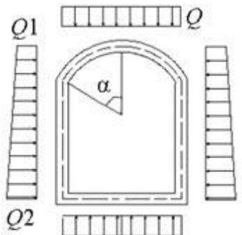
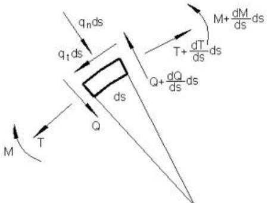
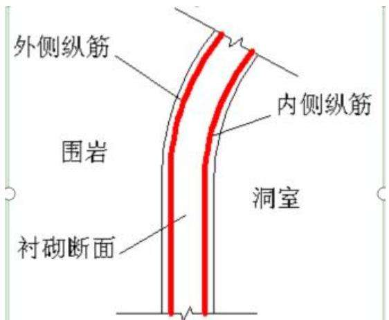
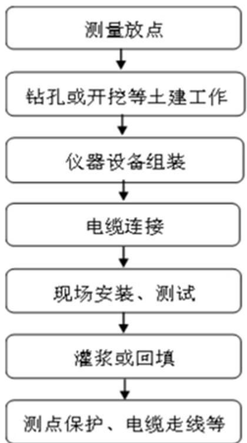

> **Zone C（应用范例层）使用边界**——仅可用于**写作风格、章节展开方式、表达逻辑、表格设计**的参考。
> **不得**用于合规判断；**不得**引入其项目数据（名称／地点／数字／单位名）；
> **不得**因其"曾经通过审批"而推定其做法在当前标准下仍然合规。
> 与 Zone A 冲突时**一律以 Zone A 为准**；Zone A 未明确规定时输出
> 「**Zone A 未明确规定，以下为参考写法，需人工判断**」。
>
> **坐标系警告**：本范例为**老八章结构**（GB 50433—2018 附录B），与 2026 版 10 章模板**同号不同义**
> （老 `1.5`＝防治目标，新 `1.5`＝水土流失预测结果；老 4→新 6 …偏移 +2；新版第 4/5 章老结构无独立章）。
> 因此 **`chapter_mapping: pending`——不得按章节号挂载**，检索一律走 `topic_tags`。
>
> **待加工**：`topic_tags`（主题标签）、`approval_basis_list`（编制依据逐字清单）、
> `structure_summary`（只提取结构：章节展开顺序／段落功能／表格栏目结构／句式模板／论证链步骤）。

<!-- 本文件由原方案 PDF 分段转换后拼接：共 3 段，原 397 页（MinerU 云单文件上限 200 页） -->

# 水土保持方案报告书

建设单位： 四川省引大济岷水资源开发有限公司

编制单位： 四川水发勘测设计研究有限公司二〇二五年九月

## 目 录

1 综合说明 .....  
1.1 项目及项目区概况..  
1.2 主体工程水土保持评价... .. 7  
1.3 水土流失防治责任范围及防治分区. ... 11  
1.4 水土流失预测结果... ... 11  
1.5 水土流失防治目标及总体布局.. ... 12  
1.6 弃渣场设计 ...... ... 13  
1.7 表土保护与利用设计.. ... 14  
1.8 水土保持工程设计.. ... 15  
1.9 水土保持监测.... ... 20  
1.10 水土保持管理... .. 20  
1.10 水土保持投资估算及效益分析.... ... 22  
1.11 结论及建议.... .. 22  
2 项目概况及项目区概况.. .. 25  
2.1 项目概况... ... 25  
2.2 项目区概况.. .. 70  
3 主体工程水土保持评价..... . 95  
3.1 主体工程制约性因素分析及方案比选评价..... ...96  
3.2 工程占地分析评价... .. 111  
3.3 施工组织设计分析评价... .. 114  
3.4 主体工程设计中具有水土保持功能措施的分析评价... .. 134  
3.5 评价结论、建议和要求.. .. 141  
4 水土流失防治责任范围及防治分区.. .. 143  
4.1 防治责任范围界定. .. 143  
4.2 防治责任范围和工程征占地的关系... .... 144  
4.3 水土流失防治分区.. ... 146  
5 水土流失分析与预测... .. 148  
5.1 预测范围和时段.. ... 148  
5.2 预测方法 ....... ... 150  
5.3 扰动地表、损毁植被面积和弃土（石、渣）量分析.................... 150  
5.4 土壤流失量预测..... .... 152  
5.5 水土流失危害分析与评价... .... 162  
5.6 预测结论与指导性意见.. .... 163  
6 防治目标及总体布设...... .. 165  
6.1 防治目标及标准..... .... 165  
6.2 设计依据、理念与原则. .... 167  
6.3 设计深度及设计水平年.... .... 169  
6.4 总体布局及分区防治措施体系... .... 169  
7 弃渣场设计 ........ .. 177  
7.1 弃渣来源及流向... ... 177  
7.2 弃渣场选址与类型... .... 180  
7.3 弃渣场堆置方案及安全防护距离... .... 197  
7.4 弃渣场级别及稳定性分析..... .... 200  
8 表土保护与利用设计....... .. 230  
8.1 表土分布与可利用量分析.. ... 230  
8.2 表土需求与用量分析..... ... 236  
8.3 表土剥离与堆存...... ... 239  
8.4 表土利用与保护.. ... 246  
9 水土保持工程设计..... .. 247  
9.1 工程级别与设计标准.. ... 247  
9.2 高山峡谷区... ... 263  
9.3 山地丘陵区. ... 271  
9.4 平原区 ..... ... 368  
10 水土保持施工组织设计.... .. 376  
10.1 工程量 ...... ... 376  
10.2 施工条件及布置... .... 384  
10.3 施工工艺和方法.. .. 385  
10.4 施工进度安排 ... .. 391  
11 水土保持监测 ...... . 396  
11.1 监测范围及单元划分. .. 396  
11.2 监测时段与内容... .. 397  
11.3监测点布置、方法和频次. ..399  
11.4 监测设施典型设计.. .. 407  
11.5 监测设备.... . 409  
11.6 弃渣场安全监测 . 410  
11.7 监测成果及报告.. . 421  
12 水土保持工程管理.... . 423  
12.1工程建设期管理. .. 423  
12.2 工程运行期管理 .. 431  
12.3 工程保护范围和管理. .. 432  
12.4 科研课题研究情况.. .. 433  
13 投资估算及效益分析... . 437  
13.1 投资估算.. . 437  
13.1.1 编制原则.. .. 437  
13.1.2 编制依据... .. 437  
13.1.3 编制方法.. .. 437  
13.1.4 投资估算.. . 446  
13.2 效益分析... . 450  
14 结论和建议 .... . 460  
14.1 结论.. ..460  
14.2 建议 .... ..461

## 附表：

附表 1：四川省引大济岷工程项目组成占地表（按行政区域、土地利用现状分类计列）

## 附件：

附件 1：委托书

附件 2：《关于报送四川省引大济岷工程可行性研究报告审查意见的函》（水规计〔2025〕30 号）

附件 3：《四川省引大济岷工程弃渣场、料场选址意见》

附件 4：《关于承诺引大济岷工程弃渣场下游影响范围内移民拆迁的函》

附件 5：《关于雅安市境内弃渣场占用永久基本农田事宜的复函》

附件 6：《关于回复成都市境内弃渣场选址意见的复函》

附件 7：《四川省引大济岷工程水土保持投资估算计算书》（另册）

附件 8：《四川省引大济岷工程弃渣场场址比选专题报告》（另册）

附件 9：《四川省引大济岷工程推荐弃渣场防护措施比选专题报告》（另册）

附件 10：《四川省引大济岷工程弃渣场地质勘察报告及图册》（另册）

附件 11：《四川省引大济岷工程弃渣减量化和综合利用专题报告》（另册）

## 附图：

四川省引大济岷工程水土保持方案图册（另册）

## 1 综合说明

## 1.1 项目及项目区概况

## 1.1.1 项目建设的必要性

引大济岷工程从大渡河向成都平原引水，是《长江流域综合规划（2012—2030年）》《岷江流域综合规划》《成渝地区双城经济圈水安全保障规划》等规划提出的重大水资源配置工程，工程建成后可有效缓解供水区经济社会发展面临的水资源供需矛盾，支撑国家战略腹地建设和成渝地区双城经济圈发展战略的实施。引大济岷工程的建设是保障成渝双圈、战略腹地等国家战略建设、增强人口和经济承载力的需要，是建设成渝双圈现代高效特色农业带、打造四川更高水平天府粮仓，解决盆地腹部区干旱缺水的需要，是形成成渝双圈丰枯互济、多源互补、安全高效供水网络，增强水资源调配能力和战略储备能力的需要，是推动成渝双圈生态共建共保，保护河湖健康、保障都江堰千古工程永续利用的需要。

综上，工程的建设实施对优化成渝地区水资源配置、强化水安全保障具有全局性支撑性意义，可保障成都都市圈三千多万人口的基本民生和用水安全，支撑国家战略腹地建设和成渝双圈高质量发展，工程建设是必要且紧迫的。

## 1.1.2 项目概况

引大济岷工程水源点位于大渡河泸定水电站库区（E102.22°，N29.97°），总干线末端位于䢺江河三坝水库库尾右岸（E103.30°，N30.57°），北干线末端为文井江李家岩水库库尾，南干线末端为罗家河坝分水枢纽（E104.23°，N30.47°），输水线路沿线经过四川省甘孜州、雅安市和成都市3 市（州）9 个县（区）。

引大济岷工程位于四川省西部的岷江流域，从大渡河中游引水至成都平原，可与都江堰供水工程形成双水源双通道水网工程体系，提升区域水资源战略调配能力，是四川水网主骨干大动脉的重要组成部分。

## 1.开发任务

引大济岷工程是从大渡河向成都平原引水，构建以都江堰和引大济岷工程为主要水源的水资源配置保障格局，以城乡生活和工业供水为主，兼顾农业灌溉。

## 2.工程规模

引大济岷工程为Ⅰ等大⑴型水利工程。工程水源点位于大渡河泸定水电站库区，取水口设计引水流量80m3/s，2040年多年平均引水量13.89亿m3，2050年多年平均引水量 15.23 亿m3。供水区范围为都江堰供水区和玉溪河供水区，涉及成都、德阳、眉山、资阳、绵阳、遂宁、内江、雅安8市43 县（市、区）。

新增灌面 179 万亩，改善灌面 591 万亩，供水区人口 3413万人。农业灌溉设计保证率为 80～90%，成都市生活、工业供水保证率为 97%，其他城镇生活、工业及农村供水保证率为 95%。结合消能，在输水线路上建设 3 座动能回收电站，总装机容量388MW。

## 3.工程布置

引大济岷工程由输水总干线、北干线和南干线组成，总长 260.90km。其中总干线自泸定水电站库区左岸取水，穿过二郎山，跨过青衣江支流宝兴河，向东北方向布置，沿线经过甘孜州泸定县，雅安市天全县、宝兴县、芦山县，成都市邛崃市、大邑县，终点位于三坝水库库尾右岸青龙岗分水枢纽，长133.3km；北干线起点位于青龙岗分水枢纽，沿线经过成都市大邑县、崇州市，终点位于李家岩水库库尾，长25.1km；南干线由三坝水库库区右岸取水，经过凤凰台动能回收电站后跨过䢺江河至大坪前池，布置管道进入成都平原，沿线经过成都市大邑县、新津区、双流区（含天府新区成都直管区），终点位于东风渠罗家河坝配水枢纽附近，长102.5km。

## 4.建筑物组成及工程级别

工程建筑物主要有隧洞、管道、倒虹吸和渡槽，其中隧洞长151.4km，占线路总长的 58.0%；管道长 99.2km，占线路总长的 38.0%；其他建筑物长 10.3km。

沿线布置3座动能回收电站，总装机容量 388MW，其中拉塔河动能回收电站装机容量330MW，钱桥动能回收电站装机容量40MW，凤凰台动能回收电站装机容量18MW。

总干线由泸定取水口、二郎山隧洞、喇叭河倒虹吸、老君山隧洞、拉塔河动能回收电站、千池山隧洞、白沙河倒虹吸、大岗山隧洞、老场河渡槽、大坪山隧洞、宝兴河倒虹吸、罗家山隧洞、西川河倒虹吸、西果山隧洞、玉溪河倒虹吸、莲花山隧洞、青龙岗分水枢纽（配水池、钱桥动能回收电站和䢺江河泄水渠）组成。总干线长133.3km，其中隧洞长度 128.1km，其他建筑物长度 5.2km。

北干线输水线路由䢺江河倒虹吸、䢺江隧洞、斜江河倒虹吸、冠子山隧洞、头道河倒虹吸、雾山隧洞组成。北干线长25.1km，其中隧洞长23.4km，其他建筑物长1.7km。

南干线由三坝取水口、凤凰台动能回收电站、䢺江河渡槽、南干线输水管线、罗家河坝分水枢纽组成。南干线长 102.5km，其中管道工程长99.2km。

输水总干线进口建筑物、总干线和北干线输水隧洞、渡槽、动能回收电站前池、压力管道、厂房、电站消能通道、倒虹吸等主要建筑物级别为1级；南干线输水管线、渡槽、压力前池、厂房、电站消能通道、倒虹吸等主要建筑物级别为 2级。

## 5.施工组织设计

## ⑴施工布置

引大济岷工程沿线共布置施工生产生活区69 处，占地面积123.43hm2。

引大济岷工程布置施工道路约203.09km，其中新建永久道路61.35km，新建临时道路 98.65km，改建临时道路约43.09km。永久道路采用沥青混凝土路面，临时道路采用泥结碎石路面。施工道路占地面积215.88hm2。

本工程共设置临时集料场 83 处，其中洞渣料临时中转场33处、土石方临时堆存场7 处，砂石料临时堆存场 43 处。临时集料场均在现有临时占地范围内，不新增临时占地。该83处临时集料场均不涉及河湖管理范围。

## ⑵料场规划

规划 1 个人工骨料场（武安山料场），料场位于天全县小河镇武安村，调查储量2421.3 万 $\mathrm { m } ^ { 3 }$ ，料场占地面积 128.20hm2。

## ⑶土石方平衡

根据施工组织设计，引大济岷工程土石方开挖总量5347.32万 $\mathrm { m } ^ { 3 }$ （自然方，下同），其中：土方开挖 2549.26 万 $\mathrm { m } ^ { 3 }$ 、石方开挖 2798.06 万 $\mathrm { m } ^ { 3 }$ ；土石方回填利用 2847.58 万$\mathrm { m } ^ { 3 }$ ，综合利用方量101.36万 $\mathrm { m } ^ { 3 } ;$ ；经土石方平衡后，本阶段引大济岷工程弃渣总量2398.38万 $\mathrm { m } ^ { 3 }$ （合松方 3516.50 万 m3）。

经水土保持复核后,引大济岷工程土石方开挖总量5552.25万 $\mathrm { m } ^ { 3 }$ （自然方，下同），其中：土方开挖2684.80 万 $\mathrm { m } ^ { 3 }$ （含表土剥离443.40 万 $\mathrm { m } ^ { 3 }$ ）、石方开挖 2840.86 万 $\mathrm { m } ^ { 3 }$ ，围堰拆除 26.59 万 $\mathrm { m } ^ { 3 }$ ，土石方回填利用2982.15万 $\mathrm { m } ^ { 3 }$ （其中表土回覆443.40万 $\mathrm { m } ^ { 3 }$ ），骨料利用 115.41 万 $\mathrm { m } ^ { 3 }$ ，综合利用方量 101.36 万 $\mathrm { m } ^ { 3 }$ 。经土石方平衡后，本阶段引大济岷工程全部弃渣总量为2353.33万 $\mathrm { m } ^ { 3 }$ （合松方 3502.41 万 $\mathrm { m } ^ { 3 }$ ）。

## ⑷施工导流

泸定水电站库区的取水口采用修建纵向围堰全年挡水的施工方案进行导流。

## ⑸施工进度

工程总工期为96 个月，施工工期从第一年10月开工，计划于第九年9月完工，其中施工准备期8个月，主体施工期85个月，完建期3个月。

## 6.工程征占地、移民安置及专项设施迁改建

## ⑴建设征占地及移民实物调查成果

工程移民征占地面积 1698.40hm2，其中永久占地 160.83hm2，临时用地 1537.57 hm2。经水保复核后，征占地面积1703.97hm2，其中永久占地166.40hm2，临时占地1537.57hm2。

涉及各等级道路 42.04km（一级道路 0.95km，二级道路 11.29km，三级道路 1.72km，四级道路 25.08km），乡村道路 64.11km。

## ⑵移民安置规划

引大济岷工程生产安置人口1004人，规划全部采取一次性补偿安置。

引大济岷工程规划搬迁安置人口4850人，规划集中安置3410人（全部在镇规划区统规统建安置），后靠分散建房安置145人，自主安置1295人。其中统规统建安置由各县级人民政府按照地方政策和实际情况进行统筹安排。

## ⑶专业项目复建规划

引大济岷工程影响道路长度8.18km，宽度3.5m，混凝土路面，复建长度13.28km，规划采取一次性补偿。

## 7.工程投资

按2025 年第1季度价格水平估算。引大济岷工程静态总投资536.23亿元，其中土建投资 296.39 亿元。

## 1.1.3 项目前期工作简介

2018 年 12 月 28 日，四川省水利厅向省委、省政府报送了《关于推进引大济岷工程规划工作的请示》，遵照省委、省政府领导批示精神，省水利厅研究提出了引大济岷工程前期工作意见。并于2019年3月11日，成立“引大济岷工程协调小组”。

2021 年，水利部批复的《岷江流域综合规划》提出，“引大济岷工程规划以大渡河作为集中水源，向成渝地区双城经济圈的核心腹地涉及的成都、德阳、绵阳、遂宁、内江、眉山、资阳等地的城乡生活和工业供水，结合农业和生态用水”。

2021 年 12 月 13 日，水利部水利水电规划设计总院（以下简称“水规总院”）以水总函〔2021〕546号文印发了《水规总院关于印送四川省引大济岷工程规模及总体布置专题报告技术讨论会议纪要的函》。

2023 年4月3 日，水利部办公厅以办规计〔2023〕104号文印发了《水利部办公厅关于印送四川省引大济岷工程规划报告审查意见的通知》。

2023 年 4 月，四川水发设计公司组织编制完成《四川省引大济岷工程可行性研究报告》（以下简称《可研报告》），同步完成《四川省引大济岷工程水土保持方案报告书（技术讨论稿）》（以下简称《方案报告书》）。

2024 年9月26～30 日，水规总院再次对《可研报告》进行技术审查；同步对《方案报告书》进行技术讨论。

2025 年2月20日，水利部以《水利部关于报送四川省引大济岷工程可行性研究报告审查意见的函》（水规计〔2025〕30号）将《可研报告》报送国家发展改革委。

2025 年4月20～23 日，国家发展改革委委托中国国际工程咨询有限公司对《可研报告》进行技术评估。

2025 年4月20～22 日，水规总院组织专家对《方案报告书》进行了第二次技术讨论。

2025 年8月10～11 日，水规总院组织专家对《方案报告书》进行了技术审查。

2025 年8月27日,中国国际工程咨询有限公司报送《关于四川省引大济岷工程( 可行性研究报告)的咨询评估报告》(咨农地〔2025]1958 号)。

随后，水保方案编制单位根据专家审查意见进行修改完善，并于 2025 年9 月完成了《四川省引大济岷工程水土保持方案报告书》。

## 1.1.4 项目区概况

引大济岷工程总体呈西南至东北走向，位于青藏高原向四川盆地的过渡地带，地势总体呈西高东低，沿线地貌包括西部中、高山地貌，中部丘陵～低山地貌，东部平原地貌。工程区大地构造位于扬子陆块西缘，以龙门山前山断裂为界进一步可以划分龙门山-锦屏山造山带 $\left( \mathrm { { I } } _ { 1 } \right)$ 、川西前陆盆地 $( \mathrm { ~ I } _ { 2 } ) 2$ 个二级构造单元，地震动峰值加速度为0.15g～0.20g，相应地震基本烈度为Ⅶ度～Ⅷ度，场地构造稳定性较好～差。

项目区出露地层有古元古代、震旦纪、奥陶纪、志留纪、泥盆纪、二叠纪、三叠纪、侏罗纪、白垩纪及第四纪地层；地层区划分属扬子地层区康定地层分区，上扬子地层分区峨眉小区和成都小区。

项目区气候类型总体属于亚热带季风气候区，其中取水口所在泸定县境内大渡河谷为干热河谷区；工程区降水量在地域上分布存在较大差异，自大渡河泸定向东进入青衣江麓头山暴雨区，降雨量从 600mm左右迅速增大至1600mm左右，再向东逐渐进入盆地腹部地区后，降雨量逐渐减小至 900mm 左右。工程区平均气温 14.1～16.3℃，最大一日降水量 72.3～415.9mm，多年平均降雨量 642.9\~1682.4mm，雨季时段集中在 5-9月 ， ≥10℃ 的 年 积 温 4832\~5979℃ ， 日 照 时 数 781.8\~1187.7h ， 年 平 均 蒸 发 量814.8\~1526.9mm，全年无霜期 268.8\~352.4d，年平均相对湿度 66%-84%，多年平均风速 0.9\~3.8m/s。

引大济岷工程涉及长江流域岷江水系，主要河流包括大渡河干流，青衣江支流天全河、宝兴河以及玉溪河，岷江中游的金马河、南河、䢺江河、西河、斜江河、黑石河、羊马河、江安河、清水河等支流。

项目区土壤类型主要有水稻土、黄壤、黄棕壤、山地棕壤。其中西部中、高山地貌区土壤为黄棕壤、山地棕壤，中部丘陵～低山地貌区主要为黄壤、黄棕壤，东部平原区主要以水稻土、冲积土为主。

项目区植被区为“中国东部湿润森林区域-亚热带常绿阔叶林带东段-亚热带常绿阔叶林带中亚带-中亚热带常绿阔叶林带北部亚地带西部边缘”。工程区位于青藏高原向四川盆地过渡地带，植被类型有常绿阔叶林（海拔 1600m 以下）、常绿与落叶阔叶混交林（海拔 1200～2200m）、常绿针叶与落叶阔叶混交林（海拔1600～2200m）、落叶阔叶林（海拔1600～2650m），在同一海拔高程既有常绿森林也有落叶阔叶灌丛或灌草丛；森林植被组成以常绿的樟科树木和杉木、落叶的桤木和桦、槭、大径竹类等为主，在河谷部分地段会形成桤楠混交林、桤杉混交林、在高处形成楠桦混交林、桦槭混交林，其他植被类型为山地与河谷落叶阔叶灌丛及灌草丛，在较高地带的向阳林下和林缘有茂密的竹灌丛；工程涉及区县林草覆盖率为20.09\~86.46%。

引大济岷工程涉及的泸定县属于雅砻江、大渡河下游省级水土流失重点预防区；天全县、芦山县属于雅安市级水土流失重点预防区；崇州市、大邑县、邛崃市属于成都市级水土流失重点预防区。泸定县位于全国水土保持一级区划中的青藏高原区，其他区市县位于西南紫色土区，项目区土壤侵蚀类型主要以水力侵蚀为主，土壤侵蚀强度主要表现为轻度，容许土壤流失量均为500t/km²·a。

项目区涉及水土保持敏感区包括生态保护红线、大熊猫栖息地世界自然遗产、大熊猫国家公园、二郎山国家森林公园、二郎山省级风景名胜区、灵鹫山省级风景名胜区。

## 1.1.5 方案编制深度及设计水平年

按照水土保持方案编制内容及深度与项目主体工程所处的阶段相适应的规定，目前引大济岷工程处于可行性研究阶段，因此，本方案编制深度按可行性研究阶段深度编制。

项目属新建建设类项目，工程水土流失主要集中在工程建设期。根据施工进度安排，工程总工期96个月（不含工程筹建期），施工工期从第一年10 月至第九年9 月，设计水平年确定为工程完工后一年，即第10 年。

## 1.2 主体工程水土保持评价

## 1.2.1水土保持制约性分析与评价

本工程不涉及水土流失严重、生态脆弱的地区；不破坏河流两岸、湖泊和水库周边的植物保护带；不涉及全国水土流失监测网络中的水土流失监测站点、重点试验区及国家确定的水土保持长期定位观测站。

工程选址（线）不涉及国家级水土流失重点防治区，无法避让省级、市级水土流失重点预防区，但通过提高拦挡工程及截排水工程设计等级和标准、提高林草覆盖率指标值、优先选用“早进洞、晚出洞”隧洞开挖等施工工艺、可最大限度地减少工程建设造成的水土流失不利影响。

工程涉及的水土保持敏感区有大熊猫栖息地世界自然遗产、大熊猫国家公园、二郎山国家森林公园、二郎山省级风景名胜区、灵鹫山省级风景名胜区、水源保护区，工程涉及生态保护红线区域中的水土保持敏感区主要为大熊猫国家公园、大熊猫栖息地世界自然遗产。环境影响评价专业开展了相关专题论证，论证结论为工程建设不会对区域生态系统的完整性和稳定性造成严重影响，在采取环境保护措施后，工程建设不存在重大的环境制约性因素。

工程涉及的生态保护红线及水土保持敏感区均已取得相关主管部门批复文件，相关审批情况详见表1.2-1。

表1.2-1 主体工程涉及水土保持敏感区及相关审批情况
<table><tr><td colspan="1" rowspan="1">序号</td><td colspan="1" rowspan="1">类型</td><td colspan="1" rowspan="1">穿（跨）越敏感区名称</td><td colspan="1" rowspan="1">主管部门</td><td colspan="1" rowspan="1">批复时间</td><td colspan="1" rowspan="1">批复情况</td><td colspan="1" rowspan="1">批复结论</td></tr><tr><td colspan="1" rowspan="1">1</td><td colspan="1" rowspan="1">自然遗产</td><td colspan="1" rowspan="1">大熊猫栖息地世界自然遗产</td><td colspan="1" rowspan="1">四川省林业和草原局</td><td colspan="1" rowspan="1">2022年5月31 日</td><td colspan="1" rowspan="1">已办理。《四川省林业和草原局关于〈四川省引大济岷工程对四川大熊猫栖息地世界自然遗产影响评估专题报告〉审查意见的复函》（川林护函〔2022〕511号）</td><td colspan="1" rowspan="1">项目在遗产地的实施具有合理性和可行性。</td></tr><tr><td colspan="1" rowspan="1">2</td><td colspan="1" rowspan="1">国家公园</td><td colspan="1" rowspan="1">大熊猫国家公园</td><td colspan="1" rowspan="1">大熊猫国家公园四川省管理局</td><td colspan="1" rowspan="1">2022年8月8日</td><td colspan="1" rowspan="1">已办理。《大熊猫国家公园四川省管理局关于引大济岷工程进入大熊猫国家公园建设的意见》(川熊猫局函〔2022〕53号）</td><td colspan="1" rowspan="1">工程实施对国家公园的总体影响较小，影响总体可控。</td></tr><tr><td colspan="1" rowspan="1">3</td><td colspan="1" rowspan="1">森林公园</td><td colspan="1" rowspan="1">二郎山国家森林公园</td><td colspan="1" rowspan="1">四川省林业和草原局</td><td colspan="1" rowspan="1">2022年5月27 日</td><td colspan="1" rowspan="1">已办理。《四川省林业和草原局关于在二郎山国家森林公园实施引大济岷工程的批复》（川林护函〔2022〕505号）</td><td colspan="1" rowspan="1">工程建设是可行的。</td></tr><tr><td colspan="1" rowspan="1">4</td><td colspan="1" rowspan="1">风景名胜</td><td colspan="1" rowspan="1">二郎山省级风景名胜区</td><td colspan="1" rowspan="1">四川省林业和草原局</td><td colspan="1" rowspan="1">2022年5月27日</td><td colspan="1" rowspan="1">已办理。《四川省林业和草原局关于在二郎山风景名胜区实施引大济岷工程的批复》（川林护函〔2022〕506号)</td><td colspan="1" rowspan="1">工程建设是可行的。</td></tr><tr><td colspan="1" rowspan="1">5</td><td colspan="1" rowspan="1">区</td><td colspan="1" rowspan="1">灵鹫山省级风景名胜区</td><td colspan="1" rowspan="1">四川省林业和草原局</td><td colspan="1" rowspan="1">2022年8月11 日</td><td colspan="1" rowspan="1">已办理。《四川省林业和草原局关于同意在灵鹫山一大雪峰风景名胜区实施引大济岷工程的批复》（川林护函〔2022〕774号）</td><td colspan="1" rowspan="1">项目在灵鹫山大雪峰风景名胜区实施具有合理性和可行性。</td></tr><tr><td colspan="1" rowspan="1">6</td><td colspan="1" rowspan="1">生态保护红线</td><td colspan="1" rowspan="1">生态保护红线</td><td colspan="1" rowspan="1">四川省人民政府</td><td colspan="1" rowspan="1">2022年7月18 日</td><td colspan="1" rowspan="1">已办理。《四川省人民政府关于四川省引大济岷工程占用生态保护红线不可避让性论证意见的函》（川府便函〔2022〕26号）</td><td colspan="1" rowspan="1">项目对生态环境的影响是可控的。</td></tr><tr><td colspan="2" rowspan="8">水源7   保护区</td><td colspan="1" rowspan="1">天全县仁义乡下南沟集中式饮用水水源地</td><td colspan="1" rowspan="3">雅安市人民政府</td><td colspan="1" rowspan="3">2023年4月10 日</td><td colspan="1" rowspan="3">已办理。《雅安市人民政府关于同意引大济岷工程穿越相关饮用水水源保护区的复函》</td><td colspan="1" rowspan="3">同意在芦山县龙门水厂水源保护区、天全县仁义乡下南沟水源地、天全县仁义乡新房子头水源地(地下水)内开展相关工程建设活动。</td></tr><tr><td colspan="1" rowspan="1">天全县仁义乡新房子头集中式饮用水水源地</td></tr><tr><td colspan="1" rowspan="1">芦山县龙门水厂饮用水水源保护区</td></tr><tr><td colspan="1" rowspan="1">新津县西河白溪堰饮用水水源地</td><td colspan="1" rowspan="5">成都市人民政府</td><td colspan="1" rowspan="5">2023年4月25 日</td><td colspan="1" rowspan="5">已办理。《成都市人民政府关于引大济岷工程穿越相关饮用水水源保护区的复函》(成府函[2023〕38号）</td><td colspan="1" rowspan="5">原则上同意工程穿越上述5个集中式饮用水水源保护区。</td></tr><tr><td colspan="1" rowspan="1">大邑县第四自来水厂水源地</td></tr><tr><td colspan="1" rowspan="1">大邑县邮江河飞凤村集中式饮用水水源保护区</td></tr><tr><td colspan="1" rowspan="1">大邑县鹤鸣乡道源水厂集中式饮用水地表水源保护区</td></tr><tr><td colspan="1" rowspan="1">邛崃市水口镇黑龙沟合江村集中式饮用水水源保护区</td></tr></table>

从水土保持角度看，通过优化施工工艺、提高水土保持工程等级、采取相应的环境保护措施后，可有效缓解项目建设造成的水土流失和生态环境影响，项目建设可行。

## 1.2.2 建设方案与布局水土保持评价

本工程总干线和北干线构建筑物主要以隧洞为主，能够有效减少地表扰动面积；南干线构建筑物主要为埋管，工程占地大多为临时占地，施工后即可按原地类进行恢复，不会造成大面积耕地减少和林地破坏；施工工区均匀布置，运距合理，工区内各临建设施布置紧凑；施工道路除新建少量对外临时交通外，大部分道路与输水管线并行，伴行道路均位于输水管线占地范围内，不需新增占地。本工程开挖土石方主要用于回填利用，除部分弃渣进行综合利用外，其余弃渣均集中堆放在弃渣场。

从水土保持角度分析，工程建设方案基本符合水土保持要求。

## 1.2.3 工程占地水土保持评价

本工程占地符合节约用地的原则，满足施工布置和控制水土流失面积的要求。工程占地类型基本反映了工程所在区域的地形地貌和环境特点，与当地土地利用状况相适应，工程结束后，临时占用的土地按原地类恢复，对生态影响、农业生产及人民生活影响较小，且可恢复。永久占地中可通过提高永久占地区域的绿化率等措施减免生态破坏产生的影响。从水土保持角度分析，工程占地基本符合水土保持要求。

## 1.2.4 施工组织设计水土保持评价

## 1.施工总布置评价

施工总布置方案符合因地制宜、有利生产、易于管理、方便生活、少占耕地、保护环境、减少水土流失、经济合理的原则。施工场地采用集中与分散相结合的布置方式，减少了因施工场地距离施工作业面较远而增加的临时道路等占地面积，施工临建设施布置紧凑，最大程度控制施工扰动面积，基本满足水土保持要求。

## 2.土石方平衡评价

根据施工组织设计，工程土石方开挖总量5347.32 万 $\mathrm { m } ^ { 3 }$ （自然方，下同），土石方回填利用 2847.58 万 $\mathrm { m } ^ { 3 }$ ，综合利用方量 $1 0 1 . 3 6 \mathrm { ~ \mathscr { H } ~ m ^ { 3 } }$ （折合松方 149.00 万 $\mathbf { m } ^ { 3 } )$ ），经土石方平衡后，弃渣总量2398.38万 $\mathrm { m } ^ { 3 }$ （合松方 3516.50 万 $\mathbf { m } ^ { 3 } )$ ）。

经水土保持复核后，工程土石方开挖总量5552.25 万 $\mathrm { m } ^ { 3 }$ （自然方，下同），土石方回填利用 2982.15 万 $\mathrm { m } ^ { 3 }$ （其中表土回覆 443.40 万 m3），骨料利用 115.41 万 $\mathrm { m } ^ { 3 }$ ，综合利用方量 $1 0 1 . 3 6 \mathrm { ~ \mathcal { F } ~ m } ^ { 3 } ( $ （折合松方 $1 4 9 . 0 0 \ \mathrm { ~ \mathcal ~ { ~ H ~ } ~ m ~ } ^ { 3 } )$ ），经土石方平衡后，弃渣总量为2353.33万 $\mathrm { m } ^ { 3 }$ （合松方 3502.41 万 $\mathbf { m } ^ { 3 } \mathbf { \Psi } ,$ ），设置弃渣场12处。

从水土保持角度分析，土石方调配是合理的，充分利用开挖料符合水土保持要求，但本工程充分利用自身开挖料后弃渣量仍然较大，需做好弃渣场的防护措施，在后续设计和建设过程中，拓展弃渣综合利用渠道，加大弃渣综合利用量。

## 3.弃渣减量化和综合利用

根据《四川省引大济岷工程弃渣减量和综合利用专题报告》（附件9），本阶段通过优化输水线路走向、隧洞洞径、管道开挖边坡坡比，优化施工支洞进口位置、料场运输方案、交通道路和施工场地布置，加大输水管道垫层填筑、混凝土骨料制备利用和场地平整回填利用等设计方案，工程弃渣减量化 $1 1 6 3 . 2 2 \mathrm { ~ \mathscr { H } ~ m } ^ { 3 }$ ，其中主体工程方案优化减量化 $3 2 0 . 4 4 \mathrm { ~ \mathscr ~ { ~ H ~ } ~ m ~ } ^ { 3 }$ ，施工临时工程方案优化减量化 $2 3 6 . 3 3 \mathrm { ~ \mathscr ~ { ~ H ~ } ~ m ~ } ^ { 3 }$ ，增加漂卵砾石加工中粗砂垫层回填 484.40 万 m3，增加施工生产生活区场地回填 6.64 万 m3；增加骨料利用115.41 万 $\mathrm { m } ^ { 3 }$ （自然方）；通过开展弃渣综合利用分析、调查、对接，在项目建设期间综合利用弃渣量149万 $\mathrm { m } ^ { 3 }$ （其中场地回填48.00万m3、建材加工 101.00万m3）。

## 4.料场设置评价

本工程尽量利用自身开挖料作为填筑料和混凝土骨料，设置的武安山料场选址不涉及县级人民政府划定的崩塌和滑坡危险区、泥石流易发区，按照开采方法及工艺，水土流失影响是可控的，开采结束后及时进行复耕或植被恢复，基本符合水土保持要求。

## 5.弃渣场设置评价

工程共布置12处弃渣场，全部为沟道型弃渣场，规划堆渣总量2353.33万 $\mathrm { m } ^ { 3 }$ （合松方 $3 5 0 2 . 4 1 ~ \overline { { { \mathcal { H } } } } ~ \mathrm { m } ^ { 3 } .$ ）。弃渣场选址规划中避让了生态保护红线区、饮用水水源保护区和河湖管理岸线等制约因素，弃渣场容量满足本阶段弃渣要求。

## 6.施工工艺评价

主体工程中采取的各项施工方法和工艺一定程度上体现了水土保持的要求，对于施工过程中防治水土流失起到了积极的促进作用，施工方法可行。主体工程施工进度安排衔接合理，各单项工程干扰少，施工均衡，有利于缩短工程建设周期，符合水土保持要求。

## 1.2.5主体工程设计分析评价结论

主体工程设计中具有水土保持功能的措施主要包括剥离表土、植被混凝土护坡、框格梁+植草护坡、截排水沟、覆土等。上述措施具有较好的水土保持功能。在主体工程已具有水土保持功能措施的基础上，水土保持补充设计表土资源的保护和利用，弃渣场等区域的拦挡、截排水、植被恢复措施，提高了工程永久生活办公区和动能回收电站等区域的植被建设标准，临时占地按照恢复原地貌原则采取土地整治和植被恢复措施，分析各扰动部位施工破坏影响，加强临时拦挡、临时排水等措施，以达到本方案拟定的水土流失防治目标。

工程建设符合国家的相关政策，具有重大的社会意义。通过优化工程布置和施工布局，采取工程措施、植物措施、临时措施相结合综合防治措施体系，可将工程建设产生的水土流失影响降至最低。工程的建设是可行的。

## 1.3 水土流失防治责任范围及防治分区

项目水土流失防治责任范围包括工程永久占地及临时占地，即项目建设区。经工程占地评价和复核，引大济岷工程水土流失防治责任范围面积1703.97hm2，其中永久占地166.40hm2，临时占地 1537.57hm2。

根据区域地形地貌及项目组成、施工布置，引大济岷工程水土流失防治分区划分为3个一级防治区，即：高山峡谷区、山地丘陵区和平原区。高山峡谷区下设主体工程区、工程永久办公生活区、交通道路区、施工生产生活区等4 个二级防治分区；山地丘陵区下设主体工程区、工程永久办公生活区、料场区、弃渣场区、交通道路区、施工生产生活区等6 个二级防治分区；平原区下设主体工程区、工程永久办公生活区、交通道路区、移民集中安置区等4个二级防治分区。

## 1.4 水土流失预测结果

引大济岷工程建设扰动原地表面积1703.97hm2，损毁植被面积640.23hm2。工程建设产生弃渣量 2353.33 万m3（合松方3502.41 万m3），弃渣运至 12 处弃渣场进行集中堆放。

经预测，工程建设期可能造成土壤流失总量67.39万t，其中新增土壤流失量达60.34万 t，背景流失量 7.05万t。新增土壤流失量中施工期58.23万t，自然恢复期2.11 万 t。

工程水土流失重点时段为施工期，水土流失重点区域为弃渣场区、主体工程区和料场区等，因此施工期弃渣场区、主体工程区、料场区和交通道路区是水土保持监测和水土流失防治的重点区域。

可能造成的水土流失危害主要表现为各工区开挖所产生的水土流失会直接危害下游耕地，导致耕地地力下降，对周边植被产生不利影响，破坏景观，影响工程施工和当

地居民的生产生活，临时堆土受暴雨冲刷会进入天然沟道，导致沟道堵塞，阻碍行洪，加剧洪水灾害发生的频率和危害。

## 1.5 水土流失防治目标及总体布局

## 1.5.1 防治目标

根据《生产建设项目水土流失防治标准》（GB/T 50434-2018）相关规定，项目水土流失防治标准分区段确定。泸定段工程水土流失防治标准应执行青藏高原区一级标准，项目涉及的其余区县位于西南紫色土区，水土流失防治标准应执行西南紫色土区一级标准。

经对水土流失防治标准指标值进行修正，泸定段工程计水平年确定的防治目标值为：水土流失治理度85.0%、土壤流失控制比1.00、渣土防护率87.0%、表土保护率90.0%、林草植被恢复率95.0%、林草植被覆盖率21.0%。其余区市县段工程设计水平年水土流失防治目标值为：水土流失治理度97.0%、土壤流失控制比1.00、渣土防护率92.0%、表土保护率92.0%、林草植被恢复率 97.0%、林草植被覆盖率28.0%。

## 1.5.2 总体布局

根据本工程建设特点及水土流失防治目标的要求，结合工程实际和项目区水土流失现状，因地制宜、总体设计、全面布局、科学配置，减少对原地貌和植被的破坏。在分析评价主体工程中具有水土保持功能措施的基础上，统筹布置水土保持措施，以全局的观点来考虑，做到主体工程设计与水土保持设计相结合，工程措施与植物措施相结合，重点治理与综合防护相结合，治理水土流失与恢复、提高地力相结合，将项目建设造成的新的水土流失降到最低。根据工程建设特点，建立分区防治措施体系。主体工程区（隧洞口、倒虹吸、取水口和渡槽等）主要采取表土保护、边坡以植被混凝土和框格梁+植草护坡进行防护；主体工程动能电站和工程永久生活办公区防治区主要采取表土保护和园林绿化措施；弃渣场以拦挡工程、排洪工程和植物措施为主；主体工程管道敷设区主要采取临时拦挡、全面整治及乔灌草植被恢复措施；施工生产生活区主要采取土地整治工程和植物措施；永久道路防治区主要以表土保护、内边坡采取三维网喷播植草结合喷植被混凝土进行防护、外边坡采取蜂格生态护坡进行防护；临时道路区主要采取表土保护、填方边坡植被恢复等措施；料场防治区主要以全面整地、边坡喷植被混凝土和三维网喷播植草进行防护；移民安置防治区主要采取土地整治和景观绿化措施。

## 1.6 弃渣场设计

## ⑴弃渣场比选

根据《四川省引大济岷工程弃渣场场址比选专题报告》（详见附件6），主要从综合因素分析、制约性因素分析、堆渣条件分析等方面进行可行性因素分析，比选专题结论为：依据现阶段土石方平衡结果，从水土保持角度进行分析评价，推荐采用龙岗堰弃渣场、理大河弃渣场、麻溪沟弃渣场、石桥村弃渣场、牛子坎弃渣场、苗溪农场弃渣场、核桃坪弃渣场、孙岗弃渣场、夫子岗弃渣场、虎跳弃渣场、三道坪弃渣场、范家沟弃渣场作为本工程本阶段弃渣场。

## ⑵弃渣场选址合理性分析

本工程弃渣量 2353.33 万 $\mathrm { m } ^ { 3 }$ （合松方3502.41 万m3），共布设12处弃渣场，占地面积 $2 4 5 . 9 4 \mathrm { h m } ^ { 2 }$ ，其中2级弃渣场3 处，3级弃渣场8处、4级弃渣场1处；均为沟道型弃渣场。

弃渣场容量满足本阶段弃渣要求；弃渣场选址规划中避让了生态保护红线、饮用水水源保护区和河湖管理岸线等制约因素；不涉及自然保护区、风景名胜区、世界文化和自然遗产地、地质公园、森林公园、重要湿地等水土保持敏感目标；不涉及水土保持监测站网；各弃渣场地及周边范围内无崩塌、泥石流等不良地质现象，场地适宜性为适宜～较适宜。2#、5#、8#和10#弃渣场不涉及基本农田，其余弃渣场不同程度占用部分基本农田，依据《自然资源部关于规范临时用地管理的通知》（自然资规〔2021〕2 号）和《自然资源部农业农村部关于加强和改进永久基本农田保护工作的通知》（自然资规〔2019〕1号）精神，涉及占用基本农田的弃渣场均已取得所在县（区）自然资源部门同意选址的意见，并要求堆渣结束后应做好弃渣场土地复垦和迹地恢复工作；部分弃渣场不可避免地涉及Ⅱ级保护林地，要求建设单位施工前按要求办理相关手续，堆渣结束后及时进行迹地恢复。

弃渣场下游均不涉及公共设施、工业企业、居民点等敏感点的安全，部分渣场下游一定范围内的零星居民点结合临时道路布置纳入占地拆迁或由地方政府承诺拆迁处置：牛子坎弃渣场、麻溪沟弃渣场下游影响范围内无敏感保护对象；三道坪弃渣场、虎跳弃渣场、理大河弃渣场下游影响范围居民房已纳入本工程拆迁范围，落实拆迁后选址可行；7处弃渣场下游影响范围存在居民房等敏感对象，涉及的县（市）级人民政府已承诺在弃渣场建设实施前进行搬迁并出具拆迁承诺函，落实拆迁后选址可行，详见《关于承诺引大济岷工程弃渣场下游影响范围内移民拆迁的函》（附件4）。

工程设置的12处弃渣场均已取得涉及县（市）自然资源、林业、生态环境、农业农村、水利等管理部门和土地权属单位同意的意见，详见《四川省引大济岷工程弃渣场选址意见》（附件3）。

弃渣场选址是基本合理的。

## ⑶弃渣场防护比选

根据《四川省引大济岷工程推荐弃渣场防护措施比选专题报告》（附件7），对其中 6个具有一定代表性的弃渣场进行拦挡、排洪工程建筑物选型和结构进行比选，比选结论：在采用推荐拦挡、排洪工程建筑物选型和结构的情况下，各弃渣场布置方案、安全防护距离、堆置方案和稳定验算均满足规范要求。

## ⑷弃渣场防护设计

各弃渣场均采用“由下而上”分台阶堆置方式，在弃渣场下游设置挡渣墙，本工程弃渣场均采用后退式台阶堆渣方式，在弃渣场下游设置挡渣墙，渣体从墙顶按照1:3.0 进行放坡，各弃渣场设计堆置坡比均为 1:3.0。弃渣场填方边坡每高 10m 设置1 条边坡马道宽5m。部分弃渣场在满足堆渣容量的前提下，在边坡中下部设置一级边坡平台宽20m，以进一步保障渣体填方边坡以及整体的安全稳定。弃渣场顶部平台需形成1%～2%的坡度便于弃渣场顶面排水。

结合地质勘察成果计算，各弃渣场挡护措施及渣场稳定性计算成果均满足规程规范要求。

## 1.7 表土保护与利用设计

引大济岷工程建设扰动地表面积1703.97hm2，占地类型主要为耕地、园地、林地、草地、工矿仓储用地、住宅用地、交通运输用地、水域及水利设施用地、其他土地等。经土壤调查，工程表土资源主要分布在耕地、园地、林地、草地范围内，表土厚度依据地类不同差别较大，其中耕地、园地范围内表土厚度可达 30～60cm；林地、草地范围内表土厚度可达10～35cm。

可剥离表土范围为项目建设区施工扰动范围内的耕地（水田、旱地）、园地、林地（乔木林、灌木林和其他林地）和草地等区域，其中耕园地表土剥离、堆存、交通条件相对较好，耕园地表土可全部进行剥离；草地表土厚度约10cm～35cm，征占草地面积较少，草地表土可全部进行剥离。对于临时占地范围内扰动深度小于20cm 的表土可不剥离，可采用防雨布遮盖原地面等保护措施，包括管道敷设区两侧占压区域以及临时集料场。

施工之前对各分区占地范围内表土进行剥离收集工作，作为后期覆土复耕、绿化覆土的土源。经分析，项目区实际剥离表土量 443.40 万m³；结合后期土地复垦规划以及本方案植被恢复与建设工程设计方案进行分析测算，本工程表土需求总量443.40 万m3，其中复耕表土需求量237.83万m3，植被恢复与建设表土需求量205.57 万m3。剥离表土量能够满足工程覆土需要，表土平衡。

主体工程区、工程永久办公生活区、施工生产生活区表土剥离后运至工作面附近施工生产生活区进行临时堆存防护。

交通道路区剥离的表土在道路沿线较平缓、可适当拓宽路基占地堆置表土并临时防护。

弃渣场表土剥离后，就近堆存在弃渣场堆渣沟道尾部区域内，同时采取临时堆存防护，待弃渣堆放到另一个堆渣平台时转移表土至弃渣场尾部坡地上，一直待弃渣堆放完毕后进行及时回覆；具备分期、分区堆存弃渣条件的弃渣场（1#龙岗堰弃渣场），根据堆渣时序采取分期、分区剥离表土，就近堆存在分区堆放弃渣的沟道尾部区域内，待弃渣堆放到另一个堆渣平台时转移表土至弃渣场尾部坡地上进行临时堆存防护，如此往复可保证一直表土堆放至弃渣尾部，待弃渣堆放完毕后可将尾部表土回覆到弃渣场顶部、边坡进行复耕或恢复植被。

料场区表土剥离后运至 2#理大河弃渣场区进行临时堆存防护。

移民集中安置区剥离表土运至本区空地集中堆存。

管道工程由于各单元分区沿主体线路进行堆存，不单独设置表土堆放场。对于表土剥离的存放位置，应遵循“先内后外”的原则，即在不影响主体工程施工的前提下，剥离表土存放位置应优先选择在项目占地的内部，能减少地表扰动和植被的损坏范围。为防止表土水土流失，表土临时堆放区域一般采用临时拦挡、临时苫盖等措施。

## 1.8 水土保持工程设计

## 1.8.1 工程级别与设计标准

水土保持工程级别与设计标准根据《水利水电工程水土保持技术规范》（SL575-2012）确定。

因本工程弃渣场位于水土流失重点治理区和重点预防区内，根据《生产建设项目水土保持技术标准》（GB50433-2018）3.2.2 第 4条要求，截排水工程和拦挡工程的工程等级和防洪级别均提高一级。

故 2 级弃渣场的挡渣墙级别提高为 2 级、3 级弃渣场的挡渣墙级别提高为 3 级、4级弃渣场的挡渣墙级别提高为 4级；

2 级弃渣场排洪工程级别为1级，防洪标准为100年一遇设计、200年一遇校核；3级弃渣场排洪工程级别为2级，防洪标准为50年一遇设计、100年一遇校核；4级弃渣场排洪工程级别为3级，防洪标准为30 年一遇设计、50年一遇校核。

弃渣场斜坡防护工程级别为5级。

料场和施工道路的坡面截水沟及场内排水沟均采用 5 年一遇 10min 短历时暴雨设计；斜坡防护工程级别为5级。

取水口、动能回收电站、工程永久工程区和移民集中安置区植被恢复与建设工程等级为1级，执行园林绿化工程标准；渡槽、倒虹吸、隧洞、管道敷设区、永久道路区植被恢复与建设工程等级为2级；施工生产生活区、临时道路区、弃渣场区和料场区植被恢复与建设工程等级为3级。

## 1.8.2 分区防治措施设计

## 1.8.2.1 高山峡谷区

## ⑴主体工程区

施工前对占用的耕园地、林草地进行表土剥离。施工过程中对临时堆土表面采用彩条塑料布进行遮盖，坡脚设置土袋挡护；在取水口工程区周边修建临时排水沟及排水沟末端沉沙池；对隧洞岩石开挖边坡采用植被混凝土护坡，对土质边坡采用框格梁+植草护坡，对二郎山隧洞进口、施工支洞开挖边坡采用挂网喷砼的基础上喷植被混凝土；隧洞开挖边坡设置截水沟。施工后期对取水口平缓边坡（管理范围）撒播灌草籽植被恢复。

## ⑵工程永久办公生活区

施工前对占用的林草地进行表土剥离。施工过程中对临时堆土表面撒播草籽进行临时绿化，并设置土袋挡护；在永久办公生活区周边修建永久排水沟及沉沙池。施工后期对绿化区域进行土地平整、覆土、全面整地、景观绿化。

## ⑶交通道路区

施工前对占用的耕园地、林草地进行表土剥离。施工过程中对临时堆土表面撒播草籽进行临时绿化，并采用干砌石挡墙挡护；对填方边坡坡脚采用土袋临时拦挡；道路内侧设置混凝土排水沟，排水沟出口设临时沉沙池；临时道路开挖边坡采用喷植植被混凝土护坡、填方边坡穴播灌木籽、撒播草籽绿化等。施工后期进行土地平整，占用耕园地区域由移民专业进行复耕，对占用非耕园地区域进行土地平整、全面整地、覆土及撒播灌草籽恢复植被。

## ⑷ 施工生产生活区

施工前对占用的耕园地、林草地进行表土剥离。施工过程中在临时堆土表面撒播草籽进行临时绿化，并采用干砌石挡墙挡护，对集料场进行彩条塑料布苫盖，在施工生产生活区周边修建排水沟和沉沙池；施工后期进行土地平整，耕园地区域由移民专业进行复耕，对占用非耕园地区域进行土地平整、全面整地、覆土并采取乔灌草恢复植被。

## 1.8.2.2 山地丘陵区

## ⑴主体工程区

施工前对占用的耕园地、林草地进行表土剥离。施工过程中对临时堆土表面采用彩条塑料布进行遮盖，坡脚设置土袋挡护；在取水口四周，渡槽和倒虹吸的临时开挖边坡修建临时排水沟，并在排水沟出口修建沉沙池；对岩石开挖边坡采用植被混凝土护坡，覆盖层开挖边坡采用框格梁草皮护坡；对取水口、隧洞、施工支洞开挖边坡采用挂网喷砼的基础上喷植被混凝土；隧洞、渡槽、倒虹吸的开挖边界外以及动能回收站场区设置截水沟。施工后期对绿化区域进行土地平整、覆土、全面整地，对取水口平缓边坡（管理范围）、渡槽征占地平缓区域可绿化的陆域范围、倒虹吸平缓面撒播灌草籽进行植被恢复，对动能回收电站厂区景观绿化。

## ⑵工程永久办公生活区

施工前对占用的耕园地、林草地进行表土剥离。施工过程中在临时堆土表面彩条塑料布遮盖，坡脚设置土袋挡护；在永久办公生活区周边修建永久排水沟及沉沙池。施工后期对绿化区域进行土地平整、覆土、全面整地、景观绿化。

## ⑶料场区

施工前对占用的耕园地、林草地进行表土剥离。施工过程中对临时堆土表面撒播草籽进行临时绿化或采取彩条塑料布遮盖，并设置土袋挡护；下边坡采用临时拦挡措施；施工中开挖边坡上侧设置截水沟和沉沙池；料场道路两侧、砂石料加工系统场地设置临时截水沟和沉沙池；料场开挖边坡采用挂网喷砼的基础上喷植被混凝土，料场道路开挖边坡采取三维网喷播植草、喷植被混凝土进行绿化，料场道路填方边坡采用穴播灌木籽、撒播草籽绿化；每级马道内侧设排水沟；同时在马道设置种植槽；在终采平台外侧设置堡坎进行挡护。施工后期进行土地平整，绿化区域覆土、全面整地，终采平台种植灌木并撒播草籽，马道种植槽种植灌木，料场道路路面、砂石料加工系统场地栽植乔灌木并撒播草籽。

## ⑷弃渣场区

施工前对占用的耕园地、林草地采取表土剥离、集中堆存于渣体尾部并采取苫盖等防护措施；弃渣前在弃渣场坡脚设置挡渣墙，来水侧设置拦洪坝、排洪隧洞或排洪沟，周边设置截（排）洪（水）沟，底部设置排洪涵洞或排水涵管、排水盲沟；堆渣过程中根据渣体堆置高度、堆存量设置临时截（排）水沟；堆渣结束后设置马道排水沟及渣面排水沟，对非复耕区域的渣面采取土地平整、全面整地、覆土并采取乔灌草恢复植被措施，对边坡采取覆土、灌草或C20 框格梁+灌草恢复植被，马道平台采取土地平整、全面整地、覆土并采取灌草植被恢复措施。

## ⑸交通道路区

## ① 永久道路

施工前对占用的耕园地、林草地进行表土剥离。施工过程中在临时堆土表撒播草籽进行临时绿化，坡脚设置土袋挡护；道路内侧设置混凝土排水沟，开挖边坡采用三维网喷播植草或在挂网喷砼的基础上喷植被混凝土进行防护；对填方边坡采用柔性整体式结构的蜂格生态护坡进行绿化，坡脚采用土袋、竹挡板进行临时拦挡。施工后期对绿化区域进行土地平整、覆土、全面整地、绿化及幼林抚育，在道路外侧边坡顶部栽植行道树。

## ② 临时道路

施工前对占用的耕园地、林草地进行表土剥离。施工过程中在临时堆土表面撒播草籽进行临时绿化，坡脚采用干砌石挡墙挡护；道路内侧设置混凝土排水沟；开挖边坡采取三维网喷播植草或在挂网喷砼基础上喷植被混凝土；填方边坡填穴播灌木籽、撒播草籽绿化，坡脚采用土袋临时拦挡。施工后期对施工迹地进行土地平整，占用耕园地区域由移民专业进行复耕；对占用非耕园地区域进行绿化覆土、全面整地、路面乔灌草恢复植被。

## ⑹施工生产生活区

施工前对占用的耕园地、林草地进行表土剥离。施工过程中在临时堆土表面撒播草籽进行临时绿化，并采用干砌石挡墙挡护；对施工场地内集料场进行彩条塑料布苫盖；在施工生产生活区周边修建排水沟和沉沙池进行防护。施工后期进行土地平整，占用耕园地区域由移民专业进行复耕，占用非耕园地进行绿化覆土、全面整地、乔灌草恢复植被。

## 1.8.2.3 平原区

## ⑴主体工程区

施工前对占用的耕园地、林草地进行表土剥离。施工过程中对占压部分采取原地貌保护，在临时堆土表面采用彩条塑料布遮盖，坡脚设置土袋临时挡护；对集料场采用彩条塑料布苫盖；对主体设置的临时排水沟修建配套临时沉沙。施工后期对占用耕地区域由移民专业进行复耕，占用非耕园地区域进行绿化覆土、全面整地、深翻松土地、乔灌草植被恢复。

## ⑵工程永久办公生活区

施工前对占用的耕园地、林草地进行表土剥离。施工过程中在临时堆土表面采用彩条塑料布遮盖，坡脚设置土袋挡护；在永久办公生活区四周修建永久排水沟及沉沙池。施工后期对绿化区域采取土地平整、覆土、全面整地和景观绿化措施。

## ⑶交通道路区

## ① 永久道路

施工前对占用的耕园地、林草地进行表土剥离。施工过程中在临时堆土表撒播草籽进行临时绿化，并设置土袋挡护；道路内侧设置混凝土排水沟。施工后期对绿化区域采取土地平整、覆土，道路两侧边坡采用撒播草籽绿化措施。

## ② 临时道路

施工前对占用的耕园地、林草地进行表土剥离。施工过程中在临时堆土表面撒播草籽临时绿化，并设置土袋挡护；道路内侧设置临时排水沟。施工后期对绿化区域采取土地平整、覆土、路面乔灌草绿化措施。

## ⑷移民集中安置区

施工前对占用的耕园地、林草地进行表土剥离。施工过程中在临时堆土顶面及坡面采用防雨布进行苫盖，并采用土袋挡护；地块周边、道路设置临时排水沟；施工后期对绿化区域采取土地平整、覆土、安置区景观绿化措施。

## 1.9 水土保持监测

引大济岷工程水土保持监测范围即为水土流失防治责任范围1703.97hm2。水土保持监测分区结合水土流失防治分区划分为高山峡谷区、山地丘陵区和平原区3个一级监测区，按照项目组成和施工布局划分二级监测区，主要包括主体工程区、工程永久办公生活区、料场区、弃渣场区、交通道路区和施工生产生活区。按照二级分区的扰动形式差异分为取水口工程区、隧洞工程区、动能回收电站工程区、渡槽工程区、倒虹吸工程区、管道铺设区、料场区、弃渣场区、永久道路工程区、临时道路工程区、生产生活区等三级监测区。

本工程水土保持监测时段从施工准备期开始至设计水平年结束，共111个月。监测时段分为施工准备期、施工期和试运行期三个时段。

监测内容主要包括：扰动土地情况、水土流失状况、防治成效及水土流失危害等。

工程施工期间的水土保持监测重点主要是对主体工程区、料场区、施工道路区、弃渣场区等区域。

根据监测项目区，结合水土流失预测成果，确定 35 个监测点位，其中：主体工程区设14 个监测点，施工生产生活区设 4个监测点，交通道路区设 6个监测点，弃渣场区设9个监测点，料场区设 1个监测点，工程永久办公生活区 1个监测点。

采用地面定位监测、实地调查监测、卫星遥感监测及无人机遥感监测等监测方法。

本方案拟定全部弃渣场进行安全监测，结合本工程特点，同时兼顾弃渣场安全和满足信息化需要，对 4 级弃渣场采用 GIS 或视频监控方式，对 3 级及以上的弃渣场采用安全监测典型设计。

## 1.10 水土保持管理

## ⑴水土保持管理机构及制定

工程建设管理单位要设立专职机构或人员负责水土保持工程管理，明确水土保持职责、水土保持议事办法、水土保持责任到位的管理办法，进行水土保持工程建设期全面管理，并且作为整个工程水土保持的归口管理部门，负责各项水土保持制度的落实。

## ⑵水土保持后续设计

建设单位应当按照批准的水土保持方案和有关技术标准，开展水土保持的招标设计、施工图设计、水土保持植被建设和景观绿化设计。

水土保持方案批复后，按照《生产建设项目水土保持方案管理办法》（水利部令第

53号）要求涉及变更条款的，应补充或者修改水土保持方案，报原审批单位进行审批。

## ⑶水土保持工程监理

根据《水利部关于进一步深化“放管服”改革全面加强水土保持监管的意见》（水保〔2019〕160号）的相关要求，四川省引大济岷工程应当由具有水土保持工程施工监理专业资质的单位承担监理任务。

## ⑷水土保持监测

根据《水利部关于进一步深化“放管服”改革全面加强水土保持监管的意见》（水保〔2019〕160号）及《水利部办公厅关于进一步加强生产建设项目水土保持监测工作的通知》（办水保〔2020〕161 号）的相关要求，本项目应当依法开展水土保持监测工作。

水土保持监测应由建设单位自行或委托具有相应的水土保持监测专业技术能力的专门机构进行。承担委托的监测机构必须实行驻点监测，并由各级地方水行政主管部门和业主方对监测工作进行监督和协作。

## ⑸水土保持智慧化管理系统

水土保持智慧化管理系统主要包括土石方开挖作业面监控系统、土石方运输路线监控系统、弃渣场堆渣监控系统、水土保持智慧化（信息化）管理平台等。

水土保持智慧化管理系统的建设按照通用场景、特定场景，具体的建设内容主要有土石方开挖作业面监控系统、车辆运输线路监控、弃渣场堆渣监控系统等内容，利用互联网技术，实现工程现场的实时化监管，及时掌握土石方开挖作业面情况及土石方流向、开挖土石方时序和方量、土石方运输过程。

## ⑹水土保持科研

考虑到长距离引调水工程跨度大、距离长、生态系统复杂且经过多个生态敏感区的特征，对后期水土保持工作要求较高。鉴于项目沿线大部分为山区，开挖高陡边坡生态恢复较难等特点，同时在山区沟道内设置弃渣场容量和高度较高的特点，生态护坡渗流-侵蚀可能影响边坡的稳定，带来弃渣场边坡失稳的情况，有必要在后续设计阶段设置科研课题进行专题研究，以更好地服务工程建设实施。考虑设置的山区高陡边坡水土保持与生态修复关键技术应用研究和生态护坡渗流-侵蚀协同调控与智能监测的协同水土保持工程关键技术研究两个科研课题。

## ⑺水土保持设施专项验收

水土保持设施验收合格后，主体工程方可通过竣工验收和投产使用。水土保持工程验收不合格的，主体工程不得投入运行。

## 1.10 水土保持投资估算及效益分析

经投资估算，本工程新增水土保持投资174576.37万元，其中工程措施投资88371.12万元，植物措施投资 21189.98 万元，监测措施投资 4202.43 万元，施工临时工程投资19422.28 万元，独立费用23506.19万元，基本预备费15669.21万元，水土保持补偿费2215.16 万元。

通过实施本方案各项水土保持措施，治理水土流失达标面积1701.14hm2，建设林草植被面积 623.41hm2，减少土壤流失量63.53 万t，至设计水平年，整个工程区水土流失治理度可达到99.51%，土壤流失控制比达到1.10，渣土防护率达到98.77%，表土保护率达到99.99%，林草植被恢复率达到99.64%，林草覆盖率达到61.96%，水土保持效益各项指标均达到防治目标的要求，水土保持效益良好。

## 1.11 结论及建议

根据主体工程水土保持评价，项目建设符合区域总体规划要求，项目建设是可行的。

为完善水土保持后续工作，以及水土保持措施实施过程中可能发生的问题，对水土保持工作提出以下建议：

⑴主体工程在后续设计中，将批复的水土保持方案中的水土保持措施纳入工程设计中，开展水土保持专章设计，并细化水土保持措施设计。

⑵在施工过程中，若涉及水土保持重大变更时，建设单位应及时履行水土保持变更手续。

⑶建设单位在项目建设中应加强管理，设置专门的水土保持和环境保护机构，全面负责水土保持工程建设；加大水土保持宣传力度，提高项目参建人员的环境保护和水土保持意识；及时委托并配合水土保持监测单位、水土保持监理单位做好监测和监理工作，监督施工单位按设计要求保质保量实施各项水土保持措施。工程完工后，按规范及规程要求及时开展水土保持竣工验收工作。

⑷施工单位应严格落实环境保护和水土保持要求；施工中注意保护工程周边环境；保证各项水土保持措施施工质量。

⑸监测、监理单位，应按照相关法律法规、技术规范要求，承担工程水土流失防治工作中相应的责任和义务。

四川省引大济岷工程水土保持方案特性表
<table><tr><td colspan="1" rowspan="1">项目名称</td><td colspan="4" rowspan="1">四川省引大济岷工程</td><td colspan="1" rowspan="1">流域管理机构</td><td colspan="4" rowspan="1">长江水利委员会</td></tr><tr><td colspan="1" rowspan="1">涉及省(市、区)</td><td colspan="3" rowspan="1">四川省</td><td colspan="1" rowspan="1">涉及地市或个数</td><td colspan="1" rowspan="1">甘孜州、雅安市、成都市</td><td colspan="1" rowspan="1">涉及县或个数</td><td colspan="3" rowspan="1">泸定县、天全县、宝兴县、芦山县、邛崃市、大邑县、崇州市、新津区、双流区（含天府新区成都直管区）</td></tr><tr><td colspan="1" rowspan="1">项目规模</td><td colspan="3" rowspan="1">引水线路总长260.9km，设计引水流量80m³/s，设计水平年2040年引水量13.89亿m3，2050年引水量15.23亿m3，引水线路上建设3座动能回收电站，总装机388MW</td><td colspan="1" rowspan="1">总投资(万元)</td><td colspan="1" rowspan="1">5362315</td><td colspan="1" rowspan="1">土建投资(万元)</td><td colspan="3" rowspan="1">2963898</td></tr><tr><td colspan="1" rowspan="1">动工时间</td><td colspan="3" rowspan="1">第一年10月</td><td colspan="1" rowspan="1">完工时间</td><td colspan="1" rowspan="1">第九年9月</td><td colspan="1" rowspan="1">设计水平年</td><td colspan="3" rowspan="1">完工后第一年（即第十年）</td></tr><tr><td colspan="1" rowspan="1">工程占地(hm²)</td><td colspan="3" rowspan="1">1703.97</td><td colspan="1" rowspan="1">永久占地(hm²)</td><td colspan="1" rowspan="1">166.40</td><td colspan="1" rowspan="1">临时占地(hm²)</td><td colspan="3" rowspan="1">1537.57</td></tr><tr><td colspan="1" rowspan="5">土石方量(万 m³)</td><td colspan="3" rowspan="1">项目</td><td colspan="1" rowspan="1">挖方</td><td colspan="1" rowspan="1">填方</td><td colspan="1" rowspan="1">综合利用</td><td colspan="1" rowspan="1">调入</td><td colspan="1" rowspan="1">调出</td><td colspan="1" rowspan="1">余(弃)方</td></tr><tr><td colspan="3" rowspan="1">总干线</td><td colspan="1" rowspan="1">2627.56</td><td colspan="1" rowspan="1">286.57</td><td colspan="1" rowspan="1">216.77</td><td colspan="1" rowspan="1"></td><td colspan="1" rowspan="1">42</td><td colspan="1" rowspan="1">2082.22</td></tr><tr><td colspan="3" rowspan="1">北干线</td><td colspan="1" rowspan="1">323.7</td><td colspan="1" rowspan="1">133.04</td><td colspan="1" rowspan="1"></td><td colspan="1" rowspan="1"></td><td colspan="1" rowspan="1"></td><td colspan="1" rowspan="1">190.66</td></tr><tr><td colspan="3" rowspan="1">南干线</td><td colspan="1" rowspan="1">2600.99</td><td colspan="1" rowspan="1">2562.54</td><td colspan="1" rowspan="1"></td><td colspan="1" rowspan="1">42</td><td colspan="1" rowspan="1"></td><td colspan="1" rowspan="1">80.45</td></tr><tr><td colspan="3" rowspan="1">合计</td><td colspan="1" rowspan="1">5552.25</td><td colspan="1" rowspan="1">2982.15</td><td colspan="1" rowspan="1">216.77</td><td colspan="1" rowspan="1">42</td><td colspan="1" rowspan="1">42</td><td colspan="1" rowspan="1">2353.33</td></tr><tr><td colspan="4" rowspan="1">重点防治区名称</td><td colspan="6" rowspan="1">雅袭江、大渡河中下游省级水土流失重点预防区、雅安市级水土流失重点预防区、成都市级水土流失重点预防区</td></tr><tr><td colspan="4" rowspan="1">地貌类型</td><td colspan="1" rowspan="1">高山峡谷、山地丘陵、平原区地貌</td><td colspan="2" rowspan="1">水土保持区划</td><td colspan="3" rowspan="1">青藏高原区、西南紫色土区</td></tr><tr><td colspan="4" rowspan="1">土壤侵蚀类型</td><td colspan="1" rowspan="1">水力侵蚀</td><td colspan="2" rowspan="1">土壤侵蚀强度</td><td colspan="3" rowspan="1">轻度</td></tr><tr><td colspan="4" rowspan="1">防治责任范围面积(hm²)</td><td colspan="1" rowspan="1">1703.97</td><td colspan="2" rowspan="1">容许土壤流失量[t/(km²·a)]</td><td colspan="3" rowspan="1">500</td></tr><tr><td colspan="4" rowspan="1">土壤流失预测总量(万t)</td><td colspan="1" rowspan="1">67.39</td><td colspan="2" rowspan="1">新增土壤流失量(万t)</td><td colspan="3" rowspan="1">60.34</td></tr><tr><td colspan="4" rowspan="1">水土流失防治标准执行等级</td><td colspan="1" rowspan="1"></td><td colspan="2" rowspan="1">泸定县：青藏高原区一级标准；其余县区：西南紫色土区一级标准</td><td colspan="3" rowspan="1"></td></tr><tr><td colspan="1" rowspan="3">防治目标（青藏高原区）</td><td colspan="3" rowspan="1">水土流失治理度(%)</td><td colspan="1" rowspan="1">85</td><td colspan="2" rowspan="1">土壤流失控制比</td><td colspan="3" rowspan="1">1.0</td></tr><tr><td colspan="3" rowspan="1">渣土防护率(%)</td><td colspan="1" rowspan="1">87</td><td colspan="2" rowspan="1">表土保护率(%)</td><td colspan="3" rowspan="1">90</td></tr><tr><td colspan="3" rowspan="1">林草植被恢复率(%)</td><td colspan="1" rowspan="1">95</td><td colspan="2" rowspan="1">林草覆盖率(%)</td><td colspan="3" rowspan="1">21</td></tr><tr><td colspan="1" rowspan="3">防治目标(西南紫色土区)</td><td colspan="3" rowspan="1">水土流失治理度(%)</td><td colspan="1" rowspan="1">97</td><td colspan="2" rowspan="1">土壤流失控制比</td><td colspan="3" rowspan="1">1.00</td></tr><tr><td colspan="3" rowspan="1">渣土防护率(%)</td><td colspan="1" rowspan="1">92</td><td colspan="2" rowspan="1">表土保护率(%)</td><td colspan="3" rowspan="1">92</td></tr><tr><td colspan="3" rowspan="1">林草植被恢复率(%)</td><td colspan="1" rowspan="1">97</td><td colspan="2" rowspan="1">林草覆盖率(%)</td><td colspan="3" rowspan="1">28</td></tr><tr><td colspan="1" rowspan="7">水土保持防治措施及工程量</td><td colspan="2" rowspan="1">分区</td><td colspan="2" rowspan="1">工程措施</td><td colspan="2" rowspan="1">植物措施</td><td colspan="3" rowspan="1">临时措施</td></tr><tr><td colspan="1" rowspan="4">高山峡谷区</td><td colspan="1" rowspan="1">主体工程区</td><td colspan="2" rowspan="1"></td><td colspan="2" rowspan="1">撒播灌草籽0.02hm²，植被混凝土护坡150m²</td><td colspan="3" rowspan="1">彩条布遮盖0.75万m²，土袋316m/474m³，临时排水沟320m，临时沉沙池2座</td></tr><tr><td colspan="1" rowspan="1">工程永久办公生活区</td><td colspan="2" rowspan="1">排水沟38m，浆砌石沉沙凼2个，土地平整0.05hm²，全面整地0.05hm²，覆土0.02万m3</td><td colspan="2" rowspan="1">景观绿化 0.05hm²，幼林抚育 0.05hm²</td><td colspan="3" rowspan="1">土袋21m/31m³，临时撒草0.02hm²</td></tr><tr><td colspan="1" rowspan="1">交通道路区</td><td colspan="2" rowspan="1">土地平整1.68hm²，全面整地1.68hm²，覆土0.24万m</td><td colspan="2" rowspan="1">开挖边坡植被混凝土护坡4400m²，填方边坡蜂格生态护坡1.14hm²，填方边坡撒播灌草籽0.65hm²，非耕园地路面绿化0.59hm²，幼林抚育1.68hm2</td><td colspan="3" rowspan="1">临时拦挡6.665km/9997m³，竹挡板 161m²，桩钉 62 根，干砌石挡墙200.5m3，临时沉沙池6座，临时撒草0.49hm²</td></tr><tr><td colspan="1" rowspan="1">施工生产生活区</td><td colspan="2" rowspan="1">表土剥离0.34万m³，土地平整0.93hm²，全面整地0.93hm²，覆土0.21万m³</td><td colspan="2" rowspan="1">植被恢复0.93hm²，幼林抚育0.93hm²</td><td colspan="3" rowspan="1">截水沟570m，沉沙池2座，干砌石挡墙60m3，临时撒草0.09hm²</td></tr><tr><td colspan="1" rowspan="2">山地丘陵区</td><td colspan="1" rowspan="1">主体工程区</td><td colspan="2" rowspan="1">土地平整15.97hm²，覆土3.91万m³</td><td colspan="2" rowspan="1">全面整地12.48hm²，撒播灌草籽11.55hm²，植被混凝土护坡3750m²</td><td colspan="3" rowspan="1">土袋拦挡1782m/2674.5m³，彩条塑料布遮盖4.87万m²，临时排水沟7822.9m，临时沉沙池15个</td></tr><tr><td colspan="1" rowspan="1">工程永久办公生活区</td><td colspan="2" rowspan="1">排水沟606m，浆砌石沉沙池14个，土地平整0.95hm²，覆土0.47万m³</td><td colspan="2" rowspan="1">全面整地 0.95hm²，景观绿化 0.95hm²，幼林抚育 0.95hm²</td><td colspan="3" rowspan="1">彩条布遮盖0.42万m²，土袋328m/492m</td></tr><tr><td colspan="1" rowspan="8"></td><td colspan="1" rowspan="4"></td><td colspan="1" rowspan="1">料场区</td><td colspan="2" rowspan="1">土地平整60.49hm²，表土剥离4.55万m³，覆土28.03万m³，堡坎737m，C20 砼沉沙池2座，浆砌石种植槽 3071m/996m³</td><td colspan="3" rowspan="1">全面整地60.49hm²，植被混凝土护坡325900m²，三维网喷播植草21366m²，绿化 60.55hm²，幼林抚育 60.55hm²</td><td colspan="2" rowspan="1">土袋102300m/15345m³，临时沉沙池30个</td></tr><tr><td colspan="1" rowspan="1">弃渣场区</td><td colspan="2" rowspan="1">林地清理 164.1hm²，表土剥离 88.49万 m³，土地平整246.54hm²，表土回覆54.79万m³，混凝土挡渣墙长度621.98m，截排水沟19001.17m，排洪明渠4548m，排洪涵洞2,823.61m，排洪隧洞 815.56m，消力池混凝土24516.84m³，混凝土拦洪坝41126.00m³，沉沙池32个，C20框格梁 79525.38m³，格宾石笼4323.94m³</td><td colspan="3" rowspan="1">全面整地164.1hm²，绿化 48.16hm²，植被混凝土护坡1600m²，幼林抚育164.1hm²</td><td colspan="2" rowspan="1">土袋拦挡10507.44m/15762.79m³，临时撒草45.36hm²，截水沟16473.94m，排水涵管 28786.80m，排洪隧洞临时支护措施815.56m（四、五类围岩），土石围堰填筑量2667.12m³，格宾石笼53.31m³，大块石护坡83.17m²</td></tr><tr><td colspan="1" rowspan="1">交通道路区</td><td colspan="2" rowspan="1">土地平整91.61hm²，覆土33.6万m3</td><td colspan="3" rowspan="1">全面整地 91.61hm²，非耕园地路面绿化26.05hm²，开挖边坡采用植被混凝土护坡264570m²，三维网喷播植草150640m²，填方边坡蜂格生态护坡10.98hm²，填方边坡撒播灌草籽36.5hm²，幼林抚育56.83hm²</td><td colspan="2" rowspan="1">土袋拦挡100.77km/151152m³，竹挡板1770m²，桩钉708根，干砌石挡墙1812m³，沉沙池161座，临时撒草14.20hm²</td></tr><tr><td colspan="1" rowspan="1">施工生产生活区</td><td colspan="2" rowspan="1">表土剥离36.63万m³，土地平整68.14hm²，覆土31.34万m³</td><td colspan="3" rowspan="1">全面整地 68.14hm²，植被恢复 68.14hm²，幼林抚育 68.14hm²</td><td colspan="2" rowspan="1">截水沟35690m，沉沙池100座，干砌石拦挡2736m/2052m³，彩条布遮盖1.3万m²，临时撒草16.75hm²</td></tr><tr><td colspan="1" rowspan="4">平原区</td><td colspan="1" rowspan="1">主体工程区</td><td colspan="2" rowspan="1">深翻松土地46.97hm²，覆土46.97万m³</td><td colspan="3" rowspan="1">全面整地152.66hm²，植被恢复152.66hm²</td><td colspan="2" rowspan="1">原地貌复合土工布302.86万m²，彩条布遮盖241.14万m²，土袋拦挡444451m/121425m³，临时沉沙函184个</td></tr><tr><td colspan="1" rowspan="1">工程永久办公生活区</td><td colspan="2" rowspan="1">排水沟360m，浆砌石沉沙池4个，土地平整0.95hm²，全面整地0.95hm²，覆土0.48万m3</td><td colspan="3" rowspan="1">景观绿化 0.95hm²</td><td colspan="2" rowspan="1">彩条布遮盖3531m²，土袋252m/378m³</td></tr><tr><td colspan="1" rowspan="1">交通道路区</td><td colspan="2" rowspan="1">土地平整13.01hm²，覆土7.19万m³</td><td colspan="3" rowspan="1">边坡绿化 10.09hm²，植被恢复 2.92hm²</td><td colspan="2" rowspan="1">土袋拦挡 193m/289m³，临时撒草 0.54hm²</td></tr><tr><td colspan="1" rowspan="1">移民集中安置区</td><td colspan="2" rowspan="1">表土剥离1.48万m³，土地平整1.67hm²，表土回覆1.48万m³，</td><td colspan="3" rowspan="1">景观绿化 1.67hm²</td><td colspan="2" rowspan="1">彩条布遮盖 5395m²，土袋 859m/645m³</td></tr><tr><td colspan="3" rowspan="1">投资（万元）</td><td colspan="2" rowspan="1">88371.12</td><td colspan="3" rowspan="1">21189.98</td><td colspan="2" rowspan="1">19422.28</td></tr><tr><td colspan="3" rowspan="1">水土保持总投资(万元)</td><td colspan="2" rowspan="1">174576.37</td><td colspan="3" rowspan="1">独立费用（万元）</td><td colspan="2" rowspan="1">23506.19</td></tr><tr><td colspan="3" rowspan="1">监理费(万元)</td><td colspan="1" rowspan="1">2744.46</td><td colspan="1" rowspan="1">监测费（万元）</td><td colspan="1" rowspan="1">4202.43</td><td colspan="2" rowspan="1">补偿费(万元)</td><td colspan="2" rowspan="1">2215.16</td></tr><tr><td colspan="3" rowspan="1">分省措施费(万元)</td><td colspan="2" rowspan="1">174576.37（四川省）</td><td colspan="2" rowspan="1">分省补偿费(万元)</td><td colspan="3" rowspan="1">2215.16（四川省）</td></tr><tr><td colspan="3" rowspan="1">方案编制单位</td><td colspan="2" rowspan="1">四川水发勘测设计研究有限公司</td><td colspan="2" rowspan="1">建设单位</td><td colspan="3" rowspan="1">四川省引大济岷水资源开发有限公司</td></tr><tr><td colspan="3" rowspan="1">法定代表人</td><td colspan="2" rowspan="1">张宏</td><td colspan="2" rowspan="1">法定代表人</td><td colspan="3" rowspan="1">钟杰</td></tr><tr><td colspan="3" rowspan="1">地址</td><td colspan="2" rowspan="1">成都市青羊区浣花南路67号</td><td colspan="2" rowspan="1">地址</td><td colspan="3" rowspan="1">成都市天府新区正兴街道顺圣路178号</td></tr><tr><td colspan="3" rowspan="1">邮编</td><td colspan="2" rowspan="1">610072</td><td colspan="2" rowspan="1">邮编</td><td colspan="3" rowspan="1">610041</td></tr><tr><td colspan="3" rowspan="1">联系人及电话</td><td colspan="2" rowspan="1">谌春 13438150151</td><td colspan="2" rowspan="1">联系人及电话</td><td colspan="3" rowspan="1">杨睿 18108210292</td></tr><tr><td colspan="3" rowspan="1">传真</td><td colspan="2" rowspan="1">028-64797689</td><td colspan="2" rowspan="1">传真</td><td colspan="3" rowspan="1">028-67565600</td></tr><tr><td colspan="3" rowspan="1">电子信箱</td><td colspan="2" rowspan="1">84829448@qq.com</td><td colspan="2" rowspan="1">电子信箱</td><td colspan="3" rowspan="1">573068057@qq.com</td></tr></table>

期设计水平年2050年多年平均引水量15.23亿m3，取水口设计引水流量80m3/s，工程等别为Ⅰ等工程大⑴型。工程由输水总干线、北干线和南干线组成。

引大济岷工程线路全长 260.9km，其中总干线长 133.3km（隧洞长 128.1km，其他建筑物长 5.2km），北干线长 25.1km（隧洞长 23.4km，倒虹吸长 1.7km），南干线长102.5km（管道工程长99.2km）。输水线路沿线布置有3 座动能回收电站，总装机容量388MW，其中拉塔河动能回收电站装机容量 330MW，钱桥动能回收电站装机容量40MW，凤凰台动能回收电站装机容量18MW。

工程投资：工程静态总投资5362315万元，其中土建投资 2963898万元。

施工工期：96 个月，其中施工准备期8个月，主体施工期85 个月，完建期3个月。  
主体工程特性见表2.1-1。

表2.1-1 工程主要特性表
<table><tr><td colspan="1" rowspan="1">序号</td><td colspan="1" rowspan="1">项       目</td><td colspan="1" rowspan="1">单位</td><td colspan="1" rowspan="1">数量</td><td colspan="1" rowspan="1">备     注</td></tr><tr><td colspan="1" rowspan="1">一</td><td colspan="1" rowspan="1">水文</td><td colspan="1" rowspan="1"></td><td colspan="1" rowspan="1"></td><td colspan="1" rowspan="1"></td></tr><tr><td colspan="1" rowspan="1">(一)</td><td colspan="1" rowspan="1">泸定取水口</td><td colspan="1" rowspan="1"></td><td colspan="1" rowspan="1"></td><td colspan="1" rowspan="1"></td></tr><tr><td colspan="1" rowspan="1">1</td><td colspan="1" rowspan="1">流域面积</td><td colspan="1" rowspan="1"></td><td colspan="1" rowspan="1"></td><td colspan="1" rowspan="1"></td></tr><tr><td colspan="1" rowspan="1"></td><td colspan="1" rowspan="1">大渡河全流域</td><td colspan="1" rowspan="1">km²</td><td colspan="1" rowspan="1">77200</td><td colspan="1" rowspan="1">不含青衣江</td></tr><tr><td colspan="1" rowspan="1"></td><td colspan="1" rowspan="1">泸定水电站坝址以上</td><td colspan="1" rowspan="1">km²</td><td colspan="1" rowspan="1">58943</td><td colspan="1" rowspan="1"></td></tr><tr><td colspan="1" rowspan="1">2</td><td colspan="1" rowspan="1">利用的水文系列年限</td><td colspan="1" rowspan="1">年</td><td colspan="1" rowspan="1">54</td><td colspan="1" rowspan="1">1966~2019</td></tr><tr><td colspan="1" rowspan="1">3</td><td colspan="1" rowspan="1">多年平均年径流量</td><td colspan="1" rowspan="1">亿m³</td><td colspan="1" rowspan="1">275.75</td><td colspan="1" rowspan="1"></td></tr><tr><td colspan="1" rowspan="1">4</td><td colspan="1" rowspan="1">代表性流量</td><td colspan="1" rowspan="1"></td><td colspan="1" rowspan="1"></td><td colspan="1" rowspan="1"></td></tr><tr><td colspan="1" rowspan="1"></td><td colspan="1" rowspan="1">多年平均流量</td><td colspan="1" rowspan="1">m³/s</td><td colspan="1" rowspan="1">874</td><td colspan="1" rowspan="1"></td></tr><tr><td colspan="1" rowspan="1"></td><td colspan="1" rowspan="1">实测最大流量</td><td colspan="1" rowspan="1">m³/s</td><td colspan="1" rowspan="1">5800</td><td colspan="1" rowspan="1">1992年6月29日</td></tr><tr><td colspan="1" rowspan="1"></td><td colspan="1" rowspan="1">调查历史最大流量</td><td colspan="1" rowspan="1">m³/s</td><td colspan="1" rowspan="1">7170</td><td colspan="1" rowspan="1">1904年</td></tr><tr><td colspan="1" rowspan="1"></td><td colspan="1" rowspan="1">设计洪水标准P/相应流量</td><td colspan="1" rowspan="1">%/m³/s</td><td colspan="1" rowspan="1">0.1/7950</td><td colspan="1" rowspan="1"></td></tr><tr><td colspan="1" rowspan="1"></td><td colspan="1" rowspan="1">校核洪水标准 P/相应流量</td><td colspan="1" rowspan="1">%/m³/s</td><td colspan="1" rowspan="1">0.01/9300</td><td colspan="1" rowspan="1"></td></tr><tr><td colspan="1" rowspan="1">5</td><td colspan="1" rowspan="1">洪量</td><td colspan="1" rowspan="1"></td><td colspan="1" rowspan="1"></td><td colspan="1" rowspan="1"></td></tr><tr><td colspan="1" rowspan="1"></td><td colspan="1" rowspan="1">设计洪水流量（P=0.1%）</td><td colspan="1" rowspan="1">亿m³</td><td colspan="1" rowspan="1">6.4</td><td colspan="1" rowspan="1">单日</td></tr><tr><td colspan="1" rowspan="1"></td><td colspan="1" rowspan="1">校核洪水流量（P=0.01%）</td><td colspan="1" rowspan="1">亿m³</td><td colspan="1" rowspan="1">7.49</td><td colspan="1" rowspan="1">单日</td></tr><tr><td colspan="1" rowspan="1">6</td><td colspan="1" rowspan="1">泥沙</td><td colspan="1" rowspan="1"></td><td colspan="1" rowspan="1"></td><td colspan="1" rowspan="1"></td></tr><tr><td colspan="1" rowspan="1"></td><td colspan="1" rowspan="1">多年平均悬移质输沙量</td><td colspan="1" rowspan="1">万t</td><td colspan="1" rowspan="1">272</td><td colspan="1" rowspan="1"></td></tr><tr><td colspan="1" rowspan="1"></td><td colspan="1" rowspan="1">多年平均悬移质输沙率</td><td colspan="1" rowspan="1">kg/s</td><td colspan="1" rowspan="1">86</td><td colspan="1" rowspan="1"></td></tr><tr><td colspan="1" rowspan="1"></td><td colspan="1" rowspan="1">多年平均悬移质含沙量</td><td colspan="1" rowspan="1">g/m³</td><td colspan="1" rowspan="1">99.3</td><td colspan="1" rowspan="1"></td></tr><tr><td colspan="1" rowspan="1"></td><td colspan="1" rowspan="1">多年平均推移质输沙量</td><td colspan="1" rowspan="1">万t</td><td colspan="1" rowspan="1">10.4</td><td colspan="1" rowspan="1"></td></tr><tr><td colspan="1" rowspan="1"></td><td colspan="1" rowspan="1">多年平均入库泥沙总量</td><td colspan="1" rowspan="1">万t</td><td colspan="1" rowspan="1">280.4</td><td colspan="1" rowspan="1"></td></tr><tr><td colspan="1" rowspan="1">(二)</td><td colspan="1" rowspan="1">喇叭河倒虹吸</td><td colspan="1" rowspan="1"></td><td colspan="1" rowspan="1"></td><td colspan="1" rowspan="1">总干线</td></tr><tr><td colspan="1" rowspan="1">1</td><td colspan="1" rowspan="1">控制集雨面积</td><td colspan="1" rowspan="1">km²</td><td colspan="1" rowspan="1">460</td><td colspan="1" rowspan="1"></td></tr><tr><td colspan="1" rowspan="1">2</td><td colspan="1" rowspan="1">代表性流量</td><td colspan="1" rowspan="1"></td><td colspan="1" rowspan="1"></td><td colspan="1" rowspan="1"></td></tr><tr><td colspan="1" rowspan="1"></td><td colspan="1" rowspan="1">设计洪水标准P/相应流量</td><td colspan="1" rowspan="1">%/m³/s</td><td colspan="1" rowspan="1">1/1490</td><td colspan="1" rowspan="1"></td></tr><tr><td colspan="1" rowspan="1"></td><td colspan="1" rowspan="1">校核洪水标准 P/相应流量</td><td colspan="1" rowspan="1">%/m³/s</td><td colspan="1" rowspan="1">0.33/1740</td><td colspan="1" rowspan="1"></td></tr><tr><td colspan="1" rowspan="1">(三）</td><td colspan="1" rowspan="1">拉塔河厂房</td><td colspan="1" rowspan="1"></td><td colspan="1" rowspan="1"></td><td colspan="1" rowspan="1">总干线</td></tr><tr><td colspan="1" rowspan="1">1</td><td colspan="1" rowspan="1">控制集雨面积</td><td colspan="1" rowspan="1">km²</td><td colspan="1" rowspan="1">172</td><td colspan="1" rowspan="1"></td></tr><tr><td colspan="1" rowspan="1">2</td><td colspan="1" rowspan="1">代表性流量</td><td colspan="1" rowspan="1"></td><td colspan="1" rowspan="1"></td><td colspan="1" rowspan="1"></td></tr><tr><td colspan="1" rowspan="1"></td><td colspan="1" rowspan="1">设计洪水标准 P/相应流量</td><td colspan="1" rowspan="1">%/m³/s</td><td colspan="1" rowspan="1">0.5/1320</td><td colspan="1" rowspan="1"></td></tr><tr><td colspan="1" rowspan="1"></td><td colspan="1" rowspan="1">校核洪水标准P/相应流量</td><td colspan="1" rowspan="1">%/m³/s</td><td colspan="1" rowspan="1">0.1/1760</td><td colspan="1" rowspan="1"></td></tr><tr><td colspan="1" rowspan="1"></td><td colspan="1" rowspan="1">施工导流标准P/相应流量</td><td colspan="1" rowspan="1">%/m³/s</td><td colspan="1" rowspan="1">10/49.5</td><td colspan="1" rowspan="1">11月～次年4月</td></tr><tr><td colspan="1" rowspan="1">（四）</td><td colspan="1" rowspan="1">白沙河倒虹吸</td><td colspan="1" rowspan="1"></td><td colspan="1" rowspan="1"></td><td colspan="1" rowspan="1">总干线</td></tr><tr><td colspan="1" rowspan="1">1</td><td colspan="1" rowspan="1">控制集雨面积</td><td colspan="1" rowspan="1">km²</td><td colspan="1" rowspan="1">317</td><td colspan="1" rowspan="1"></td></tr><tr><td colspan="1" rowspan="1">2</td><td colspan="1" rowspan="1">代表性流量</td><td colspan="1" rowspan="1"></td><td colspan="1" rowspan="1"></td><td colspan="1" rowspan="1"></td></tr><tr><td colspan="1" rowspan="1"></td><td colspan="1" rowspan="1">设计洪水标准 P/相应流量</td><td colspan="1" rowspan="1">%/m³/s</td><td colspan="1" rowspan="1">1/1160</td><td colspan="1" rowspan="1"></td></tr><tr><td colspan="1" rowspan="1"></td><td colspan="1" rowspan="1">校核洪水标准 P/相应流量</td><td colspan="1" rowspan="1">%/m³/s</td><td colspan="1" rowspan="1">0.33/1350</td><td colspan="1" rowspan="1"></td></tr><tr><td colspan="1" rowspan="1"></td><td colspan="1" rowspan="1">施工导流标准P/相应流量</td><td colspan="1" rowspan="1">%/m³/s</td><td colspan="1" rowspan="1">10/38.5</td><td colspan="1" rowspan="1">12月～次年3月</td></tr><tr><td colspan="1" rowspan="1">(五)</td><td colspan="1" rowspan="1">老场河渡槽</td><td colspan="1" rowspan="1"></td><td colspan="1" rowspan="1"></td><td colspan="1" rowspan="1">总干线</td></tr><tr><td colspan="1" rowspan="1">1</td><td colspan="1" rowspan="1">控制集雨面积</td><td colspan="1" rowspan="1">km²</td><td colspan="1" rowspan="1">57.6</td><td colspan="1" rowspan="1"></td></tr><tr><td colspan="1" rowspan="1">2</td><td colspan="1" rowspan="1">代表性流量</td><td colspan="1" rowspan="1"></td><td colspan="1" rowspan="1"></td><td colspan="1" rowspan="1"></td></tr><tr><td colspan="1" rowspan="1"></td><td colspan="1" rowspan="1">设计洪水标准 P/相应流量</td><td colspan="1" rowspan="1">%/m³/s</td><td colspan="1" rowspan="1">1/490</td><td colspan="1" rowspan="1"></td></tr><tr><td colspan="1" rowspan="1"></td><td colspan="1" rowspan="1">校核洪水标准P/相应流量</td><td colspan="1" rowspan="1">%/m³/s</td><td colspan="1" rowspan="1">0.33/606</td><td colspan="1" rowspan="1"></td></tr><tr><td colspan="1" rowspan="1"></td><td colspan="1" rowspan="1">施工导流标准P/相应流量</td><td colspan="1" rowspan="1">%/m³/s</td><td colspan="1" rowspan="1">10/9.83</td><td colspan="1" rowspan="1">12月～次年3月</td></tr><tr><td colspan="1" rowspan="1">(六)</td><td colspan="1" rowspan="1">宝兴河倒虹吸</td><td colspan="1" rowspan="1"></td><td colspan="1" rowspan="1"></td><td colspan="1" rowspan="1">总干线</td></tr><tr><td colspan="1" rowspan="1">1</td><td colspan="1" rowspan="1">控制集雨面积</td><td colspan="1" rowspan="1">km²</td><td colspan="1" rowspan="1">3046</td><td colspan="1" rowspan="1"></td></tr><tr><td colspan="1" rowspan="1">2</td><td colspan="1" rowspan="1">代表性流量</td><td colspan="1" rowspan="1"></td><td colspan="1" rowspan="1"></td><td colspan="1" rowspan="1"></td></tr><tr><td colspan="1" rowspan="1"></td><td colspan="1" rowspan="1">设计洪水标准 P/相应流量</td><td colspan="1" rowspan="1">%/m³/s</td><td colspan="1" rowspan="1">1/1740</td><td colspan="1" rowspan="1"></td></tr><tr><td colspan="1" rowspan="1"></td><td colspan="1" rowspan="1">校核洪水标准 P/相应流量</td><td colspan="1" rowspan="1">%/m³/s</td><td colspan="1" rowspan="1">0.33/2080</td><td colspan="1" rowspan="1"></td></tr><tr><td colspan="1" rowspan="1"></td><td colspan="1" rowspan="1">施工导流标准P/相应流量</td><td colspan="1" rowspan="1">%/m³/s</td><td colspan="1" rowspan="1">10/175</td><td colspan="1" rowspan="1">11月～次年4月</td></tr><tr><td colspan="1" rowspan="1">(七)</td><td colspan="1" rowspan="1">西川河倒虹吸</td><td colspan="1" rowspan="1"></td><td colspan="1" rowspan="1"></td><td colspan="1" rowspan="1">总干线</td></tr><tr><td colspan="1" rowspan="1">1</td><td colspan="1" rowspan="1">控制集雨面积</td><td colspan="1" rowspan="1">km²</td><td colspan="1" rowspan="1">152</td><td colspan="1" rowspan="1"></td></tr><tr><td colspan="1" rowspan="1">2</td><td colspan="1" rowspan="1">代表性流量</td><td colspan="1" rowspan="1"></td><td colspan="1" rowspan="1"></td><td colspan="1" rowspan="1"></td></tr><tr><td colspan="1" rowspan="1"></td><td colspan="1" rowspan="1">设计洪水标准 P/相应流量</td><td colspan="1" rowspan="1">%/m³/s</td><td colspan="1" rowspan="1">1/817</td><td colspan="1" rowspan="1"></td></tr><tr><td colspan="1" rowspan="1"></td><td colspan="1" rowspan="1">校核洪水标准P/相应流量</td><td colspan="1" rowspan="1">%/m³/s</td><td colspan="1" rowspan="1">0.33/1030</td><td colspan="1" rowspan="1"></td></tr><tr><td colspan="1" rowspan="1"></td><td colspan="1" rowspan="1">施工导流标准P/相应流量</td><td colspan="1" rowspan="1">%/m³/s</td><td colspan="1" rowspan="1">10/48.5</td><td colspan="1" rowspan="1">11月～次年4月</td></tr><tr><td colspan="1" rowspan="1">（八)</td><td colspan="1" rowspan="1">玉溪河倒虹吸</td><td colspan="1" rowspan="1"></td><td colspan="1" rowspan="1"></td><td colspan="1" rowspan="1">总干线</td></tr><tr><td colspan="1" rowspan="1">1</td><td colspan="1" rowspan="1">控制集雨面积</td><td colspan="1" rowspan="1">km²</td><td colspan="1" rowspan="1">1054</td><td colspan="1" rowspan="1"></td></tr><tr><td colspan="1" rowspan="1">2</td><td colspan="1" rowspan="1">代表性流量</td><td colspan="1" rowspan="1"></td><td colspan="1" rowspan="1"></td><td colspan="1" rowspan="1"></td></tr><tr><td colspan="1" rowspan="1"></td><td colspan="1" rowspan="1">设计洪水标准 P/相应流量</td><td colspan="1" rowspan="1">%/m³/s</td><td colspan="1" rowspan="1">1/3390</td><td colspan="1" rowspan="1"></td></tr><tr><td colspan="1" rowspan="1"></td><td colspan="1" rowspan="1">校核洪水标准 P/相应流量</td><td colspan="1" rowspan="1">%/m³/s</td><td colspan="1" rowspan="1">0.33/4010</td><td colspan="1" rowspan="1"></td></tr><tr><td colspan="1" rowspan="1">（九）</td><td colspan="1" rowspan="1">䢺江河倒虹吸</td><td colspan="1" rowspan="1"></td><td colspan="1" rowspan="1"></td><td colspan="1" rowspan="1">北干线</td></tr><tr><td colspan="1" rowspan="1">1</td><td colspan="1" rowspan="1">控制集雨面积</td><td colspan="1" rowspan="1">km²</td><td colspan="1" rowspan="1">342</td><td colspan="1" rowspan="1"></td></tr><tr><td colspan="1" rowspan="1">2</td><td colspan="1" rowspan="1">代表性流量</td><td colspan="1" rowspan="1"></td><td colspan="1" rowspan="1"></td><td colspan="1" rowspan="1"></td></tr><tr><td colspan="1" rowspan="1"></td><td colspan="1" rowspan="1">设计洪水标准 P/相应流量</td><td colspan="1" rowspan="1">%/m³/s</td><td colspan="1" rowspan="1">2/2390</td><td colspan="1" rowspan="1"></td></tr><tr><td colspan="1" rowspan="1"></td><td colspan="1" rowspan="1">校核洪水标准 P/相应流量</td><td colspan="1" rowspan="1">%/m³/s</td><td colspan="1" rowspan="1">0.5/3590</td><td colspan="1" rowspan="1"></td></tr><tr><td colspan="1" rowspan="1"></td><td colspan="1" rowspan="1">施工导流标准 P/相应流量</td><td colspan="1" rowspan="1">%/m³/s</td><td colspan="1" rowspan="1">10/25.6</td><td colspan="1" rowspan="1">12月～次年3月</td></tr><tr><td colspan="1" rowspan="1">(十)</td><td colspan="1" rowspan="1">斜江河倒虹吸</td><td colspan="1" rowspan="1"></td><td colspan="1" rowspan="1"></td><td colspan="1" rowspan="1">北干线</td></tr><tr><td colspan="1" rowspan="1">1</td><td colspan="1" rowspan="1">控制集雨面积</td><td colspan="1" rowspan="1">km²</td><td colspan="1" rowspan="1">42</td><td colspan="1" rowspan="1"></td></tr><tr><td colspan="1" rowspan="1">2</td><td colspan="1" rowspan="1">代表性流量</td><td colspan="1" rowspan="1"></td><td colspan="1" rowspan="1"></td><td colspan="1" rowspan="1"></td></tr><tr><td colspan="1" rowspan="1"></td><td colspan="1" rowspan="1">设计洪水标准 P/相应流量</td><td colspan="1" rowspan="1">%/m³/s</td><td colspan="1" rowspan="1">2/466</td><td colspan="1" rowspan="1"></td></tr><tr><td colspan="1" rowspan="1"></td><td colspan="1" rowspan="1">校核洪水标准 P/相应流量</td><td colspan="1" rowspan="1">%/m³/s</td><td colspan="1" rowspan="1">0.5/622</td><td colspan="1" rowspan="1"></td></tr><tr><td colspan="1" rowspan="1"></td><td colspan="1" rowspan="1">施工导流标准P/相应流量</td><td colspan="1" rowspan="1">%/m³/s</td><td colspan="1" rowspan="1">10/2.59</td><td colspan="1" rowspan="1">12月～次年3月</td></tr><tr><td colspan="1" rowspan="1">(十一)</td><td colspan="1" rowspan="1">头道河倒虹吸</td><td colspan="1" rowspan="1"></td><td colspan="1" rowspan="1"></td><td colspan="1" rowspan="1"></td></tr><tr><td colspan="1" rowspan="1">1</td><td colspan="1" rowspan="1">控制集雨面积</td><td colspan="1" rowspan="1">km²</td><td colspan="1" rowspan="1">34.6</td><td colspan="1" rowspan="1"></td></tr><tr><td colspan="1" rowspan="1">2</td><td colspan="1" rowspan="1">代表性流量</td><td colspan="1" rowspan="1"></td><td colspan="1" rowspan="1"></td><td colspan="1" rowspan="1"></td></tr><tr><td colspan="1" rowspan="1"></td><td colspan="1" rowspan="1">设计洪水标准 P/相应流量</td><td colspan="1" rowspan="1">%/m³/s</td><td colspan="1" rowspan="1">2/562</td><td colspan="1" rowspan="1"></td></tr><tr><td colspan="1" rowspan="1"></td><td colspan="1" rowspan="1">校核洪水标准P/相应流量</td><td colspan="1" rowspan="1">%/m³/s</td><td colspan="1" rowspan="1">0.5/728</td><td colspan="1" rowspan="1"></td></tr><tr><td colspan="1" rowspan="1"></td><td colspan="1" rowspan="1">施工导流标准 P/相应流量</td><td colspan="1" rowspan="1">%/m³/s</td><td colspan="1" rowspan="1">10/2.14</td><td colspan="1" rowspan="1">12月～次年3月</td></tr><tr><td colspan="1" rowspan="1">二</td><td colspan="1" rowspan="1">工程规模</td><td colspan="1" rowspan="1"></td><td colspan="1" rowspan="1"></td><td colspan="1" rowspan="1"></td></tr><tr><td colspan="1" rowspan="1"></td><td colspan="1" rowspan="1">年引水量（远期设计水平年）</td><td colspan="1" rowspan="1">亿m³</td><td colspan="1" rowspan="1">15.23</td><td colspan="1" rowspan="1">2050年</td></tr><tr><td colspan="1" rowspan="1"></td><td colspan="1" rowspan="1">年引水量（近期设计水平年）</td><td colspan="1" rowspan="1">亿m³</td><td colspan="1" rowspan="1">13.89</td><td colspan="1" rowspan="1">2040年</td></tr><tr><td colspan="1" rowspan="1"></td><td colspan="1" rowspan="1">大渡河取水流量</td><td colspan="1" rowspan="1">m³/s</td><td colspan="1" rowspan="1">80</td><td colspan="1" rowspan="1"></td></tr><tr><td colspan="1" rowspan="1"></td><td colspan="1" rowspan="1">供水保证率P</td><td colspan="1" rowspan="1">%</td><td colspan="1" rowspan="1">979595</td><td colspan="1" rowspan="1">成都市生活工业供水其他城镇生活工业供水农村生活供水</td></tr><tr><td colspan="1" rowspan="1"></td><td colspan="1" rowspan="1">农业灌溉保证率P</td><td colspan="1" rowspan="1">%</td><td colspan="1" rowspan="1">908075</td><td colspan="1" rowspan="1">都江堰平原直灌区都江堰丘陵灌区玉溪河供水区</td></tr><tr><td colspan="1" rowspan="1"></td><td colspan="1" rowspan="1">年引水时间</td><td colspan="1" rowspan="1">d</td><td colspan="1" rowspan="1">335</td><td colspan="1" rowspan="1"></td></tr><tr><td colspan="1" rowspan="1"></td><td colspan="1" rowspan="1">引水线路长度</td><td colspan="1" rowspan="1">km</td><td colspan="1" rowspan="1">260.9</td><td colspan="1" rowspan="1"></td></tr><tr><td colspan="1" rowspan="1"></td><td colspan="1" rowspan="1">发电站总装机容量</td><td colspan="1" rowspan="1">万kW</td><td colspan="1" rowspan="1">38.8</td><td colspan="1" rowspan="1"></td></tr><tr><td colspan="1" rowspan="1"></td><td colspan="1" rowspan="1">多年平均发电量</td><td colspan="1" rowspan="1">亿 kW·h</td><td colspan="1" rowspan="1">19.50</td><td colspan="1" rowspan="1"></td></tr><tr><td colspan="1" rowspan="1"></td><td colspan="1" rowspan="1">年利用小时数</td><td colspan="1" rowspan="1">hhh</td><td colspan="1" rowspan="1">503445514820</td><td colspan="1" rowspan="1">拉塔河动能回收电站钱桥动能回收电站凤凰台动能回收电站</td></tr><tr><td colspan="1" rowspan="1">三</td><td colspan="1" rowspan="1">建设征地与移民安置</td><td colspan="1" rowspan="1"></td><td colspan="1" rowspan="1"></td><td colspan="1" rowspan="1"></td></tr><tr><td colspan="1" rowspan="1">1</td><td colspan="1" rowspan="1">永久征地面积</td><td colspan="1" rowspan="1">亩</td><td colspan="1" rowspan="1">2496</td><td colspan="1" rowspan="1"></td></tr><tr><td colspan="1" rowspan="1">2</td><td colspan="1" rowspan="1">临时用地面积</td><td colspan="1" rowspan="1">亩</td><td colspan="1" rowspan="1">23063.55</td><td colspan="1" rowspan="1"></td></tr><tr><td colspan="1" rowspan="1">3</td><td colspan="1" rowspan="1">调查人口</td><td colspan="1" rowspan="1">人</td><td colspan="1" rowspan="1">4804</td><td colspan="1" rowspan="1"></td></tr><tr><td colspan="1" rowspan="1">4</td><td colspan="1" rowspan="1">拆迁房屋面积</td><td colspan="1" rowspan="1">万m²</td><td colspan="1" rowspan="1">47.29</td><td colspan="1" rowspan="1"></td></tr><tr><td colspan="1" rowspan="1">5</td><td colspan="1" rowspan="1">征地影响重要专项设施</td><td colspan="1" rowspan="1"></td><td colspan="1" rowspan="1"></td><td colspan="1" rowspan="1"></td></tr><tr><td colspan="1" rowspan="1"></td><td colspan="1" rowspan="1">等级公路</td><td colspan="1" rowspan="1">km</td><td colspan="1" rowspan="1">49.13</td><td colspan="1" rowspan="1"></td></tr><tr><td colspan="1" rowspan="1"></td><td colspan="1" rowspan="1">乡村道路</td><td colspan="1" rowspan="1">km</td><td colspan="1" rowspan="1">70.89</td><td colspan="1" rowspan="1"></td></tr><tr><td colspan="1" rowspan="1"></td><td colspan="1" rowspan="1">输电线路</td><td colspan="1" rowspan="1">km</td><td colspan="1" rowspan="1">172.32</td><td colspan="1" rowspan="1"></td></tr><tr><td colspan="1" rowspan="1"></td><td colspan="1" rowspan="1">通信及广播电视线路</td><td colspan="1" rowspan="1">km</td><td colspan="1" rowspan="1">1082.61</td><td colspan="1" rowspan="1"></td></tr><tr><td colspan="1" rowspan="1"></td><td colspan="1" rowspan="1">渠道</td><td colspan="1" rowspan="1">km</td><td colspan="1" rowspan="1">15.81</td><td colspan="1" rowspan="1"></td></tr><tr><td colspan="1" rowspan="1"></td><td colspan="1" rowspan="1">防洪堤</td><td colspan="1" rowspan="1">km</td><td colspan="1" rowspan="1">0.64</td><td colspan="1" rowspan="1"></td></tr><tr><td colspan="1" rowspan="1"></td><td colspan="1" rowspan="1">输气管道</td><td colspan="1" rowspan="1">km</td><td colspan="1" rowspan="1">35.56</td><td colspan="1" rowspan="1"></td></tr><tr><td colspan="1" rowspan="1"></td><td colspan="1" rowspan="1">供水管道</td><td colspan="1" rowspan="1">km</td><td colspan="1" rowspan="1">68.26</td><td colspan="1" rowspan="1"></td></tr><tr><td colspan="1" rowspan="1"></td><td colspan="1" rowspan="1">排水管道</td><td colspan="1" rowspan="1">km</td><td colspan="1" rowspan="1">5.66</td><td colspan="1" rowspan="1"></td></tr><tr><td colspan="1" rowspan="1"></td><td colspan="1" rowspan="1">文物古迹</td><td colspan="1" rowspan="1">个</td><td colspan="1" rowspan="1">37</td><td colspan="1" rowspan="1"></td></tr><tr><td colspan="1" rowspan="1">四</td><td colspan="1" rowspan="1">主要建筑物及设备</td><td colspan="1" rowspan="1"></td><td colspan="1" rowspan="1"></td><td colspan="1" rowspan="1"></td></tr><tr><td colspan="1" rowspan="1">(一)</td><td colspan="1" rowspan="1">取水口</td><td colspan="1" rowspan="1"></td><td colspan="1" rowspan="1"></td><td colspan="1" rowspan="1"></td></tr><tr><td colspan="1" rowspan="1">(1)</td><td colspan="1" rowspan="1">泸定取水口</td><td colspan="1" rowspan="1"></td><td colspan="1" rowspan="1"></td><td colspan="1" rowspan="1"></td></tr><tr><td colspan="1" rowspan="1"></td><td colspan="1" rowspan="1">设计流量</td><td colspan="1" rowspan="1">m³/s</td><td colspan="1" rowspan="1">80</td><td colspan="1" rowspan="1"></td></tr><tr><td colspan="1" rowspan="1"></td><td colspan="1" rowspan="1">进水口底槛高程</td><td colspan="1" rowspan="1">m</td><td colspan="1" rowspan="1">1368.00</td><td colspan="1" rowspan="1"></td></tr><tr><td colspan="1" rowspan="1"></td><td colspan="1" rowspan="1">进水口闸顶高程</td><td colspan="1" rowspan="1">m</td><td colspan="1" rowspan="1">1382.00</td><td colspan="1" rowspan="1"></td></tr><tr><td colspan="1" rowspan="1"></td><td colspan="1" rowspan="1">正常蓄水位</td><td colspan="1" rowspan="1">m</td><td colspan="1" rowspan="1">1378.00</td><td colspan="1" rowspan="1">泸定水电站</td></tr><tr><td colspan="1" rowspan="1"></td><td colspan="1" rowspan="1">死水位</td><td colspan="1" rowspan="1">m</td><td colspan="1" rowspan="1">1375.00</td><td colspan="1" rowspan="1">泸定水电站</td></tr><tr><td colspan="1" rowspan="1"></td><td colspan="1" rowspan="1">汛期排沙最低运行水位</td><td colspan="1" rowspan="1">m</td><td colspan="1" rowspan="1">1370.00</td><td colspan="1" rowspan="1">泸定水电站</td></tr><tr><td colspan="1" rowspan="1"></td><td colspan="1" rowspan="1">设计取水位</td><td colspan="1" rowspan="1">m</td><td colspan="1" rowspan="1">1375.00</td><td colspan="1" rowspan="1"></td></tr><tr><td colspan="1" rowspan="1"></td><td colspan="1" rowspan="1">闸孔尺寸（宽×高）</td><td colspan="1" rowspan="1">m×m</td><td colspan="1" rowspan="1">3.5×3.5</td><td colspan="1" rowspan="1">2 孔弧门</td></tr><tr><td colspan="1" rowspan="1">(2)</td><td colspan="1" rowspan="1">三坝取水口</td><td colspan="1" rowspan="1"></td><td colspan="1" rowspan="1"></td><td colspan="1" rowspan="1"></td></tr><tr><td colspan="1" rowspan="1"></td><td colspan="1" rowspan="1">设计流量</td><td colspan="1" rowspan="1">m³/s</td><td colspan="1" rowspan="1">48</td><td colspan="1" rowspan="1"></td></tr><tr><td colspan="1" rowspan="1"></td><td colspan="1" rowspan="1">进水口底槛高程</td><td colspan="1" rowspan="1">m</td><td colspan="1" rowspan="1">630</td><td colspan="1" rowspan="1"></td></tr><tr><td colspan="1" rowspan="1"></td><td colspan="1" rowspan="1">进水口闸顶高程</td><td colspan="1" rowspan="1">m</td><td colspan="1" rowspan="1">696.2</td><td colspan="1" rowspan="1"></td></tr><tr><td colspan="1" rowspan="1"></td><td colspan="1" rowspan="1">正常蓄水位</td><td colspan="1" rowspan="1">m</td><td colspan="1" rowspan="1">691</td><td colspan="1" rowspan="1"></td></tr><tr><td colspan="1" rowspan="1"></td><td colspan="1" rowspan="1">死水位</td><td colspan="1" rowspan="1">m</td><td colspan="1" rowspan="1">640</td><td colspan="1" rowspan="1"></td></tr><tr><td colspan="1" rowspan="1"></td><td colspan="1" rowspan="1">设计最低取水位</td><td colspan="1" rowspan="1">m</td><td colspan="1" rowspan="1">640</td><td colspan="1" rowspan="1"></td></tr><tr><td colspan="1" rowspan="1"></td><td colspan="1" rowspan="1">闸孔尺寸（宽×高）</td><td colspan="1" rowspan="1">m×m</td><td colspan="1" rowspan="1">4.8×66.2</td><td colspan="1" rowspan="1"></td></tr><tr><td colspan="1" rowspan="1">(二)</td><td colspan="1" rowspan="1">总干线</td><td colspan="1" rowspan="1"></td><td colspan="1" rowspan="1"></td><td colspan="1" rowspan="1"></td></tr><tr><td colspan="1" rowspan="1"></td><td colspan="1" rowspan="1">设计流量</td><td colspan="1" rowspan="1">m³/s</td><td colspan="1" rowspan="1">80</td><td colspan="1" rowspan="1"></td></tr><tr><td colspan="1" rowspan="1"></td><td colspan="1" rowspan="1">线路总长</td><td colspan="1" rowspan="1">km</td><td colspan="1" rowspan="1">133.3</td><td colspan="1" rowspan="1"></td></tr><tr><td colspan="1" rowspan="1"></td><td colspan="1" rowspan="1">其中：隧洞</td><td colspan="1" rowspan="1">km/座</td><td colspan="1" rowspan="1">128.1/8</td><td colspan="1" rowspan="1"></td></tr><tr><td colspan="1" rowspan="1"></td><td colspan="1" rowspan="1">渡槽</td><td colspan="1" rowspan="1">km/座</td><td colspan="1" rowspan="1">0.1/1</td><td colspan="1" rowspan="1"></td></tr><tr><td colspan="1" rowspan="1"></td><td colspan="1" rowspan="1">倒虹吸</td><td colspan="1" rowspan="1">km/座</td><td colspan="1" rowspan="1">3.45/5</td><td colspan="1" rowspan="1"></td></tr><tr><td colspan="1" rowspan="1"></td><td colspan="1" rowspan="1">分水设施</td><td colspan="1" rowspan="1">处</td><td colspan="1" rowspan="1">3</td><td colspan="1" rowspan="1"></td></tr><tr><td colspan="1" rowspan="1"></td><td colspan="1" rowspan="1">节制闸/分水阀/泄水闸/放空阀</td><td colspan="1" rowspan="1">座</td><td colspan="1" rowspan="1">12/1/5/4</td><td colspan="1" rowspan="1"></td></tr><tr><td colspan="1" rowspan="1"></td><td colspan="1" rowspan="1">动能回收电站</td><td colspan="1" rowspan="1">座</td><td colspan="1" rowspan="1">2</td><td colspan="1" rowspan="1"></td></tr><tr><td colspan="1" rowspan="1"></td><td colspan="1" rowspan="1">发电站装机容量</td><td colspan="1" rowspan="1">万kW</td><td colspan="1" rowspan="1">33/4</td><td colspan="1" rowspan="1">拉塔河/钱桥动能回收电站</td></tr><tr><td colspan="1" rowspan="1">1</td><td colspan="1" rowspan="1">总干线分水设施</td><td colspan="1" rowspan="1"></td><td colspan="1" rowspan="1"></td><td colspan="1" rowspan="1"></td></tr><tr><td colspan="1" rowspan="1">(1)</td><td colspan="1" rowspan="1">白沙河应急分水口设计流量</td><td colspan="1" rowspan="1">m³/s</td><td colspan="1" rowspan="1">1</td><td colspan="1" rowspan="1">向天全县城应急分水</td></tr><tr><td colspan="1" rowspan="1">(2)</td><td colspan="1" rowspan="1">玉溪河分水口设计流量</td><td colspan="1" rowspan="1">m³/s</td><td colspan="1" rowspan="1">15</td><td colspan="1" rowspan="1">向玉溪河供水区分水</td></tr><tr><td colspan="1" rowspan="1">(3)</td><td colspan="1" rowspan="1">青龙岗分水枢纽设计流量</td><td colspan="1" rowspan="1">m³/s</td><td colspan="1" rowspan="1">80/37/55</td><td colspan="1" rowspan="1">三坝水库入库/北干线渠首/钱桥电站</td></tr><tr><td colspan="1" rowspan="1">(三）</td><td colspan="1" rowspan="1">北干线</td><td colspan="1" rowspan="1"></td><td colspan="1" rowspan="1"></td><td colspan="1" rowspan="1"></td></tr><tr><td colspan="1" rowspan="1"></td><td colspan="1" rowspan="1">渠首设计流量</td><td colspan="1" rowspan="1">m³/s</td><td colspan="1" rowspan="1">37</td><td colspan="1" rowspan="1"></td></tr><tr><td colspan="1" rowspan="1"></td><td colspan="1" rowspan="1">线路总长</td><td colspan="1" rowspan="1">km</td><td colspan="1" rowspan="1">25.1</td><td colspan="1" rowspan="1"></td></tr><tr><td colspan="1" rowspan="1"></td><td colspan="1" rowspan="1">其中：隧洞</td><td colspan="1" rowspan="1">km/座</td><td colspan="1" rowspan="1">23.38/5</td><td colspan="1" rowspan="1"></td></tr><tr><td colspan="1" rowspan="1"></td><td colspan="1" rowspan="1">倒虹吸</td><td colspan="1" rowspan="1">km/座</td><td colspan="1" rowspan="1">1.69/3</td><td colspan="1" rowspan="1"></td></tr><tr><td colspan="1" rowspan="1"></td><td colspan="1" rowspan="1">分水设施</td><td colspan="1" rowspan="1">处</td><td colspan="1" rowspan="1">1</td><td colspan="1" rowspan="1"></td></tr><tr><td colspan="1" rowspan="1"></td><td colspan="1" rowspan="1">节制闸/泄水闸/放空阀</td><td colspan="1" rowspan="1">座</td><td colspan="1" rowspan="1">7/1/3</td><td colspan="1" rowspan="1"></td></tr><tr><td colspan="1" rowspan="1">（四）</td><td colspan="1" rowspan="1">南干线</td><td colspan="1" rowspan="1"></td><td colspan="1" rowspan="1"></td><td colspan="1" rowspan="1"></td></tr><tr><td colspan="1" rowspan="1"></td><td colspan="1" rowspan="1">渠首设计流量</td><td colspan="1" rowspan="1">m³/s</td><td colspan="1" rowspan="1">48</td><td colspan="1" rowspan="1"></td></tr><tr><td colspan="1" rowspan="1"></td><td colspan="1" rowspan="1">线路总长</td><td colspan="1" rowspan="1">km</td><td colspan="1" rowspan="1">102.5</td><td colspan="1" rowspan="1"></td></tr><tr><td colspan="1" rowspan="1"></td><td colspan="1" rowspan="1">其中：取水口</td><td colspan="1" rowspan="1">座</td><td colspan="1" rowspan="1">1</td><td colspan="1" rowspan="1"></td></tr><tr><td colspan="1" rowspan="1"></td><td colspan="1" rowspan="1">渡槽</td><td colspan="1" rowspan="1">km/座</td><td colspan="1" rowspan="1">0.43/1</td><td colspan="1" rowspan="1"></td></tr><tr><td colspan="1" rowspan="1"></td><td colspan="1" rowspan="1">管道</td><td colspan="1" rowspan="1">km/座</td><td colspan="1" rowspan="1">99.2/1</td><td colspan="1" rowspan="1"></td></tr><tr><td colspan="1" rowspan="1"></td><td colspan="1" rowspan="1">动能回收电站</td><td colspan="1" rowspan="1">座/万kW</td><td colspan="1" rowspan="1">1/1.8</td><td colspan="1" rowspan="1"></td></tr><tr><td colspan="1" rowspan="1"></td><td colspan="1" rowspan="1">分水设施</td><td colspan="1" rowspan="1">处</td><td colspan="1" rowspan="1">3</td><td colspan="1" rowspan="1"></td></tr><tr><td colspan="1" rowspan="1"></td><td colspan="1" rowspan="1">节制闸/分水阀/泄水闸/检修阀/放空阀/冲排阀/爆管保护阀/调流调压阀/超压泄压阀</td><td colspan="1" rowspan="1">座</td><td colspan="1" rowspan="1">6/7/4/32/72/4/9/2/2</td><td colspan="1" rowspan="1"></td></tr><tr><td colspan="1" rowspan="1"></td><td colspan="1" rowspan="1">连通设施</td><td colspan="1" rowspan="1">座</td><td colspan="1" rowspan="1">3</td><td colspan="1" rowspan="1"></td></tr><tr><td colspan="1" rowspan="1"></td><td colspan="1" rowspan="1">穿越铁路</td><td colspan="1" rowspan="1">处</td><td colspan="1" rowspan="1">4</td><td colspan="1" rowspan="1">管道</td></tr><tr><td colspan="1" rowspan="1"></td><td colspan="1" rowspan="1">穿越高速公路</td><td colspan="1" rowspan="1">处</td><td colspan="1" rowspan="1">6</td><td colspan="1" rowspan="1">管道</td></tr><tr><td colspan="1" rowspan="1"></td><td colspan="1" rowspan="1">穿越地铁</td><td colspan="1" rowspan="1">处</td><td colspan="1" rowspan="1">7</td><td colspan="1" rowspan="1">管道</td></tr><tr><td colspan="1" rowspan="1"></td><td colspan="1" rowspan="1">穿越通航河道</td><td colspan="1" rowspan="1">处</td><td colspan="1" rowspan="1">1</td><td colspan="1" rowspan="1">管道</td></tr><tr><td colspan="1" rowspan="1">1</td><td colspan="1" rowspan="1">南干线第一流量段</td><td colspan="1" rowspan="1"></td><td colspan="1" rowspan="1"></td><td colspan="1" rowspan="1"></td></tr><tr><td colspan="1" rowspan="1"></td><td colspan="1" rowspan="1">设计流量</td><td colspan="1" rowspan="1">m³/s</td><td colspan="1" rowspan="1">48</td><td colspan="1" rowspan="1"></td></tr><tr><td colspan="1" rowspan="1"></td><td colspan="1" rowspan="1">凤凰台动能回收电站</td><td colspan="1" rowspan="1">座</td><td colspan="1" rowspan="1">1</td><td colspan="1" rowspan="1"></td></tr><tr><td colspan="1" rowspan="1">2</td><td colspan="1" rowspan="1">南干线第二流量段</td><td colspan="1" rowspan="1"></td><td colspan="1" rowspan="1"></td><td colspan="1" rowspan="1"></td></tr><tr><td colspan="1" rowspan="1"></td><td colspan="1" rowspan="1">设计流量</td><td colspan="1" rowspan="1">m³/s</td><td colspan="1" rowspan="1">26</td><td colspan="1" rowspan="1"></td></tr><tr><td colspan="1" rowspan="1"></td><td colspan="1" rowspan="1">管道管径</td><td colspan="1" rowspan="1">m</td><td colspan="1" rowspan="1">2×D=2×2.9</td><td colspan="1" rowspan="1">钢管/PCCP管</td></tr><tr><td colspan="1" rowspan="1">3</td><td colspan="1" rowspan="1">南干线分水设施</td><td colspan="1" rowspan="1"></td><td colspan="1" rowspan="1"></td><td colspan="1" rowspan="1"></td></tr><tr><td colspan="1" rowspan="1">(1)</td><td colspan="1" rowspan="1">金马河分水枢纽设计流量</td><td colspan="1" rowspan="1">m³/s</td><td colspan="1" rowspan="1">29</td><td colspan="1" rowspan="1">向新津海天水厂、新津花源水厂、双流岷江、航都水厂、天府新区成都直管区水厂分水</td></tr><tr><td colspan="1" rowspan="1">(2)</td><td colspan="1" rowspan="1">新南干渠备用分水口设计流量</td><td colspan="1" rowspan="1">m³/s</td><td colspan="1" rowspan="1">10</td><td colspan="1" rowspan="1"></td></tr><tr><td colspan="1" rowspan="1">(3)</td><td colspan="1" rowspan="1">罗家河坝分水枢纽设计流量</td><td colspan="1" rowspan="1">m³/s</td><td colspan="1" rowspan="1">26</td><td colspan="1" rowspan="1">向东风渠1-4期、东风渠5期、龙泉驿区、东风渠6期分水</td></tr><tr><td colspan="1" rowspan="1">五</td><td colspan="1" rowspan="1">施工</td><td colspan="1" rowspan="1"></td><td colspan="1" rowspan="1"></td><td colspan="1" rowspan="1"></td></tr><tr><td colspan="1" rowspan="1">1</td><td colspan="1" rowspan="1">主要主体工程量</td><td colspan="1" rowspan="1"></td><td colspan="1" rowspan="1"></td><td colspan="1" rowspan="1"></td></tr><tr><td colspan="1" rowspan="1"></td><td colspan="1" rowspan="1">土方开挖</td><td colspan="1" rowspan="1">万m³</td><td colspan="1" rowspan="1">2549.26</td><td colspan="1" rowspan="1"></td></tr><tr><td colspan="1" rowspan="1"></td><td colspan="1" rowspan="1">石方开挖</td><td colspan="1" rowspan="1">万m³</td><td colspan="1" rowspan="1">2798.06</td><td colspan="1" rowspan="1"></td></tr><tr><td colspan="1" rowspan="1"></td><td colspan="1" rowspan="1">土石填筑</td><td colspan="1" rowspan="1">万m³</td><td colspan="1" rowspan="1">2847.58</td><td colspan="1" rowspan="1"></td></tr><tr><td colspan="1" rowspan="1"></td><td colspan="1" rowspan="1">钢筋（网）制安</td><td colspan="1" rowspan="1">万t</td><td colspan="1" rowspan="1">39.31</td><td colspan="1" rowspan="1"></td></tr><tr><td colspan="1" rowspan="1">2</td><td colspan="1" rowspan="1">对外交通</td><td colspan="1" rowspan="1"></td><td colspan="1" rowspan="1"></td><td colspan="1" rowspan="1"></td></tr><tr><td colspan="1" rowspan="1"></td><td colspan="1" rowspan="1">新建公路</td><td colspan="1" rowspan="1">km</td><td colspan="1" rowspan="1">163</td><td colspan="1" rowspan="1"></td></tr><tr><td colspan="1" rowspan="1"></td><td colspan="1" rowspan="1">改建公路</td><td colspan="1" rowspan="1">km</td><td colspan="1" rowspan="1">43.09</td><td colspan="1" rowspan="1"></td></tr><tr><td colspan="1" rowspan="1">3</td><td colspan="1" rowspan="1">施工导流</td><td colspan="1" rowspan="1"></td><td colspan="1" rowspan="1"></td><td colspan="1" rowspan="1"></td></tr><tr><td colspan="1" rowspan="1"></td><td colspan="1" rowspan="1">泸定取水口</td><td colspan="1" rowspan="1">1</td><td colspan="1" rowspan="1">顺岸围堰</td><td colspan="1" rowspan="1"></td></tr><tr><td colspan="1" rowspan="1"></td><td colspan="1" rowspan="1">白沙河倒虹吸</td><td colspan="1" rowspan="1">1</td><td colspan="1" rowspan="1">明渠导流</td><td colspan="1" rowspan="1"></td></tr><tr><td colspan="1" rowspan="1"></td><td colspan="1" rowspan="1">宝兴河倒虹吸</td><td colspan="1" rowspan="1">1</td><td colspan="1" rowspan="1">明渠导流</td><td colspan="1" rowspan="1"></td></tr><tr><td colspan="1" rowspan="1"></td><td colspan="1" rowspan="1">䢺江河倒虹吸</td><td colspan="1" rowspan="1">1</td><td colspan="1" rowspan="1">明渠导流</td><td colspan="1" rowspan="1"></td></tr><tr><td colspan="1" rowspan="1"></td><td colspan="1" rowspan="1">斜江河倒虹吸</td><td colspan="1" rowspan="1">一</td><td colspan="1" rowspan="1">明渠导流</td><td colspan="1" rowspan="1"></td></tr><tr><td colspan="1" rowspan="1"></td><td colspan="1" rowspan="1">头道河倒虹吸</td><td colspan="1" rowspan="1">/</td><td colspan="1" rowspan="1">明渠导流</td><td colspan="1" rowspan="1"></td></tr><tr><td colspan="1" rowspan="1"></td><td colspan="1" rowspan="1">邯江河渡槽</td><td colspan="1" rowspan="1">1</td><td colspan="1" rowspan="1">束窄河床导流</td><td colspan="1" rowspan="1"></td></tr><tr><td colspan="1" rowspan="1">4</td><td colspan="1" rowspan="1">施工弃渣量</td><td colspan="1" rowspan="1">万m³</td><td colspan="1" rowspan="1">2398.38</td><td colspan="1" rowspan="1"></td></tr><tr><td colspan="1" rowspan="1">5</td><td colspan="1" rowspan="1">施工占地</td><td colspan="1" rowspan="1">亩</td><td colspan="1" rowspan="1">23063.55</td><td colspan="1" rowspan="1"></td></tr><tr><td colspan="1" rowspan="1">6</td><td colspan="1" rowspan="1">施工工期</td><td colspan="1" rowspan="1">月</td><td colspan="1" rowspan="1">96</td><td colspan="1" rowspan="1"></td></tr><tr><td colspan="1" rowspan="1"></td><td colspan="1" rowspan="1">筹建期</td><td colspan="1" rowspan="1">月</td><td colspan="1" rowspan="1">24</td><td colspan="1" rowspan="1"></td></tr><tr><td colspan="1" rowspan="1"></td><td colspan="1" rowspan="1">准备工期</td><td colspan="1" rowspan="1">月</td><td colspan="1" rowspan="1">3</td><td colspan="1" rowspan="1"></td></tr><tr><td colspan="1" rowspan="1"></td><td colspan="1" rowspan="1">主体工程施工期</td><td colspan="1" rowspan="1">月</td><td colspan="1" rowspan="1">90</td><td colspan="1" rowspan="1"></td></tr><tr><td colspan="1" rowspan="1"></td><td colspan="1" rowspan="1">工程完建期</td><td colspan="1" rowspan="1">月</td><td colspan="1" rowspan="1">3</td><td colspan="1" rowspan="1"></td></tr></table>

## 2.1.2 工程等级及设计标准

## 2.1.2.1 输水线路分段流量

引大济岷工程水源点设在大渡河泸定水电站大坝左岸上游约3.5km处，岸塔式进水口，取水口设计流量80m³/s。输水工程线路分为三段，即总干线为大渡河左岸至出江河三坝水库库尾右岸段，北干线为䢺江河三坝水库库尾右岸至李家岩水库库尾右岸，南干线为三坝水库右岸至东风渠罗家河坝分水枢纽。结合工程布局、受水点分布及水资源配置成果，工程输水线路流量分段与分水流量见2.1-2。

表2.1-2 输水线路流量分段与分水流量表
<table><tr><td rowspan=1 colspan=1>输水线路</td><td rowspan=1 colspan=1>流量分段</td><td rowspan=1 colspan=1>分段流量(m³/s)</td><td rowspan=1 colspan=1>分水口门</td><td rowspan=1 colspan=1>分水口流量 $\left( \mathrm { m } ^ { 3 } / \mathrm { s } \right)$ </td><td rowspan=1 colspan=1>供水对象</td><td rowspan=1 colspan=1>备注</td></tr><tr><td rowspan=3 colspan=1>总干线</td><td rowspan=1 colspan=1>1、泸定取水口~玉溪河分水口</td><td rowspan=1 colspan=1>80</td><td rowspan=1 colspan=1>玉溪河分水口</td><td rowspan=1 colspan=1>15</td><td rowspan=1 colspan=1>玉溪河供水区</td><td rowspan=1 colspan=1>设置天全县城应急分水口1m³/s</td></tr><tr><td rowspan=2 colspan=1>2、玉溪河分水口~青龙岗分水枢纽</td><td rowspan=2 colspan=1>80</td><td rowspan=2 colspan=1>青龙岗分水枢纽</td><td rowspan=2 colspan=1>80</td><td rowspan=1 colspan=1>充囤三坝水库-南干线供水区</td><td rowspan=1 colspan=1></td></tr><tr><td rowspan=1 colspan=1>充囤李家岩水库-北干线供水区</td><td rowspan=1 colspan=1></td></tr><tr><td rowspan=8 colspan=1>南干线</td><td rowspan=3 colspan=1>1、三坝取水口~金马河分水枢纽</td><td rowspan=3 colspan=1>48</td><td rowspan=3 colspan=1>金马河分水枢纽</td><td rowspan=3 colspan=1>29</td><td rowspan=1 colspan=1>新津区</td><td rowspan=1 colspan=1>接入三坝水库向天府新区成都直管区的供水量</td></tr><tr><td rowspan=1 colspan=1>双流区</td><td rowspan=1 colspan=1></td></tr><tr><td rowspan=1 colspan=1>天府新区成都直管区</td><td rowspan=1 colspan=1></td></tr><tr><td rowspan=5 colspan=1>2、金马河分水枢纽~罗家河坝分水枢纽</td><td rowspan=5 colspan=1>26</td><td rowspan=1 colspan=1></td><td rowspan=1 colspan=1></td><td rowspan=1 colspan=1></td><td rowspan=1 colspan=1>设置新南干渠应急备用分水口10m³/s</td></tr><tr><td rowspan=1 colspan=1>罗家河坝分水枢纽</td><td rowspan=1 colspan=1>26</td><td rowspan=1 colspan=1>龙泉驿区</td><td rowspan=1 colspan=1></td></tr><tr><td rowspan=1 colspan=1></td><td rowspan=1 colspan=1></td><td rowspan=1 colspan=1>东风渠 1-4 期眉山片</td><td rowspan=1 colspan=1></td></tr><tr><td rowspan=1 colspan=1></td><td rowspan=1 colspan=1></td><td rowspan=1 colspan=1>东风渠5期</td><td rowspan=1 colspan=1></td></tr><tr><td rowspan=1 colspan=1></td><td rowspan=1 colspan=1></td><td rowspan=1 colspan=1>东风渠6期</td><td rowspan=1 colspan=1></td></tr><tr><td rowspan=1 colspan=1>北干线</td><td rowspan=1 colspan=1>1、北干线渠首~文井江分水口</td><td rowspan=1 colspan=1>37</td><td rowspan=1 colspan=1>文井江分水口</td><td rowspan=1 colspan=1>37</td><td rowspan=1 colspan=1>成都市主城区</td><td rowspan=1 colspan=1></td></tr></table>

## 2.1.2.2 工程等级及设计标准

引大济岷工程等别为Ⅰ等工程，工程规模为大⑴型。工程建构筑物级别见表2.1-3。

表2.1-3 建筑物级别
<table><tr><td colspan="1" rowspan="2">线路</td><td colspan="2" rowspan="2">建筑物类型及名称</td><td colspan="2" rowspan="1">永久性建筑物级别</td></tr><tr><td colspan="1" rowspan="1">主要建筑物</td><td colspan="1" rowspan="1">次要建筑物</td></tr><tr><td colspan="1" rowspan="10">总干线</td><td colspan="1" rowspan="1">取水建筑物</td><td colspan="1" rowspan="1">泸定取水口</td><td colspan="1" rowspan="1">1</td><td colspan="1" rowspan="1">3</td></tr><tr><td colspan="1" rowspan="1">隧洞</td><td colspan="1" rowspan="1">二郎山隧洞、老君山隧洞、千池山隧洞、大岗山隧洞、大坪山隧洞、罗家山隧洞、西果山隧洞、莲花山隧洞</td><td colspan="1" rowspan="1">1</td><td colspan="1" rowspan="1">3</td></tr><tr><td colspan="1" rowspan="1">渡槽</td><td colspan="1" rowspan="1">老场河渡槽</td><td colspan="1" rowspan="1">1</td><td colspan="1" rowspan="1">3</td></tr><tr><td colspan="1" rowspan="1">倒虹吸</td><td colspan="1" rowspan="1">喇叭河倒虹吸、白沙河倒虹吸、宝兴河倒虹吸、西川河倒虹吸、玉溪河倒虹吸</td><td colspan="1" rowspan="1">1</td><td colspan="1" rowspan="1">3</td></tr><tr><td colspan="1" rowspan="2">控制建筑物</td><td colspan="1" rowspan="1">节制、泄水闸及放空阀等闸阀室</td><td colspan="1" rowspan="1">1</td><td colspan="1" rowspan="1">3</td></tr><tr><td colspan="1" rowspan="1">天全县城应急供水控制阀</td><td colspan="1" rowspan="1">1</td><td colspan="1" rowspan="1">3</td></tr><tr><td colspan="1" rowspan="2">泄水建筑物</td><td colspan="1" rowspan="1">玉溪河泄水渠</td><td colspan="1" rowspan="1">2</td><td colspan="1" rowspan="1">3</td></tr><tr><td colspan="1" rowspan="1">䢺江河泄水渠（青龙岗分水枢纽）</td><td colspan="1" rowspan="1">1</td><td colspan="1" rowspan="1">3</td></tr><tr><td colspan="1" rowspan="2">消能建筑物</td><td colspan="1" rowspan="1">拉塔河动能回收电站</td><td colspan="1" rowspan="1">1</td><td colspan="1" rowspan="1">3</td></tr><tr><td colspan="1" rowspan="1">钱桥动能回收电站及泄水设施（青龙岗分水枢纽）</td><td colspan="1" rowspan="1">1</td><td colspan="1" rowspan="1">3</td></tr><tr><td colspan="1" rowspan="3">北干线</td><td colspan="1" rowspan="1">隧洞</td><td colspan="1" rowspan="1">䢺江隧洞、冠子山隧洞、雾山隧洞</td><td colspan="1" rowspan="1">2</td><td colspan="1" rowspan="1">3</td></tr><tr><td colspan="1" rowspan="1">倒虹吸</td><td colspan="1" rowspan="1">䢺江河倒虹吸、斜江河倒虹吸、头道河倒虹吸</td><td colspan="1" rowspan="1">2</td><td colspan="1" rowspan="1">3</td></tr><tr><td colspan="1" rowspan="1">控制建筑物</td><td colspan="1" rowspan="1">节制闸、泄水闸、泄水阀等控制阀室</td><td colspan="1" rowspan="1">2</td><td colspan="1" rowspan="1">3</td></tr><tr><td colspan="1" rowspan="1"></td><td colspan="1" rowspan="1">泄水建筑物</td><td colspan="1" rowspan="1">文井江泄水渠</td><td colspan="1" rowspan="1">2</td><td colspan="1" rowspan="1">3</td></tr><tr><td colspan="1" rowspan="6">南干线</td><td colspan="1" rowspan="1">取水建筑物</td><td colspan="1" rowspan="1">三坝取水口</td><td colspan="1" rowspan="1">2</td><td colspan="1" rowspan="1">3</td></tr><tr><td colspan="1" rowspan="1">渡槽</td><td colspan="1" rowspan="1">䢺江河渡槽</td><td colspan="1" rowspan="1">1</td><td colspan="1" rowspan="1">3</td></tr><tr><td colspan="1" rowspan="1">消能建筑物</td><td colspan="1" rowspan="1">凤凰台动能回收电站</td><td colspan="1" rowspan="1">2</td><td colspan="1" rowspan="1">3</td></tr><tr><td colspan="1" rowspan="2">输水管道</td><td colspan="1" rowspan="1">南干线输水管线（穿金马河段）</td><td colspan="1" rowspan="1">1</td><td colspan="1" rowspan="1">3</td></tr><tr><td colspan="1" rowspan="1">南干线输水管线（除穿金马河段外）</td><td colspan="1" rowspan="1">2</td><td colspan="1" rowspan="1">3</td></tr><tr><td colspan="1" rowspan="1">控制建筑物</td><td colspan="1" rowspan="1">泄水闸、检修阀、泄水阀等闸阀室</td><td colspan="1" rowspan="1">2</td><td colspan="1" rowspan="1">3</td></tr></table>

## 2.1.3 项目组成及工程布置

## 2.1.3.1 项目组成

引大济岷工程由输水工程、永久办公生活区、交通设施（永久道路）、施工临时设施、移民安置及专项设施复建等组成。工程项目组成见表2.1-4。

表2.1-4 引大济岷工程项目组成表
<table><tr><td rowspan=1 colspan=2>项目组成</td><td rowspan=1 colspan=1>建设内容</td></tr><tr><td rowspan=3 colspan=1>输水工程</td><td rowspan=1 colspan=1>总干线</td><td rowspan=1 colspan=1>从泸定取水口至青龙岗分水枢纽，总长133.3km，包括泸定取水口、8座隧洞、老场河渡槽、5座倒虹吸、2座动能回收电站（拉塔河动能回收电站、钱桥动能回收电站）等，其中隧洞长128.06km、渡槽长0.1km、倒虹吸长3.45km，其它长1.69km。</td></tr><tr><td rowspan=1 colspan=1>北干线</td><td rowspan=1 colspan=1>从起点青龙岗配水枢纽至李家岩水库右岸，长25.1km，包括3座隧洞、3座倒虹吸等，其中隧洞长 23.4km、倒虹吸长1.7km。</td></tr><tr><td rowspan=1 colspan=1>南干线</td><td rowspan=1 colspan=1>从三坝取水口至罗家河坝分水枢纽，总长102.5km，包括三坝取水口、凤凰台动能回收电站、䢺江河渡槽1座、99.2km输水管道及附属建筑物。</td></tr><tr><td rowspan=1 colspan=2>永久办公生活设施</td><td rowspan=1 colspan=1>包括四川省引大济岷水资源开发有限公司工程运维中心（含集控中心）、沿线管理所7处。</td></tr><tr><td rowspan=1 colspan=1>交通设施</td><td rowspan=1 colspan=1>永久道路</td><td rowspan=1 colspan=1>新建永久道路 61.35km</td></tr><tr><td rowspan=4 colspan=1>施工临时设施</td><td rowspan=1 colspan=1>施工临时道路</td><td rowspan=1 colspan=1>包括新建施工道路98.65km、改建道路43.09km。</td></tr><tr><td rowspan=1 colspan=1>施工生产生活设施</td><td rowspan=1 colspan=1>(1)工程共设置施工工区17个（施工生产生活区69处）、砂石加工系统1处（武安山）、27座混凝土拌和系统、50座综合加工厂、施工供水供电设施等，占地面积123.43hm2。(2)设置施工隧洞 26 条/21.77km（其中：总干线19条/18.33km、北干线 5条/2.75km）。</td></tr><tr><td rowspan=1 colspan=1>料场</td><td rowspan=1 colspan=1>武安山人工骨料场，占地128.20hm²，规划开采2234.73万m³。</td></tr><tr><td rowspan=1 colspan=1>弃渣场</td><td rowspan=1 colspan=1>设置弃渣场12处，堆渣总量3502.41万m³（松方），占地面积245.94hm²。</td></tr><tr><td rowspan=1 colspan=2>移民安置及专项设施复建工程</td><td rowspan=1 colspan=1>工程搬迁人口1371户4804人，部分采取地方集中安置（统规统建），其中已建集中安置点2处（不计入防治责任范围），新建集中安置点设置10处，新建移民搬迁安置区集中安置3410人，占地总面积5.57hm²。专项设施改复建：影响道路和迁改的电力设施及通信设施按迁改投资一次性补偿给权属人，由权属人按照“原规模、原标准和恢复原功能”的原则自行复建；影响的水利设施处理方案及投资纳入主体工程设计；受影响的输水干管和排水管道处理方案设计及投资一并纳入主体工程设计及投资估算，本方案不再计入防治责任范围。</td></tr></table>

## 2.1.3.2 工程布置及主要建筑物

## ⑴ 取水口总体布置及主要建筑物

取水口布置在泸定电站库区左岸下坝村滩地、泸定电站大坝上游约3.5km。

取水口建筑物采用岸塔式进水口，设计流量80m3/s，正常取水位1378.00m，死水位1375.00m，最低取水位1370.00m。建筑物依次为引水渠、拦污栅闸室、控制段闸室、收缩段、洞内消力池及渐变段，后接二郎山隧洞。

## ⑵ 总干线总体布置及主要建筑物

总干线起点为泸定取水口闸室末端（桩号总干 0+000.0），设计水位1373.19m，线路末端为䢺江河倒虹吸进口（桩号总干133+617.26），末端水位 819.86m。线路布置总体呈北东走向，平面上穿越多处分水岭并与天全河支流喇叭河、拉塔河、白沙河，青衣江支流宝兴河，岷江支流玉溪河、西川河、䢺江河等水系交叉。线路穿越的行政区域依次为甘孜州泸定县、雅安市天全县、宝兴县、芦山县和成都市邛崃市和大邑县。

总干线沿线共布置3处分水点，分别为①白沙河应急分水口（设计流量1m³/s，向天全县城应急分水）、②玉溪河分水口（设计流量15m³/s，向玉溪河供水区分水）、③青龙岗分水枢纽（设计流量 80m³/s，向南、北干线分水，充囤三坝水库）。总干线建筑物布置详见表 2.1-5.

表2.1-5 总干线建筑物汇总表
<table><tr><td rowspan=2 colspan=1>序号</td><td rowspan=2 colspan=1>类型</td><td rowspan=2 colspan=1>建筑物名称</td><td rowspan=1 colspan=2>桩号(总干)</td><td rowspan=2 colspan=1>长度(km)</td><td rowspan=2 colspan=1>流量(m³/s)</td><td rowspan=2 colspan=1>备注</td></tr><tr><td rowspan=1 colspan=1>起始</td><td rowspan=1 colspan=1>末端</td></tr><tr><td rowspan=1 colspan=1>1</td><td rowspan=1 colspan=1>取水口</td><td rowspan=1 colspan=1>泸定取水口</td><td rowspan=1 colspan=1>1</td><td rowspan=1 colspan=1>1</td><td rowspan=1 colspan=1>1</td><td rowspan=1 colspan=1>80</td><td rowspan=1 colspan=1>洞内消力池长度计入二郎山隧洞</td></tr><tr><td rowspan=8 colspan=1>2</td><td rowspan=8 colspan=1>隧洞</td><td rowspan=1 colspan=1>二郎山隧洞</td><td rowspan=1 colspan=1>0+000.0</td><td rowspan=1 colspan=1>22+416.20</td><td rowspan=1 colspan=1>22.42</td><td rowspan=1 colspan=1>80</td><td rowspan=1 colspan=1>含喇叭河泄水渠</td></tr><tr><td rowspan=1 colspan=1>老君山隧洞</td><td rowspan=1 colspan=1>22+798.20</td><td rowspan=1 colspan=1>39+460.99</td><td rowspan=1 colspan=1>16.66</td><td rowspan=1 colspan=1>80</td><td rowspan=1 colspan=1></td></tr><tr><td rowspan=1 colspan=1>千池山隧洞</td><td rowspan=1 colspan=1>40+937.82</td><td rowspan=1 colspan=1>54+146.81</td><td rowspan=1 colspan=1>13.21</td><td rowspan=1 colspan=1>80</td><td rowspan=1 colspan=1></td></tr><tr><td rowspan=1 colspan=1>大岗山隧洞</td><td rowspan=1 colspan=1>55+136.81</td><td rowspan=1 colspan=1>62+188.13</td><td rowspan=1 colspan=1>7.05</td><td rowspan=1 colspan=1>80</td><td rowspan=1 colspan=1></td></tr><tr><td rowspan=1 colspan=1>大坪山隧洞</td><td rowspan=1 colspan=1>62+292.13</td><td rowspan=1 colspan=1>70+895.00</td><td rowspan=1 colspan=1>8.60</td><td rowspan=1 colspan=1>80</td><td rowspan=1 colspan=1></td></tr><tr><td rowspan=1 colspan=1>罗家山隧洞</td><td rowspan=1 colspan=1>71+645.00</td><td rowspan=1 colspan=1>79+651.47</td><td rowspan=1 colspan=1>8.01</td><td rowspan=1 colspan=1>80</td><td rowspan=1 colspan=1></td></tr><tr><td rowspan=1 colspan=1>西果山隧洞</td><td rowspan=1 colspan=1>80+620.47</td><td rowspan=1 colspan=1>93+189.08</td><td rowspan=1 colspan=1>12.57</td><td rowspan=1 colspan=1>80</td><td rowspan=1 colspan=1>含玉溪河泄水渠</td></tr><tr><td rowspan=1 colspan=1>莲花山隧洞</td><td rowspan=1 colspan=1>93+546.08</td><td rowspan=1 colspan=1>133+089.96</td><td rowspan=1 colspan=1>39.54</td><td rowspan=1 colspan=1>80</td><td rowspan=1 colspan=1></td></tr><tr><td rowspan=1 colspan=1>3</td><td rowspan=1 colspan=1>渡槽</td><td rowspan=1 colspan=1>老场河渡槽</td><td rowspan=1 colspan=1>62+188.13</td><td rowspan=1 colspan=1>62+292.13</td><td rowspan=1 colspan=1>0.104</td><td rowspan=1 colspan=1>80</td><td rowspan=1 colspan=1></td></tr><tr><td rowspan=5 colspan=1>4</td><td rowspan=5 colspan=1>倒虹吸</td><td rowspan=1 colspan=1>喇叭河倒虹吸</td><td rowspan=1 colspan=1>22+416.20</td><td rowspan=1 colspan=1>22+798.20</td><td rowspan=1 colspan=1>0.382</td><td rowspan=1 colspan=1>80</td><td rowspan=1 colspan=1></td></tr><tr><td rowspan=1 colspan=1>白沙河倒虹吸</td><td rowspan=1 colspan=1>54+146.81</td><td rowspan=1 colspan=1>55+136.81</td><td rowspan=1 colspan=1>0.990</td><td rowspan=1 colspan=1>80</td><td rowspan=1 colspan=1></td></tr><tr><td rowspan=1 colspan=1>宝兴河倒虹吸</td><td rowspan=1 colspan=1>70+895.00</td><td rowspan=1 colspan=1>71+645.00</td><td rowspan=1 colspan=1>0.750</td><td rowspan=1 colspan=1>80</td><td rowspan=1 colspan=1>含宝兴河泄水渠</td></tr><tr><td rowspan=1 colspan=1>西川河倒虹吸</td><td rowspan=1 colspan=1>79+651.47</td><td rowspan=1 colspan=1>80+620.47</td><td rowspan=1 colspan=1>0.969</td><td rowspan=1 colspan=1>80</td><td rowspan=1 colspan=1></td></tr><tr><td rowspan=1 colspan=1>玉溪河倒虹吸</td><td rowspan=1 colspan=1>93+189.08</td><td rowspan=1 colspan=1>93+674.52</td><td rowspan=1 colspan=1>0.357</td><td rowspan=1 colspan=1>80</td><td rowspan=1 colspan=1></td></tr><tr><td rowspan=2 colspan=1>5</td><td rowspan=2 colspan=1>消能设施</td><td rowspan=1 colspan=1>拉塔河动能回收电站</td><td rowspan=1 colspan=1>39+460.99</td><td rowspan=1 colspan=1>40+937.82</td><td rowspan=1 colspan=1>1.476</td><td rowspan=1 colspan=1>80</td><td rowspan=1 colspan=1>含消能通道</td></tr><tr><td rowspan=1 colspan=1>钱桥动能回收电站</td><td rowspan=1 colspan=1>1</td><td rowspan=1 colspan=1>/</td><td rowspan=1 colspan=1>1</td><td rowspan=1 colspan=1>55</td><td rowspan=1 colspan=1>属青龙岗分水枢纽</td></tr><tr><td rowspan=1 colspan=1>6</td><td rowspan=1 colspan=1>分水枢纽</td><td rowspan=1 colspan=1>青龙岗分水枢纽</td><td rowspan=1 colspan=1>133+089.96</td><td rowspan=1 colspan=1>133+257.53</td><td rowspan=1 colspan=1>0.168</td><td rowspan=1 colspan=1>80</td><td rowspan=1 colspan=1>只计入总干线轴线长度</td></tr><tr><td rowspan=1 colspan=3>合计</td><td rowspan=1 colspan=1></td><td rowspan=1 colspan=1></td><td rowspan=1 colspan=1>133.3</td><td rowspan=1 colspan=1></td><td rowspan=1 colspan=1></td></tr></table>

## ⑶ 北干线总体布置及主要建筑物

北干线起点为三坝水库库尾右岸，终点为文井江李家岩水库库尾右岸。线路沿四川西部中山、低山、丘陵区，总体呈北东走向，平面上与䢺江河、头道河、斜江河等水系交叉。线路穿越的行政区域依次为成都市大邑县、崇州市。

北干线沿线布置分水口 1处，为文井江分水口（设计流量37m³/s，向成都市主城区、温江区、新都区分水，充囤李家岩水库）。北干线建筑物布置详见表2.1-6。

表2.1-6 北干线建筑物汇总表
<table><tr><td rowspan=2 colspan=1>序号</td><td rowspan=2 colspan=1>类型</td><td rowspan=2 colspan=1>建筑物名称</td><td rowspan=1 colspan=2>桩号(北干)</td><td rowspan=2 colspan=1>长度(km)</td><td rowspan=2 colspan=1>流量(m³/s)</td><td rowspan=2 colspan=1>备注</td></tr><tr><td rowspan=1 colspan=1>起始</td><td rowspan=1 colspan=1>末端</td></tr><tr><td rowspan=3 colspan=1>1</td><td rowspan=3 colspan=1>隧洞</td><td rowspan=1 colspan=1>䢺江隧洞</td><td rowspan=1 colspan=1>0+790.00</td><td rowspan=1 colspan=1>8+136.50</td><td rowspan=1 colspan=1>7.35</td><td rowspan=1 colspan=1>37</td><td rowspan=1 colspan=1></td></tr><tr><td rowspan=1 colspan=1>冠子山隧洞</td><td rowspan=1 colspan=1>8+706.50</td><td rowspan=1 colspan=1>16+508.22</td><td rowspan=1 colspan=1>7.80</td><td rowspan=1 colspan=1>37</td><td rowspan=1 colspan=1></td></tr><tr><td rowspan=1 colspan=1>雾山隧洞</td><td rowspan=1 colspan=1>16+838.22</td><td rowspan=1 colspan=1>25+068.21</td><td rowspan=1 colspan=1>8.23</td><td rowspan=1 colspan=1>37</td><td rowspan=1 colspan=1>含文井江泄水渠</td></tr><tr><td rowspan=3 colspan=1>2</td><td rowspan=3 colspan=1>倒虹吸</td><td rowspan=1 colspan=1>䢺江河倒虹吸</td><td rowspan=1 colspan=1>0+000.0</td><td rowspan=1 colspan=1>0+790.00</td><td rowspan=1 colspan=1>0.79</td><td rowspan=1 colspan=1>37</td><td rowspan=1 colspan=1></td></tr><tr><td rowspan=1 colspan=1>斜江河倒虹吸</td><td rowspan=1 colspan=1>8+136.50</td><td rowspan=1 colspan=1>8+706.50</td><td rowspan=1 colspan=1>0.57</td><td rowspan=1 colspan=1>37</td><td rowspan=1 colspan=1>含斜江河泄水渠</td></tr><tr><td rowspan=1 colspan=1>头道河倒虹吸</td><td rowspan=1 colspan=1>16+508.22</td><td rowspan=1 colspan=1>16+838.22</td><td rowspan=1 colspan=1>0.33</td><td rowspan=1 colspan=1>37</td><td rowspan=1 colspan=1></td></tr><tr><td rowspan=1 colspan=3>合计</td><td rowspan=1 colspan=1></td><td rowspan=1 colspan=1></td><td rowspan=1 colspan=1>25.1</td><td rowspan=1 colspan=1></td><td rowspan=1 colspan=1></td></tr></table>

## ⑷ 南干线总体布置及主要建筑物

南干线分为三坝取水口、凤凰台动能回收电站、䢺江河渡槽和输水管线段，自三坝水库库区右岸取水，于虎跳村南侧布置动能回收电站，在电站尾水布置渡槽跨过䢺江河，经大坪前池后以有压输水管道输水至终点罗家河坝分水枢纽，起点三坝取水口最低取水位 640.00m，大坪前池设计水位630.00m，终点设计水位504m。线路穿越行政区为大邑县、新津区、双流区、天府新区等区域。

引大济岷工程输水管道总长99.2km，主要采用2 根3.6m 钢管、2.9m钢管及PCCP管，管道以浅埋明挖为主，其中管道进口段采取有压洞段，交叉建筑物中穿越高速、铁路路基段建筑物以浅埋暗挖为主，穿越航道以顶管为主，其余穿越建筑物均采用浅埋明挖，其中浅埋明挖段管道长约 96km，占比约97%，管道开挖断面宽度为27.7\~39.8m，待施工完成后进行回填至原地面，施工作业带宽度为70\~90m；浅埋暗挖段、有压洞段约 3.2km，占比约3%，管道为非开挖段。

南干线沿线共布置3处分水点，分别为①金马河分水枢纽（设计流量29m³/s，向新津区、双流区、天府新区成都直管区分水）、②新南干渠备用分水口（设计流量10m³/s，向东风渠 1-4期、东风渠5 期备用分水，向眉山市城区、井研扩灌区应急供水），③罗家河坝分水枢纽（设计流量 26m³/s，向东风渠1-4 期、东风渠5期、龙泉驿区、东风渠6期分水）。南干线建筑物布置详见表2.1-7。

表2.1-7 南干线建筑物汇总表
<table><tr><td rowspan=1 colspan=1>流量段</td><td rowspan=1 colspan=1>分段</td><td rowspan=1 colspan=2>建筑物名称</td><td rowspan=1 colspan=1>桩号(km+m)</td><td rowspan=1 colspan=1>长度(m)</td><td rowspan=1 colspan=1>流量(m³/s)</td><td rowspan=1 colspan=1>洞径/管径/槽宽(m)</td><td rowspan=1 colspan=1>备注</td></tr><tr><td rowspan=7 colspan=1>一流量段</td><td rowspan=7 colspan=1>三坝取水口金马河分水枢纽Q₂=48m³/s</td><td rowspan=1 colspan=2>三坝取水口</td><td rowspan=1 colspan=1>南干 0-048.00~0+000.00</td><td rowspan=1 colspan=1>48</td><td rowspan=1 colspan=1>48</td><td rowspan=1 colspan=1>4.8×66.2</td><td rowspan=1 colspan=1>未计入总长度</td></tr><tr><td rowspan=1 colspan=2>凤凰台动能回收电站</td><td rowspan=1 colspan=1>南干 0+000.00~2+822.39</td><td rowspan=1 colspan=1>2822.39</td><td rowspan=1 colspan=1>48</td><td rowspan=1 colspan=1>D=4.8</td><td rowspan=1 colspan=1>长度合计2822.39m</td></tr><tr><td rowspan=1 colspan=2>邯江河渡槽</td><td rowspan=1 colspan=1>南干 2+822.39~3+251.43</td><td rowspan=1 colspan=1>429.04</td><td rowspan=1 colspan=1>48</td><td rowspan=1 colspan=1>5.4×4.60</td><td rowspan=1 colspan=1></td></tr><tr><td rowspan=4 colspan=1>南干线输水管线一段</td><td rowspan=1 colspan=1>大坪前池</td><td rowspan=1 colspan=1>南干 3+251.43~3+356.43</td><td rowspan=1 colspan=1>105</td><td rowspan=1 colspan=1>43</td><td rowspan=1 colspan=1>55×54</td><td rowspan=2 colspan=1>长度合计</td></tr><tr><td rowspan=1 colspan=1>浅埋回填管</td><td rowspan=3 colspan=1>南干3+356.43~50+926.59</td><td rowspan=1 colspan=1>44174.08</td><td rowspan=1 colspan=1>48</td><td rowspan=1 colspan=1>2 根 D=3.6</td><td rowspan=1 colspan=1>长度</td></tr><tr><td rowspan=1 colspan=1>穿河管线</td><td rowspan=1 colspan=1>641.08</td><td rowspan=1 colspan=1>48</td><td rowspan=1 colspan=1>2 根 D=3.6</td><td rowspan=2 colspan=1>47675.16m</td></tr><tr><td rowspan=1 colspan=1>穿路管线</td><td rowspan=1 colspan=1>1327</td><td rowspan=1 colspan=1>48</td><td rowspan=1 colspan=1>2 根 D=3.6</td></tr><tr><td rowspan=3 colspan=1>二流量段</td><td rowspan=3 colspan=1>金马河分水枢纽~罗家河坝分水枢纽Q₃=26m³/s</td><td rowspan=3 colspan=1>南干线输水管线二段</td><td rowspan=1 colspan=1>浅埋回填管</td><td rowspan=3 colspan=1>南干50+926.59~102+460.27</td><td rowspan=1 colspan=1>48051.68</td><td rowspan=1 colspan=1>26</td><td rowspan=1 colspan=1>2 根 D=2.9</td><td rowspan=2 colspan=1>长度合计</td></tr><tr><td rowspan=1 colspan=1>穿河管线</td><td rowspan=1 colspan=1>1438</td><td rowspan=1 colspan=1>26</td><td rowspan=1 colspan=1>2 根 D=2.9</td></tr><tr><td rowspan=1 colspan=1>穿路管线</td><td rowspan=1 colspan=1>2044</td><td rowspan=1 colspan=1>26</td><td rowspan=1 colspan=1>2 根 D=2.9</td><td rowspan=1 colspan=1>51533.68m</td></tr></table>

## 2.1.3.3 动能回收电站

## ⑴拉塔河动能回收电站

拉塔河动能回收电站位于拉塔河与天全河汇口上游约1.8km的天全河左岸，采用地下式结构。本电站额定水头 442.4m，设计流量80m³/s，装机容量 3×110MW。

本电站主要建筑物有压力前池、压力管道、地下厂房、主变洞室、尾水闸室、尾水支洞、地面开关站及柴油发电机室、尾水洞等。

压力前池接老君山隧洞，为地下式，由渐变段、前池段、进水口闸室段组成。

压力管道为地下埋管，连接压力前池和地下厂房，采用联合供水方式布置。于电站引水发电系统中上、中下、下平洞段布置排水洞，降低压力管道外外水压力。

地下厂房由主厂房、主厂房辅助房间、主变洞室、尾水闸室等组成，均为地下式。

主厂房由主机间和安装间组成。主机间布置三台混流式机组，安装间布置于主机间右侧，从安装间右端进厂。为降低地下水压力对厂房的影响，在厂房四周设置两层排水洞。主变洞室位于主机间下游侧。尾水闸室位于主变洞室下游侧，闸室下游侧设置尾水池，闸室上游侧通过尾水支洞与机组尾水管相衔接，下游通过尾水洞与千池山隧洞相接。

## ⑵青龙岗分水枢纽（钱桥动能回收电站）

青龙岗分水枢纽位于䢺江河右岸，承担向北干线分水、向三坝水库充水、电站前池溢流及事故检修时泄水等工程任务，上游接莲花山隧洞，下游为北干线䢺江河倒虹吸，枢纽由配水池、钱桥动能回收电站和䢺江河泄水渠三部分组成。分水枢纽顺水流向依次为电站进水闸室、溢流侧堰和䢺江河泄水渠。

配水池始端接莲花山隧洞出口，末端为䢺江河倒虹吸进口节制闸闸室，为䢺江河倒虹吸和钱桥动能回收电站进口的压力前池。该配水池主要承担平顺水流流态、由无压流向有压流以及抑制下游建筑物水力过渡时涌波，避免对上游产生影响等任务，平面上采用开敞式“L”型布置，顺总干线水流方向左侧为青龙岗管理所管理房，右侧顺水流方向依次为电站进口事故闸、溢流侧堰及侧槽（末端接入泄水渠）、䢺江河泄水渠进口泄水闸以及上闸道路段。配水池设计流量80m³/s，采用矩形断面形式，为C30钢筋混凝土结构。

钱桥动能回收电站由闸室、压力管道、厂房、尾水渠组成，设计引用流量55m3/s，设计水头约80m，装机容量 40MW。电站闸室、进水前池顺总干线水流方向并行布置，闸室位于溢流侧堰上游侧，顺水流向设检修门、快速事故门各一扇，闸室后接一根管径4.3m压力主管，管道为钢衬钢筋混凝土管，主管在入厂前一分为二，对称布置，电站尾水通过尾水渠接入䢺江河河道，自流至三坝水库库区；电站前池溢流侧堰顺水流溢出后经侧堰侧槽汇入䢺江河泄水渠，经泄水渠消能设施消能后入䢺江河。

## ⑶凤凰台动能回收电站

凤凰台动能回收电站进口为三坝取水口，出口接䢺江河渡槽，设计流量43m3/s，供水发电隧洞、调压室、压力管道、厂区建筑物及GIS 楼等建筑物组成。

供水发电有压隧洞后接直径15m阻抗式调压室，调压室后接压力管道，压力管道为地下埋管，其后通过4根支管接入厂房。厂内装两台轴流式机组，每台机组最大引用流量21.5m3/s。电站停机时，所需供水流量从旁通阀引入下游。厂内设置两个旁通阀，单个最大过流能力为21.5m3/s，互为备用。厂房下游侧通过尾水渠接入䢺江河渡槽。

## 2.1.3.3 永久生活办公区

本项目永久生活办公区主要包括四川省引大济岷水资源开发有限公司工程运维中心（含集控中心）、总干线管理部、北干管理部、南干管理部和青龙岗管理部，以及泸定取水口管理所、宝兴河管理所、玉溪河管理所、李家岩管理所、金马河管理所、永安管理所、罗家河坝管理所、拉塔河电站管理所、青龙岗分水枢纽管理所，管理机构用地已纳入永久征地范围内。具体配置情况见表2.1-8。

表2.1-8 引大济岷工程管理机构建筑面积汇总表
<table><tr><td rowspan=1 colspan=1>项次</td><td rowspan=1 colspan=1>管理站点</td><td rowspan=1 colspan=1>总建筑面积 ${ \bigl ( } \ m \ m ^ { 2 } { \bigr ) }$ </td><td rowspan=1 colspan=1>占地面积（亩）</td><td rowspan=1 colspan=1>人员编制</td><td rowspan=1 colspan=1>建设地点</td></tr><tr><td rowspan=1 colspan=1>一</td><td rowspan=1 colspan=1>工程运维中心</td><td rowspan=1 colspan=1>11650</td><td rowspan=1 colspan=1>28.8</td><td rowspan=1 colspan=1>199</td><td rowspan=1 colspan=1>天府新区煎茶街道茶林社区</td></tr><tr><td rowspan=1 colspan=1>(一)</td><td rowspan=1 colspan=1>公司总干管理部</td><td rowspan=1 colspan=1>1200</td><td rowspan=1 colspan=1>9.22</td><td rowspan=1 colspan=1>48</td><td rowspan=1 colspan=1>天全县小河镇秋丰村</td></tr><tr><td rowspan=1 colspan=1>1</td><td rowspan=1 colspan=1>泸定取水口管理所</td><td rowspan=1 colspan=1>600</td><td rowspan=1 colspan=1>2.71</td><td rowspan=1 colspan=1></td><td rowspan=1 colspan=1>泸定县泸桥镇下坝村</td></tr><tr><td rowspan=1 colspan=1>2</td><td rowspan=1 colspan=1>宝兴河管理所</td><td rowspan=1 colspan=1>300</td><td rowspan=1 colspan=1>1.35</td><td rowspan=1 colspan=1></td><td rowspan=1 colspan=1>宝兴县灵关镇磨刀村</td></tr><tr><td rowspan=1 colspan=1>3</td><td rowspan=1 colspan=1>玉溪河管理所</td><td rowspan=1 colspan=1>300</td><td rowspan=1 colspan=1>1.35</td><td rowspan=1 colspan=1></td><td rowspan=1 colspan=1>芦山县宝盛乡中坝村</td></tr><tr><td rowspan=1 colspan=1>(二)</td><td rowspan=1 colspan=1>公司北干管理部</td><td rowspan=1 colspan=1>2050</td><td rowspan=1 colspan=1>11.25</td><td rowspan=1 colspan=1>47</td><td rowspan=1 colspan=1>大邑县三元场</td></tr><tr><td rowspan=1 colspan=1>1</td><td rowspan=1 colspan=1>李家岩管理所</td><td rowspan=1 colspan=1>300</td><td rowspan=1 colspan=1>1.35</td><td rowspan=1 colspan=1></td><td rowspan=1 colspan=1>崇州市文井江镇大坪村</td></tr><tr><td rowspan=1 colspan=1>(三)</td><td rowspan=1 colspan=1>公司南干管理部</td><td rowspan=1 colspan=1>2050</td><td rowspan=1 colspan=1>14.62</td><td rowspan=1 colspan=1>59</td><td rowspan=1 colspan=1>新津区花源街道长乐村</td></tr><tr><td rowspan=1 colspan=1>1</td><td rowspan=1 colspan=1>金马河管理所</td><td rowspan=1 colspan=1>300</td><td rowspan=1 colspan=1>1.35</td><td rowspan=1 colspan=1></td><td rowspan=1 colspan=1>新津区兴义镇田渡村</td></tr><tr><td rowspan=1 colspan=1>2</td><td rowspan=1 colspan=1>永安管理所</td><td rowspan=1 colspan=1>300</td><td rowspan=1 colspan=1>1.35</td><td rowspan=1 colspan=1></td><td rowspan=1 colspan=1>新津区普兴街道雷坡村</td></tr><tr><td rowspan=1 colspan=1>3</td><td rowspan=1 colspan=1>罗家河坝管理所</td><td rowspan=1 colspan=1>300</td><td rowspan=1 colspan=1>1.35</td><td rowspan=1 colspan=1></td><td rowspan=1 colspan=1>天府新区太平街道白马村</td></tr><tr><td rowspan=1 colspan=1>(四)</td><td rowspan=1 colspan=1>公司青龙岗管理部</td><td rowspan=1 colspan=1>1900</td><td rowspan=1 colspan=1>12.82</td><td rowspan=1 colspan=1>126</td><td rowspan=1 colspan=1>大邑县邯江镇香桂村</td></tr><tr><td rowspan=1 colspan=1>1</td><td rowspan=1 colspan=1>拉塔河电站管理所</td><td rowspan=1 colspan=1>800</td><td rowspan=1 colspan=1>3.6</td><td rowspan=1 colspan=1></td><td rowspan=1 colspan=1>天全县喇叭河镇紫石关村</td></tr><tr><td rowspan=1 colspan=1>2</td><td rowspan=1 colspan=1>青龙岗分水枢纽管理所</td><td rowspan=1 colspan=1>1900</td><td rowspan=1 colspan=1>9</td><td rowspan=1 colspan=1></td><td rowspan=1 colspan=1>大邑县䢺江镇香桂村</td></tr><tr><td rowspan=1 colspan=1></td><td rowspan=1 colspan=1>合计</td><td rowspan=1 colspan=1>23950</td><td rowspan=1 colspan=1>100.12</td><td rowspan=1 colspan=1>479</td><td rowspan=1 colspan=1></td></tr></table>

## 2.1.4 施工组织设计

## 2.1.4.1 施工条件

## 1.主要外购物资

工程主要外来材料包括水泥、粉煤灰、钢筋、钢材、木材、汽柴油、火工材料等，水泥、粉煤灰、钢筋、钢材等均可在省内泸定、雅安、乐山、成都等地采购。钢材可在成都、乐山、达州、攀枝花、威远等地进行购买，水泥在天全县始阳镇、乐山沙湾区、峨眉山市等地购买，火工材料可在雅安化工厂采购，木材、汽柴油在当地采购。根据四川省大型水利、水电项目的建设情况，其质量及数量均可满足工程需要，供应条件较好。

汽柴油：工程施工期间汽柴油需求量大，汽柴油向工程沿线的泸定县、天全县、宝兴县、芦山县、邛崃市、大邑县、崇州市、新津区、双流区等石油、石化公司招标采购。

火工材料：工程所需火工材料向沿线的泸定县、天全县、宝兴县、芦山县、邛崃市、大邑县、崇州市、新津区、双流区等民爆公司采购。

## 2.施工供水供电

## ⑴ 水源

工程区沿线涉及大渡河、喇叭河、拉塔河、白沙河、老场河、宝兴河、西川河、玉溪河、䢺江河、斜江河、金马河等河流、溪沟及平原区河流及渠道，工程生产用水可直

接抽取河水、溪水。生活用水除饮用水采用桶装水或自来水外，其余可根据布置条件及周边水环境，采取溪沟水经净化后使用生活水源的方案。

## ⑵ 电源

由于工程沿线靠近甘孜州泸定县、雅安市天全县、宝兴县、芦山县、成都市的邛崃市、大邑县、崇州市、新津区、双流区，施工用电线路初步考虑从附近中心变电站引110kV、35kV 线路至施工现场变电站，然后从变电站引10kV 线路与各施工点连接，TBM施工洞段采用20kV线路至工作面，施工电源单独进行设计和编制水保方案，不纳入本工程水土流失防治责任范围。

## 3.其他条件

## ⑴ 通讯

除部分工区无移动通讯或信号微弱外，工程区电信、移动、联通等公司的信号均已覆盖，施工通讯可利用公共通讯网络解决。场内通讯可配置对讲机。

## ⑵ 修配及加工能力

工程区临近泸定县、雅安市、县区（市区）及成都市，而成都市具有雄厚的工业基础，能够满足工程的机械加工和修配能力。

## ⑶ 劳动力及生活物资供应

雅安市、成都市以及沿线各县级城市当地医疗卫生、生活服务、交通、商业等均较发达，粮油和农副产品丰富，可作为工程施工的物资供应基地。同时，泸定县、雅安市、成都市劳动力较丰富，可作为工程施工劳动力资源。

## 2.1.4.2 料场规划和开采

## 1.料源规划

本工程混凝土共需约857.86万m³，其中平原区输水线路埋管段混凝土约136.41万m³，采用外购商品混凝土获得；山区输水线路隧洞护盾式TBM 管片混凝土约44.38万m³由外购成品管片解决；其余混凝土约677.07万m³，选择从人工骨料场开采及隧洞开挖利用料供应。

工程可作为混凝土骨料料源的有砂砾石骨料、人工骨料场（武安山人工骨料场）及工程开挖利用料（埋管开挖砂砾石料、洞室开挖人工骨料）。

由于区域砂砾石骨料均纳入各县、市国资公司统一开采、出售，且是具潜在危害性反应的碱活性骨料。考虑工程使用料源的可靠性、稳定性及耐久性等，本阶段不选择外

购砂砾石骨料作为混凝土骨料料源。

综上分析，工程除部分利用建筑物开挖料外，其余从料场开采获得。填筑、回填料均可采用开挖利用料解决。

在避开四川大熊猫栖息地自然遗产保护区的情况下，根据就近原则，结合交通条件与开采条件，现阶段选取1个人工骨料场，人工骨料场概况详见表 2.1-9。

表 2.1-9 引水线路人工骨料概况一览表
<table><tr><td rowspan=1 colspan=1>料场名称</td><td rowspan=1 colspan=3>分布位置</td><td rowspan=1 colspan=1>调查储量(×104m³)</td><td rowspan=1 colspan=1>交通情况</td></tr><tr><td rowspan=1 colspan=1>武安山</td><td rowspan=1 colspan=1>天全县</td><td rowspan=1 colspan=1>小河镇武安村</td><td rowspan=1 colspan=1>天全河右岸</td><td rowspan=1 colspan=1>2421.3</td><td rowspan=1 colspan=1>料场紧邻乡村公路，且公路与G318 国道相连</td></tr></table>

鉴于工程引水线路战线长、运距远、工期紧等特点，结合料场勘察成果，现阶段选取武安山人工骨料场、洞室开挖有用料作为混凝土骨料料源，并采取外购商品混凝土解决方案。

## 2.料场开采

料场开采由上至下逐级进行，主要开采程序为：施工道路→周边截水沟→表层剥离→石料开采→边坡支护→边坡排水沟施工。主采区采用 KQ100 型潜孔钻钻孔，孔径100mm，开采台阶高度为 15.0～20.0m，孔距 2.0～2.5m，排距 1.5～2.0m，毫秒微差挤压爆破。

料场边坡的支护紧随料场开采工作面进行，开采与支护的最大高差应不大于1级马道高程，当局部地质条件较差时，则应完成相应支护后再进行料场开采作业。

C25 喷混凝土：边坡喷混凝土紧随料场边坡开挖进行，喷混凝土采用 0.35m3搅拌机拌料，斗车运输至施工现场，TK-500 混凝土喷射机湿喷法施工。

砂浆锚杆：孔深小于和等于5m的锚杆采用YT28手风钻造孔，孔深大于5m的锚杆采用YG40导轨式凿岩机造孔。人工安装锚杆，0.35m3搅拌机拌制砂浆，MZ-1型锚杆注浆机注浆。

料场剥离包括开采前的揭顶剥离和开采后的边帮剥离。料场揭顶开挖采用手风钻钻孔爆破，推土机或挖掘机转至装渣平台，再在装渣平台进行二次挖装上车运走，部分直接挖装运输。边帮剥离原则上先剥离后开采，每个开挖梯段的外侧周边均存在一定厚度的剥离层，这部分的剥离随开挖高程的下降先期进行。

覆盖层采用75kW～125kW推土机集料、 $1 . 0 \mathrm { m } ^ { 3 } \sim 2 . 0 \mathrm { m } ^ { 3 }$ 挖掘机装15t～20t自卸汽车运至弃渣场，待料场开挖完后再回运平整复耕。有用层采用台阶爆破法开挖，台阶高度10m～

15m左右，潜孔钻造孔。在料场用地红线范围内布置毛料竖井+无用料竖井，经开挖料经竖井进入廊道内皮带机，毛料经皮带机运至砂石加工系统区域或用料部位。

武安山料场开采规划详见附图。

## 2.1.4.3 施工导截流方案

## 1.取水口施工导流方案

## ⑴导流标准及时段

泸定取水口位于泸定水电站库区内，取水口底板高程1364m，低于泸定水电站正常蓄水位及设计洪水位1378m，在取水口施工期间，需要围堰进行全年挡水施工。根据《水利水电工程施工导流设计规范》（SL623-2013）和水文条件，本阶段泸定取水口围堰设计洪水重现期在20～10年标准范围内，按照高标准20 年洪水重现期设计。

## ⑵导流方案

本阶段推荐采用土石围堰。

泸定水电站常年水位1378.00m，上游围堰遭受设计50 年一遇洪水时，挡水水位远低于经水库调洪后（坝前）达到的最高设计洪水位1378.00m（设计标准p=0.1%）。因此，本阶段考虑在正常蓄水位 1378.00m 的基础上，计入波浪爬高和安全超高确定泸定取水口围堰顶高程为1380.00m。

围堰顶高程1380.00m，最大高度约23.5m，顶宽10.0m。堰体采用石渣填筑，迎水面采用钢筋石笼防冲保护，上下游边坡坡比均为1:1.5。围堰防渗采用C5 塑性混凝土心墙，防渗墙厚度0.8m，围堰前缘增加DN426 钢管桩防护。

## 2.其它跨河建筑物施工导流方案

## ⑴导流标准及时段

总干线、北干线及南干线上的 1级永久性水工建筑物的导流建筑物均按照4级导流建筑物进行设计，对应的土石围堰设计洪水重现期为 20～10 年。根据本工程特点及水文条件，跨河、跨沟建筑物在 1～2 个枯水期即可完成度汛洪水位以下建筑物施工，4级导流建筑物均采用10年洪水重现期的导流标准。

## ⑵导流方案

工程沿线穿越江河、库区、溪沟的建筑物主要为渡槽、倒虹吸、管桥和平原区埋管。

①库区、河道边建筑物施工导流方式（顺岸围堰导流）

泸定取水口位于泸定电站库区范围内，钱桥电站位于䢺江河右岸且基坑低于施工期设计洪水位，工程涉及需要顺岸围堰导流的建筑物有泸定取水口和钱桥电站2处，施工采用顺岸围堰的导流方式，围堰挡水高程应满足设计工况下的枯期或全年洪水位。

②河谷、平原区河床宽阔的跨河建筑物施工导流方式（分期围堰导流）

本工程涉及到分期导流的建筑物有：北干线金马河埋管、南干线西川河埋管、南干线金马河埋管3处。分期围堰导流先期修建的围堰拦住一侧河床或一部分河床，构成第一期施工基坑，水流由基坑外被束窄的河道下泄，单个枯期完成基坑内建筑物或其度汛洪水位以下部位施工；次年汛期前拆除第一期围堰，水流改由第一期工程已建成的泄水通道下泄，汛后建成第二期围堰，拦断另一侧河床构成第二期施工基坑，第二个枯期完成跨河建筑物剩下部分施工内容，汛前拆除围堰恢复河床度汛行洪，整个跨河段建筑物在两个枯期时段内全部完成。

## ③河谷岸坡较缓，有较宽阔滩地等可利用地形的施工导流方式

河谷岸坡较缓，有较宽阔高滩地或有溪沟、老河道等可利用的地形，此类跨河建筑物采用上下游围堰拦断河床、河床外明渠导流的方式进行施工导流。在地形、地质条件允许的情况下，首选岸边明渠导流的方式，一个枯期完成跨河段的施工。

## ④其余跨沟渠建筑物的施工导流

公路桥、机耕桥、人行桥等施工，受洪水的干扰较小，基本不存在施工导流的问题，可常年施工。

泄水建筑物、消能建筑物受河道、沟水影响较小，与河道衔接段施工时，可采取筑小围堰挡水，埋设涵管、开挖小明渠等方式即可解决枯水期导泄排水问题，保证建筑物干地施工。也可选择在最枯时段（12月～次年3 月）内完成施工，汛前完工度汛。

## ⑤临时工程施工导流

跨江河施工栈桥、模架基础灌注桩及模架等工程施工导流采用筑岛法束窄河床方案，填筑土石施工平台至枯水期水位以上，完成相应建筑物施工后，拆除土石填筑体，导流时段枯水期12月\~次年3 月。

典型跨河建筑物渠线断面施工导流设计标准、设计洪水流量、导流方案、水位及导流建筑物型式见表2.1-10～12。

表2.1-10 总干线典型跨河建筑物导流设计成果汇总表
<table><tr><td rowspan=1 colspan=1>项目</td><td rowspan=1 colspan=1>单位</td><td rowspan=1 colspan=5>参数</td></tr><tr><td rowspan=1 colspan=1>所在渠段</td><td rowspan=1 colspan=1></td><td rowspan=1 colspan=5>总干渠</td></tr><tr><td rowspan=1 colspan=1>建筑物名称</td><td rowspan=1 colspan=1></td><td rowspan=1 colspan=1>泸定取水口</td><td rowspan=1 colspan=1>白沙河倒虹吸</td><td rowspan=1 colspan=1>老场乡渡槽</td><td rowspan=1 colspan=1>宝兴河倒虹吸</td><td rowspan=1 colspan=1>钱桥电站</td></tr><tr><td rowspan=1 colspan=1>导流标准</td><td rowspan=1 colspan=1></td><td rowspan=1 colspan=1>5%</td><td rowspan=1 colspan=1>10%</td><td rowspan=1 colspan=1>10%</td><td rowspan=1 colspan=1>10%</td><td rowspan=1 colspan=1>10%</td></tr><tr><td rowspan=1 colspan=1>导流时段</td><td rowspan=1 colspan=1></td><td rowspan=1 colspan=1>全年</td><td rowspan=1 colspan=1>12月～次年3月</td><td rowspan=1 colspan=1>12月～次年3月</td><td rowspan=1 colspan=1>11月～次年4月</td><td rowspan=1 colspan=1>全年</td></tr><tr><td rowspan=1 colspan=1>导流设计流量</td><td rowspan=1 colspan=1>m³/s</td><td rowspan=1 colspan=1>一</td><td rowspan=1 colspan=1>38.5</td><td rowspan=1 colspan=1>9.83</td><td rowspan=1 colspan=1>175</td><td rowspan=1 colspan=1>1150</td></tr><tr><td rowspan=1 colspan=1>导流方式</td><td rowspan=1 colspan=1></td><td rowspan=1 colspan=1>岸边顺岸围堰</td><td rowspan=1 colspan=1>断流围堰岸边明渠导流</td><td rowspan=1 colspan=1>断流围堰岸边涵管导流</td><td rowspan=1 colspan=1>断流围堰岸边明渠导流</td><td rowspan=1 colspan=1>顺岸围堰+河道疏浚开挖</td></tr><tr><td rowspan=1 colspan=1>枯期上游水位</td><td rowspan=1 colspan=1>m</td><td rowspan=1 colspan=1>1378.00</td><td rowspan=1 colspan=1>817.16</td><td rowspan=1 colspan=1>853.67</td><td rowspan=1 colspan=1>765.02</td><td rowspan=2 colspan=1>735.23</td></tr><tr><td rowspan=1 colspan=1>枯期下游水位</td><td rowspan=1 colspan=1>m</td><td rowspan=1 colspan=1>1378.00</td><td rowspan=1 colspan=1>815.30</td><td rowspan=1 colspan=1>845.05</td><td rowspan=1 colspan=1>761.00</td></tr></table>

表2.1-11北干线典型跨河建筑物导流设计成果汇总表

<table><tr><td rowspan=1 colspan=1>建筑物名称</td><td rowspan=1 colspan=1>导流标准</td><td rowspan=1 colspan=1>导流时段</td><td rowspan=1 colspan=1>枯期导流设计流量 $\mathrm { ( ~ m ^ { 3 } / s ~ ) }$ </td><td rowspan=1 colspan=1>导流方式</td><td rowspan=1 colspan=1>枯期上游水位（m）</td><td rowspan=1 colspan=1>枯期下游水位（m）</td></tr><tr><td rowspan=1 colspan=1>䢺江河倒虹吸</td><td rowspan=1 colspan=1>10%</td><td rowspan=1 colspan=1>12~次年3月</td><td rowspan=1 colspan=1>25.60</td><td rowspan=1 colspan=1>断流围堰岸边明渠导流</td><td rowspan=1 colspan=1>731.53</td><td rowspan=1 colspan=1>730.70</td></tr><tr><td rowspan=1 colspan=1>斜江河倒虹吸</td><td rowspan=1 colspan=1>10%</td><td rowspan=1 colspan=1>12~次年3月</td><td rowspan=1 colspan=1>2.59</td><td rowspan=1 colspan=1>断流围堰钢管底部导流</td><td rowspan=1 colspan=1>713.00</td><td rowspan=1 colspan=1>707.70</td></tr><tr><td rowspan=1 colspan=1>头道河倒虹吸</td><td rowspan=1 colspan=1>10%</td><td rowspan=1 colspan=1>12~次年4月</td><td rowspan=1 colspan=1>3.74</td><td rowspan=1 colspan=1>断流围堰钢管涵管导流</td><td rowspan=1 colspan=1>743.8</td><td rowspan=1 colspan=1>738.8</td></tr></table>

表2.1-12 南干线典型跨河建筑物导流设计成果汇总表

<table><tr><td rowspan=1 colspan=1>建筑物名称</td><td rowspan=1 colspan=1>导流标准</td><td rowspan=1 colspan=1>导流时段</td><td rowspan=1 colspan=1>枯期导流设计流量（m³/s）</td><td rowspan=1 colspan=1>导流方式</td><td rowspan=1 colspan=1>枯期上游水位（m）</td><td rowspan=1 colspan=1>枯期下游水位（m）</td></tr><tr><td rowspan=1 colspan=1>三合堰</td><td rowspan=1 colspan=1>10%</td><td rowspan=1 colspan=1>12~次年3月</td><td rowspan=1 colspan=1></td><td rowspan=1 colspan=1>断流围堰岸边明渠导流</td><td rowspan=1 colspan=1>534.21</td><td rowspan=1 colspan=1>533.21</td></tr><tr><td rowspan=1 colspan=1>永济堰</td><td rowspan=1 colspan=1>10%</td><td rowspan=1 colspan=1>12~次年3月</td><td rowspan=1 colspan=1></td><td rowspan=1 colspan=1>断流围堰岸边明渠导流</td><td rowspan=1 colspan=1>503.02</td><td rowspan=1 colspan=1>502.02</td></tr><tr><td rowspan=1 colspan=1>黄沙堰</td><td rowspan=1 colspan=1>10%</td><td rowspan=1 colspan=1>12~次年3月</td><td rowspan=1 colspan=1></td><td rowspan=1 colspan=1>断流围堰岸边明渠导流</td><td rowspan=1 colspan=1>488.15</td><td rowspan=1 colspan=1>487.15</td></tr><tr><td rowspan=1 colspan=1>斜江河</td><td rowspan=1 colspan=1>10%</td><td rowspan=1 colspan=1>12~次年3月</td><td rowspan=1 colspan=1>43.10</td><td rowspan=1 colspan=1>断流围堰岸边明渠导流</td><td rowspan=1 colspan=1>481.39</td><td rowspan=1 colspan=1>480.39</td></tr><tr><td rowspan=1 colspan=1>三道堰</td><td rowspan=1 colspan=1>10%</td><td rowspan=1 colspan=1>12~次年3月</td><td rowspan=1 colspan=1></td><td rowspan=1 colspan=1>断流围堰岸边明渠导流</td><td rowspan=1 colspan=1>490.32</td><td rowspan=1 colspan=1>489.32</td></tr><tr><td rowspan=1 colspan=1>石头河</td><td rowspan=1 colspan=1>10%</td><td rowspan=1 colspan=1>12~次年3月</td><td rowspan=1 colspan=1></td><td rowspan=1 colspan=1>断流围堰岸边明渠导流</td><td rowspan=1 colspan=1>492.16</td><td rowspan=1 colspan=1>491.16</td></tr><tr><td rowspan=1 colspan=1>铁溪河</td><td rowspan=1 colspan=1>10%</td><td rowspan=1 colspan=1>12~次年3月</td><td rowspan=1 colspan=1>0.80</td><td rowspan=1 colspan=1>断流围堰岸边涵管导流</td><td rowspan=1 colspan=1>483.89</td><td rowspan=1 colspan=1>482.89</td></tr><tr><td rowspan=1 colspan=1>羊头埝支渠</td><td rowspan=1 colspan=1>10%</td><td rowspan=1 colspan=1>12~次年3月</td><td rowspan=1 colspan=1>一</td><td rowspan=1 colspan=1>断流围堰岸边明渠导流</td><td rowspan=1 colspan=1>483.54</td><td rowspan=1 colspan=1>482.54</td></tr><tr><td rowspan=1 colspan=1>泗江堰支渠</td><td rowspan=1 colspan=1>10%</td><td rowspan=1 colspan=1>12~次年3月</td><td rowspan=1 colspan=1></td><td rowspan=1 colspan=1>断流围堰岸边明渠导流</td><td rowspan=1 colspan=1>477.27</td><td rowspan=1 colspan=1>476.27</td></tr><tr><td rowspan=1 colspan=1>西河</td><td rowspan=1 colspan=1>10%</td><td rowspan=1 colspan=1>12~次年3月</td><td rowspan=1 colspan=1>272.00</td><td rowspan=1 colspan=1>分期围堰束窄河床导流</td><td rowspan=1 colspan=1>473.50</td><td rowspan=1 colspan=1>472.50</td></tr><tr><td rowspan=1 colspan=1>羊马河</td><td rowspan=1 colspan=1>10%</td><td rowspan=1 colspan=1>12~次年3月</td><td rowspan=1 colspan=1>2.28</td><td rowspan=1 colspan=1>断流围堰岸边涵管导流</td><td rowspan=1 colspan=1>468.00</td><td rowspan=1 colspan=1>467.00</td></tr><tr><td rowspan=1 colspan=1>金马河</td><td rowspan=1 colspan=1>10%</td><td rowspan=1 colspan=1>12~次年3月</td><td rowspan=1 colspan=1>579.80</td><td rowspan=1 colspan=1>分期围堰束窄河床导流</td><td rowspan=1 colspan=1>466.20</td><td rowspan=1 colspan=1>465.20</td></tr><tr><td rowspan=1 colspan=1>杨柳溪</td><td rowspan=1 colspan=1>10%</td><td rowspan=1 colspan=1>12~次年3月</td><td rowspan=1 colspan=1>3.69</td><td rowspan=1 colspan=1>断流围堰岸边涵管导流</td><td rowspan=1 colspan=1>463.51</td><td rowspan=1 colspan=1>462.51</td></tr><tr><td rowspan=1 colspan=1>牧马山干渠</td><td rowspan=1 colspan=1>10%</td><td rowspan=1 colspan=1>12~次年3月</td><td rowspan=1 colspan=1></td><td rowspan=1 colspan=1>断流围堰岸边明渠导流</td><td rowspan=1 colspan=1>487.27</td><td rowspan=1 colspan=1>486.27</td></tr><tr><td rowspan=1 colspan=1>铁线沟</td><td rowspan=1 colspan=1>10%</td><td rowspan=1 colspan=1>12~次年3月</td><td rowspan=1 colspan=1></td><td rowspan=1 colspan=1>断流围堰岸边明渠导流</td><td rowspan=1 colspan=1>460.10</td><td rowspan=1 colspan=1>459.10</td></tr><tr><td rowspan=1 colspan=1>鹿溪河</td><td rowspan=1 colspan=1>10%</td><td rowspan=1 colspan=1>12~次年3月</td><td rowspan=1 colspan=1>5.92</td><td rowspan=1 colspan=1>断流围堰岸边涵管导流</td><td rowspan=1 colspan=1>455.15</td><td rowspan=1 colspan=1>454.15</td></tr><tr><td rowspan=1 colspan=1>跳蹲河</td><td rowspan=1 colspan=1>10%</td><td rowspan=1 colspan=1>12~次年3月</td><td rowspan=1 colspan=1>0.25</td><td rowspan=1 colspan=1>断流围堰岸边涵管导流</td><td rowspan=1 colspan=1>452.24</td><td rowspan=1 colspan=1>451.24</td></tr><tr><td rowspan=1 colspan=1>东风渠</td><td rowspan=1 colspan=1>10%</td><td rowspan=1 colspan=1>12~次年3月</td><td rowspan=1 colspan=1></td><td rowspan=1 colspan=1>断流围堰岸边明渠导流</td><td rowspan=1 colspan=1>469.20</td><td rowspan=1 colspan=1>468.20</td></tr><tr><td rowspan=1 colspan=1>东风渠支渠</td><td rowspan=1 colspan=1>10%</td><td rowspan=1 colspan=1>12~次年3月</td><td rowspan=1 colspan=1></td><td rowspan=1 colspan=1>断流围堰岸边明渠导流</td><td rowspan=1 colspan=1>502.88</td><td rowspan=1 colspan=1>501.88</td></tr></table>

## 3.导流施工设计

## ⑴土石围堰

土石围堰施工程序为：围堰进占抛填及水上堰体填筑碾压→围堰挡水运行和维护→围堰拆除。

围堰填筑：围堰水下部分进占法抛填，水上部分分层铺筑自卸汽车运料，推土机平料，高围堰采用10～20t 振动碾分层碾压压实，低围堰推土机或中重型反铲压实。填筑料全部利用工程开挖有用料。

大块石及钢筋石笼护坡采用从开挖料中拣选大块石料， $3 \mathrm { m } ^ { 3 }$ 装载机挖装 15t 自卸汽车运输至围堰， $1 . 6 \mathrm { m } ^ { 3 }$ 液压反铲抛填或铺填。

围堰基础清理和拆除：水上部分采用液压挖掘机直接开挖，水下部分采用液压挖掘机、 $1 \mathrm m ^ { 3 }$ 长臂反铲退挖，在主体工程附近回填或采用8t-15t 自卸汽车运至附近渣场弃渣。

## ⑵高喷灌浆

采用潜孔钻机跟管钻孔，400L 搅拌机制浆，高喷台车、高压水泵、中压空压机、中压灌浆泵自下而上，三管法分两序灌浆。

## ⑶导流明渠、导流槽、导流涵管

一般导流明渠、导流槽在沙质粘土、碎石土中开挖而成，或部分在砂、泥岩中开挖而成，渠道周围岩土体渗透系数较小，已满足临时防渗要求。部分在松散覆盖层、块碎石、砂卵砾石层或全～强风化砂岩中开挖而成，压实或夯实渠底和渠堤后，采用兜底土工膜、喷混凝土等进行防渗。

采用 $0 . 2 \mathrm { m } ^ { 3 } \sim 1 . 6 \mathrm { m } ^ { 3 }$ 液压反铲开挖，就近弃渣平整场地或填筑围堰，或配 10t～15t自卸汽车运输出渣。

## ⑷塑性混凝土防渗墙

槽孔建造采用冲抓法施工，冲孔钻机和钢绳抓斗施工，泥浆护壁，钻渣采用 $3 \mathrm { m } ^ { 3 }$ 装载机装 15～20t 自卸汽车运输至弃渣场，混凝土采用 HZS90 混凝土拌合站拌合，混凝土运输罐车运输至现场，混凝土采用泥浆下直升导管施工，导管间距 3.0～4.0m，导管距槽孔两端的距离1.0～1.5m，导管在混凝土的埋深 1.0m～5.0m，并保持槽孔混凝土面高差不大于 0.3m～0.5m。槽孔浇筑混凝土后形成一个单元墙段，相邻两槽孔的衔接部分采用接头管法连接。

## ⑸导流隧洞施工

## ①土石方明挖

导流隧洞进、出口土石方明挖均采用从上至下分层进行，石方开挖采用潜孔钻及气腿式手风钻钻孔，周边光面，数码电子雷管起爆，1.0～1.6m3反铲挖装 8t～12t 自卸汽车运输出渣。

开挖边坡采用锚喷支护。局部岩石破碎部位采用锚杆及挂网喷混凝土联合支护，锚杆采用水泥砂浆锚杆。喷混凝土采用KSP-5 型混凝土喷射机喷射。

## ⑹截流施工

本工程采用断流围堰导流方式的建筑物均需要截流，截流流量较小，根据施工时段，选择汛后 5年一遇月平均流量作为截流设计流量。截流施工采用单戗立堵截流方案，现场根据实际地形情况选取交通较方便、地形相对平坦的一岸，截流前堆放抛投料和停放施工机具。

## 2.1.4.4 施工交通

## 1.场外交通

工程区涉及甘孜藏族自治州、雅安市、成都市，工程区内分布有雅叶高速（G4218）、京昆高速（G5）、邛名高速（S8）、蓉昌高速（G5217）、成都市第二绕城高速（SA2）、成都市第三绕城高速（SA3）、天府国际机场高速（S3）、G318 国道、S210省道、G351国道、G308 国道、S103 省道、S106 省道、G108 等国道、省道、市政道路以及县乡道路，各主要工程点均有道路连接，交通运输较方便。

## 2.场内交通

引大济岷工程本阶段共需新建施工公路160km，场内及场内外连接公路改扩建43.09km，总计 203.09km。共建9 座贝雷桥，17座钢筋混凝土桥梁。场内公路特性详见表 2.1-13\~16。

表 2.1-13 总干线场内交通布置规划表
<table><tr><td colspan="1" rowspan="1">序号</td><td colspan="1" rowspan="1">道路编号</td><td colspan="1" rowspan="1">工区</td><td colspan="1" rowspan="1">起点</td><td colspan="1" rowspan="1">终点</td><td colspan="1" rowspan="1">起点高程(m)</td><td colspan="1" rowspan="1">终点高程(m)</td><td colspan="1" rowspan="1">新建(km)</td><td colspan="1" rowspan="1">改扩建(km)</td><td colspan="1" rowspan="1">路面宽度(m)</td><td colspan="1" rowspan="1">路基宽度(m)</td><td colspan="1" rowspan="1">路面结构</td><td colspan="1" rowspan="1">平均坡度</td><td colspan="1" rowspan="1">控制范围</td></tr><tr><td colspan="1" rowspan="1">1</td><td colspan="1" rowspan="1">ZG1-R3#公路</td><td colspan="1" rowspan="1"></td><td colspan="1" rowspan="1">Y001 乡道</td><td colspan="1" rowspan="1">泸定进口闸顶</td><td colspan="1" rowspan="1">1430</td><td colspan="1" rowspan="1">1384</td><td colspan="1" rowspan="1"></td><td colspan="1" rowspan="1">2.50</td><td colspan="1" rowspan="1">7.5</td><td colspan="1" rowspan="1">8.5</td><td colspan="1" rowspan="1">混凝土路面</td><td colspan="1" rowspan="1">-1.84</td><td colspan="1" rowspan="1">进水口闸室开挖、混凝土浇筑</td></tr><tr><td colspan="1" rowspan="1">2</td><td colspan="1" rowspan="1">ZG1-R4#公路</td><td colspan="1" rowspan="1"></td><td colspan="1" rowspan="1">ZG1-R11#公路</td><td colspan="1" rowspan="1">进口围堰平台</td><td colspan="1" rowspan="1">1400</td><td colspan="1" rowspan="1">1380</td><td colspan="1" rowspan="1">0.73</td><td colspan="1" rowspan="1"></td><td colspan="1" rowspan="1">6.5</td><td colspan="1" rowspan="1">7.5</td><td colspan="1" rowspan="1">混凝土路面</td><td colspan="1" rowspan="1">-2.74</td><td colspan="1" rowspan="1">泸定取水口围堰</td></tr><tr><td colspan="1" rowspan="1">3</td><td colspan="1" rowspan="1">ZG1-R6#公路</td><td colspan="1" rowspan="3">取水口施工区</td><td colspan="1" rowspan="1">ZG1-R4#公路</td><td colspan="1" rowspan="1">取水口后缘开挖边坡</td><td colspan="1" rowspan="1">1420</td><td colspan="1" rowspan="1">1475</td><td colspan="1" rowspan="1"></td><td colspan="1" rowspan="1">0.53</td><td colspan="1" rowspan="1">4.5</td><td colspan="1" rowspan="1">5.5</td><td colspan="1" rowspan="1">泥结碎石路面</td><td colspan="1" rowspan="1">8.73</td><td colspan="1" rowspan="1">取水口后缘边坡开挖</td></tr><tr><td colspan="1" rowspan="1">4</td><td colspan="1" rowspan="1">ZG1-R7#公路</td><td colspan="1" rowspan="1">ZG1-R6#公路</td><td colspan="1" rowspan="1">取水口后缘开挖边坡坡顶</td><td colspan="1" rowspan="1">1479</td><td colspan="1" rowspan="1">1490</td><td colspan="1" rowspan="1">0.13</td><td colspan="1" rowspan="1"></td><td colspan="1" rowspan="1">4.5</td><td colspan="1" rowspan="1">5.5</td><td colspan="1" rowspan="1">泥结碎石路面</td><td colspan="1" rowspan="1">8.46</td><td colspan="1" rowspan="1">取水口后缘边坡开挖</td></tr><tr><td colspan="1" rowspan="1">5</td><td colspan="1" rowspan="1">ZG1-R8#公路</td><td colspan="1" rowspan="1">ZG1-R6#公路</td><td colspan="1" rowspan="1">取水口后缘开挖边坡抗滑桩支护区</td><td colspan="1" rowspan="1">1465</td><td colspan="1" rowspan="1">1468</td><td colspan="1" rowspan="1">0.04</td><td colspan="1" rowspan="1"></td><td colspan="1" rowspan="1">4.5</td><td colspan="1" rowspan="1">5.5</td><td colspan="1" rowspan="1">泥结碎石路面</td><td colspan="1" rowspan="1">7.50</td><td colspan="1" rowspan="1">取水口后缘边坡开挖</td></tr><tr><td colspan="1" rowspan="1">6</td><td colspan="1" rowspan="1">ZG1-R9#公路</td><td colspan="1" rowspan="1"></td><td colspan="1" rowspan="1">ZG1-R6#公路</td><td colspan="1" rowspan="1">取水口后缘开挖边坡抗滑桩支护区</td><td colspan="1" rowspan="1">1430.5</td><td colspan="1" rowspan="1">1430</td><td colspan="1" rowspan="1">0.15</td><td colspan="1" rowspan="1"></td><td colspan="1" rowspan="1">4.5</td><td colspan="1" rowspan="1">5.5</td><td colspan="1" rowspan="1">泥结碎石路面</td><td colspan="1" rowspan="1">-0.33</td><td colspan="1" rowspan="1">取水口后缘边坡开挖</td></tr><tr><td colspan="1" rowspan="1">7</td><td colspan="1" rowspan="1">ZG1-R11#公路</td><td colspan="1" rowspan="1"></td><td colspan="1" rowspan="1">ZG1-R3#公路</td><td colspan="1" rowspan="1">泸定进口底板</td><td colspan="1" rowspan="1">1380</td><td colspan="1" rowspan="1">1360</td><td colspan="1" rowspan="1">0.24</td><td colspan="1" rowspan="1"></td><td colspan="1" rowspan="1">6.5</td><td colspan="1" rowspan="1">7.5</td><td colspan="1" rowspan="1">混凝土路面</td><td colspan="1" rowspan="1">-8.33</td><td colspan="1" rowspan="1">进口闸室底板开挖及混凝土浇筑</td></tr><tr><td colspan="1" rowspan="1">8</td><td colspan="1" rowspan="1">ZG1-R16#公路</td><td colspan="1" rowspan="2">喇叭河施工区</td><td colspan="1" rowspan="1">Z005 县道</td><td colspan="1" rowspan="1">喇叭河1#生产区</td><td colspan="1" rowspan="1">1300</td><td colspan="1" rowspan="1">1430</td><td colspan="1" rowspan="1"></td><td colspan="1" rowspan="1">2.34</td><td colspan="1" rowspan="1">6.5</td><td colspan="1" rowspan="1">7.5</td><td colspan="1" rowspan="1">沥青混凝土路面</td><td colspan="1" rowspan="1">5.56</td><td colspan="1" rowspan="1">营地对外交通</td></tr><tr><td colspan="1" rowspan="1">9</td><td colspan="1" rowspan="1">ZG1-R17#公路</td><td colspan="1" rowspan="1">2005 县道</td><td colspan="1" rowspan="1">老君山1#支洞</td><td colspan="1" rowspan="1">1310</td><td colspan="1" rowspan="1">1320</td><td colspan="1" rowspan="1">0.14</td><td colspan="1" rowspan="1"></td><td colspan="1" rowspan="1">7.5</td><td colspan="1" rowspan="1">8.5</td><td colspan="1" rowspan="1">沥青混凝土路面</td><td colspan="1" rowspan="1">7.14</td><td colspan="1" rowspan="1">老君山1#支洞施工</td></tr><tr><td colspan="1" rowspan="1">10</td><td colspan="1" rowspan="1">拉塔河1#公路</td><td colspan="1" rowspan="1"></td><td colspan="1" rowspan="1">G318 国道</td><td colspan="1" rowspan="1">拉塔河大桥</td><td colspan="1" rowspan="1">950</td><td colspan="1" rowspan="1">940</td><td colspan="1" rowspan="1">0.21</td><td colspan="1" rowspan="1"></td><td colspan="1" rowspan="1">6.5</td><td colspan="1" rowspan="1">7.5</td><td colspan="1" rowspan="1">混凝土路面</td><td colspan="1" rowspan="1">-4.76</td><td colspan="1" rowspan="1">生产生活区</td></tr><tr><td colspan="1" rowspan="1">11</td><td colspan="1" rowspan="1">拉塔河 2#公路</td><td colspan="1" rowspan="2">拉塔河施工区</td><td colspan="1" rowspan="1">拉塔河大桥</td><td colspan="1" rowspan="1">拉塔河1#施工支洞进口</td><td colspan="1" rowspan="1">940</td><td colspan="1" rowspan="1">955</td><td colspan="1" rowspan="1">0.18</td><td colspan="1" rowspan="1"></td><td colspan="1" rowspan="1">6.5</td><td colspan="1" rowspan="1">7.5</td><td colspan="1" rowspan="1">混凝土路面</td><td colspan="1" rowspan="1">8.33</td><td colspan="1" rowspan="1">生产生活区</td></tr><tr><td colspan="1" rowspan="1">12</td><td colspan="1" rowspan="1">拉塔河3#公路</td><td colspan="1" rowspan="1">进场交通洞</td><td colspan="1" rowspan="1">GIS 开关站</td><td colspan="1" rowspan="1">920</td><td colspan="1" rowspan="1">920</td><td colspan="1" rowspan="1">0.11</td><td colspan="1" rowspan="1"></td><td colspan="1" rowspan="1">6.5</td><td colspan="1" rowspan="1">7.5</td><td colspan="1" rowspan="1">混凝土路面</td><td colspan="1" rowspan="1">0.00</td><td colspan="1" rowspan="1">开关站施工</td></tr><tr><td colspan="1" rowspan="1">13</td><td colspan="1" rowspan="1">拉塔河4#公路</td><td colspan="1" rowspan="1"></td><td colspan="1" rowspan="1">GIS 开关站</td><td colspan="1" rowspan="1">通风洞</td><td colspan="1" rowspan="1">920</td><td colspan="1" rowspan="1">919</td><td colspan="1" rowspan="1">0.10</td><td colspan="1" rowspan="1"></td><td colspan="1" rowspan="1">6.5</td><td colspan="1" rowspan="1">7.5</td><td colspan="1" rowspan="1">混凝土路面</td><td colspan="1" rowspan="1">-1.00</td><td colspan="1" rowspan="1">通风洞施工</td></tr><tr><td colspan="1" rowspan="1">14</td><td colspan="1" rowspan="1">ZG1-R24#公路</td><td colspan="1" rowspan="1">千池山施</td><td colspan="1" rowspan="1">G318国道</td><td colspan="1" rowspan="1">千池山2#支洞</td><td colspan="1" rowspan="1">884</td><td colspan="1" rowspan="1">900</td><td colspan="1" rowspan="1">0.18</td><td colspan="1" rowspan="1"></td><td colspan="1" rowspan="1">6.5</td><td colspan="1" rowspan="1">7.5</td><td colspan="1" rowspan="1">混凝土路面</td><td colspan="1" rowspan="1">8.89</td><td colspan="1" rowspan="1">千池山 2#支洞施工</td></tr><tr><td colspan="1" rowspan="1">15</td><td colspan="1" rowspan="1">ZG1-R25#公</td><td colspan="1" rowspan="1">工区</td><td colspan="1" rowspan="1">G318 国道</td><td colspan="1" rowspan="1">千池山3#支洞</td><td colspan="1" rowspan="1">888</td><td colspan="1" rowspan="1">900</td><td colspan="1" rowspan="1">0.17</td><td colspan="1" rowspan="1"></td><td colspan="1" rowspan="1">6.5</td><td colspan="1" rowspan="1">7.5</td><td colspan="1" rowspan="1">混凝土</td><td colspan="1" rowspan="1">7.06</td><td colspan="1" rowspan="1">千池山 3#支洞施工</td></tr><tr><td colspan="1" rowspan="1"></td><td colspan="1" rowspan="1">路</td><td colspan="1" rowspan="1"></td><td colspan="1" rowspan="1"></td><td colspan="1" rowspan="1"></td><td colspan="1" rowspan="1"></td><td colspan="1" rowspan="1"></td><td colspan="1" rowspan="1"></td><td colspan="1" rowspan="1"></td><td colspan="1" rowspan="1"></td><td colspan="1" rowspan="1"></td><td colspan="1" rowspan="1">路面</td><td colspan="1" rowspan="1"></td><td colspan="1" rowspan="1"></td></tr><tr><td colspan="1" rowspan="1">16</td><td colspan="1" rowspan="1">ZG1-R26-1#公路</td><td colspan="1" rowspan="1"></td><td colspan="1" rowspan="1">Y002 乡道</td><td colspan="1" rowspan="1">白沙河倒虹管进口闸室平台</td><td colspan="1" rowspan="1">837</td><td colspan="1" rowspan="1">878</td><td colspan="1" rowspan="1">0.63</td><td colspan="1" rowspan="1"></td><td colspan="1" rowspan="1">6.5</td><td colspan="1" rowspan="1">7.5</td><td colspan="1" rowspan="1">混凝土路面</td><td colspan="1" rowspan="1">6.51</td><td colspan="1" rowspan="1">白沙河倒虹管进口</td></tr><tr><td colspan="1" rowspan="1">17</td><td colspan="1" rowspan="1">ZG1-R26-2#公路</td><td colspan="1" rowspan="2"></td><td colspan="1" rowspan="1">Y002 乡道</td><td colspan="1" rowspan="1">白沙河倒虹管2#镇墩-泄水渠</td><td colspan="1" rowspan="1">832</td><td colspan="1" rowspan="1">845</td><td colspan="1" rowspan="1">0.20</td><td colspan="1" rowspan="1"></td><td colspan="1" rowspan="1">6.5</td><td colspan="1" rowspan="1">7.5</td><td colspan="1" rowspan="1">混凝土路面</td><td colspan="1" rowspan="1">6.50</td><td colspan="1" rowspan="1">白沙河倒虹管2#镇墩、泄水渠开挖及浇筑等</td></tr><tr><td colspan="1" rowspan="1">18</td><td colspan="1" rowspan="1">ZG1-R26-3#公路</td><td colspan="1" rowspan="1">ZG1-R26-1#公路</td><td colspan="1" rowspan="1">消力池</td><td colspan="1" rowspan="1">880</td><td colspan="1" rowspan="1">881</td><td colspan="1" rowspan="1">0.20</td><td colspan="1" rowspan="1"></td><td colspan="1" rowspan="1">4.5</td><td colspan="1" rowspan="1">5.5</td><td colspan="1" rowspan="1">泥结碎石路面</td><td colspan="1" rowspan="1">0.50</td><td colspan="1" rowspan="1">消力池开挖及浇筑</td></tr><tr><td colspan="1" rowspan="1">19</td><td colspan="1" rowspan="1">ZG1-R26-4#公路</td><td colspan="1" rowspan="1"></td><td colspan="1" rowspan="1">乡道</td><td colspan="1" rowspan="1">消力池顶部边坡开挖</td><td colspan="1" rowspan="1">911</td><td colspan="1" rowspan="1">922</td><td colspan="1" rowspan="1">0.58</td><td colspan="1" rowspan="1"></td><td colspan="1" rowspan="1">4.5</td><td colspan="1" rowspan="1">5.5</td><td colspan="1" rowspan="1">泥结碎石路面</td><td colspan="1" rowspan="1">1.90</td><td colspan="1" rowspan="1">消力池顶部边坡开挖</td></tr><tr><td colspan="1" rowspan="1">20</td><td colspan="1" rowspan="1">ZG1-R26-5#公路</td><td colspan="1" rowspan="3">白沙河施工区</td><td colspan="1" rowspan="1">ZG1-R26-4#公路</td><td colspan="1" rowspan="1">消力池进口开挖</td><td colspan="1" rowspan="1">911</td><td colspan="1" rowspan="1">901</td><td colspan="1" rowspan="1">0.41</td><td colspan="1" rowspan="1"></td><td colspan="1" rowspan="1">4.5</td><td colspan="1" rowspan="1">5.5</td><td colspan="1" rowspan="1">泥结碎石路面</td><td colspan="1" rowspan="1">-2.44</td><td colspan="1" rowspan="1">消力池开挖</td></tr><tr><td colspan="1" rowspan="1">21</td><td colspan="1" rowspan="1">ZG1-R26-6#公路</td><td colspan="1" rowspan="1">Y002 乡道</td><td colspan="1" rowspan="1">泄水渠出口</td><td colspan="1" rowspan="1">818</td><td colspan="1" rowspan="1">814</td><td colspan="1" rowspan="1">0.18</td><td colspan="1" rowspan="1"></td><td colspan="1" rowspan="1">6.5</td><td colspan="1" rowspan="1">7.5</td><td colspan="1" rowspan="1">混凝土路面</td><td colspan="1" rowspan="1">-2.22</td><td colspan="1" rowspan="1">泄水渠开挖及浇筑</td></tr><tr><td colspan="1" rowspan="1">22</td><td colspan="1" rowspan="1">ZG1-R26-7#公路</td><td colspan="1" rowspan="1">ZG1-R26-1#公路</td><td colspan="1" rowspan="1">ZG1-R26-4#公路</td><td colspan="1" rowspan="1">856</td><td colspan="1" rowspan="1">907</td><td colspan="1" rowspan="1"></td><td colspan="1" rowspan="1">0.57</td><td colspan="1" rowspan="1">6.5</td><td colspan="1" rowspan="1">7.5</td><td colspan="1" rowspan="1">混凝土路面</td><td colspan="1" rowspan="1">8.95</td><td colspan="1" rowspan="1">连接道路</td></tr><tr><td colspan="1" rowspan="1">23</td><td colspan="1" rowspan="1">ZG1-R27-1#公路</td><td colspan="1" rowspan="1"></td><td colspan="1" rowspan="1">G318</td><td colspan="1" rowspan="1">白沙河倒虹管出口闸室</td><td colspan="1" rowspan="1">820</td><td colspan="1" rowspan="1">874</td><td colspan="1" rowspan="1">4.66</td><td colspan="1" rowspan="1"></td><td colspan="1" rowspan="1">6.5</td><td colspan="1" rowspan="1">7.5</td><td colspan="1" rowspan="1">混凝土路面</td><td colspan="1" rowspan="1">1.16</td><td colspan="1" rowspan="1">白沙河倒虹管出口</td></tr><tr><td colspan="1" rowspan="1">24</td><td colspan="1" rowspan="1">ZG1-R27-2#公路</td><td colspan="1" rowspan="2"></td><td colspan="1" rowspan="1">ZG1-R27-1#公路</td><td colspan="1" rowspan="1">白沙河倒虹管 6#镇墩</td><td colspan="1" rowspan="1">846</td><td colspan="1" rowspan="1">853</td><td colspan="1" rowspan="1">0.19</td><td colspan="1" rowspan="1"></td><td colspan="1" rowspan="1">6.5</td><td colspan="1" rowspan="1">7.5</td><td colspan="1" rowspan="1">混凝土路面</td><td colspan="1" rowspan="1">3.68</td><td colspan="1" rowspan="1">白沙河倒虹管 6#镇墩</td></tr><tr><td colspan="1" rowspan="1">25</td><td colspan="1" rowspan="1">ZG1-R27-3#公路</td><td colspan="1" rowspan="1">ZG1-R27-1#公路</td><td colspan="1" rowspan="1">白沙河倒虹管 5#镇墩</td><td colspan="1" rowspan="1">844</td><td colspan="1" rowspan="1">842</td><td colspan="1" rowspan="1">0.17</td><td colspan="1" rowspan="1"></td><td colspan="1" rowspan="1">6.5</td><td colspan="1" rowspan="1">7.5</td><td colspan="1" rowspan="1">混凝土路面</td><td colspan="1" rowspan="1">-1.18</td><td colspan="1" rowspan="1">白沙河倒虹管5#镇墩</td></tr><tr><td colspan="1" rowspan="1">26</td><td colspan="1" rowspan="1">ZG1-R28-1#公路</td><td colspan="1" rowspan="1"></td><td colspan="1" rowspan="1">Y002 乡道</td><td colspan="1" rowspan="1">YDJm²#理大河弃渣场</td><td colspan="1" rowspan="1">849</td><td colspan="1" rowspan="1">829</td><td colspan="1" rowspan="1"></td><td colspan="1" rowspan="1">8.06</td><td colspan="1" rowspan="1">6.5</td><td colspan="1" rowspan="1">7.5</td><td colspan="1" rowspan="1">混凝土路面</td><td colspan="1" rowspan="1">-0.25</td><td colspan="1" rowspan="1">渣场运输</td></tr><tr><td colspan="1" rowspan="1">27</td><td colspan="1" rowspan="1">ZG1-R28-4#公路</td><td colspan="1" rowspan="1"></td><td colspan="1" rowspan="1">ZG1-R28-1#公路</td><td colspan="1" rowspan="1">YDJm²#理大河弃渣场</td><td colspan="1" rowspan="1">800</td><td colspan="1" rowspan="1">807</td><td colspan="1" rowspan="1">0.33</td><td colspan="1" rowspan="1"></td><td colspan="1" rowspan="1">6.5</td><td colspan="1" rowspan="1">7.5</td><td colspan="1" rowspan="1">混凝土路面</td><td colspan="1" rowspan="1">2.12</td><td colspan="1" rowspan="1">渣场运输</td></tr><tr><td colspan="1" rowspan="1">28</td><td colspan="1" rowspan="1">ZG1-R28-3#公路</td><td colspan="1" rowspan="2">老场河施工区</td><td colspan="1" rowspan="1">YDJm²#理大河弃渣场</td><td colspan="1" rowspan="1">YDJm³#麻溪沟弃渣场</td><td colspan="1" rowspan="1">795</td><td colspan="1" rowspan="1">830</td><td colspan="1" rowspan="1"></td><td colspan="1" rowspan="1">1.63</td><td colspan="1" rowspan="1">6.5</td><td colspan="1" rowspan="1">7.5</td><td colspan="1" rowspan="1">混凝土路面</td><td colspan="1" rowspan="1">2.15</td><td colspan="1" rowspan="1">渣场运输</td></tr><tr><td colspan="1" rowspan="1">29</td><td colspan="1" rowspan="1">ZG1-R28-5#公路</td><td colspan="1" rowspan="1">天芦路</td><td colspan="1" rowspan="1">YDJM4#石桥村弃渣场</td><td colspan="1" rowspan="1">800</td><td colspan="1" rowspan="1">807</td><td colspan="1" rowspan="1"></td><td colspan="1" rowspan="1">3.12</td><td colspan="1" rowspan="1">6.5</td><td colspan="1" rowspan="1">7.5</td><td colspan="1" rowspan="1">混凝土路面</td><td colspan="1" rowspan="1">0.22</td><td colspan="1" rowspan="1">渣场运输</td></tr><tr><td colspan="1" rowspan="1">30</td><td colspan="1" rowspan="1">ZG1-R29#公路</td><td colspan="1" rowspan="1"></td><td colspan="1" rowspan="1">天芦路</td><td colspan="1" rowspan="1">ZG1-R29-1#公路</td><td colspan="1" rowspan="1">770</td><td colspan="1" rowspan="1">901</td><td colspan="1" rowspan="1">1.56</td><td colspan="1" rowspan="1"></td><td colspan="1" rowspan="1">6.5</td><td colspan="1" rowspan="1">7.5</td><td colspan="1" rowspan="1">混凝土路面</td><td colspan="1" rowspan="1">8.40</td><td colspan="1" rowspan="1">大岗山支洞</td></tr><tr><td colspan="1" rowspan="1">31</td><td colspan="1" rowspan="1">ZG1-R29-1#公路</td><td colspan="1" rowspan="1"></td><td colspan="1" rowspan="1">ZG1-R29#公路</td><td colspan="1" rowspan="1">ZG1-R29-2#公路</td><td colspan="1" rowspan="1">770</td><td colspan="1" rowspan="1">820</td><td colspan="1" rowspan="1"></td><td colspan="1" rowspan="1">0.65</td><td colspan="1" rowspan="1">6.5</td><td colspan="1" rowspan="1">7.5</td><td colspan="1" rowspan="1">混凝土路面</td><td colspan="1" rowspan="1">7.69</td><td colspan="1" rowspan="1">大岗山支洞</td></tr><tr><td colspan="1" rowspan="1">32</td><td colspan="1" rowspan="1">ZG1-R29-2#公路</td><td colspan="1" rowspan="1"></td><td colspan="1" rowspan="1">ZG1-R29-1#公路</td><td colspan="1" rowspan="1">大岗山支洞</td><td colspan="1" rowspan="1">770</td><td colspan="1" rowspan="1">830</td><td colspan="1" rowspan="1">0.71</td><td colspan="1" rowspan="1"></td><td colspan="1" rowspan="1">6.5</td><td colspan="1" rowspan="1">7.5</td><td colspan="1" rowspan="1">混凝土路面</td><td colspan="1" rowspan="1">8.45</td><td colspan="1" rowspan="1">大岗山支洞</td></tr><tr><td colspan="1" rowspan="1">33</td><td colspan="1" rowspan="1">ZG1-R30#公路</td><td colspan="1" rowspan="1"></td><td colspan="1" rowspan="1">天芦路</td><td colspan="1" rowspan="1">ZG1-R30-1#公路</td><td colspan="1" rowspan="1">816</td><td colspan="1" rowspan="1">820</td><td colspan="1" rowspan="1"></td><td colspan="1" rowspan="1">0.93</td><td colspan="1" rowspan="1">6.5</td><td colspan="1" rowspan="1">7.5</td><td colspan="1" rowspan="1">混凝土路面</td><td colspan="1" rowspan="1">0.43</td><td colspan="1" rowspan="1">大坪山1#支洞施工</td></tr><tr><td colspan="1" rowspan="1">34</td><td colspan="1" rowspan="1">ZG1-R30-1#公路</td><td colspan="1" rowspan="3"></td><td colspan="1" rowspan="1">ZG1-R30#公路</td><td colspan="1" rowspan="1">ZG1-R30-2#公路</td><td colspan="1" rowspan="1">820</td><td colspan="1" rowspan="1">830</td><td colspan="1" rowspan="1">0.71</td><td colspan="1" rowspan="1"></td><td colspan="1" rowspan="1">6.5</td><td colspan="1" rowspan="1">7.5</td><td colspan="1" rowspan="1">混凝土路面</td><td colspan="1" rowspan="1">1.41</td><td colspan="1" rowspan="1">大坪山 2#支洞施工</td></tr><tr><td colspan="1" rowspan="1">35</td><td colspan="1" rowspan="1">ZG1-R30-2#公路</td><td colspan="1" rowspan="1">ZG1-R30-1#公路</td><td colspan="1" rowspan="1">老场河交通洞</td><td colspan="1" rowspan="1">830</td><td colspan="1" rowspan="1">860</td><td colspan="1" rowspan="1"></td><td colspan="1" rowspan="1">2.08</td><td colspan="1" rowspan="1">6.5</td><td colspan="1" rowspan="1">7.5</td><td colspan="1" rowspan="1">混凝土路面</td><td colspan="1" rowspan="1">1.44</td><td colspan="1" rowspan="1">老场河交通洞施工</td></tr><tr><td colspan="1" rowspan="1">36</td><td colspan="1" rowspan="1">ZG1-R31#公路</td><td colspan="1" rowspan="1">ZG1-R30-2#公路</td><td colspan="1" rowspan="1">老场河渡槽进口</td><td colspan="1" rowspan="1">860</td><td colspan="1" rowspan="1">864</td><td colspan="1" rowspan="1">0.48</td><td colspan="1" rowspan="1"></td><td colspan="1" rowspan="1">6.5</td><td colspan="1" rowspan="1">7.5</td><td colspan="1" rowspan="1">混凝土路面</td><td colspan="1" rowspan="1">0.83</td><td colspan="1" rowspan="1">老场河渡槽施工</td></tr><tr><td colspan="1" rowspan="1">37</td><td colspan="1" rowspan="1">ZG1-R31-1#公路</td><td colspan="1" rowspan="2"></td><td colspan="1" rowspan="1">ZG1-R30-2#公路</td><td colspan="1" rowspan="1">大坪山隧洞进口</td><td colspan="1" rowspan="1">860</td><td colspan="1" rowspan="1">871</td><td colspan="1" rowspan="1">0.13</td><td colspan="1" rowspan="1"></td><td colspan="1" rowspan="1">6.5</td><td colspan="1" rowspan="1">7.5</td><td colspan="1" rowspan="1">混凝土路面</td><td colspan="1" rowspan="1">8.46</td><td colspan="1" rowspan="1"></td></tr><tr><td colspan="1" rowspan="1">38</td><td colspan="1" rowspan="1">ZG1-R32#公路</td><td colspan="1" rowspan="1">天芦路</td><td colspan="1" rowspan="1">大坪山1#支洞</td><td colspan="1" rowspan="1">770</td><td colspan="1" rowspan="1">875</td><td colspan="1" rowspan="1">4.54</td><td colspan="1" rowspan="1"></td><td colspan="1" rowspan="1">6.5</td><td colspan="1" rowspan="1">7.5</td><td colspan="1" rowspan="1">混凝土路面</td><td colspan="1" rowspan="1">2.31</td><td colspan="1" rowspan="1">大坪山1#支洞</td></tr><tr><td colspan="1" rowspan="1">39</td><td colspan="1" rowspan="1">ZG1-R32-1#公路</td><td colspan="1" rowspan="1"></td><td colspan="1" rowspan="1">天芦路</td><td colspan="1" rowspan="1">牛子坎渣场</td><td colspan="1" rowspan="1">799</td><td colspan="1" rowspan="1">860</td><td colspan="1" rowspan="1">0.98</td><td colspan="1" rowspan="1"></td><td colspan="1" rowspan="1">6.5</td><td colspan="1" rowspan="1">7.5</td><td colspan="1" rowspan="1">混凝土路面</td><td colspan="1" rowspan="1">6.22</td><td colspan="1" rowspan="1">渣场运输</td></tr><tr><td colspan="1" rowspan="1">40</td><td colspan="1" rowspan="1">ZG1-R33#公路</td><td colspan="1" rowspan="1"></td><td colspan="1" rowspan="1">G351 国道</td><td colspan="1" rowspan="1">宝兴河倒虹管进口闸室保通隧洞</td><td colspan="1" rowspan="1">778</td><td colspan="1" rowspan="1">860</td><td colspan="1" rowspan="1">1.24</td><td colspan="1" rowspan="1"></td><td colspan="1" rowspan="1">6.5</td><td colspan="1" rowspan="1">7.5</td><td colspan="1" rowspan="1">混凝土路面</td><td colspan="1" rowspan="1">6.61</td><td colspan="1" rowspan="1">宝兴河倒虹管进口</td></tr><tr><td colspan="1" rowspan="1">41</td><td colspan="1" rowspan="1">ZG1-R33-1#公路</td><td colspan="1" rowspan="2"></td><td colspan="1" rowspan="1">ZG1-R33#公路</td><td colspan="1" rowspan="1">大坪山2#支洞</td><td colspan="1" rowspan="1">831</td><td colspan="1" rowspan="1">840</td><td colspan="1" rowspan="1">0.11</td><td colspan="1" rowspan="1"></td><td colspan="1" rowspan="1">6.5</td><td colspan="1" rowspan="1">7.5</td><td colspan="1" rowspan="1">混凝土路面</td><td colspan="1" rowspan="1">8.18</td><td colspan="1" rowspan="1">大坪山2#支洞</td></tr><tr><td colspan="1" rowspan="1">42</td><td colspan="1" rowspan="1">ZG1-R33-2#公路</td><td colspan="1" rowspan="1">ZG1-R33#公路</td><td colspan="1" rowspan="1">宝兴河倒虹管进口2#镇墩</td><td colspan="1" rowspan="1">781</td><td colspan="1" rowspan="1">800</td><td colspan="1" rowspan="1">0.59</td><td colspan="1" rowspan="1"></td><td colspan="1" rowspan="1">6.5</td><td colspan="1" rowspan="1">7.5</td><td colspan="1" rowspan="1">混凝土路面</td><td colspan="1" rowspan="1">3.22</td><td colspan="1" rowspan="1">宝兴河倒虹管进口2#镇墩开挖及浇筑</td></tr><tr><td colspan="1" rowspan="1">43</td><td colspan="1" rowspan="1">ZG1-R33-3#公路</td><td colspan="1" rowspan="2">宝兴河施工区</td><td colspan="1" rowspan="1">ZG1-R33-2#公路</td><td colspan="1" rowspan="1">宝兴河倒虹管进口3#镇墩</td><td colspan="1" rowspan="1">794</td><td colspan="1" rowspan="1">780</td><td colspan="1" rowspan="1">0.64</td><td colspan="1" rowspan="1"></td><td colspan="1" rowspan="1">6.5</td><td colspan="1" rowspan="1">7.5</td><td colspan="1" rowspan="1">混凝土路面</td><td colspan="1" rowspan="1">-2.19</td><td colspan="1" rowspan="1">宝兴河倒虹管进口3#镇墩开挖及浇筑</td></tr><tr><td colspan="1" rowspan="1">44</td><td colspan="1" rowspan="1">ZG1-R33-5#公路</td><td colspan="1" rowspan="1">村道</td><td colspan="1" rowspan="1">宝兴河倒虹管进口闸室开挖平台</td><td colspan="1" rowspan="1">858</td><td colspan="1" rowspan="1">916</td><td colspan="1" rowspan="1">1.04</td><td colspan="1" rowspan="1"></td><td colspan="1" rowspan="1">4.5</td><td colspan="1" rowspan="1">5.5</td><td colspan="1" rowspan="1">泥结碎石路面</td><td colspan="1" rowspan="1">5.58</td><td colspan="1" rowspan="1">宝兴河倒虹管进口闸室开挖</td></tr><tr><td colspan="1" rowspan="1">45</td><td colspan="1" rowspan="1">ZG1-R34#公路</td><td colspan="1" rowspan="4"></td><td colspan="1" rowspan="1">S210 省道</td><td colspan="1" rowspan="1">宝兴河倒虹管出口</td><td colspan="1" rowspan="1">782</td><td colspan="1" rowspan="1">860</td><td colspan="1" rowspan="1">1.04</td><td colspan="1" rowspan="1"></td><td colspan="1" rowspan="1">6.5</td><td colspan="1" rowspan="1">7.5</td><td colspan="1" rowspan="1">混凝土路面</td><td colspan="1" rowspan="1">7.50</td><td colspan="1" rowspan="1">宝兴河倒虹管出口</td></tr><tr><td colspan="1" rowspan="1">46</td><td colspan="1" rowspan="1">ZG1-R34-1#公路</td><td colspan="1" rowspan="1">ZG1-R34#公路</td><td colspan="1" rowspan="1">宝兴河倒虹管出口镇墩</td><td colspan="1" rowspan="1">795</td><td colspan="1" rowspan="1">790</td><td colspan="1" rowspan="1">0.94</td><td colspan="1" rowspan="1"></td><td colspan="1" rowspan="1">6.5</td><td colspan="1" rowspan="1">7.5</td><td colspan="1" rowspan="1">混凝土路面</td><td colspan="1" rowspan="1">-0.53</td><td colspan="1" rowspan="1">宝兴河倒虹管出口开挖及浇筑</td></tr><tr><td colspan="1" rowspan="1">47</td><td colspan="1" rowspan="1">ZG1-R34-2#公路</td><td colspan="1" rowspan="1">ZG1-R34-1#公路</td><td colspan="1" rowspan="1">宝兴河倒虹管出口镇墩</td><td colspan="1" rowspan="1">786</td><td colspan="1" rowspan="1">777</td><td colspan="1" rowspan="1">0.14</td><td colspan="1" rowspan="1"></td><td colspan="1" rowspan="1">6.5</td><td colspan="1" rowspan="1">7.5</td><td colspan="1" rowspan="1">混凝土路面</td><td colspan="1" rowspan="1">-6.43</td><td colspan="1" rowspan="1">宝兴河倒虹管出口开挖及浇筑</td></tr><tr><td colspan="1" rowspan="1">48</td><td colspan="1" rowspan="1">ZG1-R34-3#</td><td colspan="1" rowspan="1">S210 省道</td><td colspan="1" rowspan="1">宝兴河倒虹管出口镇</td><td colspan="1" rowspan="1">783</td><td colspan="1" rowspan="1">776</td><td colspan="1" rowspan="1">0.08</td><td colspan="1" rowspan="1"></td><td colspan="1" rowspan="1">6.5</td><td colspan="1" rowspan="1">7.5</td><td colspan="1" rowspan="1">混凝土</td><td colspan="1" rowspan="1">-8.75</td><td colspan="1" rowspan="1">宝兴河倒虹管出口镇墩开</td></tr><tr><td colspan="1" rowspan="1"></td><td colspan="1" rowspan="1">公路</td><td colspan="1" rowspan="1"></td><td colspan="1" rowspan="1"></td><td colspan="1" rowspan="1">墩</td><td colspan="1" rowspan="1"></td><td colspan="1" rowspan="1"></td><td colspan="1" rowspan="1"></td><td colspan="1" rowspan="1"></td><td colspan="1" rowspan="1"></td><td colspan="1" rowspan="1"></td><td colspan="1" rowspan="1">路面</td><td colspan="1" rowspan="1"></td><td colspan="1" rowspan="1">挖及浇筑</td></tr><tr><td colspan="1" rowspan="1">49</td><td colspan="1" rowspan="1">ZG1-R34-4#公路</td><td colspan="1" rowspan="1"></td><td colspan="1" rowspan="1">ZG1-R34#公路</td><td colspan="1" rowspan="1">宝兴河倒虹管出口边坡顶部</td><td colspan="1" rowspan="1">830</td><td colspan="1" rowspan="1">900</td><td colspan="1" rowspan="1">0.81</td><td colspan="1" rowspan="1"></td><td colspan="1" rowspan="1">4.5</td><td colspan="1" rowspan="1">5.5</td><td colspan="1" rowspan="1">泥结碎石路面</td><td colspan="1" rowspan="1">8.64</td><td colspan="1" rowspan="1">宝兴河倒虹管出口边坡顶部开挖</td></tr><tr><td colspan="1" rowspan="1">50</td><td colspan="1" rowspan="1">ZG1-R34-5#公路</td><td colspan="1" rowspan="1"></td><td colspan="1" rowspan="1">S210 省道</td><td colspan="1" rowspan="1">ZG-Z6#渣场</td><td colspan="1" rowspan="1">780</td><td colspan="1" rowspan="1">740</td><td colspan="1" rowspan="1">1.09</td><td colspan="1" rowspan="1"></td><td colspan="1" rowspan="1">6.5</td><td colspan="1" rowspan="1">7.5</td><td colspan="1" rowspan="1">混凝土路面</td><td colspan="1" rowspan="1">-3.67</td><td colspan="1" rowspan="1">渣场运输</td></tr><tr><td colspan="1" rowspan="1">51</td><td colspan="1" rowspan="1">ZG1-R35#公路</td><td colspan="1" rowspan="3">西川河施工区</td><td colspan="1" rowspan="1">芦灵路</td><td colspan="1" rowspan="1">罗家山2#支洞</td><td colspan="1" rowspan="1">728</td><td colspan="1" rowspan="1">829</td><td colspan="1" rowspan="1">0</td><td colspan="1" rowspan="1">3</td><td colspan="1" rowspan="1">6.5</td><td colspan="1" rowspan="1">7.5</td><td colspan="1" rowspan="1">混凝土路面</td><td colspan="1" rowspan="1">3.37</td><td colspan="1" rowspan="1">支洞施工</td></tr><tr><td colspan="1" rowspan="1">52</td><td colspan="1" rowspan="1">ZG1-R36#公路</td><td colspan="1" rowspan="1">芦灵路</td><td colspan="1" rowspan="1">西川河施工支洞</td><td colspan="1" rowspan="1">790</td><td colspan="1" rowspan="1">793</td><td colspan="1" rowspan="1">0.2</td><td colspan="1" rowspan="1">0</td><td colspan="1" rowspan="1">6.5</td><td colspan="1" rowspan="1">7.5</td><td colspan="1" rowspan="1">混凝土路面</td><td colspan="1" rowspan="1">1.50</td><td colspan="1" rowspan="1">支洞施工</td></tr><tr><td colspan="1" rowspan="1">53</td><td colspan="1" rowspan="1">ZG1-R36-1#公路</td><td colspan="1" rowspan="1">芦灵路</td><td colspan="1" rowspan="1">生产生活区</td><td colspan="1" rowspan="1">805</td><td colspan="1" rowspan="1">795</td><td colspan="1" rowspan="1">0.2</td><td colspan="1" rowspan="1">0</td><td colspan="1" rowspan="1">6.5</td><td colspan="1" rowspan="1">7.5</td><td colspan="1" rowspan="1">混凝土路面</td><td colspan="1" rowspan="1">-5.00</td><td colspan="1" rowspan="1">生产生活区</td></tr><tr><td colspan="1" rowspan="1">54</td><td colspan="1" rowspan="1">ZG1-R38#公路</td><td colspan="1" rowspan="2">西果山施</td><td colspan="1" rowspan="1">ZG1-R37#公路</td><td colspan="1" rowspan="1">西果山1#支洞</td><td colspan="1" rowspan="1">770</td><td colspan="1" rowspan="1">830</td><td colspan="1" rowspan="1">0.69</td><td colspan="1" rowspan="1"></td><td colspan="1" rowspan="1">6.5</td><td colspan="1" rowspan="1">7.5</td><td colspan="1" rowspan="1">混凝土路面</td><td colspan="1" rowspan="1">8.70</td><td colspan="1" rowspan="1">西果山1#支洞</td></tr><tr><td colspan="1" rowspan="1">55</td><td colspan="1" rowspan="1">ZG1-R39#公路</td><td colspan="1" rowspan="1">ZG1-R37#公路</td><td colspan="1" rowspan="1">ZG1-R39-1#公路</td><td colspan="1" rowspan="1">760</td><td colspan="1" rowspan="1">790</td><td colspan="1" rowspan="1">1.72</td><td colspan="1" rowspan="1"></td><td colspan="1" rowspan="1">6.5</td><td colspan="1" rowspan="1">7.5</td><td colspan="1" rowspan="1">混凝土路面</td><td colspan="1" rowspan="1">1.74</td><td colspan="1" rowspan="1">西果山2#支洞</td></tr><tr><td colspan="1" rowspan="1">56</td><td colspan="1" rowspan="1">ZG1-R39-1#公路</td><td colspan="1" rowspan="1"></td><td colspan="1" rowspan="1">ZG1-R39#公路</td><td colspan="1" rowspan="1">西果山2#支洞</td><td colspan="1" rowspan="1">800</td><td colspan="1" rowspan="1">834</td><td colspan="1" rowspan="1"></td><td colspan="1" rowspan="1">0.38</td><td colspan="1" rowspan="1">6.5</td><td colspan="1" rowspan="1">7.5</td><td colspan="1" rowspan="1">混凝土路面</td><td colspan="1" rowspan="1">8.95</td><td colspan="1" rowspan="1">西果山2#支洞</td></tr><tr><td colspan="1" rowspan="1">57</td><td colspan="1" rowspan="1">ZG1-R40#公路</td><td colspan="1" rowspan="2">玉溪河施工区</td><td colspan="1" rowspan="1">X073 县道</td><td colspan="1" rowspan="1">玉溪河支洞等</td><td colspan="1" rowspan="1">830</td><td colspan="1" rowspan="1">835</td><td colspan="1" rowspan="1"></td><td colspan="1" rowspan="1">2.00</td><td colspan="1" rowspan="1">6.5</td><td colspan="1" rowspan="1">7.5</td><td colspan="1" rowspan="1">混凝土路面</td><td colspan="1" rowspan="1">0.25</td><td colspan="1" rowspan="1">玉溪河支洞</td></tr><tr><td colspan="1" rowspan="1">58</td><td colspan="1" rowspan="1">ZG1-R41#公路</td><td colspan="1" rowspan="1">Y005 乡道</td><td colspan="1" rowspan="1">莲花山1#施工支洞</td><td colspan="1" rowspan="1">840</td><td colspan="1" rowspan="1">842</td><td colspan="1" rowspan="1">0.28</td><td colspan="1" rowspan="1"></td><td colspan="1" rowspan="1">7.5</td><td colspan="1" rowspan="1">8.5</td><td colspan="1" rowspan="1">混凝土路面</td><td colspan="1" rowspan="1">0.71</td><td colspan="1" rowspan="1">莲花山1#施工支洞</td></tr><tr><td colspan="1" rowspan="1">59</td><td colspan="1" rowspan="1">料场进场道路前段</td><td colspan="1" rowspan="1"></td><td colspan="1" rowspan="1">G318 国道</td><td colspan="1" rowspan="1">砂石加工系统</td><td colspan="1" rowspan="1">817</td><td colspan="1" rowspan="1">1005</td><td colspan="1" rowspan="1">4.25</td><td colspan="1" rowspan="1"></td><td colspan="1" rowspan="1">7</td><td colspan="1" rowspan="1">8</td><td colspan="1" rowspan="1">混凝土路面</td><td colspan="1" rowspan="1">4.42</td><td colspan="1" rowspan="1">武安山料场</td></tr><tr><td colspan="1" rowspan="1">60</td><td colspan="1" rowspan="1">料场进场道路后段</td><td colspan="1" rowspan="1"></td><td colspan="1" rowspan="1">砂石加工系统</td><td colspan="1" rowspan="1">料场开采区</td><td colspan="1" rowspan="1">1005</td><td colspan="1" rowspan="1">1420</td><td colspan="1" rowspan="1">4.99</td><td colspan="1" rowspan="1">1.85</td><td colspan="1" rowspan="1">4.5</td><td colspan="1" rowspan="1">6.5</td><td colspan="1" rowspan="1">混凝土路面</td><td colspan="1" rowspan="1">6.07</td><td colspan="1" rowspan="1">武安山料场</td></tr><tr><td colspan="1" rowspan="1">61</td><td colspan="1" rowspan="1">料场1#施工道路</td><td colspan="1" rowspan="2">武安山料场</td><td colspan="1" rowspan="1">现有道路</td><td colspan="1" rowspan="1">跨天全河大桥</td><td colspan="1" rowspan="1">818</td><td colspan="1" rowspan="1">865</td><td colspan="1" rowspan="1">1.27</td><td colspan="1" rowspan="1"></td><td colspan="1" rowspan="1">7</td><td colspan="1" rowspan="1">8</td><td colspan="1" rowspan="1">泥结碎石路面</td><td colspan="1" rowspan="1">3.70</td><td colspan="1" rowspan="1">武安山料场</td></tr><tr><td colspan="1" rowspan="1">62</td><td colspan="1" rowspan="1">料场2#施工道路</td><td colspan="1" rowspan="1">现有道路</td><td colspan="1" rowspan="1">1#涵洞</td><td colspan="1" rowspan="1">851</td><td colspan="1" rowspan="1">792</td><td colspan="1" rowspan="1">0.60</td><td colspan="1" rowspan="1"></td><td colspan="1" rowspan="1">7</td><td colspan="1" rowspan="1">8</td><td colspan="1" rowspan="1">泥结碎石路面</td><td colspan="1" rowspan="1">-8.83</td><td colspan="1" rowspan="1">武安山料场</td></tr><tr><td colspan="1" rowspan="1">63</td><td colspan="1" rowspan="1">料场3#施工道路</td><td colspan="1" rowspan="1"></td><td colspan="1" rowspan="1">进场道路</td><td colspan="1" rowspan="1">料场开采区</td><td colspan="1" rowspan="1">1420</td><td colspan="1" rowspan="1">1465</td><td colspan="1" rowspan="1">1.08</td><td colspan="1" rowspan="1"></td><td colspan="1" rowspan="1">7</td><td colspan="1" rowspan="1">8</td><td colspan="1" rowspan="1">泥结碎石路面</td><td colspan="1" rowspan="1">2.49</td><td colspan="1" rowspan="1">武安山料场</td></tr><tr><td colspan="1" rowspan="1">64</td><td colspan="1" rowspan="1">料场 4#施工道路</td><td colspan="1" rowspan="1"></td><td colspan="1" rowspan="1">3#施工道路</td><td colspan="1" rowspan="1">料场开采作业面</td><td colspan="1" rowspan="1">1465</td><td colspan="1" rowspan="1">1650</td><td colspan="1" rowspan="1">2.60</td><td colspan="1" rowspan="1"></td><td colspan="1" rowspan="1">7</td><td colspan="1" rowspan="1">8</td><td colspan="1" rowspan="1">泥结碎石路面</td><td colspan="1" rowspan="1">7.12</td><td colspan="1" rowspan="1">武安山料场</td></tr><tr><td colspan="1" rowspan="1">65</td><td colspan="1" rowspan="1">ZG2-R2#公路</td><td colspan="1" rowspan="1"></td><td colspan="1" rowspan="1">X073 县道</td><td colspan="1" rowspan="1">7#核桃坪弃渣场</td><td colspan="1" rowspan="1">596</td><td colspan="1" rowspan="1">980</td><td colspan="1" rowspan="1">1.08</td><td colspan="1" rowspan="1">5.86</td><td colspan="1" rowspan="1">6.5</td><td colspan="1" rowspan="1">7.5</td><td colspan="1" rowspan="1">混凝土路面</td><td colspan="1" rowspan="1">5.53</td><td colspan="1" rowspan="1">ZG-Z7#渣场运输</td></tr><tr><td colspan="1" rowspan="1">66</td><td colspan="1" rowspan="1">ZG2-R3#公路</td><td colspan="1" rowspan="3">莲花山施工区</td><td colspan="1" rowspan="1">ZG2-R2#公路</td><td colspan="1" rowspan="1">莲花山2#支洞</td><td colspan="1" rowspan="1">821</td><td colspan="1" rowspan="1">830</td><td colspan="1" rowspan="1">0.11</td><td colspan="1" rowspan="1"></td><td colspan="1" rowspan="1">6.5</td><td colspan="1" rowspan="1">7.5</td><td colspan="1" rowspan="1">混凝土路面</td><td colspan="1" rowspan="1">8.18</td><td colspan="1" rowspan="1">莲花山 2#支洞施工</td></tr><tr><td colspan="1" rowspan="1">67</td><td colspan="1" rowspan="1">ZG2-R4#公路</td><td colspan="1" rowspan="1">Y101 乡道</td><td colspan="1" rowspan="1">8#孙岗弃渣场</td><td colspan="1" rowspan="1">660</td><td colspan="1" rowspan="1">740</td><td colspan="1" rowspan="1">1.35</td><td colspan="1" rowspan="1"></td><td colspan="1" rowspan="1">6.5</td><td colspan="1" rowspan="1">7.5</td><td colspan="1" rowspan="1">混凝土路面</td><td colspan="1" rowspan="1">5.93</td><td colspan="1" rowspan="1">ZG-Z8#渣场运输</td></tr><tr><td colspan="1" rowspan="1">68</td><td colspan="1" rowspan="1">ZG2-R5#公路</td><td colspan="1" rowspan="1">Y101 乡道</td><td colspan="1" rowspan="1">莲花山3#支洞</td><td colspan="1" rowspan="1">720</td><td colspan="1" rowspan="1">755</td><td colspan="1" rowspan="1">0.58</td><td colspan="1" rowspan="1"></td><td colspan="1" rowspan="1">6.5</td><td colspan="1" rowspan="1">7.5</td><td colspan="1" rowspan="1">混凝土路面</td><td colspan="1" rowspan="1">6.03</td><td colspan="1" rowspan="1">莲花山3#支洞施工</td></tr><tr><td colspan="1" rowspan="1">69</td><td colspan="1" rowspan="1">ZG2-R7#公路</td><td colspan="1" rowspan="5">䢺江河施工区</td><td colspan="1" rowspan="1">N38县道</td><td colspan="1" rowspan="1">䢺江河倒虹吸进口</td><td colspan="1" rowspan="1">753</td><td colspan="1" rowspan="1">825</td><td colspan="1" rowspan="1">0.86</td><td colspan="1" rowspan="1"></td><td colspan="1" rowspan="1">6.5</td><td colspan="1" rowspan="1">7.5</td><td colspan="1" rowspan="1">混凝土路面</td><td colspan="1" rowspan="1">8.37</td><td colspan="1" rowspan="1">䢺江河倒虹管进口闸室开挖及浇筑</td></tr><tr><td colspan="1" rowspan="1">70</td><td colspan="1" rowspan="1">ZG2-R7-1#公路</td><td colspan="1" rowspan="1">ZG2-R7#公路</td><td colspan="1" rowspan="1">䢺江河倒虹吸镇墩</td><td colspan="1" rowspan="1">784</td><td colspan="1" rowspan="1">789</td><td colspan="1" rowspan="1">0.16</td><td colspan="1" rowspan="1"></td><td colspan="1" rowspan="1">6.5</td><td colspan="1" rowspan="1">7.5</td><td colspan="1" rowspan="1">混凝土路面</td><td colspan="1" rowspan="1">3.13</td><td colspan="1" rowspan="1">䢺江河倒虹管施工</td></tr><tr><td colspan="1" rowspan="1">71</td><td colspan="1" rowspan="1">ZG2-R7-2#公路</td><td colspan="1" rowspan="1">N38县道</td><td colspan="1" rowspan="1">䢺江河倒虹吸进口</td><td colspan="1" rowspan="1">740</td><td colspan="1" rowspan="1">778</td><td colspan="1" rowspan="1">0.43</td><td colspan="1" rowspan="1"></td><td colspan="1" rowspan="1">6.5</td><td colspan="1" rowspan="1">7.5</td><td colspan="1" rowspan="1">混凝土路面</td><td colspan="1" rowspan="1">8.84</td><td colspan="1" rowspan="1">䢺江河倒虹管施工</td></tr><tr><td colspan="1" rowspan="1">72</td><td colspan="1" rowspan="1">ZG2-R8#公路</td><td colspan="1" rowspan="1">N38县道</td><td colspan="1" rowspan="1">䢺江河倒虹吸闸室</td><td colspan="1" rowspan="1">750</td><td colspan="1" rowspan="1">837</td><td colspan="1" rowspan="1">1.10</td><td colspan="1" rowspan="1">0.64</td><td colspan="1" rowspan="1">6.5</td><td colspan="1" rowspan="1">7.5</td><td colspan="1" rowspan="1">混凝土路面</td><td colspan="1" rowspan="1">5.00</td><td colspan="1" rowspan="1">䢺江河倒虹管闸室开挖及浇筑</td></tr><tr><td colspan="1" rowspan="1">73</td><td colspan="1" rowspan="1">ZG2-R8-1#公路</td><td colspan="1" rowspan="1">ZG2-R8#公路</td><td colspan="1" rowspan="1">䢺江河倒虹吸闸室顶部</td><td colspan="1" rowspan="1">805</td><td colspan="1" rowspan="1">833</td><td colspan="1" rowspan="1">0.43</td><td colspan="1" rowspan="1"></td><td colspan="1" rowspan="1">4.5</td><td colspan="1" rowspan="1">5.5</td><td colspan="1" rowspan="1">泥结碎石路面</td><td colspan="1" rowspan="1">6.51</td><td colspan="1" rowspan="1">䢺江河倒虹管闸室开挖及浇筑</td></tr><tr><td colspan="1" rowspan="1">74</td><td colspan="1" rowspan="1">ZG2-R8-2#公路</td><td colspan="1" rowspan="1"></td><td colspan="1" rowspan="1">N38县道</td><td colspan="1" rowspan="1">䢺江河倒虹吸管中部镇墩</td><td colspan="1" rowspan="1">791</td><td colspan="1" rowspan="1">767</td><td colspan="1" rowspan="1">1.37</td><td colspan="1" rowspan="1"></td><td colspan="1" rowspan="1">6.5</td><td colspan="1" rowspan="1">7.5</td><td colspan="1" rowspan="1">混凝土路面</td><td colspan="1" rowspan="1">-1.75</td><td colspan="1" rowspan="1">䢺江河倒虹管镇墩施工</td></tr><tr><td colspan="1" rowspan="1">75</td><td colspan="1" rowspan="1">ZG2-R8-3#公路</td><td colspan="1" rowspan="1"></td><td colspan="1" rowspan="1">ZG2-R8-2#公路</td><td colspan="1" rowspan="1">䢺江河倒虹吸镇墩</td><td colspan="1" rowspan="1">800</td><td colspan="1" rowspan="1">795</td><td colspan="1" rowspan="1">0.72</td><td colspan="1" rowspan="1"></td><td colspan="1" rowspan="1">4.5</td><td colspan="1" rowspan="1">5.5</td><td colspan="1" rowspan="1">泥结碎石路面</td><td colspan="1" rowspan="1">-0.69</td><td colspan="1" rowspan="1">䢺江河倒虹管镇墩施工</td></tr></table>

表 2.1-14 北干线场内交通布置规划表
<table><tr><td rowspan=1 colspan=1>序号</td><td rowspan=1 colspan=1>道路编号</td><td rowspan=1 colspan=1>工区</td><td rowspan=1 colspan=1>起点</td><td rowspan=1 colspan=1>终点</td><td rowspan=1 colspan=1>起点高程(m)</td><td rowspan=1 colspan=1>终点高程(m)</td><td rowspan=1 colspan=1>新建(km)</td><td rowspan=1 colspan=1>改建(km)</td><td rowspan=1 colspan=1>路面宽度(m)</td><td rowspan=1 colspan=1>路基宽度(m)</td><td rowspan=1 colspan=1>路面结构</td><td rowspan=1 colspan=1>平均坡度</td><td rowspan=1 colspan=1>控制范围</td></tr><tr><td rowspan=1 colspan=1>1</td><td rowspan=1 colspan=1>BG1-R1#公路</td><td rowspan=2 colspan=1>䢺江河施工区</td><td rowspan=1 colspan=1>N37县道</td><td rowspan=1 colspan=1>䢺江1#支洞</td><td rowspan=1 colspan=1>765</td><td rowspan=1 colspan=1>795</td><td rowspan=1 colspan=1></td><td rowspan=1 colspan=1>1.97</td><td rowspan=1 colspan=1>6.5</td><td rowspan=1 colspan=1>7.5</td><td rowspan=1 colspan=1>混凝土路面</td><td rowspan=1 colspan=1>1.52</td><td rowspan=1 colspan=1>邮江1#支洞施工</td></tr><tr><td rowspan=1 colspan=1>2</td><td rowspan=1 colspan=1>BG1-R2#公路</td><td rowspan=1 colspan=1>天果路</td><td rowspan=1 colspan=1>邮江2#支洞</td><td rowspan=1 colspan=1>672</td><td rowspan=1 colspan=1>790</td><td rowspan=1 colspan=1></td><td rowspan=1 colspan=1>1.32</td><td rowspan=1 colspan=1>6.5</td><td rowspan=1 colspan=1>7.5</td><td rowspan=1 colspan=1>混凝土路面</td><td rowspan=1 colspan=1>8.94</td><td rowspan=1 colspan=1>䢺江2#支洞施工</td></tr><tr><td rowspan=1 colspan=1>3</td><td rowspan=1 colspan=1>BG1-R4#公路</td><td rowspan=7 colspan=1>斜江河施工区</td><td rowspan=1 colspan=1>斜江河倒虹吸</td><td rowspan=1 colspan=1>ZG-Z12#渣场</td><td rowspan=1 colspan=1>732</td><td rowspan=1 colspan=1>960</td><td rowspan=1 colspan=1>4.44</td><td rowspan=1 colspan=1></td><td rowspan=1 colspan=1>6.5</td><td rowspan=1 colspan=1>7.5</td><td rowspan=1 colspan=1>混凝土路面</td><td rowspan=1 colspan=1>5.14</td><td rowspan=1 colspan=1>渣场运输</td></tr><tr><td rowspan=1 colspan=1>4</td><td rowspan=1 colspan=1>BG1-R4-1#公路</td><td rowspan=1 colspan=1>BG1-R4#公路</td><td rowspan=1 colspan=1>斜江河倒虹吸进口闸室</td><td rowspan=1 colspan=1>737</td><td rowspan=1 colspan=1>797</td><td rowspan=1 colspan=1>0.98</td><td rowspan=1 colspan=1></td><td rowspan=1 colspan=1>6.5</td><td rowspan=1 colspan=1>7.5</td><td rowspan=1 colspan=1>混凝土路面</td><td rowspan=1 colspan=1>6.12</td><td rowspan=1 colspan=1>斜江河倒虹吸出口闸室开挖及浇筑</td></tr><tr><td rowspan=1 colspan=1>5</td><td rowspan=1 colspan=1>BG1-R4-2#公路</td><td rowspan=1 colspan=1>BG1-R4-1#公路</td><td rowspan=1 colspan=1>斜江河倒虹吸管道中部</td><td rowspan=1 colspan=1>751</td><td rowspan=1 colspan=1>768</td><td rowspan=1 colspan=1>0.66</td><td rowspan=1 colspan=1></td><td rowspan=1 colspan=1>4.5</td><td rowspan=1 colspan=1>5.5</td><td rowspan=1 colspan=1>混凝土路面</td><td rowspan=1 colspan=1>2.58</td><td rowspan=1 colspan=1>斜江河倒虹吸出口8#及9#镇墩开挖及浇筑</td></tr><tr><td rowspan=1 colspan=1>6</td><td rowspan=1 colspan=1>BG1-R4-3#公路</td><td rowspan=1 colspan=1>BG1-R4#公路</td><td rowspan=1 colspan=1>斜江河倒虹吸管道中部</td><td rowspan=1 colspan=1>739</td><td rowspan=1 colspan=1>721</td><td rowspan=1 colspan=1>0.72</td><td rowspan=1 colspan=1></td><td rowspan=1 colspan=1>6.5</td><td rowspan=1 colspan=1>7.5</td><td rowspan=1 colspan=1>混凝土路面</td><td rowspan=1 colspan=1>-2.50</td><td rowspan=1 colspan=1>斜江河倒虹吸出口6#及7#镇墩开挖及浇筑</td></tr><tr><td rowspan=1 colspan=1>7</td><td rowspan=1 colspan=1>BG1-R5#公路</td><td rowspan=1 colspan=1>N37县道</td><td rowspan=1 colspan=1>斜江河倒虹吸进口</td><td rowspan=1 colspan=1>706</td><td rowspan=1 colspan=1>813</td><td rowspan=1 colspan=1>1.54</td><td rowspan=1 colspan=1></td><td rowspan=1 colspan=1>6.5</td><td rowspan=1 colspan=1>7.5</td><td rowspan=1 colspan=1>混凝土路面</td><td rowspan=1 colspan=1>6.95</td><td rowspan=1 colspan=1>斜江河倒虹吸进口闸室开挖及浇筑</td></tr><tr><td rowspan=1 colspan=1>8</td><td rowspan=1 colspan=1>BG1-R6#公路</td><td rowspan=1 colspan=1>BG1-R5#公路</td><td rowspan=1 colspan=1>斜江河倒虹吸进口</td><td rowspan=1 colspan=1>810</td><td rowspan=1 colspan=1>809</td><td rowspan=1 colspan=1>0.51</td><td rowspan=1 colspan=1></td><td rowspan=1 colspan=1>4.5</td><td rowspan=1 colspan=1>5.5</td><td rowspan=1 colspan=1>混凝土路面</td><td rowspan=1 colspan=1>-0.20</td><td rowspan=1 colspan=1>斜江河倒虹吸出口1#及2#镇墩开挖及浇筑</td></tr><tr><td rowspan=1 colspan=1>9</td><td rowspan=1 colspan=1>BG1-R6-1#公路</td><td rowspan=1 colspan=1>N37县道</td><td rowspan=1 colspan=1>斜江河倒虹吸镇墩</td><td rowspan=1 colspan=1>717</td><td rowspan=1 colspan=1>716</td><td rowspan=1 colspan=1>0.35</td><td rowspan=1 colspan=1></td><td rowspan=1 colspan=1>6.5</td><td rowspan=1 colspan=1>7.5</td><td rowspan=1 colspan=1>混凝土路面</td><td rowspan=1 colspan=1>-0.29</td><td rowspan=1 colspan=1>斜江河倒虹吸出口4#镇墩及排水洞开挖及浇筑</td></tr><tr><td rowspan=1 colspan=1>10</td><td rowspan=1 colspan=1>BG1-R7#公路</td><td rowspan=5 colspan=1>头道河施工区</td><td rowspan=1 colspan=1>N37县道</td><td rowspan=1 colspan=1>冠子山1#支洞</td><td rowspan=1 colspan=1>770</td><td rowspan=1 colspan=1>800</td><td rowspan=1 colspan=1>0.09</td><td rowspan=1 colspan=1>3.56</td><td rowspan=1 colspan=1>6.5</td><td rowspan=1 colspan=1>7.5</td><td rowspan=1 colspan=1>混凝土路面</td><td rowspan=1 colspan=1>0.82</td><td rowspan=1 colspan=1>冠子山1#支洞施工</td></tr><tr><td rowspan=1 colspan=1>11</td><td rowspan=1 colspan=1>BG1-R8#公路</td><td rowspan=1 colspan=1>019 乡道</td><td rowspan=1 colspan=1>头道河倒虹吸进口</td><td rowspan=1 colspan=1>960</td><td rowspan=1 colspan=1>970</td><td rowspan=1 colspan=1>0.74</td><td rowspan=1 colspan=1></td><td rowspan=1 colspan=1>6.5</td><td rowspan=1 colspan=1>7.5</td><td rowspan=1 colspan=1>混凝土路面</td><td rowspan=1 colspan=1>1.35</td><td rowspan=1 colspan=1>头道河倒虹吸</td></tr><tr><td rowspan=1 colspan=1>12</td><td rowspan=1 colspan=1>BG1-R8-1#公路</td><td rowspan=1 colspan=1>BG1-R8#公路</td><td rowspan=1 colspan=1>头道河倒虹吸进口开挖平台</td><td rowspan=1 colspan=1>830</td><td rowspan=1 colspan=1>850</td><td rowspan=1 colspan=1>0.28</td><td rowspan=1 colspan=1></td><td rowspan=1 colspan=1>6.5</td><td rowspan=1 colspan=1>7.5</td><td rowspan=1 colspan=1>混凝土路面</td><td rowspan=1 colspan=1>7.14</td><td rowspan=1 colspan=1>头道河倒虹吸</td></tr><tr><td rowspan=1 colspan=1>13</td><td rowspan=1 colspan=1>BG1-R8-2#公路</td><td rowspan=1 colspan=1>019乡道</td><td rowspan=1 colspan=1>头道河倒虹吸出口开挖平台</td><td rowspan=1 colspan=1>740</td><td rowspan=1 colspan=1>800</td><td rowspan=1 colspan=1>0.71</td><td rowspan=1 colspan=1></td><td rowspan=1 colspan=1>6.5</td><td rowspan=1 colspan=1>7.5</td><td rowspan=1 colspan=1>混凝土路面</td><td rowspan=1 colspan=1>8.45</td><td rowspan=1 colspan=1>头道河倒虹吸</td></tr><tr><td rowspan=1 colspan=1>14</td><td rowspan=1 colspan=1>BG1-R8-3#公路</td><td rowspan=1 colspan=1>021 乡道</td><td rowspan=1 colspan=1>雾山3#支洞</td><td rowspan=1 colspan=1>830</td><td rowspan=1 colspan=1>850</td><td rowspan=1 colspan=1>0.64</td><td rowspan=1 colspan=1></td><td rowspan=1 colspan=1>6.5</td><td rowspan=1 colspan=1>7.5</td><td rowspan=1 colspan=1>混凝土路面</td><td rowspan=1 colspan=1>3.13</td><td rowspan=1 colspan=1>雾山支洞</td></tr><tr><td rowspan=1 colspan=1>15</td><td rowspan=1 colspan=1>BG1-R9#公路</td><td rowspan=2 colspan=1>文井江施工区</td><td rowspan=1 colspan=1>李家岩水库复建道路</td><td rowspan=1 colspan=1>雾山隧洞进口</td><td rowspan=1 colspan=1>780</td><td rowspan=1 colspan=1>800</td><td rowspan=1 colspan=1>0.78</td><td rowspan=1 colspan=1></td><td rowspan=1 colspan=1>6.5</td><td rowspan=1 colspan=1>7.5</td><td rowspan=1 colspan=1>混凝土路面</td><td rowspan=1 colspan=1>2.56</td><td rowspan=1 colspan=1>雾山隧洞</td></tr><tr><td rowspan=1 colspan=1>16</td><td rowspan=1 colspan=1>BG2-R2#公路</td><td rowspan=1 colspan=1>重庆路</td><td rowspan=1 colspan=1>范家沟弃渣场</td><td rowspan=1 colspan=1>650</td><td rowspan=1 colspan=1>630</td><td rowspan=1 colspan=1>0.60</td><td rowspan=1 colspan=1></td><td rowspan=1 colspan=1>6.5</td><td rowspan=1 colspan=1>7.5</td><td rowspan=1 colspan=1>混凝土路面</td><td rowspan=1 colspan=1>-3.33</td><td rowspan=1 colspan=1>弃渣运输</td></tr></table>

表 2.1-15 南干线场内交通布置规划表
<table><tr><td colspan="1" rowspan="1">序号</td><td colspan="1" rowspan="1">道路编号</td><td colspan="1" rowspan="1">工区</td><td colspan="1" rowspan="1">起点</td><td colspan="1" rowspan="1">终点</td><td colspan="1" rowspan="1">起点高程(m)</td><td colspan="1" rowspan="1">终点高程(m)</td><td colspan="1" rowspan="1">新建(km)</td><td colspan="1" rowspan="1">改建(km)</td><td colspan="1" rowspan="1">路面宽度(m)</td><td colspan="1" rowspan="1">路基宽度(m)</td><td colspan="1" rowspan="1">路面结构</td><td colspan="1" rowspan="1">平均坡度</td><td colspan="1" rowspan="1">控制范围</td></tr><tr><td colspan="1" rowspan="1">1</td><td colspan="1" rowspan="1">取水口 1#公路</td><td colspan="1" rowspan="10">南干线一段施工区</td><td colspan="1" rowspan="1">N38县道</td><td colspan="1" rowspan="1">进水口顶部</td><td colspan="1" rowspan="1">625</td><td colspan="1" rowspan="1">690</td><td colspan="1" rowspan="1">0.93</td><td colspan="1" rowspan="1"></td><td colspan="1" rowspan="1">6.5</td><td colspan="1" rowspan="1">7.5</td><td colspan="1" rowspan="1">混凝土路面</td><td colspan="1" rowspan="1">6.5</td><td colspan="1" rowspan="1">三坝取水口</td></tr><tr><td colspan="1" rowspan="1">2</td><td colspan="1" rowspan="1">取水口 2#公路</td><td colspan="1" rowspan="1">取水口 1#公路</td><td colspan="1" rowspan="1">开挖平台</td><td colspan="1" rowspan="1">650</td><td colspan="1" rowspan="1">652</td><td colspan="1" rowspan="1">1.13</td><td colspan="1" rowspan="1"></td><td colspan="1" rowspan="1">6.5</td><td colspan="1" rowspan="1">7.5</td><td colspan="1" rowspan="1">混凝土路面</td><td colspan="1" rowspan="1">2</td><td colspan="1" rowspan="1">三坝取水口</td></tr><tr><td colspan="1" rowspan="1">3</td><td colspan="1" rowspan="1">NG1-R5#公路</td><td colspan="1" rowspan="1">安出路</td><td colspan="1" rowspan="1">凤凰台阀室</td><td colspan="1" rowspan="1">605</td><td colspan="1" rowspan="1">823</td><td colspan="1" rowspan="1">1.81</td><td colspan="1" rowspan="1"></td><td colspan="1" rowspan="1">6.5</td><td colspan="1" rowspan="1">7.5</td><td colspan="1" rowspan="1">混凝土路面</td><td colspan="1" rowspan="1">8.9</td><td colspan="1" rowspan="1">压力管道施工</td></tr><tr><td colspan="1" rowspan="1">4</td><td colspan="1" rowspan="1">NG1-R6#公路</td><td colspan="1" rowspan="1">安出路</td><td colspan="1" rowspan="1">䢺江河节制闸</td><td colspan="1" rowspan="1">700</td><td colspan="1" rowspan="1">710</td><td colspan="1" rowspan="1">0.32</td><td colspan="1" rowspan="1"></td><td colspan="1" rowspan="1">6.5</td><td colspan="1" rowspan="1">7.5</td><td colspan="1" rowspan="1">混凝土路面</td><td colspan="1" rowspan="1">3.33</td><td colspan="1" rowspan="1">节制闸施工</td></tr><tr><td colspan="1" rowspan="1">5</td><td colspan="1" rowspan="1">NG1-R7#公路</td><td colspan="1" rowspan="1">NG1-R5#公路</td><td colspan="1" rowspan="1">NG1#渣场</td><td colspan="1" rowspan="1">615</td><td colspan="1" rowspan="1">752</td><td colspan="1" rowspan="1">1.00</td><td colspan="1" rowspan="1"></td><td colspan="1" rowspan="1">6.5</td><td colspan="1" rowspan="1">7.5</td><td colspan="1" rowspan="1">混凝土路面</td><td colspan="1" rowspan="1">8.84</td><td colspan="1" rowspan="1">压力钢管施工</td></tr><tr><td colspan="1" rowspan="1">6</td><td colspan="1" rowspan="1">NG1-R8#公路</td><td colspan="1" rowspan="1">安出路</td><td colspan="1" rowspan="1">大坪前池</td><td colspan="1" rowspan="1">605</td><td colspan="1" rowspan="1">650</td><td colspan="1" rowspan="1">0.82</td><td colspan="1" rowspan="1"></td><td colspan="1" rowspan="1">6.5</td><td colspan="1" rowspan="1">7.5</td><td colspan="1" rowspan="1">混凝土路面</td><td colspan="1" rowspan="1">5.84</td><td colspan="1" rowspan="1">大坪压力前池进口开挖及浇筑</td></tr><tr><td colspan="1" rowspan="1">7</td><td colspan="1" rowspan="1">NG1-R9#公路</td><td colspan="1" rowspan="1">安出路</td><td colspan="1" rowspan="1">管线</td><td colspan="1" rowspan="1">650</td><td colspan="1" rowspan="1">680</td><td colspan="1" rowspan="1">1.20</td><td colspan="1" rowspan="1"></td><td colspan="1" rowspan="1">6.5</td><td colspan="1" rowspan="1">7.5</td><td colspan="1" rowspan="1">混凝土路面</td><td colspan="1" rowspan="1">3.16</td><td colspan="1" rowspan="1">大坪压力前池出口管线开挖、镇墩浇筑</td></tr><tr><td colspan="1" rowspan="1">8</td><td colspan="1" rowspan="1">NG1-R10#公路</td><td colspan="1" rowspan="1">管线</td><td colspan="1" rowspan="1">NG2#渣场</td><td colspan="1" rowspan="1">588</td><td colspan="1" rowspan="1">700</td><td colspan="1" rowspan="1">1.53</td><td colspan="1" rowspan="1">2.70</td><td colspan="1" rowspan="1">6.5</td><td colspan="1" rowspan="1">7.5</td><td colspan="1" rowspan="1">混凝土路面</td><td colspan="1" rowspan="1">2.64</td><td colspan="1" rowspan="1">南干线弃渣</td></tr><tr><td colspan="1" rowspan="1">9</td><td colspan="1" rowspan="1">NG1-R11#公路</td><td colspan="1" rowspan="1">Y155乡道</td><td colspan="1" rowspan="1">NG3#生产生活区</td><td colspan="1" rowspan="1">585</td><td colspan="1" rowspan="1">567</td><td colspan="1" rowspan="1">1.94</td><td colspan="1" rowspan="1"></td><td colspan="1" rowspan="1">10</td><td colspan="1" rowspan="1">12</td><td colspan="1" rowspan="1">泥结碎石路面</td><td colspan="1" rowspan="1">-0.39</td><td colspan="1" rowspan="1">NG1#生产生活区附近管线施工</td></tr><tr><td colspan="1" rowspan="1">10</td><td colspan="1" rowspan="1">NG1-R12#公路</td><td colspan="1" rowspan="1">XN33县道</td><td colspan="1" rowspan="1">成温邛高速路</td><td colspan="1" rowspan="1">568</td><td colspan="1" rowspan="1">580</td><td colspan="1" rowspan="1">5.19</td><td colspan="1" rowspan="1"></td><td colspan="1" rowspan="1">10</td><td colspan="1" rowspan="1">12</td><td colspan="1" rowspan="1">泥结碎石路面</td><td colspan="1" rowspan="1">2.4</td><td colspan="1" rowspan="1">NG1#生产生活区对外运输及沿管线施工</td></tr><tr><td colspan="1" rowspan="1">11</td><td colspan="1" rowspan="1">NG1-R14#公路</td><td colspan="1" rowspan="8"></td><td colspan="1" rowspan="1">惠通路</td><td colspan="1" rowspan="1">福盛大道</td><td colspan="1" rowspan="1">534</td><td colspan="1" rowspan="1">525</td><td colspan="1" rowspan="1">1.72</td><td colspan="1" rowspan="1"></td><td colspan="1" rowspan="1">10</td><td colspan="1" rowspan="1">12</td><td colspan="1" rowspan="1">泥结碎石路面</td><td colspan="1" rowspan="1">-0.29</td><td colspan="1" rowspan="1">惠通路-福盛大道管线段施工</td></tr><tr><td colspan="1" rowspan="1">12</td><td colspan="1" rowspan="1">NG1-R15#公路</td><td colspan="1" rowspan="1">福盛大道</td><td colspan="1" rowspan="1">XN35 县道</td><td colspan="1" rowspan="1">521</td><td colspan="1" rowspan="1">510</td><td colspan="1" rowspan="1">3.77</td><td colspan="1" rowspan="1"></td><td colspan="1" rowspan="1">10</td><td colspan="1" rowspan="1">12</td><td colspan="1" rowspan="1">泥结碎石路面</td><td colspan="1" rowspan="1">-0.28</td><td colspan="1" rowspan="1">福盛大道-XN35 县道管线段施工</td></tr><tr><td colspan="1" rowspan="1">13</td><td colspan="1" rowspan="1">NG1-R16#公路</td><td colspan="1" rowspan="1">XN35县道</td><td colspan="1" rowspan="1">XN38 县道</td><td colspan="1" rowspan="1">510</td><td colspan="1" rowspan="1">499</td><td colspan="1" rowspan="1">3.61</td><td colspan="1" rowspan="1"></td><td colspan="1" rowspan="1">10</td><td colspan="1" rowspan="1">12</td><td colspan="1" rowspan="1">泥结碎石路面</td><td colspan="1" rowspan="1">-0.29</td><td colspan="1" rowspan="1">XN35-XN38县道管线段施工</td></tr><tr><td colspan="1" rowspan="1">14</td><td colspan="1" rowspan="1">NG1-R17#公路</td><td colspan="1" rowspan="1">XN38 县道</td><td colspan="1" rowspan="1">斜江河右岸</td><td colspan="1" rowspan="1">499</td><td colspan="1" rowspan="1">487</td><td colspan="1" rowspan="1">5.43</td><td colspan="1" rowspan="1"></td><td colspan="1" rowspan="1">10</td><td colspan="1" rowspan="1">12</td><td colspan="1" rowspan="1">泥结碎石路面</td><td colspan="1" rowspan="1">-0.21</td><td colspan="1" rowspan="1">XN38县道-斜江河右岸管线段施工</td></tr><tr><td colspan="1" rowspan="1">15</td><td colspan="1" rowspan="1">NG1-R18#公路</td><td colspan="1" rowspan="1">斜江河左岸</td><td colspan="1" rowspan="1">XN34 县道</td><td colspan="1" rowspan="1">487</td><td colspan="1" rowspan="1">489</td><td colspan="1" rowspan="1">6.27</td><td colspan="1" rowspan="1"></td><td colspan="1" rowspan="1">10</td><td colspan="1" rowspan="1">12</td><td colspan="1" rowspan="1">泥结碎石路面</td><td colspan="1" rowspan="1">0.03</td><td colspan="1" rowspan="1">平原区</td></tr><tr><td colspan="1" rowspan="1">16</td><td colspan="1" rowspan="1">NG1-R19#公路</td><td colspan="1" rowspan="1">XN34 县道</td><td colspan="1" rowspan="1">工业大道</td><td colspan="1" rowspan="1">489</td><td colspan="1" rowspan="1">481</td><td colspan="1" rowspan="1">4.35</td><td colspan="1" rowspan="1"></td><td colspan="1" rowspan="1">10</td><td colspan="1" rowspan="1">12</td><td colspan="1" rowspan="1">泥结碎石路面</td><td colspan="1" rowspan="1">-0.18</td><td colspan="1" rowspan="1">平原区</td></tr><tr><td colspan="1" rowspan="1">17</td><td colspan="1" rowspan="1">NG1-R20#公路</td><td colspan="1" rowspan="1">工业大道</td><td colspan="1" rowspan="1">西江河右岸</td><td colspan="1" rowspan="1">481</td><td colspan="1" rowspan="1">473</td><td colspan="1" rowspan="1">4.42</td><td colspan="1" rowspan="1"></td><td colspan="1" rowspan="1">10</td><td colspan="1" rowspan="1">12</td><td colspan="1" rowspan="1">泥结碎石路面</td><td colspan="1" rowspan="1">-0.18</td><td colspan="1" rowspan="1">平原区</td></tr><tr><td colspan="1" rowspan="1">18</td><td colspan="1" rowspan="1">NG1-R21#公路</td><td colspan="1" rowspan="1">西江河左岸</td><td colspan="1" rowspan="1">岷江右岸</td><td colspan="1" rowspan="1">470</td><td colspan="1" rowspan="1">466</td><td colspan="1" rowspan="1">3.60</td><td colspan="1" rowspan="1"></td><td colspan="1" rowspan="1">10</td><td colspan="1" rowspan="1">12</td><td colspan="1" rowspan="1">泥结碎石路面</td><td colspan="1" rowspan="1">-1.05</td><td colspan="1" rowspan="1">平原区</td></tr><tr><td colspan="1" rowspan="1">19</td><td colspan="1" rowspan="1">NG2-R1#公路</td><td colspan="1" rowspan="1">南干线</td><td colspan="1" rowspan="1">岷江左岸</td><td colspan="1" rowspan="1">S103 省道</td><td colspan="1" rowspan="1">466</td><td colspan="1" rowspan="1">462</td><td colspan="1" rowspan="1">3.79</td><td colspan="1" rowspan="1"></td><td colspan="1" rowspan="1">10</td><td colspan="1" rowspan="1">12</td><td colspan="1" rowspan="1">泥结碎石路面</td><td colspan="1" rowspan="1">-0.1</td><td colspan="1" rowspan="1">岷江左岸-S103 省道管线段施工</td></tr><tr><td colspan="1" rowspan="1">20</td><td colspan="1" rowspan="1">NG2-R2#公路</td><td colspan="1" rowspan="1">二段施工区</td><td colspan="1" rowspan="1">S103 省道</td><td colspan="1" rowspan="1">杨柳河右岸</td><td colspan="1" rowspan="1">462</td><td colspan="1" rowspan="1">463</td><td colspan="1" rowspan="1">1.90</td><td colspan="1" rowspan="1"></td><td colspan="1" rowspan="1">10</td><td colspan="1" rowspan="1">12</td><td colspan="1" rowspan="1">泥结碎石路面</td><td colspan="1" rowspan="1">0.05</td><td colspan="1" rowspan="1">S103 省道-杨柳河右岸管线段施工</td></tr><tr><td colspan="1" rowspan="1">21</td><td colspan="1" rowspan="1">NG2-R3#公路</td><td colspan="1" rowspan="2"></td><td colspan="1" rowspan="1">杨柳河左岸</td><td colspan="1" rowspan="1">锦江右岸</td><td colspan="1" rowspan="1">462</td><td colspan="1" rowspan="1">448</td><td colspan="1" rowspan="1">11.24</td><td colspan="1" rowspan="1"></td><td colspan="1" rowspan="1">10</td><td colspan="1" rowspan="1">12</td><td colspan="1" rowspan="1">泥结碎石路面</td><td colspan="1" rowspan="1">-0.11</td><td colspan="1" rowspan="1">杨柳河左岸-锦江右岸管线段施工</td></tr><tr><td colspan="1" rowspan="1">22</td><td colspan="1" rowspan="1">NG2-R4#公路</td><td colspan="1" rowspan="1">锦江左岸</td><td colspan="1" rowspan="1">G213 国道</td><td colspan="1" rowspan="1">449</td><td colspan="1" rowspan="1">457</td><td colspan="1" rowspan="1">6.67</td><td colspan="1" rowspan="1"></td><td colspan="1" rowspan="1">10</td><td colspan="1" rowspan="1">12</td><td colspan="1" rowspan="1">泥结碎石路面</td><td colspan="1" rowspan="1">0.12</td><td colspan="1" rowspan="1">锦江左岸-G213 国道管线段施工</td></tr><tr><td colspan="1" rowspan="1">23</td><td colspan="1" rowspan="1">NG3-R1#公路</td><td colspan="1" rowspan="1"></td><td colspan="1" rowspan="1">G213 国道</td><td colspan="1" rowspan="1">天府大道</td><td colspan="1" rowspan="1">455</td><td colspan="1" rowspan="1">485</td><td colspan="1" rowspan="1">3.04</td><td colspan="1" rowspan="1"></td><td colspan="1" rowspan="1">10</td><td colspan="1" rowspan="1">12</td><td colspan="1" rowspan="1">泥结碎石路面</td><td colspan="1" rowspan="1">0.94</td><td colspan="1" rowspan="1">G213 国道-天府大道管线段施工</td></tr><tr><td colspan="1" rowspan="1">24</td><td colspan="1" rowspan="1">NG3-R2#公路</td><td colspan="1" rowspan="2">南干线三段施工区</td><td colspan="1" rowspan="1">天府大道</td><td colspan="1" rowspan="1">梓州大道</td><td colspan="1" rowspan="1">485</td><td colspan="1" rowspan="1">492</td><td colspan="1" rowspan="1">2.28</td><td colspan="1" rowspan="1"></td><td colspan="1" rowspan="1">10</td><td colspan="1" rowspan="1">12</td><td colspan="1" rowspan="1">泥结碎石路面</td><td colspan="1" rowspan="1">0.29</td><td colspan="1" rowspan="1">天府大道-梓州大道管线段施工</td></tr><tr><td colspan="1" rowspan="1">25</td><td colspan="1" rowspan="1">NG3-R3#公路</td><td colspan="1" rowspan="1">梓州大道</td><td colspan="1" rowspan="1">东山大道</td><td colspan="1" rowspan="1">492</td><td colspan="1" rowspan="1">485</td><td colspan="1" rowspan="1">5.60</td><td colspan="1" rowspan="1"></td><td colspan="1" rowspan="1">10</td><td colspan="1" rowspan="1">12</td><td colspan="1" rowspan="1">泥结碎石路面</td><td colspan="1" rowspan="1">-0.12</td><td colspan="1" rowspan="1">梓州大道-东山大道管线段施工</td></tr><tr><td colspan="1" rowspan="1">26</td><td colspan="1" rowspan="1">NG3-R4#公路</td><td colspan="1" rowspan="1"></td><td colspan="1" rowspan="1">东山大道</td><td colspan="1" rowspan="1">G108 国道</td><td colspan="1" rowspan="1">485</td><td colspan="1" rowspan="1">500</td><td colspan="1" rowspan="1">0.83</td><td colspan="1" rowspan="1"></td><td colspan="1" rowspan="1">10</td><td colspan="1" rowspan="1">12</td><td colspan="1" rowspan="1">泥结碎石路面</td><td colspan="1" rowspan="1">1.67</td><td colspan="1" rowspan="1">东山大道-G108国道管线段施工</td></tr><tr><td colspan="1" rowspan="1">27</td><td colspan="1" rowspan="1">NG4-R1#公路</td><td colspan="1" rowspan="2">南干线四段施工区</td><td colspan="1" rowspan="1">G108 国道</td><td colspan="1" rowspan="1">G108 国道</td><td colspan="1" rowspan="1">500</td><td colspan="1" rowspan="1">520</td><td colspan="1" rowspan="1">3.73</td><td colspan="1" rowspan="1"></td><td colspan="1" rowspan="1">10</td><td colspan="1" rowspan="1">12</td><td colspan="1" rowspan="1">泥结碎石路面</td><td colspan="1" rowspan="1">0.51</td><td colspan="1" rowspan="1">与 G108 国道相交叉段管线施工</td></tr><tr><td colspan="1" rowspan="1">28</td><td colspan="1" rowspan="1">NG4-R2#公路</td><td colspan="1" rowspan="1">G321 国道</td><td colspan="1" rowspan="1">罗家河坝消力池</td><td colspan="1" rowspan="1">515</td><td colspan="1" rowspan="1">503</td><td colspan="1" rowspan="1">3.68</td><td colspan="1" rowspan="1"></td><td colspan="1" rowspan="1">10</td><td colspan="1" rowspan="1">12</td><td colspan="1" rowspan="1">泥结碎石路面</td><td colspan="1" rowspan="1">-0.21</td><td colspan="1" rowspan="1">G321 国道-罗家河坝消力池管线段施工</td></tr></table>

表2.1-16场内交通桥梁布置规划表
<table><tr><td rowspan=1 colspan=1>桥梁</td><td rowspan=1 colspan=1>性质</td><td rowspan=1 colspan=1>位置</td><td rowspan=1 colspan=1>设计荷载标准</td><td rowspan=1 colspan=1>长度（m）</td><td rowspan=1 colspan=1>桥面宽度m）</td><td rowspan=1 colspan=1>备注</td></tr><tr><td rowspan=1 colspan=1>ZG1-Q1-1#桥梁</td><td rowspan=29 colspan=1>场内交通</td><td rowspan=1 colspan=1>喇叭河工区</td><td rowspan=1 colspan=1>公路Ⅰ级</td><td rowspan=1 colspan=1>30</td><td rowspan=1 colspan=1>7.5</td><td rowspan=1 colspan=1>贝雷桥</td></tr><tr><td rowspan=1 colspan=1>ZG1-Q1-2#桥梁</td><td rowspan=1 colspan=1>喇叭河工区</td><td rowspan=1 colspan=1>公路Ⅰ级</td><td rowspan=1 colspan=1>60</td><td rowspan=1 colspan=1>7.5</td><td rowspan=1 colspan=1>贝雷桥</td></tr><tr><td rowspan=1 colspan=1>ZG1-Q1#桥梁</td><td rowspan=1 colspan=1>喇叭河工区</td><td rowspan=1 colspan=1>公路Ⅰ级</td><td rowspan=1 colspan=1>150</td><td rowspan=1 colspan=1>7.5</td><td rowspan=1 colspan=1>钢混桥</td></tr><tr><td rowspan=1 colspan=1>ZG1-Q2#桥梁</td><td rowspan=1 colspan=1>拉塔河电站</td><td rowspan=1 colspan=1>公路Ⅰ级</td><td rowspan=1 colspan=1>80</td><td rowspan=1 colspan=1>7.5</td><td rowspan=1 colspan=1>贝雷桥</td></tr><tr><td rowspan=1 colspan=1>ZG1-Q2-1#桥梁</td><td rowspan=1 colspan=1>拉塔河电站</td><td rowspan=1 colspan=1>公路Ⅰ级</td><td rowspan=1 colspan=1>80</td><td rowspan=1 colspan=1>7.5</td><td rowspan=1 colspan=1>贝雷桥</td></tr><tr><td rowspan=1 colspan=1>ZG1-Q3#桥梁</td><td rowspan=1 colspan=1>白沙河倒虹管</td><td rowspan=1 colspan=1>公路Ⅰ级</td><td rowspan=1 colspan=1>100</td><td rowspan=1 colspan=1>7.5</td><td rowspan=1 colspan=1>贝雷桥</td></tr><tr><td rowspan=1 colspan=1>ZG1-Q4#桥梁</td><td rowspan=1 colspan=1>老场河渡槽</td><td rowspan=1 colspan=1>公路Ⅰ级</td><td rowspan=1 colspan=1>50</td><td rowspan=1 colspan=1>7.5</td><td rowspan=1 colspan=1>钢混桥</td></tr><tr><td rowspan=1 colspan=1>ZG1-Q5#桥梁</td><td rowspan=1 colspan=1>宝兴河倒虹管</td><td rowspan=1 colspan=1>公路Ⅰ级</td><td rowspan=1 colspan=1>270</td><td rowspan=1 colspan=1>7.5</td><td rowspan=1 colspan=1>钢混桥</td></tr><tr><td rowspan=1 colspan=1>ZG1-Q6#桥梁</td><td rowspan=1 colspan=1>西川河倒虹管</td><td rowspan=1 colspan=1>公路Ⅰ级</td><td rowspan=1 colspan=1>60</td><td rowspan=1 colspan=1>7.5</td><td rowspan=1 colspan=1>钢混桥</td></tr><tr><td rowspan=1 colspan=1>ZG1-Q7#桥梁</td><td rowspan=1 colspan=1>玉溪河倒虹吸</td><td rowspan=1 colspan=1>公路Ⅰ级</td><td rowspan=1 colspan=1>150</td><td rowspan=1 colspan=1>7.5</td><td rowspan=1 colspan=1>钢混桥</td></tr><tr><td rowspan=1 colspan=1>ZG1-Q8#桥梁</td><td rowspan=1 colspan=1>玉溪河倒虹吸</td><td rowspan=1 colspan=1>公路Ⅰ级</td><td rowspan=1 colspan=1>170</td><td rowspan=1 colspan=1>7.5</td><td rowspan=1 colspan=1>贝雷桥</td></tr><tr><td rowspan=1 colspan=1>ZG1-Q9#桥梁</td><td rowspan=1 colspan=1>西川河倒虹管</td><td rowspan=1 colspan=1>公路Ⅰ级</td><td rowspan=1 colspan=1>60</td><td rowspan=1 colspan=1>7.5</td><td rowspan=1 colspan=1>贝雷桥</td></tr><tr><td rowspan=1 colspan=1>ZG1-Q12#桥梁</td><td rowspan=1 colspan=1>武安山料场</td><td rowspan=1 colspan=1>公路Ⅰ级</td><td rowspan=1 colspan=1>178</td><td rowspan=1 colspan=1>9.5</td><td rowspan=1 colspan=1>钢混桥</td></tr><tr><td rowspan=1 colspan=1>BG1-Q1#桥梁</td><td rowspan=1 colspan=1>䢺江河倒虹吸</td><td rowspan=1 colspan=1>公路Ⅰ级</td><td rowspan=1 colspan=1>150</td><td rowspan=1 colspan=1>7.5</td><td rowspan=1 colspan=1>钢混桥</td></tr><tr><td rowspan=1 colspan=1>BG1-Q2#桥梁</td><td rowspan=1 colspan=1>斜江河倒虹吸</td><td rowspan=1 colspan=1>公路Ⅰ级</td><td rowspan=1 colspan=1>150</td><td rowspan=1 colspan=1>7.5</td><td rowspan=1 colspan=1>钢混桥</td></tr><tr><td rowspan=1 colspan=1>BG1-Q2-2#桥梁</td><td rowspan=1 colspan=1>头道河倒虹吸</td><td rowspan=1 colspan=1>公路Ⅰ级</td><td rowspan=1 colspan=1>60</td><td rowspan=1 colspan=1>7.5</td><td rowspan=1 colspan=1>贝雷桥</td></tr><tr><td rowspan=1 colspan=1>BG1-Q3#桥梁</td><td rowspan=1 colspan=1>文井江渡槽</td><td rowspan=1 colspan=1>公路Ⅰ级</td><td rowspan=1 colspan=1>50</td><td rowspan=1 colspan=1>7.5</td><td rowspan=1 colspan=1>贝雷桥</td></tr><tr><td rowspan=1 colspan=1>BG1-Q3-1#桥梁</td><td rowspan=1 colspan=1>九龙沟明洞</td><td rowspan=1 colspan=1>公路Ⅰ级</td><td rowspan=1 colspan=1>50</td><td rowspan=1 colspan=1>7.5</td><td rowspan=1 colspan=1>贝雷桥</td></tr><tr><td rowspan=1 colspan=1>BG1-Q4#桥梁</td><td rowspan=1 colspan=1>味江河渡槽</td><td rowspan=1 colspan=1>公路Ⅰ级</td><td rowspan=1 colspan=1>250</td><td rowspan=1 colspan=1>7.5</td><td rowspan=1 colspan=1>贝雷桥</td></tr><tr><td rowspan=1 colspan=1>NG-Q1-4#桥梁</td><td rowspan=1 colspan=1>䢺江河渡槽</td><td rowspan=1 colspan=1>公路Ⅰ级</td><td rowspan=1 colspan=1>170</td><td rowspan=1 colspan=1>7.5</td><td rowspan=1 colspan=1>贝雷桥</td></tr><tr><td rowspan=1 colspan=1>NG-Q1#桥梁</td><td rowspan=1 colspan=1>斜江河倒虹吸</td><td rowspan=1 colspan=1>公路Ⅰ级</td><td rowspan=1 colspan=1>250</td><td rowspan=1 colspan=1>7.5</td><td rowspan=1 colspan=1>钢混桥</td></tr><tr><td rowspan=1 colspan=1>NG-Q2#桥梁</td><td rowspan=1 colspan=1>Y001 乡道(毛河湾)</td><td rowspan=1 colspan=1>公路Ⅰ级</td><td rowspan=1 colspan=1>25</td><td rowspan=1 colspan=1>7.5</td><td rowspan=1 colspan=1>钢混桥</td></tr><tr><td rowspan=1 colspan=1>NG-Q3#桥梁</td><td rowspan=1 colspan=1>西河</td><td rowspan=1 colspan=1>公路Ⅰ级</td><td rowspan=1 colspan=1>310</td><td rowspan=1 colspan=1>7.5</td><td rowspan=1 colspan=1>钢混桥</td></tr><tr><td rowspan=1 colspan=1>NG-Q4#桥梁</td><td rowspan=1 colspan=1>羊马河</td><td rowspan=1 colspan=1>公路Ⅰ级</td><td rowspan=1 colspan=1>100</td><td rowspan=1 colspan=1>7.5</td><td rowspan=1 colspan=1>钢混桥</td></tr><tr><td rowspan=1 colspan=1>NG-Q5#桥梁</td><td rowspan=1 colspan=1>岷江（金马河）</td><td rowspan=1 colspan=1>公路Ⅰ级</td><td rowspan=1 colspan=1>250</td><td rowspan=1 colspan=1>7.5</td><td rowspan=1 colspan=1>钢混桥</td></tr><tr><td rowspan=1 colspan=1>NG-Q6#桥梁</td><td rowspan=1 colspan=1>府河</td><td rowspan=1 colspan=1>公路Ⅰ级</td><td rowspan=1 colspan=1>130</td><td rowspan=1 colspan=1>7.5</td><td rowspan=1 colspan=1>钢混桥</td></tr><tr><td rowspan=1 colspan=1>NG-Q7#桥梁</td><td rowspan=1 colspan=1>鹿溪河</td><td rowspan=1 colspan=1>公路Ⅰ级</td><td rowspan=1 colspan=1>70</td><td rowspan=1 colspan=1>7.5</td><td rowspan=1 colspan=1>钢混桥</td></tr><tr><td rowspan=1 colspan=1>NG-Q8#桥梁</td><td rowspan=1 colspan=1>东风渠</td><td rowspan=1 colspan=1>公路Ⅰ级</td><td rowspan=1 colspan=1>50</td><td rowspan=1 colspan=1>7.5</td><td rowspan=1 colspan=1>钢混桥</td></tr><tr><td rowspan=1 colspan=1>NG-Q9#桥梁</td><td rowspan=1 colspan=1>罗家河坝</td><td rowspan=1 colspan=1>公路Ⅰ级</td><td rowspan=1 colspan=1>25</td><td rowspan=1 colspan=1>7.5</td><td rowspan=1 colspan=1>钢混桥</td></tr></table>

## 2.1.4.5 施工总布置

## 1.施工工区

根据建筑物分布情况，本阶段规划了总干线、北干线、南干线3部分施工工区，工区内的风、水、电系统，施工工区根据需要和经济合理的原则采取自成一体方式规划。工程施工具体布置详见附图。

## ⑴总干线工区

根据建筑物平面布置、交通条件以及地形条件，选择跨（穿）河流处以及支洞处作为施工区，共布置取水口施工区、喇叭河施工区、拉塔河施工区、千池山施工区、白沙河施工区、老场河施工区、宝兴河施工区、西川河施工区、西果山施工区、玉溪河施工区及莲花山施工区等11个施工区（施工生产生活区41处）。施工区包括电站、渡槽及倒虹吸、隧洞进出口、支洞口施工作业等工作面（区）。总干线各施工工区规划特性见下表。

表 2.1-17 总干线施工工区布置特性表
<table><tr><td rowspan=2 colspan=1>序号</td><td rowspan=2 colspan=1>施工区名称/编号</td><td rowspan=1 colspan=4>施工区所管辖生产生活区</td><td rowspan=2 colspan=1>占地面积(m2)</td></tr><tr><td rowspan=1 colspan=1>编号</td><td rowspan=1 colspan=1>位置</td><td rowspan=1 colspan=2>施工区域</td></tr><tr><td rowspan=2 colspan=1>1</td><td rowspan=2 colspan=1>取水口施工区</td><td rowspan=1 colspan=1>ZG1-G1#</td><td rowspan=1 colspan=1>二郎山1#支洞左侧 300m</td><td rowspan=1 colspan=2>取水口和二郎山隧洞</td><td rowspan=1 colspan=1>12828</td></tr><tr><td rowspan=1 colspan=1>ZG1-G2#</td><td rowspan=1 colspan=1>二郎山1#支洞口</td><td rowspan=1 colspan=2>及二郎山1#支洞</td><td rowspan=1 colspan=1>44956</td></tr><tr><td rowspan=3 colspan=1>2</td><td rowspan=3 colspan=1>喇叭河施工区</td><td rowspan=1 colspan=1>ZG1-G3#</td><td rowspan=1 colspan=1>二郎山2#支洞左侧2km（原煤矿场地）</td><td rowspan=3 colspan=2>二郎山隧洞、二郎山2#支洞、喇叭河倒虹吸、喇叭河支洞、老君山隧洞及老君山1#支洞</td><td rowspan=1 colspan=1>24987</td></tr><tr><td rowspan=1 colspan=1>ZG1-G4#</td><td rowspan=1 colspan=1>二郎山2#支洞口</td><td rowspan=1 colspan=1>42254</td></tr><tr><td rowspan=1 colspan=1>ZG1-G5#</td><td rowspan=1 colspan=1>老君山 1#支洞口</td><td rowspan=1 colspan=1>9210</td></tr><tr><td rowspan=4 colspan=1>3</td><td rowspan=4 colspan=1>拉塔河施工区</td><td rowspan=1 colspan=1>ZG1-G6-1#</td><td rowspan=1 colspan=1>拉塔河1施工支洞进口</td><td rowspan=4 colspan=2>老君山隧洞、拉塔河动能回收电站施工支洞、1~24#施工支洞</td><td rowspan=1 colspan=1>24507</td></tr><tr><td rowspan=1 colspan=1>ZG1-G6-2#</td><td rowspan=1 colspan=1>拉塔河 1#支洞进口右侧 500m</td><td rowspan=1 colspan=1>24972</td></tr><tr><td rowspan=1 colspan=1>ZG1-G7-1#</td><td rowspan=1 colspan=1>拉塔河11#施工支洞进口左侧200m</td><td rowspan=1 colspan=1>13411</td></tr><tr><td rowspan=1 colspan=1>ZG1-G7-2#</td><td rowspan=1 colspan=1>拉塔河10#施工支洞进口</td><td rowspan=1 colspan=1>36617</td></tr><tr><td rowspan=5 colspan=1>4</td><td rowspan=5 colspan=1>千池山施工区</td><td rowspan=1 colspan=1>ZG1-G9#</td><td rowspan=1 colspan=1>千池山1#支洞口</td><td rowspan=5 colspan=2>千池山隧洞及千池山1#~3#支洞、武安山料场</td><td rowspan=1 colspan=1>3809</td></tr><tr><td rowspan=1 colspan=1>ZG1-G10#</td><td rowspan=1 colspan=1>千池山 2#支洞左侧 600m</td><td rowspan=1 colspan=1>13683</td></tr><tr><td rowspan=1 colspan=1>ZG1-G11#</td><td rowspan=1 colspan=1>千池山 2#支洞口</td><td rowspan=1 colspan=1>8947</td></tr><tr><td rowspan=1 colspan=1>ZG1-G12#</td><td rowspan=1 colspan=1>千池山 3#支洞口</td><td rowspan=1 colspan=1>6195</td></tr><tr><td rowspan=1 colspan=1>ZG1-G13#</td><td rowspan=1 colspan=1>千池山 3#支洞口右侧 500m</td><td rowspan=1 colspan=1>5773</td></tr><tr><td rowspan=2 colspan=1>5</td><td rowspan=2 colspan=1>白沙河施工区</td><td rowspan=1 colspan=1>ZG1-G14#</td><td rowspan=1 colspan=1>白沙河倒虹吸右侧100m</td><td rowspan=2 colspan=2>千池山隧洞、白沙河倒虹吸和大岗山隧洞</td><td rowspan=1 colspan=1>6739</td></tr><tr><td rowspan=1 colspan=1>ZG1-G15#</td><td rowspan=1 colspan=1>白沙河倒虹吸</td><td rowspan=1 colspan=1>178808</td></tr><tr><td rowspan=6 colspan=1>6</td><td rowspan=6 colspan=1>老场河施工区</td><td rowspan=1 colspan=1>ZG1-G16#</td><td rowspan=1 colspan=1>大岗山 1#支洞右侧200m</td><td rowspan=3 colspan=2>大岗山隧洞、大岗山1#支洞、老场河渡槽、大</td><td rowspan=1 colspan=1>5435</td></tr><tr><td rowspan=1 colspan=1>ZG1-G17#</td><td rowspan=1 colspan=1>大岗山1#支洞口</td><td rowspan=1 colspan=1>13434</td></tr><tr><td rowspan=1 colspan=1>ZG1-G18#</td><td rowspan=1 colspan=1>老场河渡槽右侧 100m</td><td rowspan=1 colspan=1>2331</td></tr><tr><td rowspan=1 colspan=1>ZG1-G19#</td><td rowspan=1 colspan=1>老场河渡槽</td><td rowspan=3 colspan=2>坪山隧洞及大坪山1#支洞</td><td rowspan=1 colspan=1>24613</td></tr><tr><td rowspan=1 colspan=1>ZG1-G20#</td><td rowspan=1 colspan=1>大坪山 1#支洞左侧 400m</td><td rowspan=1 colspan=1>8458</td></tr><tr><td rowspan=1 colspan=1>ZG1-G21#</td><td rowspan=1 colspan=1>大坪山1#支洞口</td><td rowspan=1 colspan=1>10042</td></tr><tr><td rowspan=5 colspan=1>7</td><td rowspan=5 colspan=1>宝兴河施工区</td><td rowspan=1 colspan=1>ZG1-G22#</td><td rowspan=1 colspan=1>大坪山隧洞出口左侧200m</td><td rowspan=3 colspan=2>大坪山隧洞、大坪山2#支洞、宝兴河倒虹吸、罗家山隧洞及罗家山</td><td rowspan=1 colspan=1>1440</td></tr><tr><td rowspan=1 colspan=1>ZG1-G23#</td><td rowspan=1 colspan=1>大坪山2#支洞口</td><td rowspan=1 colspan=1>1431</td></tr><tr><td rowspan=1 colspan=1>ZG1-G24#</td><td rowspan=1 colspan=1>宝兴河倒虹吸</td><td rowspan=1 colspan=1>兴及罗家、</td><td rowspan=1 colspan=1>175907</td></tr><tr><td rowspan=1 colspan=1>ZG1-G25#</td><td rowspan=1 colspan=1>罗家山 1#支洞左侧 150m</td><td rowspan=2 colspan=2>1#支洞</td><td rowspan=1 colspan=1></td><td rowspan=1 colspan=1>1162</td></tr><tr><td rowspan=1 colspan=1>ZG1-G26#</td><td rowspan=1 colspan=1>罗家山1#支洞口</td><td rowspan=1 colspan=1>2563</td></tr></table>

<table><tr><td rowspan=2 colspan=1>序号</td><td rowspan=2 colspan=1>施工区名称/编号</td><td rowspan=1 colspan=3>施工区所管辖生产生活区</td><td rowspan=1 colspan=1>占地面积</td></tr><tr><td rowspan=1 colspan=1>编号</td><td rowspan=1 colspan=1>位置</td><td rowspan=1 colspan=1>施工区域</td><td rowspan=1 colspan=1>(m2)</td></tr><tr><td rowspan=4 colspan=1>8</td><td rowspan=4 colspan=1>西川河施工区</td><td rowspan=1 colspan=1>ZG1-G27#</td><td rowspan=1 colspan=1>罗家山 2#支洞口南侧 500m</td><td rowspan=4 colspan=1>罗家山隧洞及2#支洞和西川河倒虹吸及左、右岸支洞</td><td rowspan=1 colspan=1>10159</td></tr><tr><td rowspan=1 colspan=1>ZG1-G28#</td><td rowspan=1 colspan=1>罗家山2#支洞口</td><td rowspan=1 colspan=1>29780</td></tr><tr><td rowspan=1 colspan=1>ZG1-G29#</td><td rowspan=1 colspan=1>西川河倒虹吸</td><td rowspan=1 colspan=1>16506</td></tr><tr><td rowspan=1 colspan=1>ZG1-G30#</td><td rowspan=1 colspan=1>西川河倒虹吸右侧700m</td><td rowspan=1 colspan=1>6576</td></tr><tr><td rowspan=4 colspan=1>9</td><td rowspan=4 colspan=1>西果山施工区</td><td rowspan=1 colspan=1>ZG1-G31#</td><td rowspan=1 colspan=1>西果山 1#支洞口</td><td rowspan=2 colspan=1>西果山隧洞及西果山</td><td rowspan=1 colspan=1>11796</td></tr><tr><td rowspan=1 colspan=1>ZG1-G32#</td><td rowspan=1 colspan=1>西果山 1#支洞东侧 750m</td><td rowspan=1 colspan=1>6934</td></tr><tr><td rowspan=1 colspan=1>ZG1-G33#</td><td rowspan=1 colspan=1>西果山2#支洞口</td><td rowspan=2 colspan=1>1#、2#支洞</td><td rowspan=1 colspan=1>11102</td></tr><tr><td rowspan=1 colspan=1>ZG1-G34#</td><td rowspan=1 colspan=1>西果山 2#支洞口东南侧 350m</td><td rowspan=1 colspan=1>5504</td></tr><tr><td rowspan=2 colspan=1>10</td><td rowspan=2 colspan=1>玉溪河施工区</td><td rowspan=1 colspan=1>ZG1-G35#</td><td rowspan=1 colspan=1>玉溪河支洞口</td><td rowspan=2 colspan=1>玉溪河倒虹吸及支洞和莲花山隧洞及莲花山1#支洞</td><td rowspan=1 colspan=1>4826</td></tr><tr><td rowspan=1 colspan=1>ZG2-G1#</td><td rowspan=1 colspan=1>莲花山1#支洞口</td><td rowspan=1 colspan=1>54669</td></tr><tr><td rowspan=4 colspan=1>11</td><td rowspan=4 colspan=1>莲花山施工区</td><td rowspan=1 colspan=1>ZG2-G2-1#</td><td rowspan=1 colspan=1>莲花山 2#支洞口</td><td rowspan=2 colspan=1>莲花山隧洞及莲花山</td><td rowspan=1 colspan=1>9393</td></tr><tr><td rowspan=1 colspan=1>ZG2-G2#</td><td rowspan=1 colspan=1>莲花山 2#支洞南侧 900m</td><td rowspan=1 colspan=1>5930</td></tr><tr><td rowspan=1 colspan=1>ZG2-G3#</td><td rowspan=1 colspan=1>莲花山 3#支洞口</td><td rowspan=2 colspan=1>2#~3#支洞</td><td rowspan=1 colspan=1>12125</td></tr><tr><td rowspan=1 colspan=1>ZG2-G3-1#</td><td rowspan=1 colspan=1>莲花山 3#支洞 700m</td><td rowspan=1 colspan=1>10805</td></tr></table>

## ⑵北干线工区

根据建筑物平面布置、交通条件以及地形条件，选择跨（穿）河流处作为施工区，即䢺江河施工区、斜江河施工区、头道河施工区、文井江施工区,共计布置4个施工区，施工区包括电站、倒虹吸、隧洞进出口、支洞等工作面。

北干线工程本阶段共布置施工工区 4 处，其中施工生产生活区 11处，各施工工区规划特性见下表。

表 2.1-18 北干线施工工区布置特性表
<table><tr><td rowspan=2 colspan=1>序号</td><td rowspan=2 colspan=1>施工区名称/编号</td><td rowspan=1 colspan=3>施工区所管辖生产生活区</td><td rowspan=1 colspan=1>占地面积</td></tr><tr><td rowspan=1 colspan=1>编号</td><td rowspan=1 colspan=1>位置</td><td rowspan=1 colspan=1>施工区域</td><td rowspan=1 colspan=1>(m2)</td></tr><tr><td rowspan=4 colspan=1>1</td><td rowspan=4 colspan=1>䢺江河施工区</td><td rowspan=1 colspan=1>ZG2-G4-1#</td><td rowspan=1 colspan=1>钱桥动能回收电站</td><td rowspan=1 colspan=1>钱桥动能回收电站</td><td rowspan=1 colspan=1>5850</td></tr><tr><td rowspan=1 colspan=1>ZG2-G4#</td><td rowspan=1 colspan=1>䢺江河倒虹吸</td><td rowspan=3 colspan=1>莲花山隧洞、䢺江河倒虹吸、䢺江隧洞及䢺江1#~2#支洞</td><td rowspan=1 colspan=1>151440</td></tr><tr><td rowspan=1 colspan=1>BG1-G1#</td><td rowspan=1 colspan=1>䢺江1#支洞口</td><td rowspan=1 colspan=1>6423</td></tr><tr><td rowspan=1 colspan=1>BG1-G2#</td><td rowspan=1 colspan=1>䢺江 2#支洞口</td><td rowspan=1 colspan=1>5487</td></tr><tr><td rowspan=1 colspan=1>2</td><td rowspan=1 colspan=1>斜江河施工区</td><td rowspan=1 colspan=1>BG1-G3#</td><td rowspan=1 colspan=1>斜江河倒虹吸</td><td rowspan=1 colspan=1>䢺江隧洞、斜江河倒虹吸及雾山隧洞</td><td rowspan=1 colspan=1>130185</td></tr><tr><td rowspan=5 colspan=1>3</td><td rowspan=5 colspan=1>头道河施工区</td><td rowspan=1 colspan=1>BG1-G4#</td><td rowspan=1 colspan=1>冠子山1#支洞左侧 100m</td><td rowspan=2 colspan=1>冠子山隧洞及1#支洞</td><td rowspan=1 colspan=1>5087</td></tr><tr><td rowspan=1 colspan=1>BG1-G5#</td><td rowspan=1 colspan=1>冠子山1#支洞口</td><td rowspan=1 colspan=1>1253</td></tr><tr><td rowspan=1 colspan=1>BG1-G6-1#</td><td rowspan=1 colspan=1>头道河倒虹吸</td><td rowspan=2 colspan=1>头道河倒虹吸</td><td rowspan=1 colspan=1>63454</td></tr><tr><td rowspan=1 colspan=1>BG1-G6-2#</td><td rowspan=1 colspan=1>头道河倒虹吸右侧 700m</td><td rowspan=1 colspan=1>13167</td></tr><tr><td rowspan=1 colspan=1>BG1-G6-3#</td><td rowspan=1 colspan=1>雾山 3#支洞口</td><td rowspan=1 colspan=1>雾山隧洞及3#支洞</td><td rowspan=1 colspan=1>21453</td></tr><tr><td rowspan=1 colspan=1>4</td><td rowspan=1 colspan=1>文井江施工区</td><td rowspan=1 colspan=1>BG1-G7#</td><td rowspan=1 colspan=1>雾山 4#支洞口</td><td rowspan=1 colspan=1>雾山隧洞及4#支洞</td><td rowspan=1 colspan=1>23663</td></tr></table>

## ⑶南干线工区

管线段施工分区规划充分考虑地形条件、对外交通条件、重难点交叉建筑物施工、流量段划分和居民点干扰因素等，并参考国内其他引水管线工程施工工区布置经验，经过参考、对比和分析，推荐南干线管线每 6\~7km 左右管段设置一个施工生产生活区，共布置施工工区2个（17个施工生产生活区）南干线各施工工区规划特性详见表2.1-19。

表 2.1-19 南干线施工工区布置特性表
<table><tr><td rowspan=2 colspan=1>序号</td><td rowspan=2 colspan=1>施工工区编号</td><td rowspan=1 colspan=3>生产生活区</td><td rowspan=1 colspan=1>占地面积</td></tr><tr><td rowspan=1 colspan=1>编号</td><td rowspan=1 colspan=1>位置</td><td rowspan=1 colspan=1>施工区域</td><td rowspan=1 colspan=1>(m²)</td></tr><tr><td rowspan=2 colspan=1>1</td><td rowspan=2 colspan=1>凤凰台施工区</td><td rowspan=1 colspan=1>NG-1-1#</td><td rowspan=1 colspan=1>南干线取水口</td><td rowspan=1 colspan=1>南干线取水口、取水隧洞</td><td rowspan=1 colspan=1>6706</td></tr><tr><td rowspan=1 colspan=1>NG-1-2#</td><td rowspan=1 colspan=1>凤凰台消能通道阀房左侧</td><td rowspan=1 colspan=1>凤凰台消能通道阀房、阀室、䢺江河渡槽</td><td rowspan=1 colspan=1>22600</td></tr><tr><td rowspan=15 colspan=1>2</td><td rowspan=15 colspan=1>平原区施工区</td><td rowspan=1 colspan=1>NG-1#</td><td rowspan=1 colspan=1>南干 6+268左侧</td><td rowspan=1 colspan=1>大坪压力前池、平原区输水管线</td><td rowspan=1 colspan=1>16313</td></tr><tr><td rowspan=1 colspan=1>NG-2#</td><td rowspan=1 colspan=1>南干16+680左侧</td><td rowspan=1 colspan=1>平原区输水管线</td><td rowspan=1 colspan=1>19318</td></tr><tr><td rowspan=1 colspan=1>NG-3#</td><td rowspan=1 colspan=1>南干 28+337左侧</td><td rowspan=1 colspan=1>平原区输水管线</td><td rowspan=1 colspan=1>8712</td></tr><tr><td rowspan=1 colspan=1>NG-4#</td><td rowspan=1 colspan=1>南干 43+444左侧</td><td rowspan=1 colspan=1>平原区输水管线</td><td rowspan=1 colspan=1>8976</td></tr><tr><td rowspan=1 colspan=1>NG-5#</td><td rowspan=1 colspan=1>南干51+060右侧</td><td rowspan=1 colspan=1>平原区输水管线</td><td rowspan=1 colspan=1>10680</td></tr><tr><td rowspan=1 colspan=1>NG-6#</td><td rowspan=1 colspan=1>南干 57+588 右侧</td><td rowspan=1 colspan=1>平原区输水管线</td><td rowspan=1 colspan=1>20274</td></tr><tr><td rowspan=1 colspan=1>NG-7#</td><td rowspan=1 colspan=1>南干 64+185 左侧</td><td rowspan=1 colspan=1>平原区输水管线</td><td rowspan=1 colspan=1>10423</td></tr><tr><td rowspan=1 colspan=1>NG-8#</td><td rowspan=1 colspan=1>南干 65+085 右侧</td><td rowspan=1 colspan=1>平原区输水管线</td><td rowspan=1 colspan=1>9049</td></tr><tr><td rowspan=1 colspan=1>NG-9#</td><td rowspan=1 colspan=1>南干74+580左侧</td><td rowspan=1 colspan=1>平原区输水管线</td><td rowspan=1 colspan=1>15512</td></tr><tr><td rowspan=1 colspan=1>NG-10#</td><td rowspan=1 colspan=1>南干 77+200左侧</td><td rowspan=1 colspan=1>平原区输水管线</td><td rowspan=1 colspan=1>13562</td></tr><tr><td rowspan=1 colspan=1>NG-11#</td><td rowspan=1 colspan=1>南干79+000左侧</td><td rowspan=1 colspan=1>平原区输水管线</td><td rowspan=1 colspan=1>22794</td></tr><tr><td rowspan=1 colspan=1>NG-12#</td><td rowspan=1 colspan=1>南干82+880右侧</td><td rowspan=1 colspan=1>平原区输水管线</td><td rowspan=1 colspan=1>11054</td></tr><tr><td rowspan=1 colspan=1>NG-13#</td><td rowspan=1 colspan=1>南干 85+850右侧</td><td rowspan=1 colspan=1>平原区输水管线</td><td rowspan=1 colspan=1>10211</td></tr><tr><td rowspan=1 colspan=1>NG-14#</td><td rowspan=1 colspan=1>南干93+600左侧</td><td rowspan=1 colspan=1>平原区输水管线</td><td rowspan=1 colspan=1>12257</td></tr><tr><td rowspan=1 colspan=1>NG-15#</td><td rowspan=1 colspan=1>南干 99+178右侧</td><td rowspan=1 colspan=1>管线、罗家河坝消力池</td><td rowspan=1 colspan=1>11344</td></tr></table>

## 2.临时集料场

本工程建筑物主要以隧洞、平原埋管、倒虹吸、渡槽、动能回收电站组成。其中隧洞推荐采用钻爆法与TBM 法相结合的施工方案，其中钻爆法施工洞段爆破完成后，采用侧卸式装载机装自卸汽车运输至弃渣场或砂石加工系统进行加工利用；TBM 施工洞段洞内采用皮带机运输，运输至洞外集渣料平台后，再采用装载机装自卸汽车运输弃渣。

本工程共设置洞渣料临时中转场 33 处、土石方临时堆存场 7 处，砂石料临时堆存场 43处，其中：总干线27处、北干线10处、南干线44 处、料场 2处。临时集料场均在现有临时占地范围内，不新增临时占地。该83处临时集料场均不涉及河湖管理范围。

## 1）洞渣料临时中转场

为了方便施工过程中开挖渣料临时堆存和转运需求，隧洞施工在各工作面洞口设置临时集料场，临时集料场根据施工方法匹配，其中采用TBM 施工工作面，按照平均施工进尺，按照最大7 天中转量考虑，单个集料场占地面积约1500m2，中转量按6000m3，涉及到的施工区共有5个，即二郎山隧洞进口施工区、二郎山隧洞出口施工区、拉塔河动能回收电站施工区、莲花山隧洞 1#支洞施工区、莲花山隧洞出口施工区；其余隧洞施工区为钻爆法施工，洞口场地条件有限，单个集料场占地面积约300m2，中转量800m3，最大堆高不超过 5m。集料场周边设砖砌围墙及排水沟，堆存时长约 3-5 天，随后将渣料运输至弃渣场堆存或砂石加工系统进行加工利用。

武安山料场供应本工程山区段混凝土骨料、级配碎石料等，规划开采2234万m3，料场开采料运输至砂石加工系统加工，在料场开采区范围内及砂石加工系统附近分别设置中转场堆存无用料，料场开采区中转场占地面积2000m2，中转量5000m3，最大堆高不超过 5m；砂石加工系统附近设置中转场占地面积 3000m3，中转量 7000m3，最大堆高不超过 5m，集料场周边设砖砌围墙及排水沟，堆存时长约5-7天。

## 2）土石方临时堆存场

跨河建筑物白沙河倒虹吸、宝兴河倒虹吸、䢺江河倒虹吸、斜江河倒虹吸、老场河渡槽、䢺江河渡槽等采用开挖方式施工，根据地形条件在附近设置土石方临时堆存场，用于围堰填筑料及回填料中转，单个堆料场占地面积1200m2，最大堆存量2000m3，最大堆高不超过5m，对堆料场周边设砖砌围墙及排水沟，堆存时长约2-3 个月。

## 3）砂石料临时堆存场

平原区埋管采用开挖回填方式施工，开挖及回填量均较大，其回填中粗砂垫层料采用加工获得，采用移动式制砂机加工，沿线考虑每 2km 以及跨大江大河两岸设置临时集料场（临时堆存场），集料场占地面积2400m2，最大堆存量5000m3，最大堆高不超过 5m，集料场周边设砖砌围墙及排水沟，堆存时长约2-3 个月。

具体布置情况见表 2.1-20\~22。

表2.1-20 洞渣料临时中转场布置表
<table><tr><td colspan="1" rowspan="1">序号</td><td colspan="1" rowspan="1">编号</td><td colspan="1" rowspan="1">位置</td><td colspan="1" rowspan="1">建筑物</td><td colspan="1" rowspan="1">集料场规模</td><td colspan="1" rowspan="1">备注</td></tr><tr><td colspan="1" rowspan="1">1</td><td colspan="1" rowspan="1">总干1#临时集料场</td><td colspan="1" rowspan="1">二郎山隧洞进口、二郎山1#施工支洞</td><td colspan="1" rowspan="1">二郎山隧洞、泸定取水口、二郎山隧洞1#施工支洞</td><td colspan="1" rowspan="1">占地面积1500m²m，最大堆存量5000m³。</td><td colspan="1" rowspan="1">TBM 施工区</td></tr><tr><td colspan="1" rowspan="1">2</td><td colspan="1" rowspan="1">总干2#临时集料场</td><td colspan="1" rowspan="1">喇叭河泄水洞出口</td><td colspan="1" rowspan="1">二郎山隧洞、喇叭河泄水洞、喇叭河施工支洞、喇叭河倒虹吸</td><td colspan="1" rowspan="1">占地面积1500m²，最大堆存量 5000m³。</td><td colspan="1" rowspan="1">TBM 施工区</td></tr><tr><td colspan="1" rowspan="1">3</td><td colspan="1" rowspan="1">总干3#临时集料场</td><td colspan="1" rowspan="1">老君山 1#支洞进口</td><td colspan="1" rowspan="1">老君山隧洞、老君山1#支洞</td><td colspan="1" rowspan="1">占地面积300m²，最大堆存量 800m³。</td><td colspan="1" rowspan="1">钻爆施工区</td></tr><tr><td colspan="1" rowspan="1">4</td><td colspan="1" rowspan="1">总干4#临时集料场</td><td colspan="1" rowspan="1">拉塔河1#施工支洞进口</td><td colspan="1" rowspan="1">拉塔河1#~8施工支洞、老君山隧洞</td><td colspan="1" rowspan="1">占地面积1500m²，最大堆存量5000m³。</td><td colspan="1" rowspan="1">TBM 施工区</td></tr><tr><td colspan="1" rowspan="1">5</td><td colspan="1" rowspan="1">总干5#临时集料场</td><td colspan="1" rowspan="1">拉塔河动能回收电站出线洞进口</td><td colspan="1" rowspan="1">拉塔河地下厂房等</td><td colspan="1" rowspan="1">占地面积300m²，最大堆存量 800m³。</td><td colspan="1" rowspan="1">钻爆施工区</td></tr><tr><td colspan="1" rowspan="1">6</td><td colspan="1" rowspan="1">总干6#临时集料场</td><td colspan="1" rowspan="1">千池山1#支洞进口</td><td colspan="1" rowspan="1">千池山隧洞、千池山1#施工支洞</td><td colspan="1" rowspan="1">占地面积300m²，最大堆存量 800m³。</td><td colspan="1" rowspan="1"></td></tr><tr><td colspan="1" rowspan="1">7</td><td colspan="1" rowspan="1">总干7#临时集料场</td><td colspan="1" rowspan="1">千池山2#支洞进口</td><td colspan="1" rowspan="1">千池山隧洞、千池山2#施工支洞</td><td colspan="1" rowspan="1">占地面积300m²，最大堆存量 800m³。</td><td colspan="1" rowspan="1"></td></tr><tr><td colspan="1" rowspan="1">8</td><td colspan="1" rowspan="1">总干8#临时集料场</td><td colspan="1" rowspan="1">千池山3#支洞进口</td><td colspan="1" rowspan="1">千池山隧洞、千池山3#施工支洞</td><td colspan="1" rowspan="1">占地面积300m²，最大堆存量 800m³。</td><td colspan="1" rowspan="1"></td></tr><tr><td colspan="1" rowspan="1">9</td><td colspan="1" rowspan="1">总干9#临时集料场</td><td colspan="1" rowspan="1">千池山隧洞出口</td><td colspan="1" rowspan="1">千池山隧洞</td><td colspan="1" rowspan="1">占地面积300m²，最大堆存量800m³。</td><td colspan="1" rowspan="1"></td></tr><tr><td colspan="1" rowspan="1">10</td><td colspan="1" rowspan="1">总干11#临时集料场</td><td colspan="1" rowspan="1">大岗山隧洞进口</td><td colspan="1" rowspan="1">大岗山隧洞</td><td colspan="1" rowspan="1">占地面积300m²，最大堆存量 800m³。</td><td colspan="1" rowspan="1"></td></tr><tr><td colspan="1" rowspan="1">11</td><td colspan="1" rowspan="1">总干12#临时集料场</td><td colspan="1" rowspan="1">大岗山1#施工支洞进口</td><td colspan="1" rowspan="1">大岗山隧洞、大岗山1#施工支洞</td><td colspan="1" rowspan="1">占地面积300m²，最大堆存量 800m³。</td><td colspan="1" rowspan="1"></td></tr><tr><td colspan="1" rowspan="1">12</td><td colspan="1" rowspan="1">总干14#临时集料场</td><td colspan="1" rowspan="1">大坪山1#施工支洞进口</td><td colspan="1" rowspan="1">大坪山隧洞、大坪山1#施工支洞</td><td colspan="1" rowspan="1">占地面积300m²，最大堆存量 800m³。</td><td colspan="1" rowspan="1"></td></tr><tr><td colspan="1" rowspan="1">13</td><td colspan="1" rowspan="1">总干15#临时集料场</td><td colspan="1" rowspan="1">大坪山2#支洞进口</td><td colspan="1" rowspan="1">大坪山隧洞、大坪山2#施工支洞</td><td colspan="1" rowspan="1">占地面积300m²，最大堆存量800m³。</td><td colspan="1" rowspan="1"></td></tr><tr><td colspan="1" rowspan="1">14</td><td colspan="1" rowspan="1">总干16#临时集料场</td><td colspan="1" rowspan="1">罗家山1#支洞进口</td><td colspan="1" rowspan="1">罗家山隧洞、罗家山1#支洞、宝兴河倒虹吸</td><td colspan="1" rowspan="1">占地面积300m²，最大堆存量 800m³。</td><td colspan="1" rowspan="1"></td></tr><tr><td colspan="1" rowspan="1">15</td><td colspan="1" rowspan="1">总干18#临时集料场</td><td colspan="1" rowspan="1">罗家山2#支洞进口</td><td colspan="1" rowspan="1">罗家山隧洞</td><td colspan="1" rowspan="1">占地面积300m²，最大堆存量 800m³。</td><td colspan="1" rowspan="1"></td></tr><tr><td colspan="1" rowspan="1">16</td><td colspan="1" rowspan="1">总干19#临时集料场</td><td colspan="1" rowspan="1">西川河1#支洞进口</td><td colspan="1" rowspan="1">罗家山隧洞、西川河倒虹吸</td><td colspan="1" rowspan="1">占地面积300m²，最大堆存量800m³。</td><td colspan="1" rowspan="1"></td></tr><tr><td colspan="1" rowspan="1">17</td><td colspan="1" rowspan="1">总干20#临时集料场</td><td colspan="1" rowspan="1">西川河2#支洞进口</td><td colspan="1" rowspan="1">罗家山隧洞、西川河倒虹吸</td><td colspan="1" rowspan="1">占地面积300m²，最大堆存量 800m³。</td><td colspan="1" rowspan="1"></td></tr><tr><td colspan="1" rowspan="1">18</td><td colspan="1" rowspan="1">总干21#临时集料场</td><td colspan="1" rowspan="1">西果山1#支洞进口</td><td colspan="1" rowspan="1">西果山隧洞、西果山1#支洞</td><td colspan="1" rowspan="1">占地面积300m²，最大堆存量800m³</td><td colspan="1" rowspan="1"></td></tr><tr><td colspan="1" rowspan="1">19</td><td colspan="1" rowspan="1">总干22#临时集料场</td><td colspan="1" rowspan="1">西果山 2#支洞进口</td><td colspan="1" rowspan="1">西果山隧洞、西果山2#支洞</td><td colspan="1" rowspan="1">占地面积300m²，最大堆存量800m³</td><td colspan="1" rowspan="1"></td></tr><tr><td colspan="1" rowspan="1">20</td><td colspan="1" rowspan="1">总干23#临时集料场</td><td colspan="1" rowspan="1">玉溪河支洞进口</td><td colspan="1" rowspan="1">西果山隧洞、玉溪河倒虹吸、玉溪河支洞</td><td colspan="1" rowspan="1">占地面积300m²，最大堆存量 800m³。</td><td colspan="1" rowspan="1"></td></tr><tr><td colspan="1" rowspan="1">21</td><td colspan="1" rowspan="1">总干24#临时集料场</td><td colspan="1" rowspan="1">莲花山 1#支洞进口</td><td colspan="1" rowspan="1">莲花山隧洞、莲花山1#支洞</td><td colspan="1" rowspan="1">占地面积1500m²m，最大堆存量 5000m³。</td><td colspan="1" rowspan="1">TBM 施工区</td></tr><tr><td colspan="1" rowspan="1">22</td><td colspan="1" rowspan="1">总干25#临时集料场</td><td colspan="1" rowspan="1">莲花山2#支洞进口</td><td colspan="1" rowspan="1">莲花山隧洞、莲花山2#支洞</td><td colspan="1" rowspan="1">占地面积300m2，最大堆存量 800m³。</td><td colspan="1" rowspan="1"></td></tr><tr><td colspan="1" rowspan="1">23</td><td colspan="1" rowspan="1">总干26#临时集料场</td><td colspan="1" rowspan="1">莲花山 3#支洞进口</td><td colspan="1" rowspan="1">莲花山隧洞、莲花山3#支洞</td><td colspan="1" rowspan="1">占地面积300m²，最大堆存量 800m³。</td><td colspan="1" rowspan="1"></td></tr><tr><td colspan="1" rowspan="1">24</td><td colspan="1" rowspan="1">总干27#临时集料场</td><td colspan="1" rowspan="1">莲花山隧洞出口</td><td colspan="1" rowspan="1">莲花山隧洞</td><td colspan="1" rowspan="1">占地面积1500m²，最大堆存量5000m³。</td><td colspan="1" rowspan="1">TBM 施工区</td></tr><tr><td colspan="1" rowspan="1">25</td><td colspan="1" rowspan="1">北干2#临时集料场</td><td colspan="1" rowspan="1">䢺江隧洞进口</td><td colspan="1" rowspan="1">䢺江隧洞</td><td colspan="1" rowspan="1">占地面积300m²，最大堆存量 800m³。</td><td colspan="1" rowspan="1"></td></tr><tr><td colspan="1" rowspan="1">26</td><td colspan="1" rowspan="1">北干3#临时集料场</td><td colspan="1" rowspan="1">䢺江1#支洞进口</td><td colspan="1" rowspan="1">䢺江隧洞、䢺江1#支洞</td><td colspan="1" rowspan="1">占地面积300m2，最大堆存量 800m³。</td><td colspan="1" rowspan="1"></td></tr><tr><td colspan="1" rowspan="1">27</td><td colspan="1" rowspan="1">北干4#临时集料场</td><td colspan="1" rowspan="1">䢺江2#支洞进口</td><td colspan="1" rowspan="1">䢺江隧洞、䢺江2#支洞</td><td colspan="1" rowspan="1">占地面积300m²，最大堆存量800m³。</td><td colspan="1" rowspan="1"></td></tr><tr><td colspan="1" rowspan="1">28</td><td colspan="1" rowspan="1">北干5#临时集料场</td><td colspan="1" rowspan="1">䢺江隧洞出口</td><td colspan="1" rowspan="1">出江隧洞、斜江河倒虹吸</td><td colspan="1" rowspan="1">占地面积300m²，最大堆存量 800m³。</td><td colspan="1" rowspan="1"></td></tr><tr><td colspan="1" rowspan="1">29</td><td colspan="1" rowspan="1">北干7#临时集料场</td><td colspan="1" rowspan="1">冠子山1#支洞进口</td><td colspan="1" rowspan="1">冠子山隧洞、冠子山1#支洞</td><td colspan="1" rowspan="1">占地面积300m²，最大堆存量 800m³。</td><td colspan="1" rowspan="1"></td></tr><tr><td colspan="1" rowspan="1">30</td><td colspan="1" rowspan="1">北干9#临时集料场</td><td colspan="1" rowspan="1">雾山3#支洞进口</td><td colspan="1" rowspan="1">雾山隧洞、雾山3#支洞</td><td colspan="1" rowspan="1">占地面积300m²，最大堆存量800m³。</td><td colspan="1" rowspan="1"></td></tr><tr><td colspan="1" rowspan="1">31</td><td colspan="1" rowspan="1">北干10#临时集料场</td><td colspan="1" rowspan="1">雾山 4#支洞进口</td><td colspan="1" rowspan="1">雾山隧洞、雾山4#支洞</td><td colspan="1" rowspan="1">占地面积300m²，最大堆存量 800m³。</td><td colspan="1" rowspan="1"></td></tr><tr><td colspan="1" rowspan="1">32</td><td colspan="1" rowspan="1">武安山1#集料场</td><td colspan="1" rowspan="1">武安山料场</td><td colspan="1" rowspan="1">料场</td><td colspan="1" rowspan="1">占地面积2000m²，中转量5000m³</td><td colspan="1" rowspan="1"></td></tr><tr><td colspan="1" rowspan="1">33</td><td colspan="1" rowspan="1">武安山 2#集料场</td><td colspan="1" rowspan="1">武安山料场</td><td colspan="1" rowspan="1">料场</td><td colspan="1" rowspan="1">占地面积3000m2，中转量7000m³</td><td colspan="1" rowspan="1"></td></tr></table>

表2.1-21 土石方临时堆存场布置表
<table><tr><td colspan="1" rowspan="1">序号</td><td colspan="1" rowspan="1">编号</td><td colspan="1" rowspan="1">位置</td><td colspan="1" rowspan="1">建筑物</td><td colspan="1" rowspan="1">集料场规模</td><td colspan="1" rowspan="1">备注</td></tr><tr><td colspan="1" rowspan="1">1</td><td colspan="1" rowspan="1">总干10#临时集料场</td><td colspan="1" rowspan="1">白沙河倒虹吸</td><td colspan="1" rowspan="1">白沙河倒虹吸</td><td colspan="1" rowspan="1">占地面积1350m²，最大堆存量1000m³。</td><td colspan="1" rowspan="1"></td></tr><tr><td colspan="1" rowspan="1">2</td><td colspan="1" rowspan="1">总干13#临时集料场</td><td colspan="1" rowspan="1">老场河渡槽附近</td><td colspan="1" rowspan="1">大岗山隧洞、大坪山隧洞、老场河渡槽</td><td colspan="1" rowspan="1">占地面积150m²，最大堆存量150m³。</td><td colspan="1" rowspan="1"></td></tr><tr><td colspan="1" rowspan="1">3</td><td colspan="1" rowspan="1">总干17#临时集料场</td><td colspan="1" rowspan="1">宝兴河倒虹吸</td><td colspan="1" rowspan="1">宝兴河倒虹吸</td><td colspan="1" rowspan="1">占地面积1200m²，最大堆存量 2000m³。</td><td colspan="1" rowspan="1"></td></tr><tr><td colspan="1" rowspan="1">4</td><td colspan="1" rowspan="1">北干1#临时集料场</td><td colspan="1" rowspan="1">䢺江河倒虹吸附近</td><td colspan="1" rowspan="1">䢺江河倒虹吸、䢺江隧洞</td><td colspan="1" rowspan="1">占地面积1200m²，最大堆存量2000m³。</td><td colspan="1" rowspan="1"></td></tr><tr><td colspan="1" rowspan="1">5</td><td colspan="1" rowspan="1">北干6#临时集料场</td><td colspan="1" rowspan="1">斜江河倒虹吸附近</td><td colspan="1" rowspan="1">斜江河倒虹吸</td><td colspan="1" rowspan="1">占地面积1200m²，最大堆存量2000m³。</td><td colspan="1" rowspan="1"></td></tr><tr><td colspan="1" rowspan="1">6</td><td colspan="1" rowspan="1">北干8#临时集料场</td><td colspan="1" rowspan="1">头道河倒虹吸附近</td><td colspan="1" rowspan="1">冠子山隧洞、头道河倒虹吸、雾山隧洞</td><td colspan="1" rowspan="1">占地面积300m²，最大堆存量800m³。</td><td colspan="1" rowspan="1"></td></tr><tr><td colspan="1" rowspan="1">7</td><td colspan="1" rowspan="1">南干1#临时集料场</td><td colspan="1" rowspan="1">凤凰台电站附近</td><td colspan="1" rowspan="1">凤凰台电站、䢺江河渡槽</td><td colspan="1" rowspan="1">占地面积1200m²，最大堆存量 2000m³。</td><td colspan="1" rowspan="1"></td></tr></table>

表2.1-22 砂石料临时堆存场布置表
<table><tr><td colspan="1" rowspan="1">序号</td><td colspan="1" rowspan="1">编号</td><td colspan="1" rowspan="1">位置</td><td colspan="1" rowspan="1">建筑物</td><td colspan="1" rowspan="1">集料场规模</td><td colspan="1" rowspan="1">备注</td></tr><tr><td colspan="1" rowspan="1">1</td><td colspan="1" rowspan="1">南干2#集料场</td><td colspan="1" rowspan="1">南干 4+907</td><td colspan="1" rowspan="1">平原埋管</td><td colspan="1" rowspan="1">占地面积2400m²，最大堆存量5000m³。</td><td colspan="1" rowspan="1"></td></tr><tr><td colspan="1" rowspan="1">2</td><td colspan="1" rowspan="1">南干3#集料场</td><td colspan="1" rowspan="1">南干 7+539</td><td colspan="1" rowspan="1">平原埋管</td><td colspan="1" rowspan="1">占地面积2400m²，最大堆存量5000m³。</td><td colspan="1" rowspan="1"></td></tr><tr><td colspan="1" rowspan="1">3</td><td colspan="1" rowspan="1">南干4#集料场</td><td colspan="1" rowspan="1">南干 9+495</td><td colspan="1" rowspan="1">平原埋管</td><td colspan="1" rowspan="1">占地面积2400m²，最大堆存量5000m³。</td><td colspan="1" rowspan="1"></td></tr><tr><td colspan="1" rowspan="1">4</td><td colspan="1" rowspan="1">南干5#集料场</td><td colspan="1" rowspan="1">南干11+658</td><td colspan="1" rowspan="1">平原埋管</td><td colspan="1" rowspan="1">占地面积2400m²，最大堆存量5000m³。</td><td colspan="1" rowspan="1"></td></tr><tr><td colspan="1" rowspan="1">5</td><td colspan="1" rowspan="1">南干6#集料场</td><td colspan="1" rowspan="1">南干 13+833</td><td colspan="1" rowspan="1">平原埋管</td><td colspan="1" rowspan="1">占地面积2400m²，最大堆存量5000m³。</td><td colspan="1" rowspan="1"></td></tr><tr><td colspan="1" rowspan="1">6</td><td colspan="1" rowspan="1">南干7#集料场</td><td colspan="1" rowspan="1">南干 16+189</td><td colspan="1" rowspan="1">平原埋管</td><td colspan="1" rowspan="1">占地面积2400m²，最大堆存量5000m³。</td><td colspan="1" rowspan="1"></td></tr><tr><td colspan="1" rowspan="1">7</td><td colspan="1" rowspan="1">南干8#集料场</td><td colspan="1" rowspan="1">南干 19+099</td><td colspan="1" rowspan="1">平原埋管</td><td colspan="1" rowspan="1">占地面积2400m²，最大堆存量5000m³。</td><td colspan="1" rowspan="1"></td></tr><tr><td colspan="1" rowspan="1">8</td><td colspan="1" rowspan="1">南干9#集料场</td><td colspan="1" rowspan="1">南干21+112</td><td colspan="1" rowspan="1">平原埋管</td><td colspan="1" rowspan="1">占地面积2400m²，最大堆存量5000m³。</td><td colspan="1" rowspan="1"></td></tr><tr><td colspan="1" rowspan="1">9</td><td colspan="1" rowspan="1">南干10#集料场</td><td colspan="1" rowspan="1">南干23+107</td><td colspan="1" rowspan="1">平原埋管</td><td colspan="1" rowspan="1">占地面积2400m²，最大堆存量5000m³。</td><td colspan="1" rowspan="1"></td></tr><tr><td colspan="1" rowspan="1">10</td><td colspan="1" rowspan="1">南干11#集料场</td><td colspan="1" rowspan="1">南干 24+652</td><td colspan="1" rowspan="1">平原埋管</td><td colspan="1" rowspan="1">占地面积2400m²，最大堆存量5000m³。</td><td colspan="1" rowspan="1"></td></tr><tr><td colspan="1" rowspan="1">11</td><td colspan="1" rowspan="1">南干12#集料场</td><td colspan="1" rowspan="1">南干26+460</td><td colspan="1" rowspan="1">平原埋管</td><td colspan="1" rowspan="1">占地面积2400m²，最大堆存量5000m³。</td><td colspan="1" rowspan="1"></td></tr><tr><td colspan="1" rowspan="1">12</td><td colspan="1" rowspan="1">南干13#集料场</td><td colspan="1" rowspan="1">南干28+687</td><td colspan="1" rowspan="1">平原埋管</td><td colspan="1" rowspan="1">占地面积2400m²，最大堆存量 5000m³。</td><td colspan="1" rowspan="1"></td></tr><tr><td colspan="1" rowspan="1">13</td><td colspan="1" rowspan="1">南干14#集料场</td><td colspan="1" rowspan="1">南干30+230</td><td colspan="1" rowspan="1">平原埋管</td><td colspan="1" rowspan="1">占地面积2400m²，最大堆存量5000m³。</td><td colspan="1" rowspan="1"></td></tr><tr><td colspan="1" rowspan="1">14</td><td colspan="1" rowspan="1">南干15#集料场</td><td colspan="1" rowspan="1">南干31+772</td><td colspan="1" rowspan="1">平原埋管</td><td colspan="1" rowspan="1">占地面积2400m²，最大堆存量5000m³。</td><td colspan="1" rowspan="1"></td></tr><tr><td colspan="1" rowspan="1">15</td><td colspan="1" rowspan="1">南干16#集料场</td><td colspan="1" rowspan="1">南干 32+052</td><td colspan="1" rowspan="1">平原埋管</td><td colspan="1" rowspan="1">占地面积 2400m²，最大堆存量5000m³。</td><td colspan="1" rowspan="1"></td></tr><tr><td colspan="1" rowspan="1">16</td><td colspan="1" rowspan="1">南干17#集料场</td><td colspan="1" rowspan="1">南干34+282</td><td colspan="1" rowspan="1">平原埋管</td><td colspan="1" rowspan="1">占地面积2400m²，最大堆存量5000m³。</td><td colspan="1" rowspan="1"></td></tr><tr><td colspan="1" rowspan="1">17</td><td colspan="1" rowspan="1">南干18#集料场</td><td colspan="1" rowspan="1">南干 37+020</td><td colspan="1" rowspan="1">平原埋管</td><td colspan="1" rowspan="1">占地面积2400m²，最大堆存量5000m³。</td><td colspan="1" rowspan="1"></td></tr><tr><td colspan="1" rowspan="1">18</td><td colspan="1" rowspan="1">南干19#集料场</td><td colspan="1" rowspan="1">南干39+071</td><td colspan="1" rowspan="1">平原埋管</td><td colspan="1" rowspan="1">占地面积2400m²，最大堆存量5000m³。</td><td colspan="1" rowspan="1"></td></tr><tr><td colspan="1" rowspan="1">19</td><td colspan="1" rowspan="1">南干20#集料场</td><td colspan="1" rowspan="1">南干 41+726</td><td colspan="1" rowspan="1">平原埋管</td><td colspan="1" rowspan="1">占地面积2400m²，最大堆存量5000m³。</td><td colspan="1" rowspan="1"></td></tr><tr><td colspan="1" rowspan="1">20</td><td colspan="1" rowspan="1">南干21#集料场</td><td colspan="1" rowspan="1">南干 43+770</td><td colspan="1" rowspan="1">平原埋管</td><td colspan="1" rowspan="1">占地面积2400m²，最大堆存量5000m³。</td><td colspan="1" rowspan="1"></td></tr><tr><td colspan="1" rowspan="1">21</td><td colspan="1" rowspan="1">南干22#集料场</td><td colspan="1" rowspan="1">南干 47+033</td><td colspan="1" rowspan="1">平原埋管</td><td colspan="1" rowspan="1">占地面积2400m²，最大堆存量5000m³。</td><td colspan="1" rowspan="1"></td></tr><tr><td colspan="1" rowspan="1">22</td><td colspan="1" rowspan="1">南干23#集料场</td><td colspan="1" rowspan="1">南干 47+473</td><td colspan="1" rowspan="1">平原埋管</td><td colspan="1" rowspan="1">占地面积2400m²，最大堆存量5000m³。</td><td colspan="1" rowspan="1"></td></tr><tr><td colspan="1" rowspan="1">23</td><td colspan="1" rowspan="1">南干24#集料场</td><td colspan="1" rowspan="1">南干 50+208</td><td colspan="1" rowspan="1">平原埋管</td><td colspan="1" rowspan="1">占地面积2400m²，最大堆存量5000m³。</td><td colspan="1" rowspan="1"></td></tr><tr><td colspan="1" rowspan="1">24</td><td colspan="1" rowspan="1">南干25#集料场</td><td colspan="1" rowspan="1">南干 52+753</td><td colspan="1" rowspan="1">平原埋管</td><td colspan="1" rowspan="1">占地面积2400m²，最大堆存量5000m³。</td><td colspan="1" rowspan="1"></td></tr><tr><td colspan="1" rowspan="1">25</td><td colspan="1" rowspan="1">南干26#集料场</td><td colspan="1" rowspan="1">南干 54+891</td><td colspan="1" rowspan="1">平原埋管</td><td colspan="1" rowspan="1">占地面积2400m²，最大堆存量5000m³。</td><td colspan="1" rowspan="1"></td></tr><tr><td colspan="1" rowspan="1">26</td><td colspan="1" rowspan="1">南干27#集料场</td><td colspan="1" rowspan="1">南干 56+470</td><td colspan="1" rowspan="1">平原埋管</td><td colspan="1" rowspan="1">占地面积2400m²，最大堆存量5000m³。</td><td colspan="1" rowspan="1"></td></tr><tr><td colspan="1" rowspan="1">27</td><td colspan="1" rowspan="1">南干28#集料场</td><td colspan="1" rowspan="1">南干 58+269</td><td colspan="1" rowspan="1">平原埋管</td><td colspan="1" rowspan="1">占地面积2400m²，最大堆存量5000m³。</td><td colspan="1" rowspan="1"></td></tr><tr><td colspan="1" rowspan="1">28</td><td colspan="1" rowspan="1">南干29#集料场</td><td colspan="1" rowspan="1">南干 60+790</td><td colspan="1" rowspan="1">平原埋管</td><td colspan="1" rowspan="1">占地面积2400m²，最大堆存量5000m³。</td><td colspan="1" rowspan="1"></td></tr><tr><td colspan="1" rowspan="1">29</td><td colspan="1" rowspan="1">南干30#集料场</td><td colspan="1" rowspan="1">南干 63+476</td><td colspan="1" rowspan="1">平原埋管</td><td colspan="1" rowspan="1">占地面积2400m²，最大堆存量5000m³。</td><td colspan="1" rowspan="1"></td></tr><tr><td colspan="1" rowspan="1">30</td><td colspan="1" rowspan="1">南干31#集料场</td><td colspan="1" rowspan="1">南干 67+296</td><td colspan="1" rowspan="1">平原埋管</td><td colspan="1" rowspan="1">占地面积2400m²，最大堆存量5000m³。</td><td colspan="1" rowspan="1"></td></tr><tr><td colspan="1" rowspan="1">31</td><td colspan="1" rowspan="1">南干32#集料场</td><td colspan="1" rowspan="1">南干 70+287</td><td colspan="1" rowspan="1">平原埋管</td><td colspan="1" rowspan="1">占地面积2400m²，最大堆存量5000m³。</td><td colspan="1" rowspan="1"></td></tr><tr><td colspan="1" rowspan="1">32</td><td colspan="1" rowspan="1">南干33#集料场</td><td colspan="1" rowspan="1">南干 72+283</td><td colspan="1" rowspan="1">平原埋管</td><td colspan="1" rowspan="1">占地面积2400m²，最大堆存量5000m³。</td><td colspan="1" rowspan="1"></td></tr><tr><td colspan="1" rowspan="1">33</td><td colspan="1" rowspan="1">南干34#集料场</td><td colspan="1" rowspan="1">南干 74+238</td><td colspan="1" rowspan="1">平原埋管</td><td colspan="1" rowspan="1">占地面积2400m²，最大堆存量5000m³。</td><td colspan="1" rowspan="1"></td></tr><tr><td colspan="1" rowspan="1">34</td><td colspan="1" rowspan="1">南干35#集料场</td><td colspan="1" rowspan="1">南干77+161</td><td colspan="1" rowspan="1">平原埋管</td><td colspan="1" rowspan="1">占地面积2400m²，最大堆存量5000m³。</td><td colspan="1" rowspan="1"></td></tr><tr><td colspan="1" rowspan="1">35</td><td colspan="1" rowspan="1">南干36#集料场</td><td colspan="1" rowspan="1">南干 79+335</td><td colspan="1" rowspan="1">平原埋管</td><td colspan="1" rowspan="1">占地面积2400m²，最大堆存量5000m³。</td><td colspan="1" rowspan="1"></td></tr><tr><td colspan="1" rowspan="1">36</td><td colspan="1" rowspan="1">南干37#集料场</td><td colspan="1" rowspan="1">南干 81+642</td><td colspan="1" rowspan="1">平原埋管</td><td colspan="1" rowspan="1">占地面积2400m²，最大堆存量5000m³。</td><td colspan="1" rowspan="1"></td></tr><tr><td colspan="1" rowspan="1">37</td><td colspan="1" rowspan="1">南干38#集料场</td><td colspan="1" rowspan="1">南干84+216</td><td colspan="1" rowspan="1">平原埋管</td><td colspan="1" rowspan="1">占地面积2400m²，最大堆存量5000m³。</td><td colspan="1" rowspan="1"></td></tr><tr><td colspan="1" rowspan="1">38</td><td colspan="1" rowspan="1">南干39#集料场</td><td colspan="1" rowspan="1">南干 86+231</td><td colspan="1" rowspan="1">平原埋管</td><td colspan="1" rowspan="1">占地面积2400m²，最大堆存量5000m³。</td><td colspan="1" rowspan="1"></td></tr><tr><td colspan="1" rowspan="1">39</td><td colspan="1" rowspan="1">南干40#集料场</td><td colspan="1" rowspan="1">南干 87+966</td><td colspan="1" rowspan="1">平原埋管</td><td colspan="1" rowspan="1">占地面积2400m²，最大堆存量5000m³。</td><td colspan="1" rowspan="1"></td></tr><tr><td colspan="1" rowspan="1">40</td><td colspan="1" rowspan="1">南干41#集料场</td><td colspan="1" rowspan="1">南干 89+841</td><td colspan="1" rowspan="1">平原埋管</td><td colspan="1" rowspan="1">占地面积2400m²，最大堆存量5000m³。</td><td colspan="1" rowspan="1"></td></tr><tr><td colspan="1" rowspan="1">41</td><td colspan="1" rowspan="1">南干42#集料场</td><td colspan="1" rowspan="1">南干 91+790</td><td colspan="1" rowspan="1">平原埋管</td><td colspan="1" rowspan="1">占地面积2400m²，最大堆存量5000m³。</td><td colspan="1" rowspan="1"></td></tr><tr><td colspan="1" rowspan="1">42</td><td colspan="1" rowspan="1">南干43#集料场</td><td colspan="1" rowspan="1">南干93+484</td><td colspan="1" rowspan="1">平原埋管</td><td colspan="1" rowspan="1">占地面积2400m²，最大堆存量5000m³。</td><td colspan="1" rowspan="1"></td></tr><tr><td colspan="1" rowspan="1">43</td><td colspan="1" rowspan="1">南干44#集料场</td><td colspan="1" rowspan="1">南干 95+888</td><td colspan="1" rowspan="1">平原埋管</td><td colspan="1" rowspan="1">占地面积2400m²，最大堆存量5000m³。</td><td colspan="1" rowspan="1"></td></tr></table>

## 3.施工工厂设施

## ⑴砂石加工系统

砂石加工系统为武安山砂石加工系统。系统由粗碎车间、中/细碎车间、超细碎制砂车间、一～三筛分车间、半成品料堆和成品料堆，各车间和料堆之间通过胶带输送机连接组成。

## ⑵移动式制砂设备系统

输水管线线路较长，中粗砂及级配碎石主要采用开挖有用料进行供应，在工程现场采用移动式制砂设备系统进行破碎筛分获得。结合本工程用料需求，选取履带式立轴冲击式制砂设备。

## ⑶砼拌和系统

引大济岷各工区根据工程布置及建筑物特点、施工总进度安排，混凝土拌和系统可移动设置，重复使用。引大济岷工程共设置27座混凝土拌和系统，另外配置0.35m3拌和机94 台满足施工准备、渣场防护、排水沟、喷混凝土等零星混凝土，以及砂浆的拌制需要。其中总干线设19 座混凝土生产系统，北干线设 7 座混凝土生产系统，南干线设 1座混凝土生产系统。

## ⑷机修、汽修及综合加工系统

## ①机修、汽修系统

引大济岷工程紧邻沿线各市区县，现阶段只在各工区内设置一些小型机修、汽修站，负责机械设备和汽车的小修以及定期维护保养，设备的大修则完全可依托附近成都市、雅安市的零配件供应及维护能力以及各市区县当地的修配力量，委托专业厂家解决。

## ②综合加工系统

根据主体工程施工及施工总布置规划：本工程共设置 40 座综合加工厂，其中：总干线19座、北干线5 座、南干线16座。

⑸施工供风、供水及供电系统

## ①施工供风

输水线路各建筑物施工供风采用固定式和移动式空压机供风两种形式。根据规划，本工程共设置60座空压站，其中：总干线26 座、北干线16座、南干线18 座。

## ②施工供水

施工生产用水根据施工生产需要分段设置抽水站和蓄水池及净化池，工程区沿线分布多条江河和溪沟，采用拦截溪沟水、建抽水泵站、建水池等方式解决；部分渣场离水源点较远，施工时需采用汽车运水等措施。施工生活用水优先引用当地居民自来水，购买桶装水，也可打井取水经检测净化后使用。根据规划，本工程共设置 75 座空压站，其中：总干线47座、北干线11座、南干线17座。

## ③施工供电

本工程施工用电主要来自国家电网供电，供电线路基本沿施工道路进行走线，占地面积重合，不重复计算。

在各主要作业面各布置 200～1000kW 柴油发电机作为备用电源。另备用若干移动式 20～50kW柴油发电机组满足渣场、道路等零星需要。施工期利用工程永久供电线路作为施工电源，并同时满足永久和施工要求去架设，完工后保留。

## 2.1.4.6 输水隧洞施工支洞布置

## 1.总干线输水隧洞施工支洞布置

为便于隧洞施工，总干线隧洞共布置了 18 条施工支洞（含岔洞 1条），其中 4条施工支洞为兼顾TBM 与钻爆法施工，13 条施工支洞为钻爆法施工通道，1条岔洞为喇叭河泄水洞改造期间交通运输需要，总长 18.42km，其中拉塔河 1#支洞与拉塔河 2#支洞兼顾拉塔河动能回收电站施工。总干线隧洞及施工支洞特性详见表2.1-23。

表2.1-23总干线输水隧洞施工支洞布置特性表
<table><tr><td rowspan=1 colspan=1>序号</td><td rowspan=1 colspan=1>支洞名称</td><td rowspan=1 colspan=1>长度</td><td rowspan=1 colspan=1>进口高程</td><td rowspan=1 colspan=1>连接点高程</td><td rowspan=1 colspan=1>高差</td><td rowspan=1 colspan=1>底坡</td><td rowspan=1 colspan=1>备注</td></tr><tr><td rowspan=1 colspan=1>1</td><td rowspan=1 colspan=1>二郎山1#支洞</td><td rowspan=1 colspan=1>316</td><td rowspan=1 colspan=1>1390</td><td rowspan=1 colspan=1>1365.9</td><td rowspan=1 colspan=1>-24.10</td><td rowspan=1 colspan=1>-7.63%</td><td rowspan=1 colspan=1>检修</td></tr><tr><td rowspan=1 colspan=1>2</td><td rowspan=1 colspan=1>二郎山2#支洞</td><td rowspan=1 colspan=1>477</td><td rowspan=1 colspan=1>1316</td><td rowspan=1 colspan=1>1351.2</td><td rowspan=1 colspan=1>35.20</td><td rowspan=1 colspan=1>7.38%</td><td rowspan=1 colspan=1>泄水</td></tr><tr><td rowspan=1 colspan=1>3</td><td rowspan=1 colspan=1>喇叭河支洞</td><td rowspan=1 colspan=1>487</td><td rowspan=1 colspan=1>1312</td><td rowspan=1 colspan=1>1257.0</td><td rowspan=1 colspan=1>-55.00</td><td rowspan=1 colspan=1>-11.29%</td><td rowspan=1 colspan=1>施工支洞</td></tr><tr><td rowspan=1 colspan=1>4</td><td rowspan=1 colspan=1>老君山1#支洞</td><td rowspan=1 colspan=1>462</td><td rowspan=1 colspan=1>1323</td><td rowspan=1 colspan=1>1346.9</td><td rowspan=1 colspan=1>23.86</td><td rowspan=1 colspan=1>5.16%</td><td rowspan=1 colspan=1>施工支洞</td></tr><tr><td rowspan=1 colspan=1>5</td><td rowspan=1 colspan=1>千池山1#支洞</td><td rowspan=1 colspan=1>405</td><td rowspan=1 colspan=1>872.5</td><td rowspan=1 colspan=1>884.6</td><td rowspan=1 colspan=1>12.12</td><td rowspan=1 colspan=1>2.99%</td><td rowspan=1 colspan=1>泄水</td></tr><tr><td rowspan=1 colspan=1>6</td><td rowspan=1 colspan=1>千池山2#支洞</td><td rowspan=1 colspan=1>256</td><td rowspan=1 colspan=1>899</td><td rowspan=1 colspan=1>881.8</td><td rowspan=1 colspan=1>-17.23</td><td rowspan=1 colspan=1>-6.73%</td><td rowspan=1 colspan=1>检修</td></tr><tr><td rowspan=1 colspan=1>7</td><td rowspan=1 colspan=1>千池山3#支洞</td><td rowspan=1 colspan=1>532</td><td rowspan=1 colspan=1>900</td><td rowspan=1 colspan=1>880.3</td><td rowspan=1 colspan=1>-19.67</td><td rowspan=1 colspan=1>-3.70%</td><td rowspan=1 colspan=1>检修</td></tr><tr><td rowspan=1 colspan=1>8</td><td rowspan=1 colspan=1>大岗山1#支洞</td><td rowspan=1 colspan=1>362</td><td rowspan=1 colspan=1>901</td><td rowspan=1 colspan=1>868.5</td><td rowspan=1 colspan=1>-32.45</td><td rowspan=1 colspan=1>-8.97%</td><td rowspan=1 colspan=1>检修</td></tr><tr><td rowspan=1 colspan=1>9</td><td rowspan=1 colspan=1>大坪山1#支洞</td><td rowspan=1 colspan=1>1171</td><td rowspan=1 colspan=1>875</td><td rowspan=1 colspan=1>865.3</td><td rowspan=1 colspan=1>-9.68</td><td rowspan=1 colspan=1>-0.83%</td><td rowspan=1 colspan=1>检修</td></tr><tr><td rowspan=1 colspan=1>10</td><td rowspan=1 colspan=1>大坪山 2#支洞</td><td rowspan=1 colspan=1>462</td><td rowspan=1 colspan=1>830</td><td rowspan=1 colspan=1>862.0</td><td rowspan=1 colspan=1>31.96</td><td rowspan=1 colspan=1>6.92%</td><td rowspan=1 colspan=1>施工支洞</td></tr><tr><td rowspan=1 colspan=1>11</td><td rowspan=1 colspan=1>罗家山1#支洞</td><td rowspan=1 colspan=1>589</td><td rowspan=1 colspan=1>820</td><td rowspan=1 colspan=1>855.8</td><td rowspan=1 colspan=1>35.82</td><td rowspan=1 colspan=1>6.08%</td><td rowspan=1 colspan=1>施工支洞</td></tr><tr><td rowspan=1 colspan=1>12</td><td rowspan=1 colspan=1>罗家山2#支洞</td><td rowspan=1 colspan=1>331</td><td rowspan=1 colspan=1>830</td><td rowspan=1 colspan=1>850.2</td><td rowspan=1 colspan=1>20.20</td><td rowspan=1 colspan=1>7.84%</td><td rowspan=1 colspan=1>检修</td></tr><tr><td rowspan=1 colspan=1>13</td><td rowspan=1 colspan=1>西川河支洞</td><td rowspan=1 colspan=1>203</td><td rowspan=1 colspan=1>796</td><td rowspan=1 colspan=1>790.0</td><td rowspan=1 colspan=1>-6.00</td><td rowspan=1 colspan=1>-2.96%</td><td rowspan=1 colspan=1>检修</td></tr><tr><td rowspan=1 colspan=1>14</td><td rowspan=1 colspan=1>西果山1#支洞</td><td rowspan=1 colspan=1>1133</td><td rowspan=1 colspan=1>825</td><td rowspan=1 colspan=1>843.8</td><td rowspan=1 colspan=1>18.82</td><td rowspan=1 colspan=1>1.66%</td><td rowspan=1 colspan=1>施工支洞</td></tr><tr><td rowspan=1 colspan=1>15</td><td rowspan=1 colspan=1>西果山 2#支洞</td><td rowspan=1 colspan=1>641</td><td rowspan=1 colspan=1>830</td><td rowspan=1 colspan=1>840.7</td><td rowspan=1 colspan=1>10.72</td><td rowspan=1 colspan=1>1.67%</td><td rowspan=1 colspan=1>检修</td></tr><tr><td rowspan=1 colspan=1>16</td><td rowspan=1 colspan=1>玉溪河支洞</td><td rowspan=1 colspan=1>544</td><td rowspan=1 colspan=1>840</td><td rowspan=1 colspan=1>860.2</td><td rowspan=1 colspan=1>20.20</td><td rowspan=1 colspan=1>3.71%</td><td rowspan=1 colspan=1>施工支洞</td></tr><tr><td rowspan=1 colspan=1>17</td><td rowspan=1 colspan=1>拉塔河1#施工支洞</td><td rowspan=1 colspan=1>4878</td><td rowspan=1 colspan=1>955</td><td rowspan=1 colspan=1>1339.7</td><td rowspan=1 colspan=1>384.70</td><td rowspan=1 colspan=1>7.89%</td><td rowspan=1 colspan=1>17条/检修</td></tr><tr><td rowspan=1 colspan=1>18</td><td rowspan=1 colspan=1>拉塔河 2#施工支洞</td><td rowspan=1 colspan=1>3137</td><td rowspan=1 colspan=1>1093</td><td rowspan=1 colspan=1>1293.1</td><td rowspan=1 colspan=1>200.10</td><td rowspan=1 colspan=1>6.38%</td><td rowspan=1 colspan=1></td></tr><tr><td rowspan=1 colspan=1>19</td><td rowspan=1 colspan=1>拉塔河 3#施工支洞</td><td rowspan=1 colspan=1>687</td><td rowspan=1 colspan=1>1293.1</td><td rowspan=1 colspan=1>1337.0</td><td rowspan=1 colspan=1>43.90</td><td rowspan=1 colspan=1>6.39%</td><td rowspan=1 colspan=1></td></tr><tr><td rowspan=1 colspan=1>20</td><td rowspan=1 colspan=1>拉塔河 4#施工支洞</td><td rowspan=1 colspan=1>449</td><td rowspan=1 colspan=1>1309.7</td><td rowspan=1 colspan=1>1333.5</td><td rowspan=1 colspan=1>23.80</td><td rowspan=1 colspan=1>5.30%</td><td rowspan=1 colspan=1></td></tr><tr><td rowspan=1 colspan=1>21</td><td rowspan=1 colspan=1>拉塔河 5#施工支洞</td><td rowspan=1 colspan=1>788</td><td rowspan=1 colspan=1>1293.1</td><td rowspan=1 colspan=1>1344.7</td><td rowspan=1 colspan=1>51.60</td><td rowspan=1 colspan=1>6.55%</td><td rowspan=1 colspan=1></td></tr><tr><td rowspan=1 colspan=1>22</td><td rowspan=1 colspan=1>消能通道1级竖井岔洞</td><td rowspan=1 colspan=1>468</td><td rowspan=1 colspan=1>1316.5</td><td rowspan=1 colspan=1>1334.0</td><td rowspan=1 colspan=1>17.50</td><td rowspan=1 colspan=1>3.74%</td><td rowspan=1 colspan=1></td></tr><tr><td rowspan=1 colspan=1>23</td><td rowspan=1 colspan=1>拉塔河 6#施工支洞</td><td rowspan=1 colspan=1>3316</td><td rowspan=1 colspan=1>955</td><td rowspan=1 colspan=1>1200.4</td><td rowspan=1 colspan=1>245.40</td><td rowspan=1 colspan=1>7.40%</td><td rowspan=1 colspan=1></td></tr><tr><td rowspan=1 colspan=1>24</td><td rowspan=1 colspan=1>拉塔河 7#施工支洞</td><td rowspan=1 colspan=1>360</td><td rowspan=1 colspan=1>1175.7</td><td rowspan=1 colspan=1>1181.7</td><td rowspan=1 colspan=1>6.00</td><td rowspan=1 colspan=1>1.67%</td><td rowspan=1 colspan=1></td></tr><tr><td rowspan=1 colspan=1>25</td><td rowspan=1 colspan=1>消能通道2级竖井岔洞</td><td rowspan=1 colspan=1>865</td><td rowspan=1 colspan=1>1166.3</td><td rowspan=1 colspan=1>1185.4</td><td rowspan=1 colspan=1>19.10</td><td rowspan=1 colspan=1>2.21%</td><td rowspan=1 colspan=1></td></tr><tr><td rowspan=1 colspan=1>26</td><td rowspan=1 colspan=1>拉塔河 8#施工支洞</td><td rowspan=1 colspan=1>1611</td><td rowspan=1 colspan=1>1087.2</td><td rowspan=1 colspan=1>1050.4</td><td rowspan=1 colspan=1>-36.80</td><td rowspan=1 colspan=1>-2.28%</td><td rowspan=1 colspan=1></td></tr><tr><td rowspan=1 colspan=1>27</td><td rowspan=1 colspan=1>拉塔河 9#施工支洞</td><td rowspan=1 colspan=1>180</td><td rowspan=1 colspan=1>1045.1</td><td rowspan=1 colspan=1>1033.5</td><td rowspan=1 colspan=1>-11.60</td><td rowspan=1 colspan=1>-6.44%</td><td rowspan=1 colspan=1></td></tr><tr><td rowspan=1 colspan=1>28</td><td rowspan=1 colspan=1>消能通道3级竖井岔洞</td><td rowspan=1 colspan=1>555</td><td rowspan=1 colspan=1>1057.2</td><td rowspan=1 colspan=1>1036.2</td><td rowspan=1 colspan=1>-21.00</td><td rowspan=1 colspan=1>-3.78%</td><td rowspan=1 colspan=1></td></tr><tr><td rowspan=1 colspan=1>29</td><td rowspan=1 colspan=1>拉塔河10#施工支洞</td><td rowspan=1 colspan=1>719</td><td rowspan=1 colspan=1>919</td><td rowspan=1 colspan=1>885.5</td><td rowspan=1 colspan=1>-33.50</td><td rowspan=1 colspan=1>-4.66%</td><td rowspan=1 colspan=1></td></tr><tr><td rowspan=1 colspan=1>30</td><td rowspan=1 colspan=1>拉塔河11#施工支洞</td><td rowspan=1 colspan=1>300</td><td rowspan=1 colspan=1>895</td><td rowspan=1 colspan=1>873.1</td><td rowspan=1 colspan=1>-21.90</td><td rowspan=1 colspan=1>-7.30%</td><td rowspan=1 colspan=1></td></tr><tr><td rowspan=1 colspan=1>31</td><td rowspan=1 colspan=1>拉塔河12#施工支洞</td><td rowspan=1 colspan=1>170</td><td rowspan=1 colspan=1>885.5</td><td rowspan=1 colspan=1>866.6</td><td rowspan=1 colspan=1>-18.90</td><td rowspan=1 colspan=1>-11.12%</td><td rowspan=1 colspan=1></td></tr><tr><td rowspan=1 colspan=1>32</td><td rowspan=1 colspan=1>拉塔河13#施工支洞</td><td rowspan=1 colspan=1>87</td><td rowspan=1 colspan=1>916.7</td><td rowspan=1 colspan=1>912.8</td><td rowspan=1 colspan=1>-3.90</td><td rowspan=1 colspan=1>-4.48%</td><td rowspan=1 colspan=1></td></tr><tr><td rowspan=1 colspan=1>33</td><td rowspan=1 colspan=1>拉塔河14#施工支洞</td><td rowspan=1 colspan=1>108</td><td rowspan=1 colspan=1>891.6</td><td rowspan=1 colspan=1>882.3</td><td rowspan=1 colspan=1>-9.30</td><td rowspan=1 colspan=1>-8.61%</td><td rowspan=1 colspan=1></td></tr></table>

## 2.北干线输水隧洞施工支洞布置

北干线共布置5条施工支洞，长4.05km，以平洞为主，均作为钻爆法施工通道。北干线隧洞及施工支洞特性详见表2.1-24。

表2.1-24 北干线输水隧洞及施工支洞布置特性表
<table><tr><td rowspan=1 colspan=1>序号</td><td rowspan=1 colspan=1>支洞名称</td><td rowspan=1 colspan=1>长度</td><td rowspan=1 colspan=1>进口高程</td><td rowspan=1 colspan=1>连接点高程</td><td rowspan=1 colspan=1>高差</td><td rowspan=1 colspan=1>底坡</td><td rowspan=1 colspan=1>备注</td></tr><tr><td rowspan=1 colspan=1>1</td><td rowspan=1 colspan=1>莲花山1#支洞</td><td rowspan=1 colspan=1>1093</td><td rowspan=1 colspan=1>846</td><td rowspan=1 colspan=1>831.7</td><td rowspan=1 colspan=1>-14.33</td><td rowspan=1 colspan=1>-1.31%</td><td rowspan=1 colspan=1>检修</td></tr><tr><td rowspan=1 colspan=1>2</td><td rowspan=1 colspan=1>莲花山 2#支洞</td><td rowspan=1 colspan=1>1088</td><td rowspan=1 colspan=1>805</td><td rowspan=1 colspan=1>820.1</td><td rowspan=1 colspan=1>15.10</td><td rowspan=1 colspan=1>1.39%</td><td rowspan=1 colspan=1>检修</td></tr><tr><td rowspan=1 colspan=1>3</td><td rowspan=1 colspan=1>莲花山 3#支洞</td><td rowspan=1 colspan=1>993</td><td rowspan=1 colspan=1>770</td><td rowspan=1 colspan=1>814.3</td><td rowspan=1 colspan=1>44.32</td><td rowspan=1 colspan=1>4.46%</td><td rowspan=1 colspan=1>检修</td></tr><tr><td rowspan=1 colspan=1>4</td><td rowspan=1 colspan=1>䢺江1#支洞</td><td rowspan=1 colspan=1>210</td><td rowspan=1 colspan=1>795</td><td rowspan=1 colspan=1>802.9</td><td rowspan=1 colspan=1>7.90</td><td rowspan=1 colspan=1>3.76%</td><td rowspan=1 colspan=1>检修</td></tr><tr><td rowspan=1 colspan=1>5</td><td rowspan=1 colspan=1>䢺江2#支洞</td><td rowspan=1 colspan=1>337</td><td rowspan=1 colspan=1>790</td><td rowspan=1 colspan=1>800.9</td><td rowspan=1 colspan=1>10.91</td><td rowspan=1 colspan=1>3.24%</td><td rowspan=1 colspan=1>施工支洞</td></tr><tr><td rowspan=1 colspan=1>6</td><td rowspan=1 colspan=1>冠子山1#支洞</td><td rowspan=1 colspan=1>661</td><td rowspan=1 colspan=1>823</td><td rowspan=1 colspan=1>790.2</td><td rowspan=1 colspan=1>-32.80</td><td rowspan=1 colspan=1>-4.96%</td><td rowspan=1 colspan=1>检修</td></tr><tr><td rowspan=1 colspan=1>7</td><td rowspan=1 colspan=1>雾山3#支洞</td><td rowspan=1 colspan=1>1081</td><td rowspan=1 colspan=1>850</td><td rowspan=1 colspan=1>780.7</td><td rowspan=1 colspan=1>-69.32</td><td rowspan=1 colspan=1>-6.41%</td><td rowspan=1 colspan=1>施工支洞</td></tr><tr><td rowspan=1 colspan=1>8</td><td rowspan=1 colspan=1>雾山 4#支洞</td><td rowspan=1 colspan=1>510</td><td rowspan=1 colspan=1>790</td><td rowspan=1 colspan=1>777.0</td><td rowspan=1 colspan=1>-12.98</td><td rowspan=1 colspan=1>-2.55%</td><td rowspan=1 colspan=1>检修</td></tr></table>

## 2.1.4.7 土石方平衡

## 1.土石方平衡原则

为进一步调配利用工程出渣，减少工程外借土石方和工程出渣，实现资源最大化利用、减少水土流失、保护生态环境。工程土石方调配利用原则如下：

## ⑴减量化控制

在满足工程技术要求的前提下，进一步研究优化平纵断面、优化施工场地竖向布设、隧洞支护等方式减少工程挖方和弃渣。

## ⑵资源化利用

1）综合分析运距、征占地数量、防护工程等，在综合投资合理的前提下，加强各专业之间的衔接，适当加大调配距离。

2）按照隧洞出渣岩性的优劣优先作为工程砂石骨料，其次用于施工场地回填，提高隧洞出渣利用率。

3）充分利用隧洞出渣加工制备砂石进行使用，加大资源利用。

4）充分结合地方建设需求，加强工程出渣综合利用途径。

## 2.土石方平衡及工程弃渣

根据施工组织设计，引大济岷工程土石方开挖总量5347.32万 $\mathrm { m } ^ { 3 }$ （自然方，下同），其中：土方开挖 2549.26 万 $\mathrm { m } ^ { 3 }$ 、石方开挖 2798.06 万 $\mathrm { m } ^ { 3 } ;$ ；土石方回填利用 2847.58 万$\mathrm { m } ^ { 3 }$ ，综合利用方量101.36万 $\mathrm { m } ^ { 3 } ;$ ；经土石方平衡后，本阶段引大济岷工程弃渣总量2398.38万 $\mathrm { m } ^ { 3 }$ （合松方 3516.50 万 m3）。土石方平衡计算成果详见表2.1-25。总

表2.1-25 主体工程土石方平衡计算成果表
<table><tr><td colspan="1" rowspan="1">名称</td><td colspan="1" rowspan="1">部位</td><td colspan="1" rowspan="1">弃渣量（松方）/万m³</td><td colspan="1" rowspan="1">弃渣去向</td><td colspan="1" rowspan="1">备注 $\textbf { ( \mathcal { F } m ^ { 3 } ) }$ </td></tr><tr><td colspan="1" rowspan="2">总干线</td><td colspan="1" rowspan="1">泸定取水口</td><td colspan="1" rowspan="1">8.43</td><td colspan="1" rowspan="1">1#龙岗堰弃渣场</td><td colspan="1" rowspan="1"></td></tr><tr><td colspan="1" rowspan="1">二郎山隧洞</td><td colspan="1" rowspan="1">232.41</td><td colspan="1" rowspan="1">1#龙岗堰弃渣场</td><td colspan="1" rowspan="1"></td></tr><tr><td colspan="1" rowspan="1">名称</td><td colspan="1" rowspan="1">部位</td><td colspan="1" rowspan="1">弃渣量（松方）/万m³</td><td colspan="1" rowspan="1">弃渣去向</td><td colspan="1" rowspan="1">备注（万m³）</td></tr><tr><td colspan="1" rowspan="38"></td><td colspan="1" rowspan="1">取水口-喇叭河临时工程</td><td colspan="1" rowspan="1">15.9</td><td colspan="1" rowspan="1">1#龙岗堰弃渣场</td><td colspan="1" rowspan="1"></td></tr><tr><td colspan="1" rowspan="1">喇叭河倒虹吸</td><td colspan="1" rowspan="1">19.94</td><td colspan="1" rowspan="1">1#龙岗堰弃渣场</td><td colspan="1" rowspan="1"></td></tr><tr><td colspan="1" rowspan="1">老君山隧洞</td><td colspan="1" rowspan="1">116.37</td><td colspan="1" rowspan="1">1#龙岗堰弃渣场</td><td colspan="1" rowspan="1"></td></tr><tr><td colspan="1" rowspan="1">拉塔河电站</td><td colspan="1" rowspan="1">89.31</td><td colspan="1" rowspan="1">1#龙岗堰弃渣场</td><td colspan="1" rowspan="1"></td></tr><tr><td colspan="1" rowspan="1">喇叭河-拉塔河临时工程</td><td colspan="1" rowspan="1">84.56</td><td colspan="1" rowspan="1">1#龙岗堰弃渣场</td><td colspan="1" rowspan="1"></td></tr><tr><td colspan="1" rowspan="1">千池山隧洞</td><td colspan="1" rowspan="1">73.18</td><td colspan="1" rowspan="1">2#理大河弃渣场</td><td colspan="1" rowspan="1"></td></tr><tr><td colspan="1" rowspan="3">武安山料场</td><td colspan="1" rowspan="3">987.17</td><td colspan="1" rowspan="1">2#理大河弃渣场</td><td colspan="1" rowspan="1">273.84</td></tr><tr><td colspan="1" rowspan="1">3#麻溪沟弃渣场</td><td colspan="1" rowspan="1">448.60</td></tr><tr><td colspan="1" rowspan="1">4#石桥村弃渣场</td><td colspan="1" rowspan="1">264.73</td></tr><tr><td colspan="1" rowspan="2">拉塔河-白沙河临时工程</td><td colspan="1" rowspan="2">214.56</td><td colspan="1" rowspan="1">2#理大河弃渣场</td><td colspan="1" rowspan="1">143.28</td></tr><tr><td colspan="1" rowspan="1">4#石桥村弃渣场</td><td colspan="1" rowspan="1">71.28</td></tr><tr><td colspan="1" rowspan="1">白沙河倒虹管</td><td colspan="1" rowspan="1">20.23</td><td colspan="1" rowspan="1">4#石桥村弃渣场</td><td colspan="1" rowspan="1"></td></tr><tr><td colspan="1" rowspan="1">大岗山隧洞</td><td colspan="1" rowspan="1">58.57</td><td colspan="1" rowspan="1">4#石桥村弃渣场</td><td colspan="1" rowspan="1"></td></tr><tr><td colspan="1" rowspan="1">白沙河-老场河临时工程</td><td colspan="1" rowspan="1">24.16</td><td colspan="1" rowspan="1">4#石桥村弃渣场</td><td colspan="1" rowspan="1"></td></tr><tr><td colspan="1" rowspan="1">老场河渡槽</td><td colspan="1" rowspan="1">1.41</td><td colspan="1" rowspan="1">4#石桥村弃渣场</td><td colspan="1" rowspan="1"></td></tr><tr><td colspan="1" rowspan="3">大坪山隧洞</td><td colspan="1" rowspan="3">79.18</td><td colspan="1" rowspan="1">4#石桥村弃渣场</td><td colspan="1" rowspan="1">17.05</td></tr><tr><td colspan="1" rowspan="1">5#牛子坎弃渣场</td><td colspan="1" rowspan="1">34.97</td></tr><tr><td colspan="1" rowspan="1">6#苗溪农场弃渣场</td><td colspan="1" rowspan="1">27.16</td></tr><tr><td colspan="1" rowspan="3">老场河-宝兴河临时工程</td><td colspan="1" rowspan="3">85.27</td><td colspan="1" rowspan="1">4#石桥村弃渣场</td><td colspan="1" rowspan="1">17.23</td></tr><tr><td colspan="1" rowspan="1">5#牛子坎弃渣场</td><td colspan="1" rowspan="1">24.83</td></tr><tr><td colspan="1" rowspan="1">6#苗溪农场弃渣场</td><td colspan="1" rowspan="1">43.2</td></tr><tr><td colspan="1" rowspan="1">宝兴河倒虹管</td><td colspan="1" rowspan="1">66.48</td><td colspan="1" rowspan="1">6#苗溪农场弃渣场</td><td colspan="1" rowspan="1"></td></tr><tr><td colspan="1" rowspan="1">罗家山隧洞</td><td colspan="1" rowspan="1">69.59</td><td colspan="1" rowspan="1">6#苗溪农场弃渣场</td><td colspan="1" rowspan="1"></td></tr><tr><td colspan="1" rowspan="1">宝兴河-西川河临时工程</td><td colspan="1" rowspan="1">20.08</td><td colspan="1" rowspan="1">6#苗溪农场弃渣场</td><td colspan="1" rowspan="1"></td></tr><tr><td colspan="1" rowspan="1">西川河倒虹吸</td><td colspan="1" rowspan="1">12.03</td><td colspan="1" rowspan="1">6#苗溪农场弃渣场</td><td colspan="1" rowspan="1"></td></tr><tr><td colspan="1" rowspan="1">西果山隧洞</td><td colspan="1" rowspan="1">116.78</td><td colspan="1" rowspan="1">6#苗溪农场弃渣场</td><td colspan="1" rowspan="1"></td></tr><tr><td colspan="1" rowspan="1">西川河-玉溪河临时工程</td><td colspan="1" rowspan="1">69.02</td><td colspan="1" rowspan="1">6#苗溪农场弃渣场</td><td colspan="1" rowspan="1"></td></tr><tr><td colspan="1" rowspan="1">玉溪河倒虹管</td><td colspan="1" rowspan="1">18.32</td><td colspan="1" rowspan="1">6#苗溪农场弃渣场</td><td colspan="1" rowspan="1"></td></tr><tr><td colspan="1" rowspan="4">莲花山隧洞</td><td colspan="1" rowspan="4">382.67</td><td colspan="1" rowspan="1">6#苗溪农场弃渣场</td><td colspan="1" rowspan="1">142.04</td></tr><tr><td colspan="1" rowspan="1">7#核桃坪弃渣场</td><td colspan="1" rowspan="1">52.18</td></tr><tr><td colspan="1" rowspan="1">8#孙岗弃渣场</td><td colspan="1" rowspan="1">66.47</td></tr><tr><td colspan="1" rowspan="1">11#虎跳弃渣场</td><td colspan="1" rowspan="1">121.98</td></tr><tr><td colspan="1" rowspan="1">钱桥动能回收电站</td><td colspan="1" rowspan="1">120.1</td><td colspan="1" rowspan="1">11#虎跳弃渣场</td><td colspan="1" rowspan="1"></td></tr><tr><td colspan="1" rowspan="4">玉溪河-出江河临时工程</td><td colspan="1" rowspan="4">146.86</td><td colspan="1" rowspan="1">6#苗溪农场弃渣场</td><td colspan="1" rowspan="1">39.60</td></tr><tr><td colspan="1" rowspan="1">7#核桃坪弃渣场</td><td colspan="1" rowspan="1">66.61</td></tr><tr><td colspan="1" rowspan="1">8#孙岗弃渣场</td><td colspan="1" rowspan="1">30.64</td></tr><tr><td colspan="1" rowspan="1">11#虎跳弃渣场</td><td colspan="1" rowspan="1">10.01</td></tr><tr><td colspan="1" rowspan="1">䢺江河倒虹吸</td><td colspan="1" rowspan="1">7.95</td><td colspan="1" rowspan="1">11#虎跳弃渣场</td><td colspan="1" rowspan="1"></td></tr><tr><td colspan="1" rowspan="4"></td><td colspan="1" rowspan="1">䢺江隧洞</td><td colspan="1" rowspan="1">44.06</td><td colspan="1" rowspan="1">12#三道坪弃渣场</td><td colspan="1" rowspan="1"></td></tr><tr><td colspan="1" rowspan="3">出江河-斜江河临时工程</td><td colspan="1" rowspan="3">106.67</td><td colspan="1" rowspan="1">9#夫子岗弃渣场</td><td colspan="1" rowspan="1">70.43</td></tr><tr><td colspan="1" rowspan="1">11#虎跳弃渣场</td><td colspan="1" rowspan="1">25.00</td></tr><tr><td colspan="1" rowspan="1">12#三道坪弃渣场</td><td colspan="1" rowspan="1">11.24</td></tr><tr><td colspan="1" rowspan="6">北干线</td><td colspan="1" rowspan="1">斜江河倒虹吸</td><td colspan="1" rowspan="1">26.28</td><td colspan="1" rowspan="1">9#夫子岗弃渣场</td><td colspan="1" rowspan="1"></td></tr><tr><td colspan="1" rowspan="2">冠子山隧洞</td><td colspan="1" rowspan="2">40.1</td><td colspan="1" rowspan="1">9#夫子岗弃渣场</td><td colspan="1" rowspan="1">30.33</td></tr><tr><td colspan="1" rowspan="1">10#范家沟弃渣场</td><td colspan="1" rowspan="1">9.77</td></tr><tr><td colspan="1" rowspan="1">斜江河-头道河临时工程</td><td colspan="1" rowspan="1">25.59</td><td colspan="1" rowspan="1">10#范家沟弃渣场</td><td colspan="1" rowspan="1"></td></tr><tr><td colspan="1" rowspan="1">头道沟倒虹吸</td><td colspan="1" rowspan="1">5.88</td><td colspan="1" rowspan="1">10#范家沟弃渣场</td><td colspan="1" rowspan="1"></td></tr><tr><td colspan="1" rowspan="1">雾山隧洞</td><td colspan="1" rowspan="1">42.3</td><td colspan="1" rowspan="1">10#范家沟弃渣场</td><td colspan="1" rowspan="1"></td></tr><tr><td colspan="1" rowspan="5">南干线</td><td colspan="1" rowspan="1">三坝取水口</td><td colspan="1" rowspan="1">27.93</td><td colspan="1" rowspan="1">12#三道坪弃渣场</td><td colspan="1" rowspan="1"></td></tr><tr><td colspan="1" rowspan="1">凤凰台阀室</td><td colspan="1" rowspan="1">30.32</td><td colspan="1" rowspan="1">12#三道坪弃渣场</td><td colspan="1" rowspan="1"></td></tr><tr><td colspan="1" rowspan="1">出江河渡槽</td><td colspan="1" rowspan="1">1.7</td><td colspan="1" rowspan="1">12#三道坪弃渣场</td><td colspan="1" rowspan="1"></td></tr><tr><td colspan="1" rowspan="1">输水管线工程</td><td colspan="1" rowspan="1">20.84</td><td colspan="1" rowspan="1">12#三道坪弃渣场</td><td colspan="1" rowspan="1"></td></tr><tr><td colspan="1" rowspan="1">南干线临时工程</td><td colspan="1" rowspan="1">4.3</td><td colspan="1" rowspan="1">12#三道坪弃渣场</td><td colspan="1" rowspan="1"></td></tr><tr><td colspan="2" rowspan="1">合计</td><td colspan="1" rowspan="1">3516.50</td><td colspan="1" rowspan="1">1</td><td colspan="1" rowspan="1"></td></tr></table>

## 2.1.4.8 施工工艺

## 1.取水口工程

## ⑴土石方开挖

进口边坡开挖采用自上而下分层开挖进行施工。

## ⑵边坡支护

边坡支护措施：挂网喷混凝土+锚杆、预应力锚索及混凝土框格梁联合支护。开挖边坡的支护在分层开挖过程中逐层进行，上层的支护应保证以下各层的开挖安全。

## 2.隧洞平洞钻爆法洞挖

## ⑴III类围岩

采用全断面开挖，凿岩台车造孔，中间掏槽，周边光爆开挖，3m3装载机转装15t～20t自卸汽车运至弃渣场。

## ⑵ Ⅳ类围岩

Ⅳ类围岩局部洞段视围岩情况施作超前锚杆，采用系统锚杆采用锚杆钻注一体机施工。爆渣由3m3装载机转装15t～20t 自卸汽车运至弃渣场。

## ⑶Ⅴ类围岩段

对Ⅴ类围岩局部洞段拱顶局部进行超前大管棚、超前锚杆或超前注浆小导管预支

护。超前大管棚采用RPD-150C 型全液压多功能钻机钻孔。

超前支护完成后，对施工支洞视围岩稳定情况采用全断面或分两层开挖。

## 3.隧洞 TBM 法洞挖

## ⑴TBM掘进

TBM 在完成安装、调试并滑行至始发洞的掌子面后，即开始试掘进。每天按两个掘进班和一个维护检修班组织生产，每掘进班10h，维护班4h。

## ⑵TBM出渣

刀盘破碎岩石的岩渣经过主机皮带机、连接桥皮带机、后配套转载皮带机后，经接料斗直接被转载到洞内连续皮带机皮带上，转运出洞，再由15t自卸车转运至弃渣场。

## 4.导流建筑物施工

土石围堰施工程序为：围堰进占抛填及水上堰体填筑碾压→围堰挡水运行和维护→围堰拆除。

填筑料全部利用主体工程开挖有用料。

大块石及钢筋石笼护坡采用从开挖料中拣选大块石料， $3 \mathrm { m } ^ { 3 }$ 装载机挖装 15t 自卸汽车运输至围堰， $1 . 6 \mathrm { m } ^ { 3 }$ 液压反铲抛填或铺填。

围堰基础清理和拆除：水上部分采用 $0 . 5 \mathrm { m } ^ { 3 } \sim 2 \mathrm { m } ^ { 3 }$ 液压挖掘机直接开挖，水下部分采用 $0 . 5 \mathrm { m } ^ { 3 } \sim 2 \mathrm { m } ^ { 3 }$ 液压挖掘机、 $1 \mathrm m ^ { 3 }$ 长臂反铲退挖，在主体工程附近回填或采用 8t-15t自卸汽车运至附近弃渣场弃渣。

## 5.渡槽施工

## ⑴土石方开挖

渡槽基础根据地质条件采用板基、墩式基础。其基础石方开挖采用手风钻造孔，根据墩基开挖面积大小选择沿设计开挖面预裂爆破或光面爆破。石渣和土方开挖采用$1 . 0 \sim 1 . 6 \mathrm { m } ^ { 3 }$ 反铲装10～15t 自卸汽车运输至弃渣场。

## ⑵混凝土工程

老场河渡槽基础布置了灌注桩，直径 $1 . 0 \mathrm { m } \sim 1 . 8 \mathrm { m }$ 。采用旋挖钻机开挖灌注桩，覆盖层段钻孔时采用钢筒、泥浆护壁，钻机自带钢筒抽渣。

槽墩/桥墩基础承台和基础连接段槽墩采用组合钢模施工，混凝土浇筑层厚度1.0m～2.0m。HZS90～HZS35 拌合站制备混凝土， $6 \sim 9 \mathrm { m } ^ { 3 }$ 混凝土罐车运输，经反铲、溜筒、缆索或混凝土泵入仓浇筑，插入式振捣器捣实。

## 6.倒虹吸施工

## ⑴石方洞挖及井挖

渐变段、泄水洞平段：采用正台阶分层开挖，隧洞下部预留高度约 1.5～2.0m，以保证隧洞内交通运行。采用 $3 \mathrm { m } ^ { 3 }$ 侧卸式装载机装 15～20t 自卸汽车运输至渣场弃渣。下部预留台阶在混凝土衬砌前采用手风钻钻孔，人工装药，浅孔松动爆破，人工辅助 $3 \mathrm { m } ^ { 3 }$ 侧卸式装载机装15～20t自卸汽车运输至弃渣场弃渣。

倒虹吸、泄水洞竖井开挖：采用反井钻机钻先导孔，然后换装扩挖钻头，反向开挖直径为1.4m 的溜渣导井，导井设置在调压井中心位置。竖井扩大开挖采用自上而下逐层钻爆法全断面开挖。石渣经导井溜至井底，下部洞内采用 $3 \mathrm { m } ^ { 3 }$ 侧卸式装载机装 15～20t自卸汽车运输至弃渣场弃渣。

## ⑵管桥施工

管桥基础：采用回转-冲击反循环钻机（CZ-30 型）或CZ-22 钻机造孔，泥浆固壁，清孔采用“气举反循环法”。灌注桩混凝土采用混凝土拌和楼拌制， $6 \mathrm { m } ^ { 3 }$ 混凝土运输车运至作业面，导管提升法浇筑混凝土。

管桥桥身：桥墩混凝土采用混凝土拌和楼拌制， $6 \mathrm { m } ^ { 3 }$ 混凝土运输车运至作业面，混凝土泵泵送入仓，桥身采用定制模板，人工洒水养护。管桥桥面混凝土采用带支撑的移动贝雷梁支撑，定型模板。桥面混凝土28天龄期后，张拉预应力锚索。

钢管：采用加工厂制作后，分瓣运输至现场组装场组装，在组装场用门式起重车吊运钢管至专用运输平台车运至工作面，用龙门式起重机吊运至安装现场组装焊接。

## 2.1.4.9 施工总进度

工程施工分为工程筹建期、工程准备期、主体工程施工期和工程完建期四个阶段。

工程总工期安排 96 个月（不含工程筹建期），即从第一年10 月至第九年9月。

## 1.工程筹建期

工程筹建期不计入施工总工期，预计工期约需24个月。其间完成工程前期准备、招标、评标、签约等工作外，还需要完成工期较长的重点、难点建筑物，如二郎山隧洞、老君山隧洞等控制性工程、施工用电架设、土地征用、前期移民安置、部分房屋建筑、砂石系统建设等工作，为主体工程顺利开工创造必要条件。

## 2.工程准备期

⑴二郎山隧洞的准备工期：8个月（为直线工期）。

⑵莲花山隧洞的准备工期：3个月（为直线工期）。

⑶老君山隧洞、大坪山隧洞、罗家山隧洞、西果山隧洞、雾山隧洞等施工准备期为3个月～30个月不等，不占用直线工期。

⑷施工用混凝土系统、施工用风、水、电系统、施工辅助企业以及施工生产生活设施建设的工期一般为3～6 个月，不占用直线工期。

## 3.主体工程施工期

从控制工期的关键项目二郎山隧洞主洞开挖至该隧洞工程完工，即从第一年10 月至第九年 6月，主体工程施工期为93个月；对工程沿线的重点且施工工期较长的工程项目，如老君山隧洞、拉塔河地下厂房、大坪山隧洞、罗家山隧洞、西果山隧洞、雾山隧洞、䢺江隧洞、冠子山隧洞等亦需及时展开主体工程施工。其余非控制工期的项目，如喇叭河倒虹吸、白沙河倒虹吸、老场乡渡槽、宝兴河渡槽、西川河倒虹吸、玉溪河倒虹吸、䢺江河倒虹吸、斜江河倒虹吸、钱桥动能回收电站、平原段管线等在关键性主体工程施工期间适时准备及开展主体施工工作。

## 4.工程完建期

工程完建期：本阶段安排工程完建期为3个月，第九年7月到 9月。期间完成工程收尾工作、临时设施拆除和场地恢复及施工队伍的撤场等工作。

主体工程施工总进度详见附图。

## 2.1.5 工程建设征地与移民安置

## 2.1.5.1 工程建设征地实物指标

引大济岷工程建设征地影响涉及搬迁人口1371户4804人，各类房屋总面积47.29万 m2。各类土地总面积 1698.40hm2，永久用地 160.83hm2；临时用地 1537.57hm2。涉及专业项目包括铁路穿越4处0.44km，地铁穿越4处0.33km，高速公路穿越6处0.66km，各等级道路 42.04km（一级道路 0.95km，二级道路 11.29km，三级道路 1.72km，四级道路25.08km），乡村道路64.11km，各等级输电线路155.12km，通信及广播电视线路1007.93km，水利设施包括渠道 8.61km、防洪堤 0.64km，输气管道 20.21km，供水管道62.57km，排水管道 4.96km，文物古迹 37 处。

## 2.1.5.2 农村移民安置规划

引大济岷工程规划搬迁安置人口4850人，其中雅安市547人、成都市4303人。规划集中安置3420人（全部在镇规划区统规统建安置），后靠分散建房安置145人，自

主安置1295 人。

## 2.1.5.3 专业项目复建规划

## 1.交通设施

影响道路长度 8.18km，宽度 3.5m，混凝土路面，规划采取复建处理，复建长度13.28km，规划采取一次性补偿。

## 2.电力设施

迁改的电力设施包括 110kV 输电线路 4 条 4.90km，35kV 输电线路 4 条 5.70km，对涉及的 10kV输电线路和配变器、0.4kV输电线路、0.22kV输电线路按迁改投资一次性补偿给权属人，由权属人按照“原规模、原标准和恢复原功能”的原则自行复建。

## 3.通信设施

根据影响的具体情况合理确定迁改方案，按改建投资一次性补偿给权属人，由权属人按照“原规模、原标准和恢复原功能”的原则自行复建。

## 4.水利设施

引大济岷工程影响的水利设施处理方案及投资纳入主体工程设计。

## 5.管道设施

引大济岷工程影响输气干管规划7 家通过工程措施保护性施工或下穿处理，1家通过下穿结合迁改建方式处理；燃气管网 6 处 5.08km 通过保护性施工方式处理，21 处7.94km燃气管道采取一次性补偿方式处理；供水管道规划复建长度为56.79km；输水干管和排水管道规划采取施工保护措施处理，其处理方案设计及投资一并纳入主体工程设计及投资估算。

## 6.文物古迹

规划对37处文物点采取抢救性发掘或资料提取（摄像、测绘、三维扫描、拓片等）保护工作。

## 2.1.6 工程投资

按 2025 年第一季度价格水平计算，工程静态总投资 5362315 万元（土建投资2963898 万元），其中：工程部分投资 4768464 万元，建设征地移民补偿投资 280908万元，环境保护工程投资138367 万元，水土保持工程投资174576 万元。

## 2.2 项目区概况

泥岩，岩性软弱，富含石膏。线路通过苏码头断裂、高楼山断层2条断裂及普兴场向斜、苏码头背斜、兴隆湖向斜3条褶皱。

## ⑵区域地层岩性

工程区域大地构造位置横跨龙门山-锦屏山逆冲推覆带及川西前陆盆地，地层较为齐全，出露有古元古代、震旦纪、奥陶纪、志留纪、泥盆纪、二叠纪、三叠纪、侏罗纪、白垩纪及第四纪地层。工程区地层区划分属扬子地层区康定地层分区，上扬子地层分区峨眉小区和成都小区。

①总干线段：线路起点～天全县白沙河段，长度约 54km，岩性以晋宁—澄江期岩浆岩为主，次为滹沱系变质岩，少量泥盆系灰岩夹粉砂质泥岩。

天全县白沙河～芦山县宝盛乡宝珠山段，长度约 53.6km，岩性以白垩系钙质砾岩或泥钙质砾岩类岩溶岩为主，岩石中硬岩为主。地表岩溶发育，线路附近有围塔大型溶蚀洼地、龙门洞大型溶洞和大洞岩溶大泉等岩溶蚀地貌形态，线路沿线断裂构造不发育，无区域性断裂分布。

芦山县宝盛乡宝珠山～䢺江河（莲花山隧洞出口）段，长度约26km，岩性以侏罗～ 白垩系砂岩、粉砂质泥岩为主，岩石软～较软岩为主。

②北干线：䢺江河（莲花山隧洞出口）～李家岩段，沿线地层岩性主要为白垩～侏罗系砂岩、粉砂质泥岩、泥质胶结砾岩。

③南干线：线路起点～大邑县段，线路出路地层主要为白垩～侏罗系砂岩、粉砂质泥岩和泥质胶结砾岩，穿越雾中山褶断带之李坪压扭断层，水口冲断层和马桥村背斜；大邑县～新津区段，为成都平区，地表覆盖层主要为 Q3和 Q4松散堆积层，厚度 20～70m；新津区至罗家河坝段，地表覆盖层厚度 1～10m，下伏基岩主要为白垩～侏罗系砂岩、粉砂质泥岩。

## ⑶区域地震

根据 GB18306－2015《中国地震动参数区划图》：

①泸定取水口基岩50 年超越概率10%的峰值加速度位于0.2g与0.3g分界线附近，取水口场地地震动峰值加速度按0.3g考虑，相应的地震基本烈度为Ⅷ度，区域构造稳定性差。

②取水口场地至总干莲花山隧洞中段、北干线䢺江隧洞前段至～雾山隧洞地震动峰值加速度位于0.2g 区，相应的地震基本烈度为Ⅷ度，区域构造稳定性较差；其中总干11+190 五龙活动断裂横跨二郎山隧洞，总干 53+120 大川-双石活动断裂横跨千池山隧洞，另外大川-双石活动断裂在大岗山～莲花山隧洞中段与线路平行伴行（距离小于8km），故总干 3 +190～总干 19 +190 及总干 45 +120～总干 113 +873，长度 84.75km，区域构造稳定性差。

③总干莲花山隧洞中段（总干 113+873）至南干桩号南干 43+742 及北干线桩号北干 0+000～北干4+848 地震动峰值加速位于 0.15 区，相应的地震基本烈度为Ⅶ度，区域构造稳定性较好。

④南干 43+742 以后段地震动峰值加速度位于 0.1g 区，相应的地震基本烈度为Ⅶ度，区域构造稳定性较好；其中南干 8 +249 及南干 55+204 处大邑活动断裂和浦江-新津活动断裂隐伏通过，故南干 0+249～南干16+249 及南干47 +204～南干63+204 段，长度32.0km，区域构造稳定性差。

## ⑷不良地质

据地表地质测绘调查，引调水线路主要以隧洞形式通过，沿线物理地质现象以岩体风化、卸荷作用为主，次为崩塌、滑坡、泥石流等不良地质现象。

## ⑸水文地质

## ①岩溶

## A.分布特征

引调水线路可溶岩主要为 $\mathrm { D } _ { 2 - 3 }$ $\mathrm { D } _ { 2 \mathrm { y } }$ $\mathrm { D _ { l g } }$ $Z _ { \mathrm { b d } }$ 之灰岩、白云质灰岩、泥灰岩和白云岩，以及 $\mathrm { K } _ { 2 \mathrm { g } }$ 泥钙质砾岩、 $\mathrm { K } _ { \mathrm { l t } }$ 和 $\mathrm { K } _ { 2 \mathrm { j } }$ 钙质砾岩，可溶岩合计总长49.05km，占隧洞总长32.5%。其中灰岩、白云质灰岩、泥灰岩和白云岩主要分布于二郎山隧洞，累计长度16.31km，占隧洞总长 10.8%；泥钙质砾岩、钙质砾岩主要分布于大岗山隧洞、罗家山隧洞、莲花山隧洞，累计长度 32.74km，占隧洞总长21.7%。

## B.岩溶水富水性划分

工区内碳酸盐岩地层中， $\mathrm { D } _ { 2 \mathrm { y } }$ $\mathrm { D } _ { 1 }$ $Z _ { \mathrm { b d } }$ 灰岩、白云质灰岩、白云岩、泥灰岩， $\mathrm { K } _ { \mathrm { l t } }$ 和 $\mathrm { K } _ { 2 \mathrm { j } }$ 钙质砾岩和 $\mathrm { K } _ { 2 \mathrm { g } }$ 泥钙质砾岩岩溶发育次之，岩溶形态主要为小型落水洞、溶隙、溶沟、溶槽、溶孔，局部可见小型岩溶泉分布。地下水主要赋存于灰岩、白云岩、泥灰岩和砾岩的溶洞、溶隙、溶孔及溶槽中。以管状溶洞，脉管状溶隙为主的储水空隙的灰岩、泥灰岩富水性、透水性强于以孔隙裂隙为主的储水空隙的砾岩，故不同岩性的地下水具层间性。

## ②地下水类型及特征

根据工区岩性特征以及地下水贮藏条件，工区地下水主要分为第四系覆盖层孔隙潜

水、碎屑岩类裂隙水、泥钙质碎屑岩类岩溶水和岩溶水四种类型。各类型地下水特征叙述如下：

## A.孔隙潜水

孔隙潜水主要赋存于第四系覆盖层中，分布于河漫滩和一级阶地的砂卵石中，以及现代河流、冲沟、平原区内砂卵石和黏性土中，透水性强～弱，含水相对较丰。一般受大气降雨、高山融雪水等补给，孔隙介质中存贮、运移，于沟、河谷低处排泄。地下水动态随季节性变化较大。

## B.碎屑岩类裂隙水

裂隙水的分布受地层岩性、地质构造、风化卸荷及地形地貌等因素控制，其主要赋藏于砂岩、粉砂质泥岩、泥质粉砂岩、页岩、花岗岩风化、卸荷裂隙中；碎屑岩裂隙孔隙中的层间承压水，分布于背斜两翼及向斜核部。

## C.岩溶水

岩溶裂隙水主要接受大气降水、冬季主要为冰雪融水和上覆松散层地下水补给，顺地形向坡下及溪、沟中以径流形式排泄，在局部地带以泉的形式排出地表。此类地下水含水层水量受构造、岩性特征、露头高程、溪沟切割制约而不同，其中岩性以薄～中厚层状的灰岩、白云岩、泥灰岩为主，岩层中溶洞、溶隙、溶孔较其他地层发育，此类为地下水较丰富的含水岩组。

## 2.2.1.3 气象概况

泸定县地处四川盆地到青藏高原过渡带上，受东南、西南季风和青藏高原冷空气双重影响，气候垂直差异明显，泸定县境内大渡河谷在海拔 1800m 以下，属亚热带季风气候干热河谷区，多年平均降雨量642.9mm，多年平均蒸发量1526.9mm，属半干旱区。经二郎山进入天全县境内至工程末端，涉及区市县气候类型属于亚热带季风气候区，工程所经区域降水量在地域上分布存在较大差异，自大渡河泸定向东进入青衣江麓头山暴雨区，降雨量从600mm左右迅速增大至1600mm左右，再向东逐渐进入盆地腹部地区后，降雨量逐渐减小至 900mm 左右。工程区平均气温 14.1～16.3°，最大一日降水量72.3mm～415.9mm。

项目区气象要素特征值详见表2.2-1。

表2.2-1 项目区气象要素特征值
<table><tr><td rowspan=2 colspan=1>序号</td><td rowspan=2 colspan=2>项目</td><td rowspan=2 colspan=1>单位</td><td rowspan=1 colspan=1>甘孜州</td><td rowspan=1 colspan=3>雅安市</td><td rowspan=1 colspan=5>成都市</td></tr><tr><td rowspan=1 colspan=1>泸定县</td><td rowspan=1 colspan=1>天全县</td><td rowspan=1 colspan=1>宝兴县</td><td rowspan=1 colspan=1>芦山县</td><td rowspan=1 colspan=1>邛崃市</td><td rowspan=1 colspan=1>大邑县</td><td rowspan=1 colspan=1>崇州市</td><td rowspan=1 colspan=1>双流区</td><td rowspan=1 colspan=1>新津区</td></tr><tr><td rowspan=4 colspan=1>1</td><td rowspan=4 colspan=1>气温</td><td rowspan=1 colspan=1>多年平均</td><td rowspan=1 colspan=1>℃</td><td rowspan=1 colspan=1>15.4</td><td rowspan=1 colspan=1>15.1</td><td rowspan=1 colspan=1>14.1</td><td rowspan=1 colspan=1>15.3</td><td rowspan=1 colspan=1>16.3</td><td rowspan=1 colspan=1>16</td><td rowspan=1 colspan=1>15.9</td><td rowspan=1 colspan=1>16.1</td><td rowspan=1 colspan=1>16.3</td></tr><tr><td rowspan=1 colspan=1>极端最高</td><td rowspan=1 colspan=1>℃</td><td rowspan=1 colspan=1>36.4</td><td rowspan=1 colspan=1>33.9</td><td rowspan=1 colspan=1>35.3</td><td rowspan=1 colspan=1>37.4</td><td rowspan=1 colspan=1>35.4</td><td rowspan=1 colspan=1>35.1</td><td rowspan=1 colspan=1>35.4</td><td rowspan=1 colspan=1>36.4</td><td rowspan=1 colspan=1>36.3</td></tr><tr><td rowspan=1 colspan=1>极端最低</td><td rowspan=1 colspan=1>℃</td><td rowspan=1 colspan=1>-5</td><td rowspan=1 colspan=1>-5.3</td><td rowspan=1 colspan=1>-5.7</td><td rowspan=1 colspan=1>-4.6</td><td rowspan=1 colspan=1>-4.1</td><td rowspan=1 colspan=1>-4.7</td><td rowspan=1 colspan=1>-4.7</td><td rowspan=1 colspan=1>-5</td><td rowspan=1 colspan=1>-4.7</td></tr><tr><td rowspan=1 colspan=1>≥10℃积温</td><td rowspan=1 colspan=1>℃</td><td rowspan=1 colspan=1>4832</td><td rowspan=1 colspan=1>4862</td><td rowspan=1 colspan=1>4862</td><td rowspan=1 colspan=1>4877</td><td rowspan=1 colspan=1>5335</td><td rowspan=1 colspan=1>5400</td><td rowspan=1 colspan=1>5830.3</td><td rowspan=1 colspan=1>5979</td><td rowspan=1 colspan=1>5979</td></tr><tr><td rowspan=1 colspan=1>2</td><td rowspan=1 colspan=2>多年平均降水量</td><td rowspan=1 colspan=1>mm</td><td rowspan=1 colspan=1>642.9</td><td rowspan=1 colspan=1>1682.4</td><td rowspan=1 colspan=1>951.5</td><td rowspan=1 colspan=1>1299.4</td><td rowspan=1 colspan=1>1108.2</td><td rowspan=1 colspan=1>1090.5</td><td rowspan=1 colspan=1>1013.1</td><td rowspan=1 colspan=1>902.7</td><td rowspan=1 colspan=1>981</td></tr><tr><td rowspan=1 colspan=1>3</td><td rowspan=1 colspan=2>一日最大降水量</td><td rowspan=1 colspan=1>mm</td><td rowspan=1 colspan=1>72.3</td><td rowspan=1 colspan=1>162.7</td><td rowspan=1 colspan=1>123.5</td><td rowspan=1 colspan=1>188.6</td><td rowspan=1 colspan=1>125.6</td><td rowspan=1 colspan=1>222.9</td><td rowspan=1 colspan=1>110.6</td><td rowspan=1 colspan=1>222.8</td><td rowspan=1 colspan=1>169.1</td></tr><tr><td rowspan=1 colspan=1>4</td><td rowspan=1 colspan=2>多年平均日照时数</td><td rowspan=1 colspan=1>小时</td><td rowspan=1 colspan=1>1170.5</td><td rowspan=1 colspan=1>902.1</td><td rowspan=1 colspan=1>781.8</td><td rowspan=1 colspan=1>942.8</td><td rowspan=1 colspan=1>1105.6</td><td rowspan=1 colspan=1>1069.8</td><td rowspan=1 colspan=1>1157.2</td><td rowspan=1 colspan=1>1187.7</td><td rowspan=1 colspan=1>1133.7</td></tr><tr><td rowspan=1 colspan=1>5</td><td rowspan=1 colspan=2>多年平均无霜期</td><td rowspan=1 colspan=1>天</td><td rowspan=1 colspan=1>345.7</td><td rowspan=1 colspan=1>352.4</td><td rowspan=1 colspan=1>282.1</td><td rowspan=1 colspan=1>294.1</td><td rowspan=1 colspan=1>294</td><td rowspan=1 colspan=1>284</td><td rowspan=1 colspan=1>285</td><td rowspan=1 colspan=1>289</td><td rowspan=1 colspan=1>297</td></tr><tr><td rowspan=1 colspan=1>6</td><td rowspan=1 colspan=2>多年平均相对湿度</td><td rowspan=1 colspan=1>%</td><td rowspan=1 colspan=1>66</td><td rowspan=1 colspan=1>83</td><td rowspan=1 colspan=1>77</td><td rowspan=1 colspan=1>84</td><td rowspan=1 colspan=1>84</td><td rowspan=1 colspan=1>83</td><td rowspan=1 colspan=1>84</td><td rowspan=1 colspan=1>84</td><td rowspan=1 colspan=1>84</td></tr><tr><td rowspan=12 colspan=1>7</td><td rowspan=4 colspan=1>5年一遇暴雨量</td><td rowspan=1 colspan=1>1/6 小时</td><td rowspan=1 colspan=1>mm</td><td rowspan=1 colspan=1>13.4</td><td rowspan=1 colspan=1>28.4</td><td rowspan=1 colspan=1>21.6</td><td rowspan=1 colspan=1>27.9</td><td rowspan=1 colspan=1>31.9</td><td rowspan=1 colspan=1>33.6</td><td rowspan=1 colspan=1>32.4</td><td rowspan=1 colspan=1>27.4</td><td rowspan=1 colspan=1>28.2</td></tr><tr><td rowspan=1 colspan=1>1 小时</td><td rowspan=1 colspan=1>mm</td><td rowspan=1 colspan=1>22.6</td><td rowspan=1 colspan=1>51.8</td><td rowspan=1 colspan=1>37.6</td><td rowspan=1 colspan=1>51.2</td><td rowspan=1 colspan=1>57.3</td><td rowspan=1 colspan=1>60.7</td><td rowspan=1 colspan=1>57.9</td><td rowspan=1 colspan=1>50.1</td><td rowspan=1 colspan=1>51.5</td></tr><tr><td rowspan=1 colspan=1>6小时</td><td rowspan=1 colspan=1>mm</td><td rowspan=1 colspan=1>37.9</td><td rowspan=1 colspan=1>94.6</td><td rowspan=1 colspan=1>65.4</td><td rowspan=1 colspan=1>94.1</td><td rowspan=1 colspan=1>103.1</td><td rowspan=1 colspan=1>109.8</td><td rowspan=1 colspan=1>103.5</td><td rowspan=1 colspan=1>91.8</td><td rowspan=1 colspan=1>94.3</td></tr><tr><td rowspan=1 colspan=1>24 小时</td><td rowspan=1 colspan=1>mm</td><td rowspan=1 colspan=1>56.7</td><td rowspan=1 colspan=1>150.7</td><td rowspan=1 colspan=1>100.3</td><td rowspan=1 colspan=1>150.7</td><td rowspan=1 colspan=1>162.5</td><td rowspan=1 colspan=1>173.6</td><td rowspan=1 colspan=1>162.2</td><td rowspan=1 colspan=1>146.5</td><td rowspan=1 colspan=1>150.6</td></tr><tr><td rowspan=4 colspan=1>10年一遇暴雨量</td><td rowspan=1 colspan=1>1/6 小时</td><td rowspan=1 colspan=1>mm</td><td rowspan=1 colspan=1>15.7</td><td rowspan=1 colspan=1>34.9</td><td rowspan=1 colspan=1>26.7</td><td rowspan=1 colspan=1>34.8</td><td rowspan=1 colspan=1>40.4</td><td rowspan=1 colspan=1>42.8</td><td rowspan=1 colspan=1>40.9</td><td rowspan=1 colspan=1>34.0</td><td rowspan=1 colspan=1>35.0</td></tr><tr><td rowspan=1 colspan=1>1 小时</td><td rowspan=1 colspan=1>mm</td><td rowspan=1 colspan=1>26.3</td><td rowspan=1 colspan=1>64.1</td><td rowspan=1 colspan=1>46.4</td><td rowspan=1 colspan=1>64.7</td><td rowspan=1 colspan=1>74.6</td><td rowspan=1 colspan=1>79.2</td><td rowspan=1 colspan=1>75.3</td><td rowspan=1 colspan=1>64.6</td><td rowspan=1 colspan=1>66.5</td></tr><tr><td rowspan=1 colspan=1>6小时</td><td rowspan=1 colspan=1>mm</td><td rowspan=1 colspan=1>44.3</td><td rowspan=1 colspan=1>116.9</td><td rowspan=1 colspan=1>80.7</td><td rowspan=1 colspan=1>118.4</td><td rowspan=1 colspan=1>133.3</td><td rowspan=1 colspan=1>142.2</td><td rowspan=1 colspan=1>133.4</td><td rowspan=1 colspan=1>117.0</td><td rowspan=1 colspan=1>120.4</td></tr><tr><td rowspan=1 colspan=1>24 小时</td><td rowspan=1 colspan=1>mm</td><td rowspan=1 colspan=1>66.2</td><td rowspan=1 colspan=1>186.5</td><td rowspan=1 colspan=1>123.9</td><td rowspan=1 colspan=1>190.3</td><td rowspan=1 colspan=1>211.4</td><td rowspan=1 colspan=1>226.3</td><td rowspan=1 colspan=1>210.7</td><td rowspan=1 colspan=1>188.8</td><td rowspan=1 colspan=1>194.3</td></tr><tr><td rowspan=4 colspan=1>20年一遇暴雨量</td><td rowspan=1 colspan=1>1/6 小时</td><td rowspan=1 colspan=1>mm</td><td rowspan=1 colspan=1>17.8</td><td rowspan=1 colspan=1>41.4</td><td rowspan=1 colspan=1>31.6</td><td rowspan=1 colspan=1>41.4</td><td rowspan=1 colspan=1>48.4</td><td rowspan=1 colspan=1>51.6</td><td rowspan=1 colspan=1>48.7</td><td rowspan=1 colspan=1>39.9</td><td rowspan=1 colspan=1>41.1</td></tr><tr><td rowspan=1 colspan=1>1 小时</td><td rowspan=1 colspan=1>mm</td><td rowspan=1 colspan=1>29.9</td><td rowspan=1 colspan=1>76.2</td><td rowspan=1 colspan=1>55.1</td><td rowspan=1 colspan=1>78.0</td><td rowspan=1 colspan=1>91.7</td><td rowspan=1 colspan=1>97.5</td><td rowspan=1 colspan=1>92.4</td><td rowspan=1 colspan=1>78.8</td><td rowspan=1 colspan=1>81.1</td></tr><tr><td rowspan=1 colspan=1>6小时</td><td rowspan=1 colspan=1>mm</td><td rowspan=1 colspan=1>50.3</td><td rowspan=1 colspan=1>138.9</td><td rowspan=1 colspan=1>95.8</td><td rowspan=1 colspan=1>142.3</td><td rowspan=1 colspan=1>162.7</td><td rowspan=1 colspan=1>174.1</td><td rowspan=1 colspan=1>162.4</td><td rowspan=1 colspan=1>141.2</td><td rowspan=1 colspan=1>145.4</td></tr><tr><td rowspan=1 colspan=1>24 小时</td><td rowspan=1 colspan=1>mm</td><td rowspan=1 colspan=1>75.2</td><td rowspan=1 colspan=1>221.8</td><td rowspan=1 colspan=1>147.1</td><td rowspan=1 colspan=1>229.4</td><td rowspan=1 colspan=1>260.0</td><td rowspan=1 colspan=1>278.8</td><td rowspan=1 colspan=1>258.7</td><td rowspan=1 colspan=1>230.2</td><td rowspan=1 colspan=1>237.0</td></tr><tr><td rowspan=1 colspan=1>8</td><td rowspan=1 colspan=2>平均风速</td><td rowspan=1 colspan=1>m/s</td><td rowspan=1 colspan=1>1.9</td><td rowspan=1 colspan=1>0.9</td><td rowspan=1 colspan=1>3.8</td><td rowspan=1 colspan=1>1</td><td rowspan=1 colspan=1>1.1</td><td rowspan=1 colspan=1>1.1</td><td rowspan=1 colspan=1>1.4</td><td rowspan=1 colspan=1>1.3</td><td rowspan=1 colspan=1>1.2</td></tr><tr><td rowspan=1 colspan=1>9</td><td rowspan=1 colspan=2>主导风向</td><td rowspan=1 colspan=1></td><td rowspan=1 colspan=1>S</td><td rowspan=1 colspan=1>SE</td><td rowspan=1 colspan=1>NE</td><td rowspan=1 colspan=1>SE</td><td rowspan=1 colspan=1>NE</td><td rowspan=1 colspan=1>NE</td><td rowspan=1 colspan=1>N,NE</td><td rowspan=1 colspan=1>N,NE</td><td rowspan=1 colspan=1>N,NE</td></tr><tr><td rowspan=1 colspan=1>10</td><td rowspan=1 colspan=2>蒸发量</td><td rowspan=1 colspan=1>mm</td><td rowspan=1 colspan=1>1526.9</td><td rowspan=1 colspan=1>814.8</td><td rowspan=1 colspan=1>1286.3</td><td rowspan=1 colspan=1>918.8</td><td rowspan=1 colspan=1>881.9</td><td rowspan=1 colspan=1>901.4</td><td rowspan=1 colspan=1>914.4</td><td rowspan=1 colspan=1>931.3</td><td rowspan=1 colspan=1>936.7</td></tr></table>

## 2.2.1.4 水文

引大济岷工程涉及的主要河流有：大渡河流域干流，青衣江流域的天全河、宝兴河以及玉溪河，岷江中游支流金马河、南河、䢺江河、西河、斜江河、黑石河、羊马河、江安河、清水河、沱江河。

## ⑴大渡河

大渡河是岷江的最大支流，发源于青海省境内的果洛山南麓，分东、西两源，东源为足木足河，西源为绰斯甲河，东源为主流，两源在双江口汇合后始称大渡河。干流大致由北向南流经四川省金川、丹巴、泸定等县至石棉折向东流，再经汉源、峨边、福禄、沙湾等地，在草鞋渡接纳青衣江后于乐山市城南注入岷江。干流河道全长 1062km，流

域集水面积为77400km2（不含青衣江）。

按河道特征及降雨特性区分，一般以泸定以上为上游，流域面积 58943km2，占全流域集水面积的 76.2%；泸定至铜街子为中游，流域面积 17440km2，占全流域集水面积的22.5%；铜街子以下为下游，流域面积 1017km2，占全流域集水面积的1.3%。泸定电站位于大渡河上游河段。

泸定水电站坝址距下游泸定县城2.5km，水电站采用大坝挡水、右岸引水至地面发电厂房的混合式开发方式。水库正常蓄水位1378.00m，总库容2.195亿立方米，具有日调节性能，装机容量920MW，多年平均年发电量 37.82亿kW·h，装机年利用小时数为4111h。

## ⑵天全河

天全河是青衣江的一级支流。主源冷水河发源于夹金山东支金棚山南麓，河长106km，平均比降33.9‰，流域面积2220km2。整个流域大致呈西南向的扇形。

## ⑶宝兴河

宝兴河是青衣江主源，发源于夹金山南麓，海拔高程 4930m，分东、西两源，东源为东河，河长83km，集水面积1396km2，大体向南流。西源为西河，河长56km，集水面积 1351km2。东西两源在宝兴县城北约 1km 处汇合后称宝兴河。宝兴河由北向南流经宝兴县城、小关子、中坝、新兴、灵关、大溪、铜头等地，在三江口纳玉溪河，至飞仙关与天全河、荥经河相汇后始称青衣江。宝兴河全长142km，河道平均比降25.5‰，流域面积 4596km2。

## ⑷玉溪河

玉溪河又名大川河，流域面积 1421km2，河道长 116km，平均比降 30‰，系青衣江支流芦山河的主源，也是玉溪河引水工程的水源。

## ⑸名山河

名山河青衣江左岸一级支流，古称清溪、小溪、名山水、蒙水。河流发源于雅安市下里乡蒙山（王家山），全长 51km，流域面积396km2。

## ⑹陇西河

陇西河发源于雅安、芦山、邛崃三县市交界的天台山南麓，陇西河全长 38km，流域面积201km2，河口高程565米，落差770米。

## ⑺南河

南河古名赤水河，是岷江中游右岸的一级支流。发源于邛崃山脉东麓海拔 1950m

的天台山。干流长135.3km，流域面积3640km2，河床平均比降为0.56‰。

## ⑻西河流域

西河是金马河的一级支流，发源于崇州市西北山区火烧营东北麓，河长109km，流域面积 1156.4km2。

## 2.2.1.5 土壤

项目区土壤类型复杂多样，主要有水稻土、黄壤、黄棕壤、山地棕壤。其中泸定境内为黄棕壤、山地棕壤，山地丘陵区主要为黄壤、黄棕壤；成都平原境内主要以水稻土为主。山地棕壤土层深厚，上层为中壤质，下层为粘壤质，土体中夹砾石极多，pH值5.4～6.2 左右，土层厚40～60cm，抗蚀能力不强。

黄棕壤表层有机质含量高，pH 值 5.0～6.0，质地为重壤到轻粘土，成土母质以花岗岩、二长花岗岩等为主的坡积物，土层厚60～80cm，抗蚀能力不强。

黄壤表层有机质含量高，pH值4.5～5.5。黏粒硅铝率2.0～2.3，有机质可达 5%以上。表层有机质和氮、磷、钾等养分。

水稻土发育以淹育态为主，土层深厚(土层厚度80～100cm)，多为壤土，有机质含量平均为 2.09％，养分含量较高。土体结构好，抗蚀能力较强。

根据土壤剖面调查，泸定县境内耕园地表土可剥离厚度为 20～35cm，林草地可剥离厚度为 5～20cm；山地丘陵区耕园地表土可剥离厚度为 30～55cm，林草地可剥离厚度为10～35cm；平原区耕园地表土可剥离厚度为40～55cm，林草地可剥离厚度为15～35cm。

## 2.2.1.6 植被

根据《中国植被》区划原则，工程区域的植被区为“中国东部湿润森林区域-亚热带常绿阔叶林带东段-亚热带常绿阔叶林带中亚带-中亚热带常绿阔叶林带北部亚地带西部边缘”。工程区地貌处于青藏高原向四川盆地过渡的低中高海拔山地，海拔跨度为620～2640m。植被分布有常绿阔叶林（海拔 1600m以下）、常绿与落叶阔叶混交林（海拔 1200～2200m）、常绿针叶与落叶阔叶混交林（海拔1600～2200m）、落叶阔叶林（海拔 1600～2650m）；但也有交错分布，即在同一海拔高程既有常绿森林也有落叶阔叶灌丛或灌草丛；森林植被组成以常绿的樟科树木和杉木、落叶的桤木和桦、槭、大径竹类等为主，在河谷部分地段会形成桤楠混交林、桤杉混交林和在高处形成楠桦混交林、桦槭混交林，其他植被类型为山地与河谷落叶阔叶灌丛及灌草丛，另在较高地带的向阳林

下和林缘有茂密的竹灌丛。

泸定县城附近河谷地带为干旱河谷区，工程河段位于县城上游泸定电站库区，河谷焚风效应强烈，气候干燥，植被以金合欢、仙人掌、小鞍羊蹄甲、中华红叶杨、黄荆、火棘、对节木等旱生植被为代表，生长稀而矮小，灌木变态叶叶呈针状，茎匍匐状有刺。

雅安市植被属中亚热带湿润山地常绿阔叶林带，具有多种植物良好的生态环境，自下而上呈现常绿阔叶林带，针阔叶混交林带和高山针叶林带。工程分布高程在1500m 以下，植被类型为低山为常绿阔叶林带，常见树种有杉木、马尾松、桤木、亮叶桦、银杏、红豆树、楠木及樟树、栎类等，林下植被多为马桑、白夹竹、木姜子、茅草及蕨类。

成都市植被主要为低山常绿阔叶林带、山地常绿与落叶阔叶混交林带2大植被垂直带。工程分布高程范围内植被类型主要为低山常绿阔叶林带，分布着川桂、细叶青杠、油樟、小果润楠、祯楠、黑壳楠、曼青杠等原生树种和杉木、柳杉、水杉、桤木等人工次生林树种，适应温暖湿润和低光照气候。

工程区域林草植被覆盖率如下表所示：

表2.2-2 工程区域林草植被覆盖率统计表
<table><tr><td rowspan=1 colspan=1>项目</td><td rowspan=1 colspan=1>泸定县</td><td rowspan=1 colspan=1>天全县</td><td rowspan=1 colspan=1>宝兴县</td><td rowspan=1 colspan=1>芦山县</td><td rowspan=1 colspan=1>邛崃市</td><td rowspan=1 colspan=1>大邑县</td><td rowspan=1 colspan=1>崇州市</td><td rowspan=1 colspan=1>双流区</td><td rowspan=1 colspan=1>新津区</td><td rowspan=1 colspan=1>天府新区</td></tr><tr><td rowspan=1 colspan=1>林草覆盖率（%）</td><td rowspan=1 colspan=1>74.92</td><td rowspan=1 colspan=1>82.52</td><td rowspan=1 colspan=1>80.75</td><td rowspan=1 colspan=1>86.46</td><td rowspan=1 colspan=1>30.38</td><td rowspan=1 colspan=1>55.5</td><td rowspan=1 colspan=1>43.43</td><td rowspan=1 colspan=1>20.09</td><td rowspan=1 colspan=1>25.99</td><td rowspan=1 colspan=1>25.38</td></tr></table>

工程区的自然植被主要可划分为 7种植被型、8 种植被亚型和 20 种群系，人工植被有旱地、园地和经济林3种主要类型。其组成情况分类如下：

表 2.2-3 工程区植被类型及分布特点
<table><tr><td colspan="1" rowspan="1">植被型组</td><td colspan="1" rowspan="1">植被型</td><td colspan="1" rowspan="1">植被亚型</td><td colspan="1" rowspan="1">群系</td><td colspan="1" rowspan="1">工程区植被类型特点</td></tr><tr><td colspan="1" rowspan="2">针叶林</td><td colspan="1" rowspan="1">I温性针叶林</td><td colspan="1" rowspan="1">一、温性常绿针叶林</td><td colspan="1" rowspan="1">1. 柳杉林 (Form.Cryptomeriafortunei)</td><td colspan="1" rowspan="1">工程区部分地带海拔在2000m以上，有典型的云冷杉林和铁杉林分布，铁杉、青扦、粗枝云杉、麦吊云杉和冷杉等针叶树则零星生长于桦木林中。松属树木和柏木等形成的温性和暖性常绿针叶林也很少，基本被人工栽植的柳杉林、杉木林所取代，仅见有少量散生木。</td></tr><tr><td colspan="1" rowspan="1">Ⅱ暖性针叶林</td><td colspan="1" rowspan="1">二、暖性常绿针叶林</td><td colspan="1" rowspan="1">2. 杉木林 (Form.Cunninghamialanceolata)</td><td colspan="1" rowspan="1">工程区内的杉木林分布于近河谷的中、低海拔地带，呈纯林，或与柳杉、桤木和常绿阔叶树如黑壳楠、川钓樟等混生而形成针阔叶混交林。</td></tr><tr><td colspan="1" rowspan="3">阔叶林</td><td colspan="1" rowspan="3">Ⅲ落叶阔叶林</td><td colspan="1" rowspan="3">三、山地杨桦林</td><td colspan="1" rowspan="1">3. 桤木林 (Form.Alnus cremastogyne)</td><td colspan="1" rowspan="1">工程区内或与杉木或黑壳楠混生形成落叶阔叶与常绿针叶混交林或常绿与落叶阔叶混交林，群落乔木层其余散生树种有木姜子、川钓樟、青榨槭等少量种类。林下有少许喜阴湿的悬钩子属、蔷薇属、荚蒾属、忍冬属等灌木生长。如悬钩子、蔷薇、金山荚蒾、马桑、火棘等、草本植物主要种类有芦苇、狗牙根、车前等。</td></tr><tr><td colspan="1" rowspan="1">4. 桦木林 (Form.Betula spp.)</td><td colspan="1" rowspan="1">工程区分布于海拔1860m左右的最高地带，其它伴生的乔木树种有杉木、黑壳楠、怱木等；林下灌木层以胡枝子属、悬钩子属、蔷薇属物种或竹丛为主；草本层常见物种有苔草、糙野青茅、蝴蝶花、鳞毛蕨和蹄盖蕨等。</td></tr><tr><td colspan="1" rowspan="1">5. 麻栎林 (Form.Quercus acutissima)</td><td colspan="1" rowspan="1">主要分布在工程区的阳坡和半阳坡，麻栎纯林多垂直分布于海拔650~1400m的地方，多伴生有栓皮栎和白栎，有时还有马尾松、</td></tr><tr><td colspan="1" rowspan="6"></td><td colspan="1" rowspan="2"></td><td colspan="1" rowspan="2"></td><td colspan="1" rowspan="1"></td><td colspan="1" rowspan="1">柏木、化香树和杉木混生。麻栎林下灌丛主要有马桑、铁仔、棕榈，以及豪猪刺、盐肤木和胡颓子。常见的草种有蒿、白茅、芒萁、野青茅、苔草、荩草等。</td></tr><tr><td colspan="1" rowspan="1">6. 野胡桃林(Form.Quercus acutissima)</td><td colspan="1" rowspan="1">主要分布于海拔800-2000m的山沟坡地中下部，伴生乔木常见有构树、桤木、灯台树、川钓樟、黑壳楠、杉木、化香树等。林下灌木层有短锥玉山竹、牛奶子，胡颓子、火棘、马桑、盐肤木。草本常见有糙野青茅、野青茅、剪股颖、苔草、大火草、野棉花、狗尾草、芦苇、芒、碎米莎草等。</td></tr><tr><td colspan="1" rowspan="1">IV 常绿阔叶林</td><td colspan="1" rowspan="1">四、典型常绿阔叶林</td><td colspan="1" rowspan="1">7. 黑壳楠林(Form.Linderamegaphylla)</td><td colspan="1" rowspan="1">是工程区内常绿阔叶林的主要构成植被类型，从河谷到桦槭林地带都有分布。乔木层优势物种表现不显著，除黑壳楠外还有杉木、宜昌润楠、卵叶钓樟、川钓樟等常绿树和桦、青榨槭、栎、八角枫、化香、怱木、杨叶木姜子、山苍子等落叶阔叶树。林下灌木层以悬钩子属、蔷薇属物种或竹丛为主。</td></tr><tr><td colspan="1" rowspan="3">V竹林</td><td colspan="1" rowspan="1">五、温性竹林</td><td colspan="1" rowspan="1">8. 短锥玉山竹林(Form.   Yushaniabrevipaniculata)</td><td colspan="1" rowspan="1">工程区内的竹林主要分布于森林植被的林下与林缘，较高海拔地带以短锥玉山竹林为多见类群，其它竹类还有箭竹类温性竹林。分布地带海拔通常远低于海拔2400m。</td></tr><tr><td colspan="1" rowspan="2">六、暖性竹林</td><td colspan="1" rowspan="1">9. 毛竹林 (Form.Phyllostachysheterocycla     cV.Pubescens)</td><td colspan="1" rowspan="1">多分布于工程区人居附近，为人工栽培群落，结构单纯。在阳坡或丘陵底部常形成纯林。在宝兴县和芦山县境内尤其分布更多且长势良好。乔木层以毛竹占优势，在低山常有柳杉、杉木、马尾松等树种混生，小乔木和灌木植株构成的灌木层一般不明显，常见种类有山矾、柃木、悬钩子等。草本层发育较好，有马唐、里白、楼梯草、矛叶荩草、蒿、海金沙等。</td></tr><tr><td colspan="1" rowspan="1">10. 慈竹林 (Form.Neosinocalamusaffinis)</td><td colspan="1" rowspan="1">慈竹林是工程区内较低海拔地带最为常见的一类竹林类型，除慈竹外，还有少量的由麻竹、斑竹等构成的竹林，竹林中常混生有阔叶树和针叶树。主要种类有喜树、枫杨、构树、复羽叶栾树、桤木、八角枫和杉木、柏木等。灌木主要种类有黄荆、铁仔、悬钩子等。草本植物以矛叶荩草、竹叶草、马唐、海金沙、冷水花和菊类等为主。</td></tr><tr><td colspan="1" rowspan="7">灌丛和灌草丛</td><td colspan="1" rowspan="4">VI 落叶阔叶灌丛</td><td colspan="1" rowspan="4">七、暖性落叶阔叶灌丛</td><td colspan="1" rowspan="1">11. 马桑灌丛(Form.Coriarianepalensis)</td><td colspan="1" rowspan="1">马桑灌丛是工程区较多分布的次生灌丛，在荒坡地、山路边极为常见，以马桑为群落优势种，群落内常见的其它灌木有黄荆、火棘、盐肤木、截叶铁扫帚、大叶醉鱼草、胡颓子等。群落草本层以禾本科的物种如白茅、矛叶荩草、垂穗鹅观草、狗尾草、芒等种类为优势。</td></tr><tr><td colspan="1" rowspan="1">12. 盐肤木灌丛(Form.Rhuschinensis)</td><td colspan="1" rowspan="1">盐肤木在工程区低海拔山坡疏林地带分布广泛，盐肤木还能与其他不同的物种形成共优种而组成多种群丛类型，如盐肤木+黄荆、盐肤木+马桑的落叶阔叶灌丛。灌木层其它多见物种还有毛黄栌、火棘、胡颓子和水麻等。草本植物黄花蒿、野棉花、小蓬草、千里光等，冷水花、野豌豆、蛇莓、繁缕)等从高到矮组成不同亚层。另层外藤本植物有铁线莲、打碗花等。</td></tr><tr><td colspan="1" rowspan="1">13. 水麻灌丛(Form.Debregeasiaorientalis)</td><td colspan="1" rowspan="1">该灌丛类型主要分布在河流沿岸的河滩较阴湿地段和支沟汇口。灌丛以水麻为优势种，伴生多种悬钩子、波叶山蚂蝗、马桑、黄荆等。草本层常见蒿、牛膝菊、蒲儿根、三脉紫菀、碎米荠、西南委陵菜等。</td></tr><tr><td colspan="1" rowspan="1">14. 悬钩子灌丛(Form.Rubus spp.)</td><td colspan="1" rowspan="1">该灌丛分布于海拔875-1800m的河谷与陡峭坡地，丛内多藤本植物。除由多种悬钩子属构成群落优势层面以外，在部分地段与蔷薇属、火棘、胡颓子等能分别形成群落的稳定次优势种。其他常见的种类还有：漆树、盐肤木、花椒属等。草本主要有荩草、白茅、槲蕨、井栏边草、大火草、毛茛等种类。</td></tr><tr><td colspan="1" rowspan="3">VII灌草丛</td><td colspan="1" rowspan="3">八、暖热性灌草丛</td><td colspan="1" rowspan="1">15. 芒灌草丛(Form.Miscanthus sinensis)</td><td colspan="1" rowspan="1">该群落在工程区的砍伐迹地、撂荒地、道路两侧较为常见，呈小块分布，是一种过渡植被类型，在无人为干扰条件下将向灌丛、乔木林群落演替。</td></tr><tr><td colspan="1" rowspan="1">16. 芦苇灌草丛(Form.Phragmitesaustralis)</td><td colspan="1" rowspan="1">工程区内的芦苇灌草丛基本分布于喇叭河、白沙河、宝兴河等河谷近河道湿地区。以芦苇为唯一建群物种，在芦苇生长稍微稀疏的群落中可以见到有芒、魁蒿、白苞蒿、野棉花、三脉紫菀、鬼针草、高粱泡、龙芽草等伴生。</td></tr><tr><td colspan="1" rowspan="1">17. 野青茅灌草丛(Form.Deyeuxia</td><td colspan="1" rowspan="1">野青茅为丛生草本。工程的野青茅灌草丛分布于树林被砍伐后的荒坡地，有时可见黄背草、拟金茅等伴生。</td></tr><tr><td colspan="1" rowspan="1">植被型组植</td><td colspan="1" rowspan="1">被型植</td><td colspan="1" rowspan="1">被亚型</td><td colspan="1" rowspan="1">群系</td><td colspan="1" rowspan="1">工程区植被类型特点</td></tr><tr><td colspan="1" rowspan="4"></td><td colspan="1" rowspan="4"></td><td colspan="1" rowspan="4"></td><td colspan="1" rowspan="1">arundinacea)</td><td colspan="1" rowspan="1"></td></tr><tr><td colspan="1" rowspan="1">18. 蒿灌草丛(Form.Artemisiaspp.)</td><td colspan="1" rowspan="1">蒿灌草丛群落是工程区内分布于近河谷平坦地带和向阳山坡的植被类型，以菊科蒿类和醉鱼草科大叶醉鱼草为优势种群，有些地段与水麻混生。主要物种有臭蒿、黄花蒿、白苞蒿、三脉紫菀、鬼针草、鸡矢藤、大叶醉鱼草、插田泡、高粱泡、牛茄子、龙芽草)等为主。</td></tr><tr><td colspan="1" rowspan="1">19. 蕨灌草丛(Form.Pteridiumaquilinum      var.latiusculum)</td><td colspan="1" rowspan="1">蕨灌草丛为工程区内最为多见的蕨类灌草丛，分布于工程区内偏酸性土壤，常见于林缘和耕地边，常见伴生种类有蕨、芒萁、里白、顶芽狗脊。其它可见伴生物种有海金沙、鳞毛蕨、蹄盖蕨、蝴蝶花、白茅、蒿等。</td></tr><tr><td colspan="1" rowspan="1">20. 顶芽狗脊灌草丛(Form.Woodwardiaunigemata)</td><td colspan="1" rowspan="1">顶芽狗脊灌草丛为工程区中海拔地带分布最多的蕨类灌草丛，分布地带为酸性土壤，但多在土壤瘠薄的悬崖处，群落整齐，混生于其中的植物种类较多，如里白和芒萁等，均为喜阴喜湿类型。</td></tr><tr><td colspan="3" rowspan="3">栽培植被</td><td colspan="1" rowspan="1">21. 一年两熟旱地作物组合型</td><td colspan="1" rowspan="1">秋季栽植玉米和豆类等，冬春季仅种植时令蔬菜或休耕；输水区内的旱地产量低，经济效益差，在退耕还林政策实施后，许多旱地目前已经种植了柳杉、厚朴、川黄檗等经济林木和药材。</td></tr><tr><td colspan="1" rowspan="1">22. 园地</td><td colspan="1" rowspan="1">茶叶是当地重要的经济作物，其他园地种植的主要物种有核桃、猕猴桃、枇杷、李、樱桃、梨等水果和干果；果树下的地表多套种有旱地作物，如油菜、番薯、豆类和时令蔬菜等低矮型作物。</td></tr><tr><td colspan="1" rowspan="1">23. 经济林</td><td colspan="1" rowspan="1">主要种植有厚朴、川黄檗等药材类经济林木，园林绿化经济林木和水杉、桤木等水土保持及用材类经济林木较少。林下地表有时也多套种有旱地作物，如油菜、番薯、豆类和时令蔬菜等低矮型作物。</td></tr></table>

## 2.2.2 水土流失现状

## 2.2.2.1 区域水土流失现状

工程涉及甘孜州泸定县、雅安市天全县、宝兴县、芦山县、成都邛崃市、大邑县、崇州市、新津区、双流区。根据《全国水土保持规划》（2015-2030 年）、《四川省水土保持规划》（2015-2030 年）、《雅安市水土保持规划（2015-2030 年）》、《雅安市水土保持规划（2015-2030 年）》、《成都市水土保持规划（2015-2030 年）》，泸定县属于雅砻江、大渡河下游省级水土流失重点预防区，天全县、芦山县属于雅安市级水土流失重点预防区，崇州市、大邑县、邛崃市属于成都市级水土流失重点预防区。项目区沿线以轻度水力侵蚀为主，区域水土流失及土壤侵蚀状况详见表2.2-4：

表2.2-4 区域水土流失现状表
<table><tr><td colspan="3" rowspan="1">行政区名称</td><td colspan="1" rowspan="1">泸定县</td><td colspan="1" rowspan="1">天全县</td><td colspan="1" rowspan="1">宝兴县</td><td colspan="1" rowspan="1">芦山县</td><td colspan="1" rowspan="1">邛崃市</td><td colspan="1" rowspan="1">大邑县</td><td colspan="1" rowspan="1">崇州市</td><td colspan="1" rowspan="1">双流区</td><td colspan="1" rowspan="1">新津区</td></tr><tr><td colspan="3" rowspan="1">土地总面积（km²）</td><td colspan="1" rowspan="1">2165</td><td colspan="1" rowspan="1">2395</td><td colspan="1" rowspan="1">3113</td><td colspan="1" rowspan="1">1166</td><td colspan="1" rowspan="1">1377</td><td colspan="1" rowspan="1">1284</td><td colspan="1" rowspan="1">1089</td><td colspan="1" rowspan="1">1068</td><td colspan="1" rowspan="1">329</td></tr><tr><td colspan="3" rowspan="1">水土流失面积（km²）</td><td colspan="1" rowspan="1">785.83</td><td colspan="1" rowspan="1">838.45</td><td colspan="1" rowspan="1">709.65</td><td colspan="1" rowspan="1">307.94</td><td colspan="1" rowspan="1">168.58</td><td colspan="1" rowspan="1">277.45</td><td colspan="1" rowspan="1">183.97</td><td colspan="1" rowspan="1">94.21</td><td colspan="1" rowspan="1">22.51</td></tr><tr><td colspan="3" rowspan="1">水土流失面积占总面积（%）</td><td colspan="1" rowspan="1">36.29</td><td colspan="1" rowspan="1">35.01</td><td colspan="1" rowspan="1">22.80</td><td colspan="1" rowspan="1">26.41</td><td colspan="1" rowspan="1">12.24</td><td colspan="1" rowspan="1">21.61</td><td colspan="1" rowspan="1">16.89</td><td colspan="1" rowspan="1">8.82</td><td colspan="1" rowspan="1">6.84</td></tr><tr><td colspan="1" rowspan="3">强度分级</td><td colspan="1" rowspan="2">微度</td><td colspan="1" rowspan="1">面积（km²）</td><td colspan="1" rowspan="1">1379.52</td><td colspan="1" rowspan="1">1556.55</td><td colspan="1" rowspan="1">2403.12</td><td colspan="1" rowspan="1">858.06</td><td colspan="1" rowspan="1">1208.42</td><td colspan="1" rowspan="1">1006.55</td><td colspan="1" rowspan="1">905.03</td><td colspan="1" rowspan="1">973.79</td><td colspan="1" rowspan="1">306.49</td></tr><tr><td colspan="1" rowspan="1">占土地总面积（%）</td><td colspan="1" rowspan="1">63.71</td><td colspan="1" rowspan="1">64.99</td><td colspan="1" rowspan="1">77.20</td><td colspan="1" rowspan="1">73.59</td><td colspan="1" rowspan="1">87.76</td><td colspan="1" rowspan="1">78.39</td><td colspan="1" rowspan="1">83.11</td><td colspan="1" rowspan="1">91.18</td><td colspan="1" rowspan="1">93.16</td></tr><tr><td colspan="1" rowspan="1">轻度</td><td colspan="1" rowspan="1">面积（km²）</td><td colspan="1" rowspan="1">572.70</td><td colspan="1" rowspan="1">623.94</td><td colspan="1" rowspan="1">568.33</td><td colspan="1" rowspan="1">222.31</td><td colspan="1" rowspan="1">110.16</td><td colspan="1" rowspan="1">192.95</td><td colspan="1" rowspan="1">137.19</td><td colspan="1" rowspan="1">68.48</td><td colspan="1" rowspan="1">19.19</td></tr><tr><td colspan="1" rowspan="9"></td><td colspan="1" rowspan="1"></td><td colspan="1" rowspan="1">占土地总面积（%）</td><td colspan="1" rowspan="1">26.45</td><td colspan="1" rowspan="1">26.05</td><td colspan="1" rowspan="1">18.26</td><td colspan="1" rowspan="1">19.07</td><td colspan="1" rowspan="1">8.00</td><td colspan="1" rowspan="1">15.03</td><td colspan="1" rowspan="1">12.60</td><td colspan="1" rowspan="1">6.41</td><td colspan="1" rowspan="1">5.83</td></tr><tr><td colspan="1" rowspan="2">中度</td><td colspan="1" rowspan="1">面积（km²）</td><td colspan="1" rowspan="1">153.78</td><td colspan="1" rowspan="1">139.18</td><td colspan="1" rowspan="1">95.88</td><td colspan="1" rowspan="1">53.22</td><td colspan="1" rowspan="1">25.13</td><td colspan="1" rowspan="1">49.28</td><td colspan="1" rowspan="1">28.97</td><td colspan="1" rowspan="1">17.73</td><td colspan="1" rowspan="1">2.58</td></tr><tr><td colspan="1" rowspan="1">占土地总面积（%）</td><td colspan="1" rowspan="1">7.10</td><td colspan="1" rowspan="1">5.81</td><td colspan="1" rowspan="1">3.08</td><td colspan="1" rowspan="1">4.56</td><td colspan="1" rowspan="1">1.82</td><td colspan="1" rowspan="1">3.84</td><td colspan="1" rowspan="1">2.66</td><td colspan="1" rowspan="1">1.66</td><td colspan="1" rowspan="1">0.78</td></tr><tr><td colspan="1" rowspan="2">强烈</td><td colspan="1" rowspan="1">面积（km²）</td><td colspan="1" rowspan="1">46.78</td><td colspan="1" rowspan="1">33.48</td><td colspan="1" rowspan="1">25.96</td><td colspan="1" rowspan="1">17.08</td><td colspan="1" rowspan="1">18.32</td><td colspan="1" rowspan="1">19.54</td><td colspan="1" rowspan="1">12.97</td><td colspan="1" rowspan="1">5.37</td><td colspan="1" rowspan="1">0.46</td></tr><tr><td colspan="1" rowspan="1">占土地总面积（%）</td><td colspan="1" rowspan="1">2.16</td><td colspan="1" rowspan="1">1.40</td><td colspan="1" rowspan="1">0.83</td><td colspan="1" rowspan="1">1.46</td><td colspan="1" rowspan="1">1.33</td><td colspan="1" rowspan="1">1.52</td><td colspan="1" rowspan="1">1.19</td><td colspan="1" rowspan="1">0.50</td><td colspan="1" rowspan="1">0.14</td></tr><tr><td colspan="1" rowspan="2">极强烈</td><td colspan="1" rowspan="1">面积（km²）</td><td colspan="1" rowspan="1">11.01</td><td colspan="1" rowspan="1">28.43</td><td colspan="1" rowspan="1">14.89</td><td colspan="1" rowspan="1">12.11</td><td colspan="1" rowspan="1">12.59</td><td colspan="1" rowspan="1">12.85</td><td colspan="1" rowspan="1">4.00</td><td colspan="1" rowspan="1">2.58</td><td colspan="1" rowspan="1">0.23</td></tr><tr><td colspan="1" rowspan="1">占土地总面积（%）</td><td colspan="1" rowspan="1">0.51</td><td colspan="1" rowspan="1">1.19</td><td colspan="1" rowspan="1">0.48</td><td colspan="1" rowspan="1">1.04</td><td colspan="1" rowspan="1">0.91</td><td colspan="1" rowspan="1">1.00</td><td colspan="1" rowspan="1">0.37</td><td colspan="1" rowspan="1">0.24</td><td colspan="1" rowspan="1">0.07</td></tr><tr><td colspan="1" rowspan="2">剧烈</td><td colspan="1" rowspan="1">面积（km²）</td><td colspan="1" rowspan="1">1.56</td><td colspan="1" rowspan="1">13.42</td><td colspan="1" rowspan="1">4.59</td><td colspan="1" rowspan="1">3.22</td><td colspan="1" rowspan="1">2.38</td><td colspan="1" rowspan="1">2.83</td><td colspan="1" rowspan="1">0.84</td><td colspan="1" rowspan="1">0.05</td><td colspan="1" rowspan="1">0.05</td></tr><tr><td colspan="1" rowspan="1">占土地总面积（%）</td><td colspan="1" rowspan="1">0.07</td><td colspan="1" rowspan="1">0.56</td><td colspan="1" rowspan="1">0.15</td><td colspan="1" rowspan="1">0.28</td><td colspan="1" rowspan="1">0.17</td><td colspan="1" rowspan="1">0.22</td><td colspan="1" rowspan="1">0.08</td><td colspan="1" rowspan="1">0.00</td><td colspan="1" rowspan="1">0.02</td></tr></table>

## 2.2.2.2 水土流失成因

## 1.自然因素

项目区水土流失状况的自然因素有气候、地形、地质、土壤、植被等。

## ⑴泸定县

地处岷江上游大渡河中游，受到地形、地貌、岩性、植被和气候的影响，水土流失以水蚀为主，水土流失主要有片蚀、沟蚀和重力侵蚀等类型。

片蚀：指地表径流对土体表面进行的一种比较均匀的侵蚀过程，包括雨滴打击表面产生的溅蚀和漫流引起的流失。由于地面坡度较大，雨水季节、暴雨常起，特别是七月至八月份雨量充足，同时地面土层较薄，土壤结构差，所以片蚀面积大。

沟蚀：是地表径流，比较集中的股流形势，对土壤或土体进行冲刷形成沟槽或沟谷。由于泸定地处山区，主要耕地以坡耕地为主，土壤耕作翻松后，受暴雨径流的冲刷形成细沟，土粒和表土物质被带起。

重力侵蚀：地处山区，泥岩光山坡、坡坎、岩脚、岩石裸露严重特别易产生崩塌、散落、滑坡等重力侵蚀。同时，泸定气候受青藏高原气流的影响，大风平均每年发生16.8次，大风日数在60-70天以上，冬春风沙特别多，土地的风蚀也较显著。

冻融侵蚀：磨西、新兴、得妥等地部分地区由于现代冰川活跃，受其影响，有微度和轻度冻融侵蚀。

## ⑵雅安市和成都市

降雨量大而集中、暴雨强度大、历时短，地表径流大，为土壤侵蚀提供了原动力，山区、丘陵区地势落差较大，坡度较陡，在降雨、径流等作用下易发生水土流失；在纵横交错的河流沿线存在较广的砂壤型土壤，结构疏散，抗蚀能力弱，在雨水冲刷下易流失，造成河沟淤积；森林资源总量不足，质量不高，分布不平衡，结构不合理，针叶林多、阔叶林少，纯林多、混交林少，加上森林植被受到破坏，森林水土保持和水源涵养等生态功能未能充分发挥。

## 2.人为因素

近年来随着人口迅速增长和大规模的生产建设活动，新的人为水土流失不断扩展。城镇建设、交通、水利、能源、农业开发、采矿等生产建设项目，在实施过程中忽视水土保持现象时有发生，造成水土流失的情况依然存在，加剧了人为水土流失。水土流失的形成是自然因素和人为活动共同作用的结果。

## 2.2.2.3 工程区水土流失现状

工程区位于藏东－川西高山峡谷区和西南紫色土区，各地区地质、地貌、地形、土壤、植被类型等自然条件差异较大，水土流失情况较为复杂。工程区水土流失的类型以水力侵蚀为主，主要有面蚀和沟蚀；部分地区重力侵蚀的发展较明显。

由于境内地形条件复杂，地质结构断裂发育，土壤土层薄砂质多，岩石风化强烈，抗侵蚀力弱，加之水系发育，降雨集中且暴雨多，造成的旱地区面蚀严重。沟蚀主要发生在地表破碎的径流汇集区域，在水土流失轻度区以细沟、浅沟为主要表现形式，在水土流失中度区以冲沟、沟壑为主要表现形式。根据工程区土壤侵蚀调查分析，工程区土壤侵蚀强度以轻度为主。

依据项目建设区的降雨、土地利用类型、植被覆盖度、地面坡度、土壤类型等因子，扰动前的土壤侵蚀模数即土壤流失背景值参照植被破坏型一般扰动地表公式进行测算，对工程各防治区内土壤侵蚀强度进行分析取值，计算得出工程区平均土壤侵蚀模数为$5 6 0 \mathrm { t / k m } ^ { 2 } { \cdot } \mathbf { a }$

## 2.2.3 水土保持现状

## 2.2.3.1区域水土保持现状

泸定县通过小流域综合治理，坡耕地逐年减少，基本农田不断增加，林地草地面积增加，小型水利水保设施增加，基本上做到了泥不下山、水不乱流，土壤保墒得到增强，加之水系配套工程建设及生态环境改善，大大提高了抵御自然灾害的能力。根据第一次全国水利普查并结合现场调查，截至2015年泸定县共保存水土保持措施面积 $1 3 8 2 5 \mathrm { h m } ^ { 2 }$ 水土保持林面积 $4 5 1 9 \mathrm { h m } ^ { 2 }$ ，其中乔木林 $4 2 8 9 \mathrm { h m } ^ { 2 }$ ，灌木林 $2 3 0 \mathrm { h m } ^ { 2 } ; $ ；种植经济林 $4 8 5 2 \mathrm { h m } ^ { 2 }$ 种草 $1 2 2 2 \mathrm { h m } ^ { 2 } ;$ ；封禁治理 $2 3 3 4 \mathrm { h m } ^ { 2 }$ 。规划至2030年，综合治理水土流失面积 $4 7 2 \mathrm { k m } ^ { 2 }$ 其中实施坡改梯治理面积 9.78km2，保土耕作面积 16.92km2，人工林草面积 $9 9 . 7 9 \mathrm { k m } ^ { 2 }$ （其中营造水保林 15.23km2，发展经果林 16.51km2，人工种草 $3 8 . 0 4 \mathrm { k m } ^ { 2 }$ ），实施生态修复面积 $3 4 5 . 5 1 \mathrm { k m } ^ { 2 }$ ，修建堰塘180 座、谷坊95座、拦砂坝95座，兴修蓄水池842 口，修建排灌沟渠 1245.77km，修建沉沙凼 985 个，田间道路 229.60km。

2000 年以来，雅安市通过实施四川省坡耕地水土流失综合治理工程、国家水土保持重点建设工程、革命老区水土流失综合治理工程、“长治”四期水土流失综合治理工程、地震水土保持灾后恢复重建工程等小流域水土流失治理工程，截至2014 年底累计完成水土流失综合治理面积为2274.90km2。根据《四川省水土保持规划（2015～2030年）》，雅安市水土流失综合治理规模应为规划期 2015～2030 年完成新增水土流失综合治理面积 2406km2。

1998年长江特大洪水后，中央加大对水土流失治理的投资力度，成都市水土流失综合治理工作进入快速发展阶段，1998—1999 年国家先后将成都市的彭州、金堂、崇州、蒲江、新津、龙泉列为重点水土保持治理项目区（市）县，大邑、崇州列为国家生态建设县（市），金堂县的重点水保治理项目被作为样板在全省推广。1999—2005 年的 7年里，累计治理水土流失面积737.1km2，“十一五”期间全市完成水土流失治理面积250km2，“十二五”期间完成水土流失治理面积 250km2，2005—2014年，市级财政投入补助资金超过 10亿元，通过修建库、塘、池、沉沙凼及沟渠来收集利用雨水，同时理顺了坡面水系，配合农业结构调整，种植林草等，有效减少了水土流失，增加了水源涵养。如蒲江等县提出了“生态强县”的发展目标，强化水保生态修复工作，全县生态环境持续好转。“5·12”汶川地震重灾区的都江堰、彭州、崇州、大邑等市（县）也都加强了受灾严重地区的水土保持生态修复工作，灾区生态环境逐渐好转。根据《成都市水土保持规划（2015-2030年）》通过封禁围栏、坡改梯、小流域综合治理、小型水利水保工程等综合治理工程，预计到 2030 年水土保持防治面积达到 3346km2，水土流失治理率达到90%；建立健全水土保持监督管理体系、消除水土流失安全隐患、改善农村生活环境、进一步减少水土流失。

## 2.2.3.2 水土保持工作主要经验

贯彻“预防为主、保护优先、全面规划、综合治理、因地制宜、突出重点、科学管理、注重效益”等方针，配套优惠政策，坚持综合治理，加强技术指导，以小流域为单元，实行“统一规划、统一放线、统一施工、统一质量标准、统一验收”等制度。

主要成功的技术措施有“坡改梯、经济林、水保林”等工程措施和生物林草措施，对陡坡耕地坚决退耕还林还草，对缓坡耕地实行坡改梯，同时配套相应的蓄水灌溉等水利设施保持水土，提高单产。选择离村近、交通方便、土地肥沃、坡度较缓的坡耕地块进行改造。对坡改梯的具体要求为：因地制宜，就地取材，地坎线等高水平，大弯随弯，小弯取直，田面平整，配套排灌沟渠、沉沙池、蓄水池和耕作道路。对经济林、水保林的要求：因地制宜，适地适树，选择适宜当地生长，且具有一定经济价值的树种，如核桃、花椒、柑橘等树种，整地栽植，采取鱼鳞坑、水平沟、梯地、台地种植，经济林要求大窝种植，并施足底肥，配套坡面水系工程和林间道路，水保林要求乔、灌、草结合，增加覆盖。坚持集中成片，形成规模，坚持山、水、田、林、沟、渠、池、路综合治理，布设了蓄水、灌溉、排洪结合，形成综合的水土保持体系。对于重点造林地区的造林技术经验有：采用草—灌—乔的造林技术路线实现造林绿化，即先种植耐旱耐瘠的草本和灌木待植被有所恢复，土壤保水保肥能力有所提高时再种植乔木，逐步实现荒山绿化。乔木应分带种植，即坡下部种植经济林，中部种植用材林、上部种植纯林。禁止在林中放牧或采樵，林下捞松毛或枯枝落叶。对造林和护林工程应加大投入，建设必要的水利设施，雇佣护林人员。栽植时间必须到雨季来临之后进行，确保成活率在85%以上。

## 2.2.3.3类似开发建设项目的水土保持成功经验

四川省是水利大省，已建或在建水利工程项目较多，为本工程的水土流失防治工作提供了宝贵的经验。

金沙江向家坝灌区工程南北总干渠首部取水隧洞位于四川省宜宾市叙州区和云南省水富市境内，南北总干渠首部取水隧洞是南北总干渠的控制工程，分别位于向家坝水电站枢纽两岸。金沙江向家坝灌区工程南北总干渠首部取水隧洞建设总长度15334.92m（其中南总干渠首部取水隧洞长5205.35m，北总干渠首部取水隧洞长10129.57m）。

金沙江向家坝灌区工程南北总干渠首部取水隧洞项目已基本建成，施工中按照分区防治的原则有针对性地布置了各项水土保持措施。金沙江向家坝灌区工程南北总干渠首部取水隧洞项目水土保持经验如下：

主体工程区：在主体已有措施的基础上，辅以临时挡护、排水、土地整治等工程措施，通过园林化设计与实施，在主体工程开挖边坡布置植物措施，工程永久办公生活区实施园林景观绿化，改善项目管理区及生态环境，创建优美的工作、生活环境。

交通工程区：道路高边坡上侧布设浆砌石排水、下侧布设拦挡措施，道路边坡撒播

工程涉及的水土保持敏感区均已取得主管部门批复文件，相关审批情况详见表2.2-5。

表2.2-5主体工程涉及水土保持敏感区及相关审批情况
<table><tr><td colspan="1" rowspan="1">序号</td><td colspan="1" rowspan="1">类型</td><td colspan="1" rowspan="1">项行政区</td><td colspan="1" rowspan="1">穿（跨）越敏感区名称</td><td colspan="1" rowspan="1">等级</td><td colspan="1" rowspan="1">位置关系</td><td colspan="1" rowspan="1">专题报告</td><td colspan="1" rowspan="1">评价结论</td><td colspan="1" rowspan="1">主管部门</td><td colspan="1" rowspan="1">批复时间</td><td colspan="1" rowspan="1">批复情况</td></tr><tr><td colspan="1" rowspan="1">1</td><td colspan="1" rowspan="1">自然产</td><td colspan="1" rowspan="1">泸定县、天全县、芦山县、邛崃市</td><td colspan="1" rowspan="1">大熊猫栖息地世界自然遗产</td><td colspan="1" rowspan="1">国家级</td><td colspan="1" rowspan="1">穿越遗产地 21.73km，遗产地内无占地；穿越外围保护区62.31km、永久占用3.34hm²，临时占用 18.48hm²</td><td colspan="1" rowspan="1">《四川省引大济岷工程对四川大熊猫栖息地世界自然遗产影响评估专题报告》</td><td colspan="1" rowspan="1">在严格按照施工工艺进行施工，并落实报告中的消减措施，其影响是可控的，在充分落实本报告提出保护管理措施、自然资源保护减缓措施、生态风险减缓措施、非生物因子影响消减措施，监测措施等方面，可将工程施工对遗产地的影响降至最低，项目在遗产地的实施具有合理性和可行性。</td><td colspan="1" rowspan="1">四川省林业和草原局</td><td colspan="1" rowspan="1">2022年5月31日</td><td colspan="1" rowspan="1">已办理。《四川省林业和草原局关于〈四川省引大济岷工程对四川大熊猫栖息地世界自然遗产影响评估专题报告〉审查意见的复函》（川林护函〔2022〕511号）</td></tr><tr><td colspan="1" rowspan="1">2</td><td colspan="1" rowspan="1">国家公园</td><td colspan="1" rowspan="1">天全县</td><td colspan="1" rowspan="1">大熊猫国家公园</td><td colspan="1" rowspan="1">国家级</td><td colspan="1" rowspan="1">穿越32.80km，临时占用 0.92hm²</td><td colspan="1" rowspan="1">《四川省引大济岷工程对大熊猫国家公园生态影响评价专题报告》</td><td colspan="1" rowspan="1">在落实专题报告中提出的各项保护措施前提下，四川引大济岷工程实施对国家公园的总体影响较小，影响总体可控。</td><td colspan="1" rowspan="1">大熊猫国家公园四川省管理局</td><td colspan="1" rowspan="1">2022年8月8日</td><td colspan="1" rowspan="1">已办理。《大熊猫国家公园四川省管理局关于引大济岷工程进入大熊猫国家公园建设的意见》（川熊猫局函〔2022〕53号）</td></tr><tr><td colspan="1" rowspan="1">3</td><td colspan="1" rowspan="1">森林公园</td><td colspan="1" rowspan="1">天全县</td><td colspan="1" rowspan="1">二郎山国家森林公园</td><td colspan="1" rowspan="1">国家级</td><td colspan="1" rowspan="1">穿越1.19km，无占地</td><td colspan="1" rowspan="1">《四川省引大济岷工程对四川二郎山国家森林公园影响评价报告》</td><td colspan="1" rowspan="1">工程建设在严格按照拟定的措施和办法进行施工、管理和保护的前提下，能将工程建设对森林公园的影响控制在允许的、可接受的范围内，因此工程建设是可行的。</td><td colspan="1" rowspan="1">四川省林业和草原局</td><td colspan="1" rowspan="1">2022年5月27日</td><td colspan="1" rowspan="1">已办理。《四川省林业和草原局关于在二郎山国家森林公园实施引大济岷工程的批复》（川林护函〔2022〕505号）</td></tr><tr><td colspan="1" rowspan="1">4</td><td colspan="1" rowspan="1">风量胜区</td><td colspan="1" rowspan="1">天无实</td><td colspan="1" rowspan="1">二郎山省级风景名胜区</td><td colspan="1" rowspan="1">省级</td><td colspan="1" rowspan="1">穿越5.48km，永久占用0.19hm²、临时占用8.61hm²</td><td colspan="1" rowspan="1">《四川省引大济岷工程对二郎山风景名胜区影响评价报告》</td><td colspan="1" rowspan="1">在严格按照相关标准、规定和规范进行设计、施工，充分落实国家相关法律法规要求和本报告后续章节提出的影响消解措施和保护监测建议的前提下，本项目建设是可行的。</td><td colspan="1" rowspan="1">四川省林业和草原局</td><td colspan="1" rowspan="1">2022年5月27日</td><td colspan="1" rowspan="1">已办理。《四川省林业和草原局关于在二郎山风景名胜区实施引大济岷工程的批复》(川林护函[2022]506号）</td></tr><tr><td colspan="1" rowspan="1">5</td><td colspan="1" rowspan="1"></td><td colspan="1" rowspan="1">芦山县</td><td colspan="1" rowspan="1">灵鹫山省级风景名胜区</td><td colspan="1" rowspan="1">省级</td><td colspan="1" rowspan="1">穿越10.13km，永久占用 0.58hm²、临时占用2.28hm²</td><td colspan="1" rowspan="1">《四川省引大济岷工程对灵鹫山-大雪峰风景</td><td colspan="1" rowspan="1">本项目建设对于风景区的不利影响是局部的和可控的，在充分落实本报告提出的风景资源保护和培育措施、自然资源保护管理及</td><td colspan="1" rowspan="1">四川省林业和草原局</td><td colspan="1" rowspan="1">2022年8月11日</td><td colspan="1" rowspan="1">已办理。《四川省林业和草原局关于同意在灵鹫山一大雪峰风景名胜区实施引大济岷工程的批复》川</td></tr><tr><td colspan="1" rowspan="1">序号</td><td colspan="1" rowspan="1">类型</td><td colspan="1" rowspan="1">项及行政区</td><td colspan="1" rowspan="1">穿（跨）越敏感区名称</td><td colspan="1" rowspan="1">等级</td><td colspan="1" rowspan="1">位置关系</td><td colspan="1" rowspan="1">专题报告</td><td colspan="1" rowspan="1">评价结论</td><td colspan="1" rowspan="1">主管部门</td><td colspan="1" rowspan="1">批复时间</td><td colspan="1" rowspan="1">批复情况</td></tr><tr><td colspan="1" rowspan="1"></td><td colspan="1" rowspan="1"></td><td colspan="1" rowspan="1"></td><td colspan="1" rowspan="1"></td><td colspan="1" rowspan="1"></td><td colspan="1" rowspan="1"></td><td colspan="1" rowspan="1">名胜区影响论证报告》</td><td colspan="1" rowspan="1">减缓措施、非生物因子影响消减措施等方面的基础上，对风景名胜区的影响程度总体较小，项目在灵鹫山大雪峰风景名胜区实施具有合理性和可行性。</td><td colspan="1" rowspan="1"></td><td colspan="1" rowspan="1"></td><td colspan="1" rowspan="1">林护函〔2022〕774号）</td></tr><tr><td colspan="1" rowspan="1">6</td><td colspan="1" rowspan="1">会线员</td><td colspan="1" rowspan="1">天全县</td><td colspan="1" rowspan="1">生态保护红线</td><td colspan="1" rowspan="1"></td><td colspan="1" rowspan="1">穿越32.80km，临时占用 0.92hm²</td><td colspan="1" rowspan="1">《四川省引大济岷工程占用生态保护红线不可避让性论证报告》</td><td colspan="1" rowspan="1">本项目占用生态保护红线具有不可避让性，在完善相关审批程序后，并严格落实对生态环境的保护措施，可将本项目对生态环境的影响降低，总体而言，本项目对生态环境的影响是可控的。</td><td colspan="1" rowspan="1">四川省人民政府</td><td colspan="1" rowspan="1">2022年7月18日</td><td colspan="1" rowspan="1">已办理。《四川省人民政府关于四川省引大济岷工程占用生态保护红线不可避让性论证意见的函》川府便函〔2022〕26号）</td></tr><tr><td colspan="1" rowspan="6">7</td><td colspan="1" rowspan="6">饮用水保区</td><td colspan="1" rowspan="1">天全县</td><td colspan="1" rowspan="1">仁义乡下南沟集中式饮用水水源地</td><td colspan="1" rowspan="1"></td><td colspan="1" rowspan="1">穿越二级保护区3.32km，无地表占地。</td><td colspan="1" rowspan="3">1</td><td colspan="1" rowspan="3">同意在芦山县龙门水厂水源保护区、天全县仁义乡下南沟水源地、天全县仁义乡新房子头水源地(地下水)内开展相关工程建设活动。</td><td colspan="1" rowspan="3">雅安市人民政府</td><td colspan="1" rowspan="3">2023年4月10日</td><td colspan="1" rowspan="3">已办理。《雅安市人民政府关于同意引大济岷工程穿越相关饮用水水源保护区的复函》</td></tr><tr><td colspan="1" rowspan="1">天全县</td><td colspan="1" rowspan="1">仁义乡新房子头集中式饮用水水源地</td><td colspan="1" rowspan="1"></td><td colspan="1" rowspan="1">穿越二级保护区0.22km，无地表占地。</td></tr><tr><td colspan="1" rowspan="1">芦山县</td><td colspan="1" rowspan="1">龙门水厂饮用水水源保护区</td><td colspan="1" rowspan="1">县级</td><td colspan="1" rowspan="1">穿越准保护区 0.94km，占用准保护区1.803hm²，其中永久占用0.503hm²，临时占用1.30hm2。</td></tr><tr><td colspan="1" rowspan="1">新津县</td><td colspan="1" rowspan="1">西河白溪堰饮用水水源地</td><td colspan="1" rowspan="1">县级</td><td colspan="1" rowspan="1">穿越准保护区1.25km，占用准保护区22.90hm²，其中永久占用0.36hm2，临时占用22.54hm²。</td><td colspan="1" rowspan="3">/</td><td colspan="1" rowspan="3">原则上同意工程穿越上述5个集中式饮用水水源保护区。</td><td colspan="1" rowspan="3">成都市人民政府</td><td colspan="1" rowspan="3">2023年4月25 日</td><td colspan="1" rowspan="3">已办理。《成都市人民政府关于引大济岷工程穿越相关饮用水水源保护区的复函》（成府函〔2023〕38号）</td></tr><tr><td colspan="1" rowspan="1">大邑县</td><td colspan="1" rowspan="1">第四自来水厂水源地</td><td colspan="1" rowspan="1">县级</td><td colspan="1" rowspan="1">穿越二级保护区0.15km，占用二级保护区 3.16hm²，其中永久占用1.27hm²，临时占用1.89hm²。</td></tr><tr><td colspan="1" rowspan="1">大邑县</td><td colspan="1" rowspan="1">䢺江河飞凤村集中式饮用水水源</td><td colspan="1" rowspan="1">县级</td><td colspan="1" rowspan="1">穿越二级保护区和准保护区3.45km，占用二级</td></tr><tr><td colspan="1" rowspan="3"></td><td colspan="1" rowspan="3"></td><td colspan="1" rowspan="1"></td><td colspan="1" rowspan="1">保护区</td><td colspan="1" rowspan="1"></td><td colspan="1" rowspan="1">保护区和准保护区41.24hm²，其中永久占用 13.49hm²，临时占用27.75hm²。</td><td colspan="1" rowspan="3"></td><td colspan="1" rowspan="3"></td><td colspan="1" rowspan="3"></td><td colspan="1" rowspan="3"></td><td colspan="1" rowspan="3"></td></tr><tr><td colspan="1" rowspan="1">大邑县</td><td colspan="1" rowspan="1">鹤鸣乡道源水厂集中式饮用水地表水源保护区</td><td colspan="1" rowspan="1">乡镇级</td><td colspan="1" rowspan="1">穿越一级保护区0.42km，无地表占地。</td></tr><tr><td colspan="1" rowspan="1"></td><td colspan="1" rowspan="1">水口镇黑龙沟合江村集中式饮用水水源保护区</td><td colspan="1" rowspan="1">乡镇级</td><td colspan="1" rowspan="1">穿越二级保护区0.56km，临时占用二级保护区 1.648hm²，无永久占地。</td></tr></table>

## 3 主体工程水土保持评价

主体工程水土保持评价涉及的法律法规、规范性文件、技术规范和标准、重要的技术文件和资料如下：

⑴《中华人民共和国水土保持法》（1991 年 6 月 29 日第七届全国人民代表大会常务委员会第二十次会议通过，2010 年 12 月 25 日第十一届全国人民代表大会常务委员会第十八次会议修订）；

⑵《生产建设项目水土保持技术标准》（GB50433-2018）；

⑶《水利水电工程水土保持技术规范》（SL575-2012）；

⑷《全国水土保持规划（2015-2030 年）》

⑸《四川省水土保持规划（2015-2030 年）》

⑹《雅安市水土保持规划（2015-2030 年）》；

⑺《甘孜州水土保持规划（2015-2030 年）》；

⑻《成都市水土保持规划（2015-2030 年）》；

⑼《国务院关于同意设立大熊猫国家公园的批复》（国函〔2021〕102 号）

⑽《四川省大熊猫国家公园管理办法》（川府规〔2022〕2 号）

⑾《中华人民共和国自然保护区条例》（2017 年 10 月修订）

⑿《四川省引大济岷工程对大熊猫国家公园生态影响评价专题报告》（四川省林业科技开发实业有限公司，2022 年 5 月）

⒀《四川省引大济岷工程对四川二郎山国家森林公园影响评价报告》（中国科学院成都生物研究所，2022 年 4 月）

⒁《四川省引大济岷工程对二郎山风景名胜区影响评价报告》(中国科学院成都生物研究所，2022 年 3 月)

⒂《四川省引大济岷工程对四川大熊猫栖息地世界自然遗产影响论证报告》(四川省林业科技开发实业有限公司，2022年4月)

⒃《四川省引大济岷工程环境影响评价报告》(四川水发设计有限公司，2024年3月)

## 3.1 主体工程制约性因素分析及方案比选评价

## 3.1.1主体工程制约性因素评价

根据引大济岷工程可行性研究阶段设计成果，在全面调查项目区现状的基础上，对照《中华人民共和国水土保持法》、《生生产建设项目水土保持技术标准》（GB50433-2018）、《水利水电工程水土保持技术规范》（SL575-2012）及其他规范性文件中关于工程约束性因素的规定，逐条进行分析，评价主体工程选址（线）的水土保持可行性对主体工程水土保持制约性因素评价如下：

## 3.1.1.1 《水土保持法》的制约性因素评价

根据《中华人民共和国水土保持法》关于生产建设项目的制约性规定，对主体工程制约性因素评价内容如下：

引大济岷工程选址无法避让雅砻江、大渡河下游省级水土流失重点预防区（泸定县），雅安市级水土流失重点预防区（天全县、芦山县），成都市级水土流失重点预防区（崇州市、大邑县、邛崃市），但通过执行水土流失一级防治标准，提高林草覆盖率指标，挡护及截排洪（水）设施提高一级防治标准。工程建筑物以隧洞为主，其长度占输水线路总长度的 56.0%，隧洞施工采用“早进洞、晚出洞”等施工工艺，严格控制施工扰动范围，减少地表扰动和植被损坏，水土保持采取各项水土保持措施，可有效控制工程建设造成的水土流失。

工程建设符合水土保持法律条款的规定，评价结论详见表 3.1-1。

表3.1-1 与《水土保持法》制约性因素的符合性评价表
<table><tr><td colspan="1" rowspan="1">条款</td><td colspan="1" rowspan="1">法律条文</td><td colspan="1" rowspan="1">工符合性评价</td><td colspan="1" rowspan="1">评价结论</td></tr><tr><td colspan="1" rowspan="1">第十七条</td><td colspan="1" rowspan="1">禁止在崩塌、滑坡危险区和泥石流易发区从事取土、挖砂、采石等可能造成的水土流失的活动。</td><td colspan="1" rowspan="1">工程开挖、取料等施工活动不涉及崩塌、滑坡危险区和泥石流易发区。</td><td colspan="1" rowspan="1">符合规定要求</td></tr><tr><td colspan="1" rowspan="1">第十八条</td><td colspan="1" rowspan="1">水土流失严重、生态脆弱的地区，应当限制或者禁止可能造成水土流失的生产建设活动，严格保护植物、沙壳、结皮、地衣等。</td><td colspan="1" rowspan="1">工程不涉及生态脆弱区；施工过程中严格控制施工扰动，减少对地表植被的破坏。</td><td colspan="1" rowspan="1">符合规定要求</td></tr><tr><td colspan="1" rowspan="1">第二十四条</td><td colspan="1" rowspan="1">生产建设项目选址、选线应当避让水土流失重点预防区和重点治理区，无法避让的，应当提高防治标准，优化施工工艺，减少地表扰动和植被损坏范围，有效控制可能造成的水土流失。</td><td colspan="1" rowspan="1">工程涉及雅袭江、大渡河下游省级水土流失重点预防区（泸定县），雅安市级水土流失重点预防区（天全县、芦山县）、成都市级水土流失重点预防区（崇州市、大邑县、邛崃市)市级水土流失重点预防区；隧洞施工采用“早进洞、晚出洞”等施工工艺减少扰动破坏范围。</td><td colspan="1" rowspan="1">工程执行水土流失一级防治标准，提高林草覆盖率指标，工程防护及截排水措施设计标准提高一级。可有效控制工程建设造成的水土流失，基本满足要求。</td></tr><tr><td colspan="1" rowspan="1">第二十八条</td><td colspan="1" rowspan="1">依法应当编制水土保持方案的生产建设项目，其生产建设活动中排弃的砂、石、土、矸石、尾矿、废渣等应当综合利用；不能综合利用，确需废弃的，应当堆放在水土保持方案确定的专门存放地，并采取措施保证不产生新的危害。</td><td colspan="1" rowspan="1">工程开挖料优先用于填筑和砂石，无法利用的开挖料堆放在工程沿线12处弃渣场。并采取拦挡、防洪排导、截排水、护坡、植被恢复工程等综合防护措施，可保证弃渣不产生新的危害。</td><td colspan="1" rowspan="1">符合规定要求</td></tr><tr><td colspan="1" rowspan="1">第三十二条</td><td colspan="1" rowspan="1">在山区、丘陵区、风沙区以及水土保持规划确定的容易发生水土流失的其他区域开办生产建设项目或者从事其他生产建设活动，损坏水土保持设施、地貌植被，不能恢复原有水土保持功能的，应当缴纳水土保持补偿费，专项用于水土流失预防和治理。</td><td colspan="1" rowspan="1">工程区不属于水土流失易发区；水土保持投资中已按工程征占地范围计列水土保持补偿费。项目建设单位按水土保持补偿标准缴纳补偿费。</td><td colspan="1" rowspan="1">符合规定要求</td></tr><tr><td colspan="1" rowspan="1">第三十八条</td><td colspan="1" rowspan="1">对生产建设活动所占用土地的地表土应当进行分层剥离、保存和利用，做到土石方挖填平衡，减少地表扰动范围。对废弃的砂、石、土、矸石、尾矿、废渣等存放地，应当采取拦挡、坡面防护、防洪排导等措施。生产建设活动结束后，应当及时在取土场、开挖面和存放地的裸露土地上植树种草、恢复植被，对闭库的尾矿库进行复耕。</td><td colspan="1" rowspan="1">工程已对耕地、园地和林地等占地类型采用技术经济合理的施工方法进行表土剥离，集中堆存和保护，并用于后期复耕及植被恢复；开挖土石方尽量综合利用，合理布置施工场地；对弃渣场采取工程、植物等综合防护措施。</td><td colspan="1" rowspan="1">符合规定要求</td></tr></table>

## 3.1.1.2 GB50433-2018 制约性（特殊性）规定评价

按照 GB50433-2018 要求，从一般规定、对主体工程的约束性规定、不同水土流失类型区的特殊规定等3个方面对主体工程进行约束性评价。评价结果见表3.1-2。

表 3.1-2 与 GB 50433-2018 主体工程约束性规定评价表
<table><tr><td>条款</td><td>约束性规定内容</td><td>约束性评价</td><td>评价结论</td></tr><tr><td>3.2.1</td><td>工程选址（线）应避让以下区域： 1水土流失重点预防区和重点治理区； 2河流两岸、湖泊和水库周边的植物保护带； 3全国水土保持监测网络中的水土保持监测站 点、重点试验区及国家确定的水土保持长期定 位观测站。</td><td>1工程选址（线）无法避让省级和市级水土流 失重点预防区，水土流失防治标准采用一级标 准并提高防治指标值，通过采取工程、植物、 临时等综合防治措施体系控制水土流失的发 生。 2主体工程选址（线）不涉及河流两岸、湖泊 和水库周边的植物保护带。 3主体工程选址（线）全国水土保持监测网络 中的水土保持监测站点、重点试验区及国家确 定的水土保持长期定位观测站，</td><td>满足工程 选址（线） 的要求</td></tr><tr><td>3.2.2</td><td>建设方案应符合以下规定 1 城镇区的建设项目应提高植被建设标准，注 重景观效果，配套建设灌溉、排水和雨水利用 设施。 2 对无法避让水土流失重点预防区和重点治理 区的生产建设项目，建设方案应符合下列规定： 1）应优化方案，减少工程区占地和土石方 量；...管道工程穿越宜采用隧道、定向钻、 顶管等方式；山丘区工业场地宜优先采取阶梯 式布置。 2）截排水工程、拦挡工程的工程等级和防洪标 准应提高一级。 3）宜布设雨洪集蓄、沉沙设施。 4)提高植物措施标准，林草覆盖率应提高1个 -2 个百分点。</td><td>1引大济岷工程部分区域经过城镇区，采取提高 植被建设标准。 2 工程输水建筑物主要为隧洞、管道，而且隧 洞施工采用“早进洞、晚出洞”等施工工艺 减少扰动破坏范围；管道输水位于平原 区，在穿越河流、道路时采用顶管、暗挖 等施工方法减少扰动范围。施工场地结合 地质条件采取阶梯式布置。水土保持布置的截 排水和边坡防护措施，弃渣场防护工程的设计 防洪标准均提高一级标准，并在排水出口处设 沉沙池或消力池。同时提高植物措施标准，提 高林草覆盖率2个百分点。</td><td>符合建设 方案的规 定</td></tr><tr><td colspan="1" rowspan="1">3.2.3</td><td colspan="1" rowspan="1">严禁在崩塌和滑坡危险区、泥石流易发区内设置取土（石、砂）场。</td><td colspan="1" rowspan="1">工程未在崩塌和滑坡危险区、泥石流易发区内设置取土（石、砂）场。</td><td colspan="1" rowspan="1">符合规定</td></tr><tr><td colspan="1" rowspan="5">3.2.7</td><td colspan="1" rowspan="1">施工组织设计的规定：1 应控制施工场地占地，避开植被相对良好的区域和基本农田区。</td><td colspan="1" rowspan="1">工程施工场地从经济、节约原则，采取了相对较为优化的施工占地方案，尽量把施工场地布置在永久占地范围内，尽量避开了植被相对良好区域和基本农田。</td><td colspan="1" rowspan="13">方案补充后符合规定要求</td></tr><tr><td colspan="1" rowspan="1">2 应合理安排施工，防止重复开挖和多次倒运，减少裸露时间和范围。</td><td colspan="1" rowspan="1">主体工程施工进度和时序较合理，管道采取分段施工，缩短开挖扰动面裸露时间。</td></tr><tr><td colspan="1" rowspan="1">3 在河岸陡坡开挖土石方，一级开挖边坡下方有河渠、公路、铁路、居民点和其他重要基础设施时，宜设计渣石渡槽、溜渣洞等专门设施，将开挖的土石导出。</td><td colspan="1" rowspan="1">主要是隧洞，渡槽、倒虹吸穿跨越河流存在河岸陡坡开挖，在各工点开挖坡面相对位置低，工点复建无重要基础设施。</td></tr><tr><td colspan="1" rowspan="1">4弃土、弃石、弃渣应分类堆放。</td><td colspan="1" rowspan="1">高山峡谷区、低山丘陵区建筑物以隧洞为主，弃渣物质组成主要为石方，弃渣按设计稳定边坡自上而下堆存在沿线弃渣场内，并要求压实。确保渣场稳定、安全。</td></tr><tr><td colspan="1" rowspan="1">5大型料场宜分台阶开采，控制开挖深度。爆破开挖应控制装药量和爆破范围。</td><td colspan="1" rowspan="1">工程设置自采料场，料场采用分台阶取料，开挖边坡按稳定边坡设置并采用边坡支护措施，分级设置马道。</td></tr><tr><td colspan="1" rowspan="8">3.2.8</td><td colspan="1" rowspan="1">1 施工开始时应首先对表土进行剥离和保护，剥离的表土应集中堆放，并采取防护措施。</td><td colspan="1" rowspan="1">水土保持要求在主体工程施工前对表层耕植土进行了剥离，集中堆存并采取防护措施。</td></tr><tr><td colspan="1" rowspan="1">2 裸露地表应及时防护，减少裸露时间；填筑土方时应随挖、随运、随填、随压。</td><td colspan="1" rowspan="1">管道采取分段施工，及时进行挖填，可减少扰动范围裸露时间；工程弃渣及时运至弃渣场堆存。</td></tr><tr><td colspan="1" rowspan="1">3临时堆土（石、渣）应集中堆放，并采取临时拦挡、苫盖、排水、沉沙等措施。</td><td colspan="1" rowspan="1">临时堆土主要是管道开挖土石方和集中堆存表土；水土保持拟采用临时拦挡、苫盖、排水、沉沙措施等。</td></tr><tr><td colspan="1" rowspan="1">4 施工产生的泥浆应优先通过泥浆池沉淀，再采取其他处置措施。</td><td colspan="1" rowspan="1">渡槽基础工程施工产生的泥浆采用泥浆池进行沉淀，可有效控制水土流失。</td></tr><tr><td colspan="1" rowspan="1">5 围堰填筑、拆除应采取减少流失的有效措施。</td><td colspan="1" rowspan="1">主体工程为确保围堰安全采取了具有水土保持功能的措施，施工结束后全部拆除；符合水土保持要求。</td></tr><tr><td colspan="1" rowspan="1">6弃土（石、渣）场地应事先设置拦挡措施，弃土（石、渣）应有序堆放。</td><td colspan="1" rowspan="1">弃渣场采取先拦后弃的方式进行拦挡，弃土（石、渣）自上而下有序堆放。</td></tr><tr><td colspan="1" rowspan="1">7取土（石、砂）场开挖前应设置截（排）水、沉沙等措施。</td><td colspan="1" rowspan="1">主体工程在料场开挖前设置了相应的截排水、沉沙等措施。</td></tr><tr><td colspan="1" rowspan="1">8土（石、料、渣、矸石）方在运输过程中应采取保护措施，防止沿途散溢。</td><td colspan="1" rowspan="1">工程存在长距离运输弃渣，环保工程对弃渣运输提出了环保要求。符合水土保持规定。</td></tr><tr><td colspan="1" rowspan="1">3.3.6</td><td colspan="1" rowspan="1">西南紫色土区应符合以下规定：1弃土（石、渣）应注重防洪排水、拦挡措施；2 江河上游水源涵养区应采取水源涵养措施。</td><td colspan="1" rowspan="1">1 水土保持对弃渣场按提高一级标准采取防护、截排水（洪）措施。2 工程区不涉及江河上游水源涵养区。</td><td colspan="1" rowspan="1">符合规定</td></tr><tr><td colspan="1" rowspan="1">3.3.8</td><td colspan="1" rowspan="1">青藏高原区应符合以下规定：1应严格控制施工扰动范围、保护地表、植被。</td><td colspan="1" rowspan="1">本工程施工过程中采用先进施工工艺减小施工工区的扰动，采取苫盖、铺垫等措施保护地表、植被</td><td colspan="1" rowspan="1">符合规定</td></tr><tr><td colspan="1" rowspan="1">3.3.9</td><td colspan="1" rowspan="1">平原区应符合以下规定：1 应保存和利用耕作层土壤。2 应采取沉沙措施，防止河渠淤积。</td><td colspan="1" rowspan="1">1 已在施工前进行剥离表土和回覆。2 已采取临时排水和沉沙措施。</td><td colspan="1" rowspan="1">符合规定</td></tr></table>

## 3.1.1.3 SL575-2012 强制性规定评价

按照《水利水电工程水土保持技术规范》（SL575-2012）中4.1.1 节规定要求，工程建设与 SL575-2012 的符合性分评价详见表 3.1-3。

表 3.1-3 与 SL575-2012 强制性约束规定的评价表
<table><tr><td rowspan=1 colspan=1>条款</td><td rowspan=1 colspan=1>规定内容</td><td rowspan=1 colspan=1>工程符合性评价</td><td rowspan=1 colspan=1>评价结论</td></tr><tr><td rowspan=5 colspan=1>4.1.1</td><td rowspan=1 colspan=1>1.应控制和减少对原地貌、地表植被、水蚀的扰动和损毁，减少占用水土资源，注重提高资源利用效率。</td><td rowspan=1 colspan=1>工程临时用地规模大，造成的地表扰动范围大。施工中对表土资源进行保护，施工后期进行土地复耕、植被建设和恢复，有效保护了水土资源。</td><td rowspan=1 colspan=1>符合规定要求</td></tr><tr><td rowspan=1 colspan=1>2.对于原地表植被、表土有特殊保护要求的区域，应结合项目区实际剥离表层土、移植植物以备后期恢复利用，并根据需要采取相应的防护措施。</td><td rowspan=1 colspan=1>水土保持对占用的耕地、园地、林地等表土进行表土剥离、集中堆存和临时防护、施工结束后全部综合利用。</td><td rowspan=1 colspan=1>符合规定要求</td></tr><tr><td rowspan=1 colspan=1>3.主体工程开挖土石方应优先考虑综合利用，减少借方和弃渣。弃渣应设置专门场地予以堆放和处理，并采取挡护措施。</td><td rowspan=1 colspan=1>工程已充分利用自身开挖土石方，同时结合区域国土空间规划，工程弃渣均堆置在水土保持方案选定的弃渣场内，弃渣采取了相应的工程挡护、边坡防护、截排水（洪）、渣场土地复垦等综合措施。</td><td rowspan=1 colspan=1>符合规定要求</td></tr><tr><td rowspan=1 colspan=1>4.弃渣场防护措施设计应在保证渣体稳定的基础上进行。</td><td rowspan=1 colspan=1>按照弃渣场地地质条件、弃渣物质组成，经渣体稳定性计算，设置的弃渣场安全稳定，符合设计标准的规定和要求。</td><td rowspan=1 colspan=1>符合规定要求</td></tr><tr><td rowspan=1 colspan=1>5.严禁在对重要基础设施、人民群众生命财产安全及行洪安全有重大影响的区域布设弃渣场。</td><td rowspan=1 colspan=1>工程弃渣场及安全防护范围内，无重要基础设施，安全防护范围内的居民点纳入工程拆迁安置或采取安全防护措施，设置的沟道型弃渣场不涉及河湖管理范围。</td><td rowspan=1 colspan=1>符合规定要求</td></tr></table>

## 3.1.1.4 水土保持其他敏感区分析

根据区域水土保持敏感区分布，本方案对与水土保持相关、工程地表扰动的水土保持敏感区及相关情况如下。

表3.1-4 工程涉及水土保持敏感区及相关审批情况
<table><tr><td rowspan=1 colspan=1>序号</td><td rowspan=1 colspan=1>类型</td><td rowspan=1 colspan=1>项目涉及行政区</td><td rowspan=1 colspan=1>穿(跨)越敏感区名称</td><td rowspan=1 colspan=1>等级</td><td rowspan=1 colspan=1>主要保护对象或功能</td><td rowspan=1 colspan=1>位置关系</td><td rowspan=1 colspan=1>相关手续办理情况及审批机构</td><td rowspan=1 colspan=1>批复结论</td></tr><tr><td rowspan=1 colspan=1>1</td><td rowspan=1 colspan=1>生态保护红线</td><td rowspan=1 colspan=1>天全县</td><td rowspan=1 colspan=1>生态保护红线</td><td rowspan=1 colspan=1>/</td><td rowspan=1 colspan=1>生物多样性维护，饮用水水源保护</td><td rowspan=1 colspan=1>穿越遗产地21.73km，遗产地内无占地；穿越外围保护区62.31km、永久占用3.34hm²，临时占用 18.48hm²</td><td rowspan=1 colspan=1>已办理。《四川省人民政府关于四川省引大济岷工程占用生态保护红线不可避让性论证意见的函》（川府便函〔2022〕26号），四川省人民政府，2022年7月18日。</td><td rowspan=1 colspan=1>项目在遗产地的实施具有合理性和可行性。</td></tr><tr><td rowspan=1 colspan=1>2</td><td rowspan=1 colspan=1>国家公园</td><td rowspan=1 colspan=1>天全县</td><td rowspan=1 colspan=1>大熊猫国家公园</td><td rowspan=1 colspan=1>国家级</td><td rowspan=1 colspan=1>以保护大熊猫为主要目的，实现自然资源科学保护和合理利用</td><td rowspan=1 colspan=1>穿越32.80km，临时占用 0.92hm²</td><td rowspan=1 colspan=1>已办理。《大熊猫国家公园四川省管理局关于引大济岷工程进入大熊猫国家公园建设的意见》（川熊猫局函〔2022〕53号），大熊猫国家公园四川省管理局，2022年8月8日。</td><td rowspan=1 colspan=1>工程实施对国家公园的总体影响较小，影响总体可控。</td></tr><tr><td rowspan=1 colspan=1>3</td><td rowspan=1 colspan=1>自然遗产</td><td rowspan=1 colspan=1>泸定县、天全县、芦山县、邛崃市</td><td rowspan=1 colspan=1>大熊猫栖息地世界自然遗产</td><td rowspan=1 colspan=1>国家级</td><td rowspan=1 colspan=1>全世界最大最完整的大熊猫栖息地，大熊猫种群分布的主体，是全世界温带区域中植物物种最丰富的区域</td><td rowspan=1 colspan=1>穿越1.19km，无占地</td><td rowspan=1 colspan=1>已办理。《四川省林业和草原局关于《四川省引大济岷工程对四川大熊猫栖息地世界自然遗产影响评估专题报告》审查意见的复函》（川林护函〔2022〕511号），四川省林业和草原局，2022年5月31日。</td><td rowspan=1 colspan=1>工程建设是可行的。</td></tr><tr><td rowspan=1 colspan=1>4</td><td rowspan=1 colspan=1>林</td><td rowspan=1 colspan=1>天全县</td><td rowspan=1 colspan=1>二郎山国家森林公园</td><td rowspan=1 colspan=1>国家</td><td rowspan=1 colspan=1>自然森林景观、地文景观、水文景观、人文景观、天象景观等</td><td rowspan=1 colspan=1>穿越5.48km，永久占用 0.19hm²、临时占用 8.61hm²</td><td rowspan=1 colspan=1>已办理。《四川省林业和草原局关于在二郎山国家森林公园实施引大济岷工程的批复》（川林护函〔2022〕505号），四川省林业和草原局，2022年5月27日。</td><td rowspan=1 colspan=1>工程建设是可行的。</td></tr><tr><td rowspan=1 colspan=1>5</td><td rowspan=1 colspan=1>风景</td><td rowspan=1 colspan=1>天全县</td><td rowspan=1 colspan=1>二郎山省级风景名胜区</td><td rowspan=1 colspan=1>省级</td><td rowspan=1 colspan=1>以森林季相、珍禽异兽和潭瀑溪河为特色，以森林观光、休闲度假、野生动物观赏、文化体验为主要功能</td><td rowspan=1 colspan=1>穿越10.13km，永久占用0.58hm²、临时占用2.28hm²</td><td rowspan=1 colspan=1>已办理。《四川省林业和草原局关于在二郎山风景名胜区实施引大济岷工程的批复》（川林护函〔2022〕506号），四川省林业和草原局，2022年5月27日。</td><td rowspan=1 colspan=1>项目在灵鹫山大雪峰风景名胜区实施具有合理性和可行性。</td></tr><tr><td rowspan=1 colspan=1>6</td><td rowspan=1 colspan=1>名胜区</td><td rowspan=1 colspan=1>芦山县</td><td rowspan=1 colspan=1>灵鹫山省级风景名胜区</td><td rowspan=1 colspan=1>省级</td><td rowspan=1 colspan=1>以汉代文化、红色文化为底蕴，以山峰峡谷、瀑布湖泊、森林溶洞景观为突出景观特征，具有游赏休闲、运动观光、科教文化、生态涵养等功能</td><td rowspan=1 colspan=1>穿越32.80km，临时占用0.92hm²</td><td rowspan=1 colspan=1>已办理。《四川省林业和草原局关于同意在灵鹫山一大雪峰风景名胜区实施引大济岷工程的批复》（川林护函〔2022〕774号），四川省林业和草原局，2022年8月11日。</td><td rowspan=1 colspan=1>项目对生态环境的影响是可控的。</td></tr></table>

根据《四川省引大济岷工程占用生态保护红线不可避让性论证报告》，工程占用生态保护红线具有不可避让性，在完善相关审批程序后，并严格落实对生态环境的保护措施，可将本项目对生态环境降低，总体而言，本项目对生态环境的影响是可控的。

根据《四川省引大济岷工程对大熊猫国家公园生态影响论证报告》，工程以二郎山隧洞、老君山隧洞、冠子山隧洞和喇叭河倒虹吸形式穿越大熊猫国家公园核心保护区和一般控制区，核心区采用隧洞无害化穿越，无地表占地。在落实提出的各项保护措施前提下，四川引大济岷工程实施对大熊猫国家公园的总体影响较小，带来的不利影响总体可控。

根据《四川省引大济岷工程对四川大熊猫栖息地世界自然遗产影响评价专题报告》，输水路线工程穿越四川大熊猫栖息地世界自然遗产保护区，不涉及四川大熊猫栖息地世界自然遗产保护区核心区，占地区内未发现有国家和四川省重点保护野生植物。由于项目对遗产地的影响程度总体较大，且施工期长，在充分落实提出的保护管理措施、自然资源保护减缓措施、生态风险减缓措施、非生物因子影响消减措施，监测措施等方面，可将工程施工对遗产地的影响降至最低，项目在遗产地的实施具有合理性和可行性。

根据《四川省引大济岷工程对二郎山风景名胜区影响评价报告》，四川省引大济岷工程部分位于二郎山省级风景名胜区的二级、三级保护区内，对整个风景区的布局结构和景区规划有较小影响，符合分级保护要求。项目位于景源附近，对景观有较小影响。项目与昂州河现状旅游游览支线有交叉重叠，位于游客景观视线范围，游览可视性影响明显，但不影响已建成和总规规划的游览路线。

根据《四川省引大济岷工程对四川二郎山国家森林公园影响评价报告》，引大济岷工程采用隧洞穿越二郎山国家森林公园，不占用森林公园土地，对土地资源的无影响。工程施工期对森林公园评价区域内的资源环境、生态系统影响轻微，对森林公园旅游无影响；工程运营期对资源环境、生态系统和旅游均无影响；整体而言，工程不会造成森林公园的结构和功能造成发生重大变化。

根据《四川省引大济岷工程对灵鹫山-大雪峰风景名胜区影响论证报告》，引大济岷工程穿越灵鹫山风景名胜区一级保护区、二级保护区及三级保护区，占用三级保护区。项目建设对于风景区的不利影响是局部的和可控的，在充分落实本报告提出的风景资源保护和培育措施、自然资源保护管理及减缓措施、非生物因子影响消减措施等方面的基础上，对风景名胜区的影响程度总体较小，项目在灵鹫山大雪峰风景名胜区实施具有合理性和可行性。

环境影响评价结论：工程在穿越大熊猫国家公园核心保护区时采用隧洞穿越，无地表占地。工程选址（线）已尽量避开了自然保护区的核心区和缓冲区、风景名胜区的核心景观区、森林公园的一级保护区等法律法规禁止工程项目建设的范围，无重大环境制约。工程建设不会对区域生态系统的完整性和稳定性造成严重影响，所产生的影响通过采取保护措施减缓后，在可接受范围内。从环境保护角度来看，工程建设不存在重大的环境制约性因素，涉及水土保持敏感区的区域均已取得相关主管部门批复文件。

从水土保持角度分析，为避免工程建设造成以上水土保持敏感区的影响，主体工程优化了施工布置，此区域主要建筑物采用隧洞，最大程度减少地表扰动和植被损毁；部分施工生产区的设置无法避免占用大熊猫栖息地世界自然遗产缓冲区等水土保持敏感区，弃渣场、施工生活区避开了环境敏感区。水土保持防治标准在执行建设类西南紫色土区、青藏高原区一级标准基础上，提高工程和植物措施等级，配置与周边现状植被类型相协调的适宜苗木和草种，并提高苗木尺寸规格、草种播种密度；同时，在主体工程开挖边坡采取植被混凝土喷播绿化或混凝土护坡措施的基础上，在保障主体工程施工安全的前提下，对渡槽、隧洞、倒虹吸、动能回收电站、施工道路等开挖边坡采取喷播植草护坡或框格梁植草护坡，增加水土保持植被恢复措施最大限度减少对其的影响，最大限度保护生态环境和原地貌。

## 3.1.1.5 主体工程制约性因素评价结论

## ⑴工程选址（线）的限制因素分析

据现场查勘及调查分析，工程建设区无全国水土保持监测网络中的水土保持监测站点、重点试验区，未占用国家确定的水土保持长期定位观测站，也未占用河流两岸、湖泊和水库周边的植物保护带。

本工程选址（线）无法避让省级、市级水土流失重点预防区，通过将施工生产生活区、临时堆土区等临时占地布置在永久占地范围内，施工道路施工前做好截排水和边坡防护措施；弃渣场防护工程的设计防洪标准提高一级设计标准，并在排水出口处设沉沙池或消力池，同时将林草覆盖率提高2 个百分点，可尽量减轻工程建设产生水土流失影响。

总体来讲，项目选址（线）符合《生产建设项目水土保持技术标准》（GB50433-2018）对主体工程的约束性规定。

## ⑵取料场的限制因素分析

本阶段工程填筑料均利用自身开挖料。输水线路工程混凝土骨料、块石料等在充分利用自身开挖料后，布置1处石料场。

经现场调查分析，本工程规划的料场开采范围内均不涉及县级以上人民政府划定的崩塌和滑坡危险区、泥石流易发区，料场区内未见重要构筑物分布，料场开采对周边的水土流失影响可能性较小，不会诱发崩塌、滑坡和泥石流的可能性。料场开采结束后，对开采迹地和边坡进行复耕或植被恢复。因此，本工程料场选址符合GB50433-2018 关于对取土（石、料）场选址的规定，不存在制约性因素。

## ⑶弃渣场的限制因素分析

四川省引大济岷工程沿着输水线路共设置12处弃渣场。工程弃渣场布置在工程沿线及施工支洞周边支沟或荒沟内，施工期间采取拦挡、排水、护坡等防护措施，可控制水土流失，保障弃渣场安全稳定。弃渣场均不存在侵占河道行洪断面，不涉及河湖管理范围。施工结束后，对各处弃渣场均进行复耕或植被恢复措施。

根据弃渣场地质勘查报告，大部分弃渣场场地及周边不良地质现象不发育，自然状况下边坡处于稳定状态，大部分场地稳定性和适宜性均较好。输水工程中苗溪农场弃渣场雨季上游洪水量较大，需加强防洪排导工程措施，有效排泄沟道来水，在加强弃渣场的挡护和防洪排导措施后不存在制约性因素。

弃渣场下游未布置有施工生产生活设施等施工临建设施，弃渣场布置不影响施工生产生活设施的安全。

本工程弃渣场选址不涉及自然保护区、风景名胜区、世界文化和自然遗产地、风景名胜区、地质公园、森林公园、重要湿地等现行法律法规保护的环境敏感目标。

本工程部分弃渣场下游存在分散居民点、厂房分布，在对其拆迁后，基本对公共设施、基础设施、工业企业、居民点等无重大影响，弃渣场下游影响范围内的居民点、厂房搬迁后不存在制约性因素。

因此，四川省引大济岷工程弃渣场选址是符合GB50433-2018关于对弃土（渣）场选址的规定，本工程弃渣场选址可行。

## ⑷主体工程施工组织设计的限制因素分析

四川省引大济岷工程沿线植被覆盖度较高。主体工程设计通过控制施工场地占地，优化施工场地布局，合理安排施工时序，充分考虑将施工营地、机械停放场、综合仓库及综合加工厂等施工生产生活设施与永久建筑物范围、永久办公生活用地结合布置，提高了场地的利用率，既满足主体施工组织设计要求，尽量节约施工临时占地，又减

少对植被良好区域的破坏，控制水土流失。

在工程施工组织设计中，开挖产生的弃渣在施工支洞洞口施工生产生活区区域设置的集料场进行临时堆存，堆存到一定量后装车运至指定弃渣场堆放，既避免了重复开挖和多次倒运，防止了土石方堆置产生的水土流失。在施工期间，对施工开挖、填筑、堆置的裸露面均采取了临时拦挡、排水、沉沙、覆盖和临时绿化等防护措施，符合水土保持的要求。

主体工程设计对于施工支洞遵循“早进洞、晚出洞”原则，通过采用预支护（管棚）后进洞施工工艺，尽量减小明挖量和地表扰动面积，可有效减轻水土流失影响，符合水土保持的要求。

## ⑸工程施工的限制因素分析

工程所需要的场内交通道路均控制在规定范围内，并且根据实际地形、地质条件设置桥梁等，符合水土保持的要求。

工程施工前，将工程区表层耕植土进行剥离，并设置专门场地进行集中堆放，以满足后期复耕或绿化覆土的需要，基本满足水土保持的要求。

施工期间，对临时堆置的土、石料等均采取临时防护措施；运输过程中通过加强管理、覆盖、洒水等措施避免散落流失；雨季施工采用随挖、随运、随填、随压的方法，避免二次倒运；取料场指定开采范围、提前设置拦挡、排水等防护措施；基本符合水土保持的要求。

施工结束后，对建筑物永久占地保留原有设施，对临时道路、临时施工场地等临时占地以及裸露空地均采取植被恢复措施，符合水土保持的要求。

综上所述，四川省引大济岷工程的建设基本符合GB50433-2018 对主体工程的约束性规定和要求，基本符合水土保持的要求。本项目涉及省级和市级水土流失重点预防区，通过提高防治标准，优化施工工艺，加强施工管理，采取相应的环境保护措施后，可有效缓解项目建设造成的水土流失和生态环境影响，工程建设不存在重大水土保持制约性因素。

## 3.1.2 主体工程方案比选的水土保持评价

## 3.1.2.1 推荐方案局部线路比选评价

## 1.总干线方案比选

总干线局部线路方案比选：主体工程对于总干线总体布局选取高、中、低线方案进无优势；低线方案考虑利用天全河天然河道输水，线路长度短，工程总投资小，但对环境影响尤其是对水生生物影响大，且区域重要交通设施国道G318、雅康高速临河布置，水质风险管控难度大。三个方案就工程投资与发电收益现值的差值、国民经济指标、装机经济指标而言，总干线中线方案优。综合考虑，本阶段推荐输水安全保障程度高、后期运行管理方便且经济指标优的中线方案作为总干线输水线路布置方案。

## ⑸水土保持评价结论

从水土保持角度，三个方案比选情况见表3.1-6。

从表 3.1-5可以看出，中线方案工程占地面积最少，弃渣量比低线方案略多，环境影响较小，工程投资少。从水土保持角度分析，中线方案工程施工扰动破坏原地表面积少，弃渣量比低线方案略多。因此，现阶段推荐中线方案作为总干线局部比选方案。

表 3.1-5 高、中、低线方案比选表
<table><tr><td colspan="1" rowspan="1">项目</td><td colspan="1" rowspan="1">类型</td><td colspan="1" rowspan="1">高线方案</td><td colspan="1" rowspan="1">中线方案</td><td colspan="1" rowspan="1">低线方案</td><td colspan="1" rowspan="1">方案对比</td></tr><tr><td colspan="1" rowspan="2">线路</td><td colspan="1" rowspan="1">工程布置</td><td colspan="1" rowspan="1">高线方案线路总长130.8km。高线方案沿线地势高，可分级消能，有利于抬升宝兴河以后隧洞高程，降低地表水影响。线路更靠近深山腹部、环境敏感区核心区，山高谷深，谷坡陡峻，且多伴有泥石流灾害，以地下建筑物为主，施工场地条件差。</td><td colspan="1" rowspan="1">中线方案线路总长133.3km。中线方案在宝兴河前将富裕水头消掉，水头配置方案较为明确。中线方案沿平原周边低山区布置，既可以穿越泥钙质砾岩等中硬岩地层，又可以降低隧洞埋深且减轻对环境敏感区的干扰以及改善隧洞施工条件。</td><td colspan="1" rowspan="1">输水通道总长142.4km，利用河段长度26.8km，输水线路长115.6km。线路区锅浪跷水电站无多余的库容充蓄大渡河汛期水，对引大济岷无进一步丰增枯减作用，因此该方案与高线方案、中线方案调蓄水库及库容完全一致。与中线方案相比，建筑物数量减少，但隧洞不良地质洞段长度未实质减少，两方案施工难度基本相当。</td><td colspan="1" rowspan="2">低线方案占优</td></tr><tr><td colspan="1" rowspan="1">建筑物</td><td colspan="1" rowspan="1">取水口1处；隧洞6座，全长127.3km;倒虹吸3座，全长1.2km；渡槽1座，长 0.24km；暗渠1座，长0.19km；消能设施3座；泄水渠5处。</td><td colspan="1" rowspan="1">取水口1处；隧洞8座，长129.2km；渡槽1座，长 0.1km；倒虹吸5座，长2.56km；消能设施2座；泄水渠5处。</td><td colspan="1" rowspan="1">取水口3处；隧洞7座，长108.7km；倒虹吸4座，长2.11km；渡槽1座，长0.09km；消能设施3座；泄水渠4处。</td></tr><tr><td colspan="1" rowspan="1">地形</td><td colspan="1" rowspan="1">地形条件</td><td colspan="1" rowspan="1">地形起伏较小</td><td colspan="1" rowspan="1">地形起伏较小</td><td colspan="1" rowspan="1">地形起伏较大</td><td colspan="1" rowspan="1">相当</td></tr><tr><td colspan="1" rowspan="1">地质</td><td colspan="1" rowspan="1">地质条件</td><td colspan="1" rowspan="1">Ⅱ类约 1.33%，ⅢII类约 33.72%，IV类约23.63%，V类约41.32；高~极高风险区突涌水洞段长度12.80km；金台山隧洞和南宝山隧洞构造复杂，发生涌(突)水风险高，可能成为工程控制性因素；高瓦斯洞段长度约12.42km；低瓦斯洞段长度约40.48km；中等～极强变形长度为6.46km；中等岩爆长度约24.70km；强烈岩爆长约 4.09km。</td><td colspan="1" rowspan="1">Ⅱ类约 1.55%，IⅢ类 45.15%，IV类约 17.45%，V类约 35.84%；高~极高风险区突涌水洞段长度2.39km；高瓦斯洞段长度约7.86km；低瓦斯洞段约27.78km;中等～极强变形长度为6.33km;中等岩爆长度约 12.43km；强烈岩爆长度约 4.09km。</td><td colspan="1" rowspan="1">Ⅱ类约 1.01%，II类 42.35%，IV类约 15.04%，V类约 41.59%;高～极高风险区突涌水洞段长度1.83km；高瓦斯洞段长度约7.86km；低瓦斯洞段长度约25.37km；中等～极强变形长度为6.78km；中等岩爆长度约4.75km；强烈岩爆长度约4.36km。</td><td colspan="1" rowspan="1">中线、低线方案占优</td></tr><tr><td colspan="1" rowspan="1">施工</td><td colspan="1" rowspan="1">施工条件</td><td colspan="1" rowspan="1">高线方案隧洞前段、中段穿越环境敏感区域广，区域内施工支洞及场地布置条件较差，弃渣及混凝土骨料运距均较大。施工工期96个月。</td><td colspan="1" rowspan="1">中线方案隧洞除二郎山隧洞、老君山隧洞洞身不能布置支洞条件外，其余隧洞均具支洞布置条件，施工条件较好，渣场及料场运距相对较短。施工工期96个月。</td><td colspan="1" rowspan="1">该方案消能电站规模相对小，施工交通长度相对短，其余建筑物施工条件与中线方案基本一致。施工工期93个月。</td><td colspan="1" rowspan="1">中线、低线方案占优</td></tr><tr><td colspan="1" rowspan="2">征地</td><td colspan="1" rowspan="1">占地面积（hm²）</td><td colspan="1" rowspan="1">601.27</td><td colspan="1" rowspan="1">565.6</td><td colspan="1" rowspan="1">587.73</td><td colspan="1" rowspan="2">中线方案占优</td></tr><tr><td colspan="1" rowspan="1">征地移民投资(万元)</td><td colspan="1" rowspan="1">67771</td><td colspan="1" rowspan="1">60998</td><td colspan="1" rowspan="1">69246</td></tr><tr><td colspan="1" rowspan="1">弃方</td><td colspan="1" rowspan="1">土石方工程量</td><td colspan="1" rowspan="1">弃渣量2600万m³</td><td colspan="1" rowspan="1">弃渣量 2424万 m³</td><td colspan="1" rowspan="1">弃渣量 1870万 m3</td><td colspan="1" rowspan="1">低线方案略优</td></tr><tr><td colspan="1" rowspan="1">环境</td><td colspan="1" rowspan="1">环境影响</td><td colspan="1" rowspan="1">线路深入大熊猫国家公园和大熊猫栖</td><td colspan="1" rowspan="1">线路靠环境敏感区外缘布置。采用</td><td colspan="1" rowspan="1">线路靠环境敏感区外缘布置，采用隧洞等地下</td><td colspan="1" rowspan="1">高线、中线方案</td></tr><tr><td colspan="1" rowspan="1"></td><td colspan="1" rowspan="1"></td><td colspan="1" rowspan="1">息地世界自然遗产腹地，采用隧洞等地下建筑物形式，不会改变陆生生态结构和功能。本方案线路施工占地最多，施工期对陆生生态的影响相对最大。不涉及水生态敏感区，对水生态影响较小。封闭式输水，水质安全风险因素相对少，管控难度相对小。</td><td colspan="1" rowspan="1">隧洞等地下建筑物形式，不会改变区域陆生生态结构和功能。本方案施工期影响小于方案一，与方案三基本相当。不涉及水生态敏感区，对水生态影响较小。封闭式输水，水质安全风险因素相对少，管控难度相对小。</td><td colspan="1" rowspan="1">建筑物形式，不会改变区域陆生生态结构和功能。施工期陆生生态影响与方案二相当。线路还涉及天全河珍稀鱼类自然保护区，将改变保护区河道水文情势，建筑物占用鱼类栖息地，对水生生态影响更大。利用天全河河道输水，与国道G318伴行，水质风险与管控难度相对更大。</td><td colspan="1" rowspan="1">占优</td></tr><tr><td colspan="1" rowspan="1">投资</td><td colspan="1" rowspan="1">工程总投资(亿元)</td><td colspan="1" rowspan="1">296.4</td><td colspan="1" rowspan="1">257.2</td><td colspan="1" rowspan="1">258.2</td><td colspan="1" rowspan="1">中线方案占优</td></tr></table>

## 2.南干线方案比选

主体工程对于南干线总体布局选取两个管线方案进行比选，分别为永安线管道方案、华阳管道方案。

## ⑴永安线管道方案

南干线永安线管道线路布置从大邑县新场镇大坪前池开始，由西向东北方向布线，穿过王泗镇后线路沿福盛大道、天新大快速路布置，穿过斜江河进入新津区宝墩镇，在与西河交叉处设置1处分水口，分水至新津海天水厂，穿过西河、羊马河后，在经过岷江时设置 1处分水口，分水至新津花园和双流岷江、航都水厂，穿过岷江、长乐南街、大件南路、成绵乐客运专线、地铁10#线后，线路沿成都第二绕城线路北侧布置，穿过成昆线后进入双流区，在永安镇穿过剑南大道，经过锦江时设置1 处分水口，分水至永安水厂，线路继续沿二绕北侧布置，进入天府新区，穿过天府大道、梓州大道、G4215蓉遵高速、东山大道后，线路向北沿东山大道布置，在合江镇穿过东风渠时，设置 1处分水口，分水至新南干线，穿过新南干线、东山大道后，线路沿太合路西侧布置，穿过双简路，从太平镇东侧向北方向，穿过天府国际机场高速、东风渠分支渠，进入管道末端东风渠罗家河坝枢纽。

## ⑵华阳线管道方案

南干线华阳线管道方案线路从大邑县新场镇大坪前池开始，由西向东北方向布线，从大邑县王泗镇北侧空地处穿越内蒙古大道，沿成温邛高速公路北侧与斜江河右岸布置，在安合村北侧线路向东转折垂直穿越斜江河，线路沿成温邛快速路西北方向布置，穿过崇州市安仁连接线公路、铁溪河，在与西河交叉处设置1 处分水口，分水至新津海天水厂，在崇州市大划南侧穿过双怀路、成都市第二绕城高速、九支渠后，为避开双流区金桥镇中心区域向北转折穿过崇双大道、听崇路、河西路，在与岷江交叉处设置1处分水口，分水至新津花园和双流岷江航都水厂，垂直穿过岷江、金红路、黄南路后，线路在双流区金桥镇向南转折穿越金彭路、永金路，向东南方向大角度穿越成新蒲快速路、杨柳河、黄温路，在双流区南侧沿 G213 双楠大道布置，穿越 S107 省道、成绵乐客运专线、地铁10#线、S103 省道后，线路向东南方向沿着 G108 牧华路布置，进入天府新区华阳街道主城区，穿越环港路、航枢大道三段、黄甲大道、西航港大道、成渝环线高速公路、空港四路、成昆铁路、货运大道、黄龙大道、空港、协和大道、地铁19#线二期（在建）、华府大道、剑南大道、地铁 5#线、南湖南路、南湖大道，在与锦江交叉处设置 1 处分水口，分水至永安水厂，线路继续沿着牧华路布置，穿过地铁 1#线、地铁

<table><tr><td rowspan=1 colspan=2>项目类型</td><td rowspan=1 colspan=1>永安线</td><td rowspan=1 colspan=1>华阳线</td><td rowspan=1 colspan=1>方案对比</td></tr><tr><td rowspan=3 colspan=1>施工</td><td rowspan=1 colspan=1>工期（月）</td><td rowspan=1 colspan=1>69</td><td rowspan=1 colspan=1>81</td><td rowspan=1 colspan=1>永安线方案占优</td></tr><tr><td rowspan=1 colspan=1>施工期影响</td><td rowspan=1 colspan=1>较小</td><td rowspan=1 colspan=1>大</td><td rowspan=1 colspan=1>永安线方案占优</td></tr><tr><td rowspan=1 colspan=1>施工方法和难度</td><td rowspan=1 colspan=1>浅埋明挖或顶进法或浅埋暗挖施工方法。</td><td rowspan=1 colspan=1>浅埋明挖或顶进法或浅埋暗挖或盾构隧洞施工方法。</td><td rowspan=1 colspan=1>永安线方案占优</td></tr><tr><td rowspan=1 colspan=1>交通条件</td><td rowspan=1 colspan=1>施工道路</td><td rowspan=1 colspan=1>新建施工道路1.4km，改建施工道路2.9km（路面宽度6.5m）；新建施工道路88.3km，改建施工道路2.0km（路面宽度10m）</td><td rowspan=1 colspan=1>新建施工道路1.4km，改建施工道路2.9km（路面宽度6.5m）；新建施工道路91km，改建施工道路3.0km（路面宽度 10m）</td><td rowspan=1 colspan=1>永安线方案占优</td></tr><tr><td rowspan=2 colspan=1>征地</td><td rowspan=1 colspan=1>占地面积（hm²）</td><td rowspan=1 colspan=1>791.6</td><td rowspan=1 colspan=1>456</td><td rowspan=1 colspan=1>华阳线方案占优</td></tr><tr><td rowspan=1 colspan=1>征地投资(万元)</td><td rowspan=1 colspan=1>332600</td><td rowspan=1 colspan=1>203400</td><td rowspan=1 colspan=1>华阳线方案占优</td></tr><tr><td rowspan=1 colspan=1>弃方</td><td rowspan=1 colspan=1>土石方工程量</td><td rowspan=1 colspan=1>弃渣量 340万m³</td><td rowspan=1 colspan=1>弃渣量 397万m³</td><td rowspan=1 colspan=1>永安线方案占优</td></tr><tr><td rowspan=1 colspan=1>影响</td><td rowspan=1 colspan=1>城市开发影响</td><td rowspan=1 colspan=1>线路沿双楠大道~牧华路~麓山大道布置，穿越天府新区主城区，穿越天府新区城市开发边缘，埋管对城市未来地表及浅表空间利用带来相对较大影响。</td><td rowspan=1 colspan=1>线路沿天新大快速路~成都第二绕城高程内侧～东山大道～太合路布置，虽然采用盾构隧洞下穿天府新区，但是盾构隧洞在施工期及后期运行维护等对城市影响都较大。</td><td rowspan=1 colspan=1>永安线方案占优</td></tr><tr><td rowspan=1 colspan=1>估算投资</td><td rowspan=1 colspan=1>工程建设期总投资(万元)</td><td rowspan=1 colspan=1>1942668</td><td rowspan=1 colspan=1>2158414</td><td rowspan=1 colspan=1>永安线方案占优</td></tr></table>

从上表可以看出，永安线方案线路短，工程投资省，而且施工方便，工程弃渣量少，但占地面积较大，施工期扰动破坏地表面积较大。从水土保持角度分析，由于华阳线临近城市规划区部分采用盾构方式施工，此段基本无扰动地表面积，故整体扰动地表面积较小，产生弃渣量相对较多。综合水土保持相关因素，华阳线方案较优，但主体工程推荐的永安线方案不存在影响方案成立的水土保持制约性因素，同意主体工程推荐的永安线方案。

## 3.2 工程占地分析评价

## 3.2.1 占地面积复核

根据建设征地移民实物调查成果，引大济岷工程建设占地总面积1698.40hm2，其中永久占地 160.83hm2，临时用地 1537.57 hm2。

根据工程布置及施工布置，水土保持专业对工程占地进行了复核。经复核，永久办公生活区已纳入移民征地范围内，主体工程暂未考虑移民集中安置区，复核后新增移民集中安置区占地5.57hm2。复核后的引大济岷工程占地总面积 $1 7 0 3 . 9 7 \mathrm { h m } ^ { 2 }$ ，其中永久占地 166.40hm2，临时用地 1537.57 hm2，复核后工程占地详见表 3.2-1。

表3.2-1 工程征占地面积复核表
<table><tr><td rowspan=2 colspan=1>占地性质</td><td rowspan=2 colspan=2>项目</td><td rowspan=1 colspan=9>占地类型及面积（hm²）</td><td rowspan=2 colspan=1>小计(hm2)</td></tr><tr><td rowspan=1 colspan=1>耕地</td><td rowspan=1 colspan=1>园地</td><td rowspan=1 colspan=1>林地</td><td rowspan=1 colspan=1>草地</td><td rowspan=1 colspan=1>工矿仓储用地</td><td rowspan=1 colspan=1>住宅用地</td><td rowspan=1 colspan=1>交通运输用地</td><td rowspan=1 colspan=1>水域及水利设施用地</td><td rowspan=1 colspan=1>其他土地</td></tr><tr><td rowspan=11 colspan=1>永久占地</td><td rowspan=7 colspan=1>主体工程</td><td rowspan=1 colspan=1>配水枢纽及阀井等永久建筑物</td><td rowspan=1 colspan=1>7.40</td><td rowspan=1 colspan=1>10.55</td><td rowspan=1 colspan=1>6.29</td><td rowspan=1 colspan=1>0.66</td><td rowspan=1 colspan=1>0.07</td><td rowspan=1 colspan=1>1.29</td><td rowspan=1 colspan=1>0.02</td><td rowspan=1 colspan=1>-</td><td rowspan=1 colspan=1>3.02</td><td rowspan=1 colspan=1>29.30</td></tr><tr><td rowspan=1 colspan=1>取水口</td><td rowspan=1 colspan=1>0.06</td><td rowspan=1 colspan=1>0.80</td><td rowspan=1 colspan=1>1.90</td><td rowspan=1 colspan=1>0.81</td><td rowspan=1 colspan=1>0.17</td><td rowspan=1 colspan=1>1.97</td><td rowspan=1 colspan=1></td><td rowspan=1 colspan=1>1.23</td><td rowspan=1 colspan=1>1.48</td><td rowspan=1 colspan=1>8.42</td></tr><tr><td rowspan=1 colspan=1>动能回收电站</td><td rowspan=1 colspan=1>5.50</td><td rowspan=1 colspan=1>1.94</td><td rowspan=1 colspan=1>15.73</td><td rowspan=1 colspan=1>-</td><td rowspan=1 colspan=1>0.08</td><td rowspan=1 colspan=1>1.08</td><td rowspan=1 colspan=1>-</td><td rowspan=1 colspan=1>-</td><td rowspan=1 colspan=1>2.12</td><td rowspan=1 colspan=1>26.45</td></tr><tr><td rowspan=1 colspan=1>渡槽</td><td rowspan=1 colspan=1>-</td><td rowspan=1 colspan=1>-</td><td rowspan=1 colspan=1>0.42</td><td rowspan=1 colspan=1>、</td><td rowspan=1 colspan=1>1</td><td rowspan=1 colspan=1>-</td><td rowspan=1 colspan=1>-</td><td rowspan=1 colspan=1>-</td><td rowspan=1 colspan=1>0.10</td><td rowspan=1 colspan=1>0.52</td></tr><tr><td rowspan=1 colspan=1>倒虹吸</td><td rowspan=1 colspan=1>4.45</td><td rowspan=1 colspan=1>0.64</td><td rowspan=1 colspan=1>13.00</td><td rowspan=1 colspan=1>0.11</td><td rowspan=1 colspan=1>-</td><td rowspan=1 colspan=1>1.13</td><td rowspan=1 colspan=1>0.08</td><td rowspan=1 colspan=1>1.04</td><td rowspan=1 colspan=1>0.82</td><td rowspan=1 colspan=1>21.27</td></tr><tr><td rowspan=1 colspan=1>隧洞</td><td rowspan=1 colspan=1>-</td><td rowspan=1 colspan=1>0.09</td><td rowspan=1 colspan=1>0.95</td><td rowspan=1 colspan=1>-</td><td rowspan=1 colspan=1>1</td><td rowspan=1 colspan=1>1</td><td rowspan=1 colspan=1></td><td rowspan=1 colspan=1></td><td rowspan=1 colspan=1></td><td rowspan=1 colspan=1>1.04</td></tr><tr><td rowspan=1 colspan=1>小计</td><td rowspan=1 colspan=1>17.41</td><td rowspan=1 colspan=1>14.02</td><td rowspan=1 colspan=1>38.29</td><td rowspan=1 colspan=1>1.58</td><td rowspan=1 colspan=1>0.32</td><td rowspan=1 colspan=1>5.47</td><td rowspan=1 colspan=1>0.10</td><td rowspan=1 colspan=1>2.27</td><td rowspan=1 colspan=1>7.54</td><td rowspan=1 colspan=1>87.00</td></tr><tr><td rowspan=1 colspan=2>工程永久办公生活区</td><td rowspan=1 colspan=1>3.83</td><td rowspan=1 colspan=1>-</td><td rowspan=1 colspan=1>1.21</td><td rowspan=1 colspan=1>-</td><td rowspan=1 colspan=1>-</td><td rowspan=1 colspan=1>-</td><td rowspan=1 colspan=1>-</td><td rowspan=1 colspan=1>-</td><td rowspan=1 colspan=1>-</td><td rowspan=1 colspan=1>5.04</td></tr><tr><td rowspan=1 colspan=2>永久道路</td><td rowspan=1 colspan=1>11.04</td><td rowspan=1 colspan=1>3.76</td><td rowspan=1 colspan=1>40.82</td><td rowspan=1 colspan=1>0.48</td><td rowspan=1 colspan=1>0.84</td><td rowspan=1 colspan=1>2.84</td><td rowspan=1 colspan=1>0.03</td><td rowspan=1 colspan=1>0.81</td><td rowspan=1 colspan=1>8.17</td><td rowspan=1 colspan=1>68.79</td></tr><tr><td rowspan=1 colspan=2>移民集中安置区</td><td rowspan=1 colspan=1>4.54</td><td rowspan=1 colspan=1></td><td rowspan=1 colspan=1>0.59</td><td rowspan=1 colspan=1></td><td rowspan=1 colspan=1></td><td rowspan=1 colspan=1></td><td rowspan=1 colspan=1></td><td rowspan=1 colspan=1></td><td rowspan=1 colspan=1>0.44</td><td rowspan=1 colspan=1>5.57</td></tr><tr><td rowspan=1 colspan=2>合计</td><td rowspan=1 colspan=1>36.82</td><td rowspan=1 colspan=1>17.78</td><td rowspan=1 colspan=1>80.91</td><td rowspan=1 colspan=1>2.06</td><td rowspan=1 colspan=1>1.16</td><td rowspan=1 colspan=1>8.31</td><td rowspan=1 colspan=1>0.13</td><td rowspan=1 colspan=1>3.08</td><td rowspan=1 colspan=1>16.15</td><td rowspan=1 colspan=1>166.40</td></tr><tr><td rowspan=6 colspan=1>临时占地</td><td rowspan=1 colspan=1>主体工程</td><td rowspan=1 colspan=1>管道敷设区</td><td rowspan=1 colspan=1>397.8</td><td rowspan=1 colspan=1>168.42</td><td rowspan=1 colspan=1>129.29</td><td rowspan=1 colspan=1>7.14</td><td rowspan=1 colspan=1>4.4</td><td rowspan=1 colspan=1>56.63</td><td rowspan=1 colspan=1>50.72</td><td rowspan=1 colspan=1>75.65</td><td rowspan=1 colspan=1>2.86</td><td rowspan=1 colspan=1>892.91</td></tr><tr><td rowspan=1 colspan=2>料场</td><td rowspan=1 colspan=1>5.74</td><td rowspan=1 colspan=1>5.28</td><td rowspan=1 colspan=1>110.45</td><td rowspan=1 colspan=1>0</td><td rowspan=1 colspan=1>0</td><td rowspan=1 colspan=1>3.96</td><td rowspan=1 colspan=1>1.25</td><td rowspan=1 colspan=1>1.52</td><td rowspan=1 colspan=1>0</td><td rowspan=1 colspan=1>128.2</td></tr><tr><td rowspan=1 colspan=2>弃渣场</td><td rowspan=1 colspan=1>61.18</td><td rowspan=1 colspan=1>7.36</td><td rowspan=1 colspan=1>165.82</td><td rowspan=1 colspan=1>0</td><td rowspan=1 colspan=1>0.06</td><td rowspan=1 colspan=1>4.03</td><td rowspan=1 colspan=1>1.15</td><td rowspan=1 colspan=1>4.05</td><td rowspan=1 colspan=1>2.29</td><td rowspan=1 colspan=1>245.94</td></tr><tr><td rowspan=1 colspan=2>临时道路</td><td rowspan=1 colspan=1>38.28</td><td rowspan=1 colspan=1>4.07</td><td rowspan=1 colspan=1>78.07</td><td rowspan=1 colspan=1>0.56</td><td rowspan=1 colspan=1>0.55</td><td rowspan=1 colspan=1>6.39</td><td rowspan=1 colspan=1>10.28</td><td rowspan=1 colspan=1>6.34</td><td rowspan=1 colspan=1>2.55</td><td rowspan=1 colspan=1>147.09</td></tr><tr><td rowspan=1 colspan=2>生产生活区</td><td rowspan=1 colspan=1>21.8</td><td rowspan=1 colspan=1>6.61</td><td rowspan=1 colspan=1>65.91</td><td rowspan=1 colspan=1>0.02</td><td rowspan=1 colspan=1>0.13</td><td rowspan=1 colspan=1>6.07</td><td rowspan=1 colspan=1>6.59</td><td rowspan=1 colspan=1>16.27</td><td rowspan=1 colspan=1>0.03</td><td rowspan=1 colspan=1>123.43</td></tr><tr><td rowspan=1 colspan=2>小计</td><td rowspan=1 colspan=1>524.8</td><td rowspan=1 colspan=1>191.74</td><td rowspan=1 colspan=1>549.54</td><td rowspan=1 colspan=1>7.72</td><td rowspan=1 colspan=1>5.14</td><td rowspan=1 colspan=1>77.08</td><td rowspan=1 colspan=1>69.99</td><td rowspan=1 colspan=1>103.83</td><td rowspan=1 colspan=1>7.73</td><td rowspan=1 colspan=1>1537.57</td></tr><tr><td rowspan=1 colspan=3>共计</td><td rowspan=1 colspan=1>561.62</td><td rowspan=1 colspan=1>209.52</td><td rowspan=1 colspan=1>630.45</td><td rowspan=1 colspan=1>9.78</td><td rowspan=1 colspan=1>6.30</td><td rowspan=1 colspan=1>85.39</td><td rowspan=1 colspan=1>70.12</td><td rowspan=1 colspan=1>106.91</td><td rowspan=1 colspan=1>23.88</td><td rowspan=1 colspan=1>1703.97</td></tr></table>

## 3.2.2 工程占地评价

主体工程设计过程中，非常注重项目区生态和水环境保护，坚持科学用地、合理用地和节约用地的原则，严格控制工程占地。

主体设计在方案比选时，重点考虑了占地投资，尽量采用隧洞方案，以减小工程占地。也着重考虑了线路长度等影响工程占地的因素，在其他条件相近时，优先选择了线路长度较短的方案。

施工组织设计中考虑了控制扰动地表范围的措施，如：管道及施工设备集中堆放在管道作业带或施工场地指定区域内，不单设材料与设备堆放区；工程建设尽可能利用已有交通条件，沿现有公路布置线路，减少施工便道和伴行道路工程量；施工生产生活区采取集中布置方式。工程开挖料尽量用于填筑或围堰，减少弃渣场地临时用地，如隧洞进口管理道路和二郎山1#支洞的开挖料用于泸定取水口围堰的填筑，以及拉塔河地下厂房开挖料可用于施工生产生活区场地回填利用等；北干线䢺江河施工道路开挖土石方用于回填南干线输水管道回填。各子项工程充分利用自身开挖料进行回填，尤其是输水管道的填筑料均来自自身开挖土石方和其他主体建构筑开挖土石方。施工场地布置和主体工程土石方回填利用，有利于减少工程占地面积，减少了施工扰动范围及对植被的损毁，符合水土保持要求。

从占地性质分析，永久占地占总面积的10.82%，临时占地占总面积的89.19%。永久占地主要为取水口及管理范围、引水隧洞进出口及管理范围、动能回收电站、永久办公生活区、永久道路等占地，工程建设永久占地是不可避免的，对工程区土地利用结构有一定影响。按照水利工程永久占地移民补偿规定，足额补偿失地农民，确保失地农民的利益得到保障；而工程完工后地表均进行硬化或植被恢复，对占地范围内的水土流失可起到一定的防治作用。临时占地主要为施工支洞洞口施工场地、施工临时道路、料场、弃渣场等施工临时设施占压用地，临时占地除按占地补偿标准进行补偿外，施工结束后将全部进行植被恢复或复耕，恢复其原有地貌形态，临时占地对土地生产力的影响是暂时的。

从占地类型角度分析，工程占地地类主要为耕园地和林草地，其中耕园地占总面积的 43.19%，林草地占总面积的 39.47%。工程建设占用了一定数量的耕园地，对区域内耕地资源造成影响，后期虽可以通过临时用地土地复耕进行最大限度的恢复，但其施工过程中仍可能导致部分失地农民生活质量下降。因此，工程应严格落实生产安置及补偿机制，确保工程建设不影响农民的生活水平。工程建设占用较大面积的林地，施工过程中将彻底改变其地貌现状，施工结束后，具备植被恢复条件的临时占地均进行植被恢复，施工过程中的影响将逐渐消失。

此外，水工建筑物永久占压及开挖将形成一定裸岩高陡边坡，该部分地块基本上丧失了土地生产力，对工程区植被恢复存在一定的影响，但由于其面积较小，影响程度有限，后期通过支护措施以及生态护坡进行恢复，尽量与周边环境相协调。

综上所述，通过控制施工作业带，减少扰动面积，工程占地基本符合水土保持要求。

## 3.3 施工组织设计分析评价

## 3.3.1 施工场地布置评价

施工场地布置根据主体建筑物分布特点、进场交通条件、分段土石方开挖与利用平衡等多方面综合考虑，施工区主要布置在隧洞或施工支洞洞口附近，共布置17处施工区，施工临时设施占地面积 123.43hm²。输水工程充分利用取水口场平和拉塔河场平用地，与管理处规划用地相结合；输水线路出口共用施工生产生活区，一定程度减少了工程新增征占地和扰动地表面积，满足水土保持要求。由于施工生产生活区较为分散，布置数量较多，施工过程中需加强管理，严格控制扰动范围，尽量减小施工过程对周边环境的影响。各施工区占用的林地，在工程开工前将区内表土剥离，施工完成后进行土地整治并覆土，满足植物措施布置要求。由于线路走向穿越敏感区，部分施工工区不可避免地布置在敏感区内，施工过程中应严格控制扰动范围，后期做好迹地恢复，与周围景观一致。从水土保持角度分析，各施工场地布置合理，可恢复性较高，满足水土保持要求。

经分析，引大济岷工程施工生产生活设施布置与主体工程永久占地紧密结合，场地布置结合施工支洞规划，施工布置分段集中，尽量减少了施工临时占地扰动地表面积，满足水土保持要求。

## 3.3.2 施工交通布置评价

本工程施工道路约 203.09km，其中新建永久道路约 61.35km，新建临时道路约98.65km；改建临时道路约 43.09km。永久道路采用沥青混凝土路面，临时道路采用泥结碎石路面。

进场道路布设尽量利用现有道路满足运输，仅对不满足运输要求的道路进行改扩建，对没有道路通往的施工点新建进场道路。施工道路利用和改扩建现有交通道路，减采施工采取竖向开采方式，自上而下进行，开采过程中水土流失是可控的；料场开采过程中也不会诱发崩塌、滑坡和泥石流等地质灾害。料场占地以林地和草地为主，料场开采虽对原生地貌水保功能构成损坏，但料场属临时占地，施工结束后及时封场，并根据原土地利用类型进行植被恢复，不影响周边景观。料场开挖料运输方案由原设计全部由道路运输方案优化为竖井+廊道+皮带机运输方案，可将部分料场道路宽度 7m 优化至4.5m，可有效减少扰动地表面积和土石方挖填量（详见表3.2-2），料场选择基本满足水土保持要求。

表3.2-2武安山料场道路优化情况对比表
<table><tr><td rowspan=1 colspan=2>项目</td><td rowspan=1 colspan=1>单位</td><td rowspan=1 colspan=1>公路运输（优化前）</td><td rowspan=1 colspan=1>竖井+廊道皮带机(优化后)</td><td rowspan=1 colspan=1>变化</td></tr><tr><td rowspan=1 colspan=2>占地面积</td><td rowspan=1 colspan=1>hm2</td><td rowspan=1 colspan=1>85.86</td><td rowspan=1 colspan=1>70.62</td><td rowspan=1 colspan=1>-15.24</td></tr><tr><td rowspan=5 colspan=1>土石方</td><td rowspan=1 colspan=1>土方开挖</td><td rowspan=1 colspan=1>万m³</td><td rowspan=1 colspan=1>126.26</td><td rowspan=1 colspan=1>93.17</td><td rowspan=1 colspan=1>-33.09</td></tr><tr><td rowspan=1 colspan=1>石方开挖</td><td rowspan=1 colspan=1>万m³</td><td rowspan=1 colspan=1>52.29</td><td rowspan=1 colspan=1>43.53</td><td rowspan=1 colspan=1>-8.76</td></tr><tr><td rowspan=1 colspan=1>土石填筑</td><td rowspan=1 colspan=1>万m³</td><td rowspan=1 colspan=1>55.03</td><td rowspan=1 colspan=1>39.24</td><td rowspan=1 colspan=1>-17.79</td></tr><tr><td rowspan=1 colspan=1>石方洞挖</td><td rowspan=1 colspan=1>万m³</td><td rowspan=1 colspan=1></td><td rowspan=1 colspan=1>11.49</td><td rowspan=1 colspan=1>+11.49</td></tr><tr><td rowspan=1 colspan=1>弃渣</td><td rowspan=1 colspan=1>万m³</td><td rowspan=1 colspan=1>183.66</td><td rowspan=1 colspan=1>162.27</td><td rowspan=1 colspan=1>-21.39</td></tr></table>

综上所述，料场选址基本不存在水土保持限制性因素，做好水土保持措施后，不会对当地造成不利影响，符合水土保持要求。

## 3.3.4 临时集料场评价

根据施工组织设计，本工程共设置临时集料场 83 处，本工程共设置洞渣料临时中转场 33 处、土石方临时堆存场 7 处，砂石料临时堆存场 43 处，具体布置情况见表2.1-20\~22。以上临时集料场均在现有临时占地范围内，不新增临时占地，临时集料场选址基本不存在水土保持限制性因素，不会对当地造成不利影响，符合水土保持要求。

开挖产生的渣料在施工支洞洞口、料场施工生产生活区区域设置的集料场进行临时堆存，堆存到一定量后装车运至指定弃渣场堆放或砂石加工系统进行加工利用，既避免了重复开挖和多次倒运，防止了土石方堆置产生的水土流失。临时集料场最大堆高不超过 3m，堆存量较小，洞渣料临时中转场中转周期不超过 7 天，土石方临时堆存场、砂石料临时堆存场中转周期在 2-3个月之间，主体设计已采取了施工期间的临时拦挡、排水和临时苫盖措施，可有效防治堆渣料过程中带来的水土流失，临时集料场的设置符合水土保持要求。

## 3.3.5 施工工艺评价

## 3.3.5.1 隧洞进出口施工方案水土保持评价

根据输水隧洞进出口地形条件和水工建筑物布置情况，隧洞施工中遵循“早进洞、晚出洞”的原则，减少洞口土石方开挖量和扰动范围。

施工支洞洞口采用管棚法进洞，挂口上方采用挂网、锚喷联合支护；挂口段与明挖段相接，连接处设10m反坡（坡度1.0\~2.0%），以防止洞口雨水倒灌洞内。

施工过程中，隧洞尽量采用地下型式布置和提前支护进洞，施工支洞洞口采用管棚法提前支护进洞，开挖地表扰动面积小，开挖土石方较小，水土流失影响相对较小，符合水土保持要求。

## 3.3.5.2 施工工艺评价

本工程与水土保持有关的主要施工工艺项目是土石方工程，主要包括管道、倒虹吸、隧洞及施工支洞开挖、施工场地土地平整及表土剥离等。现阶段主要建筑物（隧洞）推荐的施工方法表3.3-1。

表3.3-1 工程隧洞施工方法一览表
<table><tr><td rowspan=2 colspan=1>隧洞</td><td rowspan=2 colspan=1>施工通道(出渣点)</td><td rowspan=2 colspan=1>长度（m)</td><td rowspan=1 colspan=2>控制主洞范围</td><td rowspan=2 colspan=1>施工方法</td></tr><tr><td rowspan=1 colspan=1>起始桩号</td><td rowspan=1 colspan=1>终止桩号</td></tr><tr><td rowspan=1 colspan=1>二郎山隧洞</td><td rowspan=1 colspan=1>二郎山1#支洞</td><td rowspan=1 colspan=1>316</td><td rowspan=1 colspan=1>总于 0+000.000</td><td rowspan=1 colspan=1>总干 11+085.621</td><td rowspan=1 colspan=1>钻爆+双护盾TBM</td></tr><tr><td rowspan=1 colspan=1>二郎山隧洞</td><td rowspan=1 colspan=1>二郎山2#支洞</td><td rowspan=1 colspan=1>570</td><td rowspan=1 colspan=1>总干 11+085.621</td><td rowspan=1 colspan=1>总干 22+416.203</td><td rowspan=1 colspan=1>敞开式 TBM+钻爆</td></tr><tr><td rowspan=1 colspan=1>老君山隧洞</td><td rowspan=1 colspan=1>老君山1#支洞</td><td rowspan=1 colspan=1>475</td><td rowspan=1 colspan=1>总干 22+798.203</td><td rowspan=1 colspan=1>总干39+549.000</td><td rowspan=1 colspan=1>钻爆+敞开式 TBM</td></tr><tr><td rowspan=1 colspan=1>老君山隧洞</td><td rowspan=1 colspan=1>老君山隧洞出口</td><td rowspan=1 colspan=1></td><td rowspan=1 colspan=1>总于 39+549.000</td><td rowspan=1 colspan=1>总干 40+304.455</td><td rowspan=1 colspan=1>钻爆</td></tr><tr><td rowspan=1 colspan=1>千池山隧洞</td><td rowspan=1 colspan=1>千池山1#支洞</td><td rowspan=1 colspan=1>410</td><td rowspan=1 colspan=1>总干 42+121.815</td><td rowspan=1 colspan=1>总干 46+096.824</td><td rowspan=1 colspan=1>钻爆</td></tr><tr><td rowspan=1 colspan=1>千池山隧洞</td><td rowspan=1 colspan=1>千池山 2#支洞</td><td rowspan=1 colspan=1>256</td><td rowspan=1 colspan=1>总干 46+096.824</td><td rowspan=1 colspan=1>总干 49+456.213</td><td rowspan=1 colspan=1>钻爆</td></tr><tr><td rowspan=1 colspan=1>千池山隧洞</td><td rowspan=1 colspan=1>千池山3#支洞</td><td rowspan=1 colspan=1>532</td><td rowspan=1 colspan=1>总干 49+456.213</td><td rowspan=1 colspan=1>总干 51+952.868</td><td rowspan=1 colspan=1>钻爆</td></tr><tr><td rowspan=1 colspan=1>千池山隧洞</td><td rowspan=1 colspan=1>千池山隧洞出口</td><td rowspan=1 colspan=1></td><td rowspan=1 colspan=1>总干 51+952.868</td><td rowspan=1 colspan=1>总干 54+059.289</td><td rowspan=1 colspan=1>钻爆</td></tr><tr><td rowspan=1 colspan=1>大岗山隧洞</td><td rowspan=1 colspan=1>大岗山隧洞进口</td><td rowspan=1 colspan=1></td><td rowspan=1 colspan=1>总干 55+049.289</td><td rowspan=1 colspan=1>总干 57+904.867</td><td rowspan=1 colspan=1>钻爆</td></tr><tr><td rowspan=1 colspan=1>大岗山隧洞</td><td rowspan=1 colspan=1>大岗山1#支洞</td><td rowspan=1 colspan=1>362</td><td rowspan=1 colspan=1>总干 57+904.867</td><td rowspan=1 colspan=1>总干 61+073.530</td><td rowspan=1 colspan=1>钻爆</td></tr><tr><td rowspan=1 colspan=1>大岗山隧洞</td><td rowspan=1 colspan=1>大岗山隧洞出口</td><td rowspan=1 colspan=1></td><td rowspan=1 colspan=1>总干 61+073.530</td><td rowspan=1 colspan=1>总干 62+110.616</td><td rowspan=1 colspan=1>钻爆</td></tr><tr><td rowspan=1 colspan=1>大坪山隧洞</td><td rowspan=1 colspan=1>大坪山隧洞进口</td><td rowspan=1 colspan=1></td><td rowspan=1 colspan=1>总干 62+204.616</td><td rowspan=1 colspan=1>总干 64+300.574</td><td rowspan=1 colspan=1>钻爆</td></tr><tr><td rowspan=1 colspan=1>大坪山隧洞</td><td rowspan=1 colspan=1>大坪山1#支洞</td><td rowspan=1 colspan=1>1171</td><td rowspan=1 colspan=1>总干 64+300.574</td><td rowspan=1 colspan=1>总干 67+486.374</td><td rowspan=1 colspan=1>钻爆</td></tr><tr><td rowspan=1 colspan=1>大坪山隧洞</td><td rowspan=1 colspan=1>大坪山 2#支洞</td><td rowspan=1 colspan=1>462</td><td rowspan=1 colspan=1>总干 67+486.374</td><td rowspan=1 colspan=1>总干 70+807.478</td><td rowspan=1 colspan=1>钻爆</td></tr><tr><td rowspan=1 colspan=1>罗家山隧洞</td><td rowspan=1 colspan=1>罗家山1#支洞</td><td rowspan=1 colspan=1>589</td><td rowspan=1 colspan=1>总干 71+557.478</td><td rowspan=1 colspan=1>总干 75+811.814</td><td rowspan=1 colspan=1>钻爆</td></tr><tr><td rowspan=1 colspan=1>罗家山隧洞</td><td rowspan=1 colspan=1>罗家山2#支洞</td><td rowspan=1 colspan=1>617</td><td rowspan=1 colspan=1>总干 75+811.814</td><td rowspan=1 colspan=1>总干 80+188.147</td><td rowspan=1 colspan=1>钻爆</td></tr><tr><td rowspan=1 colspan=1>西果山隧洞</td><td rowspan=1 colspan=1>西川河支洞</td><td rowspan=1 colspan=1>200</td><td rowspan=1 colspan=1>总干 80+580.147</td><td rowspan=1 colspan=1>总干 82+012.634</td><td rowspan=1 colspan=1>钻爆</td></tr><tr><td rowspan=1 colspan=1>西果山隧洞</td><td rowspan=1 colspan=1>西果山 1#支洞</td><td rowspan=1 colspan=1>1017</td><td rowspan=1 colspan=1>总干 82+012.634</td><td rowspan=1 colspan=1>总干 84+990.672</td><td rowspan=1 colspan=1>钻爆</td></tr><tr><td rowspan=1 colspan=1>西果山隧洞</td><td rowspan=1 colspan=1>西果山2#支洞</td><td rowspan=1 colspan=1>641</td><td rowspan=1 colspan=1>总干 84+990.672</td><td rowspan=1 colspan=1>总干 90+220.951</td><td rowspan=1 colspan=1>钻爆</td></tr><tr><td rowspan=1 colspan=1>西果山隧洞</td><td rowspan=1 colspan=1>西果山隧洞出口</td><td rowspan=1 colspan=1></td><td rowspan=1 colspan=1>总干 90+220.951</td><td rowspan=1 colspan=1>总干 93+628.678</td><td rowspan=1 colspan=1>钻爆</td></tr><tr><td rowspan=1 colspan=1>莲花山隧洞</td><td rowspan=1 colspan=1>莲花山1#支洞</td><td rowspan=1 colspan=1>1093</td><td rowspan=1 colspan=1>总干 93+985.678</td><td rowspan=1 colspan=1>总干 109+224.991</td><td rowspan=1 colspan=1>钻爆+双护盾 TBM</td></tr><tr><td rowspan=1 colspan=1>莲花山隧洞</td><td rowspan=1 colspan=1>莲花山1-1#支洞</td><td rowspan=1 colspan=1>1851</td><td rowspan=1 colspan=1>总于 109+224.991</td><td rowspan=1 colspan=1>总干111+631.270</td><td rowspan=1 colspan=1>钻爆</td></tr><tr><td rowspan=1 colspan=1>莲花山隧洞</td><td rowspan=1 colspan=1>莲花山2#支洞</td><td rowspan=1 colspan=1>1116</td><td rowspan=1 colspan=1>总干111+631.270</td><td rowspan=1 colspan=1>总干 114+104.715</td><td rowspan=1 colspan=1>钻爆</td></tr><tr><td rowspan=1 colspan=1>莲花山隧洞</td><td rowspan=1 colspan=1>莲花山3#支洞</td><td rowspan=1 colspan=1>1063</td><td rowspan=1 colspan=1>总干 114+104.715</td><td rowspan=1 colspan=1>总干 122+306.334</td><td rowspan=1 colspan=1>单护盾 TBM+钻爆</td></tr><tr><td rowspan=1 colspan=1>莲花山隧洞</td><td rowspan=1 colspan=1>莲花山隧洞出口</td><td rowspan=1 colspan=1></td><td rowspan=1 colspan=1>总干122+306.334</td><td rowspan=1 colspan=1>总干 133+529.564</td><td rowspan=1 colspan=1>单护盾 TBM+钻爆</td></tr><tr><td rowspan=1 colspan=1>䢺江隧洞</td><td rowspan=1 colspan=1>䢺江隧洞进口</td><td rowspan=1 colspan=1></td><td rowspan=1 colspan=1>总干134+487.128</td><td rowspan=1 colspan=1>总干 135+178.008</td><td rowspan=1 colspan=1>钻爆</td></tr><tr><td rowspan=1 colspan=1>䢺江隧洞</td><td rowspan=1 colspan=1>䢺江1#支洞</td><td rowspan=1 colspan=1>210</td><td rowspan=1 colspan=1>总干 135+178.008</td><td rowspan=1 colspan=1>总干 136+914.162</td><td rowspan=1 colspan=1>钻爆</td></tr><tr><td rowspan=1 colspan=1>䢺江隧洞</td><td rowspan=1 colspan=1>䢺江2#支洞</td><td rowspan=1 colspan=1>337</td><td rowspan=1 colspan=1>总干 136+914.162</td><td rowspan=1 colspan=1>总干 139+769.317</td><td rowspan=1 colspan=1>钻爆</td></tr><tr><td rowspan=1 colspan=1>䢺江隧洞</td><td rowspan=1 colspan=1>䢺江隧洞出口</td><td rowspan=1 colspan=1></td><td rowspan=1 colspan=1>总干 139+769.317</td><td rowspan=1 colspan=1>总干 141+833.629</td><td rowspan=1 colspan=1>钻爆</td></tr><tr><td rowspan=1 colspan=1>冠子山隧洞</td><td rowspan=1 colspan=1>冠子山隧洞进口</td><td rowspan=1 colspan=1></td><td rowspan=1 colspan=1>总干142+403.629</td><td rowspan=1 colspan=1>总干 144+915.806</td><td rowspan=1 colspan=1>钻爆</td></tr><tr><td rowspan=1 colspan=1>冠子山隧洞</td><td rowspan=1 colspan=1>冠子山1#支洞</td><td rowspan=1 colspan=1>661</td><td rowspan=1 colspan=1>总干 144+915.806</td><td rowspan=1 colspan=1>总干148+155.667</td><td rowspan=1 colspan=1>钻爆</td></tr><tr><td rowspan=1 colspan=1>冠子山隧洞</td><td rowspan=1 colspan=1>冠子山隧洞出口</td><td rowspan=1 colspan=1></td><td rowspan=1 colspan=1>总干148+155.667</td><td rowspan=1 colspan=1>总干 150+205.350</td><td rowspan=1 colspan=1>钻爆</td></tr><tr><td rowspan=1 colspan=1>雾山隧洞</td><td rowspan=1 colspan=1>雾山隧洞进口</td><td rowspan=1 colspan=1></td><td rowspan=1 colspan=1>总干 150+535.350</td><td rowspan=1 colspan=1>总干 152+938.167</td><td rowspan=1 colspan=1>钻爆</td></tr><tr><td rowspan=1 colspan=1>雾山隧洞</td><td rowspan=1 colspan=1>雾山2#支洞</td><td rowspan=1 colspan=1>1081</td><td rowspan=1 colspan=1>总干152+938.167</td><td rowspan=1 colspan=1>总干 156+114.437</td><td rowspan=1 colspan=1>钻爆</td></tr><tr><td rowspan=1 colspan=1>雾山隧洞</td><td rowspan=1 colspan=1>雾山4#支洞</td><td rowspan=1 colspan=1>460</td><td rowspan=1 colspan=1>总干 156+114.437</td><td rowspan=1 colspan=1>总干 158+663.069</td><td rowspan=1 colspan=1>钻爆</td></tr></table>

从水土保持角度分析，部分隧洞采用钻爆法施工、全断面开挖，开挖面大，为减少占地面积和弃渣量，建议下阶段优化隧洞施工断面。输水管线与公路、铁路的交叉采用顶管穿越施工工艺，避免了明挖对地表的扰动和对交通设施的影响；土石方明挖、槽挖采用挖掘机施工，需要回填的开挖料就近堆放，埋管段回填料堆放至未施工区段进行堆放，土方回填采用挖掘机辅助推土机推运、平整，夯实，工程弃渣采用自卸汽车运至弃渣场，在施工过程中就近临时堆放的回填方做好临时拦挡、苫盖措施，弃渣尽量采取密闭方式运渣，防治渣土溢出，造成新的水土流失，弃渣场做到先挡后弃，减少水土流失。工程施工造成的水土流失主要是回填料的临时堆存、弃渣运输和堆存，开挖土石方按照先利用后弃渣的原则，开挖方先于分段区域加以利用，可减少弃渣量，减轻水土流失影响。

引大济岷工程土石方施工方法主要包括隧洞进出口明挖、隧洞钻爆法洞挖、隧洞TBM 法洞挖、围堰填筑与拆除、料场开采、交通道路开挖与填筑、施工生产生活区场平及基础开挖、表土剥离等。施工方法及工艺的评价详见表 3.3-2。

表3.3-2 施工方法及施工工艺评价一览表
<table><tr><td colspan="2" rowspan="1">施工内容</td><td colspan="1" rowspan="1">施工工艺</td><td colspan="1" rowspan="1">水土保持评价</td></tr><tr><td colspan="2" rowspan="1">进出口明挖</td><td colspan="1" rowspan="1">开挖施工程序按照自上而下分台阶开挖，各台阶边坡及时支护。覆盖层开挖采用2.0m³~3.0m³挖掘机直接装15t~20t自卸汽车出渣，少部分辅以推土机集渣。石方开挖自上而下采用台阶爆破，台阶高度10m~15m左右，潜孔钻(手风钻辅助)造孔，轮廓面光面或预裂爆破，2.0m³~3.0m³挖掘机挖装，15t~20t自卸汽车出渣。</td><td colspan="1" rowspan="1">土石方开挖是工程易产生水土流失的主要环节，开挖料应及时清运至弃渣场，对于不能及时清运，准备用于工程部位回填的开挖料应采取必要的临时拦挡措施，以免造成水土流失。</td></tr><tr><td colspan="2" rowspan="1">洞挖(钻爆法）</td><td colspan="1" rowspan="1">适当延长洞口长度，进洞前先施工套拱并采取超前支护，洞身采用分层开挖，分层的上部采用凿岩台车或手风钻造孔，中间掏槽，周边光爆开挖；分层的下部采用台阶爆破开挖，潜孔钻或手风钻钻孔，周边光爆。台阶高3m~7m，台阶长度3m~8m，在遇围岩条件较差时，可适当减小台阶长度。洞渣由 3m³装载机转装 15t~ 20t 自卸汽车运至弃渣场。</td><td colspan="1" rowspan="1">均采用“早进洞、晚出洞”施工方法，开挖扰动小，水土流失</td></tr><tr><td colspan="2" rowspan="1">洞挖(TBM法）</td><td colspan="1" rowspan="1">适当延长洞口长度，进洞前先施工套拱并采取超前支护，TBM根据围岩情况选择掘进模式：在均质硬岩条件下掘进，采用自动控制推力模式；在均质软岩条件下掘进，采用自动控制扭矩模式；如掌子面围岩软硬不均，节理发育，遇有破碎带、断层带时，选择手动模式。刀盘破碎岩石的岩渣经过主机皮带机、连接桥皮带机、后配套转载皮带机后，经接料斗直接被转载到洞内连续皮带机皮带上，转运出洞，再由15t 自卸车转运至弃渣场。</td><td colspan="1" rowspan="1">影响相对较小，但要注意及时清除开挖方至指定弃渣场，并采取合理的防护措施，防止弃渣大量流失。</td></tr><tr><td colspan="1" rowspan="2">围堰</td><td colspan="1" rowspan="1">填筑</td><td colspan="1" rowspan="1">围堰填筑利用工程导流明渠开挖料，15t~20t自卸汽车从开挖区或存渣场运至填筑区。水上、水下分别采用抛填法和分层铺筑法施工，分层厚度0.5m~1.5m，125kW推土机平料，20t~25t振动碾压实。围堰先填筑至堰顶，在围堰堰顶施工混凝土防渗墙。</td><td colspan="1" rowspan="1">填筑面位于河道、库区范围内，施工过程中极易造成水土流失。</td></tr><tr><td colspan="1" rowspan="1">拆除</td><td colspan="1" rowspan="1">围堰拆除水上部分采用2.0m³挖掘机挖装，水下部分采用1.0m³长臂反铲向岸后退法挖装出渣。需拆除防渗墙采用YQ100钻机钻孔、装药爆破炸碎后挖装出渣。</td><td colspan="1" rowspan="1">开挖面位于河道、库区范围内，施工过程中极易造成水土流失，在施工过程中增加临时苫盖、挡护措施。</td></tr><tr><td colspan="2" rowspan="1">料场</td><td colspan="1" rowspan="1">料场开采施工自上而下进行，主要开采程序为：施工道路→周边截水沟→表层剥离→石料开采→边坡支护→边坡排水沟施工。覆盖层采用75kW~125kW推土机集料，1.0m³~2.0m³挖掘机装15t~20t 自卸汽车运至石料场边上，待料场开挖完后再回运平整复耕。有用层采用台阶爆破法开挖，台阶高度10m~15m左右，潜孔钻造孔，1.0m³~2.0m³挖掘机装15t~20t自卸汽车运至砂石加工系统或用料部位。</td><td colspan="1" rowspan="1">地形坡度较大，极易造成水土流失，需做好截排水及边坡防护措施。</td></tr><tr><td colspan="1" rowspan="2">交通道路工程</td><td colspan="1" rowspan="1">开挖</td><td colspan="1" rowspan="1">土石边坡采用2~3m³挖掘机直接开挖，5~10t 自卸汽车出渣。石质边坡采用机械开挖和人工爆破，推土机集运，5~10t自卸汽车装运。</td><td colspan="1" rowspan="1">施工过程是工程造成水土流失的主要环节，施工中应及时运走开挖弃渣，裸露地表和临时堆土及时采用临时覆盖、临时拦挡等进行防护。</td></tr><tr><td colspan="1" rowspan="1">填筑</td><td colspan="1" rowspan="1">土石方填筑采用水平分层填筑法施工，按照横断面全宽逐层向上填筑。</td><td colspan="1" rowspan="1">填筑过程极易造成水土流失，需做好下坡拦挡及边坡覆盖。</td></tr><tr><td colspan="1" rowspan="1">施工</td><td colspan="1" rowspan="1">场平</td><td colspan="1" rowspan="1">场地开挖采用机械开挖和爆破施工，挖掘机配合自卸汽车运输，推土机推平场地方式施工，开挖土石方用于周边各施工附企设施填筑，多余少</td><td colspan="1" rowspan="1">场地平整开挖过程极易造成边坡及填筑面的水土流失，需做</td></tr><tr><td colspan="1" rowspan="1">生产生活区</td><td colspan="1" rowspan="1">及基础开挖</td><td colspan="1" rowspan="1">量弃渣可由自卸汽车运输至弃渣场。防护设施基础开挖与砌筑主要指拦挡和排水设施基础开挖、砌石施工等，采用人工配合机械方式施工，开挖土石方用于填筑外，多余部分由自卸汽车运输至弃渣场。</td><td colspan="1" rowspan="1">好边坡防护措施。</td></tr><tr><td colspan="2" rowspan="1">表土剥离</td><td colspan="1" rowspan="1">人工作业和机械推平两种方式。对零星地块、坡度较陡区域的表土以人工作业进行剥离，集料后集中有汽车运至表土堆存场；面积较大且地形平缓地块采用推土机推平集土，自卸汽车运输至表土堆存场。</td><td colspan="1" rowspan="1">地表裸露、植被破坏，需做好临时防护减少剥离过程中水土流失。</td></tr><tr><td colspan="2" rowspan="1">管道敷设</td><td colspan="1" rowspan="1">土方开挖采用 $1 . 6 \sim 2 . 0 \mathrm { m } ^ { 3 }$ 液压反铲挖掘机配15~20t自卸汽车出渣。城区及野外石方采用鹰嘴臂机械开挖，然后采用 $1 . 6 \sim 2 . 0 \mathrm { m } ^ { 3 }$ 反铲装15~20t自卸汽车出渣；进口前池及出口消力池石方开挖采用钻爆法施工，预裂爆破和光面爆破，钻孔采用YT28气腿式风钻钻孔，人工装药，毫秒数码电子雷管爆破，采用1.6~2.0m³反铲挖装15~20t自卸汽车运出渣。管身及管顶回填料均利用临时堆场堆存的开挖料。</td><td colspan="1" rowspan="1">地表裸露、植被破坏，极易造成边坡及填筑面的水土流失，需做好临时防护措施。</td></tr></table>

## 3.3.6 土石方平衡评价

## 3.3.6.1 弃渣减量化设计

## 1.主体工程设计优化

## 1）管道开挖坡比优化减少开挖量

本工程南干线输水管线管槽基坑边坡深度为6\~12m，主要为土质（表层黏土、底部漂卵砾石夹砂层）边坡，将管道管槽基坑漂卵砾石夹砂层开挖边坡坡比由1:1.15 优化调整为 1:1.10，从原方案土石方挖方 1926.97 万 $\mathrm { m } ^ { 3 }$ 减少至优化后方案 1814.32万 $\mathrm { m } ^ { 3 }$ ，减少土石方开挖112.65万 $\mathrm { m } ^ { 3 }$ （自然方）。

## 2）隧洞洞径优化

通过主体工程隧洞洞径优化，将输水线路隧洞最大洞径由7.9m优化为6.8m，从原方案弃渣量 962.35 万 $\mathrm { m } ^ { 3 }$ 减少至优化后方案弃渣量794.76万 $\mathrm { m } ^ { 3 }$ ，减少土石方167.59万$\mathrm { m } ^ { 3 }$ （自然方）。

## 3）宝兴河至玉溪河输水线路优化

宝兴河至玉溪河段线路优化后，主体结构（隧洞+倒虹吸）长度减少0.56km，施工支洞长度减少1.48km，施工临时道路减少1.12km，减少土方开挖 4.05万 $\mathrm { m } ^ { 3 }$ （自然方，下同），减少石方开挖18.81万 $\mathrm { m } ^ { 3 }$ （自然方，下同），减少石方洞挖6.82万 $\mathrm { m } ^ { 3 }$ （自然方，下同），减少弃渣40.20 万 $\mathrm { m } ^ { 3 }$ （松方）。

## 2.施工临时设施减量化分析

## 1）施工支洞设计优化

通过优化施工支洞进口挂口位置后，土石方开挖减少量在20%以上，减量效果明显。结合工程所有施工支洞进口优化，可减少土方开挖0.63 万 $\mathrm { m } ^ { 3 }$ （自然方，下同），减少石方开挖 $3 . 2 3 \ \overline { { \mathcal { H } } } \ \mathrm { m } ^ { 3 }$ （自然方，下同），减少土石方弃渣5.78万 $\mathrm { m } ^ { 3 }$ （松方）。

## 2）施工生产生活区设计优化

采用整体场平方案，生产生活区以开挖为主，场地较为平整，场地利用条件较好，但该方案开挖量较大，利用量小，弃渣量较大；采用分台阶场平方案，考虑挖填平衡，利用料多，弃渣量较小，但该方案成品为台阶式，场地利用条件较差。经分析，本阶段推荐采用分台阶场坪方案，施工生产生活区可减少土石方开挖 8.63 万 $\mathrm { m } ^ { 3 }$ （自然方），增加土石方回填10.62万 $\mathrm { m } ^ { 3 }$ （压实方），减少弃渣20.78 万 $\mathrm { m } ^ { 3 }$ （松方）。

## 3）料场运输方式优化

设计优化前，武安山料场运输采用公路运输，该方案运输强度易于保障，运输效率较高，但道路长度较长，等级较高，土石方开挖量较大，运输距离较长；设计优化后，武安山料场采用竖井+廊道皮带机的运输方案，该方案新增三条竖井及一条廊道，相应可减少施工道路长度，降低施工道路标准，减少施工道路土石方开挖工程量。优化后可减少土方开挖33.09万 $\mathrm { m } ^ { 3 }$ （自然方，下同），石方开挖8.76万 $\mathrm { m } ^ { 3 }$ ，减少弃渣21.39万$\mathrm { m } ^ { 3 }$ （松方）。

## 4）施工道路设计优化

通过路线优化和边坡坡率优化后，土石方开挖减少量在20%以上，减量效果明显。结合本工程所有线路布置，通过优化道路布置后，可减少土方开挖约 $3 4 . 8 5 \mathrm { ~ ‰ ~ } \mathrm { m } ^ { 3 }$ （自然方，下同），减少石方开挖约 75.56 万 $\mathrm { m } ^ { 3 }$ ，增加土石回填约 22.62 万 $\mathrm { m } ^ { 3 }$ ，根据土石方平衡计算，可减少弃渣188.38 万 $\mathrm { m } ^ { 3 }$ （松方）。

## 3.工程内部利用减量化分析

## 1）平原段管线土石方优化

本工程位于地形平坦段的管线基本实现挖填平衡，开挖土方和表土尽量平铺在管线施工作业带上，减少了管线段产生的弃渣量。

平原区管道铺设区土方开挖 $2 1 2 4 . 4 \mathrm { ~ \mathscr ~ { ~ H ~ } ~ m ~ } ^ { 3 }$ ，石方开挖 $3 7 4 . 6 2 \mathrm { ~ \mathscr { H } ~ m ^ { 3 } }$ ，开挖范围内无杂质的漂卵砾石夹砂中的中粗砂可直接作为埋管垫层料，漂卵砾石经破碎也可作为垫层料或混凝土骨料进行综合利用。经地质专业估算，漂卵砾石夹砂储量为241.47 万 $\mathrm { m } ^ { 3 }$ 全部进行综合利用，除了加工砂砾石泥渣外基本无外弃土石方，可有效利用开挖土石方，减少建设过程中产生的弃渣量。同时管线利用开挖土石方和主体工程其他弃渣进行回填，回填土石方量2583.3万m3，其中利用管线开挖土石方量2541.06 万 $\mathrm { m } ^ { 3 }$ ，利用主体工程其他弃渣量 42.24 万 m3。

本工程南干线全长102.5km，其中管道段长 99.2km，管道采用开挖埋管结构，管道段土方开挖总量 2124.4 万 m3，石方开挖 374.62 万 $\mathrm { m } ^ { 3 }$ ，土石回填 2541.06 万 m3，平原区开挖砂卵石部分加工为中粗砂垫层利用，共需加工中粗砂垫层114.18万 $\mathrm { m } ^ { 3 }$ ，利用开挖砂卵砾石可用料196.88万m³破碎筛分加工获得，剩余料用于平原段施工生产生活区、施工道路、施工作业面回填。总计减少弃渣484.40万m3。

管道基本采用浅埋敷设，管道施工作业带（临时占压区域）不剥离表土，只对原有表土采取就地保护措施，减小了土石方挖填量；管道分段施工，临时开挖用于后期管槽回填的土方尽量运至相邻施工段回填，减少土方临时堆放区面积和占用时间，从施工时序上减少了临时堆放的土石方量；输水管道管槽开挖断面根据沿线地质情况，在满足临时边坡稳定的前提下尽量采用了较陡的开挖坡比，从而减小土石方挖填量及占地。

## 2）施工生产生活区场地回填

动能回收电站建筑物、交通道路开挖的余方通过土石方调配优先用于施工生产生活区场地回填平整。通过土石方平衡计算，主体工程已尽量利用主体构建筑和交通道路开挖的余方6.64万m3用于回填施工生产生活区场地，施工生产生活区利用就近区域土石方进行场地平整，在本区内利用，做到土石方平衡，区间调运量较少，可有效减少弃方的产生。

## 3）隧洞开挖料利用

本阶段洞室开挖料可用作人工骨料，其利用原则为无软岩夹层的新鲜完整硬质岩岩组，主要分布在总干线0+029～总干50+559区间隧洞（二郎山隧洞、老君山隧洞），其岩性主要为 $\mathrm { Z } _ { 2 } \in { 1 \mathrm { d } }$ 白云岩夹白云质灰岩、γoPt3奥长花岗岩、Pt1Zl斜长角闪岩及ξγZ1正长花岗岩，除斜长角闪岩的软化系数略微偏低外，其余试验指标均满足要求，且为非碱活性骨料，可作为人工骨料利用。可作为人工骨料的洞挖料总储量约164.87万m3，考虑利用率70%，利用洞挖料约115.41万m3，可有效减少隧洞洞渣弃方，以达到隧洞渣减量化的要求。

综上，结合永久和临时工程土石回填、管道回填、石渣换填、土石填筑等利用工程本身开挖合格料、管线采用挖填平衡设计、施工生产生活区场地回填、隧洞开挖合格料作为砂石骨料等综合措施，本阶段通过优化输水线路走向、隧洞洞径、管道开挖边坡坡比，优化施工支洞进口位置、料场运输方案、交通道路和施工场地布置，加大输水管道垫层填筑、混凝土骨料制备利用和场地平整回填利用等设计方案，方案设计优化，经土石方平衡计算，减少弃渣量约 1163.22 万 $\mathrm { m } ^ { 3 }$ ，其中主体工程方案优化减量化 320.44万$\mathrm { m } ^ { 3 }$ ，施工临时工程方案优化减量化 $2 3 6 . 3 3 \mathrm { ~ \mathscr ~ { ~ H ~ } ~ m ~ } ^ { 3 }$ ，工程内部弃渣利用减量化 606.45 万m3。

表 3.3-3 土石方减量化成效统计表
<table><tr><td rowspan=1 colspan=1>项目</td><td rowspan=1 colspan=1>减量方向</td><td rowspan=1 colspan=1>初始方案弃渣（万 $\underline { { \mathbf { m } ^ { 3 } } } )$ </td><td rowspan=1 colspan=1>优化方案弃渣（万 $\underline { { \mathbf { m } ^ { 3 } } } )$ </td><td rowspan=1 colspan=1>减少弃渣（万 $\mathbf { m } ^ { 3 } )$ </td><td rowspan=1 colspan=1>备注</td></tr><tr><td rowspan=3 colspan=1>主体工程方案减量化</td><td rowspan=1 colspan=1>管道开挖坡比优化</td><td rowspan=1 colspan=1>1926.97</td><td rowspan=1 colspan=1>1814.32</td><td rowspan=1 colspan=1>112.65</td><td rowspan=1 colspan=1>坡比从 1.15 调整为1.1</td></tr><tr><td rowspan=1 colspan=1>隧洞洞径优化</td><td rowspan=1 colspan=1>962.35</td><td rowspan=1 colspan=1>794.76</td><td rowspan=1 colspan=1>167.59</td><td rowspan=1 colspan=1>最大洞径 7.9m 调整至6.8m</td></tr><tr><td rowspan=1 colspan=1>宝兴河至玉溪河线路优化</td><td rowspan=1 colspan=1>258.45</td><td rowspan=1 colspan=1>218.25</td><td rowspan=1 colspan=1>40.20</td><td rowspan=1 colspan=1>推荐顺直方案</td></tr><tr><td rowspan=1 colspan=2>小计</td><td rowspan=1 colspan=1>3147.77</td><td rowspan=1 colspan=1>2827.33</td><td rowspan=1 colspan=1>320.44</td><td rowspan=1 colspan=1></td></tr><tr><td rowspan=4 colspan=1>施工临时工程方案减量化</td><td rowspan=1 colspan=1>施工支洞方案优化</td><td rowspan=1 colspan=1>28.9</td><td rowspan=1 colspan=1>23.12</td><td rowspan=1 colspan=1>5.78</td><td rowspan=1 colspan=1>挂口位置优化</td></tr><tr><td rowspan=1 colspan=1>施工道路方案优化</td><td rowspan=1 colspan=1>941.9</td><td rowspan=1 colspan=1>753.52</td><td rowspan=1 colspan=1>188.38</td><td rowspan=1 colspan=1>道路走线及边坡优化</td></tr><tr><td rowspan=1 colspan=1>施工生产生活区方案优化</td><td rowspan=1 colspan=1>20.78</td><td rowspan=1 colspan=1>0</td><td rowspan=1 colspan=1>20.78</td><td rowspan=1 colspan=1>采用分台阶场坪方案</td></tr><tr><td rowspan=1 colspan=1>料场运输方案优化</td><td rowspan=1 colspan=1>183.66</td><td rowspan=1 colspan=1>162.27</td><td rowspan=1 colspan=1>21.39</td><td rowspan=1 colspan=1>采用竖井廊道运输方案</td></tr><tr><td rowspan=1 colspan=2>小计</td><td rowspan=1 colspan=1>1175.24</td><td rowspan=1 colspan=1>938.91</td><td rowspan=1 colspan=1>236.33</td><td rowspan=1 colspan=1></td></tr><tr><td rowspan=3 colspan=1>工程内部弃渣利用</td><td rowspan=1 colspan=1>加工混凝土骨料利用</td><td rowspan=1 colspan=1>1</td><td rowspan=1 colspan=1>1</td><td rowspan=1 colspan=1>115.41</td><td rowspan=1 colspan=1></td></tr><tr><td rowspan=1 colspan=1>场地平整回填利用</td><td rowspan=1 colspan=1>/</td><td rowspan=1 colspan=1>1</td><td rowspan=1 colspan=1>6.64</td><td rowspan=1 colspan=1></td></tr><tr><td rowspan=1 colspan=1>南干线平原区利用</td><td rowspan=1 colspan=1>1</td><td rowspan=1 colspan=1>1</td><td rowspan=1 colspan=1>484.40</td><td rowspan=1 colspan=1>中粗砂垫层等</td></tr><tr><td rowspan=1 colspan=2>小计</td><td rowspan=1 colspan=1></td><td rowspan=1 colspan=1></td><td rowspan=1 colspan=1>606.45</td><td rowspan=1 colspan=1></td></tr><tr><td rowspan=1 colspan=2>总计</td><td rowspan=1 colspan=1></td><td rowspan=1 colspan=1></td><td rowspan=1 colspan=1>1163.22</td><td rowspan=1 colspan=1></td></tr></table>

此外，本工程土石方开挖量约5552.25万 $\mathrm { m } ^ { 3 }$ （自然方），通过工程自身回填利用和设计优化合计减少弃渣量约 1163.22 万 $\mathrm { m } ^ { 3 }$ （自然方）。

## 3.3.6.2 弃渣综合利用调查

由于本工程产生弃渣的主要区域位于高山峡谷区和低山丘陵区，地方建设项目仍有大量的弃渣需要处置，所以大部分地方政府未能提供有效地利用本项目弃渣作为地方建设项目填筑料的途径。

2023年5月，我公司在与沿线各县区沟通、协商弃渣场选址的过程中，向地方政府征询了地方建设项目消纳本项目弃渣的可能性。2024年9月25日，天全县人民政府出具了《四川省引大济岷工程（天全段）弃渣减量化、资源化论证方案座谈会议纪要》，明确了天全县弃渣综合利用方向包括天全县尾矿资源化利用、废弃 $\bar { \cdot } \bar { \lambda } \dot { \bar { j } }$ 坑资源化利用、天全县小河工业园区资源化利用、周边基础设施建设资源化利用、建筑用材资源化利用5个综合利用方向。最终与天全县工业发展投资有限公司、天全县中能建材开发有限公司和天全县国有资产经营有限公司签订弃渣综合利用协议。

根据工程总体进度，施工前期主要完成施工准备工程施工，其中包括施工支洞及隧洞、武安山料场、施工道路等。

施工支洞中的二郎山隧洞 2#施工支洞工程已完成实施方案报告编制，预计产生5.0万 m3（松方），均考虑综合利用，由天全县指定矿产资源处置企业天全县国有资产经营有限公司进行处置，主要用于建材加工利用。

武安山料场道路工程已完成施工详图设计，预计产生弃渣151.8 万 $\mathrm { m } ^ { 3 }$ （松方），弃渣料以覆盖层为主，考虑部分综合利用，利用量约48 万 $\mathrm { m } ^ { 3 }$ （松方），由天全县工业发展投资有限公司接纳，用于小河镇工业园区场地回填使用，在武安山料场开采区范围内设置中转场堆存无用料，料场开采区中转场占地面积2000m2，中转量5000m3，可满足中转小河镇工业园区回填土石方；同时小河镇工业园区场地面积约 410.10hm2，场地较为宽阔，可满足回填料场土石方量要求。

天全县境内二郎山隧洞、老君山隧洞钻爆法部分开挖料硬度较大，可由天全县中能建材开发有限公司进行接纳，用于建材加工综合利用，经测算近期可利用量约40 万 $\mathrm { m } ^ { 3 }$ （松方）。

2024 年9月26日，芦山县人民政府出具了《四川省引大济岷工程（芦山段）弃渣减量化、资源化论证方案座谈会议纪要》，明确了芦山县弃渣综合利用方向包括农田高标准建设、芦山经开区建设、土地整理项目、工矿废弃地复耕、周边基础设施建设、建筑用材资源化利用6个综合利用方向，最终与芦山县睿进矿产资源开发有限公司签订弃渣综合利用协议。

芦山县境内施工支洞、施工道路等开挖料由芦山县睿进矿产资源开发有限公司接纳，用于建材加工制砂，经测算，可利用量为56 万m3（松方）。

建材加工企业均配置建材加工堆放场，可满足本工程土石方临时堆存，本工程在施工支洞口设置了临时集料场可短期临时堆放土石方，不用在运输途中单独设置临时堆土场堆放弃渣。

综上，优化减少弃渣量1163.22万 $\mathrm { m } ^ { 3 }$ ，土石方开挖总量约5552.25万 $\mathrm { m } ^ { 3 }$ （自然方），通过工程自身回填利用减少弃渣量约 3097.56 万 $\mathrm { m } ^ { 3 }$ （自然方），另外综合利用弃渣量149 万 m3(松方，折算成自然方 101.36 万 $\mathrm { m } ^ { 3 }$ ，可将此部分弃渣量从总弃渣量中扣除)，合计综合利用土石方量3198.92万 $\mathrm { m } ^ { 3 }$ （自然方），土石方总综合利用率57.6%。

由于部分项目正在做“十五五”规划，尚未立项，实施时间未完全确定，本阶段建设单位已与相关企业签订弃渣综合利用框架协议，该部分弃渣综合利用量为232万m（3 松方，折算成自然方 $1 5 7 . 8 3 \ \overline { { \mathcal { H } } } \ \mathrm { m } ^ { 3 } \ \mathrm { ) }$ ）。未完全落实土石方综合利用量在后续阶段进一步跟踪、落实，鉴于本工程目前处于可行性研究阶段，这部分综合利用量未达到建设项目剩余土石方综合利用前提条件，待本工程完成后续阶段工作，达到建设项目剩余土石方综合利用前提条件，建设单位将按相关规定对本工程剩余土石方进行综合利用，交由相关综合利用项目进行综合利用。综上所述，本阶段暂按照最不利的情况考虑，这部分弃渣量采用设置弃渣场的方式进行弃渣处置。

## 3.3.6.3 表土评价

主体设计没有考虑开挖前表土剥离、堆存和保护工序。为了保护表土资源，本方案根据项目实际情况，对扰动区域内可剥离表土进行剥离并临时堆存和防护，以满足后期复耕、绿化覆土需要。

根据表土平衡分析，主体工程区的表土剥离已在主体工程覆盖层开挖方中计入，永久办公生活区和施工生产生活区占地范围内的表土计入工程开挖土石方中，料场占地范围的表土剥离已在料场无用层剥离中计入，交通道路占地范围的表土剥离已在相应工程土方开挖中计入，各工区剥离表土集中堆存并采取临时保护措施。水土保持将弃渣场区表土剥离量纳入土石方平衡，项目区可剥离表土量443.40万 m³，实际剥离表土量443.40万m³，基本做到应剥尽剥，符合水土保持要求。

结合后期土地复垦规划以及本方案植被恢复与建设工程设计方案进行分析测算，本工程表土需求总量443.40万m3，剥离表土量能够满足工程覆土需要，表土平衡。

## 3.3.6.4 土石方工程量复核

根据施工组织设计，引大济岷工程土石方开挖总量5347.32万 $\mathrm { m } ^ { 3 }$ （自然方，下同），其中：土方开挖 2549.26 万 $\mathrm { m } ^ { 3 }$ 、石方开挖 $2 7 9 8 . 0 6 \ \mathcal { F } \ \mathrm { m } ^ { 3 } ;$ ；土石方回填利用 2847.58 万$\mathrm { m } ^ { 3 }$ ，综合利用方量101.36万 $\mathrm { m } ^ { 3 } ;$ ；经土石方平衡后，本阶段引大济岷工程弃渣总量2398.38万 $\mathrm { m } ^ { 3 }$ （合松方 $3 5 1 6 . 5 0 \mathrm { ~ \mathscr { H } ~ m ^ { 3 } ~ } .$ ）。

按照法律、法规的规定和要求，土石方平衡需包括工程区表土资源的剥离、堆存及综合利用。从主体工程土石平衡来看，管道输水工程未区分项目区表土剥离、回铺及综合利用量；未考虑施工生产生活区及永久办公生活区的土石方挖填。参考工程施工道路土石方开挖情况及工程区类似工程，补充了施工生产生活区及永久办公生活区的土石方

挖填方量，调整如下：

⑴施工专业土石方平衡表与水土保持相关规范要求的格式不一致，本方案按水土保持标准格式调整；

⑵核增施工生产生活区及永久办公生活区的土石方量，按占地面积、场平高程、地形标高及以往类似项目的情况来估算；

⑶本方案在主体工程土石方平衡的基础上，结合本方案对工程区表土资源的分析，可剥离表土的施工占地主要是主体工程、永久办公生活区、施工生产生活区、交通道路、弃渣场、料场占地。除弃渣场的表土剥离量未计入一般土石方，其他剥离的表土均计入了相应工程的土方开挖，需要将表土从土方开挖中剥离出来。

经水土保持复核后,引大济岷工程土石方开挖总量5552.25 万 $\mathrm { m } ^ { 3 }$ （自然方，下同），其中：土方开挖2684.80 万 $\mathrm { m } ^ { 3 }$ （含表土剥离443.40 万 $\mathrm { m } ^ { 3 }$ ）、石方开挖 2840.86 万 $\mathrm { m } ^ { 3 }$ ，围堰拆除 26.59 万 $\mathrm { m } ^ { 3 }$ ，土石方回填利用2982.15万 $\mathrm { m } ^ { 3 }$ （其中表土回覆 443.40 万 $\mathbf { m } ^ { 3 } )$ ，骨料利用 115.41 万 $\mathrm { m } ^ { 3 }$ ，综合利用方量101.36万 $\mathrm { m } ^ { 3 }$ 。经土石方平衡后，本阶段引大济岷工程全部弃渣总量为2353.33万 $\mathrm { m } ^ { 3 }$ （合松方 3502.41 万 m3）。

引大济岷工程土石方平衡复核分析成果见表3.3-4和3.3-5。

表3.3-4 项目分区段土石方平衡复核表（单位：万 m3）
<table><tr><td rowspan=2 colspan=1>线路</td><td rowspan=2 colspan=1>建筑物名称</td><td rowspan=1 colspan=2>土石方开挖</td><td rowspan=1 colspan=1>（自然方）</td><td rowspan=1 colspan=1></td><td rowspan=2 colspan=1>隧洞临时支护开挖、错车洞、扩挖洞、施工交通洞等</td><td rowspan=1 colspan=1></td><td rowspan=1 colspan=1>骨料利用及</td><td rowspan=1 colspan=3>调入</td><td rowspan=1 colspan=3>调出</td><td rowspan=2 colspan=1>弃渣(松方)</td><td rowspan=2 colspan=1>合计</td></tr><tr><td rowspan=1 colspan=1>土方开挖石</td><td rowspan=1 colspan=1>方明挖</td><td rowspan=1 colspan=1>石方洞挖围</td><td rowspan=1 colspan=1>堰拆除</td><td rowspan=1 colspan=1>土石填筑</td><td rowspan=1 colspan=1>综合利用</td><td rowspan=1 colspan=1>来源</td><td rowspan=1 colspan=1>土方石</td><td rowspan=1 colspan=1>方</td><td rowspan=1 colspan=1>去向</td><td rowspan=1 colspan=1>土方</td><td rowspan=1 colspan=1>石方</td></tr><tr><td rowspan=34 colspan=1>总干线</td><td rowspan=1 colspan=1>泸定取水口</td><td rowspan=1 colspan=1>5.55</td><td rowspan=1 colspan=1>1.56</td><td rowspan=1 colspan=1>1.66</td><td rowspan=1 colspan=1></td><td rowspan=1 colspan=1>0.0</td><td rowspan=1 colspan=1>1.95</td><td rowspan=1 colspan=1></td><td rowspan=1 colspan=1></td><td rowspan=1 colspan=1></td><td rowspan=1 colspan=1></td><td rowspan=1 colspan=1></td><td rowspan=1 colspan=1></td><td rowspan=1 colspan=1></td><td rowspan=1 colspan=1>8.43</td><td rowspan=34 colspan=1>651.461#弃渣场499.43 2#弃渣场</td></tr><tr><td rowspan=1 colspan=1>二郎山隧洞1#支洞作业面（钻爆）</td><td rowspan=1 colspan=1>0.00</td><td rowspan=1 colspan=1>0.00</td><td rowspan=1 colspan=1>6.07</td><td rowspan=1 colspan=1></td><td rowspan=1 colspan=1>7.18</td><td rowspan=1 colspan=1>0.00</td><td rowspan=1 colspan=1>7.93</td><td rowspan=1 colspan=1></td><td rowspan=1 colspan=1></td><td rowspan=1 colspan=1></td><td rowspan=1 colspan=1>取水口围堰</td><td rowspan=1 colspan=1></td><td rowspan=1 colspan=1>12.51</td><td rowspan=1 colspan=1>0.31</td></tr><tr><td rowspan=1 colspan=1>施工道路（泸定工区）</td><td rowspan=1 colspan=1>7.39</td><td rowspan=1 colspan=1>29.58</td><td rowspan=1 colspan=1>0.00</td><td rowspan=1 colspan=1></td><td rowspan=1 colspan=1>0.00</td><td rowspan=1 colspan=1>4.26</td><td rowspan=1 colspan=1></td><td rowspan=1 colspan=1></td><td rowspan=1 colspan=1></td><td rowspan=1 colspan=1></td><td rowspan=1 colspan=1>取水口围堰</td><td rowspan=1 colspan=1>6.53</td><td rowspan=1 colspan=1>14.40</td><td rowspan=1 colspan=1>15.90</td></tr><tr><td rowspan=1 colspan=1>二郎山1#支洞</td><td rowspan=1 colspan=1>0.14</td><td rowspan=1 colspan=1>0.22</td><td rowspan=1 colspan=1>1.70</td><td rowspan=1 colspan=1></td><td rowspan=1 colspan=1>0.00</td><td rowspan=1 colspan=1>0.00</td><td rowspan=1 colspan=1></td><td rowspan=1 colspan=1></td><td rowspan=1 colspan=1></td><td rowspan=1 colspan=1></td><td rowspan=1 colspan=1></td><td rowspan=1 colspan=1></td><td rowspan=1 colspan=1></td><td rowspan=1 colspan=1>2.81</td></tr><tr><td rowspan=1 colspan=1>二郎山隧洞1#支洞作业面(双护盾TBM)</td><td rowspan=1 colspan=1>0.00</td><td rowspan=1 colspan=1>0.00</td><td rowspan=1 colspan=1>44.30</td><td rowspan=1 colspan=1></td><td rowspan=1 colspan=1>0.00</td><td rowspan=1 colspan=1>0.00</td><td rowspan=1 colspan=1></td><td rowspan=1 colspan=1></td><td rowspan=1 colspan=1></td><td rowspan=1 colspan=1></td><td rowspan=1 colspan=1></td><td rowspan=1 colspan=1></td><td rowspan=1 colspan=1></td><td rowspan=1 colspan=1>61.00</td></tr><tr><td rowspan=1 colspan=1>取水口围堰</td><td rowspan=1 colspan=1>0.00</td><td rowspan=1 colspan=1>0.00</td><td rowspan=1 colspan=1>0.00</td><td rowspan=1 colspan=1>26.59</td><td rowspan=1 colspan=1>0.00</td><td rowspan=1 colspan=1>35.18</td><td rowspan=1 colspan=1></td><td rowspan=1 colspan=1>施工道路（泸定工区）、二郎山1#支洞</td><td rowspan=1 colspan=1>6.53</td><td rowspan=1 colspan=1>26.91</td><td rowspan=1 colspan=1></td><td rowspan=1 colspan=1></td><td rowspan=1 colspan=1></td><td rowspan=1 colspan=1>35.10</td></tr><tr><td rowspan=1 colspan=1>二郎山施工交通洞</td><td rowspan=1 colspan=1>0.05</td><td rowspan=1 colspan=1>0.00</td><td rowspan=1 colspan=1>2.35</td><td rowspan=1 colspan=1></td><td rowspan=1 colspan=1>0.00</td><td rowspan=1 colspan=1>0.00</td><td rowspan=1 colspan=1></td><td rowspan=1 colspan=1></td><td rowspan=1 colspan=1></td><td rowspan=1 colspan=1></td><td rowspan=1 colspan=1></td><td rowspan=1 colspan=1></td><td rowspan=1 colspan=1></td><td rowspan=1 colspan=1>3.67</td></tr><tr><td rowspan=1 colspan=1>二郎山隧洞 2#支洞作业面(敞开 TBM)</td><td rowspan=1 colspan=1>0.00</td><td rowspan=1 colspan=1>0.00</td><td rowspan=1 colspan=1>67.43</td><td rowspan=1 colspan=1></td><td rowspan=1 colspan=1>0.00</td><td rowspan=1 colspan=1>0.00</td><td rowspan=1 colspan=1></td><td rowspan=1 colspan=1></td><td rowspan=1 colspan=1></td><td rowspan=1 colspan=1></td><td rowspan=1 colspan=1></td><td rowspan=1 colspan=1></td><td rowspan=1 colspan=1></td><td rowspan=1 colspan=1>103.16</td></tr><tr><td rowspan=1 colspan=1>二郎山2#支洞</td><td rowspan=1 colspan=1>0.02</td><td rowspan=1 colspan=1>0.19</td><td rowspan=1 colspan=1>0.00</td><td rowspan=1 colspan=1></td><td rowspan=1 colspan=1>0.00</td><td rowspan=1 colspan=1>0.00</td><td rowspan=1 colspan=1></td><td rowspan=1 colspan=1></td><td rowspan=1 colspan=1></td><td rowspan=1 colspan=1></td><td rowspan=1 colspan=1></td><td rowspan=1 colspan=1></td><td rowspan=1 colspan=1></td><td rowspan=1 colspan=1>0.31</td></tr><tr><td rowspan=1 colspan=1>二郎山隧洞2#支洞作业面(钻爆)</td><td rowspan=1 colspan=1>0.00</td><td rowspan=1 colspan=1>9.26</td><td rowspan=1 colspan=1>8.77</td><td rowspan=1 colspan=1></td><td rowspan=1 colspan=1>9.51</td><td rowspan=1 colspan=1></td><td rowspan=1 colspan=1>6.60</td><td rowspan=1 colspan=1></td><td rowspan=1 colspan=1></td><td rowspan=1 colspan=1></td><td rowspan=1 colspan=1></td><td rowspan=1 colspan=1></td><td rowspan=1 colspan=1></td><td rowspan=1 colspan=1>20.45</td></tr><tr><td rowspan=1 colspan=1>喇叭河支洞</td><td rowspan=1 colspan=1>0.01</td><td rowspan=1 colspan=1>0.09</td><td rowspan=1 colspan=1>1.90</td><td rowspan=1 colspan=1></td><td rowspan=1 colspan=1>0.00</td><td rowspan=1 colspan=1></td><td rowspan=1 colspan=1></td><td rowspan=1 colspan=1></td><td rowspan=1 colspan=1></td><td rowspan=1 colspan=1></td><td rowspan=1 colspan=1></td><td rowspan=1 colspan=1></td><td rowspan=1 colspan=1></td><td rowspan=1 colspan=1>3.06</td></tr><tr><td rowspan=1 colspan=1>喇叭河倒虹吸</td><td rowspan=1 colspan=1>0.00</td><td rowspan=1 colspan=1>0.00</td><td rowspan=1 colspan=1>3.64</td><td rowspan=1 colspan=1></td><td rowspan=1 colspan=1>0.00</td><td rowspan=1 colspan=1>0.00</td><td rowspan=1 colspan=1></td><td rowspan=1 colspan=1></td><td rowspan=1 colspan=1></td><td rowspan=1 colspan=1></td><td rowspan=1 colspan=1></td><td rowspan=1 colspan=1></td><td rowspan=1 colspan=1></td><td rowspan=1 colspan=1>5.57</td></tr><tr><td rowspan=1 colspan=1>喇叭河泄水</td><td rowspan=1 colspan=1>0.02</td><td rowspan=1 colspan=1>0.20</td><td rowspan=1 colspan=1>9.17</td><td rowspan=1 colspan=1></td><td rowspan=1 colspan=1>0.00</td><td rowspan=1 colspan=1>0.00</td><td rowspan=1 colspan=1></td><td rowspan=1 colspan=1></td><td rowspan=1 colspan=1></td><td rowspan=1 colspan=1></td><td rowspan=1 colspan=1></td><td rowspan=1 colspan=1></td><td rowspan=1 colspan=1></td><td rowspan=1 colspan=1>14.37</td></tr><tr><td rowspan=1 colspan=1>施工道路（喇叭河工区）</td><td rowspan=1 colspan=1>2.49</td><td rowspan=1 colspan=1>9.96</td><td rowspan=1 colspan=1>0.00</td><td rowspan=1 colspan=1></td><td rowspan=1 colspan=1>0.00</td><td rowspan=1 colspan=1>2.40</td><td rowspan=1 colspan=1></td><td rowspan=1 colspan=1></td><td rowspan=1 colspan=1></td><td rowspan=1 colspan=1></td><td rowspan=1 colspan=1></td><td rowspan=1 colspan=1></td><td rowspan=1 colspan=1></td><td rowspan=1 colspan=1>15.30</td></tr><tr><td rowspan=1 colspan=1>老君山1#支洞面作业面（钻爆）</td><td rowspan=1 colspan=1>0.00</td><td rowspan=1 colspan=1>0.00</td><td rowspan=1 colspan=1>13.19</td><td rowspan=1 colspan=1></td><td rowspan=1 colspan=1>7.12</td><td rowspan=1 colspan=1>0.00</td><td rowspan=1 colspan=1>1.75</td><td rowspan=1 colspan=1></td><td rowspan=1 colspan=1></td><td rowspan=1 colspan=1></td><td rowspan=1 colspan=1></td><td rowspan=1 colspan=1></td><td rowspan=1 colspan=1></td><td rowspan=1 colspan=1>28.39</td></tr><tr><td rowspan=1 colspan=1>老君山1#支洞</td><td rowspan=1 colspan=1>0.07</td><td rowspan=1 colspan=1>0.61</td><td rowspan=1 colspan=1>2.19</td><td rowspan=1 colspan=1></td><td rowspan=1 colspan=1>0.00</td><td rowspan=1 colspan=1>0.00</td><td rowspan=1 colspan=1>2.31</td><td rowspan=1 colspan=1></td><td rowspan=1 colspan=1></td><td rowspan=1 colspan=1></td><td rowspan=1 colspan=1></td><td rowspan=1 colspan=1></td><td rowspan=1 colspan=1></td><td rowspan=1 colspan=1>0.84</td></tr><tr><td rowspan=1 colspan=1>老君山1#支洞作业面（敞开 TBM）</td><td rowspan=1 colspan=1>0.00</td><td rowspan=1 colspan=1>0.00</td><td rowspan=1 colspan=1>53.67</td><td rowspan=1 colspan=1></td><td rowspan=1 colspan=1>0.00</td><td rowspan=1 colspan=1>0.00</td><td rowspan=1 colspan=1></td><td rowspan=1 colspan=1></td><td rowspan=1 colspan=1></td><td rowspan=1 colspan=1></td><td rowspan=1 colspan=1></td><td rowspan=1 colspan=1></td><td rowspan=1 colspan=1></td><td rowspan=1 colspan=1>82.11</td></tr><tr><td rowspan=1 colspan=1>老君山出口作业面（钻爆）</td><td rowspan=1 colspan=1>0.00</td><td rowspan=1 colspan=1>0.00</td><td rowspan=1 colspan=1>26.81</td><td rowspan=1 colspan=1></td><td rowspan=1 colspan=1>2.62</td><td rowspan=1 colspan=1>0.00</td><td rowspan=1 colspan=1>28.00</td><td rowspan=1 colspan=1></td><td rowspan=1 colspan=1></td><td rowspan=1 colspan=1></td><td rowspan=1 colspan=1></td><td rowspan=1 colspan=1></td><td rowspan=1 colspan=1></td><td rowspan=1 colspan=1>2.19</td></tr><tr><td rowspan=1 colspan=1>拉塔河电站压力前池</td><td rowspan=1 colspan=1>0.00</td><td rowspan=1 colspan=1>0.00</td><td rowspan=1 colspan=1>9.44</td><td rowspan=1 colspan=1></td><td rowspan=1 colspan=1>0.00</td><td rowspan=1 colspan=1>0.00</td><td rowspan=1 colspan=1></td><td rowspan=1 colspan=1></td><td rowspan=1 colspan=1></td><td rowspan=1 colspan=1></td><td rowspan=1 colspan=1></td><td rowspan=1 colspan=1></td><td rowspan=1 colspan=1></td><td rowspan=1 colspan=1>14.44</td></tr><tr><td rowspan=1 colspan=1>拉塔河电站压力钢管</td><td rowspan=1 colspan=1>0.12</td><td rowspan=1 colspan=1>0.06</td><td rowspan=1 colspan=1>5.75</td><td rowspan=1 colspan=1></td><td rowspan=1 colspan=1>0.59</td><td rowspan=1 colspan=1>0.00</td><td rowspan=1 colspan=1>5.39</td><td rowspan=1 colspan=1></td><td rowspan=1 colspan=1></td><td rowspan=1 colspan=1></td><td rowspan=1 colspan=1></td><td rowspan=1 colspan=1></td><td rowspan=1 colspan=1></td><td rowspan=1 colspan=1>1.69</td></tr><tr><td rowspan=1 colspan=1>拉塔河电站地下厂房</td><td rowspan=1 colspan=1>1.93</td><td rowspan=1 colspan=1>0.49</td><td rowspan=1 colspan=1>35.19</td><td rowspan=1 colspan=1></td><td rowspan=1 colspan=1>0.00</td><td rowspan=1 colspan=1>0.00</td><td rowspan=1 colspan=1>1.40</td><td rowspan=1 colspan=1></td><td rowspan=1 colspan=1></td><td rowspan=1 colspan=1></td><td rowspan=1 colspan=1></td><td rowspan=1 colspan=1></td><td rowspan=1 colspan=1></td><td rowspan=1 colspan=1>55.02</td></tr><tr><td rowspan=1 colspan=1>拉塔河电站消能通道</td><td rowspan=1 colspan=1>0.00</td><td rowspan=1 colspan=1>0.00</td><td rowspan=1 colspan=1>15.47</td><td rowspan=1 colspan=1></td><td rowspan=1 colspan=1>0.20</td><td rowspan=1 colspan=1>0.00</td><td rowspan=1 colspan=1>10.71</td><td rowspan=1 colspan=1></td><td rowspan=1 colspan=1></td><td rowspan=1 colspan=1></td><td rowspan=1 colspan=1></td><td rowspan=1 colspan=1></td><td rowspan=1 colspan=1></td><td rowspan=1 colspan=1>7.59</td></tr><tr><td rowspan=1 colspan=1>沙湾泄水渠（拉塔河-洞内）</td><td rowspan=1 colspan=1>0.39</td><td rowspan=1 colspan=1>0.91</td><td rowspan=1 colspan=1>5.83</td><td rowspan=1 colspan=1></td><td rowspan=1 colspan=1>0.00</td><td rowspan=1 colspan=1>0.20</td><td rowspan=1 colspan=1>1.68</td><td rowspan=1 colspan=1></td><td rowspan=1 colspan=1></td><td rowspan=1 colspan=1></td><td rowspan=1 colspan=1></td><td rowspan=1 colspan=1></td><td rowspan=1 colspan=1></td><td rowspan=1 colspan=1>10.56</td></tr><tr><td rowspan=1 colspan=1>拉塔河电站施工交通洞</td><td rowspan=1 colspan=1>1.45</td><td rowspan=1 colspan=1>5.79</td><td rowspan=1 colspan=1>207.99</td><td rowspan=1 colspan=1></td><td rowspan=1 colspan=1>0.00</td><td rowspan=1 colspan=1>0.00</td><td rowspan=1 colspan=1>58.50</td><td rowspan=1 colspan=1></td><td rowspan=1 colspan=1></td><td rowspan=1 colspan=1></td><td rowspan=1 colspan=1></td><td rowspan=1 colspan=1></td><td rowspan=1 colspan=1></td><td rowspan=1 colspan=1>147.34</td></tr><tr><td rowspan=1 colspan=1>施工道路（拉塔河工区）</td><td rowspan=1 colspan=1>1.92</td><td rowspan=1 colspan=1>7.69</td><td rowspan=1 colspan=1>0.00</td><td rowspan=1 colspan=1></td><td rowspan=1 colspan=1>0.00</td><td rowspan=1 colspan=1>1.85</td><td rowspan=1 colspan=1></td><td rowspan=1 colspan=1></td><td rowspan=1 colspan=1></td><td rowspan=1 colspan=1></td><td rowspan=1 colspan=1></td><td rowspan=1 colspan=1></td><td rowspan=1 colspan=1></td><td rowspan=1 colspan=1>11.83</td></tr><tr><td rowspan=1 colspan=1>施工道路（武安山料场）</td><td rowspan=1 colspan=1>93.07</td><td rowspan=1 colspan=1>53.00</td><td rowspan=1 colspan=1>0.00</td><td rowspan=1 colspan=1></td><td rowspan=1 colspan=1>0.00</td><td rowspan=1 colspan=1>39.24</td><td rowspan=1 colspan=1></td><td rowspan=1 colspan=1></td><td rowspan=1 colspan=1></td><td rowspan=1 colspan=1></td><td rowspan=1 colspan=1>施工生产生活区（第一流量段）</td><td rowspan=1 colspan=1>6.34</td><td rowspan=1 colspan=1></td><td rowspan=1 colspan=1>143.38</td></tr><tr><td rowspan=1 colspan=1>千池山1#支洞</td><td rowspan=1 colspan=1>0.04</td><td rowspan=1 colspan=1>0.32</td><td rowspan=1 colspan=1>0.00</td><td rowspan=1 colspan=1></td><td rowspan=1 colspan=1>0.00</td><td rowspan=1 colspan=1>0.00</td><td rowspan=1 colspan=1></td><td rowspan=1 colspan=1></td><td rowspan=1 colspan=1></td><td rowspan=1 colspan=1></td><td rowspan=1 colspan=1></td><td rowspan=1 colspan=1></td><td rowspan=1 colspan=1></td><td rowspan=1 colspan=1>0.53</td></tr><tr><td rowspan=1 colspan=1>千池山1#支洞作业面</td><td rowspan=1 colspan=1>0.00</td><td rowspan=1 colspan=1>0.00</td><td rowspan=1 colspan=1>23.04</td><td rowspan=1 colspan=1></td><td rowspan=1 colspan=1>3.19</td><td rowspan=1 colspan=1>0.00</td><td rowspan=1 colspan=1>14.53</td><td rowspan=1 colspan=1></td><td rowspan=1 colspan=1></td><td rowspan=1 colspan=1></td><td rowspan=1 colspan=1></td><td rowspan=1 colspan=1></td><td rowspan=1 colspan=1></td><td rowspan=1 colspan=1>17.90</td></tr><tr><td rowspan=1 colspan=1>千池山2#支洞</td><td rowspan=1 colspan=1>0.04</td><td rowspan=1 colspan=1>0.36</td><td rowspan=1 colspan=1>0.97</td><td rowspan=1 colspan=1></td><td rowspan=1 colspan=1>0.00</td><td rowspan=1 colspan=1>0.00</td><td rowspan=1 colspan=1>0.49</td><td rowspan=1 colspan=1></td><td rowspan=1 colspan=1></td><td rowspan=1 colspan=1></td><td rowspan=1 colspan=1></td><td rowspan=1 colspan=1></td><td rowspan=1 colspan=1></td><td rowspan=1 colspan=1>1.34</td></tr><tr><td rowspan=1 colspan=1>千池山2#支洞作业面</td><td rowspan=1 colspan=1>0.00</td><td rowspan=1 colspan=1>0.00</td><td rowspan=1 colspan=1>19.21</td><td rowspan=1 colspan=1></td><td rowspan=1 colspan=1>0.00</td><td rowspan=1 colspan=1>0.00</td><td rowspan=1 colspan=1>9.36</td><td rowspan=1 colspan=1></td><td rowspan=1 colspan=1></td><td rowspan=1 colspan=1></td><td rowspan=1 colspan=1></td><td rowspan=1 colspan=1></td><td rowspan=1 colspan=1></td><td rowspan=1 colspan=1>15.08</td></tr><tr><td rowspan=1 colspan=1>千池山3#支洞</td><td rowspan=1 colspan=1>0.02</td><td rowspan=1 colspan=1>0.21</td><td rowspan=1 colspan=1>1.86</td><td rowspan=1 colspan=1></td><td rowspan=1 colspan=1>0.00</td><td rowspan=1 colspan=1>0.00</td><td rowspan=1 colspan=1>0.84</td><td rowspan=1 colspan=1></td><td rowspan=1 colspan=1></td><td rowspan=1 colspan=1></td><td rowspan=1 colspan=1></td><td rowspan=1 colspan=1></td><td rowspan=1 colspan=1></td><td rowspan=1 colspan=1>1.91</td></tr><tr><td rowspan=1 colspan=1>施工道路（千池山工区）</td><td rowspan=1 colspan=1>0.35</td><td rowspan=1 colspan=1>1.40</td><td rowspan=1 colspan=1>0.00</td><td rowspan=1 colspan=1></td><td rowspan=1 colspan=1>0.00</td><td rowspan=1 colspan=1>0.34</td><td rowspan=1 colspan=1></td><td rowspan=1 colspan=1></td><td rowspan=1 colspan=1></td><td rowspan=1 colspan=1></td><td rowspan=1 colspan=1></td><td rowspan=1 colspan=1></td><td rowspan=1 colspan=1></td><td rowspan=1 colspan=1>2.29</td></tr><tr><td rowspan=1 colspan=1>千池山 3#支洞作业面</td><td rowspan=1 colspan=1>0.00</td><td rowspan=1 colspan=1>0.00</td><td rowspan=1 colspan=1>13.97</td><td rowspan=1 colspan=1></td><td rowspan=1 colspan=1>0.00</td><td rowspan=1 colspan=1>0.00</td><td rowspan=1 colspan=1>3.41</td><td rowspan=1 colspan=1></td><td rowspan=1 colspan=1></td><td rowspan=1 colspan=1></td><td rowspan=1 colspan=1></td><td rowspan=1 colspan=1></td><td rowspan=1 colspan=1></td><td rowspan=1 colspan=1>16.16</td></tr><tr><td rowspan=1 colspan=1>千池山隧洞出口作业面</td><td rowspan=1 colspan=1>0.00</td><td rowspan=1 colspan=1>0.00</td><td rowspan=1 colspan=1>11.75</td><td rowspan=1 colspan=1></td><td rowspan=1 colspan=1>0.00</td><td rowspan=1 colspan=1>0.00</td><td rowspan=1 colspan=1></td><td rowspan=1 colspan=1></td><td rowspan=1 colspan=1></td><td rowspan=1 colspan=1></td><td rowspan=1 colspan=1></td><td rowspan=1 colspan=1></td><td rowspan=1 colspan=1></td><td rowspan=1 colspan=1>17.98</td></tr></table>

<table><tr><td colspan="1" rowspan="2">线路</td><td colspan="1" rowspan="2">建筑物名称</td><td colspan="3" rowspan="1">土石方开挖（自然方）</td><td colspan="1" rowspan="1"></td><td colspan="1" rowspan="2">隧洞临时支护开挖、错车洞、扩挖洞、施工交通洞等</td><td colspan="1" rowspan="1"></td><td colspan="1" rowspan="1">骨料利用及</td><td colspan="3" rowspan="1">调入</td><td colspan="3" rowspan="1">调出</td><td colspan="1" rowspan="2">弃渣(松方)</td><td colspan="1" rowspan="2">合计</td><td colspan="1" rowspan="2">弃渣去向</td></tr><tr><td colspan="1" rowspan="1">土方开挖石</td><td colspan="1" rowspan="1">方明挖石</td><td colspan="1" rowspan="1">方洞挖围</td><td colspan="1" rowspan="1">堰拆除</td><td colspan="1" rowspan="1">土石填筑</td><td colspan="1" rowspan="1">综合用</td><td colspan="1" rowspan="1">来源</td><td colspan="1" rowspan="1">土方石</td><td colspan="1" rowspan="1">方</td><td colspan="1" rowspan="1">去向</td><td colspan="1" rowspan="1">土方</td><td colspan="1" rowspan="1">石方</td></tr><tr><td colspan="1" rowspan="36"></td><td colspan="1" rowspan="3">武安山料场无用料</td><td colspan="1" rowspan="3">102.06</td><td colspan="1" rowspan="3">588.32</td><td colspan="1" rowspan="3">0.00</td><td colspan="1" rowspan="3"></td><td colspan="1" rowspan="3">0.00</td><td colspan="1" rowspan="3">0.52</td><td colspan="1" rowspan="3"></td><td colspan="1" rowspan="3"></td><td colspan="1" rowspan="3"></td><td colspan="1" rowspan="3"></td><td colspan="1" rowspan="3"></td><td colspan="1" rowspan="3"></td><td colspan="1" rowspan="3"></td><td colspan="1" rowspan="3">987.17</td><td colspan="1" rowspan="1"></td><td colspan="1" rowspan="1"></td></tr><tr><td colspan="1" rowspan="1">448.60</td><td colspan="1" rowspan="1">3#弃渣场</td></tr><tr><td colspan="2" rowspan="15">475.06 4#弃渣场</td></tr><tr><td colspan="1" rowspan="1">武安山砂石系统</td><td colspan="1" rowspan="1">6.89</td><td colspan="1" rowspan="1">0.00</td><td colspan="1" rowspan="1">0.00</td><td colspan="1" rowspan="1"></td><td colspan="1" rowspan="1"></td><td colspan="1" rowspan="1"></td><td colspan="1" rowspan="1"></td><td colspan="1" rowspan="1"></td><td colspan="1" rowspan="1"></td><td colspan="1" rowspan="1"></td><td colspan="1" rowspan="1"></td><td colspan="1" rowspan="1"></td><td colspan="1" rowspan="1"></td><td colspan="1" rowspan="1">9.16</td></tr><tr><td colspan="1" rowspan="1">白沙河倒虹吸施工导流（围堰）</td><td colspan="1" rowspan="1">1.14</td><td colspan="1" rowspan="1">0.43</td><td colspan="1" rowspan="1">0.00</td><td colspan="1" rowspan="1">0.00</td><td colspan="1" rowspan="1">0.00</td><td colspan="1" rowspan="1">1.27</td><td colspan="1" rowspan="1"></td><td colspan="1" rowspan="1"></td><td colspan="1" rowspan="1"></td><td colspan="1" rowspan="1"></td><td colspan="1" rowspan="1"></td><td colspan="1" rowspan="1"></td><td colspan="1" rowspan="1"></td><td colspan="1" rowspan="1">0.45</td></tr><tr><td colspan="1" rowspan="1">白沙河倒虹管</td><td colspan="1" rowspan="1">26.02</td><td colspan="1" rowspan="1">8.82</td><td colspan="1" rowspan="1">0.00</td><td colspan="1" rowspan="1"></td><td colspan="1" rowspan="1">0.00</td><td colspan="1" rowspan="1">20.62</td><td colspan="1" rowspan="1"></td><td colspan="1" rowspan="1"></td><td colspan="1" rowspan="1"></td><td colspan="1" rowspan="1"></td><td colspan="1" rowspan="1"></td><td colspan="1" rowspan="1"></td><td colspan="1" rowspan="1"></td><td colspan="1" rowspan="1">20.23</td></tr><tr><td colspan="1" rowspan="1">施工道路（白沙河工区）</td><td colspan="1" rowspan="1">11.59</td><td colspan="1" rowspan="1">46.38</td><td colspan="1" rowspan="1">0.00</td><td colspan="1" rowspan="1"></td><td colspan="1" rowspan="1">0.00</td><td colspan="1" rowspan="1">11.17</td><td colspan="1" rowspan="1"></td><td colspan="1" rowspan="1"></td><td colspan="1" rowspan="1"></td><td colspan="1" rowspan="1"></td><td colspan="1" rowspan="1"></td><td colspan="1" rowspan="1"></td><td colspan="1" rowspan="1"></td><td colspan="1" rowspan="1">71.28</td></tr><tr><td colspan="1" rowspan="1">大岗山隧洞进口作业面</td><td colspan="1" rowspan="1">0.00</td><td colspan="1" rowspan="1">0.00</td><td colspan="1" rowspan="1">14.90</td><td colspan="1" rowspan="1"></td><td colspan="1" rowspan="1">0.17</td><td colspan="1" rowspan="1">0.00</td><td colspan="1" rowspan="1"></td><td colspan="1" rowspan="1"></td><td colspan="1" rowspan="1"></td><td colspan="1" rowspan="1"></td><td colspan="1" rowspan="1"></td><td colspan="1" rowspan="1"></td><td colspan="1" rowspan="1"></td><td colspan="1" rowspan="1">23.06</td></tr><tr><td colspan="1" rowspan="1">大岗山1#支洞</td><td colspan="1" rowspan="1">0.05</td><td colspan="1" rowspan="1">0.41</td><td colspan="1" rowspan="1">1.40</td><td colspan="1" rowspan="1"></td><td colspan="1" rowspan="1">0.00</td><td colspan="1" rowspan="1">0.00</td><td colspan="1" rowspan="1"></td><td colspan="1" rowspan="1"></td><td colspan="1" rowspan="1"></td><td colspan="1" rowspan="1"></td><td colspan="1" rowspan="1"></td><td colspan="1" rowspan="1"></td><td colspan="1" rowspan="1"></td><td colspan="1" rowspan="1">2.83</td></tr><tr><td colspan="1" rowspan="1">大岗山1#支洞作业面</td><td colspan="1" rowspan="1">0.00</td><td colspan="1" rowspan="1">0.00</td><td colspan="1" rowspan="1">16.27</td><td colspan="1" rowspan="1"></td><td colspan="1" rowspan="1">0.00</td><td colspan="1" rowspan="1">0.00</td><td colspan="1" rowspan="1"></td><td colspan="1" rowspan="1"></td><td colspan="1" rowspan="1"></td><td colspan="1" rowspan="1"></td><td colspan="1" rowspan="1"></td><td colspan="1" rowspan="1"></td><td colspan="1" rowspan="1"></td><td colspan="1" rowspan="1">24.89</td></tr><tr><td colspan="1" rowspan="1">大岗山隧洞出口作业面</td><td colspan="1" rowspan="1">0.00</td><td colspan="1" rowspan="1">0.00</td><td colspan="1" rowspan="1">5.09</td><td colspan="1" rowspan="1"></td><td colspan="1" rowspan="1">0.00</td><td colspan="1" rowspan="1">0.00</td><td colspan="1" rowspan="1"></td><td colspan="1" rowspan="1"></td><td colspan="1" rowspan="1"></td><td colspan="1" rowspan="1"></td><td colspan="1" rowspan="1"></td><td colspan="1" rowspan="1"></td><td colspan="1" rowspan="1"></td><td colspan="1" rowspan="1">7.79</td></tr><tr><td colspan="1" rowspan="1">施工道路（大岗山工区）</td><td colspan="1" rowspan="1">3.65</td><td colspan="1" rowspan="1">14.58</td><td colspan="1" rowspan="1">0.00</td><td colspan="1" rowspan="1"></td><td colspan="1" rowspan="1">0.00</td><td colspan="1" rowspan="1">2.55</td><td colspan="1" rowspan="1"></td><td colspan="1" rowspan="1"></td><td colspan="1" rowspan="1"></td><td colspan="1" rowspan="1"></td><td colspan="1" rowspan="1"></td><td colspan="1" rowspan="1"></td><td colspan="1" rowspan="1"></td><td colspan="1" rowspan="1">23.71</td></tr><tr><td colspan="1" rowspan="1">老场河施工导流（围堰）</td><td colspan="1" rowspan="1">0.42</td><td colspan="1" rowspan="1">0.17</td><td colspan="1" rowspan="1">0.00</td><td colspan="1" rowspan="1"></td><td colspan="1" rowspan="1">0.00</td><td colspan="1" rowspan="1">0.46</td><td colspan="1" rowspan="1"></td><td colspan="1" rowspan="1"></td><td colspan="1" rowspan="1"></td><td colspan="1" rowspan="1"></td><td colspan="1" rowspan="1"></td><td colspan="1" rowspan="1"></td><td colspan="1" rowspan="1"></td><td colspan="1" rowspan="1">0.19</td></tr><tr><td colspan="1" rowspan="1">老场河渡槽</td><td colspan="1" rowspan="1">0.61</td><td colspan="1" rowspan="1">0.68</td><td colspan="1" rowspan="1">0.00</td><td colspan="1" rowspan="1"></td><td colspan="1" rowspan="1">0.00</td><td colspan="1" rowspan="1">0.32</td><td colspan="1" rowspan="1"></td><td colspan="1" rowspan="1"></td><td colspan="1" rowspan="1"></td><td colspan="1" rowspan="1"></td><td colspan="1" rowspan="1"></td><td colspan="1" rowspan="1"></td><td colspan="1" rowspan="1"></td><td colspan="1" rowspan="1">1.41</td></tr><tr><td colspan="1" rowspan="1">施工道路（老场河工区）</td><td colspan="1" rowspan="1">2.76</td><td colspan="1" rowspan="1">11.04</td><td colspan="1" rowspan="1">0.00</td><td colspan="1" rowspan="1"></td><td colspan="1" rowspan="1">0.00</td><td colspan="1" rowspan="1">2.66</td><td colspan="1" rowspan="1"></td><td colspan="1" rowspan="1"></td><td colspan="1" rowspan="1"></td><td colspan="1" rowspan="1"></td><td colspan="1" rowspan="1"></td><td colspan="1" rowspan="1"></td><td colspan="1" rowspan="1"></td><td colspan="1" rowspan="1">16.97</td></tr><tr><td colspan="1" rowspan="1">老场河渡槽临时支撑</td><td colspan="1" rowspan="1">0.06</td><td colspan="1" rowspan="1">0.04</td><td colspan="1" rowspan="1">0.00</td><td colspan="1" rowspan="1"></td><td colspan="1" rowspan="1">0.00</td><td colspan="1" rowspan="1">0.05</td><td colspan="1" rowspan="1"></td><td colspan="1" rowspan="1"></td><td colspan="1" rowspan="1"></td><td colspan="1" rowspan="1"></td><td colspan="1" rowspan="1"></td><td colspan="1" rowspan="1"></td><td colspan="1" rowspan="1"></td><td colspan="1" rowspan="1">0.08</td></tr><tr><td colspan="1" rowspan="1">大坪山隧洞进口作业面</td><td colspan="1" rowspan="1">0.00</td><td colspan="1" rowspan="1">0.00</td><td colspan="1" rowspan="1">11.20</td><td colspan="1" rowspan="1"></td><td colspan="1" rowspan="1">0.21</td><td colspan="1" rowspan="1">0.00</td><td colspan="1" rowspan="1"></td><td colspan="1" rowspan="1"></td><td colspan="1" rowspan="1"></td><td colspan="1" rowspan="1"></td><td colspan="1" rowspan="1"></td><td colspan="1" rowspan="1"></td><td colspan="1" rowspan="1"></td><td colspan="1" rowspan="1">17.46</td></tr><tr><td colspan="1" rowspan="1">大坪山1#支洞</td><td colspan="1" rowspan="1">0.04</td><td colspan="1" rowspan="1">0.32</td><td colspan="1" rowspan="1">4.03</td><td colspan="1" rowspan="1"></td><td colspan="1" rowspan="1">0.00</td><td colspan="1" rowspan="1">0.00</td><td colspan="1" rowspan="1"></td><td colspan="1" rowspan="1"></td><td colspan="1" rowspan="1"></td><td colspan="1" rowspan="1"></td><td colspan="1" rowspan="1"></td><td colspan="1" rowspan="1"></td><td colspan="1" rowspan="1"></td><td colspan="1" rowspan="1">6.70</td><td colspan="2" rowspan="4">59.805#弃渣场</td></tr><tr><td colspan="1" rowspan="1">施工道路（大坪山工区）</td><td colspan="1" rowspan="1">4.04</td><td colspan="1" rowspan="1">16.16</td><td colspan="1" rowspan="1">0.00</td><td colspan="1" rowspan="1"></td><td colspan="1" rowspan="1">0.00</td><td colspan="1" rowspan="1">3.89</td><td colspan="1" rowspan="1"></td><td colspan="1" rowspan="1"></td><td colspan="1" rowspan="1"></td><td colspan="1" rowspan="1"></td><td colspan="1" rowspan="1"></td><td colspan="1" rowspan="1"></td><td colspan="1" rowspan="1"></td><td colspan="1" rowspan="1">24.83</td></tr><tr><td colspan="1" rowspan="1">大坪山1#支洞作业面</td><td colspan="1" rowspan="1">0.00</td><td colspan="1" rowspan="1">0.00</td><td colspan="1" rowspan="1">16.37</td><td colspan="1" rowspan="1"></td><td colspan="1" rowspan="1">0.00</td><td colspan="1" rowspan="1">0.00</td><td colspan="1" rowspan="1"></td><td colspan="1" rowspan="1"></td><td colspan="1" rowspan="1"></td><td colspan="1" rowspan="1"></td><td colspan="1" rowspan="1"></td><td colspan="1" rowspan="1"></td><td colspan="1" rowspan="1"></td><td colspan="1" rowspan="1">25.04</td></tr><tr><td colspan="1" rowspan="1">大坪山2#支洞</td><td colspan="1" rowspan="1">0.05</td><td colspan="1" rowspan="1">0.47</td><td colspan="1" rowspan="1">1.59</td><td colspan="1" rowspan="1"></td><td colspan="1" rowspan="1">0.00</td><td colspan="1" rowspan="1">0.00</td><td colspan="1" rowspan="1"></td><td colspan="1" rowspan="1"></td><td colspan="1" rowspan="1"></td><td colspan="1" rowspan="1"></td><td colspan="1" rowspan="1"></td><td colspan="1" rowspan="1"></td><td colspan="1" rowspan="1"></td><td colspan="1" rowspan="1">3.22</td></tr><tr><td colspan="1" rowspan="1">大坪山隧洞 2#支洞作业面</td><td colspan="1" rowspan="1">0.00</td><td colspan="1" rowspan="1">0.00</td><td colspan="1" rowspan="1">17.49</td><td colspan="1" rowspan="1"></td><td colspan="1" rowspan="1">0.00</td><td colspan="1" rowspan="1">0.00</td><td colspan="1" rowspan="1"></td><td colspan="1" rowspan="1"></td><td colspan="1" rowspan="1"></td><td colspan="1" rowspan="1"></td><td colspan="1" rowspan="1"></td><td colspan="1" rowspan="1"></td><td colspan="1" rowspan="1"></td><td colspan="1" rowspan="1">26.76</td><td colspan="2" rowspan="15">501.54 6#弃渣场</td></tr><tr><td colspan="1" rowspan="1">宝兴河倒虹管</td><td colspan="1" rowspan="1">8.60</td><td colspan="1" rowspan="1">15.65</td><td colspan="1" rowspan="1">0.00</td><td colspan="1" rowspan="1"></td><td colspan="1" rowspan="1">0.00</td><td colspan="1" rowspan="1">0.15</td><td colspan="1" rowspan="1"></td><td colspan="1" rowspan="1"></td><td colspan="1" rowspan="1"></td><td colspan="1" rowspan="1"></td><td colspan="1" rowspan="1"></td><td colspan="1" rowspan="1"></td><td colspan="1" rowspan="1"></td><td colspan="1" rowspan="1">35.19</td></tr><tr><td colspan="1" rowspan="1">施工道路（宝兴河工区）</td><td colspan="1" rowspan="1">6.77</td><td colspan="1" rowspan="1">27.06</td><td colspan="1" rowspan="1">0.00</td><td colspan="1" rowspan="1"></td><td colspan="1" rowspan="1">0.00</td><td colspan="1" rowspan="1">6.52</td><td colspan="1" rowspan="1"></td><td colspan="1" rowspan="1"></td><td colspan="1" rowspan="1"></td><td colspan="1" rowspan="1"></td><td colspan="1" rowspan="1"></td><td colspan="1" rowspan="1"></td><td colspan="1" rowspan="1"></td><td colspan="1" rowspan="1">41.59</td></tr><tr><td colspan="1" rowspan="1">宝兴河泄水</td><td colspan="1" rowspan="1">1.98</td><td colspan="1" rowspan="1">20.12</td><td colspan="1" rowspan="1">0.00</td><td colspan="1" rowspan="1"></td><td colspan="1" rowspan="1">0.00</td><td colspan="1" rowspan="1">1.57</td><td colspan="1" rowspan="1"></td><td colspan="1" rowspan="1"></td><td colspan="1" rowspan="1"></td><td colspan="1" rowspan="1"></td><td colspan="1" rowspan="1"></td><td colspan="1" rowspan="1"></td><td colspan="1" rowspan="1"></td><td colspan="1" rowspan="1">31.29</td></tr><tr><td colspan="1" rowspan="1">宝兴河倒虹管临时支撑</td><td colspan="1" rowspan="1">0.42</td><td colspan="1" rowspan="1">0.28</td><td colspan="1" rowspan="1">0.00</td><td colspan="1" rowspan="1">0.00</td><td colspan="1" rowspan="1">0.00</td><td colspan="1" rowspan="1">0.35</td><td colspan="1" rowspan="1"></td><td colspan="1" rowspan="1"></td><td colspan="1" rowspan="1"></td><td colspan="1" rowspan="1"></td><td colspan="1" rowspan="1"></td><td colspan="1" rowspan="1"></td><td colspan="1" rowspan="1"></td><td colspan="1" rowspan="1">0.51</td></tr><tr><td colspan="1" rowspan="1">宝兴河倒虹管施工导流（围堰）</td><td colspan="1" rowspan="1">6.50</td><td colspan="1" rowspan="1">1.96</td><td colspan="1" rowspan="1">0.00</td><td colspan="1" rowspan="1">0.00</td><td colspan="1" rowspan="1">0.00</td><td colspan="1" rowspan="1">7.80</td><td colspan="1" rowspan="1"></td><td colspan="1" rowspan="1"></td><td colspan="1" rowspan="1"></td><td colspan="1" rowspan="1"></td><td colspan="1" rowspan="1"></td><td colspan="1" rowspan="1"></td><td colspan="1" rowspan="1"></td><td colspan="1" rowspan="1">1.09</td></tr><tr><td colspan="1" rowspan="1">罗家山隧洞1#支洞作业面（钻爆）</td><td colspan="1" rowspan="1">0.00</td><td colspan="1" rowspan="1">0.00</td><td colspan="1" rowspan="1">20.41</td><td colspan="1" rowspan="1"></td><td colspan="1" rowspan="1">0.21</td><td colspan="1" rowspan="1">0.00</td><td colspan="1" rowspan="1">20.10</td><td colspan="1" rowspan="1"></td><td colspan="1" rowspan="1"></td><td colspan="1" rowspan="1"></td><td colspan="1" rowspan="1"></td><td colspan="1" rowspan="1"></td><td colspan="1" rowspan="1"></td><td colspan="1" rowspan="1">3.08</td></tr><tr><td colspan="1" rowspan="1">罗家山1#支洞</td><td colspan="1" rowspan="1">0.04</td><td colspan="1" rowspan="1">0.38</td><td colspan="1" rowspan="1">2.50</td><td colspan="1" rowspan="1"></td><td colspan="1" rowspan="1">0.00</td><td colspan="1" rowspan="1">0.00</td><td colspan="1" rowspan="1"></td><td colspan="1" rowspan="1"></td><td colspan="1" rowspan="1"></td><td colspan="1" rowspan="1"></td><td colspan="1" rowspan="1"></td><td colspan="1" rowspan="1"></td><td colspan="1" rowspan="1"></td><td colspan="1" rowspan="1">4.47</td></tr><tr><td colspan="1" rowspan="1">罗家山2#支洞</td><td colspan="1" rowspan="1">0.05</td><td colspan="1" rowspan="1">0.05</td><td colspan="1" rowspan="1">1.70</td><td colspan="1" rowspan="1"></td><td colspan="1" rowspan="1">0.00</td><td colspan="1" rowspan="1">0.00</td><td colspan="1" rowspan="1"></td><td colspan="1" rowspan="1"></td><td colspan="1" rowspan="1"></td><td colspan="1" rowspan="1"></td><td colspan="1" rowspan="1"></td><td colspan="1" rowspan="1"></td><td colspan="1" rowspan="1"></td><td colspan="1" rowspan="1">2.73</td></tr><tr><td colspan="1" rowspan="1">罗家山隧洞2#支洞作业面（钻爆）</td><td colspan="1" rowspan="1">0.00</td><td colspan="1" rowspan="1">0.00</td><td colspan="1" rowspan="1">20.16</td><td colspan="1" rowspan="1"></td><td colspan="1" rowspan="1">0.00</td><td colspan="1" rowspan="1">0.00</td><td colspan="1" rowspan="1">18.00</td><td colspan="1" rowspan="1"></td><td colspan="1" rowspan="1"></td><td colspan="1" rowspan="1"></td><td colspan="1" rowspan="1"></td><td colspan="1" rowspan="1"></td><td colspan="1" rowspan="1"></td><td colspan="1" rowspan="1">3.31</td></tr><tr><td colspan="1" rowspan="1">西川河倒虹吸</td><td colspan="1" rowspan="1">0.00</td><td colspan="1" rowspan="1">0.00</td><td colspan="1" rowspan="1">5.84</td><td colspan="1" rowspan="1"></td><td colspan="1" rowspan="1">0.00</td><td colspan="1" rowspan="1">0.00</td><td colspan="1" rowspan="1"></td><td colspan="1" rowspan="1"></td><td colspan="1" rowspan="1"></td><td colspan="1" rowspan="1"></td><td colspan="1" rowspan="1"></td><td colspan="1" rowspan="1"></td><td colspan="1" rowspan="1"></td><td colspan="1" rowspan="1">8.93</td></tr><tr><td colspan="1" rowspan="1">西川河倒虹吸临时支撑</td><td colspan="1" rowspan="1">0.13</td><td colspan="1" rowspan="1">0.00</td><td colspan="1" rowspan="1">0.00</td><td colspan="1" rowspan="1"></td><td colspan="1" rowspan="1">0.00</td><td colspan="1" rowspan="1">0.06</td><td colspan="1" rowspan="1"></td><td colspan="1" rowspan="1"></td><td colspan="1" rowspan="1"></td><td colspan="1" rowspan="1"></td><td colspan="1" rowspan="1"></td><td colspan="1" rowspan="1"></td><td colspan="1" rowspan="1"></td><td colspan="1" rowspan="1">0.08</td></tr><tr><td colspan="1" rowspan="1">施工道路（西川河工区）</td><td colspan="1" rowspan="1">0.95</td><td colspan="1" rowspan="1">3.79</td><td colspan="1" rowspan="1">0.00</td><td colspan="1" rowspan="1"></td><td colspan="1" rowspan="1">0.00</td><td colspan="1" rowspan="1">0.91</td><td colspan="1" rowspan="1"></td><td colspan="1" rowspan="1"></td><td colspan="1" rowspan="1"></td><td colspan="1" rowspan="1"></td><td colspan="1" rowspan="1"></td><td colspan="1" rowspan="1"></td><td colspan="1" rowspan="1"></td><td colspan="1" rowspan="1">5.82</td></tr><tr><td colspan="1" rowspan="1">西川河支洞</td><td colspan="1" rowspan="1">0.02</td><td colspan="1" rowspan="1">0.18</td><td colspan="1" rowspan="1">1.83</td><td colspan="1" rowspan="1"></td><td colspan="1" rowspan="1">0.00</td><td colspan="1" rowspan="1">0.00</td><td colspan="1" rowspan="1"></td><td colspan="1" rowspan="1"></td><td colspan="1" rowspan="1"></td><td colspan="1" rowspan="1"></td><td colspan="1" rowspan="1"></td><td colspan="1" rowspan="1"></td><td colspan="1" rowspan="1"></td><td colspan="1" rowspan="1">3.09</td></tr><tr><td colspan="1" rowspan="1">西果山隧洞进口作业面（钻爆）</td><td colspan="1" rowspan="1">0.00</td><td colspan="1" rowspan="1">0.00</td><td colspan="1" rowspan="1">6.65</td><td colspan="1" rowspan="1"></td><td colspan="1" rowspan="1">0.32</td><td colspan="1" rowspan="1">0.00</td><td colspan="1" rowspan="1"></td><td colspan="1" rowspan="1"></td><td colspan="1" rowspan="1"></td><td colspan="1" rowspan="1"></td><td colspan="1" rowspan="1"></td><td colspan="1" rowspan="1"></td><td colspan="1" rowspan="1"></td><td colspan="1" rowspan="1">10.67</td></tr><tr><td colspan="1" rowspan="2">线路</td><td colspan="1" rowspan="2">建筑物名称</td><td colspan="3" rowspan="1">土石方开挖（自然方）</td><td colspan="1" rowspan="1"></td><td colspan="1" rowspan="1">隧洞临时支护开挖、错车洞、</td><td colspan="1" rowspan="1"></td><td colspan="1" rowspan="1">骨料利用及</td><td colspan="3" rowspan="1">调入</td><td colspan="3" rowspan="1">调出</td><td colspan="1" rowspan="1">弃渣</td><td colspan="1" rowspan="2">合计</td></tr><tr><td colspan="1" rowspan="1">土方开挖石</td><td colspan="1" rowspan="1">方明挖</td><td colspan="1" rowspan="1">石方洞挖围</td><td colspan="1" rowspan="1">堰拆除</td><td colspan="1" rowspan="1">扩挖洞、施工交通洞等</td><td colspan="1" rowspan="1">土石填筑</td><td colspan="1" rowspan="1">综合利用</td><td colspan="1" rowspan="1">来源</td><td colspan="1" rowspan="1">土方</td><td colspan="1" rowspan="1">石方</td><td colspan="1" rowspan="1">去向</td><td colspan="1" rowspan="1">土方石</td><td colspan="1" rowspan="1">方</td><td colspan="1" rowspan="1">(松方)</td></tr><tr><td colspan="1" rowspan="31"></td><td colspan="1" rowspan="1">西果山1#支洞</td><td colspan="1" rowspan="1">0.10</td><td colspan="1" rowspan="1">0.89</td><td colspan="1" rowspan="1">3.84</td><td colspan="1" rowspan="1"></td><td colspan="1" rowspan="1">0.00</td><td colspan="1" rowspan="1">0.00</td><td colspan="1" rowspan="1"></td><td colspan="1" rowspan="1"></td><td colspan="1" rowspan="1"></td><td colspan="1" rowspan="1"></td><td colspan="1" rowspan="1"></td><td colspan="1" rowspan="1"></td><td colspan="1" rowspan="1"></td><td colspan="1" rowspan="1">7.37</td><td colspan="1" rowspan="16"></td></tr><tr><td colspan="1" rowspan="1">施工道路（西果山1#支洞工区）</td><td colspan="1" rowspan="1">0.64</td><td colspan="1" rowspan="1">2.56</td><td colspan="1" rowspan="1">0.00</td><td colspan="1" rowspan="1"></td><td colspan="1" rowspan="1">0.00</td><td colspan="1" rowspan="1">0.62</td><td colspan="1" rowspan="1"></td><td colspan="1" rowspan="1"></td><td colspan="1" rowspan="1"></td><td colspan="1" rowspan="1"></td><td colspan="1" rowspan="1"></td><td colspan="1" rowspan="1"></td><td colspan="1" rowspan="1"></td><td colspan="1" rowspan="1">3.93</td></tr><tr><td colspan="1" rowspan="1">西果山1#支洞作业面（钻爆）</td><td colspan="1" rowspan="1">0.00</td><td colspan="1" rowspan="1">0.00</td><td colspan="1" rowspan="1">16.70</td><td colspan="1" rowspan="1"></td><td colspan="1" rowspan="1">0.00</td><td colspan="1" rowspan="1">0.00</td><td colspan="1" rowspan="1"></td><td colspan="1" rowspan="1"></td><td colspan="1" rowspan="1"></td><td colspan="1" rowspan="1"></td><td colspan="1" rowspan="1"></td><td colspan="1" rowspan="1"></td><td colspan="1" rowspan="1"></td><td colspan="1" rowspan="1">25.55</td></tr><tr><td colspan="1" rowspan="1">西果山2#支洞</td><td colspan="1" rowspan="1">0.04</td><td colspan="1" rowspan="1">0.40</td><td colspan="1" rowspan="1">2.34</td><td colspan="1" rowspan="1"></td><td colspan="1" rowspan="1">0.00</td><td colspan="1" rowspan="1">0.00</td><td colspan="1" rowspan="1"></td><td colspan="1" rowspan="1"></td><td colspan="1" rowspan="1"></td><td colspan="1" rowspan="1"></td><td colspan="1" rowspan="1"></td><td colspan="1" rowspan="1"></td><td colspan="1" rowspan="1"></td><td colspan="1" rowspan="1">4.26</td></tr><tr><td colspan="1" rowspan="1">施工道路（西果山2#支洞工区）</td><td colspan="1" rowspan="1">1.67</td><td colspan="1" rowspan="1">6.66</td><td colspan="1" rowspan="1">0.00</td><td colspan="1" rowspan="1"></td><td colspan="1" rowspan="1">0.00</td><td colspan="1" rowspan="1">1.60</td><td colspan="1" rowspan="1"></td><td colspan="1" rowspan="1"></td><td colspan="1" rowspan="1"></td><td colspan="1" rowspan="1"></td><td colspan="1" rowspan="1"></td><td colspan="1" rowspan="1"></td><td colspan="1" rowspan="1"></td><td colspan="1" rowspan="1">10.24</td></tr><tr><td colspan="1" rowspan="1">西果山2#支洞作业面（钻爆）</td><td colspan="1" rowspan="1">0.00</td><td colspan="1" rowspan="1">0.00</td><td colspan="1" rowspan="1">27.42</td><td colspan="1" rowspan="1"></td><td colspan="1" rowspan="1">0.00</td><td colspan="1" rowspan="1">0.00</td><td colspan="1" rowspan="1"></td><td colspan="1" rowspan="1"></td><td colspan="1" rowspan="1"></td><td colspan="1" rowspan="1"></td><td colspan="1" rowspan="1"></td><td colspan="1" rowspan="1"></td><td colspan="1" rowspan="1"></td><td colspan="1" rowspan="1">41.95</td></tr><tr><td colspan="1" rowspan="1">西果山隧洞出口作业面（钻爆）</td><td colspan="1" rowspan="1">0.00</td><td colspan="1" rowspan="1">0.00</td><td colspan="1" rowspan="1">17.64</td><td colspan="1" rowspan="1"></td><td colspan="1" rowspan="1">0.00</td><td colspan="1" rowspan="1">0.00</td><td colspan="1" rowspan="1"></td><td colspan="1" rowspan="1"></td><td colspan="1" rowspan="1"></td><td colspan="1" rowspan="1"></td><td colspan="1" rowspan="1"></td><td colspan="1" rowspan="1"></td><td colspan="1" rowspan="1"></td><td colspan="1" rowspan="1">26.99</td></tr><tr><td colspan="1" rowspan="1">玉溪河倒虹管</td><td colspan="1" rowspan="1">0.00</td><td colspan="1" rowspan="1">0.00</td><td colspan="1" rowspan="1">3.88</td><td colspan="1" rowspan="1"></td><td colspan="1" rowspan="1">0.00</td><td colspan="1" rowspan="1">0.00</td><td colspan="1" rowspan="1"></td><td colspan="1" rowspan="1"></td><td colspan="1" rowspan="1"></td><td colspan="1" rowspan="1"></td><td colspan="1" rowspan="1"></td><td colspan="1" rowspan="1"></td><td colspan="1" rowspan="1"></td><td colspan="1" rowspan="1">5.94</td></tr><tr><td colspan="1" rowspan="1">玉溪河支洞</td><td colspan="1" rowspan="1">0.01</td><td colspan="1" rowspan="1">0.06</td><td colspan="1" rowspan="1">1.98</td><td colspan="1" rowspan="1"></td><td colspan="1" rowspan="1">0.00</td><td colspan="1" rowspan="1">0.00</td><td colspan="1" rowspan="1"></td><td colspan="1" rowspan="1"></td><td colspan="1" rowspan="1"></td><td colspan="1" rowspan="1"></td><td colspan="1" rowspan="1"></td><td colspan="1" rowspan="1"></td><td colspan="1" rowspan="1"></td><td colspan="1" rowspan="1">3.12</td></tr><tr><td colspan="1" rowspan="1">施工道路（玉溪河工区）</td><td colspan="1" rowspan="1">1.22</td><td colspan="1" rowspan="1">4.87</td><td colspan="1" rowspan="1">0.00</td><td colspan="1" rowspan="1"></td><td colspan="1" rowspan="1">0.00</td><td colspan="1" rowspan="1">0.65</td><td colspan="1" rowspan="1"></td><td colspan="1" rowspan="1"></td><td colspan="1" rowspan="1"></td><td colspan="1" rowspan="1"></td><td colspan="1" rowspan="1"></td><td colspan="1" rowspan="1"></td><td colspan="1" rowspan="1"></td><td colspan="1" rowspan="1">8.20</td></tr><tr><td colspan="1" rowspan="1">玉溪河泄水</td><td colspan="1" rowspan="1">4.17</td><td colspan="1" rowspan="1">0.50</td><td colspan="1" rowspan="1">2.07</td><td colspan="1" rowspan="1"></td><td colspan="1" rowspan="1">0.00</td><td colspan="1" rowspan="1">0.16</td><td colspan="1" rowspan="1"></td><td colspan="1" rowspan="1"></td><td colspan="1" rowspan="1"></td><td colspan="1" rowspan="1"></td><td colspan="1" rowspan="1"></td><td colspan="1" rowspan="1"></td><td colspan="1" rowspan="1"></td><td colspan="1" rowspan="1">9.26</td></tr><tr><td colspan="1" rowspan="1">施工生产生活区</td><td colspan="1" rowspan="1">22.12</td><td colspan="1" rowspan="1"></td><td colspan="1" rowspan="1"></td><td colspan="1" rowspan="1"></td><td colspan="1" rowspan="1"></td><td colspan="1" rowspan="1">28.46</td><td colspan="1" rowspan="1"></td><td colspan="1" rowspan="1">武安山工区道路</td><td colspan="1" rowspan="1">6.34</td><td colspan="1" rowspan="1"></td><td colspan="1" rowspan="1"></td><td colspan="1" rowspan="1"></td><td colspan="1" rowspan="1"></td><td colspan="1" rowspan="1">0.00</td></tr><tr><td colspan="1" rowspan="1">永久办公生活区</td><td colspan="1" rowspan="1">1.30</td><td colspan="1" rowspan="1"></td><td colspan="1" rowspan="1"></td><td colspan="1" rowspan="1"></td><td colspan="1" rowspan="1"></td><td colspan="1" rowspan="1">1.30</td><td colspan="1" rowspan="1"></td><td colspan="1" rowspan="1"></td><td colspan="1" rowspan="1"></td><td colspan="1" rowspan="1"></td><td colspan="1" rowspan="1"></td><td colspan="1" rowspan="1"></td><td colspan="1" rowspan="1"></td><td colspan="1" rowspan="1">0.00</td></tr><tr><td colspan="1" rowspan="1">莲花山隧洞1#支洞作业面（钻爆）</td><td colspan="1" rowspan="1">0.00</td><td colspan="1" rowspan="1">0.00</td><td colspan="1" rowspan="1">16.84</td><td colspan="1" rowspan="1"></td><td colspan="1" rowspan="1">0.59</td><td colspan="1" rowspan="1">0.00</td><td colspan="1" rowspan="1"></td><td colspan="1" rowspan="1"></td><td colspan="1" rowspan="1"></td><td colspan="1" rowspan="1"></td><td colspan="1" rowspan="1"></td><td colspan="1" rowspan="1"></td><td colspan="1" rowspan="1"></td><td colspan="1" rowspan="1">26.66</td></tr><tr><td colspan="1" rowspan="1">莲花山1#支洞</td><td colspan="1" rowspan="1">0.13</td><td colspan="1" rowspan="1">1.14</td><td colspan="1" rowspan="1">6.22</td><td colspan="1" rowspan="1"></td><td colspan="1" rowspan="1">4.04</td><td colspan="1" rowspan="1">0.00</td><td colspan="1" rowspan="1"></td><td colspan="1" rowspan="1"></td><td colspan="1" rowspan="1"></td><td colspan="1" rowspan="1"></td><td colspan="1" rowspan="1"></td><td colspan="1" rowspan="1"></td><td colspan="1" rowspan="1"></td><td colspan="1" rowspan="1">17.62</td></tr><tr><td colspan="1" rowspan="1">莲花山 1#支洞作业面（敞开式 TBM)</td><td colspan="1" rowspan="1">0.00</td><td colspan="1" rowspan="1">0.00</td><td colspan="1" rowspan="1">86.16</td><td colspan="1" rowspan="1"></td><td colspan="1" rowspan="1">0.00</td><td colspan="1" rowspan="1">0.00</td><td colspan="1" rowspan="1"></td><td colspan="1" rowspan="1"></td><td colspan="1" rowspan="1"></td><td colspan="1" rowspan="1"></td><td colspan="1" rowspan="1"></td><td colspan="1" rowspan="1"></td><td colspan="1" rowspan="1"></td><td colspan="1" rowspan="1">131.83</td></tr><tr><td colspan="1" rowspan="1">莲花山2#支洞</td><td colspan="1" rowspan="1">0.01</td><td colspan="1" rowspan="1">0.10</td><td colspan="1" rowspan="1">6.21</td><td colspan="1" rowspan="1"></td><td colspan="1" rowspan="1">0.00</td><td colspan="1" rowspan="1">0.00</td><td colspan="1" rowspan="1"></td><td colspan="1" rowspan="1"></td><td colspan="1" rowspan="1"></td><td colspan="1" rowspan="1"></td><td colspan="1" rowspan="1"></td><td colspan="1" rowspan="1"></td><td colspan="1" rowspan="1"></td><td colspan="1" rowspan="1">9.66</td><td colspan="1" rowspan="7">74.007#弃渣场138.068#弃渣场</td></tr><tr><td colspan="1" rowspan="1">莲花山隧洞2#支洞作业面（钻爆）</td><td colspan="1" rowspan="1">0.00</td><td colspan="1" rowspan="1">0.00</td><td colspan="1" rowspan="1">25.17</td><td colspan="1" rowspan="1"></td><td colspan="1" rowspan="1">2.62</td><td colspan="1" rowspan="1">0.00</td><td colspan="1" rowspan="1"></td><td colspan="1" rowspan="1"></td><td colspan="1" rowspan="1"></td><td colspan="1" rowspan="1"></td><td colspan="1" rowspan="1"></td><td colspan="1" rowspan="1"></td><td colspan="1" rowspan="1"></td><td colspan="1" rowspan="1">42.52</td></tr><tr><td colspan="1" rowspan="2">施工道路（莲花山2#支洞工区）</td><td colspan="1" rowspan="2">10.92</td><td colspan="1" rowspan="2">43.69</td><td colspan="1" rowspan="2">0.00</td><td colspan="1" rowspan="2"></td><td colspan="1" rowspan="2">0.00</td><td colspan="1" rowspan="2">10.52</td><td colspan="1" rowspan="2"></td><td colspan="1" rowspan="2"></td><td colspan="1" rowspan="2"></td><td colspan="1" rowspan="2"></td><td colspan="1" rowspan="2"></td><td colspan="1" rowspan="2"></td><td colspan="1" rowspan="2"></td><td colspan="1" rowspan="2">67.16</td><td colspan="1" rowspan="1"></td></tr><tr><td colspan="1" rowspan="1"></td></tr><tr><td colspan="1" rowspan="1">莲花山隧洞 3#支洞作业面（单护盾 TBM)</td><td colspan="1" rowspan="1">0.00</td><td colspan="1" rowspan="1">0.00</td><td colspan="1" rowspan="1">21.66</td><td colspan="1" rowspan="1">0.00</td><td colspan="1" rowspan="1">0.00</td><td colspan="1" rowspan="1">0.00</td><td colspan="1" rowspan="1">0.00</td><td colspan="1" rowspan="1">0.00</td><td colspan="1" rowspan="1">0.00</td><td colspan="1" rowspan="1">0.00</td><td colspan="1" rowspan="1">0.00</td><td colspan="1" rowspan="1">0.00</td><td colspan="1" rowspan="1">0.00</td><td colspan="1" rowspan="1">33.14</td></tr><tr><td colspan="1" rowspan="1">莲花山3#支洞</td><td colspan="1" rowspan="1">0.08</td><td colspan="1" rowspan="1">0.71</td><td colspan="1" rowspan="1">5.64</td><td colspan="1" rowspan="1"></td><td colspan="1" rowspan="1">0.00</td><td colspan="1" rowspan="1">0.00</td><td colspan="1" rowspan="1"></td><td colspan="1" rowspan="1"></td><td colspan="1" rowspan="1"></td><td colspan="1" rowspan="1"></td><td colspan="1" rowspan="1"></td><td colspan="1" rowspan="1"></td><td colspan="1" rowspan="1"></td><td colspan="1" rowspan="1">9.83</td></tr><tr><td colspan="1" rowspan="1">施工道路（莲花山3#支洞工区）</td><td colspan="1" rowspan="1">1.52</td><td colspan="1" rowspan="1">6.06</td><td colspan="1" rowspan="1">0.00</td><td colspan="1" rowspan="1"></td><td colspan="1" rowspan="1">0.00</td><td colspan="1" rowspan="1">1.46</td><td colspan="1" rowspan="1"></td><td colspan="1" rowspan="1"></td><td colspan="1" rowspan="1"></td><td colspan="1" rowspan="1"></td><td colspan="1" rowspan="1"></td><td colspan="1" rowspan="1"></td><td colspan="1" rowspan="1"></td><td colspan="1" rowspan="1">9.32</td></tr><tr><td colspan="1" rowspan="1">莲花山隧洞 3#支洞作业面（钻爆）</td><td colspan="1" rowspan="1">0.00</td><td colspan="1" rowspan="1">0.00</td><td colspan="1" rowspan="1">26.43</td><td colspan="1" rowspan="1"></td><td colspan="1" rowspan="1">0.00</td><td colspan="1" rowspan="1">0.00</td><td colspan="1" rowspan="1"></td><td colspan="1" rowspan="1"></td><td colspan="1" rowspan="1"></td><td colspan="1" rowspan="1"></td><td colspan="1" rowspan="1"></td><td colspan="1" rowspan="1"></td><td colspan="1" rowspan="1"></td><td colspan="1" rowspan="1">40.43</td><td colspan="1" rowspan="10">242.0811#弃渣场</td></tr><tr><td colspan="1" rowspan="1">莲花山隧洞出口（单护盾 TBM)</td><td colspan="1" rowspan="1">0.00</td><td colspan="1" rowspan="1">0.00</td><td colspan="1" rowspan="1">48.34</td><td colspan="1" rowspan="1"></td><td colspan="1" rowspan="1">0.00</td><td colspan="1" rowspan="1">0.00</td><td colspan="1" rowspan="1"></td><td colspan="1" rowspan="1"></td><td colspan="1" rowspan="1"></td><td colspan="1" rowspan="1"></td><td colspan="1" rowspan="1"></td><td colspan="1" rowspan="1"></td><td colspan="1" rowspan="1"></td><td colspan="1" rowspan="1">73.96</td></tr><tr><td colspan="1" rowspan="1">莲花山隧洞出口作业面（钻爆)</td><td colspan="1" rowspan="1">0.00</td><td colspan="1" rowspan="1">0.00</td><td colspan="1" rowspan="1">0.00</td><td colspan="1" rowspan="1"></td><td colspan="1" rowspan="1">4.04</td><td colspan="1" rowspan="1">0.00</td><td colspan="1" rowspan="1"></td><td colspan="1" rowspan="1"></td><td colspan="1" rowspan="1"></td><td colspan="1" rowspan="1"></td><td colspan="1" rowspan="1"></td><td colspan="1" rowspan="1"></td><td colspan="1" rowspan="1"></td><td colspan="1" rowspan="1">6.19</td></tr><tr><td colspan="1" rowspan="1">钱桥电站引水系统</td><td colspan="1" rowspan="1">8.53</td><td colspan="1" rowspan="1">105.10</td><td colspan="1" rowspan="1">0.00</td><td colspan="1" rowspan="1"></td><td colspan="1" rowspan="1"></td><td colspan="1" rowspan="1">3.23</td><td colspan="1" rowspan="1">0.00</td><td colspan="1" rowspan="1">0.00</td><td colspan="1" rowspan="1">0.00</td><td colspan="1" rowspan="1">0.00</td><td colspan="1" rowspan="1">南干线输水管道回填</td><td colspan="1" rowspan="1">4.51</td><td colspan="1" rowspan="1">31.43</td><td colspan="1" rowspan="1">113.69</td></tr><tr><td colspan="1" rowspan="1">钱桥电站厂房工程</td><td colspan="1" rowspan="1">2.63</td><td colspan="1" rowspan="1">1.07</td><td colspan="1" rowspan="1">0.00</td><td colspan="1" rowspan="1"></td><td colspan="1" rowspan="1"></td><td colspan="1" rowspan="1">1.24</td><td colspan="1" rowspan="1">0.00</td><td colspan="1" rowspan="1">0.00</td><td colspan="1" rowspan="1">0.00</td><td colspan="1" rowspan="1">0.00</td><td colspan="1" rowspan="1">0.00</td><td colspan="1" rowspan="1">0.00</td><td colspan="1" rowspan="1">0.00</td><td colspan="1" rowspan="1">3.46</td></tr><tr><td colspan="1" rowspan="1">䢺江河泄水</td><td colspan="1" rowspan="1">0.70</td><td colspan="1" rowspan="1">7.27</td><td colspan="1" rowspan="1">0.00</td><td colspan="1" rowspan="1"></td><td colspan="1" rowspan="1"></td><td colspan="1" rowspan="1">0.30</td><td colspan="1" rowspan="1">0.00</td><td colspan="1" rowspan="1">0.00</td><td colspan="1" rowspan="1">0.00</td><td colspan="1" rowspan="1">0.00</td><td colspan="1" rowspan="1">0.00</td><td colspan="1" rowspan="1">0.00</td><td colspan="1" rowspan="1">0.00</td><td colspan="1" rowspan="1">11.64</td></tr><tr><td colspan="1" rowspan="1">钱桥电站施工导流（围堰）</td><td colspan="1" rowspan="1">2.58</td><td colspan="1" rowspan="1">1.83</td><td colspan="1" rowspan="1">0.00</td><td colspan="1" rowspan="1"></td><td colspan="1" rowspan="1"></td><td colspan="1" rowspan="1">4.20</td><td colspan="1" rowspan="1">0.00</td><td colspan="1" rowspan="1">0.00</td><td colspan="1" rowspan="1">0.00</td><td colspan="1" rowspan="1">0.00</td><td colspan="1" rowspan="1">0.00</td><td colspan="1" rowspan="1">0.00</td><td colspan="1" rowspan="1">0.00</td><td colspan="1" rowspan="1">0.56</td></tr><tr><td colspan="1" rowspan="1">施工道路（钱桥工区）</td><td colspan="1" rowspan="1">1.45</td><td colspan="1" rowspan="1">5.78</td><td colspan="1" rowspan="1">0.00</td><td colspan="1" rowspan="1"></td><td colspan="1" rowspan="1"></td><td colspan="1" rowspan="1">1.39</td><td colspan="1" rowspan="1">0.00</td><td colspan="1" rowspan="1">0.00</td><td colspan="1" rowspan="1">0.00</td><td colspan="1" rowspan="1">0.00</td><td colspan="1" rowspan="1">0.00</td><td colspan="1" rowspan="1">0.00 |</td><td colspan="1" rowspan="1">0.00</td><td colspan="1" rowspan="1">8.89</td></tr><tr><td colspan="1" rowspan="6">北干线</td><td colspan="1" rowspan="1">䢺江河倒虹吸</td><td colspan="1" rowspan="1">2.26</td><td colspan="1" rowspan="1">12.44</td><td colspan="1" rowspan="1">0.00</td><td colspan="1" rowspan="1"></td><td colspan="1" rowspan="1"></td><td colspan="1" rowspan="1">10.42</td><td colspan="1" rowspan="1"></td><td colspan="1" rowspan="1"></td><td colspan="1" rowspan="1"></td><td colspan="1" rowspan="1"></td><td colspan="1" rowspan="1">0</td><td colspan="1" rowspan="1"></td><td colspan="1" rowspan="1">0.00</td><td colspan="1" rowspan="1">7.95</td></tr><tr><td colspan="1" rowspan="1">施工道路（䢺江河工区）</td><td colspan="1" rowspan="1">4.07</td><td colspan="1" rowspan="1">16.27</td><td colspan="1" rowspan="1">0.00</td><td colspan="1" rowspan="1"></td><td colspan="1" rowspan="1"></td><td colspan="1" rowspan="1">3.92</td><td colspan="1" rowspan="1"></td><td colspan="1" rowspan="1"></td><td colspan="1" rowspan="1"></td><td colspan="1" rowspan="1"></td><td colspan="1" rowspan="1">0</td><td colspan="1" rowspan="1">0.00</td><td colspan="1" rowspan="1">0.00</td><td colspan="1" rowspan="1">25.00</td></tr><tr><td colspan="1" rowspan="1">䢺江河倒虹吸施工导流（围堰）</td><td colspan="1" rowspan="1">2.40</td><td colspan="1" rowspan="1">0.77</td><td colspan="1" rowspan="1">0.00</td><td colspan="1" rowspan="1"></td><td colspan="1" rowspan="1"></td><td colspan="1" rowspan="1">2.82</td><td colspan="1" rowspan="1"></td><td colspan="1" rowspan="1"></td><td colspan="1" rowspan="1"></td><td colspan="1" rowspan="1"></td><td colspan="1" rowspan="1"></td><td colspan="1" rowspan="1"></td><td colspan="1" rowspan="1"></td><td colspan="1" rowspan="1">0.56</td><td colspan="1" rowspan="4">2#弃渣场</td></tr><tr><td colspan="1" rowspan="1">䢺江隧洞进口作业面</td><td colspan="1" rowspan="1">0.00</td><td colspan="1" rowspan="1">0.00</td><td colspan="1" rowspan="1">2.31</td><td colspan="1" rowspan="1"></td><td colspan="1" rowspan="1"></td><td colspan="1" rowspan="1">0.00</td><td colspan="1" rowspan="1"></td><td colspan="1" rowspan="1"></td><td colspan="1" rowspan="1"></td><td colspan="1" rowspan="1"></td><td colspan="1" rowspan="1"></td><td colspan="1" rowspan="1"></td><td colspan="1" rowspan="1"></td><td colspan="1" rowspan="1">3.54</td></tr><tr><td colspan="1" rowspan="1">䢺江1#支洞</td><td colspan="1" rowspan="1">0.04</td><td colspan="1" rowspan="1">0.38</td><td colspan="1" rowspan="1">0.92</td><td colspan="1" rowspan="1"></td><td colspan="1" rowspan="1"></td><td colspan="1" rowspan="1">0.00</td><td colspan="1" rowspan="1"></td><td colspan="1" rowspan="1"></td><td colspan="1" rowspan="1"></td><td colspan="1" rowspan="1"></td><td colspan="1" rowspan="1"></td><td colspan="1" rowspan="1"></td><td colspan="1" rowspan="1"></td><td colspan="1" rowspan="1">2.04</td></tr><tr><td colspan="1" rowspan="1">施工道路（䢺江1#支洞工区）</td><td colspan="1" rowspan="1">1.89</td><td colspan="1" rowspan="1">7.57</td><td colspan="1" rowspan="1">0.00</td><td colspan="1" rowspan="1"></td><td colspan="1" rowspan="1"></td><td colspan="1" rowspan="1">1.82</td><td colspan="1" rowspan="1"></td><td colspan="1" rowspan="1"></td><td colspan="1" rowspan="1"></td><td colspan="1" rowspan="1"></td><td colspan="1" rowspan="1">施工生产生活区（北干线）</td><td colspan="1" rowspan="1">0.30</td><td colspan="1" rowspan="1"></td><td colspan="1" rowspan="1">11.24</td></tr><tr><td colspan="1" rowspan="2">线路</td><td colspan="1" rowspan="2">建筑物名称</td><td colspan="1" rowspan="1">土</td><td colspan="2" rowspan="1">石方开挖（自然方）</td><td colspan="1" rowspan="1"></td><td colspan="1" rowspan="1">隧洞临时支护开挖、错车洞、</td><td colspan="1" rowspan="1"></td><td colspan="1" rowspan="1">骨料利用及</td><td colspan="3" rowspan="1">调入</td><td colspan="3" rowspan="1">调出</td><td colspan="1" rowspan="2">弃渣(松方)</td><td colspan="1" rowspan="2">合计</td><td colspan="1" rowspan="2">弃渣去向</td></tr><tr><td colspan="1" rowspan="1">土方开挖</td><td colspan="1" rowspan="1">石方明挖</td><td colspan="1" rowspan="1">石方洞挖</td><td colspan="1" rowspan="1">围堰拆除</td><td colspan="1" rowspan="1">扩挖洞、施工交通洞等</td><td colspan="1" rowspan="1">土石填筑</td><td colspan="1" rowspan="1">综合利用</td><td colspan="1" rowspan="1">来源</td><td colspan="1" rowspan="1">土方</td><td colspan="1" rowspan="1">石方</td><td colspan="1" rowspan="1">去向</td><td colspan="1" rowspan="1">土方</td><td colspan="1" rowspan="1">石方</td></tr><tr><td colspan="1" rowspan="23"></td><td colspan="1" rowspan="1">䢺江1#支洞作业面（钻爆）</td><td colspan="1" rowspan="1">0.00</td><td colspan="1" rowspan="1">0.00</td><td colspan="1" rowspan="1">5.80</td><td colspan="1" rowspan="1"></td><td colspan="1" rowspan="1">0.18</td><td colspan="1" rowspan="1">0.00</td><td colspan="1" rowspan="1"></td><td colspan="1" rowspan="1"></td><td colspan="1" rowspan="1"></td><td colspan="1" rowspan="1"></td><td colspan="1" rowspan="1"></td><td colspan="1" rowspan="1"></td><td colspan="1" rowspan="1"></td><td colspan="1" rowspan="1">9.15</td><td colspan="1" rowspan="3"></td><td colspan="1" rowspan="3"></td></tr><tr><td colspan="1" rowspan="1">䢺江 2#支洞（钻爆）</td><td colspan="1" rowspan="1">0.05</td><td colspan="1" rowspan="1">0.44</td><td colspan="1" rowspan="1">1.47</td><td colspan="1" rowspan="1"></td><td colspan="1" rowspan="1">0.00</td><td colspan="1" rowspan="1">0.00</td><td colspan="1" rowspan="1"></td><td colspan="1" rowspan="1"></td><td colspan="1" rowspan="1"></td><td colspan="1" rowspan="1"></td><td colspan="1" rowspan="1"></td><td colspan="1" rowspan="1"></td><td colspan="1" rowspan="1"></td><td colspan="1" rowspan="1">2.99</td></tr><tr><td colspan="1" rowspan="1">䢺江 2#支洞作业面（钻爆）</td><td colspan="1" rowspan="1">0.00</td><td colspan="1" rowspan="1">0.00</td><td colspan="1" rowspan="1">9.51</td><td colspan="1" rowspan="1"></td><td colspan="1" rowspan="1">0.00</td><td colspan="1" rowspan="1">0.00</td><td colspan="1" rowspan="1"></td><td colspan="1" rowspan="1"></td><td colspan="1" rowspan="1"></td><td colspan="1" rowspan="1"></td><td colspan="1" rowspan="1"></td><td colspan="1" rowspan="1"></td><td colspan="1" rowspan="1"></td><td colspan="1" rowspan="1">14.56</td></tr><tr><td colspan="1" rowspan="1">施工生产生活区</td><td colspan="1" rowspan="1">1.38</td><td colspan="1" rowspan="1"></td><td colspan="1" rowspan="1"></td><td colspan="1" rowspan="1"></td><td colspan="1" rowspan="1"></td><td colspan="1" rowspan="1">1.68</td><td colspan="1" rowspan="1"></td><td colspan="1" rowspan="1">施工道路（䢺江1#支洞工区）</td><td colspan="1" rowspan="1">0.30</td><td colspan="1" rowspan="1"></td><td colspan="1" rowspan="1"></td><td colspan="1" rowspan="1"></td><td colspan="1" rowspan="1"></td><td colspan="1" rowspan="1">0.00</td><td colspan="1" rowspan="7">141.86</td><td colspan="1" rowspan="7">9#弃渣场</td></tr><tr><td colspan="1" rowspan="1">施工道路（䢺江2#支洞工区）</td><td colspan="1" rowspan="1">2.18</td><td colspan="1" rowspan="1">8.73</td><td colspan="1" rowspan="1">0.00</td><td colspan="1" rowspan="1"></td><td colspan="1" rowspan="1">0.00</td><td colspan="1" rowspan="1">2.10</td><td colspan="1" rowspan="1"></td><td colspan="1" rowspan="1"></td><td colspan="1" rowspan="1"></td><td colspan="1" rowspan="1"></td><td colspan="1" rowspan="1"></td><td colspan="1" rowspan="1"></td><td colspan="1" rowspan="1"></td><td colspan="1" rowspan="1">13.41</td></tr><tr><td colspan="1" rowspan="1">䢺江隧洞出口作业面（钻爆）</td><td colspan="1" rowspan="1">0.00</td><td colspan="1" rowspan="1">0.00</td><td colspan="1" rowspan="1">6.88</td><td colspan="1" rowspan="1"></td><td colspan="1" rowspan="1">0.00</td><td colspan="1" rowspan="1">0.00</td><td colspan="1" rowspan="1"></td><td colspan="1" rowspan="1"></td><td colspan="1" rowspan="1"></td><td colspan="1" rowspan="1"></td><td colspan="1" rowspan="1"></td><td colspan="1" rowspan="1"></td><td colspan="1" rowspan="1"></td><td colspan="1" rowspan="1">10.52</td></tr><tr><td colspan="1" rowspan="1">施工道路（斜江河工区）</td><td colspan="1" rowspan="1">9.28</td><td colspan="1" rowspan="1">37.10</td><td colspan="1" rowspan="1">0.00</td><td colspan="1" rowspan="1"></td><td colspan="1" rowspan="1">0.00</td><td colspan="1" rowspan="1">8.93</td><td colspan="1" rowspan="1"></td><td colspan="1" rowspan="1"></td><td colspan="1" rowspan="1"></td><td colspan="1" rowspan="1"></td><td colspan="1" rowspan="1"></td><td colspan="1" rowspan="1"></td><td colspan="1" rowspan="1"></td><td colspan="1" rowspan="1">57.03</td></tr><tr><td colspan="1" rowspan="1">斜江河倒虹吸</td><td colspan="1" rowspan="1">3.52</td><td colspan="1" rowspan="1">10.37</td><td colspan="1" rowspan="1">0.00</td><td colspan="1" rowspan="1"></td><td colspan="1" rowspan="1">0.00</td><td colspan="1" rowspan="1">6.11</td><td colspan="1" rowspan="1"></td><td colspan="1" rowspan="1"></td><td colspan="1" rowspan="1"></td><td colspan="1" rowspan="1"></td><td colspan="1" rowspan="1">0</td><td colspan="1" rowspan="1"></td><td colspan="1" rowspan="1">0.00</td><td colspan="1" rowspan="1">12.29</td></tr><tr><td colspan="1" rowspan="1">斜江河泄水</td><td colspan="1" rowspan="1">0.98</td><td colspan="1" rowspan="1">9.16</td><td colspan="1" rowspan="1">0.00</td><td colspan="1" rowspan="1"></td><td colspan="1" rowspan="1">0.00</td><td colspan="1" rowspan="1">0.98</td><td colspan="1" rowspan="1"></td><td colspan="1" rowspan="1"></td><td colspan="1" rowspan="1"></td><td colspan="1" rowspan="1"></td><td colspan="1" rowspan="1"></td><td colspan="1" rowspan="1"></td><td colspan="1" rowspan="1"></td><td colspan="1" rowspan="1">13.99</td></tr><tr><td colspan="1" rowspan="1">冠子山隧洞进口作业面（钻爆）</td><td colspan="1" rowspan="1">0.00</td><td colspan="1" rowspan="1">0.00</td><td colspan="1" rowspan="1">8.39</td><td colspan="1" rowspan="1"></td><td colspan="1" rowspan="1">0.19</td><td colspan="1" rowspan="1">0.00</td><td colspan="1" rowspan="1"></td><td colspan="1" rowspan="1"></td><td colspan="1" rowspan="1"></td><td colspan="1" rowspan="1"></td><td colspan="1" rowspan="1"></td><td colspan="1" rowspan="1"></td><td colspan="1" rowspan="1"></td><td colspan="1" rowspan="1">13.13</td></tr><tr><td colspan="1" rowspan="1">冠子山隧洞进口作业面（钻爆）</td><td colspan="1" rowspan="1">0.00</td><td colspan="1" rowspan="1">0.00</td><td colspan="1" rowspan="1">8.39</td><td colspan="1" rowspan="1"></td><td colspan="1" rowspan="1">0.19</td><td colspan="1" rowspan="1">0.00</td><td colspan="1" rowspan="1"></td><td colspan="1" rowspan="1"></td><td colspan="1" rowspan="1"></td><td colspan="1" rowspan="1"></td><td colspan="1" rowspan="1"></td><td colspan="1" rowspan="1"></td><td colspan="1" rowspan="1"></td><td colspan="1" rowspan="1">16.54</td><td colspan="2" rowspan="13">107.3110#弃渣场</td></tr><tr><td colspan="1" rowspan="1">冠子山1#支洞作业面（钻爆）</td><td colspan="1" rowspan="1">3.36</td><td colspan="1" rowspan="1">13.42</td><td colspan="1" rowspan="1">0.00</td><td colspan="1" rowspan="1"></td><td colspan="1" rowspan="1">0.00</td><td colspan="1" rowspan="1">3.23</td><td colspan="1" rowspan="1"></td><td colspan="1" rowspan="1"></td><td colspan="1" rowspan="1"></td><td colspan="1" rowspan="1"></td><td colspan="1" rowspan="1"></td><td colspan="1" rowspan="1"></td><td colspan="1" rowspan="1"></td><td colspan="1" rowspan="1">20.63</td></tr><tr><td colspan="1" rowspan="1">施工道路（冠子山1#支洞工区）</td><td colspan="1" rowspan="1">0.00</td><td colspan="1" rowspan="1">0.00</td><td colspan="1" rowspan="1">6.82</td><td colspan="1" rowspan="1"></td><td colspan="1" rowspan="1">0.00</td><td colspan="1" rowspan="1">0.00</td><td colspan="1" rowspan="1"></td><td colspan="1" rowspan="1"></td><td colspan="1" rowspan="1"></td><td colspan="1" rowspan="1"></td><td colspan="1" rowspan="1"></td><td colspan="1" rowspan="1"></td><td colspan="1" rowspan="1"></td><td colspan="1" rowspan="1">10.43</td></tr><tr><td colspan="1" rowspan="1">冠子山隧洞出口作业面（钻爆）</td><td colspan="1" rowspan="1">4.04</td><td colspan="1" rowspan="1">3.91</td><td colspan="1" rowspan="1">0.00</td><td colspan="1" rowspan="1"></td><td colspan="1" rowspan="1">0.00</td><td colspan="1" rowspan="1">4.05</td><td colspan="1" rowspan="1"></td><td colspan="1" rowspan="1"></td><td colspan="1" rowspan="1"></td><td colspan="1" rowspan="1"></td><td colspan="1" rowspan="1"></td><td colspan="1" rowspan="1"></td><td colspan="1" rowspan="1"></td><td colspan="1" rowspan="1">5.88</td></tr><tr><td colspan="1" rowspan="1">头道河倒虹吸</td><td colspan="1" rowspan="1">1.96</td><td colspan="1" rowspan="1">7.83</td><td colspan="1" rowspan="1">0.00</td><td colspan="1" rowspan="1"></td><td colspan="1" rowspan="1">0.00</td><td colspan="1" rowspan="1">1.89</td><td colspan="1" rowspan="1"></td><td colspan="1" rowspan="1"></td><td colspan="1" rowspan="1"></td><td colspan="1" rowspan="1"></td><td colspan="1" rowspan="1"></td><td colspan="1" rowspan="1"></td><td colspan="1" rowspan="1"></td><td colspan="1" rowspan="1">12.04</td></tr><tr><td colspan="1" rowspan="1">施工道路（头道河工区）</td><td colspan="1" rowspan="1">0.00</td><td colspan="1" rowspan="1">0.00</td><td colspan="1" rowspan="1">8.02</td><td colspan="1" rowspan="1"></td><td colspan="1" rowspan="1">0.20</td><td colspan="1" rowspan="1">0.00</td><td colspan="1" rowspan="1"></td><td colspan="1" rowspan="1"></td><td colspan="1" rowspan="1"></td><td colspan="1" rowspan="1"></td><td colspan="1" rowspan="1"></td><td colspan="1" rowspan="1"></td><td colspan="1" rowspan="1"></td><td colspan="1" rowspan="1">12.58</td></tr><tr><td colspan="1" rowspan="1">雾山隧洞进口作业面（钻爆）</td><td colspan="1" rowspan="1">0.00</td><td colspan="1" rowspan="1">0.00</td><td colspan="1" rowspan="1">10.60</td><td colspan="1" rowspan="1">0.00</td><td colspan="1" rowspan="1">0.00</td><td colspan="1" rowspan="1">0.00</td><td colspan="1" rowspan="1"></td><td colspan="1" rowspan="1"></td><td colspan="1" rowspan="1"></td><td colspan="1" rowspan="1"></td><td colspan="1" rowspan="1"></td><td colspan="1" rowspan="1"></td><td colspan="1" rowspan="1"></td><td colspan="1" rowspan="1">16.22</td></tr><tr><td colspan="1" rowspan="1">雾山3#支洞作业面（钻爆）</td><td colspan="1" rowspan="1">0.04</td><td colspan="1" rowspan="1">0.34</td><td colspan="1" rowspan="1">4.71</td><td colspan="1" rowspan="1">0.00</td><td colspan="1" rowspan="1">0.00</td><td colspan="1" rowspan="1">0.00</td><td colspan="1" rowspan="1"></td><td colspan="1" rowspan="1"></td><td colspan="1" rowspan="1"></td><td colspan="1" rowspan="1"></td><td colspan="1" rowspan="1"></td><td colspan="1" rowspan="1"></td><td colspan="1" rowspan="1"></td><td colspan="1" rowspan="1">7.77</td></tr><tr><td colspan="1" rowspan="1">雾山3#支洞</td><td colspan="1" rowspan="1">0.65</td><td colspan="1" rowspan="1">2.61</td><td colspan="1" rowspan="1">0.00</td><td colspan="1" rowspan="1">0.00</td><td colspan="1" rowspan="1">0.00</td><td colspan="1" rowspan="1">0.63</td><td colspan="1" rowspan="1"></td><td colspan="1" rowspan="1"></td><td colspan="1" rowspan="1"></td><td colspan="1" rowspan="1"></td><td colspan="1" rowspan="1"></td><td colspan="1" rowspan="1"></td><td colspan="1" rowspan="1"></td><td colspan="1" rowspan="1">4.01</td></tr><tr><td colspan="1" rowspan="1">施工道路（雾山 3#支洞工区）</td><td colspan="1" rowspan="1">0.00</td><td colspan="1" rowspan="1">0.00</td><td colspan="1" rowspan="1">8.83</td><td colspan="1" rowspan="1"></td><td colspan="1" rowspan="1">0.00</td><td colspan="1" rowspan="1">0.00</td><td colspan="1" rowspan="1"></td><td colspan="1" rowspan="1"></td><td colspan="1" rowspan="1"></td><td colspan="1" rowspan="1"></td><td colspan="1" rowspan="1"></td><td colspan="1" rowspan="1"></td><td colspan="1" rowspan="1"></td><td colspan="1" rowspan="1">13.51</td></tr><tr><td colspan="1" rowspan="1">雾山4#支洞作业面（钻爆）</td><td colspan="1" rowspan="1">0.06</td><td colspan="1" rowspan="1">0.50</td><td colspan="1" rowspan="1">2.22</td><td colspan="1" rowspan="1">0.00</td><td colspan="1" rowspan="1">0.00</td><td colspan="1" rowspan="1">0.00</td><td colspan="1" rowspan="1"></td><td colspan="1" rowspan="1"></td><td colspan="1" rowspan="1"></td><td colspan="1" rowspan="1"></td><td colspan="1" rowspan="1"></td><td colspan="1" rowspan="1"></td><td colspan="1" rowspan="1"></td><td colspan="1" rowspan="1">4.24</td></tr><tr><td colspan="1" rowspan="1">永久办公生活区</td><td colspan="1" rowspan="1">1.73</td><td colspan="1" rowspan="1">0.00</td><td colspan="1" rowspan="1">0.00</td><td colspan="1" rowspan="1"></td><td colspan="1" rowspan="1">0.00</td><td colspan="1" rowspan="1">1.73</td><td colspan="1" rowspan="1"></td><td colspan="1" rowspan="1"></td><td colspan="1" rowspan="1"></td><td colspan="1" rowspan="1"></td><td colspan="1" rowspan="1"></td><td colspan="1" rowspan="1"></td><td colspan="1" rowspan="1"></td><td colspan="1" rowspan="1">0.00</td></tr><tr><td colspan="1" rowspan="1">施工生产生活区</td><td colspan="1" rowspan="1">1.47</td><td colspan="1" rowspan="1">0.00</td><td colspan="1" rowspan="1">0.00</td><td colspan="1" rowspan="1"></td><td colspan="1" rowspan="1">0.00</td><td colspan="1" rowspan="1">1.47</td><td colspan="1" rowspan="1"></td><td colspan="1" rowspan="1"></td><td colspan="1" rowspan="1"></td><td colspan="1" rowspan="1"></td><td colspan="1" rowspan="1"></td><td colspan="1" rowspan="1"></td><td colspan="1" rowspan="1"></td><td colspan="1" rowspan="1">0.00</td></tr><tr><td colspan="1" rowspan="13">南干线</td><td colspan="1" rowspan="1">三坝取水口</td><td colspan="1" rowspan="1">1.99</td><td colspan="1" rowspan="1">16.52</td><td colspan="1" rowspan="1">0.00</td><td colspan="1" rowspan="1"></td><td colspan="1" rowspan="1">0.00</td><td colspan="1" rowspan="1">0.00</td><td colspan="1" rowspan="1"></td><td colspan="1" rowspan="1"></td><td colspan="1" rowspan="1">0.00</td><td colspan="1" rowspan="1"></td><td colspan="1" rowspan="1"></td><td colspan="1" rowspan="1"></td><td colspan="1" rowspan="1"></td><td colspan="1" rowspan="1">27.93</td><td colspan="2" rowspan="12">119.1612#弃渣场</td></tr><tr><td colspan="1" rowspan="1">凤凰台电站有压洞</td><td colspan="1" rowspan="1">0.00</td><td colspan="1" rowspan="1">0.00</td><td colspan="1" rowspan="1">8.55</td><td colspan="1" rowspan="1"></td><td colspan="1" rowspan="1">0.00</td><td colspan="1" rowspan="1">0.00</td><td colspan="1" rowspan="1"></td><td colspan="1" rowspan="1"></td><td colspan="1" rowspan="1">0.00</td><td colspan="1" rowspan="1"></td><td colspan="1" rowspan="1"></td><td colspan="1" rowspan="1"></td><td colspan="1" rowspan="1"></td><td colspan="1" rowspan="1">13.08</td></tr><tr><td colspan="1" rowspan="1">凤凰台电站压力管道</td><td colspan="1" rowspan="1">0.06</td><td colspan="1" rowspan="1">3.14</td><td colspan="1" rowspan="1">3.46</td><td colspan="1" rowspan="1"></td><td colspan="1" rowspan="1">0.00</td><td colspan="1" rowspan="1">0.00</td><td colspan="1" rowspan="1"></td><td colspan="1" rowspan="1"></td><td colspan="1" rowspan="1">0.00</td><td colspan="1" rowspan="1"></td><td colspan="1" rowspan="1"></td><td colspan="1" rowspan="1"></td><td colspan="1" rowspan="1"></td><td colspan="1" rowspan="1">10.17</td></tr><tr><td colspan="1" rowspan="1">凤凰台电站厂房</td><td colspan="1" rowspan="1">4.15</td><td colspan="1" rowspan="1">19.72</td><td colspan="1" rowspan="1">0.00</td><td colspan="1" rowspan="1"></td><td colspan="1" rowspan="1">0.00</td><td colspan="1" rowspan="1">0.84</td><td colspan="1" rowspan="1"></td><td colspan="1" rowspan="1"></td><td colspan="1" rowspan="1">0.00</td><td colspan="1" rowspan="1"></td><td colspan="1" rowspan="1"></td><td colspan="1" rowspan="1"></td><td colspan="1" rowspan="1"></td><td colspan="1" rowspan="1">34.55</td></tr><tr><td colspan="1" rowspan="1">凤凰台施工支洞</td><td colspan="1" rowspan="1">0.15</td><td colspan="1" rowspan="1">0.38</td><td colspan="1" rowspan="1">2.69</td><td colspan="1" rowspan="1"></td><td colspan="1" rowspan="1">0.00</td><td colspan="1" rowspan="1">0.00</td><td colspan="1" rowspan="1"></td><td colspan="1" rowspan="1"></td><td colspan="1" rowspan="1">0.00</td><td colspan="1" rowspan="1"></td><td colspan="1" rowspan="1"></td><td colspan="1" rowspan="1"></td><td colspan="1" rowspan="1"></td><td colspan="1" rowspan="1">4.90</td></tr><tr><td colspan="1" rowspan="1">出江河渡槽</td><td colspan="1" rowspan="1">0.56</td><td colspan="1" rowspan="1">1.09</td><td colspan="1" rowspan="1">0.00</td><td colspan="1" rowspan="1">0.00</td><td colspan="1" rowspan="1">0.00</td><td colspan="1" rowspan="1">0.66</td><td colspan="1" rowspan="1">0.00</td><td colspan="1" rowspan="1">0.00</td><td colspan="1" rowspan="1">0.00</td><td colspan="1" rowspan="1">0.00</td><td colspan="1" rowspan="1">0.00</td><td colspan="1" rowspan="1">0.00 |</td><td colspan="1" rowspan="1">0.00</td><td colspan="1" rowspan="1">1.52</td></tr><tr><td colspan="1" rowspan="1">出江河渡槽临时支撑</td><td colspan="1" rowspan="1">0.11</td><td colspan="1" rowspan="1">0.03</td><td colspan="1" rowspan="1">0.00</td><td colspan="1" rowspan="1"></td><td colspan="1" rowspan="1">0.00</td><td colspan="1" rowspan="1">0.00</td><td colspan="1" rowspan="1"></td><td colspan="1" rowspan="1"></td><td colspan="1" rowspan="1">0.00</td><td colspan="1" rowspan="1"></td><td colspan="1" rowspan="1"></td><td colspan="1" rowspan="1"></td><td colspan="1" rowspan="1"></td><td colspan="1" rowspan="1">0.18</td></tr><tr><td colspan="1" rowspan="1">施工道路（䢺江河工区）</td><td colspan="1" rowspan="1">1.17</td><td colspan="1" rowspan="1">4.66</td><td colspan="1" rowspan="1">0.00</td><td colspan="1" rowspan="1"></td><td colspan="1" rowspan="1">0.00</td><td colspan="1" rowspan="1">1.12</td><td colspan="1" rowspan="1"></td><td colspan="1" rowspan="1"></td><td colspan="1" rowspan="1"></td><td colspan="1" rowspan="1"></td><td colspan="1" rowspan="1">输水管线工程施工导流</td><td colspan="1" rowspan="1">0.25</td><td colspan="1" rowspan="1">0.00</td><td colspan="1" rowspan="1">6.84</td></tr><tr><td colspan="1" rowspan="1">输水管线工程施工导流（围堰）</td><td colspan="1" rowspan="1">4.11</td><td colspan="1" rowspan="1">1.27</td><td colspan="1" rowspan="1">0.00</td><td colspan="1" rowspan="1"></td><td colspan="1" rowspan="1">0.61</td><td colspan="1" rowspan="1">6.24</td><td colspan="1" rowspan="1"></td><td colspan="1" rowspan="1">南干线䢺江河工区道路</td><td colspan="1" rowspan="1">0.25</td><td colspan="1" rowspan="1">0.00</td><td colspan="1" rowspan="1"></td><td colspan="1" rowspan="1"></td><td colspan="1" rowspan="1"></td><td colspan="1" rowspan="1">0.24</td></tr><tr><td colspan="1" rowspan="1">输水管线工程</td><td colspan="1" rowspan="1">2120.29</td><td colspan="1" rowspan="1">360.60</td><td colspan="1" rowspan="1">12.75</td><td colspan="1" rowspan="1"></td><td colspan="1" rowspan="1">3.23</td><td colspan="1" rowspan="1">2569.33</td><td colspan="1" rowspan="1"></td><td colspan="1" rowspan="1">钱桥电站引水系统</td><td colspan="1" rowspan="1">4.51</td><td colspan="1" rowspan="1">37.48</td><td colspan="1" rowspan="1"></td><td colspan="1" rowspan="1"></td><td colspan="1" rowspan="1"></td><td colspan="1" rowspan="1">0.00</td></tr><tr><td colspan="1" rowspan="1">砂石料加工系统</td><td colspan="1" rowspan="1">14.84</td><td colspan="1" rowspan="1"></td><td colspan="1" rowspan="1"></td><td colspan="1" rowspan="1"></td><td colspan="1" rowspan="1"></td><td colspan="1" rowspan="1"></td><td colspan="1" rowspan="1"></td><td colspan="1" rowspan="1"></td><td colspan="1" rowspan="1"></td><td colspan="1" rowspan="1"></td><td colspan="1" rowspan="1"></td><td colspan="1" rowspan="1"></td><td colspan="1" rowspan="1"></td><td colspan="1" rowspan="1">19.73</td></tr><tr><td colspan="1" rowspan="1">永久办公生活区</td><td colspan="1" rowspan="1">0.75</td><td colspan="1" rowspan="1">0.00</td><td colspan="1" rowspan="1">0.00</td><td colspan="1" rowspan="1"></td><td colspan="1" rowspan="1">0.00</td><td colspan="1" rowspan="1">0.75</td><td colspan="1" rowspan="1"></td><td colspan="1" rowspan="1"></td><td colspan="1" rowspan="1"></td><td colspan="1" rowspan="1"></td><td colspan="1" rowspan="1"></td><td colspan="1" rowspan="1"></td><td colspan="1" rowspan="1"></td><td colspan="1" rowspan="1">0.00</td></tr><tr><td colspan="1" rowspan="1">合计</td><td colspan="1" rowspan="1">2549.26</td><td colspan="1" rowspan="1">1607.45</td><td colspan="1" rowspan="1">1116.99</td><td colspan="1" rowspan="1">26.59</td><td colspan="1" rowspan="1">47.02</td><td colspan="1" rowspan="1">2832.172</td><td colspan="1" rowspan="1">16.77</td><td colspan="1" rowspan="1"></td><td colspan="1" rowspan="1">17.92</td><td colspan="1" rowspan="1">64.38</td><td colspan="1" rowspan="1"></td><td colspan="1" rowspan="1">17.92</td><td colspan="1" rowspan="1">64.3</td><td colspan="1" rowspan="1">3502.418</td><td colspan="1" rowspan="1"></td><td colspan="1" rowspan="1"></td></tr></table>

表3.3-5土石方平衡复核表
<table><tr><td rowspan=4 colspan=2>线路</td><td rowspan=4 colspan=1>工程</td><td rowspan=1 colspan=6>开挖量（万m³）</td><td rowspan=1 colspan=3>回填量（万m³）</td><td rowspan=1 colspan=1>骨料</td><td rowspan=1 colspan=3>调入（万m³）</td><td rowspan=1 colspan=3>调出（万m3）</td><td rowspan=1 colspan=4>余方量（万m³）</td></tr><tr><td rowspan=3 colspan=1>小计</td><td rowspan=1 colspan=4>挖方</td><td rowspan=1 colspan=1></td><td rowspan=1 colspan=1></td><td rowspan=1 colspan=2>填方</td><td rowspan=1 colspan=1>利用及</td><td rowspan=3 colspan=1>来源</td><td rowspan=3 colspan=1>土方(表土)</td><td rowspan=3 colspan=1>石方</td><td rowspan=3 colspan=1>去向</td><td rowspan=1 colspan=1></td><td rowspan=1 colspan=1></td><td rowspan=1 colspan=3>弃方</td><td rowspan=1 colspan=1></td></tr><tr><td rowspan=1 colspan=3>土方</td><td rowspan=2 colspan=1>石方</td><td rowspan=2 colspan=1>拆除</td><td rowspan=2 colspan=1>小计</td><td rowspan=2 colspan=1>土方</td><td rowspan=2 colspan=1>石方</td><td rowspan=2 colspan=1>科用</td><td rowspan=2 colspan=1>土方(表土)</td><td rowspan=2 colspan=1>石方</td><td rowspan=2 colspan=1>自然方</td><td rowspan=2 colspan=1>土方</td><td rowspan=2 colspan=1>石方</td><td rowspan=2 colspan=1>松方</td></tr><tr><td rowspan=1 colspan=1>表土</td><td rowspan=1 colspan=1>土方</td><td rowspan=1 colspan=1>小计</td></tr><tr><td rowspan=15 colspan=2>第一流量段总干线第二流量段</td><td rowspan=1 colspan=1>主体工程</td><td rowspan=1 colspan=1>713.26</td><td rowspan=1 colspan=1>6.60</td><td rowspan=1 colspan=1>49.80</td><td rowspan=1 colspan=1>56.40</td><td rowspan=1 colspan=1>630.26</td><td rowspan=1 colspan=1>26.59</td><td rowspan=1 colspan=1>108.05</td><td rowspan=1 colspan=1>11.80</td><td rowspan=1 colspan=1>96.25</td><td rowspan=1 colspan=1>184.12</td><td rowspan=1 colspan=1></td><td rowspan=1 colspan=1></td><td rowspan=1 colspan=1></td><td rowspan=1 colspan=1></td><td rowspan=1 colspan=1></td><td rowspan=1 colspan=1></td><td rowspan=1 colspan=1>421.09</td><td rowspan=1 colspan=1>44.60</td><td rowspan=1 colspan=1>376.49</td><td rowspan=1 colspan=1>831.68</td></tr><tr><td rowspan=1 colspan=1>交通道路</td><td rowspan=1 colspan=1>373.23</td><td rowspan=1 colspan=1>48.06</td><td rowspan=1 colspan=1>90.44</td><td rowspan=1 colspan=1>138.50</td><td rowspan=1 colspan=1>234.73</td><td rowspan=1 colspan=1></td><td rowspan=1 colspan=1>48.62</td><td rowspan=1 colspan=1>15.8</td><td rowspan=1 colspan=1>32.82</td><td rowspan=1 colspan=1></td><td rowspan=1 colspan=1></td><td rowspan=1 colspan=1></td><td rowspan=1 colspan=1></td><td rowspan=1 colspan=1>施工生产生活区</td><td rowspan=1 colspan=1>6.34</td><td rowspan=1 colspan=1></td><td rowspan=1 colspan=1>318.27</td><td rowspan=1 colspan=1>116.36</td><td rowspan=1 colspan=1>201.91</td><td rowspan=1 colspan=1>395.26</td></tr><tr><td rowspan=1 colspan=1>施工生产生活区</td><td rowspan=1 colspan=1>21.88</td><td rowspan=1 colspan=1>17.00</td><td rowspan=1 colspan=1>4.88</td><td rowspan=1 colspan=1>21.88</td><td rowspan=1 colspan=1></td><td rowspan=1 colspan=1></td><td rowspan=1 colspan=1>28.22</td><td rowspan=1 colspan=1>28.22</td><td rowspan=1 colspan=1></td><td rowspan=1 colspan=1></td><td rowspan=1 colspan=1>交通道路</td><td rowspan=1 colspan=1>6.34</td><td rowspan=1 colspan=1></td><td rowspan=1 colspan=1></td><td rowspan=1 colspan=1></td><td rowspan=1 colspan=1></td><td rowspan=1 colspan=1>0.00</td><td rowspan=1 colspan=1>0.00</td><td rowspan=1 colspan=1>0.00</td><td rowspan=1 colspan=1></td></tr><tr><td rowspan=1 colspan=1>永久办公生活区</td><td rowspan=1 colspan=1>1.30</td><td rowspan=1 colspan=1>0.68</td><td rowspan=1 colspan=1>0.62</td><td rowspan=1 colspan=1>1.30</td><td rowspan=1 colspan=1></td><td rowspan=1 colspan=1></td><td rowspan=1 colspan=1>1.30</td><td rowspan=1 colspan=1>1.3</td><td rowspan=1 colspan=1></td><td rowspan=1 colspan=1></td><td rowspan=1 colspan=1></td><td rowspan=1 colspan=1></td><td rowspan=1 colspan=1></td><td rowspan=1 colspan=1></td><td rowspan=1 colspan=1></td><td rowspan=1 colspan=1></td><td rowspan=1 colspan=1>0.00</td><td rowspan=1 colspan=1>0.00</td><td rowspan=1 colspan=1>0.00</td><td rowspan=1 colspan=1></td></tr><tr><td rowspan=1 colspan=1>料场</td><td rowspan=1 colspan=1>697.27</td><td rowspan=1 colspan=1>27.60</td><td rowspan=1 colspan=1>81.35</td><td rowspan=1 colspan=1>108.95</td><td rowspan=1 colspan=1>588.32</td><td rowspan=1 colspan=1></td><td rowspan=1 colspan=1>0.00</td><td rowspan=1 colspan=1></td><td rowspan=1 colspan=1></td><td rowspan=1 colspan=1>32.65</td><td rowspan=1 colspan=1></td><td rowspan=1 colspan=1></td><td rowspan=1 colspan=1></td><td rowspan=1 colspan=1></td><td rowspan=1 colspan=1></td><td rowspan=1 colspan=1></td><td rowspan=1 colspan=1>664.62</td><td rowspan=1 colspan=1>108.95</td><td rowspan=1 colspan=1>555.67</td><td rowspan=1 colspan=1>996.33</td></tr><tr><td rowspan=1 colspan=1>拉塔河电站</td><td rowspan=1 colspan=1>291.60</td><td rowspan=1 colspan=1>0.88</td><td rowspan=1 colspan=1>3.01</td><td rowspan=1 colspan=1>3.89</td><td rowspan=1 colspan=1>287.71</td><td rowspan=1 colspan=1></td><td rowspan=1 colspan=1>0.20</td><td rowspan=1 colspan=1></td><td rowspan=1 colspan=1>0.20</td><td rowspan=1 colspan=1></td><td rowspan=1 colspan=1></td><td rowspan=1 colspan=1></td><td rowspan=1 colspan=1></td><td rowspan=1 colspan=1></td><td rowspan=1 colspan=1></td><td rowspan=1 colspan=1></td><td rowspan=1 colspan=1>291.40</td><td rowspan=1 colspan=1>3.89</td><td rowspan=1 colspan=1>287.51</td><td rowspan=1 colspan=1>236.64</td></tr><tr><td rowspan=1 colspan=1>弃渣场</td><td rowspan=1 colspan=1>57.91</td><td rowspan=1 colspan=1>57.91</td><td rowspan=1 colspan=1></td><td rowspan=1 colspan=1>57.91</td><td rowspan=1 colspan=1></td><td rowspan=1 colspan=1></td><td rowspan=1 colspan=1>57.91</td><td rowspan=1 colspan=1>57.91</td><td rowspan=1 colspan=1></td><td rowspan=1 colspan=1></td><td rowspan=1 colspan=1></td><td rowspan=1 colspan=1></td><td rowspan=1 colspan=1></td><td rowspan=1 colspan=1></td><td rowspan=1 colspan=1></td><td rowspan=1 colspan=1></td><td rowspan=1 colspan=1>0.00</td><td rowspan=1 colspan=1>0.00</td><td rowspan=1 colspan=1>0.00</td><td rowspan=1 colspan=1></td></tr><tr><td rowspan=1 colspan=1>小计</td><td rowspan=1 colspan=1>2156.44</td><td rowspan=1 colspan=1>158.73</td><td rowspan=1 colspan=1>230.09</td><td rowspan=1 colspan=1>388.82</td><td rowspan=1 colspan=1>1741.02</td><td rowspan=1 colspan=1>26.59</td><td rowspan=1 colspan=1>244.29</td><td rowspan=1 colspan=1>115.03</td><td rowspan=1 colspan=1>129.26</td><td rowspan=1 colspan=1>216.77</td><td rowspan=1 colspan=1></td><td rowspan=1 colspan=1>6.34</td><td rowspan=1 colspan=1></td><td rowspan=1 colspan=1></td><td rowspan=1 colspan=1>6.34</td><td rowspan=1 colspan=1></td><td rowspan=1 colspan=1>1695.38</td><td rowspan=1 colspan=1>273.79</td><td rowspan=1 colspan=1>1421.59</td><td rowspan=1 colspan=1>2459.92</td></tr><tr><td rowspan=1 colspan=1>主体工程</td><td rowspan=1 colspan=1>262.19</td><td rowspan=1 colspan=1>0.14</td><td rowspan=1 colspan=1>0.08</td><td rowspan=1 colspan=1>0.22</td><td rowspan=1 colspan=1>261.98</td><td rowspan=1 colspan=1></td><td rowspan=1 colspan=1>11.98</td><td rowspan=1 colspan=1></td><td rowspan=1 colspan=1>11.98</td><td rowspan=1 colspan=1></td><td rowspan=1 colspan=1></td><td rowspan=1 colspan=1></td><td rowspan=1 colspan=1></td><td rowspan=1 colspan=1></td><td rowspan=1 colspan=1></td><td rowspan=1 colspan=1></td><td rowspan=1 colspan=1>250.21</td><td rowspan=1 colspan=1>0.22</td><td rowspan=1 colspan=1>250.00</td><td rowspan=1 colspan=1>391.83</td></tr><tr><td rowspan=1 colspan=1>交通道路</td><td rowspan=1 colspan=1>72.13</td><td rowspan=1 colspan=1>14.05</td><td rowspan=1 colspan=1>2.54</td><td rowspan=1 colspan=1>16.59</td><td rowspan=1 colspan=1>55.54</td><td rowspan=1 colspan=1></td><td rowspan=1 colspan=1>13.84</td><td rowspan=1 colspan=1>2.7</td><td rowspan=1 colspan=1>11.14</td><td rowspan=1 colspan=1></td><td rowspan=1 colspan=1></td><td rowspan=1 colspan=1></td><td rowspan=1 colspan=1></td><td rowspan=1 colspan=1>施工生产生活区</td><td rowspan=1 colspan=1>0.3</td><td rowspan=1 colspan=1></td><td rowspan=1 colspan=1>57.99</td><td rowspan=1 colspan=1>13.59</td><td rowspan=1 colspan=1>44.40</td><td rowspan=1 colspan=1>85.36</td></tr><tr><td rowspan=1 colspan=1>钱桥电站</td><td rowspan=1 colspan=1>129.71</td><td rowspan=1 colspan=1>2.15</td><td rowspan=1 colspan=1>12.30</td><td rowspan=1 colspan=1>14.45</td><td rowspan=1 colspan=1>115.26</td><td rowspan=1 colspan=1></td><td rowspan=1 colspan=1>9.07</td><td rowspan=1 colspan=1></td><td rowspan=1 colspan=1>9.07</td><td rowspan=1 colspan=1></td><td rowspan=1 colspan=1></td><td rowspan=1 colspan=1></td><td rowspan=1 colspan=1></td><td rowspan=1 colspan=1>南干线管道回填</td><td rowspan=1 colspan=1>4.51</td><td rowspan=1 colspan=1>37.49</td><td rowspan=1 colspan=1>78.64</td><td rowspan=1 colspan=1>9.94</td><td rowspan=1 colspan=1>68.71</td><td rowspan=1 colspan=1>120.10</td></tr><tr><td rowspan=1 colspan=1>施工生产生活区</td><td rowspan=1 colspan=1>1.28</td><td rowspan=1 colspan=1>0.72</td><td rowspan=1 colspan=1>0.56</td><td rowspan=1 colspan=1>1.28</td><td rowspan=1 colspan=1></td><td rowspan=1 colspan=1></td><td rowspan=1 colspan=1>1.58</td><td rowspan=1 colspan=1>1.58</td><td rowspan=1 colspan=1></td><td rowspan=1 colspan=1></td><td rowspan=1 colspan=1>交通道路</td><td rowspan=1 colspan=1>0.3</td><td rowspan=1 colspan=1></td><td rowspan=1 colspan=1></td><td rowspan=1 colspan=1></td><td rowspan=1 colspan=1></td><td rowspan=1 colspan=1>0.00</td><td rowspan=1 colspan=1>0.00</td><td rowspan=1 colspan=1>0.00</td><td rowspan=1 colspan=1></td></tr><tr><td rowspan=1 colspan=1>弃渣场</td><td rowspan=1 colspan=1>5.81</td><td rowspan=1 colspan=1>5.81</td><td rowspan=1 colspan=1></td><td rowspan=1 colspan=1>5.81</td><td rowspan=1 colspan=1></td><td rowspan=1 colspan=1></td><td rowspan=1 colspan=1>5.81</td><td rowspan=1 colspan=1>5.81</td><td rowspan=1 colspan=1></td><td rowspan=1 colspan=1></td><td rowspan=1 colspan=1></td><td rowspan=1 colspan=1></td><td rowspan=1 colspan=1></td><td rowspan=1 colspan=1></td><td rowspan=1 colspan=1></td><td rowspan=1 colspan=1></td><td rowspan=1 colspan=1>0.00</td><td rowspan=1 colspan=1>0.00</td><td rowspan=1 colspan=1>0.00</td><td rowspan=1 colspan=1></td></tr><tr><td rowspan=1 colspan=1>小计</td><td rowspan=1 colspan=1>471.12</td><td rowspan=1 colspan=1>22.87</td><td rowspan=1 colspan=1>15.47</td><td rowspan=1 colspan=1>38.34</td><td rowspan=1 colspan=1>432.78</td><td rowspan=1 colspan=1></td><td rowspan=1 colspan=1>42.28</td><td rowspan=1 colspan=1>10.09</td><td rowspan=1 colspan=1>32.19</td><td rowspan=1 colspan=1></td><td rowspan=1 colspan=1></td><td rowspan=1 colspan=1>0.3</td><td rowspan=1 colspan=1></td><td rowspan=1 colspan=1></td><td rowspan=1 colspan=1>4.81</td><td rowspan=1 colspan=1>37.49</td><td rowspan=1 colspan=1>386.84</td><td rowspan=1 colspan=1>23.74</td><td rowspan=1 colspan=1>363.10</td><td rowspan=1 colspan=1>597.30</td></tr><tr><td rowspan=1 colspan=1></td><td rowspan=1 colspan=1>合计</td><td rowspan=1 colspan=1>2627.56</td><td rowspan=1 colspan=1>181.60</td><td rowspan=1 colspan=1>245.57</td><td rowspan=1 colspan=1>427.17</td><td rowspan=1 colspan=1>2173.80</td><td rowspan=1 colspan=1>26.59</td><td rowspan=1 colspan=1>286.57</td><td rowspan=1 colspan=1>125.12</td><td rowspan=1 colspan=1>161.45</td><td rowspan=1 colspan=1>216.77</td><td rowspan=1 colspan=1></td><td rowspan=1 colspan=1>6.64</td><td rowspan=1 colspan=1></td><td rowspan=1 colspan=1></td><td rowspan=1 colspan=1>11.15</td><td rowspan=1 colspan=1>37.49</td><td rowspan=1 colspan=1>2082.22</td><td rowspan=1 colspan=1>297.53</td><td rowspan=1 colspan=1>1784.69</td><td rowspan=1 colspan=1>3057.21</td></tr><tr><td rowspan=6 colspan=2>北干线</td><td rowspan=1 colspan=1>主体工程</td><td rowspan=1 colspan=1>151.41</td><td rowspan=1 colspan=1>11.60</td><td rowspan=1 colspan=1>2.44</td><td rowspan=1 colspan=1>14.04</td><td rowspan=1 colspan=1>137.37</td><td rowspan=1 colspan=1></td><td rowspan=1 colspan=1>48.58</td><td rowspan=1 colspan=1>14.58</td><td rowspan=1 colspan=1>34.01</td><td rowspan=1 colspan=1></td><td rowspan=1 colspan=1></td><td rowspan=1 colspan=1></td><td rowspan=1 colspan=1></td><td rowspan=1 colspan=1></td><td rowspan=1 colspan=1></td><td rowspan=1 colspan=1></td><td rowspan=1 colspan=1>102.82</td><td rowspan=1 colspan=1>0.30</td><td rowspan=1 colspan=1>102.52</td><td rowspan=1 colspan=1>179.09</td></tr><tr><td rowspan=1 colspan=1>交通道路</td><td rowspan=1 colspan=1>134.35</td><td rowspan=1 colspan=1>39.91</td><td rowspan=1 colspan=1>3.52</td><td rowspan=1 colspan=1>43.43</td><td rowspan=1 colspan=1>90.92</td><td rowspan=1 colspan=1></td><td rowspan=1 colspan=1>43.43</td><td rowspan=1 colspan=1>20.73</td><td rowspan=1 colspan=1>22.70</td><td rowspan=1 colspan=1></td><td rowspan=1 colspan=1></td><td rowspan=1 colspan=1></td><td rowspan=1 colspan=1></td><td rowspan=1 colspan=1>施工生产生活区</td><td rowspan=1 colspan=1>3.08</td><td rowspan=1 colspan=1>0.00</td><td rowspan=1 colspan=1>87.84</td><td rowspan=1 colspan=1>19.62</td><td rowspan=1 colspan=1>68.22</td><td rowspan=1 colspan=1>143.35</td></tr><tr><td rowspan=1 colspan=1>施工生产生活区</td><td rowspan=1 colspan=1>18.47</td><td rowspan=1 colspan=1>15.47</td><td rowspan=1 colspan=1>3.00</td><td rowspan=1 colspan=1>18.47</td><td rowspan=1 colspan=1></td><td rowspan=1 colspan=1></td><td rowspan=1 colspan=1>21.55</td><td rowspan=1 colspan=1>21.55</td><td rowspan=1 colspan=1></td><td rowspan=1 colspan=1></td><td rowspan=1 colspan=1>交通道路</td><td rowspan=1 colspan=1>3.08</td><td rowspan=1 colspan=1></td><td rowspan=1 colspan=1></td><td rowspan=1 colspan=1></td><td rowspan=1 colspan=1></td><td rowspan=1 colspan=1>0.00</td><td rowspan=1 colspan=1>0.00</td><td rowspan=1 colspan=1>0.00</td><td rowspan=1 colspan=1></td></tr><tr><td rowspan=1 colspan=1>永久办公生活区</td><td rowspan=1 colspan=1>1.73</td><td rowspan=1 colspan=1>0.52</td><td rowspan=1 colspan=1>1.21</td><td rowspan=1 colspan=1>1.73</td><td rowspan=1 colspan=1></td><td rowspan=1 colspan=1></td><td rowspan=1 colspan=1>1.73</td><td rowspan=1 colspan=1>1.73</td><td rowspan=1 colspan=1></td><td rowspan=1 colspan=1></td><td rowspan=1 colspan=1></td><td rowspan=1 colspan=1></td><td rowspan=1 colspan=1></td><td rowspan=1 colspan=1></td><td rowspan=1 colspan=1></td><td rowspan=1 colspan=1></td><td rowspan=1 colspan=1>0.00</td><td rowspan=1 colspan=1>0.00</td><td rowspan=1 colspan=1>0.00</td><td rowspan=1 colspan=1></td></tr><tr><td rowspan=1 colspan=1>弃渣场</td><td rowspan=1 colspan=1>17.74</td><td rowspan=1 colspan=1>17.74</td><td rowspan=1 colspan=1></td><td rowspan=1 colspan=1>17.74</td><td rowspan=1 colspan=1></td><td rowspan=1 colspan=1></td><td rowspan=1 colspan=1>17.74</td><td rowspan=1 colspan=1>17.74</td><td rowspan=1 colspan=1></td><td rowspan=1 colspan=1></td><td rowspan=1 colspan=1></td><td rowspan=1 colspan=1></td><td rowspan=1 colspan=1></td><td rowspan=1 colspan=1></td><td rowspan=1 colspan=1></td><td rowspan=1 colspan=1></td><td rowspan=1 colspan=1>0.00</td><td rowspan=1 colspan=1></td><td rowspan=1 colspan=1></td><td rowspan=1 colspan=1></td></tr><tr><td rowspan=1 colspan=1>小计</td><td rowspan=1 colspan=1>323.70</td><td rowspan=1 colspan=1>85.24</td><td rowspan=1 colspan=1>10.17</td><td rowspan=1 colspan=1>95.41</td><td rowspan=1 colspan=1>228.29</td><td rowspan=1 colspan=1></td><td rowspan=1 colspan=1>133.04</td><td rowspan=1 colspan=1>76.33</td><td rowspan=1 colspan=1>56.71</td><td rowspan=1 colspan=1></td><td rowspan=1 colspan=1></td><td rowspan=1 colspan=1>3.08</td><td rowspan=1 colspan=1>0.00</td><td rowspan=1 colspan=1></td><td rowspan=1 colspan=1>3.08</td><td rowspan=1 colspan=1>0.00</td><td rowspan=1 colspan=1>190.66</td><td rowspan=1 colspan=1>19.92</td><td rowspan=1 colspan=1>170.74</td><td rowspan=1 colspan=1>322.44</td></tr><tr><td rowspan=8 colspan=2>南干线</td><td rowspan=1 colspan=1>主体工程</td><td rowspan=1 colspan=1>39.34</td><td rowspan=1 colspan=1>2.29</td><td rowspan=1 colspan=1>18.65</td><td rowspan=1 colspan=1>20.94</td><td rowspan=1 colspan=1>18.41</td><td rowspan=1 colspan=1></td><td rowspan=1 colspan=1>8.20</td><td rowspan=1 colspan=1>6.73</td><td rowspan=1 colspan=1>1.47</td><td rowspan=1 colspan=1></td><td rowspan=1 colspan=1></td><td rowspan=1 colspan=1></td><td rowspan=1 colspan=1></td><td rowspan=1 colspan=1></td><td rowspan=1 colspan=1></td><td rowspan=1 colspan=1></td><td rowspan=1 colspan=1>31.34</td><td rowspan=1 colspan=1>14.40</td><td rowspan=1 colspan=1>16.93</td><td rowspan=1 colspan=1>53.21</td></tr><tr><td rowspan=1 colspan=1>管道敷设区</td><td rowspan=1 colspan=1>2499.02</td><td rowspan=1 colspan=1>161.48</td><td rowspan=1 colspan=1>1962.92</td><td rowspan=1 colspan=1>2124.40</td><td rowspan=1 colspan=1>374.62</td><td rowspan=1 colspan=1></td><td rowspan=1 colspan=1>2541.06</td><td rowspan=1 colspan=1>1778.74</td><td rowspan=1 colspan=1>762.32</td><td rowspan=1 colspan=1></td><td rowspan=1 colspan=1>钱桥电站</td><td rowspan=1 colspan=1>4.76</td><td rowspan=1 colspan=1>37.49</td><td rowspan=1 colspan=1></td><td rowspan=1 colspan=1></td><td rowspan=1 colspan=1></td><td rowspan=1 colspan=1></td><td rowspan=1 colspan=1></td><td rowspan=1 colspan=1></td><td rowspan=1 colspan=1></td></tr><tr><td rowspan=1 colspan=1>交通道路</td><td rowspan=1 colspan=1>9.02</td><td rowspan=1 colspan=1>0.70</td><td rowspan=1 colspan=1>0.52</td><td rowspan=1 colspan=1>1.22</td><td rowspan=1 colspan=1>7.80</td><td rowspan=1 colspan=1></td><td rowspan=1 colspan=1>1.12</td><td rowspan=1 colspan=1>0.7</td><td rowspan=1 colspan=1>0.42</td><td rowspan=1 colspan=1></td><td rowspan=1 colspan=1></td><td rowspan=1 colspan=1></td><td rowspan=1 colspan=1></td><td rowspan=1 colspan=1>管道敷设区</td><td rowspan=1 colspan=1>0.25</td><td rowspan=1 colspan=1>0.00</td><td rowspan=1 colspan=1>7.65</td><td rowspan=1 colspan=1>0.28</td><td rowspan=1 colspan=1>7.37</td><td rowspan=1 colspan=1>6.84</td></tr><tr><td rowspan=1 colspan=1>永久办公生活区</td><td rowspan=1 colspan=1>0.75</td><td rowspan=1 colspan=1>0.25</td><td rowspan=1 colspan=1>0.50</td><td rowspan=1 colspan=1>0.75</td><td rowspan=1 colspan=1></td><td rowspan=1 colspan=1></td><td rowspan=1 colspan=1>0.75</td><td rowspan=1 colspan=1>0.75</td><td rowspan=1 colspan=1></td><td rowspan=1 colspan=1></td><td rowspan=1 colspan=1></td><td rowspan=1 colspan=1></td><td rowspan=1 colspan=1></td><td rowspan=1 colspan=1></td><td rowspan=1 colspan=1></td><td rowspan=1 colspan=1></td><td rowspan=1 colspan=1>0.00</td><td rowspan=1 colspan=1>0.00</td><td rowspan=1 colspan=1>0.00</td><td rowspan=1 colspan=1></td></tr><tr><td rowspan=1 colspan=1>凤凰台动能回收电站</td><td rowspan=1 colspan=1>42.30</td><td rowspan=1 colspan=1>1.28</td><td rowspan=1 colspan=1>3.08</td><td rowspan=1 colspan=1>4.36</td><td rowspan=1 colspan=1>37.94</td><td rowspan=1 colspan=1></td><td rowspan=1 colspan=1>0.84</td><td rowspan=1 colspan=1>0.84</td><td rowspan=1 colspan=1></td><td rowspan=1 colspan=1></td><td rowspan=1 colspan=1></td><td rowspan=1 colspan=1></td><td rowspan=1 colspan=1></td><td rowspan=1 colspan=1></td><td rowspan=1 colspan=1></td><td rowspan=1 colspan=1></td><td rowspan=1 colspan=1>41.46</td><td rowspan=1 colspan=1>3.52</td><td rowspan=1 colspan=1>37.94</td><td rowspan=1 colspan=1>62.71</td></tr><tr><td rowspan=1 colspan=1>移民集中安置区</td><td rowspan=1 colspan=1>1.46</td><td rowspan=1 colspan=1>1.46</td><td rowspan=1 colspan=1></td><td rowspan=1 colspan=1>1.46</td><td rowspan=1 colspan=1></td><td rowspan=1 colspan=1></td><td rowspan=1 colspan=1>1.46</td><td rowspan=1 colspan=1>1.46</td><td rowspan=1 colspan=1></td><td rowspan=1 colspan=1></td><td rowspan=1 colspan=1></td><td rowspan=1 colspan=1></td><td rowspan=1 colspan=1></td><td rowspan=1 colspan=1></td><td rowspan=1 colspan=1></td><td rowspan=1 colspan=1></td><td rowspan=1 colspan=1></td><td rowspan=1 colspan=1></td><td rowspan=1 colspan=1></td><td rowspan=1 colspan=1></td></tr><tr><td rowspan=1 colspan=1>弃渣场</td><td rowspan=1 colspan=1>9.10</td><td rowspan=1 colspan=1>9.10</td><td rowspan=1 colspan=1></td><td rowspan=1 colspan=1>9.10</td><td rowspan=1 colspan=1></td><td rowspan=1 colspan=1></td><td rowspan=1 colspan=1>9.10</td><td rowspan=1 colspan=1>9.1</td><td rowspan=1 colspan=1></td><td rowspan=1 colspan=1></td><td rowspan=1 colspan=1></td><td rowspan=1 colspan=1></td><td rowspan=1 colspan=1></td><td rowspan=1 colspan=1></td><td rowspan=1 colspan=1></td><td rowspan=1 colspan=1></td><td rowspan=1 colspan=1>0.00</td><td rowspan=1 colspan=1>0.00</td><td rowspan=1 colspan=1>0.00</td><td rowspan=1 colspan=1></td></tr><tr><td rowspan=1 colspan=1>小计</td><td rowspan=1 colspan=1>2600.99</td><td rowspan=1 colspan=1>176.56</td><td rowspan=1 colspan=1>1985.66</td><td rowspan=1 colspan=1>2162.22</td><td rowspan=1 colspan=1>438.77</td><td rowspan=1 colspan=1></td><td rowspan=1 colspan=1>2562.54</td><td rowspan=1 colspan=1>1798.33</td><td rowspan=1 colspan=1>764.21</td><td rowspan=1 colspan=1></td><td rowspan=1 colspan=1></td><td rowspan=1 colspan=1>4.76</td><td rowspan=1 colspan=1>37.49</td><td rowspan=1 colspan=1></td><td rowspan=1 colspan=1>0.25</td><td rowspan=1 colspan=1>0.00</td><td rowspan=1 colspan=1>80.45</td><td rowspan=1 colspan=1>18.20</td><td rowspan=1 colspan=1>62.25</td><td rowspan=1 colspan=1>122.76</td></tr><tr><td rowspan=1 colspan=3>共计</td><td rowspan=1 colspan=1>5552.25</td><td rowspan=1 colspan=1>443.40</td><td rowspan=1 colspan=1>2241.40</td><td rowspan=1 colspan=1>2684.80</td><td rowspan=1 colspan=1>2840.86</td><td rowspan=1 colspan=1>26.59</td><td rowspan=1 colspan=1>2982.15</td><td rowspan=1 colspan=1>1999.77</td><td rowspan=1 colspan=1>982.38</td><td rowspan=1 colspan=1>216.77</td><td rowspan=1 colspan=1></td><td rowspan=1 colspan=1>14.48</td><td rowspan=1 colspan=1>37.49</td><td rowspan=1 colspan=1></td><td rowspan=1 colspan=1>14.48</td><td rowspan=1 colspan=1>37.49</td><td rowspan=1 colspan=1>2353.33</td><td rowspan=1 colspan=1>335.66</td><td rowspan=1 colspan=1>2017.67</td><td rowspan=1 colspan=1>3502.41</td></tr></table>

## 3.3.6.5 土石方平衡评价

复核后的土石方量涵盖了工程建设所有项目，不存在缺项、漏项，是合理的。

本工程管道工程填筑料均利用自身开挖料；混凝土骨料及块石料等优先利用工程自身开挖料，不足部分由料场补充，工程利用开挖料作为骨料115.41万m3。从水土保持角度分析，充分利用开挖料可减小料场开采对地表扰动及植被破坏产生的水土流失，也能有效减少工程弃渣和渣场面积、规模及造成的水土流失影响，符合水土保持要求。但本工程充分利用自身开挖料后弃渣量仍然较大，需切实加强弃渣长距离运输过程中的管理和防护，做好弃渣场的防护措施，形成拦挡、排水、护坡、土地整治等综合防治措施体系，确保渣体安全稳定，减轻水土流失影响；在后续设计和建设过程中，建设单位应将现阶段弃渣综合利用调查成果尽可能落到实处；同时拓展弃渣综合利用渠道，加大弃渣综合利用量，尽可能减少弃渣集中堆置方量，降低弃渣堆置高度、等级和临时占地。

此外，工程建设过程存在临时堆存的土石方需要加强临时防护，防止降水冲刷产生严重的水土流失。建议下阶段主体工程尽量优化平原管线敷设区土石方平衡，减少土石方开挖和回填量。

平原区管道沿线考虑每 2km 以及跨大江大河两岸设置临时集料场，主要临时堆存管道工程开挖砂卵石，采用移动式制砂机加工，临时集料场控制管道工程施工段较短，临时堆存时间较短，运距相对较近，施工过程中已做好临时苫盖和挡护措施，符合水土保持相关要求。

主体工程通过设计方案及施工布置优化，减少土石方开挖，增加自身回填及利用，达到弃渣减量化的目的。通过工程沿线弃渣综合利用调查，制定了综合利用方案，落实了综合利用项目及利用量。综上所述，工程土石方平衡是合理的。

## 3.4 主体工程设计中具有水土保持功能措施的分析评价

## 3.4.1 界定原则

根据GB50433-2018中关于水土保持工程的界定原则，结合主体工程设计，分析各单项工程的水土保持功能，界定主体工程设计中具有水土保持功能的措施。

⑴主导功能原则。以防治水土流失为目标的工程为水土保持工程；以主体工程设计功能为主，同时具有水土保持功能的工程，不作为水土保持工程。

⑵责任区分原则。建设项目临时征占地范围内的各项防护工程均作为水土保持工

程。

⑶试验排除原则。难以区分以主体设计功能为主或以水土保持功能为主的工程，可按破坏性试验原则进行排除。

## 3.4.2 主体工程设计中具有水土保持功能的措施

经分析，主体工程设计中具有水土保持功能的措施主要包括：剥离表土、植被混凝土护坡、框格梁+植草护坡、截排水沟、覆土等（施工后期临时占用耕地进行复耕，投资计入移民投资中），简述如下：

## ⑴主体工程

主体工程建筑物包括取水口、隧洞、动能回收电站、渡槽、倒虹吸、输水管道等，主体采用的措施主要有植被混凝土护坡、框格梁+植草护坡、截排水沟、覆土等。

## ①取水口

工程取水口位于泸定县下坝村及大邑县新场镇，主体采用的措施有表土剥离、植被混凝土护坡、框格梁+植草护坡、截排水沟、覆土。

表土剥离：施工前对耕园林地进行表土剥离。

边坡防护：开挖边坡中，岩质边坡采用喷植被混凝土的方式进行防护，具体为8cmC25 混凝土、10cm 基材、2cm 灌草籽。上方边坡设Φ25自进式锚杆（间距3m×3m，L=4.5m）和 2000KN 锚索（L=30m），坡面布设C25砼框格梁+植草护坡进行防护，并进行覆土，坡比设为1:1.5。

截排水：在开挖边坡顶部设置截水沟，截水沟采用 C20 混凝土衬砌，断面型式为矩形，尺寸为 0.5m×0.5m。

评价：表土剥离、覆土保护了工程区表土资源，截水沟避免了降水对工程区的冲刷，减少了工程建设引起的水土流失，植被混凝土护坡、框格梁+植草护坡在保护主体工程安全的同时，做到了生态优先、景观协调的原则，提高了工程区植被覆盖率，具有较好的水土保持效果，纳入水土保护措施体系中。方案在主体设计的基础上新增施工期间的临时排水、临时遮盖、临时挡护措施，以形成完整的水土保持措施体系。

## ②隧洞

主体设计对隧洞进出口洞脸采用截排水沟、喷植被混凝土的方式进行防护，

边坡防护：岩质边坡采用喷植被混凝土的方式进行防护，具体为8cmC25 混凝土、10cm 基材、2cm 灌草籽。

截排水：在开挖边坡顶部设置截水沟，截水沟采用 C20 混凝土衬砌，断面型式为矩形，尺寸为 0.5m×0.5m。

评价：截水沟避免了降水对工程区的冲刷，减少了工程建设引起的水土流失，植被混凝土护坡在保护主体工程安全的同时，做到了生态优先、景观协调的原则，提高了工程区植被覆盖率，具有较好的水土保持效果，纳入水土保护措施体系中。主体已有的措施体系较完善，方案不再补充。

## ③动能回收电站

动能回收电站主体工程采用的措施有表土剥离、植被混凝土护坡、框格梁+植草护坡、截排水沟、覆土。

表土剥离：施工前对耕园林地进行表土剥离。

边坡防护：电站引水系统岩质边坡采用喷植被混凝土的方式进行防护，具体为8cmC25 混凝土、10cm 基材、2cm 灌草籽，土质边坡采用C25 框格梁+铺设草皮的综合护坡，并进行覆土；消能系统（设施）岩质边坡采用喷植被混凝土的方式进行防护，具体为 8cm 混凝土、10cm 基材、2cm 植被，土质边坡采用 C25 框格梁+铺设草皮的综合护坡进行防护，并进行覆土。

截排水：电站引水系统、厂区、消能系统（设施）在边坡顶部设置截水沟，截水沟采用C20 混凝土衬砌。

评价：表土剥离、覆土保护了工程区表土资源，截水沟避免了降水对工程区的冲刷，减少了工程建设引起的水土流失，植被混凝土护坡、框格梁+植草护坡在保护主体工程安全的同时，做到了生态优先、景观协调的原则，提高了工程区植被覆盖率，具有较好的水土保持效果，纳入水土保护措施体系中。方案在主体设计的基础上新增施工期间的临时遮盖、临时挡护措施，以形成完整的水土保持措施体系。

## ④渡槽

本工程的渡槽主体采用的措施有表土剥离、植被混凝土护坡、框格梁+植草护坡、截排水沟。

表土剥离：施工前对耕园林地进行表土剥离。

边坡防护：渡槽岩质边坡采用喷植被混凝土的方式进行防护，具体为8cmC25 混凝土、10cm 基材、2cm 灌草籽，土质边坡采用 C25 框格梁+铺设草皮的综合护坡；泄水渠岩质边坡采用喷植被混凝土的方式进行防护，具体为8cm 混凝土、10cm 基材、2cm植被，土质边坡采用C25 框格梁+铺设草皮的综合护坡进行防护。

截排水：渡槽及泄水渠在边坡顶部设置截水沟，截水沟材质为 C20 混凝土衬砌。

评价：表土剥离保护了工程区表土资源，截水沟避免了降水对工程区的冲刷，减少了工程建设引起的水土流失，植被混凝土护坡、框格梁+植草护坡在保护主体工程安全的同时，做到了生态优先、景观协调的原则，提高了工程区植被覆盖率，具有较好的水土保持效果，纳入水土保护措施体系中。方案在主体设计的基础上新增施工期间的临时排水、临时遮盖、临时挡护措施，施工后期进行土地平整、覆土、全面整地、撒播灌草籽，以形成完整的水土保持措施体系。

## ⑤倒虹吸

本工程的倒虹吸主体采用的措施有表土剥离、喷植被混凝土、框格梁+植草护坡、截排水沟。

表土剥离：施工前对耕园林地进行表土剥离。

边坡防护：泄水渠岩质边坡支护喷植被混凝土的方式进行防护，具体为8cmC25 混凝土、10cm 基材、2cm 灌草籽，土质边坡采用 C25 框格梁+铺设草皮的综合护坡进行防护。

截排水：倒虹吸及泄水渠设置了截水沟，截水沟材质为C20 混凝土衬砌。

评价：表土剥离保护了工程区表土资源，截水沟避免了降水对工程区的冲刷，减少了工程建设引起的水土流失，植被混凝土护坡、框格梁+植草护坡在保护主体工程安全的同时，做到了生态优先、景观协调的原则，提高了工程区植被覆盖率，具有较好的水土保持效果，纳入水土保护措施体系中。方案在主体设计的基础上新增施工期间的临时排水、临时遮盖、临时挡护措施，施工后期进行土地平整、覆土、全面整地、撒播灌草籽，以形成完整的水土保持措施体系。

## ⑥输水管道

输水管道包括北干线和南干线平原区输水管道，其中北干线输水管道长约24.1km，南干线输水管道长约99.2km。主体采用的措施有表土剥离，耕园地覆土。

表土剥离：施工前对耕园林草地进行表土剥离。

评价：表土剥离保护了工程区表土资源，具有较好的水土保持效果，纳入水土保护措施体系中。方案在主体设计的基础上新增施工中采取原地貌保护、临时苫盖、临时拦挡、临时沉沙措施，施工后期进行非耕园地占地区绿化覆土、全面整地、灌草绿化、幼林抚育，以形成完整的水土保持措施体系。

## ⑵永久办公生活区

永久办公生活区主要为后期管理站，主体采用的措施有表土剥离。

表土剥离：施工前对耕园林地进行表土剥离。

评价：表土剥离保护了工程区表土资源，具有较好的水土保持效果，纳入水土保护措施体系中。方案在主体设计的基础上新增施工中实施永久排水沟及沉沙池，并采取临时苫盖措施、临时拦挡等防护措施，施工后期进行全面整地、管理区绿化、幼林抚育，以形成完整的水土保持措施体系。

## ⑶料场

工程的料场为武安山料场。主体采用的措施有表土剥离、截排水沟、道路开挖边坡采用框架锚杆植草、菱形网格护坡喷播植草、三维网喷播植草。

表土剥离：施工前对耕园林地进行表土剥离。

植物措施：对于开挖道路边坡设置框架锚杆植草、菱形网格护坡喷播植草、三维网喷播植草进行绿化。

截排水措施：开挖坡面上方设置了截水沟，截水沟采用 C20 混凝土衬砌；马道设置了马道排水沟，排水沟材质为C20 混凝土衬砌。

评价：表土剥离保护了工程区表土资源，截排水沟避免了降水对工程区的冲刷，设置框架锚杆植草、菱形网格护坡喷播植草、三维网喷播植草可有效防护边坡。水土保持在主体设计的基础上新增截水沟末端设置永久沉沙池，对边坡喷植被混凝土、三维网喷播植草，并采取临时苫盖措施、临时拦挡等防护措施，施工后期在马道上设置种植槽进行绿化，在终采平台外侧设置堡坎，并进行土地平整、覆土、全面整地及植被恢复，以形成完整的水土保持措施体系。

## ⑷弃渣场

主体设计未对弃渣场布设相关水土保持措施，本方案补充相应的表土剥离、截排水（洪）沟、挡土墙、拦渣坝、排水涵管、排水涵洞、沉沙池、临时防护、土地平整、覆土、全面整地、植被恢复、幼林抚育等措施。

## ⑸交通道路

交通道路包括永久道路及临时施工道路，主体采用的措施有挂网喷混凝土护坡、表土剥离、排水沟、覆土。

截排水：道路两侧设置排水沟，截水沟采用C20 混凝土衬砌。

评价：表土剥离已包含在主体工程开挖土石方中，不纳入水土保持措施体系。截排水沟、覆土具有较好的水土保持功能，纳入水土保持措施体系中。水土保持在主体设计

的基础上新增施工中对边坡喷植被混凝土、三维网喷播植草，并采取临时苫盖措施、临时拦挡等防护措施，施工后期进行边坡栽植行道树、边坡喷播喷植被混凝土护坡、三维网喷播植草、外边坡绿化、幼林抚育，以形成完整的水土保持措施体系。

## ⑹施工生产生活区

主体设计未对施工生产生活区布设相关水土保持措施，本方案补充相应的剥离表土、排水、沉沙、临时防护、覆土、绿化等措施。

根据以上分析，主体设计中具有水土保持功能的措施工程量及投资详见表3.4-1。

表 3.4-1 主体工程具有水土保持功能措施投资估算表
<table><tr><td rowspan=2 colspan=1>措施类型</td><td rowspan=2 colspan=1>单位</td><td rowspan=1 colspan=2>总干线</td><td rowspan=1 colspan=2>北干线</td><td rowspan=1 colspan=2>南干线</td><td rowspan=1 colspan=2>动能回收电站</td><td rowspan=1 colspan=2>合计</td></tr><tr><td rowspan=1 colspan=1>工程量</td><td rowspan=1 colspan=1>合价（万元）</td><td rowspan=1 colspan=1>工程量</td><td rowspan=1 colspan=1>合价（万元）</td><td rowspan=1 colspan=1>工程量</td><td rowspan=1 colspan=1>合价（万元）</td><td rowspan=1 colspan=1>工程量</td><td rowspan=1 colspan=1>合价（万元）</td><td rowspan=1 colspan=1>工程量</td><td rowspan=1 colspan=1>合价（万元）</td></tr><tr><td rowspan=1 colspan=1>道路 C20 排水沟</td><td rowspan=1 colspan=1>m³</td><td rowspan=1 colspan=1>62579</td><td rowspan=1 colspan=1>4062.38</td><td rowspan=1 colspan=1>37776.6</td><td rowspan=1 colspan=1>2452.31</td><td rowspan=1 colspan=1>50600.7</td><td rowspan=1 colspan=1>3284.8</td><td rowspan=1 colspan=1></td><td rowspan=1 colspan=1></td><td rowspan=1 colspan=1>150956.3</td><td rowspan=1 colspan=1>9799.49</td></tr><tr><td rowspan=1 colspan=1>C20砼（排水沟）</td><td rowspan=1 colspan=1>m³</td><td rowspan=1 colspan=1>1901.08</td><td rowspan=1 colspan=1>139.12</td><td rowspan=1 colspan=1>5851</td><td rowspan=1 colspan=1>455.88</td><td rowspan=1 colspan=1>9875</td><td rowspan=1 colspan=1>733.65</td><td rowspan=1 colspan=1>1864</td><td rowspan=1 colspan=1>149.86</td><td rowspan=1 colspan=1>19491.08</td><td rowspan=1 colspan=1>1478.51</td></tr><tr><td rowspan=1 colspan=1>C25 砼（截排水沟）</td><td rowspan=1 colspan=1>m³</td><td rowspan=1 colspan=1>8422.57</td><td rowspan=1 colspan=1>616.33</td><td rowspan=1 colspan=1>653</td><td rowspan=1 colspan=1>58.77</td><td rowspan=1 colspan=1></td><td rowspan=1 colspan=1></td><td rowspan=1 colspan=1></td><td rowspan=1 colspan=1></td><td rowspan=1 colspan=1>9075.57</td><td rowspan=1 colspan=1>675.1</td></tr><tr><td rowspan=1 colspan=1>C25砼（框格梁）</td><td rowspan=1 colspan=1>m³</td><td rowspan=1 colspan=1>1574.27</td><td rowspan=1 colspan=1>115.61</td><td rowspan=1 colspan=1>764</td><td rowspan=1 colspan=1>62.93</td><td rowspan=1 colspan=1>412</td><td rowspan=1 colspan=1>31.03</td><td rowspan=1 colspan=1>1304.8</td><td rowspan=1 colspan=1>86.91</td><td rowspan=1 colspan=1>4055.07</td><td rowspan=1 colspan=1>296.48</td></tr><tr><td rowspan=1 colspan=1>边坡喷植被砼（t=12cm）</td><td rowspan=1 colspan=1>m³</td><td rowspan=1 colspan=1>3851</td><td rowspan=1 colspan=1>278.18</td><td rowspan=1 colspan=1>2130</td><td rowspan=1 colspan=1>271.30</td><td rowspan=1 colspan=1>1262</td><td rowspan=1 colspan=1>159.04</td><td rowspan=1 colspan=1>5705</td><td rowspan=1 colspan=1>742.01</td><td rowspan=1 colspan=1>12948</td><td rowspan=1 colspan=1>1450.53</td></tr><tr><td rowspan=1 colspan=1>植草护坡</td><td rowspan=1 colspan=1>m²</td><td rowspan=1 colspan=1>20612</td><td rowspan=1 colspan=1>23.97</td><td rowspan=1 colspan=1>11693</td><td rowspan=1 colspan=1>13.37</td><td rowspan=1 colspan=1>19088</td><td rowspan=1 colspan=1>21.70</td><td rowspan=1 colspan=1>2733</td><td rowspan=1 colspan=1>3.15</td><td rowspan=1 colspan=1>54126</td><td rowspan=1 colspan=1>62.19</td></tr><tr><td rowspan=1 colspan=1>框架锚杆植草</td><td rowspan=1 colspan=1>m²</td><td rowspan=1 colspan=1>93394.90</td><td rowspan=1 colspan=1>1193.53</td><td rowspan=1 colspan=1></td><td rowspan=1 colspan=1></td><td rowspan=1 colspan=1></td><td rowspan=1 colspan=1></td><td rowspan=1 colspan=1></td><td rowspan=1 colspan=1></td><td rowspan=1 colspan=1>93394.9</td><td rowspan=1 colspan=1>1193.53</td></tr><tr><td rowspan=1 colspan=1>菱形网格护坡喷播植草</td><td rowspan=1 colspan=1>m²</td><td rowspan=1 colspan=1>73560.16</td><td rowspan=1 colspan=1>523.95</td><td rowspan=1 colspan=1></td><td rowspan=1 colspan=1></td><td rowspan=1 colspan=1></td><td rowspan=1 colspan=1></td><td rowspan=1 colspan=1></td><td rowspan=1 colspan=1></td><td rowspan=1 colspan=1>73560.16</td><td rowspan=1 colspan=1>523.95</td></tr><tr><td rowspan=1 colspan=1>三维网喷播植草</td><td rowspan=1 colspan=1>m²</td><td rowspan=1 colspan=1>56599.11</td><td rowspan=1 colspan=1>694.58</td><td rowspan=1 colspan=1></td><td rowspan=1 colspan=1></td><td rowspan=1 colspan=1></td><td rowspan=1 colspan=1></td><td rowspan=1 colspan=1></td><td rowspan=1 colspan=1></td><td rowspan=1 colspan=1>56599.11</td><td rowspan=1 colspan=1>694.58</td></tr><tr><td rowspan=1 colspan=1>耕植土</td><td rowspan=1 colspan=1>m³</td><td rowspan=1 colspan=1>20834.25</td><td rowspan=1 colspan=1>57.29</td><td rowspan=1 colspan=1>11556</td><td rowspan=1 colspan=1>31.78</td><td rowspan=1 colspan=1>50600.7</td><td rowspan=1 colspan=1>139.15</td><td rowspan=1 colspan=1></td><td rowspan=1 colspan=1></td><td rowspan=1 colspan=1>82990.95</td><td rowspan=1 colspan=1>182.71</td></tr><tr><td rowspan=1 colspan=1>合计</td><td rowspan=1 colspan=1></td><td rowspan=1 colspan=1></td><td rowspan=1 colspan=1>7704.94</td><td rowspan=1 colspan=1></td><td rowspan=1 colspan=1>3346.34</td><td rowspan=1 colspan=1></td><td rowspan=1 colspan=1>4369.37</td><td rowspan=1 colspan=1></td><td rowspan=1 colspan=1>981.93</td><td rowspan=1 colspan=1></td><td rowspan=1 colspan=1>16357.07</td></tr></table>

## 3.5 评价结论、建议和要求

## 3.5.1 评价结论

⑴引大济岷的工程选址（线）不涉及全国水土保持监测网络中的水土保持监测站点、重点试验区，未占用国家确定的水土保持长期定位观测站。根据环境影响评价结论，工程采用隧洞穿越大熊猫国家公园核心保护区，无地表占地；工程选址（线）已避开了风景名胜区的核心景观区、森林公园的一级保护区等法律法规禁止工程项目建设的范围，无重大环境制约；工程建设不会对区域生态系统的完整性和稳定性造成严重影响，所产生的影响通过采取保护措施减缓后，在可接受范围内。从环境保护角度来看，工程建设不存在重大的环境制约性因素。

工程选址（线）无法避让省级、市级水土流失重点预防区，按一级防治标准并提高防治指标值，提高拦挡工程和截排水（洪）工程设计标准，施工中严格控制施工扰动范围，加强施工过程中的临时防护，减少地表扰动和植被破坏范围，可减轻或消除工程建设带来的不利影响，工程建设不存在重大水土保持制约性因素。

⑵主体工程推荐方案总体布局、建设方案考虑了水土保持和生态保护的要求，推荐方案是可行的。

⑶主体工程施工场地充分结合永久建筑物占地范围进行布置，既节约工程占地，也减少对原地表的扰动，减轻水土流失，满足水土保持要求。工程建设过程中对耕园地及林地造成一定影响，后期可通过复耕及植被恢复等措施，恢复原有用地功能，满足水土保持要求。

⑷经水土保持复核后，工程土石方涵盖了所有项目，工程充分利用自身开挖料作为填筑料和混凝土骨料制备。料场选址不涉及县级人民政府划定的崩塌和滑坡危险区、泥石流易发区，开采结束后及时进行复耕或植被恢复，基本不存在水土保持制约性。

⑸通过主体工程设计中具有水土保持功能工程的评价，主体设计中已采取了具有较好的水土保持功能措施。对防治工程建设中的水土流失具有积极作用。

综上，本项目涉及省级和市级水土流失重点预防区，通过提高防治标准，优化施工工艺，加强施工管理，采取相应的环境保护措施后，可有效缓解项目建设造成的水土流失和生态环境影响，工程建设不存在重大水土保持制约性因素。

## 3.5.2 建议和要求

根据主体工程设计成果和水土保持评价结论，主体工程设计中已有的具有水土保持功能的防护措施不但保证工程建设及运行安全，而且也能有效预防和防治工程建设产生的新增水土流失。按照水土保持方案编制的有关要求，水土保持措施设计时还需要进一步完善以下措施：

⑴加强施工期临时防护措施，进一步减少施工期的水土流失。

⑵补充取水口施工中临时遮盖及临时挡护措施，施工结束后管理范围内迹地恢复。

⑶补充倒虹吸、渡槽施工中临时排水、临时沉沙、临时遮盖及临时挡护措施，施工后期土地整治、覆土及植被恢复措施。

⑷补充动能回收电站厂区及消能设施施工中临时遮盖及临时挡护措施，施工后期土地整治、覆土措施及厂区园林绿化。

⑸补充输水管线施工中临时沉沙、临时遮盖及临时挡护措施，施工后期土地整治、覆土及植被恢复措施。

⑹补充工程永久办公生活施工前的表土剥离措施，永久截排水系统，施工中的临时遮盖、临时挡护措施，施工后期的土地整治、覆土及植被恢复措施。

⑺补充弃渣场的挡护、排水、表土剥离、临时防护、表土回覆及后期的绿化恢复措施。

⑻提出料场开采过程水土保持要求，补充终采平台外侧的堡坎挡护，截排水沟终端沉沙池，施工过程中的临时防护措施，料场开采结束后的土地整治、覆土及景观绿化措施，同时增加料场马道区域种植槽恢复植被。

⑼补充永久道路及施工道路施工前的排水沟出口沉沙池，施工中的临时遮盖、临时挡护措施，施工后期的土地整治、覆土及植被恢复措施。

⑽补充施工生产生活区的施工前的表土剥离，施工中临时排水、临时沉沙、临时遮盖及临时挡护措施，施工后期土地整治、覆土及植被恢复措施。

## 4 水土流失防治责任范围及防治分区

水土流失防治责任范围是落实水土保持措施、水土保持防治责任的重要依据。本工程水土流失防治责任范围依据《生产建设项目水土保持技术标准》（GB 50433-2018）和《水利水电工程水土保持技术规范》（SL 575-2012），以工程布置、施工布局、工程建设征地与移民安置规划为基础，结合工程占地的水土保持评价结果进行确定。

## 4.1 防治责任范围界定

按照“谁开发谁保护，谁造成水土流失谁负责治理”的原则和《生产建设项目水土保持技术标准》(GB 50433-2018)规定，生产建设项目水土流失防治责任范围应包括项目永久征地、临时占地（含租赁土地）以及其他使用与管辖区域，即项目建设区。

引大济岷工程建设征占地范围涉及四川省甘孜州泸定县、雅安市天全县、宝兴县、芦山县，成都市的邛崃市、大邑县、崇州市、新津区、双流区（含天府新区成都直管区）等 9个县（市、区），结合主体工程征占地成果和水土保持评价结论，工程防治责任范围总面积为 1703.97hm2，其中：

## ⑴项目永久占地

工程永久占地包括取水口、动能回收电站、渡槽、倒虹吸、隧洞、工程永久办公生活区、永久道路等，占地总面积160.83hm2。

## ⑵项目临时占地

工程临时占地主要包括管道敷设区、料场、弃渣场、临时道路、生产生活区、临时堆放场等，占地总面积1537.57hm2。

## ⑶移民安置及专项设施迁建

根据移民安置规划成果，移民安置规划大部分采用分散、货币安置，部分采取地方集中安置（统规统建），其中已建集中安置点2处（不计入防治责任范围），新建集中安置点设置了10处，新建移民搬迁安置区集中安置3410人，按照人均占地面积17.5m2，占地总面积5.57hm2。需复建部分交通设施、10kV及以下输电线路及通讯线路等专项设施改复建部分采用一次性经济补偿或在主体工程用地范围内复建，不再计入防治责任范围。

经统计，引大济岷工程水土流失防治责任范围总面积为1703.97hm2，其中永久占地166.40hm2，临时占地 1537.57hm2。各行政区划内水土流失防治责任范围分别为：甘孜州 16.60hm2、雅安市 471.48hm2、成都市 1215.89hm2。

水土流失防治责任范围（按行政区）统计见表4.1-1。

## 4.2 防治责任范围和工程征占地的关系

根据移民征占地成果，工程建设征占地总面积1698.4hm2，包括取水口、动能回收电站、渡槽、倒虹吸、隧洞、管道敷设、料场、弃渣场、永久道路、临时道路、施工生产生活区、临时堆放场等。

防治责任范围确定的永久占地包括取水口、动能回收电站、渡槽、倒虹吸、隧洞、工程永久办公生活区、永久道路等。现阶段除移民集中安置区未纳入征地外，电站、渡槽、倒虹吸、隧洞、永久道路、永久办公生活区的水土流失防治责任范围和工程征占地一致。

临时占地包括管道敷设、料场、弃渣场、临时道路、施工生产生活区、临时堆放场等。此部分的临时占地水土流失防治责任范围和工程施工征占地一致。

经复核与主体工程移民征占地实物指标可知，移民集中安置区未纳入工程征地范围，应纳入本工程水土流失防治责任范围，其占地面积为5.57hm2。

根据上述分析结果，本工程水土流失防治责任范围由工程征占地范围、移民集中安置区2部分组成，水土流失防治责任范围面积1703.97hm2。

表4.1-1水土流失防治责任范围统计表（按行政区）
<table><tr><td rowspan=2 colspan=1>市、州</td><td rowspan=2 colspan=1>县(市、区)</td><td rowspan=1 colspan=9>土地利用现状分类（hm²）</td><td rowspan=1 colspan=2>占地性质（hm²）</td><td rowspan=2 colspan=1>水土流失防治责任范围(hm²)</td></tr><tr><td rowspan=1 colspan=1>耕地</td><td rowspan=1 colspan=1>园地</td><td rowspan=1 colspan=1>林地</td><td rowspan=1 colspan=1>草地</td><td rowspan=1 colspan=1>工矿仓储用地</td><td rowspan=1 colspan=1>住宅用地</td><td rowspan=1 colspan=1>交通运输用地</td><td rowspan=1 colspan=1>水域及水利设施用地</td><td rowspan=1 colspan=1>其他土地</td><td rowspan=1 colspan=1>永久占地</td><td rowspan=1 colspan=1>临时占地</td></tr><tr><td rowspan=1 colspan=1>甘孜州</td><td rowspan=1 colspan=1>泸定县</td><td rowspan=1 colspan=1>0.39</td><td rowspan=1 colspan=1>0.89</td><td rowspan=1 colspan=1>6</td><td rowspan=1 colspan=1>1.41</td><td rowspan=1 colspan=1>0.22</td><td rowspan=1 colspan=1>2.34</td><td rowspan=1 colspan=1>0.06</td><td rowspan=1 colspan=1>3.22</td><td rowspan=1 colspan=1>2.07</td><td rowspan=1 colspan=1>7.02</td><td rowspan=1 colspan=1>9.58</td><td rowspan=1 colspan=1>16.6</td></tr><tr><td rowspan=3 colspan=1>雅安市</td><td rowspan=1 colspan=1>天全县</td><td rowspan=1 colspan=1>82.24</td><td rowspan=1 colspan=1>6.56</td><td rowspan=1 colspan=1>248.03</td><td rowspan=1 colspan=1>0.37</td><td rowspan=1 colspan=1>0.83</td><td rowspan=1 colspan=1>14.54</td><td rowspan=1 colspan=1>5.4</td><td rowspan=1 colspan=1>8.8</td><td rowspan=1 colspan=1>5.46</td><td rowspan=1 colspan=1>28.75</td><td rowspan=1 colspan=1>344.28</td><td rowspan=1 colspan=1>372.24</td></tr><tr><td rowspan=1 colspan=1>宝兴县</td><td rowspan=1 colspan=1>3.94</td><td rowspan=1 colspan=1>2.58</td><td rowspan=1 colspan=1>20.16</td><td rowspan=1 colspan=1>0.01</td><td rowspan=1 colspan=1>0</td><td rowspan=1 colspan=1>0.85</td><td rowspan=1 colspan=1>0.75</td><td rowspan=1 colspan=1>4.62</td><td rowspan=1 colspan=1>0.08</td><td rowspan=1 colspan=1>9.01</td><td rowspan=1 colspan=1>23.98</td><td rowspan=1 colspan=1>32.99</td></tr><tr><td rowspan=1 colspan=1>芦山县</td><td rowspan=1 colspan=1>8.26</td><td rowspan=1 colspan=1>5.75</td><td rowspan=1 colspan=1>43.46</td><td rowspan=1 colspan=1>0</td><td rowspan=1 colspan=1>0.14</td><td rowspan=1 colspan=1>1.53</td><td rowspan=1 colspan=1>1.05</td><td rowspan=1 colspan=1>4.27</td><td rowspan=1 colspan=1>1</td><td rowspan=1 colspan=1>3.01</td><td rowspan=1 colspan=1>62.45</td><td rowspan=1 colspan=1>65.46</td></tr><tr><td rowspan=5 colspan=1>成都市</td><td rowspan=1 colspan=1>邛崃市</td><td rowspan=1 colspan=1>5.39</td><td rowspan=1 colspan=1>3.32</td><td rowspan=1 colspan=1>32.62</td><td rowspan=1 colspan=1>0</td><td rowspan=1 colspan=1>0</td><td rowspan=1 colspan=1>1.93</td><td rowspan=1 colspan=1>4.16</td><td rowspan=1 colspan=1>1.23</td><td rowspan=1 colspan=1>0.35</td><td rowspan=1 colspan=1>3.96</td><td rowspan=1 colspan=1>45.04</td><td rowspan=1 colspan=1>49</td></tr><tr><td rowspan=1 colspan=1>大邑县</td><td rowspan=1 colspan=1>252.04</td><td rowspan=1 colspan=1>40.04</td><td rowspan=1 colspan=1>151.4</td><td rowspan=1 colspan=1>0.28</td><td rowspan=1 colspan=1>2.87</td><td rowspan=1 colspan=1>24.01</td><td rowspan=1 colspan=1>25.25</td><td rowspan=1 colspan=1>24.81</td><td rowspan=1 colspan=1>7.83</td><td rowspan=1 colspan=1>66.4</td><td rowspan=1 colspan=1>462.13</td><td rowspan=1 colspan=1>528.53</td></tr><tr><td rowspan=1 colspan=1>崇州市</td><td rowspan=1 colspan=1>0.7</td><td rowspan=1 colspan=1>2.09</td><td rowspan=1 colspan=1>33.44</td><td rowspan=1 colspan=1>0</td><td rowspan=1 colspan=1>0</td><td rowspan=1 colspan=1>0.82</td><td rowspan=1 colspan=1>2.27</td><td rowspan=1 colspan=1>1.54</td><td rowspan=1 colspan=1>0.06</td><td rowspan=1 colspan=1>2.13</td><td rowspan=1 colspan=1>38.79</td><td rowspan=1 colspan=1>40.92</td></tr><tr><td rowspan=1 colspan=1>新津区</td><td rowspan=1 colspan=1>81.43</td><td rowspan=1 colspan=1>43.53</td><td rowspan=1 colspan=1>27.17</td><td rowspan=1 colspan=1>5.33</td><td rowspan=1 colspan=1>2.24</td><td rowspan=1 colspan=1>14.37</td><td rowspan=1 colspan=1>12.98</td><td rowspan=1 colspan=1>30.61</td><td rowspan=1 colspan=1>3.05</td><td rowspan=1 colspan=1>11.24</td><td rowspan=1 colspan=1>209.47</td><td rowspan=1 colspan=1>220.71</td></tr><tr><td rowspan=1 colspan=1>双流区</td><td rowspan=1 colspan=1>127.23</td><td rowspan=1 colspan=1>104.76</td><td rowspan=1 colspan=1>67.38</td><td rowspan=1 colspan=1>2.38</td><td rowspan=1 colspan=1>0</td><td rowspan=1 colspan=1>25</td><td rowspan=1 colspan=1>18.2</td><td rowspan=1 colspan=1>27.81</td><td rowspan=1 colspan=1>3.97</td><td rowspan=1 colspan=1>34.88</td><td rowspan=1 colspan=1>341.85</td><td rowspan=1 colspan=1>376.73</td></tr><tr><td rowspan=4 colspan=1>合计</td><td rowspan=1 colspan=1>甘孜州</td><td rowspan=1 colspan=1>0.39</td><td rowspan=1 colspan=1>0.89</td><td rowspan=1 colspan=1>6</td><td rowspan=1 colspan=1>1.41</td><td rowspan=1 colspan=1>0.22</td><td rowspan=1 colspan=1>2.34</td><td rowspan=1 colspan=1>0.06</td><td rowspan=1 colspan=1>3.22</td><td rowspan=1 colspan=1>2.07</td><td rowspan=1 colspan=1>7.02</td><td rowspan=1 colspan=1>9.58</td><td rowspan=1 colspan=1>16.6</td></tr><tr><td rowspan=1 colspan=1>雅安市</td><td rowspan=1 colspan=1>94.44</td><td rowspan=1 colspan=1>14.89</td><td rowspan=1 colspan=1>312.44</td><td rowspan=1 colspan=1>0.38</td><td rowspan=1 colspan=1>0.97</td><td rowspan=1 colspan=1>16.92</td><td rowspan=1 colspan=1>7.2</td><td rowspan=1 colspan=1>17.69</td><td rowspan=1 colspan=1>6.55</td><td rowspan=1 colspan=1>40.77</td><td rowspan=1 colspan=1>430.71</td><td rowspan=1 colspan=1>471.48</td></tr><tr><td rowspan=1 colspan=1>成都市</td><td rowspan=1 colspan=1>466.79</td><td rowspan=1 colspan=1>193.74</td><td rowspan=1 colspan=1>312.01</td><td rowspan=1 colspan=1>7.99</td><td rowspan=1 colspan=1>5.11</td><td rowspan=1 colspan=1>66.13</td><td rowspan=1 colspan=1>62.86</td><td rowspan=1 colspan=1>86</td><td rowspan=1 colspan=1>15.26</td><td rowspan=1 colspan=1>118.61</td><td rowspan=1 colspan=1>1097.28</td><td rowspan=1 colspan=1>1215.89</td></tr><tr><td rowspan=1 colspan=1>合计</td><td rowspan=1 colspan=1>561.62</td><td rowspan=1 colspan=1>209.52</td><td rowspan=1 colspan=1>630.45</td><td rowspan=1 colspan=1>9.78</td><td rowspan=1 colspan=1>6.3</td><td rowspan=1 colspan=1>85.39</td><td rowspan=1 colspan=1>70.12</td><td rowspan=1 colspan=1>106.91</td><td rowspan=1 colspan=1>23.88</td><td rowspan=1 colspan=1>166.4</td><td rowspan=1 colspan=1>1537.57</td><td rowspan=1 colspan=1>1703.97</td></tr></table>

表 4.2-1 水土流失防治责任范围与工程征占地对比表
<table><tr><td rowspan=2 colspan=1>区域</td><td rowspan=2 colspan=1>项目组成</td><td rowspan=1 colspan=2>占地性质（hm²）</td><td rowspan=2 colspan=1>A水土流失防治责任范围(hm2)</td><td rowspan=2 colspan=1>B工程征占地(hm²)</td><td rowspan=2 colspan=1>A-B(hm²)</td><td rowspan=2 colspan=1>说明</td></tr><tr><td rowspan=1 colspan=1>永久占地</td><td rowspan=1 colspan=1>临时占地</td></tr><tr><td rowspan=7 colspan=1>主体工程</td><td rowspan=1 colspan=1>取水口</td><td rowspan=1 colspan=1>8.42</td><td rowspan=1 colspan=1></td><td rowspan=1 colspan=1>8.42</td><td rowspan=1 colspan=1>8.42</td><td rowspan=1 colspan=1></td><td rowspan=1 colspan=1>一致</td></tr><tr><td rowspan=1 colspan=1>电站</td><td rowspan=1 colspan=1>26.45</td><td rowspan=1 colspan=1></td><td rowspan=1 colspan=1>26.45</td><td rowspan=1 colspan=1>26.45</td><td rowspan=1 colspan=1></td><td rowspan=1 colspan=1>一致</td></tr><tr><td rowspan=1 colspan=1>渡槽</td><td rowspan=1 colspan=1>0.52</td><td rowspan=1 colspan=1></td><td rowspan=1 colspan=1>0.52</td><td rowspan=1 colspan=1>0.52</td><td rowspan=1 colspan=1></td><td rowspan=1 colspan=1>一致</td></tr><tr><td rowspan=1 colspan=1>倒虹吸</td><td rowspan=1 colspan=1>21.27</td><td rowspan=1 colspan=1></td><td rowspan=1 colspan=1>21.27</td><td rowspan=1 colspan=1>21.27</td><td rowspan=1 colspan=1></td><td rowspan=1 colspan=1>一致</td></tr><tr><td rowspan=1 colspan=1>隧洞</td><td rowspan=1 colspan=1>1.04</td><td rowspan=1 colspan=1></td><td rowspan=1 colspan=1>1.04</td><td rowspan=1 colspan=1>1.04</td><td rowspan=1 colspan=1></td><td rowspan=1 colspan=1>一致</td></tr><tr><td rowspan=1 colspan=1>配水枢纽及阀井等永久建筑物</td><td rowspan=1 colspan=1>29.30</td><td rowspan=1 colspan=1></td><td rowspan=1 colspan=1>29.30</td><td rowspan=1 colspan=1>29.30</td><td rowspan=1 colspan=1></td><td rowspan=1 colspan=1>一致</td></tr><tr><td rowspan=1 colspan=1>管道敷设区</td><td rowspan=1 colspan=1></td><td rowspan=1 colspan=1>892.91</td><td rowspan=1 colspan=1>892.91</td><td rowspan=1 colspan=1>892.91</td><td rowspan=1 colspan=1></td><td rowspan=1 colspan=1>一致</td></tr><tr><td rowspan=1 colspan=2>工程永久办公生活区</td><td rowspan=1 colspan=1></td><td rowspan=1 colspan=1>5.04</td><td rowspan=1 colspan=1></td><td rowspan=1 colspan=1>5.04</td><td rowspan=1 colspan=1>5.04</td><td rowspan=1 colspan=1>一致</td></tr><tr><td rowspan=1 colspan=2>料场</td><td rowspan=1 colspan=1></td><td rowspan=1 colspan=1></td><td rowspan=1 colspan=1>128.20</td><td rowspan=1 colspan=1>128.20</td><td rowspan=1 colspan=1>128.20</td><td rowspan=1 colspan=1>一致</td></tr><tr><td rowspan=1 colspan=2>弃渣场</td><td rowspan=1 colspan=1></td><td rowspan=1 colspan=1></td><td rowspan=1 colspan=1>245.94</td><td rowspan=1 colspan=1>245.94</td><td rowspan=1 colspan=1>245.94</td><td rowspan=1 colspan=1>一致</td></tr><tr><td rowspan=2 colspan=1>交通道路</td><td rowspan=1 colspan=1>永久道路</td><td rowspan=1 colspan=1>68.79</td><td rowspan=1 colspan=1></td><td rowspan=1 colspan=1>68.79</td><td rowspan=1 colspan=1>68.79</td><td rowspan=1 colspan=1></td><td rowspan=1 colspan=1>一致</td></tr><tr><td rowspan=1 colspan=1>临时道路</td><td rowspan=1 colspan=1></td><td rowspan=1 colspan=1>147.09</td><td rowspan=1 colspan=1>147.09</td><td rowspan=1 colspan=1>147.09</td><td rowspan=1 colspan=1></td><td rowspan=1 colspan=1>一致</td></tr><tr><td rowspan=1 colspan=2>施工生产生活区</td><td rowspan=1 colspan=1></td><td rowspan=1 colspan=1>123.43</td><td rowspan=1 colspan=1>123.43</td><td rowspan=1 colspan=1>123.43</td><td rowspan=1 colspan=1></td><td rowspan=1 colspan=1>一致</td></tr><tr><td rowspan=1 colspan=2>移民集中安置区</td><td rowspan=1 colspan=1>5.57</td><td rowspan=1 colspan=1></td><td rowspan=1 colspan=1>5.57</td><td rowspan=1 colspan=1></td><td rowspan=1 colspan=1>5.57</td><td rowspan=1 colspan=1>工程征占地未计入</td></tr><tr><td rowspan=1 colspan=2>合计</td><td rowspan=1 colspan=1>166.40</td><td rowspan=1 colspan=1>1537.57</td><td rowspan=1 colspan=1>1703.97</td><td rowspan=1 colspan=1>1698.40</td><td rowspan=1 colspan=1>5.57</td><td rowspan=1 colspan=1>1</td></tr></table>

## 4.3 水土流失防治分区

## 4.3.1 分区原则

根据区域地形地貌，结合引大济岷工程主体工程布局、施工扰动特点和水土流失特征等，结合《生产建设项目水土保持技术标准》（GB 50433-2018），水土流失防治分区应遵循以下原则：

⑴各区之间具有显著差异性；

⑵同一区造成水土流失的主导因子和防治措施相近或相似；

⑶一级区应具有控制性、整体性、全局性；

⑷二级区及其以下分区应结合工程布局、项目组成、占地性质和扰动特点进行逐级分区；

⑸各级分区应层次分明，具有关联性和系统性。

## 4.3.2防治分区结果

根据上述防治分区原则、结合工程区地形地貌特点，项目组成、水土流失特点和水土保持措施布置的差异性，本工程水土流失防治分区划分为3 个一级防治区，即：高山峡谷区、山地丘陵区以及平原区。高山峡谷区下设主体工程区、工程永久办公生活区、交通道路区、施工生产生活区等4个二级防治分区；山地丘陵区下设主体工程区、工程永久办公生活区、料场区、弃渣场区、交通道路区、施工生产生活区等6个二级防治分区；平原区下设主体工程区、工程永久办公生活区、交通道路区、移民集中安置区等4个二级防治分区。

本工程水土流失防治分区详见表4.3-1。

表4.3-1 水土流失防治分区表
<table><tr><td rowspan=2 colspan=1>序号</td><td rowspan=1 colspan=3>防治分区</td><td rowspan=1 colspan=2>占地性质（hm²）</td><td rowspan=2 colspan=1>水土流失防治责任范围（hm²）</td></tr><tr><td rowspan=1 colspan=1>一级防治分区</td><td rowspan=1 colspan=1>二级防治分区</td><td rowspan=1 colspan=1>三级防治分区</td><td rowspan=1 colspan=1>永久占地</td><td rowspan=1 colspan=1>临时占地</td></tr><tr><td rowspan=5 colspan=1>1</td><td rowspan=5 colspan=1>高山峡谷区</td><td rowspan=2 colspan=1>主体工程区</td><td rowspan=1 colspan=1>取水口</td><td rowspan=1 colspan=1>6.72</td><td rowspan=1 colspan=1></td><td rowspan=1 colspan=1>6.72</td></tr><tr><td rowspan=1 colspan=1>隧洞</td><td rowspan=1 colspan=1>0.12</td><td rowspan=1 colspan=1></td><td rowspan=1 colspan=1>0.12</td></tr><tr><td rowspan=1 colspan=2>工程永久办公生活区</td><td rowspan=1 colspan=1>0.18</td><td rowspan=1 colspan=1></td><td rowspan=1 colspan=1>0.18</td></tr><tr><td rowspan=1 colspan=1>交通道路区</td><td rowspan=1 colspan=1>临时道路区</td><td rowspan=1 colspan=1></td><td rowspan=1 colspan=1>4.64</td><td rowspan=1 colspan=1>4.64</td></tr><tr><td rowspan=1 colspan=2>施工生产生活区</td><td rowspan=1 colspan=1></td><td rowspan=1 colspan=1>4.94</td><td rowspan=1 colspan=1>4.94</td></tr><tr><td rowspan=11 colspan=1>2</td><td rowspan=11 colspan=1>山地丘陵区</td><td rowspan=5 colspan=1>主体工程区</td><td rowspan=1 colspan=1>取水口</td><td rowspan=1 colspan=1>1.7</td><td rowspan=1 colspan=1></td><td rowspan=1 colspan=1>1.70</td></tr><tr><td rowspan=1 colspan=1>动能回收电站</td><td rowspan=1 colspan=1>26.45</td><td rowspan=1 colspan=1></td><td rowspan=1 colspan=1>26.45</td></tr><tr><td rowspan=1 colspan=1>渡槽</td><td rowspan=1 colspan=1>0.52</td><td rowspan=1 colspan=1></td><td rowspan=1 colspan=1>0.52</td></tr><tr><td rowspan=1 colspan=1>倒虹吸</td><td rowspan=1 colspan=1>21.27</td><td rowspan=1 colspan=1></td><td rowspan=1 colspan=1>21.27</td></tr><tr><td rowspan=1 colspan=1>隧洞</td><td rowspan=1 colspan=1>0.92</td><td rowspan=1 colspan=1></td><td rowspan=1 colspan=1>0.92</td></tr><tr><td rowspan=1 colspan=2>工程永久办公生活区</td><td rowspan=1 colspan=1>1.97</td><td rowspan=1 colspan=1></td><td rowspan=1 colspan=1>1.97</td></tr><tr><td rowspan=1 colspan=2>料场区</td><td rowspan=1 colspan=1></td><td rowspan=1 colspan=1>128.20</td><td rowspan=1 colspan=1>128.20</td></tr><tr><td rowspan=1 colspan=2>弃渣场区</td><td rowspan=1 colspan=1></td><td rowspan=1 colspan=1>245.94</td><td rowspan=1 colspan=1>245.94</td></tr><tr><td rowspan=2 colspan=1>交通道路区</td><td rowspan=1 colspan=1>永久道路区</td><td rowspan=1 colspan=1>53.68</td><td rowspan=1 colspan=1></td><td rowspan=1 colspan=1>53.68</td></tr><tr><td rowspan=1 colspan=1>临时道路区</td><td rowspan=1 colspan=1></td><td rowspan=1 colspan=1>131.66</td><td rowspan=1 colspan=1>131.66</td></tr><tr><td rowspan=1 colspan=2>施工生产生活区</td><td rowspan=1 colspan=1></td><td rowspan=1 colspan=1>118.49</td><td rowspan=1 colspan=1>118.49</td></tr><tr><td rowspan=6 colspan=1>3</td><td rowspan=6 colspan=1>平原区</td><td rowspan=2 colspan=1>主体工程区</td><td rowspan=1 colspan=1>管道敷设区</td><td rowspan=1 colspan=1></td><td rowspan=1 colspan=1>892.91</td><td rowspan=1 colspan=1>892.91</td></tr><tr><td rowspan=1 colspan=1>配水枢纽及阀井等永久建筑物</td><td rowspan=1 colspan=1>29.3</td><td rowspan=1 colspan=1></td><td rowspan=1 colspan=1>29.30</td></tr><tr><td rowspan=1 colspan=2>工程永久办公生活区</td><td rowspan=1 colspan=1>2.89</td><td rowspan=1 colspan=1></td><td rowspan=1 colspan=1>2.89</td></tr><tr><td rowspan=2 colspan=1>交通道路区</td><td rowspan=1 colspan=1>永久道路区</td><td rowspan=1 colspan=1>15.11</td><td rowspan=1 colspan=1></td><td rowspan=1 colspan=1>15.11</td></tr><tr><td rowspan=1 colspan=1>临时道路区</td><td rowspan=1 colspan=1></td><td rowspan=1 colspan=1>10.79</td><td rowspan=1 colspan=1>10.79</td></tr><tr><td rowspan=1 colspan=2>移民集中安置区</td><td rowspan=1 colspan=1>5.57</td><td rowspan=1 colspan=1></td><td rowspan=1 colspan=1>5.57</td></tr><tr><td rowspan=1 colspan=4>高山峡谷区小计</td><td rowspan=1 colspan=1>7.02</td><td rowspan=1 colspan=1>9.58</td><td rowspan=1 colspan=1>16.60</td></tr><tr><td rowspan=1 colspan=4>山地丘陵区小计</td><td rowspan=1 colspan=1>106.51</td><td rowspan=1 colspan=1>624.29</td><td rowspan=1 colspan=1>730.80</td></tr><tr><td rowspan=1 colspan=4>平原区小计</td><td rowspan=1 colspan=1>52.87</td><td rowspan=1 colspan=1>903.7</td><td rowspan=1 colspan=1>956.57</td></tr><tr><td rowspan=1 colspan=4>合计</td><td rowspan=1 colspan=1>166.40</td><td rowspan=1 colspan=1>1537.57</td><td rowspan=1 colspan=1>1703.97</td></tr></table>

## 5 水土流失分析与预测

水土流失分析与预测是根据项目区自然条件、工程施工特点，分析和预测工程建设过程中扰动地表、损毁植被面积，废弃土（渣）量，并对项目水土流失防治责任范围内水土流失量进行预测，分析水土流失可能造成的危害。本章所依据主要的技术资料为项目区地形、水文、气象等基础资料。

所依据的主要标准规范和技术资料为：

⑴《生产建设项目土壤流失量测算导则》（SL773-2018）；

⑵《生产建设项目水土保持技术标准》（GB50433-2018）；

⑶《水利水电工程水土保持技术规范》（SL575-2012）；

⑷《土壤侵蚀分类分级标准》（SL190-2007）；

⑸《关于印发水利水电工程水土保持技术规范（SL 575-2012）补充技术要点（试行）的通知》（水总环〔2019〕635 号）。

## 5.1 预测范围和时段

## 5.1.1 预测范围及预测单元

## 5.1.1.1 预测范围

《生产建设项目水土保持技术标准》（GB50433-2018）4.5.2 条规定，水土流失预测范围应为项目水土流失防治责任范围。引大济岷工程水土流失防治责任范围面积为1703.97hm2，因此，本工程水土流失预测范围为 1703.97hm2。

## 5.1.1.2 预测单元划分

根据引大济岷工程项目组成、工程区地形地貌、扰动方式、土壤、气候特征；引大济岷工程水土流失预测单元划分与工程防治分区一致，预测分区划分为高山峡谷区、山地丘陵区、平原区，每个预测分区下划分为主体工程区、永久办公生活防治区、料场区、弃渣场区、交通道路区、施工生产生活区等预测单元。预测单元划分结果见表5.1-1。

## 5.1.2 预测时段

《生产建设项目水土保持技术标准》（GB50433-2018）4.5.6条规定，预测时段应分施工期（含施工准备期）和自然恢复期。

各个预测单元在施工准备期和施工期的预测时段根据主体工程施工进度安排和区域影响水土流失的主要因素——降水的分布时段，以最不利时段进行预测。施工期超过雨季长度的按全年进行预测，未超过雨季长度按其占雨季时间的比例进行预测，非雨季则按占全年时间比例进行预测。

工程沿线雨季集中在 5 月～10 月，根据主体工程施工进度安排，结合各预测单元施工活动在雨季的时长不同，故各预测单元在施工期的预测时段有所差异。

在自然恢复期，因施工引起水土流失的各项因素逐渐消失，地表扰动基本停止，水土流失程度将明显减小，但由于植物措施发挥水土保持效果的相对滞后，项目区仍会有一定量的水土流失。

根据工程建设特点及工程区地形地貌、土壤气候特征， 确定本项目高山峡谷区自然恢复期按5年预测，山地丘陵区及平原区自然恢复期按2年预测。

引大济岷工程水土流失预测单元和时段详见表5.1-1。

表5.1-1 水土流失预测单元及预测时段表
<table><tr><td rowspan=2 colspan=3>预测单元</td><td rowspan=1 colspan=2>施工期（含施工准备期）</td><td rowspan=1 colspan=2>自然恢复期</td></tr><tr><td rowspan=1 colspan=1>预测范围（hm²）</td><td rowspan=1 colspan=1>预测时段（a）</td><td rowspan=1 colspan=1>预测范围（hm²）</td><td rowspan=1 colspan=1>预测时段（a）</td></tr><tr><td rowspan=4 colspan=1>高山峡谷区</td><td rowspan=1 colspan=2>主体工程区</td><td rowspan=1 colspan=1>6.84</td><td rowspan=1 colspan=1>8</td><td rowspan=1 colspan=1>1.01</td><td rowspan=1 colspan=1>5</td></tr><tr><td rowspan=1 colspan=2>工程永久办公生活区</td><td rowspan=1 colspan=1>0.18</td><td rowspan=1 colspan=1>1</td><td rowspan=1 colspan=1>0.05</td><td rowspan=1 colspan=1>5</td></tr><tr><td rowspan=1 colspan=2>交通道路区</td><td rowspan=1 colspan=1>4.64</td><td rowspan=1 colspan=1>6</td><td rowspan=1 colspan=1>3.85</td><td rowspan=1 colspan=1>5</td></tr><tr><td rowspan=1 colspan=2>施工生产生活区</td><td rowspan=1 colspan=1>4.94</td><td rowspan=1 colspan=1>1</td><td rowspan=1 colspan=1>3.6</td><td rowspan=1 colspan=1>5</td></tr><tr><td rowspan=11 colspan=1>山地丘陵区</td><td rowspan=2 colspan=1>主体工程区</td><td rowspan=1 colspan=1>雅安市</td><td rowspan=1 colspan=1>19.25</td><td rowspan=1 colspan=1>8</td><td rowspan=1 colspan=1>7.71</td><td rowspan=1 colspan=1>2</td></tr><tr><td rowspan=1 colspan=1>成都市</td><td rowspan=1 colspan=1>31.61</td><td rowspan=1 colspan=1>8</td><td rowspan=1 colspan=1>19.89</td><td rowspan=1 colspan=1>2</td></tr><tr><td rowspan=2 colspan=1>工程永久办公生活区</td><td rowspan=1 colspan=1>雅安市</td><td rowspan=1 colspan=1>1.03</td><td rowspan=1 colspan=1>1</td><td rowspan=1 colspan=1>0.31</td><td rowspan=1 colspan=1>2</td></tr><tr><td rowspan=1 colspan=1>成都市</td><td rowspan=1 colspan=1>0.94</td><td rowspan=1 colspan=1>1</td><td rowspan=1 colspan=1>0.28</td><td rowspan=1 colspan=1>2</td></tr><tr><td rowspan=2 colspan=1>弃渣场区</td><td rowspan=1 colspan=1>雅安市</td><td rowspan=1 colspan=1>168.06</td><td rowspan=1 colspan=1>6</td><td rowspan=1 colspan=1>138.33</td><td rowspan=1 colspan=1>2</td></tr><tr><td rowspan=1 colspan=1>成都市</td><td rowspan=1 colspan=1>77.88</td><td rowspan=1 colspan=1>6</td><td rowspan=1 colspan=1>66.11</td><td rowspan=1 colspan=1>2</td></tr><tr><td rowspan=1 colspan=1>料场区</td><td rowspan=1 colspan=1>雅安市</td><td rowspan=1 colspan=1>128.2</td><td rowspan=1 colspan=1>8</td><td rowspan=1 colspan=1>95.97</td><td rowspan=1 colspan=1>2</td></tr><tr><td rowspan=2 colspan=1>交通道路区</td><td rowspan=1 colspan=1>雅安市</td><td rowspan=1 colspan=1>97.93</td><td rowspan=1 colspan=1>6</td><td rowspan=1 colspan=1>70.14</td><td rowspan=1 colspan=1>2</td></tr><tr><td rowspan=1 colspan=1>成都市</td><td rowspan=1 colspan=1>87.39</td><td rowspan=1 colspan=1>6</td><td rowspan=1 colspan=1>48.96</td><td rowspan=1 colspan=1>2</td></tr><tr><td rowspan=2 colspan=1>施工生产生活区</td><td rowspan=1 colspan=1>雅安市</td><td rowspan=1 colspan=1>57</td><td rowspan=1 colspan=1>1</td><td rowspan=1 colspan=1>50.48</td><td rowspan=1 colspan=1>2</td></tr><tr><td rowspan=1 colspan=1>成都市</td><td rowspan=1 colspan=1>61.51</td><td rowspan=1 colspan=1>1</td><td rowspan=1 colspan=1>23.31</td><td rowspan=1 colspan=1>2</td></tr><tr><td rowspan=4 colspan=1>平原区</td><td rowspan=1 colspan=2>主体工程区</td><td rowspan=1 colspan=1>922.21</td><td rowspan=1 colspan=1>4</td><td rowspan=1 colspan=1>732.69</td><td rowspan=1 colspan=1>2</td></tr><tr><td rowspan=1 colspan=2>工程永久办公生活区</td><td rowspan=1 colspan=1>2.89</td><td rowspan=1 colspan=1>1</td><td rowspan=1 colspan=1>0.87</td><td rowspan=1 colspan=1>2</td></tr><tr><td rowspan=1 colspan=2>交通道路区</td><td rowspan=1 colspan=1>25.90</td><td rowspan=1 colspan=1>4</td><td rowspan=1 colspan=1>16.77</td><td rowspan=1 colspan=1>2</td></tr><tr><td rowspan=1 colspan=2>移民集中安置区</td><td rowspan=1 colspan=1>5.57</td><td rowspan=1 colspan=1>2</td><td rowspan=1 colspan=1>1.67</td><td rowspan=1 colspan=1>2</td></tr><tr><td rowspan=1 colspan=3>合计</td><td rowspan=1 colspan=1>1703.97</td><td rowspan=1 colspan=1></td><td rowspan=1 colspan=1>1282.00</td><td rowspan=1 colspan=1></td></tr></table>

## 5.2 预测方法

《生产建设项目水土保持技术标准》（GB50433-2018）4.5.1 条规定，水土流失预测内容主要应包括土壤流失量预测、水土流失危害分析。

项目建设过程中造成的水土流失量主要是因工程建设扰动原地貌、损坏土地和植被，造成原地表水土保持功能降低甚至丧失，导致土壤侵蚀加剧而增加的水土流失量。工程区域土壤流失类型为水力侵蚀，土壤流失量以水蚀总量为主。预测公式如下：

$$
W = \sum _ { j = 1 } ^ { 2 } \sum _ { i = 1 } ^ { n } F _ { j i } M _ { j i } T _ { j i }
$$

式中：W——土壤流失量（t）；

J——预测时段，j=1,2，即指施工期（含施工准备期）和自然恢复期两个时段；

I ——预测单元， $\mathrm { i = 1 , 2 , 3 , } \quad \cdots , \mathrm { n - 1 , n ; }$

$F _ { j i }$ ——第j 预测时段、第i 预测单元的面积 $\left( \mathrm { k m } ^ { 2 } \right)$

$M _ { j i }$ ——第j 预测时段、第i 预测单元的土壤侵蚀模数 $\mathrm { [ t / \hbar ( \ k m ^ { 2 } { \bullet a } ) }$ ]；

$T _ { j i }$ ——第 $\mathrm { j }$ 预测时段，第i 预测单元的预测时段长（a）。

水土流失危害分析主要根据水土流失预测成果，通过实地调查，在水土流失重点防治时段、重点防治区域内可能发生的水土流失量对周边环境敏感点、河流、土地、道路等可能造成危害进行分析。

## 5.3 扰动地表、损毁植被面积和弃土（石、渣）量分析

## 5.3.1 扰动地表面积

引大济岷工程建设过程中扰动地表、破坏土地和植被的项目主要包括输水隧洞进出口及地面建筑物、施工支洞进口、施工道路开挖扰动、施工生产生活区场平、料场开采、弃渣堆放等。根据项目组成、工程占地的水土保持评价和施工总布置，结合防治责任范围确定，工程建设扰动地表面积为1703.97hm2，扰动地表面积详见表5.3-1。

表5.3-1 工程扰动原地表面积分析表
<table><tr><td rowspan=2 colspan=1>占地性质</td><td rowspan=2 colspan=2>项目</td><td rowspan=1 colspan=9>工程扰动原地表地类及面积（hm²）</td><td rowspan=2 colspan=1>小计(hm2)</td></tr><tr><td rowspan=1 colspan=1>耕地</td><td rowspan=1 colspan=1>园地</td><td rowspan=1 colspan=1>林地</td><td rowspan=1 colspan=1>草地</td><td rowspan=1 colspan=1>工矿仓储用地</td><td rowspan=1 colspan=1>住宅用地</td><td rowspan=1 colspan=1>交通运输用地</td><td rowspan=1 colspan=1>水域及水利设施用地</td><td rowspan=1 colspan=1>其他土地</td></tr><tr><td rowspan=11 colspan=1>永久占地</td><td rowspan=7 colspan=1>主体工程区</td><td rowspan=1 colspan=1>配水枢纽及阀井等永久建筑物</td><td rowspan=1 colspan=1>7.4</td><td rowspan=1 colspan=1>10.55</td><td rowspan=1 colspan=1>6.29</td><td rowspan=1 colspan=1>0.66</td><td rowspan=1 colspan=1>0.07</td><td rowspan=1 colspan=1>1.29</td><td rowspan=1 colspan=1>0.02</td><td rowspan=1 colspan=1></td><td rowspan=1 colspan=1>3.02</td><td rowspan=1 colspan=1>29.3</td></tr><tr><td rowspan=1 colspan=1>取水口</td><td rowspan=1 colspan=1>0.06</td><td rowspan=1 colspan=1>0.8</td><td rowspan=1 colspan=1>1.9</td><td rowspan=1 colspan=1>0.81</td><td rowspan=1 colspan=1>0.17</td><td rowspan=1 colspan=1>1.97</td><td rowspan=1 colspan=1>-</td><td rowspan=1 colspan=1>1.23</td><td rowspan=1 colspan=1>1.48</td><td rowspan=1 colspan=1>8.42</td></tr><tr><td rowspan=1 colspan=1>动能回收电站</td><td rowspan=1 colspan=1>5.5</td><td rowspan=1 colspan=1>1.94</td><td rowspan=1 colspan=1>15.73</td><td rowspan=1 colspan=1>0</td><td rowspan=1 colspan=1>0.08</td><td rowspan=1 colspan=1>1.08</td><td rowspan=1 colspan=1>1</td><td rowspan=1 colspan=1>1</td><td rowspan=1 colspan=1>2.12</td><td rowspan=1 colspan=1>26.45</td></tr><tr><td rowspan=1 colspan=1>渡槽</td><td rowspan=1 colspan=1>0</td><td rowspan=1 colspan=1>0</td><td rowspan=1 colspan=1>0.42</td><td rowspan=1 colspan=1>0</td><td rowspan=1 colspan=1>-</td><td rowspan=1 colspan=1>-</td><td rowspan=1 colspan=1>-</td><td rowspan=1 colspan=1>-</td><td rowspan=1 colspan=1>0.1</td><td rowspan=1 colspan=1>0.52</td></tr><tr><td rowspan=1 colspan=1>倒虹吸</td><td rowspan=1 colspan=1>4.45</td><td rowspan=1 colspan=1>0.64</td><td rowspan=1 colspan=1>13</td><td rowspan=1 colspan=1>0.11</td><td rowspan=1 colspan=1>-</td><td rowspan=1 colspan=1>1.13</td><td rowspan=1 colspan=1>0.08</td><td rowspan=1 colspan=1>1.04</td><td rowspan=1 colspan=1>0.82</td><td rowspan=1 colspan=1>21.27</td></tr><tr><td rowspan=1 colspan=1>隧洞</td><td rowspan=1 colspan=1>0</td><td rowspan=1 colspan=1>0.09</td><td rowspan=1 colspan=1>0.95</td><td rowspan=1 colspan=1>0</td><td rowspan=1 colspan=1>-</td><td rowspan=1 colspan=1>-</td><td rowspan=1 colspan=1>-</td><td rowspan=1 colspan=1>-</td><td rowspan=1 colspan=1>-</td><td rowspan=1 colspan=1>1.04</td></tr><tr><td rowspan=1 colspan=1>小计</td><td rowspan=1 colspan=1>17.41</td><td rowspan=1 colspan=1>14.02</td><td rowspan=1 colspan=1>38.29</td><td rowspan=1 colspan=1>1.58</td><td rowspan=1 colspan=1>0.32</td><td rowspan=1 colspan=1>5.47</td><td rowspan=1 colspan=1>0.1</td><td rowspan=1 colspan=1>2.27</td><td rowspan=1 colspan=1>7.54</td><td rowspan=1 colspan=1>87</td></tr><tr><td rowspan=1 colspan=2>工程永久办公生活区</td><td rowspan=1 colspan=1>3.83</td><td rowspan=1 colspan=1>0</td><td rowspan=1 colspan=1>1.21</td><td rowspan=1 colspan=1>0</td><td rowspan=1 colspan=1>-</td><td rowspan=1 colspan=1>1</td><td rowspan=1 colspan=1>1</td><td rowspan=1 colspan=1>-</td><td rowspan=1 colspan=1>-</td><td rowspan=1 colspan=1>5.04</td></tr><tr><td rowspan=1 colspan=2>永久道路区</td><td rowspan=1 colspan=1>11.04</td><td rowspan=1 colspan=1>3.76</td><td rowspan=1 colspan=1>40.82</td><td rowspan=1 colspan=1>0.48</td><td rowspan=1 colspan=1>0.84</td><td rowspan=1 colspan=1>2.84</td><td rowspan=1 colspan=1>0.03</td><td rowspan=1 colspan=1>0.81</td><td rowspan=1 colspan=1>8.17</td><td rowspan=1 colspan=1>68.79</td></tr><tr><td rowspan=1 colspan=2>移民集中安置区</td><td rowspan=1 colspan=1>4.54</td><td rowspan=1 colspan=1></td><td rowspan=1 colspan=1>0.59</td><td rowspan=1 colspan=1></td><td rowspan=1 colspan=1></td><td rowspan=1 colspan=1></td><td rowspan=1 colspan=1></td><td rowspan=1 colspan=1></td><td rowspan=1 colspan=1>0.44</td><td rowspan=1 colspan=1>5.57</td></tr><tr><td rowspan=1 colspan=2>合计</td><td rowspan=1 colspan=1>36.82</td><td rowspan=1 colspan=1>17.78</td><td rowspan=1 colspan=1>80.91</td><td rowspan=1 colspan=1>2.06</td><td rowspan=1 colspan=1>1.16</td><td rowspan=1 colspan=1>8.31</td><td rowspan=1 colspan=1>0.13</td><td rowspan=1 colspan=1>3.08</td><td rowspan=1 colspan=1>16.15</td><td rowspan=1 colspan=1>166.4</td></tr><tr><td rowspan=6 colspan=1>临时占地</td><td rowspan=1 colspan=1>主体工程区</td><td rowspan=1 colspan=1>管道敷设区</td><td rowspan=1 colspan=1>397.8</td><td rowspan=1 colspan=1>168.42</td><td rowspan=1 colspan=1>129.29</td><td rowspan=1 colspan=1>7.14</td><td rowspan=1 colspan=1>4.4</td><td rowspan=1 colspan=1>56.63</td><td rowspan=1 colspan=1>50.72</td><td rowspan=1 colspan=1>75.65</td><td rowspan=1 colspan=1>2.86</td><td rowspan=1 colspan=1>892.91</td></tr><tr><td rowspan=1 colspan=2>料场区</td><td rowspan=1 colspan=1>5.74</td><td rowspan=1 colspan=1>5.28</td><td rowspan=1 colspan=1>110.45</td><td rowspan=1 colspan=1>0</td><td rowspan=1 colspan=1>0</td><td rowspan=1 colspan=1>3.96</td><td rowspan=1 colspan=1>1.25</td><td rowspan=1 colspan=1>1.52</td><td rowspan=1 colspan=1>0</td><td rowspan=1 colspan=1>128.2</td></tr><tr><td rowspan=1 colspan=2>弃渣场区</td><td rowspan=1 colspan=1>61.18</td><td rowspan=1 colspan=1>7.36</td><td rowspan=1 colspan=1>165.82</td><td rowspan=1 colspan=1>0</td><td rowspan=1 colspan=1>0.06</td><td rowspan=1 colspan=1>4.03</td><td rowspan=1 colspan=1>1.15</td><td rowspan=1 colspan=1>4.05</td><td rowspan=1 colspan=1>2.29</td><td rowspan=1 colspan=1>245.94</td></tr><tr><td rowspan=1 colspan=2>临时道路区</td><td rowspan=1 colspan=1>38.28</td><td rowspan=1 colspan=1>4.07</td><td rowspan=1 colspan=1>78.07</td><td rowspan=1 colspan=1>0.56</td><td rowspan=1 colspan=1>0.55</td><td rowspan=1 colspan=1>6.39</td><td rowspan=1 colspan=1>10.28</td><td rowspan=1 colspan=1>6.34</td><td rowspan=1 colspan=1>2.55</td><td rowspan=1 colspan=1>147.09</td></tr><tr><td rowspan=1 colspan=2>生产生活区</td><td rowspan=1 colspan=1>21.8</td><td rowspan=1 colspan=1>6.61</td><td rowspan=1 colspan=1>65.91</td><td rowspan=1 colspan=1>0.02</td><td rowspan=1 colspan=1>0.13</td><td rowspan=1 colspan=1>6.07</td><td rowspan=1 colspan=1>6.59</td><td rowspan=1 colspan=1>16.27</td><td rowspan=1 colspan=1>0.03</td><td rowspan=1 colspan=1>123.43</td></tr><tr><td rowspan=1 colspan=2>小计</td><td rowspan=1 colspan=1>524.8</td><td rowspan=1 colspan=1>191.74</td><td rowspan=1 colspan=1>549.54</td><td rowspan=1 colspan=1>7.72</td><td rowspan=1 colspan=1>5.14</td><td rowspan=1 colspan=1>77.08</td><td rowspan=1 colspan=1>69.99</td><td rowspan=1 colspan=1>103.83</td><td rowspan=1 colspan=1>7.73</td><td rowspan=1 colspan=1>1537.57</td></tr><tr><td rowspan=1 colspan=3>共计</td><td rowspan=1 colspan=1>561.62</td><td rowspan=1 colspan=1>209.52</td><td rowspan=1 colspan=1>630.45</td><td rowspan=1 colspan=1>9.78</td><td rowspan=1 colspan=1>6.3</td><td rowspan=1 colspan=1>85.39</td><td rowspan=1 colspan=1>70.12</td><td rowspan=1 colspan=1>106.91</td><td rowspan=1 colspan=1>23.88</td><td rowspan=1 colspan=1>1703.97</td></tr></table>

## 5.3.2 损毁植被面积

工程建设将改变原有地貌、损毁或埋压原有植被，不同程度地对原地表植被水土保持功能造成破坏，增加项目区水土流失。经预测，工程建设将损毁植被面积为 $6 4 0 . 2 3 \mathrm { h m } ^ { 2 }$ 详见表 5.3-2。

表 5.3-2 工程损毁植被面积一览表
<table><tr><td rowspan=2 colspan=1>市、州</td><td rowspan=2 colspan=1>县（市、区）</td><td rowspan=1 colspan=2>损毁植被地类及面积 $\left( \mathrm { h m } ^ { 2 } \right)$ </td><td rowspan=2 colspan=1>小计 $\left( \mathrm { h m } ^ { 2 } \right)$ </td></tr><tr><td rowspan=1 colspan=1>林地</td><td rowspan=1 colspan=1>草地</td></tr><tr><td rowspan=1 colspan=1>甘孜州</td><td rowspan=1 colspan=1>泸定县</td><td rowspan=1 colspan=1>6.00</td><td rowspan=1 colspan=1>1.41</td><td rowspan=1 colspan=1>7.41</td></tr><tr><td rowspan=3 colspan=1>雅安市</td><td rowspan=1 colspan=1>天全县</td><td rowspan=1 colspan=1>248.82</td><td rowspan=1 colspan=1>0.37</td><td rowspan=1 colspan=1>249.19</td></tr><tr><td rowspan=1 colspan=1>宝兴县</td><td rowspan=1 colspan=1>20.16</td><td rowspan=1 colspan=1>0.01</td><td rowspan=1 colspan=1>20.17</td></tr><tr><td rowspan=1 colspan=1>芦山县</td><td rowspan=1 colspan=1>43.46</td><td rowspan=1 colspan=1>0.00</td><td rowspan=1 colspan=1>43.46</td></tr><tr><td rowspan=6 colspan=1>成都市</td><td rowspan=1 colspan=1>邛崃市</td><td rowspan=1 colspan=1>32.62</td><td rowspan=1 colspan=1>0.00</td><td rowspan=1 colspan=1>32.62</td></tr><tr><td rowspan=1 colspan=1>大邑县</td><td rowspan=1 colspan=1>151.40</td><td rowspan=1 colspan=1>0.28</td><td rowspan=1 colspan=1>151.68</td></tr><tr><td rowspan=1 colspan=1>崇州市</td><td rowspan=1 colspan=1>33.44</td><td rowspan=1 colspan=1>0.00</td><td rowspan=1 colspan=1>33.44</td></tr><tr><td rowspan=1 colspan=1>都江堰市</td><td rowspan=1 colspan=1>0.00</td><td rowspan=1 colspan=1>0.00</td><td rowspan=1 colspan=1>0</td></tr><tr><td rowspan=1 colspan=1>新津区</td><td rowspan=1 colspan=1>27.17</td><td rowspan=1 colspan=1>5.33</td><td rowspan=1 colspan=1>32.5</td></tr><tr><td rowspan=1 colspan=1>双流区</td><td rowspan=1 colspan=1>67.38</td><td rowspan=1 colspan=1>2.38</td><td rowspan=1 colspan=1>69.76</td></tr><tr><td rowspan=4 colspan=1>合计</td><td rowspan=1 colspan=1>甘孜州</td><td rowspan=1 colspan=1>6.00</td><td rowspan=1 colspan=1>1.41</td><td rowspan=1 colspan=1>7.41</td></tr><tr><td rowspan=1 colspan=1>雅安市</td><td rowspan=1 colspan=1>312.44</td><td rowspan=1 colspan=1>0.38</td><td rowspan=1 colspan=1>312.82</td></tr><tr><td rowspan=1 colspan=1>成都市</td><td rowspan=1 colspan=1>312.01</td><td rowspan=1 colspan=1>7.99</td><td rowspan=1 colspan=1>320</td></tr><tr><td rowspan=1 colspan=1>合计</td><td rowspan=1 colspan=1>630.45</td><td rowspan=1 colspan=1>9.78</td><td rowspan=1 colspan=1>640.23</td></tr></table>

## 5.3.3 弃土（石、渣）

根据土石方平衡的水土保持评价，引大济岷工程土石方开挖总量5552.25 万 $\mathrm { m } ^ { 3 }$ （自然方，下同），其中：土方开挖2684.80万 $\mathrm { m } ^ { 3 }$ （含表土剥离443.40万 $\mathrm { m } ^ { 3 } \mathrm { ~ . ~ }$ ）、石方开挖2840.86 万 $\mathrm { m } ^ { 3 }$ ，围堰拆除26.59万 $\mathbf { m } ^ { 3 } ;$ ，土石方回填利用2982.15万 $\mathrm { m } ^ { 3 ( }$ （ 其中表土回覆443.40万m3），骨料利用115.41万 $\mathrm { m } ^ { 3 }$ ，综合利用方量 101.36 万 $\mathbf { m } ^ { 3 } .$ 。经土石方平衡后，本阶段引大济岷工程全部弃渣总量为 $2 3 5 3 . 3 3 \mathrm { ~ \mathscr ~ { ~ H ~ } ~ m ~ } ^ { 3 }$ （合松方 $3 5 0 2 . 4 1 ~ \overline { { \mathrm { ~ \mathscr { H } ~ } } } \mathbf { m } ^ { 3 } \mathbf { \Lambda }$ ，弃渣运至 12处弃渣场进行堆放。

## 5.4 土壤流失量预测

## 5.4.1 原地貌土壤侵蚀模数

扰动前的土壤侵蚀模数即土壤流失背景值参照植被破坏型一般扰动地表公式进行

预测。 植被破坏型一般扰动地表预测单元土壤流失量公式如下：

$$
\scriptstyle M y z = R K L _ { y } S _ { y } B E T A
$$

式中： $M _ { y z }$ ——植被破坏型一般扰动地表预测单元土壤流失量，t；

R——降雨侵蚀力因子， $\mathbf { M J } \cdot \mathbf { m m } / ( \mathbf { h m } ^ { 2 } \cdot \mathbf { h } )$ ；

K——土壤可蚀性因子， $\mathfrak { t } \cdot \mathrm { h m } ^ { 2 } \cdot \mathrm { h } / ( \mathrm { h m } ^ { 2 } \cdot \mathrm { M J } \cdot \mathrm { m } ) ;$

$L _ { \mathrm { y } }$ ——坡长因子，无量纲；

$S _ { \mathrm { y } }$ ——坡度因子，无量纲；

B——植被覆盖因子，无量纲；

E——工程措施因子，无量纲；

T——耕作措施因子，无量纲；

A——预测单元的水平投影面积，hm2。

由植被破坏型一般扰动地表预测单元土壤流失量公式，可得扰动前土壤侵蚀模数的预测公式为 $M _ { y z ^ { \prime } } { = } R K L _ { y } S _ { y } B E T { \times } 1 0 0$ ，其中 R为年降雨侵蚀力因子。根据工程占地类型，各预测单元涉及的地类坡度、林草覆盖度、工程措施、耕作措施等调查情况见下表 5.4-1。

表5.4-1 各地类植被覆盖、工程措施、耕作措施情况表
<table><tr><td colspan="1" rowspan="1">序号</td><td colspan="1" rowspan="1">土地利用类型</td><td colspan="1" rowspan="1">坡度（°）</td><td colspan="1" rowspan="1">覆盖度（%）</td><td colspan="1" rowspan="1">郁闭度（%）</td><td colspan="1" rowspan="1">工程措施</td><td colspan="1" rowspan="1">耕作措施</td></tr><tr><td colspan="1" rowspan="9">高山峡谷区</td><td colspan="1" rowspan="1">耕地</td><td colspan="1" rowspan="1">15~25</td><td colspan="1" rowspan="1"></td><td colspan="1" rowspan="1"></td><td colspan="1" rowspan="1">无工程措施</td><td colspan="1" rowspan="1">耕作措施</td></tr><tr><td colspan="1" rowspan="1">园地</td><td colspan="1" rowspan="1">15~25</td><td colspan="1" rowspan="1">5~20</td><td colspan="1" rowspan="1"></td><td colspan="1" rowspan="1">无工程措施</td><td colspan="1" rowspan="1">耕作措施</td></tr><tr><td colspan="1" rowspan="1">林地</td><td colspan="1" rowspan="1">15~35</td><td colspan="1" rowspan="1">25~40</td><td colspan="1" rowspan="1">15~25</td><td colspan="1" rowspan="1">无工程措施</td><td colspan="1" rowspan="1">无耕作措施</td></tr><tr><td colspan="1" rowspan="1">草地</td><td colspan="1" rowspan="1">15~35</td><td colspan="1" rowspan="1">20~40</td><td colspan="1" rowspan="1"></td><td colspan="1" rowspan="1">无工程措施</td><td colspan="1" rowspan="1">无耕作措施</td></tr><tr><td colspan="1" rowspan="1">工矿仓储用地</td><td colspan="1" rowspan="1">0~5</td><td colspan="1" rowspan="1"></td><td colspan="1" rowspan="1"></td><td colspan="1" rowspan="1">无工程措施</td><td colspan="1" rowspan="1">无耕作措施</td></tr><tr><td colspan="1" rowspan="1">住宅用地</td><td colspan="1" rowspan="1">0~5</td><td colspan="1" rowspan="1"></td><td colspan="1" rowspan="1"></td><td colspan="1" rowspan="1">无工程措施</td><td colspan="1" rowspan="1">无耕作措施</td></tr><tr><td colspan="1" rowspan="1">交通运输用地</td><td colspan="1" rowspan="1">0~5</td><td colspan="1" rowspan="1"></td><td colspan="1" rowspan="1"></td><td colspan="1" rowspan="1">无工程措施</td><td colspan="1" rowspan="1">无耕作措施</td></tr><tr><td colspan="1" rowspan="1">水域及水利设施用地</td><td colspan="1" rowspan="1"></td><td colspan="1" rowspan="1"></td><td colspan="1" rowspan="1"></td><td colspan="1" rowspan="1">无工程措施</td><td colspan="1" rowspan="1">无耕作措施</td></tr><tr><td colspan="1" rowspan="1">其他用地</td><td colspan="1" rowspan="1">5~10</td><td colspan="1" rowspan="1">&lt;5</td><td colspan="1" rowspan="1"></td><td colspan="1" rowspan="1">无工程措施</td><td colspan="1" rowspan="1">无耕作措施</td></tr><tr><td colspan="1" rowspan="9">山地丘陵区</td><td colspan="1" rowspan="1">耕地</td><td colspan="1" rowspan="1">10~20</td><td colspan="1" rowspan="1"></td><td colspan="1" rowspan="1"></td><td colspan="1" rowspan="1">无工程措施</td><td colspan="1" rowspan="1">耕作措施</td></tr><tr><td colspan="1" rowspan="1">园地</td><td colspan="1" rowspan="1">10~20</td><td colspan="1" rowspan="1">15~30</td><td colspan="1" rowspan="1"></td><td colspan="1" rowspan="1">无工程措施</td><td colspan="1" rowspan="1">耕作措施</td></tr><tr><td colspan="1" rowspan="1">林地</td><td colspan="1" rowspan="1">15~30</td><td colspan="1" rowspan="1">35~45</td><td colspan="1" rowspan="1">25~45</td><td colspan="1" rowspan="1">无工程措施</td><td colspan="1" rowspan="1">无耕作措施</td></tr><tr><td colspan="1" rowspan="1">草地</td><td colspan="1" rowspan="1">5~30</td><td colspan="1" rowspan="1">30~45</td><td colspan="1" rowspan="1"></td><td colspan="1" rowspan="1">无工程措施</td><td colspan="1" rowspan="1">无耕作措施</td></tr><tr><td colspan="1" rowspan="1">工矿仓储用地</td><td colspan="1" rowspan="1">0~5</td><td colspan="1" rowspan="1"></td><td colspan="1" rowspan="1"></td><td colspan="1" rowspan="1">无工程措施</td><td colspan="1" rowspan="1">无耕作措施</td></tr><tr><td colspan="1" rowspan="1">住宅用地</td><td colspan="1" rowspan="1">0~5</td><td colspan="1" rowspan="1"></td><td colspan="1" rowspan="1"></td><td colspan="1" rowspan="1">无工程措施</td><td colspan="1" rowspan="1">无耕作措施</td></tr><tr><td colspan="1" rowspan="1">交通运输用地</td><td colspan="1" rowspan="1">0~5</td><td colspan="1" rowspan="1"></td><td colspan="1" rowspan="1"></td><td colspan="1" rowspan="1">无工程措施</td><td colspan="1" rowspan="1">无耕作措施</td></tr><tr><td colspan="1" rowspan="1">水域及水利设施用地</td><td colspan="1" rowspan="1"></td><td colspan="1" rowspan="1"></td><td colspan="1" rowspan="1"></td><td colspan="1" rowspan="1">无工程措施</td><td colspan="1" rowspan="1">无耕作措施</td></tr><tr><td colspan="1" rowspan="1">其他用地</td><td colspan="1" rowspan="1">5~10</td><td colspan="1" rowspan="1">&lt;5</td><td colspan="1" rowspan="1"></td><td colspan="1" rowspan="1">无工程措施</td><td colspan="1" rowspan="1">无耕作措施</td></tr><tr><td colspan="1" rowspan="1">平原区</td><td colspan="1" rowspan="1">耕地</td><td colspan="1" rowspan="1">5~8</td><td colspan="1" rowspan="1"></td><td colspan="1" rowspan="1"></td><td colspan="1" rowspan="1">无工程措施</td><td colspan="1" rowspan="1">耕作措施</td></tr><tr><td colspan="1" rowspan="8"></td><td colspan="1" rowspan="1">园地</td><td colspan="1" rowspan="1">8~15</td><td colspan="1" rowspan="1">25~45</td><td colspan="1" rowspan="1"></td><td colspan="1" rowspan="1">无工程措施</td><td colspan="1" rowspan="1">耕作措施</td></tr><tr><td colspan="1" rowspan="1">林地</td><td colspan="1" rowspan="1">8~15</td><td colspan="1" rowspan="1">45~60</td><td colspan="1" rowspan="1">45~60</td><td colspan="1" rowspan="1">无工程措施</td><td colspan="1" rowspan="1">无耕作措施</td></tr><tr><td colspan="1" rowspan="1">草地</td><td colspan="1" rowspan="1">8~15</td><td colspan="1" rowspan="1">45~60</td><td colspan="1" rowspan="1"></td><td colspan="1" rowspan="1">无工程措施</td><td colspan="1" rowspan="1">无耕作措施</td></tr><tr><td colspan="1" rowspan="1">工矿仓储用地</td><td colspan="1" rowspan="1">0~5</td><td colspan="1" rowspan="1"></td><td colspan="1" rowspan="1"></td><td colspan="1" rowspan="1">无工程措施</td><td colspan="1" rowspan="1">无耕作措施</td></tr><tr><td colspan="1" rowspan="1">住宅用地</td><td colspan="1" rowspan="1">0~5</td><td colspan="1" rowspan="1"></td><td colspan="1" rowspan="1"></td><td colspan="1" rowspan="1">无工程措施</td><td colspan="1" rowspan="1">无耕作措施</td></tr><tr><td colspan="1" rowspan="1">交通运输用地</td><td colspan="1" rowspan="1">0~5</td><td colspan="1" rowspan="1"></td><td colspan="1" rowspan="1"></td><td colspan="1" rowspan="1">无工程措施</td><td colspan="1" rowspan="1">无耕作措施</td></tr><tr><td colspan="1" rowspan="1">水域及水利设施用地</td><td colspan="1" rowspan="1"></td><td colspan="1" rowspan="1"></td><td colspan="1" rowspan="1"></td><td colspan="1" rowspan="1">无工程措施</td><td colspan="1" rowspan="1">无耕作措施</td></tr><tr><td colspan="1" rowspan="1">其他用地</td><td colspan="1" rowspan="1">5~10</td><td colspan="1" rowspan="1">&lt;5</td><td colspan="1" rowspan="1"></td><td colspan="1" rowspan="1">无工程措施</td><td colspan="1" rowspan="1">无耕作措施</td></tr></table>

根据现场调查，结合各行政区不同占地类型的面积经加权平均预测，确定项目占地范围内原生平均土壤侵蚀模数为 $6 1 0 \mathrm { t } / ( \mathrm { k m } ^ { 2 } { \cdot } \mathrm { a } )$ ，其中甘孜州原生平均土壤侵蚀模数为 $1 2 7 0 \mathrm { t } / ( \mathrm { k m } ^ { 2 } { \cdot } \mathrm { a } )$ ，雅安市原生平均土壤侵蚀模数为 $1 1 0 0 \mathrm { t } / ( \mathrm { k m } ^ { 2 } { \cdot } \mathrm { a } )$ ，成都市原生平均土壤侵蚀模数为 $4 1 0 \mathrm { t } / ( \mathrm { k m } ^ { 2 } { \cdot } \mathrm { a } )$ 。年水土流失总量为 10394t，详见下表 5.4-2。

表5.4-2 项目区土壤侵蚀背景值计算表
<table><tr><td rowspan=2 colspan=3>预测单元</td><td rowspan=1 colspan=9>各地类预测面积（hm²）</td><td rowspan=2 colspan=1>总面积(hm²)</td><td rowspan=2 colspan=1>年平均侵蚀模数(t/km²•a)</td><td rowspan=2 colspan=1>年土壤流失总量（t）</td></tr><tr><td rowspan=1 colspan=1>耕地</td><td rowspan=1 colspan=1>园地</td><td rowspan=1 colspan=1>林地</td><td rowspan=1 colspan=1>草地</td><td rowspan=1 colspan=1>工矿仓储用地</td><td rowspan=1 colspan=1>住宅用地</td><td rowspan=1 colspan=1>交通运输用地</td><td rowspan=1 colspan=1>水域及水利设施用地</td><td rowspan=1 colspan=1>其他土地</td></tr><tr><td rowspan=4 colspan=1>高山峡谷区</td><td rowspan=1 colspan=2>主体工程区</td><td rowspan=1 colspan=1>0.06</td><td rowspan=1 colspan=1>0.80</td><td rowspan=1 colspan=1>1.50</td><td rowspan=1 colspan=1>0.81</td><td rowspan=1 colspan=1>0.17</td><td rowspan=1 colspan=1>1.97</td><td rowspan=1 colspan=1>0.00</td><td rowspan=1 colspan=1>0.05</td><td rowspan=1 colspan=1>1.48</td><td rowspan=1 colspan=1>6.84</td><td rowspan=1 colspan=1>713</td><td rowspan=1 colspan=1>49</td></tr><tr><td rowspan=1 colspan=2>工程永久办公生活区</td><td rowspan=1 colspan=1>0.00</td><td rowspan=1 colspan=1>0.00</td><td rowspan=1 colspan=1>0.18</td><td rowspan=1 colspan=1>0.00</td><td rowspan=1 colspan=1>0.00</td><td rowspan=1 colspan=1>0.00</td><td rowspan=1 colspan=1>0.00</td><td rowspan=1 colspan=1>0.00</td><td rowspan=1 colspan=1>0.00</td><td rowspan=1 colspan=1>0.18</td><td rowspan=1 colspan=1>1321</td><td rowspan=1 colspan=1>2</td></tr><tr><td rowspan=1 colspan=2>交通道路区</td><td rowspan=1 colspan=1>0.00</td><td rowspan=1 colspan=1>0.00</td><td rowspan=1 colspan=1>3.39</td><td rowspan=1 colspan=1>0.60</td><td rowspan=1 colspan=1>0.00</td><td rowspan=1 colspan=1>0.05</td><td rowspan=1 colspan=1>0.00</td><td rowspan=1 colspan=1>0.01</td><td rowspan=1 colspan=1>0.59</td><td rowspan=1 colspan=1>4.64</td><td rowspan=1 colspan=1>1296</td><td rowspan=1 colspan=1>60</td></tr><tr><td rowspan=1 colspan=2>施工生产生活区</td><td rowspan=1 colspan=1>0.33</td><td rowspan=1 colspan=1>0.09</td><td rowspan=1 colspan=1>0.93</td><td rowspan=1 colspan=1>0.00</td><td rowspan=1 colspan=1>0.05</td><td rowspan=1 colspan=1>0.32</td><td rowspan=1 colspan=1>0.06</td><td rowspan=1 colspan=1>3.16</td><td rowspan=1 colspan=1>0.00</td><td rowspan=1 colspan=1>4.94</td><td rowspan=1 colspan=1>587</td><td rowspan=1 colspan=1>29</td></tr><tr><td rowspan=11 colspan=1>山地丘陵区</td><td rowspan=2 colspan=1>主体工程区</td><td rowspan=1 colspan=1>雅安市</td><td rowspan=1 colspan=1>4.10</td><td rowspan=1 colspan=1>0.10</td><td rowspan=1 colspan=1>12.06</td><td rowspan=1 colspan=1>0.00</td><td rowspan=1 colspan=1>0.00</td><td rowspan=1 colspan=1>1.24</td><td rowspan=1 colspan=1>0.08</td><td rowspan=1 colspan=1>1.04</td><td rowspan=1 colspan=1>0.63</td><td rowspan=1 colspan=1>19.25</td><td rowspan=1 colspan=1>1033</td><td rowspan=1 colspan=1>199</td></tr><tr><td rowspan=1 colspan=1>成都市</td><td rowspan=1 colspan=1>5.85</td><td rowspan=1 colspan=1>2.57</td><td rowspan=1 colspan=1>18.44</td><td rowspan=1 colspan=1>0.11</td><td rowspan=1 colspan=1>0.08</td><td rowspan=1 colspan=1>0.97</td><td rowspan=1 colspan=1>0.00</td><td rowspan=1 colspan=1>1.18</td><td rowspan=1 colspan=1>2.41</td><td rowspan=1 colspan=1>31.61</td><td rowspan=1 colspan=1>706</td><td rowspan=1 colspan=1>223</td></tr><tr><td rowspan=2 colspan=1>工程永久办公生活区</td><td rowspan=1 colspan=1>雅安市</td><td rowspan=1 colspan=1>0.68</td><td rowspan=1 colspan=1>0.00</td><td rowspan=1 colspan=1>0.35</td><td rowspan=1 colspan=1>0.00</td><td rowspan=1 colspan=1>0.00</td><td rowspan=1 colspan=1>0.00</td><td rowspan=1 colspan=1>0.00</td><td rowspan=1 colspan=1>0.00</td><td rowspan=1 colspan=1>0.00</td><td rowspan=1 colspan=1>1.03</td><td rowspan=1 colspan=1>1110</td><td rowspan=1 colspan=1>11</td></tr><tr><td rowspan=1 colspan=1>成都市</td><td rowspan=1 colspan=1>0.85</td><td rowspan=1 colspan=1>0.00</td><td rowspan=1 colspan=1>0.09</td><td rowspan=1 colspan=1>0.00</td><td rowspan=1 colspan=1>0.00</td><td rowspan=1 colspan=1>0.00</td><td rowspan=1 colspan=1>0.00</td><td rowspan=1 colspan=1>0.00</td><td rowspan=1 colspan=1>0.00</td><td rowspan=1 colspan=1>0.94</td><td rowspan=1 colspan=1>669</td><td rowspan=1 colspan=1>6</td></tr><tr><td rowspan=2 colspan=1>弃渣场区</td><td rowspan=1 colspan=1>雅安市</td><td rowspan=1 colspan=1>54.31</td><td rowspan=1 colspan=1>6.16</td><td rowspan=1 colspan=1>97.69</td><td rowspan=1 colspan=1>0.00</td><td rowspan=1 colspan=1>0.06</td><td rowspan=1 colspan=1>3.26</td><td rowspan=1 colspan=1>0.66</td><td rowspan=1 colspan=1>3.75</td><td rowspan=1 colspan=1>2.17</td><td rowspan=1 colspan=1>168.06</td><td rowspan=1 colspan=1>1232</td><td rowspan=1 colspan=1>2070</td></tr><tr><td rowspan=1 colspan=1>成都市</td><td rowspan=1 colspan=1>6.87</td><td rowspan=1 colspan=1>1.20</td><td rowspan=1 colspan=1>68.13</td><td rowspan=1 colspan=1>0.00</td><td rowspan=1 colspan=1>0.00</td><td rowspan=1 colspan=1>0.77</td><td rowspan=1 colspan=1>0.49</td><td rowspan=1 colspan=1>0.30</td><td rowspan=1 colspan=1>0.12</td><td rowspan=1 colspan=1>77.88</td><td rowspan=1 colspan=1>669</td><td rowspan=1 colspan=1>521</td></tr><tr><td rowspan=1 colspan=1>料场区</td><td rowspan=1 colspan=1>雅安市</td><td rowspan=1 colspan=1>5.74</td><td rowspan=1 colspan=1>5.28</td><td rowspan=1 colspan=1>110.45</td><td rowspan=1 colspan=1>0.00</td><td rowspan=1 colspan=1>0.00</td><td rowspan=1 colspan=1>3.96</td><td rowspan=1 colspan=1>1.25</td><td rowspan=1 colspan=1>1.52</td><td rowspan=1 colspan=1>0.00</td><td rowspan=1 colspan=1>128.20</td><td rowspan=1 colspan=1>1110</td><td rowspan=1 colspan=1>1423</td></tr><tr><td rowspan=2 colspan=1>交通道路区</td><td rowspan=1 colspan=1>雅安市</td><td rowspan=1 colspan=1>24.28</td><td rowspan=1 colspan=1>2.38</td><td rowspan=1 colspan=1>53.84</td><td rowspan=1 colspan=1>0.38</td><td rowspan=1 colspan=1>0.83</td><td rowspan=1 colspan=1>4.70</td><td rowspan=1 colspan=1>4.39</td><td rowspan=1 colspan=1>3.40</td><td rowspan=1 colspan=1>3.73</td><td rowspan=1 colspan=1>97.93</td><td rowspan=1 colspan=1>1057</td><td rowspan=1 colspan=1>1035</td></tr><tr><td rowspan=1 colspan=1>成都市</td><td rowspan=1 colspan=1>15.36</td><td rowspan=1 colspan=1>2.91</td><td rowspan=1 colspan=1>51.88</td><td rowspan=1 colspan=1>0.01</td><td rowspan=1 colspan=1>0.56</td><td rowspan=1 colspan=1>3.30</td><td rowspan=1 colspan=1>5.92</td><td rowspan=1 colspan=1>3.73</td><td rowspan=1 colspan=1>3.72</td><td rowspan=1 colspan=1>87.39</td><td rowspan=1 colspan=1>692</td><td rowspan=1 colspan=1>605</td></tr><tr><td rowspan=2 colspan=1>施工生产生活区</td><td rowspan=1 colspan=1>雅安市</td><td rowspan=1 colspan=1>5.33</td><td rowspan=1 colspan=1>0.97</td><td rowspan=1 colspan=1>38.05</td><td rowspan=1 colspan=1>0.00</td><td rowspan=1 colspan=1>0.08</td><td rowspan=1 colspan=1>3.76</td><td rowspan=1 colspan=1>0.82</td><td rowspan=1 colspan=1>7.98</td><td rowspan=1 colspan=1>0.01</td><td rowspan=1 colspan=1>57.00</td><td rowspan=1 colspan=1>886</td><td rowspan=1 colspan=1>505</td></tr><tr><td rowspan=1 colspan=1>成都市</td><td rowspan=1 colspan=1>16.13</td><td rowspan=1 colspan=1>5.56</td><td rowspan=1 colspan=1>26.94</td><td rowspan=1 colspan=1>0.02</td><td rowspan=1 colspan=1>0.00</td><td rowspan=1 colspan=1>1.98</td><td rowspan=1 colspan=1>5.71</td><td rowspan=1 colspan=1>5.14</td><td rowspan=1 colspan=1>0.02</td><td rowspan=1 colspan=1>61.50</td><td rowspan=1 colspan=1>669</td><td rowspan=1 colspan=1>411</td></tr><tr><td rowspan=4 colspan=1>平原区</td><td rowspan=1 colspan=2>主体工程区</td><td rowspan=1 colspan=1>405.20</td><td rowspan=1 colspan=1>178.97</td><td rowspan=1 colspan=1>135.57</td><td rowspan=1 colspan=1>7.80</td><td rowspan=1 colspan=1>4.47</td><td rowspan=1 colspan=1>57.91</td><td rowspan=1 colspan=1>50.74</td><td rowspan=1 colspan=1>75.65</td><td rowspan=1 colspan=1>5.91</td><td rowspan=1 colspan=1>922.22</td><td rowspan=1 colspan=1>337</td><td rowspan=1 colspan=1>3108</td></tr><tr><td rowspan=1 colspan=2>工程永久办公生活区</td><td rowspan=1 colspan=1>2.30</td><td rowspan=1 colspan=1>0.00</td><td rowspan=1 colspan=1>0.59</td><td rowspan=1 colspan=1>0.00</td><td rowspan=1 colspan=1>0.00</td><td rowspan=1 colspan=1>0.00</td><td rowspan=1 colspan=1>0.00</td><td rowspan=1 colspan=1>0.00</td><td rowspan=1 colspan=1>0.00</td><td rowspan=1 colspan=1>2.89</td><td rowspan=1 colspan=1>491</td><td rowspan=1 colspan=1>14</td></tr><tr><td rowspan=1 colspan=2>交通道路区</td><td rowspan=1 colspan=1>9.69</td><td rowspan=1 colspan=1>2.53</td><td rowspan=1 colspan=1>9.78</td><td rowspan=1 colspan=1>0.05</td><td rowspan=1 colspan=1>0.00</td><td rowspan=1 colspan=1>1.20</td><td rowspan=1 colspan=1>0.00</td><td rowspan=1 colspan=1>0.00</td><td rowspan=1 colspan=1>2.65</td><td rowspan=1 colspan=1>25.90</td><td rowspan=1 colspan=1>363</td><td rowspan=1 colspan=1>94</td></tr><tr><td rowspan=1 colspan=2>移民集中安置区</td><td rowspan=1 colspan=1>4.54</td><td rowspan=1 colspan=1></td><td rowspan=1 colspan=1>0.59</td><td rowspan=1 colspan=1>0.00</td><td rowspan=1 colspan=1>0.00</td><td rowspan=1 colspan=1>0.00</td><td rowspan=1 colspan=1>0.00</td><td rowspan=1 colspan=1>0.00</td><td rowspan=1 colspan=1>0.44</td><td rowspan=1 colspan=1>5.57</td><td rowspan=1 colspan=1>487</td><td rowspan=1 colspan=1>27</td></tr><tr><td rowspan=1 colspan=3>合计</td><td rowspan=1 colspan=1>561.62</td><td rowspan=1 colspan=1>209.52</td><td rowspan=1 colspan=1>630.45</td><td rowspan=1 colspan=1>9.78</td><td rowspan=1 colspan=1>6.30</td><td rowspan=1 colspan=1>85.39</td><td rowspan=1 colspan=1>70.12</td><td rowspan=1 colspan=1>106.91</td><td rowspan=1 colspan=1>23.88</td><td rowspan=1 colspan=1>1703.97</td><td rowspan=1 colspan=1>610</td><td rowspan=1 colspan=1>10394</td></tr></table>

## 5.4.2 施工期土壤侵蚀模数

根据各预测单元扰动类型，按土壤流失类型三级分类选择相应的预测公式进行土壤侵蚀模数的预测，本项目预测单元主要涉及地表翻扰型一般扰动地表、上方有来水工程堆积体、上方有来水工程开挖面 3 种形式。

⑴地表翻扰型一般地表扰动地表翻扰型一般扰动地表预测单元土壤流失量按下列公式预测：

$$
M y d = R K _ { y d } L _ { y } S _ { y } B E T A K _ { \mathrm { y d } } = N K
$$

式中：Myd——地表翻扰型一般扰动地表预测单元土壤流失量，t；

R——降雨侵蚀力因子， $\mathbf { M J } \cdot \mathbf { m m } / ( \mathbf { h m ^ { 2 } } \cdot \mathbf { h } )$ ；

Kyd——地表翻扰后土壤可蚀性因子， ${ \mathrm { t } } \cdot { \mathrm { h m } } ^ { 2 } \cdot { \mathrm { h } } / ( { \mathrm { h m } } ^ { 2 } \cdot { \mathrm { M J } } \cdot { \mathrm { m m } } ) ;$

N——地表翻扰后土壤可蚀性因子增大系数，无量纲；

Ly——坡长因子，无量纲；

Sy——坡度因子，无量纲；

B——植被覆盖因子，无量纲；

E——工程措施因子，无量纲；

T——耕作措施因子，无量纲；

A——预测单元的水平投影面积，hm²。

因此，地表翻扰型一般扰动地表的年均侵蚀模数为 $M y d = R K _ { y d } L _ { y } S _ { y } B E T { \times } 1 0 0 .$ 主要有工程永久办公生活区、施工生产生活区，侵蚀模数预测如表5.4-3所示。

表 5.4-3地表翻扰型一般扰动地表预测单元土壤侵蚀模数预测表
<table><tr><td rowspan=1 colspan=3>因子</td><td rowspan=1 colspan=1>R</td><td rowspan=1 colspan=1> $\mathrm { K _ { y d } }$ </td><td rowspan=2 colspan=1> $\operatorname { L _ { y } }$ </td><td rowspan=2 colspan=1> $\mathrm { S _ { y } }$ </td><td rowspan=2 colspan=1>B</td><td rowspan=2 colspan=1>E</td><td rowspan=2 colspan=1>T</td><td rowspan=1 colspan=1> $\operatorname { M } _ { \mathrm { Y Z } }$ </td></tr><tr><td rowspan=1 colspan=3>预测单元</td><td rowspan=1 colspan=1>MJ.mm/(hm2.h)</td><td rowspan=1 colspan=1> $\overline { { { \mathrm { t . h m } ^ { 2 } . } \mathrm { h } / } }$ (hm².MJ.mm)</td><td rowspan=1 colspan=1> $\mathrm { t } / ( \mathrm { k m } ^ { 2 } { \cdot } \mathbf { a } )$ </td></tr><tr><td rowspan=2 colspan=1>高山峡谷区</td><td rowspan=1 colspan=2>工程永久办公生活区</td><td rowspan=1 colspan=1>3494.5</td><td rowspan=1 colspan=1>0.0104</td><td rowspan=1 colspan=1>1.1126</td><td rowspan=1 colspan=1>1.7238</td><td rowspan=1 colspan=1>0.516</td><td rowspan=1 colspan=1>1</td><td rowspan=1 colspan=1>1</td><td rowspan=1 colspan=1>3609</td></tr><tr><td rowspan=1 colspan=2>施工生产生活区</td><td rowspan=1 colspan=1>3494.5</td><td rowspan=1 colspan=1>0.0104</td><td rowspan=1 colspan=1>0.9951</td><td rowspan=1 colspan=1>1.7238</td><td rowspan=1 colspan=1>0.516</td><td rowspan=1 colspan=1>1</td><td rowspan=1 colspan=1>1</td><td rowspan=1 colspan=1>3228</td></tr><tr><td rowspan=4 colspan=1>山地丘陵区</td><td rowspan=2 colspan=1>工程永久办公生活区</td><td rowspan=1 colspan=1>雅安市</td><td rowspan=1 colspan=1>5436</td><td rowspan=1 colspan=1>0.0134</td><td rowspan=1 colspan=1>1.1155</td><td rowspan=1 colspan=1>1.0890</td><td rowspan=1 colspan=1>0.516</td><td rowspan=1 colspan=1>1</td><td rowspan=1 colspan=1>1</td><td rowspan=1 colspan=1>4572</td></tr><tr><td rowspan=1 colspan=1>成都市</td><td rowspan=1 colspan=1>4978.2</td><td rowspan=1 colspan=1>0.0113</td><td rowspan=1 colspan=1>1.1144</td><td rowspan=1 colspan=1>1.3301</td><td rowspan=1 colspan=1>0.516</td><td rowspan=1 colspan=1>1</td><td rowspan=1 colspan=1>1</td><td rowspan=1 colspan=1>4298</td></tr><tr><td rowspan=2 colspan=1>施工生产生活区</td><td rowspan=1 colspan=1>雅安市</td><td rowspan=1 colspan=1>5436</td><td rowspan=1 colspan=1>0.0134</td><td rowspan=1 colspan=1>0.9977</td><td rowspan=1 colspan=1>1.0890</td><td rowspan=1 colspan=1>0.516</td><td rowspan=1 colspan=1>1</td><td rowspan=1 colspan=1>1</td><td rowspan=1 colspan=1>4090</td></tr><tr><td rowspan=1 colspan=1>成都市</td><td rowspan=1 colspan=1>4978.2</td><td rowspan=1 colspan=1>0.0113</td><td rowspan=1 colspan=1>0.9968</td><td rowspan=1 colspan=1>1.3301</td><td rowspan=1 colspan=1>0.516</td><td rowspan=1 colspan=1>1</td><td rowspan=1 colspan=1>1</td><td rowspan=1 colspan=1>3845</td></tr><tr><td rowspan=4 colspan=1>平原区</td><td rowspan=1 colspan=2>主体工程区</td><td rowspan=1 colspan=1>4978.2</td><td rowspan=1 colspan=1>0.0113</td><td rowspan=1 colspan=1>1.2188</td><td rowspan=1 colspan=1>1.7238</td><td rowspan=1 colspan=1>0.516</td><td rowspan=1 colspan=1>1</td><td rowspan=1 colspan=1>1</td><td rowspan=1 colspan=1>4586</td></tr><tr><td rowspan=1 colspan=2>工程永久办公生活区</td><td rowspan=1 colspan=1>4978.2</td><td rowspan=1 colspan=1>0.0113</td><td rowspan=1 colspan=1>1.1159</td><td rowspan=1 colspan=1>0.9748</td><td rowspan=1 colspan=1>0.516</td><td rowspan=1 colspan=1>1</td><td rowspan=1 colspan=1>1</td><td rowspan=1 colspan=1>3154</td></tr><tr><td rowspan=1 colspan=2>移民集中安置区</td><td rowspan=1 colspan=1>4978.2</td><td rowspan=1 colspan=1>0.0113</td><td rowspan=1 colspan=1>1.1129</td><td rowspan=1 colspan=1>0.9718</td><td rowspan=1 colspan=1>0.516</td><td rowspan=1 colspan=1>1</td><td rowspan=1 colspan=1>1</td><td rowspan=1 colspan=1>3139</td></tr><tr><td rowspan=1 colspan=2>交通道路区</td><td rowspan=1 colspan=1>4978.2</td><td rowspan=1 colspan=1>0.0113</td><td rowspan=1 colspan=1>1.0684</td><td rowspan=1 colspan=1>1.4570</td><td rowspan=1 colspan=1>0.516</td><td rowspan=1 colspan=1>1</td><td rowspan=1 colspan=1>1</td><td rowspan=1 colspan=1>4514</td></tr></table>

⑵上方有来水工程开挖面土壤流失量测算 上方有来水工程开挖面土壤流失量按以下公式预测：

$$
M _ { k y } { = } F _ { k y } G _ { k y } L _ { k y } S _ { k y } A { + } M _ { k w }
$$

式中： $M _ { k y }$ ——上方有来水工程开挖面预测单元土壤流失量，t；

$F _ { k y }$ ——上方有来水工程开挖面径流冲蚀力因子，MJ/hm²；

$G _ { k y }$ ——上方有来水工程开挖面土质因子， $\mathrm { ~ t ~ } \cdot \mathrm { ~ h m } ^ { 2 } / ( \mathrm { h m } ^ { 2 } \cdot \mathrm { ~ M J } )$ ；

$L _ { k y }$ ——上方有来水工程开挖面坡长因子，无量纲；

$S _ { k y }$ ——上方有来水工程开挖面坡度因子，无量纲；

A——水平投影面积，hm²；

$M _ { k w }$ ——上方无来水工程开挖面预测单元土壤流失量，t；上方无来水工程开挖面土壤流失量按以下公式预测：

$$
M _ { k w } { = } R G _ { k w } L _ { k w } S _ { k w } A
$$

式中：R——降雨侵蚀力因子， $\mathrm { M J \cdot \ m m / ( h m ^ { 2 } \cdot \ h ) }$

$G _ { k w }$ ——上方无来水工程开挖面土质因子， $\mathrm { ~ t ~ } \cdot \mathrm { ~ h m } ^ { 2 } / ( \mathrm { h m } ^ { 2 } \cdot \mathrm { ~ M J } )$ ；

$L _ { k w } S _ { k w }$ ——上方无来水工程开挖面坡长因子，无量纲；

$S _ { k w }$ ——上方无来水工程开挖面坡度因子，无量纲；

因此上方有来水工程开挖面的工程区主要有主体工程区、料场工程区、交通道路区等，其年均侵蚀模数预测公式为 $M _ { k y } { = } ( F _ { k y } G _ { k y } L _ { k y } S _ { k y } { + } R G _ { k w } L _ { k w } S _ { k w } ) { \times } 1 0 0$ ，其侵蚀模数预测如表 5.4-4 所示。

表5.4-4上方有来水工程开挖面预测单元土壤侵蚀模数预测表
<table><tr><td rowspan=1 colspan=3>因子</td><td rowspan=1 colspan=1> $\mathrm { F _ { k y } }$ </td><td rowspan=1 colspan=1> $\mathrm { G } _ { \mathrm { k y } }$ </td><td rowspan=1 colspan=1> $\mathrm { L } _ { \mathrm { k y } }$ </td><td rowspan=1 colspan=1> $\operatorname { S } _ { \mathbf { k } \mathbf { y } }$ </td><td rowspan=1 colspan=1> $\mathrm { M } _ { \mathrm { k w } }$ </td><td rowspan=1 colspan=1> $\mathrm { M } _ { \mathrm { k y } }$ </td></tr><tr><td rowspan=1 colspan=3>单元</td><td rowspan=1 colspan=1> $\mathrm { M J / h m } ^ { 2 }$ </td><td rowspan=1 colspan=1> $\mathrm {  ~ t ~ } \cdot \mathrm {  ~ h m ^ { 2 } ~ } \cdot \mathrm {  ~ h ~ }$  $( \mathrm { h m ^ { 2 } \Sigma ^ { \bullet } \Sigma M J \Sigma ^ { \bullet } \Sigma m m ) }$ </td><td rowspan=1 colspan=1>1</td><td rowspan=1 colspan=1>1</td><td rowspan=1 colspan=1>t</td><td rowspan=1 colspan=1> $\mathrm { t } / ( \mathrm { k m } ^ { 2 } \cdot \mathbf { a } )$ </td></tr><tr><td rowspan=2 colspan=1>高山峡谷区</td><td rowspan=1 colspan=2>主体工程区</td><td rowspan=1 colspan=1>15164.0467</td><td rowspan=1 colspan=1>0.0041</td><td rowspan=1 colspan=1>0.8321</td><td rowspan=1 colspan=1>0.8722</td><td rowspan=1 colspan=1>1255</td><td rowspan=1 colspan=1>6415</td></tr><tr><td rowspan=1 colspan=2>交通道路区</td><td rowspan=1 colspan=1>14233.1033</td><td rowspan=1 colspan=1>0.0041</td><td rowspan=1 colspan=1>0.8607</td><td rowspan=1 colspan=1>0.8199</td><td rowspan=1 colspan=1>1252</td><td rowspan=1 colspan=1>6058</td></tr><tr><td rowspan=6 colspan=1>山地丘陵区</td><td rowspan=2 colspan=1>主体工程区</td><td rowspan=1 colspan=1>雅安市</td><td rowspan=1 colspan=1>19318.7266</td><td rowspan=1 colspan=1>0.0041</td><td rowspan=1 colspan=1>0.8321</td><td rowspan=1 colspan=1>0.8722</td><td rowspan=1 colspan=1>1952</td><td rowspan=1 colspan=1>8526</td></tr><tr><td rowspan=1 colspan=1>成都市</td><td rowspan=1 colspan=1>17478.6900</td><td rowspan=1 colspan=1>0.0041</td><td rowspan=1 colspan=1>0.8321</td><td rowspan=1 colspan=1>0.8722</td><td rowspan=1 colspan=1>1787</td><td rowspan=1 colspan=1>7736</td></tr><tr><td rowspan=2 colspan=1>料场工程区</td><td rowspan=1 colspan=1>雅安市</td><td rowspan=1 colspan=1>32874.9153</td><td rowspan=1 colspan=1>0.0040</td><td rowspan=1 colspan=1>0.6410</td><td rowspan=1 colspan=1>0.6978</td><td rowspan=1 colspan=1>1434</td><td rowspan=1 colspan=1>8687</td></tr><tr><td rowspan=1 colspan=1>成都市</td><td rowspan=1 colspan=1>31981.9523</td><td rowspan=1 colspan=1>0.0040</td><td rowspan=1 colspan=1>0.6553</td><td rowspan=1 colspan=1>0.7327</td><td rowspan=1 colspan=1>1367</td><td rowspan=1 colspan=1>8843</td></tr><tr><td rowspan=2 colspan=1>交通道路区</td><td rowspan=1 colspan=1>雅安市</td><td rowspan=1 colspan=1>16091.9897</td><td rowspan=1 colspan=1>0.0041</td><td rowspan=1 colspan=1>0.8383</td><td rowspan=1 colspan=1>0.7850</td><td rowspan=1 colspan=1>1870</td><td rowspan=1 colspan=1>7004</td></tr><tr><td rowspan=1 colspan=1>成都市</td><td rowspan=1 colspan=1>15628.3808</td><td rowspan=1 colspan=1>0.0041</td><td rowspan=1 colspan=1>0.8279</td><td rowspan=1 colspan=1>0.7676</td><td rowspan=1 colspan=1>1678</td><td rowspan=1 colspan=1>6525</td></tr></table>

⑶上方有来水工程堆积体土壤流失量测算

上方有来水工程堆积体土壤流失量按以下公式预测：

$$
M _ { d y } { = } F _ { d y } G _ { d y } L _ { d y } S _ { d y } A { + } M _ { d w }
$$

式中： $M _ { d y }$ ——上方有来水工程堆积体预测单元土壤流失量，t；

$F _ { d y }$ ——上方有来水工程堆积体径流冲蚀力因子，MJ/hm²；

$G _ { d y }$ ——上方有来水工程堆积体土石质因子， $\mathrm { t } { \cdot } \mathrm { h m } ^ { 2 } / ( \mathrm { h m } ^ { 2 } { \cdot } \mathrm { M J } )$ ；

$L _ { d y }$ ——上方有来水工程堆积体坡长因子，无量纲；

$S _ { d y }$ ——上方有来水工程堆积体坡度因子，无量纲；

A——水平投影面积，hm²；

$M _ { d w }$ ——上方无来水工程堆积体预测单元土壤流失量，t；

上方无来水工程堆积体土壤流失量按以下公式预测：

$$
M _ { d w } { = } X R G _ { d w } L _ { d w } S _ { d w } A
$$

式中：X——工程堆积体形形态因子，无量纲；

R——降雨侵蚀力因子， $\mathbf { M J \cdot m m } / ( \mathbf { h m ^ { 2 } \cdot h } )$ ；

$G _ { d w }$ ——上方无来水工程堆积体土石质因子， $\mathrm { t } { \cdot } \mathrm { h m } ^ { 2 } / ( \mathrm { h m } ^ { 2 } { \cdot } \mathrm { M J } )$ ；

$L _ { d w }$ ——上方无来水工程堆积体坡长因子，无量纲；

$S _ { d w }$ ——上方无来水工程堆积体坡度因子，无量纲；

因此上方有来水工程开挖面的工程区主要有弃渣场区、表土堆放区等，其年均侵蚀模数预测公式为 $M _ { d y } { = } ( F _ { d y } G _ { d y } L _ { d y } S _ { d y } { + } X R G _ { d w } L _ { d w } S _ { d w } ) { \times } 1 0 0$ ，其侵蚀模数预测如表5.4-5 所示。

表5.4-5上方有来水工程堆积体预测单元土壤侵蚀模数预测表
<table><tr><td rowspan=1 colspan=3>因子</td><td rowspan=1 colspan=1> $\mathrm { F d y }$ </td><td rowspan=1 colspan=1> $\mathrm { G d y }$ </td><td rowspan=1 colspan=1> $\mathrm { L d y }$ </td><td rowspan=1 colspan=1> $\mathrm { S _ { d y } }$ </td><td rowspan=1 colspan=1> $\mathrm { M d w }$ </td><td rowspan=1 colspan=1> $\operatorname { M } _ { \mathrm { d y } }$ </td></tr><tr><td rowspan=1 colspan=3>单元</td><td rowspan=1 colspan=1>MJ/hm²</td><td rowspan=1 colspan=1>t·hm²/(hm²·MJ) (hm²·MJ)(hm².MJ.mm)</td><td rowspan=1 colspan=1>/</td><td rowspan=1 colspan=1>1</td><td rowspan=1 colspan=1>t</td><td rowspan=1 colspan=1> $\mathbf { t } / ( \mathrm { k } \mathbf { m } ^ { 2 } { \cdot } \mathbf { a } )$ </td></tr><tr><td rowspan=2 colspan=1>山地丘陵区渣</td><td rowspan=2 colspan=1>场区</td><td rowspan=1 colspan=1>雅安市</td><td rowspan=1 colspan=1>37321.3197</td><td rowspan=1 colspan=1>0.0193</td><td rowspan=1 colspan=1>0.1293</td><td rowspan=1 colspan=1>0.4645</td><td rowspan=1 colspan=1>6299</td><td rowspan=1 colspan=1>10629</td></tr><tr><td rowspan=1 colspan=1>成都市</td><td rowspan=1 colspan=1>35546.3012</td><td rowspan=1 colspan=1>0.0193</td><td rowspan=1 colspan=1>0.1419</td><td rowspan=1 colspan=1>0.4415</td><td rowspan=1 colspan=1>5204</td><td rowspan=1 colspan=1>9506</td></tr></table>

## 5.4.3 自然恢复期土壤侵蚀模数

自然恢复期项目区人为扰动已经停止，项目区土地利用按照原地类进行恢复，植被覆盖和郁闭度渐渐增长到扰动前的指标，因此对各预测单元土壤侵蚀模数测算采用植被破坏型一般扰动公式进行预测，自然恢复期各预测单元相关因子取值及侵蚀模数预测结果如表 5.4-6 示。

表5.4-6 自然恢复期各预测单元土壤侵蚀模数预测表
<table><tr><td rowspan=1 colspan=3>因子</td><td rowspan=1 colspan=1>R</td><td rowspan=1 colspan=1>Kyd</td><td rowspan=1 colspan=1> $\mathrm { L y }$ </td><td rowspan=1 colspan=1>Sy</td><td rowspan=1 colspan=1>B</td><td rowspan=1 colspan=1>E</td><td rowspan=1 colspan=1>T</td><td rowspan=1 colspan=1>Myz</td></tr><tr><td rowspan=1 colspan=3>单元</td><td rowspan=1 colspan=1>MJ.mm/(hm2.h)</td><td rowspan=1 colspan=1>t.hm².h/(hm2.MJ.mm)</td><td rowspan=1 colspan=1>1</td><td rowspan=1 colspan=1>1</td><td rowspan=1 colspan=1>1</td><td rowspan=1 colspan=1>1</td><td rowspan=1 colspan=1>1</td><td rowspan=1 colspan=1> $\mathrm { t } / ( \mathrm { k m } ^ { 2 } \cdot \mathbf { a } )$ </td></tr><tr><td rowspan=4 colspan=1>高山峡谷区</td><td rowspan=1 colspan=2>主体工程区</td><td rowspan=1 colspan=1>3494.5</td><td rowspan=1 colspan=1>0.0049</td><td rowspan=1 colspan=1>1.602</td><td rowspan=1 colspan=1>6.511</td><td rowspan=1 colspan=1>0.614</td><td rowspan=1 colspan=1>1</td><td rowspan=1 colspan=1>1</td><td rowspan=1 colspan=1>2210</td></tr><tr><td rowspan=1 colspan=2>工程永久办公生活区</td><td rowspan=1 colspan=1>3494.5</td><td rowspan=1 colspan=1>0.0049</td><td rowspan=1 colspan=1>1.528</td><td rowspan=1 colspan=1>6.511</td><td rowspan=1 colspan=1>0.614</td><td rowspan=1 colspan=1>1</td><td rowspan=1 colspan=1>1</td><td rowspan=1 colspan=1>1916</td></tr><tr><td rowspan=1 colspan=2>交通道路区</td><td rowspan=1 colspan=1>3494.5</td><td rowspan=1 colspan=1>0.0049</td><td rowspan=1 colspan=1>1.591</td><td rowspan=1 colspan=1>7.350</td><td rowspan=1 colspan=1>0.614</td><td rowspan=1 colspan=1>1</td><td rowspan=1 colspan=1>1</td><td rowspan=1 colspan=1>2713</td></tr><tr><td rowspan=1 colspan=2>施工生产生活区</td><td rowspan=1 colspan=1>3494.5</td><td rowspan=1 colspan=1>0.0049</td><td rowspan=1 colspan=1>1.517</td><td rowspan=1 colspan=1>7.350</td><td rowspan=1 colspan=1>0.614</td><td rowspan=1 colspan=1>1</td><td rowspan=1 colspan=1>1</td><td rowspan=1 colspan=1>2352</td></tr><tr><td rowspan=11 colspan=1>山地丘陵区</td><td rowspan=2 colspan=1>主体工程区</td><td rowspan=1 colspan=1>雅安市</td><td rowspan=1 colspan=1>5436</td><td rowspan=1 colspan=1>0.0063</td><td rowspan=1 colspan=1>1.554</td><td rowspan=1 colspan=1>4.057</td><td rowspan=1 colspan=1>0.614</td><td rowspan=1 colspan=1>1</td><td rowspan=1 colspan=1>1</td><td rowspan=1 colspan=1>1734</td></tr><tr><td rowspan=1 colspan=1>成都市</td><td rowspan=1 colspan=1>4978.2</td><td rowspan=1 colspan=1>0.0053</td><td rowspan=1 colspan=1>1.554</td><td rowspan=1 colspan=1>4.057</td><td rowspan=1 colspan=1>0.614</td><td rowspan=1 colspan=1>1</td><td rowspan=1 colspan=1>1</td><td rowspan=1 colspan=1>1336</td></tr><tr><td rowspan=2 colspan=1>工程永久办公生活区</td><td rowspan=1 colspan=1>雅安市</td><td rowspan=1 colspan=1>5436</td><td rowspan=1 colspan=1>0.0063</td><td rowspan=1 colspan=1>1.474</td><td rowspan=1 colspan=1>4.057</td><td rowspan=1 colspan=1>0.614</td><td rowspan=1 colspan=1>1</td><td rowspan=1 colspan=1>1</td><td rowspan=1 colspan=1>1481</td></tr><tr><td rowspan=1 colspan=1>成都市</td><td rowspan=1 colspan=1>4978.2</td><td rowspan=1 colspan=1>0.0053</td><td rowspan=1 colspan=1>1.474</td><td rowspan=1 colspan=1>4.057</td><td rowspan=1 colspan=1>0.614</td><td rowspan=1 colspan=1>1</td><td rowspan=1 colspan=1>1</td><td rowspan=1 colspan=1>1141</td></tr><tr><td rowspan=2 colspan=1>弃渣场区</td><td rowspan=1 colspan=1>雅安市</td><td rowspan=1 colspan=1>5436</td><td rowspan=1 colspan=1>0.0063</td><td rowspan=1 colspan=1>1.698</td><td rowspan=1 colspan=1>4.447</td><td rowspan=1 colspan=1>0.614</td><td rowspan=1 colspan=1>1</td><td rowspan=1 colspan=1>1</td><td rowspan=1 colspan=1>2659</td></tr><tr><td rowspan=1 colspan=1>成都市</td><td rowspan=1 colspan=1>4978.2</td><td rowspan=1 colspan=1>0.0053</td><td rowspan=1 colspan=1>1.698</td><td rowspan=1 colspan=1>4.447</td><td rowspan=1 colspan=1>0.614</td><td rowspan=1 colspan=1>1</td><td rowspan=1 colspan=1>1</td><td rowspan=1 colspan=1>2049</td></tr><tr><td rowspan=1 colspan=1>料场区</td><td rowspan=1 colspan=1>雅安市</td><td rowspan=1 colspan=1>5436</td><td rowspan=1 colspan=1>0.0063</td><td rowspan=1 colspan=1>1.626</td><td rowspan=1 colspan=1>4.447</td><td rowspan=1 colspan=1>0.614</td><td rowspan=1 colspan=1>1</td><td rowspan=1 colspan=1>1</td><td rowspan=1 colspan=1>2334</td></tr><tr><td rowspan=2 colspan=1>交通道路区</td><td rowspan=1 colspan=1>雅安市</td><td rowspan=1 colspan=1>5436</td><td rowspan=1 colspan=1>0.0063</td><td rowspan=1 colspan=1>1.554</td><td rowspan=1 colspan=1>4.057</td><td rowspan=1 colspan=1>0.614</td><td rowspan=1 colspan=1>1</td><td rowspan=1 colspan=1>1</td><td rowspan=1 colspan=1>1734</td></tr><tr><td rowspan=1 colspan=1>成都市</td><td rowspan=1 colspan=1>4978.2</td><td rowspan=1 colspan=1>0.0053</td><td rowspan=1 colspan=1>1.550</td><td rowspan=1 colspan=1>4.447</td><td rowspan=1 colspan=1>0.614</td><td rowspan=1 colspan=1>1</td><td rowspan=1 colspan=1>1</td><td rowspan=1 colspan=1>1559</td></tr><tr><td rowspan=2 colspan=1>施工生产生活区</td><td rowspan=1 colspan=1>雅安市</td><td rowspan=1 colspan=1>5436</td><td rowspan=1 colspan=1>0.0063</td><td rowspan=1 colspan=1>1.474</td><td rowspan=1 colspan=1>4.057</td><td rowspan=1 colspan=1>0.614</td><td rowspan=1 colspan=1>1</td><td rowspan=1 colspan=1>1</td><td rowspan=1 colspan=1>1481</td></tr><tr><td rowspan=1 colspan=1>成都市</td><td rowspan=1 colspan=1>4978.2</td><td rowspan=1 colspan=1>0.0053</td><td rowspan=1 colspan=1>1.471</td><td rowspan=1 colspan=1>4.447</td><td rowspan=1 colspan=1>0.614</td><td rowspan=1 colspan=1>1</td><td rowspan=1 colspan=1>1</td><td rowspan=1 colspan=1>1331</td></tr><tr><td rowspan=4 colspan=1>平原区</td><td rowspan=1 colspan=2>主体工程区</td><td rowspan=1 colspan=1>4978.2</td><td rowspan=1 colspan=1>0.0053</td><td rowspan=1 colspan=1>1.561</td><td rowspan=1 colspan=1>3.313</td><td rowspan=1 colspan=1>0.614</td><td rowspan=1 colspan=1>1</td><td rowspan=1 colspan=1>1</td><td rowspan=1 colspan=1>950</td></tr><tr><td rowspan=1 colspan=2>工程永久办公生活区</td><td rowspan=1 colspan=1>4978.2</td><td rowspan=1 colspan=1>0.0053</td><td rowspan=1 colspan=1>1.479</td><td rowspan=1 colspan=1>3.494</td><td rowspan=1 colspan=1>0.614</td><td rowspan=1 colspan=1>1</td><td rowspan=1 colspan=1>1</td><td rowspan=1 colspan=1>887</td></tr><tr><td rowspan=1 colspan=2>移民集中安置区</td><td rowspan=1 colspan=1>4978.2</td><td rowspan=1 colspan=1>0.0053</td><td rowspan=1 colspan=1>1.459</td><td rowspan=1 colspan=1>3.441</td><td rowspan=1 colspan=1>0.614</td><td rowspan=1 colspan=1>1</td><td rowspan=1 colspan=1>1</td><td rowspan=1 colspan=1>813</td></tr><tr><td rowspan=1 colspan=2>交通道路区</td><td rowspan=1 colspan=1>4978.2</td><td rowspan=1 colspan=1>0.0053</td><td rowspan=1 colspan=1>1.537</td><td rowspan=1 colspan=1>3.313</td><td rowspan=1 colspan=1>0.614</td><td rowspan=1 colspan=1>1</td><td rowspan=1 colspan=1>1</td><td rowspan=1 colspan=1>907</td></tr></table>

## 5.4.4 预测单元各时段侵蚀模数

根据以上分析，确定各预测单元不同时段的平均土壤侵蚀模数如表5.4-7所示。

表5.4-7各预测分区的土壤侵蚀模数
<table><tr><td colspan="3" rowspan="1">单元</td><td colspan="1" rowspan="1">背景值 $\mathbf { { t } } / ( \mathrm { { k m } } ^ { 2 } { \cdot } \mathbf { { a } } )$ </td><td colspan="1" rowspan="1">施工期 $\mathrm { t } / ( \mathrm { k m } ^ { 2 } \cdot \mathbf { a } )$ </td><td colspan="1" rowspan="1">自然恢复期t/(km²·a)</td></tr><tr><td colspan="1" rowspan="4">高山峡谷区</td><td colspan="2" rowspan="1">主体工程区</td><td colspan="1" rowspan="1">713</td><td colspan="1" rowspan="1">6415</td><td colspan="1" rowspan="1">2210</td></tr><tr><td colspan="2" rowspan="1">工程永久办公生活区</td><td colspan="1" rowspan="1">1321</td><td colspan="1" rowspan="1">3609</td><td colspan="1" rowspan="1">1916</td></tr><tr><td colspan="2" rowspan="1">交通道路区</td><td colspan="1" rowspan="1">1296</td><td colspan="1" rowspan="1">6563</td><td colspan="1" rowspan="1">2713</td></tr><tr><td colspan="2" rowspan="1">施工生产生活区</td><td colspan="1" rowspan="1">587</td><td colspan="1" rowspan="1">3228</td><td colspan="1" rowspan="1">2352</td></tr><tr><td colspan="1" rowspan="6">山地丘陵区</td><td colspan="1" rowspan="2">主体工程区</td><td colspan="1" rowspan="1">雅安市</td><td colspan="1" rowspan="1">1033</td><td colspan="1" rowspan="1">8526</td><td colspan="1" rowspan="1">1734</td></tr><tr><td colspan="1" rowspan="1">成都市</td><td colspan="1" rowspan="1">706</td><td colspan="1" rowspan="1">7736</td><td colspan="1" rowspan="1">1336</td></tr><tr><td colspan="1" rowspan="2">工程永久办公生活区</td><td colspan="1" rowspan="1">雅安市</td><td colspan="1" rowspan="1">1110</td><td colspan="1" rowspan="1">4572</td><td colspan="1" rowspan="1">1481</td></tr><tr><td colspan="1" rowspan="1">成都市</td><td colspan="1" rowspan="1">669</td><td colspan="1" rowspan="1">4298</td><td colspan="1" rowspan="1">1141</td></tr><tr><td colspan="1" rowspan="2">弃渣场区</td><td colspan="1" rowspan="1">雅安市</td><td colspan="1" rowspan="1">1251</td><td colspan="1" rowspan="1">13140</td><td colspan="1" rowspan="1">2659</td></tr><tr><td colspan="1" rowspan="1">成都市</td><td colspan="1" rowspan="1">768</td><td colspan="1" rowspan="1">11355</td><td colspan="1" rowspan="1">2049</td></tr><tr><td colspan="3" rowspan="1">元单元</td><td colspan="1" rowspan="1">背景值t/(km²·a)</td><td colspan="1" rowspan="1">施工期t/(km²·a)</td><td colspan="1" rowspan="1">自然恢复期t/(km²·a)</td></tr><tr><td colspan="1" rowspan="5"></td><td colspan="1" rowspan="1">料场区</td><td colspan="1" rowspan="1">雅安市</td><td colspan="1" rowspan="1">1110</td><td colspan="1" rowspan="1">9431</td><td colspan="1" rowspan="1">2334</td></tr><tr><td colspan="1" rowspan="2">交通道路区</td><td colspan="1" rowspan="1">雅安市</td><td colspan="1" rowspan="1">1057</td><td colspan="1" rowspan="1">7987</td><td colspan="1" rowspan="1">1734</td></tr><tr><td colspan="1" rowspan="1">成都市</td><td colspan="1" rowspan="1">692</td><td colspan="1" rowspan="1">7060</td><td colspan="1" rowspan="1">1559</td></tr><tr><td colspan="1" rowspan="2">施工生产生活区</td><td colspan="1" rowspan="1">雅安市</td><td colspan="1" rowspan="1">886</td><td colspan="1" rowspan="1">4090</td><td colspan="1" rowspan="1">1481</td></tr><tr><td colspan="1" rowspan="1">成都市</td><td colspan="1" rowspan="1">669</td><td colspan="1" rowspan="1">3845</td><td colspan="1" rowspan="1">1331</td></tr><tr><td colspan="1" rowspan="4">平原区</td><td colspan="2" rowspan="1">主体工程区</td><td colspan="1" rowspan="1">337</td><td colspan="1" rowspan="1">6008</td><td colspan="1" rowspan="1">950</td></tr><tr><td colspan="2" rowspan="1">工程永久办公生活区</td><td colspan="1" rowspan="1">491</td><td colspan="1" rowspan="1">3154</td><td colspan="1" rowspan="1">887</td></tr><tr><td colspan="2" rowspan="1">移民集中安置区</td><td colspan="1" rowspan="1">487</td><td colspan="1" rowspan="1">3139</td><td colspan="1" rowspan="1">813</td></tr><tr><td colspan="2" rowspan="1">交通道路区</td><td colspan="1" rowspan="1">363</td><td colspan="1" rowspan="1">5612</td><td colspan="1" rowspan="1">907</td></tr></table>

## 5.4.5 预测结果

经预测，工程建设期可能造成土壤流失总量 67.39 万 t，新增土壤流失量达 60.34万 t。其中，施工期土壤流失总量63.71 万t，新增土壤流失量58.23万t；自然恢复期土壤流失总量3.68万 t，新增土壤流失量2.11万t。

高山峡谷区可能造成土壤流失总量 0.55万t，其中新增土壤流失量 0.47 万t。新增流失量中施工期0.47万t；自然恢复期0.07万t。

山地丘陵区可能造成土壤流失总量 42.51 万t，其中新增土壤流失量达 37.38万t。新增流失量中施工期36.26万t；自然恢复期1.12 万t。

平原区可能造成土壤流失总量 24.22万t，其中新增土壤流失量达 22.42 万t。新增流失量中施工期新增21.5万t；自然恢复期新增0.92万t。

工程水土流失重点时段为施工期，因此工程重点监测时段为施工期。

工程水土流失重点区域为弃渣场区、主体工程区、料场区和交通道路区等，这些区域亦为水土保持监测重点区域。

工程区土壤流失量预测详见表 5.4-8～11。

表5.4-8 施工期土壤流失量预测结果表
<table><tr><td colspan="3" rowspan="1">预测单元</td><td colspan="1" rowspan="1">预测范围(hm²)</td><td colspan="1" rowspan="1">预测时段(a)</td><td colspan="1" rowspan="1">原生水土流失模数(t/km²·a)</td><td colspan="1" rowspan="1">施工期土壤侵蚀模数(t/ km2·a)</td><td colspan="1" rowspan="1">背景值土壤流失量(t)</td><td colspan="1" rowspan="1">施工期水土流失量(t)</td><td colspan="1" rowspan="1">新增水土流失量(t)</td></tr><tr><td colspan="1" rowspan="4">高山峡谷区</td><td colspan="2" rowspan="1">主体工程区</td><td colspan="1" rowspan="1">6.84</td><td colspan="1" rowspan="1">8</td><td colspan="1" rowspan="1">713</td><td colspan="1" rowspan="1">6415</td><td colspan="1" rowspan="1">390</td><td colspan="1" rowspan="1">3510</td><td colspan="1" rowspan="1">3120</td></tr><tr><td colspan="2" rowspan="1">工程永久办公生活区</td><td colspan="1" rowspan="1">0.18</td><td colspan="1" rowspan="1">1</td><td colspan="1" rowspan="1">1321</td><td colspan="1" rowspan="1">3609</td><td colspan="1" rowspan="1">2</td><td colspan="1" rowspan="1">6</td><td colspan="1" rowspan="1">4</td></tr><tr><td colspan="2" rowspan="1">交通道路区</td><td colspan="1" rowspan="1">4.64</td><td colspan="1" rowspan="1">6</td><td colspan="1" rowspan="1">1296</td><td colspan="1" rowspan="1">6563</td><td colspan="1" rowspan="1">361</td><td colspan="1" rowspan="1">1827</td><td colspan="1" rowspan="1">1466</td></tr><tr><td colspan="2" rowspan="1">施工生产生活区</td><td colspan="1" rowspan="1">4.94</td><td colspan="1" rowspan="1">1</td><td colspan="1" rowspan="1">587</td><td colspan="1" rowspan="1">3228</td><td colspan="1" rowspan="1">29</td><td colspan="1" rowspan="1">159</td><td colspan="1" rowspan="1">130</td></tr><tr><td colspan="1" rowspan="2">山地丘陵区</td><td colspan="1" rowspan="2">主体工程区</td><td colspan="1" rowspan="1">雅安市</td><td colspan="1" rowspan="1">19.25</td><td colspan="1" rowspan="1">8</td><td colspan="1" rowspan="1">1033</td><td colspan="1" rowspan="1">8526</td><td colspan="1" rowspan="1">1591</td><td colspan="1" rowspan="1">13130</td><td colspan="1" rowspan="1">11539</td></tr><tr><td colspan="1" rowspan="1">成都市</td><td colspan="1" rowspan="1">31.61</td><td colspan="1" rowspan="1">8</td><td colspan="1" rowspan="1">706</td><td colspan="1" rowspan="1">7736</td><td colspan="1" rowspan="1">1785</td><td colspan="1" rowspan="1">19563</td><td colspan="1" rowspan="1">17778</td></tr><tr><td colspan="1" rowspan="9"></td><td colspan="1" rowspan="2">工程永久办公生活区</td><td colspan="1" rowspan="1">雅安市</td><td colspan="1" rowspan="1">1.03</td><td colspan="1" rowspan="1">1</td><td colspan="1" rowspan="1">1110</td><td colspan="1" rowspan="1">4572</td><td colspan="1" rowspan="1">11</td><td colspan="1" rowspan="1">47</td><td colspan="1" rowspan="1">36</td></tr><tr><td colspan="1" rowspan="1">成都市</td><td colspan="1" rowspan="1">0.94</td><td colspan="1" rowspan="1">1</td><td colspan="1" rowspan="1">669</td><td colspan="1" rowspan="1">4298</td><td colspan="1" rowspan="1">6</td><td colspan="1" rowspan="1">40</td><td colspan="1" rowspan="1">34</td></tr><tr><td colspan="1" rowspan="2">弃渣场区</td><td colspan="1" rowspan="1">雅安市</td><td colspan="1" rowspan="1">168.06</td><td colspan="1" rowspan="1">6</td><td colspan="1" rowspan="1">1232</td><td colspan="1" rowspan="1">13140</td><td colspan="1" rowspan="1">12423</td><td colspan="1" rowspan="1">132499</td><td colspan="1" rowspan="1">120076</td></tr><tr><td colspan="1" rowspan="1">成都市</td><td colspan="1" rowspan="1">77.88</td><td colspan="1" rowspan="1">6</td><td colspan="1" rowspan="1">669</td><td colspan="1" rowspan="1">11355</td><td colspan="1" rowspan="1">3126</td><td colspan="1" rowspan="1">53060</td><td colspan="1" rowspan="1">49934</td></tr><tr><td colspan="1" rowspan="1">料场区</td><td colspan="1" rowspan="1">雅安市</td><td colspan="1" rowspan="1">128.2</td><td colspan="1" rowspan="1">8</td><td colspan="1" rowspan="1">1110</td><td colspan="1" rowspan="1">9431</td><td colspan="1" rowspan="1">11384</td><td colspan="1" rowspan="1">96724</td><td colspan="1" rowspan="1">85340</td></tr><tr><td colspan="1" rowspan="2">交通道路区</td><td colspan="1" rowspan="1">雅安市</td><td colspan="1" rowspan="1">97.93</td><td colspan="1" rowspan="1">8</td><td colspan="1" rowspan="1">1057</td><td colspan="1" rowspan="1">7987</td><td colspan="1" rowspan="1">6211</td><td colspan="1" rowspan="1">46930</td><td colspan="1" rowspan="1">40719</td></tr><tr><td colspan="1" rowspan="1">成都市</td><td colspan="1" rowspan="1">87.39</td><td colspan="1" rowspan="1">8</td><td colspan="1" rowspan="1">692</td><td colspan="1" rowspan="1">7060</td><td colspan="1" rowspan="1">3628</td><td colspan="1" rowspan="1">37018</td><td colspan="1" rowspan="1">33390</td></tr><tr><td colspan="1" rowspan="2">施工生产生活区</td><td colspan="1" rowspan="1">雅安市</td><td colspan="1" rowspan="1">57</td><td colspan="1" rowspan="1">1</td><td colspan="1" rowspan="1">886</td><td colspan="1" rowspan="1">4090</td><td colspan="1" rowspan="1">505</td><td colspan="1" rowspan="1">2331</td><td colspan="1" rowspan="1">1826</td></tr><tr><td colspan="1" rowspan="1">成都市</td><td colspan="1" rowspan="1">61.51</td><td colspan="1" rowspan="1">1</td><td colspan="1" rowspan="1">669</td><td colspan="1" rowspan="1">3845</td><td colspan="1" rowspan="1">412</td><td colspan="1" rowspan="1">2365</td><td colspan="1" rowspan="1">1953</td></tr><tr><td colspan="1" rowspan="4">平原区</td><td colspan="2" rowspan="1">主体工程区</td><td colspan="1" rowspan="1">922.21</td><td colspan="1" rowspan="1">4</td><td colspan="1" rowspan="1">337</td><td colspan="1" rowspan="1">6008</td><td colspan="1" rowspan="1">12431</td><td colspan="1" rowspan="1">221626</td><td colspan="1" rowspan="1">209195</td></tr><tr><td colspan="2" rowspan="1">工程永久办公生活区</td><td colspan="1" rowspan="1">2.89</td><td colspan="1" rowspan="1">1</td><td colspan="1" rowspan="1">491</td><td colspan="1" rowspan="1">3154</td><td colspan="1" rowspan="1">14</td><td colspan="1" rowspan="1">91</td><td colspan="1" rowspan="1">77</td></tr><tr><td colspan="2" rowspan="1">移民集中安置区</td><td colspan="1" rowspan="1">5.57</td><td colspan="1" rowspan="1">2</td><td colspan="1" rowspan="1">487</td><td colspan="1" rowspan="1">3139</td><td colspan="1" rowspan="1">54</td><td colspan="1" rowspan="1">350</td><td colspan="1" rowspan="1">296</td></tr><tr><td colspan="2" rowspan="1">交通道路区</td><td colspan="1" rowspan="1">25.9</td><td colspan="1" rowspan="1">4</td><td colspan="1" rowspan="1">363</td><td colspan="1" rowspan="1">5612</td><td colspan="1" rowspan="1">376</td><td colspan="1" rowspan="1">5814</td><td colspan="1" rowspan="1">5438</td></tr></table>

表5.4-9 自然恢复期土壤流失量预测结果表

<table><tr><td rowspan=1 colspan=3>预测单元</td><td rowspan=1 colspan=1>预测范围(hm²)</td><td rowspan=1 colspan=1>预测时段(a)</td><td rowspan=1 colspan=1>原生水土流失模数(t/km²·a)</td><td rowspan=1 colspan=1>自然恢复期土壤侵蚀模数(t/km²·a)</td><td rowspan=1 colspan=1>背景值土壤流失量(t)</td><td rowspan=1 colspan=1>自然恢复期水土流失量(t)</td><td rowspan=1 colspan=1>新增水土流失量(t)</td></tr><tr><td rowspan=4 colspan=1>高山峡谷区</td><td rowspan=1 colspan=2>主体工程区</td><td rowspan=1 colspan=1>1.01</td><td rowspan=1 colspan=1>5</td><td rowspan=1 colspan=1>713</td><td rowspan=1 colspan=1>2210</td><td rowspan=1 colspan=1>36</td><td rowspan=1 colspan=1>112</td><td rowspan=1 colspan=1>76</td></tr><tr><td rowspan=1 colspan=2>工程永久办公生活区</td><td rowspan=1 colspan=1>0.05</td><td rowspan=1 colspan=1>5</td><td rowspan=1 colspan=1>1321</td><td rowspan=1 colspan=1>1916</td><td rowspan=1 colspan=1>3</td><td rowspan=1 colspan=1>5</td><td rowspan=1 colspan=1>2</td></tr><tr><td rowspan=1 colspan=2>交通道路区</td><td rowspan=1 colspan=1>3.85</td><td rowspan=1 colspan=1>5</td><td rowspan=1 colspan=1>1296</td><td rowspan=1 colspan=1>2713</td><td rowspan=1 colspan=1>249</td><td rowspan=1 colspan=1>522</td><td rowspan=1 colspan=1>273</td></tr><tr><td rowspan=1 colspan=2>施工生产生活区</td><td rowspan=1 colspan=1>3.6</td><td rowspan=1 colspan=1>5</td><td rowspan=1 colspan=1>587</td><td rowspan=1 colspan=1>2352</td><td rowspan=1 colspan=1>106</td><td rowspan=1 colspan=1>423</td><td rowspan=1 colspan=1>317</td></tr><tr><td rowspan=11 colspan=1>山地丘陵区</td><td rowspan=2 colspan=1>主体工程区</td><td rowspan=1 colspan=1>雅安市</td><td rowspan=1 colspan=1>7.71</td><td rowspan=1 colspan=1>2</td><td rowspan=1 colspan=1>1033</td><td rowspan=1 colspan=1>1734</td><td rowspan=1 colspan=1>159</td><td rowspan=1 colspan=1>267</td><td rowspan=1 colspan=1>108</td></tr><tr><td rowspan=1 colspan=1>成都市</td><td rowspan=1 colspan=1>19.89</td><td rowspan=1 colspan=1>2</td><td rowspan=1 colspan=1>706</td><td rowspan=1 colspan=1>1336</td><td rowspan=1 colspan=1>281</td><td rowspan=1 colspan=1>531</td><td rowspan=1 colspan=1>250</td></tr><tr><td rowspan=2 colspan=1>工程永久办公生活区</td><td rowspan=1 colspan=1>雅安市</td><td rowspan=1 colspan=1>0.31</td><td rowspan=1 colspan=1>2</td><td rowspan=1 colspan=1>1110</td><td rowspan=1 colspan=1>1481</td><td rowspan=1 colspan=1>7</td><td rowspan=1 colspan=1>9</td><td rowspan=1 colspan=1>2</td></tr><tr><td rowspan=1 colspan=1>成都市</td><td rowspan=1 colspan=1>0.28</td><td rowspan=1 colspan=1>2</td><td rowspan=1 colspan=1>669</td><td rowspan=1 colspan=1>1141</td><td rowspan=1 colspan=1>4</td><td rowspan=1 colspan=1>6</td><td rowspan=1 colspan=1>2</td></tr><tr><td rowspan=2 colspan=1>弃渣场区</td><td rowspan=1 colspan=1>雅安市</td><td rowspan=1 colspan=1>138.33</td><td rowspan=1 colspan=1>2</td><td rowspan=1 colspan=1>1232</td><td rowspan=1 colspan=1>2659</td><td rowspan=1 colspan=1>3408</td><td rowspan=1 colspan=1>7356</td><td rowspan=1 colspan=1>3948</td></tr><tr><td rowspan=1 colspan=1>成都市</td><td rowspan=1 colspan=1>66.11</td><td rowspan=1 colspan=1>2</td><td rowspan=1 colspan=1>669</td><td rowspan=1 colspan=1>2049</td><td rowspan=1 colspan=1>885</td><td rowspan=1 colspan=1>2709</td><td rowspan=1 colspan=1>1824</td></tr><tr><td rowspan=1 colspan=1>料场区</td><td rowspan=1 colspan=1>雅安市</td><td rowspan=1 colspan=1>95.97</td><td rowspan=1 colspan=1>2</td><td rowspan=1 colspan=1>1110</td><td rowspan=1 colspan=1>2334</td><td rowspan=1 colspan=1>2131</td><td rowspan=1 colspan=1>4480</td><td rowspan=1 colspan=1>2349</td></tr><tr><td rowspan=2 colspan=1>交通道路区</td><td rowspan=1 colspan=1>雅安市</td><td rowspan=1 colspan=1>70.14</td><td rowspan=1 colspan=1>2</td><td rowspan=1 colspan=1>1057</td><td rowspan=1 colspan=1>1734</td><td rowspan=1 colspan=1>1483</td><td rowspan=1 colspan=1>2432</td><td rowspan=1 colspan=1>949</td></tr><tr><td rowspan=1 colspan=1>成都市</td><td rowspan=1 colspan=1>48.96</td><td rowspan=1 colspan=1>2</td><td rowspan=1 colspan=1>692</td><td rowspan=1 colspan=1>1559</td><td rowspan=1 colspan=1>678</td><td rowspan=1 colspan=1>1527</td><td rowspan=1 colspan=1>849</td></tr><tr><td rowspan=2 colspan=1>施工生产生活区</td><td rowspan=1 colspan=1>雅安市</td><td rowspan=1 colspan=1>50.48</td><td rowspan=1 colspan=1>2</td><td rowspan=1 colspan=1>886</td><td rowspan=1 colspan=1>1481</td><td rowspan=1 colspan=1>895</td><td rowspan=1 colspan=1>1495</td><td rowspan=1 colspan=1>600</td></tr><tr><td rowspan=1 colspan=1>成都市</td><td rowspan=1 colspan=1>23.31</td><td rowspan=1 colspan=1>2</td><td rowspan=1 colspan=1>669</td><td rowspan=1 colspan=1>1331</td><td rowspan=1 colspan=1>312</td><td rowspan=1 colspan=1>621</td><td rowspan=1 colspan=1>309</td></tr><tr><td rowspan=4 colspan=1>平原区</td><td rowspan=1 colspan=2>主体工程区</td><td rowspan=1 colspan=1>732.69</td><td rowspan=1 colspan=1>2</td><td rowspan=1 colspan=1>337</td><td rowspan=1 colspan=1>950</td><td rowspan=1 colspan=1>4938</td><td rowspan=1 colspan=1>13921</td><td rowspan=1 colspan=1>8983</td></tr><tr><td rowspan=1 colspan=2>工程永久办公生活区</td><td rowspan=1 colspan=1>0.87</td><td rowspan=1 colspan=1>2</td><td rowspan=1 colspan=1>491</td><td rowspan=1 colspan=1>887</td><td rowspan=1 colspan=1>9</td><td rowspan=1 colspan=1>15</td><td rowspan=1 colspan=1>6</td></tr><tr><td rowspan=1 colspan=2>移民集中安置区</td><td rowspan=1 colspan=1>1.67</td><td rowspan=1 colspan=1>2</td><td rowspan=1 colspan=1>487</td><td rowspan=1 colspan=1>813</td><td rowspan=1 colspan=1>16</td><td rowspan=1 colspan=1>27</td><td rowspan=1 colspan=1>11</td></tr><tr><td rowspan=1 colspan=2>交通道路区</td><td rowspan=1 colspan=1>16.77</td><td rowspan=1 colspan=1>2</td><td rowspan=1 colspan=1>363</td><td rowspan=1 colspan=1>907</td><td rowspan=1 colspan=1>122</td><td rowspan=1 colspan=1>304</td><td rowspan=1 colspan=1>182</td></tr></table>

表5.4-10土壤流失量汇总表
<table><tr><td rowspan=2 colspan=1>预测单元</td><td rowspan=1 colspan=3>施工期（万t）</td><td rowspan=1 colspan=3>自然恢复期（万t）</td><td rowspan=1 colspan=3>合计（万t）</td></tr><tr><td rowspan=1 colspan=1>背景值流失量</td><td rowspan=1 colspan=1>总流失量</td><td rowspan=1 colspan=1>新增流失量</td><td rowspan=1 colspan=1>背景值流失量</td><td rowspan=1 colspan=1>总流失量</td><td rowspan=1 colspan=1>新增流失量</td><td rowspan=1 colspan=1>背景值流失量</td><td rowspan=1 colspan=1>总流失量</td><td rowspan=1 colspan=1>新增流失量</td></tr><tr><td rowspan=1 colspan=1>高山峡谷区</td><td rowspan=1 colspan=1>0.08</td><td rowspan=1 colspan=1>0.55</td><td rowspan=1 colspan=1>0.47</td><td rowspan=1 colspan=1>0.04</td><td rowspan=1 colspan=1>0.11</td><td rowspan=1 colspan=1>0.07</td><td rowspan=1 colspan=1>0.12</td><td rowspan=1 colspan=1>0.66</td><td rowspan=1 colspan=1>0.54</td></tr><tr><td rowspan=1 colspan=1>山地丘陵区</td><td rowspan=1 colspan=1>4.11</td><td rowspan=1 colspan=1>40.37</td><td rowspan=1 colspan=1>36.26</td><td rowspan=1 colspan=1>1.02</td><td rowspan=1 colspan=1>2.14</td><td rowspan=1 colspan=1>1.12</td><td rowspan=1 colspan=1>5.13</td><td rowspan=1 colspan=1>42.51</td><td rowspan=1 colspan=1>37.38</td></tr><tr><td rowspan=1 colspan=1>平原区</td><td rowspan=1 colspan=1>1.29</td><td rowspan=1 colspan=1>22.79</td><td rowspan=1 colspan=1>21.5</td><td rowspan=1 colspan=1>0.51</td><td rowspan=1 colspan=1>1.43</td><td rowspan=1 colspan=1>0.92</td><td rowspan=1 colspan=1>1.8</td><td rowspan=1 colspan=1>24.22</td><td rowspan=1 colspan=1>22.42</td></tr><tr><td rowspan=1 colspan=1>合计</td><td rowspan=1 colspan=1>5.48</td><td rowspan=1 colspan=1>63.71</td><td rowspan=1 colspan=1>58.23</td><td rowspan=1 colspan=1>1.57</td><td rowspan=1 colspan=1>3.68</td><td rowspan=1 colspan=1>2.11</td><td rowspan=1 colspan=1>7.05</td><td rowspan=1 colspan=1>67.39</td><td rowspan=1 colspan=1>60.34</td></tr></table>

表 5.4-11 水土流失预测结果百分比表（%）

<table><tr><td rowspan=2 colspan=1>预测分区</td><td rowspan=1 colspan=3>施工期</td><td rowspan=1 colspan=3>自然恢复期</td><td rowspan=1 colspan=2>合计</td></tr><tr><td rowspan=1 colspan=1>占施工期水土流失量比例</td><td rowspan=1 colspan=1>占施工期新增水土流失量比例</td><td rowspan=1 colspan=1>占总水土流失量比例</td><td rowspan=1 colspan=1>占自然恢复期水土流失量比例</td><td rowspan=1 colspan=1>占自然恢复期新增水土流失量比例</td><td rowspan=1 colspan=1>占总水土流失量比例</td><td rowspan=1 colspan=1>占总水土流失量比例</td><td rowspan=1 colspan=1>占新增水土流失量比例</td></tr><tr><td rowspan=1 colspan=1>高山峡谷区</td><td rowspan=1 colspan=1>0.86</td><td rowspan=1 colspan=1>0.81</td><td rowspan=1 colspan=1>0.82</td><td rowspan=1 colspan=1>2.99</td><td rowspan=1 colspan=1>3.32</td><td rowspan=1 colspan=1>0.16</td><td rowspan=1 colspan=1>0.98</td><td rowspan=1 colspan=1>0.89</td></tr><tr><td rowspan=1 colspan=1>山地丘陵区</td><td rowspan=1 colspan=1>63.37</td><td rowspan=1 colspan=1>62.27</td><td rowspan=1 colspan=1>59.91</td><td rowspan=1 colspan=1>58.15</td><td rowspan=1 colspan=1>53.08</td><td rowspan=1 colspan=1>3.18</td><td rowspan=1 colspan=1>63.08</td><td rowspan=1 colspan=1>61.95</td></tr><tr><td rowspan=1 colspan=1>平原区</td><td rowspan=1 colspan=1>35.77</td><td rowspan=1 colspan=1>36.92</td><td rowspan=1 colspan=1>33.82</td><td rowspan=1 colspan=1>38.86</td><td rowspan=1 colspan=1>43.60</td><td rowspan=1 colspan=1>2.12</td><td rowspan=1 colspan=1>35.94</td><td rowspan=1 colspan=1>37.16</td></tr><tr><td rowspan=1 colspan=1>合计</td><td rowspan=1 colspan=1>100.00</td><td rowspan=1 colspan=1>100.00</td><td rowspan=1 colspan=1>94.54</td><td rowspan=1 colspan=1>100.00</td><td rowspan=1 colspan=1>100.00</td><td rowspan=1 colspan=1>5.46</td><td rowspan=1 colspan=1>100.00</td><td rowspan=1 colspan=1>100.00</td></tr></table>

## 5.5 水土流失危害分析与评价

## ⑴主体工程区

主体工程区中隧洞进出口、施工支洞进口、穿跨越河流的渡槽、倒虹吸等施工过程中的明挖以及各工程土方填筑施工是水土流失易发环节。本工程线路较长，工程呈点、线结合施工，施工开挖面多，施工过程中若未做好开挖弃渣的及时转运堆存及开挖面的防护，极易在降雨冲刷下发生水土流失，流失土壤若进入下游河流，将影响河流水质及行洪安全。

## ⑵永久办公生活区

永久办公生活区施工过程中主要水土流失来自场地构建筑基础开挖、场地填筑过程中，施工过程中需布设好截排水设施，做好施工期的防尘洒水、临时苫盖措施，若不做好施工过程中的临时苫盖和排水措施，流失土壤易进入周边水网、管网，堵塞排水通道。

## ⑶弃渣场区

工程弃渣分别集中堆置在工程沿线 12处弃渣场。弃渣作为人工堆积体，堆放过程中的土方倾倒、填筑都是水土流失的易发环节，松散的弃渣增强了地表的可蚀性和冲刷强度，增加了水土流失风险。弃渣若不进行及时、合理防护，如遇降雨，将会产生面蚀、沟蚀，甚至产生滑坡及泥石流等地质灾害，危害土地资源，甚至沿沟道或山坡汇入河流下游，从而淤积河道、影响河道行洪，破坏生态与环境。渣场占用较大面积的林地，施工结束后需进行植被恢复，否则将对区域生态环境产生一定不利影响。

## ⑷料场区

料场开采前需开挖覆盖层，料场开采过程中形成的高陡边坡是产生水土流失的主要环节和部位。若不做好开挖覆盖层的及时转运堆存，周边截排水措施及坡面防护，在雨水冲刷下，料场流失将进入下游河道范围内，严重的将影响料场坡面稳定，影响料场的正常开采和施工安全。

## ⑸交通道路区

工程建设过程中修筑场内道路区域主要为山地丘陵区，坡度相对较为缓，施工道路修筑，将山地丘陵原有景观格局破坏，原地貌大量破坏。施工过程中将形成大量挖填边坡及临时堆土，这些部位如不采取合理的水土保持措施，在降雨冲刷下极易发生严重的水土流失，影响交通道路的正常使用。

## ⑹施工生产生活区

工程施工场地主要布置于隧洞及施工支洞进出口附近，布置较为分散。新建施工场地平整过程中的挖填方活动将破坏原有地表植被，重塑地形地貌，形成裸露地表，若不做好施工过程中的临时拦挡、覆盖和排水措施，水土流失将对周围群众生产生活带来不利影响，进而对当地的社会环境和经济发展产生影响。

## 5.6 预测结论与指导性意见

工程建设将扰动原地表面积1703.97hm2，损毁植被面积640.23hm2。工程建设产生弃渣2353.33万m3（合松方3502.41万m3），弃渣运至12处弃渣场进行堆放。

水土流失重点时段为工程施工期，该时段流失量占总流失量的 94.62％。工程建设期内，主体工程区、弃渣场区、料场区和交通道路区水土流失最为严重，是工程水土流失防治和水土保持监测的重点区域。

根据水土流失预测结果，在工程建设过程中，工程区占地范围内的原有地貌将遭受不同程度的破坏，弃渣场区、主体工程区、料场区和交通道路区等原地貌将发生较大改变。为了明确本工程水土流失重点防治区段，并据此确定相应的措施布局，提出以下指导性意见：

⑴工程产生水土流失的重点区域为弃渣场区、主体工程区、料场区和交通道路区等，这些区域亦为水土保持监测重点区域。

⑵对水土流失重点防治区应采取临时措施、工程措施和植物措施相结合的综合防治措施，临时措施和工程措施应包括临时拦挡工程、排水工程及土地整治工程，植被恢复应以乔、灌、草相结合方式布置。

⑶工程产生水土流失的重点时段为施工期，水土保持的各项措施同主体工程的施工期相对应。措施安排原则上应当先实施工程措施，后植物措施。根据项目水土流失的变化情况，水土保持的排水工程、拦渣工程要在施工初期完成，植物措施须在工程结束后尽早实施。

⑷施工期水土流失迅速加剧，随着水土保持措施的实施，土壤侵蚀会得到有效控制，侵蚀模数大幅度下降，各项水土保持措施开始发挥功效。自然恢复期，水土保持的工程措施和植物措施都已完成，并逐步发挥其水土保持功能，工程区的土壤侵蚀逐渐达到新的平衡状态，由于工程区采取了绿化和养护，部分区域生态环境得到改善。

## 6 防治目标及总体布设

## 6.1 防治目标及标准

## 6.1.1 基本目标

根据区域自然概况、环境现状、项目建设特点等，确定水土流失防治的基本目标为：

⑴项目建设区内新增水土流失得到有效控制，原有水土流失得到治理；

⑵项目建设区水土资源、林草植被得到最大限度地保护和恢复，工程区生态环境得到改善；

⑶各项水土保持设施安全有效；

⑷水土流失防治指标达到《生产建设项目水土流失防治标准》（GB/T50434-2018）的要求。

## 6.1.2 防治目标值

## ⑴区域水土保持区划

根据全国水土保持区划成果，引大济岷工程涉及的甘孜州泸定县地处青藏高原区，雅安市及成都市各区市县均位于西南紫色土区。工程区涉及水土保持区划详见表 6.1-1。

表6.1-1 工程区涉及水土保持区划情况表
<table><tr><td rowspan=1 colspan=1>工程</td><td rowspan=1 colspan=2>水土保持区划</td><td rowspan=1 colspan=1>防治责任范围（hm²）</td><td rowspan=1 colspan=1>涉及县（区）</td></tr><tr><td rowspan=3 colspan=1>引大济岷工程</td><td rowspan=1 colspan=2>青藏高原区</td><td rowspan=1 colspan=1>16.60</td><td rowspan=1 colspan=1>甘孜州泸定县</td></tr><tr><td rowspan=2 colspan=1>西南紫色土区</td><td rowspan=1 colspan=1>山地丘陵区</td><td rowspan=1 colspan=1>730.80</td><td rowspan=1 colspan=1>雅安市天全县、宝兴县、芦山县，成都市邛崃市、崇州市、大邑县</td></tr><tr><td rowspan=1 colspan=1>平原区</td><td rowspan=1 colspan=1>956.57</td><td rowspan=1 colspan=1>成都市大邑县、双流区（含天府新区成都直管区）、新津区</td></tr></table>

## ⑵区域水土流失重点治理区和预防区成果

根据《全国水土保持规划》（2015-2030 年）、《四川省水土保持规划》（2015-2030年）、《雅安市水土保持规划（2015-2030 年）》、《雅安市水土保持规划（2015-2030年）》、《成都市水土保持规划（2015-2030 年）》，引大济岷工程涉及的泸定县属于雅砻江、大渡河下游省级水土流失重点预防区；天全县、芦山县属于雅安市级水土流失重点预防区；崇州市、大邑县、邛崃市属于成都市级水土流失重点预防区。

## ⑶区域水土保持敏感区分布

引大济岷工程沿线分布的水土保持敏感区主要有四川邛崃山生物多样性维护生态保护红线、大熊猫栖息地世界自然遗产、大熊猫国家公园、二郎山国家森林公园、二郎山省级风景名胜区、灵鹫山省级风景名胜区、芦山县龙门水厂饮用水水源保护区、天全县仁义乡下南沟集中式饮用水水源地、天全县仁义乡新房子头集中式饮用水水源地、大邑县雾山水厂、大邑县道源水厂、新津县西河白溪堰饮用水水源保护区。

根据工程布置，涉及的水土保持敏感区主要建筑物有二郎山隧洞、老君山隧洞进出口，千池山隧洞进口，罗家山隧洞出口，西果山隧洞进出口，莲花山隧洞进口；喇叭河倒虹吸、拉塔河动能回收电站、西川河倒虹吸、玉溪河倒虹吸等及部分施工支洞进口。

## ⑷水土流失防治标准

按照《生产建设项目水土流失防治标准》（GB/T 50434-2018）规定，“项目位于各级人民政府和相关机构确定的水土流失重点预防区和重点治理区、饮用水水源保护区、水功能一级区的保护区和保留区、自然保护区、世界文化和自然遗产地、风景名胜区、地质公园、森林公园、重要湿地，且不能避让的，以及位于县级及以上城市区域的，应执行一级标准”。

引大济岷工程因涉及省市级水土流失重点预防区和自然保护区、世界文化和自然遗产地等水土保持敏感区，因此，结合项目区水土保持区划，甘孜州泸定县境内的项目执行青藏高原区一级标准，雅安市及成都市境内项目执行西南紫色土区一级标准。

## ⑸防治目标值

项目区土壤侵蚀以轻度为主，土壤流失控制比不应小于1.00；泸定县为半干旱气候区，其他县（市区）均为湿润气候区；因工程涉及省、市级水土流失重点预防区，林草植被恢复率和林草覆盖率提高2%；鉴于项目区原有林草覆盖率较高且工程涉及自然保护区、世界文化和自然遗产地等水土保持敏感区，将林草覆盖率再提高3%。

经修正后，项目确定的水土流失防治指标值见表6.1-2。

表 6.1-2 工程水土流失防治目标值表
<table><tr><td rowspan=2 colspan=1>水土保持区划</td><td rowspan=2 colspan=1>防治指标</td><td rowspan=1 colspan=2>一级防治标准规定</td><td rowspan=1 colspan=1>按重点预</td><td rowspan=2 colspan=1>按土壤侵蚀强度修正</td><td rowspan=1 colspan=1>按水土保持</td><td rowspan=1 colspan=2>采用指标值</td></tr><tr><td rowspan=1 colspan=1>施工期设</td><td rowspan=1 colspan=1>计水平年</td><td rowspan=1 colspan=1>防区修正</td><td rowspan=1 colspan=1>敏感区修正</td><td rowspan=1 colspan=1>施工期设</td><td rowspan=1 colspan=1>计水平年</td></tr><tr><td rowspan=6 colspan=1>青藏高原区</td><td rowspan=1 colspan=1>水土流失治理度（%）</td><td rowspan=1 colspan=1>1</td><td rowspan=1 colspan=1>85</td><td rowspan=1 colspan=1></td><td rowspan=1 colspan=1></td><td rowspan=1 colspan=1></td><td rowspan=1 colspan=1>1</td><td rowspan=1 colspan=1>85</td></tr><tr><td rowspan=1 colspan=1>土壤流失控制比</td><td rowspan=1 colspan=1>-</td><td rowspan=1 colspan=1>0.8</td><td rowspan=1 colspan=1></td><td rowspan=1 colspan=1>0.2</td><td rowspan=1 colspan=1></td><td rowspan=1 colspan=1>1</td><td rowspan=1 colspan=1>1.00</td></tr><tr><td rowspan=1 colspan=1>渣土防护率（%）</td><td rowspan=1 colspan=1>85</td><td rowspan=1 colspan=1>87</td><td rowspan=1 colspan=1></td><td rowspan=1 colspan=1></td><td rowspan=1 colspan=1></td><td rowspan=1 colspan=1>85</td><td rowspan=1 colspan=1>87</td></tr><tr><td rowspan=1 colspan=1>表土保护率（%）</td><td rowspan=1 colspan=1>90</td><td rowspan=1 colspan=1>90</td><td rowspan=1 colspan=1></td><td rowspan=1 colspan=1></td><td rowspan=1 colspan=1></td><td rowspan=1 colspan=1>90</td><td rowspan=1 colspan=1>90</td></tr><tr><td rowspan=1 colspan=1>林草植被恢复率（%）</td><td rowspan=1 colspan=1>1</td><td rowspan=1 colspan=1>95</td><td rowspan=1 colspan=1></td><td rowspan=1 colspan=1></td><td rowspan=1 colspan=1></td><td rowspan=1 colspan=1>-</td><td rowspan=1 colspan=1>95</td></tr><tr><td rowspan=1 colspan=1>林草覆盖率（%）</td><td rowspan=1 colspan=1>1</td><td rowspan=1 colspan=1>16</td><td rowspan=1 colspan=1>2</td><td rowspan=1 colspan=1></td><td rowspan=1 colspan=1>3</td><td rowspan=1 colspan=1>1</td><td rowspan=1 colspan=1>21</td></tr><tr><td rowspan=6 colspan=1>西南紫色土区</td><td rowspan=1 colspan=1>水土流失治理度（%）</td><td rowspan=1 colspan=1>1</td><td rowspan=1 colspan=1>97</td><td rowspan=1 colspan=1></td><td rowspan=1 colspan=1></td><td rowspan=1 colspan=1></td><td rowspan=1 colspan=1>1</td><td rowspan=1 colspan=1>97</td></tr><tr><td rowspan=1 colspan=1>土壤流失控制比</td><td rowspan=1 colspan=1>-</td><td rowspan=1 colspan=1>0.85</td><td rowspan=1 colspan=1></td><td rowspan=1 colspan=1>0.15</td><td rowspan=1 colspan=1></td><td rowspan=1 colspan=1>1</td><td rowspan=1 colspan=1>1.00</td></tr><tr><td rowspan=1 colspan=1>渣土防护率（%）</td><td rowspan=1 colspan=1>90</td><td rowspan=1 colspan=1>92</td><td rowspan=1 colspan=1></td><td rowspan=1 colspan=1></td><td rowspan=1 colspan=1></td><td rowspan=1 colspan=1>90</td><td rowspan=1 colspan=1>92</td></tr><tr><td rowspan=1 colspan=1>表土保护率（%）</td><td rowspan=1 colspan=1>92</td><td rowspan=1 colspan=1>92</td><td rowspan=1 colspan=1></td><td rowspan=1 colspan=1></td><td rowspan=1 colspan=1></td><td rowspan=1 colspan=1>92</td><td rowspan=1 colspan=1>92</td></tr><tr><td rowspan=1 colspan=1>林草植被恢复率（%）</td><td rowspan=1 colspan=1>1</td><td rowspan=1 colspan=1>97</td><td rowspan=1 colspan=1></td><td rowspan=1 colspan=1></td><td rowspan=1 colspan=1></td><td rowspan=1 colspan=1>-</td><td rowspan=1 colspan=1>97</td></tr><tr><td rowspan=1 colspan=1>林草覆盖率（%）</td><td rowspan=1 colspan=1>-</td><td rowspan=1 colspan=1>23</td><td rowspan=1 colspan=1>2</td><td rowspan=1 colspan=1></td><td rowspan=1 colspan=1>3</td><td rowspan=1 colspan=1>1</td><td rowspan=1 colspan=1>28</td></tr></table>

## 6.2 设计依据、理念与原则

## 6.2.1 设计依据

⑴《水利水电工程水土保持技术规范》（SL575-2012）；

⑵《水利水电工程水土保持技术规范（SL575-2012）》及补充技术要点（水总环〔2019〕635 号）；

⑶《生产建设项目水土保持技术标准》（GB50433-2018）；

⑷《水土保持工程设计规范》（GB51018-2014）；

⑸《水土保持工程调查与勘测标准》（GB/T 51297-2018）；

⑹《生产建设项目水土流失防治标准》（GB/T50434-2018）；

⑺《造林技术规程》（GB/T15776-2016）；

⑻《防洪标准》（GB50201-2014）；

⑼《水利水电工程设计工程量计算规定》（SL328-2005）；

⑽《生态公益林建设技术规程》(GB/T18337.3—2001)；

⑾《四川省引大济岷工程可行性研究报告》（四川水发勘测设计研究有限公司，2025年 5月）。

## 6.2.2 理念与原则

## 6.2.2.1 设计理念

## ⑴约束和优化主体工程设计

从水土保持角度约束和优化主体设计，以主体工程设计为基础，本着事前控制的原则，从水土保持、生态、景观、地貌植被等多方面全面评价和论述主体工程设计各个环节的合理性，提出主体工程水土保持约束性因素、相应设计条件及修改、优化意见和要求。

## ⑵节约和利用土地资源

牢固树立节约、整治和恢复利用土地的理念，充分协调工程规划、施工组织、移民专业，通过优化建筑（构）物布置、弃土弃渣综合利用、优化料场开采方式等来减少土地占压，并采取整治措施恢复土地生产力。

## ⑶保护和利用土壤资源

保护和利用土壤资源是工程水土保持设计的重点内容之一。根据主体工程施工组织设计进行表土分布与可利用量分析，依据表土需求与可利用量进行表土综合利用规划，落实表土剥离、堆放和保护措施。

## ⑷重视生态绿化恢复和重塑

水土保持设计应在保证工程安全的前提下，优先考虑采取植被或综合措施防治水土流失，力求工程、生态与绿化相结合，使之在微观尺度与宏观尺度上与周边环境的协调和融合。同时应注重乔灌草合理配置，多种植物相结合，多采用乡土物种，降低养护成本。

## 6.2.2.2 设计原则

⑴坚持因地制宜、因害设防原则：结合工程实际和项目区水土流失现状，因地制宜、因害设防、总体设计、全面布局，注重植被恢复、绿化美化、占用耕地复耕、挡护及排水等措施。

⑵保障安全、生态优先、绿化协调的原则：水土保持是生态修复的主要内容，措施设计应树立生态理念，即本着保持水土、改善生态环境、提高植被覆盖率、恢复可持续发展的生态系统设计理念，在不影响主体工程安全和运行管理要求的前提下，尤其是弃渣场区应以安全为主，设计中充分体现植物措施优先，植物措施与工程措施相结合，强化工程设计与生态绿化建设的协调。

⑶坚持水土资源合理保护利用的原则：控制和减少原地貌和植被的破坏面积，保护原有地表植被及表土，减少占用土地资源。施工迹地及时进行土地整治，恢复其利用功能。

⑷永久临时措施相结合的原则：针对主体工程建设产生水土流失的环节，合理布置水土保持措施，并与主体工程设计措施相结合，形成水土流失综合防治体系，有效防治工程建设过程中产生的水土流失。

⑸注重吸收当地水土保持成功经验，借鉴国内外先进技术和方法；树立人与自然和谐相处的理念，尊重自然规律，注重与周边环境相协调。

⑸经济、有效、实用的原则：对于重点水土流失区的防护措施应进行多方案比选，确定投入效果比最佳方案，节省工程投资，保证水保效果，同时具有可操作性。

## 6.3 设计深度及设计水平年

引大济岷工程为建设类项目，施工工期从第一年 10 月开工，计划于第九年 7月完工。根据《生产建设项目水土保持技术标准》（GB50433-2018）规定，其水土保持方案的设计水平年确定为工程完工后一年，即第 10 年。水土保持方案设计深度与主体工程设计深度一致，为可行性研究阶段深度。

## 6.4 总体布局及分区防治措施体系

水土保持措施总体布局是在主体工程具有水土保持功能工程的基础上，按照“预防为主、保护优先、全面规划、综合治理、因地制宜、突出重点、科学管理、注重效益”的原则，结合水土流失防治分区进行布置，以达到预防和防治水土流失和恢复区域环境为目的。提出水土保持专项措施与主体工程具有水土保持功能的措施形成一个以工程措施、植物措施和临时措施相结合的水土流失综合防治体系；既能有效控制项目建设期的水土流失，保护项目区生态环境，又能保证工程建设和运行安全。

按照水土流失防治分区，结合区域生态环境现状和总体要求，提出各防治区水土措施总体布局见表6.4-1。

表 6.4-1 水土保持措施总体布局表
<table><tr><td colspan="2" rowspan="1">防治分区</td><td colspan="1" rowspan="2">防治对象</td><td colspan="1" rowspan="2">措施类型</td><td colspan="2" rowspan="1">水土保持措施</td></tr><tr><td colspan="1" rowspan="1">一级分区</td><td colspan="1" rowspan="1">二级分区</td><td colspan="1" rowspan="1">主体已有措施</td><td colspan="1" rowspan="1">水土保持专项措施</td></tr><tr><td colspan="1" rowspan="14">高山峡谷区</td><td colspan="1" rowspan="5">主体工程区</td><td colspan="1" rowspan="3">取水口</td><td colspan="1" rowspan="1">工程措施</td><td colspan="1" rowspan="1">剥离表土、截排水沟、覆土</td><td colspan="1" rowspan="1"></td></tr><tr><td colspan="1" rowspan="1">植物措施</td><td colspan="1" rowspan="1">植被混凝土护坡、框格梁+植草护坡</td><td colspan="1" rowspan="1">撒播灌草籽</td></tr><tr><td colspan="1" rowspan="1">临时措施</td><td colspan="1" rowspan="1"></td><td colspan="1" rowspan="1">临时拦挡、临时苫盖、临时排水沟、临时沉沙池</td></tr><tr><td colspan="1" rowspan="2">隧洞(含施工支洞）</td><td colspan="1" rowspan="1">工程措施</td><td colspan="1" rowspan="1">截水沟</td><td colspan="1" rowspan="1"></td></tr><tr><td colspan="1" rowspan="1">植物措施</td><td colspan="1" rowspan="1">喷播植被混凝土护坡</td><td colspan="1" rowspan="1">支洞口喷植被混凝土护坡</td></tr><tr><td colspan="1" rowspan="3">永久办公生活区</td><td colspan="1" rowspan="3">占压扰动区</td><td colspan="1" rowspan="1">工程措施</td><td colspan="1" rowspan="1">剥离表土</td><td colspan="1" rowspan="1">全面整地、排水沟、沉沙池、覆土</td></tr><tr><td colspan="1" rowspan="1">植物措施</td><td colspan="1" rowspan="1"></td><td colspan="1" rowspan="1">管理区绿化、幼林抚育</td></tr><tr><td colspan="1" rowspan="1">临时措施</td><td colspan="1" rowspan="1"></td><td colspan="1" rowspan="1">临时拦挡、临时苫盖</td></tr><tr><td colspan="1" rowspan="3">交通道路区</td><td colspan="1" rowspan="3">临时道路区</td><td colspan="1" rowspan="1">工程措施</td><td colspan="1" rowspan="1">排水沟、剥离表土、耕园地覆土</td><td colspan="1" rowspan="1">全面整地、非耕园地占地区绿化覆土</td></tr><tr><td colspan="1" rowspan="1">植物措施</td><td colspan="1" rowspan="1"></td><td colspan="1" rowspan="1">路面绿化、开挖边坡绿化、外边坡绿化、幼林抚育</td></tr><tr><td colspan="1" rowspan="1">临时措施</td><td colspan="1" rowspan="1"></td><td colspan="1" rowspan="1">临时拦挡、临时苫盖、临时沉沙</td></tr><tr><td colspan="1" rowspan="3">施工生产生活区</td><td colspan="1" rowspan="3">占压扰动区</td><td colspan="1" rowspan="1">工程措施</td><td colspan="1" rowspan="1">耕园地覆土</td><td colspan="1" rowspan="1">全面整地、剥离表土、土地平整、非耕园地占地区绿化覆土</td></tr><tr><td colspan="1" rowspan="1">植物措施</td><td colspan="1" rowspan="1"></td><td colspan="1" rowspan="1">乔灌草绿化、非耕地占地区迹地恢复抚育工程</td></tr><tr><td colspan="1" rowspan="1">临时措施</td><td colspan="1" rowspan="1"></td><td colspan="1" rowspan="1">截水沟、临时沉沙池、临时挡护、临时撒草</td></tr><tr><td colspan="1" rowspan="8">山地丘陵区</td><td colspan="1" rowspan="8">主体工程区</td><td colspan="1" rowspan="3">取水口</td><td colspan="1" rowspan="1">工程措施</td><td colspan="1" rowspan="1">剥离表土、截排水沟、覆土</td><td colspan="1" rowspan="1"></td></tr><tr><td colspan="1" rowspan="1">植物措施</td><td colspan="1" rowspan="1">植被混凝土护坡、框格梁+植草护坡</td><td colspan="1" rowspan="1">撒播灌草籽</td></tr><tr><td colspan="1" rowspan="1">临时措施</td><td colspan="1" rowspan="1"></td><td colspan="1" rowspan="1">临时拦挡、临时苫盖、临时排水沟、临时沉沙池</td></tr><tr><td colspan="1" rowspan="2">隧洞（含施工支洞）</td><td colspan="1" rowspan="1">工程措施</td><td colspan="1" rowspan="1">截水沟</td><td colspan="1" rowspan="1">全面整地、覆土</td></tr><tr><td colspan="1" rowspan="1">植物措施</td><td colspan="1" rowspan="1">喷播植被混凝土护坡</td><td colspan="1" rowspan="1">支洞口喷植被混凝土护坡</td></tr><tr><td colspan="1" rowspan="3">渡槽</td><td colspan="1" rowspan="1">工程措施</td><td colspan="1" rowspan="1">剥离表土、截排水沟、耕园地覆土</td><td colspan="1" rowspan="1">全面整地、非耕园地覆土</td></tr><tr><td colspan="1" rowspan="1">植物措施</td><td colspan="1" rowspan="1">植被混凝土护坡、框格梁+植草护坡</td><td colspan="1" rowspan="1">撒播灌草籽</td></tr><tr><td colspan="1" rowspan="1">临时措施</td><td colspan="1" rowspan="1"></td><td colspan="1" rowspan="1">临时苫盖、临时拦挡、临时排水、临时沉沙</td></tr><tr><td colspan="1" rowspan="22"></td><td colspan="1" rowspan="6"></td><td colspan="1" rowspan="3">倒虹吸</td><td colspan="1" rowspan="1">工程措施</td><td colspan="1" rowspan="1">剥离表土、截排水沟、覆土</td><td colspan="1" rowspan="1">全面整地、覆土</td></tr><tr><td colspan="1" rowspan="1">植物措施</td><td colspan="1" rowspan="1">植被混凝土护坡、框格梁+植草护坡</td><td colspan="1" rowspan="1">撒播灌草籽</td></tr><tr><td colspan="1" rowspan="1">临时措施</td><td colspan="1" rowspan="1"></td><td colspan="1" rowspan="1">临时苫盖、临时拦挡、临时排水、临时沉沙</td></tr><tr><td colspan="1" rowspan="3">动能回收电站</td><td colspan="1" rowspan="1">工程措施</td><td colspan="1" rowspan="1">剥离表土、截排水沟、覆土</td><td colspan="1" rowspan="1"></td></tr><tr><td colspan="1" rowspan="1">植物措施</td><td colspan="1" rowspan="1">植被混凝土护坡、框格梁+植草护坡</td><td colspan="1" rowspan="1">厂区园林绿化</td></tr><tr><td colspan="1" rowspan="1">临时措施</td><td colspan="1" rowspan="1"></td><td colspan="1" rowspan="1">临时苫盖、临时拦挡</td></tr><tr><td colspan="1" rowspan="3">永久办公生活区</td><td colspan="1" rowspan="3">占压扰动区</td><td colspan="1" rowspan="1">工程措施</td><td colspan="1" rowspan="1">剥离表土</td><td colspan="1" rowspan="1">全面整地、排水沟、沉沙池、覆土</td></tr><tr><td colspan="1" rowspan="1">植物措施</td><td colspan="1" rowspan="1"></td><td colspan="1" rowspan="1">管理区绿化、幼林抚育</td></tr><tr><td colspan="1" rowspan="1">临时措施</td><td colspan="1" rowspan="1"></td><td colspan="1" rowspan="1">临时拦挡、临时苫盖</td></tr><tr><td colspan="1" rowspan="3">弃渣场区</td><td colspan="1" rowspan="3">占压扰动区</td><td colspan="1" rowspan="1">工程措施</td><td colspan="1" rowspan="1">耕园地覆土</td><td colspan="1" rowspan="1">全面整地、挡土墙、截排水沟、排洪渠、排洪隧洞、排水涵洞、林地清理、剥离表土、回覆表土、土地平整</td></tr><tr><td colspan="1" rowspan="1">植物措施</td><td colspan="1" rowspan="1"></td><td colspan="1" rowspan="1">坡面绿化、非耕地占地区迹地恢复（顶面绿化）、幼林抚育</td></tr><tr><td colspan="1" rowspan="1">临时措施</td><td colspan="1" rowspan="1"></td><td colspan="1" rowspan="1">临时拦挡、临时撒草</td></tr><tr><td colspan="1" rowspan="3">料场区</td><td colspan="1" rowspan="3">占压扰动区</td><td colspan="1" rowspan="1">工程措施</td><td colspan="1" rowspan="1">剥离表土、截水沟、马道排水沟</td><td colspan="1" rowspan="1">全面整地、土地平整、终采平台覆土、沉沙池、堡坎、种植槽</td></tr><tr><td colspan="1" rowspan="1">植物措施</td><td colspan="1" rowspan="1">框架锚杆植草、菱形网格护坡喷播植草、三维网喷播植草</td><td colspan="1" rowspan="1">乔灌草结合恢复植被、喷植被混凝土护坡、三维网喷播植草、种植槽绿化、幼林抚育</td></tr><tr><td colspan="1" rowspan="1">临时措施</td><td colspan="1" rowspan="1"></td><td colspan="1" rowspan="1">临时拦挡、临时苫盖</td></tr><tr><td colspan="1" rowspan="6">交通道路区</td><td colspan="1" rowspan="3">永久道路区</td><td colspan="1" rowspan="1">工程措施</td><td colspan="1" rowspan="1">排水沟、剥离表土</td><td colspan="1" rowspan="1">覆土</td></tr><tr><td colspan="1" rowspan="1">植物措施</td><td colspan="1" rowspan="1"></td><td colspan="1" rowspan="1">路面绿化区域栽植行道树+撒播灌草籽、喷植被混凝土护坡、三维网喷播植草、外边坡蜂格生态护坡、幼林抚育</td></tr><tr><td colspan="1" rowspan="1">临时措施</td><td colspan="1" rowspan="1"></td><td colspan="1" rowspan="1">临时拦挡、临时苫盖、临时沉沙</td></tr><tr><td colspan="1" rowspan="3">临时道路区</td><td colspan="1" rowspan="1">工程措施</td><td colspan="1" rowspan="1">排水沟、剥离表土、耕园地覆土</td><td colspan="1" rowspan="1">全面整地、非耕园地占地区绿化覆土</td></tr><tr><td colspan="1" rowspan="1">植物措施</td><td colspan="1" rowspan="1"></td><td colspan="1" rowspan="1">路面绿化、开挖边坡绿化、外边坡绿化、幼林抚育</td></tr><tr><td colspan="1" rowspan="1">临时措施</td><td colspan="1" rowspan="1"></td><td colspan="1" rowspan="1">临时拦挡、临时苫盖、临时沉沙</td></tr><tr><td colspan="1" rowspan="1">施工生产</td><td colspan="1" rowspan="1">占压扰动区</td><td colspan="1" rowspan="1">工程措施</td><td colspan="1" rowspan="1">耕园地覆土</td><td colspan="1" rowspan="1">全面整地、剥离表土、非耕园地占地区绿化覆土、土地平整</td></tr><tr><td colspan="1" rowspan="2"></td><td colspan="1" rowspan="2">生活区</td><td colspan="1" rowspan="2"></td><td colspan="1" rowspan="1">植物措施</td><td colspan="1" rowspan="1"></td><td colspan="1" rowspan="1">乔灌草绿化、幼林抚育</td></tr><tr><td colspan="1" rowspan="1">临时措施</td><td colspan="1" rowspan="1"></td><td colspan="1" rowspan="1">截水沟、临时沉沙池、临时挡护、临时撒草</td></tr><tr><td colspan="1" rowspan="12">平原区</td><td colspan="1" rowspan="3">主体工程区</td><td colspan="1" rowspan="3">管道敷设区</td><td colspan="1" rowspan="1">工程措施</td><td colspan="1" rowspan="1">剥离表土、耕园地覆土</td><td colspan="1" rowspan="1">全面整地、非耕园地占地区绿化覆土</td></tr><tr><td colspan="1" rowspan="1">植物措施</td><td colspan="1" rowspan="1"></td><td colspan="1" rowspan="1">乔灌草绿化、幼林抚育</td></tr><tr><td colspan="1" rowspan="1">临时措施</td><td colspan="1" rowspan="1"></td><td colspan="1" rowspan="1">原地貌保护、临时苫盖措施、临时拦挡、临时沉沙</td></tr><tr><td colspan="1" rowspan="3">永久办公生活区</td><td colspan="1" rowspan="3">占压扰动区</td><td colspan="1" rowspan="1">工程措施</td><td colspan="1" rowspan="1">剥离表土</td><td colspan="1" rowspan="1">全面整地、排水沟、沉沙池、覆土</td></tr><tr><td colspan="1" rowspan="1">植物措施</td><td colspan="1" rowspan="1"></td><td colspan="1" rowspan="1">管理区绿化、幼林抚育</td></tr><tr><td colspan="1" rowspan="1">临时措施</td><td colspan="1" rowspan="1"></td><td colspan="1" rowspan="1">临时拦挡、临时苫盖</td></tr><tr><td colspan="1" rowspan="3">移民集中安置区</td><td colspan="1" rowspan="3">占压扰动区</td><td colspan="1" rowspan="1">工程措施</td><td colspan="1" rowspan="1"></td><td colspan="1" rowspan="1">剥离表土、覆土、土地平整</td></tr><tr><td colspan="1" rowspan="1">植物措施</td><td colspan="1" rowspan="1"></td><td colspan="1" rowspan="1">乔灌草绿化、幼林抚育</td></tr><tr><td colspan="1" rowspan="1">临时措施</td><td colspan="1" rowspan="1"></td><td colspan="1" rowspan="1">临时拦挡、临时苫盖</td></tr><tr><td colspan="1" rowspan="3">交通道路区</td><td colspan="1" rowspan="3">永久道路区</td><td colspan="1" rowspan="1">工程措施</td><td colspan="1" rowspan="1">排水沟、剥离表土</td><td colspan="1" rowspan="1">覆土</td></tr><tr><td colspan="1" rowspan="1">植物措施</td><td colspan="1" rowspan="1"></td><td colspan="1" rowspan="1">撒播草籽、乔灌草绿化</td></tr><tr><td colspan="1" rowspan="1">临时措施</td><td colspan="1" rowspan="1"></td><td colspan="1" rowspan="1">临时拦挡、临时苫盖、临时沉沙</td></tr></table>

## 7 弃渣场设计

## 7.1 弃渣来源及流向

经水土保持复核后，引大济岷工程土石方开挖总量5552.25 万 $\mathrm { m } ^ { 3 }$ （自然方，下同），其中：土方开挖 $2 6 8 4 . 8 0 \mathrm { ~ \mathscr { H } ~ m ^ { 3 } }$ （含表土剥离 $4 4 3 . 4 0 \mathrm { ~ \mathcal ~ { ~ H ~ } ~ m ~ } ^ { 3 } $ ）、石方开挖 2840.86 万 $\mathrm { m } ^ { 3 }$ ，围堰拆除 26.59 万 $\mathrm { m } ^ { 3 }$ ，土石方回填利用2982.15万 $\mathrm { m } ^ { 3 }$ （其中表土回覆 $4 4 3 . 4 0 \mathrm { ~ \mathcal ~ { ~ H ~ } ~ m ~ } ^ { 3 } )$ ，骨料利用 115.41 万 $\mathrm { m } ^ { 3 }$ ，综合利用方量101.36万 $\mathrm { m } ^ { 3 }$ 。经土石方平衡后，本阶段引大济岷工程全部弃渣总量为 $2 3 5 3 . 3 3 \mathrm { ~ \mathscr ~ { ~ H ~ } ~ m ~ } ^ { 3 }$ （合松方 $3 5 0 2 . 4 1 ~ \overline { { \mathrm { ~ \mathscr { H } ~ } } } \mathbf { m } ^ { 3 } \mathbf { \Lambda }$ ，弃渣运至12处弃渣场进行堆放。各弃渣场来源工程区段详见 3章表3.3-4\~表3.3-5。

表7.1-1 工程弃渣流向表
<table><tr><td rowspan=3 colspan=2>干线</td><td rowspan=2 colspan=1>弃渣量(万m³)</td><td rowspan=1 colspan=12>各行政区境内渣场堆渣量（万m³）</td></tr><tr><td rowspan=1 colspan=5>天全县</td><td rowspan=1 colspan=1>芦山县</td><td rowspan=1 colspan=2>邛崃市</td><td rowspan=1 colspan=3>大邑县</td><td rowspan=1 colspan=1>崇州市</td></tr><tr><td rowspan=1 colspan=1>(松方)</td><td rowspan=1 colspan=1>1#龙岗堰弃渣场</td><td rowspan=1 colspan=1>2#理大河弃渣场</td><td rowspan=1 colspan=1>3#麻溪沟弃渣场</td><td rowspan=1 colspan=1>4#石桥村弃渣场</td><td rowspan=1 colspan=1>5#牛子坎弃渣场</td><td rowspan=1 colspan=1>6#苗溪农场弃渣场</td><td rowspan=1 colspan=1>7#核桃坪弃渣场</td><td rowspan=1 colspan=1>8#孙岗弃渣场</td><td rowspan=1 colspan=1>9#夫子岗弃渣场</td><td rowspan=1 colspan=1>11#虎跳弃渣场</td><td rowspan=1 colspan=1>12#凤凰台弃渣场</td><td rowspan=1 colspan=1>10#范家沟弃渣场</td></tr><tr><td rowspan=3 colspan=1>总干线</td><td rowspan=1 colspan=1>第一流量段</td><td rowspan=1 colspan=1>2635.89</td><td rowspan=1 colspan=1>651.46</td><td rowspan=1 colspan=1>499.43</td><td rowspan=1 colspan=1>448.6</td><td rowspan=1 colspan=1>475.06</td><td rowspan=1 colspan=1>59.8</td><td rowspan=1 colspan=1>501.54</td><td rowspan=1 colspan=1></td><td rowspan=1 colspan=1></td><td rowspan=1 colspan=1></td><td rowspan=1 colspan=1></td><td rowspan=1 colspan=1></td><td rowspan=1 colspan=1></td></tr><tr><td rowspan=1 colspan=1>第二流量段</td><td rowspan=1 colspan=1>454.13</td><td rowspan=1 colspan=1></td><td rowspan=1 colspan=1></td><td rowspan=1 colspan=1></td><td rowspan=1 colspan=1></td><td rowspan=1 colspan=1></td><td rowspan=1 colspan=1></td><td rowspan=1 colspan=1>74.00</td><td rowspan=1 colspan=1>138.05</td><td rowspan=1 colspan=1></td><td rowspan=1 colspan=1>242.08</td><td rowspan=1 colspan=1></td><td rowspan=1 colspan=1></td></tr><tr><td rowspan=1 colspan=1>小计</td><td rowspan=1 colspan=1>3090.02</td><td rowspan=1 colspan=1>651.46</td><td rowspan=1 colspan=1>499.43</td><td rowspan=1 colspan=1>448.6</td><td rowspan=1 colspan=1>475.06</td><td rowspan=1 colspan=1>59.8</td><td rowspan=1 colspan=1>501.54</td><td rowspan=1 colspan=1>74.00</td><td rowspan=1 colspan=1>138.05</td><td rowspan=1 colspan=1></td><td rowspan=1 colspan=1>242.08</td><td rowspan=1 colspan=1></td><td rowspan=1 colspan=1></td></tr><tr><td rowspan=1 colspan=2>北干线</td><td rowspan=1 colspan=1>293.23</td><td rowspan=1 colspan=1></td><td rowspan=1 colspan=1></td><td rowspan=1 colspan=1></td><td rowspan=1 colspan=1></td><td rowspan=1 colspan=1></td><td rowspan=1 colspan=1></td><td rowspan=1 colspan=1></td><td rowspan=1 colspan=1></td><td rowspan=1 colspan=1>141.86</td><td rowspan=1 colspan=1></td><td rowspan=1 colspan=1>44.06</td><td rowspan=1 colspan=1>107.31</td></tr><tr><td rowspan=1 colspan=2>南干线</td><td rowspan=1 colspan=1>119.16</td><td rowspan=1 colspan=1></td><td rowspan=1 colspan=1></td><td rowspan=1 colspan=1></td><td rowspan=1 colspan=1></td><td rowspan=1 colspan=1></td><td rowspan=1 colspan=1></td><td rowspan=1 colspan=1></td><td rowspan=1 colspan=1></td><td rowspan=1 colspan=1></td><td rowspan=1 colspan=1></td><td rowspan=1 colspan=1>119.16</td><td rowspan=1 colspan=1></td></tr><tr><td rowspan=1 colspan=2>总堆渣量</td><td rowspan=1 colspan=1>3502.41</td><td rowspan=1 colspan=1>651.46</td><td rowspan=1 colspan=1>499.43</td><td rowspan=1 colspan=1>448.6</td><td rowspan=1 colspan=1>475.06</td><td rowspan=1 colspan=1>59.8</td><td rowspan=1 colspan=1>501.54</td><td rowspan=1 colspan=1>74.00</td><td rowspan=1 colspan=1>138.05</td><td rowspan=1 colspan=1>141.86</td><td rowspan=1 colspan=1>242.08</td><td rowspan=1 colspan=1>163.22</td><td rowspan=1 colspan=1>107.31</td></tr></table>

表 7.1-2 各弃渣场弃渣来源统计表

<table><tr><td colspan="1" rowspan="1">序号</td><td colspan="1" rowspan="1">弃渣场编号及名称</td><td colspan="1" rowspan="1">渣场位置</td><td colspan="1" rowspan="1">堆渣量(万m³)</td><td colspan="1" rowspan="1">弃渣来源</td><td colspan="1" rowspan="1">土方占比(%)</td><td colspan="1" rowspan="1">石方占比(%)</td></tr><tr><td colspan="1" rowspan="1">1</td><td colspan="1" rowspan="1">1#龙岗堰弃渣场</td><td colspan="1" rowspan="1">天全县仁义镇、城厢镇境内</td><td colspan="1" rowspan="1">651.46</td><td colspan="1" rowspan="1">泸定取水口、二郎山隧洞进口及1#支洞施工作业面、二郎山隧洞进口施工作业面、二郎山隧洞2#支洞施工作业面、拉塔河动能回收电站、喇叭河倒虹吸及支洞、老君山1#隧洞及支洞施工作业面</td><td colspan="1" rowspan="1">4.94%</td><td colspan="1" rowspan="1">95.06%</td></tr><tr><td colspan="1" rowspan="1">2</td><td colspan="1" rowspan="1">2#理大河弃渣场</td><td colspan="1" rowspan="1">天全县始阳镇境内</td><td colspan="1" rowspan="1">499.43</td><td colspan="1" rowspan="1">拉塔河动能回收电站、千池山隧洞及千池山1#、2#、3#支洞施工作业面、武安山料场无用料</td><td colspan="1" rowspan="1">6.28%</td><td colspan="1" rowspan="1">93.72%</td></tr><tr><td colspan="1" rowspan="1">3</td><td colspan="1" rowspan="1">3#麻溪沟弃渣场</td><td colspan="1" rowspan="1">天全县始阳镇境内</td><td colspan="1" rowspan="1">448.6</td><td colspan="1" rowspan="1">武安山料场无用料</td><td colspan="1" rowspan="1">19.34%</td><td colspan="1" rowspan="1">80.66%</td></tr><tr><td colspan="1" rowspan="1">4</td><td colspan="1" rowspan="1">4#石桥村弃渣场</td><td colspan="1" rowspan="1">天全县仁义镇境内</td><td colspan="1" rowspan="1">475.06</td><td colspan="1" rowspan="1">武安山料场无用料、白沙河倒虹吸、大岗山隧洞、老场河渡槽、大坪山隧洞</td><td colspan="1" rowspan="1">15.82%</td><td colspan="1" rowspan="1">84.18%</td></tr><tr><td colspan="1" rowspan="1">5</td><td colspan="1" rowspan="1">5#牛子坎弃渣场</td><td colspan="1" rowspan="1">天全县仁义镇老场乡境内</td><td colspan="1" rowspan="1">59.80</td><td colspan="1" rowspan="1">大坪山1#、2#支洞施工作业面</td><td colspan="1" rowspan="1">7.79%</td><td colspan="1" rowspan="1">92.21%</td></tr><tr><td colspan="1" rowspan="1">6</td><td colspan="1" rowspan="1">6#苗溪农场弃渣场</td><td colspan="1" rowspan="1">芦山县芦阳街道灵鹫山社区境内</td><td colspan="1" rowspan="1">501.54</td><td colspan="1" rowspan="1">大坪山2#支洞、宝兴河倒虹吸、罗家山隧洞及1#、2#支洞、西川河倒虹吸、西川河倒虹吸、西川河1#、2#支洞、西果山隧洞及1#支洞、西果山隧洞及1#、2#支洞、玉溪河倒虹吸及支洞、莲花山1#支洞等施工作业面</td><td colspan="1" rowspan="1">11.86%</td><td colspan="1" rowspan="1">88.14%</td></tr><tr><td colspan="1" rowspan="1">7</td><td colspan="1" rowspan="1">7#核桃坪弃渣场</td><td colspan="1" rowspan="1">邛崃市火井镇境内</td><td colspan="1" rowspan="1">74.00</td><td colspan="1" rowspan="1">莲花山2#支洞施工作业面</td><td colspan="1" rowspan="1">11.29%</td><td colspan="1" rowspan="1">88.71%</td></tr><tr><td colspan="1" rowspan="1">8</td><td colspan="1" rowspan="1">8#孙岗弃渣场</td><td colspan="1" rowspan="1">邛崃市大同镇境内</td><td colspan="1" rowspan="1">138.05</td><td colspan="1" rowspan="1">莲花山3#支洞施工作业面</td><td colspan="1" rowspan="1">2.45%</td><td colspan="1" rowspan="1">97.55%</td></tr><tr><td colspan="1" rowspan="1">9</td><td colspan="1" rowspan="1">9#夫子岗弃渣场</td><td colspan="1" rowspan="1">大邑县䢺江镇境内</td><td colspan="1" rowspan="1">141.86</td><td colspan="1" rowspan="1">莲花山3#支洞、䢺江隧洞、斜江河倒虹吸、冠子山1#支洞等施工作业面</td><td colspan="1" rowspan="1">13.22%</td><td colspan="1" rowspan="1">86.78%</td></tr><tr><td colspan="1" rowspan="1">10</td><td colspan="1" rowspan="1">10#范家沟弃渣场</td><td colspan="1" rowspan="1">崇州市元通镇、道明镇境内</td><td colspan="1" rowspan="1">107.31</td><td colspan="1" rowspan="1">冠子山1#支洞、头道河倒虹吸、雾山3#、4#支洞</td><td colspan="1" rowspan="1">13.01%</td><td colspan="1" rowspan="1">86.99%</td></tr><tr><td colspan="1" rowspan="1">11</td><td colspan="1" rowspan="1">11#虎跳弃渣场</td><td colspan="1" rowspan="1">大邑县新场镇、邛崃市桑园镇境内</td><td colspan="1" rowspan="1">242.08</td><td colspan="1" rowspan="1">莲花山隧洞、青龙岗配水枢纽及钱桥动能回收电站、䢺江河倒虹吸</td><td colspan="1" rowspan="1">3.41%</td><td colspan="1" rowspan="1">96.59%</td></tr><tr><td colspan="1" rowspan="1">12</td><td colspan="1" rowspan="1">12#三道坪弃渣场</td><td colspan="1" rowspan="1">大邑县新场镇境内</td><td colspan="1" rowspan="1">163.22</td><td colspan="1" rowspan="1">䢺江河隧洞1#、2#支洞、三坝取水口、凤凰台动能回收电站及施工支洞施工作业面</td><td colspan="1" rowspan="1">15.80%</td><td colspan="1" rowspan="1">84.20%</td></tr><tr><td colspan="2" rowspan="1">小计</td><td colspan="1" rowspan="1"></td><td colspan="1" rowspan="1">3502.41</td><td colspan="1" rowspan="1"></td><td colspan="1" rowspan="1"></td><td colspan="1" rowspan="1"></td></tr></table>

## 7.2 弃渣场选址与类型

## 7.2.1 弃渣场选择过程

## 7.2.1.1 弃渣场选址原则

⑴工程主要建筑物为隧洞及输水管道，施工线路长、工程出渣点多、弃渣分散。因此沿输水线路布置弃渣场，选址尽量结合主体工程和施工支洞布置，合理规划弃渣运距，减小运输过程中的影响。

⑵严禁在对重要基础设施、人民群众生命财产安全及行洪安全有重大影响的区域布设弃渣场。弃渣场不得影响河流、沟谷的行洪安全；弃渣不得影响水库大坝、水利工程取用水建筑物、泄水建筑物、灌（排）干渠（沟）功能；不得影响工矿企业、居民区、交通干线或其他重要基础设施的安全。

⑶禁止在河道、湖泊管理范围内设置弃渣场，临河型渣场的设置应符合河道管理、河流治导规划及防洪行洪的要求，并采取措施保障行洪安全和减少由此可能产生的不利影响。

⑷弃渣场选址应避开自然保护区、水源保护区、风景名胜区等生态环境敏感区和水土保持敏感区。

⑸尽量选用工程沿线的低地、沟谷作为弃渣场，弃渣场不得占用永久建筑物位置和施工场地，避免二次倒运。

⑹弃渣场选址遵循前期介入、多专业协商、综合比选的原则，水土保持、环评、水工、施工组织、地质、水文等专业密切配合，并进行充分讨论。

## 7.2.1.2 弃渣场选址过程

渣场选址遵循《中华人民共和国水土保持法》、《生产建设项目水土保持技术标准》（GB 50433-2018）、《水利水电工程水土保持技术规范》（SL575-2012）等法律法规及技术规范的规定和要求，各行政区内弃渣场选址过程及场址比选详见附件7：《四川省引大济岷工程弃渣场场址比选及推荐弃渣场防护措施比选专题报告》。本节对弃渣场场址比选简述如下：

## ⑴泸定县境内弃渣场选择

泸定县境内弃渣场选择受大熊猫国家公园、二郎山省级自然保护区、贡嘎山自然保护区和世界遗产地、区域不良地质条件等环境敏感因素制约和泸定县国土空间规划制约，前期工作中在泸定县境内选择了木角沟弃渣场、甘露寺1号弃渣场和甘露寺2号弃渣场等12处弃渣场进行比选。结合地质初步勘察成果，以及拟选弃渣场下游一定范围内敏感目标分布情况，经比选分析，各拟选弃渣场均不适宜堆置。结合主体工程施工组织设计，本阶段推荐将泸定县境内工程弃渣运至天全县1#龙岗堰弃渣场进行堆存的处置方式。

## ⑵天全县境内弃渣场选择

天全县境内弃渣场选择受大熊猫国家公园、大熊猫栖息地世界自然遗产、二郎山国家级风景名胜区、二郎山国家森林公园和饮用水水源保护区等环境敏感区制约，前期工作中在天全县境内选择了小河镇弃渣场、滥沟头弃渣场、小岔沟弃渣场、龙岗堰弃渣场、理大河弃渣场、麻溪沟弃渣场、石桥村弃渣场、牛子坎弃渣场等8 处弃渣场进行比选。

拟选小河镇弃渣场容量大、等级为1级，所在沟道为古泥石流沟，渣场下游距离小河镇直线距离约800m，渣场下游约1.50km 为主体工程白沙河倒虹吸；若渣场失事危害性较大。滥沟头弃渣场位于仁义镇一级、二级饮用水水源保护区内；小岔沟弃渣场堆渣量小，渣场排洪设施规模及投资较高。经比选分析，推荐龙岗堰弃渣场、理大河弃渣场、麻溪沟弃渣场、石桥村弃渣场、牛子坎弃渣场等5处弃渣场堆置引大济岷工程泸定境内和天全县境内工程弃渣。

## ⑶宝兴县境内弃渣场选择

主体工程在宝兴县境内仅设置宝兴河倒虹吸一处建筑物；宝兴河倒虹吸在县城下游跨越宝兴河，根据主体施工组织设计，宝兴河倒虹吸及连接隧洞施工工作面弃渣与芦山县境内工程弃渣一并处置。

## ⑷芦山县境内弃渣场选择

受大熊猫国家公园、大熊猫栖息地世界自然遗产、灵鹫省级风景名胜区等环境敏感区制约，前期工作中在芦山县境内选择了山溪沟弃渣场、石家沟弃渣场和苗溪农场弃渣场进行比选。由于山溪沟弃渣场下游 80m 范围内有集中居民点，石家沟弃渣场对面100m为民爆物资储存仓库，不适宜堆渣。苗溪农场为废弃的监狱农场，属国有土地，芦山县人民政府有意愿将苗溪农场沟道回填后利用，该渣场容量大，满足宝兴县和芦山县境内工程弃渣。因此，现阶段推荐苗溪农场弃渣。

## ⑸邛崃市境内弃渣场选择

受大熊猫栖息地世界自然遗产、水口镇自来水厂饮用水水源保护区等水土保持敏感区制约；前期工作中在邛崃市境内选择了金甲村弃渣场、小坪子弃渣场、核桃坪弃渣场，苏家弃渣场、孙岗弃渣场进行了比选；由于当地政府不同意金甲村弃渣场、小坪子弃渣场选址；苏家弃渣场离大同镇一级饮用水水源保护区太近，当地政府不同意苏家弃渣场选址，经综合比较，选择位于火井镇境内核桃坪弃渣场和大同镇境内孙岗弃渣场作为本阶段推荐弃渣场。

## ⑹大邑县境内弃渣场选择

主体工程引水至大邑县境内分水南干线和北干线，南干线接三坝水库输水工程后进入成都平原，由于平原区无集中堆渣条件，拟将南干线平原输水管道弃渣集中堆置在山地丘陵区内。前期工作中结合施工初步规划，在大邑县境内选择搬车岗弃渣场、燕子沟弃渣场、虎跳弃渣场、凤凰台弃渣场、三道坪弃渣场、夫子岗弃渣场、桂花坪弃渣场、武曲宫弃渣场进行比选。由于搬车岗弃渣场下游 450m 为钱桥楼子社区；燕子坡弃渣场位于三坝水库（大Ⅱ型）库区范围，武曲宫弃渣场下游1.0km范围为花溪谷旅游区，桂花坪弃渣场位于雾山村饮用水源二级保护区范围内，因此以上各拟选渣场均不适用堆渣。经综合比较，本阶段选定虎跳弃渣场、三道坪弃渣场、夫子岗弃渣场。

## ⑺崇州市境内弃渣场选择

受大熊猫国家公园、九龙沟省级风景名胜区制约，前期工作中在崇州市境内选择了水洞沟弃渣场、燃灯寺弃渣场、清风岭弃渣场、赵家沟弃渣场、范家沟弃渣场和老虎顶弃渣场进行比选。由于水洞沟弃渣场、燃灯寺弃渣场涉及怀远镇怀远水厂文井江乌木堰集中式饮用水水源地二级保护区；水洞沟弃渣场、燃灯寺弃渣场、清风岭弃渣场下游160m处分别为青峰岭社区、安乐社区；赵家沟弃渣场和老虎顶弃渣场下游1km 范围内居民住房较多，因此，以上各拟选渣场均不适宜堆渣。结合地方政府意见，现阶段推荐范家沟弃渣场。

比选及推荐弃渣场库容及综合运距情况见下表，分布图见图7.2-1。

表 7.2-1 比选及推荐弃渣场情况统计表
<table><tr><td colspan="1" rowspan="1">区域</td><td colspan="1" rowspan="1">名称</td><td colspan="1" rowspan="1">容量（万m³）</td><td colspan="1" rowspan="1">综合运距（km）</td></tr><tr><td colspan="1" rowspan="7">泸定县</td><td colspan="1" rowspan="1">磨河村弃渣场</td><td colspan="1" rowspan="1">170</td><td colspan="1" rowspan="1">18</td></tr><tr><td colspan="1" rowspan="1">上松村弃渣场</td><td colspan="1" rowspan="1">600</td><td colspan="1" rowspan="1">19</td></tr><tr><td colspan="1" rowspan="1">1号木角沟村弃渣场</td><td colspan="1" rowspan="1">125</td><td colspan="1" rowspan="1">22</td></tr><tr><td colspan="1" rowspan="1">2号木角沟村弃渣场</td><td colspan="1" rowspan="1">130</td><td colspan="1" rowspan="1">22</td></tr><tr><td colspan="1" rowspan="1">牦牛沟弃渣场</td><td colspan="1" rowspan="1">180</td><td colspan="1" rowspan="1">17</td></tr><tr><td colspan="1" rowspan="1">烹坝弃渣场</td><td colspan="1" rowspan="1">80</td><td colspan="1" rowspan="1">8</td></tr><tr><td colspan="1" rowspan="1">1号潘沟弃渣场</td><td colspan="1" rowspan="1">560</td><td colspan="1" rowspan="1">30</td></tr><tr><td colspan="1" rowspan="5"></td><td colspan="1" rowspan="1">2号潘沟弃渣场</td><td colspan="1" rowspan="1">480</td><td colspan="1" rowspan="1">34</td></tr><tr><td colspan="1" rowspan="1">瓦角坪弃渣场</td><td colspan="1" rowspan="1">450</td><td colspan="1" rowspan="1">28</td></tr><tr><td colspan="1" rowspan="1">木角沟弃渣场</td><td colspan="1" rowspan="1">150</td><td colspan="1" rowspan="1">20</td></tr><tr><td colspan="1" rowspan="1">甘露寺1号弃渣场</td><td colspan="1" rowspan="1">26</td><td colspan="1" rowspan="1">29</td></tr><tr><td colspan="1" rowspan="1">甘露寺2号弃渣场</td><td colspan="1" rowspan="1">42</td><td colspan="1" rowspan="1">30</td></tr><tr><td colspan="1" rowspan="8">天全县</td><td colspan="1" rowspan="1">小河镇弃渣场</td><td colspan="1" rowspan="1">700</td><td colspan="1" rowspan="1">46.6</td></tr><tr><td colspan="1" rowspan="1">滥沟头弃渣场</td><td colspan="1" rowspan="1">260</td><td colspan="1" rowspan="1">43.4</td></tr><tr><td colspan="1" rowspan="1">龙岗堰弃渣场</td><td colspan="1" rowspan="1">680</td><td colspan="1" rowspan="1">42.4</td></tr><tr><td colspan="1" rowspan="1">理大河弃渣场</td><td colspan="1" rowspan="1">530</td><td colspan="1" rowspan="1">45.2</td></tr><tr><td colspan="1" rowspan="1">麻溪沟弃渣场</td><td colspan="1" rowspan="1">480</td><td colspan="1" rowspan="1">45.31</td></tr><tr><td colspan="1" rowspan="1">石桥村弃渣场</td><td colspan="1" rowspan="1">490</td><td colspan="1" rowspan="1">25.43</td></tr><tr><td colspan="1" rowspan="1">小岔沟弃渣场</td><td colspan="1" rowspan="1">70</td><td colspan="1" rowspan="1">1.6</td></tr><tr><td colspan="1" rowspan="1">牛子坎弃渣场</td><td colspan="1" rowspan="1">65</td><td colspan="1" rowspan="1">5.0</td></tr><tr><td colspan="1" rowspan="3">芦山县</td><td colspan="1" rowspan="1">石家沟弃渣场</td><td colspan="1" rowspan="1">300</td><td colspan="1" rowspan="1">13.21</td></tr><tr><td colspan="1" rowspan="1">山溪沟弃渣场</td><td colspan="1" rowspan="1">580</td><td colspan="1" rowspan="1">15.5</td></tr><tr><td colspan="1" rowspan="1">苗溪农场弃渣场</td><td colspan="1" rowspan="1">550</td><td colspan="1" rowspan="1">20.21</td></tr><tr><td colspan="1" rowspan="5">邛崃市</td><td colspan="1" rowspan="1">金甲村弃渣场</td><td colspan="1" rowspan="1">160</td><td colspan="1" rowspan="1">5.2</td></tr><tr><td colspan="1" rowspan="1">小坪子弃渣场</td><td colspan="1" rowspan="1">150</td><td colspan="1" rowspan="1">9.5</td></tr><tr><td colspan="1" rowspan="1">苏家弃渣场</td><td colspan="1" rowspan="1">120</td><td colspan="1" rowspan="1">3.2</td></tr><tr><td colspan="1" rowspan="1">核桃坪弃渣场</td><td colspan="1" rowspan="1">75</td><td colspan="1" rowspan="1">1.8</td></tr><tr><td colspan="1" rowspan="1">孙岗弃渣场</td><td colspan="1" rowspan="1">140</td><td colspan="1" rowspan="1">4.1</td></tr><tr><td colspan="1" rowspan="7">大邑县</td><td colspan="1" rowspan="1">搬车岗弃渣场</td><td colspan="1" rowspan="1">200</td><td colspan="1" rowspan="1">13.5</td></tr><tr><td colspan="1" rowspan="1">燕子沟弃渣场</td><td colspan="1" rowspan="1">180</td><td colspan="1" rowspan="1">3.92</td></tr><tr><td colspan="1" rowspan="1">武曲宫弃渣场</td><td colspan="1" rowspan="1">220</td><td colspan="1" rowspan="1">20.82</td></tr><tr><td colspan="1" rowspan="1">桂花坪弃渣场</td><td colspan="1" rowspan="1">140</td><td colspan="1" rowspan="1">1.74</td></tr><tr><td colspan="1" rowspan="1">夫子岗弃渣场</td><td colspan="1" rowspan="1">150</td><td colspan="1" rowspan="1">5.74</td></tr><tr><td colspan="1" rowspan="1">虎跳弃渣场</td><td colspan="1" rowspan="1">250</td><td colspan="1" rowspan="1">9.94</td></tr><tr><td colspan="1" rowspan="1">三道坪弃渣场</td><td colspan="1" rowspan="1">170</td><td colspan="1" rowspan="1">21.91</td></tr><tr><td colspan="1" rowspan="8">崇州市</td><td colspan="1" rowspan="1">水洞沟弃渣场</td><td colspan="1" rowspan="1">155</td><td colspan="1" rowspan="1">26.35</td></tr><tr><td colspan="1" rowspan="1">燃灯寺弃渣场</td><td colspan="1" rowspan="1">140</td><td colspan="1" rowspan="1">28.41</td></tr><tr><td colspan="1" rowspan="1">清风岭弃渣场</td><td colspan="1" rowspan="1">160</td><td colspan="1" rowspan="1">29.61</td></tr><tr><td colspan="1" rowspan="1">赵家沟弃渣场</td><td colspan="1" rowspan="1">240</td><td colspan="1" rowspan="1">30.45</td></tr><tr><td colspan="1" rowspan="1">范家沟弃渣场</td><td colspan="1" rowspan="1">110</td><td colspan="1" rowspan="1">32.75</td></tr><tr><td colspan="1" rowspan="1">何家沟弃渣场</td><td colspan="1" rowspan="1">100</td><td colspan="1" rowspan="1">22.8</td></tr><tr><td colspan="1" rowspan="1">汪家沟弃渣场</td><td colspan="1" rowspan="1">115</td><td colspan="1" rowspan="1">26.15</td></tr><tr><td colspan="1" rowspan="1">老虎顶弃渣场</td><td colspan="1" rowspan="1">180</td><td colspan="1" rowspan="1">28.75</td></tr></table>

## 7.2.2 弃渣场地形测绘及地质勘察

## 7.2.2.1 弃渣场地形测绘

根据《水土保持工程调查与勘测标准》和《关于印发水利水电工程水土保持技术规范（SL575-2012）补充技术要点（试行）的通知》要求，本工程推荐弃渣场均进行了地形测量，测量精度为 1:1000～1:2000。

## 7.2.2.2 弃渣场地质评价

## 1.弃渣场地质勘察

推荐弃渣场均按照《水土保持工程调查与勘测标准》进行了地质勘察，地质勘察成果见附件 8：《四川省引大济岷工程弃渣场地质勘察报告及图册》。

## 2.弃渣场地质勘察评价结论

## ⑴ 场地稳定评价

本工程弃渣场内未发现大的地质构造，无大的不良物理地质现象发育，工程地质条件较好，场地整体稳定性较好，适宜渣料填筑。

## ⑵ 地震烈度

根据《中国地震动参数区划图》（GB18306-2015），各弃渣场所在区域震动峰值加速度在0.10～0.15g之间，动反应谱特征周期为0.40～0.45s，相应的地震烈度为Ⅶ度。

## 3.场地适宜性评价

据地质测绘及勘探揭示，各弃渣场场址区未见滑坡、泥石流等不良地质现象，场地内无活动断裂通过，场地整体稳定～基本稳定，场地适宜性分级为适宜\~较适宜。各弃渣场地质条件及评价详见表 7.2-4。

表7.2-3 弃渣场工程地质条件及评价
<table><tr><td colspan="1" rowspan="1">渣场名称</td><td colspan="1" rowspan="1">地形地质条件简述</td><td colspan="1" rowspan="1">地质结论</td><td colspan="1" rowspan="1">相应工程处理措施</td><td colspan="1" rowspan="1">综合评价结论</td></tr><tr><td colspan="1" rowspan="1">1#龙岗堰弃渣场</td><td colspan="1" rowspan="1">根据地表地质测绘及初步勘探资料，该弃渣场堆渣区覆盖层主要为第四系全新统坡洪积堆积层（Q₄d+pl）、坡残积堆积层（Q₄dl+el），基岩出露为古近系名山群（E1-2n）地层。物理地质现象主要表现为岩体的风化、卸荷，据场地钻孔揭示及地质测绘，强、弱风化带厚度分别为2~5m和4~7m，卸荷带水平宽度一般1~2m。该弃渣场无断裂、断层通过。场地及周边无滑坡、泥石流等不良地质现象，弃渣场内软黏土主要分布两侧支沟洼地内水田范围，厚度 $3 . 3 \sim 6 . 0 \mathrm { m } ,$ 处理难度较小，无变形岩体、滑坡、崩塌及泥石流分布，地表排水条件较好，场地基本稳定。</td><td colspan="1" rowspan="1">该弃渣场场地基本稳定，为较适宜场地。</td><td colspan="1" rowspan="1">工程布置相应的弃渣场挡护及排洪工程措施等。</td><td colspan="1" rowspan="1">该弃渣场采取相应挡护及排洪工程措施，弃渣场较适宜堆渣。</td></tr><tr><td colspan="1" rowspan="1">2#理大河弃渣场</td><td colspan="1" rowspan="1">根据地表地质测绘及勘探资料，该弃渣场堆渣区主要为第四系全新统崩坡积堆积层(Q₄col+dl)、洪积层(Q₄p1)、坡残积层（Q₄d+el），出露基岩为古近系名山群 $\left( \textrm E _ { 1 - 2 } ^ { \mathrm { m n } } \right)$  。场地物理地质现象主要表现为岩体的风化，次为崩塌，据地质测绘和勘探揭示，冲沟沟床基岩强风化带厚度一般为 $3 . 0 \sim 5 . 0 \mathrm { m } ,$ 弱风化带厚度一般为8~10m，两侧岸坡强风化带厚度约6.0~8.0m，弱风化带厚度约 $1 0 \sim 1 2 \mathrm { m } ;$ 崩塌主要分布于大垭沟右侧冲沟内，冲沟两岸岩性以泥质粉砂岩为主，地形较陡，由于岩体风化卸荷强烈，加之层中分布有粉砂质泥岩等较软岩层或受裂隙切割，岩体在自重应力和外应力作用下发生断裂，形成崩塌堆积，厚度一般5~6m，规模较小。弃渣场位于大垭沟冲沟内，三面环山，无活动断裂通过，无变形岩体、滑坡及泥石流分布，场地基本稳定。</td><td colspan="1" rowspan="1">该弃渣场场地基本稳定，为较适宜场地。</td><td colspan="1" rowspan="1">工程布置相应的弃渣场挡护及排洪工程措施等</td><td colspan="1" rowspan="1">该弃渣场采取相应挡护及排洪工程措施，弃渣场较适宜堆渣。</td></tr><tr><td colspan="1" rowspan="1">3#麻溪沟弃渣场</td><td colspan="1" rowspan="1">根据地表地质测绘及勘探资料，该弃渣场堆渣区主要为第四系全新统洪积层（Q₄pl）、坡残积层（Q4₄d+el），出露基岩为古近系名山群 $\left( \mathrm { E } _ { 1 - 2 } ^ { \mathrm { { m n } } } \right)$ 。场地物理地质现象主要表现为岩体的风化，据地质测绘和勘探揭示，冲沟沟床基岩强风化带厚度一般为3.0~6.0m，弱风化带厚度一般为7~9m，两侧岸坡强风化带厚度约5.0~8.0m，弱风化带厚度约9.0~11.0m。据现场地质测绘，始阳断层沿挡墙下游渣场堆渣范围边缘通过，该断层最新活动时代为早中更新世，不存在抗剪断问题。渣场内出露岩性为粉砂质泥岩和泥质粉砂岩，弃渣场场地位于麻溪沟冲沟内，三面环山，无活动断裂通过，无变形岩体及滑坡、崩塌、泥石流分布，场地稳定，地貌简单，不存在顺层边坡稳定性问题；地表排水条件较好。</td><td colspan="1" rowspan="1">该弃渣场场地稳定，为适宜场地。</td><td colspan="1" rowspan="1">工程布置相应的弃渣场挡护及排洪工程措施等。</td><td colspan="1" rowspan="1">该弃渣场采取相应挡护及排洪工程措施，弃渣场适宜堆渣。</td></tr><tr><td colspan="1" rowspan="1">4#石桥村弃渣场</td><td colspan="1" rowspan="1">根据地表地质测绘及勘探资料，该弃渣场堆渣区主要为第四系全新统坡洪积层(Q₄dl+pl)、坡残积层(Q₄dl+el)。据现场地质测绘及钻探揭示，该弃渣场无断裂、断层通过，场地物理地质现象主要表现为岩体的风化。弃渣场场地位于祢匠窝冲沟内，地形封闭，无活动断裂通过，无变形岩体及滑坡、崩塌、泥石流分布，场地稳定。场地斜坡段多为第四系坡残积之粉质黏土，厚度较薄，地形平缓处为坡洪积之粉质黏土，勘探揭示土层厚3.0~7.95m，弃渣场内软黏土主要分布在主沟洼地内水田范围，厚1.8~3.4m，分布范围均不大，专项处理简单，费用较低，渣场出露基岩为泥质粉砂岩及粉砂质泥岩，祢匠窝冲沟沟谷为斜向谷，右岸及局部支沟存在岩层倾角小于岸坡坡度的顺向坡；场地地表排水条件尚可。</td><td colspan="1" rowspan="1">该弃渣场存在软黏土，但软黏土较薄，为较适宜场地。</td><td colspan="1" rowspan="1">工程设计清除软黏土的处置方案，并布置相应的弃渣场挡护及排洪工程措施等。</td><td colspan="1" rowspan="1">该弃渣场采取清除软黏土，并采取相应挡护及排洪工程措施，弃渣场较适宜堆渣。</td></tr><tr><td colspan="1" rowspan="1">5#牛子坎弃渣场</td><td colspan="1" rowspan="1">根据地表地质测绘及勘探资料，该弃渣场堆渣区覆盖层主要为第四系全新统坡洪积堆积层（Q4d+pl）、坡残积堆积层（Q₄dl+el），基岩出露为古近系名山群（E1-2mn）地层。物理地质现象主要表现为岩体的风化。场地位于大湾沟内，地形封闭，无活动断裂通过，无变形岩体及滑坡、崩塌、泥石流分布，场地稳定；场地斜坡段及缓平台多为第四系坡残积之粉质黏土，厚度较薄，地形平缓处为坡洪积之粉质黏土，土层厚3.0~5.0m，表层为软黏土层，含水量偏高，呈可塑~软塑状，厚约1.0~3.0m，软黏土主要分布于洼地中水田，范围较小，较易处理，对场地稳定性影响较小，下部为粉质黏土，可塑状。渣场出露基岩为粉砂质泥岩夹泥质粉砂岩，大湾沟沟谷为斜向谷，左岸岸坡存在岩层倾角小于岸坡坡度的顺向坡，据地质测绘基岩软弱</td><td colspan="1" rowspan="1">该弃渣场存在软黏土，但软黏土较薄，为较适宜场地。</td><td colspan="1" rowspan="1">工程设计清除软黏土的处置方案，针对冲沟设计排洪导流措施，并布置相应的弃渣场挡护工程措施等。</td><td colspan="1" rowspan="1">该弃渣场采取清除软黏土，并采取相应挡护及排洪工程措施，弃渣场较适宜堆渣。</td></tr><tr><td colspan="1" rowspan="1"></td><td colspan="1" rowspan="1">夹层不发育；场地地表排水条件尚可，该弃渣场场地稳定，为较适宜场地。</td><td colspan="1" rowspan="1"></td><td colspan="1" rowspan="1"></td><td colspan="1" rowspan="1"></td></tr><tr><td colspan="1" rowspan="1">6#苗溪农场弃渣场</td><td colspan="1" rowspan="1">根据地表地质测绘及初步勘探资料，该弃渣场堆渣区覆盖层主要为第四系全新统人工堆积层（Q4⁸）、地滑堆积层（Q4del）、崩坡积堆积层（Q4col+dl）、洪积层（Q4Pl）以及坡残积堆积层（Q₄d+el），基岩出露为古近系名山群（E1-2ⁿ）地层。该弃渣场无断裂、断层通过。场地及周边无泥石流等不良地质现象，场地物理地质现象主要表现为岩体的风化、卸荷，其次为崩塌。崩塌主要分布在主沟沟尾两岸坡脚，上部岩体受裂隙切割，在地下水和重力作用下，局部形成崩塌，但规模不大。渣场场地位于磨坊沟冲沟内，场地内无断层通过，场地内无变形岩体、滑坡及泥石流分布，场地基本稳定，场地右侧岸坡大部为斜顺向坡，发育有少量软弱夹层；冲沟与地表水系较发育，洪水对渣场稳定有一定影响，但工程排水处理措施较易布置。</td><td colspan="1" rowspan="1">该弃渣场场地基本稳定，为较适宜场地。</td><td colspan="1" rowspan="1">对冲沟设计排洪导流措施，避免对左岸人工堆积体的扰动，并布置相应的弃渣场挡护工程措施等。</td><td colspan="1" rowspan="1">该弃渣场采取相应挡护及排洪工程措施，弃渣场较适宜堆渣。</td></tr><tr><td colspan="1" rowspan="1">7#核桃坪弃渣场</td><td colspan="1" rowspan="1">根据地表地质测绘及初步勘探资料，该弃渣场堆渣区覆盖层主要为第四系地滑堆积层（Q₄del）、崩坡积堆积层（Q₄col+dl）、洪积层（Q4Pl）以及坡残积堆积层（Q4dl+el），基岩出露为侏罗系中统沙溪庙组（J2）地层。该弃渣场无断裂、断层通过。场地无滑坡、泥石流等不良地质现象，场地物理地质现象主要表现为岩体的风化、卸荷，其次为崩塌。崩塌主要分布在沟内两岸坡脚，上部岩体受裂隙切割，在地下水和重力作用下，局部形成崩塌，但规模不大。渣场场地位于干溪沟冲沟内，场地内无断层通过，场地内无变形岩体及泥石流分布，冲沟右岸坡脚分布少量崩塌堆积层；场地左岸斜坡段多为坡残积和崩坡积之粉质黏土夹碎石，冲沟内为孤块碎石土夹砂土，勘探揭示无软黏土层分布，场地渣场出露基岩主要为砂岩、粉砂质泥岩，基岩内软弱夹层不发育；场地冲沟与地表水系较发育，洪水对场地稳定有一定影响，但排水处理措施较易布置。</td><td colspan="1" rowspan="1">弃渣场位于冲沟内，场场地基本稳定，排水处理措施较易布置，为较适宜性场地。</td><td colspan="1" rowspan="1">对冲沟设计排洪导流措施，并布置相应的弃渣场挡护工程措施等。</td><td colspan="1" rowspan="1">该弃渣场采取相应挡护及排洪工程措施，弃渣场较适宜堆渣。</td></tr><tr><td colspan="1" rowspan="1">8#孙岗弃渣场</td><td colspan="1" rowspan="1">根据地表地质测绘及初步勘探资料，该弃渣场堆渣区覆盖层主要为崩坡积堆积层（Q₄col+dl）、洪积层（Q4P1）以及坡残积堆积层（Q₄d+el），基岩出露为侏罗系中统沙溪庙组（J2）地层。场地及周边无泥石流等不良地质现象，场地物理地质现象主要表现为岩体的风化、卸荷，其次为崩塌。卸荷作用不明显，仅在砂岩组成的陡崖地段，局部发育有卸荷裂隙，卸荷带水平宽度一般为5.0~8.0m。崩塌主要分布在沟尾岸坡坡脚，上部岩体受裂隙切割，在地下水和重力作用下，局部形成崩塌，但规模不大。该渣场场地位于孙沟冲沟内，地形封闭，场地内无活动断裂通过，场地内无泥石流及滑坡分布；场地右侧岸坡前段为顺向坡，场地斜坡段多为第四系坡残积之粉质黏土，冲沟内为第四系洪积之块碎石夹砂土，勘探揭示无软土层分布，渣场出露基岩为砂岩及粉砂质泥岩，冲沟沟谷为斜向谷，右岸前段为顺向坡，岩层倾角10~15°，岩层倾角小于岸坡坡度，地质测绘揭示基岩内软弱夹层不发育；渣场场地位于孙沟沟内，场地冲沟与地表水系较发育，洪水对场地稳定有一定影响，该弃渣为较适宜场地。</td><td colspan="1" rowspan="1">该弃渣场场地基本稳定，为较适宜场地。</td><td colspan="1" rowspan="1">对冲沟设计排洪导流措施，并布置相应的弃渣场挡护工程措施等。</td><td colspan="1" rowspan="1">该弃渣场采取相应挡护及排洪工程措施，弃渣场较适宜堆渣。</td></tr><tr><td colspan="1" rowspan="1">9#夫子岗弃渣场</td><td colspan="1" rowspan="1">根据地表地质测绘及初步勘探资料，该弃渣场堆渣区覆盖层主要为第四系崩坡积堆积层（Q4col+dl）、洪积层（Q₄Pl）以及坡残积堆积层（Q₄dl+el），基岩出露为侏罗系上统沙溪庙组（J3sⁿ）地层。该弃渣场无断裂、断层通过，场地内有干沟向斜和夫子岗背斜顺沟方向穿场地而过。场地无滑坡、泥石流等不良地质现象，物理地质现象主要表现为岩体的风化、卸荷，其次为崩塌。崩塌主要分布于堆渣范围岸坡及坡脚，上部岩体受裂隙切割，在地下水和重力作用下，形成崩塌。渣场场地位于干沟冲沟内，场地内无断层通过，场地内及附近无变形岩体及泥石流分布，冲沟内坡脚及右岸岸坡分布有少量崩塌堆积体；渣场两岸岸坡及冲沟为孤块碎石土夹粉质黏土，勘探揭示无软黏土层，场地出露基岩主要为砂岩、粉砂质泥岩，软弱夹层发育少，场地前部右侧岸坡存在局部岩层倾角小于岸坡坡度的顺向坡；冲沟与地表水系较发育，洪水对场地稳定有一定影响，但排洪设施设置较易。</td><td colspan="1" rowspan="1">该弃渣场场地基本稳定，为较适宜场地。</td><td colspan="1" rowspan="1">对冲沟设计排洪导流措施，并布置相应的弃渣场挡护工程措施等。</td><td colspan="1" rowspan="1">该弃渣场采取相应挡护及排洪工程措施，弃渣场较适宜堆渣。</td></tr><tr><td colspan="1" rowspan="1">10#范家沟弃渣场</td><td colspan="1" rowspan="1">根据地表地质测绘及勘探资料，该弃渣场堆渣区覆盖层主要为第四系坡洪积堆积层（Q4dl+pl）和坡残积堆积层 $\mathrm { ( Q _ { 4 } ^ { d l + e l } ) }$ ，出露基岩为白垩系上统灌口组 $\left( \mathrm { ~ K ~ } _ { 2 \mathrm { g } } \right)$ 。该弃渣场无断裂、断层通过。场地内无滑坡、泥石流等不良地质现象，场地物理地质现象主要为岩体的风化、卸荷。卸荷作用不明显，仅在部分陡崖地段，局部发育有卸荷裂隙。渣场场地位于范家沟内，场地内无断层通过，场地内无变形岩体、崩塌、滑坡及泥石流分布；沟内坡洪积层之块碎石夹粉质黏土内无软黏土层分布，场地内岩层走向与沟谷走向大角度相交，各支沟右岸及沟尾存在部分斜顺向坡，基岩内软弱夹层不发育；场地地表排水条件尚可，该弃渣场场地基本稳定，为较适宜场地。</td><td colspan="1" rowspan="1">该弃渣场场地基本稳定，为较适宜场地。</td><td colspan="1" rowspan="1">工程布置相应的弃渣场挡护及排洪工程措施等。</td><td colspan="1" rowspan="1">该弃渣场采取相应挡护及排洪工程措施，弃渣场较适宜堆渣</td></tr><tr><td colspan="1" rowspan="1">11#虎跳弃渣场</td><td colspan="1" rowspan="1">根据地表地质测绘及勘探资料，该弃渣场堆渣区主要为第四系全新统崩坡积层 $\left( \mathrm { Q } _ { 4 } ^ { \mathrm { c o l + d l } } \right)$ 、洪积层 $( { \sf Q } _ { 4 } { \sf P } ^ { \mathrm { l } } )$ 坡残积层（Q₄dl+el），出露基岩为白垩系上统灌口组 $\left( { \mathrm { { K } } _ { 2 \mathrm { { g } } } } \right)$ 。该弃渣场无断裂、断层通过。场地内无滑坡、泥石流等不良地质现象，物理地质现象主要表现为岩体的风化及崩塌，崩塌堆积体主要分布于挡墙两岸岸坡坡脚，物质成分为孤块碎石土夹粉质黏土，厚 $3 . 0 \sim 4 . 0 \mathrm { m } ,$ 分布范围较小。</td><td colspan="1" rowspan="1">该弃渣场场地基本稳定，为较适宜场地。</td><td colspan="1" rowspan="1">工程布置相应的弃渣场挡护及排洪工程措施等。</td><td colspan="1" rowspan="1">该弃渣场采取相应挡护及排洪工程措施，弃渣场较适宜堆渣</td></tr><tr><td colspan="1" rowspan="1">12#三道坪弃渣场</td><td colspan="1" rowspan="1">根据地表地质测绘及勘探资料，该弃渣场堆渣区覆盖层主要为第四系坡洪积堆积层 $\mathrm { ( Q 4 ^ { d l + p l } ) }$ 和坡残积堆积层（Q₄dl+el），基岩出露为白垩系上统灌口组 $\left( \mathrm { ~ K ~ } _ { 2 \mathrm { g } } \right)$ 地层。该弃渣场无断裂、断层通过。场地内无滑坡、泥石流等不良地质现象，场地物理地质现象主要表现为岩体的风化。渣场场地位于旱沟冲沟内，场地内无断层通过，场地内无变形岩体、崩塌、滑坡及泥石流分布；勘探揭示沟内坡洪积层之块碎石夹粉质黏土内无软黏土层分布，场地内岩层走向与沟谷走向大角度相交，左岸及沟尾存在部分斜顺向坡，基岩内软弱夹层不发育；场地地表排水条件尚可，该弃渣场场地基本稳定，为较适宜场地。</td><td colspan="1" rowspan="1">该弃渣场场地基本稳定，为较适宜场地。</td><td colspan="1" rowspan="1">工程布置相应的弃渣场挡护及排洪工程措施等。</td><td colspan="1" rowspan="1">该弃渣场采取相应挡护及排洪工程措施，弃渣场较适宜堆渣。</td></tr></table>

## 7.2.3 弃渣场选址合理性分析

引大济岷工程共布置12处弃渣场，全部为沟道型弃渣场，规划堆渣总量2353.33万m3（合松方 3502.41 万 m3）。

⑴由于受大熊猫国家公园、大熊猫栖息地世界自然遗产、二郎山国家级风景名胜区、贡嘎山自然保护区和世界遗产地、区域不良地质条件等环境敏感因素制约，通过对泸定县弃渣场选址比选和论证，采取将泸定取水口及二郎山 1#施工支洞弃渣采取运至天全县最近 1#弃渣场（龙岗堰弃渣场）进行处置，该方案运距在 100km～120km 之间。综合弃渣场防护、移民征地和弃渣运费等相关技术经济比较分析，将泸定段弃渣运至天全县 1#弃渣场处置投资较之前在泸定县弃渣场（木角沟弃渣场、甘露寺 1 号弃渣场、甘露寺2号弃渣场）处置投资节省1935.51万元，而且可规避泸定县弃渣场设置对渣场周边敏感目标可能存在的安全风险。从运距分析，由于受输水线路沿线水土保持敏感区制约，部分区域（二郎山隧洞、老君山隧洞）支洞出渣口距离弃渣场较远，运距在40km～60km之间，沿线有国道G318、县道及乡村道路等，满足弃渣运输要求；其他区域出渣口距离渣场所需交通道路距离相对较短，运距在3km～20km 之间，弃渣运输相对便利，但仍需加强弃渣运输过程中的防护措施，防止弃渣沿途洒落造成水土流失。

⑵根据地质资料判断，输水线路各弃渣场地及周边范围内无滑坡、泥石流等不良地质现象；大部分渣场区地质条件较好，场区斜坡基岩直接出露，部分渣场沟底覆盖层较厚，采取局部清理覆盖层的措施。各弃渣场采取相应防护措施后不存在安全隐患。

⑶各弃渣场土地利用类型主要为林地、耕地。堆渣结束后，对占用的耕地，通过对渣场平台采取复耕的措施恢复土地生产力；对于堆渣边坡及剩余平台占地，采取植被恢复措施可有效减轻对当地生态环境和农业生产造成的影响。

⑷弃渣场全部为沟道型，具有占地小而容量相对较大的特点，但部分渣场所在沟道来水量大，需做好防洪排导工程，消除沟道洪水对渣场安全造成的影响。本工程弃渣场均不涉及河道，不影响河道行洪。

⑸布置的弃渣场下游均不涉及公共设施、工业企业、居民点等敏感点的安全。对于部分渣场下游存在居民房屋等情况，将其移民安置纳入搬迁安置规划及改变弃渣场弃渣堆置方案，不会造成安全影响。

⑹各弃渣场不涉及自然保护区、风景名胜区、世界文化和自然遗产地、地质公园、森林公园、重要湿地等水土保持敏感目标，也不涉及水土保持监测站网。

## 7.3 弃渣场堆置方案及安全防护距离

## 7.3.1 弃渣场堆置方案

弃渣遵循“先拦后弃”的原则，堆渣过程中分区分层堆放，弃渣堆置应严格遵从“场地由低到高、先中心后两边”的顺序进行堆放，“自下而上逐层堆放、逐层碾压”的原则，合理调整隧洞开挖、弃土调运的施工顺序，将大粒径、透水性好的弃渣（如钻爆石方）优先堆置于挡渣墙墙背后 20m 范围内、以保证弃渣场底部排水通畅。堆渣结束后及时覆土并进行植被恢复或复耕。本方案弃渣场设计堆置坡比均为1∶3.0。弃渣场边坡原则上每隔10m高程设1 条马道，马道宽 5m。部分弃渣场在满足容量充足的情况下，在边坡中部设置一级平台宽 20m，以进一步保证边坡稳定。弃渣场顶部平台需形成1%～2%的坡度便于排水。

弃渣场边坡高度50m以下设置框格梁护坡，各弃渣场具体堆置方案详见表7.3-1。

表7.3-1 引大济岷工程弃渣场堆置方案一览表
<table><tr><td rowspan=1 colspan=1>弃渣场名称</td><td rowspan=1 colspan=1>堆渣容量(万m³)</td><td rowspan=1 colspan=1>最大堆高(m)</td><td rowspan=1 colspan=1>边坡坡比</td><td rowspan=1 colspan=1>综合坡比</td><td rowspan=1 colspan=1>马道</td><td rowspan=1 colspan=1>平台</td></tr><tr><td rowspan=1 colspan=1>1#龙岗堰弃渣场</td><td rowspan=1 colspan=1>680.00</td><td rowspan=1 colspan=1>61</td><td rowspan=1 colspan=1>1:3.0</td><td rowspan=1 colspan=1>1:3.62</td><td rowspan=1 colspan=1>4条，设置在 EL821.5m、EL825m、EL835m、EL845m，宽 5m</td><td rowspan=1 colspan=1></td></tr><tr><td rowspan=1 colspan=1>2#理大河弃渣场</td><td rowspan=1 colspan=1>530.00</td><td rowspan=1 colspan=1>115</td><td rowspan=1 colspan=1>1: 3.0</td><td rowspan=1 colspan=1>1:3.63</td><td rowspan=1 colspan=1>10条，设置在EL814.5m、EL825m、EL835m、EL845m、EL855m、EL875m、EL885m、EL895m、EL905m、EL915m，宽5m</td><td rowspan=1 colspan=1>EL865m,宽20m</td></tr><tr><td rowspan=1 colspan=1>3#麻溪沟弃渣场</td><td rowspan=1 colspan=1>480.00</td><td rowspan=1 colspan=1>93</td><td rowspan=1 colspan=1>1:3.0</td><td rowspan=1 colspan=1>1: 3.66</td><td rowspan=1 colspan=1>8条，设置在EL764.5m、EL775m、EL785m、E795m、EL805m,、EL825m、EL835m、EL845m，宽 5m</td><td rowspan=1 colspan=1>EL815m,宽20m</td></tr><tr><td rowspan=1 colspan=1>4#石桥村弃渣场</td><td rowspan=1 colspan=1>490.00</td><td rowspan=1 colspan=1>41</td><td rowspan=1 colspan=1>1:3.0</td><td rowspan=1 colspan=1>1:3.54</td><td rowspan=1 colspan=1>4条，设置在EL817.5m、EL825m、EL835m、EL845m，宽 5m</td><td rowspan=1 colspan=1></td></tr><tr><td rowspan=1 colspan=1>5#牛子坎弃渣场</td><td rowspan=1 colspan=1>65.00</td><td rowspan=1 colspan=1>35</td><td rowspan=1 colspan=1>1:3.0</td><td rowspan=1 colspan=1>1:3.50</td><td rowspan=1 colspan=1>3条，设置在EL835m、EL845m、EL855m，宽5m</td><td rowspan=1 colspan=1></td></tr><tr><td rowspan=1 colspan=1>6#苗溪农场弃渣场</td><td rowspan=1 colspan=1>550.00</td><td rowspan=1 colspan=1>55</td><td rowspan=1 colspan=1>1: 3.0</td><td rowspan=1 colspan=1>1:3.55</td><td rowspan=1 colspan=1>6条，设置在 EL725.5m、EL730m、EL740m、EL750m、EL760m、EL770m，宽5m</td><td rowspan=1 colspan=1></td></tr><tr><td rowspan=1 colspan=1>7#核桃坪弃渣场</td><td rowspan=1 colspan=1>75.00</td><td rowspan=1 colspan=1>80</td><td rowspan=1 colspan=1>1:3.0</td><td rowspan=1 colspan=1>1:3.50</td><td rowspan=1 colspan=1>8条，设置在 EL964.5m、EL975m、EL985m、EL995m、EL1005m、EL1015m、EL1025m、EL1035m，宽 5m</td><td rowspan=1 colspan=1></td></tr><tr><td rowspan=1 colspan=1>8#孙岗弃渣场</td><td rowspan=1 colspan=1>140.00</td><td rowspan=1 colspan=1>70</td><td rowspan=1 colspan=1>1:3.0</td><td rowspan=1 colspan=1>1:3.49</td><td rowspan=1 colspan=1>6条，设置在EL732m、EL745m、EL755m、EL765m、EL775m、EL785m，宽5m</td><td rowspan=1 colspan=1></td></tr><tr><td rowspan=1 colspan=1>9#夫子岗弃渣场</td><td rowspan=1 colspan=1>150.00</td><td rowspan=1 colspan=1>85</td><td rowspan=1 colspan=1>1: 3.0</td><td rowspan=1 colspan=1>1:3.50</td><td rowspan=1 colspan=1>8条，设置在EL890m、EL900m、EL910m、EL920m、EL930m、EL940m、EL950m、EL960m，宽5m</td><td rowspan=1 colspan=1></td></tr><tr><td rowspan=1 colspan=1>10#范家沟弃渣场</td><td rowspan=1 colspan=1>110.00</td><td rowspan=1 colspan=1>36</td><td rowspan=1 colspan=1>1: 3.0</td><td rowspan=1 colspan=1>1: 3.69</td><td rowspan=1 colspan=1>4条，设置在 EL617m、EL625m、EL635m、EL641m，宽5m</td><td rowspan=1 colspan=1></td></tr><tr><td rowspan=1 colspan=1>11#虎跳弃渣场</td><td rowspan=1 colspan=1>250.00</td><td rowspan=1 colspan=1>95</td><td rowspan=1 colspan=1>1: 3.0</td><td rowspan=1 colspan=1>1:3.48</td><td rowspan=1 colspan=1>9条，设置在EL635m、EL645m、EL655m、EL665m、EL675m、EL685m、EL695m、EL715m，宽 5m</td><td rowspan=1 colspan=1></td></tr><tr><td rowspan=1 colspan=1>12#三道坪弃渣场</td><td rowspan=1 colspan=1>170.00</td><td rowspan=1 colspan=1>43</td><td rowspan=1 colspan=1>1:3.0</td><td rowspan=1 colspan=1>1:3.56</td><td rowspan=1 colspan=1>4条，设置在EL625m、EL635m、EL645m、EL655.00m，宽 5m</td><td rowspan=1 colspan=1></td></tr></table>

以1#龙岗堰弃渣场为例，综合考虑各施工作业面的渣料岩性，施工方案等因素，分区堆置方案规划按下表实施。

表7.3-2 1#龙岗堰弃渣场分区堆置方案渣料规划表
<table><tr><td rowspan=2 colspan=1>弃渣场名称</td><td rowspan=2 colspan=1>渣料来源</td><td rowspan=2 colspan=1>渣料岩性</td><td rowspan=1 colspan=2>渣料施工方法及占比</td><td rowspan=2 colspan=1>划入堆置的分区</td><td rowspan=2 colspan=1>涉及建筑物及桩号</td></tr><tr><td rowspan=1 colspan=1>施工方法</td><td rowspan=1 colspan=1>占比(%)</td></tr><tr><td rowspan=5 colspan=1>1#龙岗堰弃渣场</td><td rowspan=5 colspan=1>泸定取水口、二郎山隧洞进口及1#支洞施工作业面、二郎山隧洞进口施工作业面、二郎山隧洞2#支洞施工作业面、拉塔河动能回收电站、喇叭河倒虹吸及支洞、老君山1#隧洞及支洞施工作业面</td><td rowspan=2 colspan=1>花岗岩类、斜长角闪岩、英云闪长岩、白云岩、灰岩、石英砂岩等</td><td rowspan=1 colspan=1>钻爆法</td><td rowspan=1 colspan=1>50.2</td><td rowspan=2 colspan=1>I区(硬岩区)</td><td rowspan=1 colspan=1>泸定取水口总干0-069~总干0+000二郎山隧洞0+000~0+712，21+373~22+416喇叭河倒虹吸22+416~22+798老君山隧洞 22+798~26+125，34+670~39+460拉塔河动能回收电站 39+460~40+937二郎山1#支洞、二郎山2#支洞、老君山1#支洞、拉塔河动能回收电站支洞</td></tr><tr><td rowspan=1 colspan=1>TBM</td><td rowspan=1 colspan=1>38.8</td><td rowspan=1 colspan=1>二郎山隧洞0+712~11+308;14+817~21+373老君山隧洞26+125~34+670</td></tr><tr><td rowspan=2 colspan=1>页岩、粉砂岩等断层破碎带（角砾岩、碎裂岩、碎粉岩、断层泥）</td><td rowspan=1 colspan=1>TBM</td><td rowspan=1 colspan=1>5.1</td><td rowspan=2 colspan=1>Ⅱ区(软岩区）</td><td rowspan=1 colspan=1>二郎山隧洞11+308~14+817</td></tr><tr><td rowspan=1 colspan=1>钻爆法</td><td rowspan=1 colspan=1>5.3</td><td rowspan=1 colspan=1>断层破碎带 0+031；0+150；0+251;0+332; 0+425; 0+474; 0+712; 2+000;2+526; 6+811; 8+000; 9+924; 11+000;14+680;</td></tr><tr><td rowspan=1 colspan=1>粘土夹块碎石</td><td rowspan=1 colspan=1>机械开挖</td><td rowspan=1 colspan=1>0.6</td><td rowspan=1 colspan=1>区(表土、粘土区）</td><td rowspan=1 colspan=1>断层破碎带 3+236;3+627;4+869;5+850; 11+193; 13+080; 14+000;14+751; 15+755; 16+888</td></tr></table>

## 7.3.3 弃渣场施工安全防护距离

根据《水利水电工程水土保持技术规范》（SL575-2012）表10.4.2 的执行规定，弃渣场与水库大坝、水利工程取用建筑物、泄水建筑物、灌（排）干渠（沟）之间的施工安全距离应不小于 1.0H（H 为堆渣最大高度）的要求；弃渣场与水利水电枢纽生活管理区、居住区、城镇、工矿企业之间的施工安全距离应不小于2H 的要求；弃渣场与干线铁路、公路、航道、高压输变线路、铁塔等主要设施之间的施工安全距离应不小于 1.5H 的要求。

本工程弃渣场下游2H（堆渣最大堆高）内无干线铁路、公路、航道、高压输变电线路、铁塔等重要设施，也无居民区、城镇、工矿企业、水库大坝、水利工程取水建筑物、泄水建筑物等设施。各弃渣场最小安全防护距离详见下表。

表7.3-3 推荐弃渣场施工安全防护距离一览表
<table><tr><td rowspan=1 colspan=1>弃渣场名称</td><td rowspan=1 colspan=1>渣场容量(万m³)</td><td rowspan=1 colspan=1>堆渣量 $( \mathrm { \mathcal { F } m } ^ { 3 } )$ </td><td rowspan=1 colspan=1>最大堆高(m)</td><td rowspan=1 colspan=1>施工安全防护距离（m）</td></tr><tr><td rowspan=1 colspan=1>1#龙岗堰弃渣场</td><td rowspan=1 colspan=1>680.00</td><td rowspan=1 colspan=1>651.46</td><td rowspan=1 colspan=1>61</td><td rowspan=1 colspan=1>122</td></tr><tr><td rowspan=1 colspan=1>2#理大河弃渣场</td><td rowspan=1 colspan=1>530.00</td><td rowspan=1 colspan=1>499.43</td><td rowspan=1 colspan=1>115</td><td rowspan=1 colspan=1>230</td></tr><tr><td rowspan=1 colspan=1>3#麻溪沟弃渣场</td><td rowspan=1 colspan=1>480.00</td><td rowspan=1 colspan=1>448.60</td><td rowspan=1 colspan=1>93</td><td rowspan=1 colspan=1>186</td></tr><tr><td rowspan=1 colspan=1>4#石桥村弃渣场</td><td rowspan=1 colspan=1>490.00</td><td rowspan=1 colspan=1>475.06</td><td rowspan=1 colspan=1>41</td><td rowspan=1 colspan=1>82</td></tr><tr><td rowspan=1 colspan=1>5#牛子坎弃渣场</td><td rowspan=1 colspan=1>65.00</td><td rowspan=1 colspan=1>59.80</td><td rowspan=1 colspan=1>35</td><td rowspan=1 colspan=1>70</td></tr><tr><td rowspan=1 colspan=1>6#苗溪农场弃渣场</td><td rowspan=1 colspan=1>550.00</td><td rowspan=1 colspan=1>501.54</td><td rowspan=1 colspan=1>55</td><td rowspan=1 colspan=1>110</td></tr><tr><td rowspan=1 colspan=1>7#核桃坪弃渣场</td><td rowspan=1 colspan=1>75.00</td><td rowspan=1 colspan=1>74.00</td><td rowspan=1 colspan=1>80</td><td rowspan=1 colspan=1>160</td></tr><tr><td rowspan=1 colspan=1>8#孙岗弃渣场</td><td rowspan=1 colspan=1>140.00</td><td rowspan=1 colspan=1>138.05</td><td rowspan=1 colspan=1>70</td><td rowspan=1 colspan=1>140</td></tr><tr><td rowspan=1 colspan=1>9#夫子岗弃渣场</td><td rowspan=1 colspan=1>150.00</td><td rowspan=1 colspan=1>141.86</td><td rowspan=1 colspan=1>85</td><td rowspan=1 colspan=1>170</td></tr><tr><td rowspan=1 colspan=1>10#范家沟弃渣场</td><td rowspan=1 colspan=1>110.00</td><td rowspan=1 colspan=1>107.31</td><td rowspan=1 colspan=1>36</td><td rowspan=1 colspan=1>72</td></tr><tr><td rowspan=1 colspan=1>11#虎跳弃渣场</td><td rowspan=1 colspan=1>250.00</td><td rowspan=1 colspan=1>242.08</td><td rowspan=1 colspan=1>95</td><td rowspan=1 colspan=1>190</td></tr><tr><td rowspan=1 colspan=1>12#三道坪弃渣场</td><td rowspan=1 colspan=1>170.00</td><td rowspan=1 colspan=1>163.22</td><td rowspan=1 colspan=1>43</td><td rowspan=1 colspan=1>86</td></tr></table>

## 7.4 弃渣场级别及稳定性分析

## 7.4.1 弃渣场级别

根据《水利水电工程水土保持技术规范》（SL575-2012），弃渣场级别根据堆渣量、最大堆渣高度、渣场失事后对主体工程或环境造成的危害程度分为5级。本工程共规划12 个弃渣场，其中：1#、2#和 6#等 3 个弃渣场为 2 级，3#～4#及 7#～12#等 8 个弃渣场为3级、5#弃渣场为4级弃渣场。

各弃渣场级别详见表7.4-1。

表7.4-1 引大济岷工程弃渣场级别一览表
<table><tr><td colspan="1" rowspan="3">弃渣场编号及名称</td><td colspan="5" rowspan="1">弃渣场级别</td></tr><tr><td colspan="1" rowspan="1">堆渣容量</td><td colspan="1" rowspan="1">堆渣量</td><td colspan="1" rowspan="1">最大堆高</td><td colspan="1" rowspan="2">失事造成的危害程度</td><td colspan="1" rowspan="2">弃渣场级别</td></tr><tr><td colspan="1" rowspan="1"> $\mathcal { F } \mathrm { ~ m } ^ { 3 }$ </td><td colspan="1" rowspan="1"> $\mathcal { F } \mathrm { ~ m } ^ { 3 }$ </td><td colspan="1" rowspan="1">m</td></tr><tr><td colspan="1" rowspan="1">1#龙岗堰弃渣场</td><td colspan="1" rowspan="1">680.00</td><td colspan="1" rowspan="1">651.46</td><td colspan="1" rowspan="1">61</td><td colspan="1" rowspan="1">较轻</td><td colspan="1" rowspan="1">2级</td></tr><tr><td colspan="1" rowspan="1">2#理大河弃渣场</td><td colspan="1" rowspan="1">530.00</td><td colspan="1" rowspan="1">499.43</td><td colspan="1" rowspan="1">115</td><td colspan="1" rowspan="1">较轻</td><td colspan="1" rowspan="1">2级</td></tr><tr><td colspan="1" rowspan="1">3#麻溪沟弃渣场</td><td colspan="1" rowspan="1">480.00</td><td colspan="1" rowspan="1">448.60</td><td colspan="1" rowspan="1">93</td><td colspan="1" rowspan="1">较轻</td><td colspan="1" rowspan="1">3级</td></tr><tr><td colspan="1" rowspan="1">4#石桥村弃渣场</td><td colspan="1" rowspan="1">490.00</td><td colspan="1" rowspan="1">475.06</td><td colspan="1" rowspan="1">41</td><td colspan="1" rowspan="1">较轻</td><td colspan="1" rowspan="1">3级</td></tr><tr><td colspan="1" rowspan="1">5#牛子坎弃渣场</td><td colspan="1" rowspan="1">65.00</td><td colspan="1" rowspan="1">59.80</td><td colspan="1" rowspan="1">35</td><td colspan="1" rowspan="1">较轻</td><td colspan="1" rowspan="1">4级</td></tr><tr><td colspan="1" rowspan="1">6#苗溪农场弃渣场</td><td colspan="1" rowspan="1">550.00</td><td colspan="1" rowspan="1">501.54</td><td colspan="1" rowspan="1">55</td><td colspan="1" rowspan="1">较轻</td><td colspan="1" rowspan="1">2级</td></tr><tr><td colspan="1" rowspan="1">7#核桃坪弃渣场</td><td colspan="1" rowspan="1">75.00</td><td colspan="1" rowspan="1">74.00</td><td colspan="1" rowspan="1">80</td><td colspan="1" rowspan="1">较轻</td><td colspan="1" rowspan="1">3级</td></tr><tr><td colspan="1" rowspan="1">8#孙岗弃渣场</td><td colspan="1" rowspan="1">140.00</td><td colspan="1" rowspan="1">138.05</td><td colspan="1" rowspan="1">70</td><td colspan="1" rowspan="1">较轻</td><td colspan="1" rowspan="1">3级</td></tr><tr><td colspan="1" rowspan="1">9#夫子岗弃渣场</td><td colspan="1" rowspan="1">150.00</td><td colspan="1" rowspan="1">141.86</td><td colspan="1" rowspan="1">85</td><td colspan="1" rowspan="1">较轻</td><td colspan="1" rowspan="1">3级</td></tr><tr><td colspan="1" rowspan="1">10#范家沟弃渣场</td><td colspan="1" rowspan="1">110.00</td><td colspan="1" rowspan="1">107.31</td><td colspan="1" rowspan="1">36</td><td colspan="1" rowspan="1">较轻</td><td colspan="1" rowspan="1">3级</td></tr><tr><td colspan="1" rowspan="1">11#虎跳弃渣场</td><td colspan="1" rowspan="1">250.00</td><td colspan="1" rowspan="1">242.08</td><td colspan="1" rowspan="1">95</td><td colspan="1" rowspan="1">较轻</td><td colspan="1" rowspan="1">3级</td></tr><tr><td colspan="1" rowspan="1">12#三道坪弃渣场</td><td colspan="1" rowspan="1">170.00</td><td colspan="1" rowspan="1">163.22</td><td colspan="1" rowspan="1">43</td><td colspan="1" rowspan="1">较轻</td><td colspan="1" rowspan="1">3级</td></tr></table>

## 7.4.2 弃渣场稳定性分析

经分析，本工程弃渣场均堆置在肚大口小的沟道，起始堆渣处断面宽度小于100m，渣体最易发生的滑动应为沿自然沟道流向，故选取沿沟道的剖面作为计算断面，以整个渣场的渣体及基础并由下向上延伸作为计算范围，由程序自行搜索最不利滑动面；另外，堆渣后场地加压，最易引起沿土石分界面的整体滑动，故指定此条滑弧为最不利滑动面进行计算。

## 7.4.2.1 弃渣场渣体计算参数

## 1.计算假定

各弃渣场堆渣体的成分中包括石渣料、土渣料，在稳定计算时均按照相应弃渣场的渣体参数表取值。

## 2.计算参数

根据推荐弃渣场地质勘察资料，弃渣场基础各类土体物理力学参数见表 7.4-2，弃渣场基础各类岩体物理力学参数见表7.4-3。

## 3.渣体物理力学参数建议值

根据各弃渣场堆置的弃渣来源和土方、石方比例、渣料岩性、施工方法等情况不同，各弃渣场渣体物理力学参数需根据不同情况下的组成来确定，各弃渣场堆渣体相关的物理力学参数取值详见表7.4-4。

表7.4-2 弃渣场基础各类土体物理力学指标参数表
<table><tr><td colspan="1" rowspan="4">弃渣场编号及名称</td><td colspan="1" rowspan="4">成因及土名</td><td colspan="1" rowspan="4">状态</td><td colspan="2" rowspan="1">密度</td><td colspan="4" rowspan="1">抗剪强度</td><td colspan="1" rowspan="2">允许载承力</td><td colspan="1" rowspan="3">压缩模量(Es)</td><td colspan="1" rowspan="1">渗透指标</td><td colspan="2" rowspan="1">钻（冲）孔灌注桩极限阻力</td></tr><tr><td colspan="1" rowspan="2">天然(ρ)</td><td colspan="1" rowspan="2">干(pd)</td><td colspan="2" rowspan="1">饱和快剪</td><td colspan="2" rowspan="1">饱和固结快剪</td><td colspan="1" rowspan="2">渗透系数(K)</td><td colspan="1" rowspan="2">桩的极限侧阻力标准值（qsk）</td><td colspan="1" rowspan="2">桩的极限端阻力标准值(qpk)</td></tr><tr><td colspan="1" rowspan="1">内摩擦角(φ)</td><td colspan="1" rowspan="1">凝聚力(C)</td><td colspan="1" rowspan="1">内摩擦角(φ)</td><td colspan="1" rowspan="1">凝聚力(C)</td><td colspan="1" rowspan="1">(R)</td></tr><tr><td colspan="2" rowspan="1">g/cm³</td><td colspan="1" rowspan="1">0</td><td colspan="1" rowspan="1">kPa</td><td colspan="1" rowspan="1">0</td><td colspan="1" rowspan="1">kPa</td><td colspan="1" rowspan="1">MPa</td><td colspan="1" rowspan="1">MPa</td><td colspan="1" rowspan="1">cm/s</td><td colspan="1" rowspan="1">kPa</td><td colspan="1" rowspan="1">MPa</td></tr><tr><td colspan="1" rowspan="3">1#龙岗堰弃渣场</td><td colspan="1" rowspan="1">Q₄dl+pl 粉质粘土</td><td colspan="1" rowspan="1">可塑状</td><td colspan="1" rowspan="1">1.86</td><td colspan="1" rowspan="1">1.57</td><td colspan="1" rowspan="1">6~8</td><td colspan="1" rowspan="1">18~24</td><td colspan="1" rowspan="1">13~15</td><td colspan="1" rowspan="1">16~20</td><td colspan="1" rowspan="1">0.10~0.12</td><td colspan="1" rowspan="1">5~6</td><td colspan="1" rowspan="2">(2~4) ×10-5</td><td colspan="1" rowspan="1">60</td><td colspan="1" rowspan="1">0.4</td></tr><tr><td colspan="1" rowspan="1">Q4dl+pl 软黏土</td><td colspan="1" rowspan="1">软塑状</td><td colspan="1" rowspan="1">1.80</td><td colspan="1" rowspan="1">1.52</td><td colspan="1" rowspan="1">4~5</td><td colspan="1" rowspan="1">16~18</td><td colspan="1" rowspan="1">10~12</td><td colspan="1" rowspan="1">13~15</td><td colspan="1" rowspan="1">0.06~ 0.08</td><td colspan="1" rowspan="1">3~4</td><td colspan="1" rowspan="1">40</td><td colspan="1" rowspan="1">0.2</td></tr><tr><td colspan="1" rowspan="1">O₄dl+el粉质粘土夹碎石</td><td colspan="1" rowspan="1">可塑状</td><td colspan="1" rowspan="1">1.90</td><td colspan="1" rowspan="1">1.71</td><td colspan="1" rowspan="1">10~15</td><td colspan="1" rowspan="1">6~8</td><td colspan="1" rowspan="1">18~20</td><td colspan="1" rowspan="1">10~15</td><td colspan="1" rowspan="1">0.12~0.15</td><td colspan="1" rowspan="1">8~10</td><td colspan="1" rowspan="1">(4~5)×10-4</td><td colspan="1" rowspan="1">65~70</td><td colspan="1" rowspan="1">0.4~ 0.45</td></tr><tr><td colspan="1" rowspan="3">2#理大河弃渣场</td><td colspan="1" rowspan="1">Q4col+dl孤块碎石土夹粉质粘土</td><td colspan="1" rowspan="1">松散</td><td colspan="1" rowspan="1">2.1</td><td colspan="1" rowspan="1">2.0</td><td colspan="4" rowspan="1">Φ=26~28°,C=5~10°</td><td colspan="1" rowspan="1">0.15~0.18</td><td colspan="1" rowspan="1">20~25</td><td colspan="1" rowspan="1">(2~4) ×10-3</td><td colspan="1" rowspan="1">100~120</td><td colspan="1" rowspan="1">0.7~0.75</td></tr><tr><td colspan="1" rowspan="1">Q4Pl孤块碎石夹砂土</td><td colspan="1" rowspan="1">松散</td><td colspan="1" rowspan="1">2.0</td><td colspan="1" rowspan="1">1.90</td><td colspan="3" rowspan="1">Φ=26~28°，C=0</td><td colspan="1" rowspan="1"></td><td colspan="1" rowspan="1">0.15~ 0.20</td><td colspan="1" rowspan="1">20~25</td><td colspan="1" rowspan="1">(1~2) ×10-2</td><td colspan="1" rowspan="1">120~140</td><td colspan="1" rowspan="1">0.7~ 0.75</td></tr><tr><td colspan="1" rowspan="1">Q4dl+ell 粉质粘土夹块碎石</td><td colspan="1" rowspan="1">可塑状</td><td colspan="1" rowspan="1">1.90</td><td colspan="1" rowspan="1">1.71</td><td colspan="1" rowspan="1">10~15</td><td colspan="1" rowspan="1">6~8</td><td colspan="1" rowspan="1">18~20</td><td colspan="1" rowspan="1">10~15</td><td colspan="1" rowspan="1">0.15~0.20</td><td colspan="1" rowspan="1">8~10</td><td colspan="1" rowspan="1">(4~5) ×10-4</td><td colspan="1" rowspan="1">65~70</td><td colspan="1" rowspan="1">0.4~ 0.45</td></tr><tr><td colspan="1" rowspan="2">3#麻溪沟弃渣场</td><td colspan="1" rowspan="1">Q4Pl孤块碎石夹砂土</td><td colspan="1" rowspan="1">松散</td><td colspan="1" rowspan="1">2.0</td><td colspan="1" rowspan="1">1.90</td><td colspan="3" rowspan="1">Φ=26~28°，C=0</td><td colspan="1" rowspan="1"></td><td colspan="1" rowspan="1">0.15~0.20</td><td colspan="1" rowspan="1">20~25</td><td colspan="1" rowspan="1">(1~2)×10-2</td><td colspan="1" rowspan="1">120~140</td><td colspan="1" rowspan="1">0.7~0.75</td></tr><tr><td colspan="1" rowspan="1">Q4dl+el粉质粘土夹块碎石</td><td colspan="1" rowspan="1">可塑状</td><td colspan="1" rowspan="1">1.90</td><td colspan="1" rowspan="1">1.71</td><td colspan="1" rowspan="1">10~15</td><td colspan="1" rowspan="1">6~8</td><td colspan="1" rowspan="1">18~20</td><td colspan="1" rowspan="1">10~15</td><td colspan="1" rowspan="1">0.12~0.15</td><td colspan="1" rowspan="1">8~10</td><td colspan="1" rowspan="1">(4~5) ×10-4</td><td colspan="1" rowspan="1">65~70</td><td colspan="1" rowspan="1">0.4~0.45</td></tr><tr><td colspan="1" rowspan="3">4#石桥村弃渣场</td><td colspan="1" rowspan="1">Q4dl+pl 粉质粘土</td><td colspan="1" rowspan="1">可塑状</td><td colspan="1" rowspan="1">1.86</td><td colspan="1" rowspan="1">1.57</td><td colspan="1" rowspan="1">6~8</td><td colspan="1" rowspan="1">18~24</td><td colspan="1" rowspan="1">13~15</td><td colspan="1" rowspan="1">16~20</td><td colspan="1" rowspan="1">0.10~0.12</td><td colspan="1" rowspan="1">5~6</td><td colspan="1" rowspan="1">(2~4) ×10-5</td><td colspan="1" rowspan="1">60</td><td colspan="1" rowspan="1">0.4</td></tr><tr><td colspan="1" rowspan="1">Q4dl+pl 软黏土</td><td colspan="1" rowspan="1">软塑状</td><td colspan="1" rowspan="1">1.80</td><td colspan="1" rowspan="1">1.52</td><td colspan="1" rowspan="1">4~5</td><td colspan="1" rowspan="1">16~18</td><td colspan="1" rowspan="1">10~12</td><td colspan="1" rowspan="1">13~15</td><td colspan="1" rowspan="1">0.06~ 0.08</td><td colspan="1" rowspan="1">3~4</td><td colspan="1" rowspan="1"></td><td colspan="1" rowspan="1">40</td><td colspan="1" rowspan="1">0.2</td></tr><tr><td colspan="1" rowspan="1">Q4dl+el 粉质粘土夹碎石</td><td colspan="1" rowspan="1">可塑状</td><td colspan="1" rowspan="1">1.90</td><td colspan="1" rowspan="1">1.71</td><td colspan="1" rowspan="1">10~15</td><td colspan="1" rowspan="1">6~8</td><td colspan="1" rowspan="1">18~20</td><td colspan="1" rowspan="1">10~15</td><td colspan="1" rowspan="1">0.12~0.15</td><td colspan="1" rowspan="1">8~10</td><td colspan="1" rowspan="1">(4~5) ×10-4</td><td colspan="1" rowspan="1">65~70</td><td colspan="1" rowspan="1">0.4~ 0.45</td></tr><tr><td colspan="1" rowspan="3">5#牛子坎弃渣场</td><td colspan="1" rowspan="1">Q4₄dl+pl粉质粘土</td><td colspan="1" rowspan="1">可塑状</td><td colspan="1" rowspan="1">1.86</td><td colspan="1" rowspan="1">1.57</td><td colspan="1" rowspan="1">6~8</td><td colspan="1" rowspan="1">18~24</td><td colspan="1" rowspan="1">13~15</td><td colspan="1" rowspan="1">16~20</td><td colspan="1" rowspan="1">0.10~0.12</td><td colspan="1" rowspan="1">5~6</td><td colspan="1" rowspan="1">(2~4) ×10-5</td><td colspan="1" rowspan="1">60</td><td colspan="1" rowspan="1">0.4</td></tr><tr><td colspan="1" rowspan="1">Q4dl+pl 软黏土</td><td colspan="1" rowspan="1">软塑状</td><td colspan="1" rowspan="1">1.80</td><td colspan="1" rowspan="1">1.52</td><td colspan="1" rowspan="1">4~5</td><td colspan="1" rowspan="1">16~18</td><td colspan="1" rowspan="1">10~12</td><td colspan="1" rowspan="1">13~15</td><td colspan="1" rowspan="1">0.06~ 0.08</td><td colspan="1" rowspan="1">3~4</td><td colspan="1" rowspan="1"></td><td colspan="1" rowspan="1">40</td><td colspan="1" rowspan="1">0.2</td></tr><tr><td colspan="1" rowspan="1">Q4dl+el 粉质粘土夹碎石</td><td colspan="1" rowspan="1">可塑状</td><td colspan="1" rowspan="1">1.90</td><td colspan="1" rowspan="1">1.71</td><td colspan="1" rowspan="1">10~15</td><td colspan="1" rowspan="1">6~8</td><td colspan="1" rowspan="1">18~20</td><td colspan="1" rowspan="1">10~15</td><td colspan="1" rowspan="1">0.12~0.15</td><td colspan="1" rowspan="1">8~10</td><td colspan="1" rowspan="1">(4~5)×10-4</td><td colspan="1" rowspan="1">65~70</td><td colspan="1" rowspan="1">0.4~ 0.45</td></tr><tr><td colspan="1" rowspan="3">6#苗溪农场弃渣场</td><td colspan="1" rowspan="1">Q4col+dl孤块碎石土夹粉质粘土</td><td colspan="1" rowspan="1">松散</td><td colspan="1" rowspan="1">2.1</td><td colspan="1" rowspan="1">2.0</td><td colspan="4" rowspan="1">Φ=26~28°,C=5~10°</td><td colspan="1" rowspan="1">0.15~0.18</td><td colspan="1" rowspan="1">20~25</td><td colspan="1" rowspan="1">(2~4) ×10-3</td><td colspan="1" rowspan="1">100~120</td><td colspan="1" rowspan="1">0.7~0.75</td></tr><tr><td colspan="1" rowspan="1">Q4Pl孤块卵石夹砂</td><td colspan="1" rowspan="1">松散</td><td colspan="1" rowspan="1">2.0</td><td colspan="1" rowspan="1">1.90</td><td colspan="4" rowspan="1">Φ=26~28°，C=0</td><td colspan="1" rowspan="1">0.20~ 0.25</td><td colspan="1" rowspan="1">35~40</td><td colspan="1" rowspan="1">(2~4) ×10-2</td><td colspan="1" rowspan="1">120~140</td><td colspan="1" rowspan="1">0.8~0.85</td></tr><tr><td colspan="1" rowspan="1">Q4dl+el 粉质粘土夹碎石</td><td colspan="1" rowspan="1">可塑状</td><td colspan="1" rowspan="1">1.90</td><td colspan="1" rowspan="1">1.71</td><td colspan="1" rowspan="1">10~15</td><td colspan="1" rowspan="1">6~8</td><td colspan="1" rowspan="1">18~20</td><td colspan="1" rowspan="1">10~15</td><td colspan="1" rowspan="1">0.12~0.15</td><td colspan="1" rowspan="1">8~10</td><td colspan="1" rowspan="1">(4~5) ×10-4</td><td colspan="1" rowspan="1">65~70</td><td colspan="1" rowspan="1">0.4~0.45</td></tr><tr><td colspan="1" rowspan="2">7#核桃坪弃渣场</td><td colspan="1" rowspan="2">Q4del 粉质粘土夹碎石</td><td colspan="1" rowspan="1">滑体土</td><td colspan="1" rowspan="1"></td><td colspan="1" rowspan="1">2.0</td><td colspan="1" rowspan="1">15~18</td><td colspan="1" rowspan="1">15~20</td><td colspan="1" rowspan="1">20~25</td><td colspan="1" rowspan="1">18~25</td><td colspan="1" rowspan="1">0.12~0.15</td><td colspan="1" rowspan="1">12~15</td><td colspan="1" rowspan="1">(2~3) ×10-4</td><td colspan="1" rowspan="1"></td><td colspan="1" rowspan="1"></td></tr><tr><td colspan="1" rowspan="1">滑带土</td><td colspan="1" rowspan="1"></td><td colspan="1" rowspan="1">1.71</td><td colspan="1" rowspan="1">14~17</td><td colspan="1" rowspan="1">10~15</td><td colspan="1" rowspan="1">15~18</td><td colspan="1" rowspan="1">15~18</td><td colspan="1" rowspan="1"></td><td colspan="1" rowspan="1"></td><td colspan="1" rowspan="1"></td><td colspan="1" rowspan="1"></td><td colspan="1" rowspan="1"></td></tr><tr><td colspan="1" rowspan="4">弃渣场编号及名称</td><td colspan="1" rowspan="4">成因及土名</td><td colspan="1" rowspan="4">状态</td><td colspan="2" rowspan="1">密度</td><td colspan="4" rowspan="1">抗剪强度</td><td colspan="1" rowspan="3">允许载承力(R)</td><td colspan="1" rowspan="3">压缩模量(Es)</td><td colspan="1" rowspan="1">渗透指标</td><td colspan="2" rowspan="1">钻（冲）孔灌注桩极限阻力</td></tr><tr><td colspan="1" rowspan="2">天然(ρ)</td><td colspan="1" rowspan="2">干(pd)</td><td colspan="2" rowspan="1">饱和快剪</td><td colspan="2" rowspan="1">饱和固结快剪</td><td colspan="1" rowspan="2">渗透系数(K)</td><td colspan="1" rowspan="2">桩的极限侧阻力标准值（qsk）</td><td colspan="1" rowspan="2">桩的极限端阻力标准值(qpk)</td></tr><tr><td colspan="1" rowspan="1">内摩擦角(φ)</td><td colspan="1" rowspan="1">凝聚力(C)</td><td colspan="1" rowspan="1">内摩擦角(φ)</td><td colspan="1" rowspan="1">凝聚力(C)</td></tr><tr><td colspan="2" rowspan="1">g/cm³</td><td colspan="1" rowspan="1">0</td><td colspan="1" rowspan="1">kPa</td><td colspan="1" rowspan="1">0</td><td colspan="1" rowspan="1">kPa</td><td colspan="1" rowspan="1">MPa</td><td colspan="1" rowspan="1">MPa</td><td colspan="1" rowspan="1">cm/s</td><td colspan="1" rowspan="1">kPa</td><td colspan="1" rowspan="1">MPa</td></tr><tr><td colspan="1" rowspan="3"></td><td colspan="1" rowspan="1">Q4col+dl孤块碎石夹粉质粘土</td><td colspan="1" rowspan="1">松散</td><td colspan="1" rowspan="1">2.1</td><td colspan="1" rowspan="1">2.0</td><td colspan="4" rowspan="1">Φ=26~28°，C=5~10°</td><td colspan="1" rowspan="1">0.15~0.18</td><td colspan="1" rowspan="1">20~25</td><td colspan="1" rowspan="1">(2~4) ×10-3</td><td colspan="1" rowspan="1">100~120</td><td colspan="1" rowspan="1">0.7~0.75</td></tr><tr><td colspan="1" rowspan="1">Q₄Pl孤块碎石夹砂土</td><td colspan="1" rowspan="1">松散</td><td colspan="1" rowspan="1">2.0</td><td colspan="1" rowspan="1">1.90</td><td colspan="4" rowspan="1">Φ=26~28°，C=0</td><td colspan="1" rowspan="1">0.15~0.20</td><td colspan="1" rowspan="1">20~25</td><td colspan="1" rowspan="1">(1~2) ×10-2</td><td colspan="1" rowspan="1">120~140</td><td colspan="1" rowspan="1">0.7~0.75</td></tr><tr><td colspan="1" rowspan="1">O₄dl+el粉质粘土夹碎石</td><td colspan="1" rowspan="1">可塑状</td><td colspan="1" rowspan="1">1.90</td><td colspan="1" rowspan="1">1.71</td><td colspan="1" rowspan="1">10~15</td><td colspan="1" rowspan="1">6~8</td><td colspan="1" rowspan="1">18~20</td><td colspan="1" rowspan="1">10~15</td><td colspan="1" rowspan="1">0.12~0.15</td><td colspan="1" rowspan="1">8~10</td><td colspan="1" rowspan="1">(4~5) ×10-4</td><td colspan="1" rowspan="1">65~70</td><td colspan="1" rowspan="1">0.4~ 0.45</td></tr><tr><td colspan="1" rowspan="3">8#孙岗弃渣场</td><td colspan="1" rowspan="1">Q4col+dl孤块碎石夹粉质粘土</td><td colspan="1" rowspan="1">松散</td><td colspan="1" rowspan="1">2.1</td><td colspan="1" rowspan="1">2.0</td><td colspan="4" rowspan="1">Φ=26~28°，C=5~10°</td><td colspan="1" rowspan="1">0.15~0.18</td><td colspan="1" rowspan="1">20~25</td><td colspan="1" rowspan="1">(2~4) ×10-3</td><td colspan="1" rowspan="1">100~120</td><td colspan="1" rowspan="1">0.7~0.75</td></tr><tr><td colspan="1" rowspan="1">Q4Pl孤块碎石夹砂土</td><td colspan="1" rowspan="1">松散</td><td colspan="1" rowspan="1">2.0</td><td colspan="1" rowspan="1">1.90</td><td colspan="4" rowspan="1">Φ=26~28°，C=0</td><td colspan="1" rowspan="1">0.15~0.20</td><td colspan="1" rowspan="1">20~25</td><td colspan="1" rowspan="1">(1 ~2) ×10-2</td><td colspan="1" rowspan="1">120~140</td><td colspan="1" rowspan="1">0.7~0.75</td></tr><tr><td colspan="1" rowspan="1">Q₄dl+el粉质粘土夹碎石</td><td colspan="1" rowspan="1">可塑状</td><td colspan="1" rowspan="1">1.90</td><td colspan="1" rowspan="1">1.71</td><td colspan="1" rowspan="1">10~15</td><td colspan="1" rowspan="1">6~8</td><td colspan="1" rowspan="1">18~20</td><td colspan="1" rowspan="1">10~15</td><td colspan="1" rowspan="1">0.12~0.15</td><td colspan="1" rowspan="1">8~10</td><td colspan="1" rowspan="1">(4~5)×10-4</td><td colspan="1" rowspan="1">65~70</td><td colspan="1" rowspan="1">0.4~ 0.45</td></tr><tr><td colspan="1" rowspan="3">9#夫子岗弃渣场</td><td colspan="1" rowspan="1">Q₄col+dl孤块碎石土夹粉质粘土</td><td colspan="1" rowspan="1">松散</td><td colspan="1" rowspan="1">2.1</td><td colspan="1" rowspan="1">2.0</td><td colspan="4" rowspan="1">Φ=26~28°，C=5~10°</td><td colspan="1" rowspan="1">0.15~0.18</td><td colspan="1" rowspan="1">20~25</td><td colspan="1" rowspan="1">(2~4) ×10-3</td><td colspan="1" rowspan="1">100~120</td><td colspan="1" rowspan="1">0.7~0.75</td></tr><tr><td colspan="1" rowspan="1">Q4Pl孤块卵石夹砂土</td><td colspan="1" rowspan="1">松散</td><td colspan="1" rowspan="1">2.0</td><td colspan="1" rowspan="1">1.90</td><td colspan="4" rowspan="1">Φ=26~28°，C=0</td><td colspan="1" rowspan="1">0.20~ 0.25</td><td colspan="1" rowspan="1">35~40</td><td colspan="1" rowspan="1">(2~4) ×10-2</td><td colspan="1" rowspan="1">120~140</td><td colspan="1" rowspan="1">0.8~0.85</td></tr><tr><td colspan="1" rowspan="1">Q₄dl+ell 粉质粘土夹块碎石</td><td colspan="1" rowspan="1">可塑状</td><td colspan="1" rowspan="1">1.90</td><td colspan="1" rowspan="1">1.71</td><td colspan="1" rowspan="1">10~15</td><td colspan="1" rowspan="1">6~8</td><td colspan="1" rowspan="1">18~20</td><td colspan="1" rowspan="1">10~15</td><td colspan="1" rowspan="1">0.12~0.15</td><td colspan="1" rowspan="1">8~10</td><td colspan="1" rowspan="1">(4~5) ×10-4</td><td colspan="1" rowspan="1">65~70</td><td colspan="1" rowspan="1">0.4~0.45</td></tr><tr><td colspan="1" rowspan="1">10#范家沟</td><td colspan="1" rowspan="1">Q4dl+pl块碎石夹粉质粘土</td><td colspan="1" rowspan="1">松散</td><td colspan="1" rowspan="1">2.0</td><td colspan="1" rowspan="1">1.90</td><td colspan="4" rowspan="1">Φ=20~25°,C=5~10°</td><td colspan="1" rowspan="1">0.15~0.18</td><td colspan="1" rowspan="1">20~25</td><td colspan="1" rowspan="1">(1~4)×10-4</td><td colspan="1" rowspan="1">110~130</td><td colspan="1" rowspan="1">0.65~0.70</td></tr><tr><td colspan="1" rowspan="1">弃渣场</td><td colspan="1" rowspan="1">Q4dl+el 粉质粘土夹碎石</td><td colspan="1" rowspan="1">可塑状</td><td colspan="1" rowspan="1">1.90</td><td colspan="1" rowspan="1">1.71</td><td colspan="1" rowspan="1">10~15</td><td colspan="1" rowspan="1">6~8</td><td colspan="1" rowspan="1">18~20</td><td colspan="1" rowspan="1">10~15</td><td colspan="1" rowspan="1">0.12~0.15</td><td colspan="1" rowspan="1">8~10</td><td colspan="1" rowspan="1">(4~5) ×10-4</td><td colspan="1" rowspan="1">65~70</td><td colspan="1" rowspan="1">0.4~0.45</td></tr><tr><td colspan="1" rowspan="1">11#虎跳</td><td colspan="1" rowspan="1">Q4P1孤块碎石夹砂土</td><td colspan="1" rowspan="1">松散</td><td colspan="1" rowspan="1">2.0</td><td colspan="1" rowspan="1">1.90</td><td colspan="3" rowspan="1">Φ=26~28°，C=0</td><td colspan="1" rowspan="1"></td><td colspan="1" rowspan="1">0.15~ 0.20</td><td colspan="1" rowspan="1">20~25</td><td colspan="1" rowspan="1">(1~2) ×10-2</td><td colspan="1" rowspan="1">120~140</td><td colspan="1" rowspan="1">0.7~0.75</td></tr><tr><td colspan="1" rowspan="1">弃渣场</td><td colspan="1" rowspan="1">Q4dl+ell 粉质粘土夹块碎石</td><td colspan="1" rowspan="1">可塑状</td><td colspan="1" rowspan="1">1.90</td><td colspan="1" rowspan="1">1.71</td><td colspan="1" rowspan="1">10~15</td><td colspan="1" rowspan="1">6~8</td><td colspan="1" rowspan="1">18~20</td><td colspan="1" rowspan="1">10~15</td><td colspan="1" rowspan="1">0.12~0.15</td><td colspan="1" rowspan="1">8~10</td><td colspan="1" rowspan="1">(4~5)×10-4</td><td colspan="1" rowspan="1">65~70</td><td colspan="1" rowspan="1">0.4~ 0.45</td></tr><tr><td colspan="1" rowspan="1">12#三道坪</td><td colspan="1" rowspan="1">Q4dl+pl块碎石夹粉质粘土</td><td colspan="1" rowspan="1">松散</td><td colspan="1" rowspan="1">2.0</td><td colspan="1" rowspan="1">1.90</td><td colspan="4" rowspan="1">Φ=20~25°,C=5~10°</td><td colspan="1" rowspan="1">0.15~0.18</td><td colspan="1" rowspan="1">20~25</td><td colspan="1" rowspan="1">(1~4) ×10-4</td><td colspan="1" rowspan="1">110~130</td><td colspan="1" rowspan="1">0.65~ 0.70</td></tr><tr><td colspan="1" rowspan="1">弃渣场</td><td colspan="1" rowspan="1">Q₄dl+el粉质粘土夹碎石</td><td colspan="1" rowspan="1">可塑状</td><td colspan="1" rowspan="1">1.90</td><td colspan="1" rowspan="1">1.71</td><td colspan="1" rowspan="1">10~15</td><td colspan="1" rowspan="1">6~8</td><td colspan="1" rowspan="1">18~20</td><td colspan="1" rowspan="1">10~15</td><td colspan="1" rowspan="1">0.12~0.15</td><td colspan="1" rowspan="1">8~10</td><td colspan="1" rowspan="1">(4~5) ×10-4</td><td colspan="1" rowspan="1">65~70</td><td colspan="1" rowspan="1">0.4~ 0.45</td></tr></table>

表7.4-3 弃渣场基础各类岩体物理力学指标参数表
<table><tr><td colspan="1" rowspan="4">弃渣场编号及名称</td><td colspan="2" rowspan="4">岩性</td><td colspan="1" rowspan="4">风化状态</td><td colspan="1" rowspan="2">干密度</td><td colspan="1" rowspan="2">饱和抗压强度</td><td colspan="4" rowspan="1">抗剪断强度</td><td colspan="1" rowspan="1">变形模量</td><td colspan="1" rowspan="1">泊松比</td><td colspan="1" rowspan="1">允许承载力钻</td><td colspan="2" rowspan="1">（冲）孔灌注桩极限阻力</td></tr><tr><td colspan="2" rowspan="1">岩体</td><td colspan="2" rowspan="1">混凝土/岩体</td><td colspan="1" rowspan="1">(Eo)</td><td colspan="1" rowspan="1">(μ)</td><td colspan="1" rowspan="1">(R)</td><td colspan="1" rowspan="2">桩的极限侧阻力标准值(qsk)</td><td colspan="1" rowspan="2">桩的极限端阻力标准值(qpk)</td></tr><tr><td colspan="1" rowspan="2">g/cm³</td><td colspan="1" rowspan="2">MPa</td><td colspan="1" rowspan="1">f</td><td colspan="1" rowspan="1">c′</td><td colspan="1" rowspan="1">f</td><td colspan="1" rowspan="1">C'</td><td colspan="1" rowspan="1"></td><td colspan="1" rowspan="1"></td><td colspan="1" rowspan="1"></td></tr><tr><td colspan="1" rowspan="1"></td><td colspan="1" rowspan="1">MPa</td><td colspan="1" rowspan="1"></td><td colspan="1" rowspan="1">MPa</td><td colspan="1" rowspan="1">GPa</td><td colspan="1" rowspan="1"></td><td colspan="1" rowspan="1">MPa</td><td colspan="1" rowspan="1">kPa</td><td colspan="1" rowspan="1">MPa</td></tr><tr><td colspan="1" rowspan="6">1#龙岗堰弃渣场</td><td colspan="1" rowspan="6">E</td><td colspan="1" rowspan="3">粉砂质泥岩</td><td colspan="1" rowspan="1">强风化</td><td colspan="1" rowspan="1"></td><td colspan="1" rowspan="1"></td><td colspan="1" rowspan="1">0.40~0.45</td><td colspan="1" rowspan="1">0.08~0.10</td><td colspan="1" rowspan="1">0.45~0.50</td><td colspan="1" rowspan="1">0.25~0.30</td><td colspan="1" rowspan="1">0.1~0.2</td><td colspan="1" rowspan="1">0.32~0.35</td><td colspan="1" rowspan="1">0.30~0.35</td><td colspan="1" rowspan="1">100~120</td><td colspan="1" rowspan="1">1.0~1.6</td></tr><tr><td colspan="1" rowspan="1">弱风化</td><td colspan="1" rowspan="1">2.33</td><td colspan="1" rowspan="1">9.2</td><td colspan="1" rowspan="1">0.50~0.55</td><td colspan="1" rowspan="1">0.10~0.15</td><td colspan="1" rowspan="1">0.55~0.60</td><td colspan="1" rowspan="1">0.10~0.15</td><td colspan="1" rowspan="1">0.6~0.8</td><td colspan="1" rowspan="1">0.32</td><td colspan="1" rowspan="1">0.4~0.8</td><td colspan="1" rowspan="1">140~200</td><td colspan="1" rowspan="1">1.8~2.2</td></tr><tr><td colspan="1" rowspan="1">新鲜</td><td colspan="1" rowspan="1">2.41</td><td colspan="1" rowspan="1">12.0</td><td colspan="1" rowspan="1">0.55~ 0.60</td><td colspan="1" rowspan="1">0.15~0.20</td><td colspan="1" rowspan="1">0.60~0.65</td><td colspan="1" rowspan="1">0.15~ 0.20</td><td colspan="1" rowspan="1">0.8~1.0</td><td colspan="1" rowspan="1">0.30</td><td colspan="1" rowspan="1">0.8~1.2</td><td colspan="1" rowspan="1"></td><td colspan="1" rowspan="1"></td></tr><tr><td colspan="1" rowspan="3">泥质粉砂岩</td><td colspan="1" rowspan="1">强风化</td><td colspan="1" rowspan="1"></td><td colspan="1" rowspan="1"></td><td colspan="1" rowspan="1">0.45~ 0.50</td><td colspan="1" rowspan="1">0.30~0.35</td><td colspan="1" rowspan="1">0.50~0.55</td><td colspan="1" rowspan="1">0.30~0.35</td><td colspan="1" rowspan="1">0.7~1.0</td><td colspan="1" rowspan="1">0.28~ 0.30</td><td colspan="1" rowspan="1">0.5~0.8</td><td colspan="1" rowspan="1">140~180</td><td colspan="1" rowspan="1">2.2~2.4</td></tr><tr><td colspan="1" rowspan="1">弱风化</td><td colspan="1" rowspan="1">2.40</td><td colspan="1" rowspan="1">17.3</td><td colspan="1" rowspan="1">0.60~0.65</td><td colspan="1" rowspan="1">0.3</td><td colspan="1" rowspan="1">0.65~0.70</td><td colspan="1" rowspan="1">0.3</td><td colspan="1" rowspan="1">1.0~1.5</td><td colspan="1" rowspan="1">0.28</td><td colspan="1" rowspan="1">1.0~1.5</td><td colspan="1" rowspan="1">160~200</td><td colspan="1" rowspan="1">2.4~2.8</td></tr><tr><td colspan="1" rowspan="1">新鲜</td><td colspan="1" rowspan="1">2.43</td><td colspan="1" rowspan="1">18.9</td><td colspan="1" rowspan="1">0.65~0.70</td><td colspan="1" rowspan="1">0.4</td><td colspan="1" rowspan="1">0.70~0.75</td><td colspan="1" rowspan="1">0.4</td><td colspan="1" rowspan="1">1.5~2.0</td><td colspan="1" rowspan="1">0.25</td><td colspan="1" rowspan="1">1.5~ 2.0</td><td colspan="1" rowspan="1"></td><td colspan="1" rowspan="1"></td></tr><tr><td colspan="1" rowspan="6">2#理大河弃渣场</td><td colspan="1" rowspan="6">E</td><td colspan="1" rowspan="3">粉砂质泥岩</td><td colspan="1" rowspan="1">强风化</td><td colspan="1" rowspan="1"></td><td colspan="1" rowspan="1"></td><td colspan="1" rowspan="1">0.40~0.45</td><td colspan="1" rowspan="1">0.08~0.10</td><td colspan="1" rowspan="1">0.45~0.50</td><td colspan="1" rowspan="1">0.25~ 0.30</td><td colspan="1" rowspan="1">0.1~ 0.2</td><td colspan="1" rowspan="1">0.32~0.35</td><td colspan="1" rowspan="1">0.30~0.35</td><td colspan="1" rowspan="1">100~120</td><td colspan="1" rowspan="1">1.0~1.6</td></tr><tr><td colspan="1" rowspan="1">弱风化</td><td colspan="1" rowspan="1">2.33</td><td colspan="1" rowspan="1">9.2</td><td colspan="1" rowspan="1">0.50~0.55</td><td colspan="1" rowspan="1">0.10~ 0.15</td><td colspan="1" rowspan="1">0.55~0.60</td><td colspan="1" rowspan="1">0.10~ 0.15</td><td colspan="1" rowspan="1">0.6~ 0.8</td><td colspan="1" rowspan="1">0.32</td><td colspan="1" rowspan="1">0.4~ 0.8</td><td colspan="1" rowspan="1">140~200</td><td colspan="1" rowspan="1">1.8~2.2</td></tr><tr><td colspan="1" rowspan="1">新鲜</td><td colspan="1" rowspan="1">2.41</td><td colspan="1" rowspan="1">12.0</td><td colspan="1" rowspan="1">0.55~ 0.60</td><td colspan="1" rowspan="1">0.15~ 0.20</td><td colspan="1" rowspan="1">0.60~ 0.65</td><td colspan="1" rowspan="1">0.15~ 0.20</td><td colspan="1" rowspan="1">0.8~1.0</td><td colspan="1" rowspan="1">0.30</td><td colspan="1" rowspan="1">0.8~1.2</td><td colspan="1" rowspan="1"></td><td colspan="1" rowspan="1"></td></tr><tr><td colspan="1" rowspan="3">泥质粉砂岩</td><td colspan="1" rowspan="1">强风化</td><td colspan="1" rowspan="1"></td><td colspan="1" rowspan="1"></td><td colspan="1" rowspan="1">0.45~0.50</td><td colspan="1" rowspan="1">0.30~ 0.35</td><td colspan="1" rowspan="1">0.50~0.55</td><td colspan="1" rowspan="1">0.30~ 0.35</td><td colspan="1" rowspan="1">0.7~1.0</td><td colspan="1" rowspan="1">0.28~0.30</td><td colspan="1" rowspan="1">0.5~0.8</td><td colspan="1" rowspan="1">140~180</td><td colspan="1" rowspan="1">2.2~2.4</td></tr><tr><td colspan="1" rowspan="1">弱风化</td><td colspan="1" rowspan="1">2.40</td><td colspan="1" rowspan="1">17.3</td><td colspan="1" rowspan="1">0.60~ 0.65</td><td colspan="1" rowspan="1">0.3</td><td colspan="1" rowspan="1">0.65~ 0.70</td><td colspan="1" rowspan="1">0.3</td><td colspan="1" rowspan="1">1.0~1.5</td><td colspan="1" rowspan="1">0.28</td><td colspan="1" rowspan="1">1.0~1.5</td><td colspan="1" rowspan="1">160~200</td><td colspan="1" rowspan="1">2.4~2.8</td></tr><tr><td colspan="1" rowspan="1">新鲜</td><td colspan="1" rowspan="1">2.43</td><td colspan="1" rowspan="1">18.9</td><td colspan="1" rowspan="1">0.65~ 0.70</td><td colspan="1" rowspan="1">0.4</td><td colspan="1" rowspan="1">0.70~0.75</td><td colspan="1" rowspan="1">0.4</td><td colspan="1" rowspan="1">1.5~ 2.0</td><td colspan="1" rowspan="1">0.25</td><td colspan="1" rowspan="1">1.5~2.0</td><td colspan="1" rowspan="1"></td><td colspan="1" rowspan="1"></td></tr><tr><td colspan="1" rowspan="6">3#麻溪沟弃渣场</td><td colspan="1" rowspan="6">E</td><td colspan="1" rowspan="3">粉砂质泥岩</td><td colspan="1" rowspan="1">强风化</td><td colspan="1" rowspan="1"></td><td colspan="1" rowspan="1"></td><td colspan="1" rowspan="1">0.40~0.45</td><td colspan="1" rowspan="1">0.08~0.10</td><td colspan="1" rowspan="1">0.45~0.50</td><td colspan="1" rowspan="1">0.25~ 0.30</td><td colspan="1" rowspan="1">0.1~0.2</td><td colspan="1" rowspan="1">0.32~0.35</td><td colspan="1" rowspan="1">0.30~ 0.35</td><td colspan="1" rowspan="1">100~120</td><td colspan="1" rowspan="1">1.0~1.6</td></tr><tr><td colspan="1" rowspan="1">弱风化</td><td colspan="1" rowspan="1">2.33</td><td colspan="1" rowspan="1">9.2</td><td colspan="1" rowspan="1">0.50~0.55</td><td colspan="1" rowspan="1">0.10~0.15</td><td colspan="1" rowspan="1">0.55~0.60</td><td colspan="1" rowspan="1">0.10~0.15</td><td colspan="1" rowspan="1">0.6~0.8</td><td colspan="1" rowspan="1">0.32</td><td colspan="1" rowspan="1">0.4~0.8</td><td colspan="1" rowspan="1">140~200</td><td colspan="1" rowspan="1">1.8~2.2</td></tr><tr><td colspan="1" rowspan="1">新鲜</td><td colspan="1" rowspan="1">2.41</td><td colspan="1" rowspan="1">12.0</td><td colspan="1" rowspan="1">0.55~0.60</td><td colspan="1" rowspan="1">0.15~0.20</td><td colspan="1" rowspan="1">0.60~0.65</td><td colspan="1" rowspan="1">0.15~0.20</td><td colspan="1" rowspan="1">0.8~1.0</td><td colspan="1" rowspan="1">0.30</td><td colspan="1" rowspan="1">0.8~1.2</td><td colspan="1" rowspan="1"></td><td colspan="1" rowspan="1"></td></tr><tr><td colspan="1" rowspan="3">泥质粉砂岩</td><td colspan="1" rowspan="1">强风化</td><td colspan="1" rowspan="1"></td><td colspan="1" rowspan="1"></td><td colspan="1" rowspan="1">0.45~ 0.50</td><td colspan="1" rowspan="1">0.30~0.35</td><td colspan="1" rowspan="1">0.50~0.55</td><td colspan="1" rowspan="1">0.30~0.35</td><td colspan="1" rowspan="1">0.7~1.0</td><td colspan="1" rowspan="1">0.28~0.30</td><td colspan="1" rowspan="1">0.5~0.8</td><td colspan="1" rowspan="1">140~180</td><td colspan="1" rowspan="1">2.2~2.4</td></tr><tr><td colspan="1" rowspan="1">弱风化</td><td colspan="1" rowspan="1">2.40</td><td colspan="1" rowspan="1">17.3</td><td colspan="1" rowspan="1">0.60~ 0.65</td><td colspan="1" rowspan="1">0.3</td><td colspan="1" rowspan="1">0.65~0.70</td><td colspan="1" rowspan="1">0.3</td><td colspan="1" rowspan="1">1.0~1.5</td><td colspan="1" rowspan="1">0.28</td><td colspan="1" rowspan="1">1.0~1.5</td><td colspan="1" rowspan="1">160~200</td><td colspan="1" rowspan="1">2.4~2.8</td></tr><tr><td colspan="1" rowspan="1">新鲜</td><td colspan="1" rowspan="1">2.43</td><td colspan="1" rowspan="1">18.9</td><td colspan="1" rowspan="1">0.65~ 0.70</td><td colspan="1" rowspan="1">0.4</td><td colspan="1" rowspan="1">0.70~0.75</td><td colspan="1" rowspan="1">0.4</td><td colspan="1" rowspan="1">1.5~2.0</td><td colspan="1" rowspan="1">0.25</td><td colspan="1" rowspan="1">1.5~2.0</td><td colspan="1" rowspan="1"></td><td colspan="1" rowspan="1"></td></tr><tr><td colspan="1" rowspan="2">4#石桥村弃渣场</td><td colspan="1" rowspan="2">E</td><td colspan="1" rowspan="2">粉砂质泥岩</td><td colspan="1" rowspan="1">强风化</td><td colspan="1" rowspan="1"></td><td colspan="1" rowspan="1"></td><td colspan="1" rowspan="1">0.40~0.45</td><td colspan="1" rowspan="1">0.08~0.10</td><td colspan="1" rowspan="1">0.45~0.50</td><td colspan="1" rowspan="1">0.25~ 0.30</td><td colspan="1" rowspan="1">0.1~0.2</td><td colspan="1" rowspan="1">0.32~0.35</td><td colspan="1" rowspan="1">0.30~ 0.35</td><td colspan="1" rowspan="1">100~120</td><td colspan="1" rowspan="1">1.0~1.6</td></tr><tr><td colspan="1" rowspan="1">弱风化</td><td colspan="1" rowspan="1">2.33</td><td colspan="1" rowspan="1">9.2</td><td colspan="1" rowspan="1">0.50~0.55</td><td colspan="1" rowspan="1">0.10~0.15</td><td colspan="1" rowspan="1">0.55~ 0.60</td><td colspan="1" rowspan="1">0.10~0.15</td><td colspan="1" rowspan="1">0.6~0.8</td><td colspan="1" rowspan="1">0.32</td><td colspan="1" rowspan="1">0.4~0.8</td><td colspan="1" rowspan="1">140~200</td><td colspan="1" rowspan="1">1.8~2.2</td></tr><tr><td colspan="1" rowspan="4">弃渣场编号及名称</td><td colspan="2" rowspan="4">岩性</td><td colspan="1" rowspan="4">风化状态</td><td colspan="1" rowspan="2">干密度</td><td colspan="1" rowspan="2">饱和抗压强度</td><td colspan="4" rowspan="1">抗剪断强度</td><td colspan="1" rowspan="1">变形模量</td><td colspan="1" rowspan="1">泊松比</td><td colspan="1" rowspan="1">允许承载力</td><td colspan="2" rowspan="1">钻（冲）孔灌注桩极限阻力</td></tr><tr><td colspan="2" rowspan="1">岩体</td><td colspan="2" rowspan="1">混凝土/岩体</td><td colspan="1" rowspan="1">(Eo)</td><td colspan="1" rowspan="1">(μ)</td><td colspan="1" rowspan="1">(R)</td><td colspan="1" rowspan="2">桩的极限侧阻力标准值(qsk)</td><td colspan="1" rowspan="2">桩的极限端阻力标准值(qpk)</td></tr><tr><td colspan="1" rowspan="2">g/cm³</td><td colspan="1" rowspan="2">MPa</td><td colspan="1" rowspan="1">f</td><td colspan="1" rowspan="1">c'</td><td colspan="1" rowspan="1">f</td><td colspan="1" rowspan="1">C'</td><td colspan="1" rowspan="1"></td><td colspan="1" rowspan="1"></td><td colspan="1" rowspan="1"></td></tr><tr><td colspan="1" rowspan="1"></td><td colspan="1" rowspan="1">MPa</td><td colspan="1" rowspan="1"></td><td colspan="1" rowspan="1">MPa</td><td colspan="1" rowspan="1">GPa</td><td colspan="1" rowspan="1"></td><td colspan="1" rowspan="1">MPa</td><td colspan="1" rowspan="1">kPa</td><td colspan="1" rowspan="1">MPa</td></tr><tr><td colspan="1" rowspan="4"></td><td colspan="1" rowspan="4"></td><td colspan="1" rowspan="1"></td><td colspan="1" rowspan="1">新鲜</td><td colspan="1" rowspan="1">2.41</td><td colspan="1" rowspan="1">12.0</td><td colspan="1" rowspan="1">0.55~0.60</td><td colspan="1" rowspan="1">0.15~ 0.20</td><td colspan="1" rowspan="1">0.60~0.65</td><td colspan="1" rowspan="1">0.15~ 0.20</td><td colspan="1" rowspan="1">0.8~1.0</td><td colspan="1" rowspan="1">0.30</td><td colspan="1" rowspan="1">0.8~1.2</td><td colspan="1" rowspan="1"></td><td colspan="1" rowspan="1"></td></tr><tr><td colspan="1" rowspan="3">泥质粉砂岩</td><td colspan="1" rowspan="1">强风化</td><td colspan="1" rowspan="1"></td><td colspan="1" rowspan="1"></td><td colspan="1" rowspan="1">0.45~0.50</td><td colspan="1" rowspan="1">0.30~0.35</td><td colspan="1" rowspan="1">0.50~0.55</td><td colspan="1" rowspan="1">0.30~0.35</td><td colspan="1" rowspan="1">0.7~1.0</td><td colspan="1" rowspan="1">0.28~0.30</td><td colspan="1" rowspan="1">0.5~0.8</td><td colspan="1" rowspan="1">140~180</td><td colspan="1" rowspan="1">2.2~2.4</td></tr><tr><td colspan="1" rowspan="1">弱风化</td><td colspan="1" rowspan="1">2.40</td><td colspan="1" rowspan="1">17.3</td><td colspan="1" rowspan="1">0.60~0.65</td><td colspan="1" rowspan="1">0.3</td><td colspan="1" rowspan="1">0.65~0.70</td><td colspan="1" rowspan="1">0.3</td><td colspan="1" rowspan="1">1.0~1.5</td><td colspan="1" rowspan="1">0.28</td><td colspan="1" rowspan="1">1.0~1.5</td><td colspan="1" rowspan="1">160~200</td><td colspan="1" rowspan="1">2.4~ 2.8</td></tr><tr><td colspan="1" rowspan="1">新鲜</td><td colspan="1" rowspan="1">2.43</td><td colspan="1" rowspan="1">18.9</td><td colspan="1" rowspan="1">0.65~0.70</td><td colspan="1" rowspan="1">0.4</td><td colspan="1" rowspan="1">0.70~0.75</td><td colspan="1" rowspan="1">0.4</td><td colspan="1" rowspan="1">1.5~2.0</td><td colspan="1" rowspan="1">0.25</td><td colspan="1" rowspan="1">1.5~2.0</td><td colspan="1" rowspan="1"></td><td colspan="1" rowspan="1"></td></tr><tr><td colspan="1" rowspan="6">5#牛子坎弃渣场</td><td colspan="1" rowspan="6">E</td><td colspan="1" rowspan="3">粉砂质泥岩</td><td colspan="1" rowspan="1">强风化</td><td colspan="1" rowspan="1"></td><td colspan="1" rowspan="1"></td><td colspan="1" rowspan="1">0.40~0.45</td><td colspan="1" rowspan="1">0.08~ 0.10</td><td colspan="1" rowspan="1">0.45~0.50</td><td colspan="1" rowspan="1">0.25~ 0.30</td><td colspan="1" rowspan="1">0.1~ 0.2</td><td colspan="1" rowspan="1">0.32~0.35</td><td colspan="1" rowspan="1">0.30~0.35</td><td colspan="1" rowspan="1">100~120</td><td colspan="1" rowspan="1">1.0~1.6</td></tr><tr><td colspan="1" rowspan="1">弱风化</td><td colspan="1" rowspan="1">2.33</td><td colspan="1" rowspan="1">9.2</td><td colspan="1" rowspan="1">0.50~0.55</td><td colspan="1" rowspan="1">0.10~0.15</td><td colspan="1" rowspan="1">0.55~0.60</td><td colspan="1" rowspan="1">0.10~ 0.15</td><td colspan="1" rowspan="1">0.6~0.8</td><td colspan="1" rowspan="1">0.32</td><td colspan="1" rowspan="1">0.4~ 0.8</td><td colspan="1" rowspan="1">140~200</td><td colspan="1" rowspan="1">1.8~2.2</td></tr><tr><td colspan="1" rowspan="1">新鲜</td><td colspan="1" rowspan="1">2.41</td><td colspan="1" rowspan="1">12.0</td><td colspan="1" rowspan="1">0.55~ 0.60</td><td colspan="1" rowspan="1">0.15~ 0.20</td><td colspan="1" rowspan="1">0.60~ 0.65</td><td colspan="1" rowspan="1">0.15~ 0.20</td><td colspan="1" rowspan="1">0.8~1.0</td><td colspan="1" rowspan="1">0.30</td><td colspan="1" rowspan="1">0.8~1.2</td><td colspan="1" rowspan="1"></td><td colspan="1" rowspan="1"></td></tr><tr><td colspan="1" rowspan="3">泥质粉砂岩</td><td colspan="1" rowspan="1">强风化</td><td colspan="1" rowspan="1"></td><td colspan="1" rowspan="1"></td><td colspan="1" rowspan="1">0.45~ 0.50</td><td colspan="1" rowspan="1">0.30~ 0.35</td><td colspan="1" rowspan="1">0.50~0.55</td><td colspan="1" rowspan="1">0.30~ 0.35</td><td colspan="1" rowspan="1">0.7~1.0</td><td colspan="1" rowspan="1">0.28~0.30</td><td colspan="1" rowspan="1">0.5~ 0.8</td><td colspan="1" rowspan="1">140~180</td><td colspan="1" rowspan="1">2.2~2.4</td></tr><tr><td colspan="1" rowspan="1">弱风化</td><td colspan="1" rowspan="1">2.40</td><td colspan="1" rowspan="1">17.3</td><td colspan="1" rowspan="1">0.60~0.65</td><td colspan="1" rowspan="1">0.3</td><td colspan="1" rowspan="1">0.65~0.70</td><td colspan="1" rowspan="1">0.3</td><td colspan="1" rowspan="1">1.0~1.5</td><td colspan="1" rowspan="1">0.28</td><td colspan="1" rowspan="1">1.0~1.5</td><td colspan="1" rowspan="1">160~200</td><td colspan="1" rowspan="1">2.4~2.8</td></tr><tr><td colspan="1" rowspan="1">新鲜</td><td colspan="1" rowspan="1">2.43</td><td colspan="1" rowspan="1">18.9</td><td colspan="1" rowspan="1">0.65~ 0.70</td><td colspan="1" rowspan="1">0.4</td><td colspan="1" rowspan="1">0.70~0.75</td><td colspan="1" rowspan="1">0.4</td><td colspan="1" rowspan="1">1.5~2.0</td><td colspan="1" rowspan="1">0.25</td><td colspan="1" rowspan="1">1.5~2.0</td><td colspan="1" rowspan="1"></td><td colspan="1" rowspan="1"></td></tr><tr><td colspan="1" rowspan="6">6#苗溪农场弃渣场</td><td colspan="1" rowspan="6">E</td><td colspan="1" rowspan="3">粉砂质泥岩</td><td colspan="1" rowspan="1">强风化</td><td colspan="1" rowspan="1"></td><td colspan="1" rowspan="1"></td><td colspan="1" rowspan="1">0.40~0.45</td><td colspan="1" rowspan="1">0.08~0.10</td><td colspan="1" rowspan="1">0.45~0.50</td><td colspan="1" rowspan="1">0.25~ 0.30</td><td colspan="1" rowspan="1">0.1~ 0.2</td><td colspan="1" rowspan="1">0.32~0.35</td><td colspan="1" rowspan="1">0.30~0.35</td><td colspan="1" rowspan="1">100~120</td><td colspan="1" rowspan="1">1.0~1.6</td></tr><tr><td colspan="1" rowspan="1">弱风化</td><td colspan="1" rowspan="1">2.33</td><td colspan="1" rowspan="1">9.2</td><td colspan="1" rowspan="1">0.50~0.55</td><td colspan="1" rowspan="1">0.10~0.15</td><td colspan="1" rowspan="1">0.55~0.60</td><td colspan="1" rowspan="1">0.10~ 0.15</td><td colspan="1" rowspan="1">0.6~ 0.8</td><td colspan="1" rowspan="1">0.32</td><td colspan="1" rowspan="1">0.4~ 0.8</td><td colspan="1" rowspan="1">140~200</td><td colspan="1" rowspan="1">1.8~2.2</td></tr><tr><td colspan="1" rowspan="1">新鲜</td><td colspan="1" rowspan="1">2.41</td><td colspan="1" rowspan="1">12.0</td><td colspan="1" rowspan="1">0.55~0.60</td><td colspan="1" rowspan="1">0.15~0.20</td><td colspan="1" rowspan="1">0.60~0.65</td><td colspan="1" rowspan="1">0.15~0.20</td><td colspan="1" rowspan="1">0.8~1.0</td><td colspan="1" rowspan="1">0.30</td><td colspan="1" rowspan="1">0.8~1.2</td><td colspan="1" rowspan="1"></td><td colspan="1" rowspan="1"></td></tr><tr><td colspan="1" rowspan="3">泥钙质砾岩</td><td colspan="1" rowspan="1"></td><td colspan="1" rowspan="1"></td><td colspan="1" rowspan="1"></td><td colspan="1" rowspan="1">0.40~0.45</td><td colspan="1" rowspan="1">0.40</td><td colspan="1" rowspan="1">0.45~0.50</td><td colspan="1" rowspan="1">0.50</td><td colspan="1" rowspan="1">0.7~0.9</td><td colspan="1" rowspan="1">0.38</td><td colspan="1" rowspan="1">0.5~ 0.8</td><td colspan="1" rowspan="1">120~140</td><td colspan="1" rowspan="1">1.5~2.0</td></tr><tr><td colspan="1" rowspan="1">弱风化</td><td colspan="1" rowspan="1">2.60</td><td colspan="1" rowspan="1">20~30</td><td colspan="1" rowspan="1">0.50~0.55</td><td colspan="1" rowspan="1">0.50</td><td colspan="1" rowspan="1">0.60~0.65</td><td colspan="1" rowspan="1">0.55</td><td colspan="1" rowspan="1">2.5~3.5</td><td colspan="1" rowspan="1">0.33</td><td colspan="1" rowspan="1">1.8~2.5</td><td colspan="1" rowspan="1">180~240</td><td colspan="1" rowspan="1">2.4~2.8</td></tr><tr><td colspan="1" rowspan="1">新鲜</td><td colspan="1" rowspan="1">2.65</td><td colspan="1" rowspan="1">30~35</td><td colspan="1" rowspan="1">0.60~0.70</td><td colspan="1" rowspan="1">0.60</td><td colspan="1" rowspan="1">0.70~0.80</td><td colspan="1" rowspan="1">0.65</td><td colspan="1" rowspan="1">3.5~5.5</td><td colspan="1" rowspan="1">0.32</td><td colspan="1" rowspan="1">3.0~3.5</td><td colspan="1" rowspan="1"></td><td colspan="1" rowspan="1"></td></tr><tr><td colspan="1" rowspan="5">7#核桃坪弃渣场</td><td colspan="1" rowspan="5">J2S</td><td colspan="1" rowspan="3">粉砂质泥岩</td><td colspan="1" rowspan="1">强风化</td><td colspan="1" rowspan="1"></td><td colspan="1" rowspan="1"></td><td colspan="1" rowspan="1">0.25 ~ 0.30</td><td colspan="1" rowspan="1">0.05</td><td colspan="1" rowspan="1">0.30~ 0.35</td><td colspan="1" rowspan="1">0.05</td><td colspan="1" rowspan="1">0.3~ 0.5</td><td colspan="1" rowspan="1">0.38</td><td colspan="1" rowspan="1">0.2~0.4</td><td colspan="1" rowspan="1">100~120</td><td colspan="1" rowspan="1">1.0~1.6</td></tr><tr><td colspan="1" rowspan="1">弱风化</td><td colspan="1" rowspan="1">2.25</td><td colspan="1" rowspan="1">4~5</td><td colspan="1" rowspan="1">0.30~0.35</td><td colspan="1" rowspan="1">0.05</td><td colspan="1" rowspan="1">0.38~0.40</td><td colspan="1" rowspan="1">0.10</td><td colspan="1" rowspan="1">0.5~0.6</td><td colspan="1" rowspan="1">0.34</td><td colspan="1" rowspan="1">0.4~0.8</td><td colspan="1" rowspan="1">140~200</td><td colspan="1" rowspan="1">1.8~2.2</td></tr><tr><td colspan="1" rowspan="1">新鲜</td><td colspan="1" rowspan="1">2.35</td><td colspan="1" rowspan="1">5~10</td><td colspan="1" rowspan="1">0.45~ 0.55</td><td colspan="1" rowspan="1">0.10</td><td colspan="1" rowspan="1">0.50~ 0.60</td><td colspan="1" rowspan="1">0.20</td><td colspan="1" rowspan="1">0.6~0.8</td><td colspan="1" rowspan="1">0.32</td><td colspan="1" rowspan="1">0.8~1.2</td><td colspan="1" rowspan="1"></td><td colspan="1" rowspan="1"></td></tr><tr><td colspan="1" rowspan="2">砂岩</td><td colspan="1" rowspan="1">强风化</td><td colspan="1" rowspan="1"></td><td colspan="1" rowspan="1"></td><td colspan="1" rowspan="1">0.40~0.45</td><td colspan="1" rowspan="1">0.40</td><td colspan="1" rowspan="1">0.45~0.50</td><td colspan="1" rowspan="1">0.45</td><td colspan="1" rowspan="1">1.0~1.2</td><td colspan="1" rowspan="1">0.35</td><td colspan="1" rowspan="1">0.8~1.0</td><td colspan="1" rowspan="1">120~140</td><td colspan="1" rowspan="1">1.2~1.8</td></tr><tr><td colspan="1" rowspan="1">弱风化</td><td colspan="1" rowspan="1">2.30</td><td colspan="1" rowspan="1">11~27</td><td colspan="1" rowspan="1">0.50~ 0.55</td><td colspan="1" rowspan="1">0.50</td><td colspan="1" rowspan="1">0.60~ 0.65</td><td colspan="1" rowspan="1">0.55</td><td colspan="1" rowspan="1">1.2~1.5</td><td colspan="1" rowspan="1">0.30</td><td colspan="1" rowspan="1">1.1 ~1.4</td><td colspan="1" rowspan="1">140~200</td><td colspan="1" rowspan="1">2.0~2.4</td></tr><tr><td colspan="1" rowspan="1"></td><td colspan="1" rowspan="1"></td><td colspan="1" rowspan="1"></td><td colspan="1" rowspan="1">新鲜</td><td colspan="1" rowspan="1">2.35</td><td colspan="1" rowspan="1">33~45</td><td colspan="1" rowspan="1">0.60~0.70</td><td colspan="1" rowspan="1">0.60</td><td colspan="1" rowspan="1">0.70~0.85</td><td colspan="1" rowspan="1">0.65</td><td colspan="1" rowspan="1">2.0~2.5</td><td colspan="1" rowspan="1">0.28</td><td colspan="1" rowspan="1">2.2~3.0</td><td colspan="1" rowspan="1"></td><td colspan="1" rowspan="1"></td></tr><tr><td colspan="1" rowspan="6">8#孙岗弃渣场</td><td colspan="1" rowspan="6">J2s</td><td colspan="1" rowspan="3">粉砂质泥岩</td><td colspan="1" rowspan="1">强风化</td><td colspan="1" rowspan="1"></td><td colspan="1" rowspan="1"></td><td colspan="1" rowspan="1">0.25~0.30</td><td colspan="1" rowspan="1">0.05</td><td colspan="1" rowspan="1">0.30~0.35</td><td colspan="1" rowspan="1">0.05</td><td colspan="1" rowspan="1">0.3~ 0.5</td><td colspan="1" rowspan="1">0.38</td><td colspan="1" rowspan="1">0.2~0.4</td><td colspan="1" rowspan="1">100~120</td><td colspan="1" rowspan="1">1.0~1.6</td></tr><tr><td colspan="1" rowspan="1">弱风化</td><td colspan="1" rowspan="1">2.25</td><td colspan="1" rowspan="1">4~5</td><td colspan="1" rowspan="1">0.30~0.35</td><td colspan="1" rowspan="1">0.05</td><td colspan="1" rowspan="1">0.38~0.40</td><td colspan="1" rowspan="1">0.10</td><td colspan="1" rowspan="1">0.5~0.6</td><td colspan="1" rowspan="1">0.34</td><td colspan="1" rowspan="1">0.4~ 0.8</td><td colspan="1" rowspan="1">140~200</td><td colspan="1" rowspan="1">1.8~2.2</td></tr><tr><td colspan="1" rowspan="1">新鲜</td><td colspan="1" rowspan="1">2.35</td><td colspan="1" rowspan="1">5~10</td><td colspan="1" rowspan="1">0.45~0.55</td><td colspan="1" rowspan="1">0.10</td><td colspan="1" rowspan="1">0.50~0.60</td><td colspan="1" rowspan="1">0.20</td><td colspan="1" rowspan="1">0.6~0.8</td><td colspan="1" rowspan="1">0.32</td><td colspan="1" rowspan="1">0.8~1.2</td><td colspan="1" rowspan="1"></td><td colspan="1" rowspan="1"></td></tr><tr><td colspan="1" rowspan="3">砂岩</td><td colspan="1" rowspan="1">强风化</td><td colspan="1" rowspan="1"></td><td colspan="1" rowspan="1"></td><td colspan="1" rowspan="1">0.40~ 0.45</td><td colspan="1" rowspan="1">0.40</td><td colspan="1" rowspan="1">0.45~0.50</td><td colspan="1" rowspan="1">0.45</td><td colspan="1" rowspan="1">1.0~1.2</td><td colspan="1" rowspan="1">0.35</td><td colspan="1" rowspan="1">0.8~1.0</td><td colspan="1" rowspan="1">120~140</td><td colspan="1" rowspan="1">1.2~1.8</td></tr><tr><td colspan="1" rowspan="1">弱风化</td><td colspan="1" rowspan="1">2.30</td><td colspan="1" rowspan="1">11~27</td><td colspan="1" rowspan="1">0.50~0.55</td><td colspan="1" rowspan="1">0.50</td><td colspan="1" rowspan="1">0.60~0.65</td><td colspan="1" rowspan="1">0.55</td><td colspan="1" rowspan="1">1.2~1.5</td><td colspan="1" rowspan="1">0.30</td><td colspan="1" rowspan="1">1.1~1.4</td><td colspan="1" rowspan="1">140~200</td><td colspan="1" rowspan="1">2.0~2.4</td></tr><tr><td colspan="1" rowspan="1">新鲜</td><td colspan="1" rowspan="1">2.35</td><td colspan="1" rowspan="1">33~45</td><td colspan="1" rowspan="1">0.60~ 0.70</td><td colspan="1" rowspan="1">0.60</td><td colspan="1" rowspan="1">0.70~0.85</td><td colspan="1" rowspan="1">0.65</td><td colspan="1" rowspan="1">2.0~2.5</td><td colspan="1" rowspan="1">0.28</td><td colspan="1" rowspan="1">2.2~3.0</td><td colspan="1" rowspan="1"></td><td colspan="1" rowspan="1"></td></tr><tr><td colspan="1" rowspan="6">9#夫子岗弃渣场</td><td colspan="1" rowspan="6">J3sn</td><td colspan="1" rowspan="3">粉砂质泥岩</td><td colspan="1" rowspan="1">强风化</td><td colspan="1" rowspan="1"></td><td colspan="1" rowspan="1"></td><td colspan="1" rowspan="1">0.40~0.45</td><td colspan="1" rowspan="1">0.10~0.15</td><td colspan="1" rowspan="1"></td><td colspan="1" rowspan="1"></td><td colspan="1" rowspan="1">0.26~ 0.4</td><td colspan="1" rowspan="1">0.32</td><td colspan="1" rowspan="1">0.3~0.35</td><td colspan="1" rowspan="1">100~120</td><td colspan="1" rowspan="1">1.0~1.6</td></tr><tr><td colspan="1" rowspan="1">弱风化</td><td colspan="1" rowspan="1">2.33</td><td colspan="1" rowspan="1">4~8</td><td colspan="1" rowspan="1">0.45~ 0.50</td><td colspan="1" rowspan="1">0.10~0.15</td><td colspan="1" rowspan="1">0.45~0.50</td><td colspan="1" rowspan="1">0.10~0.15</td><td colspan="1" rowspan="1">0.5~ 0.6</td><td colspan="1" rowspan="1">0.34</td><td colspan="1" rowspan="1">0.4~ 0.8</td><td colspan="1" rowspan="1">140~200</td><td colspan="1" rowspan="1">1.8~2.2</td></tr><tr><td colspan="1" rowspan="1">新鲜</td><td colspan="1" rowspan="1">2.41</td><td colspan="1" rowspan="1">8~12</td><td colspan="1" rowspan="1">0.50~0.55</td><td colspan="1" rowspan="1">0.15~0.20</td><td colspan="1" rowspan="1">0.55~0.60</td><td colspan="1" rowspan="1">0.15~0.20</td><td colspan="1" rowspan="1">0.6~0.8</td><td colspan="1" rowspan="1">0.32</td><td colspan="1" rowspan="1">0.8~1.2</td><td colspan="1" rowspan="1"></td><td colspan="1" rowspan="1"></td></tr><tr><td colspan="1" rowspan="3">砂岩</td><td colspan="1" rowspan="1">强风化</td><td colspan="1" rowspan="1"></td><td colspan="1" rowspan="1"></td><td colspan="1" rowspan="1">0.40~0.45</td><td colspan="1" rowspan="1">0.10~0.15</td><td colspan="1" rowspan="1">0.40~ 0.45</td><td colspan="1" rowspan="1">0.35</td><td colspan="1" rowspan="1">0.3~0.5</td><td colspan="1" rowspan="1">0.30</td><td colspan="1" rowspan="1">0.5~ 0.8</td><td colspan="1" rowspan="1">120~140</td><td colspan="1" rowspan="1">1.2~1.8</td></tr><tr><td colspan="1" rowspan="1">弱风化</td><td colspan="1" rowspan="1">2.55</td><td colspan="1" rowspan="1">20~30</td><td colspan="1" rowspan="1">0.50~0.55</td><td colspan="1" rowspan="1">0.50</td><td colspan="1" rowspan="1">0.60~0.65</td><td colspan="1" rowspan="1">0.55</td><td colspan="1" rowspan="1">1.2~1.5</td><td colspan="1" rowspan="1">0.30</td><td colspan="1" rowspan="1">1.5~1.8</td><td colspan="1" rowspan="1">140~200</td><td colspan="1" rowspan="1">2.0~2.4</td></tr><tr><td colspan="1" rowspan="1">新鲜</td><td colspan="1" rowspan="1">2.60</td><td colspan="1" rowspan="1">20~30</td><td colspan="1" rowspan="1">0.60~ 0.70</td><td colspan="1" rowspan="1">0.60</td><td colspan="1" rowspan="1">0.70~0.80</td><td colspan="1" rowspan="1">0.65</td><td colspan="1" rowspan="1">1.8~2.0</td><td colspan="1" rowspan="1">0.28</td><td colspan="1" rowspan="1">2.0~2.5</td><td colspan="1" rowspan="1"></td><td colspan="1" rowspan="1"></td></tr><tr><td colspan="1" rowspan="6">10#范家沟弃渣场</td><td colspan="1" rowspan="6">K2g</td><td colspan="1" rowspan="3">粉砂质泥岩</td><td colspan="1" rowspan="1">强风化</td><td colspan="1" rowspan="1"></td><td colspan="1" rowspan="1"></td><td colspan="1" rowspan="1">0.26~0.28</td><td colspan="1" rowspan="1">0.08~0.10</td><td colspan="1" rowspan="1">0.25~0.30</td><td colspan="1" rowspan="1">0.25~ 0.30</td><td colspan="1" rowspan="1">0.1 ~ 0.2</td><td colspan="1" rowspan="1">0.32~0.35</td><td colspan="1" rowspan="1">0.30~0.35</td><td colspan="1" rowspan="1">100~120</td><td colspan="1" rowspan="1">1.0~1.6</td></tr><tr><td colspan="1" rowspan="1">弱风化</td><td colspan="1" rowspan="1">2.24</td><td colspan="1" rowspan="1">5~8</td><td colspan="1" rowspan="1">0.28~0.30</td><td colspan="1" rowspan="1">0.25~ 0.35</td><td colspan="1" rowspan="1">0.30~ 0.35</td><td colspan="1" rowspan="1">0.30~ 0.40</td><td colspan="1" rowspan="1">0.2~ 0.4</td><td colspan="1" rowspan="1">0.30~0.35</td><td colspan="1" rowspan="1">0.5~ 0.8</td><td colspan="1" rowspan="1">140~200</td><td colspan="1" rowspan="1">2.0~2.4</td></tr><tr><td colspan="1" rowspan="1">新鲜</td><td colspan="1" rowspan="1">2.52</td><td colspan="1" rowspan="1">10~15</td><td colspan="1" rowspan="1">0.48~ 0.51</td><td colspan="1" rowspan="1">0.35~ 0.40</td><td colspan="1" rowspan="1">0.51~0.54</td><td colspan="1" rowspan="1">0.40~ 0.45</td><td colspan="1" rowspan="1">0.5~0.7</td><td colspan="1" rowspan="1">0.25~ 0.30</td><td colspan="1" rowspan="1">0.8~1.0</td><td colspan="1" rowspan="1"></td><td colspan="1" rowspan="1"></td></tr><tr><td colspan="1" rowspan="3">泥质粉砂岩</td><td colspan="1" rowspan="1">强风化</td><td colspan="1" rowspan="1"></td><td colspan="1" rowspan="1"></td><td colspan="1" rowspan="1">0.45~0.50</td><td colspan="1" rowspan="1">0.30~0.35</td><td colspan="1" rowspan="1">0.40~0.45</td><td colspan="1" rowspan="1">0.30~0.35</td><td colspan="1" rowspan="1">0.7~1.0</td><td colspan="1" rowspan="1">0.28~0.30</td><td colspan="1" rowspan="1">0.6~0.8</td><td colspan="1" rowspan="1">140~180</td><td colspan="1" rowspan="1">2.2~2.4</td></tr><tr><td colspan="1" rowspan="1">弱风化</td><td colspan="1" rowspan="1">2.40</td><td colspan="1" rowspan="1">25~30</td><td colspan="1" rowspan="1">0.50~ 0.55</td><td colspan="1" rowspan="1">0.35~ 0.40</td><td colspan="1" rowspan="1">0.45~ 0.55</td><td colspan="1" rowspan="1">0.35~ 0.40</td><td colspan="1" rowspan="1">1.0~1.5</td><td colspan="1" rowspan="1">0.25~ 0.28</td><td colspan="1" rowspan="1">1.0~1.5</td><td colspan="1" rowspan="1">160~200</td><td colspan="1" rowspan="1">2.4~2.8</td></tr><tr><td colspan="1" rowspan="1">新鲜</td><td colspan="1" rowspan="1">2.53</td><td colspan="1" rowspan="1">31~35</td><td colspan="1" rowspan="1">0.55~0.60</td><td colspan="1" rowspan="1">0.40~ 0.45</td><td colspan="1" rowspan="1">0.50~0.58</td><td colspan="1" rowspan="1">0.35~ 0.40</td><td colspan="1" rowspan="1">2.0~2.5</td><td colspan="1" rowspan="1">0.20~ 0.25</td><td colspan="1" rowspan="1">3.0~3.5</td><td colspan="1" rowspan="1"></td><td colspan="1" rowspan="1"></td></tr><tr><td colspan="1" rowspan="2">11#虎跳弃渣场</td><td colspan="1" rowspan="2">K2g</td><td colspan="1" rowspan="2">粉砂质泥岩</td><td colspan="1" rowspan="1">强风化</td><td colspan="1" rowspan="1"></td><td colspan="1" rowspan="1"></td><td colspan="1" rowspan="1">0.26~0.28</td><td colspan="1" rowspan="1">0.08~0.10</td><td colspan="1" rowspan="1">0.25~0.30</td><td colspan="1" rowspan="1">0.25~0.30</td><td colspan="1" rowspan="1">0.1 ~ 0.2</td><td colspan="1" rowspan="1">0.32~0.35</td><td colspan="1" rowspan="1">0.30~0.35</td><td colspan="1" rowspan="1">100~120</td><td colspan="1" rowspan="1">1.0~1.6</td></tr><tr><td colspan="1" rowspan="1">弱风化</td><td colspan="1" rowspan="1">2.24</td><td colspan="1" rowspan="1">5~8</td><td colspan="1" rowspan="1">0.28~0.30</td><td colspan="1" rowspan="1">0.25~0.35</td><td colspan="1" rowspan="1">0.30~0.35</td><td colspan="1" rowspan="1">0.30~0.40</td><td colspan="1" rowspan="1">0.2~ 0.4</td><td colspan="1" rowspan="1">0.30~0.35</td><td colspan="1" rowspan="1">0.5~ 0.8</td><td colspan="1" rowspan="1">140~200</td><td colspan="1" rowspan="1">2.0~2.4</td></tr><tr><td colspan="1" rowspan="4">弃渣场编号及名称</td><td colspan="2" rowspan="4">岩性</td><td colspan="1" rowspan="4">风化状态</td><td colspan="1" rowspan="2">干密度</td><td colspan="1" rowspan="1">饱和抗</td><td colspan="4" rowspan="1">抗剪断强度</td><td colspan="1" rowspan="1">变形模量</td><td colspan="1" rowspan="1">泊松比</td><td colspan="1" rowspan="1">允许承载力</td><td colspan="2" rowspan="1">钻（冲）孔灌注桩极限阻力</td></tr><tr><td colspan="1" rowspan="1">压强度</td><td colspan="2" rowspan="1">岩体</td><td colspan="2" rowspan="1">混凝土/岩体</td><td colspan="1" rowspan="1">(Eo)</td><td colspan="1" rowspan="1">(μ)</td><td colspan="1" rowspan="1">(R)</td><td colspan="1" rowspan="2">桩的极限侧阻力标准值(qsk)</td><td colspan="1" rowspan="2">桩的极限端阻力标准值(qpk)</td></tr><tr><td colspan="1" rowspan="2">g/cm³</td><td colspan="1" rowspan="2">MPa</td><td colspan="1" rowspan="1">f′</td><td colspan="1" rowspan="1">c′</td><td colspan="1" rowspan="1">f′</td><td colspan="1" rowspan="1">C'</td><td colspan="1" rowspan="1"></td><td colspan="1" rowspan="1"></td><td colspan="1" rowspan="1"></td></tr><tr><td colspan="1" rowspan="1"></td><td colspan="1" rowspan="1">MPa</td><td colspan="1" rowspan="1"></td><td colspan="1" rowspan="1">MPa</td><td colspan="1" rowspan="1">GPa</td><td colspan="1" rowspan="1"></td><td colspan="1" rowspan="1">MPa</td><td colspan="1" rowspan="1">kPa</td><td colspan="1" rowspan="1">MPa</td></tr><tr><td colspan="1" rowspan="4"></td><td colspan="1" rowspan="4"></td><td colspan="1" rowspan="1"></td><td colspan="1" rowspan="1">新鲜</td><td colspan="1" rowspan="1">2.52</td><td colspan="1" rowspan="1">10~15</td><td colspan="1" rowspan="1">0.48~0.51</td><td colspan="1" rowspan="1">0.35~0.40</td><td colspan="1" rowspan="1">0.51~0.54</td><td colspan="1" rowspan="1">0.40~ 0.45</td><td colspan="1" rowspan="1">0.5~0.7</td><td colspan="1" rowspan="1">0.25~0.30</td><td colspan="1" rowspan="1">0.8~1.0</td><td colspan="1" rowspan="1"></td><td colspan="1" rowspan="1"></td></tr><tr><td colspan="1" rowspan="3">泥质粉砂岩</td><td colspan="1" rowspan="1">强风化</td><td colspan="1" rowspan="1"></td><td colspan="1" rowspan="1"></td><td colspan="1" rowspan="1">0.45~0.50</td><td colspan="1" rowspan="1">0.30~0.35</td><td colspan="1" rowspan="1">0.40~0.45</td><td colspan="1" rowspan="1">0.30~0.35</td><td colspan="1" rowspan="1">0.7~1.0</td><td colspan="1" rowspan="1">0.28~0.30</td><td colspan="1" rowspan="1">0.6~ 0.8</td><td colspan="1" rowspan="1">140~180</td><td colspan="1" rowspan="1">2.2~ 2.4</td></tr><tr><td colspan="1" rowspan="1">弱风化</td><td colspan="1" rowspan="1">2.40</td><td colspan="1" rowspan="1">25~30</td><td colspan="1" rowspan="1">0.50~0.55</td><td colspan="1" rowspan="1">0.35~0.40</td><td colspan="1" rowspan="1">0.45~ 0.55</td><td colspan="1" rowspan="1">0.35~ 0.40</td><td colspan="1" rowspan="1">1.0~1.5</td><td colspan="1" rowspan="1">0.25~ 0.28</td><td colspan="1" rowspan="1">1.0~1.5</td><td colspan="1" rowspan="1">160~200</td><td colspan="1" rowspan="1">2.4~2.8</td></tr><tr><td colspan="1" rowspan="1">新鲜</td><td colspan="1" rowspan="1">2.53</td><td colspan="1" rowspan="1">31~35</td><td colspan="1" rowspan="1">0.55~ 0.60</td><td colspan="1" rowspan="1">0.40~0.45</td><td colspan="1" rowspan="1">0.50~ 0.58</td><td colspan="1" rowspan="1">0.35~0.40</td><td colspan="1" rowspan="1">2.0~2.5</td><td colspan="1" rowspan="1">0.20~0.25</td><td colspan="1" rowspan="1">3.0~3.5</td><td colspan="1" rowspan="1"></td><td colspan="1" rowspan="1"></td></tr><tr><td colspan="1" rowspan="6">12#三道坪弃渣场</td><td colspan="1" rowspan="6">K2g</td><td colspan="1" rowspan="3">粉砂质泥岩</td><td colspan="1" rowspan="1">强风化</td><td colspan="1" rowspan="1"></td><td colspan="1" rowspan="1"></td><td colspan="1" rowspan="1">0.26~ 0.28</td><td colspan="1" rowspan="1">0.08~ 0.10</td><td colspan="1" rowspan="1">0.25~ 0.30</td><td colspan="1" rowspan="1">0.25~ 0.30</td><td colspan="1" rowspan="1">0.1 ~ 0.2</td><td colspan="1" rowspan="1">0.32~0.35</td><td colspan="1" rowspan="1">0.30~0.35</td><td colspan="1" rowspan="1">100~120</td><td colspan="1" rowspan="1">1.0~1.6</td></tr><tr><td colspan="1" rowspan="1">弱风化</td><td colspan="1" rowspan="1">2.24</td><td colspan="1" rowspan="1">5~8</td><td colspan="1" rowspan="1">0.28~ 0.30</td><td colspan="1" rowspan="1">0.25~ 0.35</td><td colspan="1" rowspan="1">0.30~ 0.35</td><td colspan="1" rowspan="1">0.30~ 0.40</td><td colspan="1" rowspan="1">0.2 ~ 0.4</td><td colspan="1" rowspan="1">0.30~0.35</td><td colspan="1" rowspan="1">0.5~ 0.8</td><td colspan="1" rowspan="1">140~200</td><td colspan="1" rowspan="1">2.0~2.4</td></tr><tr><td colspan="1" rowspan="1">新鲜</td><td colspan="1" rowspan="1">2.52</td><td colspan="1" rowspan="1">10~15</td><td colspan="1" rowspan="1">0.48~0.51</td><td colspan="1" rowspan="1">0.35~0.40</td><td colspan="1" rowspan="1">0.51~0.54</td><td colspan="1" rowspan="1">0.40~ 0.45</td><td colspan="1" rowspan="1">0.5~ 0.7</td><td colspan="1" rowspan="1">0.25~ 0.30</td><td colspan="1" rowspan="1">0.8~1.0</td><td colspan="1" rowspan="1"></td><td colspan="1" rowspan="1"></td></tr><tr><td colspan="1" rowspan="3">泥质粉砂岩</td><td colspan="1" rowspan="1">强风化</td><td colspan="1" rowspan="1"></td><td colspan="1" rowspan="1"></td><td colspan="1" rowspan="1">0.45~ 0.50</td><td colspan="1" rowspan="1">0.30~ 0.35</td><td colspan="1" rowspan="1">0.40~ 0.45</td><td colspan="1" rowspan="1">0.30~ 0.35</td><td colspan="1" rowspan="1">0.7~1.0</td><td colspan="1" rowspan="1">0.28~ 0.30</td><td colspan="1" rowspan="1">0.6~0.8</td><td colspan="1" rowspan="1">140~180</td><td colspan="1" rowspan="1">2.2~2.4</td></tr><tr><td colspan="1" rowspan="1">弱风化</td><td colspan="1" rowspan="1">2.40</td><td colspan="1" rowspan="1">25~30</td><td colspan="1" rowspan="1">0.50~0.55</td><td colspan="1" rowspan="1">0.35~0.40</td><td colspan="1" rowspan="1">0.45~ 0.55</td><td colspan="1" rowspan="1">0.35~ 0.40</td><td colspan="1" rowspan="1">1.0~1.5</td><td colspan="1" rowspan="1">0.25~ 0.28</td><td colspan="1" rowspan="1">1.0~1.5</td><td colspan="1" rowspan="1">160~200</td><td colspan="1" rowspan="1">2.4~2.8</td></tr><tr><td colspan="1" rowspan="1">新鲜</td><td colspan="1" rowspan="1">2.53</td><td colspan="1" rowspan="1">31~35</td><td colspan="1" rowspan="1">0.55~0.60</td><td colspan="1" rowspan="1">0.40~0.45</td><td colspan="1" rowspan="1">0.50~0.58</td><td colspan="1" rowspan="1">0.35~ 0.40</td><td colspan="1" rowspan="1">2.0~2.5</td><td colspan="1" rowspan="1">0.20~ 0.25</td><td colspan="1" rowspan="1">3.0~3.5</td><td colspan="1" rowspan="1"></td><td colspan="1" rowspan="1"></td></tr></table>

表7.4-4 弃渣场渣体物理力学指标参数表

<table><tr><td colspan="1" rowspan="3">弃渣场编号及名称</td><td colspan="1" rowspan="3">渣料来源</td><td colspan="1" rowspan="3">渣料岩性</td><td colspan="2" rowspan="2">渣料施工方法及占比</td><td colspan="2" rowspan="1">密度</td><td colspan="4" rowspan="1">抗剪强度</td><td colspan="1" rowspan="1">渗透系数</td></tr><tr><td colspan="1" rowspan="1">天然</td><td colspan="1" rowspan="1">饱和</td><td colspan="2" rowspan="1">天然</td><td colspan="2" rowspan="1">饱和</td><td colspan="1" rowspan="1">K</td></tr><tr><td colspan="1" rowspan="1">施工方法</td><td colspan="1" rowspan="1">占比(%)</td><td colspan="2" rowspan="1">g/cm³</td><td colspan="1" rowspan="1">内摩擦角(φ) (°)</td><td colspan="1" rowspan="1">凝聚力(C)(Kpa)</td><td colspan="1" rowspan="1">内摩擦角(φ)()</td><td colspan="1" rowspan="1">凝聚力(C)(Kpa)</td><td colspan="1" rowspan="1">cm/s</td></tr><tr><td colspan="1" rowspan="5">1#龙岗堰弃渣场</td><td colspan="1" rowspan="5">泸定取水口、二郎山隧洞进口及1#支洞施工作业面、二郎山隧洞进口施工作业面、二郎山隧洞2#支洞施工作业面、拉塔河动能回收电站、喇叭河倒虹吸及支洞、老君山1#隧洞及支洞施工作业面</td><td colspan="1" rowspan="2">花岗岩类、斜长角闪岩、英云闪长岩、白云岩、灰岩、石英砂岩等</td><td colspan="1" rowspan="1">钻爆法</td><td colspan="1" rowspan="1">50.2</td><td colspan="1" rowspan="1">2.10</td><td colspan="1" rowspan="1">2.30</td><td colspan="1" rowspan="1">32</td><td colspan="1" rowspan="1">10</td><td colspan="1" rowspan="1">30</td><td colspan="1" rowspan="1">10</td><td colspan="1" rowspan="1">A×10-2 ~ A×10-1</td></tr><tr><td colspan="1" rowspan="1">TBM</td><td colspan="1" rowspan="1">38.8</td><td colspan="1" rowspan="1">2.15</td><td colspan="1" rowspan="1">2.35</td><td colspan="1" rowspan="1">30</td><td colspan="1" rowspan="1">10</td><td colspan="1" rowspan="1">28</td><td colspan="1" rowspan="1">10</td><td colspan="1" rowspan="1">A×10-3 ~ A×10-2</td></tr><tr><td colspan="1" rowspan="2">页岩、粉砂岩等断层破碎带（角砾岩、碎裂岩、碎粉岩、断层泥）</td><td colspan="1" rowspan="1">TBM</td><td colspan="1" rowspan="1">5.1</td><td colspan="1" rowspan="1">2.00</td><td colspan="1" rowspan="1">2.20</td><td colspan="1" rowspan="1">23</td><td colspan="1" rowspan="1">10</td><td colspan="1" rowspan="1">21</td><td colspan="1" rowspan="1">10</td><td colspan="1" rowspan="1">A×10-5 ~ A×10-4</td></tr><tr><td colspan="1" rowspan="1">钻爆法</td><td colspan="1" rowspan="1">5.3</td><td colspan="1" rowspan="1">1.95</td><td colspan="1" rowspan="1">2.15</td><td colspan="1" rowspan="1">25</td><td colspan="1" rowspan="1">10</td><td colspan="1" rowspan="1">23</td><td colspan="1" rowspan="1">10</td><td colspan="1" rowspan="1">A×10-6 ~ A×10-5</td></tr><tr><td colspan="1" rowspan="1">粘土夹块碎石</td><td colspan="1" rowspan="1">机械开挖</td><td colspan="1" rowspan="1">0.6</td><td colspan="1" rowspan="1">1.80</td><td colspan="1" rowspan="1">2.00</td><td colspan="1" rowspan="1">18</td><td colspan="1" rowspan="1">10</td><td colspan="1" rowspan="1">16</td><td colspan="1" rowspan="1">10</td><td colspan="1" rowspan="1">A×10-6</td></tr><tr><td colspan="1" rowspan="1">2#理大</td><td colspan="1" rowspan="1">拉塔河动能回收电站、千池山</td><td colspan="1" rowspan="1">花岗岩类、斜长角闪岩、白云岩、灰岩、石英砂岩等</td><td colspan="1" rowspan="1">钻爆法</td><td colspan="1" rowspan="1">61.2</td><td colspan="1" rowspan="1">2.10</td><td colspan="1" rowspan="1">2.30</td><td colspan="1" rowspan="1">32</td><td colspan="1" rowspan="1">10</td><td colspan="1" rowspan="1">30</td><td colspan="1" rowspan="1">10</td><td colspan="1" rowspan="1">A×10-2 ~ A×10-1</td></tr><tr><td colspan="1" rowspan="2">河弃渣场</td><td colspan="1" rowspan="2">隧洞及千池山1#、2#、3#支洞施工作业面、武安山料场无用料</td><td colspan="1" rowspan="1">强风化灰岩、强风化白云岩，页岩、粉砂质泥岩与砂岩互层、断层破碎带（角砾岩、碎裂岩、碎粉岩、断层泥）</td><td colspan="1" rowspan="1">钻爆法</td><td colspan="1" rowspan="1">8.6</td><td colspan="1" rowspan="1">1.95</td><td colspan="1" rowspan="1">2.15</td><td colspan="1" rowspan="1">25</td><td colspan="1" rowspan="1">10</td><td colspan="1" rowspan="1">23</td><td colspan="1" rowspan="1">10</td><td colspan="1" rowspan="1">A×10-6 ~ A×10-5</td></tr><tr><td colspan="1" rowspan="1">粘土夹块碎石</td><td colspan="1" rowspan="1">机械开挖</td><td colspan="1" rowspan="1">30.2</td><td colspan="1" rowspan="1">1.80</td><td colspan="1" rowspan="1">2.00</td><td colspan="1" rowspan="1">18</td><td colspan="1" rowspan="1">10</td><td colspan="1" rowspan="1">16</td><td colspan="1" rowspan="1">10</td><td colspan="1" rowspan="1">A×10-6</td></tr><tr><td colspan="1" rowspan="2">3#麻溪沟弃渣场</td><td colspan="1" rowspan="2">武安山料场无用料</td><td colspan="1" rowspan="1">强风化灰岩、强风化白云岩、断层破碎带（角砾岩、碎裂岩、碎粉岩、断层泥）、溶蚀夹泥带</td><td colspan="1" rowspan="1">钻爆法</td><td colspan="1" rowspan="1">85.3</td><td colspan="1" rowspan="1">1.95</td><td colspan="1" rowspan="1">2.15</td><td colspan="1" rowspan="1">25</td><td colspan="1" rowspan="1">10</td><td colspan="1" rowspan="1">23</td><td colspan="1" rowspan="1">10</td><td colspan="1" rowspan="1">A×10-6 ~ A×10-5</td></tr><tr><td colspan="1" rowspan="1">粘土夹块碎石</td><td colspan="1" rowspan="1">机械开挖</td><td colspan="1" rowspan="1">14.7</td><td colspan="1" rowspan="1">1.80</td><td colspan="1" rowspan="1">2.00</td><td colspan="1" rowspan="1">18</td><td colspan="1" rowspan="1">10</td><td colspan="1" rowspan="1">16</td><td colspan="1" rowspan="1">10</td><td colspan="1" rowspan="1">A×10-6</td></tr><tr><td colspan="1" rowspan="5">4#石桥村弃渣场</td><td colspan="1" rowspan="5">武安山料场无用料、白沙河倒虹吸、大岗山隧洞、老场河渡槽、大坪山隧洞</td><td colspan="1" rowspan="1">白云岩、灰岩等</td><td colspan="1" rowspan="1"></td><td colspan="1" rowspan="1">10.2</td><td colspan="1" rowspan="1">2.10</td><td colspan="1" rowspan="1">2.30</td><td colspan="1" rowspan="1">32</td><td colspan="1" rowspan="1">10</td><td colspan="1" rowspan="1">30</td><td colspan="1" rowspan="1">10</td><td colspan="1" rowspan="1">A×10-2 ~ A×10-1</td></tr><tr><td colspan="1" rowspan="1">泥钙质泥岩夹泥质砾岩</td><td colspan="1" rowspan="2">钻爆法</td><td colspan="1" rowspan="1">25.3</td><td colspan="1" rowspan="1">2.00</td><td colspan="1" rowspan="1">2.20</td><td colspan="1" rowspan="1">27</td><td colspan="1" rowspan="1">10</td><td colspan="1" rowspan="1">25</td><td colspan="1" rowspan="1">10</td><td colspan="1" rowspan="1">A×10-5</td></tr><tr><td colspan="1" rowspan="1">强风化灰岩、强风化白云岩、砂岩夹泥质粉砂岩、断层破碎带（角砾岩、碎裂岩、碎粉岩、断层泥）</td><td colspan="1" rowspan="1">52.5</td><td colspan="1" rowspan="1">1.95</td><td colspan="1" rowspan="1">2.15</td><td colspan="1" rowspan="1">25</td><td colspan="1" rowspan="1">10</td><td colspan="1" rowspan="1">23</td><td colspan="1" rowspan="1">10</td><td colspan="1" rowspan="1">A×10-6~ A×10-5</td></tr><tr><td colspan="1" rowspan="1">孤、漂块卵砾石夹砂、孤块碎石夹粘土</td><td colspan="1" rowspan="2">机械开挖</td><td colspan="1" rowspan="1">8.1</td><td colspan="1" rowspan="1">2.10</td><td colspan="1" rowspan="1">2.25</td><td colspan="1" rowspan="1">29</td><td colspan="1" rowspan="1">10</td><td colspan="1" rowspan="1">27</td><td colspan="1" rowspan="1">10</td><td colspan="1" rowspan="1">A×10-4~ A×10-3</td></tr><tr><td colspan="1" rowspan="1">粘土夹块碎石</td><td colspan="1" rowspan="1">3.9</td><td colspan="1" rowspan="1">1.80</td><td colspan="1" rowspan="1">2.00</td><td colspan="1" rowspan="1">18</td><td colspan="1" rowspan="1">10</td><td colspan="1" rowspan="1">16</td><td colspan="1" rowspan="1">10</td><td colspan="1" rowspan="1">A×10-6</td></tr><tr><td colspan="1" rowspan="3">5#牛子坎弃渣场</td><td colspan="1" rowspan="3">大坪山1#、2#支洞施工作业面</td><td colspan="1" rowspan="1">泥钙质泥岩夹泥质砾岩</td><td colspan="1" rowspan="1"></td><td colspan="1" rowspan="1">58.6</td><td colspan="1" rowspan="1">2.00</td><td colspan="1" rowspan="1">2.20</td><td colspan="1" rowspan="1">27</td><td colspan="1" rowspan="1">10</td><td colspan="1" rowspan="1">25</td><td colspan="1" rowspan="1">10</td><td colspan="1" rowspan="1">A×10-5</td></tr><tr><td colspan="1" rowspan="1">砂岩夹泥质粉砂岩、粉砂质泥岩</td><td colspan="1" rowspan="1">钻爆法</td><td colspan="1" rowspan="1">34.3</td><td colspan="1" rowspan="1">1.95</td><td colspan="1" rowspan="1">2.15</td><td colspan="1" rowspan="1">26</td><td colspan="1" rowspan="1">10</td><td colspan="1" rowspan="1">24</td><td colspan="1" rowspan="1">10</td><td colspan="1" rowspan="1">A×10-5 ~ A×10-4</td></tr><tr><td colspan="1" rowspan="1">粘土夹块碎石</td><td colspan="1" rowspan="1">机械开挖</td><td colspan="1" rowspan="1">7.1</td><td colspan="1" rowspan="1">1.80</td><td colspan="1" rowspan="1">2.00</td><td colspan="1" rowspan="1">18</td><td colspan="1" rowspan="1">10</td><td colspan="1" rowspan="1">16</td><td colspan="1" rowspan="1">10</td><td colspan="1" rowspan="1">A×10-6</td></tr><tr><td colspan="1" rowspan="5">6#苗溪农场弃渣场</td><td colspan="1" rowspan="5">大坪山2#支洞、宝兴河倒虹吸、罗家山隧洞及1#、2#支洞、西川河倒虹吸、西川河倒虹吸、西川河1#、2#支洞、西果山隧洞及1#支洞、西果山隧洞及1#、2#支洞、玉溪河倒虹吸及支洞、莲花山1#支洞等施工作业面</td><td colspan="1" rowspan="1">泥钙质泥岩夹泥质砾岩</td><td colspan="1" rowspan="1">钻爆法</td><td colspan="1" rowspan="1">56.3</td><td colspan="1" rowspan="1">2.00</td><td colspan="1" rowspan="1">2.20</td><td colspan="1" rowspan="1">27</td><td colspan="1" rowspan="1">10</td><td colspan="1" rowspan="1">25</td><td colspan="1" rowspan="1">10</td><td colspan="1" rowspan="1">A×10-5</td></tr><tr><td colspan="1" rowspan="2">砂岩、泥质粉砂岩、粉砂质泥岩互层</td><td colspan="1" rowspan="1">钻爆法</td><td colspan="1" rowspan="1">16.2</td><td colspan="1" rowspan="1">1.95</td><td colspan="1" rowspan="1">2.15</td><td colspan="1" rowspan="1">26</td><td colspan="1" rowspan="1">10</td><td colspan="1" rowspan="1">24</td><td colspan="1" rowspan="1">10</td><td colspan="1" rowspan="1">A×10-5 ~ A×10-4</td></tr><tr><td colspan="1" rowspan="1">TBM</td><td colspan="1" rowspan="1">23.8</td><td colspan="1" rowspan="1">1.90</td><td colspan="1" rowspan="1">2.10</td><td colspan="1" rowspan="1">23</td><td colspan="1" rowspan="1">10</td><td colspan="1" rowspan="1">21</td><td colspan="1" rowspan="1">10</td><td colspan="1" rowspan="1">A×10-6 ~ A×10-5</td></tr><tr><td colspan="1" rowspan="1">孤、漂块卵砾石夹砂、孤块碎石夹粘土</td><td colspan="1" rowspan="1">机械开挖</td><td colspan="1" rowspan="1">2.6</td><td colspan="1" rowspan="1">2.10</td><td colspan="1" rowspan="1">2.25</td><td colspan="1" rowspan="1">29</td><td colspan="1" rowspan="1">10</td><td colspan="1" rowspan="1">27</td><td colspan="1" rowspan="1">10</td><td colspan="1" rowspan="1">A×10-4 ~ A×10-3</td></tr><tr><td colspan="1" rowspan="1">粘土夹块碎石</td><td colspan="1" rowspan="1"></td><td colspan="1" rowspan="1">1.1</td><td colspan="1" rowspan="1">1.80</td><td colspan="1" rowspan="1">2.00</td><td colspan="1" rowspan="1">18</td><td colspan="1" rowspan="1">10</td><td colspan="1" rowspan="1">16</td><td colspan="1" rowspan="1">10</td><td colspan="1" rowspan="1">A×10-6</td></tr><tr><td colspan="1" rowspan="2">7#核桃坪弃渣场</td><td colspan="1" rowspan="2">莲花山 2#支洞施工作业面</td><td colspan="1" rowspan="1">砂岩、粉砂质泥岩互层</td><td colspan="1" rowspan="1">钻爆法</td><td colspan="1" rowspan="1">87.5</td><td colspan="1" rowspan="1">1.95</td><td colspan="1" rowspan="1">2.15</td><td colspan="1" rowspan="1">26</td><td colspan="1" rowspan="1">10</td><td colspan="1" rowspan="1">24</td><td colspan="1" rowspan="1">10</td><td colspan="1" rowspan="1">A×10-5 ~ A×10-4</td></tr><tr><td colspan="1" rowspan="1">粘土夹块碎石</td><td colspan="1" rowspan="1">机械开挖</td><td colspan="1" rowspan="1">12.5</td><td colspan="1" rowspan="1">1.80</td><td colspan="1" rowspan="1">2.00</td><td colspan="1" rowspan="1">18</td><td colspan="1" rowspan="1">10</td><td colspan="1" rowspan="1">16</td><td colspan="1" rowspan="1">10</td><td colspan="1" rowspan="1">A×10-6</td></tr><tr><td colspan="1" rowspan="3">8#孙岗弃渣场</td><td colspan="1" rowspan="3">莲花山 3#支洞施工作业面</td><td colspan="1" rowspan="2">砂岩、粉砂质泥岩互层</td><td colspan="1" rowspan="1">钻爆法</td><td colspan="1" rowspan="1">68.1</td><td colspan="1" rowspan="1">1.95</td><td colspan="1" rowspan="1">2.15</td><td colspan="1" rowspan="1">26</td><td colspan="1" rowspan="1">10</td><td colspan="1" rowspan="1">24</td><td colspan="1" rowspan="1">10</td><td colspan="1" rowspan="1">A×10-5 ~ A×10-4</td></tr><tr><td colspan="1" rowspan="1">TBM</td><td colspan="1" rowspan="1">30.6</td><td colspan="1" rowspan="1">1.90</td><td colspan="1" rowspan="1">2.10</td><td colspan="1" rowspan="1">23</td><td colspan="1" rowspan="1">10</td><td colspan="1" rowspan="1">21</td><td colspan="1" rowspan="1">10</td><td colspan="1" rowspan="1">A×10-6 ~ A×10-5</td></tr><tr><td colspan="1" rowspan="1">粘土夹块碎石</td><td colspan="1" rowspan="1">机械开挖</td><td colspan="1" rowspan="1">1.3</td><td colspan="1" rowspan="1">1.80</td><td colspan="1" rowspan="1">2.00</td><td colspan="1" rowspan="1">18</td><td colspan="1" rowspan="1">10</td><td colspan="1" rowspan="1">16</td><td colspan="1" rowspan="1">10</td><td colspan="1" rowspan="1">A×10-6</td></tr><tr><td colspan="1" rowspan="3">9#夫子岗弃渣场</td><td colspan="1" rowspan="3">莲花山3#支洞、䢺江隧洞、斜江河倒虹吸、冠子山1#支洞等施工作业面</td><td colspan="1" rowspan="1">砂岩、粉砂质泥岩互层夹薄层砾岩</td><td colspan="1" rowspan="1">钻爆法</td><td colspan="1" rowspan="1">89.1</td><td colspan="1" rowspan="1">1.95</td><td colspan="1" rowspan="1">2.15</td><td colspan="1" rowspan="1">26</td><td colspan="1" rowspan="1">10</td><td colspan="1" rowspan="1">24</td><td colspan="1" rowspan="1">10</td><td colspan="1" rowspan="1">A×10-5 ~ A×10-4</td></tr><tr><td colspan="1" rowspan="1">孤、漂块卵砾石夹砂</td><td colspan="1" rowspan="2">机械开挖</td><td colspan="1" rowspan="1">4.2</td><td colspan="1" rowspan="1">2.10</td><td colspan="1" rowspan="1">2.25</td><td colspan="1" rowspan="1">29</td><td colspan="1" rowspan="1">10</td><td colspan="1" rowspan="1">27</td><td colspan="1" rowspan="1">10</td><td colspan="1" rowspan="1">A×10-4 ~ A×10-3</td></tr><tr><td colspan="1" rowspan="1">粘土夹块碎石</td><td colspan="1" rowspan="1">6.7</td><td colspan="1" rowspan="1">1.80</td><td colspan="1" rowspan="1">2.00</td><td colspan="1" rowspan="1">18</td><td colspan="1" rowspan="1">10</td><td colspan="1" rowspan="1">16</td><td colspan="1" rowspan="1">10</td><td colspan="1" rowspan="1">A×10-6</td></tr><tr><td colspan="1" rowspan="5">10#范家沟弃渣场</td><td colspan="1" rowspan="5">冠子山1#支洞、头道河倒虹吸、雾山3#、4#支洞、文井江渡槽、鸡冠山2#、3#支洞等施工作业面、冠子山隧洞</td><td colspan="1" rowspan="1">泥钙质砾岩夹泥质砾岩</td><td colspan="1" rowspan="1">钻爆法</td><td colspan="1" rowspan="1">23.6</td><td colspan="1" rowspan="1">2.00</td><td colspan="1" rowspan="1">2.20</td><td colspan="1" rowspan="1">27</td><td colspan="1" rowspan="1">10</td><td colspan="1" rowspan="1">25</td><td colspan="1" rowspan="1">10</td><td colspan="1" rowspan="1">A×10-5</td></tr><tr><td colspan="1" rowspan="2">砂岩、粉砂质泥岩互层</td><td colspan="1" rowspan="1">钻爆法</td><td colspan="1" rowspan="1">57.4</td><td colspan="1" rowspan="1">1.95</td><td colspan="1" rowspan="1">2.15</td><td colspan="1" rowspan="1">26</td><td colspan="1" rowspan="1">10</td><td colspan="1" rowspan="1">24</td><td colspan="1" rowspan="1">10</td><td colspan="1" rowspan="1">A×10-5 ~ A×10-4</td></tr><tr><td colspan="1" rowspan="1">TBM</td><td colspan="1" rowspan="1">14.5</td><td colspan="1" rowspan="1">1.90</td><td colspan="1" rowspan="1">2.10</td><td colspan="1" rowspan="1">23</td><td colspan="1" rowspan="1">10</td><td colspan="1" rowspan="1">21</td><td colspan="1" rowspan="1">10</td><td colspan="1" rowspan="1">A×10-6 ~ A×10-5</td></tr><tr><td colspan="1" rowspan="1">孤、漂块卵砾石夹砂</td><td colspan="1" rowspan="2">机械开挖</td><td colspan="1" rowspan="1">1.7</td><td colspan="1" rowspan="1">2.10</td><td colspan="1" rowspan="1">2.25</td><td colspan="1" rowspan="1">29</td><td colspan="1" rowspan="1">10</td><td colspan="1" rowspan="1">27</td><td colspan="1" rowspan="1">10</td><td colspan="1" rowspan="1">A×10-4~ A×10-3</td></tr><tr><td colspan="1" rowspan="1">粘土夹块碎石</td><td colspan="1" rowspan="1">2.8</td><td colspan="1" rowspan="1">1.80</td><td colspan="1" rowspan="1">2.00</td><td colspan="1" rowspan="1">18</td><td colspan="1" rowspan="1">10</td><td colspan="1" rowspan="1">16</td><td colspan="1" rowspan="1">10</td><td colspan="1" rowspan="1">A×10-6</td></tr><tr><td colspan="1" rowspan="5">11#虎跳弃渣场</td><td colspan="1" rowspan="5">莲花山隧洞、青龙岗配水枢纽及钱桥动能回收电站、䢺江河倒虹吸</td><td colspan="1" rowspan="1">泥钙质砾岩夹泥质砾岩</td><td colspan="1" rowspan="1">钻爆法</td><td colspan="1" rowspan="1">3.6</td><td colspan="1" rowspan="1">2.00</td><td colspan="1" rowspan="1">2.20</td><td colspan="1" rowspan="1">27</td><td colspan="1" rowspan="1">10</td><td colspan="1" rowspan="1">25</td><td colspan="1" rowspan="1">10</td><td colspan="1" rowspan="1">A×10-5</td></tr><tr><td colspan="1" rowspan="2">砂岩、粉砂质泥岩互层</td><td colspan="1" rowspan="1">钻爆法</td><td colspan="1" rowspan="1">56.7</td><td colspan="1" rowspan="1">1.95</td><td colspan="1" rowspan="1">2.15</td><td colspan="1" rowspan="1">26</td><td colspan="1" rowspan="1">10</td><td colspan="1" rowspan="1">24</td><td colspan="1" rowspan="1">10</td><td colspan="1" rowspan="1">A×10-5 ~ A×10-4</td></tr><tr><td colspan="1" rowspan="1">TBM</td><td colspan="1" rowspan="1">35.5</td><td colspan="1" rowspan="1">1.90</td><td colspan="1" rowspan="1">2.10</td><td colspan="1" rowspan="1">23</td><td colspan="1" rowspan="1">10</td><td colspan="1" rowspan="1">21</td><td colspan="1" rowspan="1">10</td><td colspan="1" rowspan="1">A×10-6 ~ A×10-5</td></tr><tr><td colspan="1" rowspan="1">孤、漂块卵砾石夹砂、孤块碎石夹粘土</td><td colspan="1" rowspan="2">机械开挖</td><td colspan="1" rowspan="1">0.9</td><td colspan="1" rowspan="1">2.10</td><td colspan="1" rowspan="1">2.25</td><td colspan="1" rowspan="1">29</td><td colspan="1" rowspan="1">10</td><td colspan="1" rowspan="1">27</td><td colspan="1" rowspan="1">10</td><td colspan="1" rowspan="1">A×10-4~ A×10-3</td></tr><tr><td colspan="1" rowspan="1">粘土夹块碎石</td><td colspan="1" rowspan="1">3.3</td><td colspan="1" rowspan="1">1.80</td><td colspan="1" rowspan="1">2.00</td><td colspan="1" rowspan="1">18</td><td colspan="1" rowspan="1">10</td><td colspan="1" rowspan="1">16</td><td colspan="1" rowspan="1">10</td><td colspan="1" rowspan="1">A×10-6</td></tr><tr><td colspan="1" rowspan="2">12#三道坪弃渣场</td><td colspan="1" rowspan="2">䢺江河隧洞1#、2#支洞、三坝取水口、凤凰台动能回收电站及施工支洞施工作业面</td><td colspan="1" rowspan="1">砂岩、粉砂质泥岩互层</td><td colspan="1" rowspan="1">钻爆法</td><td colspan="1" rowspan="1">96.6</td><td colspan="1" rowspan="1">1.95</td><td colspan="1" rowspan="1">2.15</td><td colspan="1" rowspan="1">26</td><td colspan="1" rowspan="1">10</td><td colspan="1" rowspan="1">24</td><td colspan="1" rowspan="1">10</td><td colspan="1" rowspan="1">A×10-5 ~ A×10-4</td></tr><tr><td colspan="1" rowspan="1">粘土夹块碎石</td><td colspan="1" rowspan="1">机械开挖</td><td colspan="1" rowspan="1">3.4</td><td colspan="1" rowspan="1">1.80</td><td colspan="1" rowspan="1">2.00</td><td colspan="1" rowspan="1">18</td><td colspan="1" rowspan="1">10</td><td colspan="1" rowspan="1">16</td><td colspan="1" rowspan="1">10</td><td colspan="1" rowspan="1">A×10-6</td></tr></table>

表7.4-5 弃渣场渣体物理力学指标参数稳定分析取值表
<table><tr><td colspan="1" rowspan="3">弃渣场编号</td><td colspan="1" rowspan="3">渣料分区</td><td colspan="1" rowspan="3">渣料岩性</td><td colspan="2" rowspan="2">渣料施工方法及占比</td><td colspan="2" rowspan="1">密度</td><td colspan="4" rowspan="1">抗剪强度</td></tr><tr><td colspan="1" rowspan="1">天然</td><td colspan="1" rowspan="1">饱和</td><td colspan="2" rowspan="1">天然</td><td colspan="2" rowspan="1">饱和</td></tr><tr><td colspan="1" rowspan="1">方法</td><td colspan="1" rowspan="1">占比（%）</td><td colspan="2" rowspan="1">g/cm³</td><td colspan="1" rowspan="1">内摩擦角(φ)(°)</td><td colspan="1" rowspan="1">凝聚力（C）(Kpa)</td><td colspan="1" rowspan="1">内摩擦角(φ)(°)</td><td colspan="1" rowspan="1">凝聚力（C）(Kpa)</td></tr><tr><td colspan="1" rowspan="2">1号弃渣场</td><td colspan="1" rowspan="1">I区</td><td colspan="1" rowspan="1">花岗岩类、斜长角闪岩、英云闪长岩、白云岩、灰岩、石英砂岩等</td><td colspan="1" rowspan="1">钻爆法</td><td colspan="1" rowspan="1">50.2</td><td colspan="1" rowspan="1">2.10</td><td colspan="1" rowspan="1">2.30</td><td colspan="1" rowspan="1">32</td><td colspan="1" rowspan="1">5</td><td colspan="1" rowspan="1">30</td><td colspan="1" rowspan="1">5</td></tr><tr><td colspan="1" rowspan="1">ⅡI区</td><td colspan="1" rowspan="1">粘土夹块碎石、表土</td><td colspan="1" rowspan="1">机械开挖</td><td colspan="1" rowspan="1">0.6</td><td colspan="1" rowspan="1">1.80</td><td colspan="1" rowspan="1">2.00</td><td colspan="1" rowspan="1">18</td><td colspan="1" rowspan="1">10</td><td colspan="1" rowspan="1">16</td><td colspan="1" rowspan="1">10</td></tr><tr><td colspan="1" rowspan="3">2号弃渣场</td><td colspan="1" rowspan="1">I区</td><td colspan="1" rowspan="1">花岗岩类、斜长角闪岩、白云岩、灰岩、石英砂岩等</td><td colspan="1" rowspan="1">钻爆法</td><td colspan="1" rowspan="1">61.2</td><td colspan="1" rowspan="1">2.10</td><td colspan="1" rowspan="1">2.30</td><td colspan="1" rowspan="1">32</td><td colspan="1" rowspan="1">5</td><td colspan="1" rowspan="1">30</td><td colspan="1" rowspan="1">5</td></tr><tr><td colspan="1" rowspan="1">ⅡI区</td><td colspan="1" rowspan="1">强风化灰岩、强风化白云岩，页岩、粉砂质泥岩与砂岩互层、断层破碎带(角砾岩、碎裂岩、碎粉岩、断层泥)</td><td colspan="1" rowspan="1">钻爆法</td><td colspan="1" rowspan="1">8.6</td><td colspan="1" rowspan="1">1.95</td><td colspan="1" rowspan="1">2.15</td><td colspan="1" rowspan="1">25</td><td colspan="1" rowspan="1">5</td><td colspan="1" rowspan="1">23</td><td colspan="1" rowspan="1">5</td></tr><tr><td colspan="1" rowspan="1">Ⅲ区</td><td colspan="1" rowspan="1">粘土夹块碎石、表土</td><td colspan="1" rowspan="1">机械开挖</td><td colspan="1" rowspan="1">30.2</td><td colspan="1" rowspan="1">1.80</td><td colspan="1" rowspan="1">2.00</td><td colspan="1" rowspan="1">18</td><td colspan="1" rowspan="1">10</td><td colspan="1" rowspan="1">16</td><td colspan="1" rowspan="1">10</td></tr><tr><td colspan="1" rowspan="2">3号弃渣场</td><td colspan="1" rowspan="1">I区</td><td colspan="1" rowspan="1">强风化灰岩、强风化白云岩、断层破碎带(角砾岩、碎裂岩、碎粉岩、断层泥)、溶蚀夹泥带</td><td colspan="1" rowspan="1">钻爆法</td><td colspan="1" rowspan="1">85.3</td><td colspan="1" rowspan="1">1.95</td><td colspan="1" rowspan="1">2.15</td><td colspan="1" rowspan="1">25</td><td colspan="1" rowspan="1">5</td><td colspan="1" rowspan="1">23</td><td colspan="1" rowspan="1">5</td></tr><tr><td colspan="1" rowspan="1">ⅡI区</td><td colspan="1" rowspan="1">粘土夹块碎石、表土</td><td colspan="1" rowspan="1">机械开挖</td><td colspan="1" rowspan="1">14.7</td><td colspan="1" rowspan="1">1.80</td><td colspan="1" rowspan="1">2.00</td><td colspan="1" rowspan="1">18</td><td colspan="1" rowspan="1">10</td><td colspan="1" rowspan="1">16</td><td colspan="1" rowspan="1">10</td></tr><tr><td colspan="1" rowspan="5">4号弃渣场</td><td colspan="1" rowspan="2">I区</td><td colspan="1" rowspan="1">白云岩、灰岩等</td><td colspan="1" rowspan="2">钻爆法</td><td colspan="1" rowspan="2">35.5</td><td colspan="1" rowspan="2">2.00</td><td colspan="1" rowspan="2">2.20</td><td colspan="1" rowspan="2">27</td><td colspan="1" rowspan="2">5</td><td colspan="1" rowspan="2">25</td><td colspan="1" rowspan="2">5</td></tr><tr><td colspan="1" rowspan="1">泥钙质泥岩夹泥质砾岩</td></tr><tr><td colspan="1" rowspan="1">ⅡI区</td><td colspan="1" rowspan="1">强风化灰岩、强风化白云岩、砂岩夹泥质粉砂岩、断层破碎带(角砾岩、碎裂岩、碎粉岩、断层泥)</td><td colspan="1" rowspan="1">钻爆法</td><td colspan="1" rowspan="1">52.5</td><td colspan="1" rowspan="1">1.95</td><td colspan="1" rowspan="1">2.15</td><td colspan="1" rowspan="1">25</td><td colspan="1" rowspan="1">5</td><td colspan="1" rowspan="1">23</td><td colspan="1" rowspan="1">5</td></tr><tr><td colspan="1" rowspan="2">Ⅲ区</td><td colspan="1" rowspan="1">孤、漂块卵砾石夹砂、孤块碎石夹粘土</td><td colspan="1" rowspan="2">机械开挖</td><td colspan="1" rowspan="2">12</td><td colspan="1" rowspan="2">1.80</td><td colspan="1" rowspan="2">2.00</td><td colspan="1" rowspan="2">18</td><td colspan="1" rowspan="2">10</td><td colspan="1" rowspan="2">16</td><td colspan="1" rowspan="2">10</td></tr><tr><td colspan="1" rowspan="1">粘土夹块碎石、表土</td></tr><tr><td colspan="1" rowspan="3">5号弃渣场</td><td colspan="1" rowspan="2">I区</td><td colspan="1" rowspan="1">泥钙质泥岩夹泥质砾岩、</td><td colspan="1" rowspan="2">钻爆法</td><td colspan="1" rowspan="2">92.9</td><td colspan="1" rowspan="2">1.95</td><td colspan="1" rowspan="2">2.15</td><td colspan="1" rowspan="2">26</td><td colspan="1" rowspan="2">5</td><td colspan="1" rowspan="2">24</td><td colspan="1" rowspan="2">5</td></tr><tr><td colspan="1" rowspan="1">砂岩夹泥质粉砂岩、粉砂质泥岩</td></tr><tr><td colspan="1" rowspan="1">ⅡI区</td><td colspan="1" rowspan="1">粘土夹块碎石、表土</td><td colspan="1" rowspan="1">机械开挖</td><td colspan="1" rowspan="1">7.1</td><td colspan="1" rowspan="1">1.80</td><td colspan="1" rowspan="1">2.00</td><td colspan="1" rowspan="1">18</td><td colspan="1" rowspan="1">10</td><td colspan="1" rowspan="1">16</td><td colspan="1" rowspan="1">10</td></tr><tr><td colspan="1" rowspan="5">6号弃渣场</td><td colspan="1" rowspan="2">I区</td><td colspan="1" rowspan="1">泥钙质泥岩夹泥质砾岩</td><td colspan="1" rowspan="2">钻爆法</td><td colspan="1" rowspan="2">72.5</td><td colspan="1" rowspan="2">1.95</td><td colspan="1" rowspan="2">2.15</td><td colspan="1" rowspan="2">26</td><td colspan="1" rowspan="2">5</td><td colspan="1" rowspan="2">24</td><td colspan="1" rowspan="2">5</td></tr><tr><td colspan="1" rowspan="1">砂岩、泥质粉砂岩、粉砂质泥岩互层</td></tr><tr><td colspan="1" rowspan="1">ⅡI区</td><td colspan="1" rowspan="1">砂岩、泥质粉砂岩、粉砂质泥岩互层</td><td colspan="1" rowspan="1">TBM</td><td colspan="1" rowspan="1">23.8</td><td colspan="1" rowspan="1">1.90</td><td colspan="1" rowspan="1">2.10</td><td colspan="1" rowspan="1">23</td><td colspan="1" rowspan="1">5</td><td colspan="1" rowspan="1">21</td><td colspan="1" rowspan="1">5</td></tr><tr><td colspan="1" rowspan="2">Ⅲ区</td><td colspan="1" rowspan="1">孤、漂块卵砾石夹砂、孤块碎石夹粘土</td><td colspan="1" rowspan="2">机械开挖</td><td colspan="1" rowspan="2">3.7</td><td colspan="1" rowspan="2">1.80</td><td colspan="1" rowspan="2">2.00</td><td colspan="1" rowspan="2">18</td><td colspan="1" rowspan="2">10</td><td colspan="1" rowspan="2">16</td><td colspan="1" rowspan="2">10</td></tr><tr><td colspan="1" rowspan="1">粘土夹块碎石、表土</td></tr><tr><td colspan="1" rowspan="2">7号弃渣场</td><td colspan="1" rowspan="1">I区</td><td colspan="1" rowspan="1">砂岩、粉砂质泥岩互层</td><td colspan="1" rowspan="1">钻爆法</td><td colspan="1" rowspan="1">87.5</td><td colspan="1" rowspan="1">1.95</td><td colspan="1" rowspan="1">2.15</td><td colspan="1" rowspan="1">26</td><td colspan="1" rowspan="1">5</td><td colspan="1" rowspan="1">24</td><td colspan="1" rowspan="1">5</td></tr><tr><td colspan="1" rowspan="1">ⅡI区</td><td colspan="1" rowspan="1">粘土夹块碎石、表土</td><td colspan="1" rowspan="1">机械开挖</td><td colspan="1" rowspan="1">12.5</td><td colspan="1" rowspan="1">1.80</td><td colspan="1" rowspan="1">2.00</td><td colspan="1" rowspan="1">18</td><td colspan="1" rowspan="1">10</td><td colspan="1" rowspan="1">16</td><td colspan="1" rowspan="1">10</td></tr><tr><td colspan="1" rowspan="3">8号弃渣场</td><td colspan="1" rowspan="1">I区</td><td colspan="1" rowspan="1">砂岩、粉砂质泥岩互层</td><td colspan="1" rowspan="1">钻爆法</td><td colspan="1" rowspan="1">68.1</td><td colspan="1" rowspan="1">1.95</td><td colspan="1" rowspan="1">2.15</td><td colspan="1" rowspan="1">26</td><td colspan="1" rowspan="1">5</td><td colspan="1" rowspan="1">24</td><td colspan="1" rowspan="1">5</td></tr><tr><td colspan="1" rowspan="1">II区</td><td colspan="1" rowspan="1">砂岩、粉砂质泥岩互层</td><td colspan="1" rowspan="1">TBM</td><td colspan="1" rowspan="1">30.6</td><td colspan="1" rowspan="1">1.90</td><td colspan="1" rowspan="1">2.10</td><td colspan="1" rowspan="1">23</td><td colspan="1" rowspan="1">5</td><td colspan="1" rowspan="1">21</td><td colspan="1" rowspan="1">5</td></tr><tr><td colspan="1" rowspan="1">Ⅲ区</td><td colspan="1" rowspan="1">粘土夹块碎石、表土</td><td colspan="1" rowspan="1">机械开挖</td><td colspan="1" rowspan="1">1.3</td><td colspan="1" rowspan="1">1.80</td><td colspan="1" rowspan="1">2.00</td><td colspan="1" rowspan="1">18</td><td colspan="1" rowspan="1">10</td><td colspan="1" rowspan="1">16</td><td colspan="1" rowspan="1">10</td></tr><tr><td colspan="1" rowspan="3">9号弃渣场</td><td colspan="1" rowspan="1">I区</td><td colspan="1" rowspan="1">砂岩、粉砂质泥岩互层夹薄层砾岩</td><td colspan="1" rowspan="1">钻爆法</td><td colspan="1" rowspan="1">89.1</td><td colspan="1" rowspan="1">1.95</td><td colspan="1" rowspan="1">2.15</td><td colspan="1" rowspan="1">26</td><td colspan="1" rowspan="1">5</td><td colspan="1" rowspan="1">24</td><td colspan="1" rowspan="1">5</td></tr><tr><td colspan="1" rowspan="2">ⅡI区</td><td colspan="1" rowspan="1">孤、漂块卵砾石夹砂</td><td colspan="1" rowspan="2">机械开挖</td><td colspan="1" rowspan="2">10.9</td><td colspan="1" rowspan="2">1.80</td><td colspan="1" rowspan="2">2.00</td><td colspan="1" rowspan="2">18</td><td colspan="1" rowspan="2">10</td><td colspan="1" rowspan="2">16</td><td colspan="1" rowspan="2">10</td></tr><tr><td colspan="1" rowspan="1">粘土夹块碎石、表土</td></tr><tr><td colspan="1" rowspan="5">10号弃渣场</td><td colspan="1" rowspan="2">I区</td><td colspan="1" rowspan="1">泥钙质砾岩夹泥质砾岩</td><td colspan="1" rowspan="2">钻爆法</td><td colspan="1" rowspan="2">81</td><td colspan="1" rowspan="2">1.95</td><td colspan="1" rowspan="2">2.15</td><td colspan="1" rowspan="2">26</td><td colspan="1" rowspan="2">5</td><td colspan="1" rowspan="2">24</td><td colspan="1" rowspan="2">5</td></tr><tr><td colspan="1" rowspan="1">砂岩、粉砂质泥岩互层</td></tr><tr><td colspan="1" rowspan="1">II区</td><td colspan="1" rowspan="1">砂岩、粉砂质泥岩互层</td><td colspan="1" rowspan="1">TBM</td><td colspan="1" rowspan="1">14.5</td><td colspan="1" rowspan="1">1.90</td><td colspan="1" rowspan="1">2.10</td><td colspan="1" rowspan="1">23</td><td colspan="1" rowspan="1">5</td><td colspan="1" rowspan="1">21</td><td colspan="1" rowspan="1">5</td></tr><tr><td colspan="1" rowspan="2">Ⅲ区</td><td colspan="1" rowspan="1">孤、漂块卵砾石夹砂</td><td colspan="1" rowspan="2">机械开挖</td><td colspan="1" rowspan="2">4.5</td><td colspan="1" rowspan="2">1.80</td><td colspan="1" rowspan="2">2.00</td><td colspan="1" rowspan="2">18</td><td colspan="1" rowspan="2">10</td><td colspan="1" rowspan="2">16</td><td colspan="1" rowspan="2">10</td></tr><tr><td colspan="1" rowspan="1">粘土夹块碎石、表土</td></tr><tr><td colspan="1" rowspan="5">11号弃渣场</td><td colspan="1" rowspan="2">I区</td><td colspan="1" rowspan="1">泥钙质砾岩夹泥质砾岩</td><td colspan="1" rowspan="2">钻爆法</td><td colspan="1" rowspan="2">60.3</td><td colspan="1" rowspan="2">1.95</td><td colspan="1" rowspan="2">2.15</td><td colspan="1" rowspan="2">26</td><td colspan="1" rowspan="2">5</td><td colspan="1" rowspan="2">24</td><td colspan="1" rowspan="2">5</td></tr><tr><td colspan="1" rowspan="1">砂岩、粉砂质泥岩互层</td></tr><tr><td colspan="1" rowspan="1">II区</td><td colspan="1" rowspan="1">砂岩、粉砂质泥岩互层</td><td colspan="1" rowspan="1">TBM</td><td colspan="1" rowspan="1">35.5</td><td colspan="1" rowspan="1">1.90</td><td colspan="1" rowspan="1">2.10</td><td colspan="1" rowspan="1">23</td><td colspan="1" rowspan="1">5</td><td colspan="1" rowspan="1">21</td><td colspan="1" rowspan="1">5</td></tr><tr><td colspan="1" rowspan="2">Ⅲ区</td><td colspan="1" rowspan="1">孤、漂块卵砾石夹砂、孤块碎石夹粘土</td><td colspan="1" rowspan="2">机械开挖</td><td colspan="1" rowspan="2">4.2</td><td colspan="1" rowspan="2">1.80</td><td colspan="1" rowspan="2">2.00</td><td colspan="1" rowspan="2">18</td><td colspan="1" rowspan="2">10</td><td colspan="1" rowspan="2">16</td><td colspan="1" rowspan="2">10</td></tr><tr><td colspan="1" rowspan="1">粘土夹块碎石、表土</td></tr><tr><td colspan="1" rowspan="2">12号弃渣场</td><td colspan="1" rowspan="1">I区</td><td colspan="1" rowspan="1">砂岩、粉砂质泥岩互层</td><td colspan="1" rowspan="1">钻爆法</td><td colspan="1" rowspan="1">96.6</td><td colspan="1" rowspan="1">1.95</td><td colspan="1" rowspan="1">2.15</td><td colspan="1" rowspan="1">26</td><td colspan="1" rowspan="1">5</td><td colspan="1" rowspan="1">24</td><td colspan="1" rowspan="1">5</td></tr><tr><td colspan="1" rowspan="1">ⅡI区</td><td colspan="1" rowspan="1">粘土夹块碎石、表土</td><td colspan="1" rowspan="1">机械开挖</td><td colspan="1" rowspan="1">3.4</td><td colspan="1" rowspan="1">1.80</td><td colspan="1" rowspan="1">2.00</td><td colspan="1" rowspan="1">18</td><td colspan="1" rowspan="1">10</td><td colspan="1" rowspan="1">16</td><td colspan="1" rowspan="1">10</td></tr></table>

注：由于本工程弃渣场的等级较高、规模较大，对于稳定分析的渣体物理力学指标参数取值，选择在地质专业所提供的参数基础上，对渣料中石渣的凝聚力参数取值进行折减，以应对未来可能的极端工况。

## 1.整体稳定

## ⑴ 计算方法

在进行弃渣场抗滑稳定计算时，对弃渣体视为均质渣体。根据《水利水电工程水土保持技术规范》（SL 575-2012），对均质渣体宜采用计及条块间作用力的简化毕肖普法，对有非均匀土层的弃渣场，宜采用满足力和力矩平衡的摩根斯顿—普赖斯法。本工程 1#、4#和5#弃渣场场地内存在少量表层软黏土、因复耕需要而全部剥离，故引大济岷工程各弃渣场均采用简化毕肖普法。

$$
E = { \frac { \sum \left\{ \left[ ( W \pm V ) \sec \alpha - u b \sec \alpha \right] \tan \phi ^ { \prime } + c ^ { \prime } b \sec \alpha \left[ \begin{array} { c } { { 1 } } \\ { { \Biggl / ( 1 + \tan \alpha \tan \varphi ^ { \prime } { \Biggr / } } } \\ { { \Biggl / ( W \pm V ) \sin \alpha + M c / R \Biggr ] } } \end{array} \right] \right\} } } { \sum \left[ \left( W \pm V \right) \sin \alpha + M c / R \right] } 
$$

式中： b—条块宽度，m；

W—条块重力，kN；

Q、V—水平和垂直地震惯性力，（向上为负，向下为正）；

u—作用于土条底面的孔隙压力，kPa；

a—条块的重力线与通过此条块底面中点的半径之间的夹角，（°）；

c’、 ψ’—土条底面的有效应力抗剪强度指标；

Mc—水平地震惯性力对圆心的力矩；

R—圆弧半径；

## ⑵允许安全系数

弃渣场整体稳定按正常运用工况、连续降雨工况和地震工况三种工况计算，根据《中国地震动参数区划图》(GB18306-2015)，1#-12#弃渣场均按Ⅶ度地震进行抗震计算。

根据《水利水电工程水土保持技术规范》（SL575-2012），本工程弃渣场级别为2级、3 级、4 级，弃渣场稳定安全系数允许值详见表7.4-6。

表 7.4-6 弃渣场稳定安全系数允许值表
<table><tr><td rowspan=2 colspan=1>渣场级别</td><td rowspan=2 colspan=1>工况</td><td rowspan=1 colspan=2>弃渣场</td><td rowspan=2 colspan=1>备注</td></tr><tr><td rowspan=1 colspan=1>整体抗滑</td><td rowspan=1 colspan=1>边坡稳定</td></tr><tr><td rowspan=3 colspan=1>2 级渣场</td><td rowspan=1 colspan=1>正常工况</td><td rowspan=1 colspan=1>1.30</td><td rowspan=1 colspan=1>1.30</td><td rowspan=3 colspan=1>1#、2#、6#弃渣场</td></tr><tr><td rowspan=1 colspan=1>连续降雨工况</td><td rowspan=1 colspan=1>1.15</td><td rowspan=1 colspan=1>1.15</td></tr><tr><td rowspan=1 colspan=1>地震工况</td><td rowspan=1 colspan=1>1.15</td><td rowspan=1 colspan=1>1.15</td></tr><tr><td rowspan=3 colspan=1>3 级渣场</td><td rowspan=1 colspan=1>正常工况</td><td rowspan=1 colspan=1>1.25</td><td rowspan=1 colspan=1>1.25</td><td rowspan=3 colspan=1>3#、4#、7#、8#、9#、10#、11#、12#弃渣场</td></tr><tr><td rowspan=1 colspan=1>连续降雨工况</td><td rowspan=1 colspan=1>1.10</td><td rowspan=1 colspan=1>1.10</td></tr><tr><td rowspan=1 colspan=1>地震工况</td><td rowspan=1 colspan=1>1.10</td><td rowspan=1 colspan=1>1.10</td></tr><tr><td rowspan=3 colspan=1>4 级渣场</td><td rowspan=1 colspan=1>正常工况</td><td rowspan=1 colspan=1>1.20</td><td rowspan=1 colspan=1>1.20</td><td rowspan=3 colspan=1>5#弃渣场</td></tr><tr><td rowspan=1 colspan=1>连续降雨工况</td><td rowspan=1 colspan=1>1.05</td><td rowspan=1 colspan=1>1.05</td></tr><tr><td rowspan=1 colspan=1>地震工况</td><td rowspan=1 colspan=1>1.05</td><td rowspan=1 colspan=1>1.05</td></tr></table>

## ⑶计算参数取值

根据渣料岩性及物理力学参数，将渣体划分为硬岩区、软岩区及粘土区三个大类。基于安全原则，各区计算参数的取值均采用本区内物理力学性质最差的渣料指标（就低取值），同时对渣料的凝聚力参数进行了强度折减。

## ⑷计算结果

根据各弃渣场地形地质情况及堆渣体特性，采用 AutoBank7.7 计算软件计算，计算结果详见表 7.4-6。由表可知，本工程各弃渣场在满堆的情况下，弃渣场整体稳定均满足安全稳定要求。

## 2.边坡稳定

⑴计算方法

弃渣场边坡稳定计算方法同整体稳定计算。

## ⑵允许安全系数

弃渣场边坡稳定安全系数允许值同整体稳定，详见表7.4-5。

⑶计算参数取值

弃渣场边坡稳定计算参数取值同整体稳定。

## ⑷计算结果

根据各弃渣场地形地质情况及堆渣体特性，采用 AutoBank7.7 计算软件计算，计算结果详见表 7.4-7。由表可知，本工程各弃渣场在满堆的情况下，弃渣场边坡稳定均满足安全稳定要求。

表 7.4-7 弃渣场稳定计算结果一览表
<table><tr><td rowspan=3 colspan=1>弃渣场编号</td><td rowspan=3 colspan=1>弃渣场级别</td><td rowspan=3 colspan=1>计算工况</td><td rowspan=1 colspan=3>计算结果</td><td rowspan=3 colspan=1>规范要求</td><td rowspan=3 colspan=1>安全稳定分析结果</td></tr><tr><td rowspan=2 colspan=1>边坡稳定</td><td rowspan=1 colspan=2>整体稳定</td></tr><tr><td rowspan=1 colspan=1>指定滑动面</td><td rowspan=1 colspan=1>自动搜索最不利</td></tr><tr><td rowspan=3 colspan=1>1#弃渣场</td><td rowspan=3 colspan=1>2</td><td rowspan=1 colspan=1>正常工况</td><td rowspan=1 colspan=1>1.65578</td><td rowspan=1 colspan=1>4.81772</td><td rowspan=1 colspan=1>1.65114</td><td rowspan=1 colspan=1>≥1.30</td><td rowspan=1 colspan=1>满足规范要求</td></tr><tr><td rowspan=1 colspan=1>降雨工况</td><td rowspan=1 colspan=1>1.56963</td><td rowspan=1 colspan=1>4.66551</td><td rowspan=1 colspan=1>1.56533</td><td rowspan=1 colspan=1>≥1.15</td><td rowspan=1 colspan=1>满足规范要求</td></tr><tr><td rowspan=1 colspan=1>地震工况</td><td rowspan=1 colspan=1>1.42449</td><td rowspan=1 colspan=1>3.23479</td><td rowspan=1 colspan=1>1.42092</td><td rowspan=1 colspan=1>≥1.15</td><td rowspan=1 colspan=1>满足规范要求</td></tr><tr><td rowspan=3 colspan=1>2#弃渣场(A剖面)</td><td rowspan=3 colspan=1>2</td><td rowspan=1 colspan=1>正常工况</td><td rowspan=1 colspan=1>2.01682</td><td rowspan=1 colspan=1>2.62542</td><td rowspan=1 colspan=1>1.98648</td><td rowspan=1 colspan=1>≥1.30</td><td rowspan=1 colspan=1>满足规范要求</td></tr><tr><td rowspan=1 colspan=1>降雨工况</td><td rowspan=1 colspan=1>1.92617</td><td rowspan=1 colspan=1>2.60328</td><td rowspan=1 colspan=1>1.89559</td><td rowspan=1 colspan=1>≥1.15</td><td rowspan=1 colspan=1>满足规范要求</td></tr><tr><td rowspan=1 colspan=1>地震工况</td><td rowspan=1 colspan=1>1.78555</td><td rowspan=1 colspan=1>2.00763</td><td rowspan=1 colspan=1>1.74568</td><td rowspan=1 colspan=1>≥1.15</td><td rowspan=1 colspan=1>满足规范要求</td></tr><tr><td rowspan=3 colspan=1>2#弃渣场(B剖面)</td><td rowspan=3 colspan=1>2</td><td rowspan=1 colspan=1>正常工况</td><td rowspan=1 colspan=1>1.86705</td><td rowspan=1 colspan=1>2.54929</td><td rowspan=1 colspan=1>1.85324</td><td rowspan=1 colspan=1>≥1.30</td><td rowspan=1 colspan=1>满足规范要求</td></tr><tr><td rowspan=1 colspan=1>降雨工况</td><td rowspan=1 colspan=1>1.77864</td><td rowspan=1 colspan=1>2.51483</td><td rowspan=1 colspan=1>1.76472</td><td rowspan=1 colspan=1>≥1.15</td><td rowspan=1 colspan=1>满足规范要求</td></tr><tr><td rowspan=1 colspan=1>地震工况</td><td rowspan=1 colspan=1>1.65482</td><td rowspan=1 colspan=1>1.96408</td><td rowspan=1 colspan=1>1.64409</td><td rowspan=1 colspan=1>≥1.15</td><td rowspan=1 colspan=1>满足规范要求</td></tr><tr><td rowspan=3 colspan=1>3#弃渣场</td><td rowspan=3 colspan=1>3</td><td rowspan=1 colspan=1>正常工况</td><td rowspan=1 colspan=1>1.53951</td><td rowspan=1 colspan=1>2.74004</td><td rowspan=1 colspan=1>1.52038</td><td rowspan=1 colspan=1>≥1.25</td><td rowspan=1 colspan=1>满足规范要求</td></tr><tr><td rowspan=1 colspan=1>降雨工况</td><td rowspan=1 colspan=1>1.45944</td><td rowspan=1 colspan=1>2.69445</td><td rowspan=1 colspan=1>1.45859</td><td rowspan=1 colspan=1>≥1.10</td><td rowspan=1 colspan=1>满足规范要求</td></tr><tr><td rowspan=1 colspan=1>地震工况</td><td rowspan=1 colspan=1>1.32779</td><td rowspan=1 colspan=1>2.10892</td><td rowspan=1 colspan=1>1.32714</td><td rowspan=1 colspan=1>≥1.10</td><td rowspan=1 colspan=1>满足规范要求</td></tr><tr><td rowspan=3 colspan=1>4#弃渣场</td><td rowspan=3 colspan=1>3</td><td rowspan=1 colspan=1>正常工况</td><td rowspan=1 colspan=1>1.63326</td><td rowspan=1 colspan=1>8.36178</td><td rowspan=1 colspan=1>1.59879</td><td rowspan=1 colspan=1>≥1.25</td><td rowspan=1 colspan=1>满足规范要求</td></tr><tr><td rowspan=1 colspan=1>降雨工况</td><td rowspan=1 colspan=1>1.5365</td><td rowspan=1 colspan=1>8.23012</td><td rowspan=1 colspan=1>1.49632</td><td rowspan=1 colspan=1>≥1.10</td><td rowspan=1 colspan=1>满足规范要求</td></tr><tr><td rowspan=1 colspan=1>地震工况</td><td rowspan=1 colspan=1>1.39305</td><td rowspan=1 colspan=1>4.33696</td><td rowspan=1 colspan=1>1.36913</td><td rowspan=1 colspan=1>≥1.10</td><td rowspan=1 colspan=1>满足规范要求</td></tr><tr><td rowspan=3 colspan=1>5#弃渣场</td><td rowspan=3 colspan=1>4</td><td rowspan=1 colspan=1>正常工况</td><td rowspan=1 colspan=1>1.52383</td><td rowspan=1 colspan=1>6.64211</td><td rowspan=1 colspan=1>1.52355</td><td rowspan=1 colspan=1>≥1.20</td><td rowspan=1 colspan=1>满足规范要求</td></tr><tr><td rowspan=1 colspan=1>降雨工况</td><td rowspan=1 colspan=1>1.4885</td><td rowspan=1 colspan=1>6.53794</td><td rowspan=1 colspan=1>1.48738</td><td rowspan=1 colspan=1>≥1.05</td><td rowspan=1 colspan=1>满足规范要求</td></tr><tr><td rowspan=1 colspan=1>地震工况</td><td rowspan=1 colspan=1>1.34291</td><td rowspan=1 colspan=1>4.19799</td><td rowspan=1 colspan=1>1.34275</td><td rowspan=1 colspan=1>≥1.05</td><td rowspan=1 colspan=1>满足规范要求</td></tr><tr><td rowspan=3 colspan=1>6#弃渣场</td><td rowspan=3 colspan=1>2</td><td rowspan=1 colspan=1>正常工况</td><td rowspan=1 colspan=1>1.87306</td><td rowspan=1 colspan=1>14.6365</td><td rowspan=1 colspan=1>1.86901</td><td rowspan=1 colspan=1>≥1.30</td><td rowspan=1 colspan=1>满足规范要求</td></tr><tr><td rowspan=1 colspan=1>降雨工况</td><td rowspan=1 colspan=1>1.86106</td><td rowspan=1 colspan=1>14.3361</td><td rowspan=1 colspan=1>1.8582</td><td rowspan=1 colspan=1>≥1.15</td><td rowspan=1 colspan=1>满足规范要求</td></tr><tr><td rowspan=1 colspan=1>地震工况</td><td rowspan=1 colspan=1>1.57025</td><td rowspan=1 colspan=1>6.1669</td><td rowspan=1 colspan=1>1.54774</td><td rowspan=1 colspan=1>≥1.15</td><td rowspan=1 colspan=1>满足规范要求</td></tr><tr><td rowspan=3 colspan=1>7#弃渣场</td><td rowspan=3 colspan=1>3</td><td rowspan=1 colspan=1>正常工况</td><td rowspan=1 colspan=1>1.83237</td><td rowspan=1 colspan=1>2.97966</td><td rowspan=1 colspan=1>1.83016</td><td rowspan=1 colspan=1>≥1.25</td><td rowspan=1 colspan=1>满足规范要求</td></tr><tr><td rowspan=1 colspan=1>降雨工况</td><td rowspan=1 colspan=1>1.82249</td><td rowspan=1 colspan=1>2.94684</td><td rowspan=1 colspan=1>1.82093</td><td rowspan=1 colspan=1>≥1.10</td><td rowspan=1 colspan=1>满足规范要求</td></tr><tr><td rowspan=1 colspan=1>地震工况</td><td rowspan=1 colspan=1>1.60843</td><td rowspan=1 colspan=1>2.44619</td><td rowspan=1 colspan=1>1.59839</td><td rowspan=1 colspan=1>≥1.10</td><td rowspan=1 colspan=1>满足规范要求</td></tr><tr><td rowspan=3 colspan=1>8#弃渣场</td><td rowspan=3 colspan=1>3</td><td rowspan=1 colspan=1>正常工况</td><td rowspan=1 colspan=1>1.81208</td><td rowspan=1 colspan=1>5.79503</td><td rowspan=1 colspan=1>1.79075</td><td rowspan=1 colspan=1>≥1.25</td><td rowspan=1 colspan=1>满足规范要求</td></tr><tr><td rowspan=1 colspan=1>降雨工况</td><td rowspan=1 colspan=1>1.78935</td><td rowspan=1 colspan=1>5.63097</td><td rowspan=1 colspan=1>1.77054</td><td rowspan=1 colspan=1>≥1.10</td><td rowspan=1 colspan=1>满足规范要求</td></tr><tr><td rowspan=1 colspan=1>地震工况</td><td rowspan=1 colspan=1>1.62051</td><td rowspan=1 colspan=1>4.371</td><td rowspan=1 colspan=1>1.60811</td><td rowspan=1 colspan=1>≥1.10</td><td rowspan=1 colspan=1>满足规范要求</td></tr><tr><td rowspan=3 colspan=1>9#弃渣场</td><td rowspan=3 colspan=1>3</td><td rowspan=1 colspan=1>正常工况</td><td rowspan=1 colspan=1>1.76284</td><td rowspan=1 colspan=1>2.17788</td><td rowspan=1 colspan=1>1.72573</td><td rowspan=1 colspan=1>≥1.25</td><td rowspan=1 colspan=1>满足规范要求</td></tr><tr><td rowspan=1 colspan=1>降雨工况</td><td rowspan=1 colspan=1>1.74155</td><td rowspan=1 colspan=1>2.12437</td><td rowspan=1 colspan=1>1.6923</td><td rowspan=1 colspan=1>≥1.10</td><td rowspan=1 colspan=1>满足规范要求</td></tr><tr><td rowspan=1 colspan=1>地震工况</td><td rowspan=1 colspan=1>1.52196</td><td rowspan=1 colspan=1>1.83532</td><td rowspan=1 colspan=1>1.50581</td><td rowspan=1 colspan=1>≥1.10</td><td rowspan=1 colspan=1>满足规范要求</td></tr><tr><td rowspan=3 colspan=1>10#弃渣场</td><td rowspan=3 colspan=1>3</td><td rowspan=1 colspan=1>正常工况</td><td rowspan=1 colspan=1>1.63331</td><td rowspan=1 colspan=1>9.45072</td><td rowspan=1 colspan=1>1.62823</td><td rowspan=1 colspan=1>≥1.25</td><td rowspan=1 colspan=1>满足规范要求</td></tr><tr><td rowspan=1 colspan=1>降雨工况</td><td rowspan=1 colspan=1>1.58024</td><td rowspan=1 colspan=1>9.26919</td><td rowspan=1 colspan=1>1.57972</td><td rowspan=1 colspan=1>≥1.10</td><td rowspan=1 colspan=1>满足规范要求</td></tr><tr><td rowspan=1 colspan=1>地震工况</td><td rowspan=1 colspan=1>1.46276</td><td rowspan=1 colspan=1>4.40693</td><td rowspan=1 colspan=1>1.45995</td><td rowspan=1 colspan=1>≥1.10</td><td rowspan=1 colspan=1>满足规范要求</td></tr><tr><td rowspan=3 colspan=1>11#弃渣场</td><td rowspan=3 colspan=1>3</td><td rowspan=1 colspan=1>正常工况</td><td rowspan=1 colspan=1>1.77908</td><td rowspan=1 colspan=1>2.99864</td><td rowspan=1 colspan=1>1.77549</td><td rowspan=1 colspan=1>≥1.25</td><td rowspan=1 colspan=1>满足规范要求</td></tr><tr><td rowspan=1 colspan=1>降雨工况</td><td rowspan=1 colspan=1>1.7465</td><td rowspan=1 colspan=1>2.97226</td><td rowspan=1 colspan=1>1.74287</td><td rowspan=1 colspan=1>≥1.10</td><td rowspan=1 colspan=1>满足规范要求</td></tr><tr><td rowspan=1 colspan=1>地震工况</td><td rowspan=1 colspan=1>1.59123</td><td rowspan=1 colspan=1>2.45551</td><td rowspan=1 colspan=1>1.59064</td><td rowspan=1 colspan=1>≥1.10</td><td rowspan=1 colspan=1>满足规范要求</td></tr><tr><td rowspan=3 colspan=1>12#弃渣场</td><td rowspan=3 colspan=1>3</td><td rowspan=1 colspan=1>正常工况</td><td rowspan=1 colspan=1>1.57913</td><td rowspan=1 colspan=1>8.96151</td><td rowspan=1 colspan=1>1.57642</td><td rowspan=1 colspan=1>≥1.25</td><td rowspan=1 colspan=1>满足规范要求</td></tr><tr><td rowspan=1 colspan=1>降雨工况</td><td rowspan=1 colspan=1>1.54687</td><td rowspan=1 colspan=1>8.79835</td><td rowspan=1 colspan=1>1.53727</td><td rowspan=1 colspan=1>≥1.10</td><td rowspan=1 colspan=1>满足规范要求</td></tr><tr><td rowspan=1 colspan=1>地震工况</td><td rowspan=1 colspan=1>1.42954</td><td rowspan=1 colspan=1>5.14751</td><td rowspan=1 colspan=1>1.41538</td><td rowspan=1 colspan=1>≥1.10</td><td rowspan=1 colspan=1>满足规范要求</td></tr></table>

本工程共规划12 个弃渣场，选择 1#龙岗堰弃渣场、2#理大河弃渣场这两个典型弃渣场阐述弃渣场整体稳定和边坡稳定计算过程及计算成果。

## 8.1.2 可剥离表土范围、面积及可剥离量

可剥离表土是根据地形条件、施工方法、表土层厚度，综合考虑目前技术经济条件下可以剥离的表土。结合工程实际情况，按以下原则确定可剥离表土范围：

⑴项目建设区施工扰动范围内的耕地（水田、旱地）、园地、林地（乔木林、灌木林和其他林地）和草地等区域，其中耕园地表土剥离、堆存、交通条件相对较好，耕园地表土可全部进行剥离。

⑵坡度大于25°的林地区域坡度较陡，表土层较薄，无法使用机械进行剥离，且树木生长多年，根系盘结，人工剥离困难，从技术、经济条件分析，仅对林地区较缓范围进行剥离。

⑶项目区草地表土厚度约 10～35cm，征占草地面积较少，且草地表面覆盖障碍物少，草地表土可全部进行剥离。表土厚度 10cm 左右的部分主要位于泸定县境内，该区域表土较为宝贵，如不进行保护剥离，可能导致后期复耕、绿化覆土量不够，所以综合考虑对该区域草地表土都进行剥离，首先考虑机械剥离，如机械剥离难度较大时，可采用人工剥离表土。

⑷临时占地范围内扰动深度小于 0.2m 的表土可不剥离，宜采用防雨布遮盖原地面等保护措施，主要为管道敷设区部分压占区域以及临时堆放场，该区域基本不涉及土石方开挖回填，为有效保护当地表土资源不受破坏，采用原地保护措施保护表土。

结合表土剥离的原则，本项目表土剥离范围为工程区域内分布的耕地、园地、草地及部分地形坡度较缓具备剥离条件的林地表土。确定本工程保护原地表表土面积314.97hm2，保护表土量 167.19 万 m3；可剥离表土面积 1102.17hm2，可剥离表土量 443.40万 m3。

本工程剥离表土范围面积及可剥离量统计表详见表8.1-1。

表8.1-1 表土分布范围、表土厚度、可剥离表土范围及可剥离量统计表
<table><tr><td rowspan=2 colspan=3>防治分区</td><td rowspan=1 colspan=10>表土分布调查情况</td><td rowspan=1 colspan=12>保护原地表表土及表土可剥离规划</td></tr><tr><td rowspan=1 colspan=2>表土分布厚度（m）</td><td rowspan=1 colspan=5>表土分布范围（hm²）</td><td rowspan=1 colspan=3>表土量（万m³）</td><td rowspan=1 colspan=3>保护原地表表土范围（hm²）</td><td rowspan=1 colspan=3>表土可剥离范围（hm²）</td><td rowspan=1 colspan=3>保护原地表表土量（万m³）</td><td rowspan=1 colspan=3>可剥离表土量（万m³）</td></tr><tr><td rowspan=1 colspan=1>一级防治分区</td><td rowspan=1 colspan=1>二级防治分区</td><td rowspan=1 colspan=1>三级防治分区</td><td rowspan=1 colspan=1>耕园地</td><td rowspan=1 colspan=1>林草地</td><td rowspan=1 colspan=1>耕地</td><td rowspan=1 colspan=1>园地</td><td rowspan=1 colspan=1>林地</td><td rowspan=1 colspan=1>草地</td><td rowspan=1 colspan=1>小计</td><td rowspan=1 colspan=1>耕园地</td><td rowspan=1 colspan=1>林草地</td><td rowspan=1 colspan=1>小计</td><td rowspan=1 colspan=1>保护压占耕园地范围</td><td rowspan=1 colspan=1>保护压占林草地范围</td><td rowspan=1 colspan=1>小计</td><td rowspan=1 colspan=1>可剥离耕园地范围</td><td rowspan=1 colspan=1>可剥离林草地范围</td><td rowspan=1 colspan=1>小计</td><td rowspan=1 colspan=1>耕园地</td><td rowspan=1 colspan=1>林草地</td><td rowspan=1 colspan=1>小计</td><td rowspan=1 colspan=1>耕园地</td><td rowspan=1 colspan=1>林草地</td><td rowspan=1 colspan=1>小计</td></tr><tr><td rowspan=2 colspan=1>高山</td><td rowspan=1 colspan=1>立体工程区</td><td rowspan=1 colspan=1>取水口</td><td rowspan=1 colspan=1>0.10~0.20</td><td rowspan=1 colspan=1>0.10~0.15</td><td rowspan=1 colspan=1>0.06</td><td rowspan=1 colspan=1>0.80</td><td rowspan=1 colspan=1>1.38</td><td rowspan=1 colspan=1>0.81</td><td rowspan=1 colspan=1>3.05</td><td rowspan=1 colspan=1>0.13</td><td rowspan=1 colspan=1>0.17</td><td rowspan=1 colspan=1>0.30</td><td rowspan=1 colspan=1></td><td rowspan=1 colspan=1></td><td rowspan=1 colspan=1></td><td rowspan=1 colspan=1>0.86</td><td rowspan=1 colspan=1>2.19</td><td rowspan=1 colspan=1>3.05</td><td rowspan=1 colspan=1></td><td rowspan=1 colspan=1></td><td rowspan=1 colspan=1></td><td rowspan=1 colspan=1>0.13</td><td rowspan=1 colspan=1>0.18</td><td rowspan=1 colspan=1>0.31</td></tr><tr><td rowspan=1 colspan=1></td><td rowspan=1 colspan=1>隧洞</td><td rowspan=1 colspan=1>1</td><td rowspan=1 colspan=1>0.10~0.15</td><td rowspan=1 colspan=1></td><td rowspan=1 colspan=1></td><td rowspan=1 colspan=1>0.12</td><td rowspan=1 colspan=1></td><td rowspan=1 colspan=1>0.12</td><td rowspan=1 colspan=1></td><td rowspan=1 colspan=1>0.01</td><td rowspan=1 colspan=1>0.01</td><td rowspan=1 colspan=1></td><td rowspan=1 colspan=1></td><td rowspan=1 colspan=1></td><td rowspan=1 colspan=1></td><td rowspan=1 colspan=1>0.12</td><td rowspan=1 colspan=1>0.12</td><td rowspan=1 colspan=1></td><td rowspan=1 colspan=1></td><td rowspan=1 colspan=1></td><td rowspan=1 colspan=1></td><td rowspan=1 colspan=1>0.01</td><td rowspan=1 colspan=1>0.01</td></tr><tr><td rowspan=3 colspan=1>峡谷区</td><td rowspan=1 colspan=1>工程永久办</td><td rowspan=1 colspan=1>公生活区</td><td rowspan=1 colspan=1>1</td><td rowspan=1 colspan=1>0.05~0.15</td><td rowspan=1 colspan=1></td><td rowspan=1 colspan=1></td><td rowspan=1 colspan=1>0.18</td><td rowspan=1 colspan=1></td><td rowspan=1 colspan=1>0.18</td><td rowspan=1 colspan=1></td><td rowspan=1 colspan=1>0.02</td><td rowspan=1 colspan=1>0.02</td><td rowspan=1 colspan=1></td><td rowspan=1 colspan=1></td><td rowspan=1 colspan=1></td><td rowspan=1 colspan=1></td><td rowspan=1 colspan=1>0.18</td><td rowspan=1 colspan=1>0.18</td><td rowspan=1 colspan=1></td><td rowspan=1 colspan=1></td><td rowspan=1 colspan=1></td><td rowspan=1 colspan=1></td><td rowspan=1 colspan=1>0.02</td><td rowspan=1 colspan=1>0.02</td></tr><tr><td rowspan=1 colspan=1>交通道路区</td><td rowspan=1 colspan=1>临时道路区</td><td rowspan=1 colspan=1>0.30~0.45</td><td rowspan=1 colspan=1>0.10~0.20</td><td rowspan=1 colspan=1>2.74</td><td rowspan=1 colspan=1></td><td rowspan=1 colspan=1>1.18</td><td rowspan=1 colspan=1>0.21</td><td rowspan=1 colspan=1>4.13</td><td rowspan=1 colspan=1>1.10</td><td rowspan=1 colspan=1>0.24</td><td rowspan=1 colspan=1>1.34</td><td rowspan=1 colspan=1></td><td rowspan=1 colspan=1></td><td rowspan=1 colspan=1></td><td rowspan=1 colspan=1>2.74</td><td rowspan=1 colspan=1>1.39</td><td rowspan=1 colspan=1>4.13</td><td rowspan=1 colspan=1></td><td rowspan=1 colspan=1></td><td rowspan=1 colspan=1></td><td rowspan=1 colspan=1>1.10</td><td rowspan=1 colspan=1>0.24</td><td rowspan=1 colspan=1>1.34</td></tr><tr><td rowspan=1 colspan=1>施工生产</td><td rowspan=1 colspan=1>生活区</td><td rowspan=1 colspan=1>0.30~0.45</td><td rowspan=1 colspan=1>0.10~0.20</td><td rowspan=1 colspan=1>0.33</td><td rowspan=1 colspan=1>0.09</td><td rowspan=1 colspan=1>0.93</td><td rowspan=1 colspan=1></td><td rowspan=1 colspan=1>1.35</td><td rowspan=1 colspan=1>0.18</td><td rowspan=1 colspan=1>0.16</td><td rowspan=1 colspan=1>0.34</td><td rowspan=1 colspan=1></td><td rowspan=1 colspan=1></td><td rowspan=1 colspan=1></td><td rowspan=1 colspan=1>0.42</td><td rowspan=1 colspan=1>0.93</td><td rowspan=1 colspan=1>1.35</td><td rowspan=1 colspan=1></td><td rowspan=1 colspan=1></td><td rowspan=1 colspan=1></td><td rowspan=1 colspan=1>0.18</td><td rowspan=1 colspan=1>0.16</td><td rowspan=1 colspan=1>0.34</td></tr><tr><td rowspan=7 colspan=1>山地丘陵区</td><td rowspan=1 colspan=1></td><td rowspan=1 colspan=1>三坝取水口</td><td rowspan=1 colspan=1>0.30~0.45</td><td rowspan=1 colspan=1>0.10~0.20</td><td rowspan=1 colspan=1>0.00</td><td rowspan=1 colspan=1>0.00</td><td rowspan=1 colspan=1>0.52</td><td rowspan=1 colspan=1>0.00</td><td rowspan=1 colspan=1>0.52</td><td rowspan=1 colspan=1>0.00</td><td rowspan=1 colspan=1>0.10</td><td rowspan=1 colspan=1>0.10</td><td rowspan=1 colspan=1></td><td rowspan=1 colspan=1></td><td rowspan=1 colspan=1></td><td rowspan=1 colspan=1>0.00</td><td rowspan=1 colspan=1>0.52</td><td rowspan=1 colspan=1>0.52</td><td rowspan=1 colspan=1></td><td rowspan=1 colspan=1></td><td rowspan=1 colspan=1></td><td rowspan=1 colspan=1>0.00</td><td rowspan=1 colspan=1>0.09</td><td rowspan=1 colspan=1>0.09</td></tr><tr><td rowspan=1 colspan=1></td><td rowspan=1 colspan=1>动能回收电站</td><td rowspan=1 colspan=1>0.30~0.45</td><td rowspan=1 colspan=1>0.10~0.20</td><td rowspan=1 colspan=1>5.50</td><td rowspan=1 colspan=1>1.94</td><td rowspan=1 colspan=1>15.73</td><td rowspan=1 colspan=1></td><td rowspan=1 colspan=1>23.17</td><td rowspan=1 colspan=1>3.09</td><td rowspan=1 colspan=1>3.87</td><td rowspan=1 colspan=1>6.96</td><td rowspan=1 colspan=1></td><td rowspan=1 colspan=1></td><td rowspan=1 colspan=1></td><td rowspan=1 colspan=1>7.44</td><td rowspan=1 colspan=1>15.73</td><td rowspan=1 colspan=1>23.17</td><td rowspan=1 colspan=1></td><td rowspan=1 colspan=1></td><td rowspan=1 colspan=1></td><td rowspan=1 colspan=1>3.08</td><td rowspan=1 colspan=1>3.87</td><td rowspan=1 colspan=1>6.95</td></tr><tr><td rowspan=1 colspan=1>主体工程区</td><td rowspan=1 colspan=1>渡槽</td><td rowspan=1 colspan=1>0.35~0.45</td><td rowspan=1 colspan=1>0.20~0.30</td><td rowspan=1 colspan=1>0.00</td><td rowspan=1 colspan=1>0.00</td><td rowspan=1 colspan=1>0.42</td><td rowspan=1 colspan=1></td><td rowspan=1 colspan=1>0.42</td><td rowspan=1 colspan=1>0.00</td><td rowspan=1 colspan=1>0.11</td><td rowspan=1 colspan=1>0.11</td><td rowspan=1 colspan=1></td><td rowspan=1 colspan=1></td><td rowspan=1 colspan=1></td><td rowspan=1 colspan=1>0.00</td><td rowspan=1 colspan=1>0.42</td><td rowspan=1 colspan=1>0.42</td><td rowspan=1 colspan=1></td><td rowspan=1 colspan=1></td><td rowspan=1 colspan=1></td><td rowspan=1 colspan=1>0.00</td><td rowspan=1 colspan=1>0.11</td><td rowspan=1 colspan=1>0.11</td></tr><tr><td rowspan=1 colspan=1></td><td rowspan=1 colspan=1>倒虹吸</td><td rowspan=1 colspan=1>0.30~0.45</td><td rowspan=1 colspan=1>0.20~0.30</td><td rowspan=1 colspan=1>4.45</td><td rowspan=1 colspan=1>0.64</td><td rowspan=1 colspan=1>13.00</td><td rowspan=1 colspan=1>0.11</td><td rowspan=1 colspan=1>18.20</td><td rowspan=1 colspan=1>2.14</td><td rowspan=1 colspan=1>3.08</td><td rowspan=1 colspan=1>5.22</td><td rowspan=1 colspan=1></td><td rowspan=1 colspan=1></td><td rowspan=1 colspan=1></td><td rowspan=1 colspan=1>5.09</td><td rowspan=1 colspan=1>13.11</td><td rowspan=1 colspan=1>18.20</td><td rowspan=1 colspan=1></td><td rowspan=1 colspan=1></td><td rowspan=1 colspan=1></td><td rowspan=1 colspan=1>2.10</td><td rowspan=1 colspan=1>3.10</td><td rowspan=1 colspan=1>5.20</td></tr><tr><td rowspan=1 colspan=1></td><td rowspan=1 colspan=1>隧洞</td><td rowspan=1 colspan=1>/</td><td rowspan=1 colspan=1>0.10~0.20</td><td rowspan=1 colspan=1></td><td rowspan=1 colspan=1></td><td rowspan=1 colspan=1>0.54</td><td rowspan=1 colspan=1></td><td rowspan=1 colspan=1>0.54</td><td rowspan=1 colspan=1></td><td rowspan=1 colspan=1>0.09</td><td rowspan=1 colspan=1>0.09</td><td rowspan=1 colspan=1></td><td rowspan=1 colspan=1></td><td rowspan=1 colspan=1></td><td rowspan=1 colspan=1></td><td rowspan=1 colspan=1>0.54</td><td rowspan=1 colspan=1>0.54</td><td rowspan=1 colspan=1></td><td rowspan=1 colspan=1></td><td rowspan=1 colspan=1></td><td rowspan=1 colspan=1></td><td rowspan=1 colspan=1>0.09</td><td rowspan=1 colspan=1>0.09</td></tr><tr><td rowspan=1 colspan=1>工程永久办</td><td rowspan=1 colspan=1>公生活区</td><td rowspan=1 colspan=1>/</td><td rowspan=1 colspan=1>0.10~0.20</td><td rowspan=1 colspan=1>1.44</td><td rowspan=1 colspan=1>-</td><td rowspan=1 colspan=1>0.35</td><td rowspan=1 colspan=1>–</td><td rowspan=1 colspan=1>1.79</td><td rowspan=1 colspan=1>0.73</td><td rowspan=1 colspan=1>0.05</td><td rowspan=1 colspan=1>0.78</td><td rowspan=1 colspan=1></td><td rowspan=1 colspan=1></td><td rowspan=1 colspan=1></td><td rowspan=1 colspan=1>1.44</td><td rowspan=1 colspan=1>0.35</td><td rowspan=1 colspan=1>1.79</td><td rowspan=1 colspan=1></td><td rowspan=1 colspan=1></td><td rowspan=1 colspan=1></td><td rowspan=1 colspan=1>0.73</td><td rowspan=1 colspan=1>0.05</td><td rowspan=1 colspan=1>0.78</td></tr><tr><td rowspan=1 colspan=2>料场区</td><td rowspan=1 colspan=1>0.45~0.55</td><td rowspan=1 colspan=1>0.10~0.25</td><td rowspan=1 colspan=1>5.74</td><td rowspan=1 colspan=1>5.28</td><td rowspan=1 colspan=1>110.45</td><td rowspan=1 colspan=1>0.00</td><td rowspan=1 colspan=1>121.47</td><td rowspan=1 colspan=1>5.51</td><td rowspan=1 colspan=1>22.09</td><td rowspan=1 colspan=1>27.60</td><td rowspan=1 colspan=1></td><td rowspan=1 colspan=1></td><td rowspan=1 colspan=1></td><td rowspan=1 colspan=1>11.02</td><td rowspan=1 colspan=1>110.45</td><td rowspan=1 colspan=1>121.47</td><td rowspan=1 colspan=1></td><td rowspan=1 colspan=1></td><td rowspan=1 colspan=1></td><td rowspan=1 colspan=1>5.51</td><td rowspan=1 colspan=1>22.09</td><td rowspan=1 colspan=1>27.60</td></tr><tr><td rowspan=4 colspan=1></td><td rowspan=1 colspan=1>弃渣场</td><td rowspan=1 colspan=1>区</td><td rowspan=1 colspan=1>0.45~0.55</td><td rowspan=1 colspan=1>0.25~0.35</td><td rowspan=1 colspan=1>61.18</td><td rowspan=1 colspan=1>7.36</td><td rowspan=1 colspan=1>164.75</td><td rowspan=1 colspan=1>–</td><td rowspan=1 colspan=1>233.29</td><td rowspan=1 colspan=1>32.43</td><td rowspan=1 colspan=1>58.13</td><td rowspan=1 colspan=1>90.56</td><td rowspan=1 colspan=1></td><td rowspan=1 colspan=1></td><td rowspan=1 colspan=1></td><td rowspan=1 colspan=1>68.54</td><td rowspan=1 colspan=1>164.75</td><td rowspan=1 colspan=1>233.29</td><td rowspan=1 colspan=1></td><td rowspan=1 colspan=1></td><td rowspan=1 colspan=1></td><td rowspan=1 colspan=1>32.43</td><td rowspan=1 colspan=1>58.13</td><td rowspan=1 colspan=1>90.56</td></tr><tr><td rowspan=1 colspan=1></td><td rowspan=1 colspan=1>永久道路区</td><td rowspan=1 colspan=1>0.45~0.60</td><td rowspan=1 colspan=1>0.25~0.35</td><td rowspan=1 colspan=1>10.57</td><td rowspan=1 colspan=1>2.15</td><td rowspan=1 colspan=1>37.61</td><td rowspan=1 colspan=1>0.37</td><td rowspan=1 colspan=1>50.70</td><td rowspan=1 colspan=1>5.60</td><td rowspan=1 colspan=1>7.99</td><td rowspan=1 colspan=1>13.59</td><td rowspan=1 colspan=1></td><td rowspan=1 colspan=1></td><td rowspan=1 colspan=1></td><td rowspan=1 colspan=1>12.72</td><td rowspan=1 colspan=1>37.98</td><td rowspan=1 colspan=1>50.70</td><td rowspan=1 colspan=1></td><td rowspan=1 colspan=1></td><td rowspan=1 colspan=1></td><td rowspan=1 colspan=1>5.60</td><td rowspan=1 colspan=1>7.98</td><td rowspan=1 colspan=1>13.58</td></tr><tr><td rowspan=1 colspan=1>交通道路区</td><td rowspan=1 colspan=1>临时道路区</td><td rowspan=1 colspan=1>0.45~0.60</td><td rowspan=1 colspan=1>0.25~0.35</td><td rowspan=1 colspan=1>32.75</td><td rowspan=1 colspan=1>6.65</td><td rowspan=1 colspan=1>88.20</td><td rowspan=1 colspan=1>0.02</td><td rowspan=1 colspan=1>127.62</td><td rowspan=1 colspan=1>17.25</td><td rowspan=1 colspan=1>23.20</td><td rowspan=1 colspan=1>40.45</td><td rowspan=1 colspan=1></td><td rowspan=1 colspan=1></td><td rowspan=1 colspan=1></td><td rowspan=1 colspan=1>39.40</td><td rowspan=1 colspan=1>88.22</td><td rowspan=1 colspan=1>127.62</td><td rowspan=1 colspan=1></td><td rowspan=1 colspan=1></td><td rowspan=1 colspan=1></td><td rowspan=1 colspan=1>17.25</td><td rowspan=1 colspan=1>23.20</td><td rowspan=1 colspan=1>40.45</td></tr><tr><td rowspan=1 colspan=1>施工生产</td><td rowspan=1 colspan=1>生活区</td><td rowspan=1 colspan=1>0.30~0.60</td><td rowspan=1 colspan=1>0.20~0.30</td><td rowspan=1 colspan=1>21.46</td><td rowspan=1 colspan=1>6.53</td><td rowspan=1 colspan=1>64.99</td><td rowspan=1 colspan=1>0.02</td><td rowspan=1 colspan=1>93.00</td><td rowspan=1 colspan=1>16.71</td><td rowspan=1 colspan=1>21.06</td><td rowspan=1 colspan=1>37.77</td><td rowspan=1 colspan=1></td><td rowspan=1 colspan=1></td><td rowspan=1 colspan=1></td><td rowspan=1 colspan=1>27.99</td><td rowspan=1 colspan=1>65.01</td><td rowspan=1 colspan=1>93.00</td><td rowspan=1 colspan=1></td><td rowspan=1 colspan=1></td><td rowspan=1 colspan=1></td><td rowspan=1 colspan=1>16.73</td><td rowspan=1 colspan=1>21.06</td><td rowspan=1 colspan=1>37.79</td></tr><tr><td rowspan=5 colspan=1>平原区</td><td rowspan=1 colspan=1>主体工程区</td><td rowspan=1 colspan=1>管道敷设区</td><td rowspan=1 colspan=1>0.40~0.60</td><td rowspan=1 colspan=1>0.20~0.30</td><td rowspan=1 colspan=1>397.80</td><td rowspan=1 colspan=1>168.42</td><td rowspan=1 colspan=1>125.95</td><td rowspan=1 colspan=1>7.14</td><td rowspan=1 colspan=1>699.31</td><td rowspan=1 colspan=1>324.89</td><td rowspan=1 colspan=1>46.58</td><td rowspan=1 colspan=1>371.47</td><td rowspan=1 colspan=1>254.39</td><td rowspan=1 colspan=1>60.58</td><td rowspan=1 colspan=1>314.97</td><td rowspan=1 colspan=1>311.83</td><td rowspan=1 colspan=1>72.51</td><td rowspan=1 colspan=1>384.34</td><td rowspan=1 colspan=1>145.96</td><td rowspan=1 colspan=1>21.23</td><td rowspan=1 colspan=1>167.19</td><td rowspan=1 colspan=1>178.93</td><td rowspan=1 colspan=1>25.37</td><td rowspan=1 colspan=1>204.30</td></tr><tr><td rowspan=1 colspan=1>工程永久办</td><td rowspan=1 colspan=1>公生活区</td><td rowspan=1 colspan=1>/</td><td rowspan=1 colspan=1>0.15~0.30</td><td rowspan=1 colspan=1>1.33</td><td rowspan=1 colspan=1>-</td><td rowspan=1 colspan=1>0.59</td><td rowspan=1 colspan=1>-</td><td rowspan=1 colspan=1>1.92</td><td rowspan=1 colspan=1>0.67</td><td rowspan=1 colspan=1>0.09</td><td rowspan=1 colspan=1>0.76</td><td rowspan=1 colspan=1></td><td rowspan=1 colspan=1></td><td rowspan=1 colspan=1></td><td rowspan=1 colspan=1>1.33</td><td rowspan=1 colspan=1>0.59</td><td rowspan=1 colspan=1>1.92</td><td rowspan=1 colspan=1></td><td rowspan=1 colspan=1></td><td rowspan=1 colspan=1></td><td rowspan=1 colspan=1>0.67</td><td rowspan=1 colspan=1>0.09</td><td rowspan=1 colspan=1>0.76</td></tr><tr><td rowspan=1 colspan=1></td><td rowspan=1 colspan=1>永久道路区</td><td rowspan=1 colspan=1>0.45~0.60</td><td rowspan=1 colspan=1>0.20~0.30</td><td rowspan=1 colspan=1>9.69</td><td rowspan=1 colspan=1>2.53</td><td rowspan=1 colspan=1>9.78</td><td rowspan=1 colspan=1>0.05</td><td rowspan=1 colspan=1>22.05</td><td rowspan=1 colspan=1>6.70</td><td rowspan=1 colspan=1>2.59</td><td rowspan=1 colspan=1>9.29</td><td rowspan=1 colspan=1></td><td rowspan=1 colspan=1></td><td rowspan=1 colspan=1></td><td rowspan=1 colspan=1>12.22</td><td rowspan=1 colspan=1>9.83</td><td rowspan=1 colspan=1>22.05</td><td rowspan=1 colspan=1></td><td rowspan=1 colspan=1></td><td rowspan=1 colspan=1></td><td rowspan=1 colspan=1>6.69</td><td rowspan=1 colspan=1>2.60</td><td rowspan=1 colspan=1>9.29</td></tr><tr><td rowspan=1 colspan=1>交通道路区</td><td rowspan=1 colspan=1>临时道路区</td><td rowspan=1 colspan=1>0.45~0.60</td><td rowspan=1 colspan=1>0.20~0.30</td><td rowspan=1 colspan=1>1.65</td><td rowspan=1 colspan=1>1.30</td><td rowspan=1 colspan=1>6.23</td><td rowspan=1 colspan=1>0.00</td><td rowspan=1 colspan=1>9.18</td><td rowspan=1 colspan=1>0.89</td><td rowspan=1 colspan=1>1.46</td><td rowspan=1 colspan=1>2.35</td><td rowspan=1 colspan=1></td><td rowspan=1 colspan=1></td><td rowspan=1 colspan=1></td><td rowspan=1 colspan=1>2.95</td><td rowspan=1 colspan=1>6.23</td><td rowspan=1 colspan=1>9.18</td><td rowspan=1 colspan=1></td><td rowspan=1 colspan=1></td><td rowspan=1 colspan=1></td><td rowspan=1 colspan=1>0.89</td><td rowspan=1 colspan=1>1.46</td><td rowspan=1 colspan=1>2.35</td></tr><tr><td rowspan=1 colspan=1>移民集中</td><td rowspan=1 colspan=1>安置区</td><td rowspan=1 colspan=1>0.30~0.45</td><td rowspan=1 colspan=1>0.20~0.30</td><td rowspan=1 colspan=1>4.54</td><td rowspan=1 colspan=1>0.00</td><td rowspan=1 colspan=1>0.59</td><td rowspan=1 colspan=1>0.00</td><td rowspan=1 colspan=1>4.54</td><td rowspan=1 colspan=1>1.36</td><td rowspan=1 colspan=1>0.12</td><td rowspan=1 colspan=1>1.48</td><td rowspan=1 colspan=1>0.00</td><td rowspan=1 colspan=1>0.00</td><td rowspan=1 colspan=1>0.00</td><td rowspan=1 colspan=1>4.54</td><td rowspan=1 colspan=1>0.59</td><td rowspan=1 colspan=1>5.13</td><td rowspan=1 colspan=1>0.00</td><td rowspan=1 colspan=1>0.00</td><td rowspan=1 colspan=1>0.00</td><td rowspan=1 colspan=1>1.36</td><td rowspan=1 colspan=1>0.12</td><td rowspan=1 colspan=1>1.48</td></tr><tr><td rowspan=1 colspan=3>高山峡谷区小计</td><td rowspan=1 colspan=1>/</td><td rowspan=1 colspan=1>/</td><td rowspan=1 colspan=1>3.13</td><td rowspan=1 colspan=1>0.89</td><td rowspan=1 colspan=1>3.79</td><td rowspan=1 colspan=1>1.02</td><td rowspan=1 colspan=1>8.83</td><td rowspan=1 colspan=1>1.41</td><td rowspan=1 colspan=1>0.60</td><td rowspan=1 colspan=1>2.01</td><td rowspan=1 colspan=1></td><td rowspan=1 colspan=1></td><td rowspan=1 colspan=1></td><td rowspan=1 colspan=1>4.02</td><td rowspan=1 colspan=1>4.81</td><td rowspan=1 colspan=1>8.83</td><td rowspan=1 colspan=1></td><td rowspan=1 colspan=1></td><td rowspan=1 colspan=1></td><td rowspan=1 colspan=1>1.41</td><td rowspan=1 colspan=1>0.61</td><td rowspan=1 colspan=1>2.02</td></tr><tr><td rowspan=1 colspan=3>山地丘陵区小计</td><td rowspan=1 colspan=1>/</td><td rowspan=1 colspan=1>/</td><td rowspan=1 colspan=1>143.09</td><td rowspan=1 colspan=1>30.55</td><td rowspan=1 colspan=1>496.56</td><td rowspan=1 colspan=1>0.52</td><td rowspan=1 colspan=1>670.72</td><td rowspan=1 colspan=1>83.46</td><td rowspan=1 colspan=1>139.77</td><td rowspan=1 colspan=1>223.23</td><td rowspan=1 colspan=1>0.00</td><td rowspan=1 colspan=1>0.00</td><td rowspan=1 colspan=1>0.00</td><td rowspan=1 colspan=1>173.64</td><td rowspan=1 colspan=1>497.08</td><td rowspan=1 colspan=1>670.72</td><td rowspan=1 colspan=1>0.00</td><td rowspan=1 colspan=1>0.00</td><td rowspan=1 colspan=1>0.00</td><td rowspan=1 colspan=1>83.43</td><td rowspan=1 colspan=1>139.77</td><td rowspan=1 colspan=1>223.20</td></tr><tr><td rowspan=1 colspan=3>平原区小计</td><td rowspan=1 colspan=1>/</td><td rowspan=1 colspan=1>/</td><td rowspan=1 colspan=1>415.01</td><td rowspan=1 colspan=1>172.25</td><td rowspan=1 colspan=1>143.14</td><td rowspan=1 colspan=1>7.19</td><td rowspan=1 colspan=1>737.59</td><td rowspan=1 colspan=1>334.51</td><td rowspan=1 colspan=1>50.84</td><td rowspan=1 colspan=1>385.35</td><td rowspan=1 colspan=1>254.39</td><td rowspan=1 colspan=1>60.58</td><td rowspan=1 colspan=1>314.97</td><td rowspan=1 colspan=1>332.87</td><td rowspan=1 colspan=1>89.75</td><td rowspan=1 colspan=1>422.62</td><td rowspan=1 colspan=1>145.96</td><td rowspan=1 colspan=1>21.23</td><td rowspan=1 colspan=1>167.19</td><td rowspan=1 colspan=1>188.54</td><td rowspan=1 colspan=1>29.64</td><td rowspan=1 colspan=1>218.18</td></tr><tr><td rowspan=1 colspan=3>合计</td><td rowspan=1 colspan=1>7</td><td rowspan=1 colspan=1>1</td><td rowspan=1 colspan=1>561.23</td><td rowspan=1 colspan=1>203.69</td><td rowspan=1 colspan=1>643.49</td><td rowspan=1 colspan=1>8.73</td><td rowspan=1 colspan=1>1417.14</td><td rowspan=1 colspan=1>419.38</td><td rowspan=1 colspan=1>191.21</td><td rowspan=1 colspan=1>610.59</td><td rowspan=1 colspan=1>254.39</td><td rowspan=1 colspan=1>60.58</td><td rowspan=1 colspan=1>314.97</td><td rowspan=1 colspan=1>510.53</td><td rowspan=1 colspan=1>591.64</td><td rowspan=1 colspan=1>1102.17</td><td rowspan=1 colspan=1>145.96</td><td rowspan=1 colspan=1>21.23</td><td rowspan=1 colspan=1>167.19</td><td rowspan=1 colspan=1>273.38</td><td rowspan=1 colspan=1>170.02</td><td rowspan=1 colspan=1>443.40</td></tr></table>

## 8.2 表土需求与用量分析

施工扰动深度不超过0.2m的区域，为保护原地表有效土层结构，可采取彩条布遮盖保护原地表即可。根据《土地复垦质量控制标准》（TD/T1036-2013），扰动区域后期进行植被恢复和复耕时，林地、草地覆土厚度（有效土层）不小于0.15m，复耕覆土厚度（有效土层）不小于0.40m。

工程临时占用的耕地和园地在使用结束后需采取复耕措施，对扰动范围内的耕植土进行剥离并集中存放，待施工结束后，将剥离的表土回填至占压扰动区域进行土地平整。经统计，本工程规划复耕面积 $4 4 3 . 5 0 \mathrm { h m } ^ { 2 }$

按照植被恢复与建设需要，本方案在施工前期对弃渣场区、施工生活生产区等占用林草地区域进行表土剥离、收集，待施工结束，回覆表土、土地整治后实施植被恢复。经统计，本工程植被恢复与建设面积 $5 7 8 . 0 7 \mathrm { h m } ^ { 2 }$

按照后期土地复垦规划以及本方案植被恢复与建设工程设计方案进行分析测算，本工程表土需求总量 443.40 万 $\mathrm { \dot { m } } ^ { 3 }$ ，其中复耕表土需求量237.83 万 $\mathrm { m } ^ { 3 }$ ，植被恢复与建设表土需求量 205.57 万 $\mathrm { m } ^ { 3 }$

高山峡谷区、山地丘陵区和平原区内表土可自身调配平衡，其中高山峡谷区表土利用量 $2 . 0 2 \ \overline { { \mathrm { ~ \mathscr { H } ~ } } } \mathrm { ~ m } ^ { 3 } .$ ，规划复耕面积 $3 . 1 6 \mathrm { h m } ^ { 2 }$ ，需回覆表 $\pm 1 . 2 3 \ \sqrt { \mathrm { ~ \mathscr { H } ~ m } ^ { 3 } }$ ，回铺厚度0.30m；植被恢复与建设面积 $3 . 5 3 \mathrm { h m } ^ { 2 } .$ ，需回覆表土0.79 万 $\mathrm { m } ^ { 3 }$ ，回覆厚度 $0 . 1 5 \mathrm { m } \sim 0 . 3 0 \mathrm { m }$ 。山地丘陵区表土利用量 223.21 万 $\mathrm { m } ^ { 3 }$ ，规划复耕面积 $1 2 8 . 5 1 \mathrm { h m } ^ { 2 }$ ，需回覆表土62.43 万 $\mathrm { m } ^ { 3 }$ ，回铺厚度$0 . 4 5 \mathrm { m } \sim 0 . 5 0 \mathrm { m } ;$ ；植被恢复与建设面积 $4 6 5 . 3 5 \mathrm { h m } ^ { 2 }$ ，需回覆表土 $1 6 0 . 7 8 \mathrm { ~ \mathscr { H } ~ m ^ { 3 } }$ ，回覆厚度 $0 . 2 5 \mathrm { m } ^ { \sim }$ 0.60m。平原区表土利用量 218.17 万 $\mathrm { m } ^ { 3 }$ ，规划复耕面积 $3 1 1 . 8 3 \mathrm { h m } ^ { 2 }$ ，需回覆表土 174.17万 $\mathrm { m } ^ { 3 }$ ，回铺厚度 $0 . 5 0 \mathrm { m } \sim 0 . 6 0 \mathrm { m } ;$ ；植被恢复与建设面积 $1 0 9 . 1 9 \mathrm { h m } ^ { 2 }$ ，需回覆表土 44.00 万$\mathrm { m } ^ { 3 }$ ，回覆厚度 $0 . 3 0 \mathrm { m } \sim 0 . 5 0 \mathrm { m }$

工程各分区表土需求量分析表详见表8.2-1，表土平衡表详见表8.2-2。

表8.2-1 引大济岷工程表土需求量统计表
<table><tr><td rowspan=1 colspan=3>防治分区</td><td rowspan=1 colspan=3>表土利用面积（hm²）</td><td rowspan=1 colspan=3>表土利用量（万m³）</td><td rowspan=1 colspan=4>覆土面积（hm²）</td><td rowspan=1 colspan=3>覆土厚度（m）</td><td rowspan=1 colspan=4>表土需求量（万m³）</td></tr><tr><td rowspan=2 colspan=1>一级防治分区</td><td rowspan=2 colspan=1>二级防治分区</td><td rowspan=2 colspan=1>三级防治分区</td><td rowspan=2 colspan=1>小计</td><td rowspan=2 colspan=1>耕园地</td><td rowspan=2 colspan=1>林草地</td><td rowspan=2 colspan=1>小计</td><td rowspan=2 colspan=1>耕园地</td><td rowspan=2 colspan=1>林草地</td><td rowspan=2 colspan=1>小计</td><td rowspan=2 colspan=1>复耕</td><td rowspan=1 colspan=2>植被恢复与建设</td><td rowspan=1 colspan=1></td><td rowspan=1 colspan=2>植被恢复与建设</td><td rowspan=1 colspan=1>小计</td><td rowspan=1 colspan=1>复耕</td><td rowspan=1 colspan=2>植被恢复与建设</td></tr><tr><td rowspan=1 colspan=1>植被建设</td><td rowspan=1 colspan=1>迹地恢复</td><td rowspan=1 colspan=1></td><td rowspan=1 colspan=1>绿化</td><td rowspan=1 colspan=1>迹地恢复</td><td rowspan=1 colspan=1></td><td rowspan=1 colspan=1></td><td rowspan=1 colspan=1>植被建设</td><td rowspan=1 colspan=1>迹地恢复</td></tr><tr><td rowspan=5 colspan=1>高山峡谷区</td><td rowspan=2 colspan=1>主体工程区</td><td rowspan=1 colspan=1>取水口</td><td rowspan=1 colspan=1>3.05</td><td rowspan=1 colspan=1>0.86</td><td rowspan=1 colspan=1>2.19</td><td rowspan=1 colspan=1>0.31</td><td rowspan=1 colspan=1>0.13</td><td rowspan=1 colspan=1>0.18</td><td rowspan=1 colspan=1>1.15</td><td rowspan=1 colspan=1></td><td rowspan=1 colspan=1>1.15</td><td rowspan=1 colspan=1></td><td rowspan=1 colspan=1></td><td rowspan=1 colspan=1>0.27</td><td rowspan=1 colspan=1></td><td rowspan=1 colspan=1>0.31</td><td rowspan=1 colspan=1></td><td rowspan=1 colspan=1>0.31</td><td rowspan=1 colspan=1></td></tr><tr><td rowspan=1 colspan=1>二郎山隧洞（进口</td><td rowspan=1 colspan=1>0.12</td><td rowspan=1 colspan=1></td><td rowspan=1 colspan=1>0.12</td><td rowspan=1 colspan=1>0.01</td><td rowspan=1 colspan=1></td><td rowspan=1 colspan=1>0.01</td><td rowspan=1 colspan=1>0.01</td><td rowspan=1 colspan=1></td><td rowspan=1 colspan=1>0.01</td><td rowspan=1 colspan=1></td><td rowspan=1 colspan=1></td><td rowspan=1 colspan=1>0.27</td><td rowspan=1 colspan=1></td><td rowspan=1 colspan=1>0.01</td><td rowspan=1 colspan=1></td><td rowspan=1 colspan=1>0.01</td><td rowspan=1 colspan=1></td></tr><tr><td rowspan=1 colspan=1>工程永</td><td rowspan=1 colspan=1>久办公生活区</td><td rowspan=1 colspan=1>0.18</td><td rowspan=1 colspan=1></td><td rowspan=1 colspan=1>0.18</td><td rowspan=1 colspan=1>0.02</td><td rowspan=1 colspan=1></td><td rowspan=1 colspan=1>0.02</td><td rowspan=1 colspan=1>0.05</td><td rowspan=1 colspan=1></td><td rowspan=1 colspan=1>0.05</td><td rowspan=1 colspan=1></td><td rowspan=1 colspan=1></td><td rowspan=1 colspan=1>0.40</td><td rowspan=1 colspan=1></td><td rowspan=1 colspan=1>0.02</td><td rowspan=1 colspan=1></td><td rowspan=1 colspan=1>0.02</td><td rowspan=1 colspan=1></td></tr><tr><td rowspan=1 colspan=1>交通道路区</td><td rowspan=1 colspan=1>临时道路区</td><td rowspan=1 colspan=1>4.13</td><td rowspan=1 colspan=1>2.74</td><td rowspan=1 colspan=1>1.39</td><td rowspan=1 colspan=1>1.34</td><td rowspan=1 colspan=1>1.10</td><td rowspan=1 colspan=1>0.24</td><td rowspan=1 colspan=1>4.13</td><td rowspan=1 colspan=1>2.74</td><td rowspan=1 colspan=1></td><td rowspan=1 colspan=1>1.39</td><td rowspan=1 colspan=1></td><td rowspan=1 colspan=1></td><td rowspan=1 colspan=1>植被混凝土 0.08迹地恢复0.15</td><td rowspan=1 colspan=1>1.34</td><td rowspan=1 colspan=1>1.10</td><td rowspan=1 colspan=1></td><td rowspan=1 colspan=1>0.24</td></tr><tr><td rowspan=1 colspan=1>施工</td><td rowspan=1 colspan=1>生产生活区</td><td rowspan=1 colspan=1>1.35</td><td rowspan=1 colspan=1>0.42</td><td rowspan=1 colspan=1>0.93</td><td rowspan=1 colspan=1>0.34</td><td rowspan=1 colspan=1>0.18</td><td rowspan=1 colspan=1>0.16</td><td rowspan=1 colspan=1>1.35</td><td rowspan=1 colspan=1>0.42</td><td rowspan=1 colspan=1></td><td rowspan=1 colspan=1>0.93</td><td rowspan=1 colspan=1>0.31</td><td rowspan=1 colspan=1></td><td rowspan=1 colspan=1>0.23</td><td rowspan=1 colspan=1>0.34</td><td rowspan=1 colspan=1>0.13</td><td rowspan=1 colspan=1>-</td><td rowspan=1 colspan=1>0.21</td></tr><tr><td rowspan=1 colspan=1></td><td rowspan=1 colspan=1>高山峡谷</td><td rowspan=1 colspan=1>区小计</td><td rowspan=1 colspan=1>8.83</td><td rowspan=1 colspan=1>4.02</td><td rowspan=1 colspan=1>4.81</td><td rowspan=1 colspan=1>2.02</td><td rowspan=1 colspan=1>1.41</td><td rowspan=1 colspan=1>0.61</td><td rowspan=1 colspan=1>6.69</td><td rowspan=1 colspan=1>3.16</td><td rowspan=1 colspan=1>1.21</td><td rowspan=1 colspan=1>2.32</td><td rowspan=1 colspan=1>1</td><td rowspan=1 colspan=1>1</td><td rowspan=1 colspan=1>1</td><td rowspan=1 colspan=1>2.02</td><td rowspan=1 colspan=1>1.23</td><td rowspan=1 colspan=1>0.34</td><td rowspan=1 colspan=1>0.45</td></tr><tr><td rowspan=11 colspan=1>山地丘陵区</td><td rowspan=3 colspan=1>主体工程区</td><td rowspan=1 colspan=1>取水口</td><td rowspan=1 colspan=1>0.52</td><td rowspan=1 colspan=1>0.00</td><td rowspan=1 colspan=1>0.52</td><td rowspan=1 colspan=1>0.10</td><td rowspan=1 colspan=1></td><td rowspan=1 colspan=1>0.10</td><td rowspan=1 colspan=1></td><td rowspan=1 colspan=1></td><td rowspan=1 colspan=1></td><td rowspan=1 colspan=1></td><td rowspan=1 colspan=1></td><td rowspan=1 colspan=1></td><td rowspan=1 colspan=1></td><td rowspan=1 colspan=1>0.10</td><td rowspan=1 colspan=1></td><td rowspan=1 colspan=1>0.10</td><td rowspan=1 colspan=1></td></tr><tr><td rowspan=1 colspan=1>动能回收电站</td><td rowspan=1 colspan=1>23.17</td><td rowspan=1 colspan=1>7.44</td><td rowspan=1 colspan=1>15.73</td><td rowspan=1 colspan=1>6.96</td><td rowspan=1 colspan=1>3.09</td><td rowspan=1 colspan=1>3.87</td><td rowspan=1 colspan=1>4.14</td><td rowspan=1 colspan=1></td><td rowspan=1 colspan=1>4.14</td><td rowspan=1 colspan=1></td><td rowspan=1 colspan=1></td><td rowspan=1 colspan=1>0.55</td><td rowspan=1 colspan=1></td><td rowspan=1 colspan=1>2.29</td><td rowspan=1 colspan=1></td><td rowspan=1 colspan=1>2.29</td><td rowspan=1 colspan=1></td></tr><tr><td rowspan=1 colspan=1>渡槽</td><td rowspan=1 colspan=1>0.42</td><td rowspan=1 colspan=1>0.00</td><td rowspan=1 colspan=1>0.42</td><td rowspan=1 colspan=1>0.11</td><td rowspan=1 colspan=1>0.00</td><td rowspan=1 colspan=1>0.11</td><td rowspan=1 colspan=1>0.34</td><td rowspan=1 colspan=1></td><td rowspan=1 colspan=1>0.34</td><td rowspan=1 colspan=1></td><td rowspan=1 colspan=1></td><td rowspan=1 colspan=1>0.33</td><td rowspan=1 colspan=1></td><td rowspan=1 colspan=1>0.11</td><td rowspan=1 colspan=1></td><td rowspan=1 colspan=1>0.11</td><td rowspan=1 colspan=1></td></tr><tr><td rowspan=2 colspan=1></td><td rowspan=1 colspan=1>倒虹吸</td><td rowspan=1 colspan=1>18.09</td><td rowspan=1 colspan=1>5.09</td><td rowspan=1 colspan=1>13.00</td><td rowspan=1 colspan=1>5.20</td><td rowspan=1 colspan=1>2.12</td><td rowspan=1 colspan=1>3.08</td><td rowspan=1 colspan=1>13.10</td><td rowspan=1 colspan=1></td><td rowspan=1 colspan=1>13.10</td><td rowspan=1 colspan=1></td><td rowspan=1 colspan=1></td><td rowspan=1 colspan=1>0.40</td><td rowspan=1 colspan=1></td><td rowspan=1 colspan=1>5.20</td><td rowspan=1 colspan=1></td><td rowspan=1 colspan=1>5.20</td><td rowspan=1 colspan=1></td></tr><tr><td rowspan=1 colspan=1>隧洞</td><td rowspan=1 colspan=1>0.92</td><td rowspan=1 colspan=1>0.09</td><td rowspan=1 colspan=1>0.83</td><td rowspan=1 colspan=1>0.09</td><td rowspan=1 colspan=1></td><td rowspan=1 colspan=1>0.09</td><td rowspan=1 colspan=1>0.03</td><td rowspan=1 colspan=1></td><td rowspan=1 colspan=1>0.03</td><td rowspan=1 colspan=1></td><td rowspan=1 colspan=1></td><td rowspan=1 colspan=1>0.30</td><td rowspan=1 colspan=1></td><td rowspan=1 colspan=1>0.09</td><td rowspan=1 colspan=1></td><td rowspan=1 colspan=1>0.09</td><td rowspan=1 colspan=1></td></tr><tr><td rowspan=1 colspan=1>工程永</td><td rowspan=1 colspan=1>久办公生活区</td><td rowspan=1 colspan=1>1.79</td><td rowspan=1 colspan=1>1.44</td><td rowspan=1 colspan=1>0.35</td><td rowspan=1 colspan=1>0.78</td><td rowspan=1 colspan=1>0.73</td><td rowspan=1 colspan=1>0.05</td><td rowspan=1 colspan=1>0.56</td><td rowspan=1 colspan=1></td><td rowspan=1 colspan=1>0.56</td><td rowspan=1 colspan=1></td><td rowspan=1 colspan=1></td><td rowspan=1 colspan=1>1.38</td><td rowspan=1 colspan=1></td><td rowspan=1 colspan=1>0.78</td><td rowspan=1 colspan=1></td><td rowspan=1 colspan=1>0.78</td><td rowspan=1 colspan=1></td></tr><tr><td rowspan=1 colspan=2>料场区</td><td rowspan=1 colspan=1>121.47</td><td rowspan=1 colspan=1>11.02</td><td rowspan=1 colspan=1>110.45</td><td rowspan=1 colspan=1>27.60</td><td rowspan=1 colspan=1>5.51</td><td rowspan=1 colspan=1>22.09</td><td rowspan=1 colspan=1>52.40</td><td rowspan=1 colspan=1></td><td rowspan=1 colspan=1>30.37</td><td rowspan=1 colspan=1>22.03</td><td rowspan=1 colspan=1></td><td rowspan=1 colspan=1>植被混凝土0.08</td><td rowspan=1 colspan=1>1.13</td><td rowspan=1 colspan=1>27.60</td><td rowspan=1 colspan=1></td><td rowspan=1 colspan=1>2.69</td><td rowspan=1 colspan=1>24.91</td></tr><tr><td rowspan=1 colspan=1></td><td rowspan=1 colspan=1>弃渣场区</td><td rowspan=1 colspan=1>233.29</td><td rowspan=1 colspan=1>68.54</td><td rowspan=1 colspan=1>164.75</td><td rowspan=1 colspan=1>90.56</td><td rowspan=1 colspan=1>32.43</td><td rowspan=1 colspan=1>58.13</td><td rowspan=1 colspan=1>251.79</td><td rowspan=1 colspan=1>58.73</td><td rowspan=1 colspan=1>59.42</td><td rowspan=1 colspan=1>133.63</td><td rowspan=1 colspan=1>0.50</td><td rowspan=1 colspan=1>0.29</td><td rowspan=1 colspan=1>0.33</td><td rowspan=1 colspan=1>90.56</td><td rowspan=1 colspan=1>29.37</td><td rowspan=1 colspan=1>17.39</td><td rowspan=1 colspan=1>43.80</td></tr><tr><td rowspan=2 colspan=1>交通道路区</td><td rowspan=1 colspan=1>永久道路区</td><td rowspan=1 colspan=1>50.70</td><td rowspan=1 colspan=1>12.72</td><td rowspan=1 colspan=1>37.98</td><td rowspan=1 colspan=1>13.59</td><td rowspan=1 colspan=1>5.60</td><td rowspan=1 colspan=1>7.99</td><td rowspan=1 colspan=1>43.88</td><td rowspan=1 colspan=1></td><td rowspan=1 colspan=1>43.88</td><td rowspan=1 colspan=1></td><td rowspan=1 colspan=1></td><td rowspan=1 colspan=1>植被混凝土 0.08/边坡 0.40</td><td rowspan=1 colspan=1></td><td rowspan=1 colspan=1>13.59</td><td rowspan=1 colspan=1></td><td rowspan=1 colspan=1>13.59</td><td rowspan=1 colspan=1></td></tr><tr><td rowspan=1 colspan=1>临时道路区</td><td rowspan=1 colspan=1>127.62</td><td rowspan=1 colspan=1>39.40</td><td rowspan=1 colspan=1>88.22</td><td rowspan=1 colspan=1>40.45</td><td rowspan=1 colspan=1>17.25</td><td rowspan=1 colspan=1>23.20</td><td rowspan=1 colspan=1>134.63</td><td rowspan=1 colspan=1>41.79</td><td rowspan=1 colspan=1></td><td rowspan=1 colspan=1>92.84</td><td rowspan=1 colspan=1>0.46</td><td rowspan=1 colspan=1></td><td rowspan=1 colspan=1>植被混凝土0.08迹地恢复0.30</td><td rowspan=1 colspan=1>39.59</td><td rowspan=1 colspan=1>19.06</td><td rowspan=1 colspan=1></td><td rowspan=1 colspan=1>20.52</td></tr><tr><td rowspan=1 colspan=2>施工生产生活区</td><td rowspan=1 colspan=1>93.00</td><td rowspan=1 colspan=1>27.99</td><td rowspan=1 colspan=1>65.01</td><td rowspan=1 colspan=1>37.77</td><td rowspan=1 colspan=1>16.71</td><td rowspan=1 colspan=1>21.06</td><td rowspan=1 colspan=1>93.00</td><td rowspan=1 colspan=1>27.99</td><td rowspan=1 colspan=1></td><td rowspan=1 colspan=1>65.01</td><td rowspan=1 colspan=1>0.50</td><td rowspan=1 colspan=1></td><td rowspan=1 colspan=1>0.45</td><td rowspan=1 colspan=1>43.31</td><td rowspan=1 colspan=1>14.00</td><td rowspan=1 colspan=1></td><td rowspan=1 colspan=1>29.31</td></tr><tr><td rowspan=1 colspan=1></td><td rowspan=1 colspan=1>山地丘陵</td><td rowspan=1 colspan=1>区小计</td><td rowspan=1 colspan=1>670.72</td><td rowspan=1 colspan=1>173.64</td><td rowspan=1 colspan=1>497.08</td><td rowspan=1 colspan=1>223.21</td><td rowspan=1 colspan=1>83.44</td><td rowspan=1 colspan=1>139.77</td><td rowspan=1 colspan=1>593.86</td><td rowspan=1 colspan=1>128.51</td><td rowspan=1 colspan=1>151.84</td><td rowspan=1 colspan=1>313.51</td><td rowspan=1 colspan=1>1</td><td rowspan=1 colspan=1>1</td><td rowspan=1 colspan=1>1</td><td rowspan=1 colspan=1>223.21</td><td rowspan=1 colspan=1>62.43</td><td rowspan=1 colspan=1>42.23</td><td rowspan=1 colspan=1>118.55</td></tr><tr><td rowspan=5 colspan=1>平原区</td><td rowspan=1 colspan=1>主体工程区</td><td rowspan=1 colspan=1>管道敷设区</td><td rowspan=1 colspan=1>384.34</td><td rowspan=1 colspan=1>311.83</td><td rowspan=1 colspan=1>72.51</td><td rowspan=1 colspan=1>204.30</td><td rowspan=1 colspan=1>178.93</td><td rowspan=1 colspan=1>25.37</td><td rowspan=1 colspan=1>384.34</td><td rowspan=1 colspan=1>311.83</td><td rowspan=1 colspan=1></td><td rowspan=1 colspan=1>72.51</td><td rowspan=1 colspan=1>0.55</td><td rowspan=1 colspan=1></td><td rowspan=1 colspan=1>0.45</td><td rowspan=1 colspan=1>204.30</td><td rowspan=1 colspan=1>171.83</td><td rowspan=1 colspan=1></td><td rowspan=1 colspan=1>32.47</td></tr><tr><td rowspan=1 colspan=1>工程永</td><td rowspan=1 colspan=1>久办公生活区</td><td rowspan=1 colspan=1>1.92</td><td rowspan=1 colspan=1>1.33</td><td rowspan=1 colspan=1>0.59</td><td rowspan=1 colspan=1>0.76</td><td rowspan=1 colspan=1>0.67</td><td rowspan=1 colspan=1>0.09</td><td rowspan=1 colspan=1>0.89</td><td rowspan=1 colspan=1></td><td rowspan=1 colspan=1>0.89</td><td rowspan=1 colspan=1></td><td rowspan=1 colspan=1></td><td rowspan=1 colspan=1>0.84</td><td rowspan=1 colspan=1></td><td rowspan=1 colspan=1>0.76</td><td rowspan=1 colspan=1></td><td rowspan=1 colspan=1>0.76</td><td rowspan=1 colspan=1></td></tr><tr><td rowspan=1 colspan=1>交通</td><td rowspan=1 colspan=1>永久道路区</td><td rowspan=1 colspan=1>22.05</td><td rowspan=1 colspan=1>12.22</td><td rowspan=1 colspan=1>9.83</td><td rowspan=1 colspan=1>9.29</td><td rowspan=1 colspan=1>6.69</td><td rowspan=1 colspan=1>2.60</td><td rowspan=1 colspan=1>27.89</td><td rowspan=1 colspan=1></td><td rowspan=1 colspan=1>27.89</td><td rowspan=1 colspan=1></td><td rowspan=1 colspan=1></td><td rowspan=1 colspan=1>0.30~0.40</td><td rowspan=1 colspan=1></td><td rowspan=1 colspan=1>9.29</td><td rowspan=1 colspan=1></td><td rowspan=1 colspan=1>9.29</td><td rowspan=1 colspan=1></td></tr><tr><td rowspan=1 colspan=1>道路区</td><td rowspan=1 colspan=1>临时道路区</td><td rowspan=1 colspan=1>9.91</td><td rowspan=1 colspan=1>3.68</td><td rowspan=1 colspan=1>6.23</td><td rowspan=1 colspan=1>2.34</td><td rowspan=1 colspan=1>1.11</td><td rowspan=1 colspan=1>1.23</td><td rowspan=1 colspan=1>6.23</td><td rowspan=1 colspan=1>0.00</td><td rowspan=1 colspan=1>6.23</td><td rowspan=1 colspan=1></td><td rowspan=1 colspan=1></td><td rowspan=1 colspan=1></td><td rowspan=1 colspan=1></td><td rowspan=1 colspan=1>2.34</td><td rowspan=1 colspan=1>2.34</td><td rowspan=1 colspan=1>0.00</td><td rowspan=1 colspan=1></td></tr><tr><td rowspan=1 colspan=2>移民集中安置区</td><td rowspan=1 colspan=1>5.13</td><td rowspan=1 colspan=1>4.54</td><td rowspan=1 colspan=1>0.59</td><td rowspan=1 colspan=1>1.48</td><td rowspan=1 colspan=1>1.36</td><td rowspan=1 colspan=1>0.12</td><td rowspan=1 colspan=1>1.67</td><td rowspan=1 colspan=1></td><td rowspan=1 colspan=1>1.67</td><td rowspan=1 colspan=1></td><td rowspan=1 colspan=1></td><td rowspan=1 colspan=1>0.89</td><td rowspan=1 colspan=1></td><td rowspan=1 colspan=1>1.48</td><td rowspan=1 colspan=1></td><td rowspan=1 colspan=1>1.48</td><td rowspan=1 colspan=1></td></tr><tr><td rowspan=1 colspan=3>平原区小计</td><td rowspan=1 colspan=1>422.62</td><td rowspan=1 colspan=1>332.87</td><td rowspan=1 colspan=1>89.75</td><td rowspan=1 colspan=1>218.17</td><td rowspan=1 colspan=1>188.76</td><td rowspan=1 colspan=1>29.41</td><td rowspan=1 colspan=1>421.02</td><td rowspan=1 colspan=1>311.83</td><td rowspan=1 colspan=1>36.68</td><td rowspan=1 colspan=1>72.51</td><td rowspan=1 colspan=1></td><td rowspan=1 colspan=1>1</td><td rowspan=1 colspan=1></td><td rowspan=1 colspan=1>218.17</td><td rowspan=1 colspan=1>174.17</td><td rowspan=1 colspan=1>11.53</td><td rowspan=1 colspan=1>32.47</td></tr><tr><td rowspan=1 colspan=3>合计</td><td rowspan=1 colspan=1>1102.17</td><td rowspan=1 colspan=1>510.53</td><td rowspan=1 colspan=1>591.64</td><td rowspan=1 colspan=1>443.40</td><td rowspan=1 colspan=1>273.61</td><td rowspan=1 colspan=1>169.79</td><td rowspan=1 colspan=1>1021.58</td><td rowspan=1 colspan=1>443.50</td><td rowspan=1 colspan=1>189.73</td><td rowspan=1 colspan=1>388.34</td><td rowspan=1 colspan=1></td><td rowspan=1 colspan=1></td><td rowspan=1 colspan=1></td><td rowspan=1 colspan=1>443.40</td><td rowspan=1 colspan=1>237.83</td><td rowspan=1 colspan=1>54.10</td><td rowspan=1 colspan=1>151.47</td></tr></table>

表8.2-2 引大济岷工程项目建设区表土平衡表
<table><tr><td rowspan=1 colspan=3>防治分区</td><td rowspan=1 colspan=3>表土利用面积（hm²）</td><td rowspan=1 colspan=3>表土利用量（万m³）</td><td rowspan=1 colspan=4>表土需求量（万m³）</td><td rowspan=1 colspan=2>表土调入（万m³）</td><td rowspan=1 colspan=2>表土调出（万m³）</td></tr><tr><td rowspan=2 colspan=1>一级防治分区</td><td rowspan=2 colspan=1>二级防治分区</td><td rowspan=2 colspan=1>三级防治分区</td><td rowspan=2 colspan=1>小计</td><td rowspan=2 colspan=1>耕园地</td><td rowspan=2 colspan=1>林草地</td><td rowspan=2 colspan=1>小计</td><td rowspan=2 colspan=1>耕园地</td><td rowspan=2 colspan=1>林草地</td><td rowspan=2 colspan=1>小计</td><td rowspan=2 colspan=1>复耕</td><td rowspan=1 colspan=1>植被恢复</td><td rowspan=1 colspan=1>与建设</td><td rowspan=2 colspan=1>数量</td><td rowspan=2 colspan=1>来源</td><td rowspan=2 colspan=1>数量</td><td rowspan=2 colspan=1>去向</td></tr><tr><td rowspan=1 colspan=1>植被建设</td><td rowspan=1 colspan=1>迹地恢复</td></tr><tr><td rowspan=5 colspan=1>高山峡谷区</td><td rowspan=2 colspan=1>主体工程区</td><td rowspan=1 colspan=1>取水口</td><td rowspan=1 colspan=1>3.05</td><td rowspan=1 colspan=1>0.86</td><td rowspan=1 colspan=1>2.19</td><td rowspan=1 colspan=1>0.31</td><td rowspan=1 colspan=1>0.13</td><td rowspan=1 colspan=1>0.18</td><td rowspan=1 colspan=1>0.31</td><td rowspan=1 colspan=1></td><td rowspan=1 colspan=1>0.31</td><td rowspan=1 colspan=1></td><td rowspan=1 colspan=1></td><td rowspan=1 colspan=1></td><td rowspan=1 colspan=1></td><td rowspan=1 colspan=1></td></tr><tr><td rowspan=1 colspan=1>二郎山隧洞（进口）</td><td rowspan=1 colspan=1>0.12</td><td rowspan=1 colspan=1></td><td rowspan=1 colspan=1>0.12</td><td rowspan=1 colspan=1>0.01</td><td rowspan=1 colspan=1></td><td rowspan=1 colspan=1>0.01</td><td rowspan=1 colspan=1>0.01</td><td rowspan=1 colspan=1></td><td rowspan=1 colspan=1>0.01</td><td rowspan=1 colspan=1></td><td rowspan=1 colspan=1></td><td rowspan=1 colspan=1></td><td rowspan=1 colspan=1></td><td rowspan=1 colspan=1></td></tr><tr><td rowspan=1 colspan=1>工程永</td><td rowspan=1 colspan=1>久办公生活区</td><td rowspan=1 colspan=1>0.18</td><td rowspan=1 colspan=1></td><td rowspan=1 colspan=1>0.18</td><td rowspan=1 colspan=1>0.02</td><td rowspan=1 colspan=1></td><td rowspan=1 colspan=1>0.02</td><td rowspan=1 colspan=1>0.02</td><td rowspan=1 colspan=1></td><td rowspan=1 colspan=1>0.02</td><td rowspan=1 colspan=1></td><td rowspan=1 colspan=1></td><td rowspan=1 colspan=1></td><td rowspan=1 colspan=1></td><td rowspan=1 colspan=1></td></tr><tr><td rowspan=1 colspan=1>交通道路区</td><td rowspan=1 colspan=1>临时道路区</td><td rowspan=1 colspan=1>4.13</td><td rowspan=1 colspan=1>2.74</td><td rowspan=1 colspan=1>1.39</td><td rowspan=1 colspan=1>1.34</td><td rowspan=1 colspan=1>1.10</td><td rowspan=1 colspan=1>0.24</td><td rowspan=1 colspan=1>1.34</td><td rowspan=1 colspan=1>1.10</td><td rowspan=1 colspan=1></td><td rowspan=1 colspan=1>0.24</td><td rowspan=1 colspan=1></td><td rowspan=1 colspan=1></td><td rowspan=1 colspan=1></td><td rowspan=1 colspan=1></td></tr><tr><td rowspan=1 colspan=2>施工生产生活区</td><td rowspan=1 colspan=1>1.35</td><td rowspan=1 colspan=1>0.42</td><td rowspan=1 colspan=1>0.93</td><td rowspan=1 colspan=1>0.34</td><td rowspan=1 colspan=1>0.18</td><td rowspan=1 colspan=1>0.16</td><td rowspan=1 colspan=1>0.34</td><td rowspan=1 colspan=1>0.13</td><td rowspan=1 colspan=1></td><td rowspan=1 colspan=1>0.21</td><td rowspan=1 colspan=1></td><td rowspan=1 colspan=1></td><td rowspan=1 colspan=1></td><td rowspan=1 colspan=1></td></tr><tr><td rowspan=1 colspan=1></td><td rowspan=1 colspan=2>高山峡谷区小计</td><td rowspan=1 colspan=1>8.83</td><td rowspan=1 colspan=1>4.02</td><td rowspan=1 colspan=1>4.81</td><td rowspan=1 colspan=1>2.02</td><td rowspan=1 colspan=1>1.41</td><td rowspan=1 colspan=1>0.61</td><td rowspan=1 colspan=1>2.02</td><td rowspan=1 colspan=1>1.23</td><td rowspan=1 colspan=1>0.34</td><td rowspan=1 colspan=1>0.45</td><td rowspan=1 colspan=1></td><td rowspan=1 colspan=1></td><td rowspan=1 colspan=1>-</td><td rowspan=1 colspan=1></td></tr><tr><td rowspan=11 colspan=1>山地丘陵区</td><td rowspan=5 colspan=1>主体工程区</td><td rowspan=1 colspan=1>取水口</td><td rowspan=1 colspan=1>0.52</td><td rowspan=1 colspan=1>0.00</td><td rowspan=1 colspan=1>0.52</td><td rowspan=1 colspan=1>0.10</td><td rowspan=1 colspan=1>-</td><td rowspan=1 colspan=1>0.10</td><td rowspan=1 colspan=1>0.10</td><td rowspan=1 colspan=1></td><td rowspan=1 colspan=1>0.10</td><td rowspan=1 colspan=1></td><td rowspan=1 colspan=1></td><td rowspan=1 colspan=1></td><td rowspan=1 colspan=1></td><td rowspan=1 colspan=1></td></tr><tr><td rowspan=1 colspan=1>动能回收电站</td><td rowspan=1 colspan=1>23.17</td><td rowspan=1 colspan=1>7.44</td><td rowspan=1 colspan=1>15.73</td><td rowspan=1 colspan=1>6.96</td><td rowspan=1 colspan=1>3.09</td><td rowspan=1 colspan=1>3.87</td><td rowspan=1 colspan=1>2.29</td><td rowspan=1 colspan=1></td><td rowspan=1 colspan=1>2.29</td><td rowspan=1 colspan=1></td><td rowspan=1 colspan=1></td><td rowspan=1 colspan=1></td><td rowspan=1 colspan=1>4.68</td><td rowspan=1 colspan=1>施工生活生产区（18）</td></tr><tr><td rowspan=1 colspan=1>渡槽</td><td rowspan=1 colspan=1>0.42</td><td rowspan=1 colspan=1>0.00</td><td rowspan=1 colspan=1>0.42</td><td rowspan=1 colspan=1>0.11</td><td rowspan=1 colspan=1>0.00</td><td rowspan=1 colspan=1>0.11</td><td rowspan=1 colspan=1>0.11</td><td rowspan=1 colspan=1></td><td rowspan=1 colspan=1>0.11</td><td rowspan=1 colspan=1></td><td rowspan=1 colspan=1></td><td rowspan=1 colspan=1></td><td rowspan=1 colspan=1></td><td rowspan=1 colspan=1></td></tr><tr><td rowspan=1 colspan=1>倒虹吸</td><td rowspan=1 colspan=1>18.09</td><td rowspan=1 colspan=1>5.09</td><td rowspan=1 colspan=1>13.00</td><td rowspan=1 colspan=1>5.20</td><td rowspan=1 colspan=1>2.12</td><td rowspan=1 colspan=1>3.08</td><td rowspan=1 colspan=1>5.20</td><td rowspan=1 colspan=1></td><td rowspan=1 colspan=1>5.20</td><td rowspan=1 colspan=1></td><td rowspan=1 colspan=1></td><td rowspan=1 colspan=1></td><td rowspan=1 colspan=1></td><td rowspan=1 colspan=1></td></tr><tr><td rowspan=1 colspan=1>隧洞</td><td rowspan=1 colspan=1>0.92</td><td rowspan=1 colspan=1>0.09</td><td rowspan=1 colspan=1>0.83</td><td rowspan=1 colspan=1>0.09</td><td rowspan=1 colspan=1></td><td rowspan=1 colspan=1>0.09</td><td rowspan=1 colspan=1>0.09</td><td rowspan=1 colspan=1></td><td rowspan=1 colspan=1>0.09</td><td rowspan=1 colspan=1></td><td rowspan=1 colspan=1></td><td rowspan=1 colspan=1></td><td rowspan=1 colspan=1></td><td rowspan=1 colspan=1></td></tr><tr><td rowspan=1 colspan=2>工程永久办公生活区</td><td rowspan=1 colspan=1>1.79</td><td rowspan=1 colspan=1>1.44</td><td rowspan=1 colspan=1>0.35</td><td rowspan=1 colspan=1>0.78</td><td rowspan=1 colspan=1>0.73</td><td rowspan=1 colspan=1>0.05</td><td rowspan=1 colspan=1>0.78</td><td rowspan=1 colspan=1></td><td rowspan=1 colspan=1>0.78</td><td rowspan=1 colspan=1></td><td rowspan=1 colspan=1></td><td rowspan=1 colspan=1></td><td rowspan=1 colspan=1></td><td rowspan=1 colspan=1></td></tr><tr><td rowspan=1 colspan=2>料场区</td><td rowspan=1 colspan=1>121.47</td><td rowspan=1 colspan=1>11.02</td><td rowspan=1 colspan=1>110.45</td><td rowspan=1 colspan=1>27.60</td><td rowspan=1 colspan=1>5.51</td><td rowspan=1 colspan=1>22.09</td><td rowspan=1 colspan=1>27.60</td><td rowspan=1 colspan=1>-</td><td rowspan=1 colspan=1>2.69</td><td rowspan=1 colspan=1>24.91</td><td rowspan=1 colspan=1></td><td rowspan=1 colspan=1></td><td rowspan=1 colspan=1></td><td rowspan=1 colspan=1></td></tr><tr><td rowspan=1 colspan=2>弃渣场区</td><td rowspan=1 colspan=1>233.29</td><td rowspan=1 colspan=1>68.54</td><td rowspan=1 colspan=1>164.75</td><td rowspan=1 colspan=1>90.56</td><td rowspan=1 colspan=1>32.43</td><td rowspan=1 colspan=1>58.13</td><td rowspan=1 colspan=1>90.56</td><td rowspan=1 colspan=1>29.37</td><td rowspan=1 colspan=1>17.39</td><td rowspan=1 colspan=1>43.80</td><td rowspan=1 colspan=1></td><td rowspan=1 colspan=1></td><td rowspan=1 colspan=1></td><td rowspan=1 colspan=1></td></tr><tr><td rowspan=2 colspan=1>交通道路区</td><td rowspan=1 colspan=1>永久道路区</td><td rowspan=1 colspan=1>50.70</td><td rowspan=1 colspan=1>12.72</td><td rowspan=1 colspan=1>37.98</td><td rowspan=1 colspan=1>13.59</td><td rowspan=1 colspan=1>5.60</td><td rowspan=1 colspan=1>7.99</td><td rowspan=1 colspan=1>13.59</td><td rowspan=1 colspan=1>1</td><td rowspan=1 colspan=1>13.59</td><td rowspan=1 colspan=1>-</td><td rowspan=1 colspan=1></td><td rowspan=1 colspan=1></td><td rowspan=1 colspan=1></td><td rowspan=1 colspan=1></td></tr><tr><td rowspan=1 colspan=1>临时道路区</td><td rowspan=1 colspan=1>127.62</td><td rowspan=1 colspan=1>39.40</td><td rowspan=1 colspan=1>88.22</td><td rowspan=1 colspan=1>40.45</td><td rowspan=1 colspan=1>17.25</td><td rowspan=1 colspan=1>23.20</td><td rowspan=1 colspan=1>39.59</td><td rowspan=1 colspan=1>19.06</td><td rowspan=1 colspan=1>-</td><td rowspan=1 colspan=1>20.52</td><td rowspan=1 colspan=1></td><td rowspan=1 colspan=1></td><td rowspan=1 colspan=1>0.86</td><td rowspan=1 colspan=1>施工生活生产区（18）</td></tr><tr><td rowspan=1 colspan=2>施工生产生活区</td><td rowspan=1 colspan=1>93.00</td><td rowspan=1 colspan=1>27.99</td><td rowspan=1 colspan=1>65.01</td><td rowspan=1 colspan=1>37.77</td><td rowspan=1 colspan=1>16.71</td><td rowspan=1 colspan=1>21.06</td><td rowspan=1 colspan=1>43.31</td><td rowspan=1 colspan=1>14.00</td><td rowspan=1 colspan=1></td><td rowspan=1 colspan=1>29.31</td><td rowspan=1 colspan=1>5.54</td><td rowspan=1 colspan=1>电站（9）、临时道路区（16）</td><td rowspan=1 colspan=1></td><td rowspan=1 colspan=1></td></tr><tr><td rowspan=1 colspan=1></td><td rowspan=1 colspan=2>山地丘陵区小计</td><td rowspan=1 colspan=1>670.72</td><td rowspan=1 colspan=1>173.64</td><td rowspan=1 colspan=1>497.08</td><td rowspan=1 colspan=1>223.21</td><td rowspan=1 colspan=1>83.44</td><td rowspan=1 colspan=1>139.77</td><td rowspan=1 colspan=1>223.21</td><td rowspan=1 colspan=1>62.43</td><td rowspan=1 colspan=1>42.23</td><td rowspan=1 colspan=1>118.55</td><td rowspan=1 colspan=1>5.54</td><td rowspan=1 colspan=1>电站（9）、临时道路区（17）</td><td rowspan=1 colspan=1>5.54</td><td rowspan=1 colspan=1>施工生活生产区（18）</td></tr><tr><td rowspan=5 colspan=1>平原区</td><td rowspan=1 colspan=1>主体工程区</td><td rowspan=1 colspan=1>管道敷设区</td><td rowspan=1 colspan=1>384.34</td><td rowspan=1 colspan=1>311.83</td><td rowspan=1 colspan=1>72.51</td><td rowspan=1 colspan=1>204.30</td><td rowspan=1 colspan=1>178.93</td><td rowspan=1 colspan=1>25.37</td><td rowspan=1 colspan=1>204.30</td><td rowspan=1 colspan=1>171.83</td><td rowspan=1 colspan=1>-</td><td rowspan=1 colspan=1>32.47</td><td rowspan=1 colspan=1>0.00</td><td rowspan=1 colspan=1>永久道路区（22）</td><td rowspan=1 colspan=1></td><td rowspan=1 colspan=1></td></tr><tr><td rowspan=1 colspan=1>工程永</td><td rowspan=1 colspan=1>久办公生活区</td><td rowspan=1 colspan=1>1.92</td><td rowspan=1 colspan=1>1.33</td><td rowspan=1 colspan=1>0.59</td><td rowspan=1 colspan=1>0.76</td><td rowspan=1 colspan=1>0.67</td><td rowspan=1 colspan=1>0.09</td><td rowspan=1 colspan=1>0.76</td><td rowspan=1 colspan=1></td><td rowspan=1 colspan=1>0.76</td><td rowspan=1 colspan=1>-</td><td rowspan=1 colspan=1></td><td rowspan=1 colspan=1></td><td rowspan=1 colspan=1></td><td rowspan=1 colspan=1></td></tr><tr><td rowspan=2 colspan=1>交通道路区</td><td rowspan=1 colspan=1>永久道路区</td><td rowspan=1 colspan=1>22.05</td><td rowspan=1 colspan=1>12.22</td><td rowspan=1 colspan=1>9.83</td><td rowspan=1 colspan=1>9.29</td><td rowspan=1 colspan=1>6.69</td><td rowspan=1 colspan=1>2.60</td><td rowspan=1 colspan=1>9.29</td><td rowspan=1 colspan=1></td><td rowspan=1 colspan=1>9.29</td><td rowspan=1 colspan=1></td><td rowspan=1 colspan=1></td><td rowspan=1 colspan=1></td><td rowspan=1 colspan=1>0.00</td><td rowspan=1 colspan=1>管道敷设区（20）</td></tr><tr><td rowspan=1 colspan=1>临时道路区</td><td rowspan=1 colspan=1>9.91</td><td rowspan=1 colspan=1>3.68</td><td rowspan=1 colspan=1>6.23</td><td rowspan=1 colspan=1>2.34</td><td rowspan=1 colspan=1>1.11</td><td rowspan=1 colspan=1>1.23</td><td rowspan=1 colspan=1>2.34</td><td rowspan=1 colspan=1>2.34</td><td rowspan=1 colspan=1>0.00</td><td rowspan=1 colspan=1></td><td rowspan=1 colspan=1></td><td rowspan=1 colspan=1></td><td rowspan=1 colspan=1></td><td rowspan=1 colspan=1></td></tr><tr><td rowspan=1 colspan=2>移民集中安置区</td><td rowspan=1 colspan=1>5.13</td><td rowspan=1 colspan=1>4.54</td><td rowspan=1 colspan=1>0.59</td><td rowspan=1 colspan=1>1.48</td><td rowspan=1 colspan=1>1.36</td><td rowspan=1 colspan=1>0.12</td><td rowspan=1 colspan=1>1.48</td><td rowspan=1 colspan=1></td><td rowspan=1 colspan=1>1.48</td><td rowspan=1 colspan=1></td><td rowspan=1 colspan=1></td><td rowspan=1 colspan=1></td><td rowspan=1 colspan=1></td><td rowspan=1 colspan=1></td></tr><tr><td rowspan=2 colspan=3>平原区小计合计</td><td rowspan=1 colspan=1>422.62</td><td rowspan=1 colspan=1>332.87</td><td rowspan=1 colspan=1>89.75</td><td rowspan=1 colspan=1>218.17</td><td rowspan=1 colspan=1>188.76</td><td rowspan=1 colspan=1>29.41</td><td rowspan=1 colspan=1>218.17</td><td rowspan=1 colspan=1>174.17</td><td rowspan=1 colspan=1>11.53</td><td rowspan=1 colspan=1>32.47</td><td rowspan=1 colspan=1>0.00</td><td rowspan=1 colspan=1>永久道路区（22）</td><td rowspan=1 colspan=1>0.00</td><td rowspan=1 colspan=1>管道敷设区（20）</td></tr><tr><td rowspan=1 colspan=1>1102.17</td><td rowspan=1 colspan=1>510.53</td><td rowspan=1 colspan=1>591.64</td><td rowspan=1 colspan=1>443.40</td><td rowspan=1 colspan=1>273.61</td><td rowspan=1 colspan=1>169.79</td><td rowspan=1 colspan=1>443.40</td><td rowspan=1 colspan=1>237.83</td><td rowspan=1 colspan=1>54.10</td><td rowspan=1 colspan=1>151.47</td><td rowspan=1 colspan=1>5.54</td><td rowspan=1 colspan=1></td><td rowspan=1 colspan=1>5.54</td><td rowspan=1 colspan=1></td></tr></table>

管道敷设区、临时道路区、施工生活生产区均采用分层开挖的形式，施工前各区域均先将表层土剥离，完工后分层回填并进行迹地恢复，征占地表土均可得到有效的保护利用。

弃渣场表土根据弃渣堆存时序采取在堆渣前分期、分区进行剥离，同时就近堆存在弃渣场未堆渣范围内，待分区弃渣堆放完毕后进行及时回覆，再进行下一堆渣区域的表土剥离。

经现场勘察，项目区可剥离表土的区域主要包括耕园地、草地和缓坡林地。工程表土剥离面积 1102.17hm2，表土剥离量合计 443.40 万 m3。

表土剥离范围见表8.3-1。表土剥离范围图详见附图 8。

表8.3-1 剥离表土范围、面积及剥离量统计表
<table><tr><td rowspan=1 colspan=3>防治分区</td><td rowspan=1 colspan=2>表土剥离厚度（m）</td><td rowspan=1 colspan=3>表土剥离范围（hm²）</td><td rowspan=1 colspan=3>剥离表土量（万m³）</td></tr><tr><td rowspan=1 colspan=1>一级防治分区</td><td rowspan=1 colspan=1>二级防治分区</td><td rowspan=1 colspan=1>三级防治分区</td><td rowspan=1 colspan=1>耕园地</td><td rowspan=1 colspan=1>林草地</td><td rowspan=1 colspan=1>耕园地</td><td rowspan=1 colspan=1>林草地</td><td rowspan=1 colspan=1>小计</td><td rowspan=1 colspan=1>耕园地</td><td rowspan=1 colspan=1>林草地</td><td rowspan=1 colspan=1>小计</td></tr><tr><td rowspan=5 colspan=1>高山峡谷区</td><td rowspan=2 colspan=1>主体工程区</td><td rowspan=1 colspan=1>取水口</td><td rowspan=1 colspan=1>0.10~0.20</td><td rowspan=1 colspan=1>0.10~0.15</td><td rowspan=1 colspan=1>0.86</td><td rowspan=1 colspan=1>2.19</td><td rowspan=1 colspan=1>3.05</td><td rowspan=1 colspan=1>0.13</td><td rowspan=1 colspan=1>0.18</td><td rowspan=1 colspan=1>0.31</td></tr><tr><td rowspan=1 colspan=1>隧洞</td><td rowspan=1 colspan=1>1</td><td rowspan=1 colspan=1>0.10~0.15</td><td rowspan=1 colspan=1></td><td rowspan=1 colspan=1>0.12</td><td rowspan=1 colspan=1>0.12</td><td rowspan=1 colspan=1></td><td rowspan=1 colspan=1>0.01</td><td rowspan=1 colspan=1>0.01</td></tr><tr><td rowspan=1 colspan=2>工程永久办公生活区</td><td rowspan=1 colspan=1>1</td><td rowspan=1 colspan=1>0.10~0.15</td><td rowspan=1 colspan=1></td><td rowspan=1 colspan=1>0.18</td><td rowspan=1 colspan=1>0.18</td><td rowspan=1 colspan=1></td><td rowspan=1 colspan=1>0.02</td><td rowspan=1 colspan=1>0.02</td></tr><tr><td rowspan=1 colspan=1>交通道路区</td><td rowspan=1 colspan=1>临时道路区</td><td rowspan=1 colspan=1>0.30~0.45</td><td rowspan=1 colspan=1>0.10~0.20</td><td rowspan=1 colspan=1>2.74</td><td rowspan=1 colspan=1>1.39</td><td rowspan=1 colspan=1>4.13</td><td rowspan=1 colspan=1>1.10</td><td rowspan=1 colspan=1>0.24</td><td rowspan=1 colspan=1>1.34</td></tr><tr><td rowspan=1 colspan=2>施工生产生活区</td><td rowspan=1 colspan=1>0.30~0.45</td><td rowspan=1 colspan=1>0.10~0.20</td><td rowspan=1 colspan=1>0.86</td><td rowspan=1 colspan=1>2.19</td><td rowspan=1 colspan=1>3.05</td><td rowspan=1 colspan=1>0.18</td><td rowspan=1 colspan=1>0.16</td><td rowspan=1 colspan=1>0.34</td></tr><tr><td rowspan=11 colspan=1>山地丘陵区</td><td rowspan=5 colspan=1>主体工程区</td><td rowspan=1 colspan=1>取水口</td><td rowspan=1 colspan=1>0.30~0.45</td><td rowspan=1 colspan=1>0.10~0.20</td><td rowspan=1 colspan=1>0.00</td><td rowspan=1 colspan=1>0.52</td><td rowspan=1 colspan=1>0.52</td><td rowspan=1 colspan=1>0.00</td><td rowspan=1 colspan=1>0.09</td><td rowspan=1 colspan=1>0.09</td></tr><tr><td rowspan=1 colspan=1>动能回收电站</td><td rowspan=1 colspan=1>0.30~0.45</td><td rowspan=1 colspan=1>0.10~0.20</td><td rowspan=1 colspan=1>8.46</td><td rowspan=1 colspan=1>20.76</td><td rowspan=1 colspan=1>29.22</td><td rowspan=1 colspan=1>3.08</td><td rowspan=1 colspan=1>3.87</td><td rowspan=1 colspan=1>6.95</td></tr><tr><td rowspan=1 colspan=1>渡槽</td><td rowspan=1 colspan=1>0.35~0.45</td><td rowspan=1 colspan=1>0.20~0.30</td><td rowspan=1 colspan=1></td><td rowspan=1 colspan=1>1.63</td><td rowspan=1 colspan=1>1.63</td><td rowspan=1 colspan=1>0.00</td><td rowspan=1 colspan=1>0.11</td><td rowspan=1 colspan=1>0.11</td></tr><tr><td rowspan=1 colspan=1>倒虹吸</td><td rowspan=1 colspan=1>0.30~0.45</td><td rowspan=1 colspan=1>0.20~0.30</td><td rowspan=1 colspan=1>5.09</td><td rowspan=1 colspan=1>13.11</td><td rowspan=1 colspan=1>18.20</td><td rowspan=1 colspan=1>2.10</td><td rowspan=1 colspan=1>3.10</td><td rowspan=1 colspan=1>5.20</td></tr><tr><td rowspan=1 colspan=1>隧洞</td><td rowspan=1 colspan=1>1</td><td rowspan=1 colspan=1>0.10~0.20</td><td rowspan=1 colspan=1></td><td rowspan=1 colspan=1>0.75</td><td rowspan=1 colspan=1>0.75</td><td rowspan=1 colspan=1>-</td><td rowspan=1 colspan=1>0.09</td><td rowspan=1 colspan=1>0.09</td></tr><tr><td rowspan=1 colspan=2>工程永久办公生活区</td><td rowspan=1 colspan=1>1</td><td rowspan=1 colspan=1>0.10~0.20</td><td rowspan=1 colspan=1>2.01</td><td rowspan=1 colspan=1>0.35</td><td rowspan=1 colspan=1>2.36</td><td rowspan=1 colspan=1>0.73</td><td rowspan=1 colspan=1>0.05</td><td rowspan=1 colspan=1>0.78</td></tr><tr><td rowspan=1 colspan=2>料场区</td><td rowspan=1 colspan=1>0.45~0.55</td><td rowspan=1 colspan=1>0.25~0.35</td><td rowspan=1 colspan=1>11.02</td><td rowspan=1 colspan=1>115.23</td><td rowspan=1 colspan=1>126.25</td><td rowspan=1 colspan=1>5.51</td><td rowspan=1 colspan=1>22.09</td><td rowspan=1 colspan=1>27.60</td></tr><tr><td rowspan=1 colspan=2>弃渣场区</td><td rowspan=1 colspan=1>0.45~0.55</td><td rowspan=1 colspan=1>0.25~0.35</td><td rowspan=1 colspan=1>68.54</td><td rowspan=1 colspan=1>167.81</td><td rowspan=1 colspan=1>236.35</td><td rowspan=1 colspan=1>32.43</td><td rowspan=1 colspan=1>58.13</td><td rowspan=1 colspan=1>90.56</td></tr><tr><td rowspan=2 colspan=1>交通道路区</td><td rowspan=1 colspan=1>永久道路区</td><td rowspan=1 colspan=1>0.45~0.60</td><td rowspan=1 colspan=1>0.25~0.35</td><td rowspan=1 colspan=1>13.06</td><td rowspan=1 colspan=1>40.32</td><td rowspan=1 colspan=1>53.38</td><td rowspan=1 colspan=1>5.60</td><td rowspan=1 colspan=1>7.98</td><td rowspan=1 colspan=1>13.58</td></tr><tr><td rowspan=1 colspan=1>临时道路区</td><td rowspan=1 colspan=1>0.45~0.60</td><td rowspan=1 colspan=1>0.25~0.35</td><td rowspan=1 colspan=1>39.40</td><td rowspan=1 colspan=1>88.22</td><td rowspan=1 colspan=1>127.62</td><td rowspan=1 colspan=1>17.25</td><td rowspan=1 colspan=1>23.20</td><td rowspan=1 colspan=1>40.45</td></tr><tr><td rowspan=1 colspan=2>施工生产生活区</td><td rowspan=1 colspan=1>0.30~0.60</td><td rowspan=1 colspan=1>0.20~0.30</td><td rowspan=1 colspan=1>28.78</td><td rowspan=1 colspan=1>68.14</td><td rowspan=1 colspan=1>96.92</td><td rowspan=1 colspan=1>16.73</td><td rowspan=1 colspan=1>21.06</td><td rowspan=1 colspan=1>37.79</td></tr><tr><td rowspan=5 colspan=1>平原区</td><td rowspan=1 colspan=1>主体工程区</td><td rowspan=1 colspan=1>管道敷设区</td><td rowspan=1 colspan=1>0.40~0.60</td><td rowspan=1 colspan=1>0.20~0.30</td><td rowspan=1 colspan=1>368.39</td><td rowspan=1 colspan=1>140.15</td><td rowspan=1 colspan=1>508.54</td><td rowspan=1 colspan=1>178.93</td><td rowspan=1 colspan=1>25.37</td><td rowspan=1 colspan=1>204.30</td></tr><tr><td rowspan=1 colspan=2>工程永久办公生活区</td><td rowspan=1 colspan=1>1</td><td rowspan=1 colspan=1>0.15~0.30</td><td rowspan=1 colspan=1>1.33</td><td rowspan=1 colspan=1>0.68</td><td rowspan=1 colspan=1>2.01</td><td rowspan=1 colspan=1>0.67</td><td rowspan=1 colspan=1>0.09</td><td rowspan=1 colspan=1>0.76</td></tr><tr><td rowspan=2 colspan=1>交通道路区</td><td rowspan=1 colspan=1>永久道路区</td><td rowspan=1 colspan=1>0.45~0.60</td><td rowspan=1 colspan=1>0.20~0.30</td><td rowspan=1 colspan=1>19.58</td><td rowspan=1 colspan=1>21.34</td><td rowspan=1 colspan=1>40.92</td><td rowspan=1 colspan=1>6.69</td><td rowspan=1 colspan=1>2.60</td><td rowspan=1 colspan=1>9.29</td></tr><tr><td rowspan=1 colspan=1>临时道路区</td><td rowspan=1 colspan=1>0.45~0.60</td><td rowspan=1 colspan=1>0.20~0.30</td><td rowspan=1 colspan=1>2.95</td><td rowspan=1 colspan=1>6.23</td><td rowspan=1 colspan=1>9.18</td><td rowspan=1 colspan=1>0.89</td><td rowspan=1 colspan=1>1.46</td><td rowspan=1 colspan=1>2.35</td></tr><tr><td rowspan=1 colspan=2>移民集中安置区</td><td rowspan=1 colspan=1>0.30~0.45</td><td rowspan=1 colspan=1>0.20~0.30</td><td rowspan=1 colspan=1>4.54</td><td rowspan=1 colspan=1>0.59</td><td rowspan=1 colspan=1>5.13</td><td rowspan=1 colspan=1>1.36</td><td rowspan=1 colspan=1>0.12</td><td rowspan=1 colspan=1>1.48</td></tr><tr><td rowspan=1 colspan=3>合计</td><td rowspan=1 colspan=1>/</td><td rowspan=1 colspan=1>1</td><td rowspan=1 colspan=1>510.53</td><td rowspan=1 colspan=1>591.64</td><td rowspan=1 colspan=1>1102.17</td><td rowspan=1 colspan=1>273.38</td><td rowspan=1 colspan=1>170.02</td><td rowspan=1 colspan=1>443.40</td></tr></table>

## 8.3.2 表土临时堆存规划

为保护表土资源，按照各防治分区可剥离表土范围及后期表土回覆的便利性，本方案考虑将各区域剥离的表土就近集中堆存在各防治区内，同时做好防护措施。设计表土堆存方案（具体堆放位置见表 8.3-2）如下：

⑴主体工程区、工程永久办公生活区表土剥离后运至工作面附近施工生产生活区进行临时堆存防护；

⑵交通道路区剥离的表土在道路较平缓、可适当拓宽路基占地进行临时堆存防护；

⑶弃渣场表土剥离后，就近堆存在弃渣场堆渣沟道尾部区域内，同时采取临时堆存防护，待弃渣堆放到另一个堆渣平台时转移表土至弃渣场尾部坡地上，一直待弃渣堆放完毕后进行及时回覆；具备分期、分区堆存弃渣条件的弃渣场（1#龙岗堰弃渣场），根据堆渣时序采取分期、分区剥离表土，就近堆存在分区堆放弃渣的沟道尾部区域内，待弃渣堆放到另一个堆渣平台时转移表土至弃渣场尾部坡地上进行临时堆存防护，如此往复可保证一直表土堆放至弃渣尾部，待弃渣堆放完毕后可将尾部表土回覆到弃渣场顶部、边坡进行复耕或恢复植被；

⑷施工生产生活区剥离的表土就近施工生产区内临时堆存防护；

⑸料场区表土剥离后运至 2#理大河弃渣场区进行临时堆存防护。

综上所述，本工程表土堆存量443.40万m3，为尽量避免长距离运输表土，最大限度结合施工布置，采取分段集中的方式选择表土临时堆存场，减少表土的二次倒运和少扰动土地面积，节约投资。本工程共设置表土临时堆存场43处。

剥离和收集的表土必须集中堆放于指定地点，以免外溢对其他区域造成影响，表土采用自下而上堆存方式，各处表土堆存场的最大堆高在 3.0\~5.0m 之间，其中施工工区表土堆存时间超过 3 年的堆渣最大堆高不超过 3.0m。表土堆存期间，采取有效地临时拦挡、临时排水、临时苫盖、临时绿化等措施加以防护，措施工程量及投资纳入对应防治分区中，表土堆存防护措施方案详细设计见本报告第9章。

表土临时堆场规划见表 8.3-2。

表8.3-2 表土堆场规划一览表
<table><tr><td colspan="1" rowspan="1">表土堆存场编号</td><td colspan="1" rowspan="1">表土堆存场位置</td><td colspan="1" rowspan="1">平均堆高(m)</td><td colspan="1" rowspan="1">占地面积(hm2)</td><td colspan="1" rowspan="1">堆存量(万m3)</td><td colspan="1" rowspan="1">表土来源</td><td colspan="1" rowspan="1">备注</td><td colspan="2" rowspan="1">堆存时间(年)</td></tr><tr><td colspan="1" rowspan="1">1#表土堆存场</td><td colspan="1" rowspan="1">ZG1-G1#取水口施工区</td><td colspan="1" rowspan="1">5.00</td><td colspan="1" rowspan="1">0.11</td><td colspan="1" rowspan="1">0.53</td><td colspan="1" rowspan="1">取水口、二郎山隧洞进口、工程永久办公生活区、ZG1-G1#、ZG1-G2#取水口施工生活生产区</td><td colspan="1" rowspan="1">二郎山1#支洞左侧300m</td><td colspan="2" rowspan="3">约3年</td></tr><tr><td colspan="1" rowspan="1">1</td><td colspan="1" rowspan="1">取水口征占地</td><td colspan="1" rowspan="1">1</td><td colspan="1" rowspan="1">1</td><td colspan="1" rowspan="1">0.02</td><td colspan="1" rowspan="1">取水口</td><td colspan="1" rowspan="1">临时堆土临时拦挡</td></tr><tr><td colspan="1" rowspan="1">1</td><td colspan="1" rowspan="1">道路较平缓、道路较宽的地方（泸定县-高山峡谷区）</td><td colspan="1" rowspan="1">1</td><td colspan="1" rowspan="1">1</td><td colspan="1" rowspan="1">1.34</td><td colspan="1" rowspan="1">临时道路区</td><td colspan="1" rowspan="1"></td></tr><tr><td colspan="1" rowspan="1">2#表土堆存场</td><td colspan="1" rowspan="1">ZG1-G3#喇叭河施工区</td><td colspan="1" rowspan="1">5.00</td><td colspan="1" rowspan="1">0.13</td><td colspan="1" rowspan="1">0.67</td><td colspan="1" rowspan="1">ZG1-G3#喇叭河施工生活生产区</td><td colspan="1" rowspan="1">二郎山2#支洞左侧2km 施工场地</td><td colspan="2" rowspan="3">约2年</td></tr><tr><td colspan="1" rowspan="1">3#表土堆存场</td><td colspan="1" rowspan="1">ZG1-G4#喇叭河施工区</td><td colspan="1" rowspan="1">5.00</td><td colspan="1" rowspan="1">0.16</td><td colspan="1" rowspan="1">0.82</td><td colspan="1" rowspan="1">二郎山隧洞出口、喇叭河倒虹吸、老君山隧洞进口、ZG1-G4#喇叭河施工生活生产区</td><td colspan="1" rowspan="1">二郎山2#支洞口施工场地</td></tr><tr><td colspan="1" rowspan="1">4#表土堆存场</td><td colspan="1" rowspan="1">ZG1-G5#喇叭河施工区</td><td colspan="1" rowspan="1">5.00</td><td colspan="1" rowspan="1">0.08</td><td colspan="1" rowspan="1">0.39</td><td colspan="1" rowspan="1">ZG1-G5#喇叭河施工生活生产区</td><td colspan="1" rowspan="1">老君山1#支洞口施工场地</td></tr><tr><td colspan="1" rowspan="1">5#表土堆存场</td><td colspan="1" rowspan="1">喇叭河倒虹吸征占地</td><td colspan="1" rowspan="1">1</td><td colspan="1" rowspan="1">1</td><td colspan="1" rowspan="1">0.01</td><td colspan="1" rowspan="1">喇叭河倒虹吸</td><td colspan="1" rowspan="1">临时堆土临时拦挡</td><td colspan="2" rowspan="1">约2年</td></tr><tr><td colspan="1" rowspan="1">6#表土堆存场</td><td colspan="1" rowspan="1">LTH-G1#拉塔河施工区</td><td colspan="1" rowspan="1">3.00</td><td colspan="1" rowspan="1">0.30</td><td colspan="1" rowspan="1">0.90</td><td colspan="1" rowspan="1">老君山隧洞出口、千池山隧洞进口、拉塔河动能回收电站、工程永久办公生活区（拉塔河水力发电有限公司）、LTH-G1#拉塔河施工生活生产区</td><td colspan="1" rowspan="1">拉塔河电站右侧300m</td><td colspan="2" rowspan="1">约6年</td></tr><tr><td colspan="1" rowspan="1">7#表土堆存场</td><td colspan="1" rowspan="1">LTH-G2#拉塔河施工区</td><td colspan="1" rowspan="1">3.00</td><td colspan="1" rowspan="1">0.23</td><td colspan="1" rowspan="1">0.76</td><td colspan="1" rowspan="1">LTH-G2#拉塔河施工生活生产区</td><td colspan="1" rowspan="1">拉塔河电站左侧500m</td><td colspan="2" rowspan="1"></td></tr><tr><td colspan="1" rowspan="1">1</td><td colspan="1" rowspan="1">ZG1-G9#千池山施工区</td><td colspan="1" rowspan="1">3.00</td><td colspan="1" rowspan="1">0.12</td><td colspan="1" rowspan="1">0.36</td><td colspan="1" rowspan="1">ZG1-G9#千池山施工生活生产区</td><td colspan="1" rowspan="1">千池山1#支洞口</td><td colspan="2" rowspan="1"></td></tr><tr><td colspan="1" rowspan="1">8#表土堆存场</td><td colspan="1" rowspan="1">ZG1-G10#千池山施工区</td><td colspan="1" rowspan="1">3.00</td><td colspan="1" rowspan="1">0.17</td><td colspan="1" rowspan="1">0.53</td><td colspan="1" rowspan="1">ZG1-G10#、ZG1-G11#千池山施工生活生产区</td><td colspan="1" rowspan="1">千池山2#支洞右侧200m</td><td colspan="1" rowspan="1"></td><td colspan="1" rowspan="1">约5年</td></tr><tr><td colspan="1" rowspan="1">9#表土堆存场</td><td colspan="1" rowspan="1">ZG1-G13#千池山施工区</td><td colspan="1" rowspan="1">3.00</td><td colspan="1" rowspan="1">0.08</td><td colspan="1" rowspan="1">0.26</td><td colspan="1" rowspan="1">ZG1-G12#、ZG1-G13#千池山施工生活生产区</td><td colspan="1" rowspan="1">千池山3#支洞口左侧 100m</td><td colspan="2" rowspan="1"></td></tr><tr><td colspan="1" rowspan="1">10#表土堆存场</td><td colspan="1" rowspan="1">ZG1-G15#白沙河施工区</td><td colspan="1" rowspan="1">5.00</td><td colspan="1" rowspan="1">1.20</td><td colspan="1" rowspan="1">6.02</td><td colspan="1" rowspan="1">千池山隧洞出口、白沙河倒虹吸、大岗山隧洞进口、ZG1-G14#、ZG1-G15#白沙河施工生活生产区</td><td colspan="1" rowspan="1">白沙河倒虹吸一侧</td><td colspan="2" rowspan="1">约2年</td></tr><tr><td colspan="1" rowspan="1">11#表土堆存场</td><td colspan="1" rowspan="1">理大河弃渣场</td><td colspan="1" rowspan="1">5.00</td><td colspan="1" rowspan="1">6.38</td><td colspan="1" rowspan="1">31.43</td><td colspan="1" rowspan="1">武安山料场工区</td><td colspan="1" rowspan="1">理大河弃渣场</td><td colspan="2" rowspan="1">约8年</td></tr><tr><td colspan="1" rowspan="1">1</td><td colspan="1" rowspan="1">白沙河倒虹吸征占地</td><td colspan="1" rowspan="1">/</td><td colspan="1" rowspan="1">1</td><td colspan="1" rowspan="1">0.04</td><td colspan="1" rowspan="1">白沙河倒虹吸</td><td colspan="1" rowspan="1">临时堆土临时拦挡</td><td colspan="2" rowspan="1">约2年</td></tr><tr><td colspan="1" rowspan="1">12#表土堆存场</td><td colspan="1" rowspan="1">ZG1-G17#老场河施工区</td><td colspan="1" rowspan="1">5.00</td><td colspan="1" rowspan="1">0.08</td><td colspan="1" rowspan="1">0.41</td><td colspan="1" rowspan="1">ZG1-G16#、ZG1-G17#老场河施工生活生产区</td><td colspan="1" rowspan="1">大岗山1#支洞口左侧 100m</td><td colspan="2" rowspan="1">约1年</td></tr><tr><td colspan="1" rowspan="1">表土堆存场编号</td><td colspan="1" rowspan="1">表土堆存场位置</td><td colspan="1" rowspan="1">平均堆高(m)</td><td colspan="1" rowspan="1">占地面积(hm2)</td><td colspan="1" rowspan="1">堆存量(万m³)</td><td colspan="1" rowspan="1">表土来源</td><td colspan="1" rowspan="1">备注</td><td colspan="2" rowspan="1">堆存时间(年)</td></tr><tr><td colspan="1" rowspan="1">13#表土堆存场</td><td colspan="1" rowspan="1">ZG1-G19#老场河施工区</td><td colspan="1" rowspan="1">5.00</td><td colspan="1" rowspan="1">0.20</td><td colspan="1" rowspan="1">1.00</td><td colspan="1" rowspan="1">大岗山隧洞出口、老场河渡槽、大坪山隧洞进口、工程永久办公生活区（天全管理站）、ZG1-G18#、ZG1-G19#老场河施工生活生产区</td><td colspan="1" rowspan="1">老场河渡槽一侧</td><td colspan="2" rowspan="3"></td></tr><tr><td colspan="1" rowspan="1">14#表土堆存场</td><td colspan="1" rowspan="1">ZG1-G21#老场河施工区</td><td colspan="1" rowspan="1">5.00</td><td colspan="1" rowspan="1">0.08</td><td colspan="1" rowspan="1">0.40</td><td colspan="1" rowspan="1">ZG1-G20#、ZG1-G21#老场河施工生活生产区</td><td colspan="2" rowspan="1">大坪山1#支洞口</td></tr><tr><td colspan="1" rowspan="1">1</td><td colspan="1" rowspan="1">老场河渡槽征占地</td><td colspan="1" rowspan="1">/</td><td colspan="1" rowspan="1">/</td><td colspan="1" rowspan="1">0.01</td><td colspan="1" rowspan="1">老场河渡槽</td><td colspan="2" rowspan="1">临时堆土临时拦挡</td></tr><tr><td colspan="1" rowspan="1">15#表土堆存场</td><td colspan="1" rowspan="1">龙岗堰弃渣场</td><td colspan="1" rowspan="1">5.00</td><td colspan="1" rowspan="1">3.88</td><td colspan="1" rowspan="1">19.39</td><td colspan="1" rowspan="1">龙岗堰弃渣场</td><td colspan="1" rowspan="1">分期堆存，表土堆放至弃渣场沟道尾部区域</td><td colspan="2" rowspan="4">约8年</td></tr><tr><td colspan="1" rowspan="1">16#表土堆存场</td><td colspan="1" rowspan="1">理大河弃渣场</td><td colspan="1" rowspan="1">5.00</td><td colspan="1" rowspan="1">1.08</td><td colspan="1" rowspan="1">5.42</td><td colspan="1" rowspan="1">理大河弃渣场</td><td colspan="2" rowspan="3">表土堆放至弃渣场沟道尾部区域</td></tr><tr><td colspan="1" rowspan="1">17#表土堆存场</td><td colspan="1" rowspan="1">麻溪沟弃渣场</td><td colspan="1" rowspan="1">5.00</td><td colspan="1" rowspan="1">1.41</td><td colspan="1" rowspan="1">7.03</td><td colspan="2" rowspan="1">麻溪沟弃渣场</td></tr><tr><td colspan="1" rowspan="1">18#表土堆存场</td><td colspan="1" rowspan="1">石桥村弃渣场</td><td colspan="1" rowspan="1">5.00</td><td colspan="1" rowspan="1">1.77</td><td colspan="1" rowspan="1">8.87</td><td colspan="2" rowspan="1">石桥村弃渣场</td></tr><tr><td colspan="1" rowspan="1">19#表土堆存场</td><td colspan="1" rowspan="1">牛子坎弃渣场</td><td colspan="1" rowspan="1">5.00</td><td colspan="1" rowspan="1">0.45</td><td colspan="1" rowspan="1">2.23</td><td colspan="1" rowspan="1">牛子坎弃渣场</td><td colspan="1" rowspan="1"></td><td colspan="2" rowspan="2">约6年</td></tr><tr><td colspan="1" rowspan="1">/</td><td colspan="1" rowspan="1">道路较平缓、道路较宽的场地(天全县-山地丘陵区）</td><td colspan="1" rowspan="1">1</td><td colspan="1" rowspan="1">/</td><td colspan="1" rowspan="1">20.76</td><td colspan="1" rowspan="1">永久道路区、临时道路区</td><td colspan="2" rowspan="1"></td></tr><tr><td colspan="1" rowspan="1">20#表土堆存场</td><td colspan="1" rowspan="1">ZG1-G24#宝兴河施工区</td><td colspan="1" rowspan="1">5.00</td><td colspan="1" rowspan="1">0.83</td><td colspan="1" rowspan="1">4.17</td><td colspan="1" rowspan="1">大坪山隧洞出口、宝兴河倒虹吸、罗家山隧洞进口、ZG1-G22#—G26#宝兴河施工生活生产区</td><td colspan="1" rowspan="1">宝兴河倒虹吸一侧</td><td colspan="2" rowspan="3">约3年</td></tr><tr><td colspan="1" rowspan="1">1</td><td colspan="1" rowspan="1">宝兴河倒虹吸征占地</td><td colspan="1" rowspan="1">1</td><td colspan="1" rowspan="1">/</td><td colspan="1" rowspan="1">0.03</td><td colspan="1" rowspan="1">宝兴河倒虹吸</td><td colspan="2" rowspan="1">临时堆土临时拦挡</td></tr><tr><td colspan="1" rowspan="1">1</td><td colspan="1" rowspan="1">道路较平缓、道路较宽的场地(宝兴县）</td><td colspan="1" rowspan="1">1</td><td colspan="1" rowspan="1">1</td><td colspan="1" rowspan="1">4.68</td><td colspan="1" rowspan="1">永久道路区、临时道路区</td><td colspan="2" rowspan="1"></td></tr><tr><td colspan="1" rowspan="1">21#表土堆存场</td><td colspan="1" rowspan="1">ZG1-G28#西川河施工区</td><td colspan="1" rowspan="1">3.00</td><td colspan="1" rowspan="1">0.43</td><td colspan="1" rowspan="1">1.30</td><td colspan="1" rowspan="1">ZG1-G27#、ZG1-G28#西川河施工生活生产区</td><td colspan="1" rowspan="1">罗家山2#支洞口100m</td><td colspan="2" rowspan="4">约5年</td></tr><tr><td colspan="1" rowspan="1">22#表土堆存场</td><td colspan="1" rowspan="1">ZG1-G30#西川河施工区</td><td colspan="1" rowspan="1">3.00</td><td colspan="1" rowspan="1">0.32</td><td colspan="1" rowspan="1">0.98</td><td colspan="1" rowspan="1">罗家山隧洞出口、西川河倒虹吸、西果山隧洞进口、工程永久办公生活区、ZG1-G29#、ZG1-G30#西川河施工生活生产区</td><td colspan="2" rowspan="1">西川河倒虹吸一侧</td></tr><tr><td colspan="1" rowspan="1">23#表土堆存场</td><td colspan="1" rowspan="1">ZG1-G31#西果山施工区</td><td colspan="1" rowspan="1">3.00</td><td colspan="1" rowspan="1">0.20</td><td colspan="1" rowspan="1">0.61</td><td colspan="1" rowspan="1">ZG1-G31#、ZG1-G32#西果山施工生活生产区</td><td colspan="2" rowspan="1">西果山1#支洞口左侧 100m</td></tr><tr><td colspan="1" rowspan="1">24#表土堆存场</td><td colspan="1" rowspan="1">ZG1-G33#西果山施工区</td><td colspan="1" rowspan="1">3.00</td><td colspan="1" rowspan="1">0.18</td><td colspan="1" rowspan="1">0.54</td><td colspan="1" rowspan="1">ZG1-G33#、ZG1-G34#西果山施工生活生产区</td><td colspan="2" rowspan="1">西果山2#支洞口左侧 100m</td></tr><tr><td colspan="1" rowspan="1">25#表土堆存场</td><td colspan="1" rowspan="1">ZG1-G35#玉溪河施工区</td><td colspan="1" rowspan="1">5.00</td><td colspan="1" rowspan="1">0.05</td><td colspan="1" rowspan="1">0.25</td><td colspan="1" rowspan="1">玉溪河倒虹吸、西果山隧洞出口、莲花山隧洞进口、ZG1-G35#玉溪河施工生活生产区</td><td colspan="1" rowspan="1">玉溪河支洞口北面400m</td><td colspan="2" rowspan="2">约3年</td></tr><tr><td colspan="1" rowspan="1">26#表土堆存场</td><td colspan="1" rowspan="1">ZG2-G1#玉溪河施工区</td><td colspan="1" rowspan="1">5.00</td><td colspan="1" rowspan="1">0.36</td><td colspan="1" rowspan="1">1.78</td><td colspan="1" rowspan="1">ZG2-G1#玉溪河施工生活生产区</td><td colspan="2" rowspan="1">莲花山1#支洞口右</td></tr><tr><td colspan="1" rowspan="1">表土堆存场编号</td><td colspan="1" rowspan="1">表土堆存场位置</td><td colspan="1" rowspan="1">平均堆高(m)</td><td colspan="1" rowspan="1">占地面积(hm2)</td><td colspan="1" rowspan="1">堆存量(万m3)</td><td colspan="1" rowspan="1">表土来源</td><td colspan="1" rowspan="1">备注</td><td colspan="2" rowspan="1">堆存时间(年)</td></tr><tr><td colspan="1" rowspan="1"></td><td colspan="1" rowspan="1"></td><td colspan="1" rowspan="1"></td><td colspan="1" rowspan="1"></td><td colspan="1" rowspan="1"></td><td colspan="1" rowspan="1"></td><td colspan="1" rowspan="1">侧 50m</td><td colspan="2" rowspan="2"></td></tr><tr><td colspan="1" rowspan="1">1</td><td colspan="1" rowspan="1">玉溪河倒虹吸征占地</td><td colspan="1" rowspan="1">1</td><td colspan="1" rowspan="1">1</td><td colspan="1" rowspan="1">0.01</td><td colspan="1" rowspan="1">玉溪河倒虹吸</td><td colspan="2" rowspan="1">临时堆土临时拦挡</td></tr><tr><td colspan="1" rowspan="1">27#表土堆存场</td><td colspan="1" rowspan="1">苗溪农场弃渣场</td><td colspan="1" rowspan="1">5.00</td><td colspan="1" rowspan="1">2.84</td><td colspan="1" rowspan="1">14.18</td><td colspan="1" rowspan="1">苗溪农场弃渣场</td><td colspan="1" rowspan="1">表土堆放至弃渣场沟道尾部区域</td><td colspan="2" rowspan="2">约6年</td></tr><tr><td colspan="1" rowspan="1">1</td><td colspan="1" rowspan="1">道路较平缓、道路较宽的场地(芦山县-山地丘陵区）</td><td colspan="1" rowspan="1">1</td><td colspan="1" rowspan="1">1</td><td colspan="1" rowspan="1">6.74</td><td colspan="1" rowspan="1">永久道路区、临时道路区</td><td colspan="2" rowspan="1"></td></tr><tr><td colspan="1" rowspan="1">28#表土堆存场</td><td colspan="1" rowspan="1">ZG2-G2#莲花山施工区</td><td colspan="1" rowspan="1">3.00</td><td colspan="1" rowspan="1">0.18</td><td colspan="1" rowspan="1">0.55</td><td colspan="1" rowspan="1">ZG2-G2#莲花山施工生活生产区</td><td colspan="1" rowspan="1">莲花山2#支洞右侧50m</td><td colspan="2" rowspan="2">约6年</td></tr><tr><td colspan="1" rowspan="1">29#表土堆存场</td><td colspan="1" rowspan="1">ZG2-G3#莲花山施工区</td><td colspan="1" rowspan="1">3.00</td><td colspan="1" rowspan="1">0.33</td><td colspan="1" rowspan="1">0.99</td><td colspan="1" rowspan="1">ZG2-G3#莲花山施工生活生产区</td><td colspan="2" rowspan="1">莲花山3#支洞口左侧 50m</td></tr><tr><td colspan="1" rowspan="1">30#表土堆存场</td><td colspan="1" rowspan="1">核桃坪弃渣场</td><td colspan="1" rowspan="1">5.00</td><td colspan="1" rowspan="1">0.54</td><td colspan="1" rowspan="1">2.69</td><td colspan="1" rowspan="1">核桃坪弃渣场</td><td colspan="1" rowspan="2">表土堆放至弃渣场沟道尾部区域</td><td colspan="2" rowspan="3">约4年</td></tr><tr><td colspan="1" rowspan="1">31#表土堆存场</td><td colspan="1" rowspan="1">孙岗弃渣场</td><td colspan="1" rowspan="1">5.00</td><td colspan="1" rowspan="1">0.63</td><td colspan="1" rowspan="1">3.12</td><td colspan="2" rowspan="1">孙岗弃渣场</td></tr><tr><td colspan="1" rowspan="1">/</td><td colspan="1" rowspan="1">道路较平缓、道路较宽的场地(邛崃市-山地丘陵区）</td><td colspan="1" rowspan="1">/</td><td colspan="1" rowspan="1">1</td><td colspan="1" rowspan="1">7.67</td><td colspan="1" rowspan="1">临时道路区</td><td colspan="2" rowspan="1"></td></tr><tr><td colspan="1" rowspan="1">32#表土堆存场</td><td colspan="1" rowspan="1">ZG2-G4#䢺江河施工区</td><td colspan="1" rowspan="1">5.00</td><td colspan="1" rowspan="1">1.62</td><td colspan="1" rowspan="1">8.12</td><td colspan="1" rowspan="1">莲花山隧洞出口、䢺江河倒虹吸、䢺江隧洞进口、ZG2-G4#䢺江河施工生活生产区</td><td colspan="1" rowspan="1">䢺江河倒虹吸一侧</td><td colspan="2" rowspan="4">约3年</td></tr><tr><td colspan="1" rowspan="1">33#表土堆存场</td><td colspan="1" rowspan="1">BG1-G1#出江河施工区</td><td colspan="1" rowspan="1">5.00</td><td colspan="1" rowspan="1">0.02</td><td colspan="1" rowspan="1">0.12</td><td colspan="1" rowspan="1">BG1-G1#䢺江河施工生活生产区</td><td colspan="2" rowspan="1">䢺江1#支洞口右侧50m</td></tr><tr><td colspan="1" rowspan="1">34#表土堆存场</td><td colspan="1" rowspan="1">BG1-G2#䢺江河施工区</td><td colspan="1" rowspan="1">5.00</td><td colspan="1" rowspan="1">0.03</td><td colspan="1" rowspan="1">0.14</td><td colspan="1" rowspan="1">BG1-G2#邮江河施工生活生产区</td><td colspan="2" rowspan="1">䢺江2#支洞口右侧50m</td></tr><tr><td colspan="1" rowspan="1">1</td><td colspan="1" rowspan="1">䢺江河倒虹吸征占地</td><td colspan="1" rowspan="1">1</td><td colspan="1" rowspan="1">1</td><td colspan="1" rowspan="1">0.01</td><td colspan="1" rowspan="1">䢺江河倒虹吸</td><td colspan="2" rowspan="1">临时堆土临时拦挡</td></tr><tr><td colspan="1" rowspan="1">35#表土堆存场</td><td colspan="1" rowspan="1">BG1-G3#斜江河施工区</td><td colspan="1" rowspan="1">5.00</td><td colspan="1" rowspan="1">1.26</td><td colspan="1" rowspan="1">6.32</td><td colspan="1" rowspan="1">䢺江隧洞出口、斜江河倒虹吸、雾山隧洞进口、工程永久办公生活区（大邑管理站）、BG1-G3#斜江河施工生活生产区</td><td colspan="1" rowspan="1">斜江河倒虹吸</td><td colspan="2" rowspan="2">约3年</td></tr><tr><td colspan="1" rowspan="1">1</td><td colspan="1" rowspan="1">斜江河倒虹吸征占地</td><td colspan="1" rowspan="1">1</td><td colspan="1" rowspan="1">1</td><td colspan="1" rowspan="1">0.02</td><td colspan="1" rowspan="1">斜江河倒虹吸</td><td colspan="2" rowspan="1">临时堆土临时拦挡</td></tr><tr><td colspan="1" rowspan="1">36#表土堆存场</td><td colspan="1" rowspan="1">BG1-G4#头道河施工区</td><td colspan="1" rowspan="1">5.00</td><td colspan="1" rowspan="1">0.03</td><td colspan="1" rowspan="1">0.16</td><td colspan="1" rowspan="1">BG1-G4#、BG1-G5#头道河施工生活生产区</td><td colspan="1" rowspan="1">冠子山1#支洞左侧100m</td><td colspan="2" rowspan="2">约3年</td></tr><tr><td colspan="1" rowspan="1">37#表土堆存场</td><td colspan="1" rowspan="1">BG1-G6#头道河施工区</td><td colspan="1" rowspan="1">5.00</td><td colspan="1" rowspan="1">0.02</td><td colspan="1" rowspan="1">0.12</td><td colspan="1" rowspan="1">BG1-G6#头道河施工生活生产区</td><td colspan="2" rowspan="1">头道河倒虹吸一侧</td></tr><tr><td colspan="1" rowspan="1">38#表土堆存场</td><td colspan="1" rowspan="1">夫子岗弃渣场</td><td colspan="1" rowspan="1">5.00</td><td colspan="1" rowspan="1">0.86</td><td colspan="1" rowspan="1">4.27</td><td colspan="1" rowspan="1">夫子岗弃渣场</td><td colspan="1" rowspan="1">表土堆放至弃渣场沟道尾部区域</td><td colspan="2" rowspan="2">约5年</td></tr><tr><td colspan="1" rowspan="1">/</td><td colspan="1" rowspan="1">道路较平缓、道路较宽的场地（大邑县-北干线山地丘陵区）</td><td colspan="1" rowspan="1">1</td><td colspan="1" rowspan="1">1</td><td colspan="1" rowspan="1">10.66</td><td colspan="1" rowspan="1">永久道路区、临时道路区</td><td colspan="2" rowspan="1"></td></tr><tr><td colspan="1" rowspan="1">39#表土堆存场</td><td colspan="1" rowspan="1">NG1-G1#钱桥施工区</td><td colspan="1" rowspan="1">5.00</td><td colspan="1" rowspan="1">0.22</td><td colspan="1" rowspan="1">1.08</td><td colspan="1" rowspan="1">NG1-G1#钱桥施工生活生产区</td><td colspan="1" rowspan="1">钱桥施工工区左侧50m</td><td colspan="2" rowspan="1">约4年</td></tr><tr><td colspan="1" rowspan="1">40#表土堆存场</td><td colspan="1" rowspan="1">虎跳弃渣场</td><td colspan="1" rowspan="1">5.00</td><td colspan="1" rowspan="1">0.93</td><td colspan="1" rowspan="1">4.64</td><td colspan="1" rowspan="1">虎跳弃渣场</td><td colspan="1" rowspan="1">表土堆放至弃渣场沟道尾部区域</td><td colspan="2" rowspan="1">约5年</td></tr><tr><td colspan="1" rowspan="1">1</td><td colspan="1" rowspan="1">三坝取水口征占地</td><td colspan="1" rowspan="1">1</td><td colspan="1" rowspan="1">1</td><td colspan="1" rowspan="1">0.10</td><td colspan="1" rowspan="1">三坝取水口</td><td colspan="1" rowspan="1">三坝取水口左侧50m</td><td colspan="2" rowspan="1">约2年</td></tr><tr><td colspan="1" rowspan="1">1</td><td colspan="1" rowspan="1">凤凰台动能回收电站征占地</td><td colspan="1" rowspan="1">1</td><td colspan="1" rowspan="1">1</td><td colspan="1" rowspan="1">1.76</td><td colspan="1" rowspan="1">凤凰台动能回收电站</td><td colspan="1" rowspan="1">凤凰台动能回收电站左侧 100m</td><td colspan="2" rowspan="1">约4年</td></tr><tr><td colspan="1" rowspan="1">41#表土堆存场</td><td colspan="1" rowspan="1">三道坪弃渣场</td><td colspan="1" rowspan="1">5.00</td><td colspan="1" rowspan="1">1.05</td><td colspan="1" rowspan="1">5.25</td><td colspan="1" rowspan="1">三道坪弃渣场</td><td colspan="1" rowspan="1">表土堆放至弃渣场沟道尾部区域</td><td colspan="2" rowspan="2">约4年</td></tr><tr><td colspan="1" rowspan="1">1</td><td colspan="1" rowspan="1">施工临时用地红线内（大邑县-南干线平原区）</td><td colspan="1" rowspan="1">1</td><td colspan="1" rowspan="1">1</td><td colspan="1" rowspan="1">88.74</td><td colspan="1" rowspan="1">南干线检修路（大邑县-南干线平原区）、施工用地红线（大邑县-南干线平原区）</td><td colspan="1" rowspan="1">400~800m 设置一处、共66处</td></tr><tr><td colspan="1" rowspan="1">42#表土堆存场</td><td colspan="1" rowspan="1">BG2-G1#文井江施工区</td><td colspan="1" rowspan="1">5.00</td><td colspan="1" rowspan="1">0.50</td><td colspan="1" rowspan="1">2.52</td><td colspan="1" rowspan="1">雾山隧洞出口、BG1-G7#、BG2-G1#文井江施工生活生产区</td><td colspan="1" rowspan="1">雾山3#支洞口左侧50m</td><td colspan="2" rowspan="1">约1年</td></tr><tr><td colspan="1" rowspan="1">43#表土堆存场</td><td colspan="1" rowspan="1">范家沟弃渣场</td><td colspan="1" rowspan="1">5.00</td><td colspan="1" rowspan="1">2.12</td><td colspan="1" rowspan="1">10.6</td><td colspan="1" rowspan="1">范家沟弃渣场</td><td colspan="1" rowspan="1"></td><td colspan="2" rowspan="2">约5年</td></tr><tr><td colspan="1" rowspan="1">1</td><td colspan="1" rowspan="1">道路较平缓、道路较宽的场地（崇州市-北干线山地丘陵区）</td><td colspan="1" rowspan="1">/</td><td colspan="1" rowspan="1">1</td><td colspan="1" rowspan="1">3.48</td><td colspan="1" rowspan="1">永久道路区、临时道路区</td><td colspan="1" rowspan="1"></td></tr><tr><td colspan="1" rowspan="1">1</td><td colspan="1" rowspan="1">移民集中安置区</td><td colspan="1" rowspan="1">1</td><td colspan="1" rowspan="1">1</td><td colspan="1" rowspan="1">1.46</td><td colspan="1" rowspan="1">移民集中安置区</td><td colspan="1" rowspan="1">移民集中安置区空隙地一侧</td><td colspan="2" rowspan="1"></td></tr><tr><td colspan="1" rowspan="1">/</td><td colspan="1" rowspan="1">道路较平缓、道路较宽的场地（北干线山地丘陵区）</td><td colspan="1" rowspan="1">1</td><td colspan="1" rowspan="1">1</td><td colspan="1" rowspan="1">3.71</td><td colspan="1" rowspan="1">永久道路区、临时道路区</td><td colspan="1" rowspan="1"></td><td colspan="1" rowspan="1"></td><td colspan="1" rowspan="2">约1年</td></tr><tr><td colspan="1" rowspan="1">/</td><td colspan="1" rowspan="1">施工临时用地红线内(新津区-南干线平原区)</td><td colspan="1" rowspan="1">/</td><td colspan="1" rowspan="1">/</td><td colspan="1" rowspan="1">41.76</td><td colspan="1" rowspan="1">南干线检修路（新津区-南干线平原区）、施工用地红线（新津区-南干线平原区）、工程永久办公区（南干管理部）</td><td colspan="1" rowspan="1">400~800m 设置一处、共27处</td><td></td></tr><tr><td colspan="1" rowspan="1">1</td><td colspan="1" rowspan="1">施工临时用地红线内（双流区-南干线平原区）</td><td colspan="1" rowspan="1">1</td><td colspan="1" rowspan="1">1</td><td colspan="1" rowspan="1">88.47</td><td colspan="1" rowspan="1">南干线检修路（双流区-南干线平原区）、施工用地红线（双流区-南干线平原区）、工程永久办公生活区（运维中心）</td><td colspan="1" rowspan="1">400~800m 设置一处、共52处</td><td colspan="2" rowspan="1"></td></tr><tr><td colspan="2" rowspan="1">本工程共设置43个临时表土堆存场</td><td colspan="1" rowspan="1">1</td><td colspan="1" rowspan="1">33.46</td><td colspan="1" rowspan="1">443.40</td><td colspan="1" rowspan="1"></td><td colspan="1" rowspan="1"></td><td colspan="2" rowspan="1"></td></tr></table>

## 8.4 表土利用与保护

为保护表土资源，施工前对征地范围内扰动的耕园地、草地及部分林地表层土进行剥离，共剥离表土面积 $1 1 0 2 . 1 7 \mathrm { h m } ^ { 2 }$ ，剥离表土443.40万m3，剥离的表土全部集中堆存及防护。剥离、收集的表土主要用于工程区植被建设与恢复覆土和复耕覆土。施工期间根据表土堆存方式采用不同的防护措施。

针对管道敷设区、临时堆放场的压占范围，采取复合土工布衬垫原地面、临时绿化、临时排水及临时拦挡等保护措施，共保护原地表表土面积314.97hm2，保护表土量167.03万 m3。本工程表土不存在浪费及丢弃现象，表土剥离及利用规划切实保护了工程区的表土资源。

工程临时占用的耕园地施工结束后进行复耕，复耕的工作内容包括表土剥离、迹地清理、土地翻松、表土回铺、土壤改良、培肥措施。主体工程占地范围的表土剥离费用列入主体工程土石方开挖费用中，施工临时占地范围内的表土剥离费用列入水土保持费用中，复耕的表土回铺费用列入移民复垦中，用于植被建设和恢复工程的表土回铺费用列入水土保持中，集中堆存的表土由水土保持做好相应的表土防护措施。

表土保护措施设计详见本报告第9 章。

## 9 水土保持工程设计

## 9.1 工程级别与设计标准

## 9.1.1 工程措施

## （1）弃渣场防护工程设计标准

根据《水利水电工程水土保持技术规范》（SL575-2012），2 级弃渣场的拦渣建筑物为3级挡渣墙、3级弃渣场的拦渣建筑物为4级挡渣墙、4级弃渣场的拦渣建筑物为5级挡渣墙。因本项目弃渣场位于重点治理区和重点预防区，根据《生产建设项目水土保持技术标准》（GB50433-2018）3.2.2第4条，截排水工程和拦挡工程的工程等级提高一级，故2级弃渣场的挡渣墙级别提高为 2级、3级弃渣场的挡渣墙级别提高为3 级、4级弃渣场的挡渣墙级别提高为4级。

各弃渣场防护工程级别详见表9.1-1。

## （2）弃渣场防洪标准

根据《水利水电工程水土保持技术规范》（SL575-2012），2 级弃渣场防洪标准采用 50年一遇设计、100年一遇校核；3级弃渣场防洪标准采用30 年一遇设计、50年一遇校核；4级弃渣场防洪标准采用20年一遇设计、30年一遇校核。因本项目弃渣场位于重点治理区和重点预防区，根据《生产建设项目水土保持技术标准》（GB50433-2018）3.2.2第4 条，防洪标准应提高一级，故 2级弃渣场防洪标准提高为100年一遇设计、200 年一遇校核；3级弃渣场防洪标准提高为50年一遇设计、100年一遇校核；4 级弃渣场防洪标准提高为30年一遇设计、50年一遇校核。各弃渣防洪标准详见表9.1-1。

## （3）抗震设计标准

根据 1/400 万《中国地震动参数区划图》（GB18306—2015），1#\~6#及 9#夫子岗弃渣场地震动峰值加速度0.15g，7#、8#及10#\~12#理大河弃渣场地震动峰值加速度0.10g，对应的地震基本烈度为Ⅶ度，故各弃渣场各建筑物按Ⅶ度地震设防。

## （4）斜坡防护工程级别

根据《水利水电工程水土保持技术规范》（SL575-2012）。本工程斜坡防护工程包括取水口开挖边坡、隧洞和渡槽开挖边坡、电站建筑物开挖边坡、弃渣场填方边坡、施工道路和料场边坡，上述边坡破坏后危害程度均较轻，因此本工程斜坡防护工程级别全部为5级。

表9.1-1 弃渣场防护工程级别、防洪及排水设计标准表
<table><tr><td rowspan=3 colspan=1>弃渣场名称</td><td rowspan=3 colspan=1>弃渣场类型</td><td rowspan=1 colspan=6>弃渣场级别</td><td rowspan=1 colspan=2>拦挡工程建筑物级别</td><td rowspan=1 colspan=2>排洪工程建筑物级别</td><td rowspan=1 colspan=2>防(排)洪工程</td><td rowspan=3 colspan=1>斜坡防护级别</td></tr><tr><td rowspan=2 colspan=1>弃渣场容量(万m³)</td><td rowspan=2 colspan=1>堆渣量(万m³)</td><td rowspan=2 colspan=1>堆渣高程(m)</td><td rowspan=2 colspan=1>最大堆高(m)</td><td rowspan=2 colspan=1>失事造成的危害程度</td><td rowspan=2 colspan=1>弃渣场级别</td><td rowspan=2 colspan=1>型式</td><td rowspan=2 colspan=1>级别</td><td rowspan=2 colspan=1>型式</td><td rowspan=2 colspan=1>级别</td><td rowspan=1 colspan=2>防洪标准[重现期（年）</td></tr><tr><td rowspan=1 colspan=1>设计</td><td rowspan=1 colspan=1>校核</td></tr><tr><td rowspan=1 colspan=1>1#龙岗堰弃渣场</td><td rowspan=1 colspan=1>沟道型</td><td rowspan=1 colspan=1>680.00</td><td rowspan=1 colspan=1>651.46</td><td rowspan=1 colspan=1>814~875</td><td rowspan=1 colspan=1>61</td><td rowspan=1 colspan=1>较轻</td><td rowspan=1 colspan=1>2级</td><td rowspan=1 colspan=1>衡重式+重力式挡渣墙</td><td rowspan=1 colspan=1>2</td><td rowspan=1 colspan=1>排洪渠</td><td rowspan=1 colspan=1>1</td><td rowspan=1 colspan=1>100</td><td rowspan=1 colspan=1>200</td><td rowspan=1 colspan=1>5</td></tr><tr><td rowspan=1 colspan=1>2#理大河弃渣场</td><td rowspan=1 colspan=1>沟道型</td><td rowspan=1 colspan=1>530.00</td><td rowspan=1 colspan=1>499.43</td><td rowspan=1 colspan=1>810~925</td><td rowspan=1 colspan=1>115</td><td rowspan=1 colspan=1>较轻</td><td rowspan=1 colspan=1>2级</td><td rowspan=1 colspan=1>全段衡重式挡渣墙</td><td rowspan=1 colspan=1>2</td><td rowspan=1 colspan=1>排洪渠</td><td rowspan=1 colspan=1>1</td><td rowspan=1 colspan=1>100</td><td rowspan=1 colspan=1>200</td><td rowspan=1 colspan=1>5</td></tr><tr><td rowspan=1 colspan=1>3#麻溪沟弃渣场</td><td rowspan=1 colspan=1>沟道型</td><td rowspan=1 colspan=1>480.00</td><td rowspan=1 colspan=1>448.60</td><td rowspan=1 colspan=1>762~855</td><td rowspan=1 colspan=1>93</td><td rowspan=1 colspan=1>较轻</td><td rowspan=1 colspan=1>3级</td><td rowspan=1 colspan=1>全段衡重式挡渣墙</td><td rowspan=1 colspan=1>3</td><td rowspan=1 colspan=1>排洪渠</td><td rowspan=1 colspan=1>2</td><td rowspan=1 colspan=1>50</td><td rowspan=1 colspan=1>100</td><td rowspan=1 colspan=1>5</td></tr><tr><td rowspan=1 colspan=1>4#石桥村弃渣场</td><td rowspan=1 colspan=1>沟道型</td><td rowspan=1 colspan=1>490.00</td><td rowspan=1 colspan=1>475.06</td><td rowspan=1 colspan=1>814~855</td><td rowspan=1 colspan=1>41</td><td rowspan=1 colspan=1>较轻</td><td rowspan=1 colspan=1>3级</td><td rowspan=1 colspan=1>桩板式+重力式挡渣墙</td><td rowspan=1 colspan=1>3</td><td rowspan=1 colspan=1>排洪渠</td><td rowspan=1 colspan=1>2</td><td rowspan=1 colspan=1>50</td><td rowspan=1 colspan=1>100</td><td rowspan=1 colspan=1>5</td></tr><tr><td rowspan=1 colspan=1>5#牛子坎弃渣场</td><td rowspan=1 colspan=1>沟道型</td><td rowspan=1 colspan=1>65.00</td><td rowspan=1 colspan=1>59.80</td><td rowspan=1 colspan=1>830~865</td><td rowspan=1 colspan=1>35</td><td rowspan=1 colspan=1>较轻</td><td rowspan=1 colspan=1>4级</td><td rowspan=1 colspan=1>全段衡重式挡渣墙</td><td rowspan=1 colspan=1>4</td><td rowspan=1 colspan=1>排洪渠</td><td rowspan=1 colspan=1>3</td><td rowspan=1 colspan=1>30</td><td rowspan=1 colspan=1>50</td><td rowspan=1 colspan=1>5</td></tr><tr><td rowspan=1 colspan=1>6#苗溪农场弃渣场</td><td rowspan=1 colspan=1>沟道型</td><td rowspan=1 colspan=1>550.00</td><td rowspan=1 colspan=1>501.54</td><td rowspan=1 colspan=1>725~780</td><td rowspan=1 colspan=1>55</td><td rowspan=1 colspan=1>较轻</td><td rowspan=1 colspan=1>2级</td><td rowspan=1 colspan=1>全段衡重式挡渣墙</td><td rowspan=1 colspan=1>2</td><td rowspan=1 colspan=1>排洪隧洞+排洪渠</td><td rowspan=1 colspan=1>1</td><td rowspan=1 colspan=1>100</td><td rowspan=1 colspan=1>200</td><td rowspan=1 colspan=1>5</td></tr><tr><td rowspan=1 colspan=1>7#核桃坪弃渣场</td><td rowspan=1 colspan=1>沟道型</td><td rowspan=1 colspan=1>75.00</td><td rowspan=1 colspan=1>74.00</td><td rowspan=1 colspan=1>965~1045</td><td rowspan=1 colspan=1>80</td><td rowspan=1 colspan=1>较轻</td><td rowspan=1 colspan=1>3级</td><td rowspan=1 colspan=1>全段衡重式挡渣墙</td><td rowspan=1 colspan=1>3</td><td rowspan=1 colspan=1>排洪渠</td><td rowspan=1 colspan=1>2</td><td rowspan=1 colspan=1>50</td><td rowspan=1 colspan=1>100</td><td rowspan=1 colspan=1>5</td></tr><tr><td rowspan=1 colspan=1>8#孙岗弃渣场</td><td rowspan=1 colspan=1>沟道型</td><td rowspan=1 colspan=1>140.00</td><td rowspan=1 colspan=1>138.05</td><td rowspan=1 colspan=1>725~795</td><td rowspan=1 colspan=1>70</td><td rowspan=1 colspan=1>较轻</td><td rowspan=1 colspan=1>3级</td><td rowspan=1 colspan=1>桩板式+衡重式挡渣墙</td><td rowspan=1 colspan=1>3</td><td rowspan=1 colspan=1>排洪渠</td><td rowspan=1 colspan=1>2</td><td rowspan=1 colspan=1>50</td><td rowspan=1 colspan=1>100</td><td rowspan=1 colspan=1>5</td></tr><tr><td rowspan=1 colspan=1>9#夫子岗弃渣场</td><td rowspan=1 colspan=1>沟道型</td><td rowspan=1 colspan=1>150.00</td><td rowspan=1 colspan=1>141.86</td><td rowspan=1 colspan=1>885~970</td><td rowspan=1 colspan=1>85</td><td rowspan=1 colspan=1>较轻</td><td rowspan=1 colspan=1>3级</td><td rowspan=1 colspan=1>全段衡重式挡渣墙</td><td rowspan=1 colspan=1>3</td><td rowspan=1 colspan=1>排洪渠</td><td rowspan=1 colspan=1>2</td><td rowspan=1 colspan=1>50</td><td rowspan=1 colspan=1>100</td><td rowspan=1 colspan=1>5</td></tr><tr><td rowspan=1 colspan=1>10#范家沟弃渣场</td><td rowspan=1 colspan=1>沟道型</td><td rowspan=1 colspan=1>110.00</td><td rowspan=1 colspan=1>107.31</td><td rowspan=1 colspan=1>610-646</td><td rowspan=1 colspan=1>36</td><td rowspan=1 colspan=1>较轻</td><td rowspan=1 colspan=1>3级</td><td rowspan=1 colspan=1>全段衡重式挡渣墙</td><td rowspan=1 colspan=1>3</td><td rowspan=1 colspan=1>排洪渠</td><td rowspan=1 colspan=1>2</td><td rowspan=1 colspan=1>50</td><td rowspan=1 colspan=1>100</td><td rowspan=1 colspan=1>5</td></tr><tr><td rowspan=1 colspan=1>11#虎跳弃渣场</td><td rowspan=1 colspan=1>沟道型</td><td rowspan=1 colspan=1>250.00</td><td rowspan=1 colspan=1>242.08</td><td rowspan=1 colspan=1>630~725</td><td rowspan=1 colspan=1>95</td><td rowspan=1 colspan=1>较轻</td><td rowspan=1 colspan=1>3级</td><td rowspan=1 colspan=1>全段衡重式挡渣墙</td><td rowspan=1 colspan=1>3</td><td rowspan=1 colspan=1>排洪渠</td><td rowspan=1 colspan=1>2</td><td rowspan=1 colspan=1>50</td><td rowspan=1 colspan=1>100</td><td rowspan=1 colspan=1>5</td></tr><tr><td rowspan=1 colspan=1>12#三道坪弃渣场</td><td rowspan=1 colspan=1>沟道型</td><td rowspan=1 colspan=1>170.00</td><td rowspan=1 colspan=1>163.22</td><td rowspan=1 colspan=1>618~661</td><td rowspan=1 colspan=1>43</td><td rowspan=1 colspan=1>较轻</td><td rowspan=1 colspan=1>3级</td><td rowspan=1 colspan=1>全段重力式挡渣墙</td><td rowspan=1 colspan=1>3</td><td rowspan=1 colspan=1>排洪渠</td><td rowspan=1 colspan=1>2</td><td rowspan=1 colspan=1>50</td><td rowspan=1 colspan=1>100</td><td rowspan=1 colspan=1>5</td></tr></table>

表9.1-2 水土保持工程措施执行标准及依据（除弃渣场区）
<table><tr><td rowspan=1 colspan=1>项目</td><td rowspan=1 colspan=1>名称</td><td rowspan=1 colspan=1>执行等级和标准</td><td rowspan=1 colspan=1>依      据</td></tr><tr><td rowspan=2 colspan=1>料场</td><td rowspan=1 colspan=1>排洪工程</td><td rowspan=1 colspan=1>料场上方排水工程按5年一遇10min短历时设计暴雨特征值</td><td rowspan=1 colspan=1>因工程涉及省市级水土流失重点预防区，截排水沟设计标准采用5年一遇10min短历时设计暴雨特征值。</td></tr><tr><td rowspan=1 colspan=1>斜坡防护工程</td><td rowspan=1 colspan=1>5级</td><td rowspan=1 colspan=1>按规范要求，确定斜坡防护工程级别为5级。</td></tr><tr><td rowspan=2 colspan=1>施工道路</td><td rowspan=1 colspan=1>排洪工程</td><td rowspan=1 colspan=1>上方排水工程：5年一遇10min短历时设计暴雨特征值</td><td rowspan=1 colspan=1>因工程涉及省市级水土流失重点预防区，道路上方截排水工程设计标准采用5年一遇10min短历时设计暴雨特征值。</td></tr><tr><td rowspan=1 colspan=1>斜坡防护工程</td><td rowspan=1 colspan=1>5级</td><td rowspan=1 colspan=1>按规范要求，确定斜坡防护工程级别为5级。</td></tr></table>

## ⑵抗震设计标准

根据 1/400万《中国地震动参数区划图》（GB18306—2015），各弃渣场地震动峰值加速度、地震动反应谱特征周期以及相应的地震烈度见下表。

表9.1-3 各渣场地震动参数一览表
<table><tr><td rowspan=1 colspan=1>渣场名称</td><td rowspan=1 colspan=1>地震动峰值加速度</td><td rowspan=1 colspan=1>地震动反应谱特征周期</td><td rowspan=1 colspan=1>地震烈度</td></tr><tr><td rowspan=1 colspan=1>1#龙岗堰弃渣场</td><td rowspan=1 colspan=1>0.15g</td><td rowspan=1 colspan=1>0.40s</td><td rowspan=1 colspan=1>VII度</td></tr><tr><td rowspan=1 colspan=1>2#理大河弃渣场</td><td rowspan=1 colspan=1>0.15g</td><td rowspan=1 colspan=1>0.40s</td><td rowspan=1 colspan=1>VII度</td></tr><tr><td rowspan=1 colspan=1>3#麻溪沟弃渣场</td><td rowspan=1 colspan=1>0.15g</td><td rowspan=1 colspan=1>0.40s</td><td rowspan=1 colspan=1>VII度</td></tr><tr><td rowspan=1 colspan=1>4#石桥村弃渣场</td><td rowspan=1 colspan=1>0.15g</td><td rowspan=1 colspan=1>0.40s</td><td rowspan=1 colspan=1>VII度</td></tr><tr><td rowspan=1 colspan=1>5#牛子坎弃渣场</td><td rowspan=1 colspan=1>0.15g</td><td rowspan=1 colspan=1>0.40s</td><td rowspan=1 colspan=1>VII度</td></tr><tr><td rowspan=1 colspan=1>6#苗溪农场弃渣场</td><td rowspan=1 colspan=1>0.15g</td><td rowspan=1 colspan=1>0.40s</td><td rowspan=1 colspan=1>VII度</td></tr><tr><td rowspan=1 colspan=1>7#核桃坪弃渣场</td><td rowspan=1 colspan=1>0.10g</td><td rowspan=1 colspan=1>0.45s</td><td rowspan=1 colspan=1>VII度</td></tr><tr><td rowspan=1 colspan=1>8#孙岗弃渣场</td><td rowspan=1 colspan=1>0.10g</td><td rowspan=1 colspan=1>0.45s</td><td rowspan=1 colspan=1>VII度</td></tr><tr><td rowspan=1 colspan=1>9#夫子岗弃渣场</td><td rowspan=1 colspan=1>0.15g</td><td rowspan=1 colspan=1>0.40s</td><td rowspan=1 colspan=1>VII度</td></tr><tr><td rowspan=1 colspan=1>10#范家沟弃渣场</td><td rowspan=1 colspan=1>0.10g</td><td rowspan=1 colspan=1>0.45s</td><td rowspan=1 colspan=1>VII度</td></tr><tr><td rowspan=1 colspan=1>11#虎跳弃渣场</td><td rowspan=1 colspan=1>0.10g</td><td rowspan=1 colspan=1>0.45s</td><td rowspan=1 colspan=1>VII度</td></tr><tr><td rowspan=1 colspan=1>12#三道坪弃渣场</td><td rowspan=1 colspan=1>0.10g</td><td rowspan=1 colspan=1>0.45s</td><td rowspan=1 colspan=1>VII度</td></tr></table>

## 9.1.2 植物措施

## 9.1.2.1 植物措施设计标准

植物措施主要布置在主体工程区、永久办公生活区、施工生产生活区、交通道路区、料场区、弃渣场区。根据《水利水电工程水土保持技术规范》（SL575-2012），工程植被恢复及建设工程级别详见表 9.1-4。

表 9.1-4 水土保持植被恢复与建设标准
<table><tr><td rowspan=1 colspan=2>工程部位</td><td rowspan=1 colspan=1>永久性主要建筑物级别</td><td rowspan=1 colspan=1>植被恢复与建设工程级别</td></tr><tr><td rowspan=6 colspan=1>主体工程区</td><td rowspan=1 colspan=1>取水口</td><td rowspan=1 colspan=1>1</td><td rowspan=1 colspan=1>1</td></tr><tr><td rowspan=1 colspan=1>动能回收电站</td><td rowspan=1 colspan=1>1</td><td rowspan=1 colspan=1>1</td></tr><tr><td rowspan=1 colspan=1>渡槽</td><td rowspan=1 colspan=1>1</td><td rowspan=1 colspan=1>2</td></tr><tr><td rowspan=1 colspan=1>倒虹吸</td><td rowspan=1 colspan=1>1-2</td><td rowspan=1 colspan=1>2</td></tr><tr><td rowspan=1 colspan=1>隧洞</td><td rowspan=1 colspan=1>1-2</td><td rowspan=1 colspan=1>2</td></tr><tr><td rowspan=1 colspan=1>管道敷设区</td><td rowspan=1 colspan=1>1-2</td><td rowspan=1 colspan=1>2</td></tr><tr><td rowspan=1 colspan=2>永久办公生活区</td><td rowspan=1 colspan=1></td><td rowspan=1 colspan=1>1</td></tr><tr><td rowspan=1 colspan=2>移民集中安置区</td><td rowspan=1 colspan=1></td><td rowspan=1 colspan=1>1</td></tr><tr><td rowspan=1 colspan=2>施工生产生活区</td><td rowspan=1 colspan=1></td><td rowspan=1 colspan=1>3</td></tr><tr><td rowspan=2 colspan=1>交通道路区</td><td rowspan=1 colspan=1>永久道路</td><td rowspan=1 colspan=1></td><td rowspan=1 colspan=1>2</td></tr><tr><td rowspan=1 colspan=1>临时道路</td><td rowspan=1 colspan=1></td><td rowspan=1 colspan=1>3</td></tr><tr><td rowspan=1 colspan=2>弃渣场区</td><td rowspan=1 colspan=1></td><td rowspan=1 colspan=1>3</td></tr><tr><td rowspan=1 colspan=2>料场区</td><td rowspan=1 colspan=1></td><td rowspan=1 colspan=1>3</td></tr></table>

## 9.1.2.2 立地条件分析

## ⑴ 自然简况

泸定县大渡河谷属干热河谷区；工程涉及的其他区县属于亚热带季风气候区。工程区降水量自大渡河泸定向东进入青衣江麓头山暴雨区，降雨量从 600mm 左右迅速增大至 1600mm 左右，再向东逐渐进入盆周丘陵区后，降雨量逐渐减小至 900mm左右。项目沿线主要土壤类型有水稻土、黄壤、潮土、黄棕壤、山地棕壤。

工程区地处四川盆地西部边缘向川西高原过渡的山地地带。其中泸定县大渡河干旱河谷植被以金合欢、仙人掌、小鞍羊蹄甲、中华红叶杨、黄荆、火棘等旱生植被为代表，生长稀而矮小，灌木变态叶呈针状，茎匍匐状有刺。

工程其他区域的植被区为“中国东部湿润森林区域-亚热带常绿阔叶林带东段-亚热带常绿阔叶林带中亚带-中亚热带常绿阔叶林带北部亚地带西部边缘”。工程沿线为常绿阔叶林（海拔 1600m 以下）、常绿与落叶阔叶混交林（海拔 1200～2200m）；森林植被组成以常绿的樟科树木和杉木、落叶的桤木和桦、槭、大径竹类等为主，在河谷部分地段会形成桤楠混交林、桤杉混交林和在高处形成楠桦混交林、桦槭混交林，其他植被类型为山地与河谷落叶阔叶灌丛及灌草丛，另在较高地带的向阳林下和林缘有茂密的竹灌丛。

## ⑵施工迹地立地条件

工程施工迹地植被恢复区域主要包括施工生产生活区、施工临时道路、料场开挖边坡和终采平台，迹地的立地条件较差。为确保植物生长，需通过回铺表土改善植被生长条件。弃渣场堆置的弃渣以石方为主，无植被生长条件，需通过回铺表土改善立地条件。

施工后期对施工迹地及弃渣场采用土地平整、回覆表土、全面整地以及客土喷播等多种方案，极大地改良了工程区植被立地条件，有利于植被恢复。

## 9.1.2.3 适宜树草种选择

根据当地自然条件和植被恢复目标，本着“因地制宜、适地适树、适地适草”的原则，同时充分考虑项目建设区的立地条件、植被恢复等级等确定适宜的树、草种。选择时主要遵循以下几个原则：

⑴树、草种选择主要以乡土树种、草种或者在当地绿化中已推广使用的树、草种为首选，以便使植物具有良好的抗逆性，营建与周边生态环境相协调和稳定的植被群落。

⑵具有较强的水土保持功能。一般用于植被恢复的树种应具有速生、根系发达、适应性强等特点；草种应具有较强的固土护坡功能，根系发达，草层紧密，耐践踏，对土壤气候条件有较强的适应性。

⑶具有良好的景观性。对用于工程永久办公生活区等永久范围内绿化美化的树、草种，应与周边环境相协调，在侧重景观效果的同时进行合理配置，力求经济合理。

按以上原则，在工程区主要分布树草种中选择柳杉、冷杉、羊蹄甲、杉木、桤木、中华红叶杨、黄金香柳、赤杨、青杄、水杉、香樟、刺槐、高山松、雪松、银杏、紫叶李、桂花、小叶榕，火棘、雀舌黄杨、红叶石楠、金合欢、黄荆、白刺花、金叶女贞、胡枝子、紫穗槐、垂丝海棠、红花继木、黄素梅、小叶女贞、紫叶小蘖等乔灌木，选择弯叶画眉草、狗牙根、野菊花、马尼拉、披碱草、百喜草、黑麦草、早熟禾、白三叶、高羊茅、忍冬等草种。本方案植物措施选择的主要树草种的生物学、生态学特性表 9.1-5。

## 9.1.2.4 植物措施配置

工程植物措施布设范围包括永久管理范围及办公生活区景观绿化和工程施工开挖、填筑面植被恢复两方面。永久管理及办公生活区绿化美化主要是指工程永久办公生活区、构建筑物管理范围及永久道路。工程施工开挖、填筑面植被恢复主要包括挖填边坡、施工平台迹地、弃渣场等。

参照《裸露坡面植被恢复技术规范》（GB/T38360—2019），结合植被恢复和建设工程级别，灌草种播种量按以下公式计算公式：

$$
W = G \times Q / ( 1 0 0 0 \times T \times C \times D \times P \times R )
$$

式中：W——植物种子的播种量，单位为克每平方米 $( \mathrm { g } / \mathrm { m } ^ { 2 } )$

G——期望的植株密度，单位为株每平方米(株/m2)；

Q——种子千粒重，单位为克(g)；

T——含种子层的基质层(土壤)厚度校正率,根据含种子的基质层(土壤)厚度对种子发芽和成苗的影响而确定的校正率。基质层(土壤)厚度2cm\~3cm 的校正率为 1，随着基质层(土壤)厚度的增加，校正率相应降低；

C——立地条件校正率,根据坡面土质、坡率、坡向等立地条件对种子发芽和成苗的影响而确定的校正率。坡度大于 $4 5 ^ { \circ }$ 校正率为 0.7\~0.9，阳坡校正率为 0.7\~0.9，岩质坡面校正率为0.8\~0.9；

D——施工期校正率，根据施工时间对种子发芽和成苗的影响而确定的校正率。非季节施工期植物校正率为0.7\~0.9；

P——种子纯度，%；

R——一种子发芽率，%。

工程拟选择树、草种及规格详见表9.1-6。

表 9.1-6 拟选树、草种苗木质量等级表
<table><tr><td colspan="2" rowspan="2">植物措施</td><td colspan="5" rowspan="1">植物措施配置表</td></tr><tr><td colspan="1" rowspan="1">树（草）种</td><td colspan="1" rowspan="1">株距/撒播密度</td><td colspan="1" rowspan="1">苗木规格</td><td colspan="1" rowspan="1">苗木质量</td><td colspan="1" rowspan="1">技术要求</td></tr><tr><td colspan="1" rowspan="15">栽植乔木</td><td colspan="1" rowspan="8">高山峡谷区</td><td colspan="1" rowspan="1">银杏</td><td colspan="1" rowspan="8">3.0×3.0(m)</td><td colspan="1" rowspan="1">Ⅰ级移植苗、胸径&gt; 6cm、苗高&gt;2.0m、土球直径&gt;50cm</td><td colspan="1" rowspan="1">色泽正常，苗干通直、根系发达，无机械损伤</td><td colspan="1" rowspan="8">树木按1:1的比例行混植，挖坑规格为50cm×40cm(穴径×坑深)，每穴施有机肥200克。栽植时将苗木植于树穴中央，填土踏实，并浇水定根。</td></tr><tr><td colspan="1" rowspan="1">冷杉（永久办公区）</td><td colspan="1" rowspan="1">Ⅰ级移植苗、胸径&gt; 6cm、苗高&gt;2.0m、土球直径&gt;50cm</td><td colspan="1" rowspan="1">色泽正常，苗干通直、根系发达，无机械损伤</td></tr><tr><td colspan="1" rowspan="1">冷杉（其他防治区）</td><td colspan="1" rowspan="1">Ⅰ级移植苗、胸径&gt; 3cm、苗高&gt;1.2m、土球直径&gt;20cm</td><td colspan="1" rowspan="1">色泽正常，苗干通直、根系发达，无机械损伤</td></tr><tr><td colspan="1" rowspan="1">高山杜鹃</td><td colspan="1" rowspan="1">Ⅰ级移植苗、胸径&gt; 6cm、苗高&gt;2.0m、土球直径&gt;50cm</td><td colspan="1" rowspan="1">色泽正常，苗干通直、根系发达，无机械损伤</td></tr><tr><td colspan="1" rowspan="1">中华红叶杨（永久办公区）</td><td colspan="1" rowspan="1">Ⅰ级移植苗、胸径&gt; 6cm、苗高&gt;2.0m、土球直径&gt;50cm</td><td colspan="1" rowspan="1">色泽正常，苗干通直、根系发达，无机械损伤</td></tr><tr><td colspan="1" rowspan="1">中华红叶杨（其他防治区）</td><td colspan="1" rowspan="1">Ⅰ级移植苗、胸径&gt; 3cm、苗高&gt;1.2m、土球直径&gt;20cm</td><td colspan="1" rowspan="1">色泽正常，苗干通直、根系发达，无机械损伤</td></tr><tr><td colspan="1" rowspan="1">赤杨</td><td colspan="1" rowspan="1">Ⅰ级移植苗、胸径&gt; 4cm、苗高&gt;1.5m、土球直径&gt;40cm</td><td colspan="1" rowspan="1">色泽正常，苗干通直、根系发达，无机械损伤</td></tr><tr><td colspan="1" rowspan="1">青杆</td><td colspan="1" rowspan="1">Ⅰ级移植苗、胸径&gt; 4cm、苗高&gt;1.5m、土球直径&gt;40cm</td><td colspan="1" rowspan="1">色泽正常，苗干通直、根系发达，无机械损伤</td></tr><tr><td colspan="1" rowspan="7">山地丘陵区、平原区</td><td colspan="1" rowspan="1">银杏</td><td colspan="1" rowspan="7">3.0×3.0(m)</td><td colspan="1" rowspan="1">Ⅰ级移植苗、胸径&gt; 6cm、苗高&gt;2.0m、土球直径&gt;50cm</td><td colspan="1" rowspan="1">色泽正常，苗干通直、根系发达，无机械损伤</td><td colspan="1" rowspan="7">树木按1:1 的比例行混植，挖坑规格为50cm×40cm(穴径×坑深)，每穴施有机肥200克。栽植时将苗木植于树穴中央，填土踏实，并浇水定根。</td></tr><tr><td colspan="1" rowspan="1">栽植中华红叶杨</td><td colspan="1" rowspan="1">Ⅰ级移植苗、胸径&gt; 6cm、苗高&gt;2.0m、土球直径&gt; 50cm</td><td colspan="1" rowspan="1">色泽正常，苗干通直、根系发达，无机械损伤</td></tr><tr><td colspan="1" rowspan="1">栽植黄金香柳</td><td colspan="1" rowspan="1">Ⅰ级移植苗、胸径&gt; 6cm、苗高&gt;2.0m、土球直径&gt; 50cm</td><td colspan="1" rowspan="1">色泽正常，苗干通直、根系发达，无机械损伤</td></tr><tr><td colspan="1" rowspan="1">小叶榕</td><td colspan="1" rowspan="1">Ⅰ级移植苗、胸径&gt;6cm、苗高&gt; 2.0m、土球直径&gt; 50cm</td><td colspan="1" rowspan="1">色泽正常，苗干通直、根系发达，无机械损伤</td></tr><tr><td colspan="1" rowspan="1">紫叶李</td><td colspan="1" rowspan="1">Ⅰ级移植苗、胸径&gt;6cm、苗高&gt; 2.0m、土球直径&gt; 50cm</td><td colspan="1" rowspan="1">色泽正常，苗干通直、根系发达，无机械损伤</td></tr><tr><td colspan="1" rowspan="1">桂花</td><td colspan="1" rowspan="1">Ⅰ级移植苗、胸径&gt;6cm、苗高&gt; 2.0m、土球直径&gt; 50cm</td><td colspan="1" rowspan="1">色泽正常，苗干通直、根系发达，无机械损伤</td></tr><tr><td colspan="1" rowspan="1">柳杉</td><td colspan="1" rowspan="1">Ⅰ级移植苗、胸径&gt; 3cm、苗高&gt;1.2m、土球直径&gt;20cm</td><td colspan="1" rowspan="1">色泽正常，苗干通直、根系发达，无机械损伤</td></tr><tr><td colspan="1" rowspan="3"></td><td colspan="1" rowspan="1"></td><td colspan="1" rowspan="1">杉木</td><td colspan="1" rowspan="1"></td><td colspan="1" rowspan="1">Ⅰ级移植苗、胸径&gt; 3cm、苗高&gt;1.2m、土球直径&gt;20cm</td><td colspan="1" rowspan="1">色泽正常，苗干通直、根系发达，无机械损伤</td><td colspan="1" rowspan="1"></td></tr><tr><td colspan="1" rowspan="2">平原区</td><td colspan="1" rowspan="1">香樟</td><td colspan="1" rowspan="2">3.0×3.0(m)</td><td colspan="1" rowspan="1">Ⅰ级移植苗、胸径&gt; 3cm、苗高&gt;1.2m、土球直径&gt; 20cm</td><td colspan="1" rowspan="1">色泽正常，苗干通直、根系发达，无机械损伤</td><td colspan="1" rowspan="2">两树木按1:1 的比例行混植，挖坑规格为50cm×40cm(穴径×坑深)，每穴施有机肥200克。栽植时将苗木植于树穴中央，填土踏实，并浇水定根。</td></tr><tr><td colspan="1" rowspan="1">刺槐</td><td colspan="1" rowspan="1">Ⅰ级移植苗、胸径&gt; 3cm、苗高&gt;1.2m、土球直径&gt; 20cm</td><td colspan="1" rowspan="1">色泽正常，苗干通直、根系发达，无机械损伤</td></tr><tr><td colspan="1" rowspan="9">栽植灌木</td><td colspan="1" rowspan="3">高山峡谷区栽植</td><td colspan="1" rowspan="1">金合欢</td><td colspan="1" rowspan="3">1.5×1.5(m)</td><td colspan="1" rowspan="1">球状，地径&gt;4cm、灌丛高&gt;1.5m，冠幅80~90cm，土球&gt;30cm</td><td colspan="1" rowspan="1">叶色正常，根系发达</td><td colspan="1" rowspan="3">两树种按1:1的比例行混植，采用穴状整地，规格为40cm×30cm(穴径×坑深)，栽植时将苗木植于树穴中央，每穴施有机肥50克。填土踏实，并浇水定根。</td></tr><tr><td colspan="1" rowspan="1">雀舌黄杨</td><td colspan="1" rowspan="1">球状，地径&gt;4cm、灌丛高&gt;1.5m，冠幅80~90cm，土球&gt;30cm</td><td colspan="1" rowspan="1">叶色正常，根系发达</td></tr><tr><td colspan="1" rowspan="1">白刺花</td><td colspan="1" rowspan="1">地径&gt;1cm、灌丛高&gt;1.0m</td><td colspan="1" rowspan="1">叶色正常，根系发达</td></tr><tr><td colspan="1" rowspan="4">山地丘陵区栽植</td><td colspan="1" rowspan="1">火棘</td><td colspan="1" rowspan="4">1.5×1.5(m)</td><td colspan="1" rowspan="1">地径&gt;1cm、灌丛高&gt;1.0m</td><td colspan="1" rowspan="1">叶色正常，根系发达</td><td colspan="1" rowspan="4">两树种按1:1 的比例行混植，采用穴状整地，规格为 40cm×30cm(穴径×坑深)，栽植时将苗木植于树穴中央，每穴施有机肥50克。填土踏实，并浇水定根。</td></tr><tr><td colspan="1" rowspan="1">红叶石楠</td><td colspan="1" rowspan="1">球状，地径&gt;4cm、灌丛高&gt;1.5m，冠幅 80~90cm</td><td colspan="1" rowspan="1">叶色正常，根系发达</td></tr><tr><td colspan="1" rowspan="1">金叶女贞</td><td colspan="1" rowspan="1">球状，地径&gt;4cm、灌丛高&gt;1.5m，冠幅80~90cm</td><td colspan="1" rowspan="1">叶色正常，根系发达</td></tr><tr><td colspan="1" rowspan="1">紫穗槐</td><td colspan="1" rowspan="1">地径&gt;1cm、灌丛高&gt;1.0m</td><td colspan="1" rowspan="1">叶色正常，根系发达</td></tr><tr><td colspan="1" rowspan="2">平原区栽植</td><td colspan="1" rowspan="1">金叶女贞</td><td colspan="1" rowspan="2">1.5×1.5(m)</td><td colspan="1" rowspan="1">地径&gt;1cm、灌丛高&gt;1.0m</td><td colspan="1" rowspan="1">叶色正常，根系发达</td><td colspan="1" rowspan="2">两树种按1:1的比例行混植，采用穴状整地，规格为40cm×30cm(穴径×坑深)，栽植时将苗木植于树穴中央，每穴施有机肥50克。填土踏实，并浇水定根。</td></tr><tr><td colspan="1" rowspan="1">胡枝子</td><td colspan="1" rowspan="1">地径&gt;1cm、灌丛高&gt;1.0m</td><td colspan="1" rowspan="1">叶色正常，根系发达</td></tr><tr><td colspan="1" rowspan="4">撒播灌木籽</td><td colspan="1" rowspan="2">高山峡谷区撒播灌木</td><td colspan="1" rowspan="1">金合欢</td><td colspan="1" rowspan="2">40kg/hm²</td><td colspan="1" rowspan="1">一级种，净度≥85%，发芽率≥90%，种子用价≥88.2%，其它植物种子数≤1000粒，水分≤11%</td><td colspan="1" rowspan="1">种籽饱满</td><td colspan="1" rowspan="2">两灌木按1:1 的比例混合，将灌木种籽均匀地撒播在迹地上，其中金合欢、白刺花撒播密度各 20kg/hm²、20kg/hm²。</td></tr><tr><td colspan="1" rowspan="1">白刺花</td><td colspan="1" rowspan="1">一级种，净度≥85%，发芽率≥90%，种子用价≥88.2%，其它植物种子数≤1000粒，水分≤11%</td><td colspan="1" rowspan="1">种籽饱满</td></tr><tr><td colspan="1" rowspan="2">山地丘陵区撒播灌木</td><td colspan="1" rowspan="1">火棘</td><td colspan="1" rowspan="2">40kg/hm²</td><td colspan="1" rowspan="1">一级种，净度≥85%，发芽率≥90%，种子用价≥88.2%，其它植物种子数≤1000粒，水分≤11%</td><td colspan="1" rowspan="1">种籽饱满</td><td colspan="1" rowspan="2">四灌木按1:1：1:1的比例混合，将灌木种籽均匀地撒播在迹地上，火棘、紫穗槐、黄荆、马桑撒播密度各为10kg/hm²、10kg/hm²、10kg/hm²、10kg/hm²。</td></tr><tr><td colspan="1" rowspan="1">马桑</td><td colspan="1" rowspan="1">一级种，净度≥85%，发芽率≥90%，种子用价≥88.2%，其它植物种子数≤1000</td><td colspan="1" rowspan="1">种籽饱满</td></tr><tr><td colspan="1" rowspan="5"></td><td colspan="1" rowspan="3"></td><td colspan="1" rowspan="1"></td><td colspan="1" rowspan="3"></td><td colspan="1" rowspan="1">粒，水分≤11%</td><td colspan="1" rowspan="1"></td><td colspan="1" rowspan="3"></td></tr><tr><td colspan="1" rowspan="1">黄荆</td><td colspan="1" rowspan="1">一级种，净度≥85%，发芽率≥90%，种子用价≥88.2%，其它植物种子数≤1000粒，水分≤11%</td><td colspan="1" rowspan="1">种籽饱满</td></tr><tr><td colspan="1" rowspan="1">紫穗槐</td><td colspan="1" rowspan="1">一级种，净度≥85%，发芽率≥90%，种子用价≥88.2%，其它植物种子数≤1000粒，水分≤11%</td><td colspan="1" rowspan="1">种籽饱满</td></tr><tr><td colspan="1" rowspan="2">平原区撒播灌木</td><td colspan="1" rowspan="1">金叶女贞</td><td colspan="1" rowspan="2">40kg/hm²</td><td colspan="1" rowspan="1">一级种，净度≥85%，发芽率≥90%，种子用价≥88.2%，其它植物种子数≤1000粒，水分≤11%</td><td colspan="1" rowspan="1">种籽饱满</td><td colspan="1" rowspan="2">两灌木按1:1 的比例混合，将灌木种籽均匀地撒播在迹地上，其中金叶女贞、胡枝子撒播密度各 20kg/hm²、20kg/hm²。</td></tr><tr><td colspan="1" rowspan="1">胡枝子</td><td colspan="1" rowspan="1">一级种，净度≥85%，发芽率≥90%，种子用价≥88.2%，其它植物种子数≤1000粒，水分≤11%</td><td colspan="1" rowspan="1">种籽饱满</td></tr><tr><td colspan="1" rowspan="6">撒播草籽</td><td colspan="1" rowspan="2">高山峡谷区撒播草籽</td><td colspan="1" rowspan="1">披碱草</td><td colspan="1" rowspan="2">60kg/hm²</td><td colspan="1" rowspan="1">一级种，净度≥85%，发芽率≥90%，种子用价≥88.2%，其它植物种子数≤1000粒，水分≤11%</td><td colspan="1" rowspan="1">种籽饱满</td><td colspan="1" rowspan="2">两草种按7:3的比例混合，将草种种籽均匀地撒播在迹地上，其中披碱草、百喜草撒播密度各42kg/hm²、18kg/hm²。</td></tr><tr><td colspan="1" rowspan="1">百喜草</td><td colspan="1" rowspan="1">一级种，净度≥85%，发芽率≥90%，种子用价≥88.2%，其它植物种子数≤1000粒，水分≤11%</td><td colspan="1" rowspan="1">种籽饱满</td></tr><tr><td colspan="1" rowspan="2">山地丘陵区撒播草籽</td><td colspan="1" rowspan="1">多年生黑麦草</td><td colspan="1" rowspan="2">60kg/hm²</td><td colspan="1" rowspan="1">一级种，净度≥85%，发芽率≥90%，种子用价≥88.2%，其它植物种子数≤1000粒，水分≤11%</td><td colspan="1" rowspan="1">种籽饱满</td><td colspan="1" rowspan="2">两草种按7:3的比例混合，将草种种籽均匀地撒播在迹地上，多年生黑麦草、弯叶画眉草撒播密度各为42kg/hm²、18kg/hm²。</td></tr><tr><td colspan="1" rowspan="1">弯叶画眉草</td><td colspan="1" rowspan="1">一级种，净度≥85%，发芽率≥90%，种子用价≥88.2%，其它植物种子数≤1000粒，水分≤11%</td><td colspan="1" rowspan="1">种籽饱满</td></tr><tr><td colspan="1" rowspan="2">平原区撒播草籽</td><td colspan="1" rowspan="2">白三叶弯叶画眉草</td><td colspan="1" rowspan="2">50kg/hm²</td><td colspan="1" rowspan="1">一级种，净度≥85%，发芽率≥90%，种子用价≥88.2%，其它植物种子数≤1000粒，水分≤11%</td><td colspan="1" rowspan="1">种籽饱满</td><td colspan="1" rowspan="2">两草种按7:3的比例混合，将草种种籽均匀地撒播在迹地上，其中白三叶、弯叶画眉草撒播密度各 35kg/hm²、15kg/hm²。</td></tr><tr><td colspan="1" rowspan="1">一级种，净度≥85%，发芽率≥90%，种子用价≥88.2%，其它植物种子数≤1000粒，水分≤11%</td><td colspan="1" rowspan="1">种籽饱满</td></tr><tr><td colspan="1" rowspan="1">撒播灌草籽</td><td colspan="1" rowspan="1">高山峡谷区穴播灌木籽、撒播草籽</td><td colspan="1" rowspan="1">金合欢、白刺花</td><td colspan="1" rowspan="1">100kg/hm²</td><td colspan="1" rowspan="1">一级种，净度≥85%，发芽率≥90%，种子用价≥88.2%，其它植物种子数≤1000粒，水分≤11%</td><td colspan="1" rowspan="1">种籽饱满</td><td colspan="1" rowspan="1">四种灌草种按5:5:7:3的比例混合，将将灌木种籽采取穴播的方式实施（穴播间距</td></tr><tr><td colspan="1" rowspan="5"></td><td colspan="1" rowspan="1"></td><td colspan="1" rowspan="1">披碱草、百喜草</td><td colspan="1" rowspan="1"></td><td colspan="1" rowspan="1">一级种，净度≥85%，发芽率≥90%，种子用价≥88.2%，其它植物种子数≤1000粒，水分≤11%</td><td colspan="1" rowspan="1">种籽饱满</td><td colspan="1" rowspan="1">1m×1m），灌木金合欢、白刺花各20kg/hm²、20kg/hm²；草籽披碱草、百喜草各 42kg/hm²、18kg/hm²。</td></tr><tr><td colspan="1" rowspan="2">山地丘陵区穴播灌木籽、撒播草籽</td><td colspan="1" rowspan="1">火棘、紫穗槐、黄荆、马桑</td><td colspan="1" rowspan="2">100kg/hm²</td><td colspan="1" rowspan="1">一级种，净度≥85%，发芽率≥90%，种子用价≥88.2%，其它植物种子数≤1000粒，水分≤11%</td><td colspan="1" rowspan="1">种籽饱满</td><td colspan="1" rowspan="1">六种灌草种按2.5:2.5:2.5:2.5：7:3的比例混合，将灌木种籽采取穴播的方式实施（穴播间距1m×1m），灌木火棘、紫穗</td></tr><tr><td colspan="1" rowspan="1">多年生黑麦草、弯叶画眉草</td><td colspan="1" rowspan="1">一级种，净度≥85%，发芽率≥90%，种子用价≥88.2%，其它植物种子数≤1000粒，水分≤11%</td><td colspan="1" rowspan="1">种籽饱满</td><td colspan="1" rowspan="1">槐、黄荆、马桑各10kg/hm²、10kg/hm²、10kg/hm²、10kg/hm²；草籽多年生黑麦草、弯叶画眉草各 42kg/hm²、18kg/hm²。</td></tr><tr><td colspan="1" rowspan="2">平原区撒播灌草籽</td><td colspan="1" rowspan="1">金叶女贞、胡枝子</td><td colspan="1" rowspan="2">100kg/hm²</td><td colspan="1" rowspan="1">一级种，净度≥85%，发芽率≥90%，种子用价≥88.2%，其它植物种子数≤1000粒，水分≤11%</td><td colspan="1" rowspan="1">种籽饱满</td><td colspan="1" rowspan="2">四种灌草种按5:5:7:3的比例混合，将灌草种种籽均匀地撒播在迹地上，灌木金叶女贞、胡枝子各 20kg/hm²、20kg/hm²；草籽白三叶、弯叶画眉草各42kg/hm²、18kg/hm²。</td></tr><tr><td colspan="1" rowspan="1">白三叶、弯叶画眉草</td><td colspan="1" rowspan="1">一级种，净度≥85%，发芽率≥90%，种子用价≥88.2%，其它植物种子数≤1000粒，水分≤11%</td><td colspan="1" rowspan="1">种籽饱满</td></tr><tr><td colspan="1" rowspan="2">铺设草皮</td><td colspan="1" rowspan="1">高山峡谷区</td><td colspan="1" rowspan="1">铺剪股颖草皮</td><td colspan="1" rowspan="1"></td><td colspan="1" rowspan="1">覆盖度&gt; 98%，无病虫害</td><td colspan="1" rowspan="1">色泽正常</td><td colspan="1" rowspan="1">草皮应选用 25cm×25cm草皮，密缝铺设；草皮根带土厚度宜 15-20mm，厚度应均匀；无裸露斑块。</td></tr><tr><td colspan="1" rowspan="1">山地丘陵区、平原区</td><td colspan="1" rowspan="1">铺马尼拉草皮</td><td colspan="1" rowspan="1"></td><td colspan="1" rowspan="1">覆盖度&gt; 98%，无病虫害</td><td colspan="1" rowspan="1">色泽正常</td><td colspan="1" rowspan="1">草皮应选用 25cm×25cm草皮，密缝铺设；草皮根带土厚度宜15-20mm，厚度应均匀；无裸露斑块。</td></tr><tr><td colspan="1" rowspan="2">栽植攀缘植物</td><td colspan="1" rowspan="1">高山峡谷区</td><td colspan="1" rowspan="1">忍冬</td><td colspan="1" rowspan="1"></td><td colspan="1" rowspan="1">Ⅰ级苗、三年生、藤长&gt;80cm、裸根</td><td colspan="1" rowspan="1">叶色正常，根系发达</td><td colspan="1" rowspan="1"></td></tr><tr><td colspan="1" rowspan="1">山地丘陵区、平原区</td><td colspan="1" rowspan="1">三角梅</td><td colspan="1" rowspan="1"></td><td colspan="1" rowspan="1">Ⅰ级苗、三年生、藤长&gt;80cm、裸根</td><td colspan="1" rowspan="1">叶色正常，根系发达</td><td colspan="1" rowspan="1"></td></tr></table>

## 9.1.3 临时措施

临时措施主要包括临时拦挡、临时排水、临时沉沙、临时苫盖和临时撒播草籽措施等。

⑴根据《生产建设项目水土保持技术标准》（GB50433-2018）、《水利水电工程水土保持技术规范》（SL575-2012），依照各个防治分区的工程建设内容，系统分析和研究各施工区临时措施的一般规定、适用条件、措施设计标准和要求等。

⑵根据现阶段设计成果，加强主体工程施工方法、工艺的研究，明确极易造成水土流失的临时堆土（石、渣）、裸露边坡、场地等的位置、时间及其可能造成水土流失的主要施工扰动因素和影响因子等。

通过研究，各防治分区临时措施主要类型包括临时拦挡工程、临时排水沉沙工程和临时撒播草籽工程、临时苫盖工程等。

## 9.2 高山峡谷区

## 9.2.1 主体工程区

主体工程区包括取水口、隧洞进口及施工支洞等，水土流失的主要环节为建筑物边坡开挖和隧洞弃渣。开挖石方除用作混凝土骨料外，应尽量用于周边建筑物及场地回填使用，无法综合利用的弃渣应直接运往指定区域进行堆放，尽量减少转运次数。

主体工程采用的水保措施有剥离表土、植被混凝土护坡、框格梁+植草护坡、截排水沟、覆土等。水土保持在主体设计的基础上新增部分措施，以形成完整的水土保持措施体系。

## 9.2.1.1 取水口

取水口位于泸定县下坝村大渡河左岸，在主体工程具有水土保持功能措施基础上，水土保持专项措施主要包括：施工中采取临时苫盖措施、临时拦挡、临时排水、临时沉沙等防护措施；施工结束后的植被恢复。

## ⑴植物措施

施工后期对取水口平缓边坡（管理范围，未扰动范围）补撒灌草籽，以加强管理范围植被恢复，植被恢复面积 0.02hm2。

植被恢复方式采用撒播灌草籽绿化。灌木籽选择金合欢、白刺花，草种选择披碱草、

百喜草，灌木籽比例为1:1（金合欢、白刺花各 $2 0 \mathrm { k g / h m } ^ { 2 }$ $2 0 \mathrm { k g / h m } ^ { 2 } \cdot$ ），草籽比例为7:3（披碱草、百喜草各 42kg/hm2、18kg/hm2）。

## ⑵临时拦挡、遮盖

为避免降水冲刷，在临时堆土表面采用彩条塑料布进行遮盖，坡脚布设土袋挡护，土袋断面尺寸为底宽2m，高1m，顶宽1m（土袋断面尺寸下同），经估算，共使用彩条塑料布 7500m2，土袋 474m3。

## ⑶临时排水、沉沙

为避免地表径流对取水口工程区的冲刷，在取水口工程区四周修建排水沟，排水沟为矩形断面，尺寸 0.40m×0.40m（净高×净宽），并在排水沟末端修建临时沉沙池，沉沙池断面尺寸 2.00m×0.60m×0.6m（长×宽×高），共修建临时排水沟 320m，临时沉沙池 2座。

## 9.2.1.2 隧洞工程

工程隧洞为二郎山隧洞进口及施工支洞，主体采用的截排水沟、喷播植被混凝土护坡措施具有较好的水土保持效果，本方案不新增措施。

二郎山隧洞进行附近施工支洞在施工过程中主体工程对于洞脸边坡采取挂网喷砼的方式进行处理，需增加后期迹地恢复措施。补充的水保措施如下：

施工后期对洞脸边坡采用喷植植被混凝土护坡（总喷植厚度12cm，其中基层厚度10cm，表层厚度 2cm），基材中灌草籽进行绿化，基材中灌草籽采用金合欢 $\left( \mathrm { 6 g / m ^ { 2 } } \right)$ 白刺花（ $6 \mathrm { g } / \mathrm { m } ^ { 2 } )$ ）、黄花决明（ $\left( { 6 \mathrm { g } / \mathrm { m } ^ { 2 } } \right)$ ）、披碱草 $\scriptstyle ( 2 \mathbf { g } / \mathbf { m } ^ { 2 } )$ ）、百喜草 $\scriptstyle ( 2 \mathbf { g } / \mathbf { m } ^ { 2 } )$ 、波斯菊$\mathrm { ( ~ 2 g / m ^ { 2 } ~ ) }$ ，共计喷植被混凝土护坡150m2（植被混凝土18m3）。

表 9.2-1 高山峡谷区主体工程区水土保持措施工程量表
<table><tr><td colspan="1" rowspan="1">序号</td><td colspan="1" rowspan="1">项     目</td><td colspan="1" rowspan="1">单位</td><td colspan="1" rowspan="1">工程量</td></tr><tr><td colspan="1" rowspan="1">一</td><td colspan="1" rowspan="1">植物措施</td><td colspan="1" rowspan="1"></td><td colspan="1" rowspan="1"></td></tr><tr><td colspan="1" rowspan="1">1</td><td colspan="1" rowspan="1">撒播灌草籽（金合欢、白刺花、披碱草、百喜草）</td><td colspan="1" rowspan="1"> $\mathrm { h m } ^ { 2 }$ </td><td colspan="1" rowspan="1">0.02</td></tr><tr><td colspan="1" rowspan="1">2</td><td colspan="1" rowspan="1">开挖边坡采用植被混凝土护坡</td><td colspan="1" rowspan="1"> $\mathrm { m } ^ { 2 }$ </td><td colspan="1" rowspan="1">150</td></tr><tr><td colspan="1" rowspan="1">二</td><td colspan="1" rowspan="1">临时措施</td><td colspan="1" rowspan="1"></td><td colspan="1" rowspan="1"></td></tr><tr><td colspan="1" rowspan="1">1</td><td colspan="1" rowspan="1">临时拦挡</td><td colspan="1" rowspan="1"> $\mathbf { m }$ </td><td colspan="1" rowspan="1">316</td></tr><tr><td colspan="1" rowspan="1"></td><td colspan="1" rowspan="1">土袋拦挡</td><td colspan="1" rowspan="1"> $\mathrm { m } ^ { 3 }$ </td><td colspan="1" rowspan="1">474</td></tr><tr><td colspan="1" rowspan="1"></td><td colspan="1" rowspan="1">拆除土袋拦挡</td><td colspan="1" rowspan="1"> $\mathrm { m } ^ { 3 }$ </td><td colspan="1" rowspan="1">474</td></tr><tr><td colspan="1" rowspan="1">2</td><td colspan="1" rowspan="1">临时苫盖</td><td colspan="1" rowspan="1"></td><td colspan="1" rowspan="1"></td></tr><tr><td colspan="1" rowspan="1"></td><td colspan="1" rowspan="1">彩条塑料布遮盖</td><td colspan="1" rowspan="1"> $\mathrm { m } ^ { 2 }$ </td><td colspan="1" rowspan="1">7500</td></tr><tr><td colspan="1" rowspan="1"></td><td colspan="1" rowspan="1">彩条塑料布拆除</td><td colspan="1" rowspan="1"> $\mathrm { m } ^ { 2 }$ </td><td colspan="1" rowspan="1">7500</td></tr><tr><td colspan="1" rowspan="1">3</td><td colspan="1" rowspan="1">临时排水沟</td><td colspan="1" rowspan="1"></td><td colspan="1" rowspan="1"></td></tr><tr><td colspan="1" rowspan="1"></td><td colspan="1" rowspan="1">长度</td><td colspan="1" rowspan="1">m</td><td colspan="1" rowspan="1">320</td></tr><tr><td colspan="1" rowspan="1"></td><td colspan="1" rowspan="1">土方开挖</td><td colspan="1" rowspan="1"> $\mathrm { m } ^ { 3 }$ </td><td colspan="1" rowspan="1">56</td></tr><tr><td colspan="1" rowspan="1"></td><td colspan="1" rowspan="1">夯实土方</td><td colspan="1" rowspan="1"> $\mathrm { m } ^ { 2 }$ </td><td colspan="1" rowspan="1">384</td></tr><tr><td colspan="1" rowspan="1">4</td><td colspan="1" rowspan="1">临时沉沙池</td><td colspan="1" rowspan="1"></td><td colspan="1" rowspan="1"></td></tr><tr><td colspan="1" rowspan="1"></td><td colspan="1" rowspan="1">个数</td><td colspan="1" rowspan="1">座</td><td colspan="1" rowspan="1">2</td></tr><tr><td colspan="1" rowspan="1"></td><td colspan="1" rowspan="1">土方开挖</td><td colspan="1" rowspan="1"> $\mathrm { m } ^ { 3 }$ </td><td colspan="1" rowspan="1">10</td></tr><tr><td colspan="1" rowspan="1"></td><td colspan="1" rowspan="1">夯实土方</td><td colspan="1" rowspan="1"> $\mathrm { m } ^ { 2 }$ </td><td colspan="1" rowspan="1">16</td></tr></table>

## 9.2.2 工程永久办公生活区

工程永久办公区水土流失的主要环节为场地平整及构建筑物基础开挖。开挖石方全部进行回填，土石方综合平衡。

主体对工程永久办公生活区的措施有施工前对占用耕园林地进行表土剥离。本区水土保持专项措施主要包括：施工中实施永久排水沟及沉沙池，并采取临时苫盖措施、临时拦挡等防护措施，施工后期进行土地平整、覆土、全面整地、管理区绿化、幼林抚育。

## 1.工程措施

## ⑴排水沟、沉沙池

在永久办公生活区四周设置排水沟，并在排水沟出口布设沉沙池，经沉沙池沉淀后接入自然排水系统。排水沟为矩形断面，尺寸为 0.4m×0.4m，采用 M7.5 浆砌石衬砌，共布设排水沟96m；沉沙池尺寸为1.0m长×1.0m 宽×1.0m 深，池壁及池底采用30cm 厚M7.5 浆砌块石进行衬砌，共布设沉沙池2个。

## ⑵土地平整、覆土

为加快植被恢复速度，施工后期对场内迹地恢复区进行土地平整，土地平整面积0.05hm2，土地平整后进行表土回覆，覆土面积0.05hm2，覆土厚度40cm，共覆土0.02万 m3。

## 2.植物措施

高山峡谷区永久办公生活区绿化面积0.05hm2。为加快植被恢复速度，景观绿化前对绿化区域进行全面整地，整地面积0.05hm2。

景观绿化乔木树种可选择银杏、冷杉、高山杜鹃、中华红叶杨、赤杨、青扦，乔木规格为Ⅰ级移植苗、胸径＞6cm、苗高＞2m、土球直径＞50cm，树木按1:1的比例行混植；灌木选择雀舌黄杨、金合欢，灌木规格为地径＞4cm、灌丛高＞1.5m，土球＞30cm，树木按1:1的比例行混植；攀缘选择植物忍冬，草皮选择剪股颖草皮。共计栽植银杏2株、冷杉 2株、高山杜鹃7株、中华红叶杨7 株、赤杨7株、青扦 7株、雀舌黄杨57株、金合欢57株，攀缘植物忍冬17株，铺设剪股颖草皮450m2，三脚桩支撑96根。

为提高植被的发芽率和成活率，对幼林进行抚育，抚育面积0.05hm2。

## 3.临时措施

由于表土堆放时间较长（超过一个植物生长期），为避免降水对土体的冲刷，在临时堆土表面撒播草籽进行临时绿化，坡脚设置土袋挡护，共撒播面积为 $0 . 0 2 \mathrm { h m } ^ { 2 }$ ，土袋工程量 31m3。

表 9.2-2 高山峡谷区工程永久办公区水土保持措施工程量表
<table><tr><td colspan="1" rowspan="1">序号</td><td colspan="1" rowspan="1">项      目</td><td colspan="1" rowspan="1">单位</td><td colspan="1" rowspan="1">工程量</td></tr><tr><td colspan="1" rowspan="1">二</td><td colspan="1" rowspan="1">工程措施</td><td colspan="1" rowspan="1"></td><td colspan="1" rowspan="1"></td></tr><tr><td colspan="1" rowspan="1">1</td><td colspan="1" rowspan="1">排水沟</td><td colspan="1" rowspan="1"></td><td colspan="1" rowspan="1"></td></tr><tr><td colspan="1" rowspan="1"></td><td colspan="1" rowspan="1">长度</td><td colspan="1" rowspan="1"> $\mathbf { m }$ </td><td colspan="1" rowspan="1">38</td></tr><tr><td colspan="1" rowspan="1"></td><td colspan="1" rowspan="1">土方开挖</td><td colspan="1" rowspan="1"> $\mathrm { m } ^ { 3 }$ </td><td colspan="1" rowspan="1">40</td></tr><tr><td colspan="1" rowspan="1"></td><td colspan="1" rowspan="1">M7.5 浆砌石衬砌</td><td colspan="1" rowspan="1"> $\mathbf { m } ^ { 3 }$ </td><td colspan="1" rowspan="1">21</td></tr><tr><td colspan="1" rowspan="1"></td><td colspan="1" rowspan="1">砂浆抹面（2cm厚）</td><td colspan="1" rowspan="1"> $\mathrm { m } ^ { 2 }$ </td><td colspan="1" rowspan="1">46</td></tr><tr><td colspan="1" rowspan="1">2</td><td colspan="1" rowspan="1">沉沙池</td><td colspan="1" rowspan="1"></td><td colspan="1" rowspan="1"></td></tr><tr><td colspan="1" rowspan="1"></td><td colspan="1" rowspan="1">个数</td><td colspan="1" rowspan="1"> $\uparrow$ </td><td colspan="1" rowspan="1">2</td></tr><tr><td colspan="1" rowspan="1"></td><td colspan="1" rowspan="1">土方开挖</td><td colspan="1" rowspan="1"> $\mathrm { m } ^ { 3 }$ </td><td colspan="1" rowspan="1">34</td></tr><tr><td colspan="1" rowspan="1"></td><td colspan="1" rowspan="1">M7.5 浆砌石衬砌</td><td colspan="1" rowspan="1"> $\mathrm { m } ^ { 3 }$ </td><td colspan="1" rowspan="1">8</td></tr><tr><td colspan="1" rowspan="1"></td><td colspan="1" rowspan="1">砂浆抹面（2cm厚）</td><td colspan="1" rowspan="1"> $\mathrm { m } ^ { 2 }$ </td><td colspan="1" rowspan="1">28</td></tr><tr><td colspan="1" rowspan="1">3</td><td colspan="1" rowspan="1">土地平整</td><td colspan="1" rowspan="1">hm²</td><td colspan="1" rowspan="1">0.05</td></tr><tr><td colspan="1" rowspan="1">4</td><td colspan="1" rowspan="1">覆土</td><td colspan="1" rowspan="1"> $\mathcal { F } \mathrm { ~ m } ^ { 3 }$ </td><td colspan="1" rowspan="1">0.02</td></tr><tr><td colspan="1" rowspan="1">5</td><td colspan="1" rowspan="1">全面整地</td><td colspan="1" rowspan="1"> $\mathrm { h m } ^ { 2 }$ </td><td colspan="1" rowspan="1">0.05</td></tr><tr><td colspan="1" rowspan="1">二</td><td colspan="1" rowspan="1">植物措施</td><td colspan="1" rowspan="1"></td><td colspan="1" rowspan="1"></td></tr><tr><td colspan="1" rowspan="1">1</td><td colspan="1" rowspan="1">管理站绿化</td><td colspan="1" rowspan="1"> $\mathrm { h m } ^ { 2 }$ </td><td colspan="1" rowspan="1">0.05</td></tr><tr><td colspan="1" rowspan="1"></td><td colspan="1" rowspan="1">银杏</td><td colspan="1" rowspan="1">株</td><td colspan="1" rowspan="1">2</td></tr><tr><td colspan="1" rowspan="1"></td><td colspan="1" rowspan="1">冷杉</td><td colspan="1" rowspan="1">株</td><td colspan="1" rowspan="1">2</td></tr><tr><td colspan="1" rowspan="1"></td><td colspan="1" rowspan="1">高山杜鹃</td><td colspan="1" rowspan="1">株</td><td colspan="1" rowspan="1">7</td></tr><tr><td colspan="1" rowspan="1"></td><td colspan="1" rowspan="1">中华红叶杨</td><td colspan="1" rowspan="1">株</td><td colspan="1" rowspan="1">7</td></tr><tr><td colspan="1" rowspan="1"></td><td colspan="1" rowspan="1">赤杨</td><td colspan="1" rowspan="1">株</td><td colspan="1" rowspan="1">7</td></tr><tr><td colspan="1" rowspan="1"></td><td colspan="1" rowspan="1">青杆</td><td colspan="1" rowspan="1">株</td><td colspan="1" rowspan="1">7</td></tr><tr><td colspan="1" rowspan="1"></td><td colspan="1" rowspan="1">雀舌黄杨</td><td colspan="1" rowspan="1">株</td><td colspan="1" rowspan="1">57</td></tr><tr><td colspan="1" rowspan="1"></td><td colspan="1" rowspan="1">金合欢</td><td colspan="1" rowspan="1">株</td><td colspan="1" rowspan="1">57</td></tr><tr><td colspan="1" rowspan="1"></td><td colspan="1" rowspan="1">忍冬</td><td colspan="1" rowspan="1">株</td><td colspan="1" rowspan="1">17</td></tr><tr><td colspan="1" rowspan="1"></td><td colspan="1" rowspan="1">剪股颖草皮</td><td colspan="1" rowspan="1"> $\mathrm { m } ^ { 2 }$ </td><td colspan="1" rowspan="1">450</td></tr><tr><td colspan="1" rowspan="1">2</td><td colspan="1" rowspan="1">三角桩支撑</td><td colspan="1" rowspan="1"> $\# \mathbb { R }$ </td><td colspan="1" rowspan="1">96</td></tr><tr><td colspan="1" rowspan="1">3</td><td colspan="1" rowspan="1">幼林抚育</td><td colspan="1" rowspan="1"> $\mathrm { h m } ^ { 2 }$ </td><td colspan="1" rowspan="1">0.05</td></tr><tr><td colspan="1" rowspan="1">三</td><td colspan="1" rowspan="1">临时措施</td><td colspan="1" rowspan="1"></td><td colspan="1" rowspan="1"></td></tr><tr><td colspan="1" rowspan="1">1</td><td colspan="1" rowspan="1">临时拦挡</td><td colspan="1" rowspan="1">m</td><td colspan="1" rowspan="1">21</td></tr><tr><td colspan="1" rowspan="1"></td><td colspan="1" rowspan="1">土袋拦挡</td><td colspan="1" rowspan="1"> $\mathbf { m } ^ { 3 }$ </td><td colspan="1" rowspan="1">31</td></tr><tr><td colspan="1" rowspan="1"></td><td colspan="1" rowspan="1">拆除土袋拦挡</td><td colspan="1" rowspan="1"> $\mathrm { m } ^ { 3 }$ </td><td colspan="1" rowspan="1">31</td></tr><tr><td colspan="1" rowspan="1">2</td><td colspan="1" rowspan="1">临时撒草</td><td colspan="1" rowspan="1"> $\mathrm { h m } ^ { 2 }$ </td><td colspan="1" rowspan="1">0.02</td></tr></table>

## 9.2.3 交通道路

交通道路为施工临时道路，占地面积4.64hm2。

主体采用的水保措施有剥离表土、道路内侧设置混凝土排水沟，耕园地覆土等。本区水土保持专项措施主要包括：对临时堆土表面撒播草籽临时绿化，坡脚采用干砌石挡墙挡护；对道路填方边坡坡脚设置土袋临时拦挡，施工后期对占用的非耕园地进行绿化覆土、路面绿化、开挖边坡喷植被混凝土护坡、填方边坡撒播灌草籽绿化和幼林抚育。

## 1.工程措施

## ⑴土地平整、覆土

为加快植被恢复速度，施工后期对场内迹地恢复区进行土地平整，土地平整面积1.68hm2，土地平整后回覆表土，覆土面积 1.68hm2，覆土厚度 15cm，覆土量 0.24 万m3。

## ⑵全面整地

道路边坡回铺表土后进行全面整地，整地面积1.68hm2。

## 2.植物措施

## ⑴开挖边坡采用植被混凝土护坡

由于高山峡谷区边坡坡比大于1:1，坡度较陡，临时道路开挖边坡采用喷植植被混凝土护坡，基材中灌草籽采用金合欢、白刺花、黄花决明、披碱草、百喜草、波斯菊（同取水口），共喷植被混凝土护坡0.44hm2（植被混凝土528m3）。

## ⑵填方边坡撒播灌草籽

道路填方边坡采用撒播灌草籽进行绿化，灌草籽采用金合欢、白刺花、披碱草、百喜草：灌木籽比例为 1:1（金合欢、白刺花各20kg/hm2、 $2 0 \mathrm { k g } / / \mathrm { h m } ^ { 2 }$ ），撒播灌木籽按照

穴播间距 1m×1m 进行穴播，草籽比例为7:3（披碱草、百喜草各 $4 2 \mathrm { k g / h m } ^ { 2 }$ $1 8 \mathrm { k g / h m } ^ { 2 } \ : ,$ ），共计撒播 0.65hm2。

## ⑶幼林抚育

为提高植被的发芽率和成活率，对幼林进行抚育，抚育面积1.68hm2。

## 3.临时措施

## ⑴表土临时防护

剥离表土在道路沿线选择平缓地带集中堆放，由于表土堆放时间较长（超过一个植物生长期），为避免降水对土体的冲刷，在临时堆土表面撒播草籽进行临时绿化，临时绿化面积 0.49hm2；坡脚采用干砌石挡墙挡护，干砌石挡墙采用梯形断面，底宽1.00m，顶宽 0.50m，高 1.00m，共撒播面积 0.49hm2，干砌石挡墙 200.5m3。

## ⑵临时拦挡

为避免道路填方边坡出现溜渣，在道路填方边坡下边缘采用土袋进行临时拦挡，共使用土袋 9997m3。

## ⑶临时沉沙

主体在道路两侧设置了排水沟，本方案新增沉沙池，沉沙池尺寸为2.00m×0.60m×0.60m（长×宽×高），共使用沉沙池 4 座。

表 9.2-3 高山峡谷区交通道路区水土保持措施工程量表
<table><tr><td colspan="1" rowspan="1">序号</td><td colspan="1" rowspan="1">项        目</td><td colspan="1" rowspan="1">单位</td><td colspan="1" rowspan="1">工程量</td></tr><tr><td colspan="1" rowspan="1">二</td><td colspan="1" rowspan="1">工程措施</td><td colspan="1" rowspan="1"></td><td colspan="1" rowspan="1"></td></tr><tr><td colspan="1" rowspan="1">1</td><td colspan="1" rowspan="1">覆土</td><td colspan="1" rowspan="1"> $\mathcal { F } \mathrm { ~ m } ^ { 3 }$ </td><td colspan="1" rowspan="1">0.24</td></tr><tr><td colspan="1" rowspan="1">2</td><td colspan="1" rowspan="1">土地平整</td><td colspan="1" rowspan="1"> $\mathrm { h m } ^ { 2 }$ </td><td colspan="1" rowspan="1">1.68</td></tr><tr><td colspan="1" rowspan="1">3</td><td colspan="1" rowspan="1">全面整地</td><td colspan="1" rowspan="1">hm²</td><td colspan="1" rowspan="1">1.68</td></tr><tr><td colspan="1" rowspan="1">二</td><td colspan="1" rowspan="1">植物措施</td><td colspan="1" rowspan="1"></td><td colspan="1" rowspan="1"></td></tr><tr><td colspan="1" rowspan="1">1</td><td colspan="1" rowspan="1">非耕园地占地区路面绿化</td><td colspan="1" rowspan="1">hm²</td><td colspan="1" rowspan="1">0.59</td></tr><tr><td colspan="1" rowspan="1"></td><td colspan="1" rowspan="1">撒播灌草籽（披碱草、百喜草）</td><td colspan="1" rowspan="1"> $\mathrm { h m } ^ { 2 }$ </td><td colspan="1" rowspan="1">0.59</td></tr><tr><td colspan="1" rowspan="1">2</td><td colspan="1" rowspan="1">开挖边坡喷植被混凝土护坡</td><td colspan="1" rowspan="1">m³</td><td colspan="1" rowspan="1">528</td></tr><tr><td colspan="1" rowspan="1">3</td><td colspan="1" rowspan="1">填方边坡撒播灌草籽</td><td colspan="1" rowspan="1">hm²</td><td colspan="1" rowspan="1">0.65</td></tr><tr><td colspan="1" rowspan="1">4</td><td colspan="1" rowspan="1">幼林抚育</td><td colspan="1" rowspan="1"> $\mathrm { h m } ^ { 2 }$ </td><td colspan="1" rowspan="1">1.68</td></tr><tr><td colspan="1" rowspan="1">三</td><td colspan="1" rowspan="1">临时措施</td><td colspan="1" rowspan="1"></td><td colspan="1" rowspan="1"></td></tr><tr><td colspan="1" rowspan="1">1</td><td colspan="1" rowspan="1">沉沙池</td><td colspan="1" rowspan="1"></td><td colspan="1" rowspan="1"></td></tr><tr><td colspan="1" rowspan="1"></td><td colspan="1" rowspan="1">个数</td><td colspan="1" rowspan="1">座</td><td colspan="1" rowspan="1">4</td></tr><tr><td colspan="1" rowspan="1"></td><td colspan="1" rowspan="1">土方开挖</td><td colspan="1" rowspan="1">m³</td><td colspan="1" rowspan="1">9.2</td></tr><tr><td colspan="1" rowspan="1"></td><td colspan="1" rowspan="1">夯实土方</td><td colspan="1" rowspan="1">m²</td><td colspan="1" rowspan="1">25.4</td></tr><tr><td colspan="1" rowspan="1">2</td><td colspan="1" rowspan="1">土袋挡墙</td><td colspan="1" rowspan="1"></td><td colspan="1" rowspan="1"></td></tr><tr><td colspan="1" rowspan="1"></td><td colspan="1" rowspan="1">长度</td><td colspan="1" rowspan="1">m</td><td colspan="1" rowspan="1">6487</td></tr><tr><td colspan="1" rowspan="1"></td><td colspan="1" rowspan="1">编织袋装土挡护</td><td colspan="1" rowspan="1"> $\mathrm { m } ^ { 3 }$ </td><td colspan="1" rowspan="1">9997</td></tr><tr><td colspan="1" rowspan="1"></td><td colspan="1" rowspan="1">拆除土袋</td><td colspan="1" rowspan="1"> $\mathrm { m } ^ { 3 }$ </td><td colspan="1" rowspan="1">9997</td></tr><tr><td colspan="1" rowspan="1">3</td><td colspan="1" rowspan="1">干砌石挡墙</td><td colspan="1" rowspan="1"></td><td colspan="1" rowspan="1"></td></tr><tr><td colspan="1" rowspan="1"></td><td colspan="1" rowspan="1">长度</td><td colspan="1" rowspan="1"> $\mathbf { m }$ </td><td colspan="1" rowspan="1">401</td></tr><tr><td colspan="1" rowspan="1"></td><td colspan="1" rowspan="1">干砌石挡墙</td><td colspan="1" rowspan="1"> $\mathrm { m } ^ { 3 }$ </td><td colspan="1" rowspan="1">200.5</td></tr><tr><td colspan="1" rowspan="1"></td><td colspan="1" rowspan="1">拆除干砌石挡墙</td><td colspan="1" rowspan="1"> $\mathrm { m } ^ { 3 }$ </td><td colspan="1" rowspan="1">200.5</td></tr><tr><td colspan="1" rowspan="1">4</td><td colspan="1" rowspan="1">临时撒草</td><td colspan="1" rowspan="1"> $\mathrm { h m } ^ { 2 }$ </td><td colspan="1" rowspan="1">0.49</td></tr></table>

## 9.2.4 施工生产生活区

施工生产生活区位于泸定县下坝村取水口处，主体采用的措施有耕园地复垦。水土保持专项措施主要包括：施工前对占用耕园林地进行表土剥离；施工中采取临时绿化、临时拦挡、临时排水、临时沉沙等防护措施；施工后期进行土地平整、非耕园地区域绿化覆土、全面整地、乔灌草绿化和抚育工程。

## 1.工程措施

## ⑴剥离表土

为保护表土资源，施工前对工程占用耕园林地进行表土剥离，其中耕园地剥离厚度30～45cm，林草地剥离厚度15～20cm，共剥离0.34万m3，剥离后进行集中堆放。

## ⑵土地平整、覆土

施工后期对占用林草地的区域进行土地平整，土地平整面积0.93hm2，土地平整后回覆表土，覆土面积0.93hm2，覆土厚度22cm，覆土量0.21万m3。

## ⑶全面整地

为加快植被恢复速度，覆土后进行全面整地，整地面积0.93hm2。

## 2.植物措施

## ⑴植被恢复

施工后期对施工生产生活区占用林草地进行植被恢复，植被恢复面积 $0 . 9 3 \mathrm { h m } ^ { 2 } .$

植被恢复乔木树种选择冷杉、中华红叶杨，苗木规格为Ⅰ级移植苗、胸径＞3cm、苗高＞1.2m、土球直径＞40cm，树木按 1:1混植，种植密度为 1111 株 $\cdot / \mathrm { h m } ^ { 2 } ;$ ；灌木选择金合欢、白刺花，苗木规格为地径＞1cm、灌丛高＞1.0m，树木按 1:1 混植，种植密度

为 4444 株/hm2；草种选择披碱草、百喜草，草籽按 7:3 混播。共计栽植冷杉 517 株、中华红叶杨517株、金合欢 2068 株、白刺花2068株，撒播草籽 $0 . 9 3 \mathrm { h m } ^ { 2 }$

## ⑵幼林抚育

为提高植被的发芽率和成活率，对幼林进行抚育，抚育面积0.93hm2。

## 3.临时措施

## ⑴表土临时防护

本工程表土堆放时间较长（超过一个植物生长期），为避免降水对土体的冲刷，在临时堆土表面撒播草籽（同上）临时绿化，坡脚采用干砌石挡墙挡护，干砌石挡墙采用梯形断面，底宽 1.00m，顶宽 0.50m，高 1.00m，共草籽撒播面积 $0 . 1 1 \mathrm { h m } ^ { 2 }$ ，干砌石挡墙 60m3。

## ⑵生活生产区临时防护工程

为避免地表径流对施工生产生活区的冲刷，在施工生产生活区四周修建截水沟，截水沟为矩形断面，尺寸 0.40m×0.40m（净高×净宽）在截水沟末端修建沉沙池，沉沙池断面尺寸 2.00m×1.20m×0.65m（长×宽×高）。截水沟和沉沙池采用机砖衬砌，衬砌厚度24cm，并用2cm 厚砂浆抹面。共修建截水沟570m，沉沙池2座。

为避免降水影响，对取水口集料场的暂存料表面采用彩条塑料布苫盖，集料场 1处（10m×15m），需彩条塑料布 $1 6 5 \mathrm { m } ^ { 2 }$

表 9.2-4 高山峡谷区施工生产生活区水土保持措施工程量表
<table><tr><td colspan="1" rowspan="1">序号</td><td colspan="1" rowspan="1">项        目</td><td colspan="1" rowspan="1">单位</td><td colspan="1" rowspan="1">工程量</td></tr><tr><td colspan="1" rowspan="1">一</td><td colspan="1" rowspan="1">工程措施</td><td colspan="1" rowspan="1"></td><td colspan="1" rowspan="1"></td></tr><tr><td colspan="1" rowspan="1">1</td><td colspan="1" rowspan="1">剥离表土</td><td colspan="1" rowspan="1"> $\mathcal { F } \mathrm { ~ m } ^ { 3 }$ </td><td colspan="1" rowspan="1">0.34</td></tr><tr><td colspan="1" rowspan="1"></td><td colspan="1" rowspan="1">剥离表土</td><td colspan="1" rowspan="1"> $\mathrm { h m } ^ { 2 }$ </td><td colspan="1" rowspan="1">1.35</td></tr><tr><td colspan="1" rowspan="1">2</td><td colspan="1" rowspan="1">土地平整</td><td colspan="1" rowspan="1"> $\mathrm { h m } ^ { 2 }$ </td><td colspan="1" rowspan="1">0.93</td></tr><tr><td colspan="1" rowspan="1">3</td><td colspan="1" rowspan="1">覆土</td><td colspan="1" rowspan="1"> $\mathcal { F } \mathrm { ~ m } ^ { 3 }$ </td><td colspan="1" rowspan="1">0.21</td></tr><tr><td colspan="1" rowspan="1">4</td><td colspan="1" rowspan="1">全面整地</td><td colspan="1" rowspan="1"> $\mathrm { h m } ^ { 2 }$ </td><td colspan="1" rowspan="1">0.93</td></tr><tr><td colspan="1" rowspan="1">二</td><td colspan="1" rowspan="1">植物措施</td><td colspan="1" rowspan="1"></td><td colspan="1" rowspan="1"></td></tr><tr><td colspan="1" rowspan="1">1</td><td colspan="1" rowspan="1">植被恢复</td><td colspan="1" rowspan="1"> $\mathrm { h m } ^ { 2 }$ </td><td colspan="1" rowspan="1">0.93</td></tr><tr><td colspan="1" rowspan="1"></td><td colspan="1" rowspan="1">冷杉</td><td colspan="1" rowspan="1">株</td><td colspan="1" rowspan="1">517</td></tr><tr><td colspan="1" rowspan="1"></td><td colspan="1" rowspan="1">中华红叶杨</td><td colspan="1" rowspan="1">株</td><td colspan="1" rowspan="1">517</td></tr><tr><td colspan="1" rowspan="1"></td><td colspan="1" rowspan="1">金合欢</td><td colspan="1" rowspan="1">株</td><td colspan="1" rowspan="1">2068</td></tr><tr><td colspan="1" rowspan="1"></td><td colspan="1" rowspan="1">白刺花</td><td colspan="1" rowspan="1">株</td><td colspan="1" rowspan="1">2068</td></tr><tr><td colspan="1" rowspan="1"></td><td colspan="1" rowspan="1">撒播草籽</td><td colspan="1" rowspan="1"> $\mathrm { h m } ^ { 2 }$ </td><td colspan="1" rowspan="1">0.93</td></tr><tr><td colspan="1" rowspan="1">2</td><td colspan="1" rowspan="1">幼林抚育</td><td colspan="1" rowspan="1"> $\mathrm { h m } ^ { 2 }$ </td><td colspan="1" rowspan="1">0.93</td></tr><tr><td colspan="1" rowspan="1">三</td><td colspan="1" rowspan="1">临时措施</td><td colspan="1" rowspan="1"></td><td colspan="1" rowspan="1"></td></tr><tr><td colspan="1" rowspan="1">1</td><td colspan="1" rowspan="1">截水沟</td><td colspan="1" rowspan="1"></td><td colspan="1" rowspan="1"></td></tr><tr><td colspan="1" rowspan="1"></td><td colspan="1" rowspan="1">长度</td><td colspan="1" rowspan="1">m</td><td colspan="1" rowspan="1">570</td></tr><tr><td colspan="1" rowspan="1"></td><td colspan="1" rowspan="1">土方开挖</td><td colspan="1" rowspan="1"> $\mathrm { m } ^ { 3 }$ </td><td colspan="1" rowspan="1">482</td></tr><tr><td colspan="1" rowspan="1"></td><td colspan="1" rowspan="1">砖砌</td><td colspan="1" rowspan="1"> $\mathrm { m } ^ { 3 }$ </td><td colspan="1" rowspan="1">234</td></tr><tr><td colspan="1" rowspan="1"></td><td colspan="1" rowspan="1">砂浆抹面（2cm厚）</td><td colspan="1" rowspan="1"> $\mathrm { m } ^ { 2 }$ </td><td colspan="1" rowspan="1">684</td></tr><tr><td colspan="1" rowspan="1">2</td><td colspan="1" rowspan="1">沉沙池</td><td colspan="1" rowspan="1"></td><td colspan="1" rowspan="1"></td></tr><tr><td colspan="1" rowspan="1"></td><td colspan="1" rowspan="1">数量</td><td colspan="1" rowspan="1">座</td><td colspan="1" rowspan="1">2</td></tr><tr><td colspan="1" rowspan="1"></td><td colspan="1" rowspan="1">土方开挖</td><td colspan="1" rowspan="1"> $\mathrm { m } ^ { 3 }$ </td><td colspan="1" rowspan="1">34</td></tr><tr><td colspan="1" rowspan="1"></td><td colspan="1" rowspan="1">砖砌</td><td colspan="1" rowspan="1"> $\mathrm { m } ^ { 3 }$ </td><td colspan="1" rowspan="1">17</td></tr><tr><td colspan="1" rowspan="1"></td><td colspan="1" rowspan="1">砂浆抹面（2cm厚）</td><td colspan="1" rowspan="1"> $\mathrm { m } ^ { 2 }$ </td><td colspan="1" rowspan="1">38</td></tr><tr><td colspan="1" rowspan="1">3</td><td colspan="1" rowspan="1">临时拦挡</td><td colspan="1" rowspan="1">m</td><td colspan="1" rowspan="1">80</td></tr><tr><td colspan="1" rowspan="1"></td><td colspan="1" rowspan="1">干砌石挡墙拦挡</td><td colspan="1" rowspan="1"> $\mathrm { m } ^ { 3 }$ </td><td colspan="1" rowspan="1">60</td></tr><tr><td colspan="1" rowspan="1"></td><td colspan="1" rowspan="1">拆除干砌石挡墙</td><td colspan="1" rowspan="1"> $\mathrm { m } ^ { 3 }$ </td><td colspan="1" rowspan="1">60</td></tr><tr><td colspan="1" rowspan="1">4</td><td colspan="1" rowspan="1">临时撒草</td><td colspan="1" rowspan="1"> $\mathrm { h m } ^ { 2 }$ </td><td colspan="1" rowspan="1">0.11</td></tr><tr><td colspan="1" rowspan="1">5</td><td colspan="1" rowspan="1">彩条塑料布</td><td colspan="1" rowspan="1"> $\mathrm { m } ^ { 2 }$ </td><td colspan="1" rowspan="1">165</td></tr></table>

## 9.3 山地丘陵区

## 9.3.1 主体工程区

山地丘陵区主体工程区包括南干线取水口、输水隧洞及施工支洞、动能回收电站、渡槽、倒虹吸等，主体采用的措施主要有表土剥离、边坡防护、截排水沟、动能回收电站厂区及消能设施绿化等，水土保持在主体设计的基础上新增部分措施，以形成完整的水土保持措施体系。

## 9.3.1.1 南干线取水口

南干线取水口位于成都市大邑县境内，在主体工程具有水土保持功能措施基础上，水土保持专项措施主要包括：施工中采取的临时苫盖措施、临时拦挡、临时排水、临时沉沙等防护措施。

## 1.植物措施

施工后期对取水口平缓边坡（管理范围）进行植被恢复，植被恢复面积 $0 . 0 2 \mathrm { h m } ^ { 2 }$

植被恢复方式采用撒播灌草籽绿化。灌木籽选择火棘、紫穗槐，草种选择黑麦草、弯叶画眉草，灌木籽比例为 1:1（火棘、紫穗槐各 $2 0 \mathrm { k g / h m } ^ { 2 } \cdot \ 2 0 \mathrm { k g / h m } ^ { 2 } \ )$ ，草籽比例为7:3（黑麦草、弯叶画眉草各 42kg/hm2、18kg/hm2）。

## 2.临时措施

## ⑴临时拦挡、遮盖

取水口施工时间相对较短，为避免降水对临时堆土的冲刷，在临时堆土表面采用彩条塑料布进行遮盖，坡脚设置土袋挡护，经估算，共使用彩条塑料布 $5 0 0 \mathrm { m } ^ { 2 }$ ，土袋 $1 2 0 \mathrm m ^ { 3 }$ o

## ⑵临时排水、沉沙

为避免降水对取水口工程区的冲刷，在取水口工程区四周修建排水沟，排水沟为矩形断面，尺寸 0.40m×0.40m（净高×净宽），并在排水沟末端修建临时沉沙凼，沉沙池断面尺寸 2.00m×0.60m×0.60m（长×宽×高），共修建临时排水沟 104m，临时沉沙池 2座。

## 9.3.1.2 隧洞工程

工程隧洞包括二郎山隧洞出口，老君山隧洞、千池山隧洞、大岗山隧洞、大坪山隧洞、罗家山隧洞、西果山隧洞、莲花山隧洞、冠子山隧洞、雾山隧洞进出口。

施工支洞工程除西果山 1#支洞、莲花山1#、3#支洞、䢺江1#支洞为临时施工支洞外，其余施工支洞后期均作为永久交通洞使用，山地丘陵区施工支洞共 22 处，其中总干线17处，北干线5 处。

施工过程中主体工程对隧洞及施工支洞洞脸边坡采取挂网喷砼的方式进行处理，需增加后期植物措施：

施工后期对洞脸边坡采用喷植被混凝土护坡（总喷植厚度 12cm，其中基层厚度10cm，表层厚度2cm），基材中灌草籽进行绿化，基材中灌草籽采用火棘 $\left( \mathrm { 6 g / m ^ { 2 } } \right)$ 紫穗槐（ $\left( { 6 } \mathrm { g } / \mathrm { m } ^ { 2 } \right)$ ）、多花木兰 $( 6 \mathrm { g } / \mathrm { m } ^ { 2 } )$ ）、弯叶画眉草 $\scriptstyle ( 2 \mathbf { g } / \mathbf { m } ^ { 2 } )$ 、黑麦草 $\scriptstyle ( 2 \mathbf { g } / \mathbf { m } ^ { 2 } )$ 、紫云英 $\mathrm { ( ~ 2 g / m ^ { 2 } ~ ) }$ ，共喷植被混凝土护坡 $3 7 5 0 \mathrm { m } ^ { 2 }$ （植被混凝土 $4 5 0 \mathrm { m } ^ { 3 } \ .$ ）。

## 9.3.1.2 渡槽工程

渡槽工程包括老场乡渡槽及相应的配套泄水渠。

主体采用的措施有剥离表土、植被混凝土护坡、框格梁+植草护坡、截排水沟。水土保持专项措施主要包括：施工中采取临时苫盖措施、临时拦挡、临时排水、临时沉沙等防护措施，施工后期进行土地平整、覆土、全面整地、撒播灌草籽。

## 1.工程措施

为加快植被恢复速度，施工后期对场内迹地恢复区进行土地平整，土地平整面积1.06hm2，土地平整后回覆表土，覆土面积1.06hm2，覆土厚度32cm，覆土量0.45万m3。

## 2.植物措施

由于渡槽两侧是从隧洞洞口顺接，同时隧洞洞口平台空间有限，为确保平台安全，主体工程设计已将有限区域进行混凝土硬化，不具备种植植物条件，同时主体工程设计对于渡槽占地范围内坡比小于 1:1.5的边坡采取框格梁+植草护坡进行绿化，对于渡槽占地范围内坡比大于1:1.5的边坡采取植被混凝土护坡进行绿化。施工后期，水保新增对渡槽征占地平缓区域可绿化的陆域范围进行植被恢复，植被恢复面积1.06hm2。

植被恢复方式采用撒播灌草籽绿化。灌木籽选择火棘、紫穗槐，草种选择黑麦草、弯叶画眉草，灌木籽比例为 1:1（火棘、紫穗槐各20kg/hm2、20kg/hm2），草籽比例为7:3（黑麦草、弯叶画眉草各 42kg/hm2、18kg/hm2）。

## 3.临时措施

渡槽施工时间较短，槽墩开挖土石方堆放期间为避免降水对土体的冲刷，在临时堆土表面采用彩条塑料布遮盖，坡脚设置土袋挡护。经估算，共使用彩条塑料布0.34万m2，土袋 253.5m3。

为避免降水的冲刷，在临时开挖边坡修建临时排水沟，排水沟尺寸为0.40m×0.40m（高×宽），并在排水沟出口修建临时沉沙池，临时沉沙凼尺寸为 1.50m×1.00m×1.00m（长×宽×高）。经估算，共新修临时排水沟595.5m，临时沉沙池1座。

## 9.3.1.3 动能回收电站

动能回收电站包括拉塔河动能回收电站、钱桥动能回收电站（青龙岗配水枢纽合建）、凤凰台动能回收电站。其中拉塔河动能回收电站为地下厂房，主体采用的措施有剥离表土、植被混凝土护坡、框格梁+植草护坡、截排水沟、覆土。水土保持专项措施主要包括：施工中采取临时苫盖及挡护措施，施工结束后厂区园林绿化。

## 1.工程措施

为加快植被恢复速度，施工后期对场内迹地恢复区进行土地平整，土地平整面积0.95hm2，土地平整后回覆表土，覆土面积 0.95hm2，覆土厚度 50cm，覆土量 0.48 万m3。为加快植被恢复速度，施工后期对绿化区域进行全面整地，整地面积0.95hm2。

## 2.植物措施

本阶段电站绿化面积0.95hm2，其中钱桥动能回收电站（青龙岗配水枢纽合建）绿化面积0.71hm2，凤凰台动能回收电站绿化面积0.24hm2。

绿化乔木树种可选择银杏、小叶榕、紫叶李、桂花，苗木规格为Ⅰ级移植苗、胸径＞6cm、苗高＞2m、土球直径＞50cm，树木按1:1混植；灌木选择红叶石楠、金叶女贞，苗木规格为一级种，净度≥ 85%，发芽率≥ 90%，种子用价≥ 88.2%，其它植物种子数≤ 1000粒，水分≤ 11%，树木按1:1混植；攀缘植物选择三角梅，草种选择马尼拉等。共栽植银杏 111 株、小叶榕 111 株、紫叶李 111株、桂花 111 株、红叶石楠 1342株、金叶女贞1342株，栽植攀缘植物三角梅275株，铺设马尼拉草皮 $9 3 8 0 \mathrm m ^ { 2 }$ ，三脚桩支撑1332根。为提高植被发芽率和成活率，对幼林进行抚育，抚育面积0.95hm2。

## 3.临时措施

本工程表土堆放期间为避免降水对土体的冲刷（施工时间较短），在临时堆土顶面及坡面采用彩条塑料布进行遮盖，坡脚采用土袋进行挡护，经初步估算，共计使用彩条塑料布 1.72 万 m2，土袋 1022m3。

## 9.3.1.4 倒虹吸

倒虹吸包括喇叭河倒虹吸、白沙河倒虹吸、宝兴河倒虹吸、西川河倒虹吸、玉溪河 倒虹吸、䢺江河倒虹吸、斜江倒虹吸及相应的配套泄水渠。

主体采用的措施有剥离表土、植被混凝土护坡、框格梁+植草护坡、截排水沟。水土保持专项措施主要包括：施工中采取临时苫盖措施、临时拦挡、临时排水、临时沉沙等防护措施，施工后期进行土地平整、覆土、全面整地、撒播灌草籽。

## 1.工程措施

为加快植被恢复速度，施工后期对场内迹地恢复区进行土地平整，土地平整面积$2 1 . 2 7 \mathrm { h m } ^ { 2 }$ ，土地平整后回覆表土，覆土面积 $1 3 . 1 0 \mathrm { h m } ^ { 2 }$ ，覆土厚度 24cm，共覆土3.08万m3。覆土后进行全面整地，整地面积13.10hm2。

## 2.植物措施

施工后期对倒虹吸平缓面进行植被恢复，植被恢复面积13.10hm2。

植被恢复方式采用撒播灌草籽绿化。灌木籽选择火棘、紫穗槐，草种选择黑麦草、弯叶画眉草，灌木籽比例为 1:1（火棘、紫穗槐各 $2 0 \mathrm { k g / h m } ^ { 2 } \cdot \ 2 0 \mathrm { k g / h m } ^ { 2 } \ )$ ，草籽比例为7:3（黑麦草、弯叶画眉草各 $4 2 \mathrm { k g / h m } ^ { 2 }$ $1 8 \mathrm { k g / h m } ^ { 2 }$ ）。

## 3.临时措施

倒虹吸施工时间较短，沟槽开挖土石方堆放期间为避免降水对土体的冲刷，在临时堆土表面采用彩条塑料布遮盖，坡脚设置土袋挡护。经估算，共使用彩条塑料布 4.20$\overline { { \mathcal { H } } } \mathrm { ~ m } ^ { 2 }$ ，土袋 1850m3。

为避免降水的冲刷，在工程区临时开挖边坡修建临时排水沟，临时排水沟尺寸为0.40m×0.40m（高×宽），并在临时排水沟出口修建临时沉沙池，临时沉沙凼尺寸为2.00m×0.60m×0.60m（长×宽×高）。经估算，共新修临时排水沟 6810m，临时沉沙池10 座。

表 9.3-1 山地丘陵区主体工程区水土保持措施工程量表
<table><tr><td colspan="1" rowspan="3">序号</td><td colspan="1" rowspan="3">项目</td><td colspan="1" rowspan="3">单位</td><td colspan="8" rowspan="1">工程量</td></tr><tr><td colspan="1" rowspan="2">小计</td><td colspan="4" rowspan="1">总干线</td><td colspan="1" rowspan="1">南干线</td><td colspan="2" rowspan="1">北干线</td></tr><tr><td colspan="1" rowspan="1">天全县</td><td colspan="1" rowspan="1">宝兴县</td><td colspan="1" rowspan="1">芦山县</td><td colspan="1" rowspan="1">邛崃市</td><td colspan="1" rowspan="1">大邑县</td><td colspan="1" rowspan="1">大邑县</td><td colspan="1" rowspan="1">崇州市</td></tr><tr><td colspan="1" rowspan="1">一</td><td colspan="1" rowspan="1">工程措施</td><td colspan="1" rowspan="1"></td><td colspan="1" rowspan="1"></td><td colspan="1" rowspan="1"></td><td colspan="1" rowspan="1"></td><td colspan="1" rowspan="1"></td><td colspan="1" rowspan="1"></td><td colspan="1" rowspan="1"></td><td colspan="1" rowspan="1"></td><td colspan="1" rowspan="1"></td></tr><tr><td colspan="1" rowspan="1">1</td><td colspan="1" rowspan="1">土地平整</td><td colspan="1" rowspan="1">hm2</td><td colspan="1" rowspan="1">15.97</td><td colspan="1" rowspan="1">3.06</td><td colspan="1" rowspan="1">6.11</td><td colspan="1" rowspan="1">0.52</td><td colspan="1" rowspan="1"></td><td colspan="1" rowspan="1">0.95</td><td colspan="1" rowspan="1">4.26</td><td colspan="1" rowspan="1">1.07</td></tr><tr><td colspan="1" rowspan="1">2</td><td colspan="1" rowspan="1">覆土</td><td colspan="1" rowspan="1">万m³</td><td colspan="1" rowspan="1">3.91</td><td colspan="1" rowspan="1">0.44</td><td colspan="1" rowspan="1">1.04</td><td colspan="1" rowspan="1">0.58</td><td colspan="1" rowspan="1"></td><td colspan="1" rowspan="1">0.48</td><td colspan="1" rowspan="1">1.10</td><td colspan="1" rowspan="1">0.27</td></tr><tr><td colspan="1" rowspan="1">二</td><td colspan="1" rowspan="1">植物措施</td><td colspan="1" rowspan="1"></td><td colspan="1" rowspan="1"></td><td colspan="1" rowspan="1"></td><td colspan="1" rowspan="1"></td><td colspan="1" rowspan="1"></td><td colspan="1" rowspan="1"></td><td colspan="1" rowspan="1"></td><td colspan="1" rowspan="1"></td><td colspan="1" rowspan="1"></td></tr><tr><td colspan="1" rowspan="1">1</td><td colspan="1" rowspan="1">全面整地</td><td colspan="1" rowspan="1">hm²</td><td colspan="1" rowspan="1">12.48</td><td colspan="1" rowspan="1">2.1</td><td colspan="1" rowspan="1">3.88</td><td colspan="1" rowspan="1">0.22</td><td colspan="1" rowspan="1"></td><td colspan="1" rowspan="1">0.95</td><td colspan="1" rowspan="1">4.26</td><td colspan="1" rowspan="1">1.07</td></tr><tr><td colspan="1" rowspan="1">2</td><td colspan="1" rowspan="1">植被绿化</td><td colspan="1" rowspan="1">hm²</td><td colspan="1" rowspan="1">11.55</td><td colspan="1" rowspan="1">2.1</td><td colspan="1" rowspan="1">3.88</td><td colspan="1" rowspan="1">0.22</td><td colspan="1" rowspan="1"></td><td colspan="1" rowspan="1">0.02</td><td colspan="1" rowspan="1">4.26</td><td colspan="1" rowspan="1">1.07</td></tr><tr><td colspan="1" rowspan="1"></td><td colspan="1" rowspan="1">撒播灌草籽</td><td colspan="1" rowspan="1">hm²</td><td colspan="1" rowspan="1">11.55</td><td colspan="1" rowspan="1">2.1</td><td colspan="1" rowspan="1">3.88</td><td colspan="1" rowspan="1">0.22</td><td colspan="1" rowspan="1"></td><td colspan="1" rowspan="1">0.02</td><td colspan="1" rowspan="1">4.26</td><td colspan="1" rowspan="1">1.07</td></tr><tr><td colspan="1" rowspan="1">3</td><td colspan="1" rowspan="1">开挖边坡喷植被混凝土护坡</td><td colspan="1" rowspan="1">m²</td><td colspan="1" rowspan="1">3750</td><td colspan="1" rowspan="1">1200</td><td colspan="1" rowspan="1">150</td><td colspan="1" rowspan="1">1050</td><td colspan="1" rowspan="1">300</td><td colspan="1" rowspan="1"></td><td colspan="1" rowspan="1">750</td><td colspan="1" rowspan="1">300</td></tr><tr><td colspan="1" rowspan="1">4</td><td colspan="1" rowspan="1">电站绿化</td><td colspan="1" rowspan="1"></td><td colspan="1" rowspan="1"></td><td colspan="1" rowspan="1"></td><td colspan="1" rowspan="1"></td><td colspan="1" rowspan="1"></td><td colspan="1" rowspan="1"></td><td colspan="1" rowspan="1"></td><td colspan="1" rowspan="1"></td><td colspan="1" rowspan="1"></td></tr><tr><td colspan="1" rowspan="1"></td><td colspan="1" rowspan="1">银杏</td><td colspan="1" rowspan="1">株</td><td colspan="1" rowspan="1">111</td><td colspan="1" rowspan="1"></td><td colspan="1" rowspan="1"></td><td colspan="1" rowspan="1"></td><td colspan="1" rowspan="1"></td><td colspan="1" rowspan="1">111</td><td colspan="1" rowspan="1"></td><td colspan="1" rowspan="1"></td></tr><tr><td colspan="1" rowspan="1"></td><td colspan="1" rowspan="1">小叶榕</td><td colspan="1" rowspan="1">株</td><td colspan="1" rowspan="1">111</td><td colspan="1" rowspan="1"></td><td colspan="1" rowspan="1"></td><td colspan="1" rowspan="1"></td><td colspan="1" rowspan="1"></td><td colspan="1" rowspan="1">111</td><td colspan="1" rowspan="1"></td><td colspan="1" rowspan="1"></td></tr><tr><td colspan="1" rowspan="1"></td><td colspan="1" rowspan="1">紫叶李</td><td colspan="1" rowspan="1">株</td><td colspan="1" rowspan="1">111</td><td colspan="1" rowspan="1"></td><td colspan="1" rowspan="1"></td><td colspan="1" rowspan="1"></td><td colspan="1" rowspan="1"></td><td colspan="1" rowspan="1">111</td><td colspan="1" rowspan="1"></td><td colspan="1" rowspan="1"></td></tr><tr><td colspan="1" rowspan="1"></td><td colspan="1" rowspan="1">桂花</td><td colspan="1" rowspan="1">株</td><td colspan="1" rowspan="1">111</td><td colspan="1" rowspan="1"></td><td colspan="1" rowspan="1"></td><td colspan="1" rowspan="1"></td><td colspan="1" rowspan="1"></td><td colspan="1" rowspan="1">111</td><td colspan="1" rowspan="1"></td><td colspan="1" rowspan="1"></td></tr><tr><td colspan="1" rowspan="1"></td><td colspan="1" rowspan="1">红叶石楠</td><td colspan="1" rowspan="1">株</td><td colspan="1" rowspan="1">1342</td><td colspan="1" rowspan="1"></td><td colspan="1" rowspan="1"></td><td colspan="1" rowspan="1"></td><td colspan="1" rowspan="1"></td><td colspan="1" rowspan="1">1342</td><td colspan="1" rowspan="1"></td><td colspan="1" rowspan="1"></td></tr><tr><td colspan="1" rowspan="1"></td><td colspan="1" rowspan="1">金叶女贞</td><td colspan="1" rowspan="1">株</td><td colspan="1" rowspan="1">1342</td><td colspan="1" rowspan="1"></td><td colspan="1" rowspan="1"></td><td colspan="1" rowspan="1"></td><td colspan="1" rowspan="1"></td><td colspan="1" rowspan="1">1342</td><td colspan="1" rowspan="1"></td><td colspan="1" rowspan="1"></td></tr><tr><td colspan="1" rowspan="1"></td><td colspan="1" rowspan="1">铺马尼拉草皮</td><td colspan="1" rowspan="1">m2</td><td colspan="1" rowspan="1">9380</td><td colspan="1" rowspan="1"></td><td colspan="1" rowspan="1"></td><td colspan="1" rowspan="1"></td><td colspan="1" rowspan="1"></td><td colspan="1" rowspan="1">9380</td><td colspan="1" rowspan="1"></td><td colspan="1" rowspan="1"></td></tr><tr><td colspan="1" rowspan="1"></td><td colspan="1" rowspan="1">三角梅</td><td colspan="1" rowspan="1">株</td><td colspan="1" rowspan="1">275</td><td colspan="1" rowspan="1"></td><td colspan="1" rowspan="1"></td><td colspan="1" rowspan="1"></td><td colspan="1" rowspan="1"></td><td colspan="1" rowspan="1">275</td><td colspan="1" rowspan="1"></td><td colspan="1" rowspan="1"></td></tr><tr><td colspan="1" rowspan="1"></td><td colspan="1" rowspan="1">三脚桩支撑</td><td colspan="1" rowspan="1">根</td><td colspan="1" rowspan="1">1332</td><td colspan="1" rowspan="1"></td><td colspan="1" rowspan="1"></td><td colspan="1" rowspan="1"></td><td colspan="1" rowspan="1"></td><td colspan="1" rowspan="1">1332</td><td colspan="1" rowspan="1"></td><td colspan="1" rowspan="1"></td></tr><tr><td colspan="1" rowspan="1">三</td><td colspan="1" rowspan="1">临时措施</td><td colspan="1" rowspan="1"></td><td colspan="1" rowspan="1"></td><td colspan="1" rowspan="1"></td><td colspan="1" rowspan="1"></td><td colspan="1" rowspan="1"></td><td colspan="1" rowspan="1"></td><td colspan="1" rowspan="1"></td><td colspan="1" rowspan="1"></td><td colspan="1" rowspan="1"></td></tr><tr><td colspan="1" rowspan="1">1</td><td colspan="1" rowspan="1">临时拦挡</td><td colspan="1" rowspan="1">m</td><td colspan="1" rowspan="1">1782</td><td colspan="1" rowspan="1">753</td><td colspan="1" rowspan="1">285</td><td colspan="1" rowspan="1">83</td><td colspan="1" rowspan="1"></td><td colspan="1" rowspan="1">80</td><td colspan="1" rowspan="1">464.80</td><td colspan="1" rowspan="1">116.20</td></tr><tr><td colspan="1" rowspan="1"></td><td colspan="1" rowspan="1">土袋拦挡</td><td colspan="1" rowspan="1">m³</td><td colspan="1" rowspan="1">2674.5</td><td colspan="1" rowspan="1">1130</td><td colspan="1" rowspan="1">428</td><td colspan="1" rowspan="1">125</td><td colspan="1" rowspan="1"></td><td colspan="1" rowspan="1">120</td><td colspan="1" rowspan="1">697.20</td><td colspan="1" rowspan="1">174.30</td></tr><tr><td colspan="1" rowspan="1"></td><td colspan="1" rowspan="1">拆除土袋拦挡</td><td colspan="1" rowspan="1">m³</td><td colspan="1" rowspan="1">2674.5</td><td colspan="1" rowspan="1">1130</td><td colspan="1" rowspan="1">428.00</td><td colspan="1" rowspan="1">225.00</td><td colspan="1" rowspan="1"></td><td colspan="1" rowspan="1">120</td><td colspan="1" rowspan="1">697.20</td><td colspan="1" rowspan="1">174.30</td></tr><tr><td colspan="1" rowspan="1">2</td><td colspan="1" rowspan="1">临时苫盖</td><td colspan="1" rowspan="1"></td><td colspan="1" rowspan="1"></td><td colspan="1" rowspan="1"></td><td colspan="1" rowspan="1"></td><td colspan="1" rowspan="1"></td><td colspan="1" rowspan="1"></td><td colspan="1" rowspan="1"></td><td colspan="1" rowspan="1"></td><td colspan="1" rowspan="1"></td></tr><tr><td colspan="1" rowspan="1"></td><td colspan="1" rowspan="1">彩条塑料布遮盖</td><td colspan="1" rowspan="1">万m2</td><td colspan="1" rowspan="1">4.87</td><td colspan="1" rowspan="1">1.95</td><td colspan="1" rowspan="1">0.82</td><td colspan="1" rowspan="1">0.30</td><td colspan="1" rowspan="1"></td><td colspan="1" rowspan="1">0.05</td><td colspan="1" rowspan="1">1.40</td><td colspan="1" rowspan="1">0.35</td></tr><tr><td colspan="1" rowspan="1"></td><td colspan="1" rowspan="1">彩条塑料布拆除</td><td colspan="1" rowspan="1">万m2</td><td colspan="1" rowspan="1">4.87</td><td colspan="1" rowspan="1">1.95</td><td colspan="1" rowspan="1">0.82</td><td colspan="1" rowspan="1">0.30</td><td colspan="1" rowspan="1"></td><td colspan="1" rowspan="1">0.05</td><td colspan="1" rowspan="1">1.40</td><td colspan="1" rowspan="1">0.35</td></tr><tr><td colspan="1" rowspan="1">3</td><td colspan="1" rowspan="1">临时排水沟</td><td colspan="1" rowspan="1"></td><td colspan="1" rowspan="1"></td><td colspan="1" rowspan="1"></td><td colspan="1" rowspan="1"></td><td colspan="1" rowspan="1"></td><td colspan="1" rowspan="1"></td><td colspan="1" rowspan="1"></td><td colspan="1" rowspan="1"></td><td colspan="1" rowspan="1"></td></tr><tr><td colspan="1" rowspan="1"></td><td colspan="1" rowspan="1">长度</td><td colspan="1" rowspan="1">m</td><td colspan="1" rowspan="1">7822.9</td><td colspan="1" rowspan="1">2129.8</td><td colspan="1" rowspan="1">972.9</td><td colspan="1" rowspan="1">1945.7</td><td colspan="1" rowspan="1"></td><td colspan="1" rowspan="1">104</td><td colspan="1" rowspan="1">2136.40</td><td colspan="1" rowspan="1">534.10</td></tr><tr><td colspan="1" rowspan="1"></td><td colspan="1" rowspan="1">土方开挖</td><td colspan="1" rowspan="1"> $\mathrm { m } ^ { 3 }$ </td><td colspan="1" rowspan="1">1601</td><td colspan="1" rowspan="1">436.6</td><td colspan="1" rowspan="1">199.4</td><td colspan="1" rowspan="1">398.9</td><td colspan="1" rowspan="1"></td><td colspan="1" rowspan="1">21.3</td><td colspan="1" rowspan="1">435.84</td><td colspan="1" rowspan="1">108.96</td></tr><tr><td colspan="1" rowspan="1"></td><td colspan="1" rowspan="1">夯实土方</td><td colspan="1" rowspan="1"> $\mathrm { m } ^ { 2 }$ </td><td colspan="1" rowspan="1">10856.2</td><td colspan="1" rowspan="1">2555.7</td><td colspan="1" rowspan="1">1167.4</td><td colspan="1" rowspan="1">2334.9</td><td colspan="1" rowspan="1"></td><td colspan="1" rowspan="1">124.8</td><td colspan="1" rowspan="1">3738.72</td><td colspan="1" rowspan="1">934.68</td></tr><tr><td colspan="1" rowspan="1">4</td><td colspan="1" rowspan="1">临时沉沙池</td><td colspan="1" rowspan="1"></td><td colspan="1" rowspan="1"></td><td colspan="1" rowspan="1"></td><td colspan="1" rowspan="1"></td><td colspan="1" rowspan="1"></td><td colspan="1" rowspan="1"></td><td colspan="1" rowspan="1"></td><td colspan="1" rowspan="1"></td><td colspan="1" rowspan="1"></td></tr><tr><td colspan="1" rowspan="1"></td><td colspan="1" rowspan="1">个数</td><td colspan="1" rowspan="1">座</td><td colspan="1" rowspan="1">15</td><td colspan="1" rowspan="1">4</td><td colspan="1" rowspan="1">2</td><td colspan="1" rowspan="1">4</td><td colspan="1" rowspan="1"></td><td colspan="1" rowspan="1">2</td><td colspan="1" rowspan="1">1.00</td><td colspan="1" rowspan="1">3</td></tr><tr><td colspan="1" rowspan="1"></td><td colspan="1" rowspan="1">土方开挖</td><td colspan="1" rowspan="1"> $\mathrm { m } ^ { 3 }$ </td><td colspan="1" rowspan="1">67.5</td><td colspan="1" rowspan="1">18</td><td colspan="1" rowspan="1">9</td><td colspan="1" rowspan="1">18</td><td colspan="1" rowspan="1"></td><td colspan="1" rowspan="1">9</td><td colspan="1" rowspan="1">4.50</td><td colspan="1" rowspan="1">13.5</td></tr><tr><td colspan="1" rowspan="1"></td><td colspan="1" rowspan="1">夯实土方</td><td colspan="1" rowspan="1"> $\mathrm { m } ^ { 2 }$ </td><td colspan="1" rowspan="1">120</td><td colspan="1" rowspan="1">32</td><td colspan="1" rowspan="1">16</td><td colspan="1" rowspan="1">32</td><td colspan="1" rowspan="1"></td><td colspan="1" rowspan="1">16</td><td colspan="1" rowspan="1">8.00</td><td colspan="1" rowspan="1">24</td></tr></table>

## 9.3.2 工程永久办公生活区

山地丘陵区工程永久办公生活区包括拉塔河电站管理所、白沙河管理所、玉溪河管理所、李家岩管理所、青龙岗分水枢纽管理所等。

主体对工程永久办公生活区采取的措施有施工前对占用耕园林地进行表土剥离，对绿化区域进行覆土。水土保持专项措施主要包括：施工中实施永久排水沟及沉沙池，并采取临时苫盖措施、临时拦挡等防护措施；施工后期进行全面整地、管理区绿化。

## 1.工程措施

## ⑴排水沟、沉沙池

为避免地表径流冲刷影响，本方案在永久办公生活区四周设置排水沟，并在排水沟出口布设沉沙凼，经沉沙池沉淀后接入自然排水系统，排水沟尺寸为 40cm×40cm，采用厚 30cm 的 M7.5 浆砌块石衬砌，共计布设排水沟 606m；沉沙凼尺寸为1.0m×1.0m×1.0m，池壁及池底用 30cm 厚 M7.5 浆砌块石进行衬砌，共布设沉沙池 14个。

## ⑵土地平整、覆土和全面整地

为加快植被恢复速度，施工后期对场内迹地恢复区进行土地平整，土地平整面积0.95hm2，土地平整后回覆表土，覆土面积 0.95hm2，覆土厚度 50cm，覆土量 0.47 万m3。施工后期对绿化区域进行全面整地，整地面积0.95hm2。

## 2.植物措施

永久办公区绿化面积0.95hm2。

绿化乔木树种可选择银杏、小叶榕、紫叶李、桂花，苗木规格为Ⅰ级移植苗、胸径＞6cm、苗高＞2m、土球直径＞50cm，树木按1:1混植；灌木选择红叶石楠、金叶女贞，苗木规格为一级种，净度≥85%，发芽率≥90%，种子用价≥88.2%，其它植物种子数≤1000粒，水分≤11%，树木按 1:1 混植；攀缘植物选择三角梅，草种选择马尼拉等。共计栽植银杏 112株、小叶榕 112株、紫叶李 112株、桂花 112株、红叶石楠 1346株、金叶女贞1346株，栽植攀缘植物三角梅276株，铺设马尼拉草皮9500m2，三脚桩支撑1344根。为提高植被的发芽率和成活率，对幼林进行抚育，抚育面积0.95hm2。

## 3.临时措施

施工时间较短，为避免降水冲刷，在临时堆土表面彩条塑料布遮盖，坡脚设置土袋挡护。经估算，共使用彩条塑料布4200m2，土袋492m3。

表9.3-2 山地丘陵区工程永久办公生活区水土保持措施工程量表
<table><tr><td rowspan=3 colspan=1>序号</td><td rowspan=3 colspan=1>项目</td><td rowspan=3 colspan=1>单位</td><td rowspan=3 colspan=1>小计</td><td rowspan=1 colspan=7>工程量</td></tr><tr><td rowspan=1 colspan=5>总干线</td><td rowspan=1 colspan=2>北干线</td></tr><tr><td rowspan=1 colspan=1>天全县</td><td rowspan=1 colspan=1>宝兴县</td><td rowspan=1 colspan=1>芦山县</td><td rowspan=1 colspan=1>邛崃市</td><td rowspan=1 colspan=1>大邑县</td><td rowspan=1 colspan=1>大邑县</td><td rowspan=1 colspan=1>崇州市</td></tr><tr><td rowspan=1 colspan=1>一</td><td rowspan=1 colspan=1>工程措施</td><td rowspan=1 colspan=1></td><td rowspan=1 colspan=1></td><td rowspan=1 colspan=1></td><td rowspan=1 colspan=1></td><td rowspan=1 colspan=1></td><td rowspan=1 colspan=1></td><td rowspan=1 colspan=1></td><td rowspan=1 colspan=1></td><td rowspan=1 colspan=1></td></tr><tr><td rowspan=1 colspan=1>1</td><td rowspan=1 colspan=1>排水沟</td><td rowspan=1 colspan=1></td><td rowspan=1 colspan=1></td><td rowspan=1 colspan=1></td><td rowspan=1 colspan=1></td><td rowspan=1 colspan=1></td><td rowspan=1 colspan=1></td><td rowspan=1 colspan=1></td><td rowspan=1 colspan=1></td><td rowspan=1 colspan=1></td></tr><tr><td rowspan=1 colspan=1></td><td rowspan=1 colspan=1>长度</td><td rowspan=1 colspan=1>m</td><td rowspan=1 colspan=1>606</td><td rowspan=1 colspan=1>185</td><td rowspan=1 colspan=1></td><td rowspan=1 colspan=1>19</td><td rowspan=1 colspan=1></td><td rowspan=1 colspan=1>274</td><td rowspan=1 colspan=1>115.20</td><td rowspan=1 colspan=1>12.80</td></tr><tr><td rowspan=1 colspan=1></td><td rowspan=1 colspan=1>土方开挖</td><td rowspan=1 colspan=1> $\mathrm { m } ^ { 3 }$ </td><td rowspan=1 colspan=1>636</td><td rowspan=1 colspan=1>194</td><td rowspan=1 colspan=1></td><td rowspan=1 colspan=1>20</td><td rowspan=1 colspan=1></td><td rowspan=1 colspan=1>288</td><td rowspan=1 colspan=1>120.60</td><td rowspan=1 colspan=1>13.40</td></tr><tr><td rowspan=1 colspan=1></td><td rowspan=1 colspan=1>M7.5 浆砌石衬砌</td><td rowspan=1 colspan=1> $\mathbf { m } ^ { 3 }$ </td><td rowspan=1 colspan=1>327</td><td rowspan=1 colspan=1>100</td><td rowspan=1 colspan=1></td><td rowspan=1 colspan=1>10</td><td rowspan=1 colspan=1></td><td rowspan=1 colspan=1>148</td><td rowspan=1 colspan=1>62.10</td><td rowspan=1 colspan=1>6.90</td></tr><tr><td rowspan=1 colspan=1></td><td rowspan=1 colspan=1>砂浆抹面（2cm厚）</td><td rowspan=1 colspan=1> $\mathrm { m } ^ { 2 }$ </td><td rowspan=1 colspan=1>727</td><td rowspan=1 colspan=1>222</td><td rowspan=1 colspan=1></td><td rowspan=1 colspan=1>23</td><td rowspan=1 colspan=1></td><td rowspan=1 colspan=1>329</td><td rowspan=1 colspan=1>137.70</td><td rowspan=1 colspan=1>15.30</td></tr><tr><td rowspan=1 colspan=1>2</td><td rowspan=1 colspan=1>沉沙池</td><td rowspan=1 colspan=1></td><td rowspan=1 colspan=1></td><td rowspan=1 colspan=1></td><td rowspan=1 colspan=1></td><td rowspan=1 colspan=1></td><td rowspan=1 colspan=1></td><td rowspan=1 colspan=1></td><td rowspan=1 colspan=1></td><td rowspan=1 colspan=1></td></tr><tr><td rowspan=1 colspan=1></td><td rowspan=1 colspan=1>个数</td><td rowspan=1 colspan=1>个</td><td rowspan=1 colspan=1>14</td><td rowspan=1 colspan=1>4</td><td rowspan=1 colspan=1></td><td rowspan=1 colspan=1>2</td><td rowspan=1 colspan=1></td><td rowspan=1 colspan=1>4</td><td rowspan=1 colspan=1>3</td><td rowspan=1 colspan=1>1</td></tr><tr><td rowspan=1 colspan=1></td><td rowspan=1 colspan=1>土方开挖</td><td rowspan=1 colspan=1> $\mathrm { m } ^ { 3 }$ </td><td rowspan=1 colspan=1>237.02</td><td rowspan=1 colspan=1>67.72</td><td rowspan=1 colspan=1></td><td rowspan=1 colspan=1>33.86</td><td rowspan=1 colspan=1></td><td rowspan=1 colspan=1>67.72</td><td rowspan=1 colspan=1>50.79</td><td rowspan=1 colspan=1>16.93</td></tr><tr><td rowspan=1 colspan=1></td><td rowspan=1 colspan=1>M7.5 浆砌石衬砌</td><td rowspan=1 colspan=1> $\mathbf { m } ^ { 3 }$ </td><td rowspan=1 colspan=1>59.5</td><td rowspan=1 colspan=1>17</td><td rowspan=1 colspan=1></td><td rowspan=1 colspan=1>8.5</td><td rowspan=1 colspan=1></td><td rowspan=1 colspan=1>17</td><td rowspan=1 colspan=1>12.75</td><td rowspan=1 colspan=1>4.25</td></tr><tr><td rowspan=1 colspan=1></td><td rowspan=1 colspan=1>砂浆抹面（2cm厚）</td><td rowspan=1 colspan=1> $\mathrm { m } ^ { 2 }$ </td><td rowspan=1 colspan=1>196.98</td><td rowspan=1 colspan=1>56.28</td><td rowspan=1 colspan=1></td><td rowspan=1 colspan=1>28.14</td><td rowspan=1 colspan=1></td><td rowspan=1 colspan=1>56.28</td><td rowspan=1 colspan=1>42.21</td><td rowspan=1 colspan=1>14.07</td></tr><tr><td rowspan=1 colspan=1>3</td><td rowspan=1 colspan=1>土地平整</td><td rowspan=1 colspan=1> $\mathrm { h m } ^ { 2 }$ </td><td rowspan=1 colspan=1>0.95</td><td rowspan=1 colspan=1>0.29</td><td rowspan=1 colspan=1></td><td rowspan=1 colspan=1>0.03</td><td rowspan=1 colspan=1></td><td rowspan=1 colspan=1>0.43</td><td rowspan=1 colspan=1>0.18</td><td rowspan=1 colspan=1>0.02</td></tr><tr><td rowspan=1 colspan=1>4</td><td rowspan=1 colspan=1>覆土</td><td rowspan=1 colspan=1> $\mathcal { F } \mathrm { ~ m } ^ { 3 }$ </td><td rowspan=1 colspan=1>0.47</td><td rowspan=1 colspan=1>0.14</td><td rowspan=1 colspan=1></td><td rowspan=1 colspan=1>0.02</td><td rowspan=1 colspan=1></td><td rowspan=1 colspan=1>0.21</td><td rowspan=1 colspan=1>0.09</td><td rowspan=1 colspan=1>0.01</td></tr><tr><td rowspan=1 colspan=1>二</td><td rowspan=1 colspan=1>植物措施</td><td rowspan=1 colspan=1></td><td rowspan=1 colspan=1></td><td rowspan=1 colspan=1></td><td rowspan=1 colspan=1></td><td rowspan=1 colspan=1></td><td rowspan=1 colspan=1></td><td rowspan=1 colspan=1></td><td rowspan=1 colspan=1></td><td rowspan=1 colspan=1></td></tr><tr><td rowspan=1 colspan=1>1</td><td rowspan=1 colspan=1>管理站绿化</td><td rowspan=1 colspan=1> $\mathrm { h m } ^ { 2 }$ </td><td rowspan=1 colspan=1>0.95</td><td rowspan=1 colspan=1>0.29</td><td rowspan=1 colspan=1></td><td rowspan=1 colspan=1>0.03</td><td rowspan=1 colspan=1></td><td rowspan=1 colspan=1>0.43</td><td rowspan=1 colspan=1>0.18</td><td rowspan=1 colspan=1>0.02</td></tr><tr><td rowspan=1 colspan=1></td><td rowspan=1 colspan=1>银杏</td><td rowspan=1 colspan=1>株</td><td rowspan=1 colspan=1>112</td><td rowspan=1 colspan=1>34</td><td rowspan=1 colspan=1></td><td rowspan=1 colspan=1>4</td><td rowspan=1 colspan=1></td><td rowspan=1 colspan=1>50</td><td rowspan=1 colspan=1>21.60</td><td rowspan=1 colspan=1>2.40</td></tr><tr><td rowspan=1 colspan=1></td><td rowspan=1 colspan=1>小叶榕</td><td rowspan=1 colspan=1>株</td><td rowspan=1 colspan=1>112</td><td rowspan=1 colspan=1>34</td><td rowspan=1 colspan=1></td><td rowspan=1 colspan=1>4</td><td rowspan=1 colspan=1></td><td rowspan=1 colspan=1>50</td><td rowspan=1 colspan=1>21.60</td><td rowspan=1 colspan=1>2.40</td></tr><tr><td rowspan=1 colspan=1></td><td rowspan=1 colspan=1>紫叶李</td><td rowspan=1 colspan=1>株</td><td rowspan=1 colspan=1>112</td><td rowspan=1 colspan=1>34</td><td rowspan=1 colspan=1></td><td rowspan=1 colspan=1>4</td><td rowspan=1 colspan=1></td><td rowspan=1 colspan=1>50</td><td rowspan=1 colspan=1>21.60</td><td rowspan=1 colspan=1>2.40</td></tr><tr><td rowspan=1 colspan=1></td><td rowspan=1 colspan=1>桂花</td><td rowspan=1 colspan=1>株</td><td rowspan=1 colspan=1>112</td><td rowspan=1 colspan=1>34</td><td rowspan=1 colspan=1></td><td rowspan=1 colspan=1>4</td><td rowspan=1 colspan=1></td><td rowspan=1 colspan=1>50</td><td rowspan=1 colspan=1>21.60</td><td rowspan=1 colspan=1>2.40</td></tr><tr><td rowspan=1 colspan=1></td><td rowspan=1 colspan=1>红叶石楠</td><td rowspan=1 colspan=1>株</td><td rowspan=1 colspan=1>1346</td><td rowspan=1 colspan=1>411</td><td rowspan=1 colspan=1></td><td rowspan=1 colspan=1>43</td><td rowspan=1 colspan=1></td><td rowspan=1 colspan=1>609</td><td rowspan=1 colspan=1>254.70</td><td rowspan=1 colspan=1>28.30</td></tr><tr><td rowspan=1 colspan=1></td><td rowspan=1 colspan=1>金叶女贞</td><td rowspan=1 colspan=1>株</td><td rowspan=1 colspan=1>1346</td><td rowspan=1 colspan=1>411</td><td rowspan=1 colspan=1></td><td rowspan=1 colspan=1>43</td><td rowspan=1 colspan=1></td><td rowspan=1 colspan=1>609</td><td rowspan=1 colspan=1>254.70</td><td rowspan=1 colspan=1>28.30</td></tr><tr><td rowspan=1 colspan=1></td><td rowspan=1 colspan=1>铺马尼拉草皮</td><td rowspan=1 colspan=1> $\mathrm { m } ^ { 2 }$ </td><td rowspan=1 colspan=1>9500</td><td rowspan=1 colspan=1>2900</td><td rowspan=1 colspan=1></td><td rowspan=1 colspan=1>300</td><td rowspan=1 colspan=1></td><td rowspan=1 colspan=1>4300</td><td rowspan=1 colspan=1>1800.00</td><td rowspan=1 colspan=1>200.00</td></tr><tr><td rowspan=1 colspan=1></td><td rowspan=1 colspan=1>三角梅</td><td rowspan=1 colspan=1>株</td><td rowspan=1 colspan=1>276</td><td rowspan=1 colspan=1>84</td><td rowspan=1 colspan=1></td><td rowspan=1 colspan=1>9</td><td rowspan=1 colspan=1></td><td rowspan=1 colspan=1>125</td><td rowspan=1 colspan=1>52.20</td><td rowspan=1 colspan=1>5.80</td></tr><tr><td rowspan=1 colspan=1></td><td rowspan=1 colspan=1>三脚桩支撑</td><td rowspan=1 colspan=1>根</td><td rowspan=1 colspan=1>1344</td><td rowspan=1 colspan=1>408</td><td rowspan=1 colspan=1></td><td rowspan=1 colspan=1>48</td><td rowspan=1 colspan=1></td><td rowspan=1 colspan=1>600</td><td rowspan=1 colspan=1>259.20</td><td rowspan=1 colspan=1>28.80</td></tr><tr><td rowspan=1 colspan=1>2</td><td rowspan=1 colspan=1>全面整地</td><td rowspan=1 colspan=1> $\mathrm { h m } ^ { 2 }$ </td><td rowspan=1 colspan=1>0.95</td><td rowspan=1 colspan=1>0.29</td><td rowspan=1 colspan=1></td><td rowspan=1 colspan=1>0.03</td><td rowspan=1 colspan=1></td><td rowspan=1 colspan=1>0.43</td><td rowspan=1 colspan=1>0.18</td><td rowspan=1 colspan=1>0.02</td></tr><tr><td rowspan=1 colspan=1>3</td><td rowspan=1 colspan=1>幼林抚育</td><td rowspan=1 colspan=1> $\mathrm { h m } ^ { 2 }$ </td><td rowspan=1 colspan=1>0.95</td><td rowspan=1 colspan=1>0.29</td><td rowspan=1 colspan=1></td><td rowspan=1 colspan=1>0.03</td><td rowspan=1 colspan=1></td><td rowspan=1 colspan=1>0.43</td><td rowspan=1 colspan=1>0.18</td><td rowspan=1 colspan=1>0.02</td></tr><tr><td rowspan=1 colspan=1>三</td><td rowspan=1 colspan=1>临时措施</td><td rowspan=1 colspan=1></td><td rowspan=1 colspan=1></td><td rowspan=1 colspan=1></td><td rowspan=1 colspan=1></td><td rowspan=1 colspan=1></td><td rowspan=1 colspan=1></td><td rowspan=1 colspan=1></td><td rowspan=1 colspan=1></td><td rowspan=1 colspan=1></td></tr><tr><td rowspan=1 colspan=1>1</td><td rowspan=1 colspan=1>临时拦挡</td><td rowspan=1 colspan=1>m</td><td rowspan=1 colspan=1>328</td><td rowspan=1 colspan=1>97</td><td rowspan=1 colspan=1></td><td rowspan=1 colspan=1>14</td><td rowspan=1 colspan=1></td><td rowspan=1 colspan=1>147</td><td rowspan=1 colspan=1>63.00</td><td rowspan=1 colspan=1>7.00</td></tr><tr><td rowspan=1 colspan=1></td><td rowspan=1 colspan=1>土袋拦挡</td><td rowspan=1 colspan=1> $\mathbf { m } ^ { 3 }$ </td><td rowspan=1 colspan=1>492</td><td rowspan=1 colspan=1>146</td><td rowspan=1 colspan=1></td><td rowspan=1 colspan=1>21</td><td rowspan=1 colspan=1></td><td rowspan=1 colspan=1>220</td><td rowspan=1 colspan=1>94.50</td><td rowspan=1 colspan=1>10.50</td></tr><tr><td rowspan=1 colspan=1></td><td rowspan=1 colspan=1>拆除土袋拦挡</td><td rowspan=1 colspan=1> $\mathrm { m } ^ { 3 }$ </td><td rowspan=1 colspan=1>492</td><td rowspan=1 colspan=1>146</td><td rowspan=1 colspan=1></td><td rowspan=1 colspan=1>21</td><td rowspan=1 colspan=1></td><td rowspan=1 colspan=1>220</td><td rowspan=1 colspan=1>94.50</td><td rowspan=1 colspan=1>10.50</td></tr><tr><td rowspan=1 colspan=1>2</td><td rowspan=1 colspan=1>临时苫盖</td><td rowspan=1 colspan=1></td><td rowspan=1 colspan=1></td><td rowspan=1 colspan=1></td><td rowspan=1 colspan=1></td><td rowspan=1 colspan=1></td><td rowspan=1 colspan=1></td><td rowspan=1 colspan=1></td><td rowspan=1 colspan=1></td><td rowspan=1 colspan=1></td></tr><tr><td rowspan=1 colspan=1></td><td rowspan=1 colspan=1>彩条塑料布遮盖</td><td rowspan=1 colspan=1> $\mathrm { m } ^ { 2 }$ </td><td rowspan=1 colspan=1>4200</td><td rowspan=1 colspan=1>1246</td><td rowspan=1 colspan=1></td><td rowspan=1 colspan=1>179</td><td rowspan=1 colspan=1></td><td rowspan=1 colspan=1>1878</td><td rowspan=1 colspan=1>807.30</td><td rowspan=1 colspan=1>89.70</td></tr><tr><td rowspan=1 colspan=1></td><td rowspan=1 colspan=1>彩条塑料布拆除</td><td rowspan=1 colspan=1> $\mathrm { m } ^ { 2 }$ </td><td rowspan=1 colspan=1>4200</td><td rowspan=1 colspan=1>1246</td><td rowspan=1 colspan=1></td><td rowspan=1 colspan=1>179</td><td rowspan=1 colspan=1></td><td rowspan=1 colspan=1>1878</td><td rowspan=1 colspan=1>807.30</td><td rowspan=1 colspan=1>89.70</td></tr></table>

## 9.3.3 料场区

料场位于天全县武安山，占地面积 $1 3 2 . 9 8 \mathrm { h m } ^ { 2 }$ ，全部为临时占地，其中料场开采区占地面积 $3 6 . 3 3 \mathrm { h m } ^ { 2 }$ ，料场交通道路区占地面积 78.46hm2，砂石料加工系统区及生产生活区占地面积 $1 8 . 2 0 \mathrm { h m } ^ { 2 }$ 。料场开挖坡比 1:0.75～1:0.5。本区域水土流失的主要环节为坡面开挖、骨料开采及加工。

主体采用的水保措施有施工前表土剥离，开挖边坡上侧设置截水沟，边坡采用挂网喷砼进行防护，每级马道内侧设 30cm×30cm（高×宽）排水沟。水土保持专项措施主要包括：施工中实施永久沉沙池，对边坡喷植被混凝土护坡，施工后期在终采平台外侧设置堡坎、并进行土地平整、覆土、全面整地及植被恢复，同时增加料场马道区域种植槽恢复植被。

## 9.3.3.1 料场开采区

## 1.工程措施

## ⑴土地平整、覆土

施工后期，对场内终采平台进行土地平整，土地平整面积 22.03hm2，土地平整后回覆表土，覆土面积 $2 2 . 0 3 \mathrm { h m } ^ { 2 }$ ，覆土厚度 40cm～50cm，覆土量 9.91 万m3。料场终采平台覆土后进行全面整地，整地面积 22.03hm2。

## ⑵堡坎挡护

为避免平台回铺表土流失，在终采平台外侧修建 M7.5 浆砌石堡坎进行挡护，堡坎尺寸为 0.50m×0.50m（高×宽），墙身上设置Φ50mm PVC 排水管，并采用复合土工布反滤，共设置堡坎 1224m。

## ⑶沉沙池

主体设置了截水沟，本方案在截水沟末端设置沉沙池，经沉沙池沉淀后接入自然排水系统，沉沙池断面尺寸为 $3 . 0 0 \mathrm { m } \times 1 . 5 0 \mathrm { m } \times 1 . 3 0 \mathrm { c m } ( \sharp \times \sharp _ { \perp } \times \sharp _ { \| } )$ 采用 0.20m 厚 C20 砼衬砌，共设置沉沙池 2 座。

## ⑷马道种植槽

为改善后期马道边坡的绿化条件，在马道修建种植槽并覆土，种植槽采用单层浆砌石结构，种植槽高 0.5m，厚 0.3m，覆土来源于料场区剥离表土，覆土量 $4 6 1 \mathrm { m } ^ { 3 }$ ，种植槽长度 3074m，浆砌石工程量 $9 9 6 \mathrm m ^ { 3 }$

## 2.植物措施

## ⑴ 边坡采用植被混凝土护坡

主体对边坡采用挂网喷砼进行防护，本方案新增边坡喷植被混凝土护坡（总喷植厚度 12cm，其中基层厚度 10cm，表层厚度 2cm），基材中灌草籽进行绿化，基材中灌草籽采用火棘 $\mathrm { ( ~ 8 g / m ^ { 2 } ~ ) }$ ）、紫穗槐 $\mathrm { ( ~ 8 g / m ^ { 2 } ~ ) }$ 、多花木兰 $( \mathrm { 8 g / m ^ { 2 } } )$ ）、弯叶画眉草 $( \mathrm { { } } 3 \mathrm { { g } } / \mathrm { { m } } ^ { 2 } )$ ）、黑麦草 $( \mathrm { ~ } 3 \mathrm { g } / \mathrm { m } ^ { 2 } )$ ）、紫云英 $( \mathrm { ~ } 3 \mathrm { g } / \mathrm { m } ^ { 2 } )$ ，共喷植被混凝土护坡 $2 1 4 8 0 0 \mathrm { m } ^ { 2 }$ （植被混凝土 25776m3）。

## ⑵终采平台绿化

终采平台植被恢复采用灌草相结合的方式，绿化面积 22.03hm2。

灌木选择火棘、紫穗槐，苗木规格为Ⅰ级移植苗、地径＞1cm、灌丛高＞1.2m，树木按 1:1 的比例行混植，种植密度为 4444 株/hm2；草种选择黑麦草、弯叶画眉草等，撒播比例为 7:3。共计栽植火棘 48951 株、紫穗槐 48951 株，撒播草籽 $2 2 . 0 3 \mathrm { h m } ^ { 2 }$

为提高植被的发芽率和成活率，对幼林进行抚育，抚育面积 22.03hm2。

## ⑶马道种植槽绿化

在马道种植槽内种植火棘进行绿化，种植间距 1m，共种植火棘 3074 株。

## 3.临时措施

料场区表土运至理大河弃渣场进行堆存，表土堆放时间较长（超过一个植物生长期），为避免降水对土体的冲刷，在临时堆土表面撒播草籽（草籽比例为 7:3，黑麦草、弯叶画眉草各 $4 2 \mathrm { k g / h m } ^ { 2 }$ $1 8 \mathrm { k g / h m } ^ { 2 }$ ）进行临时绿化，坡脚设置土袋挡护（相应临时防护工程量纳入理大河弃渣场水保措施工程量中）。

## 9.3.3.2 砂石料加工系统

## 1.工程措施

⑴剥离表土

为保护表土资源，施工前对工程占用耕林地进行表土剥离，其中耕地剥离厚度 45cm～55cm，林地剥离厚度 10cm～25cm，共剥离 4.55 万 m3，剥离表土堆存在理大河弃渣场范围内。

## ⑵土地平整、覆土及全面整地

施工后期，对场内恢复林草地的进行土地平整，土地平整面积 5.06hm2，土地平整后回覆表土，覆土面积5.06hm2，覆土厚度20cm～30cm，覆土量 1.26万 m3。

为加快植被恢复速度，覆土后进行全面整地，整地面积 5.06hm2。

## 2.植物措施

施工后期对场地占用林草地进行植被恢复，植被恢复面积 5.06hm2。

植被恢复乔木树种选择柳杉、杉木，苗木规格为Ⅰ级移植苗、胸径＞ 3cm、苗高＞ 1.2m，树木按 1:1 的比例行混植，种植密度为 1111 株/hm2；灌木选择火棘、紫穗槐，苗木规格为Ⅰ级移植苗、地径＞1cm、灌丛高＞1.2m，树木按1:1 的比例行混植，种植密度为 4444 株/hm2；草种选择黑麦草、弯叶画眉草等，撒播比例为 7:3。共计栽植柳杉 2812 株、杉木 2812 株、火棘 11248 株、紫穗槐 11248 株，撒播草籽 5.06hm2。

为提高植被的发芽率和成活率，对幼林进行抚育，抚育面积 5.06hm2。

## 3.临时措施

为避免降水对场地的冲刷，在场地四周修建截水沟进行防护，截水沟为矩形断面，尺寸 0.40m×0.40m（净高×净宽）；在截水沟末端修建沉沙池，断面尺寸 $2 . 0 0 \mathrm { m } \times 1 . 2 0 \mathrm { m } \times 0 . 6 5 \mathrm { m }$ （长×宽×高），截排水沟和沉沙池采用 24cm 厚机砖衬砌，并 2cm 厚砂浆抹面。共修建截水沟 4800m，沉沙池 8 座。

## 9.3.3.3 料场道路

料场施工道路长度约11.09km，其中第一段道路长度4.25km，路基宽度7.0m；第二段道路长度 4.99km，路基宽度 4.5m；第三段道路长度 1.85km，路基宽度4.5m，占地面积 78.46hm2。

主体采用的水保措施有剥离表土（剥离表土堆存在理大河弃渣场范围内）、道路两侧设置 C20 砼排水沟，耕地覆土。水土保持专项措施主要包括：临时堆

土表面撒播草籽进行临时绿化，坡脚设置土袋挡护；填方边坡坡脚设置土袋拦挡；施工后期非耕地占地区绿化覆土、路面绿化、开挖边坡喷植被混凝土护坡、填方边坡撒播灌草籽绿化和林抚育。

## 1.工程措施

为加快植被恢复速度，施工后期对场内恢复林草地的进行土地平整，土地平整面积 $3 3 . 4 0 \mathrm { h m } ^ { 2 }$ ，而后利用道路沿线下边坡堆存的表土回覆，覆土面积为$6 7 . 4 4 \mathrm { h m } ^ { 2 }$ ，覆土厚度 25cm，共覆土 16.86 万 m3。覆土后进行全面整地，整地面积 $3 3 . 4 0 \mathrm { h m } ^ { 2 }$

## 2.植物措施

## ⑴非耕园地占地区路面绿化

非耕地区域路面绿化面积 $3 3 . 4 0 \mathrm { h m } ^ { 2 }$ 。乔木树种可选择柳杉、杉木，苗木规格为Ⅰ级移植苗、胸径＞3cm、苗高＞1.2m，树木按 1:1 混植，种植密度为 1111株/hm2；灌木选择火棘、紫穗槐，苗木规格为Ⅰ级移植苗、地径＞1cm、灌丛高＞1.2m，树木按 1:1 混植，种植密度为 4444 株 $/ \mathrm { h m } ^ { 2 }$ ；草种选择多年生黑麦草、弯叶画眉草等，按 7:3 混播（黑麦草、弯叶画眉草各 42kg/hm2、18kg/hm2）。共栽植柳杉 18554 株、杉木 18554 株、火棘 74216 株、紫穗槐 74216 株，撒播草籽 33.40hm2。

## ⑵开挖边坡绿化措施

对于开挖边坡坡比≤1:1 的边坡采取三维网喷播植草进行绿化，草籽采用生黑麦草、弯叶画眉草等，按 7:3 混播（黑麦草、弯叶画眉草各 70kg/hm2、$3 0 \mathrm { k g / h m } ^ { 2 }$ ），采取三维网喷播植草面积 4.76hm2。

对于开挖边坡坡比＞1:1 的边坡采取喷植被混凝土护坡进行绿化（总喷植厚度12cm，其中基层厚度10cm，表层厚度2cm），基材中灌草籽采用火棘（ $6 \mathrm { g } / \mathrm { m } ^ { 2 } )$ 紫穗槐（ $\scriptstyle \left( { 8 \mathrm { g } } / { \mathrm { m } } ^ { 2 } \right)$ ）、多花木兰（ $\mathrm { \hbar } 6 \mathrm { g } / \mathrm { m } ^ { 2 } ,$ ）、弯叶画眉草 $( \mathrm { { 2 g / m ^ { 2 } } } )$ 、黑麦草 $( \mathrm { { 2 g / m ^ { 2 } } } )$ 紫云英 $\mathrm { ( ~ 2 g / m ^ { 2 } ~ ) }$ ），共喷植被混凝土护坡 $1 1 . 1 1 \mathrm { h m } ^ { 2 }$ （植被混凝土 $1 3 3 3 2 \mathrm { m } ^ { 3 } \ : ,$ ）。

## ⑶填方边坡撒播灌草籽

道路填方边坡采用撒播灌草籽进行绿化，灌草籽采用火棘、紫穗槐、黄荆、马桑、黑麦草、弯叶画眉草，灌木籽按 1:1 混播（灌木火棘、紫穗槐、黄荆、马桑各 $1 0 \mathrm { k g / h m } ^ { 2 }$ ），撒播灌木籽按照穴播间距 1m×1m 进行穴播，草籽按 7:3混播（黑麦草、弯叶画眉草各 $4 2 \mathrm { k g / h m } ^ { 2 } , 1 8 \mathrm { k g / h m } ^ { 2 }$ ），共撒播灌草籽面积 $2 0 . 2 2 \mathrm { h m } ^ { 2 }$

## ⑷幼林抚育

对工程绿化区域进行幼林抚育，抚育面积为 33.34hm2。

## 3.临时措施

## ⑴边坡拦挡

工程下边坡采用临时拦挡措施，共计拦挡 10.23km，土袋工程量 $1 5 3 4 5 \mathrm { m } ^ { 3 }$

## ⑵临时沉沙

主体在道路两侧设置了排水沟，本方案新增临时沉沙池，临时沉沙池尺寸为 2.00m×0.60m×0.60m（长×宽×高），共设置临时沉沙池 22 座。

表 9.3-3 山地丘陵区料场水土保持措施工程量表
<table><tr><td colspan="1" rowspan="2">序号</td><td colspan="1" rowspan="2">项      目</td><td colspan="1" rowspan="2">单位</td><td colspan="4" rowspan="1">工程量</td></tr><tr><td colspan="1" rowspan="1">料场开采区</td><td colspan="1" rowspan="1">砂石料加工系统及生产生活区</td><td colspan="1" rowspan="1">交通道路区</td><td colspan="1" rowspan="1">合计</td></tr><tr><td colspan="1" rowspan="1">二</td><td colspan="1" rowspan="1">工程措施</td><td colspan="1" rowspan="1"></td><td colspan="1" rowspan="1"></td><td colspan="1" rowspan="1"></td><td colspan="1" rowspan="1"></td><td colspan="1" rowspan="1"></td></tr><tr><td colspan="1" rowspan="1">1</td><td colspan="1" rowspan="1">土地平整</td><td colspan="1" rowspan="1"> $\mathrm { h m } ^ { 2 }$ </td><td colspan="1" rowspan="1">22.03</td><td colspan="1" rowspan="1">5.06</td><td colspan="1" rowspan="1">33.40</td><td colspan="1" rowspan="1">60.49</td></tr><tr><td colspan="1" rowspan="1">2</td><td colspan="1" rowspan="1">剥离表土</td><td colspan="1" rowspan="1"> $\mathcal { F } \mathrm { ~ m } ^ { 3 }$ </td><td colspan="1" rowspan="1"></td><td colspan="1" rowspan="1">4.55</td><td colspan="1" rowspan="1"></td><td colspan="1" rowspan="1">4.55</td></tr><tr><td colspan="1" rowspan="1"></td><td colspan="1" rowspan="1">剥离表土</td><td colspan="1" rowspan="1"> $\mathrm { h m } ^ { 2 }$ </td><td colspan="1" rowspan="1"></td><td colspan="1" rowspan="1">15.17</td><td colspan="1" rowspan="1"></td><td colspan="1" rowspan="1">15.17</td></tr><tr><td colspan="1" rowspan="1">3</td><td colspan="1" rowspan="1">覆土</td><td colspan="1" rowspan="1"> $\mathcal { F } \mathrm { ~ m } ^ { 3 }$ </td><td colspan="1" rowspan="1">9.91</td><td colspan="1" rowspan="1">1.26</td><td colspan="1" rowspan="1">16.86</td><td colspan="1" rowspan="1">28.03</td></tr><tr><td colspan="1" rowspan="1">4</td><td colspan="1" rowspan="1">沉沙池</td><td colspan="1" rowspan="1"></td><td colspan="1" rowspan="1"></td><td colspan="1" rowspan="1"></td><td colspan="1" rowspan="1"></td><td colspan="1" rowspan="1"></td></tr><tr><td colspan="1" rowspan="1"></td><td colspan="1" rowspan="1">数量</td><td colspan="1" rowspan="1">座</td><td colspan="1" rowspan="1">2</td><td colspan="1" rowspan="1"></td><td colspan="1" rowspan="1"></td><td colspan="1" rowspan="1">2</td></tr><tr><td colspan="1" rowspan="1"></td><td colspan="1" rowspan="1">土方开挖</td><td colspan="1" rowspan="1"> $\mathrm { m } ^ { 3 }$ </td><td colspan="1" rowspan="1">39</td><td colspan="1" rowspan="1"></td><td colspan="1" rowspan="1"></td><td colspan="1" rowspan="1">39</td></tr><tr><td colspan="1" rowspan="1"></td><td colspan="1" rowspan="1">石方开挖</td><td colspan="1" rowspan="1"> $\mathrm { m } ^ { 3 }$ </td><td colspan="1" rowspan="1">40</td><td colspan="1" rowspan="1"></td><td colspan="1" rowspan="1"></td><td colspan="1" rowspan="1">40</td></tr><tr><td colspan="1" rowspan="1"></td><td colspan="1" rowspan="1">C20 砼衬砌</td><td colspan="1" rowspan="1"> $\mathrm { m } ^ { 3 }$ </td><td colspan="1" rowspan="1">56</td><td colspan="1" rowspan="1"></td><td colspan="1" rowspan="1"></td><td colspan="1" rowspan="1">56</td></tr><tr><td colspan="1" rowspan="1"></td><td colspan="1" rowspan="1">土石方回填</td><td colspan="1" rowspan="1"> $\mathrm { m } ^ { 3 }$ </td><td colspan="1" rowspan="1">21</td><td colspan="1" rowspan="1"></td><td colspan="1" rowspan="1"></td><td colspan="1" rowspan="1">21</td></tr><tr><td colspan="1" rowspan="1">5</td><td colspan="1" rowspan="1">堡坎</td><td colspan="1" rowspan="1"></td><td colspan="1" rowspan="1"></td><td colspan="1" rowspan="1"></td><td colspan="1" rowspan="1"></td><td colspan="1" rowspan="1"></td></tr><tr><td colspan="1" rowspan="1"></td><td colspan="1" rowspan="1">长度</td><td colspan="1" rowspan="1">m</td><td colspan="1" rowspan="1">1224</td><td colspan="1" rowspan="1"></td><td colspan="1" rowspan="1"></td><td colspan="1" rowspan="1">1224</td></tr><tr><td colspan="1" rowspan="1"></td><td colspan="1" rowspan="1">M7.5 浆砌块石</td><td colspan="1" rowspan="1"> $\mathrm { m } ^ { 3 }$ </td><td colspan="1" rowspan="1">489.6</td><td colspan="1" rowspan="1"></td><td colspan="1" rowspan="1"></td><td colspan="1" rowspan="1">489.6</td></tr><tr><td colspan="1" rowspan="1"></td><td colspan="1" rowspan="1">Φ50mm PVC 排水管</td><td colspan="1" rowspan="1">m</td><td colspan="1" rowspan="1">612</td><td colspan="1" rowspan="1"></td><td colspan="1" rowspan="1"></td><td colspan="1" rowspan="1">612</td></tr><tr><td colspan="1" rowspan="1"></td><td colspan="1" rowspan="1">复合土工布反滤</td><td colspan="1" rowspan="1"> $\mathrm { m } ^ { 2 }$ </td><td colspan="1" rowspan="1">37</td><td colspan="1" rowspan="1"></td><td colspan="1" rowspan="1"></td><td colspan="1" rowspan="1">37</td></tr><tr><td colspan="1" rowspan="1">6</td><td colspan="1" rowspan="1">种植槽</td><td colspan="1" rowspan="1"></td><td colspan="1" rowspan="1"></td><td colspan="1" rowspan="1"></td><td colspan="1" rowspan="1"></td><td colspan="1" rowspan="1"></td></tr><tr><td colspan="1" rowspan="1"></td><td colspan="1" rowspan="1">浆砌石种植槽</td><td colspan="1" rowspan="1">m</td><td colspan="1" rowspan="1">3071</td><td colspan="1" rowspan="1"></td><td colspan="1" rowspan="1"></td><td colspan="1" rowspan="1">3071</td></tr><tr><td colspan="1" rowspan="1"></td><td colspan="1" rowspan="1">浆砌石量</td><td colspan="1" rowspan="1"> $\mathrm { m } ^ { 3 }$ </td><td colspan="1" rowspan="1">996</td><td colspan="1" rowspan="1"></td><td colspan="1" rowspan="1"></td><td colspan="1" rowspan="1">996</td></tr><tr><td colspan="1" rowspan="1">二</td><td colspan="1" rowspan="1">植物措施</td><td colspan="1" rowspan="1"></td><td colspan="1" rowspan="1"></td><td colspan="1" rowspan="1"></td><td colspan="1" rowspan="1"></td><td colspan="1" rowspan="1"></td></tr><tr><td colspan="1" rowspan="1">1</td><td colspan="1" rowspan="1">植被恢复</td><td colspan="1" rowspan="1"> $\mathrm { h m } ^ { 2 }$ </td><td colspan="1" rowspan="1">22.09</td><td colspan="1" rowspan="1">5.06</td><td colspan="1" rowspan="1">33.40</td><td colspan="1" rowspan="1">60.55</td></tr><tr><td colspan="1" rowspan="1"></td><td colspan="1" rowspan="1">柳杉</td><td colspan="1" rowspan="1">株</td><td colspan="1" rowspan="1"></td><td colspan="1" rowspan="1">2812</td><td colspan="1" rowspan="1">18554</td><td colspan="1" rowspan="1">21366</td></tr><tr><td colspan="1" rowspan="1"></td><td colspan="1" rowspan="1">杉木</td><td colspan="1" rowspan="1">株</td><td colspan="1" rowspan="1"></td><td colspan="1" rowspan="1">2812</td><td colspan="1" rowspan="1">18554</td><td colspan="1" rowspan="1">21366</td></tr><tr><td colspan="1" rowspan="1"></td><td colspan="1" rowspan="1">火棘</td><td colspan="1" rowspan="1">株</td><td colspan="1" rowspan="1">52025</td><td colspan="1" rowspan="1">11248</td><td colspan="1" rowspan="1">74216</td><td colspan="1" rowspan="1">137489</td></tr><tr><td colspan="1" rowspan="1"></td><td colspan="1" rowspan="1">紫穗槐</td><td colspan="1" rowspan="1">株</td><td colspan="1" rowspan="1">48951</td><td colspan="1" rowspan="1">11248</td><td colspan="1" rowspan="1">74216</td><td colspan="1" rowspan="1">134415</td></tr><tr><td colspan="1" rowspan="1"></td><td colspan="1" rowspan="1">撒播草籽（黑麦草、弯叶画眉草）</td><td colspan="1" rowspan="1">hm²</td><td colspan="1" rowspan="1">22.09</td><td colspan="1" rowspan="1">5.06</td><td colspan="1" rowspan="1">33.40</td><td colspan="1" rowspan="1">60.55</td></tr><tr><td colspan="1" rowspan="1">2</td><td colspan="1" rowspan="1">全面整地</td><td colspan="1" rowspan="1">hm²</td><td colspan="1" rowspan="1">22.03</td><td colspan="1" rowspan="1">5.06</td><td colspan="1" rowspan="1">33.40</td><td colspan="1" rowspan="1">60.49</td></tr><tr><td colspan="1" rowspan="1">3</td><td colspan="1" rowspan="1">幼林抚育</td><td colspan="1" rowspan="1">hm²</td><td colspan="1" rowspan="1">22.03</td><td colspan="1" rowspan="1">5.06</td><td colspan="1" rowspan="1">33.40</td><td colspan="1" rowspan="1">60.49</td></tr><tr><td colspan="1" rowspan="1">4</td><td colspan="1" rowspan="1">喷植被混凝土护坡</td><td colspan="1" rowspan="1"> $\mathrm { m } ^ { 2 }$ </td><td colspan="1" rowspan="1">214800</td><td colspan="1" rowspan="1"></td><td colspan="1" rowspan="1">111100</td><td colspan="1" rowspan="1">325900</td></tr><tr><td colspan="1" rowspan="1">5</td><td colspan="1" rowspan="1">三维网喷播植草</td><td colspan="1" rowspan="1">m²</td><td colspan="1" rowspan="1"></td><td colspan="1" rowspan="1"></td><td colspan="1" rowspan="1">47600</td><td colspan="1" rowspan="1">47600</td></tr><tr><td colspan="1" rowspan="1"></td><td colspan="1" rowspan="1">填方边坡灌草籽绿化</td><td colspan="1" rowspan="1">hm²</td><td colspan="1" rowspan="1"></td><td colspan="1" rowspan="1"></td><td colspan="1" rowspan="1">20.22</td><td colspan="1" rowspan="1">20.22</td></tr><tr><td colspan="1" rowspan="1">三</td><td colspan="1" rowspan="1">临时措施</td><td colspan="1" rowspan="1"></td><td colspan="1" rowspan="1"></td><td colspan="1" rowspan="1"></td><td colspan="1" rowspan="1"></td><td colspan="1" rowspan="1"></td></tr><tr><td colspan="1" rowspan="1">1</td><td colspan="1" rowspan="1">临时排水沟</td><td colspan="1" rowspan="1">m</td><td colspan="1" rowspan="1"></td><td colspan="1" rowspan="1">4800</td><td colspan="1" rowspan="1"></td><td colspan="1" rowspan="1">4800</td></tr><tr><td colspan="1" rowspan="1"></td><td colspan="1" rowspan="1">土方开挖</td><td colspan="1" rowspan="1">m³</td><td colspan="1" rowspan="1"></td><td colspan="1" rowspan="1">4056</td><td colspan="1" rowspan="1"></td><td colspan="1" rowspan="1">4056</td></tr><tr><td colspan="1" rowspan="1"></td><td colspan="1" rowspan="1">砖砌</td><td colspan="1" rowspan="1">m³</td><td colspan="1" rowspan="1"></td><td colspan="1" rowspan="1">1968</td><td colspan="1" rowspan="1"></td><td colspan="1" rowspan="1">1968</td></tr><tr><td colspan="1" rowspan="1"></td><td colspan="1" rowspan="1">砂浆抹面（2cm厚）</td><td colspan="1" rowspan="1">m²</td><td colspan="1" rowspan="1"></td><td colspan="1" rowspan="1">5760</td><td colspan="1" rowspan="1"></td><td colspan="1" rowspan="1">5760</td></tr><tr><td colspan="1" rowspan="1">2</td><td colspan="1" rowspan="1">临时防护</td><td colspan="1" rowspan="1"></td><td colspan="1" rowspan="1"></td><td colspan="1" rowspan="1"></td><td colspan="1" rowspan="1"></td><td colspan="1" rowspan="1"></td></tr><tr><td colspan="1" rowspan="1"></td><td colspan="1" rowspan="1">土袋长度</td><td colspan="1" rowspan="1">m</td><td colspan="1" rowspan="1"></td><td colspan="1" rowspan="1"></td><td colspan="1" rowspan="1">102300</td><td colspan="1" rowspan="1">102300</td></tr><tr><td colspan="1" rowspan="1"></td><td colspan="1" rowspan="1">土袋挡护</td><td colspan="1" rowspan="1"> $\mathrm { m } ^ { 3 }$ </td><td colspan="1" rowspan="1"></td><td colspan="1" rowspan="1"></td><td colspan="1" rowspan="1">15345</td><td colspan="1" rowspan="1">15345</td></tr><tr><td colspan="1" rowspan="1"></td><td colspan="1" rowspan="1">拆除土袋</td><td colspan="1" rowspan="1"> $\mathrm { m } ^ { 3 }$ </td><td colspan="1" rowspan="1"></td><td colspan="1" rowspan="1"></td><td colspan="1" rowspan="1">15345</td><td colspan="1" rowspan="1">15345</td></tr><tr><td colspan="1" rowspan="1">3</td><td colspan="1" rowspan="1">沉沙池</td><td colspan="1" rowspan="1"></td><td colspan="1" rowspan="1"></td><td colspan="1" rowspan="1"></td><td colspan="1" rowspan="1"></td><td colspan="1" rowspan="1"></td></tr><tr><td colspan="1" rowspan="1"></td><td colspan="1" rowspan="1">数量</td><td colspan="1" rowspan="1">座</td><td colspan="1" rowspan="1"></td><td colspan="1" rowspan="1">8</td><td colspan="1" rowspan="1">22</td><td colspan="1" rowspan="1">30</td></tr><tr><td colspan="1" rowspan="1"></td><td colspan="1" rowspan="1">土方开挖</td><td colspan="1" rowspan="1">m³</td><td colspan="1" rowspan="1"></td><td colspan="1" rowspan="1">136</td><td colspan="1" rowspan="1">374</td><td colspan="1" rowspan="1">510</td></tr><tr><td colspan="1" rowspan="1"></td><td colspan="1" rowspan="1">砖砌</td><td colspan="1" rowspan="1">m³</td><td colspan="1" rowspan="1"></td><td colspan="1" rowspan="1">68</td><td colspan="1" rowspan="1">187</td><td colspan="1" rowspan="1">255</td></tr><tr><td colspan="1" rowspan="1"></td><td colspan="1" rowspan="1">砂浆抹面（2cm厚）</td><td colspan="1" rowspan="1">m²</td><td colspan="1" rowspan="1"></td><td colspan="1" rowspan="1">152</td><td colspan="1" rowspan="1">418</td><td colspan="1" rowspan="1">570</td></tr></table>

## 9.3.4 弃渣场区

引大济岷工程在山地丘陵区共规划 12 处弃渣场，其中：全部为沟道型弃渣场。

弃渣场选址合理性分析及稳定性计算详见第 7 章。弃渣场区主体采用的水保措施有占用耕园地覆土。水土保持专项措施主要包括：施工前对占用耕园林地进行表土剥离，施工中实施挡渣墙、排洪渠、截水沟、排洪隧洞（涵洞）、排水盲沟、林地清理，并采取临时苫盖措施、临时拦挡等防护措施；施工后期进行土地平整，弃渣场顶面占用林草地的采用乔灌草绿化，坡面绿化区域进行覆土、全面整地、种植灌木、撒播草籽绿化等。

## 9.3.4.1 水文计算

为合理处置引大济岷工程施工弃渣，工程沿线共设置 12 个弃渣场，根据水保专业需求，需要计算 12 个弃渣场挡墙处设计洪水，并根据渣场的排水区布局及汇流条件对部分弃渣场进行排水分区，对各分区计算设计洪水。本次设计 12个弃渣场挡墙控制流域面积在 0.26\~3.32km²之间，设计流域无实测水文资料，采用《四川省中小流域暴雨洪水计算手册》（以下简称《洪水手册》）中推理公式法计算设计洪水；个别渣场属特小流域，挡墙处设计洪水采用洪峰模数进行推求。根据排水分区，各排水块设计洪水采用本渣场计算的洪峰模数进行推求。采用推理公式法计算设计洪水过程如下：

## 1）流域特征值

弃渣场挡墙控制流域特征值在 1/10000 航测图上量算，河道比降采用加权平均计算。

## 2）暴雨参数

设计暴雨统计参数采用 2011 年出版的《四川省暴雨统计参数等值线图》查算成果，见表 1。

表 9.3-4 引大济岷工程弃渣场设计暴雨参数表
<table><tr><td colspan="1" rowspan="2">渣场编号</td><td colspan="1" rowspan="2">渣场名称</td><td colspan="4" rowspan="1">暴雨参数</td></tr><tr><td colspan="1" rowspan="1">时段（h）</td><td colspan="1" rowspan="1">均值（mm）</td><td colspan="1" rowspan="1">Cv</td><td colspan="1" rowspan="1">Cs/Cv</td></tr><tr><td colspan="1" rowspan="4">1#弃渣场</td><td colspan="1" rowspan="4">龙岗堰渣场</td><td colspan="1" rowspan="1">1/6</td><td colspan="1" rowspan="1">17</td><td colspan="1" rowspan="1">0.35</td><td colspan="1" rowspan="1">3.5</td></tr><tr><td colspan="1" rowspan="1">1</td><td colspan="1" rowspan="1">52</td><td colspan="1" rowspan="1">0.36</td><td colspan="1" rowspan="1">3.5</td></tr><tr><td colspan="1" rowspan="1">6</td><td colspan="1" rowspan="1">80</td><td colspan="1" rowspan="1">0.51</td><td colspan="1" rowspan="1">3.5</td></tr><tr><td colspan="1" rowspan="1">24</td><td colspan="1" rowspan="1">120</td><td colspan="1" rowspan="1">0.49</td><td colspan="1" rowspan="1">3.5</td></tr><tr><td colspan="1" rowspan="4">2#弃渣场</td><td colspan="1" rowspan="4">理大河渣场</td><td colspan="1" rowspan="1">1/6</td><td colspan="1" rowspan="1">17</td><td colspan="1" rowspan="1">0.35</td><td colspan="1" rowspan="1">3.5</td></tr><tr><td colspan="1" rowspan="1">1</td><td colspan="1" rowspan="1">52</td><td colspan="1" rowspan="1">0.36</td><td colspan="1" rowspan="1">3.5</td></tr><tr><td colspan="1" rowspan="1">6</td><td colspan="1" rowspan="1">80</td><td colspan="1" rowspan="1">0.51</td><td colspan="1" rowspan="1">3.5</td></tr><tr><td colspan="1" rowspan="1">24</td><td colspan="1" rowspan="1">120</td><td colspan="1" rowspan="1">0.49</td><td colspan="1" rowspan="1">3.5</td></tr><tr><td colspan="1" rowspan="4">6#弃渣场</td><td colspan="1" rowspan="4">苗溪农场弃渣场</td><td colspan="1" rowspan="1">1/6</td><td colspan="1" rowspan="1">16.3</td><td colspan="1" rowspan="1">0.35</td><td colspan="1" rowspan="1">3.5</td></tr><tr><td colspan="1" rowspan="1">1</td><td colspan="1" rowspan="1">45</td><td colspan="1" rowspan="1">0.36</td><td colspan="1" rowspan="1">3.5</td></tr><tr><td colspan="1" rowspan="1">6</td><td colspan="1" rowspan="1">74</td><td colspan="1" rowspan="1">0.49</td><td colspan="1" rowspan="1">3.5</td></tr><tr><td colspan="1" rowspan="1">24</td><td colspan="1" rowspan="1">108</td><td colspan="1" rowspan="1">0.5</td><td colspan="1" rowspan="1">3.5</td></tr><tr><td colspan="1" rowspan="4">8#弃渣场</td><td colspan="1" rowspan="4">孙岗弃渣场</td><td colspan="1" rowspan="1">1/6</td><td colspan="1" rowspan="1">16</td><td colspan="1" rowspan="1">0.32</td><td colspan="1" rowspan="1">3.5</td></tr><tr><td colspan="1" rowspan="1">1</td><td colspan="1" rowspan="1">45</td><td colspan="1" rowspan="1">0.35</td><td colspan="1" rowspan="1">3.5</td></tr><tr><td colspan="1" rowspan="1">6</td><td colspan="1" rowspan="1">75</td><td colspan="1" rowspan="1">0.5</td><td colspan="1" rowspan="1">3.5</td></tr><tr><td colspan="1" rowspan="1">24</td><td colspan="1" rowspan="1">120</td><td colspan="1" rowspan="1">0.6</td><td colspan="1" rowspan="1">3.5</td></tr><tr><td colspan="1" rowspan="1">9#弃渣场</td><td colspan="1" rowspan="1">夫子岗弃渣场</td><td colspan="1" rowspan="1">1/6</td><td colspan="1" rowspan="1">14.2</td><td colspan="1" rowspan="1">0.35</td><td colspan="1" rowspan="1">3.5</td></tr><tr><td colspan="1" rowspan="3"></td><td colspan="1" rowspan="3"></td><td colspan="1" rowspan="1">1</td><td colspan="1" rowspan="1">40</td><td colspan="1" rowspan="1">0.38</td><td colspan="1" rowspan="1">3.5</td></tr><tr><td colspan="1" rowspan="1">6</td><td colspan="1" rowspan="1">70</td><td colspan="1" rowspan="1">0.53</td><td colspan="1" rowspan="1">3.5</td></tr><tr><td colspan="1" rowspan="1">24</td><td colspan="1" rowspan="1">105</td><td colspan="1" rowspan="1">0.63</td><td colspan="1" rowspan="1">3.5</td></tr><tr><td colspan="1" rowspan="4">10#弃渣场</td><td colspan="1" rowspan="4">范家沟渣场</td><td colspan="1" rowspan="1">1/6</td><td colspan="1" rowspan="1">16.2</td><td colspan="1" rowspan="1">0.33</td><td colspan="1" rowspan="1">3.5</td></tr><tr><td colspan="1" rowspan="1">1</td><td colspan="1" rowspan="1">50</td><td colspan="1" rowspan="1">0.35</td><td colspan="1" rowspan="1">3.5</td></tr><tr><td colspan="1" rowspan="1">6</td><td colspan="1" rowspan="1">89</td><td colspan="1" rowspan="1">0.5</td><td colspan="1" rowspan="1">3.5</td></tr><tr><td colspan="1" rowspan="1">24</td><td colspan="1" rowspan="1">131</td><td colspan="1" rowspan="1">0.6</td><td colspan="1" rowspan="1">3.5</td></tr></table>

工程所在地区无定点定面的暴雨分析成果，根据《洪水手册》1/6h 和 1h暴雨不作点面折减计算；12 座弃渣场挡墙集水面积均小于 $2 5 \mathrm { k m } ^ { 2 }$ ，6h 和 24h 面暴雨量不作点面折减计算。

## 3）洪峰流量计算

洪峰流量计算公式（即推理公式）：

$$
\scriptstyle \mathrm { Q = 0 . 2 7 8 } \scriptstyle \Psi ( \mathrm { s / } \tau ^ { \mathrm { n } } ) \mathrm { F }
$$

式中：Q—最大流量，m3/s；

ψ—洪峰径流系数；

s—暴雨雨力，mm/h；

τ—流域汇流时间，h；

n—暴雨公式指数；

F—流域面积，km²。

根据流域下垫面条件和《洪水手册》选取产流参数为青衣江-鹿头山暴雨区，汇流参数为盆缘山区，选取产汇流参数计算公式如下：

流域产流参数：均值： $\mu { = } 6 . 0 \mathrm { F } ^ { 0 . 1 9 } , \mathrm { C v } { = } 0 . 1 5 , \mathrm { C s } / \mathrm { C v } { = } 3 . 5 ;$

流域汇流参数：m=0.318θ0.204（θ≤30）

$$
\mathrm { m } { = } 0 . 0 5 5 6 ^ { 0 . 7 2 } \ ( \ 6 { > } 3 0 \ )
$$

式中：θ—流域特征参数， $\scriptstyle \Theta = \mathrm { L } / \mid ( \mathrm { J } ^ { 1 / 3 } \times \mathrm { F } ^ { 1 / 4 } )$

L—河长，km；

J—比降；

F—流域面积，km²。

采用所选取的产汇流计算参数，用推理公式计算出各频率设计洪峰流量。

弃渣场挡墙处及排水分块设计洪水成果见表 9.3-4。弃渣场挡墙处汇水面积及排水分块见图 9.3-1。

表9.3-5 引大济岷工程弃渣场设计洪水成果表
<table><tr><td colspan="1" rowspan="2">渣场编号</td><td colspan="1" rowspan="2">渣场名称/排水分区</td><td colspan="1" rowspan="2">面积 F(km²)</td><td colspan="1" rowspan="2">河长 L(km)</td><td colspan="1" rowspan="2">比降 J(%0)</td><td colspan="7" rowspan="1">各频率设计洪水成果（m³/s）</td></tr><tr><td colspan="1" rowspan="1">p=0.5%</td><td colspan="1" rowspan="1">p=1%</td><td colspan="1" rowspan="1">p=2%</td><td colspan="1" rowspan="1">p=3.3%</td><td colspan="1" rowspan="1">p=5%</td><td colspan="1" rowspan="1">p=10%</td><td colspan="1" rowspan="1">p=20%</td></tr><tr><td colspan="1" rowspan="6">1#弃渣场</td><td colspan="1" rowspan="1">龙岗堰渣场</td><td colspan="1" rowspan="1">0.640</td><td colspan="1" rowspan="1">1.23</td><td colspan="1" rowspan="1">40.7</td><td colspan="1" rowspan="1">18.30</td><td colspan="1" rowspan="1">16.40</td><td colspan="1" rowspan="1">14.50</td><td colspan="1" rowspan="1">13.10</td><td colspan="1" rowspan="1">11.90</td><td colspan="1" rowspan="1">9.87</td><td colspan="1" rowspan="1">7.77</td></tr><tr><td colspan="1" rowspan="1">A</td><td colspan="1" rowspan="1">0.123</td><td colspan="1" rowspan="1"></td><td colspan="1" rowspan="1"></td><td colspan="1" rowspan="1">3.52</td><td colspan="1" rowspan="1">3.15</td><td colspan="1" rowspan="1">2.78</td><td colspan="1" rowspan="1">2.51</td><td colspan="1" rowspan="1">2.28</td><td colspan="1" rowspan="1">1.90</td><td colspan="1" rowspan="1">1.49</td></tr><tr><td colspan="1" rowspan="1">B</td><td colspan="1" rowspan="1">0.053</td><td colspan="1" rowspan="1"></td><td colspan="1" rowspan="1"></td><td colspan="1" rowspan="1">1.50</td><td colspan="1" rowspan="1">1.35</td><td colspan="1" rowspan="1">1.19</td><td colspan="1" rowspan="1">1.07</td><td colspan="1" rowspan="1">0.98</td><td colspan="1" rowspan="1">0.81</td><td colspan="1" rowspan="1">0.64</td></tr><tr><td colspan="1" rowspan="1">C</td><td colspan="1" rowspan="1">0.239</td><td colspan="1" rowspan="1"></td><td colspan="1" rowspan="1"></td><td colspan="1" rowspan="1">6.83</td><td colspan="1" rowspan="1">6.12</td><td colspan="1" rowspan="1">5.40</td><td colspan="1" rowspan="1">4.88</td><td colspan="1" rowspan="1">4.44</td><td colspan="1" rowspan="1">3.69</td><td colspan="1" rowspan="1">2.90</td></tr><tr><td colspan="1" rowspan="1">D</td><td colspan="1" rowspan="1">0.175</td><td colspan="1" rowspan="1"></td><td colspan="1" rowspan="1"></td><td colspan="1" rowspan="1">5.00</td><td colspan="1" rowspan="1">4.48</td><td colspan="1" rowspan="1">3.96</td><td colspan="1" rowspan="1">3.57</td><td colspan="1" rowspan="1">3.25</td><td colspan="1" rowspan="1">2.70</td><td colspan="1" rowspan="1">2.12</td></tr><tr><td colspan="1" rowspan="1">E</td><td colspan="1" rowspan="1">0.050</td><td colspan="1" rowspan="1"></td><td colspan="1" rowspan="1"></td><td colspan="1" rowspan="1">1.45</td><td colspan="1" rowspan="1">1.30</td><td colspan="1" rowspan="1">1.17</td><td colspan="1" rowspan="1">1.07</td><td colspan="1" rowspan="1">0.95</td><td colspan="1" rowspan="1">0.77</td><td colspan="1" rowspan="1">0.62</td></tr><tr><td colspan="1" rowspan="5">2#弃渣场</td><td colspan="1" rowspan="1">理大河渣场</td><td colspan="1" rowspan="1">0.551</td><td colspan="1" rowspan="1">1.14</td><td colspan="1" rowspan="1">182</td><td colspan="1" rowspan="1">19.70</td><td colspan="1" rowspan="1">17.80</td><td colspan="1" rowspan="1">16.00</td><td colspan="1" rowspan="1">14.60</td><td colspan="1" rowspan="1">13.50</td><td colspan="1" rowspan="1">11.60</td><td colspan="1" rowspan="1">9.56</td></tr><tr><td colspan="1" rowspan="1">A</td><td colspan="1" rowspan="1">0.171</td><td colspan="1" rowspan="1"></td><td colspan="1" rowspan="1"></td><td colspan="1" rowspan="1">6.12</td><td colspan="1" rowspan="1">5.53</td><td colspan="1" rowspan="1">4.97</td><td colspan="1" rowspan="1">4.53</td><td colspan="1" rowspan="1">4.19</td><td colspan="1" rowspan="1">3.60</td><td colspan="1" rowspan="1">2.97</td></tr><tr><td colspan="1" rowspan="1">B</td><td colspan="1" rowspan="1">0.160</td><td colspan="1" rowspan="1"></td><td colspan="1" rowspan="1"></td><td colspan="1" rowspan="1">5.72</td><td colspan="1" rowspan="1">5.17</td><td colspan="1" rowspan="1">4.65</td><td colspan="1" rowspan="1">4.24</td><td colspan="1" rowspan="1">3.92</td><td colspan="1" rowspan="1">3.37</td><td colspan="1" rowspan="1">2.78</td></tr><tr><td colspan="1" rowspan="1">C</td><td colspan="1" rowspan="1">0.099</td><td colspan="1" rowspan="1"></td><td colspan="1" rowspan="1"></td><td colspan="1" rowspan="1">3.56</td><td colspan="1" rowspan="1">3.21</td><td colspan="1" rowspan="1">2.89</td><td colspan="1" rowspan="1">2.63</td><td colspan="1" rowspan="1">2.44</td><td colspan="1" rowspan="1">2.09</td><td colspan="1" rowspan="1">1.73</td></tr><tr><td colspan="1" rowspan="1">D</td><td colspan="1" rowspan="1">0.120</td><td colspan="1" rowspan="1"></td><td colspan="1" rowspan="1"></td><td colspan="1" rowspan="1">4.30</td><td colspan="1" rowspan="1">3.89</td><td colspan="1" rowspan="1">3.49</td><td colspan="1" rowspan="1">3.20</td><td colspan="1" rowspan="1">2.95</td><td colspan="1" rowspan="1">2.54</td><td colspan="1" rowspan="1">2.08</td></tr><tr><td colspan="1" rowspan="1">3#弃渣场</td><td colspan="1" rowspan="1">麻溪沟渣场A</td><td colspan="1" rowspan="1">0.393</td><td colspan="1" rowspan="1"></td><td colspan="1" rowspan="1"></td><td colspan="1" rowspan="1">14.00</td><td colspan="1" rowspan="1">12.70</td><td colspan="1" rowspan="1">11.40</td><td colspan="1" rowspan="1">10.40</td><td colspan="1" rowspan="1">9.62</td><td colspan="1" rowspan="1">8.27</td><td colspan="1" rowspan="1">6.82</td></tr><tr><td colspan="1" rowspan="1">4#弃渣场</td><td colspan="1" rowspan="1">石桥村弃渣场A</td><td colspan="1" rowspan="1">0.370</td><td colspan="1" rowspan="1"></td><td colspan="1" rowspan="1"></td><td colspan="1" rowspan="1">13.20</td><td colspan="1" rowspan="1">12.00</td><td colspan="1" rowspan="1">10.70</td><td colspan="1" rowspan="1">9.81</td><td colspan="1" rowspan="1">9.07</td><td colspan="1" rowspan="1">7.79</td><td colspan="1" rowspan="1">6.42</td></tr><tr><td colspan="1" rowspan="4">5#弃渣场</td><td colspan="1" rowspan="1">牛子坎弃渣场</td><td colspan="1" rowspan="1">0.159</td><td colspan="1" rowspan="1"></td><td colspan="1" rowspan="1"></td><td colspan="1" rowspan="1">5.69</td><td colspan="1" rowspan="1">5.14</td><td colspan="1" rowspan="1">4.62</td><td colspan="1" rowspan="1">4.21</td><td colspan="1" rowspan="1">3.90</td><td colspan="1" rowspan="1">3.35</td><td colspan="1" rowspan="1">2.76</td></tr><tr><td colspan="1" rowspan="1">A</td><td colspan="1" rowspan="1">0.062</td><td colspan="1" rowspan="1"></td><td colspan="1" rowspan="1"></td><td colspan="1" rowspan="1">2.20</td><td colspan="1" rowspan="1">1.99</td><td colspan="1" rowspan="1">1.79</td><td colspan="1" rowspan="1">1.63</td><td colspan="1" rowspan="1">1.51</td><td colspan="1" rowspan="1">1.30</td><td colspan="1" rowspan="1">1.07</td></tr><tr><td colspan="1" rowspan="1">B</td><td colspan="1" rowspan="1">0.070</td><td colspan="1" rowspan="1"></td><td colspan="1" rowspan="1"></td><td colspan="1" rowspan="1">2.49</td><td colspan="1" rowspan="1">2.25</td><td colspan="1" rowspan="1">2.02</td><td colspan="1" rowspan="1">1.84</td><td colspan="1" rowspan="1">1.71</td><td colspan="1" rowspan="1">1.47</td><td colspan="1" rowspan="1">1.21</td></tr><tr><td colspan="1" rowspan="1">C</td><td colspan="1" rowspan="1">0.028</td><td colspan="1" rowspan="1"></td><td colspan="1" rowspan="1"></td><td colspan="1" rowspan="1">1.00</td><td colspan="1" rowspan="1">0.90</td><td colspan="1" rowspan="1">0.81</td><td colspan="1" rowspan="1">0.74</td><td colspan="1" rowspan="1">0.68</td><td colspan="1" rowspan="1">0.58</td><td colspan="1" rowspan="1">0.48</td></tr><tr><td colspan="1" rowspan="6">6#弃渣场</td><td colspan="1" rowspan="1">苗溪农场弃渣场</td><td colspan="1" rowspan="1">3.320</td><td colspan="1" rowspan="1">3.63</td><td colspan="1" rowspan="1">147</td><td colspan="1" rowspan="1">70.50</td><td colspan="1" rowspan="1">63.00</td><td colspan="1" rowspan="1">55.40</td><td colspan="1" rowspan="1">49.80</td><td colspan="1" rowspan="1">45.20</td><td colspan="1" rowspan="1">37.30</td><td colspan="1" rowspan="1">29.10</td></tr><tr><td colspan="1" rowspan="1">A</td><td colspan="1" rowspan="1">1.800</td><td colspan="1" rowspan="1"></td><td colspan="1" rowspan="1"></td><td colspan="1" rowspan="1">38.20</td><td colspan="1" rowspan="1">34.20</td><td colspan="1" rowspan="1">30.00</td><td colspan="1" rowspan="1">27.00</td><td colspan="1" rowspan="1">24.50</td><td colspan="1" rowspan="1">20.20</td><td colspan="1" rowspan="1">15.80</td></tr><tr><td colspan="1" rowspan="1">B</td><td colspan="1" rowspan="1">0.485</td><td colspan="1" rowspan="1"></td><td colspan="1" rowspan="1"></td><td colspan="1" rowspan="1">10.30</td><td colspan="1" rowspan="1">9.20</td><td colspan="1" rowspan="1">8.09</td><td colspan="1" rowspan="1">7.28</td><td colspan="1" rowspan="1">6.60</td><td colspan="1" rowspan="1">5.45</td><td colspan="1" rowspan="1">4.25</td></tr><tr><td colspan="1" rowspan="1">C</td><td colspan="1" rowspan="1">0.138</td><td colspan="1" rowspan="1"></td><td colspan="1" rowspan="1"></td><td colspan="1" rowspan="1">2.93</td><td colspan="1" rowspan="1">2.62</td><td colspan="1" rowspan="1">2.30</td><td colspan="1" rowspan="1">2.07</td><td colspan="1" rowspan="1">1.88</td><td colspan="1" rowspan="1">1.55</td><td colspan="1" rowspan="1">1.21</td></tr><tr><td colspan="1" rowspan="1">D</td><td colspan="1" rowspan="1">0.119</td><td colspan="1" rowspan="1"></td><td colspan="1" rowspan="1"></td><td colspan="1" rowspan="1">2.53</td><td colspan="1" rowspan="1">2.26</td><td colspan="1" rowspan="1">1.99</td><td colspan="1" rowspan="1">1.79</td><td colspan="1" rowspan="1">1.62</td><td colspan="1" rowspan="1">1.34</td><td colspan="1" rowspan="1">1.04</td></tr><tr><td colspan="1" rowspan="1">E</td><td colspan="1" rowspan="1">0.383</td><td colspan="1" rowspan="1"></td><td colspan="1" rowspan="1"></td><td colspan="1" rowspan="1">8.13</td><td colspan="1" rowspan="1">7.27</td><td colspan="1" rowspan="1">6.39</td><td colspan="1" rowspan="1">5.75</td><td colspan="1" rowspan="1">5.21</td><td colspan="1" rowspan="1">4.30</td><td colspan="1" rowspan="1">3.36</td></tr><tr><td colspan="1" rowspan="2">渣场编号</td><td colspan="1" rowspan="2">渣场名称/排水分区</td><td colspan="1" rowspan="2">面积 F(km²)</td><td colspan="1" rowspan="2">河长 L(km)</td><td colspan="1" rowspan="2">比降 J(%)</td><td colspan="7" rowspan="1">各频率设计洪水成果（m³/s）</td></tr><tr><td colspan="1" rowspan="1">p=0.5%</td><td colspan="1" rowspan="1"> $\mathrm { p } { = } 1 \%$ </td><td colspan="1" rowspan="1"> $\mathrm { p } { = } 2 \%$ </td><td colspan="1" rowspan="1"> $\mathrm { p } { = } 3 . 3 \%$ </td><td colspan="1" rowspan="1"> $\mathrm { p } { = } 5 \%$ </td><td colspan="1" rowspan="1"> $\mathrm { p } { = } 1 0 \%$ </td><td colspan="1" rowspan="1"> $\mathrm { p } { = } 2 0 \%$ </td></tr><tr><td colspan="1" rowspan="1"></td><td colspan="1" rowspan="1">F</td><td colspan="1" rowspan="1">0.395</td><td colspan="1" rowspan="1"></td><td colspan="1" rowspan="1"></td><td colspan="1" rowspan="1">8.41</td><td colspan="1" rowspan="1">7.45</td><td colspan="1" rowspan="1">6.63</td><td colspan="1" rowspan="1">5.91</td><td colspan="1" rowspan="1">5.39</td><td colspan="1" rowspan="1">4.46</td><td colspan="1" rowspan="1">3.44</td></tr><tr><td colspan="1" rowspan="1">7#弃渣场</td><td colspan="1" rowspan="1">核桃坪弃渣场A</td><td colspan="1" rowspan="1">0.445</td><td colspan="1" rowspan="1"></td><td colspan="1" rowspan="1"></td><td colspan="1" rowspan="1">13.40</td><td colspan="1" rowspan="1">12.10</td><td colspan="1" rowspan="1">10.90</td><td colspan="1" rowspan="1">9.99</td><td colspan="1" rowspan="1">9.24</td><td colspan="1" rowspan="1">7.92</td><td colspan="1" rowspan="1">6.56</td></tr><tr><td colspan="1" rowspan="5">8#弃渣场</td><td colspan="1" rowspan="1">孙岗弃渣场</td><td colspan="1" rowspan="1">1.180</td><td colspan="1" rowspan="1">1.13</td><td colspan="1" rowspan="1">98.5</td><td colspan="1" rowspan="1">35.40</td><td colspan="1" rowspan="1">32.20</td><td colspan="1" rowspan="1">28.90</td><td colspan="1" rowspan="1">26.50</td><td colspan="1" rowspan="1">24.50</td><td colspan="1" rowspan="1">21.00</td><td colspan="1" rowspan="1">17.40</td></tr><tr><td colspan="1" rowspan="1">A</td><td colspan="1" rowspan="1">0.058</td><td colspan="1" rowspan="1"></td><td colspan="1" rowspan="1"></td><td colspan="1" rowspan="1">1.73</td><td colspan="1" rowspan="1">1.58</td><td colspan="1" rowspan="1">1.42</td><td colspan="1" rowspan="1">1.30</td><td colspan="1" rowspan="1">1.20</td><td colspan="1" rowspan="1">1.03</td><td colspan="1" rowspan="1">0.85</td></tr><tr><td colspan="1" rowspan="1">B</td><td colspan="1" rowspan="1">0.075</td><td colspan="1" rowspan="1"></td><td colspan="1" rowspan="1"></td><td colspan="1" rowspan="1">2.25</td><td colspan="1" rowspan="1">2.05</td><td colspan="1" rowspan="1">1.84</td><td colspan="1" rowspan="1">1.68</td><td colspan="1" rowspan="1">1.56</td><td colspan="1" rowspan="1">1.33</td><td colspan="1" rowspan="1">1.11</td></tr><tr><td colspan="1" rowspan="1">C</td><td colspan="1" rowspan="1">0.962</td><td colspan="1" rowspan="1"></td><td colspan="1" rowspan="1"></td><td colspan="1" rowspan="1">28.86</td><td colspan="1" rowspan="1">26.25</td><td colspan="1" rowspan="1">23.56</td><td colspan="1" rowspan="1">21.60</td><td colspan="1" rowspan="1">19.97</td><td colspan="1" rowspan="1">17.12</td><td colspan="1" rowspan="1">14.18</td></tr><tr><td colspan="1" rowspan="1">D</td><td colspan="1" rowspan="1">0.085</td><td colspan="1" rowspan="1"></td><td colspan="1" rowspan="1"></td><td colspan="1" rowspan="1">2.56</td><td colspan="1" rowspan="1">2.32</td><td colspan="1" rowspan="1">2.08</td><td colspan="1" rowspan="1">1.92</td><td colspan="1" rowspan="1">1.77</td><td colspan="1" rowspan="1">1.52</td><td colspan="1" rowspan="1">1.25</td></tr><tr><td colspan="1" rowspan="5">9#弃渣场</td><td colspan="1" rowspan="1">夫子岗弃渣场</td><td colspan="1" rowspan="1">1.629</td><td colspan="1" rowspan="1">2.11</td><td colspan="1" rowspan="1">235</td><td colspan="1" rowspan="1">41.50</td><td colspan="1" rowspan="1">37.40</td><td colspan="1" rowspan="1">33.30</td><td colspan="1" rowspan="1">30.10</td><td colspan="1" rowspan="1">27.50</td><td colspan="1" rowspan="1">22.90</td><td colspan="1" rowspan="1">18.20</td></tr><tr><td colspan="1" rowspan="1">A</td><td colspan="1" rowspan="1">0.792</td><td colspan="1" rowspan="1"></td><td colspan="1" rowspan="1"></td><td colspan="1" rowspan="1">20.20</td><td colspan="1" rowspan="1">18.20</td><td colspan="1" rowspan="1">16.20</td><td colspan="1" rowspan="1">14.60</td><td colspan="1" rowspan="1">13.40</td><td colspan="1" rowspan="1">11.10</td><td colspan="1" rowspan="1">8.85</td></tr><tr><td colspan="1" rowspan="1">B</td><td colspan="1" rowspan="1">0.622</td><td colspan="1" rowspan="1"></td><td colspan="1" rowspan="1"></td><td colspan="1" rowspan="1">15.90</td><td colspan="1" rowspan="1">14.30</td><td colspan="1" rowspan="1">12.70</td><td colspan="1" rowspan="1">11.50</td><td colspan="1" rowspan="1">10.50</td><td colspan="1" rowspan="1">8.75</td><td colspan="1" rowspan="1">6.95</td></tr><tr><td colspan="1" rowspan="1">C</td><td colspan="1" rowspan="1">0.064</td><td colspan="1" rowspan="1"></td><td colspan="1" rowspan="1"></td><td colspan="1" rowspan="1">1.63</td><td colspan="1" rowspan="1">1.47</td><td colspan="1" rowspan="1">1.31</td><td colspan="1" rowspan="1">1.18</td><td colspan="1" rowspan="1">1.08</td><td colspan="1" rowspan="1">0.90</td><td colspan="1" rowspan="1">0.71</td></tr><tr><td colspan="1" rowspan="1">D</td><td colspan="1" rowspan="1">0.151</td><td colspan="1" rowspan="1"></td><td colspan="1" rowspan="1"></td><td colspan="1" rowspan="1">3.77</td><td colspan="1" rowspan="1">3.43</td><td colspan="1" rowspan="1">3.09</td><td colspan="1" rowspan="1">2.82</td><td colspan="1" rowspan="1">2.52</td><td colspan="1" rowspan="1">2.15</td><td colspan="1" rowspan="1">1.69</td></tr><tr><td colspan="1" rowspan="5">10#弃渣场</td><td colspan="1" rowspan="1">范家沟渣场</td><td colspan="1" rowspan="1">0.679</td><td colspan="1" rowspan="1">1.16</td><td colspan="1" rowspan="1">71.3</td><td colspan="1" rowspan="1">20.50</td><td colspan="1" rowspan="1">18.70</td><td colspan="1" rowspan="1">16.80</td><td colspan="1" rowspan="1">15.40</td><td colspan="1" rowspan="1">14.20</td><td colspan="1" rowspan="1">12.10</td><td colspan="1" rowspan="1">9.78</td></tr><tr><td colspan="1" rowspan="1">A</td><td colspan="1" rowspan="1">0.186</td><td colspan="1" rowspan="1"></td><td colspan="1" rowspan="1"></td><td colspan="1" rowspan="1">5.62</td><td colspan="1" rowspan="1">5.11</td><td colspan="1" rowspan="1">4.59</td><td colspan="1" rowspan="1">4.21</td><td colspan="1" rowspan="1">3.89</td><td colspan="1" rowspan="1">3.30</td><td colspan="1" rowspan="1">2.68</td></tr><tr><td colspan="1" rowspan="1">B</td><td colspan="1" rowspan="1">0.300</td><td colspan="1" rowspan="1"></td><td colspan="1" rowspan="1"></td><td colspan="1" rowspan="1">9.07</td><td colspan="1" rowspan="1">8.24</td><td colspan="1" rowspan="1">7.41</td><td colspan="1" rowspan="1">6.80</td><td colspan="1" rowspan="1">6.28</td><td colspan="1" rowspan="1">5.33</td><td colspan="1" rowspan="1">4.32</td></tr><tr><td colspan="1" rowspan="1">C</td><td colspan="1" rowspan="1">0.191</td><td colspan="1" rowspan="1"></td><td colspan="1" rowspan="1"></td><td colspan="1" rowspan="1">5.77</td><td colspan="1" rowspan="1">5.25</td><td colspan="1" rowspan="1">4.72</td><td colspan="1" rowspan="1">4.33</td><td colspan="1" rowspan="1">4.00</td><td colspan="1" rowspan="1">3.39</td><td colspan="1" rowspan="1">2.75</td></tr><tr><td colspan="1" rowspan="1">D</td><td colspan="1" rowspan="1">0.002</td><td colspan="1" rowspan="1"></td><td colspan="1" rowspan="1"></td><td colspan="1" rowspan="1">0.04</td><td colspan="1" rowspan="1">0.10</td><td colspan="1" rowspan="1">0.08</td><td colspan="1" rowspan="1">0.06</td><td colspan="1" rowspan="1">0.03</td><td colspan="1" rowspan="1">0.08</td><td colspan="1" rowspan="1">0.03</td></tr><tr><td colspan="1" rowspan="1">11#弃渣场</td><td colspan="1" rowspan="1">虎跳弃渣场A</td><td colspan="1" rowspan="1">0.260</td><td colspan="1" rowspan="1"></td><td colspan="1" rowspan="1"></td><td colspan="1" rowspan="1">7.80</td><td colspan="1" rowspan="1">7.09</td><td colspan="1" rowspan="1">6.37</td><td colspan="1" rowspan="1">5.84</td><td colspan="1" rowspan="1">5.40</td><td colspan="1" rowspan="1">4.63</td><td colspan="1" rowspan="1">3.83</td></tr><tr><td colspan="1" rowspan="4">12#弃渣场</td><td colspan="1" rowspan="1">三道坪弃渣场</td><td colspan="1" rowspan="1">0.264</td><td colspan="1" rowspan="1"></td><td colspan="1" rowspan="1"></td><td colspan="1" rowspan="1">7.92</td><td colspan="1" rowspan="1">7.20</td><td colspan="1" rowspan="1">6.47</td><td colspan="1" rowspan="1">5.93</td><td colspan="1" rowspan="1">5.48</td><td colspan="1" rowspan="1">4.70</td><td colspan="1" rowspan="1">3.89</td></tr><tr><td colspan="1" rowspan="1">A</td><td colspan="1" rowspan="1">0.098</td><td colspan="1" rowspan="1"></td><td colspan="1" rowspan="1"></td><td colspan="1" rowspan="1">2.95</td><td colspan="1" rowspan="1">2.69</td><td colspan="1" rowspan="1">2.41</td><td colspan="1" rowspan="1">2.21</td><td colspan="1" rowspan="1">2.04</td><td colspan="1" rowspan="1">1.75</td><td colspan="1" rowspan="1">1.45</td></tr><tr><td colspan="1" rowspan="1">B</td><td colspan="1" rowspan="1">0.019</td><td colspan="1" rowspan="1"></td><td colspan="1" rowspan="1"></td><td colspan="1" rowspan="1">0.58</td><td colspan="1" rowspan="1">0.52</td><td colspan="1" rowspan="1">0.47</td><td colspan="1" rowspan="1">0.43</td><td colspan="1" rowspan="1">0.40</td><td colspan="1" rowspan="1">0.34</td><td colspan="1" rowspan="1">0.28</td></tr><tr><td colspan="1" rowspan="1">C</td><td colspan="1" rowspan="1">0.146</td><td colspan="1" rowspan="1"></td><td colspan="1" rowspan="1"></td><td colspan="1" rowspan="1">4.39</td><td colspan="1" rowspan="1">3.99</td><td colspan="1" rowspan="1">3.59</td><td colspan="1" rowspan="1">3.29</td><td colspan="1" rowspan="1">3.04</td><td colspan="1" rowspan="1">2.61</td><td colspan="1" rowspan="1">2.16</td></tr></table>

## 9.3.4.2 排洪工程洪水标准选择

本工程弃渣场为2\~4 级沟道型渣场，渣体占地面积大、堆渣量大、施工期间沟道洪水大，一旦失事造成的影响大，为确保提高弃渣场安全，应避免周边及沟道洪水进入渣体，近年极端天气频发，故渣场均采用排洪工程。排洪工程的过流能力、消能设计等均同时满足设计、校核洪水标准，以降低可能遇到的超期洪水对弃渣场的影响。

表 9.3-6 弃渣场排洪工程洪水设计标准表
<table><tr><td colspan="1" rowspan="1">弃渣场编号</td><td colspan="1" rowspan="1">排洪工程部位</td><td colspan="1" rowspan="1">涉及排水分块区域</td><td colspan="1" rowspan="1">洪水标准</td><td colspan="1" rowspan="1">重现期</td><td colspan="1" rowspan="1">洪水流量（m³/s）</td></tr><tr><td colspan="1" rowspan="10">1#龙岗堰渣场</td><td colspan="1" rowspan="2">Ⅰ型排洪渠</td><td colspan="1" rowspan="2">C区域</td><td colspan="1" rowspan="1">设计</td><td colspan="1" rowspan="1">p=1.0%</td><td colspan="1" rowspan="1">6.12</td></tr><tr><td colspan="1" rowspan="1">校核</td><td colspan="1" rowspan="1">p=0.5%</td><td colspan="1" rowspan="1">6.83</td></tr><tr><td colspan="1" rowspan="2">Ⅱ型排洪渠</td><td colspan="1" rowspan="2">C 区域+D 区域+1/2E 区域</td><td colspan="1" rowspan="1">设计</td><td colspan="1" rowspan="1">p=1.0%</td><td colspan="1" rowspan="1">11.25</td></tr><tr><td colspan="1" rowspan="1">校核</td><td colspan="1" rowspan="1">p=0.5%</td><td colspan="1" rowspan="1">12.56</td></tr><tr><td colspan="1" rowspan="2">Ⅲ型排洪渠</td><td colspan="1" rowspan="2">1/2(1/4C 区域+1/4D 区域)</td><td colspan="1" rowspan="1">设计</td><td colspan="1" rowspan="1">p=1.0%</td><td colspan="1" rowspan="1">1.30</td></tr><tr><td colspan="1" rowspan="1">校核</td><td colspan="1" rowspan="1">p=0.5%</td><td colspan="1" rowspan="1">1.45</td></tr><tr><td colspan="1" rowspan="2">ⅣV型排洪渠</td><td colspan="1" rowspan="2">B区域</td><td colspan="1" rowspan="1">设计</td><td colspan="1" rowspan="1">p=1.0%</td><td colspan="1" rowspan="1">1.35</td></tr><tr><td colspan="1" rowspan="1">校核</td><td colspan="1" rowspan="1">p=0.5%</td><td colspan="1" rowspan="1">1.50</td></tr><tr><td colspan="1" rowspan="2">V型排洪渠</td><td colspan="1" rowspan="2">B 区域+A 区域+1/2E 区域</td><td colspan="1" rowspan="1">设计</td><td colspan="1" rowspan="1">p=1.0%</td><td colspan="1" rowspan="1">5.15</td></tr><tr><td colspan="1" rowspan="1">校核</td><td colspan="1" rowspan="1">p=0.5%</td><td colspan="1" rowspan="1">5.74</td></tr><tr><td colspan="1" rowspan="4">2#理大河渣场</td><td colspan="1" rowspan="2">左侧排洪渠</td><td colspan="1" rowspan="2">A 区域+D 区域</td><td colspan="1" rowspan="1">设计</td><td colspan="1" rowspan="1">p=1.0%</td><td colspan="1" rowspan="1">9.42</td></tr><tr><td colspan="1" rowspan="1">校核</td><td colspan="1" rowspan="1">p=0.5%</td><td colspan="1" rowspan="1">10.42</td></tr><tr><td colspan="1" rowspan="2">右侧排洪渠</td><td colspan="1" rowspan="2">B区域+C区域</td><td colspan="1" rowspan="1">设计</td><td colspan="1" rowspan="1">p=1.0%</td><td colspan="1" rowspan="1">8.38</td></tr><tr><td colspan="1" rowspan="1">校核</td><td colspan="1" rowspan="1">p=0.5%</td><td colspan="1" rowspan="1">9.28</td></tr><tr><td colspan="1" rowspan="4">3#麻溪沟渣场</td><td colspan="1" rowspan="2">左侧排洪渠</td><td colspan="1" rowspan="2">1/2A 区域</td><td colspan="1" rowspan="1">设计</td><td colspan="1" rowspan="1">p=2.0%</td><td colspan="1" rowspan="1">5.70</td></tr><tr><td colspan="1" rowspan="1">校核</td><td colspan="1" rowspan="1">p=1.0%</td><td colspan="1" rowspan="1">6.35</td></tr><tr><td colspan="1" rowspan="2">右侧排洪渠</td><td colspan="1" rowspan="2">1/2A 区域</td><td colspan="1" rowspan="1">设计</td><td colspan="1" rowspan="1">p=2.0%</td><td colspan="1" rowspan="1">5.70</td></tr><tr><td colspan="1" rowspan="1">校核</td><td colspan="1" rowspan="1">p=1.0%</td><td colspan="1" rowspan="1">6.35</td></tr><tr><td colspan="1" rowspan="4">4#石桥村渣场</td><td colspan="1" rowspan="2">左侧排洪渠</td><td colspan="1" rowspan="2">1/2A 区域</td><td colspan="1" rowspan="1">设计</td><td colspan="1" rowspan="1">p=2.0%</td><td colspan="1" rowspan="1">5.37</td></tr><tr><td colspan="1" rowspan="1">校核</td><td colspan="1" rowspan="1">p=1.0%</td><td colspan="1" rowspan="1">6.00</td></tr><tr><td colspan="1" rowspan="2">右侧排洪渠</td><td colspan="1" rowspan="2">1/2A 区域</td><td colspan="1" rowspan="1">设计</td><td colspan="1" rowspan="1">p=2.0%</td><td colspan="1" rowspan="1">5.37</td></tr><tr><td colspan="1" rowspan="1">校核</td><td colspan="1" rowspan="1">p=1.0%</td><td colspan="1" rowspan="1">6.00</td></tr><tr><td colspan="1" rowspan="4">5#牛子坎渣场</td><td colspan="1" rowspan="2">右侧排洪渠</td><td colspan="1" rowspan="2">A 区域+1/2C 区域</td><td colspan="1" rowspan="1">设计</td><td colspan="1" rowspan="1">p=3.3%</td><td colspan="1" rowspan="1">2.00</td></tr><tr><td colspan="1" rowspan="1">校核</td><td colspan="1" rowspan="1">p=2.0%</td><td colspan="1" rowspan="1">2.20</td></tr><tr><td colspan="1" rowspan="2">左侧排洪渠</td><td colspan="1" rowspan="2">B区域+1/2C 区域</td><td colspan="1" rowspan="1">设计</td><td colspan="1" rowspan="1">p=3.3%</td><td colspan="1" rowspan="1">2.21</td></tr><tr><td colspan="1" rowspan="1">校核</td><td colspan="1" rowspan="1">p=2.0%</td><td colspan="1" rowspan="1">2.43</td></tr><tr><td colspan="1" rowspan="9">6#苗溪农场渣场</td><td colspan="1" rowspan="2">A 段排洪隧洞</td><td colspan="1" rowspan="2">A区域</td><td colspan="1" rowspan="1">设计</td><td colspan="1" rowspan="1">p=1.0%</td><td colspan="1" rowspan="1">34.20</td></tr><tr><td colspan="1" rowspan="1">校核</td><td colspan="1" rowspan="1">p=0.5%</td><td colspan="1" rowspan="1">38.20</td></tr><tr><td colspan="1" rowspan="2">B 段排洪隧洞</td><td colspan="1" rowspan="2">B区域</td><td colspan="1" rowspan="1">设计</td><td colspan="1" rowspan="1">p=1.0%</td><td colspan="1" rowspan="1">43.40</td></tr><tr><td colspan="1" rowspan="1">校核</td><td colspan="1" rowspan="1">p=0.5%</td><td colspan="1" rowspan="1">48.50</td></tr><tr><td colspan="1" rowspan="2">A 段排洪渠</td><td colspan="1" rowspan="2">E区域+1/2D 区域+2/3F 区域</td><td colspan="1" rowspan="1">设计</td><td colspan="1" rowspan="1">p=1.0%</td><td colspan="1" rowspan="1">13.37</td></tr><tr><td colspan="1" rowspan="1">校核</td><td colspan="1" rowspan="1">p=0.5%</td><td colspan="1" rowspan="1">15.00</td></tr><tr><td colspan="1" rowspan="2">B段排洪渠</td><td colspan="1" rowspan="2">C 区域+1/2D 区域+1/3F 区域</td><td colspan="1" rowspan="1">设计</td><td colspan="1" rowspan="1">p=1.0%</td><td colspan="1" rowspan="1">6.23</td></tr><tr><td colspan="1" rowspan="1">校核</td><td colspan="1" rowspan="1">p=0.5%</td><td colspan="1" rowspan="1">7.00</td></tr><tr><td colspan="1" rowspan="1">C 段排洪渠</td><td colspan="1" rowspan="1">1/2D 区域</td><td colspan="1" rowspan="1">设计</td><td colspan="1" rowspan="1">p=1.0%</td><td colspan="1" rowspan="1">1.31</td></tr><tr><td colspan="1" rowspan="1"></td><td colspan="1" rowspan="1"></td><td colspan="1" rowspan="1"></td><td colspan="1" rowspan="1">校核</td><td colspan="1" rowspan="1">p=0.5%</td><td colspan="1" rowspan="1">1.47</td></tr><tr><td colspan="1" rowspan="4">7#核桃坪渣场</td><td colspan="1" rowspan="2">左侧排洪渠</td><td colspan="1" rowspan="2">1/2A 区域</td><td colspan="1" rowspan="1">设计</td><td colspan="1" rowspan="1">p=2.0%</td><td colspan="1" rowspan="1">5.45</td></tr><tr><td colspan="1" rowspan="1">校核</td><td colspan="1" rowspan="1">p=1.0%</td><td colspan="1" rowspan="1">6.05</td></tr><tr><td colspan="1" rowspan="2">右侧排洪渠</td><td colspan="1" rowspan="2">1/2A 区域</td><td colspan="1" rowspan="1">设计</td><td colspan="1" rowspan="1">p=2.0%</td><td colspan="1" rowspan="1">5.45</td></tr><tr><td colspan="1" rowspan="1">校核</td><td colspan="1" rowspan="1">p=1.0%</td><td colspan="1" rowspan="1">6.05</td></tr><tr><td colspan="1" rowspan="4">8#孙岗渣场</td><td colspan="1" rowspan="2">左侧排洪渠</td><td colspan="1" rowspan="2">A 区域+C 区域+1/2D 区域</td><td colspan="1" rowspan="1">设计</td><td colspan="1" rowspan="1">p=2.0%</td><td colspan="1" rowspan="1">26.05</td></tr><tr><td colspan="1" rowspan="1">校核</td><td colspan="1" rowspan="1">p=1.0%</td><td colspan="1" rowspan="1">28.95</td></tr><tr><td colspan="1" rowspan="2">右侧排洪渠</td><td colspan="1" rowspan="2">B 区域+1/2D 区域</td><td colspan="1" rowspan="1">设计</td><td colspan="1" rowspan="1">p=2.0%</td><td colspan="1" rowspan="1">2.85</td></tr><tr><td colspan="1" rowspan="1">校核</td><td colspan="1" rowspan="1">p=1.0%</td><td colspan="1" rowspan="1">3.25</td></tr><tr><td colspan="1" rowspan="6">9#夫子岗渣场</td><td colspan="1" rowspan="2">左侧排洪渠</td><td colspan="1" rowspan="2">B 区域+1/2C 区域+1/2D 区域</td><td colspan="1" rowspan="1">设计</td><td colspan="1" rowspan="1">p=2.0%</td><td colspan="1" rowspan="1">14.90</td></tr><tr><td colspan="1" rowspan="1">校核</td><td colspan="1" rowspan="1">p=1.0%</td><td colspan="1" rowspan="1">16.75</td></tr><tr><td colspan="1" rowspan="2">中部排洪渠</td><td colspan="1" rowspan="2">C区域</td><td colspan="1" rowspan="1">设计</td><td colspan="1" rowspan="1">p=2.0%</td><td colspan="1" rowspan="1">1.30</td></tr><tr><td colspan="1" rowspan="1">校核</td><td colspan="1" rowspan="1">p=1.0%</td><td colspan="1" rowspan="1">1.50</td></tr><tr><td colspan="1" rowspan="2">右侧排洪渠</td><td colspan="1" rowspan="2">A 区域+1/2C 区域+1/2D 区域</td><td colspan="1" rowspan="1">设计</td><td colspan="1" rowspan="1">p=2.0%</td><td colspan="1" rowspan="1">18.40</td></tr><tr><td colspan="1" rowspan="1">校核</td><td colspan="1" rowspan="1">p=1.0%</td><td colspan="1" rowspan="1">20.65</td></tr><tr><td colspan="1" rowspan="4">10#范家沟渣场</td><td colspan="1" rowspan="2">左侧排洪渠</td><td colspan="1" rowspan="2">A 区域+ B/2 区域+D/2 区域</td><td colspan="1" rowspan="1">设计</td><td colspan="1" rowspan="1">p=2.0%</td><td colspan="1" rowspan="1">8.34</td></tr><tr><td colspan="1" rowspan="1">校核</td><td colspan="1" rowspan="1">p=1.0%</td><td colspan="1" rowspan="1">9.28</td></tr><tr><td colspan="1" rowspan="2">右侧排洪渠</td><td colspan="1" rowspan="2">B/2 区域+C 区域+D/2 区域</td><td colspan="1" rowspan="1">设计</td><td colspan="1" rowspan="1">p=2.0%</td><td colspan="1" rowspan="1">8.47</td></tr><tr><td colspan="1" rowspan="1">校核</td><td colspan="1" rowspan="1">p=1.0%</td><td colspan="1" rowspan="1">9.42</td></tr><tr><td colspan="1" rowspan="4">11#虎跳渣场</td><td colspan="1" rowspan="2">左侧排洪渠</td><td colspan="1" rowspan="2">3/7A 区域</td><td colspan="1" rowspan="1">设计</td><td colspan="1" rowspan="1">p=2.0%</td><td colspan="1" rowspan="1">2.73</td></tr><tr><td colspan="1" rowspan="1">校核</td><td colspan="1" rowspan="1">p=1.0%</td><td colspan="1" rowspan="1">3.04</td></tr><tr><td colspan="1" rowspan="2">右侧排洪渠</td><td colspan="1" rowspan="2">4/7A 区域</td><td colspan="1" rowspan="1">设计</td><td colspan="1" rowspan="1">p=2.0%</td><td colspan="1" rowspan="1">3.64</td></tr><tr><td colspan="1" rowspan="1">校核</td><td colspan="1" rowspan="1">p=1.0%</td><td colspan="1" rowspan="1">4.05</td></tr><tr><td colspan="1" rowspan="4">12#三道坪渣场</td><td colspan="1" rowspan="2">左侧排洪渠</td><td colspan="1" rowspan="2">B区域+ C/2 区域</td><td colspan="1" rowspan="1">设计</td><td colspan="1" rowspan="1">p=2.0%</td><td colspan="1" rowspan="1">2.27</td></tr><tr><td colspan="1" rowspan="1">校核</td><td colspan="1" rowspan="1">p=1.0%</td><td colspan="1" rowspan="1">2.52</td></tr><tr><td colspan="1" rowspan="2">右侧排洪渠</td><td colspan="1" rowspan="2">A 区域+ C/2 区域</td><td colspan="1" rowspan="1">设计</td><td colspan="1" rowspan="1">p=2.0%</td><td colspan="1" rowspan="1">4.21</td></tr><tr><td colspan="1" rowspan="1">校核</td><td colspan="1" rowspan="1">p=1.0%</td><td colspan="1" rowspan="1">4.68</td></tr></table>

## 9.3.4.3 排洪工程措施设计

本工程的弃渣场类型为沟道型，根据洪水汇集情况和渣场堆置方案，弃渣场排洪工程措施主要为排洪渠、排洪隧洞、排洪涵洞、排水涵管、排水盲沟等。排洪工程措施水力计算均采用北京理正软件设计研究院软件包—理正岩土计算软件中的相关水力学计算模块进行计算。

排洪渠：本工程弃渣场均为沟道型弃渣场，因此12个弃渣场均按照沟道洪水设计标准设置排洪渠，进而来排导到上游沟道、顶面的坡面汇水等。

排洪隧洞：6#苗溪农场弃渣场的容量较大且等级较高，其上游存在两条支沟，支沟的断面较为狭窄，支沟两侧的山体较稳定，适合做排洪隧洞导流，因此综合考虑结构稳定、经济效益比等因素，设置排洪渠进行排导上游洪水。

排洪涵洞：由于7、8、9#弃渣场现场内部有明显地表水系，且上游集雨面积较大，施工期流量较大，因此布置排洪涵洞排导施工期的上游沟道洪水。

排水涵管：由于1#～6#、10#～12#弃渣场现场内部无明显地表水系，上游集雨面积较小，施工期流量较小的弃渣场，因此布置排水涵管排导施工期的上游沟道汇水。

排水盲沟：本工程12个弃渣场均设置排水盲沟，其作为辅助排水系统进行布设，它的主要作用是排导渣体内部的渗水，降低渣体浸润线，控制孔隙水压力，与排洪渠、排洪隧洞等排洪工程措施相辅相成，共同组成立体化的排水系统，以保障弃渣场的安全稳定。

## 1.排洪工程安全超高设计

本工程弃渣场的排洪工程措施主要作用为宣泄洪水，故安全超高参照《溢洪道设计规范》（SL253-2018）中表 3.3.9 确定。

表9.3-7 规范要求安全超高值表
<table><tr><td rowspan=2 colspan=1>运用工况</td><td rowspan=1 colspan=3>控制段建筑物级别</td></tr><tr><td rowspan=1 colspan=1>1</td><td rowspan=1 colspan=1>2</td><td rowspan=1 colspan=1>3</td></tr><tr><td rowspan=1 colspan=1>泄洪</td><td rowspan=1 colspan=1>0.5</td><td rowspan=1 colspan=1>0.4</td><td rowspan=1 colspan=1>0.3</td></tr></table>

根据弃渣场等级和排洪工程等级确定各弃渣场相应建筑物的安全超高下限值。各弃渣场排洪工程建筑物设计顶高程不得低于校核洪水位加对应的安全超高下限值，不同级别的排洪工程安全加超高值详见9.3-8。

表9.3-8 各弃渣场排洪工程安全超高值设计表
<table><tr><td rowspan=1 colspan=1>弃渣场名称</td><td rowspan=1 colspan=1>弃渣场级别</td><td rowspan=1 colspan=1>排洪工程类型</td><td rowspan=1 colspan=1>排洪工程建筑物级别</td><td rowspan=1 colspan=1>安全超高值（m）</td></tr><tr><td rowspan=1 colspan=1>1#龙岗堰弃渣场</td><td rowspan=1 colspan=1>2级</td><td rowspan=1 colspan=1>排洪渠</td><td rowspan=1 colspan=1>1级</td><td rowspan=1 colspan=1>0.5</td></tr><tr><td rowspan=1 colspan=1>2#理大河弃渣场</td><td rowspan=1 colspan=1>2级</td><td rowspan=1 colspan=1>排洪渠</td><td rowspan=1 colspan=1>1 级</td><td rowspan=1 colspan=1>0.5</td></tr><tr><td rowspan=1 colspan=1>3#麻溪沟弃渣场</td><td rowspan=1 colspan=1>3级</td><td rowspan=1 colspan=1>排洪渠</td><td rowspan=1 colspan=1>2级</td><td rowspan=1 colspan=1>0.4</td></tr><tr><td rowspan=1 colspan=1>4#石桥村弃渣场</td><td rowspan=1 colspan=1>3级</td><td rowspan=1 colspan=1>排洪渠</td><td rowspan=1 colspan=1>2级</td><td rowspan=1 colspan=1>0.4</td></tr><tr><td rowspan=1 colspan=1>5#牛子坎弃渣场</td><td rowspan=1 colspan=1>4级</td><td rowspan=1 colspan=1>排洪渠</td><td rowspan=1 colspan=1>3级</td><td rowspan=1 colspan=1>0.3</td></tr><tr><td rowspan=2 colspan=1>6#苗溪农场弃渣场</td><td rowspan=2 colspan=1>2级</td><td rowspan=1 colspan=1>排洪隧洞</td><td rowspan=1 colspan=1>1级</td><td rowspan=1 colspan=1>0.5</td></tr><tr><td rowspan=1 colspan=1>排洪渠</td><td rowspan=1 colspan=1>1 级</td><td rowspan=1 colspan=1>0.5</td></tr><tr><td rowspan=1 colspan=1>7#核桃坪弃渣场</td><td rowspan=1 colspan=1>3级</td><td rowspan=1 colspan=1>排洪渠</td><td rowspan=1 colspan=1>2级</td><td rowspan=1 colspan=1>0.4</td></tr><tr><td rowspan=1 colspan=1>8#孙岗弃渣场</td><td rowspan=1 colspan=1>3级</td><td rowspan=1 colspan=1>排洪渠</td><td rowspan=1 colspan=1>2级</td><td rowspan=1 colspan=1>0.4</td></tr><tr><td rowspan=1 colspan=1>9#夫子岗弃渣场</td><td rowspan=1 colspan=1>3级</td><td rowspan=1 colspan=1>排洪渠</td><td rowspan=1 colspan=1>2级</td><td rowspan=1 colspan=1>0.4</td></tr><tr><td rowspan=1 colspan=1>10#范家沟弃渣场</td><td rowspan=1 colspan=1>3级</td><td rowspan=1 colspan=1>排洪渠</td><td rowspan=1 colspan=1>2级</td><td rowspan=1 colspan=1>0.4</td></tr><tr><td rowspan=1 colspan=1>11#虎跳弃渣场</td><td rowspan=1 colspan=1>3级</td><td rowspan=1 colspan=1>排洪渠</td><td rowspan=1 colspan=1>2级</td><td rowspan=1 colspan=1>0.4</td></tr><tr><td rowspan=1 colspan=1>12#三道坪弃渣场</td><td rowspan=1 colspan=1>3级</td><td rowspan=1 colspan=1>排洪渠</td><td rowspan=1 colspan=1>2级</td><td rowspan=1 colspan=1>0.4</td></tr></table>

2.排洪工程过流断面设计

## ⑴排洪渠、截水沟

排洪渠、改沟明渠、临时截排水沟缓坡段断面尺寸设计均采用明渠均匀流计算公式进行设计：

$$
Q = A C { \sqrt { R i } }
$$

$$
R = \frac { A } { \chi }
$$

$$
C = \frac { 1 } { n } R ^ { \frac { 1 } { 6 } }
$$

式中：Q——过水流量， $\mathrm { m } ^ { 3 } / \mathrm { s }$

A——洞身过水断面面积， $\mathrm { m } ^ { 2 }$ ；

C——谢才系数， $\mathrm { m } ^ { 1 / 2 } / \mathrm { s }$ ；

R——水力半径，m；

i——洞底纵坡；

——湿周，m；

n——糙率。

⑵排洪隧洞、排洪涵洞

根据《灌溉与排水工程设计标准》（GB 50288-2018）和《水工隧洞设计规范》（SL279-2016）中隧洞水力设计的相关要求，由于引大济岷工程弃渣场的排洪隧洞、排洪涵洞的进口均为开敞式布局的无压短洞，其断面尺寸过流能力均应按照无压短洞考虑，因此均采用无压流过流能力计算公式进行设计：

$$
Q = \sigma _ { s } \sigma _ { c } m n b \sqrt { 2 g } H _ { 0 } ^ { \frac { 3 } { 2 } }
$$

$$
H _ { 0 } = \mathbf { h } _ { 1 } + \alpha V _ { 1 } ^ { 2 } / 2 \mathbf { g }
$$

式中：Q —— 隧洞过流能力， $\mathrm { m } ^ { 3 } / \mathrm { s }$

$\sigma _ { s }$ —— 淹没系数，由《水力计算手册》P82 查表取值；

$\sigma _ { c }$ —— 侧收缩系数；

m—— 流量系数，由《水力计算手册》P78 查表取值；

n —— 孔数，均取1；

b—— 隧洞净宽，m；

g — 重力加速度 $\left( { \bf m } / { \bf s } ^ { 2 } \right)$ ；

$H _ { 0 }$ —— 计及流速水头的隧洞进口水头（m）；

$\mathrm { h } _ { 1 }$ —— 隧洞进口水深（m）；

α—— 流速分布系数，该值可取 1.05\~1.1；

$\mathrm { V } _ { 1 }$ —— 隧洞进口断面平均流速（m/s）。

同时按照《水工隧洞设计规范》（SL279-2016）5.3.5的相关规定，“无压隧洞的横断面尺寸应考虑掺气影响”，在掺气水面线以上的空间，当采用圆拱直墙断面时，水面线不宜超过直墙范围。各弃渣场排洪隧洞直墙高度、均匀掺气水深，均没有超过直墙范围，满足规范要求；各均匀掺气水深以上净空面积占横断面总面积比均在15%～25%，满足规范规定要求。

## 3.排洪工程消能设计

## ⑴泄槽段

由于本工程弃渣场规模较大，同时泄槽段的距离较短，为保障弃渣场排洪工程的设计方案安全性，同时基于设计保守性与安全冗余的考虑，泄槽段的台阶消能措施、沿程水头损失均作为安全富裕，默认排洪渠上游洪水的势能、动能不考虑相应的能量损耗，将全部能量传递至下游消力池进行集中消能，为下游消力池等防护结构提供额外的设计安全裕度，以此避免排洪工程泄槽段消能效果可能出现的不稳定极端工况。

## ⑵消力池

弃渣场的排洪渠均采用分段梯级消能，在每级泄槽段末端接消力池进行消能。由《水闸设计规范》（SL 265-2016）附录B.1.1，消力池深度计算公式如下：

$$
d = \sigma _ { 0 } h _ { c } ^ { \prime \prime } - h _ { s } ^ { \prime } - \Delta Z
$$

$$
h _ { c } ^ { \prime \prime } = \frac { h _ { c } } { 2 } \Bigg ( \sqrt { 1 + \frac { 8 \alpha q ^ { 2 } } { g h _ { c } ^ { 3 } } } - 1 \Bigg ) \Bigg ( \frac { b _ { 1 } } { b _ { 2 } } \Bigg ) ^ { 0 . 2 5 }
$$

$$
h _ { c } ^ { 3 } - T _ { 0 } h _ { c } ^ { 2 } + \frac { \alpha q ^ { 2 } } { 2 g \varphi ^ { 2 } } = 0
$$

$$
\Delta Z = \frac { \alpha q ^ { 2 } } { 2 g \varphi ^ { 2 } h _ { \it s } ^ { \prime 2 } } - \frac { \alpha q ^ { 2 } } { 2 g h _ { \it c } ^ { \prime 2 } }
$$

式中： $d$ ——消力池深度，m；

$\sigma _ { 0 }$ ——水跃淹没系数，取 $\sigma _ { 0 } = 1 . 1 0$

$h _ { c } ^ { \prime \prime }$ 跃后水深，m；

$h _ { { _ c } }$ ——收缩水深，m；

$b _ { 1 }$ ——消力池首端宽度，m；

$b _ { 2 }$ ——消力池末端宽度，m；

$T _ { 0 }$ ——由消力池底板顶面算起的总势能， ${ \mathrm { m } } ;$

$\Delta Z$ ——出池落差，m；

$h _ { s } ^ { \prime }$ ——出池河床水深，m；

$\varphi$ ——流速系数，取 $\varphi = 0 . 9 5$

由《水力计算手册》P125，验算消力池深度d的安全系数公式如下：

$$
\sigma = \frac { d + h _ { s } ^ { \prime } } { h _ { c } ^ { \prime \prime } } + \frac { q ^ { 2 } } { 2 g h _ { c } ^ { \prime \prime } } \Bigg ( \frac { 1 } { \varphi ^ { 2 } h _ { s } ^ { \prime 2 } } - \frac { 1 } { h _ { c } ^ { \prime \prime 2 } } \Bigg )
$$

式中： $\sigma$ ——消力池深度的安全系数，推荐范围 $1 . 0 < \sigma < 1 . 1$

由SL 265-2016《水闸设计规范》附录B.1.2，消力池长度计算公式。

$$
L _ { \mathrm { { s } } j } = L _ { \mathrm { { s } } } + \beta L _  \mathrm { { \} } j }
$$

$$
L _ { _ j } = 6 . 9 \big ( h _ { _ c } ^ { \prime \prime } { - h _ { _ c } } \big )
$$

式中： $L _ { s j }$ ——消力池长度，m；

$L _ { s }$ ——消力池斜坡段水平投影长度，m；

$\beta \cdot$ ——水跃长度校正系数，取0.7；

$L _ { j }$ ——水跃长度，m。

⑶排洪工程进水口设计

在设计的各级流量下，均为自由出流。其水力学计算按照《水力计算手册》（武汉水利电力学院）进行计算。由《水力计算手册》P75，堰流流量的计算公式如下：

$$
Q = \sigma _ { s } \sigma _ { c } m n b \sqrt { 2 g } H _ { 0 } ^ { \frac { 3 } { 2 } }
$$

式中：Q——堰流流量， $\mathrm { m } ^ { 3 } / \mathrm { s }$

$\sigma _ { s }$ ——淹没系数，由《水力计算手册》P82 查表取值；

$\sigma _ { c }$ ——侧收缩系数；

$m$ ——流量系数，由《水力计算手册》P78 查表取值；

$n \mathrm { \cdot }$ ——堰流孔数；

$b \mathrm { \cdot }$ 堰流孔净宽，m；

$H _ { 0 }$ ——包括行近流速水头的堰前水头， $H _ { 0 } = H + \frac { \nu _ { 0 } ^ { 2 } } { 2 g } , \mathrm { ~ m ~ }$ o

4.弃渣场排水盲沟设计

表9.3-9 弃渣场排洪渠进水口及断面尺寸一览表
<table><tr><td rowspan=2 colspan=1>渣场编号</td><td rowspan=2 colspan=1>进水口位置</td><td rowspan=1 colspan=1>设计流量</td><td rowspan=1 colspan=1>堰上水头</td><td rowspan=1 colspan=1>下游水深</td><td rowspan=1 colspan=1>过水宽度</td><td rowspan=1 colspan=1>流量系数</td><td rowspan=2 colspan=1>侧收缩系数σc</td><td rowspan=2 colspan=1>淹没系数σs</td><td rowspan=1 colspan=1>过流能力</td></tr><tr><td rowspan=1 colspan=1>(m³/s)</td><td rowspan=1 colspan=1>h1(m)</td><td rowspan=1 colspan=1>h(m)</td><td rowspan=1 colspan=1>b(m)</td><td rowspan=1 colspan=1>I</td><td rowspan=1 colspan=1>(m³/s)</td></tr><tr><td rowspan=1 colspan=1>2#理大河弃渣场</td><td rowspan=1 colspan=1>排洪渠</td><td rowspan=1 colspan=1>10.42</td><td rowspan=1 colspan=1>2.10</td><td rowspan=1 colspan=1>1.80</td><td rowspan=1 colspan=1>3.00</td><td rowspan=1 colspan=1>0.37</td><td rowspan=1 colspan=1>0.86</td><td rowspan=1 colspan=1>0.95</td><td rowspan=1 colspan=1>12.16</td></tr><tr><td rowspan=2 colspan=1>6#苗溪农场弃渣场</td><td rowspan=1 colspan=1>A 段排洪隧洞</td><td rowspan=1 colspan=1>38.22</td><td rowspan=1 colspan=1>2.50</td><td rowspan=1 colspan=1>2.20</td><td rowspan=1 colspan=1>10.00</td><td rowspan=1 colspan=1>0.35</td><td rowspan=1 colspan=1>0.87</td><td rowspan=1 colspan=1>0.90</td><td rowspan=1 colspan=1>47.59</td></tr><tr><td rowspan=1 colspan=1>B段排洪隧洞</td><td rowspan=1 colspan=1>48.52</td><td rowspan=1 colspan=1>2.70</td><td rowspan=1 colspan=1>2.40</td><td rowspan=1 colspan=1>8.40</td><td rowspan=1 colspan=1>0.39</td><td rowspan=1 colspan=1>1.00</td><td rowspan=1 colspan=1>0.87</td><td rowspan=1 colspan=1>55.32</td></tr><tr><td rowspan=1 colspan=1>7#核桃坪弃渣场</td><td rowspan=1 colspan=1>排洪渠</td><td rowspan=1 colspan=1>6.05</td><td rowspan=1 colspan=1>1.70</td><td rowspan=1 colspan=1>1.50</td><td rowspan=1 colspan=1>3.00</td><td rowspan=1 colspan=1>0.37</td><td rowspan=1 colspan=1>0.86</td><td rowspan=1 colspan=1>0.90</td><td rowspan=1 colspan=1>8.37</td></tr><tr><td rowspan=1 colspan=1>8#孙岗弃渣场</td><td rowspan=1 colspan=1>左侧排洪渠</td><td rowspan=1 colspan=1>33.80</td><td rowspan=1 colspan=1>2.90</td><td rowspan=1 colspan=1>2.60</td><td rowspan=1 colspan=1>6.00</td><td rowspan=1 colspan=1>0.36</td><td rowspan=1 colspan=1>0.87</td><td rowspan=1 colspan=1>0.84</td><td rowspan=1 colspan=1>34.31</td></tr><tr><td rowspan=2 colspan=1>9#夫子岗弃渣场</td><td rowspan=1 colspan=1>左侧排洪渠</td><td rowspan=1 colspan=1>16.75</td><td rowspan=1 colspan=1>2.70</td><td rowspan=1 colspan=1>2.40</td><td rowspan=1 colspan=1>4.30</td><td rowspan=1 colspan=1>0.35</td><td rowspan=1 colspan=1>0.87</td><td rowspan=1 colspan=1>0.87</td><td rowspan=1 colspan=1>22.18</td></tr><tr><td rowspan=1 colspan=1>右侧排洪渠</td><td rowspan=1 colspan=1>20.65</td><td rowspan=1 colspan=1>2.90</td><td rowspan=1 colspan=1>2.60</td><td rowspan=1 colspan=1>4.30</td><td rowspan=1 colspan=1>0.35</td><td rowspan=1 colspan=1>0.87</td><td rowspan=1 colspan=1>0.84</td><td rowspan=1 colspan=1>23.91</td></tr><tr><td rowspan=2 colspan=1>10#范家沟弃渣场</td><td rowspan=1 colspan=1>左侧排洪渠</td><td rowspan=1 colspan=1>9.23</td><td rowspan=1 colspan=1>2.10</td><td rowspan=1 colspan=1>1.90</td><td rowspan=1 colspan=1>3.00</td><td rowspan=1 colspan=1>0.37</td><td rowspan=1 colspan=1>0.86</td><td rowspan=1 colspan=1>0.84</td><td rowspan=1 colspan=1>10.75</td></tr><tr><td rowspan=1 colspan=1>右侧排洪渠</td><td rowspan=1 colspan=1>9.37</td><td rowspan=1 colspan=1>2.10</td><td rowspan=1 colspan=1>1.90</td><td rowspan=1 colspan=1>3.00</td><td rowspan=1 colspan=1>0.37</td><td rowspan=1 colspan=1>0.86</td><td rowspan=1 colspan=1>0.84</td><td rowspan=1 colspan=1>10.75</td></tr><tr><td rowspan=2 colspan=1>11#虎跳弃渣场</td><td rowspan=1 colspan=1>左侧排洪渠</td><td rowspan=1 colspan=1>3.04</td><td rowspan=1 colspan=1>1.15</td><td rowspan=1 colspan=1>1.02</td><td rowspan=1 colspan=1>2.30</td><td rowspan=1 colspan=1>0.35</td><td rowspan=1 colspan=1>0.87</td><td rowspan=1 colspan=1>0.87</td><td rowspan=1 colspan=1>3.33</td></tr><tr><td rowspan=1 colspan=1>右侧排洪渠</td><td rowspan=1 colspan=1>4.05</td><td rowspan=1 colspan=1>1.35</td><td rowspan=1 colspan=1>1.20</td><td rowspan=1 colspan=1>2.30</td><td rowspan=1 colspan=1>0.36</td><td rowspan=1 colspan=1>0.87</td><td rowspan=1 colspan=1>0.87</td><td rowspan=1 colspan=1>4.36</td></tr></table>

表9.3-10 弃渣场排洪渠水力计算及断面尺寸一览表

<table><tr><td colspan="1" rowspan="2">渣场编号</td><td colspan="1" rowspan="1">设计流量</td><td colspan="1" rowspan="1">水深</td><td colspan="1" rowspan="1">底宽</td><td colspan="1" rowspan="1">糙率</td><td colspan="1" rowspan="1">底坡</td><td colspan="1" rowspan="1">过水面积</td><td colspan="1" rowspan="1">湿周</td><td colspan="1" rowspan="1">水力半径</td><td colspan="1" rowspan="1">谢才系数</td><td colspan="1" rowspan="1">流速</td><td colspan="1" rowspan="1">过流能力</td><td colspan="1" rowspan="1">设计超高</td><td colspan="1" rowspan="1">渠高</td></tr><tr><td colspan="1" rowspan="1">Q(m³/s)</td><td colspan="1" rowspan="1">h(m)</td><td colspan="1" rowspan="1">b(m)</td><td colspan="1" rowspan="1">n</td><td colspan="1" rowspan="1">I</td><td colspan="1" rowspan="1">ω(m²)</td><td colspan="1" rowspan="1">x(m)</td><td colspan="1" rowspan="1">R(m)</td><td colspan="1" rowspan="1">C(m1/2/s)</td><td colspan="1" rowspan="1">v(m/s)</td><td colspan="1" rowspan="1">Q(m³/s)</td><td colspan="1" rowspan="1">(m)</td><td colspan="1" rowspan="1">h(m)</td></tr><tr><td colspan="1" rowspan="5">1#龙岗堰弃渣场</td><td colspan="1" rowspan="1">6.83（I）</td><td colspan="1" rowspan="1">1.50</td><td colspan="1" rowspan="1">2.10</td><td colspan="1" rowspan="1">0.015</td><td colspan="1" rowspan="1">0.002</td><td colspan="1" rowspan="1">3.15</td><td colspan="1" rowspan="1">5.10</td><td colspan="1" rowspan="1">0.62</td><td colspan="1" rowspan="1">61.52</td><td colspan="1" rowspan="1">2.16</td><td colspan="1" rowspan="1">6.87</td><td colspan="1" rowspan="1">0.50</td><td colspan="1" rowspan="1">2.00</td></tr><tr><td colspan="1" rowspan="1">12.56（Ⅱ）</td><td colspan="1" rowspan="1">2.00</td><td colspan="1" rowspan="1">2.60</td><td colspan="1" rowspan="1">0.015</td><td colspan="1" rowspan="1">0.002</td><td colspan="1" rowspan="1">5.20</td><td colspan="1" rowspan="1">6.60</td><td colspan="1" rowspan="1">0.79</td><td colspan="1" rowspan="1">2.54</td><td colspan="1" rowspan="1">2.54</td><td colspan="1" rowspan="1">13.22</td><td colspan="1" rowspan="1">0.50</td><td colspan="1" rowspan="1">2.50</td></tr><tr><td colspan="1" rowspan="1">1.45（）</td><td colspan="1" rowspan="1">0.80</td><td colspan="1" rowspan="1">1.30</td><td colspan="1" rowspan="1">0.015</td><td colspan="1" rowspan="1">0.002</td><td colspan="1" rowspan="1">1.04</td><td colspan="1" rowspan="1">2.90</td><td colspan="1" rowspan="1">0.36</td><td colspan="1" rowspan="1">56.19</td><td colspan="1" rowspan="1">1.51</td><td colspan="1" rowspan="1">1.57</td><td colspan="1" rowspan="1">0.50</td><td colspan="1" rowspan="1">1.30</td></tr><tr><td colspan="1" rowspan="1">1.50（IV）</td><td colspan="1" rowspan="1">0.70</td><td colspan="1" rowspan="1">1.50</td><td colspan="1" rowspan="1">0.015</td><td colspan="1" rowspan="1">0.002</td><td colspan="1" rowspan="1">1.05</td><td colspan="1" rowspan="1">2.90</td><td colspan="1" rowspan="1">0.36</td><td colspan="1" rowspan="1">56.26</td><td colspan="1" rowspan="1">1.51</td><td colspan="1" rowspan="1">1.59</td><td colspan="1" rowspan="1">0.50</td><td colspan="1" rowspan="1">1.20</td></tr><tr><td colspan="1" rowspan="1">5.74 (V )</td><td colspan="1" rowspan="1">1.40</td><td colspan="1" rowspan="1">2.00</td><td colspan="1" rowspan="1">0.015</td><td colspan="1" rowspan="1">0.002</td><td colspan="1" rowspan="1">2.80</td><td colspan="1" rowspan="1">4.80</td><td colspan="1" rowspan="1">0.58</td><td colspan="1" rowspan="1">60.94</td><td colspan="1" rowspan="1">2.08</td><td colspan="1" rowspan="1">5.83</td><td colspan="1" rowspan="1">0.50</td><td colspan="1" rowspan="1">1.90</td></tr><tr><td colspan="1" rowspan="1">2#理大河弃渣场</td><td colspan="1" rowspan="1">10.42（左、右）</td><td colspan="1" rowspan="1">1.80</td><td colspan="1" rowspan="1">2.50</td><td colspan="1" rowspan="1">0.015</td><td colspan="1" rowspan="1">0.002</td><td colspan="1" rowspan="1">4.50</td><td colspan="1" rowspan="1">6.10</td><td colspan="1" rowspan="1">0.74</td><td colspan="1" rowspan="1">63.37</td><td colspan="1" rowspan="1">2.43</td><td colspan="1" rowspan="1">10.95</td><td colspan="1" rowspan="1">0.50</td><td colspan="1" rowspan="1">2.30</td></tr><tr><td colspan="1" rowspan="1">3#麻溪沟弃渣场</td><td colspan="1" rowspan="1">6.35（左、右）</td><td colspan="1" rowspan="1">1.50</td><td colspan="1" rowspan="1">2.00</td><td colspan="1" rowspan="1">0.015</td><td colspan="1" rowspan="1">0.002</td><td colspan="1" rowspan="1">3.00</td><td colspan="1" rowspan="1">5.00</td><td colspan="1" rowspan="1">0.60</td><td colspan="1" rowspan="1">61.23</td><td colspan="1" rowspan="1">2.12</td><td colspan="1" rowspan="1">6.36</td><td colspan="1" rowspan="1">0.40</td><td colspan="1" rowspan="1">1.90</td></tr><tr><td colspan="1" rowspan="1">4#石桥村弃渣场</td><td colspan="1" rowspan="1">6.00（左、右）</td><td colspan="1" rowspan="1">1.50</td><td colspan="1" rowspan="1">2.00</td><td colspan="1" rowspan="1">0.015</td><td colspan="1" rowspan="1">0.002</td><td colspan="1" rowspan="1">3.00</td><td colspan="1" rowspan="1">5.00</td><td colspan="1" rowspan="1">0.60</td><td colspan="1" rowspan="1">61.23</td><td colspan="1" rowspan="1">2.12</td><td colspan="1" rowspan="1">6.36</td><td colspan="1" rowspan="1">0.40</td><td colspan="1" rowspan="1">1.90</td></tr><tr><td colspan="1" rowspan="2">5#牛子坎弃渣场</td><td colspan="1" rowspan="1">2.43（左）</td><td colspan="1" rowspan="1">1.00</td><td colspan="1" rowspan="1">1.50</td><td colspan="1" rowspan="1">0.015</td><td colspan="1" rowspan="1">0.002</td><td colspan="1" rowspan="1">1.50</td><td colspan="1" rowspan="1">3.50</td><td colspan="1" rowspan="1">0.43</td><td colspan="1" rowspan="1">57.89</td><td colspan="1" rowspan="1">1.70</td><td colspan="1" rowspan="1">2.54</td><td colspan="1" rowspan="1">0.30</td><td colspan="1" rowspan="1">1.30</td></tr><tr><td colspan="1" rowspan="1">2.20（右）</td><td colspan="1" rowspan="1">1.00</td><td colspan="1" rowspan="1">1.50</td><td colspan="1" rowspan="1">0.015</td><td colspan="1" rowspan="1">0.002</td><td colspan="1" rowspan="1">1.50</td><td colspan="1" rowspan="1">3.50</td><td colspan="1" rowspan="1">0.43</td><td colspan="1" rowspan="1">57.89</td><td colspan="1" rowspan="1">1.70</td><td colspan="1" rowspan="1">2.54</td><td colspan="1" rowspan="1">0.30</td><td colspan="1" rowspan="1">1.30</td></tr><tr><td colspan="1" rowspan="1">6#苗溪农场弃渣场</td><td colspan="1" rowspan="1">15.00（A段排洪渠）</td><td colspan="1" rowspan="1">2.20</td><td colspan="1" rowspan="1">2.70</td><td colspan="1" rowspan="1">0.015</td><td colspan="1" rowspan="1">0.002</td><td colspan="1" rowspan="1">5.94</td><td colspan="1" rowspan="1">7.10</td><td colspan="1" rowspan="1">0.84</td><td colspan="1" rowspan="1">64.71</td><td colspan="1" rowspan="1">2.65</td><td colspan="1" rowspan="1">15.72</td><td colspan="1" rowspan="1">0.50</td><td colspan="1" rowspan="1">2.70</td></tr><tr><td colspan="1" rowspan="2"></td><td colspan="1" rowspan="1">7.00（B段排洪渠）</td><td colspan="1" rowspan="1">1.60</td><td colspan="1" rowspan="1">2.20</td><td colspan="1" rowspan="1">0.015</td><td colspan="1" rowspan="1">0.002</td><td colspan="1" rowspan="1">3.52</td><td colspan="1" rowspan="1">5.40</td><td colspan="1" rowspan="1">0.65</td><td colspan="1" rowspan="1">62.08</td><td colspan="1" rowspan="1">2.24</td><td colspan="1" rowspan="1">7.89</td><td colspan="1" rowspan="1">0.50</td><td colspan="1" rowspan="1">2.10</td></tr><tr><td colspan="1" rowspan="1">1.47（C段排洪渠）</td><td colspan="1" rowspan="1">0.80</td><td colspan="1" rowspan="1">1.40</td><td colspan="1" rowspan="1">0.015</td><td colspan="1" rowspan="1">0.002</td><td colspan="1" rowspan="1">1.12</td><td colspan="1" rowspan="1">3.00</td><td colspan="1" rowspan="1">0.37</td><td colspan="1" rowspan="1">56.57</td><td colspan="1" rowspan="1">1.55</td><td colspan="1" rowspan="1">1.73</td><td colspan="1" rowspan="1">0.50</td><td colspan="1" rowspan="1">1.30</td></tr><tr><td colspan="1" rowspan="1">7#核桃坪弃渣场</td><td colspan="1" rowspan="1">6.05（左、右）</td><td colspan="1" rowspan="1">1.50</td><td colspan="1" rowspan="1">2.00</td><td colspan="1" rowspan="1">0.015</td><td colspan="1" rowspan="1">0.002</td><td colspan="1" rowspan="1">3.00</td><td colspan="1" rowspan="1">5.00</td><td colspan="1" rowspan="1">0.60</td><td colspan="1" rowspan="1">61.23</td><td colspan="1" rowspan="1">2.12</td><td colspan="1" rowspan="1">6.36</td><td colspan="1" rowspan="1">0.40</td><td colspan="1" rowspan="1">1.90</td></tr><tr><td colspan="1" rowspan="2">8#孙岗弃渣场</td><td colspan="1" rowspan="1">28.95（左）</td><td colspan="1" rowspan="1">2.60</td><td colspan="1" rowspan="1">4.00</td><td colspan="1" rowspan="1">0.015</td><td colspan="1" rowspan="1">0.002</td><td colspan="1" rowspan="1">10.40</td><td colspan="1" rowspan="1">9.20</td><td colspan="1" rowspan="1">1.13</td><td colspan="1" rowspan="1">68.04</td><td colspan="1" rowspan="1">3.24</td><td colspan="1" rowspan="1">33.65</td><td colspan="1" rowspan="1">0.40</td><td colspan="1" rowspan="1">3.00</td></tr><tr><td colspan="1" rowspan="1">3.25（右）</td><td colspan="1" rowspan="1">1.30</td><td colspan="1" rowspan="1">1.70</td><td colspan="1" rowspan="1">0.015</td><td colspan="1" rowspan="1">0.002</td><td colspan="1" rowspan="1">2.21</td><td colspan="1" rowspan="1">4.30</td><td colspan="1" rowspan="1">0.51</td><td colspan="1" rowspan="1">59.67</td><td colspan="1" rowspan="1">1.91</td><td colspan="1" rowspan="1">4.23</td><td colspan="1" rowspan="1">0.40</td><td colspan="1" rowspan="1">1.70</td></tr><tr><td colspan="1" rowspan="3">9#夫子岗弃渣场</td><td colspan="1" rowspan="1">16.75（左）</td><td colspan="1" rowspan="1">2.40</td><td colspan="1" rowspan="1">2.80</td><td colspan="1" rowspan="1">0.015</td><td colspan="1" rowspan="1">0.002</td><td colspan="1" rowspan="1">6.72</td><td colspan="1" rowspan="1">7.60</td><td colspan="1" rowspan="1">0.88</td><td colspan="1" rowspan="1">65.31</td><td colspan="1" rowspan="1">2.75</td><td colspan="1" rowspan="1">18.46</td><td colspan="1" rowspan="1">0.40</td><td colspan="1" rowspan="1">2.80</td></tr><tr><td colspan="1" rowspan="1">1.50（中）</td><td colspan="1" rowspan="1">0.60</td><td colspan="1" rowspan="1">1.00</td><td colspan="1" rowspan="1">0.015</td><td colspan="1" rowspan="1">0.002</td><td colspan="1" rowspan="1">0.60</td><td colspan="1" rowspan="1">2.20</td><td colspan="1" rowspan="1">0.27</td><td colspan="1" rowspan="1">53.69</td><td colspan="1" rowspan="1">1.25</td><td colspan="1" rowspan="1">1.50</td><td colspan="1" rowspan="1">0.40</td><td colspan="1" rowspan="1">1.00</td></tr><tr><td colspan="1" rowspan="1">20.65（右）</td><td colspan="1" rowspan="1">2.60</td><td colspan="1" rowspan="1">3.00</td><td colspan="1" rowspan="1">0.015</td><td colspan="1" rowspan="1">0.002</td><td colspan="1" rowspan="1">7.80</td><td colspan="1" rowspan="1">8.20</td><td colspan="1" rowspan="1">0.95</td><td colspan="1" rowspan="1">66.11</td><td colspan="1" rowspan="1">2.88</td><td colspan="1" rowspan="1">22.49</td><td colspan="1" rowspan="1">0.40</td><td colspan="1" rowspan="1">3.00</td></tr><tr><td colspan="1" rowspan="2">10#范家沟弃渣场</td><td colspan="1" rowspan="1">9.28（左）</td><td colspan="1" rowspan="1">1.90</td><td colspan="1" rowspan="1">2.20</td><td colspan="1" rowspan="1">0.015</td><td colspan="1" rowspan="1">0.002</td><td colspan="1" rowspan="1">4.18</td><td colspan="1" rowspan="1">6.00</td><td colspan="1" rowspan="1">0.70</td><td colspan="1" rowspan="1">62.76</td><td colspan="1" rowspan="1">2.34</td><td colspan="1" rowspan="1">9.79</td><td colspan="1" rowspan="1">0.40</td><td colspan="1" rowspan="1">2.30</td></tr><tr><td colspan="1" rowspan="1">9.42（右）</td><td colspan="1" rowspan="1">1.90</td><td colspan="1" rowspan="1">2.20</td><td colspan="1" rowspan="1">0.015</td><td colspan="1" rowspan="1">0.002</td><td colspan="1" rowspan="1">4.18</td><td colspan="1" rowspan="1">6.00</td><td colspan="1" rowspan="1">0.70</td><td colspan="1" rowspan="1">62.76</td><td colspan="1" rowspan="1">2.34</td><td colspan="1" rowspan="1">9.79</td><td colspan="1" rowspan="1">0.40</td><td colspan="1" rowspan="1">2.30</td></tr><tr><td colspan="1" rowspan="2">11#虎跳弃渣场</td><td colspan="1" rowspan="1">3.04（左）</td><td colspan="1" rowspan="1">1.20</td><td colspan="1" rowspan="1">1.60</td><td colspan="1" rowspan="1">0.015</td><td colspan="1" rowspan="1">0.002</td><td colspan="1" rowspan="1">1.92</td><td colspan="1" rowspan="1">4.00</td><td colspan="1" rowspan="1">0.48</td><td colspan="1" rowspan="1">58.99</td><td colspan="1" rowspan="1">1.83</td><td colspan="1" rowspan="1">3.51</td><td colspan="1" rowspan="1">0.40</td><td colspan="1" rowspan="1">1.60</td></tr><tr><td colspan="1" rowspan="1">4.05（右）</td><td colspan="1" rowspan="1">1.20</td><td colspan="1" rowspan="1">1.80</td><td colspan="1" rowspan="1">0.015</td><td colspan="1" rowspan="1">0.002</td><td colspan="1" rowspan="1">2.16</td><td colspan="1" rowspan="1">4.20</td><td colspan="1" rowspan="1">0.51</td><td colspan="1" rowspan="1">59.67</td><td colspan="1" rowspan="1">1.91</td><td colspan="1" rowspan="1">4.13</td><td colspan="1" rowspan="1">0.40</td><td colspan="1" rowspan="1">1.60</td></tr><tr><td colspan="1" rowspan="2">12#三道坪弃渣场</td><td colspan="1" rowspan="1">1.26（左、双向排水）</td><td colspan="1" rowspan="1">0.80</td><td colspan="1" rowspan="1">1.20</td><td colspan="1" rowspan="1">0.015</td><td colspan="1" rowspan="1">0.002</td><td colspan="1" rowspan="1">0.96</td><td colspan="1" rowspan="1">2.80</td><td colspan="1" rowspan="1">0.34</td><td colspan="1" rowspan="1">55.75</td><td colspan="1" rowspan="1">1.46</td><td colspan="1" rowspan="1">1.40</td><td colspan="1" rowspan="1">0.40</td><td colspan="1" rowspan="1">1.20</td></tr><tr><td colspan="1" rowspan="1">2.34（右、双向排水）</td><td colspan="1" rowspan="1">1.00</td><td colspan="1" rowspan="1">1.50</td><td colspan="1" rowspan="1">0.015</td><td colspan="1" rowspan="1">0.002</td><td colspan="1" rowspan="1">1.50</td><td colspan="1" rowspan="1">3.50</td><td colspan="1" rowspan="1">0.43</td><td colspan="1" rowspan="1">57.87</td><td colspan="1" rowspan="1">1.69</td><td colspan="1" rowspan="1">2.54</td><td colspan="1" rowspan="1">0.40</td><td colspan="1" rowspan="1">1.40</td></tr></table>

表9.3-11 弃渣场排洪隧洞水力计算及断面尺寸一览表
<table><tr><td rowspan=2 colspan=1>渣场编号</td><td rowspan=2 colspan=1>排洪隧洞</td><td rowspan=1 colspan=1>设计流量</td><td rowspan=1 colspan=1>洞前水深</td><td rowspan=1 colspan=1>流速分布系数</td><td rowspan=1 colspan=1>无压流量系数</td><td rowspan=1 colspan=1>底宽</td><td rowspan=1 colspan=1>糙率</td><td rowspan=1 colspan=1>底坡</td><td rowspan=1 colspan=1>临界水深过</td><td rowspan=1 colspan=1>水面积</td><td rowspan=1 colspan=1>湿周</td><td rowspan=1 colspan=1>水力半径</td><td rowspan=1 colspan=1>流速</td><td rowspan=1 colspan=1>过流能力</td><td rowspan=1 colspan=1>设计超高</td><td rowspan=1 colspan=2>设计断面</td></tr><tr><td rowspan=1 colspan=1>(m³/s)</td><td rowspan=1 colspan=1>h(m)</td><td rowspan=1 colspan=1>σ</td><td rowspan=1 colspan=1>m</td><td rowspan=1 colspan=1>b(m)</td><td rowspan=1 colspan=1>n</td><td rowspan=1 colspan=1>I</td><td rowspan=1 colspan=1>(m)</td><td rowspan=1 colspan=1>ω(m²)</td><td rowspan=1 colspan=1>x(m)</td><td rowspan=1 colspan=1>R(m)</td><td rowspan=1 colspan=1>v(m/s)</td><td rowspan=1 colspan=1>Q(m³/s)</td><td rowspan=1 colspan=1>边墙 h(m)</td><td rowspan=1 colspan=1>底宽（m）</td><td rowspan=1 colspan=1>边墙 h(m)</td></tr><tr><td rowspan=2 colspan=1>6#苗溪农场弃渣场</td><td rowspan=1 colspan=1>A 段排洪隧洞</td><td rowspan=1 colspan=1>38.22</td><td rowspan=1 colspan=1>3.40</td><td rowspan=1 colspan=1>1.00</td><td rowspan=1 colspan=1>0.34</td><td rowspan=1 colspan=1>4.20</td><td rowspan=1 colspan=1>0.014</td><td rowspan=1 colspan=1>0.01</td><td rowspan=1 colspan=1>2.088</td><td rowspan=1 colspan=1>8.771</td><td rowspan=1 colspan=1>8.377</td><td rowspan=1 colspan=1>1.047</td><td rowspan=1 colspan=1>4.52</td><td rowspan=1 colspan=1>39.635</td><td rowspan=1 colspan=1>0.50</td><td rowspan=1 colspan=1>4.20</td><td rowspan=1 colspan=1>3.90</td></tr><tr><td rowspan=1 colspan=1>B段排洪隧洞</td><td rowspan=1 colspan=1>48.52</td><td rowspan=1 colspan=1>3.60</td><td rowspan=1 colspan=1>1.00</td><td rowspan=1 colspan=1>0.34</td><td rowspan=1 colspan=1>4.80</td><td rowspan=1 colspan=1>0.014</td><td rowspan=1 colspan=1>0.01</td><td rowspan=1 colspan=1>2.216</td><td rowspan=1 colspan=1>10.637</td><td rowspan=1 colspan=1>9.232</td><td rowspan=1 colspan=1>1.152</td><td rowspan=1 colspan=1>4.64</td><td rowspan=1 colspan=1>49.352</td><td rowspan=1 colspan=1>0.50</td><td rowspan=1 colspan=1>4.80</td><td rowspan=1 colspan=1>4.10</td></tr></table>

表9.3-12 弃渣场排洪工程消力池水力计算表

<table><tr><td colspan="1" rowspan="3">渣场编号</td><td colspan="1" rowspan="3">消力池</td><td colspan="1" rowspan="2">单宽流量</td><td colspan="1" rowspan="2">消力池宽</td><td colspan="1" rowspan="2">收缩水深</td><td colspan="1" rowspan="2">跃后水深</td><td colspan="1" rowspan="2">高差水头</td><td colspan="1" rowspan="2">自由水跃</td><td colspan="3" rowspan="1">计算值</td><td colspan="3" rowspan="1">设计值</td></tr><tr><td colspan="1" rowspan="1">下挖深度</td><td colspan="1" rowspan="1">池长</td><td colspan="1" rowspan="1">底板最大厚度</td><td colspan="1" rowspan="1">下挖深度</td><td colspan="1" rowspan="1">池长</td><td colspan="1" rowspan="1">底板厚度</td></tr><tr><td colspan="1" rowspan="1">Q(m³/s)</td><td colspan="1" rowspan="1">(m)</td><td colspan="1" rowspan="1">(m)</td><td colspan="1" rowspan="1">(m)</td><td colspan="1" rowspan="1">(m)</td><td colspan="1" rowspan="1">(m)</td><td colspan="1" rowspan="1">(m)</td><td colspan="1" rowspan="1">(m)</td><td colspan="1" rowspan="1">(m)</td><td colspan="1" rowspan="1">(m)</td><td colspan="1" rowspan="1">(m)</td><td colspan="1" rowspan="1">(m)</td></tr><tr><td colspan="1" rowspan="7">1#龙岗堰弃渣场</td><td colspan="1" rowspan="1">左侧一级消力池</td><td colspan="1" rowspan="1">3.14</td><td colspan="1" rowspan="1">4.00</td><td colspan="1" rowspan="1">0.20</td><td colspan="1" rowspan="1">2.77</td><td colspan="1" rowspan="1">13.38</td><td colspan="1" rowspan="1">17.71</td><td colspan="1" rowspan="1">0.87</td><td colspan="1" rowspan="1">13.28</td><td colspan="1" rowspan="1">0.65</td><td colspan="1" rowspan="1">0.9</td><td colspan="1" rowspan="1">13.50</td><td colspan="1" rowspan="1">0.65</td></tr><tr><td colspan="1" rowspan="1">左侧二级消力池</td><td colspan="1" rowspan="1">3.14</td><td colspan="1" rowspan="1">4.00</td><td colspan="1" rowspan="1">0.13</td><td colspan="1" rowspan="1">3.53</td><td colspan="1" rowspan="1">33.58</td><td colspan="1" rowspan="1">23.50</td><td colspan="1" rowspan="1">1.65</td><td colspan="1" rowspan="1">17.63</td><td colspan="1" rowspan="1">0.92</td><td colspan="1" rowspan="1">1.70</td><td colspan="1" rowspan="1">18.00</td><td colspan="1" rowspan="1">0.95</td></tr><tr><td colspan="1" rowspan="1">左侧三级消力池</td><td colspan="1" rowspan="1">3.14</td><td colspan="1" rowspan="1">4.00</td><td colspan="1" rowspan="1">0.19</td><td colspan="1" rowspan="1">2.86</td><td colspan="1" rowspan="1">15.08</td><td colspan="1" rowspan="1">18.43</td><td colspan="1" rowspan="1">0.96</td><td colspan="1" rowspan="1">13.82</td><td colspan="1" rowspan="1">0.67</td><td colspan="1" rowspan="1">1.00</td><td colspan="1" rowspan="1">14.00</td><td colspan="1" rowspan="1">0.70</td></tr><tr><td colspan="1" rowspan="1">右侧一级消力池</td><td colspan="1" rowspan="1">0.73</td><td colspan="1" rowspan="1">2.00</td><td colspan="1" rowspan="1">0.06</td><td colspan="1" rowspan="1">1.23</td><td colspan="1" rowspan="1">9.81</td><td colspan="1" rowspan="1">8.11</td><td colspan="1" rowspan="1">0.46</td><td colspan="1" rowspan="1">6.08</td><td colspan="1" rowspan="1">0.29</td><td colspan="1" rowspan="1">0.50</td><td colspan="1" rowspan="1">6.10</td><td colspan="1" rowspan="1">0.50</td></tr><tr><td colspan="1" rowspan="1">右侧二级消力池</td><td colspan="1" rowspan="1">0.73</td><td colspan="1" rowspan="1">2.00</td><td colspan="1" rowspan="1">0.05</td><td colspan="1" rowspan="1">1.32</td><td colspan="1" rowspan="1">12.34</td><td colspan="1" rowspan="1">8.80</td><td colspan="1" rowspan="1">0.56</td><td colspan="1" rowspan="1">6.60</td><td colspan="1" rowspan="1">0.36</td><td colspan="1" rowspan="1">0.60</td><td colspan="1" rowspan="1">6.70</td><td colspan="1" rowspan="1">0.50</td></tr><tr><td colspan="1" rowspan="1">右侧三级消力池</td><td colspan="1" rowspan="1">1.91</td><td colspan="1" rowspan="1">3.00</td><td colspan="1" rowspan="1">0.10</td><td colspan="1" rowspan="1">2.47</td><td colspan="1" rowspan="1">22.30</td><td colspan="1" rowspan="1">16.61</td><td colspan="1" rowspan="1">1.15</td><td colspan="1" rowspan="1">12.46</td><td colspan="1" rowspan="1">0.59</td><td colspan="1" rowspan="1">1.20</td><td colspan="1" rowspan="1">12.50</td><td colspan="1" rowspan="1">0.60</td></tr><tr><td colspan="1" rowspan="1">右侧四级消力池</td><td colspan="1" rowspan="1">1.91</td><td colspan="1" rowspan="1">3.00</td><td colspan="1" rowspan="1">0.11</td><td colspan="1" rowspan="1">2.28</td><td colspan="1" rowspan="1">16.50</td><td colspan="1" rowspan="1">15.20</td><td colspan="1" rowspan="1">0.95</td><td colspan="1" rowspan="1">11.40</td><td colspan="1" rowspan="1">0.54</td><td colspan="1" rowspan="1">1.00</td><td colspan="1" rowspan="1">11.50</td><td colspan="1" rowspan="1">0.60</td></tr><tr><td colspan="1" rowspan="6">2#理大河弃渣场</td><td colspan="1" rowspan="1">左侧一级消力池</td><td colspan="1" rowspan="1">2.19</td><td colspan="1" rowspan="1">5.00</td><td colspan="1" rowspan="1">0.15</td><td colspan="1" rowspan="1">2.51</td><td colspan="1" rowspan="1">10.00</td><td colspan="1" rowspan="1">16.28</td><td colspan="1" rowspan="1">0.78</td><td colspan="1" rowspan="1">12.21</td><td colspan="1" rowspan="1">0.53</td><td colspan="1" rowspan="1">0.80</td><td colspan="1" rowspan="1">14.00</td><td colspan="1" rowspan="1">0.80</td></tr><tr><td colspan="1" rowspan="1">左侧二级消力池</td><td colspan="1" rowspan="1">1.37</td><td colspan="1" rowspan="1">8.00</td><td colspan="1" rowspan="1">0.04</td><td colspan="1" rowspan="1">3.22</td><td colspan="1" rowspan="1">76.00</td><td colspan="1" rowspan="1">21.96</td><td colspan="1" rowspan="1">1.56</td><td colspan="1" rowspan="1">16.47</td><td colspan="1" rowspan="1">3.39</td><td colspan="1" rowspan="1">1.60</td><td colspan="1" rowspan="1">17.50</td><td colspan="1" rowspan="1">3.40</td></tr><tr><td colspan="1" rowspan="1">左侧三级消力池</td><td colspan="1" rowspan="1">2.19</td><td colspan="1" rowspan="1">5.00</td><td colspan="1" rowspan="1">0.08</td><td colspan="1" rowspan="1">3.40</td><td colspan="1" rowspan="1">36.00</td><td colspan="1" rowspan="1">22.87</td><td colspan="1" rowspan="1">1.70</td><td colspan="1" rowspan="1">17.15</td><td colspan="1" rowspan="1">1.21</td><td colspan="1" rowspan="1">1.75</td><td colspan="1" rowspan="1">17.50</td><td colspan="1" rowspan="1">1.30</td></tr><tr><td colspan="1" rowspan="1">右侧一级消力池</td><td colspan="1" rowspan="1">2.19</td><td colspan="1" rowspan="1">5.00</td><td colspan="1" rowspan="1">0.09</td><td colspan="1" rowspan="1">3.33</td><td colspan="1" rowspan="1">33.00</td><td colspan="1" rowspan="1">22.35</td><td colspan="1" rowspan="1">1.63</td><td colspan="1" rowspan="1">16.76</td><td colspan="1" rowspan="1">1.06</td><td colspan="1" rowspan="1">1.65</td><td colspan="1" rowspan="1">17.00</td><td colspan="1" rowspan="1">1.10</td></tr><tr><td colspan="1" rowspan="1">右侧二级消力池</td><td colspan="1" rowspan="1">2.19</td><td colspan="1" rowspan="1">5.00</td><td colspan="1" rowspan="1">0.08</td><td colspan="1" rowspan="1">3.37</td><td colspan="1" rowspan="1">35.00</td><td colspan="1" rowspan="1">22.70</td><td colspan="1" rowspan="1">1.68</td><td colspan="1" rowspan="1">17.02</td><td colspan="1" rowspan="1">1.16</td><td colspan="1" rowspan="1">2.15</td><td colspan="1" rowspan="1">17.50</td><td colspan="1" rowspan="1">1.20</td></tr><tr><td colspan="1" rowspan="1">右侧三级消力池</td><td colspan="1" rowspan="1">1.37</td><td colspan="1" rowspan="1">8.00</td><td colspan="1" rowspan="1">0.05</td><td colspan="1" rowspan="1">2.90</td><td colspan="1" rowspan="1">50.00</td><td colspan="1" rowspan="1">19.72</td><td colspan="1" rowspan="1">1.23</td><td colspan="1" rowspan="1">14.79</td><td colspan="1" rowspan="1">2.06</td><td colspan="1" rowspan="1">1.30</td><td colspan="1" rowspan="1">15.00</td><td colspan="1" rowspan="1">2.10</td></tr><tr><td colspan="1" rowspan="6">3#麻溪沟弃渣场</td><td colspan="1" rowspan="1">左侧一级消力池</td><td colspan="1" rowspan="1">1.59</td><td colspan="1" rowspan="1">4.00</td><td colspan="1" rowspan="1">0.06</td><td colspan="1" rowspan="1">2.85</td><td colspan="1" rowspan="1">34.00</td><td colspan="1" rowspan="1">19.23</td><td colspan="1" rowspan="1">1.44</td><td colspan="1" rowspan="1">14.42</td><td colspan="1" rowspan="1">1.22</td><td colspan="1" rowspan="1">1.45</td><td colspan="1" rowspan="1">15.00</td><td colspan="1" rowspan="1">1.30</td></tr><tr><td colspan="1" rowspan="1">左侧二级消力池</td><td colspan="1" rowspan="1">1.59</td><td colspan="1" rowspan="1">4.00</td><td colspan="1" rowspan="1">0.08</td><td colspan="1" rowspan="1">2.44</td><td colspan="1" rowspan="1">18.00</td><td colspan="1" rowspan="1">16.29</td><td colspan="1" rowspan="1">1.02</td><td colspan="1" rowspan="1">12.22</td><td colspan="1" rowspan="1">0.52</td><td colspan="1" rowspan="1">1.10</td><td colspan="1" rowspan="1">12.50</td><td colspan="1" rowspan="1">0.80</td></tr><tr><td colspan="1" rowspan="1">左侧三级消力池</td><td colspan="1" rowspan="1">1.59</td><td colspan="1" rowspan="1">4.00</td><td colspan="1" rowspan="1">0.06</td><td colspan="1" rowspan="1">3.03</td><td colspan="1" rowspan="1">43.50</td><td colspan="1" rowspan="1">20.50</td><td colspan="1" rowspan="1">1.63</td><td colspan="1" rowspan="1">15.37</td><td colspan="1" rowspan="1">1.69</td><td colspan="1" rowspan="1">1.65</td><td colspan="1" rowspan="1">15.50</td><td colspan="1" rowspan="1">1.70</td></tr><tr><td colspan="1" rowspan="1">右侧一级消力池</td><td colspan="1" rowspan="1">1.59</td><td colspan="1" rowspan="1">4.00</td><td colspan="1" rowspan="1">0.06</td><td colspan="1" rowspan="1">2.91</td><td colspan="1" rowspan="1">37.00</td><td colspan="1" rowspan="1">19.66</td><td colspan="1" rowspan="1">1.51</td><td colspan="1" rowspan="1">14.74</td><td colspan="1" rowspan="1">1.37</td><td colspan="1" rowspan="1">1.55</td><td colspan="1" rowspan="1">15.00</td><td colspan="1" rowspan="1">1.40</td></tr><tr><td colspan="1" rowspan="1">右侧二级消力池</td><td colspan="1" rowspan="1">1.59</td><td colspan="1" rowspan="1">4.00</td><td colspan="1" rowspan="1">0.07</td><td colspan="1" rowspan="1">2.67</td><td colspan="1" rowspan="1">26.00</td><td colspan="1" rowspan="1">17.94</td><td colspan="1" rowspan="1">1.26</td><td colspan="1" rowspan="1">13.45</td><td colspan="1" rowspan="1">0.83</td><td colspan="1" rowspan="1">1.30</td><td colspan="1" rowspan="1">13.50</td><td colspan="1" rowspan="1">1.00</td></tr><tr><td colspan="1" rowspan="1">右侧三级消力池</td><td colspan="1" rowspan="1">1.59</td><td colspan="1" rowspan="1">4.00</td><td colspan="1" rowspan="1">0.06</td><td colspan="1" rowspan="1">2.91</td><td colspan="1" rowspan="1">37.00</td><td colspan="1" rowspan="1">19.66</td><td colspan="1" rowspan="1">1.51</td><td colspan="1" rowspan="1">14.74</td><td colspan="1" rowspan="1">1.37</td><td colspan="1" rowspan="1">1.55</td><td colspan="1" rowspan="1">15.00</td><td colspan="1" rowspan="1">1.40</td></tr><tr><td colspan="1" rowspan="3">4#石桥村弃渣场</td><td colspan="1" rowspan="1">左侧一级消力池</td><td colspan="1" rowspan="1">1.82</td><td colspan="1" rowspan="1">3.50</td><td colspan="1" rowspan="1">0.08</td><td colspan="1" rowspan="1">2.83</td><td colspan="1" rowspan="1">25.00</td><td colspan="1" rowspan="1">18.97</td><td colspan="1" rowspan="1">1.41</td><td colspan="1" rowspan="1">14.22</td><td colspan="1" rowspan="1">0.74</td><td colspan="1" rowspan="1">1.50</td><td colspan="1" rowspan="1">15.00</td><td colspan="1" rowspan="1">0.80</td></tr><tr><td colspan="1" rowspan="1">左侧二级消力池</td><td colspan="1" rowspan="1">1.82</td><td colspan="1" rowspan="1">3.50</td><td colspan="1" rowspan="1">0.12</td><td colspan="1" rowspan="1">2.33</td><td colspan="1" rowspan="1">11.00</td><td colspan="1" rowspan="1">15.26</td><td colspan="1" rowspan="1">0.89</td><td colspan="1" rowspan="1">11.44</td><td colspan="1" rowspan="1">0.49</td><td colspan="1" rowspan="1">1.50</td><td colspan="1" rowspan="1">12.00</td><td colspan="1" rowspan="1">0.60</td></tr><tr><td colspan="1" rowspan="1">右侧一级消力池</td><td colspan="1" rowspan="1">1.41</td><td colspan="1" rowspan="1">4.50</td><td colspan="1" rowspan="1">0.05</td><td colspan="1" rowspan="1">2.74</td><td colspan="1" rowspan="1">37.00</td><td colspan="1" rowspan="1">18.55</td><td colspan="1" rowspan="1">1.34</td><td colspan="1" rowspan="1">13.91</td><td colspan="1" rowspan="1">1.41</td><td colspan="1" rowspan="1">1.50</td><td colspan="1" rowspan="1">14.00</td><td colspan="1" rowspan="1">1.50</td></tr><tr><td colspan="1" rowspan="3">5#牛子坎弃渣场</td><td colspan="1" rowspan="1">左侧一级消力池</td><td colspan="1" rowspan="1">0.88</td><td colspan="1" rowspan="1">2.50</td><td colspan="1" rowspan="1">0.04</td><td colspan="1" rowspan="1">1.85</td><td colspan="1" rowspan="1">36.49</td><td colspan="1" rowspan="1">12.61</td><td colspan="1" rowspan="1">0.92</td><td colspan="1" rowspan="1">9.46</td><td colspan="1" rowspan="1">1.47</td><td colspan="1" rowspan="1">1.00</td><td colspan="1" rowspan="1">10.00</td><td colspan="1" rowspan="1">1.50</td></tr><tr><td colspan="1" rowspan="1">右侧一级消力池</td><td colspan="1" rowspan="1">0.97</td><td colspan="1" rowspan="1">2.50</td><td colspan="1" rowspan="1">0.07</td><td colspan="1" rowspan="1">1.47</td><td colspan="1" rowspan="1">12.82</td><td colspan="1" rowspan="1">9.83</td><td colspan="1" rowspan="1">0.60</td><td colspan="1" rowspan="1">7.37</td><td colspan="1" rowspan="1">0.36</td><td colspan="1" rowspan="1">0.70</td><td colspan="1" rowspan="1">8.00</td><td colspan="1" rowspan="1">0.50</td></tr><tr><td colspan="1" rowspan="1">右侧二级消力池</td><td colspan="1" rowspan="1">0.97</td><td colspan="1" rowspan="1">2.50</td><td colspan="1" rowspan="1">0.05</td><td colspan="1" rowspan="1">1.76</td><td colspan="1" rowspan="1">25.24</td><td colspan="1" rowspan="1">11.96</td><td colspan="1" rowspan="1">0.83</td><td colspan="1" rowspan="1">8.97</td><td colspan="1" rowspan="1">0.89</td><td colspan="1" rowspan="1">0.90</td><td colspan="1" rowspan="1">9.00</td><td colspan="1" rowspan="1">0.90</td></tr><tr><td colspan="1" rowspan="6">6#苗溪农场弃渣场</td><td colspan="1" rowspan="1">A、B支沟进水池</td><td colspan="1" rowspan="1">3.82</td><td colspan="1" rowspan="1">10.00</td><td colspan="1" rowspan="1">0.25</td><td colspan="1" rowspan="1">3.33</td><td colspan="1" rowspan="1">10.00</td><td colspan="1" rowspan="1">21.24</td><td colspan="1" rowspan="1">1.47</td><td colspan="1" rowspan="1">15.93</td><td colspan="1" rowspan="1">0.70</td><td colspan="1" rowspan="1">1.50</td><td colspan="1" rowspan="1">16.00</td><td colspan="1" rowspan="1">1.00</td></tr><tr><td colspan="1" rowspan="1">C支沟出水池</td><td colspan="1" rowspan="1">10.11</td><td colspan="1" rowspan="1">4.80</td><td colspan="1" rowspan="1">0.83</td><td colspan="1" rowspan="1">4.62</td><td colspan="1" rowspan="1">9.26</td><td colspan="1" rowspan="1">26.19</td><td colspan="1" rowspan="1">1.03</td><td colspan="1" rowspan="1">19.64</td><td colspan="1" rowspan="1">0.91</td><td colspan="1" rowspan="1">1.50</td><td colspan="1" rowspan="1">25.00</td><td colspan="1" rowspan="1">1.00</td></tr><tr><td colspan="1" rowspan="1">A段一级消力池</td><td colspan="1" rowspan="1">1.75</td><td colspan="1" rowspan="1">9.00</td><td colspan="1" rowspan="1">0.12</td><td colspan="1" rowspan="1">2.23</td><td colspan="1" rowspan="1">10.00</td><td colspan="1" rowspan="1">14.60</td><td colspan="1" rowspan="1">0.14</td><td colspan="1" rowspan="1">10.95</td><td colspan="1" rowspan="1">0.47</td><td colspan="1" rowspan="1">0.70</td><td colspan="1" rowspan="1">11.50</td><td colspan="1" rowspan="1">0.80</td></tr><tr><td colspan="1" rowspan="1">A段二级消力池</td><td colspan="1" rowspan="1">1.75</td><td colspan="1" rowspan="1">9.00</td><td colspan="1" rowspan="1">0.07</td><td colspan="1" rowspan="1">2.95</td><td colspan="1" rowspan="1">32.00</td><td colspan="1" rowspan="1">19.85</td><td colspan="1" rowspan="1">0.88</td><td colspan="1" rowspan="1">14.89</td><td colspan="1" rowspan="1">1.09</td><td colspan="1" rowspan="1">1.50</td><td colspan="1" rowspan="1">15.50</td><td colspan="1" rowspan="1">1.20</td></tr><tr><td colspan="1" rowspan="1">A 段三级消力池</td><td colspan="1" rowspan="1">1.75</td><td colspan="1" rowspan="1">9.00</td><td colspan="1" rowspan="1">0.09</td><td colspan="1" rowspan="1">2.63</td><td colspan="1" rowspan="1">20.00</td><td colspan="1" rowspan="1">17.56</td><td colspan="1" rowspan="1">0.55</td><td colspan="1" rowspan="1">13.17</td><td colspan="1" rowspan="1">0.56</td><td colspan="1" rowspan="1">1.20</td><td colspan="1" rowspan="1">14.00</td><td colspan="1" rowspan="1">1.20</td></tr><tr><td colspan="1" rowspan="1">B段一级消力池</td><td colspan="1" rowspan="1">1.58</td><td colspan="1" rowspan="1">5.00</td><td colspan="1" rowspan="1">0.05</td><td colspan="1" rowspan="1">3.19</td><td colspan="1" rowspan="1">55.00</td><td colspan="1" rowspan="1">21.70</td><td colspan="1" rowspan="1">1.71</td><td colspan="1" rowspan="1">16.27</td><td colspan="1" rowspan="1">2.28</td><td colspan="1" rowspan="1">2.30</td><td colspan="1" rowspan="1">18.00</td><td colspan="1" rowspan="1">2.30</td></tr><tr><td colspan="1" rowspan="6">7#核桃坪弃渣场</td><td colspan="1" rowspan="1">左侧一级消力池</td><td colspan="1" rowspan="1">1.59</td><td colspan="1" rowspan="1">4.00</td><td colspan="1" rowspan="1">0.06</td><td colspan="1" rowspan="1">2.87</td><td colspan="1" rowspan="1">35.00</td><td colspan="1" rowspan="1">19.37</td><td colspan="1" rowspan="1">1.46</td><td colspan="1" rowspan="1">14.53</td><td colspan="1" rowspan="1">1.27</td><td colspan="1" rowspan="1">1.50</td><td colspan="1" rowspan="1">15.00</td><td colspan="1" rowspan="1">1.30</td></tr><tr><td colspan="1" rowspan="1">左侧二级消力池</td><td colspan="1" rowspan="1">1.59</td><td colspan="1" rowspan="1">4.00</td><td colspan="1" rowspan="1">0.07</td><td colspan="1" rowspan="1">2.70</td><td colspan="1" rowspan="1">27.00</td><td colspan="1" rowspan="1">18.12</td><td colspan="1" rowspan="1">1.28</td><td colspan="1" rowspan="1">13.59</td><td colspan="1" rowspan="1">0.88</td><td colspan="1" rowspan="1">1.30</td><td colspan="1" rowspan="1">14.00</td><td colspan="1" rowspan="1">0.90</td></tr><tr><td colspan="1" rowspan="1">左侧三级消力池</td><td colspan="1" rowspan="1">1.59</td><td colspan="1" rowspan="1">4.00</td><td colspan="1" rowspan="1">0.08</td><td colspan="1" rowspan="1">2.57</td><td colspan="1" rowspan="1">22.00</td><td colspan="1" rowspan="1">17.17</td><td colspan="1" rowspan="1">1.15</td><td colspan="1" rowspan="1">12.88</td><td colspan="1" rowspan="1">0.64</td><td colspan="1" rowspan="1">1.20</td><td colspan="1" rowspan="1">13.00</td><td colspan="1" rowspan="1">0.80</td></tr><tr><td colspan="1" rowspan="1">右侧一级消力池</td><td colspan="1" rowspan="1">1.59</td><td colspan="1" rowspan="1">4.00</td><td colspan="1" rowspan="1">0.07</td><td colspan="1" rowspan="1">2.65</td><td colspan="1" rowspan="1">25.00</td><td colspan="1" rowspan="1">17.75</td><td colspan="1" rowspan="1">1.23</td><td colspan="1" rowspan="1">13.31</td><td colspan="1" rowspan="1">0.78</td><td colspan="1" rowspan="1">1.30</td><td colspan="1" rowspan="1">14.00</td><td colspan="1" rowspan="1">0.90</td></tr><tr><td colspan="1" rowspan="1">右侧二级消力池</td><td colspan="1" rowspan="1">1.59</td><td colspan="1" rowspan="1">4.00</td><td colspan="1" rowspan="1">0.08</td><td colspan="1" rowspan="1">2.58</td><td colspan="1" rowspan="1">22.50</td><td colspan="1" rowspan="1">17.27</td><td colspan="1" rowspan="1">1.16</td><td colspan="1" rowspan="1">12.95</td><td colspan="1" rowspan="1">0.66</td><td colspan="1" rowspan="1">1.20</td><td colspan="1" rowspan="1">13.00</td><td colspan="1" rowspan="1">0.80</td></tr><tr><td colspan="1" rowspan="1">右侧三级消力池</td><td colspan="1" rowspan="1">1.27</td><td colspan="1" rowspan="1">5.00</td><td colspan="1" rowspan="1">0.05</td><td colspan="1" rowspan="1">2.63</td><td colspan="1" rowspan="1">39.00</td><td colspan="1" rowspan="1">17.84</td><td colspan="1" rowspan="1">1.24</td><td colspan="1" rowspan="1">13.38</td><td colspan="1" rowspan="1">1.54</td><td colspan="1" rowspan="1">1.20</td><td colspan="1" rowspan="1">14.00</td><td colspan="1" rowspan="1">1.60</td></tr><tr><td colspan="1" rowspan="1"></td><td colspan="1" rowspan="1">排洪涵洞出口消力池</td><td colspan="1" rowspan="1">2.74</td><td colspan="1" rowspan="1">5.00</td><td colspan="1" rowspan="1">0.07</td><td colspan="1" rowspan="1">4.70</td><td colspan="1" rowspan="1">90.00</td><td colspan="1" rowspan="1">31.96</td><td colspan="1" rowspan="1">3.26</td><td colspan="1" rowspan="1">23.97</td><td colspan="1" rowspan="1">3.67</td><td colspan="1" rowspan="1">3.50</td><td colspan="1" rowspan="1">25.00</td><td colspan="1" rowspan="1">3.70</td></tr><tr><td colspan="1" rowspan="7">8#孙岗弃渣场</td><td colspan="1" rowspan="1">左侧一级消力池</td><td colspan="1" rowspan="1">4.21</td><td colspan="1" rowspan="1">8.00</td><td colspan="1" rowspan="1">0.15</td><td colspan="1" rowspan="1">4.88</td><td colspan="1" rowspan="1">43.00</td><td colspan="1" rowspan="1">33.10</td><td colspan="1" rowspan="1">2.47</td><td colspan="1" rowspan="1">24.83</td><td colspan="1" rowspan="1">1.31</td><td colspan="1" rowspan="1">2.50</td><td colspan="1" rowspan="1">25.00</td><td colspan="1" rowspan="1">1.40</td></tr><tr><td colspan="1" rowspan="1">左侧二级消力池</td><td colspan="1" rowspan="1">4.21</td><td colspan="1" rowspan="1">8.00</td><td colspan="1" rowspan="1">0.26</td><td colspan="1" rowspan="1">3.65</td><td colspan="1" rowspan="1">13.00</td><td colspan="1" rowspan="1">24.04</td><td colspan="1" rowspan="1">1.23</td><td colspan="1" rowspan="1">18.03</td><td colspan="1" rowspan="1">0.78</td><td colspan="1" rowspan="1">1.30</td><td colspan="1" rowspan="1">19.00</td><td colspan="1" rowspan="1">0.80</td></tr><tr><td colspan="1" rowspan="1">左侧三级消力池</td><td colspan="1" rowspan="1">4.21</td><td colspan="1" rowspan="1">8.00</td><td colspan="1" rowspan="1">0.21</td><td colspan="1" rowspan="1">4.04</td><td colspan="1" rowspan="1">20.10</td><td colspan="1" rowspan="1">27.06</td><td colspan="1" rowspan="1">1.72</td><td colspan="1" rowspan="1">20.29</td><td colspan="1" rowspan="1">0.87</td><td colspan="1" rowspan="1">1.80</td><td colspan="1" rowspan="1">25.00</td><td colspan="1" rowspan="1">0.90</td></tr><tr><td colspan="1" rowspan="1">右侧一级消力池</td><td colspan="1" rowspan="1">1.06</td><td colspan="1" rowspan="1">4.00</td><td colspan="1" rowspan="1">0.07</td><td colspan="1" rowspan="1">1.84</td><td colspan="1" rowspan="1">13.50</td><td colspan="1" rowspan="1">12.22</td><td colspan="1" rowspan="1">0.61</td><td colspan="1" rowspan="1">9.16</td><td colspan="1" rowspan="1">0.39</td><td colspan="1" rowspan="1">0.80</td><td colspan="1" rowspan="1">10.00</td><td colspan="1" rowspan="1">0.50</td></tr><tr><td colspan="1" rowspan="1">右侧二级消力池</td><td colspan="1" rowspan="1">1.06</td><td colspan="1" rowspan="1">4.00</td><td colspan="1" rowspan="1">0.05</td><td colspan="1" rowspan="1">2.04</td><td colspan="1" rowspan="1">20.00</td><td colspan="1" rowspan="1">13.67</td><td colspan="1" rowspan="1">0.81</td><td colspan="1" rowspan="1">10.25</td><td colspan="1" rowspan="1">0.70</td><td colspan="1" rowspan="1">1.00</td><td colspan="1" rowspan="1">11.00</td><td colspan="1" rowspan="1">0.80</td></tr><tr><td colspan="1" rowspan="1">右侧三级消力池</td><td colspan="1" rowspan="1">1.06</td><td colspan="1" rowspan="1">4.00</td><td colspan="1" rowspan="1">0.04</td><td colspan="1" rowspan="1">2.35</td><td colspan="1" rowspan="1">36.00</td><td colspan="1" rowspan="1">15.96</td><td colspan="1" rowspan="1">1.14</td><td colspan="1" rowspan="1">11.97</td><td colspan="1" rowspan="1">1.48</td><td colspan="1" rowspan="1">1.30</td><td colspan="1" rowspan="1">12.00</td><td colspan="1" rowspan="1">1.50</td></tr><tr><td colspan="1" rowspan="1">涵洞出口消力池</td><td colspan="1" rowspan="1">5.00</td><td colspan="1" rowspan="1">5.00</td><td colspan="1" rowspan="1">0.14</td><td colspan="1" rowspan="1">5.88</td><td colspan="1" rowspan="1">68.40</td><td colspan="1" rowspan="1">40.16</td><td colspan="1" rowspan="1">3.48</td><td colspan="1" rowspan="1">30.12</td><td colspan="1" rowspan="1">2.45</td><td colspan="1" rowspan="1">3.50</td><td colspan="1" rowspan="1">30.00</td><td colspan="1" rowspan="1">2.50</td></tr><tr><td colspan="1" rowspan="6">9#夫子岗弃渣场</td><td colspan="1" rowspan="1">左侧一级消力池</td><td colspan="1" rowspan="1">3.69</td><td colspan="1" rowspan="1">5.00</td><td colspan="1" rowspan="1">0.25</td><td colspan="1" rowspan="1">3.22</td><td colspan="1" rowspan="1">10.00</td><td colspan="1" rowspan="1">20.53</td><td colspan="1" rowspan="1">1.00</td><td colspan="1" rowspan="1">15.40</td><td colspan="1" rowspan="1">0.67</td><td colspan="1" rowspan="1">1.30</td><td colspan="1" rowspan="1">16.00</td><td colspan="1" rowspan="1">0.70</td></tr><tr><td colspan="1" rowspan="1">左侧二级消力池</td><td colspan="1" rowspan="1">3.69</td><td colspan="1" rowspan="1">5.00</td><td colspan="1" rowspan="1">0.15</td><td colspan="1" rowspan="1">4.30</td><td colspan="1" rowspan="1">32.00</td><td colspan="1" rowspan="1">28.69</td><td colspan="1" rowspan="1">2.11</td><td colspan="1" rowspan="1">21.52</td><td colspan="1" rowspan="1">0.92</td><td colspan="1" rowspan="1">2.30</td><td colspan="1" rowspan="1">22.00</td><td colspan="1" rowspan="1">1.00</td></tr><tr><td colspan="1" rowspan="1">左侧三级消力池</td><td colspan="1" rowspan="1">3.69</td><td colspan="1" rowspan="1">5.00</td><td colspan="1" rowspan="1">0.12</td><td colspan="1" rowspan="1">4.87</td><td colspan="1" rowspan="1">53.50</td><td colspan="1" rowspan="1">32.78</td><td colspan="1" rowspan="1">2.69</td><td colspan="1" rowspan="1">24.59</td><td colspan="1" rowspan="1">1.89</td><td colspan="1" rowspan="1">3.00</td><td colspan="1" rowspan="1">25.00</td><td colspan="1" rowspan="1">1.90</td></tr><tr><td colspan="1" rowspan="1">右侧一级消力池</td><td colspan="1" rowspan="1">4.50</td><td colspan="1" rowspan="1">5.00</td><td colspan="1" rowspan="1">0.15</td><td colspan="1" rowspan="1">5.27</td><td colspan="1" rowspan="1">50.00</td><td colspan="1" rowspan="1">35.36</td><td colspan="1" rowspan="1">2.79</td><td colspan="1" rowspan="1">26.52</td><td colspan="1" rowspan="1">1.57</td><td colspan="1" rowspan="1">3.00</td><td colspan="1" rowspan="1">27.00</td><td colspan="1" rowspan="1">1.60</td></tr><tr><td colspan="1" rowspan="1">右侧二级消力池</td><td colspan="1" rowspan="1">4.50</td><td colspan="1" rowspan="1">5.00</td><td colspan="1" rowspan="1">0.16</td><td colspan="1" rowspan="1">5.08</td><td colspan="1" rowspan="1">42.50</td><td colspan="1" rowspan="1">34.04</td><td colspan="1" rowspan="1">2.61</td><td colspan="1" rowspan="1">25.53</td><td colspan="1" rowspan="1">1.25</td><td colspan="1" rowspan="1">3.00</td><td colspan="1" rowspan="1">27.00</td><td colspan="1" rowspan="1">1.30</td></tr><tr><td colspan="1" rowspan="1">涵洞出口消力池</td><td colspan="1" rowspan="1">2.39</td><td colspan="1" rowspan="1">10.00</td><td colspan="1" rowspan="1">0.06</td><td colspan="1" rowspan="1">4.38</td><td colspan="1" rowspan="1">88.00</td><td colspan="1" rowspan="1">30.04</td><td colspan="1" rowspan="1">2.57</td><td colspan="1" rowspan="1">22.53</td><td colspan="1" rowspan="1">3.83</td><td colspan="1" rowspan="1">2.60</td><td colspan="1" rowspan="1">25.00</td><td colspan="1" rowspan="1">4.00</td></tr><tr><td colspan="1" rowspan="3">10#范家沟弃渣场</td><td colspan="1" rowspan="1">右侧一级消力池</td><td colspan="1" rowspan="1">2.09</td><td colspan="1" rowspan="1">4.50</td><td colspan="1" rowspan="1">0.12</td><td colspan="1" rowspan="1">2.65</td><td colspan="1" rowspan="1">13.94</td><td colspan="1" rowspan="1">17.42</td><td colspan="1" rowspan="1">3.19</td><td colspan="1" rowspan="1">13.06</td><td colspan="1" rowspan="1">0.56</td><td colspan="1" rowspan="1">3.30</td><td colspan="1" rowspan="1">14.00</td><td colspan="1" rowspan="1">0.60</td></tr><tr><td colspan="1" rowspan="1">右侧二级消力池</td><td colspan="1" rowspan="1">2.09</td><td colspan="1" rowspan="1">4.50</td><td colspan="1" rowspan="1">0.14</td><td colspan="1" rowspan="1">2.50</td><td colspan="1" rowspan="1">11.00</td><td colspan="1" rowspan="1">16.34</td><td colspan="1" rowspan="1">3.05</td><td colspan="1" rowspan="1">12.26</td><td colspan="1" rowspan="1">0.53</td><td colspan="1" rowspan="1">3.20</td><td colspan="1" rowspan="1">13.00</td><td colspan="1" rowspan="1">0.60</td></tr><tr><td colspan="1" rowspan="1">左侧一级消力池</td><td colspan="1" rowspan="1">2.06</td><td colspan="1" rowspan="1">4.50</td><td colspan="1" rowspan="1">0.12</td><td colspan="1" rowspan="1">2.67</td><td colspan="1" rowspan="1">15.00</td><td colspan="1" rowspan="1">17.63</td><td colspan="1" rowspan="1">3.24</td><td colspan="1" rowspan="1">13.22</td><td colspan="1" rowspan="1">0.57</td><td colspan="1" rowspan="1">3.40</td><td colspan="1" rowspan="1">14.00</td><td colspan="1" rowspan="1">0.60</td></tr><tr><td colspan="1" rowspan="6">11#虎跳弃渣场</td><td colspan="1" rowspan="1">左侧一级消力池</td><td colspan="1" rowspan="1">1.76</td><td colspan="1" rowspan="1">2.00</td><td colspan="1" rowspan="1">0.15</td><td colspan="1" rowspan="1">1.99</td><td colspan="1" rowspan="1">6.00</td><td colspan="1" rowspan="1">12.72</td><td colspan="1" rowspan="1">0.81</td><td colspan="1" rowspan="1">9.54</td><td colspan="1" rowspan="1">0.42</td><td colspan="1" rowspan="1">1.00</td><td colspan="1" rowspan="1">10.00</td><td colspan="1" rowspan="1">0.50</td></tr><tr><td colspan="1" rowspan="1">左侧二级消力池</td><td colspan="1" rowspan="1">1.76</td><td colspan="1" rowspan="1">2.00</td><td colspan="1" rowspan="1">0.06</td><td colspan="1" rowspan="1">3.32</td><td colspan="1" rowspan="1">48.00</td><td colspan="1" rowspan="1">22.75</td><td colspan="1" rowspan="1">2.21</td><td colspan="1" rowspan="1">17.07</td><td colspan="1" rowspan="1">2.24</td><td colspan="1" rowspan="1">2.30</td><td colspan="1" rowspan="1">18.00</td><td colspan="1" rowspan="1">2.30</td></tr><tr><td colspan="1" rowspan="1">左侧三级消力池</td><td colspan="1" rowspan="1">1.76</td><td colspan="1" rowspan="1">2.00</td><td colspan="1" rowspan="1">0.06</td><td colspan="1" rowspan="1">3.19</td><td colspan="1" rowspan="1">46.00</td><td colspan="1" rowspan="1">21.84</td><td colspan="1" rowspan="1">2.08</td><td colspan="1" rowspan="1">16.38</td><td colspan="1" rowspan="1">1.84</td><td colspan="1" rowspan="1">2.10</td><td colspan="1" rowspan="1">17.00</td><td colspan="1" rowspan="1">2.00</td></tr><tr><td colspan="1" rowspan="1">右侧一级消力池</td><td colspan="1" rowspan="1">2.06</td><td colspan="1" rowspan="1">2.00</td><td colspan="1" rowspan="1">0.14</td><td colspan="1" rowspan="1">2.47</td><td colspan="1" rowspan="1">12.00</td><td colspan="1" rowspan="1">16.62</td><td colspan="1" rowspan="1">1.33</td><td colspan="1" rowspan="1">12.47</td><td colspan="1" rowspan="1">0.54</td><td colspan="1" rowspan="1">1.40</td><td colspan="1" rowspan="1">13.00</td><td colspan="1" rowspan="1">0.50</td></tr><tr><td colspan="1" rowspan="1">右侧二级消力池</td><td colspan="1" rowspan="1">1.38</td><td colspan="1" rowspan="1">3.00</td><td colspan="1" rowspan="1">0.05</td><td colspan="1" rowspan="1">2.73</td><td colspan="1" rowspan="1">40.00</td><td colspan="1" rowspan="1">18.68</td><td colspan="1" rowspan="1">1.63</td><td colspan="1" rowspan="1">14.01</td><td colspan="1" rowspan="1">1.61</td><td colspan="1" rowspan="1">1.70</td><td colspan="1" rowspan="1">14.00</td><td colspan="1" rowspan="1">1.70</td></tr><tr><td colspan="1" rowspan="1">右侧三级消力池</td><td colspan="1" rowspan="1">2.06</td><td colspan="1" rowspan="1">2.00</td><td colspan="1" rowspan="1">0.07</td><td colspan="1" rowspan="1">3.42</td><td colspan="1" rowspan="1">44.00</td><td colspan="1" rowspan="1">23.40</td><td colspan="1" rowspan="1">2.29</td><td colspan="1" rowspan="1">17.55</td><td colspan="1" rowspan="1">1.68</td><td colspan="1" rowspan="1">2.30</td><td colspan="1" rowspan="1">18.00</td><td colspan="1" rowspan="1">2.00</td></tr><tr><td colspan="1" rowspan="1">12#三道坪弃渣场</td><td colspan="1" rowspan="1">右侧一级消力池</td><td colspan="1" rowspan="1">0.78</td><td colspan="1" rowspan="1">3.00</td><td colspan="1" rowspan="1">0.07</td><td colspan="1" rowspan="1">1.27</td><td colspan="1" rowspan="1">6.12</td><td colspan="1" rowspan="1">8.34</td><td colspan="1" rowspan="1">1.79</td><td colspan="1" rowspan="1">6.25</td><td colspan="1" rowspan="1">0.26</td><td colspan="1" rowspan="1">1.90</td><td colspan="1" rowspan="1">7.00</td><td colspan="1" rowspan="1">0.50</td></tr><tr><td colspan="1" rowspan="6"></td><td colspan="1" rowspan="1">右侧二级消力池</td><td colspan="1" rowspan="1">0.78</td><td colspan="1" rowspan="1">3.00</td><td colspan="1" rowspan="1">0.04</td><td colspan="1" rowspan="1">1.72</td><td colspan="1" rowspan="1">21.00</td><td colspan="1" rowspan="1">11.59</td><td colspan="1" rowspan="1">2.25</td><td colspan="1" rowspan="1">8.70</td><td colspan="1" rowspan="1">0.71</td><td colspan="1" rowspan="1">2.40</td><td colspan="1" rowspan="1">9.00</td><td colspan="1" rowspan="1">0.80</td></tr><tr><td colspan="1" rowspan="1">右侧三级消力池</td><td colspan="1" rowspan="1">0.78</td><td colspan="1" rowspan="1">3.00</td><td colspan="1" rowspan="1">0.04</td><td colspan="1" rowspan="1">1.61</td><td colspan="1" rowspan="1">16.00</td><td colspan="1" rowspan="1">10.80</td><td colspan="1" rowspan="1">2.13</td><td colspan="1" rowspan="1">8.10</td><td colspan="1" rowspan="1">0.48</td><td colspan="1" rowspan="1">2.30</td><td colspan="1" rowspan="1">9.00</td><td colspan="1" rowspan="1">0.50</td></tr><tr><td colspan="1" rowspan="1">左下侧一级消力池</td><td colspan="1" rowspan="1">0.50</td><td colspan="1" rowspan="1">2.50</td><td colspan="1" rowspan="1">0.04</td><td colspan="1" rowspan="1">1.09</td><td colspan="1" rowspan="1">8.00</td><td colspan="1" rowspan="1">7.27</td><td colspan="1" rowspan="1">1.65</td><td colspan="1" rowspan="1">5.45</td><td colspan="1" rowspan="1">0.23</td><td colspan="1" rowspan="1">1.80</td><td colspan="1" rowspan="1">6.00</td><td colspan="1" rowspan="1">0.50</td></tr><tr><td colspan="1" rowspan="1">左下侧二级消力池</td><td colspan="1" rowspan="1">0.50</td><td colspan="1" rowspan="1">2.50</td><td colspan="1" rowspan="1">0.03</td><td colspan="1" rowspan="1">1.31</td><td colspan="1" rowspan="1">17.00</td><td colspan="1" rowspan="1">8.85</td><td colspan="1" rowspan="1">1.87</td><td colspan="1" rowspan="1">6.63</td><td colspan="1" rowspan="1">0.60</td><td colspan="1" rowspan="1">2.00</td><td colspan="1" rowspan="1">7.00</td><td colspan="1" rowspan="1">0.60</td></tr><tr><td colspan="1" rowspan="1">左下侧三级消力池</td><td colspan="1" rowspan="1">0.50</td><td colspan="1" rowspan="1">2.50</td><td colspan="1" rowspan="1">0.03</td><td colspan="1" rowspan="1">1.33</td><td colspan="1" rowspan="1">18.00</td><td colspan="1" rowspan="1">8.98</td><td colspan="1" rowspan="1">1.89</td><td colspan="1" rowspan="1">6.73</td><td colspan="1" rowspan="1">0.64</td><td colspan="1" rowspan="1">2.00</td><td colspan="1" rowspan="1">7.00</td><td colspan="1" rowspan="1">0.70</td></tr><tr><td colspan="1" rowspan="1">左上侧一级消力池</td><td colspan="1" rowspan="1">0.50</td><td colspan="1" rowspan="1">2.50</td><td colspan="1" rowspan="1">0.07</td><td colspan="1" rowspan="1">0.80</td><td colspan="1" rowspan="1">2.15</td><td colspan="1" rowspan="1">5.09</td><td colspan="1" rowspan="1">1.35</td><td colspan="1" rowspan="1">3.82</td><td colspan="1" rowspan="1">0.16</td><td colspan="1" rowspan="1">1.50</td><td colspan="1" rowspan="1">4.00</td><td colspan="1" rowspan="1">0.50</td></tr></table>

表9.3-13 7号渣场下游侧河道改道水力计算及断面尺寸一览表（校核标准）

<table><tr><td rowspan=2 colspan=1>渣场编号</td><td rowspan=2 colspan=1>部位</td><td rowspan=2 colspan=1>型式</td><td rowspan=1 colspan=1>设计流量</td><td rowspan=1 colspan=1>水深</td><td rowspan=1 colspan=1>底宽</td><td rowspan=1 colspan=1>边坡系数</td><td rowspan=1 colspan=1>糙率</td><td rowspan=1 colspan=1>底坡</td><td rowspan=1 colspan=1>流速</td><td rowspan=1 colspan=1>过流能力</td><td rowspan=1 colspan=1>考虑超高</td><td rowspan=1 colspan=1>渠高</td></tr><tr><td rowspan=1 colspan=1>Q(m³/s)</td><td rowspan=1 colspan=1>h(m)</td><td rowspan=1 colspan=1>b(m)</td><td rowspan=1 colspan=1>m</td><td rowspan=1 colspan=1>n</td><td rowspan=1 colspan=1>I</td><td rowspan=1 colspan=1>v(m/s)</td><td rowspan=1 colspan=1>Q(m³/s)</td><td rowspan=1 colspan=1>(m)</td><td rowspan=1 colspan=1>h(m)</td></tr><tr><td rowspan=2 colspan=1>7#核桃坪弃渣场</td><td rowspan=1 colspan=1>上游段</td><td rowspan=1 colspan=1>矩形</td><td rowspan=1 colspan=1>10.20</td><td rowspan=1 colspan=1>1.60</td><td rowspan=1 colspan=1>2.5</td><td rowspan=1 colspan=1>0.750</td><td rowspan=1 colspan=1>0.015</td><td rowspan=1 colspan=1>0.002</td><td rowspan=1 colspan=1>2.88</td><td rowspan=1 colspan=1>18.50</td><td rowspan=1 colspan=1>0.4</td><td rowspan=1 colspan=1>2.0</td></tr><tr><td rowspan=1 colspan=1>下游段</td><td rowspan=1 colspan=1>矩形</td><td rowspan=1 colspan=1>22.30</td><td rowspan=1 colspan=1>2.10</td><td rowspan=1 colspan=1>3.0</td><td rowspan=1 colspan=1>0.750</td><td rowspan=1 colspan=1>0.015</td><td rowspan=1 colspan=1>0.002</td><td rowspan=1 colspan=1>3.37</td><td rowspan=1 colspan=1>34.45</td><td rowspan=1 colspan=1>0.4</td><td rowspan=1 colspan=1>2.5</td></tr></table>

表9.3-16 各弃渣场施工期临时排水工程设计标准表
<table><tr><td rowspan=2 colspan=1>弃渣场</td><td rowspan=2 colspan=1>堆渣高程(m)</td><td rowspan=2 colspan=1>最大堆高（m）</td><td rowspan=2 colspan=1>堆渣量(万m³)</td><td rowspan=2 colspan=1>弃渣场级别</td><td rowspan=1 colspan=4>临时排洪工程</td></tr><tr><td rowspan=1 colspan=1>防洪标准重现期</td><td rowspan=1 colspan=1>排洪工程分区</td><td rowspan=1 colspan=1>洪水分区</td><td rowspan=1 colspan=1>洪水流量</td></tr><tr><td rowspan=4 colspan=1>1#龙岗堰弃渣场</td><td rowspan=4 colspan=1>814~875</td><td rowspan=4 colspan=1>61</td><td rowspan=4 colspan=1>651.46</td><td rowspan=4 colspan=1>2级</td><td rowspan=4 colspan=1>50年一遇</td><td rowspan=1 colspan=1>A支沟</td><td rowspan=1 colspan=1>A 区域</td><td rowspan=1 colspan=1>2.78</td></tr><tr><td rowspan=1 colspan=1>B支沟</td><td rowspan=1 colspan=1>B区域</td><td rowspan=1 colspan=1>1.19</td></tr><tr><td rowspan=1 colspan=1>C支沟</td><td rowspan=1 colspan=1>C区域</td><td rowspan=1 colspan=1>5.40</td></tr><tr><td rowspan=1 colspan=1>D支沟</td><td rowspan=1 colspan=1>D区域</td><td rowspan=1 colspan=1>3.96</td></tr><tr><td rowspan=3 colspan=1>2#理大河弃渣场</td><td rowspan=3 colspan=1>810~925</td><td rowspan=3 colspan=1>115</td><td rowspan=3 colspan=1>499.43</td><td rowspan=3 colspan=1>2级</td><td rowspan=3 colspan=1>50年一遇</td><td rowspan=1 colspan=1>A支沟</td><td rowspan=1 colspan=1>A+1/3D 区域</td><td rowspan=1 colspan=1>6.13</td></tr><tr><td rowspan=1 colspan=1>B支沟</td><td rowspan=1 colspan=1>B+1/3D 区域</td><td rowspan=1 colspan=1>5.81</td></tr><tr><td rowspan=1 colspan=1>C支沟</td><td rowspan=1 colspan=1>C+1/3D 区域</td><td rowspan=1 colspan=1>4.06</td></tr><tr><td rowspan=1 colspan=1>3#麻溪沟弃渣场</td><td rowspan=1 colspan=1>762~855</td><td rowspan=1 colspan=1>93</td><td rowspan=1 colspan=1>448.60</td><td rowspan=1 colspan=1>3级</td><td rowspan=1 colspan=1>30年一遇</td><td rowspan=1 colspan=1>A主沟</td><td rowspan=1 colspan=1>A 区域</td><td rowspan=1 colspan=1>10.40</td></tr><tr><td rowspan=1 colspan=1>4#石桥村弃渣场</td><td rowspan=1 colspan=1>814~855</td><td rowspan=1 colspan=1>41</td><td rowspan=1 colspan=1>475.06</td><td rowspan=1 colspan=1>3级</td><td rowspan=1 colspan=1>30年一遇</td><td rowspan=1 colspan=1>A主沟</td><td rowspan=1 colspan=1>A 区域</td><td rowspan=1 colspan=1>9.81</td></tr><tr><td rowspan=2 colspan=1>5#牛子坎弃渣场</td><td rowspan=2 colspan=1>830~865</td><td rowspan=2 colspan=1>35</td><td rowspan=2 colspan=1>59.80</td><td rowspan=2 colspan=1>4级</td><td rowspan=2 colspan=1>20年一遇</td><td rowspan=1 colspan=1>A支沟</td><td rowspan=1 colspan=1>A+1/2C 区域</td><td rowspan=1 colspan=1>4.24</td></tr><tr><td rowspan=1 colspan=1>B支沟</td><td rowspan=1 colspan=1>B+1/2C 区域</td><td rowspan=1 colspan=1>1.85</td></tr><tr><td rowspan=2 colspan=1>6#苗溪农场弃渣场</td><td rowspan=2 colspan=1>725~780</td><td rowspan=2 colspan=1>55</td><td rowspan=2 colspan=1>501.54</td><td rowspan=2 colspan=1>2级</td><td rowspan=2 colspan=1>50年一遇</td><td rowspan=1 colspan=1>F-左支沟</td><td rowspan=1 colspan=1>1/2D+E+3/4F</td><td rowspan=1 colspan=1>12.36</td></tr><tr><td rowspan=1 colspan=1>F-右支沟</td><td rowspan=1 colspan=1>C+1/2D+1/4F</td><td rowspan=1 colspan=1>4.95</td></tr><tr><td rowspan=1 colspan=1>7#核桃坪弃渣场</td><td rowspan=1 colspan=1>965~1045</td><td rowspan=1 colspan=1>80</td><td rowspan=1 colspan=1>74.00</td><td rowspan=1 colspan=1>3级</td><td rowspan=1 colspan=1>30年一遇</td><td rowspan=1 colspan=1>A主沟</td><td rowspan=1 colspan=1>A区域</td><td rowspan=1 colspan=1>9.99</td></tr><tr><td rowspan=1 colspan=1>8#孙岗弃渣场</td><td rowspan=1 colspan=1>725~795</td><td rowspan=1 colspan=1>70</td><td rowspan=1 colspan=1>138.05</td><td rowspan=1 colspan=1>3级</td><td rowspan=1 colspan=1>30年一遇</td><td rowspan=1 colspan=1>A主沟</td><td rowspan=1 colspan=1>A+B+C+D 区域</td><td rowspan=1 colspan=1>26.50</td></tr><tr><td rowspan=2 colspan=1>9#夫子岗弃渣场</td><td rowspan=2 colspan=1>885~970</td><td rowspan=2 colspan=1>85</td><td rowspan=2 colspan=1>141.86</td><td rowspan=2 colspan=1>3级</td><td rowspan=2 colspan=1>30年一遇</td><td rowspan=1 colspan=1>A支沟</td><td rowspan=1 colspan=1>A+1/2C+1/2D区域</td><td rowspan=1 colspan=1>16.60</td></tr><tr><td rowspan=1 colspan=1>B支沟</td><td rowspan=1 colspan=1>B+1/2C+1/2D区域</td><td rowspan=1 colspan=1>13.50</td></tr><tr><td rowspan=3 colspan=1>10#范家沟弃渣场</td><td rowspan=3 colspan=1>610-646</td><td rowspan=3 colspan=1>36</td><td rowspan=3 colspan=1>107.31</td><td rowspan=3 colspan=1>3级</td><td rowspan=3 colspan=1>30年一遇</td><td rowspan=1 colspan=1>A支沟</td><td rowspan=1 colspan=1>A区域</td><td rowspan=1 colspan=1>4.21</td></tr><tr><td rowspan=1 colspan=1>B支沟</td><td rowspan=1 colspan=1>B区域</td><td rowspan=1 colspan=1>6.80</td></tr><tr><td rowspan=1 colspan=1>C支沟</td><td rowspan=1 colspan=1>C 区域</td><td rowspan=1 colspan=1>4.33</td></tr><tr><td rowspan=1 colspan=1>11#虎跳弃渣场</td><td rowspan=1 colspan=1>630~725</td><td rowspan=1 colspan=1>95</td><td rowspan=1 colspan=1>242.08</td><td rowspan=1 colspan=1>3级</td><td rowspan=1 colspan=1>30年一遇</td><td rowspan=1 colspan=1>A主沟</td><td rowspan=1 colspan=1>A区域</td><td rowspan=1 colspan=1>5.84</td></tr><tr><td rowspan=1 colspan=1>12#三道坪弃渣场</td><td rowspan=1 colspan=1>618-661</td><td rowspan=1 colspan=1>43</td><td rowspan=1 colspan=1>163.22</td><td rowspan=1 colspan=1>3级</td><td rowspan=1 colspan=1>30年一遇</td><td rowspan=1 colspan=1>C主沟</td><td rowspan=1 colspan=1>A+B+C+D 区域</td><td rowspan=1 colspan=1>5.93</td></tr></table>

表9.3-17弃渣场施工期排洪涵洞水力计算及断面尺寸一览表
<table><tr><td rowspan=2 colspan=2>渣场编号</td><td rowspan=2 colspan=1>洪水重现期</td><td rowspan=1 colspan=1>设计流量</td><td rowspan=1 colspan=1>洞前水深</td><td rowspan=1 colspan=1>流速分布系数</td><td rowspan=1 colspan=1>无压流量系数</td><td rowspan=1 colspan=1>底宽</td><td rowspan=1 colspan=1>糙率</td><td rowspan=1 colspan=1>底坡</td><td rowspan=1 colspan=1>临界水深过</td><td rowspan=1 colspan=1>水面积</td><td rowspan=1 colspan=1>湿周</td><td rowspan=1 colspan=1>水力半径</td><td rowspan=1 colspan=1>流速</td><td rowspan=1 colspan=1>过流能力</td><td rowspan=1 colspan=1>涵洞余幅</td><td rowspan=1 colspan=2>设计断面</td></tr><tr><td rowspan=1 colspan=1>(m³/s)</td><td rowspan=1 colspan=1>h(m)</td><td rowspan=1 colspan=1>σ</td><td rowspan=1 colspan=1>m</td><td rowspan=1 colspan=1>b(m)</td><td rowspan=1 colspan=1>n</td><td rowspan=1 colspan=1>I</td><td rowspan=1 colspan=1>(m)</td><td rowspan=1 colspan=1>ω(m²)</td><td rowspan=1 colspan=1>x(m)</td><td rowspan=1 colspan=1>R(m)</td><td rowspan=1 colspan=1>v(m/s)</td><td rowspan=1 colspan=1>Q(m³/s)</td><td rowspan=1 colspan=1>(m)</td><td rowspan=1 colspan=1>宽度（m）</td><td rowspan=1 colspan=1>高度 h(m)</td></tr><tr><td rowspan=1 colspan=2>7#核桃坪弃渣场</td><td rowspan=1 colspan=1>30年一遇</td><td rowspan=1 colspan=1>9.99</td><td rowspan=1 colspan=1>2.50</td><td rowspan=1 colspan=1>1.00</td><td rowspan=1 colspan=1>0.34</td><td rowspan=1 colspan=1>2.30</td><td rowspan=1 colspan=1>0.014</td><td rowspan=1 colspan=1>0.10</td><td rowspan=1 colspan=1>1.537</td><td rowspan=1 colspan=1>3.535</td><td rowspan=1 colspan=1>5.374</td><td rowspan=1 colspan=1>0.658</td><td rowspan=1 colspan=1>3.87</td><td rowspan=1 colspan=1>13.685</td><td rowspan=1 colspan=1>2.213</td><td rowspan=1 colspan=1>2.30</td><td rowspan=1 colspan=1>3.75</td></tr><tr><td rowspan=1 colspan=2>8#孙岗弃渣场</td><td rowspan=1 colspan=1>30年一遇</td><td rowspan=1 colspan=1>26.50</td><td rowspan=1 colspan=1>3.40</td><td rowspan=1 colspan=1>1.00</td><td rowspan=1 colspan=1>0.34</td><td rowspan=1 colspan=1>3.20</td><td rowspan=1 colspan=1>0.014</td><td rowspan=1 colspan=1>0.03</td><td rowspan=1 colspan=1>2.084</td><td rowspan=1 colspan=1>6.669</td><td rowspan=1 colspan=1>7.368</td><td rowspan=1 colspan=1>0.905</td><td rowspan=1 colspan=1>4.53</td><td rowspan=1 colspan=1>30.198</td><td rowspan=1 colspan=1>2.116</td><td rowspan=1 colspan=1>3.20</td><td rowspan=1 colspan=1>4.20</td></tr><tr><td rowspan=1 colspan=1>9#夫子</td><td rowspan=1 colspan=1>右侧涵洞(A支沟)</td><td rowspan=1 colspan=1>30年一遇</td><td rowspan=1 colspan=1>16.60</td><td rowspan=1 colspan=1>3.00</td><td rowspan=1 colspan=1>1.00</td><td rowspan=1 colspan=1>0.34</td><td rowspan=1 colspan=1>2.70</td><td rowspan=1 colspan=1>0.014</td><td rowspan=1 colspan=1>0.10</td><td rowspan=1 colspan=1>1.833</td><td rowspan=1 colspan=1>4.949</td><td rowspan=1 colspan=1>6.366</td><td rowspan=1 colspan=1>0.777</td><td rowspan=1 colspan=1>4.27</td><td rowspan=1 colspan=1>21.118</td><td rowspan=1 colspan=1>2.117</td><td rowspan=1 colspan=1>2.70</td><td rowspan=1 colspan=1>3.95</td></tr><tr><td rowspan=1 colspan=1>岗弃渣场</td><td rowspan=1 colspan=1>左侧涵洞(B 支沟)</td><td rowspan=1 colspan=1>30年一遇</td><td rowspan=1 colspan=1>13.50</td><td rowspan=1 colspan=1>3.00</td><td rowspan=1 colspan=1>1.00</td><td rowspan=1 colspan=1>0.34</td><td rowspan=1 colspan=1>2.30</td><td rowspan=1 colspan=1>0.014</td><td rowspan=1 colspan=1>0.10</td><td rowspan=1 colspan=1>1.837</td><td rowspan=1 colspan=1>4.226</td><td rowspan=1 colspan=1>5.975</td><td rowspan=1 colspan=1>0.707</td><td rowspan=1 colspan=1>4.27</td><td rowspan=1 colspan=1>17.989</td><td rowspan=1 colspan=1>1.913</td><td rowspan=1 colspan=1>2.30</td><td rowspan=1 colspan=1>3.75</td></tr><tr><td rowspan=1 colspan=18></td><td rowspan=1 colspan=1></td></tr></table>

表9.3-18 弃渣场排水涵管水力计算及断面尺寸一览表
<table><tr><td rowspan=2 colspan=2>弃渣场编号</td><td rowspan=2 colspan=1>涵管位置</td><td rowspan=1 colspan=1>设计流量</td><td rowspan=1 colspan=1>直径</td><td rowspan=1 colspan=1>水深</td><td rowspan=1 colspan=1>糙率</td><td rowspan=1 colspan=1>底坡</td><td rowspan=1 colspan=1>过水面积</td><td rowspan=1 colspan=1>湿周</td><td rowspan=1 colspan=1>水力半径</td><td rowspan=1 colspan=1>谢才系数</td><td rowspan=1 colspan=1>流速</td><td rowspan=1 colspan=1>单根涵管过流能力</td><td rowspan=1 colspan=1>涵管数量</td><td rowspan=1 colspan=1>总过流能力</td></tr><tr><td rowspan=1 colspan=1>(m³/s)</td><td rowspan=1 colspan=1>b(m)</td><td rowspan=1 colspan=1>h0(m)</td><td rowspan=1 colspan=1>n</td><td rowspan=1 colspan=1>I</td><td rowspan=1 colspan=1>ω(m2)</td><td rowspan=1 colspan=1>χ(m)</td><td rowspan=1 colspan=1>R(m)</td><td rowspan=1 colspan=1>C(m1/2/s)</td><td rowspan=1 colspan=1>v(m/s)</td><td rowspan=1 colspan=1>Q(m³/s)</td><td rowspan=1 colspan=1>(根)</td><td rowspan=1 colspan=1>Q(m³/s)</td></tr><tr><td rowspan=4 colspan=2>1#龙岗堰弃渣场</td><td rowspan=1 colspan=1>A支沟</td><td rowspan=1 colspan=1>2.78</td><td rowspan=1 colspan=1>0.80</td><td rowspan=1 colspan=1>0.65</td><td rowspan=1 colspan=1>0.015</td><td rowspan=1 colspan=1>0.038</td><td rowspan=1 colspan=1>0.437</td><td rowspan=1 colspan=1>1.797</td><td rowspan=1 colspan=1>0.243</td><td rowspan=1 colspan=1>52.680</td><td rowspan=1 colspan=1>5.067</td><td rowspan=1 colspan=1>2.216</td><td rowspan=1 colspan=1>2</td><td rowspan=1 colspan=1>4.432</td></tr><tr><td rowspan=1 colspan=1>B支沟</td><td rowspan=1 colspan=1>1.19</td><td rowspan=1 colspan=1>0.80</td><td rowspan=1 colspan=1>0.65</td><td rowspan=1 colspan=1>0.015</td><td rowspan=1 colspan=1>0.010</td><td rowspan=1 colspan=1>0.437</td><td rowspan=1 colspan=1>1.797</td><td rowspan=1 colspan=1>0.243</td><td rowspan=1 colspan=1>52.680</td><td rowspan=1 colspan=1>2.599</td><td rowspan=1 colspan=1>1.137</td><td rowspan=1 colspan=1>2</td><td rowspan=1 colspan=1>2.274</td></tr><tr><td rowspan=1 colspan=1>C支沟</td><td rowspan=1 colspan=1>5.40</td><td rowspan=1 colspan=1>0.80</td><td rowspan=1 colspan=1>0.65</td><td rowspan=1 colspan=1>0.015</td><td rowspan=1 colspan=1>0.050</td><td rowspan=1 colspan=1>0.437</td><td rowspan=1 colspan=1>1.797</td><td rowspan=1 colspan=1>0.243</td><td rowspan=1 colspan=1>52.680</td><td rowspan=1 colspan=1>5.812</td><td rowspan=1 colspan=1>2.542</td><td rowspan=1 colspan=1>3</td><td rowspan=1 colspan=1>7.626</td></tr><tr><td rowspan=1 colspan=1>D支沟</td><td rowspan=1 colspan=1>3.96</td><td rowspan=1 colspan=1>0.80</td><td rowspan=1 colspan=1>0.65</td><td rowspan=1 colspan=1>0.015</td><td rowspan=1 colspan=1>0.059</td><td rowspan=1 colspan=1>0.437</td><td rowspan=1 colspan=1>1.797</td><td rowspan=1 colspan=1>0.243</td><td rowspan=1 colspan=1>52.680</td><td rowspan=1 colspan=1>6.314</td><td rowspan=1 colspan=1>2.762</td><td rowspan=1 colspan=1>2</td><td rowspan=1 colspan=1>5.524</td></tr><tr><td rowspan=3 colspan=2>2#理大河弃渣场</td><td rowspan=1 colspan=1>A支沟</td><td rowspan=1 colspan=1>6.13</td><td rowspan=1 colspan=1>0.80</td><td rowspan=1 colspan=1>0.65</td><td rowspan=1 colspan=1>0.015</td><td rowspan=1 colspan=1>0.086</td><td rowspan=1 colspan=1>0.437</td><td rowspan=1 colspan=1>1.797</td><td rowspan=1 colspan=1>0.243</td><td rowspan=1 colspan=1>52.680</td><td rowspan=1 colspan=1>7.622</td><td rowspan=1 colspan=1>3.334</td><td rowspan=1 colspan=1>2</td><td rowspan=1 colspan=1>6.668</td></tr><tr><td rowspan=1 colspan=1>B支沟</td><td rowspan=1 colspan=1>5.81</td><td rowspan=1 colspan=1>0.80</td><td rowspan=1 colspan=1>0.65</td><td rowspan=1 colspan=1>0.015</td><td rowspan=1 colspan=1>0.060</td><td rowspan=1 colspan=1>0.437</td><td rowspan=1 colspan=1>1.797</td><td rowspan=1 colspan=1>0.243</td><td rowspan=1 colspan=1>52.680</td><td rowspan=1 colspan=1>6.367</td><td rowspan=1 colspan=1>2.785</td><td rowspan=1 colspan=1>3</td><td rowspan=1 colspan=1>8.335</td></tr><tr><td rowspan=1 colspan=1>C支沟</td><td rowspan=1 colspan=1>4.06</td><td rowspan=1 colspan=1>0.80</td><td rowspan=1 colspan=1>0.65</td><td rowspan=1 colspan=1>0.015</td><td rowspan=1 colspan=1>0.065</td><td rowspan=1 colspan=1>0.437</td><td rowspan=1 colspan=1>1.797</td><td rowspan=1 colspan=1>0.243</td><td rowspan=1 colspan=1>52.680</td><td rowspan=1 colspan=1>6.627</td><td rowspan=1 colspan=1>2.889</td><td rowspan=1 colspan=1>2</td><td rowspan=1 colspan=1>5.778</td></tr><tr><td rowspan=1 colspan=2>3#麻溪沟弃渣场</td><td rowspan=1 colspan=1>A主沟</td><td rowspan=1 colspan=1>10.40</td><td rowspan=1 colspan=1>0.80</td><td rowspan=1 colspan=1>0.65</td><td rowspan=1 colspan=1>0.015</td><td rowspan=1 colspan=1>0.109</td><td rowspan=1 colspan=1>0.437</td><td rowspan=1 colspan=1>1.797</td><td rowspan=1 colspan=1>0.243</td><td rowspan=1 colspan=1>52.680</td><td rowspan=1 colspan=1>8.581</td><td rowspan=1 colspan=1>3.754</td><td rowspan=1 colspan=1>3</td><td rowspan=1 colspan=1>11.262</td></tr><tr><td rowspan=1 colspan=2>4#石桥村弃渣场</td><td rowspan=1 colspan=1>A主沟</td><td rowspan=1 colspan=1>9.81</td><td rowspan=1 colspan=1>0.80</td><td rowspan=1 colspan=1>0.65</td><td rowspan=1 colspan=1>0.015</td><td rowspan=1 colspan=1>0.031</td><td rowspan=1 colspan=1>0.437</td><td rowspan=1 colspan=1>1.797</td><td rowspan=1 colspan=1>0.243</td><td rowspan=1 colspan=1>52.680</td><td rowspan=1 colspan=1>4.576</td><td rowspan=1 colspan=1>2.002</td><td rowspan=1 colspan=1>5</td><td rowspan=1 colspan=1>10.010</td></tr><tr><td rowspan=2 colspan=2>5#牛子坎弃渣场</td><td rowspan=1 colspan=1>A支沟</td><td rowspan=1 colspan=1>4.28</td><td rowspan=1 colspan=1>0.80</td><td rowspan=1 colspan=1>0.65</td><td rowspan=1 colspan=1>0.015</td><td rowspan=1 colspan=1>0.077</td><td rowspan=1 colspan=1>0.437</td><td rowspan=1 colspan=1>1.797</td><td rowspan=1 colspan=1>0.243</td><td rowspan=1 colspan=1>52.680</td><td rowspan=1 colspan=1>7.213</td><td rowspan=1 colspan=1>3.115</td><td rowspan=1 colspan=1>2</td><td rowspan=1 colspan=1>6.23</td></tr><tr><td rowspan=1 colspan=1>B支沟</td><td rowspan=1 colspan=1>1.85</td><td rowspan=1 colspan=1>0.80</td><td rowspan=1 colspan=1>0.65</td><td rowspan=1 colspan=1>0.015</td><td rowspan=1 colspan=1>0.075</td><td rowspan=1 colspan=1>0.437</td><td rowspan=1 colspan=1>1.797</td><td rowspan=1 colspan=1>0.243</td><td rowspan=1 colspan=1>52.680</td><td rowspan=1 colspan=1>7.118</td><td rowspan=1 colspan=1>3.114</td><td rowspan=1 colspan=1>1</td><td rowspan=1 colspan=1>3.114</td></tr><tr><td rowspan=2 colspan=2>6#苗溪农场弃渣场</td><td rowspan=1 colspan=1>F-左支沟</td><td rowspan=1 colspan=1>12.36</td><td rowspan=1 colspan=1>0.80</td><td rowspan=1 colspan=1>0.65</td><td rowspan=1 colspan=1>0.015</td><td rowspan=1 colspan=1>0.036</td><td rowspan=1 colspan=1>0.437</td><td rowspan=1 colspan=1>1.797</td><td rowspan=1 colspan=1>0.243</td><td rowspan=1 colspan=1>52.680</td><td rowspan=1 colspan=1>4.932</td><td rowspan=1 colspan=1>2.157</td><td rowspan=1 colspan=1>6</td><td rowspan=1 colspan=1>12.942</td></tr><tr><td rowspan=1 colspan=1>F-右支沟</td><td rowspan=1 colspan=1>4.95</td><td rowspan=1 colspan=1>0.80</td><td rowspan=1 colspan=1>0.65</td><td rowspan=1 colspan=1>0.015</td><td rowspan=1 colspan=1>0.036</td><td rowspan=1 colspan=1>0.437</td><td rowspan=1 colspan=1>1.797</td><td rowspan=1 colspan=1>0.243</td><td rowspan=1 colspan=1>52.680</td><td rowspan=1 colspan=1>4.932</td><td rowspan=1 colspan=1>2.157</td><td rowspan=1 colspan=1>3</td><td rowspan=1 colspan=1>6.471</td></tr><tr><td rowspan=3 colspan=2>10#范家沟弃渣场</td><td rowspan=1 colspan=1>A支沟</td><td rowspan=1 colspan=1>4.21</td><td rowspan=1 colspan=1>0.80</td><td rowspan=1 colspan=1>0.65</td><td rowspan=1 colspan=1>0.015</td><td rowspan=1 colspan=1>0.033</td><td rowspan=1 colspan=1>0.437</td><td rowspan=1 colspan=1>1.797</td><td rowspan=1 colspan=1>0.243</td><td rowspan=1 colspan=1>52.680</td><td rowspan=1 colspan=1>4.772</td><td rowspan=1 colspan=1>2.065</td><td rowspan=1 colspan=1>3</td><td rowspan=1 colspan=1>6.195</td></tr><tr><td rowspan=1 colspan=1>渣场</td><td rowspan=1 colspan=1>B支沟</td><td rowspan=1 colspan=1>6.80</td><td rowspan=1 colspan=1>0.80</td><td rowspan=1 colspan=1>0.65</td><td rowspan=1 colspan=1>0.015</td><td rowspan=1 colspan=1>0.033</td><td rowspan=1 colspan=1>0.437</td><td rowspan=1 colspan=1>1.797</td><td rowspan=1 colspan=1>0.243</td><td rowspan=1 colspan=1>52.680</td><td rowspan=1 colspan=1>4.772</td><td rowspan=1 colspan=1>2.065</td><td rowspan=1 colspan=1>4</td><td rowspan=1 colspan=1>8.265</td></tr><tr><td rowspan=1 colspan=1>C支沟</td><td rowspan=1 colspan=1>4.33</td><td rowspan=1 colspan=1>0.80</td><td rowspan=1 colspan=1>0.65</td><td rowspan=1 colspan=1>0.015</td><td rowspan=1 colspan=1>0.033</td><td rowspan=1 colspan=1>0.437</td><td rowspan=1 colspan=1>1.797</td><td rowspan=1 colspan=1>0.243</td><td rowspan=1 colspan=1>52.680</td><td rowspan=1 colspan=1>4.772</td><td rowspan=1 colspan=1>2.065</td><td rowspan=1 colspan=1>3</td><td rowspan=1 colspan=1>6.195</td></tr><tr><td rowspan=1 colspan=2>11#虎跳弃渣场</td><td rowspan=1 colspan=1>主沟</td><td rowspan=1 colspan=1>5.84</td><td rowspan=1 colspan=1>0.80</td><td rowspan=1 colspan=1>0.65</td><td rowspan=1 colspan=1>0.015</td><td rowspan=1 colspan=1>0.073</td><td rowspan=1 colspan=1>0.437</td><td rowspan=1 colspan=1>1.797</td><td rowspan=1 colspan=1>0.243</td><td rowspan=1 colspan=1>52.680</td><td rowspan=1 colspan=1>7.023</td><td rowspan=1 colspan=1>3.072</td><td rowspan=1 colspan=1>2</td><td rowspan=1 colspan=1>6.144</td></tr><tr><td rowspan=1 colspan=2>12#三道坪弃渣场</td><td rowspan=1 colspan=1>A+B+C</td><td rowspan=1 colspan=1>5.93</td><td rowspan=1 colspan=1>0.80</td><td rowspan=1 colspan=1>0.65</td><td rowspan=1 colspan=1>0.015</td><td rowspan=1 colspan=1>0.010</td><td rowspan=1 colspan=1>0.437</td><td rowspan=1 colspan=1>1.797</td><td rowspan=1 colspan=1>0.243</td><td rowspan=1 colspan=1>52.680</td><td rowspan=1 colspan=1>2.599</td><td rowspan=1 colspan=1>1.137</td><td rowspan=1 colspan=1>5</td><td rowspan=1 colspan=1>5.685</td></tr></table>

2）截水沟设计标准：采用5 年一遇10min短历时设计暴雨，各弃渣场的坡面汇水流量计算成果详见《引大济岷工程弃渣场工程防护措施比选专题报告》的“表4-9 各弃渣场坡面汇水计算成果表（坡面）”。

本工程的12个弃渣场中，1#龙岗堰弃渣场有 4 条明显支沟，10#范家沟弃渣场有3条明显支沟，因此，这2个弃渣场每条支沟单独设计临时截水沟拦截施工期的坡面汇水和堆置到当前状态的渣场顶面汇水，并排出堆渣区域。2#理大河、5#牛子坎、6#苗溪农场和9#夫子岗弃渣场有2个主要来水沟道，布设左右两侧临时截水沟拦截并排到两侧坡面汇水；渣场顶部，两沟所夹山脊的坡面汇水则单独布设顶部临时截水沟拦截，并排导到两侧排洪渠排出渣场堆渣范围，这样可以永临结合。各弃渣场施工期临时截水沟具体设计成果详见下表。

表9.3-19 弃渣场施工期截水沟过流能力计算一览表
<table><tr><td colspan="1" rowspan="3">渣场编号</td><td colspan="1" rowspan="3">临时排水沟</td><td colspan="1" rowspan="3">流量分区</td><td colspan="1" rowspan="2">设计流量</td><td colspan="1" rowspan="2">水深</td><td colspan="1" rowspan="2">底宽</td><td colspan="1" rowspan="1">边坡系</td><td colspan="1" rowspan="1">数</td><td colspan="1" rowspan="2">糙率</td><td colspan="1" rowspan="2">底坡</td><td colspan="1" rowspan="2">过水面积</td><td colspan="1" rowspan="2">湿周</td><td colspan="1" rowspan="2">水力半径</td><td colspan="1" rowspan="2">谢才系数</td><td colspan="1" rowspan="2">流速</td><td colspan="1" rowspan="2">过流能力</td><td colspan="1" rowspan="2">考虑超高</td><td colspan="1" rowspan="2">渠高</td><td colspan="1" rowspan="3">备注</td></tr><tr><td colspan="1" rowspan="1">m1</td><td colspan="1" rowspan="1">m2</td></tr><tr><td colspan="1" rowspan="1">Q(m³/s)</td><td colspan="1" rowspan="1">h(m)</td><td colspan="1" rowspan="1">b(m)</td><td colspan="1" rowspan="1">m</td><td colspan="1" rowspan="1">m</td><td colspan="1" rowspan="1">n</td><td colspan="1" rowspan="1">I</td><td colspan="1" rowspan="1">ω(m2)</td><td colspan="1" rowspan="1">χ(m)</td><td colspan="1" rowspan="1">R(m)</td><td colspan="1" rowspan="1">C(m1/2/s)</td><td colspan="1" rowspan="1">V(m/s)</td><td colspan="1" rowspan="1">Q(m³/s)</td><td colspan="1" rowspan="1">(m)</td><td colspan="1" rowspan="1">h(m)</td></tr><tr><td colspan="1" rowspan="4">1#龙岗堰弃渣场</td><td colspan="1" rowspan="1">A支沟</td><td colspan="1" rowspan="1">1/2(A)</td><td colspan="1" rowspan="1">2.37</td><td colspan="1" rowspan="1">0.80</td><td colspan="1" rowspan="1">1.10</td><td colspan="1" rowspan="1">0.00</td><td colspan="1" rowspan="1">0.75</td><td colspan="1" rowspan="1">0.02</td><td colspan="1" rowspan="1">0.01</td><td colspan="1" rowspan="1">1.12</td><td colspan="1" rowspan="1">2.90</td><td colspan="1" rowspan="1">0.39</td><td colspan="1" rowspan="1">56.89</td><td colspan="1" rowspan="1">3.54</td><td colspan="1" rowspan="1">3.96</td><td colspan="1" rowspan="1">0.30</td><td colspan="1" rowspan="1">1.10</td><td colspan="1" rowspan="1">沟II型</td></tr><tr><td colspan="1" rowspan="1">B支沟</td><td colspan="1" rowspan="1">1/2(B)</td><td colspan="1" rowspan="1">1.01</td><td colspan="1" rowspan="1">0.60</td><td colspan="1" rowspan="1">0.90</td><td colspan="1" rowspan="1">0.00</td><td colspan="1" rowspan="1">0.75</td><td colspan="1" rowspan="1">0.02</td><td colspan="1" rowspan="1">0.01</td><td colspan="1" rowspan="1">0.68</td><td colspan="1" rowspan="1">2.25</td><td colspan="1" rowspan="1">0.30</td><td colspan="1" rowspan="1">54.55</td><td colspan="1" rowspan="1">2.99</td><td colspan="1" rowspan="1">2.02</td><td colspan="1" rowspan="1">0.30</td><td colspan="1" rowspan="1">0.90</td><td colspan="1" rowspan="1">沟I型</td></tr><tr><td colspan="1" rowspan="1">C支沟</td><td colspan="1" rowspan="1">1/2(C)</td><td colspan="1" rowspan="1">4.60</td><td colspan="1" rowspan="1">1.00</td><td colspan="1" rowspan="1">1.30</td><td colspan="1" rowspan="1">0.00</td><td colspan="1" rowspan="1">0.75</td><td colspan="1" rowspan="1">0.02</td><td colspan="1" rowspan="1">0.01</td><td colspan="1" rowspan="1">1.68</td><td colspan="1" rowspan="1">3.55</td><td colspan="1" rowspan="1">0.47</td><td colspan="1" rowspan="1">58.82</td><td colspan="1" rowspan="1">4.04</td><td colspan="1" rowspan="1">6.77</td><td colspan="1" rowspan="1">0.30</td><td colspan="1" rowspan="1">1.30</td><td colspan="1" rowspan="1">沟I型</td></tr><tr><td colspan="1" rowspan="1">D支沟</td><td colspan="1" rowspan="1">1/2(D)</td><td colspan="1" rowspan="1">3.37</td><td colspan="1" rowspan="1">0.80</td><td colspan="1" rowspan="1">1.10</td><td colspan="1" rowspan="1">0.00</td><td colspan="1" rowspan="1">0.75</td><td colspan="1" rowspan="1">0.02</td><td colspan="1" rowspan="1">0.01</td><td colspan="1" rowspan="1">1.12</td><td colspan="1" rowspan="1">2.90</td><td colspan="1" rowspan="1">0.39</td><td colspan="1" rowspan="1">56.89</td><td colspan="1" rowspan="1">3.54</td><td colspan="1" rowspan="1">3.96</td><td colspan="1" rowspan="1">0.30</td><td colspan="1" rowspan="1">1.10</td><td colspan="1" rowspan="1">沟Ⅱ型</td></tr><tr><td colspan="1" rowspan="3">2#理大河弃渣场</td><td colspan="1" rowspan="1">左侧</td><td colspan="1" rowspan="1">1/2A+1/2D</td><td colspan="1" rowspan="1">2.81</td><td colspan="1" rowspan="1">0.80</td><td colspan="1" rowspan="1">1.10</td><td colspan="1" rowspan="1">0.00</td><td colspan="1" rowspan="1">0.75</td><td colspan="1" rowspan="1">0.02</td><td colspan="1" rowspan="1">0.01</td><td colspan="1" rowspan="1">1.12</td><td colspan="1" rowspan="1">2.90</td><td colspan="1" rowspan="1">0.39</td><td colspan="1" rowspan="1">56.89</td><td colspan="1" rowspan="1">3.54</td><td colspan="1" rowspan="1">3.96</td><td colspan="1" rowspan="1">0.30</td><td colspan="1" rowspan="1">1.10</td><td colspan="1" rowspan="1">沟Ⅱ型</td></tr><tr><td colspan="1" rowspan="1">顶部</td><td colspan="1" rowspan="1">1/2(1/2A+1/2B)</td><td colspan="1" rowspan="1">1.59</td><td colspan="1" rowspan="1">0.60</td><td colspan="1" rowspan="1">0.90</td><td colspan="1" rowspan="1">0.00</td><td colspan="1" rowspan="1">0.75</td><td colspan="1" rowspan="1">0.02</td><td colspan="1" rowspan="1">0.01</td><td colspan="1" rowspan="1">0.68</td><td colspan="1" rowspan="1">2.25</td><td colspan="1" rowspan="1">0.30</td><td colspan="1" rowspan="1">54.55</td><td colspan="1" rowspan="1">2.99</td><td colspan="1" rowspan="1">2.02</td><td colspan="1" rowspan="1">0.30</td><td colspan="1" rowspan="1">0.90</td><td colspan="1" rowspan="1">沟I型</td></tr><tr><td colspan="1" rowspan="1">右侧</td><td colspan="1" rowspan="1">1/2B+C+1/2D</td><td colspan="1" rowspan="1">4.61</td><td colspan="1" rowspan="1">1.00</td><td colspan="1" rowspan="1">1.30</td><td colspan="1" rowspan="1">0.00</td><td colspan="1" rowspan="1">0.75</td><td colspan="1" rowspan="1">0.02</td><td colspan="1" rowspan="1">0.01</td><td colspan="1" rowspan="1">1.68</td><td colspan="1" rowspan="1">3.55</td><td colspan="1" rowspan="1">0.47</td><td colspan="1" rowspan="1">58.82</td><td colspan="1" rowspan="1">4.04</td><td colspan="1" rowspan="1">6.77</td><td colspan="1" rowspan="1">0.30</td><td colspan="1" rowspan="1">1.30</td><td colspan="1" rowspan="1">沟I型</td></tr><tr><td colspan="1" rowspan="2">3#麻溪沟弃渣场</td><td colspan="1" rowspan="1">左侧</td><td colspan="1" rowspan="1">1/2A</td><td colspan="1" rowspan="1">3.79</td><td colspan="1" rowspan="1">0.80</td><td colspan="1" rowspan="1">1.10</td><td colspan="1" rowspan="1">0.00</td><td colspan="1" rowspan="1">0.75</td><td colspan="1" rowspan="1">0.02</td><td colspan="1" rowspan="1">0.01</td><td colspan="1" rowspan="1">1.12</td><td colspan="1" rowspan="1">2.90</td><td colspan="1" rowspan="1">0.39</td><td colspan="1" rowspan="1">56.89</td><td colspan="1" rowspan="1">3.54</td><td colspan="1" rowspan="1">3.96</td><td colspan="1" rowspan="1">0.30</td><td colspan="1" rowspan="1">1.10</td><td colspan="1" rowspan="1">沟Ⅱ型</td></tr><tr><td colspan="1" rowspan="1">右侧</td><td colspan="1" rowspan="1">1/2A</td><td colspan="1" rowspan="1">3.79</td><td colspan="1" rowspan="1">0.80</td><td colspan="1" rowspan="1">1.10</td><td colspan="1" rowspan="1">0.00</td><td colspan="1" rowspan="1">0.75</td><td colspan="1" rowspan="1">0.02</td><td colspan="1" rowspan="1">0.01</td><td colspan="1" rowspan="1">1.12</td><td colspan="1" rowspan="1">2.90</td><td colspan="1" rowspan="1">0.39</td><td colspan="1" rowspan="1">56.89</td><td colspan="1" rowspan="1">3.54</td><td colspan="1" rowspan="1">3.96</td><td colspan="1" rowspan="1">0.30</td><td colspan="1" rowspan="1">1.10</td><td colspan="1" rowspan="1">沟ⅡI型</td></tr><tr><td colspan="1" rowspan="2">4#石桥村弃渣场</td><td colspan="1" rowspan="1">左侧</td><td colspan="1" rowspan="1">1/2A</td><td colspan="1" rowspan="1">3.56</td><td colspan="1" rowspan="1">0.80</td><td colspan="1" rowspan="1">1.10</td><td colspan="1" rowspan="1">0.00</td><td colspan="1" rowspan="1">0.75</td><td colspan="1" rowspan="1">0.02</td><td colspan="1" rowspan="1">0.01</td><td colspan="1" rowspan="1">1.12</td><td colspan="1" rowspan="1">2.90</td><td colspan="1" rowspan="1">0.39</td><td colspan="1" rowspan="1">56.89</td><td colspan="1" rowspan="1">3.54</td><td colspan="1" rowspan="1">3.96</td><td colspan="1" rowspan="1">0.30</td><td colspan="1" rowspan="1">1.10</td><td colspan="1" rowspan="1">沟Ⅱ型</td></tr><tr><td colspan="1" rowspan="1">右侧</td><td colspan="1" rowspan="1">1/2A</td><td colspan="1" rowspan="1">3.56</td><td colspan="1" rowspan="1">0.80</td><td colspan="1" rowspan="1">1.10</td><td colspan="1" rowspan="1">0.00</td><td colspan="1" rowspan="1">0.75</td><td colspan="1" rowspan="1">0.02</td><td colspan="1" rowspan="1">0.01</td><td colspan="1" rowspan="1">1.12</td><td colspan="1" rowspan="1">2.90</td><td colspan="1" rowspan="1">0.39</td><td colspan="1" rowspan="1">56.89</td><td colspan="1" rowspan="1">3.54</td><td colspan="1" rowspan="1">3.96</td><td colspan="1" rowspan="1">0.30</td><td colspan="1" rowspan="1">1.10</td><td colspan="1" rowspan="1">沟IⅡI型</td></tr><tr><td colspan="1" rowspan="3">5#牛子坎弃渣场</td><td colspan="1" rowspan="1">左侧</td><td colspan="1" rowspan="1">3/4B+1/2C</td><td colspan="1" rowspan="1">1.28</td><td colspan="1" rowspan="1">0.60</td><td colspan="1" rowspan="1">0.90</td><td colspan="1" rowspan="1">0.00</td><td colspan="1" rowspan="1">0.75</td><td colspan="1" rowspan="1">0.02</td><td colspan="1" rowspan="1">0.01</td><td colspan="1" rowspan="1">0.68</td><td colspan="1" rowspan="1">2.25</td><td colspan="1" rowspan="1">0.30</td><td colspan="1" rowspan="1">54.55</td><td colspan="1" rowspan="1">2.99</td><td colspan="1" rowspan="1">2.02</td><td colspan="1" rowspan="1">0.30</td><td colspan="1" rowspan="1">0.90</td><td colspan="1" rowspan="1">沟I型</td></tr><tr><td colspan="1" rowspan="1">顶部</td><td colspan="1" rowspan="1">1/2(1/2A+1/4B)</td><td colspan="1" rowspan="1">0.46</td><td colspan="1" rowspan="1">0.60</td><td colspan="1" rowspan="1">0.90</td><td colspan="1" rowspan="1">0.00</td><td colspan="1" rowspan="1">0.75</td><td colspan="1" rowspan="1">0.02</td><td colspan="1" rowspan="1">0.01</td><td colspan="1" rowspan="1">0.68</td><td colspan="1" rowspan="1">2.25</td><td colspan="1" rowspan="1">0.30</td><td colspan="1" rowspan="1">54.55</td><td colspan="1" rowspan="1">2.99</td><td colspan="1" rowspan="1">2.02</td><td colspan="1" rowspan="1">0.30</td><td colspan="1" rowspan="1">0.90</td><td colspan="1" rowspan="1">沟I型</td></tr><tr><td colspan="1" rowspan="1">右侧</td><td colspan="1" rowspan="1">1/2A+1/2C</td><td colspan="1" rowspan="1">0.86</td><td colspan="1" rowspan="1">0.60</td><td colspan="1" rowspan="1">0.90</td><td colspan="1" rowspan="1">0.00</td><td colspan="1" rowspan="1">0.75</td><td colspan="1" rowspan="1">0.02</td><td colspan="1" rowspan="1">0.01</td><td colspan="1" rowspan="1">0.68</td><td colspan="1" rowspan="1">2.25</td><td colspan="1" rowspan="1">0.30</td><td colspan="1" rowspan="1">54.55</td><td colspan="1" rowspan="1">2.99</td><td colspan="1" rowspan="1">2.02</td><td colspan="1" rowspan="1">0.30</td><td colspan="1" rowspan="1">0.90</td><td colspan="1" rowspan="1">沟I型</td></tr><tr><td colspan="1" rowspan="3">6#苗溪农场弃渣场</td><td colspan="1" rowspan="1">左侧</td><td colspan="1" rowspan="1">E+1/2F</td><td colspan="1" rowspan="1">11.18</td><td colspan="1" rowspan="1">1.30</td><td colspan="1" rowspan="1">1.60</td><td colspan="1" rowspan="1">0.00</td><td colspan="1" rowspan="1">0.75</td><td colspan="1" rowspan="1">0.02</td><td colspan="1" rowspan="1">0.01</td><td colspan="1" rowspan="1">2.71</td><td colspan="1" rowspan="1">4.53</td><td colspan="1" rowspan="1">0.60</td><td colspan="1" rowspan="1">61.22</td><td colspan="1" rowspan="1">4.74</td><td colspan="1" rowspan="1">12.87</td><td colspan="1" rowspan="1">0.30</td><td colspan="1" rowspan="1">1.60</td><td colspan="1" rowspan="1">沟IV型</td></tr><tr><td colspan="1" rowspan="1">顶部</td><td colspan="1" rowspan="1">1/2(D+1/4F)</td><td colspan="1" rowspan="1">2.10</td><td colspan="1" rowspan="1">0.80</td><td colspan="1" rowspan="1">1.10</td><td colspan="1" rowspan="1">0.00</td><td colspan="1" rowspan="1">0.75</td><td colspan="1" rowspan="1">0.02</td><td colspan="1" rowspan="1">0.01</td><td colspan="1" rowspan="1">1.12</td><td colspan="1" rowspan="1">2.90</td><td colspan="1" rowspan="1">0.39</td><td colspan="1" rowspan="1">56.89</td><td colspan="1" rowspan="1">3.54</td><td colspan="1" rowspan="1">3.96</td><td colspan="1" rowspan="1">0.30</td><td colspan="1" rowspan="1">1.10</td><td colspan="1" rowspan="1">沟II型</td></tr><tr><td colspan="1" rowspan="1">右侧</td><td colspan="1" rowspan="1">C+1/4F</td><td colspan="1" rowspan="1">4.56</td><td colspan="1" rowspan="1">1.00</td><td colspan="1" rowspan="1">1.30</td><td colspan="1" rowspan="1">0.00</td><td colspan="1" rowspan="1">0.75</td><td colspan="1" rowspan="1">0.02</td><td colspan="1" rowspan="1">0.01</td><td colspan="1" rowspan="1">1.68</td><td colspan="1" rowspan="1">3.55</td><td colspan="1" rowspan="1">0.47</td><td colspan="1" rowspan="1">58.82</td><td colspan="1" rowspan="1">4.04</td><td colspan="1" rowspan="1">6.77</td><td colspan="1" rowspan="1">0.30</td><td colspan="1" rowspan="1">1.30</td><td colspan="1" rowspan="1">沟Ⅲ型</td></tr><tr><td colspan="1" rowspan="2">7#核桃坪弃渣场</td><td colspan="1" rowspan="1">左侧</td><td colspan="1" rowspan="1">3/4A</td><td colspan="1" rowspan="1">6.43</td><td colspan="1" rowspan="1">1.00</td><td colspan="1" rowspan="1">1.30</td><td colspan="1" rowspan="1">0.00</td><td colspan="1" rowspan="1">0.75</td><td colspan="1" rowspan="1">0.02</td><td colspan="1" rowspan="1">0.01</td><td colspan="1" rowspan="1">1.68</td><td colspan="1" rowspan="1">3.55</td><td colspan="1" rowspan="1">0.47</td><td colspan="1" rowspan="1">58.82</td><td colspan="1" rowspan="1">4.04</td><td colspan="1" rowspan="1">6.77</td><td colspan="1" rowspan="1">0.30</td><td colspan="1" rowspan="1">1.30</td><td colspan="1" rowspan="1">沟Ⅲ型</td></tr><tr><td colspan="1" rowspan="1">右侧</td><td colspan="1" rowspan="1">1/4A</td><td colspan="1" rowspan="1">2.14</td><td colspan="1" rowspan="1">0.80</td><td colspan="1" rowspan="1">1.10</td><td colspan="1" rowspan="1">0.00</td><td colspan="1" rowspan="1">0.75</td><td colspan="1" rowspan="1">0.02</td><td colspan="1" rowspan="1">0.01</td><td colspan="1" rowspan="1">1.12</td><td colspan="1" rowspan="1">2.90</td><td colspan="1" rowspan="1">0.39</td><td colspan="1" rowspan="1">56.89</td><td colspan="1" rowspan="1">3.54</td><td colspan="1" rowspan="1">3.96</td><td colspan="1" rowspan="1">0.30</td><td colspan="1" rowspan="1">1.10</td><td colspan="1" rowspan="1">沟Ⅱ型</td></tr><tr><td colspan="1" rowspan="1">8#孙岗</td><td colspan="1" rowspan="1">左侧</td><td colspan="1" rowspan="1">A+1/2D</td><td colspan="1" rowspan="1">1.84</td><td colspan="1" rowspan="1">0.60</td><td colspan="1" rowspan="1">0.90</td><td colspan="1" rowspan="1">0.00</td><td colspan="1" rowspan="1">0.75</td><td colspan="1" rowspan="1">0.02</td><td colspan="1" rowspan="1">0.01</td><td colspan="1" rowspan="1">0.68</td><td colspan="1" rowspan="1">2.25</td><td colspan="1" rowspan="1">0.30</td><td colspan="1" rowspan="1">54.55</td><td colspan="1" rowspan="1">2.99</td><td colspan="1" rowspan="1">2.02</td><td colspan="1" rowspan="1">0.30</td><td colspan="1" rowspan="1">0.90</td><td colspan="1" rowspan="1">沟I型</td></tr><tr><td colspan="1" rowspan="3">渣场编号</td><td colspan="1" rowspan="3">临时排水沟</td><td colspan="1" rowspan="3">流量分区</td><td colspan="1" rowspan="2">设计流量</td><td colspan="1" rowspan="2">水深</td><td colspan="1" rowspan="2">底宽</td><td colspan="2" rowspan="1">边坡系数</td><td colspan="1" rowspan="2">糙率</td><td colspan="1" rowspan="2">底坡</td><td colspan="1" rowspan="2">过水面积</td><td colspan="1" rowspan="2">湿周</td><td colspan="1" rowspan="2">水力半径</td><td colspan="1" rowspan="2">谢才系数</td><td colspan="1" rowspan="2">流速</td><td colspan="1" rowspan="2">过流能力</td><td colspan="1" rowspan="2">考虑超高</td><td colspan="1" rowspan="2">渠高</td><td colspan="1" rowspan="3">备注</td></tr><tr><td colspan="1" rowspan="1">m1</td><td colspan="1" rowspan="1">m2</td></tr><tr><td colspan="1" rowspan="1">Q(m³/s)</td><td colspan="1" rowspan="1">h(m)</td><td colspan="1" rowspan="1">b(m)</td><td colspan="1" rowspan="1">m</td><td colspan="1" rowspan="1">m</td><td colspan="1" rowspan="1">n</td><td colspan="1" rowspan="1">I</td><td colspan="1" rowspan="1">ω(m2)</td><td colspan="1" rowspan="1">χ(m)</td><td colspan="1" rowspan="1">R(m)</td><td colspan="1" rowspan="1">C(m1/2/s)</td><td colspan="1" rowspan="1">V(m/s)</td><td colspan="1" rowspan="1">Q(m³/s)</td><td colspan="1" rowspan="1">(m)</td><td colspan="1" rowspan="1">h(m)</td></tr><tr><td colspan="1" rowspan="1">弃渣场</td><td colspan="1" rowspan="1">右侧</td><td colspan="1" rowspan="1">B+1/2D</td><td colspan="1" rowspan="1">2.16</td><td colspan="1" rowspan="1">0.80</td><td colspan="1" rowspan="1">1.10</td><td colspan="1" rowspan="1">0.00</td><td colspan="1" rowspan="1">0.75</td><td colspan="1" rowspan="1">0.02</td><td colspan="1" rowspan="1">0.01</td><td colspan="1" rowspan="1">1.12</td><td colspan="1" rowspan="1">2.90</td><td colspan="1" rowspan="1">0.39</td><td colspan="1" rowspan="1">56.89</td><td colspan="1" rowspan="1">3.54</td><td colspan="1" rowspan="1">3.96</td><td colspan="1" rowspan="1">0.30</td><td colspan="1" rowspan="1">1.10</td><td colspan="1" rowspan="1">沟II型</td></tr><tr><td colspan="1" rowspan="3">9#夫子岗弃渣场</td><td colspan="1" rowspan="1">左侧</td><td colspan="1" rowspan="1">1/4B+1/2D</td><td colspan="1" rowspan="1">3.81</td><td colspan="1" rowspan="1">0.80</td><td colspan="1" rowspan="1">1.10</td><td colspan="1" rowspan="1">0.00</td><td colspan="1" rowspan="1">0.75</td><td colspan="1" rowspan="1">0.02</td><td colspan="1" rowspan="1">0.01</td><td colspan="1" rowspan="1">1.12</td><td colspan="1" rowspan="1">2.90</td><td colspan="1" rowspan="1">0.39</td><td colspan="1" rowspan="1">56.89</td><td colspan="1" rowspan="1">3.54</td><td colspan="1" rowspan="1">3.96</td><td colspan="1" rowspan="1">0.30</td><td colspan="1" rowspan="1">1.10</td><td colspan="1" rowspan="1">沟II型</td></tr><tr><td colspan="1" rowspan="1">顶部</td><td colspan="1" rowspan="1">1/2(C)</td><td colspan="1" rowspan="1">0.53</td><td colspan="1" rowspan="1">0.60</td><td colspan="1" rowspan="1">0.90</td><td colspan="1" rowspan="1">0.00</td><td colspan="1" rowspan="1">0.75</td><td colspan="1" rowspan="1">0.02</td><td colspan="1" rowspan="1">0.01</td><td colspan="1" rowspan="1">0.68</td><td colspan="1" rowspan="1">2.25</td><td colspan="1" rowspan="1">0.30</td><td colspan="1" rowspan="1">54.55</td><td colspan="1" rowspan="1">2.99</td><td colspan="1" rowspan="1">2.02</td><td colspan="1" rowspan="1">0.30</td><td colspan="1" rowspan="1">0.90</td><td colspan="1" rowspan="1">沟I型</td></tr><tr><td colspan="1" rowspan="1">右侧</td><td colspan="1" rowspan="1">1/4A+1/2D</td><td colspan="1" rowspan="1">4.51</td><td colspan="1" rowspan="1">1.00</td><td colspan="1" rowspan="1">1.30</td><td colspan="1" rowspan="1">0.00</td><td colspan="1" rowspan="1">0.75</td><td colspan="1" rowspan="1">0.02</td><td colspan="1" rowspan="1">0.01</td><td colspan="1" rowspan="1">1.68</td><td colspan="1" rowspan="1">3.55</td><td colspan="1" rowspan="1">0.47</td><td colspan="1" rowspan="1">58.82</td><td colspan="1" rowspan="1">4.04</td><td colspan="1" rowspan="1">6.77</td><td colspan="1" rowspan="1">0.30</td><td colspan="1" rowspan="1">1.30</td><td colspan="1" rowspan="1">沟Ⅲ型</td></tr><tr><td colspan="1" rowspan="3">10#范家沟弃渣场</td><td colspan="1" rowspan="1">A支沟</td><td colspan="1" rowspan="1">1/2(A)</td><td colspan="1" rowspan="1">1.71</td><td colspan="1" rowspan="1">0.60</td><td colspan="1" rowspan="1">0.90</td><td colspan="1" rowspan="1">0.00</td><td colspan="1" rowspan="1">0.75</td><td colspan="1" rowspan="1">0.02</td><td colspan="1" rowspan="1">0.01</td><td colspan="1" rowspan="1">0.68</td><td colspan="1" rowspan="1">2.25</td><td colspan="1" rowspan="1">0.30</td><td colspan="1" rowspan="1">54.55</td><td colspan="1" rowspan="1">2.99</td><td colspan="1" rowspan="1">2.02</td><td colspan="1" rowspan="1">0.30</td><td colspan="1" rowspan="1">0.90</td><td colspan="1" rowspan="1">沟I型</td></tr><tr><td colspan="1" rowspan="1">B支沟</td><td colspan="1" rowspan="1">1/2(B)</td><td colspan="1" rowspan="1">2.75</td><td colspan="1" rowspan="1">0.80</td><td colspan="1" rowspan="1">1.10</td><td colspan="1" rowspan="1">0.00</td><td colspan="1" rowspan="1">0.75</td><td colspan="1" rowspan="1">0.02</td><td colspan="1" rowspan="1">0.01</td><td colspan="1" rowspan="1">1.12</td><td colspan="1" rowspan="1">2.90</td><td colspan="1" rowspan="1">0.39</td><td colspan="1" rowspan="1">56.89</td><td colspan="1" rowspan="1">3.54</td><td colspan="1" rowspan="1">3.96</td><td colspan="1" rowspan="1">0.30</td><td colspan="1" rowspan="1">1.10</td><td colspan="1" rowspan="1">沟IⅡI型</td></tr><tr><td colspan="1" rowspan="1">C支沟</td><td colspan="1" rowspan="1">1/2(C)</td><td colspan="1" rowspan="1">1.75</td><td colspan="1" rowspan="1">0.60</td><td colspan="1" rowspan="1">0.90</td><td colspan="1" rowspan="1">0.00</td><td colspan="1" rowspan="1">0.75</td><td colspan="1" rowspan="1">0.02</td><td colspan="1" rowspan="1">0.01</td><td colspan="1" rowspan="1">0.68</td><td colspan="1" rowspan="1">2.25</td><td colspan="1" rowspan="1">0.30</td><td colspan="1" rowspan="1">54.55</td><td colspan="1" rowspan="1">2.99</td><td colspan="1" rowspan="1">2.02</td><td colspan="1" rowspan="1">0.30</td><td colspan="1" rowspan="1">0.90</td><td colspan="1" rowspan="1">沟I型</td></tr><tr><td colspan="1" rowspan="2">11#虎跳弃渣场</td><td colspan="1" rowspan="1">左侧</td><td colspan="1" rowspan="1">1/2A</td><td colspan="1" rowspan="1">2.39</td><td colspan="1" rowspan="1">0.80</td><td colspan="1" rowspan="1">1.10</td><td colspan="1" rowspan="1">0.00</td><td colspan="1" rowspan="1">0.75</td><td colspan="1" rowspan="1">0.02</td><td colspan="1" rowspan="1">0.01</td><td colspan="1" rowspan="1">1.12</td><td colspan="1" rowspan="1">2.90</td><td colspan="1" rowspan="1">0.39</td><td colspan="1" rowspan="1">56.89</td><td colspan="1" rowspan="1">3.54</td><td colspan="1" rowspan="1">3.96</td><td colspan="1" rowspan="1">0.30</td><td colspan="1" rowspan="1">1.10</td><td colspan="1" rowspan="1">沟II型</td></tr><tr><td colspan="1" rowspan="1">右侧</td><td colspan="1" rowspan="1">1/2A</td><td colspan="1" rowspan="1">2.39</td><td colspan="1" rowspan="1">1.00</td><td colspan="1" rowspan="1">1.30</td><td colspan="1" rowspan="1">0.00</td><td colspan="1" rowspan="1">0.75</td><td colspan="1" rowspan="1">0.02</td><td colspan="1" rowspan="1">0.01</td><td colspan="1" rowspan="1">1.68</td><td colspan="1" rowspan="1">3.55</td><td colspan="1" rowspan="1">0.47</td><td colspan="1" rowspan="1">58.82</td><td colspan="1" rowspan="1">4.04</td><td colspan="1" rowspan="1">6.77</td><td colspan="1" rowspan="1">0.30</td><td colspan="1" rowspan="1">1.30</td><td colspan="1" rowspan="1">沟Ⅲ型</td></tr><tr><td colspan="1" rowspan="2">12#三道坪弃渣场</td><td colspan="1" rowspan="1">左侧</td><td colspan="1" rowspan="1">B+1/2C</td><td colspan="1" rowspan="1">1.69</td><td colspan="1" rowspan="1">0.60</td><td colspan="1" rowspan="1">0.90</td><td colspan="1" rowspan="1">0.00</td><td colspan="1" rowspan="1">0.75</td><td colspan="1" rowspan="1">0.02</td><td colspan="1" rowspan="1">0.01</td><td colspan="1" rowspan="1">0.68</td><td colspan="1" rowspan="1">2.25</td><td colspan="1" rowspan="1">0.30</td><td colspan="1" rowspan="1">54.55</td><td colspan="1" rowspan="1">2.99</td><td colspan="1" rowspan="1">2.02</td><td colspan="1" rowspan="1">0.30</td><td colspan="1" rowspan="1">0.90</td><td colspan="1" rowspan="1">沟I型</td></tr><tr><td colspan="1" rowspan="1">右侧</td><td colspan="1" rowspan="1">A+1/2C</td><td colspan="1" rowspan="1">3.14</td><td colspan="1" rowspan="1">0.80</td><td colspan="1" rowspan="1">1.10</td><td colspan="1" rowspan="1">0.00</td><td colspan="1" rowspan="1">0.75</td><td colspan="1" rowspan="1">0.02</td><td colspan="1" rowspan="1">0.01</td><td colspan="1" rowspan="1">1.12</td><td colspan="1" rowspan="1">2.90</td><td colspan="1" rowspan="1">0.39</td><td colspan="1" rowspan="1">56.89</td><td colspan="1" rowspan="1">3.54</td><td colspan="1" rowspan="1">3.96</td><td colspan="1" rowspan="1">0.30</td><td colspan="1" rowspan="1">1.10</td><td colspan="1" rowspan="1">沟Ⅱ型</td></tr></table>

## 9.3.4.5 拦渣工程结构设计

本工程12个弃渣场拦挡工程的挡渣墙主要起对渣体边坡护脚作用，防止其散逸、滑塌并确保弃渣场自身的稳定，同时挡渣墙轴线均按照“肚大口小”的原则进行设计布置，这样既能保障容纳尽可能多的弃渣，又能保证挡渣墙自身及边坡的稳定安全。

挡渣墙的结构设计主要采用“重力式挡渣墙＋桩板式挡渣墙”和“重力式挡渣墙（含衡重式）”，若挡渣墙轴线基础附近的软弱粘土或覆盖层较厚（最薄覆盖层厚度 $\mathrm { T } _ { \mathrm { m i n } } { \geq } 5 . 0 \mathrm { m } \ )$ 且挖除成本过高，处理困难，则采用“重力式挡渣墙＋桩板式挡渣墙”；软弱粘土或覆盖层较薄（最薄覆盖层厚度 $\mathrm { T } _ { \mathrm { m i n } } < 5 . 0 \mathrm { m } \ \cdot$ ）且挖除成本低，处理简便，则采用“全段重力式挡渣墙”，同时若重力式挡渣墙高度超过6.0m，则采用衡重式。

根据《建筑边坡工程技术规范》（GB 50330-2013）对桩板墙的相应构造要求，本工程的4#石桥村弃渣场、8#孙岗弃渣场的桩板墙的桩长在岩质地基中嵌固深度不小于桩总长的 1/4，土质地基中不小于1/3，同时要求桩底至少嵌固在岩质地基的弱风化层，以进一步保障结构安全。

1.衡重式、重力式挡渣墙稳定计算

⑴计算方法

①抗滑稳定安全系数 $K c$ 算公式：

$$
K _ { c } = f \times \sum G / \sum H
$$

式中： $K _ { c }$ —挡渣墙沿基底面的抗滑稳定安全系数；

f ——挡渣墙基底面与地基之间的摩擦系数；

$\sum G$ ——作用在挡渣墙上全部垂直于水平面的荷载(kN)；

$\sum H$ ——作用在挡渣墙上全部平行于基底面的荷载(kN)。

②抗倾稳定安全系数 $K _ { 0 }$ 计算公式：

$$
K _ { o } = \sum M _ { \scriptscriptstyle V } / \sum M _ { \scriptscriptstyle H }
$$

式中： $K _ { o }$ —挡渣墙抗倾覆稳定安全系数；

$\sum M _ { \scriptscriptstyle V }$ ——对挡渣墙基地前趾的抗倾覆力矩 $\left( \mathrm { { K N - m } } \right)$ ；

 $M _ { H }$ ——对挡渣墙基地前趾的倾覆力矩（KN-m）。

③地基应力的计算公式为：

$$
\sigma = ( \frac { W _ { N } + E _ { N } } { B } ) ( 1 \pm \frac { 6 e } { B } ) \leq [ \sigma ]
$$

式中： $W _ { N }$ ——墙重垂直于基底的分力，按单位长度计算，单位kN/m；

$E _ { N }$ ——主动土压力垂直于基底的分力，按单位长度计算，单位 kN/m；

e——墙底压力的偏心距，单位m；

B——墙底宽度，单位m；

## ⑵允许安全系数

根据《水利水电工程水土保持技术规范》（SL575-2012），本工程挡渣墙工程级别认定如下：

1#、2#、6#弃渣场为 2 级弃渣场,相应的挡渣墙级别为 3 级，由于弃渣场无法避让省、市级水土流失重点预防区，所有弃渣场拦挡工程等级在原有基础上提高一级，挡渣工程级别为2级。

3#、4#、7#、8#、9#、10#、11#、12#渣场为3级弃渣场相应的挡渣墙级别为4 级，由于弃渣场无法避让省、市级水土流失重点预防区，所有弃渣场拦挡工程等级在原有基础上提高一级，挡渣工程级别为3级。

5#弃渣场为4级弃渣场相应的挡渣墙级别为5级，由于弃渣场无法避让省、市级水土流失重点预防区，所有弃渣场拦挡工程等级在原有基础上提高一级，挡渣工程级别为4级。

弃渣场基础均为土质地基，其抗滑、抗倾、地基承载力允许值按土质地基选取，详见表 9.3-20。

表9.3-20 挡渣墙基底抗滑稳定安全系数、抗倾安全系数允许值表
<table><tr><td rowspan=2 colspan=1>挡渣墙级别</td><td rowspan=2 colspan=1>工况</td><td rowspan=1 colspan=2>土质地基</td><td rowspan=1 colspan=2>岩石地基</td><td rowspan=2 colspan=1>基底应力最大值/最小值</td><td rowspan=2 colspan=1>备注</td></tr><tr><td rowspan=1 colspan=1>抗滑</td><td rowspan=1 colspan=1>抗倾</td><td rowspan=1 colspan=1>抗滑</td><td rowspan=1 colspan=1>抗倾</td></tr><tr><td rowspan=3 colspan=1>2级</td><td rowspan=1 colspan=1>正常工况</td><td rowspan=1 colspan=1>1.30</td><td rowspan=1 colspan=1>1.50</td><td rowspan=1 colspan=1>1.08</td><td rowspan=1 colspan=1>1.50</td><td rowspan=3 colspan=1>≤1.5~ 2.0</td><td rowspan=3 colspan=1>1#弃渣场（岩石地基）、2#弃渣场（岩石地基）、6#弃渣场（岩石地基）</td></tr><tr><td rowspan=1 colspan=1>连续降雨工况</td><td rowspan=1 colspan=1>1.10</td><td rowspan=1 colspan=1>1.40</td><td rowspan=1 colspan=1>1.00</td><td rowspan=1 colspan=1>1.40</td></tr><tr><td rowspan=1 colspan=1>地震工况</td><td rowspan=1 colspan=1>1.10</td><td rowspan=1 colspan=1>1.40</td><td rowspan=1 colspan=1>1.00</td><td rowspan=1 colspan=1>1.40</td></tr><tr><td rowspan=3 colspan=1>3级</td><td rowspan=1 colspan=1>正常工况</td><td rowspan=1 colspan=1>1.25</td><td rowspan=1 colspan=1>1.45</td><td rowspan=1 colspan=1>1.08</td><td rowspan=1 colspan=1>1.45</td><td rowspan=3 colspan=1>≤1.5~ 2.0</td><td rowspan=3 colspan=1>3#（岩石地基）、4#弃渣场（岩石地基）、7#弃渣场（岩石地基）、8#~12#弃渣场（岩石地基）</td></tr><tr><td rowspan=1 colspan=1>连续降雨工况</td><td rowspan=1 colspan=1>1.10</td><td rowspan=1 colspan=1>1.35</td><td rowspan=1 colspan=1>1.00</td><td rowspan=1 colspan=1>1.35</td></tr><tr><td rowspan=1 colspan=1>地震工况</td><td rowspan=1 colspan=1>1.10</td><td rowspan=1 colspan=1>1.35</td><td rowspan=1 colspan=1>1.00</td><td rowspan=1 colspan=1>1.35</td></tr><tr><td rowspan=3 colspan=1>4级</td><td rowspan=1 colspan=1>正常工况</td><td rowspan=1 colspan=1>1.20</td><td rowspan=1 colspan=1>1.40</td><td rowspan=1 colspan=1>1.05</td><td rowspan=1 colspan=1>1.40</td><td rowspan=3 colspan=1>≤1.5 ~2.0</td><td rowspan=3 colspan=1>5#弃渣场（岩石地基）</td></tr><tr><td rowspan=1 colspan=1>连续降雨工况</td><td rowspan=1 colspan=1>1.05</td><td rowspan=1 colspan=1>1.30</td><td rowspan=1 colspan=1>1.00</td><td rowspan=1 colspan=1>1.30</td></tr><tr><td rowspan=1 colspan=1>地震工况</td><td rowspan=1 colspan=1>1.05</td><td rowspan=1 colspan=1>1.30</td><td rowspan=1 colspan=1>1.00</td><td rowspan=1 colspan=1>1.30</td></tr></table>

## ⑶计算参数取值

堆渣体相关的物理力学参数取值详见表7.4-3。

## ⑷计算结果

渣体坡脚挡土墙稳定计算方法采用北京理正软件设计研究院软件包—理正岩土计算软件，堆渣体防护设计参数采用综合内摩擦角，破裂面采用直线计算而得。计算结果详见表9.3-21。由表可知，本工程各弃渣场在满堆的情况下，挡渣墙的抗滑、抗倾覆及地基允许应力均满足安全稳定要求。

表9.3-21 弃渣场拦挡工程稳定计算结果汇总表
<table><tr><td colspan="1" rowspan="2">渣场编号</td><td colspan="1" rowspan="2">拦挡工程级别</td><td colspan="1" rowspan="2">工况</td><td colspan="5" rowspan="1">计算结果</td><td colspan="3" rowspan="1">规范要求</td><td colspan="1" rowspan="2">地基允许承载力(Kpa)</td></tr><tr><td colspan="1" rowspan="1">抗滑稳定</td><td colspan="1" rowspan="1">抗倾稳定</td><td colspan="1" rowspan="1">基底最大应力(Kpa)</td><td colspan="1" rowspan="1">基底最小应力(Kpa)</td><td colspan="1" rowspan="1">应力比</td><td colspan="1" rowspan="1">抗滑稳定</td><td colspan="1" rowspan="1">抗倾稳定</td><td colspan="1" rowspan="1">应力比</td></tr><tr><td colspan="1" rowspan="3">1#龙岗堰弃渣场</td><td colspan="1" rowspan="3">2</td><td colspan="1" rowspan="1">正常工况</td><td colspan="1" rowspan="1">2.373</td><td colspan="1" rowspan="1">4.320</td><td colspan="1" rowspan="1">262.157</td><td colspan="1" rowspan="1">251.884</td><td colspan="1" rowspan="1">1.041</td><td colspan="1" rowspan="1">≥1.08</td><td colspan="1" rowspan="1">≥1.50</td><td colspan="1" rowspan="1">≤1.5~2.0</td><td colspan="1" rowspan="3">300</td></tr><tr><td colspan="1" rowspan="1">降雨工况</td><td colspan="1" rowspan="1">1.818</td><td colspan="1" rowspan="1">3.3219</td><td colspan="1" rowspan="1">268.657</td><td colspan="1" rowspan="1">249.014</td><td colspan="1" rowspan="1">1.079</td><td colspan="1" rowspan="1">≥1.00</td><td colspan="1" rowspan="1">≥1.40</td><td colspan="1" rowspan="1">≤1.5~2.0</td></tr><tr><td colspan="1" rowspan="1">地震工况</td><td colspan="1" rowspan="1">2.091</td><td colspan="1" rowspan="1">3.806</td><td colspan="1" rowspan="1">266.363</td><td colspan="1" rowspan="1">252.631</td><td colspan="1" rowspan="1">1.054</td><td colspan="1" rowspan="1">≥1.00</td><td colspan="1" rowspan="1">≥1.40</td><td colspan="1" rowspan="1">≤1.5~2.0</td></tr><tr><td colspan="1" rowspan="3">2#理大河弃渣场</td><td colspan="1" rowspan="3">2</td><td colspan="1" rowspan="1">正常工况</td><td colspan="1" rowspan="1">3.497</td><td colspan="1" rowspan="1">6.956</td><td colspan="1" rowspan="1">291.285</td><td colspan="1" rowspan="1">279.427</td><td colspan="1" rowspan="1">1.042</td><td colspan="1" rowspan="1">≥1.08</td><td colspan="1" rowspan="1">≥1.50</td><td colspan="1" rowspan="1">≤1.5~2.0</td><td colspan="1" rowspan="3">300</td></tr><tr><td colspan="1" rowspan="1">降雨工况</td><td colspan="1" rowspan="1">2.328</td><td colspan="1" rowspan="1">4.269</td><td colspan="1" rowspan="1">298.508</td><td colspan="1" rowspan="1">272.304</td><td colspan="1" rowspan="1">1.096</td><td colspan="1" rowspan="1">≥1.00</td><td colspan="1" rowspan="1">≥1.40</td><td colspan="1" rowspan="1">≤1.5~2.0</td></tr><tr><td colspan="1" rowspan="1">地震工况</td><td colspan="1" rowspan="1">3.035</td><td colspan="1" rowspan="1">7.416</td><td colspan="1" rowspan="1">295.959</td><td colspan="1" rowspan="1">281.257</td><td colspan="1" rowspan="1">1.052</td><td colspan="1" rowspan="1">≥1.00</td><td colspan="1" rowspan="1">≥1.40</td><td colspan="1" rowspan="1">≤1.5~2.0</td></tr><tr><td colspan="1" rowspan="3">3#麻溪沟弃渣场</td><td colspan="1" rowspan="3">3</td><td colspan="1" rowspan="1">正常工况</td><td colspan="1" rowspan="1">2.006</td><td colspan="1" rowspan="1">3.305</td><td colspan="1" rowspan="1">292.285</td><td colspan="1" rowspan="1">278.427</td><td colspan="1" rowspan="1">1.050</td><td colspan="1" rowspan="1">≥1.25</td><td colspan="1" rowspan="1">≥1.45</td><td colspan="1" rowspan="1">≤1.5~2.0</td><td colspan="1" rowspan="3">300</td></tr><tr><td colspan="1" rowspan="1">降雨工况</td><td colspan="1" rowspan="1">1.705</td><td colspan="1" rowspan="1">2.809</td><td colspan="1" rowspan="1">296.151</td><td colspan="1" rowspan="1">280.370</td><td colspan="1" rowspan="1">1.056</td><td colspan="1" rowspan="1">≥1.10</td><td colspan="1" rowspan="1">≥1.35</td><td colspan="1" rowspan="1">≤1.5~2.0</td></tr><tr><td colspan="1" rowspan="1">地震工况</td><td colspan="1" rowspan="1">1.805</td><td colspan="1" rowspan="1">2.975</td><td colspan="1" rowspan="1">294.987</td><td colspan="1" rowspan="1">279.510</td><td colspan="1" rowspan="1">1.055</td><td colspan="1" rowspan="1">≥1.10</td><td colspan="1" rowspan="1">≥1.35</td><td colspan="1" rowspan="1">≤1.5~2.0</td></tr><tr><td colspan="1" rowspan="3">4#石桥村弃渣场</td><td colspan="1" rowspan="3">3</td><td colspan="1" rowspan="1">正常工况</td><td colspan="1" rowspan="1">2.119</td><td colspan="1" rowspan="1">8.444</td><td colspan="1" rowspan="1">85.707</td><td colspan="1" rowspan="1">52.784</td><td colspan="1" rowspan="1">1.624</td><td colspan="1" rowspan="1">≥1.08</td><td colspan="1" rowspan="1">≥1.45</td><td colspan="1" rowspan="1">≤1.5~2.0</td><td colspan="1" rowspan="3">300</td></tr><tr><td colspan="1" rowspan="1">降雨工况</td><td colspan="1" rowspan="1">1.940</td><td colspan="1" rowspan="1">7.780</td><td colspan="1" rowspan="1">87.911</td><td colspan="1" rowspan="1">52.424</td><td colspan="1" rowspan="1">1.677</td><td colspan="1" rowspan="1">≥1.00</td><td colspan="1" rowspan="1">≥1.35</td><td colspan="1" rowspan="1">≤1.5~2.0</td></tr><tr><td colspan="1" rowspan="1">地震工况</td><td colspan="1" rowspan="1">1.808</td><td colspan="1" rowspan="1">7.064</td><td colspan="1" rowspan="1">90.766</td><td colspan="1" rowspan="1">48.761</td><td colspan="1" rowspan="1">1.861</td><td colspan="1" rowspan="1">≥1.00</td><td colspan="1" rowspan="1">≥1.35</td><td colspan="1" rowspan="1">≤1.5~2.0</td></tr><tr><td colspan="1" rowspan="3">5#牛子坎弃渣场</td><td colspan="1" rowspan="3">4</td><td colspan="1" rowspan="1">正常工况</td><td colspan="1" rowspan="1">2.492</td><td colspan="1" rowspan="1">4.536</td><td colspan="1" rowspan="1">243.184</td><td colspan="1" rowspan="1">230.733</td><td colspan="1" rowspan="1">1.054</td><td colspan="1" rowspan="1">≥1.05</td><td colspan="1" rowspan="1">≥1.40</td><td colspan="1" rowspan="1">≤1.5~ 2.0</td><td colspan="1" rowspan="3">300</td></tr><tr><td colspan="1" rowspan="1">降雨工况</td><td colspan="1" rowspan="1">1.909</td><td colspan="1" rowspan="1">3.488</td><td colspan="1" rowspan="1">249.164</td><td colspan="1" rowspan="1">223.993</td><td colspan="1" rowspan="1">1.112</td><td colspan="1" rowspan="1">≥1.00</td><td colspan="1" rowspan="1">≥1.30</td><td colspan="1" rowspan="1">≤1.5 ~2.0</td></tr><tr><td colspan="1" rowspan="1">地震工况</td><td colspan="1" rowspan="1">2.196</td><td colspan="1" rowspan="1">3.996</td><td colspan="1" rowspan="1">246.154</td><td colspan="1" rowspan="1">227.421</td><td colspan="1" rowspan="1">1.082</td><td colspan="1" rowspan="1">≥1.00</td><td colspan="1" rowspan="1">≥1.30</td><td colspan="1" rowspan="1">≤1.5~2.0</td></tr><tr><td colspan="1" rowspan="3">6#苗溪农场弃渣场</td><td colspan="1" rowspan="3">2</td><td colspan="1" rowspan="1">正常工况</td><td colspan="1" rowspan="1">4.152</td><td colspan="1" rowspan="1">7.703</td><td colspan="1" rowspan="1">176.771</td><td colspan="1" rowspan="1">165.656</td><td colspan="1" rowspan="1">1.067</td><td colspan="1" rowspan="1">≥1.08</td><td colspan="1" rowspan="1">≥1.50</td><td colspan="1" rowspan="1">≤1.5~2.0</td><td colspan="1" rowspan="3">300</td></tr><tr><td colspan="1" rowspan="1">降雨工况</td><td colspan="1" rowspan="1">3.091</td><td colspan="1" rowspan="1">5.647</td><td colspan="1" rowspan="1">183.105</td><td colspan="1" rowspan="1">158.382</td><td colspan="1" rowspan="1">1.156</td><td colspan="1" rowspan="1">≥1.00</td><td colspan="1" rowspan="1">≥1.40</td><td colspan="1" rowspan="1">≤1.5~2.0</td></tr><tr><td colspan="1" rowspan="1">地震工况</td><td colspan="1" rowspan="1">3.555</td><td colspan="1" rowspan="1">6.470</td><td colspan="1" rowspan="1">179.575</td><td colspan="1" rowspan="1">161.754</td><td colspan="1" rowspan="1">1.110</td><td colspan="1" rowspan="1">≥1.00</td><td colspan="1" rowspan="1">≥1.40</td><td colspan="1" rowspan="1">≤1.5~2.0</td></tr><tr><td colspan="1" rowspan="1">7#核桃坪弃渣场</td><td colspan="1" rowspan="1">3</td><td colspan="1" rowspan="1">正常工况</td><td colspan="1" rowspan="1">2.307</td><td colspan="1" rowspan="1">3.801</td><td colspan="1" rowspan="1">155.675</td><td colspan="1" rowspan="1">144.949</td><td colspan="1" rowspan="1">1.074</td><td colspan="1" rowspan="1">≥1.08</td><td colspan="1" rowspan="1">≥1.45</td><td colspan="1" rowspan="1">≤1.5~2.0</td><td colspan="1" rowspan="1">200</td></tr><tr><td colspan="1" rowspan="2"></td><td colspan="1" rowspan="2"></td><td colspan="1" rowspan="1">降雨工况</td><td colspan="1" rowspan="1">1.961</td><td colspan="1" rowspan="1">3.230</td><td colspan="1" rowspan="1">161.217</td><td colspan="1" rowspan="1">138.584</td><td colspan="1" rowspan="1">1.163</td><td colspan="1" rowspan="1">≥1.00</td><td colspan="1" rowspan="1">≥1.35</td><td colspan="1" rowspan="1">≤1.5~2.0</td><td colspan="1" rowspan="2"></td></tr><tr><td colspan="1" rowspan="1">地震工况</td><td colspan="1" rowspan="1">2.076</td><td colspan="1" rowspan="1">3.421</td><td colspan="1" rowspan="1">158.128</td><td colspan="1" rowspan="1">141.535</td><td colspan="1" rowspan="1">1.117</td><td colspan="1" rowspan="1">≥1.00</td><td colspan="1" rowspan="1">≥1.35</td><td colspan="1" rowspan="1">≤1.5~2.0</td></tr><tr><td colspan="1" rowspan="3">8#孙岗弃渣场</td><td colspan="1" rowspan="3">3</td><td colspan="1" rowspan="1">正常工况</td><td colspan="1" rowspan="1">1.464</td><td colspan="1" rowspan="1">4.219</td><td colspan="1" rowspan="1">171.414</td><td colspan="1" rowspan="1">137.682</td><td colspan="1" rowspan="1">1.245</td><td colspan="1" rowspan="1">≥1.08</td><td colspan="1" rowspan="1">≥1.45</td><td colspan="1" rowspan="1">≤1.5~2.0</td><td colspan="1" rowspan="3">200</td></tr><tr><td colspan="1" rowspan="1">降雨工况</td><td colspan="1" rowspan="1">1.337</td><td colspan="1" rowspan="1">3.927</td><td colspan="1" rowspan="1">188.822</td><td colspan="1" rowspan="1">131.309</td><td colspan="1" rowspan="1">1.438</td><td colspan="1" rowspan="1">≥1.00</td><td colspan="1" rowspan="1">≥1.35</td><td colspan="1" rowspan="1">≤1.5~2.0</td></tr><tr><td colspan="1" rowspan="1">地震工况</td><td colspan="1" rowspan="1">1.337</td><td colspan="1" rowspan="1">3.882</td><td colspan="1" rowspan="1">183.532</td><td colspan="1" rowspan="1">135.248</td><td colspan="1" rowspan="1">1.357</td><td colspan="1" rowspan="1">≥1.00</td><td colspan="1" rowspan="1">≥1.35</td><td colspan="1" rowspan="1">≤1.5~2.0</td></tr><tr><td colspan="1" rowspan="3">9#夫子岗弃渣场</td><td colspan="1" rowspan="3">3</td><td colspan="1" rowspan="1">正常工况</td><td colspan="1" rowspan="1">2.367</td><td colspan="1" rowspan="1">4.309</td><td colspan="1" rowspan="1">244.400</td><td colspan="1" rowspan="1">230.887</td><td colspan="1" rowspan="1">1.059</td><td colspan="1" rowspan="1">≥1.08</td><td colspan="1" rowspan="1">≥1.45</td><td colspan="1" rowspan="1">≤1.5~2.0</td><td colspan="1" rowspan="3">300</td></tr><tr><td colspan="1" rowspan="1">降雨工况</td><td colspan="1" rowspan="1">1.814</td><td colspan="1" rowspan="1">3.314</td><td colspan="1" rowspan="1">250.410</td><td colspan="1" rowspan="1">224.113</td><td colspan="1" rowspan="1">1.117</td><td colspan="1" rowspan="1">≥1.00</td><td colspan="1" rowspan="1">≥1.35</td><td colspan="1" rowspan="1">≤1.5~2.0</td></tr><tr><td colspan="1" rowspan="1">地震工况</td><td colspan="1" rowspan="1">2.086</td><td colspan="1" rowspan="1">3.796</td><td colspan="1" rowspan="1">247.385</td><td colspan="1" rowspan="1">229.558</td><td colspan="1" rowspan="1">1.078</td><td colspan="1" rowspan="1">≥1.00</td><td colspan="1" rowspan="1">≥1.35</td><td colspan="1" rowspan="1">≤1.5~2.0</td></tr><tr><td colspan="1" rowspan="3">10#范家沟弃渣场</td><td colspan="1" rowspan="3">3</td><td colspan="1" rowspan="1">正常工况</td><td colspan="1" rowspan="1">2.210</td><td colspan="1" rowspan="1">4.371</td><td colspan="1" rowspan="1">198.867</td><td colspan="1" rowspan="1">187.363</td><td colspan="1" rowspan="1">1.061</td><td colspan="1" rowspan="1">≥1.08</td><td colspan="1" rowspan="1">≥1.45</td><td colspan="1" rowspan="1">≤1.5~2.0</td><td colspan="1" rowspan="3">300</td></tr><tr><td colspan="1" rowspan="1">降雨工况</td><td colspan="1" rowspan="1">2.016</td><td colspan="1" rowspan="1">4.038</td><td colspan="1" rowspan="1">205.993</td><td colspan="1" rowspan="1">175.180</td><td colspan="1" rowspan="1">1.176</td><td colspan="1" rowspan="1">≥1.00</td><td colspan="1" rowspan="1">≥1.35</td><td colspan="1" rowspan="1">≤1.5 ~ 2.0</td></tr><tr><td colspan="1" rowspan="1">地震工况</td><td colspan="1" rowspan="1">1.896</td><td colspan="1" rowspan="1">3.733</td><td colspan="1" rowspan="1">202.022</td><td colspan="1" rowspan="1">180.973</td><td colspan="1" rowspan="1">1.116</td><td colspan="1" rowspan="1">≥1.00</td><td colspan="1" rowspan="1">≥1.35</td><td colspan="1" rowspan="1">≤1.5~2.0</td></tr><tr><td colspan="1" rowspan="3">11#虎跳弃渣场</td><td colspan="1" rowspan="3">3</td><td colspan="1" rowspan="1">正常工况</td><td colspan="1" rowspan="1">3.758</td><td colspan="1" rowspan="1">6.971</td><td colspan="1" rowspan="1">177.524</td><td colspan="1" rowspan="1">166.254</td><td colspan="1" rowspan="1">1.068</td><td colspan="1" rowspan="1">≥1.08</td><td colspan="1" rowspan="1">≥1.45</td><td colspan="1" rowspan="1">≤1.5~2.0</td><td colspan="1" rowspan="3">300</td></tr><tr><td colspan="1" rowspan="1">降雨工况</td><td colspan="1" rowspan="1">2.797</td><td colspan="1" rowspan="1">5.111</td><td colspan="1" rowspan="1">188.567</td><td colspan="1" rowspan="1">155.334</td><td colspan="1" rowspan="1">1.214</td><td colspan="1" rowspan="1">≥1.00</td><td colspan="1" rowspan="1">≥1.35</td><td colspan="1" rowspan="1">≤1.5~2.0</td></tr><tr><td colspan="1" rowspan="1">地震工况</td><td colspan="1" rowspan="1">3.217</td><td colspan="1" rowspan="1">5.855</td><td colspan="1" rowspan="1">181.453</td><td colspan="1" rowspan="1">160.946</td><td colspan="1" rowspan="1">1.127</td><td colspan="1" rowspan="1">≥1.00</td><td colspan="1" rowspan="1">≥1.35</td><td colspan="1" rowspan="1">≤1.5~2.0</td></tr><tr><td colspan="1" rowspan="3">12#三道坪弃渣场</td><td colspan="1" rowspan="3">3</td><td colspan="1" rowspan="1">正常工况</td><td colspan="1" rowspan="1">2.282</td><td colspan="1" rowspan="1">4.154</td><td colspan="1" rowspan="1">288.401</td><td colspan="1" rowspan="1">278.97</td><td colspan="1" rowspan="1">1.032</td><td colspan="1" rowspan="1">≥1.08</td><td colspan="1" rowspan="1">≥1.45</td><td colspan="1" rowspan="1">≤1.5~2.0</td><td colspan="1" rowspan="3">300</td></tr><tr><td colspan="1" rowspan="1">降雨工况</td><td colspan="1" rowspan="1">1.942</td><td colspan="1" rowspan="1">3.549</td><td colspan="1" rowspan="1">298.210</td><td colspan="1" rowspan="1">272.032</td><td colspan="1" rowspan="1">1.096</td><td colspan="1" rowspan="1">≥1.00</td><td colspan="1" rowspan="1">≥1.35</td><td colspan="1" rowspan="1">≤1.5~2.0</td></tr><tr><td colspan="1" rowspan="1">地震工况</td><td colspan="1" rowspan="1">2.011</td><td colspan="1" rowspan="1">3.660</td><td colspan="1" rowspan="1">293.029</td><td colspan="1" rowspan="1">278.472</td><td colspan="1" rowspan="1">1.052</td><td colspan="1" rowspan="1">≥1.00</td><td colspan="1" rowspan="1">≥1.35</td><td colspan="1" rowspan="1">≤1.5~2.0</td></tr></table>

## 2.桩板墙结构计算

## ⑴计算方法

悬臂抗滑桩地基横向承载力特征值可按下列公式计算:

当设桩处沿滑动方向地面坡度小于 8°时，地基点的横向承载力特征值可按下式计算：

$$
f _ { H } = 4 \gamma _ { 2 } y \frac { \tan \varphi _ { 0 } } { \cos \varphi _ { 0 } } - \gamma _ { 1 } h _ { 1 } \frac { 1 - \sin \varphi _ { 0 } } { 1 + \sin \varphi _ { 0 } }
$$

式中：fH——地基的横向承载力特征值（kPa）；

$\gamma _ { 1 }$ ——滑动面以上土体的重度（kN/m³)；

$\gamma _ { \underline { { \tau } } }$ ——滑动面以下土体的重度(kN/m³)；

$\varphi _ { 0 }$ ——滑动面以下土体的等效内摩擦角（°)

$\mathrm { { h } } _ { \mathrm { { l } } } .$ ——设桩处滑动面至地面的距离（m);

y——滑动面至计算点的距离（m)。

当设桩处沿滑动方向地面坡度 ${ \geq } 8 ^ { \circ }$ 且 $\leq ^ { \varphi _ { 0 } }$ 时，地基点的横向承载力特征值可按下式计算：

$$
f _ { \mathrm { H } } = 4 \gamma _ { 2 } y \frac { \cos ^ { 2 } i \sqrt { \cos ^ { 2 } i - \cos ^ { 2 } \varphi } } { \cos ^ { 2 } \varphi } - \gamma _ { 1 } h _ { 1 } \cos i \frac { \cos i - \sqrt { \cos ^ { 2 } i - \cos ^ { 2 } \varphi } } { \cos i + \sqrt { \cos ^ { 2 } i - \cos ^ { 2 } \varphi } }
$$

式中： ——滑动面以下土体的内摩擦角（°)。

## ⑵计算参数取值

堆渣体相关的物理力学参数取值详见表7.4-3。

## ⑶计算结果

渣体坡脚挡渣墙稳定计算方法采用北京理正软件设计研究院软件包—理正岩土计算软件，堆渣体防护设计参数采用内摩擦角及凝聚力，破裂面采用直线计算而得。计算结果详见表9.3-22。由表可知，本工程各弃渣场在满堆的情况下，桩板式挡渣墙结构均满足结构安全要求。

表9.3-22 弃渣场拦挡工程桩板式挡渣墙稳定计算结果汇总表
<table><tr><td rowspan=2 colspan=1>渣场编号</td><td rowspan=2 colspan=1>拦挡工程级别</td><td rowspan=2 colspan=1>计算工况</td><td rowspan=1 colspan=3>计算结果</td><td rowspan=2 colspan=1>基础是否满足受力要求</td><td rowspan=2 colspan=1>桩背侧最大纵筋面积(mm²)</td></tr><tr><td rowspan=1 colspan=1>横向最大土压力（kpa）</td><td rowspan=1 colspan=1>横向结构承载力（kpa）</td><td rowspan=1 colspan=1>结构安全系数</td></tr><tr><td rowspan=3 colspan=1>4#弃渣场</td><td rowspan=3 colspan=1>3</td><td rowspan=1 colspan=1>正常工况</td><td rowspan=1 colspan=1>282.468</td><td rowspan=1 colspan=1>2940.000</td><td rowspan=1 colspan=1>10.408</td><td rowspan=1 colspan=1>满足</td><td rowspan=1 colspan=1>6113</td></tr><tr><td rowspan=1 colspan=1>降雨工况</td><td rowspan=1 colspan=1>321.192</td><td rowspan=1 colspan=1>2940.000</td><td rowspan=1 colspan=1>9.153</td><td rowspan=1 colspan=1>满足</td><td rowspan=1 colspan=1>6933</td></tr><tr><td rowspan=1 colspan=1>地震工况</td><td rowspan=1 colspan=1>298.286</td><td rowspan=1 colspan=1>2940.000</td><td rowspan=1 colspan=1>9.856</td><td rowspan=1 colspan=1>满足</td><td rowspan=1 colspan=1>6447</td></tr><tr><td rowspan=3 colspan=1>8#弃渣场</td><td rowspan=3 colspan=1>3</td><td rowspan=1 colspan=1>正常工况</td><td rowspan=1 colspan=1>497.334</td><td rowspan=1 colspan=1>2940.000</td><td rowspan=1 colspan=1>5.912</td><td rowspan=1 colspan=1>满足</td><td rowspan=1 colspan=1>11188</td></tr><tr><td rowspan=1 colspan=1>降雨工况</td><td rowspan=1 colspan=1>565.794</td><td rowspan=1 colspan=1>2940.000</td><td rowspan=1 colspan=1>5.196</td><td rowspan=1 colspan=1>满足</td><td rowspan=1 colspan=1>12734</td></tr><tr><td rowspan=1 colspan=1>地震工况</td><td rowspan=1 colspan=1>527.823</td><td rowspan=1 colspan=1>2940.000</td><td rowspan=1 colspan=1>5.570</td><td rowspan=1 colspan=1>满足</td><td rowspan=1 colspan=1>11859</td></tr></table>

## 9.3.4.6 拦洪坝结构设计

本工程弃渣场的拦洪坝主要为上游排洪工程措施的起挡水、导流作用，不考虑调蓄、滞洪等功能，拦洪坝的设计原则为来多少水量即排多少水量，其可保障上游洪水能够顺接导入排洪渠、排洪隧洞等工程措施。

各弃渣场根据地形地质条件，先初拟排洪渠及拦洪坝位置，尽量选取沟道较窄处，并结合相应的排洪工程确定排洪渠进水口底板高程和宽度；根据洪水计算成果由宽顶堰流量公式计算坝前水深，确定坝前水位；再考虑安全超高和拦洪坝坝后弃渣填土高度等因素确定坝顶高程；拦洪坝需置于基岩之上，根据地质岩层状况确定坝底高程，最终确定拦洪坝结构尺寸。

## ⑴拦洪坝水文计算

根据水文沟道洪水计算成果，各弃渣场拦洪坝防洪设计标准和最大洪峰流量见下表

表9.3-23各弃渣场拦洪坝防洪设计标准和最大洪峰流量表
<table><tr><td rowspan=1 colspan=1>渣场名称</td><td rowspan=1 colspan=1>拦洪坝</td><td rowspan=1 colspan=1>拦洪坝防洪校核标准</td><td rowspan=1 colspan=1>洪水流量（m³/s）</td></tr><tr><td rowspan=2 colspan=1>6#苗溪农场弃渣场</td><td rowspan=1 colspan=1>A 段拦洪坝</td><td rowspan=1 colspan=1>P=0.5%</td><td rowspan=1 colspan=1>38.22</td></tr><tr><td rowspan=1 colspan=1>B段拦洪坝</td><td rowspan=1 colspan=1>P=0.5%</td><td rowspan=1 colspan=1>48.52</td></tr><tr><td rowspan=3 colspan=1>7#核桃坪弃渣场</td><td rowspan=1 colspan=1>A 段拦洪坝</td><td rowspan=1 colspan=1>P=1.0%</td><td rowspan=1 colspan=1>6.05</td></tr><tr><td rowspan=1 colspan=1>B段拦洪坝</td><td rowspan=1 colspan=1>P=1.0%</td><td rowspan=1 colspan=1>6.05</td></tr><tr><td rowspan=1 colspan=1>C 段拦洪坝</td><td rowspan=1 colspan=1>P=1.0%</td><td rowspan=1 colspan=1>6.05</td></tr><tr><td rowspan=1 colspan=1>8#孙岗弃渣场</td><td rowspan=1 colspan=1>拦洪坝</td><td rowspan=1 colspan=1>P=1.0%</td><td rowspan=1 colspan=1>28.95</td></tr><tr><td rowspan=2 colspan=1>9#夫子岗弃渣场</td><td rowspan=1 colspan=1>A 段拦洪坝</td><td rowspan=1 colspan=1>P=1.0%</td><td rowspan=1 colspan=1>16.75</td></tr><tr><td rowspan=1 colspan=1>B段拦洪坝</td><td rowspan=1 colspan=1>P=1.0%</td><td rowspan=1 colspan=1>20.65</td></tr></table>

## ⑵坝前水位

确定进水口宽度后，先初拟一个堰前水头由宽顶堰流流量公式验算堰流流量是否满足设计流量大小，若满足则确定该堰前水头为坝前水深，若不满足根据试算结果继续试算，直到满足为止。宽顶堰流量计算公式如下：

$$
Q = \sigma _ { s } \sigma _ { c } m n b \sqrt { 2 g } H _ { 0 } ^ { \frac { 3 } { 2 } }
$$

式中：Q——堰流流量，m³/s；

$\sigma _ { s }$ ——淹没系数，由《水力计算手册》P82查表取值；

$\sigma _ { c }$ ——侧收缩系数；

m——流量系数，由《水力计算手册》P78 查表取值；

n——堰流孔数；

b——堰流孔净宽，m；

20vH₀ = H +$H _ { 0 . }$ 包括行近流速水头的堰前水头， 2g ，m。

拦洪坝的坝前水位为进水口高程加上坝前水深，弃渣场拦洪坝坝前水位计算见下表。

表 9.3-24 弃渣场拦洪坝坝前水位计算表
<table><tr><td rowspan=1 colspan=1>渣场名称</td><td rowspan=1 colspan=1>拦洪坝</td><td rowspan=1 colspan=1>进水口高程（m）</td><td rowspan=1 colspan=1>坝前水深H(m</td><td rowspan=1 colspan=1>淹没系数σs</td><td rowspan=1 colspan=1>流量系数 m</td><td rowspan=1 colspan=1>侧收缩系过水宽度数σc</td><td rowspan=1 colspan=1>b(m)</td><td rowspan=1 colspan=1>堰流流量Q(m³/s)</td><td rowspan=1 colspan=1>设计流量Q（m³/s)</td><td rowspan=1 colspan=1>坝前水位（m）</td></tr><tr><td rowspan=2 colspan=1>6#苗溪农场弃渣场</td><td rowspan=1 colspan=1>A段拦洪坝</td><td rowspan=1 colspan=1>780.83</td><td rowspan=1 colspan=1>2.50</td><td rowspan=1 colspan=1>0.90</td><td rowspan=1 colspan=1>0.35</td><td rowspan=1 colspan=1>0.87</td><td rowspan=1 colspan=1>10.00</td><td rowspan=1 colspan=1>47.59</td><td rowspan=1 colspan=1>38.22</td><td rowspan=1 colspan=1>783.33</td></tr><tr><td rowspan=1 colspan=1>B段拦洪坝</td><td rowspan=1 colspan=1>776.27</td><td rowspan=1 colspan=1>2.70</td><td rowspan=1 colspan=1>0.87</td><td rowspan=1 colspan=1>0.39</td><td rowspan=1 colspan=1>1.00</td><td rowspan=1 colspan=1>8.40</td><td rowspan=1 colspan=1>55.32</td><td rowspan=1 colspan=1>48.52</td><td rowspan=1 colspan=1>778.97</td></tr><tr><td rowspan=3 colspan=1>7#核桃坪弃渣场</td><td rowspan=1 colspan=1>A 段拦洪坝</td><td rowspan=1 colspan=1>1042.73</td><td rowspan=1 colspan=1>1.70</td><td rowspan=1 colspan=1>0.90</td><td rowspan=1 colspan=1>0.37</td><td rowspan=1 colspan=1>0.86</td><td rowspan=1 colspan=1>3.00</td><td rowspan=1 colspan=1>8.37</td><td rowspan=1 colspan=1>6.05</td><td rowspan=1 colspan=1>1044.43</td></tr><tr><td rowspan=1 colspan=1>B段拦洪坝</td><td rowspan=1 colspan=1>1043.10</td><td rowspan=1 colspan=1>1.70</td><td rowspan=1 colspan=1>0.90</td><td rowspan=1 colspan=1>0.37</td><td rowspan=1 colspan=1>0.86</td><td rowspan=1 colspan=1>3.00</td><td rowspan=1 colspan=1>8.37</td><td rowspan=1 colspan=1>6.05</td><td rowspan=1 colspan=1>1044.80</td></tr><tr><td rowspan=1 colspan=1>C 段拦洪坝</td><td rowspan=1 colspan=1>1042.80</td><td rowspan=1 colspan=1>1.70</td><td rowspan=1 colspan=1>0.90</td><td rowspan=1 colspan=1>0.37</td><td rowspan=1 colspan=1>0.86</td><td rowspan=1 colspan=1>3.00</td><td rowspan=1 colspan=1>8.37</td><td rowspan=1 colspan=1>6.05</td><td rowspan=1 colspan=1>1044.50</td></tr><tr><td rowspan=1 colspan=1>8#孙岗弃渣场</td><td rowspan=1 colspan=1>拦洪坝</td><td rowspan=1 colspan=1>793.00</td><td rowspan=1 colspan=1>2.90</td><td rowspan=1 colspan=1>0.84</td><td rowspan=1 colspan=1>0.36</td><td rowspan=1 colspan=1>0.87</td><td rowspan=1 colspan=1>6.00</td><td rowspan=1 colspan=1>34.31</td><td rowspan=1 colspan=1>28.95</td><td rowspan=1 colspan=1>795.90</td></tr><tr><td rowspan=2 colspan=1>9#夫子岗弃渣场</td><td rowspan=1 colspan=1>A段拦洪坝</td><td rowspan=1 colspan=1>966.88</td><td rowspan=1 colspan=1>2.70</td><td rowspan=1 colspan=1>0.87</td><td rowspan=1 colspan=1>0.35</td><td rowspan=1 colspan=1>0.87</td><td rowspan=1 colspan=1>4.30</td><td rowspan=1 colspan=1>22.18</td><td rowspan=1 colspan=1>16.75</td><td rowspan=1 colspan=1>969.58</td></tr><tr><td rowspan=1 colspan=1>B段拦洪坝</td><td rowspan=1 colspan=1>967.00</td><td rowspan=1 colspan=1>2.90</td><td rowspan=1 colspan=1>0.84</td><td rowspan=1 colspan=1>0.35</td><td rowspan=1 colspan=1>0.87</td><td rowspan=1 colspan=1>4.30</td><td rowspan=1 colspan=1>23.91</td><td rowspan=1 colspan=1>20.65</td><td rowspan=1 colspan=1>969.90</td></tr></table>

## ⑶拦洪坝顶高程

参照《溢洪道设计规范》（SL253-2018）中的 3.3.9，控制段建筑物的顶部高程安全超高值应满足下表要求。

表9.3-25 引大济岷工程弃渣场拦洪坝安全超高值表
<table><tr><td rowspan=2 colspan=1>运用工况</td><td rowspan=1 colspan=3>控制段建筑物级别</td></tr><tr><td rowspan=1 colspan=1>1</td><td rowspan=1 colspan=1>2</td><td rowspan=1 colspan=1>3</td></tr><tr><td rowspan=1 colspan=1>挡水</td><td rowspan=1 colspan=1>0.7</td><td rowspan=1 colspan=1>0.5</td><td rowspan=1 colspan=1>0.4</td></tr></table>

引大济岷工程的弃渣场拦洪坝主要作用为挡水，根据弃渣场等级和拦洪坝等级确定各弃渣场安全超高下限值。各弃渣场拦洪坝设计坝顶高程不得低于坝前水位加安全超高的下限值。各弃渣场拦洪坝坝顶高程计算见下表。

表 9.3-26 弃渣场拦洪坝坝顶高程计算表
<table><tr><td colspan="1" rowspan="1">渣场名称</td><td colspan="1" rowspan="1">拦洪坝</td><td colspan="1" rowspan="1">坝前水位（m）</td><td colspan="1" rowspan="1">安全超高下限值（m）</td><td colspan="1" rowspan="1">坝顶高程（m）</td><td colspan="1" rowspan="1">设计坝顶高程（m）</td></tr><tr><td colspan="1" rowspan="2">6#苗溪农场弃渣场</td><td colspan="1" rowspan="1">A 段拦洪坝</td><td colspan="1" rowspan="1">783.83</td><td colspan="1" rowspan="1">0.70</td><td colspan="1" rowspan="1">784.03</td><td colspan="1" rowspan="1">786.00</td></tr><tr><td colspan="1" rowspan="1">B段拦洪坝</td><td colspan="1" rowspan="1">778.97</td><td colspan="1" rowspan="1">0.70</td><td colspan="1" rowspan="1">779.67</td><td colspan="1" rowspan="1">784.00</td></tr><tr><td colspan="1" rowspan="2">7#核桃坪弃渣场</td><td colspan="1" rowspan="1">A 段拦洪坝</td><td colspan="1" rowspan="1">1044.43</td><td colspan="1" rowspan="1">0.50</td><td colspan="1" rowspan="1">1044.93</td><td colspan="1" rowspan="1">1045.50</td></tr><tr><td colspan="1" rowspan="1">B段拦洪坝</td><td colspan="1" rowspan="1">1044.80</td><td colspan="1" rowspan="1">0.50</td><td colspan="1" rowspan="1">1045.30</td><td colspan="1" rowspan="1">1045.50</td></tr><tr><td colspan="1" rowspan="1"></td><td colspan="1" rowspan="1">C段拦洪坝</td><td colspan="1" rowspan="1">1044.50</td><td colspan="1" rowspan="1">0.50</td><td colspan="1" rowspan="1">1045.00</td><td colspan="1" rowspan="1">1045.50</td></tr><tr><td colspan="1" rowspan="1">8#孙岗弃渣场</td><td colspan="1" rowspan="1">拦洪坝</td><td colspan="1" rowspan="1">795.90</td><td colspan="1" rowspan="1">0.50</td><td colspan="1" rowspan="1">796.40</td><td colspan="1" rowspan="1">796.50</td></tr><tr><td colspan="1" rowspan="2">9#夫子岗弃渣场</td><td colspan="1" rowspan="1">A 段拦洪坝</td><td colspan="1" rowspan="1">969.58</td><td colspan="1" rowspan="1">0.50</td><td colspan="1" rowspan="1">970.08</td><td colspan="1" rowspan="1">970.50</td></tr><tr><td colspan="1" rowspan="1">B段拦洪坝</td><td colspan="1" rowspan="1">969.90</td><td colspan="1" rowspan="1">0.50</td><td colspan="1" rowspan="1">970.40</td><td colspan="1" rowspan="1">970.50</td></tr></table>

## ⑷坝体结构及断面设计

根据地形地质情况，参考类似工程经验，各弃渣场拦洪坝坝基开挖至基岩高程。拦洪坝采用 C20 混凝土，每隔10-15m 或地质条件变化处设置沉降缝，缝宽2.0m，沥青木板填缝，并设置止水。两岸坝肩开挖至基岩。此阶段各弃渣场选用重力式拦洪坝，坝体结构及断面尺寸特性见下表。

表9.3-27 弃渣场拦洪坝坝体结构及断面尺寸设计表
<table><tr><td rowspan=2 colspan=1>弃渣场名称</td><td rowspan=2 colspan=1>拦洪坝</td><td rowspan=2 colspan=1>结构型式</td><td rowspan=1 colspan=6>断面尺寸</td></tr><tr><td rowspan=1 colspan=1>坝顶高程（m）</td><td rowspan=1 colspan=1>坝底高程（m）</td><td rowspan=1 colspan=1>坝高(m)</td><td rowspan=1 colspan=1>坝顶宽(m)</td><td rowspan=1 colspan=1>迎水面坡比</td><td rowspan=1 colspan=1>背水面坡比</td></tr><tr><td rowspan=2 colspan=1>6#苗溪农场弃渣场</td><td rowspan=1 colspan=1>A 段拦洪坝</td><td rowspan=1 colspan=1>重力式</td><td rowspan=1 colspan=1>786.00</td><td rowspan=1 colspan=1>773.00</td><td rowspan=1 colspan=1>13.00</td><td rowspan=1 colspan=1>3.40</td><td rowspan=1 colspan=1>1:0</td><td rowspan=1 colspan=1>1: 0.5</td></tr><tr><td rowspan=1 colspan=1>B段拦洪坝</td><td rowspan=1 colspan=1>重力式</td><td rowspan=1 colspan=1>784.00</td><td rowspan=1 colspan=1>771.00</td><td rowspan=1 colspan=1>13.00</td><td rowspan=1 colspan=1>3.40</td><td rowspan=1 colspan=1>1:0</td><td rowspan=1 colspan=1>1: 0.5</td></tr><tr><td rowspan=3 colspan=1>7#核桃坪弃渣场</td><td rowspan=1 colspan=1>A 段拦洪坝</td><td rowspan=1 colspan=1>重力式</td><td rowspan=1 colspan=1>1045.50</td><td rowspan=1 colspan=1>1039.50</td><td rowspan=1 colspan=1>6.00</td><td rowspan=1 colspan=1>0.60</td><td rowspan=1 colspan=1>1: 0.1</td><td rowspan=1 colspan=1>1: 0.5</td></tr><tr><td rowspan=1 colspan=1>B段拦洪坝</td><td rowspan=1 colspan=1>重力式</td><td rowspan=1 colspan=1>1045.50</td><td rowspan=1 colspan=1>1039.50</td><td rowspan=1 colspan=1>6.00</td><td rowspan=1 colspan=1>0.60</td><td rowspan=1 colspan=1>1: 0.1</td><td rowspan=1 colspan=1>1: 0.5</td></tr><tr><td rowspan=1 colspan=1>C段拦洪坝</td><td rowspan=1 colspan=1>重力式</td><td rowspan=1 colspan=1>1045.50</td><td rowspan=1 colspan=1>1039.50</td><td rowspan=1 colspan=1>6.00</td><td rowspan=1 colspan=1>0.60</td><td rowspan=1 colspan=1>1: 0.1</td><td rowspan=1 colspan=1>1: 0.5</td></tr><tr><td rowspan=1 colspan=1>8#孙岗弃渣场</td><td rowspan=1 colspan=1>拦洪坝</td><td rowspan=1 colspan=1>重力式</td><td rowspan=1 colspan=1>796.50</td><td rowspan=1 colspan=1>791.50</td><td rowspan=1 colspan=1>5.00</td><td rowspan=1 colspan=1>0.50</td><td rowspan=1 colspan=1>1 : 0.1</td><td rowspan=1 colspan=1>1: 0.5</td></tr><tr><td rowspan=2 colspan=1>9#夫子岗弃渣场</td><td rowspan=1 colspan=1>A 段拦洪坝</td><td rowspan=1 colspan=1>重力式</td><td rowspan=1 colspan=1>970.50</td><td rowspan=1 colspan=1>958.50</td><td rowspan=1 colspan=1>12.00</td><td rowspan=1 colspan=1>1.20</td><td rowspan=1 colspan=1>1:0.5</td><td rowspan=1 colspan=1>1: 0.2</td></tr><tr><td rowspan=1 colspan=1>B 段拦洪坝</td><td rowspan=1 colspan=1>重力式</td><td rowspan=1 colspan=1>970.50</td><td rowspan=1 colspan=1>958.50</td><td rowspan=1 colspan=1>12.00</td><td rowspan=1 colspan=1>1.20</td><td rowspan=1 colspan=1>1: 0.5</td><td rowspan=1 colspan=1>1: 0.2</td></tr></table>

## ⑸拦洪坝抗滑稳定性分析

据1/400万《中国地震动参数区划图》（GB18306—2015），引大济岷工程的弃渣场地震烈度均为Ⅶ度，其中7#和 8#弃渣场地震峰值加速度为0.10g，6#和9#弃渣场地震峰值加速度为 0.15g。按照《水利水电工程水土保持技术规范》（SL575-2012）的相关要求，弃渣场拦洪坝抗滑稳定计算需考虑地震工况，同时本工程的弃渣场均位于多雨地区，需进行连续降雨工况计算，故本次计算包含各弃渣场拦洪坝的正常运用工况和非常运用工况。

①正常运用工况：弃渣场在正常和持久的条件下运用，弃渣场处在最终弃渣状态时，渣体无渗流或稳定渗流；拦洪坝坝前无水深。

②非常运用工况（地震工况）：弃渣场在正常工况下遭遇Ⅶ度地震，拦洪坝坝前无水深。

③非常运用工况（连续降雨）：弃渣场在正常工况下遭遇连续降雨，渣体达到饱和；拦洪坝坝前水位达到设计水位。

拦洪坝结构稳定性分析采用理正软件进行分析计算，坝体抗滑稳定计算安全系数见表 9.3-28。由计算结果可知，拦洪坝稳定安全系数满足相关规范要求。

表9.3-28 弃渣场拦洪坝抗滑稳定安全计算成果表
<table><tr><td rowspan=2 colspan=1>拦洪坝名称</td><td rowspan=2 colspan=1>工况</td><td rowspan=1 colspan=5>计算结果</td><td rowspan=1 colspan=3>规范要求安全系数</td><td rowspan=1 colspan=1>地基允</td></tr><tr><td rowspan=1 colspan=1>抗滑稳定</td><td rowspan=1 colspan=1>抗倾稳定</td><td rowspan=1 colspan=1>基底最大应力(Kpa)</td><td rowspan=1 colspan=1>基底最小应力(Kpa)</td><td rowspan=1 colspan=1>大小应力比</td><td rowspan=1 colspan=1>抗滑稳定</td><td rowspan=1 colspan=1>抗倾稳定</td><td rowspan=1 colspan=1>大小应力比</td><td rowspan=1 colspan=1>许承载力(MPa)</td></tr><tr><td rowspan=3 colspan=1>6#弃渣场A 段拦洪坝</td><td rowspan=1 colspan=1>正常工况</td><td rowspan=1 colspan=1>5.88</td><td rowspan=1 colspan=1>37.82</td><td rowspan=1 colspan=1>245.09</td><td rowspan=1 colspan=1>150.46</td><td rowspan=1 colspan=1>1.63</td><td rowspan=1 colspan=1>1.10</td><td rowspan=1 colspan=1>1.60</td><td rowspan=1 colspan=1>≤2.0</td><td rowspan=1 colspan=1>0.50</td></tr><tr><td rowspan=1 colspan=1>地震工况</td><td rowspan=1 colspan=1>4.50</td><td rowspan=1 colspan=1>21.09</td><td rowspan=1 colspan=1>256.46</td><td rowspan=1 colspan=1>139.84</td><td rowspan=1 colspan=1>1.83</td><td rowspan=1 colspan=1>1.00</td><td rowspan=1 colspan=1>1.50</td><td rowspan=1 colspan=1>≤2.0</td><td rowspan=1 colspan=1>0.50</td></tr><tr><td rowspan=1 colspan=1>连续降雨工况</td><td rowspan=1 colspan=1>4.33</td><td rowspan=1 colspan=1>5.46</td><td rowspan=1 colspan=1>197.85</td><td rowspan=1 colspan=1>125.22</td><td rowspan=1 colspan=1>1.58</td><td rowspan=1 colspan=1>1.00</td><td rowspan=1 colspan=1>1.50</td><td rowspan=1 colspan=1>≤2.0</td><td rowspan=1 colspan=1>0.50</td></tr><tr><td rowspan=3 colspan=1>6#弃渣场B段拦洪坝</td><td rowspan=1 colspan=1>正常工况</td><td rowspan=1 colspan=1>5.88</td><td rowspan=1 colspan=1>37.82</td><td rowspan=1 colspan=1>245.09</td><td rowspan=1 colspan=1>150.46</td><td rowspan=1 colspan=1>1.63</td><td rowspan=1 colspan=1>1.10</td><td rowspan=1 colspan=1>1.60</td><td rowspan=1 colspan=1>≤2.0</td><td rowspan=1 colspan=1>0.50</td></tr><tr><td rowspan=1 colspan=1>地震工况</td><td rowspan=1 colspan=1>4.50</td><td rowspan=1 colspan=1>21.09</td><td rowspan=1 colspan=1>256.46</td><td rowspan=1 colspan=1>139.84</td><td rowspan=1 colspan=1>1.83</td><td rowspan=1 colspan=1>1.00</td><td rowspan=1 colspan=1>1.50</td><td rowspan=1 colspan=1>≤2.0</td><td rowspan=1 colspan=1>0.50</td></tr><tr><td rowspan=1 colspan=1>连续降雨工况</td><td rowspan=1 colspan=1>4.33</td><td rowspan=1 colspan=1>5.46</td><td rowspan=1 colspan=1>197.85</td><td rowspan=1 colspan=1>125.22</td><td rowspan=1 colspan=1>1.58</td><td rowspan=1 colspan=1>1.00</td><td rowspan=1 colspan=1>1.50</td><td rowspan=1 colspan=1>≤2.0</td><td rowspan=1 colspan=1>0.50</td></tr><tr><td rowspan=3 colspan=1>7#弃渣场A 段拦洪坝</td><td rowspan=1 colspan=1>正常工况</td><td rowspan=1 colspan=1>1.94</td><td rowspan=1 colspan=1>8.46</td><td rowspan=1 colspan=1>106.78</td><td rowspan=1 colspan=1>61.01</td><td rowspan=1 colspan=1>1.75</td><td rowspan=1 colspan=1>1.08</td><td rowspan=1 colspan=1>1.50</td><td rowspan=1 colspan=1>≤2.0</td><td rowspan=1 colspan=1>0.30</td></tr><tr><td rowspan=1 colspan=1>地震工况</td><td rowspan=1 colspan=1>1.76</td><td rowspan=1 colspan=1>7.38</td><td rowspan=1 colspan=1>111.23</td><td rowspan=1 colspan=1>57.53</td><td rowspan=1 colspan=1>1.93</td><td rowspan=1 colspan=1>1.00</td><td rowspan=1 colspan=1>1.40</td><td rowspan=1 colspan=1>≤2.0</td><td rowspan=1 colspan=1>0.30</td></tr><tr><td rowspan=1 colspan=1>连续降雨工况</td><td rowspan=1 colspan=1>11.41</td><td rowspan=1 colspan=1>3.54</td><td rowspan=1 colspan=1>89.29</td><td rowspan=1 colspan=1>50.23</td><td rowspan=1 colspan=1>1.78</td><td rowspan=1 colspan=1>1.00</td><td rowspan=1 colspan=1>1.40</td><td rowspan=1 colspan=1>≤2.0</td><td rowspan=1 colspan=1>0.30</td></tr><tr><td rowspan=3 colspan=1>7#弃渣场B段拦洪坝</td><td rowspan=1 colspan=1>正常工况</td><td rowspan=1 colspan=1>1.94</td><td rowspan=1 colspan=1>8.46</td><td rowspan=1 colspan=1>106.78</td><td rowspan=1 colspan=1>61.01</td><td rowspan=1 colspan=1>1.75</td><td rowspan=1 colspan=1>1.08</td><td rowspan=1 colspan=1>1.50</td><td rowspan=1 colspan=1>≤2.0</td><td rowspan=1 colspan=1>0.30</td></tr><tr><td rowspan=1 colspan=1>地震工况</td><td rowspan=1 colspan=1>1.76</td><td rowspan=1 colspan=1>7.38</td><td rowspan=1 colspan=1>111.23</td><td rowspan=1 colspan=1>57.53</td><td rowspan=1 colspan=1>1.93</td><td rowspan=1 colspan=1>1.00</td><td rowspan=1 colspan=1>1.40</td><td rowspan=1 colspan=1>≤2.0</td><td rowspan=1 colspan=1>0.30</td></tr><tr><td rowspan=1 colspan=1>连续降雨工况</td><td rowspan=1 colspan=1>11.41</td><td rowspan=1 colspan=1>3.54</td><td rowspan=1 colspan=1>89.29</td><td rowspan=1 colspan=1>50.23</td><td rowspan=1 colspan=1>1.78</td><td rowspan=1 colspan=1>1.00</td><td rowspan=1 colspan=1>1.40</td><td rowspan=1 colspan=1>≤2.0</td><td rowspan=1 colspan=1>0.30</td></tr><tr><td rowspan=3 colspan=1>7#弃渣场C段拦洪坝</td><td rowspan=1 colspan=1>正常工况</td><td rowspan=1 colspan=1>1.94</td><td rowspan=1 colspan=1>8.46</td><td rowspan=1 colspan=1>106.78</td><td rowspan=1 colspan=1>61.01</td><td rowspan=1 colspan=1>1.75</td><td rowspan=1 colspan=1>1.08</td><td rowspan=1 colspan=1>1.50</td><td rowspan=1 colspan=1>≤2.0</td><td rowspan=1 colspan=1>0.30</td></tr><tr><td rowspan=1 colspan=1>地震工况</td><td rowspan=1 colspan=1>1.76</td><td rowspan=1 colspan=1>7.38</td><td rowspan=1 colspan=1>111.23</td><td rowspan=1 colspan=1>57.53</td><td rowspan=1 colspan=1>1.93</td><td rowspan=1 colspan=1>1.00</td><td rowspan=1 colspan=1>1.40</td><td rowspan=1 colspan=1>≤2.0</td><td rowspan=1 colspan=1>0.30</td></tr><tr><td rowspan=1 colspan=1>连续降雨工况</td><td rowspan=1 colspan=1>11.41</td><td rowspan=1 colspan=1>3.54</td><td rowspan=1 colspan=1>89.29</td><td rowspan=1 colspan=1>50.23</td><td rowspan=1 colspan=1>1.78</td><td rowspan=1 colspan=1>1.00</td><td rowspan=1 colspan=1>1.40</td><td rowspan=1 colspan=1>≤2.0</td><td rowspan=1 colspan=1>0.30</td></tr><tr><td rowspan=3 colspan=1>8#弃渣场拦洪坝</td><td rowspan=1 colspan=1>正常工况</td><td rowspan=1 colspan=1>2.91</td><td rowspan=1 colspan=1>18.97</td><td rowspan=1 colspan=1>76.93</td><td rowspan=1 colspan=1>43.63</td><td rowspan=1 colspan=1>1.76</td><td rowspan=1 colspan=1>1.08</td><td rowspan=1 colspan=1>1.50</td><td rowspan=1 colspan=1>≤2.0</td><td rowspan=1 colspan=1>0.30</td></tr><tr><td rowspan=1 colspan=1>地震工况</td><td rowspan=1 colspan=1>2.52</td><td rowspan=1 colspan=1>14.87</td><td rowspan=1 colspan=1>79.43</td><td rowspan=1 colspan=1>41.59</td><td rowspan=1 colspan=1>1.91</td><td rowspan=1 colspan=1>1.00</td><td rowspan=1 colspan=1>1.40</td><td rowspan=1 colspan=1>≤2.0</td><td rowspan=1 colspan=1>0.30</td></tr><tr><td rowspan=1 colspan=1>连续降雨工况</td><td rowspan=1 colspan=1>4.35</td><td rowspan=1 colspan=1>3.73</td><td rowspan=1 colspan=1>62.00</td><td rowspan=1 colspan=1>32.05</td><td rowspan=1 colspan=1>1.94</td><td rowspan=1 colspan=1>1.00</td><td rowspan=1 colspan=1>1.40</td><td rowspan=1 colspan=1>≤2.0</td><td rowspan=1 colspan=1>0.30</td></tr><tr><td rowspan=3 colspan=1>9#弃渣场A 段拦洪坝</td><td rowspan=1 colspan=1>正常工况</td><td rowspan=1 colspan=1>1.88</td><td rowspan=1 colspan=1>7.87</td><td rowspan=1 colspan=1>182.95</td><td rowspan=1 colspan=1>111.35</td><td rowspan=1 colspan=1>1.64</td><td rowspan=1 colspan=1>1.08</td><td rowspan=1 colspan=1>1.50</td><td rowspan=1 colspan=1>≤2.0</td><td rowspan=1 colspan=1>0.30</td></tr><tr><td rowspan=1 colspan=1>地震工况</td><td rowspan=1 colspan=1>1.68</td><td rowspan=1 colspan=1>6.91</td><td rowspan=1 colspan=1>191.24</td><td rowspan=1 colspan=1>104.19</td><td rowspan=1 colspan=1>1.84</td><td rowspan=1 colspan=1>1.00</td><td rowspan=1 colspan=1>1.40</td><td rowspan=1 colspan=1>≤2.0</td><td rowspan=1 colspan=1>0.30</td></tr><tr><td rowspan=1 colspan=1>连续降雨工况</td><td rowspan=1 colspan=1>27.20</td><td rowspan=1 colspan=1>3.16</td><td rowspan=1 colspan=1>160.63</td><td rowspan=1 colspan=1>85.90</td><td rowspan=1 colspan=1>1.87</td><td rowspan=1 colspan=1>1.00</td><td rowspan=1 colspan=1>1.40</td><td rowspan=1 colspan=1>≤2.0</td><td rowspan=1 colspan=1>0.30</td></tr><tr><td rowspan=3 colspan=1>9#弃渣场B段拦洪坝</td><td rowspan=1 colspan=1>正常工况</td><td rowspan=1 colspan=1>1.88</td><td rowspan=1 colspan=1>7.87</td><td rowspan=1 colspan=1>182.95</td><td rowspan=1 colspan=1>111.35</td><td rowspan=1 colspan=1>1.64</td><td rowspan=1 colspan=1>1.08</td><td rowspan=1 colspan=1>1.50</td><td rowspan=1 colspan=1>≤2.0</td><td rowspan=1 colspan=1>0.30</td></tr><tr><td rowspan=1 colspan=1>地震工况</td><td rowspan=1 colspan=1>1.68</td><td rowspan=1 colspan=1>6.91</td><td rowspan=1 colspan=1>191.24</td><td rowspan=1 colspan=1>104.19</td><td rowspan=1 colspan=1>1.84</td><td rowspan=1 colspan=1>1.00</td><td rowspan=1 colspan=1>1.40</td><td rowspan=1 colspan=1>≤2.0</td><td rowspan=1 colspan=1>0.30</td></tr><tr><td rowspan=1 colspan=1>连续降雨工况</td><td rowspan=1 colspan=1>27.20</td><td rowspan=1 colspan=1>3.16</td><td rowspan=1 colspan=1>160.63</td><td rowspan=1 colspan=1>85.90</td><td rowspan=1 colspan=1>1.87</td><td rowspan=1 colspan=1>1.00</td><td rowspan=1 colspan=1>1.40</td><td rowspan=1 colspan=1>≤2.0</td><td rowspan=1 colspan=1>0.30</td></tr></table>

## 9.3.4.7 排洪隧洞结构设计

根据弃渣场排洪工程措施布置，6#弃渣场涉及排洪隧洞，其核心目标是有效拦截并排除弃渣场上游汇水区及场区本身的地表径流，防止水流冲刷、浸泡渣体，从而保障弃

渣场的整体稳定；隧洞的整个线路应布置在渣场外侧稳定的山体内，满足地质条件和线路要求的前提下，线路应力求短而直，以减少工程量、降低造价。

## ⑴排洪隧洞断面结构选择原则

通过结合排洪隧洞的水力学计算结果，其拟定的隧洞断面尺寸如下：

表9.3-29弃渣场排洪隧洞尺寸表
<table><tr><td rowspan=1 colspan=1>弃渣场</td><td rowspan=1 colspan=1>断面形式</td><td rowspan=1 colspan=1>洞宽(m)</td><td rowspan=1 colspan=1>直墙高(m)</td><td rowspan=1 colspan=1>顶拱高度(m)</td><td rowspan=1 colspan=1>衬砌厚度(cm)</td><td rowspan=1 colspan=1>混凝土等级</td><td rowspan=1 colspan=1>设计流量 $\underline { { ( \mathbf { m } ^ { 3 } / \mathbf { s } ) } }$ </td><td rowspan=1 colspan=1>过流能力(m³/s)</td></tr><tr><td rowspan=1 colspan=1>6#弃渣场A 段隧洞</td><td rowspan=1 colspan=1>城门洞型</td><td rowspan=1 colspan=1>4.20</td><td rowspan=1 colspan=1>3.90</td><td rowspan=1 colspan=1>2.10</td><td rowspan=1 colspan=1>60</td><td rowspan=1 colspan=1>C25 砼</td><td rowspan=1 colspan=1>38.22</td><td rowspan=1 colspan=1>39.635</td></tr><tr><td rowspan=1 colspan=1>6#弃渣场B段隧洞</td><td rowspan=1 colspan=1>城门洞型</td><td rowspan=1 colspan=1>4.80</td><td rowspan=1 colspan=1>4.10</td><td rowspan=1 colspan=1>2.40</td><td rowspan=1 colspan=1>70</td><td rowspan=1 colspan=1>C25 砼</td><td rowspan=1 colspan=1>48.52</td><td rowspan=1 colspan=1>49.352</td></tr></table>

## ⑵计算方法

按照《水工隧洞设计规范》（SL279-2016）及《水工混凝土结构设计规范》（SL191-2008）中相应规范条款要求进行结构受力复核，采用北京理正软件设计研究院软件包—理正岩土计算软件进行计算。

## 隧洞衬砌外力计算：

作用于衬砌上的各种荷载主要有：围岩压力、内水压力、外水压力、自重和灌浆压力。一般来说，是分别把形状连续的衬砌段作为一个结构段（圆形衬砌为顶拱和底拱两部分）划分为若干微段，然后分析每个微段上受的荷载，把作用于该微段的荷载转换成作用于该点的“切向荷载”和“法向荷载”。“切向荷载”以指向内法向为正，“法向荷载”以面向外法向向左为正。

衬砌上任一点实际承受的围岩压力qx在切向和法向的分力

$$
\begin{array} { l } { { q _ { x x } = q _ { x } \ \mathrm { s i n } \ \alpha } } \\ { { \ } } \\ { { q _ { x x } = q _ { x } \ \mathrm { c o s } \ \alpha } } \end{array}
$$

式中： $q _ { x }$ ——衬砌上任一点实际承受的围岩压力（kN/m）；

$\alpha \cdot$ ——计算点与顶点之间包含的圆心角（度）；

$q _ { x \tau } .$ ——衬砌上任一点实际承受的围岩压力 ${ \bf q } _ { \bf x }$ 在切向的分力（kN/m）；

$q _ { x n } .$ ——衬砌上任一点实际承受的围岩压力 ${ \bf q } _ { \bf x }$ 在法向的分力（kN/m）。

洞室深埋；薄层状及碎裂散体结构的围岩，作用在衬砌上的水平方向和垂直方向的围岩压力按下式计算：

$$
\begin{array} { c } { { \mathfrak { q } _ { \mathtt { h } } = ( 0 . 0 5 - 0 . 1 0 ) \mathfrak { Y } \mathrm { H } } } \\ { { { \mathfrak { q } } _ { \mathtt { \overline { { J } } } } = ( 0 . 2 - 0 . 3 ) \mathfrak { Y } \mathrm { B } } } \end{array}
$$

式中： $q _ { h } , \ q _ { \nu }$ —— 分别为水平和垂直围岩压力强度 $\left( \ k N / m ^ { 2 } \right)$ ；

B、 H —— 分别为洞室开挖的宽度和高度（m）；

γ —— 围岩容重（kN/m³）

  
图9.3-6 弃渣场排洪隧洞受力简图

隧洞衬砌内力计算：

衬砌的微分段ds 上作用有切向荷载qt 和径向荷载qn，其内力和变位的符号规定如下图所示，即轴向力T以拉为正、剪力Q以绕计算截面逆时针转动为正、弯矩M 以内边受拉为正、法向位移v以外法向为正、切向位移u以面向外法向向右为正、转角位移以逆时针转动为正。

  
图9.3-7 微分段内力示意图

假设弹性抗力与衬砌表面外法向方向的位移成正比。根据微分段上的静力平衡和变形协调条件（略去高级微量），可得到下列方程组

$$
\int \frac { d \widehat { \lambda } } { d s } = - \kappa Q + q\tag{1}
$$

$$
\frac { d T } { d s } = - \kappa T + K v h + q _ { x }\tag{2}
$$

$$
\frac { d M } { d s } = - Q\tag{3}
$$

$$
\frac { d \vec { w } } { d s } = \frac { \vec { z } } { { \vec { z } } { \vec { z } } } - \kappa \nu\tag{4}
$$

$$
\frac { d v } { d s } = \frac { C A _ { 2 } } { G F } + m o l o n + w\tag{5}
$$

$$
\frac { d y } { d s } = \frac { M } { E J }\tag{6}
$$

考虑始端和终端的边界条件，写成矩阵形式为：

$$
\begin{array}{c} \begin{array} { l } { \displaystyle \{ \frac { d X } { d s } = A X + P  } \\ { \displaystyle \{ C X \big \vert _ { s = 0 } = 0  } \\ {  [ D X \big \vert _ { s = \bar { z } } = 0   } \end{array}   \end{array}
$$

略去剪力位移项，并将位移u、v、ψ乘弹性模量E（输出计算结果时，再除以E），则 X、A、P 矩阵：

$$
\begin{array} { l } { { X = \left[ \mathcal { T } \begin{array} { l l l l l l l } { { \it Q } } & { { \it Q } } & { { \it M } } & { { \it U } ^ { \prime } } & { { \it V } ^ { \prime } } & { { \it \psi } } \end{array} \right] ^ { \tt T } } } \\ { { { \it P } = \left[ \mathcal { q } _ { \tt _ { r } } \begin{array} { l l l l l l l } { { \it Q } _ { \tt _ { r } } } & { { \it Q } _ { \tt _ { r } } } & { { \mathrm { 0 } } } & { { \mathrm { 0 } } } & { { \mathrm { 0 } } } & { { \mathrm { 0 } } } \end{array} \right] ^ { \tt T } } } \end{array}
$$

$$
\scriptstyle A = { \left[ \begin{array} { l l l l l l } { 0 } & { - k } & { 0 } & { 0 } & { 0 } & { 0 } \\ { k } & { 0 } & { 0 } & { 0 } & { { \frac { h k K } { E } } } & { 0 } \\ { 0 } & { - 1 } & { 0 } & { 0 } & { 0 } & { 0 } \\ { { \frac { 1 } { F } } } & { 0 } & { 0 } & { 0 } & { - k } & { 0 } \\ { 0 } & { 0 } & { 0 } & { k } & { 0 } & { 1 } \\ { 0 } & { 0 } & { { \frac { 1 } { J } } } & { 0 } & { 0 } & { 0 } \end{array} \right] }
$$

式中：T —— 衬砌计算截面的轴向力（kN），以拉为正；

Q —— 衬砌计算截面的剪力（kN），以逆时针转动为正；

$M$ —— 衬砌计算截面的弯矩（kN-m），以内边受拉为正；

$U '$ —— 等于Eu；

$V '$ —— 等于Ev；

$\psi ^ { \cdot }$ —— 等于Eψ；

u —— 衬砌计算截面的切向位移（m）；

v —— 衬砌计算截面的法向位移（m）；

ψ —— 衬砌计算截面的转角位移（弧度）；

qt —— 衬砌计算截面的切向荷载强度（kN/m）；

$q _ { n }$ —— 衬砌计算截面的法向荷载强度（kN/m）；

F —— 衬砌计算截面的截面积（m2）；

J—— 衬砌计算截面的惯性矩（m4）；

E —— 衬砌材料的弹性模量（MPa）；

K —— 围岩的弹性抗力系数（MN／m³）；

β —— 衬砌计算截面处的拱轴曲率；

抗力分布参数；当h=1，v>0 有弹性抗力；h=0，当v<0 无弹

C —— 计算起点的边界矩阵；

D —— 计算终点的边界矩阵。

隧洞衬砌配筋计算：

隧洞计算长度按L=1000mm，B＝1000mm，H＝壁厚的矩形压弯构件进行配筋，参照《水工混凝土结构设计规范》（SL 191-2008）中相关要求进行计算。

$$
\mathcal { N } = \phi \big ( \mathcal { A } f _ { c } + \mathcal { A } ^ { \prime } f _ { y } ^ { \prime } \big )
$$

式中：N —— 轴向压力设计值（kN）；

A —— 构件截面面积（mm2）；

$A _ { s } ^ { \prime }$ —— 受压钢筋截面面积（mm2）；

$f _ { c }$ —— 混凝土轴心抗压强度设计值（N/mm2）；

$f _ { y }$ —— 钢筋的抗压强度设计值（N/mm2）；

φ —— 钢筋混凝土构件的稳定系数，φ=1.0；

b —— 截面宽度（mm），取单位米；

h —— 截面高度（mm），软件中指衬砌的厚度；

配置的抗压钢筋面积：

$$
\varPsi = \frac { \partial V / \varphi - A f _ { c } } { f _ { y } ^ { \prime } }
$$

当 $A ^ { \prime } { } _ { s } { > } 3 \% { A }$ 时， $\boldsymbol { A ^ { \prime } } _ { s }$ 按下式计算：

$$
\varPsi = \frac { \mathcal { N } / \varphi - \varTheta f _ { c } } { f _ { y } ^ { \dagger } - f _ { c } }
$$

偏压计算：

判别大小偏压：

$$
\mathcal { N } _ { \mathfrak { z } } = \xi _ { \mathfrak { z } } \mathcal { f } _ { \mathfrak { c } } \mathfrak { z } \mathcal { h } _ { \mathfrak { 0 } }
$$

如 $N { > } N _ { b }$ ，属小偏压；

如 $N { \leq } N _ { b }$ ，属大偏压。

①小偏压

$$
\hat { \xi } = \frac { N - \hat { \varsigma } _ { \partial } f _ { c } b \lambda _ { 0 } } { \frac { N e - 0 . 4 5 f _ { c } b \lambda _ { 0 } ^ { 2 } } { ( 0 . 8 - \hat { \varsigma } _ { \partial } ) ( \lambda _ { 0 } - \alpha _ { s } ^ { \prime } ) } + f _ { c } b \lambda _ { 0 } } + \hat { \xi } _ { s }
$$

$$
\mathcal { A } = \mathcal { A } _ { 5 } ^ { \prime } = \frac { \tilde { \mathcal { N } } e - \hat { \xi } \left( 1 - 0 . 5 \hat { \xi } \right) \tilde { \mathcal { I } _ { c } } \tilde { \mathcal { P } } \tilde { \mathcal { R } _ { 0 } } ^ { 2 } } { \tilde { \mathcal { I } _ { y } ^ { \prime } } \left( \tilde { \mathcal { R } _ { 0 } } - \alpha _ { s } ^ { \prime } \right) }
$$

②大偏压

$$
x = \mathcal { N } \beta \langle f _ { c } \mathcal { b } \rangle
$$

如 $x { < } 2 a _ { \textrm { s } } ^ { \prime }$ ，则取 $\scriptstyle x = 2 a _ { s } ^ { \prime }$

$$
\mathcal { A } = \mathcal { A } _ { 5 } ^ { \prime } = \frac { \tilde { \mathcal { N } } e - f _ { c } { \tilde { \mathcal { B } } _ { \tilde { \mathcal { A } } _ { 0 } } } ^ { 2 } \hat { \xi } \left( 1 - 0 . 5 \hat { \xi } \right) } { f _ { y } ^ { \prime } \left( \tilde { \mathcal { H } } _ { 0 } - \alpha _ { s } ^ { \prime } \right) }
$$

其中：

$$
\hat { \xi } _ { \pmb { \mathscr { s } } } = \frac { 0 . 8 } { 1 + \displaystyle \frac { f _ { y } } { 0 . 0 0 3 3 \mathscr { E } _ { s } } }
$$

$$
\xi = x / \lambda _ { 0 }
$$

$$
e = \eta { e _ { 0 } } + \hbar / 2 - a ,
$$

$$
\boldsymbol { e } _ { 0 } = \mathcal { M } / \mathcal { N }
$$

$$
\eta = 1 . 0 + \frac { ( \boldsymbol { \mathit { l } } _ { 0 } / \hbar ) ^ { 2 } \zeta _ { 1 } \zeta _ { 2 } } { 1 4 0 0 e _ { 0 } / \hbar _ { 0 } }
$$

$$
\zeta _ { 1 } = 0 . 5 f _ { c } 3 h / \aleph
$$

$$
\zeta _ { 2 } = 1 . 1 5 - 0 . 0 1 { \left( \downarrow _ { 0 } / \lambda \right) }
$$

式中：h0——截面的有效高度（mm），衬砌厚度；

l0——构件计算长度，软件取单位米；

ξb——界限相对受压区高度；

ξ——相对受压区高度；

a's——钢筋合力点至截面近边的距离（mm）；

e——轴向力N作用点至纵筋As合力点之间的距离（mm）；

e0——轴向力对截面重心的偏心距（mm）；

η —— 偏心距增大系数；如 l0/h≤8，η=1.0。

偏心受压构件的截面曲率修正系数；如果：ζ1>1.0，则取ζ1 —ζ1=1.0；

计算构件长细比对截面曲率的影响系数；当l0/h<15 时，取ζ2 —ζ2=1.0；

压剪计算：

$$
V \leq 0 . 7 f _ { \tau } \geq \lambda _ { 0 } + 1 . 2 5 f _ { y v } \frac { A _ { 3 v } } { s } \lambda _ { 0 } + 0 . 0 7 N
$$

式中：N —— 轴向压力设计值（kN），当N大于0.3fcbh 时，取N=0.3fcbh；

## ⑶计算参数取值

根据地质专业提供的成果，6#弃渣场排洪隧洞围岩相关的物理力学参数取值详见下表。

表 9.3-30 6#弃渣场隧洞围岩类别特性表
<table><tr><td rowspan=2 colspan=1>围岩类别</td><td rowspan=2 colspan=1>地层</td><td rowspan=2 colspan=1>围岩特征</td><td rowspan=1 colspan=1>密度γ</td><td rowspan=1 colspan=1>抗剪断强度</td><td rowspan=1 colspan=1>凝聚力C</td><td rowspan=1 colspan=1>变形模量E</td><td rowspan=1 colspan=1>泊松比μ</td><td rowspan=1 colspan=1>单位弹性系数Ko(MPa/cm)</td><td rowspan=2 colspan=1>坚固系数f</td></tr><tr><td rowspan=1 colspan=1>g/cm³</td><td rowspan=1 colspan=1>tgφ</td><td rowspan=1 colspan=1>MPa</td><td rowspan=1 colspan=1>GPa</td><td rowspan=1 colspan=1></td><td rowspan=1 colspan=1>无压</td></tr><tr><td rowspan=1 colspan=1>IV</td><td rowspan=1 colspan=1>E</td><td rowspan=1 colspan=1>新鲜的泥钙质砾岩夹粉砂质泥岩，地下水较发育地段的新鲜泥钙质砾岩。</td><td rowspan=1 colspan=1>2.55~2.60</td><td rowspan=1 colspan=1>0.50~0.55</td><td rowspan=1 colspan=1>0.15~0.20</td><td rowspan=1 colspan=1>0.8~1.0</td><td rowspan=1 colspan=1>0.32~0.35</td><td rowspan=1 colspan=1>2~3</td><td rowspan=1 colspan=1>1~2</td></tr><tr><td rowspan=1 colspan=1>V</td><td rowspan=1 colspan=1></td><td rowspan=1 colspan=1>风化带岩体；受地下水影响过沟浅埋段。</td><td rowspan=1 colspan=1>2.40~2.50</td><td rowspan=1 colspan=1>0.40~0.45</td><td rowspan=1 colspan=1>0.10~0.15</td><td rowspan=1 colspan=1>0.7~0.9</td><td rowspan=1 colspan=1>0.38~0.40</td><td rowspan=1 colspan=1>0.4~0.5</td><td rowspan=1 colspan=1>0.8~1</td></tr></table>

## ⑷计算结果

排洪隧洞设计围岩类别涉及Ⅳ类围岩、Ⅴ类围岩，现按照满足最不利工况原则设计隧洞断面衬砌，6#渣场A、B 段排洪隧洞均选择Ⅴ类围岩，地震烈度为Ⅶ度进行复核。

  
图 9.3-8 衬砌内外侧受力筋布置示意图

隧洞衬砌为全断面等厚钢筋混凝土衬砌，结构缝分段长度为10m，配筋均采用双层钢筋对称配筋，钢筋间距为 200mm，隧洞衬砌结构计算结果详见下表。

表9.3-31 弃渣场隧洞衬砌计算结果汇总表
<table><tr><td rowspan=1 colspan=1>弃渣场项目</td><td rowspan=1 colspan=1>运行工况</td><td rowspan=1 colspan=1>围岩类别</td><td rowspan=1 colspan=1>配筋</td><td rowspan=1 colspan=1>受力筋级别</td><td rowspan=1 colspan=1>洞宽(m)</td><td rowspan=1 colspan=1>洞高(m)</td><td rowspan=1 colspan=1>顶拱高度(m)</td><td rowspan=1 colspan=1>衬砌厚度(cm)</td><td rowspan=1 colspan=1>最大裂缝值验算</td><td rowspan=1 colspan=1>截面验算</td></tr><tr><td rowspan=1 colspan=1>6#弃渣场A 段隧洞</td><td rowspan=1 colspan=1>地震工况</td><td rowspan=1 colspan=1>V类</td><td rowspan=1 colspan=1>双层</td><td rowspan=1 colspan=1>HRB400</td><td rowspan=1 colspan=1>4.20</td><td rowspan=1 colspan=1>6.00</td><td rowspan=1 colspan=1>2.10</td><td rowspan=1 colspan=1>60</td><td rowspan=1 colspan=1>满足</td><td rowspan=1 colspan=1>满足</td></tr><tr><td rowspan=1 colspan=1>6#弃渣场B段隧洞</td><td rowspan=1 colspan=1>地震工况</td><td rowspan=1 colspan=1>V类</td><td rowspan=1 colspan=1>双层</td><td rowspan=1 colspan=1>HRB400</td><td rowspan=1 colspan=1>4.80</td><td rowspan=1 colspan=1>6.50</td><td rowspan=1 colspan=1>2.40</td><td rowspan=1 colspan=1>70</td><td rowspan=1 colspan=1>满足</td><td rowspan=1 colspan=1>满足</td></tr></table>

## 9.3.4.8 弃渣场防护方案

## 1#龙岗堰弃渣场

1#龙岗堰弃渣场位于天全县仁义镇、城厢镇境内，为沟道型。容量约680.00万 $\mathrm { m } ^ { 3 }$ 实际堆渣量约651.46万m³，占地面积 $4 9 . 4 7 \mathrm { h m } ^ { 2 }$ ，堆渣高程约 814.00m～875.00m，最大堆渣高度 61.00m，弃渣场等级为2级。堆渣边坡坡比为1∶3.0，综合坡比为1∶3.62，挡渣墙墙后设置 5.0m 宽平台，EL825.00m、EL835.00m、EL845.00m 处设置 5.0m 宽马道平台。

## （1）工程措施

## 1）场地处理

根据《四川省引大济岷工程可行性研究阶弃渣场工程段地质勘察报告》的 1#龙岗堰弃渣场的相关成果：

挡渣墙轴线附近的表层为第四系全新统坡洪积堆积层 $\big ( \mathsf { Q } 4 ^ { \mathrm { d l + p l } } \big )$ 、坡残积层 $\left( \mathrm { Q } 4 ^ { \mathrm { d l + e l } } \right)$ ），不宜作为挡渣墙持力层，建议清除。同时挡渣墙地基基础建议置于强风化下部或弱风化岩体中，并进行相应的稳定性验算。

为拦截和排导渣场外部坡面汇水，沿渣场周边设置排洪渠，经消力池接至天然沟道。为排导渣场内部坡面汇水，沿马道内侧布设马道排水沟；为排导渣场顶面汇水，在渣场顶面布设顶面排水沟；马道排水沟和顶面排水沟出口接排洪渠。为排导场地内渣体下渗雨水，沿弃渣场底部布设树状排水盲沟。

## ① 排洪渠

排洪渠断面型式分为矩形、梯形，根据实际地形布置，Ⅰ型排洪渠1090m，尺寸为2.10m×2.00m（净宽×净深），采用0.30m厚C25 钢筋混凝土衬砌；Ⅱ型排洪渠538m，尺寸为 2.60m×2.50m（净宽×净深），采用 0.30m 厚 C25钢筋混凝土衬砌；Ⅲ型排洪渠 492m，尺寸为 1.30m×1.30m（净宽×净深），采用0.30m 厚C20 混凝土衬砌；Ⅳ型排洪渠474m，尺寸为1.50m×1.20m（净宽×净深），采用0.30m 厚C20混凝土衬砌；Ⅴ型排洪渠 1668m，尺寸为 2.00m×1.90m（净宽×净深），采用 0.30m 厚 C25 钢筋混凝土衬砌；排洪渠缓坡比降 i采用0.005，泄槽段比降i 依据地势而定并设置台阶消能，出口处设置消力池（兼沉沙作用）。

## ② 消力池

消力池池厢采用矩形断面，左侧排洪渠采用三级消力池，消力池长为13.5～18.0m，宽 4.0m，深 0.9～1.7m，采用 C35 抗冲耐磨钢筋砼衬砌，底板厚 0.65～0.95m、侧板厚0.5～0.6m；右侧排洪渠采用二级消力池，消力池长为 6.1～12.5m，宽 2.0～3.0m，深 0.5～1.2m，采用C35 抗冲耐磨钢筋砼衬砌，底板厚0.5m、侧板厚0.5m。

## ③马道排水沟

马道排水沟断面尺寸0.40m×0.40m（高×宽），采用0.15m 厚C20 混凝土衬砌。

## ④顶面排水沟

Ⅰ型顶面排水沟断面尺寸 0.40m×0.40m（高×宽），采用 0.10m 厚C20 混凝土衬砌；Ⅱ型顶面排水沟断面尺寸 0.60m×1.20m（高×宽），采用 0.20m 厚C20 混凝土衬砌。

## ⑤ 盲沟

排水盲沟断面型式为梯形，尺寸为2.5m×2.0m（底宽×净深），边坡系数1∶1，盲沟内铺满 30cm 粒径的碎石渣排水料（最大粒径250mm～350mm），梯形排水盲沟四周包裹铺设复合土工布。

## 4）坡面防护

为提高渣体边坡稳定性，弃渣边坡采用框格梁+撒播草籽+栽植灌木的综合方式进

行护坡，框格梁采用 C20 砼菱形框格梁，边长 3.0m×3.0m，条带宽 0.20m、厚 0.30m。

## 2#理大河弃渣场

2#理大河弃渣场位于全县始阳镇境内，为沟道型。容量约 530.00 万m³，实际堆渣量约 499.43 万 m³，占地面积 19.08hm²，堆渣高程约 810.00m～925.00m, 最大堆渣高度115.00m，弃渣场等级为2级。堆渣边坡坡比为1∶3.0，综合坡比1∶3.63，挡墙墙后设置 5.0m 宽平台，填方边坡分别于 EL825.00m～EL925.00m 每隔 10m 高处设置 5.0m 宽马道平台，在EL865.00m 处设置宽20m的一级平台。

## 1）拦挡工程

按照“先拦后弃”的原则，堆渣前在渣脚修建挡渣墙，长 71.30m，型式为衡重式挡墙。标准设计断面为：墙身总高 5～14m，上墙高 2～5.6m，下墙高 3～8.4m，顶宽0.30～0.84m，台宽 1.0～2.8m，面坡倾斜坡度为 1∶0.15，上墙背坡倾斜坡度为 1∶0.30，下墙背坡倾斜坡度为1∶-0.2，墙底倾斜坡率1∶10。墙身设六排Φ100mm PVC排水管，间距2m、排距1m，梅花型布置排水管比降5%，向下游倾斜，管口包复合土工布反滤。墙趾开挖面回填石渣，以防止雨水冲刷。

## 2）排（洪）水系统

为拦截和排导渣场外部坡面汇水，沿渣场周边设置排洪渠，经消力池接至天然沟道。为排导渣场内部坡面汇水，沿马道内侧布设马道排水沟；为排导渣场顶面汇水，在渣场顶面布设顶面排水沟；马道排水沟和顶面排水沟出口接排洪渠。为排导场地内渣体下渗雨水，沿弃渣场底部布设树状排水盲沟。

## ①进水池

进水池采用C25钢筋混凝土衬砌，迎水面衬砌标准设计断面为：高3.1m，顶宽0.5m，底宽2.05m，迎水面面坡倾斜坡度为1∶0，背坡倾斜坡度为1∶0.5；两侧进水池边墙衬砌标准设计断面为：高3.1m，宽0.5m的矩形断面；底板厚0.5m，底板与边墙同时浇筑。进水池应置于基岩或坚实的基础之上。

## ② 排洪渠

排洪渠长2014.69m，断面型式分为矩形、梯形，根据实际地形布置，分为左、右侧，两侧排洪渠尺寸相同，均为2.50m×2.30m（净宽×净深），采用0.50m厚C25 钢筋混凝土衬砌，缓坡比降i采用0.005，泄槽段比降i 依据地势而定并设置台阶消能，出口处设置消力池（兼沉沙作用）。

## ③ 消力池

消力池池厢采用矩形断面，左、右侧排洪渠根据实际的高差情况，采用设置一级或多级消力池，本弃渣场的消力池长为14.0～17.5m，宽5.0～8.0m，深0.8～2.15m，底板厚 0.8～2.1m、侧板厚0.8～1.0m，采用C35 抗冲耐磨钢筋砼衬砌。

## ④ 马道排水沟

马道排水沟断面型式为矩形，尺寸0.40m×0.40m（高×宽），采用0.15m厚C20 混凝土衬砌。

## ⑤ 盲沟

排水盲沟断面型式为梯形，尺寸为2.5m×2.0m（底宽×净深），边坡系数1∶1，盲沟内铺满 30cm 粒径的碎石渣排水料（最大粒径250mm～350mm），梯形排水盲沟四周包裹铺设复合土工布。

## ⑥ 拦沙设施

为防止上游沟道来砂淤堵排洪工程措施，在拦洪坝上游约10m、15m 处设置两道格宾石笼拦沙坎，尺寸为4.0m×4.0m×1.2m（长×宽×高）。

## 3）坡面防护

为提高渣体边坡稳定性，弃渣边坡高度 H≤50m的采用框格梁+撒播草籽+栽植灌木的综合方式进行护坡，框格梁采用C20砼菱形框格梁，边长3.0m×3.0m，条带宽0.20m、厚 0.30m；弃渣边坡高度 H＞50m的边坡采用灌草结合绿化。

## 3#麻溪沟弃渣场

3#麻溪沟弃渣场位于天全县始阳镇境内，为沟道型。容量约 480.00 万m³，实际堆渣量约 448.60 万 m³，占地面积 20.47hm²，堆渣高程约 762.00m～855.00m, 最大堆渣高度 93m，弃渣场等级为 3级。弃渣场堆渣边坡坡比为 1∶3.0，综合坡比 1∶3.66，挡墙墙后设置 5.0m 宽平台，填方边坡分别于 EL775.00m～EL855.00m 每隔 10m 高处设置5.0m宽马道平台，在 EL815.00m处设置宽 20m 的一级平台。

## 1）拦挡工程

按照“先拦后弃”的原则，堆渣前在渣脚修建挡渣墙，长 60.60m，型式为衡重式挡墙。标准设计断面为：墙身总高 8～14m，上墙高3.2～5.6m，下墙高4.8～8.4m，顶宽 0.48～0.84m，台宽 1.6～2.8m，面坡倾斜坡度为 1∶0.15，上墙背坡倾斜坡度为 1∶0.3，下墙背坡倾斜坡度为1∶-0.2，墙底倾斜坡率1∶10。墙身设六排Φ100mm PVC排水管，间距 2m、排距 1m，梅花型布置排水管比降 10%，向下游倾斜，管口包复合土工布反滤。墙趾开挖面回填石渣，以防止雨水冲刷。

## 2）排（洪）水系统

为拦截和排导渣场外部坡面汇水，沿渣场周边设置排洪渠，经消力池接至天然沟道。为排导渣场内部坡面汇水，沿马道内侧布设马道排水沟；为排导渣场顶面汇水，在渣场顶面布设顶面排水沟；马道排水沟和顶面排水沟出口接排洪渠。为排导场地内渣体下渗雨水，沿弃渣场底部布设树状排水盲沟。

## ① 排洪渠

排洪渠长1698.53m，断面型式分为矩形、梯形，根据实际地形布置，分为左、右侧，两侧排洪渠尺寸相同，均为2.00m×1.90m（净宽×净深），采用0.45m厚C25 钢筋混凝土衬砌，缓坡比降i采用0.005，泄槽段比降i 依据地势而定并设置台阶消能，出口处设置消力池（兼沉沙作用）。

## ② 消力池

消力池池厢采用矩形断面，左、右侧排洪渠根据实际的高差情况，采用设置一级或多级消力池，本弃渣场的消力池长为14.0～17.5m，宽5.0～8.0m，深0.8～2.15m，底板厚 0.8～2.1m、侧板厚0.8～1.0m，采用C35 抗冲耐磨钢筋砼衬砌。

## ③ 马道排水沟

马道排水沟断面型式为矩形，尺寸0.40m×0.40m（高×宽），采用0.15m厚C20 混凝土衬砌。

## ④ 盲沟

排水盲沟断面型式为梯形，尺寸为2.5m×2.0m（底宽×净深），边坡系数1∶1，盲沟内铺满 30cm 粒径的碎石渣排水料（最大粒径250mm～350mm），梯形排水盲沟四周包裹铺设复合土工布。

## ⑤ 拦沙设施

为防止上游沟道来砂淤堵排洪工程措施，在拦洪坝上游约10m、15m 处设置两道格宾石笼拦沙坎，尺寸为4.0m×4.0m×1.2m（长×宽×高）。

## 3）坡面防护

为提高渣体边坡稳定性，弃渣边坡高度 H≤50m的采用框格梁+撒播草籽+栽植灌木的综合方式进行护坡，框格梁采用C20砼菱形框格梁，边长3.0m×3.0m，条带宽0.20m、厚 0.30m；弃渣边坡高度 H＞50m的边坡采用灌草结合绿化。

## 4#石桥村弃渣场

对挡渣墙进行稳定性验算，安全系数均满足规范要求。场地内剥离开挖后的软黏土用于后期复耕铺设心土层保水，并集中堆放在弃渣场场地渣体尾部。

## 2）拦挡工程

按照“先拦后弃”的原则，堆渣前在渣脚修建堆挡渣墙，长 64.50m，型式为桩板式挡渣墙与重力式挡渣墙相结合。

## ①桩板式挡渣墙

桩板式挡渣墙高度为 12.0～16.0m，地面以上为 7.0～8.0m；抗滑桩采用 C30 钢筋混凝土，矩形断面，尺寸为 2.3m×2.0m（长×宽），间距5.0m；挡板采用C25 钢筋混凝土预制板，长4.1m，宽1.2m，厚0.5m；挡板底座采用C20 混凝土基座，尺寸为4.1m$\times 0 . 6 \mathrm { m } \times 0 . 6 \mathrm { m }$ （长×宽×高）。

## ②重力式挡渣墙

重力式挡渣墙材质为C20 砼，标准设计断面为：高5.6m，顶宽0.8m，底宽4.9m，面坡倾斜坡度为 1∶0.0，背坡倾斜坡度为 1∶0.5；墙趾台阶宽 1.0m，高1.4m，墙踵台阶宽1.0m，高1.4m。墙身设Φ100mmPVC 排水管，间距 2m、排距1m，梅花型布置，排水管比降5%，向下游倾斜，管口包复合土工布反滤。墙趾开挖面回填石渣，以防止雨水冲刷。

## 2）排（洪）水系统

为拦截和排导渣场外部坡面汇水，沿渣场周边设置排洪渠，经消力池接至天然沟道。为排导渣场内部坡面汇水，沿马道内侧布设马道排水沟；为排导渣场顶面汇水，在渣场顶面布设顶面排水沟；马道排水沟和顶面排水沟出口接排洪渠。为排导场地内渣体下渗雨水，沿弃渣场底部布设树状排水盲沟。

## ① 排洪渠

排洪渠长2228.22m，断面型式分为矩形、梯形，根据实际地形布置，分为左、右侧，两侧排洪渠尺寸相同，均为2.0m×1.9m（净宽×净深），采用0.45m厚C25 钢筋混凝土衬砌，缓坡比降i采用 0.005，泄槽段比降i 依据地势而定并设置台阶消能，出口处设置消力池（兼沉沙作用）。

## ② 消力池

消力池池厢采用矩形断面，左、右侧排洪渠根据实际的高差情况，采用设置一级或多级消力池，本弃渣场的消力池长为12.0～14.0m，宽3.5～4.5m，深1.5m，底板厚0.8～1.5m、侧板厚0.8～1.0m，采用C35 抗冲耐磨钢筋砼衬砌。

## ③ 马道排水沟

马道排水沟断面型式为矩形，尺寸0.40m×0.40m（高×宽），采用0.15m厚C20 混凝土衬砌。

## ④ 盲沟

排水盲沟断面型式为梯形，尺寸为2.5m×2.0m（底宽×净深），边坡系数1∶1，盲沟内铺满 30cm 粒径的碎石渣排水料（最大粒径250mm～350mm），梯形排水盲沟四周包裹铺设复合土工布。

## ⑤ 拦沙设施

为防止上游沟道来砂淤堵排洪工程措施，在拦洪坝上游约10m、15m 处设置两道格宾石笼拦沙坎，尺寸为4.0m×4.0m×1.2m（长×宽×高）。

## 3）坡面防护

为提高渣体边坡稳定性，弃渣边坡采用框格梁+撒播草籽+栽植灌木的综合方式进行护坡，框格梁采用 C20 砼菱形框格梁，边长 3.0m×3.0m，条带宽 0.20m、厚 0.30m。

## 5#牛子坎弃渣场

5#牛子坎弃渣场位于天全县仁义镇境内，为沟道型。容量约 65.00 万 m³，实际堆渣量约 59.80 万 m³，占地面积 7.71hm²，堆渣高程约 830.00m～865.00m, 最大堆渣高度35m，弃渣场等级为 4 级。堆渣边坡坡比为 1∶3.0，综合坡比为 1∶3.50，挡渣墙墙后设置 5.0m 宽平台，填方边坡分别于 EL845.00m～EL865.00m 每隔 10m 高处设置 5.0m宽马道平台。

## 1）场地处理

根据《四川省引大济岷工程可行性研究阶弃渣场工程段地质勘察报告》的 5#牛子坎弃渣场的相关成果。

挡渣墙轴线附近的表层为第四系全新统坡洪积堆积层 $\left( \mathsf { Q } 4 ^ { \mathrm { d l + p l } } \right)$ ），不宜作为挡渣墙地基持力层，挡渣墙地基基础建议置于强风化下部或弱风化岩体中，并进行相应的稳定性验算。

堆渣体场地内覆盖层主要为坡洪积层 $\mathrm { ( Q 4 ^ { d l + p l } ) }$ ）、坡残积堆积层 $\left( \mathrm { { Q 4 } ^ { d l + e l } } \right)$ ，力学性质差，分布面积约8809m²，应采取合理工程处理措施，并进行相应的稳定性验算。

顶面布设顶面排水沟；马道排水沟和顶面排水沟出口接排洪渠。为排导场地内渣体下渗雨水，沿弃渣场底部布设树状排水盲沟。

## ① 排洪渠

排洪渠长1302m，断面型式分为矩形、梯形，根据实际地形布置，分为左、右侧单向排水，尺寸为1.5m×1.3m（净宽×净深），采用0.30m 厚C25 钢筋混凝土衬砌，缓坡比降i 采用0.005，泄槽段比降i 依据地势而定并设置台阶消能，出口处设置消力池（兼沉沙作用）。

## ② 消力池

消力池池厢采用矩形断面，左、右侧排洪渠根据实际的高差情况，采用设置一级或多级消力池，本弃渣场的消力池长为 8.0～10.0m，宽 2.5m，深0.7～1.0，底板厚0.5～1.50m、侧板厚 0.5m，采用C35 抗冲耐磨钢筋砼衬砌。

## ③ 马道排水沟

马道排水沟断面型式为矩形，尺寸0.40m×0.40m（高×宽），采用0.15m厚C20 混凝土衬砌。

## ④ 盲沟

排水盲沟断面型式为梯形，尺寸为2.5m×2.0m（底宽×净深），边坡系数1∶1，盲沟内铺满 30cm 粒径的碎石渣排水料（最大粒径250mm～350mm），梯形排水盲沟四周包裹铺设复合土工布。

## ⑤ 拦沙设施

为防止上游沟道来砂淤堵排洪工程措施，在拦洪坝上游约10m、15m 处设置两道格宾石笼拦沙坎，尺寸为4.0m×4.0m×1.2m（长×宽×高）。

## 4）坡面防护

为提高渣体边坡稳定性，弃渣边坡采用框格梁+撒播草籽+栽植灌木的综合方式进行护坡，边长 3.0m×3.0m，条带宽 0.20m、厚 0.30m。

## 6#苗溪农场弃渣场

6#弃渣场位于芦山县芦阳街道灵鹫山社区，为沟道型。容量约 550.00万m³，实际堆渣量约 501.54 万 m³，占地面积 42.37hm²，堆渣高程约 725～780m，最大堆渣高度 55m，弃渣场等级为2级。堆渣边坡坡比为1∶3.0，综合坡比1∶3.55，挡墙墙后设置5.0m 宽平台，填方边坡分别于 EL740.00m～EL780.00m 每隔 10m 高处设置 5.0m 宽马道平台。

## 1）拦挡工程

按照“先拦后弃”的原则，堆渣前在渣脚修建挡渣墙，长 64.00m，型式为衡重式挡墙。标准设计断面为：墙身总高8.0m，上墙高 3.2m，下墙高4.8m，顶宽0.48m，台宽 1.6m，面坡倾斜坡度为 1∶0.15，上墙背坡倾斜坡度为 1∶0.30，下墙背坡倾斜坡度为 1∶-0.2，墙底倾斜坡率 1∶10。墙身设六排Φ100mm PVC 排水管，间距 2m、排距1m，梅花型布置排水管比降 10%，向下游倾斜，管口包复合土工布反滤。墙趾开挖面回填石渣，以防止雨水冲刷。

## 2）排（洪）水系统

弃渣场位于沟道中下部，西侧上支沟设置拦洪坝、沿右岸布设排洪隧洞将上游沟道洪水引至相邻的西侧中支沟内。

为拦截沟道洪水，西侧上支沟和中支沟垂直沟道布置拦洪坝。沿西侧上支沟和中支沟山体布置A排洪隧洞将上支沟洪水排导至中支沟；沿西侧中支沟和下支沟山体布置B排洪隧洞，将上中支沟洪水和汇来的上支沟洪水一并排导至下支沟。为排导坡面汇水，沿渣场外边缘布置排洪渠经沉沙池接入自然沟道。为排导渣场内部坡面汇水，沿马道内侧布设马道排水沟，出口接排洪渠。为排导场地内渣体下渗雨水，沿弃渣场底部布设树状排水盲沟。

## ① 拦洪坝

拦洪坝采用重力式挡渣墙，本弃渣场设置有A、B两段，除了拦断上游支沟洪水外，还起辅助导流的作用，材质均为C20混凝土，标准设计断面均为：高13.0m，顶宽3.4m，底宽12.4m，面坡倾斜坡度为1∶0，背坡倾斜坡度为 1∶0.5；墙趾台阶宽2.0m、高3.0m，墙踵台阶宽2.0m、高3.0m。为防止洪水冲刷墙趾，墙趾开挖面采用大块石护底。

## ② 排洪隧洞

排洪隧洞共布置A、B 两段，沿西侧上支沟和中支沟山体（A支沟）布置A段排洪隧洞，长 392.67m。平面上均采用直线布置，纵坡i=0.01，洞身断面均采用城门洞型，洞身尺寸净空底宽4.2m，直墙高3.9m，顶拱半径2.1m，采用60cm 厚钢筋砼衬砌。

沿西侧中支沟和下支沟山体（B 支沟）布置B段排洪隧洞，长422.89m，平面上均采用直线布置，纵坡均为i=0.01，洞身断面均采用城门洞型，洞身尺寸净空底宽4.8m，直墙高4.1m，顶拱半径2.4m，采用70cm 厚钢筋砼衬砌。

Ⅳ、Ⅴ类围岩全断面进行固结灌浆，每排18孔，排距3m，孔深6m。隧洞沿线洞顶 180°范围内进行回填灌浆。隧洞沿线在洞顶处设置排水孔以降低外水压力，每排 4孔，排距 3m，孔深6m。隧洞进口设置一道拦污栅、出口设置洞内消力池。

## ③ 排洪渠

排洪渠长1298.55m，断面型式分为矩形、梯形，根据实际地形布置，分为A、B、C 三段排洪渠，A、B 段为单向排水，C 段为双向排水，尺寸为1.4～2.7m×1.3～2.7m（净宽×净深），采用0.35～0.55m 厚C25 钢筋混凝土衬砌，缓坡比降i 采用0.005，泄槽段比降i依据地势而定并设置台阶消能，出口处设置消力池（兼沉沙作用）。

## ④ 消力池

消力池池厢采用矩形断面，A、B段排洪渠根据实际的高差情况，采用设置一级或多级消力池，本弃渣场的消力池长为 11.5～18.0m，宽5.0～9.0m，深 0.7～2.3m，底板厚 0.8～2.3m、侧板厚0.8～1.0m，采用C35 抗冲耐磨钢筋砼衬砌。

## ⑤ 马道排水沟

马道排水沟断面型式为矩形，尺寸0.40m×0.40m（高×宽），采用0.15m厚C20 混凝土衬砌。

## ⑥ 盲沟

排水盲沟断面型式为梯形，尺寸为2.5m×2.0m（底宽×净深），边坡系数1∶1，盲沟内铺满 30cm 粒径的碎石渣排水料（最大粒径250mm～350mm），梯形排水盲沟四周包裹铺设复合土工布。

## ⑦ 拦沙设施

为防止上游沟道来砂淤堵排洪工程措施，在拦洪坝上游约10m、15m 处设置两道格宾石笼拦沙坎，尺寸为4.0m×4.0m×1.2m（长×宽×高）。

## 3）坡面防护

为提高渣体边坡稳定性，弃渣边坡采用框格梁+撒播草籽+栽植灌木的综合方式进行护坡，边长 3.0m×3.0m，条带宽 0.20m、厚 0.30m。

## 4）排洪隧洞临时支护

隧洞初期支护要求参考规范《水利水电工程锚喷支护技术规范》（SL/T 377-2025），引大济岷工程弃渣场排洪隧洞的锚杆间布置符合4.2.2条，喷射混凝土符合4.8.5条、4.8.6条。

IV 类围岩地段采用系统喷锚支护，全断面设置钢筋网，钢筋网规格为Φ6＠20× 20cm；喷C25混凝土厚度为 15cm，锚杆采用D22三级钢筋，长度为3.0m，间排距1.25m， 梅花型布置。

V类围岩地段采用挂钢筋网系统喷锚钢支撑支护，喷C25混凝土厚度为20cm，锚杆采用D22 三级钢筋，长度为3.0m，间排距1.0，梅花型布置；全断面设置钢筋网，钢筋网规格为Φ6＠20×20cm；选用 I14 钢支撑，排距为 0.75\~1.0m，锁脚锚杆采用 D22三级钢筋，长度为3.0m，单侧两根；钢支撑间的连接筋采用D20 三级钢筋，间距80cm，；较差V类洞段顶拱180°范围内打超前小导管支护，小导管单根长4.5m，外径为42mm，壁厚3.5mm，环向间距为30cm，排距为3.0m，仰角5～15°，加密I14 钢支撑排距为0.5m；隧洞进出口采用大管棚进洞，注浆大管棚尺寸 76mm，壁厚 6mm，长 9.0m，设一环，顶拱180°设置，环向间距35cm，与洞轴线外插角2°，钢管管壁四周交错设直径 15mm注浆孔，孔间距25cm，尾部预留2m 的无孔止浆段。

具体临时支护工程量见下表。

表 9.3-32 排洪措施临时支护工程量表
<table><tr><td rowspan=2 colspan=1>部位</td><td rowspan=1 colspan=1>喷 C25 砼(15cm)</td><td rowspan=1 colspan=1>喷 C25 砼（10cm）</td><td rowspan=1 colspan=1>D22，锚杆L=2.5m</td><td rowspan=1 colspan=1>D22,锁脚锚杆L=3m</td><td rowspan=1 colspan=1>钢筋网φ6@20cm</td><td rowspan=1 colspan=1>I14钢拱架</td><td rowspan=1 colspan=1>连接筋D20@80cm</td><td rowspan=1 colspan=1>φ42mm 注浆小导管，L=4.5m，壁厚3.5mm，长 3m</td><td rowspan=1 colspan=1>注浆大管棚尺寸76mm，壁厚6mm，长9.0m</td></tr><tr><td rowspan=1 colspan=1> $\mathrm { m } ^ { 3 }$ </td><td rowspan=1 colspan=1> $\mathrm { m } ^ { 3 }$ </td><td rowspan=1 colspan=1>根</td><td rowspan=1 colspan=1>根</td><td rowspan=1 colspan=1>t</td><td rowspan=1 colspan=1>t</td><td rowspan=1 colspan=1>t</td><td rowspan=1 colspan=1>根</td><td rowspan=1 colspan=1>m</td></tr><tr><td rowspan=1 colspan=1>A段</td><td rowspan=1 colspan=1>211</td><td rowspan=1 colspan=1>411</td><td rowspan=1 colspan=1>3961</td><td rowspan=1 colspan=1>566</td><td rowspan=1 colspan=1>14.42</td><td rowspan=1 colspan=1>30.01</td><td rowspan=1 colspan=1>4.30</td><td rowspan=1 colspan=1>172</td><td rowspan=1 colspan=1>416</td></tr><tr><td rowspan=1 colspan=1>B段</td><td rowspan=1 colspan=1>374</td><td rowspan=1 colspan=1>416</td><td rowspan=1 colspan=1>5060</td><td rowspan=1 colspan=1>903</td><td rowspan=1 colspan=1>17.40</td><td rowspan=1 colspan=1>53.16</td><td rowspan=1 colspan=1>7.72</td><td rowspan=1 colspan=1>275</td><td rowspan=1 colspan=1>454</td></tr><tr><td rowspan=1 colspan=1>合计</td><td rowspan=1 colspan=1>584</td><td rowspan=1 colspan=1>827</td><td rowspan=1 colspan=1>9020</td><td rowspan=1 colspan=1>1469</td><td rowspan=1 colspan=1>31.82</td><td rowspan=1 colspan=1>83.18</td><td rowspan=1 colspan=1>12.02</td><td rowspan=1 colspan=1>448</td><td rowspan=1 colspan=1>869</td></tr></table>

## 7#核桃坪弃渣场

7#核桃坪弃渣场位于邛崃市火井镇境内，为沟道型。容量约75.00万m³，实际堆渣量约 74.00 万 m³，占地面积 7.38hm²，堆渣高程约 965.00m～1045.00m, 最大堆渣高度80m，弃渣场等级为 3 级。堆渣边坡坡比为 1∶3.0，综合坡比 1∶3.50，挡墙墙后设置5.0m 宽平台，填方边坡分别于 EL975.00m～EL1045.00m 每隔 10m 高处设置 5.0m 宽马道平台。

## 1）拦挡工程

按照“先拦后弃”的原则，堆渣前在渣脚修建挡渣墙，长41.0m，型式为衡重式挡墙。标准设计断面为：墙身总高 5.0～7.0m，上墙高2.0～2.8m，下墙高3.0～4.2m，顶宽 0.8～1.12m，台宽1.0～1.4m，面坡倾斜坡度为1∶0.15，上墙背坡倾斜坡度为1∶0.3，下墙背坡倾斜坡度为1∶-0.2，墙底倾斜坡率1∶10。墙身设六排Φ100mm PVC排水管，间距 2m、排距 1m，梅花型布置排水管比降 10%，向下游倾斜，管口包复合土工布反滤。墙趾开挖面回填石渣，以防止雨水冲刷。

## 2）排（洪）水系统

为拦截和排导渣场外部坡面汇水，沿渣场周边设置排洪渠，经消力池接至天然沟道。为排导渣场内部坡面汇水，沿马道内侧布设马道排水沟；为排导渣场顶面汇水，在渣场顶面布设顶面排水沟；马道排水沟和顶面排水沟出口接排洪渠。为排导场地内渣体下渗雨水，沿弃渣场底部布设树状排水盲沟。

## ① 拦洪坝

拦洪坝采用重力式挡渣墙，材质为C20 混凝土，标准设计断面为：高6.0m，顶宽0.6m，底宽5.1m，面坡倾斜坡度为1∶0.1，背坡倾斜坡度为1∶0.5；墙趾台阶宽1.0m、高 1.0m，墙踵台阶宽1.0m、高1.0m。为防止洪水冲刷墙趾，墙趾开挖面采用大块石护底。

## ② 排洪涵洞

排洪涵洞断面型式为城门洞型，洞段净空底宽1.5m，直墙高1.35m，顶拱半径0.75m，采用C25 钢筋砼衬砌，侧墙及顶拱厚0.50m、底板厚0.55m。顶拱布设Φ100mm PVC排水管，间排距1.5m，管口包复合土工布反滤。进口设置一道拦污栅、出口接消力池。

## ③ 消力池

消力池池厢采用矩形断面，左、右侧排洪渠根据实际的高差情况，采用设置多级消力池，本弃渣场的消力池长为 13.0～15.0m，宽 4.0～5.0m，深 1.2～1.5m，底板厚 0.8～1.6m、侧板厚0.8～1.0m，采用C35 抗冲耐磨钢筋砼衬砌。

## ④排洪渠

排洪渠长1254.02m，断面型式分为矩形、梯形，根据实际地形布置，为两边尺寸相同，尺寸为2.0m×1.9m（净宽×净深），采用0.45m 厚C25 钢筋混凝土衬砌，缓坡比降 i采用0.005，泄槽段比降i 依据地势而定并设置台阶消能，出口处设置消力池（兼沉沙作用）。

## ⑤ 马道排水沟

马道排水沟断面型式为矩形，尺寸0.40m×0.40m（高×宽），采用0.15m厚C20 混凝土衬砌。

## ⑥ 盲沟

排水盲沟断面型式为梯形，尺寸为2.5m×2.0m（底宽×净深），边坡系数1∶1，盲沟内铺满 30cm 粒径的碎石渣排水料（最大粒径250mm～350mm），梯形排水盲沟四周包裹铺设复合土工布。

## ⑦ 拦沙设施

为防止上游沟道来砂淤堵排洪工程措施，在拦洪坝上游约10m、15m 处设置两道格宾石笼拦沙坎，尺寸为4.0m×4.0m×1.2m（长×宽×高）。

## 3）改沟

排洪渠出口地形陡峭，无布置消力池条件，消力池位置沿坡下移，故将原有沟道裁弯取直进行改道。改沟段长70.0m，断面型式为梯形，进口断面尺寸为2.5m×2.0m（底宽×净深），出口断面尺寸为 3.0m×2.5m（底宽×净深），中间断面渐变，边坡系数0.75。采用C25 钢筋混凝土衬砌，进口衬砌厚 0.5m、出口衬砌厚0.6m。

## 4）坡面防护

为提高渣体边坡稳定性，弃渣边坡高度 H≤50m的采用框格梁+撒播草籽+栽植灌木的综合方式进行护坡，框格梁采用C20砼菱形框格梁，边长3.0m×3.0m，条带宽0.20m、厚 0.30m；弃渣边坡高度 H＞50m的边坡采用灌草结合绿化。

## 8#孙岗弃渣场

8#孙岗弃渣场位于邛崃市大同镇境内，为沟道型。容量约 140.00 万m³，实际堆渣量约 138.05 万 m³，占地面积 8.93 hm²，堆渣高程约 725.00m～795.00m, 最大堆渣高度70m，弃渣场等级为3级。堆渣边坡坡比为1:3.0，综合坡比1:3.49，挡渣墙墙后设置5.0m宽平台，EL745.00m、EL755.00m、EL765.00m、EL775.00m、EL 785.00m 处各设置 5m宽的马道平台。

## 1）拦挡工程

按照“先拦后弃”的原则，堆渣前在渣脚修建挡渣墙，长60.92m，型式为桩板式挡渣墙与重力式挡渣墙相结合。

## ①桩板式挡渣墙

桩板式挡渣墙桩体高度为 10.0～16.0m，地面以上为 5.0～8.0m；抗滑桩采用 C30钢筋混凝土，矩形断面，尺寸为2.3m×2.0m（长×宽），间距5.0m；挡板采用C25 钢筋混凝土预制板，长 4.1m，宽 1.2m，厚 0.5m；挡板底座采用 C20 混凝土基座，尺寸为4.1m×0.6m×0.6m（长×宽×高）。

## ②重力式挡渣墙

重力式挡渣墙材质为C20 砼，标准设计断面为：高4.00m，顶宽 0.80m，底宽3.80m，面坡倾斜坡度为1:0.0，背坡倾斜坡度为1:0.5；墙趾台阶宽0.80m，高1.20m，墙踵台阶宽0.80m，高1.20m。墙身设Φ100mm PVC排水管，间距2m、排距1m，梅花型布置，排水管比降10%，向下游倾斜，管口包复合土工布反滤。墙趾开挖面回填石渣，以防止雨水冲刷。

## 2）排（洪）水系统

为拦截沟道洪水，垂直沟道布置拦洪坝。为排导沟道洪水及坡面汇水，沿渣场左右两侧布置排洪渠，经消力池接入自然沟道。因排洪渠布置坡面较陡，无法在堆渣前修建，为排导施工期沟道洪水，沿沟道底部布设排洪涵洞。为排导渣场内部坡面汇水，沿马道内侧布设马道排水沟，出口接排洪渠。为排导场地内渣体下渗雨水，沿弃渣场底部布设树状排水盲沟。

## ①拦洪坝

拦洪坝采用重力式挡渣墙，材质为C20 混凝土，标准设计断面为：高5.0m，顶宽0.5m，底宽5.6m，面坡倾斜坡度为1:0.1，背坡倾斜坡度为1:0.5；墙趾台阶宽1.1m，高 1.0m，墙踵台阶宽1.6m，高1.0m。为防止洪水冲刷墙趾，墙趾开挖面采用大块石护底。

## ②排洪涵洞

排洪涵洞断面型式为城门洞型，洞段净空底宽3.2m，直墙高2.6m，顶拱半径1.60m，采用C25 钢筋砼衬砌，侧墙及顶拱厚0.8m、底板厚0.8m。顶拱布设Φ100mm PVC排水管，间排距1.5m，管口包复合土工布反滤。进口设置一道拦污栅、出口接消力池。

## ③排洪渠

排洪渠长约1430m，其中左侧长598m、右侧长832m，断面型式分为矩形、梯形，根据实际地形布置，左侧排洪渠断面尺寸为4.0m×3.0m（底宽×净深），采用0.5m 厚C25 钢筋混凝土衬砌；右侧排洪渠断面尺寸为1.7m×1.7m（底宽×净深），采用0.3m 厚C25 钢筋混凝土衬砌。缓坡比降i 采用0.002，泄槽段比降 i 依据地势而定并设置台阶消能，出口处设置消力池（兼沉沙）。

## ④消力池

消力池池厢采用矩形断面，左侧排洪渠采用三级消力池，消力池长为19～25m，宽8m，深1.3～2.5m，采用C35 抗冲耐磨钢筋砼衬砌，底板厚0.8～1.4m、侧板厚0.8m；右侧排洪渠采用三级消力池，消力池长为10～12m，宽4m，深0.8～1.3m，采用C35抗冲耐磨钢筋砼衬砌，底板厚0.5～1.5m、侧板厚0.5m；排洪涵洞出口设置消力池，消力池长30m，宽 5m，深3.5m，采用 C35 抗冲耐磨钢筋砼衬砌，底板厚2.5m、侧板厚1.0m；出口采用格宾石笼防冲，尺寸为 2.0m×2.0m×0.6m（长×宽×高）。

## ⑤马道排水沟

马道排水沟断面型式为矩形，尺寸0.40m×0.40m（高×宽），采用0.15m厚C20 混凝土衬砌。

## ⑥盲沟

排水盲沟断面型式为梯形，尺寸为 2.5m×2.0m（底宽×净深），边坡系数1:1，盲沟内铺满30cm 粒径的碎石渣排水料（最大粒径250mm～350mm），梯形排水盲沟四周包裹铺设复合土工布。

## ⑦拦沙设施

为防止沟道来砂淤积在挡水墙及排洪系统进口处，在拦洪坝上游约10m、15m 处设置两道钢筋石笼拦沙坝，尺寸为4.0m×4.0m×1.2m（长×宽×高）。

## 3）坡面防护

为提高渣体边坡稳定性，弃渣边坡高度 H≤50m的采用框格梁+撒播草籽+栽植灌木的综合方式进行护坡，框格梁采用C20砼菱形框格梁，边长3.0m×3.0m，条带宽0.20m、厚 0.30m；弃渣边坡高度 H＞50m的边坡采用灌草结合绿化。

## 9#夫子岗弃渣场

9#夫子岗弃渣场位于大邑县䢺江镇境内，为沟道型。容量约 150.00 万m³，实际堆渣量约 141.86 万 m³，占地面积 11.80hm²，堆渣高程约 885.00m～970.00m，最大堆渣高度 85m，弃渣场等级为 3 级。堆渣边坡坡比为 1∶3.0，综合坡比 1:3.5，挡渣墙墙后设置 5.0m 宽平台， EL900.00m、EL910.00m、EL920.00m、EL930.00m、EL940.00m、EL950.00m、EL960.00m 处各设置 5m 宽的马道平台。

## 1）拦挡工程

挡护措施形式采用衡重式挡渣墙。衡重式挡渣墙长 49.46m，标准设计断面为：墙身总高 H 为 7～11m，上墙高为 0.4H，下墙高为 0.6H，顶宽 1.12～2.24m，台宽 1.4～2.8m，面坡倾斜坡度为 1:0.15，上墙背坡倾斜坡度为1:0.3，下墙背坡倾斜坡度为1:-0.2，墙底倾斜坡率 1:10；墙趾台阶宽 0.42～0.84m，高 0.7～1.4m。墙身设三排Φ100mm PVC排水管，间距 2m、排距 1m，梅花型布置排水管比降 10%，向下游倾斜，管口包复合土工布反滤。墙趾开挖面回填石渣，以防止雨水冲刷。

## 2）排（洪）水系统

为拦截沟道洪水，垂直各支沟布置拦洪坝。为排导沟道洪水及左右侧坡面汇水，沿渣场左侧、右侧布置排洪渠，经消力池接入自然沟道。为排导两支沟相夹坡面 C 区域汇水，沿渣场顶面布置排洪渠，出口接两侧支沟。因排洪渠布置坡面较陡，无法在堆渣前修建，为排导施工期沟道洪水，沿沟道底部布设排洪涵洞。为排导渣场内部坡面汇水，沿马道内侧布设马道排水沟，出口接排洪渠。为排导场地内渣体下渗雨水，沿弃渣场底部布设树状排水盲沟。

## ①拦洪坝

拦洪坝采用重力式挡渣墙，材质为 C20 混凝土，标准设计断面为：高 12m，顶宽1.2m，底宽13.2m，面坡倾斜坡度为1:0.5，背坡倾斜坡度为1:0.2；墙趾台阶宽2.0，高2.0m，墙踵台阶宽3.0m，高2.0m。为防止洪水冲刷墙趾，墙趾开挖面采用大块石护底。

## ②排洪涵洞

排洪涵洞断面型式为城门洞型，左侧排洪涵洞洞段净空底宽 2.3m，直墙高2.0m，顶拱半径 1.15m，采用C25 钢筋砼衬砌，侧墙及顶拱厚0.6m、底板厚0.60m；右侧排洪涵洞洞段净空底宽 2.7m，直墙高 2.0m，顶拱半径 1.35m，采用C25 钢筋砼衬砌，侧墙及顶拱厚 0.6m、底板厚 0.60m；顶拱布设Φ100mm PVC 排水管，间排距 1.5m，管口包复合土工布反滤。进口设置一道拦污栅、出口接消力池。

## ③排洪渠

排洪渠长约1719m，其中左侧长622m、右侧长563m，渣场顶部中间段长534m，断面型式为矩形，根据实际地形布置，左侧排洪渠断面尺寸为2.8m×2.8m（底宽×净深）、右侧排洪渠断面尺寸为 3.0m×3.0m（底宽×净深），均采用 0.5m 厚 C25 钢筋混凝土衬砌；中间段排洪渠断面尺寸为1.0m×1.0m（底宽×净深），采用0.25m厚C25 钢筋混凝土衬砌。缓坡比降i采用0.002，泄槽段比降i 依据地势而定并设置台阶消能，出口处设置消力池（兼沉沙）。

## ④消力池

消力池池厢采用矩形断面，左侧排洪渠采用三级消力池，右侧排洪渠采用二级消力池，消力池长为 16～27m，宽 5m，深 1.0～3.0m，采用 C35 抗冲耐磨钢筋砼衬砌，底板厚0.7～1.9m、侧板厚0.5～1.0m；排洪涵洞出口设置消力池，消力池长25m，宽10m，深 3.0m，采用C35 抗冲耐磨钢筋砼衬砌，底板厚4.0m、侧板厚1.0m；出口采用格宾石笼防冲，尺寸为 2.0m×2.0m×0.6m（长×宽×高）。

## ⑤马道排水沟

马道排水沟断面型式为矩形，尺寸0.40m×0.40m（高×宽），采用0.15m厚C20 混凝土衬砌。

## ⑥盲沟

排水盲沟断面型式为梯形，尺寸为 2.5m×2.0m（底宽×净深），边坡系数1:1，盲沟内铺满30cm 粒径的碎石渣排水料（最大粒径250mm～350mm），梯形排水盲沟四周包裹铺设复合土工布。

## ⑦拦沙设施

为防止沟道来砂淤积在挡水墙及排洪系统进口处，在拦洪坝上游约10m、15m 处设置两道钢筋石笼拦沙坝，尺寸为4.0m×4.0m×1.2m（长×宽×高）。

## 3）坡面防护

为提高渣体边坡稳定性，弃渣边坡高度 H≤50m的采用框格梁+撒播草籽+栽植灌木的综合方式进行护坡，框格梁采用C20砼菱形框格梁，边长3.0m×3.0m，条带宽0.20m、厚 0.30m；弃渣边坡高度 H＞50m的边坡采用灌草结合绿化。

## 10#范家沟弃渣场

10#范家沟弃渣场位于崇州市元通镇、道明镇境内，为沟道型。容量约110.00 万 m³，实际堆渣量约 107.31 万 m³，占地面积 21.58hm²，堆渣高程约 610.00m～646.00m, 最大堆渣高度 36m，弃渣场等级为 3 级。堆渣边坡坡比为 1∶3.0，综合坡比为 1∶3.69，挡墙墙后设置 5.0m 宽平台，EL615.00m、EL625.00m、EL635.00m、EL641.00m 处各设置 5m宽的马道平台。

## 1. 拦挡工程

按照“先拦后弃”的原则，堆渣前在渣脚修建拦挡工程。弃渣场拦挡工程长37.7m，型式为衡重式，

衡重式标准设计断面为:墙身总高H 为7～9m，上墙高为0.4H, 下墙高为0.6H，顶宽 1.0m,台宽1.5～1.8m，面坡倾斜坡度为 1∶0.15，上墙背坡倾斜坡度为 1∶0.3，下墙背坡倾斜坡度为1∶-0.2，墙底倾斜坡率1∶-10。墙身设三排中100mmPVC 排水管，间距 2m、排距 1m，梅花型布置排水管比降5%，向下游倾斜，管口包复合土工布反滤。墙趾开挖面回填石渣，以防止雨水冲刷。

## 2. 排（洪）水系统

为排导渣场外部坡面汇水，沿渣场顶部设置截水沟，经沉沙池接天然沟道。为排导渣场内部坡面汇水，沿马道内侧布设马道排水沟，出口接截水沟。为排导场地内渣体下渗雨水，沿弃渣场底部布设树状排水盲沟。

## ①进水池

进水池采用C25钢筋混凝土衬砌，迎水面衬砌标准设计断面为：高2.9m，顶宽0.5m，底宽1.95m，迎水面面坡倾斜坡度为1∶0，背坡倾斜坡度为1∶0.5；两侧进水池边墙衬砌标准设计断面为：高2.9m，宽0.5m的矩形断面；底板厚0.5m，底板与边墙同时浇筑。进水池应置于基岩或坚实的基础之上。

## ② 排洪渠

排洪渠长3575.5m，断面型式分为矩形、梯形，根据实际地形布置，尺寸为2.2m×2.3m（底宽×净深），边坡系数 1:0.0，采用0.50m 厚C25钢筋混凝土衬砌，缓坡比降i 采用0.002，泄槽段比降 i依据地势而定并设置台阶消能。

## ③消力池

消力池池厢采用矩形断面，右侧设置二级消力池，尺寸为 13.0～14.0m×4.5m×3.2～3.3m×0.6m（长×宽×池深×厚）,左侧设置1个消力池，左侧消力池尺寸为14.0m×4.5m×3.4m×0.6m（长×宽×池深×厚），均采用 C35 抗冲耐磨钢筋砼衬砌；出口采用钢筋石笼防冲，尺寸为 2.0m×2.0m×0.6m（长×宽×高）。

## ④马道排水沟

马道排水沟断面型式为矩形，尺寸0.40m×0.40m（高×宽），采用0.15m厚C20 混凝土衬砌。

## ⑤ 盲沟

排水盲沟断面型式为梯形，尺寸为2.5m×2.0m（底宽×净深），边坡系数1∶1，盲沟内铺满 30cm 粒径的碎石渣排水料（最大粒径250mm～350mm），梯形排水盲沟四周包裹铺设复合土工布。

## ⑥ 拦沙设施

为防止沟道来砂淤积在挡水墙及排洪系统进口处，在拦洪坝上游约10m、15m 处设置两道格宾石笼拦沙坝，尺寸为4.0m×4.0m×1.2m（长×宽×高）。

## 3. 坡面防护

为提高渣体边坡稳定性，弃渣边坡采用框格梁+撒播草籽+栽植灌木的综合方式进行护坡，框格梁采用 C20 砼菱形框格梁，边长 3.0m×3.0m，条带宽 0.20m、厚 0.30m。

## 11#虎跳弃渣场

11#虎跳弃渣场位于大邑县新场镇、邛崃市桑园镇境内，为沟道型弃渣场。容量约  
250.00 万 m³，实际堆渣量约 242.08 万 m³，占地面积 11.22hm²，堆渣高程约 630.00m～  
725.00m, 最大堆渣高度 95.0m，弃渣场等级为 3 级。堆渣边坡坡比为 1:3.0，综合坡比  
1:3.48，挡墙墙后设置 5.0m 宽平台，EL645.00m、EL655.00m、EL665.00m、EL675.00m、  
EL685.00m、EL695.00m、EL705.00mm、EL715.00m 处各设置 5.0m 宽马道平台。

## 1）拦挡工程

按照“先拦后弃”的原则，堆渣前在渣脚修建拦挡工程。弃渣场拦挡工程长37.19m，型式为分段式衡重式挡渣墙，材料为C20 砼。标准设计断面为：墙身总高H为7～8m，上墙高为 0.4H，下墙高为 0.6H，顶宽1.12～1.28m，台宽1.4～1.6m，面坡倾斜坡度为1:0.15，上墙背坡倾斜坡度为 1:0.3，下墙背坡倾斜坡度为 1:-0.2，墙底倾斜坡率 1:10；墙趾台阶宽 0.42～0.48m，高 0.7～0.8m。墙身设五排Φ100mm PVC 排水管，间距 2m、排距1m，梅花型布置排水管比降 10%，向下游倾斜，管口包复合土工布反滤。墙趾开挖面回填石渣，以防止雨水冲刷。

## 2）排（洪）水系统

为拦截沟道洪水，垂直各支沟布置拦洪坝。为排导沟道洪水及左右侧坡面汇水，沿渣场左侧、右侧布置排洪渠，经消力池接入自然沟道。为排导渣场内部坡面汇水，沿马道内侧布设马道排水沟，出口接排洪渠。为排导场地内渣体下渗雨水，沿弃渣场底部布设树状排水盲沟。

## ①进水池

进水池采用C25钢筋混凝土衬砌，迎水面衬砌标准设计断面为：高2.3m，顶宽0.5m，底宽1.65m，迎水面面坡倾斜坡度为1:0，背坡倾斜坡度为 1:0.5；两侧进水池边墙衬砌标准设计断面为：高2.3m，宽0.5m 的矩形断面；底板厚0.5m，底板与边墙同时浇筑。进水池应置于基岩或坚实的基础之上。

## ②排洪渠

排洪渠长约1705m，其中左侧长773m、右侧长932m，断面型式为矩形，根据实际地形布置，左侧排洪渠断面尺寸为1.6m×1.6m（底宽×净深）、右侧排洪渠断面尺寸为1.8m×1.6m（底宽×净深），均采用0.3m 厚C25 钢筋混凝土衬砌。缓坡比降i 采用0.002，泄槽段比降i依据地势而定并设置台阶消能，出口处设置消力池。

## ③消力池

消力池池厢采用矩形断面，左侧排洪渠采用三级消力池，右侧排洪渠采用三级消力池，消力池长为13～18m，宽2～3m，深1.0～2.3m，采用C35 抗冲耐磨钢筋砼衬砌，底板厚 0.5～2.3m、侧板厚 0.5m；出口采用格宾石笼防冲，尺寸为 2.0m×2.0m×0.6m（长×宽×高）。

## ④马道排水沟

马道排水沟断面型式为矩形，尺寸0.40m×0.40m（高×宽），采用0.15m厚C20 混凝土衬砌。

## ⑤盲沟

排水盲沟断面型式为梯形，尺寸为 2.5m×2.0m（底宽×净深），边坡系数1:1，盲沟内铺满30cm 粒径的碎石渣排水料（最大粒径250mm～350mm），梯形排水盲沟四周包裹铺设复合土工布。

## ⑥拦沙设施

为防止沟道来砂淤积在挡水墙及排洪系统进口处，在拦洪坝上游约10m、15m 处设置两道钢筋石笼拦沙坝，尺寸为4.0m×4.0m×1.2m（长×宽×高）。

## 3）坡面防护

为提高渣体边坡稳定性，弃渣边坡高度 H≤50m的采用框格梁+撒播草籽+栽植灌木的综合方式进行护坡，框格梁采用C20砼菱形框格梁，边长3.0m×3.0m，条带宽0.20m、厚 0.30m；弃渣边坡高度 H＞50m的边坡采用灌草结合绿化。

## 12#三道坪弃渣场

12#三道坪弃渣场位于大邑县新场镇境内，为沟道型。容量约170.00万m³，实际堆渣量约 163.22 万 m³，占地面积 16.97hm²，堆渣高程约 EL618.00m～EL661.00m， 最大堆渣高度 43m，弃渣场等级为 3级。堆渣边坡坡比为 1∶3.0，综合坡比为 1∶3.56，挡墙墙后设置 5.0m 宽平台，EL635.00m、EL645.00m、EL655.00m 处各设置 5.0m 宽马道平台。

## 1. 拦挡工程

按照“先拦后弃”的原则，堆渣前在渣脚修建拦挡工程。弃渣场拦挡工程 1#挡渣墙段长48.76m，2#挡渣墙段长39.86m。挡渣墙型式为衡重式与重力式。

衡重式挡渣墙，材料为 C20砼，标准设计断面为:墙身总高H为10～12m，上墙高为 0.4H, 下墙高为 0.6H，顶宽1.5m,台宽 2.4m，面坡倾斜坡度为 1∶0.15，上墙背坡倾斜坡度为 1∶0.3，下墙背坡倾斜坡度为1∶-0.2，墙底倾斜坡率1∶-10。墙身设三排中100mmPVC排水管，间距2m、排距 1m，梅花型布置排水管比降5%，向下游倾斜，管口包复合土工布反滤。墙趾开挖面回填石渣，以防止雨水冲刷。

重力式挡渣墙，材料为 C20 砼。标准设计断面为：高 2～5.5m，顶宽 1.5m，面坡倾斜坡度为1∶0.15，背坡倾斜坡度为1∶0.3；墙趾台阶宽0.30～1.0m，高0.5～1.2m，墙踵台阶宽 0.30～1.0m，高 0.5～1.2m。墙身设三排Φ100mm PVC 排水管，间距 2m、排距 1m，梅花型布置排水管比降 5%，向下游倾斜，管口包复合土工布反滤。墙趾开挖面回填石渣，以防止雨水冲刷。

## 2. 排（洪）水系统

为排导渣场外部坡面汇水，沿渣场顶部设置截水沟，经沉沙池接天然沟道。为排导渣场内部坡面汇水，沿马道内侧布设马道排水沟，出口接截水沟。为排导场地内渣体下渗雨水，沿弃渣场底部布设树状排水盲沟。

## ① 排洪渠

右侧排洪渠总长1908.6m，断面型式分为矩形、梯形，根据实际地形布置，尺寸为1.5m×1.4m（净宽×净深），采用0.35m 厚C25钢筋混凝土衬砌，左侧排洪渠总长990.8m，断面型式为矩形，尺寸为 1.2m×1.2m（净宽×净深），采用 030m 厚 C25 钢筋混凝土衬砌，缓坡比降i采用0.002，泄槽段比降i 依据地势而定并设置台阶消能。

## ② 消力池

消力池池厢采用矩形断面，右侧设置 3 个消力池，右侧消力池尺寸为 7.0～9.0m×3.0m×1.9～2.4m×0.5～0.8m（长×宽×池深×厚），左侧设置 4 个消力池，左侧消力池尺寸为 4.0～7.0m×2.5m×1.5\~2.0m×0.5～0.7m（长×宽×池深×厚），均采用 C35 抗冲耐磨钢筋砼衬砌；出口采用钢筋石笼防冲，尺寸为2.0m×2.0m×0.6m（长×宽×高）。

## ③马道排水沟

马道排水沟断面型式为矩形，尺寸0.40m×0.40m（高×宽），采用0.15m厚C20 混凝土衬砌。

## ④ 盲沟

排水盲沟断面型式为梯形，尺寸为2.5m×2.0m（底宽×净深），边坡系数1∶1，盲沟内铺满 30cm 粒径的碎石渣排水料（最大粒径250mm～350mm），梯形排水盲沟四周包裹铺设复合土工布。

## ⑤ 拦沙设施

为防止沟道来砂淤积在排洪渠进口，在进口上游约10m、15m 处设置两道格宾石笼拦沙坝，尺寸为 4.0m×4.0m×1.2m（长×宽×高）。

## 3. 坡面防护

为提高渣体边坡稳定性，弃渣边坡采用框格梁+撒播草籽+栽植灌木的综合方式进行护坡，框格梁采用 C20 砼菱形框格梁，边长 3.0m×3.0m，条带宽 0.20m、厚 0.30m。

弃渣场采用的工程防护措施工程量见表9.3-33所示。

表 9.3-33 弃渣场区工程防护措施工程量表
<table><tr><td colspan="3" rowspan="2">项目</td><td colspan="12" rowspan="1">工程量</td><td colspan="1" rowspan="1"></td></tr><tr><td colspan="1" rowspan="1">1#龙岗堰弃渣场</td><td colspan="1" rowspan="1">2#理大河弃渣场</td><td colspan="1" rowspan="1">3#麻溪沟弃渣场</td><td colspan="1" rowspan="1">4#石桥村弃渣场</td><td colspan="1" rowspan="1">5#牛子坎弃渣场</td><td colspan="1" rowspan="1">6#苗溪农场弃渣场</td><td colspan="1" rowspan="1">7#核桃坪弃渣场</td><td colspan="1" rowspan="1">8#孙岗弃渣场</td><td colspan="1" rowspan="1">9#夫子岗弃渣场</td><td colspan="1" rowspan="1">10#范家沟弃渣场</td><td colspan="1" rowspan="1">11#虎跳弃渣场</td><td colspan="1" rowspan="1">12#三道坪弃渣场</td><td colspan="1" rowspan="1"></td></tr><tr><td colspan="1" rowspan="30">混凝土挡渣墙抗滑桩挡渣墙排洪渠</td><td colspan="1" rowspan="1">土方开挖</td><td colspan="1" rowspan="1">m³</td><td colspan="1" rowspan="1">763.54</td><td colspan="1" rowspan="1">1025.76</td><td colspan="1" rowspan="1">871.82</td><td colspan="1" rowspan="1">330.89</td><td colspan="1" rowspan="1">406.42</td><td colspan="1" rowspan="1">920.74</td><td colspan="1" rowspan="1">635.92</td><td colspan="1" rowspan="1">417.00</td><td colspan="1" rowspan="1">711.56</td><td colspan="1" rowspan="1">542.37</td><td colspan="1" rowspan="1">535.03</td><td colspan="1" rowspan="1">1105.17</td><td colspan="1" rowspan="1">8266.21</td></tr><tr><td colspan="1" rowspan="1">石方开挖</td><td colspan="1" rowspan="1">m³</td><td colspan="1" rowspan="1">572.65</td><td colspan="1" rowspan="1">769.32</td><td colspan="1" rowspan="1">653.87</td><td colspan="1" rowspan="1">248.17</td><td colspan="1" rowspan="1">304.81</td><td colspan="1" rowspan="1">690.55</td><td colspan="1" rowspan="1">442.38</td><td colspan="1" rowspan="1">222.92</td><td colspan="1" rowspan="1">533.67</td><td colspan="1" rowspan="1">406.78</td><td colspan="1" rowspan="1">401.28</td><td colspan="1" rowspan="1">828.88</td><td colspan="1" rowspan="1">6075.27</td></tr><tr><td colspan="1" rowspan="1">土石方回填</td><td colspan="1" rowspan="1">m³</td><td colspan="1" rowspan="1">482.08</td><td colspan="1" rowspan="1">647.64</td><td colspan="1" rowspan="1">550.44</td><td colspan="1" rowspan="1">208.91</td><td colspan="1" rowspan="1">256.60</td><td colspan="1" rowspan="1">581.33</td><td colspan="1" rowspan="1">372.41</td><td colspan="1" rowspan="1">187.66</td><td colspan="1" rowspan="1">449.26</td><td colspan="1" rowspan="1">342.44</td><td colspan="1" rowspan="1">337.81</td><td colspan="1" rowspan="1">697.77</td><td colspan="1" rowspan="1">5114.35</td></tr><tr><td colspan="1" rowspan="1">C20 混凝土（挡渣墙）</td><td colspan="1" rowspan="1">m³</td><td colspan="1" rowspan="1">2571.75</td><td colspan="1" rowspan="1">3454.96</td><td colspan="1" rowspan="1">2936.47</td><td colspan="1" rowspan="1">1114.50</td><td colspan="1" rowspan="1">1368.90</td><td colspan="1" rowspan="1">3101.22</td><td colspan="1" rowspan="1">1986.72</td><td colspan="1" rowspan="1">1001.11</td><td colspan="1" rowspan="1">2396.66</td><td colspan="1" rowspan="1">1826.81</td><td colspan="1" rowspan="1">1802.10</td><td colspan="1" rowspan="1">3722.44</td><td colspan="1" rowspan="1">27283.67</td></tr><tr><td colspan="1" rowspan="1">C20 混凝土（基础垫层）</td><td colspan="1" rowspan="1">m³</td><td colspan="1" rowspan="1">145.23</td><td colspan="1" rowspan="1">195.10</td><td colspan="1" rowspan="1">165.82</td><td colspan="1" rowspan="1">62.94</td><td colspan="1" rowspan="1">77.30</td><td colspan="1" rowspan="1">175.13</td><td colspan="1" rowspan="1">112.19</td><td colspan="1" rowspan="1">56.53</td><td colspan="1" rowspan="1">135.34</td><td colspan="1" rowspan="1">103.16</td><td colspan="1" rowspan="1">101.77</td><td colspan="1" rowspan="1">210.21</td><td colspan="1" rowspan="1">1540.72</td></tr><tr><td colspan="1" rowspan="1">聚乙烯闭孔泡沫板（2cm厚）</td><td colspan="1" rowspan="1">m²</td><td colspan="1" rowspan="1">436.69</td><td colspan="1" rowspan="1">586.67</td><td colspan="1" rowspan="1">498.62</td><td colspan="1" rowspan="1">189.25</td><td colspan="1" rowspan="1">232.44</td><td colspan="1" rowspan="1">526.60</td><td colspan="1" rowspan="1">337.35</td><td colspan="1" rowspan="1">169.99</td><td colspan="1" rowspan="1">406.96</td><td colspan="1" rowspan="1">310.20</td><td colspan="1" rowspan="1">306.00</td><td colspan="1" rowspan="1">632.08</td><td colspan="1" rowspan="1">4632.87</td></tr><tr><td colspan="1" rowspan="1">φ100mmPVC 排水管</td><td colspan="1" rowspan="1">m</td><td colspan="1" rowspan="1">655.55</td><td colspan="1" rowspan="1">880.68</td><td colspan="1" rowspan="1">748.51</td><td colspan="1" rowspan="1">284.09</td><td colspan="1" rowspan="1">348.94</td><td colspan="1" rowspan="1">790.51</td><td colspan="1" rowspan="1">506.42</td><td colspan="1" rowspan="1">255.19</td><td colspan="1" rowspan="1">610.91</td><td colspan="1" rowspan="1">465.66</td><td colspan="1" rowspan="1">459.36</td><td colspan="1" rowspan="1">948.86</td><td colspan="1" rowspan="1">6954.66</td></tr><tr><td colspan="1" rowspan="1">复合土工布</td><td colspan="1" rowspan="1"> $\mathrm { m } ^ { 2 }$ </td><td colspan="1" rowspan="1">27.23</td><td colspan="1" rowspan="1">36.58</td><td colspan="1" rowspan="1">31.09</td><td colspan="1" rowspan="1">11.80</td><td colspan="1" rowspan="1">14.49</td><td colspan="1" rowspan="1">32.84</td><td colspan="1" rowspan="1">21.04</td><td colspan="1" rowspan="1">10.60</td><td colspan="1" rowspan="1">25.38</td><td colspan="1" rowspan="1">19.34</td><td colspan="1" rowspan="1">19.08</td><td colspan="1" rowspan="1">39.41</td><td colspan="1" rowspan="1">288.89</td></tr><tr><td colspan="1" rowspan="1">碎石换填（挡墙基础处理）</td><td colspan="1" rowspan="1"> $\mathrm { m } ^ { 3 }$ </td><td colspan="1" rowspan="1">756.40</td><td colspan="1" rowspan="1">1016.16</td><td colspan="1" rowspan="1">863.67</td><td colspan="1" rowspan="1">327.79</td><td colspan="1" rowspan="1">402.62</td><td colspan="1" rowspan="1">912.12</td><td colspan="1" rowspan="1">584.33</td><td colspan="1" rowspan="1">294.45</td><td colspan="1" rowspan="1">704.90</td><td colspan="1" rowspan="1">537.30</td><td colspan="1" rowspan="1">530.03</td><td colspan="1" rowspan="1">1094.83</td><td colspan="1" rowspan="1">8024.61</td></tr><tr><td colspan="1" rowspan="1">土方开挖</td><td colspan="1" rowspan="1">m³</td><td colspan="1" rowspan="1">0.00</td><td colspan="1" rowspan="1">0.00</td><td colspan="1" rowspan="1">0.00</td><td colspan="1" rowspan="1">656.94</td><td colspan="1" rowspan="1">0.00</td><td colspan="1" rowspan="1">0.00</td><td colspan="1" rowspan="1">0.00</td><td colspan="1" rowspan="1">498.64</td><td colspan="1" rowspan="1">0.00</td><td colspan="1" rowspan="1">0.00</td><td colspan="1" rowspan="1">0.00</td><td colspan="1" rowspan="1">0.00</td><td colspan="1" rowspan="1">1155.59</td></tr><tr><td colspan="1" rowspan="1">石方开挖</td><td colspan="1" rowspan="1">m³</td><td colspan="1" rowspan="1">0.00</td><td colspan="1" rowspan="1">0.00</td><td colspan="1" rowspan="1">0.00</td><td colspan="1" rowspan="1">437.96</td><td colspan="1" rowspan="1">0.00</td><td colspan="1" rowspan="1">0.00</td><td colspan="1" rowspan="1">0.00</td><td colspan="1" rowspan="1">332.43</td><td colspan="1" rowspan="1">0.00</td><td colspan="1" rowspan="1">0.00</td><td colspan="1" rowspan="1">0.00</td><td colspan="1" rowspan="1">0.00</td><td colspan="1" rowspan="1">770.39</td></tr><tr><td colspan="1" rowspan="1">土石方回填</td><td colspan="1" rowspan="1">m³</td><td colspan="1" rowspan="1">0.00</td><td colspan="1" rowspan="1">0.00</td><td colspan="1" rowspan="1">0.00</td><td colspan="1" rowspan="1">490.31</td><td colspan="1" rowspan="1">0.00</td><td colspan="1" rowspan="1">0.00</td><td colspan="1" rowspan="1">0.00</td><td colspan="1" rowspan="1">372.16</td><td colspan="1" rowspan="1">0.00</td><td colspan="1" rowspan="1">0.00</td><td colspan="1" rowspan="1">0.00</td><td colspan="1" rowspan="1">0.00</td><td colspan="1" rowspan="1">862.47</td></tr><tr><td colspan="1" rowspan="1">砂砾石回填</td><td colspan="1" rowspan="1">m³</td><td colspan="1" rowspan="1">0.00</td><td colspan="1" rowspan="1">0.00</td><td colspan="1" rowspan="1">0.00</td><td colspan="1" rowspan="1">1428.64</td><td colspan="1" rowspan="1">0.00</td><td colspan="1" rowspan="1">0.00</td><td colspan="1" rowspan="1">0.00</td><td colspan="1" rowspan="1">1084.39</td><td colspan="1" rowspan="1">0.00</td><td colspan="1" rowspan="1">0.00</td><td colspan="1" rowspan="1">0.00</td><td colspan="1" rowspan="1">0.00</td><td colspan="1" rowspan="1">2513.03</td></tr><tr><td colspan="1" rowspan="1">C25混凝土（抗滑桩锁口及孔护壁）</td><td colspan="1" rowspan="1"> $\mathrm { m } ^ { 3 }$ </td><td colspan="1" rowspan="1">0.00</td><td colspan="1" rowspan="1">0.00</td><td colspan="1" rowspan="1">0.00</td><td colspan="1" rowspan="1">142.86</td><td colspan="1" rowspan="1">0.00</td><td colspan="1" rowspan="1">0.00</td><td colspan="1" rowspan="1">0.00</td><td colspan="1" rowspan="1">108.44</td><td colspan="1" rowspan="1">0.00</td><td colspan="1" rowspan="1">0.00</td><td colspan="1" rowspan="1">0.00</td><td colspan="1" rowspan="1">0.00</td><td colspan="1" rowspan="1">251.30</td></tr><tr><td colspan="1" rowspan="1">C30 混凝土（抗滑桩）</td><td colspan="1" rowspan="1">m³</td><td colspan="1" rowspan="1">0.00</td><td colspan="1" rowspan="1">0.00</td><td colspan="1" rowspan="1">0.00</td><td colspan="1" rowspan="1">828.61</td><td colspan="1" rowspan="1">0.00</td><td colspan="1" rowspan="1">0.00</td><td colspan="1" rowspan="1">0.00</td><td colspan="1" rowspan="1">628.94</td><td colspan="1" rowspan="1">0.00</td><td colspan="1" rowspan="1">0.00</td><td colspan="1" rowspan="1">0.00</td><td colspan="1" rowspan="1">0.00</td><td colspan="1" rowspan="1">1457.55</td></tr><tr><td colspan="1" rowspan="1">聚乙烯闭孔泡沫板（2cm厚）</td><td colspan="1" rowspan="1">m²</td><td colspan="1" rowspan="1">0.00</td><td colspan="1" rowspan="1">0.00</td><td colspan="1" rowspan="1">0.00</td><td colspan="1" rowspan="1">68.57</td><td colspan="1" rowspan="1">0.00</td><td colspan="1" rowspan="1">0.00</td><td colspan="1" rowspan="1">0.00</td><td colspan="1" rowspan="1">52.05</td><td colspan="1" rowspan="1">0.00</td><td colspan="1" rowspan="1">0.00</td><td colspan="1" rowspan="1">0.00</td><td colspan="1" rowspan="1">0.00</td><td colspan="1" rowspan="1">120.63</td></tr><tr><td colspan="1" rowspan="1">钢筋制安</td><td colspan="1" rowspan="1">t</td><td colspan="1" rowspan="1">0.00</td><td colspan="1" rowspan="1">0.00</td><td colspan="1" rowspan="1">0.00</td><td colspan="1" rowspan="1">191.82</td><td colspan="1" rowspan="1">0.00</td><td colspan="1" rowspan="1">0.00</td><td colspan="1" rowspan="1">0.00</td><td colspan="1" rowspan="1">145.60</td><td colspan="1" rowspan="1">0.00</td><td colspan="1" rowspan="1">0.00</td><td colspan="1" rowspan="1">0.00</td><td colspan="1" rowspan="1">0.00</td><td colspan="1" rowspan="1">337.42</td></tr><tr><td colspan="1" rowspan="1">C20混凝土（挡土板基座）</td><td colspan="1" rowspan="1">m³</td><td colspan="1" rowspan="1">0.00</td><td colspan="1" rowspan="1">0.00</td><td colspan="1" rowspan="1">0.00</td><td colspan="1" rowspan="1">36.57</td><td colspan="1" rowspan="1">0.00</td><td colspan="1" rowspan="1">0.00</td><td colspan="1" rowspan="1">0.00</td><td colspan="1" rowspan="1">27.76</td><td colspan="1" rowspan="1">0.00</td><td colspan="1" rowspan="1">0.00</td><td colspan="1" rowspan="1">0.00</td><td colspan="1" rowspan="1">0.00</td><td colspan="1" rowspan="1">64.33</td></tr><tr><td colspan="1" rowspan="1">φ100mmPVC 排水管</td><td colspan="1" rowspan="1">m</td><td colspan="1" rowspan="1">0.00</td><td colspan="1" rowspan="1">0.00</td><td colspan="1" rowspan="1">0.00</td><td colspan="1" rowspan="1">500.02</td><td colspan="1" rowspan="1">0.00</td><td colspan="1" rowspan="1">0.00</td><td colspan="1" rowspan="1">0.00</td><td colspan="1" rowspan="1">379.54</td><td colspan="1" rowspan="1">0.00</td><td colspan="1" rowspan="1">0.00</td><td colspan="1" rowspan="1">0.00</td><td colspan="1" rowspan="1">0.00</td><td colspan="1" rowspan="1">879.56</td></tr><tr><td colspan="1" rowspan="1">复合土工布</td><td colspan="1" rowspan="1">m²</td><td colspan="1" rowspan="1">0.00</td><td colspan="1" rowspan="1">0.00</td><td colspan="1" rowspan="1">0.00</td><td colspan="1" rowspan="1">20.00</td><td colspan="1" rowspan="1">0.00</td><td colspan="1" rowspan="1">0.00</td><td colspan="1" rowspan="1">0.00</td><td colspan="1" rowspan="1">15.18</td><td colspan="1" rowspan="1">0.00</td><td colspan="1" rowspan="1">0.00</td><td colspan="1" rowspan="1">0.00</td><td colspan="1" rowspan="1">0.00</td><td colspan="1" rowspan="1">35.18</td></tr><tr><td colspan="1" rowspan="1">预制 C25 挡土板（50cm 厚）</td><td colspan="1" rowspan="1">m²</td><td colspan="1" rowspan="1">0.00</td><td colspan="1" rowspan="1">0.00</td><td colspan="1" rowspan="1">0.00</td><td colspan="1" rowspan="1">114.29</td><td colspan="1" rowspan="1">0.00</td><td colspan="1" rowspan="1">0.00</td><td colspan="1" rowspan="1">0.00</td><td colspan="1" rowspan="1">86.75</td><td colspan="1" rowspan="1">0.00</td><td colspan="1" rowspan="1">0.00</td><td colspan="1" rowspan="1">0.00</td><td colspan="1" rowspan="1">0.00</td><td colspan="1" rowspan="1">201.04</td></tr><tr><td colspan="1" rowspan="1">土方开挖</td><td colspan="1" rowspan="1">m³</td><td colspan="1" rowspan="1">101284.28</td><td colspan="1" rowspan="1">26085.55</td><td colspan="1" rowspan="1">22437.49</td><td colspan="1" rowspan="1">29434.67</td><td colspan="1" rowspan="1">17153.78</td><td colspan="1" rowspan="1">59367.75</td><td colspan="1" rowspan="1">16117.99</td><td colspan="1" rowspan="1">19215.06</td><td colspan="1" rowspan="1">18337.92</td><td colspan="1" rowspan="1">48969.28</td><td colspan="1" rowspan="1">20368.16</td><td colspan="1" rowspan="1">43775.18</td><td colspan="1" rowspan="1">422547.10</td></tr><tr><td colspan="1" rowspan="1">石方开挖</td><td colspan="1" rowspan="1">m³</td><td colspan="1" rowspan="1">220868.42</td><td colspan="1" rowspan="1">56884.20</td><td colspan="1" rowspan="1">48928.96</td><td colspan="1" rowspan="1">64187.55</td><td colspan="1" rowspan="1">37406.87</td><td colspan="1" rowspan="1">110254.40</td><td colspan="1" rowspan="1">29933.40</td><td colspan="1" rowspan="1">35685.11</td><td colspan="1" rowspan="1">34056.13</td><td colspan="1" rowspan="1">90942.95</td><td colspan="1" rowspan="1">37826.57</td><td colspan="1" rowspan="1">81296.76</td><td colspan="1" rowspan="1">848271.33</td></tr><tr><td colspan="1" rowspan="1">土石方回填</td><td colspan="1" rowspan="1">m³</td><td colspan="1" rowspan="1">51964.34</td><td colspan="1" rowspan="1">13383.31</td><td colspan="1" rowspan="1">11511.65</td><td colspan="1" rowspan="1">15101.59</td><td colspan="1" rowspan="1">8800.82</td><td colspan="1" rowspan="1">30458.89</td><td colspan="1" rowspan="1">8269.40</td><td colspan="1" rowspan="1">9858.37</td><td colspan="1" rowspan="1">9408.35</td><td colspan="1" rowspan="1">25123.90</td><td colspan="1" rowspan="1">10449.97</td><td colspan="1" rowspan="1">22459.05</td><td colspan="1" rowspan="1">216789.64</td></tr><tr><td colspan="1" rowspan="1">C25 混凝土（排洪渠）</td><td colspan="1" rowspan="1">m³</td><td colspan="1" rowspan="1">55768.39</td><td colspan="1" rowspan="1">14878.12</td><td colspan="1" rowspan="1">12797.42</td><td colspan="1" rowspan="1">16788.33</td><td colspan="1" rowspan="1">9783.81</td><td colspan="1" rowspan="1">33860.93</td><td colspan="1" rowspan="1">9193.04</td><td colspan="1" rowspan="1">10959.48</td><td colspan="1" rowspan="1">9199.27</td><td colspan="1" rowspan="1">19591.06</td><td colspan="1" rowspan="1">8148.66</td><td colspan="1" rowspan="1">17513.07</td><td colspan="1" rowspan="1">218481.57</td></tr><tr><td colspan="1" rowspan="1">C20混凝土（基础垫层）</td><td colspan="1" rowspan="1">m³</td><td colspan="1" rowspan="1">7390.48</td><td colspan="1" rowspan="1">1903.40</td><td colspan="1" rowspan="1">1637.21</td><td colspan="1" rowspan="1">2147.78</td><td colspan="1" rowspan="1">1251.67</td><td colspan="1" rowspan="1">4331.93</td><td colspan="1" rowspan="1">1176.09</td><td colspan="1" rowspan="1">1402.08</td><td colspan="1" rowspan="1">1338.08</td><td colspan="1" rowspan="1">2849.61</td><td colspan="1" rowspan="1">1185.26</td><td colspan="1" rowspan="1">2547.36</td><td colspan="1" rowspan="1">29160.96</td></tr><tr><td colspan="1" rowspan="1">聚乙烯闭孔泡沫板（2cm厚）</td><td colspan="1" rowspan="1">m²</td><td colspan="1" rowspan="1">12009.54</td><td colspan="1" rowspan="1">3093.03</td><td colspan="1" rowspan="1">2660.47</td><td colspan="1" rowspan="1">3490.14</td><td colspan="1" rowspan="1">2033.97</td><td colspan="1" rowspan="1">7039.39</td><td colspan="1" rowspan="1">1911.15</td><td colspan="1" rowspan="1">2278.38</td><td colspan="1" rowspan="1">2174.37</td><td colspan="1" rowspan="1">4630.61</td><td colspan="1" rowspan="1">1926.05</td><td colspan="1" rowspan="1">4139.45</td><td colspan="1" rowspan="1">47386.55</td></tr><tr><td colspan="1" rowspan="1">橡胶止水带 651 型</td><td colspan="1" rowspan="1">m</td><td colspan="1" rowspan="1">18476.21</td><td colspan="1" rowspan="1">4758.51</td><td colspan="1" rowspan="1">4093.03</td><td colspan="1" rowspan="1">5369.45</td><td colspan="1" rowspan="1">3129.18</td><td colspan="1" rowspan="1">10829.83</td><td colspan="1" rowspan="1">2940.23</td><td colspan="1" rowspan="1">3505.20</td><td colspan="1" rowspan="1">3345.19</td><td colspan="1" rowspan="1">7124.02</td><td colspan="1" rowspan="1">2963.15</td><td colspan="1" rowspan="1">6368.39</td><td colspan="1" rowspan="1">72902.39</td></tr><tr><td colspan="1" rowspan="1">锚杆φ25(L=3m),间排距 3m</td><td colspan="1" rowspan="1">根</td><td colspan="1" rowspan="1">5820</td><td colspan="1" rowspan="1">1499</td><td colspan="1" rowspan="1">1289</td><td colspan="1" rowspan="1">1691</td><td colspan="1" rowspan="1">986</td><td colspan="1" rowspan="1">3411</td><td colspan="1" rowspan="1">926</td><td colspan="1" rowspan="1">1104</td><td colspan="1" rowspan="1">1054</td><td colspan="1" rowspan="1">2244</td><td colspan="1" rowspan="1">933</td><td colspan="1" rowspan="1">2006</td><td colspan="1" rowspan="1">22964</td></tr><tr><td colspan="1" rowspan="1">钢筋制安</td><td colspan="1" rowspan="1">t</td><td colspan="1" rowspan="1">5984.24</td><td colspan="1" rowspan="1">1541.23</td><td colspan="1" rowspan="1">1325.69</td><td colspan="1" rowspan="1">1739.11</td><td colspan="1" rowspan="1">1013.51</td><td colspan="1" rowspan="1">3507.66</td><td colspan="1" rowspan="1">952.31</td><td colspan="1" rowspan="1">1135.29</td><td colspan="1" rowspan="1">1083.47</td><td colspan="1" rowspan="1">2307.39</td><td colspan="1" rowspan="1">959.73</td><td colspan="1" rowspan="1">2101.57</td><td colspan="1" rowspan="1">23651.19</td></tr><tr><td colspan="1" rowspan="5">改沟明渠(河沟硬化)</td><td colspan="1" rowspan="1">土方开挖</td><td colspan="1" rowspan="1">m³</td><td colspan="1" rowspan="1">368.03</td><td colspan="1" rowspan="1">435.82</td><td colspan="1" rowspan="1">363.18</td><td colspan="1" rowspan="1">290.55</td><td colspan="1" rowspan="1">217.91</td><td colspan="1" rowspan="1">11694.52</td><td colspan="1" rowspan="1">1016.91</td><td colspan="1" rowspan="1">417.66</td><td colspan="1" rowspan="1">1125.87</td><td colspan="1" rowspan="1">217.91</td><td colspan="1" rowspan="1">290.55</td><td colspan="1" rowspan="1">217.91</td><td colspan="1" rowspan="1">16656.82</td></tr><tr><td colspan="1" rowspan="1">石方开挖</td><td colspan="1" rowspan="1">m³</td><td colspan="1" rowspan="1">476.17</td><td colspan="1" rowspan="1">563.88</td><td colspan="1" rowspan="1">469.90</td><td colspan="1" rowspan="1">375.92</td><td colspan="1" rowspan="1">281.94</td><td colspan="1" rowspan="1">15130.82</td><td colspan="1" rowspan="1">1315.72</td><td colspan="1" rowspan="1">540.39</td><td colspan="1" rowspan="1">1456.69</td><td colspan="1" rowspan="1">281.94</td><td colspan="1" rowspan="1">375.92</td><td colspan="1" rowspan="1">281.94</td><td colspan="1" rowspan="1">21551.24</td></tr><tr><td colspan="1" rowspan="1">土石方回填</td><td colspan="1" rowspan="1">m³</td><td colspan="1" rowspan="1">500.59</td><td colspan="1" rowspan="1">592.80</td><td colspan="1" rowspan="1">494.00</td><td colspan="1" rowspan="1">395.20</td><td colspan="1" rowspan="1">296.40</td><td colspan="1" rowspan="1">15906.76</td><td colspan="1" rowspan="1">1383.20</td><td colspan="1" rowspan="1">568.10</td><td colspan="1" rowspan="1">1531.40</td><td colspan="1" rowspan="1">296.40</td><td colspan="1" rowspan="1">395.20</td><td colspan="1" rowspan="1">296.40</td><td colspan="1" rowspan="1">22656.43</td></tr><tr><td colspan="1" rowspan="1">C25 混凝土</td><td colspan="1" rowspan="1">m³</td><td colspan="1" rowspan="1">284.30</td><td colspan="1" rowspan="1">336.68</td><td colspan="1" rowspan="1">280.56</td><td colspan="1" rowspan="1">224.45</td><td colspan="1" rowspan="1">168.34</td><td colspan="1" rowspan="1">9034.15</td><td colspan="1" rowspan="1">785.58</td><td colspan="1" rowspan="1">322.65</td><td colspan="1" rowspan="1">869.75</td><td colspan="1" rowspan="1">168.34</td><td colspan="1" rowspan="1">224.45</td><td colspan="1" rowspan="1">168.34</td><td colspan="1" rowspan="1">12867.59</td></tr><tr><td colspan="1" rowspan="1">聚乙烯闭孔泡沫板（2cm厚）</td><td colspan="1" rowspan="1">m²</td><td colspan="1" rowspan="1">67.15</td><td colspan="1" rowspan="1">79.52</td><td colspan="1" rowspan="1">66.27</td><td colspan="1" rowspan="1">53.01</td><td colspan="1" rowspan="1">39.76</td><td colspan="1" rowspan="1">2133.83</td><td colspan="1" rowspan="1">185.55</td><td colspan="1" rowspan="1">76.21</td><td colspan="1" rowspan="1">205.43</td><td colspan="1" rowspan="1">39.76</td><td colspan="1" rowspan="1">53.01</td><td colspan="1" rowspan="1">39.76</td><td colspan="1" rowspan="1">3039.28</td></tr><tr><td colspan="3" rowspan="2">项目</td><td colspan="1" rowspan="1"></td><td colspan="1" rowspan="1"></td><td colspan="10" rowspan="1">工程量</td><td colspan="1" rowspan="2">合计</td></tr><tr><td colspan="1" rowspan="1">1#龙岗堰弃渣场</td><td colspan="1" rowspan="1">2#理大河弃渣场</td><td colspan="1" rowspan="1">3#麻溪沟弃渣场</td><td colspan="1" rowspan="1">4#石桥村弃渣场</td><td colspan="1" rowspan="1">5#牛子坎弃渣场</td><td colspan="1" rowspan="1">6#苗溪农场弃渣场</td><td colspan="1" rowspan="1">7#核桃坪弃渣场</td><td colspan="1" rowspan="1">8#孙岗弃渣场</td><td colspan="1" rowspan="1">9#夫子岗弃渣场</td><td colspan="1" rowspan="1">10#范家沟弃渣场</td><td colspan="1" rowspan="1">11#虎跳弃渣场</td><td colspan="1" rowspan="1">12#三道坪弃渣场</td></tr><tr><td colspan="1" rowspan="2"></td><td colspan="1" rowspan="1">橡胶止水带 651 型</td><td colspan="1" rowspan="1">m</td><td colspan="1" rowspan="1">103.36</td><td colspan="1" rowspan="1">122.40</td><td colspan="1" rowspan="1">102.00</td><td colspan="1" rowspan="1">81.60</td><td colspan="1" rowspan="1">61.20</td><td colspan="1" rowspan="1">3284.44</td><td colspan="1" rowspan="1">285.60</td><td colspan="1" rowspan="1">117.30</td><td colspan="1" rowspan="1">316.20</td><td colspan="1" rowspan="1">61.20</td><td colspan="1" rowspan="1">81.60</td><td colspan="1" rowspan="1">61.20</td><td colspan="1" rowspan="1">4678.12</td></tr><tr><td colspan="1" rowspan="1">钢筋制安</td><td colspan="1" rowspan="1">t</td><td colspan="1" rowspan="1">27.90</td><td colspan="1" rowspan="1">33.04</td><td colspan="1" rowspan="1">27.54</td><td colspan="1" rowspan="1">22.03</td><td colspan="1" rowspan="1">16.52</td><td colspan="1" rowspan="1">886.69</td><td colspan="1" rowspan="1">77.10</td><td colspan="1" rowspan="1">31.67</td><td colspan="1" rowspan="1">85.36</td><td colspan="1" rowspan="1">16.52</td><td colspan="1" rowspan="1">22.03</td><td colspan="1" rowspan="1">16.52</td><td colspan="1" rowspan="1">1262.93</td></tr><tr><td colspan="1" rowspan="35">排洪涵洞排洪隧洞消力池</td><td colspan="1" rowspan="1">土方开挖</td><td colspan="1" rowspan="1"> $\mathrm { m } ^ { 3 }$ </td><td colspan="1" rowspan="1">0.00</td><td colspan="1" rowspan="1">0.00</td><td colspan="1" rowspan="1">0.00</td><td colspan="1" rowspan="1">0.00</td><td colspan="1" rowspan="1">0.00</td><td colspan="1" rowspan="1">0.00</td><td colspan="1" rowspan="1">1302.64</td><td colspan="1" rowspan="1">1908.52</td><td colspan="1" rowspan="1">3214.19</td><td colspan="1" rowspan="1">0.00</td><td colspan="1" rowspan="1">0.00</td><td colspan="1" rowspan="1">0.00</td><td colspan="1" rowspan="1">6425.36</td></tr><tr><td colspan="1" rowspan="1">石方开挖</td><td colspan="1" rowspan="1"> $\mathrm { m } ^ { 3 }$ </td><td colspan="1" rowspan="1">0.00</td><td colspan="1" rowspan="1">0.00</td><td colspan="1" rowspan="1">0.00</td><td colspan="1" rowspan="1">0.00</td><td colspan="1" rowspan="1">0.00</td><td colspan="1" rowspan="1">0.00</td><td colspan="1" rowspan="1">1953.96</td><td colspan="1" rowspan="1">2862.78</td><td colspan="1" rowspan="1">4821.29</td><td colspan="1" rowspan="1">0.00</td><td colspan="1" rowspan="1">0.00</td><td colspan="1" rowspan="1">0.00</td><td colspan="1" rowspan="1">9638.04</td></tr><tr><td colspan="1" rowspan="1">土石方回填</td><td colspan="1" rowspan="1"> $\mathrm { m } ^ { 3 }$ </td><td colspan="1" rowspan="1">0.00</td><td colspan="1" rowspan="1">0.00</td><td colspan="1" rowspan="1">0.00</td><td colspan="1" rowspan="1">0.00</td><td colspan="1" rowspan="1">0.00</td><td colspan="1" rowspan="1">0.00</td><td colspan="1" rowspan="1">1332.25</td><td colspan="1" rowspan="1">1951.90</td><td colspan="1" rowspan="1">3287.24</td><td colspan="1" rowspan="1">0.00</td><td colspan="1" rowspan="1">0.00</td><td colspan="1" rowspan="1">0.00</td><td colspan="1" rowspan="1">6571.39</td></tr><tr><td colspan="1" rowspan="1">C25 混凝土（排洪涵洞）</td><td colspan="1" rowspan="1"> $\mathrm { m } ^ { 3 }$ </td><td colspan="1" rowspan="1">0.00</td><td colspan="1" rowspan="1">0.00</td><td colspan="1" rowspan="1">0.00</td><td colspan="1" rowspan="1">0.00</td><td colspan="1" rowspan="1">0.00</td><td colspan="1" rowspan="1">0.00</td><td colspan="1" rowspan="1">5313.87</td><td colspan="1" rowspan="1">7795.87</td><td colspan="1" rowspan="1">13111.48</td><td colspan="1" rowspan="1">0.00</td><td colspan="1" rowspan="1">0.00</td><td colspan="1" rowspan="1">0.00</td><td colspan="1" rowspan="1">26221.22</td></tr><tr><td colspan="1" rowspan="1">C20混凝土（基础垫层）</td><td colspan="1" rowspan="1"> $\mathrm { m } ^ { 3 }$ </td><td colspan="1" rowspan="1">0.00</td><td colspan="1" rowspan="1">0.00</td><td colspan="1" rowspan="1">0.00</td><td colspan="1" rowspan="1">0.00</td><td colspan="1" rowspan="1">0.00</td><td colspan="1" rowspan="1">0.00</td><td colspan="1" rowspan="1">858.56</td><td colspan="1" rowspan="1">1257.89</td><td colspan="1" rowspan="1">2118.45</td><td colspan="1" rowspan="1">0.00</td><td colspan="1" rowspan="1">0.00</td><td colspan="1" rowspan="1">0.00</td><td colspan="1" rowspan="1">4234.89</td></tr><tr><td colspan="1" rowspan="1">聚乙烯闭孔泡沫板（2cm厚）</td><td colspan="1" rowspan="1"> $\mathrm { m } ^ { 2 }$ </td><td colspan="1" rowspan="1">0.00</td><td colspan="1" rowspan="1">0.00</td><td colspan="1" rowspan="1">0.00</td><td colspan="1" rowspan="1">0.00</td><td colspan="1" rowspan="1">0.00</td><td colspan="1" rowspan="1">0.00</td><td colspan="1" rowspan="1">1480.28</td><td colspan="1" rowspan="1">2168.78</td><td colspan="1" rowspan="1">3652.49</td><td colspan="1" rowspan="1">0.00</td><td colspan="1" rowspan="1">0.00</td><td colspan="1" rowspan="1">0.00</td><td colspan="1" rowspan="1">7301.54</td></tr><tr><td colspan="1" rowspan="1">φ 100mmPVC 排水管</td><td colspan="1" rowspan="1">m</td><td colspan="1" rowspan="1">0.00</td><td colspan="1" rowspan="1">0.00</td><td colspan="1" rowspan="1">0.00</td><td colspan="1" rowspan="1">0.00</td><td colspan="1" rowspan="1">0.00</td><td colspan="1" rowspan="1">0.00</td><td colspan="1" rowspan="1">1184.22</td><td colspan="1" rowspan="1">1735.02</td><td colspan="1" rowspan="1">2921.99</td><td colspan="1" rowspan="1">0.00</td><td colspan="1" rowspan="1">0.00</td><td colspan="1" rowspan="1">0.00</td><td colspan="1" rowspan="1">5841.23</td></tr><tr><td colspan="1" rowspan="1">复合土工布</td><td colspan="1" rowspan="1"> $\mathrm { m } ^ { 2 }$ </td><td colspan="1" rowspan="1">0.00</td><td colspan="1" rowspan="1">0.00</td><td colspan="1" rowspan="1">0.00</td><td colspan="1" rowspan="1">0.00</td><td colspan="1" rowspan="1">0.00</td><td colspan="1" rowspan="1">0.00</td><td colspan="1" rowspan="1">127.30</td><td colspan="1" rowspan="1">186.51</td><td colspan="1" rowspan="1">314.11</td><td colspan="1" rowspan="1">0.00</td><td colspan="1" rowspan="1">0.00</td><td colspan="1" rowspan="1">0.00</td><td colspan="1" rowspan="1">627.93</td></tr><tr><td colspan="1" rowspan="1">橡胶止水带651型</td><td colspan="1" rowspan="1">m</td><td colspan="1" rowspan="1">0.00</td><td colspan="1" rowspan="1">0.00</td><td colspan="1" rowspan="1">0.00</td><td colspan="1" rowspan="1">0.00</td><td colspan="1" rowspan="1">0.00</td><td colspan="1" rowspan="1">0.00</td><td colspan="1" rowspan="1">2309.23</td><td colspan="1" rowspan="1">3383.29</td><td colspan="1" rowspan="1">5697.89</td><td colspan="1" rowspan="1">0.00</td><td colspan="1" rowspan="1">0.00</td><td colspan="1" rowspan="1">0.00</td><td colspan="1" rowspan="1">11390.41</td></tr><tr><td colspan="1" rowspan="1">钢筋制安</td><td colspan="1" rowspan="1">t</td><td colspan="1" rowspan="1">0.00</td><td colspan="1" rowspan="1">0.00</td><td colspan="1" rowspan="1">0.00</td><td colspan="1" rowspan="1">0.00</td><td colspan="1" rowspan="1">0.00</td><td colspan="1" rowspan="1">0.00</td><td colspan="1" rowspan="1">1162.29</td><td colspan="1" rowspan="1">1702.89</td><td colspan="1" rowspan="1">2867.88</td><td colspan="1" rowspan="1">0.00</td><td colspan="1" rowspan="1">0.00</td><td colspan="1" rowspan="1">0.00</td><td colspan="1" rowspan="1">5733.06</td></tr><tr><td colspan="1" rowspan="1">进出口渐变段土方开挖</td><td colspan="1" rowspan="1"> $\mathrm { m } ^ { 3 }$ </td><td colspan="1" rowspan="1">0.00</td><td colspan="1" rowspan="1">0.00</td><td colspan="1" rowspan="1">0.00</td><td colspan="1" rowspan="1">0.00</td><td colspan="1" rowspan="1">0.00</td><td colspan="1" rowspan="1">773.72</td><td colspan="1" rowspan="1">0.00</td><td colspan="1" rowspan="1">0.00</td><td colspan="1" rowspan="1">0.00</td><td colspan="1" rowspan="1">0.00</td><td colspan="1" rowspan="1">0.00</td><td colspan="1" rowspan="1">0.00</td><td colspan="1" rowspan="1">773.72</td></tr><tr><td colspan="1" rowspan="1">进出口渐变段石方开挖</td><td colspan="1" rowspan="1"> $\mathrm { m } ^ { 3 }$ </td><td colspan="1" rowspan="1">0.00</td><td colspan="1" rowspan="1">0.00</td><td colspan="1" rowspan="1">0.00</td><td colspan="1" rowspan="1">0.00</td><td colspan="1" rowspan="1">0.00</td><td colspan="1" rowspan="1">2321.15</td><td colspan="1" rowspan="1">0.00</td><td colspan="1" rowspan="1">0.00</td><td colspan="1" rowspan="1">0.00</td><td colspan="1" rowspan="1">0.00</td><td colspan="1" rowspan="1">0.00</td><td colspan="1" rowspan="1">0.00</td><td colspan="1" rowspan="1">2321.15</td></tr><tr><td colspan="1" rowspan="1">进出口渐变段土石方回填</td><td colspan="1" rowspan="1"> $\mathrm { m } ^ { 3 }$ </td><td colspan="1" rowspan="1">0.00</td><td colspan="1" rowspan="1">0.00</td><td colspan="1" rowspan="1">0.00</td><td colspan="1" rowspan="1">0.00</td><td colspan="1" rowspan="1">0.00</td><td colspan="1" rowspan="1">714.20</td><td colspan="1" rowspan="1">0.00</td><td colspan="1" rowspan="1">0.00</td><td colspan="1" rowspan="1">0.00</td><td colspan="1" rowspan="1">0.00</td><td colspan="1" rowspan="1">0.00</td><td colspan="1" rowspan="1">0.00</td><td colspan="1" rowspan="1">714.20</td></tr><tr><td colspan="1" rowspan="1">石方洞挖</td><td colspan="1" rowspan="1"> $\mathrm { m } ^ { 3 }$ </td><td colspan="1" rowspan="1">0.00</td><td colspan="1" rowspan="1">0.00</td><td colspan="1" rowspan="1">0.00</td><td colspan="1" rowspan="1">0.00</td><td colspan="1" rowspan="1">0.00</td><td colspan="1" rowspan="1">50367.72</td><td colspan="1" rowspan="1">0.00</td><td colspan="1" rowspan="1">0.00</td><td colspan="1" rowspan="1">0.00</td><td colspan="1" rowspan="1">0.00</td><td colspan="1" rowspan="1">0.00</td><td colspan="1" rowspan="1">0.00</td><td colspan="1" rowspan="1">50367.72</td></tr><tr><td colspan="1" rowspan="1">C25混凝土（排洪隧洞）</td><td colspan="1" rowspan="1"> $\mathrm { m } ^ { 3 }$ </td><td colspan="1" rowspan="1">0.00</td><td colspan="1" rowspan="1">0.00</td><td colspan="1" rowspan="1">0.00</td><td colspan="1" rowspan="1">0.00</td><td colspan="1" rowspan="1">0.00</td><td colspan="1" rowspan="1">18023.22</td><td colspan="1" rowspan="1">0.00</td><td colspan="1" rowspan="1">0.00</td><td colspan="1" rowspan="1">0.00</td><td colspan="1" rowspan="1">0.00</td><td colspan="1" rowspan="1">0.00</td><td colspan="1" rowspan="1">0.00</td><td colspan="1" rowspan="1">18023.22</td></tr><tr><td colspan="1" rowspan="1">固结灌浆造孔</td><td colspan="1" rowspan="1"> $\mathbf { m }$ </td><td colspan="1" rowspan="1">0.00</td><td colspan="1" rowspan="1">0.00</td><td colspan="1" rowspan="1">0.00</td><td colspan="1" rowspan="1">0.00</td><td colspan="1" rowspan="1">0.00</td><td colspan="1" rowspan="1">355.40</td><td colspan="1" rowspan="1">0.00</td><td colspan="1" rowspan="1">0.00</td><td colspan="1" rowspan="1">0.00</td><td colspan="1" rowspan="1">0.00</td><td colspan="1" rowspan="1">0.00</td><td colspan="1" rowspan="1">0.00</td><td colspan="1" rowspan="1">355.40</td></tr><tr><td colspan="1" rowspan="1">固结灌浆（5Lu）</td><td colspan="1" rowspan="1">m</td><td colspan="1" rowspan="1">0.00</td><td colspan="1" rowspan="1">0.00</td><td colspan="1" rowspan="1">0.00</td><td colspan="1" rowspan="1">0.00</td><td colspan="1" rowspan="1">0.00</td><td colspan="1" rowspan="1">14429.08</td><td colspan="1" rowspan="1">0.00</td><td colspan="1" rowspan="1">0.00</td><td colspan="1" rowspan="1">0.00</td><td colspan="1" rowspan="1">0.00</td><td colspan="1" rowspan="1">0.00</td><td colspan="1" rowspan="1">0.00</td><td colspan="1" rowspan="1">14429.08</td></tr><tr><td colspan="1" rowspan="1">回填灌浆（120°）</td><td colspan="1" rowspan="1"> $\mathrm { m } ^ { 2 }$ </td><td colspan="1" rowspan="1">0.00</td><td colspan="1" rowspan="1">0.00</td><td colspan="1" rowspan="1">0.00</td><td colspan="1" rowspan="1">0.00</td><td colspan="1" rowspan="1">0.00</td><td colspan="1" rowspan="1">5686.34</td><td colspan="1" rowspan="1">0.00</td><td colspan="1" rowspan="1">0.00</td><td colspan="1" rowspan="1">0.00</td><td colspan="1" rowspan="1">0.00</td><td colspan="1" rowspan="1">0.00</td><td colspan="1" rowspan="1">0.00</td><td colspan="1" rowspan="1">5686.34</td></tr><tr><td colspan="1" rowspan="1">Φ50排水孔（长2m）</td><td colspan="1" rowspan="1">个</td><td colspan="1" rowspan="1">0</td><td colspan="1" rowspan="1">0</td><td colspan="1" rowspan="1">0</td><td colspan="1" rowspan="1">0</td><td colspan="1" rowspan="1">0</td><td colspan="1" rowspan="1">5340</td><td colspan="1" rowspan="1">0</td><td colspan="1" rowspan="1">0</td><td colspan="1" rowspan="1">0</td><td colspan="1" rowspan="1">0</td><td colspan="1" rowspan="1">0</td><td colspan="1" rowspan="1">0</td><td colspan="1" rowspan="1">5340</td></tr><tr><td colspan="1" rowspan="1">聚乙烯闭孔泡沫板（2cm厚）</td><td colspan="1" rowspan="1"> $\mathrm { m } ^ { 2 }$ </td><td colspan="1" rowspan="1">0.00</td><td colspan="1" rowspan="1">0.00</td><td colspan="1" rowspan="1">0.00</td><td colspan="1" rowspan="1">0.00</td><td colspan="1" rowspan="1">0.00</td><td colspan="1" rowspan="1">3604.64</td><td colspan="1" rowspan="1">0.00</td><td colspan="1" rowspan="1">0.00</td><td colspan="1" rowspan="1">0.00</td><td colspan="1" rowspan="1">0.00</td><td colspan="1" rowspan="1">0.00</td><td colspan="1" rowspan="1">0.00</td><td colspan="1" rowspan="1">3604.64</td></tr><tr><td colspan="1" rowspan="1">橡胶止水带 651 型</td><td colspan="1" rowspan="1">m</td><td colspan="1" rowspan="1">0.00</td><td colspan="1" rowspan="1">0.00</td><td colspan="1" rowspan="1">0.00</td><td colspan="1" rowspan="1">0.00</td><td colspan="1" rowspan="1">0.00</td><td colspan="1" rowspan="1">6007.74</td><td colspan="1" rowspan="1">0.00</td><td colspan="1" rowspan="1">0.00</td><td colspan="1" rowspan="1">0.00</td><td colspan="1" rowspan="1">0.00</td><td colspan="1" rowspan="1">0.00</td><td colspan="1" rowspan="1">0.00</td><td colspan="1" rowspan="1">6007.74</td></tr><tr><td colspan="1" rowspan="1">复合土工布</td><td colspan="1" rowspan="1"> $\mathrm { m } ^ { 2 }$ </td><td colspan="1" rowspan="1">0.00</td><td colspan="1" rowspan="1">0.00</td><td colspan="1" rowspan="1">0.00</td><td colspan="1" rowspan="1">0.00</td><td colspan="1" rowspan="1">0.00</td><td colspan="1" rowspan="1">267.01</td><td colspan="1" rowspan="1">0.00</td><td colspan="1" rowspan="1">0.00</td><td colspan="1" rowspan="1">0.00</td><td colspan="1" rowspan="1">0.00</td><td colspan="1" rowspan="1">0.00</td><td colspan="1" rowspan="1">0.00</td><td colspan="1" rowspan="1">267.01</td></tr><tr><td colspan="1" rowspan="1">C20喷砼护坡（ç=8cm）</td><td colspan="1" rowspan="1"> $\mathrm { m } ^ { 3 }$ </td><td colspan="1" rowspan="1">0.00</td><td colspan="1" rowspan="1">0.00</td><td colspan="1" rowspan="1">0.00</td><td colspan="1" rowspan="1">0.00</td><td colspan="1" rowspan="1">0.00</td><td colspan="1" rowspan="1">364.10</td><td colspan="1" rowspan="1">0.00</td><td colspan="1" rowspan="1">0.00</td><td colspan="1" rowspan="1">0.00</td><td colspan="1" rowspan="1">0.00</td><td colspan="1" rowspan="1">0.00</td><td colspan="1" rowspan="1">0.00</td><td colspan="1" rowspan="1">364.10</td></tr><tr><td colspan="1" rowspan="1">挂网φ6.5@20cm</td><td colspan="1" rowspan="1">t</td><td colspan="1" rowspan="1">0.00</td><td colspan="1" rowspan="1">0.00</td><td colspan="1" rowspan="1">0.00</td><td colspan="1" rowspan="1">0.00</td><td colspan="1" rowspan="1">0.00</td><td colspan="1" rowspan="1">26.80</td><td colspan="1" rowspan="1">0.00</td><td colspan="1" rowspan="1">0.00</td><td colspan="1" rowspan="1">0.00</td><td colspan="1" rowspan="1">0.00</td><td colspan="1" rowspan="1">0.00</td><td colspan="1" rowspan="1">0.00</td><td colspan="1" rowspan="1">26.80</td></tr><tr><td colspan="1" rowspan="1">锚杆φ25(L=3m),间排距 3m</td><td colspan="1" rowspan="1">根</td><td colspan="1" rowspan="1">0</td><td colspan="1" rowspan="1">0</td><td colspan="1" rowspan="1">0</td><td colspan="1" rowspan="1">0</td><td colspan="1" rowspan="1">0</td><td colspan="1" rowspan="1">601</td><td colspan="1" rowspan="1">0</td><td colspan="1" rowspan="1">0</td><td colspan="1" rowspan="1">0</td><td colspan="1" rowspan="1">0</td><td colspan="1" rowspan="1">0</td><td colspan="1" rowspan="1">0</td><td colspan="1" rowspan="1">601</td></tr><tr><td colspan="1" rowspan="1">模板（侧墙+顶拱）</td><td colspan="1" rowspan="1"> $\mathrm { m } ^ { 2 }$ </td><td colspan="1" rowspan="1">0.00</td><td colspan="1" rowspan="1">0.00</td><td colspan="1" rowspan="1">0.00</td><td colspan="1" rowspan="1">0.00</td><td colspan="1" rowspan="1">0.00</td><td colspan="1" rowspan="1">25532.90</td><td colspan="1" rowspan="1">0.00</td><td colspan="1" rowspan="1">0.00</td><td colspan="1" rowspan="1">0.00</td><td colspan="1" rowspan="1">0.00</td><td colspan="1" rowspan="1">0.00</td><td colspan="1" rowspan="1">0.00</td><td colspan="1" rowspan="1">25532.90</td></tr><tr><td colspan="1" rowspan="1">模板（底板）</td><td colspan="1" rowspan="1"> $\mathrm { m } ^ { 2 }$ </td><td colspan="1" rowspan="1">0.00</td><td colspan="1" rowspan="1">0.00</td><td colspan="1" rowspan="1">0.00</td><td colspan="1" rowspan="1">0.00</td><td colspan="1" rowspan="1">0.00</td><td colspan="1" rowspan="1">8510.97</td><td colspan="1" rowspan="1">0.00</td><td colspan="1" rowspan="1">0.00</td><td colspan="1" rowspan="1">0.00</td><td colspan="1" rowspan="1">0.00</td><td colspan="1" rowspan="1">0.00</td><td colspan="1" rowspan="1">0.00</td><td colspan="1" rowspan="1">8510.97</td></tr><tr><td colspan="1" rowspan="1">钢筋制安</td><td colspan="1" rowspan="1">t</td><td colspan="1" rowspan="1">0.00</td><td colspan="1" rowspan="1">0.00</td><td colspan="1" rowspan="1">0.00</td><td colspan="1" rowspan="1">0.00</td><td colspan="1" rowspan="1">0.00</td><td colspan="1" rowspan="1">2653.42</td><td colspan="1" rowspan="1">0.00</td><td colspan="1" rowspan="1">0.00</td><td colspan="1" rowspan="1">0.00</td><td colspan="1" rowspan="1">0.00</td><td colspan="1" rowspan="1">0.00</td><td colspan="1" rowspan="1">0.00</td><td colspan="1" rowspan="1">2653.42</td></tr><tr><td colspan="1" rowspan="1">土方开挖</td><td colspan="1" rowspan="1"> $\mathrm { m } ^ { 3 }$ </td><td colspan="1" rowspan="1">2485.49</td><td colspan="1" rowspan="1">3188.62</td><td colspan="1" rowspan="1">2828.87</td><td colspan="1" rowspan="1">1340.85</td><td colspan="1" rowspan="1">1029.84</td><td colspan="1" rowspan="1">2976.04</td><td colspan="1" rowspan="1">2714.41</td><td colspan="1" rowspan="1">4251.49</td><td colspan="1" rowspan="1">4676.64</td><td colspan="1" rowspan="1">2649.00</td><td colspan="1" rowspan="1">2616.30</td><td colspan="1" rowspan="1">1854.30</td><td colspan="1" rowspan="1">32611.85</td></tr><tr><td colspan="1" rowspan="1">石方开挖</td><td colspan="1" rowspan="1"> $\mathrm { m } ^ { 3 }$ </td><td colspan="1" rowspan="1">7456.46</td><td colspan="1" rowspan="1">9565.85</td><td colspan="1" rowspan="1">8486.62</td><td colspan="1" rowspan="1">4022.56</td><td colspan="1" rowspan="1">3089.52</td><td colspan="1" rowspan="1">8928.12</td><td colspan="1" rowspan="1">8143.23</td><td colspan="1" rowspan="1">12754.46</td><td colspan="1" rowspan="1">14029.91</td><td colspan="1" rowspan="1">7947.01</td><td colspan="1" rowspan="1">7848.90</td><td colspan="1" rowspan="1">5562.91</td><td colspan="1" rowspan="1">97835.56</td></tr><tr><td colspan="1" rowspan="1">土石方回填</td><td colspan="1" rowspan="1"> $\mathrm { m } ^ { 3 }$ </td><td colspan="1" rowspan="1">3924.45</td><td colspan="1" rowspan="1">5034.66</td><td colspan="1" rowspan="1">4466.64</td><td colspan="1" rowspan="1">2117.14</td><td colspan="1" rowspan="1">1626.06</td><td colspan="1" rowspan="1">4699.01</td><td colspan="1" rowspan="1">4285.91</td><td colspan="1" rowspan="1">6712.88</td><td colspan="1" rowspan="1">7384.16</td><td colspan="1" rowspan="1">4182.64</td><td colspan="1" rowspan="1">4131.00</td><td colspan="1" rowspan="1">2927.85</td><td colspan="1" rowspan="1">51492.40</td></tr><tr><td colspan="1" rowspan="1">格宾石笼（防冲海漫）</td><td colspan="1" rowspan="1"> $\mathrm { m } ^ { 3 }$ </td><td colspan="1" rowspan="1">366.28</td><td colspan="1" rowspan="1">469.90</td><td colspan="1" rowspan="1">416.89</td><td colspan="1" rowspan="1">197.60</td><td colspan="1" rowspan="1">151.77</td><td colspan="1" rowspan="1">438.57</td><td colspan="1" rowspan="1">400.02</td><td colspan="1" rowspan="1">626.54</td><td colspan="1" rowspan="1">689.19</td><td colspan="1" rowspan="1">390.38</td><td colspan="1" rowspan="1">385.56</td><td colspan="1" rowspan="1">273.27</td><td colspan="1" rowspan="1">4805.96</td></tr><tr><td colspan="1" rowspan="1">大块石护底（接海漫）</td><td colspan="1" rowspan="1"> $\mathrm { m } ^ { 3 }$ </td><td colspan="1" rowspan="1">209.30</td><td colspan="1" rowspan="1">165.24</td><td colspan="1" rowspan="1">165.24</td><td colspan="1" rowspan="1">165.24</td><td colspan="1" rowspan="1">165.24</td><td colspan="1" rowspan="1">165.24</td><td colspan="1" rowspan="1">165.24</td><td colspan="1" rowspan="1">165.24</td><td colspan="1" rowspan="1">165.24</td><td colspan="1" rowspan="1">165.24</td><td colspan="1" rowspan="1">165.24</td><td colspan="1" rowspan="1">165.24</td><td colspan="1" rowspan="1">2026.94</td></tr><tr><td colspan="1" rowspan="1">C25 混凝土（消力池）</td><td colspan="1" rowspan="1"> $\mathrm { m } ^ { 3 }$ </td><td colspan="1" rowspan="1">3270.38</td><td colspan="1" rowspan="1">4195.55</td><td colspan="1" rowspan="1">3722.20</td><td colspan="1" rowspan="1">1764.28</td><td colspan="1" rowspan="1">1355.05</td><td colspan="1" rowspan="1">3915.84</td><td colspan="1" rowspan="1">3571.59</td><td colspan="1" rowspan="1">5594.06</td><td colspan="1" rowspan="1">6153.47</td><td colspan="1" rowspan="1">3485.53</td><td colspan="1" rowspan="1">3442.50</td><td colspan="1" rowspan="1">2439.87</td><td colspan="1" rowspan="1">42910.33</td></tr><tr><td colspan="1" rowspan="1">C20 混凝土（基础垫层）</td><td colspan="1" rowspan="1"> $\mathrm { m } ^ { 3 }$ </td><td colspan="1" rowspan="1">392.45</td><td colspan="1" rowspan="1">503.47</td><td colspan="1" rowspan="1">446.66</td><td colspan="1" rowspan="1">211.71</td><td colspan="1" rowspan="1">162.61</td><td colspan="1" rowspan="1">469.90</td><td colspan="1" rowspan="1">428.59</td><td colspan="1" rowspan="1">671.29</td><td colspan="1" rowspan="1">738.42</td><td colspan="1" rowspan="1">418.26</td><td colspan="1" rowspan="1">413.10</td><td colspan="1" rowspan="1">292.78</td><td colspan="1" rowspan="1">5149.24</td></tr><tr><td colspan="3" rowspan="2">项目</td><td colspan="1" rowspan="1"></td><td colspan="1" rowspan="1"></td><td colspan="1" rowspan="1"></td><td colspan="1" rowspan="1"></td><td colspan="1" rowspan="1"></td><td colspan="1" rowspan="1"></td><td colspan="1" rowspan="1"></td><td colspan="1" rowspan="1"></td><td colspan="1" rowspan="1"></td><td colspan="1" rowspan="1"></td><td colspan="1" rowspan="1"></td><td colspan="1" rowspan="1"></td><td colspan="1" rowspan="2">合计</td></tr><tr><td colspan="1" rowspan="1">1#龙岗堰弃渣场</td><td colspan="1" rowspan="1">2#理大河弃渣场</td><td colspan="1" rowspan="1">3#麻溪沟弃渣场</td><td colspan="1" rowspan="1">4#石桥村弃渣场</td><td colspan="1" rowspan="1">5#牛子坎弃渣场</td><td colspan="1" rowspan="1">6#苗溪农场弃渣场</td><td colspan="1" rowspan="1">7#核桃坪弃渣场</td><td colspan="1" rowspan="1">8#孙岗弃渣场</td><td colspan="1" rowspan="1">9#夫子岗弃渣场</td><td colspan="1" rowspan="1">10#范家沟弃渣场</td><td colspan="1" rowspan="1">11#虎跳弃渣场</td><td colspan="1" rowspan="1"> $1 2 \#$ 三道坪弃渣场</td></tr><tr><td colspan="1" rowspan="5"></td><td colspan="1" rowspan="1">聚乙烯闭孔泡沫板（2cm厚）</td><td colspan="1" rowspan="1"> $\mathrm { m } ^ { 2 }$ </td><td colspan="1" rowspan="1">209.30</td><td colspan="1" rowspan="1">268.52</td><td colspan="1" rowspan="1">238.22</td><td colspan="1" rowspan="1">112.91</td><td colspan="1" rowspan="1">86.72</td><td colspan="1" rowspan="1">250.61</td><td colspan="1" rowspan="1">228.58</td><td colspan="1" rowspan="1">358.02</td><td colspan="1" rowspan="1">393.82</td><td colspan="1" rowspan="1">223.07</td><td colspan="1" rowspan="1">220.32</td><td colspan="1" rowspan="1">156.15</td><td colspan="1" rowspan="1">2746.26</td></tr><tr><td colspan="1" rowspan="1">φ 100mmPVC 排水管</td><td colspan="1" rowspan="1"> $\mathbf { m }$ </td><td colspan="1" rowspan="1">523.26</td><td colspan="1" rowspan="1">671.29</td><td colspan="1" rowspan="1">595.55</td><td colspan="1" rowspan="1">282.29</td><td colspan="1" rowspan="1">216.81</td><td colspan="1" rowspan="1">626.54</td><td colspan="1" rowspan="1">571.46</td><td colspan="1" rowspan="1">895.05</td><td colspan="1" rowspan="1">984.56</td><td colspan="1" rowspan="1">557.69</td><td colspan="1" rowspan="1">550.80</td><td colspan="1" rowspan="1">390.38</td><td colspan="1" rowspan="1">6865.65</td></tr><tr><td colspan="1" rowspan="1">复合土工布</td><td colspan="1" rowspan="1"> $\mathrm { m } ^ { 2 }$ </td><td colspan="1" rowspan="1">83.72</td><td colspan="1" rowspan="1">107.41</td><td colspan="1" rowspan="1">95.29</td><td colspan="1" rowspan="1">45.17</td><td colspan="1" rowspan="1">34.69</td><td colspan="1" rowspan="1">100.25</td><td colspan="1" rowspan="1">91.43</td><td colspan="1" rowspan="1">143.21</td><td colspan="1" rowspan="1">157.53</td><td colspan="1" rowspan="1">89.23</td><td colspan="1" rowspan="1">88.13</td><td colspan="1" rowspan="1">62.46</td><td colspan="1" rowspan="1">1098.50</td></tr><tr><td colspan="1" rowspan="1">橡胶止水带651型</td><td colspan="1" rowspan="1"> $\mathbf { m }$ </td><td colspan="1" rowspan="1">324.42</td><td colspan="1" rowspan="1">416.20</td><td colspan="1" rowspan="1">369.24</td><td colspan="1" rowspan="1">175.02</td><td colspan="1" rowspan="1">134.42</td><td colspan="1" rowspan="1">388.45</td><td colspan="1" rowspan="1">354.30</td><td colspan="1" rowspan="1">554.93</td><td colspan="1" rowspan="1">610.42</td><td colspan="1" rowspan="1">345.76</td><td colspan="1" rowspan="1">341.50</td><td colspan="1" rowspan="1">242.04</td><td colspan="1" rowspan="1">4256.70</td></tr><tr><td colspan="1" rowspan="1">钢筋制安</td><td colspan="1" rowspan="1">t</td><td colspan="1" rowspan="1">481.47</td><td colspan="1" rowspan="1">617.68</td><td colspan="1" rowspan="1">547.99</td><td colspan="1" rowspan="1">259.74</td><td colspan="1" rowspan="1">199.49</td><td colspan="1" rowspan="1">576.50</td><td colspan="1" rowspan="1">525.82</td><td colspan="1" rowspan="1">823.57</td><td colspan="1" rowspan="1">905.93</td><td colspan="1" rowspan="1">513.15</td><td colspan="1" rowspan="1">506.81</td><td colspan="1" rowspan="1">359.20</td><td colspan="1" rowspan="1">6317.35</td></tr><tr><td colspan="1" rowspan="9">拦洪坝</td><td colspan="1" rowspan="1">土方开挖</td><td colspan="1" rowspan="1"> $\mathrm { m } ^ { 3 }$ </td><td colspan="1" rowspan="1">0.00</td><td colspan="1" rowspan="1">0.00</td><td colspan="1" rowspan="1">0.00</td><td colspan="1" rowspan="1">0.00</td><td colspan="1" rowspan="1">0.00</td><td colspan="1" rowspan="1">3005.92</td><td colspan="1" rowspan="1">1431.39</td><td colspan="1" rowspan="1">731.60</td><td colspan="1" rowspan="1">1972.14</td><td colspan="1" rowspan="1">0.00</td><td colspan="1" rowspan="1">0.00</td><td colspan="1" rowspan="1">0.00</td><td colspan="1" rowspan="1">7141.05</td></tr><tr><td colspan="1" rowspan="1">石方开挖</td><td colspan="1" rowspan="1"> $\mathrm { m } ^ { 3 }$ </td><td colspan="1" rowspan="1">0.00</td><td colspan="1" rowspan="1">0.00</td><td colspan="1" rowspan="1">0.00</td><td colspan="1" rowspan="1">0.00</td><td colspan="1" rowspan="1">0.00</td><td colspan="1" rowspan="1">5582.43</td><td colspan="1" rowspan="1">2658.30</td><td colspan="1" rowspan="1">1358.69</td><td colspan="1" rowspan="1">3662.54</td><td colspan="1" rowspan="1">0.00</td><td colspan="1" rowspan="1">0.00</td><td colspan="1" rowspan="1">0.00</td><td colspan="1" rowspan="1">13261.96</td></tr><tr><td colspan="1" rowspan="1">土石方回填</td><td colspan="1" rowspan="1"> $\mathrm { m } ^ { 3 }$ </td><td colspan="1" rowspan="1">0.00</td><td colspan="1" rowspan="1">0.00</td><td colspan="1" rowspan="1">0.00</td><td colspan="1" rowspan="1">0.00</td><td colspan="1" rowspan="1">0.00</td><td colspan="1" rowspan="1">3005.05</td><td colspan="1" rowspan="1">1341.54</td><td colspan="1" rowspan="1">685.68</td><td colspan="1" rowspan="1">1848.35</td><td colspan="1" rowspan="1">0.00</td><td colspan="1" rowspan="1">0.00</td><td colspan="1" rowspan="1">0.00</td><td colspan="1" rowspan="1">6880.62</td></tr><tr><td colspan="1" rowspan="1">C20 混凝土（挡渣墙）</td><td colspan="1" rowspan="1"> $\mathrm { m } ^ { 3 }$ </td><td colspan="1" rowspan="1">0.00</td><td colspan="1" rowspan="1">0.00</td><td colspan="1" rowspan="1">0.00</td><td colspan="1" rowspan="1">0.00</td><td colspan="1" rowspan="1">0.00</td><td colspan="1" rowspan="1">10988.46</td><td colspan="1" rowspan="1">4802.29</td><td colspan="1" rowspan="1">2454.50</td><td colspan="1" rowspan="1">6616.49</td><td colspan="1" rowspan="1">0.00</td><td colspan="1" rowspan="1">0.00</td><td colspan="1" rowspan="1">0.00</td><td colspan="1" rowspan="1">24861.74</td></tr><tr><td colspan="1" rowspan="1">C20 混凝土（基础垫层）</td><td colspan="1" rowspan="1"> $\mathrm { m } ^ { 3 }$ </td><td colspan="1" rowspan="1">0.00</td><td colspan="1" rowspan="1">0.00</td><td colspan="1" rowspan="1">0.00</td><td colspan="1" rowspan="1">0.00</td><td colspan="1" rowspan="1">0.00</td><td colspan="1" rowspan="1">832.81</td><td colspan="1" rowspan="1">371.79</td><td colspan="1" rowspan="1">190.03</td><td colspan="1" rowspan="1">512.24</td><td colspan="1" rowspan="1">0.00</td><td colspan="1" rowspan="1">0.00</td><td colspan="1" rowspan="1">0.00</td><td colspan="1" rowspan="1">1906.87</td></tr><tr><td colspan="1" rowspan="1">聚乙烯闭孔泡沫板（2cm厚）</td><td colspan="1" rowspan="1"> $\mathrm { m } ^ { 2 }$ </td><td colspan="1" rowspan="1">0.00</td><td colspan="1" rowspan="1">0.00</td><td colspan="1" rowspan="1">0.00</td><td colspan="1" rowspan="1">0.00</td><td colspan="1" rowspan="1">0.00</td><td colspan="1" rowspan="1">2526.19</td><td colspan="1" rowspan="1">1127.76</td><td colspan="1" rowspan="1">576.41</td><td colspan="1" rowspan="1">1553.81</td><td colspan="1" rowspan="1">0.00</td><td colspan="1" rowspan="1">0.00</td><td colspan="1" rowspan="1">0.00</td><td colspan="1" rowspan="1">5784.17</td></tr><tr><td colspan="1" rowspan="1">帷幕灌浆造孔</td><td colspan="1" rowspan="1">m</td><td colspan="1" rowspan="1">0.00</td><td colspan="1" rowspan="1">0.00</td><td colspan="1" rowspan="1">0.00</td><td colspan="1" rowspan="1">0.00</td><td colspan="1" rowspan="1">0.00</td><td colspan="1" rowspan="1">3079.13</td><td colspan="1" rowspan="1">1649.53</td><td colspan="1" rowspan="1">843.09</td><td colspan="1" rowspan="1">2272.69</td><td colspan="1" rowspan="1">0.00</td><td colspan="1" rowspan="1">0.00</td><td colspan="1" rowspan="1">0.00</td><td colspan="1" rowspan="1">7844.44</td></tr><tr><td colspan="1" rowspan="1">帷幕灌浆（5Lu）</td><td colspan="1" rowspan="1">m</td><td colspan="1" rowspan="1">0.00</td><td colspan="1" rowspan="1">0.00</td><td colspan="1" rowspan="1">0.00</td><td colspan="1" rowspan="1">0.00</td><td colspan="1" rowspan="1">0.00</td><td colspan="1" rowspan="1">3079.13</td><td colspan="1" rowspan="1">1649.53</td><td colspan="1" rowspan="1">843.09</td><td colspan="1" rowspan="1">2272.69</td><td colspan="1" rowspan="1">0.00</td><td colspan="1" rowspan="1">0.00</td><td colspan="1" rowspan="1">0.00</td><td colspan="1" rowspan="1">7844.44</td></tr><tr><td colspan="1" rowspan="1">橡胶止水带651 型</td><td colspan="1" rowspan="1">m</td><td colspan="1" rowspan="1">0.00</td><td colspan="1" rowspan="1">0.00</td><td colspan="1" rowspan="1">0.00</td><td colspan="1" rowspan="1">0.00</td><td colspan="1" rowspan="1">0.00</td><td colspan="1" rowspan="1">1145.11</td><td colspan="1" rowspan="1">511.21</td><td colspan="1" rowspan="1">261.29</td><td colspan="1" rowspan="1">704.34</td><td colspan="1" rowspan="1">0.00</td><td colspan="1" rowspan="1">0.00</td><td colspan="1" rowspan="1">0.00</td><td colspan="1" rowspan="1">2621.95</td></tr><tr><td colspan="1" rowspan="1">拦砂坎及防冲措施</td><td colspan="1" rowspan="1">格宾石笼</td><td colspan="1" rowspan="1"> $\mathrm { m } ^ { 3 }$ </td><td colspan="1" rowspan="1">52.33</td><td colspan="1" rowspan="1">0.00</td><td colspan="1" rowspan="1">41.31</td><td colspan="1" rowspan="1">41.31</td><td colspan="1" rowspan="1">41.31</td><td colspan="1" rowspan="1">272.65</td><td colspan="1" rowspan="1">82.62</td><td colspan="1" rowspan="1">285.04</td><td colspan="1" rowspan="1">768.37</td><td colspan="1" rowspan="1">0.00</td><td colspan="1" rowspan="1">41.31</td><td colspan="1" rowspan="1">41.31</td><td colspan="1" rowspan="1">1667.55</td></tr><tr><td colspan="1" rowspan="4">截水沟</td><td colspan="1" rowspan="1">土方开挖</td><td colspan="1" rowspan="1"> $\mathrm { m } ^ { 3 }$ </td><td colspan="1" rowspan="1">3658.29</td><td colspan="1" rowspan="1">942.18</td><td colspan="1" rowspan="1">810.42</td><td colspan="1" rowspan="1">1063.15</td><td colspan="1" rowspan="1">619.58</td><td colspan="1" rowspan="1">2144.31</td><td colspan="1" rowspan="1">582.17</td><td colspan="1" rowspan="1">694.03</td><td colspan="1" rowspan="1">662.35</td><td colspan="1" rowspan="1">1473.94</td><td colspan="1" rowspan="1">735.68</td><td colspan="1" rowspan="1">1216.24</td><td colspan="1" rowspan="1">14602.33</td></tr><tr><td colspan="1" rowspan="1">石方开挖</td><td colspan="1" rowspan="1"> $\mathrm { m } ^ { 3 }$ </td><td colspan="1" rowspan="1">774.30</td><td colspan="1" rowspan="1">201.23</td><td colspan="1" rowspan="1">173.08</td><td colspan="1" rowspan="1">227.07</td><td colspan="1" rowspan="1">132.33</td><td colspan="1" rowspan="1">457.96</td><td colspan="1" rowspan="1">124.33</td><td colspan="1" rowspan="1">148.22</td><td colspan="1" rowspan="1">141.46</td><td colspan="1" rowspan="1">314.78</td><td colspan="1" rowspan="1">157.12</td><td colspan="1" rowspan="1">259.75</td><td colspan="1" rowspan="1">3111.61</td></tr><tr><td colspan="1" rowspan="1">土石方回填</td><td colspan="1" rowspan="1"> $\mathrm { m } ^ { 3 }$ </td><td colspan="1" rowspan="1">4117.56</td><td colspan="1" rowspan="1">1060.47</td><td colspan="1" rowspan="1">912.16</td><td colspan="1" rowspan="1">1196.62</td><td colspan="1" rowspan="1">697.36</td><td colspan="1" rowspan="1">2413.50</td><td colspan="1" rowspan="1">655.25</td><td colspan="1" rowspan="1">781.16</td><td colspan="1" rowspan="1">745.50</td><td colspan="1" rowspan="1">1658.98</td><td colspan="1" rowspan="1">828.04</td><td colspan="1" rowspan="1">1368.93</td><td colspan="1" rowspan="1">16435.52</td></tr><tr><td colspan="1" rowspan="1">C25 混凝土（截排水沟）</td><td colspan="1" rowspan="1"> $\mathrm { m } ^ { 3 }$ </td><td colspan="1" rowspan="1">11719.20</td><td colspan="1" rowspan="1">3719.75</td><td colspan="1" rowspan="1">3196.15</td><td colspan="1" rowspan="1">3405.77</td><td colspan="1" rowspan="1">1984.79</td><td colspan="1" rowspan="1">6869.20</td><td colspan="1" rowspan="1">1864.95</td><td colspan="1" rowspan="1">2223.30</td><td colspan="1" rowspan="1">2121.81</td><td colspan="1" rowspan="1">4721.70</td><td colspan="1" rowspan="1">2356.72</td><td colspan="1" rowspan="1">3896.19</td><td colspan="1" rowspan="1">48079.53</td></tr><tr><td colspan="1" rowspan="4">沉沙池</td><td colspan="1" rowspan="1">土方开挖</td><td colspan="1" rowspan="1"> $\mathrm { m } ^ { 3 }$ </td><td colspan="1" rowspan="1">117.21</td><td colspan="1" rowspan="1">30.84</td><td colspan="1" rowspan="1">30.84</td><td colspan="1" rowspan="1">30.84</td><td colspan="1" rowspan="1">30.84</td><td colspan="1" rowspan="1">61.69</td><td colspan="1" rowspan="1">30.84</td><td colspan="1" rowspan="1">30.84</td><td colspan="1" rowspan="1">30.84</td><td colspan="1" rowspan="1">61.69</td><td colspan="1" rowspan="1">30.84</td><td colspan="1" rowspan="1">30.84</td><td colspan="1" rowspan="1">518.19</td></tr><tr><td colspan="1" rowspan="1">石方开挖</td><td colspan="1" rowspan="1"> $\mathrm { m } ^ { 3 }$ </td><td colspan="1" rowspan="1">217.68</td><td colspan="1" rowspan="1">57.28</td><td colspan="1" rowspan="1">57.28</td><td colspan="1" rowspan="1">57.28</td><td colspan="1" rowspan="1">57.28</td><td colspan="1" rowspan="1">114.57</td><td colspan="1" rowspan="1">57.28</td><td colspan="1" rowspan="1">57.28</td><td colspan="1" rowspan="1">57.28</td><td colspan="1" rowspan="1">114.57</td><td colspan="1" rowspan="1">57.28</td><td colspan="1" rowspan="1">57.28</td><td colspan="1" rowspan="1">962.36</td></tr><tr><td colspan="1" rowspan="1">土石方回填</td><td colspan="1" rowspan="1"> $\mathrm { m } ^ { 3 }$ </td><td colspan="1" rowspan="1">133.95</td><td colspan="1" rowspan="1">35.25</td><td colspan="1" rowspan="1">35.25</td><td colspan="1" rowspan="1">35.25</td><td colspan="1" rowspan="1">35.25</td><td colspan="1" rowspan="1">70.50</td><td colspan="1" rowspan="1">35.25</td><td colspan="1" rowspan="1">35.25</td><td colspan="1" rowspan="1">35.25</td><td colspan="1" rowspan="1">70.50</td><td colspan="1" rowspan="1">35.25</td><td colspan="1" rowspan="1">35.25</td><td colspan="1" rowspan="1">592.22</td></tr><tr><td colspan="1" rowspan="1">C20 混凝土沉沙池</td><td colspan="1" rowspan="1"> $\mathrm { m } ^ { 3 }$ </td><td colspan="1" rowspan="1">261.63</td><td colspan="1" rowspan="1">68.85</td><td colspan="1" rowspan="1">68.85</td><td colspan="1" rowspan="1">68.85</td><td colspan="1" rowspan="1">68.85</td><td colspan="1" rowspan="1">137.70</td><td colspan="1" rowspan="1">68.85</td><td colspan="1" rowspan="1">68.85</td><td colspan="1" rowspan="1">68.85</td><td colspan="1" rowspan="1">137.70</td><td colspan="1" rowspan="1">68.85</td><td colspan="1" rowspan="1">68.85</td><td colspan="1" rowspan="1">1156.68</td></tr><tr><td colspan="1" rowspan="2">边坡护坡</td><td colspan="1" rowspan="1">C20混凝土（马道排水沟）</td><td colspan="1" rowspan="1"> $\mathrm { m } ^ { 3 }$ </td><td colspan="1" rowspan="1">1541.87</td><td colspan="1" rowspan="1">2527.62</td><td colspan="1" rowspan="1">3096.87</td><td colspan="1" rowspan="1">1865.28</td><td colspan="1" rowspan="1">1074.06</td><td colspan="1" rowspan="1">1409.81</td><td colspan="1" rowspan="1">1150.03</td><td colspan="1" rowspan="1">1438.70</td><td colspan="1" rowspan="1">1099.73</td><td colspan="1" rowspan="1">826.20</td><td colspan="1" rowspan="1">1921.49</td><td colspan="1" rowspan="1">749.09</td><td colspan="1" rowspan="1">18700.77</td></tr><tr><td colspan="1" rowspan="1">C20 混凝土（框格梁）</td><td colspan="1" rowspan="1"> $\mathrm { m } ^ { 3 }$ </td><td colspan="1" rowspan="1">5396.55</td><td colspan="1" rowspan="1">8846.67</td><td colspan="1" rowspan="1">10839.06</td><td colspan="1" rowspan="1">6528.49</td><td colspan="1" rowspan="1">3759.21</td><td colspan="1" rowspan="1">4934.34</td><td colspan="1" rowspan="1">4025.11</td><td colspan="1" rowspan="1">5035.46</td><td colspan="1" rowspan="1">3849.06</td><td colspan="1" rowspan="1">2891.70</td><td colspan="1" rowspan="1">6725.23</td><td colspan="1" rowspan="1">2621.81</td><td colspan="1" rowspan="1">65452.69</td></tr><tr><td colspan="1" rowspan="3">弃渣场底部排水盲沟</td><td colspan="1" rowspan="1">砂卵石回填（粒径150~400mm）</td><td colspan="1" rowspan="1"> $\mathrm { m } ^ { 3 }$ </td><td colspan="1" rowspan="1">93188.42</td><td colspan="1" rowspan="1">28375.01</td><td colspan="1" rowspan="1">30442.17</td><td colspan="1" rowspan="1">43068.15</td><td colspan="1" rowspan="1">7064.01</td><td colspan="1" rowspan="1">63010.97</td><td colspan="1" rowspan="1">10975.24</td><td colspan="1" rowspan="1">13280.34</td><td colspan="1" rowspan="1">17548.49</td><td colspan="1" rowspan="1">37179.00</td><td colspan="1" rowspan="1">13652.13</td><td colspan="1" rowspan="1">18589.50</td><td colspan="1" rowspan="1">376373.43</td></tr><tr><td colspan="1" rowspan="1">C25 混凝土（出口涵洞）</td><td colspan="1" rowspan="1"> $\mathrm { m } ^ { 3 }$ </td><td colspan="1" rowspan="1">13.95</td><td colspan="1" rowspan="1">11.02</td><td colspan="1" rowspan="1">11.02</td><td colspan="1" rowspan="1">11.02</td><td colspan="1" rowspan="1">11.02</td><td colspan="1" rowspan="1">11.02</td><td colspan="1" rowspan="1">11.02</td><td colspan="1" rowspan="1">11.02</td><td colspan="1" rowspan="1">11.02</td><td colspan="1" rowspan="1">11.02</td><td colspan="1" rowspan="1">11.02</td><td colspan="1" rowspan="1">11.02</td><td colspan="1" rowspan="1">135.13</td></tr><tr><td colspan="1" rowspan="1">复合土工布</td><td colspan="1" rowspan="1"> $\mathrm { m } ^ { 2 }$ </td><td colspan="1" rowspan="1">157591.97</td><td colspan="1" rowspan="1">47985.30</td><td colspan="1" rowspan="1">51481.08</td><td colspan="1" rowspan="1">72833.03</td><td colspan="1" rowspan="1">11946.03</td><td colspan="1" rowspan="1">106558.55</td><td colspan="1" rowspan="1">18560.35</td><td colspan="1" rowspan="1">22458.53</td><td colspan="1" rowspan="1">29676.44</td><td colspan="1" rowspan="1">62873.82</td><td colspan="1" rowspan="1">23087.27</td><td colspan="1" rowspan="1">31436.91</td><td colspan="1" rowspan="1">636489.28</td></tr><tr><td colspan="1" rowspan="1">防护栏杆</td><td colspan="1" rowspan="1">不锈钢护栏（1.2m高）</td><td colspan="1" rowspan="1">m</td><td colspan="1" rowspan="1">313.96</td><td colspan="1" rowspan="1">402.77</td><td colspan="1" rowspan="1">357.33</td><td colspan="1" rowspan="1">169.37</td><td colspan="1" rowspan="1">130.09</td><td colspan="1" rowspan="1">375.92</td><td colspan="1" rowspan="1">342.87</td><td colspan="1" rowspan="1">537.03</td><td colspan="1" rowspan="1">590.73</td><td colspan="1" rowspan="1">334.61</td><td colspan="1" rowspan="1">330.48</td><td colspan="1" rowspan="1">234.23</td><td colspan="1" rowspan="1">4119.39</td></tr><tr><td colspan="1" rowspan="1">拦污栅</td><td colspan="1" rowspan="1">拦污栅（钢筋制安）</td><td colspan="1" rowspan="1">t</td><td colspan="1" rowspan="1">5.14</td><td colspan="1" rowspan="1">4.05</td><td colspan="1" rowspan="1">4.05</td><td colspan="1" rowspan="1">4.05</td><td colspan="1" rowspan="1">4.05</td><td colspan="1" rowspan="1">4.05</td><td colspan="1" rowspan="1">4.05</td><td colspan="1" rowspan="1">4.05</td><td colspan="1" rowspan="1">4.05</td><td colspan="1" rowspan="1">4.05</td><td colspan="1" rowspan="1">4.05</td><td colspan="1" rowspan="1">4.05</td><td colspan="1" rowspan="1">49.74</td></tr><tr><td colspan="1" rowspan="1">渣场软弱层处理</td><td colspan="1" rowspan="1">软黏土清理</td><td colspan="1" rowspan="1"> $\mathrm { m } ^ { 3 }$ </td><td colspan="1" rowspan="1">21571.39</td><td colspan="1" rowspan="1">6568.29</td><td colspan="1" rowspan="1">7046.80</td><td colspan="1" rowspan="1">13957.27</td><td colspan="1" rowspan="1">7287.08</td><td colspan="1" rowspan="1">14585.87</td><td colspan="1" rowspan="1">2540.57</td><td colspan="1" rowspan="1">3074.15</td><td colspan="1" rowspan="1">4062.15</td><td colspan="1" rowspan="1">6289.45</td><td colspan="1" rowspan="1">3160.22</td><td colspan="1" rowspan="1">8183.51</td><td colspan="1" rowspan="1">98326.75</td></tr><tr><td colspan="1" rowspan="1">土石方碾压</td><td colspan="1" rowspan="1">土石方夯实（压实度≥90%）</td><td colspan="1" rowspan="1"> $\mathrm { m } ^ { 3 }$ </td><td colspan="1" rowspan="1">5115.74</td><td colspan="1" rowspan="1">6872.61</td><td colspan="1" rowspan="1">5841.23</td><td colspan="1" rowspan="1">6217.16</td><td colspan="1" rowspan="1">2723.02</td><td colspan="1" rowspan="1">6168.96</td><td colspan="1" rowspan="1">3951.99</td><td colspan="1" rowspan="1">5027.70</td><td colspan="1" rowspan="1">4767.45</td><td colspan="1" rowspan="1">3633.90</td><td colspan="1" rowspan="1">3584.74</td><td colspan="1" rowspan="1">7404.68</td><td colspan="1" rowspan="1">61309.18</td></tr></table>

## 9.3.4.9 弃渣场其他水土保持措施设计

## 1.工程措施

## ⑴表土剥离

为保护表土资源，施工前期对占用耕园林地进行表土剥离，耕园地剥离厚度 40～50cm，林草地剥离厚度20～30cm，共剥离88.94万m3，剥离后集中堆放。

## ⑵土地平整

施工后期对场内迹地恢复区进行土地平整，土地平整面积 246.54hm2，土地平整后回覆表土，覆土面积 179.53hm2，覆土厚度 30cm，覆土量 54.79 万 m3。

## ⑶林地清理

对弃渣场占用林地的进行清理林地，清理林地面积为164.1hm2。

## 2.植物措施

## ⑴顶面绿化

弃渣场顶面占用林草地采用乔灌草综合绿化的方式，乔木选择水杉、柳杉，灌木选择火棘、紫穗槐，草籽选择多年生黑麦草、弯叶画眉草，苗木规格及栽植比例、种植密度同山地区料场。。

## ⑵坡面绿化

弃渣场坡面采用撒播灌草结合的方式进行绿化，灌木选择火棘、紫穗槐，苗木规格为Ⅰ级移植苗、地径＞1cm、灌丛高＞1.2m，树木按1:1混植，种植密度为4444株/hm2；草种选择多年生黑麦草、弯叶画眉草等，按7:3混播（黑麦草、弯叶画眉草各42kg/hm2、18kg/hm2）。共栽植火棘 107012 株、紫穗槐 107012 株，撒播草籽 48.16hm2

## ⑶排洪隧洞边坡绿化

施工后期对 6#苗溪农场弃渣场排洪隧洞洞脸边坡采用喷植被混凝土护坡（总喷植厚度12cm，其中基层厚度10cm，表层厚度2cm），基材中灌草籽进行绿化，基材中灌草籽采用火棘 $\scriptstyle ( 6 \mathbf { g } / \mathbf { m } ^ { 2 } )$ 、紫穗槐（ $6 \mathrm { g } / \mathrm { m } ^ { 2 } )$ ）、多花木兰 $\scriptstyle ( \log / \mathrm { m } ^ { 2 } )$ 、狗牙根 $( \mathrm { { } } 2 \mathrm { { g } / m } ^ { 2 } )$ 黑麦草 $( \mathrm { { } } 2 \mathrm { { g } } / \mathrm { { m } } ^ { 2 } )$ 、紫云英 $( \mathrm { { } } 2 \mathrm { { g } } / \mathrm { { m } } ^ { 2 } )$ ）。为提高植被的发芽率和成活率，本工程对幼林进行抚育。

## ⑷全面整地

覆土后进行全面整地，整地面积164.1hm2。

## 3.临时措施

## 临时挡护及撒草绿化

弃渣场区表土堆放时间较长（超过一个植物生长期），为避免降水对土体的冲刷，临时堆土表面撒播草籽（草籽比例为7:3，黑麦草、狗牙根各 42kg/hm²、 $1 8 \mathrm { k g / h m } ^ { 2 } )$ ）临时绿化；坡脚采用土袋挡护，共撒播草籽面积12.87hm²，土袋4406m³。

表9.3-34 弃渣场区水土保持措施（不含工程防护措施）工程量表
<table><tr><td colspan="1" rowspan="2">序号</td><td colspan="1" rowspan="2">项  目</td><td colspan="1" rowspan="2">单位</td><td colspan="13" rowspan="1">工程量</td></tr><tr><td colspan="1" rowspan="1">1#龙岗堰弃渣场</td><td colspan="1" rowspan="1">2#理大河弃渣场</td><td colspan="1" rowspan="1">3#麻溪沟弃渣场</td><td colspan="1" rowspan="1">4#石桥村弃渣场</td><td colspan="1" rowspan="1">5#牛子坎弃渣场</td><td colspan="1" rowspan="1">6#苗溪农场弃渣场</td><td colspan="1" rowspan="1">7#核桃坪弃渣场</td><td colspan="1" rowspan="1">8#孙岗弃渣场</td><td colspan="1" rowspan="1">9#夫子岗弃渣场</td><td colspan="1" rowspan="1">10#范家沟弃渣场</td><td colspan="1" rowspan="1">11#虎跳弃渣场</td><td colspan="1" rowspan="1">12#三道坪弃渣场</td><td colspan="1" rowspan="1">小计</td></tr><tr><td colspan="1" rowspan="1"></td><td colspan="1" rowspan="1">工程措施</td><td colspan="1" rowspan="1"></td><td colspan="1" rowspan="1"></td><td colspan="1" rowspan="1"></td><td colspan="1" rowspan="1"></td><td colspan="1" rowspan="1"></td><td colspan="1" rowspan="1"></td><td colspan="1" rowspan="1"></td><td colspan="1" rowspan="1"></td><td colspan="1" rowspan="1"></td><td colspan="1" rowspan="1"></td><td colspan="1" rowspan="1"></td><td colspan="1" rowspan="1"></td><td colspan="1" rowspan="1"></td><td colspan="1" rowspan="1"></td></tr><tr><td colspan="1" rowspan="1">1</td><td colspan="1" rowspan="1">林地清理</td><td colspan="1" rowspan="1">hm²</td><td colspan="1" rowspan="1">12.26</td><td colspan="1" rowspan="1">15.68</td><td colspan="1" rowspan="1">16.47</td><td colspan="1" rowspan="1">19.43</td><td colspan="1" rowspan="1">5.58</td><td colspan="1" rowspan="1">28.27</td><td colspan="1" rowspan="1">5.42</td><td colspan="1" rowspan="1">8.23</td><td colspan="1" rowspan="1">9.67</td><td colspan="1" rowspan="1">19.15</td><td colspan="1" rowspan="1">10.66</td><td colspan="1" rowspan="1">13.28</td><td colspan="1" rowspan="1">164.1</td></tr><tr><td colspan="1" rowspan="1">2</td><td colspan="1" rowspan="1">表土剥离</td><td colspan="1" rowspan="1">万m³</td><td colspan="1" rowspan="1">21.19</td><td colspan="1" rowspan="1">6.20</td><td colspan="1" rowspan="1">6.11</td><td colspan="1" rowspan="1">8.87</td><td colspan="1" rowspan="1">2.54</td><td colspan="1" rowspan="1">15.54</td><td colspan="1" rowspan="1">1.75</td><td colspan="1" rowspan="1">2.03</td><td colspan="1" rowspan="1">3.21</td><td colspan="1" rowspan="1">12.72</td><td colspan="1" rowspan="1">4.23</td><td colspan="1" rowspan="1">4.55</td><td colspan="1" rowspan="1">88.94</td></tr><tr><td colspan="1" rowspan="1"></td><td colspan="1" rowspan="1">表土剥离</td><td colspan="1" rowspan="1">hm²</td><td colspan="1" rowspan="1">47.92</td><td colspan="1" rowspan="1">18.43</td><td colspan="1" rowspan="1">20.13</td><td colspan="1" rowspan="1">27.12</td><td colspan="1" rowspan="1">7.71</td><td colspan="1" rowspan="1">36.85</td><td colspan="1" rowspan="1">8.7</td><td colspan="1" rowspan="1">7.00</td><td colspan="1" rowspan="1">11.44</td><td colspan="1" rowspan="1">24.24</td><td colspan="1" rowspan="1">11.1</td><td colspan="1" rowspan="1">16.78</td><td colspan="1" rowspan="1">237.42</td></tr><tr><td colspan="1" rowspan="1">3</td><td colspan="1" rowspan="1">土地平整</td><td colspan="1" rowspan="1">hm²</td><td colspan="1" rowspan="1">49.47</td><td colspan="1" rowspan="1">19.08</td><td colspan="1" rowspan="1">20.47</td><td colspan="1" rowspan="1">28.96</td><td colspan="1" rowspan="1">6.98</td><td colspan="1" rowspan="1">42.37</td><td colspan="1" rowspan="1">7.38</td><td colspan="1" rowspan="1">8.93</td><td colspan="1" rowspan="1">11.8</td><td colspan="1" rowspan="1">26.60</td><td colspan="1" rowspan="1">11.22</td><td colspan="1" rowspan="1">13.28</td><td colspan="1" rowspan="1">246.54</td></tr><tr><td colspan="1" rowspan="1">4</td><td colspan="1" rowspan="1">表土回覆</td><td colspan="1" rowspan="1">万m³</td><td colspan="1" rowspan="1">4.59</td><td colspan="1" rowspan="1">4.82</td><td colspan="1" rowspan="1">4.28</td><td colspan="1" rowspan="1">5.03</td><td colspan="1" rowspan="1">1.93</td><td colspan="1" rowspan="1">11.88</td><td colspan="1" rowspan="1">1.52</td><td colspan="1" rowspan="1">1.26</td><td colspan="1" rowspan="1">2.75</td><td colspan="1" rowspan="1">10.05</td><td colspan="1" rowspan="1">3.13</td><td colspan="1" rowspan="1">3.55</td><td colspan="1" rowspan="1">54.79</td></tr><tr><td colspan="1" rowspan="1">二</td><td colspan="1" rowspan="1">植物措施</td><td colspan="1" rowspan="1"></td><td colspan="1" rowspan="1"></td><td colspan="1" rowspan="1"></td><td colspan="1" rowspan="1"></td><td colspan="1" rowspan="1"></td><td colspan="1" rowspan="1"></td><td colspan="1" rowspan="1"></td><td colspan="1" rowspan="1"></td><td colspan="1" rowspan="1"></td><td colspan="1" rowspan="1"></td><td colspan="1" rowspan="1"></td><td colspan="1" rowspan="1"></td><td colspan="1" rowspan="1"></td><td colspan="1" rowspan="1"></td></tr><tr><td colspan="1" rowspan="1">1</td><td colspan="1" rowspan="1">非耕地占地区迹地恢复(顶面绿化)</td><td colspan="1" rowspan="1">hm²</td><td colspan="1" rowspan="1">8.86</td><td colspan="1" rowspan="1">8.62</td><td colspan="1" rowspan="1">7.82</td><td colspan="1" rowspan="1">14.22</td><td colspan="1" rowspan="1">4.85</td><td colspan="1" rowspan="1">24.33</td><td colspan="1" rowspan="1">2.21</td><td colspan="1" rowspan="1">4.21</td><td colspan="1" rowspan="1">6.60</td><td colspan="1" rowspan="1">17.17</td><td colspan="1" rowspan="1">5.13</td><td colspan="1" rowspan="1">11.92</td><td colspan="1" rowspan="1">115.94</td></tr><tr><td colspan="1" rowspan="1"></td><td colspan="1" rowspan="1">柳杉</td><td colspan="1" rowspan="1">株</td><td colspan="1" rowspan="1">4922</td><td colspan="1" rowspan="1">4789</td><td colspan="1" rowspan="1">4344</td><td colspan="1" rowspan="1">7900</td><td colspan="1" rowspan="1">2695</td><td colspan="1" rowspan="1">13516</td><td colspan="1" rowspan="1">1228</td><td colspan="1" rowspan="1">2339</td><td colspan="1" rowspan="1">3667</td><td colspan="1" rowspan="1">9538</td><td colspan="1" rowspan="1">2850</td><td colspan="1" rowspan="1">6622</td><td colspan="1" rowspan="1">64410</td></tr><tr><td colspan="1" rowspan="1"></td><td colspan="1" rowspan="1">杉木</td><td colspan="1" rowspan="1">株</td><td colspan="1" rowspan="1">4922</td><td colspan="1" rowspan="1">4789</td><td colspan="1" rowspan="1">4344</td><td colspan="1" rowspan="1">7900</td><td colspan="1" rowspan="1">2695</td><td colspan="1" rowspan="1">13516</td><td colspan="1" rowspan="1">1228</td><td colspan="1" rowspan="1">2339</td><td colspan="1" rowspan="1">3667</td><td colspan="1" rowspan="1">9538</td><td colspan="1" rowspan="1">2850</td><td colspan="1" rowspan="1">6622</td><td colspan="1" rowspan="1">64410</td></tr><tr><td colspan="1" rowspan="1"></td><td colspan="1" rowspan="1">火棘</td><td colspan="1" rowspan="1">株</td><td colspan="1" rowspan="1">19688</td><td colspan="1" rowspan="1">19156</td><td colspan="1" rowspan="1">17376</td><td colspan="1" rowspan="1">31600</td><td colspan="1" rowspan="1">10780</td><td colspan="1" rowspan="1">54064</td><td colspan="1" rowspan="1">4912</td><td colspan="1" rowspan="1">9356</td><td colspan="1" rowspan="1">14668</td><td colspan="1" rowspan="1">38152</td><td colspan="1" rowspan="1">11400</td><td colspan="1" rowspan="1">26488</td><td colspan="1" rowspan="1">257640</td></tr><tr><td colspan="1" rowspan="1"></td><td colspan="1" rowspan="1">紫穗槐</td><td colspan="1" rowspan="1">株</td><td colspan="1" rowspan="1">19688</td><td colspan="1" rowspan="1">19156</td><td colspan="1" rowspan="1">17376</td><td colspan="1" rowspan="1">31600</td><td colspan="1" rowspan="1">10780</td><td colspan="1" rowspan="1">54064</td><td colspan="1" rowspan="1">4912</td><td colspan="1" rowspan="1">9356</td><td colspan="1" rowspan="1">14668</td><td colspan="1" rowspan="1">38152</td><td colspan="1" rowspan="1">11400</td><td colspan="1" rowspan="1">26488</td><td colspan="1" rowspan="1">257640</td></tr><tr><td colspan="1" rowspan="1"></td><td colspan="1" rowspan="1">撒播草籽（多年生黑麦草、弯叶画眉草）</td><td colspan="1" rowspan="1">hm²</td><td colspan="1" rowspan="1">8.86</td><td colspan="1" rowspan="1">8.62</td><td colspan="1" rowspan="1">7.82</td><td colspan="1" rowspan="1">14.22</td><td colspan="1" rowspan="1">4.85</td><td colspan="1" rowspan="1">24.33</td><td colspan="1" rowspan="1">2.21</td><td colspan="1" rowspan="1">4.21</td><td colspan="1" rowspan="1">6.60</td><td colspan="1" rowspan="1">17.17</td><td colspan="1" rowspan="1">5.13</td><td colspan="1" rowspan="1">11.92</td><td colspan="1" rowspan="1">115.94</td></tr><tr><td colspan="1" rowspan="1">2</td><td colspan="1" rowspan="1">全面整地</td><td colspan="1" rowspan="1">hm²</td><td colspan="1" rowspan="1">12.26</td><td colspan="1" rowspan="1">15.68</td><td colspan="1" rowspan="1">16.47</td><td colspan="1" rowspan="1">19.43</td><td colspan="1" rowspan="1">5.58</td><td colspan="1" rowspan="1">28.27</td><td colspan="1" rowspan="1">5.42</td><td colspan="1" rowspan="1">8.23</td><td colspan="1" rowspan="1">9.67</td><td colspan="1" rowspan="1">19.15</td><td colspan="1" rowspan="1">10.66</td><td colspan="1" rowspan="1">13.28</td><td colspan="1" rowspan="1">164.1</td></tr><tr><td colspan="1" rowspan="1">3</td><td colspan="1" rowspan="1">坡面绿化（撒播草籽）</td><td colspan="1" rowspan="1">hm²</td><td colspan="1" rowspan="1">3.40</td><td colspan="1" rowspan="1">7.06</td><td colspan="1" rowspan="1">8.65</td><td colspan="1" rowspan="1">5.21</td><td colspan="1" rowspan="1">0.73</td><td colspan="1" rowspan="1">3.94</td><td colspan="1" rowspan="1">3.21</td><td colspan="1" rowspan="1">4.02</td><td colspan="1" rowspan="1">3.07</td><td colspan="1" rowspan="1">1.98</td><td colspan="1" rowspan="1">5.53</td><td colspan="1" rowspan="1">1.36</td><td colspan="1" rowspan="1">48.16</td></tr><tr><td colspan="1" rowspan="1"></td><td colspan="1" rowspan="1">火棘</td><td colspan="1" rowspan="1">株</td><td colspan="1" rowspan="1">7555</td><td colspan="1" rowspan="1">15687</td><td colspan="1" rowspan="1">19220</td><td colspan="1" rowspan="1">11577</td><td colspan="1" rowspan="1">1622</td><td colspan="1" rowspan="1">8755</td><td colspan="1" rowspan="1">7133</td><td colspan="1" rowspan="1">8932</td><td colspan="1" rowspan="1">6822</td><td colspan="1" rowspan="1">4400</td><td colspan="1" rowspan="1">12288</td><td colspan="1" rowspan="1">3022</td><td colspan="1" rowspan="1">107013</td></tr><tr><td colspan="1" rowspan="1"></td><td colspan="1" rowspan="1">紫穗槐</td><td colspan="1" rowspan="1">株</td><td colspan="1" rowspan="1">7555</td><td colspan="1" rowspan="1">15687</td><td colspan="1" rowspan="1">19220</td><td colspan="1" rowspan="1">11577</td><td colspan="1" rowspan="1">1622</td><td colspan="1" rowspan="1">8755</td><td colspan="1" rowspan="1">7133</td><td colspan="1" rowspan="1">8932</td><td colspan="1" rowspan="1">6822</td><td colspan="1" rowspan="1">4400</td><td colspan="1" rowspan="1">12288</td><td colspan="1" rowspan="1">3022</td><td colspan="1" rowspan="1">107013</td></tr><tr><td colspan="1" rowspan="1">4</td><td colspan="1" rowspan="1">开挖边坡喷植被混凝土护坡</td><td colspan="1" rowspan="1">m²</td><td colspan="1" rowspan="1"></td><td colspan="1" rowspan="1"></td><td colspan="1" rowspan="1"></td><td colspan="1" rowspan="1"></td><td colspan="1" rowspan="1"></td><td colspan="1" rowspan="1">1600</td><td colspan="1" rowspan="1"></td><td colspan="1" rowspan="1"></td><td colspan="1" rowspan="1"></td><td colspan="1" rowspan="1"></td><td colspan="1" rowspan="1"></td><td colspan="1" rowspan="1"></td><td colspan="1" rowspan="1">1600</td></tr><tr><td colspan="1" rowspan="1">5</td><td colspan="1" rowspan="1">幼林抚育</td><td colspan="1" rowspan="1">hm²</td><td colspan="1" rowspan="1">12.26</td><td colspan="1" rowspan="1">15.68</td><td colspan="1" rowspan="1">16.47</td><td colspan="1" rowspan="1">19.43</td><td colspan="1" rowspan="1">5.58</td><td colspan="1" rowspan="1">28.27</td><td colspan="1" rowspan="1">5.42</td><td colspan="1" rowspan="1">8.23</td><td colspan="1" rowspan="1">9.67</td><td colspan="1" rowspan="1">19.15</td><td colspan="1" rowspan="1">10.66</td><td colspan="1" rowspan="1">13.28</td><td colspan="1" rowspan="1">164.1</td></tr><tr><td colspan="1" rowspan="1">三</td><td colspan="1" rowspan="1">临时措施</td><td colspan="1" rowspan="1"></td><td colspan="1" rowspan="1"></td><td colspan="1" rowspan="1"></td><td colspan="1" rowspan="1"></td><td colspan="1" rowspan="1"></td><td colspan="1" rowspan="1"></td><td colspan="1" rowspan="1"></td><td colspan="1" rowspan="1"></td><td colspan="1" rowspan="1"></td><td colspan="1" rowspan="1"></td><td colspan="1" rowspan="1"></td><td colspan="1" rowspan="1"></td><td colspan="1" rowspan="1"></td><td colspan="1" rowspan="1"></td></tr><tr><td colspan="1" rowspan="1">1</td><td colspan="1" rowspan="1">临时拦挡</td><td colspan="1" rowspan="1">m</td><td colspan="1" rowspan="1">1119</td><td colspan="1" rowspan="1">3501</td><td colspan="1" rowspan="1">642</td><td colspan="1" rowspan="1">721</td><td colspan="1" rowspan="1">368</td><td colspan="1" rowspan="1">912</td><td colspan="1" rowspan="1">397</td><td colspan="1" rowspan="1">427</td><td colspan="1" rowspan="1">501</td><td colspan="1" rowspan="1">890.44</td><td colspan="1" rowspan="1">474</td><td colspan="1" rowspan="1">555</td><td colspan="1" rowspan="1">10507.44</td></tr><tr><td colspan="1" rowspan="1"></td><td colspan="1" rowspan="1">土袋拦挡</td><td colspan="1" rowspan="1">m³</td><td colspan="1" rowspan="1">1678</td><td colspan="1" rowspan="1">5252</td><td colspan="1" rowspan="1">963</td><td colspan="1" rowspan="1">1081</td><td colspan="1" rowspan="1">552</td><td colspan="1" rowspan="1">1368</td><td colspan="1" rowspan="1">596</td><td colspan="1" rowspan="1">640</td><td colspan="1" rowspan="1">751</td><td colspan="1" rowspan="1">1336.79</td><td colspan="1" rowspan="1">712</td><td colspan="1" rowspan="1">833</td><td colspan="1" rowspan="1">15762.79</td></tr><tr><td colspan="1" rowspan="1"></td><td colspan="1" rowspan="1">拆除土袋拦挡</td><td colspan="1" rowspan="1">m³</td><td colspan="1" rowspan="1">1678</td><td colspan="1" rowspan="1">5252</td><td colspan="1" rowspan="1">963</td><td colspan="1" rowspan="1">1081</td><td colspan="1" rowspan="1">552</td><td colspan="1" rowspan="1">1368</td><td colspan="1" rowspan="1">596</td><td colspan="1" rowspan="1">640</td><td colspan="1" rowspan="1">751</td><td colspan="1" rowspan="1">1336.79</td><td colspan="1" rowspan="1">712</td><td colspan="1" rowspan="1">833</td><td colspan="1" rowspan="1">15762.79</td></tr><tr><td colspan="1" rowspan="1">2</td><td colspan="1" rowspan="1">临时撒草</td><td colspan="1" rowspan="1">hm²</td><td colspan="1" rowspan="1">7.11</td><td colspan="1" rowspan="1">14.86</td><td colspan="1" rowspan="1">2.58</td><td colspan="1" rowspan="1">3.25</td><td colspan="1" rowspan="1">0.92</td><td colspan="1" rowspan="1">5.2</td><td colspan="1" rowspan="1">0.99</td><td colspan="1" rowspan="1">1.14</td><td colspan="1" rowspan="1">1.57</td><td colspan="1" rowspan="1">4.40</td><td colspan="1" rowspan="1">1.41</td><td colspan="1" rowspan="1">1.93</td><td colspan="1" rowspan="1">45.36</td></tr><tr><td colspan="1" rowspan="1">3</td><td colspan="1" rowspan="1">隧洞临时支护</td><td colspan="1" rowspan="1"></td><td colspan="1" rowspan="1"></td><td colspan="1" rowspan="1"></td><td colspan="1" rowspan="1"></td><td colspan="1" rowspan="1"></td><td colspan="1" rowspan="1"></td><td colspan="1" rowspan="1"></td><td colspan="1" rowspan="1"></td><td colspan="1" rowspan="1"></td><td colspan="1" rowspan="1"></td><td colspan="1" rowspan="1"></td><td colspan="1" rowspan="1"></td><td colspan="1" rowspan="1"></td><td colspan="1" rowspan="1"></td></tr><tr><td colspan="1" rowspan="1"></td><td colspan="1" rowspan="1">石方洞挖</td><td colspan="1" rowspan="1">m³</td><td colspan="1" rowspan="1"></td><td colspan="1" rowspan="1"></td><td colspan="1" rowspan="1"></td><td colspan="1" rowspan="1"></td><td colspan="1" rowspan="1"></td><td colspan="1" rowspan="1">1178.10</td><td colspan="1" rowspan="1"></td><td colspan="1" rowspan="1"></td><td colspan="1" rowspan="1"></td><td colspan="1" rowspan="1"></td><td colspan="1" rowspan="1"></td><td colspan="1" rowspan="1"></td><td colspan="1" rowspan="1">1178.10</td></tr><tr><td colspan="1" rowspan="1"></td><td colspan="1" rowspan="1">喷C25 砼（15cm）</td><td colspan="1" rowspan="1">m³</td><td colspan="1" rowspan="1"></td><td colspan="1" rowspan="1"></td><td colspan="1" rowspan="1"></td><td colspan="1" rowspan="1"></td><td colspan="1" rowspan="1"></td><td colspan="1" rowspan="1">744.60</td><td colspan="1" rowspan="1"></td><td colspan="1" rowspan="1"></td><td colspan="1" rowspan="1"></td><td colspan="1" rowspan="1"></td><td colspan="1" rowspan="1"></td><td colspan="1" rowspan="1"></td><td colspan="1" rowspan="1">744.60</td></tr><tr><td colspan="1" rowspan="1"></td><td colspan="1" rowspan="1">喷C25 砼（10cm）</td><td colspan="1" rowspan="1">m³</td><td colspan="1" rowspan="1"></td><td colspan="1" rowspan="1"></td><td colspan="1" rowspan="1"></td><td colspan="1" rowspan="1"></td><td colspan="1" rowspan="1"></td><td colspan="1" rowspan="1">1054.43</td><td colspan="1" rowspan="1"></td><td colspan="1" rowspan="1"></td><td colspan="1" rowspan="1"></td><td colspan="1" rowspan="1"></td><td colspan="1" rowspan="1"></td><td colspan="1" rowspan="1"></td><td colspan="1" rowspan="1">1054.43</td></tr><tr><td colspan="1" rowspan="1"></td><td colspan="1" rowspan="1">φ22，锚杆L=3m</td><td colspan="1" rowspan="1">根</td><td colspan="1" rowspan="1"></td><td colspan="1" rowspan="1"></td><td colspan="1" rowspan="1"></td><td colspan="1" rowspan="1"></td><td colspan="1" rowspan="1"></td><td colspan="1" rowspan="1">11500.50</td><td colspan="1" rowspan="1"></td><td colspan="1" rowspan="1"></td><td colspan="1" rowspan="1"></td><td colspan="1" rowspan="1"></td><td colspan="1" rowspan="1"></td><td colspan="1" rowspan="1"></td><td colspan="1" rowspan="1">11500.50</td></tr><tr><td colspan="1" rowspan="1"></td><td colspan="1" rowspan="1">φ22，锚杆 L=3.5m</td><td colspan="1" rowspan="1">根</td><td colspan="1" rowspan="1"></td><td colspan="1" rowspan="1"></td><td colspan="1" rowspan="1"></td><td colspan="1" rowspan="1"></td><td colspan="1" rowspan="1"></td><td colspan="1" rowspan="1">1872.98</td><td colspan="1" rowspan="1"></td><td colspan="1" rowspan="1"></td><td colspan="1" rowspan="1"></td><td colspan="1" rowspan="1"></td><td colspan="1" rowspan="1"></td><td colspan="1" rowspan="1"></td><td colspan="1" rowspan="1">1872.98</td></tr><tr><td colspan="1" rowspan="1"></td><td colspan="1" rowspan="1">钢筋网φ6@20cm</td><td colspan="1" rowspan="1">t</td><td colspan="1" rowspan="1"></td><td colspan="1" rowspan="1"></td><td colspan="1" rowspan="1"></td><td colspan="1" rowspan="1"></td><td colspan="1" rowspan="1"></td><td colspan="1" rowspan="1">40.57</td><td colspan="1" rowspan="1"></td><td colspan="1" rowspan="1"></td><td colspan="1" rowspan="1"></td><td colspan="1" rowspan="1"></td><td colspan="1" rowspan="1"></td><td colspan="1" rowspan="1"></td><td colspan="1" rowspan="1">40.57</td></tr><tr><td colspan="1" rowspan="1"></td><td colspan="1" rowspan="1">I14 钢拱架</td><td colspan="1" rowspan="1">t</td><td colspan="1" rowspan="1"></td><td colspan="1" rowspan="1"></td><td colspan="1" rowspan="1"></td><td colspan="1" rowspan="1"></td><td colspan="1" rowspan="1"></td><td colspan="1" rowspan="1">106.05</td><td colspan="1" rowspan="1"></td><td colspan="1" rowspan="1"></td><td colspan="1" rowspan="1"></td><td colspan="1" rowspan="1"></td><td colspan="1" rowspan="1"></td><td colspan="1" rowspan="1"></td><td colspan="1" rowspan="1">106.05</td></tr><tr><td colspan="1" rowspan="1"></td><td colspan="1" rowspan="1">连接筋φ20@80cm</td><td colspan="1" rowspan="1">t</td><td colspan="1" rowspan="1"></td><td colspan="1" rowspan="1"></td><td colspan="1" rowspan="1"></td><td colspan="1" rowspan="1"></td><td colspan="1" rowspan="1"></td><td colspan="1" rowspan="1">15.33</td><td colspan="1" rowspan="1"></td><td colspan="1" rowspan="1"></td><td colspan="1" rowspan="1"></td><td colspan="1" rowspan="1"></td><td colspan="1" rowspan="1"></td><td colspan="1" rowspan="1"></td><td colspan="1" rowspan="1">15.33</td></tr><tr><td colspan="1" rowspan="1"></td><td colspan="1" rowspan="1">φ42mm 注浆小导管，L=4.5m，壁厚 3.5mm</td><td colspan="1" rowspan="1">m</td><td colspan="1" rowspan="1"></td><td colspan="1" rowspan="1"></td><td colspan="1" rowspan="1"></td><td colspan="1" rowspan="1"></td><td colspan="1" rowspan="1"></td><td colspan="1" rowspan="1">571.20</td><td colspan="1" rowspan="1"></td><td colspan="1" rowspan="1"></td><td colspan="1" rowspan="1"></td><td colspan="1" rowspan="1"></td><td colspan="1" rowspan="1"></td><td colspan="1" rowspan="1"></td><td colspan="1" rowspan="1">571.20</td></tr><tr><td colspan="1" rowspan="1"></td><td colspan="1" rowspan="1">注浆大管棚尺寸76mm，壁厚6mm，长9.0m</td><td colspan="1" rowspan="1">m</td><td colspan="1" rowspan="1"></td><td colspan="1" rowspan="1"></td><td colspan="1" rowspan="1"></td><td colspan="1" rowspan="1"></td><td colspan="1" rowspan="1"></td><td colspan="1" rowspan="1">1107.98</td><td colspan="1" rowspan="1"></td><td colspan="1" rowspan="1"></td><td colspan="1" rowspan="1"></td><td colspan="1" rowspan="1"></td><td colspan="1" rowspan="1"></td><td colspan="1" rowspan="1"></td><td colspan="1" rowspan="1">1107.98</td></tr><tr><td colspan="1" rowspan="1"></td><td colspan="1" rowspan="1">石方洞挖</td><td colspan="1" rowspan="1">m³</td><td colspan="1" rowspan="1"></td><td colspan="1" rowspan="1"></td><td colspan="1" rowspan="1"></td><td colspan="1" rowspan="1"></td><td colspan="1" rowspan="1"></td><td colspan="1" rowspan="1">1178.10</td><td colspan="1" rowspan="1"></td><td colspan="1" rowspan="1"></td><td colspan="1" rowspan="1"></td><td colspan="1" rowspan="1"></td><td colspan="1" rowspan="1"></td><td colspan="1" rowspan="1"></td><td colspan="1" rowspan="1">1178.10</td></tr><tr><td colspan="1" rowspan="1">4</td><td colspan="1" rowspan="1">土石围岩</td><td colspan="1" rowspan="1"></td><td colspan="1" rowspan="1"></td><td colspan="1" rowspan="1"></td><td colspan="1" rowspan="1"></td><td colspan="1" rowspan="1"></td><td colspan="1" rowspan="1"></td><td colspan="1" rowspan="1"></td><td colspan="1" rowspan="1"></td><td colspan="1" rowspan="1"></td><td colspan="1" rowspan="1"></td><td colspan="1" rowspan="1"></td><td colspan="1" rowspan="1"></td><td colspan="1" rowspan="1"></td><td colspan="1" rowspan="1"></td></tr><tr><td colspan="1" rowspan="1"></td><td colspan="1" rowspan="1">土石填筑</td><td colspan="1" rowspan="1">m³</td><td colspan="1" rowspan="1">111.87</td><td colspan="1" rowspan="1">105.94</td><td colspan="1" rowspan="1">105.94</td><td colspan="1" rowspan="1">37.29</td><td colspan="1" rowspan="1">37.29</td><td colspan="1" rowspan="1">788.18</td><td colspan="1" rowspan="1">339.00</td><td colspan="1" rowspan="1">316.40</td><td colspan="1" rowspan="1">316.40</td><td colspan="1" rowspan="1">62.15</td><td colspan="1" rowspan="1">62.15</td><td colspan="1" rowspan="1">77.69</td><td colspan="1" rowspan="1">2360.29</td></tr><tr><td colspan="1" rowspan="1"></td><td colspan="1" rowspan="1">钢筋石笼</td><td colspan="1" rowspan="1">m³</td><td colspan="1" rowspan="1">0.00</td><td colspan="1" rowspan="1">2.83</td><td colspan="1" rowspan="1">2.83</td><td colspan="1" rowspan="1">1.70</td><td colspan="1" rowspan="1">1.70</td><td colspan="1" rowspan="1">11.30</td><td colspan="1" rowspan="1">9.04</td><td colspan="1" rowspan="1">5.65</td><td colspan="1" rowspan="1">5.65</td><td colspan="1" rowspan="1">2.00</td><td colspan="1" rowspan="1">2.00</td><td colspan="1" rowspan="1">2.50</td><td colspan="1" rowspan="1">47.18</td></tr><tr><td colspan="1" rowspan="1"></td><td colspan="1" rowspan="1">大块石护坡</td><td colspan="1" rowspan="1">m³</td><td colspan="1" rowspan="1">9.15</td><td colspan="1" rowspan="1">7.63</td><td colspan="1" rowspan="1">0.76</td><td colspan="1" rowspan="1">0.51</td><td colspan="1" rowspan="1">0.51</td><td colspan="1" rowspan="1">31.27</td><td colspan="1" rowspan="1">0.76</td><td colspan="1" rowspan="1">1.02</td><td colspan="1" rowspan="1">20.34</td><td colspan="1" rowspan="1">0.51</td><td colspan="1" rowspan="1">0.51</td><td colspan="1" rowspan="1">0.64</td><td colspan="1" rowspan="1">73.61</td></tr><tr><td colspan="1" rowspan="1"></td><td colspan="1" rowspan="1">土工膜</td><td colspan="1" rowspan="1">m²</td><td colspan="1" rowspan="1">30.51</td><td colspan="1" rowspan="1">25.43</td><td colspan="1" rowspan="1">25.43</td><td colspan="1" rowspan="1">10.17</td><td colspan="1" rowspan="1">10.17</td><td colspan="1" rowspan="1">152.55</td><td colspan="1" rowspan="1">81.36</td><td colspan="1" rowspan="1">67.80</td><td colspan="1" rowspan="1">67.80</td><td colspan="1" rowspan="1">16.95</td><td colspan="1" rowspan="1">16.95</td><td colspan="1" rowspan="1">21.19</td><td colspan="1" rowspan="1">526.30</td></tr><tr><td colspan="1" rowspan="1"></td><td colspan="1" rowspan="1">围堰拆除</td><td colspan="1" rowspan="1">m³</td><td colspan="1" rowspan="1">111.87</td><td colspan="1" rowspan="1">105.94</td><td colspan="1" rowspan="1">105.94</td><td colspan="1" rowspan="1">37.29</td><td colspan="1" rowspan="1">37.29</td><td colspan="1" rowspan="1">788.18</td><td colspan="1" rowspan="1">339.00</td><td colspan="1" rowspan="1">316.40</td><td colspan="1" rowspan="1">316.40</td><td colspan="1" rowspan="1">62.15</td><td colspan="1" rowspan="1">62.15</td><td colspan="1" rowspan="1">77.69</td><td colspan="1" rowspan="1">2360.29</td></tr><tr><td colspan="1" rowspan="1">5</td><td colspan="1" rowspan="1">临时截水沟</td><td colspan="1" rowspan="1"></td><td colspan="1" rowspan="1"></td><td colspan="1" rowspan="1"></td><td colspan="1" rowspan="1"></td><td colspan="1" rowspan="1"></td><td colspan="1" rowspan="1"></td><td colspan="1" rowspan="1"></td><td colspan="1" rowspan="1"></td><td colspan="1" rowspan="1"></td><td colspan="1" rowspan="1"></td><td colspan="1" rowspan="1"></td><td colspan="1" rowspan="1"></td><td colspan="1" rowspan="1"></td><td colspan="1" rowspan="1"></td></tr><tr><td colspan="1" rowspan="1"></td><td colspan="1" rowspan="1">土方开挖</td><td colspan="1" rowspan="1">m³</td><td colspan="1" rowspan="1">2204.48</td><td colspan="1" rowspan="1">1317.71</td><td colspan="1" rowspan="1">1222.32</td><td colspan="1" rowspan="1">1239.40</td><td colspan="1" rowspan="1">422.66</td><td colspan="1" rowspan="1">1491.75</td><td colspan="1" rowspan="1">241.17</td><td colspan="1" rowspan="1">298.35</td><td colspan="1" rowspan="1">372.94</td><td colspan="1" rowspan="1">596.70</td><td colspan="1" rowspan="1">621.56</td><td colspan="1" rowspan="1">513.83</td><td colspan="1" rowspan="1">10451.69</td></tr><tr><td colspan="1" rowspan="1"></td><td colspan="1" rowspan="1">石方开挖</td><td colspan="1" rowspan="1">m³</td><td colspan="1" rowspan="1">1432.91</td><td colspan="1" rowspan="1">856.51</td><td colspan="1" rowspan="1">794.50</td><td colspan="1" rowspan="1">805.61</td><td colspan="1" rowspan="1">274.73</td><td colspan="1" rowspan="1">969.64</td><td colspan="1" rowspan="1">156.76</td><td colspan="1" rowspan="1">193.93</td><td colspan="1" rowspan="1">242.41</td><td colspan="1" rowspan="1">387.86</td><td colspan="1" rowspan="1">404.02</td><td colspan="1" rowspan="1">333.99</td><td colspan="1" rowspan="1">6793.60</td></tr><tr><td colspan="1" rowspan="1"></td><td colspan="1" rowspan="1">土石方回填</td><td colspan="1" rowspan="1">m³</td><td colspan="1" rowspan="1">1217.97</td><td colspan="1" rowspan="1">728.04</td><td colspan="1" rowspan="1">675.33</td><td colspan="1" rowspan="1">684.77</td><td colspan="1" rowspan="1">233.52</td><td colspan="1" rowspan="1">824.19</td><td colspan="1" rowspan="1">133.24</td><td colspan="1" rowspan="1">164.84</td><td colspan="1" rowspan="1">206.05</td><td colspan="1" rowspan="1">329.68</td><td colspan="1" rowspan="1">343.41</td><td colspan="1" rowspan="1">283.89</td><td colspan="1" rowspan="1">5774.56</td></tr><tr><td colspan="1" rowspan="1"></td><td colspan="1" rowspan="1">C20 混凝土</td><td colspan="1" rowspan="1">m³</td><td colspan="1" rowspan="1">2650.88</td><td colspan="1" rowspan="1">1584.55</td><td colspan="1" rowspan="1">1469.83</td><td colspan="1" rowspan="1">1490.37</td><td colspan="1" rowspan="1">508.25</td><td colspan="1" rowspan="1">1793.83</td><td colspan="1" rowspan="1">290.00</td><td colspan="1" rowspan="1">358.77</td><td colspan="1" rowspan="1">448.46</td><td colspan="1" rowspan="1">717.53</td><td colspan="1" rowspan="1">747.43</td><td colspan="1" rowspan="1">617.87</td><td colspan="1" rowspan="1">12568.16</td></tr><tr><td colspan="1" rowspan="1">6</td><td colspan="1" rowspan="1">临时排水涵管(DN80cm, δ=10cm)</td><td colspan="1" rowspan="1">m</td><td colspan="1" rowspan="1">359.52</td><td colspan="1" rowspan="1">109.47</td><td colspan="1" rowspan="1">117.45</td><td colspan="1" rowspan="1">166.16</td><td colspan="1" rowspan="1">86.87</td><td colspan="1" rowspan="1">243.10</td><td colspan="1" rowspan="1">42.34</td><td colspan="1" rowspan="1">51.24</td><td colspan="1" rowspan="1">67.70</td><td colspan="1" rowspan="1">103.62</td><td colspan="1" rowspan="1">52.67</td><td colspan="1" rowspan="1">97.42</td><td colspan="1" rowspan="1">1497.56</td></tr></table>

## 9.3.5 交通道路区

交通道路包括永久道路和施工临时道路，占地总面积为215.88hm2，其中永久道路占地面积 68.79hm2；临时道路占地面积 147.09hm2。

## 9.3.5.1 永久道路工程

主体采用的水保措施有剥离表土、道路两侧设置混凝土排水沟，边坡采用挂网喷砼进行防护。水土保持专项措施主要包括：在开挖边坡挂网喷砼的基础上喷植被混凝土护坡，在临时堆土表面撒播草籽进行临时绿化，坡脚采用土袋挡护，对填方边坡坡脚采用土袋临时拦挡，对填方边坡采用柔性整体式结构的蜂格生态护坡进行绿化，并在边坡顶部栽植行道树、幼林抚育等。

## 1.工程措施

为加快植被恢复速度，施工后期对场内迹地恢复区进行土地平整，土地平整面积30.78hm2，土地平整后回覆表土，覆土面积 30.78hm2，覆土厚度 40cm，共覆土 12.31万 m3。覆土后进行全面整地，整地面积30.78hm2。

## 2.植物措施

## ⑴开挖边坡采用植被混凝土护坡

对于开挖边坡坡比≤1:1的边坡采取三维网喷播植草进行绿化，草籽采用生黑麦草、弯叶画眉草等，按7:3 混播（黑麦草、弯叶画眉草各70kg/hm2、30kg/hm2），采取三维网喷播植草面积为46330m2。对于开挖边坡坡比大于1:1 的边坡采取主喷植被混凝土护坡（同上），共喷植被混凝土护坡108100m2（植被混凝土12972m3）。

## ⑵填方边坡蜂格生态护坡

为尽快稳定边坡，有效保护表土，填方边坡采用柔性整体式结构的蜂格网，尽快形成“坡固网、网固土、网固草、草护坡”的功能，网格中灌草籽采用火棘、紫穗槐、多年生黑麦草、弯叶画眉草，灌木籽按1:1 混播（灌木火棘、紫穗槐各 $2 0 \mathrm { k g / h m } ^ { 2 } \cdot 2 0 \mathrm { k g / h m } ^ { 2 } \cdot$ ），草籽按7:3混播（黑麦草、弯叶画眉草各42kg/hm2、 $1 8 \mathrm { k g / h m } ^ { 2 } .$ ），共设置蜂格生态护坡10.98hm2。护坡顶部种植行道树，树种选择柳杉、中华红叶杨、黄金香柳，乔木规格为Ⅰ级移植苗、胸径＞6cm、苗高＞2m、土球直径＞50cm，树木按 1:1的比例行混植。共计栽植柳杉2300株、中华红叶杨2300 株、黄金香柳2300 株。

## ⑶幼林抚育

为提高植被的发芽率和成活率，对幼林进行抚育，抚育面积30.78hm2。

## 3.临时措施

## ⑴表土防护

永久道路工程建成后表土堆放时间较长（超过一个植物生长期），为避免降水对土体的冲刷，在临时堆土表面撒播草籽进行临时绿化，坡脚设置土袋挡护，共撒播面积为4.95hm2，土袋挡护 1334m3。

## ⑵临时拦挡

道路存在填方边坡，为避免边坡溜渣，采用土袋对填方边坡进行临时拦挡，共使用土袋27808m3。同时对于较陡的边坡采用竹挡板和桩钉进行下边坡防护，经估算，需要竹挡板面积1770m2，桩钉708根。

## ⑶临时沉沙

主体在道路两侧设置了排水沟，本方案新增沉沙池，沉沙池尺寸为2.00m×0.60m×0.60m（长×宽×高），共使用沉沙池 38 座。

## 9.3.5.2 临时道路工程

主体采用的水保措施有剥离表土、道路两侧设置混凝土排水沟，边坡采用挂网喷砼进行防护、耕园地覆土。水土保持专项措施主要包括：对临时堆土表面撒播草籽进行临时绿化，坡脚设置土袋挡护，对填方边坡坡脚采用土袋临时拦挡，施工后期非耕园地占地区绿化覆土、路面绿化、开挖边坡喷植被混凝土护坡、填方边坡撒播灌草籽绿化和幼林抚育。

## 1.工程措施

为加快植被恢复速度，施工后期对场内迹地恢复区进行土地平整，土地平整面积60.83hm2，土地平整后回覆表土，覆土面积 60.83hm2，覆土厚度 35cm，覆土量 21.29万 m3。覆土后进行全面整地，整地面积60.83hm2。

## 2.植物措施

## ⑴非耕园地占地区路面绿化

非耕园地路面绿化面积 26.05hm2，乔木树种可选择柳杉、杉木，苗木规格为Ⅰ级移植苗、胸径＞3cm、苗高＞1.2m、土球直径＞20cm，树木按1:1 混植；灌木选择火棘、紫穗槐，苗木规格为地径＞1cm、灌丛高＞1.0m，树木按 1:1混植；草种选择多年生黑麦草、弯叶画眉草等，按7:3混播（黑麦草、弯叶画眉草各35kg/hm2、15kg/hm2）。共栽植柳杉 14470 株、杉木 14470 株、火棘 57887 株、紫穗槐 57887 株，撒播草籽 26.05hm2。

## ⑵开挖边坡植被护坡

对于开挖边坡坡比≤1:1的边坡采取三维网喷播植草进行绿化，草籽采用生黑麦草、弯叶画眉草等，按7:3 混播（黑麦草、弯叶画眉草各 $7 0 \mathrm { k g / h m } ^ { 2 } \cdot \ 3 0 \mathrm { k g / h m } ^ { 2 } \ )$ ，采取三维网喷播植草面积为104310m2。

对于开挖边坡坡比＞1:1的边坡采取喷植被混凝土护坡，基材中灌草籽进行绿化（灌草籽同上），共喷植被混凝土护坡156470m2（植被混凝土18777m3）。

## ⑶填方边坡撒播灌草籽

道路填方边坡采用撒播灌草籽进行绿化，灌草籽采用火棘、杜鹃、黑麦草、弯叶画眉草，灌木籽按1:1 混播（灌木火棘、紫穗槐各 20kg/hm2、20kg/hm2），撒播灌木籽按照穴播间距 1m×1m 进行穴播，草籽按 7:3 混播（黑麦草、弯叶画眉草各 42kg/hm2、18kg/hm2），共计撒播 36.5hm2。

## ⑷幼林抚育

本工程对幼林进行抚育，抚育面积26.05hm2。

## 3.临时措施

## ⑴表土防护

施工临时道路工程表土堆放时间较长（超过一个植物生长期），为避免降水对土体的冲刷，在临时堆土顶面及坡面撒播草籽进行临时绿化，坡脚采用干砌石挡墙挡护，共计撒播面积为 9.25hm2，干砌石挡墙 1812m3。

## ⑵边坡拦挡

工程填方边坡采用土袋临时拦挡措施，共计拦挡81.34km。

## ⑶临时沉沙

主体在道路两侧设置了排水沟，本方案新增临时沉沙池，临时沉沙池尺寸为2.00m×0.60m×0.60m（长×宽×高），共计设置临时沉沙池 123 座。

表 9.3-35 山地丘陵区交通道路水土保持措施工程量表
<table><tr><td colspan="1" rowspan="3">序号</td><td colspan="1" rowspan="3">项目</td><td colspan="1" rowspan="3">单位</td><td colspan="8" rowspan="1">工程量</td></tr><tr><td colspan="1" rowspan="2">小计</td><td colspan="5" rowspan="1">总干线</td><td colspan="2" rowspan="1">北干线</td></tr><tr><td colspan="1" rowspan="1">天全县</td><td colspan="1" rowspan="1">宝兴县</td><td colspan="1" rowspan="1">芦山县</td><td colspan="1" rowspan="1">邛崃市</td><td colspan="1" rowspan="1">大邑县</td><td colspan="1" rowspan="1">大邑县</td><td colspan="1" rowspan="1">崇州市</td></tr><tr><td colspan="1" rowspan="1">二</td><td colspan="1" rowspan="1">工程措施</td><td colspan="1" rowspan="1"></td><td colspan="1" rowspan="1"></td><td colspan="1" rowspan="1"></td><td colspan="1" rowspan="1"></td><td colspan="1" rowspan="1"></td><td colspan="1" rowspan="1"></td><td colspan="1" rowspan="1"></td><td colspan="1" rowspan="1"></td><td colspan="1" rowspan="1"></td></tr><tr><td colspan="1" rowspan="1">1</td><td colspan="1" rowspan="1">覆土</td><td colspan="1" rowspan="1">万m³</td><td colspan="1" rowspan="1">33.6</td><td colspan="1" rowspan="1">8.89</td><td colspan="1" rowspan="1">2.74</td><td colspan="1" rowspan="1">3.69</td><td colspan="1" rowspan="1">8.34</td><td colspan="1" rowspan="1">2.69</td><td colspan="1" rowspan="1">4.13</td><td colspan="1" rowspan="1">3.12</td></tr><tr><td colspan="1" rowspan="1">2</td><td colspan="1" rowspan="1">土地平整</td><td colspan="1" rowspan="1">hm²</td><td colspan="1" rowspan="1">91.61</td><td colspan="1" rowspan="1">24.47</td><td colspan="1" rowspan="1">7.16</td><td colspan="1" rowspan="1">10.01</td><td colspan="1" rowspan="1">23.61</td><td colspan="1" rowspan="1">7.07</td><td colspan="1" rowspan="1">10.99</td><td colspan="1" rowspan="1">829</td></tr><tr><td colspan="1" rowspan="1">二</td><td colspan="1" rowspan="1">植物措施</td><td colspan="1" rowspan="1"></td><td colspan="1" rowspan="1"></td><td colspan="1" rowspan="1"></td><td colspan="1" rowspan="1"></td><td colspan="1" rowspan="1"></td><td colspan="1" rowspan="1"></td><td colspan="1" rowspan="1"></td><td colspan="1" rowspan="1"></td><td colspan="1" rowspan="1"></td></tr><tr><td colspan="1" rowspan="1">1</td><td colspan="1" rowspan="1">非耕园地占地区路面绿化</td><td colspan="1" rowspan="1">hm²</td><td colspan="1" rowspan="1">26.05</td><td colspan="1" rowspan="1">7.88</td><td colspan="1" rowspan="1">0.72</td><td colspan="1" rowspan="1">2.56</td><td colspan="1" rowspan="1">1038</td><td colspan="1" rowspan="1">1.29</td><td colspan="1" rowspan="1">1.84</td><td colspan="1" rowspan="1">138</td></tr><tr><td colspan="1" rowspan="1"></td><td colspan="1" rowspan="1">栽植柳杉</td><td colspan="1" rowspan="1">株</td><td colspan="1" rowspan="1">16770</td><td colspan="1" rowspan="1">4855</td><td colspan="1" rowspan="1">792</td><td colspan="1" rowspan="1">1722</td><td colspan="1" rowspan="1">5785</td><td colspan="1" rowspan="1">965</td><td colspan="1" rowspan="1">1511.07</td><td colspan="1" rowspan="1">1139.93</td></tr><tr><td colspan="1" rowspan="1"></td><td colspan="1" rowspan="1">中华红叶杨</td><td colspan="1" rowspan="1">株</td><td colspan="1" rowspan="1">2300</td><td colspan="1" rowspan="1">480</td><td colspan="1" rowspan="1">393</td><td colspan="1" rowspan="1">302</td><td colspan="1" rowspan="1">20</td><td colspan="1" rowspan="1">250</td><td colspan="1" rowspan="1">48735</td><td colspan="1" rowspan="1">367.65</td></tr><tr><td colspan="1" rowspan="1"></td><td colspan="1" rowspan="1">黄金香柳</td><td colspan="1" rowspan="1">株</td><td colspan="1" rowspan="1">2300</td><td colspan="1" rowspan="1">480</td><td colspan="1" rowspan="1">393</td><td colspan="1" rowspan="1">302</td><td colspan="1" rowspan="1">20</td><td colspan="1" rowspan="1">250</td><td colspan="1" rowspan="1">48735</td><td colspan="1" rowspan="1">367.65</td></tr><tr><td colspan="1" rowspan="1"></td><td colspan="1" rowspan="1">栽植杉木</td><td colspan="1" rowspan="1">株</td><td colspan="1" rowspan="1">14470</td><td colspan="1" rowspan="1">4374</td><td colspan="1" rowspan="1">398</td><td colspan="1" rowspan="1">1419</td><td colspan="1" rowspan="1">5764</td><td colspan="1" rowspan="1">715</td><td colspan="1" rowspan="1">1026.00</td><td colspan="1" rowspan="1">774.00</td></tr><tr><td colspan="1" rowspan="1"></td><td colspan="1" rowspan="1">火棘</td><td colspan="1" rowspan="1">株</td><td colspan="1" rowspan="1">57887</td><td colspan="1" rowspan="1">17499</td><td colspan="1" rowspan="1">1592</td><td colspan="1" rowspan="1">5679</td><td colspan="1" rowspan="1">23061</td><td colspan="1" rowspan="1">2861</td><td colspan="1" rowspan="1">4101.15</td><td colspan="1" rowspan="1">3093.85</td></tr><tr><td colspan="1" rowspan="1"></td><td colspan="1" rowspan="1">紫穗槐</td><td colspan="1" rowspan="1">株</td><td colspan="1" rowspan="1">57887</td><td colspan="1" rowspan="1">17499</td><td colspan="1" rowspan="1">1592</td><td colspan="1" rowspan="1">5679</td><td colspan="1" rowspan="1">23061</td><td colspan="1" rowspan="1">2861</td><td colspan="1" rowspan="1">4101.15</td><td colspan="1" rowspan="1">3093.85</td></tr><tr><td colspan="1" rowspan="1"></td><td colspan="1" rowspan="1">撒播草籽</td><td colspan="1" rowspan="1">hm²</td><td colspan="1" rowspan="1">26.05</td><td colspan="1" rowspan="1">7.88</td><td colspan="1" rowspan="1">0.72</td><td colspan="1" rowspan="1">2.56</td><td colspan="1" rowspan="1">1038</td><td colspan="1" rowspan="1">1.29</td><td colspan="1" rowspan="1">1.84</td><td colspan="1" rowspan="1">138</td></tr><tr><td colspan="1" rowspan="1">2</td><td colspan="1" rowspan="1">全面整地</td><td colspan="1" rowspan="1">hm²</td><td colspan="1" rowspan="1">91.61</td><td colspan="1" rowspan="1">27.22</td><td colspan="1" rowspan="1">7.97</td><td colspan="1" rowspan="1">11.14</td><td colspan="1" rowspan="1">2627</td><td colspan="1" rowspan="1">7.87</td><td colspan="1" rowspan="1">635</td><td colspan="1" rowspan="1">4.79</td></tr><tr><td colspan="1" rowspan="1">3</td><td colspan="1" rowspan="1">开挖边坡喷植被混凝土护坡</td><td colspan="1" rowspan="1">m²</td><td colspan="1" rowspan="1">264570</td><td colspan="1" rowspan="1">70137.39</td><td colspan="1" rowspan="1">22421.64</td><td colspan="1" rowspan="1">29473.10</td><td colspan="1" rowspan="1">6441026</td><td colspan="1" rowspan="1">19356.52</td><td colspan="1" rowspan="1">33499.53</td><td colspan="1" rowspan="1">25271.57</td></tr><tr><td colspan="1" rowspan="1">4</td><td colspan="1" rowspan="1">三维网喷播植草</td><td colspan="1" rowspan="1">m²</td><td colspan="1" rowspan="1">150640</td><td colspan="1" rowspan="1">39936.13</td><td colspan="1" rowspan="1">12766.39</td><td colspan="1" rowspan="1">16781.65</td><td colspan="1" rowspan="1">36673.96</td><td colspan="1" rowspan="1">11021.22</td><td colspan="1" rowspan="1">19072.56</td><td colspan="1" rowspan="1">14388.08</td></tr><tr><td colspan="1" rowspan="1">5</td><td colspan="1" rowspan="1">填方边坡蜂格生态护坡</td><td colspan="1" rowspan="1">hm²</td><td colspan="1" rowspan="1">10.98</td><td colspan="1" rowspan="1">2.29</td><td colspan="1" rowspan="1">1.88</td><td colspan="1" rowspan="1">1.44</td><td colspan="1" rowspan="1">0.10</td><td colspan="1" rowspan="1">120</td><td colspan="1" rowspan="1">232</td><td colspan="1" rowspan="1">1.75</td></tr><tr><td colspan="1" rowspan="1">6</td><td colspan="1" rowspan="1">填方边坡撒播灌草籽</td><td colspan="1" rowspan="1">hm²</td><td colspan="1" rowspan="1">365</td><td colspan="1" rowspan="1">8.55</td><td colspan="1" rowspan="1">1.95</td><td colspan="1" rowspan="1">327</td><td colspan="1" rowspan="1">922</td><td colspan="1" rowspan="1">1.97</td><td colspan="1" rowspan="1">6.58</td><td colspan="1" rowspan="1">4.96</td></tr><tr><td colspan="1" rowspan="1">7</td><td colspan="1" rowspan="1">幼林抚育</td><td colspan="1" rowspan="1">hm²</td><td colspan="1" rowspan="1">56.83</td><td colspan="1" rowspan="1">14.10</td><td colspan="1" rowspan="1">6.31</td><td colspan="1" rowspan="1">6.68</td><td colspan="1" rowspan="1">9.79</td><td colspan="1" rowspan="1">4.77</td><td colspan="1" rowspan="1">8.65</td><td colspan="1" rowspan="1">6.53</td></tr><tr><td colspan="1" rowspan="1">三</td><td colspan="1" rowspan="1">临时措施</td><td colspan="1" rowspan="1"></td><td colspan="1" rowspan="1"></td><td colspan="1" rowspan="1"></td><td colspan="1" rowspan="1"></td><td colspan="1" rowspan="1"></td><td colspan="1" rowspan="1"></td><td colspan="1" rowspan="1"></td><td colspan="1" rowspan="1"></td><td colspan="1" rowspan="1"></td></tr><tr><td colspan="1" rowspan="1">1</td><td colspan="1" rowspan="1">土袋挡墙</td><td colspan="1" rowspan="1"></td><td colspan="1" rowspan="1"></td><td colspan="1" rowspan="1"></td><td colspan="1" rowspan="1"></td><td colspan="1" rowspan="1"></td><td colspan="1" rowspan="1"></td><td colspan="1" rowspan="1"></td><td colspan="1" rowspan="1"></td><td colspan="1" rowspan="1"></td></tr><tr><td colspan="1" rowspan="1"></td><td colspan="1" rowspan="1">长度</td><td colspan="1" rowspan="1">km</td><td colspan="1" rowspan="1">100.77</td><td colspan="1" rowspan="1">28.69</td><td colspan="1" rowspan="1">5.50</td><td colspan="1" rowspan="1">10.52</td><td colspan="1" rowspan="1">32.76</td><td colspan="1" rowspan="1">6.11</td><td colspan="1" rowspan="1">9.80</td><td colspan="1" rowspan="1">739</td></tr><tr><td colspan="1" rowspan="1"></td><td colspan="1" rowspan="1">编织袋装土挡护</td><td colspan="1" rowspan="1">m³</td><td colspan="1" rowspan="1">151152</td><td colspan="1" rowspan="1">43033</td><td colspan="1" rowspan="1">8252</td><td colspan="1" rowspan="1">15781</td><td colspan="1" rowspan="1">49135</td><td colspan="1" rowspan="1">9168</td><td colspan="1" rowspan="1">14696.31</td><td colspan="1" rowspan="1">11086.69</td></tr><tr><td colspan="1" rowspan="1"></td><td colspan="1" rowspan="1">编织袋装土拆除</td><td colspan="1" rowspan="1">m³</td><td colspan="1" rowspan="1">151152</td><td colspan="1" rowspan="1">43033</td><td colspan="1" rowspan="1">8252</td><td colspan="1" rowspan="1">15781</td><td colspan="1" rowspan="1">49135</td><td colspan="1" rowspan="1">9168</td><td colspan="1" rowspan="1">14696.31</td><td colspan="1" rowspan="1">11086.69</td></tr><tr><td colspan="1" rowspan="1">2</td><td colspan="1" rowspan="1">干砌石挡墙</td><td colspan="1" rowspan="1"></td><td colspan="1" rowspan="1"></td><td colspan="1" rowspan="1"></td><td colspan="1" rowspan="1"></td><td colspan="1" rowspan="1"></td><td colspan="1" rowspan="1"></td><td colspan="1" rowspan="1"></td><td colspan="1" rowspan="1"></td><td colspan="1" rowspan="1"></td></tr><tr><td colspan="1" rowspan="1"></td><td colspan="1" rowspan="1">干砌石挡墙</td><td colspan="1" rowspan="1">m³</td><td colspan="1" rowspan="1">1812</td><td colspan="1" rowspan="1">516</td><td colspan="1" rowspan="1">99</td><td colspan="1" rowspan="1">189</td><td colspan="1" rowspan="1">589</td><td colspan="1" rowspan="1">110</td><td colspan="1" rowspan="1">176.13</td><td colspan="1" rowspan="1">132.87</td></tr><tr><td colspan="1" rowspan="1"></td><td colspan="1" rowspan="1">干砌石挡墙拆除</td><td colspan="1" rowspan="1">m³</td><td colspan="1" rowspan="1">1812</td><td colspan="1" rowspan="1">516</td><td colspan="1" rowspan="1">99</td><td colspan="1" rowspan="1">189</td><td colspan="1" rowspan="1">589</td><td colspan="1" rowspan="1">110</td><td colspan="1" rowspan="1">176.13</td><td colspan="1" rowspan="1">132.87</td></tr><tr><td colspan="1" rowspan="1">3</td><td colspan="1" rowspan="1">竹挡板(陡坡段)</td><td colspan="1" rowspan="1">m²</td><td colspan="1" rowspan="1">1770</td><td colspan="1" rowspan="1">369</td><td colspan="1" rowspan="1">303</td><td colspan="1" rowspan="1">232</td><td colspan="1" rowspan="1">15</td><td colspan="1" rowspan="1">193</td><td colspan="1" rowspan="1">375.06</td><td colspan="1" rowspan="1">282.94</td></tr><tr><td colspan="1" rowspan="1"></td><td colspan="1" rowspan="1">桩钉（陡坡段）</td><td colspan="1" rowspan="1">根</td><td colspan="1" rowspan="1">708</td><td colspan="1" rowspan="1">147</td><td colspan="1" rowspan="1">121</td><td colspan="1" rowspan="1">93</td><td colspan="1" rowspan="1">6</td><td colspan="1" rowspan="1">77</td><td colspan="1" rowspan="1">150.48</td><td colspan="1" rowspan="1">113.52</td></tr><tr><td colspan="1" rowspan="1">4</td><td colspan="1" rowspan="1">临时撒草绿化</td><td colspan="1" rowspan="1">hm²</td><td colspan="1" rowspan="1">14.2</td><td colspan="1" rowspan="1">3.83</td><td colspan="1" rowspan="1">1.10</td><td colspan="1" rowspan="1">1.56</td><td colspan="1" rowspan="1">3.73</td><td colspan="1" rowspan="1">1.00</td><td colspan="1" rowspan="1">1.70</td><td colspan="1" rowspan="1">128</td></tr><tr><td colspan="1" rowspan="1">5</td><td colspan="1" rowspan="1">沉沙池</td><td colspan="1" rowspan="1"></td><td colspan="1" rowspan="1"></td><td colspan="1" rowspan="1"></td><td colspan="1" rowspan="1"></td><td colspan="1" rowspan="1"></td><td colspan="1" rowspan="1"></td><td colspan="1" rowspan="1"></td><td colspan="1" rowspan="1"></td><td colspan="1" rowspan="1"></td></tr><tr><td colspan="1" rowspan="1"></td><td colspan="1" rowspan="1">个数</td><td colspan="1" rowspan="1">座</td><td colspan="1" rowspan="1">161</td><td colspan="1" rowspan="1">45</td><td colspan="1" rowspan="1">9</td><td colspan="1" rowspan="1">17</td><td colspan="1" rowspan="1">49</td><td colspan="1" rowspan="1">10</td><td colspan="1" rowspan="1">18</td><td colspan="1" rowspan="1">13</td></tr><tr><td colspan="1" rowspan="1"></td><td colspan="1" rowspan="1">土方开挖</td><td colspan="1" rowspan="1">m³</td><td colspan="1" rowspan="1">369</td><td colspan="1" rowspan="1">103.05</td><td colspan="1" rowspan="1">20.61</td><td colspan="1" rowspan="1">38.93</td><td colspan="1" rowspan="1">112.21</td><td colspan="1" rowspan="1">22.90</td><td colspan="1" rowspan="1">41.4</td><td colspan="1" rowspan="1">29.9</td></tr><tr><td colspan="1" rowspan="1"></td><td colspan="1" rowspan="1">夯实土方</td><td colspan="1" rowspan="1">m²</td><td colspan="1" rowspan="1">1026</td><td colspan="1" rowspan="1">286.65</td><td colspan="1" rowspan="1">57.33</td><td colspan="1" rowspan="1">108.29</td><td colspan="1" rowspan="1">312.13</td><td colspan="1" rowspan="1">63.70</td><td colspan="1" rowspan="1">114.91</td><td colspan="1" rowspan="1">82.99</td></tr></table>

## 9.3.6 施工生产生活区

施工生产生活区分布在各个施工工区。主体采用的措施有耕园地覆土。水土保持专项措施主要包括：施工前对占用耕园林地进行表土剥离，对施工生产生活区外围边坡采用堡坎、截水沟、沉沙池进行防护，施工中采取临时撒草、临时拦挡、临时排水、临时

沉沙等防护措施，施工后期进行土地平整、非耕园地占地区绿化覆土、全面整地、乔灌草绿化、非耕地占地区迹地恢复和幼林抚育。

## 1.工程措施

## ⑴剥离表土

为保护表土资源，施工前期对占用耕园林地进行表土剥离，耕园地剥离厚度 40～50cm，林草地剥离厚度20～30cm，共剥离36.63万m3，剥离后集中堆放。

## ⑵土地平整、覆土和全面整地

施工后期对场内迹地恢复区进行土地平整，土地平整面积68.14hm2，土地平整后回覆表土，覆土面积68.14hm2，覆土厚度 45cm，覆土量31.34万m3。覆土后进行全面整地，整地面积 68.14hm2。

## 2.植物措施

## ⑴植被恢复

施工后期对施工生产生活区占用的林地、草地进行植被恢复，植被恢复面积68.14hm2。其中涉及水土保持敏感区的面积有 26.07hm2，环评专业对于林草植被有特殊规定，参照环评专业植被布置，林草植被工程量和投资计列在水保专业中。

## ①大熊猫栖息地修复区域

引大济岷工程喇叭河 ZG1-G5#生产区临时占用大熊猫栖息地，实施生态补偿面积0.94hm2。其中采用地径≥1.5cm，苗高≥1.2m 的川钓樟和卵叶钓樟混交 282 株（密度300 株/hm2，1:1 配置），采用地径≥1.5cm，苗高≥1.0m 的黑壳楠 470 株（密度 500 株/hm2），采用地径≥1.5cm，苗高≥0.4m 的短锥玉山竹 705 株（密度 750 丛/hm2，每丛至少有5 株竹子，保留去鞭 2根以上，去鞭长度30cm 以上，每根去鞭至少有2个新芽；保留部分竹叶）。

## ②四川羚牛及其他保护动物栖息地修复区域

利用喇叭河工区临时占地恢复四川羚牛及其他保护动物栖息地面积5.53hm2。栽植黑壳楠、朴树、栎类（常绿落叶混交林、落叶混交林），密度1667株/hm2，共9219 株。

## ③其他工区恢复区域

千池山施工区、西川河施工区、玉溪河施工区、莲花山施工区主要涉及四川大熊猫栖息地世界自然遗产外围保护区和灵鹫山省级风景名胜区，该区域根据环评相关要求施工结束后进行景观生态恢复，共 $9 . 1 1 \mathrm { h m } ^ { 2 }$ 。其中千池山施工区植被恢复面积 $1 . 3 6 \mathrm { h m } ^ { 2 }$ 西川河施工区植被恢复面积 $0 . 6 2 \mathrm { h m } ^ { 2 }$ 、玉溪河施工区植被恢复面积 6.23hm2、莲花山施工区植被恢复面积0.90hm2，均采取香樟、枫香、红椿、栎类、鹅掌楸、栾树、乌桕、榉树（常绿落叶混交林、落叶彩叶混交林），密度1667株/hm2，共15187株。

## ④一般区域

扣除施工生产生活区占用生态敏感区面积后，其他需实施植物措施面积为42.07hm2。

植被恢复乔木树种可选择柳杉、杉木，苗木规格为Ⅰ级移植苗、胸径＞3cm、苗高＞1.2m、土球直径＞20cm，树木按1:1混植；灌木选择火棘、紫穗槐，苗木规格为地径＞1cm、灌丛高＞1.0m，树木按1:1 混植；草种选择多年生黑麦草、弯叶画眉草等，按7:3混播（黑麦草、弯叶画眉草各 42kg/hm2、18kg/hm2）。共栽植杉木 23370 株、柳杉 23370株、火棘93480株、紫穗槐93480株，撒播草籽 68.14hm2（按照施工生产生活区总占地面积进行全部实施）。

## ⑵幼林抚育

为提高植被的发芽率和成活率，对幼林进行抚育，抚育面积68.14hm2。

## 3.临时措施

## ⑴表土临时防护

施工生产生活区表土堆放时间较长（超过一个植物生长期），为避免降水对土体的冲刷，在临时堆土顶面及坡面撒播草籽进行临时绿化，坡脚采用干砌石挡墙挡护，共计撒播面积为 16.75hm2，干砌石挡墙 2052m3。

## ⑵生活生产区临时防护工程

为避免降水对施工生产生活区的冲刷，在施工生产生活区四周修建截水沟进行防护，截水沟为矩形断面，尺寸 0.40m×0.40m（净高×净宽），并在截水沟末端修建沉沙池，经沉沙池沉淀后排入自然排水系统，沉沙池断面尺寸2.00m×1.20m×0.65m（长×宽×高），采用 24cm 厚机砖衬砌，2cm 厚砂浆抹面。共修建截水沟 35690m，沉沙池 100座。

为避免降水对施工生产生活区集料场的冲刷，对于集料场临时堆料表面采用彩条塑料布苫盖，集料场设置 40 处（35 处（10m×15m），4 处（30m×45m），2 处（20m×30m）），需彩条塑料布 13035m2。

表 9.3-36 山地丘陵区施工生产生活区水土保持措施工程量表
<table><tr><td colspan="1" rowspan="3">序号</td><td colspan="1" rowspan="3">项目</td><td colspan="1" rowspan="3">单位</td><td colspan="8" rowspan="1">工程量</td></tr><tr><td colspan="1" rowspan="2">小计</td><td colspan="4" rowspan="1">总干线</td><td colspan="1" rowspan="1">南干线</td><td colspan="2" rowspan="1">北干线</td></tr><tr><td colspan="1" rowspan="1">天全县</td><td colspan="1" rowspan="1">宝兴县</td><td colspan="1" rowspan="1">芦山县</td><td colspan="1" rowspan="1">邛崃市</td><td colspan="1" rowspan="1">大邑县</td><td colspan="1" rowspan="1">大邑县</td><td colspan="1" rowspan="1">崇州市</td></tr><tr><td colspan="1" rowspan="1"></td><td colspan="1" rowspan="1">工程措施</td><td colspan="1" rowspan="1"></td><td colspan="1" rowspan="1"></td><td colspan="1" rowspan="1"></td><td colspan="1" rowspan="1"></td><td colspan="1" rowspan="1"></td><td colspan="1" rowspan="1"></td><td colspan="1" rowspan="1"></td><td colspan="1" rowspan="1"></td><td colspan="1" rowspan="1"></td></tr><tr><td colspan="1" rowspan="1">1</td><td colspan="1" rowspan="1">剥离表土</td><td colspan="1" rowspan="1"> $\mathcal { F } \mathrm { ~ m } ^ { 3 }$ </td><td colspan="1" rowspan="1">36.63</td><td colspan="1" rowspan="1">10.11</td><td colspan="1" rowspan="1">2.54</td><td colspan="1" rowspan="1">5.04</td><td colspan="1" rowspan="1">1.46</td><td colspan="1" rowspan="1">3.78</td><td colspan="1" rowspan="1">7.80</td><td colspan="1" rowspan="1">5.89</td></tr><tr><td colspan="1" rowspan="1"></td><td colspan="1" rowspan="1">剥离表土</td><td colspan="1" rowspan="1"> $\mathrm { h m } ^ { 2 }$ </td><td colspan="1" rowspan="1">96.92</td><td colspan="1" rowspan="1">21.51</td><td colspan="1" rowspan="1">5.41</td><td colspan="1" rowspan="1">10.72</td><td colspan="1" rowspan="1">3.12</td><td colspan="1" rowspan="1">8.04</td><td colspan="1" rowspan="1">27.43</td><td colspan="1" rowspan="1">20.69</td></tr><tr><td colspan="1" rowspan="1">2</td><td colspan="1" rowspan="1">土地平整</td><td colspan="1" rowspan="1"> $\mathrm { h m } ^ { 2 }$ </td><td colspan="1" rowspan="1">68.14</td><td colspan="1" rowspan="1">23.67</td><td colspan="1" rowspan="1">5.69</td><td colspan="1" rowspan="1">9.83</td><td colspan="1" rowspan="1">2.37</td><td colspan="1" rowspan="1">1.28</td><td colspan="1" rowspan="1">14.42</td><td colspan="1" rowspan="1">10.88</td></tr><tr><td colspan="1" rowspan="1">3</td><td colspan="1" rowspan="1">覆土</td><td colspan="1" rowspan="1"> $\mathcal { F } \mathrm { ~ m } ^ { 3 }$ </td><td colspan="1" rowspan="1">31.34</td><td colspan="1" rowspan="1">9.53</td><td colspan="1" rowspan="1">2.40</td><td colspan="1" rowspan="1">4.16</td><td colspan="1" rowspan="1">1.01</td><td colspan="1" rowspan="1">0.89</td><td colspan="1" rowspan="1">7.60</td><td colspan="1" rowspan="1">5.74</td></tr><tr><td colspan="1" rowspan="1">二</td><td colspan="1" rowspan="1">植物措施</td><td colspan="1" rowspan="1"></td><td colspan="1" rowspan="1"></td><td colspan="1" rowspan="1"></td><td colspan="1" rowspan="1"></td><td colspan="1" rowspan="1"></td><td colspan="1" rowspan="1"></td><td colspan="1" rowspan="1"></td><td colspan="1" rowspan="1"></td><td colspan="1" rowspan="1"></td></tr><tr><td colspan="1" rowspan="1">1</td><td colspan="1" rowspan="1">植被恢复</td><td colspan="1" rowspan="1"> $\mathrm { h m } ^ { 2 }$ </td><td colspan="1" rowspan="1">68.14</td><td colspan="1" rowspan="1">23.67</td><td colspan="1" rowspan="1">5.69</td><td colspan="1" rowspan="1">9.83</td><td colspan="1" rowspan="1">2.37</td><td colspan="1" rowspan="1">1.28</td><td colspan="1" rowspan="1">14.42</td><td colspan="1" rowspan="1">10.88</td></tr><tr><td colspan="1" rowspan="1"></td><td colspan="1" rowspan="1">柳杉</td><td colspan="1" rowspan="1">株</td><td colspan="1" rowspan="1">23370</td><td colspan="1" rowspan="1">8166</td><td colspan="1" rowspan="1">1955</td><td colspan="1" rowspan="1">3384</td><td colspan="1" rowspan="1">817</td><td colspan="1" rowspan="1">442</td><td colspan="1" rowspan="1">4905.42</td><td colspan="1" rowspan="1">3700.58</td></tr><tr><td colspan="1" rowspan="1"></td><td colspan="1" rowspan="1">杉木</td><td colspan="1" rowspan="1">株</td><td colspan="1" rowspan="1">23370</td><td colspan="1" rowspan="1">8166</td><td colspan="1" rowspan="1">1955</td><td colspan="1" rowspan="1">3384</td><td colspan="1" rowspan="1">817</td><td colspan="1" rowspan="1">442</td><td colspan="1" rowspan="1">4905.42</td><td colspan="1" rowspan="1">3700.58</td></tr><tr><td colspan="1" rowspan="1"></td><td colspan="1" rowspan="1">火棘</td><td colspan="1" rowspan="1">株</td><td colspan="1" rowspan="1">93480</td><td colspan="1" rowspan="1">32664</td><td colspan="1" rowspan="1">7821</td><td colspan="1" rowspan="1">13537</td><td colspan="1" rowspan="1">3268</td><td colspan="1" rowspan="1">1767</td><td colspan="1" rowspan="1">19621.11</td><td colspan="1" rowspan="1">14801.89</td></tr><tr><td colspan="1" rowspan="1"></td><td colspan="1" rowspan="1">紫穗槐</td><td colspan="1" rowspan="1">株</td><td colspan="1" rowspan="1">93480</td><td colspan="1" rowspan="1">32664</td><td colspan="1" rowspan="1">7821</td><td colspan="1" rowspan="1">13537</td><td colspan="1" rowspan="1">3268</td><td colspan="1" rowspan="1">1767</td><td colspan="1" rowspan="1">19621.11</td><td colspan="1" rowspan="1">14801.89</td></tr><tr><td colspan="1" rowspan="1"></td><td colspan="1" rowspan="1">川钓樟</td><td colspan="1" rowspan="1">株</td><td colspan="1" rowspan="1">141</td><td colspan="1" rowspan="1">141</td><td colspan="1" rowspan="1"></td><td colspan="1" rowspan="1"></td><td colspan="1" rowspan="1"></td><td colspan="1" rowspan="1"></td><td colspan="1" rowspan="1"></td><td colspan="1" rowspan="1"></td></tr><tr><td colspan="1" rowspan="1"></td><td colspan="1" rowspan="1">卵叶钓樟</td><td colspan="1" rowspan="1">株</td><td colspan="1" rowspan="1">141</td><td colspan="1" rowspan="1">141</td><td colspan="1" rowspan="1"></td><td colspan="1" rowspan="1"></td><td colspan="1" rowspan="1"></td><td colspan="1" rowspan="1"></td><td colspan="1" rowspan="1"></td><td colspan="1" rowspan="1"></td></tr><tr><td colspan="1" rowspan="1"></td><td colspan="1" rowspan="1">黑壳楠</td><td colspan="1" rowspan="1">株</td><td colspan="1" rowspan="1">471</td><td colspan="1" rowspan="1">471</td><td colspan="1" rowspan="1"></td><td colspan="1" rowspan="1"></td><td colspan="1" rowspan="1"></td><td colspan="1" rowspan="1"></td><td colspan="1" rowspan="1"></td><td colspan="1" rowspan="1"></td></tr><tr><td colspan="1" rowspan="1"></td><td colspan="1" rowspan="1">短锥玉山竹</td><td colspan="1" rowspan="1">株</td><td colspan="1" rowspan="1">750</td><td colspan="1" rowspan="1">750</td><td colspan="1" rowspan="1"></td><td colspan="1" rowspan="1"></td><td colspan="1" rowspan="1"></td><td colspan="1" rowspan="1"></td><td colspan="1" rowspan="1"></td><td colspan="1" rowspan="1"></td></tr><tr><td colspan="1" rowspan="1"></td><td colspan="1" rowspan="1">黑壳楠、朴树、栎类</td><td colspan="1" rowspan="1">株</td><td colspan="1" rowspan="1">9219</td><td colspan="1" rowspan="1">9219</td><td colspan="1" rowspan="1"></td><td colspan="1" rowspan="1"></td><td colspan="1" rowspan="1"></td><td colspan="1" rowspan="1"></td><td colspan="1" rowspan="1"></td><td colspan="1" rowspan="1"></td></tr><tr><td colspan="1" rowspan="1"></td><td colspan="1" rowspan="1">香樟、枫香、红椿、栎类、鹅掌楸、栾树、乌桕、榉树</td><td colspan="1" rowspan="1">株</td><td colspan="1" rowspan="1">15187</td><td colspan="1" rowspan="1">2267</td><td colspan="1" rowspan="1"></td><td colspan="1" rowspan="1">11419</td><td colspan="1" rowspan="1">1501</td><td colspan="1" rowspan="1"></td><td colspan="1" rowspan="1"></td><td colspan="1" rowspan="1"></td></tr><tr><td colspan="1" rowspan="1"></td><td colspan="1" rowspan="1">撒播草籽</td><td colspan="1" rowspan="1">hm²</td><td colspan="1" rowspan="1">68.14</td><td colspan="1" rowspan="1">23.67</td><td colspan="1" rowspan="1">5.69</td><td colspan="1" rowspan="1">9.83</td><td colspan="1" rowspan="1">2.37</td><td colspan="1" rowspan="1">1.28</td><td colspan="1" rowspan="1">14.42</td><td colspan="1" rowspan="1">10.88</td></tr><tr><td colspan="1" rowspan="1">2</td><td colspan="1" rowspan="1">全面整地</td><td colspan="1" rowspan="1"> $\mathrm { h m } ^ { 2 }$ </td><td colspan="1" rowspan="1">68.14</td><td colspan="1" rowspan="1">23.67</td><td colspan="1" rowspan="1">5.69</td><td colspan="1" rowspan="1">9.83</td><td colspan="1" rowspan="1">2.37</td><td colspan="1" rowspan="1">1.28</td><td colspan="1" rowspan="1">14.42</td><td colspan="1" rowspan="1">10.88</td></tr><tr><td colspan="1" rowspan="1">3</td><td colspan="1" rowspan="1">幼林抚育</td><td colspan="1" rowspan="1">hm²</td><td colspan="1" rowspan="1">68.14</td><td colspan="1" rowspan="1">23.67</td><td colspan="1" rowspan="1">5.69</td><td colspan="1" rowspan="1">9.83</td><td colspan="1" rowspan="1">2.37</td><td colspan="1" rowspan="1">1.28</td><td colspan="1" rowspan="1">14.42</td><td colspan="1" rowspan="1">10.88</td></tr><tr><td colspan="1" rowspan="1">三</td><td colspan="1" rowspan="1">临时措施</td><td colspan="1" rowspan="1"></td><td colspan="1" rowspan="1"></td><td colspan="1" rowspan="1"></td><td colspan="1" rowspan="1"></td><td colspan="1" rowspan="1"></td><td colspan="1" rowspan="1"></td><td colspan="1" rowspan="1"></td><td colspan="1" rowspan="1"></td><td colspan="1" rowspan="1"></td></tr><tr><td colspan="1" rowspan="1">1</td><td colspan="1" rowspan="1">截水沟</td><td colspan="1" rowspan="1"></td><td colspan="1" rowspan="1"></td><td colspan="1" rowspan="1"></td><td colspan="1" rowspan="1"></td><td colspan="1" rowspan="1"></td><td colspan="1" rowspan="1"></td><td colspan="1" rowspan="1"></td><td colspan="1" rowspan="1"></td><td colspan="1" rowspan="1"></td></tr><tr><td colspan="1" rowspan="1"></td><td colspan="1" rowspan="1">长度</td><td colspan="1" rowspan="1">m</td><td colspan="1" rowspan="1">35690</td><td colspan="1" rowspan="1">13071</td><td colspan="1" rowspan="1">3976</td><td colspan="1" rowspan="1">5039</td><td colspan="1" rowspan="1">1526</td><td colspan="1" rowspan="1">5359</td><td colspan="1" rowspan="1">3829.83</td><td colspan="1" rowspan="1">2889.17</td></tr><tr><td colspan="1" rowspan="1"></td><td colspan="1" rowspan="1">土方开挖</td><td colspan="1" rowspan="1"> $\mathrm { m } ^ { 3 }$ </td><td colspan="1" rowspan="1">30151</td><td colspan="1" rowspan="1">11045.00</td><td colspan="1" rowspan="1">3359.72</td><td colspan="1" rowspan="1">4257.96</td><td colspan="1" rowspan="1">1289.47</td><td colspan="1" rowspan="1">4528.36</td><td colspan="1" rowspan="1">3232.18</td><td colspan="1" rowspan="1">2438.31</td></tr><tr><td colspan="1" rowspan="1"></td><td colspan="1" rowspan="1">砖砌</td><td colspan="1" rowspan="1"> $\mathrm { m } ^ { 3 }$ </td><td colspan="1" rowspan="1">14633</td><td colspan="1" rowspan="1">5359.11</td><td colspan="1" rowspan="1">1630.16</td><td colspan="1" rowspan="1">2065.99</td><td colspan="1" rowspan="1">625.66</td><td colspan="1" rowspan="1">2197.19</td><td colspan="1" rowspan="1">1570.29</td><td colspan="1" rowspan="1">1184.60</td></tr><tr><td colspan="1" rowspan="1"></td><td colspan="1" rowspan="1">砂浆抹面(2cm厚）</td><td colspan="1" rowspan="1"> $\mathrm { m } ^ { 2 }$ </td><td colspan="1" rowspan="1">42828</td><td colspan="1" rowspan="1">15685.20</td><td colspan="1" rowspan="1">4771.20</td><td colspan="1" rowspan="1">6046.80</td><td colspan="1" rowspan="1">1831.20</td><td colspan="1" rowspan="1">6430.80</td><td colspan="1" rowspan="1">4595.80</td><td colspan="1" rowspan="1">3467.00</td></tr><tr><td colspan="1" rowspan="1">2</td><td colspan="1" rowspan="1">沉沙池</td><td colspan="1" rowspan="1"></td><td colspan="1" rowspan="1"></td><td colspan="1" rowspan="1"></td><td colspan="1" rowspan="1"></td><td colspan="1" rowspan="1"></td><td colspan="1" rowspan="1"></td><td colspan="1" rowspan="1"></td><td colspan="1" rowspan="1"></td><td colspan="1" rowspan="1"></td></tr><tr><td colspan="1" rowspan="1"></td><td colspan="1" rowspan="1">数量</td><td colspan="1" rowspan="1">座</td><td colspan="1" rowspan="1">100</td><td colspan="1" rowspan="1">36</td><td colspan="1" rowspan="1">11</td><td colspan="1" rowspan="1">14</td><td colspan="1" rowspan="1">4</td><td colspan="1" rowspan="1">15</td><td colspan="1" rowspan="1">11</td><td colspan="1" rowspan="1">9</td></tr><tr><td colspan="1" rowspan="1"></td><td colspan="1" rowspan="1">土方开挖</td><td colspan="1" rowspan="1"> $\mathrm { m } ^ { 3 }$ </td><td colspan="1" rowspan="1">1693</td><td colspan="1" rowspan="1">609.48</td><td colspan="1" rowspan="1">186.23</td><td colspan="1" rowspan="1">237.02</td><td colspan="1" rowspan="1">67.72</td><td colspan="1" rowspan="1">253.95</td><td colspan="1" rowspan="1">186.23</td><td colspan="1" rowspan="1">152.37</td></tr><tr><td colspan="1" rowspan="1"></td><td colspan="1" rowspan="1">砖砌</td><td colspan="1" rowspan="1"> $\mathrm { m } ^ { 3 }$ </td><td colspan="1" rowspan="1">846</td><td colspan="1" rowspan="1">304.56</td><td colspan="1" rowspan="1">93.06</td><td colspan="1" rowspan="1">118.44</td><td colspan="1" rowspan="1">33.84</td><td colspan="1" rowspan="1">126.90</td><td colspan="1" rowspan="1">93.06</td><td colspan="1" rowspan="1">76.14</td></tr><tr><td colspan="1" rowspan="1"></td><td colspan="1" rowspan="1">砂浆抹面(2cm厚）</td><td colspan="1" rowspan="1"> $\mathrm { m } ^ { 2 }$ </td><td colspan="1" rowspan="1">1896</td><td colspan="1" rowspan="1">682.56</td><td colspan="1" rowspan="1">208.56</td><td colspan="1" rowspan="1">265.44</td><td colspan="1" rowspan="1">75.84</td><td colspan="1" rowspan="1">284.40</td><td colspan="1" rowspan="1">208.56</td><td colspan="1" rowspan="1">170.64</td></tr><tr><td colspan="1" rowspan="1">3</td><td colspan="1" rowspan="1">临时拦挡</td><td colspan="1" rowspan="1">m</td><td colspan="1" rowspan="1">2736</td><td colspan="1" rowspan="1">706.44</td><td colspan="1" rowspan="1">172.53</td><td colspan="1" rowspan="1">343.89</td><td colspan="1" rowspan="1">99.09</td><td colspan="1" rowspan="1">384.70</td><td colspan="1" rowspan="1">586.73</td><td colspan="1" rowspan="1">442.62</td></tr><tr><td colspan="1" rowspan="1"></td><td colspan="1" rowspan="1">干砌石挡墙</td><td colspan="1" rowspan="1">m³</td><td colspan="1" rowspan="1">2052</td><td colspan="1" rowspan="1">529.83</td><td colspan="1" rowspan="1">129.40</td><td colspan="1" rowspan="1">257.92</td><td colspan="1" rowspan="1">74.32</td><td colspan="1" rowspan="1">288.53</td><td colspan="1" rowspan="1">440.04</td><td colspan="1" rowspan="1">331.96</td></tr><tr><td colspan="1" rowspan="1"></td><td colspan="1" rowspan="1">干砌石挡墙拆除</td><td colspan="1" rowspan="1"> $\mathrm { m } ^ { 3 }$ </td><td colspan="1" rowspan="1">2052</td><td colspan="1" rowspan="1">529.83</td><td colspan="1" rowspan="1">129.40</td><td colspan="1" rowspan="1">257.92</td><td colspan="1" rowspan="1">74.32</td><td colspan="1" rowspan="1">288.53</td><td colspan="1" rowspan="1">440.05</td><td colspan="1" rowspan="1">331.96</td></tr><tr><td colspan="1" rowspan="1">4</td><td colspan="1" rowspan="1">临时撒草</td><td colspan="1" rowspan="1">hm²</td><td colspan="1" rowspan="1">16.75</td><td colspan="1" rowspan="1">4.33</td><td colspan="1" rowspan="1">1.06</td><td colspan="1" rowspan="1">2.11</td><td colspan="1" rowspan="1">0.61</td><td colspan="1" rowspan="1">2.36</td><td colspan="1" rowspan="1">3.59</td><td colspan="1" rowspan="1">2.70</td></tr><tr><td colspan="1" rowspan="1">5</td><td colspan="1" rowspan="1">彩条塑料布</td><td colspan="1" rowspan="1">m²</td><td colspan="1" rowspan="1">13035</td><td colspan="1" rowspan="1">3465</td><td colspan="1" rowspan="1">1815</td><td colspan="1" rowspan="1">1155</td><td colspan="1" rowspan="1">330</td><td colspan="1" rowspan="1">725</td><td colspan="1" rowspan="1">3104</td><td colspan="1" rowspan="1">2341</td></tr></table>

## 9.4 平原区

## 9.4.1 主体工程区

平原区主体工程区为输水管道。主体设计的水土保持措施有施工前进行表土剥离，施工后期进行耕园地覆土。水土保持专项措施主要包括：施工中采取原地貌保护、临时苫盖、临时拦挡、临时沉沙措施；施工后期进行非耕园地占地区绿化覆土、全面整地、灌草绿化。

## 1.工程措施

为加快植被恢复速度，施工后期对工程占用林草地进行表土回覆，覆土面积152.66hm2，覆土厚度45cm，共覆土46.97万m3。覆土后进行全面整地和深翻松土地，深翻松土地 46.97hm2，整地面积 152.66hm2。

## 2.植物措施

施工后期对输水管道区占用林地、草地进行植被恢复，植被恢复面积152.66hm2。

考虑在管道工程开挖线 5m外种植乔木，乔木树种可选择刺槐、香樟，苗木规格为Ⅰ级移植苗、胸径＞ 3cm、苗高＞1.2m、土球直径＞20cm，树木按1：1混植，种植密度为1111株/hm2；灌木选择金叶女贞、胡枝子，苗木规格为地径＞1cm、灌丛高＞1.0m，树木按 1：1 混植；草种选择白三叶、弯叶画眉草，草籽量按 7:3 混播，草籽白三叶、弯叶画眉草各 35kg/hm2、15kg/hm2；共栽植刺槐 81587 株，香樟 81587 株，金叶女贞326349 株、胡枝子 326349 株，撒播草籽 152.66hm2，三角桩 489522 根。

## 3.临时措施

## ⑴原地貌保护

采用复合土工布对原始地貌进行保护，共使用复合土工布 302.86 万m2。

## ⑵临时遮盖及挡护

为避免降水对堆放表土和管道开挖临时堆土的冲刷（堆放时间较短），在临时堆土

表面采用彩条塑料布遮盖，坡脚设置土袋挡护，经估算，共使用彩条塑料布 229.28 万$\mathrm { m } ^ { 2 }$ ，土袋 121425m3。

为避免降水对平原区集料场的冲刷，对于集料场表面采取彩条塑料布苫盖，集料场设置43处（ $( 4 0 \mathrm { m } \times 6 0 \mathrm { m } )$ ，需彩条塑料布 118680m2。

## ⑶临时排水

主体工程开挖基坑设置了抽排水措施，对输水管线施工临时道路设置了临时排水沟，方案新增配套临时沉沙池，沉沙凼断面尺寸为2.00m×1.20m×0.65m（长×宽×高），采用24cm 砖砌，经估算临时沉沙池245个。

表 9.4-1 平原区主体工程区水土保持措施工程量表
<table><tr><td rowspan=3 colspan=1>序号</td><td rowspan=3 colspan=1>项     目</td><td rowspan=3 colspan=1>单位</td><td rowspan=1 colspan=4>工程量</td></tr><tr><td rowspan=1 colspan=4>南干线</td></tr><tr><td rowspan=1 colspan=1>大邑县</td><td rowspan=1 colspan=1>新津区</td><td rowspan=1 colspan=1>双流区</td><td rowspan=1 colspan=1>合计</td></tr><tr><td rowspan=1 colspan=1>二</td><td rowspan=1 colspan=1>工程措施</td><td rowspan=1 colspan=1></td><td rowspan=1 colspan=1></td><td rowspan=1 colspan=1></td><td rowspan=1 colspan=1></td><td rowspan=1 colspan=1></td></tr><tr><td rowspan=1 colspan=1>1</td><td rowspan=1 colspan=1>覆土</td><td rowspan=1 colspan=1> $\mathcal { F } \mathrm { ~ m } ^ { 3 }$ </td><td rowspan=1 colspan=1>19.73</td><td rowspan=1 colspan=1>10.80</td><td rowspan=1 colspan=1>16.44</td><td rowspan=1 colspan=1>46.97</td></tr><tr><td rowspan=1 colspan=1>2</td><td rowspan=1 colspan=1>深翻松土地</td><td rowspan=1 colspan=1> $\mathrm { h m } ^ { 2 }$ </td><td rowspan=1 colspan=1>19.73</td><td rowspan=1 colspan=1>10.80</td><td rowspan=1 colspan=1>16.44</td><td rowspan=1 colspan=1>46.97</td></tr><tr><td rowspan=1 colspan=1>二</td><td rowspan=1 colspan=1>植物措施</td><td rowspan=1 colspan=1></td><td rowspan=1 colspan=1></td><td rowspan=1 colspan=1></td><td rowspan=1 colspan=1></td><td rowspan=1 colspan=1></td></tr><tr><td rowspan=1 colspan=1>1</td><td rowspan=1 colspan=1>植被恢复</td><td rowspan=1 colspan=1> $\mathrm { h m } ^ { 2 }$ </td><td rowspan=1 colspan=1>64.12</td><td rowspan=1 colspan=1>35.12</td><td rowspan=1 colspan=1>53.43</td><td rowspan=1 colspan=1>152.66</td></tr><tr><td rowspan=1 colspan=1></td><td rowspan=1 colspan=1>刺槐</td><td rowspan=1 colspan=1>株</td><td rowspan=1 colspan=1>34267</td><td rowspan=1 colspan=1>18765</td><td rowspan=1 colspan=1>28556</td><td rowspan=1 colspan=1>81587</td></tr><tr><td rowspan=1 colspan=1></td><td rowspan=1 colspan=1>香樟</td><td rowspan=1 colspan=1>株</td><td rowspan=1 colspan=1>34267</td><td rowspan=1 colspan=1>18765</td><td rowspan=1 colspan=1>28556</td><td rowspan=1 colspan=1>81587</td></tr><tr><td rowspan=1 colspan=1></td><td rowspan=1 colspan=1>栽植金叶女贞</td><td rowspan=1 colspan=1>株</td><td rowspan=1 colspan=1>137066</td><td rowspan=1 colspan=1>75060</td><td rowspan=1 colspan=1>114223</td><td rowspan=1 colspan=1>326349</td></tr><tr><td rowspan=1 colspan=1></td><td rowspan=1 colspan=1>栽植胡枝子</td><td rowspan=1 colspan=1>株</td><td rowspan=1 colspan=1>137066</td><td rowspan=1 colspan=1>75060</td><td rowspan=1 colspan=1>114223</td><td rowspan=1 colspan=1>326349</td></tr><tr><td rowspan=1 colspan=1></td><td rowspan=1 colspan=1>三角桩</td><td rowspan=1 colspan=1>根</td><td rowspan=1 colspan=1>205599</td><td rowspan=1 colspan=1>112590</td><td rowspan=1 colspan=1>171333</td><td rowspan=1 colspan=1>489522</td></tr><tr><td rowspan=1 colspan=1></td><td rowspan=1 colspan=1>撒播草籽</td><td rowspan=1 colspan=1> $\mathrm { h m } ^ { 2 }$ </td><td rowspan=1 colspan=1>64.12</td><td rowspan=1 colspan=1>35.12</td><td rowspan=1 colspan=1>53.43</td><td rowspan=1 colspan=1>152.66</td></tr><tr><td rowspan=1 colspan=1>2</td><td rowspan=1 colspan=1>全面整地</td><td rowspan=1 colspan=1> $\mathrm { h m } ^ { 2 }$ </td><td rowspan=1 colspan=1>64.12</td><td rowspan=1 colspan=1>35.12</td><td rowspan=1 colspan=1>53.43</td><td rowspan=1 colspan=1>152.66</td></tr><tr><td rowspan=1 colspan=1>三</td><td rowspan=1 colspan=1>临时措施</td><td rowspan=1 colspan=1></td><td rowspan=1 colspan=1></td><td rowspan=1 colspan=1></td><td rowspan=1 colspan=1></td><td rowspan=1 colspan=1></td></tr><tr><td rowspan=1 colspan=1>1</td><td rowspan=1 colspan=1>复合土工布原地貌保护</td><td rowspan=1 colspan=1> $\mathrm { h m } ^ { 2 }$ </td><td rowspan=1 colspan=1>127.20</td><td rowspan=1 colspan=1>69.66</td><td rowspan=1 colspan=1>106.00</td><td rowspan=1 colspan=1>302.86</td></tr><tr><td rowspan=1 colspan=1>2</td><td rowspan=1 colspan=1>临时拦挡</td><td rowspan=1 colspan=1>m</td><td rowspan=1 colspan=1>186669.63</td><td rowspan=1 colspan=1>102223.85</td><td rowspan=1 colspan=1>155558.03</td><td rowspan=1 colspan=1>444451.50</td></tr><tr><td rowspan=1 colspan=1></td><td rowspan=1 colspan=1>土袋拦挡</td><td rowspan=1 colspan=1> $\mathrm { m } ^ { 3 }$ </td><td rowspan=1 colspan=1>50998.50</td><td rowspan=1 colspan=1>27927.75</td><td rowspan=1 colspan=1>42498.75</td><td rowspan=1 colspan=1>121425.00</td></tr><tr><td rowspan=1 colspan=1></td><td rowspan=1 colspan=1>拆除土袋拦挡</td><td rowspan=1 colspan=1> $\mathrm { m } ^ { 3 }$ </td><td rowspan=1 colspan=1>50998.50</td><td rowspan=1 colspan=1>27927.75</td><td rowspan=1 colspan=1>42498.75</td><td rowspan=1 colspan=1>121425.00</td></tr><tr><td rowspan=1 colspan=1>3</td><td rowspan=1 colspan=1>临时苫盖</td><td rowspan=1 colspan=1></td><td rowspan=1 colspan=1></td><td rowspan=1 colspan=1></td><td rowspan=1 colspan=1></td><td rowspan=1 colspan=1></td></tr><tr><td rowspan=1 colspan=1></td><td rowspan=1 colspan=1>彩条塑料布遮盖</td><td rowspan=1 colspan=1> $\mathcal { F } \mathrm { ~ m } ^ { 2 }$ </td><td rowspan=1 colspan=1>101.28</td><td rowspan=1 colspan=1>55.46</td><td rowspan=1 colspan=1>84.40</td><td rowspan=1 colspan=1>241.14</td></tr><tr><td rowspan=1 colspan=1></td><td rowspan=1 colspan=1>彩条塑料布拆除</td><td rowspan=1 colspan=1> $\mathcal { F } \mathrm { ~ m } ^ { 2 }$ </td><td rowspan=1 colspan=1>101.28</td><td rowspan=1 colspan=1>55.46</td><td rowspan=1 colspan=1>84.40</td><td rowspan=1 colspan=1>241.14</td></tr><tr><td rowspan=1 colspan=1>4</td><td rowspan=1 colspan=1>临时沉沙池</td><td rowspan=1 colspan=1></td><td rowspan=1 colspan=1></td><td rowspan=1 colspan=1></td><td rowspan=1 colspan=1></td><td rowspan=1 colspan=1></td></tr><tr><td rowspan=1 colspan=1></td><td rowspan=1 colspan=1>个数</td><td rowspan=1 colspan=1>座</td><td rowspan=1 colspan=1> $^ { 7 7 }$ </td><td rowspan=1 colspan=1>42</td><td rowspan=1 colspan=1>65</td><td rowspan=1 colspan=1>184</td></tr><tr><td rowspan=1 colspan=1></td><td rowspan=1 colspan=1>土方开挖</td><td rowspan=1 colspan=1> $\mathrm { m } ^ { 3 }$ </td><td rowspan=1 colspan=1>1303.30</td><td rowspan=1 colspan=1>710.90</td><td rowspan=1 colspan=1>1100.19</td><td rowspan=1 colspan=1>3114.39</td></tr><tr><td rowspan=1 colspan=1></td><td rowspan=1 colspan=1>砖砌</td><td rowspan=1 colspan=1> $\mathrm { m } ^ { 3 }$ </td><td rowspan=1 colspan=1>651.73</td><td rowspan=1 colspan=1>355.49</td><td rowspan=1 colspan=1>550.16</td><td rowspan=1 colspan=1>1557.37</td></tr><tr><td rowspan=1 colspan=1></td><td rowspan=1 colspan=1>砂浆抹面（2cm厚）</td><td rowspan=1 colspan=1> $\mathrm { m } ^ { 2 }$ </td><td rowspan=1 colspan=1>47.67</td><td rowspan=1 colspan=1>26.00</td><td rowspan=1 colspan=1>40.23</td><td rowspan=1 colspan=1>113.89</td></tr></table>

## 9.4.2 工程永久办公生活区

平原区工程永久办公生活区为永安管理所、罗家河坝管理所、引大济岷水资源开发有限公司运维中心。主体对工程永久办公生活区的措施有施工前对占用耕园林地进行表土剥离。水土保持专项措施主要包括：施工中实施永久排水沟及沉沙池，并采取临时苫盖措施、临时拦挡等防护措施，施工后期进行土地平整、覆土、全面整地、管理区绿化。

## 1.工程措施

## ⑴排水沟、沉沙池

为避免降水的冲刷，在永久办公生活区四周设置排水沟，并在排水沟出口布设沉沙池，经沉沙池沉淀后排入自然排水系统，排水沟尺寸为 0.4m×0.4m，采用厚 30cm 的M7.5 浆砌块石衬砌，共布设排水沟 257m；沉沙凼尺寸为 1.0m 长×1.0m 宽×1.0m 深，池壁及池底用30cm 厚M7.5 浆砌块石进行衬砌，共布设沉沙池4个。

## ⑵土地平整、覆土及全面整地

为加快植被恢复速度，施工后期对场内迹地恢复区进行土地平整，土地平整面积0.95hm2，土地平整后回覆表土，覆土面积 0.95hm2，覆土厚度 50cm，覆土量 0.48 万m3。覆土后进行全面整地，整地面积0.95hm2。

## 2.植物措施

## ⑴管理站绿化

本阶段管理站及运维中心绿化面积0.95hm2。

绿化乔木树种选择银杏、黄花风铃木、紫叶李、桂花，苗木规格为Ⅰ级移植苗、胸径＞6cm、苗高＞2.0m、土球直径＞50cm，树木按1:1 混植；灌木选择红叶石楠、金叶女贞，苗木规格为地径＞4cm、灌丛高＞1.5m，冠幅 80～90cm，土球＞30cm，按 1:1混植；攀缘植物选择三角梅，草种选择马尼拉等。共计栽植银杏 176 株、黄花风铃木176 株、紫叶李176 株、桂花176株、红叶石楠2118 株、金叶女贞2118 株，栽植攀缘植物三角梅231株，三脚桩支撑2117根，铺设马尼拉草皮9500m2。

## 3.临时措施

为避免降水对土体的冲刷（堆放时间较短），在临时堆土表面采用彩条塑料布遮盖，坡脚设置土袋挡护，经估算，共计使用彩条塑料布3520.8m2，土袋378.3m3。

表 9.4-2 平原区工程永久办公生活区水土保持措施工程量表
<table><tr><td rowspan=3 colspan=1>序号</td><td rowspan=3 colspan=1>项       目</td><td rowspan=3 colspan=1> $\yen 12$ </td><td rowspan=1 colspan=3>工程量</td></tr><tr><td rowspan=1 colspan=3>南干线</td></tr><tr><td rowspan=1 colspan=1>新津区</td><td rowspan=1 colspan=1>双流区</td><td rowspan=1 colspan=1>合计</td></tr><tr><td rowspan=1 colspan=1>一</td><td rowspan=1 colspan=1>工程措施</td><td rowspan=1 colspan=1></td><td rowspan=1 colspan=1></td><td rowspan=1 colspan=1></td><td rowspan=1 colspan=1></td></tr><tr><td rowspan=1 colspan=1>1</td><td rowspan=1 colspan=1>排水沟</td><td rowspan=1 colspan=1></td><td rowspan=1 colspan=1></td><td rowspan=1 colspan=1></td><td rowspan=1 colspan=1></td></tr><tr><td rowspan=1 colspan=1></td><td rowspan=1 colspan=1>长度</td><td rowspan=1 colspan=1> $\mathbf { m }$ </td><td rowspan=1 colspan=1>118.76</td><td rowspan=1 colspan=1>241.11</td><td rowspan=1 colspan=1>359.87</td></tr><tr><td rowspan=1 colspan=1></td><td rowspan=1 colspan=1>土方开挖</td><td rowspan=1 colspan=1> $\mathrm { m } ^ { 3 }$ </td><td rowspan=1 colspan=1>124.84</td><td rowspan=1 colspan=1>253.46</td><td rowspan=1 colspan=1>378.3</td></tr><tr><td rowspan=1 colspan=1></td><td rowspan=1 colspan=1>M7.5 浆砌石衬砌</td><td rowspan=1 colspan=1> $\mathrm { m } ^ { 3 }$ </td><td rowspan=1 colspan=1>64.13</td><td rowspan=1 colspan=1>130.20</td><td rowspan=1 colspan=1>194.33</td></tr><tr><td rowspan=1 colspan=1></td><td rowspan=1 colspan=1>砂浆抹面（2cm厚）</td><td rowspan=1 colspan=1> $\mathrm { m } ^ { 2 }$ </td><td rowspan=1 colspan=1>171.34</td><td rowspan=1 colspan=1>347.88</td><td rowspan=1 colspan=1>519.22</td></tr><tr><td rowspan=1 colspan=1>2</td><td rowspan=1 colspan=1>沉沙池</td><td rowspan=1 colspan=1> $\uparrow$ </td><td rowspan=1 colspan=1></td><td rowspan=1 colspan=1></td><td rowspan=1 colspan=1></td></tr><tr><td rowspan=1 colspan=1></td><td rowspan=1 colspan=1>个数</td><td rowspan=1 colspan=1> $\uparrow$ </td><td rowspan=1 colspan=1>1.00</td><td rowspan=1 colspan=1>3.00</td><td rowspan=1 colspan=1>4</td></tr><tr><td rowspan=1 colspan=1></td><td rowspan=1 colspan=1>土方开挖</td><td rowspan=1 colspan=1> $\mathrm { m } ^ { 3 }$ </td><td rowspan=1 colspan=1>17</td><td rowspan=1 colspan=1>51</td><td rowspan=1 colspan=1>68</td></tr><tr><td rowspan=1 colspan=1></td><td rowspan=1 colspan=1>M7.5 浆砌石衬砌</td><td rowspan=1 colspan=1> $\mathrm { m } ^ { 3 }$ </td><td rowspan=1 colspan=1>4</td><td rowspan=1 colspan=1>12</td><td rowspan=1 colspan=1>16</td></tr><tr><td rowspan=1 colspan=1></td><td rowspan=1 colspan=1>砂浆抹面（2cm厚）</td><td rowspan=1 colspan=1> $\mathrm { m } ^ { 2 }$ </td><td rowspan=1 colspan=1>14</td><td rowspan=1 colspan=1>42</td><td rowspan=1 colspan=1>56</td></tr><tr><td rowspan=1 colspan=1>3</td><td rowspan=1 colspan=1>土地平整</td><td rowspan=1 colspan=1> $\mathrm { h m } ^ { 2 }$ </td><td rowspan=1 colspan=1>0.31</td><td rowspan=1 colspan=1>0.64</td><td rowspan=1 colspan=1>0.95</td></tr><tr><td rowspan=1 colspan=1>4</td><td rowspan=1 colspan=1>回覆表土</td><td rowspan=1 colspan=1> $\mathcal { F } \mathrm { ~ m } ^ { 3 }$ </td><td rowspan=1 colspan=1>0.16</td><td rowspan=1 colspan=1>0.32</td><td rowspan=1 colspan=1>0.48</td></tr><tr><td rowspan=1 colspan=1>二</td><td rowspan=1 colspan=1>植物措施</td><td rowspan=1 colspan=1></td><td rowspan=1 colspan=1></td><td rowspan=1 colspan=1></td><td rowspan=1 colspan=1></td></tr><tr><td rowspan=1 colspan=1>1</td><td rowspan=1 colspan=1>管理站绿化</td><td rowspan=1 colspan=1> $\mathrm { h m } ^ { 2 }$ </td><td rowspan=1 colspan=1>0.31</td><td rowspan=1 colspan=1>0.64</td><td rowspan=1 colspan=1>0.95</td></tr><tr><td rowspan=1 colspan=1>2</td><td rowspan=1 colspan=1>银杏</td><td rowspan=1 colspan=1>株</td><td rowspan=1 colspan=1>58</td><td rowspan=1 colspan=1>118</td><td rowspan=1 colspan=1>176</td></tr><tr><td rowspan=1 colspan=1></td><td rowspan=1 colspan=1>黄花风铃木</td><td rowspan=1 colspan=1>株</td><td rowspan=1 colspan=1>58</td><td rowspan=1 colspan=1>118</td><td rowspan=1 colspan=1>176</td></tr><tr><td rowspan=1 colspan=1></td><td rowspan=1 colspan=1>紫叶李</td><td rowspan=1 colspan=1>株</td><td rowspan=1 colspan=1>58</td><td rowspan=1 colspan=1>118</td><td rowspan=1 colspan=1>176</td></tr><tr><td rowspan=1 colspan=1></td><td rowspan=1 colspan=1>桂花</td><td rowspan=1 colspan=1>株</td><td rowspan=1 colspan=1>58</td><td rowspan=1 colspan=1>118</td><td rowspan=1 colspan=1>176</td></tr><tr><td rowspan=1 colspan=1></td><td rowspan=1 colspan=1>红叶石楠</td><td rowspan=1 colspan=1>株</td><td rowspan=1 colspan=1>699</td><td rowspan=1 colspan=1>1419</td><td rowspan=1 colspan=1>2118</td></tr><tr><td rowspan=1 colspan=1></td><td rowspan=1 colspan=1>金叶女贞</td><td rowspan=1 colspan=1>株</td><td rowspan=1 colspan=1>700</td><td rowspan=1 colspan=1>1419</td><td rowspan=1 colspan=1>2119</td></tr><tr><td rowspan=1 colspan=1></td><td rowspan=1 colspan=1>铺马尼拉草皮</td><td rowspan=1 colspan=1> $\mathrm { m } ^ { 2 }$ </td><td rowspan=1 colspan=1>3136.98</td><td rowspan=1 colspan=1>6369.02</td><td rowspan=1 colspan=1>9506</td></tr><tr><td rowspan=1 colspan=1></td><td rowspan=1 colspan=1>三角梅</td><td rowspan=1 colspan=1>株</td><td rowspan=1 colspan=1>77</td><td rowspan=1 colspan=1>154</td><td rowspan=1 colspan=1>231</td></tr><tr><td rowspan=1 colspan=1></td><td rowspan=1 colspan=1>三脚桩支撑</td><td rowspan=1 colspan=1>根</td><td rowspan=1 colspan=1>699</td><td rowspan=1 colspan=1>1418</td><td rowspan=1 colspan=1>2117</td></tr><tr><td rowspan=1 colspan=1>3</td><td rowspan=1 colspan=1>全面整地</td><td rowspan=1 colspan=1> $\mathrm { h m } ^ { 2 }$ </td><td rowspan=1 colspan=1>0.31</td><td rowspan=1 colspan=1>0.64</td><td rowspan=1 colspan=1>0.95</td></tr><tr><td rowspan=1 colspan=1>三</td><td rowspan=1 colspan=1>临时措施</td><td rowspan=1 colspan=1></td><td rowspan=1 colspan=1></td><td rowspan=1 colspan=1></td><td rowspan=1 colspan=1></td></tr><tr><td rowspan=1 colspan=1>1</td><td rowspan=1 colspan=1>临时拦挡</td><td rowspan=1 colspan=1>m</td><td rowspan=1 colspan=1>83.23</td><td rowspan=1 colspan=1>168.97</td><td rowspan=1 colspan=1>252.2</td></tr><tr><td rowspan=1 colspan=1></td><td rowspan=1 colspan=1>土袋拦挡</td><td rowspan=1 colspan=1> $\mathrm { m } ^ { 3 }$ </td><td rowspan=1 colspan=1>124.84</td><td rowspan=1 colspan=1>253.46</td><td rowspan=1 colspan=1>378.3</td></tr><tr><td rowspan=1 colspan=1></td><td rowspan=1 colspan=1>拆除土袋拦挡</td><td rowspan=1 colspan=1> $\mathrm { m } ^ { 3 }$ </td><td rowspan=1 colspan=1>124.84</td><td rowspan=1 colspan=1>253.46</td><td rowspan=1 colspan=1>378.3</td></tr><tr><td rowspan=1 colspan=1>2</td><td rowspan=1 colspan=1>临时苫盖</td><td rowspan=1 colspan=1></td><td rowspan=1 colspan=1></td><td rowspan=1 colspan=1></td><td rowspan=1 colspan=1></td></tr><tr><td rowspan=1 colspan=1></td><td rowspan=1 colspan=1>彩条塑料布遮盖</td><td rowspan=1 colspan=1> $\mathrm { m } ^ { 2 }$ </td><td rowspan=1 colspan=1>1165.16</td><td rowspan=1 colspan=1>2365.64</td><td rowspan=1 colspan=1>3530.8</td></tr><tr><td rowspan=1 colspan=1></td><td rowspan=1 colspan=1>彩条塑料布拆除</td><td rowspan=1 colspan=1> $\mathrm { m } ^ { 2 }$ </td><td rowspan=1 colspan=1>1165.16</td><td rowspan=1 colspan=1>2365.64</td><td rowspan=1 colspan=1>3530.8</td></tr></table>

## 9.4.3 交通道路区

交通道路包括永久道路和施工临时道路，其中永久道路为大坪压力前池道路和管道检修道路；临时道路为输水管道施工期运输材料使用，使用结束后进行恢复。

主体采用的水保措施有剥离表土、道路两侧设置排水沟（材质为 C20 砼）。水土保持专项措施主要包括：施工后期进行土地平整、覆土、边坡绿化、乔灌草绿化。

## 1.永久道路

## ⑴工程措施

为加快植被恢复速度，施工后期对场内迹地恢复区进行土地平整，土地平整面积10.09hm2，土地平整后回覆表土，覆土面积10.09hm2，覆土厚度 56cm，覆土量5.73万m3。

## ⑵植物措施

## ①边坡绿化

道路两侧边坡采用撒播草籽进行绿化，草籽采用白三叶、弯叶画眉草，草籽按7:3混播，草籽白三叶、弯叶画眉草各 35kg/hm2、15kg/hm2，共撒播草籽 10.30hm2。

## 2.临时道路

## ⑴工程措施

为加快植被恢复速度，施工后期对场内迹地恢复区进行土地平整，土地平整面积2.92hm2，土地平整后回覆表土，覆土面积2.92hm2，覆土厚度50cm，覆土量1.46万m3。

## ⑵植物措施

## ① 非耕园地占地区路面绿化

非耕园地占地区路面绿化面积6.23hm2，乔木树种可选择刺槐、香樟，苗木规格为Ⅰ级移植苗、胸径＞ 3cm、苗高＞1.2m、土球直径＞20cm，树木按1:1混植，种植密度为1111株/hm2；灌木选择金叶女贞、胡枝子，苗木规格为地径＞1cm、灌丛高＞1.0m，树木按1:1混植；草种选择白三叶、弯叶画眉草，草籽量按7:3 混播，草籽白三叶、弯叶画眉草各 35kg/hm2、15kg/hm2；共栽植刺槐 1626 株，香樟 1626 株，金叶女贞 3253株、胡枝子3253株，撒播草籽2.92hm2。

## ⑶临时措施

## ① 表土防护

本工程表土堆放时间较长（超过一个植物生长期），为避免降水对土体的冲刷，在临时堆土表面撒播草籽临时绿化，坡脚设置土袋挡护，共撒播草籽面积为 $0 . 5 4 \mathrm { h m } ^ { 2 }$ ，土袋挡护 289.05m3。

表 9.4-3 平原区交通道路区水土保持措施工程量表
<table><tr><td rowspan=3 colspan=1>序号</td><td rowspan=3 colspan=1>项       目</td><td rowspan=3 colspan=1>单位</td><td rowspan=1 colspan=4>工程量</td></tr><tr><td rowspan=1 colspan=4>南干线</td></tr><tr><td rowspan=1 colspan=1>大邑县</td><td rowspan=1 colspan=1>新津区</td><td rowspan=1 colspan=1>双流区</td><td rowspan=1 colspan=1>合计</td></tr><tr><td rowspan=1 colspan=1>二</td><td rowspan=1 colspan=1>工程措施</td><td rowspan=1 colspan=1></td><td rowspan=1 colspan=1></td><td rowspan=1 colspan=1></td><td rowspan=1 colspan=1></td><td rowspan=1 colspan=1></td></tr><tr><td rowspan=1 colspan=1>1</td><td rowspan=1 colspan=1>土地平整</td><td rowspan=1 colspan=1> $\mathrm { h m } ^ { 2 }$ </td><td rowspan=1 colspan=1>3.38</td><td rowspan=1 colspan=1>2.47</td><td rowspan=1 colspan=1>7.16</td><td rowspan=1 colspan=1>13.01</td></tr><tr><td rowspan=1 colspan=1>2</td><td rowspan=1 colspan=1>覆土</td><td rowspan=1 colspan=1> $\mathcal { F } \mathrm { ~ m } ^ { 3 }$ </td><td rowspan=1 colspan=1>1.87</td><td rowspan=1 colspan=1>1.37</td><td rowspan=1 colspan=1>3.95</td><td rowspan=1 colspan=1>7.19</td></tr><tr><td rowspan=1 colspan=1>二</td><td rowspan=1 colspan=1>植物措施</td><td rowspan=1 colspan=1></td><td rowspan=1 colspan=1></td><td rowspan=1 colspan=1></td><td rowspan=1 colspan=1></td><td rowspan=1 colspan=1></td></tr><tr><td rowspan=1 colspan=1>1</td><td rowspan=1 colspan=1>边坡绿化</td><td rowspan=1 colspan=1> $\mathrm { h m } ^ { 2 }$ </td><td rowspan=1 colspan=1>2.62</td><td rowspan=1 colspan=1>1.92</td><td rowspan=1 colspan=1>5.55</td><td rowspan=1 colspan=1>10.09</td></tr><tr><td rowspan=1 colspan=1>2</td><td rowspan=1 colspan=1>植被恢复</td><td rowspan=1 colspan=1> $\mathrm { h m } ^ { 2 }$ </td><td rowspan=1 colspan=1>0.76</td><td rowspan=1 colspan=1>0.55</td><td rowspan=1 colspan=1>1.61</td><td rowspan=1 colspan=1>2.92</td></tr><tr><td rowspan=1 colspan=1></td><td rowspan=1 colspan=1>刺槐</td><td rowspan=1 colspan=1>株</td><td rowspan=1 colspan=1>423</td><td rowspan=1 colspan=1>309</td><td rowspan=1 colspan=1>894</td><td rowspan=1 colspan=1>1626</td></tr><tr><td rowspan=1 colspan=1></td><td rowspan=1 colspan=1>香樟</td><td rowspan=1 colspan=1>株</td><td rowspan=1 colspan=1>423</td><td rowspan=1 colspan=1>309</td><td rowspan=1 colspan=1>894</td><td rowspan=1 colspan=1>1626</td></tr><tr><td rowspan=1 colspan=1></td><td rowspan=1 colspan=1>栽植金叶女贞</td><td rowspan=1 colspan=1>株</td><td rowspan=1 colspan=1>846</td><td rowspan=1 colspan=1>618</td><td rowspan=1 colspan=1>1789</td><td rowspan=1 colspan=1>3253</td></tr><tr><td rowspan=1 colspan=1></td><td rowspan=1 colspan=1>栽植胡枝子</td><td rowspan=1 colspan=1>株</td><td rowspan=1 colspan=1>846</td><td rowspan=1 colspan=1>618</td><td rowspan=1 colspan=1>1789</td><td rowspan=1 colspan=1>3253</td></tr><tr><td rowspan=1 colspan=1></td><td rowspan=1 colspan=1>撒播草籽</td><td rowspan=1 colspan=1> $\mathrm { h m } ^ { 2 }$ </td><td rowspan=1 colspan=1>0.76</td><td rowspan=1 colspan=1>0.55</td><td rowspan=1 colspan=1>1.61</td><td rowspan=1 colspan=1>2.92</td></tr><tr><td rowspan=1 colspan=1>三</td><td rowspan=1 colspan=1>临时措施</td><td rowspan=1 colspan=1></td><td rowspan=1 colspan=1></td><td rowspan=1 colspan=1></td><td rowspan=1 colspan=1></td><td rowspan=1 colspan=1></td></tr><tr><td rowspan=1 colspan=1>1</td><td rowspan=1 colspan=1>临时拦挡</td><td rowspan=1 colspan=1>m</td><td rowspan=1 colspan=1>50.10</td><td rowspan=1 colspan=1>36.61</td><td rowspan=1 colspan=1>105.99</td><td rowspan=1 colspan=1>192.7</td></tr><tr><td rowspan=1 colspan=1></td><td rowspan=1 colspan=1>土袋拦挡</td><td rowspan=1 colspan=1> $\mathrm { m } ^ { 3 }$ </td><td rowspan=1 colspan=1>75.15</td><td rowspan=1 colspan=1>54.92</td><td rowspan=1 colspan=1>158.98</td><td rowspan=1 colspan=1>289.05</td></tr><tr><td rowspan=1 colspan=1></td><td rowspan=1 colspan=1>拆除土袋拦挡</td><td rowspan=1 colspan=1> $\mathrm { m } ^ { 3 }$ </td><td rowspan=1 colspan=1>75.15</td><td rowspan=1 colspan=1>54.92</td><td rowspan=1 colspan=1>158.98</td><td rowspan=1 colspan=1>289.05</td></tr><tr><td rowspan=1 colspan=1>2</td><td rowspan=1 colspan=1>临时撒播种草</td><td rowspan=1 colspan=1> $\mathrm { h m } ^ { 2 }$ </td><td rowspan=1 colspan=1>0.14</td><td rowspan=1 colspan=1>0.10</td><td rowspan=1 colspan=1>0.30</td><td rowspan=1 colspan=1>0.54</td></tr></table>

## 9.4.4移民集中安置区

安置点在进行土建施工前需对场内表土进行剥离并集中堆放在安置点用地红线内的公共绿地和空地区域，施工后期用于安置点绿化覆土。在安置点上游坡面根据具体地形设截水沟，撇开坡面汇水，两侧边缘用排水沟排出。本方案补充安置区植被绿化措施。

表土临时堆场采取填土袋拦挡、彩条塑料布苫盖、撒播草籽等防护措施。

结合同类工程对安置区的防护措施进行估算。

## ⑴工程措施

对占地范围可剥离的表土进行剥离。结合工程区的表土调查，对占用耕地的范围进行表土剥离，剥离厚度按20-30cm 考虑；对占用林地的范围进行表土剥离，剥离厚度按10-20cm 考虑。剥离的表土临时堆置后，用于安置区的绿化。

安置区占地5.57hm2，剥离表土面积5.13hm2，剥离表土数量 1.48万m³。

各安置区根据不同的安置方式采用景观绿化进行植被恢复，主体已考虑公共绿地、防护绿地、庭院绿地措施及投资。本方案新增绿化区的表土回填措施和土地平整措施，合计回填表土1.48 万m³。

绿化区总面积1.67hm2，土建后期及时平整覆土，土地平整1.67hm2。

## ⑵植物措施

绿化前，先将集中堆存的剥离表土回铺至规划绿地内，回铺厚度 30cm。绿化时，拟采用乔灌草结合、常绿落叶结合的植物配置手法，绿化树草种选取当地适生园林景观树种。根据区域植被分布，乔木树种选择银杏、黄花风铃木、紫叶李、桂花，苗木规格为Ⅰ级移植苗、胸径＞6cm、苗高＞2.0m、土球直径＞50cm，树木按 1:1 混植；灌木选择红叶石楠、金叶女贞，苗木规格为地径＞4cm、灌丛高＞1.5m，冠幅 80～90cm，土球＞30cm，按1:1 混植；攀缘植物选择三角梅，草种选择马尼拉等。

## ⑶临时措施

移民集中安置区在修建房屋、基础设施过程中，扰动地表、临时堆存渣、砂石料等将产生一定水土流失，故考虑一些临时措施进行防护。

安置区场地的临时排水考虑结合主体已有的道路和地块周边的临时排水系统进行布置，场地平整后，施工单位结合永久排水线位及时开挖临时排水，各排水沟采用土质断面，工程量计入永久排水系统中，不重复计列。

本区绿化表土利用占地范围剥离的表土，这部分表土施工期间临时堆置，应考虑临时拦挡、覆盖措施。本工程表土堆放时间较长，为避免降水对土体的冲刷，在临时堆土顶面及坡面采用防雨布进行苫盖，坡脚采用土袋挡护（断面同上）。各安置点水保措施及数量见表9.4-4。

9.4-4 平原区移民集中安置区水土保持措施工程量表
<table><tr><td rowspan=3 colspan=1>序号</td><td rowspan=3 colspan=1>项      目</td><td rowspan=3 colspan=1>单位</td><td rowspan=1 colspan=11>移民集中安置区估算工程量</td><td rowspan=2 colspan=1>合计</td></tr><tr><td rowspan=1 colspan=1>大邑县</td><td rowspan=1 colspan=6>新津区</td><td rowspan=1 colspan=4>双流区（含天府新区成都直管区）</td></tr><tr><td rowspan=1 colspan=1>新场镇</td><td rowspan=1 colspan=1>普兴街道</td><td rowspan=1 colspan=1>花桥街道</td><td rowspan=1 colspan=1>花源街道</td><td rowspan=1 colspan=1>兴义镇</td><td rowspan=1 colspan=1>宝墩镇</td><td rowspan=1 colspan=1>花桥街道</td><td rowspan=1 colspan=1>黄龙溪镇</td><td rowspan=1 colspan=1>煎茶街道</td><td rowspan=1 colspan=1>太平街道</td><td rowspan=1 colspan=1>永兴街道</td><td rowspan=1 colspan=1></td></tr><tr><td rowspan=1 colspan=1>一</td><td rowspan=1 colspan=1>工程措施</td><td rowspan=1 colspan=1></td><td rowspan=1 colspan=1></td><td rowspan=1 colspan=1></td><td rowspan=1 colspan=1></td><td rowspan=1 colspan=1></td><td rowspan=1 colspan=1></td><td rowspan=1 colspan=1></td><td rowspan=1 colspan=1></td><td rowspan=1 colspan=1></td><td rowspan=1 colspan=1></td><td rowspan=1 colspan=1></td><td rowspan=1 colspan=1></td><td rowspan=1 colspan=1></td></tr><tr><td rowspan=1 colspan=1>1</td><td rowspan=1 colspan=1>剥离表土</td><td rowspan=1 colspan=1>万m³</td><td rowspan=1 colspan=1>0.13</td><td rowspan=1 colspan=1>0.05</td><td rowspan=1 colspan=1>0.06</td><td rowspan=1 colspan=1>0.06</td><td rowspan=1 colspan=1>0.07</td><td rowspan=1 colspan=1>0.01</td><td rowspan=1 colspan=1>0.02</td><td rowspan=1 colspan=1>0.18</td><td rowspan=1 colspan=1>0.16</td><td rowspan=1 colspan=1>0.43</td><td rowspan=1 colspan=1>0.31</td><td rowspan=1 colspan=1>1.48</td></tr><tr><td rowspan=1 colspan=1></td><td rowspan=1 colspan=1>剥离表土</td><td rowspan=1 colspan=1>hm²</td><td rowspan=1 colspan=1>0.45</td><td rowspan=1 colspan=1>0.17</td><td rowspan=1 colspan=1>0.21</td><td rowspan=1 colspan=1>0.21</td><td rowspan=1 colspan=1>0.24</td><td rowspan=1 colspan=1>0.03</td><td rowspan=1 colspan=1>0.07</td><td rowspan=1 colspan=1>0.62</td><td rowspan=1 colspan=1>0.55</td><td rowspan=1 colspan=1>1.48</td><td rowspan=1 colspan=1>1.07</td><td rowspan=1 colspan=1>5.10</td></tr><tr><td rowspan=1 colspan=1>2</td><td rowspan=1 colspan=1>回覆表土</td><td rowspan=1 colspan=1>万m³</td><td rowspan=1 colspan=1>0.13</td><td rowspan=1 colspan=1>0.05</td><td rowspan=1 colspan=1>0.06</td><td rowspan=1 colspan=1>0.06</td><td rowspan=1 colspan=1>0.07</td><td rowspan=1 colspan=1>0.01</td><td rowspan=1 colspan=1>0.02</td><td rowspan=1 colspan=1>0.18</td><td rowspan=1 colspan=1>0.16</td><td rowspan=1 colspan=1>0.43</td><td rowspan=1 colspan=1>0.31</td><td rowspan=1 colspan=1>1.48</td></tr><tr><td rowspan=1 colspan=1>3</td><td rowspan=1 colspan=1>土地平整</td><td rowspan=1 colspan=1>hm²</td><td rowspan=1 colspan=1>0.13</td><td rowspan=1 colspan=1>0.13</td><td rowspan=1 colspan=1>0.11</td><td rowspan=1 colspan=1>0.09</td><td rowspan=1 colspan=1>0.07</td><td rowspan=1 colspan=1>0.01</td><td rowspan=1 colspan=1>0.02</td><td rowspan=1 colspan=1>0.18</td><td rowspan=1 colspan=1>0.16</td><td rowspan=1 colspan=1>0.46</td><td rowspan=1 colspan=1>0.31</td><td rowspan=1 colspan=1>1.67</td></tr><tr><td rowspan=1 colspan=1>二</td><td rowspan=1 colspan=1>植物措施</td><td rowspan=1 colspan=1></td><td rowspan=1 colspan=1></td><td rowspan=1 colspan=1></td><td rowspan=1 colspan=1></td><td rowspan=1 colspan=1></td><td rowspan=1 colspan=1></td><td rowspan=1 colspan=1></td><td rowspan=1 colspan=1></td><td rowspan=1 colspan=1></td><td rowspan=1 colspan=1></td><td rowspan=1 colspan=1></td><td rowspan=1 colspan=1></td><td rowspan=1 colspan=1></td></tr><tr><td rowspan=1 colspan=1>1</td><td rowspan=1 colspan=1>安置区绿化</td><td rowspan=1 colspan=1>hm2</td><td rowspan=1 colspan=1>0.13</td><td rowspan=1 colspan=1>0.13</td><td rowspan=1 colspan=1>0.11</td><td rowspan=1 colspan=1>0.09</td><td rowspan=1 colspan=1>0.07</td><td rowspan=1 colspan=1>0.01</td><td rowspan=1 colspan=1>0.02</td><td rowspan=1 colspan=1>0.18</td><td rowspan=1 colspan=1>0.16</td><td rowspan=1 colspan=1>0.46</td><td rowspan=1 colspan=1>0.31</td><td rowspan=1 colspan=1>1.67</td></tr><tr><td rowspan=1 colspan=1></td><td rowspan=1 colspan=1>银杏</td><td rowspan=1 colspan=1>株</td><td rowspan=1 colspan=1>5</td><td rowspan=1 colspan=1>5</td><td rowspan=1 colspan=1>4</td><td rowspan=1 colspan=1>3</td><td rowspan=1 colspan=1>3</td><td rowspan=1 colspan=1>1</td><td rowspan=1 colspan=1>2</td><td rowspan=1 colspan=1>7</td><td rowspan=1 colspan=1>6</td><td rowspan=1 colspan=1>15</td><td rowspan=1 colspan=1>12</td><td rowspan=1 colspan=1>63</td></tr><tr><td rowspan=1 colspan=1></td><td rowspan=1 colspan=1>黄花风铃木</td><td rowspan=1 colspan=1>株</td><td rowspan=1 colspan=1>20</td><td rowspan=1 colspan=1>20</td><td rowspan=1 colspan=1>17</td><td rowspan=1 colspan=1>16</td><td rowspan=1 colspan=1>14</td><td rowspan=1 colspan=1>2</td><td rowspan=1 colspan=1>4</td><td rowspan=1 colspan=1>28</td><td rowspan=1 colspan=1>25</td><td rowspan=1 colspan=1>60</td><td rowspan=1 colspan=1>48</td><td rowspan=1 colspan=1>254</td></tr><tr><td rowspan=1 colspan=1></td><td rowspan=1 colspan=1>紫叶李</td><td rowspan=1 colspan=1>株</td><td rowspan=1 colspan=1>15</td><td rowspan=1 colspan=1>15</td><td rowspan=1 colspan=1>12</td><td rowspan=1 colspan=1>11</td><td rowspan=1 colspan=1>9</td><td rowspan=1 colspan=1>2</td><td rowspan=1 colspan=1>4</td><td rowspan=1 colspan=1>21</td><td rowspan=1 colspan=1>19</td><td rowspan=1 colspan=1>45</td><td rowspan=1 colspan=1>36</td><td rowspan=1 colspan=1>189</td></tr><tr><td rowspan=1 colspan=1></td><td rowspan=1 colspan=1>桂花</td><td rowspan=1 colspan=1>株</td><td rowspan=1 colspan=1>25</td><td rowspan=1 colspan=1>25</td><td rowspan=1 colspan=1>21</td><td rowspan=1 colspan=1>19</td><td rowspan=1 colspan=1>17</td><td rowspan=1 colspan=1>3</td><td rowspan=1 colspan=1>6</td><td rowspan=1 colspan=1>35</td><td rowspan=1 colspan=1>31</td><td rowspan=1 colspan=1>75</td><td rowspan=1 colspan=1>60</td><td rowspan=1 colspan=1>317</td></tr><tr><td rowspan=1 colspan=1></td><td rowspan=1 colspan=1>红叶石楠</td><td rowspan=1 colspan=1>株</td><td rowspan=1 colspan=1>109</td><td rowspan=1 colspan=1>109</td><td rowspan=1 colspan=1>93</td><td rowspan=1 colspan=1>76</td><td rowspan=1 colspan=1>59</td><td rowspan=1 colspan=1>8</td><td rowspan=1 colspan=1>16</td><td rowspan=1 colspan=1>151</td><td rowspan=1 colspan=1>134</td><td rowspan=1 colspan=1>386</td><td rowspan=1 colspan=1>260</td><td rowspan=1 colspan=1>1401</td></tr><tr><td rowspan=1 colspan=1></td><td rowspan=1 colspan=1>金叶女贞</td><td rowspan=1 colspan=1>株</td><td rowspan=1 colspan=1>109</td><td rowspan=1 colspan=1>109</td><td rowspan=1 colspan=1>93</td><td rowspan=1 colspan=1>76</td><td rowspan=1 colspan=1>59</td><td rowspan=1 colspan=1>8</td><td rowspan=1 colspan=1>16</td><td rowspan=1 colspan=1>151</td><td rowspan=1 colspan=1>134</td><td rowspan=1 colspan=1>386</td><td rowspan=1 colspan=1>260</td><td rowspan=1 colspan=1>1401</td></tr><tr><td rowspan=1 colspan=1></td><td rowspan=1 colspan=1>铺马尼拉草皮</td><td rowspan=1 colspan=1>m2</td><td rowspan=1 colspan=1>1300</td><td rowspan=1 colspan=1>1300</td><td rowspan=1 colspan=1>1100</td><td rowspan=1 colspan=1>900</td><td rowspan=1 colspan=1>700</td><td rowspan=1 colspan=1>100</td><td rowspan=1 colspan=1>200</td><td rowspan=1 colspan=1>1800</td><td rowspan=1 colspan=1>1600</td><td rowspan=1 colspan=1>4600</td><td rowspan=1 colspan=1>3100</td><td rowspan=1 colspan=1>16700</td></tr><tr><td rowspan=1 colspan=1></td><td rowspan=1 colspan=1>三角梅</td><td rowspan=1 colspan=1>株</td><td rowspan=1 colspan=1>20</td><td rowspan=1 colspan=1>20</td><td rowspan=1 colspan=1>18</td><td rowspan=1 colspan=1>16</td><td rowspan=1 colspan=1>14</td><td rowspan=1 colspan=1>2</td><td rowspan=1 colspan=1>4</td><td rowspan=1 colspan=1>28</td><td rowspan=1 colspan=1>25</td><td rowspan=1 colspan=1>71</td><td rowspan=1 colspan=1>48</td><td rowspan=1 colspan=1>266</td></tr><tr><td rowspan=1 colspan=1>三</td><td rowspan=1 colspan=1>临时措施</td><td rowspan=1 colspan=1></td><td rowspan=1 colspan=1></td><td rowspan=1 colspan=1></td><td rowspan=1 colspan=1></td><td rowspan=1 colspan=1></td><td rowspan=1 colspan=1></td><td rowspan=1 colspan=1></td><td rowspan=1 colspan=1></td><td rowspan=1 colspan=1></td><td rowspan=1 colspan=1></td><td rowspan=1 colspan=1></td><td rowspan=1 colspan=1></td><td rowspan=1 colspan=1></td></tr><tr><td rowspan=1 colspan=1>1</td><td rowspan=1 colspan=1>临时拦挡</td><td rowspan=1 colspan=1>m</td><td rowspan=1 colspan=1>84</td><td rowspan=1 colspan=1>52</td><td rowspan=1 colspan=1>57</td><td rowspan=1 colspan=1>57</td><td rowspan=1 colspan=1>63</td><td rowspan=1 colspan=1>24</td><td rowspan=1 colspan=1>48</td><td rowspan=1 colspan=1>100</td><td rowspan=1 colspan=1>93</td><td rowspan=1 colspan=1>152</td><td rowspan=1 colspan=1>129</td><td rowspan=1 colspan=1>859</td></tr><tr><td rowspan=1 colspan=1></td><td rowspan=1 colspan=1>土袋拦挡</td><td rowspan=1 colspan=1>m3</td><td rowspan=1 colspan=1>63</td><td rowspan=1 colspan=1>39</td><td rowspan=1 colspan=1>43</td><td rowspan=1 colspan=1>43</td><td rowspan=1 colspan=1>47</td><td rowspan=1 colspan=1>18</td><td rowspan=1 colspan=1>36</td><td rowspan=1 colspan=1>75</td><td rowspan=1 colspan=1>70</td><td rowspan=1 colspan=1>114</td><td rowspan=1 colspan=1>97</td><td rowspan=1 colspan=1>645</td></tr><tr><td rowspan=1 colspan=1></td><td rowspan=1 colspan=1>拆除土袋拦挡</td><td rowspan=1 colspan=1>m³</td><td rowspan=1 colspan=1>63</td><td rowspan=1 colspan=1>39</td><td rowspan=1 colspan=1>43</td><td rowspan=1 colspan=1>43</td><td rowspan=1 colspan=1>47</td><td rowspan=1 colspan=1>18</td><td rowspan=1 colspan=1>36</td><td rowspan=1 colspan=1>75</td><td rowspan=1 colspan=1>70</td><td rowspan=1 colspan=1>114</td><td rowspan=1 colspan=1>97</td><td rowspan=1 colspan=1>645</td></tr><tr><td rowspan=1 colspan=1>2</td><td rowspan=1 colspan=1>临时苫盖</td><td rowspan=1 colspan=1></td><td rowspan=1 colspan=1></td><td rowspan=1 colspan=1></td><td rowspan=1 colspan=1></td><td rowspan=1 colspan=1></td><td rowspan=1 colspan=1></td><td rowspan=1 colspan=1></td><td rowspan=1 colspan=1></td><td rowspan=1 colspan=1></td><td rowspan=1 colspan=1></td><td rowspan=1 colspan=1></td><td rowspan=1 colspan=1></td><td rowspan=1 colspan=1></td></tr><tr><td rowspan=1 colspan=1></td><td rowspan=1 colspan=1>彩条塑料布遮盖</td><td rowspan=1 colspan=1>m²</td><td rowspan=1 colspan=1>450</td><td rowspan=1 colspan=1>180</td><td rowspan=1 colspan=1>220</td><td rowspan=1 colspan=1>220</td><td rowspan=1 colspan=1>250</td><td rowspan=1 colspan=1>45</td><td rowspan=1 colspan=1>90</td><td rowspan=1 colspan=1>660</td><td rowspan=1 colspan=1>580</td><td rowspan=1 colspan=1>1570</td><td rowspan=1 colspan=1>1130</td><td rowspan=1 colspan=1>5395</td></tr><tr><td rowspan=1 colspan=1></td><td rowspan=1 colspan=1>彩条塑料布拆除</td><td rowspan=1 colspan=1>m²</td><td rowspan=1 colspan=1>450</td><td rowspan=1 colspan=1>180</td><td rowspan=1 colspan=1>220</td><td rowspan=1 colspan=1>220</td><td rowspan=1 colspan=1>250</td><td rowspan=1 colspan=1>45</td><td rowspan=1 colspan=1>90</td><td rowspan=1 colspan=1>660</td><td rowspan=1 colspan=1>580</td><td rowspan=1 colspan=1>1570</td><td rowspan=1 colspan=1>1130</td><td rowspan=1 colspan=1>5395</td></tr></table>

## 10 水土保持施工组织设计

## 10.1 工程量

水土保持措施是项目建设的重要组成部分，主要包括工程措施、植物措施和临时措施等几部分。本方案为完善水土保持综合防护体系，在主体工程已有水土保持措施基础上，提出了相应的工程措施、植物措施和临时措施，水土保持措施类型及工程量统计结果见表 10.1-1。

表10.1-1 水土保持措施工程量汇总表
<table><tr><td colspan="1" rowspan="3">措局</td><td colspan="1" rowspan="3">措施类型</td><td colspan="2" rowspan="3">项目名称</td><td colspan="1" rowspan="3">单位</td><td colspan="20" rowspan="1">设计量</td></tr><tr><td colspan="5" rowspan="1">高山峡谷区</td><td colspan="7" rowspan="1">山地丘陵区</td><td colspan="5" rowspan="1">平原区</td><td colspan="1" rowspan="1"></td><td colspan="1" rowspan="2">扩大系数</td><td colspan="1" rowspan="2">计价工程量</td></tr><tr><td colspan="1" rowspan="1">主体 区</td><td colspan="1" rowspan="1">是处</td><td colspan="1" rowspan="1">施工道路区</td><td colspan="1" rowspan="1">施工生活生产区</td><td colspan="1" rowspan="1">小计</td><td colspan="1" rowspan="1">上主区工</td><td colspan="1" rowspan="1">工程人办公区</td><td colspan="1" rowspan="1">料场区</td><td colspan="1" rowspan="1">弃渣场区</td><td colspan="1" rowspan="1">施工道路区</td><td colspan="1" rowspan="1">施工生产区</td><td colspan="1" rowspan="1">小计</td><td colspan="1" rowspan="1">主 区</td><td colspan="1" rowspan="1">工微人办公区</td><td colspan="1" rowspan="1">施工道路区</td><td colspan="1" rowspan="1">移民集中安置区</td><td colspan="1" rowspan="1">小计</td><td colspan="1" rowspan="1">合计</td></tr><tr><td colspan="3" rowspan="33">1、拦渣工程工程措施排洪明渠2、防洪排</td><td colspan="1" rowspan="9"></td><td colspan="5" rowspan="1">土方开挖</td><td colspan="1" rowspan="1">m³</td><td colspan="1" rowspan="1"></td><td colspan="1" rowspan="1"></td><td colspan="1" rowspan="1"></td><td colspan="1" rowspan="1"></td><td colspan="1" rowspan="1"></td><td colspan="1" rowspan="1"></td><td colspan="1" rowspan="1"></td><td colspan="1" rowspan="1"></td><td colspan="1" rowspan="1">8266.21</td><td colspan="1" rowspan="1"></td><td colspan="1" rowspan="1"></td><td colspan="1" rowspan="1">8266.21</td><td colspan="1" rowspan="1"></td><td colspan="1" rowspan="1"></td><td colspan="1" rowspan="1"></td></tr><tr><td colspan="1" rowspan="1">石方开挖</td><td colspan="1" rowspan="1">m³</td><td colspan="1" rowspan="1"></td><td colspan="1" rowspan="1"></td><td colspan="1" rowspan="1"></td><td colspan="1" rowspan="1"></td><td colspan="1" rowspan="1"></td><td colspan="1" rowspan="1"></td><td colspan="1" rowspan="1"></td><td colspan="1" rowspan="1"></td><td colspan="1" rowspan="1">6075.27</td><td colspan="1" rowspan="1"></td><td colspan="1" rowspan="1"></td><td colspan="1" rowspan="1">6075.27</td><td colspan="1" rowspan="1"></td><td colspan="1" rowspan="1"></td><td colspan="1" rowspan="1"></td><td colspan="1" rowspan="1"></td><td colspan="1" rowspan="1"></td><td colspan="1" rowspan="1">6075.27</td><td colspan="1" rowspan="1">1.08</td><td colspan="1" rowspan="1">6561.29</td></tr><tr><td colspan="1" rowspan="1">土石方回填</td><td colspan="1" rowspan="1">m³</td><td colspan="1" rowspan="1"></td><td colspan="1" rowspan="1"></td><td colspan="1" rowspan="1"></td><td colspan="1" rowspan="1"></td><td colspan="1" rowspan="1"></td><td colspan="1" rowspan="1"></td><td colspan="1" rowspan="1"></td><td colspan="1" rowspan="1"></td><td colspan="1" rowspan="1">5114.35</td><td colspan="1" rowspan="1"></td><td colspan="1" rowspan="1"></td><td colspan="1" rowspan="1">5114.35</td><td colspan="1" rowspan="1"></td><td colspan="1" rowspan="1"></td><td colspan="1" rowspan="1"></td><td colspan="1" rowspan="1"></td><td colspan="1" rowspan="1"></td><td colspan="1" rowspan="1">5114.35</td><td colspan="1" rowspan="1">1.08</td><td colspan="1" rowspan="1">5523.50</td></tr><tr><td colspan="1" rowspan="1">C20混凝土（挡渣墙）</td><td colspan="1" rowspan="1">m³</td><td colspan="1" rowspan="1"></td><td colspan="1" rowspan="1"></td><td colspan="1" rowspan="1"></td><td colspan="1" rowspan="1"></td><td colspan="1" rowspan="1"></td><td colspan="1" rowspan="1"></td><td colspan="1" rowspan="1"></td><td colspan="1" rowspan="1"></td><td colspan="1" rowspan="1">27283.67</td><td colspan="1" rowspan="1"></td><td colspan="1" rowspan="1"></td><td colspan="1" rowspan="1">27283.67</td><td colspan="1" rowspan="1"></td><td colspan="1" rowspan="1"></td><td colspan="1" rowspan="1"></td><td colspan="1" rowspan="1"></td><td colspan="1" rowspan="1"></td><td colspan="1" rowspan="1">27283.67</td><td colspan="1" rowspan="1">1.08</td><td colspan="1" rowspan="1">29466.36</td></tr><tr><td colspan="1" rowspan="1">C20混凝土（基础垫层）</td><td colspan="1" rowspan="1">m³</td><td colspan="1" rowspan="1"></td><td colspan="1" rowspan="1"></td><td colspan="1" rowspan="1"></td><td colspan="1" rowspan="1"></td><td colspan="1" rowspan="1"></td><td colspan="1" rowspan="1"></td><td colspan="1" rowspan="1"></td><td colspan="1" rowspan="1"></td><td colspan="1" rowspan="1">1540.72</td><td colspan="1" rowspan="1"></td><td colspan="1" rowspan="1"></td><td colspan="1" rowspan="1">1540.72</td><td colspan="1" rowspan="1"></td><td colspan="1" rowspan="1"></td><td colspan="1" rowspan="1"></td><td colspan="1" rowspan="1"></td><td colspan="1" rowspan="1"></td><td colspan="1" rowspan="1">1540.72</td><td colspan="1" rowspan="1">1.08</td><td colspan="1" rowspan="1">1663.98</td></tr><tr><td colspan="1" rowspan="1">聚乙烯闭孔泡沫板（2cm厚）</td><td colspan="1" rowspan="1">m²</td><td colspan="1" rowspan="1"></td><td colspan="1" rowspan="1"></td><td colspan="1" rowspan="1"></td><td colspan="1" rowspan="1"></td><td colspan="1" rowspan="1"></td><td colspan="1" rowspan="1"></td><td colspan="1" rowspan="1"></td><td colspan="1" rowspan="1"></td><td colspan="1" rowspan="1">4632.87</td><td colspan="1" rowspan="1"></td><td colspan="1" rowspan="1"></td><td colspan="1" rowspan="1">4632.87</td><td colspan="1" rowspan="1"></td><td colspan="1" rowspan="1"></td><td colspan="1" rowspan="1"></td><td colspan="1" rowspan="1"></td><td colspan="1" rowspan="1"></td><td colspan="1" rowspan="1">4632.87</td><td colspan="1" rowspan="1">1.08</td><td colspan="1" rowspan="1">5003.50</td></tr><tr><td colspan="1" rowspan="1">φ100mmPVC 排水管</td><td colspan="1" rowspan="1">m</td><td colspan="1" rowspan="1"></td><td colspan="1" rowspan="1"></td><td colspan="1" rowspan="1"></td><td colspan="1" rowspan="1"></td><td colspan="1" rowspan="1"></td><td colspan="1" rowspan="1"></td><td colspan="1" rowspan="1"></td><td colspan="1" rowspan="1"></td><td colspan="1" rowspan="1">6954.66</td><td colspan="1" rowspan="1"></td><td colspan="1" rowspan="1"></td><td colspan="1" rowspan="1">6954.66</td><td colspan="1" rowspan="1"></td><td colspan="1" rowspan="1"></td><td colspan="1" rowspan="1"></td><td colspan="1" rowspan="1"></td><td colspan="1" rowspan="1"></td><td colspan="1" rowspan="1">6954.66</td><td colspan="1" rowspan="1">1.08</td><td colspan="1" rowspan="1">7511.03</td></tr><tr><td colspan="1" rowspan="1">复合土工布</td><td colspan="1" rowspan="1">m2</td><td colspan="1" rowspan="1"></td><td colspan="1" rowspan="1"></td><td colspan="1" rowspan="1"></td><td colspan="1" rowspan="1"></td><td colspan="1" rowspan="1"></td><td colspan="1" rowspan="1"></td><td colspan="1" rowspan="1"></td><td colspan="1" rowspan="1"></td><td colspan="1" rowspan="1">288.89</td><td colspan="1" rowspan="1"></td><td colspan="1" rowspan="1"></td><td colspan="1" rowspan="1">288.89</td><td colspan="1" rowspan="1"></td><td colspan="1" rowspan="1"></td><td colspan="1" rowspan="1"></td><td colspan="1" rowspan="1"></td><td colspan="1" rowspan="1"></td><td colspan="1" rowspan="1">288.89</td><td colspan="1" rowspan="1">1.08</td><td colspan="1" rowspan="1">312.00</td></tr><tr><td colspan="1" rowspan="1">碎石换填(挡墙基础处理)</td><td colspan="1" rowspan="1">m³</td><td colspan="1" rowspan="1"></td><td colspan="1" rowspan="1"></td><td colspan="1" rowspan="1"></td><td colspan="1" rowspan="1"></td><td colspan="1" rowspan="1"></td><td colspan="1" rowspan="1"></td><td colspan="1" rowspan="1"></td><td colspan="1" rowspan="1"></td><td colspan="1" rowspan="1">8024.61</td><td colspan="1" rowspan="1"></td><td colspan="1" rowspan="1"></td><td colspan="1" rowspan="1">8024.61</td><td colspan="1" rowspan="1"></td><td colspan="1" rowspan="1"></td><td colspan="1" rowspan="1"></td><td colspan="1" rowspan="1"></td><td colspan="1" rowspan="1"></td><td colspan="1" rowspan="1">8024.61</td><td colspan="1" rowspan="1">1.08</td><td colspan="1" rowspan="1">8666.58</td></tr><tr><td colspan="1" rowspan="12"></td><td colspan="1" rowspan="1">土方开挖</td><td colspan="1" rowspan="1">m³</td><td colspan="1" rowspan="1"></td><td colspan="1" rowspan="1"></td><td colspan="1" rowspan="1"></td><td colspan="1" rowspan="1"></td><td colspan="1" rowspan="1"></td><td colspan="1" rowspan="1"></td><td colspan="1" rowspan="1"></td><td colspan="1" rowspan="1"></td><td colspan="1" rowspan="1">1155.59</td><td colspan="1" rowspan="1"></td><td colspan="1" rowspan="1"></td><td colspan="1" rowspan="1">1155.59</td><td colspan="1" rowspan="1"></td><td colspan="1" rowspan="1"></td><td colspan="1" rowspan="1"></td><td colspan="1" rowspan="1"></td><td colspan="1" rowspan="1"></td><td colspan="1" rowspan="1">1155.59</td><td colspan="1" rowspan="1">1.08</td><td colspan="1" rowspan="1">1248.04</td></tr><tr><td colspan="1" rowspan="1">石方开挖</td><td colspan="1" rowspan="1">m³</td><td colspan="1" rowspan="1"></td><td colspan="1" rowspan="1"></td><td colspan="1" rowspan="1"></td><td colspan="1" rowspan="1"></td><td colspan="1" rowspan="1"></td><td colspan="1" rowspan="1"></td><td colspan="1" rowspan="1"></td><td colspan="1" rowspan="1"></td><td colspan="1" rowspan="1">770.39</td><td colspan="1" rowspan="1"></td><td colspan="1" rowspan="1"></td><td colspan="1" rowspan="1">770.39</td><td colspan="1" rowspan="1"></td><td colspan="1" rowspan="1"></td><td colspan="1" rowspan="1"></td><td colspan="1" rowspan="1"></td><td colspan="1" rowspan="1"></td><td colspan="1" rowspan="1">770.39</td><td colspan="1" rowspan="1">1.08</td><td colspan="1" rowspan="1">832.02</td></tr><tr><td colspan="1" rowspan="1">土石方回填</td><td colspan="1" rowspan="1">m³</td><td colspan="1" rowspan="1"></td><td colspan="1" rowspan="1"></td><td colspan="1" rowspan="1"></td><td colspan="1" rowspan="1"></td><td colspan="1" rowspan="1"></td><td colspan="1" rowspan="1"></td><td colspan="1" rowspan="1"></td><td colspan="1" rowspan="1"></td><td colspan="1" rowspan="1">862.47</td><td colspan="1" rowspan="1"></td><td colspan="1" rowspan="1"></td><td colspan="1" rowspan="1">862.47</td><td colspan="1" rowspan="1"></td><td colspan="1" rowspan="1"></td><td colspan="1" rowspan="1"></td><td colspan="1" rowspan="1"></td><td colspan="1" rowspan="1"></td><td colspan="1" rowspan="1">862.47</td><td colspan="1" rowspan="1">1.08</td><td colspan="1" rowspan="1">931.47</td></tr><tr><td colspan="1" rowspan="1">砂砾石回填</td><td colspan="1" rowspan="1">m³</td><td colspan="1" rowspan="1"></td><td colspan="1" rowspan="1"></td><td colspan="1" rowspan="1"></td><td colspan="1" rowspan="1"></td><td colspan="1" rowspan="1"></td><td colspan="1" rowspan="1"></td><td colspan="1" rowspan="1"></td><td colspan="1" rowspan="1"></td><td colspan="1" rowspan="1">2513.03</td><td colspan="1" rowspan="1"></td><td colspan="1" rowspan="1"></td><td colspan="1" rowspan="1">2513.03</td><td colspan="1" rowspan="1"></td><td colspan="1" rowspan="1"></td><td colspan="1" rowspan="1"></td><td colspan="1" rowspan="1"></td><td colspan="1" rowspan="1"></td><td colspan="1" rowspan="1">2513.03</td><td colspan="1" rowspan="1">1.08</td><td colspan="1" rowspan="1">2714.07</td></tr><tr><td colspan="1" rowspan="1">C25 混凝土（抗滑桩锁口及孔护壁）</td><td colspan="1" rowspan="1">m³</td><td colspan="1" rowspan="1"></td><td colspan="1" rowspan="1"></td><td colspan="1" rowspan="1"></td><td colspan="1" rowspan="1"></td><td colspan="1" rowspan="1"></td><td colspan="1" rowspan="1"></td><td colspan="1" rowspan="1"></td><td colspan="1" rowspan="1"></td><td colspan="1" rowspan="1">251.30</td><td colspan="1" rowspan="1"></td><td colspan="1" rowspan="1"></td><td colspan="1" rowspan="1">251.30</td><td colspan="1" rowspan="1"></td><td colspan="1" rowspan="1"></td><td colspan="1" rowspan="1"></td><td colspan="1" rowspan="1"></td><td colspan="1" rowspan="1"></td><td colspan="1" rowspan="1">251.30</td><td colspan="1" rowspan="1">1.08</td><td colspan="1" rowspan="1">271.40</td></tr><tr><td colspan="1" rowspan="1">C30 混凝土（抗滑桩）</td><td colspan="1" rowspan="1">m³</td><td colspan="1" rowspan="1"></td><td colspan="1" rowspan="1"></td><td colspan="1" rowspan="1"></td><td colspan="1" rowspan="1"></td><td colspan="1" rowspan="1"></td><td colspan="1" rowspan="1"></td><td colspan="1" rowspan="1"></td><td colspan="1" rowspan="1"></td><td colspan="1" rowspan="1">1457.55</td><td colspan="1" rowspan="1"></td><td colspan="1" rowspan="1"></td><td colspan="1" rowspan="1">1457.55</td><td colspan="1" rowspan="1"></td><td colspan="1" rowspan="1"></td><td colspan="1" rowspan="1"></td><td colspan="1" rowspan="1"></td><td colspan="1" rowspan="1"></td><td colspan="1" rowspan="1">1457.55</td><td colspan="1" rowspan="1">1.08</td><td colspan="1" rowspan="1">1574.15</td></tr><tr><td colspan="1" rowspan="1">聚乙烯闭孔泡沫板（2cm厚）</td><td colspan="1" rowspan="1">m²</td><td colspan="1" rowspan="1"></td><td colspan="1" rowspan="1"></td><td colspan="1" rowspan="1"></td><td colspan="1" rowspan="1"></td><td colspan="1" rowspan="1"></td><td colspan="1" rowspan="1"></td><td colspan="1" rowspan="1"></td><td colspan="1" rowspan="1"></td><td colspan="1" rowspan="1">120.63</td><td colspan="1" rowspan="1"></td><td colspan="1" rowspan="1"></td><td colspan="1" rowspan="1">120.63</td><td colspan="1" rowspan="1"></td><td colspan="1" rowspan="1"></td><td colspan="1" rowspan="1"></td><td colspan="1" rowspan="1"></td><td colspan="1" rowspan="1"></td><td colspan="1" rowspan="1">120.63</td><td colspan="1" rowspan="1">1.08</td><td colspan="1" rowspan="1">130.28</td></tr><tr><td colspan="1" rowspan="1">钢筋制安</td><td colspan="1" rowspan="1">t</td><td colspan="1" rowspan="1"></td><td colspan="1" rowspan="1"></td><td colspan="1" rowspan="1"></td><td colspan="1" rowspan="1"></td><td colspan="1" rowspan="1"></td><td colspan="1" rowspan="1"></td><td colspan="1" rowspan="1"></td><td colspan="1" rowspan="1"></td><td colspan="1" rowspan="1">337.42</td><td colspan="1" rowspan="1"></td><td colspan="1" rowspan="1"></td><td colspan="1" rowspan="1">337.42</td><td colspan="1" rowspan="1"></td><td colspan="1" rowspan="1"></td><td colspan="1" rowspan="1"></td><td colspan="1" rowspan="1"></td><td colspan="1" rowspan="1"></td><td colspan="1" rowspan="1">337.42</td><td colspan="1" rowspan="1">1.06</td><td colspan="1" rowspan="1">357.67</td></tr><tr><td colspan="1" rowspan="1">C20 混凝土（挡土板基座）</td><td colspan="1" rowspan="1">m³</td><td colspan="1" rowspan="1"></td><td colspan="1" rowspan="1"></td><td colspan="1" rowspan="1"></td><td colspan="1" rowspan="1"></td><td colspan="1" rowspan="1"></td><td colspan="1" rowspan="1"></td><td colspan="1" rowspan="1"></td><td colspan="1" rowspan="1"></td><td colspan="1" rowspan="1">64.33</td><td colspan="1" rowspan="1"></td><td colspan="1" rowspan="1"></td><td colspan="1" rowspan="1">64.33</td><td colspan="1" rowspan="1"></td><td colspan="1" rowspan="1"></td><td colspan="1" rowspan="1"></td><td colspan="1" rowspan="1"></td><td colspan="1" rowspan="1"></td><td colspan="1" rowspan="1">64.33</td><td colspan="1" rowspan="1">1.08</td><td colspan="1" rowspan="1">69.48</td></tr><tr><td colspan="1" rowspan="1">φ100mmPVC 排水管</td><td colspan="1" rowspan="1">m</td><td colspan="1" rowspan="1"></td><td colspan="1" rowspan="1"></td><td colspan="1" rowspan="1"></td><td colspan="1" rowspan="1"></td><td colspan="1" rowspan="1"></td><td colspan="1" rowspan="1"></td><td colspan="1" rowspan="1"></td><td colspan="1" rowspan="1"></td><td colspan="1" rowspan="1">879.56</td><td colspan="1" rowspan="1"></td><td colspan="1" rowspan="1"></td><td colspan="1" rowspan="1">879.56</td><td colspan="1" rowspan="1"></td><td colspan="1" rowspan="1"></td><td colspan="1" rowspan="1"></td><td colspan="1" rowspan="1"></td><td colspan="1" rowspan="1"></td><td colspan="1" rowspan="1">879.56</td><td colspan="1" rowspan="1">1.08</td><td colspan="1" rowspan="1">949.92</td></tr><tr><td colspan="1" rowspan="1">复合土工布</td><td colspan="1" rowspan="1">m²</td><td colspan="1" rowspan="1"></td><td colspan="1" rowspan="1"></td><td colspan="1" rowspan="1"></td><td colspan="1" rowspan="1"></td><td colspan="1" rowspan="1"></td><td colspan="1" rowspan="1"></td><td colspan="1" rowspan="1"></td><td colspan="1" rowspan="1"></td><td colspan="1" rowspan="1">35.18</td><td colspan="1" rowspan="1"></td><td colspan="1" rowspan="1"></td><td colspan="1" rowspan="1">35.18</td><td colspan="1" rowspan="1"></td><td colspan="1" rowspan="1"></td><td colspan="1" rowspan="1"></td><td colspan="1" rowspan="1"></td><td colspan="1" rowspan="1"></td><td colspan="1" rowspan="1">35.18</td><td colspan="1" rowspan="1">1.08</td><td colspan="1" rowspan="1">37.99</td></tr><tr><td colspan="1" rowspan="1">预制 C25 挡土板（50cm 厚）</td><td colspan="1" rowspan="1">m²</td><td colspan="1" rowspan="1"></td><td colspan="1" rowspan="1"></td><td colspan="1" rowspan="1"></td><td colspan="1" rowspan="1"></td><td colspan="1" rowspan="1"></td><td colspan="1" rowspan="1"></td><td colspan="1" rowspan="1"></td><td colspan="1" rowspan="1"></td><td colspan="1" rowspan="1">201.04</td><td colspan="1" rowspan="1"></td><td colspan="1" rowspan="1"></td><td colspan="1" rowspan="1">201.04</td><td colspan="1" rowspan="1"></td><td colspan="1" rowspan="1"></td><td colspan="1" rowspan="1"></td><td colspan="1" rowspan="1"></td><td colspan="1" rowspan="1"></td><td colspan="1" rowspan="1">201.04</td><td colspan="1" rowspan="1">1.08</td><td colspan="1" rowspan="1">217.12</td></tr><tr><td colspan="1" rowspan="1">土方开挖</td><td colspan="1" rowspan="1">m³</td><td colspan="1" rowspan="1"></td><td colspan="1" rowspan="1"></td><td colspan="1" rowspan="1"></td><td colspan="1" rowspan="1"></td><td colspan="1" rowspan="1"></td><td colspan="1" rowspan="1"></td><td colspan="1" rowspan="1"></td><td colspan="1" rowspan="1"></td><td colspan="1" rowspan="1">422547.10</td><td colspan="1" rowspan="1"></td><td colspan="1" rowspan="1"></td><td colspan="1" rowspan="1">422547.10</td><td colspan="1" rowspan="1"></td><td colspan="1" rowspan="1"></td><td colspan="1" rowspan="1"></td><td colspan="1" rowspan="1"></td><td colspan="1" rowspan="1"></td><td colspan="1" rowspan="1">422547.10</td><td colspan="1" rowspan="1">1.08</td><td colspan="1" rowspan="1">456350.87</td></tr><tr><td colspan="1" rowspan="1">石方开挖</td><td colspan="1" rowspan="1">m³</td><td colspan="1" rowspan="1"></td><td colspan="1" rowspan="1"></td><td colspan="1" rowspan="1"></td><td colspan="1" rowspan="1"></td><td colspan="1" rowspan="1"></td><td colspan="1" rowspan="1"></td><td colspan="1" rowspan="1"></td><td colspan="1" rowspan="1"></td><td colspan="1" rowspan="1">848271.33</td><td colspan="1" rowspan="1"></td><td colspan="1" rowspan="1"></td><td colspan="1" rowspan="1">848271.33</td><td colspan="1" rowspan="1"></td><td colspan="1" rowspan="1"></td><td colspan="1" rowspan="1"></td><td colspan="1" rowspan="1"></td><td colspan="1" rowspan="1"></td><td colspan="1" rowspan="1">848271.33</td><td colspan="1" rowspan="1">1.08</td><td colspan="1" rowspan="1">916133.04</td></tr><tr><td colspan="1" rowspan="1">土石方回填</td><td colspan="1" rowspan="1">m³</td><td colspan="1" rowspan="1"></td><td colspan="1" rowspan="1"></td><td colspan="1" rowspan="1"></td><td colspan="1" rowspan="1"></td><td colspan="1" rowspan="1"></td><td colspan="1" rowspan="1"></td><td colspan="1" rowspan="1"></td><td colspan="1" rowspan="1"></td><td colspan="1" rowspan="1">216789.64</td><td colspan="1" rowspan="1"></td><td colspan="1" rowspan="1"></td><td colspan="1" rowspan="1">216789.64</td><td colspan="1" rowspan="1"></td><td colspan="1" rowspan="1"></td><td colspan="1" rowspan="1"></td><td colspan="1" rowspan="1"></td><td colspan="1" rowspan="1"></td><td colspan="1" rowspan="1">216789.64</td><td colspan="1" rowspan="1">1.08</td><td colspan="1" rowspan="1">234132.81</td></tr><tr><td colspan="1" rowspan="1">C25 混凝土（排洪明渠）</td><td colspan="1" rowspan="1">m³</td><td colspan="1" rowspan="1"></td><td colspan="1" rowspan="1"></td><td colspan="1" rowspan="1"></td><td colspan="1" rowspan="1"></td><td colspan="1" rowspan="1"></td><td colspan="1" rowspan="1"></td><td colspan="1" rowspan="1"></td><td colspan="1" rowspan="1"></td><td colspan="1" rowspan="1">218481.57</td><td colspan="1" rowspan="1"></td><td colspan="1" rowspan="1"></td><td colspan="1" rowspan="1">218481.57</td><td colspan="1" rowspan="1"></td><td colspan="1" rowspan="1"></td><td colspan="1" rowspan="1"></td><td colspan="1" rowspan="1"></td><td colspan="1" rowspan="1"></td><td colspan="1" rowspan="1">218481.57</td><td colspan="1" rowspan="1">1.08</td><td colspan="1" rowspan="1">235960.10</td></tr><tr><td colspan="1" rowspan="1">C20 混凝土（基础垫层）</td><td colspan="1" rowspan="1">m³</td><td colspan="1" rowspan="1"></td><td colspan="1" rowspan="1"></td><td colspan="1" rowspan="1"></td><td colspan="1" rowspan="1"></td><td colspan="1" rowspan="1"></td><td colspan="1" rowspan="1"></td><td colspan="1" rowspan="1"></td><td colspan="1" rowspan="1"></td><td colspan="1" rowspan="1">29160.96</td><td colspan="1" rowspan="1"></td><td colspan="1" rowspan="1"></td><td colspan="1" rowspan="1">29160.96</td><td colspan="1" rowspan="1"></td><td colspan="1" rowspan="1"></td><td colspan="1" rowspan="1"></td><td colspan="1" rowspan="1"></td><td colspan="1" rowspan="1"></td><td colspan="1" rowspan="1">29160.96</td><td colspan="1" rowspan="1">1.08</td><td colspan="1" rowspan="1">31493.84</td></tr><tr><td colspan="1" rowspan="1">聚乙烯闭孔泡沫板（2cm厚）</td><td colspan="1" rowspan="1">m²</td><td colspan="1" rowspan="1"></td><td colspan="1" rowspan="1"></td><td colspan="1" rowspan="1"></td><td colspan="1" rowspan="1"></td><td colspan="1" rowspan="1"></td><td colspan="1" rowspan="1"></td><td colspan="1" rowspan="1"></td><td colspan="1" rowspan="1"></td><td colspan="1" rowspan="1">47386.55</td><td colspan="1" rowspan="1"></td><td colspan="1" rowspan="1"></td><td colspan="1" rowspan="1">47386.55</td><td colspan="1" rowspan="1"></td><td colspan="1" rowspan="1"></td><td colspan="1" rowspan="1"></td><td colspan="1" rowspan="1"></td><td colspan="1" rowspan="1"></td><td colspan="1" rowspan="1">47386.55</td><td colspan="1" rowspan="1">1.08</td><td colspan="1" rowspan="1">51177.47</td></tr><tr><td colspan="1" rowspan="1">橡胶止水带 651 型</td><td colspan="1" rowspan="1">m</td><td colspan="1" rowspan="1"></td><td colspan="1" rowspan="1"></td><td colspan="1" rowspan="1"></td><td colspan="1" rowspan="1"></td><td colspan="1" rowspan="1"></td><td colspan="1" rowspan="1"></td><td colspan="1" rowspan="1"></td><td colspan="1" rowspan="1"></td><td colspan="1" rowspan="1">72902.39</td><td colspan="1" rowspan="1"></td><td colspan="1" rowspan="1"></td><td colspan="1" rowspan="1">72902.39</td><td colspan="1" rowspan="1"></td><td colspan="1" rowspan="1"></td><td colspan="1" rowspan="1"></td><td colspan="1" rowspan="1"></td><td colspan="1" rowspan="1"></td><td colspan="1" rowspan="1">72902.39</td><td colspan="1" rowspan="1">1.08</td><td colspan="1" rowspan="1">78734.58</td></tr><tr><td colspan="1" rowspan="1">锚杆φ25(L=3m),间排距3m</td><td colspan="1" rowspan="1">根</td><td colspan="1" rowspan="1"></td><td colspan="1" rowspan="1"></td><td colspan="1" rowspan="1"></td><td colspan="1" rowspan="1"></td><td colspan="1" rowspan="1"></td><td colspan="1" rowspan="1"></td><td colspan="1" rowspan="1"></td><td colspan="1" rowspan="1"></td><td colspan="1" rowspan="1">22964</td><td colspan="1" rowspan="1"></td><td colspan="1" rowspan="1"></td><td colspan="1" rowspan="1">22964</td><td colspan="1" rowspan="1"></td><td colspan="1" rowspan="1"></td><td colspan="1" rowspan="1"></td><td colspan="1" rowspan="1"></td><td colspan="1" rowspan="1"></td><td colspan="1" rowspan="1">22964</td><td colspan="1" rowspan="1">1.08</td><td colspan="1" rowspan="1">24801.12</td></tr><tr><td colspan="1" rowspan="1">钢筋制安</td><td colspan="1" rowspan="1">t</td><td colspan="1" rowspan="1"></td><td colspan="1" rowspan="1"></td><td colspan="1" rowspan="1"></td><td colspan="1" rowspan="1"></td><td colspan="1" rowspan="1"></td><td colspan="1" rowspan="1"></td><td colspan="1" rowspan="1"></td><td colspan="1" rowspan="1"></td><td colspan="1" rowspan="1">23651.19</td><td colspan="1" rowspan="1"></td><td colspan="1" rowspan="1"></td><td colspan="1" rowspan="1">23651.19</td><td colspan="1" rowspan="1"></td><td colspan="1" rowspan="1"></td><td colspan="1" rowspan="1"></td><td colspan="1" rowspan="1"></td><td colspan="1" rowspan="1"></td><td colspan="1" rowspan="1">23651.19</td><td colspan="1" rowspan="1">1.06</td><td colspan="1" rowspan="1">25070.26</td></tr><tr><td colspan="1" rowspan="3"></td><td colspan="1" rowspan="1">土方开挖</td><td colspan="1" rowspan="1">m³</td><td colspan="1" rowspan="1"></td><td colspan="1" rowspan="1"></td><td colspan="1" rowspan="1"></td><td colspan="1" rowspan="1"></td><td colspan="1" rowspan="1"></td><td colspan="1" rowspan="1"></td><td colspan="1" rowspan="1"></td><td colspan="1" rowspan="1"></td><td colspan="1" rowspan="1">16656.82</td><td colspan="1" rowspan="1"></td><td colspan="1" rowspan="1"></td><td colspan="1" rowspan="1">16656.82</td><td colspan="1" rowspan="1"></td><td colspan="1" rowspan="1"></td><td colspan="1" rowspan="1"></td><td colspan="1" rowspan="1"></td><td colspan="1" rowspan="1"></td><td colspan="1" rowspan="1">16656.82</td><td colspan="1" rowspan="1">1.08</td><td colspan="1" rowspan="1">17989.37</td></tr><tr><td colspan="1" rowspan="1">石方开挖</td><td colspan="1" rowspan="1">m³</td><td colspan="1" rowspan="1"></td><td colspan="1" rowspan="1"></td><td colspan="1" rowspan="1"></td><td colspan="1" rowspan="1"></td><td colspan="1" rowspan="1"></td><td colspan="1" rowspan="1"></td><td colspan="1" rowspan="1"></td><td colspan="1" rowspan="1"></td><td colspan="1" rowspan="1">21551.24</td><td colspan="1" rowspan="1"></td><td colspan="1" rowspan="1"></td><td colspan="1" rowspan="1">21551.24</td><td colspan="1" rowspan="1"></td><td colspan="1" rowspan="1"></td><td colspan="1" rowspan="1"></td><td colspan="1" rowspan="1"></td><td colspan="1" rowspan="1"></td><td colspan="1" rowspan="1">21551.24</td><td colspan="1" rowspan="1">1.08</td><td colspan="1" rowspan="1">23275.34</td></tr><tr><td colspan="1" rowspan="1">土石方回填</td><td colspan="1" rowspan="1">m³</td><td colspan="1" rowspan="1"></td><td colspan="1" rowspan="1"></td><td colspan="1" rowspan="1"></td><td colspan="1" rowspan="1"></td><td colspan="1" rowspan="1"></td><td colspan="1" rowspan="1"></td><td colspan="1" rowspan="1"></td><td colspan="1" rowspan="1"></td><td colspan="1" rowspan="1">22656.43</td><td colspan="1" rowspan="1"></td><td colspan="1" rowspan="1"></td><td colspan="1" rowspan="1">22656.43</td><td colspan="1" rowspan="1"></td><td colspan="1" rowspan="1"></td><td colspan="1" rowspan="1"></td><td colspan="1" rowspan="1"></td><td colspan="1" rowspan="1"></td><td colspan="1" rowspan="1">22656.43</td><td colspan="1" rowspan="1">1.08</td><td colspan="1" rowspan="1">24468.94</td></tr><tr><td colspan="2" rowspan="1"></td><td colspan="1" rowspan="1"></td><td colspan="1" rowspan="1"></td><td colspan="3" rowspan="1"></td><td colspan="2" rowspan="1"></td><td colspan="2" rowspan="1"></td><td colspan="2" rowspan="1"></td><td colspan="2" rowspan="1"></td><td colspan="1" rowspan="1"></td><td colspan="2" rowspan="1"></td><td colspan="1" rowspan="1"></td><td colspan="1" rowspan="1"></td><td colspan="1" rowspan="1"></td><td colspan="4" rowspan="1"></td></tr><tr><td colspan="1" rowspan="3">措施布局</td><td colspan="1" rowspan="3">措施类型</td><td colspan="2" rowspan="3">项目名称</td><td colspan="1" rowspan="3">单位</td><td colspan="20" rowspan="1">设计量</td></tr><tr><td colspan="5" rowspan="1">高山峡谷区</td><td colspan="7" rowspan="1">山地丘陵区</td><td colspan="5" rowspan="1">平原区</td><td colspan="1" rowspan="2">合计</td><td colspan="1" rowspan="2">扩大数</td><td colspan="1" rowspan="2">计价工程量</td></tr><tr><td colspan="1" rowspan="1">主体工程区</td><td colspan="1" rowspan="1">工程办公区</td><td colspan="1" rowspan="1">施工道路区</td><td colspan="1" rowspan="1">施9生产区</td><td colspan="1" rowspan="1">小计</td><td colspan="1" rowspan="1">主体区</td><td colspan="1" rowspan="1">工制办公区</td><td colspan="1" rowspan="1">料场区</td><td colspan="1" rowspan="1">弃渣场区</td><td colspan="1" rowspan="1">施工区区第是</td><td colspan="1" rowspan="1">1</td><td colspan="1" rowspan="1">小计</td><td colspan="1" rowspan="1">主体工程区</td><td colspan="1" rowspan="1">工程办公区</td><td colspan="1" rowspan="1">施工道路区</td><td colspan="1" rowspan="1">移民集中安置区</td><td colspan="1" rowspan="1">小计</td></tr><tr><td colspan="3" rowspan="36">排洪隧洞</td><td colspan="1" rowspan="4"></td><td colspan="5" rowspan="1">C25 混凝土</td><td colspan="1" rowspan="1">m³</td><td colspan="1" rowspan="1"></td><td colspan="1" rowspan="1"></td><td colspan="1" rowspan="1"></td><td colspan="1" rowspan="1"></td><td colspan="1" rowspan="1"></td><td colspan="1" rowspan="1"></td><td colspan="1" rowspan="1"></td><td colspan="1" rowspan="1"></td><td colspan="1" rowspan="1">12867.59</td><td colspan="1" rowspan="1"></td><td colspan="1" rowspan="1"></td><td colspan="1" rowspan="1">12867.59</td><td colspan="1" rowspan="1"></td><td colspan="1" rowspan="1"></td><td colspan="1" rowspan="1"></td></tr><tr><td colspan="1" rowspan="1">聚乙烯闭孔泡沫板(2cm厚）</td><td colspan="1" rowspan="1">m²</td><td colspan="1" rowspan="1"></td><td colspan="1" rowspan="1"></td><td colspan="1" rowspan="1"></td><td colspan="1" rowspan="1"></td><td colspan="1" rowspan="1"></td><td colspan="1" rowspan="1"></td><td colspan="1" rowspan="1"></td><td colspan="1" rowspan="1"></td><td colspan="1" rowspan="1">3039.28</td><td colspan="1" rowspan="1"></td><td colspan="1" rowspan="1"></td><td colspan="1" rowspan="1">3039.28</td><td colspan="1" rowspan="1"></td><td colspan="1" rowspan="1"></td><td colspan="1" rowspan="1"></td><td colspan="1" rowspan="1"></td><td colspan="1" rowspan="1"></td><td colspan="1" rowspan="1">3039.28</td><td colspan="1" rowspan="1">1.08</td><td colspan="1" rowspan="1">3282.42</td></tr><tr><td colspan="1" rowspan="1">橡胶止水带651型</td><td colspan="1" rowspan="1">m</td><td colspan="1" rowspan="1"></td><td colspan="1" rowspan="1"></td><td colspan="1" rowspan="1"></td><td colspan="1" rowspan="1"></td><td colspan="1" rowspan="1"></td><td colspan="1" rowspan="1"></td><td colspan="1" rowspan="1"></td><td colspan="1" rowspan="1"></td><td colspan="1" rowspan="1">4678.12</td><td colspan="1" rowspan="1"></td><td colspan="1" rowspan="1"></td><td colspan="1" rowspan="1">4678.12</td><td colspan="1" rowspan="1"></td><td colspan="1" rowspan="1"></td><td colspan="1" rowspan="1"></td><td colspan="1" rowspan="1"></td><td colspan="1" rowspan="1"></td><td colspan="1" rowspan="1">4678.12</td><td colspan="1" rowspan="1">1.08</td><td colspan="1" rowspan="1">5052.37</td></tr><tr><td colspan="1" rowspan="1">钢筋制安</td><td colspan="1" rowspan="1">t</td><td colspan="1" rowspan="1"></td><td colspan="1" rowspan="1"></td><td colspan="1" rowspan="1"></td><td colspan="1" rowspan="1"></td><td colspan="1" rowspan="1"></td><td colspan="1" rowspan="1"></td><td colspan="1" rowspan="1"></td><td colspan="1" rowspan="1"></td><td colspan="1" rowspan="1">1262.93</td><td colspan="1" rowspan="1"></td><td colspan="1" rowspan="1"></td><td colspan="1" rowspan="1">1262.93</td><td colspan="1" rowspan="1"></td><td colspan="1" rowspan="1"></td><td colspan="1" rowspan="1"></td><td colspan="1" rowspan="1"></td><td colspan="1" rowspan="1"></td><td colspan="1" rowspan="1">1262.93</td><td colspan="1" rowspan="1">1.08</td><td colspan="1" rowspan="1">1363.96</td></tr><tr><td colspan="1" rowspan="10"></td><td colspan="1" rowspan="1">土方开挖</td><td colspan="1" rowspan="1">m³</td><td colspan="1" rowspan="1"></td><td colspan="1" rowspan="1"></td><td colspan="1" rowspan="1"></td><td colspan="1" rowspan="1"></td><td colspan="1" rowspan="1"></td><td colspan="1" rowspan="1"></td><td colspan="1" rowspan="1"></td><td colspan="1" rowspan="1"></td><td colspan="1" rowspan="1">6425.36</td><td colspan="1" rowspan="1"></td><td colspan="1" rowspan="1"></td><td colspan="1" rowspan="1">6425.36</td><td colspan="1" rowspan="1"></td><td colspan="1" rowspan="1"></td><td colspan="1" rowspan="1"></td><td colspan="1" rowspan="1"></td><td colspan="1" rowspan="1"></td><td colspan="1" rowspan="1">6425.36</td><td colspan="1" rowspan="1">1.08</td><td colspan="1" rowspan="1">6939.39</td></tr><tr><td colspan="1" rowspan="1">石方开挖</td><td colspan="1" rowspan="1">m³</td><td colspan="1" rowspan="1"></td><td colspan="1" rowspan="1"></td><td colspan="1" rowspan="1"></td><td colspan="1" rowspan="1"></td><td colspan="1" rowspan="1"></td><td colspan="1" rowspan="1"></td><td colspan="1" rowspan="1"></td><td colspan="1" rowspan="1"></td><td colspan="1" rowspan="1">9638.04</td><td colspan="1" rowspan="1"></td><td colspan="1" rowspan="1"></td><td colspan="1" rowspan="1">9638.04</td><td colspan="1" rowspan="1"></td><td colspan="1" rowspan="1"></td><td colspan="1" rowspan="1"></td><td colspan="1" rowspan="1"></td><td colspan="1" rowspan="1"></td><td colspan="1" rowspan="1">9638.04</td><td colspan="1" rowspan="1">1.08</td><td colspan="1" rowspan="1">10409.08</td></tr><tr><td colspan="1" rowspan="1">土石方回填</td><td colspan="1" rowspan="1">m³</td><td colspan="1" rowspan="1"></td><td colspan="1" rowspan="1"></td><td colspan="1" rowspan="1"></td><td colspan="1" rowspan="1"></td><td colspan="1" rowspan="1"></td><td colspan="1" rowspan="1"></td><td colspan="1" rowspan="1"></td><td colspan="1" rowspan="1"></td><td colspan="1" rowspan="1">6571.39</td><td colspan="1" rowspan="1"></td><td colspan="1" rowspan="1"></td><td colspan="1" rowspan="1">6571.39</td><td colspan="1" rowspan="1"></td><td colspan="1" rowspan="1"></td><td colspan="1" rowspan="1"></td><td colspan="1" rowspan="1"></td><td colspan="1" rowspan="1"></td><td colspan="1" rowspan="1">6571.39</td><td colspan="1" rowspan="1">1.08</td><td colspan="1" rowspan="1">7097.10</td></tr><tr><td colspan="1" rowspan="1">C25 混凝土（排洪涵洞）</td><td colspan="1" rowspan="1">m³</td><td colspan="1" rowspan="1"></td><td colspan="1" rowspan="1"></td><td colspan="1" rowspan="1"></td><td colspan="1" rowspan="1"></td><td colspan="1" rowspan="1"></td><td colspan="1" rowspan="1"></td><td colspan="1" rowspan="1"></td><td colspan="1" rowspan="1"></td><td colspan="1" rowspan="1">26221.22</td><td colspan="1" rowspan="1"></td><td colspan="1" rowspan="1"></td><td colspan="1" rowspan="1">26221.22</td><td colspan="1" rowspan="1"></td><td colspan="1" rowspan="1"></td><td colspan="1" rowspan="1"></td><td colspan="1" rowspan="1"></td><td colspan="1" rowspan="1"></td><td colspan="1" rowspan="1">26221.22</td><td colspan="1" rowspan="1">1.08</td><td colspan="1" rowspan="1">28318.92</td></tr><tr><td colspan="1" rowspan="1">C20混凝土（基础垫层）</td><td colspan="1" rowspan="1">m³</td><td colspan="1" rowspan="1"></td><td colspan="1" rowspan="1"></td><td colspan="1" rowspan="1"></td><td colspan="1" rowspan="1"></td><td colspan="1" rowspan="1"></td><td colspan="1" rowspan="1"></td><td colspan="1" rowspan="1"></td><td colspan="1" rowspan="1"></td><td colspan="1" rowspan="1">4234.89</td><td colspan="1" rowspan="1"></td><td colspan="1" rowspan="1"></td><td colspan="1" rowspan="1">4234.89</td><td colspan="1" rowspan="1"></td><td colspan="1" rowspan="1"></td><td colspan="1" rowspan="1"></td><td colspan="1" rowspan="1"></td><td colspan="1" rowspan="1"></td><td colspan="1" rowspan="1">4234.89</td><td colspan="1" rowspan="1">1.08</td><td colspan="1" rowspan="1">4573.68</td></tr><tr><td colspan="1" rowspan="1">聚乙烯闭孔泡沫板(2cm厚)</td><td colspan="1" rowspan="1">m²</td><td colspan="1" rowspan="1"></td><td colspan="1" rowspan="1"></td><td colspan="1" rowspan="1"></td><td colspan="1" rowspan="1"></td><td colspan="1" rowspan="1"></td><td colspan="1" rowspan="1"></td><td colspan="1" rowspan="1"></td><td colspan="1" rowspan="1"></td><td colspan="1" rowspan="1">7301.54</td><td colspan="1" rowspan="1"></td><td colspan="1" rowspan="1"></td><td colspan="1" rowspan="1">7301.54</td><td colspan="1" rowspan="1"></td><td colspan="1" rowspan="1"></td><td colspan="1" rowspan="1"></td><td colspan="1" rowspan="1"></td><td colspan="1" rowspan="1"></td><td colspan="1" rowspan="1">7301.54</td><td colspan="1" rowspan="1">1.08</td><td colspan="1" rowspan="1">7885.66</td></tr><tr><td colspan="1" rowspan="1">φ100mmPVC 排水管</td><td colspan="1" rowspan="1">m</td><td colspan="1" rowspan="1"></td><td colspan="1" rowspan="1"></td><td colspan="1" rowspan="1"></td><td colspan="1" rowspan="1"></td><td colspan="1" rowspan="1"></td><td colspan="1" rowspan="1"></td><td colspan="1" rowspan="1"></td><td colspan="1" rowspan="1"></td><td colspan="1" rowspan="1">5841.23</td><td colspan="1" rowspan="1"></td><td colspan="1" rowspan="1"></td><td colspan="1" rowspan="1">5841.23</td><td colspan="1" rowspan="1"></td><td colspan="1" rowspan="1"></td><td colspan="1" rowspan="1"></td><td colspan="1" rowspan="1"></td><td colspan="1" rowspan="1"></td><td colspan="1" rowspan="1">5841.23</td><td colspan="1" rowspan="1">1.08</td><td colspan="1" rowspan="1">6308.53</td></tr><tr><td colspan="1" rowspan="1">复合土工布</td><td colspan="1" rowspan="1">m²</td><td colspan="1" rowspan="1"></td><td colspan="1" rowspan="1"></td><td colspan="1" rowspan="1"></td><td colspan="1" rowspan="1"></td><td colspan="1" rowspan="1"></td><td colspan="1" rowspan="1"></td><td colspan="1" rowspan="1"></td><td colspan="1" rowspan="1"></td><td colspan="1" rowspan="1">627.93</td><td colspan="1" rowspan="1"></td><td colspan="1" rowspan="1"></td><td colspan="1" rowspan="1">627.93</td><td colspan="1" rowspan="1"></td><td colspan="1" rowspan="1"></td><td colspan="1" rowspan="1"></td><td colspan="1" rowspan="1"></td><td colspan="1" rowspan="1"></td><td colspan="1" rowspan="1">627.93</td><td colspan="1" rowspan="1">1.08</td><td colspan="1" rowspan="1">678.16</td></tr><tr><td colspan="1" rowspan="1">橡胶止水带 651型</td><td colspan="1" rowspan="1">m</td><td colspan="1" rowspan="1"></td><td colspan="1" rowspan="1"></td><td colspan="1" rowspan="1"></td><td colspan="1" rowspan="1"></td><td colspan="1" rowspan="1"></td><td colspan="1" rowspan="1"></td><td colspan="1" rowspan="1"></td><td colspan="1" rowspan="1"></td><td colspan="1" rowspan="1">11390.41</td><td colspan="1" rowspan="1"></td><td colspan="1" rowspan="1"></td><td colspan="1" rowspan="1">11390.41</td><td colspan="1" rowspan="1"></td><td colspan="1" rowspan="1"></td><td colspan="1" rowspan="1"></td><td colspan="1" rowspan="1"></td><td colspan="1" rowspan="1"></td><td colspan="1" rowspan="1">11390.41</td><td colspan="1" rowspan="1">1.08</td><td colspan="1" rowspan="1">12301.64</td></tr><tr><td colspan="1" rowspan="1">钢筋制安</td><td colspan="1" rowspan="1">t</td><td colspan="1" rowspan="1"></td><td colspan="1" rowspan="1"></td><td colspan="1" rowspan="1"></td><td colspan="1" rowspan="1"></td><td colspan="1" rowspan="1"></td><td colspan="1" rowspan="1"></td><td colspan="1" rowspan="1"></td><td colspan="1" rowspan="1"></td><td colspan="1" rowspan="1">5733.06</td><td colspan="1" rowspan="1"></td><td colspan="1" rowspan="1"></td><td colspan="1" rowspan="1">5733.06</td><td colspan="1" rowspan="1"></td><td colspan="1" rowspan="1"></td><td colspan="1" rowspan="1"></td><td colspan="1" rowspan="1"></td><td colspan="1" rowspan="1"></td><td colspan="1" rowspan="1">5733.06</td><td colspan="1" rowspan="1">1.06</td><td colspan="1" rowspan="1">6077.04</td></tr><tr><td colspan="1" rowspan="1">进出口渐变段土方开挖</td><td colspan="1" rowspan="1">m³</td><td colspan="1" rowspan="1"></td><td colspan="1" rowspan="1"></td><td colspan="1" rowspan="1"></td><td colspan="1" rowspan="1"></td><td colspan="1" rowspan="1"></td><td colspan="1" rowspan="1"></td><td colspan="1" rowspan="1"></td><td colspan="1" rowspan="1"></td><td colspan="1" rowspan="1">773.72</td><td colspan="1" rowspan="1"></td><td colspan="1" rowspan="1"></td><td colspan="1" rowspan="1">773.72</td><td colspan="1" rowspan="1"></td><td colspan="1" rowspan="1"></td><td colspan="1" rowspan="1"></td><td colspan="1" rowspan="1"></td><td colspan="1" rowspan="1"></td><td colspan="1" rowspan="1">773.72</td><td colspan="1" rowspan="1">1.08</td><td colspan="1" rowspan="1">835.62</td></tr><tr><td colspan="1" rowspan="1">进出口渐变段石方开挖</td><td colspan="1" rowspan="1">m³</td><td colspan="1" rowspan="1"></td><td colspan="1" rowspan="1"></td><td colspan="1" rowspan="1"></td><td colspan="1" rowspan="1"></td><td colspan="1" rowspan="1"></td><td colspan="1" rowspan="1"></td><td colspan="1" rowspan="1"></td><td colspan="1" rowspan="1"></td><td colspan="1" rowspan="1">2321.15</td><td colspan="1" rowspan="1"></td><td colspan="1" rowspan="1"></td><td colspan="1" rowspan="1">2321.15</td><td colspan="1" rowspan="1"></td><td colspan="1" rowspan="1"></td><td colspan="1" rowspan="1"></td><td colspan="1" rowspan="1"></td><td colspan="1" rowspan="1"></td><td colspan="1" rowspan="1">2321.15</td><td colspan="1" rowspan="1">1.08</td><td colspan="1" rowspan="1">2506.84</td></tr><tr><td colspan="1" rowspan="1">进出口渐变段土石方回填</td><td colspan="1" rowspan="1">m³</td><td colspan="1" rowspan="1"></td><td colspan="1" rowspan="1"></td><td colspan="1" rowspan="1"></td><td colspan="1" rowspan="1"></td><td colspan="1" rowspan="1"></td><td colspan="1" rowspan="1"></td><td colspan="1" rowspan="1"></td><td colspan="1" rowspan="1"></td><td colspan="1" rowspan="1">714.20</td><td colspan="1" rowspan="1"></td><td colspan="1" rowspan="1"></td><td colspan="1" rowspan="1">714.20</td><td colspan="1" rowspan="1"></td><td colspan="1" rowspan="1"></td><td colspan="1" rowspan="1"></td><td colspan="1" rowspan="1"></td><td colspan="1" rowspan="1"></td><td colspan="1" rowspan="1">714.20</td><td colspan="1" rowspan="1">1.08</td><td colspan="1" rowspan="1">771.34</td></tr><tr><td colspan="1" rowspan="1">石方洞挖</td><td colspan="1" rowspan="1">m³</td><td colspan="1" rowspan="1"></td><td colspan="1" rowspan="1"></td><td colspan="1" rowspan="1"></td><td colspan="1" rowspan="1"></td><td colspan="1" rowspan="1"></td><td colspan="1" rowspan="1"></td><td colspan="1" rowspan="1"></td><td colspan="1" rowspan="1"></td><td colspan="1" rowspan="1">50367.72</td><td colspan="1" rowspan="1"></td><td colspan="1" rowspan="1"></td><td colspan="1" rowspan="1">50367.72</td><td colspan="1" rowspan="1"></td><td colspan="1" rowspan="1"></td><td colspan="1" rowspan="1"></td><td colspan="1" rowspan="1"></td><td colspan="1" rowspan="1"></td><td colspan="1" rowspan="1">50367.72</td><td colspan="1" rowspan="1">1.08</td><td colspan="1" rowspan="1">54397.14</td></tr><tr><td colspan="1" rowspan="1">C25 混凝土（排洪隧洞）</td><td colspan="1" rowspan="1">m³</td><td colspan="1" rowspan="1"></td><td colspan="1" rowspan="1"></td><td colspan="1" rowspan="1"></td><td colspan="1" rowspan="1"></td><td colspan="1" rowspan="1"></td><td colspan="1" rowspan="1"></td><td colspan="1" rowspan="1"></td><td colspan="1" rowspan="1"></td><td colspan="1" rowspan="1">18023.22</td><td colspan="1" rowspan="1"></td><td colspan="1" rowspan="1"></td><td colspan="1" rowspan="1">18023.22</td><td colspan="1" rowspan="1"></td><td colspan="1" rowspan="1"></td><td colspan="1" rowspan="1"></td><td colspan="1" rowspan="1"></td><td colspan="1" rowspan="1"></td><td colspan="1" rowspan="1">18023.22</td><td colspan="1" rowspan="1">1.08</td><td colspan="1" rowspan="1">19465.08</td></tr><tr><td colspan="1" rowspan="1">固结灌浆造孔</td><td colspan="1" rowspan="1">m</td><td colspan="1" rowspan="1"></td><td colspan="1" rowspan="1"></td><td colspan="1" rowspan="1"></td><td colspan="1" rowspan="1"></td><td colspan="1" rowspan="1"></td><td colspan="1" rowspan="1"></td><td colspan="1" rowspan="1"></td><td colspan="1" rowspan="1"></td><td colspan="1" rowspan="1">355.40</td><td colspan="1" rowspan="1"></td><td colspan="1" rowspan="1"></td><td colspan="1" rowspan="1">355.40</td><td colspan="1" rowspan="1"></td><td colspan="1" rowspan="1"></td><td colspan="1" rowspan="1"></td><td colspan="1" rowspan="1"></td><td colspan="1" rowspan="1"></td><td colspan="1" rowspan="1">355.40</td><td colspan="1" rowspan="1">1.15</td><td colspan="1" rowspan="1">408.71</td></tr><tr><td colspan="1" rowspan="1">固结灌浆</td><td colspan="1" rowspan="1">m</td><td colspan="1" rowspan="1"></td><td colspan="1" rowspan="1"></td><td colspan="1" rowspan="1"></td><td colspan="1" rowspan="1"></td><td colspan="1" rowspan="1"></td><td colspan="1" rowspan="1"></td><td colspan="1" rowspan="1"></td><td colspan="1" rowspan="1"></td><td colspan="1" rowspan="1">14429.08</td><td colspan="1" rowspan="1"></td><td colspan="1" rowspan="1"></td><td colspan="1" rowspan="1">14429.08</td><td colspan="1" rowspan="1"></td><td colspan="1" rowspan="1"></td><td colspan="1" rowspan="1"></td><td colspan="1" rowspan="1"></td><td colspan="1" rowspan="1"></td><td colspan="1" rowspan="1">14429.08</td><td colspan="1" rowspan="1">1.15</td><td colspan="1" rowspan="1">16593.44</td></tr><tr><td colspan="1" rowspan="1">回填灌浆（120°）</td><td colspan="1" rowspan="1">m2</td><td colspan="1" rowspan="1"></td><td colspan="1" rowspan="1"></td><td colspan="1" rowspan="1"></td><td colspan="1" rowspan="1"></td><td colspan="1" rowspan="1"></td><td colspan="1" rowspan="1"></td><td colspan="1" rowspan="1"></td><td colspan="1" rowspan="1"></td><td colspan="1" rowspan="1">5686.34</td><td colspan="1" rowspan="1"></td><td colspan="1" rowspan="1"></td><td colspan="1" rowspan="1">5686.34</td><td colspan="1" rowspan="1"></td><td colspan="1" rowspan="1"></td><td colspan="1" rowspan="1"></td><td colspan="1" rowspan="1"></td><td colspan="1" rowspan="1"></td><td colspan="1" rowspan="1">5686.34</td><td colspan="1" rowspan="1">1.15</td><td colspan="1" rowspan="1">6539.29</td></tr><tr><td colspan="1" rowspan="1">Φ50排水孔（长2m）</td><td colspan="1" rowspan="1">个</td><td colspan="1" rowspan="1"></td><td colspan="1" rowspan="1"></td><td colspan="1" rowspan="1"></td><td colspan="1" rowspan="1"></td><td colspan="1" rowspan="1"></td><td colspan="1" rowspan="1"></td><td colspan="1" rowspan="1"></td><td colspan="1" rowspan="1"></td><td colspan="1" rowspan="1">5340</td><td colspan="1" rowspan="1"></td><td colspan="1" rowspan="1"></td><td colspan="1" rowspan="1">5340</td><td colspan="1" rowspan="1"></td><td colspan="1" rowspan="1"></td><td colspan="1" rowspan="1"></td><td colspan="1" rowspan="1"></td><td colspan="1" rowspan="1"></td><td colspan="1" rowspan="1">5340</td><td colspan="1" rowspan="1">1.08</td><td colspan="1" rowspan="1">5767.20</td></tr><tr><td colspan="1" rowspan="1">聚乙烯闭孔泡沫板</td><td colspan="1" rowspan="1"></td><td colspan="1" rowspan="2"></td><td colspan="1" rowspan="2"></td><td colspan="1" rowspan="2"></td><td colspan="1" rowspan="2"></td><td colspan="1" rowspan="2"></td><td colspan="1" rowspan="2"></td><td colspan="1" rowspan="2"></td><td colspan="1" rowspan="2"></td><td colspan="1" rowspan="2">3604.64</td><td colspan="1" rowspan="2"></td><td colspan="1" rowspan="2"></td><td colspan="1" rowspan="2">3604.64</td><td colspan="1" rowspan="2"></td><td colspan="1" rowspan="2"></td><td colspan="1" rowspan="2"></td><td colspan="1" rowspan="2"></td><td colspan="1" rowspan="2"></td><td colspan="1" rowspan="2">3604.64</td><td colspan="1" rowspan="2">1.08</td><td colspan="1" rowspan="2">3893.01</td></tr><tr><td colspan="1" rowspan="1">(2cm 厚)</td><td colspan="1" rowspan="1">m²</td></tr><tr><td colspan="1" rowspan="1">橡胶止水带 651型</td><td colspan="1" rowspan="1">m</td><td colspan="1" rowspan="1"></td><td colspan="1" rowspan="1"></td><td colspan="1" rowspan="1"></td><td colspan="1" rowspan="1"></td><td colspan="1" rowspan="1"></td><td colspan="1" rowspan="1"></td><td colspan="1" rowspan="1"></td><td colspan="1" rowspan="1"></td><td colspan="1" rowspan="1">6007.74</td><td colspan="1" rowspan="1"></td><td colspan="1" rowspan="1"></td><td colspan="1" rowspan="1">6007.74</td><td colspan="1" rowspan="1"></td><td colspan="1" rowspan="1"></td><td colspan="1" rowspan="1"></td><td colspan="1" rowspan="1"></td><td colspan="1" rowspan="1"></td><td colspan="1" rowspan="1">6007.74</td><td colspan="1" rowspan="1">1.08</td><td colspan="1" rowspan="1">6488.36</td></tr><tr><td colspan="1" rowspan="1">复合土工布</td><td colspan="1" rowspan="1">m²</td><td colspan="1" rowspan="1"></td><td colspan="1" rowspan="1"></td><td colspan="1" rowspan="1"></td><td colspan="1" rowspan="1"></td><td colspan="1" rowspan="1"></td><td colspan="1" rowspan="1"></td><td colspan="1" rowspan="1"></td><td colspan="1" rowspan="1"></td><td colspan="1" rowspan="1">267.01</td><td colspan="1" rowspan="1"></td><td colspan="1" rowspan="1"></td><td colspan="1" rowspan="1">267.01</td><td colspan="1" rowspan="1"></td><td colspan="1" rowspan="1"></td><td colspan="1" rowspan="1"></td><td colspan="1" rowspan="1"></td><td colspan="1" rowspan="1"></td><td colspan="1" rowspan="1">267.01</td><td colspan="1" rowspan="1">1.08</td><td colspan="1" rowspan="1">288.37</td></tr><tr><td colspan="1" rowspan="1">C20 喷砼护坡(g=8cm</td><td colspan="1" rowspan="1">m³</td><td colspan="1" rowspan="1"></td><td colspan="1" rowspan="1"></td><td colspan="1" rowspan="1"></td><td colspan="1" rowspan="1"></td><td colspan="1" rowspan="1"></td><td colspan="1" rowspan="1"></td><td colspan="1" rowspan="1"></td><td colspan="1" rowspan="1"></td><td colspan="1" rowspan="1">364.10</td><td colspan="1" rowspan="1"></td><td colspan="1" rowspan="1"></td><td colspan="1" rowspan="1">364.10</td><td colspan="1" rowspan="1"></td><td colspan="1" rowspan="1"></td><td colspan="1" rowspan="1"></td><td colspan="1" rowspan="1"></td><td colspan="1" rowspan="1"></td><td colspan="1" rowspan="1">364.10</td><td colspan="1" rowspan="1">1.08</td><td colspan="1" rowspan="1">393.23</td></tr><tr><td colspan="1" rowspan="1">挂网φ6.5@20cm</td><td colspan="1" rowspan="1">t</td><td colspan="1" rowspan="1"></td><td colspan="1" rowspan="1"></td><td colspan="1" rowspan="1"></td><td colspan="1" rowspan="1"></td><td colspan="1" rowspan="1"></td><td colspan="1" rowspan="1"></td><td colspan="1" rowspan="1"></td><td colspan="1" rowspan="1"></td><td colspan="1" rowspan="1">26.80</td><td colspan="1" rowspan="1"></td><td colspan="1" rowspan="1"></td><td colspan="1" rowspan="1">26.80</td><td colspan="1" rowspan="1"></td><td colspan="1" rowspan="1"></td><td colspan="1" rowspan="1"></td><td colspan="1" rowspan="1"></td><td colspan="1" rowspan="1"></td><td colspan="1" rowspan="1">26.80</td><td colspan="1" rowspan="1">1.06</td><td colspan="1" rowspan="1">28.41</td></tr><tr><td colspan="1" rowspan="1">锚杆φ25(L=3m),</td><td colspan="1" rowspan="1"></td><td colspan="1" rowspan="2"></td><td colspan="1" rowspan="2"></td><td colspan="1" rowspan="2"></td><td colspan="1" rowspan="2"></td><td colspan="1" rowspan="2"></td><td colspan="1" rowspan="2"></td><td colspan="1" rowspan="2"></td><td colspan="1" rowspan="2"></td><td colspan="1" rowspan="2">601</td><td colspan="1" rowspan="2"></td><td colspan="1" rowspan="2"></td><td colspan="1" rowspan="2">601</td><td colspan="1" rowspan="2"></td><td colspan="1" rowspan="2"></td><td colspan="1" rowspan="2"></td><td colspan="1" rowspan="2"></td><td colspan="1" rowspan="2"></td><td colspan="1" rowspan="2">601</td><td colspan="1" rowspan="2">1.08</td><td colspan="1" rowspan="2">649.08</td></tr><tr><td colspan="1" rowspan="1">间排距3m</td><td colspan="1" rowspan="1">根</td></tr><tr><td colspan="1" rowspan="1">模板（侧墙+顶拱）</td><td colspan="1" rowspan="1">m2</td><td colspan="1" rowspan="1"></td><td colspan="1" rowspan="1"></td><td colspan="1" rowspan="1"></td><td colspan="1" rowspan="1"></td><td colspan="1" rowspan="1"></td><td colspan="1" rowspan="1"></td><td colspan="1" rowspan="1"></td><td colspan="1" rowspan="1"></td><td colspan="1" rowspan="1">25532.90</td><td colspan="1" rowspan="1"></td><td colspan="1" rowspan="1"></td><td colspan="1" rowspan="1">25532.90</td><td colspan="1" rowspan="1"></td><td colspan="1" rowspan="1"></td><td colspan="1" rowspan="1"></td><td colspan="1" rowspan="1"></td><td colspan="1" rowspan="1"></td><td colspan="1" rowspan="1">25532.90</td><td colspan="1" rowspan="1">1.08</td><td colspan="1" rowspan="1">27575.53</td></tr><tr><td colspan="1" rowspan="1">模板（底板）</td><td colspan="1" rowspan="1">m2</td><td colspan="1" rowspan="1"></td><td colspan="1" rowspan="1"></td><td colspan="1" rowspan="1"></td><td colspan="1" rowspan="1"></td><td colspan="1" rowspan="1"></td><td colspan="1" rowspan="1"></td><td colspan="1" rowspan="1"></td><td colspan="1" rowspan="1"></td><td colspan="1" rowspan="1">8510.97</td><td colspan="1" rowspan="1"></td><td colspan="1" rowspan="1"></td><td colspan="1" rowspan="1">8510.97</td><td colspan="1" rowspan="1"></td><td colspan="1" rowspan="1"></td><td colspan="1" rowspan="1"></td><td colspan="1" rowspan="1"></td><td colspan="1" rowspan="1"></td><td colspan="1" rowspan="1">8510.97</td><td colspan="1" rowspan="1">1.08</td><td colspan="1" rowspan="1">9191.85</td></tr><tr><td colspan="1" rowspan="1">钢筋制安</td><td colspan="1" rowspan="1">t</td><td colspan="1" rowspan="1"></td><td colspan="1" rowspan="1"></td><td colspan="1" rowspan="1"></td><td colspan="1" rowspan="1"></td><td colspan="1" rowspan="1"></td><td colspan="1" rowspan="1"></td><td colspan="1" rowspan="1"></td><td colspan="1" rowspan="1"></td><td colspan="1" rowspan="1">2653.42</td><td colspan="1" rowspan="1"></td><td colspan="1" rowspan="1"></td><td colspan="1" rowspan="1">2653.42</td><td colspan="1" rowspan="1"></td><td colspan="1" rowspan="1"></td><td colspan="1" rowspan="1"></td><td colspan="1" rowspan="1"></td><td colspan="1" rowspan="1"></td><td colspan="1" rowspan="1">2653.42</td><td colspan="1" rowspan="1">1.06</td><td colspan="1" rowspan="1">2812.63</td></tr><tr><td colspan="1" rowspan="2">消力沙</td><td colspan="1" rowspan="1">土方开挖</td><td colspan="1" rowspan="1">m³</td><td colspan="1" rowspan="1"></td><td colspan="1" rowspan="1"></td><td colspan="1" rowspan="1"></td><td colspan="1" rowspan="1"></td><td colspan="1" rowspan="1"></td><td colspan="1" rowspan="1"></td><td colspan="1" rowspan="1"></td><td colspan="1" rowspan="1"></td><td colspan="1" rowspan="1">32611.85</td><td colspan="1" rowspan="1"></td><td colspan="1" rowspan="1"></td><td colspan="1" rowspan="1">32611.85</td><td colspan="1" rowspan="1"></td><td colspan="1" rowspan="1"></td><td colspan="1" rowspan="1"></td><td colspan="1" rowspan="1"></td><td colspan="1" rowspan="1"></td><td colspan="1" rowspan="1">32611.85</td><td colspan="1" rowspan="1">1.08</td><td colspan="1" rowspan="1">35220.80</td></tr><tr><td colspan="1" rowspan="1">石方开挖</td><td colspan="1" rowspan="1">m³</td><td colspan="1" rowspan="1"></td><td colspan="1" rowspan="1"></td><td colspan="1" rowspan="1"></td><td colspan="1" rowspan="1"></td><td colspan="1" rowspan="1"></td><td colspan="1" rowspan="1"></td><td colspan="1" rowspan="1"></td><td colspan="1" rowspan="1"></td><td colspan="1" rowspan="1">97835.56</td><td colspan="1" rowspan="1"></td><td colspan="1" rowspan="1"></td><td colspan="1" rowspan="1">97835.56</td><td colspan="1" rowspan="1"></td><td colspan="1" rowspan="1"></td><td colspan="1" rowspan="1"></td><td colspan="1" rowspan="1"></td><td colspan="1" rowspan="1"></td><td colspan="1" rowspan="1">97835.56</td><td colspan="1" rowspan="1">1.08</td><td colspan="1" rowspan="1">105662.40</td></tr><tr><td colspan="2" rowspan="1"></td><td colspan="1" rowspan="1"></td><td colspan="5" rowspan="1"></td><td colspan="2" rowspan="1"></td><td colspan="1" rowspan="1"></td><td colspan="4" rowspan="1"></td><td colspan="3" rowspan="1"></td><td colspan="1" rowspan="1"></td><td colspan="1" rowspan="1"></td><td colspan="1" rowspan="1"></td><td colspan="4" rowspan="1"></td></tr></table>

<table><tr><td rowspan=3 colspan=1>措施  措施类型布局</td><td rowspan=3 colspan=2>项目名称</td><td rowspan=3 colspan=1>单位</td><td rowspan=1 colspan=20>设计量</td></tr><tr><td rowspan=1 colspan=5>高山峡谷区</td><td rowspan=1 colspan=7>山地丘陵区</td><td rowspan=1 colspan=5>平原区</td><td rowspan=2 colspan=1>合计</td><td rowspan=2 colspan=1>扩大系数</td><td rowspan=2 colspan=1>计价工程量</td></tr><tr><td rowspan=1 colspan=1>主推区</td><td rowspan=1 colspan=1>工承办公区</td><td rowspan=1 colspan=1>施工区道路区</td><td rowspan=1 colspan=1>生工注施生产区</td><td rowspan=1 colspan=1>小计</td><td rowspan=1 colspan=1>主体工程区</td><td rowspan=1 colspan=1>工程永久办公区</td><td rowspan=1 colspan=1>料场区</td><td rowspan=1 colspan=1>弃渣场区</td><td rowspan=1 colspan=1>施工道路区</td><td rowspan=1 colspan=1>施工生施工区</td><td rowspan=1 colspan=1>小计</td><td rowspan=1 colspan=1>主体工程区</td><td rowspan=1 colspan=1>工程永久办公区</td><td rowspan=1 colspan=1>施工道路区</td><td rowspan=1 colspan=1>移民集中安置区</td><td rowspan=1 colspan=1>小计</td></tr><tr><td rowspan=34 colspan=1></td><td rowspan=10 colspan=1>(B型)</td><td rowspan=1 colspan=1>土石方回填</td><td rowspan=1 colspan=1>m³</td><td rowspan=1 colspan=1></td><td rowspan=1 colspan=1></td><td rowspan=1 colspan=1></td><td rowspan=1 colspan=1></td><td rowspan=1 colspan=1></td><td rowspan=1 colspan=1></td><td rowspan=1 colspan=1></td><td rowspan=1 colspan=1></td><td rowspan=1 colspan=1>51492.40</td><td rowspan=1 colspan=1></td><td rowspan=1 colspan=1></td><td rowspan=1 colspan=1>51492.40</td><td rowspan=1 colspan=1></td><td rowspan=1 colspan=1></td><td rowspan=1 colspan=1></td><td rowspan=1 colspan=1></td><td rowspan=1 colspan=1></td><td rowspan=1 colspan=1>51492.40</td><td rowspan=1 colspan=1>1.08</td><td rowspan=1 colspan=1>55611.79</td></tr><tr><td rowspan=1 colspan=1>格宾石笼（防冲海漫）</td><td rowspan=1 colspan=1>m³</td><td rowspan=1 colspan=1></td><td rowspan=1 colspan=1></td><td rowspan=1 colspan=1></td><td rowspan=1 colspan=1></td><td rowspan=1 colspan=1></td><td rowspan=1 colspan=1></td><td rowspan=1 colspan=1></td><td rowspan=1 colspan=1></td><td rowspan=1 colspan=1>4805.96</td><td rowspan=1 colspan=1></td><td rowspan=1 colspan=1></td><td rowspan=1 colspan=1>4805.96</td><td rowspan=1 colspan=1></td><td rowspan=1 colspan=1></td><td rowspan=1 colspan=1></td><td rowspan=1 colspan=1></td><td rowspan=1 colspan=1></td><td rowspan=1 colspan=1>4805.96</td><td rowspan=1 colspan=1>1.08</td><td rowspan=1 colspan=1>5190.44</td></tr><tr><td rowspan=1 colspan=1>大块石护底（接海漫）</td><td rowspan=1 colspan=1>m³</td><td rowspan=1 colspan=1></td><td rowspan=1 colspan=1></td><td rowspan=1 colspan=1></td><td rowspan=1 colspan=1></td><td rowspan=1 colspan=1></td><td rowspan=1 colspan=1></td><td rowspan=1 colspan=1></td><td rowspan=1 colspan=1></td><td rowspan=1 colspan=1>2026.94</td><td rowspan=1 colspan=1></td><td rowspan=1 colspan=1></td><td rowspan=1 colspan=1>2026.94</td><td rowspan=1 colspan=1></td><td rowspan=1 colspan=1></td><td rowspan=1 colspan=1></td><td rowspan=1 colspan=1></td><td rowspan=1 colspan=1></td><td rowspan=1 colspan=1>2026.94</td><td rowspan=1 colspan=1>1.08</td><td rowspan=1 colspan=1>2189.10</td></tr><tr><td rowspan=1 colspan=1>C25 混凝土（消力池）</td><td rowspan=1 colspan=1>m³</td><td rowspan=1 colspan=1></td><td rowspan=1 colspan=1></td><td rowspan=1 colspan=1></td><td rowspan=1 colspan=1></td><td rowspan=1 colspan=1></td><td rowspan=1 colspan=1></td><td rowspan=1 colspan=1></td><td rowspan=1 colspan=1></td><td rowspan=1 colspan=1>42910.33</td><td rowspan=1 colspan=1></td><td rowspan=1 colspan=1></td><td rowspan=1 colspan=1>42910.33</td><td rowspan=1 colspan=1></td><td rowspan=1 colspan=1></td><td rowspan=1 colspan=1></td><td rowspan=1 colspan=1></td><td rowspan=1 colspan=1></td><td rowspan=1 colspan=1>42910.33</td><td rowspan=1 colspan=1>1.08</td><td rowspan=1 colspan=1>46343.16</td></tr><tr><td rowspan=1 colspan=1>C20混凝土（基础垫层）</td><td rowspan=1 colspan=1>m³</td><td rowspan=1 colspan=1></td><td rowspan=1 colspan=1></td><td rowspan=1 colspan=1></td><td rowspan=1 colspan=1></td><td rowspan=1 colspan=1></td><td rowspan=1 colspan=1></td><td rowspan=1 colspan=1></td><td rowspan=1 colspan=1></td><td rowspan=1 colspan=1>5149.24</td><td rowspan=1 colspan=1></td><td rowspan=1 colspan=1></td><td rowspan=1 colspan=1>5149.24</td><td rowspan=1 colspan=1></td><td rowspan=1 colspan=1></td><td rowspan=1 colspan=1></td><td rowspan=1 colspan=1></td><td rowspan=1 colspan=1></td><td rowspan=1 colspan=1>5149.24</td><td rowspan=1 colspan=1>1.08</td><td rowspan=1 colspan=1>5561.18</td></tr><tr><td rowspan=1 colspan=1>聚乙烯闭孔泡沫板(2cm厚)</td><td rowspan=1 colspan=1>m²</td><td rowspan=1 colspan=1></td><td rowspan=1 colspan=1></td><td rowspan=1 colspan=1></td><td rowspan=1 colspan=1></td><td rowspan=1 colspan=1></td><td rowspan=1 colspan=1></td><td rowspan=1 colspan=1></td><td rowspan=1 colspan=1></td><td rowspan=1 colspan=1>2746.26</td><td rowspan=1 colspan=1></td><td rowspan=1 colspan=1></td><td rowspan=1 colspan=1>2746.26</td><td rowspan=1 colspan=1></td><td rowspan=1 colspan=1></td><td rowspan=1 colspan=1></td><td rowspan=1 colspan=1></td><td rowspan=1 colspan=1></td><td rowspan=1 colspan=1>2746.26</td><td rowspan=1 colspan=1>1.08</td><td rowspan=1 colspan=1>2965.96</td></tr><tr><td rowspan=1 colspan=1>φ100mmPVC 排水管</td><td rowspan=1 colspan=1>m</td><td rowspan=1 colspan=1></td><td rowspan=1 colspan=1></td><td rowspan=1 colspan=1></td><td rowspan=1 colspan=1></td><td rowspan=1 colspan=1></td><td rowspan=1 colspan=1></td><td rowspan=1 colspan=1></td><td rowspan=1 colspan=1></td><td rowspan=1 colspan=1>6865.65</td><td rowspan=1 colspan=1></td><td rowspan=1 colspan=1></td><td rowspan=1 colspan=1>6865.65</td><td rowspan=1 colspan=1></td><td rowspan=1 colspan=1></td><td rowspan=1 colspan=1></td><td rowspan=1 colspan=1></td><td rowspan=1 colspan=1></td><td rowspan=1 colspan=1>6865.65</td><td rowspan=1 colspan=1>1.08</td><td rowspan=1 colspan=1>7414.90</td></tr><tr><td rowspan=1 colspan=1>复合土工布</td><td rowspan=1 colspan=1>m²</td><td rowspan=1 colspan=1></td><td rowspan=1 colspan=1></td><td rowspan=1 colspan=1></td><td rowspan=1 colspan=1></td><td rowspan=1 colspan=1></td><td rowspan=1 colspan=1></td><td rowspan=1 colspan=1></td><td rowspan=1 colspan=1></td><td rowspan=1 colspan=1>1098.50</td><td rowspan=1 colspan=1></td><td rowspan=1 colspan=1></td><td rowspan=1 colspan=1>1098.50</td><td rowspan=1 colspan=1></td><td rowspan=1 colspan=1></td><td rowspan=1 colspan=1></td><td rowspan=1 colspan=1></td><td rowspan=1 colspan=1></td><td rowspan=1 colspan=1>1098.50</td><td rowspan=1 colspan=1>1.08</td><td rowspan=1 colspan=1>1186.38</td></tr><tr><td rowspan=1 colspan=1>橡胶止水带651 型</td><td rowspan=1 colspan=1>m</td><td rowspan=1 colspan=1></td><td rowspan=1 colspan=1></td><td rowspan=1 colspan=1></td><td rowspan=1 colspan=1></td><td rowspan=1 colspan=1></td><td rowspan=1 colspan=1></td><td rowspan=1 colspan=1></td><td rowspan=1 colspan=1></td><td rowspan=1 colspan=1>4256.70</td><td rowspan=1 colspan=1></td><td rowspan=1 colspan=1></td><td rowspan=1 colspan=1>4256.70</td><td rowspan=1 colspan=1></td><td rowspan=1 colspan=1></td><td rowspan=1 colspan=1></td><td rowspan=1 colspan=1></td><td rowspan=1 colspan=1></td><td rowspan=1 colspan=1>4256.70</td><td rowspan=1 colspan=1>1.08</td><td rowspan=1 colspan=1>4597.24</td></tr><tr><td rowspan=1 colspan=1>钢筋制安</td><td rowspan=1 colspan=1>t</td><td rowspan=1 colspan=1></td><td rowspan=1 colspan=1></td><td rowspan=1 colspan=1></td><td rowspan=1 colspan=1></td><td rowspan=1 colspan=1></td><td rowspan=1 colspan=1></td><td rowspan=1 colspan=1></td><td rowspan=1 colspan=1></td><td rowspan=1 colspan=1>6317.35</td><td rowspan=1 colspan=1></td><td rowspan=1 colspan=1></td><td rowspan=1 colspan=1>6317.35</td><td rowspan=1 colspan=1></td><td rowspan=1 colspan=1></td><td rowspan=1 colspan=1></td><td rowspan=1 colspan=1></td><td rowspan=1 colspan=1></td><td rowspan=1 colspan=1>6317.35</td><td rowspan=1 colspan=1>1.06</td><td rowspan=1 colspan=1>6696.39</td></tr><tr><td rowspan=9 colspan=1>挡洪坝</td><td rowspan=1 colspan=1>土方开挖</td><td rowspan=1 colspan=1>m³</td><td rowspan=1 colspan=1></td><td rowspan=1 colspan=1></td><td rowspan=1 colspan=1></td><td rowspan=1 colspan=1></td><td rowspan=1 colspan=1></td><td rowspan=1 colspan=1></td><td rowspan=1 colspan=1></td><td rowspan=1 colspan=1></td><td rowspan=1 colspan=1>7141.05</td><td rowspan=1 colspan=1></td><td rowspan=1 colspan=1></td><td rowspan=1 colspan=1>7141.05</td><td rowspan=1 colspan=1></td><td rowspan=1 colspan=1></td><td rowspan=1 colspan=1></td><td rowspan=1 colspan=1></td><td rowspan=1 colspan=1></td><td rowspan=1 colspan=1>7141.05</td><td rowspan=1 colspan=1>1.08</td><td rowspan=1 colspan=1>7712.33</td></tr><tr><td rowspan=1 colspan=1>石方开挖</td><td rowspan=1 colspan=1>m³</td><td rowspan=1 colspan=1></td><td rowspan=1 colspan=1></td><td rowspan=1 colspan=1></td><td rowspan=1 colspan=1></td><td rowspan=1 colspan=1></td><td rowspan=1 colspan=1></td><td rowspan=1 colspan=1></td><td rowspan=1 colspan=1></td><td rowspan=1 colspan=1>13261.96</td><td rowspan=1 colspan=1></td><td rowspan=1 colspan=1></td><td rowspan=1 colspan=1>13261.96</td><td rowspan=1 colspan=1></td><td rowspan=1 colspan=1></td><td rowspan=1 colspan=1></td><td rowspan=1 colspan=1></td><td rowspan=1 colspan=1></td><td rowspan=1 colspan=1>13261.96</td><td rowspan=1 colspan=1>1.08</td><td rowspan=1 colspan=1>14322.92</td></tr><tr><td rowspan=1 colspan=1>土石方回填</td><td rowspan=1 colspan=1>m³</td><td rowspan=1 colspan=1></td><td rowspan=1 colspan=1></td><td rowspan=1 colspan=1></td><td rowspan=1 colspan=1></td><td rowspan=1 colspan=1></td><td rowspan=1 colspan=1></td><td rowspan=1 colspan=1></td><td rowspan=1 colspan=1></td><td rowspan=1 colspan=1>6880.62</td><td rowspan=1 colspan=1></td><td rowspan=1 colspan=1></td><td rowspan=1 colspan=1>6880.62</td><td rowspan=1 colspan=1></td><td rowspan=1 colspan=1></td><td rowspan=1 colspan=1></td><td rowspan=1 colspan=1></td><td rowspan=1 colspan=1></td><td rowspan=1 colspan=1>6880.62</td><td rowspan=1 colspan=1>1.08</td><td rowspan=1 colspan=1>7431.07</td></tr><tr><td rowspan=1 colspan=1>C20混凝土（挡渣墙）</td><td rowspan=1 colspan=1>m³</td><td rowspan=1 colspan=1></td><td rowspan=1 colspan=1></td><td rowspan=1 colspan=1></td><td rowspan=1 colspan=1></td><td rowspan=1 colspan=1></td><td rowspan=1 colspan=1></td><td rowspan=1 colspan=1></td><td rowspan=1 colspan=1></td><td rowspan=1 colspan=1>24861.74</td><td rowspan=1 colspan=1></td><td rowspan=1 colspan=1></td><td rowspan=1 colspan=1>24861.74</td><td rowspan=1 colspan=1></td><td rowspan=1 colspan=1></td><td rowspan=1 colspan=1></td><td rowspan=1 colspan=1></td><td rowspan=1 colspan=1></td><td rowspan=1 colspan=1>24861.74</td><td rowspan=1 colspan=1>1.08</td><td rowspan=1 colspan=1>26850.68</td></tr><tr><td rowspan=1 colspan=1>C20混凝土（基础垫层）</td><td rowspan=1 colspan=1>m³</td><td rowspan=1 colspan=1></td><td rowspan=1 colspan=1></td><td rowspan=1 colspan=1></td><td rowspan=1 colspan=1></td><td rowspan=1 colspan=1></td><td rowspan=1 colspan=1></td><td rowspan=1 colspan=1></td><td rowspan=1 colspan=1></td><td rowspan=1 colspan=1>1906.87</td><td rowspan=1 colspan=1></td><td rowspan=1 colspan=1></td><td rowspan=1 colspan=1>1906.87</td><td rowspan=1 colspan=1></td><td rowspan=1 colspan=1></td><td rowspan=1 colspan=1></td><td rowspan=1 colspan=1></td><td rowspan=1 colspan=1></td><td rowspan=1 colspan=1>1906.87</td><td rowspan=1 colspan=1>1.08</td><td rowspan=1 colspan=1>2059.42</td></tr><tr><td rowspan=1 colspan=1>聚乙烯闭孔泡沫板(2cm厚)</td><td rowspan=1 colspan=1>m²</td><td rowspan=1 colspan=1></td><td rowspan=1 colspan=1></td><td rowspan=1 colspan=1></td><td rowspan=1 colspan=1></td><td rowspan=1 colspan=1></td><td rowspan=1 colspan=1></td><td rowspan=1 colspan=1></td><td rowspan=1 colspan=1></td><td rowspan=1 colspan=1>5784.17</td><td rowspan=1 colspan=1></td><td rowspan=1 colspan=1></td><td rowspan=1 colspan=1>5784.17</td><td rowspan=1 colspan=1></td><td rowspan=1 colspan=1></td><td rowspan=1 colspan=1></td><td rowspan=1 colspan=1></td><td rowspan=1 colspan=1></td><td rowspan=1 colspan=1>5784.17</td><td rowspan=1 colspan=1>1.08</td><td rowspan=1 colspan=1>6246.90</td></tr><tr><td rowspan=1 colspan=1>帷幕灌浆造孔</td><td rowspan=1 colspan=1>m</td><td rowspan=1 colspan=1></td><td rowspan=1 colspan=1></td><td rowspan=1 colspan=1></td><td rowspan=1 colspan=1></td><td rowspan=1 colspan=1></td><td rowspan=1 colspan=1></td><td rowspan=1 colspan=1></td><td rowspan=1 colspan=1></td><td rowspan=1 colspan=1>7844.44</td><td rowspan=1 colspan=1></td><td rowspan=1 colspan=1></td><td rowspan=1 colspan=1>7844.44</td><td rowspan=1 colspan=1></td><td rowspan=1 colspan=1></td><td rowspan=1 colspan=1></td><td rowspan=1 colspan=1></td><td rowspan=1 colspan=1></td><td rowspan=1 colspan=1>7844.44</td><td rowspan=1 colspan=1>1.15</td><td rowspan=1 colspan=1>9021.11</td></tr><tr><td rowspan=1 colspan=1>帷幕灌浆（5Lu）</td><td rowspan=1 colspan=1>m</td><td rowspan=1 colspan=1></td><td rowspan=1 colspan=1></td><td rowspan=1 colspan=1></td><td rowspan=1 colspan=1></td><td rowspan=1 colspan=1></td><td rowspan=1 colspan=1></td><td rowspan=1 colspan=1></td><td rowspan=1 colspan=1></td><td rowspan=1 colspan=1>7844.44</td><td rowspan=1 colspan=1></td><td rowspan=1 colspan=1></td><td rowspan=1 colspan=1>7844.44</td><td rowspan=1 colspan=1></td><td rowspan=1 colspan=1></td><td rowspan=1 colspan=1></td><td rowspan=1 colspan=1></td><td rowspan=1 colspan=1></td><td rowspan=1 colspan=1>7844.44</td><td rowspan=1 colspan=1>1.15</td><td rowspan=1 colspan=1>9021.11</td></tr><tr><td rowspan=1 colspan=1>橡胶止水带 651 型</td><td rowspan=1 colspan=1>m</td><td rowspan=1 colspan=1></td><td rowspan=1 colspan=1></td><td rowspan=1 colspan=1></td><td rowspan=1 colspan=1></td><td rowspan=1 colspan=1></td><td rowspan=1 colspan=1></td><td rowspan=1 colspan=1></td><td rowspan=1 colspan=1></td><td rowspan=1 colspan=1>2621.95</td><td rowspan=1 colspan=1></td><td rowspan=1 colspan=1></td><td rowspan=1 colspan=1>2621.95</td><td rowspan=1 colspan=1></td><td rowspan=1 colspan=1></td><td rowspan=1 colspan=1></td><td rowspan=1 colspan=1></td><td rowspan=1 colspan=1></td><td rowspan=1 colspan=1>2621.95</td><td rowspan=1 colspan=1>1.08</td><td rowspan=1 colspan=1>2831.71</td></tr><tr><td rowspan=1 colspan=1>拦砂坎及防冲措施</td><td rowspan=1 colspan=1>格宾石笼</td><td rowspan=1 colspan=1>m³</td><td rowspan=1 colspan=1></td><td rowspan=1 colspan=1></td><td rowspan=1 colspan=1></td><td rowspan=1 colspan=1></td><td rowspan=1 colspan=1></td><td rowspan=1 colspan=1></td><td rowspan=1 colspan=1></td><td rowspan=1 colspan=1></td><td rowspan=1 colspan=1>1667.55</td><td rowspan=1 colspan=1></td><td rowspan=1 colspan=1></td><td rowspan=1 colspan=1>1667.55</td><td rowspan=1 colspan=1></td><td rowspan=1 colspan=1></td><td rowspan=1 colspan=1></td><td rowspan=1 colspan=1></td><td rowspan=1 colspan=1></td><td rowspan=1 colspan=1>1667.55</td><td rowspan=1 colspan=1>1.08</td><td rowspan=1 colspan=1>1800.95</td></tr><tr><td rowspan=4 colspan=1>截排水沟(A型)</td><td rowspan=1 colspan=1>土方开挖</td><td rowspan=1 colspan=1>m³</td><td rowspan=1 colspan=1></td><td rowspan=1 colspan=1></td><td rowspan=1 colspan=1></td><td rowspan=1 colspan=1></td><td rowspan=1 colspan=1></td><td rowspan=1 colspan=1></td><td rowspan=1 colspan=1></td><td rowspan=1 colspan=1></td><td rowspan=1 colspan=1>14602.33</td><td rowspan=1 colspan=1></td><td rowspan=1 colspan=1></td><td rowspan=1 colspan=1>14602.33</td><td rowspan=1 colspan=1></td><td rowspan=1 colspan=1></td><td rowspan=1 colspan=1></td><td rowspan=1 colspan=1></td><td rowspan=1 colspan=1></td><td rowspan=1 colspan=1>14602.33</td><td rowspan=1 colspan=1>1.08</td><td rowspan=1 colspan=1>15770.52</td></tr><tr><td rowspan=1 colspan=1>石方开挖</td><td rowspan=1 colspan=1>m³</td><td rowspan=1 colspan=1></td><td rowspan=1 colspan=1></td><td rowspan=1 colspan=1></td><td rowspan=1 colspan=1></td><td rowspan=1 colspan=1></td><td rowspan=1 colspan=1></td><td rowspan=1 colspan=1></td><td rowspan=1 colspan=1></td><td rowspan=1 colspan=1>3111.61</td><td rowspan=1 colspan=1></td><td rowspan=1 colspan=1></td><td rowspan=1 colspan=1>3111.61</td><td rowspan=1 colspan=1></td><td rowspan=1 colspan=1></td><td rowspan=1 colspan=1></td><td rowspan=1 colspan=1></td><td rowspan=1 colspan=1></td><td rowspan=1 colspan=1>3111.61</td><td rowspan=1 colspan=1>1.08</td><td rowspan=1 colspan=1>3360.54</td></tr><tr><td rowspan=1 colspan=1>土石方回填</td><td rowspan=1 colspan=1>m³</td><td rowspan=1 colspan=1></td><td rowspan=1 colspan=1></td><td rowspan=1 colspan=1></td><td rowspan=1 colspan=1></td><td rowspan=1 colspan=1></td><td rowspan=1 colspan=1></td><td rowspan=1 colspan=1></td><td rowspan=1 colspan=1></td><td rowspan=1 colspan=1>16435.52</td><td rowspan=1 colspan=1></td><td rowspan=1 colspan=1></td><td rowspan=1 colspan=1>16435.52</td><td rowspan=1 colspan=1></td><td rowspan=1 colspan=1></td><td rowspan=1 colspan=1></td><td rowspan=1 colspan=1></td><td rowspan=1 colspan=1></td><td rowspan=1 colspan=1>16435.52</td><td rowspan=1 colspan=1>1.08</td><td rowspan=1 colspan=1>17750.36</td></tr><tr><td rowspan=1 colspan=1>C25混凝土（截排水沟）</td><td rowspan=1 colspan=1>m³</td><td rowspan=1 colspan=1></td><td rowspan=1 colspan=1></td><td rowspan=1 colspan=1></td><td rowspan=1 colspan=1></td><td rowspan=1 colspan=1></td><td rowspan=1 colspan=1></td><td rowspan=1 colspan=1></td><td rowspan=1 colspan=1></td><td rowspan=1 colspan=1>48079.53</td><td rowspan=1 colspan=1></td><td rowspan=1 colspan=1></td><td rowspan=1 colspan=1>48079.53</td><td rowspan=1 colspan=1></td><td rowspan=1 colspan=1></td><td rowspan=1 colspan=1></td><td rowspan=1 colspan=1></td><td rowspan=1 colspan=1></td><td rowspan=1 colspan=1>48079.53</td><td rowspan=1 colspan=1>1.08</td><td rowspan=1 colspan=1>51925.89</td></tr><tr><td rowspan=4 colspan=1>浆砌石排水沟</td><td rowspan=1 colspan=1>长度</td><td rowspan=1 colspan=1>m</td><td rowspan=1 colspan=1></td><td rowspan=1 colspan=1>38</td><td rowspan=1 colspan=1></td><td rowspan=1 colspan=1></td><td rowspan=1 colspan=1>38</td><td rowspan=1 colspan=1></td><td rowspan=1 colspan=1>606</td><td rowspan=1 colspan=1></td><td rowspan=1 colspan=1></td><td rowspan=1 colspan=1></td><td rowspan=1 colspan=1></td><td rowspan=1 colspan=1>606</td><td rowspan=1 colspan=1></td><td rowspan=1 colspan=1>371</td><td rowspan=1 colspan=1></td><td rowspan=1 colspan=1></td><td rowspan=1 colspan=1>371</td><td rowspan=1 colspan=1>1015</td><td rowspan=1 colspan=1>1</td><td rowspan=1 colspan=1>1015.00</td></tr><tr><td rowspan=1 colspan=1>土方开挖</td><td rowspan=1 colspan=1>m³</td><td rowspan=1 colspan=1></td><td rowspan=1 colspan=1>40</td><td rowspan=1 colspan=1></td><td rowspan=1 colspan=1></td><td rowspan=1 colspan=1>40</td><td rowspan=1 colspan=1></td><td rowspan=1 colspan=1>636</td><td rowspan=1 colspan=1></td><td rowspan=1 colspan=1></td><td rowspan=1 colspan=1></td><td rowspan=1 colspan=1></td><td rowspan=1 colspan=1>636</td><td rowspan=1 colspan=1></td><td rowspan=1 colspan=1>390</td><td rowspan=1 colspan=1></td><td rowspan=1 colspan=1></td><td rowspan=1 colspan=1>390</td><td rowspan=1 colspan=1>1066</td><td rowspan=1 colspan=1>1.08</td><td rowspan=1 colspan=1>1151.28</td></tr><tr><td rowspan=1 colspan=1>M7.5 浆砌石衬砌</td><td rowspan=1 colspan=1>m³</td><td rowspan=1 colspan=1></td><td rowspan=1 colspan=1>21</td><td rowspan=1 colspan=1></td><td rowspan=1 colspan=1></td><td rowspan=1 colspan=1>21</td><td rowspan=1 colspan=1></td><td rowspan=1 colspan=1>327</td><td rowspan=1 colspan=1></td><td rowspan=1 colspan=1></td><td rowspan=1 colspan=1></td><td rowspan=1 colspan=1></td><td rowspan=1 colspan=1>327</td><td rowspan=1 colspan=1></td><td rowspan=1 colspan=1>200.34</td><td rowspan=1 colspan=1></td><td rowspan=1 colspan=1></td><td rowspan=1 colspan=1>200.34</td><td rowspan=1 colspan=1>548.34</td><td rowspan=1 colspan=1>1.08</td><td rowspan=1 colspan=1>592.21</td></tr><tr><td rowspan=1 colspan=1>砂浆抹面（2cm厚）</td><td rowspan=1 colspan=1>m²</td><td rowspan=1 colspan=1></td><td rowspan=1 colspan=1>46</td><td rowspan=1 colspan=1></td><td rowspan=1 colspan=1></td><td rowspan=1 colspan=1>46</td><td rowspan=1 colspan=1></td><td rowspan=1 colspan=1>727</td><td rowspan=1 colspan=1></td><td rowspan=1 colspan=1></td><td rowspan=1 colspan=1></td><td rowspan=1 colspan=1></td><td rowspan=1 colspan=1>727</td><td rowspan=1 colspan=1></td><td rowspan=1 colspan=1>535.28</td><td rowspan=1 colspan=1></td><td rowspan=1 colspan=1></td><td rowspan=1 colspan=1>535.28</td><td rowspan=1 colspan=1>1308.28</td><td rowspan=1 colspan=1>1.08</td><td rowspan=1 colspan=1>1412.94</td></tr><tr><td rowspan=5 colspan=1>C20 砼沉沙池</td><td rowspan=1 colspan=1>数量</td><td rowspan=1 colspan=1>座</td><td rowspan=1 colspan=1></td><td rowspan=1 colspan=1></td><td rowspan=1 colspan=1></td><td rowspan=1 colspan=1></td><td rowspan=1 colspan=1></td><td rowspan=1 colspan=1></td><td rowspan=1 colspan=1></td><td rowspan=1 colspan=1>2</td><td rowspan=1 colspan=1>32</td><td rowspan=1 colspan=1></td><td rowspan=1 colspan=1></td><td rowspan=1 colspan=1>34</td><td rowspan=1 colspan=1></td><td rowspan=1 colspan=1></td><td rowspan=1 colspan=1></td><td rowspan=1 colspan=1></td><td rowspan=1 colspan=1></td><td rowspan=1 colspan=1>34</td><td rowspan=1 colspan=1>1</td><td rowspan=1 colspan=1>34.00</td></tr><tr><td rowspan=1 colspan=1>土方开挖</td><td rowspan=1 colspan=1>m³</td><td rowspan=1 colspan=1></td><td rowspan=1 colspan=1></td><td rowspan=1 colspan=1></td><td rowspan=1 colspan=1></td><td rowspan=1 colspan=1></td><td rowspan=1 colspan=1></td><td rowspan=1 colspan=1></td><td rowspan=1 colspan=1>39</td><td rowspan=1 colspan=1>582.40</td><td rowspan=1 colspan=1></td><td rowspan=1 colspan=1></td><td rowspan=1 colspan=1>621.4</td><td rowspan=1 colspan=1></td><td rowspan=1 colspan=1></td><td rowspan=1 colspan=1></td><td rowspan=1 colspan=1></td><td rowspan=1 colspan=1></td><td rowspan=1 colspan=1>621.4</td><td rowspan=1 colspan=1>1.08</td><td rowspan=1 colspan=1>671.11</td></tr><tr><td rowspan=1 colspan=1>石方开挖</td><td rowspan=1 colspan=1>m³</td><td rowspan=1 colspan=1></td><td rowspan=1 colspan=1></td><td rowspan=1 colspan=1></td><td rowspan=1 colspan=1></td><td rowspan=1 colspan=1></td><td rowspan=1 colspan=1></td><td rowspan=1 colspan=1></td><td rowspan=1 colspan=1>40</td><td rowspan=1 colspan=1>1081.60</td><td rowspan=1 colspan=1></td><td rowspan=1 colspan=1></td><td rowspan=1 colspan=1>1121.6</td><td rowspan=1 colspan=1></td><td rowspan=1 colspan=1></td><td rowspan=1 colspan=1></td><td rowspan=1 colspan=1></td><td rowspan=1 colspan=1></td><td rowspan=1 colspan=1>1121.6</td><td rowspan=1 colspan=1>1.08</td><td rowspan=1 colspan=1>1211.33</td></tr><tr><td rowspan=1 colspan=1>土石方回填</td><td rowspan=1 colspan=1>m³</td><td rowspan=1 colspan=1></td><td rowspan=1 colspan=1></td><td rowspan=1 colspan=1></td><td rowspan=1 colspan=1></td><td rowspan=1 colspan=1></td><td rowspan=1 colspan=1></td><td rowspan=1 colspan=1></td><td rowspan=1 colspan=1>21</td><td rowspan=1 colspan=1>665.60</td><td rowspan=1 colspan=1></td><td rowspan=1 colspan=1></td><td rowspan=1 colspan=1>686.6</td><td rowspan=1 colspan=1></td><td rowspan=1 colspan=1></td><td rowspan=1 colspan=1></td><td rowspan=1 colspan=1></td><td rowspan=1 colspan=1></td><td rowspan=1 colspan=1>686.6</td><td rowspan=1 colspan=1>1.08</td><td rowspan=1 colspan=1>741.53</td></tr><tr><td rowspan=1 colspan=1>C20 混凝土沉沙池</td><td rowspan=1 colspan=1>m³</td><td rowspan=1 colspan=1></td><td rowspan=1 colspan=1></td><td rowspan=1 colspan=1></td><td rowspan=1 colspan=1></td><td rowspan=1 colspan=1></td><td rowspan=1 colspan=1></td><td rowspan=1 colspan=1></td><td rowspan=1 colspan=1>56</td><td rowspan=1 colspan=1>1300.00</td><td rowspan=1 colspan=1></td><td rowspan=1 colspan=1></td><td rowspan=1 colspan=1>1356</td><td rowspan=1 colspan=1></td><td rowspan=1 colspan=1></td><td rowspan=1 colspan=1></td><td rowspan=1 colspan=1></td><td rowspan=1 colspan=1></td><td rowspan=1 colspan=1>1356</td><td rowspan=1 colspan=1>1.08</td><td rowspan=1 colspan=1>1464.48</td></tr><tr><td rowspan=1 colspan=1>浆砌石沉沙池</td><td rowspan=1 colspan=1>个数</td><td rowspan=1 colspan=1>个</td><td rowspan=1 colspan=1></td><td rowspan=1 colspan=1>2</td><td rowspan=1 colspan=1></td><td rowspan=1 colspan=1></td><td rowspan=1 colspan=1>2</td><td rowspan=1 colspan=1></td><td rowspan=1 colspan=1>14</td><td rowspan=1 colspan=1></td><td rowspan=1 colspan=1></td><td rowspan=1 colspan=1></td><td rowspan=1 colspan=1></td><td rowspan=1 colspan=1>14</td><td rowspan=1 colspan=1></td><td rowspan=1 colspan=1>4</td><td rowspan=1 colspan=1></td><td rowspan=1 colspan=1></td><td rowspan=1 colspan=1>4</td><td rowspan=1 colspan=1>20</td><td rowspan=1 colspan=1>1</td><td rowspan=1 colspan=1>20</td></tr></table>

<table><tr><td colspan="1" rowspan="3">措施布局</td><td colspan="1" rowspan="3">措施类型</td><td colspan="2" rowspan="3">项目名称</td><td colspan="1" rowspan="3">单位</td><td colspan="20" rowspan="1">设计量</td></tr><tr><td colspan="5" rowspan="1">高山峡谷区</td><td colspan="7" rowspan="1">山地丘陵区</td><td colspan="5" rowspan="1">平原区</td><td colspan="1" rowspan="2">合计</td><td colspan="1" rowspan="2">扩大系数</td><td colspan="1" rowspan="2">计价工程量</td></tr><tr><td colspan="1" rowspan="1">主体工程区</td><td colspan="1" rowspan="1">工程永久办公区</td><td colspan="1" rowspan="1">施工道路区</td><td colspan="1" rowspan="1">施工生活生产区</td><td colspan="1" rowspan="1">小计</td><td colspan="1" rowspan="1">主体工程区</td><td colspan="1" rowspan="1">工程永久办公区</td><td colspan="1" rowspan="1">料场区</td><td colspan="1" rowspan="1">弃渣场区</td><td colspan="1" rowspan="1">施工道路区</td><td colspan="1" rowspan="1">施工生活生产区</td><td colspan="1" rowspan="1">小计</td><td colspan="1" rowspan="1">主体工程区</td><td colspan="1" rowspan="1">工程永久办公区</td><td colspan="1" rowspan="1">施工道路区</td><td colspan="1" rowspan="1">移民集中安置区</td><td colspan="1" rowspan="1">小计</td></tr><tr><td colspan="2" rowspan="34">4、土地整治工程5、植被恢复与建设工程</td><td colspan="1" rowspan="3"></td><td colspan="1" rowspan="1">土方开挖</td><td colspan="1" rowspan="1">m³</td><td colspan="1" rowspan="1"></td><td colspan="1" rowspan="1">34</td><td colspan="1" rowspan="1"></td><td colspan="1" rowspan="1"></td><td colspan="1" rowspan="1">34</td><td colspan="1" rowspan="1"></td><td colspan="1" rowspan="1">237.02</td><td colspan="1" rowspan="1"></td><td colspan="1" rowspan="1"></td><td colspan="1" rowspan="1"></td><td colspan="1" rowspan="1"></td><td colspan="1" rowspan="1">237.02</td><td colspan="1" rowspan="1"></td><td colspan="1" rowspan="1">68</td><td colspan="1" rowspan="1"></td><td colspan="1" rowspan="1"></td><td colspan="1" rowspan="1">68</td><td colspan="1" rowspan="1">339.02</td><td colspan="1" rowspan="1">1.08</td><td colspan="1" rowspan="1">366.14</td></tr><tr><td colspan="1" rowspan="1">M7.5 浆砌石衬砌</td><td colspan="1" rowspan="1">m³</td><td colspan="1" rowspan="1"></td><td colspan="1" rowspan="1">8</td><td colspan="1" rowspan="1"></td><td colspan="1" rowspan="1"></td><td colspan="1" rowspan="1">8</td><td colspan="1" rowspan="1"></td><td colspan="1" rowspan="1">59.5</td><td colspan="1" rowspan="1"></td><td colspan="1" rowspan="1"></td><td colspan="1" rowspan="1"></td><td colspan="1" rowspan="1"></td><td colspan="1" rowspan="1">59.5</td><td colspan="1" rowspan="1"></td><td colspan="1" rowspan="1">16</td><td colspan="1" rowspan="1"></td><td colspan="1" rowspan="1"></td><td colspan="1" rowspan="1">16</td><td colspan="1" rowspan="1">83.5</td><td colspan="1" rowspan="1">1.08</td><td colspan="1" rowspan="1">90.18</td></tr><tr><td colspan="1" rowspan="1">砂浆抹面（2cm厚）</td><td colspan="1" rowspan="1">m²</td><td colspan="1" rowspan="1"></td><td colspan="1" rowspan="1">28</td><td colspan="1" rowspan="1"></td><td colspan="1" rowspan="1"></td><td colspan="1" rowspan="1">28</td><td colspan="1" rowspan="1"></td><td colspan="1" rowspan="1">196.68</td><td colspan="1" rowspan="1"></td><td colspan="1" rowspan="1"></td><td colspan="1" rowspan="1"></td><td colspan="1" rowspan="1"></td><td colspan="1" rowspan="1">196.68</td><td colspan="1" rowspan="1"></td><td colspan="1" rowspan="1">56</td><td colspan="1" rowspan="1"></td><td colspan="1" rowspan="1"></td><td colspan="1" rowspan="1">56</td><td colspan="1" rowspan="1">280.68</td><td colspan="1" rowspan="1">1.08</td><td colspan="1" rowspan="1">303.13</td></tr><tr><td colspan="1" rowspan="3">弃渣场底部排水盲沟</td><td colspan="1" rowspan="1">砂卵石回填（粒径150~400mm）</td><td colspan="1" rowspan="1">m³</td><td colspan="1" rowspan="1"></td><td colspan="1" rowspan="1"></td><td colspan="1" rowspan="1"></td><td colspan="1" rowspan="1"></td><td colspan="1" rowspan="1"></td><td colspan="1" rowspan="1"></td><td colspan="1" rowspan="1"></td><td colspan="1" rowspan="1"></td><td colspan="1" rowspan="1">376373.43</td><td colspan="1" rowspan="1"></td><td colspan="1" rowspan="1"></td><td colspan="1" rowspan="1">376373.43</td><td colspan="1" rowspan="1"></td><td colspan="1" rowspan="1"></td><td colspan="1" rowspan="1"></td><td colspan="1" rowspan="1"></td><td colspan="1" rowspan="1"></td><td colspan="1" rowspan="1">376373.43</td><td colspan="1" rowspan="1">1.08</td><td colspan="1" rowspan="1">77259.22</td></tr><tr><td colspan="1" rowspan="1">C25混凝土（出口涵洞）</td><td colspan="1" rowspan="1">m³</td><td colspan="1" rowspan="1"></td><td colspan="1" rowspan="1"></td><td colspan="1" rowspan="1"></td><td colspan="1" rowspan="1"></td><td colspan="1" rowspan="1"></td><td colspan="1" rowspan="1"></td><td colspan="1" rowspan="1"></td><td colspan="1" rowspan="1"></td><td colspan="1" rowspan="1">135.13</td><td colspan="1" rowspan="1"></td><td colspan="1" rowspan="1"></td><td colspan="1" rowspan="1">135.13</td><td colspan="1" rowspan="1"></td><td colspan="1" rowspan="1"></td><td colspan="1" rowspan="1"></td><td colspan="1" rowspan="1"></td><td colspan="1" rowspan="1"></td><td colspan="1" rowspan="1">135.13</td><td colspan="1" rowspan="1">1.08</td><td colspan="1" rowspan="1">177.55</td></tr><tr><td colspan="1" rowspan="1">复合土工布</td><td colspan="1" rowspan="1">m²</td><td colspan="1" rowspan="1"></td><td colspan="1" rowspan="1"></td><td colspan="1" rowspan="1"></td><td colspan="1" rowspan="1"></td><td colspan="1" rowspan="1"></td><td colspan="1" rowspan="1"></td><td colspan="1" rowspan="1"></td><td colspan="1" rowspan="1"></td><td colspan="1" rowspan="1">636489.28</td><td colspan="1" rowspan="1"></td><td colspan="1" rowspan="1"></td><td colspan="1" rowspan="1">636489.28</td><td colspan="1" rowspan="1"></td><td colspan="1" rowspan="1"></td><td colspan="1" rowspan="1"></td><td colspan="1" rowspan="1"></td><td colspan="1" rowspan="1"></td><td colspan="1" rowspan="1">636489.28</td><td colspan="1" rowspan="1">1.08</td><td colspan="1" rowspan="1">74766.99</td></tr><tr><td colspan="1" rowspan="1">防护栏杆</td><td colspan="1" rowspan="1">不锈钢护栏（1.2m高）</td><td colspan="1" rowspan="1">m</td><td colspan="1" rowspan="1"></td><td colspan="1" rowspan="1"></td><td colspan="1" rowspan="1"></td><td colspan="1" rowspan="1"></td><td colspan="1" rowspan="1"></td><td colspan="1" rowspan="1"></td><td colspan="1" rowspan="1"></td><td colspan="1" rowspan="1"></td><td colspan="1" rowspan="1">4119.39</td><td colspan="1" rowspan="1"></td><td colspan="1" rowspan="1"></td><td colspan="1" rowspan="1">4119.39</td><td colspan="1" rowspan="1"></td><td colspan="1" rowspan="1"></td><td colspan="1" rowspan="1"></td><td colspan="1" rowspan="1"></td><td colspan="1" rowspan="1"></td><td colspan="1" rowspan="1">4119.39</td><td colspan="1" rowspan="1">1.08</td><td colspan="1" rowspan="1">1911.44</td></tr><tr><td colspan="1" rowspan="1">拦污栅</td><td colspan="1" rowspan="1">拦污栅（钢筋制安）</td><td colspan="1" rowspan="1">t</td><td colspan="1" rowspan="1"></td><td colspan="1" rowspan="1"></td><td colspan="1" rowspan="1"></td><td colspan="1" rowspan="1"></td><td colspan="1" rowspan="1"></td><td colspan="1" rowspan="1"></td><td colspan="1" rowspan="1"></td><td colspan="1" rowspan="1"></td><td colspan="1" rowspan="1">49.74</td><td colspan="1" rowspan="1"></td><td colspan="1" rowspan="1"></td><td colspan="1" rowspan="1">49.74</td><td colspan="1" rowspan="1"></td><td colspan="1" rowspan="1"></td><td colspan="1" rowspan="1"></td><td colspan="1" rowspan="1"></td><td colspan="1" rowspan="1"></td><td colspan="1" rowspan="1">49.74</td><td colspan="1" rowspan="1">1.06</td><td colspan="1" rowspan="1">65.35</td></tr><tr><td colspan="1" rowspan="8"></td><td colspan="1" rowspan="2">边坡护坡</td><td colspan="1" rowspan="1">C20混凝土（马道排水沟）</td><td colspan="1" rowspan="1">m³</td><td colspan="1" rowspan="1"></td><td colspan="1" rowspan="1"></td><td colspan="1" rowspan="1"></td><td colspan="1" rowspan="1"></td><td colspan="1" rowspan="1"></td><td colspan="1" rowspan="1"></td><td colspan="1" rowspan="1"></td><td colspan="1" rowspan="1"></td><td colspan="1" rowspan="1">18700.77</td><td colspan="1" rowspan="1"></td><td colspan="1" rowspan="1"></td><td colspan="1" rowspan="1">18700.77</td><td colspan="1" rowspan="1"></td><td colspan="1" rowspan="1"></td><td colspan="1" rowspan="1"></td><td colspan="1" rowspan="1"></td><td colspan="1" rowspan="1"></td><td colspan="1" rowspan="1">18700.77</td><td colspan="1" rowspan="1">1.08</td><td colspan="1" rowspan="1">118908.76</td></tr><tr><td colspan="1" rowspan="1">C20混凝土（框格梁）</td><td colspan="1" rowspan="1">m³</td><td colspan="1" rowspan="1"></td><td colspan="1" rowspan="1"></td><td colspan="1" rowspan="1"></td><td colspan="1" rowspan="1"></td><td colspan="1" rowspan="1"></td><td colspan="1" rowspan="1"></td><td colspan="1" rowspan="1"></td><td colspan="1" rowspan="1"></td><td colspan="1" rowspan="1">65452.69</td><td colspan="1" rowspan="1"></td><td colspan="1" rowspan="1"></td><td colspan="1" rowspan="1">65452.69</td><td colspan="1" rowspan="1"></td><td colspan="1" rowspan="1"></td><td colspan="1" rowspan="1"></td><td colspan="1" rowspan="1"></td><td colspan="1" rowspan="1"></td><td colspan="1" rowspan="1">65452.69</td><td colspan="1" rowspan="1">1.08</td><td colspan="1" rowspan="1">81145.83</td></tr><tr><td colspan="1" rowspan="4">保坎</td><td colspan="1" rowspan="1">长度</td><td colspan="1" rowspan="1">m</td><td colspan="1" rowspan="1"></td><td colspan="1" rowspan="1"></td><td colspan="1" rowspan="1"></td><td colspan="1" rowspan="1"></td><td colspan="1" rowspan="1"></td><td colspan="1" rowspan="1"></td><td colspan="1" rowspan="1"></td><td colspan="1" rowspan="1">1224</td><td colspan="1" rowspan="1"></td><td colspan="1" rowspan="1"></td><td colspan="1" rowspan="1"></td><td colspan="1" rowspan="1">1224</td><td colspan="1" rowspan="1"></td><td colspan="1" rowspan="1"></td><td colspan="1" rowspan="1"></td><td colspan="1" rowspan="1"></td><td colspan="1" rowspan="1"></td><td colspan="1" rowspan="1">1224</td><td colspan="1" rowspan="1">1</td><td colspan="1" rowspan="1">1224</td></tr><tr><td colspan="1" rowspan="1">M7.5 浆砌块石</td><td colspan="1" rowspan="1">m³</td><td colspan="1" rowspan="1"></td><td colspan="1" rowspan="1"></td><td colspan="1" rowspan="1"></td><td colspan="1" rowspan="1"></td><td colspan="1" rowspan="1"></td><td colspan="1" rowspan="1"></td><td colspan="1" rowspan="1"></td><td colspan="1" rowspan="1">489.6</td><td colspan="1" rowspan="1"></td><td colspan="1" rowspan="1"></td><td colspan="1" rowspan="1"></td><td colspan="1" rowspan="1">489.6</td><td colspan="1" rowspan="1"></td><td colspan="1" rowspan="1"></td><td colspan="1" rowspan="1"></td><td colspan="1" rowspan="1"></td><td colspan="1" rowspan="1"></td><td colspan="1" rowspan="1">489.6</td><td colspan="1" rowspan="1">1.08</td><td colspan="1" rowspan="1">528.77</td></tr><tr><td colspan="1" rowspan="1">Φ50mm PVC 排水管</td><td colspan="1" rowspan="1">m</td><td colspan="1" rowspan="1"></td><td colspan="1" rowspan="1"></td><td colspan="1" rowspan="1"></td><td colspan="1" rowspan="1"></td><td colspan="1" rowspan="1"></td><td colspan="1" rowspan="1"></td><td colspan="1" rowspan="1"></td><td colspan="1" rowspan="1">612</td><td colspan="1" rowspan="1"></td><td colspan="1" rowspan="1"></td><td colspan="1" rowspan="1"></td><td colspan="1" rowspan="1">612</td><td colspan="1" rowspan="1"></td><td colspan="1" rowspan="1"></td><td colspan="1" rowspan="1"></td><td colspan="1" rowspan="1"></td><td colspan="1" rowspan="1"></td><td colspan="1" rowspan="1">612</td><td colspan="1" rowspan="1">1.08</td><td colspan="1" rowspan="1">660.96</td></tr><tr><td colspan="1" rowspan="1">复合土工布反滤</td><td colspan="1" rowspan="1">m²</td><td colspan="1" rowspan="1"></td><td colspan="1" rowspan="1"></td><td colspan="1" rowspan="1"></td><td colspan="1" rowspan="1"></td><td colspan="1" rowspan="1"></td><td colspan="1" rowspan="1"></td><td colspan="1" rowspan="1"></td><td colspan="1" rowspan="1">37</td><td colspan="1" rowspan="1"></td><td colspan="1" rowspan="1"></td><td colspan="1" rowspan="1"></td><td colspan="1" rowspan="1">37</td><td colspan="1" rowspan="1"></td><td colspan="1" rowspan="1"></td><td colspan="1" rowspan="1"></td><td colspan="1" rowspan="1"></td><td colspan="1" rowspan="1"></td><td colspan="1" rowspan="1">37</td><td colspan="1" rowspan="1">1.08</td><td colspan="1" rowspan="1">39.96</td></tr><tr><td colspan="1" rowspan="2">种植槽</td><td colspan="1" rowspan="1">浆砌石种植槽</td><td colspan="1" rowspan="1">m</td><td colspan="1" rowspan="1"></td><td colspan="1" rowspan="1"></td><td colspan="1" rowspan="1"></td><td colspan="1" rowspan="1"></td><td colspan="1" rowspan="1"></td><td colspan="1" rowspan="1"></td><td colspan="1" rowspan="1"></td><td colspan="1" rowspan="1">3071</td><td colspan="1" rowspan="1"></td><td colspan="1" rowspan="1"></td><td colspan="1" rowspan="1"></td><td colspan="1" rowspan="1">3071</td><td colspan="1" rowspan="1"></td><td colspan="1" rowspan="1"></td><td colspan="1" rowspan="1"></td><td colspan="1" rowspan="1"></td><td colspan="1" rowspan="1"></td><td colspan="1" rowspan="1">3071</td><td colspan="1" rowspan="1">1.08</td><td colspan="1" rowspan="1">3316.68</td></tr><tr><td colspan="1" rowspan="1">浆砌石量</td><td colspan="1" rowspan="1">m³</td><td colspan="1" rowspan="1"></td><td colspan="1" rowspan="1"></td><td colspan="1" rowspan="1"></td><td colspan="1" rowspan="1"></td><td colspan="1" rowspan="1"></td><td colspan="1" rowspan="1"></td><td colspan="1" rowspan="1"></td><td colspan="1" rowspan="1">996</td><td colspan="1" rowspan="1"></td><td colspan="1" rowspan="1"></td><td colspan="1" rowspan="1"></td><td colspan="1" rowspan="1">996</td><td colspan="1" rowspan="1"></td><td colspan="1" rowspan="1"></td><td colspan="1" rowspan="1"></td><td colspan="1" rowspan="1"></td><td colspan="1" rowspan="1"></td><td colspan="1" rowspan="1">996</td><td colspan="1" rowspan="1">1.08</td><td colspan="1" rowspan="1">1075.68</td></tr><tr><td colspan="1" rowspan="1">渣场软弱层处理</td><td colspan="1" rowspan="1">土石开挖（软弱层）</td><td colspan="1" rowspan="1">m³</td><td colspan="1" rowspan="1"></td><td colspan="1" rowspan="1"></td><td colspan="1" rowspan="1"></td><td colspan="1" rowspan="1"></td><td colspan="1" rowspan="1"></td><td colspan="1" rowspan="1"></td><td colspan="1" rowspan="1"></td><td colspan="1" rowspan="1"></td><td colspan="1" rowspan="1">98326.75</td><td colspan="1" rowspan="1"></td><td colspan="1" rowspan="1"></td><td colspan="1" rowspan="1">98326.75</td><td colspan="1" rowspan="1"></td><td colspan="1" rowspan="1"></td><td colspan="1" rowspan="1"></td><td colspan="1" rowspan="1"></td><td colspan="1" rowspan="1"></td><td colspan="1" rowspan="1">98326.75</td><td colspan="1" rowspan="1">1.08</td><td colspan="1" rowspan="1">109454.00</td></tr><tr><td colspan="1" rowspan="1">土石方碾压</td><td colspan="1" rowspan="1">土石方夯实(压实度≥90%)</td><td colspan="1" rowspan="1">m³</td><td colspan="1" rowspan="1"></td><td colspan="1" rowspan="1"></td><td colspan="1" rowspan="1"></td><td colspan="1" rowspan="1"></td><td colspan="1" rowspan="1"></td><td colspan="1" rowspan="1"></td><td colspan="1" rowspan="1"></td><td colspan="1" rowspan="1"></td><td colspan="1" rowspan="1">61309.18</td><td colspan="1" rowspan="1"></td><td colspan="1" rowspan="1"></td><td colspan="1" rowspan="1">61309.18</td><td colspan="1" rowspan="1"></td><td colspan="1" rowspan="1"></td><td colspan="1" rowspan="1"></td><td colspan="1" rowspan="1"></td><td colspan="1" rowspan="1"></td><td colspan="1" rowspan="1">61309.18</td><td colspan="1" rowspan="1">1.08</td><td colspan="1" rowspan="1">81462.21</td></tr><tr><td colspan="1" rowspan="1">林地清理</td><td colspan="1" rowspan="1">林地清理</td><td colspan="1" rowspan="1">hm²</td><td colspan="1" rowspan="1"></td><td colspan="1" rowspan="1"></td><td colspan="1" rowspan="1"></td><td colspan="1" rowspan="1"></td><td colspan="1" rowspan="1"></td><td colspan="1" rowspan="1"></td><td colspan="1" rowspan="1"></td><td colspan="1" rowspan="1"></td><td colspan="1" rowspan="1">164.1</td><td colspan="1" rowspan="1"></td><td colspan="1" rowspan="1"></td><td colspan="1" rowspan="1">164.1</td><td colspan="1" rowspan="1"></td><td colspan="1" rowspan="1"></td><td colspan="1" rowspan="1"></td><td colspan="1" rowspan="1"></td><td colspan="1" rowspan="1"></td><td colspan="1" rowspan="1">164.1</td><td colspan="1" rowspan="1">1.08</td><td colspan="1" rowspan="1">177.23</td></tr><tr><td colspan="1" rowspan="1">剥离表土</td><td colspan="1" rowspan="1">剥离表土</td><td colspan="1" rowspan="1">万m³</td><td colspan="1" rowspan="1"></td><td colspan="1" rowspan="1"></td><td colspan="1" rowspan="1"></td><td colspan="1" rowspan="1">0.34</td><td colspan="1" rowspan="1">0.34</td><td colspan="1" rowspan="1"></td><td colspan="1" rowspan="1"></td><td colspan="1" rowspan="1">4.55</td><td colspan="1" rowspan="1">88.94</td><td colspan="1" rowspan="1"></td><td colspan="1" rowspan="1">36.63</td><td colspan="1" rowspan="1">130.12</td><td colspan="1" rowspan="1"></td><td colspan="1" rowspan="1"></td><td colspan="1" rowspan="1"></td><td colspan="1" rowspan="1">1.46</td><td colspan="1" rowspan="1">1.46</td><td colspan="1" rowspan="1">131.92</td><td colspan="1" rowspan="1">1.08</td><td colspan="1" rowspan="1">142.47</td></tr><tr><td colspan="1" rowspan="1">回覆表土</td><td colspan="1" rowspan="1">回覆表土</td><td colspan="1" rowspan="1">万m³</td><td colspan="1" rowspan="1"></td><td colspan="1" rowspan="1">0.02</td><td colspan="1" rowspan="1">0.24</td><td colspan="1" rowspan="1">0.21</td><td colspan="1" rowspan="1">0.47</td><td colspan="1" rowspan="1">3.91</td><td colspan="1" rowspan="1">0.47</td><td colspan="1" rowspan="1">28.03</td><td colspan="1" rowspan="1">54.79</td><td colspan="1" rowspan="1">33.6</td><td colspan="1" rowspan="1">31.34</td><td colspan="1" rowspan="1">152.14</td><td colspan="1" rowspan="1">46.97</td><td colspan="1" rowspan="1">0.48</td><td colspan="1" rowspan="1">7.19</td><td colspan="1" rowspan="1">1.46</td><td colspan="1" rowspan="1">56.1</td><td colspan="1" rowspan="1">208.71</td><td colspan="1" rowspan="1">1.08</td><td colspan="1" rowspan="1">225.41</td></tr><tr><td colspan="1" rowspan="1">土地平整</td><td colspan="1" rowspan="1">土地平整</td><td colspan="1" rowspan="1">hm²</td><td colspan="1" rowspan="1"></td><td colspan="1" rowspan="1">0.05</td><td colspan="1" rowspan="1">1.68</td><td colspan="1" rowspan="1">0.93</td><td colspan="1" rowspan="1">2.66</td><td colspan="1" rowspan="1">15.97</td><td colspan="1" rowspan="1">0.95</td><td colspan="1" rowspan="1">60.49</td><td colspan="1" rowspan="1">246.54</td><td colspan="1" rowspan="1">91.61</td><td colspan="1" rowspan="1">68.14</td><td colspan="1" rowspan="1">483.7</td><td colspan="1" rowspan="1"></td><td colspan="1" rowspan="1">0.95</td><td colspan="1" rowspan="1">13.01</td><td colspan="1" rowspan="1">1.65</td><td colspan="1" rowspan="1">15.61</td><td colspan="1" rowspan="1">501.97</td><td colspan="1" rowspan="1">1.08</td><td colspan="1" rowspan="1">542.13</td></tr><tr><td colspan="1" rowspan="12"></td><td colspan="1" rowspan="1">林草工程</td><td colspan="1" rowspan="1">深翻松土地（≥深 40cm）</td><td colspan="1" rowspan="1">hm²</td><td colspan="1" rowspan="1"></td><td colspan="1" rowspan="1"></td><td colspan="1" rowspan="1"></td><td colspan="1" rowspan="1"></td><td colspan="1" rowspan="1"></td><td colspan="1" rowspan="1"></td><td colspan="1" rowspan="1"></td><td colspan="1" rowspan="1"></td><td colspan="1" rowspan="1"></td><td colspan="1" rowspan="1"></td><td colspan="1" rowspan="1"></td><td colspan="1" rowspan="1"></td><td colspan="1" rowspan="1">46.97</td><td colspan="1" rowspan="1"></td><td colspan="1" rowspan="1"></td><td colspan="1" rowspan="1"></td><td colspan="1" rowspan="1">46.97</td><td colspan="1" rowspan="1">46.97</td><td colspan="1" rowspan="1">1.08</td><td colspan="1" rowspan="1">50.73</td></tr><tr><td colspan="1" rowspan="1">土地整治</td><td colspan="1" rowspan="1">全面整地</td><td colspan="1" rowspan="1">hm²</td><td colspan="1" rowspan="1"></td><td colspan="1" rowspan="1">0.05</td><td colspan="1" rowspan="1">1.68</td><td colspan="1" rowspan="1">0.93</td><td colspan="1" rowspan="1">2.66</td><td colspan="1" rowspan="1">12.48</td><td colspan="1" rowspan="1">0.95</td><td colspan="1" rowspan="1">60.49</td><td colspan="1" rowspan="1">179.53</td><td colspan="1" rowspan="1">91.61</td><td colspan="1" rowspan="1">68.14</td><td colspan="1" rowspan="1">413.2</td><td colspan="1" rowspan="1">152.66</td><td colspan="1" rowspan="1">0.95</td><td colspan="1" rowspan="1"></td><td colspan="1" rowspan="1"></td><td colspan="1" rowspan="1">153.61</td><td colspan="1" rowspan="1">569.47</td><td colspan="1" rowspan="1">1.08</td><td colspan="1" rowspan="1">615.03</td></tr><tr><td colspan="1" rowspan="10">栽植乔木</td><td colspan="1" rowspan="1">银杏</td><td colspan="1" rowspan="1">株</td><td colspan="1" rowspan="1"></td><td colspan="1" rowspan="1">2</td><td colspan="1" rowspan="1"></td><td colspan="1" rowspan="1"></td><td colspan="1" rowspan="1">2</td><td colspan="1" rowspan="1"></td><td colspan="1" rowspan="1"></td><td colspan="1" rowspan="1"></td><td colspan="1" rowspan="1"></td><td colspan="1" rowspan="1"></td><td colspan="1" rowspan="1"></td><td colspan="1" rowspan="1"></td><td colspan="1" rowspan="1"></td><td colspan="1" rowspan="1"></td><td colspan="1" rowspan="1"></td><td colspan="1" rowspan="1"></td><td colspan="1" rowspan="1">0</td><td colspan="1" rowspan="1">2</td><td colspan="1" rowspan="1">1.05</td><td colspan="1" rowspan="1">2</td></tr><tr><td colspan="1" rowspan="1">冷杉</td><td colspan="1" rowspan="1">株</td><td colspan="1" rowspan="1"></td><td colspan="1" rowspan="1">2</td><td colspan="1" rowspan="1"></td><td colspan="1" rowspan="1">517</td><td colspan="1" rowspan="1">519</td><td colspan="1" rowspan="1"></td><td colspan="1" rowspan="1"></td><td colspan="1" rowspan="1"></td><td colspan="1" rowspan="1"></td><td colspan="1" rowspan="1"></td><td colspan="1" rowspan="1"></td><td colspan="1" rowspan="1"></td><td colspan="1" rowspan="1"></td><td colspan="1" rowspan="1"></td><td colspan="1" rowspan="1"></td><td colspan="1" rowspan="1"></td><td colspan="1" rowspan="1">0</td><td colspan="1" rowspan="1">519</td><td colspan="1" rowspan="1">1.05</td><td colspan="1" rowspan="1">545</td></tr><tr><td colspan="1" rowspan="1">高山杜鹃</td><td colspan="1" rowspan="1">株</td><td colspan="1" rowspan="1"></td><td colspan="1" rowspan="1">7</td><td colspan="1" rowspan="1"></td><td colspan="1" rowspan="1"></td><td colspan="1" rowspan="1">7</td><td colspan="1" rowspan="1"></td><td colspan="1" rowspan="1"></td><td colspan="1" rowspan="1"></td><td colspan="1" rowspan="1"></td><td colspan="1" rowspan="1"></td><td colspan="1" rowspan="1"></td><td colspan="1" rowspan="1"></td><td colspan="1" rowspan="1"></td><td colspan="1" rowspan="1"></td><td colspan="1" rowspan="1"></td><td colspan="1" rowspan="1"></td><td colspan="1" rowspan="1">0</td><td colspan="1" rowspan="1">7</td><td colspan="1" rowspan="1">1.05</td><td colspan="1" rowspan="1">7</td></tr><tr><td colspan="1" rowspan="1">中华红叶杨</td><td colspan="1" rowspan="1">株</td><td colspan="1" rowspan="1"></td><td colspan="1" rowspan="1">7</td><td colspan="1" rowspan="1"></td><td colspan="1" rowspan="1">517</td><td colspan="1" rowspan="1">524</td><td colspan="1" rowspan="1"></td><td colspan="1" rowspan="1"></td><td colspan="1" rowspan="1"></td><td colspan="1" rowspan="1"></td><td colspan="1" rowspan="1"></td><td colspan="1" rowspan="1"></td><td colspan="1" rowspan="1"></td><td colspan="1" rowspan="1"></td><td colspan="1" rowspan="1"></td><td colspan="1" rowspan="1"></td><td colspan="1" rowspan="1"></td><td colspan="1" rowspan="1">0</td><td colspan="1" rowspan="1">524</td><td colspan="1" rowspan="1">1.05</td><td colspan="1" rowspan="1">550</td></tr><tr><td colspan="1" rowspan="1">赤杨</td><td colspan="1" rowspan="1">株</td><td colspan="1" rowspan="1"></td><td colspan="1" rowspan="1">7</td><td colspan="1" rowspan="1"></td><td colspan="1" rowspan="1"></td><td colspan="1" rowspan="1">7</td><td colspan="1" rowspan="1"></td><td colspan="1" rowspan="1"></td><td colspan="1" rowspan="1"></td><td colspan="1" rowspan="1"></td><td colspan="1" rowspan="1"></td><td colspan="1" rowspan="1"></td><td colspan="1" rowspan="1"></td><td colspan="1" rowspan="1"></td><td colspan="1" rowspan="1"></td><td colspan="1" rowspan="1"></td><td colspan="1" rowspan="1"></td><td colspan="1" rowspan="1">0</td><td colspan="1" rowspan="1">7</td><td colspan="1" rowspan="1">1.05</td><td colspan="1" rowspan="1">7</td></tr><tr><td colspan="1" rowspan="1">青杆</td><td colspan="1" rowspan="1">株</td><td colspan="1" rowspan="1"></td><td colspan="1" rowspan="1">7</td><td colspan="1" rowspan="1"></td><td colspan="1" rowspan="1"></td><td colspan="1" rowspan="1">7</td><td colspan="1" rowspan="1"></td><td colspan="1" rowspan="1"></td><td colspan="1" rowspan="1"></td><td colspan="1" rowspan="1"></td><td colspan="1" rowspan="1"></td><td colspan="1" rowspan="1"></td><td colspan="1" rowspan="1"></td><td colspan="1" rowspan="1"></td><td colspan="1" rowspan="1"></td><td colspan="1" rowspan="1"></td><td colspan="1" rowspan="1"></td><td colspan="1" rowspan="1">0</td><td colspan="1" rowspan="1">7</td><td colspan="1" rowspan="1">1.05</td><td colspan="1" rowspan="1">7</td></tr><tr><td colspan="1" rowspan="1">银杏</td><td colspan="1" rowspan="1">株</td><td colspan="1" rowspan="1"></td><td colspan="1" rowspan="1"></td><td colspan="1" rowspan="1"></td><td colspan="1" rowspan="1"></td><td colspan="1" rowspan="1"></td><td colspan="1" rowspan="1">111</td><td colspan="1" rowspan="1">112</td><td colspan="1" rowspan="1"></td><td colspan="1" rowspan="1"></td><td colspan="1" rowspan="1"></td><td colspan="1" rowspan="1"></td><td colspan="1" rowspan="1">223</td><td colspan="1" rowspan="1"></td><td colspan="1" rowspan="1">176</td><td colspan="1" rowspan="1"></td><td colspan="1" rowspan="1">61</td><td colspan="1" rowspan="1">237</td><td colspan="1" rowspan="1">460</td><td colspan="1" rowspan="1">1.05</td><td colspan="1" rowspan="1">483</td></tr><tr><td colspan="1" rowspan="1">小叶榕</td><td colspan="1" rowspan="1">株</td><td colspan="1" rowspan="1"></td><td colspan="1" rowspan="1"></td><td colspan="1" rowspan="1"></td><td colspan="1" rowspan="1"></td><td colspan="1" rowspan="1"></td><td colspan="1" rowspan="1">111</td><td colspan="1" rowspan="1">112</td><td colspan="1" rowspan="1"></td><td colspan="1" rowspan="1"></td><td colspan="1" rowspan="1"></td><td colspan="1" rowspan="1"></td><td colspan="1" rowspan="1">223</td><td colspan="1" rowspan="1"></td><td colspan="1" rowspan="1"></td><td colspan="1" rowspan="1"></td><td colspan="1" rowspan="1"></td><td colspan="1" rowspan="1">0</td><td colspan="1" rowspan="1">223</td><td colspan="1" rowspan="1">1.05</td><td colspan="1" rowspan="1">234</td></tr><tr><td colspan="1" rowspan="1">黄花风铃木</td><td colspan="1" rowspan="1">株</td><td colspan="1" rowspan="1"></td><td colspan="1" rowspan="1"></td><td colspan="1" rowspan="1"></td><td colspan="1" rowspan="1"></td><td colspan="1" rowspan="1"></td><td colspan="1" rowspan="1"></td><td colspan="1" rowspan="1"></td><td colspan="1" rowspan="1"></td><td colspan="1" rowspan="1"></td><td colspan="1" rowspan="1"></td><td colspan="1" rowspan="1"></td><td colspan="1" rowspan="1"></td><td colspan="1" rowspan="1"></td><td colspan="1" rowspan="1">176</td><td colspan="1" rowspan="1"></td><td colspan="1" rowspan="1">250</td><td colspan="1" rowspan="1">426</td><td colspan="1" rowspan="1">426</td><td colspan="1" rowspan="1">1.05</td><td colspan="1" rowspan="1">447</td></tr><tr><td colspan="1" rowspan="1">紫叶李</td><td colspan="1" rowspan="1">株</td><td colspan="1" rowspan="1"></td><td colspan="1" rowspan="1"></td><td colspan="1" rowspan="1"></td><td colspan="1" rowspan="1"></td><td colspan="1" rowspan="1"></td><td colspan="1" rowspan="1">111</td><td colspan="1" rowspan="1">112</td><td colspan="1" rowspan="1"></td><td colspan="1" rowspan="1"></td><td colspan="1" rowspan="1"></td><td colspan="1" rowspan="1"></td><td colspan="1" rowspan="1">223</td><td colspan="1" rowspan="1"></td><td colspan="1" rowspan="1">176</td><td colspan="1" rowspan="1"></td><td colspan="1" rowspan="1">185</td><td colspan="1" rowspan="1">361</td><td colspan="1" rowspan="1">584</td><td colspan="1" rowspan="1">1.05</td><td colspan="1" rowspan="1">613</td></tr><tr><td colspan="2" rowspan="1"></td><td colspan="7" rowspan="1"></td><td colspan="6" rowspan="1"></td><td colspan="3" rowspan="1"></td><td colspan="3" rowspan="1"></td><td colspan="1" rowspan="1">_</td><td colspan="3" rowspan="1"></td></tr><tr><td colspan="1" rowspan="3">措施布局</td><td colspan="3" rowspan="3">措施类型                       项目名称</td><td colspan="1" rowspan="3">单位</td><td colspan="20" rowspan="1">设计量</td></tr><tr><td colspan="5" rowspan="1">高山峡谷区</td><td colspan="7" rowspan="1">山地丘陵区</td><td colspan="5" rowspan="1">平原区</td><td colspan="1" rowspan="2">合计</td><td colspan="1" rowspan="2">扩大数</td><td colspan="1" rowspan="2">计价工程量</td></tr><tr><td colspan="1" rowspan="1">主区</td><td colspan="1" rowspan="1">工程永久</td><td colspan="1" rowspan="1">施工道路区</td><td colspan="1" rowspan="1">施生生产区</td><td colspan="1" rowspan="1">小计</td><td colspan="1" rowspan="1">主体工程区</td><td colspan="1" rowspan="1">工程永久办公区</td><td colspan="1" rowspan="1">料场区</td><td colspan="1" rowspan="1">弃渣场区</td><td colspan="1" rowspan="1">施工道路区</td><td colspan="1" rowspan="1">施工生活生产区</td><td colspan="1" rowspan="1">小计</td><td colspan="1" rowspan="1">主体区</td><td colspan="1" rowspan="1">工程永久办公区</td><td colspan="1" rowspan="1">施工道路区</td><td colspan="1" rowspan="1">移民集中安置区</td><td colspan="1" rowspan="1">小计</td></tr><tr><td colspan="3" rowspan="32"></td><td colspan="1" rowspan="1">桂花</td><td colspan="1" rowspan="1">株</td><td colspan="1" rowspan="1"></td><td colspan="1" rowspan="1"></td><td colspan="1" rowspan="1"></td><td colspan="1" rowspan="1"></td><td colspan="1" rowspan="1"></td><td colspan="1" rowspan="1">111</td><td colspan="1" rowspan="1">112</td><td colspan="1" rowspan="1"></td><td colspan="1" rowspan="1"></td><td colspan="1" rowspan="1"></td><td colspan="1" rowspan="1"></td><td colspan="1" rowspan="1">223</td><td colspan="1" rowspan="1"></td><td colspan="1" rowspan="1">176</td><td colspan="1" rowspan="1"></td><td colspan="1" rowspan="1">311</td><td colspan="1" rowspan="1">487</td><td colspan="1" rowspan="1">710</td><td colspan="1" rowspan="1">1.05</td><td colspan="1" rowspan="1">746</td></tr><tr><td colspan="1" rowspan="1">柳杉</td><td colspan="1" rowspan="1">株</td><td colspan="1" rowspan="1"></td><td colspan="1" rowspan="1"></td><td colspan="1" rowspan="1"></td><td colspan="1" rowspan="1"></td><td colspan="1" rowspan="1"></td><td colspan="1" rowspan="1"></td><td colspan="1" rowspan="1"></td><td colspan="1" rowspan="1">21366</td><td colspan="1" rowspan="1">64410</td><td colspan="1" rowspan="1">16770</td><td colspan="1" rowspan="1">23370</td><td colspan="1" rowspan="1">125916</td><td colspan="1" rowspan="1"></td><td colspan="1" rowspan="1"></td><td colspan="1" rowspan="1"></td><td colspan="1" rowspan="1"></td><td colspan="1" rowspan="1">0</td><td colspan="1" rowspan="1">125916</td><td colspan="1" rowspan="1">1.05</td><td colspan="1" rowspan="1">132212</td></tr><tr><td colspan="1" rowspan="1">杉木</td><td colspan="1" rowspan="1">株</td><td colspan="1" rowspan="1"></td><td colspan="1" rowspan="1"></td><td colspan="1" rowspan="1"></td><td colspan="1" rowspan="1"></td><td colspan="1" rowspan="1"></td><td colspan="1" rowspan="1"></td><td colspan="1" rowspan="1"></td><td colspan="1" rowspan="1">21366</td><td colspan="1" rowspan="1">64410</td><td colspan="1" rowspan="1">14470</td><td colspan="1" rowspan="1">23370</td><td colspan="1" rowspan="1">123616</td><td colspan="1" rowspan="1"></td><td colspan="1" rowspan="1"></td><td colspan="1" rowspan="1"></td><td colspan="1" rowspan="1"></td><td colspan="1" rowspan="1">0</td><td colspan="1" rowspan="1">123616</td><td colspan="1" rowspan="1">1.05</td><td colspan="1" rowspan="1">129797</td></tr><tr><td colspan="1" rowspan="1">中华红叶杨</td><td colspan="1" rowspan="1">株</td><td colspan="1" rowspan="1"></td><td colspan="1" rowspan="1"></td><td colspan="1" rowspan="1"></td><td colspan="1" rowspan="1"></td><td colspan="1" rowspan="1"></td><td colspan="1" rowspan="1"></td><td colspan="1" rowspan="1"></td><td colspan="1" rowspan="1"></td><td colspan="1" rowspan="1"></td><td colspan="1" rowspan="1">2300</td><td colspan="1" rowspan="1"></td><td colspan="1" rowspan="1">2300</td><td colspan="1" rowspan="1"></td><td colspan="1" rowspan="1"></td><td colspan="1" rowspan="1"></td><td colspan="1" rowspan="1"></td><td colspan="1" rowspan="1">0</td><td colspan="1" rowspan="1">2300</td><td colspan="1" rowspan="1">1.05</td><td colspan="1" rowspan="1">2415</td></tr><tr><td colspan="1" rowspan="1">黄金香柳</td><td colspan="1" rowspan="1">株</td><td colspan="1" rowspan="1"></td><td colspan="1" rowspan="1"></td><td colspan="1" rowspan="1"></td><td colspan="1" rowspan="1"></td><td colspan="1" rowspan="1"></td><td colspan="1" rowspan="1"></td><td colspan="1" rowspan="1"></td><td colspan="1" rowspan="1"></td><td colspan="1" rowspan="1"></td><td colspan="1" rowspan="1">2300</td><td colspan="1" rowspan="1"></td><td colspan="1" rowspan="1">2300</td><td colspan="1" rowspan="1"></td><td colspan="1" rowspan="1"></td><td colspan="1" rowspan="1"></td><td colspan="1" rowspan="1"></td><td colspan="1" rowspan="1">0</td><td colspan="1" rowspan="1">2300</td><td colspan="1" rowspan="1">1.05</td><td colspan="1" rowspan="1">2415</td></tr><tr><td colspan="1" rowspan="1">香樟</td><td colspan="1" rowspan="1">株</td><td colspan="1" rowspan="1"></td><td colspan="1" rowspan="1"></td><td colspan="1" rowspan="1"></td><td colspan="1" rowspan="1"></td><td colspan="1" rowspan="1"></td><td colspan="1" rowspan="1"></td><td colspan="1" rowspan="1"></td><td colspan="1" rowspan="1"></td><td colspan="1" rowspan="1"></td><td colspan="1" rowspan="1"></td><td colspan="1" rowspan="1"></td><td colspan="1" rowspan="1"></td><td colspan="1" rowspan="1">81587</td><td colspan="1" rowspan="1"></td><td colspan="1" rowspan="1">1626</td><td colspan="1" rowspan="1"></td><td colspan="1" rowspan="1">83213</td><td colspan="1" rowspan="1">83213</td><td colspan="1" rowspan="1">1.05</td><td colspan="1" rowspan="1">87374</td></tr><tr><td colspan="1" rowspan="1">刺槐</td><td colspan="1" rowspan="1">株</td><td colspan="1" rowspan="1"></td><td colspan="1" rowspan="1"></td><td colspan="1" rowspan="1"></td><td colspan="1" rowspan="1"></td><td colspan="1" rowspan="1"></td><td colspan="1" rowspan="1"></td><td colspan="1" rowspan="1"></td><td colspan="1" rowspan="1"></td><td colspan="1" rowspan="1"></td><td colspan="1" rowspan="1"></td><td colspan="1" rowspan="1"></td><td colspan="1" rowspan="1"></td><td colspan="1" rowspan="1">81587</td><td colspan="1" rowspan="1"></td><td colspan="1" rowspan="1">1626</td><td colspan="1" rowspan="1"></td><td colspan="1" rowspan="1">83213</td><td colspan="1" rowspan="1">83213</td><td colspan="1" rowspan="1">1.05</td><td colspan="1" rowspan="1">87374</td></tr><tr><td colspan="1" rowspan="1">川钓樟</td><td colspan="1" rowspan="1">株</td><td colspan="1" rowspan="1"></td><td colspan="1" rowspan="1"></td><td colspan="1" rowspan="1"></td><td colspan="1" rowspan="1"></td><td colspan="1" rowspan="1"></td><td colspan="1" rowspan="1"></td><td colspan="1" rowspan="1"></td><td colspan="1" rowspan="1"></td><td colspan="1" rowspan="1"></td><td colspan="1" rowspan="1"></td><td colspan="1" rowspan="1">141</td><td colspan="1" rowspan="1">141</td><td colspan="1" rowspan="1"></td><td colspan="1" rowspan="1"></td><td colspan="1" rowspan="1"></td><td colspan="1" rowspan="1"></td><td colspan="1" rowspan="1">0</td><td colspan="1" rowspan="1">141</td><td colspan="1" rowspan="1">1.05</td><td colspan="1" rowspan="1">148</td></tr><tr><td colspan="1" rowspan="1">卵叶钓樟</td><td colspan="1" rowspan="1">株</td><td colspan="1" rowspan="1"></td><td colspan="1" rowspan="1"></td><td colspan="1" rowspan="1"></td><td colspan="1" rowspan="1"></td><td colspan="1" rowspan="1"></td><td colspan="1" rowspan="1"></td><td colspan="1" rowspan="1"></td><td colspan="1" rowspan="1"></td><td colspan="1" rowspan="1"></td><td colspan="1" rowspan="1"></td><td colspan="1" rowspan="1">141</td><td colspan="1" rowspan="1">141</td><td colspan="1" rowspan="1"></td><td colspan="1" rowspan="1"></td><td colspan="1" rowspan="1"></td><td colspan="1" rowspan="1"></td><td colspan="1" rowspan="1">0</td><td colspan="1" rowspan="1">141</td><td colspan="1" rowspan="1">1.05</td><td colspan="1" rowspan="1">148</td></tr><tr><td colspan="1" rowspan="1">黑壳楠</td><td colspan="1" rowspan="1">株</td><td colspan="1" rowspan="1"></td><td colspan="1" rowspan="1"></td><td colspan="1" rowspan="1"></td><td colspan="1" rowspan="1"></td><td colspan="1" rowspan="1"></td><td colspan="1" rowspan="1"></td><td colspan="1" rowspan="1"></td><td colspan="1" rowspan="1"></td><td colspan="1" rowspan="1"></td><td colspan="1" rowspan="1"></td><td colspan="1" rowspan="1">471</td><td colspan="1" rowspan="1">471</td><td colspan="1" rowspan="1"></td><td colspan="1" rowspan="1"></td><td colspan="1" rowspan="1"></td><td colspan="1" rowspan="1"></td><td colspan="1" rowspan="1">0</td><td colspan="1" rowspan="1">471</td><td colspan="1" rowspan="1">1.05</td><td colspan="1" rowspan="1">495</td></tr><tr><td colspan="1" rowspan="1">短锥玉山竹</td><td colspan="1" rowspan="1">株</td><td colspan="1" rowspan="1"></td><td colspan="1" rowspan="1"></td><td colspan="1" rowspan="1"></td><td colspan="1" rowspan="1"></td><td colspan="1" rowspan="1"></td><td colspan="1" rowspan="1"></td><td colspan="1" rowspan="1"></td><td colspan="1" rowspan="1"></td><td colspan="1" rowspan="1"></td><td colspan="1" rowspan="1"></td><td colspan="1" rowspan="1">750</td><td colspan="1" rowspan="1">750</td><td colspan="1" rowspan="1"></td><td colspan="1" rowspan="1"></td><td colspan="1" rowspan="1"></td><td colspan="1" rowspan="1"></td><td colspan="1" rowspan="1">0</td><td colspan="1" rowspan="1">750</td><td colspan="1" rowspan="1">1.05</td><td colspan="1" rowspan="1">788</td></tr><tr><td colspan="1" rowspan="1">黑壳楠、朴树、栎类</td><td colspan="1" rowspan="1">株</td><td colspan="1" rowspan="1"></td><td colspan="1" rowspan="1"></td><td colspan="1" rowspan="1"></td><td colspan="1" rowspan="1"></td><td colspan="1" rowspan="1"></td><td colspan="1" rowspan="1"></td><td colspan="1" rowspan="1"></td><td colspan="1" rowspan="1"></td><td colspan="1" rowspan="1"></td><td colspan="1" rowspan="1"></td><td colspan="1" rowspan="1">9219</td><td colspan="1" rowspan="1">9219</td><td colspan="1" rowspan="1"></td><td colspan="1" rowspan="1"></td><td colspan="1" rowspan="1"></td><td colspan="1" rowspan="1"></td><td colspan="1" rowspan="1">0</td><td colspan="1" rowspan="1">9219</td><td colspan="1" rowspan="1">1.05</td><td colspan="1" rowspan="1">9680</td></tr><tr><td colspan="1" rowspan="1">香樟、枫香、红椿、栎类、鹅掌楸、栾树、乌桕、榉树</td><td colspan="1" rowspan="1">株</td><td colspan="1" rowspan="1"></td><td colspan="1" rowspan="1"></td><td colspan="1" rowspan="1"></td><td colspan="1" rowspan="1"></td><td colspan="1" rowspan="1"></td><td colspan="1" rowspan="1"></td><td colspan="1" rowspan="1"></td><td colspan="1" rowspan="1"></td><td colspan="1" rowspan="1"></td><td colspan="1" rowspan="1"></td><td colspan="1" rowspan="1">15187</td><td colspan="1" rowspan="1">15187</td><td colspan="1" rowspan="1"></td><td colspan="1" rowspan="1"></td><td colspan="1" rowspan="1"></td><td colspan="1" rowspan="1"></td><td colspan="1" rowspan="1">0</td><td colspan="1" rowspan="1">15187</td><td colspan="1" rowspan="1">1.05</td><td colspan="1" rowspan="1">15946</td></tr><tr><td colspan="1" rowspan="8"></td><td colspan="1" rowspan="1">雀舌黄杨</td><td colspan="1" rowspan="1">株</td><td colspan="1" rowspan="1"></td><td colspan="1" rowspan="1">57</td><td colspan="1" rowspan="1"></td><td colspan="1" rowspan="1"></td><td colspan="1" rowspan="1">57</td><td colspan="1" rowspan="1"></td><td colspan="1" rowspan="1"></td><td colspan="1" rowspan="1"></td><td colspan="1" rowspan="1"></td><td colspan="1" rowspan="1"></td><td colspan="1" rowspan="1"></td><td colspan="1" rowspan="1"></td><td colspan="1" rowspan="1"></td><td colspan="1" rowspan="1"></td><td colspan="1" rowspan="1"></td><td colspan="1" rowspan="1"></td><td colspan="1" rowspan="1">0</td><td colspan="1" rowspan="1">57</td><td colspan="1" rowspan="1">1.05</td><td colspan="1" rowspan="1">60</td></tr><tr><td colspan="1" rowspan="1">金合欢</td><td colspan="1" rowspan="1">株</td><td colspan="1" rowspan="1"></td><td colspan="1" rowspan="1">57</td><td colspan="1" rowspan="1"></td><td colspan="1" rowspan="1">2068</td><td colspan="1" rowspan="1">2125</td><td colspan="1" rowspan="1"></td><td colspan="1" rowspan="1"></td><td colspan="1" rowspan="1"></td><td colspan="1" rowspan="1"></td><td colspan="1" rowspan="1"></td><td colspan="1" rowspan="1"></td><td colspan="1" rowspan="1"></td><td colspan="1" rowspan="1"></td><td colspan="1" rowspan="1"></td><td colspan="1" rowspan="1"></td><td colspan="1" rowspan="1"></td><td colspan="1" rowspan="1">0</td><td colspan="1" rowspan="1">2125</td><td colspan="1" rowspan="1">1.05</td><td colspan="1" rowspan="1">2231</td></tr><tr><td colspan="1" rowspan="1">白刺花</td><td colspan="1" rowspan="1">株</td><td colspan="1" rowspan="1"></td><td colspan="1" rowspan="1"></td><td colspan="1" rowspan="1"></td><td colspan="1" rowspan="1">2068</td><td colspan="1" rowspan="1">2068</td><td colspan="1" rowspan="1"></td><td colspan="1" rowspan="1"></td><td colspan="1" rowspan="1"></td><td colspan="1" rowspan="1"></td><td colspan="1" rowspan="1"></td><td colspan="1" rowspan="1"></td><td colspan="1" rowspan="1"></td><td colspan="1" rowspan="1"></td><td colspan="1" rowspan="1"></td><td colspan="1" rowspan="1"></td><td colspan="1" rowspan="1"></td><td colspan="1" rowspan="1">0</td><td colspan="1" rowspan="1">2068</td><td colspan="1" rowspan="1">1.05</td><td colspan="1" rowspan="1">2171</td></tr><tr><td colspan="1" rowspan="1">火棘</td><td colspan="1" rowspan="1">株</td><td colspan="1" rowspan="1"></td><td colspan="1" rowspan="1"></td><td colspan="1" rowspan="1"></td><td colspan="1" rowspan="1"></td><td colspan="1" rowspan="1"></td><td colspan="1" rowspan="1"></td><td colspan="1" rowspan="1"></td><td colspan="1" rowspan="1">137489</td><td colspan="1" rowspan="1">364653</td><td colspan="1" rowspan="1">57887</td><td colspan="1" rowspan="1">93480</td><td colspan="1" rowspan="1">653509</td><td colspan="1" rowspan="1"></td><td colspan="1" rowspan="1"></td><td colspan="1" rowspan="1"></td><td colspan="1" rowspan="1"></td><td colspan="1" rowspan="1">0</td><td colspan="1" rowspan="1">653509</td><td colspan="1" rowspan="1">1.05</td><td colspan="1" rowspan="1">686184</td></tr><tr><td colspan="1" rowspan="1">紫穗槐</td><td colspan="1" rowspan="1">株</td><td colspan="1" rowspan="1"></td><td colspan="1" rowspan="1"></td><td colspan="1" rowspan="1"></td><td colspan="1" rowspan="1"></td><td colspan="1" rowspan="1"></td><td colspan="1" rowspan="1"></td><td colspan="1" rowspan="1"></td><td colspan="1" rowspan="1">134415</td><td colspan="1" rowspan="1">364653</td><td colspan="1" rowspan="1">57887</td><td colspan="1" rowspan="1">93480</td><td colspan="1" rowspan="1">653509</td><td colspan="1" rowspan="1"></td><td colspan="1" rowspan="1"></td><td colspan="1" rowspan="1"></td><td colspan="1" rowspan="1"></td><td colspan="1" rowspan="1">0</td><td colspan="1" rowspan="1">653509</td><td colspan="1" rowspan="1">1.05</td><td colspan="1" rowspan="1">686184</td></tr><tr><td colspan="1" rowspan="1">红叶石楠</td><td colspan="1" rowspan="1">株</td><td colspan="1" rowspan="1"></td><td colspan="1" rowspan="1"></td><td colspan="1" rowspan="1"></td><td colspan="1" rowspan="1"></td><td colspan="1" rowspan="1"></td><td colspan="1" rowspan="1">1342</td><td colspan="1" rowspan="1">1346</td><td colspan="1" rowspan="1"></td><td colspan="1" rowspan="1"></td><td colspan="1" rowspan="1"></td><td colspan="1" rowspan="1"></td><td colspan="1" rowspan="1">2688</td><td colspan="1" rowspan="1"></td><td colspan="1" rowspan="1">2118</td><td colspan="1" rowspan="1">3253</td><td colspan="1" rowspan="1">1385</td><td colspan="1" rowspan="1">6756</td><td colspan="1" rowspan="1">9444</td><td colspan="1" rowspan="1">1.05</td><td colspan="1" rowspan="1">9916</td></tr><tr><td colspan="1" rowspan="1">金叶女贞</td><td colspan="1" rowspan="1">株</td><td colspan="1" rowspan="1"></td><td colspan="1" rowspan="1"></td><td colspan="1" rowspan="1"></td><td colspan="1" rowspan="1"></td><td colspan="1" rowspan="1"></td><td colspan="1" rowspan="1">1342</td><td colspan="1" rowspan="1">1346</td><td colspan="1" rowspan="1"></td><td colspan="1" rowspan="1"></td><td colspan="1" rowspan="1"></td><td colspan="1" rowspan="1"></td><td colspan="1" rowspan="1">2688</td><td colspan="1" rowspan="1">326349</td><td colspan="1" rowspan="1">2118</td><td colspan="1" rowspan="1">3253</td><td colspan="1" rowspan="1">1385</td><td colspan="1" rowspan="1">333105</td><td colspan="1" rowspan="1">335793</td><td colspan="1" rowspan="1">1.05</td><td colspan="1" rowspan="1">352583</td></tr><tr><td colspan="1" rowspan="1">胡枝子</td><td colspan="1" rowspan="1">株</td><td colspan="1" rowspan="1"></td><td colspan="1" rowspan="1"></td><td colspan="1" rowspan="1"></td><td colspan="1" rowspan="1"></td><td colspan="1" rowspan="1"></td><td colspan="1" rowspan="1"></td><td colspan="1" rowspan="1"></td><td colspan="1" rowspan="1"></td><td colspan="1" rowspan="1"></td><td colspan="1" rowspan="1"></td><td colspan="1" rowspan="1"></td><td colspan="1" rowspan="1"></td><td colspan="1" rowspan="1">326349</td><td colspan="1" rowspan="1"></td><td colspan="1" rowspan="1"></td><td colspan="1" rowspan="1"></td><td colspan="1" rowspan="1">326349</td><td colspan="1" rowspan="1">326349</td><td colspan="1" rowspan="1">1.05</td><td colspan="1" rowspan="1">342666</td></tr><tr><td colspan="1" rowspan="2"></td><td colspan="1" rowspan="1">撒播灌草籽（金合欢、白刺花、披碱草、百喜草）</td><td colspan="1" rowspan="1">hm²</td><td colspan="1" rowspan="1">0.02</td><td colspan="1" rowspan="1"></td><td colspan="1" rowspan="1">0.59</td><td colspan="1" rowspan="1"></td><td colspan="1" rowspan="1">0.61</td><td colspan="1" rowspan="1"></td><td colspan="1" rowspan="1"></td><td colspan="1" rowspan="1"></td><td colspan="1" rowspan="1"></td><td colspan="1" rowspan="1"></td><td colspan="1" rowspan="1"></td><td colspan="1" rowspan="1"></td><td colspan="1" rowspan="1"></td><td colspan="1" rowspan="1"></td><td colspan="1" rowspan="1"></td><td colspan="1" rowspan="1"></td><td colspan="1" rowspan="1">0</td><td colspan="1" rowspan="1">0.61</td><td colspan="1" rowspan="1">1.05</td><td colspan="1" rowspan="1">0.64</td></tr><tr><td colspan="1" rowspan="1">撒播灌草籽（火棘、紫穗槐、黄荆、马桑、多年生黑麦草、弯叶画眉草）</td><td colspan="1" rowspan="1">hm²</td><td colspan="1" rowspan="1"></td><td colspan="1" rowspan="1"></td><td colspan="1" rowspan="1"></td><td colspan="1" rowspan="1"></td><td colspan="1" rowspan="1"></td><td colspan="1" rowspan="1">11.55</td><td colspan="1" rowspan="1"></td><td colspan="1" rowspan="1">20.22</td><td colspan="1" rowspan="1"></td><td colspan="1" rowspan="1">36.5</td><td colspan="1" rowspan="1"></td><td colspan="1" rowspan="1">68.27</td><td colspan="1" rowspan="1"></td><td colspan="1" rowspan="1"></td><td colspan="1" rowspan="1"></td><td colspan="1" rowspan="1"></td><td colspan="1" rowspan="1">0</td><td colspan="1" rowspan="1">68.27</td><td colspan="1" rowspan="1">1.05</td><td colspan="1" rowspan="1">71.68</td></tr><tr><td colspan="1" rowspan="3"></td><td colspan="1" rowspan="1">撒播草籽（披碱草、百喜草）</td><td colspan="1" rowspan="1">hm²</td><td colspan="1" rowspan="1"></td><td colspan="1" rowspan="1"></td><td colspan="1" rowspan="1">0.59</td><td colspan="1" rowspan="1">0.93</td><td colspan="1" rowspan="1">1.52</td><td colspan="1" rowspan="1"></td><td colspan="1" rowspan="1"></td><td colspan="1" rowspan="1"></td><td colspan="1" rowspan="1"></td><td colspan="1" rowspan="1"></td><td colspan="1" rowspan="1"></td><td colspan="1" rowspan="1"></td><td colspan="1" rowspan="1"></td><td colspan="1" rowspan="1"></td><td colspan="1" rowspan="1"></td><td colspan="1" rowspan="1"></td><td colspan="1" rowspan="1">0</td><td colspan="1" rowspan="1">1.52</td><td colspan="1" rowspan="1">1.05</td><td colspan="1" rowspan="1">1.60</td></tr><tr><td colspan="1" rowspan="1">撒播草籽（多年生黑麦草、弯叶画眉草）</td><td colspan="1" rowspan="1">hm²</td><td colspan="1" rowspan="1"></td><td colspan="1" rowspan="1"></td><td colspan="1" rowspan="1"></td><td colspan="1" rowspan="1"></td><td colspan="1" rowspan="1"></td><td colspan="1" rowspan="1"></td><td colspan="1" rowspan="1"></td><td colspan="1" rowspan="1">60.55</td><td colspan="1" rowspan="1">179.53</td><td colspan="1" rowspan="1">26.05</td><td colspan="1" rowspan="1">68.14</td><td colspan="1" rowspan="1">334.27</td><td colspan="1" rowspan="1"></td><td colspan="1" rowspan="1"></td><td colspan="1" rowspan="1"></td><td colspan="1" rowspan="1"></td><td colspan="1" rowspan="1">0</td><td colspan="1" rowspan="1">334.27</td><td colspan="1" rowspan="1">1.05</td><td colspan="1" rowspan="1">350.98</td></tr><tr><td colspan="1" rowspan="1">撒播草籽（白三叶、弯叶画眉草）</td><td colspan="1" rowspan="1">hm²</td><td colspan="1" rowspan="1"></td><td colspan="1" rowspan="1"></td><td colspan="1" rowspan="1"></td><td colspan="1" rowspan="1"></td><td colspan="1" rowspan="1"></td><td colspan="1" rowspan="1"></td><td colspan="1" rowspan="1"></td><td colspan="1" rowspan="1"></td><td colspan="1" rowspan="1"></td><td colspan="1" rowspan="1"></td><td colspan="1" rowspan="1"></td><td colspan="1" rowspan="1"></td><td colspan="1" rowspan="1">152.66</td><td colspan="1" rowspan="1"></td><td colspan="1" rowspan="1">13.01</td><td colspan="1" rowspan="1"></td><td colspan="1" rowspan="1">165.67</td><td colspan="1" rowspan="1">165.67</td><td colspan="1" rowspan="1">1.05</td><td colspan="1" rowspan="1">173.95</td></tr><tr><td colspan="1" rowspan="2">栽植挚缘植物</td><td colspan="1" rowspan="1">忍冬</td><td colspan="1" rowspan="1">株</td><td colspan="1" rowspan="1"></td><td colspan="1" rowspan="1">17</td><td colspan="1" rowspan="1"></td><td colspan="1" rowspan="1"></td><td colspan="1" rowspan="1">17</td><td colspan="1" rowspan="1"></td><td colspan="1" rowspan="1"></td><td colspan="1" rowspan="1"></td><td colspan="1" rowspan="1"></td><td colspan="1" rowspan="1"></td><td colspan="1" rowspan="1"></td><td colspan="1" rowspan="1"></td><td colspan="1" rowspan="1"></td><td colspan="1" rowspan="1"></td><td colspan="1" rowspan="1"></td><td colspan="1" rowspan="1"></td><td colspan="1" rowspan="1">0</td><td colspan="1" rowspan="1">17</td><td colspan="1" rowspan="1">1.05</td><td colspan="1" rowspan="1">17.85</td></tr><tr><td colspan="1" rowspan="1">三角梅</td><td colspan="1" rowspan="1">株</td><td colspan="1" rowspan="1"></td><td colspan="1" rowspan="1"></td><td colspan="1" rowspan="1"></td><td colspan="1" rowspan="1"></td><td colspan="1" rowspan="1"></td><td colspan="1" rowspan="1">275</td><td colspan="1" rowspan="1">276</td><td colspan="1" rowspan="1"></td><td colspan="1" rowspan="1"></td><td colspan="1" rowspan="1"></td><td colspan="1" rowspan="1"></td><td colspan="1" rowspan="1">551</td><td colspan="1" rowspan="1"></td><td colspan="1" rowspan="1">231</td><td colspan="1" rowspan="1"></td><td colspan="1" rowspan="1">262</td><td colspan="1" rowspan="1">493</td><td colspan="1" rowspan="1">1044</td><td colspan="1" rowspan="1">1.05</td><td colspan="1" rowspan="1">1096.20</td></tr><tr><td colspan="1" rowspan="3"></td><td colspan="1" rowspan="1">植被混凝土护坡</td><td colspan="1" rowspan="1">m2</td><td colspan="1" rowspan="1">150</td><td colspan="1" rowspan="1"></td><td colspan="1" rowspan="1">4400</td><td colspan="1" rowspan="1"></td><td colspan="1" rowspan="1">4550</td><td colspan="1" rowspan="1">3750</td><td colspan="1" rowspan="1"></td><td colspan="1" rowspan="1">325900</td><td colspan="1" rowspan="1">1600</td><td colspan="1" rowspan="1">264570</td><td colspan="1" rowspan="1"></td><td colspan="1" rowspan="1">595820</td><td colspan="1" rowspan="1"></td><td colspan="1" rowspan="1"></td><td colspan="1" rowspan="1"></td><td colspan="1" rowspan="1"></td><td colspan="1" rowspan="1">0</td><td colspan="1" rowspan="1">600370</td><td colspan="1" rowspan="1">1.05</td><td colspan="1" rowspan="1">630388.50</td></tr><tr><td colspan="1" rowspan="1">三维网喷播植草</td><td colspan="1" rowspan="1">m²</td><td colspan="1" rowspan="1"></td><td colspan="1" rowspan="1"></td><td colspan="1" rowspan="1"></td><td colspan="1" rowspan="1"></td><td colspan="1" rowspan="1"></td><td colspan="1" rowspan="1"></td><td colspan="1" rowspan="1"></td><td colspan="1" rowspan="1">47600</td><td colspan="1" rowspan="1"></td><td colspan="1" rowspan="1">150640</td><td colspan="1" rowspan="1"></td><td colspan="1" rowspan="1">198240</td><td colspan="1" rowspan="1"></td><td colspan="1" rowspan="1"></td><td colspan="1" rowspan="1"></td><td colspan="1" rowspan="1"></td><td colspan="1" rowspan="1">0</td><td colspan="1" rowspan="1">198240</td><td colspan="1" rowspan="1">1.05</td><td colspan="1" rowspan="1">208152.00</td></tr><tr><td colspan="1" rowspan="1">蜂格生态护坡</td><td colspan="1" rowspan="1">m²</td><td colspan="1" rowspan="1"></td><td colspan="1" rowspan="1"></td><td colspan="1" rowspan="1">6500</td><td colspan="1" rowspan="1"></td><td colspan="1" rowspan="1">6500</td><td colspan="1" rowspan="1"></td><td colspan="1" rowspan="1"></td><td colspan="1" rowspan="1"></td><td colspan="1" rowspan="1"></td><td colspan="1" rowspan="1">109800</td><td colspan="1" rowspan="1"></td><td colspan="1" rowspan="1">109800</td><td colspan="1" rowspan="1"></td><td colspan="1" rowspan="1"></td><td colspan="1" rowspan="1"></td><td colspan="1" rowspan="1"></td><td colspan="1" rowspan="1">0</td><td colspan="1" rowspan="1">116300</td><td colspan="1" rowspan="1">1.05</td><td colspan="1" rowspan="1">122115.00</td></tr><tr><td colspan="1" rowspan="1">铺设草皮</td><td colspan="1" rowspan="1">铺剪股颖草皮</td><td colspan="1" rowspan="1">m²</td><td colspan="1" rowspan="1"></td><td colspan="1" rowspan="1">450</td><td colspan="1" rowspan="1"></td><td colspan="1" rowspan="1"></td><td colspan="1" rowspan="1">450</td><td colspan="1" rowspan="1"></td><td colspan="1" rowspan="1"></td><td colspan="1" rowspan="1"></td><td colspan="1" rowspan="1"></td><td colspan="1" rowspan="1"></td><td colspan="1" rowspan="1"></td><td colspan="1" rowspan="1"></td><td colspan="1" rowspan="1"></td><td colspan="1" rowspan="1"></td><td colspan="1" rowspan="1"></td><td colspan="1" rowspan="1"></td><td colspan="1" rowspan="1">0</td><td colspan="1" rowspan="1">450</td><td colspan="1" rowspan="1">1.05</td><td colspan="1" rowspan="1">472.50</td></tr><tr><td colspan="2" rowspan="1"></td><td colspan="13" rowspan="1"></td><td colspan="1" rowspan="1">_</td><td colspan="2" rowspan="1"></td><td colspan="3" rowspan="1"></td><td colspan="4" rowspan="1"></td></tr><tr><td colspan="1" rowspan="3">措施布局</td><td colspan="1" rowspan="3">措施类型</td><td colspan="2" rowspan="3">项目名称</td><td colspan="1" rowspan="3">单位</td><td colspan="21" rowspan="1">设计量</td></tr><tr><td colspan="5" rowspan="1">高山峡谷区</td><td colspan="7" rowspan="1">山地丘陵区</td><td colspan="5" rowspan="1">平原区</td><td colspan="1" rowspan="2">合计</td><td colspan="1" rowspan="2">扩大系数</td><td colspan="2" rowspan="2">计价工程量</td></tr><tr><td colspan="1" rowspan="1">主区</td><td colspan="1" rowspan="1">工积办公区</td><td colspan="1" rowspan="1">论</td><td colspan="1" rowspan="1">施生生产区</td><td colspan="1" rowspan="1">小计</td><td colspan="1" rowspan="1">主体工程区</td><td colspan="1" rowspan="1">工系办公区</td><td colspan="1" rowspan="1">料场区</td><td colspan="1" rowspan="1">弃渣场区</td><td colspan="1" rowspan="1">施工道路区</td><td colspan="1" rowspan="1">施工生产区</td><td colspan="1" rowspan="1">小计</td><td colspan="1" rowspan="1">主体工程区</td><td colspan="1" rowspan="1">工報人办公区</td><td colspan="1" rowspan="1">施工道路区</td><td colspan="1" rowspan="1">移民集中安置区</td><td colspan="2" rowspan="1">小计</td></tr><tr><td colspan="2" rowspan="4"></td><td colspan="1" rowspan="1"></td><td colspan="1" rowspan="1">铺马尼拉草皮</td><td colspan="1" rowspan="1">m²</td><td colspan="1" rowspan="1"></td><td colspan="1" rowspan="1"></td><td colspan="1" rowspan="1"></td><td colspan="1" rowspan="1"></td><td colspan="1" rowspan="1"></td><td colspan="1" rowspan="1">9380</td><td colspan="1" rowspan="1">9500</td><td colspan="1" rowspan="1"></td><td colspan="1" rowspan="1"></td><td colspan="1" rowspan="1"></td><td colspan="1" rowspan="1"></td><td colspan="1" rowspan="1">18880</td><td colspan="1" rowspan="1"></td><td colspan="1" rowspan="1">9500</td><td colspan="1" rowspan="1"></td><td colspan="1" rowspan="1">16500</td><td colspan="1" rowspan="1">26000</td><td colspan="1" rowspan="1">44880</td><td colspan="1" rowspan="1">1.05</td><td colspan="2" rowspan="1">47124.00</td></tr><tr><td colspan="1" rowspan="1">树木支撑</td><td colspan="1" rowspan="1">三脚桩</td><td colspan="1" rowspan="1">根</td><td colspan="1" rowspan="1"></td><td colspan="1" rowspan="1">96</td><td colspan="1" rowspan="1"></td><td colspan="1" rowspan="1"></td><td colspan="1" rowspan="1">96</td><td colspan="1" rowspan="1">1332</td><td colspan="1" rowspan="1">1344</td><td colspan="1" rowspan="1"></td><td colspan="1" rowspan="1"></td><td colspan="1" rowspan="1"></td><td colspan="1" rowspan="1"></td><td colspan="1" rowspan="1">2676</td><td colspan="1" rowspan="1">489522</td><td colspan="1" rowspan="1">2118</td><td colspan="1" rowspan="1"></td><td colspan="1" rowspan="1"></td><td colspan="1" rowspan="1">491640</td><td colspan="1" rowspan="1">494412</td><td colspan="1" rowspan="1">1.05</td><td colspan="2" rowspan="1">519132.60</td></tr><tr><td colspan="1" rowspan="2">抚育工程</td><td colspan="1" rowspan="1">幼林抚育（3年）</td><td colspan="1" rowspan="1">hm²</td><td colspan="1" rowspan="1"></td><td colspan="1" rowspan="1">0.05</td><td colspan="1" rowspan="1">1.68</td><td colspan="1" rowspan="1">0.93</td><td colspan="1" rowspan="1">2.66</td><td colspan="1" rowspan="1"></td><td colspan="1" rowspan="1"></td><td colspan="1" rowspan="1"></td><td colspan="1" rowspan="1"></td><td colspan="1" rowspan="1">56.83</td><td colspan="1" rowspan="1"></td><td colspan="1" rowspan="1">56.83</td><td colspan="1" rowspan="1"></td><td colspan="1" rowspan="1"></td><td colspan="1" rowspan="1"></td><td colspan="1" rowspan="1"></td><td colspan="1" rowspan="1">0</td><td colspan="1" rowspan="1">59.49</td><td colspan="1" rowspan="1">1.05</td><td colspan="2" rowspan="1">62.46</td></tr><tr><td colspan="1" rowspan="1">幼林抚育（2年）</td><td colspan="1" rowspan="1">hm2</td><td colspan="1" rowspan="1"></td><td colspan="1" rowspan="1"></td><td colspan="1" rowspan="1"></td><td colspan="1" rowspan="1"></td><td colspan="1" rowspan="1"></td><td colspan="1" rowspan="1"></td><td colspan="1" rowspan="1">0.95</td><td colspan="1" rowspan="1">60.55</td><td colspan="1" rowspan="1">179.54</td><td colspan="1" rowspan="1"></td><td colspan="1" rowspan="1">68.14</td><td colspan="1" rowspan="1">309.18</td><td colspan="1" rowspan="1"></td><td colspan="1" rowspan="1"></td><td colspan="1" rowspan="1"></td><td colspan="1" rowspan="1"></td><td colspan="1" rowspan="1">0</td><td colspan="1" rowspan="1">309.18</td><td colspan="1" rowspan="1">1</td><td colspan="2" rowspan="1">309.18</td></tr><tr><td colspan="2" rowspan="29">6、临时防护 临时措施</td><td colspan="1" rowspan="4">临时截水沟(砖砌)</td><td colspan="1" rowspan="1">长度</td><td colspan="1" rowspan="1">m</td><td colspan="1" rowspan="1"></td><td colspan="1" rowspan="1"></td><td colspan="1" rowspan="1"></td><td colspan="1" rowspan="1">570</td><td colspan="1" rowspan="1">570</td><td colspan="1" rowspan="1"></td><td colspan="1" rowspan="1"></td><td colspan="1" rowspan="1">4800</td><td colspan="1" rowspan="1"></td><td colspan="1" rowspan="1"></td><td colspan="1" rowspan="1">35690</td><td colspan="1" rowspan="1">40490</td><td colspan="1" rowspan="1"></td><td colspan="1" rowspan="1"></td><td colspan="1" rowspan="1"></td><td colspan="1" rowspan="1"></td><td colspan="1" rowspan="1">0</td><td colspan="1" rowspan="1">41060</td><td colspan="1" rowspan="1">1.13</td><td colspan="2" rowspan="1">46397.80</td></tr><tr><td colspan="1" rowspan="1">土方开挖</td><td colspan="1" rowspan="1">m³</td><td colspan="1" rowspan="1"></td><td colspan="1" rowspan="1"></td><td colspan="1" rowspan="1"></td><td colspan="1" rowspan="1">482</td><td colspan="1" rowspan="1">482</td><td colspan="1" rowspan="1"></td><td colspan="1" rowspan="1"></td><td colspan="1" rowspan="1">4056</td><td colspan="1" rowspan="1"></td><td colspan="1" rowspan="1"></td><td colspan="1" rowspan="1">30151</td><td colspan="1" rowspan="1">34207</td><td colspan="1" rowspan="1"></td><td colspan="1" rowspan="1"></td><td colspan="1" rowspan="1"></td><td colspan="1" rowspan="1"></td><td colspan="1" rowspan="1">0</td><td colspan="1" rowspan="1">34689</td><td colspan="1" rowspan="1">1.13</td><td colspan="2" rowspan="1">39198.57</td></tr><tr><td colspan="1" rowspan="1">砖砌</td><td colspan="1" rowspan="1">m³</td><td colspan="1" rowspan="1"></td><td colspan="1" rowspan="1"></td><td colspan="1" rowspan="1"></td><td colspan="1" rowspan="1">234</td><td colspan="1" rowspan="1">234</td><td colspan="1" rowspan="1"></td><td colspan="1" rowspan="1"></td><td colspan="1" rowspan="1">1968</td><td colspan="1" rowspan="1"></td><td colspan="1" rowspan="1"></td><td colspan="1" rowspan="1">14633</td><td colspan="1" rowspan="1">16601</td><td colspan="1" rowspan="1"></td><td colspan="1" rowspan="1"></td><td colspan="1" rowspan="1"></td><td colspan="1" rowspan="1"></td><td colspan="1" rowspan="1">0</td><td colspan="1" rowspan="1">16835</td><td colspan="1" rowspan="1">1.13</td><td colspan="2" rowspan="1">19023.55</td></tr><tr><td colspan="1" rowspan="1">砂浆抹面（2cm厚）</td><td colspan="1" rowspan="1">m²</td><td colspan="1" rowspan="1"></td><td colspan="1" rowspan="1"></td><td colspan="1" rowspan="1"></td><td colspan="1" rowspan="1">684</td><td colspan="1" rowspan="1">684</td><td colspan="1" rowspan="1"></td><td colspan="1" rowspan="1"></td><td colspan="1" rowspan="1">5760</td><td colspan="1" rowspan="1"></td><td colspan="1" rowspan="1"></td><td colspan="1" rowspan="1">42828</td><td colspan="1" rowspan="1">48588</td><td colspan="1" rowspan="1"></td><td colspan="1" rowspan="1"></td><td colspan="1" rowspan="1"></td><td colspan="1" rowspan="1"></td><td colspan="1" rowspan="1">0</td><td colspan="1" rowspan="1">49272</td><td colspan="1" rowspan="1">1.13</td><td colspan="2" rowspan="1">55677.36</td></tr><tr><td colspan="1" rowspan="4">临时截水沟（土质）</td><td colspan="1" rowspan="1">土方开挖</td><td colspan="1" rowspan="1">m³</td><td colspan="1" rowspan="1"></td><td colspan="1" rowspan="1"></td><td colspan="1" rowspan="1"></td><td colspan="1" rowspan="1"></td><td colspan="1" rowspan="1"></td><td colspan="1" rowspan="1"></td><td colspan="1" rowspan="1"></td><td colspan="1" rowspan="1"></td><td colspan="1" rowspan="1">10451.69</td><td colspan="1" rowspan="1"></td><td colspan="1" rowspan="1"></td><td colspan="1" rowspan="1">10451.69</td><td colspan="1" rowspan="1"></td><td colspan="1" rowspan="1"></td><td colspan="1" rowspan="1"></td><td colspan="1" rowspan="1"></td><td colspan="1" rowspan="1">0</td><td colspan="1" rowspan="1">10451.69</td><td colspan="1" rowspan="1">1.13</td><td colspan="2" rowspan="1">11810.41</td></tr><tr><td colspan="1" rowspan="1">石方开挖</td><td colspan="1" rowspan="1">m³</td><td colspan="1" rowspan="1"></td><td colspan="1" rowspan="1"></td><td colspan="1" rowspan="1"></td><td colspan="1" rowspan="1"></td><td colspan="1" rowspan="1"></td><td colspan="1" rowspan="1"></td><td colspan="1" rowspan="1"></td><td colspan="1" rowspan="1"></td><td colspan="1" rowspan="1">6793.60</td><td colspan="1" rowspan="1"></td><td colspan="1" rowspan="1"></td><td colspan="1" rowspan="1">6793.60</td><td colspan="1" rowspan="1"></td><td colspan="1" rowspan="1"></td><td colspan="1" rowspan="1"></td><td colspan="1" rowspan="1"></td><td colspan="1" rowspan="1">0</td><td colspan="1" rowspan="1">6793.6</td><td colspan="1" rowspan="1">1.13</td><td colspan="2" rowspan="1">7676.77</td></tr><tr><td colspan="1" rowspan="1">土石方回填</td><td colspan="1" rowspan="1">m³</td><td colspan="1" rowspan="1"></td><td colspan="1" rowspan="1"></td><td colspan="1" rowspan="1"></td><td colspan="1" rowspan="1"></td><td colspan="1" rowspan="1"></td><td colspan="1" rowspan="1"></td><td colspan="1" rowspan="1"></td><td colspan="1" rowspan="1"></td><td colspan="1" rowspan="1">5774.56</td><td colspan="1" rowspan="1"></td><td colspan="1" rowspan="1"></td><td colspan="1" rowspan="1">5774.56</td><td colspan="1" rowspan="1"></td><td colspan="1" rowspan="1"></td><td colspan="1" rowspan="1"></td><td colspan="1" rowspan="1"></td><td colspan="1" rowspan="1">0</td><td colspan="1" rowspan="1">5774.56</td><td colspan="1" rowspan="1">1.13</td><td colspan="2" rowspan="1">6525.25</td></tr><tr><td colspan="1" rowspan="1">C20 混凝土</td><td colspan="1" rowspan="1">m³</td><td colspan="1" rowspan="1"></td><td colspan="1" rowspan="1"></td><td colspan="1" rowspan="1"></td><td colspan="1" rowspan="1"></td><td colspan="1" rowspan="1"></td><td colspan="1" rowspan="1"></td><td colspan="1" rowspan="1"></td><td colspan="1" rowspan="1"></td><td colspan="1" rowspan="1">12568.16</td><td colspan="1" rowspan="1"></td><td colspan="1" rowspan="1"></td><td colspan="1" rowspan="1">12568.16</td><td colspan="1" rowspan="1"></td><td colspan="1" rowspan="1"></td><td colspan="1" rowspan="1"></td><td colspan="1" rowspan="1"></td><td colspan="1" rowspan="1">0</td><td colspan="1" rowspan="1">12568.16</td><td colspan="1" rowspan="1">1.13</td><td colspan="2" rowspan="1">14202.02</td></tr><tr><td colspan="1" rowspan="1">临时排水涵管</td><td colspan="1" rowspan="1">长度</td><td colspan="1" rowspan="1">m</td><td colspan="1" rowspan="1"></td><td colspan="1" rowspan="1"></td><td colspan="1" rowspan="1"></td><td colspan="1" rowspan="1"></td><td colspan="1" rowspan="1"></td><td colspan="1" rowspan="1"></td><td colspan="1" rowspan="1"></td><td colspan="1" rowspan="1"></td><td colspan="1" rowspan="1">1670.94</td><td colspan="1" rowspan="1"></td><td colspan="1" rowspan="1"></td><td colspan="1" rowspan="1">1670.94</td><td colspan="1" rowspan="1"></td><td colspan="1" rowspan="1"></td><td colspan="1" rowspan="1"></td><td colspan="1" rowspan="1"></td><td colspan="1" rowspan="1">0</td><td colspan="1" rowspan="1">1670.94</td><td colspan="1" rowspan="1"></td><td colspan="2" rowspan="1">1670.94</td></tr><tr><td colspan="1" rowspan="3">临时排水沟</td><td colspan="1" rowspan="1">长度</td><td colspan="1" rowspan="1">m</td><td colspan="1" rowspan="1">320</td><td colspan="1" rowspan="1"></td><td colspan="1" rowspan="1"></td><td colspan="1" rowspan="1"></td><td colspan="1" rowspan="1">320</td><td colspan="1" rowspan="1">7822.9</td><td colspan="1" rowspan="1"></td><td colspan="1" rowspan="1"></td><td colspan="1" rowspan="1"></td><td colspan="1" rowspan="1"></td><td colspan="1" rowspan="1"></td><td colspan="1" rowspan="1">7822.9</td><td colspan="1" rowspan="1"></td><td colspan="1" rowspan="1"></td><td colspan="1" rowspan="1"></td><td colspan="1" rowspan="1"></td><td colspan="1" rowspan="1">0</td><td colspan="1" rowspan="1">8142.9</td><td colspan="1" rowspan="1">1.13</td><td colspan="2" rowspan="1">9201.48</td></tr><tr><td colspan="1" rowspan="1">土方开挖</td><td colspan="1" rowspan="1">m³</td><td colspan="1" rowspan="1">56</td><td colspan="1" rowspan="1"></td><td colspan="1" rowspan="1"></td><td colspan="1" rowspan="1"></td><td colspan="1" rowspan="1">56</td><td colspan="1" rowspan="1">1601</td><td colspan="1" rowspan="1"></td><td colspan="1" rowspan="1"></td><td colspan="1" rowspan="1"></td><td colspan="1" rowspan="1"></td><td colspan="1" rowspan="1"></td><td colspan="1" rowspan="1">1601</td><td colspan="1" rowspan="1"></td><td colspan="1" rowspan="1"></td><td colspan="1" rowspan="1"></td><td colspan="1" rowspan="1"></td><td colspan="1" rowspan="1">0</td><td colspan="1" rowspan="1">1657</td><td colspan="1" rowspan="1">1.13</td><td colspan="2" rowspan="1">1872.41</td></tr><tr><td colspan="1" rowspan="1">夯实土方</td><td colspan="1" rowspan="1">m²</td><td colspan="1" rowspan="1">384</td><td colspan="1" rowspan="1"></td><td colspan="1" rowspan="1"></td><td colspan="1" rowspan="1"></td><td colspan="1" rowspan="1">384</td><td colspan="1" rowspan="1">10856.2</td><td colspan="1" rowspan="1"></td><td colspan="1" rowspan="1"></td><td colspan="1" rowspan="1"></td><td colspan="1" rowspan="1"></td><td colspan="1" rowspan="1"></td><td colspan="1" rowspan="1">10856.2</td><td colspan="1" rowspan="1"></td><td colspan="1" rowspan="1"></td><td colspan="1" rowspan="1"></td><td colspan="1" rowspan="1"></td><td colspan="1" rowspan="1">0</td><td colspan="1" rowspan="1">11240.2</td><td colspan="1" rowspan="1">1.13</td><td colspan="2" rowspan="1">12701.43</td></tr><tr><td colspan="1" rowspan="4">临时砂浆抹面沉沙池</td><td colspan="1" rowspan="1">数量</td><td colspan="1" rowspan="1">座</td><td colspan="1" rowspan="1"></td><td colspan="1" rowspan="1"></td><td colspan="1" rowspan="1"></td><td colspan="1" rowspan="1">2</td><td colspan="1" rowspan="1">2</td><td colspan="1" rowspan="1"></td><td colspan="1" rowspan="1"></td><td colspan="1" rowspan="1">30</td><td colspan="1" rowspan="1"></td><td colspan="1" rowspan="1"></td><td colspan="1" rowspan="1">100</td><td colspan="1" rowspan="1">130</td><td colspan="1" rowspan="1">184</td><td colspan="1" rowspan="1"></td><td colspan="1" rowspan="1"></td><td colspan="1" rowspan="1"></td><td colspan="1" rowspan="1">184</td><td colspan="1" rowspan="1">316</td><td colspan="1" rowspan="1">1</td><td colspan="2" rowspan="1">316.00</td></tr><tr><td colspan="1" rowspan="1">土方开挖</td><td colspan="1" rowspan="1">m³</td><td colspan="1" rowspan="1"></td><td colspan="1" rowspan="1"></td><td colspan="1" rowspan="1"></td><td colspan="1" rowspan="1">34</td><td colspan="1" rowspan="1">34</td><td colspan="1" rowspan="1"></td><td colspan="1" rowspan="1"></td><td colspan="1" rowspan="1">510</td><td colspan="1" rowspan="1"></td><td colspan="1" rowspan="1"></td><td colspan="1" rowspan="1">1693</td><td colspan="1" rowspan="1">2203</td><td colspan="1" rowspan="1">311439</td><td colspan="1" rowspan="1"></td><td colspan="1" rowspan="1"></td><td colspan="1" rowspan="1"></td><td colspan="1" rowspan="1">311439</td><td colspan="1" rowspan="1">5351.39</td><td colspan="1" rowspan="1">1.13</td><td colspan="2" rowspan="1">6047.07</td></tr><tr><td colspan="1" rowspan="1">砖砌</td><td colspan="1" rowspan="1">m³</td><td colspan="1" rowspan="1"></td><td colspan="1" rowspan="1"></td><td colspan="1" rowspan="1"></td><td colspan="1" rowspan="1">17</td><td colspan="1" rowspan="1">17</td><td colspan="1" rowspan="1"></td><td colspan="1" rowspan="1"></td><td colspan="1" rowspan="1">255</td><td colspan="1" rowspan="1"></td><td colspan="1" rowspan="1"></td><td colspan="1" rowspan="1">846</td><td colspan="1" rowspan="1">1101</td><td colspan="1" rowspan="1">155737</td><td colspan="1" rowspan="1"></td><td colspan="1" rowspan="1"></td><td colspan="1" rowspan="1"></td><td colspan="1" rowspan="1">155737</td><td colspan="1" rowspan="1">2675.37</td><td colspan="1" rowspan="1">1.13</td><td colspan="2" rowspan="1">3023.17</td></tr><tr><td colspan="1" rowspan="1">砂浆抹面（2cm厚）</td><td colspan="1" rowspan="1">m²</td><td colspan="1" rowspan="1"></td><td colspan="1" rowspan="1"></td><td colspan="1" rowspan="1"></td><td colspan="1" rowspan="1">38</td><td colspan="1" rowspan="1">38</td><td colspan="1" rowspan="1"></td><td colspan="1" rowspan="1"></td><td colspan="1" rowspan="1">570</td><td colspan="1" rowspan="1"></td><td colspan="1" rowspan="1"></td><td colspan="1" rowspan="1">1896</td><td colspan="1" rowspan="1">2466</td><td colspan="1" rowspan="1">113.89</td><td colspan="1" rowspan="1"></td><td colspan="1" rowspan="1"></td><td colspan="1" rowspan="1"></td><td colspan="1" rowspan="1">113.89</td><td colspan="1" rowspan="1">2617.89</td><td colspan="1" rowspan="1">1.13</td><td colspan="2" rowspan="1">2958.22</td></tr><tr><td colspan="1" rowspan="3">临时沉沙池</td><td colspan="1" rowspan="1">个数</td><td colspan="1" rowspan="1">座</td><td colspan="1" rowspan="1">2</td><td colspan="1" rowspan="1"></td><td colspan="1" rowspan="1"></td><td colspan="1" rowspan="1"></td><td colspan="1" rowspan="1">2</td><td colspan="1" rowspan="1">15</td><td colspan="1" rowspan="1"></td><td colspan="1" rowspan="1"></td><td colspan="1" rowspan="1"></td><td colspan="1" rowspan="1">161</td><td colspan="1" rowspan="1"></td><td colspan="1" rowspan="1">176</td><td colspan="1" rowspan="1"></td><td colspan="1" rowspan="1"></td><td colspan="1" rowspan="1"></td><td colspan="1" rowspan="1"></td><td colspan="1" rowspan="1">0</td><td colspan="1" rowspan="1">178</td><td colspan="1" rowspan="1">1</td><td colspan="2" rowspan="1">178.00</td></tr><tr><td colspan="1" rowspan="1">土方开挖</td><td colspan="1" rowspan="1">m³</td><td colspan="1" rowspan="1">10</td><td colspan="1" rowspan="1"></td><td colspan="1" rowspan="1"></td><td colspan="1" rowspan="1"></td><td colspan="1" rowspan="1">10</td><td colspan="1" rowspan="1">67.5</td><td colspan="1" rowspan="1"></td><td colspan="1" rowspan="1"></td><td colspan="1" rowspan="1"></td><td colspan="1" rowspan="1">369</td><td colspan="1" rowspan="1"></td><td colspan="1" rowspan="1">436.5</td><td colspan="1" rowspan="1"></td><td colspan="1" rowspan="1"></td><td colspan="1" rowspan="1"></td><td colspan="1" rowspan="1"></td><td colspan="1" rowspan="1">0</td><td colspan="1" rowspan="1">446.5</td><td colspan="1" rowspan="1">1.13</td><td colspan="2" rowspan="1">504.55</td></tr><tr><td colspan="1" rowspan="1">夯实土方</td><td colspan="1" rowspan="1">m2</td><td colspan="1" rowspan="1">16</td><td colspan="1" rowspan="1"></td><td colspan="1" rowspan="1"></td><td colspan="1" rowspan="1"></td><td colspan="1" rowspan="1">16</td><td colspan="1" rowspan="1">120</td><td colspan="1" rowspan="1"></td><td colspan="1" rowspan="1"></td><td colspan="1" rowspan="1"></td><td colspan="1" rowspan="1">1026</td><td colspan="1" rowspan="1"></td><td colspan="1" rowspan="1">1146</td><td colspan="1" rowspan="1"></td><td colspan="1" rowspan="1"></td><td colspan="1" rowspan="1"></td><td colspan="1" rowspan="1"></td><td colspan="1" rowspan="1">0</td><td colspan="1" rowspan="1">1162</td><td colspan="1" rowspan="1">1.08</td><td colspan="2" rowspan="1">1254.96</td></tr><tr><td colspan="1" rowspan="10">隧洞临时支护</td><td colspan="1" rowspan="1">石方洞挖</td><td colspan="1" rowspan="1">m³</td><td colspan="1" rowspan="1"></td><td colspan="1" rowspan="1"></td><td colspan="1" rowspan="1"></td><td colspan="1" rowspan="1"></td><td colspan="1" rowspan="1"></td><td colspan="1" rowspan="1"></td><td colspan="1" rowspan="1"></td><td colspan="1" rowspan="1"></td><td colspan="1" rowspan="1">1178.10</td><td colspan="1" rowspan="1"></td><td colspan="1" rowspan="1"></td><td colspan="1" rowspan="1">1178.10</td><td colspan="1" rowspan="1"></td><td colspan="1" rowspan="1"></td><td colspan="1" rowspan="1"></td><td colspan="1" rowspan="1"></td><td colspan="1" rowspan="1">0</td><td colspan="1" rowspan="1">1178.1</td><td colspan="1" rowspan="1">1.08</td><td colspan="2" rowspan="1">1272.35</td></tr><tr><td colspan="1" rowspan="1">喷C25 砼（15cm）</td><td colspan="1" rowspan="1">m³</td><td colspan="1" rowspan="1"></td><td colspan="1" rowspan="1"></td><td colspan="1" rowspan="1"></td><td colspan="1" rowspan="1"></td><td colspan="1" rowspan="1"></td><td colspan="1" rowspan="1"></td><td colspan="1" rowspan="1"></td><td colspan="1" rowspan="1"></td><td colspan="1" rowspan="1">744.60</td><td colspan="1" rowspan="1"></td><td colspan="1" rowspan="1"></td><td colspan="1" rowspan="1">744.60</td><td colspan="1" rowspan="1"></td><td colspan="1" rowspan="1"></td><td colspan="1" rowspan="1"></td><td colspan="1" rowspan="1"></td><td colspan="1" rowspan="1">0</td><td colspan="1" rowspan="1">744.6</td><td colspan="1" rowspan="1">1.13</td><td colspan="2" rowspan="1">841.40</td></tr><tr><td colspan="1" rowspan="1">喷C25砼（10cm）</td><td colspan="1" rowspan="1">m³</td><td colspan="1" rowspan="1"></td><td colspan="1" rowspan="1"></td><td colspan="1" rowspan="1"></td><td colspan="1" rowspan="1"></td><td colspan="1" rowspan="1"></td><td colspan="1" rowspan="1"></td><td colspan="1" rowspan="1"></td><td colspan="1" rowspan="1"></td><td colspan="1" rowspan="1">1054.43</td><td colspan="1" rowspan="1"></td><td colspan="1" rowspan="1"></td><td colspan="1" rowspan="1">1054.43</td><td colspan="1" rowspan="1"></td><td colspan="1" rowspan="1"></td><td colspan="1" rowspan="1"></td><td colspan="1" rowspan="1"></td><td colspan="1" rowspan="1">0</td><td colspan="1" rowspan="1">1054.43</td><td colspan="1" rowspan="1">1.13</td><td colspan="2" rowspan="1">1191.51</td></tr><tr><td colspan="1" rowspan="1">φ22，锚杆 L=3m</td><td colspan="1" rowspan="1">根</td><td colspan="1" rowspan="1"></td><td colspan="1" rowspan="1"></td><td colspan="1" rowspan="1"></td><td colspan="1" rowspan="1"></td><td colspan="1" rowspan="1"></td><td colspan="1" rowspan="1"></td><td colspan="1" rowspan="1"></td><td colspan="1" rowspan="1"></td><td colspan="1" rowspan="1">11500.50</td><td colspan="1" rowspan="1"></td><td colspan="1" rowspan="1"></td><td colspan="1" rowspan="1">11500.50</td><td colspan="1" rowspan="1"></td><td colspan="1" rowspan="1"></td><td colspan="1" rowspan="1"></td><td colspan="1" rowspan="1"></td><td colspan="1" rowspan="1">0</td><td colspan="1" rowspan="1">11500.5</td><td colspan="1" rowspan="1">1.13</td><td colspan="2" rowspan="1">12995.57</td></tr><tr><td colspan="1" rowspan="1">φ22，锚杆 L=3.5m</td><td colspan="1" rowspan="1">根</td><td colspan="1" rowspan="1"></td><td colspan="1" rowspan="1"></td><td colspan="1" rowspan="1"></td><td colspan="1" rowspan="1"></td><td colspan="1" rowspan="1"></td><td colspan="1" rowspan="1"></td><td colspan="1" rowspan="1"></td><td colspan="1" rowspan="1"></td><td colspan="1" rowspan="1">1872.98</td><td colspan="1" rowspan="1"></td><td colspan="1" rowspan="1"></td><td colspan="1" rowspan="1">1872.98</td><td colspan="1" rowspan="1"></td><td colspan="1" rowspan="1"></td><td colspan="1" rowspan="1"></td><td colspan="1" rowspan="1"></td><td colspan="1" rowspan="1">0</td><td colspan="1" rowspan="1">1872.98</td><td colspan="1" rowspan="1">1.13</td><td colspan="2" rowspan="1">2116.47</td></tr><tr><td colspan="1" rowspan="1">钢筋网φ6@20cm</td><td colspan="1" rowspan="1">t</td><td colspan="1" rowspan="1"></td><td colspan="1" rowspan="1"></td><td colspan="1" rowspan="1"></td><td colspan="1" rowspan="1"></td><td colspan="1" rowspan="1"></td><td colspan="1" rowspan="1"></td><td colspan="1" rowspan="1"></td><td colspan="1" rowspan="1"></td><td colspan="1" rowspan="1">40.57</td><td colspan="1" rowspan="1"></td><td colspan="1" rowspan="1"></td><td colspan="1" rowspan="1">40.57</td><td colspan="1" rowspan="1"></td><td colspan="1" rowspan="1"></td><td colspan="1" rowspan="1"></td><td colspan="1" rowspan="1"></td><td colspan="1" rowspan="1">0</td><td colspan="1" rowspan="1">40.57</td><td colspan="1" rowspan="1">1.13</td><td colspan="2" rowspan="1">45.84</td></tr><tr><td colspan="1" rowspan="1">I14 钢拱架</td><td colspan="1" rowspan="1">t</td><td colspan="1" rowspan="1"></td><td colspan="1" rowspan="1"></td><td colspan="1" rowspan="1"></td><td colspan="1" rowspan="1"></td><td colspan="1" rowspan="1"></td><td colspan="1" rowspan="1"></td><td colspan="1" rowspan="1"></td><td colspan="1" rowspan="1"></td><td colspan="1" rowspan="1">106.05</td><td colspan="1" rowspan="1"></td><td colspan="1" rowspan="1"></td><td colspan="1" rowspan="1">106.05</td><td colspan="1" rowspan="1"></td><td colspan="1" rowspan="1"></td><td colspan="1" rowspan="1"></td><td colspan="1" rowspan="1"></td><td colspan="1" rowspan="1">0</td><td colspan="1" rowspan="1">106.05</td><td colspan="1" rowspan="1">1.13</td><td colspan="2" rowspan="1">119.84</td></tr><tr><td colspan="1" rowspan="1">连接筋φ20@80cm</td><td colspan="1" rowspan="1"></td><td colspan="1" rowspan="1"></td><td colspan="1" rowspan="1"></td><td colspan="1" rowspan="1"></td><td colspan="1" rowspan="1"></td><td colspan="1" rowspan="1"></td><td colspan="1" rowspan="1"></td><td colspan="1" rowspan="1"></td><td colspan="1" rowspan="1"></td><td colspan="1" rowspan="1">15.33</td><td colspan="1" rowspan="1"></td><td colspan="1" rowspan="1"></td><td colspan="1" rowspan="1">15.33</td><td colspan="1" rowspan="1"></td><td colspan="1" rowspan="1"></td><td colspan="1" rowspan="1"></td><td colspan="1" rowspan="1"></td><td colspan="1" rowspan="1">0</td><td colspan="1" rowspan="1">15.33</td><td colspan="1" rowspan="1">1.13</td><td colspan="2" rowspan="1">17.32</td></tr><tr><td colspan="1" rowspan="1">ρ42mm 注浆小导管，L=4.5m，壁厚 3.5mm</td><td colspan="1" rowspan="1">m</td><td colspan="1" rowspan="1"></td><td colspan="1" rowspan="1"></td><td colspan="1" rowspan="1"></td><td colspan="1" rowspan="1"></td><td colspan="1" rowspan="1"></td><td colspan="1" rowspan="1"></td><td colspan="1" rowspan="1"></td><td colspan="1" rowspan="1"></td><td colspan="1" rowspan="1">571.20</td><td colspan="1" rowspan="1"></td><td colspan="1" rowspan="1"></td><td colspan="1" rowspan="1">571.20</td><td colspan="1" rowspan="1"></td><td colspan="1" rowspan="1"></td><td colspan="1" rowspan="1"></td><td colspan="1" rowspan="1"></td><td colspan="1" rowspan="1">0</td><td colspan="1" rowspan="1">571.2</td><td colspan="1" rowspan="1">1.13</td><td colspan="2" rowspan="1">645.46</td></tr><tr><td colspan="1" rowspan="1">注浆大管棚尺寸76mm，壁厚6mm，长 9.0m</td><td colspan="1" rowspan="1">m</td><td colspan="1" rowspan="1"></td><td colspan="1" rowspan="1"></td><td colspan="1" rowspan="1"></td><td colspan="1" rowspan="1"></td><td colspan="1" rowspan="1"></td><td colspan="1" rowspan="1"></td><td colspan="1" rowspan="1"></td><td colspan="1" rowspan="1"></td><td colspan="1" rowspan="1">1107.98</td><td colspan="1" rowspan="1"></td><td colspan="1" rowspan="1"></td><td colspan="1" rowspan="1">1107.98</td><td colspan="1" rowspan="1"></td><td colspan="1" rowspan="1"></td><td colspan="1" rowspan="1"></td><td colspan="1" rowspan="1"></td><td colspan="1" rowspan="1">0</td><td colspan="1" rowspan="1">1107.98</td><td colspan="1" rowspan="1">1.13</td><td colspan="2" rowspan="1">1252.02</td></tr><tr><td colspan="2" rowspan="18"></td><td colspan="1" rowspan="6">临时拦挡</td><td colspan="1" rowspan="1">土袋长度</td><td colspan="1" rowspan="1">m</td><td colspan="1" rowspan="1">316</td><td colspan="1" rowspan="1">21</td><td colspan="1" rowspan="1">6665</td><td colspan="1" rowspan="1"></td><td colspan="1" rowspan="1">7002</td><td colspan="1" rowspan="1">1782</td><td colspan="1" rowspan="1">328</td><td colspan="1" rowspan="1">10230</td><td colspan="1" rowspan="1">6663.86</td><td colspan="1" rowspan="1">100770</td><td colspan="1" rowspan="1"></td><td colspan="1" rowspan="1">119773.86</td><td colspan="1" rowspan="1">444451.5</td><td colspan="1" rowspan="1">252.2</td><td colspan="1" rowspan="1">192.7</td><td colspan="1" rowspan="1">811</td><td colspan="1" rowspan="1">445707.4</td><td colspan="1" rowspan="1">572483.26</td><td colspan="1" rowspan="1">1</td><td colspan="2" rowspan="1">572483.26</td></tr><tr><td colspan="1" rowspan="1">编织袋装土挡护</td><td colspan="1" rowspan="1">m³</td><td colspan="1" rowspan="1">474</td><td colspan="1" rowspan="1">31</td><td colspan="1" rowspan="1">9997</td><td colspan="1" rowspan="1"></td><td colspan="1" rowspan="1">10502</td><td colspan="1" rowspan="1">2674.5</td><td colspan="1" rowspan="1">492</td><td colspan="1" rowspan="1">15345</td><td colspan="1" rowspan="1">14503.69</td><td colspan="1" rowspan="1">151152</td><td colspan="1" rowspan="1"></td><td colspan="1" rowspan="1">184167.19</td><td colspan="1" rowspan="1">121425</td><td colspan="1" rowspan="1">378.3</td><td colspan="1" rowspan="1">289.05</td><td colspan="1" rowspan="1">609</td><td colspan="1" rowspan="1">122701.35</td><td colspan="1" rowspan="1">317370.54</td><td colspan="1" rowspan="1">1.13</td><td colspan="2" rowspan="1">358628.71</td></tr><tr><td colspan="1" rowspan="1">拆除土袋</td><td colspan="1" rowspan="1">m³</td><td colspan="1" rowspan="1">474</td><td colspan="1" rowspan="1">31</td><td colspan="1" rowspan="1">9997</td><td colspan="1" rowspan="1"></td><td colspan="1" rowspan="1">10502</td><td colspan="1" rowspan="1">2674.5</td><td colspan="1" rowspan="1">492</td><td colspan="1" rowspan="1">15345</td><td colspan="1" rowspan="1">14503.69</td><td colspan="1" rowspan="1">151152</td><td colspan="1" rowspan="1"></td><td colspan="1" rowspan="1">184167.19</td><td colspan="1" rowspan="1">121425</td><td colspan="1" rowspan="1">378.3</td><td colspan="1" rowspan="1">289.05</td><td colspan="1" rowspan="1">609</td><td colspan="1" rowspan="1">122701.35</td><td colspan="1" rowspan="1">317370.54</td><td colspan="1" rowspan="1">1.13</td><td colspan="2" rowspan="1">358628.71</td></tr><tr><td colspan="1" rowspan="1">干砌石挡墙长度</td><td colspan="1" rowspan="1">m</td><td colspan="1" rowspan="1"></td><td colspan="1" rowspan="1"></td><td colspan="1" rowspan="1">267</td><td colspan="1" rowspan="1">80</td><td colspan="1" rowspan="1">347</td><td colspan="1" rowspan="1"></td><td colspan="1" rowspan="1"></td><td colspan="1" rowspan="1"></td><td colspan="1" rowspan="1"></td><td colspan="1" rowspan="1">2416</td><td colspan="1" rowspan="1">2736</td><td colspan="1" rowspan="1">5152</td><td colspan="1" rowspan="1"></td><td colspan="1" rowspan="1"></td><td colspan="1" rowspan="1"></td><td colspan="1" rowspan="1"></td><td colspan="1" rowspan="1">0</td><td colspan="1" rowspan="1">5499</td><td colspan="1" rowspan="1">1.13</td><td colspan="2" rowspan="1">6213.87</td></tr><tr><td colspan="1" rowspan="1">干砌石挡墙</td><td colspan="1" rowspan="1">m3</td><td colspan="1" rowspan="1"></td><td colspan="1" rowspan="1"></td><td colspan="1" rowspan="1">200.5</td><td colspan="1" rowspan="1">60</td><td colspan="1" rowspan="1">260.5</td><td colspan="1" rowspan="1"></td><td colspan="1" rowspan="1"></td><td colspan="1" rowspan="1"></td><td colspan="1" rowspan="1"></td><td colspan="1" rowspan="1">1812</td><td colspan="1" rowspan="1">2052</td><td colspan="1" rowspan="1">3864</td><td colspan="1" rowspan="1"></td><td colspan="1" rowspan="1"></td><td colspan="1" rowspan="1"></td><td colspan="1" rowspan="1"></td><td colspan="1" rowspan="1">0</td><td colspan="1" rowspan="1">4124.5</td><td colspan="1" rowspan="1">1.13</td><td colspan="2" rowspan="1">4660.69</td></tr><tr><td colspan="1" rowspan="1">拆除干砌石挡墙</td><td colspan="1" rowspan="1">m³</td><td colspan="1" rowspan="1"></td><td colspan="1" rowspan="1"></td><td colspan="1" rowspan="1">200.5</td><td colspan="1" rowspan="1">60</td><td colspan="1" rowspan="1">260.5</td><td colspan="1" rowspan="1"></td><td colspan="1" rowspan="1"></td><td colspan="1" rowspan="1"></td><td colspan="1" rowspan="1"></td><td colspan="1" rowspan="1">1812</td><td colspan="1" rowspan="1">2052</td><td colspan="1" rowspan="1">3864</td><td colspan="1" rowspan="1"></td><td colspan="1" rowspan="1"></td><td colspan="1" rowspan="1"></td><td colspan="1" rowspan="1"></td><td colspan="1" rowspan="1">0</td><td colspan="1" rowspan="1">4124.5</td><td colspan="1" rowspan="1">1.13</td><td colspan="2" rowspan="1">4660.69</td></tr><tr><td colspan="1" rowspan="2">临时遮盖</td><td colspan="1" rowspan="1">彩条布遮盖</td><td colspan="1" rowspan="1">万m²</td><td colspan="1" rowspan="1">0.75</td><td colspan="1" rowspan="1"></td><td colspan="1" rowspan="1"></td><td colspan="1" rowspan="1"></td><td colspan="1" rowspan="1">0.75</td><td colspan="1" rowspan="1">4.87</td><td colspan="1" rowspan="1">0.42</td><td colspan="1" rowspan="1"></td><td colspan="1" rowspan="1"></td><td colspan="1" rowspan="1"></td><td colspan="1" rowspan="1">1.30</td><td colspan="1" rowspan="1">6.59</td><td colspan="1" rowspan="1">229.28</td><td colspan="1" rowspan="1">0.35</td><td colspan="1" rowspan="1"></td><td colspan="1" rowspan="1">0.53</td><td colspan="1" rowspan="1">230.16</td><td colspan="1" rowspan="1">237.5</td><td colspan="1" rowspan="1">1.13</td><td colspan="2" rowspan="1">268.38</td></tr><tr><td colspan="1" rowspan="1">复合土工布遮盖原地面</td><td colspan="1" rowspan="1">万m2</td><td colspan="1" rowspan="1"></td><td colspan="1" rowspan="1"></td><td colspan="1" rowspan="1"></td><td colspan="1" rowspan="1"></td><td colspan="1" rowspan="1"></td><td colspan="1" rowspan="1"></td><td colspan="1" rowspan="1"></td><td colspan="1" rowspan="1"></td><td colspan="1" rowspan="1"></td><td colspan="1" rowspan="1"></td><td colspan="1" rowspan="1"></td><td colspan="1" rowspan="1"></td><td colspan="1" rowspan="1">302.86</td><td colspan="1" rowspan="1"></td><td colspan="1" rowspan="1"></td><td colspan="1" rowspan="1"></td><td colspan="1" rowspan="1">302.86</td><td colspan="1" rowspan="1">302.86</td><td colspan="1" rowspan="1">1.13</td><td colspan="2" rowspan="1">342.23</td></tr><tr><td colspan="1" rowspan="1">竹挡板（陡坡段）</td><td colspan="1" rowspan="1">m²</td><td colspan="1" rowspan="1"></td><td colspan="1" rowspan="1"></td><td colspan="1" rowspan="1"></td><td colspan="1" rowspan="1">161</td><td colspan="1" rowspan="1"></td><td colspan="1" rowspan="1">161</td><td colspan="1" rowspan="1"></td><td colspan="1" rowspan="1"></td><td colspan="1" rowspan="1"></td><td colspan="1" rowspan="1"></td><td colspan="1" rowspan="1">1770</td><td colspan="1" rowspan="1"></td><td colspan="1" rowspan="1">1770</td><td colspan="1" rowspan="1"></td><td colspan="1" rowspan="1"></td><td colspan="1" rowspan="1"></td><td colspan="1" rowspan="1"></td><td colspan="1" rowspan="1">0</td><td colspan="1" rowspan="1">1931</td><td colspan="1" rowspan="1">1.13</td><td colspan="2" rowspan="1">2182.03</td></tr><tr><td colspan="1" rowspan="1">桩钉（陡坡段）</td><td colspan="1" rowspan="1">根</td><td colspan="1" rowspan="1"></td><td colspan="1" rowspan="1"></td><td colspan="1" rowspan="1"></td><td colspan="1" rowspan="1">62</td><td colspan="1" rowspan="1"></td><td colspan="1" rowspan="1">62</td><td colspan="1" rowspan="1"></td><td colspan="1" rowspan="1"></td><td colspan="1" rowspan="1"></td><td colspan="1" rowspan="1"></td><td colspan="1" rowspan="1">708</td><td colspan="1" rowspan="1"></td><td colspan="1" rowspan="1">708</td><td colspan="1" rowspan="1"></td><td colspan="1" rowspan="1"></td><td colspan="1" rowspan="1"></td><td colspan="1" rowspan="1"></td><td colspan="1" rowspan="1">0</td><td colspan="1" rowspan="1">770</td><td colspan="1" rowspan="1">1.13</td><td colspan="2" rowspan="1">870.10</td></tr><tr><td colspan="1" rowspan="3">表面临时绿化防护</td><td colspan="1" rowspan="1">撒播草籽（披碱草百喜草）（高山峡谷区）</td><td colspan="1" rowspan="1">hm²</td><td colspan="1" rowspan="1"></td><td colspan="1" rowspan="1">0.02</td><td colspan="1" rowspan="1">0.49</td><td colspan="1" rowspan="1">0.09</td><td colspan="1" rowspan="1">0.6</td><td colspan="1" rowspan="1"></td><td colspan="1" rowspan="1"></td><td colspan="1" rowspan="1"></td><td colspan="1" rowspan="1"></td><td colspan="1" rowspan="1"></td><td colspan="1" rowspan="1"></td><td colspan="1" rowspan="1"></td><td colspan="1" rowspan="1"></td><td colspan="1" rowspan="1"></td><td colspan="1" rowspan="1"></td><td colspan="1" rowspan="1"></td><td colspan="1" rowspan="1">0</td><td colspan="1" rowspan="1">0.6</td><td colspan="1" rowspan="1">1.13</td><td colspan="2" rowspan="1">0.68</td></tr><tr><td colspan="1" rowspan="1">撒播草籽（黑麦草、弯叶画眉草）（山地丘陵区）</td><td colspan="1" rowspan="1">hm²</td><td colspan="1" rowspan="1"></td><td colspan="1" rowspan="1"></td><td colspan="1" rowspan="1"></td><td colspan="1" rowspan="1"></td><td colspan="1" rowspan="1"></td><td colspan="1" rowspan="1"></td><td colspan="1" rowspan="1"></td><td colspan="1" rowspan="1"></td><td colspan="1" rowspan="1">45.36</td><td colspan="1" rowspan="1">14.20</td><td colspan="1" rowspan="1">16.75</td><td colspan="1" rowspan="1">76.31</td><td colspan="1" rowspan="1"></td><td colspan="1" rowspan="1"></td><td colspan="1" rowspan="1"></td><td colspan="1" rowspan="1"></td><td colspan="1" rowspan="1">0</td><td colspan="1" rowspan="1">76.31</td><td colspan="1" rowspan="1">1.13</td><td colspan="2" rowspan="1">86.23</td></tr><tr><td colspan="1" rowspan="1">撒播草籽（白三叶、弯叶画眉草）（平原区）</td><td colspan="1" rowspan="1">hm²</td><td colspan="1" rowspan="1"></td><td colspan="1" rowspan="1"></td><td colspan="1" rowspan="1"></td><td colspan="1" rowspan="1"></td><td colspan="1" rowspan="1"></td><td colspan="1" rowspan="1"></td><td colspan="1" rowspan="1"></td><td colspan="1" rowspan="1"></td><td colspan="1" rowspan="1"></td><td colspan="1" rowspan="1"></td><td colspan="1" rowspan="1"></td><td colspan="1" rowspan="1"></td><td colspan="1" rowspan="1"></td><td colspan="1" rowspan="1"></td><td colspan="1" rowspan="1">0.54</td><td colspan="1" rowspan="1"></td><td colspan="1" rowspan="1">0.54</td><td colspan="1" rowspan="1">0.54</td><td colspan="1" rowspan="1">1.13</td><td colspan="2" rowspan="1">0.61</td></tr><tr><td colspan="1" rowspan="4">土石围堰</td><td colspan="1" rowspan="1">土方开挖</td><td colspan="1" rowspan="1">m³</td><td colspan="1" rowspan="1"></td><td colspan="1" rowspan="1"></td><td colspan="1" rowspan="1"></td><td colspan="1" rowspan="1"></td><td colspan="1" rowspan="1"></td><td colspan="1" rowspan="1"></td><td colspan="1" rowspan="1"></td><td colspan="1" rowspan="1"></td><td colspan="1" rowspan="1">2360.29</td><td colspan="1" rowspan="1"></td><td colspan="1" rowspan="1"></td><td colspan="1" rowspan="1">2360.29</td><td colspan="1" rowspan="1"></td><td colspan="1" rowspan="1"></td><td colspan="1" rowspan="1"></td><td colspan="1" rowspan="1"></td><td colspan="1" rowspan="1">0</td><td colspan="1" rowspan="1">2360.29</td><td colspan="1" rowspan="1">1.13</td><td colspan="2" rowspan="1">2667.13</td></tr><tr><td colspan="1" rowspan="1">石方开挖</td><td colspan="1" rowspan="1">m³</td><td colspan="1" rowspan="1"></td><td colspan="1" rowspan="1"></td><td colspan="1" rowspan="1"></td><td colspan="1" rowspan="1"></td><td colspan="1" rowspan="1"></td><td colspan="1" rowspan="1"></td><td colspan="1" rowspan="1"></td><td colspan="1" rowspan="1"></td><td colspan="1" rowspan="1">47.18</td><td colspan="1" rowspan="1"></td><td colspan="1" rowspan="1"></td><td colspan="1" rowspan="1">47.18</td><td colspan="1" rowspan="1"></td><td colspan="1" rowspan="1"></td><td colspan="1" rowspan="1"></td><td colspan="1" rowspan="1"></td><td colspan="1" rowspan="1">0</td><td colspan="1" rowspan="1">47.18</td><td colspan="1" rowspan="1">1.13</td><td colspan="2" rowspan="1">53.31</td></tr><tr><td colspan="1" rowspan="1">土石方回填</td><td colspan="1" rowspan="1">m³</td><td colspan="1" rowspan="1"></td><td colspan="1" rowspan="1"></td><td colspan="1" rowspan="1"></td><td colspan="1" rowspan="1"></td><td colspan="1" rowspan="1"></td><td colspan="1" rowspan="1"></td><td colspan="1" rowspan="1"></td><td colspan="1" rowspan="1"></td><td colspan="1" rowspan="1">73.61</td><td colspan="1" rowspan="1"></td><td colspan="1" rowspan="1"></td><td colspan="1" rowspan="1">73.61</td><td colspan="1" rowspan="1"></td><td colspan="1" rowspan="1"></td><td colspan="1" rowspan="1"></td><td colspan="1" rowspan="1"></td><td colspan="1" rowspan="1">0</td><td colspan="1" rowspan="1">73.61</td><td colspan="1" rowspan="1">1.13</td><td colspan="2" rowspan="1">83.18</td></tr><tr><td colspan="1" rowspan="1">C20 混凝土</td><td colspan="1" rowspan="1">m³</td><td colspan="1" rowspan="1"></td><td colspan="1" rowspan="1"></td><td colspan="1" rowspan="1"></td><td colspan="1" rowspan="1"></td><td colspan="1" rowspan="1"></td><td colspan="1" rowspan="1"></td><td colspan="1" rowspan="1"></td><td colspan="1" rowspan="1"></td><td colspan="1" rowspan="1">526.30</td><td colspan="1" rowspan="1"></td><td colspan="1" rowspan="1"></td><td colspan="1" rowspan="1">526.30</td><td colspan="1" rowspan="1"></td><td colspan="1" rowspan="1"></td><td colspan="1" rowspan="1"></td><td colspan="1" rowspan="1"></td><td colspan="1" rowspan="1">0</td><td colspan="1" rowspan="1">526.3</td><td colspan="1" rowspan="1">1.13</td><td colspan="2" rowspan="1">594.72</td></tr><tr><td colspan="2" rowspan="1">临时排水涵管（DN80cm，δ=10cm）</td><td colspan="1" rowspan="1">m</td><td colspan="1" rowspan="1"></td><td colspan="1" rowspan="1"></td><td colspan="1" rowspan="1"></td><td colspan="1" rowspan="1"></td><td colspan="1" rowspan="1"></td><td colspan="1" rowspan="1"></td><td colspan="1" rowspan="1"></td><td colspan="1" rowspan="1"></td><td colspan="1" rowspan="1">1497.56</td><td colspan="1" rowspan="1"></td><td colspan="1" rowspan="1"></td><td colspan="1" rowspan="1">1497.56</td><td colspan="1" rowspan="1"></td><td colspan="1" rowspan="1"></td><td colspan="1" rowspan="1"></td><td colspan="1" rowspan="1"></td><td colspan="1" rowspan="1">0</td><td colspan="1" rowspan="1">1497.56</td><td colspan="1" rowspan="1">1.13</td><td colspan="2" rowspan="1">1692.24</td></tr></table>

## 10.2 施工条件及布置

## 10.2.1 施工组织形式

水土保持防治措施应与主体工程“同时设计、同时施工、同时投产使用”。水土保持防治工程与主体工程一起招标，实行项目法人制、招投标制及项目监理制。签订施工合同，按照设计文件及施工合同要求完成防治工程。

⑴实行专业化管理。建设单位应将水土保持工程施工与主体工程施工统筹考虑，避免“重主体、轻水保”的现象发生。

⑵按招标投标制度选择水土保持工程的承包人。并对施工队伍人员的技术资质，施工机械设备性能、施工方案等方面进行严格审核。

⑶在每道工序的操作中，注意对工作质量的检查。对违章操作及时纠正，防患于未然。坚持上道工序不合格就不能转入下道工序的施工原则。

⑷坚持对施工期临时工程的检查，查出问题必须认真处理，并经监理工程师确认后，才能转入下道工序。

## 10.2.2 施工交通条件

## ⑴对外交通

水土保持工程对外交通与主体工程对外交通保持一致。

⑵场内交通

各项水土保持工程施工现场均有主体工程场内交通道路到达，且施工道路设计标准已满足水土保持工程施工需要，无需新建和改扩建施工道路。

## 10.2.3 施工场地条件

水土保持工程施工在整个主体工程工程区范围内，其工程量相对主体工程较小，为避免施工设施重复建设，减少扰动面积，施工场地可利用主体工程施工场地。

施工生产生活设施、交通道路、料场等部位的水土保持工程施工与主体工程施工紧密结合，可直接借助主体工程施工场地；弃渣场等部位的水土保持工程施工场地需单独开辟，但均可在各自场地内布设，不需新增占地，且均能满足要求。

## 10.2.4 施工用电、用水、通讯

水土保持工程施工用电、通讯和工程措施施工用水尽量利用主体工程，部分离主体

工程较远的弃渣场采用柴油发电机供电，施工用水采取运水车运输，植物措施中苗木栽植施工用水，场内道路直接可到达绿化现场的，采用洒水车运输即可，不能直接到达绿化现场的，则采用洒水车运输配以人工挑抬，水源与主体工程保持一致。

施工水、电、通讯设施详见本方案报告书主体工程施工组织设计。

## 10.2.5 物资采购

施工期外来建筑材料和物资主要为水泥、粉煤灰、钢筋、钢材、木材、油料、火工材料等，均在周边地区以市场购买方式采购，与主体工程相同。主要的树种、草种在输水线路附近县市苗圃基地采购。

苗木应满足无病虫害，无机械损伤，苗干通直，色泽正常，萌芽力弱的针叶树种顶芽发育饱满、健壮，充分木质化的要求；草种应选择一级种子，其净度不低于 90％，发芽率不低于85％。

## 10.3 施工工艺和方法

## ⑴排水系统

截排水工程主要包括截排水沟、盲沟、涵洞、排水隧洞等措施， 施工工艺有基础开挖、沟身砌筑、块石铺砌、砂砾石垫层等。

基础处理：如果地基土较软或承载力不足，需要进行地基处理。一种常见的方法是换填法，即将软弱土层挖除，换填强度较高的材料，如灰土（石灰和土的混合物）或碎石。另一种方法是地基加固，如采用深层搅拌桩加固地基。深层搅拌桩是通过特制的搅拌机械，将水泥浆和地基土强制搅拌，使软土硬结形成具有整体性、水稳定性和一定强度的桩体。

基础开挖：一般采用人工开挖沟槽的方法。先挂线，使用镐锹挖槽，抛土并倒运至沟槽两边 0.5m以外，同时修整底、边并拍实，规模较大时采用机械开挖配合人工修整，开挖的土石方就近堆放并平整。

沟身砌筑：砌筑所需片石料可从开挖料中人工捡集，并辅以人工胶轮车或10t 自卸汽车运输，采用人工修整并砌筑浆砌片石的方法，工序包括块石选取、石料修整、冲洗、拌浆、人工砌筑、勾缝等。

块石抛填：块石顶面铺 0.3m碎石渣（粒径≤1.5cm）过渡层和土工布作为反滤层，土工布上层铺0.3m厚碎石渣（粒径≤1.5cm）保护层。块石及碎石渣料可从弃渣中选用，土工布从市场购买。

砂砾石垫层施工：主要用于马道排水沟的垫层，工序有摊铺、找平、压实和修坡等。

盲沟铺砌：弃渣场堆渣的同时需预先在渣体底部设置盲沟，盲沟按原沟道水流走向铺设。盲沟采用大块石干砌，干砌石面上铺碎石和土工布作为反滤层。干砌石石料可从弃渣中选用，碎石采用人工轧石，土工布从市场购买。

涵洞施工：涵洞明挖基础开挖采用机械开挖，基础开挖底宽为涵洞砼基础宽度两边各加0.5m施工作业空间，对基底轴线、高程、平面尺寸进行自检，并用混凝土进行基础浇筑。城门洞拱涵的拱架采用钢拱架，用整根钢轨弯制。排水工程砌体所用的混凝土砂浆全采用强制式搅拌进行拌合，水沟的线型平顺，出水口与其它排水设施平顺衔接。

排水隧洞：①土方开挖：采用 1.6m³反铲开挖土方，装 10t 自卸汽车运输至弃渣场堆存。②石方开挖：采用 YT-28 手风钻造孔，数码雷管松动爆破进行石方开挖。采用1.6m³反铲集料，10t 自卸汽车运输至弃渣场堆存。③石方洞挖：手风钻钻孔，全断面光面爆破进行石方洞挖。采用 1.0m3反铲挖装 10t 自卸汽车洞内洞外出渣。④隧洞支护：喷锚支护施工工序包括洞内边顶拱开挖完成后，进行人工挂钢筋网。锚杆工工序包括采用 YT28气腿钻造孔，锚杆采用现场加工厂制作，人工安装锚杆，0.35m3搅拌机拌制砂浆，锚杆注浆机注浆。锚杆施工的工艺流程为：测量定位—造孔—冲洗钻孔（杆体除锈）—拌和砂浆—注浆—安装锚杆—检测。I14 型钢支撑：钢筋加工厂加工，10t 载重汽车运输至工作面，人工安装。⑤砼工程：现场采用 HZS35 拌和站拌制砼，由 10t 自卸汽车运输至工作面后，钢模台车（隧洞衬砌浇筑）或组合钢模板（排水沟衬砌浇筑）施工，泵送入仓，插入式振捣器振捣。⑥钢筋制安：钢筋在钢筋加工厂由机械加工10t 自卸汽车运输至工作面，人工绑扎安装。

## ⑵沉沙工程

沉沙工程主要指沉沙池，施工工艺有基础开挖、池身砌筑，施工工艺与截排水沟相同。

## ⑶排洪沟

排洪沟采用10t自卸汽车运输混凝土骨料，混凝土拌合站进行拌合，现场浇筑。施工工艺包括土石方明挖、衬砌施工等。土石方明挖采用机械配合人工开挖，以手风钻或气腿钻钻爆为主，出渣采用拖拉机、手推车、自卸汽车等。

## ⑷土石方开挖、回填

截水沟、沉沙池基础开挖，可采用机械开挖，采用人工作业辅助，就近堆存至渣场。土石方回填采用人工配合蛙式打夯机夯实。

## ⑸浆砌石衬砌

排水系统的衬砌，采用小型运输车运输路基开挖的弃石，人工拌合砂浆，人工砌筑。

## ⑹拦挡工程

拦挡工程主要包括桩板墙、拦渣坝等。

桩板墙施工工艺包括基础处理、挖孔桩施工、桩柱施工、面板预制、面板组装、填土压实等。具体施工工艺如下：

1）基础处理：①挡墙基础涉及粘土层的，将粘土层进行清理后分散堆放至弃渣场顶部，挡墙基础部分采用碎石换填，采用压路机、平板振动器等设备对换填材料进行分层压实，以保证基础承载力及密实性。每层压实后，要进行压实度检测，如采用灌砂法、环刀法等检测方法，确保每层压实质量合格后，再进行下一层的铺设和压实。②当地基处理完成并验收合格后，进行基础C20 混凝土基座施工。

2）挖孔桩施工：①挖孔桩基础采用人工开挖，砼护壁，卷扬机提升出渣。桩孔开挖时分节开挖，节高1米左右，挖一节立即支护一节。挖土由人工从上到下逐段用镐、锹进行，坚硬土层用锤、钎破碎，石方采用浅眼松动爆破。同一段内挖土次序为，先中间后周边。按设计尺寸从上到下削土成形。弃土装入吊桶，用卷扬机提升。②护壁砼采用就地灌注，护壁模板采用组合钢模板组合而成，腕扣式钢管架支撑加固。护壁支模中心线以十字线对中，吊大线锤作中心控制用，以基准点测量孔深，以保证桩位、孔深和截面尺寸正确。护壁砼采用机械拌合，手推车运输，卷扬机吊斗入模，插入式振动器或人工插捣密实。

3）桩柱施工：①桩柱钢筋在加工场加工成型，运至现场绑扎，搭接接头交错设置，汽车吊吊装就位，报请现场监理检查合格后，进行桩身砼的浇注。②砼采用拌合机拌合，小型自卸汽车运输，漏斗导管法入模。③桩柱钢筋现场绑扎，模板采用定型钢模，现场按设计坡度支立、加固稳固，搭设钢管架施工平台，浇注桩柱砼。④桩柱砼施工完毕后采用塑料薄膜缠绕，洒水养生，至砼达到设计强度。

4）面板预制：①挡土墙面板在预制场内集中预制，模板采用定型加工钢模，保证面板凸、凹尺寸准确。②面板预埋拉筋环按设计要求采用圆钢加工，钢筋严禁冷拉处理。③面板砼采用拌合机拌合，人工运输、入模，平板式振动器振捣密实，覆膜法洒水养护，待砼达到设计强度后方可进行安装。④面板运输和堆放时单层竖立摆放，严禁平放、叠垒，底部和面板与车体之间夹垫稻草、麦秸等柔软物品，防止构件破损。

5）面板组装：①面板组装前按设计标高整平基底，面板组装采用汽车吊吊装，面板卡在桩柱；卡槽内，面板与面板之间、面板与桩柱之间采用砂浆填塞，确保面板组装平顺。②上层面板与下层面板对缝组装，相互咬合，以增加面板的整体性。板缝采用砂浆填塞密实，做到板缝宽窄均匀、顺直。

6）填土压实：土方随挡墙施工，边组装面板，边进行土方施工。挡墙背后填筑砂子卵石等渗水性土，随路基土方填筑时回填、压实，边角压不到的部位采用小型冲击夯或平板振动夯夯实，泄水孔部位按设计要求增设反滤层。

坝体填筑采用流水作业法组织坝体填筑施工，将整个坝面划分成几个施工单元，在各单元内依次完成填筑的测量控制、坝料运输、卸料、洒水、摊铺平整、振动碾压等各道工序，使各单元上所有工序能够连续作业。各单元之间应采用石灰线等作为标志，以避免超 压或漏压。坝面填筑作业顺序多采用“先粗后细”法。即主堆石区→过渡层区→垫层区。铺料时必须及时清理界面上粗粒径料，此法有利于保证质量，且不增加细料用量。上下游 的主次堆石区料采用进占法铺料，用牵引式振动碾碾压，接缝处采用骑缝碾压。

## ⑺弃渣场堆渣施工

弃渣前，首先剥离占地范围内可剥离的表土；弃渣时，渣体周边采取拦挡措施；弃渣分层弃、压，自下而上堆渣，随弃随压实，并保证弃渣堆置边坡不大于1:2。

## ⑻植被混凝土护坡

①清理坡面：将坡面对施工有碍的一切障碍物清理干净并适当修整。包括，植被结合部清理：清理坡面开口线以上原始边坡的接触面，清理宽度1.0～1.5m，以铲除原始边坡上植物枝干为准，无需对地下根茎进行挖除，此部分作为工程与原坡面的过渡；清除坡表面的杂草、落叶枯枝、浮土浮石等；坡面修整处理，对于明显凸出部位，进行击落，可先用电锤或风镐在凸出部位沿坡面钻出孔洞，然后用锤击落。对于明显凹进的地段，进行填补，可用风镐将需填补处凿出麻面，其深度不宜小于1cm，然后用高压风、水将其冲洗干净，最后用M7.5 砂浆将其填平。

②挂网：网片从植被结合部的顶部由上至下铺设，加筋网铺设要张紧。网间上下需进行不小于5㎝ 的搭接。网间左右不需进行搭接，但所有网片之间及与锚钉接触处应使用 18#镀锌铁丝绑扎牢固。网片与坡面保持 6～7cm 的距离，可在网片与坡面之间使用

垫块来起支撑作用。

③锚固：锚钉（杆）长度视坡面情况而定，锚钉（杆）外露9～10cm。以锚钉（杆）击入坡体后稳定为准。

④拌植被混合物：根据搅拌机大小，按植被绿化基材的配合比计量拌合。喷射前将粉碎过筛的干燥土壤、腐殖质和含有速效肥、长效肥、粘结剂、保水剂、稳定剂的基材混合搅拌，由喷砼机喷射至坡面。在面层喷射层拌料时加入混合种子。

⑤喷射绿化基材：根据坡面情况调整喷枪口与岩面的距离，在喷枪口头部，由高压水泵将水喷入绿化基材中，喷射时加水量应保持植被混凝土不流不散。分基层和面层连两次找平。

⑥覆盖无纺布：在面层喷射层完成后，覆盖无纺布进行保墒，营造种子快速发芽环境。

⑦后期养护：种子出芽后需及时进行喷水养护，浇水养护必须采用雾状喷洒方式；喷播完成后 20-30d 对坡面进行检查，对损坏严重、生长不理想部位适时进行补种或补喷；在植物逐渐生长过程中，适时追肥和预防病虫害。

⑼蜂格网撒播灌草籽

①将坡面进行平整，同时铺设土工布。

②将蜂格网组进行展开，均匀铺装在边坡上，使用组间连接件拼接，并采用专用锚钎锚固等措施进行定形，使格室贴合于坡面。

③向蜂格网内填土厚度 5cm，并超填土厚度2cm 以利于后期植被恢复。

④根据坡面情况撒播灌草籽至蜂格网土壤内。

⑤种子出芽后需及时进行喷水养护，浇水养护必须采用雾状喷洒方式；撒播完成后20-30d对坡面进行检查，对损坏严重、生长不理想部位适时进行补种；在植物逐渐生长过程中，适时追肥和预防病虫害。

## ⑽土地整治

土地整治工程主要包括表土剥离、场地平整、覆土等。

工程施工前，对占地范围内的耕地部分地表耕地、园地土进行剥离。即在人工清理完地面杂物后，采用以推土机、装载机等施工机械为主、人工为辅的施工方式，对地表以下一定深度范围内耕植土进行挖除，并去除较大的残根、石块，由自卸卡车运输至表土堆存场地集中堆放，施工结束后用于植被恢复或复垦。

施工迹地施工结束之后，造林之前采用推土机进行场地平整。然后采用自卸汽车运输土料至施工现场，采用推土机推土，首先推松、运送，然后卸除，最后拖平、空回，覆土土源来自前期剥离的表层土。

施工道路、施工生产生活区等由推土机粗整，人工配合机械将表土回铺。

## ⑾种草

迹地通过覆土、整平后，人工撒播草籽，最后耙土，使种籽进入土层 2cm 以下，并做好管护工作，保证土壤湿度以利于草籽尽快出苗。

## ⑿植树

苗木栽植施工工序：放线定位→挖树坑→树坑消毒→整地→栽植→回填→浇水→踏实。

①严格按定点放线标定的位置、规格挖掘树穴。

②挖掘树穴时，以定点标记中心，按树穴尺寸规格划出一个方形，然后沿边线垂直向下挖掘，穴底平，切忌挖成锅底型，树穴达到规定深度后，还需向下翻松约20cm 深，并对树穴底消毒，为根系生长创造条件。

③挖掘树穴时，应将表土放置一侧备用，而挖掘出来的建筑垃圾，废土杂物放置另一侧集中运出施工现场，树穴需经甲方验收合格后，方可栽植苗木。

④植物栽植时要保持树体端正，上下垂直，不得倾斜，并尽可能照顾到原生长地所处的阴阳面。

⑤置放苗木要做到轻拿轻放，树苗放树穴一边，但不影响交通。

⑥苗木定植后必须浇足三次水，第一次要及时浇透定根水，渗入土层约 30cm，使泥土充分吸收水分与根系紧密结合，以利根系的恢复和生长；第二次浇水应在定根水后的 2～3天进行；再隔约10天左右浇第三次水，并灌足灌透，以后可根据实际情况酌情灌水。

⑦本项目区域内可利用的水源，沿线沟溪、河流水源。

⑧在灌水时，切忌水流量过大，冲毁土埂，如发生土壤下陷、树木倾斜应及时扶正培土。

⑨造林后每年秋、冬季要对去秋今春新植幼林和补植幼林进行全面检查以判定造林成活率高低和林木生长情况，以此评定林木质量。根据评定结果，拟定补植措施。幼林补植时需用同一树种的大苗或同龄苗。

⑩为提高幼林成活率和保存率，加快郁闭，造林后应根据造林立地条件和幼苗成活、生长发育不同时期的要求，及时进行松土、除草、踏穴、培土、选苗、定株、抹芽、打杈和必要的修枝、病虫害防治、护林防火等抚育管护措施。幼林抚育年限为3 年。

## ⒀临时排水

临时排水主要指截排水沟。施工方法与施工工艺与截排水工程相同。

## ⒁临时撒播草籽

临时撒播草籽主要采用人工撒播的方式，并覆土2cm，种子选择优良草种。

## ⒂临时拦挡

袋装土拦挡主要为临时堆料防护，采用编织袋装料防护的方法。人工装料，封包并堆筑，料源为现有的堆料；防护结束之后，拆除填料草包，并清理场地。

## ⒃临时苫盖

主要为临时堆料及剥离表土防护，用彩条布覆盖临时堆料及剥离表土表面。

## 10.4 施工进度安排

根据主体工程施工进度安排，结合各水土流失防治区的具体防治措施，按照“三同时”的原则，以尽量减少工程施工期间的新增水土流失为目的，安排本工程水土保持措施实施进度，施工总年度约为 96 个月。

## ⑴ 施工准备期

主要为主体工程做施工准备工作，包括场内施工道路、土地平整、施工场地及 临时房建等项目。本期实施的水土保持措施主要包括:修建弃渣场挡渣墙、截排水沟、挡水墙等，并按设计要求剥离表层土并采取临时拦挡防护措施等；土地平整、施 工场地及临时房建周边截排水措施等。

## ⑵ 主体工程施工期

主要是主体工程的输水管道、隧洞、倒虹吸、渡槽等工程的建设工作。本期实施的水土保持措施主要包括：弃渣场的土地平整及覆土；渣体坡面植被恢复；料场终采平台恢复、马道绿化；主体工程开挖边坡的防护，管理范围可绿化区域的恢复，永久占地中可绿化区域的景观绿化；临时施工设施的植被恢复等。

根据以上主体进度安排，结合各水土流失防治区所需采取的水土保持防治措施，本着“三同时”的原则，以尽量减少工程建设期水土流失为主要目标，考虑气温、气候、季节等自然因素，制定本工程水土保持方案中各项防治措施的实施进度计划。

对于主体工程区而言，主要是边坡绿化，在边坡形成主体工程锚固+挂网后及时喷植被混凝土，在覆盖层边坡形成框格梁护坡后及时进行铺草皮绿化。对于永久生产生活

区，需及时进行园林绿化。

对于永久道路而言，及时护坡与栽植行道树。对于施工道路而言，需在建设前剥离表土；与道路建设同步实施具有水保功能的临时竹挡板防护、临时截排水设施（排水沟、沉沙池）；临时道路在使用完成之后，针对不同情况需要及时采取植物措施。

对于弃渣场而言，在弃渣前堆渣场地先行剥离表土并集中堆放、防护。弃渣前及时修建好拦挡措施，及时进行植物措施护坡。

对于施工生产生活区而言，对于原地表有扰动的区域的需在建设前剥离表土，在进行场地平整的同时及时修建拦挡措施和临时截排水措施；并在使用结束后，及时进行迹地恢复。

本方案水土保持措施施工安排与主体同时施工。实施进度计划见表10.4-1。

## 11 水土保持监测

## 11.1 监测范围及单元划分

根据《生产建设项目水土保持技术标准》（GB50433-2018）和《生产建设项目水土保持监测与评价标准》（GB/T51240-2018），水土保持监测范围应包括水土保持方案确定的水土流失防治责任范围，以及项目建设与生产过程中扰动与危害的其他区域。结合四川省引大济岷工程特点，工程水土保持监测范围即为水土流失防治责任范围1703.97hm2。

四川省引大济岷工程为线型项目，主体工程主要为隧洞、输水管道及跨河建筑物，临时工程为弃渣场、施工场地、施工交通等。因工程沿线自然条件、工程施工工艺和弃渣物质组成及堆置方式不同，水土流失类型、强度和水土保持措施存在差异。而水土保持监测须充分反映各施工区的水土流失特征、水土保持工程建设特点及其效益，以便有针对性地采取措施，有效控制水土流失，保护生态环境。因此，工程水土保持监测单元划分原则上与水土流失防治分区一致。

结合四川省引大济岷工程布局和建设特点，水土保持防治分区划分为高山峡谷区、山地丘陵区和平原区3个一级监测区，按照项目组成划分二级监测区，主要包括主体工程区、工程永久办公生活区、料场区、弃渣场区、交通道路区和施工生产生活区、移民集中安置区。按照二级分区的扰动形式差异分为取水口工程区、隧洞工程区、动能回收电站工程区、渡槽工程区、倒虹吸工程区、管道工程区、料场区、弃渣场区、永久道路工程区、临时道路工程区、生产生活区、移民集中安置区等三级监测区。

表 11.1-1 水土保持监测范围及单元划分
<table><tr><td colspan="1" rowspan="1">一级监测单元</td><td colspan="1" rowspan="1">二级监测单元</td><td colspan="1" rowspan="1">三级监测单元</td><td colspan="1" rowspan="1">监测范围（hm²）</td></tr><tr><td colspan="1" rowspan="6">高山峡谷区</td><td colspan="1" rowspan="2">主体工程区</td><td colspan="1" rowspan="1">取水口</td><td colspan="1" rowspan="1">6.72</td></tr><tr><td colspan="1" rowspan="1">隧洞</td><td colspan="1" rowspan="1">0.12</td></tr><tr><td colspan="1" rowspan="1">工程永久办公生活区</td><td colspan="1" rowspan="1"></td><td colspan="1" rowspan="1">0.18</td></tr><tr><td colspan="1" rowspan="1">交通道路区</td><td colspan="1" rowspan="1">临时道路区</td><td colspan="1" rowspan="1">4.64</td></tr><tr><td colspan="1" rowspan="1">施工生产生活区</td><td colspan="1" rowspan="1">生产生活区</td><td colspan="1" rowspan="1">4.94</td></tr><tr><td colspan="1" rowspan="1">小计</td><td colspan="1" rowspan="1"></td><td colspan="1" rowspan="1">16.60</td></tr><tr><td colspan="1" rowspan="3">山地丘陵区</td><td colspan="1" rowspan="3">主体工程区</td><td colspan="1" rowspan="1">取水口</td><td colspan="1" rowspan="1">1.70</td></tr><tr><td colspan="1" rowspan="1">动能回收电站</td><td colspan="1" rowspan="1">26.45</td></tr><tr><td colspan="1" rowspan="1">渡槽</td><td colspan="1" rowspan="1">0.52</td></tr><tr><td colspan="1" rowspan="9"></td><td colspan="1" rowspan="2"></td><td colspan="1" rowspan="1">倒虹吸</td><td colspan="1" rowspan="1">21.27</td></tr><tr><td colspan="1" rowspan="1">隧洞</td><td colspan="1" rowspan="1">0.92</td></tr><tr><td colspan="1" rowspan="1">工程永久办公生活区</td><td colspan="1" rowspan="1"></td><td colspan="1" rowspan="1">1.97</td></tr><tr><td colspan="1" rowspan="1">料场区</td><td colspan="1" rowspan="1"></td><td colspan="1" rowspan="1">128.20</td></tr><tr><td colspan="1" rowspan="1">弃渣场区</td><td colspan="1" rowspan="1"></td><td colspan="1" rowspan="1">245.94</td></tr><tr><td colspan="1" rowspan="2">交通道路区</td><td colspan="1" rowspan="1">永久道路区</td><td colspan="1" rowspan="1">53.68</td></tr><tr><td colspan="1" rowspan="1">临时道路区</td><td colspan="1" rowspan="1">131.66</td></tr><tr><td colspan="1" rowspan="1">施工生产生活区</td><td colspan="1" rowspan="1">生产生活区</td><td colspan="1" rowspan="1">118.49</td></tr><tr><td colspan="1" rowspan="1">小计</td><td colspan="1" rowspan="1"></td><td colspan="1" rowspan="1">730.80</td></tr><tr><td colspan="1" rowspan="7">平原区</td><td colspan="1" rowspan="2">主体工程区</td><td colspan="1" rowspan="1">管道敷设区</td><td colspan="1" rowspan="1">892.91</td></tr><tr><td colspan="1" rowspan="1">配水枢纽及阀井等永久建筑物</td><td colspan="1" rowspan="1">29.30</td></tr><tr><td colspan="1" rowspan="1">工程永久办公生活区</td><td colspan="1" rowspan="1"></td><td colspan="1" rowspan="1">2.89</td></tr><tr><td colspan="1" rowspan="2">交通道路区</td><td colspan="1" rowspan="1">永久道路区</td><td colspan="1" rowspan="1">15.11</td></tr><tr><td colspan="1" rowspan="1">临时道路区</td><td colspan="1" rowspan="1">10.79</td></tr><tr><td colspan="1" rowspan="1">移民集中安置区</td><td colspan="1" rowspan="1"></td><td colspan="1" rowspan="1">5.57</td></tr><tr><td colspan="1" rowspan="1">小计</td><td colspan="1" rowspan="1"></td><td colspan="1" rowspan="1">956.57</td></tr><tr><td colspan="3" rowspan="1">合计</td><td colspan="1" rowspan="1">1703.97</td></tr></table>

## 11.2 监测时段与内容

## 11.2.1 监测时段

根据《生产建设项目水土保持监测与评价标准》（GB/T51240-2018）的规定，建设类项目水土保持监测时段从施工准备期至设计水平年结束。

根据施工组织设计，工程总工期安排96个月（不含工程筹建期），即从第一年10月至第九年 9 月。其中准备工期 8个月（第一年 10 月到第二年 5 月），主体工程施工工期85个月（第二年1月至第九年 6月），工程完建期3个月（第九年7 月到9月）。

引大济岷工程为水利建设项目，工程产生水土流失的时间主要集中在施工准备期和施工期，工程完工后，施工活动引发水土流失的各种因素消失，随时间推移，各项水土保持措施日益得到发挥效益，工程建设新增水土流失得到控制，并最终达到新的平衡；但在试运行期水土保持措施还不能充分发挥作用，仍有水土流失发生。因此，为全面了解项目建设过程中产生的新增水土流失量及其危害、水土保持设施的运行情况和防治效果，引大济岷工程水土保持监测时段分为施工准备期、施工期和试运行期三个时段。

施工准备期：对防治责任范围内进行一次全面的背景监测，以建立本底数据库，包括项目区水土流失类型和强度、地表组成物质、原地形地貌、植被类型和覆盖度，现有水土保持设施及数量，并对准备期间建成的施工道路、生产生活设施等进行监测。主体工程准备期为第一年10月～第二年5月，共8个月，故监测时段为0.7年。

施工期：主体工程施工期为第二年 1 月～第九年 9 月，共88个月，结合各单元工程施工进度安排及施工时序，确定本工程建设期监测时段为7.3 年。

试运行期：根据项目区域降水量情况，结合项目的设计水平年，水土保持监测试运行期从第九年10月～第十年12月，共14个月，故监测时段为1.17年。

本工程监测时段从第一年 10 月开始，至第十年12 月结束，共 111个月。

监测时段具体划分详见表 11.2-1。

表11.2-1 水土保持监测单元及时段划分表
<table><tr><td rowspan=2 colspan=3>监测单元</td><td rowspan=1 colspan=3>监测时段(a)</td><td rowspan=2 colspan=1>备注</td></tr><tr><td rowspan=1 colspan=1>施工准备期</td><td rowspan=1 colspan=1>施工期</td><td rowspan=1 colspan=1>试运行期</td></tr><tr><td rowspan=5 colspan=1>高山峡谷区</td><td rowspan=2 colspan=1>主体工程区</td><td rowspan=1 colspan=1>取水口</td><td rowspan=1 colspan=1>0.7</td><td rowspan=1 colspan=1>7.3</td><td rowspan=1 colspan=1>1.17</td><td rowspan=1 colspan=1>重点监测区</td></tr><tr><td rowspan=1 colspan=1>隧洞</td><td rowspan=1 colspan=1>0.7</td><td rowspan=1 colspan=1>7.3</td><td rowspan=1 colspan=1>1.17</td><td rowspan=1 colspan=1>重点监测区</td></tr><tr><td rowspan=1 colspan=1>工程永久办公生活区</td><td rowspan=1 colspan=1></td><td rowspan=1 colspan=1>0.7</td><td rowspan=1 colspan=1>7.3</td><td rowspan=1 colspan=1>1.17</td><td rowspan=1 colspan=1></td></tr><tr><td rowspan=1 colspan=1>交通道路区</td><td rowspan=1 colspan=1>临时道路区</td><td rowspan=1 colspan=1>0.7</td><td rowspan=1 colspan=1>7.3</td><td rowspan=1 colspan=1>1.17</td><td rowspan=1 colspan=1></td></tr><tr><td rowspan=1 colspan=1>施工生产生活区</td><td rowspan=1 colspan=1>生产生活区</td><td rowspan=1 colspan=1>0.7</td><td rowspan=1 colspan=1>7.3</td><td rowspan=1 colspan=1>1.17</td><td rowspan=1 colspan=1></td></tr><tr><td rowspan=11 colspan=1>山地丘陵区</td><td rowspan=5 colspan=1>主体工程区</td><td rowspan=1 colspan=1>取水口</td><td rowspan=1 colspan=1>0.7</td><td rowspan=1 colspan=1>7.3</td><td rowspan=1 colspan=1>1.17</td><td rowspan=1 colspan=1>重点监测区</td></tr><tr><td rowspan=1 colspan=1>动能回收电站</td><td rowspan=1 colspan=1>0.7</td><td rowspan=1 colspan=1>7.3</td><td rowspan=1 colspan=1>1.17</td><td rowspan=1 colspan=1>重点监测区</td></tr><tr><td rowspan=1 colspan=1>渡槽</td><td rowspan=1 colspan=1>0.7</td><td rowspan=1 colspan=1>7.3</td><td rowspan=1 colspan=1>1.17</td><td rowspan=1 colspan=1>重点监测区</td></tr><tr><td rowspan=1 colspan=1>倒虹吸</td><td rowspan=1 colspan=1>0.7</td><td rowspan=1 colspan=1>7.3</td><td rowspan=1 colspan=1>1.17</td><td rowspan=1 colspan=1>重点监测区</td></tr><tr><td rowspan=1 colspan=1>隧洞</td><td rowspan=1 colspan=1>0.7</td><td rowspan=1 colspan=1>7.3</td><td rowspan=1 colspan=1>1.17</td><td rowspan=1 colspan=1>重点监测区</td></tr><tr><td rowspan=1 colspan=1>工程永久办公生活区</td><td rowspan=1 colspan=1></td><td rowspan=1 colspan=1>0.7</td><td rowspan=1 colspan=1>7.3</td><td rowspan=1 colspan=1>1.17</td><td rowspan=1 colspan=1></td></tr><tr><td rowspan=1 colspan=1>料场区</td><td rowspan=1 colspan=1></td><td rowspan=1 colspan=1>0.7</td><td rowspan=1 colspan=1>7.3</td><td rowspan=1 colspan=1>1.17</td><td rowspan=1 colspan=1>重点监测区</td></tr><tr><td rowspan=1 colspan=1>弃渣场区</td><td rowspan=1 colspan=1></td><td rowspan=1 colspan=1>0.7</td><td rowspan=1 colspan=1>7.3</td><td rowspan=1 colspan=1>1.17</td><td rowspan=1 colspan=1>重点监测区</td></tr><tr><td rowspan=2 colspan=1>交通道路区</td><td rowspan=1 colspan=1>永久道路区</td><td rowspan=1 colspan=1>0.7</td><td rowspan=1 colspan=1>7.3</td><td rowspan=1 colspan=1>1.17</td><td rowspan=1 colspan=1>重点监测区</td></tr><tr><td rowspan=1 colspan=1>临时道路区</td><td rowspan=1 colspan=1>0.7</td><td rowspan=1 colspan=1>7.3</td><td rowspan=1 colspan=1>1.17</td><td rowspan=1 colspan=1></td></tr><tr><td rowspan=1 colspan=1>施工生产生活区</td><td rowspan=1 colspan=1>生产生活区</td><td rowspan=1 colspan=1>0.7</td><td rowspan=1 colspan=1>7.3</td><td rowspan=1 colspan=1>1.17</td><td rowspan=1 colspan=1></td></tr><tr><td rowspan=5 colspan=1>平原区</td><td rowspan=1 colspan=1>主体工程区</td><td rowspan=1 colspan=1>管道敷设区</td><td rowspan=1 colspan=1>0.7</td><td rowspan=1 colspan=1>4.0</td><td rowspan=1 colspan=1>1.17</td><td rowspan=1 colspan=1>重点监测区</td></tr><tr><td rowspan=1 colspan=1>工程永久办公生活区</td><td rowspan=1 colspan=1></td><td rowspan=1 colspan=1>0.7</td><td rowspan=1 colspan=1>4.0</td><td rowspan=1 colspan=1>1.17</td><td rowspan=1 colspan=1></td></tr><tr><td rowspan=1 colspan=1>移民集中安置区</td><td rowspan=1 colspan=1></td><td rowspan=1 colspan=1>0.7</td><td rowspan=1 colspan=1>2.0</td><td rowspan=1 colspan=1>1.17</td><td rowspan=1 colspan=1></td></tr><tr><td rowspan=2 colspan=1>交通道路区</td><td rowspan=1 colspan=1>永久道路区</td><td rowspan=1 colspan=1>0.7</td><td rowspan=1 colspan=1>4.0</td><td rowspan=1 colspan=1>1.17</td><td rowspan=1 colspan=1>重点监测区</td></tr><tr><td rowspan=1 colspan=1>临时道路区</td><td rowspan=1 colspan=1>0.7</td><td rowspan=1 colspan=1>4.0</td><td rowspan=1 colspan=1>1.17</td><td rowspan=1 colspan=1></td></tr></table>

## 11.2.2 监测内容

根据《水利部办公厅关于印发〈生产建设项目水土保持监测规程（试行）〉的通知》（办水保〔2015〕139号）、《生产建设项目水土保持监测与评价标准》（GB/T51240-2018）、《水利部办公厅关于进一步加强生产建设项目水土保持监测工作的通知》（办水保〔2020161 号）的规定，水土保持监测内容主要包括：扰动土地情况、水土流失状况、防治成效及水土流失危害等。

## ⑴扰动土地情况

重点监测实际发生的永久和临时占地、扰动地表植被面积、永久和临时弃渣量及变化情况、弃渣综合利用量、弃渣综合利用运渣过程情况等；

## ⑵水土流失状况

重点监测实际造成的水土流失面积、分布、土壤流失量及变化情况等；

## ⑶水土流失防治成效

重点监测实际采取水土保持工程、植物和临时措施的位置、数量，以及实施水土保持措施前后的防治效果对比情况等；

## ⑷水土流失危害

重点监测水土流失对主体工程、周边重要设施等造成的影响及危害等。

弃渣综合利用监测是“事前-事中-事后”的全周期管理，核心逻辑是：以弃渣特性为基础，以水土流失控制为核心，以生态安全为底线，以综合效益为目标。通过监测土石方调配及去向，可确保弃渣从“废弃物”转化为“资源”的过程中，实现开发建设与水土保持的协调发展。

## 11.3 监测点布置、方法和频次

## 11.3.1 监测点位布置

地形地貌变化、扰动地表面积、水土流失面积、水土流失强度变化及水土流失危害为所有监测分区都应开展的监测内容。同时，因为不同分区和同一分区在不同时段内在扰动特点、防治措施等方面存在差异，所以不同分区和同一分区在不同阶段的监测内容应有所侧重。监测点位需充分反映监测分区的水土流失特征、水土保持工程建设的进度、数量、质量及其效益。能及时发现问题，以便建设单位有针对性地分区采取措施，有效控制水土流失，保护和绿化、美化生态环境。

主体工程区：侧重于深挖、高填边坡稳定性及护坡工程、排水工程稳定性、完整性监测，试运行期应加强对绿化工程的监测。根据部分施工点紧邻河道的特点，还应加强临河段的巡查，重点查看有无乱堆乱放，堵塞河道的现象。

工程永久办公生活区:扰动地表面积、深挖高填边坡稳定性及护坡工程、场区排水工程稳定性和完整性监测、试运行期应加强对绿化工程的监测。

弃渣场区：重点监测表土剥离、拦渣工程、表土回铺、植被恢复等。堆渣前，调查渣场面积、堆渣量和来源，堆渣过程中是否按设计要求剥离和堆场表土，是否按照“先拦后弃”的原则修建拦渣工程，评价拦渣工程的安全性和有效性。弃渣结束后重点监测植物措施工程量，并监测植被生长情况。

交通道路区：路基边坡的稳定性、扰动地表面积、开挖土石方量及弃渣去向、土壤流失量和水土保持防护措施落实情况及防治效果。

料场区：在取料期间，调查面积、取料工程量及去向，监测开挖边坡的稳定性。取料结束后调查措施的数量和质量，评价工程措施的稳定性和完整性，并监测植被的生长情况。

施工生产生活区：重点调查施工单位在场地平整前是否进行表土剥离及保护，使用结束后是否及时进行了土地整治和迹地恢复，并监测植被恢复情况。

针对各监测区的水土流失特点和监测重点内容，依据主体工程建设特点、施工中容易产生新增水土流失的区域、原有水土流失类型、强度等因素，确定本工程共布设 35个监测点。

监测点位布设详见表11.3-1。

表11.3-1 水土保持监测点位布设表
<table><tr><td colspan="2" rowspan="1">监测分区</td><td colspan="1" rowspan="1">监测区域</td><td colspan="1" rowspan="1">点位编号</td><td colspan="1" rowspan="1">监测点位</td><td colspan="1" rowspan="1">监测方法</td></tr><tr><td colspan="1" rowspan="4">高山峡谷区</td><td colspan="1" rowspan="1">主体工程区</td><td colspan="1" rowspan="1">下坝村取水口</td><td colspan="1" rowspan="1">1号监测点</td><td colspan="1" rowspan="1">下坝村取水口挖方边坡坡面</td><td colspan="1" rowspan="1">沉沙池法、侵蚀沟法、无人机遥感监测</td></tr><tr><td colspan="2" rowspan="1">工程永久办公生活区</td><td colspan="1" rowspan="1"></td><td colspan="1" rowspan="1">巡视监测，不固定点位</td><td colspan="1" rowspan="1">调查监测、无人机遥感监测</td></tr><tr><td colspan="1" rowspan="1">交通道路区</td><td colspan="1" rowspan="1">临时道路区</td><td colspan="1" rowspan="1">2号监测点</td><td colspan="1" rowspan="1">道路挖方边坡</td><td colspan="1" rowspan="1">调查监测、无人机遥感监测</td></tr><tr><td colspan="1" rowspan="1">施工生产生活区</td><td colspan="1" rowspan="1">生产生活区</td><td colspan="1" rowspan="1">3号监测点</td><td colspan="1" rowspan="1">喇叭河生产生活区绿化区域</td><td colspan="1" rowspan="1">调查监测、无人机遥感监测</td></tr><tr><td colspan="1" rowspan="6">山地丘陵区</td><td colspan="1" rowspan="6">主体工程区</td><td colspan="1" rowspan="2">动能回收电站</td><td colspan="1" rowspan="1">4号监测点</td><td colspan="1" rowspan="1">青龙岗配水枢纽及钱桥动能回收电站场地内高挖边坡</td><td colspan="1" rowspan="1">沉沙池法、测钎法、无人机遥感监测</td></tr><tr><td colspan="1" rowspan="1">5号监测点</td><td colspan="1" rowspan="1">凤凰台动能回收电站挖方边坡</td><td colspan="1" rowspan="1">沉沙池法、侵蚀沟法、无人机遥感监测</td></tr><tr><td colspan="1" rowspan="1">渡槽</td><td colspan="1" rowspan="1">6号监测点</td><td colspan="1" rowspan="1">老场乡渡槽开挖边坡</td><td colspan="1" rowspan="1">沉沙池法、侵蚀沟法、无人机遥感监测</td></tr><tr><td colspan="1" rowspan="3">倒虹吸</td><td colspan="1" rowspan="1">7号监测点</td><td colspan="1" rowspan="1">白沙河倒虹进口岸坡</td><td colspan="1" rowspan="1">沉沙池法、测钎法、无人机遥感监测</td></tr><tr><td colspan="1" rowspan="1">8号监测点</td><td colspan="1" rowspan="1">宝兴河倒虹吸进口上游岸坡</td><td colspan="1" rowspan="1">沉沙池法、测钎法、无人机遥感监测</td></tr><tr><td colspan="1" rowspan="1">9号监测点</td><td colspan="1" rowspan="1">䢺江河倒虹吸出口岸坡</td><td colspan="1" rowspan="1">沉沙池法、测钎法、无人机遥感监测</td></tr><tr><td colspan="1" rowspan="25"></td><td colspan="1" rowspan="6"></td><td colspan="1" rowspan="1"></td><td colspan="1" rowspan="1">10号监测点</td><td colspan="1" rowspan="1">斜江河倒虹吸入口上游岸坡</td><td colspan="1" rowspan="1">沉沙池法、测钎法、无人机遥感监测</td></tr><tr><td colspan="1" rowspan="3">总干线隧洞</td><td colspan="1" rowspan="1">11号监测点</td><td colspan="1" rowspan="1">千池山隧洞进口</td><td colspan="1" rowspan="1">沉沙池法、测钎法、无人机遥感监测</td></tr><tr><td colspan="1" rowspan="1">12号监测点</td><td colspan="1" rowspan="1">西果山隧洞出口</td><td colspan="1" rowspan="1">沉沙池法、测钎法、无人机遥感监测</td></tr><tr><td colspan="1" rowspan="1">13号监测点</td><td colspan="1" rowspan="1">莲花山隧洞出口</td><td colspan="1" rowspan="1">沉沙池法、测钎法、无人机遥感监测</td></tr><tr><td colspan="1" rowspan="2">北干线隧洞</td><td colspan="1" rowspan="1">14号监测点</td><td colspan="1" rowspan="1">冠子山隧洞进口</td><td colspan="1" rowspan="1">沉沙池法、测钎法、无人机遥感监测</td></tr><tr><td colspan="1" rowspan="1">15号监测点</td><td colspan="1" rowspan="1">雾山隧洞进口及出口</td><td colspan="1" rowspan="1">沉沙池法、测钎法、无人机遥感监测</td></tr><tr><td colspan="1" rowspan="1">工程永久办公生活区</td><td colspan="1" rowspan="1"></td><td colspan="1" rowspan="1">16号监测点</td><td colspan="1" rowspan="1">拉塔河电站办公区</td><td colspan="1" rowspan="1">沉沙池法、无人机遥感监测</td></tr><tr><td colspan="1" rowspan="1">料场区</td><td colspan="1" rowspan="1"></td><td colspan="1" rowspan="1">17号监测点</td><td colspan="1" rowspan="1">武安山料场开挖边坡</td><td colspan="1" rowspan="1">沉沙池法、侵蚀沟法、无人机遥感监测</td></tr><tr><td colspan="1" rowspan="8">弃渣场防治区</td><td colspan="1" rowspan="5">总干线弃渣场</td><td colspan="1" rowspan="1">18号监测点</td><td colspan="1" rowspan="1">1#弃渣场堆渣坡面</td><td colspan="1" rowspan="1">径流小区法、沉沙池法、测钎法、无人机遥感监测</td></tr><tr><td colspan="1" rowspan="1">19号监测点</td><td colspan="1" rowspan="1">4#弃渣场堆渣坡面</td><td colspan="1" rowspan="1">沉沙池法、测钎法、无人机遥感监测</td></tr><tr><td colspan="1" rowspan="1">20号监测点</td><td colspan="1" rowspan="1">5#弃渣场堆渣坡面</td><td colspan="1" rowspan="1">沉沙池法、测钎法、无人机遥感监测</td></tr><tr><td colspan="1" rowspan="1">21 号监测点</td><td colspan="1" rowspan="1">6#弃渣场堆渣坡面</td><td colspan="1" rowspan="1">径流小区法、沉沙池法、测钎法、无人机遥感监测</td></tr><tr><td colspan="1" rowspan="1">22号监测点</td><td colspan="1" rowspan="1">8#弃渣场堆渣坡面</td><td colspan="1" rowspan="1">沉沙池法、测钎法、无人机遥感监测</td></tr><tr><td colspan="1" rowspan="2">北干线弃渣场</td><td colspan="1" rowspan="1">23号监测点</td><td colspan="1" rowspan="1">10#弃渣场堆渣坡面</td><td colspan="1" rowspan="1">径流小区法、沉沙池法、测钎法、无人机遥感监测</td></tr><tr><td colspan="1" rowspan="1">24号监测点</td><td colspan="1" rowspan="1">11#弃渣场堆渣坡面</td><td colspan="1" rowspan="1">沉沙池法、测钎法、无人机遥感监测</td></tr><tr><td colspan="1" rowspan="1">南干线弃渣场</td><td colspan="1" rowspan="1">25号监测点</td><td colspan="1" rowspan="1">12#弃渣场堆渣坡面</td><td colspan="1" rowspan="1">沉沙池法、测钎法、无人机遥感监测</td></tr><tr><td colspan="1" rowspan="5">交通道路区</td><td colspan="1" rowspan="2">总干永久道路区</td><td colspan="1" rowspan="1">26号监测点</td><td colspan="1" rowspan="1">西果山 6#施工道路</td><td colspan="1" rowspan="1">侵蚀沟法、测钎法、无人机遥感监测</td></tr><tr><td colspan="1" rowspan="1">27号监测点</td><td colspan="1" rowspan="1">莲花山2#支洞进场道路</td><td colspan="1" rowspan="1">沉沙池法、侵蚀沟法、测钎法、无人机遥感监测</td></tr><tr><td colspan="1" rowspan="1">北干永久道路区</td><td colspan="1" rowspan="1">28号监测点</td><td colspan="1" rowspan="1">斜江河2#道路填方边坡</td><td colspan="1" rowspan="1">侵蚀沟法、测钎法、无人机遥感监测</td></tr><tr><td colspan="1" rowspan="1">南干永久道路区</td><td colspan="1" rowspan="1">29号监测点</td><td colspan="1" rowspan="1">钱桥电站进场道路挖方边坡</td><td colspan="1" rowspan="1">侵蚀沟法、测钎法、无人机遥感监测</td></tr><tr><td colspan="1" rowspan="1">临时道路区</td><td colspan="1" rowspan="1">巡视监测，不固定点位</td><td colspan="1" rowspan="1"></td><td colspan="1" rowspan="1">调查监测、无人机遥感监测</td></tr><tr><td colspan="1" rowspan="4">施工生产生活区</td><td colspan="1" rowspan="1">总干生产生活区</td><td colspan="1" rowspan="1">30号监测点</td><td colspan="1" rowspan="1">大岗山支洞生活生产区开挖区域</td><td colspan="1" rowspan="1">沉沙池法、侵蚀沟法、测钎法、无人机遥感监测</td></tr><tr><td colspan="1" rowspan="1">总干生产生活区</td><td colspan="1" rowspan="1">31号监测点</td><td colspan="1" rowspan="1">钱桥电站生产生活区开挖区域</td><td colspan="1" rowspan="1">沉沙池法、侵蚀沟法、测钎法、无人机遥感监测</td></tr><tr><td colspan="1" rowspan="1">北干生产生活区</td><td colspan="1" rowspan="1">32号监测点</td><td colspan="1" rowspan="1">文井江泄水渠生产生活区开挖区域</td><td colspan="1" rowspan="1">沉沙池法、侵蚀沟法、测钎法、无人机遥感监测</td></tr><tr><td colspan="1" rowspan="1">其他生产生活区</td><td colspan="1" rowspan="1">巡视监测，不固定点位</td><td colspan="1" rowspan="1"></td><td colspan="1" rowspan="1">沉沙池法、侵蚀沟法、测钎法、无人机遥感监测</td></tr><tr><td colspan="1" rowspan="2">平原区</td><td colspan="1" rowspan="2">主体工程区</td><td colspan="1" rowspan="2">管道敷设区</td><td colspan="1" rowspan="1">33号监测点</td><td colspan="1" rowspan="1">南干 010+435.120</td><td colspan="1" rowspan="1">沉沙池法、侵蚀沟法、测钎法、无人机遥感监测</td></tr><tr><td colspan="1" rowspan="1">34号监测点</td><td colspan="1" rowspan="1">南干 109+180.920</td><td colspan="1" rowspan="1">沉沙池法、侵蚀沟法、测钎法、无人机遥感监测</td></tr><tr><td colspan="1" rowspan="3"></td><td colspan="2" rowspan="1">工程永久办公生活区</td><td colspan="1" rowspan="1">巡视监测，不固定点位</td><td colspan="1" rowspan="1"></td><td colspan="1" rowspan="1">调查监测、无人机遥感监测</td></tr><tr><td colspan="2" rowspan="1">移民集中安置区</td><td colspan="1" rowspan="1">巡视监测，不固定点位</td><td colspan="1" rowspan="1"></td><td colspan="1" rowspan="1">调查监测</td></tr><tr><td colspan="1" rowspan="1">交通道路区</td><td colspan="1" rowspan="1">永久道路区</td><td colspan="1" rowspan="1">35号监测点</td><td colspan="1" rowspan="1"></td><td colspan="1" rowspan="1">沉沙池法、侵蚀沟法、测钎法、无人机遥感监测</td></tr></table>

## 11.3.2 监测方法

根据《生产建设项目水土保持监测与评价标准》（GB/T51240-2018）、《水利部办公厅关于进一步加强生产建设项目水土保持监测工作的通知》（办水保〔2020〕161号）的规定，四川省引大济岷工程水土保持监测应实行驻点监测。水土保持监测方法采用地面定位监测、实地调查监测、卫星遥感监测及无人机遥感监测等方法，可根据实际施工条件灵活采用，以全面有效开展项目区水土保持监测。为了提高技术含量，可适当采用互联网+、大数据、远程监控等其他高新信息技术。实现对生产建设项目水土流失的定量监测和过程控制。结合引大济岷工程特点，水土保持拟采用以下监测方法：

## 1.地面定位观测

地面监测方法包括径流小区法、简易水土流失观测法（测钎法）、侵蚀沟量测法、沉沙池法等。应根据实际情况进行布设，对于环境条件不适合布设的可考虑采取其他方法。

## ⑴径流小区法

径流小区观测法适用于下垫面主要以土质为主的地表、弃土弃渣等形成的水土流失坡面的监测，不适用于纯弃石组成的堆积物的监测。

小区分为标准小区和一般小区两类，标准小区选取投影长20m、宽5m，坡度5°或15°，纵横向平整；一般小区根据监测实际需要，参照标准小区建设，设立不同坡度、不同坡长、不同土地利用方式、不同水土保持措施等类型。小区边界由水泥板或金属板等边墙围成矩形，边墙高出地面10cm\~20cm，埋入地下30cm；小区底端设泥沙集蓄槽。每次降雨后量测泥沙集蓄设施中的泥沙量，计算土壤流失量。计算公式如下：

$$
S _ { T } = \rho _ { S } S h _ { S } ( 1 - W _ { W } ) \times 1 0 ^ { 6 }
$$

式中：

$\mathbf { S } _ { \mathrm { T } } .$ ——小区土壤流失量，g；

$\rho _ { \mathrm { { s } ^ { - } } }$ ——土壤容重， $\mathrm { g } / \mathrm { m } ^ { 3 } ;$

S——观测区坡面面积， $\mathrm { m } ^ { 2 } ;$

$\mathrm { { h _ { s } } }$ ——平均土壤流失厚度，m；

$\mathrm { W _ { w } }$ ——沉积泥沙含水量， $\% ;$

⑵简易水土流失观测法（测钎法）

在选定的土壤侵蚀量监测点选择有代表性的原地表与扰动地表布设简易水土流失观测场（观测场的面积按实地地形确定，一般为10m2)，在区内布设土壤侵蚀钢钎(钢钎布设密度 1 根/m2)，定期观测土壤侵蚀情况。钢钎直径 0.5cm \~ 1cm.长 50cm \~100cm，分上中下、左中右纵横各三排垂直钉入坡面，上端涂红漆，并与坡面平齐。每次暴雨后和汛期末及大风前后，观察上端露出地面的高度，计算土壤侵蚀深度和土壤侵蚀量。计算公式如下：

$$
\mathrm { S _ { T } { = } p _ { s } S h _ { s } \left( 1 { - } W _ { w } \right) { \times } 1 0 ^ { 6 } }
$$

$$
\mathrm { S _ { T } } = \mathrm { \rho } \mathrm { S h _ { w } } { \times } 1 0 ^ { 6 }
$$

式中：

$\mathbf { S } _ { \mathrm { T } }$ ——小区土壤流失量， $\mathrm { g } ;$

$\rho _ { \mathrm { { s } ^ { - } } }$ ——土壤容重， ${ \mathrm { g } } / { \mathrm { m } } ^ { 3 }$

S——观测区坡面面积， $\mathbf { m } ^ { 2 } ;$

$\mathrm { { h _ { s ^ { - } } } }$ ——平均土壤流失厚度，m；

⑶侵蚀沟量测法

侵蚀沟量测法适用于暂不扰动的土质开挖面、土质或土与粒径较小的石砾混合物堆垫坡面的土壤流失量的测定。

一般选择存在时间超过 1年以上的开挖面或堆垫面，在坡面上中下均匀布设量测场地或从坡顶至坡底全面量测，根据实际情况确定量测坡面的数量。量测内容包括坡面形成初期的坡度、坡长、地面物质组成、容重等；每次降雨或多次降雨后，量测侵蚀沟的数量、体积，计算出土壤流失量。计算公式如下：

$$
\begin{array} { l } { { \displaystyle V _ { \mathit { r } } ~ = ~ \sum _ { i = 1 } ^ { n } ~ \sum _ { j = 1 } ^ { m } ~ \overline { { { b _ { \mathit { i j } } } } } \overline { { { h _ { \mathit { i j } } } } } l _ { \mathit { i j } } } } \\ { { \displaystyle S _ { T } = V _ { r } \gamma _ { s } } } \end{array}
$$

式中： $V r$ ——侵蚀沟体积， $\mathrm { c m } ^ { 3 } \mathrm { ; }$

$\overline { { \flat _ { \textit { y } } } }$ ——侵蚀沟的平均宽度，cm;

$\overline { { \hbar \mathfrak { y } } }$ 侵蚀沟的平均深度，cm；

${ \mathit { i } } _ { \mathit { i } } { } _ { }$ ——侵蚀沟的长度，cm；

$S _ { T }$ ——土壤流失量，g；

$\gamma _ { s }$ ——土壤容重， $\mathrm { g } / \mathrm { m } ^ { 3 } ;$

i——量测断面序号，为 1，2，3，n；

j——断面内侵蚀沟序号，为 1，2，3，m；

## ⑷沉沙池法

利用排水沟及沉沙池进行观测工程建设期的土壤侵蚀量，汛期前在沉沙池未蓄满时测一次总的泥沙含量，汛期在每次降雨后取样测含沙量的变化，定性描述施工活动对水土流失的影响；然后清理沉沙池及排水沟里的土石物质，晾干称重，汛期末计算总的流失量。

## 2.调查监测

调查监测分为普查调查、典型调查与抽样调查：①普查调查适用于面积较小的面上监测项目的调查，并根据需要对水土流失重点单元进行详查，调查内容和方法按《水土保持综合治理规划通则》(GB/T 15772-2008)的规定执行。②典型调查适用于滑坡、崩塌、泥石流的调查，可采用收集资料、实地考察和量测、访问、开调查会等多种形式，也可根据实际要求布设样地或设置固定观测点观测，并填写调查表。③抽样调查适用于范围较大的面上监测项目的调查，由抽样方案设计、现场踏勘、预备调查、外业测定、内业分析等环节组成，按《水土保持监测技术规程》(SL277-2002)的规定执行。

## 3.卫星遥感监测

遥感监测是通过遥感信息结合其他地理信息，通过专业处理系统，监测工程扰动面积状况、土壤侵蚀的类型、强度及空间分布状况，以及水土流失防治措施与效果情况，适用于区域水土流失状况监测。遥感监测主要技术内容包括:前期准备、遥感影像纠正处理、外业调查、遥感解译、空间分析、成果复核、数据统计分析等。

## 4.无人机遥感监测

项目区生境环境敏感，项目建设对当地的环境影响较大，加之本工程跨度大、料场开挖量大，开挖边坡高陡，常规监测方案难以进行准确监测，应利用现在日益成熟的无人机技术进行监测。该项技术是以小型无人机为飞行平台，携带高分辨率数码相机，按照设计飞行航线和拍摄参数，经过多次起降获取整个目标区范围的遥感影像，再通过专业的无人机图像处理软件，提取数字高程影像 DEM 和数字正射影像 DOM，最终获取目标区水土流失与水土保持相关情况。遥感监测应在施工前开展1次，施工期每年不少于 1次，主体工程申请竣工验收前1次。无人机监测工艺如下：

对拍摄区域进行航线规划，确定测区范围，设置重叠度、地面分辨率等参数；②通过地面站系统监测整个飞行过程，获取原始影像与 POS 数据；③利用无人机航拍数据处理软件对航拍图像进行后期处理，处理后可获取DSM、DOM 数据，运用ArcGis 软件可提取项目区土地利用现状、坡度、植被覆盖度等水土流失因子调查数据，对各水土流失因子进行叠加运算，获取各时段水土流失强度分布结果。

引大济岷工程为线型工程，项目跨度大，地形复杂，涉及高山峡谷区、山地丘陵和平原区，占地面积大。根据《生产建设项目水土保持监测规程（试行）》要求，应增加遥感监测方法。监测单位可通过不同时段遥感影像资料的对比，判读项目建设引起的水土流失情况，获取及时准确的监测资料。

## 11.3.3 监测频次

根据《生产建设项目水土保持监测与评价标准》(GB/T51240-2018）和《水利部办公厅关于进一步加强生产建设项目水土保持监测工作的通知》(办水保〔2020〕161 号)，结合本项目的水土流失与防治特点，针对各项水土保持监测内容拟定监测频次。

## ⑴扰动土地情况监测

扰动土地情况至少每月监测 1 次，其中正在使用的取土弃渣场至少每两周监测 1次；对3 级以上弃渣场采取视频监控方式，全过程记录弃渣和防护措施实施情况。

## ⑵水土流失状况监测

水土流失状况至少每月监测1次，发生强降水等情况后应及时加测。其中土壤流失量结合拦挡、排水等措施，设置必要的控制站，进行定量观测。

⑶水土流失防治成效监测

水土流失防治成效应至少每季度监测1次，临时措施应至少每月监测1 次。

## ⑷水土流失危害监测

水土流失危害监测应结合以上监测内容一并开展，水土流失危害事件发生后1周内应完成监测工作。

水土保持监测方法和频次详见表11.3-2。

表 11.3-2 水土保持监测内容、方法和频次
<table><tr><td rowspan=2 colspan=2>监测内容</td><td rowspan=2 colspan=2>监测区域</td><td rowspan=2 colspan=1>监测方法</td><td rowspan=1 colspan=2>监测时段及频次</td><td rowspan=2 colspan=1>备注</td></tr><tr><td rowspan=1 colspan=1>施工期</td><td rowspan=1 colspan=1>试运行期</td></tr><tr><td rowspan=18 colspan=1>水土流失监测</td><td rowspan=2 colspan=1>水土流失现状</td><td rowspan=2 colspan=2>防治责任范围</td><td rowspan=1 colspan=1>无人机法</td><td rowspan=1 colspan=1>④</td><td rowspan=1 colspan=1></td><td rowspan=2 colspan=1>水土流失形式、面积、强度、分布</td></tr><tr><td rowspan=1 colspan=1>实地调查</td><td rowspan=1 colspan=1>③</td><td rowspan=1 colspan=1>③</td></tr><tr><td rowspan=2 colspan=1>水土流失因子</td><td rowspan=2 colspan=2>防治责任范围</td><td rowspan=1 colspan=1>实地测量、资料分析</td><td rowspan=1 colspan=1>②</td><td rowspan=1 colspan=1>②</td><td rowspan=1 colspan=1>降雨情况、降雨特征值</td></tr><tr><td rowspan=1 colspan=1>调查监测</td><td rowspan=1 colspan=1>③</td><td rowspan=1 colspan=1>③</td><td rowspan=1 colspan=1>地形、地貌、地面组成物质、植被覆盖率变化</td></tr><tr><td rowspan=14 colspan=1>土壤流失量</td><td rowspan=5 colspan=1>主体工程区</td><td rowspan=1 colspan=1>取水口开挖边坡</td><td rowspan=1 colspan=1>沉沙池法、侵蚀沟法、无人机法</td><td rowspan=1 colspan=1>②</td><td rowspan=1 colspan=1>③</td><td rowspan=1 colspan=1>土壤流失量观测；</td></tr><tr><td rowspan=1 colspan=1>动能回收电站</td><td rowspan=1 colspan=1>沉沙池法、测钎法、无人机法</td><td rowspan=1 colspan=1>②</td><td rowspan=1 colspan=1>③</td><td rowspan=1 colspan=1></td></tr><tr><td rowspan=1 colspan=1>渡槽开挖边坡</td><td rowspan=1 colspan=1>沉沙池法、侵蚀沟法、无人机法</td><td rowspan=1 colspan=1>①</td><td rowspan=1 colspan=1>③</td><td rowspan=3 colspan=1>土石方量、水土保持措施落实情况，实拍高清影像资料</td></tr><tr><td rowspan=1 colspan=1>隧洞开挖边坡</td><td rowspan=1 colspan=1>沉沙池法、测钎法、无人机法</td><td rowspan=1 colspan=1>①</td><td rowspan=1 colspan=1>③</td></tr><tr><td rowspan=1 colspan=1>倒虹吸岸坡扰动面</td><td rowspan=1 colspan=1>沉沙池法、测钎法、无人机法</td><td rowspan=1 colspan=1>①</td><td rowspan=1 colspan=1>③</td></tr><tr><td rowspan=1 colspan=2>永久生活办公区</td><td rowspan=1 colspan=1>调查监测、无人机法</td><td rowspan=1 colspan=1>③</td><td rowspan=1 colspan=1>④</td><td rowspan=1 colspan=1></td></tr><tr><td rowspan=1 colspan=2>移民集中安置区</td><td rowspan=1 colspan=1>调查监测</td><td rowspan=1 colspan=1>③</td><td rowspan=1 colspan=1>④</td><td rowspan=1 colspan=1></td></tr><tr><td rowspan=1 colspan=2>弃渣场区</td><td rowspan=1 colspan=1>径流小区法、沉沙池法、测钎法、无人机法</td><td rowspan=1 colspan=1>①</td><td rowspan=1 colspan=1>③</td><td rowspan=1 colspan=1>土壤流失量观测；土石方量、水土保持措施落实情况</td></tr><tr><td rowspan=3 colspan=1>料场区</td><td rowspan=3 colspan=1>开采平台</td><td rowspan=1 colspan=1>侵蚀沟法</td><td rowspan=1 colspan=1>③</td><td rowspan=1 colspan=1>②</td><td rowspan=3 colspan=1>土壤流失量观测；土石方量、水土保持措施落实情况，实拍高清影像资料</td></tr><tr><td rowspan=1 colspan=1>沉沙池法</td><td rowspan=1 colspan=1>①</td><td rowspan=1 colspan=1>②</td></tr><tr><td rowspan=1 colspan=1>无人机法</td><td rowspan=1 colspan=1>②</td><td rowspan=1 colspan=1>②</td></tr><tr><td rowspan=1 colspan=2>施工生产生活区</td><td rowspan=1 colspan=1>侵蚀沟法、沉沙池法</td><td rowspan=1 colspan=1>②</td><td rowspan=1 colspan=1>②</td><td rowspan=1 colspan=1>土壤流失量观测；土石方量、水土保持措施落实情况</td></tr><tr><td rowspan=1 colspan=1>施工道路区</td><td rowspan=1 colspan=1>永久施工道路</td><td rowspan=1 colspan=1>沉沙池法、侵蚀沟法、简易水土流失观测场法</td><td rowspan=1 colspan=1>②</td><td rowspan=1 colspan=1>②</td><td rowspan=1 colspan=1>土壤流失量观测；土石方量、水土保持措施落实情况</td></tr><tr><td rowspan=1 colspan=2>临时集料场</td><td rowspan=1 colspan=1>调查监测、无人机法</td><td rowspan=1 colspan=1>③</td><td rowspan=1 colspan=1>③</td><td rowspan=1 colspan=1>土壤流失量观测；土石方量、水土保持措施落实情况</td></tr><tr><td rowspan=3 colspan=1>水土保持设施监测</td><td rowspan=1 colspan=1>工程措施</td><td rowspan=3 colspan=2>各监测分区</td><td rowspan=1 colspan=1>实地调查</td><td rowspan=1 colspan=1>②</td><td rowspan=1 colspan=1>②</td><td rowspan=1 colspan=1>水保措施防治效果观测</td></tr><tr><td rowspan=1 colspan=1>植物措施</td><td rowspan=1 colspan=1>实地调查</td><td rowspan=1 colspan=1>③</td><td rowspan=1 colspan=1>③</td><td rowspan=1 colspan=1>林草生长发育状况</td></tr><tr><td rowspan=1 colspan=1>临时措施</td><td rowspan=1 colspan=1>实地调查</td><td rowspan=1 colspan=1>②</td><td rowspan=1 colspan=1>②</td><td rowspan=1 colspan=1>水保措施防治效果观测</td></tr><tr><td rowspan=1 colspan=8>注：监测时段及频次中①10天监测记录1次，并结合工程监理连续观测；②每月监测1次，遇到暴雨、大风等情况及时加测；③每季度监测一次；④每年监测一次。</td></tr></table>

实现水土保持全过程信息化监测、自动化传输、数据库统计分析、安全预警、数据共享等功能。本工程水土保持监测信息化平台搭建费用计列在工程主体信息化专项费用中。

## 11.4.5 水土保持信息化管理

根据设置弃渣场的安全监测仪器采用自动化监测，每个弃渣场设置1套弃渣场安全信息管理平台，用于弃渣场监测仪器数据的采集，监测系统设置综合报警模块，联动各项实测监测数据，对各部位的明显异常数据及情况进行自动化报警、警告提示。渣场安全信息管理平台的监测数据通过4G/5G网络传输至智慧建管平台的工程安全监测系统。

## 11.5 监测设备

根据监测内容与监测方法，四川省引大济岷工程的水土保持监测土建设施主要为简易水土流失观测场（测钎法）、径流小区法及沉沙池法，经统计共布设简易水土流失观测场（测钎法）30 处、沉沙池法35 处、径流小区法3处。

为满足水土保持监测需要，需配备专项监测器材。监测器材主要以常规器材和消耗性材料为主，包括测量、取样和分析等器材和设备，大部分监测仪器主要由监测单位自备，同时，需购置专项监测设备。本工程水土保持监测设施及工程量见表11.5-1。监测过程中利用的监测设备见表 11.5-2。

表 11.5-1 水土保持监测设置工程量表
<table><tr><td rowspan=1 colspan=1>序号</td><td rowspan=1 colspan=1>监测方法</td><td rowspan=1 colspan=1>设施数量</td><td rowspan=1 colspan=3>工程量</td></tr><tr><td rowspan=1 colspan=1>1</td><td rowspan=1 colspan=1>简易水土流失观测场（测钎法）</td><td rowspan=1 colspan=1>30</td><td rowspan=1 colspan=1>钢钎</td><td rowspan=1 colspan=1>根</td><td rowspan=1 colspan=1>6600</td></tr><tr><td rowspan=3 colspan=1>2</td><td rowspan=3 colspan=1>沉沙池法</td><td rowspan=3 colspan=1>35</td><td rowspan=1 colspan=1>土石方开挖</td><td rowspan=1 colspan=1> $\mathrm { m } ^ { 3 }$ </td><td rowspan=1 colspan=1>1050</td></tr><tr><td rowspan=1 colspan=1>浆砌石</td><td rowspan=1 colspan=1> $\mathrm { m } ^ { 3 }$ </td><td rowspan=1 colspan=1>6363</td></tr><tr><td rowspan=1 colspan=1>素混凝土</td><td rowspan=1 colspan=1> $\mathrm { m } ^ { 3 }$ </td><td rowspan=1 colspan=1>322</td></tr><tr><td rowspan=2 colspan=1>3</td><td rowspan=2 colspan=1>径流小区法</td><td rowspan=2 colspan=1>3</td><td rowspan=1 colspan=1>浆砌砖块</td><td rowspan=1 colspan=1>块</td><td rowspan=1 colspan=1>30000</td></tr><tr><td rowspan=1 colspan=1>2cm 厚砂浆抹面</td><td rowspan=1 colspan=1> $\mathrm { m } ^ { 2 }$ </td><td rowspan=1 colspan=1>135</td></tr></table>

表11.5-2 水土保持监测设备一览表

<table><tr><td colspan="1" rowspan="1">序号</td><td colspan="1" rowspan="1">设施、设备名称</td><td colspan="1" rowspan="1">单位</td><td colspan="1" rowspan="1">数量</td></tr><tr><td colspan="1" rowspan="1">1</td><td colspan="1" rowspan="1">50m 卷尺</td><td colspan="1" rowspan="1">个</td><td colspan="1" rowspan="1">180</td></tr><tr><td colspan="1" rowspan="1">2</td><td colspan="1" rowspan="1">5m卷尺</td><td colspan="1" rowspan="1">个</td><td colspan="1" rowspan="1">180</td></tr><tr><td colspan="1" rowspan="1">3</td><td colspan="1" rowspan="1">蒸发皿</td><td colspan="1" rowspan="1">个</td><td colspan="1" rowspan="1">60</td></tr><tr><td colspan="1" rowspan="1">4</td><td colspan="1" rowspan="1">标志绳</td><td colspan="1" rowspan="1">m</td><td colspan="1" rowspan="1">60</td></tr><tr><td colspan="1" rowspan="1">5</td><td colspan="1" rowspan="1">小钢架</td><td colspan="1" rowspan="1">个</td><td colspan="1" rowspan="1">6000</td></tr><tr><td colspan="1" rowspan="1">6</td><td colspan="1" rowspan="1">标志牌</td><td colspan="1" rowspan="1">个</td><td colspan="1" rowspan="1">540</td></tr><tr><td colspan="1" rowspan="1">7</td><td colspan="1" rowspan="1">竖式采样器*</td><td colspan="1" rowspan="1">个</td><td colspan="1" rowspan="1">120</td></tr><tr><td colspan="1" rowspan="1">8</td><td colspan="1" rowspan="1">横式采样器*</td><td colspan="1" rowspan="1">个</td><td colspan="1" rowspan="1">120</td></tr><tr><td colspan="1" rowspan="1">9</td><td colspan="1" rowspan="1">水样桶*</td><td colspan="1" rowspan="1">个</td><td colspan="1" rowspan="1">1920</td></tr><tr><td colspan="1" rowspan="1">10</td><td colspan="1" rowspan="1">取土钻</td><td colspan="1" rowspan="1">件</td><td colspan="1" rowspan="1">12</td></tr><tr><td colspan="1" rowspan="1">11</td><td colspan="1" rowspan="1">取土环刀</td><td colspan="1" rowspan="1">个</td><td colspan="1" rowspan="1">12</td></tr><tr><td colspan="1" rowspan="1">12</td><td colspan="1" rowspan="1">土样盒*</td><td colspan="1" rowspan="1">个</td><td colspan="1" rowspan="1">1800</td></tr><tr><td colspan="1" rowspan="1">13</td><td colspan="1" rowspan="1">烘箱</td><td colspan="1" rowspan="1">台</td><td colspan="1" rowspan="1">6</td></tr><tr><td colspan="1" rowspan="1">14</td><td colspan="1" rowspan="1">烧杯*</td><td colspan="1" rowspan="1">个</td><td colspan="1" rowspan="1">3000</td></tr><tr><td colspan="1" rowspan="1">15</td><td colspan="1" rowspan="1">量杯*</td><td colspan="1" rowspan="1">个</td><td colspan="1" rowspan="1">300</td></tr><tr><td colspan="1" rowspan="1">16</td><td colspan="1" rowspan="1">过滤装置(或分沙器)</td><td colspan="1" rowspan="1">套</td><td colspan="1" rowspan="1">12</td></tr><tr><td colspan="1" rowspan="1">17</td><td colspan="1" rowspan="1">温度计</td><td colspan="1" rowspan="1">只</td><td colspan="1" rowspan="1">30</td></tr><tr><td colspan="1" rowspan="1">18</td><td colspan="1" rowspan="1">比重瓶</td><td colspan="1" rowspan="1">件</td><td colspan="1" rowspan="1">30</td></tr><tr><td colspan="1" rowspan="1">19</td><td colspan="1" rowspan="1">天平</td><td colspan="1" rowspan="1">台</td><td colspan="1" rowspan="1">12</td></tr><tr><td colspan="1" rowspan="1">20</td><td colspan="1" rowspan="1">干燥器</td><td colspan="1" rowspan="1">台</td><td colspan="1" rowspan="1">30</td></tr><tr><td colspan="1" rowspan="1">21</td><td colspan="1" rowspan="1">雨量筒</td><td colspan="1" rowspan="1">件</td><td colspan="1" rowspan="1">18</td></tr><tr><td colspan="1" rowspan="1">22</td><td colspan="1" rowspan="1">自记雨量计</td><td colspan="1" rowspan="1">台</td><td colspan="1" rowspan="1">12</td></tr><tr><td colspan="1" rowspan="1">23</td><td colspan="1" rowspan="1">自记水位计</td><td colspan="1" rowspan="1">台</td><td colspan="1" rowspan="1">12</td></tr><tr><td colspan="1" rowspan="1">24</td><td colspan="1" rowspan="1">径流导电仪</td><td colspan="1" rowspan="1">台</td><td colspan="1" rowspan="1">18</td></tr><tr><td colspan="1" rowspan="1">25</td><td colspan="1" rowspan="1">土壤水分测定仪</td><td colspan="1" rowspan="1">台</td><td colspan="1" rowspan="1">6</td></tr><tr><td colspan="1" rowspan="1">26</td><td colspan="1" rowspan="1">土壤理化性质测定设备</td><td colspan="1" rowspan="1">套</td><td colspan="1" rowspan="1">6</td></tr><tr><td colspan="1" rowspan="1">27</td><td colspan="1" rowspan="1">存储硬盘</td><td colspan="1" rowspan="1">套</td><td colspan="1" rowspan="1">48</td></tr><tr><td colspan="1" rowspan="1">28</td><td colspan="1" rowspan="1">手持式 GPS</td><td colspan="1" rowspan="1">台</td><td colspan="1" rowspan="1">24</td></tr><tr><td colspan="1" rowspan="1">29</td><td colspan="1" rowspan="1">风向风速仪</td><td colspan="1" rowspan="1">台</td><td colspan="1" rowspan="1">12</td></tr><tr><td colspan="1" rowspan="1">30</td><td colspan="1" rowspan="1">室外全天候防护罩</td><td colspan="1" rowspan="1">套</td><td colspan="1" rowspan="1">110</td></tr><tr><td colspan="1" rowspan="1">31</td><td colspan="1" rowspan="1">全站仪租用（12台）</td><td colspan="1" rowspan="1">年</td><td colspan="1" rowspan="1">10</td></tr><tr><td colspan="1" rowspan="1">32</td><td colspan="1" rowspan="1">无人机</td><td colspan="1" rowspan="1">台</td><td colspan="1" rowspan="1">6</td></tr><tr><td colspan="1" rowspan="1">33</td><td colspan="1" rowspan="1">计算机</td><td colspan="1" rowspan="1">台</td><td colspan="1" rowspan="1">3</td></tr><tr><td colspan="1" rowspan="1">34</td><td colspan="1" rowspan="1">打印机</td><td colspan="1" rowspan="1">台</td><td colspan="1" rowspan="1">3</td></tr><tr><td colspan="1" rowspan="1">35</td><td colspan="1" rowspan="1">数码摄像机</td><td colspan="1" rowspan="1">件</td><td colspan="1" rowspan="1">3</td></tr><tr><td colspan="1" rowspan="1">36</td><td colspan="1" rowspan="1">电话(传真)</td><td colspan="1" rowspan="1">部</td><td colspan="1" rowspan="1">2</td></tr></table>

## 11.6 弃渣场安全监测

## 11.6.1弃渣场安全监测目的与原则

根据《水利部办公厅关于进一步加强生产建设项目水土保持监测工作的通知》(办水保〔2020〕161号)的相关要求，本工程的安全监测设计主要遵循以下目的与原则：

（1）根据工程等级、规模、结构型式、地质条件和施工特点等实际情况，以工程经验和相关规程规范为依据，兼顾设计、施工和运行的需要。监测项目布置的基本原则是：目的明确、突出重点，用合理的测点，合适的仪器，获得渣场关键的运行信息。

## （2）弃渣场安全监测布点选取与设计

根据相关文件要求，应对3 级及以上弃渣场需进行安全监测，同时兼顾安全和满足信息化需要，本方案拟定全部弃渣场进行安全监测，其中对4级弃渣场采用简单的GIS或者视频监控方式，对3级及以上弃渣场采取重要断面布点安全监测。详见下表。

表 11.6-2 引大济岷工程弃渣场安全监测一览表
<table><tr><td rowspan=1 colspan=1>序号</td><td rowspan=1 colspan=1>渣场编号</td><td rowspan=1 colspan=1>渣场名称</td><td rowspan=1 colspan=1>位置</td><td rowspan=1 colspan=1>类型</td><td rowspan=1 colspan=1>渣场级别</td><td rowspan=1 colspan=1>监测方法</td></tr><tr><td rowspan=1 colspan=1>1</td><td rowspan=1 colspan=1>1#弃渣场</td><td rowspan=1 colspan=1>龙岗堰弃渣场</td><td rowspan=1 colspan=1>天全县仁义镇、城厢镇境内</td><td rowspan=1 colspan=1>沟道型</td><td rowspan=1 colspan=1>2</td><td rowspan=1 colspan=1>重要断面布点</td></tr><tr><td rowspan=1 colspan=1>2</td><td rowspan=1 colspan=1>2#弃渣场</td><td rowspan=1 colspan=1>理大河弃渣场</td><td rowspan=1 colspan=1>天全县始阳镇境内</td><td rowspan=1 colspan=1>沟道型</td><td rowspan=1 colspan=1>2</td><td rowspan=1 colspan=1>重要断面布点</td></tr><tr><td rowspan=1 colspan=1>3</td><td rowspan=1 colspan=1>3#弃渣场</td><td rowspan=1 colspan=1>麻溪沟弃渣场</td><td rowspan=1 colspan=1>天全县始阳镇境内</td><td rowspan=1 colspan=1>沟道型</td><td rowspan=1 colspan=1>3</td><td rowspan=1 colspan=1>重要断面布点</td></tr><tr><td rowspan=1 colspan=1>4</td><td rowspan=1 colspan=1>4#弃渣场</td><td rowspan=1 colspan=1>石桥村弃渣场</td><td rowspan=1 colspan=1>天全县仁义镇境内</td><td rowspan=1 colspan=1>沟道型</td><td rowspan=1 colspan=1>3</td><td rowspan=1 colspan=1>重要断面布点</td></tr><tr><td rowspan=1 colspan=1>5</td><td rowspan=1 colspan=1>5#弃渣场</td><td rowspan=1 colspan=1>牛子坎弃渣场</td><td rowspan=1 colspan=1>天全县仁义镇境内</td><td rowspan=1 colspan=1>沟道型</td><td rowspan=1 colspan=1>4</td><td rowspan=1 colspan=1>重要断面布点</td></tr><tr><td rowspan=1 colspan=1>6</td><td rowspan=1 colspan=1>6#弃渣场</td><td rowspan=1 colspan=1>苗溪农场弃渣场</td><td rowspan=1 colspan=1>芦山县芦阳街道灵鹫山社区境内</td><td rowspan=1 colspan=1>沟道型</td><td rowspan=1 colspan=1>2</td><td rowspan=1 colspan=1>重要断面布点</td></tr><tr><td rowspan=1 colspan=1>7</td><td rowspan=1 colspan=1>7#弃渣场</td><td rowspan=1 colspan=1>核桃坪弃渣场</td><td rowspan=1 colspan=1>邛崃市火井镇境内</td><td rowspan=1 colspan=1>沟道型</td><td rowspan=1 colspan=1>3</td><td rowspan=1 colspan=1>重要断面布点</td></tr><tr><td rowspan=1 colspan=1>8</td><td rowspan=1 colspan=1>8#弃渣场</td><td rowspan=1 colspan=1>孙岗弃渣场</td><td rowspan=1 colspan=1>邛崃市大同镇境内</td><td rowspan=1 colspan=1>沟道型</td><td rowspan=1 colspan=1>3</td><td rowspan=1 colspan=1>重要断面布点</td></tr><tr><td rowspan=1 colspan=1>9</td><td rowspan=1 colspan=1>9#弃渣场</td><td rowspan=1 colspan=1>夫子岗弃渣场</td><td rowspan=1 colspan=1>大邑县䢺江镇境内</td><td rowspan=1 colspan=1>沟道型</td><td rowspan=1 colspan=1>3</td><td rowspan=1 colspan=1>重要断面布点</td></tr><tr><td rowspan=1 colspan=1>10</td><td rowspan=1 colspan=1>10#弃渣场</td><td rowspan=1 colspan=1>范家沟弃渣场</td><td rowspan=1 colspan=1>崇州市元通镇、道明镇境内</td><td rowspan=1 colspan=1>沟道型</td><td rowspan=1 colspan=1>3</td><td rowspan=1 colspan=1>重要断面布点</td></tr><tr><td rowspan=1 colspan=1>11</td><td rowspan=1 colspan=1>11#弃渣场</td><td rowspan=1 colspan=1>虎跳弃渣场</td><td rowspan=1 colspan=1>大邑县新场镇、邛崃市桑园镇境内</td><td rowspan=1 colspan=1>沟道型</td><td rowspan=1 colspan=1>3</td><td rowspan=1 colspan=1>重要断面布点</td></tr><tr><td rowspan=1 colspan=1>12</td><td rowspan=1 colspan=1>12#弃渣场</td><td rowspan=1 colspan=1>三道坪弃渣场</td><td rowspan=1 colspan=1>大邑县新场镇境内</td><td rowspan=1 colspan=1>沟道型</td><td rowspan=1 colspan=1>3</td><td rowspan=1 colspan=1>重要断面布点</td></tr></table>

以引大济岷工程 6#苗溪农场弃渣场作为典型弃渣场进行弃渣安全监测典型设计。沿弃渣场主滑面布设1个重要监测断面，在重要监测断面左、右侧各布设1个次要监测断面，每 20\~50m 布置一个。

重要监测断面上每级马道布设 1 个 GNSS 测点，共计 6 个 GNSS 测点；次要监测断面上每隔 1 级马道布设 1 个 GNSS 测点，共计 GNSS 测点 6 个，弃渣场边坡断面共计布设12个 GNSS测点和2 个GNSS 基准站；在弃渣场的上游2 处拦洪坝坝后处各设置 2个GNSS测点和 1个GNSS 基准站。弃渣场表面总共布设14个GNSS测点和3个基准站。

弃渣场重要监测断面上每级马道布设1套测斜管，共布设6套测斜管。根据渣场的堆置高度每套测斜管配置2\~4 个固定式测斜仪，对弃渣场内部土体滑动变化进行监测，另外布设 4套水位观测管（内置渗压计）的工作基点，对弃渣场的内部及场地地下水位线和渗透水压力进行监测。

弃渣场的重要工程措施（挡渣墙、排洪隧洞等）的结构处设置相应的应变计、钢筋计、土压力计和裂缝计等的监测设备设施，对相应重要结构进行混凝土应力应变、钢筋应力及受到的土压力等参数进行监测。

弃渣场场地内设置表面位移一体监测站进行施工期及运营期监测。

弃渣场旁设置自动雨量监测站，通过测量单元，实时监测弃渣场场地及周围的降雨变化、温度湿度、风向风速等并采集数据，通过监测自然界降水强度变化来监测并预测弃渣场的安全情况。

弃渣场布置1套视频监控系统（4个摄像头），在适当位置布设视频监控点，以能覆盖弃渣场的整个边坡临空面及渣场上游排洪措施为宜，主要监控弃渣场边坡临空坡面的变形和排洪措施的排洪导流情况。

弃渣场的排洪工程措施（排洪隧洞、排洪渠等）的进出口处，设置流量计进行监测排洪措施的洪水排泄量。

弃渣场监测系统设置综合报警模块，联动各项实测监测数据，对各部位的明显异常数据及情况进行自动化报警、警告提示。

采用 GPS 结合测斜仪和渗压计对弃渣场的表面变形、内部深层变形和渗透水压进行实时自动化监测。

每个弃渣场布设一个观测房用于监测仪器（如GNSS接收机、数据采集器等）的安置。各监测设备通过太阳能电源板和蓄电池供电。

## （3）安全监测仪器设备选型

## ① 测斜管

用于测斜仪的导向与定位。测斜管材质为 ABS 材料，外径 64mm～70mm，内径59mm；兼作测压管使用时，底部2m～3m 制作成花管。

## ② 渗压计

用于测量地下水位和拦渣工程的渗透压力。本工程所用渗压计要求采用进口或国内组装钢弦式渗压计，其主要技术参数为:量程0.35MPa，0.7MPa；温度范围-20℃～65℃。

## ③ 视频监控设备

视频监控采用前端一体化监控设备，含摄像机、4G 通讯模块、太阳能供电模块、4m立杆等，可通过 4G网络在手机 APP或计算机软件平台访问，视频数据存储在前端内存卡内，需备份的视频数据通过4G网络人工下载备份。摄像机为高清激光球机，像素不低于 200万，20倍光学变焦、激光补光距离不小于200m，室外防水IP66，带雨刷功能或防雨罩。内存卡容量不小于128G。

## ④GPS接收机

1) 通道：GPS：L1、L2；GLONASS：L1、L2；BDS：B1、B2。

2) 输入/输出格式：差分电文:CMR、CMR+、SCMRx、RTCm2.3、RTCm3.0、RTCm3.1、RTCm3.2、RTD；定位数据/状态信息：NMEA-0183 V2.30；支持 TCP/IP，NTRIPServer，协议，NTRIP Server，NTRIP Client，HTTPS 协议，支持 2 个数据流同时发送；输出速率：1Hz。

3) 电源：9–18VDC ；主机功耗2W 内；内置光电隔离。

4) 环境：工作温度: $- 4 0 ^ { \circ } \mathrm { C } \sim 8 0 ^ { \circ } \mathrm { C }$ ；存储温度： $- 4 0 ^ { \circ } \mathrm { C } \sim 8 0 ^ { \circ } \mathrm { C } ;$ 防水防尘：等级IP67；湿度：100%无冷凝。

## ⑤ 读数仪

读数仪用于各传感器的数据采集。要求读数仪能在各种气候条件下测读数据，并带有充电器接口、RS-232 接口、通讯软件和数据存储功能。弦式读数仪测量范围：400Hz～6000Hz，分辨率：0.1Hz，测量温度范围： $- 2 0 ^ { \circ } \mathrm { C } \sim 7 0 0 ^ { \circ } \mathrm { C } .$ ，工作温度： $\mathrm { - 1 0 ^ { \circ } C \sim 5 0 ^ { \circ } C }$

⑥ DTU 模块

1) 支持 2G/3G/4G/5G 三大运营商所有网络制式

2) 标准 232/485、TTL 接口

3) 适应温度范围： $- 3 5 ^ { \circ } \mathrm { C } \sim 7 5 ^ { \circ } \mathrm { C }$

4) 工作电压：5-35VDC

5）支持串口软件升级和远程维护

6) 支持根据域名和P 地址访问中心多种工作模式选择

## ⑦ 无线终端

用于振弦式、数字式或其它标准信号传感器的数据自动采集，6 通道，内置高能电池，连续工作时间>5 年，防护等级IP67，分辨力：振弦式频率0.01Hz、温度 $0 . 0 5 ^ { \circ } \mathrm { C } ;$ 标准信号电压1mV、电流 0.005mA。温度工作范围 $- 2 0 ^ { \circ } \mathrm { C } \sim 6 5 ^ { \circ } \mathrm { C } .$

## ⑧ 无线网关

与无线终端有效通讯距离≥5km，工作频率 470MHz～510MHz，接入能力≥5000个无线终端，温度工作范围 $- 4 0 ^ { \circ } \mathrm { C } \sim 8 5 ^ { \circ } \mathrm { C }$ ，数字传输全网通3G/4G/FE，可采用光伏供电或市电供电，防护等级IP66，配20ka防雷器。

## （4）弃渣场安全监测措施工程量

本阶段根据渣场情况估列安全监测设备情况如下：

## 表11.6-3 弃渣场安全监测仪器设备工程量表

<table><tr><td rowspan=1 colspan=1>序号</td><td rowspan=1 colspan=1>项目名称</td><td rowspan=1 colspan=1>单位</td><td rowspan=1 colspan=1>数量</td></tr><tr><td rowspan=1 colspan=1>一</td><td rowspan=1 colspan=1>土建工程</td><td rowspan=1 colspan=1></td><td rowspan=1 colspan=1></td></tr><tr><td rowspan=1 colspan=1>1</td><td rowspan=1 colspan=1>测斜管钻孔及回填</td><td rowspan=1 colspan=1>m</td><td rowspan=1 colspan=1>900</td></tr><tr><td rowspan=1 colspan=1>二</td><td rowspan=1 colspan=1>安全监测设备</td><td rowspan=1 colspan=1></td><td rowspan=1 colspan=1></td></tr><tr><td rowspan=1 colspan=1>1</td><td rowspan=1 colspan=1>GNSS 测点</td><td rowspan=1 colspan=1>个</td><td rowspan=1 colspan=1>220</td></tr><tr><td rowspan=1 colspan=1>2</td><td rowspan=1 colspan=1>固定式测斜仪（内部）</td><td rowspan=1 colspan=1>套</td><td rowspan=1 colspan=1>146</td></tr><tr><td rowspan=1 colspan=1>3</td><td rowspan=1 colspan=1>土压力计（挡墙后）</td><td rowspan=1 colspan=1>支</td><td rowspan=1 colspan=1>60</td></tr><tr><td rowspan=1 colspan=1>4</td><td rowspan=1 colspan=1>渗压计</td><td rowspan=1 colspan=1>支</td><td rowspan=1 colspan=1>60</td></tr><tr><td rowspan=1 colspan=1>5</td><td rowspan=1 colspan=1>水位观测管（配合渗压计）</td><td rowspan=1 colspan=1>套</td><td rowspan=1 colspan=1>60</td></tr><tr><td rowspan=1 colspan=1>6</td><td rowspan=1 colspan=1>三向应变计</td><td rowspan=1 colspan=1>支/组</td><td rowspan=1 colspan=1>537/179</td></tr><tr><td rowspan=1 colspan=1>7</td><td rowspan=1 colspan=1>钢筋计</td><td rowspan=1 colspan=1>支/组</td><td rowspan=1 colspan=1>358/179</td></tr><tr><td rowspan=1 colspan=1>8</td><td rowspan=1 colspan=1>裂缝计</td><td rowspan=1 colspan=1>支</td><td rowspan=1 colspan=1>81</td></tr><tr><td rowspan=1 colspan=1>9</td><td rowspan=1 colspan=1>流量计</td><td rowspan=1 colspan=1>套</td><td rowspan=1 colspan=1>36</td></tr><tr><td rowspan=1 colspan=1>10</td><td rowspan=1 colspan=1>测斜管（内部）</td><td rowspan=1 colspan=1>套</td><td rowspan=1 colspan=1>60</td></tr><tr><td rowspan=1 colspan=1>11</td><td rowspan=1 colspan=1>表面位移一体监测站</td><td rowspan=1 colspan=1>套</td><td rowspan=1 colspan=1>12</td></tr><tr><td rowspan=1 colspan=1>12</td><td rowspan=1 colspan=1>自动雨量监测站</td><td rowspan=1 colspan=1>套</td><td rowspan=1 colspan=1>12</td></tr><tr><td rowspan=1 colspan=1>13</td><td rowspan=1 colspan=1>综合报警模块</td><td rowspan=1 colspan=1>套</td><td rowspan=1 colspan=1>12</td></tr><tr><td rowspan=1 colspan=1>14</td><td rowspan=1 colspan=1>集线箱</td><td rowspan=1 colspan=1>台</td><td rowspan=1 colspan=1>120</td></tr><tr><td rowspan=1 colspan=1>15</td><td rowspan=1 colspan=1>视频监控系统（4个摄像头）</td><td rowspan=1 colspan=1>套</td><td rowspan=1 colspan=1>12</td></tr><tr><td rowspan=1 colspan=1>16</td><td rowspan=1 colspan=1>电缆</td><td rowspan=1 colspan=1>m</td><td rowspan=1 colspan=1>28000</td></tr><tr><td rowspan=1 colspan=1>17</td><td rowspan=1 colspan=1>观测房</td><td rowspan=1 colspan=1>座</td><td rowspan=1 colspan=1>12</td></tr><tr><td rowspan=1 colspan=1>18</td><td rowspan=1 colspan=1>弃渣场安全信息管理平台</td><td rowspan=1 colspan=1>套</td><td rowspan=1 colspan=1>1</td></tr><tr><td rowspan=1 colspan=1>19</td><td rowspan=1 colspan=1>搪瓷水尺</td><td rowspan=1 colspan=1>米/支</td><td rowspan=1 colspan=1>12/48</td></tr><tr><td rowspan=1 colspan=1>20</td><td rowspan=1 colspan=1>精密水准仪</td><td rowspan=1 colspan=1>台</td><td rowspan=1 colspan=1>12</td></tr><tr><td rowspan=1 colspan=1>21</td><td rowspan=1 colspan=1>GNSS 基准站</td><td rowspan=1 colspan=1>台</td><td rowspan=1 colspan=1>36</td></tr><tr><td rowspan=1 colspan=1>22</td><td rowspan=1 colspan=1>电缆保护管</td><td rowspan=1 colspan=1>m</td><td rowspan=1 colspan=1>6000</td></tr><tr><td rowspan=1 colspan=1>23</td><td rowspan=1 colspan=1>温度计</td><td rowspan=1 colspan=1>支</td><td rowspan=1 colspan=1>24</td></tr><tr><td rowspan=1 colspan=1>24</td><td rowspan=1 colspan=1>安全标牌</td><td rowspan=1 colspan=1>个</td><td rowspan=1 colspan=1>24</td></tr><tr><td rowspan=1 colspan=1>25</td><td rowspan=1 colspan=1>太阳能电源板</td><td rowspan=1 colspan=1>块</td><td rowspan=1 colspan=1>48</td></tr><tr><td rowspan=1 colspan=1>26</td><td rowspan=1 colspan=1>太阳能电源控制系统</td><td rowspan=1 colspan=1>套</td><td rowspan=1 colspan=1>12</td></tr><tr><td rowspan=1 colspan=1>27</td><td rowspan=1 colspan=1>蓄电池</td><td rowspan=1 colspan=1>只</td><td rowspan=1 colspan=1>120</td></tr><tr><td rowspan=1 colspan=1>28</td><td rowspan=1 colspan=1>蓄电池屏</td><td rowspan=1 colspan=1>面</td><td rowspan=1 colspan=1>12</td></tr></table>

## 11.6.3 应急处置方案

应急处置措施应根据监测及预测分析结果，对可能发生和可以预警的突发滑坡事件进行预警。预警级别依据突发公共事件可能造成的危害程度、紧急程度和发展势态，一般划分为四级：Ⅰ级（特别严重）、Ⅱ级（严重）、Ⅲ级（较严重）和Ⅳ级（一般），依次用红色、橙色、黄色和蓝色表示。

预警指标可基于后续的监测成果提出

1）当变形体内测点表现出一致的位移趋势。

2）测点平均位移速率明显增大，且变形加速度增大，并持续维持在（大于）1mm/d。

3）表面裂缝持续明显发育。

对于渣场变形细分阶段的监控预警指标，应根据其变形特征进行深入研究后进行确定。同时为了保证预测预报精度，应持续进行全面的专业监测。一方面，积累的监测数据越多，一般预测精度越高，根据预测时间，距离预测临滑时刻越近，还应减小监测时间差，进行动态预测。

表11.6-4 预警级别与综合判定及应对措施表
<table><tr><td rowspan=1 colspan=1>变形阶段</td><td rowspan=1 colspan=1>初始变形阶段</td><td rowspan=1 colspan=1>等速变形阶段</td><td rowspan=1 colspan=1>加速变形初始阶段</td><td rowspan=1 colspan=1>加速变形中期阶段</td><td rowspan=1 colspan=1>加速变形（临滑）阶段</td></tr><tr><td rowspan=1 colspan=1>预警级别</td><td rowspan=1 colspan=1></td><td rowspan=1 colspan=1>注意级</td><td rowspan=1 colspan=1>警示级</td><td rowspan=1 colspan=1>警戒级</td><td rowspan=1 colspan=1>警报级</td></tr><tr><td rowspan=1 colspan=1>预警信号</td><td rowspan=1 colspan=1></td><td rowspan=1 colspan=1>蓝色</td><td rowspan=1 colspan=1>黄色</td><td rowspan=1 colspan=1>橙色</td><td rowspan=1 colspan=1>红色</td></tr><tr><td rowspan=1 colspan=1>变形基本特征</td><td rowspan=1 colspan=1>变形速率切线角α由大变小，甚至弯曲下穿</td><td rowspan=1 colspan=1>变形曲线受外界因素影响可能会有所波动，但切线角α近于恒定值，总体趋势为一上斜直线</td><td rowspan=1 colspan=1>变形曲线逐渐呈现增长趋势，切线角α由恒定逐渐变陡但增幅较小，曲线开始上弯</td><td rowspan=1 colspan=1>变形曲线持续稳定地增长切线角α明显变陡，曲线明显上弯</td><td rowspan=1 colspan=1>变形曲线骤然快速增长，且有不断加剧的趋势，切线角α逐渐接近90°,变形曲线趋于陡立</td></tr><tr><td rowspan=1 colspan=1>变形速率</td><td rowspan=1 colspan=1>变形速率时大时小，无明显规律性</td><td rowspan=1 colspan=1>变形速率呈有规律波动，但平均和宏观变形速率基本相等</td><td rowspan=1 colspan=1>变形速率开始逐渐增加</td><td rowspan=1 colspan=1>变形速率出现较快增长趋势</td><td rowspan=1 colspan=1>变形速率骤然剧增</td></tr><tr><td rowspan=1 colspan=1>应对措施</td><td rowspan=1 colspan=2>开展专业监测工作；实施测群防，制订搬迁避让计划</td><td rowspan=1 colspan=1>加密专业监测；划定危险区和影响区，发放防灾明白卡，对于危险区的人员应组织撤离避让；制定防灾预案</td><td rowspan=1 colspan=1>发布色警报；进行危害范围预测，划定危险区和影响区；启动防灾预案；24小时不间断监测巡视，遇紧急情况随时报告</td><td rowspan=1 colspan=1>发布红色警报；离处于危险区和影响区的所有人员；组织应急抢险施工队伍</td></tr></table>

## 11.6.4 弃渣场安全监测

弃渣场安全监测需成立监测工作项目部，授权项目部对所有人员实行统一管理，具体承担本监测工程施工、观测与测量、地质巡视、资料整编、监测分析及其他各项相关工作。

项目部所需交通、通讯工具及计算机、复印机、传真机等办公设施可保障随前期工作人员同时运抵现场，监测施工所必需的检验设备、仪表、施工设备等可保障在前期工作人员进场后2天内运抵现场。现场项目部生活办公设施应在2天内准备就绪，完全具备生活办公条件；前期施工准备也应在同期内完成，使现场完全具备监测仪器检验、安

装、埋设条件。

办公、生活区的供电、供水、照明将延用租住房屋的电源、水源，并根据实际情况对原有设施做必要改造。监测仪器安装埋设施工所需的供电、供水、照明将根据现场实际情况，从施工方接入点处搭接。搭接手续、安全保障措施将按现场管理规定办理、落实，计量、费用支付则由建设单位与施工方协商解决。施工通信由建设单位采用手机、对讲机等移动通信方式自行解决。

在仪器安装埋设的全过程中，必须对仪器、传感器元件、材料、设备工艺等进行连续性的检验，以保证它们的质量稳定性。各类仪器应遵守生产厂家提供的安装说明和监测工作程序，在监理在场见证的情况下安装。安装埋设的质量控制应在相应的监测工作程序中明确。

渗流监测仪器需在基面处理完毕前后安装到位，并在施工与运行期持续进行观测。渗流测压管需在建筑物开挖面形成前或形成时安装到位，并测取初始值。

边坡上的表面位移监测点当边坡马道形成或现场具备条件后，立即进行监测点的建造工作，建造完成后即进入观测阶段。边坡的深部变形和渗流监测设施原则上在下一级马道施工前埋设安装完成。施工场地边坡、洪水、冲沟物源监测应在进场选址时进行检查和勘察判定，选定后应在汛前或汛期应立即完成洪水监测设施、边坡监测设施的设置和埋设安装。

监测仪器安装埋设流程见图11.6-2。

  
图11.6-2 监测设备安装埋设流程图

## 11.7 监测成果及报告

水土保持监测成果主要包括监测实施方案、数据记录表（原始记录表和数据分析表）、水土保持监测意见、水土保持监测季报、监测年报、水土保持监测汇报材料、监测总结报告及相关图件、影像资料等。生产建设项目水土保持监测成果应按照档案管理相关规定建立档案，主要包括：

## ⑴监测实施方案

建设单位应在主体工程开工前1个月向有关水行政主管部门报送《生产建设项目水土保持监测实施方案》。监测实施方案的内容应包含建设项目及项目区概况、水土保持监测布局、监测内容与方法、预期成果及形式、监测工作组织与质量保证等5 个部分。

## ⑵监测季度报告

工程建设期间，应于每季度的第一个月内报送上季度的《生产建设项目水土保持监测季度报告》，同时需包含大型或重要位置的取土（石、料）弃土（石、渣）场的影像资料。季度报告应包含主体工程进度、扰动土地面积、植被占压面积、取土石场数量、弃土（渣）场数量、取土（石）量、弃土（渣）量、水土保持措施实施进度、水土流失影响因子、土壤流失量、水土流失危害、存在问题及建议等内容。

## ⑶监测专项报告

因降雨、大风或人为原因发生严重水土流失及危害事件的，应于事件发生后1周内报告有关情况。

## ⑷监测总结报告

水土保持监测任务完成后，应于3 个月内报送《四川省引大济岷工程水土保持监测总结报告》，监测总结报告应包含建设项目及水土保持工作概况、监测内容与方法、重点部位水土流失动态监测、水土流失防治措施监测结果、土壤流失情况监测、水土流失防治效果监测结果、结论等内容。

## ⑸监测记录

按监测实施方案和相关规定记录数据，包括原始记录表和汇总分析表，监测记录真实完整。

## ⑹影像资料及图件

影像资料包括照片集和影音资料。照片集包含监测项目部和监测点照片；同一监测点每次监测应拍摄同一位置、角度照片不少于三张。照片应标注拍摄时间。图件资料包括工程地理位置图、监测分区与监测点分布图、土壤侵蚀强度图、水土保持措施分布图等，作为监测成果报告的附图。

根据《水利部关于进一步深化“放管服”改革全面加强水土保持监管的意见》（水保〔2019〕160号）及《水利部办公厅关于进一步加强生产建设项目水土保持监测工作的通知》（办水保〔2020〕161 号）的相关要求，本项目应当依法开展水土保持监测工作。实行水土保持监测“绿黄红”三色评价，水土保持监测单位根据监测情况，在监测季报和总结报告等监测成果中提出“绿黄红”三色评价结论。监测成果应当公开，生产建设单位应当在工程建设期间将水土保持监测季报在其官方网站公开，同时在业主项目部和施工项目部公开。

## 12 水土保持工程管理

为确保按时保质保量地实施水土保持方案，发挥最大效益，实现方案确定的目标，工程建设单位应在水土保持工程的组织领导与管理、后续设计、招投标、监理、监测、施工管理、检查与验收、资金来源及使用管理等方面制定切实可行的方案，加强管理、监督力度，确保各项水土保持措施发挥实效。

工程管理包括工程建设期管理、运行期管理、工程管理与保护范围3个部分。

## 12.1 工程建设期管理

## 12.1.1水土保持管理机构及制定

## ⑴管理机构及职责

工程建设管理单位要设立专职机构或人员负责水土保持工程管理，明确水土保持职责、水土保持议事办法、水土保持责任到位的管理办法，进行水土保持工程建设期全面管理，并且作为整个工程水土保持的归口管理部门，负责各项水土保持制度的落实。建设单位要通过合同管理、宣传培训和检查验收等手段进行水土保持管理。水土保持设计、监理、监测、施工等单位也要明确专职人员进行水土保持工程专项管理。

水土保持管理机构或人员的主要职责为：建设前组织水土保持监测，建设期负责组织、协调和监督水土保持工程的实施、确保工程建设期各环节水土保持工程建设有序进行，水土流失防治措施得到落实，完工后负责组织水土保持设施验收，并在运行期负责水土保持设施的维护和保养。

## （二）管理制度

在机构健全以后，根据全面质量管理要求，建立岗位责任制，落实管理要求。工程水土保持防治措施管理实施计划见表12.1-1。

表12.1-1 水土保持防治措施管理实施计划安排表
<table><tr><td colspan="1" rowspan="1">序号</td><td colspan="1" rowspan="1">阶段名称</td><td colspan="1" rowspan="1">管理措施</td></tr><tr><td colspan="1" rowspan="1">1</td><td colspan="1" rowspan="1">设计</td><td colspan="1" rowspan="1">设计单位后续设计应纳入水土保持管理开展专题设计</td></tr><tr><td colspan="1" rowspan="1">2</td><td colspan="1" rowspan="1">招标</td><td colspan="1" rowspan="1">根据方案提出的防治措施，对设计单位、监测单位、监理单位和施工单位提出相应的水土保持工程验收标准及细则，并在合同条文中列出，以保证水土保持措施在工程建设期顺利实施</td></tr><tr><td colspan="1" rowspan="3">3</td><td colspan="1" rowspan="3">施工期</td><td colspan="1" rowspan="1">(1)领导和组织水土保持监测工作，组织开展水土保持专业的技术培训，提高专业人员的技术素质和业务水平</td></tr><tr><td colspan="1" rowspan="1">(2)根据监测单位提出的问题，及时整改</td></tr><tr><td colspan="1" rowspan="1">(3)施工单位严格按照水土保持工作验收标准细则将水土保持措施纳入施工组织设计中</td></tr><tr><td colspan="1" rowspan="2"></td><td colspan="1" rowspan="2"></td><td colspan="1" rowspan="1">(4)监理单位依据水土保持工作验收标准细则及工程施工组织设计，在施工过程中及时将出现的问题向建设单位汇报</td></tr><tr><td colspan="1" rowspan="1">(5)施工结束后及时委托具有相应资格的第三方机构编制水土保持设施验收报告，水土保持设施验收报告完成后，建设单位应当按照水土保持法律法规、标准规范、水土保持方案及其审批决定、水土保持后续设计等，组织水土保持设施验收工作，形成水土保持设施验收鉴定书，明确水土保持设施验收合格的结论。验收合格后，需向社会公开水土保持设施验收鉴定书、水土保持设施验收报告和水土保持监测总结报告。及时回应或处理公众反映的主要问题和意见。主体工程运行前，建设单位及时向水行政主管部门报备水土保持设施验收材料</td></tr><tr><td colspan="1" rowspan="3">4</td><td colspan="1" rowspan="3">运行期</td><td colspan="1" rowspan="1">(1)贯彻执行水土保持相关法规，并根据相关法规制定水土保持管理规章制度，并监督执行</td></tr><tr><td colspan="1" rowspan="1">(2)检查水土保持设施的运行情况，积极配合水行政部门的监督检查</td></tr><tr><td colspan="1" rowspan="1">(3)定期向水行政部门汇报水土保持的监督管理工作，定期检查，保证水土保持措施得以正常运行</td></tr></table>

## 12.1.2 水土保持后续设计

⑴批复的水土保持方案确定的各项水土流失防治措施均应在工程后续设计阶段予以落实，编制专题篇章或报告。

⑵建设单位应当按照批准的水土保持方案和有关技术标准，开展水土保持的招标设计、施工图设计、水土保持植被建设和景观绿化设计。

⑶后续水土保持措施设计可在批准的水土保持方案的总体框架基础上有所修改、增减，但不得低于原技术标准和防护要求。

⑷水土保持方案批复后，按照《生产建设项目水土保持方案管理办法》（水利部令第 53号）要求：“水土流失防治责任范围增加 30%以上；开挖填筑土石方总量增加 30%以上；施工道路或者伴行道路等长度增加 30%以上；植物措施总面积减少 30%以上；水土保持重要单位工程措施体系发生变化，可能导致水土保持功能显著降低或丧失的；在水土保持方案确定的弃渣场以外新设弃渣场的，或者因弃渣量增加导致弃渣场等级提高的”，因主体设计变更导致水土保持方案出现上述情况的，应补充或者修改水土保持方案，报原审批单位进行审批。

## 12.1.3 水土保持工程招标、投标

⑴在工程发包标书中提出水土保持要求，将各标段水土保持工程纳入各标段招标文件一起招标或汇成一个专门的标段单独招标。在招标文件中，详细列出水土保持工程内容，明确施工单位的施工责任，明确其防治水土流失的责任范围，并以合同的形式明确中标单位应承担的防治水土流失的责任、义务。

⑵中标的施工单位在实施水土保持方案时，设计内容如有变更，应按有关规定实施报批程序。变动较小的，由施工单位向监理单位报告并征得同意即可；变动较大的，如主要措施的规模、位置发生变化时，按方案报批程序报原方案审批机关审批。

⑶明确承包商在施工过程中的水土保持责任；外购砂石料应在购买合同中明确相应的水土流失防治责任。

## 12.1.4 水土保持工程监理

根据《中华人民共和国水土保持法》、《水利部关于进一步深化“放服管”改革全面加强水土保持监管的意见》（水保〔2019〕160号）等法律法规及规范性文件要求，本工程水土保持监理应当由具有水土保持工程施工监理专业资质的单位承担，应以审批后的水土保持方案为监理依据，重点监理施工期间水土保持措施的实施情况、以及承包商执行水土保持相关要求的情况。水土保持监理工作中要发挥监理工程师的检查、监督作用，并运用经济、技术等手段督促施工单位在施工过程中重视水土保持工作，确实落实水土保持目标；督促和检查施工单位在施工组织设计中就做好施工弃渣的处置方案，严格按照批准的弃渣规划有序地堆放，防止任意堆放弃渣影响其他标段的施工和项目区环境；监督施工单位在施工过程中采取有效措施对施工开挖的边坡及时进行支护和做好排水措施，避免由于施工造成的水土流失；监督施工单位保持施工区和生活区环境，及时清除施工废弃物并运至指定地点，进入现场的材料、设备必须置放有序，防止因任意堆放器材、杂物而增加对地表植被的破坏；监督和检查施工单位在工程完工后对施工临时用地及时做好撤离、拆迁和清理工作，恢复自然景观；根据水土保持方案对防治责任范围统一采取工程措施、植物措施做好水土保持工作；检查施工单位的周报和月报中有关水土保持的施工情况，并进行调查分析、核实后，向业主报告工程的水土保持施工情况。

## 12.1.5 水土保持监测

根据《水利部关于进一步深化“放管服”改革全面加强水土保持监管的意见》（水保〔2019〕160号）及《水利部办公厅关于进一步加强生产建设项目水土保持监测工作的通知》（办水保〔2020〕161 号）的相关要求，本项目应当依法开展水土保持监测工作。实行水土保持监测“绿黄红”三色评价，水土保持监测单位根据监测情况，在监测季报和总结报告等监测成果中提出“绿黄红”三色评价结论。监测成果应当公开，建设单位应当在工程建设期间将水土保持监测季报在其官方网站公开，同时在业主项目部和施工项目部公开。

水土保持监测应由建设单位自行或委托具有相应的水土保持监测专业技术能力的专门机构进行。承担委托的监测机构必须实行驻点监测，并由各级地方水行政主管部门和业主方对监测工作进行监督和协作。

水土保持设施竣工验收和检查时应提交的监测成果包括监测委托合同、监测实施方案、原始监测记录表、监测季度报告表、监测年度报告、水土保持监测意见、检查汇报材料、监测总结报告、监测照片集、其他有关监测成果等。

根据生产建设项目水土保持工作要求，建设项目的监测经费必须按照实际工作量需要足额列入水土保持投资中，以便使项目水土保持监测经费得以落实。

## 12.1.6 水土保持信息化管理

本工程水土保持监测涉及数据量大、类型多样，为便于管理，可结合主体工程信息化建设系统，综合应用 3S 技术、MIS 技术、计算机网络技术建设引大济岷工程水土保持信息系统。水土保持监测信息系统将水土保持工作涉及的土壤侵蚀数据、监测网络各种监测数据、各类工程建设水土保持监测项目数据、基础地理数据、元数据等全部纳入数据中心进行存储和管理。建设项目采用地面观测、巡查监测、调查监测、遥感监测等方法对水土保持工程项目进行水土保持监测，采用计算机屏幕录入或者数据导入的方式录入，项目基本信息、监测指标内容、监测季报、监测总结报告等信息均要求录入水土保持信息系统，实现监测信息库的及时更新。

研发水土保持数据多元化采集、数据系统处理、信息智能化提取、存储检索与发布应用等多功能为一体的信息化平台关键性技术，并形成一套较为完善的水土保持智能化信息技术体系，重点针对水土流失卫星遥感常态化监管、水土保持违法违规行为查处、水土保持重点工程监管、弃渣场弃渣堆料监控等工作，利用互联网+、大数据、云技术、高光谱成像仪等高新技术获取水土保持多元化数据，实现海量数据自动识别、判读、审核、录入，以实现工程建设过程中水土保持监测、监管等工作的智能化。

## 12.1.7 水土保持智慧化管理系统

水土保持智慧化管理系统主要包括土石方开挖作业面监控系统、土石方运输路线监控系统、弃渣场堆渣监控系统、水土保持智慧化（信息化）管理平台等。

水土保持智慧化管理系统的建设围绕人、机、料、法、环五大关键要素，利用互联网技术，实现工程现场的实时化监管。水土保持智慧化管理系统的建设按照通用场景、特定场景，具体的建设内容主要有土石方来源、去向视频监控、无人值守地磅智能称重

管理系统、车辆运输线路监控等内容。水土保持智慧化管理系统是工地水土保持管理的重要的数据信息来源，是实现智慧工地建设的基础，也是建设施工水土保持管理系统的前提。将水土保持智慧化管理系统相关数据通过接口接入至工程智能化工地监管系统中。

## 1.土石方开挖作业面监控系统

土石方开挖作业面采取土石方视频监视感知的方式获取土石方来源情况，可有效监控土石方开挖作业面情况。

## 1）视频监视感知

视频监视感知的内容主要包括工地现场深基坑、区间隧道、盾构区间、工地开挖作业面出入口等动态情况。

## a.摄像头选择

在视频监视感知设备中，摄像头负责监控点现场视频信号的采集，是整个视频监测系统的原始信号源。摄像头的选择需结合实际监控需要选择合适的产品和技术方法，本项目工区大部分区域需要在超低照度的情况下，保证视频的清晰度，摄像头选用带红外功能，红外照射距离≥350米，支持最低照度彩色可达0.001Lux。

## b.摄像头布置

土石方开挖作业面附近 500m设置1台枪型摄像机。

## 2）地磅智能称重管理系统

地磅称重管理系统主要由硬件设备和软件平台两大部分组成。硬件部分包括高精度电子地磅、车辆识别装置（如RFID读写器或车牌识别摄像头）、红外线车辆定位系统、道闸控制设备以及监控摄像头等。这些设备通过工业网络与服务器连接，形成一个完整的称重数据采集网络。软件部分则包含数据采集模块、业务处理模块、数据库管理系统以及用户交互界面，能够实现从称重数据采集到业务处理的全程自动化。

可以实现开挖土石方工程量的测算，可有效监控开挖土石方时序和方量，为全面掌握土石方开挖工作面情况。

## 2.车辆运输线路监控

施工阶段会有大量土石方运输车辆出入，为避免车辆不规范驾驶及不诚实行为（乱堆乱弃等），更好掌握施工车辆运行情况，设置车载定位管理系统，系统设备布置于对于重要的车辆。采集车内外视频图像、音频信息、报警信息、车辆实时 北斗信息、人

员信息、车辆行驶状况信息等，实现对车辆的全方位监控，并协助司机完成报警、告警提示、语音通话等业务。

车载定位管理系统的设备通过在车辆上安装监控主机、摄像机、拾音头、北斗定位系统、报警按钮、无线传输模块等设备，实现对运行中的车辆进行视频音频监控，并完成突发事件下的车辆报警处理等，可有效监控土石方运输过程情况。

## 3.弃渣场堆渣监控系统

在弃渣场地区域利用安全监测的视频监控系统可实时监控整个弃渣过程中，同时采用地磅智能称重管理系统进行称重计量，可有效掌握统计各个工程开挖作业面土石方流向。

## 4.水土保持智慧化（信息化）管理平台

水土保持智慧化（信息化）管理平台是集成监测、分析、预警、调度等功能于一体的综合管理平台。该平台通过对土石方运输车辆运行状态、弃渣场堆放情况、环境敏感区域变化等关键环节进行数据采集与分析，能够动态掌握水土保持重点区域的状态，提升管理效率与决策科学性，为水土保持工作提供数据支撑和技术保障。

水土保持智慧化（信息化）管理平台依托于工程建设期信息化平台进行搭建，将该平台作为工程建设管理系统中的一个子平台，后台服务器等硬件设备与工程建设期信息化系统统一配置。待工程建成后，将平台建设期采集的数据迁移至工程运行期信息化平台中，为后期工程永久期水土保持管理提供原始全阶段数据。

## 5.土石方和弃渣监控平台的建设与运行

土石方和弃渣监控平台的建设与运行，核心目标是实现对土石方开挖、运输、弃渣全过程的规范化管理，防控非法倾倒、超量开挖、生态破坏等问题，同时满足环保、安全、监管等合规要求。

## 1）平台建设要求

平台建设需结合硬件部署、软件功能、技术架构和合规性，实现 “全方位监控、全流程追溯、智能化预警”。

## a 硬件部署要求

硬件是数据采集的基础，需覆盖 “开挖点 - 运输过程 - 弃渣场” 全链条，确保数据实时、准确采集。

## b 软件功能要求

软件系统需具备数据整合、智能分析、可视化管理和联动预警能力，满足管理部门和企业的双重需求。

## c 合规性要求

平台建设需符合国家及地方相关法规，确保数据有效、监管合法。

## 2）平台运行要求

平台运行需保障 “设备稳定、数据可靠、响应高效、管理闭环”，确保监控功能持续有效。

通过严格落实建设与运行要求，平台可有效实现 “源头管控、过程监管、末端追溯”，助力土石方和弃渣管理的规范化、智能化。

## 12.1.8 水土保持工程施工管理

⑴建设单位根据批复的水土保持方案，对施工单位水土保持实施提出具体要求。施工单位在施工过程中，按照合同约定对其责任范围内的水土流失负责。

⑵施工单位应采取各种有效措施，防止在其防治范围内发生的水土流失，避免对其范围外的土地进行扰动、破坏地表植被，避免对周边生态环境的影响。

⑶ 施工期应控制和管理车辆机械的运行范围，防止扩大对地表的扰动；施工现场设立保护地表和植被的警示牌，在施工过程中严格保护表土与植被。

⑷工程措施施工时，对施工质量实时检查，对不符合设计要求或质量要求的工程提出整改措施，并督促落实。

⑸植物措施施工时，加强植物措施的后期抚育工作，清除杂草，确保树草种的成活率，发挥植物措施的水土保持效益。

⑹自然恢复期定期或不定期地对验收过的水土保持设施进行检查巡视、检查，随时掌握其运行状态，并进行日常维修养护，消除隐患，维护水保工程完整。工程发生重大险情或事故，应及时向上级主管业务部门报告，并研究补救措施。

⑺严格按照水土保持要求进行施工，施工过程中，如需进行设计变更，及时与建设单位、设计单位和监理单位协商，按相关程序履行变更手续，批准后再进行相应的施工。

⑻施工单位要建立不同类型弃渣分类收集制度，按土方、石方（不同岩性、粒径等）、建筑垃圾等进行分类堆存。对于不同类型的弃渣，采取不同的综合利用方式。如工程渣土优先用于场地回填、土地整理、农田复垦等；物理力学性质较好的弃石可生产再生骨料、建材加工等。弃渣处置单位要建立处置台账，规范记录弃渣的来源、数量、处置方

式、去向等信息，以便于监管和追溯。

## 12.1.9 水土保持工程建设监督检查

当地水行政主管部门依法对水土保持方案的实施进行监督管理。定期对水土保持方案的实施进度、质量、资金落实等情况进行实地监督、检查。在监督方法上可采用建设单位定期汇报与实地检查相结合，必要时可以采取行政、经济、司法等多种手段促使水土保持方案的完全落实。在方案实施过程中，建设单位要加强与水行政主管部门合作，接受各级水行政主管部门的监督和检查。建设单位对水行政主管部门的监督检查中发现的问题应及时处理。工程措施施工时，应对施工质量实时检查，对不符合设计要求或质量要求的工程，责令其重建，直到满足要求为止。植物措施工程施工时，应注意加强植物措施的后期抚育和管护，清除杂草，确保各种植物的成活率，发挥植物措施的水土保持效益。

## 12.1.10 水土保持设施专项验收

⑴ 根据《水利部关于加强事中事后监管规范生产建设项目水土保持设施自主验收的通知》(水保〔2017〕365 号)，建设单位应对4级及以上的弃渣场进行稳定安全评估，提供稳定性评估报告。其他弃渣场应根据弃渣场选址、堆渣量、最大堆渣高度和周边重要防护设施情况，开展必要的稳定性评估工作。

⑵水土保持设施专项验收内容和程序等按照《水利部办公厅关于印发生产建设项目水土保持设施自主验收规程(试行)的通知》(办水保〔2018〕133号)和《水利部关于加强事中事后监管规范生产建设项目水土保持设施自主验收的通知》(水保〔2017〕365号)的规定执行。

水土保持工程完工后，主体工程投入运行前，建设单位组织第三方机构编制水土保持设施验收报告。水土保持设施验收报告编制完成后，建设单位应当按照水土保持法律法规、标准规范、水土保持方案及其审批决定、水土保持后续设计等，组织水土保持设施验收工作，形成水土保持设施验收鉴定书，明确水土保持设施验收合格的结论。建设单位应当在水土保持设施验收合格后，通过便于公众知悉的方式向社会公开水土保持设施验收鉴定书、水土保持设施验收报告和水土保持监测总结报告。公示结束后，生产建设项目投产使用前，向水土保持方案审批机关报备水土保持设施验收材料。报备材料包括水土保持设施验收鉴定书、水土保持设施验收报告和水土保持监测总结报告。建设单位、第三方机构和水土保持监测机构分别对水土保持设施验收鉴定书、水土保持设施验收报告和水土保持监测总结报告等材料的真实性负责。

⑶水土保持设施验收合格后，主体工程方可通过竣工验收和投产使用。水土保持工程验收不合格的，主体工程不得投入运行。

## 12.1.11 资金来源及使用管理

⑴根据“谁开发谁保护、谁造成水土流失谁治理”的原则及《中华人民共和国水土保持法》的有关规定，建设过程中发生的水土流失治理费用从基本建设投资中列支。为保证水土流失治理费足额及时到位，防止和避免被挪用或占用，建立水土保持资金专户储存，并按水土保持实施进度与资金年度计划按期拨付水土流失治理费。

⑵根据国家有关法律法规的规定，及时向水行政主管部门交纳水土保持补偿费。

## 12.2 工程运行期管理

工程运行期管理主要包括水土保持管理机构和管理人员设置方案、运行管理的任务、运行管理设施与设备和管理费用。

## 12.2.1 水土保持管理机构和人员

根据主体工程运行期管理单位的性质，设立水土保持管理机构或专职人员负责水土保持工程运行期专项管理。若存在建设期与运行期管理单位的交接，应明确水土保持管理部门的职责交接。

根据工程运行管理单位机构的定员人数以及工程管护实际需要确定水土保持工程管理人员的配备，负责运行期水土保持工程管理。

## 12.2.2 运行管理

⑴水土保持工程验收后，由项目管理单位负责对永久占地内的水土保持设施进行后续管护与维修；临时占地区内的水土保持设施应由项目法人移交土地权属单位或个人继续管理维护，提出预防性管护措施或恢复原状。

⑵运行期提出水土保持工程主要建筑物和设施的安全运行管理要求，可参照《水利水电工程水土保持技术规范》(SL575-2012)执行。

⑶根据《水利部水利水电规划设计总院文件关于印发水利水电工程水土保持技术规范（SL575-2012）补充技术要点（试行）的通知》（水总环〔2019〕635 号）的要求，

对于本工程3级及以上有重大影响的弃渣场实施运行期弃渣场安全监测，按照弃渣场安全监测点位和监测设施布置，在运行初期建设单位需落实该项措施，并安排专人进行长期监测。

⑷明确运行期水土保持工程管理需要的设施内容和数量。

⑸明确运行期水土保持工程管理单位需要的各类交通工具数量。

⑹林草植被恢复管理期间，定期或不定期地对实施的水保工程进行检查观测，随时掌握其运行状态，进行日常维修养护，消除隐患，维护水保工程完整。工程发生重大险情或事故，应及时向上级主管业务部门报告，并研究补救措施。

## 12.2.3 运行期管理费用

工程运行期管理费用包括管理费、维修费、燃料动力和其他费用，其他费用为管理费、维修费、燃料动力费用外，其它必须支出的经常性费用。

根据“谁开发谁保护，谁造成水土流失谁负责治理”的原则，本工程运行管理费由运营单位承担。并组织协调统筹安排，按时到位，保证工程正常运行。

## 12.3 工程保护范围和管理

## 12.3.1 工程管理范围

根据水土保持工程规模和管理需要，结合自然地理条件和当地情况，划定水土保持工程管理范围。水土保持工程管理范围为水土保持工程建设区，即为工程征地范围。同时，根据工程管理的要求和有关法规制订水土保持工程管理范围的管理办法。

## 12.3.2 工程保护范围

根据水土保持工程规模和管理需要，确定水土保持设施保护范围，水土保持工程保护范围为主体工程管理范围边界线外延的一定区域。同时，根据土地利用限制要求，提出相应的管理办法。

## 12.3.3 管理保护要求

水土保持工程工作不仅包括各项水土保持措施的落实和实施，也包括水土保持工程建成运行后的设施维护。

⑴建设单位积极响应各级水行政主管部门的监督、检查，如实报告水土保持方案落

实情况。在主体工程竣工验收之前，开展水土保持设施专项验收的自查自检工作。水土保持设施专项验收后，需定期或不定期地对水土保持设施进行检查巡视，随时掌握其运行状态，进行日常管护维修，消除隐患，维护工程安全，以保证工程有效运行。

⑵项目管理单位负责对永久征地内的水土保持设施进行管护和维修；临时占地内的水土保持设施移交给地方后，项目管理单位应对土地权属单位或个人提出水土保持设施移交后管理与保护的要求。

⑶提出水土保持工程主要建筑物和设施的安全运行管理要求，禁止人为破坏。

⑷加强汛前和每次暴雨后的水土保持工程检查维护，确保工程在设计防洪标准内安全度汛。

⑸开展水土保持工程的经济效益、生态效益、社会效益监测工作。

⑹落实工程的管护责任主体，健全技术管护制度。确保水土保持措施与主体工程同时设计、同时施工、同时投产使用。

## 12.4 科研课题研究情况

考虑到长距离引调水工程跨度大、距离长、生态系统复杂且经过多个生态敏感区的特征，对后期水土保持工作要求较高。鉴于项目沿线大部分为山区，开挖高陡边坡生态恢复较难等特点，同时在山区沟道内设置弃渣场容量和高度较高的特点，有必要在后续设计阶段设置科研课题进行专题研究，以更好地服务工程建设实施。考虑设置的山区高陡边坡水土保持与生态修复关键技术应用研究和生态护坡渗流-侵蚀协同调控与智能监测的协同水土保持工程关键技术研究两个科研课题。

## ⑴山区高陡边坡水土保持与生态修复关键技术应用研究

## ①研究的必要性

针对山区高陡边坡坡面稳定性差、植被生境构筑困难、适宜自然修复乡土物种及其配置模式不清、近自然修复技术系统性不足等问题，研发适用山区高陡边坡的微生物矿化固土与乡土植物配置防护技术，形成山区高陡边坡“抗蚀+稳坡+修复”立体防治技术，能够解决山区高陡边坡工程灾害频发的现实问题，完善山区高陡立地植被恢复的技术体系，满足长距离引调水工程生态环保的刚性要求，降低全生命周期综合成本。

## ②研究内容

结合工程加固措施（保障边坡稳定）和生物修复措施（重建植被），形成“固坡-培土-植生-养护”的完整体系。

1.边坡预处理与稳定性加固（基础工程）

稳定性加固：先通过锚杆、格构梁、挂网（铁丝网、三维网）等工程措施固定边坡，防止崩塌或滑坡（尤其岩质边坡）。

表层清理：清除危石、浮土，平整坡面，为后续基质铺设创造条件。

2.生长基质构建（核心环节）

通过人工干预改善土壤条件，为植物提供生长基础：

客土喷播：将客土（适合植物生长的土壤）、有机肥、保水剂、粘合剂等混合，通过高压喷枪喷附在边坡表层（厚度5-10cm），适用于坡度较缓（1:1.5-1:2）的土质边坡。

厚层基材喷播：针对岩质或极陡边坡（坡度＞1:1.2），喷射厚度达10-30cm 的基材（含腐殖土、秸秆、水泥等），添加纤维增强剂提高抗滑性，兼顾强度与肥力。

植生袋 / 植生毯铺设：将装有基质和种子的植生袋叠铺在边坡，或铺设含草种的植生毯，通过锚杆固定，适用于急陡坡（1:0.75-1:1）。

3.植物选择（关键生物要素）

需满足 “抗逆性强、固土能力好、乡土适配” 原则：

草本：优先选择耐旱、耐贫瘠、生长快的乡土草种（如紫花苜蓿、狗牙根、黑麦草），快速覆盖地表，减少初期侵蚀。

灌木：选择根系发达（深根固土）、抗逆性强的品种（如沙棘、柠条、狼牙刺），增强中长期固坡能力，与草本形成复合植被。

藤本 / 地被：如爬山虎、葛藤等，通过匍匐或攀援生长辅助覆盖岩质边坡，补充植被层。

避免外来物种：防止生态入侵，优先使用工程区域原生植物。

4.种植与养护技术

种植方式：结合喷播（种子混合基质喷射）、扦插（灌木枝条扦插）、容器苗移栽（关键区域补植）等，确保植物附着牢固。

初期养护：通过滴灌、喷灌系统补水（尤其干旱区域），施加缓释肥，防治病虫害，确保成活率（初期目标成活率＞80%）。

长期监测：定期评估植被覆盖率（目标3 年达70%以上）、边坡位移、水土流失量，及时补植或调整措施。

⑵生态护坡渗流-侵蚀协同调控与智能监测的协同水土保持工程关键技术研究

## ①研究的必要性

引大济岷工程是解决区域水资源短缺的战略性基础设施，其沿线弃渣场规模巨大、选址集中且多位于暴雨区。渣体结构松散、渗透性强，在强降雨入渗下，内部渗流场急剧变化，极易诱发边坡失稳、甚至滑坡泥石流等重大地质灾害，直接威胁下方基础设施与人民生命财产安全。传统边坡分析技术难以应对高渗流-强冲刷的耦合破坏效应，因此，深入研究渗流-侵蚀协同作用机理，并研发与之匹配的协同调控技术，是从源头保障工程长效安全、防范重大风险的迫切工程需求。而传统边坡监测主要依赖人工巡查和点式传感器，难以全面、实时感知内部渗流路径和表面侵蚀动态，存在预警滞后、无法追溯破坏过程等短板。开发基于智能传感网络和遥感技术的一体化实时监测系统，构建智能预警平台，是实现弃渣场边坡风险从“被动应对”到“主动预警”、从“经验判断”到“数据驱动”的智能化管控的必然趋势，对推动行业技术进步具有重要意义。

## ②研究内容

针对引大济岷工程弃渣场多雨易渗、边坡稳定性要求高的特点，研究渣体内部渗流场与地表侵蚀过程的互馈机制；揭示多场耦合作用下的水土流失规律。

首选通过室内物理模型试验与数值仿真（如 COMSOL、FLAC3D 耦合），模拟暴雨工况下水分在渣体中的入渗、运移与溢出过程。揭示内部渗流场变化对坡面土体起动、搬运、流失的触发与加剧机制（即渗流促侵蚀），以及表面侵蚀沟壑发育对内部渗流路径的反馈与改变作用（即侵蚀改渗流）。量化不同渣土成分、容重、级配下的渗流侵蚀临界条件，构建耦合渗流场与侵蚀过程的数学模型，阐明多场耦合作用下的水土流失规律。

同时基于机理研究，明确生态护坡对基质孔隙率、连通性、持水性和抗剪强度的协同要求。研发能平衡排水与保水、透水与固土功能的多目标优化填料配比。创新设计一种或多种适用于渣场边坡的生态型渗流调控结构（如基于三维排水网、盲沟、生态袋等技术的组合结构），目标是在有效疏导深层渗流、降低孔隙水压力的同时，为植被生长提供稳定的水分和养分环境。通过模型试验验证新结构对渗流场的调控效能及其对边坡稳定性的提升效果。

然后对内部渗流路径实时感知，研发布设于渣体内部/表面的分布式智能传感网络（如采用高精度湿度/水分传感器、光纤传感技术等），实时监测水分运移路径、饱和区分布及变化趋势。表面侵蚀动态遥感识别：利用无人机高分辨率遥感与多视角三维重建技术，定期获取坡面地形数据，通过对比不同时期模型，定量识别和动态监测表面侵蚀量、侵蚀沟发育位置与演变过程。集成物联网技术，构建空-天-地一体化的实时监测数据传输与管理平台。

## 13 投资估算及效益分析

## 13.1 投资估算

## 13.1.1 编制原则

（1）遵循国家和地方颁布的有关水土保持政策法规；

（2）本工程水土保持工程作为项目建设的一个重要内容，为保证工程投资的合理性，其价格水平年与主体工程可研价格水平年保持一致，采用2025年第一季度价格水平，主要材料价格与主体工程可研材料价格一致。

## 13.1.2 编制依据

（1）《水利工程设计概（估）算编制规定》（水总〔2024〕323号）；

（2）《水土保持工程概算定额》、《水利建筑工程概算定额》、《水利工程施工机械台时费定额》（水总〔2024〕323号）；

（3）《国家计委、建设部关于发布<工程勘察设计收费管理规定>的通知》（计价格〔2002〕10号）；

（4）《水利、水电、电力建设项目前期工作工程勘察收费暂行规定》（发改价格〔2006〕1352 号）；

（5）《国家计委关于印发<建设项目前期工作咨询收费暂行规定>的通知》（计价格〔1999〕1283 号）；

（6）《国家发展改革委、建设部关于印发<建设工程监理与相关服务收费管理规定>的通知》（发改价格〔2007〕670号）；

（7）《四川省发展和改革委员会 四川省财政厅关于制定水土保持补偿费收费标准的通知》（川发改价格〔2017〕347号）；

（8）设计提供的计价工程量。

## 13.1.3 编制方法

本工程水土保持工程投资估算以《水利工程设计概（估）算编制规定》、《水土保持工程概算定额》（水总〔2024〕323号）为主要依据，并根据国家有关水土保持工程的规程、规范和有关标准，结合本工程的具体情况进行编制。水土保持定额中缺少相应项目的措施单价采用水利建筑工程定额进行计算，采用水利建筑工程定额计价的项目采用相应地区主体引水工程人工预算单价及单价取费标准。采用水利建筑工程定额计价的措施项目包括PVC排水管、地面及地下锚杆、石方洞挖、隧洞衬砌、隧洞固结灌浆、隧洞回填灌浆、地面护坡及平洞支护喷混凝土、钢筋网、隧洞衬砌模板、钢拱架、注浆小导管、注浆大管棚。

## （1）人工工资预算价格

依据《水利工程设计概（估）算编制规定》和国人部发〔2006〕61号文人事部、财政部《关于印发〈完善艰苦边远地区津贴制度实施方案〉的通知》，本工程水土保持工程总干线泸定段采用三类区工资标准，天全段采用一类区工资标准，宝兴、芦山段采用二类区工资标准，邛崃、大邑段采用一般地区工资标准；北干线、南干线采用一般地区工资标准。

采用水土保持定额计价的措施项目依据《水利工程设计概（估）算编制规定》（水土保持工程）采用相应地区人工预算单价。

表13.1-1 水土保持工程人工预算单价表 单位：元/工时
<table><tr><td rowspan=1 colspan=1>地区类别</td><td rowspan=1 colspan=1>一般地区</td><td rowspan=1 colspan=1>一类区</td><td rowspan=1 colspan=1>二类区</td><td rowspan=1 colspan=1>三类区</td></tr><tr><td rowspan=1 colspan=1>人工单价</td><td rowspan=1 colspan=1>6.38</td><td rowspan=1 colspan=1>6.57</td><td rowspan=1 colspan=1>6.75</td><td rowspan=1 colspan=1>7.00</td></tr></table>

采用水利建筑工程定额计价的措施项目依据《水利工程设计概（估）算编制规定》（工程部分）采用相应地区引水工程人工预算单价。

表13.1-2 水利建筑工程人工预算单价表 单位：元/工时
<table><tr><td rowspan=1 colspan=1>类别与等级</td><td rowspan=1 colspan=1>一般地区</td><td rowspan=1 colspan=1>一类区</td><td rowspan=1 colspan=1>二类区</td><td rowspan=1 colspan=1>三类区</td></tr><tr><td rowspan=1 colspan=1>引水工程</td><td rowspan=1 colspan=1></td><td rowspan=1 colspan=1></td><td rowspan=1 colspan=1></td><td rowspan=1 colspan=1></td></tr><tr><td rowspan=1 colspan=1>工长</td><td rowspan=1 colspan=1>30.62</td><td rowspan=1 colspan=1>31.39</td><td rowspan=1 colspan=1>31.78</td><td rowspan=1 colspan=1>32.58</td></tr><tr><td rowspan=1 colspan=1>高级工</td><td rowspan=1 colspan=1>14.98</td><td rowspan=1 colspan=1>15.43</td><td rowspan=1 colspan=1>15.65</td><td rowspan=1 colspan=1>16.11</td></tr><tr><td rowspan=1 colspan=1>中级工</td><td rowspan=1 colspan=1>11.74</td><td rowspan=1 colspan=1>12.15</td><td rowspan=1 colspan=1>12.35</td><td rowspan=1 colspan=1>12.77</td></tr><tr><td rowspan=1 colspan=1>初级工</td><td rowspan=1 colspan=1>10.97</td><td rowspan=1 colspan=1>11.36</td><td rowspan=1 colspan=1>11.55</td><td rowspan=1 colspan=1>11.95</td></tr></table>

## （2）材料预算价格

价格水平年与主体工程可研保持一致，采用2025 年第一季度价格水平。主要材料及电、风、水价格与主体工程可研一致；其他次要材料及苗木、种子价格参考当地信息价及市场价确定，并考虑运费和采购及保管费。当材料预算价超出水总〔2024〕323号文规定的材料基价时，按基价计入工程单价参加取费，超过基价的部分以价差形式计算，列入单价表中并参与税金的计取。材料价格详见表13.1-3。

表13.1-3 材料价格汇总表 单位：元
<table><tr><td colspan="1" rowspan="2">序号</td><td colspan="1" rowspan="2">名称</td><td colspan="1" rowspan="2">单位</td><td colspan="1" rowspan="2">限价</td><td colspan="3" rowspan="1">预算价格</td><td colspan="1" rowspan="2">备注</td></tr><tr><td colspan="1" rowspan="1">总干线</td><td colspan="1" rowspan="1">北干线</td><td colspan="1" rowspan="1">南干线</td></tr><tr><td colspan="1" rowspan="1">1</td><td colspan="1" rowspan="1">汽油</td><td colspan="1" rowspan="1">t</td><td colspan="1" rowspan="1">4000</td><td colspan="1" rowspan="1">8488.5</td><td colspan="1" rowspan="1">8477.88</td><td colspan="1" rowspan="1">8477.88</td><td colspan="1" rowspan="13">采用主体工程材料价</td></tr><tr><td colspan="1" rowspan="1">2</td><td colspan="1" rowspan="1">柴油</td><td colspan="1" rowspan="1">t</td><td colspan="1" rowspan="1">3020</td><td colspan="1" rowspan="1">7597.35</td><td colspan="1" rowspan="1">7586.73</td><td colspan="1" rowspan="1">7586.73</td></tr><tr><td colspan="1" rowspan="1">3</td><td colspan="1" rowspan="1">炸药</td><td colspan="1" rowspan="1">t</td><td colspan="1" rowspan="1">6000</td><td colspan="1" rowspan="1">15000</td><td colspan="1" rowspan="1">15000</td><td colspan="1" rowspan="1">15000</td></tr><tr><td colspan="1" rowspan="1">4</td><td colspan="1" rowspan="1">电子雷管</td><td colspan="1" rowspan="1">个</td><td colspan="1" rowspan="1">3</td><td colspan="1" rowspan="1">20</td><td colspan="1" rowspan="1">20</td><td colspan="1" rowspan="1">20</td></tr><tr><td colspan="1" rowspan="1">5</td><td colspan="1" rowspan="1">钢筋</td><td colspan="1" rowspan="1">t</td><td colspan="1" rowspan="1">2580</td><td colspan="1" rowspan="1">3542.44</td><td colspan="1" rowspan="1">3310.21</td><td colspan="1" rowspan="1">3284.81</td></tr><tr><td colspan="1" rowspan="1">6</td><td colspan="1" rowspan="1">钢材</td><td colspan="1" rowspan="1">t</td><td colspan="1" rowspan="1"></td><td colspan="1" rowspan="1">3943</td><td colspan="1" rowspan="1">3711</td><td colspan="1" rowspan="1">3686</td></tr><tr><td colspan="1" rowspan="1">7</td><td colspan="1" rowspan="1">电</td><td colspan="1" rowspan="1">kW·h</td><td colspan="1" rowspan="1"></td><td colspan="1" rowspan="1">0.84</td><td colspan="1" rowspan="1">0.84</td><td colspan="1" rowspan="1">0.88</td></tr><tr><td colspan="1" rowspan="1">8</td><td colspan="1" rowspan="1">风</td><td colspan="1" rowspan="1">m³</td><td colspan="1" rowspan="1"></td><td colspan="1" rowspan="1">0.15</td><td colspan="1" rowspan="1">0.16</td><td colspan="1" rowspan="1">0.16</td></tr><tr><td colspan="1" rowspan="1">9</td><td colspan="1" rowspan="1">水</td><td colspan="1" rowspan="1">m³</td><td colspan="1" rowspan="1"></td><td colspan="1" rowspan="1">0.67</td><td colspan="1" rowspan="1">0.68</td><td colspan="1" rowspan="1">0.61</td></tr><tr><td colspan="1" rowspan="1">10</td><td colspan="1" rowspan="1">水泥 42.5</td><td colspan="1" rowspan="1">t</td><td colspan="1" rowspan="1">260</td><td colspan="1" rowspan="1">479.54</td><td colspan="1" rowspan="1">355.54</td><td colspan="1" rowspan="1">365.88</td></tr><tr><td colspan="1" rowspan="1">11</td><td colspan="1" rowspan="1">砂</td><td colspan="1" rowspan="1">m³</td><td colspan="1" rowspan="1">70</td><td colspan="1" rowspan="1">186.53</td><td colspan="1" rowspan="1">252.23</td><td colspan="1" rowspan="1">241.51</td></tr><tr><td colspan="1" rowspan="1">12</td><td colspan="1" rowspan="1">碎石</td><td colspan="1" rowspan="1">m³</td><td colspan="1" rowspan="1">70</td><td colspan="1" rowspan="1">152.53</td><td colspan="1" rowspan="1">216.04</td><td colspan="1" rowspan="1">205.67</td></tr><tr><td colspan="1" rowspan="1">13</td><td colspan="1" rowspan="1">板枋材</td><td colspan="1" rowspan="1">m³</td><td colspan="1" rowspan="1"></td><td colspan="1" rowspan="1">1900</td><td colspan="1" rowspan="1">1900</td><td colspan="1" rowspan="1">1900</td></tr><tr><td colspan="1" rowspan="1">15</td><td colspan="1" rowspan="1">预拌砌筑砂浆M7.5</td><td colspan="1" rowspan="1">m³</td><td colspan="1" rowspan="1"></td><td colspan="1" rowspan="1"></td><td colspan="1" rowspan="1"></td><td colspan="1" rowspan="1">449.86</td><td colspan="1" rowspan="1"></td></tr><tr><td colspan="1" rowspan="1">16</td><td colspan="1" rowspan="1">砖</td><td colspan="1" rowspan="1">千块</td><td colspan="1" rowspan="1"></td><td colspan="1" rowspan="1">554.83</td><td colspan="1" rowspan="1">560.43</td><td colspan="1" rowspan="1">550.83</td><td colspan="1" rowspan="1"></td></tr><tr><td colspan="1" rowspan="1">17</td><td colspan="1" rowspan="1">块石</td><td colspan="1" rowspan="1">m³</td><td colspan="1" rowspan="1">70</td><td colspan="1" rowspan="1">144.21</td><td colspan="1" rowspan="1">181.58</td><td colspan="1" rowspan="1">170.78</td><td colspan="1" rowspan="1">外购</td></tr><tr><td colspan="1" rowspan="1">18</td><td colspan="1" rowspan="1">块石</td><td colspan="1" rowspan="1">m³</td><td colspan="1" rowspan="1">70</td><td colspan="1" rowspan="1">97.3</td><td colspan="1" rowspan="1"></td><td colspan="1" rowspan="1"></td><td colspan="1" rowspan="1">开挖料拣选运至1#、2#、3#渣场</td></tr><tr><td colspan="1" rowspan="1">19</td><td colspan="1" rowspan="1">块石</td><td colspan="1" rowspan="1">m³</td><td colspan="1" rowspan="1">70</td><td colspan="1" rowspan="1">115.3</td><td colspan="1" rowspan="1"></td><td colspan="1" rowspan="1"></td><td colspan="1" rowspan="1">开挖料拣选运至4#渣场</td></tr><tr><td colspan="1" rowspan="1">20</td><td colspan="1" rowspan="1">块石</td><td colspan="1" rowspan="1">m³</td><td colspan="1" rowspan="1">70</td><td colspan="1" rowspan="1">133.3</td><td colspan="1" rowspan="1"></td><td colspan="1" rowspan="1"></td><td colspan="1" rowspan="1">开挖料拣选运至5#渣场</td></tr><tr><td colspan="1" rowspan="1">21</td><td colspan="1" rowspan="1">块石</td><td colspan="1" rowspan="1">m³</td><td colspan="1" rowspan="1">70</td><td colspan="1" rowspan="1">151.99</td><td colspan="1" rowspan="1"></td><td colspan="1" rowspan="1"></td><td colspan="1" rowspan="1">开挖料拣选运至6#渣场</td></tr><tr><td colspan="1" rowspan="1">22</td><td colspan="1" rowspan="1">块石</td><td colspan="1" rowspan="1">m³</td><td colspan="1" rowspan="1">70</td><td colspan="1" rowspan="1">159.57</td><td colspan="1" rowspan="1"></td><td colspan="1" rowspan="1"></td><td colspan="1" rowspan="1">开挖料拣选运至7#渣场</td></tr><tr><td colspan="1" rowspan="1">23</td><td colspan="1" rowspan="1">块石</td><td colspan="1" rowspan="1">m³</td><td colspan="1" rowspan="1">70</td><td colspan="1" rowspan="1">168.57</td><td colspan="1" rowspan="1"></td><td colspan="1" rowspan="1"></td><td colspan="1" rowspan="1">开挖料拣选运至8#渣场</td></tr><tr><td colspan="1" rowspan="1">24</td><td colspan="1" rowspan="1">块石</td><td colspan="1" rowspan="1">m³</td><td colspan="1" rowspan="1">70</td><td colspan="1" rowspan="1"></td><td colspan="1" rowspan="1">186.57</td><td colspan="1" rowspan="1"></td><td colspan="1" rowspan="1">开挖料拣选运至9#渣场</td></tr><tr><td colspan="1" rowspan="1">25</td><td colspan="1" rowspan="1">块石</td><td colspan="1" rowspan="1">m³</td><td colspan="1" rowspan="1">70</td><td colspan="1" rowspan="1"></td><td colspan="1" rowspan="1">204.57</td><td colspan="1" rowspan="1"></td><td colspan="1" rowspan="1">开挖料拣选运至10#渣场</td></tr><tr><td colspan="1" rowspan="1">26</td><td colspan="1" rowspan="1">块石</td><td colspan="1" rowspan="1">m³</td><td colspan="1" rowspan="1">70</td><td colspan="1" rowspan="1"></td><td colspan="1" rowspan="1">168.57</td><td colspan="1" rowspan="1"></td><td colspan="1" rowspan="1">开挖料拣选运至11#渣场</td></tr><tr><td colspan="1" rowspan="1">27</td><td colspan="1" rowspan="1">块石</td><td colspan="1" rowspan="1">m³</td><td colspan="1" rowspan="1">70</td><td colspan="1" rowspan="1"></td><td colspan="1" rowspan="1"></td><td colspan="1" rowspan="1">168.57</td><td colspan="1" rowspan="1">开挖料拣选运至12#渣场</td></tr><tr><td colspan="1" rowspan="1">28</td><td colspan="1" rowspan="1">预制钢混管DN80cm,δ=10cm</td><td colspan="1" rowspan="1">m</td><td colspan="1" rowspan="1">67.84</td><td colspan="1" rowspan="1">355.19</td><td colspan="1" rowspan="1">360.79</td><td colspan="1" rowspan="1">351.19</td><td colspan="1" rowspan="1"></td></tr><tr><td colspan="1" rowspan="1">29</td><td colspan="1" rowspan="1">651 型橡胶止水带</td><td colspan="1" rowspan="1">m</td><td colspan="1" rowspan="1"></td><td colspan="1" rowspan="1">69.05</td><td colspan="1" rowspan="1">69.05</td><td colspan="1" rowspan="1">69.05</td><td colspan="1" rowspan="1"></td></tr><tr><td colspan="1" rowspan="1">30</td><td colspan="1" rowspan="1">弯叶画眉草草籽</td><td colspan="1" rowspan="1">kg</td><td colspan="1" rowspan="1">60</td><td colspan="1" rowspan="1">121.32</td><td colspan="1" rowspan="1">121.32</td><td colspan="1" rowspan="1">121.32</td><td colspan="1" rowspan="1"></td></tr><tr><td colspan="1" rowspan="1">31</td><td colspan="1" rowspan="1">多年生黑麦草草籽</td><td colspan="1" rowspan="1">kg</td><td colspan="1" rowspan="1">60</td><td colspan="1" rowspan="1">40.44</td><td colspan="1" rowspan="1">40.44</td><td colspan="1" rowspan="1">40.44</td><td colspan="1" rowspan="1"></td></tr><tr><td colspan="1" rowspan="1">32</td><td colspan="1" rowspan="1">紫穗槐灌籽</td><td colspan="1" rowspan="1">kg</td><td colspan="1" rowspan="1">60</td><td colspan="1" rowspan="1">50.55</td><td colspan="1" rowspan="1">50.55</td><td colspan="1" rowspan="1">50.55</td><td colspan="1" rowspan="1"></td></tr><tr><td colspan="1" rowspan="1">33</td><td colspan="1" rowspan="1">火棘灌籽</td><td colspan="1" rowspan="1">kg</td><td colspan="1" rowspan="1">60</td><td colspan="1" rowspan="1">80.88</td><td colspan="1" rowspan="1">80.88</td><td colspan="1" rowspan="1">80.88</td><td colspan="1" rowspan="1"></td></tr><tr><td colspan="1" rowspan="1">34</td><td colspan="1" rowspan="1">金合欢灌籽</td><td colspan="1" rowspan="1">kg</td><td colspan="1" rowspan="1">60</td><td colspan="1" rowspan="1">80.88</td><td colspan="1" rowspan="1">80.88</td><td colspan="1" rowspan="1">80.88</td><td colspan="1" rowspan="1"></td></tr><tr><td colspan="1" rowspan="1">35</td><td colspan="1" rowspan="1">白喜草草籽</td><td colspan="1" rowspan="1">kg</td><td colspan="1" rowspan="1">60</td><td colspan="1" rowspan="1">55.61</td><td colspan="1" rowspan="1">55.61</td><td colspan="1" rowspan="1">55.61</td><td colspan="1" rowspan="1"></td></tr><tr><td colspan="1" rowspan="1">36</td><td colspan="1" rowspan="1">白刺花灌籽</td><td colspan="1" rowspan="1">kg</td><td colspan="1" rowspan="1">60</td><td colspan="1" rowspan="1">70.77</td><td colspan="1" rowspan="1">70.77</td><td colspan="1" rowspan="1">70.77</td><td colspan="1" rowspan="1"></td></tr><tr><td colspan="1" rowspan="1">37</td><td colspan="1" rowspan="1">披碱草草籽</td><td colspan="1" rowspan="1">kg</td><td colspan="1" rowspan="1">60</td><td colspan="1" rowspan="1">40.44</td><td colspan="1" rowspan="1">40.44</td><td colspan="1" rowspan="1">40.44</td><td colspan="1" rowspan="1"></td></tr><tr><td colspan="1" rowspan="1">38</td><td colspan="1" rowspan="1">白三叶草籽</td><td colspan="1" rowspan="1">kg</td><td colspan="1" rowspan="1">60</td><td colspan="1" rowspan="1">55.61</td><td colspan="1" rowspan="1">55.61</td><td colspan="1" rowspan="1">55.61</td><td colspan="1" rowspan="1"></td></tr><tr><td colspan="1" rowspan="1">39</td><td colspan="1" rowspan="1">黄花决明灌籽</td><td colspan="1" rowspan="1">kg</td><td colspan="1" rowspan="1">60</td><td colspan="1" rowspan="1">90.99</td><td colspan="1" rowspan="1">90.99</td><td colspan="1" rowspan="1">90.99</td><td colspan="1" rowspan="1"></td></tr><tr><td colspan="1" rowspan="1">40</td><td colspan="1" rowspan="1">波斯菊草籽</td><td colspan="1" rowspan="1">kg</td><td colspan="1" rowspan="1">60</td><td colspan="1" rowspan="1">65.72</td><td colspan="1" rowspan="1">65.72</td><td colspan="1" rowspan="1">65.72</td><td colspan="1" rowspan="1"></td></tr><tr><td colspan="1" rowspan="1">41</td><td colspan="1" rowspan="1">多花木兰灌籽</td><td colspan="1" rowspan="1">kg</td><td colspan="1" rowspan="1">60</td><td colspan="1" rowspan="1">50.55</td><td colspan="1" rowspan="1">50.55</td><td colspan="1" rowspan="1">50.55</td><td colspan="1" rowspan="1"></td></tr><tr><td colspan="1" rowspan="1">42</td><td colspan="1" rowspan="1">紫云英草籽</td><td colspan="1" rowspan="1">kg</td><td colspan="1" rowspan="1">60</td><td colspan="1" rowspan="1">40.44</td><td colspan="1" rowspan="1">40.44</td><td colspan="1" rowspan="1">40.44</td><td colspan="1" rowspan="1"></td></tr><tr><td colspan="1" rowspan="1">43</td><td colspan="1" rowspan="1">马桑灌籽</td><td colspan="1" rowspan="1">kg</td><td colspan="1" rowspan="1">60</td><td colspan="1" rowspan="1">70.77</td><td colspan="1" rowspan="1">70.77</td><td colspan="1" rowspan="1">70.77</td><td colspan="1" rowspan="1"></td></tr><tr><td colspan="1" rowspan="1">44</td><td colspan="1" rowspan="1">黄荆灌籽</td><td colspan="1" rowspan="1">kg</td><td colspan="1" rowspan="1">60</td><td colspan="1" rowspan="1">45.5</td><td colspan="1" rowspan="1">45.5</td><td colspan="1" rowspan="1">45.5</td><td colspan="1" rowspan="1"></td></tr><tr><td colspan="1" rowspan="1">45</td><td colspan="1" rowspan="1">银杏</td><td colspan="1" rowspan="1">株</td><td colspan="1" rowspan="1">15</td><td colspan="1" rowspan="1">129.41</td><td colspan="1" rowspan="1">129.41</td><td colspan="1" rowspan="1">129.41</td><td colspan="1" rowspan="1">胸径&gt; 6cm、苗高&gt; 2.0m</td></tr><tr><td colspan="1" rowspan="1">46</td><td colspan="1" rowspan="1">小叶榕</td><td colspan="1" rowspan="1">株</td><td colspan="1" rowspan="1">15</td><td colspan="1" rowspan="1">237.89</td><td colspan="1" rowspan="1">237.89</td><td colspan="1" rowspan="1">237.89</td><td colspan="1" rowspan="1">胸径&gt; 6cm、苗高&gt; 2.0m</td></tr><tr><td colspan="1" rowspan="1">47</td><td colspan="1" rowspan="1">紫叶李</td><td colspan="1" rowspan="1">株</td><td colspan="1" rowspan="1">15</td><td colspan="1" rowspan="1">203.4</td><td colspan="1" rowspan="1">203.4</td><td colspan="1" rowspan="1">203.4</td><td colspan="1" rowspan="1">胸径&gt; 6cm、苗高&gt; 2.0m</td></tr><tr><td colspan="1" rowspan="1">48</td><td colspan="1" rowspan="1">桂花</td><td colspan="1" rowspan="1">株</td><td colspan="1" rowspan="1">15</td><td colspan="1" rowspan="1">260.84</td><td colspan="1" rowspan="1">260.84</td><td colspan="1" rowspan="1">260.84</td><td colspan="1" rowspan="1">胸径&gt; 6cm、苗高&gt; 2.0m</td></tr><tr><td colspan="1" rowspan="1">49</td><td colspan="1" rowspan="1">高山杜鹃</td><td colspan="1" rowspan="1">株</td><td colspan="1" rowspan="1">15</td><td colspan="1" rowspan="1">614.69</td><td colspan="1" rowspan="1">614.69</td><td colspan="1" rowspan="1">614.69</td><td colspan="1" rowspan="1">胸径&gt; 6cm、苗高&gt; 2.0m</td></tr><tr><td colspan="1" rowspan="1">50</td><td colspan="1" rowspan="1">香樟C</td><td colspan="1" rowspan="1">株</td><td colspan="1" rowspan="1">15</td><td colspan="1" rowspan="1">102.26</td><td colspan="1" rowspan="1">102.26</td><td colspan="1" rowspan="1">102.26</td><td colspan="1" rowspan="1">胸径&gt; 6cm、苗高&gt; 2.0m</td></tr><tr><td colspan="1" rowspan="1">51</td><td colspan="1" rowspan="1">刺槐C</td><td colspan="1" rowspan="1">株</td><td colspan="1" rowspan="1">15</td><td colspan="1" rowspan="1">82.63</td><td colspan="1" rowspan="1">82.63</td><td colspan="1" rowspan="1">82.63</td><td colspan="1" rowspan="1">胸径&gt; 6cm、苗高&gt; 2.0m</td></tr><tr><td colspan="1" rowspan="1">52</td><td colspan="1" rowspan="1">杉木C</td><td colspan="1" rowspan="1">株</td><td colspan="1" rowspan="1">15</td><td colspan="1" rowspan="1">149.63</td><td colspan="1" rowspan="1">149.63</td><td colspan="1" rowspan="1">149.63</td><td colspan="1" rowspan="1">胸径&gt; 6cm、苗高&gt; 2.0m</td></tr><tr><td colspan="1" rowspan="1">53</td><td colspan="1" rowspan="1">柳杉C</td><td colspan="1" rowspan="1">株</td><td colspan="1" rowspan="1">15</td><td colspan="1" rowspan="1">149.63</td><td colspan="1" rowspan="1">149.63</td><td colspan="1" rowspan="1">149.63</td><td colspan="1" rowspan="1">胸径&gt; 6cm、苗高&gt; 2.0m</td></tr><tr><td colspan="1" rowspan="1">54</td><td colspan="1" rowspan="1">冷杉C</td><td colspan="1" rowspan="1">株</td><td colspan="1" rowspan="1">15</td><td colspan="1" rowspan="1">149.63</td><td colspan="1" rowspan="1">149.63</td><td colspan="1" rowspan="1">149.63</td><td colspan="1" rowspan="1">胸径&gt; 6cm、苗高&gt; 2.0m</td></tr><tr><td colspan="1" rowspan="1">55</td><td colspan="1" rowspan="1">中华红叶杨C</td><td colspan="1" rowspan="1">株</td><td colspan="1" rowspan="1">15</td><td colspan="1" rowspan="1">118.39</td><td colspan="1" rowspan="1">118.39</td><td colspan="1" rowspan="1">118.39</td><td colspan="1" rowspan="1">胸径&gt; 6cm、苗高&gt; 2.0m</td></tr><tr><td colspan="1" rowspan="1">56</td><td colspan="1" rowspan="1">黄花风铃木</td><td colspan="1" rowspan="1">株</td><td colspan="1" rowspan="1">15</td><td colspan="1" rowspan="1">376.09</td><td colspan="1" rowspan="1">376.09</td><td colspan="1" rowspan="1">376.09</td><td colspan="1" rowspan="1">胸径&gt; 6cm、苗高&gt; 2.0m</td></tr><tr><td colspan="1" rowspan="1">57</td><td colspan="1" rowspan="1">中华红叶杨B</td><td colspan="1" rowspan="1">株</td><td colspan="1" rowspan="1">15</td><td colspan="1" rowspan="1">76.03</td><td colspan="1" rowspan="1">76.03</td><td colspan="1" rowspan="1">76.03</td><td colspan="1" rowspan="1">胸径&gt; 4cm、苗高&gt; 1.5m</td></tr><tr><td colspan="1" rowspan="1">58</td><td colspan="1" rowspan="1">黄金香柳</td><td colspan="1" rowspan="1">株</td><td colspan="1" rowspan="1">15</td><td colspan="1" rowspan="1">199.67</td><td colspan="1" rowspan="1">199.67</td><td colspan="1" rowspan="1">199.67</td><td colspan="1" rowspan="1">胸径&gt; 4cm、苗高&gt; 1.5m</td></tr><tr><td colspan="1" rowspan="1">59</td><td colspan="1" rowspan="1">青扦</td><td colspan="1" rowspan="1">株</td><td colspan="1" rowspan="1">15</td><td colspan="1" rowspan="1">63.19</td><td colspan="1" rowspan="1">63.19</td><td colspan="1" rowspan="1">63.19</td><td colspan="1" rowspan="1">胸径&gt; 4cm、苗高&gt; 1.5m</td></tr><tr><td colspan="1" rowspan="1">60</td><td colspan="1" rowspan="1">赤杨</td><td colspan="1" rowspan="1">株</td><td colspan="1" rowspan="1">15</td><td colspan="1" rowspan="1">63.19</td><td colspan="1" rowspan="1">63.19</td><td colspan="1" rowspan="1">63.19</td><td colspan="1" rowspan="1">胸径&gt; 4cm、苗高&gt; 1.5m</td></tr><tr><td colspan="1" rowspan="1">61</td><td colspan="1" rowspan="1">冷杉A</td><td colspan="1" rowspan="1">株</td><td colspan="1" rowspan="1">15</td><td colspan="1" rowspan="1">37.91</td><td colspan="1" rowspan="1">37.91</td><td colspan="1" rowspan="1">37.91</td><td colspan="1" rowspan="1">胸径&gt; 3cm、苗高&gt; 1.2m</td></tr><tr><td colspan="1" rowspan="1">62</td><td colspan="1" rowspan="1">中华红叶杨A</td><td colspan="1" rowspan="1">株</td><td colspan="1" rowspan="1">15</td><td colspan="1" rowspan="1">37.91</td><td colspan="1" rowspan="1">37.91</td><td colspan="1" rowspan="1">37.91</td><td colspan="1" rowspan="1">胸径&gt; 3cm、苗高&gt; 1.2m</td></tr><tr><td colspan="1" rowspan="1">63</td><td colspan="1" rowspan="1">柳杉A</td><td colspan="1" rowspan="1">株</td><td colspan="1" rowspan="1">15</td><td colspan="1" rowspan="1">37.91</td><td colspan="1" rowspan="1">37.91</td><td colspan="1" rowspan="1">37.91</td><td colspan="1" rowspan="1">胸径&gt; 3cm、苗高&gt; 1.2m</td></tr><tr><td colspan="1" rowspan="1">64</td><td colspan="1" rowspan="1">杉木A</td><td colspan="1" rowspan="1">株</td><td colspan="1" rowspan="1">15</td><td colspan="1" rowspan="1">37.91</td><td colspan="1" rowspan="1">37.91</td><td colspan="1" rowspan="1">37.91</td><td colspan="1" rowspan="1">胸径&gt; 3cm、苗高&gt; 1.2m</td></tr><tr><td colspan="1" rowspan="1">65</td><td colspan="1" rowspan="1">香樟A</td><td colspan="1" rowspan="1">株</td><td colspan="1" rowspan="1">15</td><td colspan="1" rowspan="1">29.03</td><td colspan="1" rowspan="1">29.03</td><td colspan="1" rowspan="1">29.03</td><td colspan="1" rowspan="1">胸径&gt; 3cm、苗高&gt; 1.2m</td></tr><tr><td colspan="1" rowspan="1">66</td><td colspan="1" rowspan="1">刺槐A</td><td colspan="1" rowspan="1">株</td><td colspan="1" rowspan="1">15</td><td colspan="1" rowspan="1">37.91</td><td colspan="1" rowspan="1">37.91</td><td colspan="1" rowspan="1">37.91</td><td colspan="1" rowspan="1">胸径&gt; 3cm、苗高&gt; 1.2m</td></tr><tr><td colspan="1" rowspan="1">67</td><td colspan="1" rowspan="1">红叶石楠球</td><td colspan="1" rowspan="1">株</td><td colspan="1" rowspan="1">5</td><td colspan="1" rowspan="1">108.21</td><td colspan="1" rowspan="1">108.21</td><td colspan="1" rowspan="1">108.21</td><td colspan="1" rowspan="1">球状，地径&gt;4cm、灌丛高&gt;1.5m，冠幅80~90cm</td></tr><tr><td colspan="1" rowspan="1">68</td><td colspan="1" rowspan="1">金叶女贞球</td><td colspan="1" rowspan="1">株</td><td colspan="1" rowspan="1">5</td><td colspan="1" rowspan="1">111.15</td><td colspan="1" rowspan="1">111.15</td><td colspan="1" rowspan="1">111.15</td><td colspan="1" rowspan="1">球状，地径&gt;4cm、灌丛高&gt;1.5m，冠幅80~90cm</td></tr><tr><td colspan="1" rowspan="1">69</td><td colspan="1" rowspan="1">雀舌黄杨球</td><td colspan="1" rowspan="1">株</td><td colspan="1" rowspan="1">5</td><td colspan="1" rowspan="1">169.85</td><td colspan="1" rowspan="1">169.85</td><td colspan="1" rowspan="1">169.85</td><td colspan="1" rowspan="1">球状，地径&gt;4cm、灌丛高&gt;1.5m，冠幅80~90cm</td></tr><tr><td colspan="1" rowspan="1">70</td><td colspan="1" rowspan="1">金合欢B</td><td colspan="1" rowspan="1">株</td><td colspan="1" rowspan="1">5</td><td colspan="1" rowspan="1">210.29</td><td colspan="1" rowspan="1">210.29</td><td colspan="1" rowspan="1">210.29</td><td colspan="1" rowspan="1">地径&gt;4cm、灌丛高&gt;1.5m，冠幅80~90cm</td></tr><tr><td colspan="1" rowspan="1">71</td><td colspan="1" rowspan="1">白刺花</td><td colspan="1" rowspan="1">株</td><td colspan="1" rowspan="1">5</td><td colspan="1" rowspan="1">8.8</td><td colspan="1" rowspan="1">8.8</td><td colspan="1" rowspan="1">8.8</td><td colspan="1" rowspan="1">地径&gt;1cm、灌丛高&gt;1.0m</td></tr><tr><td colspan="1" rowspan="1">72</td><td colspan="1" rowspan="1">紫穗槐A</td><td colspan="1" rowspan="1">株</td><td colspan="1" rowspan="1">5</td><td colspan="1" rowspan="1">3.74</td><td colspan="1" rowspan="1">3.74</td><td colspan="1" rowspan="1">3.74</td><td colspan="1" rowspan="1">地径&gt;1cm、灌丛高&gt;1.0m</td></tr><tr><td colspan="1" rowspan="1">73</td><td colspan="1" rowspan="1">火棘</td><td colspan="1" rowspan="1">株</td><td colspan="1" rowspan="1">5</td><td colspan="1" rowspan="1">8.8</td><td colspan="1" rowspan="1">8.8</td><td colspan="1" rowspan="1">8.8</td><td colspan="1" rowspan="1">地径&gt;1cm、灌丛高&gt;1.0m</td></tr><tr><td colspan="1" rowspan="1">74</td><td colspan="1" rowspan="1">金合欢A</td><td colspan="1" rowspan="1">株</td><td colspan="1" rowspan="1">5</td><td colspan="1" rowspan="1">35.89</td><td colspan="1" rowspan="1">35.89</td><td colspan="1" rowspan="1">35.89</td><td colspan="1" rowspan="1">地径&gt;1cm、灌丛高&gt;1.0m</td></tr><tr><td colspan="1" rowspan="1">75</td><td colspan="1" rowspan="1">金叶女贞A</td><td colspan="1" rowspan="1">株</td><td colspan="1" rowspan="1">5</td><td colspan="1" rowspan="1">4.25</td><td colspan="1" rowspan="1">4.25</td><td colspan="1" rowspan="1">4.25</td><td colspan="1" rowspan="1">地径&gt;1cm、灌丛高&gt;1.0m</td></tr><tr><td colspan="1" rowspan="1">76</td><td colspan="1" rowspan="1">胡枝子A</td><td colspan="1" rowspan="1">株</td><td colspan="1" rowspan="1">5</td><td colspan="1" rowspan="1">9.81</td><td colspan="1" rowspan="1">9.81</td><td colspan="1" rowspan="1">9.81</td><td colspan="1" rowspan="1">地径&gt;1cm、灌丛高&gt;1.0m</td></tr><tr><td colspan="1" rowspan="1">77</td><td colspan="1" rowspan="1">三角梅</td><td colspan="1" rowspan="1">株</td><td colspan="1" rowspan="1">5</td><td colspan="1" rowspan="1">19.71</td><td colspan="1" rowspan="1">19.71</td><td colspan="1" rowspan="1">19.71</td><td colspan="1" rowspan="1">三年生，藤长&gt;80cm</td></tr><tr><td colspan="1" rowspan="1">78</td><td colspan="1" rowspan="1">忍冬</td><td colspan="1" rowspan="1">株</td><td colspan="1" rowspan="1">5</td><td colspan="1" rowspan="1">21.74</td><td colspan="1" rowspan="1">21.74</td><td colspan="1" rowspan="1">21.74</td><td colspan="1" rowspan="1">三年生，藤长&gt;80cm</td></tr><tr><td colspan="1" rowspan="1">79</td><td colspan="1" rowspan="1">马尼拉草皮</td><td colspan="1" rowspan="1">m2</td><td colspan="1" rowspan="1">10</td><td colspan="1" rowspan="1">21.74</td><td colspan="1" rowspan="1">21.74</td><td colspan="1" rowspan="1">21.74</td><td colspan="1" rowspan="1"></td></tr><tr><td colspan="1" rowspan="1">80</td><td colspan="1" rowspan="1">剪股颖草皮</td><td colspan="1" rowspan="1">m²</td><td colspan="1" rowspan="1">10</td><td colspan="1" rowspan="1">52.07</td><td colspan="1" rowspan="1">52.07</td><td colspan="1" rowspan="1">52.07</td><td colspan="1" rowspan="1"></td></tr><tr><td colspan="1" rowspan="1">81</td><td colspan="1" rowspan="1">土工膜600g</td><td colspan="1" rowspan="1">m2</td><td colspan="1" rowspan="1"></td><td colspan="1" rowspan="1">10.51</td><td colspan="1" rowspan="1">10.51</td><td colspan="1" rowspan="1">10.51</td><td colspan="1" rowspan="1"></td></tr><tr><td colspan="1" rowspan="1">82</td><td colspan="1" rowspan="1">土工布200g</td><td colspan="1" rowspan="1">m2</td><td colspan="1" rowspan="1"></td><td colspan="1" rowspan="1">5</td><td colspan="1" rowspan="1">5</td><td colspan="1" rowspan="1">5</td><td colspan="1" rowspan="1"></td></tr><tr><td colspan="1" rowspan="1">83</td><td colspan="1" rowspan="1">无纺布 18g</td><td colspan="1" rowspan="1">m2</td><td colspan="1" rowspan="1"></td><td colspan="1" rowspan="1">1.2</td><td colspan="1" rowspan="1">1.2</td><td colspan="1" rowspan="1">1.2</td><td colspan="1" rowspan="1"></td></tr><tr><td colspan="1" rowspan="1">84</td><td colspan="1" rowspan="1">彩条布</td><td colspan="1" rowspan="1">m2</td><td colspan="1" rowspan="1"></td><td colspan="1" rowspan="1">1.7</td><td colspan="1" rowspan="1">1.7</td><td colspan="1" rowspan="1">1.7</td><td colspan="1" rowspan="1"></td></tr><tr><td colspan="1" rowspan="1">85</td><td colspan="1" rowspan="1">编织袋</td><td colspan="1" rowspan="1">条</td><td colspan="1" rowspan="1"></td><td colspan="1" rowspan="1">1</td><td colspan="1" rowspan="1">1</td><td colspan="1" rowspan="1">1</td><td colspan="1" rowspan="1"></td></tr><tr><td colspan="1" rowspan="1">86</td><td colspan="1" rowspan="1">植被混凝土绿化基材</td><td colspan="1" rowspan="1">m³</td><td colspan="1" rowspan="1">400</td><td colspan="1" rowspan="1">3500</td><td colspan="1" rowspan="1">3500</td><td colspan="1" rowspan="1">3500</td><td colspan="1" rowspan="1"></td></tr><tr><td colspan="1" rowspan="1">87</td><td colspan="1" rowspan="1">蜂格网</td><td colspan="1" rowspan="1">m2</td><td colspan="1" rowspan="1"></td><td colspan="1" rowspan="1">25</td><td colspan="1" rowspan="1">25</td><td colspan="1" rowspan="1">25</td><td colspan="1" rowspan="1"></td></tr><tr><td colspan="1" rowspan="1">88</td><td colspan="1" rowspan="1">格宾网</td><td colspan="1" rowspan="1">m²</td><td colspan="1" rowspan="1"></td><td colspan="1" rowspan="1">22</td><td colspan="1" rowspan="1">22</td><td colspan="1" rowspan="1">22</td><td colspan="1" rowspan="1"></td></tr><tr><td colspan="1" rowspan="1">89</td><td colspan="1" rowspan="1">复合肥料</td><td colspan="1" rowspan="1">kg</td><td colspan="1" rowspan="1"></td><td colspan="1" rowspan="1">4.5</td><td colspan="1" rowspan="1">4.5</td><td colspan="1" rowspan="1">4.5</td><td colspan="1" rowspan="1"></td></tr><tr><td colspan="1" rowspan="1">90</td><td colspan="1" rowspan="1">农家土杂肥</td><td colspan="1" rowspan="1">m³</td><td colspan="1" rowspan="1"></td><td colspan="1" rowspan="1">190</td><td colspan="1" rowspan="1">190</td><td colspan="1" rowspan="1">190</td><td colspan="1" rowspan="1"></td></tr><tr><td colspan="1" rowspan="1">91</td><td colspan="1" rowspan="1">有机肥(农家肥)</td><td colspan="1" rowspan="1">kg</td><td colspan="1" rowspan="1"></td><td colspan="1" rowspan="1">2.8</td><td colspan="1" rowspan="1">2.8</td><td colspan="1" rowspan="1">2.8</td><td colspan="1" rowspan="1"></td></tr><tr><td colspan="1" rowspan="1">92</td><td colspan="1" rowspan="1">三维植被网</td><td colspan="1" rowspan="1">m2</td><td colspan="1" rowspan="1"></td><td colspan="1" rowspan="1">10</td><td colspan="1" rowspan="1">10</td><td colspan="1" rowspan="1">10</td><td colspan="1" rowspan="1"></td></tr></table>

## （3）施工机械台时费

施工机械台时费按照《水利工程施工机械台时费定额》（水总〔2024〕323号）计算，施工机械台时费包含折旧费、修理及替换设备费、安装拆卸费、人工

费、动力燃料费等部分。汽柴油价格以基价计入机械台时费，超出基价的部分以价差形式计算。

## （4）取费标准

措施单价包括直接费、间接费、利润、价差、税金、扩大等部分，费率计取依据《水利工程设计概（估）算编制规定》（水总〔2024〕323号）。

采用水土保持定额计价的措施项目，措施单价取费标准依据《水利工程设计概（估）算编制规定》（水土保持工程），措施单价取费费率详见表13.1-4。

表13.1-4水土保持工程单价取费标准 单位：%
<table><tr><td rowspan=1 colspan=1>序号</td><td rowspan=1 colspan=1>项目</td><td rowspan=1 colspan=1>计算基础</td><td rowspan=1 colspan=1>土方工程</td><td rowspan=1 colspan=1>石方工程</td><td rowspan=1 colspan=1>混凝土工程</td><td rowspan=1 colspan=1>钢筋制安基工程</td><td rowspan=1 colspan=1>础处理工程</td><td rowspan=1 colspan=1>其他工程</td><td rowspan=1 colspan=1>植物措施</td></tr><tr><td rowspan=1 colspan=1>一</td><td rowspan=1 colspan=1>直接费</td><td rowspan=1 colspan=1>/</td><td rowspan=1 colspan=1>/</td><td rowspan=1 colspan=1>/</td><td rowspan=1 colspan=1>1</td><td rowspan=1 colspan=1>1</td><td rowspan=1 colspan=1>1</td><td rowspan=1 colspan=1>/</td><td rowspan=1 colspan=1>/</td></tr><tr><td rowspan=1 colspan=1>1</td><td rowspan=1 colspan=1>基本直接费</td><td rowspan=1 colspan=1>/</td><td rowspan=1 colspan=1>/</td><td rowspan=1 colspan=1>/</td><td rowspan=1 colspan=1>/</td><td rowspan=1 colspan=1>/</td><td rowspan=1 colspan=1>/</td><td rowspan=1 colspan=1>/</td><td rowspan=1 colspan=1>1</td></tr><tr><td rowspan=1 colspan=1>2</td><td rowspan=1 colspan=1>其他直接费</td><td rowspan=1 colspan=1>基本直接费</td><td rowspan=1 colspan=1>3.3</td><td rowspan=1 colspan=1>3.3</td><td rowspan=1 colspan=1>3.3</td><td rowspan=1 colspan=1>3.3</td><td rowspan=1 colspan=1>3.3</td><td rowspan=1 colspan=1>3.3</td><td rowspan=1 colspan=1>2</td></tr><tr><td rowspan=1 colspan=1>二</td><td rowspan=1 colspan=1>间接费</td><td rowspan=1 colspan=1>直接费</td><td rowspan=1 colspan=1>5</td><td rowspan=1 colspan=1>8</td><td rowspan=1 colspan=1>7</td><td rowspan=1 colspan=1>5</td><td rowspan=1 colspan=1>10</td><td rowspan=1 colspan=1>7</td><td rowspan=1 colspan=1>6</td></tr><tr><td rowspan=1 colspan=1>三</td><td rowspan=1 colspan=1>利润</td><td rowspan=1 colspan=1>直接费+间接费</td><td rowspan=1 colspan=1>7</td><td rowspan=1 colspan=1>7</td><td rowspan=1 colspan=1>7</td><td rowspan=1 colspan=1>7</td><td rowspan=1 colspan=1>7</td><td rowspan=1 colspan=1>7</td><td rowspan=1 colspan=1>7</td></tr><tr><td rowspan=1 colspan=1>四</td><td rowspan=1 colspan=1>税金</td><td rowspan=1 colspan=1>直接费+间接费+利润+价差</td><td rowspan=1 colspan=1>9</td><td rowspan=1 colspan=1>9</td><td rowspan=1 colspan=1>9</td><td rowspan=1 colspan=1>9</td><td rowspan=1 colspan=1>9</td><td rowspan=1 colspan=1>9</td><td rowspan=1 colspan=1>9</td></tr><tr><td rowspan=1 colspan=1>五</td><td rowspan=1 colspan=1>扩大系数</td><td rowspan=1 colspan=1>直接费+间接费+利润+价差+税金</td><td rowspan=1 colspan=1>10</td><td rowspan=1 colspan=1>10</td><td rowspan=1 colspan=1>10</td><td rowspan=1 colspan=1>5</td><td rowspan=1 colspan=1>10</td><td rowspan=1 colspan=1>10</td><td rowspan=1 colspan=1>10</td></tr></table>

采用水利建筑工程定额计价的措施项目，措施单价取费标准依据《水利工程设计概（估）算编制规定》（工程部分），措施单价取费费率详见表13.1-5。

表13.1-5水利建筑工程单价取费标准 单位：%
<table><tr><td rowspan=1 colspan=1>序号</td><td rowspan=1 colspan=1>项目</td><td rowspan=1 colspan=1>计算基础</td><td rowspan=1 colspan=1>石方工程</td><td rowspan=1 colspan=1>混凝土浇筑工程</td><td rowspan=1 colspan=1>模板工程</td><td rowspan=1 colspan=1>钢筋工程</td><td rowspan=1 colspan=1>钻孔灌浆工程</td><td rowspan=1 colspan=1>锚固工程其</td><td rowspan=1 colspan=1>他工程</td></tr><tr><td rowspan=1 colspan=1>一</td><td rowspan=1 colspan=1>直接费</td><td rowspan=1 colspan=1>/</td><td rowspan=1 colspan=1>/</td><td rowspan=1 colspan=1>1</td><td rowspan=1 colspan=1>1</td><td rowspan=1 colspan=1>/</td><td rowspan=1 colspan=1>1</td><td rowspan=1 colspan=1>/</td><td rowspan=1 colspan=1>/</td></tr><tr><td rowspan=1 colspan=1>1</td><td rowspan=1 colspan=1>基本直接费</td><td rowspan=1 colspan=1>/</td><td rowspan=1 colspan=1>/</td><td rowspan=1 colspan=1>/</td><td rowspan=1 colspan=1>1</td><td rowspan=1 colspan=1>/</td><td rowspan=1 colspan=1>1</td><td rowspan=1 colspan=1>1</td><td rowspan=1 colspan=1>/</td></tr><tr><td rowspan=1 colspan=1>2</td><td rowspan=1 colspan=1>其他直接费</td><td rowspan=1 colspan=1>基本直接费</td><td rowspan=1 colspan=1>5.5</td><td rowspan=1 colspan=1>5.5</td><td rowspan=1 colspan=1>5.5</td><td rowspan=1 colspan=1>5.5</td><td rowspan=1 colspan=1>5.5</td><td rowspan=1 colspan=1>5.5</td><td rowspan=1 colspan=1>5.5</td></tr><tr><td rowspan=1 colspan=1>二</td><td rowspan=1 colspan=1>间接费</td><td rowspan=1 colspan=1>直接费</td><td rowspan=1 colspan=1>24</td><td rowspan=1 colspan=1>24</td><td rowspan=1 colspan=1>14</td><td rowspan=1 colspan=1>4</td><td rowspan=1 colspan=1>6</td><td rowspan=1 colspan=1>12</td><td rowspan=1 colspan=1>12</td></tr><tr><td rowspan=1 colspan=1>三</td><td rowspan=1 colspan=1>利润</td><td rowspan=1 colspan=1>直接费+间接费</td><td rowspan=1 colspan=1>7</td><td rowspan=1 colspan=1>7</td><td rowspan=1 colspan=1>7</td><td rowspan=1 colspan=1>7</td><td rowspan=1 colspan=1>7</td><td rowspan=1 colspan=1>7</td><td rowspan=1 colspan=1>7</td></tr><tr><td rowspan=1 colspan=1>四</td><td rowspan=1 colspan=1>税金</td><td rowspan=1 colspan=1>直接费+间接费+利润+价差</td><td rowspan=1 colspan=1>9</td><td rowspan=1 colspan=1>9</td><td rowspan=1 colspan=1>9</td><td rowspan=1 colspan=1>9</td><td rowspan=1 colspan=1>9</td><td rowspan=1 colspan=1>9</td><td rowspan=1 colspan=1>9</td></tr><tr><td rowspan=1 colspan=1>五</td><td rowspan=1 colspan=1>扩大系数</td><td rowspan=1 colspan=1>直接费+间接费+利润+价差+税金</td><td rowspan=1 colspan=1>10</td><td rowspan=1 colspan=1>10</td><td rowspan=1 colspan=1>5</td><td rowspan=1 colspan=1>5</td><td rowspan=1 colspan=1>10</td><td rowspan=1 colspan=1>10</td><td rowspan=1 colspan=1>10</td></tr></table>

## （5）费用构成

本工程水土保持投资由以下几部分组成：

## 1）工程措施

工程措施费=工程量×工程单价；

## 2）植物措施

植物措施费=工程量×工程单价；

## 3）监测措施

①水土保持监测土建设施

水土保持监测土建设施=工程量×工程单价；

②遥感监测费

根据工程实际情况按监测时段计取；

③弃渣场稳定监测费

包括土建、设备及安装等，根据工程实际情况计列。

④建设期观测运行费

建设期观测运行费包括系统运行材料费、维护检修费和常规观测费，按主体土建投资合计为基数计列；

⑤土石方综合利用智慧监管平台

土石方综合利用智慧监管平台费用根据工程实际情况计列。

4）施工临时工程

①临时防护工程

临时防护工程费=工程量×工程单价；

②其他临时工程

其他临时工程费按水土保持工程措施、植物措施、监测措施投资合计的2.0%计算。

## ③施工安全生产专项

施工安全生产专项费按水土保持一至四部分建安工程投资（不含设备购置费）合计的 2.5%计算。

## 5）独立费用

独立费用包括建设管理费、工程建设监理费、科研勘测设计费。

①建设管理费

建设管理费包括项目经常费、技术咨询费。

a项目经常费

项目经常费按一至四部分投资之和的2.5%计列。

## b技术咨询费

技术咨询费按一至四部分投资之和的1.5%计列。

## ②工程建设监理费

工程建设监理费参照国家发展改革委、建设部关于《建设工程监理与相关服务收费管理规定》的通知（发改价格〔2007〕670 号）的规定，结合工程实际情况计列。

## ③科研勘测设计费

科研勘测设计费包括工程科学研究试验费和工程勘测设计费。

## a工程科学研究试验费

已纳入主体重大科研专题费且通过发改委评估的科研试验项目包括生态护坡工程中根系-土体-岩石力学相互作用机制及长期固坡效应评估、弃渣资源化利用与渣场生态安全协同调控关键技术研究、复杂环境下弃渣场灾变防控关键技术研究。水保新增计列的科研试验项目包括山区高陡边坡水土保持与生态修复关键技术应用研究、生态护坡渗流-侵蚀协同调控与智能监测的协同水土保持工程关键技术研究，科学研究试验费根据工程实际情况计列。

表13.1-6 工程科学研究试验项目表
<table><tr><td rowspan=1 colspan=1>序号</td><td rowspan=1 colspan=1>科研试验项目名称</td><td rowspan=1 colspan=2>费用（万元）</td><td rowspan=1 colspan=1>备注</td></tr><tr><td rowspan=1 colspan=1>1</td><td rowspan=1 colspan=1>生态护坡工程中根系-土体-岩石力学相互作用机制及长期固坡效应评估</td><td rowspan=1 colspan=1>400</td><td rowspan=3 colspan=1>1800</td><td rowspan=3 colspan=1>主体已计列</td></tr><tr><td rowspan=1 colspan=1>2</td><td rowspan=1 colspan=1>弃渣资源化利用与渣场生态安全协同调控关键技术研究</td><td rowspan=1 colspan=1>900</td></tr><tr><td rowspan=1 colspan=1>3</td><td rowspan=1 colspan=1>复杂环境下弃渣场灾变防控关键技术研究</td><td rowspan=1 colspan=1>500</td></tr><tr><td rowspan=1 colspan=1>4</td><td rowspan=1 colspan=1>山区高陡边坡水土保持与生态修复关键技术应用研究</td><td rowspan=1 colspan=1>390</td><td rowspan=2 colspan=1>690</td><td rowspan=2 colspan=1>水保新增计列</td></tr><tr><td rowspan=1 colspan=1>5</td><td rowspan=1 colspan=1>生态护坡渗流-侵蚀协同调控与智能监测的协同水土保持工程关键技术研究</td><td rowspan=1 colspan=1>300</td></tr></table>

b工程勘测设计费参照计价格〔2002〕10 号文《工程勘察设计收费管理规定》、《工程勘察设计收费标准》（2002年修订本），发改价格〔2006〕1352号文《水利、水电、电力建设项目前期工作工程勘察收费暂行规定》，计价格〔19991283号《建设项目前期工作咨询收费暂行规定》结合工程实际情况计列，并根据水土保持工程专题开展及实际工作情况计取水土保持方案编制费。

## 6）基本预备费

基本预备费按第一至五部分投资之和的10%计取。

## 7）水土保持补偿费

按照四川省发展和改革委员会、财政厅《关于制定水土保持补偿费收费标准的通知》（川发改价格〔2017〕347号）文的相关规定，本工程征占用土地水土保持补偿费按 1.30元/m2计算。

表13.1-7 水土保持补偿费表
<table><tr><td rowspan=2 colspan=1>市、州</td><td rowspan=2 colspan=1>县（市、区）</td><td rowspan=1 colspan=1>征占地面积</td><td rowspan=1 colspan=1>水土保持补偿费</td></tr><tr><td rowspan=1 colspan=1>(hm²)</td><td rowspan=1 colspan=1>(万元)</td></tr><tr><td rowspan=1 colspan=1>甘孜州</td><td rowspan=1 colspan=1>泸定县</td><td rowspan=1 colspan=1>16.60</td><td rowspan=1 colspan=1>21.58</td></tr><tr><td rowspan=3 colspan=1>雅安市</td><td rowspan=1 colspan=1>天全县</td><td rowspan=1 colspan=1>373.03</td><td rowspan=1 colspan=1>484.94</td></tr><tr><td rowspan=1 colspan=1>宝兴县</td><td rowspan=1 colspan=1>32.99</td><td rowspan=1 colspan=1>42.89</td></tr><tr><td rowspan=1 colspan=1>芦山县</td><td rowspan=1 colspan=1>65.46</td><td rowspan=1 colspan=1>85.1</td></tr><tr><td rowspan=5 colspan=1>成都市</td><td rowspan=1 colspan=1>邛崃市</td><td rowspan=1 colspan=1>49.00</td><td rowspan=1 colspan=1>63.7</td></tr><tr><td rowspan=1 colspan=1>大邑县</td><td rowspan=1 colspan=1>528.53</td><td rowspan=1 colspan=1>687.09</td></tr><tr><td rowspan=1 colspan=1>崇州市</td><td rowspan=1 colspan=1>40.92</td><td rowspan=1 colspan=1>53.19</td></tr><tr><td rowspan=1 colspan=1>新津区</td><td rowspan=1 colspan=1>220.71</td><td rowspan=1 colspan=1>286.92</td></tr><tr><td rowspan=1 colspan=1>双流区</td><td rowspan=1 colspan=1>376.73</td><td rowspan=1 colspan=1>489.75</td></tr><tr><td rowspan=1 colspan=2>合计</td><td rowspan=1 colspan=1>1703.97</td><td rowspan=1 colspan=1>2215.16</td></tr></table>

经计算，本工程新增水土保持投资 174576.37 万元，其中工程措施投资88371.12 万元，植物措施投资 21189.98 万元，监测措施投资 4202.43 万元，施工临时工程投资 19422.28 万元，独立费用 23506.19 万元，基本预备费 15669.21 万元，水土保持补偿费2215.16万元。

本工程水土保持投资估算成果详见表13.1-8至13.1-14。

表13.1-8 水土保持投资总估算表 单位：万元
<table><tr><td rowspan=1 colspan=1>序号</td><td rowspan=1 colspan=1>工程或费用名称</td><td rowspan=1 colspan=1>建安工程费</td><td rowspan=1 colspan=1>设备购置费</td><td rowspan=1 colspan=1>独立费用</td><td rowspan=1 colspan=1>合计</td><td rowspan=1 colspan=1>总干线</td><td rowspan=1 colspan=1>北干线</td><td rowspan=1 colspan=1>南干线</td></tr><tr><td rowspan=1 colspan=1></td><td rowspan=1 colspan=1>第一部分 工程措施</td><td rowspan=1 colspan=1>88371.12</td><td rowspan=1 colspan=1>0.00</td><td rowspan=1 colspan=1>0.00</td><td rowspan=1 colspan=1>88371.12</td><td rowspan=1 colspan=1>63515.52</td><td rowspan=1 colspan=1>19053.79</td><td rowspan=1 colspan=1>5801.81</td></tr><tr><td rowspan=1 colspan=1></td><td rowspan=1 colspan=1>第二部分 植物措施</td><td rowspan=1 colspan=1>21189.98</td><td rowspan=1 colspan=1>0.00</td><td rowspan=1 colspan=1>0.00</td><td rowspan=1 colspan=1>21189.98</td><td rowspan=1 colspan=1>15357.42</td><td rowspan=1 colspan=1>2615.99</td><td rowspan=1 colspan=1>3216.57</td></tr><tr><td rowspan=1 colspan=1></td><td rowspan=1 colspan=1>第三部分 监测措施</td><td rowspan=1 colspan=1>4202.43</td><td rowspan=1 colspan=1>0.00</td><td rowspan=1 colspan=1>0.00</td><td rowspan=1 colspan=1>4202.43</td><td rowspan=1 colspan=1>2534.94</td><td rowspan=1 colspan=1>766.20</td><td rowspan=1 colspan=1>901.29</td></tr><tr><td rowspan=1 colspan=1></td><td rowspan=1 colspan=1>第四部分 施工临时工程</td><td rowspan=1 colspan=1>19422.28</td><td rowspan=1 colspan=1>0.00</td><td rowspan=1 colspan=1>0.00</td><td rowspan=1 colspan=1>19422.28</td><td rowspan=1 colspan=1>9861.45</td><td rowspan=1 colspan=1>2125.51</td><td rowspan=1 colspan=1>7435.32</td></tr><tr><td rowspan=1 colspan=1></td><td rowspan=1 colspan=1>第五部分独立费用</td><td rowspan=1 colspan=1>0.00</td><td rowspan=1 colspan=1>0.00</td><td rowspan=1 colspan=1>23506.19</td><td rowspan=1 colspan=1>23506.19</td><td rowspan=1 colspan=1>15789.65</td><td rowspan=1 colspan=1>4489.48</td><td rowspan=1 colspan=1>3227.06</td></tr><tr><td rowspan=1 colspan=1>I</td><td rowspan=1 colspan=1>第一至五部分合计</td><td rowspan=1 colspan=1>133185.81</td><td rowspan=1 colspan=1>0.00</td><td rowspan=1 colspan=1>23506.19</td><td rowspan=1 colspan=1>156692.00</td><td rowspan=1 colspan=1>107058.98</td><td rowspan=1 colspan=1>29050.97</td><td rowspan=1 colspan=1>20582.05</td></tr><tr><td rowspan=1 colspan=1>II</td><td rowspan=1 colspan=1>基本预备费</td><td rowspan=1 colspan=1></td><td rowspan=1 colspan=1></td><td rowspan=1 colspan=1></td><td rowspan=1 colspan=1>15669.21</td><td rowspan=1 colspan=1>10705.90</td><td rowspan=1 colspan=1>2905.10</td><td rowspan=1 colspan=1>2058.21</td></tr><tr><td rowspan=1 colspan=1>III</td><td rowspan=1 colspan=1>价差预备费</td><td rowspan=1 colspan=1></td><td rowspan=1 colspan=1></td><td rowspan=1 colspan=1></td><td rowspan=1 colspan=1>0.00</td><td rowspan=1 colspan=1></td><td rowspan=1 colspan=1></td><td rowspan=1 colspan=1></td></tr><tr><td rowspan=1 colspan=1>IV</td><td rowspan=1 colspan=1>水土保持补偿费</td><td rowspan=1 colspan=1></td><td rowspan=1 colspan=1></td><td rowspan=1 colspan=1></td><td rowspan=1 colspan=1>2215.16</td><td rowspan=1 colspan=1>831.53</td><td rowspan=1 colspan=1>102.82</td><td rowspan=1 colspan=1>1280.81</td></tr><tr><td rowspan=1 colspan=1>V</td><td rowspan=1 colspan=1>工程投资合计</td><td rowspan=1 colspan=1></td><td rowspan=1 colspan=1></td><td rowspan=1 colspan=1></td><td rowspan=1 colspan=1>174576.37</td><td rowspan=1 colspan=1>118596.41</td><td rowspan=1 colspan=1>32058.89</td><td rowspan=1 colspan=1>23921.07</td></tr></table>

表13.1-9 总干线水土保持投资总估算表 单位：万元
<table><tr><td colspan="1" rowspan="1">序号</td><td colspan="1" rowspan="1">工程或费用名称</td><td colspan="1" rowspan="1">建安工程费</td><td colspan="1" rowspan="1">设备购置费</td><td colspan="1" rowspan="1">独立费用</td><td colspan="1" rowspan="1">合计</td></tr><tr><td colspan="1" rowspan="1"></td><td colspan="1" rowspan="1">第一部分 工程措施</td><td colspan="1" rowspan="1">63515.52</td><td colspan="1" rowspan="1">0.00</td><td colspan="1" rowspan="1">0.00</td><td colspan="1" rowspan="1">63515.52</td></tr><tr><td colspan="1" rowspan="1"></td><td colspan="1" rowspan="1">总干线</td><td colspan="1" rowspan="1">63515.52</td><td colspan="1" rowspan="1"></td><td colspan="1" rowspan="1"></td><td colspan="1" rowspan="1">63515.52</td></tr><tr><td colspan="1" rowspan="1">(一)</td><td colspan="1" rowspan="1">高山峡谷区</td><td colspan="1" rowspan="1">9.59</td><td colspan="1" rowspan="1"></td><td colspan="1" rowspan="1"></td><td colspan="1" rowspan="1">9.59</td></tr><tr><td colspan="1" rowspan="1">1</td><td colspan="1" rowspan="1">工程永久办公生活区</td><td colspan="1" rowspan="1">1.71</td><td colspan="1" rowspan="1"></td><td colspan="1" rowspan="1"></td><td colspan="1" rowspan="1">1.71</td></tr><tr><td colspan="1" rowspan="1">2</td><td colspan="1" rowspan="1">交通道路区</td><td colspan="1" rowspan="1">3.52</td><td colspan="1" rowspan="1"></td><td colspan="1" rowspan="1"></td><td colspan="1" rowspan="1">3.52</td></tr><tr><td colspan="1" rowspan="1">3</td><td colspan="1" rowspan="1">施工生产生活区</td><td colspan="1" rowspan="1">4.36</td><td colspan="1" rowspan="1"></td><td colspan="1" rowspan="1"></td><td colspan="1" rowspan="1">4.36</td></tr><tr><td colspan="1" rowspan="1">(二)</td><td colspan="1" rowspan="1">山地丘陵区</td><td colspan="1" rowspan="1">63505.93</td><td colspan="1" rowspan="1"></td><td colspan="1" rowspan="1"></td><td colspan="1" rowspan="1">63505.93</td></tr><tr><td colspan="1" rowspan="1">1</td><td colspan="1" rowspan="1">主体工程区</td><td colspan="1" rowspan="1">19.29</td><td colspan="1" rowspan="1"></td><td colspan="1" rowspan="1"></td><td colspan="1" rowspan="1">19.29</td></tr><tr><td colspan="1" rowspan="1">2</td><td colspan="1" rowspan="1">工程永久办公生活区</td><td colspan="1" rowspan="1">18.50</td><td colspan="1" rowspan="1"></td><td colspan="1" rowspan="1"></td><td colspan="1" rowspan="1">18.50</td></tr><tr><td colspan="1" rowspan="1">3</td><td colspan="1" rowspan="1">料场区</td><td colspan="1" rowspan="1">1133.75</td><td colspan="1" rowspan="1"></td><td colspan="1" rowspan="1"></td><td colspan="1" rowspan="1">1133.75</td></tr><tr><td colspan="1" rowspan="1">4</td><td colspan="1" rowspan="1">弃渣场及表土堆场区</td><td colspan="1" rowspan="1">61799.60</td><td colspan="1" rowspan="1"></td><td colspan="1" rowspan="1"></td><td colspan="1" rowspan="1">61799.60</td></tr><tr><td colspan="1" rowspan="1">5</td><td colspan="1" rowspan="1">施工生产生活区</td><td colspan="1" rowspan="1">264.23</td><td colspan="1" rowspan="1"></td><td colspan="1" rowspan="1"></td><td colspan="1" rowspan="1">264.23</td></tr><tr><td colspan="1" rowspan="1">6</td><td colspan="1" rowspan="1">交通道路区</td><td colspan="1" rowspan="1">270.56</td><td colspan="1" rowspan="1"></td><td colspan="1" rowspan="1"></td><td colspan="1" rowspan="1">270.56</td></tr><tr><td colspan="1" rowspan="1"></td><td colspan="1" rowspan="1">第二部分 植物措施</td><td colspan="1" rowspan="1">15357.42</td><td colspan="1" rowspan="1">0.00</td><td colspan="1" rowspan="1">0.00</td><td colspan="1" rowspan="1">15357.42</td></tr><tr><td colspan="1" rowspan="1"></td><td colspan="1" rowspan="1">总干线</td><td colspan="1" rowspan="1">15357.42</td><td colspan="1" rowspan="1"></td><td colspan="1" rowspan="1"></td><td colspan="1" rowspan="1">15357.42</td></tr><tr><td colspan="1" rowspan="1">(一)</td><td colspan="1" rowspan="1">高山峡谷区</td><td colspan="1" rowspan="1">112.65</td><td colspan="1" rowspan="1"></td><td colspan="1" rowspan="1"></td><td colspan="1" rowspan="1">112.65</td></tr><tr><td colspan="1" rowspan="1">1</td><td colspan="1" rowspan="1">主体工程区</td><td colspan="1" rowspan="1">2.64</td><td colspan="1" rowspan="1"></td><td colspan="1" rowspan="1"></td><td colspan="1" rowspan="1">2.64</td></tr><tr><td colspan="1" rowspan="1">2</td><td colspan="1" rowspan="1">工程永久办公生活区</td><td colspan="1" rowspan="1">7.77</td><td colspan="1" rowspan="1"></td><td colspan="1" rowspan="1"></td><td colspan="1" rowspan="1">7.77</td></tr><tr><td colspan="1" rowspan="1">3</td><td colspan="1" rowspan="1">交通道路区</td><td colspan="1" rowspan="1">81.31</td><td colspan="1" rowspan="1"></td><td colspan="1" rowspan="1"></td><td colspan="1" rowspan="1">81.31</td></tr><tr><td colspan="1" rowspan="1">4</td><td colspan="1" rowspan="1">施工生产生活区</td><td colspan="1" rowspan="1">20.93</td><td colspan="1" rowspan="1"></td><td colspan="1" rowspan="1"></td><td colspan="1" rowspan="1">20.93</td></tr><tr><td colspan="1" rowspan="1">(二)</td><td colspan="1" rowspan="1">山地丘陵区</td><td colspan="1" rowspan="1">15244.77</td><td colspan="1" rowspan="1"></td><td colspan="1" rowspan="1"></td><td colspan="1" rowspan="1">15244.77</td></tr><tr><td colspan="1" rowspan="1">1</td><td colspan="1" rowspan="1">主体工程区</td><td colspan="1" rowspan="1">74.90</td><td colspan="1" rowspan="1"></td><td colspan="1" rowspan="1"></td><td colspan="1" rowspan="1">74.90</td></tr><tr><td colspan="1" rowspan="1">2</td><td colspan="1" rowspan="1">工程永久办公生活区</td><td colspan="1" rowspan="1">73.56</td><td colspan="1" rowspan="1"></td><td colspan="1" rowspan="1"></td><td colspan="1" rowspan="1">73.56</td></tr><tr><td colspan="1" rowspan="1">3</td><td colspan="1" rowspan="1">料场区</td><td colspan="1" rowspan="1">6434.90</td><td colspan="1" rowspan="1"></td><td colspan="1" rowspan="1"></td><td colspan="1" rowspan="1">6434.90</td></tr><tr><td colspan="1" rowspan="1">4</td><td colspan="1" rowspan="1">弃渣场及表土堆场区</td><td colspan="1" rowspan="1">1966.37</td><td colspan="1" rowspan="1"></td><td colspan="1" rowspan="1"></td><td colspan="1" rowspan="1">1966.37</td></tr><tr><td colspan="1" rowspan="1">5</td><td colspan="1" rowspan="1">施工生产生活区</td><td colspan="1" rowspan="1">1389.28</td><td colspan="1" rowspan="1"></td><td colspan="1" rowspan="1"></td><td colspan="1" rowspan="1">1389.28</td></tr><tr><td colspan="1" rowspan="1">6</td><td colspan="1" rowspan="1">交通道路区</td><td colspan="1" rowspan="1">5305.76</td><td colspan="1" rowspan="1"></td><td colspan="1" rowspan="1"></td><td colspan="1" rowspan="1">5305.76</td></tr><tr><td colspan="1" rowspan="1"></td><td colspan="1" rowspan="1">第三部分 监测措施</td><td colspan="1" rowspan="1">2534.94</td><td colspan="1" rowspan="1">0.00</td><td colspan="1" rowspan="1">0.00</td><td colspan="1" rowspan="1">2534.94</td></tr><tr><td colspan="1" rowspan="1"></td><td colspan="1" rowspan="1">水土保持监测土建设施</td><td colspan="1" rowspan="1">100.14</td><td colspan="1" rowspan="1"></td><td colspan="1" rowspan="1"></td><td colspan="1" rowspan="1">100.14</td></tr><tr><td colspan="1" rowspan="1">二</td><td colspan="1" rowspan="1">遥感监测</td><td colspan="1" rowspan="1">50.88</td><td colspan="1" rowspan="1"></td><td colspan="1" rowspan="1"></td><td colspan="1" rowspan="1">50.88</td></tr><tr><td colspan="1" rowspan="1">三</td><td colspan="1" rowspan="1">弃渣场稳定监测</td><td colspan="1" rowspan="1">871.14</td><td colspan="1" rowspan="1"></td><td colspan="1" rowspan="1"></td><td colspan="1" rowspan="1">871.14</td></tr><tr><td colspan="1" rowspan="1">四</td><td colspan="1" rowspan="1">建设期观测运行费</td><td colspan="1" rowspan="1">1162.78</td><td colspan="1" rowspan="1"></td><td colspan="1" rowspan="1"></td><td colspan="1" rowspan="1">1162.78</td></tr><tr><td colspan="1" rowspan="1">五</td><td colspan="1" rowspan="1">土石方综合利用智慧监管平台</td><td colspan="1" rowspan="1">350.00</td><td colspan="1" rowspan="1"></td><td colspan="1" rowspan="1"></td><td colspan="1" rowspan="1">350.00</td></tr><tr><td colspan="1" rowspan="1"></td><td colspan="1" rowspan="1">第四部分 施工临时工程</td><td colspan="1" rowspan="1">9861.45</td><td colspan="1" rowspan="1">0.00</td><td colspan="1" rowspan="1">0.00</td><td colspan="1" rowspan="1">9861.45</td></tr><tr><td colspan="1" rowspan="1">一</td><td colspan="1" rowspan="1">临时防护工程</td><td colspan="1" rowspan="1">6007.21</td><td colspan="1" rowspan="1"></td><td colspan="1" rowspan="1"></td><td colspan="1" rowspan="1">6007.21</td></tr><tr><td colspan="1" rowspan="1">(一)</td><td colspan="1" rowspan="1">总干线</td><td colspan="1" rowspan="1">6007.21</td><td colspan="1" rowspan="1"></td><td colspan="1" rowspan="1"></td><td colspan="1" rowspan="1">6007.21</td></tr><tr><td colspan="1" rowspan="1">1</td><td colspan="1" rowspan="1">高山峡谷区</td><td colspan="1" rowspan="1">247.83</td><td colspan="1" rowspan="1"></td><td colspan="1" rowspan="1"></td><td colspan="1" rowspan="1">247.83</td></tr><tr><td colspan="1" rowspan="1">(1)</td><td colspan="1" rowspan="1">主体工程区</td><td colspan="1" rowspan="1">14.25</td><td colspan="1" rowspan="1"></td><td colspan="1" rowspan="1"></td><td colspan="1" rowspan="1">14.25</td></tr><tr><td colspan="1" rowspan="1">(2)</td><td colspan="1" rowspan="1">工程永久办公生活区</td><td colspan="1" rowspan="1">0.64</td><td colspan="1" rowspan="1"></td><td colspan="1" rowspan="1"></td><td colspan="1" rowspan="1">0.64</td></tr><tr><td colspan="1" rowspan="1">(3)</td><td colspan="1" rowspan="1">交通道路区</td><td colspan="1" rowspan="1">211.39</td><td colspan="1" rowspan="1"></td><td colspan="1" rowspan="1"></td><td colspan="1" rowspan="1">211.39</td></tr><tr><td colspan="1" rowspan="1">(4)</td><td colspan="1" rowspan="1">施工生产生活区</td><td colspan="1" rowspan="1">21.55</td><td colspan="1" rowspan="1"></td><td colspan="1" rowspan="1"></td><td colspan="1" rowspan="1">21.55</td></tr><tr><td colspan="1" rowspan="1">2</td><td colspan="1" rowspan="1">山地丘陵区</td><td colspan="1" rowspan="1">5759.38</td><td colspan="1" rowspan="1"></td><td colspan="1" rowspan="1"></td><td colspan="1" rowspan="1">5759.38</td></tr><tr><td colspan="1" rowspan="1">(1)</td><td colspan="1" rowspan="1">主体工程区</td><td colspan="1" rowspan="1">68.05</td><td colspan="1" rowspan="1"></td><td colspan="1" rowspan="1"></td><td colspan="1" rowspan="1">68.05</td></tr><tr><td colspan="1" rowspan="1">(2)</td><td colspan="1" rowspan="1">工程永久办公生活区</td><td colspan="1" rowspan="1">8.79</td><td colspan="1" rowspan="1"></td><td colspan="1" rowspan="1"></td><td colspan="1" rowspan="1">8.79</td></tr><tr><td colspan="1" rowspan="1">(3)</td><td colspan="1" rowspan="1">料场区</td><td colspan="1" rowspan="1">466.91</td><td colspan="1" rowspan="1"></td><td colspan="1" rowspan="1"></td><td colspan="1" rowspan="1">466.91</td></tr><tr><td colspan="1" rowspan="1">(4)</td><td colspan="1" rowspan="1">弃渣场及表土堆场区</td><td colspan="1" rowspan="1">1905.60</td><td colspan="1" rowspan="1"></td><td colspan="1" rowspan="1"></td><td colspan="1" rowspan="1">1905.60</td></tr><tr><td colspan="1" rowspan="1">(5)</td><td colspan="1" rowspan="1">施工生产生活区</td><td colspan="1" rowspan="1">823.74</td><td colspan="1" rowspan="1"></td><td colspan="1" rowspan="1"></td><td colspan="1" rowspan="1">823.74</td></tr><tr><td colspan="1" rowspan="1">(6)</td><td colspan="1" rowspan="1">交通道路区</td><td colspan="1" rowspan="1">2486.29</td><td colspan="1" rowspan="1"></td><td colspan="1" rowspan="1"></td><td colspan="1" rowspan="1">2486.29</td></tr><tr><td colspan="1" rowspan="1">二</td><td colspan="1" rowspan="1">其他临时工程</td><td colspan="1" rowspan="1">1628.16</td><td colspan="1" rowspan="1"></td><td colspan="1" rowspan="1"></td><td colspan="1" rowspan="1">1628.16</td></tr><tr><td colspan="1" rowspan="1">三</td><td colspan="1" rowspan="1">施工安全生产专项</td><td colspan="1" rowspan="1">2226.08</td><td colspan="1" rowspan="1"></td><td colspan="1" rowspan="1"></td><td colspan="1" rowspan="1">2226.08</td></tr><tr><td colspan="1" rowspan="1"></td><td colspan="1" rowspan="1">第五部分 独立费用</td><td colspan="1" rowspan="1">0.00</td><td colspan="1" rowspan="1">0.00</td><td colspan="1" rowspan="1">15789.65</td><td colspan="1" rowspan="1">15789.65</td></tr><tr><td colspan="1" rowspan="1">二</td><td colspan="1" rowspan="1">建设管理费</td><td colspan="1" rowspan="1"></td><td colspan="1" rowspan="1"></td><td colspan="1" rowspan="1">3650.77</td><td colspan="1" rowspan="1">3650.77</td></tr><tr><td colspan="1" rowspan="1">1</td><td colspan="1" rowspan="1">项目经常费</td><td colspan="1" rowspan="1"></td><td colspan="1" rowspan="1"></td><td colspan="1" rowspan="1">2281.73</td><td colspan="1" rowspan="1">2281.73</td></tr><tr><td colspan="1" rowspan="1">2</td><td colspan="1" rowspan="1">技术咨询费</td><td colspan="1" rowspan="1"></td><td colspan="1" rowspan="1"></td><td colspan="1" rowspan="1">1369.04</td><td colspan="1" rowspan="1">1369.04</td></tr><tr><td colspan="1" rowspan="1">二</td><td colspan="1" rowspan="1">工程建设监理费</td><td colspan="1" rowspan="1"></td><td colspan="1" rowspan="1"></td><td colspan="1" rowspan="1">1735.50</td><td colspan="1" rowspan="1">1735.50</td></tr><tr><td colspan="1" rowspan="1">三</td><td colspan="1" rowspan="1">科研勘测设计费</td><td colspan="1" rowspan="1"></td><td colspan="1" rowspan="1"></td><td colspan="1" rowspan="1">10403.38</td><td colspan="1" rowspan="1">10403.38</td></tr><tr><td colspan="1" rowspan="1">1</td><td colspan="1" rowspan="1">工程科学研究试验费</td><td colspan="1" rowspan="1"></td><td colspan="1" rowspan="1"></td><td colspan="1" rowspan="1">690.00</td><td colspan="1" rowspan="1">690.00</td></tr><tr><td colspan="1" rowspan="1">2</td><td colspan="1" rowspan="1">工程勘测设计费</td><td colspan="1" rowspan="1"></td><td colspan="1" rowspan="1"></td><td colspan="1" rowspan="1">9713.38</td><td colspan="1" rowspan="1">9713.38</td></tr><tr><td colspan="1" rowspan="1">I</td><td colspan="1" rowspan="1">第一至五部分合计</td><td colspan="1" rowspan="1">91269.33</td><td colspan="1" rowspan="1">0.00</td><td colspan="1" rowspan="1">15789.65</td><td colspan="1" rowspan="1">107058.98</td></tr><tr><td colspan="1" rowspan="1">II</td><td colspan="1" rowspan="1">基本预备费</td><td colspan="1" rowspan="1"></td><td colspan="1" rowspan="1"></td><td colspan="1" rowspan="1"></td><td colspan="1" rowspan="1">10705.90</td></tr><tr><td colspan="1" rowspan="1">III</td><td colspan="1" rowspan="1">价差预备费</td><td colspan="1" rowspan="1"></td><td colspan="1" rowspan="1"></td><td colspan="1" rowspan="1"></td><td colspan="1" rowspan="1">0.00</td></tr><tr><td colspan="1" rowspan="1">IV</td><td colspan="1" rowspan="1">水土保持补偿费</td><td colspan="1" rowspan="1"></td><td colspan="1" rowspan="1"></td><td colspan="1" rowspan="1"></td><td colspan="1" rowspan="1">831.53</td></tr><tr><td colspan="1" rowspan="1">V</td><td colspan="1" rowspan="1">工程投资合计</td><td colspan="1" rowspan="1"></td><td colspan="1" rowspan="1"></td><td colspan="1" rowspan="1"></td><td colspan="1" rowspan="1">118596.41</td></tr></table>

表13.1-10 总干线分县水土保持投资估算表 单位：万元
<table><tr><td rowspan=2 colspan=1>序号</td><td rowspan=2 colspan=1>工程或费用名称</td><td rowspan=1 colspan=7>总干线</td></tr><tr><td rowspan=1 colspan=1>合计（万元）</td><td rowspan=1 colspan=1>泸定县</td><td rowspan=1 colspan=1>天全县</td><td rowspan=1 colspan=1>宝兴县</td><td rowspan=1 colspan=1>芦山县</td><td rowspan=1 colspan=1>大邑县</td><td rowspan=1 colspan=1>邛崃市</td></tr><tr><td rowspan=1 colspan=1></td><td rowspan=1 colspan=1>工程措施</td><td rowspan=1 colspan=1>63515.52</td><td rowspan=1 colspan=1>9.59</td><td rowspan=1 colspan=1>34463.79</td><td rowspan=1 colspan=1>74.90</td><td rowspan=1 colspan=1>17492.53</td><td rowspan=1 colspan=1>37.35</td><td rowspan=1 colspan=1>11437.36</td></tr><tr><td rowspan=1 colspan=1>二</td><td rowspan=1 colspan=1>植物措施</td><td rowspan=1 colspan=1>15357.42</td><td rowspan=1 colspan=1>112.65</td><td rowspan=1 colspan=1>10244.36</td><td rowspan=1 colspan=1>693.60</td><td rowspan=1 colspan=1>1866.79</td><td rowspan=1 colspan=1>559.16</td><td rowspan=1 colspan=1>1880.87</td></tr><tr><td rowspan=1 colspan=1>三</td><td rowspan=1 colspan=1>监测措施</td><td rowspan=1 colspan=1>2534.94</td><td rowspan=1 colspan=1>7.26</td><td rowspan=1 colspan=1>1475.01</td><td rowspan=1 colspan=1>21.40</td><td rowspan=1 colspan=1>515.55</td><td rowspan=1 colspan=1>15.31</td><td rowspan=1 colspan=1>500.41</td></tr><tr><td rowspan=1 colspan=1></td><td rowspan=1 colspan=1>水土保持监测土建设施</td><td rowspan=1 colspan=1>100.14</td><td rowspan=1 colspan=1>0.44</td><td rowspan=1 colspan=1>56.01</td><td rowspan=1 colspan=1>1.29</td><td rowspan=1 colspan=1>24.48</td><td rowspan=1 colspan=1>0.92</td><td rowspan=1 colspan=1>17.00</td></tr><tr><td rowspan=1 colspan=1></td><td rowspan=1 colspan=1>遥感监测</td><td rowspan=1 colspan=1>50.88</td><td rowspan=1 colspan=1>0.22</td><td rowspan=1 colspan=1>28.46</td><td rowspan=1 colspan=1>0.65</td><td rowspan=1 colspan=1>12.44</td><td rowspan=1 colspan=1>0.47</td><td rowspan=1 colspan=1>8.64</td></tr><tr><td rowspan=1 colspan=1></td><td rowspan=1 colspan=1>弃渣场稳定监测</td><td rowspan=1 colspan=1>871.14</td><td rowspan=1 colspan=1></td><td rowspan=1 colspan=1>544.46</td><td rowspan=1 colspan=1></td><td rowspan=1 colspan=1>108.89</td><td rowspan=1 colspan=1></td><td rowspan=1 colspan=1>217.79</td></tr><tr><td rowspan=1 colspan=1></td><td rowspan=1 colspan=1>建设期观测运行费</td><td rowspan=1 colspan=1>1162.78</td><td rowspan=1 colspan=1>5.07</td><td rowspan=1 colspan=1>650.33</td><td rowspan=1 colspan=1>14.96</td><td rowspan=1 colspan=1>284.20</td><td rowspan=1 colspan=1>10.70</td><td rowspan=1 colspan=1>197.52</td></tr><tr><td rowspan=1 colspan=1></td><td rowspan=1 colspan=1>土石方综合利用智慧监管平台</td><td rowspan=1 colspan=1>350.00</td><td rowspan=1 colspan=1>1.53</td><td rowspan=1 colspan=1>195.75</td><td rowspan=1 colspan=1>4.50</td><td rowspan=1 colspan=1>85.54</td><td rowspan=1 colspan=1>3.22</td><td rowspan=1 colspan=1>59.46</td></tr><tr><td rowspan=1 colspan=1>四</td><td rowspan=1 colspan=1>施工临时工程</td><td rowspan=1 colspan=1>9861.45</td><td rowspan=1 colspan=1>259.92</td><td rowspan=1 colspan=1>4934.47</td><td rowspan=1 colspan=1>367.49</td><td rowspan=1 colspan=1>2325.48</td><td rowspan=1 colspan=1>217.31</td><td rowspan=1 colspan=1>1756.79</td></tr><tr><td rowspan=1 colspan=1>(一)</td><td rowspan=1 colspan=1>临时防护工程</td><td rowspan=1 colspan=1>6007.21</td><td rowspan=1 colspan=1>247.83</td><td rowspan=1 colspan=1>2764.04</td><td rowspan=1 colspan=1>323.46</td><td rowspan=1 colspan=1>1386.51</td><td rowspan=1 colspan=1>184.85</td><td rowspan=1 colspan=1>1100.53</td></tr><tr><td rowspan=1 colspan=1>(二)</td><td rowspan=1 colspan=1>其他临时工程</td><td rowspan=1 colspan=1>1628.16</td><td rowspan=1 colspan=1>2.59</td><td rowspan=1 colspan=1>923.66</td><td rowspan=1 colspan=1>15.80</td><td rowspan=1 colspan=1>397.50</td><td rowspan=1 colspan=1>12.24</td><td rowspan=1 colspan=1>276.37</td></tr><tr><td rowspan=1 colspan=1>(三)</td><td rowspan=1 colspan=1>施工安全生产专项</td><td rowspan=1 colspan=1>2226.08</td><td rowspan=1 colspan=1>9.50</td><td rowspan=1 colspan=1>1246.77</td><td rowspan=1 colspan=1>28.23</td><td rowspan=1 colspan=1>541.47</td><td rowspan=1 colspan=1>20.22</td><td rowspan=1 colspan=1>379.89</td></tr><tr><td rowspan=1 colspan=1>五</td><td rowspan=1 colspan=1>独立费用</td><td rowspan=1 colspan=1>15789.65</td><td rowspan=1 colspan=1>67.37</td><td rowspan=1 colspan=1>8843.38</td><td rowspan=1 colspan=1>200.23</td><td rowspan=1 colspan=1>3840.67</td><td rowspan=1 colspan=1>143.44</td><td rowspan=1 colspan=1>2694.56</td></tr><tr><td rowspan=1 colspan=1>I</td><td rowspan=1 colspan=1>第一至五部分合计</td><td rowspan=1 colspan=1>107058.98</td><td rowspan=1 colspan=1>456.79</td><td rowspan=1 colspan=1>59961.01</td><td rowspan=1 colspan=1>1357.62</td><td rowspan=1 colspan=1>26041.02</td><td rowspan=1 colspan=1>972.57</td><td rowspan=1 colspan=1>18269.99</td></tr><tr><td rowspan=1 colspan=1>Ⅱ</td><td rowspan=1 colspan=1>基本预备费</td><td rowspan=1 colspan=1>10705.90</td><td rowspan=1 colspan=1>45.68</td><td rowspan=1 colspan=1>5996.10</td><td rowspan=1 colspan=1>135.76</td><td rowspan=1 colspan=1>2604.10</td><td rowspan=1 colspan=1>97.26</td><td rowspan=1 colspan=1>1827.00</td></tr><tr><td rowspan=1 colspan=1>III</td><td rowspan=1 colspan=1>价差预备费</td><td rowspan=1 colspan=1>0.00</td><td rowspan=1 colspan=1></td><td rowspan=1 colspan=1></td><td rowspan=1 colspan=1></td><td rowspan=1 colspan=1></td><td rowspan=1 colspan=1></td><td rowspan=1 colspan=1></td></tr><tr><td rowspan=1 colspan=1>IV</td><td rowspan=1 colspan=1>水土保持补偿费</td><td rowspan=1 colspan=1>831.53</td><td rowspan=1 colspan=1>21.58</td><td rowspan=1 colspan=1>484.94</td><td rowspan=1 colspan=1>42.89</td><td rowspan=1 colspan=1>85.10</td><td rowspan=1 colspan=1>141.79</td><td rowspan=1 colspan=1>55.23</td></tr><tr><td rowspan=1 colspan=1>V</td><td rowspan=1 colspan=1>工程投资合计</td><td rowspan=1 colspan=1>118596.41</td><td rowspan=1 colspan=1>524.05</td><td rowspan=1 colspan=1>66442.05</td><td rowspan=1 colspan=1>1536.27</td><td rowspan=1 colspan=1>28730.22</td><td rowspan=1 colspan=1>1211.62</td><td rowspan=1 colspan=1>20152.22</td></tr></table>

表13.1-11 北干线水土保持投资总估算表 单位：万元
<table><tr><td rowspan=1 colspan=1>序号</td><td rowspan=1 colspan=1>工程或费用名称</td><td rowspan=1 colspan=1>建安工程费</td><td rowspan=1 colspan=1>设备购置费</td><td rowspan=1 colspan=1>独立费用</td><td rowspan=1 colspan=1>合计</td></tr><tr><td rowspan=1 colspan=1></td><td rowspan=1 colspan=1>第一部分 工程措施</td><td rowspan=1 colspan=1>19053.79</td><td rowspan=1 colspan=1>0.00</td><td rowspan=1 colspan=1>0.00</td><td rowspan=1 colspan=1>19053.79</td></tr><tr><td rowspan=1 colspan=1>二</td><td rowspan=1 colspan=1>北干线</td><td rowspan=1 colspan=1>19053.79</td><td rowspan=1 colspan=1></td><td rowspan=1 colspan=1></td><td rowspan=1 colspan=1>19053.79</td></tr><tr><td rowspan=1 colspan=1>(一)</td><td rowspan=1 colspan=1>山地丘陵区</td><td rowspan=1 colspan=1>19053.79</td><td rowspan=1 colspan=1></td><td rowspan=1 colspan=1></td><td rowspan=1 colspan=1>19053.79</td></tr><tr><td rowspan=1 colspan=1>1</td><td rowspan=1 colspan=1>主体工程区</td><td rowspan=1 colspan=1>11.85</td><td rowspan=1 colspan=1></td><td rowspan=1 colspan=1></td><td rowspan=1 colspan=1>11.85</td></tr><tr><td rowspan=1 colspan=1>2</td><td rowspan=1 colspan=1>工程永久办公生活区</td><td rowspan=1 colspan=1>5.89</td><td rowspan=1 colspan=1></td><td rowspan=1 colspan=1></td><td rowspan=1 colspan=1>5.89</td></tr><tr><td rowspan=1 colspan=1>3</td><td rowspan=1 colspan=1>弃渣场及表土堆场区</td><td rowspan=1 colspan=1>18772.30</td><td rowspan=1 colspan=1></td><td rowspan=1 colspan=1></td><td rowspan=1 colspan=1>18772.30</td></tr><tr><td rowspan=1 colspan=1>4</td><td rowspan=1 colspan=1>施工生产生活区</td><td rowspan=1 colspan=1>190.27</td><td rowspan=1 colspan=1></td><td rowspan=1 colspan=1></td><td rowspan=1 colspan=1>190.27</td></tr><tr><td rowspan=1 colspan=1>5</td><td rowspan=1 colspan=1>交通道路区</td><td rowspan=1 colspan=1>73.48</td><td rowspan=1 colspan=1></td><td rowspan=1 colspan=1></td><td rowspan=1 colspan=1>73.48</td></tr><tr><td rowspan=1 colspan=1></td><td rowspan=1 colspan=1>第二部分植物措施</td><td rowspan=1 colspan=1>2615.99</td><td rowspan=1 colspan=1>0.00</td><td rowspan=1 colspan=1>0.00</td><td rowspan=1 colspan=1>2615.99</td></tr><tr><td rowspan=1 colspan=1>二</td><td rowspan=1 colspan=1>北干线</td><td rowspan=1 colspan=1>2615.99</td><td rowspan=1 colspan=1></td><td rowspan=1 colspan=1></td><td rowspan=1 colspan=1>2615.99</td></tr><tr><td rowspan=1 colspan=1>(一)</td><td rowspan=1 colspan=1>山地丘陵区</td><td rowspan=1 colspan=1>2615.99</td><td rowspan=1 colspan=1></td><td rowspan=1 colspan=1></td><td rowspan=1 colspan=1>2615.99</td></tr><tr><td rowspan=1 colspan=1>1</td><td rowspan=1 colspan=1>主体工程区</td><td rowspan=1 colspan=1>42.19</td><td rowspan=1 colspan=1></td><td rowspan=1 colspan=1></td><td rowspan=1 colspan=1>42.19</td></tr><tr><td rowspan=1 colspan=1>2</td><td rowspan=1 colspan=1>工程永久办公生活区</td><td rowspan=1 colspan=1>19.70</td><td rowspan=1 colspan=1></td><td rowspan=1 colspan=1></td><td rowspan=1 colspan=1>19.70</td></tr><tr><td rowspan=1 colspan=1>3</td><td rowspan=1 colspan=1>弃渣场及表土堆场区</td><td rowspan=1 colspan=1>751.38</td><td rowspan=1 colspan=1></td><td rowspan=1 colspan=1></td><td rowspan=1 colspan=1>751.38</td></tr><tr><td rowspan=1 colspan=1>4</td><td rowspan=1 colspan=1>施工生产生活区</td><td rowspan=1 colspan=1>227.55</td><td rowspan=1 colspan=1></td><td rowspan=1 colspan=1></td><td rowspan=1 colspan=1>227.55</td></tr><tr><td rowspan=1 colspan=1>5</td><td rowspan=1 colspan=1>交通道路区</td><td rowspan=1 colspan=1>1575.17</td><td rowspan=1 colspan=1></td><td rowspan=1 colspan=1></td><td rowspan=1 colspan=1>1575.17</td></tr><tr><td rowspan=1 colspan=1></td><td rowspan=1 colspan=1>第三部分 监测措施</td><td rowspan=1 colspan=1>766.20</td><td rowspan=1 colspan=1>0.00</td><td rowspan=1 colspan=1>0.00</td><td rowspan=1 colspan=1>766.20</td></tr><tr><td rowspan=1 colspan=1>一</td><td rowspan=1 colspan=1>水土保持监测土建设施</td><td rowspan=1 colspan=1>75.09</td><td rowspan=1 colspan=1></td><td rowspan=1 colspan=1></td><td rowspan=1 colspan=1>75.09</td></tr><tr><td rowspan=1 colspan=1>二</td><td rowspan=1 colspan=1>遥感监测</td><td rowspan=1 colspan=1>23.13</td><td rowspan=1 colspan=1></td><td rowspan=1 colspan=1></td><td rowspan=1 colspan=1>23.13</td></tr><tr><td rowspan=1 colspan=1>三</td><td rowspan=1 colspan=1>弃渣场稳定监测</td><td rowspan=1 colspan=1>334.54</td><td rowspan=1 colspan=1></td><td rowspan=1 colspan=1></td><td rowspan=1 colspan=1>334.54</td></tr><tr><td rowspan=1 colspan=1>四</td><td rowspan=1 colspan=1>建设期观测运行费</td><td rowspan=1 colspan=1>233.44</td><td rowspan=1 colspan=1></td><td rowspan=1 colspan=1></td><td rowspan=1 colspan=1>233.44</td></tr><tr><td rowspan=1 colspan=1>五</td><td rowspan=1 colspan=1>土石方综合利用智慧监管平台</td><td rowspan=1 colspan=1>100.00</td><td rowspan=1 colspan=1></td><td rowspan=1 colspan=1></td><td rowspan=1 colspan=1>100.00</td></tr><tr><td rowspan=1 colspan=1></td><td rowspan=1 colspan=1>第四部分 施工临时工程</td><td rowspan=1 colspan=1>2125.51</td><td rowspan=1 colspan=1>0.00</td><td rowspan=1 colspan=1>0.00</td><td rowspan=1 colspan=1>2125.51</td></tr><tr><td rowspan=1 colspan=1></td><td rowspan=1 colspan=1>临时防护工程</td><td rowspan=1 colspan=1>1077.73</td><td rowspan=1 colspan=1></td><td rowspan=1 colspan=1></td><td rowspan=1 colspan=1>1077.73</td></tr><tr><td rowspan=1 colspan=1>(二)</td><td rowspan=1 colspan=1>北干线</td><td rowspan=1 colspan=1>1077.73</td><td rowspan=1 colspan=1></td><td rowspan=1 colspan=1></td><td rowspan=1 colspan=1>1077.73</td></tr><tr><td rowspan=1 colspan=1>1</td><td rowspan=1 colspan=1>山地丘陵区</td><td rowspan=1 colspan=1>1077.73</td><td rowspan=1 colspan=1></td><td rowspan=1 colspan=1></td><td rowspan=1 colspan=1>1077.73</td></tr><tr><td rowspan=1 colspan=1>(1)</td><td rowspan=1 colspan=1>主体工程区</td><td rowspan=1 colspan=1>39.08</td><td rowspan=1 colspan=1></td><td rowspan=1 colspan=1></td><td rowspan=1 colspan=1>39.08</td></tr><tr><td rowspan=1 colspan=1>(2)</td><td rowspan=1 colspan=1>工程永久办公生活区</td><td rowspan=1 colspan=1>2.37</td><td rowspan=1 colspan=1></td><td rowspan=1 colspan=1></td><td rowspan=1 colspan=1>2.37</td></tr><tr><td rowspan=1 colspan=1>(3)</td><td rowspan=1 colspan=1>弃渣场及表土堆场区</td><td rowspan=1 colspan=1>261.45</td><td rowspan=1 colspan=1></td><td rowspan=1 colspan=1></td><td rowspan=1 colspan=1>261.45</td></tr><tr><td rowspan=1 colspan=1>(4)</td><td rowspan=1 colspan=1>施工生产生活区</td><td rowspan=1 colspan=1>266.19</td><td rowspan=1 colspan=1></td><td rowspan=1 colspan=1></td><td rowspan=1 colspan=1>266.19</td></tr><tr><td rowspan=1 colspan=1>(5)</td><td rowspan=1 colspan=1>交通道路区</td><td rowspan=1 colspan=1>508.64</td><td rowspan=1 colspan=1></td><td rowspan=1 colspan=1></td><td rowspan=1 colspan=1>508.64</td></tr><tr><td rowspan=1 colspan=1>二</td><td rowspan=1 colspan=1>其他临时工程</td><td rowspan=1 colspan=1>448.72</td><td rowspan=1 colspan=1></td><td rowspan=1 colspan=1></td><td rowspan=1 colspan=1>448.72</td></tr><tr><td rowspan=1 colspan=1>三</td><td rowspan=1 colspan=1>施工安全生产专项</td><td rowspan=1 colspan=1>599.06</td><td rowspan=1 colspan=1></td><td rowspan=1 colspan=1></td><td rowspan=1 colspan=1>599.06</td></tr><tr><td rowspan=1 colspan=1></td><td rowspan=1 colspan=1>第五部分独立费用</td><td rowspan=1 colspan=1>0.00</td><td rowspan=1 colspan=1>0.00</td><td rowspan=1 colspan=1>4489.48</td><td rowspan=1 colspan=1>4489.48</td></tr><tr><td rowspan=1 colspan=1>一</td><td rowspan=1 colspan=1>建设管理费</td><td rowspan=1 colspan=1></td><td rowspan=1 colspan=1></td><td rowspan=1 colspan=1>982.46</td><td rowspan=1 colspan=1>982.46</td></tr><tr><td rowspan=1 colspan=1>1</td><td rowspan=1 colspan=1>项目经常费</td><td rowspan=1 colspan=1></td><td rowspan=1 colspan=1></td><td rowspan=1 colspan=1>614.04</td><td rowspan=1 colspan=1>614.04</td></tr><tr><td rowspan=1 colspan=1>2</td><td rowspan=1 colspan=1>技术咨询费</td><td rowspan=1 colspan=1></td><td rowspan=1 colspan=1></td><td rowspan=1 colspan=1>368.42</td><td rowspan=1 colspan=1>368.42</td></tr><tr><td rowspan=1 colspan=1>二</td><td rowspan=1 colspan=1>工程建设监理费</td><td rowspan=1 colspan=1></td><td rowspan=1 colspan=1></td><td rowspan=1 colspan=1>577.78</td><td rowspan=1 colspan=1>577.78</td></tr><tr><td rowspan=1 colspan=1>三</td><td rowspan=1 colspan=1>科研勘测设计费</td><td rowspan=1 colspan=1></td><td rowspan=1 colspan=1></td><td rowspan=1 colspan=1>2929.24</td><td rowspan=1 colspan=1>2929.24</td></tr><tr><td rowspan=1 colspan=1>1</td><td rowspan=1 colspan=1>工程科学研究试验费</td><td rowspan=1 colspan=1></td><td rowspan=1 colspan=1></td><td rowspan=1 colspan=1>0.00</td><td rowspan=1 colspan=1>0.00</td></tr><tr><td rowspan=1 colspan=1>2</td><td rowspan=1 colspan=1>工程勘测设计费</td><td rowspan=1 colspan=1></td><td rowspan=1 colspan=1></td><td rowspan=1 colspan=1>2929.24</td><td rowspan=1 colspan=1>2929.24</td></tr><tr><td rowspan=1 colspan=1>I</td><td rowspan=1 colspan=1>第一至五部分合计</td><td rowspan=1 colspan=1>24561.49</td><td rowspan=1 colspan=1>0.00</td><td rowspan=1 colspan=1>4489.48</td><td rowspan=1 colspan=1>29050.97</td></tr><tr><td rowspan=1 colspan=1>II</td><td rowspan=1 colspan=1>基本预备费</td><td rowspan=1 colspan=1></td><td rowspan=1 colspan=1></td><td rowspan=1 colspan=1></td><td rowspan=1 colspan=1>2905.10</td></tr><tr><td rowspan=1 colspan=1>III</td><td rowspan=1 colspan=1>价差预备费</td><td rowspan=1 colspan=1></td><td rowspan=1 colspan=1></td><td rowspan=1 colspan=1></td><td rowspan=1 colspan=1>0.00</td></tr><tr><td rowspan=1 colspan=1>IV</td><td rowspan=1 colspan=1>水土保持补偿费</td><td rowspan=1 colspan=1></td><td rowspan=1 colspan=1></td><td rowspan=1 colspan=1></td><td rowspan=1 colspan=1>102.82</td></tr><tr><td rowspan=1 colspan=1>V</td><td rowspan=1 colspan=1>工程投资合计</td><td rowspan=1 colspan=1></td><td rowspan=1 colspan=1></td><td rowspan=1 colspan=1></td><td rowspan=1 colspan=1>32058.89</td></tr></table>

表13.1-12 北干线分县水土保持投资估算表 单位：万元
<table><tr><td rowspan=2 colspan=1>序号</td><td rowspan=2 colspan=1>工程或费用名称</td><td rowspan=1 colspan=3>北干线</td></tr><tr><td rowspan=1 colspan=1>合计（万元）</td><td rowspan=1 colspan=1>大邑县</td><td rowspan=1 colspan=1>崇州市</td></tr><tr><td rowspan=1 colspan=1>一</td><td rowspan=1 colspan=1>工程措施</td><td rowspan=1 colspan=1>19053.79</td><td rowspan=1 colspan=1>12183.62</td><td rowspan=1 colspan=1>6870.19</td></tr><tr><td rowspan=1 colspan=1>二</td><td rowspan=1 colspan=1>植物措施</td><td rowspan=1 colspan=1>2615.99</td><td rowspan=1 colspan=1>1427.46</td><td rowspan=1 colspan=1>1188.54</td></tr><tr><td rowspan=1 colspan=1>三</td><td rowspan=1 colspan=1>监测措施</td><td rowspan=1 colspan=1>766.20</td><td rowspan=1 colspan=1>493.28</td><td rowspan=1 colspan=1>272.92</td></tr><tr><td rowspan=1 colspan=1></td><td rowspan=1 colspan=1>水土保持监测土建设施</td><td rowspan=1 colspan=1>75.09</td><td rowspan=1 colspan=1>47.01</td><td rowspan=1 colspan=1>28.08</td></tr><tr><td rowspan=1 colspan=1></td><td rowspan=1 colspan=1>遥感监测</td><td rowspan=1 colspan=1>23.13</td><td rowspan=1 colspan=1>14.48</td><td rowspan=1 colspan=1>8.65</td></tr><tr><td rowspan=1 colspan=1></td><td rowspan=1 colspan=1>弃渣场稳定监测</td><td rowspan=1 colspan=1>334.54</td><td rowspan=1 colspan=1>223.03</td><td rowspan=1 colspan=1>111.51</td></tr><tr><td rowspan=1 colspan=1></td><td rowspan=1 colspan=1>建设期观测运行费</td><td rowspan=1 colspan=1>233.44</td><td rowspan=1 colspan=1>146.15</td><td rowspan=1 colspan=1>87.29</td></tr><tr><td rowspan=1 colspan=1></td><td rowspan=1 colspan=1>土石方综合利用智慧监管平台</td><td rowspan=1 colspan=1>100.00</td><td rowspan=1 colspan=1>62.61</td><td rowspan=1 colspan=1>37.39</td></tr><tr><td rowspan=1 colspan=1>四</td><td rowspan=1 colspan=1>施工临时工程</td><td rowspan=1 colspan=1>2125.51</td><td rowspan=1 colspan=1>1288.39</td><td rowspan=1 colspan=1>837.13</td></tr><tr><td rowspan=1 colspan=1>(一)</td><td rowspan=1 colspan=1>临时防护工程</td><td rowspan=1 colspan=1>1077.73</td><td rowspan=1 colspan=1>630.87</td><td rowspan=1 colspan=1>446.87</td></tr><tr><td rowspan=1 colspan=1>(二)</td><td rowspan=1 colspan=1>其他临时工程</td><td rowspan=1 colspan=1>448.72</td><td rowspan=1 colspan=1>282.09</td><td rowspan=1 colspan=1>166.63</td></tr><tr><td rowspan=1 colspan=1>(三)</td><td rowspan=1 colspan=1>施工安全生产专项</td><td rowspan=1 colspan=1>599.06</td><td rowspan=1 colspan=1>375.43</td><td rowspan=1 colspan=1>223.63</td></tr><tr><td rowspan=1 colspan=1>五</td><td rowspan=1 colspan=1>独立费用</td><td rowspan=1 colspan=1>4489.48</td><td rowspan=1 colspan=1>2813.56</td><td rowspan=1 colspan=1>1675.92</td></tr><tr><td rowspan=1 colspan=1>I</td><td rowspan=1 colspan=1>第一至五部分合计</td><td rowspan=1 colspan=1>29050.97</td><td rowspan=1 colspan=1>18206.31</td><td rowspan=1 colspan=1>10844.66</td></tr><tr><td rowspan=1 colspan=1>II</td><td rowspan=1 colspan=1>基本预备费</td><td rowspan=1 colspan=1>2905.10</td><td rowspan=1 colspan=1>1820.63</td><td rowspan=1 colspan=1>1084.47</td></tr><tr><td rowspan=1 colspan=1>III</td><td rowspan=1 colspan=1>价差预备费</td><td rowspan=1 colspan=1>0.00</td><td rowspan=1 colspan=1></td><td rowspan=1 colspan=1></td></tr><tr><td rowspan=1 colspan=1>IV</td><td rowspan=1 colspan=1>水土保持补偿费</td><td rowspan=1 colspan=1>102.82</td><td rowspan=1 colspan=1>49.62</td><td rowspan=1 colspan=1>53.20</td></tr><tr><td rowspan=1 colspan=1>V</td><td rowspan=1 colspan=1>工程投资合计</td><td rowspan=1 colspan=1>32058.89</td><td rowspan=1 colspan=1>20076.56</td><td rowspan=1 colspan=1>11982.33</td></tr></table>

表13.1-13 南干线水土保持投资总估算表 单位：万元
<table><tr><td colspan="1" rowspan="1">序号</td><td colspan="1" rowspan="1">工程或费用名称</td><td colspan="1" rowspan="1">建安工程费</td><td colspan="1" rowspan="1">设备购置费</td><td colspan="1" rowspan="1">独立费用</td><td colspan="1" rowspan="1">合计</td></tr><tr><td colspan="1" rowspan="1"></td><td colspan="1" rowspan="1">第一部分 工程措施</td><td colspan="1" rowspan="1">5801.81</td><td colspan="1" rowspan="1">0.00</td><td colspan="1" rowspan="1">0.00</td><td colspan="1" rowspan="1">5801.81</td></tr><tr><td colspan="1" rowspan="1">三</td><td colspan="1" rowspan="1">南干线</td><td colspan="1" rowspan="1">5801.81</td><td colspan="1" rowspan="1"></td><td colspan="1" rowspan="1"></td><td colspan="1" rowspan="1">5801.81</td></tr><tr><td colspan="1" rowspan="1">(一)</td><td colspan="1" rowspan="1">山地丘陵区</td><td colspan="1" rowspan="1">5432.58</td><td colspan="1" rowspan="1"></td><td colspan="1" rowspan="1"></td><td colspan="1" rowspan="1">5432.58</td></tr><tr><td colspan="1" rowspan="1">1</td><td colspan="1" rowspan="1">主体工程区</td><td colspan="1" rowspan="1">3.51</td><td colspan="1" rowspan="1"></td><td colspan="1" rowspan="1"></td><td colspan="1" rowspan="1">3.51</td></tr><tr><td colspan="1" rowspan="1">2</td><td colspan="1" rowspan="1">弃渣场区</td><td colspan="1" rowspan="1">5397.03</td><td colspan="1" rowspan="1"></td><td colspan="1" rowspan="1"></td><td colspan="1" rowspan="1">5397.03</td></tr><tr><td colspan="1" rowspan="1">3</td><td colspan="1" rowspan="1">施工生产生活区</td><td colspan="1" rowspan="1">32.04</td><td colspan="1" rowspan="1"></td><td colspan="1" rowspan="1"></td><td colspan="1" rowspan="1">32.04</td></tr><tr><td colspan="1" rowspan="1">(二)</td><td colspan="1" rowspan="1">平原区</td><td colspan="1" rowspan="1">369.23</td><td colspan="1" rowspan="1"></td><td colspan="1" rowspan="1"></td><td colspan="1" rowspan="1">369.23</td></tr><tr><td colspan="1" rowspan="1">1</td><td colspan="1" rowspan="1">主体工程区</td><td colspan="1" rowspan="1">280.21</td><td colspan="1" rowspan="1"></td><td colspan="1" rowspan="1"></td><td colspan="1" rowspan="1">280.21</td></tr><tr><td colspan="1" rowspan="1">2</td><td colspan="1" rowspan="1">工程永久办公生活区</td><td colspan="1" rowspan="1">17.44</td><td colspan="1" rowspan="1"></td><td colspan="1" rowspan="1"></td><td colspan="1" rowspan="1">17.44</td></tr><tr><td colspan="1" rowspan="1">3</td><td colspan="1" rowspan="1">交通道路区</td><td colspan="1" rowspan="1">51.54</td><td colspan="1" rowspan="1"></td><td colspan="1" rowspan="1"></td><td colspan="1" rowspan="1">51.54</td></tr><tr><td colspan="1" rowspan="1">4</td><td colspan="1" rowspan="1">移民安置区</td><td colspan="1" rowspan="1">20.04</td><td colspan="1" rowspan="1"></td><td colspan="1" rowspan="1"></td><td colspan="1" rowspan="1">20.04</td></tr><tr><td colspan="1" rowspan="1"></td><td colspan="1" rowspan="1">第二部分 植物措施</td><td colspan="1" rowspan="1">3216.57</td><td colspan="1" rowspan="1">0.00</td><td colspan="1" rowspan="1">0.00</td><td colspan="1" rowspan="1">3216.57</td></tr><tr><td colspan="1" rowspan="1">三</td><td colspan="1" rowspan="1">南干线</td><td colspan="1" rowspan="1">3216.57</td><td colspan="1" rowspan="1"></td><td colspan="1" rowspan="1"></td><td colspan="1" rowspan="1">3216.57</td></tr><tr><td colspan="1" rowspan="1">(一)</td><td colspan="1" rowspan="1">山地丘陵区</td><td colspan="1" rowspan="1">384.06</td><td colspan="1" rowspan="1"></td><td colspan="1" rowspan="1"></td><td colspan="1" rowspan="1">384.06</td></tr><tr><td colspan="1" rowspan="1">1</td><td colspan="1" rowspan="1">主体工程区</td><td colspan="1" rowspan="1">92.17</td><td colspan="1" rowspan="1"></td><td colspan="1" rowspan="1"></td><td colspan="1" rowspan="1">92.17</td></tr><tr><td colspan="1" rowspan="1">2</td><td colspan="1" rowspan="1">弃渣场区</td><td colspan="1" rowspan="1">280.21</td><td colspan="1" rowspan="1"></td><td colspan="1" rowspan="1"></td><td colspan="1" rowspan="1">280.21</td></tr><tr><td colspan="1" rowspan="1">3</td><td colspan="1" rowspan="1">施工生产生活区</td><td colspan="1" rowspan="1">11.68</td><td colspan="1" rowspan="1"></td><td colspan="1" rowspan="1"></td><td colspan="1" rowspan="1">11.68</td></tr><tr><td colspan="1" rowspan="1">(二)</td><td colspan="1" rowspan="1">平原区</td><td colspan="1" rowspan="1">2832.51</td><td colspan="1" rowspan="1"></td><td colspan="1" rowspan="1"></td><td colspan="1" rowspan="1">2832.51</td></tr><tr><td colspan="1" rowspan="1">1</td><td colspan="1" rowspan="1">主体工程区</td><td colspan="1" rowspan="1">2512.76</td><td colspan="1" rowspan="1"></td><td colspan="1" rowspan="1"></td><td colspan="1" rowspan="1">2512.76</td></tr><tr><td colspan="1" rowspan="1">2</td><td colspan="1" rowspan="1">工程永久办公生活区</td><td colspan="1" rowspan="1">125.82</td><td colspan="1" rowspan="1"></td><td colspan="1" rowspan="1"></td><td colspan="1" rowspan="1">125.82</td></tr><tr><td colspan="1" rowspan="1">3</td><td colspan="1" rowspan="1">交通道路区</td><td colspan="1" rowspan="1">56.70</td><td colspan="1" rowspan="1"></td><td colspan="1" rowspan="1"></td><td colspan="1" rowspan="1">56.70</td></tr><tr><td colspan="1" rowspan="1">4</td><td colspan="1" rowspan="1">移民安置区</td><td colspan="1" rowspan="1">137.23</td><td colspan="1" rowspan="1"></td><td colspan="1" rowspan="1"></td><td colspan="1" rowspan="1">137.23</td></tr><tr><td colspan="1" rowspan="1"></td><td colspan="1" rowspan="1">第三部分 监测措施</td><td colspan="1" rowspan="1">901.29</td><td colspan="1" rowspan="1">0.00</td><td colspan="1" rowspan="1">0.00</td><td colspan="1" rowspan="1">901.29</td></tr><tr><td colspan="1" rowspan="1">一</td><td colspan="1" rowspan="1">水土保持监测土建设施</td><td colspan="1" rowspan="1">199.46</td><td colspan="1" rowspan="1"></td><td colspan="1" rowspan="1"></td><td colspan="1" rowspan="1">199.46</td></tr><tr><td colspan="1" rowspan="1">二</td><td colspan="1" rowspan="1">遥感监测</td><td colspan="1" rowspan="1">74.00</td><td colspan="1" rowspan="1"></td><td colspan="1" rowspan="1"></td><td colspan="1" rowspan="1">74.00</td></tr><tr><td colspan="1" rowspan="1">三</td><td colspan="1" rowspan="1">弃渣场稳定监测</td><td colspan="1" rowspan="1">130.84</td><td colspan="1" rowspan="1"></td><td colspan="1" rowspan="1"></td><td colspan="1" rowspan="1">130.84</td></tr><tr><td colspan="1" rowspan="1">四</td><td colspan="1" rowspan="1">建设期观测运行费</td><td colspan="1" rowspan="1">446.99</td><td colspan="1" rowspan="1"></td><td colspan="1" rowspan="1"></td><td colspan="1" rowspan="1">446.99</td></tr><tr><td colspan="1" rowspan="1">五</td><td colspan="1" rowspan="1">土石方综合利用智慧监管平台</td><td colspan="1" rowspan="1">50.00</td><td colspan="1" rowspan="1"></td><td colspan="1" rowspan="1"></td><td colspan="1" rowspan="1">50.00</td></tr><tr><td colspan="1" rowspan="1"></td><td colspan="1" rowspan="1">第四部分 施工临时工程</td><td colspan="1" rowspan="1">7435.32</td><td colspan="1" rowspan="1">0.00</td><td colspan="1" rowspan="1">0.00</td><td colspan="1" rowspan="1">7435.32</td></tr><tr><td colspan="1" rowspan="1">一</td><td colspan="1" rowspan="1">临时防护工程</td><td colspan="1" rowspan="1">6813.64</td><td colspan="1" rowspan="1"></td><td colspan="1" rowspan="1"></td><td colspan="1" rowspan="1">6813.64</td></tr><tr><td colspan="1" rowspan="1">(三)</td><td colspan="1" rowspan="1">南干线</td><td colspan="1" rowspan="1">6813.64</td><td colspan="1" rowspan="1"></td><td colspan="1" rowspan="1"></td><td colspan="1" rowspan="1">6813.64</td></tr><tr><td colspan="1" rowspan="1">1</td><td colspan="1" rowspan="1">山地丘陵区</td><td colspan="1" rowspan="1">267.08</td><td colspan="1" rowspan="1"></td><td colspan="1" rowspan="1"></td><td colspan="1" rowspan="1">267.08</td></tr><tr><td colspan="1" rowspan="1">(1)</td><td colspan="1" rowspan="1">主体工程区</td><td colspan="1" rowspan="1">2.99</td><td colspan="1" rowspan="1"></td><td colspan="1" rowspan="1"></td><td colspan="1" rowspan="1">2.99</td></tr><tr><td colspan="1" rowspan="1">(2)</td><td colspan="1" rowspan="1">弃渣场区</td><td colspan="1" rowspan="1">72.22</td><td colspan="1" rowspan="1"></td><td colspan="1" rowspan="1"></td><td colspan="1" rowspan="1">72.22</td></tr><tr><td colspan="1" rowspan="1">(3)</td><td colspan="1" rowspan="1">施工生产生活区</td><td colspan="1" rowspan="1">191.87</td><td colspan="1" rowspan="1"></td><td colspan="1" rowspan="1"></td><td colspan="1" rowspan="1">191.87</td></tr><tr><td colspan="1" rowspan="1">2</td><td colspan="1" rowspan="1">平原区</td><td colspan="1" rowspan="1">6546.56</td><td colspan="1" rowspan="1"></td><td colspan="1" rowspan="1"></td><td colspan="1" rowspan="1">6546.56</td></tr><tr><td colspan="1" rowspan="1">(1)</td><td colspan="1" rowspan="1">主体工程区</td><td colspan="1" rowspan="1">6517.58</td><td colspan="1" rowspan="1"></td><td colspan="1" rowspan="1"></td><td colspan="1" rowspan="1">6517.58</td></tr><tr><td colspan="1" rowspan="1">(2)</td><td colspan="1" rowspan="1">工程永久办公生活区</td><td colspan="1" rowspan="1">8.64</td><td colspan="1" rowspan="1"></td><td colspan="1" rowspan="1"></td><td colspan="1" rowspan="1">8.64</td></tr><tr><td colspan="1" rowspan="1">(3)</td><td colspan="1" rowspan="1">交通道路区</td><td colspan="1" rowspan="1">5.86</td><td colspan="1" rowspan="1"></td><td colspan="1" rowspan="1"></td><td colspan="1" rowspan="1">5.86</td></tr><tr><td colspan="1" rowspan="1">(4)</td><td colspan="1" rowspan="1">移民安置区</td><td colspan="1" rowspan="1">14.48</td><td colspan="1" rowspan="1"></td><td colspan="1" rowspan="1"></td><td colspan="1" rowspan="1">14.48</td></tr><tr><td colspan="1" rowspan="1">二</td><td colspan="1" rowspan="1">其他临时工程</td><td colspan="1" rowspan="1">198.39</td><td colspan="1" rowspan="1"></td><td colspan="1" rowspan="1"></td><td colspan="1" rowspan="1">198.39</td></tr><tr><td colspan="1" rowspan="1">三</td><td colspan="1" rowspan="1">施工安全生产专项</td><td colspan="1" rowspan="1">423.29</td><td colspan="1" rowspan="1"></td><td colspan="1" rowspan="1"></td><td colspan="1" rowspan="1">423.29</td></tr><tr><td colspan="1" rowspan="1"></td><td colspan="1" rowspan="1">第五部分独立费用</td><td colspan="1" rowspan="1">0.00</td><td colspan="1" rowspan="1">0.00</td><td colspan="1" rowspan="1">3227.06</td><td colspan="1" rowspan="1">3227.06</td></tr><tr><td colspan="1" rowspan="1">一</td><td colspan="1" rowspan="1">建设管理费</td><td colspan="1" rowspan="1"></td><td colspan="1" rowspan="1"></td><td colspan="1" rowspan="1">694.19</td><td colspan="1" rowspan="1">694.19</td></tr><tr><td colspan="1" rowspan="1">1</td><td colspan="1" rowspan="1">项目经常费</td><td colspan="1" rowspan="1"></td><td colspan="1" rowspan="1"></td><td colspan="1" rowspan="1">433.87</td><td colspan="1" rowspan="1">433.87</td></tr><tr><td colspan="1" rowspan="1">2</td><td colspan="1" rowspan="1">技术咨询费</td><td colspan="1" rowspan="1"></td><td colspan="1" rowspan="1"></td><td colspan="1" rowspan="1">260.32</td><td colspan="1" rowspan="1">260.32</td></tr><tr><td colspan="1" rowspan="1">二</td><td colspan="1" rowspan="1">工程建设监理费</td><td colspan="1" rowspan="1"></td><td colspan="1" rowspan="1"></td><td colspan="1" rowspan="1">431.18</td><td colspan="1" rowspan="1">431.18</td></tr><tr><td colspan="1" rowspan="1">三</td><td colspan="1" rowspan="1">科研勘测设计费</td><td colspan="1" rowspan="1"></td><td colspan="1" rowspan="1"></td><td colspan="1" rowspan="1">2101.69</td><td colspan="1" rowspan="1">2101.69</td></tr><tr><td colspan="1" rowspan="1">1</td><td colspan="1" rowspan="1">工程科学研究试验费</td><td colspan="1" rowspan="1"></td><td colspan="1" rowspan="1"></td><td colspan="1" rowspan="1">0.00</td><td colspan="1" rowspan="1">0.00</td></tr><tr><td colspan="1" rowspan="1">2</td><td colspan="1" rowspan="1">工程勘测设计费</td><td colspan="1" rowspan="1"></td><td colspan="1" rowspan="1"></td><td colspan="1" rowspan="1">2101.69</td><td colspan="1" rowspan="1">2101.69</td></tr><tr><td colspan="1" rowspan="1">I</td><td colspan="1" rowspan="1">第一至五部分合计</td><td colspan="1" rowspan="1">17354.99</td><td colspan="1" rowspan="1">0.00</td><td colspan="1" rowspan="1">3227.06</td><td colspan="1" rowspan="1">20582.05</td></tr><tr><td colspan="1" rowspan="1">II</td><td colspan="1" rowspan="1">基本预备费</td><td colspan="1" rowspan="1"></td><td colspan="1" rowspan="1"></td><td colspan="1" rowspan="1"></td><td colspan="1" rowspan="1">2058.21</td></tr><tr><td colspan="1" rowspan="1">III</td><td colspan="1" rowspan="1">价差预备费</td><td colspan="1" rowspan="1"></td><td colspan="1" rowspan="1"></td><td colspan="1" rowspan="1"></td><td colspan="1" rowspan="1">0.00</td></tr><tr><td colspan="1" rowspan="1">IV</td><td colspan="1" rowspan="1">水土保持补偿费</td><td colspan="1" rowspan="1"></td><td colspan="1" rowspan="1"></td><td colspan="1" rowspan="1"></td><td colspan="1" rowspan="1">1280.81</td></tr><tr><td colspan="1" rowspan="1">V</td><td colspan="1" rowspan="1">工程投资合计</td><td colspan="1" rowspan="1"></td><td colspan="1" rowspan="1"></td><td colspan="1" rowspan="1"></td><td colspan="1" rowspan="1">23921.07</td></tr></table>

表13.1-14 南干线分县水土保持投资估算表 单位：万元
<table><tr><td rowspan=2 colspan=1>序号</td><td rowspan=2 colspan=1>工程或费用名称</td><td rowspan=1 colspan=4>南干线</td></tr><tr><td rowspan=1 colspan=1>合计（万元）</td><td rowspan=1 colspan=1>大邑县</td><td rowspan=1 colspan=1>新津区</td><td rowspan=1 colspan=1>双流区</td></tr><tr><td rowspan=1 colspan=1>一</td><td rowspan=1 colspan=1>工程措施</td><td rowspan=1 colspan=1>5801.81</td><td rowspan=1 colspan=1>5565.40</td><td rowspan=1 colspan=1>83.63</td><td rowspan=1 colspan=1>152.77</td></tr><tr><td rowspan=1 colspan=1>二</td><td rowspan=1 colspan=1>植物措施</td><td rowspan=1 colspan=1>3216.57</td><td rowspan=1 colspan=1>1464.85</td><td rowspan=1 colspan=1>666.46</td><td rowspan=1 colspan=1>1085.26</td></tr><tr><td rowspan=1 colspan=1>三</td><td rowspan=1 colspan=1>监测措施</td><td rowspan=1 colspan=1>901.29</td><td rowspan=1 colspan=1>619.31</td><td rowspan=1 colspan=1>109.86</td><td rowspan=1 colspan=1>172.12</td></tr><tr><td rowspan=1 colspan=1></td><td rowspan=1 colspan=1>水土保持监测土建设施</td><td rowspan=1 colspan=1>199.46</td><td rowspan=1 colspan=1>126.46</td><td rowspan=1 colspan=1>28.44</td><td rowspan=1 colspan=1>44.56</td></tr><tr><td rowspan=1 colspan=1></td><td rowspan=1 colspan=1>遥感监测</td><td rowspan=1 colspan=1>74.00</td><td rowspan=1 colspan=1>46.92</td><td rowspan=1 colspan=1>10.55</td><td rowspan=1 colspan=1>16.53</td></tr><tr><td rowspan=1 colspan=1></td><td rowspan=1 colspan=1>弃渣场稳定监测</td><td rowspan=1 colspan=1>130.84</td><td rowspan=1 colspan=1>130.84</td><td rowspan=1 colspan=1></td><td rowspan=1 colspan=1></td></tr><tr><td rowspan=1 colspan=1></td><td rowspan=1 colspan=1>建设期观测运行费</td><td rowspan=1 colspan=1>446.99</td><td rowspan=1 colspan=1>283.39</td><td rowspan=1 colspan=1>63.74</td><td rowspan=1 colspan=1>99.86</td></tr><tr><td rowspan=1 colspan=1></td><td rowspan=1 colspan=1>土石方综合利用智慧监管平台</td><td rowspan=1 colspan=1>50.00</td><td rowspan=1 colspan=1>31.70</td><td rowspan=1 colspan=1>7.13</td><td rowspan=1 colspan=1>11.17</td></tr><tr><td rowspan=1 colspan=1>四</td><td rowspan=1 colspan=1>施工临时工程</td><td rowspan=1 colspan=1>7435.32</td><td rowspan=1 colspan=1>3430.43</td><td rowspan=1 colspan=1>1584.37</td><td rowspan=1 colspan=1>2420.53</td></tr><tr><td rowspan=1 colspan=1>(一)</td><td rowspan=1 colspan=1>临时防护工程</td><td rowspan=1 colspan=1>6813.64</td><td rowspan=1 colspan=1>3007.20</td><td rowspan=1 colspan=1>1507.55</td><td rowspan=1 colspan=1>2298.90</td></tr><tr><td rowspan=1 colspan=1>(二)</td><td rowspan=1 colspan=1>其他临时工程</td><td rowspan=1 colspan=1>198.39</td><td rowspan=1 colspan=1>152.99</td><td rowspan=1 colspan=1>17.20</td><td rowspan=1 colspan=1>28.20</td></tr><tr><td rowspan=1 colspan=1>(三)</td><td rowspan=1 colspan=1>施工安全生产专项</td><td rowspan=1 colspan=1>423.29</td><td rowspan=1 colspan=1>270.24</td><td rowspan=1 colspan=1>59.62</td><td rowspan=1 colspan=1>93.43</td></tr><tr><td rowspan=1 colspan=1>五</td><td rowspan=1 colspan=1>独立费用</td><td rowspan=1 colspan=1>3227.06</td><td rowspan=1 colspan=1>2060.26</td><td rowspan=1 colspan=1>454.51</td><td rowspan=1 colspan=1>712.29</td></tr><tr><td rowspan=1 colspan=1>I</td><td rowspan=1 colspan=1>第一至五部分合计</td><td rowspan=1 colspan=1>20582.05</td><td rowspan=1 colspan=1>13140.25</td><td rowspan=1 colspan=1>2898.83</td><td rowspan=1 colspan=1>4542.97</td></tr><tr><td rowspan=1 colspan=1>II</td><td rowspan=1 colspan=1>基本预备费</td><td rowspan=1 colspan=1>2058.21</td><td rowspan=1 colspan=1>1314.03</td><td rowspan=1 colspan=1>289.88</td><td rowspan=1 colspan=1>454.30</td></tr><tr><td rowspan=1 colspan=1>III</td><td rowspan=1 colspan=1>价差预备费</td><td rowspan=1 colspan=1>0.00</td><td rowspan=1 colspan=1></td><td rowspan=1 colspan=1></td><td rowspan=1 colspan=1></td></tr><tr><td rowspan=1 colspan=1>IV</td><td rowspan=1 colspan=1>水土保持补偿费</td><td rowspan=1 colspan=1>1280.81</td><td rowspan=1 colspan=1>504.14</td><td rowspan=1 colspan=1>286.92</td><td rowspan=1 colspan=1>489.75</td></tr><tr><td rowspan=1 colspan=1>V</td><td rowspan=1 colspan=1>工程投资合计</td><td rowspan=1 colspan=1>23921.07</td><td rowspan=1 colspan=1>14958.42</td><td rowspan=1 colspan=1>3475.63</td><td rowspan=1 colspan=1>5487.02</td></tr></table>

## 13.2 效益分析

水土保持效益主要包括生态效益、社会效益和经济效益三方面。水土保持效益分析应本着可持续发展的原则，着重分析方案工程建设区在实施水土保持治理措施后所产生的保土保水、改善生态环境等方面的效益和作用。

## 13.2.1 水土保持实施效果

四川省引大济岷工程水土保持方案对该项目工程建设区受扰动可能带来水土流失的区域规划了相应的水土流失防治措施。根据不同功能区的水土流失特点，采取了相应的工程、植物及临时防护措施防治施工过程中的水土流失。通过这些水土保持措施的实施，预期将达到本项目的水土保持效果。水土流失防治指标计算参数及计算表见表13.2-1、表 13.2-2，达标情况见表 13.2-3。

表 13.2-1 工程水土流失防治指标计算参数表 （单位：hm2）
<table><tr><td colspan="3" rowspan="1">防治分区</td><td colspan="1" rowspan="1">防治责任范围</td><td colspan="1" rowspan="1">扰动土地面积</td><td colspan="1" rowspan="1">绿化面积</td><td colspan="1" rowspan="1">建筑物、硬化地表及水面等面积</td><td colspan="1" rowspan="1">可恢复林草植被面积</td><td colspan="1" rowspan="1">恢复农耕面积</td></tr><tr><td colspan="1" rowspan="6">青藏高原区（高山峡谷区）</td><td colspan="1" rowspan="2">主体工程区</td><td colspan="1" rowspan="1">取水口</td><td colspan="1" rowspan="1">6.72</td><td colspan="1" rowspan="1">6.72</td><td colspan="1" rowspan="1">1.15</td><td colspan="1" rowspan="1"></td><td colspan="1" rowspan="1">1.16</td><td colspan="1" rowspan="1"></td></tr><tr><td colspan="1" rowspan="1">隧洞</td><td colspan="1" rowspan="1">0.12</td><td colspan="1" rowspan="1">0.12</td><td colspan="1" rowspan="1">0.01</td><td colspan="1" rowspan="1"></td><td colspan="1" rowspan="1">0.01</td><td colspan="1" rowspan="1"></td></tr><tr><td colspan="2" rowspan="1">工程永久办公生活区</td><td colspan="1" rowspan="1">0.18</td><td colspan="1" rowspan="1">0.18</td><td colspan="1" rowspan="1">0.05</td><td colspan="1" rowspan="1"></td><td colspan="1" rowspan="1">0.05</td><td colspan="1" rowspan="1"></td></tr><tr><td colspan="1" rowspan="1">交通道路区</td><td colspan="1" rowspan="1">临时道路区</td><td colspan="1" rowspan="1">4.64</td><td colspan="1" rowspan="1">4.64</td><td colspan="1" rowspan="1">1.39</td><td colspan="1" rowspan="1"></td><td colspan="1" rowspan="1">1.40</td><td colspan="1" rowspan="1"></td></tr><tr><td colspan="1" rowspan="1">施工生产生活区</td><td colspan="1" rowspan="1">生产生活区</td><td colspan="1" rowspan="1">4.94</td><td colspan="1" rowspan="1">4.94</td><td colspan="1" rowspan="1">0.93</td><td colspan="1" rowspan="1"></td><td colspan="1" rowspan="1">0.94</td><td colspan="1" rowspan="1">0.42</td></tr><tr><td colspan="2" rowspan="1">小计</td><td colspan="1" rowspan="1">16.60</td><td colspan="1" rowspan="1">16.60</td><td colspan="1" rowspan="1">3.53</td><td colspan="1" rowspan="1">0.00</td><td colspan="1" rowspan="1">3.57</td><td colspan="1" rowspan="1">0.42</td></tr><tr><td colspan="1" rowspan="9">西南紫色土区(山地丘陵区、平原区）</td><td colspan="1" rowspan="8">主体工程区</td><td colspan="1" rowspan="1">电站</td><td colspan="1" rowspan="1">26.45</td><td colspan="1" rowspan="1">26.45</td><td colspan="1" rowspan="1">4.14</td><td colspan="1" rowspan="1"></td><td colspan="1" rowspan="1">4.18</td><td colspan="1" rowspan="1"></td></tr><tr><td colspan="1" rowspan="1">取水口</td><td colspan="1" rowspan="1">1.70</td><td colspan="1" rowspan="1">1.70</td><td colspan="1" rowspan="1">0.02</td><td colspan="1" rowspan="1"></td><td colspan="1" rowspan="1">0.02</td><td colspan="1" rowspan="1"></td></tr><tr><td colspan="1" rowspan="1">渡槽</td><td colspan="1" rowspan="1">0.52</td><td colspan="1" rowspan="1">0.52</td><td colspan="1" rowspan="1">0.34</td><td colspan="1" rowspan="1"></td><td colspan="1" rowspan="1">0.34</td><td colspan="1" rowspan="1"></td></tr><tr><td colspan="1" rowspan="1">倒虹吸</td><td colspan="1" rowspan="1">21.27</td><td colspan="1" rowspan="1">21.27</td><td colspan="1" rowspan="1">13.10</td><td colspan="1" rowspan="1"></td><td colspan="1" rowspan="1">13.23</td><td colspan="1" rowspan="1"></td></tr><tr><td colspan="1" rowspan="1">消能前池</td><td colspan="1" rowspan="1">0.00</td><td colspan="1" rowspan="1">0.00</td><td colspan="1" rowspan="1"></td><td colspan="1" rowspan="1"></td><td colspan="1" rowspan="1">0.00</td><td colspan="1" rowspan="1"></td></tr><tr><td colspan="1" rowspan="1">配水枢纽及阀井等永久建筑物</td><td colspan="1" rowspan="1">29.30</td><td colspan="1" rowspan="1">29.30</td><td colspan="1" rowspan="1"></td><td colspan="1" rowspan="1"></td><td colspan="1" rowspan="1">0.00</td><td colspan="1" rowspan="1"></td></tr><tr><td colspan="1" rowspan="1">隧洞</td><td colspan="1" rowspan="1">0.92</td><td colspan="1" rowspan="1">0.92</td><td colspan="1" rowspan="1">0.03</td><td colspan="1" rowspan="1"></td><td colspan="1" rowspan="1">0.03</td><td colspan="1" rowspan="1"></td></tr><tr><td colspan="1" rowspan="1">管道敷设区</td><td colspan="1" rowspan="1">892.91</td><td colspan="1" rowspan="1">892.91</td><td colspan="1" rowspan="1">133.09</td><td colspan="1" rowspan="1">191.66</td><td colspan="1" rowspan="1">134.42</td><td colspan="1" rowspan="1">566.22</td></tr><tr><td colspan="2" rowspan="1">工程永久办公生活区</td><td colspan="1" rowspan="1">4.86</td><td colspan="1" rowspan="1">4.86</td><td colspan="1" rowspan="1">1.46</td><td colspan="1" rowspan="1"></td><td colspan="1" rowspan="1">1.47</td><td colspan="1" rowspan="1"></td></tr><tr><td colspan="1" rowspan="7"></td><td colspan="2" rowspan="1">料场区</td><td colspan="1" rowspan="1">128.20</td><td colspan="1" rowspan="1">128.20</td><td colspan="1" rowspan="1">52.40</td><td colspan="1" rowspan="1"></td><td colspan="1" rowspan="1">52.92</td><td colspan="1" rowspan="1"></td></tr><tr><td colspan="2" rowspan="1">弃渣场区</td><td colspan="1" rowspan="1">245.94</td><td colspan="1" rowspan="1">245.94</td><td colspan="1" rowspan="1">193.06</td><td colspan="1" rowspan="1"></td><td colspan="1" rowspan="1">194.99</td><td colspan="1" rowspan="1">46.92</td></tr><tr><td colspan="1" rowspan="2">交通道路区</td><td colspan="1" rowspan="1">永久道路区</td><td colspan="1" rowspan="1">68.79</td><td colspan="1" rowspan="1">68.79</td><td colspan="1" rowspan="1">71.77</td><td colspan="1" rowspan="1"></td><td colspan="1" rowspan="1">72.49</td><td colspan="1" rowspan="1"></td></tr><tr><td colspan="1" rowspan="1">临时道路区</td><td colspan="1" rowspan="1">142.45</td><td colspan="1" rowspan="1">142.45</td><td colspan="1" rowspan="1">92.84</td><td colspan="1" rowspan="1"></td><td colspan="1" rowspan="1">93.77</td><td colspan="1" rowspan="1">41.79</td></tr><tr><td colspan="1" rowspan="1">施工生产生活区</td><td colspan="1" rowspan="1">生产生活区</td><td colspan="1" rowspan="1">118.49</td><td colspan="1" rowspan="1">118.49</td><td colspan="1" rowspan="1">65.01</td><td colspan="1" rowspan="1"></td><td colspan="1" rowspan="1">65.66</td><td colspan="1" rowspan="1">27.99</td></tr><tr><td colspan="2" rowspan="1">移民集中安置区</td><td colspan="1" rowspan="1">5.57</td><td colspan="1" rowspan="1">5.57</td><td colspan="1" rowspan="1">1.64</td><td colspan="1" rowspan="1"></td><td colspan="1" rowspan="1">1.66</td><td colspan="1" rowspan="1"></td></tr><tr><td colspan="2" rowspan="1">小计</td><td colspan="1" rowspan="1">1687.37</td><td colspan="1" rowspan="1">1687.37</td><td colspan="1" rowspan="1">628.88</td><td colspan="1" rowspan="1">191.66</td><td colspan="1" rowspan="1">633.52</td><td colspan="1" rowspan="1">682.92</td></tr><tr><td colspan="9" rowspan="1">合计注：1、水土保持措施中，工程措施与植物措施重合部分，均计入植物措施防护面积。</td></tr></table>

表 13.2-2 设计水平年水土保持效益分析计算表
<table><tr><td rowspan=2 colspan=1>序号</td><td rowspan=1 colspan=1>水土流失防治指标</td><td rowspan=1 colspan=2>指标计算</td></tr><tr><td rowspan=1 colspan=1>a</td><td rowspan=1 colspan=1>b</td><td rowspan=1 colspan=1>c</td></tr><tr><td rowspan=1 colspan=1>(一)</td><td rowspan=1 colspan=1>水土流失治理度(%)a=b/c*100</td><td rowspan=1 colspan=1>水土流失治理达标面积(hm²)</td><td rowspan=1 colspan=1>水土流失总面积(hm²)</td></tr><tr><td rowspan=1 colspan=1>1-高山峡谷区</td><td rowspan=1 colspan=1>99.72</td><td rowspan=1 colspan=1>16.55</td><td rowspan=1 colspan=1>16.60</td></tr><tr><td rowspan=1 colspan=1>2-山地丘陵与平原区</td><td rowspan=1 colspan=1>99.51</td><td rowspan=1 colspan=1>1679.11</td><td rowspan=1 colspan=1>1687.37</td></tr><tr><td rowspan=1 colspan=1>(二)</td><td rowspan=1 colspan=1>土壤流失控制比a=b/c</td><td rowspan=1 colspan=1>项目区容许土壤流失量 $( { \mathrm { t } } / { \mathrm { k } } { \mathrm { m } } ^ { 2 } \cdot { \mathrm { a } } )$ </td><td rowspan=1 colspan=1>治理后平均土壤流失量 $( { \mathrm { t } } / { \mathrm { k } } { \mathrm { m } } ^ { 2 \cdot } { \mathrm { a } } )$ </td></tr><tr><td rowspan=1 colspan=1>1-高山峡谷区</td><td rowspan=1 colspan=1>1.04</td><td rowspan=1 colspan=1>500</td><td rowspan=1 colspan=1>480</td></tr><tr><td rowspan=1 colspan=1>2-山地丘陵与平原区</td><td rowspan=1 colspan=1>1.11</td><td rowspan=1 colspan=1>500</td><td rowspan=1 colspan=1>450</td></tr><tr><td rowspan=1 colspan=1>(三)</td><td rowspan=1 colspan=1>渣土防护率(%)a=b/c*100</td><td rowspan=1 colspan=1>采取措施实际挡护的永久弃渣、临时堆土数量(万m³)</td><td rowspan=1 colspan=1>永久弃渣和临时堆土总量(万 m³)</td></tr><tr><td rowspan=1 colspan=1>1-高山峡谷区</td><td rowspan=1 colspan=1>97.60</td><td rowspan=1 colspan=1>122.49</td><td rowspan=1 colspan=1>125.50</td></tr><tr><td rowspan=1 colspan=1>2-山地丘陵与平原区</td><td rowspan=1 colspan=1>98.80</td><td rowspan=1 colspan=1>5730.09</td><td rowspan=1 colspan=1>5799.69</td></tr><tr><td rowspan=1 colspan=1>（四）</td><td rowspan=1 colspan=1>表土保护率(%)a=b/c*100</td><td rowspan=1 colspan=1>保护的表土数量(万m³)</td><td rowspan=1 colspan=1>可剥离表土总量(万m³)</td></tr><tr><td rowspan=1 colspan=1>1-高山峡谷区</td><td rowspan=1 colspan=1>99.99</td><td rowspan=1 colspan=1>2.02</td><td rowspan=1 colspan=1>2.02</td></tr><tr><td rowspan=1 colspan=1>2-山地丘陵与平原区</td><td rowspan=1 colspan=1>99.99</td><td rowspan=1 colspan=1>441.38</td><td rowspan=1 colspan=1>441.38</td></tr><tr><td rowspan=1 colspan=1>(五)</td><td rowspan=1 colspan=1>林草植被恢复率(%)a=b/c*100</td><td rowspan=1 colspan=1>林草类植被面积(hm²)</td><td rowspan=1 colspan=1>可恢复林草植被面积(hm²)</td></tr><tr><td rowspan=1 colspan=1>1-高山峡谷区</td><td rowspan=1 colspan=1>98.72</td><td rowspan=1 colspan=1>3.53</td><td rowspan=1 colspan=1>3.58</td></tr><tr><td rowspan=1 colspan=1>2-山地丘陵与平原区</td><td rowspan=1 colspan=1>99.65</td><td rowspan=1 colspan=1>628.88</td><td rowspan=1 colspan=1>631.09</td></tr><tr><td rowspan=1 colspan=1>(六)</td><td rowspan=1 colspan=1>林草覆盖率(%)a=b/c*100</td><td rowspan=1 colspan=1>林草类植被面积(hm²)</td><td rowspan=1 colspan=1>项目占地总面积（扣除复耕面积）(hm²)</td></tr><tr><td rowspan=1 colspan=1>1-高山峡谷区</td><td rowspan=1 colspan=1>21.83</td><td rowspan=1 colspan=1>3.53</td><td rowspan=1 colspan=1>16.18</td></tr><tr><td rowspan=1 colspan=1>2-山地丘陵与平原区</td><td rowspan=1 colspan=1>62.61</td><td rowspan=1 colspan=1>628.88</td><td rowspan=1 colspan=1>1004.45</td></tr></table>

表 13.2-3 水土保持方案效益分析结果

<table><tr><td rowspan=1 colspan=1>分区</td><td rowspan=1 colspan=1>防治指标</td><td rowspan=1 colspan=1>水土流失治理度（%）</td><td rowspan=1 colspan=1>土壤流失控制比</td><td rowspan=1 colspan=1>渣土防护率（%）</td><td rowspan=1 colspan=1>表土保护率（%）</td><td rowspan=1 colspan=1>林草植被恢复率(%）</td><td rowspan=1 colspan=1>林草覆盖率（%）</td></tr><tr><td rowspan=3 colspan=1>高山峡谷区</td><td rowspan=1 colspan=1>目标值</td><td rowspan=1 colspan=1>85</td><td rowspan=1 colspan=1>1</td><td rowspan=1 colspan=1>87</td><td rowspan=1 colspan=1>90</td><td rowspan=1 colspan=1>97</td><td rowspan=1 colspan=1>21</td></tr><tr><td rowspan=1 colspan=1>效益值</td><td rowspan=1 colspan=1>99.72</td><td rowspan=1 colspan=1>1.04</td><td rowspan=1 colspan=1>97.6</td><td rowspan=1 colspan=1>99.99</td><td rowspan=1 colspan=1>98.72</td><td rowspan=1 colspan=1>21.83</td></tr><tr><td rowspan=1 colspan=1>达标情况</td><td rowspan=1 colspan=1>达标</td><td rowspan=1 colspan=1>达标</td><td rowspan=1 colspan=1>达标</td><td rowspan=1 colspan=1>达标</td><td rowspan=1 colspan=1>达标</td><td rowspan=1 colspan=1>达标</td></tr><tr><td rowspan=3 colspan=1>山地丘陵与平原区</td><td rowspan=1 colspan=1>目标值</td><td rowspan=1 colspan=1>97</td><td rowspan=1 colspan=1>1</td><td rowspan=1 colspan=1>94</td><td rowspan=1 colspan=1>92</td><td rowspan=1 colspan=1>99</td><td rowspan=1 colspan=1>28</td></tr><tr><td rowspan=1 colspan=1>效益值</td><td rowspan=1 colspan=1>99.51</td><td rowspan=1 colspan=1>1.11</td><td rowspan=1 colspan=1>98.8</td><td rowspan=1 colspan=1>99.99</td><td rowspan=1 colspan=1>99.65</td><td rowspan=1 colspan=1>62.61</td></tr><tr><td rowspan=1 colspan=1>达标情况</td><td rowspan=1 colspan=1>达标</td><td rowspan=1 colspan=1>达标</td><td rowspan=1 colspan=1>达标</td><td rowspan=1 colspan=1>达标</td><td rowspan=1 colspan=1>达标</td><td rowspan=1 colspan=1>达标</td></tr></table>

## ⑴水土流失治理度

通过工程建设中对防治责任范围内建设施工活动造成的水土流失进行防治，可使各类土地的土壤流失量下降到规定范围内。本工程建设区内水土流失总面积1703.97hm2，采取水土保持措施治理面积 776.42hm2，建筑物、硬化地表及水面覆盖面积235.91hm2，复耕面积 683.34hm2。

经计算，至设计水平年本工程高山峡谷区、山地丘陵与平原区水土流失治理度预计可达到 99.72%、99.51%。

## ⑵土壤流失控制比

土壤流失控制比=容许土壤流失量/方案实施后土壤侵蚀模数。

本方案对工程建设扰动范围内可能造成水土流失的区域均采取了治理措施，对开挖、排弃、堆垫等场地进行防护、整治，并采取必要的拦挡、截排水措施。通过对施工过程中发生的土壤流失及时采取控制措施，使各阶段的土壤流失防治均达到防治目标，本工程高山峡谷区、山地丘陵与平原区自然恢复期土壤侵蚀模数降至450t/（km2·a）、480t/（km2·a），治理后的土壤流失控制比达到 1.04、1.11，均达到土壤流失控制比 1.00 以上的防治目标。

## ⑶渣土防护率

渣土防护率=采取措施后实际拦挡的弃土和临时堆土/弃土和临时堆土总量。

本方案通过采取相应的措施，对防治责任范围内的弃渣和临时堆土进行有效防护。本工程临时堆土包括暂时堆存堆土和剥离的表土，工程弃渣和临时堆土共 5925.19 万m3，采取措施实际挡护的弃渣、临时堆土共5852.58万m3。

经计算，高山峡谷区、山地丘陵与平原区渣土防护率达 97.60%、98.80%，均达到 渣土防护率的防治目标。

## ⑷表土保护率

表土保护率=采取措施保护的表土数量/可剥离表土总量。

本工程对耕地、园地、草地、缓坡林地进行表土剥离，通过对防治责任范围内分布的表土层厚度和工程施工条件分析，工程可剥离表土量443.40万m3。工程根据实际地表扰动情况及后期需要对占用耕地部分林地的表层耕植土进行了表土剥离，共剥离表土443.40万 m3，表土分别集中堆放在设置的表土堆场内，并采取相应措施对表土进行有效防护，本工程区高山峡谷区、山地丘陵与平原区表土保护率预计可达99.99%。

## ⑸林草植被恢复率

林草植被恢复率=林草植被面积/可恢复林草植被面积。

本工程防治责任范围内可恢复林草植被面积637.08hm2，实施的水土保持植物措施面积为 623.41hm2。

经计算，至设计水平年本工程区高山峡谷区、山地丘陵与平原区林草植被恢复率预计可达到 98.72%、99.64%。

## （6）林草覆盖率

林草覆盖率=林草植被面积/项目建设区总面积。

工程建设完成后，本报告对所有施工扰动区域进行土地整治和植被恢复，工程区实施的林草植被覆盖面积623.41hm2。本工程防治责任范围扣除复耕面积后为1020.63hm2。

经计算，至设计水平年本工程区高山峡谷区、山地丘陵与平原区林草覆盖率预计可达 21.83%、62.61%。

综上所述，通过实施本方案各项水土保持措施，水土保持效益各项指标均达到防治目标的要求，水土保持效益良好。

## 13.2.2 生态效益

本水土保持方案实施后，治理水土流失达标面积1701.14hm2，建设林草植被面积623.41hm2，减少土壤流失量63.53万t，使本工程水土流失防治责任范围内因工程建设造成的新增水土流失得到有效治理，生态环境得到明显改善。根据水土保持措施实施效果分析测算，水土流失防治责任范围内水土流失治理度可达到 99.51%，土壤流失控制比达到1.10，渣土防护率达到98.77%，表土保护率达到99.99%，林草植被恢复率达到99.64%，林草覆盖率达到 61.96%。

通过各项水土保持工程措施和植物措施的综合治理，有效地恢复和改善了项目建设区的生态环境，使项目区达到绿化、美化的效果，同时也改善了项目区周边居民的生产生活环境，生态效益显著。

## 13.2.3 社会效益

通过认真贯彻水土保持法规，因地制宜地采取水土保持预防措施、治理措施、监督检查等措施，使项目建设期、自然恢复期可能造成的水土流失及危害降到最低限度。各项水土保持措施实施后，可使工程区内水土流失得到有效的控制，增加工程区内地表植

被覆盖度，控制区内水土流失，保护水土资源，改善项目区生态环境，为当地经济发展创造良好的外部环境，促进地区经济社会的可持续发展，提高居民生活水平，具有显著的社会效益。

## 13.2.4 经济效益

各项水土保持措施实施后，可使工程建设新增土壤流失量得到控制，可控制和减轻项目区水土流失的危害。一方面可减免因水土流失造成的灾害和经济损失；另一方面可以通过水土保持植物措施，更好地防治水土流失，美化区域生态景观环境，为当地经济发展创造良好的外部环境条件，促进地区经济的可持续发展，从而促进项目区国民经济、社会事业稳步发展，实现经济发展的目标，具有显著的经济效益。

## 13.2.5效益分析综合结论

通过效益分析可知，工程项目水土保持措施带来的综合效益较明显，基础效益能够满足方案设定的目标值，生态效益和社会效益相协调，对于防治项目区水土流失起着十分重要的作用，因此在项目实施的过程中，贯彻落实水保方案提出的临时防护措施、工程措施、植物措施是必要的和行之有效的。

## 14 结论和建议

## 14.1 结论

引大济岷工程涉及的泸定县属于雅砻江、大渡河下游省级水土流失重点预防区；天全县、芦山县属于雅安市级水土流失重点预防区；崇州市、大邑县、邛崃市属于成都市级水土流失重点预防区，同时项目区穿越水土保持敏感区。甘孜州泸定县地处青藏高原区，雅安市及成都市各区市县均位于西南紫色土区。因此，按照水土保持区划，泸定县执行青藏高原区一级标准，雅安市及成都市执行西南紫色土区一级标准。

引大济岷的工程选址（线）不涉及全国水土保持监测网络中的水土保持监测站点、重点试验区，未占用国家确定的水土保持长期定位观测站。工程以隧洞穿越大熊猫国家公园核心保护区，无地表扰动。工程选址（线）已尽量避开了自然保护区的核心区和缓冲区、风景名胜区的核心景观区、森林公园的一级保护区等法律法规禁止项目建设的范围，无重大环境制约。工程建设不会对区域生态系统的完整性和稳定性造成严重影响。因工程选址（线）无法避让省级、市级水土流失重点预防区，按一级防治标准并提高防治指标值，并提高拦挡和排洪设施设计标准，工程施工中严格控制施工扰动范围，加强施工过程中的临时防护，减少地表扰动和植被破坏范围，可减轻或消除工程建设带来的不利影响，符合水土保持要求，工程建设是可行的。

引大济岷工程水土流失防治责任范围总面积为 $1 7 0 3 . 9 7 \mathrm { h m } ^ { 2 } .$ 。水土流失防治分区划分为 3个一级防治区，即：高山峡谷区、山地丘陵区以及平原区。工程建设将扰动原地表面积 1703.97hm2，损毁植被面积 640.23hm2，工程新增水土流失量可达 60.34 万 t。

经水土保持复核后，引大济岷工程土石方开挖总量5552.25 万 $\mathrm { m } ^ { 3 }$ （自然方，下同），其中：土方开挖2684.80 万 $\mathrm { m } ^ { 3 }$ （含表土剥离443.40 万 $\mathrm { m } ^ { 3 } \mathrm { ~ . ~ }$ ）、石方开挖 2840.86 万 $\mathrm { m } ^ { 3 }$ ，围堰拆除 26.59 万 $\mathrm { m } ^ { 3 }$ ，土石方回填利用2982.15万 $\mathrm { m } ^ { 3 }$ （其中表土回覆443.40万m3），骨料利用 115.41 万 $\mathrm { m } ^ { 3 }$ ，综合利用方量101.36万 $\mathrm { m } ^ { 3 }$ 。经土石方平衡后，本阶段引大济岷工程全部弃渣总量为2353.33万 $\mathrm { m } ^ { 3 }$ （合松方 3502.41 万 $\mathrm { m } ^ { 3 } )$ ），弃渣运至12处弃渣场进行堆放。

通过实施主体工程具有水土保持功能的水土保持措施，落实本方案拟定的各项水土保持措施，能有效预防和防治工程建设诱发的水土流失，并能恢复工程区良好的生态环境和植被，达到预防和防治水土流失的目的。

## 14.2 建议

## 14.2.1对主体工程设计的建议

⑴ 主体工程在后续设计中，进一步深入贯彻生态优先、绿色发展和建设生态水利工程的设计理念，通过优化边坡开挖坡比，采用生态喷混、综合植物护坡等新工艺方法，减少硬质喷锚支护的比例，提升工程建设区同周边绿化的协调性。

⑵ 输水线路弃渣量大，渣场布置数量较多，主体工程后续设计中根据地质勘查和试验分析研究进一步充分利用开挖料，提高洞挖料利用率，一方面减小永久弃渣规模，另一方面可以减少料场开挖产生的水土流失。主体工程后续设计中应当开展弃渣减量化、资源化论证，进一步减少弃渣量。

⑶ 本方案编制深度为可行性研究阶段，在下阶段主体工程设计时，应将批复的本水土保持方案水土保持专项措施纳入主体工程设计中，水土保持工程投资纳入主体工程概算中，进行水土保持措施专项设计。

## 14.2.2 对施工单位的建议

⑴ 施工单位根据《方案报告书》的设计原则，施工过程中落实各防治区的水土保持临时措施，严格控制施工过程中的占压地范围，杜绝乱挖乱采。加强土石方运输和堆放管理，防止沿途大量散落，防止乱堆乱弃。

⑵ 施工单位在施工手册中专章给出水土保持实施细则，将各项水土保持措施进行细化，管理到位，监督到场，责任到人。可考虑在施工场地竖立水土保持相关告示标语，增强施工与管理人员的水土保持与环境保护意识。

⑶ 施工过程中要严格按照施工方法，表层熟土要剥离到位，保护好工程区的表土资源，为后期复耕和植被恢复创造条件。

## 14.2.3对监理单位的建议

⑴ 建设单位选择有资质的单位进行工程监理，监理人员需持证上岗，做好水保措施实施的管理和监督工作，实现水土保持工程监理制度，对水保措施的实施进度、质量和资金进行监控管理，保证工程质量。

⑵ 监理工作要严格执法，加强对项目建设的管理，同时与水行政、林业等部门协同规划，从管理、预防、治理着手，改善和控制工程区域及周边水土流失现状。

## 14.2.4对监测单位的建议

水土保持监测单位在水土保持监测开展前，结合水土保持方案及工程特点制定详细的监测计划和水土保持监测实施方案，用于指导水土保持监测工作。水土保持监测过程中如实反映工程建设过程中的水土流失状况，监测结果应定期向建设单位、流域管理机构和水行政主管部门报送。在水土保持设施竣工验收时应提交监测专项报告作为水土保持设施专项验收的依据。