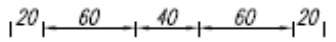
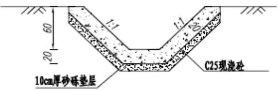
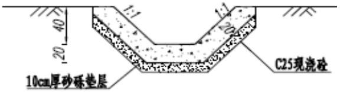
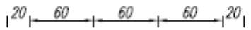
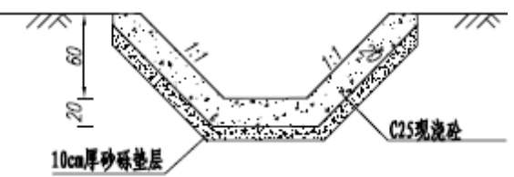
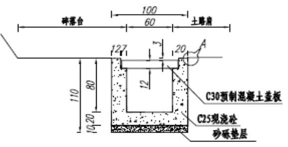
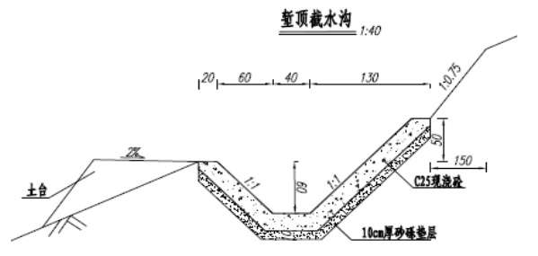
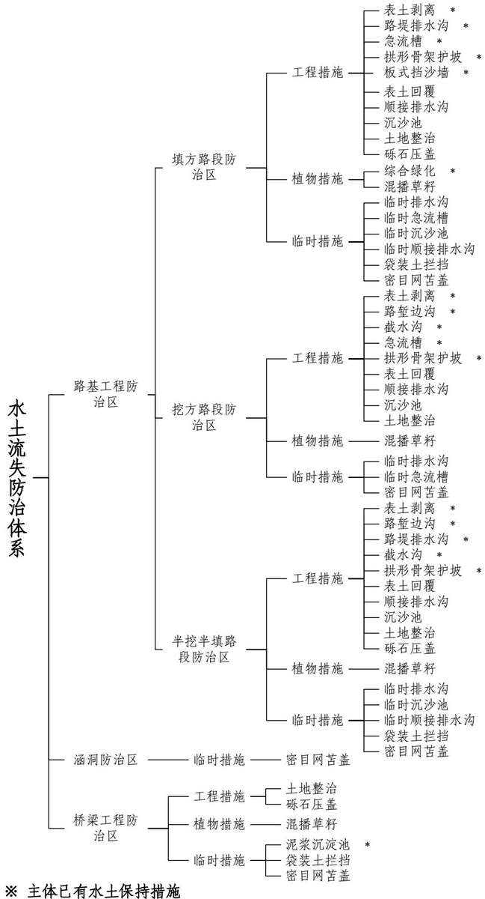
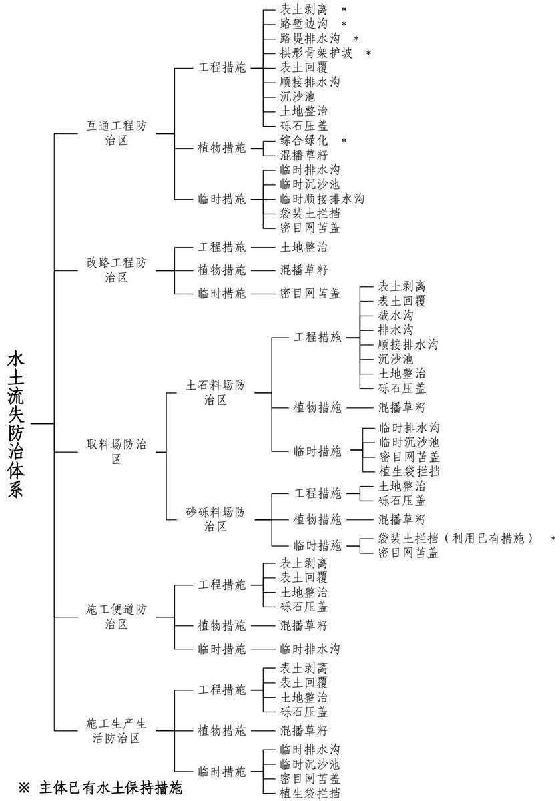

> **Zone C（应用范例层）使用边界**——仅可用于**写作风格、章节展开方式、表达逻辑、表格设计**的参考。
> **不得**用于合规判断；**不得**引入其项目数据（名称／地点／数字／单位名）；
> **不得**因其"曾经通过审批"而推定其做法在当前标准下仍然合规。
> 与 Zone A 冲突时**一律以 Zone A 为准**；Zone A 未明确规定时输出
> 「**Zone A 未明确规定，以下为参考写法，需人工判断**」。
>
> **坐标系警告**：本范例为**老八章结构**（GB 50433—2018 附录B），与 2026 版 10 章模板**同号不同义**
> （老 `1.5`＝防治目标，新 `1.5`＝水土流失预测结果；老 4→新 6 …偏移 +2；新版第 4/5 章老结构无独立章）。
> 因此 **`chapter_mapping: pending`——不得按章节号挂载**，检索一律走 `topic_tags`。
>
> **待加工**：`topic_tags`（主题标签）、`approval_basis_list`（编制依据逐字清单）、
> `structure_summary`（只提取结构：章节展开顺序／段落功能／表格栏目结构／句式模板／论证链步骤）。

<!-- 本文件由原方案 PDF 分段转换后拼接：共 2 段，原 219 页（MinerU 云单文件上限 200 页） -->

# 水土保持方案报告书

建设单位：西藏自治区重点公路建设项目管理中心

编制单位：湖北省水利水电规划勘测设计院有限公司

2025 年 9 月

## 目 录

1 综合说明..  
1.1 项目简况 .  
1.2 编制依据 ...  
1.3 设计水平年 ..  
1.4 水土流失防治责任范围..  
1.5 水土流失防治目标... . 8  
1.6 项目水土保持评价结论..  
1.7 水土流失预测结果.. ... 13  
1.8 水土保持措施布设成果. ... 13  
1.9 水土保持监测.. ... 18  
1.10 水土保持投资. .. 19  
1.11 结论 ... .. 19  
2 项目概况.. .. 24  
2.1 项目组成及工程布置. .. 24  
2.2 施工组织 . .. 48  
2.3 工程占地 .. ... 58  
2.4 土石方平衡 .. ... 58  
2.5 拆迁（移民）安置与专项设施改（迁）建..... .... 67  
2.6 施工进度 .. ... 67  
2.7 自然概况 .. ... 68  
3 项目水土保持评价.. ... 78  
3.1 主体工程选线水土保持评价. .. 78  
3.2 建设方案与布局水土保持评价.. ... 83  
3.3 主体工程设计中具有水土保持功能工程的评价.... ... 96  
4 水土流失分析与预测... .. 103  
4.1 水土流失现状.. .. 103  
4.2 水土流失影响因素分析. ... 104  
4.3 土壤流失量预测.... ... 106  
4.4 水土流失危害分析.. ... 130  
4.5 指导性意见 ... ... 131  
5 水土保持措施布设. .. 132  
5.1 防治区划分 .. ... 132  
5.2 措施总体布局.. ... 133  
5.3 分区措施布设.. ... 142  
5.4 施工要求 ... .. 170  
6 水土保持监测.. ... 176  
6.1 范围与时段 .. .. 176  
6.2 内容和方法 .. .. 177  
6.3 点位布设 ... .. 184  
6.4 实施条件和成果. ... 186  
7 水土保持投资概算及效益分析.... ... 191  
7.1 投资概算 ... .. 191  
7.2 效益分析 ... .. 203  
8 水土保持管理... .... 205  
8.1 组织管理 .. .... 205  
8.2 后续设计 ... .... 206  
8.3 水土保持监测 ...... .... 206  
8.4 水土保持监理.. ... 207  
8.5 水土保持施工.. ... 208  
8.6 水土保持设施验收.... .... 209

## 附表：

1、防治责任范围表

2、防治标准指标计算表

3、单价分析表

## 附件：

1、《交通运输厅关于 G4218 雅叶高速西藏自治区昆莎机场至色佐隧道进口段新建工程两阶段施工图设计的批复》（藏交发〔2025〕251号）

2、关于G4218昆莎机场至狮泉河公路新建工程取料场位置确认的函

3、关于做好 G4218 昆莎机场至狮泉河公路新建工程余方综合利用工作的通知（藏交项管字〔2025〕946号）

4、关于 G4218 昆莎机场至狮泉河公路新建工程（色佐隧道进口至切拉热巴隧道出口段）可行性研究报告的批复（藏发改基础〔2023〕514号）

5、《G4218 昆莎机场至狮泉河公路新建工程（色佐隧道进口至切拉热巴隧道出口段）水土保持方案批准予行政许可决定书》（藏水许可〔2023〕95号）

6、关于 G4218 昆莎机场至狮泉河公路新建工程（色佐隧道进口至切拉热巴隧道出口段）弃渣测算情况的说明

7、关于 G4218 昆莎机场至狮泉河公路新建工程（切拉热巴隧道出口至狮泉河段）可行性研究报告的批复（藏发改基础〔2024〕503号）

## 附图：

1、项目地理位置图  
2、项目区水系图  
3、项目区土壤侵蚀强度分布图  
4、西藏自治区水土流失重点预防区和重点治理区划分图  
5、项目总平面布置图（含路线平纵面图）  
6、排水工程设计图（主体提供）  
7、防护工程设计图（主体提供）  
、路基标准断面图（主体提供）  
9、互通工程平面布置图（主体提供）  
10、附属工程平面布置图（主体提供）  
11、改路工程设计图（主体提供）  
12、特殊路基设计图风积沙平面图（主体提供）  
、水土流失防治责任范围图、水土保持措施总体布局及监测点布置示意图  
14、路基工程防治区水土保持典型措施布设图  
15、桥梁工程防治区水土保持典型措施布设图  
16、互通工程防治区水土保持典型措施布设图  
17、取料场防治区水土保持典型措施布设图  
18、施工便道防治区水土保持典型措施布设图  
19、施工生产生活防治区水土保持典型措施布设图

## 1 .综合说明

## 1.1 项目简况

根据《国家公路网规划（2022年-2035年）》，G219线狮泉河至昆莎机场段同时位于G219和国家高速公路 G4218的走廊带内，在路网中的地位尤为突出。《西藏自治区省道网规划（2016-2030 年）》规划已明确将狮泉河—昆莎机场快速路（S7，与国家高速G4218共线路段）列为“8快、9纵、3横、20 联”省道网中的8条快速路之一。

昆莎机场至狮泉河公路新建工程建设是完善国家公路网布局，推动自治区深度融入“一带一路”，推动构建人类命运共同体的迫切需要；项目建设是落实交通强国战略、加快补齐西藏交通基础设施短板的迫切需要；项目建设是加强国防建设、维护国防安全的迫切需要；项目建设是改善阿里地区出行条件，带动区域经济发展的迫切需要。

依据西藏自治区工作及资金安排，该工程分 3 段单独立项、单独实施。第一段为G4218 昆莎机场至狮泉河公路新建工程（昆莎机场至色佐隧道进口段），计划 2025 年11月开工，工期2年，2027年10月完工；第二段为 G4218昆莎机场至狮泉河公路新建工程（色佐隧道进口至切拉热巴隧道出口段），含 1座特长隧道、1座中隧道，已于 2023年 12 月开工，工期 4 年，2027 年 12 月完工；第三段为 G4218 昆莎机场至狮泉河公路新建工程（切拉热巴隧道出口至狮泉河段），计划 2026 年 1 月开工，工期 2 年，2027年12月完工。该工程采用“一次设计、分段实施、同步通车”模式，无远期衔接问题。

本项目为 G4218 昆莎机场至狮泉河公路新建工程第一段，即 G4218 昆莎机场至狮泉河公路新建工程（昆莎机场至色佐隧道进口段），该段项目可行性研究报告获批复后，项目名称调整为：G4218 雅叶高速昆莎机场至色佐隧道进口段新建工程（以下简称“本项目”）。

## ⑵ 建设性质、规模及等级

本项目为新建工程，全线采用双向四车道高速公路标准，设计速度 100km/h，路基宽度25.5m。桥涵设计汽车荷载等级采用公路-Ⅰ级。

## ⑶ 项目组成

项目全线长度 16.803km，其中路基 16.575km，设置桥梁 228.2m/5 座（均为中桥），涵洞54道，互通式立交 1处，隧道变电所1处，改路 302m/2 处。

## ⑷ 施工组织

项目沿线共设置取料场 3处，施工便道2.05km，施工生产生活区1 处。

项目共设置表土堆放场 5 处，共堆存表土 12.80 万 m³，堆放面积 5.11hm²，堆高2.5\~3.0m，堆存期约 1.5 年。

## ⑸ 项目占地

本项目总占地 171.89hm²，其中永久占地 95.62hm²，临时占地 76.27hm²，占地类型为其他林地、天然牧草地、公路用地、内陆滩涂和裸土地。

## ⑹ 项目土石方

本项目土石方挖填总量为452.55万m³，其中挖方84.48万m³（包含表土剥离 12.80万 m³），填方 368.07 万 m³（包含表土回覆 12.80 万 m³），利用方 84.48 万 m³（本桩利用方 77.57 万 m³，调配利用方 6.91 万 m³），借方 283.59 万 m³，其中自采 194.34 万 m³，综合利用 G4218 昆莎机场至狮泉河公路新建工程（色佐隧道进口至切拉热巴隧道出口段）余方89.25万m³，不产生弃方。

## ⑺ 拆迁安置

本项目沿线需拆迁电杆 39个，电线15.85km，光缆3000m。拆迁安置均采用一次性货币补偿方式，由建设单位出资，当地拆迁安置主管部门负责具体安置。本项目设施专项迁建采用货币补偿方式，由建设单位出资，由当地电力部门负责具体实施，并承担相应水土流失防治责任。

## ⑻ 建设工期及投资

项目总投资 81960.66 万元，其中土建投资 57971.78 万元。项目计划于 2025 年 11月开工，2027年10月完工，建设工期2年。

## ⑼ 建设单位

本项目建设单位为西藏自治区重点公路建设项目管理中心。

## 1.1.2 项目前期工作进展情况

## 1.1.2.1 主体工程设计前期工作概况

⑴ 2024 年 11 月 22 日，交通运输部以《交通运输部关于西藏自治区 G4218 雅叶高速昆莎机场至色佐隧道进口段新建工程可行性研究报告的批复》（交规划函〔2024〕615号）对本项目工可进行批复。

⑵ 2025年4月25日，交通运输部以《交通运输部关于 G4218雅叶高速昆莎机场至色佐隧道进口段新建工程初步设计的批复》（交公路函〔2025〕265 号）对本项目初步设计进行批复。

⑶ 2025年6月13 日，西藏自治区交通运输厅以《交通运输厅关于 G4218雅叶高速昆莎机场至色佐隧道进口段新建工程两阶段施工图设计的批复》（藏交发〔2025〕251号）对本项目两阶段施工图进行批复。

⑷ 本项目正处在施工准备阶段。

⑸ 本项目的用地预审、环境影响评价、地质灾害危险性评估等相关专题均已取得批复。地震安全性评价报告已完成并已备案。防洪影响评价专题正在编报。

## 1.1.2.2 水土保持方案设计的工作概况

受西藏自治区重点公路建设项目管理中心委托，湖北省水利水电规划勘测设计院有限公司（以下简称“我公司”）承担G4218雅叶高速昆莎机场至色佐隧道进口段新建工程水土保持方案报告书的编制任务。接到委托后，我公司立即成立项目组，并组织工程技术人员对本项目现场进行勘察，收集项目区有关水土保持等方面的资料，在分析研究的基础上，依据施工图等主体设计资料，于 2025 年 9 月编制完成了《G4218 雅叶高速昆莎机场至色佐隧道进口段新建工程水土保持方案报告书》（以下简称“本方案”）。

## 1.1.3 自然简况

本项目位于西藏阿里地区噶尔县境内，沿线海拔高程 4267.90m\~4370.23m，所经区域总体属高原河谷地貌。气候类型为高原寒带干旱型气候区，多年平均气温为 1.0℃，年积温 $\mathrm { ( \gtrsim 1 0 ^ { \circ } C ) ~ 4 8 0 ^ { \circ } C }$ ，年蒸发量2420mm；多年平均降水量 66.4mm，多年平均风速2.4m/s，最大冻土深度183cm，无霜期约 49.8d。项目区土壤类型主要为高山草原土。项目区植被属高寒草原地带，根据现场调查，项目沿线林草植被覆盖率 10％。

项目所在区域属于羌塘-藏西南高原区的藏西南高原山地生态维护防沙区，容许土壤流失量为1000t/（km²•a）。水土流失主要以风力侵蚀为主，伴有水力侵蚀，项目所在的区域水土流失以轻度为主。根据现场调查项目占地范围内原生平均土壤侵蚀模数，其中风蚀模数为 $1 5 9 4 \mathrm { t / \Omega ( \ k m ^ { 2 } { \cdot } a _ { \mu } ) }$ ，水蚀模数为 $4 7 8 \mathrm { t / \Omega \left( \mathrm { k m } ^ { 2 } { \cdot } a \right) }$

本项目不涉及各级水土流失重点预防区和重点治理区，不涉及饮用水水源保护区、水功能一级区的保护区和保留区、自然保护区、世界文化和自然遗产地、风景名胜区、地质公园、森林公园以及重要湿地等水土保持敏感区。

## 1.2 编制依据

## 1.2.1 法律法规

⑴ 《中华人民共和国水土保持法》（2010 年 12 月 25 日修订，2011 年 3 月 1 日起实施）；

⑵ 《西藏自治区实施〈中华人民共和国水土保持法〉办法》（2025 年 5 月 27 日修订）；

⑶ 《中华人民共和国青藏高原生态保护法》（2023 年 4 月 26 日颁布，2023 年 9月1日起实施）。

## 1.2.2 规章及规范性文件

⑴ 《水利部办公厅关于印发 2025年水土保持工作要点的通知》（办水保〔2025〕38号）；

⑵ 《水利部办公厅关于进一步加强部批项目水土保持监管工作的通知》（办水保〔2024〕57 号）；

⑶ 《生产建设项目水土保持方案管理办法》（水利部令第 53号，2023年1月17日发布，2023年3月1 日起实施）；

⑷ 《水利部办公厅关于印发生产建设项目水土保持方案审查要点的通知》（办水保〔2023〕177 号）；

⑸ 《水利部办公厅关于进一步加强生产建设项目水土保持监测工作的通知》（办水保〔2020〕161 号）；

⑹ 《水利部办公厅关于进一步深化“放管服”改革全面加强水土保持监管的意见》

（办水保〔2019〕160号）；

⑺ 《水利部办公厅关于印发生产建设项目水土保持监督管理办法的通知》（办水保〔2019〕172 号）；

⑻ 《水利部办公厅关于印发生产建设项目水土保持设施自主验收规程（试行）的通知》（办水保〔2018〕133号）；

⑼ 《水利部办公厅关于印发生产建设项目水土保持技术文件编写和印制格式规定（试行）的通知》（办水保〔2018〕135号）；

⑽ 《关于调整水土保持补偿费标准的通知》（藏发改价格〔2017〕929号）；

⑾ 《西藏自治区财政厅等 5家单位关于印发〈西藏自治区水土保持补偿费征收管理办法〉的通知》（藏财税〔2024〕16号）；

⑿ 《水利部办公厅关于印发〈生产建设项目水土保持监测规程（试行）〉的通知》（办水保〔2015〕139号）；

⒀ 《西藏自治区水利厅 西藏自治区交通运输厅关于进一步加强公路建设项目水土保持工作的通知》（藏水字〔2025〕24号）。

## 1.2.3 技术标准

⑴ 《生产建设项目水土保持技术标准》（GB 50433-2018）；

⑵ 《生产建设项目水土流失防治标准》（GB/T 50434-2018）；

⑶ 《生产建设项目土壤流失量测算导则》（SL 773-2018）；

⑷ 《生产建设项目水土保持监测与评价标准》（GB51240-2018）；

⑸ 《土地利用现状分类》（GB/T 21010-2017）；

⑹ 《防洪标准》（GB50201-2014）；

⑺ 《水利水电工程制图标准水土保持图》（SL73.6-2015）；

⑻ 《水土保持监理规范》（SL/T 523-2024）；

⑼ 《水土保持工程设计规范》（GB51018-2014）；

⑽ 《水土保持监测技术规范》（SL/T 277-2024）；

⑾ 《土壤侵蚀分类分级标准》（SL190-2007）；

⑿ 《表土剥离及其再利用技术要求》（GB/T 45107-2024）。

## 1.2.4 技术资料及文件

⑴ 《G4218雅叶高速昆莎机场至色佐隧道进口段新建工程可行性研究报告》，（西藏自治区交通勘察设计研究院，2024年11月）；

⑵ 《G4218雅叶高速昆莎机场至色佐隧道进口段新建工程初步设计》（西藏自治区交通勘察设计研究院，2025年4月）；

⑶ 《G4218雅叶高速昆莎机场至色佐隧道进口段新建工程两阶段施工图设计》（西藏自治区交通勘察设计研究院，2025年4月）；

⑷ 《水利部办公厅关于做好国家级水土流失重点预防区和重点治理区落地上图成果应用的通知》（办水保〔2025〕170号）；

⑸ 《西藏自治区水土保持规划（2019-2030 年）》（藏政函〔2019〕55号）；

⑹ 《阿里地区水土保持规划（2021-2030 年）》；

⑺ 《中国暴雨统计参数图集》（中国水利水电出版社，2005）；

⑻ 其他相关资料。

## 1.3 设计水平年

本项目属建设类项目，根据建设安排，本项目计划于2025年11月开工建设，2027年10月完工，设计水平年为主体工程完工后一年，即 2028年。

## 1.4 水土流失防治责任范围

经统计，本项目防治责任范围 171.89hm²，其中永久占地 95.62hm²，临时占地76.27hm²。占地类型为其他林地、天然牧草地、公路用地、内陆滩涂和裸土地。

表 1-1 水土流失防治责任范围
<table><tr><td rowspan=2 colspan=1>行政区</td><td rowspan=2 colspan=1>防治分区</td><td rowspan=1 colspan=3>防治责任范围（hm²）</td></tr><tr><td rowspan=1 colspan=1>小计</td><td rowspan=1 colspan=1>永久占地</td><td rowspan=1 colspan=1>临时占地</td></tr><tr><td rowspan=7 colspan=1>噶尔县</td><td rowspan=1 colspan=1>路基工程防治区</td><td rowspan=1 colspan=1>82.33</td><td rowspan=1 colspan=1>82.33</td><td rowspan=1 colspan=1></td></tr><tr><td rowspan=1 colspan=1>桥梁工程防治区</td><td rowspan=1 colspan=1>0.58</td><td rowspan=1 colspan=1>0.58</td><td rowspan=1 colspan=1></td></tr><tr><td rowspan=1 colspan=1>互通工程防治区</td><td rowspan=1 colspan=1>12.35</td><td rowspan=1 colspan=1>12.35</td><td rowspan=1 colspan=1></td></tr><tr><td rowspan=1 colspan=1>改路工程防治区</td><td rowspan=1 colspan=1>0.36</td><td rowspan=1 colspan=1>0.36</td><td rowspan=1 colspan=1></td></tr><tr><td rowspan=1 colspan=1>取料场防治区</td><td rowspan=1 colspan=1>67.14</td><td rowspan=1 colspan=1></td><td rowspan=1 colspan=1>67.14</td></tr><tr><td rowspan=1 colspan=1>施工便道防治区</td><td rowspan=1 colspan=1>1.13</td><td rowspan=1 colspan=1></td><td rowspan=1 colspan=1>1.13</td></tr><tr><td rowspan=1 colspan=1>施工生产生活防治区</td><td rowspan=1 colspan=1>8.00</td><td rowspan=1 colspan=1></td><td rowspan=1 colspan=1>8.00</td></tr><tr><td rowspan=1 colspan=2>总计</td><td rowspan=1 colspan=1>171.89</td><td rowspan=1 colspan=1>95.62</td><td rowspan=1 colspan=1>76.27</td></tr></table>

## 1.5 水土流失防治目标

## 1.5.1 执行标准等级

本项目位于阿里地区噶尔县，根据《水利部办公厅关于做好国家级水土流失重点预防区和重点治理区落地上图成果应用的通知》（办水保〔2025〕170 号）、《西藏自治区水土保持规划（2019-2030年）》（藏政函〔2019〕55号）及《阿里地区水土保持规划（2021-2030 年）》，不涉及各级水土流失重点预防区和重点治理区；本项目不涉及饮用水水源保护区、水功能一级区的保护区和保留区、自然保护区、世界文化和自然遗产地、风景名胜区、地质公园、森林公园、重要湿地等水土保持敏感区。由于项目线路在噶尔河东侧 3km 以内，位于四级以上河道两岸 3km 汇流范围内，且不在一级标准区域的应执行二级标准。

综上所述，本项目水土流失防治标准等级执行青藏高原区二级标准。

## 1.5.2 防治目标

## ⑴ 基本目标

项目建设范围内新增水土流失应得到有效控制，原有水土流失得到治理；水土保持设施安全有效；水土资源、林草植被应得到最大限度地保护与恢复；水土流失治理度、土壤流失控制比、渣土防护率、表土保护率、林草植被恢复率、林草覆盖率六项指标符合《生产建设项目水土流失防治标准》（GB/T50434-2018）的规定。

## ⑵ 六项防治指标

根据《生产建设项目水土保持技术标准》（GB50433-2018），本项目水土流失防治标准等级执行建设类项目二级标准，采用青藏高原区水土流失防治指标值。同时根据项目区干旱程度、水土流失及所处的位置等情况对防治指标进行适当调整，其中根据土壤侵蚀程度，本项目以轻度侵蚀为主，土壤流失控制比不应小于 1，修正值增加 0.25；根据干旱程度，本项目位于干旱地区，林草植被恢复率和林草覆盖率分别降低 3%。

综上，本项目修正后的水土流失防治指标值为：水土流失治理度 82%，土壤流失控制比1.0，渣土防护率85%，表土保护率85%，林草植被恢复率 87%，林草覆盖率 10%。

表 1-2 水土流失防治目标计算表
<table><tr><td rowspan=2 colspan=1>防治指标</td><td rowspan=1 colspan=2>青藏高原区水土流失防治二级标准</td><td rowspan=1 colspan=2>本方案水土流失防治目标</td><td rowspan=2 colspan=1>修正说明</td></tr><tr><td rowspan=1 colspan=1>施工期</td><td rowspan=1 colspan=1>设计水平年</td><td rowspan=1 colspan=1>施工期</td><td rowspan=1 colspan=1>设计水平年</td></tr><tr><td rowspan=1 colspan=1>水土流失治理度(%)</td><td rowspan=1 colspan=1>*</td><td rowspan=1 colspan=1>82</td><td rowspan=1 colspan=1></td><td rowspan=1 colspan=1>82</td><td rowspan=1 colspan=1>本项目位于青藏高原区，不降低水土流失治理度</td></tr><tr><td rowspan=1 colspan=1>土壤流失控制比</td><td rowspan=1 colspan=1>*</td><td rowspan=1 colspan=1>0.75</td><td rowspan=1 colspan=1></td><td rowspan=1 colspan=1>1.0</td><td rowspan=1 colspan=1>“在轻度侵蚀为主的区域不应小于1，中度以上侵蚀为主的区域可降低0.1~0.2”，本项目以轻度侵蚀为主，修正+0.25。</td></tr><tr><td rowspan=1 colspan=1>渣土防护率(%)</td><td rowspan=1 colspan=1>83</td><td rowspan=1 colspan=1>85</td><td rowspan=1 colspan=1>83</td><td rowspan=1 colspan=1>85</td><td rowspan=1 colspan=1>/</td></tr><tr><td rowspan=1 colspan=1>表土保护率(%)</td><td rowspan=1 colspan=1>85</td><td rowspan=1 colspan=1>85</td><td rowspan=1 colspan=1>85</td><td rowspan=1 colspan=1>85</td><td rowspan=1 colspan=1>1</td></tr><tr><td rowspan=1 colspan=1>林草植被恢复率(%)</td><td rowspan=1 colspan=1>*</td><td rowspan=1 colspan=1>90</td><td rowspan=1 colspan=1></td><td rowspan=1 colspan=1>87</td><td rowspan=1 colspan=1>“位于干旱地区的，水土流失治理度、林草植被恢复率、林草覆盖率可降低3%~5%”，本项目位于干旱地区，减少3%。</td></tr><tr><td rowspan=1 colspan=1>林草覆盖率(%)</td><td rowspan=1 colspan=1>*</td><td rowspan=1 colspan=1>13</td><td rowspan=1 colspan=1></td><td rowspan=1 colspan=1>10</td><td rowspan=1 colspan=1>“位于干旱地区的，水土流失治理度、林草植被恢复率、林草覆盖率可降低3%~5%”，本项目位于干旱地区，减少3%。</td></tr></table>

## 1.6 项目水土保持评价结论

## 1.6.1 主体工程选线评价

主体工程选线（址）符合《中华人民共和国水土保持法》、《中华人民共和国青藏高原生态保护法》、《西藏自治区实施〈中华人民共和国水土保持法〉办法》、《生产建设项目水土保持技术标准》（GB50433-2018）等相关法律法规和规范性文件中关于工程选址（线）水土保持限制和约束性规定。本项目位于阿里地区噶尔县，不涉及各级水土流失重点预防区和重点治理区，项目选线不涉及河流两岸、湖泊和水库周边的植物保护带；项目用地范围内没有全国水土保持监测网络中的水土保持监测站点、重点试验区及国家确定的水土保持长期定位观测站，项目选址、建设方案、施工组织设计及工程管理等方面能够满足水土保持法律法规及技术标准中有关主体工程约束性规定的要求，项目建设可行。

## 1.6.2 建设方案与布局评价

## ⑴ 建设方案评价

1）本项目为新建高速公路工程，存在高填深挖段 1210m/4段。高填段长 930m/3 段（最大填高29.8m，位于填方段 K16+960），受季节性冻土对路基填方高度的要求，以及高填段范围内坚硬岩层导致钻孔作业困难，对桥梁上部结构施工造成不利影响，增加了施工安全风险及工期不确定性。同时，该段风积沙活动较为强烈，路基采用波形护栏更利于风沙流通。此外，终点接线处平纵位置已确定，本段路线平纵设计已无优化空间，路线尽量以填方形式经过泥石流堆积区和风沙地段，所以形成高填路段，为土石混合路基。本项目路基深挖段长 280m/1 段（最大挖深 60.9m，位于挖方段 K14+980 右侧），由于本项目以填方为主，扣除结构物挖方利用，仍需借方 283.59 万 m³。为最大限度减少外借土石方量，且因深挖段里程较短，主体未设置隧道，采用路基形式通过。主体设计对高填深挖段采取分台阶处理，设置宽平台+护面墙+锚索框架+拱形骨架护坡+GPS2主动防护网进行加固防护，并配套较完整的排水系统。

2）针对稳定的路堤、路堑边坡，主体设计布置了护面墙和拱形骨架护坡等硬护坡，由于本项目位于阿里地区，海拔高，气候条件较差，主体采取的边坡防护以硬护坡为主，本方案建议在有条件路段尽量采取植物防护措施。

3）本项目位于阿里地区噶尔县，不涉及各级水土流失重点预防区和重点治理区。

本项目不涉及饮用水水源保护区、水功能一级区的保护区和保留区、自然保护区、世界文化和自然遗产地、风景名胜区、地质公园、森林公园以及重要湿地。

综上所述，其建设方案符合水土保持技术标准要求。

## ⑵ 工程占地评价

本项目总占地 171.89hm²，其中永久占地 95.62hm²，临时占地 76.27hm²。本项目永久占地数量符合《公路工程项目建设用地指标》中用地指标的要求。项目用地预审文件中，本项目用地预审占地范围为 103.18hm²，现阶段本项目永久占地小于用地预审拟用地面积，符合土地利用总体规划要求，符合供地政策。

本项目在满足工程布置和功能正常运行情况前提下，尽可能减少永久占地面积，从工程用地规模来看，永久占地符合节约用地和减少扰动的要求。本项目为新建工程，主体设计采取挡墙、护脚等拦挡防护措施收缩坡脚；路堑边沟采用带盖板的矩形边沟，沟顶兼做碎落台，减少占地，符合节约用地和减少扰动的要求，新增占地合理。同时对项目区内占用的林地和草地进行了表土剥离保护，施工结束后通过工程的边坡绿化恢复植被，尽量减少对周边环境的破坏。

本项目充分利用G4218 昆莎机场至狮泉河公路新建工程（色佐隧道进口至切拉热巴隧道出口段）余方，减少取料场的布置；剥离的表土集中堆放于互通工程区、取料场和施工生产生活区等空地，减少临时堆放场的布设，减少临时占地面积 5.11hm²。本项目设置项目沿线共设置取料场 3处，施工便道2.05km，施工生产生活区1处，表土堆放场5 处。施工临时占地以进一步减少扰动地表为前提，利用主体工程永久占地范围进行施工，不足部分设置临时占地，后期进行恢复。项目临时占地面积基本合理，无遗漏，符合节约用地和减少扰动的要求，能够满足施工的要求，临时占地符合水土保持技术要求。

## ⑶ 土石方平衡评价

## 1）弃渣资源化、减量化评价

本项目以路基填方为主要工程形式，在设计阶段开展土石方方案优化，通过削减工程总体土石方规模，强化各区域土石方动态调配，实现以挖作填，土石方利用率达100.00%。同时，统筹利用 G4218昆莎机场至狮泉河公路新建工程（色佐隧道进口至切拉热巴隧道出口段）的永久弃渣作为路基填筑料，减少本项目新增开挖量。

通过本项目开挖方回用与其他项目余方统筹利用相结合的方式，有效减少工程借方量与弃渣量，降低水土流失量；从源头上提升开挖方资源利用率，削减弃渣量，落实水土保持源头防控要求。

## 2）土石方平衡评价

主体工程土石方挖填量设计基本合理，挖方资源利用率高，符合工程最优化设计原则。各工程区间实施土石方统筹调配利用，其技术思路与实施方法符合水土保持要求，且满足调配时序合理、运距经济的原则。

## ⑷ 表土剥离及回填利用评价

本项目剥离及回覆表土 12.80万m³，集中堆放于 5处表土堆放场，均为本项目征地范围内，不再新增占地，堆放高度控制在2.5\~3.0m，堆放边坡 1：2，堆放期间采取临时防护及临时排水、沉沙措施，施工完毕后将表土及时回覆各分区进行植被恢复，各防治分区间可实现表土完全利用。表土剥离措施及回覆利用，保护了表土资源，减少了因工程建设而新增的水土流失，符合水土保持要求。

## ⑸ 取土（石、砂）场设置评价

本项目共设置 处取料场，其中 处为坡面开采， 处为平地开采。选址不在崩塌和滑坡危险区、泥石流易发区内；不涉及河道、湖泊管理范围内；取料场基本与周边景观相互协调；取料场开采结束后实施水土保持措施，进行植被恢复。取料场的设置基本满足水土保持要求。

## ⑹ 施工方法和工艺评价

在施工组织设计中，临时工程优先考虑永临结合，减少新占地。本项目土石方工程采用机械施工为主，桥梁基础采用钻孔桩基础，施工组织及施工工艺合理。

主体工程设计的施工组织、方法及工艺对于减少工程的水土流失以及危害具有预防性的作用，符合水土保持技术标准要求。

本项目土石方工程采用机械施工为主，主体土建工程将采取全线同时施工，分段平行流水施工的组织方式，在自然节点内，挖方与填方工程在施工工序及时序上连贯协调，施工组织设计满足有关水土保持的要求，但是为了避免施工期人为因素造成的水土流失，施工单位应规避大风天气集中施工，切实落实方案的预防保护措施，强调源头控制、过程控制，最大程度地减少扰动范围。

桥梁基础采用钻孔桩基础，钻渣进行路基回填。施工场地修筑临时排水及沉沙设施，施工便道充分考虑本工程施工特点进行布置，结合地形条件统筹规划便道工程。

主体工程设计与本方案在满足工程施工要求的基础上，通过各专业及工种之间施工工艺和施工组织配合，形成较完备的施工组织，施工工艺及施工组织符合减少水土流失的要求，且方案对主体工程尚未明确的措施提出补充设计；综上，本项目施工组织及施工工艺符合《生产建设项目水土保持技术标准》（GB50433-2018）要求。

## ⑺ 主体工程设计中具有水土保持功能工程的评价

主体工程设计路基工程区的表土剥离、排水措施、拱形骨架护坡、板式挡沙墙、综合绿化；桥梁工程区的泥浆池；互通工程的表土剥离、排水措施、拱形骨架护坡和交通岛绿化等能够满足本阶段水土保持技术要求，可降低工程区水土流失量，具有良好的水土保持功能，本方案将其界定为水土保持措施。

除了以上已采取的措施外，由于设计的侧重点及设计阶段的制约，本项目仍然存在一些容易引起水土流失的薄弱环节，特别是各工程区的顺接排水及沉沙措施，开挖边坡的下边坡拦挡，临时堆料和表土的临时拦挡、临时苫盖、临时排水以及临时沉沙等措施，需补充相应水土保持措施。

## 1.7 水土流失预测结果

本项目扰动地表面积共 171.89hm²，损毁植被面积 160.68hm²，不产生永久弃渣。

本项目预测时段内原地貌土壤流失量为 15205t，可能造成土壤流失总量为 66918t，其中施工期49232t，自然恢复期为 17686t；新增土壤流失量为52164t。

水土流失在时间上突出特征是集中在施工期，在空间上的突出特征是以路基工程区和取料场区为主，上述区域是本项目水土流失的防治难点和重点，也是水土保持监测的重点区域。

本项目可能造成的水土流失危害包括对土地资源的损坏和影响、对沿线生态环境的影响、对周边河流水质及河道行洪的影响和对工程自身安全的影响。

## 1.8 水土保持措施布设成果

本项目水土流失防治措施体系由路基工程防治区、桥梁工程防治区、互通工程防治区、改路工程防治区、取料场防治区、施工便道防治区和施工生产生活防治区共 7个水土流失防治区构成，其中路基工程防治区分为挖方路段防治区、填方路段防治区、半挖半填路段防治区和涵洞工程防治区 4个二级防治分区。取料场防治区分为土石料场防治区和砂砾料场防治区2 个二级防治区。

## ⑴ 路基工程防治区

## 1）填方路段防治区

施工前，对占地范围内可剥离的表土进行剥离，运至互通工程区空地集中堆放防护。施工期间，在两侧永临结合布设临时排水、沉沙、顺接排水措施，路堤坡脚设置排水沟，超高路堤坡面设置急流槽，顺接排水沟出口处结合涵洞布设设置沉沙池；超高路堤下边坡设置袋装土拦挡；裸露边坡采用密目网苫盖。施工结束后，拆除袋装土拦挡，路堤边坡采取拱形骨架护坡，风沙地段布设板式挡沙墙，对恢复植被区域进行土地整治，整治后进行表土回覆，混播草籽和砾石压盖措施。

## 主体已有措施：

工程措施：表土剥离 5.42万m³，排水沟14579m，边沟513m，急流槽 8m，拱形骨架护坡 9.97hm²，板式挡沙墙 1198m；实施时段：2025 年 11 月\~2026 年 12 月。

植物措施：综合绿化 0.03hm²；实施时段：2026年7月\~2026年9月。

## 方案新增措施：

工程措施：表土回覆0.78万m³，顺接排水沟1020m，沉沙池51个，土地整治3.91hm²，砾石压盖 3.74hm²；实施时段：2025 年 11 月\~2027 年 12 月。

植物措施：混播草籽 3.88hm²；实施时段：2026年7月\~2027年9月。

临时措施：临时排水沟 15092m，临时急流槽 8m，临时沉沙池 51 个，临时顺接排水沟 1020m，袋装土拦挡 2917m，密目网苫盖 4.99 万 m²。实施时段：2025 年 11 月\~2026年12月。

## 2）挖方路段防治区

施工前，对占地范围内可剥离的表土进行剥离，运至互通工程区空地集中堆放防护。 施工期间，在两侧永临结合布设临时排水措施，路堑上边坡设置截水沟，路堑坡脚设置 边沟，深挖坡面设置急流槽；裸露边坡采用密目网苫盖。施工结束后，路堑边坡采取拱 形骨架护坡，对恢复植被区域进行土地整治，整治后进行表土回覆，混播草籽措施。

## 主体已有措施：

工程措施：表土剥离 0.10 万 m³，截水沟 305m，排水沟 50m，边沟 500m，急流槽18m，拱形骨架护坡 0.18hm²；实施时段：2025 年 11 月\~2026 年 12 月。

## 方案新增措施：

工程措施：表土回覆 0.01 万 m³，土地整治 0.06hm²；实施时段：2026 年 7 月\~2026年12月。

植物措施：混播草籽 0.06hm²；实施时段：2026年7月\~2027年9月。

临时措施：临时排水沟 855m，临时急流槽18m，密目网苫盖0.10万 m²。实施时段：2025 年 11 月\~2026 年 12 月。

## 3）半挖半填路段防治区

施工前，对占地范围内可剥离的表土进行剥离，运至互通工程区空地集中堆放防护。施工期间，在两侧永临结合布设临时排水、沉沙、顺接排水措施，路堑上边坡设置截水沟，路堑坡脚设置边沟，路堤坡脚设置边沟，坡面设置急流槽，顺接排水沟出口处结合涵洞布设设置沉沙池；超高路堤下边坡设置袋装土拦挡；裸露边坡采用密目网苫盖。施工结束后，拆除袋装土拦挡，路堤边坡采取拱形骨架护坡，对恢复植被区域进行土地整治，整治后进行表土回覆，混播草籽和砾石压盖措施。

## 主体已有措施：

工程措施：表土剥离 0.27万m³，截水沟668m，排水沟38m，边沟 1080m，拱形骨架护坡 0.50hm²；实施时段：2025 年 11 月\~2026 年 12 月。

## 方案新增措施：

工程措施：表土回覆 0.04万m³，顺接排水沟 60m，沉沙池3个，土地整治 0.20hm²，砾石压盖 0.19hm²；实施时段：2025 年 11 月\~2027 年 12 月。

植物措施：混播草籽 0.20hm²；实施时段：2026年7月\~2027年9月。

临时措施：临时排水沟 1786m，临时顺接排水沟 60m，临时沉沙池 3个，袋装土拦挡 86m，密目网苫盖 0.25 万 m²。实施时段：2025 年 11 月\~2026 年 12 月。

## 4）涵洞工程防治区

施工期间，基坑范围内裸露边坡采用密目网苫盖。

## 方案新增措施：

临时措施：密目网苫盖0.28万m²。实施时段：2025年11月\~2026 年12月。

## ⑵ 桥梁工程防治区

施工期间，桥墩基础附近设置泥浆沉淀池，对桥台下边坡采取袋装土拦挡和密目网苫盖。施工结束后，对桥下恢复植被区域进行土地整治，整治后进行混播草籽和砾石压盖措施。

## 主体已有措施：

临时措施：泥浆沉淀池 10个；实施时段：2026年1月\~2026年6月。

## 方案新增措施：

工程措施：土地整治 0.35hm²，砾石压盖 0.35hm²；实施时段：2026 年 1 月\~2026 年9月。

植物措施：混播草籽 0.35hm²；实施时段：2026年7月\~2026年9月。

临时措施：袋装土拦挡 210m，密目网苫盖0.16万m²。实施时段：2026 年1月\~2026年6月。

## ⑶ 互通工程防治区

施工前，对占地范围内可剥离的表土进行剥离，表土集中堆存在互通空地，采取袋装土拦挡、密目网苫盖措施和临时排水、沉沙措施。施工期间，在匝道路基两侧永临结合布设临时排水、沉沙、顺接排水措施，对裸露边坡采用密目网苫盖。施工结束后，对边坡及互通空地区域进行土地整治，整治后进行表土回覆，混播草籽和砾石压盖措施。

## 主体已有措施：

工程措施：表土剥离0.36万m³，排水沟2764m，边沟1868m，拱形骨架护坡1.15hm²；实施时段：2026 年 1 月\~2027 年 3 月。

植物措施：综合绿化 0.02hm²；实施时段：2026年7月\~2026年9月。

## 方案新增措施：

工程措施：表土回覆 1.19万m³，顺接排水沟 100m，沉沙池5个，土地整治 5.93hm²，砾石压盖 5.93hm²；实施时段：2026 年 1 月\~2027 年 6 月。

植物措施：混播草籽 5.93hm²；实施时段：2026年7月\~2027年9月。

临时措施：临时排水沟 5333m，临时顺接排水沟 100m，临时沉沙池 7 个，袋装土拦挡 152m，密目网苫盖 0.64 万 m²。实施时段：2025 年 11 月\~2027 年 6 月。

## ⑷ 改路工程防治区

施工期间，对裸露的坡面进行苫盖防护；施工结束后，对裸露边坡进行土地整治，整治后进行混播草籽措施。

## 方案新增措施：

工程措施：土地整治 0.22hm²；实施时段：2027年7月\~2027年9月。

植物措施：混播草籽 0.22hm²；实施时段：2027年7月\~2027年9月。

临时措施：密目网苫盖 0.26万m²。实施时段：2027年1月\~2027年 9月。

## ⑸ 取料场防治区

## 1）土石料场防治区

施工前，对取料场占地范围内可剥离的表土进行剥离，取料场周边设置截排水沟及

沉沙池等排水措施，表土集中堆存取料场一角空地，采取袋装土拦挡、密目网苫盖措施和临时排水、沉沙措施；取料期间，对裸露的边坡采取密目网苫盖；取料完毕后，对恢复植被区域进行土地整治，整治后进行表土回覆，混播草籽和砾石压盖措施。

## 方案新增措施：

工程措施：表土剥离5.74万m³，表土回覆9.87万m³，截水沟1286m，排水沟2143m，顺接排水沟 120m，沉沙池 4 个，土地整治 57.47hm²，砾石压盖 57.47hm²；实施时段：2026 年 1 月\~2027 年 9 月。

植物措施：混播草籽 57.47hm²；实施时段：2026年7月\~2027年9 月。

临时措施：临时排水沟 562m，临时沉沙池 2 个，袋装土拦挡 863m，密目网苫盖2.42hm²。实施时段：2026 年 1 月\~2026 年 11 月。

## 2）砂砾料场防治区

施工前，利用G4218 昆莎机场至狮泉河公路新建工程（色佐隧道进口至切拉热巴隧道出口段）项目实施的临河侧袋装土拦挡措施；取料期间，对裸露的边坡采取密目网苫盖；取料完毕后，进行土地整治，整治后进行混播草籽和砾石压盖措施。

## 利用已有措施：

临时措施：袋装土拦挡 618m；

## 方案新增措施：

工程措施：土地整治 9.67hm²，砾石压盖 9.67hm²；实施时段：2026 年 1 月\~2027 年9月。

植物措施：混播草籽 9.67hm²；实施时段：2026年7月\~2027年9月。

临时措施：密目网苫盖 0.67hm²。实施时段：2026年1月\~2026年11 月。

## ⑹ 施工便道防治区

施工前，对占地范围内可剥离的表土进行剥离，分别运至连接场地进行集中堆放防护；对来水一侧设置临时排水沟。施工结束后，对恢复植被区域进行土地整治，整治后进行表土回覆，混播草籽和砾石压盖措施。

## 方案新增措施：

工程措施：表土剥离 0.11 万 m³，表土回覆 0.11 万 m³，土地整治 1.13hm²，砾石压盖 1.13hm²；实施时段：2025 年 11 月\~2027 年 9 月。

植物措施：混播草籽 1.13hm²；实施时段：2026年7月\~2027年9月。

临时措施：排水沟 2050m。实施时段：2025 年11月\~2026年1月。

## ⑺ 施工生产生活防治区

施工前，对占地范围内可剥离的表土进行剥离，表土集中堆存场地一角空地，采取袋装土拦挡、密目网苫盖措施和临时排水、沉沙措施；场地周边设置临时排水沟及沉沙池，场地填筑裸露面采取拦挡苫盖防护。施工结束后，对恢复植被区域进行土地整治，整治后进行表土回覆，混播草籽和砾石压盖措施。

## 方案新增措施：

工程措施：表土剥离 0.80 万 m³，表土回覆 0.80 万 m³，土地整治 8.00hm²，砾石压盖 8.00hm²；实施时段：2025 年 11 月\~2027 年 9 月。

植物措施：混播草籽 8.00hm²；实施时段：2027年7月\~2027年9月。

临时措施：临时排水沟 1005m，临时沉沙池 2个；植生袋拦挡1370m，密目网苫盖0.44 万 m²。实施时段：2025 年 11 月\~2026 年 11 月。

## 1.9 水土保持监测

⑴ 本项目水土保持监测范围包括路基工程区、桥梁工程区、互通工程区、改路工程区、取料场区、施工便道区和施工生产生活区，水土保持监测面积171.89hm²。

⑵ 本项目属于建设类项目，水土保持监测时段为从施工准备期开始至方案设计水平年末结束，即2025年 11月至2028年12月，共 38个月。

⑶ 水土保持监测内容包括水土流失自然影响因素、项目施工全过程各阶段扰动土地情况、水土流失状况、水土流失防治成效、水土流失危害等。监测方法主要为实地调查法和定位监测法。项目全线布置监测点 12 处，其中路基工程区 4 处，桥梁工程区 1处、互通工程区1处、改路工程区1处、取料场区3处、施工便道区1处和施工生产生活区1处，在地面监测的同时进行调查，全面了解和掌握区域水土流失情况。

⑷ 在施工准备期前进行本底值监测；施工过程中，扰动地表面积情况应最少每月监测1次；水土流失状况应至少每月监测 1次，发生强降水、大风等情况后应及时加测。土壤流失量结合拦挡、排水等措施，进行定量观测。水土流失防治成效应至少每季度监测1次，其中临时措施应至少每月监测 1次。水土流失危害应结合上述监测内容一并开展。

## 1.10 水土保持投资

本工程水土保持总投资 6779.85 万元（其中主体工程计列 4539.60 万元，方案新增2240.25 万元），其中工程措施 5663.82 万元，植物措施 157.49 万元，监测措施 102.97万元，临时工程175.78 万元，独立费用294.82 万元，水土保持补偿费292.21 万元。

通过对各防治区采取工程措施、植物措施、临时措施和施工期管理措施后，至设计水平年末，水土流失治理度大于 82%，土壤流失控制比大于 1.0，渣土防护率大于 85%，表土保护率大于85%，林草植被恢复率大于 87%，林草覆盖率大于10%，可以达到方案提出的防治目标。

至设计水平年各项水土保持措施实施后，造成水土流失面积得到相应的治理，有效地保护并增加了地表植被，经计算水土保持措施实施后将减少土壤流失量 30703t，使原有水土流失得到基本治理，新增水土流失得到有效控制，改善了项目区的生态环境，具有良好的生态效益。

## 1.11 结论

本项目不涉及各级水土流失重点预防区和重点治理区；不涉及河流两岸、湖泊和水库周边的植物保护带；项目占地范围内不涉及全国水土保持监测网络中的水土保持监测站点、重点试验区及国家确定的水土保持长期定位观测站。主体工程在项目选线、建设方案、施工组织设计和工程施工等方面能够满足水土保持法律法规及技术标准中有关主体工程约束性规定的要求，项目建设可行。

本方案从水土保持角度，对工程设计、施工和建设管理提出以下要求：

⑴ 本项目为新建工程，为确保有效地控制本项目在实施过程中人为的水土流失，应将批复的水土保持方案中的水土保持措施纳入主体工程设计中，水土保持工程投资纳入主体工程概算中，进行水土保持设施专项设计，进一步细化工程占地内的工程措施内容，并按照批复后的方案的要求落实水土保持措施。

⑵ 从水土保持的角度出发，建议进一步的优化路基土石方，尽量减少项目开挖取料，减少工程对整个区域的地表扰动和生态环境的破坏。

⑶ 施工单位应根据本方案设计原则，施工过程中落实水土保持措施，严格控制施工过程中占压地范围，杜绝乱挖乱采。加强土石方运输和堆放管理，防止沿途大量散落，防止乱堆乱弃。尤其要加强施工过程中原地表的保护措施，减少原地表扰动和破坏。

⑷ 实行水土保持工程监理制，对水土保持措施的实施进度、质量和资金进行监控管理，保证工程质量。监理单位要认真做好监理工作，要注重积累并整理水土保持工程资料，特别是临时措施的影像资料和质量评定的原始资料。

⑸ 建设单位要加强项目生产建设过程中水土保持监测工作，首先根据本方案中的监测要求编制监测计划并实施，监测结果应定期向水行政主管部门报送，在工程验收时，应提交水土保持监测总报告。

⑹ 建设单位应当按照水利部规定的标准和要求，开展水土保持设施自主验收，验收结果报水行政主管部门备案。

水土保持方案工程特性表
<table><tr><td rowspan=1 colspan=1>项目名称</td><td rowspan=1 colspan=4>G4218雅叶高速昆莎机场至色佐隧道进口段新建工程</td><td rowspan=1 colspan=1>流域管理机构</td><td rowspan=1 colspan=2>长江水利委员会</td></tr><tr><td rowspan=1 colspan=1>涉及省区</td><td rowspan=1 colspan=3>西藏自治区</td><td rowspan=1 colspan=1>涉及地市</td><td rowspan=1 colspan=1>阿里地区</td><td rowspan=1 colspan=1>涉及县或个数</td><td rowspan=1 colspan=1>噶尔县</td></tr><tr><td rowspan=1 colspan=1>项目规模</td><td rowspan=1 colspan=3>项目全长16.803km，双向四车道高速公路</td><td rowspan=1 colspan=1>总投资(万元)</td><td rowspan=1 colspan=1>81960.66</td><td rowspan=1 colspan=1>土建投资(万元)</td><td rowspan=1 colspan=1>57971.78</td></tr><tr><td rowspan=1 colspan=1>开工时间</td><td rowspan=1 colspan=3>2025年11月</td><td rowspan=1 colspan=1>完工时间</td><td rowspan=1 colspan=1>2027年10月</td><td rowspan=1 colspan=1>设计水平年</td><td rowspan=1 colspan=1>2028</td></tr><tr><td rowspan=1 colspan=1>工程占地（hm²）</td><td rowspan=1 colspan=2>171.89</td><td rowspan=1 colspan=1>永久占地（hm²）</td><td rowspan=1 colspan=2>95.62</td><td rowspan=1 colspan=1>临时占地（hm²）</td><td rowspan=1 colspan=1>76.27</td></tr><tr><td rowspan=9 colspan=1>项目组成</td><td rowspan=1 colspan=2>建设区域</td><td rowspan=1 colspan=1>面积（hm²）</td><td rowspan=1 colspan=1>挖方量（万m³）</td><td rowspan=1 colspan=1>填方量（万m³）</td><td rowspan=1 colspan=1>借方（万m³）</td><td rowspan=1 colspan=1>余方（万m³）</td></tr><tr><td rowspan=1 colspan=2>路基工程区</td><td rowspan=1 colspan=1>82.33</td><td rowspan=1 colspan=1>67.78</td><td rowspan=1 colspan=1>334.56</td><td rowspan=1 colspan=1>271.12</td><td rowspan=1 colspan=1></td></tr><tr><td rowspan=1 colspan=2>桥梁工程区</td><td rowspan=1 colspan=1>0.58</td><td rowspan=1 colspan=1>0.66</td><td rowspan=1 colspan=1>0.41</td><td rowspan=1 colspan=1></td><td rowspan=1 colspan=1></td></tr><tr><td rowspan=1 colspan=2>互通工程区</td><td rowspan=1 colspan=1>12.35</td><td rowspan=1 colspan=1>8.89</td><td rowspan=1 colspan=1>22.19</td><td rowspan=1 colspan=1>12.47</td><td rowspan=1 colspan=1></td></tr><tr><td rowspan=1 colspan=2>改路工程区</td><td rowspan=1 colspan=1>0.36</td><td rowspan=1 colspan=1>0.37</td><td rowspan=1 colspan=1></td><td rowspan=1 colspan=1></td><td rowspan=1 colspan=1></td></tr><tr><td rowspan=1 colspan=2>取土场区</td><td rowspan=1 colspan=1>67.14</td><td rowspan=1 colspan=1>5.74</td><td rowspan=1 colspan=1>9.87</td><td rowspan=1 colspan=1></td><td rowspan=1 colspan=1></td></tr><tr><td rowspan=1 colspan=2>施工便道区</td><td rowspan=1 colspan=1>1.13</td><td rowspan=1 colspan=1>0.11</td><td rowspan=1 colspan=1>0.11</td><td rowspan=1 colspan=1></td><td rowspan=1 colspan=1></td></tr><tr><td rowspan=1 colspan=2>施工生产生活区</td><td rowspan=1 colspan=1>8.00</td><td rowspan=1 colspan=1>0.93</td><td rowspan=1 colspan=1>0.93</td><td rowspan=1 colspan=1></td><td rowspan=1 colspan=1></td></tr><tr><td rowspan=1 colspan=2>合计</td><td rowspan=1 colspan=1>171.89</td><td rowspan=1 colspan=1>84.48</td><td rowspan=1 colspan=1>368.07</td><td rowspan=1 colspan=1>283.59</td><td rowspan=1 colspan=1>/</td></tr><tr><td rowspan=1 colspan=3>重点防治区名称</td><td rowspan=1 colspan=1></td><td rowspan=1 colspan=2>不涉及</td><td rowspan=1 colspan=2></td></tr><tr><td rowspan=1 colspan=3>地貌类型</td><td rowspan=1 colspan=1>高原河谷</td><td rowspan=1 colspan=2>水土保持区划</td><td rowspan=1 colspan=2>青藏高原区</td></tr><tr><td rowspan=1 colspan=1></td><td rowspan=1 colspan=2>土壤侵蚀类型</td><td rowspan=1 colspan=1>风力侵蚀为主，伴有水力侵蚀</td><td rowspan=1 colspan=2>土壤侵蚀强度</td><td rowspan=1 colspan=2>轻度</td></tr><tr><td rowspan=1 colspan=1></td><td rowspan=1 colspan=2>防治责任范围面积（hm²）</td><td rowspan=1 colspan=1>171.89</td><td rowspan=1 colspan=2>容许土壤流失量[t/(km²·a)]</td><td rowspan=1 colspan=2>1000</td></tr><tr><td rowspan=1 colspan=3>土壤流失预测总量（t）</td><td rowspan=1 colspan=1>66918</td><td rowspan=1 colspan=2>新增水土流失量（t）</td><td rowspan=1 colspan=2>52164</td></tr><tr><td rowspan=1 colspan=1></td><td rowspan=1 colspan=2>水土流失防治标准执行等级</td><td rowspan=1 colspan=1></td><td rowspan=1 colspan=2>青藏高原区建设类项目二级标准</td><td rowspan=1 colspan=2></td></tr><tr><td rowspan=3 colspan=1>防治目标</td><td rowspan=1 colspan=2>水土流失治理度（%）</td><td rowspan=1 colspan=1>82</td><td rowspan=1 colspan=2>土壤流失控制比</td><td rowspan=1 colspan=2>1.0</td></tr><tr><td rowspan=1 colspan=2>渣土防护率（%）</td><td rowspan=1 colspan=1>85</td><td rowspan=1 colspan=2>表土保护率（%）</td><td rowspan=1 colspan=2>85</td></tr><tr><td rowspan=1 colspan=2>林草植被恢复率（%）</td><td rowspan=1 colspan=1>87</td><td rowspan=1 colspan=2>林草覆盖率（%）</td><td rowspan=1 colspan=2>10</td></tr><tr><td rowspan=13 colspan=1>水土保持措施</td><td rowspan=1 colspan=2>防治分区</td><td rowspan=1 colspan=1>工程措施</td><td rowspan=1 colspan=2>植物措施</td><td rowspan=1 colspan=2>临时措施</td></tr><tr><td rowspan=4 colspan=1>路基工程防治区</td><td rowspan=1 colspan=1>填方路段防治区</td><td rowspan=1 colspan=1>表土剥离5.42万m³，排水沟14579m，边沟513m；急流槽8m，拱形骨架护坡9.97hm²，板式挡沙墙1198m；表土回覆0.78万m³，顺接排水沟1020m，沉沙池51个，土地整治3.91hm²，砾石压盖3.74hm²</td><td rowspan=1 colspan=2>综合绿化0.03hm²，混播草籽3.88hm²</td><td rowspan=1 colspan=2>临时排水沟15092m，临时急流槽8m，临时沉沙池51个，临时顺接排水沟1020m，袋装土拦挡2917m，密目网苫盖4.99万m²</td></tr><tr><td rowspan=1 colspan=1>挖方路段防治区</td><td rowspan=1 colspan=1>表土剥离0.10万m³，截水沟305m，排水沟50m，边沟500m，急流槽18m，拱形骨架护坡0.18hm²；表土回覆0.01万m³，土地整治0.06hm²</td><td rowspan=1 colspan=2>混播草籽0.06hm²</td><td rowspan=1 colspan=2>临时排水沟855m，临时急流槽18m，密目网苫盖0.10万m²</td></tr><tr><td rowspan=1 colspan=1>半挖半填路段防治区</td><td rowspan=1 colspan=1>表土剥离0.27万m³，截水沟668m，排水沟38m，边沟1080m，拱形骨架护坡0.50hm²；表土回覆0.04万m³，顺接排水沟60m，沉沙池3个，土地整治0.20hm²，砾石压盖0.19hm²</td><td rowspan=1 colspan=2>混播草籽0.20hm²</td><td rowspan=1 colspan=2>临时排水沟1786m，临时顺接排水沟60m，临时沉沙池3个，袋装土拦挡86m，密目网苫盖0.25万m²</td></tr><tr><td rowspan=1 colspan=1>涵洞工程防治区</td><td rowspan=1 colspan=1>/</td><td rowspan=1 colspan=2></td><td rowspan=1 colspan=2>密目网苫盖0.28万m²</td></tr><tr><td rowspan=1 colspan=2>桥梁工程防治区</td><td rowspan=1 colspan=1>土地整治0.35hm²，砾石压盖0.35hm3</td><td rowspan=1 colspan=2>混播草籽0.35hm²</td><td rowspan=1 colspan=2>泥浆沉淀池10个；袋装土拦挡210m，密目网苫盖0.16万m²</td></tr><tr><td rowspan=1 colspan=2>互通工程防治区</td><td rowspan=1 colspan=1>表土剥离0.36万m³，排水沟2764m，边沟1868m，拱形骨架护坡1.15hm²；表土回覆1.19万m³，顺接排水沟100m，沉沙池5个，土地整治5.93hm²，砾石压盖5.93hm²</td><td rowspan=1 colspan=2>综合绿化0.02 hm²，混播草籽5.93hm²</td><td rowspan=1 colspan=2>临时排水沟5333m，临时顺接排水沟100m，临时沉沙池7个，袋装土拦挡152m，密目网苫盖0.64万m²</td></tr><tr><td rowspan=1 colspan=2>改路工程防治区</td><td rowspan=1 colspan=1>土地整治0.22hm²</td><td rowspan=1 colspan=2>混播草籽0.22hm²</td><td rowspan=1 colspan=2>密目网苫盖0.26万m²</td></tr><tr><td rowspan=2 colspan=1>取料场防治区</td><td rowspan=1 colspan=1>土石料场防治区</td><td rowspan=1 colspan=1>表土剥离5.74万m³，表土回覆9.87万m³，截水沟1286m，排水沟2143m，顺接排水沟120m，沉沙池4个，土地整治57.47hm²，砾石压盖57.47hm²</td><td rowspan=1 colspan=2>混播草籽57.47hm²</td><td rowspan=1 colspan=2>临时排水沟562m，临时沉沙池2个，袋装土拦挡863m，密目网苫盖2.42hm²</td></tr><tr><td rowspan=1 colspan=1>砂砾料场防治区</td><td rowspan=1 colspan=1>土地整治9.67hm²，砾石压盖9.67hm²</td><td rowspan=1 colspan=2>混播草籽9.67hm²</td><td rowspan=1 colspan=2>袋装土拦挡618m（利用已有），密目网苫盖0.67hm²</td></tr><tr><td rowspan=1 colspan=2>施工便道防治区</td><td rowspan=1 colspan=1>表土剥离0.11万m³，表土回覆0.11万m³，土地整治1.13hm²，砾石压盖1.13hm²</td><td rowspan=1 colspan=2>混播草籽1.13hm²</td><td rowspan=1 colspan=2>排水沟2050m</td></tr><tr><td rowspan=1 colspan=2>施工生产生活防治区</td><td rowspan=1 colspan=1>表土剥离0.80万m³，表土回覆0.80万m³，土地整治8.00hm²，砾石压盖8.00hm²</td><td rowspan=1 colspan=2>混播草籽8.00hm²</td><td rowspan=1 colspan=2>临时排水沟1005m，临时沉沙池2个；植生袋拦挡1370m，密目网苫盖0.44万m²</td></tr><tr><td rowspan=1 colspan=2>投资（万元）</td><td rowspan=1 colspan=1>5663.82</td><td rowspan=1 colspan=2>157.49</td><td rowspan=1 colspan=2>175.78</td></tr><tr><td rowspan=1 colspan=2>主体已有水土保持措施投资（万元）</td><td rowspan=1 colspan=2>4539.60</td><td rowspan=1 colspan=2>新增水土保持措施投资（万元）</td><td rowspan=1 colspan=2>2240.25</td></tr><tr><td rowspan=1 colspan=2>水土保持总投资（万元）</td><td rowspan=1 colspan=2>6779.85</td><td rowspan=1 colspan=2>独立费用（万元）</td><td rowspan=1 colspan=2>294.82</td></tr><tr><td rowspan=1 colspan=2>监理费（万元）</td><td rowspan=1 colspan=2>43.31</td><td rowspan=1 colspan=1>监测措施（万元）</td><td rowspan=1 colspan=1>102.97</td><td rowspan=1 colspan=1>补偿费（万元）</td><td rowspan=1 colspan=1>292.21</td></tr><tr><td rowspan=1 colspan=2>方案编制单位</td><td rowspan=1 colspan=2>湖北省水利水电规划勘测设计院有限公司</td><td rowspan=1 colspan=2>建设单位</td><td rowspan=1 colspan=2>西藏自治区重点公路建设项目管理中心</td></tr><tr><td rowspan=1 colspan=2>法定代表人及电话</td><td rowspan=1 colspan=2>冷涛</td><td rowspan=1 colspan=2>法定代表人及电话</td><td rowspan=1 colspan=2>邹宗良</td></tr><tr><td rowspan=1 colspan=2>地址</td><td rowspan=1 colspan=2>湖北省武汉市洪山区珞南街珞狮路290号</td><td rowspan=1 colspan=2>地址</td><td rowspan=1 colspan=2>西藏自治区拉萨市城关区罗布林卡路15号</td></tr><tr><td rowspan=1 colspan=2>邮编</td><td rowspan=1 colspan=2>430070</td><td rowspan=1 colspan=2>邮编</td><td rowspan=1 colspan=2>850015</td></tr><tr><td rowspan=1 colspan=2>联系人及电话</td><td rowspan=1 colspan=2>高宝林027-87251277</td><td rowspan=1 colspan=2>联系人及电话</td><td rowspan=1 colspan=2>张赵远 13603869862</td></tr><tr><td rowspan=1 colspan=2>传真</td><td rowspan=1 colspan=2>027-87301015</td><td rowspan=1 colspan=2>传真</td><td rowspan=1 colspan=2></td></tr><tr><td rowspan=1 colspan=2>电子信箱</td><td rowspan=1 colspan=2>58959584@qq.com</td><td rowspan=1 colspan=2>电子信箱</td><td rowspan=1 colspan=2></td></tr></table>

## 2 项目概况

## 2.1 项目组成及工程布置

## 2.1.1 项目组成

## 2.1.1.1 项目简介

工程名称：G4218 雅叶高速昆莎机场至色佐隧道进口段新建工程

建设地点：西藏自治区阿里地区噶尔县

建设性质：新建工程

工程等别：全线采用双向四车道高速公路标准建设，设计速度100km/h，整体式路基宽度 25.5m，分离式路基宽度 2×13.0m

工程规模：项目全线长度 16.803km；共设置桥梁 228.2m/5 座（均为中桥），涵洞54 道，互通式立交 1 处，隧道变电所 1 处，改路 302m/2 处。项目沿线共设置取料场 3处，施工便道2.05km，施工生产生活区 1处

所属流域：狮泉河流域（外流河）

工程总投资/土建投资：81960.66 万元/57971.78 万元

建设工期：2年，项目计划于2025年11月开工，2027年10月完工

## 2.1.1.2 地理位置及路线走向

本项目位于西藏自治区阿里地区噶尔县境内，为G4218昆莎机场至狮泉河公路新建工程的第一段，起点（桩号 K0+300）位于噶尔县昆莎乡昆莎机场东侧，顺接 G4218 日喀则至昆莎机场段（规划）终点，顺噶尔河东侧，既有 G219线、110kV高压走廊东侧，山脚西侧布线，止于色佐山咀前，终点（桩号 K17+103）顺接在建G4218 昆莎机场至狮泉河公路新建工程（色佐隧道进口至切拉热巴隧道出口段）起点，线路全长 16.803km。

表 2-2 工程主要技术指标表
<table><tr><td rowspan=1 colspan=5>一、项目基本情况</td><td rowspan=1 colspan=1>所在流域</td><td rowspan=1 colspan=2>狮泉河流域</td></tr><tr><td rowspan=1 colspan=2>项目名称</td><td rowspan=1 colspan=3>G4218雅叶高速昆莎机场至色佐隧道进口段新建工程</td><td rowspan=1 colspan=1>建设地点</td><td rowspan=1 colspan=2>西藏自治区阿里地区噶尔县</td></tr><tr><td rowspan=1 colspan=2>建设单位</td><td rowspan=1 colspan=3>西藏自治区重点公路建设项目管理中心</td><td rowspan=1 colspan=1>建设性质</td><td rowspan=1 colspan=2>新建</td></tr><tr><td rowspan=1 colspan=2>总投资（万元）</td><td rowspan=1 colspan=3>81960.66</td><td rowspan=1 colspan=1>土建投资（万元）</td><td rowspan=1 colspan=2>57971.78</td></tr><tr><td rowspan=1 colspan=2>建设期</td><td rowspan=1 colspan=4>2年，2025年11月开工，2027年1</td><td rowspan=1 colspan=2>0月完工</td></tr><tr><td rowspan=3 colspan=1>建设规模</td><td rowspan=1 colspan=1>公路等级</td><td rowspan=1 colspan=3>双向四车道高速公路</td><td rowspan=1 colspan=1>设计行车速度（km/h）</td><td rowspan=1 colspan=2>100</td></tr><tr><td rowspan=1 colspan=1>长度（km）</td><td rowspan=1 colspan=3>16.803</td><td rowspan=1 colspan=1>路基宽度（m）</td><td rowspan=1 colspan=2>25.5/2×13.0</td></tr><tr><td rowspan=1 colspan=1>路面类型</td><td rowspan=1 colspan=3>沥青混凝土</td><td rowspan=1 colspan=1>桥梁宽度（m）</td><td rowspan=1 colspan=2>2×11.625</td></tr><tr><td rowspan=1 colspan=8>二、项目组成及主要技术指标</td></tr><tr><td rowspan=2 colspan=2>项目组成</td><td rowspan=1 colspan=3>占地面积（hm²）</td><td rowspan=2 colspan=1>主要工程项目名称</td><td rowspan=2 colspan=2>主要技术指标</td></tr><tr><td rowspan=1 colspan=1>合计</td><td rowspan=1 colspan=1>永久</td><td rowspan=1 colspan=1>临时</td></tr><tr><td rowspan=1 colspan=2>路基工程</td><td rowspan=1 colspan=1>82.33</td><td rowspan=1 colspan=1>82.33</td><td rowspan=1 colspan=1></td><td rowspan=1 colspan=1>涵洞（道）</td><td rowspan=1 colspan=2>54</td></tr><tr><td rowspan=1 colspan=2>桥梁工程</td><td rowspan=1 colspan=1>0.58</td><td rowspan=1 colspan=1>0.58</td><td rowspan=1 colspan=1></td><td rowspan=1 colspan=1>中桥（m/座）</td><td rowspan=1 colspan=2>228.2/5</td></tr><tr><td rowspan=1 colspan=2>互通工程</td><td rowspan=1 colspan=1>12.35</td><td rowspan=1 colspan=1>12.35</td><td rowspan=1 colspan=1></td><td rowspan=1 colspan=1>互通式立交（处）</td><td rowspan=1 colspan=2>1</td></tr><tr><td rowspan=1 colspan=2>改路工程</td><td rowspan=1 colspan=1>0.36</td><td rowspan=1 colspan=1>0.36</td><td rowspan=1 colspan=1></td><td rowspan=1 colspan=1>改路（m/处）</td><td rowspan=1 colspan=2>302/2</td></tr><tr><td rowspan=1 colspan=2>取料场</td><td rowspan=1 colspan=1>67.14</td><td rowspan=1 colspan=1></td><td rowspan=1 colspan=1>67.14</td><td rowspan=1 colspan=1>取料场（处）</td><td rowspan=1 colspan=2>3</td></tr><tr><td rowspan=1 colspan=2>施工便道区</td><td rowspan=1 colspan=1>1.13</td><td rowspan=1 colspan=1></td><td rowspan=1 colspan=1>1.13</td><td rowspan=1 colspan=1>施工便道（km）</td><td rowspan=1 colspan=2>2.05</td></tr><tr><td rowspan=1 colspan=2>施工生产生活区</td><td rowspan=1 colspan=1>8.00</td><td rowspan=1 colspan=1></td><td rowspan=1 colspan=1>8.00</td><td rowspan=1 colspan=1>施工生产生活区（处）</td><td rowspan=1 colspan=2>1</td></tr><tr><td rowspan=1 colspan=2>合计</td><td rowspan=1 colspan=1>171.89</td><td rowspan=1 colspan=1>95.62</td><td rowspan=1 colspan=1>76.27</td><td rowspan=1 colspan=3></td></tr><tr><td rowspan=1 colspan=2>三、项目土石方挖填工程量</td><td rowspan=1 colspan=1>（万m³）</td><td rowspan=1 colspan=5></td></tr><tr><td rowspan=1 colspan=1>项目组成</td><td rowspan=1 colspan=1>挖方</td><td rowspan=1 colspan=1>填方</td><td rowspan=1 colspan=1>利用方</td><td rowspan=1 colspan=1>调入</td><td rowspan=1 colspan=1>调出</td><td rowspan=1 colspan=1>借方</td><td rowspan=1 colspan=1>弃方</td></tr><tr><td rowspan=1 colspan=1>路基工程</td><td rowspan=1 colspan=1>67.78</td><td rowspan=1 colspan=1>334.56</td><td rowspan=1 colspan=1>67.78</td><td rowspan=1 colspan=1>1.95</td><td rowspan=1 colspan=1>6.29</td><td rowspan=1 colspan=1>271.12</td><td rowspan=1 colspan=1></td></tr><tr><td rowspan=1 colspan=1>桥梁工程</td><td rowspan=1 colspan=1>0.66</td><td rowspan=1 colspan=1>0.41</td><td rowspan=1 colspan=1>0.66</td><td rowspan=1 colspan=1></td><td rowspan=1 colspan=1>0.25</td><td rowspan=1 colspan=1></td><td rowspan=1 colspan=1></td></tr><tr><td rowspan=1 colspan=1>互通工程</td><td rowspan=1 colspan=1>8.89</td><td rowspan=1 colspan=1>22.19</td><td rowspan=1 colspan=1>8.89</td><td rowspan=1 colspan=1>0.83</td><td rowspan=1 colspan=1></td><td rowspan=1 colspan=1>12.47</td><td rowspan=1 colspan=1></td></tr><tr><td rowspan=1 colspan=1>改路工程</td><td rowspan=1 colspan=1>0.37</td><td rowspan=1 colspan=1></td><td rowspan=1 colspan=1>0.37</td><td rowspan=1 colspan=1></td><td rowspan=1 colspan=1>0.37</td><td rowspan=1 colspan=1></td><td rowspan=1 colspan=1></td></tr><tr><td rowspan=1 colspan=1>取料场</td><td rowspan=1 colspan=1>5.74</td><td rowspan=1 colspan=1>9.87</td><td rowspan=1 colspan=1>5.74</td><td rowspan=1 colspan=1>4.13</td><td rowspan=1 colspan=1></td><td rowspan=1 colspan=1></td><td rowspan=1 colspan=1></td></tr><tr><td rowspan=1 colspan=1>施工便道区</td><td rowspan=1 colspan=1>0.11</td><td rowspan=1 colspan=1>0.11</td><td rowspan=1 colspan=1>0.11</td><td rowspan=1 colspan=1></td><td rowspan=1 colspan=1></td><td rowspan=1 colspan=1></td><td rowspan=1 colspan=1></td></tr><tr><td rowspan=1 colspan=1>施工生产生活区</td><td rowspan=1 colspan=1>0.93</td><td rowspan=1 colspan=1>0.93</td><td rowspan=1 colspan=1>0.93</td><td rowspan=1 colspan=1></td><td rowspan=1 colspan=1></td><td rowspan=1 colspan=1></td><td rowspan=1 colspan=1></td></tr><tr><td rowspan=1 colspan=1>合计</td><td rowspan=1 colspan=1>84.48</td><td rowspan=1 colspan=1>368.07</td><td rowspan=1 colspan=1>84.48</td><td rowspan=1 colspan=1>6.91</td><td rowspan=1 colspan=1>6.91</td><td rowspan=1 colspan=1>283.59</td><td rowspan=1 colspan=1>1</td></tr></table>

## 2.1.2 项目依托工程情况

⑴ G4218昆莎机场至狮泉河公路新建工程（色佐隧道进口至切拉热巴隧道出口段）

G4218昆莎机场至狮泉河公路新建工程（色佐隧道进口至切拉热巴隧道出口段）为G4218 昆莎机场至狮泉河公路新建工程的第 2 段。2023 年 8 月 18 日，西藏自治区发展和改革委员会以《关于 G4218昆莎机场至狮泉河公路新建工程（色佐隧道进口至切拉热巴隧道出口段）可行性研究报告的批复》（藏发改基础〔2023〕514 号）对该项目可研

报告进行批复。

西藏自治区水利厅于 2023年12月19日对该项目水土保持方案报告书进行批复。

2023 年 10 月，建设单位委托西藏源清工程咨询有限公司进行水土保持监测；2023年 11 月，建设单位委托四川省公路院工程监理有限公司进行水土保持监理。水土保持监测及监理单位均于2023 年12月进场。

根据水土保持监测季度报告表，现场水土保持设施运行良好，未产生水土流失危害。

项目起于阿里地区噶尔县昆莎乡色佐隧道进口外 32m 处（K17+103），终点位于切拉热巴山隧道出口外90m 处（K26+854），路线全长为 9.751km。为新建工程，全线采用双向四车道一级公路标准进行建设，设计速度 100km/h，整体式路基宽度 25.5m，分离式路基宽度 2×13.0m。共设置桥梁 166m/1 座，隧道 7332.5m/2 座（特长隧道 6802.5m/1座，中隧道 530m/1 座），通风斜井 1298m/1 座，隧道变电所 1 处。项目沿线设置临时堆土场1处，土料场1处、石料场 1处，砂砾料场 2处，弃渣场2处，施工便道 16.21km，施工生产生活区5处。

该项目共计占地 102.21hm²，其中永久占地 24.94hm²，临时占地 77.27hm²。总挖方259.65 万 m³，总填方 209.57 万 m³，借方 103.52 万 m³，来自沿线土石料场；余方 153.60万 m³，其中作为混凝土骨料和隧道自身围护衬砌综合利用 64.35 万 m³，产生永久弃渣89.25 万 m³。

该项目建设总工期 48 个月，于 2023 年 12 月开工，计划 2025 年 9 月至 2027 年 3月完成隧道开挖。本项目主体工程将于 2027年 10月完成，施工时序满足利用要求。该项目产生余方 153.60 万 m³，其中自身利用 64.35 万 m³作为混凝土骨料和隧道自身围护衬砌，弃渣89.25万m³满足本项目需求，该项目连接本项目终点，可沿 G219通过汽车运输至本项目，运输条件较为便利。

根据《G4218昆莎机场至狮泉河公路新建工程（色佐隧道进口至切拉热巴隧道出口段）水土保持监测季度报告表（2025年2季度）》，该项目已产生66.25 万m³弃渣（松方，折合自然方49.07万 m³），堆放于弃渣场。

本项目计划利用3#取料场，该料场截止目前尚未启用。3#取料场位于 K0+300左侧3.77km 的噶尔河阶地上，储量约 50万m³。该料为噶尔河谷河漫滩冲积物，以卵石质为主。可用于本项目路基、桥涵高标号砼、防护、沿线设施及路面工程。该项目设置进出料场便道0.6km，不涉及河道管理范围。

根据《G4218昆莎机场至狮泉河公路新建工程（色佐隧道进口至切拉热巴隧道出口段）水土保持方案报告书》，该方案对3#取料场进行水土保持措施布设，施工期间，在料场沿河侧设置袋装土临时挡水措施，对堆料采取临时拦挡和苫盖措施；施工完毕后，进行土地平整。3#取料场水土保持措施工程量为土地平整 9.67hm²，袋装土拦挡 618m，密目网苫盖 1.25 万 m²；3#取料场水土保持措施投资估算为 60.64 万元，其中工程措施32.14 万元，临时措施 28.50 万元。

⑵ G4218昆莎机场至狮泉河公路新建工程（切拉热巴隧道出口至狮泉河段）

G4218昆莎机场至狮泉河公路新建工程（切拉热巴隧道出口至狮泉河段）（以下简称“第三段”）为G4218 昆莎机场至狮泉河公路新建工程的第 3段。2024 年8月14日，西藏自治区发展和改革委员会以《关于 G4218 昆莎机场至狮泉河公路新建工程（切拉热巴隧道出口至狮泉河段）可行性研究报告的批复》（藏发改基础〔2024〕503 号）对该项目可研报告进行批复。第三段正在进行初步设计阶段。

建设单位已委托湖北省水利水电规划勘测设计院有限公司编制水土保持方案报告书。

## 2.1.3 工程布置

## 2.1.3.1 平面总布置及竖向布置

## ⑴ 线路总体布局

项目起点（桩号 K0+300）位于噶尔县昆莎乡昆莎机场东侧，顺接规划 G4218 日喀则至昆莎机场段终点，设置昆莎机场互通接 G219 和昆莎机场连接线，顺噶尔河东侧、既有 G219 线、110kV 高压走廊东侧布线，止于色佐山咀前，终点（桩号 K17+103）顺接在建 G4218 昆莎机场至狮泉河公路新建工程（色佐隧道进口至切拉热巴隧道出口段）起点，线路长16.803km。公路等级为双向四车道高速公路，设计时速 100km/h。

## ⑵ 线路纵断面布置

高速公路沿线地貌类型主要为噶尔河谷地貌，地面高程 4267.90m\~4427.00m，路线纵断面主要控制因素包括：冻深、土石方、被交道路和通道的净高要求，此外，桥台处的填挖高程及隧道进出口高程等对工程规模影响较大。

全线最大纵坡为3.90%，最小纵坡0.50%，最短坡长为 320m；凸形竖曲线最小半径16000m/7个，凹形竖曲线最小半径10000m/4个，竖曲线累计长度总线路长度的45.086%。

工程项目组成及纵断面详见附图5项目总平面布置图（含路线平纵面图）。

## 2.1.3.2 路基工程

## ⑴ 路基标准横断面

本段路线采用双向四车道高速公路，设计速度为 100km/h。

K0+300\~K15+700.588 段采用整体式路基，路基宽度 25.5m，断面尺寸布置为：0.75m土路肩+3.0m 硬路肩（含 0.5m 右侧路缘带）＋2×3.75m 行车道+0.75m 路缘带+1.50m 中央分隔带+0.75m 路缘带+2×3.75m 行车道+3.0m 硬路肩（含 0.5m 右侧路缘带）＋0.75m土路肩。

K15+700.588\~K17+099.621（右线）、ZK15+700.588\~ZK17+102.908（左线）采用分离式路基，单幅路基宽度 13.0m，断面尺寸布置为：0.75m 土路肩+3.0m 硬路肩（含 0.5m右侧路缘带）＋2×3.75m 行车道+1.0m 硬路肩（含 0.5m 左侧路缘带）＋0.75m 土路肩。

一般路段路基标准横断面见图 2-2、图 2-3。

  
图 2-2 整体式路基标准横断面（25.5m）

  
图 2-3 分离式路基标准横断面（单幅13.0m）

## ⑵ 路基边坡形式

1）填方路基边坡：当填方边坡高度 H≤10m 时，路堤边坡坡率取 1：1.5；当填方边坡高度H＞10m 时，每 8m 设2m 宽的平台，自上向下边坡率分别为 1：1.5、1：1.75、1:2。坡脚设置宽度2.0m 的护坡道，护坡道保证向外 3%的横坡。

2）石质挖方路段边坡：基岩坚硬完整路段，边坡值采用 1∶0.5～1∶0.75；基岩风化破碎路段，边坡值采用 1：0.75～1：1.0。

土质挖方路段边坡：土质结构密实路段，边坡坡率不宜陡于 1∶0.75；土质结构中密路段，边坡坡率不宜陡于 1∶1.0；土质结构松散路段，边坡坡率不宜陡于 1∶0.75。

边坡分级高度为 8m，坡率自路堑坡脚至堑顶逐渐放缓，在分级处设置 2.0m 平台。

## ⑶ 挖方、填方、半挖半填路基情况

根据主体设计资料与平纵缩图，本项目纯路基长度 16574.8m，其中填方段长15500.4m，半挖半填段长 794.4m，挖方段长 280.0m。最大挖深 60.9m，位于挖方段K14+980 右侧；最大填高 29.8m，位于填方段 K16+960 填方段；全线平均挖深 12.4m，平均填高 10.2m。

本项目挖填方路段一览表见表 2-3。

表 2-3 挖填方路段一览表
<table><tr><td rowspan=2 colspan=1>序号</td><td rowspan=2 colspan=1>起迄桩号</td><td rowspan=2 colspan=1>挖填情况</td><td rowspan=1 colspan=1>长度</td><td rowspan=1 colspan=1>平均填高</td><td rowspan=1 colspan=1>最大填高</td><td rowspan=1 colspan=1>平均挖深</td><td rowspan=1 colspan=1>最大挖深</td><td rowspan=2 colspan=1>最大填方桩号</td><td rowspan=2 colspan=1>最大挖方桩号</td></tr><tr><td rowspan=1 colspan=1>m</td><td rowspan=1 colspan=1>m</td><td rowspan=1 colspan=1>m</td><td rowspan=1 colspan=1>m</td><td rowspan=1 colspan=1>m</td></tr><tr><td rowspan=1 colspan=1>1</td><td rowspan=1 colspan=1>K0+300.00~K6+227.98</td><td rowspan=1 colspan=1>填方</td><td rowspan=1 colspan=1>5928.0</td><td rowspan=1 colspan=1>3.3</td><td rowspan=1 colspan=1>9.4</td><td rowspan=1 colspan=1></td><td rowspan=1 colspan=1></td><td rowspan=1 colspan=1>K0+340</td><td rowspan=1 colspan=1></td></tr><tr><td rowspan=1 colspan=1>2</td><td rowspan=1 colspan=1>K6+260.02~K6+363.98</td><td rowspan=1 colspan=1>填方</td><td rowspan=1 colspan=1>104.0</td><td rowspan=1 colspan=1>3.2</td><td rowspan=1 colspan=1>7.1</td><td rowspan=1 colspan=1></td><td rowspan=1 colspan=1></td><td rowspan=1 colspan=1>K6+260</td><td rowspan=1 colspan=1></td></tr><tr><td rowspan=1 colspan=1>3</td><td rowspan=1 colspan=1>K6+436.02~K8+086.98</td><td rowspan=1 colspan=1>填方</td><td rowspan=1 colspan=1>1651.0</td><td rowspan=1 colspan=1>4.1</td><td rowspan=1 colspan=1>8.9</td><td rowspan=1 colspan=1></td><td rowspan=1 colspan=1></td><td rowspan=1 colspan=1>K7+456</td><td rowspan=1 colspan=1></td></tr><tr><td rowspan=1 colspan=1>4</td><td rowspan=1 colspan=1>K8+113.02~K10+683.98</td><td rowspan=1 colspan=1>填方</td><td rowspan=1 colspan=1>2571.0</td><td rowspan=1 colspan=1>2.4</td><td rowspan=1 colspan=1>5.3</td><td rowspan=1 colspan=1></td><td rowspan=1 colspan=1></td><td rowspan=1 colspan=1>K9+140</td><td rowspan=1 colspan=1></td></tr><tr><td rowspan=1 colspan=1>5</td><td rowspan=1 colspan=1>K10+716.02~K11+786.98</td><td rowspan=1 colspan=1>填方</td><td rowspan=1 colspan=1>1071.0</td><td rowspan=1 colspan=1>4.5</td><td rowspan=1 colspan=1>12.8</td><td rowspan=1 colspan=1></td><td rowspan=1 colspan=1></td><td rowspan=1 colspan=1>K11+310</td><td rowspan=1 colspan=1></td></tr><tr><td rowspan=1 colspan=1>6</td><td rowspan=1 colspan=1>K11+853.02~K14+840.00</td><td rowspan=1 colspan=1>填方</td><td rowspan=1 colspan=1>2987.0</td><td rowspan=1 colspan=1>7.7</td><td rowspan=1 colspan=1>25.7</td><td rowspan=1 colspan=1></td><td rowspan=1 colspan=1></td><td rowspan=1 colspan=1>K14+640</td><td rowspan=1 colspan=1></td></tr><tr><td rowspan=1 colspan=1>7</td><td rowspan=1 colspan=1>K14+840~K15+120</td><td rowspan=1 colspan=1>挖方</td><td rowspan=1 colspan=1>280.0</td><td rowspan=1 colspan=1></td><td rowspan=1 colspan=1></td><td rowspan=1 colspan=1>20.6</td><td rowspan=1 colspan=1>60.9</td><td rowspan=1 colspan=1></td><td rowspan=1 colspan=1>K14+980</td></tr><tr><td rowspan=1 colspan=1>8</td><td rowspan=1 colspan=1>K15+120~K15+900.588</td><td rowspan=1 colspan=1>填方</td><td rowspan=1 colspan=1>780.6</td><td rowspan=1 colspan=1>17.0</td><td rowspan=1 colspan=1>27.4</td><td rowspan=1 colspan=1></td><td rowspan=1 colspan=1></td><td rowspan=1 colspan=1>K15+460</td><td rowspan=1 colspan=1></td></tr><tr><td rowspan=1 colspan=1>9</td><td rowspan=1 colspan=1>K15+900.588~K16+695</td><td rowspan=1 colspan=1>半挖半填</td><td rowspan=1 colspan=1>794.4</td><td rowspan=1 colspan=1>3.5</td><td rowspan=1 colspan=1>9.3</td><td rowspan=1 colspan=1>7.1</td><td rowspan=1 colspan=1>14.9</td><td rowspan=1 colspan=1>K16+584</td><td rowspan=1 colspan=1>K16+380</td></tr><tr><td rowspan=1 colspan=1>10</td><td rowspan=1 colspan=1>K16+695~K17+103</td><td rowspan=1 colspan=1>填方</td><td rowspan=1 colspan=1>408.0</td><td rowspan=1 colspan=1>18.0</td><td rowspan=1 colspan=1>29.8</td><td rowspan=1 colspan=1></td><td rowspan=1 colspan=1></td><td rowspan=1 colspan=1>K16+960</td><td rowspan=1 colspan=1></td></tr><tr><td rowspan=4 colspan=2>合计</td><td rowspan=1 colspan=1>填方</td><td rowspan=1 colspan=1>15500.4</td><td rowspan=1 colspan=1></td><td rowspan=1 colspan=1></td><td rowspan=1 colspan=1></td><td rowspan=1 colspan=1></td><td rowspan=1 colspan=1></td><td rowspan=1 colspan=1></td></tr><tr><td rowspan=1 colspan=1>挖方</td><td rowspan=1 colspan=1>280.0</td><td rowspan=1 colspan=1></td><td rowspan=1 colspan=1></td><td rowspan=1 colspan=1></td><td rowspan=1 colspan=1></td><td rowspan=1 colspan=1></td><td rowspan=1 colspan=1></td></tr><tr><td rowspan=1 colspan=1>半挖半填</td><td rowspan=1 colspan=1>794.4</td><td rowspan=1 colspan=1></td><td rowspan=1 colspan=1></td><td rowspan=1 colspan=1></td><td rowspan=1 colspan=1></td><td rowspan=1 colspan=1></td><td rowspan=1 colspan=1></td></tr><tr><td rowspan=1 colspan=1>小计</td><td rowspan=1 colspan=1>16574.8</td><td rowspan=1 colspan=1></td><td rowspan=1 colspan=1></td><td rowspan=1 colspan=1></td><td rowspan=1 colspan=1></td><td rowspan=1 colspan=1></td><td rowspan=1 colspan=1></td></tr></table>

## ⑷ 路基边坡防护

根据沿线地形、地质、气象水文条件、因地制宜地采取拱形骨架护坡、护面墙等多

种路基边坡防护。

## 1）路堤边坡防护

1、填方边坡防护高度 h≤3.0m 时，不采用防护措施；防护高度＞3.0m 时，采用拱形护坡防护。

2、陡坡路堤段，采用路肩墙或路堤墙加固坡脚并缩小断面，山地护脚总高度 3.0m，其中外露高度2.0 m，埋置深度 1.0 m，向两侧山坡适当延伸，护脚路段路堤排水沟设置于坡脚外侧。

## 2）路堑边坡防护

1、对挖深h＜3.0m 的土质路堑及全强风化软质岩石路堑边坡，不采用防护措施；

2、对于边坡高度 h≥3.0m 的整体稳定的土质路堑及全强风化软质岩石路堑边坡，采用拱形护坡防护；

3、对于挖深h≥3.0m 破碎的石质路堑采用护面墙防护；

项目路基边坡防护情况一览表详见表 2-4。

表 2-4 项目路基边坡防护情况一览表
<table><tr><td rowspan=2 colspan=2>工程名称</td><td rowspan=1 colspan=2>长度（m）</td><td rowspan=1 colspan=1>防护面积</td></tr><tr><td rowspan=1 colspan=1>左</td><td rowspan=1 colspan=1>右</td><td rowspan=1 colspan=1>hm2</td></tr><tr><td rowspan=1 colspan=2>护面墙</td><td rowspan=1 colspan=1>457</td><td rowspan=1 colspan=1>535</td><td rowspan=1 colspan=1></td></tr><tr><td rowspan=2 colspan=1>拱形骨架护坡</td><td rowspan=1 colspan=1>挖方段</td><td rowspan=1 colspan=1>408</td><td rowspan=1 colspan=1></td><td rowspan=1 colspan=1>0.37</td></tr><tr><td rowspan=1 colspan=1>填方段</td><td rowspan=1 colspan=1>17565</td><td rowspan=1 colspan=1>7318</td><td rowspan=1 colspan=1>10.28</td></tr><tr><td rowspan=1 colspan=2>路堑墙</td><td rowspan=1 colspan=1></td><td rowspan=1 colspan=1>477</td><td rowspan=1 colspan=1></td></tr><tr><td rowspan=1 colspan=2>护脚</td><td rowspan=1 colspan=1>100</td><td rowspan=1 colspan=1>395</td><td rowspan=1 colspan=1></td></tr><tr><td rowspan=1 colspan=2>合计</td><td rowspan=1 colspan=1>18530</td><td rowspan=1 colspan=1>8725</td><td rowspan=1 colspan=1>10.65</td></tr></table>

## ⑸ 路基、路面排水

路基排水设计应防、排、疏结合，并与路面排水、路基防护、地基处理及特殊路基地区的处治措施相协调，形成完善的排水系统。低填、浅挖路基以及排水困难地段，应采取防、排、截相结合的综合措施，及时拦截有可能进入路界的地表水，排除路基内自由水，隔离地下水，保证路基处于干燥或中湿状态。排水设计应注重环境效益，防止水土流失和水源污染。充分利用有利地形和自然水系，排水沟渠宜短不宜长，做到及时疏散，就近引流：各种路基排水沟渠的设置和连接应尽量不占或少占良田，并与当地农田水利建设及环境相协调：临时排水设施尽可能与永久排水设施相结合。路基排水设施的设计应满足使用排水功能要求，结构安全可靠耐久，并兼顾路侧安全与环保，便于施工、检查与养护维修。

## 1）设计标准

根据主体工程施工图设计资料，路基排水设计应满足现行规范的要求《公路排水设计规范》（JTG/TD33-2012）、《公路路基设计规范》（JTG D30-2015）、《公路工程技术标准》JTG B10-2014。路基排水标准采取设计洪水重现期15年一遇。

## 2）路基排水系统

对路基、路面综合排水进行系统设计，通过设置排水沟、路堑边沟、截水沟、渗沟、急流槽及桥涵等构造物，以满足路基排水要求。路堤边沟、路堑边沟及截水沟通过桥涵构造物与沿线自然沟渠衔接，形成有机的排水系统。

## ① 路堤排水沟

根据汇水面积填方路基侧设置排水沟（A式、B 式、C 式）。其中排水沟（A式）为梯形断面，沟深 0.6m，底宽 0.4m，边坡 1:1，C25 现浇砼衬砌 0.2m；排水沟（B 式）为梯形断面，沟深 0.4m，底宽 0.4m，边坡 1:1，C25 现浇砼衬砌 0.2m；排水沟（C 式）为梯形断面，沟深0.6m，底宽0.6m，边坡1:1，C25 现浇砼衬砌0.2m。

A式排水沟适用于路基右侧正常路段，B 式排水沟适用于路基左侧，C 式排水沟适用于设置路堤墙路段。

## ② 路堑边沟

路堑段全部设置路堑边沟，挖方路堑坡脚设置矩形盖板边沟，底宽 0.6m，沟深 0.8m， C25 现浇砼衬砌壁厚0.2m，C30 预制混凝土盖板。

## ③ 截水沟

路堑坡口外如存在可引发冲刷的水流则设置坡顶截水沟，堑顶截水沟距离路堑坡口不小于 5.0m，梯形断面，沟深 0.60m，底宽 0.40m，边坡 1:1，C25 现浇砼衬砌 0.2m。

## ④ 路堑跌水、急流槽

路堑截水沟和边沟、路基排水沟水流通过坡度大于 10%、水头高差大于 1.0m 的陡坡地段，或特殊陡坎地段时，宜设置急流槽，避免水流流速大而造成冲刷。较陡的挖方边坡，将堑顶截水沟引水至路堑边沟时设置急流槽，急流槽包括进水及槽身部分、消力及出水部分，槽身断面为矩形，宽 0.60m，深0.60m，C25 现浇砼衬砌0.2m。

项目沿线路基排水工程一览表详见表 2-5。项目沿线路基排水工程断面尺寸详见表2-6。

## 3）路面排水

路面表面排水采用漫流方式，挖方段直接流入边沟，一般填方段，土路肩进行了硬化，路面水通过横坡漫流至坡面，汇入排水沟。一般填方段路面面层渗水和基层渗水通过路肩内侧的通料碎石汇入 PVC 管排出，填方超高路段土路肩取消隔渗土工布，挖方段内部水通过间距 5m 的φ50mm 泄水孔排入路堑边沟。本项目中央分隔带采用新泽西护栏，一般段无中分带排水。填方超高段护栏预留φ50mm 半圆形泄水孔，间距 2m，超高段外侧路面汇水通过过水孔排至内侧路面，然后汇集至土路肩排出。

表 2-5 项目沿线路基排水工程一览表
<table><tr><td rowspan=5 colspan=1>序号</td><td rowspan=5 colspan=1>起迄桩号</td><td rowspan=5 colspan=1>挖填情况</td><td rowspan=4 colspan=1>长度</td><td rowspan=1 colspan=10>排水工程</td></tr><tr><td rowspan=1 colspan=4>排水沟</td><td rowspan=1 colspan=2>边沟</td><td rowspan=1 colspan=2>截水沟</td><td rowspan=1 colspan=2>急流槽</td></tr><tr><td rowspan=1 colspan=2>左侧</td><td rowspan=1 colspan=2>右侧</td><td rowspan=1 colspan=1>左侧</td><td rowspan=1 colspan=1>右侧</td><td rowspan=1 colspan=2>右侧</td><td rowspan=1 colspan=1>左侧</td><td rowspan=1 colspan=1>右侧</td></tr><tr><td rowspan=1 colspan=1>长度</td><td rowspan=1 colspan=1>断面形式</td><td rowspan=1 colspan=1>长度</td><td rowspan=1 colspan=1>断面形式</td><td rowspan=1 colspan=1>长度</td><td rowspan=1 colspan=1>长度</td><td rowspan=1 colspan=1>长度</td><td rowspan=1 colspan=1>断面形式</td><td rowspan=1 colspan=1>长度</td><td rowspan=1 colspan=1>长度</td></tr><tr><td rowspan=1 colspan=1>m</td><td rowspan=1 colspan=1>m</td><td rowspan=1 colspan=1></td><td rowspan=1 colspan=1>m</td><td rowspan=1 colspan=1></td><td rowspan=1 colspan=1>m</td><td rowspan=1 colspan=1>m</td><td rowspan=1 colspan=1>m</td><td rowspan=1 colspan=1></td><td rowspan=1 colspan=1>m</td><td rowspan=1 colspan=1>m</td></tr><tr><td rowspan=2 colspan=1>1</td><td rowspan=2 colspan=1>K0+300.00~K6+227.98</td><td rowspan=2 colspan=1>填方</td><td rowspan=2 colspan=1>5928.0</td><td rowspan=1 colspan=1></td><td rowspan=1 colspan=1></td><td rowspan=1 colspan=1>3447</td><td rowspan=1 colspan=1>梯形排水沟（C式）</td><td rowspan=1 colspan=1></td><td rowspan=1 colspan=1>80</td><td rowspan=1 colspan=1></td><td rowspan=1 colspan=1></td><td rowspan=1 colspan=1></td><td rowspan=1 colspan=1></td></tr><tr><td rowspan=1 colspan=1></td><td rowspan=1 colspan=1></td><td rowspan=1 colspan=1>1773</td><td rowspan=1 colspan=1>梯形排水沟（A式）</td><td rowspan=1 colspan=1></td><td rowspan=1 colspan=1></td><td rowspan=1 colspan=1></td><td rowspan=1 colspan=1></td><td rowspan=1 colspan=1></td><td rowspan=1 colspan=1></td></tr><tr><td rowspan=1 colspan=1>2</td><td rowspan=1 colspan=1>K6+260.02~K6+363.98</td><td rowspan=1 colspan=1>填方</td><td rowspan=1 colspan=1>104.0</td><td rowspan=1 colspan=1></td><td rowspan=1 colspan=1></td><td rowspan=1 colspan=1>107</td><td rowspan=1 colspan=1>梯形排水沟（C式）</td><td rowspan=1 colspan=1></td><td rowspan=1 colspan=1></td><td rowspan=1 colspan=1></td><td rowspan=1 colspan=1></td><td rowspan=1 colspan=1></td><td rowspan=1 colspan=1></td></tr><tr><td rowspan=1 colspan=1>3</td><td rowspan=1 colspan=1>K6+436.02~K8+086.98</td><td rowspan=1 colspan=1>填方</td><td rowspan=1 colspan=1>1651.0</td><td rowspan=1 colspan=1></td><td rowspan=1 colspan=1></td><td rowspan=1 colspan=1>1602</td><td rowspan=1 colspan=1>梯形排水沟（C式）</td><td rowspan=1 colspan=1></td><td rowspan=1 colspan=1></td><td rowspan=1 colspan=1></td><td rowspan=1 colspan=1></td><td rowspan=1 colspan=1></td><td rowspan=1 colspan=1></td></tr><tr><td rowspan=1 colspan=1>4</td><td rowspan=1 colspan=1>K8+113.02~K10+683.98</td><td rowspan=1 colspan=1>填方</td><td rowspan=1 colspan=1>2571.0</td><td rowspan=1 colspan=1></td><td rowspan=1 colspan=1></td><td rowspan=1 colspan=1>2539</td><td rowspan=1 colspan=1>梯形排水沟（C式）</td><td rowspan=1 colspan=1></td><td rowspan=1 colspan=1></td><td rowspan=1 colspan=1></td><td rowspan=1 colspan=1></td><td rowspan=1 colspan=1></td><td rowspan=1 colspan=1></td></tr><tr><td rowspan=1 colspan=1>5</td><td rowspan=1 colspan=1>K10+716.02~K11+786.98</td><td rowspan=1 colspan=1>填方</td><td rowspan=1 colspan=1>1071.0</td><td rowspan=1 colspan=1></td><td rowspan=1 colspan=1></td><td rowspan=1 colspan=1>1060</td><td rowspan=1 colspan=1>梯形排水沟（C式）</td><td rowspan=1 colspan=1></td><td rowspan=1 colspan=1></td><td rowspan=1 colspan=1></td><td rowspan=1 colspan=1></td><td rowspan=1 colspan=1></td><td rowspan=1 colspan=1></td></tr><tr><td rowspan=1 colspan=1>6</td><td rowspan=1 colspan=1>K11+853.02~K14+840.00</td><td rowspan=1 colspan=1>填方</td><td rowspan=1 colspan=1>2987.0</td><td rowspan=1 colspan=1></td><td rowspan=1 colspan=1></td><td rowspan=1 colspan=1>2756</td><td rowspan=1 colspan=1>梯形排水沟（C式）</td><td rowspan=1 colspan=1>135</td><td rowspan=1 colspan=1>298</td><td rowspan=1 colspan=1></td><td rowspan=1 colspan=1></td><td rowspan=1 colspan=1></td><td rowspan=1 colspan=1>8</td></tr><tr><td rowspan=1 colspan=1>7</td><td rowspan=1 colspan=1>K14+840~K15+120</td><td rowspan=1 colspan=1>挖方</td><td rowspan=1 colspan=1>280.0</td><td rowspan=1 colspan=1></td><td rowspan=1 colspan=1></td><td rowspan=1 colspan=1>50</td><td rowspan=1 colspan=1>梯形排水沟（C式）</td><td rowspan=1 colspan=1>260</td><td rowspan=1 colspan=1>240</td><td rowspan=1 colspan=1>305.0</td><td rowspan=1 colspan=1>堑顶截水沟</td><td rowspan=1 colspan=1>10</td><td rowspan=1 colspan=1>8</td></tr><tr><td rowspan=1 colspan=1>8</td><td rowspan=1 colspan=1>K15+120~K15+900.588</td><td rowspan=1 colspan=1>填方</td><td rowspan=1 colspan=1>780.6</td><td rowspan=1 colspan=1></td><td rowspan=1 colspan=1></td><td rowspan=1 colspan=1>781</td><td rowspan=1 colspan=1>梯形排水沟（C式）</td><td rowspan=1 colspan=1></td><td rowspan=1 colspan=1></td><td rowspan=1 colspan=1></td><td rowspan=1 colspan=1></td><td rowspan=1 colspan=1></td><td rowspan=1 colspan=1></td></tr><tr><td rowspan=1 colspan=1>9</td><td rowspan=1 colspan=1>K15+900.588~K16+695</td><td rowspan=1 colspan=1>半挖半填</td><td rowspan=1 colspan=1>794.4</td><td rowspan=1 colspan=1></td><td rowspan=1 colspan=1></td><td rowspan=1 colspan=1>38</td><td rowspan=1 colspan=1>梯形排水沟（C式）</td><td rowspan=1 colspan=1>400</td><td rowspan=1 colspan=1>680</td><td rowspan=1 colspan=1>668.0</td><td rowspan=1 colspan=1>堑顶截水沟</td><td rowspan=1 colspan=1></td><td rowspan=1 colspan=1></td></tr><tr><td rowspan=1 colspan=1>10</td><td rowspan=1 colspan=1>K16+695~K17+103</td><td rowspan=1 colspan=1>填方</td><td rowspan=1 colspan=1>408.0</td><td rowspan=1 colspan=1>131</td><td rowspan=1 colspan=1>梯形排水沟（A式）</td><td rowspan=1 colspan=1>384</td><td rowspan=1 colspan=1>梯形排水沟（C式）</td><td rowspan=1 colspan=1></td><td rowspan=1 colspan=1></td><td rowspan=1 colspan=1></td><td rowspan=1 colspan=1></td><td rowspan=1 colspan=1></td><td rowspan=1 colspan=1></td></tr><tr><td rowspan=1 colspan=2>合计</td><td rowspan=1 colspan=1></td><td rowspan=1 colspan=1>16574.8</td><td rowspan=1 colspan=1>131</td><td rowspan=1 colspan=1></td><td rowspan=1 colspan=1>14536</td><td rowspan=1 colspan=1></td><td rowspan=1 colspan=1>795</td><td rowspan=1 colspan=1>1298</td><td rowspan=1 colspan=1>973</td><td rowspan=1 colspan=1></td><td rowspan=1 colspan=1>10</td><td rowspan=1 colspan=1>16</td></tr></table>

表 2-6 路基排水工程断面一览表
<table><tr><td rowspan=1 colspan=2>项目名称</td><td rowspan=1 colspan=1>断面形式</td><td rowspan=1 colspan=1>底宽(m)</td><td rowspan=1 colspan=1>沟深(m)</td><td rowspan=1 colspan=1>坡比</td><td rowspan=1 colspan=1>断面图</td></tr><tr><td rowspan=3 colspan=1>排水沟</td><td rowspan=1 colspan=1>A式</td><td rowspan=1 colspan=1>梯形</td><td rowspan=1 colspan=1>0.4</td><td rowspan=1 colspan=1>0.6</td><td rowspan=1 colspan=1>1:1</td><td rowspan=1 colspan=1></td></tr><tr><td rowspan=1 colspan=1>B式</td><td rowspan=1 colspan=1>梯形</td><td rowspan=1 colspan=1>0.4</td><td rowspan=1 colspan=1>0.4</td><td rowspan=1 colspan=1>1:1</td><td rowspan=4 colspan=1> $1 2 0 1 - 4 0 1 = 4 0 1 4 0 - 1 2 0 1$ 一</td></tr><tr><td rowspan=1 colspan=1>C式</td><td rowspan=1 colspan=1>梯形</td><td rowspan=1 colspan=1>0.6</td><td rowspan=1 colspan=1>0.6</td><td rowspan=1 colspan=1>1:1</td></tr><tr><td rowspan=1 colspan=2>边沟</td><td rowspan=1 colspan=1>矩形</td><td rowspan=1 colspan=1>0.6</td><td rowspan=1 colspan=1>0.8</td><td rowspan=1 colspan=1>1:0</td></tr><tr><td rowspan=1 colspan=2>截水沟</td><td rowspan=1 colspan=1>梯形</td><td rowspan=1 colspan=1>0.6</td><td rowspan=1 colspan=1>0.4</td><td rowspan=1 colspan=1>1:1</td></tr></table>

## ⑹ 绿化工程

## 1）路基绿化

主体设计对路基边坡未采取植物措施，由于项目位于高原寒带干旱气候区，区内干燥寒冷，太阳辐射强，日照时间长，空气稀薄，年温差大，年平均降水量为 66.4mm。受海拔、地形地貌、土壤、地质和气候条件的影响，项目所经区域植被不发育，全线植物生长困难，植被存活率低，且后期养护费用高，所以未采取植物措施。

## 2）中央分隔带

根据主体设计资料，本项目中央分隔带宽 2.0m，受当地气候条件的影响，中央分隔带采用新泽西护栏，不采取植物措施。

## ⑺ 不良地质及特殊性岩土

本项目线路沿线不良地质主要有泥石流、风沙、危岩，特殊性岩土主要为季节性冻土。

## 1）泥石流

项目沿线有影响泥石流 5处，为稀性泥石流和水石流性质，暴发频率较低，规模不一，堆积体上多为后期水流冲刷形成的沟槽，规模较小。泥石流目前处于相对稳定状态且本项目高泥石流冲积扇口较远，因此，在流通区和泥石流通过地段以疏导为主，保证流路通畅。

主体设计结合地勘资料与现场情况，对本项目泥石流段采用增设涵洞、沿涵洞进口两侧设置导流堤及对线位影响较大的采用在冲沟上游设置拦挡坝。

## 泥石流措施防治见表 2-7。

## 2）风沙地段路基

沙体主要分布里程为 K3+330\~K4+000、K16+730\~K16+990（ZK16+717\~ZK16+985），风向多为西风、西南风，调查期间风速为 2-3 级居多，其次 4-5 级，据调查极端天气风速可达 7\~8 级。

沙体上冲沟较发育，最大切割深度 10m 以上，切割沙体呈“鸡爪”形微地貌，其上生长少量有刺灌丛。沙体上形成坡度上陡下缓，中上部地形坡度约 15°\~20°，下部地势较缓，地形坡度一般仅 3°\~8°。路线位于沙体之上，因此对路线路基有一定影响。

主体设计结合地勘资料与现场情况，对 K3+330\~K4+000 风沙段地基采用清除风沙层用天然砂砾进行换填，采用重型振动压路机进行碾压，设置板式挡沙墙处理，对

K16+730\~K16+990、ZK16+717\~ZK16+985 段采用地基强夯加固处理，板式挡沙墙处理。风沙地段路基防护措施见表 2-8。

风沙地段路基防护措施布设图见附图 12。

表 2-7 泥石流防护措施一览表
<table><tr><td rowspan=3 colspan=1>序号</td><td rowspan=3 colspan=3>起讫桩号</td><td rowspan=3 colspan=1>位置</td><td rowspan=1 colspan=5>导流堤工程数量</td><td rowspan=1 colspan=6>拦砂坝工程数量</td></tr><tr><td rowspan=1 colspan=1>设置长度</td><td rowspan=1 colspan=1>导流堤基础挖方</td><td rowspan=1 colspan=1>导流堤基础填方</td><td rowspan=1 colspan=1>C25 片石混凝土</td><td rowspan=1 colspan=1>墙背回填土</td><td rowspan=1 colspan=1>设置长度</td><td rowspan=1 colspan=1>格宾石笼(6×2×1m)</td><td rowspan=1 colspan=1>格宾石笼(6×1×1m)</td><td rowspan=1 colspan=1>挖基土方</td><td rowspan=1 colspan=1>回填土壤</td><td rowspan=1 colspan=1>块卵石</td></tr><tr><td rowspan=1 colspan=1>m</td><td rowspan=1 colspan=1> $\mathbf { m } ^ { 3 }$ </td><td rowspan=1 colspan=1> $\mathbf { m } ^ { 3 }$ </td><td rowspan=1 colspan=1> $\mathbf { m } ^ { 3 }$ </td><td rowspan=1 colspan=1> $\mathbf { m } ^ { 3 }$ </td><td rowspan=1 colspan=1>m</td><td rowspan=1 colspan=1>个</td><td rowspan=1 colspan=1>个</td><td rowspan=1 colspan=1> $\mathbf { m } ^ { 3 }$ </td><td rowspan=1 colspan=1>m³</td><td rowspan=1 colspan=1>m³</td></tr><tr><td rowspan=1 colspan=1>1</td><td rowspan=1 colspan=1>K1+500</td><td rowspan=1 colspan=1></td><td rowspan=1 colspan=1>K3+500</td><td rowspan=1 colspan=1>右侧 460</td><td rowspan=1 colspan=1>160</td><td rowspan=1 colspan=1>288</td><td rowspan=1 colspan=1>58</td><td rowspan=1 colspan=1>442</td><td rowspan=1 colspan=1>368</td><td rowspan=1 colspan=1></td><td rowspan=1 colspan=1></td><td rowspan=1 colspan=1></td><td rowspan=1 colspan=1></td><td rowspan=1 colspan=1></td><td rowspan=1 colspan=1></td></tr><tr><td rowspan=1 colspan=1>2</td><td rowspan=1 colspan=1>K3+700</td><td rowspan=1 colspan=1></td><td rowspan=1 colspan=1>K4+300</td><td rowspan=1 colspan=1>右侧460~490m</td><td rowspan=1 colspan=1>80</td><td rowspan=1 colspan=1>144</td><td rowspan=1 colspan=1>29</td><td rowspan=1 colspan=1>221</td><td rowspan=1 colspan=1>184</td><td rowspan=1 colspan=1></td><td rowspan=1 colspan=1></td><td rowspan=1 colspan=1></td><td rowspan=1 colspan=1></td><td rowspan=1 colspan=1></td><td rowspan=1 colspan=1></td></tr><tr><td rowspan=1 colspan=1>3</td><td rowspan=1 colspan=1>K6+400</td><td rowspan=1 colspan=1></td><td rowspan=1 colspan=1>K7+680</td><td rowspan=1 colspan=1>右侧310m</td><td rowspan=1 colspan=1>80</td><td rowspan=1 colspan=1>144</td><td rowspan=1 colspan=1>29</td><td rowspan=1 colspan=1>221</td><td rowspan=1 colspan=1>184</td><td rowspan=1 colspan=1>96</td><td rowspan=1 colspan=1>32</td><td rowspan=1 colspan=1>16</td><td rowspan=1 colspan=1>192</td><td rowspan=1 colspan=1>99</td><td rowspan=1 colspan=1>416</td></tr><tr><td rowspan=1 colspan=1>4</td><td rowspan=1 colspan=1>K11+530</td><td rowspan=1 colspan=1></td><td rowspan=1 colspan=1>K12+630</td><td rowspan=1 colspan=1>右侧185~265m</td><td rowspan=1 colspan=1>120</td><td rowspan=1 colspan=1>216</td><td rowspan=1 colspan=1>43</td><td rowspan=1 colspan=1>331</td><td rowspan=1 colspan=1>276</td><td rowspan=1 colspan=1>84</td><td rowspan=1 colspan=1>28</td><td rowspan=1 colspan=1>14</td><td rowspan=1 colspan=1>168</td><td rowspan=1 colspan=1>87</td><td rowspan=1 colspan=1>364</td></tr><tr><td rowspan=1 colspan=1>5</td><td rowspan=1 colspan=1>K15+520</td><td rowspan=1 colspan=1>~</td><td rowspan=1 colspan=1>K16+100</td><td rowspan=1 colspan=1>压线</td><td rowspan=1 colspan=1>40</td><td rowspan=1 colspan=1>72</td><td rowspan=1 colspan=1>14</td><td rowspan=1 colspan=1>110</td><td rowspan=1 colspan=1>92</td><td rowspan=1 colspan=1>54</td><td rowspan=1 colspan=1>18</td><td rowspan=1 colspan=1>9</td><td rowspan=1 colspan=1>108</td><td rowspan=1 colspan=1>56</td><td rowspan=1 colspan=1>234</td></tr><tr><td rowspan=1 colspan=1></td><td rowspan=1 colspan=3>合计</td><td rowspan=1 colspan=1></td><td rowspan=1 colspan=1>480</td><td rowspan=1 colspan=1>864</td><td rowspan=1 colspan=1>173</td><td rowspan=1 colspan=1>1325</td><td rowspan=1 colspan=1>1104</td><td rowspan=1 colspan=1>234</td><td rowspan=1 colspan=1>78</td><td rowspan=1 colspan=1>39</td><td rowspan=1 colspan=1>468</td><td rowspan=1 colspan=1>242</td><td rowspan=1 colspan=1>1014</td></tr></table>

注：泥石流治理工程为特殊路基工程，其拦砂坝、导流堤等占地面积计入路基工程区，以工程设计征占地面积计列

表 2-8 风沙地段路基防护措施一览表
<table><tr><td rowspan=3 colspan=1>序号</td><td rowspan=3 colspan=1>起讫桩号</td><td rowspan=3 colspan=1>长度(m)</td><td rowspan=1 colspan=5>板式挡沙墙</td><td rowspan=1 colspan=4>地基处理</td></tr><tr><td rowspan=2 colspan=1>位置</td><td rowspan=1 colspan=1>C30 混凝土</td><td rowspan=1 colspan=1>钢筋</td><td rowspan=1 colspan=1>挖方</td><td rowspan=1 colspan=1>原土回填</td><td rowspan=1 colspan=1>换填深度</td><td rowspan=1 colspan=1>挖方</td><td rowspan=1 colspan=1>填方</td><td rowspan=1 colspan=1>强夯面积</td></tr><tr><td rowspan=1 colspan=1> $\mathbf { m } ^ { 3 }$ </td><td rowspan=1 colspan=1>t</td><td rowspan=1 colspan=1> $\mathbf { m } ^ { 3 }$ </td><td rowspan=1 colspan=1> $\mathbf { m } ^ { 3 }$ </td><td rowspan=1 colspan=1>m</td><td rowspan=1 colspan=1> $\mathbf { m } ^ { 3 }$ </td><td rowspan=1 colspan=1> $\mathbf { m } ^ { 3 }$ </td><td rowspan=1 colspan=1> $\mathbf { m } ^ { 2 }$ </td></tr><tr><td rowspan=1 colspan=1>1</td><td rowspan=1 colspan=1>K3+330    2    K4+000</td><td rowspan=1 colspan=1>670</td><td rowspan=1 colspan=1>右侧</td><td rowspan=1 colspan=1>104</td><td rowspan=1 colspan=1>16</td><td rowspan=1 colspan=1>64</td><td rowspan=1 colspan=1>54</td><td rowspan=1 colspan=1>0.5</td><td rowspan=1 colspan=1>13315</td><td rowspan=1 colspan=1>13315</td><td rowspan=1 colspan=1></td></tr><tr><td rowspan=1 colspan=1>2</td><td rowspan=1 colspan=1>K16+730   2   K16+990</td><td rowspan=1 colspan=1>260</td><td rowspan=1 colspan=1>右侧</td><td rowspan=1 colspan=1>40</td><td rowspan=1 colspan=1>6</td><td rowspan=1 colspan=1>25</td><td rowspan=1 colspan=1>21</td><td rowspan=1 colspan=1></td><td rowspan=1 colspan=1></td><td rowspan=1 colspan=1></td><td rowspan=1 colspan=1>18720</td></tr><tr><td rowspan=1 colspan=1>3</td><td rowspan=1 colspan=1>ZK16+717 ~ ZK16+985</td><td rowspan=1 colspan=1>268</td><td rowspan=1 colspan=1>左侧</td><td rowspan=1 colspan=1>42</td><td rowspan=1 colspan=1>7</td><td rowspan=1 colspan=1>26</td><td rowspan=1 colspan=1>21</td><td rowspan=1 colspan=1></td><td rowspan=1 colspan=1></td><td rowspan=1 colspan=1></td><td rowspan=1 colspan=1>22512</td></tr><tr><td rowspan=1 colspan=1></td><td rowspan=1 colspan=1>合计</td><td rowspan=1 colspan=1>1198</td><td rowspan=1 colspan=1></td><td rowspan=1 colspan=1>186</td><td rowspan=1 colspan=1>29</td><td rowspan=1 colspan=1>115</td><td rowspan=1 colspan=1>96</td><td rowspan=1 colspan=1>0.5</td><td rowspan=1 colspan=1>13315</td><td rowspan=1 colspan=1>13315</td><td rowspan=1 colspan=1>41232</td></tr></table>

## 3）危岩

位于 K14+360 右 260m 处坡顶，可见裸露球状风化趋势，强风化，岩性为玄武岩，山顶孤石边坡上方，边坡开挖时产生振动，对危石有影响，造成不稳定。该危岩体距离线位较远，影响较小。

## 4）季节性冻土地区路基

根据主体设计地面调查及收集资料，区内近十年平均冻土深度 76.8cm，最大冻土深度183cm，路线上土层以碎石土、圆砾土、砾砂土等为主，粉粘粒含量一般在 15%以下，仅个别地段表层为粉土、砂土，但也在地下水位以上，经探查，大部分地段地下水位普遍较低，上部土层较干燥，地下水位距最大冻结深度距离在 1.50m 以上，综合判定冻胀等级为1级，冻胀类别属不冻胀，可不考虑冻胀性的影响。

## ⑻ 公路用地范围

填方地段设坡脚排水沟时，为排水沟外缘 1.0m；填方地段未设坡脚排水沟时，为护坡道外缘；挖方路段公路用地范围为路堑坡顶截水沟外边缘（无截水沟为坡顶）以外 1.0m。

泥石流治理工程为特殊路基工程，其拦砂坝、导流堤等占地面积计入路基工程区，以工程设计征占地面积计列。

## 2.1.3.3 路面工程

⑴ 主线及互通匝道路面：4cm AC-13C（SBS 改性沥青）+ 6cm AC-20C（SBS改性沥青）+8cm AC-25C（SBS 改性沥青）+32cm 5%水泥稳定砂砾+20cm 级配砂砾

⑵ 桥面沥青铺装：4cmAC-13C（改性沥青混凝土）+6cm AC-20C（普通沥青）+防水粘结层；

## 2.1.3.4 桥涵工程

## ⑴ 桥梁工程

本项目共设置桥梁 228.2m/5 座，均为中桥，全部为新建。桥梁占地面积 0.58hm²，主要占用内陆滩涂和裸土地。桥梁均为跨越泥石流冲沟，无水中墩施工。

1）设计标准

① 设计荷载：公路－Ⅰ级；

② 设计洪水频率：1/100；

③ 地震动加速度峰值为 0.2g；

④ 桥梁宽度及组成：桥梁宽度同整体式路基宽度为 25.5m，分离式路基宽度为

12.75m。

## 2）结构型式

上部结构采用 20m 的预应力混凝土简支 T 梁，下部结构桥墩采用柱桩式墩，桥台采用柱式台，桩基础。

桥台基础桩径直径为 120cm，桩基埋深15m；桥墩基础桩径直径为 150cm，桩基埋深25m。上部结构预应力混凝土 T梁采用预制，运输至场地后，吊装上桥，浇筑湿接缝砼，浇筑桥面连续；下部结构墩柱、盖梁均采用常规施工方式施工，桩基采用旋挖钻或冲击钻成孔进行施工。

陆地桥墩施工期间根据需要修建泥浆沉淀池，共计 10 个，桥墩产生的泥浆直接排至泥浆池沉淀，部分泥浆回用，其他废弃部分沉淀固化后清运至 2#取料场，然后泥浆沉淀进行回填并平整场地。

项目沿线桥梁设置情况一览表详见表 2-9。

表 2-9 项目沿线桥梁设置情况一览表
<table><tr><td rowspan=2 colspan=1>序号</td><td rowspan=2 colspan=1>中心桩号</td><td rowspan=2 colspan=1>起终点桩号</td><td rowspan=2 colspan=1>桥名</td><td rowspan=1 colspan=1>孔数一孔径</td><td rowspan=1 colspan=1>桥梁全长</td><td rowspan=1 colspan=1>桥梁宽度</td><td rowspan=1 colspan=1>最大墩高</td><td rowspan=1 colspan=1>桥梁占地</td><td rowspan=2 colspan=1>上部结构类型</td><td rowspan=1 colspan=2>下部结构</td><td rowspan=2 colspan=1>设计水位</td><td rowspan=2 colspan=1>是否涉水</td></tr><tr><td rowspan=1 colspan=1>孔×m</td><td rowspan=1 colspan=1>m</td><td rowspan=1 colspan=1>m</td><td rowspan=1 colspan=1>m</td><td rowspan=1 colspan=1>m²</td><td rowspan=1 colspan=1>桥墩及基础</td><td rowspan=1 colspan=1>桥台及基础</td></tr><tr><td rowspan=1 colspan=1>1</td><td rowspan=1 colspan=1>K6+244</td><td rowspan=1 colspan=1>K6+227.98 ~K6+260.02</td><td rowspan=1 colspan=1>昆莎1号中桥</td><td rowspan=1 colspan=1>1×20</td><td rowspan=1 colspan=1>32.04</td><td rowspan=1 colspan=1>25.5</td><td rowspan=1 colspan=1>7.3</td><td rowspan=1 colspan=1>817</td><td rowspan=1 colspan=1>预应力砼T梁</td><td rowspan=1 colspan=1>柱式墩、桩基础</td><td rowspan=1 colspan=1>重力式台、桩基础</td><td rowspan=1 colspan=1>4266.45</td><td rowspan=1 colspan=1>否</td></tr><tr><td rowspan=1 colspan=1>2</td><td rowspan=1 colspan=1>K6+400</td><td rowspan=1 colspan=1>K6+363.98~K6+436.02</td><td rowspan=1 colspan=1>昆莎2号中桥</td><td rowspan=1 colspan=1>3×20</td><td rowspan=1 colspan=1>72.04</td><td rowspan=1 colspan=1>25.5</td><td rowspan=1 colspan=1>9.3</td><td rowspan=1 colspan=1>1837</td><td rowspan=1 colspan=1>预应力砼T梁</td><td rowspan=1 colspan=1>柱式墩、桩基础</td><td rowspan=1 colspan=1>肋式台、桩基础</td><td rowspan=1 colspan=1>4268.55</td><td rowspan=1 colspan=1>否</td></tr><tr><td rowspan=1 colspan=1>3</td><td rowspan=1 colspan=1>K8+100</td><td rowspan=1 colspan=1>K8+086.98 ~ K8+113.02</td><td rowspan=1 colspan=1>昆莎3号中桥</td><td rowspan=1 colspan=1>1×20</td><td rowspan=1 colspan=1>26.04</td><td rowspan=1 colspan=1>25.5</td><td rowspan=1 colspan=1>4.7</td><td rowspan=1 colspan=1>664</td><td rowspan=1 colspan=1>预应力砼T梁</td><td rowspan=1 colspan=1>柱式墩、桩基础</td><td rowspan=1 colspan=1>桩基础接盖梁</td><td rowspan=1 colspan=1>4290.5</td><td rowspan=1 colspan=1>否</td></tr><tr><td rowspan=1 colspan=1>4</td><td rowspan=1 colspan=1>K10+700</td><td rowspan=1 colspan=1>K10+683.98 ~ K10+716.02</td><td rowspan=1 colspan=1>昆莎4号中桥</td><td rowspan=1 colspan=1>1×20</td><td rowspan=1 colspan=1>32.04</td><td rowspan=1 colspan=1>25.5</td><td rowspan=1 colspan=1>7.4</td><td rowspan=1 colspan=1>817</td><td rowspan=1 colspan=1>预应力砼T梁</td><td rowspan=1 colspan=1>柱式墩、桩基础</td><td rowspan=1 colspan=1>肋式台、桩基础</td><td rowspan=1 colspan=1>5285.5</td><td rowspan=1 colspan=1>否</td></tr><tr><td rowspan=1 colspan=1>5</td><td rowspan=1 colspan=1>K11+820</td><td rowspan=1 colspan=1>K11+786.98 ~ K11+853.02</td><td rowspan=1 colspan=1>昆莎5号中桥</td><td rowspan=1 colspan=1>3×20</td><td rowspan=1 colspan=1>66.04</td><td rowspan=1 colspan=1>25.5</td><td rowspan=1 colspan=1>6.4</td><td rowspan=1 colspan=1>1684</td><td rowspan=1 colspan=1>预应力砼T梁</td><td rowspan=1 colspan=1>柱式墩、桩基础</td><td rowspan=1 colspan=1>桩基础接盖梁</td><td rowspan=1 colspan=1>4292.59</td><td rowspan=1 colspan=1>否</td></tr><tr><td rowspan=1 colspan=3>合计</td><td rowspan=1 colspan=1></td><td rowspan=1 colspan=1></td><td rowspan=1 colspan=1>228.20</td><td rowspan=1 colspan=1></td><td rowspan=1 colspan=1></td><td rowspan=1 colspan=1>5819</td><td rowspan=1 colspan=1></td><td rowspan=1 colspan=1></td><td rowspan=1 colspan=1></td><td rowspan=1 colspan=1></td><td rowspan=1 colspan=1></td></tr></table>

## ⑵ 涵洞

项目全线共设置涵洞 54道，其中箱式通道涵 4道，钢筋混凝土盖板涵 50道。

表 2-10 涵洞设置一览表
<table><tr><td colspan="1" rowspan="2">序号</td><td colspan="1" rowspan="2">中心桩号</td><td colspan="1" rowspan="1">交角</td><td colspan="1" rowspan="2">孔数-净宽×净高</td><td colspan="1" rowspan="2">结构类型</td><td colspan="1" rowspan="1">涵长</td><td colspan="2" rowspan="1">洞口形式</td><td colspan="1" rowspan="2">备注</td></tr><tr><td colspan="1" rowspan="1">0</td><td colspan="1" rowspan="1">m</td><td colspan="1" rowspan="1">进口</td><td colspan="1" rowspan="1">出口</td></tr><tr><td colspan="1" rowspan="1">1</td><td colspan="1" rowspan="1">K1+160.00</td><td colspan="1" rowspan="1">90</td><td colspan="1" rowspan="1">1-5m×4m</td><td colspan="1" rowspan="1">箱式通道涵</td><td colspan="1" rowspan="1">29.00</td><td colspan="1" rowspan="1">八字墙</td><td colspan="1" rowspan="1">八字墙</td><td colspan="1" rowspan="1">主要放牧通道</td></tr><tr><td colspan="1" rowspan="1">2</td><td colspan="1" rowspan="1">K2+214.10</td><td colspan="1" rowspan="1">75</td><td colspan="1" rowspan="1">1-5m×4m</td><td colspan="1" rowspan="1">箱式通道涵</td><td colspan="1" rowspan="1">31.00</td><td colspan="1" rowspan="1">八字墙</td><td colspan="1" rowspan="1">八字墙</td><td colspan="1" rowspan="1">农用汽车通道</td></tr><tr><td colspan="1" rowspan="1">3</td><td colspan="1" rowspan="1">K3+456.00</td><td colspan="1" rowspan="1">75</td><td colspan="1" rowspan="1">1-5m×4m</td><td colspan="1" rowspan="1">箱式通道涵</td><td colspan="1" rowspan="1">31.00</td><td colspan="1" rowspan="1">八字墙</td><td colspan="1" rowspan="1">八字墙</td><td colspan="1" rowspan="1">农用汽车通道</td></tr><tr><td colspan="1" rowspan="1">4</td><td colspan="1" rowspan="1">K9+145.00</td><td colspan="1" rowspan="1">90</td><td colspan="1" rowspan="1">1-5m×4m</td><td colspan="1" rowspan="1">箱式通道涵</td><td colspan="1" rowspan="1">30.00</td><td colspan="1" rowspan="1">八字墙</td><td colspan="1" rowspan="1">八字墙</td><td colspan="1" rowspan="1">农用汽车通道</td></tr><tr><td colspan="1" rowspan="1">5</td><td colspan="1" rowspan="1">K0+515.00</td><td colspan="1" rowspan="1">90</td><td colspan="1" rowspan="1">1-3m×3m</td><td colspan="1" rowspan="1">钢筋混凝土暗板涵</td><td colspan="1" rowspan="1">42.00</td><td colspan="1" rowspan="1">八字墙</td><td colspan="1" rowspan="1">八字墙</td><td colspan="1" rowspan="1">排山体坡面水</td></tr><tr><td colspan="1" rowspan="1">6</td><td colspan="1" rowspan="1">K0+607.00</td><td colspan="1" rowspan="1">90</td><td colspan="1" rowspan="1">1-3m×2.5m</td><td colspan="1" rowspan="1">钢筋混凝土暗板涵</td><td colspan="1" rowspan="1">33.00</td><td colspan="1" rowspan="1">八字墙</td><td colspan="1" rowspan="1">八字墙</td><td colspan="1" rowspan="1">排山体坡面水</td></tr><tr><td colspan="1" rowspan="1">7</td><td colspan="1" rowspan="1">K1+365.00</td><td colspan="1" rowspan="1">60</td><td colspan="1" rowspan="1">1-3m×3m</td><td colspan="1" rowspan="1">钢筋混凝土暗板涵</td><td colspan="1" rowspan="1">33.42</td><td colspan="1" rowspan="1">八字墙</td><td colspan="1" rowspan="1">八字墙</td><td colspan="1" rowspan="1">排山体坡面水</td></tr><tr><td colspan="1" rowspan="1">8</td><td colspan="1" rowspan="1">K1+422.00</td><td colspan="1" rowspan="1">60</td><td colspan="1" rowspan="1">1-3m×3m</td><td colspan="1" rowspan="1">钢筋混凝土暗板涵</td><td colspan="1" rowspan="1">33.42</td><td colspan="1" rowspan="1">八字墙</td><td colspan="1" rowspan="1">八字墙</td><td colspan="1" rowspan="1">排冲沟水</td></tr><tr><td colspan="1" rowspan="1">9</td><td colspan="1" rowspan="1">K1+610.00</td><td colspan="1" rowspan="1">90</td><td colspan="1" rowspan="1">1-2m×2m</td><td colspan="1" rowspan="1">钢筋混凝土暗板涵</td><td colspan="1" rowspan="1">29.00</td><td colspan="1" rowspan="1">八字墙</td><td colspan="1" rowspan="1">八字墙</td><td colspan="1" rowspan="1">排冲沟水</td></tr><tr><td colspan="1" rowspan="1">10</td><td colspan="1" rowspan="1">K2+421.00</td><td colspan="1" rowspan="1">60</td><td colspan="1" rowspan="1">1-3m×3m</td><td colspan="1" rowspan="1">钢筋混凝土暗板涵</td><td colspan="1" rowspan="1">33.42</td><td colspan="1" rowspan="1">八字墙</td><td colspan="1" rowspan="1">八字墙</td><td colspan="1" rowspan="1">排冲沟水</td></tr><tr><td colspan="1" rowspan="1">11</td><td colspan="1" rowspan="1">K2+607.40</td><td colspan="1" rowspan="1">90</td><td colspan="1" rowspan="1">1-3m×2.5m</td><td colspan="1" rowspan="1">钢筋混凝土暗板涵</td><td colspan="1" rowspan="1">30.00</td><td colspan="1" rowspan="1">八字墙</td><td colspan="1" rowspan="1">八字墙</td><td colspan="1" rowspan="1">排冲沟水</td></tr><tr><td colspan="1" rowspan="1">12</td><td colspan="1" rowspan="1">K3+022.00</td><td colspan="1" rowspan="1">90</td><td colspan="1" rowspan="1">1-3m×2.5m</td><td colspan="1" rowspan="1">钢筋混凝土暗板涵</td><td colspan="1" rowspan="1">30.00</td><td colspan="1" rowspan="1">八字墙</td><td colspan="1" rowspan="1">八字墙</td><td colspan="1" rowspan="1">排水、动物通道</td></tr><tr><td colspan="1" rowspan="1">13</td><td colspan="1" rowspan="1">K3+705.00</td><td colspan="1" rowspan="1">90</td><td colspan="1" rowspan="1">1-2m×2m</td><td colspan="1" rowspan="1">钢筋混凝土暗板涵</td><td colspan="1" rowspan="1">29.00</td><td colspan="1" rowspan="1">八字墙</td><td colspan="1" rowspan="1">八字墙</td><td colspan="1" rowspan="1">排冲沟水</td></tr><tr><td colspan="1" rowspan="1">14</td><td colspan="1" rowspan="1">K3+933.00</td><td colspan="1" rowspan="1">120</td><td colspan="1" rowspan="1">1-4m×2.5m</td><td colspan="1" rowspan="1">钢筋混凝土暗板涵</td><td colspan="1" rowspan="1">34.12</td><td colspan="1" rowspan="1">八字墙</td><td colspan="1" rowspan="1">八字墙</td><td colspan="1" rowspan="1">排冲沟水(跨越曲米吉吉曲)</td></tr><tr><td colspan="1" rowspan="1">15</td><td colspan="1" rowspan="1">K4+117.50</td><td colspan="1" rowspan="1">90</td><td colspan="1" rowspan="1">1-3m×2.5m</td><td colspan="1" rowspan="1">钢筋混凝土暗板涵</td><td colspan="1" rowspan="1">30.00</td><td colspan="1" rowspan="1">八字墙</td><td colspan="1" rowspan="1">八字墙</td><td colspan="1" rowspan="1">排冲沟水</td></tr><tr><td colspan="1" rowspan="1">16</td><td colspan="1" rowspan="1">K4+517.00</td><td colspan="1" rowspan="1">90</td><td colspan="1" rowspan="1">1-3m×2.5m</td><td colspan="1" rowspan="1">钢筋混凝土暗板涵</td><td colspan="1" rowspan="1">29.00</td><td colspan="1" rowspan="1">八字墙</td><td colspan="1" rowspan="1">八字墙</td><td colspan="1" rowspan="1">排冲沟水</td></tr><tr><td colspan="1" rowspan="1">17</td><td colspan="1" rowspan="1">K4+622.00</td><td colspan="1" rowspan="1">90</td><td colspan="1" rowspan="1">1-2m×1.5m</td><td colspan="1" rowspan="1">钢筋混凝土暗板涵</td><td colspan="1" rowspan="1">29.00</td><td colspan="1" rowspan="1">八字墙</td><td colspan="1" rowspan="1">八字墙</td><td colspan="1" rowspan="1">排冲沟水</td></tr><tr><td colspan="1" rowspan="1">18</td><td colspan="1" rowspan="1">K4+772.00</td><td colspan="1" rowspan="1">90</td><td colspan="1" rowspan="1">1-3m×2m</td><td colspan="1" rowspan="1">钢筋混凝土暗板涵</td><td colspan="1" rowspan="1">29.00</td><td colspan="1" rowspan="1">跌水井</td><td colspan="1" rowspan="1">八字墙</td><td colspan="1" rowspan="1">排水</td></tr><tr><td colspan="1" rowspan="1">19</td><td colspan="1" rowspan="1">K5+187.00</td><td colspan="1" rowspan="1">90</td><td colspan="1" rowspan="1">1-3m×2m</td><td colspan="1" rowspan="1">钢筋混凝土暗板涵</td><td colspan="1" rowspan="1">31.00</td><td colspan="1" rowspan="1">八字墙</td><td colspan="1" rowspan="1">八字墙</td><td colspan="1" rowspan="1">排冲沟水</td></tr><tr><td colspan="1" rowspan="1">20</td><td colspan="1" rowspan="1">K5+573.00</td><td colspan="1" rowspan="1">120</td><td colspan="1" rowspan="1">1-3m×3m</td><td colspan="1" rowspan="1">钢筋混凝土暗板涵</td><td colspan="1" rowspan="1">35.42</td><td colspan="1" rowspan="1">八字墙</td><td colspan="1" rowspan="1">八字墙</td><td colspan="1" rowspan="1">排冲沟水</td></tr><tr><td colspan="1" rowspan="1">21</td><td colspan="1" rowspan="1">K6+955.00</td><td colspan="1" rowspan="1">90</td><td colspan="1" rowspan="1">1-4m×4m</td><td colspan="1" rowspan="1">钢筋混凝土暗板涵</td><td colspan="1" rowspan="1">32.00</td><td colspan="1" rowspan="1">八字墙</td><td colspan="1" rowspan="1">八字墙</td><td colspan="1" rowspan="1">排水、动物通道</td></tr><tr><td colspan="1" rowspan="1">22</td><td colspan="1" rowspan="1">K7+070.00</td><td colspan="1" rowspan="1">75</td><td colspan="1" rowspan="1">1-3m×3m</td><td colspan="1" rowspan="1">钢筋混凝土暗板涵</td><td colspan="1" rowspan="1">30.91</td><td colspan="1" rowspan="1">八字墙</td><td colspan="1" rowspan="1">八字墙</td><td colspan="1" rowspan="1">排冲沟水</td></tr><tr><td colspan="1" rowspan="1">23</td><td colspan="1" rowspan="1">K7+361.00</td><td colspan="1" rowspan="1">90</td><td colspan="1" rowspan="1">1-2m × 2m</td><td colspan="1" rowspan="1">钢筋混凝土暗板涵</td><td colspan="1" rowspan="1">36.00</td><td colspan="1" rowspan="1">八字墙</td><td colspan="1" rowspan="1">八字墙</td><td colspan="1" rowspan="1">排冲沟水</td></tr><tr><td colspan="1" rowspan="1">24</td><td colspan="1" rowspan="1">K7+456.00</td><td colspan="1" rowspan="1">90</td><td colspan="1" rowspan="1">1-4m×4m</td><td colspan="1" rowspan="1">钢筋混凝土暗板涵</td><td colspan="1" rowspan="1">38.00</td><td colspan="1" rowspan="1">八字墙</td><td colspan="1" rowspan="1">八字墙</td><td colspan="1" rowspan="1">排冲沟水</td></tr><tr><td colspan="1" rowspan="1">25</td><td colspan="1" rowspan="1">K7+800.00</td><td colspan="1" rowspan="1">105</td><td colspan="1" rowspan="1">1-3m×3m</td><td colspan="1" rowspan="1">钢筋混凝土暗板涵</td><td colspan="1" rowspan="1">31.91</td><td colspan="1" rowspan="1">八字墙</td><td colspan="1" rowspan="1">八字墙</td><td colspan="1" rowspan="1">排冲沟水</td></tr><tr><td colspan="1" rowspan="1">26</td><td colspan="1" rowspan="1">K8+308.00</td><td colspan="1" rowspan="1">90</td><td colspan="1" rowspan="1">1-2m×2m</td><td colspan="1" rowspan="1">钢筋混凝土暗板涵</td><td colspan="1" rowspan="1">29.00</td><td colspan="1" rowspan="1">八字墙</td><td colspan="1" rowspan="1">八字墙</td><td colspan="1" rowspan="1">排冲沟水</td></tr><tr><td colspan="1" rowspan="1">27</td><td colspan="1" rowspan="1">K8+440.00</td><td colspan="1" rowspan="1">90</td><td colspan="1" rowspan="1">1-2m×2m</td><td colspan="1" rowspan="1">钢筋混凝土暗板涵</td><td colspan="1" rowspan="1">29.00</td><td colspan="1" rowspan="1">八字墙</td><td colspan="1" rowspan="1">八字墙</td><td colspan="1" rowspan="1">排冲沟水</td></tr><tr><td colspan="1" rowspan="1">28</td><td colspan="1" rowspan="1">K8+826.00</td><td colspan="1" rowspan="1">90</td><td colspan="1" rowspan="1">1-2m×2m</td><td colspan="1" rowspan="1">钢筋混凝土暗板涵</td><td colspan="1" rowspan="1">31.00</td><td colspan="1" rowspan="1">八字墙</td><td colspan="1" rowspan="1">八字墙</td><td colspan="1" rowspan="1">排冲沟水</td></tr><tr><td colspan="1" rowspan="1">29</td><td colspan="1" rowspan="1">K9+000.00</td><td colspan="1" rowspan="1">90</td><td colspan="1" rowspan="1">1-2m×2m</td><td colspan="1" rowspan="1">钢筋混凝土暗板涵</td><td colspan="1" rowspan="1">30.00</td><td colspan="1" rowspan="1">八字墙</td><td colspan="1" rowspan="1">八字墙</td><td colspan="1" rowspan="1">排冲沟水</td></tr><tr><td colspan="1" rowspan="1">30</td><td colspan="1" rowspan="1">K9+424.00</td><td colspan="1" rowspan="1">60</td><td colspan="1" rowspan="1">1-2m×1.5m</td><td colspan="1" rowspan="1">钢筋混凝土暗板涵</td><td colspan="1" rowspan="1">33.29</td><td colspan="1" rowspan="1">八字墙</td><td colspan="1" rowspan="1">八字墙</td><td colspan="1" rowspan="1">排冲沟水</td></tr><tr><td colspan="1" rowspan="1">31</td><td colspan="1" rowspan="1">K9+600.00</td><td colspan="1" rowspan="1">60</td><td colspan="1" rowspan="1">1-2m×1.5m</td><td colspan="1" rowspan="1">钢筋混凝土暗板涵</td><td colspan="1" rowspan="1">34.29</td><td colspan="1" rowspan="1">八字墙</td><td colspan="1" rowspan="1">八字墙</td><td colspan="1" rowspan="1">排冲沟水</td></tr><tr><td colspan="1" rowspan="1">32</td><td colspan="1" rowspan="1">K9+780.00</td><td colspan="1" rowspan="1">90</td><td colspan="1" rowspan="1">1-3m×2m</td><td colspan="1" rowspan="1">钢筋混凝土暗板涵</td><td colspan="1" rowspan="1">33.00</td><td colspan="1" rowspan="1">八字墙</td><td colspan="1" rowspan="1">八字墙</td><td colspan="1" rowspan="1">排冲沟水</td></tr><tr><td colspan="1" rowspan="1">33</td><td colspan="1" rowspan="1">K10+245.00</td><td colspan="1" rowspan="1">90</td><td colspan="1" rowspan="1">1-3m×2m</td><td colspan="1" rowspan="1">钢筋混凝土暗板涵</td><td colspan="1" rowspan="1">35.00</td><td colspan="1" rowspan="1">八字墙</td><td colspan="1" rowspan="1">八字墙</td><td colspan="1" rowspan="1">排冲沟水</td></tr><tr><td colspan="1" rowspan="1">34</td><td colspan="1" rowspan="1">K10+838.00</td><td colspan="1" rowspan="1">90</td><td colspan="1" rowspan="1">1-3m×3m</td><td colspan="1" rowspan="1">钢筋混凝土暗板涵</td><td colspan="1" rowspan="1">35.00</td><td colspan="1" rowspan="1">八字墙</td><td colspan="1" rowspan="1">八字墙</td><td colspan="1" rowspan="1">排冲沟水</td></tr><tr><td colspan="1" rowspan="1">35</td><td colspan="1" rowspan="1">K11+000.50</td><td colspan="1" rowspan="1">75</td><td colspan="1" rowspan="1">1-4m×4m</td><td colspan="1" rowspan="1">钢筋混凝土暗板涵</td><td colspan="1" rowspan="1">29.89</td><td colspan="1" rowspan="1">八字墙</td><td colspan="1" rowspan="1">八字墙</td><td colspan="1" rowspan="1">排水、动物通道</td></tr><tr><td colspan="1" rowspan="1">36</td><td colspan="1" rowspan="1">K11+310.00</td><td colspan="1" rowspan="1">90</td><td colspan="1" rowspan="1">1-4m×4m</td><td colspan="1" rowspan="1">钢筋混凝土暗板涵</td><td colspan="1" rowspan="1">51.00</td><td colspan="1" rowspan="1">八字墙</td><td colspan="1" rowspan="1">八字墙</td><td colspan="1" rowspan="1">排水、动物通道</td></tr><tr><td colspan="1" rowspan="1">37</td><td colspan="1" rowspan="1">K11+496.00</td><td colspan="1" rowspan="1">90</td><td colspan="1" rowspan="1">1-3m×3m</td><td colspan="1" rowspan="1">钢筋混凝土暗板涵</td><td colspan="1" rowspan="1">35.00</td><td colspan="1" rowspan="1">八字墙</td><td colspan="1" rowspan="1">八字墙</td><td colspan="1" rowspan="1">排水</td></tr><tr><td colspan="1" rowspan="1">38</td><td colspan="1" rowspan="1">K11+694.00</td><td colspan="1" rowspan="1">90</td><td colspan="1" rowspan="1">1-2m×2m</td><td colspan="1" rowspan="1">钢筋混凝土暗板涵</td><td colspan="1" rowspan="1">32.00</td><td colspan="1" rowspan="1">八字墙</td><td colspan="1" rowspan="1">八字墙</td><td colspan="1" rowspan="1">排水</td></tr><tr><td colspan="1" rowspan="1">39</td><td colspan="1" rowspan="1">K12+001.00</td><td colspan="1" rowspan="1">90</td><td colspan="1" rowspan="1">1-2m×2m</td><td colspan="1" rowspan="1">钢筋混凝土暗板涵</td><td colspan="1" rowspan="1">31.00</td><td colspan="1" rowspan="1">八字墙</td><td colspan="1" rowspan="1">八字墙</td><td colspan="1" rowspan="1">排水</td></tr><tr><td colspan="1" rowspan="1">40</td><td colspan="1" rowspan="1">K12+250.00</td><td colspan="1" rowspan="1">105</td><td colspan="1" rowspan="1">1-4m×3.5m</td><td colspan="1" rowspan="1">钢筋混凝土暗板涵</td><td colspan="1" rowspan="1">29.90</td><td colspan="1" rowspan="1">八字墙</td><td colspan="1" rowspan="1">八字墙</td><td colspan="1" rowspan="1">排水、动物通道</td></tr><tr><td colspan="1" rowspan="1">41</td><td colspan="1" rowspan="1">K12+574.00</td><td colspan="1" rowspan="1">90</td><td colspan="1" rowspan="1">1-2m×2m</td><td colspan="1" rowspan="1">钢筋混凝土暗板涵</td><td colspan="1" rowspan="1">30.00</td><td colspan="1" rowspan="1">八字墙</td><td colspan="1" rowspan="1">八字墙</td><td colspan="1" rowspan="1">排冲沟水</td></tr><tr><td colspan="1" rowspan="1">42</td><td colspan="1" rowspan="1">K12+860.00</td><td colspan="1" rowspan="1">90</td><td colspan="1" rowspan="1">1-2m×2m</td><td colspan="1" rowspan="1">钢筋混凝土暗板涵</td><td colspan="1" rowspan="1">35.00</td><td colspan="1" rowspan="1">八字墙</td><td colspan="1" rowspan="1">八字墙</td><td colspan="1" rowspan="1">排冲沟水</td></tr><tr><td colspan="1" rowspan="1">43</td><td colspan="1" rowspan="1">K13+394.00</td><td colspan="1" rowspan="1">90</td><td colspan="1" rowspan="1">1-4m×4m</td><td colspan="1" rowspan="1">钢筋混凝土暗板涵</td><td colspan="1" rowspan="1">33.00</td><td colspan="1" rowspan="1">八字墙</td><td colspan="1" rowspan="1">八字墙</td><td colspan="1" rowspan="1">排水、动物通道</td></tr><tr><td colspan="1" rowspan="1">44</td><td colspan="1" rowspan="1">K13+523.00</td><td colspan="1" rowspan="1">75</td><td colspan="1" rowspan="1">1-3m×2m</td><td colspan="1" rowspan="1">钢筋混凝土暗板涵</td><td colspan="1" rowspan="1">30.90</td><td colspan="1" rowspan="1">八字墙</td><td colspan="1" rowspan="1">八字墙</td><td colspan="1" rowspan="1">排冲沟水</td></tr><tr><td colspan="1" rowspan="1">45</td><td colspan="1" rowspan="1">K13+610.00</td><td colspan="1" rowspan="1">90</td><td colspan="1" rowspan="1">1-2m×1.5m</td><td colspan="1" rowspan="1">钢筋混凝土暗板涵</td><td colspan="1" rowspan="1">29.00</td><td colspan="1" rowspan="1">八字墙</td><td colspan="1" rowspan="1">八字墙</td><td colspan="1" rowspan="1">排冲沟水</td></tr><tr><td colspan="1" rowspan="1">46</td><td colspan="1" rowspan="1">K14+280.00</td><td colspan="1" rowspan="1">90</td><td colspan="1" rowspan="1">1-3m×3m</td><td colspan="1" rowspan="1">钢筋混凝土暗板涵</td><td colspan="1" rowspan="1">55.00</td><td colspan="1" rowspan="1">八字墙</td><td colspan="1" rowspan="1">八字墙</td><td colspan="1" rowspan="1">排冲沟水</td></tr><tr><td colspan="1" rowspan="1">47</td><td colspan="1" rowspan="1">K14+643.00</td><td colspan="1" rowspan="1">90</td><td colspan="1" rowspan="1">1-4m×4m</td><td colspan="1" rowspan="1">钢筋混凝土暗板涵</td><td colspan="1" rowspan="1">92.00</td><td colspan="1" rowspan="1">八字墙</td><td colspan="1" rowspan="1">八字墙</td><td colspan="1" rowspan="1">排水、动物通道</td></tr><tr><td colspan="1" rowspan="1">48</td><td colspan="1" rowspan="1">K15+275.00</td><td colspan="1" rowspan="1">90</td><td colspan="1" rowspan="1">1-4m×4m</td><td colspan="1" rowspan="1">钢筋混凝土暗板涵</td><td colspan="1" rowspan="1">74.00</td><td colspan="1" rowspan="1">八字墙</td><td colspan="1" rowspan="1">八字墙</td><td colspan="1" rowspan="1">排水、动物通道</td></tr><tr><td colspan="1" rowspan="1">49</td><td colspan="1" rowspan="1">K15+790.00</td><td colspan="1" rowspan="1">90</td><td colspan="1" rowspan="1">1-3m×3m</td><td colspan="1" rowspan="1">钢筋混凝土暗板涵</td><td colspan="1" rowspan="1">50.00</td><td colspan="1" rowspan="1">八字墙</td><td colspan="1" rowspan="1">八字墙</td><td colspan="1" rowspan="1">排冲沟水</td></tr><tr><td colspan="1" rowspan="1">50</td><td colspan="1" rowspan="1">K16+140.00</td><td colspan="1" rowspan="1">90</td><td colspan="1" rowspan="1">1-2m×2m</td><td colspan="1" rowspan="1">钢筋混凝土暗板涵</td><td colspan="1" rowspan="1">36.00</td><td colspan="1" rowspan="1">急流槽</td><td colspan="1" rowspan="1">八字墙</td><td colspan="1" rowspan="1">排冲沟水</td></tr><tr><td colspan="1" rowspan="1">51</td><td colspan="1" rowspan="1">K16+578.00</td><td colspan="1" rowspan="1">120</td><td colspan="1" rowspan="1">1-2m×2m</td><td colspan="1" rowspan="1">钢筋混凝土暗板涵</td><td colspan="1" rowspan="1">35.66</td><td colspan="1" rowspan="1">急流槽</td><td colspan="1" rowspan="1">排水沟</td><td colspan="1" rowspan="1">排水</td></tr><tr><td colspan="1" rowspan="1">52</td><td colspan="1" rowspan="1">K16+588.72</td><td colspan="1" rowspan="1">120</td><td colspan="1" rowspan="1">1-2m×2m</td><td colspan="1" rowspan="1">钢筋混凝土暗板涵</td><td colspan="1" rowspan="1">49.28</td><td colspan="1" rowspan="1">一字墙</td><td colspan="1" rowspan="1">八字墙</td><td colspan="1" rowspan="1">排水</td></tr><tr><td colspan="1" rowspan="1">53</td><td colspan="1" rowspan="1">K16+840.00</td><td colspan="1" rowspan="1">90</td><td colspan="1" rowspan="1">1-3m×3m</td><td colspan="1" rowspan="1">钢筋混凝土暗板涵</td><td colspan="1" rowspan="1">96.00</td><td colspan="1" rowspan="1">八字墙</td><td colspan="1" rowspan="1">急流槽</td><td colspan="1" rowspan="1">排冲沟水</td></tr><tr><td colspan="1" rowspan="1">54</td><td colspan="1" rowspan="1">K16+970.00</td><td colspan="1" rowspan="1">90</td><td colspan="1" rowspan="1">1-4m×4m</td><td colspan="1" rowspan="1">钢筋混凝土暗板涵</td><td colspan="1" rowspan="1">117.00</td><td colspan="1" rowspan="1">八字墙</td><td colspan="1" rowspan="1">急流槽</td><td colspan="1" rowspan="1">排水、动物通道</td></tr><tr><td colspan="2" rowspan="1">合计</td><td colspan="1" rowspan="1"></td><td colspan="1" rowspan="1"></td><td colspan="1" rowspan="1"></td><td colspan="1" rowspan="1">2061.83</td><td colspan="1" rowspan="1"></td><td colspan="1" rowspan="1"></td><td colspan="1" rowspan="1"></td></tr></table>

注：土石方计列至路基工程区，不再重复计列。

## 2.1.3.5 交叉工程

本项目沿线共设置互通式立交 1处，为昆莎互通。

## ⑴ 互通设置概况

昆莎互通位于昆莎机场以东 1km 处，与现有 G219相接，为单喇叭，采用匝道下穿形式跨越主线。互通区主线范围为-K0+280\~K0+815，全线长1095m，分为一期+二期建设。本次互通一期建设实施范围为主线 K0+300\~K0+815 段、A 匝道全线、B 匝道BK0+300\~BK0+369.228 段、C 匝道全线、D 匝道全线、E 匝道全线、劝返车道，主线515.000m，匝道 2688.500m，总占地面积 12.35hm²。

## ⑵ 技术标准

主线设计速度100km/h，匝道设计速度40km/h，劝返车道20km/h；车辆荷载：公路－Ⅰ级。单向单车道匝道路基标准宽度 9.0m，对向分离式四车道匝道路基宽度 19.5m，对向分离式双车道匝道路基宽度 16.5m，劝返车道路基宽度 4.5m。平面布置详见附图 9。

昆莎互通主线地面高程 4273.06\~4275.52mm，设计标高 4273.39\~4284.22m。平曲线半径为R-4010m，此处主线无超高，无需在鼻端前设置附加拱顶线进行超高渐变，互通主线范围内纵坡最大为2%，凸形竖曲线最小半径25000m，凹形竖曲线最小半径12000m，最小圆曲半径1500m。

匝道地面高程 4269.45\~4284.49mm，设计标高 4269.45\~4283.32m。最大纵坡 3.21%，机场至 G219 连接线段连接线最大纵坡 5.0%，匝道凸形竖曲线最小半径 200m，凹形竖曲线最小半径400m，竖线最小长度 30m，圆曲线最小半径30m。

互通式立交设置及特性表详见表 2-11。

## ⑶ 互通路基防护

主体设计匝道路基防护采取拱形骨架护坡进行防护，共设置拱形骨架护坡 1.15 hm²。

## ⑷ 匝道路基排水

匝道路基排水由填方排水沟、挖方边沟等组成，路基水最后通过沿线设置的路基排水系统排入附近的桥涵、沟渠中排出。互通填方路基侧设置路堤排水沟，采用排水沟（A式）为梯形断面，沟深 0.6m，底宽0.4m，边坡 1:1，C25 现浇砼衬砌0.2m；排水沟（B式）为梯形排水沟，沟深 0.4m，底宽0.4m，边坡 1:1，C25 现浇砼衬砌0.2m；挖方路堑坡脚设置矩形盖板边沟，底宽 0.6m，沟深 0.8m，C25 现浇砼衬砌壁厚 0.2m；C30 预制混凝土盖板。

## ⑸ 交通岛

交通岛主要为互通环岛，面积为 5.50hm²，占地类型主要为其他林地、天然牧草地和公路用地。主体设计环岛绿化带，采取紫花针茅：沙生冰草=1：1 混播，20g/m²，绿化面积为 230m²。

表 2-11 互通式立交工程一览表
<table><tr><td rowspan=3 colspan=1>名称</td><td rowspan=3 colspan=1>交叉桩号</td><td rowspan=3 colspan=1>桩号</td><td rowspan=3 colspan=1>互通型式</td><td rowspan=3 colspan=1>交叉方式</td><td rowspan=3 colspan=1>被交道路名称</td><td rowspan=1 colspan=9>主要技术经济指标</td></tr><tr><td rowspan=1 colspan=4>主线</td><td rowspan=1 colspan=5>匝道</td></tr><tr><td rowspan=1 colspan=1>设计行车速度（km/h）</td><td rowspan=1 colspan=1>最小平曲线半径（m）</td><td rowspan=1 colspan=1>最大纵坡（%）</td><td rowspan=1 colspan=1>全长(km)</td><td rowspan=1 colspan=1>匝道名称</td><td rowspan=1 colspan=1>起点桩号</td><td rowspan=1 colspan=1>终点桩号</td><td rowspan=1 colspan=1>匝道路基长度(m)</td><td rowspan=1 colspan=1>匝道宽度(m)</td></tr><tr><td rowspan=7 colspan=1>昆莎互K通</td><td rowspan=7 colspan=1>0+200.139~KAK0+004.069</td><td rowspan=7 colspan=1>0+300~K0+815</td><td rowspan=7 colspan=1>单喇叭</td><td rowspan=7 colspan=1>主线上跨</td><td rowspan=7 colspan=1>G219</td><td rowspan=7 colspan=1>100</td><td rowspan=7 colspan=1>4010</td><td rowspan=7 colspan=1>2</td><td rowspan=7 colspan=1>0.515</td><td rowspan=1 colspan=1>A</td><td rowspan=1 colspan=1>K0+000</td><td rowspan=1 colspan=1>K1+193.056</td><td rowspan=1 colspan=1>1193.056</td><td rowspan=1 colspan=1>19.5/16.5</td></tr><tr><td rowspan=1 colspan=1>B</td><td rowspan=1 colspan=1>BK0+300</td><td rowspan=1 colspan=1>BK0+369.228</td><td rowspan=1 colspan=1>69.228</td><td rowspan=1 colspan=1>9.0</td></tr><tr><td rowspan=1 colspan=1>C</td><td rowspan=1 colspan=1>CK0+000</td><td rowspan=1 colspan=1>CK0+397.795</td><td rowspan=1 colspan=1>397.795</td><td rowspan=1 colspan=1>9.0</td></tr><tr><td rowspan=1 colspan=1>D</td><td rowspan=1 colspan=1>DK0+000</td><td rowspan=1 colspan=1>DK0+549.304</td><td rowspan=1 colspan=1>549.304</td><td rowspan=1 colspan=1>9.0</td></tr><tr><td rowspan=1 colspan=1>E</td><td rowspan=1 colspan=1>EK0+000</td><td rowspan=1 colspan=1>EK0+100</td><td rowspan=1 colspan=1>100.000</td><td rowspan=1 colspan=1>9.0</td></tr><tr><td rowspan=1 colspan=1>劝返车道</td><td rowspan=1 colspan=1>QK0+000</td><td rowspan=1 colspan=1>QK0+379.139</td><td rowspan=1 colspan=1>379.139</td><td rowspan=1 colspan=1>4.5</td></tr><tr><td rowspan=1 colspan=3>合计</td><td rowspan=1 colspan=1>2688.500</td><td rowspan=1 colspan=1></td></tr></table>

表 2-12 互通式立交主要特性表
<table><tr><td rowspan=1 colspan=4>互通名称</td><td rowspan=1 colspan=1>昆莎互通</td></tr><tr><td rowspan=1 colspan=4>桩号</td><td rowspan=1 colspan=1>K0+300~K0+815</td></tr><tr><td rowspan=1 colspan=4>互通型式</td><td rowspan=1 colspan=1>单喇叭</td></tr><tr><td rowspan=1 colspan=4>交叉方式</td><td rowspan=1 colspan=1>主线上跨</td></tr><tr><td rowspan=1 colspan=4>被交路</td><td rowspan=1 colspan=1>G219</td></tr><tr><td rowspan=3 colspan=1>匝道长度</td><td rowspan=1 colspan=2>主线长度</td><td rowspan=1 colspan=1>m</td><td rowspan=1 colspan=1>515.000</td></tr><tr><td rowspan=1 colspan=2>匝道路基长度</td><td rowspan=1 colspan=1>m</td><td rowspan=1 colspan=1>2688.522</td></tr><tr><td rowspan=1 colspan=2>总长度</td><td rowspan=1 colspan=1>m</td><td rowspan=1 colspan=1>3203.522</td></tr><tr><td rowspan=1 colspan=1>涵道及通道</td><td rowspan=1 colspan=2>数量</td><td rowspan=1 colspan=1> $\mathbf { m } / { \sf A } \mathrm { k }$ </td><td rowspan=1 colspan=1>98.56/5</td></tr><tr><td rowspan=4 colspan=1>占地面积</td><td rowspan=1 colspan=2>其他林地</td><td rowspan=1 colspan=1> $\mathrm { h m } ^ { 2 }$ </td><td rowspan=1 colspan=1>3.24</td></tr><tr><td rowspan=1 colspan=2>天然牧草地</td><td rowspan=1 colspan=1> $\mathrm { h m } ^ { 2 }$ </td><td rowspan=1 colspan=1>9.03</td></tr><tr><td rowspan=1 colspan=2>公路用地</td><td rowspan=1 colspan=1> $\mathrm { h m } ^ { 2 }$ </td><td rowspan=1 colspan=1>0.08</td></tr><tr><td rowspan=1 colspan=2>小计</td><td rowspan=1 colspan=1> $\mathrm { h m } ^ { 2 }$ </td><td rowspan=1 colspan=1>12.35</td></tr><tr><td rowspan=4 colspan=1>土石方</td><td rowspan=1 colspan=2>挖方</td><td rowspan=1 colspan=1> $\mathcal { F } \mathrm { ~ m } ^ { 3 }$ </td><td rowspan=1 colspan=1>8.53</td></tr><tr><td rowspan=1 colspan=2>填方</td><td rowspan=1 colspan=1> $\mathcal { F } \mathrm { ~ m } ^ { 3 }$ </td><td rowspan=1 colspan=1>21.00</td></tr><tr><td rowspan=1 colspan=2>借方</td><td rowspan=1 colspan=1>万m³</td><td rowspan=1 colspan=1>12.47</td></tr><tr><td rowspan=1 colspan=2>方余方</td><td rowspan=1 colspan=1> $\mathcal { F } \mathrm { ~ m } ^ { 3 }$ </td><td rowspan=1 colspan=1>1</td></tr><tr><td rowspan=1 colspan=1>防护工程</td><td rowspan=1 colspan=1>拱形骨架护坡</td><td rowspan=1 colspan=1>面积</td><td rowspan=1 colspan=1> $\mathrm { h m } ^ { 2 }$ </td><td rowspan=1 colspan=1>1.15</td></tr><tr><td rowspan=2 colspan=1>排水工程</td><td rowspan=1 colspan=1>排水沟</td><td rowspan=1 colspan=1>长度</td><td rowspan=1 colspan=1>m</td><td rowspan=1 colspan=1>2764</td></tr><tr><td rowspan=1 colspan=1>边沟</td><td rowspan=1 colspan=1>长度</td><td rowspan=1 colspan=1>m</td><td rowspan=1 colspan=1>1868</td></tr><tr><td rowspan=1 colspan=1>环道绿化</td><td rowspan=1 colspan=1>绿化带</td><td rowspan=1 colspan=1>紫花苜蓿：沙生冰草=1：1混播，15g/m²</td><td rowspan=1 colspan=1> $\mathrm { m } ^ { 2 }$ </td><td rowspan=1 colspan=1>230</td></tr></table>

## 2.1.3.6 附属工程

本项目设置附属工程区 1处，为色佐隧道小桩号端隧道变电所，位于色佐隧道进口K17+010 处，占地面积 0.16hm²，占地范围内主要为天然牧草地。该场地地面高程4356.6\~4366.0m，竖向布置采用平坡式的形式，场地设计标高为 4374.6m，平均填高 18m，变电所建在路基宽填区域，占地和土石方均计列至路基工程区，不再重复计列。场内设置综合绿化面积0.03hm²，采用紫花苜蓿+沙生冰草草籽 1：1混播，撒播密度 150kg/hm²。

变电所电源从外部接线，接线从项目左侧国道 219 线附近有已建的狮泉河-扎达110kv 线路或已建巴尔-狮泉河 110KV 线路。线路工程属于地方配套项目，不包括在本项目中，本项目主要建设隧道变电所。所以线路工程不纳入本项目防治责任范围。

本项目在昆莎互通 A 匝道右侧 AK0+380 附近设置超限超载非现场执法卡点 1 处。主要包括称重设备、轮轴识别设备、车辆轮廓长宽高识别设备、车牌识别及抓拍设备、视频监控设备、电子信息屏等部分组成。占地和土石方计列至互通工程区，不再重复计列。

附属工程设置情况详见表 2-13。附属工程平面布置见附图 10。

表 2-13 附属工程一览表
<table><tr><td rowspan=1 colspan=3>附属设施名称</td><td rowspan=1 colspan=1>隧道变电站</td></tr><tr><td rowspan=1 colspan=3>中心桩号/桩号范围</td><td rowspan=1 colspan=1>K17+010</td></tr><tr><td rowspan=1 colspan=3>所属行政区</td><td rowspan=1 colspan=1>噶尔县</td></tr><tr><td rowspan=1 colspan=3>备注</td><td rowspan=1 colspan=1>色佐隧道进口端</td></tr><tr><td rowspan=1 colspan=2>原地面高程</td><td rowspan=1 colspan=1>m</td><td rowspan=1 colspan=1>4356.6~4366.0</td></tr><tr><td rowspan=1 colspan=2>场地设计标高</td><td rowspan=1 colspan=1>m</td><td rowspan=1 colspan=1>4374.6</td></tr><tr><td rowspan=1 colspan=2>布置型式</td><td rowspan=1 colspan=1>m</td><td rowspan=1 colspan=1>平坡式</td></tr><tr><td rowspan=1 colspan=1>占地面积</td><td rowspan=1 colspan=1>天然牧草地</td><td rowspan=1 colspan=1>hm2</td><td rowspan=1 colspan=1>0.16</td></tr><tr><td rowspan=1 colspan=2>综合绿化</td><td rowspan=1 colspan=1>hm²</td><td rowspan=1 colspan=1>0.03</td></tr></table>

## 2.1.3.7 改路工程

本项目全线改路工程共计 302m/2处，分别为 K1+160处放牧通道和 K2+214 处机耕道通道，受主线设计标高控制，该处为满足净空要求，平面不进行调整，仅对原有道路纵断面进行下挖1\~2m，以顺接原有道路。

改路工程总占地0.36hm²，占地类型为公路用地。改路工程总挖方0.37 万m³，产生余方0.37万m³，全部用于路基填筑。

表 2-14 改路工程一览表
<table><tr><td rowspan=2 colspan=1>序号</td><td rowspan=2 colspan=1>桩号</td><td rowspan=2 colspan=1>工程名称</td><td rowspan=1 colspan=1>长度</td><td rowspan=1 colspan=1>路基宽度</td><td rowspan=1 colspan=1>土石方数量（万m³）</td><td rowspan=1 colspan=1>占地面积（hm²）</td></tr><tr><td rowspan=1 colspan=1>m</td><td rowspan=1 colspan=1>m</td><td rowspan=1 colspan=1>挖方</td><td rowspan=1 colspan=1>公路用地</td></tr><tr><td rowspan=1 colspan=1>1</td><td rowspan=1 colspan=1>K2+214</td><td rowspan=1 colspan=1>改路</td><td rowspan=1 colspan=1>153</td><td rowspan=1 colspan=1>4.5</td><td rowspan=1 colspan=1>0.21</td><td rowspan=1 colspan=1>0.16</td></tr><tr><td rowspan=1 colspan=1>2</td><td rowspan=1 colspan=1>K1+160</td><td rowspan=1 colspan=1>改路</td><td rowspan=1 colspan=1>149</td><td rowspan=1 colspan=1>5</td><td rowspan=1 colspan=1>0.16</td><td rowspan=1 colspan=1>0.20</td></tr><tr><td rowspan=1 colspan=1>合计</td><td rowspan=1 colspan=1></td><td rowspan=1 colspan=1></td><td rowspan=1 colspan=1>302</td><td rowspan=1 colspan=1></td><td rowspan=1 colspan=1>0.37</td><td rowspan=1 colspan=1>0.36</td></tr></table>

## 2.2 施工组织

## 2.2.1 施工条件

## 2.2.2 交通条件

本项目筑路材料以公路运输为主，沿 G219运输条件较为便利。

## 2.2.3 建筑材料及能力供应

## ⑴ 筑路材料

本项目需土料202.78 万m³，其中利用G4218昆莎机场至狮泉河公路新建工程（色佐隧道进口至切拉热巴隧道出口段）余方 8.44 万 m³，自采土料 194.34 万 m³（其中 1#取料场 69.45 万 m³，2#取料场 124.89 万 m³）。

本项目需要石料102.16 万m³，其中80.81万 m³来源于G4218昆莎机场至狮泉河公路新建工程（色佐隧道进口至切拉热巴隧道出口段）余方，用来路基填筑；21.35万m³来源于1#取料场自采石料，用于路面基层、底基层、防护等。

## ⑵ 砂砾料

本项目需砂砾料 22.15 万 m³，利用 G4218 昆莎机场至狮泉河公路新建工程（色佐隧道进口至切拉热巴隧道出口段）项目 3#取料场，该项目水土保持方案已批复，与本项目为同一个建设单位，均为西藏自治区重点公路建设项目管理中心。本次仅在该取料场继续向下开采2.5m，可开采范围和储量、时间满足要求。

3#取料场位于K0+300 左侧3.77km 的噶尔河阶地上，储量约 50万m³。该料为噶尔河谷河漫滩冲积物，以卵石质为主。可用于本项目路基、桥涵高标号砼、防护、沿线设施及路面工程。沿G219 通过汽车运输，运输条件较为便利。

## ⑶ 水泥

本项目从新疆喀什购买水泥，可沿G219通过汽车运输至本项目。

## ⑷ 木材、钢材、油料和沥青

项目区建筑用的木材需从拉萨远运。钢材、油料和沥青需要从新疆喀什方向远运。

## ⑸ 工程用水及用电

## 1）工程用水

项目施工用水以取用噶尔河地表水体为主，牵引水管位于硬化地面以上，铺设过程不涉及土方开挖，不扰动地表，满足项目建设期间用水需要。

## 2）工程用电

本路段沿线电线架设基本成网，电力供应基本正常，因此，工程用电可以与当地电力部门协商取用，工程现场同时配备 2台发电机，以保证相关关键工序的施工，保证施工质量。

## 2.2.4 施工总布置

## 2.2.4.1 取料场

本项目需取料 237.84 万 m³，其中土料 194.34 万 m³，石料 21.35 万 m³，砂砾料 22.15万 m³。主体设计在沿线设置 3 处取料场。取料场首先在保证取土数量能满足主体工程需求的前提下，适当调整取料深度及运距等，尽量减少对地表扰动与破坏，取料场设置方案均取得了地方政府部门同意，并签署了协议。

本项目取料场总占地面积 67.14hm²，占地类型为天然牧草地和内陆滩涂。

1#取料场（QL1）为土石料场，位于上路桩号 K0+300，路线右侧12000m 处的山前缓坡地，坡度10°～18°，地面标高 4726.3～4892.2m，地形起伏平缓。取料场储藏量 130万 m³，计划开采量土料 69.45 万 m³、石料 21.35 万 m³，沿原地面，控制取料深度，平均开采深度5.4m，分台阶按边坡 1:2\~1:3 取料，占地 26.87hm²，占地范围内主要为天然牧草地。该取料场运距 12000m，利用已有便道 11400m，需新建便道 600m。取料完毕后，对恢复植被区域进行土地整治，整治后进行表土回覆，混播草籽和砾石压盖措施。

2#取料场（QL2）为土石料场，位于上路桩号 K0+300，路线右侧 5800m 处的山前缓坡地，坡度 8～12°，地面标高 4383.1～4483.7m，地形起伏平缓。取料场储藏量 170万m³，计划开采量124.89 万m³，沿原地面，控制取料深度，平均开采深度 5.5m，分台阶按边坡 1:2\~1:3 取料，占地 30.60hm²，占地范围内主要为天然牧草地。该取料场运距5800m，利用已有便道4850m，需新建便道950m。取料完毕后，对恢复植被区域进行土地整治，整治后进行表土回覆，混播草籽和砾石压盖措施。

3#取料场（QL3）为砂砾料场，位于上路桩号 K0+300，路线左侧 3770m 处的嘎尔河阶地上，地面标高4265.3～4266.0m，地形起伏平缓。取料场储藏量 50 万m³，计划开采砂砾料 22.15 万 m³，沿 G4218 昆莎机场至狮泉河公路新建工程（色佐隧道进口至切拉热巴隧道出口段）开挖线进行向下开挖 2.5m，按边坡 1:2\~1:3 取料，占地 9.67hm²，占地范围内主要为内陆滩涂。该料场运距 4870m，利用已有便道，无需新增施工便道。取料完毕后，进行土地整治，整治后进行混播草籽和砾石压盖措施。

表 2-15 取料场一览表
<table><tr><td rowspan=4 colspan=1>行政区</td><td rowspan=4 colspan=1>取料场编号</td><td rowspan=4 colspan=1>上路桩号</td><td rowspan=1 colspan=3>料场情况</td><td rowspan=2 colspan=4>实际取量</td><td rowspan=2 colspan=3>占地面积</td><td rowspan=2 colspan=2>取料情况</td></tr><tr><td rowspan=1 colspan=2>位置</td><td rowspan=2 colspan=1>储藏量</td></tr><tr><td rowspan=1 colspan=1>左侧</td><td rowspan=1 colspan=1>右</td><td rowspan=1 colspan=1>土料</td><td rowspan=1 colspan=1>石料</td><td rowspan=1 colspan=1>砂砾料</td><td rowspan=1 colspan=1>小计</td><td rowspan=1 colspan=1>天然牧草地</td><td rowspan=1 colspan=1>内陆滩涂</td><td rowspan=1 colspan=1>小计</td><td rowspan=1 colspan=1>平均挖深</td><td rowspan=2 colspan=1>取料方式</td></tr><tr><td rowspan=1 colspan=1>m</td><td rowspan=1 colspan=1>m</td><td rowspan=1 colspan=1>万m³</td><td rowspan=1 colspan=1>万m³</td><td rowspan=1 colspan=1>万m³</td><td rowspan=1 colspan=1>万m³</td><td rowspan=1 colspan=1>万m³</td><td rowspan=1 colspan=1>hm2</td><td rowspan=1 colspan=1>hm2</td><td rowspan=1 colspan=1>hm2</td><td rowspan=1 colspan=1>m</td></tr><tr><td rowspan=4 colspan=1>噶尔县</td><td rowspan=1 colspan=1>QT1</td><td rowspan=1 colspan=1>K0+300</td><td rowspan=1 colspan=1></td><td rowspan=1 colspan=1>12000</td><td rowspan=1 colspan=1>130</td><td rowspan=1 colspan=1>69.45</td><td rowspan=1 colspan=1>21.35</td><td rowspan=1 colspan=1></td><td rowspan=1 colspan=1>90.80</td><td rowspan=1 colspan=1>26.87</td><td rowspan=1 colspan=1></td><td rowspan=1 colspan=1>26.87</td><td rowspan=1 colspan=1>5.4</td><td rowspan=1 colspan=1>缓坡地</td></tr><tr><td rowspan=1 colspan=1>QT2</td><td rowspan=1 colspan=1>K0+300</td><td rowspan=1 colspan=1></td><td rowspan=1 colspan=1>5800</td><td rowspan=1 colspan=1>170</td><td rowspan=1 colspan=1>124.89</td><td rowspan=1 colspan=1></td><td rowspan=1 colspan=1></td><td rowspan=1 colspan=1>124.89</td><td rowspan=1 colspan=1>30.60</td><td rowspan=1 colspan=1></td><td rowspan=1 colspan=1>30.60</td><td rowspan=1 colspan=1>5.5</td><td rowspan=1 colspan=1>缓坡地</td></tr><tr><td rowspan=1 colspan=1>QL3</td><td rowspan=1 colspan=1>K0+300</td><td rowspan=1 colspan=1></td><td rowspan=1 colspan=1>3770</td><td rowspan=1 colspan=1>50</td><td rowspan=1 colspan=1></td><td rowspan=1 colspan=1></td><td rowspan=1 colspan=1>22.15</td><td rowspan=1 colspan=1>22.15</td><td rowspan=1 colspan=1></td><td rowspan=1 colspan=1>9.67</td><td rowspan=1 colspan=1>9.67</td><td rowspan=1 colspan=1>2.5</td><td rowspan=1 colspan=1>平地</td></tr><tr><td rowspan=1 colspan=2>合计</td><td rowspan=1 colspan=1></td><td rowspan=1 colspan=1></td><td rowspan=1 colspan=1></td><td rowspan=1 colspan=1>194.34</td><td rowspan=1 colspan=1>21.35</td><td rowspan=1 colspan=1>22.15</td><td rowspan=1 colspan=1>237.84</td><td rowspan=1 colspan=1>57.47</td><td rowspan=1 colspan=1>9.67</td><td rowspan=1 colspan=1>67.14</td><td rowspan=1 colspan=1></td><td rowspan=1 colspan=1></td></tr></table>

## 2.2.4.2 施工便道

本项目沿线地形平缓，利用地方公路 G219 国道、村道、牧场道、G4218 昆莎机场至狮泉河公路新建工程（色佐隧道进口至切拉热巴隧道出口段）已修便道，另本项目新建便道1#取料场上路桩号K0+300新建便道长0.60km（支距12.0km已有便道长11.4km）、2#取料场上路桩号 K0+300 新建便道长 0.95km（支距 5.80km 已有便道长 4.85km）、施工生产生活区上路桩号 K16+400新建便道长 0.50km，新建便道共计长度 2.05km。以上便道满足施工及材料运输贯穿条件。

场地连接便道路面为砂砾石，净宽 4.5m，沿线便道修筑过程中进行表土剥离后，铺筑砂砾石。新增施工便道总占地面积为 1.13hm²，占地类型为天然牧草地。

施工便道布置情况详见表 2-16。

表 2-16 施工便道一览表
<table><tr><td rowspan=2 colspan=1>序号</td><td rowspan=2 colspan=1>编号</td><td rowspan=2 colspan=1>工程名称</td><td rowspan=2 colspan=1>上路桩号</td><td rowspan=2 colspan=1>路基宽度(m)</td><td rowspan=2 colspan=1>便道长度(m)</td><td rowspan=1 colspan=1>占地类型(hm²)</td><td rowspan=2 colspan=1>15cm砂石路面(m²)</td></tr><tr><td rowspan=1 colspan=1>天然牧草地</td></tr><tr><td rowspan=1 colspan=1>1</td><td rowspan=1 colspan=1>BD1</td><td rowspan=1 colspan=1>QL1 便道</td><td rowspan=1 colspan=1>K0+300</td><td rowspan=1 colspan=1>4.5</td><td rowspan=1 colspan=1>600</td><td rowspan=1 colspan=1>0.33</td><td rowspan=1 colspan=1>2700</td></tr><tr><td rowspan=1 colspan=1>2</td><td rowspan=1 colspan=1>BD2</td><td rowspan=1 colspan=1>QL2 便道</td><td rowspan=1 colspan=1>K0+300</td><td rowspan=1 colspan=1>4.5</td><td rowspan=1 colspan=1>950</td><td rowspan=1 colspan=1>0.52</td><td rowspan=1 colspan=1>4275</td></tr><tr><td rowspan=1 colspan=1>3</td><td rowspan=1 colspan=1>BD3</td><td rowspan=1 colspan=1>施工生产生活区便道</td><td rowspan=1 colspan=1>K16+400</td><td rowspan=1 colspan=1>4.5</td><td rowspan=1 colspan=1>500</td><td rowspan=1 colspan=1>0.28</td><td rowspan=1 colspan=1>2250</td></tr><tr><td rowspan=1 colspan=1></td><td rowspan=1 colspan=1></td><td rowspan=1 colspan=1>合计</td><td rowspan=1 colspan=1></td><td rowspan=1 colspan=1></td><td rowspan=1 colspan=1>2050</td><td rowspan=1 colspan=1>1.13</td><td rowspan=1 colspan=1>9225</td></tr></table>

## 2.2.4.3 施工生产生活区

主体设计布置1处施工场地，上路桩号K16+400。施工场地内包含临时仓库、项目部、预制厂以及拌合站，均为临时施工布置，生活区租用民房，不再计列。施工生产生活区长度320m，宽250m，共计占地 8.00hm²，其中临时仓库占地 0.30hm²，项目部占地3.20hm²，预制场占地2.10hm²，拌合站占地2.40hm²。占地类型主要为天然牧草地，占地范围需要进行场地平整，施工场地紧邻主干线布置及现有道路布设。

表 2-17 施工生产生活区设置情况一览表
<table><tr><td rowspan=4 colspan=1>序号</td><td rowspan=4 colspan=1>名称</td><td rowspan=4 colspan=1>桩号</td><td rowspan=1 colspan=3>基本情况</td><td rowspan=4 colspan=1>备注</td></tr><tr><td rowspan=1 colspan=2>土石方</td><td rowspan=1 colspan=1>占地</td></tr><tr><td rowspan=1 colspan=1>挖方</td><td rowspan=1 colspan=1>填方</td><td rowspan=1 colspan=1>天然牧草地</td></tr><tr><td rowspan=1 colspan=1>万m³</td><td rowspan=1 colspan=1>万m³</td><td rowspan=1 colspan=1>hm²</td></tr><tr><td rowspan=1 colspan=1>CD1</td><td rowspan=1 colspan=1>施工生产生活区</td><td rowspan=1 colspan=1>K16+400</td><td rowspan=1 colspan=1>0.13</td><td rowspan=1 colspan=1>0.13</td><td rowspan=1 colspan=1>8.00</td><td rowspan=1 colspan=1>新建</td></tr></table>

## 2.2.5 施工方法及工艺

项目主要由路基填挖、路基防护及排水、路面、涵洞、桥梁、互通等工程组成。施工一般采用机械施工为主，与人工相结合的施工方法。

路基施工初期主要完成的工作内容包括路基土石方、路基防护、地基处理、桥涵通道等构造物下部基础施工、上部梁板预制及吊装等内容的实施。该阶段建设期限长、工程量大，施工工序复杂，各分项工程往往需要穿插进行，阶梯跟进。

## 2.2.5.1 路基工程

## ⑴ 路基填方

路基填方采用自下而上分层碾压填筑的施工方法。清除地表植被、杂物、垃圾，理顺地表的自然排水系统，根据地面横坡陡缓、地下水位高低、地基工程地质条件等情况，采取相应的工程措施进行处治，再按要求分层碾压填筑。

路基填筑时，为保证路堤边缘压实度，路堤两侧比设计各宽填 50cm，待路基竣工后再修整边坡。修整土方可用于填筑中央分隔带和路肩培土。路基填筑中，按路面平行线分层控制填土标高，填方作业应分层平行摊铺。路基挖方施工在开挖中考虑路基排水，修筑适当的排水设施，防止施工中路线外的水流入，保证施工顺利进行。开挖中计算好路堑边坡，并预留部分厚度，用人工进行修整，并做到按设计型式及时进行防护。

路基施工中应注意：加强分层检验，确保路基压实度。各施工表层不应有积水，每层做成2%的横坡，施工中应先做好临时排水设施。

## ⑵ 路基挖方

路基挖方采用自上而下逐级分段开挖的施工方法。清除地表植被、杂物、垃圾，根据挖方路段岩土的工程地质特性、力学性质、风化程度、水温状况等情况，采取利于边坡稳定的施工方案，逐级分层开挖。路基挖方应与路基填方紧密结合，合理调运土方，同时边坡防护工程及时跟进，做到开挖一级，防护一级，并应及时做好临时排水设施，保证边坡稳定。

## ⑶ 路基防护

路基防护工程与路基填挖方工程紧密、合理衔接，将护坡工程与路基土方、排水工程结合安排，穿插在土方工程中进行，并作好临时排水工程。

## ⑷ 排水工程

路基的排水工程主要是路堤边沟、路堑边沟、截水沟等，可在土方工程实施后同时进行，尽量在旱季完成，抢在雨季前基本完成路基排水系统，将排水工程与路基土方、防护工程结合安排，穿插在土方工程中进行。

边沟的开挖及整修，同路基土石方工程施工一并进行，并注意与涵洞等排水构造物的衔接。在路基施工时，同时安排截水沟、急流槽等排水项目。排水措施均采用人工施工方法。

## 2.2.5.2 路面工程

路基施工后期，应尽快开始铺筑路面。对水泥稳定基层采用机械集中拌和的方法，然后用机械配合人工摊铺碾压，对面层采用大型机械摊铺成型设备，采用集中拌和。

## 2.2.5.3 桥涵工程

桥梁上部结构预应力混凝土 T梁采用预制，运输至场地后，吊装上桥，浇筑湿接缝砼，浇筑桥面连续：下部结构墩柱、盖梁均采用常规施工方式施工，桩基采用旋挖钻或冲击钻成孔进行施工。该桥右幅位于加宽段，梁板预制时注意梁长设置和护栏预埋件的位置。涵洞工程施工与桥梁施工基本相同。选择有桥梁施工经验的专业化施工队伍，以保证工程质量及施工工期。全线桥涵施工可优先安排，加快进度，保证工期。根据桥梁分布情况，合理选择预制梁场和拌合站的设置，涵洞盖板预制结合预制梁场的分布情况，合并设置，采用集中预制，运输吊装。

桥梁桩基钻孔需要采用泥浆护壁，钻孔钻渣方量较少，需设置泥浆池，钻渣经泥浆池沉淀后，临时堆放于桥墩旁的桥梁永久征地范围内，并采取拦挡措施，经风吹日晒晾干后运至附近需土路基段用于路基回填。

## 2.2.5.4 交通工程及沿线设施

安全设施：本项目交通安全设施由交通标志、标线、安全护栏、视线诱导设施、隔离设施、防眩设施、示警缓冲设施、防落物网等组成。一般作为独立标段实施，施工单位在路面施工初期进场，在路面施工中穿插进行，路面施工同步完工，路面施工完成后施划标线，并进行封闭工程施工。

房建设施：色佐隧道变电站 1处（色佐隧道不在本项目实施范围内），位于本项目终点附近。一般作为独立标段实施，与主体工程相对干扰较小，可根据工期需要，在土建工程开工后，实施建设。

机电工程：本项目机电工程设施由监控设施、通信设施、供配电照明设施等组成。可作为独立标段进行建设，土建工程实施期间应做好机电工程相应的预留工程，机电工程施工单位宜在路基工程施工后期进场。

## 2.3 工程占地

填方地段设坡脚排水沟时，为排水沟外缘 1.0m；填方地段未设坡脚排水沟时，为护坡道外缘；挖方路段公路用地范围为路堑坡顶截水沟外边缘（无截水沟为坡顶）以外 1.0m；桥梁上部构造水平投影边缘为公路用地范围；桥梁基础、公路附属构造物为坡口、坡脚、排水沟或造物外缘以外 1.0m。

经统计，本项目总占地 171.89hm²，其中永久占地 95.62hm²，临时占地 76.27hm²，占地类型为其他林地、天然牧草地、公路用地、内陆滩涂和裸土地。

项目具体占地情况详见表 2-18。

表 2-18 项目占地一览表 单位：hm²
<table><tr><td rowspan=3 colspan=1>行政区</td><td rowspan=3 colspan=1>工程分区</td><td rowspan=1 colspan=5>占地类型及数量</td><td rowspan=3 colspan=1>小计</td><td rowspan=1 colspan=2>占地性质</td></tr><tr><td rowspan=1 colspan=1>林地</td><td rowspan=1 colspan=1>草地</td><td rowspan=1 colspan=1>交通运输用地</td><td rowspan=1 colspan=1>水域及水利设施用地</td><td rowspan=1 colspan=1>其他土地</td><td rowspan=2 colspan=1>永久占地</td><td rowspan=2 colspan=1>临时占地</td></tr><tr><td rowspan=1 colspan=1>其他林地</td><td rowspan=1 colspan=1>天然牧草地</td><td rowspan=1 colspan=1>公路用地</td><td rowspan=1 colspan=1>内陆滩涂</td><td rowspan=1 colspan=1>裸土地</td></tr><tr><td rowspan=8 colspan=1>噶尔县</td><td rowspan=1 colspan=1>路基工程区</td><td rowspan=1 colspan=1>21.57</td><td rowspan=1 colspan=1>60.24</td><td rowspan=1 colspan=1>0.52</td><td rowspan=1 colspan=1></td><td rowspan=1 colspan=1></td><td rowspan=1 colspan=1>82.33</td><td rowspan=1 colspan=1>82.33</td><td rowspan=1 colspan=1></td></tr><tr><td rowspan=1 colspan=1>桥梁工程区</td><td rowspan=1 colspan=1></td><td rowspan=1 colspan=1></td><td rowspan=1 colspan=1></td><td rowspan=1 colspan=1>0.17</td><td rowspan=1 colspan=1>0.41</td><td rowspan=1 colspan=1>0.58</td><td rowspan=1 colspan=1>0.58</td><td rowspan=1 colspan=1></td></tr><tr><td rowspan=1 colspan=1>互通工程区</td><td rowspan=1 colspan=1>3.24</td><td rowspan=1 colspan=1>9.03</td><td rowspan=1 colspan=1>0.08</td><td rowspan=1 colspan=1></td><td rowspan=1 colspan=1></td><td rowspan=1 colspan=1>12.35</td><td rowspan=1 colspan=1>12.35</td><td rowspan=1 colspan=1></td></tr><tr><td rowspan=1 colspan=1>改路工程区</td><td rowspan=1 colspan=1></td><td rowspan=1 colspan=1></td><td rowspan=1 colspan=1>0.36</td><td rowspan=1 colspan=1></td><td rowspan=1 colspan=1></td><td rowspan=1 colspan=1>0.36</td><td rowspan=1 colspan=1>0.36</td><td rowspan=1 colspan=1></td></tr><tr><td rowspan=1 colspan=1>取料场区</td><td rowspan=1 colspan=1></td><td rowspan=1 colspan=1>57.47</td><td rowspan=1 colspan=1></td><td rowspan=1 colspan=1>9.67</td><td rowspan=1 colspan=1></td><td rowspan=1 colspan=1>67.14</td><td rowspan=1 colspan=1></td><td rowspan=1 colspan=1>67.14</td></tr><tr><td rowspan=1 colspan=1>施工便道区</td><td rowspan=1 colspan=1></td><td rowspan=1 colspan=1>1.13</td><td rowspan=1 colspan=1></td><td rowspan=1 colspan=1></td><td rowspan=1 colspan=1></td><td rowspan=1 colspan=1>1.13</td><td rowspan=1 colspan=1></td><td rowspan=1 colspan=1>1.13</td></tr><tr><td rowspan=1 colspan=1>施工生产生活区</td><td rowspan=1 colspan=1></td><td rowspan=1 colspan=1>8.00</td><td rowspan=1 colspan=1></td><td rowspan=1 colspan=1></td><td rowspan=1 colspan=1></td><td rowspan=1 colspan=1>8.00</td><td rowspan=1 colspan=1></td><td rowspan=1 colspan=1>8.00</td></tr><tr><td rowspan=1 colspan=1>合计</td><td rowspan=1 colspan=1>24.81</td><td rowspan=1 colspan=1>135.87</td><td rowspan=1 colspan=1>0.96</td><td rowspan=1 colspan=1>9.85</td><td rowspan=1 colspan=1>0.41</td><td rowspan=1 colspan=1>171.89</td><td rowspan=1 colspan=1>95.62</td><td rowspan=1 colspan=1>76.27</td></tr></table>

## 2.4 土石方平衡

## 2.4.1 主体工程土石方平衡

本项目主体工程土石方主要包括路基工程、桥梁工程、互通工程、改路工程和不良地质换填，主体设计对路基工程按每公里土石方进行了详细的统计，并对各工程区土石方涉及的调配利用进行了平衡。

## ⑴ 土石方平衡原则

根据主体设计资料，本项目以填方为主，工程土石方平衡以路基工程作为控制性节点，土石方调配利用结合 G4218昆莎机场至狮泉河公路新建工程（色佐隧道进口至切拉热巴隧道出口段）隧道施工工期和施工时序，综合考虑两个项目之间土石方调配情况，将该项目余方调配至本项目路基工程加以利用。

## ⑵ 主体工程土石方平衡

本项目土石方工程以路基工程为主。在施工过程中，路基填筑需求较大，路基填筑需土均利用本段开挖土方。本方案在主体土石方工程量基础上，按照自然节点对主体工程土石方进行了分项与统计。

路基工程所产生开挖方，首先考虑在本路段内移挖作填进行横向平衡，多余的土石方作纵向调配利用。路基土石方开挖 60.66万m³，填方332.40万m³，本桩利用 60.66万m³（其中土方 50.11 万 m³，石方 10.55 万 m³），调入 1.95 万 m³（其中桥梁工程钻渣 0.25万 m³，改路工程基础开挖 0.37 万 m³，不良地质换填 1.33 万 m³），借方 269.79 万 m³（其中土方 188.98 万 m³，石方 80.81 万 m³）。

桥梁工程基础土石方开挖量 0.66 万 $\mathrm { m } ^ { 3 }$ ，回填利用量 0.41 万 $\mathrm { m } ^ { 3 } .$ ，调运 0.25 万 m³至路基工程区进行路基填筑。

互通工程基础土石方开挖量8.53万m³，填方 8.53万 $\mathrm { m } ^ { 3 }$ ，借方12.47 万m³（均为土料，来源于取料场）。

改路工程基础土石方开挖量0.37万m³，全部调运至路基工程区进行路基填筑。

不良地质处理主要为风沙路段处理换填，基础开挖 1.33万m³，换填深度 0.5m，换填 1.33 万 m³，借方 1.33 万 m³（来自取料场），产生余方 1.33 万 m³，调运至路基工程区进行路基填筑。

综上所述，主体工程开挖土石方 71.55万m³，回填土石方355.14万 $\mathrm { m } ^ { 3 }$ ，利用方 71.55万 $\mathrm { m } ^ { 3 }$ （其中本桩利用方 69.60万 $\mathrm { m } ^ { 3 }$ ，各工程区间相互调入、调出利用 1.95 万 $\mathbf { m } ^ { 3 } )$ ，借方283.59万m³，不产生弃方。

主体工程土石方平衡详见表 2-19（表格和报告文字中土石方未特别注明的均为自然方，下同）。

项目土石方流向见图 2-7。

  
图 2-7 工程土石方流向图

表 2-19 主体工程土石方平衡表
<table><tr><td rowspan=3 colspan=1>序号</td><td rowspan=3 colspan=1>桩号</td><td rowspan=3 colspan=1>施工区</td><td rowspan=1 colspan=1></td><td rowspan=1 colspan=3>挖方</td><td rowspan=1 colspan=3>填方</td><td rowspan=1 colspan=3>本桩利用</td><td rowspan=1 colspan=5>调出</td><td rowspan=1 colspan=5>调入</td><td rowspan=1 colspan=9>借方</td><td rowspan=1 colspan=1>余方</td></tr><tr><td rowspan=1 colspan=1>节点</td><td rowspan=1 colspan=1>小计</td><td rowspan=1 colspan=1>土方</td><td rowspan=1 colspan=1>石方</td><td rowspan=1 colspan=1>小计</td><td rowspan=1 colspan=1>土方</td><td rowspan=1 colspan=1>石方</td><td rowspan=1 colspan=1>小计</td><td rowspan=1 colspan=1>土方</td><td rowspan=1 colspan=1>石方</td><td rowspan=1 colspan=1>小计</td><td rowspan=1 colspan=1>土方</td><td rowspan=1 colspan=1>去向</td><td rowspan=1 colspan=1>石方</td><td rowspan=1 colspan=1>去向</td><td rowspan=1 colspan=1>小计</td><td rowspan=1 colspan=1>土方</td><td rowspan=1 colspan=1>来源</td><td rowspan=1 colspan=1>石方</td><td rowspan=1 colspan=1>来源</td><td rowspan=1 colspan=1>小计</td><td rowspan=1 colspan=1>土方</td><td rowspan=2 colspan=5>来源</td><td rowspan=1 colspan=1>石方</td><td rowspan=1 colspan=1>来源</td><td rowspan=1 colspan=1>小计</td></tr><tr><td rowspan=1 colspan=1></td><td rowspan=1 colspan=1>万m³</td><td rowspan=1 colspan=1>万m³</td><td rowspan=1 colspan=1>万m³</td><td rowspan=1 colspan=1>万m³</td><td rowspan=1 colspan=1>万m³</td><td rowspan=1 colspan=1>万m³</td><td rowspan=1 colspan=1>万m³</td><td rowspan=1 colspan=1>万m³</td><td rowspan=1 colspan=1>万m³</td><td rowspan=1 colspan=1>万m³</td><td rowspan=1 colspan=1>万m³</td><td rowspan=1 colspan=1></td><td rowspan=1 colspan=1>万m³</td><td rowspan=1 colspan=1></td><td rowspan=1 colspan=1>万m³</td><td rowspan=1 colspan=1>万m³</td><td rowspan=1 colspan=1></td><td rowspan=1 colspan=1>万m³</td><td rowspan=1 colspan=1></td><td rowspan=1 colspan=1>万m³</td><td rowspan=1 colspan=1>万m³</td><td rowspan=1 colspan=1>万m³</td><td rowspan=1 colspan=1></td><td rowspan=1 colspan=1>万m³</td></tr><tr><td rowspan=1 colspan=1>1</td><td rowspan=1 colspan=1>K0+300~K0+815</td><td rowspan=1 colspan=1>互通工程</td><td rowspan=1 colspan=1>昆莎互通</td><td rowspan=1 colspan=1>8.53</td><td rowspan=1 colspan=1>8.53</td><td rowspan=1 colspan=1></td><td rowspan=1 colspan=1>21.00</td><td rowspan=1 colspan=1>21.00</td><td rowspan=1 colspan=1></td><td rowspan=1 colspan=1>8.53</td><td rowspan=1 colspan=1>8.53</td><td rowspan=1 colspan=1></td><td rowspan=1 colspan=1></td><td rowspan=1 colspan=1></td><td rowspan=1 colspan=1></td><td rowspan=1 colspan=1></td><td rowspan=1 colspan=1></td><td rowspan=1 colspan=1></td><td rowspan=1 colspan=1></td><td rowspan=1 colspan=1></td><td rowspan=1 colspan=1></td><td rowspan=1 colspan=1></td><td rowspan=1 colspan=1>12.47</td><td rowspan=1 colspan=1>12.47</td><td rowspan=3 colspan=5></td><td rowspan=1 colspan=1></td><td rowspan=1 colspan=1></td><td rowspan=1 colspan=1></td></tr><tr><td rowspan=1 colspan=1>2</td><td rowspan=1 colspan=1>K0+815~K1+000</td><td rowspan=1 colspan=1>路基工程</td><td rowspan=1 colspan=1></td><td rowspan=1 colspan=1>0.04</td><td rowspan=1 colspan=1>0.04</td><td rowspan=1 colspan=1></td><td rowspan=1 colspan=1>1.21</td><td rowspan=1 colspan=1>1.21</td><td rowspan=1 colspan=1></td><td rowspan=1 colspan=1>0.04</td><td rowspan=1 colspan=1>0.04</td><td rowspan=1 colspan=1></td><td rowspan=1 colspan=1></td><td rowspan=1 colspan=1></td><td rowspan=1 colspan=1></td><td rowspan=1 colspan=1></td><td rowspan=1 colspan=1></td><td rowspan=1 colspan=1></td><td rowspan=1 colspan=1></td><td rowspan=1 colspan=1></td><td rowspan=1 colspan=1></td><td rowspan=1 colspan=1></td><td rowspan=1 colspan=1>1.17</td><td rowspan=1 colspan=1>1.17</td><td rowspan=1 colspan=1></td><td rowspan=1 colspan=1></td><td rowspan=1 colspan=1></td></tr><tr><td rowspan=2 colspan=1>3</td><td rowspan=2 colspan=1>K1+000~K2+000</td><td rowspan=1 colspan=1>路基工程</td><td rowspan=1 colspan=1></td><td rowspan=1 colspan=1>0.24</td><td rowspan=1 colspan=1>0.24</td><td rowspan=1 colspan=1></td><td rowspan=1 colspan=1>12.08</td><td rowspan=1 colspan=1>12.08</td><td rowspan=1 colspan=1></td><td rowspan=1 colspan=1>0.24</td><td rowspan=1 colspan=1>0.24</td><td rowspan=1 colspan=1></td><td rowspan=1 colspan=1></td><td rowspan=1 colspan=1></td><td rowspan=1 colspan=1></td><td rowspan=1 colspan=1></td><td rowspan=1 colspan=1></td><td rowspan=1 colspan=1>0.16</td><td rowspan=1 colspan=1>0.16</td><td rowspan=1 colspan=1>改路工程</td><td rowspan=1 colspan=1></td><td rowspan=1 colspan=1></td><td rowspan=1 colspan=1>11.68</td><td rowspan=1 colspan=1>11.68</td><td rowspan=1 colspan=1></td><td rowspan=1 colspan=1></td><td rowspan=1 colspan=1></td></tr><tr><td rowspan=1 colspan=1>改路工程</td><td rowspan=1 colspan=1></td><td rowspan=1 colspan=1>0.16</td><td rowspan=1 colspan=1>0.16</td><td rowspan=1 colspan=1></td><td rowspan=1 colspan=1></td><td rowspan=1 colspan=1></td><td rowspan=1 colspan=1></td><td rowspan=1 colspan=1></td><td rowspan=1 colspan=1></td><td rowspan=1 colspan=1></td><td rowspan=1 colspan=1>0.16</td><td rowspan=1 colspan=1>0.16</td><td rowspan=1 colspan=1>K1+000~K2+000</td><td rowspan=1 colspan=1></td><td rowspan=1 colspan=1></td><td rowspan=1 colspan=1></td><td rowspan=1 colspan=1></td><td rowspan=1 colspan=1></td><td rowspan=1 colspan=1></td><td rowspan=1 colspan=1></td><td rowspan=1 colspan=1></td><td rowspan=1 colspan=1></td><td rowspan=1 colspan=5></td><td rowspan=1 colspan=1></td><td rowspan=1 colspan=1></td><td rowspan=1 colspan=1></td></tr><tr><td rowspan=2 colspan=1>4</td><td rowspan=2 colspan=1>K2+000~ K3+000</td><td rowspan=1 colspan=1>路基工程</td><td rowspan=1 colspan=1></td><td rowspan=1 colspan=1>0.12</td><td rowspan=1 colspan=1>0.12</td><td rowspan=1 colspan=1></td><td rowspan=1 colspan=1>7.94</td><td rowspan=1 colspan=1>7.94</td><td rowspan=1 colspan=1></td><td rowspan=1 colspan=1>0.12</td><td rowspan=1 colspan=1>0.12</td><td rowspan=1 colspan=1></td><td rowspan=1 colspan=1></td><td rowspan=1 colspan=1></td><td rowspan=1 colspan=1></td><td rowspan=1 colspan=1></td><td rowspan=1 colspan=1></td><td rowspan=1 colspan=1>0.21</td><td rowspan=1 colspan=1>0.21</td><td rowspan=1 colspan=1>改路工程</td><td rowspan=1 colspan=1></td><td rowspan=1 colspan=1></td><td rowspan=1 colspan=1>7.61</td><td rowspan=1 colspan=1>7.61</td><td rowspan=1 colspan=4></td><td rowspan=1 colspan=2></td><td rowspan=1 colspan=1></td><td rowspan=1 colspan=1></td></tr><tr><td rowspan=1 colspan=1>改路工程</td><td rowspan=1 colspan=1></td><td rowspan=1 colspan=1>0.21</td><td rowspan=1 colspan=1>0.21</td><td rowspan=1 colspan=1></td><td rowspan=1 colspan=1></td><td rowspan=1 colspan=1></td><td rowspan=1 colspan=1></td><td rowspan=1 colspan=1></td><td rowspan=1 colspan=1></td><td rowspan=1 colspan=1></td><td rowspan=1 colspan=1>0.21</td><td rowspan=1 colspan=1>0.21</td><td rowspan=1 colspan=1>K+000</td><td rowspan=1 colspan=1></td><td rowspan=1 colspan=1></td><td rowspan=1 colspan=1></td><td rowspan=1 colspan=1></td><td rowspan=1 colspan=1></td><td rowspan=1 colspan=1></td><td rowspan=1 colspan=1></td><td rowspan=1 colspan=1></td><td rowspan=1 colspan=1></td><td rowspan=1 colspan=4>1#取料场</td><td rowspan=1 colspan=3>1#取料场</td><td rowspan=1 colspan=1></td><td rowspan=1 colspan=1></td><td rowspan=1 colspan=1></td></tr><tr><td rowspan=2 colspan=1>5</td><td rowspan=2 colspan=1>K3+000~K4+000</td><td rowspan=1 colspan=1>路基工程</td><td rowspan=1 colspan=1></td><td rowspan=1 colspan=1>0.33</td><td rowspan=1 colspan=1>0.33</td><td rowspan=1 colspan=1></td><td rowspan=1 colspan=1>7.44</td><td rowspan=1 colspan=1>7.44</td><td rowspan=1 colspan=1></td><td rowspan=1 colspan=1>0.33</td><td rowspan=1 colspan=1>0.33</td><td rowspan=1 colspan=1></td><td rowspan=1 colspan=1></td><td rowspan=1 colspan=1></td><td rowspan=1 colspan=1></td><td rowspan=1 colspan=1></td><td rowspan=1 colspan=1></td><td rowspan=1 colspan=1>1.33</td><td rowspan=1 colspan=1>1.33</td><td rowspan=1 colspan=1>不良地质换填</td><td rowspan=1 colspan=1></td><td rowspan=1 colspan=1></td><td rowspan=1 colspan=1>5.78</td><td rowspan=1 colspan=1>5.78</td><td rowspan=1 colspan=5></td><td rowspan=1 colspan=1></td><td rowspan=1 colspan=1></td><td rowspan=1 colspan=1></td></tr><tr><td rowspan=1 colspan=1>不良地质</td><td rowspan=1 colspan=1></td><td rowspan=1 colspan=1>1.33</td><td rowspan=1 colspan=1>1.33</td><td rowspan=1 colspan=1></td><td rowspan=1 colspan=1>1.33</td><td rowspan=1 colspan=1>1.33</td><td rowspan=1 colspan=1></td><td rowspan=1 colspan=1></td><td rowspan=1 colspan=1></td><td rowspan=1 colspan=1></td><td rowspan=1 colspan=1>1.33</td><td rowspan=1 colspan=1>1.33</td><td rowspan=1 colspan=1>K.000</td><td rowspan=1 colspan=1></td><td rowspan=1 colspan=1></td><td rowspan=1 colspan=1></td><td rowspan=1 colspan=1></td><td rowspan=1 colspan=1></td><td rowspan=1 colspan=1></td><td rowspan=1 colspan=1></td><td rowspan=1 colspan=1>1.33</td><td rowspan=1 colspan=1>1.33</td><td rowspan=2 colspan=5></td><td rowspan=1 colspan=1></td><td rowspan=1 colspan=1></td><td rowspan=1 colspan=1></td></tr><tr><td rowspan=1 colspan=1>6</td><td rowspan=1 colspan=1>K4+000~K5+000</td><td rowspan=1 colspan=1>路基工程</td><td rowspan=1 colspan=1></td><td rowspan=1 colspan=1>0.20</td><td rowspan=1 colspan=1>0.20</td><td rowspan=1 colspan=1></td><td rowspan=1 colspan=1>8.31</td><td rowspan=1 colspan=1>8.31</td><td rowspan=1 colspan=1></td><td rowspan=1 colspan=1>0.20</td><td rowspan=1 colspan=1>0.20</td><td rowspan=1 colspan=1></td><td rowspan=1 colspan=1></td><td rowspan=1 colspan=1></td><td rowspan=1 colspan=1></td><td rowspan=1 colspan=1></td><td rowspan=1 colspan=1></td><td rowspan=1 colspan=1></td><td rowspan=1 colspan=1></td><td rowspan=1 colspan=1></td><td rowspan=1 colspan=1></td><td rowspan=1 colspan=1></td><td rowspan=1 colspan=1>8.11</td><td rowspan=1 colspan=1>8.11</td><td rowspan=1 colspan=1></td><td rowspan=1 colspan=1></td><td rowspan=1 colspan=1></td></tr><tr><td rowspan=1 colspan=1>7</td><td rowspan=1 colspan=1>K5+000~K6+000</td><td rowspan=1 colspan=1>路基工程</td><td rowspan=1 colspan=1></td><td rowspan=1 colspan=1>0.25</td><td rowspan=1 colspan=1>0.25</td><td rowspan=1 colspan=1></td><td rowspan=1 colspan=1>8.05</td><td rowspan=1 colspan=1>8.05</td><td rowspan=1 colspan=1></td><td rowspan=1 colspan=1>0.25</td><td rowspan=1 colspan=1>0.25</td><td rowspan=1 colspan=1></td><td rowspan=1 colspan=1></td><td rowspan=1 colspan=1></td><td rowspan=1 colspan=1></td><td rowspan=1 colspan=1></td><td rowspan=1 colspan=1></td><td rowspan=1 colspan=1></td><td rowspan=1 colspan=1></td><td rowspan=1 colspan=1></td><td rowspan=1 colspan=1></td><td rowspan=1 colspan=1></td><td rowspan=1 colspan=1>7.80</td><td rowspan=1 colspan=1>7.80</td><td rowspan=2 colspan=5></td><td rowspan=1 colspan=1></td><td rowspan=1 colspan=1></td><td rowspan=1 colspan=1></td></tr><tr><td rowspan=2 colspan=1>8</td><td rowspan=2 colspan=1>K6+000~ K7+000</td><td rowspan=1 colspan=1>路基工程</td><td rowspan=1 colspan=1></td><td rowspan=1 colspan=1>0.10</td><td rowspan=1 colspan=1>0.10</td><td rowspan=1 colspan=1></td><td rowspan=1 colspan=1>13.74</td><td rowspan=1 colspan=1>13.74</td><td rowspan=1 colspan=1></td><td rowspan=1 colspan=1>0.10</td><td rowspan=1 colspan=1>0.10</td><td rowspan=1 colspan=1></td><td rowspan=1 colspan=1></td><td rowspan=1 colspan=1></td><td rowspan=1 colspan=1></td><td rowspan=1 colspan=1></td><td rowspan=1 colspan=1></td><td rowspan=1 colspan=1>0.14</td><td rowspan=1 colspan=1>0.14</td><td rowspan=1 colspan=1>昆莎1号中桥、昆</td><td rowspan=1 colspan=1></td><td rowspan=1 colspan=1></td><td rowspan=1 colspan=1>13.50</td><td rowspan=1 colspan=1>13.50</td><td rowspan=1 colspan=1></td><td rowspan=1 colspan=1></td><td rowspan=1 colspan=1></td></tr><tr><td rowspan=1 colspan=1>桥梁工程</td><td rowspan=1 colspan=1>昆莎1号中桥、昆莎2号中桥</td><td rowspan=1 colspan=1>0.32</td><td rowspan=1 colspan=1>0.32</td><td rowspan=1 colspan=1></td><td rowspan=1 colspan=1>0.18</td><td rowspan=1 colspan=1>0.18</td><td rowspan=1 colspan=1></td><td rowspan=1 colspan=1>0.18</td><td rowspan=1 colspan=1>0.18</td><td rowspan=1 colspan=1></td><td rowspan=1 colspan=1>0.14</td><td rowspan=1 colspan=1>0.14</td><td rowspan=1 colspan=1>K 000</td><td rowspan=1 colspan=1></td><td rowspan=1 colspan=1></td><td rowspan=1 colspan=1></td><td rowspan=1 colspan=1></td><td rowspan=1 colspan=1></td><td rowspan=1 colspan=1></td><td rowspan=1 colspan=1></td><td rowspan=1 colspan=1></td><td rowspan=1 colspan=1></td><td rowspan=1 colspan=5></td><td rowspan=1 colspan=1></td><td rowspan=1 colspan=1></td><td rowspan=1 colspan=1></td></tr><tr><td rowspan=1 colspan=1>4</td><td rowspan=1 colspan=1>K7+000~ K8+000</td><td rowspan=1 colspan=1>路基工程</td><td rowspan=1 colspan=1></td><td rowspan=1 colspan=1>0.19</td><td rowspan=1 colspan=1>0.19</td><td rowspan=1 colspan=1></td><td rowspan=1 colspan=1>11.46</td><td rowspan=1 colspan=1>11.46</td><td rowspan=1 colspan=1></td><td rowspan=1 colspan=1>0.19</td><td rowspan=1 colspan=1>0.19</td><td rowspan=1 colspan=1></td><td rowspan=1 colspan=1></td><td rowspan=1 colspan=1></td><td rowspan=1 colspan=1></td><td rowspan=1 colspan=1></td><td rowspan=1 colspan=1></td><td rowspan=1 colspan=1></td><td rowspan=1 colspan=1></td><td rowspan=1 colspan=1></td><td rowspan=1 colspan=1></td><td rowspan=1 colspan=1></td><td rowspan=1 colspan=1>11.27</td><td rowspan=1 colspan=1>11.27</td><td rowspan=1 colspan=5></td><td rowspan=1 colspan=1></td><td rowspan=1 colspan=1></td><td rowspan=1 colspan=1></td></tr><tr><td rowspan=2 colspan=1>10</td><td rowspan=2 colspan=1>K8+000~ K9+000</td><td rowspan=1 colspan=1>路基工程</td><td rowspan=1 colspan=1></td><td rowspan=1 colspan=1>0.13</td><td rowspan=1 colspan=1>0.13</td><td rowspan=1 colspan=1></td><td rowspan=1 colspan=1>7.54</td><td rowspan=1 colspan=1>7.54</td><td rowspan=1 colspan=1></td><td rowspan=1 colspan=1>0.13</td><td rowspan=1 colspan=1>0.13</td><td rowspan=1 colspan=1></td><td rowspan=1 colspan=1></td><td rowspan=1 colspan=1></td><td rowspan=1 colspan=1></td><td rowspan=1 colspan=1></td><td rowspan=1 colspan=1></td><td rowspan=1 colspan=1>0.03</td><td rowspan=1 colspan=1>0.03</td><td rowspan=1 colspan=1>昆莎3号中桥</td><td rowspan=1 colspan=1></td><td rowspan=1 colspan=1></td><td rowspan=1 colspan=1>7.38</td><td rowspan=1 colspan=1>7.38</td><td rowspan=1 colspan=5></td><td rowspan=1 colspan=1></td><td rowspan=1 colspan=1></td><td rowspan=1 colspan=1></td></tr><tr><td rowspan=1 colspan=1>桥梁工程</td><td rowspan=1 colspan=1>昆莎3号中桥</td><td rowspan=1 colspan=1>0.07</td><td rowspan=1 colspan=1>0.07</td><td rowspan=1 colspan=1></td><td rowspan=1 colspan=1>0.04</td><td rowspan=1 colspan=1>0.04</td><td rowspan=1 colspan=1></td><td rowspan=1 colspan=1>0.04</td><td rowspan=1 colspan=1>0.04</td><td rowspan=1 colspan=1></td><td rowspan=1 colspan=1>0.03</td><td rowspan=1 colspan=1>0.03</td><td rowspan=1 colspan=1>K8+000~K9+000</td><td rowspan=1 colspan=1></td><td rowspan=1 colspan=1></td><td rowspan=1 colspan=1></td><td rowspan=1 colspan=1></td><td rowspan=1 colspan=1></td><td rowspan=1 colspan=1></td><td rowspan=1 colspan=1></td><td rowspan=1 colspan=1></td><td rowspan=1 colspan=1></td><td rowspan=5 colspan=5></td><td rowspan=1 colspan=1></td><td rowspan=1 colspan=1></td><td rowspan=1 colspan=1></td></tr><tr><td rowspan=1 colspan=1>11</td><td rowspan=1 colspan=1>K9+000~K10+000</td><td rowspan=1 colspan=1>路基工程</td><td rowspan=1 colspan=1></td><td rowspan=1 colspan=1>0.14</td><td rowspan=1 colspan=1>0.14</td><td rowspan=1 colspan=1></td><td rowspan=1 colspan=1>9.98</td><td rowspan=1 colspan=1>9.98</td><td rowspan=1 colspan=1></td><td rowspan=1 colspan=1>0.14</td><td rowspan=1 colspan=1>0.14</td><td rowspan=1 colspan=1></td><td rowspan=1 colspan=1></td><td rowspan=1 colspan=1></td><td rowspan=1 colspan=1></td><td rowspan=1 colspan=1></td><td rowspan=1 colspan=1></td><td rowspan=1 colspan=1></td><td rowspan=1 colspan=1></td><td rowspan=1 colspan=1></td><td rowspan=1 colspan=1></td><td rowspan=1 colspan=1></td><td rowspan=1 colspan=1>9.84</td><td rowspan=1 colspan=1>9.84</td><td rowspan=1 colspan=1></td><td rowspan=1 colspan=1></td><td rowspan=1 colspan=1></td></tr><tr><td rowspan=3 colspan=1>12</td><td rowspan=1 colspan=1>K10+000~K11+000</td><td rowspan=1 colspan=1>路基工程</td><td rowspan=1 colspan=1></td><td rowspan=1 colspan=1>0.24</td><td rowspan=1 colspan=1>0.24</td><td rowspan=1 colspan=1></td><td rowspan=1 colspan=1>12.34</td><td rowspan=1 colspan=1>12.34</td><td rowspan=1 colspan=1></td><td rowspan=1 colspan=1>0.24</td><td rowspan=1 colspan=1>0.24</td><td rowspan=1 colspan=1></td><td rowspan=1 colspan=1></td><td rowspan=1 colspan=1></td><td rowspan=1 colspan=1></td><td rowspan=1 colspan=1></td><td rowspan=1 colspan=1></td><td rowspan=1 colspan=1>0.08</td><td rowspan=1 colspan=1>0.08</td><td rowspan=1 colspan=1>昆莎4号中桥</td><td rowspan=1 colspan=1></td><td rowspan=1 colspan=1></td><td rowspan=1 colspan=1>12.02</td><td rowspan=1 colspan=1>12.02</td><td rowspan=1 colspan=1></td><td rowspan=1 colspan=1></td><td rowspan=1 colspan=1></td></tr><tr><td rowspan=2 colspan=1></td><td rowspan=2 colspan=1>桥梁工程</td><td rowspan=2 colspan=1>昆莎4号中桥</td><td rowspan=2 colspan=1>0.18</td><td rowspan=2 colspan=1>0.18</td><td rowspan=2 colspan=1></td><td rowspan=2 colspan=1>0.10</td><td rowspan=2 colspan=1>0.10</td><td rowspan=2 colspan=1></td><td rowspan=2 colspan=1>0.10</td><td rowspan=2 colspan=1>0.10</td><td rowspan=2 colspan=1></td><td rowspan=2 colspan=1>0.08</td><td rowspan=2 colspan=1>0.08</td><td rowspan=2 colspan=1>K </td><td rowspan=2 colspan=1></td><td rowspan=2 colspan=1></td><td rowspan=2 colspan=1></td><td rowspan=2 colspan=1></td><td rowspan=2 colspan=1></td><td rowspan=2 colspan=1></td><td rowspan=2 colspan=1></td><td rowspan=2 colspan=1></td><td rowspan=2 colspan=1></td><td rowspan=1 colspan=2></td><td rowspan=2 colspan=1></td><td rowspan=2 colspan=1></td><td rowspan=2 colspan=1></td></tr><tr><td rowspan=2 colspan=4>2#取料场</td></tr><tr><td rowspan=4 colspan=1>13</td><td rowspan=4 colspan=1>K11+000~K12+000</td><td rowspan=1 colspan=1>路基工程</td><td rowspan=1 colspan=1></td><td rowspan=1 colspan=1>0.21</td><td rowspan=1 colspan=1>0.21</td><td rowspan=1 colspan=1></td><td rowspan=1 colspan=1>13.53</td><td rowspan=1 colspan=1>13.53</td><td rowspan=1 colspan=1></td><td rowspan=1 colspan=1>0.21</td><td rowspan=1 colspan=1>0.21</td><td rowspan=1 colspan=1></td><td rowspan=1 colspan=1></td><td rowspan=1 colspan=1></td><td rowspan=1 colspan=1></td><td rowspan=1 colspan=1></td><td rowspan=1 colspan=1></td><td rowspan=1 colspan=1></td><td rowspan=1 colspan=1></td><td rowspan=1 colspan=1></td><td rowspan=1 colspan=1></td><td rowspan=1 colspan=1></td><td rowspan=1 colspan=1>13.32</td><td rowspan=1 colspan=1>13.32</td><td></td><td></td><td rowspan=1 colspan=2></td><td rowspan=1 colspan=1></td><td rowspan=1 colspan=1></td><td rowspan=1 colspan=1></td></tr><tr><td rowspan=3 colspan=1>桥梁工程</td><td rowspan=3 colspan=1>昆莎5号中桥</td><td rowspan=3 colspan=1>0.09</td><td rowspan=3 colspan=1>0.09</td><td rowspan=3 colspan=1></td><td rowspan=3 colspan=1>0.09</td><td rowspan=3 colspan=1>0.09</td><td rowspan=3 colspan=1></td><td rowspan=3 colspan=1>0.09</td><td rowspan=3 colspan=1>0.09</td><td rowspan=3 colspan=1></td><td rowspan=3 colspan=1></td><td rowspan=3 colspan=1></td><td rowspan=3 colspan=1></td><td rowspan=3 colspan=1></td><td rowspan=3 colspan=1></td><td rowspan=3 colspan=1></td><td rowspan=3 colspan=1></td><td rowspan=3 colspan=1></td><td rowspan=3 colspan=1></td><td rowspan=3 colspan=1></td><td rowspan=3 colspan=1></td><td rowspan=3 colspan=1></td><td rowspan=3 colspan=4></td><td></td><td></td><td></td><td></td></tr><tr><td rowspan=2 colspan=3></td><td></td><td></td><td></td></tr><tr><td rowspan=1 colspan=1></td><td rowspan=1 colspan=1></td><td rowspan=1 colspan=1></td></tr><tr><td rowspan=1 colspan=1>14</td><td rowspan=1 colspan=1>K12+000~K13+000</td><td rowspan=1 colspan=1>路基工程</td><td rowspan=1 colspan=1></td><td rowspan=1 colspan=1>0.29</td><td rowspan=1 colspan=1>0.29</td><td rowspan=1 colspan=1></td><td rowspan=1 colspan=1>8.17</td><td rowspan=1 colspan=1>8.17</td><td rowspan=1 colspan=1></td><td rowspan=1 colspan=1>0.29</td><td rowspan=1 colspan=1>0.29</td><td rowspan=1 colspan=1></td><td rowspan=1 colspan=1></td><td rowspan=1 colspan=1></td><td rowspan=1 colspan=1></td><td rowspan=1 colspan=1></td><td rowspan=1 colspan=1></td><td rowspan=1 colspan=1></td><td rowspan=1 colspan=1></td><td rowspan=1 colspan=1></td><td rowspan=1 colspan=1></td><td rowspan=1 colspan=1></td><td rowspan=1 colspan=1>7.88</td><td rowspan=1 colspan=1>7.88</td><td rowspan=1 colspan=4></td><td></td><td rowspan=1 colspan=1></td><td rowspan=1 colspan=1></td><td rowspan=1 colspan=1></td></tr><tr><td rowspan=1 colspan=1>15</td><td rowspan=1 colspan=1>K13+000~K14+000</td><td rowspan=1 colspan=1>路基工程</td><td rowspan=1 colspan=1></td><td rowspan=1 colspan=1>0.22</td><td rowspan=1 colspan=1>0.22</td><td rowspan=1 colspan=1></td><td rowspan=1 colspan=1>9.00</td><td rowspan=1 colspan=1>9.00</td><td rowspan=1 colspan=1></td><td rowspan=1 colspan=1>0.22</td><td rowspan=1 colspan=1>0.22</td><td rowspan=1 colspan=1></td><td rowspan=1 colspan=1></td><td rowspan=1 colspan=1></td><td rowspan=1 colspan=1></td><td rowspan=1 colspan=1></td><td rowspan=1 colspan=1></td><td rowspan=1 colspan=1></td><td rowspan=1 colspan=1></td><td rowspan=1 colspan=1></td><td rowspan=1 colspan=1></td><td rowspan=1 colspan=1></td><td rowspan=1 colspan=1>8.78</td><td rowspan=1 colspan=1>8.78</td><td rowspan=3 colspan=5></td><td rowspan=1 colspan=1></td><td rowspan=1 colspan=1></td><td rowspan=1 colspan=1></td></tr><tr><td rowspan=1 colspan=1>16</td><td rowspan=1 colspan=1>K14+000~ K15+000</td><td rowspan=1 colspan=1>路基工程</td><td rowspan=1 colspan=1></td><td rowspan=1 colspan=1>28.02</td><td rowspan=1 colspan=1>28.02</td><td rowspan=1 colspan=1></td><td rowspan=1 colspan=1>58.88</td><td rowspan=1 colspan=1>58.88</td><td rowspan=1 colspan=1></td><td rowspan=1 colspan=1>28.02</td><td rowspan=1 colspan=1>28.02</td><td rowspan=1 colspan=1></td><td rowspan=1 colspan=1></td><td rowspan=1 colspan=1></td><td rowspan=1 colspan=1></td><td rowspan=1 colspan=1></td><td rowspan=1 colspan=1></td><td rowspan=1 colspan=1></td><td rowspan=1 colspan=1></td><td rowspan=1 colspan=1></td><td rowspan=1 colspan=1></td><td rowspan=1 colspan=1></td><td rowspan=1 colspan=1>30.86</td><td rowspan=1 colspan=1>30.86</td><td rowspan=1 colspan=1></td><td rowspan=1 colspan=1></td><td rowspan=1 colspan=1></td></tr><tr><td rowspan=2 colspan=1>17</td><td rowspan=1 colspan=1>K15+000~K16+000</td><td rowspan=1 colspan=1></td><td rowspan=1 colspan=1></td><td rowspan=1 colspan=1>10.88</td><td rowspan=1 colspan=1>9.86</td><td rowspan=1 colspan=1>1.02</td><td rowspan=1 colspan=1>71.84</td><td rowspan=1 colspan=1>33.40</td><td rowspan=1 colspan=1>38.44</td><td rowspan=1 colspan=1>10.88</td><td rowspan=1 colspan=1>9.86</td><td rowspan=1 colspan=1>1.02</td><td rowspan=1 colspan=1></td><td rowspan=1 colspan=1></td><td rowspan=1 colspan=1></td><td rowspan=1 colspan=1></td><td rowspan=1 colspan=1></td><td rowspan=1 colspan=1></td><td rowspan=1 colspan=1></td><td rowspan=1 colspan=1></td><td rowspan=1 colspan=1></td><td rowspan=1 colspan=1></td><td rowspan=1 colspan=1>60.96</td><td rowspan=1 colspan=1>23.54</td><td rowspan=1 colspan=1></td><td rowspan=1 colspan=1></td><td rowspan=1 colspan=1></td></tr><tr><td rowspan=1 colspan=1>ZK15+700~ZK16+000</td><td rowspan=1 colspan=1></td><td rowspan=1 colspan=1>分离式路基左线</td><td rowspan=1 colspan=1></td><td rowspan=1 colspan=1></td><td rowspan=1 colspan=1></td><td rowspan=1 colspan=1>5.52</td><td rowspan=1 colspan=1>5.52</td><td rowspan=1 colspan=1></td><td rowspan=1 colspan=1></td><td rowspan=1 colspan=1></td><td rowspan=1 colspan=1></td><td rowspan=1 colspan=1></td><td rowspan=1 colspan=1></td><td rowspan=1 colspan=1></td><td rowspan=1 colspan=1></td><td rowspan=1 colspan=1></td><td rowspan=1 colspan=1></td><td rowspan=1 colspan=1></td><td rowspan=1 colspan=1></td><td rowspan=1 colspan=1></td><td rowspan=1 colspan=1></td><td rowspan=1 colspan=1>5.52</td><td rowspan=1 colspan=1>5.52</td><td rowspan=3 colspan=5>2进口至</td><td rowspan=1 colspan=1></td><td rowspan=1 colspan=1></td><td rowspan=1 colspan=1></td></tr><tr><td rowspan=2 colspan=1>18</td><td rowspan=1 colspan=1>K16+000~K17+000</td><td rowspan=1 colspan=1>路基工程</td><td rowspan=1 colspan=1></td><td rowspan=1 colspan=1>12.60</td><td rowspan=1 colspan=1>6.30</td><td rowspan=1 colspan=1>6.30</td><td rowspan=1 colspan=1>13.86</td><td rowspan=1 colspan=1>6.30</td><td rowspan=1 colspan=1>7.56</td><td rowspan=1 colspan=1>12.60</td><td rowspan=1 colspan=1>6.30</td><td rowspan=1 colspan=1>6.30</td><td rowspan=1 colspan=1></td><td rowspan=1 colspan=1></td><td rowspan=1 colspan=1></td><td rowspan=1 colspan=1></td><td rowspan=1 colspan=1></td><td rowspan=1 colspan=1></td><td rowspan=1 colspan=1></td><td rowspan=1 colspan=1></td><td rowspan=1 colspan=1></td><td rowspan=1 colspan=1></td><td rowspan=1 colspan=1>1.26</td><td rowspan=1 colspan=1></td><td rowspan=1 colspan=1>1.26</td><td rowspan=1 colspan=1>色任选</td><td rowspan=1 colspan=1></td></tr><tr><td rowspan=1 colspan=1>ZK16+000~ZK17+000</td><td rowspan=1 colspan=1>路基工程</td><td rowspan=1 colspan=1>分离式路基左线</td><td rowspan=1 colspan=1>6.36</td><td rowspan=1 colspan=1>3.18</td><td rowspan=1 colspan=1>3.18</td><td rowspan=1 colspan=1>36.16</td><td rowspan=1 colspan=1>3.18</td><td rowspan=1 colspan=1>32.98</td><td rowspan=1 colspan=1>6.36</td><td rowspan=1 colspan=1>3.18</td><td rowspan=1 colspan=1>3.18</td><td rowspan=1 colspan=1></td><td rowspan=1 colspan=1></td><td rowspan=1 colspan=1></td><td rowspan=1 colspan=1></td><td rowspan=1 colspan=1></td><td rowspan=1 colspan=1></td><td rowspan=1 colspan=1></td><td rowspan=1 colspan=1></td><td rowspan=1 colspan=1></td><td rowspan=1 colspan=1></td><td rowspan=1 colspan=1>29.80</td><td rowspan=1 colspan=1></td><td rowspan=1 colspan=4>拉热巴</td><td rowspan=1 colspan=1>29.80</td><td rowspan=1 colspan=1>巴隧道出口段弃渣</td><td rowspan=1 colspan=1></td></tr><tr><td rowspan=2 colspan=1>19</td><td rowspan=1 colspan=1>K17+000~ K17+099.621</td><td rowspan=1 colspan=1>路基工程</td><td rowspan=1 colspan=1></td><td rowspan=1 colspan=1>0.02</td><td rowspan=1 colspan=1>0.01</td><td rowspan=1 colspan=1>0.01</td><td rowspan=1 colspan=1>7.67</td><td rowspan=1 colspan=1>0.01</td><td rowspan=1 colspan=1>7.66</td><td rowspan=1 colspan=1>0.02</td><td rowspan=1 colspan=1>0.01</td><td rowspan=1 colspan=1>0.01</td><td rowspan=1 colspan=1></td><td rowspan=1 colspan=1></td><td rowspan=1 colspan=1></td><td rowspan=1 colspan=1></td><td rowspan=1 colspan=1></td><td rowspan=1 colspan=1></td><td rowspan=1 colspan=1></td><td rowspan=1 colspan=1></td><td rowspan=1 colspan=1></td><td rowspan=1 colspan=1></td><td rowspan=1 colspan=1>7.65</td><td rowspan=1 colspan=1></td><td rowspan=1 colspan=5>山</td><td rowspan=1 colspan=1>7.65</td><td rowspan=1 colspan=1></td><td rowspan=1 colspan=1></td></tr><tr><td rowspan=1 colspan=1>ZK17+000~ZK17+102.833</td><td rowspan=1 colspan=1>路基工程</td><td rowspan=1 colspan=1>分离式路基左线</td><td rowspan=1 colspan=1>0.08</td><td rowspan=1 colspan=1>0.04</td><td rowspan=1 colspan=1>0.04</td><td rowspan=1 colspan=1>7.68</td><td rowspan=1 colspan=1>2.96</td><td rowspan=1 colspan=1>4.72</td><td rowspan=1 colspan=1>0.08</td><td rowspan=1 colspan=1>0.04</td><td rowspan=1 colspan=1>0.04</td><td rowspan=1 colspan=1></td><td rowspan=1 colspan=1></td><td rowspan=1 colspan=1></td><td rowspan=1 colspan=1></td><td rowspan=1 colspan=1></td><td rowspan=1 colspan=1></td><td rowspan=1 colspan=1></td><td rowspan=1 colspan=1></td><td rowspan=1 colspan=1></td><td rowspan=1 colspan=1></td><td rowspan=1 colspan=1>7.60</td><td rowspan=1 colspan=1>2.92</td><td rowspan=1 colspan=5></td><td rowspan=1 colspan=1>4.68</td><td rowspan=1 colspan=1></td><td rowspan=1 colspan=1></td></tr><tr><td rowspan=7 colspan=2>合计</td><td rowspan=1 colspan=2>路基工程</td><td rowspan=1 colspan=1>60.66</td><td rowspan=1 colspan=1>50.11</td><td rowspan=1 colspan=1>10.55</td><td rowspan=1 colspan=1>332.40</td><td rowspan=1 colspan=1>241.04</td><td rowspan=1 colspan=1>91.36</td><td rowspan=1 colspan=1>60.66</td><td rowspan=1 colspan=1>50.11</td><td rowspan=1 colspan=1>10.55</td><td rowspan=1 colspan=1></td><td rowspan=1 colspan=1></td><td rowspan=1 colspan=1></td><td rowspan=1 colspan=1></td><td rowspan=1 colspan=1></td><td rowspan=1 colspan=1>1.95</td><td rowspan=1 colspan=1>1.95</td><td rowspan=1 colspan=1></td><td rowspan=1 colspan=1></td><td rowspan=1 colspan=1></td><td rowspan=1 colspan=1>269.79</td><td rowspan=1 colspan=1>188.98</td><td rowspan=1 colspan=5></td><td rowspan=1 colspan=1>80.81</td><td rowspan=1 colspan=1></td><td rowspan=1 colspan=1></td></tr><tr><td rowspan=1 colspan=2>桥梁工程</td><td rowspan=1 colspan=1>0.66</td><td rowspan=1 colspan=1>0.66</td><td rowspan=1 colspan=1></td><td rowspan=1 colspan=1>0.41</td><td rowspan=1 colspan=1>0.41</td><td rowspan=1 colspan=1></td><td rowspan=1 colspan=1>0.41</td><td rowspan=1 colspan=1>0.41</td><td rowspan=1 colspan=1></td><td rowspan=1 colspan=1>0.25</td><td rowspan=1 colspan=1>0.25</td><td rowspan=1 colspan=1></td><td rowspan=1 colspan=1></td><td rowspan=1 colspan=1></td><td rowspan=1 colspan=1></td><td rowspan=1 colspan=1></td><td rowspan=1 colspan=1></td><td rowspan=1 colspan=1></td><td rowspan=1 colspan=1></td><td rowspan=1 colspan=1></td><td rowspan=1 colspan=1></td><td rowspan=1 colspan=5></td><td rowspan=1 colspan=1></td><td rowspan=1 colspan=1></td><td rowspan=1 colspan=1></td></tr><tr><td rowspan=1 colspan=2>互通工程</td><td rowspan=1 colspan=1>8.53</td><td rowspan=1 colspan=1>8.53</td><td rowspan=1 colspan=1></td><td rowspan=1 colspan=1>21.00</td><td rowspan=1 colspan=1>21.00</td><td rowspan=1 colspan=1></td><td rowspan=1 colspan=1>8.53</td><td rowspan=1 colspan=1>8.53</td><td rowspan=1 colspan=1></td><td rowspan=1 colspan=1></td><td rowspan=1 colspan=1></td><td rowspan=1 colspan=1></td><td rowspan=1 colspan=1></td><td rowspan=1 colspan=1></td><td rowspan=1 colspan=1></td><td rowspan=1 colspan=1></td><td rowspan=1 colspan=1></td><td rowspan=1 colspan=1></td><td rowspan=1 colspan=1></td><td rowspan=1 colspan=1>12.47</td><td rowspan=1 colspan=1>12.47</td><td rowspan=1 colspan=5></td><td rowspan=1 colspan=1></td><td rowspan=1 colspan=1></td><td rowspan=1 colspan=1></td></tr><tr><td rowspan=1 colspan=2>附属工程</td><td rowspan=1 colspan=1></td><td rowspan=1 colspan=1></td><td rowspan=1 colspan=1></td><td rowspan=1 colspan=1></td><td rowspan=1 colspan=1></td><td rowspan=1 colspan=1></td><td rowspan=1 colspan=1></td><td rowspan=1 colspan=1></td><td rowspan=1 colspan=1></td><td rowspan=1 colspan=1></td><td rowspan=1 colspan=1></td><td rowspan=1 colspan=1></td><td rowspan=1 colspan=1></td><td rowspan=1 colspan=1></td><td rowspan=1 colspan=1></td><td rowspan=1 colspan=1></td><td rowspan=1 colspan=1></td><td rowspan=1 colspan=1></td><td rowspan=1 colspan=1></td><td rowspan=1 colspan=1></td><td rowspan=1 colspan=1></td><td rowspan=1 colspan=5></td><td rowspan=1 colspan=1></td><td rowspan=1 colspan=1></td><td rowspan=1 colspan=1></td></tr><tr><td rowspan=1 colspan=2>改路工程</td><td rowspan=1 colspan=1>0.37</td><td rowspan=1 colspan=1>0.37</td><td rowspan=1 colspan=1></td><td rowspan=1 colspan=1></td><td rowspan=1 colspan=1></td><td rowspan=1 colspan=1></td><td rowspan=1 colspan=1></td><td rowspan=1 colspan=1></td><td rowspan=1 colspan=1></td><td rowspan=1 colspan=1>0.37</td><td rowspan=1 colspan=1>0.37</td><td rowspan=1 colspan=1></td><td rowspan=1 colspan=1></td><td rowspan=1 colspan=1></td><td rowspan=1 colspan=1></td><td rowspan=1 colspan=1></td><td rowspan=1 colspan=1></td><td rowspan=1 colspan=1></td><td rowspan=1 colspan=1></td><td rowspan=1 colspan=1></td><td rowspan=1 colspan=1></td><td rowspan=1 colspan=5></td><td rowspan=1 colspan=1></td><td rowspan=1 colspan=1></td><td rowspan=1 colspan=1></td></tr><tr><td rowspan=1 colspan=2>不良地质处理</td><td rowspan=1 colspan=1>1.33</td><td rowspan=1 colspan=1>1.33</td><td rowspan=1 colspan=1></td><td rowspan=1 colspan=1>1.33</td><td rowspan=1 colspan=1>1.33</td><td rowspan=1 colspan=1></td><td rowspan=1 colspan=1></td><td rowspan=1 colspan=1></td><td rowspan=1 colspan=1></td><td rowspan=1 colspan=1>1.33</td><td rowspan=1 colspan=1>1.33</td><td rowspan=1 colspan=1></td><td rowspan=1 colspan=1></td><td rowspan=1 colspan=1></td><td rowspan=1 colspan=1></td><td rowspan=1 colspan=1></td><td rowspan=1 colspan=1></td><td rowspan=1 colspan=1></td><td rowspan=1 colspan=1></td><td rowspan=1 colspan=1>1.33</td><td rowspan=1 colspan=1>1.33</td><td rowspan=1 colspan=5></td><td rowspan=1 colspan=1></td><td rowspan=1 colspan=1></td><td rowspan=1 colspan=1></td></tr><tr><td rowspan=1 colspan=2>总计</td><td rowspan=1 colspan=1>71.55</td><td rowspan=1 colspan=1>61.00</td><td rowspan=1 colspan=1>10.55</td><td rowspan=1 colspan=1>355.14</td><td rowspan=1 colspan=1>263.78</td><td rowspan=1 colspan=1>91.36</td><td rowspan=1 colspan=1>69.60</td><td rowspan=1 colspan=1>59.05</td><td rowspan=1 colspan=1>10.55</td><td rowspan=1 colspan=1>1.95</td><td rowspan=1 colspan=1>1.95</td><td rowspan=1 colspan=1></td><td rowspan=1 colspan=1></td><td rowspan=1 colspan=1></td><td rowspan=1 colspan=1>1.95</td><td rowspan=1 colspan=1>1.95</td><td rowspan=1 colspan=1></td><td rowspan=1 colspan=1></td><td rowspan=1 colspan=1></td><td rowspan=1 colspan=1>283.59</td><td rowspan=1 colspan=1>202.78</td><td rowspan=1 colspan=5></td><td rowspan=1 colspan=1>80.81</td><td rowspan=1 colspan=1></td><td rowspan=1 colspan=1></td></tr></table>

## 2.4.2 表土剥离及回覆利用的平衡

## ⑴ 表土剥离原则

本项目在施工前对项目区内的表土按“应剥尽剥”的原则全部进行剥离。路基、互通等永久占地区域占用部分林地和草地在施工前，进行表土剥离。

工程后期可进行植被恢复的区域包括路基工程区、互通工程区、取料场区、施工便道区和施工生产生活区，应根据植物措施实施要求及植物生长需要，对其进行剥离及覆土。根据现场调查情况，表土可剥离厚度约 8\~12cm；取料场、施工便道、施工生产生活区占用草地区域，本方案进行补充表土剥离。

## ⑵ 表土剥离范围

本项目表土剥离面积 128.04hm²，包含部分路基工程区、互通工程区范围以及取料场、施工便道、施工生产生活区范围。

经统计，本项目共剥离表土 12.80 万 m³，其中路基工程 5.79 万 m³，互通工程 0.36万m³，取料场5.74万m³，施工便道区0.11万m³，施工生产生活区0.80 万m³。

本项目表土剥离范围及数量情况见表 2-20

表 2-20 表土剥离范围及数量一览表
<table><tr><td rowspan=4 colspan=1>分区</td><td rowspan=1 colspan=5>表土分布情况</td></tr><tr><td rowspan=1 colspan=2>林地</td><td rowspan=1 colspan=2>草地</td><td rowspan=2 colspan=1>表土资源量</td></tr><tr><td rowspan=1 colspan=1>面积</td><td rowspan=1 colspan=1>厚度</td><td rowspan=1 colspan=1>面积</td><td rowspan=1 colspan=1>厚度</td></tr><tr><td rowspan=1 colspan=1>hm²</td><td rowspan=1 colspan=1>cm</td><td rowspan=1 colspan=1>hm²</td><td rowspan=1 colspan=1>cm</td><td rowspan=1 colspan=1>万m³</td></tr><tr><td rowspan=1 colspan=1>路基工程</td><td rowspan=1 colspan=1>15.06</td><td rowspan=1 colspan=1>8~12</td><td rowspan=1 colspan=1>42.83</td><td rowspan=1 colspan=1>8~12</td><td rowspan=1 colspan=1>5.79</td></tr><tr><td rowspan=1 colspan=1>互通工程</td><td rowspan=1 colspan=1>0.93</td><td rowspan=1 colspan=1>8~12</td><td rowspan=1 colspan=1>2.62</td><td rowspan=1 colspan=1>8~12</td><td rowspan=1 colspan=1>0.36</td></tr><tr><td rowspan=1 colspan=1>取料场</td><td rowspan=1 colspan=1></td><td rowspan=1 colspan=1></td><td rowspan=1 colspan=1>57.47</td><td rowspan=1 colspan=1>8~12</td><td rowspan=1 colspan=1>5.74</td></tr><tr><td rowspan=1 colspan=1>施工便道区</td><td rowspan=1 colspan=1></td><td rowspan=1 colspan=1></td><td rowspan=1 colspan=1>1.13</td><td rowspan=1 colspan=1>8~12</td><td rowspan=1 colspan=1>0.11</td></tr><tr><td rowspan=1 colspan=1>施工生产生活区</td><td rowspan=1 colspan=1></td><td rowspan=1 colspan=1></td><td rowspan=1 colspan=1>8.00</td><td rowspan=1 colspan=1>8~12</td><td rowspan=1 colspan=1>0.80</td></tr><tr><td rowspan=1 colspan=1>小计</td><td rowspan=1 colspan=1>15.99</td><td rowspan=1 colspan=1></td><td rowspan=1 colspan=1>112.05</td><td rowspan=1 colspan=1></td><td rowspan=1 colspan=1>12.80</td></tr></table>

## ⑶ 表土剥离量

经统计，本项目表土剥离总量 12.80万 $\mathrm { m } ^ { 3 }$ ，表土回覆量 12.80万 $\mathbf { m } ^ { 3 } .$ 。其中路基工程区剥离 5.79 万 m³，互通工程区剥离 0.36 万 m³，取料场剥离 5.74 万 $\mathrm { m } ^ { 3 } .$ ，施工便道剥离0.11万m³，施工生产生活区剥离 0.80万m³。

## ⑷ 堆置及利用方案

本项目沿线分布有其他林地和天然牧草地，对于路基工程区设计剥离的表土，施工期集中堆放至互通工程区空地，施工便道区设计剥离的表土，施工期集中堆放至与其相

连的场地空地；对于互通工程区、取料场区、施工生产生活区设计剥离的表土，施工期集中堆放至各自分区一旁空地。后期表土均运回至各分区回覆，进行植被恢复。本方案补充对集中堆置的表土采取临时防护措施。

根据分析各分区表土需求量，将本项目表土进行调配利用。路基工程区剥离表土5.79 万 m³，本区利用 0.83 万 m³，调运至互通工程区利用 0.83 万 m³，调运至取料场利用 4.13 万 m³。

本项目表土回覆面积 76.72hm²，主要为路基边坡、互通匝道边坡、互通绿化区、取料场、施工便道和施工生产生活区恢复植被范围，回覆厚度 10\~20cm，回覆量为 12.80万m³，均来自于本项目表土剥离。

本项目沿线受地形条件限制，表土总堆放量 12.80 万m³，主要集中堆放 5处（其中2 处为互通工程空地，2 处为 1#取料场、2#取料场征地范围内，1 处为施工生产生活区空地，均为本项目征地范围内，不再新增占地），堆放高度控制在2.5\~3.0m，堆放边坡

## 1：2，堆放期间采取临时防护措施，施工完毕后将表土及时回覆各分区进行植被恢复。

故本项目可实现表土剥离与回覆自平衡，实现表土资源有效地保护利用。为更好地保护表土，剥离在施工准备期（2025 年 11 月\~2026 年 3 月）完成，集中堆放（2025 年11月\~2027年3月），在堆存期间及时进行苫盖，并在堆坡四周设置袋装土拦挡。

表土剥离量及回覆利用情况详见表 2-21。

表 2-21 项目表土剥离及回覆利用平衡表
<table><tr><td rowspan=4 colspan=1>分区</td><td rowspan=1 colspan=5>表土剥离情况</td><td rowspan=1 colspan=3>表土需求量</td><td rowspan=1 colspan=2>表土回覆</td><td rowspan=3 colspan=1>调入</td><td rowspan=3 colspan=1>调出</td><td rowspan=4 colspan=1>备注</td></tr><tr><td rowspan=1 colspan=2>林地</td><td rowspan=1 colspan=2>草地</td><td rowspan=1 colspan=1>利商是</td><td rowspan=1 colspan=3>植物防护工程</td><td rowspan=2 colspan=1>数量</td><td rowspan=3 colspan=1>去向</td></tr><tr><td rowspan=1 colspan=1>面积</td><td rowspan=1 colspan=1>厚度</td><td rowspan=1 colspan=1>面积</td><td rowspan=1 colspan=1>厚度</td><td rowspan=1 colspan=1></td><td rowspan=1 colspan=1>面积</td><td rowspan=1 colspan=1>厚度需</td><td rowspan=1 colspan=1>求量</td></tr><tr><td rowspan=1 colspan=1>hm²</td><td rowspan=1 colspan=1>cm</td><td rowspan=1 colspan=1>hm²</td><td rowspan=1 colspan=1>cm</td><td rowspan=1 colspan=1>万m³</td><td rowspan=1 colspan=1>hm²</td><td rowspan=1 colspan=1>cm</td><td rowspan=1 colspan=1>万m³</td><td rowspan=1 colspan=1>万m³</td><td rowspan=1 colspan=1>万m³</td><td rowspan=1 colspan=1>万m³</td></tr><tr><td rowspan=1 colspan=1>路基工程</td><td rowspan=1 colspan=1>15.06</td><td rowspan=1 colspan=1>10</td><td rowspan=1 colspan=1>42.83</td><td rowspan=1 colspan=1>10</td><td rowspan=1 colspan=1>5.79</td><td rowspan=1 colspan=1>4.17</td><td rowspan=1 colspan=1>20.00</td><td rowspan=1 colspan=1>0.83</td><td rowspan=1 colspan=1>0.83</td><td rowspan=1 colspan=1>路基边坡</td><td rowspan=1 colspan=1></td><td rowspan=1 colspan=1>4.96</td><td rowspan=1 colspan=1>调出至互通工程区和取料场</td></tr><tr><td rowspan=1 colspan=1>互通工程</td><td rowspan=1 colspan=1>0.93</td><td rowspan=1 colspan=1>10</td><td rowspan=1 colspan=1>2.62</td><td rowspan=1 colspan=1>10</td><td rowspan=1 colspan=1>0.36</td><td rowspan=1 colspan=1>5.95</td><td rowspan=1 colspan=1>20.00</td><td rowspan=1 colspan=1>1.19</td><td rowspan=1 colspan=1>1.19</td><td rowspan=1 colspan=1>互通边坡及绿化区</td><td rowspan=1 colspan=1>0.83</td><td rowspan=1 colspan=1></td><td rowspan=1 colspan=1>从路基工程区调入</td></tr><tr><td rowspan=1 colspan=1>取料场</td><td rowspan=1 colspan=1></td><td rowspan=1 colspan=1></td><td rowspan=1 colspan=1>57.47</td><td rowspan=1 colspan=1>10</td><td rowspan=1 colspan=1>5.74</td><td rowspan=1 colspan=1>57.47</td><td rowspan=1 colspan=1>20.00</td><td rowspan=1 colspan=1>9.87</td><td rowspan=1 colspan=1>9.87</td><td rowspan=1 colspan=1>取料场植被恢复</td><td rowspan=1 colspan=1>4.13</td><td rowspan=1 colspan=1></td><td rowspan=1 colspan=1>从路基工程区调入</td></tr><tr><td rowspan=1 colspan=1>施工便道区</td><td rowspan=1 colspan=1></td><td rowspan=1 colspan=1></td><td rowspan=1 colspan=1>1.13</td><td rowspan=1 colspan=1>10</td><td rowspan=1 colspan=1>0.11</td><td rowspan=1 colspan=1>1.13</td><td rowspan=1 colspan=1>10.00</td><td rowspan=1 colspan=1>0.11</td><td rowspan=1 colspan=1>0.11</td><td rowspan=1 colspan=1>施工便道植被恢复</td><td rowspan=1 colspan=1></td><td rowspan=1 colspan=1></td><td rowspan=1 colspan=1></td></tr><tr><td rowspan=1 colspan=1>施工生产生活区</td><td rowspan=1 colspan=1></td><td rowspan=1 colspan=1></td><td rowspan=1 colspan=1>8.00</td><td rowspan=1 colspan=1>10</td><td rowspan=1 colspan=1>0.80</td><td rowspan=1 colspan=1>8.00</td><td rowspan=1 colspan=1>10.00</td><td rowspan=1 colspan=1>0.80</td><td rowspan=1 colspan=1>0.80</td><td rowspan=1 colspan=1>施工生产生活区植被恢复</td><td rowspan=1 colspan=1></td><td rowspan=1 colspan=1></td><td rowspan=1 colspan=1></td></tr><tr><td rowspan=1 colspan=1>小计</td><td rowspan=1 colspan=1>15.99</td><td rowspan=1 colspan=1></td><td rowspan=1 colspan=1>112.05</td><td rowspan=1 colspan=1></td><td rowspan=1 colspan=1>12.80</td><td rowspan=1 colspan=1>76.72</td><td rowspan=1 colspan=1></td><td rowspan=1 colspan=1>12.80</td><td rowspan=1 colspan=1>12.80</td><td rowspan=1 colspan=1></td><td rowspan=1 colspan=1>4.96</td><td rowspan=1 colspan=1>4.96</td><td rowspan=1 colspan=1></td></tr></table>

表 2-22 表土堆放一览表
<table><tr><td rowspan=2 colspan=1>序号</td><td rowspan=2 colspan=2>堆放位置</td><td rowspan=1 colspan=1>堆放量</td><td rowspan=1 colspan=1>堆放高度</td><td rowspan=1 colspan=1>堆放面积</td><td rowspan=1 colspan=1>堆放时间</td><td rowspan=2 colspan=1>备注</td></tr><tr><td rowspan=1 colspan=1>万m³</td><td rowspan=1 colspan=1>m</td><td rowspan=1 colspan=1>hm²</td><td rowspan=1 colspan=1></td></tr><tr><td rowspan=1 colspan=1>DT1</td><td rowspan=1 colspan=1>互通工程交通岛空地</td><td rowspan=1 colspan=1>K0+000</td><td rowspan=1 colspan=1>3.18</td><td rowspan=1 colspan=1>2.5~3.0</td><td rowspan=1 colspan=1>1.27</td><td rowspan=1 colspan=1>2025.10~2026.12</td><td rowspan=1 colspan=1>互通永久占地范围内，不再新增占地</td></tr><tr><td rowspan=1 colspan=1>DT2</td><td rowspan=1 colspan=1>互通工程交通岛空地</td><td rowspan=1 colspan=1>BK0+180</td><td rowspan=1 colspan=1>2.96</td><td rowspan=1 colspan=1>2.5~3.0</td><td rowspan=1 colspan=1>1.18</td><td rowspan=1 colspan=1>2025.10~2026.9</td><td rowspan=1 colspan=1>互通永久占地范围内，不再新增占地</td></tr><tr><td rowspan=1 colspan=1>DT3</td><td rowspan=1 colspan=1>1#取料场</td><td rowspan=1 colspan=1>K0+300 路右 8600m</td><td rowspan=1 colspan=1>2.72</td><td rowspan=1 colspan=1>2.5~3.0</td><td rowspan=1 colspan=1>1.09</td><td rowspan=1 colspan=1>2025.10~2027.3</td><td rowspan=1 colspan=1>1#取料场征地范围内，不再新增占地</td></tr><tr><td rowspan=1 colspan=1>DT4</td><td rowspan=1 colspan=1>2#取料场</td><td rowspan=1 colspan=1>K4+900 路右 550m</td><td rowspan=1 colspan=1>3.11</td><td rowspan=1 colspan=1>2.5~3.0</td><td rowspan=1 colspan=1>1.24</td><td rowspan=1 colspan=1>2025.10~2027.3</td><td rowspan=1 colspan=1>2#取料场征地范围内，不再新增占地</td></tr><tr><td rowspan=1 colspan=1>DT5</td><td rowspan=1 colspan=1>施工生产生活区空地</td><td rowspan=1 colspan=1>K16+400</td><td rowspan=1 colspan=1>0.83</td><td rowspan=1 colspan=1>2.5~3.0</td><td rowspan=1 colspan=1>0.33</td><td rowspan=1 colspan=1>2025.10~2027.3</td><td rowspan=1 colspan=1>施工生产生活区征地范围内，不再新增占地</td></tr><tr><td rowspan=1 colspan=1>合计</td><td rowspan=1 colspan=1></td><td rowspan=1 colspan=1></td><td rowspan=1 colspan=1>12.80</td><td rowspan=1 colspan=1></td><td rowspan=1 colspan=1>5.11</td><td rowspan=1 colspan=1></td><td rowspan=1 colspan=1></td></tr></table>

注：堆放面积均已计列相应分区面积，不再新增占地

## 2.4.3 项目土石方汇总

本方案对项目可能的土石方数量进行补充完善，项目土石方数量除主体工程永久占地区之外，还包含取料场、施工便道及施工生产生活区等区表土剥离、土石方开挖及硬化层清除。

本项目土石方挖填总量为452.55万 $\mathrm { m } ^ { 3 }$ ，其中挖方84.48万 $\mathrm { m } ^ { 3 }$ （包含表土剥离 12.80$\mathcal { F } \mathrm { ~ m } ^ { 3 } \mathrm { ~ ) ~ }$ ，填方 368.07 万 $\mathrm { m } ^ { 3 }$ （包含表土回覆 $1 2 . 8 0 \ \mathcal { F } \ \mathrm { m } ^ { 3 } \ \mathrm { ) }$ ），利用方 84.48 万 $\mathrm { m } ^ { 3 }$ （本桩利用方 77.57 万 $\mathrm { m } ^ { 3 }$ ，调配利用方 $6 . 9 1 \ \overline { { \mathcal { H } } } \ \mathbf { m } ^ { 3 } \ \mathrm { ) }$ ，借方 283.59 万 $\mathrm { m } ^ { 3 }$ ，其中自采 194.34 万 $\mathrm { m } ^ { 3 }$ ，综合利用 G4218 昆莎机场至狮泉河公路新建工程（色佐隧道进口至切拉热巴隧道出口段）余方 89.25 万 $\mathrm { m } ^ { 3 }$ ，不产生弃方。

土石方汇总详见表 2-23。

表 2-23 项目土石方汇总表 单位：万m³
<table><tr><td rowspan=2 colspan=2>项目组成</td><td rowspan=2 colspan=1>挖方</td><td rowspan=2 colspan=1>填方</td><td rowspan=1 colspan=4>利用方</td><td rowspan=1 colspan=2>借方</td><td rowspan=1 colspan=1>弃方</td></tr><tr><td rowspan=1 colspan=1>小计</td><td rowspan=1 colspan=1>本桩利用</td><td rowspan=1 colspan=1>调出</td><td rowspan=1 colspan=1>调入</td><td rowspan=1 colspan=1>数量</td><td rowspan=1 colspan=1>来源</td><td rowspan=1 colspan=1>数量</td></tr><tr><td rowspan=3 colspan=1>路基工程区</td><td rowspan=1 colspan=1>表土</td><td rowspan=1 colspan=1>5.79</td><td rowspan=1 colspan=1>0.83</td><td rowspan=1 colspan=1>5.79</td><td rowspan=1 colspan=1>0.83</td><td rowspan=1 colspan=1>4.96</td><td rowspan=1 colspan=1></td><td rowspan=1 colspan=1></td><td rowspan=1 colspan=1></td><td rowspan=1 colspan=1></td></tr><tr><td rowspan=1 colspan=1>基础</td><td rowspan=1 colspan=1>60.66</td><td rowspan=1 colspan=1>332.40</td><td rowspan=1 colspan=1>60.66</td><td rowspan=1 colspan=1>60.66</td><td rowspan=1 colspan=1></td><td rowspan=1 colspan=1>1.95</td><td rowspan=1 colspan=1>269.79</td><td rowspan=1 colspan=1>取料场和色佐隧道进口至切拉热巴隧道出口段余方</td><td rowspan=1 colspan=1></td></tr><tr><td rowspan=1 colspan=1>不良地质治理</td><td rowspan=1 colspan=1>1.33</td><td rowspan=1 colspan=1>1.33</td><td rowspan=1 colspan=1>1.33</td><td rowspan=1 colspan=1></td><td rowspan=1 colspan=1>1.33</td><td rowspan=1 colspan=1></td><td rowspan=1 colspan=1>1.33</td><td rowspan=1 colspan=1>1#取料场</td><td rowspan=1 colspan=1></td></tr><tr><td rowspan=1 colspan=1>桥梁工程区</td><td rowspan=1 colspan=1>基础</td><td rowspan=1 colspan=1>0.66</td><td rowspan=1 colspan=1>0.41</td><td rowspan=1 colspan=1>0.66</td><td rowspan=1 colspan=1>0.41</td><td rowspan=1 colspan=1>0.25</td><td rowspan=1 colspan=1></td><td rowspan=1 colspan=1></td><td rowspan=1 colspan=1></td><td rowspan=1 colspan=1></td></tr><tr><td rowspan=2 colspan=1>互通工程区</td><td rowspan=1 colspan=1>表土</td><td rowspan=1 colspan=1>0.36</td><td rowspan=1 colspan=1>1.19</td><td rowspan=1 colspan=1>0.36</td><td rowspan=1 colspan=1>0.36</td><td rowspan=1 colspan=1></td><td rowspan=1 colspan=1>0.83</td><td rowspan=1 colspan=1></td><td rowspan=1 colspan=1></td><td rowspan=1 colspan=1></td></tr><tr><td rowspan=1 colspan=1>基础</td><td rowspan=1 colspan=1>8.53</td><td rowspan=1 colspan=1>21.00</td><td rowspan=1 colspan=1>8.53</td><td rowspan=1 colspan=1>8.53</td><td rowspan=1 colspan=1></td><td rowspan=1 colspan=1></td><td rowspan=1 colspan=1>12.47</td><td rowspan=1 colspan=1>1#取料场</td><td rowspan=1 colspan=1></td></tr><tr><td rowspan=1 colspan=1>改路工程区</td><td rowspan=1 colspan=1>基础</td><td rowspan=1 colspan=1>0.37</td><td rowspan=1 colspan=1></td><td rowspan=1 colspan=1>0.37</td><td rowspan=1 colspan=1></td><td rowspan=1 colspan=1>0.37</td><td rowspan=1 colspan=1></td><td rowspan=1 colspan=1></td><td rowspan=1 colspan=1></td><td rowspan=1 colspan=1></td></tr><tr><td rowspan=1 colspan=1>取料场区</td><td rowspan=1 colspan=1>表土</td><td rowspan=1 colspan=1>5.74</td><td rowspan=1 colspan=1>9.87</td><td rowspan=1 colspan=1>5.74</td><td rowspan=1 colspan=1>5.74</td><td rowspan=1 colspan=1></td><td rowspan=1 colspan=1>4.13</td><td rowspan=1 colspan=1></td><td rowspan=1 colspan=1></td><td rowspan=1 colspan=1></td></tr><tr><td rowspan=2 colspan=1>施工便道区</td><td rowspan=1 colspan=1>表土</td><td rowspan=1 colspan=1>0.11</td><td rowspan=1 colspan=1>0.11</td><td rowspan=1 colspan=1>0.11</td><td rowspan=1 colspan=1>0.11</td><td rowspan=1 colspan=1></td><td rowspan=1 colspan=1></td><td rowspan=1 colspan=1></td><td rowspan=1 colspan=1></td><td rowspan=1 colspan=1></td></tr><tr><td rowspan=1 colspan=1>基础</td><td rowspan=1 colspan=1></td><td rowspan=1 colspan=1></td><td rowspan=1 colspan=1></td><td rowspan=1 colspan=1></td><td rowspan=1 colspan=1></td><td rowspan=1 colspan=1></td><td rowspan=1 colspan=1></td><td rowspan=1 colspan=1></td><td rowspan=1 colspan=1></td></tr><tr><td rowspan=2 colspan=1>施工生产生活区</td><td rowspan=1 colspan=1>表土</td><td rowspan=1 colspan=1>0.80</td><td rowspan=1 colspan=1>0.80</td><td rowspan=1 colspan=1>0.80</td><td rowspan=1 colspan=1>0.80</td><td rowspan=1 colspan=1></td><td rowspan=1 colspan=1></td><td rowspan=1 colspan=1></td><td rowspan=1 colspan=1></td><td rowspan=1 colspan=1></td></tr><tr><td rowspan=1 colspan=1>基础</td><td rowspan=1 colspan=1>0.13</td><td rowspan=1 colspan=1>0.13</td><td rowspan=1 colspan=1>0.13</td><td rowspan=1 colspan=1>0.13</td><td rowspan=1 colspan=1></td><td rowspan=1 colspan=1></td><td rowspan=1 colspan=1></td><td rowspan=1 colspan=1></td><td rowspan=1 colspan=1></td></tr><tr><td rowspan=3 colspan=1>小计</td><td rowspan=1 colspan=1>表土</td><td rowspan=1 colspan=1>12.80</td><td rowspan=1 colspan=1>12.80</td><td rowspan=1 colspan=1>12.80</td><td rowspan=1 colspan=1>7.84</td><td rowspan=1 colspan=1>4.96</td><td rowspan=1 colspan=1>4.96</td><td rowspan=1 colspan=1></td><td rowspan=1 colspan=1></td><td rowspan=1 colspan=1></td></tr><tr><td rowspan=1 colspan=1>基础</td><td rowspan=1 colspan=1>70.35</td><td rowspan=1 colspan=1>353.94</td><td rowspan=1 colspan=1>70.35</td><td rowspan=1 colspan=1>69.73</td><td rowspan=1 colspan=1>0.62</td><td rowspan=1 colspan=1>1.95</td><td rowspan=1 colspan=1>282.26</td><td rowspan=1 colspan=1></td><td rowspan=1 colspan=1></td></tr><tr><td rowspan=1 colspan=1>不良地质处理</td><td rowspan=1 colspan=1>1.33</td><td rowspan=1 colspan=1>1.33</td><td rowspan=1 colspan=1>1.33</td><td rowspan=1 colspan=1></td><td rowspan=1 colspan=1>1.33</td><td rowspan=1 colspan=1></td><td rowspan=1 colspan=1>1.33</td><td rowspan=1 colspan=1></td><td rowspan=1 colspan=1></td></tr><tr><td rowspan=1 colspan=2>合计</td><td rowspan=1 colspan=1>84.48</td><td rowspan=1 colspan=1>368.07</td><td rowspan=1 colspan=1>84.48</td><td rowspan=1 colspan=1>77.57</td><td rowspan=1 colspan=1>6.91</td><td rowspan=1 colspan=1>6.91</td><td rowspan=1 colspan=1>283.59</td><td rowspan=1 colspan=1></td><td rowspan=1 colspan=1>1</td></tr></table>

注：附属工程区建在路基宽填区域，土石方计列至路基工程区，不再重复计列。

## 2.5 拆迁（移民）安置与专项设施改（迁）建

本项目沿线需拆迁电杆 39 个，电线 15.85km，光缆 3000m。

由主体设计资料可知本项目拆迁安置均采用一次性货币补偿方式，由建设单位出资，当地拆迁安置主管部门负责具体安置。本项目设施专项迁建采用货币补偿方式，由建设单位出资，由当地电力部门负责具体实施，并承担相关水土流失防治责任。

## 2.6 施工进度

## ⑴ 施工总进度

本项目总投资81960.66 万元，其中土建投资 57971.78万元。

本项目计划于2025 年11月开工，2027年10 月完工，建设工期24 个月。

工程施工进度计划横道图见图 2-8。

<table><tr><td rowspan=3 colspan=2>年份</td><td rowspan=1 colspan=3>2025</td><td rowspan=1 colspan=9>2026</td><td rowspan=1 colspan=15>2027</td></tr><tr><td rowspan=1 colspan=1>10|</td><td rowspan=1 colspan=1>111</td><td rowspan=1 colspan=1>2</td><td rowspan=1 colspan=1>1</td><td rowspan=1 colspan=1>2</td><td rowspan=1 colspan=1>3</td><td rowspan=1 colspan=1>4</td><td rowspan=1 colspan=1>5</td><td rowspan=1 colspan=1>6</td><td rowspan=1 colspan=1>7</td><td rowspan=1 colspan=1>8</td><td rowspan=1 colspan=1>9</td><td rowspan=1 colspan=1>10</td><td rowspan=1 colspan=1>11</td><td rowspan=1 colspan=1>12</td><td rowspan=1 colspan=1></td><td rowspan=1 colspan=1>2</td><td rowspan=1 colspan=1>3</td><td rowspan=1 colspan=1>4</td><td rowspan=1 colspan=1>5</td><td rowspan=1 colspan=1>6</td><td rowspan=1 colspan=1>7</td><td rowspan=1 colspan=1>8</td><td rowspan=1 colspan=1>9</td><td rowspan=1 colspan=1>101</td><td rowspan=1 colspan=1>11</td><td rowspan=1 colspan=1>2</td></tr><tr><td rowspan=1 colspan=3>四季度</td><td rowspan=1 colspan=2>季</td><td rowspan=1 colspan=1>度</td><td rowspan=1 colspan=3>季度</td><td rowspan=1 colspan=3>三季度</td><td rowspan=1 colspan=3>四季度</td><td rowspan=1 colspan=3>季度</td><td rowspan=1 colspan=3>季度</td><td rowspan=1 colspan=3>三季度</td><td rowspan=1 colspan=3>四季度</td></tr><tr><td rowspan=2 colspan=2>施工准备期</td><td rowspan=1 colspan=1></td><td rowspan=1 colspan=1></td><td rowspan=1 colspan=1></td><td rowspan=1 colspan=1></td><td rowspan=1 colspan=1></td><td rowspan=1 colspan=1></td><td rowspan=1 colspan=1></td><td rowspan=1 colspan=1></td><td rowspan=1 colspan=1></td><td rowspan=1 colspan=1></td><td rowspan=1 colspan=1></td><td rowspan=1 colspan=1></td><td rowspan=1 colspan=1></td><td rowspan=1 colspan=1></td><td rowspan=1 colspan=1></td><td rowspan=1 colspan=1></td><td rowspan=1 colspan=1></td><td rowspan=1 colspan=1></td><td rowspan=1 colspan=1></td><td rowspan=1 colspan=1></td><td rowspan=1 colspan=1></td><td rowspan=1 colspan=1></td><td rowspan=1 colspan=1></td><td rowspan=1 colspan=1></td><td rowspan=1 colspan=1></td><td rowspan=1 colspan=1></td><td rowspan=1 colspan=1></td></tr><tr><td rowspan=1 colspan=1></td><td rowspan=1 colspan=1></td><td rowspan=1 colspan=1></td><td rowspan=1 colspan=1></td><td rowspan=1 colspan=1></td><td rowspan=1 colspan=1></td><td rowspan=1 colspan=1></td><td rowspan=1 colspan=1></td><td rowspan=1 colspan=1></td><td rowspan=1 colspan=1></td><td rowspan=1 colspan=1></td><td rowspan=1 colspan=1></td><td rowspan=1 colspan=1></td><td rowspan=1 colspan=1></td><td rowspan=1 colspan=1></td><td rowspan=1 colspan=1></td><td rowspan=1 colspan=1></td><td rowspan=1 colspan=1></td><td rowspan=1 colspan=1></td><td rowspan=1 colspan=1></td><td rowspan=1 colspan=1></td><td rowspan=1 colspan=1></td><td rowspan=1 colspan=1></td><td rowspan=1 colspan=1></td><td rowspan=1 colspan=1></td><td rowspan=1 colspan=1></td><td rowspan=1 colspan=1></td></tr><tr><td rowspan=14 colspan=1>施工期</td><td rowspan=2 colspan=1>路基工程</td><td rowspan=1 colspan=1></td><td rowspan=1 colspan=1></td><td rowspan=1 colspan=1></td><td rowspan=1 colspan=1></td><td rowspan=1 colspan=1></td><td rowspan=1 colspan=1></td><td rowspan=1 colspan=1></td><td rowspan=1 colspan=1></td><td rowspan=1 colspan=1></td><td rowspan=1 colspan=1></td><td rowspan=1 colspan=1></td><td rowspan=1 colspan=1></td><td rowspan=1 colspan=1></td><td rowspan=1 colspan=1></td><td rowspan=1 colspan=1></td><td rowspan=1 colspan=1></td><td rowspan=1 colspan=1></td><td rowspan=1 colspan=1></td><td rowspan=1 colspan=1></td><td rowspan=1 colspan=1></td><td rowspan=1 colspan=1></td><td rowspan=1 colspan=1></td><td rowspan=1 colspan=1></td><td rowspan=1 colspan=1></td><td rowspan=1 colspan=1></td><td rowspan=1 colspan=1></td><td rowspan=1 colspan=1></td></tr><tr><td rowspan=1 colspan=1></td><td rowspan=1 colspan=1></td><td rowspan=1 colspan=1></td><td rowspan=1 colspan=1></td><td rowspan=1 colspan=1></td><td rowspan=1 colspan=1></td><td rowspan=1 colspan=1></td><td rowspan=1 colspan=1></td><td rowspan=1 colspan=1></td><td rowspan=1 colspan=1></td><td rowspan=1 colspan=1></td><td rowspan=1 colspan=1></td><td rowspan=1 colspan=1></td><td rowspan=1 colspan=1></td><td rowspan=1 colspan=1></td><td rowspan=1 colspan=1></td><td rowspan=1 colspan=1></td><td rowspan=1 colspan=1></td><td rowspan=1 colspan=1></td><td rowspan=1 colspan=1></td><td rowspan=1 colspan=1></td><td rowspan=1 colspan=1></td><td rowspan=1 colspan=1></td><td rowspan=1 colspan=1></td><td rowspan=1 colspan=1></td><td rowspan=1 colspan=1></td><td rowspan=1 colspan=1></td></tr><tr><td rowspan=2 colspan=1>路面工程</td><td rowspan=1 colspan=1></td><td rowspan=1 colspan=1></td><td rowspan=1 colspan=1></td><td rowspan=1 colspan=1></td><td rowspan=1 colspan=1></td><td rowspan=1 colspan=1></td><td rowspan=1 colspan=1></td><td rowspan=1 colspan=1></td><td rowspan=1 colspan=1></td><td rowspan=1 colspan=1></td><td rowspan=1 colspan=1></td><td rowspan=1 colspan=1></td><td rowspan=1 colspan=1></td><td rowspan=1 colspan=1></td><td rowspan=1 colspan=1></td><td rowspan=1 colspan=1></td><td rowspan=1 colspan=1></td><td rowspan=1 colspan=1></td><td rowspan=1 colspan=1></td><td rowspan=1 colspan=1></td><td rowspan=1 colspan=1></td><td rowspan=1 colspan=1></td><td rowspan=1 colspan=1></td><td rowspan=1 colspan=1></td><td rowspan=1 colspan=1></td><td rowspan=1 colspan=1></td><td rowspan=1 colspan=1></td></tr><tr><td rowspan=1 colspan=1></td><td rowspan=1 colspan=1></td><td rowspan=1 colspan=1></td><td rowspan=1 colspan=1></td><td rowspan=1 colspan=1></td><td rowspan=1 colspan=1></td><td rowspan=1 colspan=1></td><td rowspan=1 colspan=1></td><td rowspan=1 colspan=1></td><td rowspan=1 colspan=1></td><td rowspan=1 colspan=1></td><td rowspan=1 colspan=1></td><td rowspan=1 colspan=1></td><td rowspan=1 colspan=1></td><td rowspan=1 colspan=1></td><td rowspan=1 colspan=1></td><td rowspan=1 colspan=1></td><td rowspan=1 colspan=1></td><td rowspan=1 colspan=1></td><td rowspan=1 colspan=1></td><td rowspan=1 colspan=1></td><td rowspan=1 colspan=1></td><td rowspan=1 colspan=1></td><td rowspan=1 colspan=1></td><td rowspan=1 colspan=1></td><td rowspan=1 colspan=1></td><td rowspan=1 colspan=1></td></tr><tr><td rowspan=2 colspan=1>排水防护工程</td><td rowspan=1 colspan=1></td><td rowspan=1 colspan=1></td><td rowspan=1 colspan=1></td><td rowspan=1 colspan=1></td><td rowspan=1 colspan=1></td><td rowspan=1 colspan=1></td><td rowspan=1 colspan=1></td><td rowspan=1 colspan=1></td><td rowspan=1 colspan=1></td><td rowspan=1 colspan=1></td><td rowspan=1 colspan=1></td><td rowspan=1 colspan=1></td><td rowspan=1 colspan=1></td><td rowspan=1 colspan=1></td><td rowspan=1 colspan=1></td><td rowspan=1 colspan=1></td><td rowspan=1 colspan=1></td><td rowspan=1 colspan=1></td><td rowspan=1 colspan=1></td><td rowspan=1 colspan=1></td><td rowspan=1 colspan=1></td><td rowspan=1 colspan=1></td><td rowspan=1 colspan=1></td><td rowspan=1 colspan=1></td><td rowspan=1 colspan=1></td><td rowspan=1 colspan=1></td><td rowspan=1 colspan=1></td></tr><tr><td rowspan=1 colspan=1></td><td rowspan=1 colspan=1></td><td rowspan=1 colspan=1></td><td rowspan=1 colspan=1></td><td rowspan=1 colspan=1></td><td rowspan=1 colspan=1></td><td rowspan=1 colspan=1></td><td rowspan=1 colspan=1></td><td rowspan=1 colspan=1></td><td rowspan=1 colspan=1></td><td rowspan=1 colspan=1></td><td rowspan=1 colspan=1></td><td rowspan=1 colspan=1></td><td rowspan=1 colspan=1></td><td rowspan=1 colspan=1></td><td rowspan=1 colspan=1></td><td rowspan=1 colspan=1></td><td rowspan=1 colspan=1></td><td rowspan=1 colspan=1></td><td rowspan=1 colspan=1></td><td rowspan=1 colspan=1></td><td rowspan=1 colspan=1></td><td rowspan=1 colspan=1></td><td rowspan=1 colspan=1></td><td rowspan=1 colspan=1></td><td rowspan=1 colspan=1></td><td rowspan=1 colspan=1></td></tr><tr><td rowspan=2 colspan=1>桥梁工程</td><td rowspan=1 colspan=1></td><td rowspan=1 colspan=1></td><td rowspan=1 colspan=1></td><td rowspan=1 colspan=1></td><td rowspan=1 colspan=1></td><td rowspan=1 colspan=1></td><td rowspan=1 colspan=1></td><td rowspan=1 colspan=1></td><td rowspan=1 colspan=1></td><td rowspan=1 colspan=1></td><td rowspan=1 colspan=1></td><td rowspan=1 colspan=1></td><td rowspan=1 colspan=1></td><td rowspan=1 colspan=1></td><td rowspan=1 colspan=1></td><td rowspan=1 colspan=1></td><td rowspan=1 colspan=1></td><td rowspan=1 colspan=1></td><td rowspan=1 colspan=1></td><td rowspan=1 colspan=1></td><td rowspan=1 colspan=1></td><td rowspan=1 colspan=1></td><td rowspan=1 colspan=1></td><td rowspan=1 colspan=1></td><td rowspan=1 colspan=1></td><td rowspan=1 colspan=1></td><td rowspan=1 colspan=1></td></tr><tr><td rowspan=1 colspan=1></td><td rowspan=1 colspan=1></td><td rowspan=1 colspan=1></td><td rowspan=1 colspan=1></td><td rowspan=1 colspan=1></td><td rowspan=1 colspan=1></td><td rowspan=1 colspan=1></td><td rowspan=1 colspan=1></td><td rowspan=1 colspan=1></td><td rowspan=1 colspan=1></td><td rowspan=1 colspan=1></td><td rowspan=1 colspan=1></td><td rowspan=1 colspan=1></td><td rowspan=1 colspan=1></td><td rowspan=1 colspan=1></td><td rowspan=1 colspan=1></td><td rowspan=1 colspan=1></td><td rowspan=1 colspan=1></td><td rowspan=1 colspan=1></td><td rowspan=1 colspan=1></td><td rowspan=1 colspan=1></td><td rowspan=1 colspan=1></td><td rowspan=1 colspan=1></td><td rowspan=1 colspan=1></td><td rowspan=1 colspan=1></td><td rowspan=1 colspan=1></td><td rowspan=1 colspan=1></td></tr><tr><td rowspan=2 colspan=1>互通工程</td><td rowspan=1 colspan=1></td><td rowspan=1 colspan=1></td><td rowspan=1 colspan=1></td><td rowspan=1 colspan=1></td><td rowspan=1 colspan=1></td><td rowspan=1 colspan=1></td><td rowspan=1 colspan=1></td><td rowspan=1 colspan=1></td><td rowspan=1 colspan=1></td><td rowspan=1 colspan=1></td><td rowspan=1 colspan=1></td><td rowspan=1 colspan=1></td><td rowspan=1 colspan=1></td><td rowspan=1 colspan=1></td><td rowspan=1 colspan=1></td><td rowspan=1 colspan=1></td><td rowspan=1 colspan=1></td><td rowspan=1 colspan=1></td><td rowspan=1 colspan=1></td><td rowspan=1 colspan=1></td><td rowspan=1 colspan=1></td><td rowspan=1 colspan=1></td><td rowspan=1 colspan=1></td><td rowspan=1 colspan=1></td><td rowspan=1 colspan=1></td><td rowspan=1 colspan=1></td><td rowspan=1 colspan=1></td></tr><tr><td rowspan=1 colspan=1></td><td rowspan=1 colspan=1></td><td rowspan=1 colspan=1></td><td rowspan=1 colspan=1></td><td rowspan=1 colspan=1></td><td rowspan=1 colspan=1></td><td rowspan=1 colspan=1></td><td rowspan=1 colspan=1></td><td rowspan=1 colspan=1></td><td rowspan=1 colspan=1></td><td rowspan=1 colspan=1></td><td rowspan=1 colspan=1></td><td rowspan=1 colspan=1></td><td rowspan=1 colspan=1></td><td rowspan=1 colspan=1></td><td rowspan=1 colspan=1></td><td rowspan=1 colspan=1></td><td rowspan=1 colspan=1></td><td rowspan=1 colspan=1></td><td rowspan=1 colspan=1></td><td rowspan=1 colspan=1></td><td rowspan=1 colspan=1></td><td rowspan=1 colspan=1></td><td rowspan=1 colspan=1></td><td rowspan=1 colspan=1></td><td rowspan=1 colspan=1></td><td rowspan=1 colspan=1></td></tr><tr><td rowspan=2 colspan=1>沿线设施</td><td rowspan=1 colspan=1></td><td rowspan=1 colspan=1></td><td rowspan=1 colspan=1></td><td rowspan=1 colspan=1></td><td rowspan=1 colspan=1></td><td rowspan=1 colspan=1></td><td rowspan=1 colspan=1></td><td rowspan=1 colspan=1></td><td rowspan=1 colspan=1></td><td rowspan=1 colspan=1></td><td rowspan=1 colspan=1></td><td rowspan=1 colspan=1></td><td rowspan=1 colspan=1></td><td rowspan=1 colspan=1></td><td rowspan=1 colspan=1></td><td rowspan=1 colspan=1></td><td rowspan=1 colspan=1></td><td rowspan=1 colspan=1></td><td rowspan=1 colspan=1></td><td rowspan=1 colspan=1></td><td rowspan=1 colspan=1></td><td rowspan=1 colspan=1></td><td rowspan=1 colspan=1></td><td rowspan=1 colspan=1></td><td rowspan=1 colspan=1></td><td rowspan=1 colspan=1></td><td rowspan=1 colspan=1></td></tr><tr><td rowspan=1 colspan=1></td><td rowspan=1 colspan=1></td><td rowspan=1 colspan=1></td><td rowspan=1 colspan=1></td><td rowspan=1 colspan=1></td><td rowspan=1 colspan=1></td><td rowspan=1 colspan=1></td><td rowspan=1 colspan=1></td><td rowspan=1 colspan=1></td><td rowspan=1 colspan=1></td><td rowspan=1 colspan=1></td><td rowspan=1 colspan=1></td><td rowspan=1 colspan=1></td><td rowspan=1 colspan=1></td><td rowspan=1 colspan=1></td><td rowspan=1 colspan=1></td><td rowspan=1 colspan=1></td><td rowspan=1 colspan=1></td><td rowspan=1 colspan=1></td><td rowspan=1 colspan=1></td><td rowspan=1 colspan=1></td><td rowspan=1 colspan=1></td><td rowspan=1 colspan=1></td><td rowspan=1 colspan=1></td><td rowspan=1 colspan=1></td><td rowspan=1 colspan=1></td><td rowspan=1 colspan=1></td></tr><tr><td rowspan=2 colspan=1>收尾工程</td><td rowspan=1 colspan=1></td><td rowspan=1 colspan=1></td><td rowspan=1 colspan=1></td><td rowspan=1 colspan=1></td><td rowspan=1 colspan=1></td><td rowspan=1 colspan=1></td><td rowspan=1 colspan=1></td><td rowspan=1 colspan=1></td><td rowspan=1 colspan=1></td><td rowspan=1 colspan=1></td><td rowspan=1 colspan=1></td><td rowspan=1 colspan=1></td><td rowspan=1 colspan=1></td><td rowspan=1 colspan=1></td><td rowspan=1 colspan=1></td><td rowspan=1 colspan=1></td><td rowspan=1 colspan=1></td><td rowspan=1 colspan=1></td><td rowspan=1 colspan=1></td><td rowspan=1 colspan=1></td><td rowspan=1 colspan=1></td><td rowspan=1 colspan=1></td><td rowspan=1 colspan=1></td><td rowspan=1 colspan=1></td><td rowspan=1 colspan=1></td><td rowspan=1 colspan=1></td><td rowspan=1 colspan=1></td></tr><tr><td rowspan=1 colspan=1></td><td rowspan=1 colspan=1></td><td rowspan=1 colspan=1></td><td rowspan=1 colspan=1></td><td rowspan=1 colspan=1></td><td rowspan=1 colspan=1></td><td rowspan=1 colspan=1></td><td rowspan=1 colspan=1></td><td rowspan=1 colspan=1></td><td rowspan=1 colspan=1></td><td rowspan=1 colspan=1></td><td rowspan=1 colspan=1></td><td rowspan=1 colspan=1></td><td rowspan=1 colspan=1></td><td rowspan=1 colspan=1></td><td rowspan=1 colspan=1></td><td rowspan=1 colspan=1></td><td rowspan=1 colspan=1></td><td rowspan=1 colspan=1></td><td rowspan=1 colspan=1></td><td rowspan=1 colspan=1></td><td rowspan=1 colspan=1></td><td rowspan=1 colspan=1></td><td rowspan=1 colspan=1></td><td rowspan=1 colspan=1></td><td rowspan=1 colspan=1></td><td rowspan=1 colspan=1></td></tr></table>

图 2-8工程施工进度计划横道图

## ⑵ 施工工区划分

根据主体工程施工组织设计，考虑工程规模的均衡性和建设工期要求，本项目仅 1个土建施工工区标段。

## ⑶ 施工期限

由于阿里地区噶尔县属于高原寒带干旱型气候大区，根据项目区气候和气象等特点，本项目每年 11 月至 3 月为集中冬休时间，无法进行土建施工，以辅助施工为主，土建工程主要安排在5月至 10月。

## 2.7 自然概况

## 2.7.1 地质

## 2.7.1.1 区域地质构造

项目区域构造单元属于冈底斯-念青唐古拉板块（Ⅲ）—冈底斯晚燕山期火山-岩浆弧 $\left( \operatorname { I I I } _ { 1 } \right)$ 分区，区内地质构造复杂。

冈底斯-念青唐古拉板块是一个具有活动大陆边缘性质的地壳板片，北以狮泉河断裂（F4）为界，南以札达-拉孜-邛多江断裂（测区内前人称之为阿依拉深断裂）为界。区内火成岩发育，并伴有燕山晚期～喜山早期的大规模中酸性侵入岩的侵位活动。

项目区主要断裂构造为噶尔曲走滑断裂（F3），位于项目区西南外围，对本项目影响不大。项目区褶皱构造较为发育，噶尔河谷两岸仅见两级阶地，均属堆积型阶地。阶地上未见土层被错断、切穿迹象，处于局部相对稳定状态。

## 2.7.1.2 地层和岩性

项目沿线出露的地层有中新元古界、石炭系、二叠系、三叠系、侏罗系、白垩系、古近系、新近系、第四系等地层，岩性主要为花岗岩、安山质凝灰岩等，多分布于狮泉河河谷至冈底斯山北段一带。项目区内第四系沉积物主要形成于全新世，成因类型主要为河流冲洪积、泥沼沉积及风积。区域上岩浆岩具有多期多成因活动的特点，主要以燕山晚期～喜马拉雅早期、中期侵入岩体极发育为特征。

## ⑴ 前第四系地层

项目区基岩分布受冈底斯弧区的早白垩世则弄火山群控制明显，构成项目区一带冈底斯弧火山岩，由下向上依次为白垩系下统多爱组 $\mathrm { ( K _ { 1 } d ) }$ 、托称组 $\mathbf { \Phi } ( \mathbf { K } _ { 1 } \mathbf { t } \mathbf { \Phi } )$ 、朗久组 $( \mathrm { K } _ { 1 } \mathrm { l } )$ 还分布有古近系古新统典中组 $\mathrm { ( E _ { 1 } d ) }$ 、年波组上段 $\left( \mathrm { E } _ { 1 } \mathbf { n } ^ { 2 } \right)$ 等，岩性总体较为复杂。

## ⑵ 第四系地层

项目区第四系沉积层分布广泛，成因类型多样，主要有冲积、洪积、沼积、湖积、现代冰碛、风积松散砂砾石及现代冰雪覆盖、化学堆积等。项目区内第四系沉积物主要形成于全新世，成因类型主要为河流冲洪积 $\left( \mathsf { Q 4 } ^ { \mathsf { a l + p l } } \right)$ 、冲坡积 $\left( \mathrm { Q } 4 ^ { \mathrm { a l + d l } } \right)$ ）、残破积 $\big ( \mathrm { Q } ^ { \mathrm { e l + d l } } \big )$ 泥沼沉积 $( { \bf Q } { \bf \Lambda } ^ { \mathrm { f l } } )$ ）及风积 $\big ( \mathrm { Q } 4 ^ { \mathrm { e o l } } \big )$ ）。

## ⑶ 岩浆岩

受雅鲁藏布江缝合带构造控制，项目区内沿路线岩浆岩分布较为广泛，属燕山晚期～喜马拉雅期酸性、中酸性侵入岩体，主要岩体包括闪长岩/花岗岩、石英二长岩/石

英闪长岩，此外，局部零星分布少量花岗斑岩、二长斑岩脉体，多呈枝状、脉状产出。  
路线为噶尔河谷右岸一级阶地，地层主要为第四系碎石类土及砂土层。

## 2.7.1.3 地震

根据《中国地震动参数区划图》（GB 18306-2015）的划分，本项目地震动峰值加速度0.20g，反应谱特征周期 0.40s，地震基本烈度Ⅴ区。

## 2.7.1.4 水文地质

项目沿线地下水主要为松散堆积层孔隙潜水、碳酸盐岩岩溶水、基岩裂隙水。

## ⑴ 松散堆积层孔隙潜水

松散堆积层孔隙潜水，主要指沿线第四系冲、洪积层和少量坡残积层的孔隙水，一般为潜水，主要分布在狮泉河和噶尔藏布河一级阶地地带。出露范围一般较窄，主要受大气降水的渗入和基岩裂隙水的侧向补给，由于径流、排泄条件较为良好，水化学的形成主要为溶滤作用，因此矿化度低，水化学类型简单，对拟建线路工程具有微腐蚀性。

## ⑵ 碳酸盐岩岩溶水

碳酸盐岩岩溶水主要分布于白垩系下统捷嘎组灰岩中，岩溶水的水位埋深多以浅埋藏区为主，地下水化学类型一般为 $\mathrm { H C O } _ { 3 }  – \mathrm { C a }$ 型水，矿化度小于 1g/L，对拟建线路工程具有微腐蚀性。

## ⑶ 基岩裂隙水

基岩裂隙水主要分布在冈底斯山垭口北部一带，为安山质凝灰熔岩、英安质火山碎屑岩组，区内地下水富水性较弱。地下水化学类型一般为 HCO3-Ca 型水，矿化度小于1g/L，对拟建线路工程具有微腐蚀性。

根据地勘报告，大气降水是地下水的主要补给来源，勘察期间未发现地下水位。

## 2.7.1.5 不良地质及特殊性岩土

本项目线路沿线不良地质主要有泥石流、风沙、危岩，特殊性岩土主要为季节性冻土。主体工程设计针对不同类型采取了不同的治理措施。

## 1）泥石流

项目沿线泥石流 1 处，采取的措施主要包括以路基形式通过时，上游设置拦砂坝+导流堤。

## 2）风沙地段路基

沙体主要分布里程为 K3+330\~K4+000、K16+730\~K16+990（ZK16+717\~ZK16+985），

主体设计采取挡沙墙措施。

## 3）季节性冻土地区路基

根据主体设计地质调查及收集资料，冻胀等级为 1级，冻胀类别属不冻胀，可不考虑冻胀性的影响。

## 2.7.2 地貌

本项目所在区域为高原河谷地貌，地面高程 4267.90m\~4370.23m，路线段河谷宽3\~15km，发育两级阶地，路线多展布在一级阶地上。

## 2.7.3 气象

项目位于阿里地区噶尔县，空气稀薄，昼夜温差大，干燥寒冷，太阳辐射强，日照时数长。根据《中国气候区划名称与代码气候带和气候大区》（GBT 17297-1998），本项目位于高原寒带（41D），属高原寒带干旱型气候大区。

据噶尔县气象资料统计，噶尔县多年平均气温为 1.0℃，历年极端最高气温 32.1℃，极端最低气温-35.6℃；年积温（≥10℃）480℃，年日照时数 3574.5h，蒸发量 2420mm；多年平均降水量66.4mm，降水量集中在7、8月，占全年降水量的 67.9%左右；降雪主要集中在11 月～次年4 月，降雪频繁、降雪量大且持续时间长，该区雪线高程 4600m。多年平均风速2.4m/s，风向多为西风、西南风，年平均 8级大风日数39.1d，主导风向为SW 风。土壤冻结期为每年 10 月中旬～翌年 4 月上旬，近十年平均冻土深度 76.8cm，最大冻土深度183cm，无霜期约 49.8d。主要气象灾害有干旱、雪灾、大风、低温等。

根据《中国暴雨统计参数图集》（2005）计算，噶尔县 5年一遇10min 最大降水量为 2.7mm；10 年一遇 1h、24h 最大降水量为 11.9mm、30.2mm；20 年一遇 1h、24h 最大降水量为 14.3mm、36.2mm。

项目区气象特征见表 2-24。

表 2-24 项目区气象特征值表
<table><tr><td rowspan=1 colspan=1>序号</td><td rowspan=1 colspan=1>项目</td><td rowspan=1 colspan=1>单位</td><td rowspan=1 colspan=1>噶尔县</td><td rowspan=1 colspan=1>统计年限</td></tr><tr><td rowspan=1 colspan=1>1</td><td rowspan=1 colspan=1>多年平均气温</td><td rowspan=1 colspan=1>℃</td><td rowspan=1 colspan=1>1.0</td><td rowspan=12 colspan=1>1983~2024年</td></tr><tr><td rowspan=1 colspan=1>2</td><td rowspan=1 colspan=1>极端最高气温</td><td rowspan=1 colspan=1>℃</td><td rowspan=1 colspan=1>32.1</td><td rowspan=1 colspan=1></td></tr><tr><td rowspan=1 colspan=1>3</td><td rowspan=1 colspan=1>极端最低气温</td><td rowspan=1 colspan=1>℃</td><td rowspan=1 colspan=1>-35.6</td></tr><tr><td rowspan=1 colspan=1>4</td><td rowspan=1 colspan=1>多年平均降水量</td><td rowspan=1 colspan=1>mm</td><td rowspan=1 colspan=1>66.4</td></tr><tr><td rowspan=1 colspan=1>5</td><td rowspan=1 colspan=1>多年平均蒸发量</td><td rowspan=1 colspan=1>mm</td><td rowspan=1 colspan=1>2420</td></tr><tr><td rowspan=1 colspan=1>6</td><td rowspan=1 colspan=1>多年平均风速</td><td rowspan=1 colspan=1>m/s</td><td rowspan=1 colspan=1>2.4</td></tr><tr><td rowspan=1 colspan=1>7</td><td rowspan=1 colspan=1>历年最大风速</td><td rowspan=1 colspan=1>m/s</td><td rowspan=1 colspan=1>18.5</td></tr><tr><td rowspan=1 colspan=1>8</td><td rowspan=1 colspan=1>多年平均相对湿度</td><td rowspan=1 colspan=1>%</td><td rowspan=1 colspan=1>32</td></tr><tr><td rowspan=1 colspan=1>9</td><td rowspan=1 colspan=1>无霜期</td><td rowspan=1 colspan=1>天</td><td rowspan=1 colspan=1>49.8</td></tr><tr><td rowspan=1 colspan=1>10</td><td rowspan=1 colspan=1>年积温（≥10℃）</td><td rowspan=1 colspan=1>℃</td><td rowspan=1 colspan=1>480</td></tr><tr><td rowspan=1 colspan=1>11</td><td rowspan=1 colspan=1>多年平均日照数</td><td rowspan=1 colspan=1>h</td><td rowspan=1 colspan=1>3574.5</td></tr><tr><td rowspan=1 colspan=1>12</td><td rowspan=1 colspan=1>最大冻土深度</td><td rowspan=1 colspan=1>cm</td><td rowspan=1 colspan=1>183</td></tr><tr><td rowspan=1 colspan=1>13</td><td rowspan=1 colspan=1>10年一遇最大1h降水量</td><td rowspan=1 colspan=1>mm</td><td rowspan=1 colspan=1>11.9</td><td rowspan=5 colspan=1>图表计算值</td></tr><tr><td rowspan=1 colspan=1>14</td><td rowspan=1 colspan=1>20年一遇最大1h降水量</td><td rowspan=1 colspan=1>mm</td><td rowspan=1 colspan=1>14.3</td></tr><tr><td rowspan=1 colspan=1>15</td><td rowspan=1 colspan=1>10年一遇最大24h降水量</td><td rowspan=1 colspan=1>mm</td><td rowspan=1 colspan=1>30.2</td></tr><tr><td rowspan=1 colspan=1>16</td><td rowspan=1 colspan=1>20年一遇最大24h降水量</td><td rowspan=1 colspan=1>mm</td><td rowspan=1 colspan=1>36.2</td></tr><tr><td rowspan=1 colspan=1>17</td><td rowspan=1 colspan=1>5年一遇10min降水量</td><td rowspan=1 colspan=1>mm</td><td rowspan=1 colspan=1>2.7</td></tr></table>

## 2.7.4 水文

项目区地表水系主要为狮泉河、噶尔河及加木河等。以冈底斯山为分水岭，狮泉河及加木河位于冈底斯山以北，噶尔河位于冈底斯山以南，加木河和噶尔河由南东向北西汇入狮泉河后，最终向北西汇入印度河；干流横向支流发育，多为山间溪沟，流程短，一般数公里至数十公里，汇集高山积雪融水，冰川融水及大气降水和斜坡地带浅层地下水，流入干流河道内。

狮泉河在中国境内长 405km，流域面积 27170km²（其中冰川面积 286km²）。由源头到革吉为上游段，长约 152km，落差 646m；流经森格卡巴，右岸有终年不断流的泉河补给，因泉水所在山体形同狮子，故名狮泉河。革吉到扎西岗为中游段，长约 173km，中游段为宽谷；扎西岗以下为下游段，长约 87km，下游段有长约10km 的激流滩。狮泉河有7条主要支流，以噶尔藏布最大，长约 155km。狮泉河流域处于半荒漠和荒漠地带，气候干旱少雨。以牧业为主。径流由地下水、降水和冰雪融水补给，最大洪峰流量一般出现在7～8月，峰高量小，峰型尖瘦。除局部河段外，河流在冬季均有封冻现象。

本项目与狮泉河、噶尔河及加木河均无交叉。

项目沿线水系分布示意图见附图 2。

## 2.7.5 土壤

## 2.7.5.1 土壤概况

噶尔县土壤类型主要为高山草原土、高山草甸土，由于区域内气候干旱、风大、土壤冻结期长，土壤腐殖质累积和冻融过程减弱，出现钙化特征。在溪沟、河滩以及湖泊周边，分布有一定的草甸沼泽土和泥炭沼泽土，质地以沙壤土、轻壤土为主，含有一定量的砾石，土壤层厚 10cm～30cm，局部地区腐殖土层较厚。其他区域生长高寒草原植物，因草根少，不能形成草毡层，腐殖质层较薄，呈灰棕或灰黄色，稍现粒状—团块状结构；土体富含砾石，石砾背面有石灰膜，机质含量低，一般为 1～2%，自上向下减少，土体呈碱性，因冻融和风蚀结构，亚表层或下层粘粒含量普遍高于表层。

根据现场调查，本线路土壤类型为高山草原土，不涉及高山草甸土。

## 2.7.5.2 表土资源调查

## ⑴ 表土分布范围

本次对项目区的表土资源进行详细的调查，调查范围主要为其他林地和天然牧草地。

经现场调查及参考项目类型区表土资源情况，确定本项目区基本情况：表土可剥离厚度 8\~12cm。项目各工程区上述占地类型范围的表土可适当进行剥离，其余地类表土浅薄。

根据现场调查，本项目可剥离表土范围见下表。

表 2-25 路基工程区表土剥离范围表
<table><tr><td rowspan=3 colspan=1>序号</td><td rowspan=3 colspan=1>起讫桩号</td><td rowspan=2 colspan=1>长度</td><td rowspan=2 colspan=1>平均宽度</td><td rowspan=1 colspan=3>剥离面积</td></tr><tr><td rowspan=1 colspan=1>其他林地</td><td rowspan=1 colspan=1>天然牧草地</td><td rowspan=1 colspan=1>小计</td></tr><tr><td rowspan=1 colspan=1>m</td><td rowspan=1 colspan=1>m</td><td rowspan=1 colspan=1> $\mathrm { h m } ^ { 2 }$ </td><td rowspan=1 colspan=1> $\mathrm { h m } ^ { 2 }$ </td><td rowspan=1 colspan=1> $\mathrm { h m } ^ { 2 }$ </td></tr><tr><td rowspan=1 colspan=1>1</td><td rowspan=1 colspan=1>K0+300    ~    K3+245</td><td rowspan=1 colspan=1>2945</td><td rowspan=1 colspan=1>36.69</td><td rowspan=1 colspan=1>2.81</td><td rowspan=1 colspan=1>8.00</td><td rowspan=1 colspan=1>10.81</td></tr><tr><td rowspan=1 colspan=1>2</td><td rowspan=1 colspan=1>K4+070    ~    K5+740</td><td rowspan=1 colspan=1>1670</td><td rowspan=1 colspan=1>34.50</td><td rowspan=1 colspan=1>1.50</td><td rowspan=1 colspan=1>4.26</td><td rowspan=1 colspan=1>5.76</td></tr><tr><td rowspan=1 colspan=1>3</td><td rowspan=1 colspan=1>K5+880    2    K6+220</td><td rowspan=1 colspan=1>340</td><td rowspan=1 colspan=1>31.47</td><td rowspan=1 colspan=1>0.28</td><td rowspan=1 colspan=1>0.79</td><td rowspan=1 colspan=1>1.07</td></tr><tr><td rowspan=1 colspan=1>4</td><td rowspan=1 colspan=1>K6+273    2    K6+380</td><td rowspan=1 colspan=1>107</td><td rowspan=1 colspan=1>29.21</td><td rowspan=1 colspan=1>0.08</td><td rowspan=1 colspan=1>0.23</td><td rowspan=1 colspan=1>0.31</td></tr><tr><td rowspan=1 colspan=1>5</td><td rowspan=1 colspan=1>K6+467    ~    K6+820</td><td rowspan=1 colspan=1>353</td><td rowspan=1 colspan=1>29.67</td><td rowspan=1 colspan=1>0.27</td><td rowspan=1 colspan=1>0.78</td><td rowspan=1 colspan=1>1.05</td></tr><tr><td rowspan=1 colspan=1>6</td><td rowspan=1 colspan=1>K6+875    ~    K8+080</td><td rowspan=1 colspan=1>1205</td><td rowspan=1 colspan=1>36.27</td><td rowspan=1 colspan=1>1.14</td><td rowspan=1 colspan=1>3.23</td><td rowspan=1 colspan=1>4.37</td></tr><tr><td rowspan=1 colspan=1>7</td><td rowspan=1 colspan=1>K8+119    ~    K8+490</td><td rowspan=1 colspan=1>371</td><td rowspan=1 colspan=1>35.41</td><td rowspan=1 colspan=1>0.34</td><td rowspan=1 colspan=1>0.97</td><td rowspan=1 colspan=1>1.31</td></tr><tr><td rowspan=1 colspan=1>8</td><td rowspan=1 colspan=1>K8+620    ~    K10+676</td><td rowspan=1 colspan=1>2056</td><td rowspan=1 colspan=1>35.57</td><td rowspan=1 colspan=1>1.90</td><td rowspan=1 colspan=1>5.41</td><td rowspan=1 colspan=1>7.31</td></tr><tr><td rowspan=1 colspan=1>9</td><td rowspan=1 colspan=1>K10+723    2    K11+792</td><td rowspan=1 colspan=1>1069</td><td rowspan=1 colspan=1>39.82</td><td rowspan=1 colspan=1>1.11</td><td rowspan=1 colspan=1>3.15</td><td rowspan=1 colspan=1>4.26</td></tr><tr><td rowspan=1 colspan=1>10</td><td rowspan=1 colspan=1>K11+839    2   K13+180</td><td rowspan=1 colspan=1>1341</td><td rowspan=1 colspan=1>34.33</td><td rowspan=1 colspan=1>1.20</td><td rowspan=1 colspan=1>3.40</td><td rowspan=1 colspan=1>4.60</td></tr><tr><td rowspan=1 colspan=1>11</td><td rowspan=1 colspan=1>K13+230    2    K13+535</td><td rowspan=1 colspan=1>305</td><td rowspan=1 colspan=1>37.42</td><td rowspan=1 colspan=1>0.30</td><td rowspan=1 colspan=1>0.84</td><td rowspan=1 colspan=1>1.14</td></tr><tr><td rowspan=1 colspan=1>12</td><td rowspan=1 colspan=1>K13+860    ~    K14+320</td><td rowspan=1 colspan=1>460</td><td rowspan=1 colspan=1>42.89</td><td rowspan=1 colspan=1>0.51</td><td rowspan=1 colspan=1>1.46</td><td rowspan=1 colspan=1>1.97</td></tr><tr><td rowspan=1 colspan=1>13</td><td rowspan=1 colspan=1>K14+420    ~    K14+820</td><td rowspan=1 colspan=1>400</td><td rowspan=1 colspan=1>87.31</td><td rowspan=1 colspan=1>0.91</td><td rowspan=1 colspan=1>2.58</td><td rowspan=1 colspan=1>3.49</td></tr><tr><td rowspan=1 colspan=1>14</td><td rowspan=1 colspan=1>K15+180   ~   K15+701</td><td rowspan=1 colspan=1>521</td><td rowspan=1 colspan=1>88.9</td><td rowspan=1 colspan=1>1.20</td><td rowspan=1 colspan=1>3.43</td><td rowspan=1 colspan=1>4.63</td></tr><tr><td rowspan=1 colspan=1>15</td><td rowspan=1 colspan=1>K15+701    2   K15+970</td><td rowspan=1 colspan=1>269</td><td rowspan=1 colspan=1>26.24</td><td rowspan=1 colspan=1>0.18</td><td rowspan=1 colspan=1>0.53</td><td rowspan=1 colspan=1>0.71</td></tr><tr><td rowspan=1 colspan=1>16</td><td rowspan=1 colspan=1>K16+740    2    K16+990</td><td rowspan=1 colspan=1>250</td><td rowspan=1 colspan=1>52.08</td><td rowspan=1 colspan=1>0.34</td><td rowspan=1 colspan=1>0.96</td><td rowspan=1 colspan=1>1.30</td></tr><tr><td rowspan=1 colspan=1>17</td><td rowspan=1 colspan=1>K17+040    2    K17+100</td><td rowspan=1 colspan=1>60</td><td rowspan=1 colspan=1>63.93</td><td rowspan=1 colspan=1>0.10</td><td rowspan=1 colspan=1>0.28</td><td rowspan=1 colspan=1>0.38</td></tr><tr><td rowspan=1 colspan=1>18</td><td rowspan=1 colspan=1>K15+701    2    K15+970</td><td rowspan=1 colspan=1>269</td><td rowspan=1 colspan=1>31.18</td><td rowspan=1 colspan=1>0.22</td><td rowspan=1 colspan=1>0.62</td><td rowspan=1 colspan=1>0.84</td></tr><tr><td rowspan=1 colspan=1>19</td><td rowspan=1 colspan=1>K16+570    ~   K16+605</td><td rowspan=1 colspan=1>35</td><td rowspan=1 colspan=1>36.13</td><td rowspan=1 colspan=1>0.03</td><td rowspan=1 colspan=1>0.10</td><td rowspan=1 colspan=1>0.13</td></tr><tr><td rowspan=1 colspan=1>20</td><td rowspan=1 colspan=1>K16+720    2    K17+103</td><td rowspan=1 colspan=1>383</td><td rowspan=1 colspan=1>64.01</td><td rowspan=1 colspan=1>0.64</td><td rowspan=1 colspan=1>1.81</td><td rowspan=1 colspan=1>2.45</td></tr><tr><td rowspan=1 colspan=1>合计</td><td rowspan=1 colspan=1></td><td rowspan=1 colspan=1>14409</td><td rowspan=1 colspan=1></td><td rowspan=1 colspan=1>15.06</td><td rowspan=1 colspan=1>42.83</td><td rowspan=1 colspan=1>57.89</td></tr></table>

表 2-26 互通工程区表土剥离范围表
<table><tr><td rowspan=3 colspan=1>序号</td><td rowspan=3 colspan=1>起讫桩号</td><td rowspan=2 colspan=1>长度</td><td rowspan=2 colspan=1>平均宽度</td><td rowspan=1 colspan=3>剥离面积</td></tr><tr><td rowspan=1 colspan=1>其他林地</td><td rowspan=1 colspan=1>天然牧草地</td><td rowspan=1 colspan=1>小计</td></tr><tr><td rowspan=1 colspan=1>m</td><td rowspan=1 colspan=1>m</td><td rowspan=1 colspan=1> $\mathrm { h m } ^ { 2 }$ </td><td rowspan=1 colspan=1> $\mathrm { h m } ^ { 2 }$ </td><td rowspan=1 colspan=1>hm²</td></tr><tr><td rowspan=1 colspan=1>1</td><td rowspan=1 colspan=1>AK0+300   ~   AK3+245</td><td rowspan=1 colspan=1>160</td><td rowspan=1 colspan=1>17.12</td><td rowspan=1 colspan=1>0.07</td><td rowspan=1 colspan=1>0.20</td><td rowspan=1 colspan=1>0.27</td></tr><tr><td rowspan=1 colspan=1>2</td><td rowspan=1 colspan=1>AK4+070   ~   AK5+740</td><td rowspan=1 colspan=1>20</td><td rowspan=1 colspan=1>33.39</td><td rowspan=1 colspan=1>0.02</td><td rowspan=1 colspan=1>0.05</td><td rowspan=1 colspan=1>0.07</td></tr><tr><td rowspan=1 colspan=1>3</td><td rowspan=1 colspan=1>AK5+880   ~   AK6+220</td><td rowspan=1 colspan=1>280</td><td rowspan=1 colspan=1>33.39</td><td rowspan=1 colspan=1>0.24</td><td rowspan=1 colspan=1>0.69</td><td rowspan=1 colspan=1>0.93</td></tr><tr><td rowspan=1 colspan=1>4</td><td rowspan=1 colspan=1>BK6+273    2    BK6+380</td><td rowspan=1 colspan=1>195</td><td rowspan=1 colspan=1>25.37</td><td rowspan=1 colspan=1>0.13</td><td rowspan=1 colspan=1>0.36</td><td rowspan=1 colspan=1>0.49</td></tr><tr><td rowspan=1 colspan=1>5</td><td rowspan=1 colspan=1>CK6+467   2   CK6+820</td><td rowspan=1 colspan=1>215</td><td rowspan=1 colspan=1>18.85</td><td rowspan=1 colspan=1>0.11</td><td rowspan=1 colspan=1>0.30</td><td rowspan=1 colspan=1>0.41</td></tr><tr><td rowspan=1 colspan=1>6</td><td rowspan=1 colspan=1>DK6+875   ~   DK8+080</td><td rowspan=1 colspan=1>244</td><td rowspan=1 colspan=1>31.75</td><td rowspan=1 colspan=1>0.20</td><td rowspan=1 colspan=1>0.57</td><td rowspan=1 colspan=1>0.77</td></tr><tr><td rowspan=1 colspan=1>7</td><td rowspan=1 colspan=1>EK8+119   2   EK8+490</td><td rowspan=1 colspan=1>260</td><td rowspan=1 colspan=1>23.61</td><td rowspan=1 colspan=1>0.16</td><td rowspan=1 colspan=1>0.45</td><td rowspan=1 colspan=1>0.61</td></tr><tr><td rowspan=1 colspan=1>合计</td><td rowspan=1 colspan=1></td><td rowspan=1 colspan=1>1374</td><td rowspan=1 colspan=1></td><td rowspan=1 colspan=1>0.93</td><td rowspan=1 colspan=1>2.62</td><td rowspan=1 colspan=1>3.55</td></tr></table>

## 3 项目水土保持评价

## 3.1 主体工程选线水土保持评价

根据《中华人民共和国水土保持法》、《中华人民共和国青藏高原生态保护法》、《西藏自治区实施〈中华人民共和国水土保持法〉办法》和《生产建设项目水土保持技术标准》等相关水土保持法律法规要求对本项目选址进行评价，相符性见表 3-1、表 3-3、表 3-2和表 3-4。其评价结论如下：

⑴ 本项目位于阿里地区噶尔县，不涉及各级水土流失重点预防区和重点治理区。

⑵ 本项目不涉及河流两岸、湖泊和水库周边的植物保护带。

⑶ 项目占地范围内不涉及全国水土保持监测网络中的水土保持监测站点、重点试验区及国家确定的水土保持长期定位观测站。

综上，本项目选线、建设方案、施工组织设计及工程管理等方面能够满足水土保持法律法规及技术标准中有关主体工程约束性规定的要求，项目建设可行。

表 3-1 水土保持法和实施办法中相关条款分析与评价
<table><tr><td rowspan=1 colspan=1>序号</td><td rowspan=1 colspan=1>相关条款</td><td rowspan=1 colspan=1>内容</td><td rowspan=1 colspan=1>本项目的相符性分析</td></tr><tr><td rowspan=1 colspan=1>1</td><td rowspan=1 colspan=1>水保法第十七条第一款、第二款</td><td rowspan=1 colspan=1>地方各级人民政府应当加强对取土、挖砂、采石等活动的管理，预防和减轻水土流失。禁止在崩塌、滑坡危险区和泥石流易发区从事取土、挖砂、采石等可能造成水土流失的活动。崩塌、滑坡危险区和泥石流易发区的范围，由县级以上地方人民政府划定并公告。</td><td rowspan=1 colspan=1>本项目设置有取料场，取料场不在县级人民政府划定的崩塌和滑坡危险区、泥石流易发区。已办理取料场位置确认函。</td></tr><tr><td rowspan=1 colspan=1>2</td><td rowspan=1 colspan=1>水保法第十八条第一款</td><td rowspan=1 colspan=1>水土流失严重、生态脆弱的地区，应当限制或者禁止可能造成水土流失的生产建设活动，严格保护植物、沙壳、结皮、地衣等。</td><td rowspan=1 colspan=1>项目建设中尽量限制可能造成水土流失的活动，同时对项目区域内可剥离表土等进行了剥离，后期用于恢复覆土。</td></tr><tr><td rowspan=1 colspan=1>3</td><td rowspan=1 colspan=1>水保法第二十四条第一款</td><td rowspan=1 colspan=1>生产建设项目选址、选线应当避让水土流失重点预防区和重点治理区；无法避让的，应当提高防治标准，优化施工工艺，减少地表扰动和植被损坏范围，有效控制可能造成的水土流失。</td><td rowspan=1 colspan=1>本项目位于阿里地区噶尔县，不涉及各级水土流失重点预防区和重点治理区。</td></tr><tr><td rowspan=1 colspan=1>4</td><td rowspan=1 colspan=1>水保法第二十五条第一款</td><td rowspan=1 colspan=1>在山区、丘陵区、风沙区以及水土保持规划确定的容易发生水土流失的其他区域开办可能造成水土流失的生产建设项目，生产建设单位应当编制水土保持方案，报县级以上人民政府水行政主管部门审批，并按照经批准的水土保持方案，采取水土流失预防和治理措施。没有能力编制水土保持方案的，应当委托具备相应技术条件的机构编制。</td><td rowspan=1 colspan=1>本项目属于可能造成水土流失的生产建设项目，需编报水土保持方案，开工前，建设单位委托我公司编制本项目的水土保持方案报告书。</td></tr><tr><td rowspan=1 colspan=1>5</td><td rowspan=1 colspan=1>水保法第二十八条</td><td rowspan=1 colspan=1>依法应当编制水土保持方案的生产建设项目，其生产建设活动中排弃的砂、石、土、矸石、尾矿、废渣等应当综合利用；不能综合利用，确需废弃的，应当堆放在水土保持方案确定的专门存放地，并采取措施保证不产生新的危害。</td><td rowspan=1 colspan=1>本项目以填方为主，建设过程中开挖方经调配利用后，不产生弃渣。</td></tr><tr><td rowspan=1 colspan=1>6</td><td rowspan=1 colspan=1>水保法第三十八条</td><td rowspan=1 colspan=1>对生产建设活动所占用土地的地表土应当进行分层剥离、保存和利用，做到土石方挖填平衡，减少地表扰动范围；对废弃的砂、石、土、矸石、尾矿、废渣等存放地，应当采取拦挡、坡面防护、防洪排导等措施。生产建设活动结束后，应当及时在取料场、开挖面和存放地的裸露土地上植树种草、恢复植被，对闭库的尾矿库进行复垦。</td><td rowspan=1 colspan=1>本项目对扰动地面表土进行剥离及防护措施，完工后对于临时堆放场等裸露土地采取植被恢复措施。</td></tr></table>

表 3-2 《中华人民共和国青藏高原生态保护法》的相关条款评价
<table><tr><td rowspan=1 colspan=1>序号</td><td rowspan=1 colspan=1>相关条款</td><td rowspan=1 colspan=1>内容</td><td rowspan=1 colspan=1>本项目的相符性分析</td></tr><tr><td rowspan=1 colspan=1>1</td><td rowspan=1 colspan=1>第十七条</td><td rowspan=1 colspan=1>在青藏高原新建、扩建产业项目应当符合区域主体功能定位和国家产业政策要求，严格执行自然资源开发、产业准入及退出规定。</td><td rowspan=1 colspan=1>本项目为新建公路工程，已列入《国家公路网规划（2022年-2035年）》，符合区域主体功能定位和国家产业政策要求。</td></tr><tr><td rowspan=1 colspan=1>2</td><td rowspan=1 colspan=1>第二十一条</td><td rowspan=1 colspan=1>禁止违法利用、占用青藏高原河道、湖泊水域和岸线。</td><td rowspan=1 colspan=1>本项目以一道1-4×2.5m盖板涵，跨越曲米吉吉曲，该河为乡级季节性河流，建设单位已委托防洪影响评价单位完善防洪影响评价报告，按照计划，可在项目开工前取得阿里地区水利局的批复文件。</td></tr><tr><td rowspan=1 colspan=1>3</td><td rowspan=1 colspan=1>第三十二条动</td><td rowspan=1 colspan=1>禁止在青藏高原水土流失严重、生态脆弱的区域开展可能造成水土流失的生产建设活。确因国家发展战略和国计民生需要建设的，应当经科学论证，并依法办理审批手续，严格控制扰动范围。</td><td rowspan=1 colspan=1>本项目区水土流失以轻度为主，本方案补充相关水土保持措施，可以有效防止水土流失。</td></tr></table>

表 3-3 西藏自治区实施《中华人民共和国水土保持法》办法对照表
<table><tr><td>相关条款</td><td>内容</td><td>本项目的相符性分析</td></tr><tr><td>第十七条</td><td>禁止在崩塌、滑坡危险区和山洪、泥石流易发区从事取 土、挖砂、采石、采矿等可能造成水土流失的活动。</td><td>本项目建设存在取料活动，但 均不在崩塌和滑坡危险区、泥 石流易发区。</td></tr><tr><td>第十八条</td><td>禁止在水土流失严重、生态脆弱的区域开展可能造成水 土流失的生产建设活动。确因国家发展战略和国计民生 需要建设的，应当经科学论证，并依法办理审批手续， 严格控制扰动范围。</td><td>本项目进行表土剥离，后期用 于绿化覆土，保护表土资源。 本项目不涉及各级水土流失重 点预防区和重点治理区。</td></tr><tr><td>第十九条</td><td>生产建设项目选址、选线应当避让水土流失重点预防区 和重点治理区。无法避让的，应当征求同级水行政主管 部门的意见，提高水土流失防治标准、减少工程永久或 者临时占地面积，加强工程管理，优化施工工艺，减少 地表扰动和植被损坏范围，保护现有水土保持设施，有 效控制可能造成的水土流失。</td><td>本项目不涉及各级水土流失重 点预防区和重点治理区。</td></tr><tr><td>第二十条</td><td>在山区、丘陵区、风沙区以及水土保持规划确定的容易 发生水土流失的其他区域开办可能造成水土流失的生产 建设项目，生产建设单位应当编制水土保持方案，报县 级以上人民政府水行政主管部门审批，并按照批准的水 土保持方案，采取水土流失预防和治理措施。没有能力 编制水土保持方案的，应当委托具备相应技术条件的机 构编制。水土保持方案分为报告书和报告表，具体编制 要求按照国家有关规定执行。</td><td>本项目位于青藏高原区，开工 前，生产建设单位已经委托湖 北省水利水电规划勘测设计院 有限公司编制水土保持方案报 告书。</td></tr><tr><td></td><td>依法应当编制水土保持方案的生产建设项目应当减少破 坏植被，其生产建设活动中排弃的砂、石、土、矸石、 第二十六条尾矿、废渣等应当综合利用；不能综合利用，确需废弃 的，应当堆放在水土保持方案确定的专门存放地，并采 取相应的防护措施保证不产生新的危害。</td><td>本项目以填方为主，建设过程 中开挖方经调配利用后，不产 生弃渣。</td></tr><tr><td></td><td>对生产建设活动所占用土地的地表土应当进行分层剥 离、保存和利用，做到土石方挖填平衡，减少地表扰动 范围；对废弃的砂、石、土、矸石、尾矿、废渣等存放 第三十五条地，应当采取拦挡、坡面防护、防洪排导等有效措施。 生产建设活动结束后，应当及时对土料场、开挖面和存 放地的裸露土地以及闭库的尾矿库进行复垦，或者采取 造林种草等措施，恢复植被。</td><td>本项目对表土进行剥离，并选 择集中堆放，且采取临时防护 和拦挡措施，有效保护表土； 施工完毕后，对表土进行返 还。本项目经调配利用后，不 产生弃渣。施工完毕后，对施 工迹地进行土地整治，并混播 草籽恢复植被。</td></tr></table>

表 3-4 本项目与水土保持技术标准制约性条款分析与评价
<table><tr><td rowspan=1 colspan=1>序号</td><td rowspan=1 colspan=1>项目名称</td><td rowspan=1 colspan=1>水保技术标准中要求的强制性条款</td><td rowspan=1 colspan=1>本工程执行情况</td><td rowspan=1 colspan=1>符合性比较</td></tr><tr><td rowspan=3 colspan=1>1</td><td rowspan=3 colspan=1>工程选线</td><td rowspan=1 colspan=1>1、主体工程选线应当避让水土流失重点预防区和重点治理区。</td><td rowspan=1 colspan=1>本项目位于阿里地区噶尔县，不涉及各级水土流失重点预防区和重点治理区。</td><td rowspan=3 colspan=1>均不涉及，符合要求。</td></tr><tr><td rowspan=1 colspan=1>2、河流两岸、湖泊和水库周边的植物保护带。</td><td rowspan=1 colspan=1>不涉及河流两岸、湖泊和水库周边的植物保护带。</td></tr><tr><td rowspan=1 colspan=1>3、选线应避开全国水土保持监测网络中的水土保持监测站点、重点试验区及国家确定的水土保持长期定位观测站。</td><td rowspan=1 colspan=1>项目区占地范围内没有水土保持监测网络中的监测站、试验站和观测站。</td></tr><tr><td rowspan=4 colspan=1>2</td><td rowspan=4 colspan=1>取料场选址</td><td rowspan=1 colspan=1>1、严禁在崩塌和滑坡危险区、泥石流易发生区内设置取土（石、砂）场。</td><td rowspan=1 colspan=1>本项目取料场未涉及崩塌和滑坡危险区、泥石流易发生区。</td><td rowspan=4 colspan=1>本项目在取料场选址上不存在制约性因素。</td></tr><tr><td rowspan=1 colspan=1>2、取土（石、砂）场设置应符合城镇、景区等规划要求，并与周边景观相互协调。</td><td rowspan=1 colspan=1>取料场选择综合考虑了城镇、景观等规划要求。</td></tr><tr><td rowspan=1 colspan=1>3、在河道取土（石、砂）的应符合河道管理的有关规定。</td><td rowspan=1 colspan=1>取料场未涉及河道管理范围。</td></tr><tr><td rowspan=1 colspan=1>4、应综合考虑取土（石、砂）结束后的土地利用。</td><td rowspan=1 colspan=1>取料场按照土地利用需求进行恢复。</td></tr><tr><td rowspan=4 colspan=1>3</td><td rowspan=4 colspan=1>弃渣场选址</td><td rowspan=1 colspan=1>1、严禁在对公共设施、基础设施、工业企业、居民点等重大影响的区域设置弃土（石、渣、灰、矸石、尾矿）场。</td><td rowspan=4 colspan=1>项目未设置弃渣场。全线以填方为主，土石方经调配利用后，不产生弃渣。</td><td rowspan=4 colspan=1>通过主体工程设计及水土保持方案提出的完善措施，可以满足规定要求。</td></tr><tr><td rowspan=1 colspan=1>2、在山丘区宜选择荒沟、凹地、支毛沟，平原区宜选择凹地、荒地，风本沙区宜避开风口。</td></tr><tr><td rowspan=1 colspan=1>3、应充分利用取土（石、砂）场、废弃采坑、沦陷区等场地</td></tr><tr><td rowspan=1 colspan=1>4、应综合考虑弃土（石、渣、灰、矸石、尾矿）结束后的土地利用。</td></tr><tr><td rowspan=3 colspan=1>4</td><td rowspan=3 colspan=1>青藏高原区特殊规定</td><td rowspan=1 colspan=1>1、应严格控制施工扰动范围，保护地表、植被；</td><td rowspan=1 colspan=1>主体设计路基工程通过设置坡脚墙和控制边坡坡率的方式减少占地；施工场地尽量利用平整空闲地，减少植被破坏;</td><td rowspan=3 colspan=1>主体工程设计满足特殊规定要求。</td></tr><tr><td rowspan=1 colspan=1>2、高原草甸区应注重草皮的剥离、保护和利用。</td><td rowspan=1 colspan=1>本项目不涉及高原草甸区，施工过程中加强表层腐殖土的保护利用。</td></tr><tr><td rowspan=1 colspan=1>3、防护措施应考虑冻害影响。</td><td rowspan=1 colspan=1>主体设计在汇水或溢水地段涵洞加大，加强其排水能力，避免地下水在路基内引起冻害，采用加宽、加深上边坡边沟。</td></tr></table>

## 3.2 建设方案与布局水土保持评价

## 3.2.1 建设方案评价

## ⑴ 高填深挖路段评价

项目全线长度16.803km，其中桥梁228.2m/5座（均为中桥），桥隧比 1.4%。

## 1）建设方案基本情况评价

由于本项目沿线地形起伏较大，根据主体设计资料与平纵缩图，本项目路基长度16574.8m，其中填方段长 15500.4m，半挖半填段长 794.4m，挖方段长 280.0m。最大挖深 60.9m，位于挖方段 K14+980 右侧；最大填高 29.8m，位于填方段 K16+960 填方段；全线平均挖深12.4m，平均填高 10.2m。

本项目为新建高速公路工程，高填深挖段共计 1210m/4 段（其中高填 930m/3 段，深挖 280m/1 段），均位于色佐山咀前段，本项目总体位于季节性冻土段，遵循青藏高原区“宁填勿挖”的选线原则，以避免深挖破坏冻土上限，引发热融滑塌等地质病害，最大限度保障路基热稳定性。加之终点接线处平纵位置已确定，本段平纵面设计已无优化余地，路线尽量以填方形式经过泥石流堆积区，所以形成高填深挖路段。

## 2）高填路段评价

根据主体设计资料，本项目路基最大填高 29.8m，位于K16+960，为色佐隧道进口段路基，隧道进口段高程与下边坡高差较大，需填筑较高作业平台；为减少弃渣，设计时考虑综合利用色佐隧道洞渣回填，因此形成高填边坡。主体设计采取开挖台阶，分层填筑，每隔2m 冲击碾压一次，路堤设置土工格栅防止不均匀沉降进行加固。

主体设计对K13+300\~K17+102 段进行路基与桥梁方案比选。

  
图 3-1 高填路基与桥梁方案比选纵断面图

主体设计在工程可行性研究及初步设计阶段对路基方案及桥梁方案进行了同等深度的比选，最终确定采用路基方案。受季节性冻土对路基填方高度的要求，以及高填段范围内坚硬岩层导致钻孔作业困难，对桥梁上部结构施工造成不利影响，增加了施工安全风险及工期不确定性。同时，该段风积沙活动较为强烈，路基采用波形护栏更利于风沙流通。此外，终点接线处平纵位置已确定，本段路线平纵设计已无优化空间，路线尽量以填方形式经过泥石流堆积区和风沙地段，所以形成高填路段，为土石混合路基。项目区位于季节性冻土区，采用路基方案并配套冲击碾压、土工格栅等强化措施，其结构形式更有利于保持地基热平衡，避免桥梁桩基施工对冻土造成热干扰，从而减少因冻融循环引起的潜在不均匀沉降风险，长期稳定性更优。

本项目综合利用G4218 昆莎机场至狮泉河公路新建工程（色佐隧道进口至切拉热巴隧道出口段）永久弃渣进行路基填筑，有效减少取料场扰动面积、开采量和对区域植被的新增破坏，符合《中华人民共和国水土保持法》和《中华人民共和国青藏高原生态保护法》中关于减少资源消耗和土地占用的要求。通过边坡防护和生态修复措施可有效防治水土流失。

表 3-5 高路堤设计一览表
<table><tr><td rowspan=1 colspan=1>序号</td><td rowspan=1 colspan=1>桩号</td><td rowspan=1 colspan=1>长度(m)</td><td rowspan=1 colspan=1>边坡最大高度（m）</td><td rowspan=1 colspan=1>路基中心最大填高(m)</td><td rowspan=1 colspan=1>边坡类型</td><td rowspan=1 colspan=1>加固方式</td><td rowspan=1 colspan=1>防护型式</td><td rowspan=1 colspan=1>备注</td></tr><tr><td rowspan=1 colspan=1>1</td><td rowspan=1 colspan=1>K14+5002K14+730</td><td rowspan=1 colspan=1>230</td><td rowspan=1 colspan=1>25.7</td><td rowspan=1 colspan=1>19.3</td><td rowspan=3 colspan=1>高填路堤</td><td rowspan=3 colspan=1>开挖台阶，分层填筑</td><td rowspan=3 colspan=1>宽平台+护面墙+锚索框架+拱形骨架护坡+GPS2 主动防护网进行加固防护</td><td rowspan=2 colspan=1>位于季节性冻土段，遵循“宁填勿挖”原则，最大程度减少冻土对路基稳定性的不利影响路线尽量，以填方形式经过泥石流堆积区。</td></tr><tr><td rowspan=1 colspan=1>2</td><td rowspan=1 colspan=1>K15+130~K15+480</td><td rowspan=1 colspan=1>350</td><td rowspan=1 colspan=1>27.4</td><td rowspan=1 colspan=1>17.8</td></tr><tr><td rowspan=1 colspan=1>3</td><td rowspan=1 colspan=1>ZK16+700~ZK17+050</td><td rowspan=1 colspan=1>350</td><td rowspan=1 colspan=1>29.8</td><td rowspan=1 colspan=1>19.7</td><td rowspan=1 colspan=1>此段为色佐隧道进口段路基，因隧道进口接线处平纵位置已确定，因此形成高填边坡。</td></tr><tr><td rowspan=1 colspan=1>合计</td><td rowspan=1 colspan=1></td><td rowspan=1 colspan=1>930</td><td rowspan=1 colspan=1></td><td rowspan=1 colspan=1></td><td rowspan=1 colspan=1></td><td rowspan=1 colspan=1></td><td rowspan=1 colspan=1></td><td rowspan=1 colspan=1></td></tr></table>

## 3）深挖路段评价

本项目路基最大挖深为 60.90m，位于 K14+980 右侧，中心最大挖方高度 29.94m，该段长 280m。主体设计在可行性研究阶段对隧道方案进行了同等深度的比选论证，该段地质主要为松散的砂层及卵石层，不适合修建隧道。另外本项目以填方为主，扣除结构物挖方利用，还需借方 283.59 万 m³。为尽可能地减少本项目外借土石方，深挖段里程较短，故主体设计不再设置隧道，以路基形式通过，深挖段前后路基K14+000\~K16+000段挖方共计39.62万m³。该段挖方可运至路基填方，减少外借路基填料，从而减少取料场面积，最大限度保护环境。

表 3-6 深挖边坡处理措施一览表
<table><tr><td rowspan=1 colspan=1>序号</td><td rowspan=1 colspan=1>桩号</td><td rowspan=1 colspan=1>长度(m)</td><td rowspan=1 colspan=1>边坡最大高度(m)</td><td rowspan=1 colspan=1>边坡类型</td><td rowspan=1 colspan=1>处理措施</td><td rowspan=1 colspan=1>备注</td></tr><tr><td rowspan=1 colspan=1>1</td><td rowspan=1 colspan=1>K14+840~K15+120</td><td rowspan=1 colspan=1>280</td><td rowspan=1 colspan=1>60.9</td><td rowspan=1 colspan=1>深挖方边坡</td><td rowspan=1 colspan=1>宽平台+护面墙+锚索框架+拱形骨架护坡+GPS2 主动防护网进行加固防护</td><td rowspan=1 colspan=1>现状为小山咀，山体为松散砾石、砂和砂土</td></tr></table>

主体设计对高填深挖段采取分台阶处理，设置宽平台+护面墙+锚索框架+拱形骨架护坡+GPS2 主动防护网进行加固防护，并配套较完整的排水系统。该路段填方除从取料场取土外，综合利用G4218 昆莎机场至狮泉河公路新建工程（色佐隧道进口至切拉热巴隧道出口段）中色佐隧道余方，运距 3.5km，减少开挖取料，合理利用其他项目弃渣资源，满足弃渣减量化资源化要求，符合水土保持技术标准要求。

根据主体施工组织设计，由于噶尔县冬歇期时间长，路基工程可施工时间比较短，同时考虑路基需沉降等因素，故路基工程安排在两年内施工完毕，由于路基填筑方量比较大，路基填筑期间需设置取料场。本项目连接的 G4218昆莎机场至狮泉河公路新建工程（色佐隧道进口至切拉热巴隧道出口段）已开工，本项目可利用该段余方回填路基，优化土石方。

## ⑵ 防护措施评价

针对稳定的路堤、路堑边坡，主体设计布置了护面墙和拱形骨架护坡等硬护坡，由于本项目位于阿里地区，海拔高，气候条件较差，主体采取的边坡防护以硬护坡为主，本方案建议在有条件路段尽量采取植物防护措施。

## ⑶ 其他敏感因素评价

本项目位于阿里地区噶尔县，不涉及各级水土流失重点预防区和重点治理区；本项目也不涉及自然保护区、地质公园等环境敏感区。

综上所述，其建设方案符合水土保持技术标准要求。

建设方案相符性一览表详见表 3-7。

表 3-7 建设方案相符性一览表
<table><tr><td rowspan=1 colspan=1>序号</td><td rowspan=1 colspan=1>水保技术标准中要求的强制性条款</td><td rowspan=1 colspan=1>本工程执行情况</td><td rowspan=1 colspan=1>符合性比较</td></tr><tr><td rowspan=1 colspan=1>1</td><td rowspan=1 colspan=1>公路、铁路工程在高填深挖路段，应采用加大桥隧比例的方案，减少大填大挖。填高大于20m或挖深大于30m的，应进行桥隧替代方案论证；路堤、路堑在保证边坡稳定的基础上，应采用植物防护或工程与植物防护相结合的设计方案。</td><td rowspan=1 colspan=1>本项目高填深挖段1210m/4段，主体设计通过桥隧方案比选，选择采取以路基形式通过。受季节性冻土对路基填方高度的要求，以及地质和气候原因，加之终点接线处平纵位置已确定，本段平纵面设计已无优化余地，所以形成高填深挖路段。主体设计对高填深挖段采取分台阶处理，设置宽平台+护面墙+锚索框架+拱形骨架护坡+GPS2 主动防护网进行加固防护。受自然条件限制，路线尽量以填方形式经过泥石流堆积区。</td><td rowspan=1 colspan=1>符合</td></tr><tr><td rowspan=1 colspan=1>2</td><td rowspan=1 colspan=1>对无法避让水土流失重点预防区和重点治理区的生产建设项目，建设方案应优化，减少工程占地和土石方量；公路、铁路等项目填高大于8m 宜采用桥梁方案；</td><td rowspan=1 colspan=1>本项目不涉及各级水土流失重点预防区和重点治理区。主体设计采取挡墙、护脚等拦挡防护措施收缩坡脚；路堑边沟采用带盖板的矩形边沟，沟顶兼做碎落台一部分，减少永久占地面积。项目以填方为主，主体设计优化土石方，综合利用在建项目隧道洞渣回填，减少自采量，控制新增临时占地，减少工程总体扰动范围。</td><td rowspan=1 colspan=1>符合</td></tr><tr><td rowspan=1 colspan=1>3</td><td rowspan=1 colspan=1>对无法避让水土流失重点预防区和重点治理区的生产建设项目，建设方案截排水沟工程、拦挡工程的工程等级和防洪标准应提高一级；</td><td rowspan=1 colspan=1>本项目不涉及各级水土流失重点预防区和重点治理区。</td><td rowspan=1 colspan=1>符合</td></tr><tr><td rowspan=1 colspan=1>4</td><td rowspan=1 colspan=1>对无法避让水土流失重点预防区和重点治理区的生产建设项目，建设方案宜布设雨洪集蓄、沉沙设施；</td><td rowspan=1 colspan=1>本项目不涉及各级水土流失重点预防区和重点治理区。</td><td rowspan=1 colspan=1>符合</td></tr><tr><td rowspan=1 colspan=1>5</td><td rowspan=1 colspan=1>对无法避让水土流失重点预防区和重点治理区的生产建设项目，建设方案应提高植物措施标准，林草覆盖率应提高1个~2个百分点。</td><td rowspan=1 colspan=1>本项目不涉及各级水土流失重点预防区和重点治理区。</td><td rowspan=1 colspan=1>符合</td></tr></table>

## 3.2.2 工程占地评价

本项目总占地面积 171.89hm²，其中永久占地 95.62hm²，占项目总面积的 55.63%；临时占地76.27hm²，占项目总面积的 44.37%，占地类型包括其他林地、天然牧草地、公路用地、裸土地和内陆滩涂。

  
图 3-2 工程占地性质及比例饼状图

## 3.2.2.1 项目永久占地合理性评价

本项目属于《公路工程项目建设用地指标》中高原区Ⅲ类地形区的高速公路，公路全长 16.803km，扣除桥梁路基长度 16.575km，永久占地 95.62hm²，平均每公里占地5.7689hm²/km，小于公路用地总体指标限值 7.8227hm²/km，满足用地指标的要求。

根据 G4218 昆莎机场至狮泉河公路新建工程建设项目用地预审与选址意见书可知，G4218昆莎机场至狮泉河公路新建工程用地总面积 226.5696hm²，全线总长 40.36km，经复核，现阶段三个项目永久占地均小于用地预审拟用地面积，且均满足《公路工程项目建设用地指标》中用地指标的要求，满足从严控制用地的要求，用地指标一览表见表 3-8。

本项目为新建工程，位于高原河谷区，占压一定数量的林草地具有不可避免性，主体设计采取挡墙、护脚等拦挡防护措施收缩坡脚；路堑边沟采用带盖板的矩形边沟，沟顶兼做碎落台一部分，减少占地，符合节约用地和减少扰动的要求，新增占地合理。同时对项目区内占用的林地和草地进行表土剥离保护，施工结束后通过工程的边坡绿化恢复植被，尽量减少对周边环境的破坏。

总体来说，本项目工程占地数量符合行业建设用地标准，符合节约用地和减少扰动的要求，永久占地合理。

表 3-8 本项目与依托项目用地指标一览表
<table><tr><td rowspan=2 colspan=1>分段编号</td><td rowspan=1 colspan=1>用地预审占地</td><td rowspan=1 colspan=1>设计阶段占地</td><td rowspan=1 colspan=1>路基长度</td><td rowspan=2 colspan=1>工程等别</td><td rowspan=1 colspan=5>《公路工程项目建设用地指标》用地指标</td></tr><tr><td rowspan=1 colspan=1>hm²</td><td rowspan=1 colspan=1>hm²</td><td rowspan=1 colspan=1>km</td><td rowspan=1 colspan=1>总体指标限值(hm²/km)</td><td rowspan=1 colspan=1>调整后总体指标限值(hm²/km)</td><td rowspan=1 colspan=1>本项目计算值(hm²/km)</td><td rowspan=1 colspan=1>相符性</td><td rowspan=1 colspan=1>备注</td></tr><tr><td rowspan=1 colspan=1>G4218 雅叶高速昆莎机场色佐隧道进口段新建工程</td><td rowspan=1 colspan=1>103.1802</td><td rowspan=1 colspan=1>95.62</td><td rowspan=1 colspan=1>16.575</td><td rowspan=1 colspan=1>双向四车道高速公路</td><td rowspan=1 colspan=1>7.8227</td><td rowspan=1 colspan=1>7.8227</td><td rowspan=1 colspan=1>5.7689</td><td rowspan=1 colspan=1>满足</td><td rowspan=1 colspan=1></td></tr><tr><td rowspan=1 colspan=1>G4218 昆莎机场至狮泉河公路新建工程（色佐隧道进口至切拉热巴隧道出口段）</td><td rowspan=1 colspan=1>25.8407</td><td rowspan=1 colspan=1>24.94</td><td rowspan=1 colspan=1>2.419</td><td rowspan=1 colspan=1>双向四车道一级公路</td><td rowspan=1 colspan=1>6.1893</td><td rowspan=1 colspan=1>10.3314</td><td rowspan=1 colspan=1>10.3100</td><td rowspan=1 colspan=1>满足</td><td rowspan=1 colspan=1>基本值6.1893hm²/km，路基平均计算填挖高度每增减1m，调整指标增减0.4187hm²/km，路基平均计算填挖高度微丘区一级公路4.40m，本项目路基平均填筑高度16.5m，调整值增加 5.0663hm²/km</td></tr><tr><td rowspan=1 colspan=1>G4218 昆莎机场至狮泉河公路新建工程（切拉热巴隧道出口至狮泉河段）</td><td rowspan=1 colspan=1>96.8699</td><td rowspan=1 colspan=1>94.37</td><td rowspan=1 colspan=1>13.820</td><td rowspan=1 colspan=1>双向四车道高速公路</td><td rowspan=1 colspan=1>7.8227</td><td rowspan=1 colspan=1>7.8227</td><td rowspan=1 colspan=1>6.8285</td><td rowspan=1 colspan=1>满足</td><td rowspan=1 colspan=1></td></tr><tr><td rowspan=1 colspan=1>总计</td><td rowspan=1 colspan=1>225.8908</td><td rowspan=1 colspan=1>214.93</td><td rowspan=1 colspan=1>33.403</td><td rowspan=1 colspan=1></td><td rowspan=1 colspan=1></td><td rowspan=1 colspan=1></td><td rowspan=1 colspan=1></td><td rowspan=1 colspan=1></td><td rowspan=1 colspan=1></td></tr></table>

## 3.2.2.2 项目临时占地合理性评价

本项目临时占地包括取料场、施工便道和施工生产生活区，主要占用天然牧草地。

⑴ 取料场：取料场占地满足取料需求；取料场设置方案均取得了地方政府部门同意，并签署了协议。本项目还充分利用 G4218昆莎机场至狮泉河公路新建工程（色佐隧道进口至切拉热巴隧道出口段）余方，减少取料场和弃渣场的布置，充分控制和减少取料场临时占地。

⑵ 施工便道：施工便道充分利用项目区现有道路，但受地形条件限制，同时针对施工场地实际情况设置场地连接施工便道，以及取料场连接道路，便道布置尽量避开植被良好区域，经复核其长度和占地能够满足的施工要求。使用完毕后立即进行植被恢复，水土流失影响将逐渐消失，施工便道临时占地符合水土保持技术标准的要求。

⑶ 施工生产生活区：本项目共设置施工生产生活区 处，包括临时仓库、项目部、预制厂以及拌合站，占地类型为天然牧草地。生活区租用民房，预制场能够满足中桥的施工要求，随着施工结束，后期采取恢复措施，水土流失影响将逐渐消失，符合水土保持标准要求。

⑷ 表土堆放：剥离的表土集中堆放于互通工程、取料场和施工生产生活区等空地，减少临时堆放场的布设，减少临时占地面积。

⑸ 临时堆土场：本项目路基长度 16574.8m，其中填方段长 15500.4m，半挖半填段长794.4m，挖方段长 280.0m。主要以填方为主，项目采用“分段划分、同步作业”的施工组织模式，及时转运，同步填筑，挖方段的土方经挖掘机开挖后，通过施工便道直接转运至相邻施工段的填方区域，土方抵达填方区后，立即同步开展摊铺、碾压作业，实现“开挖→运输→填筑→压实”的连续施工闭环，中间无土方停留积压，无需临时堆土场承接。半挖半填段的挖方可直接用于本段填方区域，无需跨段转运，挖填作业在同一施工段内同步完成，进一步减少土方外调与堆存需求。所以本项目未设置临时堆土场，减少临时占地布置。

综上所述，本项目以进一步节约用地和减少扰动地表为前提，利用主体工程永久占地进行施工，不足部分以临时占地方式占用，满足施工的要求，临时占地后期进行恢复，符合水土保持标准要求。

## 3.2.3 土石方平衡评价

## 3.2.3.1 土石方挖填数量评价

本项目主体工程土石方主要包括路基工程、桥梁工程、互通工程、改路工程和不良地质处理的开挖回填方，主体设计对路基工程按每公里土石方进行详细的统计，并对各工程区土石方涉及的调配利用进行了平衡。

## ⑴ 土石方平衡原则

根据主体设计资料，本项目以填方为主，工程土石方平衡以路基工程作为控制性节点，土石方调配利用结合 G4218昆莎机场至狮泉河公路新建工程（色佐隧道进口至切拉热巴隧道出口段）施工工期和施工时序的影响，综合考虑本项目综合利用的情况，将该项目余方调配至本项目路基工程加以利用。

## ⑵ 主体工程土石方平衡

本项目土石方工程以路基工程为主。在施工过程中，路基填筑需求较大，路基填筑均利用本段开挖土石方。本方案在主体土石方工程量基础上，按照自然节点对主体工程土石方进行了分项与统计。

路基工程所产生开挖方，首先考虑在本路段内移挖作填进行横向平衡，多余的土石方在作纵向调配利用。路基土石方开挖 60.66万 m³，回填332.40万 $\mathbf { m } ^ { 3 } ,$ ，本桩利用 60.66万m³（其中土方 $5 0 . 1 1 \mathrm { ~ ‰ ~ }$ ，石方 10.55 万 m³），调入 1.95 万 $\mathrm { m } ^ { 3 }$ （其中桥梁工程钻渣0.25 万 m³，改路工程基础开挖 0.37 万 $\mathrm { m } ^ { 3 }$ ，不良地质换填 1.33 万m³），借方 269.79 万$\mathrm { m } ^ { 3 }$ （其中土方 188.98 万 m³，石方 80.81 万 m³）。

桥梁工程基础土石方开挖量 0.66 万 $\mathrm { m } ^ { 3 }$ ，回填 0.41 万 $\mathrm { m } ^ { 3 } .$ ，调运 0.25 万 m³至路基工程区进行路基填筑。

互通工程基础土石方开挖量 8.53万 $\mathrm { m } ^ { 3 }$ ，回填 8.27 万 $\mathrm { m } ^ { 3 }$ ，借方 12.47 万 $\mathrm { m } ^ { 3 }$ （均为土料，来源于取料场）。

改路工程基础土石方开挖量 0.37万 $\mathrm { m } ^ { 3 }$ ，全部调运至路基工程区进行路基填筑。

不良地质处理主要为风沙路段处理换填，基础开挖 1.33万m³，换填深度 0.5m，换填 1.33 万 m³，借方 1.33 万 m³（来自取料场），产生余方 1.33 万 m³，调运至路基工程区进行路基填筑。

综上所述，主体工程开挖土石方 71.55万m³，回填土石方355.14万 $\mathrm { m } ^ { 3 }$ ，利用方 71.55万 $\mathrm { m } ^ { 3 }$ （其中本桩利用方 69.60万 $\mathrm { m } ^ { 3 }$ ，各工程区间相互调入、调出利用 1.95 万m³），借

方 283.59 万 m³。

综上，本项目主体工程挖填土石方数量基本合理，符合土石方挖填数量最优原则。

## 3.2.3.2 土石方调运评价

⑴ 从土石方调配节点看，本项目以本桩利用为主，进行整体土石方平衡调配，土石方调配节点适宜、运距合理。

⑵ 从土石方利用角度看，本项目利用开挖料 71.55 万 m³，其中本桩利用方 69.60万 m³，调配利用 1.95 万 m³，利用率达 100.00%，实现以挖作填，开挖的土石方均就近填筑路基；受项目区地形条件及季节性冻土对路基结构的限制，本项目路基工程以填方为主要形式；虽已统筹利用 G4218昆莎机场至狮泉河公路新建工程（色佐隧道进口至切拉热巴隧道出口段）的弃渣，减少本项目新增开挖量，但仍无法满足路基填方总量需求，故本项目仍需借方。

通过本项目开挖方回用与其他项目余方统筹利用相结合的方式，有效减少工程借方量与弃渣量，降低水土流失量；从源头上提升开挖方资源利用率，削减弃渣量，落实水土保持源头防控要求。

综上，工程土石方调运符合节点适宜、时序可行、运距合理的原则，符合水土保持技术标准的要求。

## 3.2.3.3 表土剥离及回填利用的评价

本项目施工前将新征占地部分表土进行剥离，后期利用于各防治分区内绿化用土。整个项目建设区表土剥离区域包括路基和互通工程等永久占地范围内，以及取料场、施工便道和施工生产生活区占地范围内，表土剥离厚度为 8\~12cm 经统计，本项目可剥离表土12.80万m³，其中路基工程两侧排水沟外侧至征地界之间 1m 范围不扰动，不进行表土剥离；互通工程区交通岛部分不扰动，不进行表土剥离；部分桩号表土以砾石为主，不进行表土剥离，本方案共剥离表土12.80万m³。

根据表土剥离的位置，明确各区表土临时堆放位置，对于路基工程区与互通工程等永久占地范围内可剥离的表土，施工前进行表土剥离，施工期在互通工程空地集中堆放；对施工便道范围内可剥离的表土进行剥离，并运至便道连接区空地集中堆放防护，同时对取料场和施工生产生活区范围等临时占地范围内的可剥离表土也进行剥离，分别在取料场和施工生产生活区。表土总堆放量12.80万 m³，主要集中堆放 5处，均为本项目征地范围内，不再新增占地，堆放高度控制在 2.5\~3.0m，堆放边坡 1：2，堆放期间采取临时防护措施，施工完毕后将表土及时回覆各分区进行植被恢复。

根据分析各分区表土需求量，将本项目表土进行调配利用，表土剥离与回覆自平衡，实现了表土资源有效地保护利用。

综上所述，表土剥离措施及回覆利用，保护了表土资源，减少了因工程建设而新增的水土流失，符合水土保持法和水土保持技术标准的要求。

## 3.2.3.4 弃渣减量化、资源化评价

根据中共中央办公厅、国务院办公厅印发的《关于加强新时代水土保持工作的意见》，要全面落实弃渣减量和综合利用，最大限度减少可能造成的水土流失；根据《生产建设项目水土保持方案管理办法》（水利部令第 53 号），应当开展弃渣减量化、资源化论证。

## ⑴ 弃渣减量化评价

在满足工程技术要求的前提下，进一步通过优化线路平纵断面、优化竖向设计等方式减少工程挖方和余方。由于筑路工程的需要，工程存在一定量的借方，工程设计合理调整边坡坡率，进一步加强取料场路基填料勘察和试验，确保填料质量的同时，加强挖方泥岩、粉土等材料路用试验研究，充分利用挖方，减少借方。

主体设计原土方处置方案以施工时间及资金成本为原则，考虑横向调配利用，计划将路基工程和互通工程不可利用方、桥梁钻渣、改路工程开挖方、不良地质换填等作为弃渣回填取料场，利用率为95.78%。经本方案初步论证后，建设单位组织主体设计单位开展了弃渣减量化、资源化利用方案研究，在满足工程技术要求的前提下，充分利用挖方，将此部分全部用于路基回填，减少弃渣 4.95 万m³，利用率达到100%，减少了余方和借方。

主体设计通过充分优化施工时序，采用“分段划分、同步作业”的施工组织模式，及时转运，同步填筑，挖方段的土方经挖掘机开挖后，通过施工便道直接转运至相邻施工段的填方区域，土方抵达填方区后，立即同步开展摊铺、碾压作业，实现“开挖→运输→填筑→压实”的连续施工闭环，中间无土方停留积压，无需临时堆土场承接。半挖半填段的挖方可直接用于本段填方区域，无需跨段转运，挖填作业在同一施工段内同步完成，实现了开挖方最大利用的同时，减少了土方调运及土方周转产生的水土流失风险，减少了弃渣2.25万m³。

## ⑵ 弃渣资源化评价

除了工程源头减少弃渣量外，本方案从自身利用、项目建设需要和地方建设需求等方面进行弃渣资源化论证。

## 1）自身利用

由于本项目建设内容为路基和桥梁工程，路基主要以填方为主，挖方均进行自身回填或调运利用，未产生弃渣。

## 2）周边项目利用

根据现场调查，本项目周边的 G4218昆莎机场至狮泉河公路新建工程（色佐隧道进口至切拉热巴隧道出口段）和G4218昆莎机场至狮泉河公路新建工程（切拉热巴隧道出口至狮泉河段）均以挖方为主，规划中的 G4218 日喀则至昆莎机场段正处于工可阶段，从施工时序角度考虑不能与本项目产生的余方衔接上；同时暂无其他拟建工程，周边项目利用的需求不大。

本项目还将G4218 昆莎机场至狮泉河公路新建工程（色佐隧道进口至切拉热巴隧道出口段）余方全部运至本项目进行路基填筑，减少了借方 89.25万m³。

## ⑶ 综合分析

本项目在建设过程中充分进行了弃渣的减量化和资源化综合利用，在弃渣减量化方面从设计上进行了土石方的优化，减少工程的总体土石方量，加强了各区的土石方调配，增加利用方，利用率达到 100.00%，从源头上增加了开挖方的利用率，减少弃渣量、借方量。

本项目尽最大可能对开挖料综合利用，提高土石方利用率，减少了弃渣；经过自身综合利用后，不产生弃方。

## 3.2.3.5 表土堆放场选址评价

本项目表土剥离总量 12.80万m³，其中路基工程区设计剥离的表土集中堆放至互通工程区空地，施工便道区设计剥离的表土集中堆放至与其相连的场地空地；互通工程区、取料场区、施工生产生活区剥离的表土集中堆放至各自分区一旁空地，表土最大堆高2.5m\~3.0m。

本方案通过对工程占地区域内表土资源分布和表土厚度调查，对可剥离的表土采取剥离保护，经方案补充完善后，全线布设表土临时堆放场5处，均为本项目征地范围内，不再新增占地，减少了工程扰动地表面积，堆放区不在滑坡泥石流易发区，汇水面积小，不存在安全隐患。堆放期间，为防止水土流失，采用临时拦挡、临时苫盖、临时排水、临时沉沙等措施进行表土防护。表土最终全部利用为本工程复绿用土。本方案的实施，将最大限度地保护和利用表土资源，满足水土保持相关要求。

## 3.2.4 取土（石、砂）场设置评价

主体设计根据需要在沿线共设置 3处取料场，主体工程选择料场时主要考虑了料场质量要求、储量、运距等因素。

⑴ 1#取料场（QL1）为土石料场，位于上路桩号 K0+300，路线右侧 12000m 处的山前缓坡地，坡度 10°～18°，地面标高 4726.3～4892.2m，地形起伏平缓。取料场储藏量 130 万 m³，计划开采量土料 69.45 万 m³、石料 21.35 万 m³，沿原地面，控制取料深度，平均开采深度5.4m，分台阶按边坡1:2\~1:3 取料，占地26.87hm²，占地范围内主要为天然牧草地。该取料场运距 12000m，利用已有便道 11400m，需新建便道 600m。取料完毕后，对恢复植被区域进行土地整治，整治后进行表土回覆，混播草籽和砾石压盖措施。

2#取料场（QL2）为土石料场，位于上路桩号 K0+300，路线右侧 5800m 处的山前缓坡地，坡度 8～12°，地面标高 4383.1～4483.7m，地形起伏平缓。取料场储藏量 170万m³，计划开采量124.89 万m³，沿原地面，控制取料深度，平均开采深度 5.5m，分台阶按边坡 1:2\~1:3 取料，占地 30.60hm²，占地范围内主要为天然牧草地。该取料场运距5800m，利用已有便道4850m，需新建便道950m。取料完毕后，对恢复植被区域进行土地整治，整治后进行表土回覆，混播草籽和砾石压盖措施。

3#取料场（QL3）为砂砾料场，位于上路桩号 K0+300，路线左侧 3770m 处的嘎尔河阶地上，地面标高4265.3～4266.0m，地形起伏平缓。取料场储藏量 50 万m³，计划开采砂砾料 22.15 万 m³，沿 G4218 昆莎机场至狮泉河公路新建工程（色佐隧道进口至切拉热巴隧道出口段）开挖线进行向下开挖 2.5m，按边坡 1:2\~1:3 取料，占地 9.67hm²，占地范围内主要为内陆滩涂。该料场运距 4870m，利用已有便道，无需新增施工便道。取料完毕后，进行土地整治，整治后进行混播草籽和砾石压盖措施。

⑵ 取料场未涉及城镇、景区范围内，不存在与其规划相符性问题，没有占压草甸区域。

⑶ 土石料场：施工前，对取料场占地范围内可剥离的表土进行剥离，取料场周边设置截排水沟及沉沙池等排水措施；取料期间，对表土采取临时排水、临时沉沙、临时袋装土拦挡及密目网苫盖措施，对裸露的边坡采取密目网苫盖；取料完毕后，对恢复植被区域进行土地整治，整治后进行表土回覆，混播草籽和砾石压盖措施。

砂砾料场：施工前，利用 G4218昆莎机场至狮泉河公路新建工程（色佐隧道进口至切拉热巴隧道出口段）项目实施的临河侧袋装土拦挡措施；取料期间，对裸露的边坡采取密目网苫盖；取料完毕后，进行土地整治，整治后进行混播草籽和砾石压盖措施。

综上所述，取料场布置符合水土保持要求，整体上是合理的。

## 3.2.5 施工方法与工艺评价

## 3.2.5.1 施工组织评价

从主体工程施工组织可知，本项目施工前做好准备工作，从工程管理、技术人员、取料场、施工便道、施工生产生活区布设、工程用水、电力和材料供应、施工机械准备、施工测量等方面提出要求，科学地进行人员、施工仪器和机械设备、材料等方面的组织，以保证项目高质量按期实施完成，精心组织安排，有效地减少项目的施工时间，一定程度上减少了施工期水土流失危害，符合水土保持要求。

施工便道充分利用现有的交通道路，部分位置需布设保通、连接道路；施工生产生活区根据需要相对集中布设，尽量少占土地，少扰动地表，施工布置合理。

从水土保持角度看，主体工程施工组织方案，能有效地预防施工期间新增水土流失量的产生，符合水土保持技术要求。

## 3.2.5.2 施工方法、工艺的评价

本项目为新建高速公路工程，主要为路基工程、桥梁工程、互通工程的施工，采用人工与机械结合施工，施工方法、工艺成熟。

## ⑴ 路基工程

本项目路基施工采取了预防保护措施，先开挖两边的排水系统，并采取永临结合的方式，待路基成型后完善衬砌、疏通等工作；同时，根据沿线地形、地质及筑路材料供应情况，因地制宜采用各种支护形式，使路基宽度控制在拟定的标准范围内，并确保路基的稳定，然后增强坡面抗蚀性。

路基工程的施工工序与方法有利于减少水土流失和控制工程占地，符合水土保持技术要求。

## ⑵ 桥梁工程

本项目桥梁施工首先进行场地平整，然后进行基础施工；桥梁基础主要为钻孔桩基础，扰动面较小施工产生的泥浆需考虑通过泥浆沉淀池沉淀后，再排出。

桥梁工程施工工艺符合水土保持技术要求。

## 3.3 主体工程设计中具有水土保持功能工程的评价

## 3.3.1 路基工程区

## ⑴ 表土剥离

施工前进行表土剥离，用于后期绿化。有利于表土资源保护，改善植物生长环境，增加植物成活率。

## ⑵ 路基截排水措施

根据主体工程设计，路基排水系统由路堤排水沟、路堑边沟、截水沟、急流槽等组成。

本项目路基工程区合计设置排水沟 14667m，边沟 2093m，截水沟 973m，急流槽26m。

根据主体工程施工图设计资料，路基排水标准采取设计洪水重现期 15 年一遇，满足《公路排水设计规范》（JTG /T D33-2012）要求。本方案对排水沟、边沟及截水沟等断面尺寸进行复核，主体设计的各排水断面能够满足《水土保持工程设计规范》（GB51018-2014）坡面截排水工程 1级设计标准的要求。同时结合项目沿线的挖填方路段等地形条件分析，排水沟长度、设置位置及范围满足要求，主体设计的路堤排水沟、路堑边沟、截水沟、急流槽和桥涵组成的排水系统，不影响项目区原有的水系沟通和公路两侧的水系联系，能够满足路基及两侧地表径流水的排出，排水基本通畅，其符合水土保持技术要求，界定为水土保持措施。

## ⑶ 路基边坡防护

## 1）路基边坡防护

主体设计对填方边坡防护高度 h≤3.0m 时，不采用防护措施；防护高度＞3.0m 时，采用拱形护坡防护。对挖深 h＜3.0m 的土质路堑及全强风化软质岩石路堑边坡，不采用防护措施；对于边坡高度h≥3.0m的整体稳定的土质路堑及全强风化软质岩石路堑边坡，采用拱形护坡防护。这些措施在首先确保边坡稳定的基础上，也有效减少了坡面冲刷或者失稳可能造成的水土流失，具有水土保持功能，界定为水土保持措施。经统计，拱形骨架护坡 10.65hm²。

## 2）路基两侧绿化

现阶段主体设计对路基边坡设计未采取植物措施，由于项目位于高原寒带干旱气候区，区内干燥寒冷，太阳辐射强，日照时间长，空气稀薄，年温差大，年平均降雨量为66.4mm。受海拔、地形地貌、土壤、地质和气候条件的影响，项目所经区域植被不发育，全线植物生长困难，生态脆弱，植被存活率低，且后期养护费用高，所以未采取植物措施。根据主体设计资料，本项目中央分隔带宽 2.0m，受当地气候条件的一些，中央分隔带采用新泽西护栏，不采取植物措施。

## 3）风沙地段路基防护

主体设计结合地勘资料与现场情况，对 K3+330\~K4+000 风沙段地基采用清除风沙层用天然砂砾进行换填，采用重型振动压路机进行碾压，设置板式挡沙墙处理，对K16+730\~K16+990、ZK16+717\~ZK16+985 段采用地基强夯加固处理，板式挡沙墙处理。板式挡沙墙为防风固沙措施，具有水土保持功能，界定为水土保持措施。经统计，板式挡沙墙 1198m。

## ⑶ 水土保持评价结论

通过对主体设计中路基工程区内具有水土保持功能措施的分析与评价可知，表土剥离、路基排水、防护工程及防风固沙等措施能够满足本阶段水土保持技术要求，具有一定的水土保持功能。除了以上已采取的措施外，但未考虑全部边坡的植被恢复，本方案补充了混播草籽措施。还应对路基工程区补充水土保持临时防护措施，施工过程中遇降雨等天气，水流中泥沙含量较高，需在排水沟及沟渠间结合涵洞布置沉沙池进行沉沙后再排入沟渠。

## 3.3.2 桥梁工程区

桥台采用扩大基础，桥墩全部为钻孔灌注桩基础，根据施工需要，对于钻孔灌注桩，主体设计了泥浆池。根据界定原则，泥浆池界定为水土保持措施。泥浆池布置于桥头两端，对于多孔桥梁，于陆地桥墩间隔布置。泥浆池尺寸为 5×6×2m（施工时可根据实际钻渣量进行调整），开挖边坡为 1:0.5。施工完毕后，泥浆池回填，场地平整。根据本项目桥梁设计规模，共需要修建泥浆池 10个。

桥梁工程施工时，需对于桥梁开挖的临时堆土采取临时拦挡防护，并在完工后对桥下进行土地整治，恢复桥下迹地，并计算水土保持投资。

## 3.3.3 互通工程区

## ⑴ 表土剥离

施工前进行表土剥离，用于后期绿化。有利于表土资源保护，改善植物生长环境，

增加植物成活率。

## ⑵ 匝道路基排水措施

根据主体工程设计，匝道路基排水系统由排水沟、边沟等组成。路基右侧设置 C 型梯形排水沟，断面尺寸沟深 0.6m，底宽0.6m，边坡 1:1，C25 现浇砼衬砌 0.2m，砂砾垫层10cm。左侧设置路堑边沟，采用矩形盖板边沟，底宽 0.6m，沟深0.8m，C25 现浇砼衬砌壁厚0.2m，砂砾垫层 10cm，C30 预制混凝土盖板。

本项目匝道路基工程区合计设置排水沟 2764m，边沟1868m。

主体设计路基排水标准采取设计洪水重现期 15年一遇，满足《公路排水设计规范》（JTG /T D33-2012）要求。本方案对排水沟、边沟等断面尺寸进行复核，主体设计的各排水断面能够满足《水土保持工程设计规范》（GB 51018-2014）坡面截排水工程 1级设计标准的要求。同时结合项目沿线的挖填方路段等地形条件分析，排水沟长度、设置位置及范围满足要求，主体设计的排水沟、边沟组成的排水系统，不影响项目区原有的水系沟通和公路两侧的水系联系，能够满足匝道路基及两侧地表径流水的排出，排水基本通畅，其符合水土保持技术要求，界定为水土保持措施。

## ⑶ 匝道路基边坡防护

## 1）匝道路基边坡防护

主体设计对匝道路基边坡采取拱形骨架护坡。这些措施在首先确保边坡稳定的基础上，也有效减少了坡面冲刷或者失稳可能造成的水土流失，具有水土保持功能，界定为水土保持措施。经统计，拱形骨架护坡 1.15hm²。

## ⑶ 交通岛综合绿化

主体设计对交通岛进行综合绿化设计，综合绿化 0.02hm²。其界定为水土保持措施。

## ⑷ 水土保持评价结论

通过对主体设计中匝道工程区内具有水土保持功能措施的分析与评价可知，表土剥离、排水工程、综合绿化等措施能够满足本阶段水土保持技术要求，具有一定的水土保持功能。除了以上已采取的措施外，但未考虑匝道路基边坡的植被恢复，本方案补充了混播草籽措施。还应对匝道路基工程区补充水土保持临时防护措施，施工过程中遇降雨等天气，水流中泥沙含量较高，需在排水沟及沟渠间布置沉沙池进行沉沙后再排入沟渠。

## 3.3.4 改路工程区

根据主体设计，本项目全线共计改路2处。本方案完善施工期间临时开挖面的水土

保持措施，以及完工后边坡的植被恢复措施。

## 3.3.5 取料场区

主体工程设计在沿线选定取料场位置，但未对选定料场进行相关水土保持措施的设计，不符合水土保持要求。本方案针对不同的取料场进一步完善料场水保措施布置，并计算水土保持投资。

## 3.3.6 施工便道区

本阶段，主体设计缺少对施工便道具体防护工程量的统计，不符合水土保持技术要求，本方案将新增水土保持措施并计算投资。

## 3.3.7 施工生产生活区

本阶段，主体设计缺少对施工场地具体布置和防护工程量的统计，不符合水土保持技术要求，本方案将新增水土保持措施并计算投资。

## 3.3.8 主体工程设计中水土保持措施界定

## 3.3.8.1 界定原则

根据《生产建设项目水土保持技术标准》（GB50433-2018）4.3.11条及附录 D界定本项目主体工程设计中的水土保持措施。界定原则如下：

⑴ 以防治水土流失为主要目标的防护工程，应界定为水土保持工程。以主体工程设计功能为主，同时兼有水土保持功能的工程，不纳入水土流失防治措施体系，仅对其进行水土保持分析与评价；当不能满足水土保持要求时，可要求主体设计修改完善，也可提出补充措施（纳入水土流失防治措施体系）。

⑵ 对建设过程中的临时占地，因施工结束后需归还当地群众或政府，水土流失防治责任将发生转移，须通过水土保持验收予以确认，各项防护措施均应界定为水土保持工程，纳入水土流失防治措施体系。

⑶ 难以区分是否以水土保持功能为主的工程，可按照破坏性试验的原则进行界定；即假定没有这些工程，主体设计功能仍然可以发挥作用，但会产生较大的水土流失，此类工程应界定为水土保持工程，纳入水土流失防治措施体系。

根据界定原则，结合项目的特点，确定主体工程设计中已有的水土保持工程如下：

⑴ 各类植物措施、综合措施均界定为水土保持措施；

⑵ 截排水工程均界定为水土保持措施；

⑶ 表土剥离工程界定为水土保持措施；

⑷ 防风固沙措施（板式挡沙墙）界定为水土保持措施；

⑸ 硬护坡及硬化区域不界定为水土保持措施；

⑹ 临时占地范围内的各类防护措施均界定为水土保持措施。

## 3.3.9 水土保持措施及工程量

根据各分区水土保持分析及评价结论，结合水土保持工程界定原则可知，本项目主体工程设计中路基工程区的护面墙等硬化护坡等，具有增加边坡稳定性，降低水土流失的作用，但这些工程均以保证主体工程安全为主，属主体工程正常运转不可或缺的组成部分，仅兼有水土保持功能，因此不界定为水土保持措施。

而路基工程区的表土剥离、拱形骨架护坡、板式挡沙墙、排水措施、综合绿化；桥梁工程区的泥浆池；互通工程区的表土剥离、拱形骨架护坡、排水措施、综合绿化等措施能够满足本阶段水土保持技术要求，可降低工程区水土流失量，具有良好的水土保持功能，本方案将其界定为水土保持措施。

主体已设计水土保持措施界定情况见表 3-9，其工程量汇总及投资概算见表 3-10。

表 3-9 主体设计水土保持措施界定一览表
<table><tr><td rowspan=2 colspan=1>分区</td><td rowspan=1 colspan=2>主体具有水土保持功能工程</td></tr><tr><td rowspan=1 colspan=1>界定为水保措施</td><td rowspan=1 colspan=1>不界定为水保措施</td></tr><tr><td rowspan=1 colspan=1>路基工程区</td><td rowspan=1 colspan=1>表土剥离、拱形骨架护坡、板式挡沙墙、截排水沟、边沟、急流槽、综合绿化</td><td rowspan=1 colspan=1>挡墙、护肩、护脚、路堑墙</td></tr><tr><td rowspan=1 colspan=1>桥梁工程区</td><td rowspan=1 colspan=1>泥浆沉淀池</td><td rowspan=1 colspan=1>桥台护坡</td></tr><tr><td rowspan=1 colspan=1>互通工程区</td><td rowspan=1 colspan=1>表土剥离、拱形骨架护坡、排水沟、综合绿化</td><td rowspan=1 colspan=1></td></tr></table>

表 3-10 界定为主体设计的水土保持措施工程量及投资概算
<table><tr><td rowspan=1 colspan=1>序号</td><td rowspan=1 colspan=1>工程或费用名称</td><td rowspan=1 colspan=1>单位</td><td rowspan=1 colspan=1>数量</td><td rowspan=1 colspan=1>合计（万元）</td></tr><tr><td rowspan=1 colspan=1>二</td><td rowspan=1 colspan=1>路基工程</td><td rowspan=1 colspan=1></td><td rowspan=1 colspan=1></td><td rowspan=1 colspan=1>4010.11</td></tr><tr><td rowspan=1 colspan=1>1</td><td rowspan=1 colspan=1>表土剥离</td><td rowspan=1 colspan=1> $\mathcal { F } \mathrm { ~ m } ^ { 3 }$ </td><td rowspan=1 colspan=1>5.79</td><td rowspan=1 colspan=1>74.67</td></tr><tr><td rowspan=1 colspan=1>2</td><td rowspan=1 colspan=1>拱形骨架护坡</td><td rowspan=1 colspan=1> $\mathrm { h m } ^ { 2 }$ </td><td rowspan=1 colspan=1>10.65</td><td rowspan=1 colspan=1>2431.08</td></tr><tr><td rowspan=1 colspan=1>3</td><td rowspan=1 colspan=1>板式挡沙墙</td><td rowspan=1 colspan=1>m</td><td rowspan=1 colspan=1>1198</td><td rowspan=1 colspan=1>345.33</td></tr><tr><td rowspan=1 colspan=1>4</td><td rowspan=1 colspan=1>截水沟</td><td rowspan=1 colspan=1>m</td><td rowspan=1 colspan=1>973</td><td rowspan=1 colspan=1>74.24</td></tr><tr><td rowspan=1 colspan=1>5</td><td rowspan=1 colspan=1>排水沟</td><td rowspan=1 colspan=1>m</td><td rowspan=1 colspan=1>14667</td><td rowspan=1 colspan=1>923.33</td></tr><tr><td rowspan=1 colspan=1>6</td><td rowspan=1 colspan=1>边沟</td><td rowspan=1 colspan=1>m</td><td rowspan=1 colspan=1>2093</td><td rowspan=1 colspan=1>157.16</td></tr><tr><td rowspan=1 colspan=1>7</td><td rowspan=1 colspan=1>急流槽</td><td rowspan=1 colspan=1>m</td><td rowspan=1 colspan=1>26</td><td rowspan=1 colspan=1>3.97</td></tr><tr><td rowspan=1 colspan=1>8</td><td rowspan=1 colspan=1>综合绿化</td><td rowspan=1 colspan=1> $\mathrm { h m } ^ { 2 }$ </td><td rowspan=1 colspan=1>0.03</td><td rowspan=1 colspan=1>0.32</td></tr><tr><td rowspan=1 colspan=1>二</td><td rowspan=1 colspan=1>桥梁工程</td><td rowspan=1 colspan=1></td><td rowspan=1 colspan=1></td><td rowspan=1 colspan=1>0.51</td></tr><tr><td rowspan=1 colspan=1>1</td><td rowspan=1 colspan=1>泥浆池</td><td rowspan=1 colspan=1>个</td><td rowspan=1 colspan=1>10</td><td rowspan=1 colspan=1>0.51</td></tr><tr><td rowspan=1 colspan=1>三</td><td rowspan=1 colspan=1>互通工程</td><td rowspan=1 colspan=1></td><td rowspan=1 colspan=1></td><td rowspan=1 colspan=1>529.01</td></tr><tr><td rowspan=1 colspan=1>1</td><td rowspan=1 colspan=1>表土剥离</td><td rowspan=1 colspan=1> $\mathcal { F } \mathrm { ~ m } ^ { 3 }$ </td><td rowspan=1 colspan=1>0.36</td><td rowspan=1 colspan=1>4.64</td></tr><tr><td rowspan=1 colspan=1>2</td><td rowspan=1 colspan=1>拱形骨架护坡</td><td rowspan=1 colspan=1> $\mathrm { h m } ^ { 2 }$ </td><td rowspan=1 colspan=1>1.15</td><td rowspan=1 colspan=1>262.51</td></tr><tr><td rowspan=1 colspan=1>3</td><td rowspan=1 colspan=1>排水沟</td><td rowspan=1 colspan=1>m</td><td rowspan=1 colspan=1>2764</td><td rowspan=1 colspan=1>121.30</td></tr><tr><td rowspan=1 colspan=1>4</td><td rowspan=1 colspan=1>边沟</td><td rowspan=1 colspan=1>m</td><td rowspan=1 colspan=1>1868</td><td rowspan=1 colspan=1>140.31</td></tr><tr><td rowspan=1 colspan=1>5</td><td rowspan=1 colspan=1>综合绿化</td><td rowspan=1 colspan=1> $\mathrm { h m } ^ { 2 }$ </td><td rowspan=1 colspan=1>0.02</td><td rowspan=1 colspan=1>0.25</td></tr><tr><td rowspan=1 colspan=1>合计</td><td rowspan=1 colspan=1></td><td rowspan=1 colspan=1></td><td rowspan=1 colspan=1></td><td rowspan=1 colspan=1>4539.60</td></tr></table>

## 3.3.10 本方案需要补充的水土保持措施

上述主体工程设计的措施可以有效防止工程施工引起的土壤侵蚀，具有水土保持功能。但由于设计的侧重点及设计阶段的制约，本项目仍然存在一些容易造成水土流失的薄弱环节。除了以上已采取的措施外，还应从水土保持角度提出工程施工过程中的一些防护措施，对永久占地及临时占地补充水土保持防治措施

本方案水土保持措施从开发建设项目产生的水土流失、施工扰动地表进行防治的角度考虑而布设，本方案需要新增的水土保持措施主要包括：

## ⑴ 路基工程区

补充施工期间，永临结合布设临时排水、沉沙、顺接排水措施，填方路基区域设置 袋装土临时拦挡，裸露边坡采取密目网苫盖。补充施工结束后，对恢复植被区域进行土 地整治，整治后进行表土回覆，混播草籽和砾石压盖措施。补充涵洞路段裸露区域密目 网苫盖措施。

## ⑵ 桥梁工程区

补充施工期间，对桥台下边坡采取袋装土拦挡和密目网苫盖。补充施工结束后，对桥下恢复植被区域进行土地整治，整治后进行混播草籽和砾石压盖措施。

## ⑶ 互通工程区

补充施工期间，在匝道路基两侧永临结合布设临时排水、沉沙、顺接排水措施，对裸露边坡采用密目网苫盖。补充施工结束后，对边坡及互通空地区域进行土地整治，整治后进行表土回覆，混播草籽和砾石压盖措施。

## ⑷ 改路工程区

补充施工期间，对裸露的坡面进行苫盖防护。补充施工结束后，对裸露边坡进行土地整治，整治后进行混播草籽。

## ⑸ 取料场

补充施工前，对取料场占地范围内可剥离的表土进行剥离，取料场周边设置截排水沟及沉沙池等排水措施。补充取料期间，对表土采取临时袋装土拦挡及密目网苫盖措施，对裸露的边坡采取密目网苫盖。补充取料完毕后，对恢复植被区域进行土地整治，整治后进行表土回覆，混播草籽和砾石压盖措施。

## ⑹ 施工便道防治区

补充施工前，对占地范围内可剥离的表土进行剥离，分别运至连接场地进行集中堆放防护；对来水一侧设置临时排水沟。补充施工结束后，对恢复植被区域进行土地整治，整治后进行表土回覆，混播草籽和砾石压盖措施。

## ⑺ 施工生产生活防治区

补充施工前，对占地范围内可剥离的表土进行剥离，集中堆放场地一角空地采取临时防护；场地周边设置临时排水沟及沉沙池，场地填筑裸露面采取拦挡苫盖防护。补充施工结束后，对恢复植被区域进行土地整治，整治后进行表土回覆，混播草籽和砾石压盖措施。

## 4 水土流失分析与预测

## 4.1 水土流失现状

## 4.1.1 水土流失防治区划

本项目位于阿里地区噶尔县，根据《水利部办公厅关于做好国家级水土流失重点预防区和重点治理区落地上图成果应用的通知》（办水保〔2025〕170 号）、《西藏自治区水土保持规划（2019-2030年）》（藏政函〔2019〕55号）及《阿里地区水土保持规划（2021-2030年）》，本项目所经区域不涉及各级水土流失重点预防区和重点治理区。

## 4.1.2 区域水土流失现状

根据西藏自治区 2024 年水土流失动态监测数据成果，项目所在噶尔县水土流失总面积 $1 2 1 8 . 6 5 \mathrm { k m } ^ { 2 }$ ，其中水力侵蚀面积 684.68km²，占流失面积的56.18%；风力侵蚀面积$5 3 3 . 9 7 \mathrm { k m } ^ { 2 }$ ，占流失面积的 43.82%。

其中轻度侵蚀面积为 858.57km²，占流失面积的 70.45%，中度侵蚀面积 222.22km²，占流失面积的18.23%，强烈侵蚀面积 $1 3 3 . 1 2 \mathrm { k m } ^ { 2 }$ ，占流失面积的10.92%，极强烈侵蚀面积 4.26km²，占流失面积的 0.350%，剧烈侵蚀面积 0.48km²，占流失面积的 0.039%。

本项目所经区域水土流失现状表详见表4－1。

项目区土壤侵蚀强度分布图见附图 3。

表 4-1 项目区水土流失现状表
<table><tr><td rowspan=1 colspan=2>行政区</td><td rowspan=1 colspan=3>噶尔县</td></tr><tr><td rowspan=1 colspan=2>土地总面积（km²）</td><td rowspan=1 colspan=3>18080</td></tr><tr><td rowspan=1 colspan=2>水土流失面积（km²）</td><td rowspan=1 colspan=3>1218.65</td></tr><tr><td rowspan=1 colspan=2>占土地总面积（%）</td><td rowspan=1 colspan=3>6.74</td></tr><tr><td rowspan=1 colspan=2>侵蚀类型</td><td rowspan=1 colspan=1>水力侵蚀</td><td rowspan=1 colspan=1>风力侵蚀</td><td rowspan=1 colspan=1>合计</td></tr><tr><td rowspan=2 colspan=1>轻度侵蚀</td><td rowspan=1 colspan=1>流失面积（km²）</td><td rowspan=1 colspan=1>645.65</td><td rowspan=1 colspan=1>212.92</td><td rowspan=1 colspan=1>858.57</td></tr><tr><td rowspan=1 colspan=1>占比（%）</td><td rowspan=1 colspan=1>94.30</td><td rowspan=1 colspan=1>39.87</td><td rowspan=1 colspan=1>70.45</td></tr><tr><td rowspan=2 colspan=1>中度侵蚀</td><td rowspan=1 colspan=1>流失面积（km²）</td><td rowspan=1 colspan=1>30.23</td><td rowspan=1 colspan=1>191.99</td><td rowspan=1 colspan=1>222.22</td></tr><tr><td rowspan=1 colspan=1>占比（%）</td><td rowspan=1 colspan=1></td><td rowspan=1 colspan=1>35.96</td><td rowspan=1 colspan=1>18.23</td></tr><tr><td rowspan=2 colspan=1>强烈侵蚀</td><td rowspan=1 colspan=1>流失面积（km²）</td><td rowspan=1 colspan=1>4.06</td><td rowspan=1 colspan=1>129.06</td><td rowspan=1 colspan=1>133.12</td></tr><tr><td rowspan=1 colspan=1>占比（%）</td><td rowspan=1 colspan=1>0.59</td><td rowspan=1 colspan=1>24.17</td><td rowspan=1 colspan=1>10.92</td></tr><tr><td rowspan=2 colspan=1>极强烈侵蚀</td><td rowspan=1 colspan=1>流失面积（km²）</td><td rowspan=1 colspan=1>4.26</td><td rowspan=1 colspan=1></td><td rowspan=1 colspan=1>4.26</td></tr><tr><td rowspan=1 colspan=1>占比（%）</td><td rowspan=1 colspan=1></td><td rowspan=1 colspan=1></td><td rowspan=1 colspan=1>0.350</td></tr><tr><td rowspan=2 colspan=1>剧烈侵蚀</td><td rowspan=1 colspan=1>流失面积（km²）</td><td rowspan=1 colspan=1>0.48</td><td rowspan=1 colspan=1></td><td rowspan=1 colspan=1>0.48</td></tr><tr><td rowspan=1 colspan=1>占比（%）</td><td rowspan=1 colspan=1></td><td rowspan=1 colspan=1></td><td rowspan=1 colspan=1>0.039</td></tr></table>

根据全国水土保持区划和西藏自治区水土保持区划，项目所在区域属于羌塘-藏西南高原区的藏西南高原山地生态维护防沙区，结合西藏自治区土壤侵蚀图和《土壤侵蚀分类分级标准》（SL190-2007），确定本工程区土壤侵蚀强度为轻度侵蚀，容许土壤流失量为 $1 0 0 0 \mathrm { t / \Omega ( k m ^ { 2 } { \bullet } a ) }$ o

根据项目区气象资料，工程区多年平均风速 2.4m/s，最大风速18.5m/s，具备发生风蚀的动力条件；项目区多年平均降水量为 66.4mm。因此，根据对项目区环境概况、水土流失现状调查，并以引起土壤侵蚀的外营力和侵蚀形式进行分析，确定本工程区土壤侵蚀类型为风力侵蚀为主，兼有水力侵蚀。

## 4.2 水土流失影响因素分析

## 4.2.1 工程建设对水土流失的影响因素分析

本项目在施工过程中，损坏原地表形态、地表植被和土壤结构，增加了裸露面积，使表土的抗蚀、抗冲能力减弱，并移动大量土石方，产生大量的弃土、石渣，如不采取相应防治措施，遇大风天气会形成严重水土流失，加剧项目区域水土流失的强度和程度。

## ⑴ 施工期（包括施工准备期）

施工过程中路基施工大部分占地受到不同程度的扰动、占压，形成的裸露地表极易在降雨等自然因素的作用下形成新的水土流失。临时堆放的表土较为疏松，抗蚀能力弱，是工程造成的水土流失的主要来源之一。取料场开挖破坏了原地表，使表土的抗蚀、抗

冲能力减弱，易造成不同程度的水土流失。施工便道修筑及使用、施工生产生活区的布设以及施工过程中产生的临时弃渣均会造成不同程度的水土流失。

## ⑵ 自然恢复期

工程施工结束后，因施工引起水土流失的各项因素逐渐减弱，地表扰动基本停止，水土流失将明显减少，但由于植物措施不能在短时间内发挥水土保持功能，在自然恢复期项目区仍会有一定量的水土流失。

工程结束后部分路基边坡硬化，不产生土壤侵蚀。其他工程如主体工程区未硬化部分、取料场、施工便道、施工场地等在自然恢复期采取了植物防护措施，水土流失强度逐渐减小。根据项目所在区域的水文气象及土壤条件，项目区植物措施一般 5年可以达到稳定发挥保土效益，在自然恢复期内部分地段水土流失强度仍然要大于其允许土壤流失量。

本项目建设对水土流失影响因素分析见表 4-2。

表 4-2 项目建设对水土流失的影响分析表
<table><tr><td rowspan=1 colspan=1>项目</td><td rowspan=1 colspan=1>影响因素</td><td rowspan=1 colspan=1>影响分析</td><td rowspan=1 colspan=1>可能的影响结果</td></tr><tr><td rowspan=1 colspan=1>路基工程</td><td rowspan=1 colspan=1>路基挖填</td><td rowspan=1 colspan=1>剥离原覆盖层，破坏原地表，形成大面积裸露边坡，改变原地形地貌。</td><td rowspan=1 colspan=1>裸露路基在降雨、重力、在大风的作用下产生侵蚀，影响路基稳定。</td></tr><tr><td rowspan=1 colspan=1>桥梁工程</td><td rowspan=1 colspan=1>基础占地</td><td rowspan=1 colspan=1>破坏地表植被和水土保持设施，基础开挖产生弃渣。</td><td rowspan=1 colspan=1>弃渣分散不利于集中堆放造成弃渣流失。</td></tr><tr><td rowspan=1 colspan=1>互通工程</td><td rowspan=1 colspan=1>土方开挖</td><td rowspan=1 colspan=1>破坏地表植被和水土保持设施，基础开挖产生弃渣。</td><td rowspan=1 colspan=1>产生大量弃渣，集中堆放易造成水土流失。</td></tr><tr><td rowspan=1 colspan=1>改路工程</td><td rowspan=1 colspan=1>开挖</td><td rowspan=1 colspan=1>剥离原覆盖层，破坏原地表水土保持设施，形成大面积裸露开挖边坡，改变原地形地貌。</td><td rowspan=1 colspan=1>开采形成的裸露面在降雨作用下发生水力侵蚀，开挖边坡发生滑塌等重力侵蚀。在大风的作用下产生风力侵蚀。</td></tr><tr><td rowspan=1 colspan=1>取料场</td><td rowspan=1 colspan=1>开挖</td><td rowspan=1 colspan=1>剥离原覆盖层，破坏原地表水土保持设施，形成大面积裸露开挖边坡，改变原地形地貌。</td><td rowspan=1 colspan=1>开采形成的裸露面在降雨作用下发生水力侵蚀，开挖边坡发生滑塌等重力侵蚀。在大风的作用下产生风力侵蚀。</td></tr><tr><td rowspan=1 colspan=1>施工生产生活区</td><td rowspan=1 colspan=1>平整</td><td rowspan=1 colspan=1>场地平整对地表构成占压、破坏原地表植被，施工结束后迹地裸露。</td><td rowspan=1 colspan=1>平整过程中将加大占地范围水土流失强度。</td></tr><tr><td rowspan=1 colspan=1>施工便道</td><td rowspan=1 colspan=1>碾压</td><td rowspan=1 colspan=1>对原地表进行再塑，破坏地表植被。</td><td rowspan=1 colspan=1>加大沿线水土流失强度。</td></tr></table>

## 4.2.2 扰动地表面积

本项目征占地范围内全面扰动，扰动地表面积 171.89hm²，详见表 4-3。

## 4.2.3 损毁植被面积

本项目扰动地表面积中其他林地、天然牧草地计入损坏植被面积，因此，本项目损毁植被面积 160.68hm²，详见表 4-3。

表 4-3 扰动地表面积统计表 单位：hm²
<table><tr><td rowspan=3 colspan=1>行政区</td><td rowspan=3 colspan=1>工程分区</td><td rowspan=1 colspan=5>占地类型及数量</td><td rowspan=3 colspan=1>小计</td></tr><tr><td rowspan=1 colspan=1>林地</td><td rowspan=1 colspan=1>草地</td><td rowspan=1 colspan=1>交通运输用地</td><td rowspan=1 colspan=1>水域及水利设施用地</td><td rowspan=1 colspan=1>其他土地</td></tr><tr><td rowspan=1 colspan=1>其他林地天</td><td rowspan=1 colspan=1>然牧草地</td><td rowspan=1 colspan=1>公路用地</td><td rowspan=1 colspan=1>内陆滩涂</td><td rowspan=1 colspan=1>裸土地</td></tr><tr><td rowspan=8 colspan=1>噶尔县</td><td rowspan=1 colspan=1>路基工程区</td><td rowspan=1 colspan=1>21.57</td><td rowspan=1 colspan=1>60.24</td><td rowspan=1 colspan=1>0.52</td><td rowspan=1 colspan=1></td><td rowspan=1 colspan=1></td><td rowspan=1 colspan=1>82.33</td></tr><tr><td rowspan=1 colspan=1>桥梁工程区</td><td rowspan=1 colspan=1></td><td rowspan=1 colspan=1></td><td rowspan=1 colspan=1></td><td rowspan=1 colspan=1>0.17</td><td rowspan=1 colspan=1>0.41</td><td rowspan=1 colspan=1>0.58</td></tr><tr><td rowspan=1 colspan=1>互通工程区</td><td rowspan=1 colspan=1>3.24</td><td rowspan=1 colspan=1>9.03</td><td rowspan=1 colspan=1>0.08</td><td rowspan=1 colspan=1></td><td rowspan=1 colspan=1></td><td rowspan=1 colspan=1>12.35</td></tr><tr><td rowspan=1 colspan=1>改路工程区</td><td rowspan=1 colspan=1></td><td rowspan=1 colspan=1></td><td rowspan=1 colspan=1>0.36</td><td rowspan=1 colspan=1></td><td rowspan=1 colspan=1></td><td rowspan=1 colspan=1>0.36</td></tr><tr><td rowspan=1 colspan=1>取料场区</td><td rowspan=1 colspan=1></td><td rowspan=1 colspan=1>57.47</td><td rowspan=1 colspan=1></td><td rowspan=1 colspan=1>9.67</td><td rowspan=1 colspan=1></td><td rowspan=1 colspan=1>67.14</td></tr><tr><td rowspan=1 colspan=1>施工便道区</td><td rowspan=1 colspan=1></td><td rowspan=1 colspan=1>1.13</td><td rowspan=1 colspan=1></td><td rowspan=1 colspan=1></td><td rowspan=1 colspan=1></td><td rowspan=1 colspan=1>1.13</td></tr><tr><td rowspan=1 colspan=1>施工生产生活区</td><td rowspan=1 colspan=1></td><td rowspan=1 colspan=1>8.00</td><td rowspan=1 colspan=1></td><td rowspan=1 colspan=1></td><td rowspan=1 colspan=1></td><td rowspan=1 colspan=1>8.00</td></tr><tr><td rowspan=1 colspan=1>合计</td><td rowspan=1 colspan=1>24.81</td><td rowspan=1 colspan=1>135.87</td><td rowspan=1 colspan=1>0.96</td><td rowspan=1 colspan=1>9.84</td><td rowspan=1 colspan=1>0.41</td><td rowspan=1 colspan=1>171.89</td></tr></table>

## 4.2.4 弃土（渣）量

根据本方案第二章土石方平衡可知，本项目以填方为主，开挖方全部用于路基填筑，不产生永久弃渣。

## 4.3 土壤流失量预测

本工程区多年平均风速 2.4m/s，最大风速18.5m/s，具备发生风蚀的动力条件；项目区多年平均降水量为 66.4mm。因此，确定本工程区土壤流失预测主要为风力侵蚀，兼有水力侵蚀。

本项目按照《生产建设项目土壤流失量测算导则》（SL773-2018）进行土壤流失量预测。

## 4.3.1 预测单元

本项目预测范围即工程的永久占地和临时占地范围之和，包括路基工程区、桥梁工程区、互通工程区、改路工程区、取料场区、施工便道区和施工生产生活区。

根据项目区地形地貌、扰动方式、扰动后地表的物质组成、气象特征等相近的原则，共划分7个预测单元，并对已施工扰动区域占地面积及已扰动时段进行统计。

预测单元划分情况详见表 4-4。

（4-3）

## 4.3.2 预测时段

预测时段应分为施工期（含施工准备期）和自然恢复期。各预测单元施工期和自然恢复期应根据施工进度分别确定。施工期为实际扰动地表时间，预测时间按连续 12 个月为一年计，不足 12 个月，但达到一个风季长度的，按一年计，不足一个风季长度的按占风季长度的比例结算。施工期的预测时段主要根据主体设计各项目分区的施工进度来确定，并考虑施工建设对水土保持最不利的影响。

自然恢复期为施工扰动结束后，不采取水土保持措施的情况下，土壤侵蚀强度自然恢复到扰动前土壤侵蚀强度所需要的时间，项目位于干旱地区，自然恢复期按5年考虑。

表 4-4 预测单元划分及预测面积一览表
<table><tr><td rowspan=2 colspan=1>一级预测分区</td><td rowspan=1 colspan=2>二级预测分区</td><td rowspan=1 colspan=2>预测范围（hm²）</td><td rowspan=1 colspan=2>预测时段（a）</td></tr><tr><td rowspan=1 colspan=1>风蚀</td><td rowspan=1 colspan=1>水蚀</td><td rowspan=1 colspan=1>施工期</td><td rowspan=1 colspan=1>自然恢复期</td><td rowspan=1 colspan=1>施工期自</td><td rowspan=1 colspan=1>然恢复期</td></tr><tr><td rowspan=1 colspan=1>路基工程区</td><td rowspan=1 colspan=1>一般扰动地表</td><td rowspan=1 colspan=1>地表翻扰型</td><td rowspan=1 colspan=1>82.33</td><td rowspan=1 colspan=1>7.46</td><td rowspan=1 colspan=1>2</td><td rowspan=1 colspan=1>5</td></tr><tr><td rowspan=1 colspan=1>桥梁工程区</td><td rowspan=1 colspan=1>一般扰动地表</td><td rowspan=1 colspan=1>地表翻扰型</td><td rowspan=1 colspan=1>0.58</td><td rowspan=1 colspan=1>0.35</td><td rowspan=1 colspan=1>1</td><td rowspan=1 colspan=1>5</td></tr><tr><td rowspan=1 colspan=1>互通工程区</td><td rowspan=1 colspan=1>一般扰动地表</td><td rowspan=1 colspan=1>地表翻扰型</td><td rowspan=1 colspan=1>12.35</td><td rowspan=1 colspan=1>8.46</td><td rowspan=1 colspan=1>2</td><td rowspan=1 colspan=1>5</td></tr><tr><td rowspan=1 colspan=1>改路工程区</td><td rowspan=1 colspan=1>一般扰动地表</td><td rowspan=1 colspan=1>地表翻扰型</td><td rowspan=1 colspan=1>0.36</td><td rowspan=1 colspan=1>0.22</td><td rowspan=1 colspan=1>1</td><td rowspan=1 colspan=1>5</td></tr><tr><td rowspan=1 colspan=1>取料场</td><td rowspan=1 colspan=1>一般扰动地表</td><td rowspan=1 colspan=1>上方有来水工程开挖面</td><td rowspan=1 colspan=1>67.14</td><td rowspan=1 colspan=1>87.30</td><td rowspan=1 colspan=1>2</td><td rowspan=1 colspan=1>5</td></tr><tr><td rowspan=1 colspan=1>施工便道</td><td rowspan=1 colspan=1>一般扰动地表</td><td rowspan=1 colspan=1>地表翻扰型</td><td rowspan=1 colspan=1>1.13</td><td rowspan=1 colspan=1>1.13</td><td rowspan=1 colspan=1>2</td><td rowspan=1 colspan=1>5</td></tr><tr><td rowspan=1 colspan=1>施工生产生活区</td><td rowspan=1 colspan=1>一般扰动地表</td><td rowspan=1 colspan=1>地表翻扰型</td><td rowspan=1 colspan=1>8.00</td><td rowspan=1 colspan=1>8.00</td><td rowspan=1 colspan=1>2</td><td rowspan=1 colspan=1>5</td></tr><tr><td rowspan=1 colspan=1>合计</td><td rowspan=1 colspan=1></td><td rowspan=1 colspan=1></td><td rowspan=1 colspan=1>171.89</td><td rowspan=1 colspan=1>77.63</td><td rowspan=1 colspan=1></td><td rowspan=1 colspan=1></td></tr></table>

## 4.3.3 水土流失背景值

## 4.3.3.1 风力侵蚀水土流失背景值

项目区风力侵蚀的水土流失背景值采取普查及对典型区域进行详查相结合的方式进行调查，并采用以下公式对各施工区水土流失背景值进行估算：

$$
\begin{array} { c c } { { \mathrm { M } _ { f 4 } = 0 { \mathrm { I } } { \mathrm { J } } { \mathrm { A G } } _ { t } } } & { { ( 4 . 1 \ ) } } \\ { { \ } } & { { \ } } \\ { { Q = \left( { \frac { \mu _ { m } } { 1 . 3 } } \right) ^ { 3 } \left( { \frac { E P T - p } { E P T } } \right) x } } & { { ( 4 . 2 \ ) } } \\ { { \ } } & { { \ } } \\ { { E P T = 0 . 1 9 ( 2 0 + t e m ) ^ { 2 } ( 1 - r _ { m } ) } } & { { ( 5 . 1 \ ) } } \\ { { \ } } & { { \ } } \\ { { \mathrm { I } = e ^ { - 0 . 0 4 5 v } } } & { { ( 4 . 4 \ ) } } \\ { { \ } } & { { \ } } \\ { { \mathrm { J } = \frac { \rho _ { 0 } } { \rho _ { f y } } } } & { { ( 4 . 5 \ ) } } \end{array}
$$

式中：

$\mathrm { M } _ { f 4 } .$ ——县域气象站累年值月值气象资料测算一般扰动地表计算单元风蚀量，t；

�——计算当月单位面积风蚀率， $\mathrm { t } / \mathrm { k m } ^ { 2 } ;$

�——粗糙干扰因子， $\mathrm { t } / \mathrm { k m } ^ { 2 } ;$

�——地表物质紧实程度系数，无量纲，无测试数据时取松方系数 1.33；

�——计算单元的水平投影面积，hm²；

${ \sf G } _ { t } .$ ——风蚀可蚀性因子，无量纲；

$\mu _ { m } .$ ——计算当月平均风速，m/s；

$E P T .$ ——计算当月潜在蒸散发，mm；

�——计算当月降水量，mm；

�——计算当月天数，d；

���——计算当月平均气温， $^ \circ \mathrm { C } ;$

$r _ { m }$ ——计算当月平均空气相对湿度，取小数；

�——地表植被覆盖度和砾石覆盖度，%；

$\rho _ { 0 }$ ——原始地表土体密度， $\mathrm { g } / \mathrm { c m } ^ { 3 } ;$

$\rho _ { f y }$ ——扰动地表土体密度， $\mathrm { g } / \mathrm { c m } ^ { 3 }$

经计算，项目占用地范围内原生土壤风力侵蚀模数计算表详见表 4-5，本项目沿线占地范围内风力侵蚀水土流失背景值为 $1 5 9 4 \mathrm { t / \Omega ( \ k m ^ { 2 } { \bullet } a ) }$

表 4-5 项目占用地范围内原生土壤侵蚀模数表
<table><tr><td rowspan=2 colspan=1>序号</td><td rowspan=2 colspan=1>项目</td><td rowspan=2 colspan=1>因子</td><td rowspan=2 colspan=1>单位</td><td rowspan=2 colspan=1>公式</td><td rowspan=1 colspan=2>路基工程区</td><td rowspan=1 colspan=1>桥梁工</td><td rowspan=2 colspan=1>互通工程区</td><td rowspan=2 colspan=1>改路工程</td><td rowspan=2 colspan=1>取料场</td><td rowspan=2 colspan=1>施工便道区</td><td rowspan=2 colspan=1>施工生产生活区</td><td rowspan=2 colspan=1>本项目</td></tr><tr><td rowspan=1 colspan=1>路面</td><td rowspan=1 colspan=1>边坡</td><td rowspan=1 colspan=1>程区</td></tr><tr><td rowspan=1 colspan=1>1</td><td rowspan=1 colspan=1>一般扰动地表风蚀量</td><td rowspan=1 colspan=1> $\mathbf { M } _ { \mathbf { f } 4 }$ </td><td rowspan=1 colspan=1>t</td><td rowspan=1 colspan=1> $\mathbf { M _ { f 4 } { = } Q I J A G _ { f } }$ </td><td rowspan=1 colspan=1>550</td><td rowspan=1 colspan=1>670</td><td rowspan=1 colspan=1>7</td><td rowspan=1 colspan=1>180</td><td rowspan=1 colspan=1>5</td><td rowspan=1 colspan=1>1168</td><td rowspan=1 colspan=1>18</td><td rowspan=1 colspan=1>143</td><td rowspan=1 colspan=1>2740</td></tr><tr><td rowspan=1 colspan=1>1.1</td><td rowspan=1 colspan=1>年单位面积风蚀率</td><td rowspan=1 colspan=1> $\mathbf { Q _ { a } }$ </td><td rowspan=1 colspan=1> $\mathrm { t } / \mathrm { k m } ^ { 2 }$ </td><td rowspan=1 colspan=1>Qa=Q×12</td><td rowspan=1 colspan=1>2045</td><td rowspan=1 colspan=1>2045</td><td rowspan=1 colspan=1>2045</td><td rowspan=1 colspan=1>2045</td><td rowspan=1 colspan=1>2045</td><td rowspan=1 colspan=1>2045</td><td rowspan=1 colspan=1>2045</td><td rowspan=1 colspan=1>2045</td><td rowspan=1 colspan=1></td></tr><tr><td rowspan=1 colspan=1>1.1.1</td><td rowspan=1 colspan=1>当月单位面积风蚀率</td><td rowspan=1 colspan=1> $\mathrm { Q }$ </td><td rowspan=1 colspan=1> $\mathrm { t } / \mathrm { k m } ^ { 2 }$ </td><td rowspan=1 colspan=1>Q=(μm/1.3)³((EPT-p)/EPT)x</td><td rowspan=1 colspan=1>170</td><td rowspan=1 colspan=1>170</td><td rowspan=1 colspan=1>170</td><td rowspan=1 colspan=1>170</td><td rowspan=1 colspan=1>170</td><td rowspan=1 colspan=1>170</td><td rowspan=1 colspan=1>170</td><td rowspan=1 colspan=1>170</td><td rowspan=1 colspan=1></td></tr><tr><td rowspan=1 colspan=1>1.1.1.1</td><td rowspan=1 colspan=1>当月平均风速</td><td rowspan=1 colspan=1> $\mu _ { \mathrm { m } }$ </td><td rowspan=1 colspan=1>m/s</td><td rowspan=1 colspan=1></td><td rowspan=1 colspan=1>2.4</td><td rowspan=1 colspan=1>2.4</td><td rowspan=1 colspan=1>2.4</td><td rowspan=1 colspan=1>2.4</td><td rowspan=1 colspan=1>2.4</td><td rowspan=1 colspan=1>2.4</td><td rowspan=1 colspan=1>2.4</td><td rowspan=1 colspan=1>2.4</td><td rowspan=1 colspan=1></td></tr><tr><td rowspan=1 colspan=1>1.1.1.2</td><td rowspan=1 colspan=1>当月潜在蒸散发</td><td rowspan=1 colspan=1>EPT</td><td rowspan=1 colspan=1>mm</td><td rowspan=1 colspan=1>EPT=0.19(20+tem)² $\left( 1 - \mathbf { r } _ { \mathrm { m } } \right)$ </td><td rowspan=1 colspan=1>56.98</td><td rowspan=1 colspan=1>56.98</td><td rowspan=1 colspan=1>56.98</td><td rowspan=1 colspan=1>56.98</td><td rowspan=1 colspan=1>56.98</td><td rowspan=1 colspan=1>56.98</td><td rowspan=1 colspan=1>56.98</td><td rowspan=1 colspan=1>56.98</td><td rowspan=1 colspan=1></td></tr><tr><td rowspan=1 colspan=1></td><td rowspan=1 colspan=1>当月平均气温</td><td rowspan=1 colspan=1>tem</td><td rowspan=1 colspan=1>℃</td><td rowspan=1 colspan=1></td><td rowspan=1 colspan=1>1</td><td rowspan=1 colspan=1>1</td><td rowspan=1 colspan=1>1</td><td rowspan=1 colspan=1>1</td><td rowspan=1 colspan=1>1</td><td rowspan=1 colspan=1>1</td><td rowspan=1 colspan=1>1</td><td rowspan=1 colspan=1>1</td><td rowspan=1 colspan=1></td></tr><tr><td rowspan=1 colspan=1></td><td rowspan=1 colspan=1>当月平均空气相对湿度</td><td rowspan=1 colspan=1> $\mathbf { r } _ { \mathrm { m } }$ </td><td rowspan=1 colspan=1>1</td><td rowspan=1 colspan=1></td><td rowspan=1 colspan=1>0.32</td><td rowspan=1 colspan=1>0.32</td><td rowspan=1 colspan=1>0.32</td><td rowspan=1 colspan=1>0.32</td><td rowspan=1 colspan=1>0.32</td><td rowspan=1 colspan=1>0.32</td><td rowspan=1 colspan=1>0.32</td><td rowspan=1 colspan=1>0.32</td><td rowspan=1 colspan=1></td></tr><tr><td rowspan=1 colspan=1>1.1.1.3</td><td rowspan=1 colspan=1>当月降水量</td><td rowspan=1 colspan=1>p</td><td rowspan=1 colspan=1>mm</td><td rowspan=1 colspan=1></td><td rowspan=1 colspan=1>5.53</td><td rowspan=1 colspan=1>5.53</td><td rowspan=1 colspan=1>5.53</td><td rowspan=1 colspan=1>5.53</td><td rowspan=1 colspan=1>5.53</td><td rowspan=1 colspan=1>5.53</td><td rowspan=1 colspan=1>5.53</td><td rowspan=1 colspan=1>5.53</td><td rowspan=1 colspan=1></td></tr><tr><td rowspan=1 colspan=1>1.1.1.4</td><td rowspan=1 colspan=1>当月天数</td><td rowspan=1 colspan=1>X</td><td rowspan=1 colspan=1>d</td><td rowspan=1 colspan=1></td><td rowspan=1 colspan=1>30</td><td rowspan=1 colspan=1>30</td><td rowspan=1 colspan=1>30</td><td rowspan=1 colspan=1>30</td><td rowspan=1 colspan=1>30</td><td rowspan=1 colspan=1>30</td><td rowspan=1 colspan=1>30</td><td rowspan=1 colspan=1>30</td><td rowspan=1 colspan=1></td></tr><tr><td rowspan=1 colspan=1>1.2</td><td rowspan=1 colspan=1>粗糙干扰因子</td><td rowspan=1 colspan=1>I</td><td rowspan=1 colspan=1> $\mathrm { t } / \mathrm { k m } ^ { 2 }$ </td><td rowspan=1 colspan=1> $\mathrm { I } { = } \mathrm { e } ^ { - 0 . 0 4 5 \mathrm { v } }$ </td><td rowspan=1 colspan=1>0.712</td><td rowspan=1 colspan=1>0.734</td><td rowspan=1 colspan=1>0.618</td><td rowspan=1 colspan=1>0.712</td><td rowspan=1 colspan=1>0.638</td><td rowspan=1 colspan=1>0.850</td><td rowspan=1 colspan=1>0.763</td><td rowspan=1 colspan=1>0.874</td><td rowspan=1 colspan=1></td></tr><tr><td rowspan=1 colspan=1></td><td rowspan=1 colspan=1>地表植被覆盖度和砾石覆盖度</td><td rowspan=1 colspan=1>V</td><td rowspan=1 colspan=1> $\%$ </td><td rowspan=1 colspan=1></td><td rowspan=1 colspan=1>8</td><td rowspan=1 colspan=1>7</td><td rowspan=1 colspan=1>11</td><td rowspan=1 colspan=1>8</td><td rowspan=1 colspan=1>10.0</td><td rowspan=1 colspan=1>3.6</td><td rowspan=1 colspan=1>6.0</td><td rowspan=1 colspan=1>3.0</td><td rowspan=1 colspan=1></td></tr><tr><td rowspan=1 colspan=1>1.3</td><td rowspan=1 colspan=1>地表物质紧实程度系数</td><td rowspan=1 colspan=1>J</td><td rowspan=1 colspan=1>1</td><td rowspan=1 colspan=1></td><td rowspan=1 colspan=1>1.00</td><td rowspan=1 colspan=1>1.00</td><td rowspan=1 colspan=1>1.00</td><td rowspan=1 colspan=1>1.00</td><td rowspan=1 colspan=1>1.00</td><td rowspan=1 colspan=1>1.00</td><td rowspan=1 colspan=1>1.00</td><td rowspan=1 colspan=1>1.00</td><td rowspan=1 colspan=1></td></tr><tr><td rowspan=1 colspan=1>1.4</td><td rowspan=1 colspan=1>水平投影面积</td><td rowspan=1 colspan=1>A</td><td rowspan=1 colspan=1>hm²</td><td rowspan=1 colspan=1></td><td rowspan=1 colspan=1>37.73</td><td rowspan=1 colspan=1>44.60</td><td rowspan=1 colspan=1>0.58</td><td rowspan=1 colspan=1>12.35</td><td rowspan=1 colspan=1>0.36</td><td rowspan=1 colspan=1>67.14</td><td rowspan=1 colspan=1>1.13</td><td rowspan=1 colspan=1>8.00</td><td rowspan=1 colspan=1>171.89</td></tr><tr><td rowspan=1 colspan=1>1.5</td><td rowspan=1 colspan=1>风蚀可蚀性因子</td><td rowspan=1 colspan=1> $\mathrm { G _ { f } }$ </td><td rowspan=1 colspan=1>1</td><td rowspan=1 colspan=1></td><td rowspan=1 colspan=1>1.0</td><td rowspan=1 colspan=1>1.0</td><td rowspan=1 colspan=1>1.0</td><td rowspan=1 colspan=1>1.0</td><td rowspan=1 colspan=1>1.0</td><td rowspan=1 colspan=1>1.0</td><td rowspan=1 colspan=1>1.0</td><td rowspan=1 colspan=1>1.0</td><td rowspan=1 colspan=1></td></tr><tr><td rowspan=1 colspan=1>2</td><td rowspan=1 colspan=1>原生土壤侵蚀模数</td><td rowspan=1 colspan=1> $\mathrm { M } _ { 0 }$ </td><td rowspan=1 colspan=1>t/(km2·a)</td><td rowspan=1 colspan=1>M0=M4/(A/100)</td><td rowspan=1 colspan=1>1457</td><td rowspan=1 colspan=1>1502</td><td rowspan=1 colspan=1>1262</td><td rowspan=1 colspan=1>1455</td><td rowspan=1 colspan=1>1303</td><td rowspan=1 colspan=1>1739</td><td rowspan=1 colspan=1>1559</td><td rowspan=1 colspan=1>1788</td><td rowspan=1 colspan=1>1594</td></tr></table>

## 4.3.3.2 水力侵蚀水土流失背景值

扰动前的土壤侵蚀模数即土壤流失背景值参照植被破坏型一般扰动地表公式进行计算。植被破坏型一般扰动地表计算单元土壤流失量公式如下：

$$
M _ { y z } = \mathrm { R K L } _ { y } S _ { y } \mathrm { B E T A }\tag{4 − 6}
$$

式中：——植被破坏型一般扰动地表计算单元土壤流失量，t；

R——降雨侵蚀力因子， $\mathbf { M J \cdot m m } / ( \mathbf { h m ^ { 2 } \cdot h } )$

K——土壤可蚀性因子， $\mathrm { t \cdot h m ^ { 2 } \cdot h } / ( \mathrm { h m ^ { 2 } \cdot M J \cdot m } )$ ；

$\mathrm { L } _ { y }$ ——坡长因子，无量纲；

$S _ { y }$ ——坡度因子，无量纲；

B——植被覆盖因子，无量纲；

E——工程措施因子，无量纲；

T——耕作措施因子，无量纲；

A——计算单元的水平投影面积，hm²。

由植被破坏型一般扰动地表计算单元土壤流失量公式，可得扰动前土壤侵蚀模数的计算公式为 $M _ { y z } ' = R K L _ { y } S _ { y } B E T \times 1 0 0$ ，其中 R 为年降雨侵蚀力因子。选取调查得到的各项参数进行扰动前各土地类型的土壤侵蚀模数计算，R 和 K 选用导则给出的参考值，见表 4-6。

表 4-6 项目区扰动前各地类土壤侵蚀模数计算表
<table><tr><td rowspan=2 colspan=1>行政区</td><td rowspan=2 colspan=1>土地利用类型</td><td rowspan=1 colspan=1>M</td><td rowspan=1 colspan=1>R</td><td rowspan=1 colspan=1>K</td><td rowspan=1 colspan=1> $\mathbf { L _ { y } }$ </td><td rowspan=1 colspan=1> $\mathbf { S _ { y } }$ </td><td rowspan=1 colspan=1>B</td><td rowspan=1 colspan=1>E</td><td rowspan=1 colspan=1>T</td></tr><tr><td rowspan=1 colspan=1> $\mathbf { t } / ( \mathbf { k } \mathbf { m } ^ { 2 } \cdot \mathbf { a } )$ </td><td rowspan=1 colspan=1> $\mathbf { M J \cdot m m } / ( \mathbf { h m ^ { 2 } \cdot h } )$ </td><td rowspan=1 colspan=1> $\mathbf { t \cdot h m ^ { 2 } \cdot h } / ( \mathbf { h m ^ { 2 } \cdot M J \cdot m m } )$ </td><td rowspan=1 colspan=1>1</td><td rowspan=1 colspan=1>1</td><td rowspan=1 colspan=1>1</td><td rowspan=1 colspan=1>1</td><td rowspan=1 colspan=1>1</td></tr><tr><td rowspan=5 colspan=1>阿里地区噶尔县</td><td rowspan=1 colspan=1>其他林地</td><td rowspan=1 colspan=1>416</td><td rowspan=1 colspan=1>159.5</td><td rowspan=1 colspan=1>0.0172</td><td rowspan=1 colspan=1>1.635</td><td rowspan=1 colspan=1>2.994</td><td rowspan=1 colspan=1>0.310</td><td rowspan=1 colspan=1>1</td><td rowspan=1 colspan=1>1</td></tr><tr><td rowspan=1 colspan=1>天然牧草地</td><td rowspan=1 colspan=1>501</td><td rowspan=1 colspan=1>159.5</td><td rowspan=1 colspan=1>0.0172</td><td rowspan=1 colspan=1>1.595</td><td rowspan=1 colspan=1>3.317</td><td rowspan=1 colspan=1>0.345</td><td rowspan=1 colspan=1>1</td><td rowspan=1 colspan=1>1</td></tr><tr><td rowspan=1 colspan=1>公路用地</td><td rowspan=1 colspan=1>279</td><td rowspan=1 colspan=1>159.5</td><td rowspan=1 colspan=1>0.0172</td><td rowspan=1 colspan=1>1.629</td><td rowspan=1 colspan=1>1.211</td><td rowspan=1 colspan=1>0.516</td><td rowspan=1 colspan=1>1</td><td rowspan=1 colspan=1>1</td></tr><tr><td rowspan=1 colspan=1>内陆滩涂</td><td rowspan=1 colspan=1>336</td><td rowspan=1 colspan=1>159.5</td><td rowspan=1 colspan=1>0.0172</td><td rowspan=1 colspan=1>1.596</td><td rowspan=1 colspan=1>1.487</td><td rowspan=1 colspan=1>0.516</td><td rowspan=1 colspan=1>1</td><td rowspan=1 colspan=1>1</td></tr><tr><td rowspan=1 colspan=1>裸土地</td><td rowspan=1 colspan=1>585</td><td rowspan=1 colspan=1>159.5</td><td rowspan=1 colspan=1>0.0172</td><td rowspan=1 colspan=1>1.804</td><td rowspan=1 colspan=1>1.630</td><td rowspan=1 colspan=1>0.516</td><td rowspan=1 colspan=1>1</td><td rowspan=1 colspan=1>1</td></tr></table>

根据以上调查的侵蚀模数，结合各占地类型的面积经加权平均计算，确定工程占地范围内原生平均土壤侵蚀模数为 $4 7 8 \mathrm { t / \Omega \left( \mathrm { k m } ^ { 2 } { \cdot } a \right) }$ ，详见表 4-7。

表 4-7 项目占地范围内水土流失背景值
<table><tr><td rowspan=3 colspan=1>分区</td><td rowspan=1 colspan=6>占地类型（hm²）</td><td rowspan=3 colspan=1>年平均侵蚀模数[t/(km²·a)]</td></tr><tr><td rowspan=1 colspan=1>林地</td><td rowspan=1 colspan=1>草地</td><td rowspan=1 colspan=1>交通运输用地</td><td rowspan=1 colspan=1>水域及水利设施用地</td><td rowspan=1 colspan=1>其他土地</td><td rowspan=2 colspan=1>小计</td></tr><tr><td rowspan=1 colspan=1>其他林地</td><td rowspan=1 colspan=1>天然牧草地</td><td rowspan=1 colspan=1>公路用地</td><td rowspan=1 colspan=1>内陆滩涂</td><td rowspan=1 colspan=1>裸土地</td></tr><tr><td rowspan=1 colspan=1>路基工程区</td><td rowspan=1 colspan=1>21.57</td><td rowspan=1 colspan=1>60.24</td><td rowspan=1 colspan=1>0.52</td><td rowspan=1 colspan=1></td><td rowspan=1 colspan=1></td><td rowspan=1 colspan=1>82.33</td><td rowspan=1 colspan=1>477</td></tr><tr><td rowspan=1 colspan=1>桥梁工程区</td><td rowspan=1 colspan=1></td><td rowspan=1 colspan=1></td><td rowspan=1 colspan=1></td><td rowspan=1 colspan=1>0.17</td><td rowspan=1 colspan=1>0.41</td><td rowspan=1 colspan=1>0.58</td><td rowspan=1 colspan=1>512</td></tr><tr><td rowspan=1 colspan=1>互通工程区</td><td rowspan=1 colspan=1>3.24</td><td rowspan=1 colspan=1>9.03</td><td rowspan=1 colspan=1>0.08</td><td rowspan=1 colspan=1></td><td rowspan=1 colspan=1></td><td rowspan=1 colspan=1>12.35</td><td rowspan=1 colspan=1>477</td></tr><tr><td rowspan=1 colspan=1>改路工程区</td><td rowspan=1 colspan=1></td><td rowspan=1 colspan=1></td><td rowspan=1 colspan=1>0.36</td><td rowspan=1 colspan=1></td><td rowspan=1 colspan=1></td><td rowspan=1 colspan=1>0.36</td><td rowspan=1 colspan=1>279</td></tr><tr><td rowspan=1 colspan=1>取料场</td><td rowspan=1 colspan=1></td><td rowspan=1 colspan=1>57.47</td><td rowspan=1 colspan=1></td><td rowspan=1 colspan=1>9.67</td><td rowspan=1 colspan=1></td><td rowspan=1 colspan=1>67.14</td><td rowspan=1 colspan=1>477</td></tr><tr><td rowspan=1 colspan=1>施工便道</td><td rowspan=1 colspan=1></td><td rowspan=1 colspan=1>1.13</td><td rowspan=1 colspan=1></td><td rowspan=1 colspan=1></td><td rowspan=1 colspan=1></td><td rowspan=1 colspan=1>1.13</td><td rowspan=1 colspan=1>501</td></tr><tr><td rowspan=1 colspan=1>施工生产生活区</td><td rowspan=1 colspan=1></td><td rowspan=1 colspan=1>8.00</td><td rowspan=1 colspan=1></td><td rowspan=1 colspan=1></td><td rowspan=1 colspan=1></td><td rowspan=1 colspan=1>8.00</td><td rowspan=1 colspan=1>501</td></tr><tr><td rowspan=1 colspan=1>合计</td><td rowspan=1 colspan=1>24.81</td><td rowspan=1 colspan=1>135.87</td><td rowspan=1 colspan=1>0.95</td><td rowspan=1 colspan=1>9.84</td><td rowspan=1 colspan=1>0.41</td><td rowspan=1 colspan=1>171.89</td><td rowspan=1 colspan=1>478</td></tr></table>

## 4.3.4 风力作用下土壤流失量测算

本项目预测单元的土壤侵蚀模数主要依据《生产建设项目土壤流失量测算导则》中的数学模型计算确定，施工期土壤侵蚀模数按照实际施工情况确定相关类型公式进行分析计算标值；自然恢复期根据植被恢复状态变化，分 5年确定自然恢复期的各扰动单位土壤侵蚀模数。

## 4.3.4.1 风力作用下一般扰动地表土壤流失量测算

本工程无风速观测资料，该类型的扰动区域土壤流失量公式由以下公式计算：

$$
\mathrm { M } _ { f 4 } = \mathrm { Q I J A G } _ { f }\tag{4 − 7}
$$

$$
\scriptstyle \mathrm { Q = } \left( { \frac { u _ { m } } { 1 . 3 } } \right) ^ { 3 } \left( { \frac { E T P - P } { E T P } } \right) x\tag{4 − 2}
$$

$$
\mathrm { E T P } = 0 . 1 9 ( 2 0 + t e m ) ^ { 2 } ( 1 - r _ { m } )\tag{4 − 8}
$$

式中： $\mathsf { M } _ { f 4 }$ —县域气象站累年值月值气象资料测算一般扰动地表计算单元风蚀量，t；

Q—计算当月单位面积风蚀率， $\mathrm { t } / \mathrm { k m } ^ { 2 }$

${ \mathrm { G } } _ { f }$ —风蚀可蚀性因子，无量纲；

$u _ { m }$ —计算当月平均风速，m/s；

ETP—计算当月潜在蒸散发，mm；

p—计算当月降水量，mm；

�——计算当月天数，d。

���——计算当月平均气温， $^ \circ \mathrm { C } ;$

$r _ { m }$ ——计算当月平均空气相对湿度，取小数；

按照以上公式，分为施工期和自然恢复期，分别计算风力作用下一般扰动地表土壤流失量。施工期，在未采取任何水土保持防护措施的条件下，各分区地表植被覆盖度和砾石覆盖度为0。风蚀可蚀性因子由项目所在地土壤类型确定为 1.0。

根据计算结果，风力作用下各分区施工期及自然恢复期一般扰动地表土壤侵蚀模数详见表 4-8 和表 4-9。

表 4-8 风力作用下施工期一般扰动地表土壤侵蚀模数计算表
<table><tr><td rowspan=2 colspan=1>序号</td><td rowspan=2 colspan=1>项目</td><td rowspan=2 colspan=1>因子</td><td rowspan=2 colspan=1>单位</td><td rowspan=2 colspan=1>公式</td><td rowspan=1 colspan=1>路基工程区</td><td rowspan=2 colspan=1>桥梁工程区</td><td rowspan=1 colspan=1>互通工程区</td><td rowspan=2 colspan=1>改路工程</td><td rowspan=2 colspan=1>取料场区</td><td rowspan=2 colspan=1>施工便道区施</td><td rowspan=2 colspan=1>工生产生活区</td></tr><tr><td rowspan=1 colspan=1>路面</td><td rowspan=1 colspan=1>匝道路面</td></tr><tr><td rowspan=1 colspan=1>1</td><td rowspan=1 colspan=1>一般扰动地表风蚀量</td><td rowspan=1 colspan=1> $\mathbf { M } _ { \mathbb { H } }$ </td><td rowspan=1 colspan=1>t</td><td rowspan=1 colspan=1>Mq=QIJAGf</td><td rowspan=1 colspan=1>3194</td><td rowspan=1 colspan=1>36</td><td rowspan=1 colspan=1>233</td><td rowspan=1 colspan=1>12</td><td rowspan=1 colspan=1>4559</td><td rowspan=1 colspan=1>47</td><td rowspan=1 colspan=1>288</td></tr><tr><td rowspan=1 colspan=1>1.1</td><td rowspan=1 colspan=1>年单位面积风蚀率</td><td rowspan=1 colspan=1> $\mathrm { Q } _ { \mathrm { a } }$ </td><td rowspan=1 colspan=1>t/km²</td><td rowspan=1 colspan=1>Qa=Q×12</td><td rowspan=1 colspan=1>2045</td><td rowspan=1 colspan=1>2045</td><td rowspan=1 colspan=1>2045</td><td rowspan=1 colspan=1>2045</td><td rowspan=1 colspan=1>2045</td><td rowspan=1 colspan=1>2045</td><td rowspan=1 colspan=1>2045</td></tr><tr><td rowspan=1 colspan=1>1.1.1</td><td rowspan=1 colspan=1>当月单位面积风蚀率</td><td rowspan=1 colspan=1>Q</td><td rowspan=1 colspan=1>t/km²</td><td rowspan=1 colspan=1>Q=(µm/1.3)3)((EPT-p)/EPT)x</td><td rowspan=1 colspan=1>170</td><td rowspan=1 colspan=1>170</td><td rowspan=1 colspan=1>170</td><td rowspan=1 colspan=1>170</td><td rowspan=1 colspan=1>170</td><td rowspan=1 colspan=1>170</td><td rowspan=1 colspan=1>170</td></tr><tr><td rowspan=1 colspan=1>1.1.1.1</td><td rowspan=1 colspan=1>当月平均风速</td><td rowspan=1 colspan=1> $\mu _ { \mathrm { m } }$ </td><td rowspan=1 colspan=1>m/s</td><td rowspan=1 colspan=1></td><td rowspan=1 colspan=1>2.4</td><td rowspan=1 colspan=1>2.4</td><td rowspan=1 colspan=1>2.4</td><td rowspan=1 colspan=1>2.4</td><td rowspan=1 colspan=1>2.4</td><td rowspan=1 colspan=1>2.4</td><td rowspan=1 colspan=1>2.4</td></tr><tr><td rowspan=1 colspan=1>1.1.1.2</td><td rowspan=1 colspan=1>当月潜在蒸散发</td><td rowspan=1 colspan=1>EPT</td><td rowspan=1 colspan=1>mm</td><td rowspan=1 colspan=1>EPT=0.19(20+tem)² (1-rm)</td><td rowspan=1 colspan=1>56.9772</td><td rowspan=1 colspan=1>56.9772</td><td rowspan=1 colspan=1>56.9772</td><td rowspan=1 colspan=1>56.9772</td><td rowspan=1 colspan=1>56.9772</td><td rowspan=1 colspan=1>56.9772</td><td rowspan=1 colspan=1>56.9772</td></tr><tr><td rowspan=1 colspan=1></td><td rowspan=1 colspan=1>当月平均气温</td><td rowspan=1 colspan=1>tem</td><td rowspan=1 colspan=1>℃</td><td rowspan=1 colspan=1></td><td rowspan=1 colspan=1>1</td><td rowspan=1 colspan=1>1</td><td rowspan=1 colspan=1>1</td><td rowspan=1 colspan=1>1</td><td rowspan=1 colspan=1>1</td><td rowspan=1 colspan=1>1</td><td rowspan=1 colspan=1>1</td></tr><tr><td rowspan=1 colspan=1></td><td rowspan=1 colspan=1>当月平均空气相对湿度</td><td rowspan=1 colspan=1> $\mathbf { r _ { \mathrm { m } } }$ </td><td rowspan=1 colspan=1>1</td><td rowspan=1 colspan=1></td><td rowspan=1 colspan=1>0.32</td><td rowspan=1 colspan=1>0.32</td><td rowspan=1 colspan=1>0.32</td><td rowspan=1 colspan=1>0.32</td><td rowspan=1 colspan=1>0.32</td><td rowspan=1 colspan=1>0.32</td><td rowspan=1 colspan=1>0.32</td></tr><tr><td rowspan=1 colspan=1>1.1.1.3</td><td rowspan=1 colspan=1>当月降水量</td><td rowspan=1 colspan=1>p</td><td rowspan=1 colspan=1>mm</td><td rowspan=1 colspan=1></td><td rowspan=1 colspan=1>5.53</td><td rowspan=1 colspan=1>5.53</td><td rowspan=1 colspan=1>5.53</td><td rowspan=1 colspan=1>5.53</td><td rowspan=1 colspan=1>5.53</td><td rowspan=1 colspan=1>5.53</td><td rowspan=1 colspan=1>5.53</td></tr><tr><td rowspan=1 colspan=1>1.1.1.4</td><td rowspan=1 colspan=1>当月天数</td><td rowspan=1 colspan=1>X</td><td rowspan=1 colspan=1>d</td><td rowspan=1 colspan=1></td><td rowspan=1 colspan=1>30</td><td rowspan=1 colspan=1>30</td><td rowspan=1 colspan=1>30</td><td rowspan=1 colspan=1>30</td><td rowspan=1 colspan=1>30</td><td rowspan=1 colspan=1>30</td><td rowspan=1 colspan=1>30</td></tr><tr><td rowspan=1 colspan=1>1.2</td><td rowspan=1 colspan=1>粗糙干扰因子</td><td rowspan=1 colspan=1>I</td><td rowspan=1 colspan=1>/</td><td rowspan=1 colspan=1> $\mathrm { I } { = } \mathrm { e } ^ { - 0 . 0 4 5 \mathrm { v } }$ </td><td rowspan=1 colspan=1>0.7985</td><td rowspan=1 colspan=1>0.7985</td><td rowspan=1 colspan=1>0.7985</td><td rowspan=1 colspan=1>0.7985</td><td rowspan=1 colspan=1>0.7985</td><td rowspan=1 colspan=1>0.7985</td><td rowspan=1 colspan=1>0.7985</td></tr><tr><td rowspan=1 colspan=1></td><td rowspan=1 colspan=1>地表植被覆盖度和砾石覆盖度</td><td rowspan=1 colspan=1>V</td><td rowspan=1 colspan=1>%</td><td rowspan=1 colspan=1></td><td rowspan=1 colspan=1>5.0</td><td rowspan=1 colspan=1>5.0</td><td rowspan=1 colspan=1>5.0</td><td rowspan=1 colspan=1>5.0</td><td rowspan=1 colspan=1>5.0</td><td rowspan=1 colspan=1>5.0</td><td rowspan=1 colspan=1>5.0</td></tr><tr><td rowspan=1 colspan=1>1.3</td><td rowspan=1 colspan=1>地表物质紧实程度系数</td><td rowspan=1 colspan=1>J</td><td rowspan=1 colspan=1>/</td><td rowspan=1 colspan=1></td><td rowspan=1 colspan=1>1.33</td><td rowspan=1 colspan=1>1.33</td><td rowspan=1 colspan=1>1.33</td><td rowspan=1 colspan=1>1.33</td><td rowspan=1 colspan=1>1.33</td><td rowspan=1 colspan=1>1.33</td><td rowspan=1 colspan=1>1.33</td></tr><tr><td rowspan=1 colspan=1>1.4</td><td rowspan=1 colspan=1>水平投影面积</td><td rowspan=1 colspan=1>A</td><td rowspan=1 colspan=1>hm²</td><td rowspan=1 colspan=1></td><td rowspan=1 colspan=1>37.57</td><td rowspan=1 colspan=1>0.58</td><td rowspan=1 colspan=1>2.74</td><td rowspan=1 colspan=1>0.36</td><td rowspan=1 colspan=1>67.14</td><td rowspan=1 colspan=1>1.13</td><td rowspan=1 colspan=1>8.00</td></tr><tr><td rowspan=1 colspan=1>1.5</td><td rowspan=1 colspan=1>风蚀可蚀性因子</td><td rowspan=1 colspan=1> $\mathrm { G } _ { \mathrm { f } }$ </td><td rowspan=1 colspan=1>1</td><td rowspan=1 colspan=1></td><td rowspan=1 colspan=1>1.0</td><td rowspan=1 colspan=1>1.0</td><td rowspan=1 colspan=1>1.0</td><td rowspan=1 colspan=1>1.0</td><td rowspan=1 colspan=1>1.0</td><td rowspan=1 colspan=1>1.0</td><td rowspan=1 colspan=1>1.0</td></tr><tr><td rowspan=1 colspan=1>2</td><td rowspan=1 colspan=1>般扰动土壤侵蚀模数</td><td rowspan=1 colspan=1> $\mathbf { M } _ { 0 }$ </td><td rowspan=1 colspan=1>t/(km²·a)</td><td rowspan=1 colspan=1>M0=Mq/(A/100)</td><td rowspan=1 colspan=1>8501</td><td rowspan=1 colspan=1>6256</td><td rowspan=1 colspan=1>8501</td><td rowspan=1 colspan=1>3367</td><td rowspan=1 colspan=1>6790</td><td rowspan=1 colspan=1>4170</td><td rowspan=1 colspan=1>3597</td></tr></table>

表 4-9 风力作用下自然恢复期一般扰动地表土壤侵蚀模数计算表
<table><tr><td rowspan=2 colspan=1>序号</td><td rowspan=2 colspan=1>项目</td><td rowspan=2 colspan=1>因子</td><td rowspan=2 colspan=1>单位</td><td rowspan=2 colspan=1>公式</td><td rowspan=1 colspan=1>路基工程区</td><td rowspan=2 colspan=1>桥梁工程区</td><td rowspan=1 colspan=1>互通工程区</td><td rowspan=2 colspan=1>改路工程</td><td rowspan=2 colspan=1>取料场区</td><td rowspan=2 colspan=1>施工便道区施</td><td rowspan=2 colspan=1>工生产生活区</td></tr><tr><td rowspan=1 colspan=1>路面</td><td rowspan=1 colspan=1>匝道路面</td></tr><tr><td rowspan=1 colspan=1>1</td><td rowspan=1 colspan=1>一般扰动地表风蚀量</td><td rowspan=1 colspan=1> $\mathbf { M } _ { \mathbb { H } }$ </td><td rowspan=1 colspan=1>t</td><td rowspan=1 colspan=1> $\scriptstyle \mathrm { M _ { f 4 } = Q I J A G _ { f } }$ </td><td rowspan=1 colspan=1>0</td><td rowspan=1 colspan=1>44</td><td rowspan=1 colspan=1>0</td><td rowspan=1 colspan=1>14</td><td rowspan=1 colspan=1>4119</td><td rowspan=1 colspan=1>40</td><td rowspan=1 colspan=1>197</td></tr><tr><td rowspan=1 colspan=1>1.1</td><td rowspan=1 colspan=1>年单位面积风蚀率</td><td rowspan=1 colspan=1> $\mathrm { Q } _ { \mathrm { a } }$ </td><td rowspan=1 colspan=1>t/km²</td><td rowspan=1 colspan=1> $Q _ { \mathrm { a } } { = } Q { \times } 1 2$ </td><td rowspan=1 colspan=1>2045</td><td rowspan=1 colspan=1>2045</td><td rowspan=1 colspan=1>2045</td><td rowspan=1 colspan=1>2045</td><td rowspan=1 colspan=1>2045</td><td rowspan=1 colspan=1>2045</td><td rowspan=1 colspan=1>2045</td></tr><tr><td rowspan=1 colspan=1>1.1.1</td><td rowspan=1 colspan=1>当月单位面积风蚀率</td><td rowspan=1 colspan=1>Q</td><td rowspan=1 colspan=1> $\mathrm { t } / \mathrm { k m } ^ { 2 }$ </td><td rowspan=1 colspan=1> $\mathrm { Q } { = } ( \mu \mathrm { m } / 1 . 3 ) ^ { 3 } ( ( \mathrm { E P T - p } ) / \mathrm { E P T } ) \mathrm { x }$ </td><td rowspan=1 colspan=1>170</td><td rowspan=1 colspan=1>170</td><td rowspan=1 colspan=1>170</td><td rowspan=1 colspan=1>170</td><td rowspan=1 colspan=1>170</td><td rowspan=1 colspan=1>170</td><td rowspan=1 colspan=1>170</td></tr><tr><td rowspan=1 colspan=1>1.1.1.1</td><td rowspan=1 colspan=1>当月平均风速</td><td rowspan=1 colspan=1> $\mu _ { \mathrm { m } }$ </td><td rowspan=1 colspan=1> $\mathrm { m } / \mathrm { s }$ </td><td rowspan=1 colspan=1></td><td rowspan=1 colspan=1>2.4</td><td rowspan=1 colspan=1>2.4</td><td rowspan=1 colspan=1>2.4</td><td rowspan=1 colspan=1>2.4</td><td rowspan=1 colspan=1>2.4</td><td rowspan=1 colspan=1>2.4</td><td rowspan=1 colspan=1>2.4</td></tr><tr><td rowspan=1 colspan=1>1.1.1.2</td><td rowspan=1 colspan=1>当月潜在蒸散发</td><td rowspan=1 colspan=1>EPT</td><td rowspan=1 colspan=1>mm</td><td rowspan=1 colspan=1> $\mathrm { E P T { = } 0 . 1 9 ( 2 0 { + } t e m ) ^ { 2 } \left( 1 { - } r _ { \mathrm { m } } \right) }$ </td><td rowspan=1 colspan=1>56.98</td><td rowspan=1 colspan=1>56.98</td><td rowspan=1 colspan=1>56.98</td><td rowspan=1 colspan=1>56.98</td><td rowspan=1 colspan=1>56.98</td><td rowspan=1 colspan=1>56.98</td><td rowspan=1 colspan=1>56.98</td></tr><tr><td rowspan=1 colspan=1></td><td rowspan=1 colspan=1>当月平均气温</td><td rowspan=1 colspan=1> $\mathrm { \ t e m }$ </td><td rowspan=1 colspan=1>℃</td><td rowspan=1 colspan=1></td><td rowspan=1 colspan=1>1</td><td rowspan=1 colspan=1>1</td><td rowspan=1 colspan=1>1</td><td rowspan=1 colspan=1>1</td><td rowspan=1 colspan=1>1</td><td rowspan=1 colspan=1>1</td><td rowspan=1 colspan=1>1</td></tr><tr><td rowspan=1 colspan=1></td><td rowspan=1 colspan=1>当月平均空气相对湿度</td><td rowspan=1 colspan=1> $\mathbf { r } _ { \mathrm { m } }$ </td><td rowspan=1 colspan=1>1</td><td rowspan=1 colspan=1></td><td rowspan=1 colspan=1>0.32</td><td rowspan=1 colspan=1>0.32</td><td rowspan=1 colspan=1>0.32</td><td rowspan=1 colspan=1>0.32</td><td rowspan=1 colspan=1>0.32</td><td rowspan=1 colspan=1>0.32</td><td rowspan=1 colspan=1>0.32</td></tr><tr><td rowspan=1 colspan=1>1.1.1.3</td><td rowspan=1 colspan=1>当月降水量</td><td rowspan=1 colspan=1>p</td><td rowspan=1 colspan=1>mm</td><td rowspan=1 colspan=1></td><td rowspan=1 colspan=1>5.53</td><td rowspan=1 colspan=1>5.53</td><td rowspan=1 colspan=1>5.53</td><td rowspan=1 colspan=1>5.53</td><td rowspan=1 colspan=1>5.53</td><td rowspan=1 colspan=1>5.53</td><td rowspan=1 colspan=1>5.53</td></tr><tr><td rowspan=1 colspan=1>1.1.1.4</td><td rowspan=1 colspan=1>当月天数</td><td rowspan=1 colspan=1>x</td><td rowspan=1 colspan=1>d</td><td rowspan=1 colspan=1></td><td rowspan=1 colspan=1>30</td><td rowspan=1 colspan=1>30</td><td rowspan=1 colspan=1>30</td><td rowspan=1 colspan=1>30</td><td rowspan=1 colspan=1>30</td><td rowspan=1 colspan=1>30</td><td rowspan=1 colspan=1>30</td></tr><tr><td rowspan=1 colspan=1>1.2</td><td rowspan=1 colspan=1>粗糙干扰因子</td><td rowspan=1 colspan=1>I</td><td rowspan=1 colspan=1>/</td><td rowspan=1 colspan=1> $\mathrm { I } { = } \mathrm { e } ^ { - 0 . 0 4 5 \mathrm { v } }$ </td><td rowspan=1 colspan=1>0.0111</td><td rowspan=1 colspan=1>0.7985</td><td rowspan=1 colspan=1>0.6977</td><td rowspan=1 colspan=1>0.5827</td><td rowspan=1 colspan=1>1.0000</td><td rowspan=1 colspan=1>1.0000</td><td rowspan=1 colspan=1>0.8737</td></tr><tr><td rowspan=1 colspan=1></td><td rowspan=1 colspan=1>地表植被覆盖度和砾石覆盖度</td><td rowspan=1 colspan=1>V</td><td rowspan=1 colspan=1>%</td><td rowspan=1 colspan=1></td><td rowspan=1 colspan=1>100</td><td rowspan=1 colspan=1>5</td><td rowspan=1 colspan=1>8</td><td rowspan=1 colspan=1>12</td><td rowspan=1 colspan=1>0</td><td rowspan=1 colspan=1>0</td><td rowspan=1 colspan=1>3</td></tr><tr><td rowspan=1 colspan=1>1.3</td><td rowspan=1 colspan=1>地表物质紧实程度系数</td><td rowspan=1 colspan=1>J</td><td rowspan=1 colspan=1>1</td><td rowspan=1 colspan=1></td><td rowspan=1 colspan=1>1.33</td><td rowspan=1 colspan=1>1.33</td><td rowspan=1 colspan=1>1.33</td><td rowspan=1 colspan=1>1.00</td><td rowspan=1 colspan=1>1.00</td><td rowspan=1 colspan=1>1.00</td><td rowspan=1 colspan=1>1.00</td></tr><tr><td rowspan=1 colspan=1>1.4</td><td rowspan=1 colspan=1>水平投影面积</td><td rowspan=1 colspan=1>A</td><td rowspan=1 colspan=1>hm²</td><td rowspan=1 colspan=1></td><td rowspan=1 colspan=1>37.57</td><td rowspan=1 colspan=1>0.58</td><td rowspan=1 colspan=1>2.74</td><td rowspan=1 colspan=1>0.36</td><td rowspan=1 colspan=1>67.14</td><td rowspan=1 colspan=1>1.13</td><td rowspan=1 colspan=1>8.00</td></tr><tr><td rowspan=1 colspan=1>1.5</td><td rowspan=1 colspan=1>风蚀可蚀性因子</td><td rowspan=1 colspan=1> $\mathrm { G _ { f } }$ </td><td rowspan=1 colspan=1>1</td><td rowspan=1 colspan=1></td><td rowspan=1 colspan=1>1.0</td><td rowspan=1 colspan=1>1.0</td><td rowspan=1 colspan=1>1.0</td><td rowspan=1 colspan=1>1.0</td><td rowspan=1 colspan=1>1.0</td><td rowspan=1 colspan=1>1.0</td><td rowspan=1 colspan=1>1.0</td></tr><tr><td rowspan=1 colspan=1>2</td><td rowspan=1 colspan=1>一般扰动土壤侵蚀模数</td><td rowspan=1 colspan=1> $\mathrm { M } _ { 0 }$ </td><td rowspan=1 colspan=1>t/(km²·a)</td><td rowspan=1 colspan=1>M0=Ms/(A/100)</td><td rowspan=1 colspan=1>0</td><td rowspan=1 colspan=1>7539</td><td rowspan=1 colspan=1>0</td><td rowspan=1 colspan=1>3754</td><td rowspan=1 colspan=1>6136</td><td rowspan=1 colspan=1>3518</td><td rowspan=1 colspan=1>2466</td></tr></table>

## 4.3.4.2 风力作用下工程堆积体土壤流失量测算

风力作用下工程堆积体土壤流失量按以下公式计算：

$$
\mathrm { M } _ { f d 4 } = \mathrm { Q I H P A G } _ { f }\tag{4-9}
$$

$$
\mathrm { H } = 0 . 3 8 \ln h + 2 . 7 5\tag{4-10}
$$

式中： $\mathsf { M } _ { f d 4 }$ ——县域气象站累年值月值气象资料工程堆积体计算单元风蚀量，t；

�——风力作用下工程堆积体高度因子，无量纲；

�——风力作用下工程堆积体堆放方式因子，无量纲；

ℎ——堆积体高度，m。

按照以上公式，分为施工期和自然恢复期，分别计算风力作用下工程堆积体土壤流失量。

根据计算结果，风力作用下各分区施工期及自然恢复期工程堆积体土壤侵蚀模数详见表 4-10 和表 4-11。

表 4-10 风力作用下施工期工程堆积体土壤侵蚀模数计算表
<table><tr><td rowspan=2 colspan=1>序号</td><td rowspan=2 colspan=1>项目</td><td rowspan=2 colspan=1>因子</td><td rowspan=2 colspan=1>单位</td><td rowspan=2 colspan=1>公式</td><td rowspan=1 colspan=1>路基工程区</td><td rowspan=1 colspan=1>互通工程区</td></tr><tr><td rowspan=1 colspan=1>边坡</td><td rowspan=1 colspan=1>匝道边坡</td></tr><tr><td rowspan=1 colspan=1>1</td><td rowspan=1 colspan=1>堆积体土壤风蚀量</td><td rowspan=1 colspan=1>Mfd4</td><td rowspan=1 colspan=1>t</td><td rowspan=1 colspan=1>Mfd4=QIHPAGf</td><td rowspan=1 colspan=1>3793</td><td rowspan=1 colspan=1>333</td></tr><tr><td rowspan=1 colspan=1>1.1</td><td rowspan=1 colspan=1>年单位面积风蚀率</td><td rowspan=1 colspan=1>Qa</td><td rowspan=1 colspan=1>t/km²</td><td rowspan=1 colspan=1>Qa=Q×12</td><td rowspan=1 colspan=1>2045</td><td rowspan=1 colspan=1>2045</td></tr><tr><td rowspan=1 colspan=1>1.1.1</td><td rowspan=1 colspan=1>当月单位面积风蚀率</td><td rowspan=1 colspan=1>Q</td><td rowspan=1 colspan=1>t/km²</td><td rowspan=1 colspan=1>Q=(μm/1.3)3((EPT-p)/EPT)x</td><td rowspan=1 colspan=1>170</td><td rowspan=1 colspan=1>170</td></tr><tr><td rowspan=1 colspan=1>1.1.1.1</td><td rowspan=1 colspan=1>当月平均风速</td><td rowspan=1 colspan=1>μm</td><td rowspan=1 colspan=1>m/s</td><td rowspan=1 colspan=1></td><td rowspan=1 colspan=1>2.4</td><td rowspan=1 colspan=1>2.4</td></tr><tr><td rowspan=1 colspan=1>1.1.1.2</td><td rowspan=1 colspan=1>当月潜在蒸散发</td><td rowspan=1 colspan=1>EPT</td><td rowspan=1 colspan=1>mm</td><td rowspan=1 colspan=1>EPT=0.19(20+tem)2 (1-rm)</td><td rowspan=1 colspan=1>56.98</td><td rowspan=1 colspan=1>56.98</td></tr><tr><td rowspan=1 colspan=1></td><td rowspan=1 colspan=1>当月平均气温</td><td rowspan=1 colspan=1>tem</td><td rowspan=1 colspan=1>℃</td><td rowspan=1 colspan=1></td><td rowspan=1 colspan=1>1</td><td rowspan=1 colspan=1>1</td></tr><tr><td rowspan=1 colspan=1></td><td rowspan=1 colspan=1>当月平均空气相对湿度</td><td rowspan=1 colspan=1>rm</td><td rowspan=1 colspan=1>1</td><td rowspan=1 colspan=1></td><td rowspan=1 colspan=1>0.32</td><td rowspan=1 colspan=1>0.32</td></tr><tr><td rowspan=1 colspan=1>1.1.1.3</td><td rowspan=1 colspan=1>当月降水量</td><td rowspan=1 colspan=1>p</td><td rowspan=1 colspan=1>mm</td><td rowspan=1 colspan=1></td><td rowspan=1 colspan=1>5.53</td><td rowspan=1 colspan=1>5.53</td></tr><tr><td rowspan=1 colspan=1>1.1.1.4</td><td rowspan=1 colspan=1>当月天数</td><td rowspan=1 colspan=1>X</td><td rowspan=1 colspan=1>d</td><td rowspan=1 colspan=1></td><td rowspan=1 colspan=1>30</td><td rowspan=1 colspan=1>30</td></tr><tr><td rowspan=1 colspan=1>1.2</td><td rowspan=1 colspan=1>粗糙干扰因子</td><td rowspan=1 colspan=1>I</td><td rowspan=1 colspan=1>1</td><td rowspan=1 colspan=1>I=e-0.045v</td><td rowspan=1 colspan=1>1.0000</td><td rowspan=1 colspan=1>1.0000</td></tr><tr><td rowspan=1 colspan=1></td><td rowspan=1 colspan=1>地表植被覆盖度和砾石覆盖度</td><td rowspan=1 colspan=1>V</td><td rowspan=1 colspan=1>%</td><td rowspan=1 colspan=1></td><td rowspan=1 colspan=1>0</td><td rowspan=1 colspan=1>0</td></tr><tr><td rowspan=1 colspan=1>1.3</td><td rowspan=1 colspan=1>工程堆积体高度因子</td><td rowspan=1 colspan=1>H</td><td rowspan=1 colspan=1>1</td><td rowspan=1 colspan=1>H=0.38 ln foh+2.75</td><td rowspan=1 colspan=1>3.80</td><td rowspan=1 colspan=1>3.80</td></tr><tr><td rowspan=1 colspan=1></td><td rowspan=1 colspan=1>堆积体高度</td><td rowspan=1 colspan=1>h</td><td rowspan=1 colspan=1>m</td><td rowspan=1 colspan=1></td><td rowspan=1 colspan=1>16</td><td rowspan=1 colspan=1>10</td></tr><tr><td rowspan=1 colspan=1>1.4</td><td rowspan=1 colspan=1>工程堆积体堆放方式因子</td><td rowspan=1 colspan=1>P</td><td rowspan=1 colspan=1>/</td><td rowspan=1 colspan=1></td><td rowspan=1 colspan=1>0.57</td><td rowspan=1 colspan=1>0.57</td></tr><tr><td rowspan=1 colspan=1>1.5</td><td rowspan=1 colspan=1>水平投影面积</td><td rowspan=1 colspan=1>A</td><td rowspan=1 colspan=1>hm²</td><td rowspan=1 colspan=1></td><td rowspan=1 colspan=1>44.60</td><td rowspan=1 colspan=1>9.61</td></tr><tr><td rowspan=1 colspan=1>1.6</td><td rowspan=1 colspan=1>风蚀可蚀性因子</td><td rowspan=1 colspan=1>Gf</td><td rowspan=1 colspan=1>1</td><td rowspan=1 colspan=1></td><td rowspan=1 colspan=1>1.0</td><td rowspan=1 colspan=1>1.0</td></tr><tr><td rowspan=1 colspan=1>2</td><td rowspan=1 colspan=1>堆积体土壤侵蚀模数</td><td rowspan=1 colspan=1>M0</td><td rowspan=1 colspan=1>t/(km²·a)</td><td rowspan=1 colspan=1>M0=Mf4/(A/100)</td><td rowspan=1 colspan=1>8505</td><td rowspan=1 colspan=1>8105</td></tr></table>

表 4-11 风力作用下自然恢复期工程堆积体土壤侵蚀模数计算表
<table><tr><td rowspan=2 colspan=1>序号</td><td rowspan=2 colspan=1>项目</td><td rowspan=2 colspan=1>因子</td><td rowspan=2 colspan=1>单位</td><td rowspan=2 colspan=1>公式</td><td rowspan=1 colspan=1>路基工程区</td><td rowspan=1 colspan=1>互通工程区</td></tr><tr><td rowspan=1 colspan=1>边坡</td><td rowspan=1 colspan=1>匝道边坡</td></tr><tr><td rowspan=1 colspan=1>1</td><td rowspan=1 colspan=1>堆积体土壤风蚀量</td><td rowspan=1 colspan=1>Mfd4</td><td rowspan=1 colspan=1>t</td><td rowspan=1 colspan=1>Mfd4=QIHPAGf</td><td rowspan=1 colspan=1>3560</td><td rowspan=1 colspan=1>731</td></tr><tr><td rowspan=1 colspan=1>1.1</td><td rowspan=1 colspan=1>年单位面积风蚀率</td><td rowspan=1 colspan=1>Qa</td><td rowspan=1 colspan=1>t/km²</td><td rowspan=1 colspan=1>Qa=Q×12</td><td rowspan=1 colspan=1>2045</td><td rowspan=1 colspan=1>2045</td></tr><tr><td rowspan=1 colspan=1>1.1.1</td><td rowspan=1 colspan=1>当月单位面积风蚀率</td><td rowspan=1 colspan=1>Q</td><td rowspan=1 colspan=1>t/km²</td><td rowspan=1 colspan=1>Q=(μm/1.3)3((EPT-p)/EPT)x</td><td rowspan=1 colspan=1>170</td><td rowspan=1 colspan=1>170</td></tr><tr><td rowspan=1 colspan=1>1.1.1.1</td><td rowspan=1 colspan=1>当月平均风速</td><td rowspan=1 colspan=1>μm</td><td rowspan=1 colspan=1>m/s</td><td rowspan=1 colspan=1></td><td rowspan=1 colspan=1>2.4</td><td rowspan=1 colspan=1>2.4</td></tr><tr><td rowspan=1 colspan=1>1.1.1.2</td><td rowspan=1 colspan=1>当月潜在蒸散发</td><td rowspan=1 colspan=1>EPT</td><td rowspan=1 colspan=1>mm</td><td rowspan=1 colspan=1>EPT=0.19(20+tem)2 (1-rm)</td><td rowspan=1 colspan=1>56.9772</td><td rowspan=1 colspan=1>56.9772</td></tr><tr><td rowspan=1 colspan=1></td><td rowspan=1 colspan=1>当月平均气温</td><td rowspan=1 colspan=1>tem</td><td rowspan=1 colspan=1>℃</td><td rowspan=1 colspan=1></td><td rowspan=1 colspan=1>1</td><td rowspan=1 colspan=1>1</td></tr><tr><td rowspan=1 colspan=1></td><td rowspan=1 colspan=1>当月平均空气相对湿度</td><td rowspan=1 colspan=1>rm</td><td rowspan=1 colspan=1>1</td><td rowspan=1 colspan=1></td><td rowspan=1 colspan=1>0.32</td><td rowspan=1 colspan=1>0.32</td></tr><tr><td rowspan=1 colspan=1>1.1.1.3</td><td rowspan=1 colspan=1>当月降水量</td><td rowspan=1 colspan=1>p</td><td rowspan=1 colspan=1>mm</td><td rowspan=1 colspan=1></td><td rowspan=1 colspan=1>5.53</td><td rowspan=1 colspan=1>5.53</td></tr><tr><td rowspan=1 colspan=1>1.1.1.4</td><td rowspan=1 colspan=1>当月天数</td><td rowspan=1 colspan=1>x</td><td rowspan=1 colspan=1>d</td><td rowspan=1 colspan=1></td><td rowspan=1 colspan=1>30</td><td rowspan=1 colspan=1>30</td></tr><tr><td rowspan=1 colspan=1>1.2</td><td rowspan=1 colspan=1>粗糙干扰因子</td><td rowspan=1 colspan=1>I</td><td rowspan=1 colspan=1>/</td><td rowspan=1 colspan=1>I=e-0.045v</td><td rowspan=1 colspan=1>1.0000</td><td rowspan=1 colspan=1>1.0000</td></tr><tr><td rowspan=1 colspan=1></td><td rowspan=1 colspan=1>地表植被覆盖度和砾石覆盖度</td><td rowspan=1 colspan=1>V</td><td rowspan=1 colspan=1>%</td><td rowspan=1 colspan=1></td><td rowspan=1 colspan=1>0.0</td><td rowspan=1 colspan=1>0.0</td></tr><tr><td rowspan=1 colspan=1>1.3</td><td rowspan=1 colspan=1>工程堆积体高度因子</td><td rowspan=1 colspan=1>H</td><td rowspan=1 colspan=1>1</td><td rowspan=1 colspan=1>H=0.38 ln foh+2.75</td><td rowspan=1 colspan=1>3.80</td><td rowspan=1 colspan=1>3.80</td></tr><tr><td rowspan=1 colspan=1></td><td rowspan=1 colspan=1>堆积体高度</td><td rowspan=1 colspan=1>h</td><td rowspan=1 colspan=1>m</td><td rowspan=1 colspan=1></td><td rowspan=1 colspan=1>16</td><td rowspan=1 colspan=1>10</td></tr><tr><td rowspan=1 colspan=1>1.4</td><td rowspan=1 colspan=1>工程堆积体堆放方式因子</td><td rowspan=1 colspan=1>P</td><td rowspan=1 colspan=1>1</td><td rowspan=1 colspan=1></td><td rowspan=1 colspan=1>0.57</td><td rowspan=1 colspan=1>0.57</td></tr><tr><td rowspan=1 colspan=1>1.5</td><td rowspan=1 colspan=1>水平投影面积</td><td rowspan=1 colspan=1>A</td><td rowspan=1 colspan=1>hm²</td><td rowspan=1 colspan=1></td><td rowspan=1 colspan=1>44.60</td><td rowspan=1 colspan=1>9.61</td></tr><tr><td rowspan=1 colspan=1>1.6</td><td rowspan=1 colspan=1>风蚀可蚀性因子</td><td rowspan=1 colspan=1>Gf</td><td rowspan=1 colspan=1>/</td><td rowspan=1 colspan=1></td><td rowspan=1 colspan=1>1.0</td><td rowspan=1 colspan=1>1.0</td></tr><tr><td rowspan=1 colspan=1>2</td><td rowspan=1 colspan=1>堆积体土壤侵蚀模数</td><td rowspan=1 colspan=1>M0</td><td rowspan=1 colspan=1>t/(km²·a)</td><td rowspan=1 colspan=1>M0=Mf4/(A/100)</td><td rowspan=1 colspan=1>7981</td><td rowspan=1 colspan=1>7607</td></tr></table>

## 4.3.4.3 预测单元侵蚀模数

根据项目区的自然环境状况以及各预测单元土地利用方向，得到各预测分区的土壤侵蚀模数，计算结果如表 4-20。

表 4-12 预测单元各时期侵蚀模数
<table><tr><td rowspan=3 colspan=1>预测单元</td><td rowspan=1 colspan=7>土壤侵蚀模数[t/(km²·a)]</td></tr><tr><td rowspan=2 colspan=1>背景值</td><td rowspan=2 colspan=1>施工期</td><td rowspan=1 colspan=5>自然恢复期</td></tr><tr><td rowspan=1 colspan=1>第一年</td><td rowspan=1 colspan=1>第二年</td><td rowspan=1 colspan=1>第三年</td><td rowspan=1 colspan=1>第四年</td><td rowspan=1 colspan=1>第五年</td></tr><tr><td rowspan=1 colspan=1>路基工程区</td><td rowspan=1 colspan=1>1481</td><td rowspan=1 colspan=1>8503</td><td rowspan=1 colspan=1>7981</td><td rowspan=1 colspan=1>6784</td><td rowspan=1 colspan=1>5088</td><td rowspan=1 colspan=1>3307</td><td rowspan=1 colspan=1>1819</td></tr><tr><td rowspan=1 colspan=1>桥梁工程区</td><td rowspan=1 colspan=1>1262</td><td rowspan=1 colspan=1>6256</td><td rowspan=1 colspan=1>7539</td><td rowspan=1 colspan=1>6408</td><td rowspan=1 colspan=1>4806</td><td rowspan=1 colspan=1>3124</td><td rowspan=1 colspan=1>1718</td></tr><tr><td rowspan=1 colspan=1>互通工程区</td><td rowspan=1 colspan=1>1489</td><td rowspan=1 colspan=1>8193</td><td rowspan=1 colspan=1>5183</td><td rowspan=1 colspan=1>4406</td><td rowspan=1 colspan=1>3305</td><td rowspan=1 colspan=1>2148</td><td rowspan=1 colspan=1>1181</td></tr><tr><td rowspan=1 colspan=1>改路工程区</td><td rowspan=1 colspan=1>1303</td><td rowspan=1 colspan=1>3367</td><td rowspan=1 colspan=1>3754</td><td rowspan=1 colspan=1>3191</td><td rowspan=1 colspan=1>2393</td><td rowspan=1 colspan=1>1555</td><td rowspan=1 colspan=1>855</td></tr><tr><td rowspan=1 colspan=1>取料场</td><td rowspan=1 colspan=1>1739</td><td rowspan=1 colspan=1>6790</td><td rowspan=1 colspan=1>6136</td><td rowspan=1 colspan=1>5216</td><td rowspan=1 colspan=1>3912</td><td rowspan=1 colspan=1>2543</td><td rowspan=1 colspan=1>1399</td></tr><tr><td rowspan=1 colspan=1>施工便道</td><td rowspan=1 colspan=1>1559</td><td rowspan=1 colspan=1>4170</td><td rowspan=1 colspan=1>3518</td><td rowspan=1 colspan=1>2990</td><td rowspan=1 colspan=1>2243</td><td rowspan=1 colspan=1>1458</td><td rowspan=1 colspan=1>802</td></tr><tr><td rowspan=1 colspan=1>施工生产生活区</td><td rowspan=1 colspan=1>1788</td><td rowspan=1 colspan=1>3597</td><td rowspan=1 colspan=1>2466</td><td rowspan=1 colspan=1>2096</td><td rowspan=1 colspan=1>1572</td><td rowspan=1 colspan=1>1022</td><td rowspan=1 colspan=1>562</td></tr></table>

## 4.3.5 水力作用下土壤流失量测算

本项目预测单元的土壤侵蚀模数主要依据《生产建设项目土壤流失量测算导则》中的数学模型计算确定，预测需要的土壤、气象、植被、土地利用等相关参数可通过调查方式获取，各类型扰动单元的规模、形态及几何尺寸等参数按主体工程设计选取。

## 4.3.5.1 计算单元的划分

## ⑴ 扰动单元划分

在项目预测单元的基础上，根据空间连续性、扰动方式、扰动强度、扰动规模等划分不同规模的扰动单元，共划分 25 个不同规模的扰动单元。扰动单元划分情况详见表4-13。

## ⑵ 典型扰动单元划分

根据导则，项目扰动单元数量大于 20 个时，以抽样方式确定典型扰动单元，抽样时按照不同类型下的大、中、小规模扰动单元分别抽样，抽样数应不少于同一类型下同等规模扰动单元数量的 10%，涉及到的各种类型和规模的扰动单元应至少选取 1个，且抽样总数应不少于 20 个。根据以上原则，本项目从 26 个扰动单元中共选取 20 个典型扰动单元。

典型扰动单元划分详见表 4-14。

## ⑶ 计算单元划分

根据现场查勘和实验测定的相关数据，按照扰动方式、坡度、坡长、地表覆盖、土

壤类型和质地、气象条件等参数相对一致的原则，在适当比例尺的图件上，将每个典型扰动单元进一步划分为生产建设项目土壤流失类型三级分类对应的计算单元，本项目共划分26个计算单元，计算单元划分详见表 4-15。

表 4-13 扰动单元划分情况表
<table><tr><td rowspan=1 colspan=1>序号</td><td rowspan=1 colspan=1>预测单元</td><td rowspan=1 colspan=1>扰动单元</td><td rowspan=1 colspan=1>扰动方式</td><td rowspan=1 colspan=1>扰动规模</td><td rowspan=1 colspan=1>扰动面积(hm²)</td><td rowspan=1 colspan=1>挖填方量(万m³)</td><td rowspan=1 colspan=1>行政区</td><td rowspan=1 colspan=1>备注</td></tr><tr><td rowspan=1 colspan=1>1</td><td rowspan=1 colspan=1>路基工程区</td><td rowspan=1 colspan=1>路基工程区</td><td rowspan=1 colspan=1>一般扰动</td><td rowspan=1 colspan=1>大</td><td rowspan=1 colspan=1>21.75</td><td rowspan=1 colspan=1>0.00</td><td rowspan=1 colspan=1></td><td rowspan=1 colspan=1></td></tr><tr><td rowspan=1 colspan=1>2</td><td rowspan=1 colspan=1>路基工程区</td><td rowspan=1 colspan=1>路基工程区</td><td rowspan=1 colspan=1>一般扰动</td><td rowspan=1 colspan=1>小</td><td rowspan=1 colspan=1>0.30</td><td rowspan=1 colspan=1>0.00</td><td rowspan=1 colspan=1></td><td rowspan=1 colspan=1></td></tr><tr><td rowspan=1 colspan=1>3</td><td rowspan=1 colspan=1>路基工程区</td><td rowspan=1 colspan=1>路基工程区</td><td rowspan=1 colspan=1>一般扰动</td><td rowspan=1 colspan=1>中</td><td rowspan=1 colspan=1>5.99</td><td rowspan=1 colspan=1>0.00</td><td rowspan=1 colspan=1></td><td rowspan=1 colspan=1></td></tr><tr><td rowspan=1 colspan=1>4</td><td rowspan=1 colspan=1>路基工程区</td><td rowspan=1 colspan=1>路基工程区</td><td rowspan=1 colspan=1>一般扰动</td><td rowspan=1 colspan=1>中</td><td rowspan=1 colspan=1>9.14</td><td rowspan=1 colspan=1>0.00</td><td rowspan=1 colspan=1></td><td rowspan=1 colspan=1></td></tr><tr><td rowspan=1 colspan=1>5</td><td rowspan=1 colspan=1>路基工程区</td><td rowspan=1 colspan=1>路基工程区</td><td rowspan=1 colspan=1>一般扰动</td><td rowspan=1 colspan=1>中</td><td rowspan=1 colspan=1>4.26</td><td rowspan=1 colspan=1>0.00</td><td rowspan=1 colspan=1></td><td rowspan=1 colspan=1></td></tr><tr><td rowspan=1 colspan=1>6</td><td rowspan=1 colspan=1>路基工程区</td><td rowspan=1 colspan=1>路基工程区</td><td rowspan=1 colspan=1>一般扰动</td><td rowspan=1 colspan=1>大</td><td rowspan=1 colspan=1>23.17</td><td rowspan=1 colspan=1>0.00</td><td rowspan=1 colspan=1></td><td rowspan=1 colspan=1></td></tr><tr><td rowspan=1 colspan=1>7</td><td rowspan=1 colspan=1>路基工程区</td><td rowspan=1 colspan=1>路基工程区</td><td rowspan=1 colspan=1>一般扰动</td><td rowspan=1 colspan=1>中</td><td rowspan=1 colspan=1>2.17</td><td rowspan=1 colspan=1>0.00</td><td rowspan=1 colspan=1></td><td rowspan=1 colspan=1></td></tr><tr><td rowspan=1 colspan=1>8</td><td rowspan=1 colspan=1>路基工程区</td><td rowspan=1 colspan=1>路基工程区</td><td rowspan=1 colspan=1>一般扰动</td><td rowspan=1 colspan=1>中</td><td rowspan=1 colspan=1>6.06</td><td rowspan=1 colspan=1>0.00</td><td rowspan=1 colspan=1></td><td rowspan=1 colspan=1></td></tr><tr><td rowspan=1 colspan=1>9</td><td rowspan=1 colspan=1>路基工程区</td><td rowspan=1 colspan=1>路基工程区</td><td rowspan=1 colspan=1>一般扰动</td><td rowspan=1 colspan=1>中</td><td rowspan=1 colspan=1>6.16</td><td rowspan=1 colspan=1>0.00</td><td rowspan=1 colspan=1></td><td rowspan=1 colspan=1></td></tr><tr><td rowspan=1 colspan=1>10</td><td rowspan=1 colspan=1>路基工程区</td><td rowspan=1 colspan=1>路基工程区</td><td rowspan=1 colspan=1>一般扰动</td><td rowspan=1 colspan=1>中</td><td rowspan=1 colspan=1>3.18</td><td rowspan=1 colspan=1>0.00</td><td rowspan=1 colspan=1></td><td rowspan=1 colspan=1></td></tr><tr><td rowspan=1 colspan=1>11</td><td rowspan=1 colspan=1>桥梁工程区</td><td rowspan=1 colspan=1>昆莎1号中桥</td><td rowspan=1 colspan=1>一般扰动</td><td rowspan=1 colspan=1>小</td><td rowspan=1 colspan=1>0.08</td><td rowspan=1 colspan=1>0.00</td><td rowspan=1 colspan=1>阿</td><td rowspan=1 colspan=1></td></tr><tr><td rowspan=1 colspan=1>12</td><td rowspan=1 colspan=1>桥梁工程区</td><td rowspan=1 colspan=1>昆莎2号中桥</td><td rowspan=1 colspan=1>一般扰动</td><td rowspan=1 colspan=1>小</td><td rowspan=1 colspan=1>0.18</td><td rowspan=1 colspan=1>0.00</td><td rowspan=1 colspan=1>里</td><td rowspan=1 colspan=1></td></tr><tr><td rowspan=1 colspan=1>13</td><td rowspan=1 colspan=1>桥梁工程区</td><td rowspan=1 colspan=1>昆莎3号中桥</td><td rowspan=1 colspan=1>一般扰动</td><td rowspan=1 colspan=1>小</td><td rowspan=1 colspan=1>0.07</td><td rowspan=1 colspan=1>0.00</td><td rowspan=1 colspan=1>地</td><td rowspan=1 colspan=1></td></tr><tr><td rowspan=1 colspan=1>14</td><td rowspan=1 colspan=1>桥梁工程区</td><td rowspan=1 colspan=1>昆莎4号中桥</td><td rowspan=1 colspan=1>一般扰动</td><td rowspan=1 colspan=1>小</td><td rowspan=1 colspan=1>0.08</td><td rowspan=1 colspan=1>0.00</td><td rowspan=1 colspan=1>区</td><td rowspan=1 colspan=1></td></tr><tr><td rowspan=1 colspan=1>15</td><td rowspan=1 colspan=1>桥梁工程区</td><td rowspan=1 colspan=1>昆莎5号中桥</td><td rowspan=1 colspan=1>一般扰动</td><td rowspan=1 colspan=1>小</td><td rowspan=1 colspan=1>0.17</td><td rowspan=1 colspan=1>0.00</td><td rowspan=1 colspan=1>噶</td><td rowspan=1 colspan=1></td></tr><tr><td rowspan=1 colspan=1>16</td><td rowspan=1 colspan=1>互通工程区</td><td rowspan=1 colspan=1>昆莎互通</td><td rowspan=1 colspan=1>一般扰动</td><td rowspan=1 colspan=1>中</td><td rowspan=1 colspan=1>6.85</td><td rowspan=1 colspan=1>0.00</td><td rowspan=1 colspan=1>尔</td><td rowspan=1 colspan=1>匝道</td></tr><tr><td rowspan=1 colspan=1>17</td><td rowspan=1 colspan=1>互通工程区</td><td rowspan=1 colspan=1>昆莎互通</td><td rowspan=1 colspan=1>一般扰动</td><td rowspan=1 colspan=1>中</td><td rowspan=1 colspan=1>5.50</td><td rowspan=1 colspan=1>0.00</td><td rowspan=1 colspan=1>县</td><td rowspan=1 colspan=1>交通岛</td></tr><tr><td rowspan=1 colspan=1>18</td><td rowspan=1 colspan=1>改路工程区</td><td rowspan=1 colspan=1>改路</td><td rowspan=1 colspan=1>一般扰动</td><td rowspan=1 colspan=1>小</td><td rowspan=1 colspan=1>0.16</td><td rowspan=1 colspan=1>0.00</td><td rowspan=1 colspan=1></td><td rowspan=1 colspan=1></td></tr><tr><td rowspan=1 colspan=1>19</td><td rowspan=1 colspan=1>改路工程区</td><td rowspan=1 colspan=1>改路</td><td rowspan=1 colspan=1>一般扰动</td><td rowspan=1 colspan=1>小</td><td rowspan=1 colspan=1>0.20</td><td rowspan=1 colspan=1>0.00</td><td rowspan=1 colspan=1></td><td rowspan=1 colspan=1></td></tr><tr><td rowspan=1 colspan=1>20</td><td rowspan=1 colspan=1>取料场</td><td rowspan=1 colspan=1>QL1</td><td rowspan=1 colspan=1>开挖面</td><td rowspan=1 colspan=1>大</td><td rowspan=1 colspan=1>26.87</td><td rowspan=1 colspan=1>90.80</td><td rowspan=1 colspan=1></td><td rowspan=1 colspan=1></td></tr><tr><td rowspan=1 colspan=1>21</td><td rowspan=1 colspan=1>取料场</td><td rowspan=1 colspan=1>QT2</td><td rowspan=1 colspan=1>开挖面</td><td rowspan=1 colspan=1>大</td><td rowspan=1 colspan=1>30.60</td><td rowspan=1 colspan=1>124.90</td><td rowspan=1 colspan=1></td><td rowspan=1 colspan=1></td></tr><tr><td rowspan=1 colspan=1>22</td><td rowspan=1 colspan=1>取料场</td><td rowspan=1 colspan=1>QL3</td><td rowspan=1 colspan=1>开挖面</td><td rowspan=1 colspan=1>中</td><td rowspan=1 colspan=1>9.67</td><td rowspan=1 colspan=1>22.15</td><td rowspan=1 colspan=1></td><td rowspan=1 colspan=1></td></tr><tr><td rowspan=1 colspan=1>23</td><td rowspan=1 colspan=1>施工便道</td><td rowspan=1 colspan=1>BD1</td><td rowspan=1 colspan=1>一般扰动</td><td rowspan=1 colspan=1>小</td><td rowspan=1 colspan=1>0.33</td><td rowspan=1 colspan=1>0.00</td><td rowspan=1 colspan=1></td><td rowspan=1 colspan=1>1#取料场便道</td></tr><tr><td rowspan=1 colspan=1>24</td><td rowspan=1 colspan=1>施工便道</td><td rowspan=1 colspan=1>BD2</td><td rowspan=1 colspan=1>一般扰动</td><td rowspan=1 colspan=1>小</td><td rowspan=1 colspan=1>0.52</td><td rowspan=1 colspan=1>0.00</td><td rowspan=1 colspan=1></td><td rowspan=1 colspan=1>2#取料场便道</td></tr><tr><td rowspan=1 colspan=1>25</td><td rowspan=1 colspan=1>施工便道</td><td rowspan=1 colspan=1>BD3</td><td rowspan=1 colspan=1>一般扰动</td><td rowspan=1 colspan=1>小</td><td rowspan=1 colspan=1>0.28</td><td rowspan=1 colspan=1>0.00</td><td rowspan=1 colspan=1></td><td rowspan=1 colspan=1>1#预制场、拌合站、施工场地便道</td></tr><tr><td rowspan=1 colspan=1>26</td><td rowspan=1 colspan=1>施工生产生活区</td><td rowspan=1 colspan=1>CD1</td><td rowspan=1 colspan=1>一般扰动</td><td rowspan=1 colspan=1>中</td><td rowspan=1 colspan=1>8.00</td><td rowspan=1 colspan=1>0.00</td><td rowspan=1 colspan=1></td><td rowspan=1 colspan=1></td></tr><tr><td rowspan=1 colspan=3>合计</td><td rowspan=1 colspan=1></td><td rowspan=1 colspan=1></td><td rowspan=1 colspan=1>171.89</td><td rowspan=1 colspan=1>237.84</td><td rowspan=1 colspan=1></td><td rowspan=1 colspan=1></td></tr></table>

表 4-14 典型扰动单元划分情况表
<table><tr><td rowspan=2 colspan=1>预测单元</td><td rowspan=1 colspan=4>扰动单元</td><td rowspan=1 colspan=5>典型扰动单元</td></tr><tr><td rowspan=1 colspan=1>规模</td><td rowspan=1 colspan=1>总面积(hm²)</td><td rowspan=1 colspan=1>总方量(万m³)</td><td rowspan=1 colspan=1>数量序</td><td rowspan=1 colspan=1>号</td><td rowspan=1 colspan=1>名称</td><td rowspan=1 colspan=1>面积 (hm²)</td><td rowspan=1 colspan=1>方量(万m³)</td><td rowspan=1 colspan=1>行政区</td></tr><tr><td rowspan=5 colspan=1>路基工程区</td><td rowspan=2 colspan=1>大</td><td rowspan=2 colspan=1>44.92</td><td rowspan=2 colspan=1>0.00</td><td rowspan=2 colspan=1>2</td><td rowspan=1 colspan=1>1</td><td rowspan=1 colspan=1>路基工程区</td><td rowspan=1 colspan=1>21.75</td><td rowspan=1 colspan=1>0.00</td><td rowspan=1 colspan=1>阿里地区噶尔县</td></tr><tr><td rowspan=1 colspan=1>6</td><td rowspan=1 colspan=1>路基工程区</td><td rowspan=1 colspan=1>23.17</td><td rowspan=1 colspan=1>0.00</td><td rowspan=1 colspan=1>阿里地区噶尔县</td></tr><tr><td rowspan=2 colspan=1>中</td><td rowspan=2 colspan=1>36.96</td><td rowspan=2 colspan=1>0.00</td><td rowspan=2 colspan=1>7</td><td rowspan=1 colspan=1>3</td><td rowspan=1 colspan=1>路基工程区</td><td rowspan=1 colspan=1>5.99</td><td rowspan=1 colspan=1>0.00</td><td rowspan=1 colspan=1>阿里地区噶尔县</td></tr><tr><td rowspan=1 colspan=1>8</td><td rowspan=1 colspan=1>路基工程区</td><td rowspan=1 colspan=1>6.06</td><td rowspan=1 colspan=1>0.00</td><td rowspan=1 colspan=1>阿里地区噶尔县</td></tr><tr><td rowspan=1 colspan=1>小</td><td rowspan=1 colspan=1>0.30</td><td rowspan=1 colspan=1>0.00</td><td rowspan=1 colspan=1>1</td><td rowspan=1 colspan=1>2</td><td rowspan=1 colspan=1>路基工程区</td><td rowspan=1 colspan=1>0.30</td><td rowspan=1 colspan=1>0.00</td><td rowspan=1 colspan=1>阿里地区噶尔县</td></tr><tr><td rowspan=2 colspan=1>桥梁工程区</td><td rowspan=2 colspan=1>小</td><td rowspan=2 colspan=1>0.58</td><td rowspan=2 colspan=1>0.00</td><td rowspan=2 colspan=1>5</td><td rowspan=1 colspan=1>12</td><td rowspan=1 colspan=1>昆莎2号中桥</td><td rowspan=1 colspan=1>0.18</td><td rowspan=1 colspan=1>0.00</td><td rowspan=1 colspan=1>阿里地区噶尔县</td></tr><tr><td rowspan=1 colspan=1>13</td><td rowspan=1 colspan=1>昆莎3号中桥</td><td rowspan=1 colspan=1>0.07</td><td rowspan=1 colspan=1>0.00</td><td rowspan=1 colspan=1>阿里地区噶尔县</td></tr><tr><td rowspan=2 colspan=1>互通工程区</td><td rowspan=2 colspan=1>中</td><td rowspan=2 colspan=1>12.35</td><td rowspan=2 colspan=1>0.00</td><td rowspan=2 colspan=1>2</td><td rowspan=1 colspan=1>16</td><td rowspan=1 colspan=1>昆莎互通</td><td rowspan=1 colspan=1>6.85</td><td rowspan=1 colspan=1>0.00</td><td rowspan=1 colspan=1>阿里地区噶尔县</td></tr><tr><td rowspan=1 colspan=1>17</td><td rowspan=1 colspan=1>昆莎互通</td><td rowspan=1 colspan=1>5.50</td><td rowspan=1 colspan=1>0.00</td><td rowspan=1 colspan=1>阿里地区噶尔县</td></tr><tr><td rowspan=2 colspan=1>改路工程区</td><td rowspan=2 colspan=1>小</td><td rowspan=2 colspan=1>0.36</td><td rowspan=2 colspan=1>0.00</td><td rowspan=2 colspan=1>2</td><td rowspan=1 colspan=1>18</td><td rowspan=1 colspan=1>改路</td><td rowspan=1 colspan=1>0.16</td><td rowspan=1 colspan=1>0.00</td><td rowspan=1 colspan=1>阿里地区噶尔县</td></tr><tr><td rowspan=1 colspan=1>19</td><td rowspan=1 colspan=1>改路</td><td rowspan=1 colspan=1>0.20</td><td rowspan=1 colspan=1>0.00</td><td rowspan=1 colspan=1>阿里地区噶尔县</td></tr><tr><td rowspan=3 colspan=1>取料场</td><td rowspan=2 colspan=1>大</td><td rowspan=2 colspan=1>57.47</td><td rowspan=2 colspan=1>215.68</td><td rowspan=2 colspan=1>2</td><td rowspan=1 colspan=1>20</td><td rowspan=1 colspan=1>QL1</td><td rowspan=1 colspan=1>26.87</td><td rowspan=1 colspan=1>90.80</td><td rowspan=1 colspan=1>阿里地区噶尔县</td></tr><tr><td rowspan=1 colspan=1>21</td><td rowspan=1 colspan=1>QL2</td><td rowspan=1 colspan=1>30.60</td><td rowspan=1 colspan=1>124.90</td><td rowspan=1 colspan=1>阿里地区噶尔县</td></tr><tr><td rowspan=1 colspan=1>中</td><td rowspan=1 colspan=1>9.67</td><td rowspan=1 colspan=1>22.15</td><td rowspan=1 colspan=1>1</td><td rowspan=1 colspan=1>22</td><td rowspan=1 colspan=1>QL3</td><td rowspan=1 colspan=1>9.67</td><td rowspan=1 colspan=1>22.15</td><td rowspan=1 colspan=1>阿里地区噶尔县</td></tr><tr><td rowspan=2 colspan=1>施工便道</td><td rowspan=2 colspan=1>小</td><td rowspan=2 colspan=1>0.91</td><td rowspan=2 colspan=1>0.00</td><td rowspan=2 colspan=1>3</td><td rowspan=1 colspan=1>23</td><td rowspan=1 colspan=1>BD1</td><td rowspan=1 colspan=1>0.33</td><td rowspan=1 colspan=1>0.00</td><td rowspan=1 colspan=1>阿里地区噶尔县</td></tr><tr><td rowspan=1 colspan=1>24</td><td rowspan=1 colspan=1>BD3</td><td rowspan=1 colspan=1>0.28</td><td rowspan=1 colspan=1>0.00</td><td rowspan=1 colspan=1>阿里地区噶尔县</td></tr><tr><td rowspan=1 colspan=1>施工生产生活区</td><td rowspan=1 colspan=1>中</td><td rowspan=1 colspan=1>8.80</td><td rowspan=1 colspan=1>0.00</td><td rowspan=1 colspan=1>1</td><td rowspan=1 colspan=1>25</td><td rowspan=1 colspan=1>CD1</td><td rowspan=1 colspan=1>8.80</td><td rowspan=1 colspan=1>0.00</td><td rowspan=1 colspan=1>阿里地区噶尔县</td></tr><tr><td rowspan=1 colspan=1>合计</td><td rowspan=1 colspan=1></td><td rowspan=1 colspan=1>171.89</td><td rowspan=1 colspan=1>237.84</td><td rowspan=1 colspan=1>25</td><td rowspan=1 colspan=1></td><td rowspan=1 colspan=1></td><td rowspan=1 colspan=1>146.78</td><td rowspan=1 colspan=1>237.84</td><td rowspan=1 colspan=1></td></tr></table>

表 4-15 计算单元划分情况表
<table><tr><td rowspan=1 colspan=1>计算单元名称</td><td rowspan=1 colspan=1>典型扰动单元名称</td><td rowspan=1 colspan=1>备注</td><td rowspan=1 colspan=1>土壤流失类型三级分类</td><td rowspan=1 colspan=1>扰动面积 $( \mathbf { m } ^ { 2 } )$ </td></tr><tr><td rowspan=1 colspan=1>计算单元1</td><td rowspan=2 colspan=1>路基工程区</td><td rowspan=1 colspan=1>堆积平台</td><td rowspan=1 colspan=1>地表翻扰型一般扰动地表</td><td rowspan=1 colspan=1>10.01</td></tr><tr><td rowspan=1 colspan=1>计算单元2</td><td rowspan=1 colspan=1>边坡</td><td rowspan=1 colspan=1>上方有来水堆积体</td><td rowspan=1 colspan=1>11.75</td></tr><tr><td rowspan=1 colspan=1>计算单元3</td><td rowspan=2 colspan=1>路基工程区</td><td rowspan=1 colspan=1>堆积平台</td><td rowspan=1 colspan=1>地表翻扰型一般扰动地表</td><td rowspan=1 colspan=1>10.66</td></tr><tr><td rowspan=1 colspan=1>计算单元4</td><td rowspan=1 colspan=1>边坡</td><td rowspan=1 colspan=1>上方有来水堆积体</td><td rowspan=1 colspan=1>12.51</td></tr><tr><td rowspan=1 colspan=1>计算单元5</td><td rowspan=2 colspan=1>路基工程区</td><td rowspan=1 colspan=1>堆积平台</td><td rowspan=1 colspan=1>地表翻扰型一般扰动地表</td><td rowspan=1 colspan=1>2.76</td></tr><tr><td rowspan=1 colspan=1>计算单元6</td><td rowspan=1 colspan=1>边坡</td><td rowspan=1 colspan=1>上方有来水堆积体</td><td rowspan=1 colspan=1>3.23</td></tr><tr><td rowspan=1 colspan=1>计算单元7</td><td rowspan=2 colspan=1>路基工程区</td><td rowspan=1 colspan=1>堆积平台</td><td rowspan=1 colspan=1>地表翻扰型一般扰动地表</td><td rowspan=1 colspan=1>2.79</td></tr><tr><td rowspan=1 colspan=1>计算单元8</td><td rowspan=1 colspan=1>边坡</td><td rowspan=1 colspan=1>上方有来水堆积体</td><td rowspan=1 colspan=1>3.27</td></tr><tr><td rowspan=1 colspan=1>计算单元9</td><td rowspan=2 colspan=1>路基工程区</td><td rowspan=1 colspan=1>堆积平台</td><td rowspan=1 colspan=1>地表翻扰型一般扰动地表</td><td rowspan=1 colspan=1>0.14</td></tr><tr><td rowspan=1 colspan=1>计算单元10</td><td rowspan=1 colspan=1>边坡</td><td rowspan=1 colspan=1>上方有来水堆积体</td><td rowspan=1 colspan=1>0.16</td></tr><tr><td rowspan=1 colspan=1>计算单元11</td><td rowspan=1 colspan=1>昆莎2号中桥</td><td rowspan=1 colspan=1></td><td rowspan=1 colspan=1>地表翻扰型一般扰动地表</td><td rowspan=1 colspan=1>0.18</td></tr><tr><td rowspan=1 colspan=1>计算单元 12</td><td rowspan=1 colspan=1>昆莎3号中桥</td><td rowspan=1 colspan=1></td><td rowspan=1 colspan=1>地表翻扰型一般扰动地表</td><td rowspan=1 colspan=1>0.07</td></tr><tr><td rowspan=1 colspan=1>计算单元 13</td><td rowspan=2 colspan=1>昆莎互通</td><td rowspan=1 colspan=1>堆积平台</td><td rowspan=1 colspan=1>地表翻扰型一般扰动地表</td><td rowspan=1 colspan=1>2.74</td></tr><tr><td rowspan=1 colspan=1>计算单元 14</td><td rowspan=1 colspan=1>边坡</td><td rowspan=1 colspan=1>上方有来水堆积体</td><td rowspan=1 colspan=1>4.11</td></tr><tr><td rowspan=1 colspan=1>计算单元15</td><td rowspan=1 colspan=1>昆莎互通</td><td rowspan=1 colspan=1></td><td rowspan=1 colspan=1>地表翻扰型一般扰动地表</td><td rowspan=1 colspan=1>5.50</td></tr><tr><td rowspan=1 colspan=1>计算单元16</td><td rowspan=2 colspan=1>改路</td><td rowspan=1 colspan=1>开挖平台</td><td rowspan=1 colspan=1>地表翻扰型一般扰动地表</td><td rowspan=1 colspan=1>0.13</td></tr><tr><td rowspan=1 colspan=1>计算单元17</td><td rowspan=1 colspan=1>边坡</td><td rowspan=1 colspan=1>上方有来水开挖面</td><td rowspan=1 colspan=1>0.03</td></tr><tr><td rowspan=1 colspan=1>计算单元 18</td><td rowspan=2 colspan=1>改路</td><td rowspan=1 colspan=1>开挖平台</td><td rowspan=1 colspan=1>地表翻扰型一般扰动地表</td><td rowspan=1 colspan=1>0.16</td></tr><tr><td rowspan=1 colspan=1>计算单元19</td><td rowspan=1 colspan=1>边坡</td><td rowspan=1 colspan=1>上方有来水开挖面</td><td rowspan=1 colspan=1>0.04</td></tr><tr><td rowspan=1 colspan=1>计算单元20</td><td rowspan=2 colspan=1>QL1</td><td rowspan=1 colspan=1>开挖平台</td><td rowspan=1 colspan=1>地表翻扰型一般扰动地表</td><td rowspan=1 colspan=1>5.37</td></tr><tr><td rowspan=1 colspan=1>计算单元21</td><td rowspan=1 colspan=1>边坡</td><td rowspan=1 colspan=1>上方有来水开挖面</td><td rowspan=1 colspan=1>21.11</td></tr><tr><td rowspan=1 colspan=1>计算单元 22</td><td rowspan=2 colspan=1>QL3</td><td rowspan=1 colspan=1>开挖平台</td><td rowspan=1 colspan=1>地表翻扰型一般扰动地表</td><td rowspan=1 colspan=1>1.93</td></tr><tr><td rowspan=1 colspan=1>计算单元 23</td><td rowspan=1 colspan=1>边坡</td><td rowspan=1 colspan=1>上方有来水开挖面</td><td rowspan=1 colspan=1>5.04</td></tr><tr><td rowspan=1 colspan=1>计算单元 24</td><td rowspan=1 colspan=1>BD1</td><td rowspan=1 colspan=1></td><td rowspan=1 colspan=1>地表翻扰型一般扰动地表</td><td rowspan=1 colspan=1>0.33</td></tr><tr><td rowspan=1 colspan=1>计算单元 25</td><td rowspan=1 colspan=1>BD3</td><td rowspan=1 colspan=1></td><td rowspan=1 colspan=1>地表翻扰型一般扰动地表</td><td rowspan=1 colspan=1>0.28</td></tr><tr><td rowspan=1 colspan=1>计算单元 26</td><td rowspan=1 colspan=1>CD1</td><td rowspan=1 colspan=1></td><td rowspan=1 colspan=1>地表翻扰型一般扰动地表</td><td rowspan=1 colspan=1>2.10</td></tr><tr><td rowspan=1 colspan=1>合计</td><td rowspan=1 colspan=1></td><td rowspan=1 colspan=1></td><td rowspan=1 colspan=1></td><td rowspan=1 colspan=1>106.40</td></tr></table>

## 4.3.5.2 施工期各计算单元土壤侵蚀模数

根据各计算单元所属的扰动类型，按土壤流失类型三级分类选择相应的计算公式进行土壤侵蚀模数的计算，本项目计算单元主要涉及地表翻扰型一般扰动地表、上方有来水工程堆积体、上方有来水工程开挖面3种形式。

## ⑴ 地表翻扰型一般扰动地表土壤侵蚀模数测算

地表翻扰型一般扰动地表计算单元土壤流失量按下列公式计算：

$$
M _ { y d } = \mathrm { R K } _ { y d } \mathrm { L } _ { y } S _ { y } \mathrm { B E T A }\tag{4 − 11}
$$

$$
\mathrm { K } _ { y d } = N K\tag{4 − 12}
$$

式中：——植被破坏型一般扰动地表计算单元土壤流失量，t；

R——降雨侵蚀力因子，MJ.mm/(hm².h)；

——地表翻扰后土壤可蚀性因子， $\mathrm { t . h m } ^ { 2 } . \mathrm { h } / ( \mathrm { h m } ^ { 2 } . \mathrm { M J . m m } )$ ；

N——地表翻扰后土壤可蚀性因子增大系数，无量纲；

$\mathrm { L } _ { y }$ ——坡长因子，无量纲；

$S _ { y }$ ——坡度因子，无量纲；

B——植被覆盖因子，无量纲；

E——工程措施因子，无量纲；

T——耕作措施因子，无量纲；

A——计算单元的水平投影面积，hm²。

因此，地表翻扰型一般扰动地表的年均侵蚀模数计算公式为 $M _ { y z } ' = R K L _ { y } S _ { y } B E T \times$ 100，共涉及到 16 个计算单元，主要有路基路面、桥梁工程、互通匝道路基和交通岛、改路工程、取料场平台、施工场地和施工便道，其侵蚀模数计算如表 4-16所示。

表 4-16 地表翻扰型一般扰动地表计算单元土壤侵蚀模数计算表
<table><tr><td rowspan=2 colspan=1>扰动单元</td><td rowspan=2 colspan=1>行政区</td><td rowspan=1 colspan=1>计算单元</td><td rowspan=1 colspan=1> $\mathbf { M } _ { \mathbf { y } \mathbf { d } } ^ { \prime }$ </td><td rowspan=1 colspan=1>R</td><td rowspan=1 colspan=1> $\bf { K } _ { \bf { y d } }$ </td><td rowspan=1 colspan=1> $\mathbf { L _ { y } }$ </td><td rowspan=1 colspan=1> $\mathbf { S _ { y } }$ </td><td rowspan=1 colspan=1>B</td><td rowspan=1 colspan=1>E</td><td rowspan=1 colspan=1>T</td></tr><tr><td rowspan=1 colspan=1>单位</td><td rowspan=1 colspan=1> $\mathbf { t } / ( \mathbf { k } \mathbf { m } ^ { 2 } { \cdot } \mathbf { a } )$ </td><td rowspan=1 colspan=1> $\mathbf { M J \cdot m m } / ( \mathbf { h m ^ { 2 } \cdot h } )$ </td><td rowspan=1 colspan=1> $\mathbf { t \cdot h m ^ { 2 } \cdot h } / ( \mathbf { h m ^ { 2 } \cdot M J \cdot m m } )$ </td><td rowspan=1 colspan=1>1</td><td rowspan=1 colspan=1>1</td><td rowspan=1 colspan=1>1</td><td rowspan=1 colspan=1>1</td><td rowspan=1 colspan=1>1</td></tr><tr><td rowspan=1 colspan=1>路基工程区</td><td rowspan=1 colspan=1>噶尔县</td><td rowspan=1 colspan=1>计算单元1</td><td rowspan=1 colspan=1>2803</td><td rowspan=1 colspan=1>159.5</td><td rowspan=1 colspan=1>0.0366</td><td rowspan=1 colspan=1>1.188</td><td rowspan=1 colspan=1>7.824</td><td rowspan=1 colspan=1>0.516</td><td rowspan=1 colspan=1>1</td><td rowspan=1 colspan=1>1</td></tr><tr><td rowspan=1 colspan=1>路基工程区</td><td rowspan=1 colspan=1>噶尔县</td><td rowspan=1 colspan=1>计算单元3</td><td rowspan=1 colspan=1>2839</td><td rowspan=1 colspan=1>159.5</td><td rowspan=1 colspan=1>0.0366</td><td rowspan=1 colspan=1>1.157</td><td rowspan=1 colspan=1>8.138</td><td rowspan=1 colspan=1>0.516</td><td rowspan=1 colspan=1>1</td><td rowspan=1 colspan=1>1</td></tr><tr><td rowspan=1 colspan=1>路基工程区</td><td rowspan=1 colspan=1>噶尔县</td><td rowspan=1 colspan=1>计算单元5</td><td rowspan=1 colspan=1>3191</td><td rowspan=1 colspan=1>159.5</td><td rowspan=1 colspan=1>0.0366</td><td rowspan=1 colspan=1>1.301</td><td rowspan=1 colspan=1>8.134</td><td rowspan=1 colspan=1>0.516</td><td rowspan=1 colspan=1>1</td><td rowspan=1 colspan=1>1</td></tr><tr><td rowspan=1 colspan=1>路基工程区</td><td rowspan=1 colspan=1>噶尔县</td><td rowspan=1 colspan=1>计算单元7</td><td rowspan=1 colspan=1>2782</td><td rowspan=1 colspan=1>159.5</td><td rowspan=1 colspan=1>0.0366</td><td rowspan=1 colspan=1>1.144</td><td rowspan=1 colspan=1>8.067</td><td rowspan=1 colspan=1>0.516</td><td rowspan=1 colspan=1>1</td><td rowspan=1 colspan=1>1</td></tr><tr><td rowspan=1 colspan=1>路基工程区</td><td rowspan=1 colspan=1>噶尔县</td><td rowspan=1 colspan=1>计算单元9</td><td rowspan=1 colspan=1>3045</td><td rowspan=1 colspan=1>159.5</td><td rowspan=1 colspan=1>0.0366</td><td rowspan=1 colspan=1>1.296</td><td rowspan=1 colspan=1>7.794</td><td rowspan=1 colspan=1>0.516</td><td rowspan=1 colspan=1>1</td><td rowspan=1 colspan=1>1</td></tr><tr><td rowspan=1 colspan=1>昆莎2号中桥</td><td rowspan=1 colspan=1>噶尔县</td><td rowspan=1 colspan=1>计算单元11</td><td rowspan=1 colspan=1>3153</td><td rowspan=1 colspan=1>159.5</td><td rowspan=1 colspan=1>0.0366</td><td rowspan=1 colspan=1>1.287</td><td rowspan=1 colspan=1>8.124</td><td rowspan=1 colspan=1>0.516</td><td rowspan=1 colspan=1>1</td><td rowspan=1 colspan=1>1</td></tr><tr><td rowspan=1 colspan=1>昆莎3号中桥</td><td rowspan=1 colspan=1>噶尔县</td><td rowspan=1 colspan=1>计算单元12</td><td rowspan=1 colspan=1>2845</td><td rowspan=1 colspan=1>159.5</td><td rowspan=1 colspan=1>0.0366</td><td rowspan=1 colspan=1>1.194</td><td rowspan=1 colspan=1>7.904</td><td rowspan=1 colspan=1>0.516</td><td rowspan=1 colspan=1>1</td><td rowspan=1 colspan=1>1</td></tr><tr><td rowspan=1 colspan=1>昆莎互通</td><td rowspan=1 colspan=1>噶尔县</td><td rowspan=1 colspan=1>计算单元13</td><td rowspan=1 colspan=1>2881</td><td rowspan=1 colspan=1>159.5</td><td rowspan=1 colspan=1>0.0366</td><td rowspan=1 colspan=1>1.212</td><td rowspan=1 colspan=1>7.881</td><td rowspan=1 colspan=1>0.516</td><td rowspan=1 colspan=1>1</td><td rowspan=1 colspan=1>1</td></tr><tr><td rowspan=1 colspan=1>昆莎互通</td><td rowspan=1 colspan=1>噶尔县</td><td rowspan=1 colspan=1>计算单元15</td><td rowspan=1 colspan=1>2764</td><td rowspan=1 colspan=1>159.5</td><td rowspan=1 colspan=1>0.0366</td><td rowspan=1 colspan=1>1.131</td><td rowspan=1 colspan=1>8.107</td><td rowspan=1 colspan=1>0.516</td><td rowspan=1 colspan=1>1</td><td rowspan=1 colspan=1>1</td></tr><tr><td rowspan=1 colspan=1>改路</td><td rowspan=1 colspan=1>噶尔县</td><td rowspan=1 colspan=1>计算单元17</td><td rowspan=1 colspan=1>2752</td><td rowspan=1 colspan=1>159.5</td><td rowspan=1 colspan=1>0.0366</td><td rowspan=1 colspan=1>1.159</td><td rowspan=1 colspan=1>7.877</td><td rowspan=1 colspan=1>0.516</td><td rowspan=1 colspan=1>1</td><td rowspan=1 colspan=1>1</td></tr><tr><td rowspan=1 colspan=1>改路</td><td rowspan=1 colspan=1>噶尔县</td><td rowspan=1 colspan=1>计算单元19</td><td rowspan=1 colspan=1>2782</td><td rowspan=1 colspan=1>159.5</td><td rowspan=1 colspan=1>0.0366</td><td rowspan=1 colspan=1>1.321</td><td rowspan=1 colspan=1>6.985</td><td rowspan=1 colspan=1>0.516</td><td rowspan=1 colspan=1>1</td><td rowspan=1 colspan=1>1</td></tr><tr><td rowspan=1 colspan=1>QL1</td><td rowspan=1 colspan=1>噶尔县</td><td rowspan=1 colspan=1>计算单元20</td><td rowspan=1 colspan=1>3233</td><td rowspan=1 colspan=1>159.5</td><td rowspan=1 colspan=1>0.0366</td><td rowspan=1 colspan=1>1.235</td><td rowspan=1 colspan=1>8.682</td><td rowspan=1 colspan=1>0.516</td><td rowspan=1 colspan=1>1</td><td rowspan=1 colspan=1>1</td></tr><tr><td rowspan=1 colspan=1>QL3</td><td rowspan=1 colspan=1>噶尔县</td><td rowspan=1 colspan=1>计算单元22</td><td rowspan=1 colspan=1>3226</td><td rowspan=1 colspan=1>159.5</td><td rowspan=1 colspan=1>0.0366</td><td rowspan=1 colspan=1>1.196</td><td rowspan=1 colspan=1>8.943</td><td rowspan=1 colspan=1>0.516</td><td rowspan=1 colspan=1>1</td><td rowspan=1 colspan=1>1</td></tr><tr><td rowspan=1 colspan=1>BD1</td><td rowspan=1 colspan=1>噶尔县</td><td rowspan=1 colspan=1>计算单元24</td><td rowspan=1 colspan=1>2290</td><td rowspan=1 colspan=1>159.5</td><td rowspan=1 colspan=1>0.0366</td><td rowspan=1 colspan=1>1.323</td><td rowspan=1 colspan=1>5.741</td><td rowspan=1 colspan=1>0.516</td><td rowspan=1 colspan=1>1</td><td rowspan=1 colspan=1>1</td></tr><tr><td rowspan=1 colspan=1>BD3</td><td rowspan=1 colspan=1>噶尔县</td><td rowspan=1 colspan=1>计算单元 25</td><td rowspan=1 colspan=1>2194</td><td rowspan=1 colspan=1>159.5</td><td rowspan=1 colspan=1>0.0366</td><td rowspan=1 colspan=1>1.231</td><td rowspan=1 colspan=1>5.914</td><td rowspan=1 colspan=1>0.516</td><td rowspan=1 colspan=1>1</td><td rowspan=1 colspan=1>1</td></tr><tr><td rowspan=1 colspan=1>CD1</td><td rowspan=1 colspan=1>噶尔县</td><td rowspan=1 colspan=1>计算单元26</td><td rowspan=1 colspan=1>2873</td><td rowspan=1 colspan=1>159.5</td><td rowspan=1 colspan=1>0.0366</td><td rowspan=1 colspan=1>1.226</td><td rowspan=1 colspan=1>7.772</td><td rowspan=1 colspan=1>0.516</td><td rowspan=1 colspan=1>1</td><td rowspan=1 colspan=1>1</td></tr></table>

⑵ 上方有来水工程堆积体土壤流失量测算

上方无来水工程堆积体土壤流失量按下列公式计算：

$$
\mathrm { M } _ { d w } = \mathrm { X R G } _ { d w } \mathrm { L } _ { d w } \mathrm { S } _ { d w } \mathrm { A }\tag{4 − 13}
$$

式中： $\mathrm { M } _ { d w }$ ——上方无来水工程堆积体计算单元土壤流失量，t；

X——工程堆积体形态因子，无量纲；

R——降雨侵蚀力因子， $\mathrm { M J . m m } / ( \mathrm { h m } ^ { 2 } . \mathrm { h } )$

$\mathsf { G } _ { d w }$ ——上方无来水堆积体土石质因子， $\mathrm { t . h m ^ { 2 } . h } / ( \mathrm { h m ^ { 2 } . M J . m m } )$

$\operatorname { L } _ { d w }$ ——上方无来水堆积体坡长因子，无量纲；

$\varsigma _ { d w }$ ——上方无来水堆积体坡度因子，无量纲；

A——水平投影面积，hm²。

上方有来水工程堆积体土壤流失量按下列公式计算：

$$
\mathsf { M } _ { d y } = F _ { d y } \mathsf { G } _ { d y } L _ { d y } S _ { d y } \mathsf { A } + \mathsf { M } _ { d w }\tag{4 − 14}
$$

式中： $\mathrm { M } _ { d y }$ ——上方有来水工程堆积体计算单元土壤流失量，t；

$F _ { d y }$ ——上方有来水工程堆积体径流冲蚀力因子，MJ/hm²；

$\mathrm { G } _ { d y }$ ——上方有来水工程堆积体土石质因子， $\mathrm { t . h m } ^ { 2 } / ( \mathrm { h m } ^ { 2 } . \mathrm { M J } )$ ；

$L _ { d y }$ ——上方有来水工程堆积体坡长因子，无量纲；

$S _ { d y }$ ——上方有来水工程堆积体坡度因子，无量纲；

因此，上方无来水工程堆积体土壤侵蚀模数计算公式为 $\mathrm { M } _ { d w } \mathrm { ' } = \mathrm { X R G } _ { d w } \mathrm { L } _ { d w } \mathrm { S } _ { d w } * 1 0 0$ 上方有来水工程堆积体土壤侵蚀模数计算公式为 $\mathbf { M _ { \it d y } } ^ { \prime } = F _ { \it d y } \mathbf { G _ { \it d y } } \mathrm { L } _ { \it d y } \mathbf { S _ { \it d y } } * 1 0 0 + \mathbf { M _ { \it d w } } ^ { \prime } ,$ 共涉及6个计算单元主要为路基边坡以及互通匝道路基边坡，其侵蚀模数计算如表 4-17所示。

表 4-17 上方有来水工程堆积体计算单元土壤侵蚀模数计算表
<table><tr><td rowspan=2 colspan=1>扰动单元</td><td rowspan=2 colspan=1>行政区</td><td rowspan=1 colspan=1>计算单元</td><td rowspan=1 colspan=1> $\mathbf { M _ { d y } } ^ { \prime }$ </td><td rowspan=1 colspan=1> $\mathbf { F _ { d y } }$ </td><td rowspan=1 colspan=1> $\mathbf { G } _ { \mathbf { d y } }$ </td><td rowspan=1 colspan=1> $\mathbf { L _ { d y } }$ </td><td rowspan=1 colspan=1> $\mathbf { S _ { d y } }$ </td><td rowspan=1 colspan=1> $\mathbf { M } _ { \mathbf { d w } } \mathbf { \dagger }$ </td></tr><tr><td rowspan=1 colspan=1>单位</td><td rowspan=1 colspan=1> $\mathbf { t } / ( \mathbf { k } \mathbf { m } ^ { 2 } \cdot \mathbf { a } )$ </td><td rowspan=1 colspan=1> $\mathbf { M J } / \mathbf { h m } ^ { 2 }$ </td><td rowspan=1 colspan=1> $\mathbf { t } { \cdot } \mathbf { h } \mathbf { m } ^ { 2 } / ( \mathbf { h } \mathbf { m } ^ { 2 } { \cdot } \mathbf { M } \mathbf { J } )$ </td><td rowspan=1 colspan=1>1</td><td rowspan=1 colspan=1>1</td><td rowspan=1 colspan=1> $\mathbf { t } / ( \mathbf { k } \mathbf { m } ^ { 2 } { \cdot } \mathbf { a } )$ </td></tr><tr><td rowspan=1 colspan=1>路基工程区</td><td rowspan=1 colspan=1>噶尔县</td><td rowspan=1 colspan=1>计算单元2</td><td rowspan=1 colspan=1>11853</td><td rowspan=1 colspan=1>8921</td><td rowspan=1 colspan=1>0.0186</td><td rowspan=1 colspan=1>0.775</td><td rowspan=1 colspan=1>0.911</td><td rowspan=1 colspan=1>124</td></tr><tr><td rowspan=1 colspan=1>路基工程区</td><td rowspan=1 colspan=1>噶尔县</td><td rowspan=1 colspan=1>计算单元4</td><td rowspan=1 colspan=1>11439</td><td rowspan=1 colspan=1>8710</td><td rowspan=1 colspan=1>0.0177</td><td rowspan=1 colspan=1>0.740</td><td rowspan=1 colspan=1>0.989</td><td rowspan=1 colspan=1>125</td></tr><tr><td rowspan=1 colspan=1>路基工程区</td><td rowspan=1 colspan=1>噶尔县</td><td rowspan=1 colspan=1>计算单元6</td><td rowspan=1 colspan=1>6864</td><td rowspan=1 colspan=1>7959</td><td rowspan=1 colspan=1>0.0169</td><td rowspan=1 colspan=1>0.764</td><td rowspan=1 colspan=1>0.661</td><td rowspan=1 colspan=1>85</td></tr><tr><td rowspan=1 colspan=1>路基工程区</td><td rowspan=1 colspan=1>噶尔县</td><td rowspan=1 colspan=1>计算单元8</td><td rowspan=1 colspan=1>11979</td><td rowspan=1 colspan=1>7641</td><td rowspan=1 colspan=1>0.0210</td><td rowspan=1 colspan=1>0.888</td><td rowspan=1 colspan=1>0.830</td><td rowspan=1 colspan=1>130</td></tr><tr><td rowspan=1 colspan=1>路基工程区</td><td rowspan=1 colspan=1>噶尔县</td><td rowspan=1 colspan=1>计算单元10</td><td rowspan=1 colspan=1>11009</td><td rowspan=1 colspan=1>9607</td><td rowspan=1 colspan=1>0.0201</td><td rowspan=1 colspan=1>0.754</td><td rowspan=1 colspan=1>0.747</td><td rowspan=1 colspan=1>126</td></tr><tr><td rowspan=1 colspan=1>昆莎互通</td><td rowspan=1 colspan=1>噶尔县</td><td rowspan=1 colspan=1>计算单元14</td><td rowspan=1 colspan=1>9571</td><td rowspan=1 colspan=1>9269</td><td rowspan=1 colspan=1>0.0209</td><td rowspan=1 colspan=1>0.770</td><td rowspan=1 colspan=1>0.633</td><td rowspan=1 colspan=1>119</td></tr></table>

## ⑶ 上方有来水工程开挖面土壤流失量测算

上方有来水工程开挖面土壤流失量按下列公式计算：

$$
\mathrm { M } _ { d w } = \mathrm { X R G } _ { d w } \mathrm { L } _ { d w } \mathrm { S } _ { d w } \mathrm { A }\tag{4 − 15}
$$

式中： $\mathrm { M } _ { k y }$ ——上方有来水工程开挖面计算单元土壤流失量，t；

$\mathrm { F } _ { k y }$ ——上方有来水工程开挖面径流冲蚀力因子， $\operatorname { M J } / \mathrm { h m } ^ { 2 }$

$\mathrm { G } _ { k y }$ ——上方有来水工程开挖面土质因子，t.hm².h/(hm².MJ.mm)；

$\mathrm { L } _ { k y }$ ——上方有来水工程开挖面坡长因子，无量纲；

$\mathrm { S } _ { k y }$ ——上方有来水工程开挖面坡度因子，无量纲；

A——水平投影面积，hm²。

$\mathrm { M } _ { k w }$ ——上方无来水工程开挖面计算单元土壤流失量，t。

上方无来水工程开挖面土壤流失量按下列公式计算：

$$
\mathsf { M } _ { d y } = F _ { d y } \mathsf { G } _ { d y } L _ { d y } S _ { d y } \mathsf { A } + \mathsf { M } _ { d w }\tag{4 − 16}
$$

式中： $\mathrm { M } _ { k w }$ ——上方无来水工程开挖面计算单元土壤流失量，t；

$\mathsf { G } _ { k w }$ ——上方无来水工程开挖面土质因子，t.hm².h/(hm².MJ.mm)；

$\mathrm { L } _ { k w }$ ——上方无来水工程开挖面坡长因子，无量纲；

$\mathsf { S } _ { k w }$ ——上方无来水工程开挖面坡度因子，无量纲；

因此，上方有来水工程开挖面土壤侵蚀模数计算公式为 $\mathsf { M } _ { k w } ^ { \prime } = ( F _ { k y } G _ { k y } \mathsf { L } _ { k y } \mathsf { S } _ { k w } +$ $\mathrm { R G } _ { k w } \mathrm { L } _ { k w } \mathrm { S } _ { k w } \big ) * 1 0 0$ ，共涉及 4 个计算单元，为改路工程开挖边坡和取料场开挖边坡，其侵蚀模数计算如表 4-18所示。

表 4-18 上方有来水工程开挖面计算单元土壤侵蚀模数
<table><tr><td rowspan=2 colspan=1>扰动单元</td><td rowspan=2 colspan=1>行政区</td><td rowspan=1 colspan=1>计算单元</td><td rowspan=1 colspan=1> $\mathbf { M _ { k y } } ^ { \prime }$ </td><td rowspan=1 colspan=1> $\mathbf { F _ { k y } }$ </td><td rowspan=1 colspan=1> $\mathbf G _ { \mathbf k \mathbf y }$ </td><td rowspan=1 colspan=1> $\mathbf { L _ { k y } }$ </td><td rowspan=1 colspan=1> $\mathbf { S _ { k y } }$ </td><td rowspan=1 colspan=1> $\mathbf { M _ { k w } } ^ { \prime }$ </td></tr><tr><td rowspan=1 colspan=1>单位</td><td rowspan=1 colspan=1> $\mathbf { t } / ( \mathbf { k } \mathbf { m } ^ { 2 } { \cdot } \mathbf { a } )$ </td><td rowspan=1 colspan=1> $\mathbf { M J } / \mathbf { h m } ^ { 2 }$ </td><td rowspan=1 colspan=1> $\mathbf { t } { \cdot } \mathbf { h } \mathbf { m } ^ { 2 } / ( \mathbf { h } \mathbf { m } ^ { 2 } { \cdot } \mathbf { M } \mathbf { J } )$ </td><td rowspan=1 colspan=1>1</td><td rowspan=1 colspan=1>1</td><td rowspan=1 colspan=1> $\mathbf { t } / ( \mathbf { k } \mathbf { m } ^ { 2 } { \cdot } \mathbf { a } )$ </td></tr><tr><td rowspan=1 colspan=1>改路</td><td rowspan=1 colspan=1>噶尔县</td><td rowspan=1 colspan=1>计算单元17</td><td rowspan=1 colspan=1>4187</td><td rowspan=1 colspan=1>24959</td><td rowspan=1 colspan=1>0.0050</td><td rowspan=1 colspan=1>0.683</td><td rowspan=1 colspan=1>0.489</td><td rowspan=1 colspan=1>50</td></tr><tr><td rowspan=1 colspan=1>改路</td><td rowspan=1 colspan=1>噶尔县</td><td rowspan=1 colspan=1>计算单元19</td><td rowspan=1 colspan=1>2770</td><td rowspan=1 colspan=1>19907</td><td rowspan=1 colspan=1>0.0050</td><td rowspan=1 colspan=1>0.685</td><td rowspan=1 colspan=1>0.400</td><td rowspan=1 colspan=1>46</td></tr><tr><td rowspan=1 colspan=1>QL1</td><td rowspan=1 colspan=1>噶尔县</td><td rowspan=1 colspan=1>计算单元21</td><td rowspan=1 colspan=1>5442</td><td rowspan=1 colspan=1>26595</td><td rowspan=1 colspan=1>0.0050</td><td rowspan=1 colspan=1>0.709</td><td rowspan=1 colspan=1>0.572</td><td rowspan=1 colspan=1>57</td></tr><tr><td rowspan=1 colspan=1>QL3</td><td rowspan=1 colspan=1>噶尔县</td><td rowspan=1 colspan=1>计算单元 23</td><td rowspan=1 colspan=1>5813</td><td rowspan=1 colspan=1>27497</td><td rowspan=1 colspan=1>0.0052</td><td rowspan=1 colspan=1>0.698</td><td rowspan=1 colspan=1>0.581</td><td rowspan=1 colspan=1>61</td></tr></table>

## 4.3.5.3 自然恢复期各计算单元土壤流失侵蚀模数

自然恢复期时，项目区人为扰动基本已经停止，项目区地形恢复到扰动前一致，土地利用按照原地类进行恢复，植被覆盖和郁闭度逐年增长到扰动前的指标，因此对各计算单元土壤侵蚀模数测算采用植被破坏型一般扰动公式进行计算，分别用 $M y z I ^ { \prime } , M y z 2 ^ { \prime }$ $M y z 3 ^ { \prime } . ~ M y z { 4 ^ { \prime } } . ~ M y z { 5 ^ { \prime } }$ 来表示第一年至第五年的土壤侵蚀模数。自然恢复期各计算单元相关因子取值及侵蚀模数计算结果如表 4-19所示。

表 4-19 自然恢复期各计算单元侵蚀模数计算表
<table><tr><td rowspan=2 colspan=1>扰动单元</td><td rowspan=2 colspan=1>行政区</td><td rowspan=1 colspan=1>计算单元</td><td rowspan=1 colspan=1> $\mathbf { M } _ { \mathbf { y } \mathbf { z } \mathbf { 1 } } \mathbf { ' }$ </td><td rowspan=1 colspan=1> $\mathbf { M } _ { \mathbf { y } \mathbf { z } 2 } \mathbf { ' }$ </td><td rowspan=1 colspan=1> ${ { \bf { M } } _ { { \bf { y } } { \bf { z } } 3 } } ^ { \prime }$ </td><td rowspan=1 colspan=1> $\mathbf { M } _ { \mathbf { y } \mathbf { z } 4 } "$ </td><td rowspan=1 colspan=1> $\mathbf { M } _ { \mathbf { y } \mathbf { z } \mathbf { 5 } } "$ </td><td rowspan=1 colspan=1>R</td><td rowspan=1 colspan=1>K</td><td rowspan=1 colspan=1> $\mathbf { L _ { y } }$ </td><td rowspan=1 colspan=1> $\mathbf { S _ { y } }$ </td><td rowspan=1 colspan=1>B</td><td rowspan=1 colspan=1>E</td><td rowspan=1 colspan=1>T</td></tr><tr><td rowspan=1 colspan=1>单位</td><td rowspan=1 colspan=1>t/(km²·a)</td><td rowspan=1 colspan=1> $\mathbf { t } / ( \mathbf { k } \mathbf { m } ^ { 2 } { \cdot } \mathbf { a } )$ </td><td rowspan=1 colspan=1>t/(km2·a)</td><td rowspan=1 colspan=1>t/(km²·a)</td><td rowspan=1 colspan=1>t/(km²·a)</td><td rowspan=1 colspan=1>MJ·mm/(hm²·h)</td><td rowspan=1 colspan=1>t·hm²·h/(hm²·MJ·mm)</td><td rowspan=1 colspan=1>1</td><td rowspan=1 colspan=1>1</td><td rowspan=1 colspan=1>1</td><td rowspan=1 colspan=1>1</td><td rowspan=1 colspan=1>1</td></tr><tr><td rowspan=1 colspan=1>路基工程区</td><td rowspan=1 colspan=1>噶尔县</td><td rowspan=1 colspan=1>计算单元1</td><td rowspan=1 colspan=1>616</td><td rowspan=1 colspan=1>585</td><td rowspan=1 colspan=1>497</td><td rowspan=1 colspan=1>373</td><td rowspan=1 colspan=1>242</td><td rowspan=1 colspan=1>159.5</td><td rowspan=1 colspan=1>0.0172</td><td rowspan=1 colspan=1>1.181</td><td rowspan=1 colspan=1>3.685</td><td rowspan=1 colspan=1>0.516</td><td rowspan=1 colspan=1>1</td><td rowspan=1 colspan=1>1</td></tr><tr><td rowspan=1 colspan=1>路基工程区</td><td rowspan=1 colspan=1>噶尔县</td><td rowspan=1 colspan=1>计算单元2</td><td rowspan=1 colspan=1>635</td><td rowspan=1 colspan=1>604</td><td rowspan=1 colspan=1>513</td><td rowspan=1 colspan=1>385</td><td rowspan=1 colspan=1>250</td><td rowspan=1 colspan=1>159.5</td><td rowspan=1 colspan=1>0.0172</td><td rowspan=1 colspan=1>1.176</td><td rowspan=1 colspan=1>3.818</td><td rowspan=1 colspan=1>0.516</td><td rowspan=1 colspan=1>1</td><td rowspan=1 colspan=1>1</td></tr><tr><td rowspan=1 colspan=1>路基工程区</td><td rowspan=1 colspan=1>噶尔县</td><td rowspan=1 colspan=1>计算单元3</td><td rowspan=1 colspan=1>700</td><td rowspan=1 colspan=1>665</td><td rowspan=1 colspan=1>565</td><td rowspan=1 colspan=1>424</td><td rowspan=1 colspan=1>276</td><td rowspan=1 colspan=1>159.5</td><td rowspan=1 colspan=1>0.0172</td><td rowspan=1 colspan=1>1.279</td><td rowspan=1 colspan=1>3.868</td><td rowspan=1 colspan=1>0.516</td><td rowspan=1 colspan=1>1</td><td rowspan=1 colspan=1>1</td></tr><tr><td rowspan=1 colspan=1>路基工程区</td><td rowspan=1 colspan=1>噶尔县</td><td rowspan=1 colspan=1>计算单元4</td><td rowspan=1 colspan=1>666</td><td rowspan=1 colspan=1>632</td><td rowspan=1 colspan=1>537</td><td rowspan=1 colspan=1>403</td><td rowspan=1 colspan=1>262</td><td rowspan=1 colspan=1>159.5</td><td rowspan=1 colspan=1>0.0172</td><td rowspan=1 colspan=1>1.240</td><td rowspan=1 colspan=1>3.793</td><td rowspan=1 colspan=1>0.516</td><td rowspan=1 colspan=1>1</td><td rowspan=1 colspan=1>1</td></tr><tr><td rowspan=1 colspan=1>路基工程区</td><td rowspan=1 colspan=1>噶尔县</td><td rowspan=1 colspan=1>计算单元5</td><td rowspan=1 colspan=1>694</td><td rowspan=1 colspan=1>660</td><td rowspan=1 colspan=1>561</td><td rowspan=1 colspan=1>421</td><td rowspan=1 colspan=1>274</td><td rowspan=1 colspan=1>159.5</td><td rowspan=1 colspan=1>0.0172</td><td rowspan=1 colspan=1>1.296</td><td rowspan=1 colspan=1>3.785</td><td rowspan=1 colspan=1>0.516</td><td rowspan=1 colspan=1>1</td><td rowspan=1 colspan=1>1</td></tr><tr><td rowspan=1 colspan=1>路基工程区</td><td rowspan=1 colspan=1>噶尔县</td><td rowspan=1 colspan=1>计算单元6</td><td rowspan=1 colspan=1>641</td><td rowspan=1 colspan=1>609</td><td rowspan=1 colspan=1>518</td><td rowspan=1 colspan=1>389</td><td rowspan=1 colspan=1>253</td><td rowspan=1 colspan=1>159.5</td><td rowspan=1 colspan=1>0.0172</td><td rowspan=1 colspan=1>1.223</td><td rowspan=1 colspan=1>3.703</td><td rowspan=1 colspan=1>0.516</td><td rowspan=1 colspan=1>1</td><td rowspan=1 colspan=1>1</td></tr><tr><td rowspan=1 colspan=1>路基工程区</td><td rowspan=1 colspan=1>噶尔县</td><td rowspan=1 colspan=1>计算单元7</td><td rowspan=1 colspan=1>670</td><td rowspan=1 colspan=1>636</td><td rowspan=1 colspan=1>541</td><td rowspan=1 colspan=1>406</td><td rowspan=1 colspan=1>264</td><td rowspan=1 colspan=1>159.5</td><td rowspan=1 colspan=1>0.0172</td><td rowspan=1 colspan=1>1.167</td><td rowspan=1 colspan=1>4.057</td><td rowspan=1 colspan=1>0.516</td><td rowspan=1 colspan=1>1</td><td rowspan=1 colspan=1>1</td></tr><tr><td rowspan=1 colspan=1>路基工程区</td><td rowspan=1 colspan=1>噶尔县</td><td rowspan=1 colspan=1>计算单元8</td><td rowspan=1 colspan=1>711</td><td rowspan=1 colspan=1>676</td><td rowspan=1 colspan=1>575</td><td rowspan=1 colspan=1>431</td><td rowspan=1 colspan=1>280</td><td rowspan=1 colspan=1>159.5</td><td rowspan=1 colspan=1>0.0172</td><td rowspan=1 colspan=1>1.312</td><td rowspan=1 colspan=1>3.828</td><td rowspan=1 colspan=1>0.516</td><td rowspan=1 colspan=1>1</td><td rowspan=1 colspan=1>1</td></tr><tr><td rowspan=1 colspan=1>路基工程区</td><td rowspan=1 colspan=1>噶尔县</td><td rowspan=1 colspan=1>计算单元9</td><td rowspan=1 colspan=1>666</td><td rowspan=1 colspan=1>633</td><td rowspan=1 colspan=1>538</td><td rowspan=1 colspan=1>404</td><td rowspan=1 colspan=1>263</td><td rowspan=1 colspan=1>159.5</td><td rowspan=1 colspan=1>0.0172</td><td rowspan=1 colspan=1>1.179</td><td rowspan=1 colspan=1>3.991</td><td rowspan=1 colspan=1>0.516</td><td rowspan=1 colspan=1>1</td><td rowspan=1 colspan=1>1</td></tr><tr><td rowspan=1 colspan=1>路基工程区</td><td rowspan=1 colspan=1>噶尔县</td><td rowspan=1 colspan=1>计算单元10</td><td rowspan=1 colspan=1>670</td><td rowspan=1 colspan=1>637</td><td rowspan=1 colspan=1>541</td><td rowspan=1 colspan=1>406</td><td rowspan=1 colspan=1>264</td><td rowspan=1 colspan=1>159.5</td><td rowspan=1 colspan=1>0.0172</td><td rowspan=1 colspan=1>1.222</td><td rowspan=1 colspan=1>3.874</td><td rowspan=1 colspan=1>0.516</td><td rowspan=1 colspan=1>1</td><td rowspan=1 colspan=1>1</td></tr><tr><td rowspan=1 colspan=1>昆莎2号中桥</td><td rowspan=1 colspan=1>噶尔县</td><td rowspan=1 colspan=1>计算单元11</td><td rowspan=1 colspan=1>562</td><td rowspan=1 colspan=1>534</td><td rowspan=1 colspan=1>454</td><td rowspan=1 colspan=1>341</td><td rowspan=1 colspan=1>222</td><td rowspan=1 colspan=1>159.5</td><td rowspan=1 colspan=1>0.0172</td><td rowspan=1 colspan=1>1.270</td><td rowspan=1 colspan=1>3.858</td><td rowspan=1 colspan=1>0.418</td><td rowspan=1 colspan=1>1</td><td rowspan=1 colspan=1>1</td></tr><tr><td rowspan=1 colspan=1>昆莎3号中桥</td><td rowspan=1 colspan=1>噶尔县</td><td rowspan=1 colspan=1>计算单元12</td><td rowspan=1 colspan=1>561</td><td rowspan=1 colspan=1>533</td><td rowspan=1 colspan=1>453</td><td rowspan=1 colspan=1>340</td><td rowspan=1 colspan=1>221</td><td rowspan=1 colspan=1>159.5</td><td rowspan=1 colspan=1>0.0172</td><td rowspan=1 colspan=1>1.304</td><td rowspan=1 colspan=1>3.752</td><td rowspan=1 colspan=1>0.418</td><td rowspan=1 colspan=1>1</td><td rowspan=1 colspan=1>1</td></tr><tr><td rowspan=1 colspan=1>昆莎互通</td><td rowspan=1 colspan=1>噶尔县</td><td rowspan=1 colspan=1>计算单元 13</td><td rowspan=1 colspan=1>589</td><td rowspan=1 colspan=1>560</td><td rowspan=1 colspan=1>476</td><td rowspan=1 colspan=1>357</td><td rowspan=1 colspan=1>232</td><td rowspan=1 colspan=1>159.5</td><td rowspan=1 colspan=1>0.0172</td><td rowspan=1 colspan=1>1.205</td><td rowspan=1 colspan=1>3.738</td><td rowspan=1 colspan=1>0.477</td><td rowspan=1 colspan=1>1</td><td rowspan=1 colspan=1>1</td></tr><tr><td rowspan=1 colspan=1>昆莎互通</td><td rowspan=1 colspan=1>噶尔县</td><td rowspan=1 colspan=1>计算单元14</td><td rowspan=1 colspan=1>605</td><td rowspan=1 colspan=1>575</td><td rowspan=1 colspan=1>489</td><td rowspan=1 colspan=1>367</td><td rowspan=1 colspan=1>239</td><td rowspan=1 colspan=1>159.5</td><td rowspan=1 colspan=1>0.0172</td><td rowspan=1 colspan=1>1.171</td><td rowspan=1 colspan=1>3.953</td><td rowspan=1 colspan=1>0.477</td><td rowspan=1 colspan=1>1</td><td rowspan=1 colspan=1>1</td></tr><tr><td rowspan=1 colspan=1>昆莎互通</td><td rowspan=1 colspan=1>噶尔县</td><td rowspan=1 colspan=1>计算单元15</td><td rowspan=1 colspan=1>668</td><td rowspan=1 colspan=1>634</td><td rowspan=1 colspan=1>539</td><td rowspan=1 colspan=1>404</td><td rowspan=1 colspan=1>263</td><td rowspan=1 colspan=1>159.5</td><td rowspan=1 colspan=1>0.0172</td><td rowspan=1 colspan=1>1.331</td><td rowspan=1 colspan=1>3.835</td><td rowspan=1 colspan=1>0.477</td><td rowspan=1 colspan=1>1</td><td rowspan=1 colspan=1>1</td></tr><tr><td rowspan=1 colspan=1>改路</td><td rowspan=1 colspan=1>噶尔县</td><td rowspan=1 colspan=1>计算单元16</td><td rowspan=1 colspan=1>687</td><td rowspan=1 colspan=1>653</td><td rowspan=1 colspan=1>555</td><td rowspan=1 colspan=1>416</td><td rowspan=1 colspan=1>270</td><td rowspan=1 colspan=1>159.5</td><td rowspan=1 colspan=1>0.0172</td><td rowspan=1 colspan=1>1.207</td><td rowspan=1 colspan=1>4.021</td><td rowspan=1 colspan=1>0.516</td><td rowspan=1 colspan=1>1</td><td rowspan=1 colspan=1>1</td></tr><tr><td rowspan=1 colspan=1>改路</td><td rowspan=1 colspan=1>噶尔县</td><td rowspan=1 colspan=1>计算单元17</td><td rowspan=1 colspan=1>699</td><td rowspan=1 colspan=1>664</td><td rowspan=1 colspan=1>564</td><td rowspan=1 colspan=1>423</td><td rowspan=1 colspan=1>275</td><td rowspan=1 colspan=1>159.5</td><td rowspan=1 colspan=1>0.0172</td><td rowspan=1 colspan=1>1.280</td><td rowspan=1 colspan=1>3.857</td><td rowspan=1 colspan=1>0.516</td><td rowspan=1 colspan=1>1</td><td rowspan=1 colspan=1>1</td></tr><tr><td rowspan=1 colspan=1>改路</td><td rowspan=1 colspan=1>噶尔县</td><td rowspan=1 colspan=1>计算单元18</td><td rowspan=1 colspan=1>184</td><td rowspan=1 colspan=1>175</td><td rowspan=1 colspan=1>149</td><td rowspan=1 colspan=1>112</td><td rowspan=1 colspan=1>73</td><td rowspan=1 colspan=1>159.5</td><td rowspan=1 colspan=1>0.0172</td><td rowspan=1 colspan=1>1.168</td><td rowspan=1 colspan=1>3.844</td><td rowspan=1 colspan=1>0.150</td><td rowspan=1 colspan=1>1</td><td rowspan=1 colspan=1>1</td></tr><tr><td rowspan=1 colspan=1>改路</td><td rowspan=1 colspan=1>噶尔县</td><td rowspan=1 colspan=1>计算单元19</td><td rowspan=1 colspan=1>262</td><td rowspan=1 colspan=1>249</td><td rowspan=1 colspan=1>212</td><td rowspan=1 colspan=1>159</td><td rowspan=1 colspan=1>103</td><td rowspan=1 colspan=1>159.5</td><td rowspan=1 colspan=1>0.0172</td><td rowspan=1 colspan=1>1.235</td><td rowspan=1 colspan=1>3.884</td><td rowspan=1 colspan=1>0.199</td><td rowspan=1 colspan=1>1</td><td rowspan=1 colspan=1>1</td></tr><tr><td rowspan=1 colspan=1>QL1</td><td rowspan=1 colspan=1>噶尔县</td><td rowspan=1 colspan=1>计算单元20</td><td rowspan=1 colspan=1>653</td><td rowspan=1 colspan=1>620</td><td rowspan=1 colspan=1>527</td><td rowspan=1 colspan=1>395</td><td rowspan=1 colspan=1>257</td><td rowspan=1 colspan=1>159.5</td><td rowspan=1 colspan=1>0.0172</td><td rowspan=1 colspan=1>1.297</td><td rowspan=1 colspan=1>8.141</td><td rowspan=1 colspan=1>0.225</td><td rowspan=1 colspan=1>1</td><td rowspan=1 colspan=1>1</td></tr><tr><td rowspan=1 colspan=1>QL1</td><td rowspan=1 colspan=1>噶尔县</td><td rowspan=1 colspan=1>计算单元21</td><td rowspan=1 colspan=1>556</td><td rowspan=1 colspan=1>528</td><td rowspan=1 colspan=1>449</td><td rowspan=1 colspan=1>337</td><td rowspan=1 colspan=1>219</td><td rowspan=1 colspan=1>159.5</td><td rowspan=1 colspan=1>0.0172</td><td rowspan=1 colspan=1>1.135</td><td rowspan=1 colspan=1>7.934</td><td rowspan=1 colspan=1>0.225</td><td rowspan=1 colspan=1>1</td><td rowspan=1 colspan=1>1</td></tr><tr><td rowspan=1 colspan=1>QL3</td><td rowspan=1 colspan=1>噶尔县</td><td rowspan=1 colspan=1>计算单元22</td><td rowspan=1 colspan=1>611</td><td rowspan=1 colspan=1>581</td><td rowspan=1 colspan=1>494</td><td rowspan=1 colspan=1>371</td><td rowspan=1 colspan=1>241</td><td rowspan=1 colspan=1>159.5</td><td rowspan=1 colspan=1>0.0172</td><td rowspan=1 colspan=1>1.271</td><td rowspan=1 colspan=1>7.781</td><td rowspan=1 colspan=1>0.225</td><td rowspan=1 colspan=1>1</td><td rowspan=1 colspan=1>1</td></tr><tr><td rowspan=1 colspan=1>QL3</td><td rowspan=1 colspan=1>噶尔县</td><td rowspan=1 colspan=1>计算单元23</td><td rowspan=1 colspan=1>636</td><td rowspan=1 colspan=1>604</td><td rowspan=1 colspan=1>513</td><td rowspan=1 colspan=1>385</td><td rowspan=1 colspan=1>250</td><td rowspan=1 colspan=1>159.5</td><td rowspan=1 colspan=1>0.0172</td><td rowspan=1 colspan=1>1.289</td><td rowspan=1 colspan=1>7.983</td><td rowspan=1 colspan=1>0.225</td><td rowspan=1 colspan=1>1</td><td rowspan=1 colspan=1>1</td></tr></table>

表 4-19 自然恢复期各计算单元侵蚀模数计算表
<table><tr><td rowspan=2 colspan=1>扰动单元</td><td rowspan=2 colspan=1>行政区</td><td rowspan=1 colspan=1>计算单元</td><td rowspan=1 colspan=1> $\mathbf { M } _ { \mathbf { y } \mathbf { z } \mathbf { 1 } } \mathbf { ' }$ </td><td rowspan=1 colspan=1> $\mathbf { M } _ { \mathbf { y } \mathbf { z } 2 } \mathbf { ' }$ </td><td rowspan=1 colspan=1> ${ { \bf { M } } _ { { \bf { y } } { \bf { z } } 3 } } ^ { \prime }$ </td><td rowspan=1 colspan=1> $\mathbf { M } _ { \mathbf { y } \mathbf { z } 4 } "$ </td><td rowspan=1 colspan=1> $\mathbf { M } _ { \mathbf { y } \mathbf { z } \mathbf { 5 } } "$ </td><td rowspan=1 colspan=1>R</td><td rowspan=1 colspan=1>K</td><td rowspan=1 colspan=1> $\mathbf { L _ { y } }$ </td><td rowspan=1 colspan=1> $\mathbf { S _ { y } }$ </td><td rowspan=1 colspan=1>B</td><td rowspan=1 colspan=1>E</td><td rowspan=1 colspan=1>T</td></tr><tr><td rowspan=1 colspan=1>单位</td><td rowspan=1 colspan=1>t/(km²·a)</td><td rowspan=1 colspan=1> $\mathbf { t } / ( \mathbf { k } \mathbf { m } ^ { 2 } { \cdot } \mathbf { a } )$ </td><td rowspan=1 colspan=1>t/(km²·a)</td><td rowspan=1 colspan=1>t/(km²·a)</td><td rowspan=1 colspan=1>t/(km²·a)</td><td rowspan=1 colspan=1>MJ·mm/(hm²·h)</td><td rowspan=1 colspan=1>t·hm²·h/(hm²·MJ·mm)</td><td rowspan=1 colspan=1>1</td><td rowspan=1 colspan=1>1</td><td rowspan=1 colspan=1>1</td><td rowspan=1 colspan=1>1</td><td rowspan=1 colspan=1>1</td></tr><tr><td rowspan=1 colspan=1>BD1</td><td rowspan=1 colspan=1>噶尔县</td><td rowspan=1 colspan=1>计算单元24</td><td rowspan=1 colspan=1>340</td><td rowspan=1 colspan=1>323</td><td rowspan=1 colspan=1>275</td><td rowspan=1 colspan=1>206</td><td rowspan=1 colspan=1>134</td><td rowspan=1 colspan=1>159.5</td><td rowspan=1 colspan=1>0.0172</td><td rowspan=1 colspan=1>1.191</td><td rowspan=1 colspan=1>3.898</td><td rowspan=1 colspan=1>0.267</td><td rowspan=1 colspan=1>1</td><td rowspan=1 colspan=1>1</td></tr><tr><td rowspan=1 colspan=1>BD3</td><td rowspan=1 colspan=1>噶尔县</td><td rowspan=1 colspan=1>计算单元 25</td><td rowspan=1 colspan=1>337</td><td rowspan=1 colspan=1>321</td><td rowspan=1 colspan=1>273</td><td rowspan=1 colspan=1>205</td><td rowspan=1 colspan=1>133</td><td rowspan=1 colspan=1>159.5</td><td rowspan=1 colspan=1>0.0172</td><td rowspan=1 colspan=1>1.168</td><td rowspan=1 colspan=1>3.944</td><td rowspan=1 colspan=1>0.267</td><td rowspan=1 colspan=1>1</td><td rowspan=1 colspan=1>1</td></tr><tr><td rowspan=1 colspan=1>CD1</td><td rowspan=1 colspan=1>噶尔县</td><td rowspan=1 colspan=1>计算单元26</td><td rowspan=1 colspan=1>390</td><td rowspan=1 colspan=1>371</td><td rowspan=1 colspan=1>315</td><td rowspan=1 colspan=1>236</td><td rowspan=1 colspan=1>153</td><td rowspan=1 colspan=1>159.5</td><td rowspan=1 colspan=1>0.0172</td><td rowspan=1 colspan=1>1.341</td><td rowspan=1 colspan=1>3.973</td><td rowspan=1 colspan=1>0.267</td><td rowspan=1 colspan=1>1</td><td rowspan=1 colspan=1>1</td></tr></table>

## 4.3.5.4 预测单元侵蚀模数

根据项目区的自然环境状况以及各预测单元土地利用方向，得到各预测分区的土壤侵蚀模数，计算结果如表 4-20。

表 4-20 预测单元各时期侵蚀模数
<table><tr><td rowspan=3 colspan=1>预测单元</td><td rowspan=1 colspan=7>土壤侵蚀模数 $\left[ \mathbf { t } / ( \mathbf { k m ^ { 2 } \cdot a } ) \right]$ </td></tr><tr><td rowspan=2 colspan=1>背景值</td><td rowspan=2 colspan=1>施工期</td><td rowspan=1 colspan=5>自然恢复期</td></tr><tr><td rowspan=1 colspan=1>第一年</td><td rowspan=1 colspan=1>第二年</td><td rowspan=1 colspan=1>第三年</td><td rowspan=1 colspan=1>第四年</td><td rowspan=1 colspan=1>第五年</td></tr><tr><td rowspan=1 colspan=1>路基工程区</td><td rowspan=1 colspan=1>477</td><td rowspan=1 colspan=1>7348</td><td rowspan=1 colspan=1>660</td><td rowspan=1 colspan=1>627</td><td rowspan=1 colspan=1>533</td><td rowspan=1 colspan=1>400</td><td rowspan=1 colspan=1>260</td></tr><tr><td rowspan=1 colspan=1>桥梁工程区</td><td rowspan=1 colspan=1>512</td><td rowspan=1 colspan=1>3067</td><td rowspan=1 colspan=1>562</td><td rowspan=1 colspan=1>534</td><td rowspan=1 colspan=1>454</td><td rowspan=1 colspan=1>341</td><td rowspan=1 colspan=1>222</td></tr><tr><td rowspan=1 colspan=1>互通工程区</td><td rowspan=1 colspan=1>477</td><td rowspan=1 colspan=1>5055</td><td rowspan=1 colspan=1>630</td><td rowspan=1 colspan=1>598</td><td rowspan=1 colspan=1>508</td><td rowspan=1 colspan=1>381</td><td rowspan=1 colspan=1>248</td></tr><tr><td rowspan=1 colspan=1>改路工程区</td><td rowspan=1 colspan=1>279</td><td rowspan=1 colspan=1>2895</td><td rowspan=1 colspan=1>417</td><td rowspan=1 colspan=1>397</td><td rowspan=1 colspan=1>337</td><td rowspan=1 colspan=1>253</td><td rowspan=1 colspan=1>164</td></tr><tr><td rowspan=1 colspan=1>取料场</td><td rowspan=1 colspan=1>501</td><td rowspan=1 colspan=1>5220</td><td rowspan=1 colspan=1>617</td><td rowspan=1 colspan=1>586</td><td rowspan=1 colspan=1>498</td><td rowspan=1 colspan=1>374</td><td rowspan=1 colspan=1>243</td></tr><tr><td rowspan=1 colspan=1>施工便道</td><td rowspan=1 colspan=1>501</td><td rowspan=1 colspan=1>2246</td><td rowspan=1 colspan=1>339</td><td rowspan=1 colspan=1>322</td><td rowspan=1 colspan=1>274</td><td rowspan=1 colspan=1>206</td><td rowspan=1 colspan=1>134</td></tr><tr><td rowspan=1 colspan=1>施工生产生活区</td><td rowspan=1 colspan=1>501</td><td rowspan=1 colspan=1>2898</td><td rowspan=1 colspan=1>388</td><td rowspan=1 colspan=1>369</td><td rowspan=1 colspan=1>314</td><td rowspan=1 colspan=1>236</td><td rowspan=1 colspan=1>153</td></tr></table>

## 4.3.6 预测结果

针对本项目不同施工单元、不同施工工艺下产生水土流失和弃土弃渣的特点，对于可能造成的水土流失量的预测，根据不同的水土流失区域，对以上预测单元进行土壤侵蚀模数的计算，下面采用以下公式对土壤流失量进行汇总。

扰动地表造成的水土流失量计算公式如下：

$$
\mathsf { W } = \sum _ { i = 1 } ^ { n } \sum _ { k = 1 } ^ { 2 } ( F _ { i k } \times M _ { i k } \times T _ { i k } )\tag{4 − 17}
$$

新增水土流失量：

$$
\Delta \mathsf { W } = \sum _ { i = 1 } ^ { n } \sum _ { k = 1 } ^ { 2 } ( F _ { i k } \times \Delta M _ { i k } \times T _ { i k } )\tag{4 − 18}
$$

式中：W——扰动地表水土流失量（t）；

i——预测单元（1，2，3，……n）；

k——预测时段（1，2，指施工期（含施工准备期）和自然恢复期）

$F _ { i k }$ ——第i 个预测单元在不同施工时段扰动和损坏原地表的面积， $\mathrm { k m } ^ { 2 } ;$

$M _ { i k }$ ——第i 个预测单元在不同施工时段的平均土壤侵蚀模数， $\mathrm { t } / ( \mathrm { k m } ^ { 2 } \cdot \mathbf { a } )$

$T _ { i k }$ ——第i 个预测单元在不同施工时段的预测期，a；

$\Delta M _ { i k }$ ——第 i 个预测单元在第k时段的新增土壤侵蚀模数， $\mathbf { t } / ( \mathrm { k } \mathrm { m } ^ { 2 } { \cdot } \mathbf { a } )$ 。

工程水土流失量预测结果见表 4-21。

表 4-21 项目水土流失量预测表
<table><tr><td rowspan=3 colspan=1>预测单元</td><td rowspan=3 colspan=2>预测时段</td><td rowspan=1 colspan=1>原生侵蚀</td><td rowspan=1 colspan=1>模数</td><td rowspan=1 colspan=1>扰动后侵</td><td rowspan=1 colspan=1>蚀模数</td><td rowspan=1 colspan=1>侵蚀</td><td rowspan=1 colspan=1>侵蚀</td><td rowspan=1 colspan=2>背景流失</td><td rowspan=1 colspan=1>量</td><td rowspan=1 colspan=3>预测流失量</td><td rowspan=1 colspan=3>新增流失量</td></tr><tr><td rowspan=1 colspan=1>风蚀</td><td rowspan=1 colspan=1>水蚀</td><td rowspan=1 colspan=1>风蚀</td><td rowspan=1 colspan=1>水蚀</td><td rowspan=1 colspan=1>面积</td><td rowspan=1 colspan=1>时间</td><td rowspan=1 colspan=1>风蚀</td><td rowspan=1 colspan=1>水蚀</td><td rowspan=1 colspan=1>小计</td><td rowspan=1 colspan=1>风蚀</td><td rowspan=1 colspan=1>水蚀</td><td rowspan=1 colspan=1>小计</td><td rowspan=1 colspan=1>风蚀</td><td rowspan=1 colspan=1>水蚀</td><td rowspan=1 colspan=1>小计</td></tr><tr><td rowspan=1 colspan=1>t/(km2·a)</td><td rowspan=1 colspan=1>t/(km2·a)</td><td rowspan=1 colspan=1>t/(km2·a)</td><td rowspan=1 colspan=1>t/(km2·a)</td><td rowspan=1 colspan=1>hm2</td><td rowspan=1 colspan=1>a</td><td rowspan=1 colspan=1>t</td><td rowspan=1 colspan=1>t</td><td rowspan=1 colspan=1>t</td><td rowspan=1 colspan=1>t</td><td rowspan=1 colspan=1>t</td><td rowspan=1 colspan=1>t</td><td rowspan=1 colspan=1>t</td><td rowspan=1 colspan=1>t</td><td rowspan=1 colspan=1>t</td></tr><tr><td rowspan=8 colspan=1>路基工程区</td><td rowspan=1 colspan=2>施工期</td><td rowspan=1 colspan=1>1481</td><td rowspan=1 colspan=1>477</td><td rowspan=1 colspan=1>8503</td><td rowspan=1 colspan=1>7348</td><td rowspan=1 colspan=1>82.33</td><td rowspan=1 colspan=1>2</td><td rowspan=1 colspan=1>2439</td><td rowspan=1 colspan=1>786</td><td rowspan=1 colspan=1>3225</td><td rowspan=1 colspan=1>14001</td><td rowspan=1 colspan=1>12098</td><td rowspan=1 colspan=1>26099</td><td rowspan=1 colspan=1>11562</td><td rowspan=1 colspan=1>11312</td><td rowspan=1 colspan=1>22874</td></tr><tr><td rowspan=6 colspan=1>自然恢复期</td><td rowspan=1 colspan=1>第一年</td><td rowspan=1 colspan=1>1481</td><td rowspan=1 colspan=1>477</td><td rowspan=1 colspan=1>7981</td><td rowspan=1 colspan=1>660</td><td rowspan=1 colspan=1>4.14</td><td rowspan=1 colspan=1>1</td><td rowspan=1 colspan=1>61</td><td rowspan=1 colspan=1>20</td><td rowspan=1 colspan=1>81</td><td rowspan=1 colspan=1>330</td><td rowspan=1 colspan=1>27</td><td rowspan=1 colspan=1>357</td><td rowspan=1 colspan=1>269</td><td rowspan=1 colspan=1>7</td><td rowspan=1 colspan=1>276</td></tr><tr><td rowspan=1 colspan=1>第二年</td><td rowspan=1 colspan=1>1481</td><td rowspan=1 colspan=1>477</td><td rowspan=1 colspan=1>6784</td><td rowspan=1 colspan=1>627</td><td rowspan=1 colspan=1>4.14</td><td rowspan=1 colspan=1>1</td><td rowspan=1 colspan=1>61</td><td rowspan=1 colspan=1>20</td><td rowspan=1 colspan=1>81</td><td rowspan=1 colspan=1>281</td><td rowspan=1 colspan=1>26</td><td rowspan=1 colspan=1>307</td><td rowspan=1 colspan=1>220</td><td rowspan=1 colspan=1>6</td><td rowspan=1 colspan=1>226</td></tr><tr><td rowspan=1 colspan=1>第三年</td><td rowspan=1 colspan=1>1481</td><td rowspan=1 colspan=1>477</td><td rowspan=1 colspan=1>5088</td><td rowspan=1 colspan=1>533</td><td rowspan=1 colspan=1>4.14</td><td rowspan=1 colspan=1>1</td><td rowspan=1 colspan=1>61</td><td rowspan=1 colspan=1>20</td><td rowspan=1 colspan=1>81</td><td rowspan=1 colspan=1>211</td><td rowspan=1 colspan=1>22</td><td rowspan=1 colspan=1>233</td><td rowspan=1 colspan=1>150</td><td rowspan=1 colspan=1>2</td><td rowspan=1 colspan=1>152</td></tr><tr><td rowspan=1 colspan=1>第四年</td><td rowspan=1 colspan=1>1481</td><td rowspan=1 colspan=1>477</td><td rowspan=1 colspan=1>3307</td><td rowspan=1 colspan=1>400</td><td rowspan=1 colspan=1>4.14</td><td rowspan=1 colspan=1>1</td><td rowspan=1 colspan=1>61</td><td rowspan=1 colspan=1>20</td><td rowspan=1 colspan=1>81</td><td rowspan=1 colspan=1>137</td><td rowspan=1 colspan=1>17</td><td rowspan=1 colspan=1>154</td><td rowspan=1 colspan=1>76</td><td rowspan=1 colspan=1></td><td rowspan=1 colspan=1>76</td></tr><tr><td rowspan=1 colspan=1>第五</td><td rowspan=1 colspan=1>1481</td><td rowspan=1 colspan=1>477</td><td rowspan=1 colspan=1>1819</td><td rowspan=1 colspan=1>260</td><td rowspan=1 colspan=1>4.14</td><td rowspan=1 colspan=1></td><td rowspan=1 colspan=1>61</td><td rowspan=1 colspan=1>20</td><td rowspan=1 colspan=1>81</td><td rowspan=1 colspan=1>75</td><td rowspan=1 colspan=1>11</td><td rowspan=1 colspan=1>86</td><td rowspan=1 colspan=1>14</td><td rowspan=1 colspan=1></td><td rowspan=1 colspan=1>14</td></tr><tr><td rowspan=1 colspan=1>小计</td><td rowspan=1 colspan=1></td><td rowspan=1 colspan=1></td><td rowspan=1 colspan=1></td><td rowspan=1 colspan=1></td><td rowspan=1 colspan=1></td><td rowspan=1 colspan=1></td><td rowspan=1 colspan=1>305</td><td rowspan=1 colspan=1>100</td><td rowspan=1 colspan=1>405</td><td rowspan=1 colspan=1>1034</td><td rowspan=1 colspan=1>103</td><td rowspan=1 colspan=1>1137</td><td rowspan=1 colspan=1>729</td><td rowspan=1 colspan=1>15</td><td rowspan=1 colspan=1>744</td></tr><tr><td rowspan=1 colspan=1>小</td><td rowspan=1 colspan=1>计</td><td rowspan=1 colspan=1></td><td rowspan=1 colspan=1></td><td rowspan=1 colspan=1></td><td rowspan=1 colspan=1></td><td rowspan=1 colspan=1></td><td rowspan=1 colspan=1></td><td rowspan=1 colspan=1>2744</td><td rowspan=1 colspan=1>886</td><td rowspan=1 colspan=1>3630</td><td rowspan=1 colspan=1>15035</td><td rowspan=1 colspan=1>12201</td><td rowspan=1 colspan=1>27236</td><td rowspan=1 colspan=1>12291</td><td rowspan=1 colspan=1>11327</td><td rowspan=1 colspan=1>23618</td></tr><tr><td rowspan=8 colspan=1>桥梁工程区</td><td rowspan=1 colspan=2>施工期</td><td rowspan=1 colspan=1>1262</td><td rowspan=1 colspan=1>393</td><td rowspan=1 colspan=1>6256</td><td rowspan=1 colspan=1>3067</td><td rowspan=1 colspan=1>0.58</td><td rowspan=1 colspan=1>1</td><td rowspan=1 colspan=1>7</td><td rowspan=1 colspan=1>2</td><td rowspan=1 colspan=1>9</td><td rowspan=1 colspan=1>36</td><td rowspan=1 colspan=1>18</td><td rowspan=1 colspan=1>54</td><td rowspan=1 colspan=1>29</td><td rowspan=1 colspan=1>16</td><td rowspan=1 colspan=1>45</td></tr><tr><td rowspan=6 colspan=1>自然恢复期</td><td rowspan=1 colspan=1>第一年</td><td rowspan=1 colspan=1>1262</td><td rowspan=1 colspan=1>393</td><td rowspan=1 colspan=1>7539</td><td rowspan=1 colspan=1>562</td><td rowspan=1 colspan=1>0.35</td><td rowspan=1 colspan=1>1</td><td rowspan=1 colspan=1>4</td><td rowspan=1 colspan=1>1</td><td rowspan=1 colspan=1>5</td><td rowspan=1 colspan=1>26</td><td rowspan=1 colspan=1>2</td><td rowspan=1 colspan=1>28</td><td rowspan=1 colspan=1>22</td><td rowspan=1 colspan=1>1</td><td rowspan=1 colspan=1>23</td></tr><tr><td rowspan=1 colspan=1>第二年</td><td rowspan=1 colspan=1>1262</td><td rowspan=1 colspan=1>393</td><td rowspan=1 colspan=1>6408</td><td rowspan=1 colspan=1>534</td><td rowspan=1 colspan=1>0.35</td><td rowspan=1 colspan=1>1</td><td rowspan=1 colspan=1>4</td><td rowspan=1 colspan=1>1</td><td rowspan=1 colspan=1>5</td><td rowspan=1 colspan=1>22</td><td rowspan=1 colspan=1>2</td><td rowspan=1 colspan=1>24</td><td rowspan=1 colspan=1>18</td><td rowspan=1 colspan=1>1</td><td rowspan=1 colspan=1>19</td></tr><tr><td rowspan=1 colspan=1>第三年</td><td rowspan=1 colspan=1>1262</td><td rowspan=1 colspan=1>393</td><td rowspan=1 colspan=1>4806</td><td rowspan=1 colspan=1>454</td><td rowspan=1 colspan=1>0.35</td><td rowspan=1 colspan=1>1</td><td rowspan=1 colspan=1>4</td><td rowspan=1 colspan=1>1</td><td rowspan=1 colspan=1>5</td><td rowspan=1 colspan=1>17</td><td rowspan=1 colspan=1>2</td><td rowspan=1 colspan=1>19</td><td rowspan=1 colspan=1>13</td><td rowspan=1 colspan=1>1</td><td rowspan=1 colspan=1>14</td></tr><tr><td rowspan=1 colspan=1>第四</td><td rowspan=1 colspan=1>1262</td><td rowspan=1 colspan=1>393</td><td rowspan=1 colspan=1>3124</td><td rowspan=1 colspan=1>341</td><td rowspan=1 colspan=1>0.35</td><td rowspan=1 colspan=1>1</td><td rowspan=1 colspan=1>4</td><td rowspan=1 colspan=1>1</td><td rowspan=1 colspan=1>5</td><td rowspan=1 colspan=1>11</td><td rowspan=1 colspan=1>1</td><td rowspan=1 colspan=1>12</td><td rowspan=1 colspan=1>7</td><td rowspan=1 colspan=1></td><td rowspan=1 colspan=1>7</td></tr><tr><td rowspan=1 colspan=1>第五年</td><td rowspan=1 colspan=1>1262</td><td rowspan=1 colspan=1>393</td><td rowspan=1 colspan=1>1718</td><td rowspan=1 colspan=1>222</td><td rowspan=1 colspan=1>0.35</td><td rowspan=1 colspan=1>1</td><td rowspan=1 colspan=1>4</td><td rowspan=1 colspan=1>1</td><td rowspan=1 colspan=1>5</td><td rowspan=1 colspan=1>6</td><td rowspan=1 colspan=1>1</td><td rowspan=1 colspan=1>7</td><td rowspan=1 colspan=1>2</td><td rowspan=1 colspan=1></td><td rowspan=1 colspan=1>2</td></tr><tr><td rowspan=1 colspan=1>小计</td><td rowspan=1 colspan=1></td><td rowspan=1 colspan=1></td><td rowspan=1 colspan=1></td><td rowspan=1 colspan=1></td><td rowspan=1 colspan=1></td><td rowspan=1 colspan=1></td><td rowspan=1 colspan=1>20</td><td rowspan=1 colspan=1>5</td><td rowspan=1 colspan=1>25</td><td rowspan=1 colspan=1>82</td><td rowspan=1 colspan=1>8</td><td rowspan=1 colspan=1>90</td><td rowspan=1 colspan=1>62</td><td rowspan=1 colspan=1>3</td><td rowspan=1 colspan=1>65</td></tr><tr><td rowspan=1 colspan=2>小计</td><td rowspan=1 colspan=1></td><td rowspan=1 colspan=1></td><td rowspan=1 colspan=1></td><td rowspan=1 colspan=1></td><td rowspan=1 colspan=1></td><td rowspan=1 colspan=1></td><td rowspan=1 colspan=1>27</td><td rowspan=1 colspan=1>7</td><td rowspan=1 colspan=1>34</td><td rowspan=1 colspan=1>118</td><td rowspan=1 colspan=1>26</td><td rowspan=1 colspan=1>144</td><td rowspan=1 colspan=1>91</td><td rowspan=1 colspan=1>19</td><td rowspan=1 colspan=1>110</td></tr><tr><td rowspan=8 colspan=1>互通工程区</td><td rowspan=1 colspan=2>施工期</td><td rowspan=1 colspan=1>1489</td><td rowspan=1 colspan=1>231</td><td rowspan=1 colspan=1>8193</td><td rowspan=1 colspan=1>5055</td><td rowspan=1 colspan=1>12.35</td><td rowspan=1 colspan=1>2</td><td rowspan=1 colspan=1>368</td><td rowspan=1 colspan=1>57</td><td rowspan=1 colspan=1>425</td><td rowspan=1 colspan=1>2024</td><td rowspan=1 colspan=1>1249</td><td rowspan=1 colspan=1>3273</td><td rowspan=1 colspan=1>1656</td><td rowspan=1 colspan=1>1192</td><td rowspan=1 colspan=1>2848</td></tr><tr><td rowspan=6 colspan=1>自然恢复期</td><td rowspan=1 colspan=1>第一年</td><td rowspan=1 colspan=1>1489</td><td rowspan=1 colspan=1>231</td><td rowspan=1 colspan=1>5183</td><td rowspan=1 colspan=1>630</td><td rowspan=1 colspan=1>5.95</td><td rowspan=1 colspan=1>1</td><td rowspan=1 colspan=1>89</td><td rowspan=1 colspan=1>14</td><td rowspan=1 colspan=1>103</td><td rowspan=1 colspan=1>308</td><td rowspan=1 colspan=1>37</td><td rowspan=1 colspan=1>345</td><td rowspan=1 colspan=1>219</td><td rowspan=1 colspan=1>23</td><td rowspan=1 colspan=1>242</td></tr><tr><td rowspan=1 colspan=1>第二年</td><td rowspan=1 colspan=1>1489</td><td rowspan=1 colspan=1>231</td><td rowspan=1 colspan=1>4406</td><td rowspan=1 colspan=1>598</td><td rowspan=1 colspan=1>5.95</td><td rowspan=1 colspan=1>1</td><td rowspan=1 colspan=1>89</td><td rowspan=1 colspan=1>14</td><td rowspan=1 colspan=1>103</td><td rowspan=1 colspan=1>262</td><td rowspan=1 colspan=1>36</td><td rowspan=1 colspan=1>298</td><td rowspan=1 colspan=1>173</td><td rowspan=1 colspan=1>22</td><td rowspan=1 colspan=1>195</td></tr><tr><td rowspan=1 colspan=1>第三年</td><td rowspan=1 colspan=1>1489</td><td rowspan=1 colspan=1>231</td><td rowspan=1 colspan=1>3305</td><td rowspan=1 colspan=1>508</td><td rowspan=1 colspan=1>5.95</td><td rowspan=1 colspan=1>1</td><td rowspan=1 colspan=1>89</td><td rowspan=1 colspan=1>14</td><td rowspan=1 colspan=1>103</td><td rowspan=1 colspan=1>197</td><td rowspan=1 colspan=1>30</td><td rowspan=1 colspan=1>227</td><td rowspan=1 colspan=1>108</td><td rowspan=1 colspan=1>16</td><td rowspan=1 colspan=1>124</td></tr><tr><td rowspan=1 colspan=1>第四年</td><td rowspan=1 colspan=1>1489</td><td rowspan=1 colspan=1>231</td><td rowspan=1 colspan=1>2148</td><td rowspan=1 colspan=1>381</td><td rowspan=1 colspan=1>5.95</td><td rowspan=1 colspan=1>1</td><td rowspan=1 colspan=1>89</td><td rowspan=1 colspan=1>14</td><td rowspan=1 colspan=1>103</td><td rowspan=1 colspan=1>128</td><td rowspan=1 colspan=1>23</td><td rowspan=1 colspan=1>151</td><td rowspan=1 colspan=1>39</td><td rowspan=1 colspan=1>9</td><td rowspan=1 colspan=1>48</td></tr><tr><td rowspan=1 colspan=1>第五年</td><td rowspan=1 colspan=1>1489</td><td rowspan=1 colspan=1>231</td><td rowspan=1 colspan=1>1181</td><td rowspan=1 colspan=1>248</td><td rowspan=1 colspan=1>5.95</td><td rowspan=1 colspan=1>1</td><td rowspan=1 colspan=1>89</td><td rowspan=1 colspan=1>14</td><td rowspan=1 colspan=1>103</td><td rowspan=1 colspan=1>70</td><td rowspan=1 colspan=1>15</td><td rowspan=1 colspan=1>85</td><td rowspan=1 colspan=1></td><td rowspan=1 colspan=1>1</td><td rowspan=1 colspan=1>1</td></tr><tr><td rowspan=1 colspan=1>小计</td><td rowspan=1 colspan=1></td><td rowspan=1 colspan=1></td><td rowspan=1 colspan=1></td><td rowspan=1 colspan=1></td><td rowspan=1 colspan=1></td><td rowspan=1 colspan=1></td><td rowspan=1 colspan=1>445</td><td rowspan=1 colspan=1>70</td><td rowspan=1 colspan=1>515</td><td rowspan=1 colspan=1>965</td><td rowspan=1 colspan=1>141</td><td rowspan=1 colspan=1>1106</td><td rowspan=1 colspan=1>539</td><td rowspan=1 colspan=1>71</td><td rowspan=1 colspan=1>610</td></tr><tr><td rowspan=1 colspan=1>小</td><td rowspan=1 colspan=1>计</td><td rowspan=1 colspan=1></td><td rowspan=1 colspan=1></td><td rowspan=1 colspan=1></td><td rowspan=1 colspan=1></td><td rowspan=1 colspan=1></td><td rowspan=1 colspan=1></td><td rowspan=1 colspan=1>813</td><td rowspan=1 colspan=1>127</td><td rowspan=1 colspan=1>940</td><td rowspan=1 colspan=1>2989</td><td rowspan=1 colspan=1>1390</td><td rowspan=1 colspan=1>4379</td><td rowspan=1 colspan=1>2195</td><td rowspan=1 colspan=1>1263</td><td rowspan=1 colspan=1>3458</td></tr><tr><td rowspan=8 colspan=1>改路工程区</td><td rowspan=1 colspan=1>施工</td><td rowspan=1 colspan=1>期</td><td rowspan=1 colspan=1>1303</td><td rowspan=1 colspan=1>107</td><td rowspan=1 colspan=1>4216</td><td rowspan=1 colspan=1>2895</td><td rowspan=1 colspan=1>0.36</td><td rowspan=1 colspan=1>1</td><td rowspan=1 colspan=1>5</td><td rowspan=1 colspan=1></td><td rowspan=1 colspan=1>5</td><td rowspan=1 colspan=1>15</td><td rowspan=1 colspan=1>10</td><td rowspan=1 colspan=1>25</td><td rowspan=1 colspan=1>10</td><td rowspan=1 colspan=1>10</td><td rowspan=1 colspan=1>20</td></tr><tr><td rowspan=6 colspan=1>自然恢复期</td><td rowspan=1 colspan=1>第一年</td><td rowspan=1 colspan=1>1303</td><td rowspan=1 colspan=1>107</td><td rowspan=1 colspan=1>3754</td><td rowspan=1 colspan=1>417</td><td rowspan=1 colspan=1>0.22</td><td rowspan=1 colspan=1>1</td><td rowspan=1 colspan=1>3</td><td rowspan=1 colspan=1></td><td rowspan=1 colspan=1>3</td><td rowspan=1 colspan=1>8</td><td rowspan=1 colspan=1>1</td><td rowspan=1 colspan=1>9</td><td rowspan=1 colspan=1>5</td><td rowspan=1 colspan=1>1</td><td rowspan=1 colspan=1>6</td></tr><tr><td rowspan=1 colspan=1>第二年</td><td rowspan=1 colspan=1>1303</td><td rowspan=1 colspan=1>107</td><td rowspan=1 colspan=1>3191</td><td rowspan=1 colspan=1>397</td><td rowspan=1 colspan=1>0.22</td><td rowspan=1 colspan=1>1</td><td rowspan=1 colspan=1>3</td><td rowspan=1 colspan=1></td><td rowspan=1 colspan=1>3</td><td rowspan=1 colspan=1>7</td><td rowspan=1 colspan=1>1</td><td rowspan=1 colspan=1>8</td><td rowspan=1 colspan=1>4</td><td rowspan=1 colspan=1>1</td><td rowspan=1 colspan=1>5</td></tr><tr><td rowspan=1 colspan=1>三第三年</td><td rowspan=1 colspan=1>1303</td><td rowspan=1 colspan=1>107</td><td rowspan=1 colspan=1>2393</td><td rowspan=1 colspan=1>337</td><td rowspan=1 colspan=1>0.22</td><td rowspan=1 colspan=1>1</td><td rowspan=1 colspan=1>3</td><td rowspan=1 colspan=1></td><td rowspan=1 colspan=1>3</td><td rowspan=1 colspan=1>5</td><td rowspan=1 colspan=1>1</td><td rowspan=1 colspan=1>6</td><td rowspan=1 colspan=1>2</td><td rowspan=1 colspan=1>1</td><td rowspan=1 colspan=1>3</td></tr><tr><td rowspan=1 colspan=1>第四年</td><td rowspan=1 colspan=1>1303</td><td rowspan=1 colspan=1>107</td><td rowspan=1 colspan=1>1555</td><td rowspan=1 colspan=1>253</td><td rowspan=1 colspan=1>0.22</td><td rowspan=1 colspan=1>1</td><td rowspan=1 colspan=1>3</td><td rowspan=1 colspan=1></td><td rowspan=1 colspan=1>3</td><td rowspan=1 colspan=1>3</td><td rowspan=1 colspan=1>1</td><td rowspan=1 colspan=1>4</td><td rowspan=1 colspan=1></td><td rowspan=1 colspan=1>1</td><td rowspan=1 colspan=1>1</td></tr><tr><td rowspan=1 colspan=1>第五年</td><td rowspan=1 colspan=1>1303</td><td rowspan=1 colspan=1>107</td><td rowspan=1 colspan=1>855</td><td rowspan=1 colspan=1>164</td><td rowspan=1 colspan=1>0.22</td><td rowspan=1 colspan=1>1</td><td rowspan=1 colspan=1>3</td><td rowspan=1 colspan=1></td><td rowspan=1 colspan=1>3</td><td rowspan=1 colspan=1>2</td><td rowspan=1 colspan=1></td><td rowspan=1 colspan=1>2</td><td rowspan=1 colspan=1></td><td rowspan=1 colspan=1></td><td rowspan=1 colspan=1></td></tr><tr><td rowspan=1 colspan=1>小计</td><td rowspan=1 colspan=1></td><td rowspan=1 colspan=1></td><td rowspan=1 colspan=1></td><td rowspan=1 colspan=1></td><td rowspan=1 colspan=1></td><td rowspan=1 colspan=1></td><td rowspan=1 colspan=1>15</td><td rowspan=1 colspan=1></td><td rowspan=1 colspan=1>15</td><td rowspan=1 colspan=1>25</td><td rowspan=1 colspan=1>4</td><td rowspan=1 colspan=1>29</td><td rowspan=1 colspan=1>11</td><td rowspan=1 colspan=1>4</td><td rowspan=1 colspan=1>15</td></tr><tr><td rowspan=1 colspan=1>小</td><td rowspan=1 colspan=1>计</td><td rowspan=1 colspan=1></td><td rowspan=1 colspan=1></td><td rowspan=1 colspan=1></td><td rowspan=1 colspan=1></td><td rowspan=1 colspan=1></td><td rowspan=1 colspan=1></td><td rowspan=1 colspan=1>20</td><td rowspan=1 colspan=1></td><td rowspan=1 colspan=1>20</td><td rowspan=1 colspan=1>40</td><td rowspan=1 colspan=1>14</td><td rowspan=1 colspan=1>54</td><td rowspan=1 colspan=1>21</td><td rowspan=1 colspan=1>14</td><td rowspan=1 colspan=1>35</td></tr><tr><td rowspan=8 colspan=1>取料场区</td><td rowspan=1 colspan=1>施工</td><td rowspan=1 colspan=1>期</td><td rowspan=1 colspan=1>1739</td><td rowspan=1 colspan=1>239</td><td rowspan=1 colspan=1>8503</td><td rowspan=1 colspan=1>5220</td><td rowspan=1 colspan=1>67.14</td><td rowspan=1 colspan=1>2</td><td rowspan=1 colspan=1>2336</td><td rowspan=1 colspan=1>321</td><td rowspan=1 colspan=1>2657</td><td rowspan=1 colspan=1>11418</td><td rowspan=1 colspan=1>7009</td><td rowspan=1 colspan=1>18427</td><td rowspan=1 colspan=1>9082</td><td rowspan=1 colspan=1>6688</td><td rowspan=1 colspan=1>15770</td></tr><tr><td rowspan=6 colspan=1>自然恢复期</td><td rowspan=1 colspan=1>第一年</td><td rowspan=1 colspan=1>1739</td><td rowspan=1 colspan=1>239</td><td rowspan=1 colspan=1>6136</td><td rowspan=1 colspan=1>617</td><td rowspan=1 colspan=1>67.14</td><td rowspan=1 colspan=1>1</td><td rowspan=1 colspan=1>1168</td><td rowspan=1 colspan=1>161</td><td rowspan=1 colspan=1>1329</td><td rowspan=1 colspan=1>4120</td><td rowspan=1 colspan=1>414</td><td rowspan=1 colspan=1>4534</td><td rowspan=1 colspan=1>2952</td><td rowspan=1 colspan=1>253</td><td rowspan=1 colspan=1>3205</td></tr><tr><td rowspan=1 colspan=1>第二年</td><td rowspan=1 colspan=1>1739</td><td rowspan=1 colspan=1>239</td><td rowspan=1 colspan=1>5216</td><td rowspan=1 colspan=1>586</td><td rowspan=1 colspan=1>67.14</td><td rowspan=1 colspan=1>1</td><td rowspan=1 colspan=1>1168</td><td rowspan=1 colspan=1>161</td><td rowspan=1 colspan=1>1329</td><td rowspan=1 colspan=1>3502</td><td rowspan=1 colspan=1>393</td><td rowspan=1 colspan=1>3895</td><td rowspan=1 colspan=1>2334</td><td rowspan=1 colspan=1>232</td><td rowspan=1 colspan=1>2566</td></tr><tr><td rowspan=1 colspan=1>第三年</td><td rowspan=1 colspan=1>1739</td><td rowspan=1 colspan=1>239</td><td rowspan=1 colspan=1>3912</td><td rowspan=1 colspan=1>498</td><td rowspan=1 colspan=1>67.14</td><td rowspan=1 colspan=1>1</td><td rowspan=1 colspan=1>1168</td><td rowspan=1 colspan=1>161</td><td rowspan=1 colspan=1>1329</td><td rowspan=1 colspan=1>2627</td><td rowspan=1 colspan=1>334</td><td rowspan=1 colspan=1>2961</td><td rowspan=1 colspan=1>1459</td><td rowspan=1 colspan=1>173</td><td rowspan=1 colspan=1>1632</td></tr><tr><td rowspan=1 colspan=1>第四年</td><td rowspan=1 colspan=1>1739</td><td rowspan=1 colspan=1>239</td><td rowspan=1 colspan=1>2543</td><td rowspan=1 colspan=1>374</td><td rowspan=1 colspan=1>67.14</td><td rowspan=1 colspan=1>1</td><td rowspan=1 colspan=1>1168</td><td rowspan=1 colspan=1>161</td><td rowspan=1 colspan=1>1329</td><td rowspan=1 colspan=1>1707</td><td rowspan=1 colspan=1>251</td><td rowspan=1 colspan=1>1958</td><td rowspan=1 colspan=1>539</td><td rowspan=1 colspan=1>90</td><td rowspan=1 colspan=1>629</td></tr><tr><td rowspan=1 colspan=1>第五年</td><td rowspan=1 colspan=1>1739</td><td rowspan=1 colspan=1>239</td><td rowspan=1 colspan=1>1399</td><td rowspan=1 colspan=1>243</td><td rowspan=1 colspan=1>67.14</td><td rowspan=1 colspan=1>1</td><td rowspan=1 colspan=1>1168</td><td rowspan=1 colspan=1>161</td><td rowspan=1 colspan=1>1329</td><td rowspan=1 colspan=1>939</td><td rowspan=1 colspan=1>163</td><td rowspan=1 colspan=1>1102</td><td rowspan=1 colspan=1></td><td rowspan=1 colspan=1>2</td><td rowspan=1 colspan=1>2</td></tr><tr><td rowspan=1 colspan=1>小计</td><td rowspan=1 colspan=1></td><td rowspan=1 colspan=1></td><td rowspan=1 colspan=1></td><td rowspan=1 colspan=1></td><td rowspan=1 colspan=1></td><td rowspan=1 colspan=1></td><td rowspan=1 colspan=1>5840</td><td rowspan=1 colspan=1>805</td><td rowspan=1 colspan=1>6645</td><td rowspan=1 colspan=1>12895</td><td rowspan=1 colspan=1>1555</td><td rowspan=1 colspan=1>14450</td><td rowspan=1 colspan=1>7284</td><td rowspan=1 colspan=1>750</td><td rowspan=1 colspan=1>8034</td></tr><tr><td rowspan=1 colspan=1>小</td><td rowspan=1 colspan=1>计</td><td rowspan=1 colspan=1></td><td rowspan=1 colspan=1></td><td rowspan=1 colspan=1></td><td rowspan=1 colspan=1></td><td rowspan=1 colspan=1></td><td rowspan=1 colspan=1></td><td rowspan=1 colspan=1>8176</td><td rowspan=1 colspan=1>1126</td><td rowspan=1 colspan=1>9302</td><td rowspan=1 colspan=1>24313</td><td rowspan=1 colspan=1>8564</td><td rowspan=1 colspan=1>32877</td><td rowspan=1 colspan=1>16366</td><td rowspan=1 colspan=1>7438</td><td rowspan=1 colspan=1>23804</td></tr><tr><td rowspan=8 colspan=1>施工便道区</td><td rowspan=1 colspan=2>施工期</td><td rowspan=1 colspan=1>1559</td><td rowspan=1 colspan=1>239</td><td rowspan=1 colspan=1>5223</td><td rowspan=1 colspan=1>2246</td><td rowspan=1 colspan=1>1.13</td><td rowspan=1 colspan=1>2</td><td rowspan=1 colspan=1>35</td><td rowspan=1 colspan=1>5</td><td rowspan=1 colspan=1>40</td><td rowspan=1 colspan=1>118</td><td rowspan=1 colspan=1>51</td><td rowspan=1 colspan=1>169</td><td rowspan=1 colspan=1>83</td><td rowspan=1 colspan=1>46</td><td rowspan=1 colspan=1>129</td></tr><tr><td rowspan=6 colspan=1>自然恢复期</td><td rowspan=1 colspan=1>第一年</td><td rowspan=1 colspan=1>1559</td><td rowspan=1 colspan=1>239</td><td rowspan=1 colspan=1>3518</td><td rowspan=1 colspan=1>339</td><td rowspan=1 colspan=1>1.13</td><td rowspan=1 colspan=1>1</td><td rowspan=1 colspan=1>18</td><td rowspan=1 colspan=1>3</td><td rowspan=1 colspan=1>21</td><td rowspan=1 colspan=1>40</td><td rowspan=1 colspan=1>4</td><td rowspan=1 colspan=1>44</td><td rowspan=1 colspan=1>22</td><td rowspan=1 colspan=1>1</td><td rowspan=1 colspan=1>23</td></tr><tr><td rowspan=1 colspan=1>第二年</td><td rowspan=1 colspan=1>1559</td><td rowspan=1 colspan=1>239</td><td rowspan=1 colspan=1>2990</td><td rowspan=1 colspan=1>322</td><td rowspan=1 colspan=1>1.13</td><td rowspan=1 colspan=1>1</td><td rowspan=1 colspan=1>18</td><td rowspan=1 colspan=1>3</td><td rowspan=1 colspan=1>21</td><td rowspan=1 colspan=1>34</td><td rowspan=1 colspan=1>4</td><td rowspan=1 colspan=1>38</td><td rowspan=1 colspan=1>16</td><td rowspan=1 colspan=1>1</td><td rowspan=1 colspan=1>17</td></tr><tr><td rowspan=1 colspan=1>第三年</td><td rowspan=1 colspan=1>1559</td><td rowspan=1 colspan=1>239</td><td rowspan=1 colspan=1>2243</td><td rowspan=1 colspan=1>274</td><td rowspan=1 colspan=1>1.13</td><td rowspan=1 colspan=1>1</td><td rowspan=1 colspan=1>18</td><td rowspan=1 colspan=1>3</td><td rowspan=1 colspan=1>21</td><td rowspan=1 colspan=1>25</td><td rowspan=1 colspan=1>3</td><td rowspan=1 colspan=1>28</td><td rowspan=1 colspan=1>7</td><td rowspan=1 colspan=1></td><td rowspan=1 colspan=1>7</td></tr><tr><td rowspan=1 colspan=1>第四年</td><td rowspan=1 colspan=1>1559</td><td rowspan=1 colspan=1>239</td><td rowspan=1 colspan=1>1458</td><td rowspan=1 colspan=1>206</td><td rowspan=1 colspan=1>1.13</td><td rowspan=1 colspan=1>1</td><td rowspan=1 colspan=1>18</td><td rowspan=1 colspan=1>3</td><td rowspan=1 colspan=1>21</td><td rowspan=1 colspan=1>16</td><td rowspan=1 colspan=1>2</td><td rowspan=1 colspan=1>18</td><td rowspan=1 colspan=1></td><td rowspan=1 colspan=1></td><td rowspan=1 colspan=1></td></tr><tr><td rowspan=1 colspan=1>第五年</td><td rowspan=1 colspan=1>1559</td><td rowspan=1 colspan=1>239</td><td rowspan=1 colspan=1>802</td><td rowspan=1 colspan=1>134</td><td rowspan=1 colspan=1>1.13</td><td rowspan=1 colspan=1>1</td><td rowspan=1 colspan=1>18</td><td rowspan=1 colspan=1>3</td><td rowspan=1 colspan=1>21</td><td rowspan=1 colspan=1>9</td><td rowspan=1 colspan=1>2</td><td rowspan=1 colspan=1>11</td><td rowspan=1 colspan=1></td><td rowspan=1 colspan=1></td><td rowspan=1 colspan=1></td></tr><tr><td rowspan=1 colspan=1>小计</td><td rowspan=1 colspan=1></td><td rowspan=1 colspan=1></td><td rowspan=1 colspan=1></td><td rowspan=1 colspan=1></td><td rowspan=1 colspan=1></td><td rowspan=1 colspan=1></td><td rowspan=1 colspan=1>90</td><td rowspan=1 colspan=1>15</td><td rowspan=1 colspan=1>105</td><td rowspan=1 colspan=1>124</td><td rowspan=1 colspan=1>15</td><td rowspan=1 colspan=1>139</td><td rowspan=1 colspan=1>45</td><td rowspan=1 colspan=1>2</td><td rowspan=1 colspan=1>47</td></tr><tr><td rowspan=1 colspan=1>小</td><td rowspan=1 colspan=1>计</td><td rowspan=1 colspan=1></td><td rowspan=1 colspan=1></td><td rowspan=1 colspan=1></td><td rowspan=1 colspan=1></td><td rowspan=1 colspan=1></td><td rowspan=1 colspan=1></td><td rowspan=1 colspan=1>125</td><td rowspan=1 colspan=1>20</td><td rowspan=1 colspan=1>145</td><td rowspan=1 colspan=1>242</td><td rowspan=1 colspan=1>66</td><td rowspan=1 colspan=1>308</td><td rowspan=1 colspan=1>128</td><td rowspan=1 colspan=1>48</td><td rowspan=1 colspan=1>176</td></tr><tr><td rowspan=8 colspan=1>施工生产生活区</td><td rowspan=1 colspan=1>施工</td><td rowspan=1 colspan=1>期</td><td rowspan=1 colspan=1>1788</td><td rowspan=1 colspan=1>239</td><td rowspan=1 colspan=1>4505</td><td rowspan=1 colspan=1>2898</td><td rowspan=1 colspan=1>8.00</td><td rowspan=1 colspan=1>2</td><td rowspan=1 colspan=1>286</td><td rowspan=1 colspan=1>38</td><td rowspan=1 colspan=1>324</td><td rowspan=1 colspan=1>721</td><td rowspan=1 colspan=1>464</td><td rowspan=1 colspan=1>1185</td><td rowspan=1 colspan=1>435</td><td rowspan=1 colspan=1>426</td><td rowspan=1 colspan=1>861</td></tr><tr><td rowspan=6 colspan=1>自然恢复期</td><td rowspan=1 colspan=1>第一年</td><td rowspan=1 colspan=1>1788</td><td rowspan=1 colspan=1>239</td><td rowspan=1 colspan=1>2466</td><td rowspan=1 colspan=1>388</td><td rowspan=1 colspan=1>8.00</td><td rowspan=1 colspan=1>1</td><td rowspan=1 colspan=1>143</td><td rowspan=1 colspan=1>19</td><td rowspan=1 colspan=1>162</td><td rowspan=1 colspan=1>197</td><td rowspan=1 colspan=1>31</td><td rowspan=1 colspan=1>228</td><td rowspan=1 colspan=1>54</td><td rowspan=1 colspan=1>12</td><td rowspan=1 colspan=1>66</td></tr><tr><td rowspan=1 colspan=1>第二年</td><td rowspan=1 colspan=1>1788</td><td rowspan=1 colspan=1>239</td><td rowspan=1 colspan=1>2096</td><td rowspan=1 colspan=1>369</td><td rowspan=1 colspan=1>8.00</td><td rowspan=1 colspan=1>1</td><td rowspan=1 colspan=1>143</td><td rowspan=1 colspan=1>19</td><td rowspan=1 colspan=1>162</td><td rowspan=1 colspan=1>168</td><td rowspan=1 colspan=1>30</td><td rowspan=1 colspan=1>198</td><td rowspan=1 colspan=1>25</td><td rowspan=1 colspan=1>11</td><td rowspan=1 colspan=1>36</td></tr><tr><td rowspan=1 colspan=1>第三年</td><td rowspan=1 colspan=1>1788</td><td rowspan=1 colspan=1>239</td><td rowspan=1 colspan=1>1572</td><td rowspan=1 colspan=1>314</td><td rowspan=1 colspan=1>8.00</td><td rowspan=1 colspan=1>1</td><td rowspan=1 colspan=1>143</td><td rowspan=1 colspan=1>19</td><td rowspan=1 colspan=1>162</td><td rowspan=1 colspan=1>126</td><td rowspan=1 colspan=1>25</td><td rowspan=1 colspan=1>151</td><td rowspan=1 colspan=1></td><td rowspan=1 colspan=1></td><td rowspan=1 colspan=1></td></tr><tr><td rowspan=1 colspan=1>第四年</td><td rowspan=1 colspan=1>1788</td><td rowspan=1 colspan=1>239</td><td rowspan=1 colspan=1>1022</td><td rowspan=1 colspan=1>236</td><td rowspan=1 colspan=1>8.00</td><td rowspan=1 colspan=1>1</td><td rowspan=1 colspan=1>143</td><td rowspan=1 colspan=1>19</td><td rowspan=1 colspan=1>162</td><td rowspan=1 colspan=1>82</td><td rowspan=1 colspan=1>19</td><td rowspan=1 colspan=1>101</td><td rowspan=1 colspan=1></td><td rowspan=1 colspan=1></td><td rowspan=1 colspan=1></td></tr><tr><td rowspan=1 colspan=1>年第五年</td><td rowspan=1 colspan=1>1788</td><td rowspan=1 colspan=1>239</td><td rowspan=1 colspan=1>562</td><td rowspan=1 colspan=1>153</td><td rowspan=1 colspan=1>8.00</td><td rowspan=1 colspan=1>1</td><td rowspan=1 colspan=1>143</td><td rowspan=1 colspan=1>19</td><td rowspan=1 colspan=1>162</td><td rowspan=1 colspan=1>45</td><td rowspan=1 colspan=1>12</td><td rowspan=1 colspan=1>57</td><td rowspan=1 colspan=1></td><td rowspan=1 colspan=1></td><td rowspan=1 colspan=1></td></tr><tr><td rowspan=1 colspan=1>小计</td><td rowspan=1 colspan=1></td><td rowspan=1 colspan=1></td><td rowspan=1 colspan=1></td><td rowspan=1 colspan=1></td><td rowspan=1 colspan=1></td><td rowspan=1 colspan=1></td><td rowspan=1 colspan=1>715</td><td rowspan=1 colspan=1>95</td><td rowspan=1 colspan=1>810</td><td rowspan=1 colspan=1>618</td><td rowspan=1 colspan=1></td><td rowspan=1 colspan=1>735</td><td rowspan=1 colspan=1>79</td><td rowspan=1 colspan=1>23</td><td rowspan=1 colspan=1>102</td></tr><tr><td rowspan=1 colspan=2>小计</td><td rowspan=1 colspan=1></td><td rowspan=1 colspan=1></td><td rowspan=1 colspan=1></td><td rowspan=1 colspan=1></td><td rowspan=1 colspan=1></td><td rowspan=1 colspan=1></td><td rowspan=1 colspan=1>1001</td><td rowspan=1 colspan=1>133</td><td rowspan=1 colspan=1>1134</td><td rowspan=1 colspan=1>1339</td><td rowspan=1 colspan=1>464</td><td rowspan=1 colspan=1>1920</td><td rowspan=1 colspan=1>514</td><td rowspan=1 colspan=1>449</td><td rowspan=1 colspan=1>963</td></tr><tr><td rowspan=3 colspan=1>合计</td><td rowspan=1 colspan=2>施工期</td><td rowspan=1 colspan=1></td><td rowspan=1 colspan=1></td><td rowspan=1 colspan=1></td><td rowspan=1 colspan=1></td><td rowspan=1 colspan=1></td><td rowspan=1 colspan=1></td><td rowspan=1 colspan=1>5476</td><td rowspan=1 colspan=1>1209</td><td rowspan=1 colspan=1>6685</td><td rowspan=1 colspan=1>28333</td><td rowspan=1 colspan=1>20899</td><td rowspan=1 colspan=1>49232</td><td rowspan=1 colspan=1>22857</td><td rowspan=1 colspan=1>19690</td><td rowspan=1 colspan=1>42547</td></tr><tr><td rowspan=1 colspan=2>自然恢复期</td><td rowspan=1 colspan=1></td><td rowspan=1 colspan=1></td><td rowspan=1 colspan=1></td><td rowspan=1 colspan=1></td><td rowspan=1 colspan=1></td><td rowspan=1 colspan=1></td><td rowspan=1 colspan=1>7430</td><td rowspan=1 colspan=1>1090</td><td rowspan=1 colspan=1>8520</td><td rowspan=1 colspan=1>15743</td><td rowspan=1 colspan=1>1826</td><td rowspan=1 colspan=1>17686</td><td rowspan=1 colspan=1>8749</td><td rowspan=1 colspan=1>868</td><td rowspan=1 colspan=1>9617</td></tr><tr><td rowspan=1 colspan=2>合计</td><td rowspan=1 colspan=1></td><td rowspan=1 colspan=1></td><td rowspan=1 colspan=1></td><td rowspan=1 colspan=1></td><td rowspan=1 colspan=1></td><td rowspan=1 colspan=1></td><td rowspan=1 colspan=1>12906</td><td rowspan=1 colspan=1>2299</td><td rowspan=1 colspan=1>15205</td><td rowspan=1 colspan=1>44076</td><td rowspan=1 colspan=1>22725</td><td rowspan=1 colspan=1>66918</td><td rowspan=1 colspan=1>31606</td><td rowspan=1 colspan=1>20558</td><td rowspan=1 colspan=1>52164</td></tr></table>

## 4.3.7 水土流失预测综合分析

根据统计，本项目在预测期内水土流失总量为 66918t，包括施工期 49232t，自然恢复期17686t；施工期水土流失量占预测期流失总量的 73.57%，因此，施工期是水土流失防治和监测的主要时段。

从不同的预测单元来看，路基工程区预测期水土流失量为 27236t，占预测期水土流失总量的 40.70%；取料场区水土流失量为 32877t，占预测期水土流失总量的 49.13%，因此路基工程区和取料场区是水土流失防治和监测的重要区域。

本项目各预测时段与各预测单元水土流失量的分布见

表 4-22 各区水土流失汇总表 单位：t
<table><tr><td rowspan=1 colspan=1>分区</td><td rowspan=1 colspan=1>背景流失量</td><td rowspan=1 colspan=1>预测流失量</td><td rowspan=1 colspan=1>新增流失量</td></tr><tr><td rowspan=1 colspan=1>路基工程区</td><td rowspan=1 colspan=1>3630</td><td rowspan=1 colspan=1>27236</td><td rowspan=1 colspan=1>23618</td></tr><tr><td rowspan=1 colspan=1>桥梁工程区</td><td rowspan=1 colspan=1>34</td><td rowspan=1 colspan=1>144</td><td rowspan=1 colspan=1>110</td></tr><tr><td rowspan=1 colspan=1>互通工程区</td><td rowspan=1 colspan=1>940</td><td rowspan=1 colspan=1>4379</td><td rowspan=1 colspan=1>3458</td></tr><tr><td rowspan=1 colspan=1>改路工程区</td><td rowspan=1 colspan=1>20</td><td rowspan=1 colspan=1>54</td><td rowspan=1 colspan=1>35</td></tr><tr><td rowspan=1 colspan=1>取料场区</td><td rowspan=1 colspan=1>9302</td><td rowspan=1 colspan=1>32877</td><td rowspan=1 colspan=1>23804</td></tr><tr><td rowspan=1 colspan=1>施工便道区</td><td rowspan=1 colspan=1>145</td><td rowspan=1 colspan=1>308</td><td rowspan=1 colspan=1>176</td></tr><tr><td rowspan=1 colspan=1>施工生产生活区</td><td rowspan=1 colspan=1>1134</td><td rowspan=1 colspan=1>1920</td><td rowspan=1 colspan=1>963</td></tr><tr><td rowspan=1 colspan=1>合计</td><td rowspan=1 colspan=1>15205</td><td rowspan=1 colspan=1>66918</td><td rowspan=1 colspan=1>52164</td></tr></table>

  
图 4-1 预测时段水土流失分布图

  
图 4-2 各分区水土流失柱状图

## 4.4 水土流失危害分析

水土流失危害往往具有潜在性，若形成水土流失危害后才实施治理，不但造成了土地资源破坏等问题，而且治理难度大费用高，因此必须根据有关经验，综合分析水土流失预测结果，对项目可能造成水土流失危害进行预测，根据预测结果采取相应防治措施。

## ⑴ 对土地资源的损坏和影响

公路施工征用土地，破坏原地貌，损坏水土保持设施，大量的地表植被生长层被挖损、剥离或压埋，造成土地生产力的迅速衰减或丧失，其诱发的加速侵蚀又使周边土地的可利用性下降，在建设过程中，弃土弃渣随意堆放在路边、河边，一遇到暴雨或者大风天气，易随意流失，产生扬尘等危害，破坏天然草地，造成产量下降。

## ⑵ 对区域生态环境的影响

由于工程范围较大，在施工过程中，对于原地貌的表层硬化结皮等遭到破坏，造成地表松散，在风力及冻融等自然条件的作用下，将导致当地侵蚀加剧的趋势，造成土地贫瘠化和沙漠化，加大了当地水土流失治理工作难度，给生态景观造成负面影响。

## ⑶ 对公路安全的影响

路基两侧新开挖或填筑的边坡，若不采取必要的水土保持措施，易诱发新的地质灾害，导致路基滑坡、泥石流、风积沙等水土流失危害发生，从而损坏公路设施，影响公路正常营运。

## 4.5 指导性意见

根据上述工程建设可能产生的水土流失预测结果，并结合已建工程水土流失防治与水土保持监测进行综合分析，本项目的水土流失在时间上的突出特征是集中在施工期，在空间上的突出特征是以路基工程区和取料场区为主。所以，上述区域是本项目水土流失的防治难点和重点，也是水土保持监测的重点。基于工程本身的特征，水土流失治理和水土保持监测的距离较长、难度也较大。该建设项目可能造成的水土流失具有如下特点：

⑴ 工程对地面的扰动、损坏土地和植被面积等，呈明显的以路基线路为轴线的线状分布以及以路基工程、取料场为中心的点状分布，可能造成的水土流失具有连续或不连续的分布特点，所以应加强主体工程的防护措施。

⑵ 在水土流失防治措施布局中，应该在采取工程、植物措施的同时要注意采取土地平整措施，对能增加土地的区域，应尽量进行覆土整治。

⑶ 在工程的建设中，有开挖土方临时堆放等，这些松散的土石方在建设过程中如果不注意防护，将形成较大的水土流失。因此，在主体工程施工过程中应加强临时防护措施，并与主体工程同步施工。

⑷ 由于主体工程施工进度较快，水土流失防治措施一旦没有与主体工程同时施工，施工队伍撤离后就难以回过头来重新施工。所以，水土保持的治理工作必须与主体工程同步进行施工，施工期间，建设单位邀请当地水行政主管部门对实施的水保设施进行日常监督检查，对不符合要求的及时整改。

⑸ 水土保持监测应以路基工程、取料场监测为主，对易产生水土流失的地段和部位，可采取重点监测与巡视监测相结合的方法。水土流失重点监测时段从施工准备期开始，至设计水平年结束。

## 5 水土保持措施布设

## 5.1 防治区划分

## 5.1.1 防治责任范围

根据《生产建设项目水土保持技术标准》（GB50433-2018）的要求，生产建设项目水土流失防治责任范围包括项目永久征地、临时占地（含租赁土地）以及其他使用与管辖区域。结合本项目建设过程中可能造成水土流失范围，以主体工程设计、施工布置以及项目区自然条件为依据，本项目防治责任范围包括路基工程区、桥梁工程区、互通工程区、改路工程区、取料场、施工便道及施工生产生活区。

本项目防治责任范围 171.89hm²，其中永久征地 95.62hm²，临时占地 76.27hm²。

本项目防治责任范围一览表详见附表 1。

表 5-1 水土流失防治责任范围表
<table><tr><td rowspan=2 colspan=1>行政区</td><td rowspan=2 colspan=1>防治分区</td><td rowspan=1 colspan=3>防治责任范围（hm²）</td></tr><tr><td rowspan=1 colspan=1>小计</td><td rowspan=1 colspan=1>永久占地</td><td rowspan=1 colspan=1>临时占地</td></tr><tr><td rowspan=7 colspan=1>噶尔县</td><td rowspan=1 colspan=1>路基工程防治区</td><td rowspan=1 colspan=1>82.33</td><td rowspan=1 colspan=1>82.33</td><td rowspan=1 colspan=1></td></tr><tr><td rowspan=1 colspan=1>桥梁工程防治区</td><td rowspan=1 colspan=1>0.58</td><td rowspan=1 colspan=1>0.58</td><td rowspan=1 colspan=1></td></tr><tr><td rowspan=1 colspan=1>互通工程防治区</td><td rowspan=1 colspan=1>12.35</td><td rowspan=1 colspan=1>12.35</td><td rowspan=1 colspan=1></td></tr><tr><td rowspan=1 colspan=1>改路工程防治区</td><td rowspan=1 colspan=1>0.36</td><td rowspan=1 colspan=1>0.36</td><td rowspan=1 colspan=1></td></tr><tr><td rowspan=1 colspan=1>取料场防治区</td><td rowspan=1 colspan=1>67.14</td><td rowspan=1 colspan=1></td><td rowspan=1 colspan=1>67.14</td></tr><tr><td rowspan=1 colspan=1>施工便道防治区</td><td rowspan=1 colspan=1>1.13</td><td rowspan=1 colspan=1></td><td rowspan=1 colspan=1>1.13</td></tr><tr><td rowspan=1 colspan=1>施工生产生活防治区</td><td rowspan=1 colspan=1>8.00</td><td rowspan=1 colspan=1></td><td rowspan=1 colspan=1>8.00</td></tr><tr><td rowspan=1 colspan=2>总计</td><td rowspan=1 colspan=1>171.89</td><td rowspan=1 colspan=1>95.62</td><td rowspan=1 colspan=1>76.27</td></tr></table>

## 5.1.2 防治区划分

本项目土壤侵蚀类型、地形地貌、气候类型基本一致，考虑到项目造成的水土流失绝大部分集中在施工期，结合项目主体工程布局等划分水土流失防治一级区。

根据主体工程布局、设计和施工的特点以及本项目的防治责任范围，本项目划分为7 个一级水土流失防治分区：路基工程防治区、桥梁工程防治区、互通工程防治区、改路工程防治区、取料场防治区、施工便道防治区及施工生产生活防治区。

再根据工程特点进一步划分二级防治区，将路基工程防治区分为挖方路段防治区、填方路段防治区、半挖半填路段防治区和涵洞路段防治区 4个二级防治区；将取料场防治区分为土石料场防治区和砂砾料场防治区2个二级防治区。

水土流失防治分区表见表 5-2。

表 5-2 水土流失防治分区表
<table><tr><td rowspan=1 colspan=2>防治分区</td><td rowspan=2 colspan=1>备注</td></tr><tr><td rowspan=1 colspan=1>一级分区</td><td rowspan=1 colspan=1>二级分区</td></tr><tr><td rowspan=4 colspan=1>路基工程防治区</td><td rowspan=1 colspan=1>挖方路段防治区</td><td rowspan=1 colspan=1>含路面、路堑边坡、防护排水等工程</td></tr><tr><td rowspan=1 colspan=1>填方路段防治区</td><td rowspan=1 colspan=1>含路面、路堤边坡、防护排水等工程以及一处隧道变电所</td></tr><tr><td rowspan=1 colspan=1>半挖半填路段防治区</td><td rowspan=1 colspan=1>含路面、路基边坡、防护排水等</td></tr><tr><td rowspan=1 colspan=1>涵洞工程防治区</td><td rowspan=1 colspan=1>涵洞 54 道</td></tr><tr><td rowspan=1 colspan=2>桥梁工程防治区</td><td rowspan=1 colspan=1>中桥5座</td></tr><tr><td rowspan=1 colspan=2>互通工程防治区</td><td rowspan=1 colspan=1>含匝道路基、边坡、防护排水、交通岛等</td></tr><tr><td rowspan=1 colspan=2>改路工程防治区</td><td rowspan=1 colspan=1>改路 302m/2 处</td></tr><tr><td rowspan=2 colspan=1>取料场防治区</td><td rowspan=1 colspan=1>土石料场防治区</td><td rowspan=1 colspan=1>QL1、QL2</td></tr><tr><td rowspan=1 colspan=1>砂砾料场防治区</td><td rowspan=1 colspan=1>QL3</td></tr><tr><td rowspan=1 colspan=2>施工便道防治区</td><td rowspan=1 colspan=1>施工便道 2.05km</td></tr><tr><td rowspan=1 colspan=2>施工生产生活防治区</td><td rowspan=1 colspan=1>1 处</td></tr></table>

## 5.2 措施总体布局

## 5.2.1 措施布设原则

## 5.2.1.1 总体布设原则

本项目位于阿里地区噶尔县，自然条件较差，植被生长相对困难，项目区以风力侵蚀为主，伴有水力侵蚀。针对以上特点，结合本项目建设内容及工程施工工艺等，进行相应水土流失防治措施布设。总体上，应结合主体已有措施，从水土保持角度提出工程施工过程中的防护措施，对工程永久占地及临时占地区域补充水土保持防治措施。工程施工过程中应以临时防护措施为主，工程结束后针对不同区域特点采取植物措施，减少因工程施工扰动而产生的水土流失量。

水土流失防治措施布设总体遵循以下原则：

⑴ 结合工程实际和项目区水土流失现状，因地制宜、因害设防、防治结合、全面布局、科学配置。

⑵ 减少对原地表和植被的破坏，合理布设临时堆土场。

⑶ 项目建设过程中应注重生态环境保护，设置临时性防护措施，减少施工过程中造成的人为扰动。

⑷ 注重吸收当地水土保持的成功经验，借鉴国内外先进技术。

⑸ 树立人与自然和谐相处的理念，尊重自然规律，注重与周边景观相协调。

⑹ 工程措施、植物措施、临时措施合理配置、统筹兼顾，形成综合防护体系。

⑺ 工程措施要尽量选用当地材料，做到技术上可靠、经济上合理。

⑻ 植物措施要尽量选用当地的品种，并考虑绿化、美化效果。

⑼ 防护措施布设要与主体工程密切配合，相互协调，形成整体。

## 5.2.1.2 工程措施布设原则

⑴ 根据工程建设布局和水土流失特点，因地制宜布设水土保持工程措施，发挥其速效保障功能；

⑵ 从保证主体工程安全出发，合理界定工程措施防护标准；

⑶ 永久工程措施与临时工程措施相结合原则；

⑷ 工程措施与植物措施有机结合原则。

## 5.2.1.3 植物措施布设原则

⑴ 因地制宜，突出重点的原则。对造林种草地类进行立地条件分析，布置适合的林草种类，并重点布设原为林草地的扰动范围；

⑵ 适地适树原则。主要选择优良的乡土树草种或已经推广的生长状况较好的水土保持树草种等；

⑶ 绿化美化与水土流失治理相结合的原则。

结合项目区周边现有植被情况，对本项目沿线植物措施拟采取的草种进行了选定。

## 5.2.1.4 临时措施布设原则

⑴ 临时堆土拦挡苫盖原则，对于临时堆土需设置临时防护措施；

⑵ 保护优先的原则，在施工便道和施工场地布置临时防护栏，控制临时占地范围，减少对原地面的扰动。

⑶ 扰动区临时排水系统完善原则，在取料场、施工便道、施工生产生活区等区域要有完善的排水系统，控制土壤侵蚀。

## 5.2.2 水土流失防治措施总体布局和体系

根据水土流失预测结果和防治责任范围，结合水土流失防治分区及主体工程已有水土保持功能工程的分析评价，确定不同的防治区采用不同的防治措施及布局，从而形成本项目水土流失防治措施体系和总体布局。在不同类型的防治措施布局中，应结合工程已有的水土保持措施，将临时防护措施、工程措施与植物措施相结合。以临时防护措施为先导，确保施工过程中的水土流失得到有效控制，同时重点保护各防治区的防护苫盖措施；以工程措施为重点，发挥其速效性和保障作用；以植物措施为辅助，起到长期稳定的水土保持作用，同时绿化和美化项目区周边环境。

本项目水土流失防治措施布置总体思路是：以防治水土流失、恢复植被、改善项目沿线的生态环境、保护主体工程正常安全运行为目的；以对周边环境和安全不造成负面影响为出发点；以路基工程防治区和取料场防治区为重点。本项目水土流失防治措施体系由路基工程防治区、桥梁工程防治区、互通工程防治区、改路工程防治区、取料场防治区、施工便道防治区和施工生产生活防治区共 7个水土流失防治区构成，其中路基工程防治区分为填方路段防治区、挖方路段防治区、半挖半填防治区和涵洞工程防治区 4个二级防治分区。取料场防治区分为土石料场防治区和砂砾料场防治区2 个二级防治分区。

## ⑴ 路基工程防治区

## 1）填方路段防治区

施工前，对占地范围内可剥离的表土进行剥离，运至互通工程区空地集中堆放防护。施工期间，在两侧永临结合布设临时排水、沉沙、顺接排水措施，路堤坡脚设置排水沟，超高路堤坡面设置急流槽，顺接排水沟出口处结合涵洞布设设置沉沙池；超高路堤下边坡设置袋装土拦挡；裸露边坡采用密目网苫盖。施工结束后，拆除袋装土拦挡，路堤边坡采取拱形骨架护坡，风沙地段布设板式挡沙墙，对恢复植被区域进行土地整治，整治后进行表土回覆，混播草籽和砾石压盖措施。

## 2）挖方路段防治区

施工前，对占地范围内可剥离的表土进行剥离，运至互通工程区空地集中堆放防护。 施工期间，在两侧永临结合布设临时排水措施，路堑上边坡设置截水沟，路堑坡脚设置 边沟，深挖坡面设置急流槽；裸露边坡采用密目网苫盖。施工结束后，路堑边坡采取拱 形骨架护坡，对恢复植被区域进行土地整治，整治后进行表土回覆，混播草籽措施。

## 3）半挖半填路段防治区

施工前，对占地范围内可剥离的表土进行剥离，运至互通工程区空地集中堆放防护。施工期间，在两侧永临结合布设临时排水、沉沙、顺接排水措施，路堑上边坡设置截水沟，路堑坡脚设置边沟，路堤坡脚设置边沟，坡面设置急流槽，顺接排水沟出口处结合涵洞布设设置沉沙池；超高路堤下边坡设置袋装土拦挡；裸露边坡采用密目网苫盖。施工结束后，拆除袋装土拦挡，路堤边坡采取拱形骨架护坡，对恢复植被区域进行土地整治，整治后进行表土回覆，混播草籽和砾石压盖措施。

## 4）涵洞工程防治区

施工期间，基坑范围内裸露边坡采用密目网苫盖。

## ⑵ 桥梁工程防治区

施工期间，桥墩基础附近设置泥浆沉淀池，对桥台下边坡采取袋装土拦挡和密目网苫盖。施工结束后，对桥下恢复植被区域进行土地整治，整治后进行混播草籽和砾石压盖措施。

## ⑶ 互通工程防治区

施工前，对占地范围内可剥离的表土进行剥离，表土集中堆存在互通空地，采取袋装土拦挡、密目网苫盖措施和临时排水、沉沙措施。施工期间，在匝道路基两侧永临结合布设临时排水、沉沙、顺接排水措施，对裸露边坡采用密目网苫盖。施工结束后，对边坡及互通空地区域进行土地整治，整治后进行表土回覆，混播草籽和砾石压盖措施。

## ⑷ 改路工程防治区

施工期间，对裸露的坡面进行苫盖防护；施工结束后，对裸露边坡进行土地整治，整治后进行混播草籽措施。

## ⑸ 取料场防治区

## 1）土石料场防治区

施工前，对取料场占地范围内可剥离的表土进行剥离，取料场周边设置截排水沟及沉沙池等排水措施，表土集中堆存取料场一角空地，采取袋装土拦挡、密目网苫盖措施和临时排水、沉沙措施；取料期间，对裸露的边坡采取密目网苫盖；取料完毕后，对恢复植被区域进行土地整治，整治后进行表土回覆，混播草籽和砾石压盖措施。

## 2）砂砾料场防治区

施工前，利用G4218 昆莎机场至狮泉河公路新建工程（色佐隧道进口至切拉热巴隧道出口段）项目实施的临河侧袋装土拦挡措施；取料期间，对裸露的边坡采取密目网苫盖；取料完毕后，进行土地整治，整治后进行混播草籽和砾石压盖措施。

## ⑹ 施工便道防治区

施工前，对占地范围内可剥离的表土进行剥离，分别运至连接场地进行集中堆放防护；对来水一侧设置临时排水沟。施工结束后，对恢复植被区域进行土地整治，整治后进行表土回覆，混播草籽和砾石压盖措施。

## ⑺ 施工生产生活防治区

施工前，对占地范围内可剥离的表土进行剥离，表土集中堆存场地一角空地，采取袋装土拦挡、密目网苫盖措施和临时排水、沉沙措施；场地周边设置临时排水沟及沉沙池，场地填筑裸露面采取拦挡苫盖防护。施工结束后，对恢复植被区域进行土地整治，整治后进行表土回覆，混播草籽和砾石压盖措施。

本项目水土流失防治体系见表 5-3，本项目水土流失治理措施见图 5-1。

表 5-3 本项目水土流失防治体系表
<table><tr><td colspan="2" rowspan="1">防治分区</td><td colspan="1" rowspan="1">措施分类</td><td colspan="1" rowspan="1">主体已有措施</td><td colspan="1" rowspan="1">方案新增措施</td></tr><tr><td colspan="1" rowspan="10">路基工程防治区</td><td colspan="1" rowspan="3">填方路段防治区</td><td colspan="1" rowspan="1">工程措施</td><td colspan="1" rowspan="1">表土剥离、路堤排水沟、急流槽、拱形骨架护坡、板式挡沙墙</td><td colspan="1" rowspan="1">表土回覆、顺接排水沟、沉沙池、土地整治、砾石压盖</td></tr><tr><td colspan="1" rowspan="1">植物措施</td><td colspan="1" rowspan="1">综合绿化</td><td colspan="1" rowspan="1">混播草籽</td></tr><tr><td colspan="1" rowspan="1">临时措施</td><td colspan="1" rowspan="1">1</td><td colspan="1" rowspan="1">临时排水沟、临时急流槽、临时沉沙池、临时顺接排水沟、袋装土拦挡、密目网苫盖</td></tr><tr><td colspan="1" rowspan="3">挖方路段防治区</td><td colspan="1" rowspan="1">工程措施</td><td colspan="1" rowspan="1">表土剥离、路堑边沟、截水沟、急流槽、拱形骨架护坡</td><td colspan="1" rowspan="1">表土回覆、顺接排水沟、沉沙池、土地整治</td></tr><tr><td colspan="1" rowspan="1">植物措施</td><td colspan="1" rowspan="1">1</td><td colspan="1" rowspan="1">混播草籽</td></tr><tr><td colspan="1" rowspan="1">临时措施</td><td colspan="1" rowspan="1">1</td><td colspan="1" rowspan="1">临时排水沟、临时急流槽、密目网苫盖</td></tr><tr><td colspan="1" rowspan="3">半挖半填路段防治区</td><td colspan="1" rowspan="1">工程措施</td><td colspan="1" rowspan="1">表土剥离、路堑边沟、路堤排水沟、截水沟、拱形骨架护坡</td><td colspan="1" rowspan="1">表土回覆、顺接排水沟、沉沙池、土地整治、砾石压盖</td></tr><tr><td colspan="1" rowspan="1">植物措施</td><td colspan="1" rowspan="1">/</td><td colspan="1" rowspan="1">混播草籽</td></tr><tr><td colspan="1" rowspan="1">临时措施</td><td colspan="1" rowspan="1">/</td><td colspan="1" rowspan="1">临时排水沟、临时沉沙池、临时顺接排水沟、袋装土拦挡、密目网苫盖</td></tr><tr><td colspan="1" rowspan="1">涵洞防治区</td><td colspan="1" rowspan="1">临时措施</td><td colspan="1" rowspan="1">1</td><td colspan="1" rowspan="1">密目网苫盖</td></tr><tr><td colspan="2" rowspan="3">桥梁工程防治区</td><td colspan="1" rowspan="1">工程措施</td><td colspan="1" rowspan="1">1</td><td colspan="1" rowspan="1">土地整治、砾石压盖</td></tr><tr><td colspan="1" rowspan="1">植物措施</td><td colspan="1" rowspan="1">1</td><td colspan="1" rowspan="1">混播草籽</td></tr><tr><td colspan="1" rowspan="1">临时措施</td><td colspan="1" rowspan="1">泥浆沉淀池</td><td colspan="1" rowspan="1">袋装土拦挡、密目网苫盖</td></tr><tr><td colspan="2" rowspan="3">互通工程防治区</td><td colspan="1" rowspan="1">工程措施</td><td colspan="1" rowspan="1">表土剥离、路堑边沟、路堤排水沟、拱形骨架护坡</td><td colspan="1" rowspan="1">表土回覆、顺接排水沟、沉沙池、土地整治、砾石压盖</td></tr><tr><td colspan="1" rowspan="1">植物措施</td><td colspan="1" rowspan="1">综合绿化</td><td colspan="1" rowspan="1">混播草籽</td></tr><tr><td colspan="1" rowspan="1">临时措施</td><td colspan="1" rowspan="1">/</td><td colspan="1" rowspan="1">临时排水沟、临时沉沙池、临时顺接排水沟、袋装土拦挡、密目网苫盖</td></tr><tr><td colspan="2" rowspan="3">改路工程防治区</td><td colspan="1" rowspan="1">工程措施</td><td colspan="1" rowspan="1"></td><td colspan="1" rowspan="1">土地整治</td></tr><tr><td colspan="1" rowspan="1">植物措施</td><td colspan="1" rowspan="1"></td><td colspan="1" rowspan="1">混播草籽</td></tr><tr><td colspan="1" rowspan="1">临时措施</td><td colspan="1" rowspan="1"></td><td colspan="1" rowspan="1">密目网苫盖</td></tr><tr><td colspan="1" rowspan="3">取料场防治区</td><td colspan="1" rowspan="3">土石料场防治区</td><td colspan="1" rowspan="1">工程措施</td><td colspan="1" rowspan="1">/</td><td colspan="1" rowspan="1">表土剥离、表土回覆、截水沟、排水沟、顺接排水沟、沉沙池、土地整治、砾石压盖</td></tr><tr><td colspan="1" rowspan="1">植物措施</td><td colspan="1" rowspan="1">1</td><td colspan="1" rowspan="1">混播草籽</td></tr><tr><td colspan="1" rowspan="1">临时措施</td><td colspan="1" rowspan="1">1</td><td colspan="1" rowspan="1">临时排水沟、临时沉沙池、袋装土拦挡、密目网苫盖</td></tr><tr><td colspan="1" rowspan="3">取料场防治区</td><td colspan="1" rowspan="3">砂砾料场防治区</td><td colspan="1" rowspan="1">工程措施</td><td colspan="1" rowspan="1"></td><td colspan="1" rowspan="1">土地整治、砾石压盖</td></tr><tr><td colspan="1" rowspan="1">植物措施</td><td colspan="1" rowspan="1"></td><td colspan="1" rowspan="1">混播草籽</td></tr><tr><td colspan="1" rowspan="1">临时措施</td><td colspan="1" rowspan="1">袋装土拦挡（利用已有措施）</td><td colspan="1" rowspan="1">密目网苫盖</td></tr><tr><td colspan="2" rowspan="3">施工便道防治区</td><td colspan="1" rowspan="1">工程措施</td><td colspan="1" rowspan="1">/</td><td colspan="1" rowspan="1">表土剥离、表土回覆、土地整治、砾石压盖</td></tr><tr><td colspan="1" rowspan="1">植物措施</td><td colspan="1" rowspan="1">1</td><td colspan="1" rowspan="1">混播草籽</td></tr><tr><td colspan="1" rowspan="1">临时措施</td><td colspan="1" rowspan="1">1</td><td colspan="1" rowspan="1">临时排水沟</td></tr><tr><td colspan="2" rowspan="3">施工生产生活防治区</td><td colspan="1" rowspan="1">工程措施</td><td colspan="1" rowspan="1">1</td><td colspan="1" rowspan="1">表土剥离、表土回覆、土地整治、砾石压盖</td></tr><tr><td colspan="1" rowspan="1">植物措施</td><td colspan="1" rowspan="1">1</td><td colspan="1" rowspan="1">混播草籽</td></tr><tr><td colspan="1" rowspan="1">临时措施</td><td colspan="1" rowspan="1">/</td><td colspan="1" rowspan="1">临时排水沟、临时沉沙池、密目网苫盖、植生袋拦挡</td></tr></table>

  
图 5-1 工程水土流失防治体系图（一）

  
图 5-2 工程水土流失防治体系图（二）

## 5.3 分区措施布设

## 5.3.1 设计原则

⑴ 工程措施与植物措施、临时措施有机结合原则；

⑵ 根据工程建设布局和水土流失特点，因地制宜、因害设防的原则；

⑶ 经济合理，安全可靠的原则；对排水、拦挡防护措施，校核设计，保证经济合理，安全可靠。

## 5.3.2 工程级别及设计标准

根据《水土保持工程设计规范》（GB 51018-2014）的要求，并参考《防洪标准》（GB50201—2014），本方案主要确定排水工程和植被恢复与建设工程级别，以及相应的设计标准。

## ⑴ 工程级别

植被恢复与建设工程级别：本项目为高速公路，但由于项目区海拔高，气候较恶劣，降雨量小，互通绿化的植被恢复和建设工程等级采用 3级；取料场、施工便道及施工生产生活区等临时占地植被恢复和建设工程级别取为 3级。

## ⑵ 设计标准

1）路基工程、互通工程排水设计标准根据《公路排水设计规范》（JTG/T D33-2012），高速公路路界内坡面排水采用设计洪水重现期15 年一遇。

本方案对排水沟、边沟及截水沟等断面尺寸进行复核。

根据《水土保持工程设计规范》（GB 51018-2014），路基排水措施主要考虑周边坡面汇水，排水标准采用 10 年一遇 10min 短历时设计，采用坡面汇流计算公式计算洪峰流量，计算公式如下：

$$
Q _ { m } = 1 6 . 6 7 \phi q F
$$

式中：Qm—设计频率产生的洪峰流量，m³/s；

∅—径流系数（0.10～0.30），取 0.30；

q—设计重现期和降雨历时内的平均降雨强度，mm/min；

F—汇水面积， $\mathrm { k m } ^ { 2 } .$

由于项目区缺乏自记雨量计资料，利用标准降雨强度等值线图和有关转换系数，按下式计算降雨强度：

$$
q { = } C _ { \mathrm { p } } C _ { \mathrm { t } } q { 5 } , 1 0
$$

q5，10—5 年重现期和 10min 降雨历时的标准降雨强度（mm/min），可按工程所在地区，查中国5年一遇 10min 降雨强度q5，10 等值线图确定；

Cp—重现期转换系数，为设计重现期降雨强度 qp同标准重现期降雨强度 q5的比值（qp/q5），按工程所在地区，查表确定。

Ct—降雨历时转换系数，为降雨历时 t 的降雨强度 qt 同10min 降雨历时的降雨强度q10的比值（qt/q10），按工程所在地区的 60min 转换系数（C60），查表确定。

查《水土保持工程设计规范》（GB51018-2014）中 5 年一遇 10min 降雨强度 q5，10 等值线图，确定 q5，10=0.6。Cp=1.0，Ct=1.00。

选取全线坡面汇水面积最大路段进行过流能力复核，本项目 K14+840\~K15+120 深挖路是全线汇水面积最大处，汇水面积为 $0 . 7 1 \mathrm { h m } ^ { 2 }$ ，计算该段洪峰流量：$\mathrm { Q } { = } 1 6 . 6 7 ^ { * } 0 . 3 ^ { * } 0 . 6 ^ { * } 0 . 0 7 { = } 0 . 2 1 \ \mathrm { m } ^ { 3 } / \mathrm { s }$

表 5-4 排水沟过水断面计算成果表
<table><tr><td rowspan=1 colspan=1>计算项目</td><td rowspan=1 colspan=1>A式</td><td rowspan=1 colspan=1>B式</td><td rowspan=1 colspan=1>C式</td><td rowspan=1 colspan=1>边沟</td></tr><tr><td rowspan=1 colspan=1>最大水深 H (m)</td><td rowspan=1 colspan=1>0.6</td><td rowspan=1 colspan=1>0.4</td><td rowspan=1 colspan=1>0.6</td><td rowspan=1 colspan=1>0.8</td></tr><tr><td rowspan=1 colspan=1>沟道底宽 B (m)</td><td rowspan=1 colspan=1>0.4</td><td rowspan=1 colspan=1>0.4</td><td rowspan=1 colspan=1>0.6</td><td rowspan=1 colspan=1>0.6</td></tr><tr><td rowspan=1 colspan=1>边坡比</td><td rowspan=1 colspan=1>1:1</td><td rowspan=1 colspan=1>1:1</td><td rowspan=1 colspan=1>1:1</td><td rowspan=1 colspan=1>1:0</td></tr><tr><td rowspan=1 colspan=1>过水断面(m²)</td><td rowspan=1 colspan=1>0.60</td><td rowspan=1 colspan=1>0.32</td><td rowspan=1 colspan=1>0.72</td><td rowspan=1 colspan=1>0.48</td></tr><tr><td rowspan=1 colspan=1>湿周(m)</td><td rowspan=1 colspan=1>2.0971</td><td rowspan=1 colspan=1>1.5314</td><td rowspan=1 colspan=1>2.2971</td><td rowspan=1 colspan=1>2.2000</td></tr><tr><td rowspan=1 colspan=1>糙率</td><td rowspan=1 colspan=1>0.017</td><td rowspan=1 colspan=1>0.017</td><td rowspan=1 colspan=1>0.017</td><td rowspan=1 colspan=1>0.016</td></tr><tr><td rowspan=1 colspan=1>水力半径(m)</td><td rowspan=1 colspan=1>0.2861</td><td rowspan=1 colspan=1>0.2090</td><td rowspan=1 colspan=1>0.3134</td><td rowspan=1 colspan=1>0.2182</td></tr><tr><td rowspan=1 colspan=1>比降</td><td rowspan=1 colspan=1>0.005</td><td rowspan=1 colspan=1>0.005</td><td rowspan=1 colspan=1>0.005</td><td rowspan=1 colspan=1>0.005</td></tr><tr><td rowspan=1 colspan=1>最大排洪流量（m³/s）</td><td rowspan=1 colspan=1>1.08</td><td rowspan=1 colspan=1>0.47</td><td rowspan=1 colspan=1>1.38</td><td rowspan=1 colspan=1>0.77</td></tr></table>

根据计算结果，排水沟、边沟过流能力均大于洪峰流量，所以主体设计的各排水断面能够满足《水土保持工程设计规范》（GB 51018-2014）坡面截排水工程 1级设计标准的要求。

2）取料场、施工生产生活区和施工便道周边截排水措施的排水设计标准根据《水土保持工程设计规范》（GB 51018-2014），采用5年一遇10min短历时设计暴雨，为2.7mm。

3）植被恢复与建设工程设计标准：3级标准应满足水土保持和生态保护要求，执行生态公益林绿化。由于项目区海拔高，降雨量少，气候条件差，项目沿线植被主要为草地，故本项目3级植被建设工程主要以混播草籽为主。

经现场调查，根据项目区气候条件，适合于项目区种植的草种主要见表 5-5。

本项目纯路基长度 16574.8m，其中填方段长15500.4m，半挖半填段长 794.4m，挖方段长280.0m。最大挖深 60.9m，位于挖方段 K14+980 的挖方侧；最大填高 29.8m，位于填方段K16+960填方段；全线平均挖深 12.4m，平均填高10.2m。

## 5.3.3.1 填方路段防治区

桩号 K15+120\~K15+900.588 为全填方路段，长度 780m，平均填高 17.0m，最大填高 21.6m，位于桩号 K15+460 处，自下而上分三级台阶，边坡坡率为 1：1.5\~1：1.75，边坡高度≤3m 时采用自然放坡；边坡高度＞3m 时采用拱形护坡。路基中间设置 3m 宽的中间带，坡脚以外设宽 2.0m 的护坡道，护坡道外设排水沟，排水沟外侧 1m 范围为公路用地界限，公路用地范围为 43.80m。路基占地主要有其他林地和天然牧草地。

## ⑴ 工程措施

## ①表土剥离及回覆

路基填筑前先剥离占地范围内的可剥离表土，剥离厚度 10cm，剥离的表土集中运至互通工程区空地堆放，并采取临时防护措施，后期回覆至路基边坡。

## ②路基排水工程

路基右侧设置C 型梯形排水沟，断面尺寸沟深 0.6m，底宽0.6m，边坡 1:1，C25 现浇砼衬砌0.2m，砂砾垫层 10cm。本方案补充沉沙池及顺接排水沟。沉沙池平面尺寸 2.0×1.5m，深 1.0m，C25 现浇砼衬砌 0.2m，经沉沙池沉淀水流中的泥沙后，再排至附近的低洼地。顺接排水沟尺寸与排水沟一致。

## ③路基防护

主体工程对部分路基边坡设计拱形骨架护坡，对风沙地段设计板式挡沙墙。

## ④土地整治

方案补充对恢复植被区域进行土地整治。

## ⑤砾石压盖

主体设计路基边坡 3m 以上边坡采取拱形护坡，3m 以下自然放坡，边坡裸露，本方案补充在路基边坡铺一层 2～3cm 厚的砂砾，既可防止降雨冲刷边坡引起边坡上的水土流失，也可防止大风将表土以及草籽吹走，同时降雨经碎石进入表土，增加墒情，可加快边坡植被恢复。

根据典型设计，该路段表土剥离 0.27 万 m³，表土回覆 0.06 万 m³，排水沟 724m，沉沙池 3 个，顺接排水沟 51m，拱形骨架护坡 0.49hm²，土地整治 0.19hm²，砾石压盖

0.19hm²。

## ⑵ 植物措施

工程结束后，主体对路基边坡未设计植物措施，本方案补充对裸露的路基边坡补充混播草籽植被恢复措施，选择紫花针茅+沙生冰草草籽1：1混播，撒播密度 200kg/hm²，并定期洒水养护。根据典型设计，混播草籽0.19hm²。

## ⑶ 临时措施

路基填筑前，在放坡线两侧开挖边沟，临时边沟的开挖与永久性路基排水边沟相结合修建，边沟出口处修跌水消能和沉沙设施。临时排水、沉沙工程将与永久排水、沉沙工程结合，不计工程量。

在路基填方侧（填高大于 10m）下边坡采取袋装土拦挡，袋装土堆高 0.5m，边坡1:1，顶宽0.5m，后期逐步拆除拦挡。据典型设计，临时排水沟724m，临时沉沙池 3个，临时顺接排水沟51m，袋装土拦挡1160m。

路基施工过程中，对产生的临时堆料及裸露边坡备用密目网苫盖。据典型设计，密目网苫盖 0.25 万 m²。

路基工程防治区填方路段水土保持典型措施布设图见附图 14-1。

## 5.3.3.2 挖方路段防治区

桩号 K14+840\~K15+120 为高边坡挖方路段，长度 280m，最大挖深 60.9m，平均挖深 20.6m，位于桩号 K14+980 处。该路段路基边坡分级高度为 8m，自下而上分 4 级，在分级处设置 2.0m 挖方平台。边坡坡率为 1：1.0\~1:1.25。路肩外侧设路堑边沟，边沟外侧设宽 2.0m 碎落台，在坡顶以外 5m 处设置截水沟，距截水沟外缘 1m 处为征地界；路基中间设置3m 宽的中间带。公路用地范围为 72.90m，路基占地范围内主要为其他林地和天然牧草地。

## ⑴ 工程措施

## ①表土剥离及回覆

路基开挖前先剥离占地范围内的表土资源，剥离厚度 10cm，剥离的表土集中运至互通工程区空地堆放，并采取临时防护措施，后期回覆至路基边坡。

## ②路基排水工程

路基右侧设置C 型梯形排水沟，断面尺寸沟深 0.6m，底宽0.6m，边坡 1:1，C25 现浇砼衬砌 0.2m，砂砾垫层 10cm。左侧设置路堑边沟，采用矩形盖板边沟，底宽 0.6m，沟深0.8m，C25 现浇砼衬砌壁厚 0.2m，砂砾垫层 10cm，C30 预制混凝土盖板。在挖方路段堑顶 5～10m 以外设置截水沟，为沟深 0.60m，底宽 0.40m 的梯形断面，边坡 1:1，C25 现浇砼衬砌0.20m，砂砾垫层 10cm；设置急流槽（含消力池），将堑顶截水沟引水至路堑边沟，急流槽包括进水及槽身部分、消力及出水部分，槽身断面为矩形，宽 0.60m，深 0.50m，C25 现浇砼衬砌 0.25m。

## ③路基防护

主体工程对部分路基边坡设计拱形骨架护坡。

## ④土地整治

方案补充对恢复植被区域进行土地整治。

根据典型设计，该路段表土剥离0.10万m³，表土回覆0.01万m³，路堑边沟 500m，排水沟50m，截水沟305m，急流槽（含消力池）18m，拱形骨架护坡0.18hm²，土地整治 0.06hm²。

## ⑵ 植物措施

工程结束后，主体对路基边坡未设计植物措施，本方案补充对裸露的路基边坡补充混播草籽植被恢复措施，选择紫花针茅+沙生冰草草籽1：1混播，撒播密度 200kg/hm²，并定期洒水养护。根据典型设计，混播草籽0.06hm²。

## ⑶ 临时措施

路基填筑前，在放坡线两侧开挖边沟，临时边沟的开挖与永久性路基排水边沟相结合修建，边沟出口处修跌水消能和沉沙设施。临时排水工程将与永久排水工程结合，不计工程量。

路基施工过程中，对产生的临时堆料及裸露边坡备用密目网苫盖。据典型设计，临时排水沟855m，临时急流槽 18m，密目网苫盖 0.10万m²。

路基工程防治区挖方路段水土保持典型措施布设图见附图14-2。

## 5.3.3.3 半挖半填路段防治区

桩号 K15+900.588\~K16+695 为半挖半填路段，长度 794m，该路段最大填高 9.3m，位于桩号K16+584处，最大挖深14.9m，位于桩号 K16+380处。填方侧路基边坡自下而上分2级，每级边坡高度 8m，设2m 宽平台。路基边坡 8m 以下坡率为 1：1.75，8m 以上边坡采用1：1.5坡率，坡脚外设宽 2.0m 的护坡道，护坡道外设排水沟，排水沟外侧1m 范围为公路用地界限；挖方侧采取 1：0.75 边坡坡率不设平台，路肩外侧设路堑边沟，边沟外侧设宽2.0m 碎落台，在坡顶以外5m 处设置截水沟，距截水沟外缘 1m 处为征地界。公路用地范围 59.57m，路基占地范围内主要为其他林地和天然牧草地。

## ⑴ 工程措施

## ①表土剥离及回覆

路基开挖前先剥离占地范围内的表土资源，剥离厚度 10cm，剥离的表土集中运至互通工程区空地堆放，并采取临时防护措施，后期回覆至路基边坡。

## ②路基排水工程

路基右侧设置C 型梯形排水沟，断面尺寸沟深 0.6m，底宽0.6m，边坡 1:1，C25 现浇砼衬砌0.2m，砂砾垫层 10cm。挖方侧设置路堑边沟，采用矩形盖板边沟，底宽 0.6m，沟深0.8m，C25 现浇砼衬砌壁厚 0.2m，砂砾垫层 10cm，C30 预制混凝土盖板。挖方路段堑顶5～10m 以外设置截水沟，为沟深 0.60m，底宽 0.40m 的梯形断面，边坡 1:1，C25现浇砼衬砌0.20m，砂砾垫层 10cm。

本方案补充沉沙池及顺接排水沟。沉沙池平面尺寸 2.0×1.5m，深 1.0m，C25 现浇砼衬砌壁厚 0.2m，经沉沙池沉淀水流中的泥沙后再排出。顺接排水沟尺寸与排水沟一致。

## ③路基防护

主体工程对部分路基边坡设计拱形骨架护坡。

## ④土地整治

方案补充对恢复植被区域进行土地整治。

## ⑤砾石压盖

主体设计路基边坡 3m 以上边坡采取拱形护坡，3m 以下自然放坡，边坡裸露，本方案补充在路基边坡铺一层 2～3cm 厚的砂砾，既可防止降雨冲刷边坡引起边坡上的水土流失，也可防止大风将表土以及草籽吹走，同时降雨经碎石进入表土，增加墒情，可加快边坡植被恢复。

根据典型设计，该路段表土剥离 0.27 万 m³，表土回覆 0.04 万 m³，截水沟 668m，路堤排水沟38m，路堑边沟1080m，沉沙池3个，顺接排水沟60m，拱形骨架护坡0.50hm²，土地整治 0.20hm²，砾石压盖 0.19hm²。

## ⑵ 植物措施

工程结束后，主体对路基边坡未设计植物措施，本方案补充对裸露的路基边坡补充

混播草籽恢复植被，选择紫花针茅+沙生冰草草籽 1：1 混播，撒播密度 200kg/hm²，并定期洒水养护。根据典型设计，混播草籽0.20hm²。

## ⑶ 临时措施

路基填筑前，在放坡线两侧开挖边沟，临时边沟的开挖与永久性路基排水边沟相结合修建，边沟出口处修跌水消能和沉沙设施。临时排水工程将与永久排水工程结合，不计工程量。

在路基填方侧（填高大于 10m）下边坡采取袋装土拦挡，袋装土堆高 0.5m，边坡1:1，顶宽 0.5m，后期逐步拆除拦挡。据典型设计，临时排水沟 1786m，临时沉沙池 3个，临时顺接排水沟60m，袋装土拦挡86m。

路基施工过程中，对产生的临时堆料及裸露边坡备用密目网苫盖。据典型设计，密目网苫盖 0.25 万 m²。

路基工程防治区半挖半填路段水土保持典型措施布设图见附图 14-3。

## 5.3.3.4 涵洞路段防治区

本项目全线共设置 54道，其中箱式通道涵 4道，钢筋混凝土盖板涵 50道。涵洞在非雨季施工，施工时间比较短，主要是涵洞基坑开挖，对裸露边坡采取密目网苫盖。

根据典型设计，涵洞备用密目网苫盖 0.28万 m²。

## 5.3.3.5 工程量汇总

根据典型措施布设，计算出路基工程区水土保持措施工程量：表土剥离 5.79万m³，表土回覆0.83万m³，拱形骨架护坡 10.65hm²，板式挡沙墙 1198m，截水沟 973m，排水沟 14667m，边沟 2093m，急流槽 26m，沉沙池 54 个，顺接排水沟 1080m，土地整治4.17hm²，砾石压盖 3.93hm²；综合绿化 0.03hm²，混播草籽 4.14hm²；临时排水沟 17733m，临时急流槽26m，临时沉沙池54个，临时顺接排水沟1080m，袋装土拦挡及拆除3003m，密目网苫盖5.66万m²。

路基工程防治区水土保持措施工程量见表 5-6。

表 5-6 路基工程防治区水土保持措施工程量表
<table><tr><td colspan="3" rowspan="2">水土保持措施</td><td colspan="1" rowspan="2">单位</td><td colspan="5" rowspan="1">分区</td><td colspan="1" rowspan="2">备注</td></tr><tr><td colspan="1" rowspan="1">合计</td><td colspan="1" rowspan="1">填方路段防治区</td><td colspan="1" rowspan="1">挖方路段防治区</td><td colspan="1" rowspan="1">半挖半填路段防治区</td><td colspan="1" rowspan="1">涵洞工程防治区</td></tr><tr><td colspan="1" rowspan="29">工程措施</td><td colspan="1" rowspan="1">表土剥离</td><td colspan="1" rowspan="1">土方量</td><td colspan="1" rowspan="1">万 m³</td><td colspan="1" rowspan="1">5.79</td><td colspan="1" rowspan="1">5.42</td><td colspan="1" rowspan="1">0.10</td><td colspan="1" rowspan="1">0.27</td><td colspan="1" rowspan="1"></td><td colspan="1" rowspan="1">主体已有</td></tr><tr><td colspan="1" rowspan="1">表土回覆</td><td colspan="1" rowspan="1">土方量</td><td colspan="1" rowspan="1">万 m³</td><td colspan="1" rowspan="1">0.83</td><td colspan="1" rowspan="1">0.78</td><td colspan="1" rowspan="1">0.01</td><td colspan="1" rowspan="1">0.04</td><td colspan="1" rowspan="1"></td><td colspan="1" rowspan="1">方案新增</td></tr><tr><td colspan="1" rowspan="1">拱形骨架护坡</td><td colspan="1" rowspan="1">面积</td><td colspan="1" rowspan="1"> $\mathrm { h m } ^ { 2 }$ </td><td colspan="1" rowspan="1">10.65</td><td colspan="1" rowspan="1">9.97</td><td colspan="1" rowspan="1">0.18</td><td colspan="1" rowspan="1">0.50</td><td colspan="1" rowspan="1"></td><td colspan="1" rowspan="19">主体已有</td></tr><tr><td colspan="1" rowspan="1">板式挡沙墙</td><td colspan="1" rowspan="1">长度</td><td colspan="1" rowspan="1">m</td><td colspan="1" rowspan="1">1198</td><td colspan="1" rowspan="1">1198</td><td colspan="1" rowspan="1"></td><td colspan="1" rowspan="1"></td><td colspan="1" rowspan="1"></td></tr><tr><td colspan="1" rowspan="4">截水沟</td><td colspan="1" rowspan="1">长度</td><td colspan="1" rowspan="1">m</td><td colspan="1" rowspan="1">973</td><td colspan="1" rowspan="1"></td><td colspan="1" rowspan="1">305</td><td colspan="1" rowspan="1">668</td><td colspan="1" rowspan="1"></td></tr><tr><td colspan="1" rowspan="1">土方开挖</td><td colspan="1" rowspan="1"> $\mathrm { m } ^ { 3 }$ </td><td colspan="1" rowspan="1">930</td><td colspan="1" rowspan="1"></td><td colspan="1" rowspan="1">292</td><td colspan="1" rowspan="1">639</td><td colspan="1" rowspan="1"></td></tr><tr><td colspan="1" rowspan="1">C25 现浇砼</td><td colspan="1" rowspan="1"> $\mathrm { m } ^ { 3 }$ </td><td colspan="1" rowspan="1">610</td><td colspan="1" rowspan="1"></td><td colspan="1" rowspan="1">191</td><td colspan="1" rowspan="1">419</td><td colspan="1" rowspan="1"></td></tr><tr><td colspan="1" rowspan="1">砂石垫层</td><td colspan="1" rowspan="1"> $\mathrm { m } ^ { 3 }$ </td><td colspan="1" rowspan="1">320</td><td colspan="1" rowspan="1"></td><td colspan="1" rowspan="1">100</td><td colspan="1" rowspan="1">220</td><td colspan="1" rowspan="1"></td></tr><tr><td colspan="1" rowspan="4">排水沟</td><td colspan="1" rowspan="1">长度</td><td colspan="1" rowspan="1">m</td><td colspan="1" rowspan="1">14667</td><td colspan="1" rowspan="1">14579</td><td colspan="1" rowspan="1">50</td><td colspan="1" rowspan="1">38</td><td colspan="1" rowspan="1"></td></tr><tr><td colspan="1" rowspan="1">土方开挖</td><td colspan="1" rowspan="1"> $\mathrm { m } ^ { 3 }$ </td><td colspan="1" rowspan="1">3926</td><td colspan="1" rowspan="1">3903</td><td colspan="1" rowspan="1">13</td><td colspan="1" rowspan="1">10</td><td colspan="1" rowspan="1"></td></tr><tr><td colspan="1" rowspan="1">C25 现浇砼</td><td colspan="1" rowspan="1"> $\mathrm { m } ^ { 3 }$ </td><td colspan="1" rowspan="1">7689</td><td colspan="1" rowspan="1">7643</td><td colspan="1" rowspan="1">26</td><td colspan="1" rowspan="1">20</td><td colspan="1" rowspan="1"></td></tr><tr><td colspan="1" rowspan="1">砂石垫层</td><td colspan="1" rowspan="1"> $\mathrm { m } ^ { 3 }$ </td><td colspan="1" rowspan="1">4066</td><td colspan="1" rowspan="1">4042</td><td colspan="1" rowspan="1">13</td><td colspan="1" rowspan="1">11</td><td colspan="1" rowspan="1"></td></tr><tr><td colspan="1" rowspan="6">边沟</td><td colspan="1" rowspan="1">长度</td><td colspan="1" rowspan="1">m</td><td colspan="1" rowspan="1">2093</td><td colspan="1" rowspan="1">513</td><td colspan="1" rowspan="1">500</td><td colspan="1" rowspan="1">1080</td><td colspan="1" rowspan="1"></td></tr><tr><td colspan="1" rowspan="1">土方开挖</td><td colspan="1" rowspan="1"> $\mathrm { m } ^ { 3 }$ </td><td colspan="1" rowspan="1">1247</td><td colspan="1" rowspan="1">306</td><td colspan="1" rowspan="1">298</td><td colspan="1" rowspan="1">643</td><td colspan="1" rowspan="1"></td></tr><tr><td colspan="1" rowspan="1">C25 现浇砼</td><td colspan="1" rowspan="1"> $\mathrm { m } ^ { 3 }$ </td><td colspan="1" rowspan="1">1038</td><td colspan="1" rowspan="1">254</td><td colspan="1" rowspan="1">249</td><td colspan="1" rowspan="1">535</td><td colspan="1" rowspan="1"></td></tr><tr><td colspan="1" rowspan="1">砂石垫层</td><td colspan="1" rowspan="1"> $\mathrm { m } ^ { 3 }$ </td><td colspan="1" rowspan="1">209</td><td colspan="1" rowspan="1">51</td><td colspan="1" rowspan="1">50</td><td colspan="1" rowspan="1">108</td><td colspan="1" rowspan="1"></td></tr><tr><td colspan="1" rowspan="1">钢筋</td><td colspan="1" rowspan="1"> $\mathrm { k g }$ </td><td colspan="1" rowspan="1">30118</td><td colspan="1" rowspan="1">7382</td><td colspan="1" rowspan="1">7195</td><td colspan="1" rowspan="1">15541</td><td colspan="1" rowspan="1"></td></tr><tr><td colspan="1" rowspan="1">C30预制混凝土</td><td colspan="1" rowspan="1"> $\mathrm { m } ^ { 3 }$ </td><td colspan="1" rowspan="1">155</td><td colspan="1" rowspan="1">38</td><td colspan="1" rowspan="1">37</td><td colspan="1" rowspan="1">80</td><td colspan="1" rowspan="1"></td></tr><tr><td colspan="1" rowspan="3">急流槽</td><td colspan="1" rowspan="1">长度</td><td colspan="1" rowspan="1">m</td><td colspan="1" rowspan="1">26</td><td colspan="1" rowspan="1">8</td><td colspan="1" rowspan="1">18</td><td colspan="1" rowspan="1"></td><td colspan="1" rowspan="1"></td></tr><tr><td colspan="1" rowspan="1">土方开挖</td><td colspan="1" rowspan="1"> $\mathbf { m } ^ { 3 }$ </td><td colspan="1" rowspan="1">58</td><td colspan="1" rowspan="1">18</td><td colspan="1" rowspan="1">40</td><td colspan="1" rowspan="1"></td><td colspan="1" rowspan="1"></td></tr><tr><td colspan="1" rowspan="1">C25 混凝土</td><td colspan="1" rowspan="1">m³</td><td colspan="1" rowspan="1">36</td><td colspan="1" rowspan="1">11</td><td colspan="1" rowspan="1">25</td><td colspan="1" rowspan="1"></td><td colspan="1" rowspan="1"></td></tr><tr><td colspan="1" rowspan="3">顺接排水沟</td><td colspan="1" rowspan="1">长度</td><td colspan="1" rowspan="1">m</td><td colspan="1" rowspan="1">1080</td><td colspan="1" rowspan="1">1020</td><td colspan="1" rowspan="1"></td><td colspan="1" rowspan="1">60</td><td colspan="1" rowspan="1"></td><td colspan="1" rowspan="8">方案新增</td></tr><tr><td colspan="1" rowspan="1">土方开挖</td><td colspan="1" rowspan="1"> $\mathbf { m } ^ { 3 }$ </td><td colspan="1" rowspan="1">566</td><td colspan="1" rowspan="1">535</td><td colspan="1" rowspan="1"></td><td colspan="1" rowspan="1">31</td><td colspan="1" rowspan="1"></td></tr><tr><td colspan="1" rowspan="1">C25 混凝土</td><td colspan="1" rowspan="1"> $\mathbf { m } ^ { 3 }$ </td><td colspan="1" rowspan="1">299</td><td colspan="1" rowspan="1">283</td><td colspan="1" rowspan="1"></td><td colspan="1" rowspan="1">17</td><td colspan="1" rowspan="1"></td></tr><tr><td colspan="1" rowspan="3">沉沙池</td><td colspan="1" rowspan="1">数量</td><td colspan="1" rowspan="1">个</td><td colspan="1" rowspan="1">54</td><td colspan="1" rowspan="1">51</td><td colspan="1" rowspan="1"></td><td colspan="1" rowspan="1">3</td><td colspan="1" rowspan="1"></td></tr><tr><td colspan="1" rowspan="1">土方开挖</td><td colspan="1" rowspan="1"> $\mathbf { m } ^ { 3 }$ </td><td colspan="1" rowspan="1">295</td><td colspan="1" rowspan="1">279</td><td colspan="1" rowspan="1"></td><td colspan="1" rowspan="1">16</td><td colspan="1" rowspan="1"></td></tr><tr><td colspan="1" rowspan="1">C25 混凝土</td><td colspan="1" rowspan="1"> $\mathbf { m } ^ { 3 }$ </td><td colspan="1" rowspan="1">133</td><td colspan="1" rowspan="1">126</td><td colspan="1" rowspan="1"></td><td colspan="1" rowspan="1">7</td><td colspan="1" rowspan="1"></td></tr><tr><td colspan="1" rowspan="1">土地整治</td><td colspan="1" rowspan="1">面积</td><td colspan="1" rowspan="1"> $\mathrm { h m } ^ { 2 }$ </td><td colspan="1" rowspan="1">4.17</td><td colspan="1" rowspan="1">3.91</td><td colspan="1" rowspan="1">0.06</td><td colspan="1" rowspan="1">0.20</td><td colspan="1" rowspan="1"></td></tr><tr><td colspan="1" rowspan="1">砾石压盖</td><td colspan="1" rowspan="1">面积</td><td colspan="1" rowspan="1"> $\mathrm { h m } ^ { 2 }$ </td><td colspan="1" rowspan="1">3.93</td><td colspan="1" rowspan="1">3.74</td><td colspan="1" rowspan="1"></td><td colspan="1" rowspan="1">0.19</td><td colspan="1" rowspan="1"></td></tr><tr><td colspan="1" rowspan="3">植物措施</td><td colspan="1" rowspan="1">综合绿化</td><td colspan="1" rowspan="1">面积</td><td colspan="1" rowspan="1"> $\mathrm { h m } ^ { 2 }$ </td><td colspan="1" rowspan="1">0.03</td><td colspan="1" rowspan="1">0.03</td><td colspan="1" rowspan="1"></td><td colspan="1" rowspan="1"></td><td colspan="1" rowspan="1"></td><td colspan="1" rowspan="1">主体已有</td></tr><tr><td colspan="1" rowspan="2">混播草籽</td><td colspan="1" rowspan="1">面积</td><td colspan="1" rowspan="1"> $\mathrm { h m } ^ { 2 }$ </td><td colspan="1" rowspan="1">4.14</td><td colspan="1" rowspan="1">3.88</td><td colspan="1" rowspan="1">0.06</td><td colspan="1" rowspan="1">0.20</td><td colspan="1" rowspan="1"></td><td colspan="1" rowspan="2">方案新增</td></tr><tr><td colspan="1" rowspan="1">数量</td><td colspan="1" rowspan="1">kg</td><td colspan="1" rowspan="1">828</td><td colspan="1" rowspan="1">776</td><td colspan="1" rowspan="1">12</td><td colspan="1" rowspan="1">40</td><td colspan="1" rowspan="1"></td></tr><tr><td colspan="1" rowspan="4">临时措施</td><td colspan="1" rowspan="1">临时排水沟</td><td colspan="1" rowspan="1">长度</td><td colspan="1" rowspan="1">m</td><td colspan="1" rowspan="1">17733</td><td colspan="1" rowspan="1">15092</td><td colspan="1" rowspan="1">855</td><td colspan="1" rowspan="1">1786</td><td colspan="1" rowspan="1"></td><td colspan="1" rowspan="2">永临</td></tr><tr><td colspan="1" rowspan="1">临时急流槽</td><td colspan="1" rowspan="1">长度</td><td colspan="1" rowspan="1">m</td><td colspan="1" rowspan="1">26</td><td colspan="1" rowspan="1">8</td><td colspan="1" rowspan="1">18</td><td colspan="1" rowspan="1"></td><td colspan="1" rowspan="1"></td></tr><tr><td colspan="1" rowspan="1">临时顺接排水沟</td><td colspan="1" rowspan="1">长度</td><td colspan="1" rowspan="1">m</td><td colspan="1" rowspan="1">1080</td><td colspan="1" rowspan="1">1020</td><td colspan="1" rowspan="1"></td><td colspan="1" rowspan="1">60</td><td colspan="1" rowspan="1"></td><td colspan="1" rowspan="2">结合</td></tr><tr><td colspan="1" rowspan="1">临时沉沙池</td><td colspan="1" rowspan="1">数量</td><td colspan="1" rowspan="1">个</td><td colspan="1" rowspan="1">54</td><td colspan="1" rowspan="1">51</td><td colspan="1" rowspan="1"></td><td colspan="1" rowspan="1">3</td><td colspan="1" rowspan="1"></td></tr><tr><td colspan="1" rowspan="4">临时措施</td><td colspan="1" rowspan="3">袋装土拦挡</td><td colspan="1" rowspan="1">长度</td><td colspan="1" rowspan="1">m</td><td colspan="1" rowspan="1">3003</td><td colspan="1" rowspan="1">2917</td><td colspan="1" rowspan="1"></td><td colspan="1" rowspan="1">86</td><td colspan="1" rowspan="1"></td><td colspan="1" rowspan="4">方案新增</td></tr><tr><td colspan="1" rowspan="1">土方填筑</td><td colspan="1" rowspan="1">m³</td><td colspan="1" rowspan="1">1502</td><td colspan="1" rowspan="1">1458</td><td colspan="1" rowspan="1"></td><td colspan="1" rowspan="1">43</td><td colspan="1" rowspan="1"></td></tr><tr><td colspan="1" rowspan="1">拆除</td><td colspan="1" rowspan="1">m³</td><td colspan="1" rowspan="1">1502</td><td colspan="1" rowspan="1">1458</td><td colspan="1" rowspan="1"></td><td colspan="1" rowspan="1">43</td><td colspan="1" rowspan="1"></td></tr><tr><td colspan="1" rowspan="1">密目网苫盖</td><td colspan="1" rowspan="1">面积      万</td><td colspan="1" rowspan="1">m</td><td colspan="1" rowspan="1">25.66</td><td colspan="1" rowspan="1">4.99</td><td colspan="1" rowspan="1">0.10</td><td colspan="1" rowspan="1">0.25</td><td colspan="1" rowspan="1">0.28</td></tr></table>

## 5.3.4 桥梁工程防治区

本项目共设置桥梁 228.2m/5 座，均为中桥，全部为新建。桥梁占地面积 0.58hm²，主要占用内陆滩涂和裸土地。桥梁均为跨越泥石流冲沟，无水中墩施工。

本项目以昆莎3号中桥为典型设计，中心桩号 K8+100，桥梁全长 26.04m，设计跨径 1×20m，跨越小型泥石流冲沟。桥梁上部构造预应力混凝土 T 梁，下部构造桥墩为柱式墩、桩基础；桥台为重力式台、桩基础。

根据主体设计资料及现场调查，桥墩全部位于内陆滩涂和裸土地，无水中墩施工，不需要设置围堰。

## 5.3.4.1 工程措施

桥梁施工完毕后，桥下泥浆池进行回填，对可恢复植被的区域进行土地整治，为后期采取植被恢复创造条件，并铺一层 2～3cm 厚的砂砾，既可防止降雨冲刷边坡引起边坡上的水土流失，也可防止大风将表土以及草籽吹走，同时降雨经碎石进入表土，增加墒情，可加快边坡植被恢复。

## 5.3.4.2 植物措施

施工结束后，陆域桥梁下施工迹地可恢复植被的区域混播草籽恢复植被，根据项目周边环境及气候等条件，选择紫花针茅+沙生冰草草籽1：1混播，撒播密度 200kg/hm²，并定期洒水养护。根据典型设计，混播草籽0.10hm²。

## 5.3.4.3 临时措施

## ⑴ 泥浆池

该桥梁基础施工采用桩基础，桥梁施工时在桥墩附近设置泥浆沉淀池，泥浆沉淀池尺寸5m×3m×2m，边坡 1:0.5，塑料布衬底。施工完毕后，泥浆池回填，进行场地平整。

## ⑵ 袋装土拦挡、密目网苫盖

对桥台下边坡进行袋装土拦挡，并对裸露边坡采用密目网苫盖。钻渣进泥浆池沉淀并在一旁晾晒后，用于路基填筑。

桥梁工程防治区水土保持典型措施布设图见附图 15。

## 5.3.4.4 工程量汇总

根据典型设计，经统计，土地整治 0.35hm²，砾石压盖 0.35hm²；混播草籽 0.35hm²；泥浆沉淀池10个，袋装土拦挡及拆除 210m，密目网苫盖 0.16万 $\mathrm { m } ^ { 2 }$

桥梁工程防治区水土保持措施工程量见表 5-7。

表 5-7 桥梁工程区水土保持措施工程量表
<table><tr><td rowspan=1 colspan=3>水土保持措施</td><td rowspan=1 colspan=1>单位</td><td rowspan=1 colspan=1>数量</td><td rowspan=1 colspan=1>备注</td></tr><tr><td rowspan=2 colspan=1>工程措施</td><td rowspan=1 colspan=1>土地整治</td><td rowspan=1 colspan=1>面积</td><td rowspan=1 colspan=1> $\mathrm { h m } ^ { 2 }$ </td><td rowspan=1 colspan=1>0.35</td><td rowspan=4 colspan=1>方案新增</td></tr><tr><td rowspan=1 colspan=1>砾石压盖</td><td rowspan=1 colspan=1>面积</td><td rowspan=1 colspan=1> $\mathrm { h m } ^ { 2 }$ </td><td rowspan=1 colspan=1>0.35</td></tr><tr><td rowspan=2 colspan=1>植物措施</td><td rowspan=2 colspan=1>混播草籽</td><td rowspan=1 colspan=1>面积</td><td rowspan=1 colspan=1> $\mathrm { h m } ^ { 2 }$ </td><td rowspan=1 colspan=1>0.35</td></tr><tr><td rowspan=1 colspan=1>一级种子</td><td rowspan=1 colspan=1> $\mathrm { k g }$ </td><td rowspan=1 colspan=1>70</td></tr><tr><td rowspan=6 colspan=1>临时措施</td><td rowspan=2 colspan=1>泥浆池</td><td rowspan=1 colspan=1>数量</td><td rowspan=1 colspan=1> $\uparrow$ </td><td rowspan=1 colspan=1>10</td><td rowspan=2 colspan=1>主体已有</td></tr><tr><td rowspan=1 colspan=1>基础开挖</td><td rowspan=1 colspan=1> $\mathrm { m } ^ { 3 }$ </td><td rowspan=1 colspan=1>300</td></tr><tr><td rowspan=3 colspan=1>袋装土拦挡及拆除</td><td rowspan=1 colspan=1>长度</td><td rowspan=1 colspan=1> $\mathbf { m }$ </td><td rowspan=1 colspan=1>210</td><td rowspan=4 colspan=1>方案新增</td></tr><tr><td rowspan=1 colspan=1>土方量</td><td rowspan=1 colspan=1> $\mathrm { m } ^ { 3 }$ </td><td rowspan=1 colspan=1>105</td></tr><tr><td rowspan=1 colspan=1>拆除</td><td rowspan=1 colspan=1> $\mathrm { m } ^ { 3 }$ </td><td rowspan=1 colspan=1>105</td></tr><tr><td rowspan=1 colspan=1>密目网苫盖</td><td rowspan=1 colspan=1>面积</td><td rowspan=1 colspan=1> $\mathcal { F } \mathrm { ~ m } ^ { 2 }$ </td><td rowspan=1 colspan=1>0.16</td></tr></table>

## 5.3.5 互通工程防治区

本项目沿线共设置互通式立交 1 处，为昆莎互通。主线 K0+300\~K0+815 段、A 匝道全线、B 匝道BK0+300\~BK0+369.228 段、C 匝道全线、D匝道全线、E匝道全线、劝返车道，主线 515.000m，匝道 2688.522m，总占地面积 $1 2 . 3 5 \mathrm { h m } ^ { 2 }$ 。设计速度 20\~100km/h，路基宽度 9.0m、16.5m、19.5m。

## ⑴ 工程措施

## 1）匝道表土剥离及回覆

施工前，先剥离互通匝道路基永久占地范围内的可剥离表土，剥离厚度 10cm，剥离的表土临时堆放在互通交通岛内一侧，后期回覆至匝道路基边坡。

## 2）周边排水沟

主体设计对互通区匝道路基建立较为完善的排水系统，在匝道两侧设置梯形排水沟和矩形盖板边沟，与路基排水沟相接，排出区域内的汇水。

路基右侧设置C 型梯形排水沟，断面尺寸沟深 0.6m，底宽0.6m，边坡 1:1，C25 现浇砼衬砌 0.2m，砂砾垫层 10cm。左侧设置路堑边沟，采用矩形盖板边沟，底宽 0.6m，沟深0.8m，C25 现浇砼衬砌壁厚 0.2m，砂砾垫层 10cm，C30 预制混凝土盖板。

本方案补充沉沙池及顺接排水沟。沉沙池平面尺寸为 2.0×1.5m，深 1.0m，C25 现浇砼衬砌0.2m，经沉沙池沉淀水流中的泥沙后，接顺接排水沟，再排至附近的沟渠。顺接排水沟尺寸与排水沟一致，断面尺寸沟深0.6m，底宽 0.6m，边坡1:1，C25 现浇砼衬砌0.2m。

## 3）土地整治

方案补充对恢复植被区域进行土地整治。

## 4）砾石压盖

施工结束后，对施工迹地铺一层 2～3cm 厚的砂砾，既可防止降雨冲刷边坡引起边坡上的水土流失，也可防止大风将表土以及草籽吹走，同时降雨经碎石进入表土，增加墒情，可加快边坡植被恢复。

## 5）路基防护

主体工程对部分路基边坡设计拱形骨架护坡。

## ⑵ 植物措施

工程结束后，主体设计对互通区进行绿化设计，采用紫花苜蓿+沙生冰草草籽 1：1混播，撒播密度 150kg/hm²，并计列投资。本方案补充对裸露区域补充混播草籽植被恢复措施，选择紫花针茅+沙生冰草草籽 1：1 混播，撒播密度 200kg/hm²，并定期洒水养护。

## ⑶ 临时措施

匝道路基填筑前，在放坡线两侧开挖边沟，临时边沟的开挖与永久性匝道路基排水边沟相结合修建，边沟出口处修跌水消能和沉沙设施。临时排水工程将与永久排水工程结合，不计工程量。

互通工程区剥离的表土一起堆放于空地内，以不影响施工为宜，堆放高度 2.5\~3.0m，堆放边坡1：2，采取临时防护措施防治水土流失。在表土堆放场周边设袋装土临时拦挡、临时排水沟和临时沉沙池，并采用密目网苫盖。袋装土采用梯形断面，顶宽 50cm，高50cm，边坡 1：1。临时排水沟采用底宽 30cm，深 30cm，边坡 1:1 的土质梯形排水沟，沟壁夯实。在排水沟出口处设临时沉沙池，沉沙池平面尺寸 1.5×1.0m，深 1.0m，沟壁夯实，经沉沙池沉淀水流中泥沙后再排出。

路基施工过程中，对产生的临时堆料及裸露边坡备用密目网苫盖。

根据设计，表土剥离 0.36 万 m³，表土回覆 1.19 万 m³，拱形骨架护坡 1.15hm²，排水沟2764m，边沟1868m，沉沙池5个，顺接排水沟 100m，土地整治5.93hm²，砾石压盖 5.93hm²；综合绿化 0.02hm²，混播草籽面积 5.93hm²；临时排水沟 5333m，临时沉沙池7个，临时顺接排水沟 100m，袋装土拦挡及拆除 152m，密目网苫盖 0.64万m²。

互通工程防治区水土保持典型措施布设图见附图 16。

互通工程防治区水土保持措施工程量见表 5-8。

表 5-8 互通工程防治区水土保持措施工程量表
<table><tr><td rowspan=1 colspan=3>水土保持措施</td><td rowspan=1 colspan=1>单位</td><td rowspan=1 colspan=1>数量</td><td rowspan=1 colspan=1>备注</td></tr><tr><td rowspan=21 colspan=1>工程措施</td><td rowspan=1 colspan=1>表土剥离</td><td rowspan=1 colspan=1>土方量</td><td rowspan=1 colspan=1> $\mathcal { F } \mathrm { ~ m } ^ { 3 }$ </td><td rowspan=1 colspan=1>0.36</td><td rowspan=1 colspan=1>主体已有</td></tr><tr><td rowspan=1 colspan=1>表土回覆</td><td rowspan=1 colspan=1>土方量</td><td rowspan=1 colspan=1>万 $\mathrm { m } ^ { 3 }$ </td><td rowspan=1 colspan=1>1.19</td><td rowspan=1 colspan=1>方案新增</td></tr><tr><td rowspan=1 colspan=1>拱形骨架护坡</td><td rowspan=1 colspan=1>面积</td><td rowspan=1 colspan=1> $\mathrm { h m } ^ { 2 }$ </td><td rowspan=1 colspan=1>1.15</td><td rowspan=11 colspan=1>主体已有</td></tr><tr><td rowspan=4 colspan=1>排水沟</td><td rowspan=1 colspan=1>长度</td><td rowspan=1 colspan=1> $\mathbf { m }$ </td><td rowspan=1 colspan=1>2764</td></tr><tr><td rowspan=1 colspan=1>土方开挖</td><td rowspan=1 colspan=1> $\mathbf { m } ^ { 3 }$ </td><td rowspan=1 colspan=1>1692</td></tr><tr><td rowspan=1 colspan=1>C25 现浇砼</td><td rowspan=1 colspan=1> $\mathbf { m } ^ { 3 }$ </td><td rowspan=1 colspan=1>1100</td></tr><tr><td rowspan=1 colspan=1>砂石垫层</td><td rowspan=1 colspan=1> $\mathbf { m } ^ { 3 }$ </td><td rowspan=1 colspan=1>592</td></tr><tr><td rowspan=6 colspan=1>边沟</td><td rowspan=1 colspan=1>长度</td><td rowspan=1 colspan=1> $\mathbf { m }$ </td><td rowspan=1 colspan=1>1868</td></tr><tr><td rowspan=1 colspan=1>土方开挖</td><td rowspan=1 colspan=1> $\mathbf { m } ^ { 3 }$ </td><td rowspan=1 colspan=1>1113</td></tr><tr><td rowspan=1 colspan=1>C25 现浇砼</td><td rowspan=1 colspan=1> $\mathbf { m } ^ { 3 }$ </td><td rowspan=1 colspan=1>927</td></tr><tr><td rowspan=1 colspan=1>砂石垫层</td><td rowspan=1 colspan=1> $\mathbf { m } ^ { 3 }$ </td><td rowspan=1 colspan=1>187</td></tr><tr><td rowspan=1 colspan=1>钢筋</td><td rowspan=1 colspan=1> $\mathrm { k g }$ </td><td rowspan=1 colspan=1>26883</td></tr><tr><td rowspan=1 colspan=1>C30 预制混凝土</td><td rowspan=1 colspan=1> $\mathbf { m } ^ { 3 }$ </td><td rowspan=1 colspan=1>138</td></tr><tr><td rowspan=3 colspan=1>顺接排水沟</td><td rowspan=1 colspan=1>长度</td><td rowspan=1 colspan=1>m</td><td rowspan=1 colspan=1>100</td><td rowspan=8 colspan=1>方案新增</td></tr><tr><td rowspan=1 colspan=1>土方开挖</td><td rowspan=1 colspan=1> $\mathbf { m } ^ { 3 }$ </td><td rowspan=1 colspan=1>61</td></tr><tr><td rowspan=1 colspan=1>C25 混凝土</td><td rowspan=1 colspan=1> $\mathbf { m } ^ { 3 }$ </td><td rowspan=1 colspan=1>40</td></tr><tr><td rowspan=3 colspan=1>沉沙池</td><td rowspan=1 colspan=1>数量</td><td rowspan=1 colspan=1>个</td><td rowspan=1 colspan=1>5</td></tr><tr><td rowspan=1 colspan=1>土方开挖</td><td rowspan=1 colspan=1> $\mathbf { m } ^ { 3 }$ </td><td rowspan=1 colspan=1>27</td></tr><tr><td rowspan=1 colspan=1>C25 混凝土</td><td rowspan=1 colspan=1> $\mathbf { m } ^ { 3 }$ </td><td rowspan=1 colspan=1>12</td></tr><tr><td rowspan=1 colspan=1>土地整治</td><td rowspan=1 colspan=1>面积</td><td rowspan=1 colspan=1> $\mathrm { h m } ^ { 2 }$ </td><td rowspan=1 colspan=1>5.93</td></tr><tr><td rowspan=1 colspan=1>砾石压盖</td><td rowspan=1 colspan=1>面积</td><td rowspan=1 colspan=1> $\mathrm { h m } ^ { 2 }$ </td><td rowspan=1 colspan=1>5.93</td></tr><tr><td rowspan=3 colspan=1>植物措施</td><td rowspan=1 colspan=1>综合绿化</td><td rowspan=1 colspan=1>面积</td><td rowspan=1 colspan=1> $\mathrm { h m } ^ { 2 }$ </td><td rowspan=1 colspan=1>0.02</td><td rowspan=1 colspan=1>主体已有</td></tr><tr><td rowspan=2 colspan=1>混播草籽</td><td rowspan=1 colspan=1>面积</td><td rowspan=1 colspan=1> $\mathrm { h m } ^ { 2 }$ </td><td rowspan=1 colspan=1>5.93</td><td rowspan=11 colspan=1>方案新增</td></tr><tr><td rowspan=1 colspan=1>数量</td><td rowspan=1 colspan=1> $\mathrm { k g }$ </td><td rowspan=1 colspan=1>1186</td></tr><tr><td rowspan=9 colspan=1>临时措施</td><td rowspan=2 colspan=1>临时排水沟</td><td rowspan=1 colspan=1>长度</td><td rowspan=1 colspan=1>m</td><td rowspan=1 colspan=1>5333</td></tr><tr><td rowspan=1 colspan=1>土方开挖</td><td rowspan=1 colspan=1> $\mathbf { m } ^ { 3 }$ </td><td rowspan=1 colspan=1>126</td></tr><tr><td rowspan=1 colspan=1>临时顺接排水沟</td><td rowspan=1 colspan=1>长度</td><td rowspan=1 colspan=1>m</td><td rowspan=1 colspan=1>100</td></tr><tr><td rowspan=2 colspan=1>临时沉沙池</td><td rowspan=1 colspan=1>数量</td><td rowspan=1 colspan=1> $\uparrow$ </td><td rowspan=1 colspan=1>7</td></tr><tr><td rowspan=1 colspan=1>土方开挖</td><td rowspan=1 colspan=1> $\mathbf { m } ^ { 3 }$ </td><td rowspan=1 colspan=1>3</td></tr><tr><td rowspan=3 colspan=1>袋装土拦挡</td><td rowspan=1 colspan=1>长度</td><td rowspan=1 colspan=1> $\mathbf { m }$ </td><td rowspan=1 colspan=1>152</td></tr><tr><td rowspan=1 colspan=1>土方填筑</td><td rowspan=1 colspan=1> $\mathbf { m } ^ { 3 }$ </td><td rowspan=1 colspan=1>76</td></tr><tr><td rowspan=1 colspan=1>拆除</td><td rowspan=1 colspan=1> $\mathbf { m } ^ { 3 }$ </td><td rowspan=1 colspan=1>76</td></tr><tr><td rowspan=1 colspan=1>密目网苫盖</td><td rowspan=1 colspan=1>面积</td><td rowspan=1 colspan=1> $\mathcal { F } \mathrm { ~ m } ^ { 2 }$ </td><td rowspan=1 colspan=1>0.64</td></tr></table>

## 5.3.6 改路工程防治区

本项目全线改路工程共计 302m/2 处，分别为 K1+160处放牧通道和 K2+214 处机耕道通道，受主线设计标高控制，该处为满足净空要求，平面不进行调整，仅对原有道路纵断面进行下挖1\~2m，以顺接原有道路。

改路工程总占地0.36hm²，占地类型为公路用地。改路工程总挖方0.36 万m³。

## 5.3.6.1 工程措施

工程结束后，对裸露边坡进行土地整治。经计算，土地整治 0.22hm²。

## 5.3.6.2 植物措施

工程结束后，对裸露的路基边坡补充混播草籽植被恢复措施，选择紫花针茅+沙生冰草草籽1：1混播，撒播密度 200kg/hm²，并定期洒水养护。经计算，混播草籽 0.22hm²。

## 5.3.6.3 临时措施

施工过程中，对裸露边坡采取密目网苫盖，防止水土流失。

经计算，密目网苫盖 0.26 万 m²。

改路工程防治区水土保持措施工程量见表 5-9。

表 5-9 改路工程防治区水土保持措施工程量表
<table><tr><td rowspan=1 colspan=4>项目</td><td rowspan=1 colspan=1>工程量</td><td rowspan=1 colspan=1>备注</td></tr><tr><td rowspan=1 colspan=1>工程措施</td><td rowspan=1 colspan=1>土地整治</td><td rowspan=1 colspan=1>面积</td><td rowspan=1 colspan=1> $\mathrm { h m } ^ { 2 }$ </td><td rowspan=1 colspan=1>0.22</td><td rowspan=4 colspan=1>方案新增</td></tr><tr><td rowspan=2 colspan=1>植物措施</td><td rowspan=2 colspan=1>混播草籽</td><td rowspan=1 colspan=1>面积</td><td rowspan=1 colspan=1> $\mathrm { h m } ^ { 2 }$ </td><td rowspan=1 colspan=1>0.22</td></tr><tr><td rowspan=1 colspan=1>草籽量</td><td rowspan=1 colspan=1> $\mathrm { k g }$ </td><td rowspan=1 colspan=1>44</td></tr><tr><td rowspan=1 colspan=1>临时措施</td><td rowspan=1 colspan=1>密目网苫盖</td><td rowspan=1 colspan=1>苫盖面积</td><td rowspan=1 colspan=1>万m²</td><td rowspan=1 colspan=1>0.26</td></tr></table>

## 5.3.7 取料场防治区

主体设计在沿线设置 3处取料场，其中2处为土石料场，1处为砂砾料场。QL1位于上路桩号 K0+300，路线右侧 12000m 处的山前缓坡地，坡度 $1 0 ^ { \circ } \sim 1 8 ^ { \circ }$ ，地面标高4726.3～4892.2m，地形起伏平缓。取料场储藏量 130 万 $\mathrm { m } ^ { 3 }$ ，计划开采量土料 69.45 万m³、石料 21.35 万 m³，沿原地面，控制取料深度，平均开采深度 5.4m，分台阶按边坡1:2\~1:3 取料，占地 26.87hm²，占地范围内主要为天然牧草地。该取料场运距 12000m，利用已有便道11400m，需新建便道 600m。

QL2位于上路桩号 K0+300，路线右侧5800m 处的山前缓坡地，坡度 8～12°，地面标高4383.1～4483.7m，地形起伏平缓。取料场储藏量 170万m³，计划开采量 124.89万m³，沿原地面，控制取料深度，平均开采深度 5.5m，分台阶按边坡1:2\~1:3 取料，占地30.60hm²，占地范围内主要为天然牧草地。该取料场运距 5800m，利用已有便道 4850m，需新建便道950m。

QL3位于上路桩号K0+300，路线左侧3770m处的嘎尔河阶地上，地面标高4265.3～4266.0m，地形起伏平缓。取料场储藏量 50万m³，计划开采砂砾料 22.15万 m³，沿G4218昆莎机场至狮泉河公路新建工程（色佐隧道进口至切拉热巴隧道出口段）开挖线进行向下开挖 2.5m，按边坡 1:2\~1:3 取料，占地 $9 . 6 7 \mathrm { h m } ^ { 2 }$ ，占地范围内主要为内陆滩涂。该料场运距4870m，利用已有便道，无需新增施工便道。

## 5.3.7.1 土石料场防治区

本项目以QL2取料场作为典型设计措施布设。

## ⑴ 工程措施

## 1）表土剥离及回覆

QL2 占压天然牧草地，施工前分片区剥离表土，剥离厚度 10cm。施工期间，剥离的表土临时堆放于料场一角，并采取相应临时防护措施。待开采结束后，回覆表土。

## 2）排水措施

## ①截、排水沟

QL2为缓坡地土石料场，开采前需沿征地界线开挖周边截排水沟，在开挖范围的上下坡面沿等高线布置截水沟，两侧布置坡面排水沟。

根据《水土保持工程设计规范》（GB 51018-2014），该料场排水措施主要考虑周边坡面汇水，料场排水标准采用 5年一遇10min 短历时设计，采用坡面汇流计算公式计算洪峰流量，计算公式如下：

$$
Q _ { m } = 1 6 . 6 7 \phi q F
$$

式中： $\mathcal { Q } _ { m }$ —设计频率产生的洪峰流量， $\mathbf { m } ^ { 3 } / \mathbf { s } ;$

$\varnothing -$ —径流系数（0.10～0.30），取 0.30；

$q _ { - }$ —设计重现期和降雨历时内的平均降雨强度，mm/min；

F—汇水面积， $\mathrm { k m } ^ { 2 }$

由于项目区缺乏自记雨量计资料，利用标准降雨强度等值线图和有关转换系数，按下式计算降雨强度：

$$
q { = } C _ { \mathrm { p } } C _ { \mathrm { t } } q _ { 5 } , 1 0
$$

q5，10—5年重现期和 10min 降雨历时的标准降雨强度（mm/min），可按工程所在地区，查中国5年一遇10min 降雨强度 $\mathsf { q 5 }$ ，10等值线图确定；

$C _ { \mathfrak { p } }$ —重现期转换系数，为设计重现期降雨强度 $q _ { \mathrm { p } }$ 同标准重现期降雨强度 $q { \bar { s } }$ 的比值 $\textstyle ( q _ { \mathfrak { p } } / q _ { 5 } )$ ，按工程所在地区，查表确定。

$C _ { \mathrm { t } }$ —降雨历时转换系数，为降雨历时 t 的降雨强度 $q _ { \mathrm { t } }$ 同10min 降雨历时的降雨强

度 $q _ { 1 0 }$ 的比值 $\left( { { q } _ { \mathrm { { t } } } } / { { q } _ { 1 0 } } \right)$ ，按工程所在地区的 60min 转换系数 $\left( \mathrm { C } _ { 6 0 } \right)$ ，查表确定。查《水土保持工程设计规范》（GB51018-2014）中 5 年一遇 10min 降雨强度 q5，10等值线图，确定 q5，10=0.6。Cp=1.0，Ct=1.00。

表 5-10 设计洪峰流量计算成果表
<table><tr><td rowspan=2 colspan=1>行政区</td><td rowspan=2 colspan=1>位置</td><td rowspan=1 colspan=1>降雨强度 $\mathbf { q }$ </td><td rowspan=1 colspan=1>汇水面积F</td><td rowspan=2 colspan=1>径流系数</td><td rowspan=1 colspan=1>洪峰流量</td></tr><tr><td rowspan=1 colspan=1>mm</td><td rowspan=1 colspan=1> $\mathbf { k m } ^ { 2 }$ </td><td rowspan=1 colspan=1> $\mathbf { m } ^ { 3 } / \mathbf { s }$ </td></tr><tr><td rowspan=2 colspan=1>噶尔县</td><td rowspan=1 colspan=1>QL1</td><td rowspan=1 colspan=1>0.6</td><td rowspan=1 colspan=1>0.29</td><td rowspan=1 colspan=1>0.3</td><td rowspan=1 colspan=1>0.87</td></tr><tr><td rowspan=1 colspan=1>QL2</td><td rowspan=1 colspan=1>0.6</td><td rowspan=1 colspan=1>0.32</td><td rowspan=1 colspan=1>0.3</td><td rowspan=1 colspan=1>0.96</td></tr></table>

根据上面式中的设计频率暴雨坡面最大径流量，按明渠均匀流公式计算：

$$
A = Q ~ \left/ C \sqrt { R i } \right.
$$

式中：A—截排水沟断面面积，m²；

C—谢才系数；

R—水力半径，m；

I—截排水沟比降。

排水沟校核成果见表 5-11。

表 5-11 排水沟过水断面计算成果表
<table><tr><td rowspan=1 colspan=1>计算项目</td><td rowspan=1 colspan=1>QL1</td><td rowspan=1 colspan=1>QL2</td></tr><tr><td rowspan=1 colspan=1>最大水深 H (m)</td><td rowspan=1 colspan=1>0.4</td><td rowspan=1 colspan=1>0.4</td></tr><tr><td rowspan=1 colspan=1>河道底宽 B (m)</td><td rowspan=1 colspan=1>0.6</td><td rowspan=1 colspan=1>0.6</td></tr><tr><td rowspan=1 colspan=1>边坡比</td><td rowspan=1 colspan=1>1:1</td><td rowspan=1 colspan=1>1:1</td></tr><tr><td rowspan=1 colspan=1>过水断面(m²)</td><td rowspan=1 colspan=1>0.40</td><td rowspan=1 colspan=1>0.40</td></tr><tr><td rowspan=1 colspan=1>湿周(m)</td><td rowspan=1 colspan=1>1.73</td><td rowspan=1 colspan=1>1.73</td></tr><tr><td rowspan=1 colspan=1>糙率</td><td rowspan=1 colspan=1>0.025</td><td rowspan=1 colspan=1>0.025</td></tr><tr><td rowspan=1 colspan=1>水力半径(m)</td><td rowspan=1 colspan=1>0.23</td><td rowspan=1 colspan=1>0.23</td></tr><tr><td rowspan=1 colspan=1>比降</td><td rowspan=1 colspan=1>0.010</td><td rowspan=1 colspan=1>0.010</td></tr><tr><td rowspan=1 colspan=1>流速(m/s)</td><td rowspan=1 colspan=1>1.51</td><td rowspan=1 colspan=1>1.51</td></tr><tr><td rowspan=1 colspan=1>最大排洪流量（m³/s）</td><td rowspan=1 colspan=1>1.08&gt;0.87</td><td rowspan=1 colspan=1>1.08&gt;0.96</td></tr></table>

根据试算结果分析，当设计截水沟底宽取 b=60cm，沟深取h=40cm 即可满足截排水的要求，考虑安全超高 20cm，所以确定截排水沟设计尺寸选用底宽 60cm，深 60cm，边坡1:1的梯形断面，C25混凝土衬砌厚度20cm。同时，取料场坡脚布设宽60cm，深60cm，边坡1:1 的梯形断面排水沟，C25 混凝土衬砌厚度 20cm。

②顺接排水沟及沉沙池

根据地形需要，排水沟末端布设沉沙池。沉沙池平面尺寸为 $2 . 0 \mathrm { m } \times 1 . 5 \mathrm { m }$ ，深 1.0m，

C25 混凝土衬砌厚度20cm。顺接排水沟设计同截排水沟。

## 3） 开级削坡措施

QL2 为坡面开挖，为了在工程完工后不对项目区动物的活动和栖息产生不利影响，控制取料场平均开挖深度，同时在开采过程中要控制开挖边坡，边坡不大于 1:2。沿现状坡面平均开挖深度5.5m，坡面开挖过程中必须规范开挖工序。

## 4）土地整治和砾石压盖

取料场开采完毕后，进行土地整治并铺一层 2～3cm 厚的砂砾，既可防止降雨冲刷边坡引起边坡上的水土流失，也可防止大风将表土以及草籽吹走，同时降雨经碎石进入表土，增加墒情，可加快边坡植被恢复。

## ⑵ 植物措施

开采结束后，进行土地整治，回覆表土，在覆土后的取料场表面混播草籽，根据项目周边环境及气候等条件，选择紫花针茅+沙生冰草草籽 1：1 混播，撒播密度 200kg/hm²，并定期洒水养护。

## ⑶ 临时措施

剥离的表土一起堆放于空地内，以不影响施工为宜，堆放高度2.5\~3.0m，堆放边坡1：2，采取临时防护措施防治水土流失。在表土堆放场周边设袋装土临时拦挡、临时排水沟和临时沉沙池，并采用密目网苫盖。袋装土采用梯形断面，顶宽 50cm，高 50cm，边坡1：1。临时排水沟采用底宽 30cm，深 30cm，边坡1:1 的土质梯形排水沟，沟壁夯实。在排水沟出口处设临时沉沙池，沉沙池平面尺寸 1.5×1.0m，深1.0m，沟壁夯实，经沉沙池沉淀水流中泥沙后再排出。

根据典型设计，QL2取料场表土剥离3.06万m³，表土回覆5.30万m³，截水沟664m，排水沟 1106m，顺接排水沟 60m，沉沙池 2 个，土地整治 30.60hm²，砾石压盖 30.60hm²；混播草籽30.60hm²；临时排水沟 353m，临时沉沙池 1个，袋装土拦挡及拆除 445m，密目网苫盖 1.29 万 m²。

## 5.3.7.2 砂砾料场防治区

本项目以 QL3 取料场作为设计。该取料场利用 G4218 昆莎机场至狮泉河公路新建工程（色佐隧道进口至切拉热巴隧道出口段）项目实施的临河侧袋装土拦挡措施。

## ⑴ 工程措施

取料场开采完毕后，对QL3进行土地整治并铺一层 2～3cm 厚的砂砾，既可防止降

雨冲刷边坡引起边坡上的水土流失，也可防止大风将表土以及草籽吹走，同时降雨经碎石进入表土，增加墒情，可加快边坡植被恢复。

## ⑵ 植物措施

开采结束后，对QL3 进行混播草籽，根据项目周边环境及气候等条件，选择紫花针茅+沙生冰草草籽1：1 混播，撒播密度200kg/hm²，并定期洒水养护。

## ⑶ 临时措施

开采期间，对QL3 裸露边坡采用密目网苫盖。

根据典型设计，QL3 土地整治 9.67hm²，砾石压盖 9.67hm²；混播草籽 9.67hm²；密目网苫盖 0.67 万 m²。

## 5.3.7.3 工程量汇总

经统计，取料场防治区表土剥离 5.74 万 m³，表土回覆 9.87 万 m³，截水沟 1286m，排水沟 2143m，顺接排水沟 120m，沉沙池 4 个，土地整治 67.14hm²，砾石压盖 67.14hm²；混播草籽67.14hm²；临时排水沟 562m，临时沉沙池 2个，袋装土拦挡及拆除 863m，密目网苫盖 3.09hm²。

取料场防治区水土保持典型措施布设图见附图 17。

取料场防治区水土保持措施工程量见表 5-12。

表 5-12 取料场防治区水土保持措施工程量表
<table><tr><td rowspan=2 colspan=3>水土保持措施</td><td rowspan=2 colspan=1>单位</td><td rowspan=1 colspan=3>分区</td><td rowspan=2 colspan=1>备注</td></tr><tr><td rowspan=1 colspan=1>合计</td><td rowspan=1 colspan=1>土石料场防治区</td><td rowspan=1 colspan=1>砂砾料场防治区</td></tr><tr><td rowspan=18 colspan=1>工程措施</td><td rowspan=1 colspan=1>表土剥离</td><td rowspan=1 colspan=1>土方量</td><td rowspan=1 colspan=1> $\mathrm { m } ^ { 3 }$ </td><td rowspan=1 colspan=1>5.74</td><td rowspan=1 colspan=1>5.74</td><td rowspan=1 colspan=1></td><td rowspan=24 colspan=1>方案新增</td></tr><tr><td rowspan=1 colspan=1>表土回覆</td><td rowspan=1 colspan=1>土方量</td><td rowspan=1 colspan=1> $\mathrm { m } ^ { 3 }$ </td><td rowspan=1 colspan=1>9.87</td><td rowspan=1 colspan=1>9.87</td><td rowspan=1 colspan=1></td></tr><tr><td rowspan=4 colspan=1>截水沟</td><td rowspan=1 colspan=1>长度</td><td rowspan=1 colspan=1> $\mathbf { m }$ </td><td rowspan=1 colspan=1>1286</td><td rowspan=1 colspan=1>1286</td><td rowspan=1 colspan=1></td></tr><tr><td rowspan=1 colspan=1>土方开挖</td><td rowspan=1 colspan=1> $\mathrm { m } ^ { 3 }$ </td><td rowspan=1 colspan=1>1646</td><td rowspan=1 colspan=1>1646</td><td rowspan=1 colspan=1></td></tr><tr><td rowspan=1 colspan=1>C25 现浇</td><td rowspan=1 colspan=1> $\mathrm { m } ^ { 3 }$ </td><td rowspan=1 colspan=1>1286</td><td rowspan=1 colspan=1>1286</td><td rowspan=1 colspan=1></td></tr><tr><td rowspan=1 colspan=1>砂石垫层</td><td rowspan=1 colspan=1> $\mathrm { m } ^ { 3 }$ </td><td rowspan=1 colspan=1>141</td><td rowspan=1 colspan=1>141</td><td rowspan=1 colspan=1></td></tr><tr><td rowspan=4 colspan=1>排水沟</td><td rowspan=1 colspan=1>长度</td><td rowspan=1 colspan=1> $\mathbf { m }$ </td><td rowspan=1 colspan=1>2143</td><td rowspan=1 colspan=1>2143</td><td rowspan=1 colspan=1></td></tr><tr><td rowspan=1 colspan=1>土方开挖</td><td rowspan=1 colspan=1> $\mathrm { m } ^ { 3 }$ </td><td rowspan=1 colspan=1>2743</td><td rowspan=1 colspan=1>2743</td><td rowspan=1 colspan=1></td></tr><tr><td rowspan=1 colspan=1>C25现浇</td><td rowspan=1 colspan=1> $\mathrm { m } ^ { 3 }$ </td><td rowspan=1 colspan=1>2143</td><td rowspan=1 colspan=1>2143</td><td rowspan=1 colspan=1></td></tr><tr><td rowspan=1 colspan=1>砂石垫层</td><td rowspan=1 colspan=1> $\mathrm { m } ^ { 3 }$ </td><td rowspan=1 colspan=1>236</td><td rowspan=1 colspan=1>236</td><td rowspan=1 colspan=1></td></tr><tr><td rowspan=3 colspan=1>顺接排水沟</td><td rowspan=1 colspan=1>长度</td><td rowspan=1 colspan=1>m</td><td rowspan=1 colspan=1>120</td><td rowspan=1 colspan=1>120</td><td rowspan=1 colspan=1></td></tr><tr><td rowspan=1 colspan=1>土方开挖</td><td rowspan=1 colspan=1> $\mathrm { m } ^ { 3 }$ </td><td rowspan=1 colspan=1>154</td><td rowspan=1 colspan=1>154</td><td rowspan=1 colspan=1></td></tr><tr><td rowspan=1 colspan=1>C25 现浇</td><td rowspan=1 colspan=1> $\mathrm { m } ^ { 3 }$ </td><td rowspan=1 colspan=1>120</td><td rowspan=1 colspan=1>120</td><td rowspan=1 colspan=1></td></tr><tr><td rowspan=3 colspan=1>沉沙池</td><td rowspan=1 colspan=1>数量</td><td rowspan=1 colspan=1>个</td><td rowspan=1 colspan=1>4</td><td rowspan=1 colspan=1>4</td><td rowspan=1 colspan=1></td></tr><tr><td rowspan=1 colspan=1>土方开挖</td><td rowspan=1 colspan=1> $\mathrm { m } ^ { 3 }$ </td><td rowspan=1 colspan=1>22</td><td rowspan=1 colspan=1>22</td><td rowspan=1 colspan=1></td></tr><tr><td rowspan=1 colspan=1>C25 现浇</td><td rowspan=1 colspan=1> $\mathrm { m } ^ { 3 }$ </td><td rowspan=1 colspan=1>10</td><td rowspan=1 colspan=1>10</td><td rowspan=1 colspan=1></td></tr><tr><td rowspan=1 colspan=1>土地整治</td><td rowspan=1 colspan=1>面积</td><td rowspan=1 colspan=1>hm²</td><td rowspan=1 colspan=1>67.14</td><td rowspan=1 colspan=1>57.47</td><td rowspan=1 colspan=1>9.67</td></tr><tr><td rowspan=1 colspan=1>砾石压盖</td><td rowspan=1 colspan=1>面积</td><td rowspan=1 colspan=1>hm²</td><td rowspan=1 colspan=1>67.14</td><td rowspan=1 colspan=1>57.47</td><td rowspan=1 colspan=1>9.67</td></tr><tr><td rowspan=2 colspan=1>植物措施</td><td rowspan=2 colspan=1>混播草籽</td><td rowspan=1 colspan=1>面积</td><td rowspan=1 colspan=1>hm²</td><td rowspan=1 colspan=1>67.14</td><td rowspan=1 colspan=1>57.47</td><td rowspan=1 colspan=1>9.67</td></tr><tr><td rowspan=1 colspan=1>数量</td><td rowspan=1 colspan=1> $\mathrm { k g }$ </td><td rowspan=1 colspan=1>13428</td><td rowspan=1 colspan=1>11494</td><td rowspan=1 colspan=1>1934</td></tr><tr><td rowspan=8 colspan=1>临时措施</td><td rowspan=2 colspan=1>临时排水沟</td><td rowspan=1 colspan=1>长度</td><td rowspan=1 colspan=1>m</td><td rowspan=1 colspan=1>562</td><td rowspan=1 colspan=1>562</td><td rowspan=1 colspan=1></td></tr><tr><td rowspan=1 colspan=1>土方开挖</td><td rowspan=1 colspan=1> $\mathrm { m } ^ { 3 }$ </td><td rowspan=1 colspan=1>101</td><td rowspan=1 colspan=1>101</td><td rowspan=1 colspan=1></td></tr><tr><td rowspan=2 colspan=1>临时沉沙池</td><td rowspan=1 colspan=1>数量</td><td rowspan=1 colspan=1>个</td><td rowspan=1 colspan=1>2</td><td rowspan=1 colspan=1>2</td><td rowspan=1 colspan=1></td></tr><tr><td rowspan=1 colspan=1>土方开挖</td><td rowspan=1 colspan=1> $\mathrm { m } ^ { 3 }$ </td><td rowspan=1 colspan=1>3</td><td rowspan=1 colspan=1>3</td><td rowspan=1 colspan=1></td></tr><tr><td rowspan=3 colspan=1>袋装土拦挡</td><td rowspan=1 colspan=1>长度</td><td rowspan=1 colspan=1> $\mathbf { m }$ </td><td rowspan=1 colspan=1>1481</td><td rowspan=1 colspan=1>863</td><td rowspan=1 colspan=1>618</td><td rowspan=3 colspan=1>砂砾料场为利用已有措施</td></tr><tr><td rowspan=1 colspan=1>拦挡</td><td rowspan=1 colspan=1> $\mathrm { m } ^ { 3 }$ </td><td rowspan=1 colspan=1>432</td><td rowspan=1 colspan=1>432</td><td rowspan=1 colspan=1></td></tr><tr><td rowspan=1 colspan=1>拆除</td><td rowspan=1 colspan=1> $\mathrm { m } ^ { 3 }$ </td><td rowspan=1 colspan=1>432</td><td rowspan=1 colspan=1>432</td><td rowspan=1 colspan=1></td></tr><tr><td rowspan=1 colspan=1>密目网苫盖</td><td rowspan=1 colspan=1>面积</td><td rowspan=1 colspan=1>万 m²</td><td rowspan=1 colspan=1>3.09</td><td rowspan=1 colspan=1>2.42</td><td rowspan=1 colspan=1>0.67</td><td rowspan=1 colspan=1>方案新增</td></tr></table>

## 5.3.8 施工便道防治区

项目沿线主要交通道路为 G219，部分临时场地布置远离主干道，需新修连接便道，本项目施工便道长度共计 2.05km。场地连接便道路面为砂砾石，净宽 4.5m，新增施工便道总占地面积为1.13hm²，占地类型为天然牧草地。

本方案选择施工生产生活区的施工便道进行典型设计。

BD3位于桩号K16+400，全长500m，路面宽度4.5m，为砂砾路面，占地面积0.28hm²，占用天然牧草地。

## 5.3.8.1 工程措施

施工前，对占地范围内的表土进行剥离，剥离厚度天然牧草地10cm。施工期间，剥离的表土集中运至施工生产生活区空地堆放，并采取临时防护措施。施工完毕后，进行土地整治并回覆表土，铺一层 2～3cm 厚的砂砾，既可防止降雨冲刷边坡引起边坡上的水土流失，也可防止大风将表土以及草籽吹走，同时降雨经碎石进入表土，增加墒情，可加快边坡植被恢复。

经计算，BD3施工便道表土剥离0.03万 $\mathrm { m } ^ { 3 }$ ，表土回覆0.03万 $\mathrm { m } ^ { 3 }$ ，土地平整0.28hm²，砾石压盖 0.28hm²。

## 5.3.8.2 植物措施

施工完毕后，对便道占地范围进行平整，根据现场周边植被情况，选择紫花针茅+沙生冰草草籽1：1混播，撒播密度200kg/hm²，并定期洒水养护。

根据设计，BD3施工便道混播草籽0.28hm²。

## 5.3.8.3 临时措施

考虑施工便道使用时间相对较长，设计来水侧开挖排水沟。临时排水沟采用底宽30cm，深30cm，边坡 1:1 的土质梯形排水沟，沟壁夯实。

根据典型设计，临时排水沟 500m。

施工便道防治区水土保持典型措施布设图见附图 18。

## 5.3.8.4 工程量汇总

根据典型设计，计算出施工便道防治区水土保持措施工程量，表土剥离及回覆0.11万 m³，土地整治 1.13hm²，砾石压盖 1.13hm²；混播草籽 1.13hm²；排水沟 2050m。

施工便道防治区水土保持典型措施布设图见附图 17。

施工便道防治区水土保持措施工程量见表 5-13。

表 5-13 施工便道防治区水土保持措施工程量表
<table><tr><td rowspan=1 colspan=3>水土保持措施</td><td rowspan=1 colspan=1>单位</td><td rowspan=1 colspan=1>数量</td><td rowspan=1 colspan=1>备注</td></tr><tr><td rowspan=4 colspan=1>工程措施</td><td rowspan=1 colspan=1>表土剥离</td><td rowspan=1 colspan=1>土方量</td><td rowspan=1 colspan=1> $\mathcal { F } \mathrm { ~ m } ^ { 3 }$ </td><td rowspan=1 colspan=1>0.11</td><td rowspan=8 colspan=1>方案新增</td></tr><tr><td rowspan=1 colspan=1>表土回覆</td><td rowspan=1 colspan=1>土方量</td><td rowspan=1 colspan=1> $\mathcal { F } \mathrm { ~ m } ^ { 3 }$ </td><td rowspan=1 colspan=1>0.11</td></tr><tr><td rowspan=1 colspan=1>土地整治</td><td rowspan=1 colspan=1>面积</td><td rowspan=1 colspan=1> $\mathrm { h m } ^ { 2 }$ </td><td rowspan=1 colspan=1>1.13</td></tr><tr><td rowspan=1 colspan=1>砾石压盖</td><td rowspan=1 colspan=1>面积</td><td rowspan=1 colspan=1> $\mathrm { h m } ^ { 2 }$ </td><td rowspan=1 colspan=1>1.13</td></tr><tr><td rowspan=2 colspan=1>植物措施</td><td rowspan=2 colspan=1>混播草籽</td><td rowspan=1 colspan=1>面积</td><td rowspan=1 colspan=1> $\mathrm { h m } ^ { 2 }$ </td><td rowspan=1 colspan=1>1.13</td></tr><tr><td rowspan=1 colspan=1>种籽用量</td><td rowspan=1 colspan=1> $\mathrm { k g }$ </td><td rowspan=1 colspan=1>226</td></tr><tr><td rowspan=2 colspan=1>临时措施</td><td rowspan=2 colspan=1>排水沟</td><td rowspan=1 colspan=1>长度</td><td rowspan=1 colspan=1> $\mathbf { m }$ </td><td rowspan=1 colspan=1>2050</td></tr><tr><td rowspan=1 colspan=1>土方开挖</td><td rowspan=1 colspan=1> $\mathrm { m } ^ { 3 }$ </td><td rowspan=1 colspan=1>369</td></tr></table>

## 5.3.9 施工生产生活防治区

主体设计布置 1 处施工场地。施工场地均为临时施工布置，共计占地 8.00hm²，占地类型主要为天然牧草地，占地范围需要进行场地平整，施工场地紧邻主干线布置及现有道路布设。CD1内集中布置了临时仓库、项目部、预制场以及拌合站，位于上路桩号K16+400，占地面积8.00hm²，主要占用天然牧草地。

## 5.3.9.1 工程措施

施工前，对占地范围内的表土进行剥离，剥离厚度 10cm。施工期间，剥离的表土临时堆放在场地一侧，并采取临时防护措施。施工完，进行土地整治，将施工场地剥离的表土回覆，并对施工迹地铺一层 2～3cm 厚的砂砾，既可防止降雨冲刷边坡引起边坡上的水土流失，也可防止大风将表土以及草籽吹走，同时降雨经碎石进入表土，增加墒情，可加快边坡植被恢复。

## 5.3.9.2 植物措施

施工完毕后，对原占地采取混播草籽恢复植被，选择紫花针茅+沙生冰草草籽1：1混播，撒播密度200kg/hm²，并定期洒水养护。

## 5.3.9.3 临时措施

剥离的表土一起堆放于空地内，以不影响施工为宜，堆放高度2.5\~3.0m，堆放边坡1：2，采取临时防护措施防治水土流失。在表土堆放场周边设临时排水沟和临时沉沙池，表面采用密目网苫盖，块石压脚。

考虑施工场地使用时间相对较长，设计周边开挖排水沟。临时排水沟采用底宽 30cm，深30cm，边坡1:1 的土质梯形排水沟，沟壁夯实。在排水沟出口处设临时沉沙池，沉沙池平面尺寸1.5×1.0m，深 1.0m，沟壁夯实，经沉沙池沉淀水流中泥沙后再排出。

考虑到项目区生态环境恶劣，植被恢复困难，周期长，需要进一步加强对建设区周

边原生植被的保护，需要对施工场地周边布设植生袋拦挡，保证施工车辆和人员不扰动施工场地以外的地表。

## 5.3.9.4 工程量汇总

经统计，施工生产生活区表土剥离及回覆为 0.80 万 $\mathrm { m } ^ { 3 }$ ，土地整治 8.00.hm²，砾石压盖 8.00.hm²；混播草籽 8.00hm²；临时排水沟 1005m，临时沉沙池 2 个，植生袋拦挡1370m，密目网苫盖 0.44 万 m²。

施工生产生活防治区水土保持措施布设图见附图 19。

施工生产生活防治区水土保持措施工程量表见表 5-14。

表 5-14 施工生产生活区水土保持措施工程量表
<table><tr><td rowspan=1 colspan=3>水土保持措施</td><td rowspan=1 colspan=1>单位</td><td rowspan=1 colspan=1>数量</td><td rowspan=1 colspan=1>备注</td></tr><tr><td rowspan=4 colspan=1>工程措施</td><td rowspan=1 colspan=1>表土剥离</td><td rowspan=1 colspan=1>土方量</td><td rowspan=1 colspan=1> $\mathcal { F } \mathrm { ~ m } ^ { 3 }$ </td><td rowspan=1 colspan=1>0.80</td><td rowspan=13 colspan=1>方案新增</td></tr><tr><td rowspan=1 colspan=1>表土回覆</td><td rowspan=1 colspan=1>土方量</td><td rowspan=1 colspan=1> $\mathcal { F } \mathrm { ~ m } ^ { 3 }$ </td><td rowspan=1 colspan=1>0.80</td></tr><tr><td rowspan=1 colspan=1>土地整治</td><td rowspan=1 colspan=1>面积</td><td rowspan=1 colspan=1> $\mathrm { h m } ^ { 2 }$ </td><td rowspan=1 colspan=1>8.00</td></tr><tr><td rowspan=1 colspan=1>砾石压盖</td><td rowspan=1 colspan=1>面积</td><td rowspan=1 colspan=1> $\mathrm { h m } ^ { 2 }$ </td><td rowspan=1 colspan=1>8.00</td></tr><tr><td rowspan=2 colspan=1>植物措施</td><td rowspan=2 colspan=1>混播草籽</td><td rowspan=1 colspan=1>面积</td><td rowspan=1 colspan=1> $\mathrm { h m } ^ { 2 }$ </td><td rowspan=1 colspan=1>8.00</td></tr><tr><td rowspan=1 colspan=1>数量</td><td rowspan=1 colspan=1> $\mathrm { k g }$ </td><td rowspan=1 colspan=1>1600</td></tr><tr><td rowspan=7 colspan=1>临时措施</td><td rowspan=2 colspan=1>临时排水沟</td><td rowspan=1 colspan=1>长度</td><td rowspan=1 colspan=1> $\mathbf { m }$ </td><td rowspan=1 colspan=1>1005</td></tr><tr><td rowspan=1 colspan=1>土方开挖</td><td rowspan=1 colspan=1> $\mathbf { m } ^ { 3 }$ </td><td rowspan=1 colspan=1>181</td></tr><tr><td rowspan=2 colspan=1>临时沉沙池</td><td rowspan=1 colspan=1>数量</td><td rowspan=1 colspan=1> $\uparrow$ </td><td rowspan=1 colspan=1>2</td></tr><tr><td rowspan=1 colspan=1>土方开挖</td><td rowspan=1 colspan=1> $\mathbf { m } ^ { 3 }$ </td><td rowspan=1 colspan=1>3</td></tr><tr><td rowspan=2 colspan=1>植生袋拦挡</td><td rowspan=1 colspan=1>长度</td><td rowspan=1 colspan=1> $\mathbf { m }$ </td><td rowspan=1 colspan=1>1370</td></tr><tr><td rowspan=1 colspan=1>方量</td><td rowspan=1 colspan=1> $\mathbf { m } ^ { 3 }$ </td><td rowspan=1 colspan=1>685</td></tr><tr><td rowspan=1 colspan=1>密目网苫盖</td><td rowspan=1 colspan=1>面积</td><td rowspan=1 colspan=1>完 $\mathrm { m } ^ { 2 }$ </td><td rowspan=1 colspan=1>0.44</td></tr></table>

## 5.3.10 水土保持措施工程量

根据各防治分区采取的水土保持防护措施进行工程量汇总，本项目的水土保持措施工程量如下：

## ⑴ 路基工程防治区

## 1）填方路段防治区

## 主体已有措施：

工程措施：表土剥离 5.42万m³，排水沟14579m，边沟513m，急流槽 8m，拱形骨架护坡 9.97hm²，板式挡沙墙 1198m；实施时段：2025 年 11 月\~2026 年 12 月。

植物措施：综合绿化 0.03hm²；实施时段：2026年7月\~2026年9月。

## 方案新增措施：

工程措施：表土回覆0.78万m³，顺接排水沟1020m，沉沙池51个，土地整治3.91hm²，砾石压盖 3.74hm²；实施时段：2025 年 11 月\~2027 年 12 月。

植物措施：混播草籽 3.88hm²；实施时段：2026年7月\~2027年9月。

临时措施：临时排水沟 15092m，临时急流槽 8m，临时沉沙池 51 个，临时顺接排水沟 1020m，袋装土拦挡 2917m，密目网苫盖 4.99 万 m²。实施时段：2025 年 11 月\~2026年 12 月。

## 2）挖方路段防治区

## 主体已有措施：

工程措施：表土剥离 0.10 万 m³，截水沟 305m，排水沟 50m，边沟 500m，急流槽18m，拱形骨架护坡 0.18hm²；实施时段：2025 年 11 月\~2026 年 12 月。

## 方案新增措施：

工程措施：表土回覆 0.01 万 m³，土地整治 0.06hm²；实施时段：2026 年 7 月\~2026年12月。

植物措施：混播草籽 0.06hm²；实施时段：2026年7月\~2027年9月。

临时措施：临时排水沟 855m，临时急流槽18m，密目网苫盖0.10万m²。实施时段：2025 年 11 月\~2026 年 12 月。

## 3）半挖半填路段防治区

## 主体已有措施：

工程措施：表土剥离 0.27万m³，截水沟668m，排水沟38m，边沟 1080m，拱形骨架护坡 0.50hm²；实施时段：2025 年 11 月\~2026 年 12 月。

## 方案新增措施：

工程措施：表土回覆 0.04万m³，顺接排水沟 60m，沉沙池3个，土地整治 0.20hm²，砾石压盖 0.19hm²；实施时段：2025 年 11 月\~2027 年 12 月。

植物措施：混播草籽 0.20hm²；实施时段：2026年7月\~2027年9月。

临时措施：临时排水沟 1786m，临时顺接排水沟 60m，临时沉沙池 3个，袋装土拦挡 86m，密目网苫盖 0.25 万 m²。实施时段：2025 年 11 月\~2026 年 12 月。

## 4）涵洞工程防治区

## 方案新增措施：

临时措施：密目网苫盖0.28万m²。实施时段：2025年11月\~2026 年12月。

## ⑵ 桥梁工程防治区

## 主体已有措施：

临时措施：泥浆沉淀池 10个；实施时段：2026年1月\~2026年6月。

## 方案新增措施：

工程措施：土地整治 0.35hm²，砾石压盖 0.35hm²；实施时段：2026 年 1 月\~2026 年9 月。

植物措施：混播草籽 0.35hm²；实施时段：2026 年 7 月\~2026 年 9 月。

临时措施：袋装土拦挡 210m，密目网苫盖0.16万m²。实施时段：2026 年1月\~2026年 6 月。

## ⑶ 互通工程防治区

## 主体已有措施：

工程措施：表土剥离0.36万m³，排水沟2764m，边沟1868m，拱形骨架护坡1.15hm²；实施时段：2026 年 1 月\~2027 年 3 月。

植物措施：综合绿化 0.02hm²；实施时段：2026年7月\~2026年9月。

## 方案新增措施：

工程措施：表土回覆 1.19万m³，顺接排水沟 100m，沉沙池5个，土地整治 5.93hm²，砾石压盖 5.93hm²；实施时段：2026 年 1 月\~2027 年 6 月。

植物措施：混播草籽 5.93hm²；实施时段：2026年7月\~2027年9月。

临时措施：临时排水沟 5333m，临时顺接排水沟 100m，临时沉沙池 7 个，袋装土拦挡 152m，密目网苫盖 0.64 万 m²。实施时段：2025 年 11 月\~2027 年 6 月。

## ⑷ 改路工程防治区

## 方案新增措施：

工程措施：土地整治 0.22hm²；实施时段：2027年7月\~2027年9月。

植物措施：混播草籽 0.22hm²；实施时段：2027年7月\~2027年9月。

临时措施：密目网苫盖 0.26万m²。实施时段：2027年1月\~2027年 9月。

## ⑸ 取料场防治区

1）土石料场防治区

## 方案新增措施：

工程措施：表土剥离5.74万m³，表土回覆9.87万m³，截水沟1286m，排水沟2143m，

顺接排水沟 120m，沉沙池 4 个，土地整治 57.47hm²，砾石压盖 57.47hm²；实施时段：2026 年 1 月\~2027 年 9 月。

植物措施：混播草籽 57.47hm²；实施时段：2026年7月\~2027年9 月。

临时措施：临时排水沟 562m，临时沉沙池 2 个，袋装土拦挡 863m，密目网苫盖2.42hm²。实施时段：2026 年 1 月\~2026 年 11 月。

## 2）砂砾料场防治区

## 利用已有措施：

临时措施：袋装土拦挡 618m；

## 方案新增措施：

工程措施：土地整治 9.67hm²，砾石压盖 9.67hm²；实施时段：2026 年 1 月\~2027 年9 月。

植物措施：混播草籽 9.67hm²；实施时段：2026年7月\~2027年9月。

临时措施：密目网苫盖 0.67hm²。实施时段：2026年1月\~2026年11 月。

## ⑹ 施工便道防治区

## 方案新增措施：

工程措施：表土剥离 0.11 万 m³，表土回覆 0.11 万 m³，土地整治 1.13hm²，砾石压盖 1.13hm²；实施时段：2025 年 11 月\~2027 年 9 月。

植物措施：混播草籽 1.13hm²；实施时段：2026年7月\~2027年9月。

临时措施：排水沟 2050m。实施时段：2025 年11月\~2026年1月。

## ⑺ 施工生产生活防治区

## 方案新增措施：

工程措施：表土剥离 0.80 万 m³，表土回覆 0.80 万 m³，土地整治 8.00hm²，砾石压盖 8.00hm²；实施时段：2025 年 11 月\~2027 年 9 月。

植物措施：混播草籽 8.00hm²；实施时段：2027年7月\~2027年9月。

临时措施：临时排水沟 1005m，临时沉沙池 2个；植生袋拦挡1370m，密目网苫盖0.44 万 m²。实施时段：2025 年 11 月\~2026 年 11 月。

各防治区水土保持措施工程量汇总见表 5-15。

表 5-15 各防治区水土保持措施工程量汇总表
<table><tr><td colspan="4" rowspan="1">防治措施</td><td colspan="1" rowspan="1">路基工程防治区</td><td colspan="1" rowspan="1">桥梁工程防治区</td><td colspan="1" rowspan="1">互通工程防治区</td><td colspan="1" rowspan="1">改路工程防治区</td><td colspan="1" rowspan="1">取料场防治区</td><td colspan="1" rowspan="1">施工便道防治区</td><td colspan="1" rowspan="1">施工生产生活防治区</td><td colspan="1" rowspan="1">合计</td></tr><tr><td colspan="1" rowspan="21">工程措施</td><td colspan="1" rowspan="1">表土剥离</td><td colspan="1" rowspan="1">土方量</td><td colspan="1" rowspan="1">万m³</td><td colspan="1" rowspan="1">5.79</td><td colspan="1" rowspan="1"></td><td colspan="1" rowspan="1">0.36</td><td colspan="1" rowspan="1"></td><td colspan="1" rowspan="1">5.74</td><td colspan="1" rowspan="1">0.11</td><td colspan="1" rowspan="1">0.80</td><td colspan="1" rowspan="1">12.80</td></tr><tr><td colspan="1" rowspan="1">表土回覆</td><td colspan="1" rowspan="1">土方量</td><td colspan="1" rowspan="1">万m³</td><td colspan="1" rowspan="1">0.83</td><td colspan="1" rowspan="1"></td><td colspan="1" rowspan="1">1.19</td><td colspan="1" rowspan="1"></td><td colspan="1" rowspan="1">9.87</td><td colspan="1" rowspan="1">0.11</td><td colspan="1" rowspan="1">0.80</td><td colspan="1" rowspan="1">12.80</td></tr><tr><td colspan="1" rowspan="1">拱形骨架护坡</td><td colspan="1" rowspan="1">面积</td><td colspan="1" rowspan="1">hm²</td><td colspan="1" rowspan="1">10.65</td><td colspan="1" rowspan="1"></td><td colspan="1" rowspan="1">1.15</td><td colspan="1" rowspan="1"></td><td colspan="1" rowspan="1"></td><td colspan="1" rowspan="1"></td><td colspan="1" rowspan="1"></td><td colspan="1" rowspan="1">11.80</td></tr><tr><td colspan="1" rowspan="1">板式挡沙墙</td><td colspan="1" rowspan="1">长度</td><td colspan="1" rowspan="1">m</td><td colspan="1" rowspan="1">1198</td><td colspan="1" rowspan="1"></td><td colspan="1" rowspan="1"></td><td colspan="1" rowspan="1"></td><td colspan="1" rowspan="1"></td><td colspan="1" rowspan="1"></td><td colspan="1" rowspan="1"></td><td colspan="1" rowspan="1">1198</td></tr><tr><td colspan="1" rowspan="4">截水沟</td><td colspan="1" rowspan="1">长度</td><td colspan="1" rowspan="1">m</td><td colspan="1" rowspan="1">973</td><td colspan="1" rowspan="1"></td><td colspan="1" rowspan="1"></td><td colspan="1" rowspan="1"></td><td colspan="1" rowspan="1">1286</td><td colspan="1" rowspan="1"></td><td colspan="1" rowspan="1"></td><td colspan="1" rowspan="1">2259</td></tr><tr><td colspan="1" rowspan="1">土方开挖</td><td colspan="1" rowspan="1">m³</td><td colspan="1" rowspan="1">930</td><td colspan="1" rowspan="1"></td><td colspan="1" rowspan="1"></td><td colspan="1" rowspan="1"></td><td colspan="1" rowspan="1">1646</td><td colspan="1" rowspan="1"></td><td colspan="1" rowspan="1"></td><td colspan="1" rowspan="1">2576</td></tr><tr><td colspan="1" rowspan="1">C25 现浇砼</td><td colspan="1" rowspan="1">m³</td><td colspan="1" rowspan="1">610</td><td colspan="1" rowspan="1"></td><td colspan="1" rowspan="1"></td><td colspan="1" rowspan="1"></td><td colspan="1" rowspan="1">1286</td><td colspan="1" rowspan="1"></td><td colspan="1" rowspan="1"></td><td colspan="1" rowspan="1">1896</td></tr><tr><td colspan="1" rowspan="1">砂石垫层</td><td colspan="1" rowspan="1">m³</td><td colspan="1" rowspan="1">320</td><td colspan="1" rowspan="1"></td><td colspan="1" rowspan="1"></td><td colspan="1" rowspan="1"></td><td colspan="1" rowspan="1">141</td><td colspan="1" rowspan="1"></td><td colspan="1" rowspan="1"></td><td colspan="1" rowspan="1">461</td></tr><tr><td colspan="1" rowspan="4">排水沟</td><td colspan="1" rowspan="1">长度</td><td colspan="1" rowspan="1">m</td><td colspan="1" rowspan="1">14667</td><td colspan="1" rowspan="1"></td><td colspan="1" rowspan="1">2764</td><td colspan="1" rowspan="1"></td><td colspan="1" rowspan="1">2143</td><td colspan="1" rowspan="1"></td><td colspan="1" rowspan="1"></td><td colspan="1" rowspan="1">19574</td></tr><tr><td colspan="1" rowspan="1">土方开挖</td><td colspan="1" rowspan="1">m³</td><td colspan="1" rowspan="1">3926</td><td colspan="1" rowspan="1"></td><td colspan="1" rowspan="1">1692</td><td colspan="1" rowspan="1"></td><td colspan="1" rowspan="1">2743</td><td colspan="1" rowspan="1"></td><td colspan="1" rowspan="1"></td><td colspan="1" rowspan="1">8361</td></tr><tr><td colspan="1" rowspan="1">C25 现浇砼</td><td colspan="1" rowspan="1">m³</td><td colspan="1" rowspan="1">7689</td><td colspan="1" rowspan="1"></td><td colspan="1" rowspan="1">1100</td><td colspan="1" rowspan="1"></td><td colspan="1" rowspan="1">2143</td><td colspan="1" rowspan="1"></td><td colspan="1" rowspan="1"></td><td colspan="1" rowspan="1">10932</td></tr><tr><td colspan="1" rowspan="1">砂石垫层</td><td colspan="1" rowspan="1">m³</td><td colspan="1" rowspan="1">4066</td><td colspan="1" rowspan="1"></td><td colspan="1" rowspan="1">592</td><td colspan="1" rowspan="1"></td><td colspan="1" rowspan="1">236</td><td colspan="1" rowspan="1"></td><td colspan="1" rowspan="1"></td><td colspan="1" rowspan="1">4894</td></tr><tr><td colspan="1" rowspan="6">边沟</td><td colspan="1" rowspan="1">长度</td><td colspan="1" rowspan="1">m</td><td colspan="1" rowspan="1">2093</td><td colspan="1" rowspan="1"></td><td colspan="1" rowspan="1">1868</td><td colspan="1" rowspan="1"></td><td colspan="1" rowspan="1"></td><td colspan="1" rowspan="1"></td><td colspan="1" rowspan="1"></td><td colspan="1" rowspan="1">3961</td></tr><tr><td colspan="1" rowspan="1">土方开挖</td><td colspan="1" rowspan="1">m³</td><td colspan="1" rowspan="1">1247</td><td colspan="1" rowspan="1"></td><td colspan="1" rowspan="1">1113</td><td colspan="1" rowspan="1"></td><td colspan="1" rowspan="1"></td><td colspan="1" rowspan="1"></td><td colspan="1" rowspan="1"></td><td colspan="1" rowspan="1">2360</td></tr><tr><td colspan="1" rowspan="1">C25 现浇砼</td><td colspan="1" rowspan="1">m³</td><td colspan="1" rowspan="1">1038</td><td colspan="1" rowspan="1"></td><td colspan="1" rowspan="1">927</td><td colspan="1" rowspan="1"></td><td colspan="1" rowspan="1"></td><td colspan="1" rowspan="1"></td><td colspan="1" rowspan="1"></td><td colspan="1" rowspan="1">1965</td></tr><tr><td colspan="1" rowspan="1">砂石垫层</td><td colspan="1" rowspan="1">m³</td><td colspan="1" rowspan="1">209</td><td colspan="1" rowspan="1"></td><td colspan="1" rowspan="1">187</td><td colspan="1" rowspan="1"></td><td colspan="1" rowspan="1"></td><td colspan="1" rowspan="1"></td><td colspan="1" rowspan="1"></td><td colspan="1" rowspan="1">396</td></tr><tr><td colspan="1" rowspan="1">钢筋</td><td colspan="1" rowspan="1">kg</td><td colspan="1" rowspan="1">30118</td><td colspan="1" rowspan="1"></td><td colspan="1" rowspan="1">26883</td><td colspan="1" rowspan="1"></td><td colspan="1" rowspan="1"></td><td colspan="1" rowspan="1"></td><td colspan="1" rowspan="1"></td><td colspan="1" rowspan="1">57001</td></tr><tr><td colspan="1" rowspan="1">C30 预制混凝土</td><td colspan="1" rowspan="1">m³</td><td colspan="1" rowspan="1">155</td><td colspan="1" rowspan="1"></td><td colspan="1" rowspan="1">138</td><td colspan="1" rowspan="1"></td><td colspan="1" rowspan="1"></td><td colspan="1" rowspan="1"></td><td colspan="1" rowspan="1"></td><td colspan="1" rowspan="1">293</td></tr><tr><td colspan="1" rowspan="3">急流槽(含消力池)</td><td colspan="1" rowspan="1">数量</td><td colspan="1" rowspan="1">个</td><td colspan="1" rowspan="1">26</td><td colspan="1" rowspan="1"></td><td colspan="1" rowspan="1"></td><td colspan="1" rowspan="1"></td><td colspan="1" rowspan="1"></td><td colspan="1" rowspan="1"></td><td colspan="1" rowspan="1"></td><td colspan="1" rowspan="1">26</td></tr><tr><td colspan="1" rowspan="1">土方开挖</td><td colspan="1" rowspan="1">m3</td><td colspan="1" rowspan="1">58</td><td colspan="1" rowspan="1"></td><td colspan="1" rowspan="1"></td><td colspan="1" rowspan="1"></td><td colspan="1" rowspan="1"></td><td colspan="1" rowspan="1"></td><td colspan="1" rowspan="1"></td><td colspan="1" rowspan="1">58</td></tr><tr><td colspan="1" rowspan="1">C25 混凝土</td><td colspan="1" rowspan="1">m³</td><td colspan="1" rowspan="1">36</td><td colspan="1" rowspan="1"></td><td colspan="1" rowspan="1"></td><td colspan="1" rowspan="1"></td><td colspan="1" rowspan="1"></td><td colspan="1" rowspan="1"></td><td colspan="1" rowspan="1"></td><td colspan="1" rowspan="1">36</td></tr><tr><td colspan="1" rowspan="8">工程措施</td><td colspan="1" rowspan="3">顺接排水沟</td><td colspan="1" rowspan="1">长度</td><td colspan="1" rowspan="1">m</td><td colspan="1" rowspan="1">1080</td><td colspan="1" rowspan="1"></td><td colspan="1" rowspan="1">100</td><td colspan="1" rowspan="1"></td><td colspan="1" rowspan="1">120</td><td colspan="1" rowspan="1"></td><td colspan="1" rowspan="1"></td><td colspan="1" rowspan="1">1300</td></tr><tr><td colspan="1" rowspan="1">土方开挖</td><td colspan="1" rowspan="1">m³</td><td colspan="1" rowspan="1">566</td><td colspan="1" rowspan="1"></td><td colspan="1" rowspan="1">61</td><td colspan="1" rowspan="1"></td><td colspan="1" rowspan="1">154</td><td colspan="1" rowspan="1"></td><td colspan="1" rowspan="1"></td><td colspan="1" rowspan="1">781</td></tr><tr><td colspan="1" rowspan="1">C25 混凝土</td><td colspan="1" rowspan="1">m³</td><td colspan="1" rowspan="1">299</td><td colspan="1" rowspan="1"></td><td colspan="1" rowspan="1">40</td><td colspan="1" rowspan="1"></td><td colspan="1" rowspan="1">120</td><td colspan="1" rowspan="1"></td><td colspan="1" rowspan="1"></td><td colspan="1" rowspan="1">459</td></tr><tr><td colspan="1" rowspan="3">沉沙池</td><td colspan="1" rowspan="1">数量</td><td colspan="1" rowspan="1">个</td><td colspan="1" rowspan="1">54</td><td colspan="1" rowspan="1"></td><td colspan="1" rowspan="1">5</td><td colspan="1" rowspan="1"></td><td colspan="1" rowspan="1">4</td><td colspan="1" rowspan="1"></td><td colspan="1" rowspan="1"></td><td colspan="1" rowspan="1">63</td></tr><tr><td colspan="1" rowspan="1">土方开挖</td><td colspan="1" rowspan="1">m³</td><td colspan="1" rowspan="1">295</td><td colspan="1" rowspan="1"></td><td colspan="1" rowspan="1">27</td><td colspan="1" rowspan="1"></td><td colspan="1" rowspan="1">22</td><td colspan="1" rowspan="1"></td><td colspan="1" rowspan="1"></td><td colspan="1" rowspan="1">344</td></tr><tr><td colspan="1" rowspan="1">C25 混凝土</td><td colspan="1" rowspan="1">m³</td><td colspan="1" rowspan="1">133</td><td colspan="1" rowspan="1"></td><td colspan="1" rowspan="1">12</td><td colspan="1" rowspan="1"></td><td colspan="1" rowspan="1">10</td><td colspan="1" rowspan="1"></td><td colspan="1" rowspan="1"></td><td colspan="1" rowspan="1">155</td></tr><tr><td colspan="1" rowspan="1">土地整治</td><td colspan="1" rowspan="1">面积</td><td colspan="1" rowspan="1">hm²</td><td colspan="1" rowspan="1">4.17</td><td colspan="1" rowspan="1">0.35</td><td colspan="1" rowspan="1">5.93</td><td colspan="1" rowspan="1">0.22</td><td colspan="1" rowspan="1">67.14</td><td colspan="1" rowspan="1">1.13</td><td colspan="1" rowspan="1">8.00</td><td colspan="1" rowspan="1">86.94</td></tr><tr><td colspan="1" rowspan="1">砾石压盖</td><td colspan="1" rowspan="1">面积</td><td colspan="1" rowspan="1">hm²</td><td colspan="1" rowspan="1">3.93</td><td colspan="1" rowspan="1">0.35</td><td colspan="1" rowspan="1">5.93</td><td colspan="1" rowspan="1"></td><td colspan="1" rowspan="1">67.14</td><td colspan="1" rowspan="1">1.13</td><td colspan="1" rowspan="1">8.00</td><td colspan="1" rowspan="1">86.47</td></tr><tr><td colspan="1" rowspan="2">植物措施</td><td colspan="1" rowspan="1">绿化</td><td colspan="1" rowspan="1">面积</td><td colspan="1" rowspan="1">hm²</td><td colspan="1" rowspan="1">0.03</td><td colspan="1" rowspan="1"></td><td colspan="1" rowspan="1">0.02</td><td colspan="1" rowspan="1"></td><td colspan="1" rowspan="1"></td><td colspan="1" rowspan="1"></td><td colspan="1" rowspan="1"></td><td colspan="1" rowspan="1">0.05</td></tr><tr><td colspan="1" rowspan="1">混播草籽</td><td colspan="1" rowspan="1">面积</td><td colspan="1" rowspan="1">hm²</td><td colspan="1" rowspan="1">4.14</td><td colspan="1" rowspan="1">0.35</td><td colspan="1" rowspan="1">5.93</td><td colspan="1" rowspan="1">0.22</td><td colspan="1" rowspan="1">67.14</td><td colspan="1" rowspan="1">1.13</td><td colspan="1" rowspan="1">8.00</td><td colspan="1" rowspan="1">86.91</td></tr><tr><td colspan="1" rowspan="14">临时措施</td><td colspan="1" rowspan="2">临时排水沟</td><td colspan="1" rowspan="1">长度</td><td colspan="1" rowspan="1">m</td><td colspan="1" rowspan="1">17733</td><td colspan="1" rowspan="1"></td><td colspan="1" rowspan="1">5333</td><td colspan="1" rowspan="1"></td><td colspan="1" rowspan="1">562</td><td colspan="1" rowspan="1">2050</td><td colspan="1" rowspan="1">1005</td><td colspan="1" rowspan="1">26683</td></tr><tr><td colspan="1" rowspan="1">土方开挖</td><td colspan="1" rowspan="1">m3</td><td colspan="1" rowspan="1"></td><td colspan="1" rowspan="1"></td><td colspan="1" rowspan="1">126</td><td colspan="1" rowspan="1"></td><td colspan="1" rowspan="1">101</td><td colspan="1" rowspan="1">369</td><td colspan="1" rowspan="1">181</td><td colspan="1" rowspan="1">529</td></tr><tr><td colspan="1" rowspan="1">临时急流槽</td><td colspan="1" rowspan="1">长度</td><td colspan="1" rowspan="1">m</td><td colspan="1" rowspan="1">26</td><td colspan="1" rowspan="1"></td><td colspan="1" rowspan="1"></td><td colspan="1" rowspan="1"></td><td colspan="1" rowspan="1"></td><td colspan="1" rowspan="1"></td><td colspan="1" rowspan="1"></td><td colspan="1" rowspan="1">26</td></tr><tr><td colspan="1" rowspan="1">临时顺接排水沟</td><td colspan="1" rowspan="1">长度</td><td colspan="1" rowspan="1">m</td><td colspan="1" rowspan="1">1080</td><td colspan="1" rowspan="1"></td><td colspan="1" rowspan="1">100</td><td colspan="1" rowspan="1"></td><td colspan="1" rowspan="1"></td><td colspan="1" rowspan="1"></td><td colspan="1" rowspan="1"></td><td colspan="1" rowspan="1">1180</td></tr><tr><td colspan="1" rowspan="2">临时沉沙池</td><td colspan="1" rowspan="1">数量</td><td colspan="1" rowspan="1">个</td><td colspan="1" rowspan="1">54</td><td colspan="1" rowspan="1"></td><td colspan="1" rowspan="1">7</td><td colspan="1" rowspan="1"></td><td colspan="1" rowspan="1">2</td><td colspan="1" rowspan="1"></td><td colspan="1" rowspan="1">2</td><td colspan="1" rowspan="1">65</td></tr><tr><td colspan="1" rowspan="1">土方开挖</td><td colspan="1" rowspan="1">m³</td><td colspan="1" rowspan="1"></td><td colspan="1" rowspan="1"></td><td colspan="1" rowspan="1">3</td><td colspan="1" rowspan="1"></td><td colspan="1" rowspan="1">3</td><td colspan="1" rowspan="1"></td><td colspan="1" rowspan="1">3</td><td colspan="1" rowspan="1">9</td></tr><tr><td colspan="1" rowspan="2">泥浆池</td><td colspan="1" rowspan="1">数量</td><td colspan="1" rowspan="1">个</td><td colspan="1" rowspan="1"></td><td colspan="1" rowspan="1">10</td><td colspan="1" rowspan="1"></td><td colspan="1" rowspan="1"></td><td colspan="1" rowspan="1"></td><td colspan="1" rowspan="1"></td><td colspan="1" rowspan="1"></td><td colspan="1" rowspan="1">10</td></tr><tr><td colspan="1" rowspan="1">土方开挖</td><td colspan="1" rowspan="1">m3</td><td colspan="1" rowspan="1"></td><td colspan="1" rowspan="1">300</td><td colspan="1" rowspan="1"></td><td colspan="1" rowspan="1"></td><td colspan="1" rowspan="1"></td><td colspan="1" rowspan="1"></td><td colspan="1" rowspan="1"></td><td colspan="1" rowspan="1">300</td></tr><tr><td colspan="1" rowspan="3">袋装土拦挡</td><td colspan="1" rowspan="1">长度</td><td colspan="1" rowspan="1">m</td><td colspan="1" rowspan="1">3003</td><td colspan="1" rowspan="1">210</td><td colspan="1" rowspan="1">152</td><td colspan="1" rowspan="1"></td><td colspan="1" rowspan="1">863</td><td colspan="1" rowspan="1"></td><td colspan="1" rowspan="1"></td><td colspan="1" rowspan="1">4228</td></tr><tr><td colspan="1" rowspan="1">方量</td><td colspan="1" rowspan="1">m3</td><td colspan="1" rowspan="1">1502</td><td colspan="1" rowspan="1">105</td><td colspan="1" rowspan="1">76</td><td colspan="1" rowspan="1"></td><td colspan="1" rowspan="1">432</td><td colspan="1" rowspan="1"></td><td colspan="1" rowspan="1"></td><td colspan="1" rowspan="1">2114</td></tr><tr><td colspan="1" rowspan="1">拆除</td><td colspan="1" rowspan="1">m³</td><td colspan="1" rowspan="1">1502</td><td colspan="1" rowspan="1">105</td><td colspan="1" rowspan="1">76</td><td colspan="1" rowspan="1"></td><td colspan="1" rowspan="1">432</td><td colspan="1" rowspan="1"></td><td colspan="1" rowspan="1"></td><td colspan="1" rowspan="1">2114</td></tr><tr><td colspan="1" rowspan="2">植生袋拦挡</td><td colspan="1" rowspan="1">长度</td><td colspan="1" rowspan="1">m</td><td colspan="1" rowspan="1"></td><td colspan="1" rowspan="1"></td><td colspan="1" rowspan="1"></td><td colspan="1" rowspan="1"></td><td colspan="1" rowspan="1"></td><td colspan="1" rowspan="1"></td><td colspan="1" rowspan="1">1370</td><td colspan="1" rowspan="1">1370</td></tr><tr><td colspan="1" rowspan="1">方量</td><td colspan="1" rowspan="1">m³</td><td colspan="1" rowspan="1"></td><td colspan="1" rowspan="1"></td><td colspan="1" rowspan="1"></td><td colspan="1" rowspan="1"></td><td colspan="1" rowspan="1"></td><td colspan="1" rowspan="1"></td><td colspan="1" rowspan="1">685</td><td colspan="1" rowspan="1">685</td></tr><tr><td colspan="1" rowspan="1">密目网苫盖</td><td colspan="1" rowspan="1">面积</td><td colspan="1" rowspan="1">万m²</td><td colspan="1" rowspan="1">5.66</td><td colspan="1" rowspan="1">0.16</td><td colspan="1" rowspan="1">0.64</td><td colspan="1" rowspan="1">0.26</td><td colspan="1" rowspan="1">3.09</td><td colspan="1" rowspan="1"></td><td colspan="1" rowspan="1">0.44</td><td colspan="1" rowspan="1">10.25</td></tr></table>

## 5.4 施工要求

## 5.4.1.1 施工组织形式

水土保持防治措施是对主体设计中具有水土保持功能的措施进行评价分析，对可能产生水土流失防护措施不足的补充，本着“同时设计、同时施工、同时投产使用”的原则。水土保持防治工程纳入主体工程，实行项目法人制、招投标制及项目监理制，项目的水土保持防治工程与主体工程一起招标，签订施工合同，按照设计文件及施工合同要求完成防治工程。

## 5.4.1.2 物资采购

水土保持防护工程所需的水泥、骨料等主要材料在主体工程建设地采购，主要的草种在沿线阿里地区园林苗圃基地优先采购。

## 5.4.1.3 施工条件

水土保持防治工程是与主体工程同一区域施工，主体工程已布置施工便道和施工场地，在取料场等布置了临时道路，满足施工材料运输需要。水土保持防护工程施工用水和用电量相对较小，桥梁防护工程用水可利用主体工程供水系统供水，施工生产生活区、施工便道等施工用水由附近沟渠供水。施工用电可由主体工程供电系统统一供应或临时发电。

## 5.4.1.4 施工方法

## ⑴ 表土剥离及回覆

表土剥离由施工企业实施，根据地形条件，可采用机械或人工作业，施工完毕后，采用推土机将表土平铺到场地内。

采用分层剥离法，利用挖掘机配合推土机进行作业。在挖掘机铲斗或推土机刀片上安装深度限位装置，将每层剥离厚度误差控制在±2cm 以内。对于含砾石层，若砾石较大且坚硬，先用松土器进行预破碎，破碎后的砾石粒径应便于后续筛分作业。当砾石含量超过30%的区段，进行单独标记，以便后续针对性筛分处理。在坡地作业时，严格遵循等高线剥离原则，剥离方向与等高线夹角不超过 15°，减少水土流失风险。

根据砾石含量、粒径大小及表土处理量选择合适的筛分设备，如振动筛、滚筒筛等。筛网孔径可设置为10\~50mm，根据实际砾石情况灵活调整。确保设备各部件运转正常，调试过程中进行空载和负载试运行，观察设备运行状态

## ⑵ 土方开挖

本项目水土保持工程的基础开挖主要是排水系统基础的开挖，采用人工开挖，堆放于附近，便于回填。

## ⑶ 袋装土拦挡

袋装土拦挡，利用开挖土方人工装土，人工按设计断面堆砌，人工拆除。

## ⑷ 临时苫盖

临时堆放的表土需要用密目网苫盖，防止雨季雨水冲刷及扬尘。

## ⑸ 土地整治

施工迹地施工结束之后，采用 74kW 推土机进行场地平整。然后采用 5t～10t 自卸汽车运输土料至施工现场，采用 74kW推土机推土，首先推松、运送，然后卸除，最后拖平、空回，覆土土源来自前期剥离的表土层和工程弃土。

## ⑹ 砾石压盖

采用人工铺撒砾石，控制 2\~3cm 厚，在各分区混播草籽完成后，最后铺撒砾石，既可防止降雨冲刷造成水土流失，也可防止大风将表土以及草籽吹走，同时降雨经碎石进入表土，增加墒情，可加快边坡植被恢复

## ⑺ 种草

整地：耕翻20cm 左右的土层，清除土层中的大块石等杂物。

种子处理：去杂、精选，保证种子质量，在春末夏初或夏季播种前，将精选的草种浸泡24小时。

施肥：适当施有机肥或N、P、K复合肥，然后用锄、耙和钉齿耙人工精细作业将平台翻耕和平整。

播种：采用撒播或条播技术。条播要求沿等高线进行带状条播，沟宽 10～15cm，沟间距15cm。撒播或条播后覆土厚度以 1cm 为宜，否则将影响种子的出苗率。

## 5.4.1.5 水土保持施工进度安排

本方案坚持水土保持工程与主体工程同时设计、同时施工、同时投产使用的原则，根据主体工程施工进度及水土保持工程特点，确定完成全部防治工程的期限和年度计划。在制定具体计划时，一是安排随时都将产生水土流失的地段的防治措施；二是部分工程在主体工程建设前就要布设水土保持措施，如施工开挖的土石方应在主体工程建设的同时做好拦挡和防护措施等；三是滞后于主体工程的水土保持措施，如绿化美化工程、土地整治工程等。另外水土保持措施在安排时序上，一般是先采取临时性措施，其次为工

程措施和土地整治措施，最后是植物措施。

本方案水土保持措施施工安排与主体同时，具体是在路基工程开工表土剥离的过程中，同时对表土采取拦挡和覆盖措施，在桥梁工程施工完毕扰动结束后对施工迹地混播草籽；对于取料场的防护，要求在取土之前就做好前期的排水措施，最后做好植被恢复措施。对于施工场地区，在平整剥离表土后，及时将表土采取拦挡和覆盖等防护措施，并对周边开挖排水系统，使用完毕后，及时将硬化层清除，就近运至 2#取料场堆放，占地范围内土地平整后混播草籽。对于施工便道，在修建道路的同时，修建排水沟，并对道路边坡混播草籽防护。

具体而言，对于临时防护工程，其水土保持设施要同步建设，而且临时工程在使用完成之后，针对不同情况还要采取植物措施。本方案水土保持措施施工安排与主体同时，项目所在海拔高程相对较高，冬季（11月\~3月）无法进行土建施工，以辅助施工为主，土建工程主要安排在5 月至10月，绿化措施尽量安排在第三季度。

水土保持措施工程量年度分摊表见表 5-16。

水土保持措施实施进度图详见图 5-3。

表 5-16 水土保持措施工程量年度分摊表
<table><tr><td colspan="1" rowspan="2">防治分区</td><td colspan="3" rowspan="2">水土保持措施</td><td colspan="1" rowspan="2">单位</td><td colspan="1" rowspan="2">数量</td><td colspan="3" rowspan="1">工程量</td></tr><tr><td colspan="1" rowspan="1">2025</td><td colspan="1" rowspan="1">2026</td><td colspan="1" rowspan="1">2027</td></tr><tr><td colspan="1" rowspan="20">路基工程防治区</td><td colspan="1" rowspan="12">工程措施</td><td colspan="1" rowspan="1">表土剥离</td><td colspan="1" rowspan="1">土方量</td><td colspan="1" rowspan="1">万m³</td><td colspan="1" rowspan="1">5.79</td><td colspan="1" rowspan="1">5.79</td><td colspan="1" rowspan="1"></td><td colspan="1" rowspan="1"></td></tr><tr><td colspan="1" rowspan="1">表土回覆</td><td colspan="1" rowspan="1">土方量</td><td colspan="1" rowspan="1">万m³</td><td colspan="1" rowspan="1">0.83</td><td colspan="1" rowspan="1"></td><td colspan="1" rowspan="1">0.83</td><td colspan="1" rowspan="1"></td></tr><tr><td colspan="1" rowspan="1">拱形骨架护坡</td><td colspan="1" rowspan="1">面积</td><td colspan="1" rowspan="1">hm²</td><td colspan="1" rowspan="1">10.65</td><td colspan="1" rowspan="1"></td><td colspan="1" rowspan="1">10.65</td><td colspan="1" rowspan="1"></td></tr><tr><td colspan="1" rowspan="1">板式挡沙墙</td><td colspan="1" rowspan="1">长度</td><td colspan="1" rowspan="1">m</td><td colspan="1" rowspan="1">1198</td><td colspan="1" rowspan="1"></td><td colspan="1" rowspan="1">1198</td><td colspan="1" rowspan="1"></td></tr><tr><td colspan="1" rowspan="1">截水沟</td><td colspan="1" rowspan="1">长度</td><td colspan="1" rowspan="1">m</td><td colspan="1" rowspan="1">973</td><td colspan="1" rowspan="1"></td><td colspan="1" rowspan="1">973</td><td colspan="1" rowspan="1"></td></tr><tr><td colspan="1" rowspan="1">排水沟</td><td colspan="1" rowspan="1">长度</td><td colspan="1" rowspan="1">m</td><td colspan="1" rowspan="1">14667</td><td colspan="1" rowspan="1"></td><td colspan="1" rowspan="1">14667</td><td colspan="1" rowspan="1"></td></tr><tr><td colspan="1" rowspan="1">边沟</td><td colspan="1" rowspan="1">长度</td><td colspan="1" rowspan="1">m</td><td colspan="1" rowspan="1">2093</td><td colspan="1" rowspan="1"></td><td colspan="1" rowspan="1">2093</td><td colspan="1" rowspan="1"></td></tr><tr><td colspan="1" rowspan="1">急流槽</td><td colspan="1" rowspan="1">长度</td><td colspan="1" rowspan="1">m</td><td colspan="1" rowspan="1">26</td><td colspan="1" rowspan="1"></td><td colspan="1" rowspan="1">26</td><td colspan="1" rowspan="1"></td></tr><tr><td colspan="1" rowspan="1">顺接排水沟</td><td colspan="1" rowspan="1">长度</td><td colspan="1" rowspan="1">m</td><td colspan="1" rowspan="1">1080</td><td colspan="1" rowspan="1"></td><td colspan="1" rowspan="1">1080</td><td colspan="1" rowspan="1"></td></tr><tr><td colspan="1" rowspan="1">沉沙池</td><td colspan="1" rowspan="1">数量</td><td colspan="1" rowspan="1">个</td><td colspan="1" rowspan="1">54</td><td colspan="1" rowspan="1"></td><td colspan="1" rowspan="1">54</td><td colspan="1" rowspan="1"></td></tr><tr><td colspan="1" rowspan="1">土地整治</td><td colspan="1" rowspan="1">面积</td><td colspan="1" rowspan="1">hm²</td><td colspan="1" rowspan="1">4.17</td><td colspan="1" rowspan="1"></td><td colspan="1" rowspan="1">4.17</td><td colspan="1" rowspan="1"></td></tr><tr><td colspan="1" rowspan="1">砾石压盖</td><td colspan="1" rowspan="1">面积</td><td colspan="1" rowspan="1">hm²</td><td colspan="1" rowspan="1">3.93</td><td colspan="1" rowspan="1"></td><td colspan="1" rowspan="1">2.75</td><td colspan="1" rowspan="1">1.18</td></tr><tr><td colspan="1" rowspan="2">植物措施</td><td colspan="1" rowspan="1">综合绿化</td><td colspan="1" rowspan="1">面积</td><td colspan="1" rowspan="1">hm²</td><td colspan="1" rowspan="1">0.03</td><td colspan="1" rowspan="1"></td><td colspan="1" rowspan="1">0.03</td><td colspan="1" rowspan="1"></td></tr><tr><td colspan="1" rowspan="1">混播草籽</td><td colspan="1" rowspan="1">面积</td><td colspan="1" rowspan="1">hm²</td><td colspan="1" rowspan="1">4.14</td><td colspan="1" rowspan="1"></td><td colspan="1" rowspan="1">2.90</td><td colspan="1" rowspan="1">1.24</td></tr><tr><td colspan="1" rowspan="6">临时措施</td><td colspan="1" rowspan="1">临时排水沟</td><td colspan="1" rowspan="1">长度</td><td colspan="1" rowspan="1">m</td><td colspan="1" rowspan="1">17733</td><td colspan="1" rowspan="1">1773</td><td colspan="1" rowspan="1">15960</td><td colspan="1" rowspan="1"></td></tr><tr><td colspan="1" rowspan="1">临时急流槽</td><td colspan="1" rowspan="1">长度</td><td colspan="1" rowspan="1">m</td><td colspan="1" rowspan="1">26</td><td colspan="1" rowspan="1">3</td><td colspan="1" rowspan="1">23</td><td colspan="1" rowspan="1"></td></tr><tr><td colspan="1" rowspan="1">临时顺接排水沟</td><td colspan="1" rowspan="1">长度</td><td colspan="1" rowspan="1">m</td><td colspan="1" rowspan="1">1080</td><td colspan="1" rowspan="1">108</td><td colspan="1" rowspan="1">972</td><td colspan="1" rowspan="1"></td></tr><tr><td colspan="1" rowspan="1">临时沉沙池</td><td colspan="1" rowspan="1">数量</td><td colspan="1" rowspan="1">个</td><td colspan="1" rowspan="1">54</td><td colspan="1" rowspan="1">5</td><td colspan="1" rowspan="1">49</td><td colspan="1" rowspan="1"></td></tr><tr><td colspan="1" rowspan="1">袋装土拦挡</td><td colspan="1" rowspan="1">长度</td><td colspan="1" rowspan="1">m</td><td colspan="1" rowspan="1">3003</td><td colspan="1" rowspan="1">300</td><td colspan="1" rowspan="1">2102</td><td colspan="1" rowspan="1">601</td></tr><tr><td colspan="1" rowspan="1">密目网苫盖</td><td colspan="1" rowspan="1">面积</td><td colspan="1" rowspan="1">万m2</td><td colspan="1" rowspan="1">5.66</td><td colspan="1" rowspan="1">1.13</td><td colspan="1" rowspan="1">3.96</td><td colspan="1" rowspan="1">0.57</td></tr><tr><td colspan="1" rowspan="6">桥梁工程防治区</td><td colspan="1" rowspan="2">工程措施</td><td colspan="1" rowspan="1">土地整治</td><td colspan="1" rowspan="1">面积</td><td colspan="1" rowspan="1">hm²</td><td colspan="1" rowspan="1">0.35</td><td colspan="1" rowspan="1"></td><td colspan="1" rowspan="1">0.35</td><td colspan="1" rowspan="1"></td></tr><tr><td colspan="1" rowspan="1">砾石压盖</td><td colspan="1" rowspan="1">面积</td><td colspan="1" rowspan="1">hm²</td><td colspan="1" rowspan="1">0.35</td><td colspan="1" rowspan="1"></td><td colspan="1" rowspan="1">0.35</td><td colspan="1" rowspan="1"></td></tr><tr><td colspan="1" rowspan="1">植物措施</td><td colspan="1" rowspan="1">混播草籽</td><td colspan="1" rowspan="1">面积</td><td colspan="1" rowspan="1">hm²</td><td colspan="1" rowspan="1">0.35</td><td colspan="1" rowspan="1"></td><td colspan="1" rowspan="1">0.35</td><td colspan="1" rowspan="1"></td></tr><tr><td colspan="1" rowspan="3">临时措施</td><td colspan="1" rowspan="1">泥浆池</td><td colspan="1" rowspan="1">数量</td><td colspan="1" rowspan="1">个</td><td colspan="1" rowspan="1">10</td><td colspan="1" rowspan="1"></td><td colspan="1" rowspan="1">10</td><td colspan="1" rowspan="1"></td></tr><tr><td colspan="1" rowspan="1">袋装土拦挡</td><td colspan="1" rowspan="1">长度</td><td colspan="1" rowspan="1">m</td><td colspan="1" rowspan="1">210</td><td colspan="1" rowspan="1"></td><td colspan="1" rowspan="1">210</td><td colspan="1" rowspan="1"></td></tr><tr><td colspan="1" rowspan="1">密目网苫盖</td><td colspan="1" rowspan="1">面积</td><td colspan="1" rowspan="1">万m2</td><td colspan="1" rowspan="1">0.16</td><td colspan="1" rowspan="1"></td><td colspan="1" rowspan="1">0.16</td><td colspan="1" rowspan="1"></td></tr><tr><td colspan="1" rowspan="14">互通工程防治区</td><td colspan="1" rowspan="9">工程措施</td><td colspan="1" rowspan="1">表土剥离</td><td colspan="1" rowspan="1">土方量</td><td colspan="1" rowspan="1">万m³</td><td colspan="1" rowspan="1">0.36</td><td colspan="1" rowspan="1">0.04</td><td colspan="1" rowspan="1">0.32</td><td colspan="1" rowspan="1"></td></tr><tr><td colspan="1" rowspan="1">表土回覆</td><td colspan="1" rowspan="1">土方量</td><td colspan="1" rowspan="1">万m³</td><td colspan="1" rowspan="1">1.19</td><td colspan="1" rowspan="1"></td><td colspan="1" rowspan="1"></td><td colspan="1" rowspan="1">1.19</td></tr><tr><td colspan="1" rowspan="1">拱形骨架护坡</td><td colspan="1" rowspan="1">面积</td><td colspan="1" rowspan="1">hm²</td><td colspan="1" rowspan="1">1.15</td><td colspan="1" rowspan="1"></td><td colspan="1" rowspan="1"></td><td colspan="1" rowspan="1">1.15</td></tr><tr><td colspan="1" rowspan="1">排水沟</td><td colspan="1" rowspan="1">长度</td><td colspan="1" rowspan="1">m</td><td colspan="1" rowspan="1">2764</td><td colspan="1" rowspan="1"></td><td colspan="1" rowspan="1">1935</td><td colspan="1" rowspan="1">829</td></tr><tr><td colspan="1" rowspan="1">边沟</td><td colspan="1" rowspan="1">长度</td><td colspan="1" rowspan="1">m</td><td colspan="1" rowspan="1">1868</td><td colspan="1" rowspan="1"></td><td colspan="1" rowspan="1">1308</td><td colspan="1" rowspan="1">560</td></tr><tr><td colspan="1" rowspan="1">顺接排水沟</td><td colspan="1" rowspan="1">长度</td><td colspan="1" rowspan="1">m</td><td colspan="1" rowspan="1">100</td><td colspan="1" rowspan="1"></td><td colspan="1" rowspan="1">70</td><td colspan="1" rowspan="1">30</td></tr><tr><td colspan="1" rowspan="1">沉沙池</td><td colspan="1" rowspan="1">数量</td><td colspan="1" rowspan="1">个</td><td colspan="1" rowspan="1">5</td><td colspan="1" rowspan="1"></td><td colspan="1" rowspan="1">3</td><td colspan="1" rowspan="1">2</td></tr><tr><td colspan="1" rowspan="1">土地整治</td><td colspan="1" rowspan="1">面积</td><td colspan="1" rowspan="1">hm²</td><td colspan="1" rowspan="1">5.93</td><td colspan="1" rowspan="1"></td><td colspan="1" rowspan="1"></td><td colspan="1" rowspan="1">5.93</td></tr><tr><td colspan="1" rowspan="1">砾石压盖</td><td colspan="1" rowspan="1">面积</td><td colspan="1" rowspan="1">hm²</td><td colspan="1" rowspan="1">5.93</td><td colspan="1" rowspan="1"></td><td colspan="1" rowspan="1"></td><td colspan="1" rowspan="1">5.93</td></tr><tr><td colspan="1" rowspan="2">植物措施</td><td colspan="1" rowspan="1">综合绿化</td><td colspan="1" rowspan="1">面积</td><td colspan="1" rowspan="1">hm²</td><td colspan="1" rowspan="1">0.02</td><td colspan="1" rowspan="1"></td><td colspan="1" rowspan="1"></td><td colspan="1" rowspan="1">0.02</td></tr><tr><td colspan="1" rowspan="1">混播草籽</td><td colspan="1" rowspan="1">面积</td><td colspan="1" rowspan="1">hm²</td><td colspan="1" rowspan="1">5.93</td><td colspan="1" rowspan="1"></td><td colspan="1" rowspan="1">4.15</td><td colspan="1" rowspan="1">1.78</td></tr><tr><td colspan="1" rowspan="3">临时措施</td><td colspan="1" rowspan="1">临时排水沟</td><td colspan="1" rowspan="1">长度</td><td colspan="1" rowspan="1">m</td><td colspan="1" rowspan="1">5333</td><td colspan="1" rowspan="1">533</td><td colspan="1" rowspan="1">4800</td><td colspan="1" rowspan="1"></td></tr><tr><td colspan="1" rowspan="1">临时顺接排水沟</td><td colspan="1" rowspan="1">长度</td><td colspan="1" rowspan="1">m</td><td colspan="1" rowspan="1">100</td><td colspan="1" rowspan="1">10</td><td colspan="1" rowspan="1">90</td><td colspan="1" rowspan="1"></td></tr><tr><td colspan="1" rowspan="1">临时沉沙池</td><td colspan="1" rowspan="1">数量</td><td colspan="1" rowspan="1">个</td><td colspan="1" rowspan="1">7</td><td colspan="1" rowspan="1">2</td><td colspan="1" rowspan="1">5</td><td colspan="1" rowspan="1"></td></tr><tr><td colspan="1" rowspan="2">互通工程防治区</td><td colspan="1" rowspan="2">临时措施</td><td colspan="1" rowspan="1">袋装土拦挡</td><td colspan="1" rowspan="1">长度</td><td colspan="1" rowspan="1">m</td><td colspan="1" rowspan="1">152</td><td colspan="1" rowspan="1">15</td><td colspan="1" rowspan="1">106</td><td colspan="1" rowspan="1">31</td></tr><tr><td colspan="1" rowspan="1">密目网苫盖</td><td colspan="1" rowspan="1">面积</td><td colspan="1" rowspan="1">万m²</td><td colspan="1" rowspan="1">0.64</td><td colspan="1" rowspan="1">0.06</td><td colspan="1" rowspan="1">0.45</td><td colspan="1" rowspan="1">0.13</td></tr><tr><td colspan="1" rowspan="3">改路工程防治区</td><td colspan="1" rowspan="1">工程措施</td><td colspan="1" rowspan="1">土地整治</td><td colspan="1" rowspan="1">面积</td><td colspan="1" rowspan="1">hm²</td><td colspan="1" rowspan="1">0.22</td><td colspan="1" rowspan="1"></td><td colspan="1" rowspan="1"></td><td colspan="1" rowspan="1">0.22</td></tr><tr><td colspan="1" rowspan="1">植物措施</td><td colspan="1" rowspan="1">混播草籽</td><td colspan="1" rowspan="1">面积</td><td colspan="1" rowspan="1">hm²</td><td colspan="1" rowspan="1">0.22</td><td colspan="1" rowspan="1"></td><td colspan="1" rowspan="1"></td><td colspan="1" rowspan="1">0.22</td></tr><tr><td colspan="1" rowspan="1">临时措施</td><td colspan="1" rowspan="1">密目网苫盖</td><td colspan="1" rowspan="1">苫盖面积</td><td colspan="1" rowspan="1">万m²</td><td colspan="1" rowspan="1">0.26</td><td colspan="1" rowspan="1"></td><td colspan="1" rowspan="1"></td><td colspan="1" rowspan="1">0.26</td></tr><tr><td colspan="1" rowspan="13">取料场防治区</td><td colspan="1" rowspan="8">工程措施</td><td colspan="1" rowspan="1">表土剥离</td><td colspan="1" rowspan="1">土方量</td><td colspan="1" rowspan="1">m³</td><td colspan="1" rowspan="1">5.74</td><td colspan="1" rowspan="1"></td><td colspan="1" rowspan="1">5.74</td><td colspan="1" rowspan="1"></td></tr><tr><td colspan="1" rowspan="1">表土回覆</td><td colspan="1" rowspan="1">土方量</td><td colspan="1" rowspan="1">m³</td><td colspan="1" rowspan="1">9.87</td><td colspan="1" rowspan="1"></td><td colspan="1" rowspan="1"></td><td colspan="1" rowspan="1">9.87</td></tr><tr><td colspan="1" rowspan="1">截水沟</td><td colspan="1" rowspan="1">长度</td><td colspan="1" rowspan="1">m</td><td colspan="1" rowspan="1">1286</td><td colspan="1" rowspan="1"></td><td colspan="1" rowspan="1">1286</td><td colspan="1" rowspan="1"></td></tr><tr><td colspan="1" rowspan="1">排水沟</td><td colspan="1" rowspan="1">长度</td><td colspan="1" rowspan="1">m</td><td colspan="1" rowspan="1">2143</td><td colspan="1" rowspan="1"></td><td colspan="1" rowspan="1">2143</td><td colspan="1" rowspan="1"></td></tr><tr><td colspan="1" rowspan="1">顺接排水沟</td><td colspan="1" rowspan="1">长度</td><td colspan="1" rowspan="1">m</td><td colspan="1" rowspan="1">120</td><td colspan="1" rowspan="1"></td><td colspan="1" rowspan="1">120</td><td colspan="1" rowspan="1"></td></tr><tr><td colspan="1" rowspan="1">沉沙池</td><td colspan="1" rowspan="1">数量</td><td colspan="1" rowspan="1">个</td><td colspan="1" rowspan="1">4</td><td colspan="1" rowspan="1"></td><td colspan="1" rowspan="1">4</td><td colspan="1" rowspan="1"></td></tr><tr><td colspan="1" rowspan="1">土地整治</td><td colspan="1" rowspan="1">面积</td><td colspan="1" rowspan="1">hm²</td><td colspan="1" rowspan="1">67.14</td><td colspan="1" rowspan="1"></td><td colspan="1" rowspan="1"></td><td colspan="1" rowspan="1">67.14</td></tr><tr><td colspan="1" rowspan="1">砾石压盖</td><td colspan="1" rowspan="1">面积</td><td colspan="1" rowspan="1">hm²</td><td colspan="1" rowspan="1">67.14</td><td colspan="1" rowspan="1"></td><td colspan="1" rowspan="1"></td><td colspan="1" rowspan="1">67.14</td></tr><tr><td colspan="1" rowspan="1">植物措施</td><td colspan="1" rowspan="1">混播草籽</td><td colspan="1" rowspan="1">面积</td><td colspan="1" rowspan="1">hm²</td><td colspan="1" rowspan="1">67.14</td><td colspan="1" rowspan="1"></td><td colspan="1" rowspan="1"></td><td colspan="1" rowspan="1">67.14</td></tr><tr><td colspan="1" rowspan="4">临时措施</td><td colspan="1" rowspan="1">临时排水沟</td><td colspan="1" rowspan="1">长度</td><td colspan="1" rowspan="1">m</td><td colspan="1" rowspan="1">562</td><td colspan="1" rowspan="1"></td><td colspan="1" rowspan="1">562</td><td colspan="1" rowspan="1"></td></tr><tr><td colspan="1" rowspan="1">临时沉沙池</td><td colspan="1" rowspan="1">数量</td><td colspan="1" rowspan="1">个</td><td colspan="1" rowspan="1">2</td><td colspan="1" rowspan="1"></td><td colspan="1" rowspan="1">2</td><td colspan="1" rowspan="1"></td></tr><tr><td colspan="1" rowspan="1">袋装土拦挡</td><td colspan="1" rowspan="1">长度</td><td colspan="1" rowspan="1">m</td><td colspan="1" rowspan="1">863</td><td colspan="1" rowspan="1"></td><td colspan="1" rowspan="1">863</td><td colspan="1" rowspan="1"></td></tr><tr><td colspan="1" rowspan="1">密目网苫盖</td><td colspan="1" rowspan="1">面积</td><td colspan="1" rowspan="1">万m2</td><td colspan="1" rowspan="1">3.09</td><td colspan="1" rowspan="1"></td><td colspan="1" rowspan="1">2.16</td><td colspan="1" rowspan="1">0.93</td></tr><tr><td colspan="1" rowspan="6">施工便道防治区</td><td colspan="1" rowspan="4">工程措施</td><td colspan="1" rowspan="1">表土剥离</td><td colspan="1" rowspan="1">土方量</td><td colspan="1" rowspan="1">万m³</td><td colspan="1" rowspan="1">0.11</td><td colspan="1" rowspan="1">0.11</td><td colspan="1" rowspan="1"></td><td colspan="1" rowspan="1"></td></tr><tr><td colspan="1" rowspan="1">表土回覆</td><td colspan="1" rowspan="1">土方量</td><td colspan="1" rowspan="1">万m³</td><td colspan="1" rowspan="1">0.11</td><td colspan="1" rowspan="1"></td><td colspan="1" rowspan="1"></td><td colspan="1" rowspan="1">0.11</td></tr><tr><td colspan="1" rowspan="1">土地整治</td><td colspan="1" rowspan="1">面积</td><td colspan="1" rowspan="1">hm²</td><td colspan="1" rowspan="1">1.13</td><td colspan="1" rowspan="1"></td><td colspan="1" rowspan="1"></td><td colspan="1" rowspan="1">1.13</td></tr><tr><td colspan="1" rowspan="1">砾石压盖</td><td colspan="1" rowspan="1">面积</td><td colspan="1" rowspan="1">hm²</td><td colspan="1" rowspan="1">1.13</td><td colspan="1" rowspan="1"></td><td colspan="1" rowspan="1"></td><td colspan="1" rowspan="1">1.13</td></tr><tr><td colspan="1" rowspan="1">植物措施</td><td colspan="1" rowspan="1">混播草籽</td><td colspan="1" rowspan="1">面积</td><td colspan="1" rowspan="1">hm²</td><td colspan="1" rowspan="1">1.13</td><td colspan="1" rowspan="1"></td><td colspan="1" rowspan="1"></td><td colspan="1" rowspan="1">1.13</td></tr><tr><td colspan="1" rowspan="1">临时措施</td><td colspan="1" rowspan="1">排水沟</td><td colspan="1" rowspan="1">长度</td><td colspan="1" rowspan="1">m</td><td colspan="1" rowspan="1">2050</td><td colspan="1" rowspan="1">2050</td><td colspan="1" rowspan="1"></td><td colspan="1" rowspan="1"></td></tr><tr><td colspan="1" rowspan="9">施工生产生活防治区</td><td colspan="1" rowspan="4">工程措施</td><td colspan="1" rowspan="1">表土剥离</td><td colspan="1" rowspan="1">土方量</td><td colspan="1" rowspan="1">万m³</td><td colspan="1" rowspan="1">0.80</td><td colspan="1" rowspan="1">0.80</td><td colspan="1" rowspan="1"></td><td colspan="1" rowspan="1"></td></tr><tr><td colspan="1" rowspan="1">表土回覆</td><td colspan="1" rowspan="1">土方量</td><td colspan="1" rowspan="1">万m³</td><td colspan="1" rowspan="1">0.80</td><td colspan="1" rowspan="1"></td><td colspan="1" rowspan="1"></td><td colspan="1" rowspan="1">0.80</td></tr><tr><td colspan="1" rowspan="1">土地整治</td><td colspan="1" rowspan="1">面积</td><td colspan="1" rowspan="1">hm²</td><td colspan="1" rowspan="1">8.00</td><td colspan="1" rowspan="1"></td><td colspan="1" rowspan="1"></td><td colspan="1" rowspan="1">8.00</td></tr><tr><td colspan="1" rowspan="1">砾石压盖</td><td colspan="1" rowspan="1">面积</td><td colspan="1" rowspan="1">hm²</td><td colspan="1" rowspan="1">8.00</td><td colspan="1" rowspan="1"></td><td colspan="1" rowspan="1"></td><td colspan="1" rowspan="1">8.00</td></tr><tr><td colspan="1" rowspan="1">植物措施</td><td colspan="1" rowspan="1">混播草籽</td><td colspan="1" rowspan="1">面积</td><td colspan="1" rowspan="1">hm²</td><td colspan="1" rowspan="1">8.00</td><td colspan="1" rowspan="1"></td><td colspan="1" rowspan="1"></td><td colspan="1" rowspan="1">8.00</td></tr><tr><td colspan="1" rowspan="4">临时措施</td><td colspan="1" rowspan="1">临时排水沟</td><td colspan="1" rowspan="1">长度</td><td colspan="1" rowspan="1">m</td><td colspan="1" rowspan="1">1005</td><td colspan="1" rowspan="1">1005</td><td colspan="1" rowspan="1"></td><td colspan="1" rowspan="1"></td></tr><tr><td colspan="1" rowspan="1">临时沉沙池</td><td colspan="1" rowspan="1">数量</td><td colspan="1" rowspan="1">个</td><td colspan="1" rowspan="1">2</td><td colspan="1" rowspan="1">2</td><td colspan="1" rowspan="1"></td><td colspan="1" rowspan="1"></td></tr><tr><td colspan="1" rowspan="1">植生袋拦挡</td><td colspan="1" rowspan="1">长度</td><td colspan="1" rowspan="1">m</td><td colspan="1" rowspan="1">1370</td><td colspan="1" rowspan="1">1370</td><td colspan="1" rowspan="1"></td><td colspan="1" rowspan="1"></td></tr><tr><td colspan="1" rowspan="1">密目网苫盖</td><td colspan="1" rowspan="1">面积</td><td colspan="1" rowspan="1">m²</td><td colspan="1" rowspan="1">0.44</td><td colspan="1" rowspan="1">0.44</td><td colspan="1" rowspan="1"></td><td colspan="1" rowspan="1"></td></tr></table>

<table><tr><td rowspan=2 colspan=1>作业代码</td><td rowspan=2 colspan=1>作业说明</td><td rowspan=2 colspan=1>单位</td><td rowspan=2 colspan=1>工程量</td><td rowspan=1 colspan=1>2025年</td><td rowspan=1 colspan=3>2026年</td><td rowspan=1 colspan=1></td><td rowspan=1 colspan=3>2027年</td></tr><tr><td rowspan=1 colspan=1>第四季度</td><td rowspan=1 colspan=1>第一季度</td><td rowspan=1 colspan=1>第二季度</td><td rowspan=1 colspan=1>第三季度</td><td rowspan=1 colspan=1>第四季度</td><td rowspan=1 colspan=1>一季度</td><td rowspan=1 colspan=1>第二季度</td><td rowspan=1 colspan=1>第三季度</td></tr><tr><td rowspan=1 colspan=1>主体工</td><td rowspan=1 colspan=1>施工进度</td><td rowspan=1 colspan=1></td><td rowspan=1 colspan=1></td><td rowspan=1 colspan=1></td><td rowspan=1 colspan=1></td><td rowspan=1 colspan=1></td><td rowspan=1 colspan=1></td><td rowspan=1 colspan=1></td><td rowspan=1 colspan=1></td><td rowspan=1 colspan=1></td><td rowspan=1 colspan=1></td></tr><tr><td rowspan=1 colspan=1>ZT01</td><td rowspan=1 colspan=1>施工准备期</td><td rowspan=1 colspan=1>项</td><td rowspan=1 colspan=1></td><td rowspan=1 colspan=1></td><td rowspan=1 colspan=1></td><td rowspan=1 colspan=1></td><td rowspan=1 colspan=1></td><td rowspan=1 colspan=1></td><td rowspan=1 colspan=1></td><td rowspan=1 colspan=1></td><td rowspan=1 colspan=1></td></tr><tr><td rowspan=1 colspan=1>ZT02</td><td rowspan=1 colspan=1>路基工程</td><td rowspan=1 colspan=1>项</td><td rowspan=1 colspan=1></td><td rowspan=1 colspan=1></td><td rowspan=1 colspan=1>_</td><td rowspan=1 colspan=1></td><td rowspan=1 colspan=1>_</td><td rowspan=1 colspan=1></td><td rowspan=1 colspan=1></td><td rowspan=1 colspan=1></td><td rowspan=1 colspan=1></td></tr><tr><td rowspan=1 colspan=1>ZT03</td><td rowspan=1 colspan=1>路面工程</td><td rowspan=1 colspan=1>项</td><td rowspan=1 colspan=1></td><td rowspan=1 colspan=1></td><td rowspan=1 colspan=1></td><td rowspan=1 colspan=1></td><td rowspan=1 colspan=1></td><td rowspan=1 colspan=1></td><td rowspan=1 colspan=1></td><td rowspan=1 colspan=1>_</td><td rowspan=1 colspan=1></td></tr><tr><td rowspan=1 colspan=1>ZT04</td><td rowspan=1 colspan=1>排水防护工程</td><td rowspan=1 colspan=1>项</td><td rowspan=1 colspan=1></td><td rowspan=1 colspan=1></td><td rowspan=1 colspan=1></td><td rowspan=1 colspan=1></td><td rowspan=1 colspan=1></td><td rowspan=1 colspan=1>_</td><td rowspan=1 colspan=1></td><td rowspan=1 colspan=1></td><td rowspan=1 colspan=1></td></tr><tr><td rowspan=1 colspan=1>ZT05</td><td rowspan=1 colspan=1>桥梁工程</td><td rowspan=1 colspan=1>项</td><td rowspan=1 colspan=1></td><td rowspan=1 colspan=1></td><td rowspan=1 colspan=1>_</td><td rowspan=1 colspan=1>_</td><td rowspan=1 colspan=1></td><td rowspan=1 colspan=1></td><td rowspan=1 colspan=1></td><td rowspan=1 colspan=1></td><td rowspan=1 colspan=1></td></tr><tr><td rowspan=1 colspan=1>ZT06</td><td rowspan=1 colspan=1>互通工程</td><td rowspan=1 colspan=1>价</td><td rowspan=1 colspan=1></td><td rowspan=1 colspan=1></td><td rowspan=1 colspan=1>_</td><td rowspan=1 colspan=1>_</td><td rowspan=1 colspan=1></td><td rowspan=1 colspan=1></td><td rowspan=1 colspan=1></td><td rowspan=1 colspan=1></td><td rowspan=1 colspan=1></td></tr><tr><td rowspan=1 colspan=1>ZT07</td><td rowspan=1 colspan=1>沿线设施工程</td><td rowspan=1 colspan=1></td><td rowspan=1 colspan=1></td><td rowspan=1 colspan=1></td><td rowspan=1 colspan=1></td><td rowspan=1 colspan=1></td><td rowspan=1 colspan=1></td><td rowspan=1 colspan=1></td><td rowspan=1 colspan=1></td><td rowspan=1 colspan=1>_</td><td rowspan=1 colspan=1></td></tr><tr><td rowspan=1 colspan=1>路基</td><td rowspan=1 colspan=1>程防治区</td><td rowspan=1 colspan=1></td><td rowspan=1 colspan=1></td><td rowspan=1 colspan=1></td><td rowspan=1 colspan=1></td><td rowspan=1 colspan=1></td><td rowspan=1 colspan=1></td><td rowspan=1 colspan=1></td><td rowspan=1 colspan=1></td><td rowspan=1 colspan=1></td><td rowspan=1 colspan=1></td></tr><tr><td rowspan=1 colspan=1>LG01</td><td rowspan=1 colspan=1>表土剥离</td><td rowspan=1 colspan=1>万m³</td><td rowspan=1 colspan=1>5.79</td><td rowspan=1 colspan=1></td><td rowspan=1 colspan=1></td><td rowspan=1 colspan=1></td><td rowspan=1 colspan=1></td><td rowspan=1 colspan=1></td><td rowspan=1 colspan=1></td><td rowspan=1 colspan=1></td><td rowspan=1 colspan=1></td></tr><tr><td rowspan=1 colspan=1>LG02</td><td rowspan=1 colspan=1>表土回覆</td><td rowspan=1 colspan=1>万m3</td><td rowspan=1 colspan=1>0.83</td><td rowspan=1 colspan=1></td><td rowspan=1 colspan=1></td><td rowspan=1 colspan=1></td><td rowspan=1 colspan=1></td><td rowspan=1 colspan=1></td><td rowspan=1 colspan=1></td><td rowspan=1 colspan=1></td><td rowspan=1 colspan=1></td></tr><tr><td rowspan=1 colspan=1>LG03</td><td rowspan=1 colspan=1>拱形骨架护坡</td><td rowspan=1 colspan=1>hm2</td><td rowspan=1 colspan=1>10.65</td><td rowspan=1 colspan=1></td><td rowspan=1 colspan=1></td><td rowspan=1 colspan=1></td><td rowspan=1 colspan=1></td><td rowspan=1 colspan=1></td><td rowspan=1 colspan=1></td><td rowspan=1 colspan=1></td><td rowspan=1 colspan=1></td></tr><tr><td rowspan=1 colspan=1>LG04</td><td rowspan=1 colspan=1>板式挡沙墙</td><td rowspan=1 colspan=1>m</td><td rowspan=1 colspan=1>1198</td><td rowspan=1 colspan=1></td><td rowspan=1 colspan=1></td><td rowspan=1 colspan=1></td><td rowspan=1 colspan=1></td><td rowspan=1 colspan=1></td><td rowspan=1 colspan=1></td><td rowspan=1 colspan=1></td><td rowspan=1 colspan=1></td></tr><tr><td rowspan=1 colspan=1>LG05</td><td rowspan=1 colspan=1>截水沟</td><td rowspan=1 colspan=1>m</td><td rowspan=1 colspan=1>973</td><td rowspan=1 colspan=1></td><td rowspan=1 colspan=1></td><td rowspan=1 colspan=1></td><td rowspan=1 colspan=1></td><td rowspan=1 colspan=1></td><td rowspan=1 colspan=1></td><td rowspan=1 colspan=1></td><td rowspan=1 colspan=1></td></tr><tr><td rowspan=1 colspan=1>LG06</td><td rowspan=1 colspan=1>排水沟</td><td rowspan=1 colspan=1>m</td><td rowspan=1 colspan=1>14667</td><td rowspan=1 colspan=1></td><td rowspan=1 colspan=1></td><td rowspan=1 colspan=1></td><td rowspan=1 colspan=1></td><td rowspan=1 colspan=1></td><td rowspan=1 colspan=1></td><td rowspan=1 colspan=1></td><td rowspan=1 colspan=1></td></tr><tr><td rowspan=1 colspan=1>LG07</td><td rowspan=1 colspan=1>边沟</td><td rowspan=1 colspan=1>m</td><td rowspan=1 colspan=1>2093</td><td rowspan=1 colspan=1></td><td rowspan=1 colspan=1></td><td rowspan=1 colspan=1></td><td rowspan=1 colspan=1></td><td rowspan=1 colspan=1></td><td rowspan=1 colspan=1></td><td rowspan=1 colspan=1></td><td rowspan=1 colspan=1></td></tr><tr><td rowspan=1 colspan=1>LG08</td><td rowspan=1 colspan=1>急流槽</td><td rowspan=1 colspan=1>m</td><td rowspan=1 colspan=1>26</td><td rowspan=1 colspan=1></td><td rowspan=1 colspan=1></td><td rowspan=1 colspan=1></td><td rowspan=1 colspan=1></td><td rowspan=1 colspan=1></td><td rowspan=1 colspan=1></td><td rowspan=1 colspan=1></td><td rowspan=1 colspan=1></td></tr><tr><td rowspan=1 colspan=1>LG09</td><td rowspan=1 colspan=1>顺接排水沟</td><td rowspan=1 colspan=1>m</td><td rowspan=1 colspan=1>1080</td><td rowspan=1 colspan=1></td><td rowspan=1 colspan=1></td><td rowspan=1 colspan=1></td><td rowspan=1 colspan=1></td><td rowspan=1 colspan=1></td><td rowspan=1 colspan=1></td><td rowspan=1 colspan=1></td><td rowspan=1 colspan=1></td></tr><tr><td rowspan=1 colspan=1>LG10</td><td rowspan=1 colspan=1>沉沙池</td><td rowspan=1 colspan=1>个</td><td rowspan=1 colspan=1>54</td><td rowspan=1 colspan=1></td><td rowspan=1 colspan=1></td><td rowspan=1 colspan=1></td><td rowspan=1 colspan=1></td><td rowspan=1 colspan=1></td><td rowspan=1 colspan=1></td><td rowspan=1 colspan=1></td><td rowspan=1 colspan=1></td></tr><tr><td rowspan=1 colspan=1>LG11</td><td rowspan=1 colspan=1>土地整治</td><td rowspan=1 colspan=1>hm2</td><td rowspan=1 colspan=1>4.17</td><td rowspan=1 colspan=1></td><td rowspan=1 colspan=1></td><td rowspan=1 colspan=1></td><td rowspan=1 colspan=1></td><td rowspan=1 colspan=1></td><td rowspan=1 colspan=1></td><td rowspan=1 colspan=1></td><td rowspan=1 colspan=1></td></tr><tr><td rowspan=1 colspan=1>LG12</td><td rowspan=1 colspan=1>砾石压盖</td><td rowspan=1 colspan=1>hm2</td><td rowspan=1 colspan=1>3.93</td><td rowspan=1 colspan=1></td><td rowspan=1 colspan=1></td><td rowspan=1 colspan=1></td><td rowspan=1 colspan=1></td><td rowspan=1 colspan=1></td><td rowspan=1 colspan=1></td><td rowspan=1 colspan=1></td><td rowspan=1 colspan=1></td></tr><tr><td rowspan=1 colspan=1>LG13</td><td rowspan=1 colspan=1>综合绿化</td><td rowspan=1 colspan=1>hm2</td><td rowspan=1 colspan=1>0.03</td><td rowspan=1 colspan=1></td><td rowspan=1 colspan=1></td><td rowspan=1 colspan=1></td><td rowspan=1 colspan=1></td><td rowspan=1 colspan=1></td><td rowspan=1 colspan=1></td><td rowspan=1 colspan=1></td><td rowspan=1 colspan=1></td></tr><tr><td rowspan=1 colspan=1>LG14</td><td rowspan=1 colspan=1>撒播草籽</td><td rowspan=1 colspan=1>hm2</td><td rowspan=1 colspan=1>4.14</td><td rowspan=1 colspan=1></td><td rowspan=1 colspan=1></td><td rowspan=1 colspan=1></td><td rowspan=1 colspan=1></td><td rowspan=1 colspan=1></td><td rowspan=1 colspan=1></td><td rowspan=1 colspan=1></td><td rowspan=1 colspan=1></td></tr><tr><td rowspan=1 colspan=1>LG15</td><td rowspan=1 colspan=1>临时排水沟</td><td rowspan=1 colspan=1>m</td><td rowspan=1 colspan=1>17733</td><td rowspan=1 colspan=1></td><td rowspan=1 colspan=1></td><td rowspan=1 colspan=1></td><td rowspan=1 colspan=1></td><td rowspan=1 colspan=1></td><td rowspan=1 colspan=1></td><td rowspan=1 colspan=1></td><td rowspan=1 colspan=1></td></tr><tr><td rowspan=1 colspan=1>LG16</td><td rowspan=1 colspan=1>临时急流槽</td><td rowspan=1 colspan=1>m</td><td rowspan=1 colspan=1>26</td><td rowspan=1 colspan=1></td><td rowspan=1 colspan=1></td><td rowspan=1 colspan=1></td><td rowspan=1 colspan=1></td><td rowspan=1 colspan=1></td><td rowspan=1 colspan=1></td><td rowspan=1 colspan=1></td><td rowspan=1 colspan=1></td></tr><tr><td rowspan=1 colspan=1>LG17</td><td rowspan=1 colspan=1>临时顺接排水沟</td><td rowspan=1 colspan=1>m</td><td rowspan=1 colspan=1>1080</td><td rowspan=1 colspan=1></td><td rowspan=1 colspan=1></td><td rowspan=1 colspan=1></td><td rowspan=1 colspan=1></td><td rowspan=1 colspan=1></td><td rowspan=1 colspan=1></td><td rowspan=1 colspan=1></td><td rowspan=1 colspan=1></td></tr><tr><td rowspan=1 colspan=1>LG18</td><td rowspan=1 colspan=1>临时沉沙池</td><td rowspan=1 colspan=1>个</td><td rowspan=1 colspan=1>54</td><td rowspan=1 colspan=1></td><td rowspan=1 colspan=1></td><td rowspan=1 colspan=1></td><td rowspan=1 colspan=1></td><td rowspan=1 colspan=1></td><td rowspan=1 colspan=1></td><td rowspan=1 colspan=1></td><td rowspan=1 colspan=1></td></tr><tr><td rowspan=1 colspan=1>LG19</td><td rowspan=1 colspan=1>袋装土拦挡</td><td rowspan=1 colspan=1>m</td><td rowspan=1 colspan=1>3003</td><td rowspan=1 colspan=1></td><td rowspan=1 colspan=1></td><td rowspan=1 colspan=1></td><td rowspan=1 colspan=1></td><td rowspan=1 colspan=1></td><td rowspan=1 colspan=1></td><td rowspan=1 colspan=1></td><td rowspan=1 colspan=1></td></tr><tr><td rowspan=1 colspan=1>LG20</td><td rowspan=1 colspan=1>密目网苫盖</td><td rowspan=1 colspan=1>万m2</td><td rowspan=1 colspan=1>5.66</td><td rowspan=1 colspan=1></td><td rowspan=1 colspan=1></td><td rowspan=1 colspan=1></td><td rowspan=1 colspan=1></td><td rowspan=1 colspan=1></td><td rowspan=1 colspan=1></td><td rowspan=1 colspan=1></td><td rowspan=1 colspan=1></td></tr><tr><td rowspan=1 colspan=1>桥梁工</td><td rowspan=1 colspan=1>防治</td><td rowspan=1 colspan=1></td><td rowspan=1 colspan=1></td><td rowspan=1 colspan=1></td><td rowspan=1 colspan=1></td><td rowspan=1 colspan=1></td><td rowspan=1 colspan=1></td><td rowspan=1 colspan=1></td><td rowspan=1 colspan=1></td><td rowspan=1 colspan=1></td><td rowspan=1 colspan=1></td></tr><tr><td rowspan=1 colspan=1>QL01</td><td rowspan=1 colspan=1>土地整治</td><td rowspan=1 colspan=1>hm2</td><td rowspan=1 colspan=1>0.35</td><td rowspan=1 colspan=1></td><td rowspan=1 colspan=1></td><td rowspan=1 colspan=1></td><td rowspan=1 colspan=1></td><td rowspan=1 colspan=1></td><td rowspan=1 colspan=1></td><td rowspan=1 colspan=1></td><td rowspan=1 colspan=1></td></tr><tr><td rowspan=1 colspan=1>QL02</td><td rowspan=1 colspan=1>砾石压盖</td><td rowspan=1 colspan=1>hm2</td><td rowspan=1 colspan=1>0.35</td><td rowspan=1 colspan=1></td><td rowspan=1 colspan=1></td><td rowspan=1 colspan=1></td><td rowspan=1 colspan=1></td><td rowspan=1 colspan=1></td><td rowspan=1 colspan=1></td><td rowspan=1 colspan=1></td><td rowspan=1 colspan=1></td></tr><tr><td rowspan=1 colspan=1>QL03</td><td rowspan=1 colspan=1>撒播草籽</td><td rowspan=1 colspan=1>hm2</td><td rowspan=1 colspan=1>0.35</td><td rowspan=1 colspan=1></td><td rowspan=1 colspan=1></td><td rowspan=1 colspan=1></td><td rowspan=1 colspan=1></td><td rowspan=1 colspan=1></td><td rowspan=1 colspan=1></td><td rowspan=1 colspan=1></td><td rowspan=1 colspan=1></td></tr><tr><td rowspan=1 colspan=1>QL04</td><td rowspan=1 colspan=1>泥浆池</td><td rowspan=1 colspan=1>个</td><td rowspan=1 colspan=1>10</td><td rowspan=1 colspan=1></td><td rowspan=1 colspan=1></td><td rowspan=1 colspan=1></td><td rowspan=1 colspan=1></td><td rowspan=1 colspan=1></td><td rowspan=1 colspan=1></td><td rowspan=1 colspan=1></td><td rowspan=1 colspan=1></td></tr><tr><td rowspan=1 colspan=1>QL05</td><td rowspan=1 colspan=1>袋装土拦挡</td><td rowspan=1 colspan=1>m</td><td rowspan=1 colspan=1>210</td><td rowspan=1 colspan=1></td><td rowspan=1 colspan=1></td><td rowspan=1 colspan=1></td><td rowspan=1 colspan=1></td><td rowspan=1 colspan=1></td><td rowspan=1 colspan=1></td><td rowspan=1 colspan=1></td><td rowspan=1 colspan=1></td></tr><tr><td rowspan=1 colspan=1>QL06</td><td rowspan=1 colspan=1>密目网苫盖</td><td rowspan=1 colspan=1>万m²</td><td rowspan=1 colspan=1>0.16</td><td rowspan=1 colspan=1></td><td rowspan=1 colspan=1></td><td rowspan=1 colspan=1></td><td rowspan=1 colspan=1></td><td rowspan=1 colspan=1></td><td rowspan=1 colspan=1></td><td rowspan=1 colspan=1></td><td rowspan=1 colspan=1></td></tr><tr><td rowspan=1 colspan=1>互通工</td><td rowspan=1 colspan=1>程防治区</td><td rowspan=1 colspan=1></td><td rowspan=1 colspan=1></td><td rowspan=1 colspan=1></td><td rowspan=1 colspan=1></td><td rowspan=1 colspan=1></td><td rowspan=1 colspan=1></td><td rowspan=1 colspan=1></td><td rowspan=1 colspan=1></td><td rowspan=1 colspan=1></td><td rowspan=1 colspan=1></td></tr><tr><td rowspan=1 colspan=1>SD01</td><td rowspan=1 colspan=1>表土剥离</td><td rowspan=1 colspan=1>万m3</td><td rowspan=1 colspan=1>0.36</td><td rowspan=1 colspan=1></td><td rowspan=1 colspan=1></td><td rowspan=1 colspan=1></td><td rowspan=1 colspan=1></td><td rowspan=1 colspan=1></td><td rowspan=1 colspan=1></td><td rowspan=1 colspan=1></td><td rowspan=1 colspan=1></td></tr><tr><td rowspan=1 colspan=1>SD02</td><td rowspan=1 colspan=1>表土回覆</td><td rowspan=1 colspan=1>万m3</td><td rowspan=1 colspan=1>1.19</td><td rowspan=1 colspan=1></td><td rowspan=1 colspan=1></td><td rowspan=1 colspan=1></td><td rowspan=1 colspan=1></td><td rowspan=1 colspan=1></td><td rowspan=1 colspan=1></td><td rowspan=1 colspan=1></td><td rowspan=1 colspan=1></td></tr><tr><td rowspan=1 colspan=1>SD03</td><td rowspan=1 colspan=1>拱形骨架护坡</td><td rowspan=1 colspan=1>hm2</td><td rowspan=1 colspan=1>1.15</td><td rowspan=1 colspan=1></td><td rowspan=1 colspan=1></td><td rowspan=1 colspan=1></td><td rowspan=1 colspan=1></td><td rowspan=1 colspan=1></td><td rowspan=1 colspan=1></td><td rowspan=1 colspan=1></td><td rowspan=1 colspan=1></td></tr><tr><td rowspan=1 colspan=1>SD04</td><td rowspan=1 colspan=1>排水沟</td><td rowspan=1 colspan=1>m</td><td rowspan=1 colspan=1>2764</td><td rowspan=1 colspan=1></td><td rowspan=1 colspan=1></td><td rowspan=1 colspan=1></td><td rowspan=1 colspan=1></td><td rowspan=1 colspan=1></td><td rowspan=1 colspan=1></td><td rowspan=1 colspan=1></td><td rowspan=1 colspan=1></td></tr><tr><td rowspan=1 colspan=1>SD05</td><td rowspan=1 colspan=1>边沟</td><td rowspan=1 colspan=1>m</td><td rowspan=1 colspan=1>1868</td><td rowspan=1 colspan=1></td><td rowspan=1 colspan=1></td><td rowspan=1 colspan=1></td><td rowspan=1 colspan=1></td><td rowspan=1 colspan=1></td><td rowspan=1 colspan=1></td><td rowspan=1 colspan=1></td><td rowspan=1 colspan=1></td></tr><tr><td rowspan=1 colspan=1>SD06</td><td rowspan=1 colspan=1>顺接排水沟</td><td rowspan=1 colspan=1>m</td><td rowspan=1 colspan=1>100</td><td rowspan=1 colspan=1></td><td rowspan=1 colspan=1></td><td rowspan=1 colspan=1></td><td rowspan=1 colspan=1></td><td rowspan=1 colspan=1></td><td rowspan=1 colspan=1></td><td rowspan=1 colspan=1></td><td rowspan=1 colspan=1></td></tr><tr><td rowspan=1 colspan=1>SD07</td><td rowspan=1 colspan=1>沉沙池</td><td rowspan=1 colspan=1>个</td><td rowspan=1 colspan=1>5</td><td rowspan=1 colspan=1></td><td rowspan=1 colspan=1></td><td rowspan=1 colspan=1></td><td rowspan=1 colspan=1></td><td rowspan=1 colspan=1></td><td rowspan=1 colspan=1></td><td rowspan=1 colspan=1></td><td rowspan=1 colspan=1></td></tr><tr><td rowspan=1 colspan=1>SD08</td><td rowspan=1 colspan=1>土地整治</td><td rowspan=1 colspan=1>hm2</td><td rowspan=1 colspan=1>5.93</td><td rowspan=1 colspan=1></td><td rowspan=1 colspan=1></td><td rowspan=1 colspan=1></td><td rowspan=1 colspan=1></td><td rowspan=1 colspan=1></td><td rowspan=1 colspan=1></td><td rowspan=1 colspan=1></td><td rowspan=1 colspan=1></td></tr><tr><td rowspan=1 colspan=1>SD09</td><td rowspan=1 colspan=1>砾石压盖</td><td rowspan=1 colspan=1>hm2</td><td rowspan=1 colspan=1>5.93</td><td rowspan=1 colspan=1></td><td rowspan=1 colspan=1></td><td rowspan=1 colspan=1></td><td rowspan=1 colspan=1></td><td rowspan=1 colspan=1></td><td rowspan=1 colspan=1></td><td rowspan=1 colspan=1></td><td rowspan=1 colspan=1></td></tr><tr><td rowspan=1 colspan=1>SD10</td><td rowspan=1 colspan=1>综合绿化</td><td rowspan=1 colspan=1>hm2</td><td rowspan=1 colspan=1>0.02</td><td rowspan=1 colspan=1></td><td rowspan=1 colspan=1></td><td rowspan=1 colspan=1></td><td rowspan=1 colspan=1></td><td rowspan=1 colspan=1></td><td rowspan=1 colspan=1></td><td rowspan=1 colspan=1></td><td rowspan=1 colspan=1></td></tr><tr><td rowspan=1 colspan=1>SD11</td><td rowspan=1 colspan=1>撒播草籽</td><td rowspan=1 colspan=1>hm2</td><td rowspan=1 colspan=1>5.93</td><td rowspan=1 colspan=1></td><td rowspan=1 colspan=1></td><td rowspan=1 colspan=1></td><td rowspan=1 colspan=1></td><td rowspan=1 colspan=1></td><td rowspan=1 colspan=1></td><td rowspan=1 colspan=1></td><td rowspan=1 colspan=1></td></tr><tr><td rowspan=1 colspan=1>SD12</td><td rowspan=1 colspan=1>临时排水沟</td><td rowspan=1 colspan=1>m</td><td rowspan=1 colspan=1>5333</td><td rowspan=1 colspan=1></td><td rowspan=1 colspan=1></td><td rowspan=1 colspan=1></td><td rowspan=1 colspan=1></td><td rowspan=1 colspan=1></td><td rowspan=1 colspan=1></td><td rowspan=1 colspan=1></td><td rowspan=1 colspan=1></td></tr><tr><td rowspan=1 colspan=1>SD13</td><td rowspan=1 colspan=1>临时顺接排水沟</td><td rowspan=1 colspan=1>m</td><td rowspan=1 colspan=1>100</td><td rowspan=1 colspan=1></td><td rowspan=1 colspan=1></td><td rowspan=1 colspan=1></td><td rowspan=1 colspan=1></td><td rowspan=1 colspan=1></td><td rowspan=1 colspan=1></td><td rowspan=1 colspan=1></td><td rowspan=1 colspan=1></td></tr><tr><td rowspan=1 colspan=1>SD14</td><td rowspan=1 colspan=1>临时沉沙池</td><td rowspan=1 colspan=1>个</td><td rowspan=1 colspan=1></td><td rowspan=1 colspan=1></td><td rowspan=1 colspan=1></td><td rowspan=1 colspan=1></td><td rowspan=1 colspan=1></td><td rowspan=1 colspan=1></td><td rowspan=1 colspan=1></td><td rowspan=1 colspan=1></td><td rowspan=1 colspan=1></td></tr><tr><td rowspan=1 colspan=1>SD15</td><td rowspan=1 colspan=1>袋装土拦挡</td><td rowspan=1 colspan=1>m</td><td rowspan=1 colspan=1>152</td><td rowspan=1 colspan=1></td><td rowspan=1 colspan=1></td><td rowspan=1 colspan=1></td><td rowspan=1 colspan=1></td><td rowspan=1 colspan=1></td><td rowspan=1 colspan=1></td><td rowspan=1 colspan=1></td><td rowspan=1 colspan=1></td></tr><tr><td rowspan=1 colspan=1>SD16</td><td rowspan=1 colspan=1>密目网苫</td><td rowspan=1 colspan=1>万m2</td><td rowspan=1 colspan=1>0.64</td><td rowspan=1 colspan=1></td><td rowspan=1 colspan=1></td><td rowspan=1 colspan=1></td><td rowspan=1 colspan=1></td><td rowspan=1 colspan=1></td><td rowspan=1 colspan=1></td><td rowspan=1 colspan=1></td><td rowspan=1 colspan=1></td></tr><tr><td rowspan=1 colspan=1>改路</td><td rowspan=1 colspan=1>防治</td><td rowspan=1 colspan=1></td><td rowspan=1 colspan=1></td><td rowspan=1 colspan=1></td><td rowspan=1 colspan=1></td><td rowspan=1 colspan=1></td><td rowspan=1 colspan=1></td><td rowspan=1 colspan=1></td><td rowspan=1 colspan=1></td><td rowspan=1 colspan=1></td><td rowspan=1 colspan=1></td></tr><tr><td rowspan=1 colspan=1>SG01</td><td rowspan=1 colspan=1>土地整治</td><td rowspan=1 colspan=1>hm2</td><td rowspan=1 colspan=1>0.22</td><td rowspan=1 colspan=1></td><td rowspan=1 colspan=1></td><td rowspan=1 colspan=1></td><td rowspan=1 colspan=1></td><td rowspan=1 colspan=1></td><td rowspan=1 colspan=1></td><td rowspan=1 colspan=1></td><td rowspan=1 colspan=1></td></tr><tr><td rowspan=1 colspan=1>SG02</td><td rowspan=1 colspan=1>撒播草籽</td><td rowspan=1 colspan=1>hm2</td><td rowspan=1 colspan=1>0.22</td><td rowspan=1 colspan=1></td><td rowspan=1 colspan=1></td><td rowspan=1 colspan=1></td><td rowspan=1 colspan=1></td><td rowspan=1 colspan=1></td><td rowspan=1 colspan=1></td><td rowspan=1 colspan=1></td><td rowspan=1 colspan=1></td></tr><tr><td rowspan=1 colspan=1>SG03</td><td rowspan=1 colspan=1>密目网苫盖</td><td rowspan=1 colspan=1>万m2</td><td rowspan=1 colspan=1>0.26</td><td rowspan=1 colspan=1></td><td rowspan=1 colspan=1></td><td rowspan=1 colspan=1></td><td rowspan=1 colspan=1></td><td rowspan=1 colspan=1></td><td rowspan=1 colspan=1></td><td rowspan=1 colspan=1></td><td rowspan=1 colspan=1></td></tr><tr><td rowspan=1 colspan=1>取料</td><td rowspan=1 colspan=1>场防治区</td><td rowspan=1 colspan=1></td><td rowspan=1 colspan=1></td><td rowspan=1 colspan=1></td><td rowspan=1 colspan=1></td><td rowspan=1 colspan=1></td><td rowspan=1 colspan=1></td><td rowspan=1 colspan=1></td><td rowspan=1 colspan=1></td><td rowspan=1 colspan=1></td><td rowspan=1 colspan=1></td></tr><tr><td rowspan=1 colspan=1>QT01</td><td rowspan=1 colspan=1>表土剥离</td><td rowspan=1 colspan=1>m³</td><td rowspan=1 colspan=1>5.74</td><td rowspan=1 colspan=1></td><td rowspan=1 colspan=1></td><td rowspan=1 colspan=1></td><td rowspan=1 colspan=1></td><td rowspan=1 colspan=1></td><td rowspan=1 colspan=1></td><td rowspan=1 colspan=1></td><td rowspan=1 colspan=1></td></tr><tr><td rowspan=1 colspan=1>QT02</td><td rowspan=1 colspan=1>表土回覆</td><td rowspan=1 colspan=1>m3</td><td rowspan=1 colspan=1>9.87</td><td rowspan=1 colspan=1></td><td rowspan=1 colspan=1></td><td rowspan=1 colspan=1></td><td rowspan=1 colspan=1></td><td rowspan=1 colspan=1></td><td rowspan=1 colspan=1></td><td rowspan=1 colspan=1></td><td rowspan=1 colspan=1></td></tr><tr><td rowspan=1 colspan=1>QT03</td><td rowspan=1 colspan=1>截水沟</td><td rowspan=1 colspan=1>m</td><td rowspan=1 colspan=1>1286</td><td rowspan=1 colspan=1></td><td rowspan=1 colspan=1></td><td rowspan=1 colspan=1></td><td rowspan=1 colspan=1></td><td rowspan=1 colspan=1></td><td rowspan=1 colspan=1></td><td rowspan=1 colspan=1></td><td rowspan=1 colspan=1></td></tr><tr><td rowspan=1 colspan=1>QT04</td><td rowspan=1 colspan=1>排水沟</td><td rowspan=1 colspan=1>m</td><td rowspan=1 colspan=1>2143</td><td rowspan=1 colspan=1></td><td rowspan=1 colspan=1></td><td rowspan=1 colspan=1></td><td rowspan=1 colspan=1></td><td rowspan=1 colspan=1></td><td rowspan=1 colspan=1></td><td rowspan=1 colspan=1></td><td rowspan=1 colspan=1></td></tr><tr><td rowspan=1 colspan=1>QT05</td><td rowspan=1 colspan=1>顺接排水沟</td><td rowspan=1 colspan=1>m</td><td rowspan=1 colspan=1>120</td><td rowspan=1 colspan=1></td><td rowspan=1 colspan=1></td><td rowspan=1 colspan=1></td><td rowspan=1 colspan=1></td><td rowspan=1 colspan=1></td><td rowspan=1 colspan=1></td><td rowspan=1 colspan=1></td><td rowspan=1 colspan=1></td></tr><tr><td rowspan=1 colspan=1>QT06</td><td rowspan=1 colspan=1>沉沙池</td><td rowspan=1 colspan=1>个</td><td rowspan=1 colspan=1></td><td rowspan=1 colspan=1></td><td rowspan=1 colspan=1></td><td rowspan=1 colspan=1></td><td rowspan=1 colspan=1></td><td rowspan=1 colspan=1></td><td rowspan=1 colspan=1></td><td rowspan=1 colspan=1></td><td rowspan=1 colspan=1></td></tr><tr><td rowspan=1 colspan=1>QT07</td><td rowspan=1 colspan=1>土地整治</td><td rowspan=1 colspan=1>hm2</td><td rowspan=1 colspan=1>67.14</td><td rowspan=1 colspan=1></td><td rowspan=1 colspan=1></td><td rowspan=1 colspan=1></td><td rowspan=1 colspan=1></td><td rowspan=1 colspan=1></td><td rowspan=1 colspan=1></td><td rowspan=1 colspan=1></td><td rowspan=1 colspan=1></td></tr><tr><td rowspan=1 colspan=1>QT08</td><td rowspan=1 colspan=1>砾石压盖</td><td rowspan=1 colspan=1>hm²</td><td rowspan=1 colspan=1>67.14</td><td rowspan=1 colspan=1></td><td rowspan=1 colspan=1></td><td rowspan=1 colspan=1></td><td rowspan=1 colspan=1></td><td rowspan=1 colspan=1></td><td rowspan=1 colspan=1></td><td rowspan=1 colspan=1></td><td rowspan=1 colspan=1></td></tr><tr><td rowspan=1 colspan=1>QT09</td><td rowspan=1 colspan=1>混播草籽</td><td rowspan=1 colspan=1>hm²</td><td rowspan=1 colspan=1>67.14</td><td rowspan=1 colspan=1></td><td rowspan=1 colspan=1></td><td rowspan=1 colspan=1></td><td rowspan=1 colspan=1></td><td rowspan=1 colspan=1></td><td rowspan=1 colspan=1></td><td rowspan=1 colspan=1></td><td rowspan=1 colspan=1></td></tr><tr><td rowspan=1 colspan=1>QT10</td><td rowspan=1 colspan=1>临时排水沟</td><td rowspan=1 colspan=1>m</td><td rowspan=1 colspan=1>562</td><td rowspan=1 colspan=1></td><td rowspan=1 colspan=1></td><td rowspan=1 colspan=1></td><td rowspan=1 colspan=1></td><td rowspan=1 colspan=1></td><td rowspan=1 colspan=1></td><td rowspan=1 colspan=1></td><td rowspan=1 colspan=1></td></tr><tr><td rowspan=1 colspan=1>QT11</td><td rowspan=1 colspan=1>临时沉沙池</td><td rowspan=1 colspan=1>个</td><td rowspan=1 colspan=1></td><td rowspan=1 colspan=1></td><td rowspan=1 colspan=1></td><td rowspan=1 colspan=1></td><td rowspan=1 colspan=1></td><td rowspan=1 colspan=1></td><td rowspan=1 colspan=1></td><td rowspan=1 colspan=1></td><td rowspan=1 colspan=1></td></tr><tr><td rowspan=1 colspan=1>QT12</td><td rowspan=1 colspan=1>袋装土拦挡</td><td rowspan=1 colspan=1>m</td><td rowspan=1 colspan=1>863</td><td rowspan=1 colspan=1></td><td rowspan=1 colspan=1></td><td rowspan=1 colspan=1></td><td rowspan=1 colspan=1></td><td rowspan=1 colspan=1></td><td rowspan=1 colspan=1></td><td rowspan=1 colspan=1></td><td rowspan=1 colspan=1></td></tr><tr><td rowspan=1 colspan=1>QT13</td><td rowspan=1 colspan=1>密目网苫盖</td><td rowspan=1 colspan=1>万m2</td><td rowspan=1 colspan=1>3.09</td><td rowspan=1 colspan=1></td><td rowspan=1 colspan=1></td><td rowspan=1 colspan=1></td><td rowspan=1 colspan=1></td><td rowspan=1 colspan=1></td><td rowspan=1 colspan=1></td><td rowspan=1 colspan=1></td><td rowspan=1 colspan=1></td></tr><tr><td rowspan=1 colspan=1>施工便</td><td rowspan=1 colspan=1>道防治区</td><td rowspan=1 colspan=1></td><td rowspan=1 colspan=1></td><td rowspan=1 colspan=1></td><td rowspan=1 colspan=1></td><td rowspan=1 colspan=1></td><td rowspan=1 colspan=1></td><td rowspan=1 colspan=1></td><td rowspan=1 colspan=1></td><td rowspan=1 colspan=1></td><td rowspan=1 colspan=1></td></tr><tr><td rowspan=1 colspan=1>BD01</td><td rowspan=1 colspan=1>表土剥离</td><td rowspan=1 colspan=1>万m3</td><td rowspan=1 colspan=1>0.11</td><td rowspan=1 colspan=1></td><td rowspan=1 colspan=1></td><td rowspan=1 colspan=1></td><td rowspan=1 colspan=1></td><td rowspan=1 colspan=1></td><td rowspan=1 colspan=1></td><td rowspan=1 colspan=1></td><td rowspan=1 colspan=1></td></tr><tr><td rowspan=1 colspan=1>BD02</td><td rowspan=1 colspan=1>表土回覆</td><td rowspan=1 colspan=1>万m3</td><td rowspan=1 colspan=1>0.11</td><td rowspan=1 colspan=1></td><td rowspan=1 colspan=1></td><td rowspan=1 colspan=1></td><td rowspan=1 colspan=1></td><td rowspan=1 colspan=1></td><td rowspan=1 colspan=1></td><td rowspan=1 colspan=1></td><td rowspan=1 colspan=1></td></tr><tr><td rowspan=1 colspan=1>BD03</td><td rowspan=1 colspan=1>土地整治</td><td rowspan=1 colspan=1>hm2</td><td rowspan=1 colspan=1>1.13</td><td rowspan=1 colspan=1></td><td rowspan=1 colspan=1></td><td rowspan=1 colspan=1></td><td rowspan=1 colspan=1></td><td rowspan=1 colspan=1></td><td rowspan=1 colspan=1></td><td rowspan=1 colspan=1></td><td rowspan=1 colspan=1></td></tr><tr><td rowspan=1 colspan=1>BD04</td><td rowspan=1 colspan=1>砾石压盖</td><td rowspan=1 colspan=1>hm2</td><td rowspan=1 colspan=1>1.13</td><td rowspan=1 colspan=1></td><td rowspan=1 colspan=1></td><td rowspan=1 colspan=1></td><td rowspan=1 colspan=1></td><td rowspan=1 colspan=1></td><td rowspan=1 colspan=1></td><td rowspan=1 colspan=1></td><td rowspan=1 colspan=1></td></tr><tr><td rowspan=1 colspan=1>BD05</td><td rowspan=1 colspan=1>撒播草籽</td><td rowspan=1 colspan=1>hm2</td><td rowspan=1 colspan=1>1.13</td><td rowspan=1 colspan=1></td><td rowspan=1 colspan=1></td><td rowspan=1 colspan=1></td><td rowspan=1 colspan=1></td><td rowspan=1 colspan=1></td><td rowspan=1 colspan=1></td><td rowspan=1 colspan=1></td><td rowspan=1 colspan=1></td></tr><tr><td rowspan=1 colspan=1>BD06</td><td rowspan=1 colspan=1>排水沟</td><td rowspan=1 colspan=1>m</td><td rowspan=1 colspan=1>2050</td><td rowspan=1 colspan=1></td><td rowspan=1 colspan=1></td><td rowspan=1 colspan=1></td><td rowspan=1 colspan=1></td><td rowspan=1 colspan=1></td><td rowspan=1 colspan=1></td><td rowspan=1 colspan=1></td><td rowspan=1 colspan=1></td></tr><tr><td rowspan=1 colspan=1>施工生</td><td rowspan=1 colspan=1>生活防治区</td><td rowspan=1 colspan=1></td><td rowspan=1 colspan=1></td><td rowspan=1 colspan=1></td><td rowspan=1 colspan=1></td><td rowspan=1 colspan=1></td><td rowspan=1 colspan=1></td><td rowspan=1 colspan=1></td><td rowspan=1 colspan=1></td><td rowspan=1 colspan=1></td><td rowspan=1 colspan=1></td></tr><tr><td rowspan=1 colspan=1>CD01</td><td rowspan=1 colspan=1>表土剥离</td><td rowspan=1 colspan=1>万m³</td><td rowspan=1 colspan=1>0.8</td><td rowspan=1 colspan=1></td><td rowspan=1 colspan=1></td><td rowspan=1 colspan=1></td><td rowspan=1 colspan=1></td><td rowspan=1 colspan=1></td><td rowspan=1 colspan=1></td><td rowspan=1 colspan=1></td><td rowspan=1 colspan=1></td></tr><tr><td rowspan=1 colspan=1>CD02</td><td rowspan=1 colspan=1>表土回覆</td><td rowspan=1 colspan=1>万m3</td><td rowspan=1 colspan=1>0.8</td><td rowspan=1 colspan=1></td><td rowspan=1 colspan=1></td><td rowspan=1 colspan=1></td><td rowspan=1 colspan=1></td><td rowspan=1 colspan=1></td><td rowspan=1 colspan=1></td><td rowspan=1 colspan=1></td><td rowspan=1 colspan=1></td></tr><tr><td rowspan=1 colspan=1>CD01</td><td rowspan=1 colspan=1>土地整治</td><td rowspan=1 colspan=1>hm2</td><td rowspan=1 colspan=1></td><td rowspan=1 colspan=1></td><td rowspan=1 colspan=1></td><td rowspan=1 colspan=1></td><td rowspan=1 colspan=1></td><td rowspan=1 colspan=1></td><td rowspan=1 colspan=1></td><td rowspan=1 colspan=1></td><td rowspan=1 colspan=1></td></tr><tr><td rowspan=1 colspan=1>CD02</td><td rowspan=1 colspan=1>砾石压盖</td><td rowspan=1 colspan=1>hm2</td><td rowspan=1 colspan=1></td><td rowspan=1 colspan=1></td><td rowspan=1 colspan=1></td><td rowspan=1 colspan=1></td><td rowspan=1 colspan=1></td><td rowspan=1 colspan=1></td><td rowspan=1 colspan=1></td><td rowspan=1 colspan=1></td><td rowspan=1 colspan=1></td></tr><tr><td rowspan=1 colspan=1>CD03</td><td rowspan=1 colspan=1>撒播草籽</td><td rowspan=1 colspan=1>hm2</td><td rowspan=1 colspan=1></td><td rowspan=1 colspan=1></td><td rowspan=1 colspan=1></td><td rowspan=1 colspan=1></td><td rowspan=1 colspan=1></td><td rowspan=1 colspan=1></td><td rowspan=1 colspan=1></td><td rowspan=1 colspan=1></td><td rowspan=1 colspan=1></td></tr><tr><td rowspan=1 colspan=1>CD04</td><td rowspan=1 colspan=1>临时排水沟</td><td rowspan=1 colspan=1>m</td><td rowspan=1 colspan=1>1005</td><td rowspan=1 colspan=1></td><td rowspan=1 colspan=1></td><td rowspan=1 colspan=1></td><td rowspan=1 colspan=1></td><td rowspan=1 colspan=1></td><td rowspan=1 colspan=1></td><td rowspan=1 colspan=1></td><td rowspan=1 colspan=1></td></tr><tr><td rowspan=1 colspan=1>CD05</td><td rowspan=1 colspan=1>临时沉沙池</td><td rowspan=1 colspan=1>个</td><td rowspan=1 colspan=1></td><td rowspan=1 colspan=1></td><td rowspan=1 colspan=1></td><td rowspan=1 colspan=1></td><td rowspan=1 colspan=1></td><td rowspan=1 colspan=1></td><td rowspan=1 colspan=1></td><td rowspan=1 colspan=1></td><td rowspan=1 colspan=1></td></tr><tr><td rowspan=1 colspan=1>CD06</td><td rowspan=1 colspan=1>植生袋拦挡</td><td rowspan=1 colspan=1>m</td><td rowspan=1 colspan=1>1370</td><td rowspan=1 colspan=1></td><td rowspan=1 colspan=1></td><td rowspan=1 colspan=1></td><td rowspan=1 colspan=1></td><td rowspan=1 colspan=1></td><td rowspan=1 colspan=1></td><td rowspan=1 colspan=1></td><td rowspan=1 colspan=1></td></tr><tr><td rowspan=1 colspan=1>CD07</td><td rowspan=1 colspan=1>密目网苫盖</td><td rowspan=1 colspan=1>m²</td><td rowspan=1 colspan=1>0.44</td><td rowspan=1 colspan=1></td><td rowspan=1 colspan=1></td><td rowspan=1 colspan=1></td><td rowspan=1 colspan=1></td><td rowspan=1 colspan=1></td><td rowspan=1 colspan=1></td><td rowspan=1 colspan=1></td><td rowspan=1 colspan=1></td></tr><tr><td rowspan=1 colspan=2>注：虚线为水保措施进度</td><td rowspan=1 colspan=7>水土保持方案实施进度计划横道图</td><td rowspan=1 colspan=3></td></tr></table>

图 5-3 水土保持措施实施进度计划横道图

## 6 水土保持监测

## 6.1 范围与时段

## 6.1.1 监测分区及范围

生产建设项目水土保持监测分区应以水土保持方案确定的水土流失防治分区为基础，根据建设项目特点划定监测分区。根据防治分区的划分，监测分区分为路基工程防治区、桥梁工程防治区、互通工程防治区、改路工程防治区、取料场防治区、施工便道防治区和施工生产生活防治区。

工程水土保持监测的范围为各分区的防治责任范围面积，监测面积为 $1 7 1 . 8 9 \mathrm { h m } ^ { 2 }$ 水土保持监测范围一览表见表 6－1。

表 6-1 工程水土保持监测范围一览表
<table><tr><td rowspan=1 colspan=1>行政区</td><td rowspan=1 colspan=1>工程分区</td><td rowspan=1 colspan=1>监测面积（hm²）</td></tr><tr><td rowspan=8 colspan=1>噶尔县</td><td rowspan=1 colspan=1>路基工程区</td><td rowspan=1 colspan=1>82.33</td></tr><tr><td rowspan=1 colspan=1>桥梁工程区</td><td rowspan=1 colspan=1>0.58</td></tr><tr><td rowspan=1 colspan=1>互通工程区</td><td rowspan=1 colspan=1>12.35</td></tr><tr><td rowspan=1 colspan=1>改路工程区</td><td rowspan=1 colspan=1>0.36</td></tr><tr><td rowspan=1 colspan=1>取料场区</td><td rowspan=1 colspan=1>67.14</td></tr><tr><td rowspan=1 colspan=1>施工便道区</td><td rowspan=1 colspan=1>1.13</td></tr><tr><td rowspan=1 colspan=1>施工生产生活区</td><td rowspan=1 colspan=1>8.00</td></tr><tr><td rowspan=1 colspan=1>合计</td><td rowspan=1 colspan=1>171.89</td></tr></table>

## 6.1.2 重点监测区域

本项目水土保持监测重点主要为实际造成的水土流失面积、分布、土壤流失量及变化情况等；实际采取水土保持工程、植物和临时措施的位置、数量，以及实施水土保持措施前后的防治效果对比情况等；水土流失对主体工程、周边重要设施等造成的影响及危害等。

本项目水土保持监测的重点区域为路基工程区和取料场区。

## 6.1.3 监测时段

本项目属于建设类项目，水土保持监测时段从施工准备期开始至设计水平年结束。本项目于 2025 年 11 月开工，2027 年 10 月完工，工期为 2 年，设计水平年为 2028 年，

即本项目水土保持监测时段为 2025年11月至2028年12月，共38个月。

## 6.2 内容和方法

## 6.2.1 监测内容

依据《生产建设项目水土保持监测与评价标准》（GB/T51240-2018）及《水利部办公厅关于进一步加强生产建设项目水土保持监测工作的通知》（办水保〔2020〕161 号文）的要求，结合本项目水土流失的特点，水土保持监测内容包括水土保持监测内容包括水土流失自然影响因素、项目施工全过程各阶段扰动土地情况、水土流失状况、水土流失防治成效、水土流失危害等。

## 6.2.1.1 施工准备期监测内容

施工准备期监测内容包括水土流失影响因素、水土流失状况等。

⑴ 水土流失影响因素

施工准备期应对项目区气象水文、地形地貌、地表组成物质、植被等自然影响因素进行监测。

⑵ 水土流失状况

1）区域水土流失类型、形式、面积、分布及强度情况。

2）各监测分区土壤侵蚀强度（本底值）监测。

## 6.2.1.2 施工期监测内容

施工期为本项目水土保持监测的重点时段，水土保持监测内容包括水土流失影响因素、水土流失状况、水土流失危害和水土保持措施等。

⑴ 水土流失影响因素

1）气象水文等自然影响因素；

2）项目建设对原地表、水土保持设施、植被占压和损毁情况的动态监测；

3）项目征占地和水土流失防治责任范围变化情况；

依据现场实施情况，对项目水土流失防治责任范围进行监测。项目水土流失防治责任范围包括项目永久征地和临时占地。永久征占地面积在项目建设前基本已经确定，施工阶段保持不变，临时占地面积随着工程进展有一定变化，防治责任范围动态监测主要通过监测临时占地的面积，确定施工期防治责任范围面积。

## ⑵ 水土流失状况监测

水土流失状况监测内容主要包括施工期水土流失的类型、形式、面积、分布，各监

测分区土壤侵蚀强度，以及各监测分区及其重点对象的土壤流失量监测。

## ⑶ 水土流失危害监测

水土流失危害监测内容包括水土流失对主体工程造成危害的方式、数量和程度；水土流失掩埋冲毁道路、居民点的数量、程度；对附近公路等重大工程造成的危害；项目建设造成的滑坡、泥石流等灾害；对周边河流的危害，有可能直接进入河流或产生行洪影响安全的弃土情况等。

## ⑷ 水土保持措施监测

对项目工程措施、植物措施和临时措施进行全面监测。

工程措施监测包括措施类型、数量和完好程度；临时措施监测包括措施类型、数量和分布；植物措施监测包括植物措施的种类、面积、分布、生长状况、成活率、保存率和林草覆盖率。

同时水土保持措施监测还包括主体工程和各项水土保持措施的实施进展情况、水土保持措施对主体工程安全建设和运行发挥的作用、水土保持措施对周边生态环境发挥作用的监测。

## 6.2.1.3 试运行期监测内容

试运行期水土保持监测内容包括水土流失影响因素、水土流失状况、水土流失危害和水土保持措施等。重点监测植被措施恢复、工程措施运行及其防治效果，同时根据监测数据分析确定工程项目是否达到本方案提出的防治目标。

## 6.2.2 监测方法与频次

## 6.2.2.1 水土流失影响因素监测

## ⑴ 自然影响因素

自然影响因素监测包括气象水文、地形地貌、地表组成物、植被等。

## 1）气象水文

气象及水文资料从项目区附近气象站、水文站收集，统计每月的降水量、平均风速和风向。日降水量超过 25mm 或1h降水量超过 8mm 的降水统计降水量和历时。

## 2）地形地貌

地形地貌采用实地调查法获取监测资料，整个监测期监测 1次。

## 3）地表组成物

地表组成物采用实地调查方法获取，施工准备期和试运行期各监测 1次。

## 4）植被状况

植被状况采用实地调查法进行监测，主要确定植被类型和优势树种。按植被类型选择3\~5个有代表性的样地，测定林地郁闭度和灌草地覆盖度，取其计算平均值作为植被郁闭度（或盖度）。工程开工前测定 1次。郁闭度可采用样线法和照相法测定。盖度可采用针刺法、网格法和照相法测定。

## ⑵ 地表扰动及水土流失防治责任范围

扰动地表及水土流失防治责任范围采用实地调查并结合查阅资料的方法进行监测。调查中，可采用实测法。线型项目每月监测 1次。

## ⑶ 取土（石、砂砾）料场监测

取土（石、料）监测在查阅资料的基础上，进行实地调查与量测，监测地表扰动面积。正在使用的大型和重要料场，应每季度监测不少于 1次。

## 6.2.2.2 水土流失状况监测

## ⑴ 水土流失类型及形式监测

水土流失类型及形式在综合分析相关资料基础上，实地调查确定，每年监测次数不应少于1次。

## ⑵ 水土流失面积监测

项目水土流失面积监测采用抽样调查法，每季度进行 1次监测。

## ⑶ 土壤侵蚀强度监测

土壤侵蚀强度根据《土壤侵蚀分类分级标准》按照监测分区采用资料分析法分别确定，施工准备期和监测末期各 1次，施工期每年 1次。

## ⑷ 土壤流失量监测

土壤流失量监测根据不同监测分区及监测点位特点、条件和降雨情况，采用不同的监测方法，统计每月的土壤流失量。

土壤流失量监测点数量应按项目类型确定，本项目为线型项目且没有任何项目长度超过100km，每个监测分区应至少布设 1个监测点。

## 1）测钎法

测钎法用于开挖、填筑和堆弃形成的、以土质为主的稳定坡面土壤流失量监测；

监测点选择代表性的坡面布设测钎，选址应避免周边来水的影响。将直径小于 0.5cm、长50cm\~100cm 类似钉子形状的测钎，根据坡面面积，按网格状等间距设置。侧起间距

离宜为1m\~3m，数量不应少于 9根。测钎应铅锤方向打入坡面，编号登记入册，每月观测一次侧钎高度；最后，通过计算统计小区平均土壤侵蚀厚度和推算总的土壤侵蚀量。测钎法可用于路基工程、互通工程等区域回填边坡的土壤侵蚀测定。

测钎法土壤流失量计算公式（6-1）为：

$$
S _ { T } = \gamma _ { s } S L \cos { \theta } \times 1 0 ^ { 3 }\tag{6-1}
$$

式中： $S _ { T }$ ——土壤流失量（g）；

$\gamma _ { s }$ ——土壤容重（g/cm³）；

�——观测区坡面面积（m²）；

�——平均土壤流失厚度（mm）；

�——观测区坡面坡度（°）；

## 2）风蚀桥法

风蚀桥一般长100cm，宽2cm，厚2mm～3mm 的金属条为桥身，标注 10cm 间距的刻度，两端与直径5mm～8mm、长约50cm 金属支架成直角相连。

首先，将风蚀桥按照 5m 间距，与主风向垂直的方向插入监测样地内，桥腿插入土中 30cm，要保证风蚀桥在重力作用下不会下沉，风蚀桥尽可能保持水平，布设时需要对风蚀桥按顺序进行编号；然后，布设风蚀桥后，用钢尺在每个风蚀桥梁上按照从左到右的顺序，测量桥梁上表面到地面的垂直距离，每个风蚀桥上测量 10个数据，这 10个数据可以反映出风蚀桥下地面高程的起伏变化的原始状态，并定期对监测样地内的每个风蚀桥按照顺序进行观测，记录每个风蚀桥上每个测量标记到地面的垂直距离。最终，不同时段前后监测数据对比分析，推测出平均风蚀厚度和平均风蚀量。

该方法主要用于路基工程和互通工程的土壤侵蚀的测定。

## 3）沉沙池法

沉沙池法用于径流冲刷物颗粒较大、汇水面积不大、有集中出口汇水区的土壤流失量监测。按照设计频次观测沉沙池中的泥沙厚度。宜在沉沙池的四个角及中心点分别测量泥沙厚度，并测算泥沙密度。沉沙池法可用于路基工程区、取料场区、施工便道区、施工生产生活区等，且主要利用方案设计的沉沙池。

沉沙池法土壤流失量可采用公式(6-2)计算：

$$
\begin{array} { r } { S _ { T } = \frac { h _ { 1 } + h _ { 2 } + h _ { 3 } + h _ { 4 } + h _ { 5 } } { 5 } S \rho s \times 1 0 ^ { 4 } } \end{array}\tag{6-2}
$$

式中： $S _ { T }$ ——汇水区土壤流失量（g）；

$h _ { i }$ ——沉沙池四角和中心点的泥沙厚度（cm）；

�——沉沙池地面面积 $\left( { \mathrm { m } } ^ { 2 } \right)$ ；

$\rho s$ ——泥沙密度 $\left( { \bf { g } } / { \bf { c m } } ^ { 3 } \right)$

## 4）集沙仪法

在项目建设区布设集沙仪，通过称重集沙仪中的集沙量，通过集沙仪面积计算风力侵蚀量，并通过比较分析项目建设水土保持措施的效益。通过对积沙粒径大小与侵蚀风力强度的分析，了解该地貌单元土壤侵蚀的规律。

该方法主要用于路基工程的土壤侵蚀的测定。

## 6.2.2.3 水土流失危害监测

水土流失危害的面积可采用实测法、填图法进行监测。水土流失危害的其他指标和危害程度可采用实地调查、量测和询问等方法进行监测。水土流失危害事件发生后 1周内应完成监测工作。

## 6.2.2.4 水土保持措施监测

## ⑴ 植物措施监测

1）监测方法及频次

植物类型及面积监测在综合分析相关技术资料基础上采用实地调查法进行。

成活率、保存率及生长情况采用抽样调查的方法确定，在栽植 6个月后调查成活率且每年调查1次保存率及生长状况。

郁闭度与盖度监测方法测定林地郁闭度和灌草地覆盖度，取其计算平均值作为植被郁闭度（或盖度）。在每年植被生长最茂盛的季节监测 1次。

林草覆盖率在统计林草地面积的基础上分析计算获得。

## 2）监测点布设原则

植物措施监测点数量可根据抽样设计确定，每个有植物措施的监测分区和县级行政区应至少布设1个监测点。综合分析植物措施的立地条件、分布与特点，选择有代表性的地块作为监测点，在每个监测点内选择 3个不同生长状况的样地进行监测。植物措施监测样的规格应根据植被类型按照下列规定确定：

依据规格选择合适的样方大小，草地应为 $\mathrm { l m } \times \mathrm { l m } { \sim } 2 \mathrm { m } \times 2 \mathrm { m }$

## ⑵ 工程措施监测

1）监测方法及频次

措施的数量、分布和运行状况在查阅工程设计、监理、施工等资料的基础上，结合实地勘测与全面巡查确定。工程措施及防治效果不少于每月监测记录 1次，正在实施的表土剥离情况不少于每月监测记录 1次。

## 2）监测点布设原则

工程措施监测点数量应根据工程措施设计的数量、类型和分布情况，结合现场调查进行布设。本项目为线型项目，路基等区域大型开挖（填筑）区重点对象应至少各布设1 个工程措施监测点。应以单位工程或分部工程作为工程措施监测点。单位工程和分部工程的划分应按现行行业标准和《水土保持工程质量验收与评价规范》（SL/T 336-2025）的规定执行。每个重要单位工程都应布设监测点。重要单位的界定应按现行国家标准《生产建设项目水土保持设施验收技术规程》（GB/T22490-2025）的规定执行。当某种类型的工程措施在多处分布时，应选择 2处以上作为监测点。

## ⑶ 临时措施监测

临时措施可在查阅工程施工、监理等资料的基础上，实地调查，并拍摄照片或录像等影像资料。临时措施不少于每月监测记录 1次。

## ⑷ 措施实施情况监测

措施实施情况可查阅工程施工、监理等资料的基础上，结合调查询问与实地调查确定。应每季度统计1次。

## ⑸ 对主体工程安全建设和运行发挥监测

水土保持措施对主体工程安全建设和运行发挥的作用以巡查为主，每年汛期前后及大风、暴雨后进行调查。

## ⑹ 水土保持生态环境发挥作用监测

水土保持措施对周边水土保持生态环境发挥的作用以巡查为主，每年汛期前后及大风、暴雨后进行调查。水土保持方法及频次一览表见表6－2。

表 6-2 水土保持方法及频次一览表
<table><tr><td rowspan=3 colspan=3>监测内容</td><td rowspan=3 colspan=2>监测方法</td><td rowspan=1 colspan=4>监测频次</td></tr><tr><td rowspan=2 colspan=1>汇总</td><td rowspan=1 colspan=3>分时期</td></tr><tr><td rowspan=1 colspan=1>施工准备期</td><td rowspan=1 colspan=1>施工期</td><td rowspan=1 colspan=1>设计水平年</td></tr><tr><td rowspan=4 colspan=1>水土自然流失影响因素</td><td rowspan=1 colspan=2>气象水文</td><td rowspan=1 colspan=1>查阅资料</td><td rowspan=1 colspan=1>从附近气象站、水文站收集获得</td><td rowspan=1 colspan=1>每月1次</td><td rowspan=1 colspan=1>每月1次</td><td rowspan=1 colspan=1>每月1次</td><td rowspan=1 colspan=1>每月1次</td></tr><tr><td rowspan=1 colspan=2>地形地貌</td><td rowspan=1 colspan=1>实地调查</td><td rowspan=1 colspan=1>巡查法</td><td rowspan=1 colspan=1>整个监测期监测1次</td><td rowspan=1 colspan=1></td><td rowspan=1 colspan=1>整个监测期监测1次</td><td rowspan=1 colspan=1></td></tr><tr><td rowspan=1 colspan=2>地表组成物</td><td rowspan=1 colspan=1>实地调查</td><td rowspan=1 colspan=1>巡查法</td><td rowspan=1 colspan=1>施工准备期和设计水平年各监测1次</td><td rowspan=1 colspan=1>1次</td><td rowspan=1 colspan=1></td><td rowspan=1 colspan=1>1次</td></tr><tr><td rowspan=1 colspan=2>植被状况</td><td rowspan=1 colspan=1>实地调查</td><td rowspan=1 colspan=1>郁闭度可采用样线法和照相法测定。盖度可采用针刺法、网格法和照相法测定。</td><td rowspan=1 colspan=1>施工准备期前测定1次</td><td rowspan=1 colspan=1>1次</td><td rowspan=1 colspan=1></td><td rowspan=1 colspan=1></td></tr><tr><td rowspan=2 colspan=1>扰动土地</td><td rowspan=1 colspan=2>地表扰动及水土流失防治责任范围</td><td rowspan=1 colspan=1>实地调查</td><td rowspan=1 colspan=1>实测法</td><td rowspan=1 colspan=1>全线巡查每季度不少于1次，典型地段监测每月1次</td><td rowspan=1 colspan=1></td><td rowspan=1 colspan=1>每季度1次，典型地段每月1次</td><td rowspan=1 colspan=1>每季度1次</td></tr><tr><td rowspan=1 colspan=2>取土（石、料）监测</td><td rowspan=1 colspan=1>实地调查法</td><td rowspan=1 colspan=1>实测法</td><td rowspan=1 colspan=1>正在使用的取料场，至少每两周监测1次，其他时段应每季度监测不少于1次。</td><td rowspan=1 colspan=1></td><td rowspan=1 colspan=1>正在使用的取料场至少每两周监测1次，其他时段每季度1次</td><td rowspan=1 colspan=1>每季度1次</td></tr><tr><td rowspan=4 colspan=1>水土流失状况</td><td rowspan=1 colspan=2>水土流失类型及形式</td><td rowspan=1 colspan=1>实地调查</td><td rowspan=1 colspan=1>实地调查法</td><td rowspan=1 colspan=1>每年监测次数不应少于1次</td><td rowspan=1 colspan=1></td><td rowspan=1 colspan=1>每年1次</td><td rowspan=1 colspan=1>每年1次</td></tr><tr><td rowspan=1 colspan=2>水土流失面积</td><td rowspan=1 colspan=1>实地调查</td><td rowspan=1 colspan=1>抽样调查法</td><td rowspan=1 colspan=1>每季度1次</td><td rowspan=1 colspan=1></td><td rowspan=1 colspan=1>每季度1次</td><td rowspan=1 colspan=1>每季度1次</td></tr><tr><td rowspan=1 colspan=2>土壤侵蚀强度</td><td rowspan=1 colspan=1>实地调查、查阅资料</td><td rowspan=1 colspan=1>实地调查法</td><td rowspan=1 colspan=1>施工准备期和监测末期各监测1次，施工期每年不少于1次</td><td rowspan=1 colspan=1>1次</td><td rowspan=1 colspan=1>每年1次</td><td rowspan=1 colspan=1>1次</td></tr><tr><td rowspan=1 colspan=2>土壤流失量</td><td rowspan=1 colspan=1>地面观测</td><td rowspan=1 colspan=1>风蚀监测（测钎法、风蚀桥法、集沙仪法）、沉沙池法</td><td rowspan=1 colspan=1>每月1次</td><td rowspan=1 colspan=1>每月1次</td><td rowspan=1 colspan=1>每月1次</td><td rowspan=1 colspan=1>每月1次</td></tr><tr><td rowspan=8 colspan=1>水土保持措施</td><td rowspan=3 colspan=1>植物措施</td><td rowspan=1 colspan=1>植物类型及面积</td><td rowspan=1 colspan=1>实地调查</td><td rowspan=1 colspan=1>抽样调查法</td><td rowspan=1 colspan=1>每季度1次</td><td rowspan=1 colspan=1></td><td rowspan=1 colspan=1>每季度1次</td><td rowspan=1 colspan=1>每季度1次</td></tr><tr><td rowspan=1 colspan=1>成活率、保存率及生长情况</td><td rowspan=1 colspan=1>实地调查</td><td rowspan=1 colspan=1>抽样调查法</td><td rowspan=1 colspan=1>每年植被生长最茂盛的季节监测1次。</td><td rowspan=1 colspan=1></td><td rowspan=1 colspan=2>栽植6个月后调查成活率、且每年调查1次保存率和生长状况</td></tr><tr><td rowspan=1 colspan=1>郁闭度与盖度</td><td rowspan=1 colspan=1>实地调查</td><td rowspan=1 colspan=1>抽样调查法</td><td rowspan=1 colspan=1>每年植被生长最茂盛的季节监测1次。</td><td rowspan=1 colspan=1></td><td rowspan=1 colspan=2>每年植被生长最茂盛的季节监测1次。</td></tr><tr><td rowspan=1 colspan=2>工程措施</td><td rowspan=1 colspan=1>实地调查、查阅资料法</td><td rowspan=1 colspan=1>实地勘测法、巡查法</td><td rowspan=1 colspan=1>重点区域每月监测1次，整体状况每季度1次。</td><td rowspan=1 colspan=1></td><td rowspan=1 colspan=2>重点区域每月监测1次，整体状况每季度1次。</td></tr><tr><td rowspan=1 colspan=2>临时措施</td><td rowspan=1 colspan=1>实地调查、查阅资料法</td><td rowspan=1 colspan=1>实地勘测法、照相法</td><td rowspan=1 colspan=1>每月1次</td><td rowspan=1 colspan=1></td><td rowspan=1 colspan=1>每月1次</td><td rowspan=1 colspan=1>每月1次</td></tr><tr><td rowspan=1 colspan=2>措施实施情况</td><td rowspan=1 colspan=1>实地调查</td><td rowspan=1 colspan=1>调查询问法</td><td rowspan=1 colspan=1>每季度1次</td><td rowspan=1 colspan=1></td><td rowspan=1 colspan=1>每季度1次</td><td rowspan=1 colspan=1>每季度1次</td></tr><tr><td rowspan=1 colspan=2>对主体工程安全建设和运行发挥作用</td><td rowspan=1 colspan=1>实地调查</td><td rowspan=1 colspan=1>巡查法</td><td rowspan=1 colspan=1>汛期前后及大风、暴雨后进行</td><td rowspan=1 colspan=1></td><td rowspan=1 colspan=2>汛期前后及大风、暴雨后进行</td></tr><tr><td rowspan=1 colspan=2>水土保持生态环境发挥作用</td><td rowspan=1 colspan=1>实地调查</td><td rowspan=1 colspan=1>巡查法</td><td rowspan=1 colspan=1>汛期前后及大风、暴雨后进行</td><td rowspan=1 colspan=1></td><td rowspan=1 colspan=2>汛期前后及大风、暴雨后进行</td></tr><tr><td rowspan=1 colspan=1>水土流失危害</td><td rowspan=1 colspan=2>水土流失危害面积</td><td rowspan=1 colspan=1>实地调查</td><td rowspan=1 colspan=1>实测法</td><td rowspan=1 colspan=1>危害事件发生1周内完成监测工作</td><td rowspan=1 colspan=1></td><td rowspan=1 colspan=1>危害事件发生1周内完成监测工作</td><td rowspan=1 colspan=1>危害事件发生1周内完成监测工作</td></tr></table>

## 6.3 点位布设

## ⑴ 监测点选择

为体现水土保持监测的全面性、典型性和代表性，在地面监测的同时进行典型调查，并根据实际情况在不同监测区域设置临时观测点，全面了解和掌握区域水土流失情况。

施工期及植被恢复初期水土流失量的监测采用定位监测，本项目各施工区定位观测形式及具体监测点位初步拟定如下：路基工程区 4 处，桥梁工程区 1处、互通工程区 1处、改路工程区1处、取料场区3处、施工便道区 1处和施工生产生活区 1处共计布设12处监测点位进行定位监测。

水土保持监测点位布置详见表6－3。

表 6-3 水土保持监测点设置一览表
<table><tr><td rowspan=1 colspan=1>序号</td><td rowspan=1 colspan=2>监测区域</td><td rowspan=1 colspan=1>监测点位数</td><td rowspan=1 colspan=1>位置（桩号）</td></tr><tr><td rowspan=4 colspan=1>1</td><td rowspan=4 colspan=1>路基工程区</td><td rowspan=1 colspan=1>路堤边坡</td><td rowspan=1 colspan=1>1</td><td rowspan=1 colspan=1>K14+640 填方坡坡面</td></tr><tr><td rowspan=1 colspan=1>路堑边坡</td><td rowspan=1 colspan=1>1</td><td rowspan=1 colspan=1>K14+940 挖方坡坡面</td></tr><tr><td rowspan=1 colspan=1>半挖半填边坡</td><td rowspan=1 colspan=1>1</td><td rowspan=1 colspan=1>K16+584 坡面</td></tr><tr><td rowspan=1 colspan=1>涵洞工程</td><td rowspan=1 colspan=1>1</td><td rowspan=1 colspan=1>K3+933 处涵洞施工区域</td></tr><tr><td rowspan=1 colspan=1>2</td><td rowspan=1 colspan=2>桥梁工程区</td><td rowspan=1 colspan=1>1</td><td rowspan=1 colspan=1>K8+100 昆莎3 号中桥</td></tr><tr><td rowspan=1 colspan=1>3</td><td rowspan=1 colspan=2>互通工程区</td><td rowspan=1 colspan=1>1</td><td rowspan=1 colspan=1>K0+300 昆莎互通</td></tr><tr><td rowspan=1 colspan=1>4</td><td rowspan=1 colspan=2>改路工程区</td><td rowspan=1 colspan=1>1</td><td rowspan=1 colspan=1>K2+214 开挖边坡</td></tr><tr><td rowspan=1 colspan=1>5</td><td rowspan=1 colspan=2>取料场区</td><td rowspan=1 colspan=1>3</td><td rowspan=1 colspan=1>QL1、QL2、QL3</td></tr><tr><td rowspan=1 colspan=1>6</td><td rowspan=1 colspan=2>施工便道区</td><td rowspan=1 colspan=1>1</td><td rowspan=1 colspan=1>BD2 取料场连接便道</td></tr><tr><td rowspan=1 colspan=1>7</td><td rowspan=1 colspan=2>施工生产生活区</td><td rowspan=1 colspan=1>1</td><td rowspan=1 colspan=1>CD1 施工生产生活区</td></tr><tr><td rowspan=1 colspan=3>合计</td><td rowspan=1 colspan=1>12</td><td rowspan=1 colspan=1></td></tr></table>

## ⑵ 监测计划

水土流失重点监测时段为工程施工期，本项目重点监测区域为路基工程区和取料场区。本项目水土流失敏感区域和各具代表性的施工场地应加强监测，水土保持监测分区、点位布设、监测方法、监测频次及时段详见表 6－4。

表 6-4 水土保持监测计划表
<table><tr><td rowspan=1 colspan=1>监测时段</td><td rowspan=1 colspan=1>分区</td><td rowspan=1 colspan=1>监测点位</td><td rowspan=1 colspan=3>监测内容</td><td rowspan=1 colspan=1>监测方法</td><td rowspan=1 colspan=1>监测频次</td></tr><tr><td rowspan=8 colspan=1>施工准备期</td><td rowspan=1 colspan=1>路基工程区</td><td rowspan=8 colspan=1>项目区占地范围内</td><td rowspan=8 colspan=3>水土流失影响因素（自然影响因素）、水土流失状况（土壤侵蚀强度）、水土流失危害（潜在水土流失危害调查）</td><td rowspan=8 colspan=1>实地调查法、查阅资料</td><td rowspan=8 colspan=1>各项目区开工前至少开展1次</td></tr><tr><td rowspan=1 colspan=1>桥梁工程区</td></tr><tr><td rowspan=1 colspan=1>互通工程区</td></tr><tr><td rowspan=1 colspan=1>改路工程区</td></tr><tr><td rowspan=1 colspan=1>取料场区</td></tr><tr><td rowspan=1 colspan=1>施工便道区</td></tr><tr><td rowspan=1 colspan=1>施工场地区</td></tr><tr><td rowspan=1 colspan=1>其他区域</td></tr><tr><td rowspan=8 colspan=1>施工期</td><td rowspan=1 colspan=1>路基工程区</td><td rowspan=1 colspan=1>K14+640 填方坡坡面、K14+940 挖方坡坡面、K16+584坡面、K3+933处涵洞施工区域</td><td rowspan=1 colspan=3></td><td rowspan=1 colspan=1>实地调查法（实测法、测钎法、沉沙池、巡查法）</td><td rowspan=1 colspan=1>1、气象水文资料、典型地段扰动地表、土壤流失量、工程措施及效果、临时措施每月监测1次。2、非典型地段扰动地表及防治责任范围、水土流失面积、植物类</td></tr><tr><td rowspan=1 colspan=1>桥梁工程区</td><td rowspan=1 colspan=1>K8+100 昆莎3号中桥</td><td rowspan=2 colspan=3>水土流失影响因素（气象水文）、水土流失状况、</td><td rowspan=1 colspan=1></td><td rowspan=1 colspan=1>实地调查法（实测法）</td><td rowspan=7 colspan=1>型及面积、措施实施情况每季度监测1次。3、水土流失类型及形式每年监测1次。4、植物措施栽植6个月后调查成活率且每年调查1次保存率及生长状况，每年植被生长最茂盛的季节监测1次。5、土壤侵蚀强度每年一次。6、汛期前后及大风、暴雨后进行对主体工程安全建设和运行发挥作用、水土保持生态环境发挥作用监测。7、危害事件发生1周内完成监测工作。</td></tr><tr><td rowspan=1 colspan=1>互通工程区</td><td rowspan=1 colspan=1>K0+300 昆莎互通</td><td rowspan=1 colspan=1>实地调查法（实测法、测钎法、沉沙池法）</td></tr><tr><td rowspan=1 colspan=1>改路工程区</td><td rowspan=1 colspan=1>K2+241 开挖边坡</td><td rowspan=1 colspan=3>水土流失危害、水土保持</td><td rowspan=1 colspan=1>实地调查法（实测法）</td></tr><tr><td rowspan=1 colspan=1>取料场区</td><td rowspan=1 colspan=1>QL1、QL2、QL3</td><td rowspan=4 colspan=3>措施</td><td rowspan=1 colspan=1>实地调查法（实测法、抽样调查法、测钎法、沉沙池）</td></tr><tr><td rowspan=1 colspan=1>施工便道区</td><td rowspan=1 colspan=1>BD2 取料场连接便道</td><td rowspan=1 colspan=1>实地调查法（抽样调查法、风蚀桥法、沉沙池）</td></tr><tr><td rowspan=1 colspan=1>施工场地区</td><td rowspan=1 colspan=1>CD1施工生产生活区</td><td rowspan=1 colspan=1>实地调查法（抽样调查法、风蚀桥法、沉沙池）</td></tr><tr><td rowspan=1 colspan=1>其他区域</td><td rowspan=1 colspan=1>河流两岸、水土流失敏感区</td><td rowspan=1 colspan=1>实地调查法（巡查法）</td></tr><tr><td rowspan=8 colspan=1>试运行期</td><td rowspan=1 colspan=1>路基工程区</td><td rowspan=1 colspan=1>K14+640 填方坡坡面、K14+940 挖方坡坡面、K16+584坡面、K3+933处涵洞施工区域</td><td rowspan=4 colspan=3>水土流失影响因素（气象水文、地表组成物）、水土流失状况、</td><td rowspan=1 colspan=1>实地调查法（实测法、测钎法、沉沙池、巡查法）</td><td rowspan=8 colspan=1>1、地表组成物质及土壤侵蚀强度监测1次。2、气象水文资料、土壤流失量、工程措施效果每月监测1次。3、临时堆土方、水土流失面积、植物类型及面积每季度1次。4、植物措施栽植6个月后调查成活率、且每年调查1次保存率及生长状况，每年植被生长最茂盛的季节监测1次。5、汛期前后及大风、暴雨后进行对主体工程安全建设和运行发挥作用、水土保持生态环境发挥作用监测。6、危害事件发生1周内完成监测工作。</td></tr><tr><td rowspan=1 colspan=1>桥梁工程区</td><td rowspan=1 colspan=1>K8+100 昆莎3 号中桥</td><td rowspan=1 colspan=1>实地调查法（实测法）</td></tr><tr><td rowspan=1 colspan=1>互通工程区</td><td rowspan=1 colspan=1>K0+300 昆莎互通</td><td rowspan=1 colspan=1>实地调查法（实测法、测钎法、沉沙池法）</td></tr><tr><td rowspan=1 colspan=1>改路工程区</td><td rowspan=1 colspan=1>K2+241 开挖边坡</td><td rowspan=1 colspan=2></td><td rowspan=1 colspan=1>实地调查法（实测法）</td></tr><tr><td rowspan=1 colspan=1>取料场区</td><td rowspan=1 colspan=1>QL1、QL2、QL3</td><td rowspan=2 colspan=3>水土流失危害、水土保持措施</td><td rowspan=1 colspan=1>保持</td><td rowspan=1 colspan=1>实地调查法（实测法、抽样调查法、测钎法、沉沙池）</td></tr><tr><td rowspan=1 colspan=1>施工便道区</td><td rowspan=1 colspan=1>BD2 取料场连接便道</td><td rowspan=1 colspan=1>实地调查法（抽样调查法、风蚀桥法、沉沙池）</td></tr><tr><td rowspan=1 colspan=1>施工场地区</td><td rowspan=1 colspan=1>CD1 施工生产生活区</td><td rowspan=2 colspan=3></td><td rowspan=1 colspan=1>实地调查法（抽样调查法、风蚀桥法、沉沙池）</td></tr><tr><td rowspan=1 colspan=1>其他区域</td><td rowspan=1 colspan=1>河流两岸、水土流失敏感区</td><td rowspan=1 colspan=1>实地调查法（巡查法）</td></tr></table>

## 6.4 实施条件和成果

## 6.4.1 监测阶段主要工作

水土保持监测一般划分为监测准备、监测实施、监测总结三个阶段。

⑴ 监测准备阶段主要工作：

1）编制监测实施方案。2）组建监测项目部。3）监测人员进场。

⑵ 监测实施阶段主要工作：

1）全面开展监测，重点对扰动土地、水土流失及水土保持措施等情况监测。

2）监测单位每次现场监测后，应向建设单位及时提出水土保持监测意见。

3）编制与报送水土保持监测报告。

⑶ 监测总结阶段主要工作：

1）汇总、分析各阶段监测数据成果。

2）分析评价防治效果。

3）编制与报送水土保持监测总结报告。

## 6.4.2 监测实施方案编制与报送

监测实施方案主要内容应包括建设项目及项目区概况、水土保持监测的布局、内容、指标和方法、预期成果及形式、工作组织等。实施方案提纲见《生产建设项目水土保持监测规程》（试行）附件 A。

编制监测实施方案前应收集以下资料：

⑴ 项目区自然情况及有关规划、区划、水土保持治理情况等。

⑵ 主体工程的初步设计、施工组织设计、绿化设计等。

⑶ 项目水土保持方案报告书和水土保持专项设计等。

监测实施方案应在现场调查的基础上编制。现场调查主要包括以下内容：

⑴ 施工现场交通情况、占地、水土流失面积与分布、水土保持措施类型和数量等。

⑵ 水土保持监测重点区域的位置、数量和监测时段。

监测实施方案编制应明确监测内容和方法，监测点的种类、数量与位置，满足水土保持监测工作的需要。

## 6.4.3 监测项目部组建

⑴ 监测项目部组建

监测单位应在现场设立监测项目部。监测单位应于监测合同签订后 20 个工作日内将项目部组成报送建设单位。

⑵ 项目部主要职责

1）负责监测项目的组织、协调和实施。

2）负责监测进度、质量、设备配置和项目管理。

3）负责与施工单位日常联络，收集主体工程进度、施工报表等资料。

4）负责日常监测数据采集，做好原始记录。

5）负责监测资料汇总、复核、成果编制与报送。

6）开展施工现场突发性水土流失事件应急监测。

⑶ 项目部组成与岗位职责

本项目监测项目部人员安排 5人，其中总监测工程师 1人，监测工程师 2人，监测员2人。各岗位职责为：

1）总监测工程师为项目部负责人，全面负责项目监测工作的组织、协调、实施和监测成果质量。

2）监测工程师负责监测数据的采集、整理、汇总、校核，编制监测实施方案、监测季度报告、监测年度报告、监测总结报告等。

3）监测员协助监测工程师完成监测数据的采集和整理，并负责监测原始记录、文档、图件、成果的管理。

## 6.4.4 监测人员进场

## ⑴ 技术交底

建设单位应在监测人员进场后 20 个工作日内组织召开监测技术交底会议，水土保持监测单位、监理单位、工程设计单位、主体工程监理单位、施工单位的有关负责人参加会议。会议包括以下内容：

1）介绍水土保持法等法律法规，生产建设项目水土保持管理的相关规定。

2）介绍监测实施方案，包括水土保持监测技术路线、布局、内容和方法，监测工作组织与质量保证体系等。

3）建立项目水土保持组织管理机构，明确监测单位在机构中的职责。

⑵ 监测设施建设

为准确获取各项地面观测及调查数据，水土保持监测必须采用现代技术与传统手段

相结合的方法，借助一定的先进仪器设备，使监测方法更科学，监测结论更合理。

## 1）土建设施

选用测钎法、风蚀桥法及沉沙池进行监测的监测点，监测土建设施利用本方案中设计的排水沟和沉沙池，此处不再对其工程量进行计列，监测费用中也不再进行重复计列。

## 2）监测设备

为准确获取各项地面观测及调查数据，水土保持监测必须采用现代技术与传统手段相结合的方法，借助一定的先进仪器设备，使监测方法更科学，监测结论更合理。本项目水土保持监测主要监测仪器有便携笔记本、数码相机、烘箱以及机械天平等。

## 3）消耗性材料

消耗性材料包括泥沙测量仪器、取样玻璃仪器、采样工具、植被测量仪器等。监测仪器主要由监测单位提供，主要监测仪器设备见表 6-5

表 6-5 水土保持监测设施一览表
<table><tr><td rowspan=1 colspan=1>序号</td><td rowspan=1 colspan=1>设备名称</td><td rowspan=1 colspan=1>单位</td><td rowspan=1 colspan=1>数量</td><td rowspan=1 colspan=1>备注</td></tr><tr><td rowspan=1 colspan=1>二</td><td rowspan=1 colspan=1>监测设施</td><td rowspan=1 colspan=1></td><td rowspan=1 colspan=1></td><td rowspan=1 colspan=1></td></tr><tr><td rowspan=1 colspan=1>1</td><td rowspan=1 colspan=1>土建设施</td><td rowspan=1 colspan=1></td><td rowspan=1 colspan=1></td><td rowspan=1 colspan=1></td></tr><tr><td rowspan=1 colspan=1>1.1</td><td rowspan=1 colspan=1>测钎样地</td><td rowspan=1 colspan=1>个</td><td rowspan=1 colspan=1>6</td><td rowspan=1 colspan=1></td></tr><tr><td rowspan=1 colspan=1>1.2</td><td rowspan=1 colspan=1>风蚀桥</td><td rowspan=1 colspan=1>个</td><td rowspan=1 colspan=1>2</td><td rowspan=1 colspan=1></td></tr><tr><td rowspan=1 colspan=1>1.3</td><td rowspan=1 colspan=1>集沙仪</td><td rowspan=1 colspan=1>个</td><td rowspan=1 colspan=1>2</td><td rowspan=1 colspan=1></td></tr><tr><td rowspan=1 colspan=1>2</td><td rowspan=1 colspan=1>监测设备</td><td rowspan=1 colspan=1></td><td rowspan=1 colspan=1></td><td rowspan=1 colspan=1></td></tr><tr><td rowspan=1 colspan=1>2.1</td><td rowspan=1 colspan=1>手持式 GPS</td><td rowspan=1 colspan=1>台</td><td rowspan=1 colspan=1>1</td><td rowspan=1 colspan=1>定位监测</td></tr><tr><td rowspan=1 colspan=1>2.2</td><td rowspan=1 colspan=1>全站仪</td><td rowspan=1 colspan=1>台</td><td rowspan=1 colspan=1>1</td><td rowspan=1 colspan=1></td></tr><tr><td rowspan=1 colspan=1>2.3</td><td rowspan=1 colspan=1>数码相机</td><td rowspan=1 colspan=1>台</td><td rowspan=1 colspan=1>2</td><td rowspan=1 colspan=1>记录影像资料</td></tr><tr><td rowspan=1 colspan=1>2.4</td><td rowspan=1 colspan=1>数码摄像机</td><td rowspan=1 colspan=1>台</td><td rowspan=1 colspan=1>1</td><td rowspan=1 colspan=1></td></tr><tr><td rowspan=1 colspan=1>2.5</td><td rowspan=1 colspan=1>烘箱</td><td rowspan=1 colspan=1>台</td><td rowspan=1 colspan=1>1</td><td rowspan=1 colspan=1>监测用具</td></tr><tr><td rowspan=1 colspan=1>2.6</td><td rowspan=1 colspan=1>电子天平</td><td rowspan=1 colspan=1>台</td><td rowspan=1 colspan=1>1</td><td rowspan=1 colspan=1>监测用具</td></tr><tr><td rowspan=1 colspan=1>2.7</td><td rowspan=1 colspan=1>旋转式多路集沙仪</td><td rowspan=1 colspan=1>台</td><td rowspan=1 colspan=1>1</td><td rowspan=1 colspan=1>监测用具</td></tr><tr><td rowspan=1 colspan=1>二</td><td rowspan=1 colspan=1>消耗性材料</td><td rowspan=1 colspan=1></td><td rowspan=1 colspan=1></td><td rowspan=1 colspan=1></td></tr><tr><td rowspan=1 colspan=1>1</td><td rowspan=1 colspan=1>雨量筒</td><td rowspan=1 colspan=1>个</td><td rowspan=1 colspan=1>15</td><td rowspan=1 colspan=1>记录降水过程及雨量变化</td></tr><tr><td rowspan=1 colspan=1>2</td><td rowspan=1 colspan=1>皮尺或钢卷尺</td><td rowspan=1 colspan=1>个</td><td rowspan=1 colspan=1>4</td><td rowspan=1 colspan=1>测量距离和面积</td></tr><tr><td rowspan=1 colspan=1>3</td><td rowspan=1 colspan=1>泥沙取样器</td><td rowspan=1 colspan=1>个</td><td rowspan=1 colspan=1>30</td><td rowspan=7 colspan=1>监测用具</td></tr><tr><td rowspan=1 colspan=1>4</td><td rowspan=1 colspan=1>量筒（1000ml）</td><td rowspan=1 colspan=1>个</td><td rowspan=1 colspan=1>30</td></tr><tr><td rowspan=1 colspan=1>5</td><td rowspan=1 colspan=1>量杯（1000ml）</td><td rowspan=1 colspan=1>个</td><td rowspan=1 colspan=1>30</td></tr><tr><td rowspan=1 colspan=1>6</td><td rowspan=1 colspan=1>取样瓶（1000ml）</td><td rowspan=1 colspan=1>个</td><td rowspan=1 colspan=1>50</td></tr><tr><td rowspan=1 colspan=1>7</td><td rowspan=1 colspan=1>边界材料</td><td rowspan=1 colspan=1>m</td><td rowspan=1 colspan=1>3000</td></tr><tr><td rowspan=1 colspan=1>8</td><td rowspan=1 colspan=1>钢钎</td><td rowspan=1 colspan=1>根</td><td rowspan=1 colspan=1>300</td></tr><tr><td rowspan=1 colspan=1>9</td><td rowspan=1 colspan=1>抽式标杆</td><td rowspan=1 colspan=1>支</td><td rowspan=1 colspan=1>50</td></tr></table>

## 6.4.5 监测总结和成果要求

⑴ 监测成果应包括水土保持监测实施方案、监测报告、图件、数据表（册）、影像资料等。

⑵ 在施工准备期之前应进行现场查勘和调查，并应根据相关技术标准和水土保持方案编制《生产建设项目水土保持监测实施方案》。

⑶ 水土保持监测报告应包括季度报告表、专项报告和总结报告。监测期间，应编制《生产建设项目水土保持监测季度报告表》。发生严重水土流失灾害事件时，应于事件发生后一周内完成专项报告。监测工作完成后，应编制《生产建设项目水土保持监测总结报告》。

⑷ 《水利部关于进一步深化“放管服”改革全面加强水土保持监管的意见》（水保〔2019〕160 号），《水利部办公厅关于进一步加强生产建设项目水土保持监测工作的通知》（办水保〔2020〕161号）等相关要求指出水土保持监测单位应根据监测情况，在监测季报和总结报告等监测成果中提出“绿黄红”三色评价结论。三色评价结论是生产建设单位落实参建单位责任、控制施工过程水土流失的重要依据，也是各流域管理机构和地方各级水行政主管部门实施监管的重要依据。

三色评价以水土保持方案确定的防治目标为基础，以监测获取的实际数据为依据，针对不同的监测内容，采取定量评价和定性分析相结合方式进行量化打分。三色评价采用评分法，满分为100分；得分 80分及以上的为“绿”色，60分及以上不足 80分的为“黄”色，不足60分的为“红”色。监测季报三色评价得分为本季度实际得分，监测总结报告三色评价得分为全部监测季报得分的平均值。监测成果应当公开，生产建设单位应当在工程建设期间将水土保持监测季报在其官方网站公开，同时在业主项目部和施工项目部公开。

⑸ 对线型项目，图件应包括项目区地理位置图、监测分区与监测点分布图，以及大型取（石、料）场和大型开挖（填筑）区的扰动地表分布图、土壤侵蚀强度图、水土保持措施分布图等。

⑹ 数据表（册）应包括原始记录表和汇总分析表。

⑺ 影像资料应包括监测过程中拍摄的反映水土流失动态变化及其治理措施实施情况的照片、录像等。

⑻ 监测成果应采用纸质和电子版形式保存，做好数据备份。

## 7 水土保持投资概算及效益分析

## 7.1 投资概算

## 7.1.1 编制原则及依据

## 7.1.1.1 编制原则

⑴ 本工程水土保持投资概算作为主体工程投资概算组成部分，应纳入项目建设总投资中。

⑵ 主体工程及其他单项设计中已有的水土保持措施投资列入主体工程项目投资中，本方案不再重复计列。

⑶ 本方案所采取主要材料、施工用水、电、风等基础单价与主体工程一致。

⑷ 本方案价格水平年与主体工程投资价格水平年一致，为2025年第一季度。

## 7.1.1.2 编制依据

⑴ 《水利部关于发布〈水利工程设计概（估）算编制规定〉及水利工程系列定额的通知》（水总〔2024〕323 号）[《生产建设项目水土保持工程概（估）算编制规定》《水土保持工程概算定额》《水利工程施工机械台时费定额》]；

⑵ 《水利、水电、电力建设项目前期工作工程勘察收费暂行规定》（发改价格〔2006〕1352 号）；

⑶ 《建设工程监理与相关服务收费管理规定》（国家发改委建设部〔2007〕670 号）；

⑷ 西藏自治区发展和改革委员会、财政厅、水利厅〔2017〕929号《关于调整水土保持补偿收费标准的通知》。

## 7.1.2 编制方法

⑴ 项目划分：第一部分工程措施；第二部分植物措施；第三部分监测措施；第四部分施工临时工程；第五部分独立费用以及预备费和水土保持补偿费。

⑵ 费用计算：

1） 工程措施

按设计工程量乘以工程单价进行计算。

2） 植物措施

按植物设计工程乘以单价计算。

## 3）监测措施

水土保持监测费用按水土保持监测、建设期观测费两项费用之和计算。其中：水土保持监测费中土建设施费用，按设计工程量乘以相应的工程措施单价计算。建设期观测费以主体土建投资为基数按建设期观测费标准计算。

4）施工临时工程

① 临时防护工程

按设计工程量乘以单价计算。

② 其他临时工程

按一至三部分之和的 2.0%计算。

③ 施工安全生产专项

按一至四部分建安工作量之和的 2.5%计算。

## 5） 独立费用

由建设管理费、工程建设监理费、科研勘测设计费三项组成。

## 6） 预备费

仅计算基本预备费。

## 7） 水土保持补偿费

按西藏自治区发展和改革委员会、财政厅、水利厅〔2017〕929 号《关于调整水土保持补偿收费标准的通知》计取。

## 7.1.3 基础单价

⑴ 人工预算单价：本项目为西藏四类地区，人工工资为 9.67元/工时。

⑵ 施工用电、水价

与主体工程保持一致，施工用电 0.66 元/kW•h；施工用水 0.10 元/t。

⑶ 材料预算价格

主要材料采用主体工程材料预算价格。42.5#水泥885.00元/t，柴油9350.00元/t，砂62.08 元/ m³，碎石 114.21 元/ m³，块石 211.06 元/ m³。其中柴油 3020 元/t，水泥 260 元/t，砂 70 元/ m³，碎石 70 元/ m³，块石 70 元/ m³，种子 60 元/kg 为基价进入工程单价，与预算价之差额计算税金后列入相应部位中。

表 7-1 主要材料预算价格表
<table><tr><td rowspan=1 colspan=1>名称及规格</td><td rowspan=1 colspan=1>单位</td><td rowspan=1 colspan=1>预算价格（元）</td><td rowspan=1 colspan=1>基价（元）</td></tr><tr><td rowspan=1 colspan=1>柴油</td><td rowspan=1 colspan=1>t</td><td rowspan=1 colspan=1>9350.00</td><td rowspan=1 colspan=1>3020.00</td></tr><tr><td rowspan=1 colspan=1>水泥 42.5 级</td><td rowspan=1 colspan=1>t</td><td rowspan=1 colspan=1>885.00</td><td rowspan=1 colspan=1>260.00</td></tr><tr><td rowspan=1 colspan=1>水</td><td rowspan=1 colspan=1> $\mathrm { m } ^ { 3 }$ </td><td rowspan=1 colspan=1>0.10</td><td rowspan=1 colspan=1></td></tr><tr><td rowspan=1 colspan=1>电</td><td rowspan=1 colspan=1>KWH</td><td rowspan=1 colspan=1>0.66</td><td rowspan=1 colspan=1></td></tr><tr><td rowspan=1 colspan=1>砂</td><td rowspan=1 colspan=1> $\mathrm { m } ^ { 3 }$ </td><td rowspan=1 colspan=1>62.08</td><td rowspan=1 colspan=1>70.00</td></tr><tr><td rowspan=1 colspan=1>碎石</td><td rowspan=1 colspan=1> $\mathrm { m } ^ { 3 }$ </td><td rowspan=1 colspan=1>114.21</td><td rowspan=1 colspan=1>70.00</td></tr><tr><td rowspan=1 colspan=1>块石</td><td rowspan=1 colspan=1> $\mathrm { m } ^ { 3 }$ </td><td rowspan=1 colspan=1>211.06</td><td rowspan=1 colspan=1>70.00</td></tr><tr><td rowspan=1 colspan=1>编织袋</td><td rowspan=1 colspan=1> $\uparrow$ </td><td rowspan=1 colspan=1>1.25</td><td rowspan=1 colspan=1></td></tr><tr><td rowspan=1 colspan=1>密目网</td><td rowspan=1 colspan=1> $\mathrm { m } ^ { 2 }$ </td><td rowspan=1 colspan=1>0.88</td><td rowspan=1 colspan=1></td></tr><tr><td rowspan=1 colspan=1>紫花针茅（一级种子）</td><td rowspan=1 colspan=1> $\mathrm { k g }$ </td><td rowspan=1 colspan=1>62.18</td><td rowspan=1 colspan=1>60.00</td></tr><tr><td rowspan=1 colspan=1>沙生冰草（一级种子）</td><td rowspan=1 colspan=1>kg</td><td rowspan=1 colspan=1>35.64</td><td rowspan=1 colspan=1>60.00</td></tr></table>

## ⑷ 施工机械台时费

按《水利工程施工机械台时费定额》计算。

表 7-2 施工机械台时汇总表 单位：元
<table><tr><td rowspan=2 colspan=1>序号</td><td rowspan=2 colspan=1>机械名称</td><td rowspan=2 colspan=1>台时费</td><td rowspan=1 colspan=5>其中</td></tr><tr><td rowspan=1 colspan=1>折旧费</td><td rowspan=1 colspan=1>修理及替换设备费</td><td rowspan=1 colspan=1>安拆费</td><td rowspan=1 colspan=1>人工费</td><td rowspan=1 colspan=1>动力燃料费</td></tr><tr><td rowspan=1 colspan=1>01011</td><td rowspan=1 colspan=1>挖掘机1.0m³</td><td rowspan=1 colspan=1>115.35</td><td rowspan=1 colspan=1>35.33</td><td rowspan=1 colspan=1>22.38</td><td rowspan=1 colspan=1></td><td rowspan=1 colspan=1>23.21</td><td rowspan=1 colspan=1>34.43</td></tr><tr><td rowspan=1 colspan=1>01013</td><td rowspan=1 colspan=1>挖掘机 2.0m³</td><td rowspan=1 colspan=1>180.53</td><td rowspan=1 colspan=1>69.80</td><td rowspan=1 colspan=1>36.18</td><td rowspan=1 colspan=1></td><td rowspan=1 colspan=1>23.21</td><td rowspan=1 colspan=1>51.34</td></tr><tr><td rowspan=1 colspan=1>01054</td><td rowspan=1 colspan=1>推土机 74kW</td><td rowspan=1 colspan=1>84.87</td><td rowspan=1 colspan=1>16.81</td><td rowspan=1 colspan=1>20.92</td><td rowspan=1 colspan=1>0.86</td><td rowspan=1 colspan=1>20.31</td><td rowspan=1 colspan=1>25.97</td></tr><tr><td rowspan=1 colspan=1>01111</td><td rowspan=1 colspan=1>光轮压路机 8~10t</td><td rowspan=1 colspan=1>143.55</td><td rowspan=1 colspan=1>40.79</td><td rowspan=1 colspan=1>50.74</td><td rowspan=1 colspan=1></td><td rowspan=1 colspan=1>20.31</td><td rowspan=1 colspan=1>31.71</td></tr><tr><td rowspan=1 colspan=1>03076</td><td rowspan=1 colspan=1>胶轮架子车</td><td rowspan=1 colspan=1>0.68</td><td rowspan=1 colspan=1>0.19</td><td rowspan=1 colspan=1>0.49</td><td rowspan=1 colspan=1></td><td rowspan=1 colspan=1></td><td rowspan=1 colspan=1></td></tr></table>

⑸ 该项目高程约为 4000\~4500m，高海拔地区定个调整系数人工取 1.30，机械取1.65。

## 7.1.4 费用组成及费率

## ⑴ 工程措施

水土保持工程措施单价由直接费、间接费、企业利润和税金组成。其中直接费包括基本直接费（人工费、材料费、机械使用）和其他直接费组成。

## ⑵ 植物措施

水土保持植物措施单价由直接费、间接费、利润和税金组成。

措施单价费率见表 7-3。

表 7-3 水土保持措施定额费率表
<table><tr><td rowspan=1 colspan=1>工程类别</td><td rowspan=1 colspan=1>其他直接费</td><td rowspan=1 colspan=1>间接费</td><td rowspan=1 colspan=1>利润</td><td rowspan=1 colspan=1>税金</td></tr><tr><td rowspan=1 colspan=1>土方工程</td><td rowspan=1 colspan=1>6.8%</td><td rowspan=1 colspan=1>5%</td><td rowspan=1 colspan=1>7%</td><td rowspan=1 colspan=1>9%</td></tr><tr><td rowspan=1 colspan=1>石方工程</td><td rowspan=1 colspan=1>6.8%</td><td rowspan=1 colspan=1>8%</td><td rowspan=1 colspan=1>7%</td><td rowspan=1 colspan=1>9%</td></tr><tr><td rowspan=1 colspan=1>混凝土工程</td><td rowspan=1 colspan=1>6.8%</td><td rowspan=1 colspan=1>7%</td><td rowspan=1 colspan=1>7%</td><td rowspan=1 colspan=1>9%</td></tr><tr><td rowspan=1 colspan=1>钢筋制作工程</td><td rowspan=1 colspan=1>6.8%</td><td rowspan=1 colspan=1>5%</td><td rowspan=1 colspan=1>7%</td><td rowspan=1 colspan=1>9%</td></tr><tr><td rowspan=1 colspan=1>基础处理工程</td><td rowspan=1 colspan=1>6.8%</td><td rowspan=1 colspan=1>10%</td><td rowspan=1 colspan=1>7%</td><td rowspan=1 colspan=1>9%</td></tr><tr><td rowspan=1 colspan=1>植物工程</td><td rowspan=1 colspan=1>3.5%</td><td rowspan=1 colspan=1>6%</td><td rowspan=1 colspan=1>7%</td><td rowspan=1 colspan=1>9%</td></tr><tr><td rowspan=1 colspan=1>其他工程</td><td rowspan=1 colspan=1>6.8%</td><td rowspan=1 colspan=1>7%</td><td rowspan=1 colspan=1>7%</td><td rowspan=1 colspan=1>9%</td></tr><tr><td rowspan=1 colspan=5>注：土地整治及固沙工程其他直接费取3.5%</td></tr></table>

## ⑶ 监测措施

建设期观测费以主体工程土建投资为计算基数，按建设期观测费标准计算。

## ⑷ 临时工程

其他临时工程按一至三部分之和的 2.0%计算。

## ⑸ 独立费用

## 1）建设管理费：

①项目经常费按一至四部分之和的 2.0%计列，另计列水土保持竣工验收费，竣工验收费参考水土保持验收费用市场行情计列。

②技术咨询费按一至四部分之和的 1.5%计列。

2）工程建设监理费：参照《建设工程监理与相关服务收费管理规定》（国家发改委建设部〔2007〕670 号）计算。

## 3）科研勘测设计费：

前期工作阶段勘测设计费：按批复金额计列。

初步设计、招标设计及施工图设计阶段勘测设计费参照《国家计委、建设部关于发布〈工程勘察设计收费管理规定〉的通知》（建设部〔2002〕10号）计算。

水土保持方案编制费：按批复金额计列。

## ⑹ 预备费

基本预备费按一至五部分之和的 5%计算。

## ⑺ 水土保持补偿费

按西藏自治区发展和改革委员会、财政厅、水利厅〔2017〕929 号《关于调整水土保持补偿收费标准的通知》计算。水土保持补偿费按征占地面积1.7元/m²。

## 7.1.5 编制结果

本工程水土保持总投资 6779.85 万元（其中主体工程计列 4539.60 万元，方案新增2240.25 万元），其中工程措施 5663.82 万元，植物措施 157.49 万元，监测措施 102.97万元，临时工程175.78 万元，独立费用294.82 万元，水土保持补偿费292.21 万元。

项目水土保持投资概算见下表及附件。

表 7-4 水土保持投资概算总表 单位：万元
<table><tr><td rowspan=2 colspan=1>序号</td><td rowspan=2 colspan=1>工程或费用名称</td><td rowspan=2 colspan=1>建筑安装工程费</td><td rowspan=2 colspan=1>设备购置费</td><td rowspan=2 colspan=1>独立费用</td><td rowspan=2 colspan=1>合计</td><td rowspan=1 colspan=2>其中</td></tr><tr><td rowspan=1 colspan=1>主体已有</td><td rowspan=1 colspan=1>新增投资</td></tr><tr><td rowspan=1 colspan=1></td><td rowspan=1 colspan=1>第一部分 工程措施</td><td rowspan=1 colspan=1>5663.82</td><td rowspan=1 colspan=1></td><td rowspan=1 colspan=1></td><td rowspan=1 colspan=1>5663.82</td><td rowspan=1 colspan=1>4538.55</td><td rowspan=1 colspan=1>1125.01</td></tr><tr><td rowspan=1 colspan=1>一</td><td rowspan=1 colspan=1>路基工程防治区</td><td rowspan=1 colspan=1>4087.23</td><td rowspan=1 colspan=1></td><td rowspan=1 colspan=1></td><td rowspan=1 colspan=1>4087.23</td><td rowspan=1 colspan=1>4009.78</td><td rowspan=1 colspan=1>77.45</td></tr><tr><td rowspan=1 colspan=1>二</td><td rowspan=1 colspan=1>桥梁工程防治区</td><td rowspan=1 colspan=1>1.84</td><td rowspan=1 colspan=1></td><td rowspan=1 colspan=1></td><td rowspan=1 colspan=1>1.84</td><td rowspan=1 colspan=1>0.00</td><td rowspan=1 colspan=1>1.84</td></tr><tr><td rowspan=1 colspan=1>三</td><td rowspan=1 colspan=1>互通工程防治区</td><td rowspan=1 colspan=1>577.92</td><td rowspan=1 colspan=1></td><td rowspan=1 colspan=1></td><td rowspan=1 colspan=1>577.92</td><td rowspan=1 colspan=1>528.76</td><td rowspan=1 colspan=1>49.16</td></tr><tr><td rowspan=1 colspan=1>四</td><td rowspan=1 colspan=1>改路工程防治区</td><td rowspan=1 colspan=1>0.26</td><td rowspan=1 colspan=1></td><td rowspan=1 colspan=1></td><td rowspan=1 colspan=1>0.26</td><td rowspan=1 colspan=1>0.00</td><td rowspan=1 colspan=1>0.26</td></tr><tr><td rowspan=1 colspan=1>五</td><td rowspan=1 colspan=1>取料场防治区</td><td rowspan=1 colspan=1>927.51</td><td rowspan=1 colspan=1></td><td rowspan=1 colspan=1></td><td rowspan=1 colspan=1>927.51</td><td rowspan=1 colspan=1></td><td rowspan=1 colspan=1>927.51</td></tr><tr><td rowspan=1 colspan=1>六</td><td rowspan=1 colspan=1>施工便道防治区</td><td rowspan=1 colspan=1>8.49</td><td rowspan=1 colspan=1></td><td rowspan=1 colspan=1></td><td rowspan=1 colspan=1>8.49</td><td rowspan=1 colspan=1></td><td rowspan=1 colspan=1>8.49</td></tr><tr><td rowspan=1 colspan=1>七</td><td rowspan=1 colspan=1>施工生产生活防治区</td><td rowspan=1 colspan=1>60.57</td><td rowspan=1 colspan=1></td><td rowspan=1 colspan=1></td><td rowspan=1 colspan=1>60.57</td><td rowspan=1 colspan=1></td><td rowspan=1 colspan=1>60.57</td></tr><tr><td rowspan=1 colspan=1></td><td rowspan=1 colspan=1>第二部分 植物措施</td><td rowspan=1 colspan=1>157.49</td><td rowspan=1 colspan=1></td><td rowspan=1 colspan=1></td><td rowspan=1 colspan=1>157.49</td><td rowspan=1 colspan=1>0.54</td><td rowspan=1 colspan=1>156.95</td></tr><tr><td rowspan=1 colspan=1>二</td><td rowspan=1 colspan=1>路基工程防治区</td><td rowspan=1 colspan=1>9.08</td><td rowspan=1 colspan=1></td><td rowspan=1 colspan=1></td><td rowspan=1 colspan=1>9.08</td><td rowspan=1 colspan=1>0.32</td><td rowspan=1 colspan=1>8.76</td></tr><tr><td rowspan=1 colspan=1>二</td><td rowspan=1 colspan=1>桥梁工程防治区</td><td rowspan=1 colspan=1>0.63</td><td rowspan=1 colspan=1></td><td rowspan=1 colspan=1></td><td rowspan=1 colspan=1>0.63</td><td rowspan=1 colspan=1></td><td rowspan=1 colspan=1>0.63</td></tr><tr><td rowspan=1 colspan=1>三</td><td rowspan=1 colspan=1>互通工程防治区</td><td rowspan=1 colspan=1>10.83</td><td rowspan=1 colspan=1></td><td rowspan=1 colspan=1></td><td rowspan=1 colspan=1>10.83</td><td rowspan=1 colspan=1>0.22</td><td rowspan=1 colspan=1>10.61</td></tr><tr><td rowspan=1 colspan=1>四</td><td rowspan=1 colspan=1>改路工程防治区</td><td rowspan=1 colspan=1>0.47</td><td rowspan=1 colspan=1></td><td rowspan=1 colspan=1></td><td rowspan=1 colspan=1>0.47</td><td rowspan=1 colspan=1></td><td rowspan=1 colspan=1>0.47</td></tr><tr><td rowspan=1 colspan=1>五</td><td rowspan=1 colspan=1>取料场防治区</td><td rowspan=1 colspan=1>120.15</td><td rowspan=1 colspan=1></td><td rowspan=1 colspan=1></td><td rowspan=1 colspan=1>120.15</td><td rowspan=1 colspan=1></td><td rowspan=1 colspan=1>120.15</td></tr><tr><td rowspan=1 colspan=1>六</td><td rowspan=1 colspan=1>施工便道防治区</td><td rowspan=1 colspan=1>2.02</td><td rowspan=1 colspan=1></td><td rowspan=1 colspan=1></td><td rowspan=1 colspan=1>2.02</td><td rowspan=1 colspan=1></td><td rowspan=1 colspan=1>2.02</td></tr><tr><td rowspan=1 colspan=1>七</td><td rowspan=1 colspan=1>施工生产生活防治区</td><td rowspan=1 colspan=1>14.32</td><td rowspan=1 colspan=1></td><td rowspan=1 colspan=1></td><td rowspan=1 colspan=1>14.32</td><td rowspan=1 colspan=1></td><td rowspan=1 colspan=1>14.32</td></tr><tr><td rowspan=1 colspan=1></td><td rowspan=1 colspan=1>第三部分 监测措施</td><td rowspan=1 colspan=1>101.47</td><td rowspan=1 colspan=1>1.50</td><td rowspan=1 colspan=1></td><td rowspan=1 colspan=1>102.97</td><td rowspan=1 colspan=1></td><td rowspan=1 colspan=1>102.97</td></tr><tr><td rowspan=1 colspan=1>一</td><td rowspan=1 colspan=1>水土保持监测</td><td rowspan=1 colspan=1>3.22</td><td rowspan=1 colspan=1>1.50</td><td rowspan=1 colspan=1></td><td rowspan=1 colspan=1>4.72</td><td rowspan=1 colspan=1></td><td rowspan=1 colspan=1>4.72</td></tr><tr><td rowspan=1 colspan=1>二</td><td rowspan=1 colspan=1>建设期观测费</td><td rowspan=1 colspan=1>98.25</td><td rowspan=1 colspan=1></td><td rowspan=1 colspan=1></td><td rowspan=1 colspan=1>98.25</td><td rowspan=1 colspan=1></td><td rowspan=1 colspan=1>98.25</td></tr><tr><td rowspan=1 colspan=1></td><td rowspan=1 colspan=1>第四部分 临时工程</td><td rowspan=1 colspan=1>175.78</td><td rowspan=1 colspan=1></td><td rowspan=1 colspan=1></td><td rowspan=1 colspan=1>175.78</td><td rowspan=1 colspan=1>0.51</td><td rowspan=1 colspan=1>175.28</td></tr><tr><td rowspan=1 colspan=1>一</td><td rowspan=1 colspan=1>临时防护工程</td><td rowspan=1 colspan=1>110.07</td><td rowspan=1 colspan=1></td><td rowspan=1 colspan=1></td><td rowspan=1 colspan=1>110.07</td><td rowspan=1 colspan=1>0.51</td><td rowspan=1 colspan=1>109.56</td></tr><tr><td rowspan=1 colspan=1>二</td><td rowspan=1 colspan=1>其他临时工程</td><td rowspan=1 colspan=1>27.70</td><td rowspan=1 colspan=1></td><td rowspan=1 colspan=1></td><td rowspan=1 colspan=1>27.70</td><td rowspan=1 colspan=1></td><td rowspan=1 colspan=1>27.70</td></tr><tr><td rowspan=1 colspan=1>三</td><td rowspan=1 colspan=1>施工安全生产专项</td><td rowspan=1 colspan=1>38.02</td><td rowspan=1 colspan=1></td><td rowspan=1 colspan=1></td><td rowspan=1 colspan=1>38.02</td><td rowspan=1 colspan=1></td><td rowspan=1 colspan=1>38.02</td></tr><tr><td rowspan=1 colspan=1></td><td rowspan=1 colspan=1>第五部分 独立费用</td><td rowspan=1 colspan=1></td><td rowspan=1 colspan=1></td><td rowspan=1 colspan=1>294.82</td><td rowspan=1 colspan=1>294.82</td><td rowspan=1 colspan=1></td><td rowspan=1 colspan=1>294.82</td></tr><tr><td rowspan=1 colspan=1>一</td><td rowspan=1 colspan=1>建设管理费</td><td rowspan=1 colspan=1></td><td rowspan=1 colspan=1></td><td rowspan=1 colspan=1>94.61</td><td rowspan=1 colspan=1>94.61</td><td rowspan=1 colspan=1></td><td rowspan=1 colspan=1>94.61</td></tr><tr><td rowspan=1 colspan=1>二</td><td rowspan=1 colspan=1>工程建设监理费</td><td rowspan=1 colspan=1></td><td rowspan=1 colspan=1></td><td rowspan=1 colspan=1>43.31</td><td rowspan=1 colspan=1>43.31</td><td rowspan=1 colspan=1></td><td rowspan=1 colspan=1>43.31</td></tr><tr><td rowspan=1 colspan=1>三</td><td rowspan=1 colspan=1>科研勘测设计费</td><td rowspan=1 colspan=1></td><td rowspan=1 colspan=1></td><td rowspan=1 colspan=1>156.90</td><td rowspan=1 colspan=1>156.90</td><td rowspan=1 colspan=1></td><td rowspan=1 colspan=1>156.90</td></tr><tr><td rowspan=1 colspan=1></td><td rowspan=1 colspan=1>第一至第五部分合计</td><td rowspan=1 colspan=1>6098.56</td><td rowspan=1 colspan=1>1.50</td><td rowspan=1 colspan=1>294.82</td><td rowspan=1 colspan=1>6394.88</td><td rowspan=1 colspan=1>4539.60</td><td rowspan=1 colspan=1>1855.28</td></tr><tr><td rowspan=1 colspan=1></td><td rowspan=1 colspan=1>基本预备费</td><td rowspan=1 colspan=1></td><td rowspan=1 colspan=1></td><td rowspan=1 colspan=1></td><td rowspan=1 colspan=1>92.76</td><td rowspan=1 colspan=1></td><td rowspan=1 colspan=1>92.76</td></tr><tr><td rowspan=1 colspan=1></td><td rowspan=1 colspan=1>水土保持补偿费</td><td rowspan=1 colspan=1></td><td rowspan=1 colspan=1></td><td rowspan=1 colspan=1></td><td rowspan=1 colspan=1>292.21</td><td rowspan=1 colspan=1></td><td rowspan=1 colspan=1>292.21</td></tr><tr><td rowspan=1 colspan=1></td><td rowspan=1 colspan=1>工程总投资</td><td rowspan=1 colspan=1></td><td rowspan=1 colspan=1></td><td rowspan=1 colspan=1></td><td rowspan=1 colspan=1>6779.85</td><td rowspan=1 colspan=1>4539.60</td><td rowspan=1 colspan=1>2240.25</td></tr></table>

表 7-5 分年度投资表 单位：万元
<table><tr><td rowspan=2 colspan=1>序号</td><td rowspan=2 colspan=1>工程或费用名称</td><td rowspan=2 colspan=1>总投资</td><td rowspan=1 colspan=4>建设工期(年)</td></tr><tr><td rowspan=1 colspan=1>2025年</td><td rowspan=1 colspan=1>2026年</td><td rowspan=1 colspan=1>2027年</td><td rowspan=1 colspan=1>2028年</td></tr><tr><td rowspan=1 colspan=1></td><td rowspan=1 colspan=1>第一部分 工程措施</td><td rowspan=1 colspan=1>5663.82</td><td rowspan=1 colspan=1>86.87</td><td rowspan=1 colspan=1>4680.29</td><td rowspan=1 colspan=1>896.65</td><td rowspan=1 colspan=1></td></tr><tr><td rowspan=1 colspan=1>一</td><td rowspan=1 colspan=1>路基工程防治区</td><td rowspan=1 colspan=1>4087.23</td><td rowspan=1 colspan=1>74.67</td><td rowspan=1 colspan=1>4007.75</td><td rowspan=1 colspan=1>4.81</td><td rowspan=1 colspan=1></td></tr><tr><td rowspan=1 colspan=1>二</td><td rowspan=1 colspan=1>桥梁工程防治区</td><td rowspan=1 colspan=1>1.84</td><td rowspan=1 colspan=1></td><td rowspan=1 colspan=1>1.84</td><td rowspan=1 colspan=1></td><td rowspan=1 colspan=1></td></tr><tr><td rowspan=1 colspan=1>三</td><td rowspan=1 colspan=1>互通工程防治区</td><td rowspan=1 colspan=1>577.92</td><td rowspan=1 colspan=1>0.46</td><td rowspan=1 colspan=1>271.54</td><td rowspan=1 colspan=1>305.92</td><td rowspan=1 colspan=1></td></tr><tr><td rowspan=1 colspan=1>四</td><td rowspan=1 colspan=1>改路工程防治区</td><td rowspan=1 colspan=1>0.26</td><td rowspan=1 colspan=1></td><td rowspan=1 colspan=1></td><td rowspan=1 colspan=1>0.26</td><td rowspan=1 colspan=1></td></tr><tr><td rowspan=1 colspan=1>五</td><td rowspan=1 colspan=1>取料场防治区</td><td rowspan=1 colspan=1>927.51</td><td rowspan=1 colspan=1></td><td rowspan=1 colspan=1>399.17</td><td rowspan=1 colspan=1>528.34</td><td rowspan=1 colspan=1></td></tr><tr><td rowspan=1 colspan=1>六</td><td rowspan=1 colspan=1>施工便道防治区</td><td rowspan=1 colspan=1>8.49</td><td rowspan=1 colspan=1>1.42</td><td rowspan=1 colspan=1></td><td rowspan=1 colspan=1>7.07</td><td rowspan=1 colspan=1></td></tr><tr><td rowspan=1 colspan=1>七</td><td rowspan=1 colspan=1>施工生产生活防治区</td><td rowspan=1 colspan=1>60.57</td><td rowspan=1 colspan=1>10.32</td><td rowspan=1 colspan=1></td><td rowspan=1 colspan=1>50.25</td><td rowspan=1 colspan=1></td></tr><tr><td rowspan=1 colspan=1></td><td rowspan=1 colspan=1>第二部分 植物措施</td><td rowspan=1 colspan=1>157.49</td><td rowspan=1 colspan=1></td><td rowspan=1 colspan=1>14.89</td><td rowspan=1 colspan=1>142.60</td><td rowspan=1 colspan=1></td></tr><tr><td rowspan=1 colspan=1>一</td><td rowspan=1 colspan=1>路基工程防治区</td><td rowspan=1 colspan=1>9.08</td><td rowspan=1 colspan=1></td><td rowspan=1 colspan=1>6.68</td><td rowspan=1 colspan=1>2.40</td><td rowspan=1 colspan=1></td></tr><tr><td rowspan=1 colspan=1>二</td><td rowspan=1 colspan=1>桥梁工程防治区</td><td rowspan=1 colspan=1>0.63</td><td rowspan=1 colspan=1></td><td rowspan=1 colspan=1>0.63</td><td rowspan=1 colspan=1></td><td rowspan=1 colspan=1></td></tr><tr><td rowspan=1 colspan=1>三</td><td rowspan=1 colspan=1>互通工程防治区</td><td rowspan=1 colspan=1>10.83</td><td rowspan=1 colspan=1></td><td rowspan=1 colspan=1>7.58</td><td rowspan=1 colspan=1>3.25</td><td rowspan=1 colspan=1></td></tr><tr><td rowspan=1 colspan=1>四</td><td rowspan=1 colspan=1>改路工程防治区</td><td rowspan=1 colspan=1>0.47</td><td rowspan=1 colspan=1></td><td rowspan=1 colspan=1></td><td rowspan=1 colspan=1>0.47</td><td rowspan=1 colspan=1></td></tr><tr><td rowspan=1 colspan=1>五</td><td rowspan=1 colspan=1>取料场防治区</td><td rowspan=1 colspan=1>120.15</td><td rowspan=1 colspan=1></td><td rowspan=1 colspan=1></td><td rowspan=1 colspan=1>120.15</td><td rowspan=1 colspan=1></td></tr><tr><td rowspan=1 colspan=1>六</td><td rowspan=1 colspan=1>施工便道防治区</td><td rowspan=1 colspan=1>2.02</td><td rowspan=1 colspan=1></td><td rowspan=1 colspan=1></td><td rowspan=1 colspan=1>2.02</td><td rowspan=1 colspan=1></td></tr><tr><td rowspan=1 colspan=1>七</td><td rowspan=1 colspan=1>施工生产生活防治区</td><td rowspan=1 colspan=1>14.32</td><td rowspan=1 colspan=1></td><td rowspan=1 colspan=1></td><td rowspan=1 colspan=1>14.32</td><td rowspan=1 colspan=1></td></tr><tr><td rowspan=1 colspan=1></td><td rowspan=1 colspan=1>第三部分 监测措施</td><td rowspan=1 colspan=1>102.97</td><td rowspan=1 colspan=1>25.74</td><td rowspan=1 colspan=1>25.74</td><td rowspan=1 colspan=1>25.74</td><td rowspan=1 colspan=1>25.74</td></tr><tr><td rowspan=1 colspan=1></td><td rowspan=1 colspan=1>第四部分 临时工程</td><td rowspan=1 colspan=1>175.78</td><td rowspan=1 colspan=1></td><td rowspan=1 colspan=1>134.45</td><td rowspan=1 colspan=1>41.33</td><td rowspan=1 colspan=1></td></tr><tr><td rowspan=1 colspan=1>一</td><td rowspan=1 colspan=1>临时防护工程</td><td rowspan=1 colspan=1>110.07</td><td rowspan=1 colspan=1>26.87</td><td rowspan=1 colspan=1>77.05</td><td rowspan=1 colspan=1>6.15</td><td rowspan=1 colspan=1></td></tr><tr><td rowspan=1 colspan=1>二</td><td rowspan=1 colspan=1>其他临时工程</td><td rowspan=1 colspan=1>27.70</td><td rowspan=1 colspan=1></td><td rowspan=1 colspan=1>19.39</td><td rowspan=1 colspan=1>8.31</td><td rowspan=1 colspan=1></td></tr><tr><td rowspan=1 colspan=1>三</td><td rowspan=1 colspan=1>施工安全生产专项</td><td rowspan=1 colspan=1>38.02</td><td rowspan=1 colspan=1></td><td rowspan=1 colspan=1>38.02</td><td rowspan=1 colspan=1></td><td rowspan=1 colspan=1></td></tr><tr><td rowspan=1 colspan=1></td><td rowspan=1 colspan=1>第五部分 独立费用</td><td rowspan=1 colspan=1>294.82</td><td rowspan=1 colspan=1>13.65</td><td rowspan=1 colspan=1>213.86</td><td rowspan=1 colspan=1>13.65</td><td rowspan=1 colspan=1>53.66</td></tr><tr><td rowspan=1 colspan=1>一</td><td rowspan=1 colspan=1>建设管理费</td><td rowspan=1 colspan=1>94.61</td><td rowspan=1 colspan=1>13.65</td><td rowspan=1 colspan=1>13.65</td><td rowspan=1 colspan=1>13.65</td><td rowspan=1 colspan=1>53.66</td></tr><tr><td rowspan=1 colspan=1>二</td><td rowspan=1 colspan=1>工程建设监理费</td><td rowspan=1 colspan=1>43.31</td><td rowspan=1 colspan=1></td><td rowspan=1 colspan=1>43.31</td><td rowspan=1 colspan=1></td><td rowspan=1 colspan=1></td></tr><tr><td rowspan=1 colspan=1>三</td><td rowspan=1 colspan=1>科研勘测设计费</td><td rowspan=1 colspan=1>156.90</td><td rowspan=1 colspan=1></td><td rowspan=1 colspan=1>156.90</td><td rowspan=1 colspan=1></td><td rowspan=1 colspan=1></td></tr><tr><td rowspan=1 colspan=1></td><td rowspan=1 colspan=1>一至五部分合计</td><td rowspan=1 colspan=1>6394.88</td><td rowspan=1 colspan=1>126.26</td><td rowspan=1 colspan=1>5069.24</td><td rowspan=1 colspan=1>1119.98</td><td rowspan=1 colspan=1>79.40</td></tr><tr><td rowspan=1 colspan=1></td><td rowspan=1 colspan=1>预备费</td><td rowspan=1 colspan=1>92.76</td><td rowspan=1 colspan=1>9.28</td><td rowspan=1 colspan=1>64.93</td><td rowspan=1 colspan=1>18.55</td><td rowspan=1 colspan=1></td></tr><tr><td rowspan=1 colspan=1></td><td rowspan=1 colspan=1>水土保持补偿费</td><td rowspan=1 colspan=1>292.21</td><td rowspan=1 colspan=1>292.21</td><td rowspan=1 colspan=1></td><td rowspan=1 colspan=1></td><td rowspan=1 colspan=1></td></tr><tr><td rowspan=1 colspan=1></td><td rowspan=1 colspan=1>水土保持工程总投资</td><td rowspan=1 colspan=1>6779.85</td><td rowspan=1 colspan=1>427.75</td><td rowspan=1 colspan=1>5134.17</td><td rowspan=1 colspan=1>1138.53</td><td rowspan=1 colspan=1>79.40</td></tr></table>

表 7-6 水土保持工程措施投资概算表
<table><tr><td rowspan=1 colspan=1>序号</td><td rowspan=1 colspan=1>工程或费用名称</td><td rowspan=1 colspan=1>单位</td><td rowspan=1 colspan=1>数量</td><td rowspan=1 colspan=1>单价（元）</td><td rowspan=1 colspan=1>合计（万元）</td></tr><tr><td rowspan=1 colspan=1></td><td rowspan=1 colspan=1>第一部分 工程措施</td><td rowspan=1 colspan=1></td><td rowspan=1 colspan=1></td><td rowspan=1 colspan=1></td><td rowspan=1 colspan=1>5663.82</td></tr><tr><td rowspan=1 colspan=1>一</td><td rowspan=1 colspan=1>路基工程防治区</td><td rowspan=1 colspan=1></td><td rowspan=1 colspan=1></td><td rowspan=1 colspan=1></td><td rowspan=1 colspan=1>4087.23</td></tr><tr><td rowspan=1 colspan=1>1</td><td rowspan=1 colspan=1>表土剥离</td><td rowspan=1 colspan=1> $\mathrm { m } ^ { 3 }$ </td><td rowspan=1 colspan=1>57900</td><td rowspan=1 colspan=1>12.90</td><td rowspan=1 colspan=1>74.67</td></tr><tr><td rowspan=1 colspan=1>2</td><td rowspan=1 colspan=1>表土回覆</td><td rowspan=1 colspan=1> $\mathrm { m } ^ { 3 }$ </td><td rowspan=1 colspan=1>8300</td><td rowspan=1 colspan=1>10.32</td><td rowspan=1 colspan=1>8.56</td></tr><tr><td rowspan=1 colspan=1>3</td><td rowspan=1 colspan=1>拱形骨架护坡</td><td rowspan=1 colspan=1> $\mathrm { h m } ^ { 2 }$ </td><td rowspan=1 colspan=1>10.65</td><td rowspan=1 colspan=1>2282700.00</td><td rowspan=1 colspan=1>2431.08</td></tr><tr><td rowspan=1 colspan=1>4</td><td rowspan=1 colspan=1>截水沟</td><td rowspan=1 colspan=1></td><td rowspan=1 colspan=1></td><td rowspan=1 colspan=1></td><td rowspan=1 colspan=1>74.24</td></tr><tr><td rowspan=1 colspan=1></td><td rowspan=1 colspan=1>土方开挖</td><td rowspan=1 colspan=1> $\mathrm { m } ^ { 3 }$ </td><td rowspan=1 colspan=1>930</td><td rowspan=1 colspan=1>16.92</td><td rowspan=1 colspan=1>1.57</td></tr><tr><td rowspan=1 colspan=1></td><td rowspan=1 colspan=1>C25 现浇砼</td><td rowspan=1 colspan=1> $\mathrm { m } ^ { 3 }$ </td><td rowspan=1 colspan=1>610</td><td rowspan=1 colspan=1>1076.74</td><td rowspan=1 colspan=1>65.68</td></tr><tr><td rowspan=1 colspan=1></td><td rowspan=1 colspan=1>砂石垫层</td><td rowspan=1 colspan=1> $\mathrm { m } ^ { 3 }$ </td><td rowspan=1 colspan=1>320</td><td rowspan=1 colspan=1>218.36</td><td rowspan=1 colspan=1>6.99</td></tr><tr><td rowspan=1 colspan=1>5</td><td rowspan=1 colspan=1>排水沟</td><td rowspan=1 colspan=1></td><td rowspan=1 colspan=1></td><td rowspan=1 colspan=1></td><td rowspan=1 colspan=1>923.33</td></tr><tr><td rowspan=1 colspan=1></td><td rowspan=1 colspan=1>土方开挖</td><td rowspan=1 colspan=1> $\mathrm { m } ^ { 3 }$ </td><td rowspan=1 colspan=1>3926</td><td rowspan=1 colspan=1>16.92</td><td rowspan=1 colspan=1>6.64</td></tr><tr><td rowspan=1 colspan=1></td><td rowspan=1 colspan=1>C25 现浇砼</td><td rowspan=1 colspan=1> $\mathrm { m } ^ { 3 }$ </td><td rowspan=1 colspan=1>7689</td><td rowspan=1 colspan=1>1076.74</td><td rowspan=1 colspan=1>827.90</td></tr><tr><td rowspan=1 colspan=1></td><td rowspan=1 colspan=1>砂石垫层</td><td rowspan=1 colspan=1> $\mathrm { m } ^ { 3 }$ </td><td rowspan=1 colspan=1>4066</td><td rowspan=1 colspan=1>218.36</td><td rowspan=1 colspan=1>88.78</td></tr><tr><td rowspan=1 colspan=1>6</td><td rowspan=1 colspan=1>边沟</td><td rowspan=1 colspan=1></td><td rowspan=1 colspan=1></td><td rowspan=1 colspan=1></td><td rowspan=1 colspan=1>157.16</td></tr><tr><td rowspan=1 colspan=1></td><td rowspan=1 colspan=1>土方开挖</td><td rowspan=1 colspan=1> $\mathrm { m } ^ { 3 }$ </td><td rowspan=1 colspan=1>1247</td><td rowspan=1 colspan=1>16.92</td><td rowspan=1 colspan=1>2.11</td></tr><tr><td rowspan=1 colspan=1></td><td rowspan=1 colspan=1>C25 现浇砼</td><td rowspan=1 colspan=1> $\mathrm { m } ^ { 3 }$ </td><td rowspan=1 colspan=1>1038</td><td rowspan=1 colspan=1>1076.74</td><td rowspan=1 colspan=1>111.77</td></tr><tr><td rowspan=1 colspan=1></td><td rowspan=1 colspan=1>砂石垫层</td><td rowspan=1 colspan=1> $\mathrm { m } ^ { 3 }$ </td><td rowspan=1 colspan=1>209</td><td rowspan=1 colspan=1>218.36</td><td rowspan=1 colspan=1>4.56</td></tr><tr><td rowspan=1 colspan=1></td><td rowspan=1 colspan=1>钢筋</td><td rowspan=1 colspan=1> $\mathrm { k g }$ </td><td rowspan=1 colspan=1>30118</td><td rowspan=1 colspan=1>7.40</td><td rowspan=1 colspan=1>22.27</td></tr><tr><td rowspan=1 colspan=1></td><td rowspan=1 colspan=1>C30 预制混凝土</td><td rowspan=1 colspan=1> $\mathrm { m } ^ { 3 }$ </td><td rowspan=1 colspan=1>155</td><td rowspan=1 colspan=1>1061.30</td><td rowspan=1 colspan=1>16.45</td></tr><tr><td rowspan=1 colspan=1>7</td><td rowspan=1 colspan=1>急流槽</td><td rowspan=1 colspan=1></td><td rowspan=1 colspan=1></td><td rowspan=1 colspan=1></td><td rowspan=1 colspan=1>3.97</td></tr><tr><td rowspan=1 colspan=1></td><td rowspan=1 colspan=1>土方开挖</td><td rowspan=1 colspan=1> $\mathrm { m } ^ { 3 }$ </td><td rowspan=1 colspan=1>58</td><td rowspan=1 colspan=1>16.92</td><td rowspan=1 colspan=1>0.10</td></tr><tr><td rowspan=1 colspan=1></td><td rowspan=1 colspan=1>C25 混凝土</td><td rowspan=1 colspan=1> $\mathrm { m } ^ { 3 }$ </td><td rowspan=1 colspan=1>36</td><td rowspan=1 colspan=1>1076.74</td><td rowspan=1 colspan=1>3.88</td></tr><tr><td rowspan=1 colspan=1>8</td><td rowspan=1 colspan=1>顺接排水沟</td><td rowspan=1 colspan=1></td><td rowspan=1 colspan=1></td><td rowspan=1 colspan=1></td><td rowspan=1 colspan=1>33.15</td></tr><tr><td rowspan=1 colspan=1></td><td rowspan=1 colspan=1>土方开挖</td><td rowspan=1 colspan=1> $\mathrm { m } ^ { 3 }$ </td><td rowspan=1 colspan=1>566</td><td rowspan=1 colspan=1>16.92</td><td rowspan=1 colspan=1>0.96</td></tr><tr><td rowspan=1 colspan=1></td><td rowspan=1 colspan=1>C25 混凝土</td><td rowspan=1 colspan=1> $\mathrm { m } ^ { 3 }$ </td><td rowspan=1 colspan=1>299</td><td rowspan=1 colspan=1>1076.74</td><td rowspan=1 colspan=1>32.19</td></tr><tr><td rowspan=1 colspan=1>9</td><td rowspan=1 colspan=1>沉沙池</td><td rowspan=1 colspan=1></td><td rowspan=1 colspan=1></td><td rowspan=1 colspan=1></td><td rowspan=1 colspan=1>14.82</td></tr><tr><td rowspan=1 colspan=1></td><td rowspan=1 colspan=1>土方开挖</td><td rowspan=1 colspan=1> $\mathrm { m } ^ { 3 }$ </td><td rowspan=1 colspan=1>295</td><td rowspan=1 colspan=1>16.92</td><td rowspan=1 colspan=1>0.50</td></tr><tr><td rowspan=1 colspan=1></td><td rowspan=1 colspan=1>C25 混凝土</td><td rowspan=1 colspan=1> $\mathrm { m } ^ { 3 }$ </td><td rowspan=1 colspan=1>133</td><td rowspan=1 colspan=1>1076.74</td><td rowspan=1 colspan=1>14.32</td></tr><tr><td rowspan=1 colspan=1>10</td><td rowspan=1 colspan=1>土地整治</td><td rowspan=1 colspan=1> $\mathrm { h m } ^ { 2 }$ </td><td rowspan=1 colspan=1>4.17</td><td rowspan=1 colspan=1>11694.32</td><td rowspan=1 colspan=1>4.88</td></tr><tr><td rowspan=1 colspan=1>11</td><td rowspan=1 colspan=1>砾石压盖</td><td rowspan=1 colspan=1> $\mathrm { h m } ^ { 2 }$ </td><td rowspan=1 colspan=1>3.93</td><td rowspan=1 colspan=1>40805.78</td><td rowspan=1 colspan=1>16.04</td></tr><tr><td rowspan=1 colspan=1>12</td><td rowspan=1 colspan=1>板式挡沙墙</td><td rowspan=1 colspan=1> $\mathbf { m }$ </td><td rowspan=1 colspan=1>1198</td><td rowspan=1 colspan=1>2882.55</td><td rowspan=1 colspan=1>345.33</td></tr><tr><td rowspan=1 colspan=1>二</td><td rowspan=1 colspan=1>桥梁工程防治区</td><td rowspan=1 colspan=1></td><td rowspan=1 colspan=1></td><td rowspan=1 colspan=1></td><td rowspan=1 colspan=1>1.84</td></tr><tr><td rowspan=1 colspan=1>1</td><td rowspan=1 colspan=1>土地整治</td><td rowspan=1 colspan=1> $\mathrm { h m } ^ { 2 }$ </td><td rowspan=1 colspan=1>0.35</td><td rowspan=1 colspan=1>11694.32</td><td rowspan=1 colspan=1>0.41</td></tr><tr><td rowspan=1 colspan=1>2</td><td rowspan=1 colspan=1>砾石压盖</td><td rowspan=1 colspan=1> $\mathrm { h m } ^ { 2 }$ </td><td rowspan=1 colspan=1>0.35</td><td rowspan=1 colspan=1>40805.78</td><td rowspan=1 colspan=1>1.43</td></tr><tr><td rowspan=1 colspan=1>三</td><td rowspan=1 colspan=1>互通工程防治区</td><td rowspan=1 colspan=1></td><td rowspan=1 colspan=1></td><td rowspan=1 colspan=1></td><td rowspan=1 colspan=1>577.92</td></tr><tr><td rowspan=1 colspan=1>1</td><td rowspan=1 colspan=1>表土剥离</td><td rowspan=1 colspan=1> $\mathrm { m } ^ { 3 }$ </td><td rowspan=1 colspan=1>3600</td><td rowspan=1 colspan=1>12.90</td><td rowspan=1 colspan=1>4.64</td></tr><tr><td rowspan=1 colspan=1>2</td><td rowspan=1 colspan=1>表土回覆</td><td rowspan=1 colspan=1> $\mathrm { m } ^ { 3 }$ </td><td rowspan=1 colspan=1>11900</td><td rowspan=1 colspan=1>10.32</td><td rowspan=1 colspan=1>12.28</td></tr><tr><td rowspan=1 colspan=1>3</td><td rowspan=1 colspan=1>拱形骨架护坡</td><td rowspan=1 colspan=1> $\mathrm { h m } ^ { 2 }$ </td><td rowspan=1 colspan=1>1.15</td><td rowspan=1 colspan=1>2282700</td><td rowspan=1 colspan=1>262.51</td></tr></table>

表 7-6 水土保持工程措施投资概算表
<table><tr><td rowspan=1 colspan=1>序号</td><td rowspan=1 colspan=1>工程或费用名称</td><td rowspan=1 colspan=1>单位</td><td rowspan=1 colspan=1>数量</td><td rowspan=1 colspan=1>单价（元）</td><td rowspan=1 colspan=1>合计（万元）</td></tr><tr><td rowspan=1 colspan=1>4</td><td rowspan=1 colspan=1>排水沟</td><td rowspan=1 colspan=1></td><td rowspan=1 colspan=1></td><td rowspan=1 colspan=1></td><td rowspan=1 colspan=1>121.30</td></tr><tr><td rowspan=1 colspan=1></td><td rowspan=1 colspan=1>土方开挖</td><td rowspan=1 colspan=1> $\mathrm { m } ^ { 3 }$ </td><td rowspan=1 colspan=1>1692</td><td rowspan=1 colspan=1>16.92</td><td rowspan=1 colspan=1>2.86</td></tr><tr><td rowspan=1 colspan=1></td><td rowspan=1 colspan=1>C25 混凝土</td><td rowspan=1 colspan=1> $\mathrm { m } ^ { 3 }$ </td><td rowspan=1 colspan=1>1100</td><td rowspan=1 colspan=1>1076.74</td><td rowspan=1 colspan=1>118.44</td></tr><tr><td rowspan=1 colspan=1></td><td rowspan=1 colspan=1>砂石垫层</td><td rowspan=1 colspan=1> $\mathrm { m } ^ { 3 }$ </td><td rowspan=1 colspan=1>592</td><td rowspan=1 colspan=1>12.90</td><td rowspan=1 colspan=1>0.76</td></tr><tr><td rowspan=1 colspan=1>5</td><td rowspan=1 colspan=1>边沟</td><td rowspan=1 colspan=1></td><td rowspan=1 colspan=1></td><td rowspan=1 colspan=1></td><td rowspan=1 colspan=1>140.31</td></tr><tr><td rowspan=1 colspan=1></td><td rowspan=1 colspan=1>土方开挖</td><td rowspan=1 colspan=1> $\mathrm { m } ^ { 3 }$ </td><td rowspan=1 colspan=1>1113</td><td rowspan=1 colspan=1>16.92</td><td rowspan=1 colspan=1>1.88</td></tr><tr><td rowspan=1 colspan=1></td><td rowspan=1 colspan=1>C25 现浇砼</td><td rowspan=1 colspan=1> $\mathrm { m } ^ { 3 }$ </td><td rowspan=1 colspan=1>927</td><td rowspan=1 colspan=1>1076.74</td><td rowspan=1 colspan=1>99.81</td></tr><tr><td rowspan=1 colspan=1></td><td rowspan=1 colspan=1>砂石垫层</td><td rowspan=1 colspan=1> $\mathrm { m } ^ { 3 }$ </td><td rowspan=1 colspan=1>187</td><td rowspan=1 colspan=1>218.36</td><td rowspan=1 colspan=1>4.08</td></tr><tr><td rowspan=1 colspan=1></td><td rowspan=1 colspan=1>钢筋</td><td rowspan=1 colspan=1> $\mathrm { k g }$ </td><td rowspan=1 colspan=1>26883</td><td rowspan=1 colspan=1>7.40</td><td rowspan=1 colspan=1>19.88</td></tr><tr><td rowspan=1 colspan=1></td><td rowspan=1 colspan=1>C30 预制混凝土</td><td rowspan=1 colspan=1> $\mathrm { m } ^ { 3 }$ </td><td rowspan=1 colspan=1>138</td><td rowspan=1 colspan=1>1061.30</td><td rowspan=1 colspan=1>14.65</td></tr><tr><td rowspan=1 colspan=1>6</td><td rowspan=1 colspan=1>顺接排水沟</td><td rowspan=1 colspan=1></td><td rowspan=1 colspan=1></td><td rowspan=1 colspan=1></td><td rowspan=1 colspan=1>4.41</td></tr><tr><td rowspan=1 colspan=1></td><td rowspan=1 colspan=1>土方开挖</td><td rowspan=1 colspan=1> $\mathrm { m } ^ { 3 }$ </td><td rowspan=1 colspan=1>61</td><td rowspan=1 colspan=1>16.92</td><td rowspan=1 colspan=1>0.10</td></tr><tr><td rowspan=1 colspan=1></td><td rowspan=1 colspan=1>C25 混凝土</td><td rowspan=1 colspan=1> $\mathrm { m } ^ { 3 }$ </td><td rowspan=1 colspan=1>40</td><td rowspan=1 colspan=1>1076.74</td><td rowspan=1 colspan=1>4.31</td></tr><tr><td rowspan=1 colspan=1>7</td><td rowspan=1 colspan=1>沉沙池</td><td rowspan=1 colspan=1></td><td rowspan=1 colspan=1></td><td rowspan=1 colspan=1></td><td rowspan=1 colspan=1>1.34</td></tr><tr><td rowspan=1 colspan=1></td><td rowspan=1 colspan=1>土方开挖</td><td rowspan=1 colspan=1> $\mathrm { m } ^ { 3 }$ </td><td rowspan=1 colspan=1>27</td><td rowspan=1 colspan=1>16.92</td><td rowspan=1 colspan=1>0.05</td></tr><tr><td rowspan=1 colspan=1></td><td rowspan=1 colspan=1>C25 混凝土</td><td rowspan=1 colspan=1> $\mathrm { m } ^ { 3 }$ </td><td rowspan=1 colspan=1>12</td><td rowspan=1 colspan=1>1076.74</td><td rowspan=1 colspan=1>1.29</td></tr><tr><td rowspan=1 colspan=1>8</td><td rowspan=1 colspan=1>土地整治</td><td rowspan=1 colspan=1> $\mathrm { h m } ^ { 2 }$ </td><td rowspan=1 colspan=1>5.93</td><td rowspan=1 colspan=1>11694.32</td><td rowspan=1 colspan=1>6.93</td></tr><tr><td rowspan=1 colspan=1>9</td><td rowspan=1 colspan=1>砾石压盖</td><td rowspan=1 colspan=1> $\mathrm { h m } ^ { 2 }$ </td><td rowspan=1 colspan=1>5.93</td><td rowspan=1 colspan=1>40805.78</td><td rowspan=1 colspan=1>24.20</td></tr><tr><td rowspan=1 colspan=1>四</td><td rowspan=1 colspan=1>改路工程防治区</td><td rowspan=1 colspan=1></td><td rowspan=1 colspan=1></td><td rowspan=1 colspan=1></td><td rowspan=1 colspan=1>0.26</td></tr><tr><td rowspan=1 colspan=1>1</td><td rowspan=1 colspan=1>土地整治</td><td rowspan=1 colspan=1> $\mathrm { h m } ^ { 2 }$ </td><td rowspan=1 colspan=1>0.22</td><td rowspan=1 colspan=1>11694.32</td><td rowspan=1 colspan=1>0.26</td></tr><tr><td rowspan=1 colspan=1>五</td><td rowspan=1 colspan=1>取料场防治区</td><td rowspan=1 colspan=1></td><td rowspan=1 colspan=1></td><td rowspan=1 colspan=1></td><td rowspan=1 colspan=1>927.51</td></tr><tr><td rowspan=1 colspan=1>1</td><td rowspan=1 colspan=1>表土剥离</td><td rowspan=1 colspan=1> $\mathrm { m } ^ { 3 }$ </td><td rowspan=1 colspan=1>57400</td><td rowspan=1 colspan=1>12.90</td><td rowspan=1 colspan=1>74.03</td></tr><tr><td rowspan=1 colspan=1>2</td><td rowspan=1 colspan=1>表土回覆</td><td rowspan=1 colspan=1> $\mathrm { m } ^ { 3 }$ </td><td rowspan=1 colspan=1>98700</td><td rowspan=1 colspan=1>10.32</td><td rowspan=1 colspan=1>101.83</td></tr><tr><td rowspan=1 colspan=1>3</td><td rowspan=1 colspan=1>截水沟</td><td rowspan=1 colspan=1></td><td rowspan=1 colspan=1></td><td rowspan=1 colspan=1></td><td rowspan=1 colspan=1>144.33</td></tr><tr><td rowspan=1 colspan=1></td><td rowspan=1 colspan=1>土方开挖</td><td rowspan=1 colspan=1> $\mathrm { m } ^ { 3 }$ </td><td rowspan=1 colspan=1>1646</td><td rowspan=1 colspan=1>16.92</td><td rowspan=1 colspan=1>2.78</td></tr><tr><td rowspan=1 colspan=1></td><td rowspan=1 colspan=1>C25 现浇砼</td><td rowspan=1 colspan=1> $\mathrm { m } ^ { 3 }$ </td><td rowspan=1 colspan=1>1286</td><td rowspan=1 colspan=1>1076.74</td><td rowspan=1 colspan=1>138.47</td></tr><tr><td rowspan=1 colspan=1></td><td rowspan=1 colspan=1>砂石垫层</td><td rowspan=1 colspan=1> $\mathrm { m } ^ { 3 }$ </td><td rowspan=1 colspan=1>141</td><td rowspan=1 colspan=1>218.36</td><td rowspan=1 colspan=1>3.08</td></tr><tr><td rowspan=1 colspan=1>4</td><td rowspan=1 colspan=1>排水沟</td><td rowspan=1 colspan=1></td><td rowspan=1 colspan=1></td><td rowspan=1 colspan=1></td><td rowspan=1 colspan=1>240.54</td></tr><tr><td rowspan=1 colspan=1></td><td rowspan=1 colspan=1>土方开挖</td><td rowspan=1 colspan=1> $\mathrm { m } ^ { 3 }$ </td><td rowspan=1 colspan=1>2743</td><td rowspan=1 colspan=1>16.92</td><td rowspan=1 colspan=1>4.64</td></tr><tr><td rowspan=1 colspan=1></td><td rowspan=1 colspan=1>C25 现浇砼</td><td rowspan=1 colspan=1> $\mathrm { m } ^ { 3 }$ </td><td rowspan=1 colspan=1>2143</td><td rowspan=1 colspan=1>1076.74</td><td rowspan=1 colspan=1>230.74</td></tr><tr><td rowspan=1 colspan=1></td><td rowspan=1 colspan=1>砂石垫层</td><td rowspan=1 colspan=1> $\mathrm { m } ^ { 3 }$ </td><td rowspan=1 colspan=1>236</td><td rowspan=1 colspan=1>218.36</td><td rowspan=1 colspan=1>5.15</td></tr><tr><td rowspan=1 colspan=1>5</td><td rowspan=1 colspan=1>顺接排水沟</td><td rowspan=1 colspan=1></td><td rowspan=1 colspan=1></td><td rowspan=1 colspan=1></td><td rowspan=1 colspan=1>13.18</td></tr><tr><td rowspan=1 colspan=1></td><td rowspan=1 colspan=1>土方开挖</td><td rowspan=1 colspan=1> $\mathrm { m } ^ { 3 }$ </td><td rowspan=1 colspan=1>154</td><td rowspan=1 colspan=1>16.92</td><td rowspan=1 colspan=1>0.26</td></tr><tr><td rowspan=1 colspan=1></td><td rowspan=1 colspan=1>C25 混凝土</td><td rowspan=1 colspan=1> $\mathrm { m } ^ { 3 }$ </td><td rowspan=1 colspan=1>120</td><td rowspan=1 colspan=1>1076.74</td><td rowspan=1 colspan=1>12.92</td></tr><tr><td rowspan=1 colspan=1>6</td><td rowspan=1 colspan=1>沉沙池</td><td rowspan=1 colspan=1></td><td rowspan=1 colspan=1></td><td rowspan=1 colspan=1></td><td rowspan=1 colspan=1>1.11</td></tr><tr><td rowspan=1 colspan=1></td><td rowspan=1 colspan=1>土方开挖</td><td rowspan=1 colspan=1> $\mathrm { m } ^ { 3 }$ </td><td rowspan=1 colspan=1>22</td><td rowspan=1 colspan=1>16.92</td><td rowspan=1 colspan=1>0.04</td></tr><tr><td rowspan=1 colspan=1></td><td rowspan=1 colspan=1>C25 混凝土</td><td rowspan=1 colspan=1> $\mathrm { m } ^ { 3 }$ </td><td rowspan=1 colspan=1>10</td><td rowspan=1 colspan=1>1076.74</td><td rowspan=1 colspan=1>1.08</td></tr><tr><td rowspan=1 colspan=1>7</td><td rowspan=1 colspan=1>土地整治</td><td rowspan=1 colspan=1> $\mathrm { h m } ^ { 2 }$ </td><td rowspan=1 colspan=1>67.14</td><td rowspan=1 colspan=1>11694.32</td><td rowspan=1 colspan=1>78.52</td></tr></table>

表 7-6 水土保持工程措施投资概算表
<table><tr><td rowspan=1 colspan=1>序号</td><td rowspan=1 colspan=1>工程或费用名称</td><td rowspan=1 colspan=1>单位</td><td rowspan=1 colspan=1>数量</td><td rowspan=1 colspan=1>单价（元）</td><td rowspan=1 colspan=1>合计（万元）</td></tr><tr><td rowspan=1 colspan=1>8</td><td rowspan=1 colspan=1>砾石压盖</td><td rowspan=1 colspan=1> $\mathrm { h m } ^ { 2 }$ </td><td rowspan=1 colspan=1>67.14</td><td rowspan=1 colspan=1>40805.78</td><td rowspan=1 colspan=1>273.97</td></tr><tr><td rowspan=1 colspan=1>六</td><td rowspan=1 colspan=1>施工便道防治区</td><td rowspan=1 colspan=1></td><td rowspan=1 colspan=1></td><td rowspan=1 colspan=1></td><td rowspan=1 colspan=1>8.49</td></tr><tr><td rowspan=1 colspan=1>1</td><td rowspan=1 colspan=1>表土剥离</td><td rowspan=1 colspan=1> $\mathrm { m } ^ { 3 }$ </td><td rowspan=1 colspan=1>1100</td><td rowspan=1 colspan=1>12.90</td><td rowspan=1 colspan=1>1.42</td></tr><tr><td rowspan=1 colspan=1>2</td><td rowspan=1 colspan=1>表土回覆</td><td rowspan=1 colspan=1> $\mathrm { m } ^ { 3 }$ </td><td rowspan=1 colspan=1>1100</td><td rowspan=1 colspan=1>10.32</td><td rowspan=1 colspan=1>1.13</td></tr><tr><td rowspan=1 colspan=1>3</td><td rowspan=1 colspan=1>土地整治</td><td rowspan=1 colspan=1> $\mathrm { h m } ^ { 2 }$ </td><td rowspan=1 colspan=1>1.13</td><td rowspan=1 colspan=1>11694.32</td><td rowspan=1 colspan=1>1.32</td></tr><tr><td rowspan=1 colspan=1>4</td><td rowspan=1 colspan=1>砾石压盖</td><td rowspan=1 colspan=1> $\mathrm { h m } ^ { 2 }$ </td><td rowspan=1 colspan=1>1.13</td><td rowspan=1 colspan=1>40805.78</td><td rowspan=1 colspan=1>4.61</td></tr><tr><td rowspan=1 colspan=1>七</td><td rowspan=1 colspan=1>施工生产生活防治区</td><td rowspan=1 colspan=1></td><td rowspan=1 colspan=1></td><td rowspan=1 colspan=1></td><td rowspan=1 colspan=1>60.57</td></tr><tr><td rowspan=1 colspan=1>1</td><td rowspan=1 colspan=1>表土剥离</td><td rowspan=1 colspan=1> $\mathrm { m } ^ { 3 }$ </td><td rowspan=1 colspan=1>8000</td><td rowspan=1 colspan=1>12.90</td><td rowspan=1 colspan=1>10.32</td></tr><tr><td rowspan=1 colspan=1>2</td><td rowspan=1 colspan=1>表土回覆</td><td rowspan=1 colspan=1> $\mathrm { m } ^ { 3 }$ </td><td rowspan=1 colspan=1>8000</td><td rowspan=1 colspan=1>10.32</td><td rowspan=1 colspan=1>8.25</td></tr><tr><td rowspan=1 colspan=1>3</td><td rowspan=1 colspan=1>土地整治</td><td rowspan=1 colspan=1> $\mathrm { h m } ^ { 2 }$ </td><td rowspan=1 colspan=1>8.00</td><td rowspan=1 colspan=1>11694.32</td><td rowspan=1 colspan=1>9.36</td></tr><tr><td rowspan=1 colspan=1>4</td><td rowspan=1 colspan=1>砾石压盖</td><td rowspan=1 colspan=1> $\mathrm { h m } ^ { 2 }$ </td><td rowspan=1 colspan=1>8.00</td><td rowspan=1 colspan=1>40805.78</td><td rowspan=1 colspan=1>32.64</td></tr></table>

表 7-7 水土保持植物措施概算表
<table><tr><td rowspan=1 colspan=1>序号</td><td rowspan=1 colspan=1>工程或费用名称</td><td rowspan=1 colspan=1>单位</td><td rowspan=1 colspan=1>数量</td><td rowspan=1 colspan=1>单价（元）</td><td rowspan=1 colspan=1>合计（万元）</td></tr><tr><td rowspan=1 colspan=1></td><td rowspan=1 colspan=1>第二部分 植物措施</td><td rowspan=1 colspan=1></td><td rowspan=1 colspan=1></td><td rowspan=1 colspan=1></td><td rowspan=1 colspan=1>157.49</td></tr><tr><td rowspan=1 colspan=1>一</td><td rowspan=1 colspan=1>路基工程防治区</td><td rowspan=1 colspan=1></td><td rowspan=1 colspan=1></td><td rowspan=1 colspan=1></td><td rowspan=1 colspan=1>9.08</td></tr><tr><td rowspan=1 colspan=1></td><td rowspan=1 colspan=1>绿化</td><td rowspan=1 colspan=1> $\mathrm { h m } ^ { 2 }$ </td><td rowspan=1 colspan=1>0.03</td><td rowspan=1 colspan=1>108100.00</td><td rowspan=1 colspan=1>0.32</td></tr><tr><td rowspan=1 colspan=1></td><td rowspan=1 colspan=1>全面整地</td><td rowspan=1 colspan=1> $\mathrm { h m } ^ { 2 }$ </td><td rowspan=1 colspan=1>4.14</td><td rowspan=1 colspan=1>3260.57</td><td rowspan=1 colspan=1>1.35</td></tr><tr><td rowspan=1 colspan=1></td><td rowspan=1 colspan=1>混播草籽</td><td rowspan=1 colspan=1> $\mathrm { h m } ^ { 2 }$ </td><td rowspan=1 colspan=1>4.14</td><td rowspan=1 colspan=1>13979.82</td><td rowspan=1 colspan=1>5.79</td></tr><tr><td rowspan=1 colspan=1></td><td rowspan=1 colspan=1>抚育管理费</td><td rowspan=1 colspan=1> $\mathrm { h m } ^ { 2 }$ </td><td rowspan=1 colspan=1>4.14</td><td rowspan=1 colspan=1>3915.31</td><td rowspan=1 colspan=1>1.62</td></tr><tr><td rowspan=1 colspan=1>二</td><td rowspan=1 colspan=1>桥梁工程防治区</td><td rowspan=1 colspan=1></td><td rowspan=1 colspan=1></td><td rowspan=1 colspan=1></td><td rowspan=1 colspan=1>0.63</td></tr><tr><td rowspan=1 colspan=1></td><td rowspan=1 colspan=1>混播草籽</td><td rowspan=1 colspan=1> $\mathrm { h m } ^ { 2 }$ </td><td rowspan=1 colspan=1>0.35</td><td rowspan=1 colspan=1>13979.82</td><td rowspan=1 colspan=1>0.49</td></tr><tr><td rowspan=1 colspan=1></td><td rowspan=1 colspan=1>抚育管理费</td><td rowspan=1 colspan=1> $\mathrm { h m } ^ { 2 }$ </td><td rowspan=1 colspan=1>0.35</td><td rowspan=1 colspan=1>3915.31</td><td rowspan=1 colspan=1>0.14</td></tr><tr><td rowspan=1 colspan=1>三</td><td rowspan=1 colspan=1>互通工程防治区</td><td rowspan=1 colspan=1></td><td rowspan=1 colspan=1></td><td rowspan=1 colspan=1></td><td rowspan=1 colspan=1>10.83</td></tr><tr><td rowspan=1 colspan=1></td><td rowspan=1 colspan=1>绿化</td><td rowspan=1 colspan=1> $\mathrm { h m } ^ { 2 }$ </td><td rowspan=1 colspan=1>0.02</td><td rowspan=1 colspan=1>108100.00</td><td rowspan=1 colspan=1>0.22</td></tr><tr><td rowspan=1 colspan=1></td><td rowspan=1 colspan=1>混播草籽</td><td rowspan=1 colspan=1> $\mathrm { h m } ^ { 2 }$ </td><td rowspan=1 colspan=1>5.93</td><td rowspan=1 colspan=1>13979.82</td><td rowspan=1 colspan=1>8.29</td></tr><tr><td rowspan=1 colspan=1></td><td rowspan=1 colspan=1>抚育管理费</td><td rowspan=1 colspan=1> $\mathrm { h m } ^ { 2 }$ </td><td rowspan=1 colspan=1>5.93</td><td rowspan=1 colspan=1>3915.31</td><td rowspan=1 colspan=1>2.32</td></tr><tr><td rowspan=1 colspan=1>四</td><td rowspan=1 colspan=1>改路工程防治区</td><td rowspan=1 colspan=1></td><td rowspan=1 colspan=1></td><td rowspan=1 colspan=1></td><td rowspan=1 colspan=1>0.47</td></tr><tr><td rowspan=1 colspan=1></td><td rowspan=1 colspan=1>全面整地</td><td rowspan=1 colspan=1> $\mathrm { h m } ^ { 2 }$ </td><td rowspan=1 colspan=1>0.22</td><td rowspan=1 colspan=1>3260.57</td><td rowspan=1 colspan=1>0.07</td></tr><tr><td rowspan=1 colspan=1></td><td rowspan=1 colspan=1>混播草籽</td><td rowspan=1 colspan=1> $\mathrm { h m } ^ { 2 }$ </td><td rowspan=1 colspan=1>0.22</td><td rowspan=1 colspan=1>13979.82</td><td rowspan=1 colspan=1>0.31</td></tr><tr><td rowspan=1 colspan=1></td><td rowspan=1 colspan=1>抚育管理费</td><td rowspan=1 colspan=1> $\mathrm { h m } ^ { 2 }$ </td><td rowspan=1 colspan=1>0.22</td><td rowspan=1 colspan=1>3915.31</td><td rowspan=1 colspan=1>0.09</td></tr><tr><td rowspan=1 colspan=1>五</td><td rowspan=1 colspan=1>取料场防治区</td><td rowspan=1 colspan=1></td><td rowspan=1 colspan=1></td><td rowspan=1 colspan=1></td><td rowspan=1 colspan=1>120.15</td></tr><tr><td rowspan=1 colspan=1></td><td rowspan=1 colspan=1>混播草籽</td><td rowspan=1 colspan=1> $\mathrm { h m } ^ { 2 }$ </td><td rowspan=1 colspan=1>67.14</td><td rowspan=1 colspan=1>13979.82</td><td rowspan=1 colspan=1>93.86</td></tr><tr><td rowspan=1 colspan=1></td><td rowspan=1 colspan=1>抚育管理费</td><td rowspan=1 colspan=1> $\mathrm { h m } ^ { 2 }$ </td><td rowspan=1 colspan=1>67.14</td><td rowspan=1 colspan=1>3915.31</td><td rowspan=1 colspan=1>26.29</td></tr><tr><td rowspan=1 colspan=1>六</td><td rowspan=1 colspan=1>施工便道防治区</td><td rowspan=1 colspan=1></td><td rowspan=1 colspan=1></td><td rowspan=1 colspan=1></td><td rowspan=1 colspan=1>2.02</td></tr><tr><td rowspan=1 colspan=1></td><td rowspan=1 colspan=1>混播草籽</td><td rowspan=1 colspan=1> $\mathrm { h m } ^ { 2 }$ </td><td rowspan=1 colspan=1>1.13</td><td rowspan=1 colspan=1>13979.82</td><td rowspan=1 colspan=1>1.58</td></tr><tr><td rowspan=1 colspan=1></td><td rowspan=1 colspan=1>抚育管理费</td><td rowspan=1 colspan=1> $\mathrm { h m } ^ { 2 }$ </td><td rowspan=1 colspan=1>1.13</td><td rowspan=1 colspan=1>3915.31</td><td rowspan=1 colspan=1>0.44</td></tr><tr><td rowspan=1 colspan=1>七</td><td rowspan=1 colspan=1>施工生产生活防治区</td><td rowspan=1 colspan=1></td><td rowspan=1 colspan=1></td><td rowspan=1 colspan=1></td><td rowspan=1 colspan=1>14.32</td></tr><tr><td rowspan=1 colspan=1></td><td rowspan=1 colspan=1>混播草籽</td><td rowspan=1 colspan=1> $\mathrm { h m } ^ { 2 }$ </td><td rowspan=1 colspan=1>8.00</td><td rowspan=1 colspan=1>13979.82</td><td rowspan=1 colspan=1>11.18</td></tr><tr><td rowspan=1 colspan=1></td><td rowspan=1 colspan=1>抚育管理费</td><td rowspan=1 colspan=1> $\mathrm { h m } ^ { 2 }$ </td><td rowspan=1 colspan=1>8.00</td><td rowspan=1 colspan=1>3915.31</td><td rowspan=1 colspan=1>3.13</td></tr></table>

表 7-8 监测措施概算表
<table><tr><td rowspan=1 colspan=1>序号</td><td rowspan=1 colspan=1>工程或费用名称</td><td rowspan=1 colspan=1>单位</td><td rowspan=1 colspan=1>数量</td><td rowspan=1 colspan=1>单价（元）</td><td rowspan=1 colspan=1>合计（万元）</td></tr><tr><td rowspan=1 colspan=1></td><td rowspan=1 colspan=1>第三部分      监测措施</td><td rowspan=1 colspan=1></td><td rowspan=1 colspan=1></td><td rowspan=1 colspan=1></td><td rowspan=1 colspan=1>102.97</td></tr><tr><td rowspan=1 colspan=1>一</td><td rowspan=1 colspan=1>监测设施</td><td rowspan=1 colspan=1></td><td rowspan=1 colspan=1></td><td rowspan=1 colspan=1></td><td rowspan=1 colspan=1>4.72</td></tr><tr><td rowspan=1 colspan=1>(一)</td><td rowspan=1 colspan=1>土建设施</td><td rowspan=1 colspan=1></td><td rowspan=1 colspan=1></td><td rowspan=1 colspan=1></td><td rowspan=1 colspan=1>3.22</td></tr><tr><td rowspan=1 colspan=1>1</td><td rowspan=1 colspan=1>测钎样地</td><td rowspan=1 colspan=1>个</td><td rowspan=1 colspan=1>6</td><td rowspan=1 colspan=1>1200.00</td><td rowspan=1 colspan=1>0.72</td></tr><tr><td rowspan=1 colspan=1>(二)</td><td rowspan=1 colspan=1>设备及安装</td><td rowspan=1 colspan=1></td><td rowspan=1 colspan=1></td><td rowspan=1 colspan=1></td><td rowspan=1 colspan=1>1.50</td></tr><tr><td rowspan=1 colspan=1>1</td><td rowspan=1 colspan=1>风蚀桥</td><td rowspan=1 colspan=1>个</td><td rowspan=1 colspan=1>2</td><td rowspan=1 colspan=1>2000.00</td><td rowspan=1 colspan=1>0.40</td></tr><tr><td rowspan=1 colspan=1>2</td><td rowspan=1 colspan=1>集沙仪</td><td rowspan=1 colspan=1>个</td><td rowspan=1 colspan=1>2</td><td rowspan=1 colspan=1>3000.00</td><td rowspan=1 colspan=1>0.60</td></tr><tr><td rowspan=1 colspan=1>3</td><td rowspan=1 colspan=1>安装费</td><td rowspan=1 colspan=1>%</td><td rowspan=1 colspan=1>5</td><td rowspan=1 colspan=1>10000.00</td><td rowspan=1 colspan=1>0.50</td></tr><tr><td rowspan=1 colspan=1>二</td><td rowspan=1 colspan=1>建设期观测运行费</td><td rowspan=1 colspan=1>项</td><td rowspan=1 colspan=1></td><td rowspan=1 colspan=1></td><td rowspan=1 colspan=1>98.25</td></tr></table>

表 7-9 临时措施概算表
<table><tr><td rowspan=1 colspan=1>序号</td><td rowspan=1 colspan=1>工程或费用名称</td><td rowspan=1 colspan=1>单位</td><td rowspan=1 colspan=1>数量</td><td rowspan=1 colspan=1>单价（元）</td><td rowspan=1 colspan=1>合计（万元）</td></tr><tr><td rowspan=1 colspan=1></td><td rowspan=1 colspan=1>第四部分      临时工程</td><td rowspan=1 colspan=1></td><td rowspan=1 colspan=1></td><td rowspan=1 colspan=1></td><td rowspan=1 colspan=1>175.78</td></tr><tr><td rowspan=1 colspan=1></td><td rowspan=1 colspan=1>临时防护工程</td><td rowspan=1 colspan=1></td><td rowspan=1 colspan=1></td><td rowspan=1 colspan=1></td><td rowspan=1 colspan=1>110.07</td></tr><tr><td rowspan=1 colspan=1></td><td rowspan=1 colspan=1>工程措施</td><td rowspan=1 colspan=1></td><td rowspan=1 colspan=1></td><td rowspan=1 colspan=1></td><td rowspan=1 colspan=1>110.07</td></tr><tr><td rowspan=1 colspan=1>(一)</td><td rowspan=1 colspan=1>路基工程防治区</td><td rowspan=1 colspan=1></td><td rowspan=1 colspan=1></td><td rowspan=1 colspan=1></td><td rowspan=1 colspan=1>58.98</td></tr><tr><td rowspan=1 colspan=1>1</td><td rowspan=1 colspan=1>袋装土拦挡</td><td rowspan=1 colspan=1> $\mathrm { m } ^ { 3 }$ </td><td rowspan=1 colspan=1>1502</td><td rowspan=1 colspan=1>250.22</td><td rowspan=1 colspan=1>37.58</td></tr><tr><td rowspan=1 colspan=1>2</td><td rowspan=1 colspan=1>袋装土拆除</td><td rowspan=1 colspan=1> $\mathrm { m } ^ { 3 }$ </td><td rowspan=1 colspan=1>1502</td><td rowspan=1 colspan=1>28.99</td><td rowspan=1 colspan=1>4.35</td></tr><tr><td rowspan=1 colspan=1>3</td><td rowspan=1 colspan=1>密目网苫盖</td><td rowspan=1 colspan=1> $\mathrm { m } ^ { 2 }$ </td><td rowspan=1 colspan=1>56556</td><td rowspan=1 colspan=1>3.01</td><td rowspan=1 colspan=1>17.05</td></tr><tr><td rowspan=1 colspan=1>(二)</td><td rowspan=1 colspan=1>桥梁工程防治区</td><td rowspan=1 colspan=1></td><td rowspan=1 colspan=1></td><td rowspan=1 colspan=1></td><td rowspan=1 colspan=1>3.93</td></tr><tr><td rowspan=1 colspan=1>1</td><td rowspan=1 colspan=1>袋装土拦挡</td><td rowspan=1 colspan=1> $\mathrm { m } ^ { 3 }$ </td><td rowspan=1 colspan=1>105</td><td rowspan=1 colspan=1>250.22</td><td rowspan=1 colspan=1>2.63</td></tr><tr><td rowspan=1 colspan=1>2</td><td rowspan=1 colspan=1>袋装土拆除</td><td rowspan=1 colspan=1> $\mathrm { m } ^ { 3 }$ </td><td rowspan=1 colspan=1>105</td><td rowspan=1 colspan=1>28.99</td><td rowspan=1 colspan=1>0.30</td></tr><tr><td rowspan=1 colspan=1>3</td><td rowspan=1 colspan=1>密目网苫盖</td><td rowspan=1 colspan=1> $\mathrm { m } ^ { 2 }$ </td><td rowspan=1 colspan=1>1633</td><td rowspan=1 colspan=1>3.01</td><td rowspan=1 colspan=1>0.49</td></tr><tr><td rowspan=1 colspan=1>4</td><td rowspan=1 colspan=1>泥浆池土方开挖</td><td rowspan=1 colspan=1> $\mathrm { m } ^ { 3 }$ </td><td rowspan=1 colspan=1>300</td><td rowspan=1 colspan=1>16.92</td><td rowspan=1 colspan=1>0.51</td></tr><tr><td rowspan=1 colspan=1>(三)</td><td rowspan=1 colspan=1>互通工程防治区</td><td rowspan=1 colspan=1></td><td rowspan=1 colspan=1></td><td rowspan=1 colspan=1></td><td rowspan=1 colspan=1>4.27</td></tr><tr><td rowspan=1 colspan=1>1</td><td rowspan=1 colspan=1>临时排水沟</td><td rowspan=1 colspan=1></td><td rowspan=1 colspan=1></td><td rowspan=1 colspan=1></td><td rowspan=1 colspan=1>0.21</td></tr><tr><td rowspan=1 colspan=1></td><td rowspan=1 colspan=1>土方开挖</td><td rowspan=1 colspan=1> $\mathrm { m } ^ { 3 }$ </td><td rowspan=1 colspan=1>126</td><td rowspan=1 colspan=1>16.92</td><td rowspan=1 colspan=1>0.21</td></tr><tr><td rowspan=1 colspan=1>2</td><td rowspan=1 colspan=1>临时沉沙池</td><td rowspan=1 colspan=1></td><td rowspan=1 colspan=1></td><td rowspan=1 colspan=1></td><td rowspan=1 colspan=1>0.01</td></tr><tr><td rowspan=1 colspan=1></td><td rowspan=1 colspan=1>土方开挖</td><td rowspan=1 colspan=1> $\mathrm { m } ^ { 3 }$ </td><td rowspan=1 colspan=1>3</td><td rowspan=1 colspan=1>16.92</td><td rowspan=1 colspan=1>0.01</td></tr><tr><td rowspan=1 colspan=1>3</td><td rowspan=1 colspan=1>袋装土拦挡</td><td rowspan=1 colspan=1> $\mathrm { m } ^ { 3 }$ </td><td rowspan=1 colspan=1>76</td><td rowspan=1 colspan=1>250.22</td><td rowspan=1 colspan=1>1.90</td></tr><tr><td rowspan=1 colspan=1>4</td><td rowspan=1 colspan=1>袋装土拆除</td><td rowspan=1 colspan=1> $\mathrm { m } ^ { 3 }$ </td><td rowspan=1 colspan=1>76</td><td rowspan=1 colspan=1>28.99</td><td rowspan=1 colspan=1>0.22</td></tr><tr><td rowspan=1 colspan=1>5</td><td rowspan=1 colspan=1>密目网苫盖</td><td rowspan=1 colspan=1> $\mathrm { m } ^ { 2 }$ </td><td rowspan=1 colspan=1>6412</td><td rowspan=1 colspan=1>3.01</td><td rowspan=1 colspan=1>1.93</td></tr><tr><td rowspan=1 colspan=1>(四)</td><td rowspan=1 colspan=1>改路工程防治区</td><td rowspan=1 colspan=1></td><td rowspan=1 colspan=1></td><td rowspan=1 colspan=1></td><td rowspan=1 colspan=1>0.78</td></tr><tr><td rowspan=1 colspan=1></td><td rowspan=1 colspan=1>密目网苫盖</td><td rowspan=1 colspan=1> $\mathrm { m } ^ { 2 }$ </td><td rowspan=1 colspan=1>2600</td><td rowspan=1 colspan=1>3.01</td><td rowspan=1 colspan=1>0.78</td></tr><tr><td rowspan=1 colspan=1>(五)</td><td rowspan=1 colspan=1>取料场防治区</td><td rowspan=1 colspan=1></td><td rowspan=1 colspan=1></td><td rowspan=1 colspan=1></td><td rowspan=1 colspan=1>21.55</td></tr><tr><td rowspan=1 colspan=1>1</td><td rowspan=1 colspan=1>临时排水沟</td><td rowspan=1 colspan=1></td><td rowspan=1 colspan=1></td><td rowspan=1 colspan=1></td><td rowspan=1 colspan=1>0.17</td></tr><tr><td rowspan=1 colspan=1></td><td rowspan=1 colspan=1>土方开挖</td><td rowspan=1 colspan=1> $\mathrm { m } ^ { 3 }$ </td><td rowspan=1 colspan=1>101</td><td rowspan=1 colspan=1>16.92</td><td rowspan=1 colspan=1>0.17</td></tr><tr><td rowspan=1 colspan=1>2</td><td rowspan=1 colspan=1>临时沉沙池</td><td rowspan=1 colspan=1></td><td rowspan=1 colspan=1></td><td rowspan=1 colspan=1></td><td rowspan=1 colspan=1>0.01</td></tr><tr><td rowspan=1 colspan=1></td><td rowspan=1 colspan=1>土方开挖</td><td rowspan=1 colspan=1> $\mathrm { m } ^ { 3 }$ </td><td rowspan=1 colspan=1>3</td><td rowspan=1 colspan=1>16.92</td><td rowspan=1 colspan=1>0.01</td></tr><tr><td rowspan=1 colspan=1>3</td><td rowspan=1 colspan=1>袋装土拦挡</td><td rowspan=1 colspan=1> $\mathrm { m } ^ { 3 }$ </td><td rowspan=1 colspan=1>432</td><td rowspan=1 colspan=1>250.22</td><td rowspan=1 colspan=1>10.81</td></tr><tr><td rowspan=1 colspan=1>4</td><td rowspan=1 colspan=1>袋装土拆除</td><td rowspan=1 colspan=1> $\mathrm { m } ^ { 3 }$ </td><td rowspan=1 colspan=1>432</td><td rowspan=1 colspan=1>28.99</td><td rowspan=1 colspan=1>1.25</td></tr><tr><td rowspan=1 colspan=1>5</td><td rowspan=1 colspan=1>密目网苫盖</td><td rowspan=1 colspan=1> $\mathrm { m } ^ { 2 }$ </td><td rowspan=1 colspan=1>30900</td><td rowspan=1 colspan=1>3.01</td><td rowspan=1 colspan=1>9.31</td></tr><tr><td rowspan=1 colspan=1>(六)</td><td rowspan=1 colspan=1>施工便道防治区</td><td rowspan=1 colspan=1></td><td rowspan=1 colspan=1></td><td rowspan=1 colspan=1></td><td rowspan=1 colspan=1>0.62</td></tr><tr><td rowspan=1 colspan=1>1</td><td rowspan=1 colspan=1>临时排水沟</td><td rowspan=1 colspan=1></td><td rowspan=1 colspan=1></td><td rowspan=1 colspan=1></td><td rowspan=1 colspan=1>0.62</td></tr><tr><td rowspan=1 colspan=1></td><td rowspan=1 colspan=1>土方开挖</td><td rowspan=1 colspan=1> $\mathrm { m } ^ { 3 }$ </td><td rowspan=1 colspan=1>369</td><td rowspan=1 colspan=1>16.92</td><td rowspan=1 colspan=1>0.62</td></tr><tr><td rowspan=1 colspan=1>(七)</td><td rowspan=1 colspan=1>施工生产生活防治区</td><td rowspan=1 colspan=1></td><td rowspan=1 colspan=1></td><td rowspan=1 colspan=1></td><td rowspan=1 colspan=1>19.92</td></tr><tr><td rowspan=1 colspan=1>1</td><td rowspan=1 colspan=1>临时排水沟</td><td rowspan=1 colspan=1></td><td rowspan=1 colspan=1></td><td rowspan=1 colspan=1></td><td rowspan=1 colspan=1>0.31</td></tr><tr><td rowspan=1 colspan=1></td><td rowspan=1 colspan=1>土方开挖</td><td rowspan=1 colspan=1> $\mathrm { m } ^ { 3 }$ </td><td rowspan=1 colspan=1>181</td><td rowspan=1 colspan=1>16.92</td><td rowspan=1 colspan=1>0.31</td></tr><tr><td rowspan=1 colspan=1>2</td><td rowspan=1 colspan=1>临时沉沙池</td><td rowspan=1 colspan=1></td><td rowspan=1 colspan=1></td><td rowspan=1 colspan=1></td><td rowspan=1 colspan=1>0.01</td></tr><tr><td rowspan=1 colspan=1></td><td rowspan=1 colspan=1>土方开挖</td><td rowspan=1 colspan=1> $\mathrm { m } ^ { 3 }$ </td><td rowspan=1 colspan=1>3</td><td rowspan=1 colspan=1>16.92</td><td rowspan=1 colspan=1>0.01</td></tr><tr><td rowspan=1 colspan=1>3</td><td rowspan=1 colspan=1>植生袋拦挡</td><td rowspan=1 colspan=1> $\mathrm { m } ^ { 3 }$ </td><td rowspan=1 colspan=1>685</td><td rowspan=1 colspan=1>266.91</td><td rowspan=1 colspan=1>18.28</td></tr><tr><td rowspan=1 colspan=1>4</td><td rowspan=1 colspan=1>密目网苫盖</td><td rowspan=1 colspan=1> $\mathrm { m } ^ { 2 }$ </td><td rowspan=1 colspan=1>4400</td><td rowspan=1 colspan=1>3.01</td><td rowspan=1 colspan=1>1.33</td></tr></table>

表 7-9 临时措施概算表
<table><tr><td rowspan=1 colspan=1>序号</td><td rowspan=1 colspan=1>工程或费用名称</td><td rowspan=1 colspan=1>单位</td><td rowspan=1 colspan=1>数量</td><td rowspan=1 colspan=1>单价（元）</td><td rowspan=1 colspan=1>合计（万元）</td></tr><tr><td rowspan=1 colspan=1>二</td><td rowspan=1 colspan=1>其他临时工程</td><td rowspan=1 colspan=1>%</td><td rowspan=1 colspan=1>2.00</td><td rowspan=1 colspan=1>1384.93</td><td rowspan=1 colspan=1>27.70</td></tr><tr><td rowspan=1 colspan=1>三</td><td rowspan=1 colspan=1>施工安全生产专项</td><td rowspan=1 colspan=1>%</td><td rowspan=1 colspan=1>2.50</td><td rowspan=1 colspan=1>1520.69</td><td rowspan=1 colspan=1>38.02</td></tr></table>

表 7-10 独立费用概算表
<table><tr><td rowspan=1 colspan=1>序号</td><td rowspan=1 colspan=1>工程或费用名称</td><td rowspan=1 colspan=1>单位</td><td rowspan=1 colspan=1>数量</td><td rowspan=1 colspan=1>单价(万元)</td><td rowspan=1 colspan=1>合计(万元)</td></tr><tr><td rowspan=1 colspan=1></td><td rowspan=1 colspan=1>第五部分        独立费用</td><td rowspan=1 colspan=1></td><td rowspan=1 colspan=1></td><td rowspan=1 colspan=1></td><td rowspan=1 colspan=1>294.82</td></tr><tr><td rowspan=1 colspan=1>一</td><td rowspan=1 colspan=1>建设管理费</td><td rowspan=1 colspan=1></td><td rowspan=1 colspan=1></td><td rowspan=1 colspan=1></td><td rowspan=1 colspan=1>94.61</td></tr><tr><td rowspan=1 colspan=1>1</td><td rowspan=1 colspan=1>项目经常费</td><td rowspan=1 colspan=1></td><td rowspan=1 colspan=1></td><td rowspan=1 colspan=1></td><td rowspan=1 colspan=1>71.20</td></tr><tr><td rowspan=1 colspan=1>1.1</td><td rowspan=1 colspan=1>水土保持竣工验收费</td><td rowspan=1 colspan=1>项</td><td rowspan=1 colspan=1>1.00</td><td rowspan=1 colspan=1>40.00</td><td rowspan=1 colspan=1>40.00</td></tr><tr><td rowspan=1 colspan=1>1.2</td><td rowspan=1 colspan=1>建设管理人员费等其他项目经常费</td><td rowspan=1 colspan=1>%</td><td rowspan=1 colspan=1>2.00</td><td rowspan=1 colspan=1>1560.20</td><td rowspan=1 colspan=1>31.20</td></tr><tr><td rowspan=1 colspan=1>2</td><td rowspan=1 colspan=1>技术咨询费</td><td rowspan=1 colspan=1></td><td rowspan=1 colspan=1></td><td rowspan=1 colspan=1></td><td rowspan=1 colspan=1>23.40</td></tr><tr><td rowspan=1 colspan=1>2.1</td><td rowspan=1 colspan=1>技术咨询费</td><td rowspan=1 colspan=1>%</td><td rowspan=1 colspan=1>1.50</td><td rowspan=1 colspan=1>1560.20</td><td rowspan=1 colspan=1>23.40</td></tr><tr><td rowspan=1 colspan=1>二</td><td rowspan=1 colspan=1>水土保持监理费</td><td rowspan=1 colspan=1>项</td><td rowspan=1 colspan=1></td><td rowspan=1 colspan=1></td><td rowspan=1 colspan=1>43.31</td></tr><tr><td rowspan=1 colspan=1>三</td><td rowspan=1 colspan=1>科研勘测设计费</td><td rowspan=1 colspan=1>项</td><td rowspan=1 colspan=1></td><td rowspan=1 colspan=1></td><td rowspan=1 colspan=1>156.90</td></tr><tr><td rowspan=1 colspan=1></td><td rowspan=1 colspan=1>前期工作阶段勘测设计费</td><td rowspan=1 colspan=1>元</td><td rowspan=1 colspan=1></td><td rowspan=1 colspan=1></td><td rowspan=1 colspan=1>18.52</td></tr><tr><td rowspan=1 colspan=1></td><td rowspan=1 colspan=1>初步设计、招标设计及施工图设计阶段勘测设计费</td><td rowspan=1 colspan=1>元</td><td rowspan=1 colspan=1></td><td rowspan=1 colspan=1></td><td rowspan=1 colspan=1>63.19</td></tr><tr><td rowspan=1 colspan=1></td><td rowspan=1 colspan=1>水土保持方案编制费</td><td rowspan=1 colspan=1>元</td><td rowspan=1 colspan=1></td><td rowspan=1 colspan=1></td><td rowspan=1 colspan=1>75.19</td></tr></table>

## 7.2 效益分析

水土保持工程措施和植物措施的目的在于控制工程建设造成的新增水土流失，防治扰动面的土壤大量流失和堆土、边坡等的冲刷与垮塌，维护工程的安全运行；绿化、美化环境，恢复改善工程占地区因占压、挖损、扰动破坏的土地及植被资源。水土保持工程防治效果可以由本方案确定的不同阶段的各项水土流失防治目标来实现。

## ⑴ 水土流失治理度

随着工程中具有水土保持功能工程的完工，以及本水土保持方案的实施，造成水土流失面积得到相应的治理，因项目建设带来的水土流失将会得到有效控制；随着水土保持综合效益的逐渐发挥，到设计水平年，水土流失治理度高于82%，达到方案设定的防治目标。

## ⑵ 土壤流失控制比

采取工程措施和植物措施后，裸露面得到治理，增加土壤入渗，减少地表径流，减轻土壤侵蚀，有效地控制项目建设区的水土流失，使项目区土壤侵蚀模数下降到容许值以下，达到1.0的防治目标。

## ⑶ 渣土防护率

本项目挖方全部回填，未产生弃方。除利用自身开挖土石方外，其余均为料场开采和利用 G4218 昆莎机场至狮泉河公路新建工程（色佐隧道进口至切拉热巴隧道出口段）的弃方，采取随运随填不堆置。施工期将表土临时集中堆放，后期用于本项目绿化覆土及临时占地恢复覆土。方案采取了有效的拦挡措施，措施实施后渣土防护率可达到 85%的防治目标。

## ⑷ 表土保护率

工程在施工前对路基、互通工程及施工临时占用的林地和草地进行表土剥离，表土剥离后堆置于相应的区域，在堆置时堆土坡脚采用临时拦挡和苫盖措施进行防护，后期用于本项目绿化覆土及临时占地恢复覆土。项目区的表土资源得到了良好地防护和有效地利用，表土保护率可达到 85%的防治目标。

## ⑸ 林草植被恢复率

工程布设路基工程绿化、桥梁工程绿化、互通工程绿化以及方案考虑了临时占地的绿化恢复措施，至设计水平年，可以满足方案设定的 87%目标值

## ⑹ 林草覆盖率

通过主体工程和水土保持方案实施植物措施，至设计水平年，林草植被恢复率可达到10%的防治目标。

本方案实施后，控制和减轻工程建设所造成的水土流失效果显著，并减少水土流失对工程建设和运行的危害。综上，经过水土流失综合防治效果的评估，本项目各项水土保持措施实施后，至设计水平年项目区内各项防治指标均达到预定目标。

## 8 水土保持管理

为保证本方案顺利实施、工程水土流失得到有效控制、项目区及周边生态环境良性发展，依据《中华人民共和国水土保持法》《西藏自治区实施〈中华人民共和国水土保持法〉办法》《生产建设项目水土保持方案管理办法》（水利部令第 53号）《水利部办公厅关于印发生产建设项目水土保持监督管理办法的通知》（办水保〔2019〕172 号）等法律法规、规章，建立健全水土保持领导协调组织、机构，落实方案实施的技术力量和资金来源，严格资金管理，加强项目管理，实行全方位监督。

## 8.1 组织管理

根据国家有关法律法规，水土保持方案批准后，生产建设单位应成立水土保持方案实施管理机构，并设专人（专职或兼职）负责水土保持工作，制定水土保持相关管理制度，协调好本方案与主体工程的关系，负责组织实施批复的水土保持方案，进行水土保持方案的实施管理，全力保证该项工程的水土保持工作按年度、按计划进行，并主动与当地水行政主管部门密切配合，自觉接受各级水行政主管部门的监督检查。水土保持管理机构主要工作职责如下：

⑴ 认真贯彻、执行“预防为主、保护优先、全面规划、综合治理、因地制宜、突出重点、科学管理、注重效益”的水土保持工作方针。

⑵ 加强与建设单位、设计单位、施工单位的协调，在施工中充分落实批复后本方案的各项水土保持措施。

⑶ 建立水土保持目标责任制，把水土保持列为工程进度、质量考核的内容之一，按年度向水行政主管部门报告水土流失治理情况，制定水土保持方案详细实施计划。

⑷ 工程施工期间，负责与设计、施工、监理单位保持联系，协调好水保方案与主体工程的关系，确保水土保持工程的正常开展和顺利进行，并按时完工，最大限度减少人为造成的水土流失和生态环境的破坏。

⑸ 水土保持工程建成后，为保证工程安全和正常运行，充分发挥工程效益，制定科学的、切实可行的运行规程。

⑹ 加强管理机构人员的有关水土保持法律法规和技术的培训，增强职工的责任

心，提高职工的技术水平。

## 8.2 后续设计

根据《生产建设项目水土保持方案管理办法》（2023 年 1 月 17 日水利部令第 53号），生产建设项目水土保持施工图设计应当与主体工程设计一并报有关部门审核，作为水土保持措施实施的依据。无设计的水土保持措施，不得通过水土保持设施自主验收。

根据《水利部关于进一步深化“放管服”改革全面加强水土保持监管的意见》水保〔2019〕160 号文，生产建设单位应当依据批准的水土保持方案与主体工程同步开展水土保持施工图设计，按程序与主体工程设计一并报经有关部门审核，作为水土保持措施实施的依据。无设计的水土保持措施，不得通过水土保持设施自主验收。建议补充完善施工图设计。

根据《生产建设项目水土保持方案管理办法》（2023 年 1 月 17 日水利部令第 53号）的要求，水土保持方案经批准后存在下列情形之一的，生产建设单位应当补充或者修改水土保持方案，报原审批部门审批：

⑴ 工程扰动新涉及水土流失重点预防区或者重点治理区的；

⑵ 水土流失防治责任范围或者开挖填筑土石方总量增加 30%以上的；

⑶ 线型工程山区、丘陵区部分线路横向位移超过 300米的长度累计达到该部分线路长度30%以上的；

⑷ 表土剥离量或者植物措施总面积减少 30%以上的；

⑸ 水土保持重要单位工程措施发生变化，可能导致水土保持功能显著降低或者丧失的。

因工程扰动范围减少，相应表土剥离和植物措施数量减少的，不需要补充或者修改水土保持方案。

在水土保持方案确定的弃渣场以外新设弃渣场的，或者因弃渣量增加导致弃渣场等级提高的，生产建设单位应当开展弃渣减量化、资源化论证，并在弃渣前编制水土保持方案补充报告，报原审批部门审批。

## 8.3 水土保持监测

《水利部关于进一步深化“放管服”改革全面加强水土保持监管的意见》（水保〔2019〕160号）和《水利部办公厅〈关于进一步加强生产建设项目水土保持监测工作〉的通知》

（办水保〔2020〕161 号）指出编制水土保持方案报告书的项目，应当依法开展水土保持监测工作。实行水土保持监测“绿黄红”三色评价，水土保持监测单位根据监测情况，在监测季报和总结报告等检测成果中提出“绿黄红”三色评价结论。监测结果应当公开，生产建设单位将在工程建设期间将水土保持监测季报在其官方网站公示，同时在业主项目部和施工项目部公示。监测成果应当按照有关规定向水行政主管部门报送监测情况。

监测单位应按照本方案中的监测要求，在施工准备期前结合现场查勘和调查编制《生产建设项目水土保持监测实施方案》，明确监测工作负责人，进行监测技术交底；对监测发现的问题及时与相关单位沟通；每季度第一个月底前报送上一季度水土保持监测季度报告，生产建设项目发生重大变化、防护措施不到位等情况应在同期季报中反映；重大水土流失事件一周内报告水行政主管部门；对监督检查意见中涉及的监测问题进行整改；监测工作完成后 3个月内报送水土保持监测总结报告，对监测结果作出综合评价与分析，编制本项目水土保持监测总报告，报送水行政主管部门。

## 8.4 水土保持监理

水土保持监理是落实工程水土保持方案的重要措施，通过水土保持监理可为有效防治水土流失提供质量保障，确保达到水土保持方案提出的防治目标，同时为水土保持设施验收工作奠定基础。

## ⑴ 监理单位及要求

根据《水利部关于进一步深化“放管服”改革全面加强水土保持监管的意见》水保〔2019〕160 号文的要求，凡主体工程开展监理工作的项目，应当按照水土保持监理标准和规范开展水土保持施工监理。其中，征占地面积在 20 公顷以上或者挖填土石方总量在 20 万立方米以上的项目，应当配备水土保持专业监理资格的工程师；征占地面积在200公顷以上或者挖填土石方总量在 200万立方米以上的项目，应当由水土保持工程施工监理专业资质的单位承担监理任务。本项目挖填土石方总量在 200 万立方米以上，应当由水土保持工程施工监理专业资质的单位承担监理任务。

水土保持监理单位应在项目施工现场设置水土保持监理机构，选派监理人员，制定规章制度；编制项目水土保持监理规划并进行监理工作交底，编制水土保持监理实施细则，按照法律法规及合同要求开展水土保持监理工作，督促参建各方全面、及时、有效落实各项水土流失防治任务，组织或参与水土保持工程项目划分，对监理发现的问题及时与相关单位沟通，并要求其及时进行整改。

## ⑵ 监理任务

1）依据有关法律法规、批复的水土保持方案和后续设计文件，以及水土保持监理、施工及其他合同，针对项目水土保持措施落实开展跟踪指导和全过程监管服务，同时对水土保持工程施工开展质量控制、进度控制、资金控制和施工安全与文明施工管理、合同管理、信息管理及组织协调，涵盖项目水土流失防治工作的全过程管理，包括准备工作、事前预控、过程监理和验收管控，以及参建各方关系的协调。

2）水土保持监理单位做好事前预控工作，主要包括参与涉及水土保持的主体工程相关招标、合同、施工图纸及施工技术方案使用规划、表土剥离保护与利用规划等文件的审核，负责组织表土剥离保护与利用年度计划的审核，以及风险预控、变更管控、建设单位授权的协调机制建立和宣传培训等相关事项。

3）水土保持监理单位监理过程中，主要是对批复的水土保持方案、水土保持设计文件确定的水土保持措施实施质量、进度、资金、变更等相关工作，并通过巡视检查、现场记录、发布文件、协调解决等方法进行监督和管理。

4）施工结束后，做好验收管控工作，主要是参与涉及水土保持的分部工程、单位工程验收和水土保持设施验收。水土保持设施验收期间，协助建设单位做好与编制水土保持设施验收报告的第三方机构的对接和沟通工作，以及与验收相关的其他事宜。

5）监理期间填写水土保持监理日志、月报等资料，完工后及时向建设单位提交水土保持监理总结报告，归档监理成果，监理成果主要包括监理报告、监理文件、数据表（册）、影像资料等内容。水土保持设施验收时需提交水土保持监理工作报告、临时措施的影像资料和质量评定的原始资料。

## 8.5 水土保持施工

工程施工过程中严格控制施工扰动范围，禁止随意占压破坏地表植被。生产建设单位应当加强对施工单位的管理，在招投标文件和施工合同中明确施工单位的水土保持责任，明确其防治水土流失的责任范围，强化奖惩制度，规范施工行为。

中标的施工单位应制定并落实水土保持工程质量岗位责任制，对建管、监测、监理、设计等单位提出的水土保持意见及时落实整改，自觉接受地方水行政主管部门的监督检查，并按监督检查意见落实整改要求，对严重水土流失危害事件及时有效处置。施工单

位在实施本方案时，对设计内容如有变更，应按有关规定实施报批程序。

⑴ 加强对施工技术人员水土保持法律法规的宣传工作，提高水土保持法律意识，形成全社会支持水土保持生态环境建设的局面。

⑵ 对于取料场，需合理安排采土时序，开采前应先对原场地内可剥离表土区域进行表土剥离，采取分级开采，并对周边设置截排水措施，临时防护措施；开采期间应做好防护，避免开采面长期裸露；开采结束后，综合考虑取料场的植被恢复。

⑶ 工程措施施工时，对施工质量实时检查，对不符合设计要求或质量要求的工程、验收过的水土保持工程进行检查观察。

⑷ 植物措施施工时，加强植物措施的后期抚育工作，清除杂草，确保草种的成活率，发挥植物措施的水土保持效益。

⑸ 自然恢复期管理，定期或不定期地对验收过的水保工程进行检查观测，随时掌握其运行状态，进行日常维修养护，消除隐患，维护水保工程完整。工程发生重大险情或事故，应及时向上级主管业务部门报告，并研究补救措施。

⑹ 施工单位应填写水土保持工程施工记录、施工日志，按规定建立施工档案，分类保存相关资料，植被恢复措施和施工期临时防护措施还应分时段收集影像资料。施工结束后，施工单位应及时向建设单位提交水土保持设施施工总结报告和相关资料。

## 8.6 水土保持设施验收

根据《生产建设项目水土保持方案管理办法》（2023 年 1 月 17 日水利部令第 53号），生产建设项目投产使用前，生产建设单位应当按照水利部规定的标准和要求，开展水土保持设施自主验收，验收结果向社会公开并报审批水土保持方案的水行政主管部门备案。水行政主管部门应当出具备案回执。其中，编制水土保持方案报告书的，生产建设单位组织第三方机构编制水土保持设施验收报告。承担生产建设项目水土保持方案技术评审、水土保持监测、水土保持监理工作的单位不得作为该生产建设项目水土保持设施验收报告编制的第三方机构。

水土保持设施未经验收或者验收不合格的，生产建设项目不得投产使用。

## ⑴ 验收程序及相关要求

1）组织第三方机构编制水土保持设施验收报告。本项目完工后，应当组织第三方机构编制水土保持设施验收报告，水土保持设施验收报告编制时应当依据批复的水土保持方案报告书、设计文件的内容和工程量，按照《水利部办公厅关于印发生产建设项目水土保持设施自主验收规程（试行）的通知》（办水保〔2018〕133 号）以及《水利部关于加强事中事后监管规范生产建设项目水土保持设施自主验收的通知》（水保〔2017〕365号）要求编制，明确是否具备验收条件。

2）明确验收结论。水土保持设施验收报告编制完成后，建设单位应当按照水土保持法律法规、标准规范、水土保持方案及其审批决定、水土保持后续设计等，组织水土保持设施验收工作，形成水土保持设施验收鉴定书，明确水土保持设施验收合格结论。

3）公开验收情况。生产建设单位应当在水土保持设施验收合格后，及时在其官方网站或者其他公众知悉的网站公示水土保持设施验收材料，公示时间不得少于 20 个工作日，对于公众反映的主要问题和意见，生产建设单位应当及时给予处理或者回应。

4）报备验收材料。生产建设单位应当在水土保持设施验收通过 3 个月内，向水行政主管部门报备水土保持设施验收材料。水土保持设施自主验收报备应当提交水土保持设施验收鉴定书、水土保持设施验收报告和水土保持监测总结报告。

## ⑵ 验收后水土保持管理要求

水土保持设施验收后由项目运营管理单位负责后期的管理及维护，为落实有关水土保持的管理职责，维持水土保持设施的正常运行。运营管理单位应成立专门的管理养护机构，并设专人（专职或兼职）负责水土保持工作，建立明确的管理制度，自觉接受水土保持监督、检查，对水土保持措施实施的质量、数量进行跟踪调查，对水土保持设施进行管护，确保水土保持设施的正常使用和运行，以最大限度地发挥水土保持工程的效益。具体管理措施如下：

## 1）档案管理

由专人负责水土保持工作的档案管理工作。对各种资料、文本，包括水土保持方案及批复、核准文件、初步设计及审批文件，专项设计、施工资料、监理资料、监测资料等其他基础资料，以及运行管护过程中的相关记录文件和总结材料。

## 2）巡查记录

由专人负责对各项水土保持设施进行定期、不定期巡查，巡查内容包括排水沉沙及水工保护等设施的完好程度和运行情况、各防治分区植物措施成活及生长状况，并做好巡查记录，记录与水土保持工作有关的事项。发现特殊情况及时上报处理。

定期对水土保持设施运行情况进行总结，以便吸取经验和教训，并将总结资料作为

档案文件予以保存。

## 3）及时维护

如发现工程设施遭到破坏，及时进行维护、加固和改造，以确保工程安全，防治水土流失。对于未成活的苗木及植被覆盖率低的场地，及时进行补植，加强抚育管理。

## 附表 1

水土流失防治责任范围表 单位：hm²
<table><tr><td rowspan=2 colspan=1>行政区</td><td rowspan=2 colspan=1>防治分区</td><td rowspan=1 colspan=3>防治责任范围  $\left( \mathbf { \hat { h } m ^ { 2 } } \right)$ </td></tr><tr><td rowspan=1 colspan=1>小计</td><td rowspan=1 colspan=1>永久占地</td><td rowspan=1 colspan=1>临时占地</td></tr><tr><td rowspan=7 colspan=1>噶尔县</td><td rowspan=1 colspan=1>路基工程防治区</td><td rowspan=1 colspan=1>82.33</td><td rowspan=1 colspan=1>82.33</td><td rowspan=1 colspan=1></td></tr><tr><td rowspan=1 colspan=1>桥梁工程防治区</td><td rowspan=1 colspan=1>0.58</td><td rowspan=1 colspan=1>0.58</td><td rowspan=1 colspan=1></td></tr><tr><td rowspan=1 colspan=1>互通工程防治区</td><td rowspan=1 colspan=1>12.35</td><td rowspan=1 colspan=1>12.35</td><td rowspan=1 colspan=1></td></tr><tr><td rowspan=1 colspan=1>改路工程防治区</td><td rowspan=1 colspan=1>0.36</td><td rowspan=1 colspan=1>0.36</td><td rowspan=1 colspan=1></td></tr><tr><td rowspan=1 colspan=1>取料场防治区</td><td rowspan=1 colspan=1>67.14</td><td rowspan=1 colspan=1></td><td rowspan=1 colspan=1>67.14</td></tr><tr><td rowspan=1 colspan=1>施工便道防治区</td><td rowspan=1 colspan=1>1.13</td><td rowspan=1 colspan=1></td><td rowspan=1 colspan=1>1.13</td></tr><tr><td rowspan=1 colspan=1>施工生产生活防治区</td><td rowspan=1 colspan=1>8.00</td><td rowspan=1 colspan=1></td><td rowspan=1 colspan=1>8.00</td></tr><tr><td rowspan=1 colspan=2>总计</td><td rowspan=1 colspan=1>171.89</td><td rowspan=1 colspan=1>95.62</td><td rowspan=1 colspan=1>76.27</td></tr></table>

## 附表 2

本项目防治标准指标计算表
<table><tr><td rowspan=2 colspan=1>防治指标</td><td rowspan=1 colspan=2>二级标准</td><td rowspan=1 colspan=2>修正值</td><td rowspan=1 colspan=2>采用值</td><td rowspan=1 colspan=1></td></tr><tr><td rowspan=1 colspan=1>施工期</td><td rowspan=1 colspan=1>设计水平年</td><td rowspan=1 colspan=1>按干旱程度</td><td rowspan=1 colspan=1>按侵蚀强度</td><td rowspan=1 colspan=1>施工期</td><td rowspan=1 colspan=1>设计水平年</td><td rowspan=1 colspan=1>修正说明</td></tr><tr><td rowspan=1 colspan=1>水土流失治理度(%)</td><td rowspan=1 colspan=1>*</td><td rowspan=1 colspan=1>82</td><td rowspan=1 colspan=1></td><td rowspan=1 colspan=1></td><td rowspan=1 colspan=1></td><td rowspan=1 colspan=1>82</td><td rowspan=1 colspan=1>本项目位于青藏高原区，不降低水土流失治理度</td></tr><tr><td rowspan=1 colspan=1>土壤流失控制比</td><td rowspan=1 colspan=1>*</td><td rowspan=1 colspan=1>0.75</td><td rowspan=1 colspan=1></td><td rowspan=1 colspan=1>+0.25</td><td rowspan=1 colspan=1></td><td rowspan=1 colspan=1>1.0</td><td rowspan=1 colspan=1>“在轻度侵蚀为主的区域不应小于1，中度以上侵蚀为主的区域可降低0.1~0.2”，本项目以轻度侵蚀为主，修正+0.25。</td></tr><tr><td rowspan=1 colspan=1>渣土防护率（%）</td><td rowspan=1 colspan=1>83</td><td rowspan=1 colspan=1>85</td><td rowspan=1 colspan=1></td><td rowspan=1 colspan=1></td><td rowspan=1 colspan=1>83</td><td rowspan=1 colspan=1>85</td><td rowspan=1 colspan=1></td></tr><tr><td rowspan=1 colspan=1>表土保护率（%）</td><td rowspan=1 colspan=1>85</td><td rowspan=1 colspan=1>85</td><td rowspan=1 colspan=1></td><td rowspan=1 colspan=1></td><td rowspan=1 colspan=1>85</td><td rowspan=1 colspan=1>85</td><td rowspan=1 colspan=1>1</td></tr><tr><td rowspan=1 colspan=1>林草植被恢复率(%）</td><td rowspan=1 colspan=1>*</td><td rowspan=1 colspan=1>90</td><td rowspan=1 colspan=1>-3%</td><td rowspan=1 colspan=1></td><td rowspan=1 colspan=1></td><td rowspan=1 colspan=1>87</td><td rowspan=1 colspan=1>“位于干旱地区的，水土流失治理度、林草植被恢复率、林草覆盖率可降低3%~5%”，本项目位于干旱地区，修正值-3。</td></tr><tr><td rowspan=1 colspan=1>林草覆盖率（%）</td><td rowspan=1 colspan=1>*</td><td rowspan=1 colspan=1>13</td><td rowspan=1 colspan=1>-3%</td><td rowspan=1 colspan=1></td><td rowspan=1 colspan=1></td><td rowspan=1 colspan=1>10</td><td rowspan=1 colspan=1>“位于干旱地区的，水土流失治理度、林草植被恢复率、林草覆盖率可降低3%~5%”，本项目位于干旱地区，修正值-3。</td></tr></table>

# G4218 雅叶高速昆莎机场至色佐隧道进口段新建工程

# 水土保持方案报告书投资概算附表

湖北省水利水电规划勘测设计院有限公司

2025 年 9 月

单位：元

<table><tr><td rowspan=1 colspan=1>序号</td><td rowspan=1 colspan=1>工程名称</td><td rowspan=1 colspan=1>单位</td><td rowspan=1 colspan=1>单价(元)</td><td rowspan=1 colspan=1>人工费</td><td rowspan=1 colspan=1>材料费</td><td rowspan=1 colspan=1>机械使用费</td><td rowspan=1 colspan=1>其他直接费</td><td rowspan=1 colspan=1>间接费</td><td rowspan=1 colspan=1>利润</td><td rowspan=1 colspan=1>材料补差</td><td rowspan=1 colspan=1>税金</td></tr><tr><td rowspan=1 colspan=1>1</td><td rowspan=1 colspan=1>土方开挖</td><td rowspan=1 colspan=1>m³</td><td rowspan=1 colspan=1>16.92</td><td rowspan=1 colspan=1>12.56</td><td rowspan=1 colspan=1>0.38</td><td rowspan=1 colspan=1></td><td rowspan=1 colspan=1>0.88</td><td rowspan=1 colspan=1>0.69</td><td rowspan=1 colspan=1>1.02</td><td rowspan=1 colspan=1></td><td rowspan=1 colspan=1>1.40</td></tr><tr><td rowspan=1 colspan=1>2</td><td rowspan=1 colspan=1>表土剥离</td><td rowspan=1 colspan=1>m³</td><td rowspan=1 colspan=1>12.90</td><td rowspan=1 colspan=1>0.79</td><td rowspan=1 colspan=1>0.69</td><td rowspan=1 colspan=1>5.46</td><td rowspan=1 colspan=1>0.47</td><td rowspan=1 colspan=1>0.37</td><td rowspan=1 colspan=1>0.54</td><td rowspan=1 colspan=1>3.50</td><td rowspan=1 colspan=1>1.06</td></tr><tr><td rowspan=1 colspan=1>3</td><td rowspan=1 colspan=1>表土回覆</td><td rowspan=1 colspan=1>m³</td><td rowspan=1 colspan=1>10.32</td><td rowspan=1 colspan=1>0.63</td><td rowspan=1 colspan=1>0.55</td><td rowspan=1 colspan=1>4.37</td><td rowspan=1 colspan=1>0.38</td><td rowspan=1 colspan=1>0.30</td><td rowspan=1 colspan=1>0.44</td><td rowspan=1 colspan=1>2.80</td><td rowspan=1 colspan=1>0.85</td></tr><tr><td rowspan=1 colspan=1>4</td><td rowspan=1 colspan=1>袋装土拦挡</td><td rowspan=1 colspan=1>m³</td><td rowspan=1 colspan=1>250.22</td><td rowspan=1 colspan=1>146.08</td><td rowspan=1 colspan=1>41.66</td><td rowspan=1 colspan=1></td><td rowspan=1 colspan=1>12.77</td><td rowspan=1 colspan=1>14.04</td><td rowspan=1 colspan=1>15.02</td><td rowspan=1 colspan=1></td><td rowspan=1 colspan=1>20.66</td></tr><tr><td rowspan=1 colspan=1>5</td><td rowspan=1 colspan=1>拦挡拆除</td><td rowspan=1 colspan=1>m³</td><td rowspan=1 colspan=1>28.99</td><td rowspan=1 colspan=1>21.12</td><td rowspan=1 colspan=1>0.63</td><td rowspan=1 colspan=1></td><td rowspan=1 colspan=1>1.48</td><td rowspan=1 colspan=1>1.63</td><td rowspan=1 colspan=1>1.74</td><td rowspan=1 colspan=1></td><td rowspan=1 colspan=1>2.39</td></tr><tr><td rowspan=1 colspan=1>6</td><td rowspan=1 colspan=1>密目网苫盖</td><td rowspan=1 colspan=1>m²</td><td rowspan=1 colspan=1>3.01</td><td rowspan=1 colspan=1>1.26</td><td rowspan=1 colspan=1>1.00</td><td rowspan=1 colspan=1></td><td rowspan=1 colspan=1>0.15</td><td rowspan=1 colspan=1>0.17</td><td rowspan=1 colspan=1>0.18</td><td rowspan=1 colspan=1></td><td rowspan=1 colspan=1>0.25</td></tr><tr><td rowspan=1 colspan=1>7</td><td rowspan=1 colspan=1>土地整治</td><td rowspan=1 colspan=1>hm²</td><td rowspan=1 colspan=1>11694.32</td><td rowspan=1 colspan=1>879.97</td><td rowspan=1 colspan=1>958.99</td><td rowspan=1 colspan=1>4761.15</td><td rowspan=1 colspan=1>231.00</td><td rowspan=1 colspan=1>341.56</td><td rowspan=1 colspan=1>502.09</td><td rowspan=1 colspan=1>3053.97</td><td rowspan=1 colspan=1>965.59</td></tr><tr><td rowspan=1 colspan=1>8</td><td rowspan=1 colspan=1>全面整地</td><td rowspan=1 colspan=1>hm²</td><td rowspan=1 colspan=1>3260.57</td><td rowspan=1 colspan=1>238.85</td><td rowspan=1 colspan=1>762.75</td><td rowspan=1 colspan=1>1030.58</td><td rowspan=1 colspan=1>71.13</td><td rowspan=1 colspan=1>126.20</td><td rowspan=1 colspan=1>156.07</td><td rowspan=1 colspan=1>605.78</td><td rowspan=1 colspan=1>269.22</td></tr><tr><td rowspan=1 colspan=1>9</td><td rowspan=1 colspan=1>混播草籽</td><td rowspan=1 colspan=1>hm²</td><td rowspan=1 colspan=1>13979.82</td><td rowspan=1 colspan=1>697.691</td><td rowspan=1 colspan=1>0042.20</td><td rowspan=1 colspan=1></td><td rowspan=1 colspan=1>375.90</td><td rowspan=1 colspan=1>666.95</td><td rowspan=1 colspan=1>824.79</td><td rowspan=1 colspan=1>218.00</td><td rowspan=1 colspan=1>1154.30</td></tr><tr><td rowspan=1 colspan=1>10</td><td rowspan=1 colspan=1>综合绿化</td><td rowspan=1 colspan=1>hm²</td><td rowspan=1 colspan=1>108100.00</td><td rowspan=3 colspan=8>采用主体工程单价</td></tr><tr><td rowspan=1 colspan=1>11</td><td rowspan=1 colspan=1>钢筋</td><td rowspan=1 colspan=1>kg</td><td rowspan=1 colspan=1>7.40</td></tr><tr><td rowspan=1 colspan=1>12</td><td rowspan=1 colspan=1>C30 预制混凝土</td><td rowspan=1 colspan=1>m³</td><td rowspan=1 colspan=1>1061.30</td></tr></table>

定额编号：水保概[01004]  
人工挖排水沟工程  
定额单位：100 m³自然方

<table><tr><td rowspan=1 colspan=1>施工方法：</td><td rowspan=1 colspan=1></td><td rowspan=1 colspan=1></td><td rowspan=1 colspan=1></td><td rowspan=1 colspan=1></td><td rowspan=1 colspan=1></td></tr><tr><td rowspan=1 colspan=1>序号</td><td rowspan=1 colspan=1>名称及规格</td><td rowspan=1 colspan=1>单位</td><td rowspan=1 colspan=1>数量</td><td rowspan=1 colspan=1>单价（元）</td><td rowspan=1 colspan=1>合计（元）</td></tr><tr><td rowspan=1 colspan=1>二</td><td rowspan=1 colspan=1>直接费</td><td rowspan=1 colspan=1></td><td rowspan=1 colspan=1></td><td rowspan=1 colspan=1></td><td rowspan=1 colspan=1>1381.48</td></tr><tr><td rowspan=1 colspan=1>(一)</td><td rowspan=1 colspan=1>基本直接费</td><td rowspan=1 colspan=1></td><td rowspan=1 colspan=1></td><td rowspan=1 colspan=1></td><td rowspan=1 colspan=1>1293.52</td></tr><tr><td rowspan=1 colspan=1>1</td><td rowspan=1 colspan=1>人工费</td><td rowspan=1 colspan=1></td><td rowspan=1 colspan=1></td><td rowspan=1 colspan=1></td><td rowspan=1 colspan=1></td></tr><tr><td rowspan=1 colspan=1></td><td rowspan=1 colspan=1>人工</td><td rowspan=1 colspan=1>工时</td><td rowspan=1 colspan=1>129.87</td><td rowspan=1 colspan=1>9.67</td><td rowspan=1 colspan=1>1255.84</td></tr><tr><td rowspan=1 colspan=1>2</td><td rowspan=1 colspan=1>零星材料费</td><td rowspan=1 colspan=1>%</td><td rowspan=1 colspan=1>3.00</td><td rowspan=1 colspan=1>1255.84</td><td rowspan=1 colspan=1>37.68</td></tr><tr><td rowspan=1 colspan=1>(二)</td><td rowspan=1 colspan=1>其他直接费</td><td rowspan=1 colspan=1>%</td><td rowspan=1 colspan=1>6.80</td><td rowspan=1 colspan=1>1293.52</td><td rowspan=1 colspan=1>87.96</td></tr><tr><td rowspan=1 colspan=1>二</td><td rowspan=1 colspan=1>间接费</td><td rowspan=1 colspan=1>%</td><td rowspan=1 colspan=1>5.00</td><td rowspan=1 colspan=1>1381.48</td><td rowspan=1 colspan=1>69.07</td></tr><tr><td rowspan=1 colspan=1>三</td><td rowspan=1 colspan=1>利润</td><td rowspan=1 colspan=1>%</td><td rowspan=1 colspan=1>7.00</td><td rowspan=1 colspan=1>1450.55</td><td rowspan=1 colspan=1>101.54</td></tr><tr><td rowspan=1 colspan=1>四</td><td rowspan=1 colspan=1>税金</td><td rowspan=1 colspan=1>%</td><td rowspan=1 colspan=1>9.00</td><td rowspan=1 colspan=1>1552.09</td><td rowspan=1 colspan=1>139.69</td></tr><tr><td rowspan=1 colspan=1></td><td rowspan=1 colspan=1>合计</td><td rowspan=1 colspan=1></td><td rowspan=1 colspan=1></td><td rowspan=1 colspan=1></td><td rowspan=1 colspan=1>1691.78</td></tr><tr><td rowspan=1 colspan=1></td><td rowspan=1 colspan=1>单价</td><td rowspan=1 colspan=1>元/m³</td><td rowspan=1 colspan=1></td><td rowspan=1 colspan=1></td><td rowspan=1 colspan=1>16.92</td></tr></table>

表土剥离

定额编号：水保概［01177］

定额单位：100m³

<table><tr><td rowspan=1 colspan=1>序号</td><td rowspan=1 colspan=1>名称及规格</td><td rowspan=1 colspan=1>单位</td><td rowspan=1 colspan=1>数量</td><td rowspan=1 colspan=1>单价（元）</td><td rowspan=1 colspan=1>合计（元）</td></tr><tr><td rowspan=1 colspan=1>一</td><td rowspan=1 colspan=1>直接费</td><td rowspan=1 colspan=1></td><td rowspan=1 colspan=1></td><td rowspan=1 colspan=1></td><td rowspan=1 colspan=1>741.32</td></tr><tr><td rowspan=1 colspan=1>(一)</td><td rowspan=1 colspan=1>基本直接费</td><td rowspan=1 colspan=1></td><td rowspan=1 colspan=1></td><td rowspan=1 colspan=1></td><td rowspan=1 colspan=1>694.12</td></tr><tr><td rowspan=1 colspan=1>1</td><td rowspan=1 colspan=1>人工费</td><td rowspan=1 colspan=1></td><td rowspan=1 colspan=1></td><td rowspan=1 colspan=1></td><td rowspan=1 colspan=1>79.20</td></tr><tr><td rowspan=1 colspan=1></td><td rowspan=1 colspan=1>人工</td><td rowspan=1 colspan=1>工时</td><td rowspan=1 colspan=1>8.19</td><td rowspan=1 colspan=1>9.67</td><td rowspan=1 colspan=1>79.20</td></tr><tr><td rowspan=1 colspan=1>2</td><td rowspan=1 colspan=1>零星材料费</td><td rowspan=1 colspan=1>%</td><td rowspan=1 colspan=1>11.00</td><td rowspan=1 colspan=1>625.33</td><td rowspan=1 colspan=1>68.79</td></tr><tr><td rowspan=1 colspan=1>3</td><td rowspan=1 colspan=1>机械费</td><td rowspan=1 colspan=1></td><td rowspan=1 colspan=1></td><td rowspan=1 colspan=1></td><td rowspan=1 colspan=1>546.13</td></tr><tr><td rowspan=1 colspan=1></td><td rowspan=1 colspan=1>推土机 74kW</td><td rowspan=1 colspan=1>台时</td><td rowspan=1 colspan=1>6.44</td><td rowspan=1 colspan=1>84.87</td><td rowspan=1 colspan=1>546.13</td></tr><tr><td rowspan=1 colspan=1>(二)</td><td rowspan=1 colspan=1>其他直接费</td><td rowspan=1 colspan=1>%</td><td rowspan=1 colspan=1>6.80</td><td rowspan=1 colspan=1>694.12</td><td rowspan=1 colspan=1>47.20</td></tr><tr><td rowspan=1 colspan=1>二</td><td rowspan=1 colspan=1>间接费</td><td rowspan=1 colspan=1>%</td><td rowspan=1 colspan=1>5.00</td><td rowspan=1 colspan=1>741.32</td><td rowspan=1 colspan=1>37.07</td></tr><tr><td rowspan=1 colspan=1>三</td><td rowspan=1 colspan=1>利润</td><td rowspan=1 colspan=1>%</td><td rowspan=1 colspan=1>7.00</td><td rowspan=1 colspan=1>778.38</td><td rowspan=1 colspan=1>54.49</td></tr><tr><td rowspan=1 colspan=1>四</td><td rowspan=1 colspan=1>材料补差</td><td rowspan=1 colspan=1></td><td rowspan=1 colspan=1></td><td rowspan=1 colspan=1></td><td rowspan=1 colspan=1>350.31</td></tr><tr><td rowspan=1 colspan=1></td><td rowspan=1 colspan=1>柴油</td><td rowspan=1 colspan=1>kg</td><td rowspan=1 colspan=1>55.34</td><td rowspan=1 colspan=1>6.33</td><td rowspan=1 colspan=1>350.31</td></tr><tr><td rowspan=1 colspan=1>五</td><td rowspan=1 colspan=1>税金</td><td rowspan=1 colspan=1>%</td><td rowspan=1 colspan=1>9.00</td><td rowspan=1 colspan=1>1183.18</td><td rowspan=1 colspan=1>106.49</td></tr><tr><td rowspan=1 colspan=1></td><td rowspan=1 colspan=1>合计</td><td rowspan=1 colspan=1></td><td rowspan=1 colspan=1></td><td rowspan=1 colspan=1></td><td rowspan=1 colspan=1>1289.66</td></tr><tr><td rowspan=1 colspan=1></td><td rowspan=1 colspan=1>单价</td><td rowspan=1 colspan=1>元/m³</td><td rowspan=1 colspan=1></td><td rowspan=1 colspan=1></td><td rowspan=1 colspan=1>12.90</td></tr></table>

定额编号：水保概［01177］  
表土回覆  
定额单位：100m³

<table><tr><td rowspan=1 colspan=6>施工方法：推土机推松土时，定额乘以0.8系数</td></tr><tr><td rowspan=1 colspan=1>序号</td><td rowspan=1 colspan=1>名称及规格</td><td rowspan=1 colspan=1>单位</td><td rowspan=1 colspan=1>数量</td><td rowspan=1 colspan=1>单价（元）</td><td rowspan=1 colspan=1>合计（元）</td></tr><tr><td rowspan=1 colspan=1>一</td><td rowspan=1 colspan=1>直接费</td><td rowspan=1 colspan=1></td><td rowspan=1 colspan=1></td><td rowspan=1 colspan=1></td><td rowspan=1 colspan=1>593.05</td></tr><tr><td rowspan=1 colspan=1>(一)</td><td rowspan=1 colspan=1>基本直接费</td><td rowspan=1 colspan=1></td><td rowspan=1 colspan=1></td><td rowspan=1 colspan=1></td><td rowspan=1 colspan=1>555.29</td></tr><tr><td rowspan=1 colspan=1>1</td><td rowspan=1 colspan=1>人工费</td><td rowspan=1 colspan=1></td><td rowspan=1 colspan=1></td><td rowspan=1 colspan=1></td><td rowspan=1 colspan=1>63.36</td></tr><tr><td rowspan=1 colspan=1></td><td rowspan=1 colspan=1>人工</td><td rowspan=1 colspan=1>工时</td><td rowspan=1 colspan=1>6.55</td><td rowspan=1 colspan=1>9.67</td><td rowspan=1 colspan=1>63.36</td></tr><tr><td rowspan=1 colspan=1>2</td><td rowspan=1 colspan=1>零星材料费</td><td rowspan=1 colspan=1>%</td><td rowspan=1 colspan=1>11.00</td><td rowspan=1 colspan=1>500.26</td><td rowspan=1 colspan=1>55.03</td></tr><tr><td rowspan=1 colspan=1>3</td><td rowspan=1 colspan=1>机械费</td><td rowspan=1 colspan=1></td><td rowspan=1 colspan=1></td><td rowspan=1 colspan=1></td><td rowspan=1 colspan=1>436.91</td></tr><tr><td rowspan=1 colspan=1></td><td rowspan=1 colspan=1>推土机 74kW</td><td rowspan=1 colspan=1>台时</td><td rowspan=1 colspan=1>5.15</td><td rowspan=1 colspan=1>84.87</td><td rowspan=1 colspan=1>436.91</td></tr><tr><td rowspan=1 colspan=1>(二)</td><td rowspan=1 colspan=1>其他直接费</td><td rowspan=1 colspan=1>%</td><td rowspan=1 colspan=1>6.80</td><td rowspan=1 colspan=1>555.29</td><td rowspan=1 colspan=1>37.76</td></tr><tr><td rowspan=1 colspan=1>二</td><td rowspan=1 colspan=1>间接费</td><td rowspan=1 colspan=1>%</td><td rowspan=1 colspan=1>5.00</td><td rowspan=1 colspan=1>593.05</td><td rowspan=1 colspan=1>29.65</td></tr><tr><td rowspan=1 colspan=1>三</td><td rowspan=1 colspan=1>利润</td><td rowspan=1 colspan=1>%</td><td rowspan=1 colspan=1>7.00</td><td rowspan=1 colspan=1>622.70</td><td rowspan=1 colspan=1>43.59</td></tr><tr><td rowspan=1 colspan=1>四</td><td rowspan=1 colspan=1>材料补差</td><td rowspan=1 colspan=1></td><td rowspan=1 colspan=1></td><td rowspan=1 colspan=1></td><td rowspan=1 colspan=1>280.25</td></tr><tr><td rowspan=1 colspan=1></td><td rowspan=1 colspan=1>柴油</td><td rowspan=1 colspan=1>kg</td><td rowspan=1 colspan=1>44.27</td><td rowspan=1 colspan=1>6.33</td><td rowspan=1 colspan=1>280.25</td></tr><tr><td rowspan=1 colspan=1>五</td><td rowspan=1 colspan=1>税金</td><td rowspan=1 colspan=1>%</td><td rowspan=1 colspan=1>9.00</td><td rowspan=1 colspan=1>946.54</td><td rowspan=1 colspan=1>85.19</td></tr><tr><td rowspan=1 colspan=1></td><td rowspan=1 colspan=1>合计</td><td rowspan=1 colspan=1></td><td rowspan=1 colspan=1></td><td rowspan=1 colspan=1></td><td rowspan=1 colspan=1>1031.73</td></tr><tr><td rowspan=1 colspan=1></td><td rowspan=1 colspan=1>单价</td><td rowspan=1 colspan=1>元/m³</td><td rowspan=1 colspan=1></td><td rowspan=1 colspan=1></td><td rowspan=1 colspan=1>10.32</td></tr></table>

编织袋填筑工程

定额编号:水保概［03056b］

定额单位：100m³堰体方

<table><tr><td rowspan=1 colspan=6>施工方法：</td></tr><tr><td rowspan=1 colspan=1>序号</td><td rowspan=1 colspan=1>名称及规格</td><td rowspan=1 colspan=1>单位</td><td rowspan=1 colspan=1>数量</td><td rowspan=1 colspan=1>单价（元）</td><td rowspan=1 colspan=1>合计（元）</td></tr><tr><td rowspan=1 colspan=1>一</td><td rowspan=1 colspan=1>直接费</td><td rowspan=1 colspan=1></td><td rowspan=1 colspan=1></td><td rowspan=1 colspan=1></td><td rowspan=1 colspan=1>20050.37</td></tr><tr><td rowspan=1 colspan=1>(一)</td><td rowspan=1 colspan=1>基本直接费</td><td rowspan=1 colspan=1></td><td rowspan=1 colspan=1></td><td rowspan=1 colspan=1></td><td rowspan=1 colspan=1>18773.75</td></tr><tr><td rowspan=1 colspan=1>1</td><td rowspan=1 colspan=1>人工费</td><td rowspan=1 colspan=1></td><td rowspan=1 colspan=1></td><td rowspan=1 colspan=1></td><td rowspan=1 colspan=1></td></tr><tr><td rowspan=1 colspan=1></td><td rowspan=1 colspan=1>人工</td><td rowspan=1 colspan=1>工时</td><td rowspan=1 colspan=1>1510.60</td><td rowspan=1 colspan=1>9.67</td><td rowspan=1 colspan=1>14607.50</td></tr><tr><td rowspan=1 colspan=1>2</td><td rowspan=1 colspan=1>材料费</td><td rowspan=1 colspan=1></td><td rowspan=1 colspan=1></td><td rowspan=1 colspan=1></td><td rowspan=1 colspan=1>4166.25</td></tr><tr><td rowspan=1 colspan=1></td><td rowspan=1 colspan=1>编织袋</td><td rowspan=1 colspan=1>个</td><td rowspan=1 colspan=1>3300.00</td><td rowspan=1 colspan=1>1.25</td><td rowspan=1 colspan=1>4125.00</td></tr><tr><td rowspan=1 colspan=1></td><td rowspan=1 colspan=1>其他材料费</td><td rowspan=1 colspan=1>%</td><td rowspan=1 colspan=1>1.00</td><td rowspan=1 colspan=1>4125.00</td><td rowspan=1 colspan=1>41.25</td></tr><tr><td rowspan=1 colspan=1>(二)</td><td rowspan=1 colspan=1>其他直接费</td><td rowspan=1 colspan=1>%</td><td rowspan=1 colspan=1>6.80</td><td rowspan=1 colspan=1>18773.75</td><td rowspan=1 colspan=1>1276.62</td></tr><tr><td rowspan=1 colspan=1>二</td><td rowspan=1 colspan=1>间接费</td><td rowspan=1 colspan=1>%</td><td rowspan=1 colspan=1>7.00</td><td rowspan=1 colspan=1>20050.37</td><td rowspan=1 colspan=1>1403.53</td></tr><tr><td rowspan=1 colspan=1>三</td><td rowspan=1 colspan=1>利润</td><td rowspan=1 colspan=1>%</td><td rowspan=1 colspan=1>7.00</td><td rowspan=1 colspan=1>21453.89</td><td rowspan=1 colspan=1>1501.77</td></tr><tr><td rowspan=1 colspan=1>四</td><td rowspan=1 colspan=1>税金</td><td rowspan=1 colspan=1>%</td><td rowspan=1 colspan=1>9.00</td><td rowspan=1 colspan=1>22955.67</td><td rowspan=1 colspan=1>2066.01</td></tr><tr><td rowspan=1 colspan=1></td><td rowspan=1 colspan=1>合计</td><td rowspan=1 colspan=1></td><td rowspan=1 colspan=1></td><td rowspan=1 colspan=1></td><td rowspan=1 colspan=1>25021.68</td></tr><tr><td rowspan=1 colspan=1></td><td rowspan=1 colspan=1>单价</td><td rowspan=1 colspan=1>元/m³</td><td rowspan=1 colspan=1></td><td rowspan=1 colspan=1></td><td rowspan=1 colspan=1>250.22</td></tr></table>

## 编织袋土拆除工程

定额编号:水保概［03057］

定额单位：100m³堰体方

<table><tr><td rowspan=1 colspan=6>施工方法：拆除、清理。</td></tr><tr><td rowspan=1 colspan=1>序号</td><td rowspan=1 colspan=1>名称及规格</td><td rowspan=1 colspan=1>单位</td><td rowspan=1 colspan=1>数量</td><td rowspan=1 colspan=1>单价（元）</td><td rowspan=1 colspan=1>合计（元）</td></tr><tr><td rowspan=1 colspan=1>二</td><td rowspan=1 colspan=1>直接费</td><td rowspan=1 colspan=1></td><td rowspan=1 colspan=1></td><td rowspan=1 colspan=1></td><td rowspan=1 colspan=1>2323.21</td></tr><tr><td rowspan=1 colspan=1>(一)</td><td rowspan=1 colspan=1>基本直接费</td><td rowspan=1 colspan=1></td><td rowspan=1 colspan=1></td><td rowspan=1 colspan=1></td><td rowspan=1 colspan=1>2175.29</td></tr><tr><td rowspan=1 colspan=1>1</td><td rowspan=1 colspan=1>人工费</td><td rowspan=1 colspan=1></td><td rowspan=1 colspan=1></td><td rowspan=1 colspan=1></td><td rowspan=1 colspan=1></td></tr><tr><td rowspan=1 colspan=1></td><td rowspan=1 colspan=1>人工</td><td rowspan=1 colspan=1>工时</td><td rowspan=1 colspan=1>218.40</td><td rowspan=1 colspan=1>9.67</td><td rowspan=1 colspan=1>2111.93</td></tr><tr><td rowspan=1 colspan=1>2</td><td rowspan=1 colspan=1>其他材料费</td><td rowspan=1 colspan=1>%</td><td rowspan=1 colspan=1>3.00</td><td rowspan=1 colspan=1>2111.93</td><td rowspan=1 colspan=1>63.36</td></tr><tr><td rowspan=1 colspan=1>(二)</td><td rowspan=1 colspan=1>其他直接费</td><td rowspan=1 colspan=1>%</td><td rowspan=1 colspan=1>6.80</td><td rowspan=1 colspan=1>2175.29</td><td rowspan=1 colspan=1>147.92</td></tr><tr><td rowspan=1 colspan=1>二</td><td rowspan=1 colspan=1>间接费</td><td rowspan=1 colspan=1>%</td><td rowspan=1 colspan=1>7.00</td><td rowspan=1 colspan=1>2323.21</td><td rowspan=1 colspan=1>162.62</td></tr><tr><td rowspan=1 colspan=1>三</td><td rowspan=1 colspan=1>利润</td><td rowspan=1 colspan=1>%</td><td rowspan=1 colspan=1>7.00</td><td rowspan=1 colspan=1>2485.83</td><td rowspan=1 colspan=1>174.01</td></tr><tr><td rowspan=1 colspan=1>四</td><td rowspan=1 colspan=1>税金</td><td rowspan=1 colspan=1>%</td><td rowspan=1 colspan=1>9.00</td><td rowspan=1 colspan=1>2659.84</td><td rowspan=1 colspan=1>239.39</td></tr><tr><td rowspan=1 colspan=1></td><td rowspan=1 colspan=1>合计</td><td rowspan=1 colspan=1></td><td rowspan=1 colspan=1></td><td rowspan=1 colspan=1></td><td rowspan=1 colspan=1>2899.22</td></tr><tr><td rowspan=1 colspan=1></td><td rowspan=1 colspan=1>单价</td><td rowspan=1 colspan=1>元/m³</td><td rowspan=1 colspan=1></td><td rowspan=1 colspan=1></td><td rowspan=1 colspan=1>28.99</td></tr></table>

## 密目网苫盖

定额编号:水保概［03005］

定额单位：100m²

<table><tr><td rowspan=1 colspan=6>工作内容：场地运输，铺设，接缝。</td></tr><tr><td rowspan=1 colspan=1>序号</td><td rowspan=1 colspan=1>名称及规格</td><td rowspan=1 colspan=1>单位</td><td rowspan=1 colspan=1>数量</td><td rowspan=1 colspan=1>单价（元）</td><td rowspan=1 colspan=1>合计（元）</td></tr><tr><td rowspan=1 colspan=1>一</td><td rowspan=1 colspan=1>直接费</td><td rowspan=1 colspan=1></td><td rowspan=1 colspan=1></td><td rowspan=1 colspan=1></td><td rowspan=1 colspan=1>241.52</td></tr><tr><td rowspan=1 colspan=1>(一)</td><td rowspan=1 colspan=1>直接工程费</td><td rowspan=1 colspan=1></td><td rowspan=1 colspan=1></td><td rowspan=1 colspan=1></td><td rowspan=1 colspan=1>226.14</td></tr><tr><td rowspan=1 colspan=1>1</td><td rowspan=1 colspan=1>人工费</td><td rowspan=1 colspan=1></td><td rowspan=1 colspan=1></td><td rowspan=1 colspan=1></td><td rowspan=1 colspan=1></td></tr><tr><td rowspan=1 colspan=1></td><td rowspan=1 colspan=1>人工</td><td rowspan=1 colspan=1>工时</td><td rowspan=1 colspan=1>13.00</td><td rowspan=1 colspan=1>9.67</td><td rowspan=1 colspan=1>125.71</td></tr><tr><td rowspan=1 colspan=1>2</td><td rowspan=1 colspan=1>材料费</td><td rowspan=1 colspan=1></td><td rowspan=1 colspan=1></td><td rowspan=1 colspan=1></td><td rowspan=1 colspan=1>100.43</td></tr><tr><td rowspan=1 colspan=1></td><td rowspan=1 colspan=1>密目网</td><td rowspan=1 colspan=1>m²</td><td rowspan=1 colspan=1>113.00</td><td rowspan=1 colspan=1>0.88</td><td rowspan=1 colspan=1>99.44</td></tr><tr><td rowspan=1 colspan=1></td><td rowspan=1 colspan=1>其他材料费</td><td rowspan=1 colspan=1>%</td><td rowspan=1 colspan=1>1.00</td><td rowspan=1 colspan=1>99.44</td><td rowspan=1 colspan=1>0.99</td></tr><tr><td rowspan=1 colspan=1>(二)</td><td rowspan=1 colspan=1>其他直接费</td><td rowspan=1 colspan=1>%</td><td rowspan=1 colspan=1>6.80</td><td rowspan=1 colspan=1>226.14</td><td rowspan=1 colspan=1>15.38</td></tr><tr><td rowspan=1 colspan=1>二</td><td rowspan=1 colspan=1>间接费</td><td rowspan=1 colspan=1>%</td><td rowspan=1 colspan=1>7.00</td><td rowspan=1 colspan=1>241.52</td><td rowspan=1 colspan=1>16.91</td></tr><tr><td rowspan=1 colspan=1>三</td><td rowspan=1 colspan=1>利润</td><td rowspan=1 colspan=1>%</td><td rowspan=1 colspan=1>7.00</td><td rowspan=1 colspan=1>258.43</td><td rowspan=1 colspan=1>18.09</td></tr><tr><td rowspan=1 colspan=1>四</td><td rowspan=1 colspan=1>税金</td><td rowspan=1 colspan=1>%</td><td rowspan=1 colspan=1>9.00</td><td rowspan=1 colspan=1>276.52</td><td rowspan=1 colspan=1>24.89</td></tr><tr><td rowspan=1 colspan=1></td><td rowspan=1 colspan=1>合计</td><td rowspan=1 colspan=1></td><td rowspan=1 colspan=1></td><td rowspan=1 colspan=1></td><td rowspan=1 colspan=1>301.41</td></tr><tr><td rowspan=1 colspan=1></td><td rowspan=1 colspan=1>单价</td><td rowspan=1 colspan=1>元/m²</td><td rowspan=1 colspan=1></td><td rowspan=1 colspan=1></td><td rowspan=1 colspan=1>3.01</td></tr></table>

定额编号：水保概［01168］  
土地平整  
定额单位：100m²

<table><tr><td rowspan=1 colspan=6>施工方法：74kW推土机平整场地</td></tr><tr><td rowspan=1 colspan=1>序号</td><td rowspan=1 colspan=1>名称及规格</td><td rowspan=1 colspan=1>单位</td><td rowspan=1 colspan=1>数量</td><td rowspan=1 colspan=1>单价（元）</td><td rowspan=1 colspan=1>合计（元）</td></tr><tr><td rowspan=1 colspan=1>二</td><td rowspan=1 colspan=1>直接费</td><td rowspan=1 colspan=1></td><td rowspan=1 colspan=1></td><td rowspan=1 colspan=1></td><td rowspan=1 colspan=1>68.31</td></tr><tr><td rowspan=1 colspan=1>(一)</td><td rowspan=1 colspan=1>基本直接费</td><td rowspan=1 colspan=1></td><td rowspan=1 colspan=1></td><td rowspan=1 colspan=1></td><td rowspan=1 colspan=1>66.00</td></tr><tr><td rowspan=1 colspan=1>1</td><td rowspan=1 colspan=1>人工费</td><td rowspan=1 colspan=1></td><td rowspan=1 colspan=1></td><td rowspan=1 colspan=1></td><td rowspan=1 colspan=1>8.80</td></tr><tr><td rowspan=1 colspan=1></td><td rowspan=1 colspan=1>人工</td><td rowspan=1 colspan=1>工时</td><td rowspan=1 colspan=1>0.91</td><td rowspan=1 colspan=1>9.67</td><td rowspan=1 colspan=1>8.80</td></tr><tr><td rowspan=1 colspan=1>2</td><td rowspan=1 colspan=1>零星材料费</td><td rowspan=1 colspan=1>%</td><td rowspan=1 colspan=1>17.00</td><td rowspan=1 colspan=1>56.41</td><td rowspan=1 colspan=1>9.59</td></tr><tr><td rowspan=1 colspan=1>3</td><td rowspan=1 colspan=1>机械费</td><td rowspan=1 colspan=1></td><td rowspan=1 colspan=1></td><td rowspan=1 colspan=1></td><td rowspan=1 colspan=1>47.61</td></tr><tr><td rowspan=1 colspan=1></td><td rowspan=1 colspan=1>推土机 74 kW</td><td rowspan=1 colspan=1>台时</td><td rowspan=1 colspan=1>0.56</td><td rowspan=1 colspan=1>84.87</td><td rowspan=1 colspan=1>47.61</td></tr><tr><td rowspan=1 colspan=1>(二)</td><td rowspan=1 colspan=1>其他直接费</td><td rowspan=1 colspan=1>%</td><td rowspan=1 colspan=1>3.50</td><td rowspan=1 colspan=1>66.00</td><td rowspan=1 colspan=1>2.31</td></tr><tr><td rowspan=1 colspan=1>二</td><td rowspan=1 colspan=1>间接费</td><td rowspan=1 colspan=1>%</td><td rowspan=1 colspan=1>5.00</td><td rowspan=1 colspan=1>68.31</td><td rowspan=1 colspan=1>3.42</td></tr><tr><td rowspan=1 colspan=1>三</td><td rowspan=1 colspan=1>利润</td><td rowspan=1 colspan=1>%</td><td rowspan=1 colspan=1>7.00</td><td rowspan=1 colspan=1>71.73</td><td rowspan=1 colspan=1>5.02</td></tr><tr><td rowspan=1 colspan=1>四</td><td rowspan=1 colspan=1>材料补差</td><td rowspan=1 colspan=1></td><td rowspan=1 colspan=1></td><td rowspan=1 colspan=1></td><td rowspan=1 colspan=1>30.54</td></tr><tr><td rowspan=1 colspan=1></td><td rowspan=1 colspan=1>柴油</td><td rowspan=1 colspan=1>kg</td><td rowspan=1 colspan=1>4.82</td><td rowspan=1 colspan=1>6.33</td><td rowspan=1 colspan=1>30.54</td></tr><tr><td rowspan=1 colspan=1>五</td><td rowspan=1 colspan=1>税金</td><td rowspan=1 colspan=1>%</td><td rowspan=1 colspan=1>9.00</td><td rowspan=1 colspan=1>107.29</td><td rowspan=1 colspan=1>9.66</td></tr><tr><td rowspan=1 colspan=1></td><td rowspan=1 colspan=1>合计</td><td rowspan=1 colspan=1>元/m²</td><td rowspan=1 colspan=1></td><td rowspan=1 colspan=1></td><td rowspan=1 colspan=1>116.94</td></tr><tr><td rowspan=1 colspan=1></td><td rowspan=1 colspan=1>单价</td><td rowspan=1 colspan=1>元/hm²</td><td rowspan=1 colspan=1></td><td rowspan=1 colspan=1></td><td rowspan=1 colspan=1>11694.32</td></tr></table>

全面整地工程

定额编号:水保概［08064］

定额单位：hm²

<table><tr><td rowspan=1 colspan=6>施工方法：</td></tr><tr><td rowspan=1 colspan=1>序号</td><td rowspan=1 colspan=1>名称及规格</td><td rowspan=1 colspan=1>单位</td><td rowspan=1 colspan=1>数量</td><td rowspan=1 colspan=1>单价（元）</td><td rowspan=1 colspan=1>合计（元）</td></tr><tr><td rowspan=1 colspan=1>二</td><td rowspan=1 colspan=1>直接费</td><td rowspan=1 colspan=1></td><td rowspan=1 colspan=1></td><td rowspan=1 colspan=1></td><td rowspan=1 colspan=1>2103.31</td></tr><tr><td rowspan=1 colspan=1>(一)</td><td rowspan=1 colspan=1>基本直接费</td><td rowspan=1 colspan=1></td><td rowspan=1 colspan=1></td><td rowspan=1 colspan=1></td><td rowspan=1 colspan=1>2032.18</td></tr><tr><td rowspan=1 colspan=1>1</td><td rowspan=1 colspan=1>人工费</td><td rowspan=1 colspan=1></td><td rowspan=1 colspan=1></td><td rowspan=1 colspan=1></td><td rowspan=1 colspan=1></td></tr><tr><td rowspan=1 colspan=1></td><td rowspan=1 colspan=1>人工</td><td rowspan=1 colspan=1>工时</td><td rowspan=1 colspan=1>24.70</td><td rowspan=1 colspan=1>9.67</td><td rowspan=1 colspan=1>238.85</td></tr><tr><td rowspan=1 colspan=1>2</td><td rowspan=1 colspan=1>材料费</td><td rowspan=1 colspan=1></td><td rowspan=1 colspan=1></td><td rowspan=1 colspan=1></td><td rowspan=1 colspan=1>762.75</td></tr><tr><td rowspan=1 colspan=1></td><td rowspan=1 colspan=1>农家肥</td><td rowspan=1 colspan=1>m³</td><td rowspan=1 colspan=1>45.00</td><td rowspan=1 colspan=1>15.00</td><td rowspan=1 colspan=1>675.00</td></tr><tr><td rowspan=1 colspan=1></td><td rowspan=1 colspan=1>其他材料费</td><td rowspan=1 colspan=1>%</td><td rowspan=1 colspan=1>13.00</td><td rowspan=1 colspan=1>675.00</td><td rowspan=1 colspan=1>87.75</td></tr><tr><td rowspan=1 colspan=1>3</td><td rowspan=1 colspan=1>机械费</td><td rowspan=1 colspan=1></td><td rowspan=1 colspan=1></td><td rowspan=1 colspan=1></td><td rowspan=1 colspan=1>1030.58</td></tr><tr><td rowspan=1 colspan=1></td><td rowspan=1 colspan=1>拖拉机 59kW</td><td rowspan=1 colspan=1>台时</td><td rowspan=1 colspan=1>8.25</td><td rowspan=1 colspan=1>124.92</td><td rowspan=1 colspan=1>1030.58</td></tr><tr><td rowspan=1 colspan=1>(二)</td><td rowspan=1 colspan=1>其他直接费</td><td rowspan=1 colspan=1>%</td><td rowspan=1 colspan=1>3.50</td><td rowspan=1 colspan=1>2032.18</td><td rowspan=1 colspan=1>71.13</td></tr><tr><td rowspan=1 colspan=1>二</td><td rowspan=1 colspan=1>间接费</td><td rowspan=1 colspan=1>%</td><td rowspan=1 colspan=1>6.00</td><td rowspan=1 colspan=1>2103.31</td><td rowspan=1 colspan=1>126.20</td></tr><tr><td rowspan=1 colspan=1>三</td><td rowspan=1 colspan=1>利润</td><td rowspan=1 colspan=1>%</td><td rowspan=1 colspan=1>7.00</td><td rowspan=1 colspan=1>2229.51</td><td rowspan=1 colspan=1>156.07</td></tr><tr><td rowspan=1 colspan=1>四</td><td rowspan=1 colspan=1>材料补差</td><td rowspan=1 colspan=1></td><td rowspan=1 colspan=1></td><td rowspan=1 colspan=1></td><td rowspan=1 colspan=1>605.78</td></tr><tr><td rowspan=1 colspan=1></td><td rowspan=1 colspan=1>柴油</td><td rowspan=1 colspan=1>kg</td><td rowspan=1 colspan=1>95.70</td><td rowspan=1 colspan=1>6.33</td><td rowspan=1 colspan=1>605.78</td></tr><tr><td rowspan=1 colspan=1>五</td><td rowspan=1 colspan=1>税金</td><td rowspan=1 colspan=1>%</td><td rowspan=1 colspan=1>9.00</td><td rowspan=1 colspan=1>2991.35</td><td rowspan=1 colspan=1>269.22</td></tr><tr><td rowspan=1 colspan=1></td><td rowspan=1 colspan=1>合计</td><td rowspan=1 colspan=1></td><td rowspan=1 colspan=1></td><td rowspan=1 colspan=1></td><td rowspan=1 colspan=1>3260.57</td></tr><tr><td rowspan=1 colspan=1></td><td rowspan=1 colspan=1>单价</td><td rowspan=1 colspan=1>元/hm²</td><td rowspan=1 colspan=1></td><td rowspan=1 colspan=1></td><td rowspan=1 colspan=1>3260.57</td></tr></table>

## 砂砾压盖

定额编号:水保概［07009］

定额单位：100m

<table><tr><td rowspan=1 colspan=6>施工方法：铺料、整平、压实</td></tr><tr><td rowspan=1 colspan=1>序号</td><td rowspan=1 colspan=1>名称及规格</td><td rowspan=1 colspan=1>单位</td><td rowspan=1 colspan=1>数量</td><td rowspan=1 colspan=1>单价（元）</td><td rowspan=1 colspan=1>合计（元）</td></tr><tr><td rowspan=1 colspan=1>一</td><td rowspan=1 colspan=1>直接费</td><td rowspan=1 colspan=1></td><td rowspan=1 colspan=1></td><td rowspan=1 colspan=1></td><td rowspan=1 colspan=1>306.87</td></tr><tr><td rowspan=1 colspan=1>(一)</td><td rowspan=1 colspan=1>基本直接费</td><td rowspan=1 colspan=1></td><td rowspan=1 colspan=1></td><td rowspan=1 colspan=1></td><td rowspan=1 colspan=1>287.33</td></tr><tr><td rowspan=1 colspan=1>1</td><td rowspan=1 colspan=1>人工费</td><td rowspan=1 colspan=1></td><td rowspan=1 colspan=1></td><td rowspan=1 colspan=1></td><td rowspan=1 colspan=1></td></tr><tr><td rowspan=1 colspan=1></td><td rowspan=1 colspan=1>人工</td><td rowspan=1 colspan=1>工时</td><td rowspan=1 colspan=1>24.57</td><td rowspan=1 colspan=1>9.67</td><td rowspan=1 colspan=1>237.59</td></tr><tr><td rowspan=1 colspan=1>2</td><td rowspan=1 colspan=1>机械费</td><td rowspan=1 colspan=1></td><td rowspan=1 colspan=1></td><td rowspan=1 colspan=1></td><td rowspan=1 colspan=1>49.74</td></tr><tr><td rowspan=1 colspan=1></td><td rowspan=1 colspan=1>光轮压路机 8~10t</td><td rowspan=1 colspan=1>台时</td><td rowspan=1 colspan=1>0.35</td><td rowspan=1 colspan=1>143.55</td><td rowspan=1 colspan=1>49.74</td></tr><tr><td rowspan=1 colspan=1>(二)</td><td rowspan=1 colspan=1>其他直接费</td><td rowspan=1 colspan=1>%</td><td rowspan=1 colspan=1>6.80</td><td rowspan=1 colspan=1>287.33</td><td rowspan=1 colspan=1>19.54</td></tr><tr><td rowspan=1 colspan=1>二</td><td rowspan=1 colspan=1>间接费</td><td rowspan=1 colspan=1>%</td><td rowspan=1 colspan=1>7.00</td><td rowspan=1 colspan=1>306.87</td><td rowspan=1 colspan=1>21.48</td></tr><tr><td rowspan=1 colspan=1>三</td><td rowspan=1 colspan=1>利润</td><td rowspan=1 colspan=1>%</td><td rowspan=1 colspan=1>7.00</td><td rowspan=1 colspan=1>328.35</td><td rowspan=1 colspan=1>22.98</td></tr><tr><td rowspan=1 colspan=1>四</td><td rowspan=1 colspan=1>材料补差</td><td rowspan=1 colspan=1>%</td><td rowspan=1 colspan=1></td><td rowspan=1 colspan=1></td><td rowspan=1 colspan=1>23.03</td></tr><tr><td rowspan=1 colspan=1></td><td rowspan=1 colspan=1>柴油</td><td rowspan=1 colspan=1>kg</td><td rowspan=1 colspan=1>3.64</td><td rowspan=1 colspan=1>6.33</td><td rowspan=1 colspan=1>23.03</td></tr><tr><td rowspan=1 colspan=1>五</td><td rowspan=1 colspan=1>税金</td><td rowspan=1 colspan=1>%</td><td rowspan=1 colspan=1>9.00</td><td rowspan=1 colspan=1>374.36</td><td rowspan=1 colspan=1>33.69</td></tr><tr><td rowspan=1 colspan=1></td><td rowspan=1 colspan=1>合计</td><td rowspan=1 colspan=1></td><td rowspan=1 colspan=1></td><td rowspan=1 colspan=1></td><td rowspan=1 colspan=1>408.06</td></tr><tr><td rowspan=1 colspan=1></td><td rowspan=1 colspan=1>单价</td><td rowspan=1 colspan=1>元/hm²</td><td rowspan=1 colspan=1></td><td rowspan=1 colspan=1></td><td rowspan=1 colspan=1>40805.78</td></tr></table>

混种草籽

定额编号:水保概［08081］

定额单位：hm²

<table><tr><td rowspan=1 colspan=6>施工方法：</td></tr><tr><td rowspan=1 colspan=1>序号</td><td rowspan=1 colspan=1>名称及规格</td><td rowspan=1 colspan=1>单位</td><td rowspan=1 colspan=1>数量</td><td rowspan=1 colspan=1>单价（元）</td><td rowspan=1 colspan=1>合计（元）</td></tr><tr><td rowspan=1 colspan=1>一</td><td rowspan=1 colspan=1>直接费</td><td rowspan=1 colspan=1></td><td rowspan=1 colspan=1></td><td rowspan=1 colspan=1></td><td rowspan=1 colspan=1>11115.79</td></tr><tr><td rowspan=1 colspan=1>(一)</td><td rowspan=1 colspan=1>基本直接费</td><td rowspan=1 colspan=1></td><td rowspan=1 colspan=1></td><td rowspan=1 colspan=1></td><td rowspan=1 colspan=1>10739.89</td></tr><tr><td rowspan=1 colspan=1>1</td><td rowspan=1 colspan=1>人工费</td><td rowspan=1 colspan=1></td><td rowspan=1 colspan=1></td><td rowspan=1 colspan=1></td><td rowspan=1 colspan=1></td></tr><tr><td rowspan=1 colspan=1></td><td rowspan=1 colspan=1>人工</td><td rowspan=1 colspan=1>工时</td><td rowspan=1 colspan=1>72.15</td><td rowspan=1 colspan=1>9.67</td><td rowspan=1 colspan=1>697.69</td></tr><tr><td rowspan=1 colspan=1>2</td><td rowspan=1 colspan=1>材料费</td><td rowspan=1 colspan=1></td><td rowspan=1 colspan=1></td><td rowspan=1 colspan=1></td><td rowspan=1 colspan=1>10042.20</td></tr><tr><td rowspan=1 colspan=1></td><td rowspan=1 colspan=1>草种（紫花针茅）</td><td rowspan=1 colspan=1>kg</td><td rowspan=1 colspan=1>100.00</td><td rowspan=1 colspan=1>60.00</td><td rowspan=1 colspan=1>6000.00</td></tr><tr><td rowspan=1 colspan=1></td><td rowspan=1 colspan=1>草种（沙生冰草）</td><td rowspan=1 colspan=1>kg</td><td rowspan=1 colspan=1>100.00</td><td rowspan=1 colspan=1>35.64</td><td rowspan=1 colspan=1>3564.00</td></tr><tr><td rowspan=1 colspan=1></td><td rowspan=1 colspan=1>其他材料费</td><td rowspan=1 colspan=1>%</td><td rowspan=1 colspan=1>5.00</td><td rowspan=1 colspan=1>9564.00</td><td rowspan=1 colspan=1>478.20</td></tr><tr><td rowspan=1 colspan=1>(二)</td><td rowspan=1 colspan=1>其他直接费</td><td rowspan=1 colspan=1>%</td><td rowspan=1 colspan=1>3.50</td><td rowspan=1 colspan=1>10379.89</td><td rowspan=1 colspan=1>375.90</td></tr><tr><td rowspan=1 colspan=1>二</td><td rowspan=1 colspan=1>间接费</td><td rowspan=1 colspan=1>%</td><td rowspan=1 colspan=1>6.00</td><td rowspan=1 colspan=1>11115.79</td><td rowspan=1 colspan=1>666.95</td></tr><tr><td rowspan=1 colspan=1>三</td><td rowspan=1 colspan=1>利润</td><td rowspan=1 colspan=1>%</td><td rowspan=1 colspan=1>7.00</td><td rowspan=1 colspan=1>11782.73</td><td rowspan=1 colspan=1>824.79</td></tr><tr><td rowspan=1 colspan=1>四</td><td rowspan=1 colspan=1>材料补差</td><td rowspan=1 colspan=1></td><td rowspan=1 colspan=1></td><td rowspan=1 colspan=1></td><td rowspan=1 colspan=1>218.00</td></tr><tr><td rowspan=1 colspan=1></td><td rowspan=1 colspan=1>草种（紫花针茅）</td><td rowspan=1 colspan=1>kg</td><td rowspan=1 colspan=1>75.00</td><td rowspan=1 colspan=1>2.18</td><td rowspan=1 colspan=1>218.00</td></tr><tr><td rowspan=1 colspan=1>五</td><td rowspan=1 colspan=1>税金</td><td rowspan=1 colspan=1>%</td><td rowspan=1 colspan=1>9.00</td><td rowspan=1 colspan=1>12825.53</td><td rowspan=1 colspan=1>1154.30</td></tr><tr><td rowspan=1 colspan=1></td><td rowspan=1 colspan=1>合计</td><td rowspan=1 colspan=1></td><td rowspan=1 colspan=1></td><td rowspan=1 colspan=1></td><td rowspan=1 colspan=1>13979.82</td></tr><tr><td rowspan=1 colspan=1></td><td rowspan=1 colspan=1>单价</td><td rowspan=1 colspan=1>元/hm²</td><td rowspan=1 colspan=1></td><td rowspan=1 colspan=1></td><td rowspan=1 colspan=1>13979.82</td></tr></table>

定额编号:水保概［08064］  
抚育第 1 年  
定额单位：hm²\*a

<table><tr><td rowspan=1 colspan=6>施工方法：</td></tr><tr><td rowspan=1 colspan=1>序号</td><td rowspan=1 colspan=1>名称及规格</td><td rowspan=1 colspan=1>单位</td><td rowspan=1 colspan=1>数量</td><td rowspan=1 colspan=1>单价（元）</td><td rowspan=1 colspan=1>合计（元）</td></tr><tr><td rowspan=1 colspan=1>一</td><td rowspan=1 colspan=1>直接费</td><td rowspan=1 colspan=1></td><td rowspan=1 colspan=1></td><td rowspan=1 colspan=1></td><td rowspan=1 colspan=1>3167.01</td></tr><tr><td rowspan=1 colspan=1>(一)</td><td rowspan=1 colspan=1>基本直接费</td><td rowspan=1 colspan=1></td><td rowspan=1 colspan=1></td><td rowspan=1 colspan=1></td><td rowspan=1 colspan=1>3059.92</td></tr><tr><td rowspan=1 colspan=1>1</td><td rowspan=1 colspan=1>人工费</td><td rowspan=1 colspan=1></td><td rowspan=1 colspan=1></td><td rowspan=1 colspan=1></td><td rowspan=1 colspan=1></td></tr><tr><td rowspan=1 colspan=1></td><td rowspan=1 colspan=1>人工</td><td rowspan=1 colspan=1>工时</td><td rowspan=1 colspan=1>173.16</td><td rowspan=1 colspan=1>9.67</td><td rowspan=1 colspan=1>1674.46</td></tr><tr><td rowspan=1 colspan=1>2</td><td rowspan=1 colspan=1>材料费</td><td rowspan=1 colspan=1></td><td rowspan=1 colspan=1></td><td rowspan=1 colspan=1></td><td rowspan=1 colspan=1>1385.46</td></tr><tr><td rowspan=1 colspan=1></td><td rowspan=1 colspan=1>农家肥</td><td rowspan=1 colspan=1>m³</td><td rowspan=1 colspan=1>87.84</td><td rowspan=1 colspan=1>15.00</td><td rowspan=1 colspan=1>1317.60</td></tr><tr><td rowspan=1 colspan=1></td><td rowspan=1 colspan=1>水</td><td rowspan=1 colspan=1>m³</td><td rowspan=1 colspan=1>18.84</td><td rowspan=1 colspan=1>0.10</td><td rowspan=1 colspan=1>1.88</td></tr><tr><td rowspan=1 colspan=1></td><td rowspan=1 colspan=1>其他材料费</td><td rowspan=1 colspan=1>%</td><td rowspan=1 colspan=1>5.00</td><td rowspan=1 colspan=1>1319.48</td><td rowspan=1 colspan=1>65.97</td></tr><tr><td rowspan=1 colspan=1>(二)</td><td rowspan=1 colspan=1>其他直接费</td><td rowspan=1 colspan=1>%</td><td rowspan=1 colspan=1>3.50</td><td rowspan=1 colspan=1>3059.92</td><td rowspan=1 colspan=1>107.10</td></tr><tr><td rowspan=1 colspan=1>二</td><td rowspan=1 colspan=1>间接费</td><td rowspan=1 colspan=1>%</td><td rowspan=1 colspan=1>6.00</td><td rowspan=1 colspan=1>3167.01</td><td rowspan=1 colspan=1>190.02</td></tr><tr><td rowspan=1 colspan=1>三</td><td rowspan=1 colspan=1>利润</td><td rowspan=1 colspan=1>%</td><td rowspan=1 colspan=1>7.00</td><td rowspan=1 colspan=1>3357.03</td><td rowspan=1 colspan=1>234.99</td></tr><tr><td rowspan=1 colspan=1>五</td><td rowspan=1 colspan=1>税金</td><td rowspan=1 colspan=1>%</td><td rowspan=1 colspan=1>9.00</td><td rowspan=1 colspan=1>3592.03</td><td rowspan=1 colspan=1>323.28</td></tr><tr><td rowspan=1 colspan=1></td><td rowspan=1 colspan=1>合计</td><td rowspan=1 colspan=1></td><td rowspan=1 colspan=1></td><td rowspan=1 colspan=1></td><td rowspan=1 colspan=1>3915.31</td></tr><tr><td rowspan=1 colspan=1></td><td rowspan=1 colspan=1>单价</td><td rowspan=1 colspan=1>元/hm²*a</td><td rowspan=1 colspan=1></td><td rowspan=1 colspan=1></td><td rowspan=1 colspan=1>3915.31</td></tr></table>

C25混凝土 工程  
定额单位：m³
<table><tr><td rowspan=1 colspan=7>卵石换碎石                    水泥             砂                  碎石               水1.1              1.1                  1.05               1.1</td></tr><tr><td rowspan=1 colspan=1>序号</td><td rowspan=1 colspan=1>名称及规格</td><td rowspan=1 colspan=1>单位</td><td rowspan=1 colspan=1>数量</td><td rowspan=1 colspan=1>单价（元）</td><td rowspan=1 colspan=1>合计（元）</td><td rowspan=1 colspan=1>备注</td></tr><tr><td rowspan=1 colspan=1></td><td rowspan=1 colspan=1>二级级配</td><td rowspan=1 colspan=3>C25 混凝土</td><td rowspan=1 colspan=1></td><td rowspan=1 colspan=1></td></tr><tr><td rowspan=1 colspan=1></td><td rowspan=1 colspan=1>水泥 42.5 级</td><td rowspan=1 colspan=1>t</td><td rowspan=1 colspan=1>260.00</td><td rowspan=1 colspan=1>0.298</td><td rowspan=1 colspan=1>77.51</td><td rowspan=1 colspan=1>0.271×1.1</td></tr><tr><td rowspan=1 colspan=1></td><td rowspan=1 colspan=1>砂</td><td rowspan=1 colspan=1>m³</td><td rowspan=1 colspan=1>62.08</td><td rowspan=1 colspan=1>0.561</td><td rowspan=1 colspan=1>34.83</td><td rowspan=1 colspan=1>0.51×1.1</td></tr><tr><td rowspan=1 colspan=1></td><td rowspan=1 colspan=1>碎石</td><td rowspan=1 colspan=1>m³</td><td rowspan=1 colspan=1>70.00</td><td rowspan=1 colspan=1>0.798</td><td rowspan=1 colspan=1>55.86</td><td rowspan=1 colspan=1>0.76×1.05</td></tr><tr><td rowspan=1 colspan=1></td><td rowspan=1 colspan=1>水</td><td rowspan=1 colspan=1>m³</td><td rowspan=1 colspan=1>0.10</td><td rowspan=1 colspan=1>0.1606</td><td rowspan=1 colspan=1>0.02</td><td rowspan=1 colspan=1>0.146×1.1</td></tr><tr><td rowspan=1 colspan=1></td><td rowspan=1 colspan=1></td><td rowspan=1 colspan=1></td><td rowspan=1 colspan=1></td><td rowspan=1 colspan=1></td><td rowspan=1 colspan=1></td><td rowspan=1 colspan=1></td></tr><tr><td rowspan=1 colspan=1></td><td rowspan=1 colspan=1>合计</td><td rowspan=1 colspan=1></td><td rowspan=1 colspan=1></td><td rowspan=1 colspan=1></td><td rowspan=1 colspan=1>168.21</td><td rowspan=1 colspan=1></td></tr></table>

C30 混凝土 工程  
定额单位：m³
<table><tr><td rowspan=1 colspan=7>卵石换碎石                   水泥              砂                   碎石               水1.1               1.1                   1.05               1.1</td></tr><tr><td rowspan=1 colspan=1>序号</td><td rowspan=1 colspan=1>名称及规格</td><td rowspan=1 colspan=1>单位</td><td rowspan=1 colspan=1>数量</td><td rowspan=1 colspan=1>单价（元）</td><td rowspan=1 colspan=1>合计（元）</td><td rowspan=1 colspan=1>备注</td></tr><tr><td rowspan=1 colspan=1></td><td rowspan=1 colspan=1>二级级配</td><td rowspan=1 colspan=3>C30 混凝土</td><td rowspan=1 colspan=1></td><td rowspan=1 colspan=1></td></tr><tr><td rowspan=1 colspan=1></td><td rowspan=1 colspan=1>水泥 42.5 级</td><td rowspan=1 colspan=1>t</td><td rowspan=1 colspan=1>260.00</td><td rowspan=1 colspan=1>0.328</td><td rowspan=1 colspan=1>85.23</td><td rowspan=1 colspan=1>0.298×1.1</td></tr><tr><td rowspan=1 colspan=1></td><td rowspan=1 colspan=1>砂</td><td rowspan=1 colspan=1>m³</td><td rowspan=1 colspan=1>62.08</td><td rowspan=1 colspan=1>0.539</td><td rowspan=1 colspan=1>33.46</td><td rowspan=1 colspan=1>0.49×1.1</td></tr><tr><td rowspan=1 colspan=1></td><td rowspan=1 colspan=1>碎石</td><td rowspan=1 colspan=1>m³</td><td rowspan=1 colspan=1>70.00</td><td rowspan=1 colspan=1>0.798</td><td rowspan=1 colspan=1>55.86</td><td rowspan=1 colspan=1>0.76×1.05</td></tr><tr><td rowspan=1 colspan=1></td><td rowspan=1 colspan=1>水</td><td rowspan=1 colspan=1>m³</td><td rowspan=1 colspan=1>0.10</td><td rowspan=1 colspan=1>0.1606</td><td rowspan=1 colspan=1>0.02</td><td rowspan=1 colspan=1>0.146×1.1</td></tr><tr><td rowspan=1 colspan=1></td><td rowspan=1 colspan=1></td><td rowspan=1 colspan=1></td><td rowspan=1 colspan=1></td><td rowspan=1 colspan=1></td><td rowspan=1 colspan=1></td><td rowspan=1 colspan=1></td></tr><tr><td rowspan=1 colspan=1></td><td rowspan=1 colspan=1>合计</td><td rowspan=1 colspan=1></td><td rowspan=1 colspan=1></td><td rowspan=1 colspan=1></td><td rowspan=1 colspan=1>174.57</td><td rowspan=1 colspan=1></td></tr></table>

混凝土排水沟工程

定额编号:水保概［04004］

定额单位：100m³

<table><tr><td rowspan=1 colspan=6>施工方法：</td></tr><tr><td rowspan=1 colspan=1>序号</td><td rowspan=1 colspan=1>名称及规格</td><td rowspan=1 colspan=1>单位</td><td rowspan=1 colspan=1>数量</td><td rowspan=1 colspan=1>单价（元）</td><td rowspan=1 colspan=1>合计（元）</td></tr><tr><td rowspan=1 colspan=1>一</td><td rowspan=1 colspan=1>直接费</td><td rowspan=1 colspan=1></td><td rowspan=1 colspan=1></td><td rowspan=1 colspan=1></td><td rowspan=1 colspan=1>65184.37</td></tr><tr><td rowspan=1 colspan=1>(一)</td><td rowspan=1 colspan=1>直接工程费</td><td rowspan=1 colspan=1></td><td rowspan=1 colspan=1></td><td rowspan=1 colspan=1></td><td rowspan=1 colspan=1>61034.05</td></tr><tr><td rowspan=1 colspan=1>1</td><td rowspan=1 colspan=1>人工费</td><td rowspan=1 colspan=1></td><td rowspan=1 colspan=1></td><td rowspan=1 colspan=1></td><td rowspan=1 colspan=1></td></tr><tr><td rowspan=1 colspan=1></td><td rowspan=1 colspan=1>人工</td><td rowspan=1 colspan=1>工时</td><td rowspan=1 colspan=1>1044.81</td><td rowspan=1 colspan=1>9.67</td><td rowspan=1 colspan=1>10103.31</td></tr><tr><td rowspan=1 colspan=1>2</td><td rowspan=1 colspan=1>材料费</td><td rowspan=1 colspan=1></td><td rowspan=1 colspan=1></td><td rowspan=1 colspan=1></td><td rowspan=1 colspan=1>19285.51</td></tr><tr><td rowspan=1 colspan=1></td><td rowspan=1 colspan=1>锯材</td><td rowspan=1 colspan=1>m³</td><td rowspan=1 colspan=1>0.23</td><td rowspan=1 colspan=1>2109.98</td><td rowspan=1 colspan=1>485.30</td></tr><tr><td rowspan=1 colspan=1></td><td rowspan=1 colspan=1>型钢</td><td rowspan=1 colspan=1>kg</td><td rowspan=1 colspan=1>55.31</td><td rowspan=1 colspan=1>4.71</td><td rowspan=1 colspan=1>260.51</td></tr><tr><td rowspan=1 colspan=1></td><td rowspan=1 colspan=1>铁件</td><td rowspan=1 colspan=1>kg</td><td rowspan=1 colspan=1>2.59</td><td rowspan=1 colspan=1>5.40</td><td rowspan=1 colspan=1>13.99</td></tr><tr><td rowspan=1 colspan=1></td><td rowspan=1 colspan=1>混凝土 C25</td><td rowspan=1 colspan=1>m³</td><td rowspan=1 colspan=1>109.0</td><td rowspan=1 colspan=1>168.21</td><td rowspan=1 colspan=1>18334.77</td></tr><tr><td rowspan=1 colspan=1></td><td rowspan=1 colspan=1>其他材料费</td><td rowspan=1 colspan=1>%</td><td rowspan=1 colspan=1>1.0</td><td rowspan=1 colspan=1>19094.57</td><td rowspan=1 colspan=1>190.95</td></tr><tr><td rowspan=1 colspan=1>3</td><td rowspan=1 colspan=1>机械费</td><td rowspan=1 colspan=1></td><td rowspan=1 colspan=1></td><td rowspan=1 colspan=1></td><td rowspan=1 colspan=1>22760.81</td></tr><tr><td rowspan=1 colspan=1></td><td rowspan=1 colspan=1>振捣器1.1kW</td><td rowspan=1 colspan=1>台时</td><td rowspan=1 colspan=1>73.26</td><td rowspan=1 colspan=1>245.07</td><td rowspan=1 colspan=1>17953.75</td></tr><tr><td rowspan=1 colspan=1></td><td rowspan=1 colspan=1>风水枪</td><td rowspan=1 colspan=1>台时</td><td rowspan=1 colspan=1>3.30</td><td rowspan=1 colspan=1>258.42</td><td rowspan=1 colspan=1>852.78</td></tr><tr><td rowspan=1 colspan=1></td><td rowspan=1 colspan=1>载重汽车5t</td><td rowspan=1 colspan=1>台时</td><td rowspan=1 colspan=1>0.17</td><td rowspan=1 colspan=1>271.77</td><td rowspan=1 colspan=1>44.84</td></tr><tr><td rowspan=1 colspan=1></td><td rowspan=1 colspan=1>汽车起重机 5t</td><td rowspan=1 colspan=1>台时</td><td rowspan=1 colspan=1>5.91</td><td rowspan=1 colspan=1>89.05</td><td rowspan=1 colspan=1>526.02</td></tr><tr><td rowspan=1 colspan=1></td><td rowspan=1 colspan=1>卷扬机 3t</td><td rowspan=1 colspan=1>台时</td><td rowspan=1 colspan=1>126.13</td><td rowspan=1 colspan=1>15.49</td><td rowspan=1 colspan=1>1954.20</td></tr><tr><td rowspan=1 colspan=1></td><td rowspan=1 colspan=1>其他机械费</td><td rowspan=1 colspan=1>%</td><td rowspan=1 colspan=1>6.70</td><td rowspan=1 colspan=1>21331.60</td><td rowspan=1 colspan=1>1429.22</td></tr><tr><td rowspan=1 colspan=1>4</td><td rowspan=1 colspan=1>砼制运</td><td rowspan=1 colspan=1></td><td rowspan=1 colspan=1></td><td rowspan=1 colspan=1></td><td rowspan=1 colspan=1>8884.42</td></tr><tr><td rowspan=1 colspan=1></td><td rowspan=1 colspan=1>砼拌制</td><td rowspan=1 colspan=1>m³</td><td rowspan=1 colspan=1>109.00</td><td rowspan=1 colspan=1>73.24</td><td rowspan=1 colspan=1>7983.02</td></tr><tr><td rowspan=1 colspan=1></td><td rowspan=1 colspan=1>砼运输</td><td rowspan=1 colspan=1>m³</td><td rowspan=1 colspan=1>109.00</td><td rowspan=1 colspan=1>8.27</td><td rowspan=1 colspan=1>901.40</td></tr><tr><td rowspan=1 colspan=1>(二)</td><td rowspan=1 colspan=1>其他直接费</td><td rowspan=1 colspan=1>%</td><td rowspan=1 colspan=1>6.80</td><td rowspan=1 colspan=1>61034.05</td><td rowspan=1 colspan=1>4150.32</td></tr><tr><td rowspan=1 colspan=1>二</td><td rowspan=1 colspan=1>间接费</td><td rowspan=1 colspan=1>%</td><td rowspan=1 colspan=1>7.00</td><td rowspan=1 colspan=1>65184.37</td><td rowspan=1 colspan=1>4562.91</td></tr><tr><td rowspan=1 colspan=1>三</td><td rowspan=1 colspan=1>利润</td><td rowspan=1 colspan=1>%</td><td rowspan=1 colspan=1>7.00</td><td rowspan=1 colspan=1>69747.28</td><td rowspan=1 colspan=1>4882.31</td></tr><tr><td rowspan=1 colspan=1>四</td><td rowspan=1 colspan=1>材料补差</td><td rowspan=1 colspan=1></td><td rowspan=1 colspan=1></td><td rowspan=1 colspan=1></td><td rowspan=1 colspan=1>24153.54</td></tr><tr><td rowspan=1 colspan=1></td><td rowspan=1 colspan=1>水泥 42.5 级</td><td rowspan=1 colspan=1>t</td><td rowspan=1 colspan=1>32.49</td><td rowspan=1 colspan=1>625.00</td><td rowspan=1 colspan=1>20308.06</td></tr><tr><td rowspan=1 colspan=1></td><td rowspan=1 colspan=1>碎石</td><td rowspan=1 colspan=1>m³</td><td rowspan=1 colspan=1>86.98</td><td rowspan=1 colspan=1>44.21</td><td rowspan=1 colspan=1>3845.47</td></tr><tr><td rowspan=1 colspan=1>五</td><td rowspan=1 colspan=1>税金</td><td rowspan=1 colspan=1>%</td><td rowspan=1 colspan=1>9.00</td><td rowspan=1 colspan=1>98783.12</td><td rowspan=1 colspan=1>8890.48</td></tr><tr><td rowspan=1 colspan=1></td><td rowspan=1 colspan=1>合计</td><td rowspan=1 colspan=1>元</td><td rowspan=1 colspan=1></td><td rowspan=1 colspan=1></td><td rowspan=1 colspan=1>107673.60</td></tr><tr><td rowspan=1 colspan=1></td><td rowspan=1 colspan=1>单价</td><td rowspan=1 colspan=1>元/m³</td><td rowspan=1 colspan=1></td><td rowspan=1 colspan=1></td><td rowspan=1 colspan=1>1076.74</td></tr></table>

砂砾垫层

定额编号:水保概［03002］

定额单位：100m³实方

<table><tr><td rowspan=1 colspan=6>施工方法：</td></tr><tr><td rowspan=1 colspan=1>序号</td><td rowspan=1 colspan=1>名称及规格</td><td rowspan=1 colspan=1>单位</td><td rowspan=1 colspan=1>数量</td><td rowspan=1 colspan=1>单价（元）</td><td rowspan=1 colspan=1>合计（元）</td></tr><tr><td rowspan=1 colspan=1>二</td><td rowspan=1 colspan=1>直接费</td><td rowspan=1 colspan=1></td><td rowspan=1 colspan=1></td><td rowspan=1 colspan=1></td><td rowspan=1 colspan=1>14346.46</td></tr><tr><td rowspan=1 colspan=1>(一)</td><td rowspan=1 colspan=1>基本直接费</td><td rowspan=1 colspan=1></td><td rowspan=1 colspan=1></td><td rowspan=1 colspan=1></td><td rowspan=1 colspan=1>13433.02</td></tr><tr><td rowspan=1 colspan=1>1</td><td rowspan=1 colspan=1>人工费</td><td rowspan=1 colspan=1></td><td rowspan=1 colspan=1></td><td rowspan=1 colspan=1></td><td rowspan=1 colspan=1></td></tr><tr><td rowspan=1 colspan=1></td><td rowspan=1 colspan=1>人工</td><td rowspan=1 colspan=1>工时</td><td rowspan=1 colspan=1>659.88</td><td rowspan=1 colspan=1>9.67</td><td rowspan=1 colspan=1>6381.04</td></tr><tr><td rowspan=1 colspan=1>2</td><td rowspan=1 colspan=1>材料费</td><td rowspan=1 colspan=1></td><td rowspan=1 colspan=1></td><td rowspan=1 colspan=1></td><td rowspan=1 colspan=1>7051.98</td></tr><tr><td rowspan=1 colspan=1></td><td rowspan=1 colspan=1>碎石</td><td rowspan=1 colspan=1>m³</td><td rowspan=1 colspan=1>81.60</td><td rowspan=1 colspan=1>70.00</td><td rowspan=1 colspan=1>5712.00</td></tr><tr><td rowspan=1 colspan=1></td><td rowspan=1 colspan=1>砂</td><td rowspan=1 colspan=1>m³</td><td rowspan=1 colspan=1>20.46</td><td rowspan=1 colspan=1>62.08</td><td rowspan=1 colspan=1>1270.16</td></tr><tr><td rowspan=1 colspan=1></td><td rowspan=1 colspan=1>其他材料费</td><td rowspan=1 colspan=1>%</td><td rowspan=1 colspan=1>1.00</td><td rowspan=1 colspan=1>6982.16</td><td rowspan=1 colspan=1>69.82</td></tr><tr><td rowspan=1 colspan=1>(二)</td><td rowspan=1 colspan=1>其他直接费</td><td rowspan=1 colspan=1>%</td><td rowspan=1 colspan=1>6.80</td><td rowspan=1 colspan=1>13433.02</td><td rowspan=1 colspan=1>913.45</td></tr><tr><td rowspan=1 colspan=1>二</td><td rowspan=1 colspan=1>间接费</td><td rowspan=1 colspan=1>%</td><td rowspan=1 colspan=1>7.00</td><td rowspan=1 colspan=1>14346.46</td><td rowspan=1 colspan=1>1004.25</td></tr><tr><td rowspan=1 colspan=1>三</td><td rowspan=1 colspan=1>利润</td><td rowspan=1 colspan=1>%</td><td rowspan=1 colspan=1>7.00</td><td rowspan=1 colspan=1>15350.72</td><td rowspan=1 colspan=1>1074.55</td></tr><tr><td rowspan=1 colspan=1>四</td><td rowspan=1 colspan=1>材料补差</td><td rowspan=1 colspan=1></td><td rowspan=1 colspan=1></td><td rowspan=1 colspan=1></td><td rowspan=1 colspan=1>3607.54</td></tr><tr><td rowspan=1 colspan=1></td><td rowspan=1 colspan=1>碎石</td><td rowspan=1 colspan=1>m³</td><td rowspan=1 colspan=1>81.60</td><td rowspan=1 colspan=1>44.21</td><td rowspan=1 colspan=1>3607.54</td></tr><tr><td rowspan=1 colspan=1>五</td><td rowspan=1 colspan=1>税金</td><td rowspan=1 colspan=1>%</td><td rowspan=1 colspan=1>9.00</td><td rowspan=1 colspan=1>20032.80</td><td rowspan=1 colspan=1>1802.95</td></tr><tr><td rowspan=1 colspan=1>六</td><td rowspan=1 colspan=1>扩大</td><td rowspan=1 colspan=1>%</td><td rowspan=1 colspan=1>0.00</td><td rowspan=1 colspan=1>21835.75</td><td rowspan=1 colspan=1>0.00</td></tr><tr><td rowspan=1 colspan=1></td><td rowspan=1 colspan=1>合计</td><td rowspan=1 colspan=1></td><td rowspan=1 colspan=1></td><td rowspan=1 colspan=1></td><td rowspan=1 colspan=1>21835.75</td></tr><tr><td rowspan=1 colspan=1></td><td rowspan=1 colspan=1>单价</td><td rowspan=1 colspan=1>元/m³</td><td rowspan=1 colspan=1></td><td rowspan=1 colspan=1></td><td rowspan=1 colspan=1>218.36</td></tr></table>

## 植生袋拦挡

定额编号:水保概［03056b］

定额单位：100m³堰体方

<table><tr><td rowspan=1 colspan=6>施工方法：</td></tr><tr><td rowspan=1 colspan=1>序号</td><td rowspan=1 colspan=1>名称及规格</td><td rowspan=1 colspan=1>单位</td><td rowspan=1 colspan=1>数量</td><td rowspan=1 colspan=1>单价（元）</td><td rowspan=1 colspan=1>合计（元）</td></tr><tr><td rowspan=1 colspan=1>一</td><td rowspan=1 colspan=1>直接费</td><td rowspan=1 colspan=1></td><td rowspan=1 colspan=1></td><td rowspan=1 colspan=1></td><td rowspan=1 colspan=1>21349.96</td></tr><tr><td rowspan=1 colspan=1>(一)</td><td rowspan=1 colspan=1>基本直接费</td><td rowspan=1 colspan=1></td><td rowspan=1 colspan=1></td><td rowspan=1 colspan=1></td><td rowspan=1 colspan=1>19990.60</td></tr><tr><td rowspan=1 colspan=1>1</td><td rowspan=1 colspan=1>人工费</td><td rowspan=1 colspan=1></td><td rowspan=1 colspan=1></td><td rowspan=1 colspan=1></td><td rowspan=1 colspan=1></td></tr><tr><td rowspan=1 colspan=1></td><td rowspan=1 colspan=1>人工</td><td rowspan=1 colspan=1>工时</td><td rowspan=1 colspan=1>1510.60</td><td rowspan=1 colspan=1>9.67</td><td rowspan=1 colspan=1>14607.50</td></tr><tr><td rowspan=1 colspan=1>2</td><td rowspan=1 colspan=1>材料费</td><td rowspan=1 colspan=1></td><td rowspan=1 colspan=1></td><td rowspan=1 colspan=1></td><td rowspan=1 colspan=1>5383.10</td></tr><tr><td rowspan=1 colspan=1></td><td rowspan=1 colspan=1>编织袋</td><td rowspan=1 colspan=1>个</td><td rowspan=1 colspan=1>3300.00</td><td rowspan=1 colspan=1>1.25</td><td rowspan=1 colspan=1>4125.00</td></tr><tr><td rowspan=1 colspan=1></td><td rowspan=1 colspan=1>草籽</td><td rowspan=1 colspan=1>kg</td><td rowspan=1 colspan=1>20.08</td><td rowspan=1 colspan=1>60.00</td><td rowspan=1 colspan=1>1204.80</td></tr><tr><td rowspan=1 colspan=1></td><td rowspan=1 colspan=1>其他材料费</td><td rowspan=1 colspan=1>%</td><td rowspan=1 colspan=1>1.00</td><td rowspan=1 colspan=1>5329.80</td><td rowspan=1 colspan=1>53.30</td></tr><tr><td rowspan=1 colspan=1>(二)</td><td rowspan=1 colspan=1>其他直接费</td><td rowspan=1 colspan=1>%</td><td rowspan=1 colspan=1>6.80</td><td rowspan=1 colspan=1>19990.60</td><td rowspan=1 colspan=1>1359.36</td></tr><tr><td rowspan=1 colspan=1>二</td><td rowspan=1 colspan=1>间接费</td><td rowspan=1 colspan=1>%</td><td rowspan=1 colspan=1>7.00</td><td rowspan=1 colspan=1>21349.96</td><td rowspan=1 colspan=1>1494.50</td></tr><tr><td rowspan=1 colspan=1>三</td><td rowspan=1 colspan=1>利润</td><td rowspan=1 colspan=1>%</td><td rowspan=1 colspan=1>7.00</td><td rowspan=1 colspan=1>22844.46</td><td rowspan=1 colspan=1>1599.11</td></tr><tr><td rowspan=1 colspan=1>四</td><td rowspan=1 colspan=1>材料补差</td><td rowspan=1 colspan=1></td><td rowspan=1 colspan=1></td><td rowspan=1 colspan=1></td><td rowspan=1 colspan=1>43.77</td></tr><tr><td rowspan=1 colspan=1></td><td rowspan=1 colspan=1>草种（紫花针茅）</td><td rowspan=1 colspan=1>kg</td><td rowspan=1 colspan=1>20.08</td><td rowspan=1 colspan=1>2.18</td><td rowspan=1 colspan=1>43.77</td></tr><tr><td rowspan=1 colspan=1>五</td><td rowspan=1 colspan=1>税金</td><td rowspan=1 colspan=1>%</td><td rowspan=1 colspan=1>9.00</td><td rowspan=1 colspan=1>24487.34</td><td rowspan=1 colspan=1>2203.86</td></tr><tr><td rowspan=1 colspan=1></td><td rowspan=1 colspan=1>合计</td><td rowspan=1 colspan=1></td><td rowspan=1 colspan=1></td><td rowspan=1 colspan=1></td><td rowspan=1 colspan=1>26691.21</td></tr><tr><td rowspan=1 colspan=1></td><td rowspan=1 colspan=1>单价</td><td rowspan=1 colspan=1>元/m³</td><td rowspan=1 colspan=1></td><td rowspan=1 colspan=1></td><td rowspan=1 colspan=1>266.91</td></tr></table>