> **Zone C（应用范例层）使用边界**——仅可用于**写作风格、章节展开方式、表达逻辑、表格设计**的参考。
> **不得**用于合规判断；**不得**引入其项目数据（名称／地点／数字／单位名）；
> **不得**因其"曾经通过审批"而推定其做法在当前标准下仍然合规。
> 与 Zone A 冲突时**一律以 Zone A 为准**；Zone A 未明确规定时输出
> 「**Zone A 未明确规定，以下为参考写法，需人工判断**」。
>
> **坐标系警告**：本范例为**老八章结构**（GB 50433—2018 附录B），与 2026 版 10 章模板**同号不同义**
> （老 `1.5`＝防治目标，新 `1.5`＝水土流失预测结果；老 4→新 6 …偏移 +2；新版第 4/5 章老结构无独立章）。
> 因此 **`chapter_mapping: pending`——不得按章节号挂载**，检索一律走 `topic_tags`。
>
> **待加工**：`topic_tags`（主题标签）、`approval_basis_list`（编制依据逐字清单）、
> `structure_summary`（只提取结构：章节展开顺序／段落功能／表格栏目结构／句式模板／论证链步骤）。

## 目 录

1 综合说明.. -1-  
1.1 项目简况.. - 1 -  
1.2 编制依据.... . - 9 -  
1.3 设计水平年... .. - 12 -  
1.4 水土流失防治责任范围... ..- 12 -  
1.5 水土流失防治目标.... ...- 12 -  
1.6 项目水土保持评价结论. ..- 14 -  
1.7 水土流失预测结果... ...- 18 -  
1.8 水土保持措施布设成果.. ...- 19 -  
1.9 水土保持监测方案.... ...-2 24-  
1.10水土保持投资及效益分析成果…. ...-24 --  
1.11 结论..... ....- 25 --  
2 项目概况.. ...- 3 30 -  
2.1 项目组成及工程布置.. ...- 3 0 -  
2.2 施工组织... ...- 47 -  
2.3 工程占地.... ..- 57 -  
2.4 土石方及其平衡.. ...- 58 -  
2.5拆迁（移民）安置与专项设施改建..... ...- 68 -  
2.6施工进度..... ...- 68 -  
2.7 自然概况.. ..- 69 -  
3 项目水土保持评价.….. ..-77 -  
3.1主体工程选址（线）水土保持评价.. ...- 77 -  
3.2建设方案与布局水土保持评价.... ...-83 -  
3.3主体工程设计中水土保持措施界定.... ... - 100 -  
4 水土流失分析与预测.... ...-107 --  
4.1 水土流失现状.... ....- 107 -  
4.2 水土流失影响因素分析... ....-107 -  
4.3 土壤流失量预测. .- 109 -  
4.4水土流失危害分析.. .- 118 -  
4.5 指导性意见... ..- 119 -  
5 水土保持措施... . - 121 -  
5.1 防治区划分. ..- 121 -  
5.2 措施总体布局... .- 122 -  
5.3 分区措施布设.. ..- 126 -  
5.4 施工要求.. . - 143 -  
6 水土保持监测.. . - 155 -  
6.1 范围和时段.. ..- 155 -  
6.2 内容和方法... ..- 155 -  
6.3 点位布设.. ..- 160 -  
6.4 实施条件和成果... ..- 161 -  
7水土保持投资估算及效益分析.... ..- 164-  
7.1 投资估算... ..- 164 -  
7.2 效益分析. .- 184 -  
8 水土保持管理.. .. - 186 -  
8.1 组织管理. ..- 186 -  
8.2 后续设计... ..- 187 -  
8.3 水土保持监测 .- 187 -  
8.4 水土保持监理.. ..- 188 -  
8.5 水土保持施工 ..- 189 -  
8.6水土保持设施验收.. .- 190 -

## 附表：

防治责任范围表

工程单价分析表

## 附件：

附件一：水土保持方案编制委托书

附件二：项目可行性研究批复

附件三：项目用地预审文件

附件四：上海地块弃方去向材料

附件五：兰州地块弃方综合利用材料

附件六：上海地块一期工程（依托工程）相关材料

附件七：长春地块净地交付材料

附件八：项目所在区域国土空间（控制性详细规划）规划材料（不涉及自然保护区、风景名胜区、饮用水源保护区、生态红线等敏感区）

## 附图：

附图1：项目地理位置图

附图2：项目区水系图

附图3：项目总体布置图

附图4：项目施工总平面布置图

附图5：项目区水土流失两区分布图

附图6：项目区土壤侵蚀强度分布图

附图7：水土流失防治责任范围图

附图8：分区防治措施总体布局图（含监测点位）

附图9：项目区绿化布局图

附图10：典型措施设计图

## 1 综合说明

## 1.1 项目简况

## 1.1.1 项目基本情况

## (1) 建设必要性

本项目聚焦航空航天等重大任务、战略武器装备等重要工程、高端精密制造等战略产业的材料“卡脖子”的紧迫问题，建设融通互补、协同耦合的“1+3”型共性技术和专业技术模块，打造国际先进的“基础研究、应用开发、小批量试生产”全链条研发系统，探索材料智能创制新途径，变革我国材料创制的研究范式与生产方式，大幅提升材料加工工艺和关键部件制造的技术攻关能力，有效支撑我国基础/关键材料的国产化和自主化，为保障我国产业链供应链的稳定、安全、可控提供高水平的科技支撑。因此，本项目的建设是必要且紧迫的。

## (2) 项目位置

本项目分3个地块建设，项目涉及上海市临港新片区（临港新片区位于上海东南，规划范围包括大治河以南、金汇港以东以及小洋山岛、浦东国际机场南侧区域，规划面积873km²。按照“总体规划、分步实施”原则，现阶段新片区管委会负责其中431km²产城融合区的建设管理，范围包括大治河以南、上海绕城高速（G1503）—瓦洪公路—两港大道—中港以东（本项目上海地块所在）以及小洋山岛、浦东国际机场南侧区域以及四团镇全域）、吉林省长春市北湖科技开发区、甘肃省兰州市城关区。

其中上海地块为战略有机材料智能创制中心，建设地点为上海有机化学研究所临港园区（原上海市奉贤区五四农场），属临港新片区，整个园区东至正博路绿化带，南至平峰路，西至新开河绿化带，北至江山路绿化带；本项目为园区中的规划二期建设地块，东侧、北侧为园区内规划三期用地，西侧、南侧为在建一期工程。

长春地块为高分子弹性材料研发及验证平台，建设地点为长春应化所北湖园区，属北湖科技开发区，地块东至和安街及公园绿地，西至规划商业用地（空地），北至园区规划B六路，南至在建长春新区产业配套项目应化所成果转换中心一标段项目。

兰州地块为高端装备特种润滑与密封材料研发测试平台，建设地点为兰州化学物理研究所现有园区内，属城关区，场地西临园区绿地广场，东临中科院化物楼，南临文献中心1号楼、现状8号楼以及材料楼，北临现状1号2号楼以及催化楼。

本项目位置示意见图1.1-1\~1.1-4。项目地理位置见附图1

## （3）项目建设性质、规模和内容

本项目属新建建设类项目。

本项目分3个地块建设。地上建设3栋主体建筑以及相应的配套绿地及广场、停车设施等，总占地面积45039.1m²，总建筑面积85645.63m²，其中地上建筑面积71129.92m²，地下建筑面积14515.71m²。

上海地块位于上海临港新片区临港有机所产业园区内，为战略有机材料智能创制中心。前期在建项目作为整个上海有机所临港园区的先行启动区（一期）已编制水土保持方案取得批复，并开工建设。本项目新增建筑战略有机材料智能创制科研楼位于园区中心空地位置（为二期项目），包含1栋科研楼单体建筑、地块内道路、绿化及停车场等。占地面积10960m²，建筑面积35000m²，其中地上建筑面积28845m²，地下建筑面积6155m²，地上9层，地下1层，建筑高度49.95m，容积率2.61，建筑密度36.2%，绿化面积约0.40hm²，绿地率36.7%。其中建筑基底占地面积3968m²，机动车位共164辆。

长春地块位于长春市北湖科技开发区，为高分子弹性材料研发及验证平台，包含1栋单体建筑、地块内道路、绿化及停车场等。占地面积为20000m²，总建筑面积为25267.63m²，其中，地上建筑面积为21464.23m²，地下建筑面积为3803.4m²，项目定位为科研建筑，设地上7层，地下1层，建筑高度39m，容积率1.07，建筑密度20.03%，绿化面积约0.60hm²，绿地率30.08%。其中建筑基底占地面积4006.63m²，机动车位共328辆，均为地面停车位。

兰州地块位于中国科学院兰州化学物理研究所园区内部，为高端装备特种润滑与密封材料研发测试平台项目，包含1栋单体建筑、地块内道路、绿化及停车场等。占地面积14079.1m²，建筑面积25378m²，其中地上建筑面积 20820.69m²，地下建筑面积4557.31m²，地上8层，地下1层，建筑高度44.60m，容积率1.48，建筑密度23.57%，绿化面积约0.42hm²，绿地率约30.00%。其中建筑基底占地面积3318.3m²，机动车位共43辆。

## (4) 施工组织

工程每个地块施工区各设1个施工主出入口（共计3个出入口）、1处施工生产生活区（共3处生产生活区）及1处临时堆土区（共3处临时堆土区）。

施工生产生活区：在红线内设置2处施工生产生活区（长春地块和兰州地块），占地面积0.22hm²（位于红线内主体停车场、广场及绿地区域，面积不重复计算），为总包人员办公区及材料加工场地，项目均靠近城市建成区或开发区，故施工人员生活区按

租赁民房考虑，不新增占地另设。

上海地块施工生产生活区依托一期工程既有施工生产生活及办公设施，本项目施工期间进行利用，施工完成后由本项目负责恢复，故纳入本项目水土保持防治责任范围，占地面积0.90hm²（具体情况说明详见依托工程章节）。

长春地块施工生产生活区位于长春地块西侧室外停车场区域，紧邻地块主体建筑西侧，与临时堆土区南北相邻布置，占地面积0.10hm²，现状为其他用地。

兰州地块施工生产生活区位于兰州地块红线内广场及绿化区域，位于地块主体建筑西侧，目前为绿化及广场的较为开阔的区域，呈东西向条形带状布置，占地面积0.12hm²现状为中科院兰州化学物理研究所内绿地及广场。

施工出入口及相应便道：共设3个施工出入口。其中上海地块不新增施工出入口及便道，施工期间均可利用现有一期已有出入口(上海地块出入口及便道详见依托工程章节)。

长春地块1个施工车辆及人行出入口位于地块东侧，通往和安街，不新增临时占地及便道。

兰州地块1个施工车辆及人行出入口，位于场地西北侧（现有物化所主出入口以北），经院内内部道路连通，出入口通往北侧南昌路，不新增临时占地及便道。

临时堆土区：本项目施工过程中回填土方均来自于自身开挖方，施工期间需设置临时堆土场地。临时堆土场结合主体工程施工总体安排，考虑到节约用地及实际周转时序，且不影响施工。

上海地块设1处临时堆土区位于地块北侧（三期预留用地范围内），临时堆土占地面积0.36hm²（45m×80m），堆土高度不超过3.5m（边坡比1:1.5），容积1.11万m³，存放回填土0.75万m³（堆存方，与自然方换算系数约1.25，下同），堆存期2025年12月\~2028年12月，共36个月。

长春地块设1处临时堆土区位于地块西侧，临时堆土占地面积0.30hm²(50m×60m)，堆土高度不超过3.5m（边坡比1:1.5），容积0.94万m³，存放回填土0.85万m³（堆存方），堆存期2026年3月\~2029年3月，共36个月。

兰州地块1处临时堆土场地设置在中科院兰州分院北侧家属区内已拆迁腾退的一处现状空地内，现状为其他用地（空闲地），占地面积0.51hm²（呈不规则方形），堆土高度不超过3.5m（边坡比1:1.5），容积约1.54万m³，存放回填土1.49万m³（堆存方），堆存期2026年4月\~2029年4月，共36个月。

根据测算，临时堆土场可以满足土方周转堆放要求。

施工用水、用电：本项目施工期用水为市政自来水；施工用电直接市政电缆接入使用。

施工排水：施工期间场地雨水通过排水沟汇集，经沉沙池沉淀后排至周边雨水管网，其中长春地块临时雨水排放口设置在地块西侧低洼芦苇地区域，污水经三级沉淀池处理后排入周边既有市政污水管网。

## (5) 项目占地

本项目总占地面积6.28hm²，其中上海地块占地面积2.36hm²，长春地块占地面积2.00hm²，兰州地块占地面积1.92hm²。按占地性质划分，其中永久占地4.51hm²，临时占地1.77hm²，占地类型主要为公共管理与公共服务用地中的科研用地，其他土地中的空闲地。

## (6) 土石方平衡

本项目挖填方总量为16.70万m³。开挖方10.86万m³（其中一般土方10.33万m³，表土0.30万m³，破碎混凝土0.23万m³），填方总计5.84万m³（其中表土0.30万m³，一般土方5.49万m³（含改良土方），破碎混凝土0.05万m³），无借方，弃方总计5.02万m³（一般土方4.84万m³，破碎混凝土0.18万m³）。

上海地块共计弃方2.64万m³，根据《上海市建筑垃圾处理管理规定》及《关于“南汇东滩生态造林建设项目”市级应急消纳场所物流调配与申报审批的工作提示》，建设单位已就本项目测算的弃方情况向上海市重大办、临港新片区管委会高新产业和科技创新处等进行沟通请示，上述部门支持项目弃方外弃至政府指定上海市南汇东滩生态造林建设项目前期地形整理消纳场进行统一消纳处置，消纳场地水土流失责任由其管理方负责，并在取得施工许可后、正式出土前办理完成相关渣土处置行政许可，消纳场不纳入本项目防治责任范围（附件4）。

兰州地块共计弃方2.38万m³，均为基坑开挖一般土方，明确用于兰州雁滩GG2406号地块项目进行综合利用。土方综合利用协议见附件（附件5）。

长春地块不产生弃方。

## （7）拆迁（移民）及安置、专项设施改（迁）建

本项目为净地出让或自有土地，不涉及拆迁（移民）及安置、专项设施改（迁）建、林地搬迁等内容。

## (8)项目工期

本项目计划2025年12月开工，预计2029年7月完工，建设工期为44个月（包括施工准备期）。

## (9) 项目投资

项目总投资97379万元，其中土建投资45000万元，建设资金来源于中央财政资金拨款、地方建设资金及建设单位自筹。

## 1.1.2 项目前期工作进行情况

## (1) 项目设计进展情况

2024年1月，本项目取得国家发改委可行性研究批复（发改高技[2024]81号）；

2025年6月，完成项目初步设计报告（华东建筑设计研究院有限公司、中国中元国际工程有限公司、中国五洲工程设计集团有限公司、甘肃省建筑设计研究院有限公司，2025年6月），目前处于初步设计报批阶段。

## (2）水土保持方案编制情况

建设单位重视水土保持工作，为了更好地贯彻执行《中华人民共和国水土保持法》的相关规定，2025年5月正式委托上海勘测设计研究院有限公司（以下简称“我公司”）承担本项目的水土保持方案编制工作。

接受编制任务后，我公司成立项目组，组织相关技术人员对主体工程设计资料和工程前期施工资料进行了全面分析研究，并于2025年6\~9月进行了多次现场踏勘，对项目现场及附近的自然、生态环境、水土流失及水土保持现状、工程进展等进行了调查，与建设单位和设计单位进行了充分沟通，依据《生产建设项目水土保持技术标准》（GB50433-2018）的要求，在充分利用已有的水土保持治理经验，结合主体工程设计和施工特点的基础上，于2025年9月编制完成了本项目水土保持方案报告书。

## 1.1.3 自然简况

上海地块属于滨海平原地貌类型。地势总体平坦，场地现状标高约4.80m（1985国家高程基准，下同）。工程地处亚热带季风湿润气候区，参考奉贤区近30年的气象资料，项目区多年平均气温16℃，最大冻土深度0cm；多年平均降水量1103.2mm，多年平均蒸发量1257.9mm，常年的主导风向是东南风，多年平均风速为3.0m/s左右，无霜期215d。土壤类型主要为水稻土，有机质含量较高，可蚀性中等；上海属亚热带常绿阔叶林，植被分布具有北亚热带向中亚热带过渡的特征。由于人类长期活动的影响，项目区内基本无原生自然植被存在，现状植被多为城镇绿化植被和农作物植被。根据《2024年奉贤区统计年鉴》，项目所在奉贤区林草覆盖率约为43.67%。

根据《水利部办公厅关于印发<全国水土保持区划（试行)>的通知》（办水保（2012）512号），上海地块属于“南方红壤区→江淮丘陵及下游平原区→浙沪平原人居环境维护水质维护区，根据《土壤侵蚀分类分级标准》，项目区一级区属南方红壤区，容许土壤流失量为500t/（km²·a），土壤侵蚀类型以微度水力侵蚀为主，原地貌土壤侵蚀模数为300/（km²·a）。根据《水利部办公厅关于做好国家级水土流失重点预防区和重点治理区落地上图成果应用的通知》（办水保（2025）170号），工程所在区域不属于国家级水土流失重点预防区和治理区。根据《上海市水土保持规划修编（2021-2035年）》，工程所在区域不涉及上海市水土流失重点预防区和治理区，但涉及水土流失易发区。

长春地块位于吉林省长春市北湖科技开发区，地貌类型为台地平原，位于松花江三级支流伊通河谷阶地上，项目区场地平整基本无起伏，地面标高约为192.20m。根据长春市气象站1993\~2022年常规气象资料统计结果：长春市属于温带大陆性半湿润季风气候区，年平均气温6.5℃，多年平均降水量587.6mm，无霜期152d，历年最大冻土深度达1.70m，多年平均蒸发量1251mm，常年的主导风向是西南风，多年平均风速为3.2m/s左右。土壤类型以黑土为主，植被类型区为温带落叶阔叶林，项目区所在区建成区绿化覆盖率约为 30%。

根据《全国水土保持规划（2015-2030年）》，长春地块项目区一级水土保持区为东北黑土区，二级分区为东北漫川漫岗区，三级分区为东北漫川漫岗土壤保持区；容许土壤流失量为200t/(km²·a)，土壤侵蚀类型区为水力侵蚀区-东北黑土区，背景土壤侵蚀强度为400t/(km²·a)，土壤侵蚀强度为轻度。根据《全国水土保持规划（2015-2030年）》、《吉林省水土保持规划（2016\~2030年）》、《长春市水土保持规划（2018\~2030年）》，本地块不涉及国家级、省级以及长春市水土流失重点防治区。

兰州地块项目区地貌单元区划属黄河南岸Ⅱ级阶地后缘，地形平坦，适合建筑物修建，现状高程1513.84m。项目区属温带大陆性半干旱气候区，根据兰州市气象站1989-2019年资料统计，城关区多年平均气温9.8℃，年均降水量327mm，雨季为6～9月，最大冻土深118cm，无霜期148d，年均蒸发量1450mm，冻土期11月上旬至次年3月，常年的主导风向是西北风偏西，多年平均风速为0.9m/s左右。项目区土壤类型主要以黄土为主。项目区植被类型属温带荒漠化草原类型，工程场地现为建筑物和硬化场地，无植被分布，项目区所在区建成区绿化覆盖率约为32%。

根据《全国水土保持规划（2015-2030年）》，兰州地块属一级分区为西北黄土高原区，二级分区为甘宁青山地丘陵沟壑区，三级分区为陇中丘陵沟壑蓄水保土区，地块所在兰州市水土流失类型为水力侵蚀，项目区土壤侵蚀模数背景值为300t/（km²·a），侵蚀强度以轻度为主，容许土壤流失量为1000t/（km²·a）。根据《水利部办公厅关于做好国家级水土流失重点预防区和重点治理区落地上图成果应用的通知》（办水保〔2025）170号）及《甘肃省水土保持规划2016\~2030》、《兰州市黄河流域生态保护和高质量发展水土保持专项规划（2021\~2035年）》，地块属于黄河黄土梁昴市级水土流失重点治理区。

除此之外，项目各地块不涉及水功能保护区和保留区、自然保护区、世界文化和自然遗产地、风景名胜区、地质公园、森林公园、国家公园、饮用水源保护区、湿地公园、水产种质资源保护区、公益林、生态保护红线、河湖管理范围以及重要湿地等其他敏感区。

## 1.2 编制依据

## 1.2.1 法律法规

（1）《中华人民共和国水土保持法》（2011年3月1日起施行）；

（2）《中华人民共和国黑土地保护法》（2022年8月1日施行）；

（3）《中华人民共和国黄河保护法》（2022年10月30日第十三届全国人民代表大会常务委员会第三十七次会议通过，2023年4月1日起施行）；

（4）《太湖流域管理条例》（2011年11月1日施行）；

（5）《上海市绿化条例》（2018年12月20日第三次修正）；

（6）《吉林省水土保持条例》（2013年11月29日修订通过，自2014年3月1日起施行）；

（7）《吉林省黑土地保护条例（修订）》（2022年11月30日，吉林省十三届人大常委会第三十七次会议表决通过，2023年4月1日起施行）；

（8）《甘肃省水土保持条例》（2012年8月10日省十一届人大常委会第二十八次会议通过；2023年9月27日省十四届人大常委会第五次会议修订，2023.12.1起施行）；

（9）《甘肃省黄河流域生态保护和高质量发展条例》（2023年7月27日省第十四届人大常委会第四次会议通过，2023年10月1日起施行）。

## 1.2.2 部委规章及规范性文件

（1）《关于印发全国水土保持规划的通知》（国函（2015）160号）；

(2）《水利部办公厅关于做好国家级水土流失重点预防区和重点治理区落地上图成果应用的通知》（办水保（2025）170号）；

(3）《水利部关于进一步深化“放管服”改革全面加强水土保持监管的意见》（水保（2019）160号）；

(4）《水利部办公厅关于实施生产建设项目水土保持信用监管“两单”制度的通知》（办水保（2020）157号）；

（5）《水利部办公厅关于进一步加强生产建设项目水土保持监测工作的通知》（办水保（2020）161号）：

(6）《水利部办公厅关于印发生产建设项目水土保持方案审查要点的通知》（办水保（2023）177号）；

（7）《水利部办公厅关于印发生产建设项目水土保持技术文件编写和印制格式规定（试行）的通知》（办水保〔2018）135号）；

（8）《水利部关于加强事中事后监管规范生产建设项目水土保持设施自主验收的通知》（水保（2017）365号）；

（9）《生产建设项目水土保持方案管理办法》（2023年1月17日水利部令第53号发布）；

（10）《上海市人民政府关于同意<上海市水土保持规划修编（2021-2035年）的批复》（沪府（2021）73号）；

（11）《上海市水务局关于印发<上海市水土保持管理办法>的通知》（沪水务规范（2024〕3号）；

（12）《上海市拆除废弃物处理管理规定》（上海市人民政府令第57号，2018年1月1日起施行）；

（13）《吉林省水土保持规划（2016\~2030）》（吉林省人民政府，吉政函[2017]103号）；

（14）《长春市水土保持规划（2018\~2030）》；

(15）《甘肃省人民政府关于划定省级水土流失重点预防区和重点治理区的公告》（甘政发（2016）59号），甘肃省人民政府，2016年6月；

（16）《甘肃省水土保持规划（2016\~2030）》（甘肃省水利厅，2016年11月）；

(17）《兰州市人民政府关于划定市级水土流失重点预防和重点治理区的公告》（兰

政发（2021）51号。

## 1.2.3 技术标准

（1）《生产建设项目水土保持技术标准》（GB50433-2018）；

（2）《生产建设项目水土流失防治标准》（GB/T50434-2018）；

（3）《防洪标准》（GB50201-2014）；

（4）《室外排水设计标准》（GB50014-2021）；

（5）《水土保持工程调查与勘测标准》（GB/T51297-2018）；

（6）《土壤侵蚀分类分级标准》（SL190-2007）；

（7）《水土保持工程质量验收与评价规范》（SL/T336—2025）；

（8）《水利水电工程制图标准水土保持图》（SL73.6-2015）；

（9）《水土保持监理规范》（SL/T523-2024）；

（10）《水土保持工程设计规范》（GB51018-2014）；

（11）《生产建设项目水土保持监测与评价标准》（GB/T51240-2018）；

（12）《土地利用现状分类》（GB/T21010-2017）；

（13）《生产建设项目土壤流失量测算导则》（SL773-2018）；

（14）《水土保持监测技术规范》（SL/T277-2024）；

（15）其它相关技术标准、规程规范。

## 1.2.4 技术资料

（1）《中国科学院“十四五”科教基础设施“卡脖子”材料制备攻关能力提升项目可行性研究报告》（2024年1月）；

(2）《中国科学院“十四五”科教基础设施“卡脖子”材料制备攻关能力提升项目战略有机材料智能创制中心初步设计总报告》（华东建筑设计研究院有限公司，2025年5月）；

(3）《中国科学院“十四五”科教基础设施“卡脖子”材料制备攻关能力提升项目高分子弹性材料研发及验证平台初步设计总报告》（中国中元国际工程有限公司，2025年5月）；

(4）《中国科学院“十四五”科教基础设施“卡脖子”材料制备攻关能力提升项目高端装备特种润滑与密封材料研发测试平台建筑安装工程设计方案分册》（中国五洲工程设计集团有限公司，2025年5月）；

（5）其他本项目涉及的相关规划及设计资料。

## 1.3 设计水平年

根据《生产建设项目水土保持技术标准》（GB50433-2018），方案设计水平年为水土保持措施发挥效益的年份，一般为主体工程完工后的当年或后一年。本项目2029年7月完工，考虑到兰州地区在夏季一般实施植树种草比较困难，2029年水土保持措施难以全部发挥效益，故设计水平年为完工的后一年，即2030年。

## 1.4水土流失防治责任范围

根据《生产建设项目水土保持技术标准》（GB50433-2018），“生产建设项目水土流失防治责任范围应包括项目永久占地、临时占地（含租赁土地）以及其他使用与管辖区域”，由此确定本项目水土流失防治责任范围占地面积6.28hm²，其中永久占地4.51hm²，临时占地1.77hm²。

本项目水土流失防治责任主体为建设单位中国科学院上海有机化学研究所、中国科学院长春应用化学研究所、中国科学院兰州化学物理研究所。

表1.4-1 水土流失防治责任范围表单位：hm²
<table><tr><td rowspan=2 colspan=1>行政区</td><td rowspan=2 colspan=1>一级分区</td><td rowspan=2 colspan=1>二级分区</td><td rowspan=1 colspan=2>占地性质</td><td rowspan=2 colspan=1>合计</td></tr><tr><td rowspan=1 colspan=1>永久占地</td><td rowspan=1 colspan=1>临时占地</td></tr><tr><td rowspan=3 colspan=1>上海</td><td rowspan=3 colspan=1>上海地块</td><td rowspan=1 colspan=1>主体工程区</td><td rowspan=1 colspan=1>1.10</td><td rowspan=1 colspan=1></td><td rowspan=1 colspan=1>1.10</td></tr><tr><td rowspan=1 colspan=1>施工生产生活区</td><td rowspan=1 colspan=1></td><td rowspan=1 colspan=1>0.90</td><td rowspan=1 colspan=1>0.90</td></tr><tr><td rowspan=1 colspan=1>临时堆土区</td><td rowspan=1 colspan=1></td><td rowspan=1 colspan=1>0.36</td><td rowspan=1 colspan=1>0.36</td></tr><tr><td rowspan=3 colspan=1>长春</td><td rowspan=3 colspan=1>长春地块</td><td rowspan=1 colspan=1>主体工程区</td><td rowspan=1 colspan=1>2.00</td><td rowspan=1 colspan=1></td><td rowspan=1 colspan=1>2.00</td></tr><tr><td rowspan=1 colspan=1>施工生产生活区</td><td rowspan=1 colspan=1>(0.10)</td><td rowspan=1 colspan=1></td><td rowspan=1 colspan=1>(0.10)</td></tr><tr><td rowspan=1 colspan=1>临时堆土区</td><td rowspan=1 colspan=1>(0.30)</td><td rowspan=1 colspan=1></td><td rowspan=1 colspan=1>(0.30)</td></tr><tr><td rowspan=3 colspan=1>兰州</td><td rowspan=3 colspan=1>兰州地块</td><td rowspan=1 colspan=1>主体工程区</td><td rowspan=1 colspan=1>1.41</td><td rowspan=1 colspan=1></td><td rowspan=1 colspan=1>1.41</td></tr><tr><td rowspan=1 colspan=1>施工生产生活区</td><td rowspan=1 colspan=1>(0.12)</td><td rowspan=1 colspan=1></td><td rowspan=1 colspan=1>(0.12)</td></tr><tr><td rowspan=1 colspan=1>临时堆土区</td><td rowspan=1 colspan=1></td><td rowspan=1 colspan=1>0.51</td><td rowspan=1 colspan=1>0.51</td></tr><tr><td rowspan=1 colspan=3>总计</td><td rowspan=1 colspan=1>4.51</td><td rowspan=1 colspan=1>1.77</td><td rowspan=1 colspan=1>6.28</td></tr></table>

注：括号内为永临结合占地或利用其他项目既有用地，占地面积不重复计算。

## 1.5水土流失防治目标

## 1.5.1 执行标准等级

根据《生产建设项目水土流失防治标准》（GB/T50434-2018）、《全国水土保持规划（2015-2030年）》、《水利部办公厅关于做好国家级水土流失重点预防区和重点治理区落地上图成果应用的通知》（办水保（2025）170号）、《上海市水土保持规划修编（2021-2035年）》、《吉林省水土保持规划（2016\~2030年）》、《甘肃省水土保持规划2016\~2030》等相关规划成果：

上海地块不属于国家级和省市级水土流失重点治理区和预防区，但上海地块位于县级（临港新片区）以上城市区域，执行南方红壤区一级防治标准。

长春地块不涉及国家级、省市级水土流失重点治理区，但长春地块位于县级（北湖科技开发区）以上城市区域，执行东北黑土区一级防治标准。

兰州地块属于黄河黄土梁昴市级水土流失重点治理区，且位于县级（城关区）以上城市区，故兰州地块执行西北黄土高原区一级防治标准。

## 1.5.2 防治目标

方案编制的总体目标是预防和治理因工程建设可能新增的水土流失，使可能造成的水土流失得到有效控制，确保工程建设及运行安全，保护、改善和合理利用土地资源，提高土地生产力，使损毁的林草植被在设计水平年得到较好的恢复，提高土地生产力，重建新的更好的生态环境。

本项目水土流失防治标准执行建设类项目一级标准，结合项目及项目区实际情况，制定水土流失防治目标如下：

（1）上海地块

1）水土流失治理度：根据标准，通过工程措施及植物措施，各防治分区水土流失治理度达到 98%。

2）土壤流失控制比：根据标准，通过对责任范围内水土流失部位治理，土壤流失控制比设计水平年达到0.90，考虑项目区为微度侵蚀，调整设计水平年土壤流失控制比指标至1.00。

3）渣土防护率：工程开挖的土石方尽可能在工程建设中加以利用。施工期渣土防护率应达到95%，设计水平年渣土防护率应达到97%。但本项目位于县级以上城市区，施工期渣土防护率调整到97%，设计水平年渣土防护率调整到99%。

4）表土保护率：根据建设单位提供资料和现场调查，项目区现状地表为已扰动平整的建设用地，场内无植被，从实际情况分析，项目区不存在表土，因此表土保护率不做要求。

5）设计水平年各区水土保持工程措施、植物措施到位，并发挥作用，工程开挖及建设形成的裸露土地及时得到绿化，根据标准规定，林草植被恢复率应达到98%，防治区林草覆盖率总体达到25%。考虑到本项目位于城市区域，林草覆盖率应提高2%，故调整至27%。

上海地块防治目标见表1.5-1。

表 1.5-1 项目上海地块水土流失防治目标
<table><tr><td rowspan=1 colspan=1>分组</td><td rowspan=1 colspan=2>一级标准</td><td rowspan=1 colspan=2>按是否处于城市区修正</td><td rowspan=1 colspan=2>按土壤侵蚀强度修正</td><td rowspan=1 colspan=2>采用标准</td></tr><tr><td rowspan=1 colspan=1>时段</td><td rowspan=1 colspan=1>施工期</td><td rowspan=1 colspan=1>设计水平年</td><td rowspan=1 colspan=1>施工期</td><td rowspan=1 colspan=1>设计水平年</td><td rowspan=1 colspan=1>施工期</td><td rowspan=1 colspan=1>设计水平年</td><td rowspan=1 colspan=1>施工期</td><td rowspan=1 colspan=1>设计水平年</td></tr><tr><td rowspan=1 colspan=1>水土流失治理度（%）</td><td rowspan=1 colspan=1>/</td><td rowspan=1 colspan=1>98</td><td rowspan=1 colspan=1></td><td rowspan=1 colspan=1></td><td rowspan=1 colspan=1></td><td rowspan=1 colspan=1></td><td rowspan=1 colspan=1>1</td><td rowspan=1 colspan=1>98</td></tr><tr><td rowspan=1 colspan=1>土壤流失控制比</td><td rowspan=1 colspan=1>/</td><td rowspan=1 colspan=1>0.90</td><td rowspan=1 colspan=1></td><td rowspan=1 colspan=1></td><td rowspan=1 colspan=1></td><td rowspan=1 colspan=1>+0.1</td><td rowspan=1 colspan=1>1</td><td rowspan=1 colspan=1>1.0</td></tr><tr><td rowspan=1 colspan=1>渣土防护率（%）</td><td rowspan=1 colspan=1>95</td><td rowspan=1 colspan=1>97</td><td rowspan=1 colspan=1>+2</td><td rowspan=1 colspan=1>+2</td><td rowspan=1 colspan=1></td><td rowspan=1 colspan=1></td><td rowspan=1 colspan=1>97</td><td rowspan=1 colspan=1>99</td></tr><tr><td rowspan=1 colspan=1>表土保护率（%）</td><td rowspan=1 colspan=1>1</td><td rowspan=1 colspan=1>1</td><td rowspan=1 colspan=1></td><td rowspan=1 colspan=1></td><td rowspan=1 colspan=1></td><td rowspan=1 colspan=1></td><td rowspan=1 colspan=1>1</td><td rowspan=1 colspan=1>1</td></tr><tr><td rowspan=1 colspan=1>林草植被恢复率（%）</td><td rowspan=1 colspan=1>1</td><td rowspan=1 colspan=1>98</td><td rowspan=1 colspan=1></td><td rowspan=1 colspan=1></td><td rowspan=1 colspan=1></td><td rowspan=1 colspan=1></td><td rowspan=1 colspan=1>1</td><td rowspan=1 colspan=1>98</td></tr><tr><td rowspan=1 colspan=1>林草覆盖率（%）</td><td rowspan=1 colspan=1>1</td><td rowspan=1 colspan=1>25</td><td rowspan=1 colspan=1></td><td rowspan=1 colspan=1>+2</td><td rowspan=1 colspan=1></td><td rowspan=1 colspan=1></td><td rowspan=1 colspan=1>1</td><td rowspan=1 colspan=1>27</td></tr></table>

## (2) 长春地块

1）水土流失治理度：根据标准，通过工程措施及植物措施，各防治分区水土流失治理度达到 97%。

2）土壤流失控制比：根据标准，通过对责任范围内水土流失部位治理，土壤流失控制比设计水平年达到0.90，考虑项目区为轻度侵蚀，调整设计水平年土壤流失控制比指标至1.00。

3）渣土防护率：工程开挖的土石方尽可能在工程建设中加以利用。施工期渣土防护率应达到95%，设计水平年渣土防护率应达到97%。但本项目位于县级以上城市区，施工期渣土防护率调整到97%，设计水平年渣土防护率调整到99%。

4）表土保护率：根据标准要求，工程区域表土应尽可能予以保护，表土保护率应达到 98%。

5）设计水平年各区水土保持工程措施、植物措施到位，并发挥作用，工程开挖及建设形成的裸露土地及时得到绿化，根据标准规定，林草植被恢复率应达到97%，防治区林草覆盖率总体达到25%。考虑到本项目位于城市区域，林草覆盖率应提高2%，故调整至27%。

长春地块防治目标见表1.5-2。

表 1.5-2 项目长春地块水土流失防治目标
<table><tr><td rowspan=1 colspan=1>分组</td><td rowspan=1 colspan=2>一级标准</td><td rowspan=1 colspan=2>按是否处于城市区修正</td><td rowspan=1 colspan=2>按土壤侵蚀强度修正</td><td rowspan=1 colspan=2>采用标准</td></tr><tr><td rowspan=1 colspan=1>时段</td><td rowspan=1 colspan=1>施工期</td><td rowspan=1 colspan=1>设计水平年</td><td rowspan=1 colspan=1>施工期</td><td rowspan=1 colspan=1>设计水平年</td><td rowspan=1 colspan=1>施工期</td><td rowspan=1 colspan=1>设计水平年</td><td rowspan=1 colspan=1>施工期</td><td rowspan=1 colspan=1>设计水平年</td></tr><tr><td rowspan=1 colspan=1>水土流失治理度（%）</td><td rowspan=1 colspan=1>/</td><td rowspan=1 colspan=1>97</td><td rowspan=1 colspan=1></td><td rowspan=1 colspan=1></td><td rowspan=1 colspan=1></td><td rowspan=1 colspan=1></td><td rowspan=1 colspan=1>1</td><td rowspan=1 colspan=1>97</td></tr><tr><td rowspan=1 colspan=1>土壤流失控制比</td><td rowspan=1 colspan=1>/</td><td rowspan=1 colspan=1>0.90</td><td rowspan=1 colspan=1></td><td rowspan=1 colspan=1></td><td rowspan=1 colspan=1></td><td rowspan=1 colspan=1>+0.1</td><td rowspan=1 colspan=1>1</td><td rowspan=1 colspan=1>1.0</td></tr><tr><td rowspan=1 colspan=1>渣土防护率（%）</td><td rowspan=1 colspan=1>95</td><td rowspan=1 colspan=1>97</td><td rowspan=1 colspan=1>+2</td><td rowspan=1 colspan=1>+2</td><td rowspan=1 colspan=1></td><td rowspan=1 colspan=1></td><td rowspan=1 colspan=1>97</td><td rowspan=1 colspan=1>99</td></tr><tr><td rowspan=1 colspan=1>表土保护率（%）</td><td rowspan=1 colspan=1>1</td><td rowspan=1 colspan=1>98</td><td rowspan=1 colspan=1></td><td rowspan=1 colspan=1></td><td rowspan=1 colspan=1></td><td rowspan=1 colspan=1></td><td rowspan=1 colspan=1>98</td><td rowspan=1 colspan=1>98</td></tr><tr><td rowspan=1 colspan=1>林草植被恢复率（%）</td><td rowspan=1 colspan=1>1</td><td rowspan=1 colspan=1>97</td><td rowspan=1 colspan=1></td><td rowspan=1 colspan=1></td><td rowspan=1 colspan=1></td><td rowspan=1 colspan=1></td><td rowspan=1 colspan=1>1</td><td rowspan=1 colspan=1>97</td></tr><tr><td rowspan=1 colspan=1>林草覆盖率（%）</td><td rowspan=1 colspan=1>1</td><td rowspan=1 colspan=1>25</td><td rowspan=1 colspan=1></td><td rowspan=1 colspan=1>+2</td><td rowspan=1 colspan=1></td><td rowspan=1 colspan=1></td><td rowspan=1 colspan=1>1</td><td rowspan=1 colspan=1>27</td></tr></table>

## (3) 兰州地块

1）水土流失治理度：根据标准，通过工程措施及植物措施，各防治分区水土流失治理度达到 93%。

2）土壤流失控制比：根据标准，通过对责任范围内水土流失部位治理，土壤流失控制比设计水平年达到0.80，考虑项目区为微度侵蚀，调整设计水平年土壤流失控制比指标至1.00。

3）渣土防护率：工程开挖的土石方尽可能在工程建设中加以利用。施工期渣土防护率应达到90%，设计水平年渣土防护率应达到92%。但本项目位于县级以上城市区，施工期渣土防护率调整到92%，设计水平年渣土防护率调整到94%。

4）表土保护率：根据标准要求，工程区域表土应尽可能予以保护，表土保护率应达到 90%。

5）设计水平年各区水土保持工程措施、植物措施到位，并发挥作用，工程开挖及建设形成的裸露土地及时得到绿化，根据标准规定，林草植被恢复率应达到95%，防治区林草覆盖率总体达到22%。考虑到本项目位于城市区域，且涉及市级重点防治区，林草覆盖率应提高4%，故调整至26%。

兰州地块防治目标见表1.5-3。

表1.5-3 项目兰州地块水土流失防治目标
<table><tr><td rowspan=1 colspan=1>分组</td><td rowspan=1 colspan=2>一级标准</td><td rowspan=1 colspan=2>按是否处于城市区修正</td><td rowspan=1 colspan=2>按土壤侵蚀强度修正</td><td rowspan=1 colspan=2>采用标准</td></tr><tr><td rowspan=1 colspan=1>时段</td><td rowspan=1 colspan=1>施工期</td><td rowspan=1 colspan=1>设计水平年</td><td rowspan=1 colspan=1>施工期</td><td rowspan=1 colspan=1>设计水平年</td><td rowspan=1 colspan=1>施工期</td><td rowspan=1 colspan=1>设计水平年</td><td rowspan=1 colspan=1>施工期</td><td rowspan=1 colspan=1>设计水平年</td></tr><tr><td rowspan=1 colspan=1>水土流失治理度（%）</td><td rowspan=1 colspan=1>1</td><td rowspan=1 colspan=1>93</td><td rowspan=1 colspan=1></td><td rowspan=1 colspan=1></td><td rowspan=1 colspan=1></td><td rowspan=1 colspan=1></td><td rowspan=1 colspan=1>1</td><td rowspan=1 colspan=1>93</td></tr><tr><td rowspan=1 colspan=1>土壤流失控制比</td><td rowspan=1 colspan=1>1</td><td rowspan=1 colspan=1>0.80</td><td rowspan=1 colspan=1></td><td rowspan=1 colspan=1></td><td rowspan=1 colspan=1></td><td rowspan=1 colspan=1>+0.2</td><td rowspan=1 colspan=1>1</td><td rowspan=1 colspan=1>1.0</td></tr><tr><td rowspan=1 colspan=1>渣土防护率（%）</td><td rowspan=1 colspan=1>90</td><td rowspan=1 colspan=1>92</td><td rowspan=1 colspan=1>+2</td><td rowspan=1 colspan=1>+2</td><td rowspan=1 colspan=1></td><td rowspan=1 colspan=1></td><td rowspan=1 colspan=1>92</td><td rowspan=1 colspan=1>94</td></tr><tr><td rowspan=1 colspan=1>表土保护率（%）</td><td rowspan=1 colspan=1>90</td><td rowspan=1 colspan=1>90</td><td rowspan=1 colspan=1></td><td rowspan=1 colspan=1></td><td rowspan=1 colspan=1></td><td rowspan=1 colspan=1></td><td rowspan=1 colspan=1>90</td><td rowspan=1 colspan=1>90</td></tr><tr><td rowspan=1 colspan=1>林草植被恢复率（%）</td><td rowspan=1 colspan=1>1</td><td rowspan=1 colspan=1>95</td><td rowspan=1 colspan=1></td><td rowspan=1 colspan=1></td><td rowspan=1 colspan=1></td><td rowspan=1 colspan=1></td><td rowspan=1 colspan=1>1</td><td rowspan=1 colspan=1>95</td></tr><tr><td rowspan=1 colspan=1>林草覆盖率（%）</td><td rowspan=1 colspan=1>/</td><td rowspan=1 colspan=1>22</td><td rowspan=1 colspan=1></td><td rowspan=1 colspan=1>+4</td><td rowspan=1 colspan=1></td><td rowspan=1 colspan=1></td><td rowspan=1 colspan=1>1</td><td rowspan=1 colspan=1>26</td></tr></table>

## 1.6项目水土保持评价结论

## 1.6.1主体工程选址（线）评价

本项目所属兰州地块属西北黄土高原区-甘宁青山地丘陵沟壑区-陇中丘陵沟壑蓄水保土区，属黄河黄土梁峁市级水土流失重点治理区，上海和长春地块不涉及重点防治区。三个地块均位于城市区域，选址唯一，本项目占地中的兰州地块虽然存在水土保持制约性因素，通过执行西北黄土高原区一级防治标准，提高林草覆盖率、保护表土、提高设计标准、优化了施工工艺等措施减少影响。从水土保持生态环境保护的角度分析，工程选址符合《水土保持法》、《生产建设项目水土保持技术标准》（GB50433-2018）的相关要求，工程建设是可行的；此外，工程区不属于崩塌滑坡危险区，不涉及全国水土保持监测网络中的站点、重点试验区及国家确定的水土保持长期位观测站、国家公园、自然保护区、饮用水源保护区、风景名胜区、湿地公园、水产种质资源保护区、公益林、生态保护红线、河湖管理范围等其他敏感区。

## 1.6.2 建设方案与布局评价

本项目所属兰州地块属西北黄土高原区-甘宁青山地丘陵沟壑区-陇中丘陵沟壑蓄水保土区，属黄河黄土梁峁市级水土流失重点治理区，存在制约性因素，选址唯一且无法避让，通过执行西北黄土高原区一级防治标准，提高林草覆盖率、剥离表土、提高措施标准等措施减少影响；上海和长春地块均位于城市区域，本水保方案要求项目上海地块执行南方红壤区水土流失防治一级标准、长春地块执行东北黑土区一级防治标准。此外，项目提高工程拦挡、截排水、防洪及植物措施标准，主体方案设计了降水蓄渗、排水等措施，方案补充了临时排水沉沙、苫盖等措施。主体通过设计优化，减少对原地貌、地表植被、水系的扰动和损毁，最大化的减少永久占地，项目回填方均来自于自身开挖方，不足的绿化用土采取对部分土质较好土方改良利用，无外借方，最大程度减少弃方；上海地块剩余少量弃方在征询当地相关部门意见后，已明确弃方去向，后续按要求办理相关手续；兰州地块弃方进行综合利用，已明确综合利用项目。项目基本符合《生产建设项目水土保持技术标准》（GB50433-2018）的规定要求，建设方案可行。

各地块主体工程确定的工程建设方案与布局合理，对施工场地、施工道路、施工力能等考虑比较周全，无缺项漏项，满足工程布置，建设方案基本满足水土保持的要求。

项目确定的各地块永久和临时占地布局总体上较为合理，对办公及生产生活区、施工道路、临时堆土等占地考虑较周全，无缺项漏项，临时占地尽可能永临结合，最大程度减少临时占地。其中上海地块施工生产生活区依托园区内一期工程既有设施场地布置，减少新的扰动；长春地块、兰州地块施工临时场地全部布置于红线范围内，避免新增临时占地，减少占地和地表扰动范围；兰州地块将临时堆土区设置于就近现有空地范围内，采取临时防护措施后，从距离、堆土区周边环境等因素考虑均可满足水土保持要求；项目考虑场地内建筑及配套设施的施工时序，不一次全部开挖裸露，有利于减少裸露面积及时长、避免次年跨汛期施工，临时堆土区域进行临时拦挡防护；长春、兰州地块红线内场地使用完毕后退还为工程道路广场、停车场及绿化，既满足工程施工需要，也有利于水土保持，因此，工程占地中的兰州地块虽然存在水土保持制约性因素，通过执行西北黄土高原区一级防治标准，提高林草覆盖率等措施减少影响，基本符合水土保持要求。

经方案补充完善后，本项目总挖方10.86万m³；回填方5.84万m³；无外借方；弃方5.02万m³。调整后土石方平衡基本无缺项漏项。主体工程通过调配利用，减少了弃方量和扰动地表面积，有利于水土保持。产生的弃方明确去往政府指定消纳场（上海）或进行综合利用（兰州），符合水土保持要求。

本项目不设置取土场和弃渣场。项目各地块均布设1处临时堆土场，其中上海地块临时堆土区占地 $0 . 3 6 \mathrm { h m } ^ { 2 }$ ，位于地块红线外北侧；长春地块临时堆土区占地 $0 . 3 0 \mathrm { h m } ^ { 2 }$ ，位于红线范围内；兰州地块临时堆土区占地 $0 . 5 1 \mathrm { h m } ^ { 2 }$ ，属新增临时占地，位于地块北侧中科院家属院区既有已腾退空地。临时堆土场总占地 $1 . 1 7 \mathrm { h m } ^ { 2 }$ ，总容量约3.59万m³，临时堆放用于回填的一般开挖土方、表土及需要改良的回填土方，一般土方、表土及需要改良的回填土方均采用彩钢板（h=3.5m）分开存放，临时堆土区与四周交通运输条件较好，在不影响主体施工的情况下尽可能使用红线内占地或建设单位自有土地，存放容量满足要求，选址合理，符合水土保持要求。

本项目各施工区的施工方法（工艺）有所不同，但水土流失主要发生在土方施工阶段，在施工过程中加强工程措施和临时措施的结合，加强了施工组织管理，采用成熟的施工方法与工艺，利用机械施工与人工施工相结合的方法，有利于减小水土流失。工程完工后及时实施植物措施，可最大限度的控制因工程建设产生的水土流失。主体设计提出了排水、海绵城市措施、绿化等水土保持措施，方案补充了表土剥离、密目网苫盖、临时排水沉沙等措施，措施布设位置、规模合理。

本项目主体设计配套了完整的室外雨水排水系统、雨水调蓄设施、透水路面、下凹式绿地等海绵城市设计，减少了地面径流，径流系数满足要求。

通过对主体工程水土保持分析，结合主体工程中具有水土保持功能的措施设计，根据水土保持有关的法律法规和《生产建设项目水土保持技术标准》完成工程水土保持方案，通过方案措施的全面实施，可保证工程建设引发的水土流失得到有效防治。因此从水土保持角度出发，本项目建设不存在水土保持限制性问题，建设方案在落实水土保持等相关要求的前提下，工程建设方案可行。

## 1.7 水土流失预测结果

本项目建设过程中扰动原地貌的面积为6.28hm²。

本项目暂未开工，根据水土流失预测结果，项目区范围内可能造成的土壤流失量为365.09t（其中上海地块209.77t，长春地块92.34t，兰州地块62.98t），新增土壤流失量263.12t(其中上海地块176.89t，长春地块53.94t，兰州地块32.29t)，占总流失量的72.07%。其中：施工期可能造成土壤流失量为333.47t（其中上海地块197.86t，长春地块83.81t，兰州地块51.80t），占总流失量的91.33%，施工期新增土壤流失量为257.03t（其中上海地块174.94t，长春地块52.61t，兰州地块29.48t）；自然恢复期内可能造成土壤流失量为31.62t（其中上海地块11.91t，长春地块8.53t，兰州地块11.18t），自然恢复期新增土壤流失量为6.09t（其中上海地块1.95t，长春地块1.33t，兰州地块2.81t）。水土流失重点区域为主体工程区、临时堆土区，产生的主要时段为施工期。

项目建设过程中可能造成的水土流失危害主要为流失的泥沙土壤进入周边城市管网和周边河道水系，从而导致市政管网淤积并影响周边河道水质；兰州及长春地块大风天气，施工产生的沙尘、扬尘会对周边居民空气环境造成影响。

## 1.8水土保持措施布设成果

根据水土流失防治分区，在水土流失预测及分析评价主体工程中具有水土保持功能工程的基础上，把水土保持工程措施、植物措施、临时措施有机结合起来，形成完整的、科学的水土流失防治措施体系和总体布局。

本项目一级分区分为上海地块、长春地块、兰州地块；二级分区分为主体工程防治区（I）、施工生产生活防治区（Ⅱ）和临时堆土防治区（）三个区，水土保持措施布设情况详见表1.8-1。

## (1）上海地块

## 1）主体工程防治区（I）

工程措施：主体建筑物工程结束后，在主体工程区内建筑物周边布设管径为DN400雨水排水系统共计1350m；在绿化广场区域南侧铺设透水铺装 $4 8 0 ~ \mathrm { m } ^ { 3 }$ ；在绿化广场区域南侧设置地下总蓄水量为375m³的雨水蓄水池1座，调蓄容积240m³；绿化工程实施期间在建筑物南侧和北侧绿化范围内同步建设380m²下凹式绿地，下凹深度10\~20cm;土建施工结束后需要对绿化区进行土地整治，场地平整面积 $0 . 4 0 \mathrm { h m } ^ { 2 }$ ，土壤改良及覆土0.21万m³。

植物措施：主体及管线等配套施工结束后，主体设计对地块实施景观绿化面积共计0.40hm²，绿化措施实施后，配套灌溉设施1套，对其采取抚育管理措施，抚育管理时间为2年。

临时措施：施工前对主体工程区场地四周布设临时排水沟300m，砖砌矩形断面，深0.4m，底宽0.4m;在地块施工场地的洗车平台旁边布置沉淀池1座(3.0m×2.0m×1.5m);在基坑开挖裸露区域设置密目网苫盖5000m²。

## 2）施工生产生活区（I）

植物措施：场地使用完毕后拆除并撒播草籽覆盖，避免裸露，高羊茅、黑麦草按照1:1 比例混合撒播，播种密度为100kg/hm²。

临时措施：场地恢复期间，植被尚未覆盖，需进行密目网苫盖9000m²。

## 3）临时堆土防治区（I）

植物措施：场地使用完毕后拆除并撒播草籽覆盖，避免裸露，高羊茅、黑麦草按照1:1 比例混合撒播，恢复面积 0.36hm²，播种密度为100kg/hm²。

临时措施：临时堆土堆放前，在堆土范围四周设置250m³编织装土袋进行拦挡（袋装土规格顶宽0.5m，高1.0m，底宽1.5m），布置临时排水沟250m（砖砌矩形断面，

底宽40 cm，深40 cm)，排水沟出口处做局部拓宽挖深设置沉沙池2座(尺寸为3.0m×2.0m×1.5m（长×宽×深））；土方存放期间采取密目网苫盖措施0.42hm²，规格为1000目/10 cm²，撒播混合草籽临时绿化 0.42 hm²。

## (2) 长春地块

## 1）主体工程防治区（I）

工程措施：工程地面扰动前，对场地西侧小范围植被较好区域表土进行剥离，剥离面积0.38hm²，剥离厚度约40cm，剥离量0.15万m³，主体建筑物结构施工结束后，在主体工程区内布设管径为DN600雨水排水系统共计860m；设置地下总蓄水量为300m³的雨水蓄水池1座，调蓄容积210m³；在西侧停车场区域铺设透水铺装600m³；土建施工结束后绿化工程实施前，需要对绿化区进行土地整治，场地平整面积0.60hm²，覆改良土0.03 万m³，覆表土0.15万m³。

植物措施：场地平整结束后，实施乔灌草综合景观绿化面积共计0.60hm²，绿化措施实施后，配套灌溉设施1套，对其采取抚育管理措施，抚育管理时间为3年。

临时措施：施工前对主体工程区场地四周布设临时排水沟412m，砖砌矩形断面，深0.4m，底宽0.4m;；在地块施工场地的洗车平台旁边布置沉沙池1座(3.0m×2.0m×1.5m);在基坑开挖裸露区域设置密目网苫盖9500m²，规格为1000目/10 cm²。

## 2）施工生产生活防治区（I）

临时措施：施工期在施工生产生活区场地四周布设临时排水沟，长度为160m，砖砌矩形断面，深0.4m，底宽0.4m；施工期在临时排水沟出口处布设沉沙池共计1座（5.8m×3.0m×2.0m（长×宽×深））。

## 3）临时堆土防治区（Ⅲ）

临时措施：临时堆土堆放前，在堆土范围四周设置220m³编织装土袋土袋进行拦挡（袋装土规格顶宽0.5m，高1.0m，底宽1.5m），布置临时排水沟220m（砖砌矩形断面，深0.4m，底宽0.4m)，排水沟出口处做局部拓宽挖深设置沉沙池2座（（3.0m×2.0m×1.5 m）；土方存放期间采取密目网苫盖措施 0.35hm²，临时绿化 0.35hm²。

## （3）兰州地块

## 1）主体工程防治区（I）

工程措施：工程地面扰动前，对区域内表土进行剥离，剥离量0.15万m³，工程基础施工结束后，在主体工程区内布设管径为DN400雨水排水系统共计750m，地块内部西侧广场铺设透水铺装330m³；土建施工结束后需要对绿化区进行土地整治，场地平整面积0.42hm²，覆土0.15万m³；西侧广场设置下凹式绿地的面积为537m²，下凹深度20\~30 cm。

植物措施：主体设计本区景观绿化面积共计0.42hm²；绿化措施实施后，对其采取抚育管理措施，配套灌溉设施1套，抚育管理时间为3年。

临时措施：施工前对主体工程区场地四周布设砖砌临时排水沟280m，砖砌矩形断面，深0.4m，底宽0.4m；在每个地块施工场地洗车平台旁边布置沉沙池1座（3.0m×2.0m×1.5m）；在基坑开挖裸露区域设置密目网苫盖5450m²。施工期场地进行临时围挡，主体设计在围挡顶部环围挡布置洒水降尘措施，长度约300m。

## 2）施工生产生活防治区（I）

临时措施：施工期在施工生产生活区场地四周布设临时排水沟，长度为105m，矩形断面，深0.4m，底宽0.4m；施工期在临时排水沟出口处布设沉沙池共计1座(5.8m×3.0m×2.0m（长×宽×深））。

## 3）临时堆土防治区（I）

临时措施：临时堆土堆放前，在堆土范围四周设置290m³编织装土袋进行拦挡（袋装土规格顶宽0.5m，高1.0m，底宽1.5m），布置临时排水沟290m（砖砌矩形断面，深0.4m，底宽0.4m)，排水沟出口处做局部拓宽挖深设置沉沙池2座((3.0m×2.0m×1.5m);土方存放期间采取土工布苫盖措施0.65hm²。

表1.8-1 水土保持措施布设情况一览表
<table><tr><td rowspan=3 colspan=3>分项内容</td><td rowspan=1 colspan=8>措施布置</td></tr><tr><td rowspan=2 colspan=1>措施位置</td><td rowspan=2 colspan=1>型式规格</td><td rowspan=2 colspan=1>单位</td><td rowspan=1 colspan=4>数量</td><td rowspan=2 colspan=1>实施时间</td></tr><tr><td rowspan=1 colspan=1>上海</td><td rowspan=1 colspan=1>长春</td><td rowspan=1 colspan=1>兰州</td><td rowspan=1 colspan=1>合计</td></tr><tr><td rowspan=14 colspan=1>主体工程防治区</td><td rowspan=8 colspan=1>工程措施</td><td rowspan=1 colspan=1>土壤改良</td><td rowspan=1 colspan=1>1</td><td rowspan=1 colspan=1>添加腐熟的有机肥、堆肥或者压缩饼肥等，每亩覆土面积约 25-30kg</td><td rowspan=1 colspan=1>万m³</td><td rowspan=1 colspan=1>0.21</td><td rowspan=1 colspan=1>0.03</td><td rowspan=1 colspan=1></td><td rowspan=1 colspan=1>0.24</td><td rowspan=1 colspan=1>2029年2月~3月、2029年4月~5月</td></tr><tr><td rowspan=1 colspan=1>表土剥离</td><td rowspan=1 colspan=1>兰州地块现状景观绿化区域</td><td rowspan=1 colspan=1>剥离厚度 10~20cm</td><td rowspan=1 colspan=1>万m³</td><td rowspan=1 colspan=1></td><td rowspan=1 colspan=1>0.15</td><td rowspan=1 colspan=1>0.15</td><td rowspan=1 colspan=1>0.30</td><td rowspan=1 colspan=1>2025年12月、2026年4月</td></tr><tr><td rowspan=1 colspan=1>雨水排水系统</td><td rowspan=1 colspan=1>道路及建筑物周边</td><td rowspan=1 colspan=1>上海地块 DN400，长春地块 DN600，兰州地块DN400，硬聚氯乙烯管</td><td rowspan=1 colspan=1>m</td><td rowspan=1 colspan=1>1350</td><td rowspan=1 colspan=1>860</td><td rowspan=1 colspan=1>750</td><td rowspan=1 colspan=1>2960</td><td rowspan=1 colspan=1>2028年8月~10月</td></tr><tr><td rowspan=1 colspan=1>雨水调蓄池</td><td rowspan=1 colspan=1>场地广场区域内</td><td rowspan=1 colspan=1>上海 240m³3</td><td rowspan=1 colspan=1>座</td><td rowspan=1 colspan=1>1</td><td rowspan=1 colspan=1>1</td><td rowspan=1 colspan=1></td><td rowspan=1 colspan=1>2</td><td rowspan=1 colspan=1>2028年8月~10月</td></tr><tr><td rowspan=1 colspan=1>透水铺装</td><td rowspan=1 colspan=1>人行道或广场</td><td rowspan=1 colspan=1>80mm厚 6mm 粒径彩色强固透水砼以及150mm厚级配碎石压实或砂砾石垫层压实</td><td rowspan=1 colspan=1>m³</td><td rowspan=1 colspan=1>480</td><td rowspan=1 colspan=1>600</td><td rowspan=1 colspan=1>330</td><td rowspan=1 colspan=1>1410</td><td rowspan=1 colspan=1>2028年8月~10月</td></tr><tr><td rowspan=1 colspan=1>下凹式绿地</td><td rowspan=1 colspan=1>道路旁边布设</td><td rowspan=1 colspan=1>比地面下凹约10~20cm</td><td rowspan=1 colspan=1>m2</td><td rowspan=1 colspan=1>380</td><td rowspan=1 colspan=1></td><td rowspan=1 colspan=1>537</td><td rowspan=1 colspan=1>917</td><td rowspan=1 colspan=1>2028年8月~10月</td></tr><tr><td rowspan=1 colspan=1>场地平整</td><td rowspan=1 colspan=1>绿化措施范围</td><td rowspan=1 colspan=1>深翻 40cm，清除超过 5cm 直径杂物</td><td rowspan=1 colspan=1>hm²</td><td rowspan=1 colspan=1>0.40</td><td rowspan=1 colspan=1>0.60</td><td rowspan=1 colspan=1>0.42</td><td rowspan=1 colspan=1>1.42</td><td rowspan=1 colspan=1>2029年1月~2月、2029年4月~5月</td></tr><tr><td rowspan=1 colspan=1>覆土</td><td rowspan=1 colspan=1>地面绿化区域</td><td rowspan=1 colspan=1>覆土厚度约 30~50cm</td><td rowspan=1 colspan=1>万m³</td><td rowspan=1 colspan=1>0.21</td><td rowspan=1 colspan=1>0.18</td><td rowspan=1 colspan=1>0.15</td><td rowspan=1 colspan=1>0.54</td><td rowspan=1 colspan=1>2029年2月~3月、2029年5月~6月</td></tr><tr><td rowspan=2 colspan=1>植物措施</td><td rowspan=1 colspan=1>景观绿化</td><td rowspan=1 colspan=1>规划地面集中绿化区域</td><td rowspan=1 colspan=1>乔灌草综合绿化</td><td rowspan=1 colspan=1>m²</td><td rowspan=1 colspan=1>0.40</td><td rowspan=1 colspan=1>0.60</td><td rowspan=1 colspan=1>0.42</td><td rowspan=1 colspan=1>1.42</td><td rowspan=1 colspan=1>2029年4月~5月、2029年5月~6月</td></tr><tr><td rowspan=1 colspan=1>抚育管理</td><td rowspan=1 colspan=1>地面集中绿化区域</td><td rowspan=1 colspan=1>锄草、浇灌、施肥等养护</td><td rowspan=1 colspan=1>年</td><td rowspan=1 colspan=1>2</td><td rowspan=1 colspan=1>3</td><td rowspan=1 colspan=1>3</td><td rowspan=1 colspan=1>1</td><td rowspan=1 colspan=1>2029年~2030年、2029年~2031年</td></tr><tr><td rowspan=4 colspan=1>临时措施</td><td rowspan=1 colspan=1>密目网苫盖</td><td rowspan=1 colspan=1>开挖裸露位置</td><td rowspan=1 colspan=1>1000 目/10cm²</td><td rowspan=1 colspan=1>m²</td><td rowspan=1 colspan=1>5000</td><td rowspan=1 colspan=1>9500</td><td rowspan=1 colspan=1>5450</td><td rowspan=1 colspan=1>19950</td><td rowspan=1 colspan=1>2025年12月、2026年4月</td></tr><tr><td rowspan=1 colspan=1>洒水降尘</td><td rowspan=1 colspan=1>四周施工围挡顶部</td><td rowspan=1 colspan=1>低压雾化喷头覆盖距离长（3-5m），雾化颗粒大（20-40μm）</td><td rowspan=1 colspan=1>m</td><td rowspan=1 colspan=1>1</td><td rowspan=1 colspan=1>/</td><td rowspan=1 colspan=1>300</td><td rowspan=1 colspan=1>300</td><td rowspan=1 colspan=1>2025年12月、2026年4月</td></tr><tr><td rowspan=1 colspan=1>临时排水沟</td><td rowspan=1 colspan=1>施工场地内部</td><td rowspan=1 colspan=1>砖砌矩形断面，深0.4m，底宽0.4m</td><td rowspan=1 colspan=1>m</td><td rowspan=1 colspan=1>300</td><td rowspan=1 colspan=1>412</td><td rowspan=1 colspan=1>280</td><td rowspan=1 colspan=1>992</td><td rowspan=1 colspan=1>2025年12月、2026年4月</td></tr><tr><td rowspan=1 colspan=1>沉沙池</td><td rowspan=1 colspan=1>施工出入口</td><td rowspan=1 colspan=1>砌砖结构，3.0m×2.0m×1.5m（长×宽×深）</td><td rowspan=1 colspan=1>座</td><td rowspan=1 colspan=1>1</td><td rowspan=1 colspan=1>1</td><td rowspan=1 colspan=1>1</td><td rowspan=1 colspan=1>3</td><td rowspan=1 colspan=1>2025年12月、2026年4月</td></tr><tr><td rowspan=1 colspan=1>施工</td><td rowspan=1 colspan=1>植物措施</td><td rowspan=1 colspan=1>撒播草籽绿化</td><td rowspan=1 colspan=1>临时占地区域</td><td rowspan=1 colspan=1>高羊茅、黑麦草按照1:1比例混合撒播，播种密度为100kg/hm²</td><td rowspan=1 colspan=1>hm²</td><td rowspan=1 colspan=1>0.90</td><td rowspan=1 colspan=1></td><td rowspan=1 colspan=1></td><td rowspan=1 colspan=1>0.90</td><td rowspan=1 colspan=1>2029年4月</td></tr></table>

综合说明
<table><tr><td rowspan=3 colspan=3>分项内容</td><td rowspan=1 colspan=8>措施布置</td></tr><tr><td rowspan=2 colspan=1>措施位置</td><td rowspan=2 colspan=1>型式规格</td><td rowspan=2 colspan=1>单位</td><td rowspan=1 colspan=4>数量</td><td rowspan=2 colspan=1>实施时间</td></tr><tr><td rowspan=1 colspan=1>上海</td><td rowspan=1 colspan=1>长春</td><td rowspan=1 colspan=1>兰州</td><td rowspan=1 colspan=1>合计</td></tr><tr><td rowspan=3 colspan=1>生产生活防治区</td><td rowspan=3 colspan=1>临时措施</td><td rowspan=1 colspan=1>临时排水沟</td><td rowspan=1 colspan=1>施工场地内部及周边</td><td rowspan=1 colspan=1>砖砌矩形断面，深0.4m，底宽0.4m</td><td rowspan=1 colspan=1>m</td><td rowspan=1 colspan=1>1</td><td rowspan=1 colspan=1>160</td><td rowspan=1 colspan=1>105</td><td rowspan=1 colspan=1>265</td><td rowspan=1 colspan=1>2025年12月、2026年4月</td></tr><tr><td rowspan=1 colspan=1>密目网</td><td rowspan=1 colspan=1>生产生活区恢复区域</td><td rowspan=1 colspan=1>1000 目/10cm²</td><td rowspan=1 colspan=1>hm²</td><td rowspan=1 colspan=1>0.90</td><td rowspan=1 colspan=1></td><td rowspan=1 colspan=1></td><td rowspan=1 colspan=1>0.90</td><td rowspan=1 colspan=1>2029年3月</td></tr><tr><td rowspan=1 colspan=1>沉沙池</td><td rowspan=1 colspan=1>排水沟出口</td><td rowspan=1 colspan=1>砌砖结构，3.0m×2.0m×1.5m（长×宽×深）</td><td rowspan=1 colspan=1>座</td><td rowspan=1 colspan=1>1</td><td rowspan=1 colspan=1>1</td><td rowspan=1 colspan=1>1</td><td rowspan=1 colspan=1>2</td><td rowspan=1 colspan=1>2025年10月、2026年4月</td></tr><tr><td rowspan=6 colspan=1>临时堆土防治区</td><td rowspan=1 colspan=1>植物措施</td><td rowspan=1 colspan=1>撒播草籽绿化</td><td rowspan=1 colspan=1>临时堆土区域</td><td rowspan=1 colspan=1>上海地块高羊茅、黑麦草按照1:1 比例混合撒播，播种密度为100kg/hm²，兰州地块野牛草、早熟禾按照1:1 比例混合撒播，播种密度为100kg/hm²</td><td rowspan=1 colspan=1>hm²</td><td rowspan=1 colspan=1>1</td><td rowspan=1 colspan=1>0.36</td><td rowspan=1 colspan=1>0.51</td><td rowspan=1 colspan=1>0.87</td><td rowspan=1 colspan=1>2029年7月</td></tr><tr><td rowspan=5 colspan=1>临时措施</td><td rowspan=1 colspan=1>密目网/土工布苫盖</td><td rowspan=1 colspan=1>堆土顶部平台及坡面</td><td rowspan=1 colspan=1>密目网1000目/10cm2，土工布克重500g/m²、防水渗透系数小</td><td rowspan=1 colspan=1>hm²</td><td rowspan=1 colspan=1>0.42</td><td rowspan=1 colspan=1>0.35</td><td rowspan=1 colspan=1>0.65</td><td rowspan=1 colspan=1>1.42</td><td rowspan=1 colspan=1>2025年12月、2026年4月</td></tr><tr><td rowspan=1 colspan=1>袋装土拦挡及拆除</td><td rowspan=1 colspan=1>土方堆放区域四周</td><td rowspan=1 colspan=1>袋装土顶宽0.5m，高1.0m，底宽1.5m</td><td rowspan=1 colspan=1>m³</td><td rowspan=1 colspan=1>250</td><td rowspan=1 colspan=1>220</td><td rowspan=1 colspan=1>290</td><td rowspan=1 colspan=1>760</td><td rowspan=1 colspan=1>2025年12月、2026年4月</td></tr><tr><td rowspan=1 colspan=1>排水沟</td><td rowspan=1 colspan=1>土方堆放区域四周</td><td rowspan=1 colspan=1>砖砌矩形断面，深0.4m，底宽0.4m，边坡比1:1</td><td rowspan=1 colspan=1>m</td><td rowspan=1 colspan=1>250</td><td rowspan=1 colspan=1>220</td><td rowspan=1 colspan=1>290</td><td rowspan=1 colspan=1>760</td><td rowspan=1 colspan=1>2025年12月、2026年4月</td></tr><tr><td rowspan=1 colspan=1>沉沙池</td><td rowspan=1 colspan=1>排水沟末端</td><td rowspan=1 colspan=1>砌砖结构，3.0m×2.0m×1.5m（长×宽×深）</td><td rowspan=1 colspan=1>座</td><td rowspan=1 colspan=1>2</td><td rowspan=1 colspan=1>2</td><td rowspan=1 colspan=1>2</td><td rowspan=1 colspan=1>6</td><td rowspan=1 colspan=1>2025年12月、2026年4月</td></tr><tr><td rowspan=1 colspan=1>临时绿化</td><td rowspan=1 colspan=1>临时堆土坡面及顶部</td><td rowspan=1 colspan=1>上海、长春地块高羊茅、黑麦草按照1:1 比例混合撒播，播种密度为100kg/hm²</td><td rowspan=1 colspan=1>hm²</td><td rowspan=1 colspan=1>0.42</td><td rowspan=1 colspan=1>0.35</td><td rowspan=1 colspan=1>1</td><td rowspan=1 colspan=1>0.77</td><td rowspan=1 colspan=1>2025年12月、2026年4月</td></tr></table>

## 1.9水土保持监测方案

本项目水土保持监测重点包括项目区各时段扰动地表情况、水土流失状况、水土流失危害和防治效果的监测等。

水土保持监测时段从2025年12月开始，至设计水平年2030年。主要采用调查巡查及定位监测（集沙池法、测钎法、样方法、无人机）相结合的监测方法。

在实地踏勘的基础上，针对项目区工程特点、施工布置、水土流失特点和水土保持措施的布局特征，确定本方案共设置13个监测点位，分别位于地块主体工程区和施工生产生活区及临时堆土区，重点监测区域为主体工程区及临时堆土区。

监测单位依据每季度监测结果，对生产建设项目进行水土保持监测三色评价，并在监测季报和总结报告中明确“绿黄红”三色评价结论。

## 1.10水土保持投资及效益分析成果

本项目建设期水土保持投资为1196.64万元（主体已列745.27万元），其中工程措施投资347.09万元（上海地块工程措施投资为169.14万元，长春地块工程措施投资为116.29万元，兰州地块工程措施投资为61.66万元），植物措施投资为387.74万元（上海地块植物措施投资为112.91万元，长春地块植物措施投资为156.65万元，兰州地块植物措施投资为118.18万元），施工安全生产专项费用24.79万元，监测措施费155万元（上海地块46.00万元，长春地块65.00万元，兰州地块44.00万元），临时工程投资为102.09万元（上海地块临时措施投资为34.04万元，长春地块临时措施投资为31.41万元，兰州地块临时措施投资为36.64元），独立费用为133.50万元，水土保持补偿费59412.00元（其中上海地块23560.00元，长春地块9000.00元，兰州地块26852.00元），基本预备费为40.49万元。

通过水土保持方案的实施，防治责任范围内可能造成的水土流失基本得到控制，水土保持措施实施后，至方案设计水平年，预期项目上海地块、长春地块、兰州地块水土流失治理度分别为99.09%、99.50%、99.45%，上海地块、长春地块、兰州地块土壤流失控制比分别达到1.69、1.14、1.57，上海地块、长春地块、兰州地块渣土防护率分别达到99.55%、99.10%、95.05%，长春地块、兰州地块表土保护率大于99%，上海地块、长春地块、兰州地块林草植被恢复率大于99%，上海地块、长春地块、兰州地块林草覆盖率分别达36.36%、30.08%、45.30%，即水土保持方案确定的各项防治指标均能得以实现。

至设计水平年各项水土保持措施实施后，造成水土流失面积得到相应的治理，有效地保护并增加了地表植被，经计算水土保持措施实施后将减少土壤流失量207t，使原有水土流失得到基本治理，新增水土流失得到有效控制，改善了项目区的生态环境，具有良好的生态效益。

## 1.11 结论

## 1.11.1 主要结论

本项目建设的选址、建设方案、水土流失防治等方面符合国家水土保持法律法规、技术标准的规定。

通过上述水土保持的分析论证，本项目兰州地块存在水土保持的限制性制约因素，通过执行西北黄土高原区一级防治标准，提高林草覆盖率等措施减少影响，并且在工程建设和运行过程中实施一系列的水土保持措施后，能有效防止或减少新增土壤流失量，实现项目区环境的恢复和改善，从水土保持角度分析，本项目的建设是可行的。

## 1.11.2 建议

（1）建设单位重视水土保持工作，施工过程中结合施工单位、监测单位和监理单位，严格落实本方案中各项水土保持措施。

（2）建设单位后续严格按照有关的法律、法规，做好水土保持后续工作，主体工程设计单位在下阶段设计对照本方案对主体工程的水土保持分析评价，进一步完善施工组织、施工的设计内容，优化各区域的竖向设计，减少弃方。

（3）项目尚未开工，建设单位将在本方案批复后及时开展水土保持监测、监理相关工作，从而为后期的水土保持设施自主验收工作提供更客观、详实的资料。

工程主要水土保持特性见水土保持方案特性表。

中国科学院“十四五”科教基础设施“卡脖子”材料制备攻关能力提升项目水土保持方案特性表
<table><tr><td rowspan=1 colspan=3>项目名称</td><td rowspan=1 colspan=4>中国科学院“十四五”科教基础设施“卡脖子”材料制备攻关能力提升项目</td><td rowspan=1 colspan=4>流域管理机构</td><td rowspan=1 colspan=2>水利部太湖流域管理局水利部黄河水利委员会水利部松辽水利委员会</td></tr><tr><td rowspan=1 colspan=3>涉及省区</td><td rowspan=1 colspan=3>上海市、吉林省、甘肃省</td><td rowspan=1 colspan=1>涉及地市或个数</td><td rowspan=1 colspan=3>3个</td><td rowspan=1 colspan=2>涉及县或个数</td><td rowspan=1 colspan=1>3个</td></tr><tr><td rowspan=1 colspan=3>项目规模</td><td rowspan=1 colspan=3>红线面积4.51hm²，总建筑面积85645.63m²</td><td rowspan=1 colspan=1>总投资(万元)</td><td rowspan=1 colspan=3>97379</td><td rowspan=1 colspan=2>土建投资(万元)</td><td rowspan=1 colspan=1>45000</td></tr><tr><td rowspan=1 colspan=3>动工时间</td><td rowspan=1 colspan=2>2025年12月</td><td rowspan=1 colspan=2>完工时间</td><td rowspan=1 colspan=3>2029年7月</td><td rowspan=1 colspan=2>设计水平年</td><td rowspan=1 colspan=1>2030年</td></tr><tr><td rowspan=1 colspan=3>工程占地（hm²）</td><td rowspan=1 colspan=2>6.28</td><td rowspan=1 colspan=2>永久占地（hm²）</td><td rowspan=1 colspan=3>4.51</td><td rowspan=1 colspan=2>临时占地(hm2)</td><td rowspan=1 colspan=1>1.77</td></tr><tr><td rowspan=2 colspan=5>土石方量（万m³）</td><td rowspan=1 colspan=2>挖方</td><td rowspan=1 colspan=3>填方</td><td rowspan=1 colspan=2>借方</td><td rowspan=1 colspan=1>余（弃）方</td></tr><tr><td rowspan=1 colspan=2>10.86</td><td rowspan=1 colspan=3>5.84</td><td rowspan=1 colspan=2>0</td><td rowspan=1 colspan=1>5.02</td></tr><tr><td rowspan=1 colspan=5>重点防治区名称</td><td rowspan=1 colspan=8>黄河黄土梁郧市级水土流失重点治理区（兰州地块）</td></tr><tr><td rowspan=1 colspan=4>地貌类型</td><td rowspan=1 colspan=4>滨海平原（上海地块）台地平原（长春地块）黄河南岸Ⅱ级阶地后缘(兰州地块）</td><td rowspan=1 colspan=3>水土保持区划</td><td rowspan=1 colspan=2>南方红壤区（上海地块）东北黑土区（长春地块）西北黄土高原区（兰州地块）</td></tr><tr><td rowspan=1 colspan=5>土壤侵蚀类型</td><td rowspan=1 colspan=2>水力侵蚀</td><td rowspan=1 colspan=5>土壤侵蚀强度</td><td rowspan=1 colspan=1>轻度、微度</td></tr><tr><td rowspan=1 colspan=5>防治责任范围面积（hm²）</td><td rowspan=1 colspan=2>6.28</td><td rowspan=1 colspan=5>容许土壤流失量[t/ $( \mathrm { k m } ^ { 2 } { \cdot } \mathrm { a } ]$ </td><td rowspan=1 colspan=1>500（上海地块）/200（长春地块）/1000(兰州地块)</td></tr><tr><td rowspan=1 colspan=5>土壤流失预测总量（t）</td><td rowspan=1 colspan=2>365.09</td><td rowspan=1 colspan=5>新增土壤流失量（t）</td><td rowspan=1 colspan=1>263.12</td></tr><tr><td rowspan=1 colspan=5>水土流失防治标准执行等级</td><td rowspan=1 colspan=8>南方红壤区一级防治标准（上海地块）东北黑土区一级防治标准（长春地块）西北黄土高原区一级防治标准（兰州地块）</td></tr><tr><td rowspan=9 colspan=1>防治指标</td><td rowspan=3 colspan=2>上海地块</td><td rowspan=1 colspan=3>水土流失治理度(%)</td><td rowspan=1 colspan=3>98</td><td rowspan=1 colspan=3>土壤流失控制比</td><td rowspan=1 colspan=1>1.0</td></tr><tr><td rowspan=1 colspan=3>渣土防护率（%）</td><td rowspan=1 colspan=3>99</td><td rowspan=1 colspan=3>表土保护率（%）</td><td rowspan=1 colspan=1>1</td></tr><tr><td rowspan=1 colspan=3>林草植被恢复率(%)</td><td rowspan=1 colspan=3>98</td><td rowspan=1 colspan=3>林草覆盖率（%）</td><td rowspan=1 colspan=1>27</td></tr><tr><td rowspan=3 colspan=2>长春地块</td><td rowspan=1 colspan=3>水土流失治理度(%)</td><td rowspan=1 colspan=3>97</td><td rowspan=1 colspan=3>土壤流失控制比</td><td rowspan=1 colspan=1>1.0</td></tr><tr><td rowspan=1 colspan=3>渣土防护率（%）</td><td rowspan=1 colspan=3>99</td><td rowspan=1 colspan=3>表土保护率（%）</td><td rowspan=1 colspan=1>98</td></tr><tr><td rowspan=1 colspan=3>林草植被恢复率(%)</td><td rowspan=1 colspan=3>97</td><td rowspan=1 colspan=3>林草覆盖率（%）</td><td rowspan=1 colspan=1>27</td></tr><tr><td rowspan=3 colspan=2>兰州地块</td><td rowspan=1 colspan=3>水土流失治理度(%)</td><td rowspan=1 colspan=3>93</td><td rowspan=1 colspan=3>土壤流失控制比</td><td rowspan=1 colspan=1>1.0</td></tr><tr><td rowspan=1 colspan=3>渣土防护率（%）</td><td rowspan=1 colspan=3>94</td><td rowspan=1 colspan=3>表土保护率（%）</td><td rowspan=1 colspan=1>90</td></tr><tr><td rowspan=1 colspan=3>林草植被恢复率(%)</td><td rowspan=1 colspan=3>95</td><td rowspan=1 colspan=3>林草覆盖率（%）</td><td rowspan=1 colspan=1>26</td></tr><tr><td rowspan=3 colspan=1>防治措施及工程量</td><td rowspan=1 colspan=2>分区</td><td rowspan=1 colspan=4>工程措施</td><td rowspan=1 colspan=3>植物措施</td><td rowspan=1 colspan=3>临时措施</td></tr><tr><td rowspan=2 colspan=1>上海地块</td><td rowspan=1 colspan=1>主体工程区</td><td rowspan=1 colspan=4>雨水排水管1350m，土壤改良0.21万m³，雨水调蓄池1座，透水铺装480m³，土地整治 0.40hm²（场地平整0.40hm²，土壤改良及覆土0.21万m³），下凹式绿地380m²</td><td rowspan=1 colspan=3>景观绿化0.40hm²、抚育管理2年、灌溉设施1套</td><td rowspan=1 colspan=3>洗车平台1座，临时排水沟300m，沉沙池1座，密目网苫盖 5000m²</td></tr><tr><td rowspan=1 colspan=1>施工生产</td><td rowspan=1 colspan=4>/</td><td rowspan=1 colspan=3>撒播草籽绿</td><td rowspan=1 colspan=3>密目网苫盖 0.90hm²</td></tr></table>

综合说明
<table><tr><td rowspan=8 colspan=1></td><td rowspan=2 colspan=1></td><td rowspan=1 colspan=1>生活区</td><td rowspan=1 colspan=4></td><td rowspan=1 colspan=3>化 0.90hm²</td><td rowspan=1 colspan=1></td></tr><tr><td rowspan=1 colspan=1>临时堆土区</td><td rowspan=1 colspan=4>/</td><td rowspan=1 colspan=3>撒播草籽绿化 0.36hm²</td><td rowspan=1 colspan=1>密目网苫盖0.42hm²，袋装土拦挡及拆除250m³，临时排水沟250m，沉沙池2座，临时绿化0.42hm²</td></tr><tr><td rowspan=3 colspan=1>长春地块</td><td rowspan=1 colspan=1>主体工程区</td><td rowspan=1 colspan=4>表土剥离0.15万m³，排水设施工程 860m，土壤改良0.03万m³，雨水调蓄池1座，透水铺装600m³，土地整治0.60hm²（场地平整0.60hm²，覆土0.18万m³）</td><td rowspan=1 colspan=3>景观绿化0.60hm²、抚育管理3年、灌溉设施1套</td><td rowspan=1 colspan=1>洗车平台1座，临时排水沟412m，沉沙池1座，密目网苫盖9500m2</td></tr><tr><td rowspan=1 colspan=1>施工生产生活区</td><td rowspan=1 colspan=4></td><td rowspan=1 colspan=3>1</td><td rowspan=1 colspan=1>临时排水沟160m，沉沙池1座</td></tr><tr><td rowspan=1 colspan=1>临时堆土区</td><td rowspan=1 colspan=4>1</td><td rowspan=1 colspan=3>/</td><td rowspan=1 colspan=1>密目网苫盖0.35hm²，袋装土拦挡及拆除220m³，排水土沟220m，沉沙池2座，临时绿化0.35hm²</td></tr><tr><td rowspan=3 colspan=1>兰地州</td><td rowspan=1 colspan=1>主体工程区</td><td rowspan=1 colspan=4>表土剥离 0.15万m³，排水设施工程750m，透水铺装330m³，土地整治0.42hm²(场地平整0.42hm²，覆土0.15万m³），下凹式绿地537m²</td><td rowspan=1 colspan=3>景观绿化0.42hm²、抚育管理3年、灌溉设施1套</td><td rowspan=1 colspan=1>洗车平台1座，临时排水沟280m，沉沙池1座，密目网苫盖 5450m²，洒水降尘300m</td></tr><tr><td rowspan=1 colspan=1>施工生产生活区</td><td rowspan=1 colspan=4>/</td><td rowspan=1 colspan=3>1</td><td rowspan=1 colspan=1>临时排水沟105m，沉沙池1座</td></tr><tr><td rowspan=1 colspan=1>临时堆土区</td><td rowspan=1 colspan=4>/</td><td rowspan=1 colspan=3>撒播草籽绿化 0.51hm²</td><td rowspan=1 colspan=1>土工布苫盖0.65hm²，袋装土拦挡及拆除290m³，排水土沟290m，沉沙池2座</td></tr><tr><td rowspan=1 colspan=3>投资（万元）</td><td rowspan=1 colspan=4>347.09</td><td rowspan=1 colspan=3>387.74</td><td rowspan=1 colspan=1>102.09</td></tr><tr><td rowspan=1 colspan=4>水土保持总投资（万元）</td><td rowspan=1 colspan=3>1196.64</td><td rowspan=1 colspan=3>独立费用（万元）</td><td rowspan=1 colspan=1>133.50</td></tr><tr><td rowspan=1 colspan=4>监理费（万元）</td><td rowspan=1 colspan=1>23.00</td><td rowspan=1 colspan=3>监测费（万元）</td><td rowspan=1 colspan=2>155.00</td><td rowspan=1 colspan=1>补偿费(元)</td></tr><tr><td rowspan=1 colspan=8>分省措施费（万元）</td><td rowspan=1 colspan=3>分省补偿费（元）</td></tr><tr><td rowspan=1 colspan=5>上海市</td><td rowspan=1 colspan=3>371.14</td><td rowspan=1 colspan=2>上海市</td><td rowspan=1 colspan=1>23560.00</td></tr><tr><td rowspan=1 colspan=5>吉林省</td><td rowspan=1 colspan=3>378.58</td><td rowspan=1 colspan=2>吉林省</td><td rowspan=1 colspan=1>9000.00</td></tr><tr><td rowspan=1 colspan=5>甘肃省</td><td rowspan=1 colspan=3>266.99</td><td rowspan=1 colspan=2>甘肃省</td><td rowspan=1 colspan=1>26852.00</td></tr><tr><td rowspan=1 colspan=3>方案编制单位</td><td rowspan=1 colspan=3>上海勘测设计研究院有限公司</td><td rowspan=1 colspan=3>建设单位</td><td rowspan=1 colspan=2>中国科学院上海有机化学研究所中国科学院长春应用化学研究所中国科学院兰州化学物理研究所</td></tr><tr><td rowspan=1 colspan=3>法定代表人</td><td rowspan=1 colspan=3>蔡玮良</td><td rowspan=1 colspan=3>法定代表人</td><td rowspan=1 colspan=2>胡金波（上海）、刘俊（长春）、周峰（兰州）</td></tr><tr><td rowspan=1 colspan=3>地址</td><td rowspan=1 colspan=3>上海市浦东新区海阳西路556号东方广场二期9楼</td><td rowspan=1 colspan=3>地址</td><td rowspan=1 colspan=2>上海市徐汇区零陵路345号吉林省长春市朝阳区人民大街5625号甘肃省兰州市城关区天水中路18号</td></tr><tr><td rowspan=1 colspan=3>邮编</td><td rowspan=1 colspan=3>200335</td><td rowspan=1 colspan=3>邮编</td><td rowspan=1 colspan=2>200030、130012、730030</td></tr><tr><td rowspan=1 colspan=3>联系人及电话</td><td rowspan=1 colspan=3>联系人/【已脱敏】</td><td rowspan=1 colspan=3>联系人及电话</td><td rowspan=1 colspan=2>联系人/【已脱敏】（上海）、联系人/【已脱敏】（长春）、联系人/【已脱敏】（兰州）</td></tr><tr><td rowspan=1 colspan=3>传真</td><td rowspan=1 colspan=3>021-65607379</td><td rowspan=1 colspan=3>传真</td><td rowspan=1 colspan=2>/</td></tr><tr><td rowspan=1 colspan=3>电子信箱</td><td rowspan=1 colspan=3>zhu_yongjie@sidri.com</td><td rowspan=1 colspan=3>电子信箱</td><td rowspan=1 colspan=2>/</td></tr></table>

0.04hm²。施工临建设施区布置在地块内三期预留规划用地内，设一个施工临时出入口通往平峰路；一期工程尚有部分待回填的土方位于本项目用地范围内，将在本项目开工前完成清理；一期工程采用两路独立35kV市政进线，每路容量为16000kVA，由地块西侧以电缆埋地方式引入建筑物地下一层35kV高压配电室电缆夹层内，后以电缆桥架形式引至总体一层35kV变电站，可作为本项目上海地块用电来源；一期工程在江山路上接出一根DN200的市政给水管道于室外成环布置，本项目上海地块从一期工程室外给水环管上设置一根DN100供水接口供本项目室内、外生活用水，室内外消防用水自前期项目室内外消防系统上接入。一期工程于2022年9月开工，原计划2024年12月完工，建设工期为28月，目前实际需推迟至2025年12月完工，施工大临设施可与本项目顺利衔接使用。本项目上海地块为上海有机化学研究所临港园区（二期）项目，依托一期工程中的施工生产生活区场地面积、容量、位置及用水用电、既有施工出入口等均满足本项目施工需求。

## (2）长春地块依托工程

长春地块依托工程为长春新区产业配套项目应化所成果转换中心一标段项目（以下简称“长春应化所一标段项目”），长春应化所一标段项目地位于湖畔街以东、和安街以西、龙湖大路以北、本项目用地以南，地块以净地交付的方式于2024年完成土地交付并取得用地规划许可。长春应化所一标段项目总占地面积105930.23m²，于2024年5月开工，计划于2027年4月完工，总工期36个月。于2025年5月完成《长春新区产业配套项目应化所成果转换中心一标段水土保持方案报告书》的编制，水保措施设计包括雨水排水管线、透水砖、改良土回覆、临时密目网苫盖及编织袋拦挡等，同月取得批复（长新农水[2025]号）。目前现场已实施临时苫盖等措施，本项目施工期将利用长春应化所一标段项目的现有硬化道路及现有已接入的施工供水供电设施，长春应化所一标段项目紧邻本项目南侧，依托条件较好，可满足本项目需求。

## （3）兰州地块依托工程

本项目兰州地块东临中科院化物楼，南临文献中心1号楼、现状8号楼以及材料楼，北临现状1号2号楼以及催化楼，建成时间在1958年\~1998年期间。本项目施工供水供电以及使用期给排水设施利用依托工程进行布置。已建依托工程供水管线为DN200，雨水污水排水管径为DN300，本项目从依托工程引入供水管线为DN150，由北侧3#科研楼附近接入，雨水污水排水管径为DN300，由西侧汇入院内已有市政雨污水管网。依托工程已建有完善的供水供电设施，可满足本项目施工临时用水用电需求。已建院内为混凝土硬化道路，宽约8m，道路一般标高为1513.00\~1514.00m之间，本项目道路及室外设计标高为1513.99m

上海地块包含1栋科研楼单体建筑、地块内道路、绿化及停车场等。占地面积10960m²，建筑面积35000m²，其中地上建筑面积28845m²，地下建筑面积6155m²，地上9层，地下1层，建筑高度49.95m，容积率2.61，建筑密度36.2%，绿化面积约0.40hm²，绿地率36.7%。其中建筑基地占地面积3968m²，机动车位共164辆。

长春地块包含1栋单体建筑、地块内道路、绿化及停车场等。地块占地面积为20000m²，总建筑面积为25267.63m²，其中，地上建筑面积为21464.23m²，地下建筑面积为3803.4m²，项目定位为科研建筑，设地上7层，地下1层，建筑高度39m，容积率1.07，建筑密度20.03%，绿化面积约0.60hm²，绿地率30.08%。其中建筑基地占地面积4006.63m²，机动车位共328辆，均为地面停车位。

兰州地块包含1栋单体建筑、地块内道路、绿化及停车场等。占地面积14079.1m²，建筑面积25378m²，其中地上建筑面积20820.69m²，地下建筑面积4557.31m²，地上8层，地下1层，建筑高度44.60m，容积率1.48，建筑密度23.57%，绿化面积约0.42hm²，绿地率30.00%。其中建筑基地占地面积3318.3m²，机动车位共43辆。

3个地块主体建筑均采用筏板基础+承台，部分采用放坡形式开挖，局部较深区域采用SWM 工法桩围护。

工程总投资/土建投资：概算总投资97379万元，其中土建投资45000万元。

计划建设工期：工程建设总工期共44个月（含施工准备期），计划2025年12月开工建设，2029年7月完工。

工程地理位置详见图1.1-1\~1.1-4，项目总体布置图详见附图3，工程特性表详见表2.1.2-1\~2.1.2-3。

表 2.1.2-1 上海地块技术指标表
<table><tr><td rowspan=1 colspan=3>项目</td><td rowspan=1 colspan=1>数量</td><td rowspan=1 colspan=1>单位</td></tr><tr><td rowspan=1 colspan=3>占地面积</td><td rowspan=1 colspan=1>10960</td><td rowspan=1 colspan=1> $\mathrm { m } ^ { 2 }$ </td></tr><tr><td rowspan=1 colspan=3>总建筑面积</td><td rowspan=1 colspan=1>35000</td><td rowspan=1 colspan=1> $\mathrm { m } ^ { 2 }$ </td></tr><tr><td rowspan=2 colspan=1>其中</td><td rowspan=1 colspan=2>地上建筑面积</td><td rowspan=1 colspan=1>28845</td><td rowspan=1 colspan=1> $\mathrm { m } ^ { 2 }$ </td></tr><tr><td rowspan=1 colspan=2>地下建筑面积</td><td rowspan=1 colspan=1>6155</td><td rowspan=1 colspan=1> $\mathrm { m } ^ { 2 }$ </td></tr><tr><td rowspan=1 colspan=3>基底面积</td><td rowspan=1 colspan=1>3968</td><td rowspan=1 colspan=1> $\mathrm { m } ^ { 2 }$ </td></tr><tr><td rowspan=1 colspan=3>容积率</td><td rowspan=1 colspan=1>2.61</td><td rowspan=1 colspan=1></td></tr><tr><td rowspan=1 colspan=3>建筑密度</td><td rowspan=1 colspan=1>36.77</td><td rowspan=1 colspan=1> $\%$ </td></tr><tr><td rowspan=1 colspan=3>绿地率</td><td rowspan=1 colspan=1>36.7</td><td rowspan=1 colspan=1> $\%$ </td></tr><tr><td rowspan=1 colspan=3>绿地面积</td><td rowspan=1 colspan=1>4030</td><td rowspan=1 colspan=1> $\mathrm { m } ^ { 2 }$ </td></tr><tr><td rowspan=2 colspan=2>机动车位</td><td rowspan=1 colspan=1>地面</td><td rowspan=1 colspan=1>0</td><td rowspan=1 colspan=1>辆</td></tr><tr><td rowspan=1 colspan=1>地下</td><td rowspan=1 colspan=1>164</td><td rowspan=1 colspan=1>辆</td></tr><tr><td rowspan=1 colspan=3>建筑高度</td><td rowspan=1 colspan=1>49.95</td><td rowspan=1 colspan=1>m</td></tr><tr><td rowspan=1 colspan=3>基坑面积</td><td rowspan=1 colspan=1></td><td rowspan=1 colspan=1></td></tr></table>

表 2.1.2-2 长春地块技术指标表
<table><tr><td rowspan=1 colspan=3>项目</td><td rowspan=1 colspan=1>数量</td><td rowspan=1 colspan=1> $\yen 12$ </td></tr><tr><td rowspan=1 colspan=3>占地面积</td><td rowspan=1 colspan=1>20000</td><td rowspan=1 colspan=1> $\mathrm { m } ^ { 2 }$ </td></tr><tr><td rowspan=1 colspan=3>总建筑面积</td><td rowspan=1 colspan=1>25267.63</td><td rowspan=1 colspan=1> $\mathrm { m } ^ { 2 }$ </td></tr><tr><td rowspan=2 colspan=1>其中</td><td rowspan=1 colspan=2>地上建筑面积</td><td rowspan=1 colspan=1>21464.23</td><td rowspan=1 colspan=1> $\mathrm { m } ^ { 2 }$ </td></tr><tr><td rowspan=1 colspan=2>地下建筑面积</td><td rowspan=1 colspan=1>3803.4</td><td rowspan=1 colspan=1> $\mathrm { m } ^ { 2 }$ </td></tr><tr><td rowspan=1 colspan=3>基底面积</td><td rowspan=1 colspan=1>4007.63</td><td rowspan=1 colspan=1> $\mathrm { m } ^ { 2 }$ </td></tr><tr><td rowspan=1 colspan=3>容积率</td><td rowspan=1 colspan=1>1.07</td><td rowspan=1 colspan=1></td></tr><tr><td rowspan=1 colspan=3>建筑密度</td><td rowspan=1 colspan=1>36.77</td><td rowspan=1 colspan=1> $\%$ </td></tr><tr><td rowspan=1 colspan=3>绿地率</td><td rowspan=1 colspan=1>30.08</td><td rowspan=1 colspan=1> $\%$ </td></tr><tr><td rowspan=1 colspan=3>绿地面积</td><td rowspan=1 colspan=1>6016.34</td><td rowspan=1 colspan=1> $\mathrm { m } ^ { 2 }$ </td></tr><tr><td rowspan=2 colspan=2>机动车位</td><td rowspan=1 colspan=1>地面</td><td rowspan=1 colspan=1>328</td><td rowspan=1 colspan=1>辆</td></tr><tr><td rowspan=1 colspan=1>地下</td><td rowspan=1 colspan=1>0</td><td rowspan=1 colspan=1>辆</td></tr><tr><td rowspan=1 colspan=3>建筑高度</td><td rowspan=1 colspan=1>39</td><td rowspan=1 colspan=1>m</td></tr></table>

表 2.1.2-3 兰州地块技术指标表

<table><tr><td rowspan=1 colspan=3>项目</td><td rowspan=1 colspan=1>数量</td><td rowspan=1 colspan=1>单位</td></tr><tr><td rowspan=1 colspan=3>占地面积</td><td rowspan=1 colspan=1>14079.1</td><td rowspan=1 colspan=1> $\mathrm { m } ^ { 2 }$ </td></tr><tr><td rowspan=1 colspan=3>总建筑面积</td><td rowspan=1 colspan=1>25378</td><td rowspan=1 colspan=1> $\mathrm { m } ^ { 2 }$ </td></tr><tr><td rowspan=2 colspan=1>其中</td><td rowspan=1 colspan=2>地上建筑面积</td><td rowspan=1 colspan=1>20820.69</td><td rowspan=1 colspan=1> $\mathrm { m } ^ { 2 }$ </td></tr><tr><td rowspan=1 colspan=2>地下建筑面积</td><td rowspan=1 colspan=1>4557.31</td><td rowspan=1 colspan=1> $\mathrm { m } ^ { 2 }$ </td></tr><tr><td rowspan=1 colspan=3>基底面积</td><td rowspan=1 colspan=1>3318.3</td><td rowspan=1 colspan=1> $\mathrm { m } ^ { 2 }$ </td></tr><tr><td rowspan=1 colspan=3>容积率</td><td rowspan=1 colspan=1>1.48</td><td rowspan=1 colspan=1></td></tr><tr><td rowspan=1 colspan=3>建筑密度</td><td rowspan=1 colspan=1>23.57</td><td rowspan=1 colspan=1> $\%$ </td></tr><tr><td rowspan=1 colspan=3>绿地率</td><td rowspan=1 colspan=1>30</td><td rowspan=1 colspan=1> $\%$ </td></tr><tr><td rowspan=1 colspan=3>绿地面积</td><td rowspan=1 colspan=1>4223.7</td><td rowspan=1 colspan=1> $\mathrm { m } ^ { 2 }$ </td></tr><tr><td rowspan=2 colspan=2>机动车位</td><td rowspan=1 colspan=1>地面</td><td rowspan=1 colspan=1>8</td><td rowspan=1 colspan=1>辆</td></tr><tr><td rowspan=1 colspan=1>地下</td><td rowspan=1 colspan=1>35</td><td rowspan=1 colspan=1>辆</td></tr><tr><td rowspan=1 colspan=3>建筑高度</td><td rowspan=1 colspan=1>44.6</td><td rowspan=1 colspan=1>m</td></tr></table>

## 2.1.3 项目组成

各地块项目组成主要由主体工程（建筑物、道路广场、景观绿化及配套设施）、施工生产生活区、临时堆土区等组成。

表 2.1.3-1 项目组成表
<table><tr><td rowspan=1 colspan=1>序号</td><td rowspan=1 colspan=2>名称</td><td rowspan=1 colspan=1>项目组成</td><td rowspan=1 colspan=1>备注</td></tr><tr><td rowspan=3 colspan=1>1</td><td rowspan=3 colspan=1>主体工程区</td><td rowspan=1 colspan=1>建构筑物</td><td rowspan=1 colspan=1>包括主建筑物及其附属建构筑物。</td><td rowspan=3 colspan=1>上海、长春、兰州各地块均为 1 栋主体建筑物及相应配套设施、景观绿化</td></tr><tr><td rowspan=1 colspan=1>道路广场及配套设施</td><td rowspan=1 colspan=1>包括项目道路广场、管道及内部停车场等配套设施。</td></tr><tr><td rowspan=1 colspan=1>景观绿化工程</td><td rowspan=1 colspan=1>包括绿地</td></tr><tr><td rowspan=2 colspan=1>2</td><td rowspan=2 colspan=1>施工生产生活区</td><td rowspan=1 colspan=1>上海地块施工生产生活区</td><td rowspan=1 colspan=1>施工营地、物料堆放等场地</td><td rowspan=1 colspan=1>利用一期工程既有，纳入本项目防治责任范围</td></tr><tr><td rowspan=1 colspan=1>长春、兰州地块生产生活区</td><td rowspan=1 colspan=1>施工营地、物料堆放等场地</td><td rowspan=1 colspan=1>位于红线范围内</td></tr><tr><td rowspan=3 colspan=1>3</td><td rowspan=3 colspan=1>临时堆土区</td><td rowspan=1 colspan=1>上海地块临时堆土区</td><td rowspan=1 colspan=1>土方周转</td><td rowspan=1 colspan=1>位于红线范围外</td></tr><tr><td rowspan=1 colspan=1>长春地块生产生活区</td><td rowspan=1 colspan=1>表土存放、土方周转</td><td rowspan=1 colspan=1>位于红线范围内</td></tr><tr><td rowspan=1 colspan=1>兰州地块生产生活区</td><td rowspan=1 colspan=1>表土存放、土方周转</td><td rowspan=1 colspan=1>位于红线范围外</td></tr></table>

## 2.1.2.1 主体工程

## （1）建构筑物

上海地块包含1栋科研楼单体建筑。占地面积10960m²，建筑面积35000m²，其中地上建筑面积28845m²，地下建筑面积6155m²，建筑基地占地面积3968m²，地上9层，地下1层，建筑高度49.95m。建筑首层主要设置接待门厅、工艺展示室、工艺讨论室、公共仪器平台等功能区，二层至九层主要设置实验室单元、仪器室、工艺设计室、工艺讨论室、试剂药品室、气瓶间、废液间、库房等科研及科研配套用房。主体建筑采用钢框架的结构形式，基础采用桩基加承台的形式，为预制桩，桩基数量约227根。

长春地块包含1栋单体建筑。地块占地面积为20000m²，总建筑面积为25267.63m²，建筑基地占地面积4006.63m²，设地上7层，地下1层，建筑高度39m。项目定位为科研建筑，首层为多层复合材料实验室、辐射高分子材料实验室、多层复合材料实验室等功能房间，二层至七层为实验用房。建筑采用钢筋混凝土框架-剪力墙结构结构形式，基础采用桩基加承台的形式，为预制桩，桩基数量约464根。

兰州地块包含1栋单体建筑。占地面积14079.1m²，建筑面积25378m²，其中地上建筑面积 $2 0 8 2 0 . 6 9 \mathrm { m } ^ { 2 }$ ，地下建筑面积4557.31m²，建筑基地占地面积3318.3m²，地上8层，地下1层，其中1\~2层有裙房、两个塔楼，3\~8层为塔楼，建筑高度44.60m。新建建筑平面由两栋呈“一”字型的单体建筑组成，各层功能均为试验平台及材料评价子平台。建筑采用钢筋混凝土框架-剪力墙结构结构形式，基础采用桩基加承台的形式，为预制桩，桩基数量

约316根。

上海地块基坑面积约6240m²，基坑周边延长米共约330m，普遍区域开挖深度为5.7m，考虑到本项目基坑周边围护体距离地块红线较近，普遍区域采用SMW工法桩+一道钢管支撑方案；长春地块基坑面积约 $4 5 5 4 \mathrm { m } ^ { 2 }$ ，基坑长99m，宽约49m，普遍区域开挖深度为6.6m，普遍区域采用SMW工法桩+一道钢管支撑方案；兰州地块基坑面积约3900m²，普遍区域开挖深度为6.7m，采用复合土钉墙围护，1:0.5放坡。

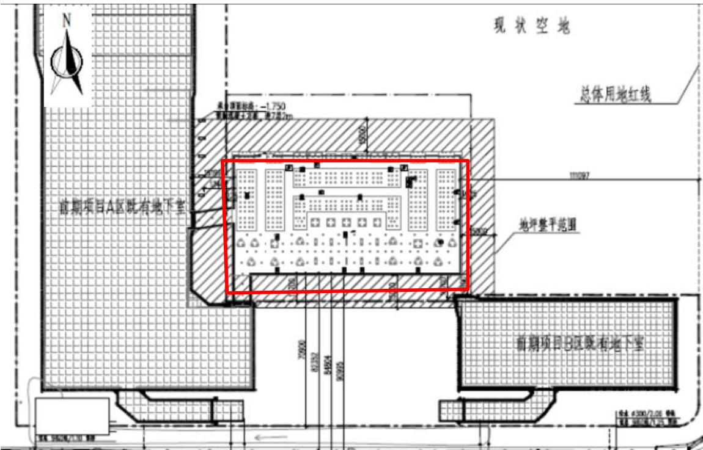

图 2.1.3-1 上海地块基坑开挖范围示意图  
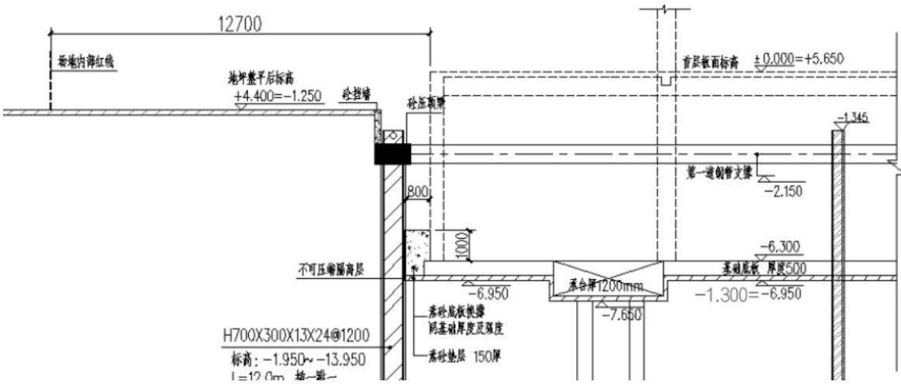  
图 2.1.3-2 上海地块基坑断面图

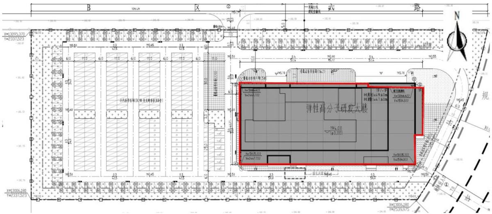  
图 2.1.3-3 长春地块基坑开挖范围示意

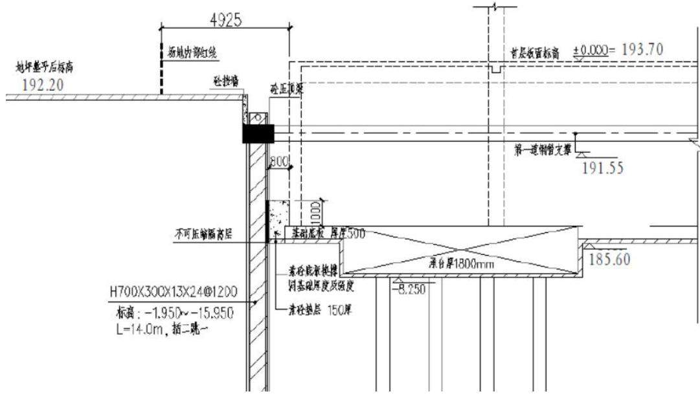  
图 2.1.3-4 长春地块基坑断面图

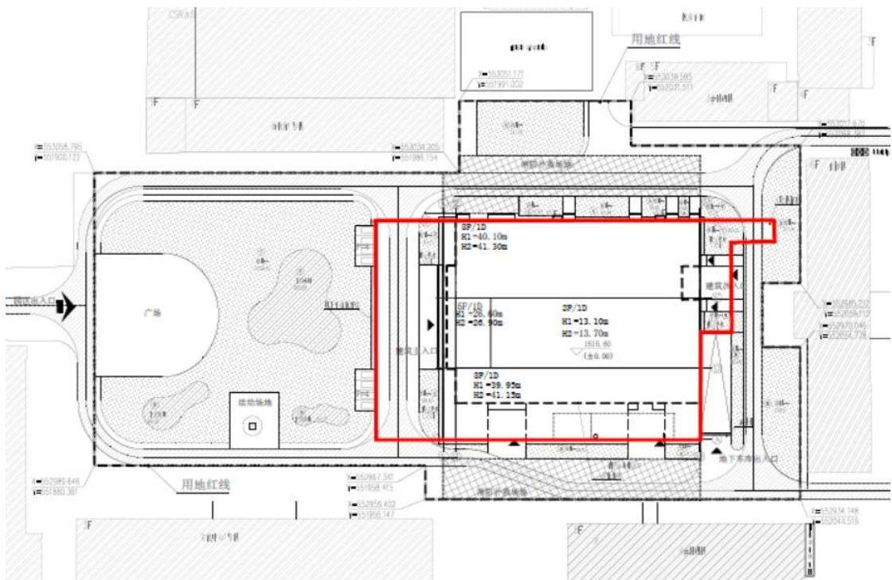  
图 2.1.3-5 兰州地块基坑开挖范围示意

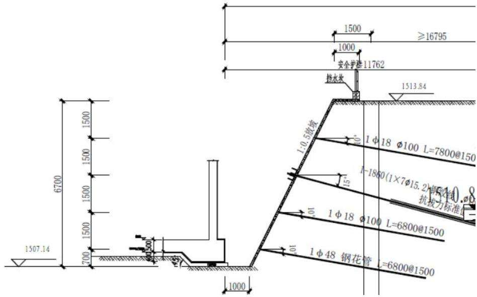  
图 2.1.3-6 兰州地块基坑断面图

## （2）道路广场工程及配套设施

本项目上海地块道路广场工程占地面积2992m²，长春地块道路广场工程占地面积9990m²，兰州地块道路广场工程占地面积6560m²。

基地内三个地块分别由地块内引路通向市政道路。上海地块依托一期项目已在用地周边沿江山路、平峰路分别设置四处车行出入口，场地内设置外围车道连接南侧江山路主入口、日常货运入口及北侧平峰路内部人员入口和化学品专用出入口。长春地块在北侧及东侧分别设置一个出入口，北侧出入口通往园区规划道路，东侧出入口通往和安街：兰州地块整体场地西侧为天水中路，南侧为东岗西路，东侧为渭源路，北侧为南昌路，地块主入口位于建筑西侧，次入口位于建筑东侧。各地块道路做法采用沥青路面做法，施工便捷，行驶舒适，人行道做法采用人行道砖，绿色、环保。

## (3）景观绿化工程

本项目地面景观绿化工程面积1.42hm²，其中上海地块绿化面积约 $0 . 4 0 \mathrm { h m } ^ { 2 }$ ，绿地率36.7%；长春地块绿化面积约 $0 . 6 0 \mathrm { h m } ^ { 2 }$ ，绿地率30.08%；兰州地块绿化面积约 $0 . 4 2 \mathrm { h m } ^ { 2 }$ ，绿地率约30.00%。整个场地的景观系统按照“公共景观”立体景观设置。通过景观小品结合、乔木绿化的设置，丰富场地。建筑与景观融为一体，公共绿地及路旁，采用点、线、面相结合的手法进行绿化设计，营造新的绿化景观开敞空间，对景观进行了点缀以及活化景观。的作用。

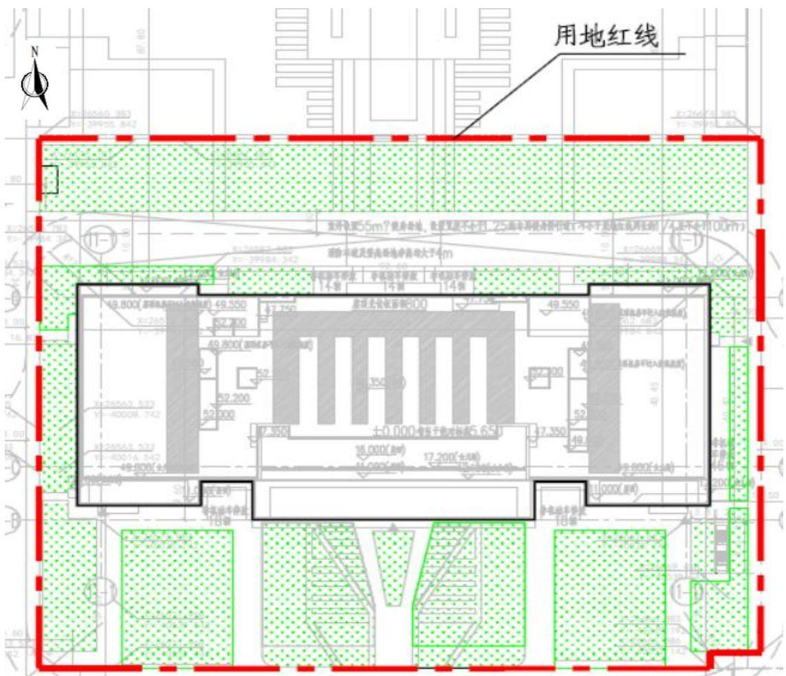  
图 2.1.3-7 上海地块绿化分布示意图

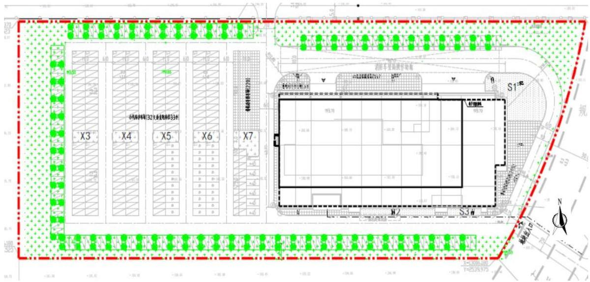  
图 2.1.3-8 长春地块绿化分布示意图

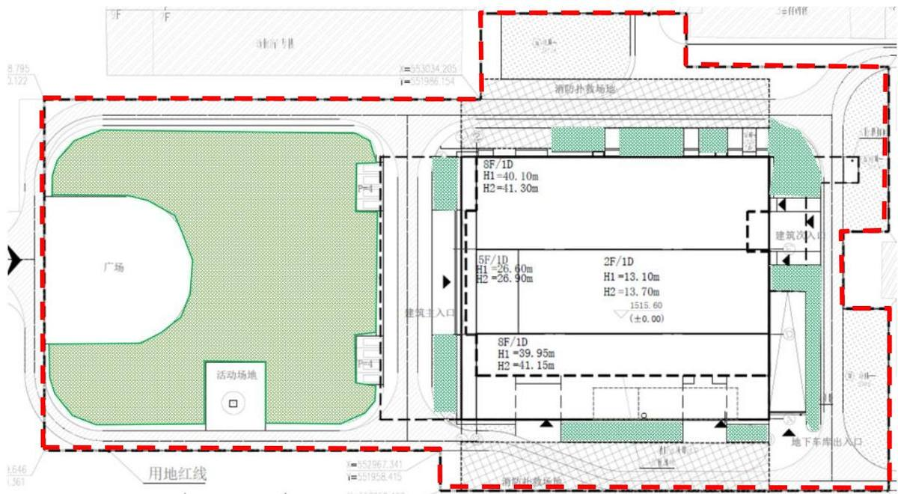  
图 2.1.3-9 兰州地块绿化分布示意图

## (4）其他配套工程

## 1）供电系统

上海地块供电系统依托一期工程，一期工程采用两路独立35kV市政进线，每路容量为16000kVA，由地块西侧以电缆埋地方式引入建筑物地下一层35kV高压配电室电缆夹层内，后以电缆桥架形式引至总体一层35kV变电站，供电线路布置均在红线内。

长春地块项目供电电源由和安街规划10kV线路引来2路10kV电源，引至新建变配电室。项目新增4台变压器，变电所进出线方式采用上进上出，供电线路布置均在红线内。

兰州地块最高用电负荷等级为二级，用1路10kV高压进线，电源引自化学物理研究

所内既有电源，设置10kV变配电室一处，供电线路布置均在红线内。

## 2）给水系统

本项目供水水源为城市自来水。

上海地块一期工程已在江山路上接出一根DN200的市政给水管道于室外成环布置，项目拟从前期项目室外给水环管上设置一根DN100供水接口供本项目室内、外生活用水。室内外消防用水自前期项目室内外消防系统上接入。

长春地块给水自园区东侧和安街市政给水管网引入两路DN200给水管，在本区域内组成DN200环状管网，供本期建筑生活用水、消防给水等。市政引入管、各建筑入口处设水表井计量。

兰州地块的水源由园区内已建内部加压给水管提供，院内为环状供水，从院内北侧道路上给水管道接出1根DN150给水管进入用地红线，接入点压力约为0.3MPa。三层以下采用引水园区内管网直接供水，三层以上通过集中生活水泵房加压供水。

## 3）雨污水排水系统

上海地块室外雨、污分流，场地雨水设计重现期5年，初期降雨历时为15min，项目场地综合径流系数为0.58，坡度3%o。整个场地设置2根DN400雨水排出管分别接入一期项目总体预留的雨水接口。项目设置1根DN300污水排出管接入基地东侧正博路市政污水接口。

长春地块生活污水与雨水分流排放，场地雨水设计重现期5年，初期降雨历时为15min，雨水排水管管径DN300（内）\~DN600（外排），项目场地综合径流系数为0.45，坡度3%o；生活污水排入北湖科技开发区污水管网，整个场地设置1根DN600雨水排出管分别接入和安街市政雨水管网。项目拟建实验废水处理设备，实验液体经处理达标后排放。

兰州地块生活污水与雨水分流排放，场地雨水设计重现期5年，初期降雨历时为15min，项目场地综合径流系数为0.65，雨水排水管管径DN400，坡度3%o。整个场地设置1根DN400雨水排出管接入院内雨水管网。

## 4）海绵设施

上海地块室外地面铺砌渗水地砖，设置下凹式绿地、雨水蓄水池等调蓄措施，室外雨水首先通过总体竖向设计排至绿地内就地入渗，场地径流总量控制率达到约70%。主体设计在地块内部道路建设透水铺装 $4 8 0 \mathrm m ^ { 3 }$ ，透水铺装采用80mm厚6mm粒径彩色强固透水砼以及150mm厚级配碎石压实或砂砾石垫层压实，此外，上海地块设置总蓄水量为375m³的雨水蓄水池1座，调蓄容积240m³，回用容积135m³；设下凹式绿地380m²，调蓄水池内雨水，平时经回用处理后作为绿化道路浇洒用水。

长春地块主体设计一座总蓄水量为300m³的雨水蓄水池1座，调蓄容积210m³，位于建筑物南侧空地范围内，采用地下式布置；停车场区域建设透水铺装600m³，透水铺装采用80mm厚6mm粒径彩色强固透水砼以及150mm厚级配碎石压实或砂砾石垫层压实。

兰州地块在地块内部道路建设透水铺装330m³，透水铺装采用80mm厚6mm粒径彩色强固透水砼以及150mm厚级配碎石压实或砂砾石垫层压实，此外，地块内建筑物西侧设置下凹式绿地的面积为537m²，下凹式绿地的有效调蓄深度为200mm，下凹式绿地总控制雨水量为107.4m³，项目设置的用于调蓄雨水的海绵设施规模达到年径流总量控制率85%的目标要求。

## 2.1.4 工程布置

## 2.1.4.1 平面布置

工程3个地块布置分别介绍如下：

上海地块为园区中的规划二期建设地块，东侧、北侧为园区内规划三期用地，西侧、南侧为在建一期工程。本项目建设占地面积为10960m²，基本位于整个园区的中心，南侧面向园区主入口广场，西侧为生活服务功能区，紧邻的东侧、北侧主要为预留三期用地。

长春地块用地北临B区六路（规划路），东临现状和安街及公园绿地，南临在建长春新区产业配套项目应化所成果转换中心一标段项目，西临规划商业用地（空地），建筑布置整体为东西向布置矩形，东西长、南北宽，建筑密度较低，场地内广场及停车区域集中在地块西侧布置，用地内现状无建、构筑物，已由当地土地出让部门完成土地回收及平整等工作。

兰州地块西临园区绿地广场，东临中科院化物楼，南临文献中心1号楼、现状8号楼以及材料楼，北临现状1号2号楼以及催化楼。建筑主入口位于建筑西侧，人行主入口位于西侧，主入口进入后是广场及绿化，建筑人行次入口位于建筑东侧，地下停车场入口设置建筑东侧，平面裙楼南北向呈“一”字型排布，南北短东西长。

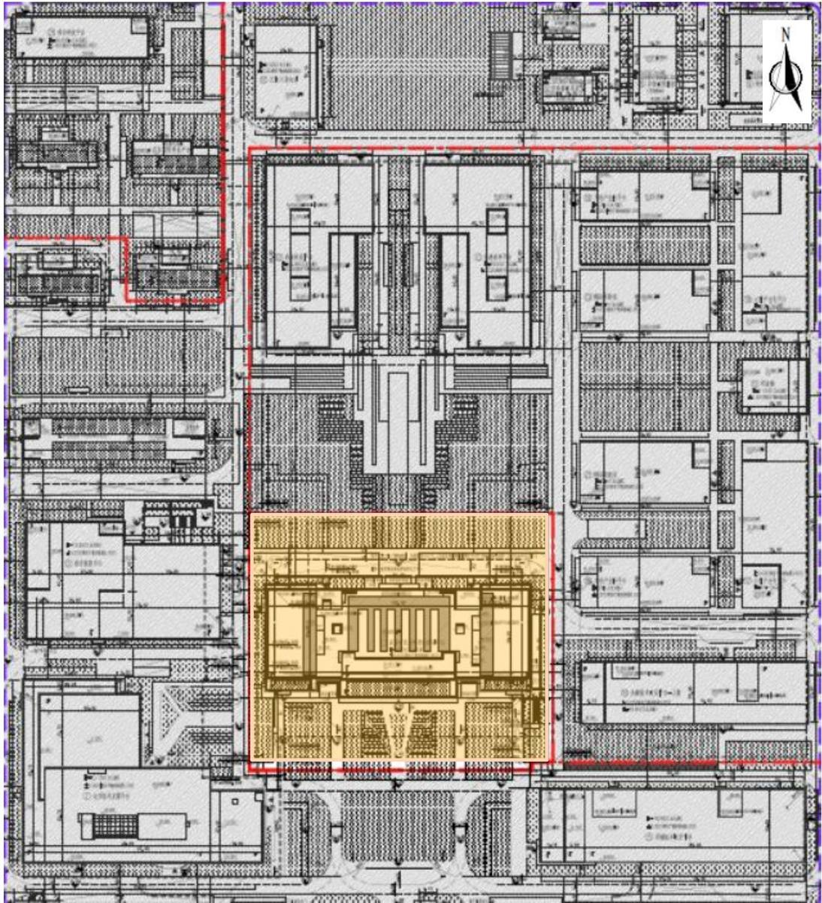  
图 2.1.4-1 上海地块总体布局示意图

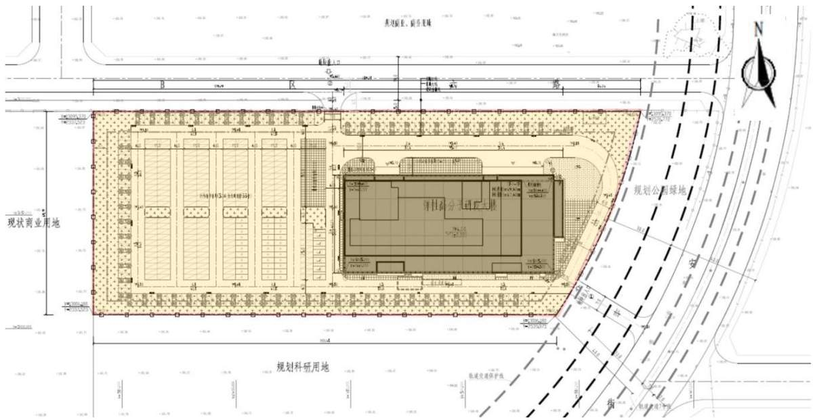  
图 2.1.4-2 长春地块总体布局示意图

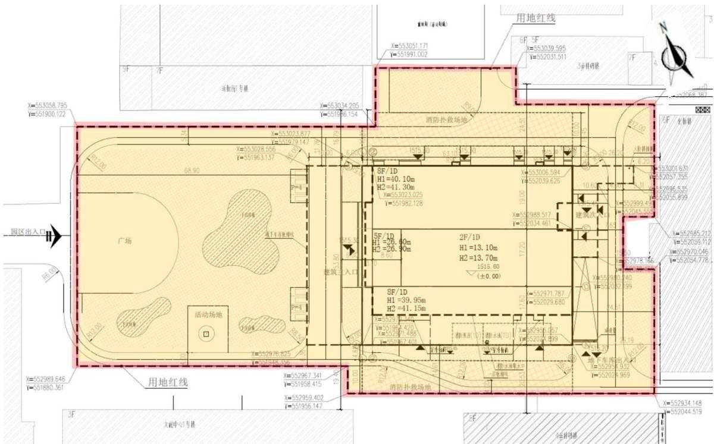  
图 2.1.4-3 兰州地块总体布局示意图

## 2.1.4.2 竖向布置

本项目高程采用85国家高程基准。

## (1）上海地块

上海地块所在园区整体用地周边市政道路交叉点高程分别为5.88m、4.45m、4.37m、4.20m，场地整体平均现状标高（一期临时堆土清理平整后）约4.40m。整个园区的出入口标高依据周边道路标高确定，其中北侧江山路出入口西口标高为4.8m，东口为4.6m。南侧平峰路货运出入口标高5.1m，主入口处标高4.8m。本项目考虑到与前期项目建设场地的衔接，一期工程5.50m，室外设计标高5.35m，本项目室内的±0.000标高定在绝对标高5.65m，室外场地标高约为5.30\~5.50m，室内外高差大于150mm，且与周边已建一期工程衔接较好。园区整体竖向高度高于周边道路及场地，有效利用高差设置场地排水坡度，防止倒灌。

本地块为地下一层，层高约6m，底板标高-1.30m，顶板标高3.50m，设计室外标高5.30\~5.50 m，顶板覆土厚度约 1.5m。

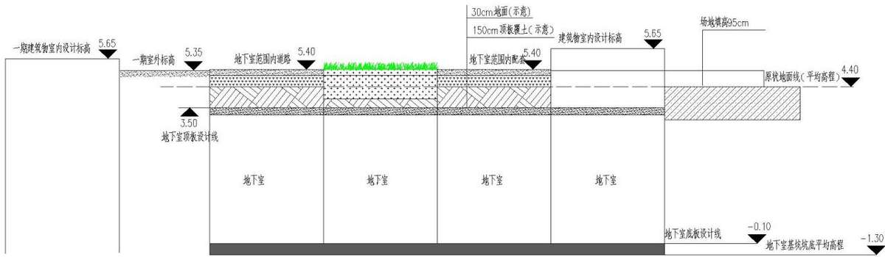  
图 2.1.4-4 上海地块竖向布置示意图

## (2) 长春地块

长春地块用地西侧现状高程为191.15m，东侧高程为194.66m，平均高程192.2m。北侧出入口位置市政道路标高193.88m，采用平坡式与周边道路顺接，纵坡坡度为0.3%-3.5%，横坡坡度为1.5%。在建长春新区产业配套项目应化所成果转换中心一标段项目紧邻本项目侧室外设计标高193.30m，本项目竖向场地设计高程在193.4-194.00m之间；场地内主要为填方区域，东南位置局部为挖方，场地内可实现土方平衡，建筑室内外高差为0.3m，建筑物室内±0.00的绝对高程为194.00m，满足与周边建筑道路的衔接、室内外高差及与周边道路防倒灌高差要求。

本地块为地下一层，层高约5m，底板标高185.60m，顶板标高194.0m，设计室外标高193.4-194.00m之间，无顶板覆土。

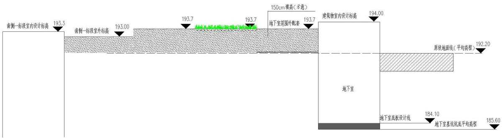  
图 2.1.4-5 长春地块竖向布置示意图

## （3）兰州地块

兰州地块新建建筑周边道路交叉口标高分别为1513.99m（西北角）、1514.00m（西南角）、1513.74m（东南角）、1513.84m（东北角），场地整体现状标高1513.84m。场地设计较平，道路纵坡排水坡度为0.30%-1.27%，横坡坡度为1.5%为双面坡排水。满足设计规范要求。根据周边道路标高及建筑排布的位置，确定单体建筑±0.00的绝对标高为1514.44m，建筑室内外高差顺应周边道路标高，控制在0.15-0.30m之间，场地标高较现状变化不大，满足与周边既有建筑的衔接、室内外高差及与周边道路防倒灌高差要求。

本地块为地下一层，层高约4.5m，底板标高1507.14m，顶板标高1511.49m，设计室外标高1513.99m，顶板覆土厚度约2.5m。

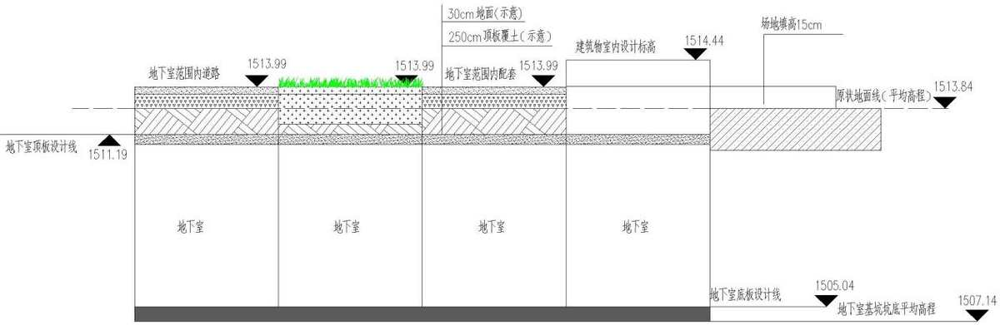  
图 2.1.4-6 兰州地块竖向布置示意图

## 2.2 施工组织

## 2.2.1 施工临时工程布设

本项目共布设3处施工生产生活区及3处临时堆土区。

本项目上海地块设置1处临时堆土区，占地面积0.36hm²位于红线外北侧（建设单位自有三期建设用地范围内），属本项目临时占地。另外依托一期工程施工生产生活区继续使用，占地面积0.90hm²，后续由本项目负责恢复，纳入本项目防治责任范围；施工出入口依托一期工程现有通往平峰路出入口。因此上海地块红线外新增临时占地1.26hm²。

长春地块设置1处临时堆土区占地面积0.30hm²，1处施工生产生活区占地面积0.10hm²，均位于红线内建筑物西侧（位于停车场区域）；施工出入口依托主体工程永久出入口，永临结合设置，办理报规手续后，在施工期由市政部门开设。因此长春地块无红线外新增临时占地。

兰州地块设置1处临时堆土区占地面积0.51hm²，设置在中科院兰州分院北侧家属区内已拆迁腾退的一处现状空地内，现状为其他用地（空闲地）；另外设置1处施工生产生活区占地面积0.12hm²，位于红线内建筑物西侧近现状广场区域，面积不重复计列；施工出入口位于场地西北侧（现有化物所主出入口以北），经院内内部道路连通，出入口通往北侧南昌路，不新增临时占地及便道。因此兰州地块红线外新增临时占地面积0.51hm²。

## （1）施工出入口

上海地块上海地块出入口依托一期工程现有通往平峰路出入口。

长春地块施工生产生活区1个施工车辆及人行出入口位于地块东侧，通往和安街。

兰州地块施工生产生活区1个施工车辆及人行出入口，位于场地西北侧（现有物化所主出入口以北），经院内内部道路连通，出入口通往北侧南昌路，不新增临时占地及便道。

## （2）施工生产生活区

本项目预计12月各地块同步开始进场施工。

根据现场调查及施工组织设计，上海地块依托一期工程在红线外设1处施工生产生活区（红线外），占地面积0.90hm²，从工期、距离、面积等分析，可满足本项目需求，直线距离约200m，距离较近，且不影响本项目主体施工，可作为本项目施工生产生活区。

长春地块和兰州地块分别在红线内设置1处施工生产生活区，占地面积分别为0.10hm²和0.12hm²（红线内），用途为总包人员办公区及材料加工场地；项目均靠近城市建成区或开发区，故施工人员生活区按租赁民房考虑，不新增生活区临时占地。

其中长春地块施工生产生活区位于长春地块室外停车场区域，紧邻地块主体建筑西侧，呈东西向条形带状布置，占地面积0.10hm²，现状为已平整出让的公共管理与公共服务设施用地。

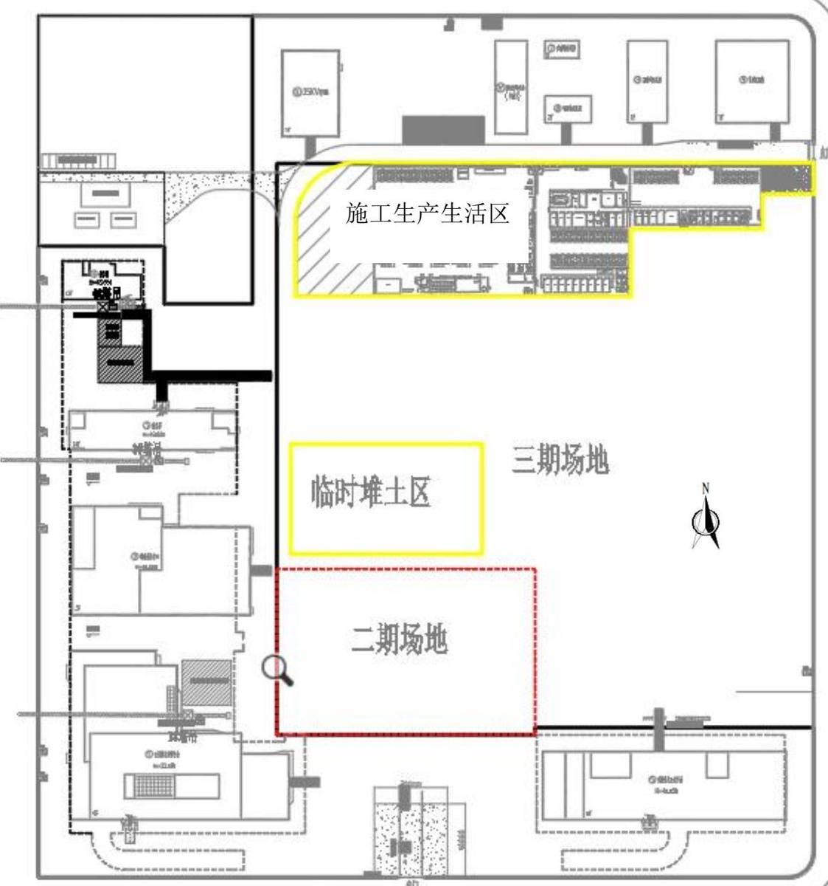

图 2.2.1-1 上海地块施工平面布置示意图  
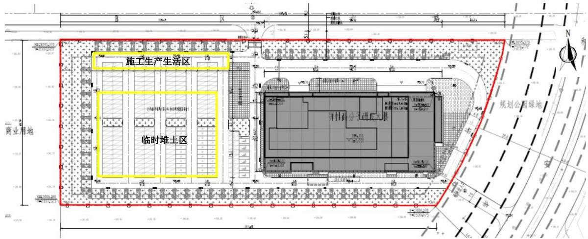  
图 2.2.1-2 长春地块施工平面布置示意图  
上海勘测设计研究院有限公司

兰州地块施工生产生活区位于兰州地块红线内广场及绿化区域，紧邻地块主体建筑西侧，呈东西向条形带状布置，占地面积0.12hm²，现状为兰州物化所内道路广场及绿地。

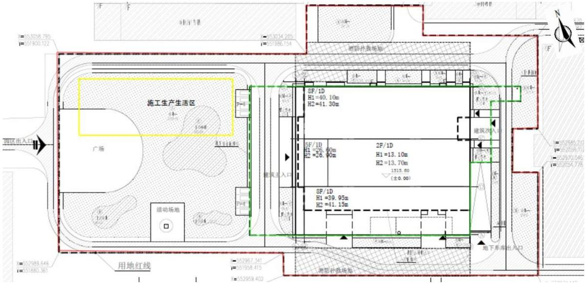  
图2.2.1-3 兰州地块施工平面布置示意图  
施工总平面图布置见图 2.2.1-1\~2.2.1-3。

本项目尚未开工，长春、兰州地块施工生产生活区位于本项目红线范围内，兰州地块后续在广场及绿化施工接近尾声期间进行拆除，同步建设成为广场、停车场及绿地；上海地块使用的施工生产生活区已纳入本项目防治责任范围，由于一期工程竣工早于本项目，该场地恢复责任归属本项目。

## （3） 施工道路

本项目各地块均不新增施工便道。场内施工便道与永久道路结合布置。场外利用既有道路可到达施工现场。

## (4) 临时堆土区

本项目施工过程中存在表土剥离和基坑开挖，部分开挖土方将作为场地填高、肥槽回填、顶板覆土等使用，需临时堆置在临时堆土场内。临时堆土场结合主体工程施工总体安排，上海地块整体占地较小，故在地块北侧三期建设用地范围内布置，占地面积0.36hm²，现状为建设单位自有空地，长春地块考虑到地块基坑范围较小、开挖回填方量相对较小，地块内仍有空闲余地可用作临时堆土区，故长春地块红线内分别设置1处临时堆土场，占地面积0.30hm²；在兰州地块红线外中科院兰州分院北侧家属区内已拆迁腾退的一处现状空地内设置1处临时堆土场，现状为其他用地（空闲地），占地面积0.51hm²，用于表土及一般土方，场地垫高填方可与基坑开挖同步进行，即挖即填，避免土方的二次倒运，顶板覆

表 2.2.1-1 临时堆土场基本情况一览表
<table><tr><td rowspan=1 colspan=1>名称</td><td rowspan=1 colspan=1>位置</td><td rowspan=1 colspan=1>占地面积 $\left( \mathrm { h m } ^ { 2 } \right)$ </td><td rowspan=1 colspan=1>堆存量 $( \mathcal { F } _ { \mathrm { ~ m ~ } ^ { 3 } } )$ </td><td rowspan=1 colspan=1>容量（万最 $\mathbf { m } ^ { 3 } )$ </td><td rowspan=1 colspan=1>大堆高（m）</td><td rowspan=1 colspan=1>边坡比</td><td rowspan=1 colspan=1>下游2倍堆高范围内敏感目标</td><td rowspan=1 colspan=1>堆场危害程度</td><td rowspan=1 colspan=1>堆放时间</td></tr><tr><td rowspan=3 colspan=1>临时堆土场</td><td rowspan=1 colspan=1>三期用地范围内，红线外</td><td rowspan=1 colspan=1>0.36</td><td rowspan=1 colspan=1>0.75</td><td rowspan=1 colspan=1>1.11</td><td rowspan=1 colspan=1>3.5</td><td rowspan=1 colspan=1>1:1.5</td><td rowspan=1 colspan=1>无</td><td rowspan=1 colspan=1>无危害</td><td rowspan=1 colspan=1>2025年12月~2028年12月</td></tr><tr><td rowspan=1 colspan=1>长春地块规划红线内停车场范围，红线内</td><td rowspan=1 colspan=1>0.30</td><td rowspan=1 colspan=1>0.85</td><td rowspan=1 colspan=1>0.94</td><td rowspan=1 colspan=1>3.5</td><td rowspan=1 colspan=1>1:1.5</td><td rowspan=1 colspan=1>无</td><td rowspan=1 colspan=1>无危害</td><td rowspan=1 colspan=1>2026年3月~2029年3月</td></tr><tr><td rowspan=1 colspan=1>兰州分院北侧家属区内已拆迁腾退的一处现状空地，红线外</td><td rowspan=1 colspan=1>0.51</td><td rowspan=1 colspan=1>1.49</td><td rowspan=1 colspan=1>1.54</td><td rowspan=1 colspan=1>3.5</td><td rowspan=1 colspan=1>1:1.5</td><td rowspan=1 colspan=1>无</td><td rowspan=1 colspan=1>无危害</td><td rowspan=1 colspan=1>2026年4月~2029年4月</td></tr></table>

临时堆土场占地面积约1.17hm²，按照最大堆土高度不超过3.5m，临时堆土区最多可容纳周转土方约3.59万m³，考虑最不利周转情况下表土堆放、土壤改良土的分割堆放需求，各地块场地满足项目剥离表土以及顶板覆土、后期肥槽板回填土方（结合土方调运时序图3.2-1，最大堆方量合计3.09万m³）分开堆放需求，建议建设单位完善相应的动态管理和防护措施。

其中表土堆放时间2026年3月至2029年4月，一般土方堆放时间集中在2025年12月至2027年12月，结合主体工程施工强度动态分析，临时堆土场容量满足施工最大中转量需求，考虑堆放时间较长，均需采取临时绿化措施防护。

但施工时需注重进度安排，开挖土方尽量及时回填，减少堆土时间，以利于土方周转和堆放施工。此外，表土堆放后应采取相应的拦挡、苫盖、临时绿化等措施。根据以往项目经验，在采取措施后，可以起到很好的防护效果。本方案要求临时堆土中的表土要保存利用好，相关保护工作应由建设单位和施工单位现场负责人负责。

## 2.2.2 施工流程

本项目施工包括施工准备期、土建施工和安装调试三个阶段，各阶段相应的施工内容见图 2.2.2-1。

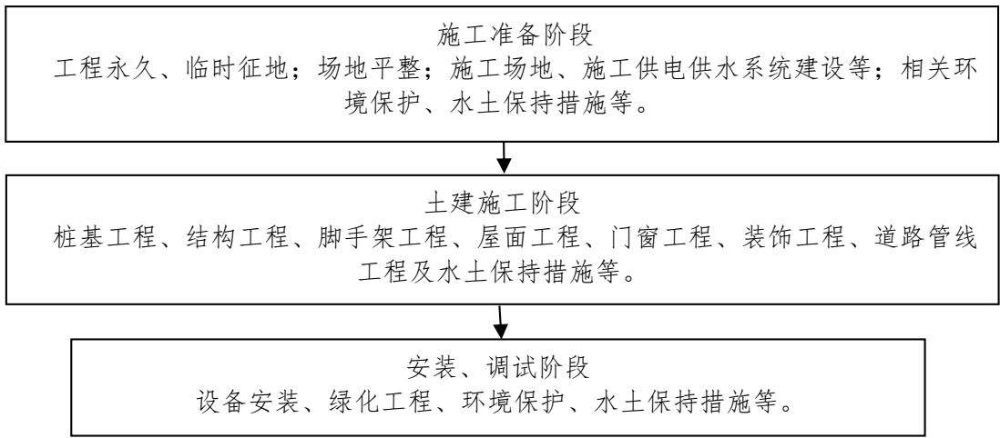  
图 2.2.2-1 项目施工流程框图

## 2.2.3 施工条件

本项目各地块内道路交通设施完备，电力、给水、排水、电信等基础设施条件完善，满足项目建设的需要。本项目各地块周边具有较为便利的给水、排水、电力等接入条件，供应能力不仅能够满足项目需求，同时可以满足施工需要。

1、电力：上海地块可通过一期既有施工供电接入，长春地块可依托在建一标段项目接入，兰州地块可通过院内现有供电线路接入。

2、自来水：三个地块施工用水均可直接接入市政自来水管网。

3、排水：三个地块均在城市建成区，周边雨水污水管网配套成熟，施工临时排水沟沿现场围墙设置，本项目各地块施工期间场地雨水通过排水沟统一汇集处理后顺接排入周边既有市政（或院内）雨水管网，其中长春地块雨水出口可设置在西侧低洼芦苇地附近，雨水排向该侧低洼地，污水汇入市政污水管纳管。

4、通信：三个地块电话进线由市话网埋地引入，网络数据传输线自网络中心总配线架引出，有线电视信号引自市有线电视网。

5、材料：三个地块主要材料有钢材、木材、混凝土、沙石、砌块等，其中混凝土用商品混凝土，由搅拌站提供。建设材料可就近采购，项目区各地块路网较为发达，周边道路可以满足本项目所需材料、设备、机械的运输要求。

6、施工交通：上海地块现有园区内外及周边道路交通条件较好，施工场地外，无需另外布设施工便道；长春地块位于新规划的开发区，周边在建工程较多，市政部门同意并开设通往和安接出入口后，周边路网可满足施工交通需求；兰州地块主出入口主要为日常工作人员通行出入口，为不影响人员正常通行，地块施工主要依托院内既有水泥道路通往北侧南昌路，从南昌路出入口进出，南昌路可通往周边主干道，交通条件满足施工要求。

要工程施工工艺见表2.2.7-2。

表 2.2.7-2 主要施工工艺表
<table><tr><td>施工项目</td><td></td><td>施工工艺</td></tr><tr><td>表土剥离</td><td>根据表土剥离范围，采用挖掘机进行挖掘约30~50cm深度，挖掘机耙拢，然后集中 运输至临时堆土区域内。 本项目建筑物基础工程桩采用PHC高强混凝土预应力管桩。桩基础施工工艺流程：</td><td>地基处理：→定位放线→挤密成孔→素土夯填→检测→管桩施工：→定位放线→压</td></tr><tr><td>建筑物基础</td><td></td><td>桩→检测→桩间土开挖：→定位放线→抗水板、筏板层土方开挖→承台基坑定位放线 →基坑土方开挖→截桩头→人工精平（夯实）、基坑斜面人工造型→垫层及防水层 施工：→灰土垫层铺装夯实（挡墙下条形基础设置）→标高抄测→C20垫层施工→ 砖模砌筑及抹灰→接桩头施工→卷材防水施工→C20细石砼保护层施工→筏板施 工：→定位放线→桩头钢筋拨开处理→地梁钢筋绑扎/承台钢筋绑扎→抗水板(筏板) 钢筋绑扎→地梁模板支设→柱墙插筋施工→砼浇筑。 基坑分层分段开挖，分层厚度：机械开挖每层≤2m，人工清底预留200-300mm，分</td></tr><tr><td colspan="2">基坑开挖</td><td>段长度：≤20m，对称开挖避免应力集中支护跟进：先撑后挖，支护结构随开挖进度 施工（如土钉墙、排桩），通过标桩加密设置，控制基底标高，防止超挖边坡稳定： 开挖过过程及时修坡，遇软弱土层换填砂石或浇筑混凝土雨季防护：覆盖彩条布， 缩短工作面，加强排水；人工清底至设计标高，铺设竹笆防止扰动，局部超挖位置 采取换填砂石或碎石夯实。 上海地块基坑开挖深度为5.7m，基坑采用拉森钢板桩悬臂的围护形式，基坑周圈回 填完成后，方可拔除钢板桩。采用素土回填，回填土压实系数不小于0.97；长春地</td></tr><tr><td colspan="2">基坑围护与 降水</td><td>块基坑开挖深度为6.6m，基坑围护为拉森钢板桩+一道钢支撑，基坑周圈回填完成 后，方可拔除钢板桩，基坑采用素土回填，回填土压实系数不小于0.97；兰州地块 基坑开挖深度为6.7m，基坑采用1：0.5放坡形式，采用复合土钉墙围护，基坑护 坡施工拟土方开挖时同步进行。地下室区域采取柱下独立桩承台+抗水板（或筏板</td></tr><tr><td>临时工程</td><td>施工场 地</td><td>基础），非地下室区域采取柱下独立桩承台（或独立基础）。 在施工前进行平整，在场地平整、碾压的同时，做好场地四周的临时排水设施，施 工结束后清除地表垃圾、建筑材料，再对占压地表松翻。 临时施工便道置时与永久道路结合，不随意开辟，施工前应进行平整，对于局部坑</td></tr><tr><td colspan="2">施工便 道 顶板覆土、</td><td>凹不平路段适当填土、压实和整平，并在道路一侧设置临时排水沟，路面铺设15cm 厚的碎石垫层防护，施工结束后清理碎石垫层，整修后作为永久道路。 场平工程：场地平整采取推土机、挖掘机及碾压设备等就地平整处理，对地下室范</td></tr><tr><td colspan="2">场平工程</td><td>围以外的道路及配套设施和绿化部分进行场地平整，场平工程中，道路及配套设施 部分需回填土方。 道路路基填筑施工采用机械施工为主，适当配合人工施工的方案。回填时配置符合 要求的压实机械，做到分层压实，回填料夯实至路基顶面。路面工程采用配套路面 施工机械设备，专业化施工方案，配置少量的人工辅助施工。严格控制材料级配和</td></tr><tr><td colspan="2">道路工程</td><td>数量，做好现场监理与工序监测，在不满足规定气温要求的条件下不准施工。道路 施工时同步进行管线埋设施工，管线采用大开挖施工，分段开挖后及时回填。 场平主要以机械施工为主，使用机械主要是挖掘机、推土机、自动装卸汽车、压路</td></tr><tr><td colspan="2">临时场地回 填平整</td><td>机。本阶段施工工艺是：地表拆除推土机平整场地压路机分层碾压。 土方填筑→场地平整→绿化地清理→土壤改良（覆土）→营造地形→放样→挖穴施 有机肥→苗木采购→苗木检验→苗木种植→绑扎固定→表土细整施有机肥→草坪</td></tr><tr><td colspan="2">景观绿化</td><td>铺植→养护修整。 土壤改良是针对土壤的不良质地和结构，采取相应的物理、生物或化学措施，改善</td></tr><tr><td colspan="2">土壤改良</td><td>土壤性状，提高土壤肥力，改善土壤性能，增加作物产量的过程。土壤改良要因地 制宜，选择合适的方法进行，常用的土壤改良方法有物理、化学、生物改良方法。 本方案采用改良剂+有机肥+整地措施，场区平整土地后，利用剥离的土方覆土后，</td></tr><tr><td colspan="2" rowspan="1">施工项目</td><td colspan="1" rowspan="1">施工工艺</td></tr><tr><td colspan="2" rowspan="1"></td><td colspan="1" rowspan="1">每亩施用专用改良剂50kg，有机肥料（粪尿肥）300kg，或商品有机肥200kg，每亩再施用微生物肥料50kg作基肥，撒施均匀。用机械深翻20~30 cm，达到地面平整，土块细碎，土肥相融。</td></tr><tr><td colspan="2" rowspan="1">场地清理、完工验收</td><td colspan="1" rowspan="1">施工结束后，对场地清理，准备完工验收。</td></tr></table>

## 2.3 工程占地

本项目总占地面积6.28hm²，其中永久占地面积4.51hm²，临时占地1.77hm²。

上海地块主体工程区占地面积1.10hm²，占地类型为其他土地中的空闲地，施工生产生活区占地面积0.90hm²，占地类型为其他土地，临时堆土区 $0 . 3 6 \mathrm { h m } ^ { 2 }$ ，占地类型为其他土地；长春地块主体工程区占地面积2.00hm²，施工生产生活区占地面积 $0 . 1 0 \mathrm { h m } ^ { 2 }$ (红线内不重复计算），临时堆土区0.30hm²（红线内不重复计算），占地类型为其他土地中的空闲地；兰州地块占地面积1.41hm²，施工生产生活区占地面积0.12hm²（红线内不重复计算），占地类型为公共管理与公共服务用地中的科研用地，临时堆土区0.51hm²，占地类型为其他土地中的空闲地。

工程占地情况见表 2.3-1。

表 2.3-1 工程占地统计表  
单位：hm²
<table><tr><td rowspan=2 colspan=1>行政区</td><td rowspan=2 colspan=1>一级分区</td><td rowspan=2 colspan=1>二级分区</td><td rowspan=2 colspan=1>占地性质</td><td rowspan=1 colspan=2>占地类型</td><td rowspan=2 colspan=1>合计</td></tr><tr><td rowspan=1 colspan=1>公共管理与公共服务设施用地——科研用地</td><td rowspan=1 colspan=1>其他土地空闲地</td></tr><tr><td rowspan=10 colspan=1>上海</td><td rowspan=10 colspan=1>上海地块</td><td rowspan=3 colspan=1>主体工程区</td><td rowspan=1 colspan=1>永久占地</td><td rowspan=1 colspan=1>1.10</td><td rowspan=1 colspan=1></td><td rowspan=1 colspan=1>1.10</td></tr><tr><td rowspan=1 colspan=1>临时占地</td><td rowspan=1 colspan=1></td><td rowspan=1 colspan=1></td><td rowspan=1 colspan=1></td></tr><tr><td rowspan=1 colspan=1>小计</td><td rowspan=1 colspan=1>1.10</td><td rowspan=1 colspan=1></td><td rowspan=1 colspan=1>1.10</td></tr><tr><td rowspan=3 colspan=1>施工生产生活区</td><td rowspan=1 colspan=1>永久占地</td><td rowspan=1 colspan=1></td><td rowspan=1 colspan=1></td><td rowspan=1 colspan=1></td></tr><tr><td rowspan=1 colspan=1>临时占地</td><td rowspan=1 colspan=1></td><td rowspan=1 colspan=1>0.90</td><td rowspan=1 colspan=1>0.90</td></tr><tr><td rowspan=1 colspan=1>小计</td><td rowspan=1 colspan=1></td><td rowspan=1 colspan=1>0.90</td><td rowspan=1 colspan=1>0.90</td></tr><tr><td rowspan=3 colspan=1>临时堆土区</td><td rowspan=1 colspan=1>永久占地</td><td rowspan=1 colspan=1></td><td rowspan=1 colspan=1></td><td rowspan=1 colspan=1></td></tr><tr><td rowspan=1 colspan=1>临时占地</td><td rowspan=1 colspan=1></td><td rowspan=1 colspan=1>0.36</td><td rowspan=1 colspan=1>0.36</td></tr><tr><td rowspan=1 colspan=1>小计</td><td rowspan=1 colspan=1></td><td rowspan=1 colspan=1>0.36</td><td rowspan=1 colspan=1>0.36</td></tr><tr><td rowspan=1 colspan=1>合计</td><td rowspan=1 colspan=1></td><td rowspan=1 colspan=1>1.10</td><td rowspan=1 colspan=1>1.26</td><td rowspan=1 colspan=1>2.36</td></tr><tr><td rowspan=10 colspan=1>长春</td><td rowspan=10 colspan=1>长春地块</td><td rowspan=3 colspan=1>主体工程区</td><td rowspan=1 colspan=1>永久占地</td><td rowspan=1 colspan=1>2.00</td><td rowspan=1 colspan=1></td><td rowspan=1 colspan=1>2.00</td></tr><tr><td rowspan=1 colspan=1>临时占地</td><td rowspan=1 colspan=1></td><td rowspan=1 colspan=1></td><td rowspan=1 colspan=1></td></tr><tr><td rowspan=1 colspan=1>小计</td><td rowspan=1 colspan=1>2.00</td><td rowspan=1 colspan=1></td><td rowspan=1 colspan=1>2.00</td></tr><tr><td rowspan=3 colspan=1>施工生产生活区</td><td rowspan=1 colspan=1>永久占地</td><td rowspan=1 colspan=1></td><td rowspan=1 colspan=1></td><td rowspan=1 colspan=1></td></tr><tr><td rowspan=1 colspan=1>临时占地</td><td rowspan=1 colspan=1>(0.10)</td><td rowspan=1 colspan=1></td><td rowspan=1 colspan=1>(0.10)</td></tr><tr><td rowspan=1 colspan=1>小计</td><td rowspan=1 colspan=1>(0.10)</td><td rowspan=1 colspan=1></td><td rowspan=1 colspan=1>(0.10)</td></tr><tr><td rowspan=3 colspan=1>临时堆土区</td><td rowspan=1 colspan=1>永久占地</td><td rowspan=1 colspan=1></td><td rowspan=1 colspan=1></td><td rowspan=1 colspan=1></td></tr><tr><td rowspan=1 colspan=1>临时占地</td><td rowspan=1 colspan=1>(0.30)</td><td rowspan=1 colspan=1></td><td rowspan=1 colspan=1>(0.30)</td></tr><tr><td rowspan=1 colspan=1>小计</td><td rowspan=1 colspan=1>(0.30)</td><td rowspan=1 colspan=1></td><td rowspan=1 colspan=1>(0.30)</td></tr><tr><td rowspan=1 colspan=1>合计</td><td rowspan=1 colspan=1></td><td rowspan=1 colspan=1>2.00</td><td rowspan=1 colspan=1></td><td rowspan=1 colspan=1>2.00</td></tr><tr><td rowspan=10 colspan=1>兰州</td><td rowspan=10 colspan=1>兰州地块</td><td rowspan=3 colspan=1>主体工程区</td><td rowspan=1 colspan=1>永久占地</td><td rowspan=1 colspan=1>1.41</td><td rowspan=1 colspan=1></td><td rowspan=1 colspan=1>1.41</td></tr><tr><td rowspan=1 colspan=1>临时占地</td><td rowspan=1 colspan=1></td><td rowspan=1 colspan=1></td><td rowspan=1 colspan=1></td></tr><tr><td rowspan=1 colspan=1>小计</td><td rowspan=1 colspan=1>1.41</td><td rowspan=1 colspan=1></td><td rowspan=1 colspan=1>1.41</td></tr><tr><td rowspan=3 colspan=1>施工生产生活区</td><td rowspan=1 colspan=1>永久占地</td><td rowspan=1 colspan=1></td><td rowspan=1 colspan=1></td><td rowspan=1 colspan=1></td></tr><tr><td rowspan=1 colspan=1>临时占地</td><td rowspan=1 colspan=1>(0.12)</td><td rowspan=1 colspan=1></td><td rowspan=1 colspan=1>(0.12)</td></tr><tr><td rowspan=1 colspan=1>小计</td><td rowspan=1 colspan=1>(0.12)</td><td rowspan=1 colspan=1></td><td rowspan=1 colspan=1>(0.12)</td></tr><tr><td rowspan=3 colspan=1>临时堆土区</td><td rowspan=1 colspan=1>永久占地</td><td rowspan=1 colspan=1></td><td rowspan=1 colspan=1></td><td rowspan=1 colspan=1></td></tr><tr><td rowspan=1 colspan=1>临时占地</td><td rowspan=1 colspan=1></td><td rowspan=1 colspan=1>0.51</td><td rowspan=1 colspan=1>0.51</td></tr><tr><td rowspan=1 colspan=1>小计</td><td rowspan=1 colspan=1></td><td rowspan=1 colspan=1>0.51</td><td rowspan=1 colspan=1>0.51</td></tr><tr><td rowspan=1 colspan=2>合计</td><td rowspan=1 colspan=1>1.41</td><td rowspan=1 colspan=1>0.51</td><td rowspan=1 colspan=1>1.92</td></tr><tr><td rowspan=3 colspan=3>总计</td><td rowspan=1 colspan=1>永久占地</td><td rowspan=1 colspan=1>4.51</td><td rowspan=1 colspan=1></td><td rowspan=1 colspan=1>4.51</td></tr><tr><td rowspan=1 colspan=1>临时占地</td><td rowspan=1 colspan=1></td><td rowspan=1 colspan=1>1.77</td><td rowspan=1 colspan=1>1.77</td></tr><tr><td rowspan=1 colspan=1>总计</td><td rowspan=1 colspan=1>4.51</td><td rowspan=1 colspan=1>1.77</td><td rowspan=1 colspan=1>6.28</td></tr></table>

注：括号内为永临结合占地，占地面积不重复计算。

## 2.4 土石方及其平衡

## 2.4.1 土石方平衡原则

在对主体工程土石方分析与评价的基础上，方案对主体工程土石方平衡进行补充、完善和细化。

土石方平衡总原则：①各区域土石方调运在考虑施工时序、区域运输条件、运距、材质要求等因素的基础上进行，优先满足自身填筑和本区域内的综合利用，以实现土石方整体挖填基本平衡，尽量减少弃渣量；②合理安排施工时序，水土保持措施实施时充分利用主体工程开挖方，以减少开挖料中转临时堆置和二次搬运，减少工程弃渣。

表土剥离、回填原则：①表土剥离根据实际调查情况进行剥离，长春地块剥离厚度30\~40cm，兰州剥离厚度10\~20cm；②表土回覆主要依据土地功能恢复、迹地恢复或绿化的实际需要。

## 2.4.2 表土挖填平衡

本项目长春地块局植被较好区域、兰州地块内现有绿化区域具备表土剥离条件，需要进行表土剥离，据统计调查，长春地块可剥离的表土面积为0.38hm²，可剥离表土的平均深度为30\~40cm，共计可剥离表土量0.15万 $\mathrm { m } ^ { 3 }$ ，兰州地块可剥离的表土面积为 $1 . 0 \mathrm { h m } ^ { 2 }$ ，可剥离表土的平均深度为10\~20cm，共计可剥离表土量0.15万 $\mathrm { m } ^ { 3 }$ ；剥离后的表土统一堆放在临时堆土区，与一般土方利用彩钢板（h=3.5m）分隔存放，进行苫盖及临时绿化保护，用于本项目绿化覆土。上海地块为已平整的建设用地，现场调查土壤多为含碎石块的杂填土，无可利用的表土资源。

上海地块及长春地块所需剩余种植土利用主体开挖的一般土方进行改良后覆土，平均回覆厚度约为30\~50cm（局部乔木栽植区域覆土50cm），共需表土分别为0.21万m³、0.18万 $\mathrm { m } ^ { 3 }$

兰州地块主体工程设计地面绿化面积为 $0 . 4 2 \mathrm { h m } ^ { 2 }$ ，平均回覆厚度约为30\~50cm（局部乔木栽植区域覆土50cm），共需表土0.15万 $\mathrm { m } ^ { 3 }$

经土石方平衡及完善，本项目挖方总计10.86万 $\mathrm { m } ^ { 3 }$ （其中一般土方10.33万 $\mathrm { m } ^ { 3 }$ ，表土0.30万 $\mathrm { m } ^ { 3 }$ ，破碎混凝土0.23万m³），填方总计5.84万 $\mathrm { m } ^ { 3 }$ （其中表土0.30万 $\mathrm { m } ^ { 3 }$ ，一般土方5.49万 $\mathrm { m } ^ { 3 }$ （含改良土方），破碎混凝土0.05万 $\mathbf { m } ^ { 3 } )$ ，无借方，弃方总计5.02万 $\mathrm { m } ^ { 3 }$ (其中一般土方4.84万 $\mathrm { m } ^ { 3 }$ ，建筑垃圾0.18万 $\mathrm { m } ^ { 3 } )$ 。

## （1）土石方平衡计算过程

## ①基坑开挖土方

根据基坑设计资料及剖面图，计算基坑开挖土方情况如下。基坑开挖竖向布置示意图见图2.1.3-1\~2.1.3-6。基坑开挖土方用于顶板覆土回填、肥槽回填及改良土方回填。

表 2.4-2 基坑开挖土方计算表
<table><tr><td rowspan=1 colspan=1>地块</td><td rowspan=1 colspan=1>区域</td><td rowspan=1 colspan=1>基坑开挖面积 $( \mathbf { m } ^ { 2 } )$ </td><td rowspan=1 colspan=1>场地现状标高（m）</td><td rowspan=1 colspan=1>基础一般底高（m）</td><td rowspan=1 colspan=1>开挖一般深度（m）</td><td rowspan=1 colspan=1>开挖量 $( \mathcal { F } \mathrm { ~ m } ^ { 3 } )$ </td><td rowspan=1 colspan=1>备注</td></tr><tr><td rowspan=1 colspan=1>上海地块</td><td rowspan=1 colspan=1>主体工程区</td><td rowspan=1 colspan=1>6240</td><td rowspan=1 colspan=1>4.40</td><td rowspan=1 colspan=1>-1.30</td><td rowspan=1 colspan=1>5.70</td><td rowspan=1 colspan=1>3.56</td><td rowspan=3 colspan=1>85 高程</td></tr><tr><td rowspan=1 colspan=1>长春地块</td><td rowspan=1 colspan=1>主体工程区</td><td rowspan=1 colspan=1>4554</td><td rowspan=1 colspan=1>192.20</td><td rowspan=1 colspan=1>185.60</td><td rowspan=1 colspan=1>6.60</td><td rowspan=1 colspan=1>2.93</td></tr><tr><td rowspan=1 colspan=1>兰州地块</td><td rowspan=1 colspan=1>主体工程区</td><td rowspan=1 colspan=1>5350</td><td rowspan=1 colspan=1>1513.84</td><td rowspan=1 colspan=1>1507.14</td><td rowspan=1 colspan=1>6.70</td><td rowspan=1 colspan=1>3.58</td></tr><tr><td rowspan=1 colspan=2>合计</td><td rowspan=1 colspan=1>16144</td><td rowspan=1 colspan=1></td><td rowspan=1 colspan=1></td><td rowspan=1 colspan=1></td><td rowspan=1 colspan=1>10.07</td><td rowspan=1 colspan=1></td></tr></table>

## ②场内管线开挖回填

给排水管线铺设开挖区域一般1.0\~1.5m，单侧作业面按50cm计。上海地块管线长度1350m，一般土方挖方共计0.12万 $\mathrm { m } ^ { 3 }$ ；长春地块管线长度860m，工程一般土方挖方约0.08万 $\mathrm { m } ^ { 3 }$ ；兰州地块管线长度750m，兰州地块管线工程一般土方挖方约0.06万 $\mathrm { m } ^ { 3 }$

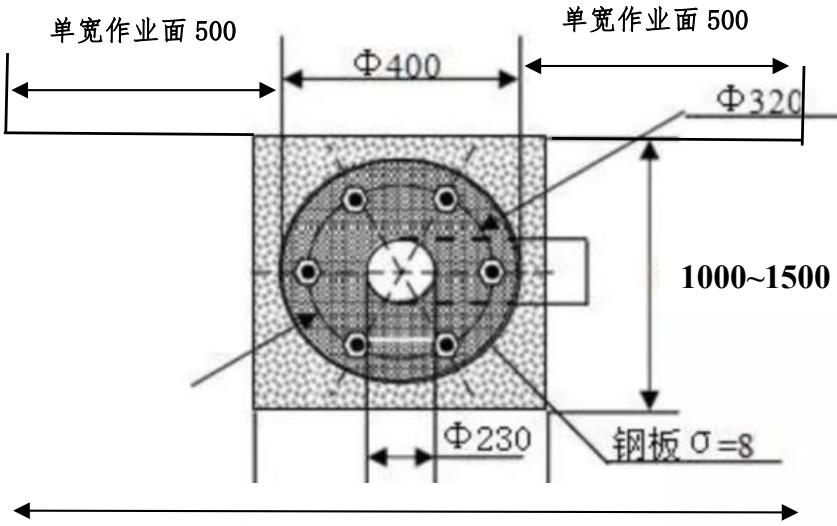  
开挖宽度1400  
图 2.4-3 管线施工开挖断面示意图

## ③破碎混凝土

本项目现状基本无需要清理的既有建构筑物。上海地块临时场地与一期共用，拆除及恢复责任归属本项目，施工生产生活区占地面积0.90hm²，使用完毕后拆除混凝土厚度约15\~25cm，产生破碎混凝土量为0.18万 $\mathrm { m } ^ { 3 }$ ；长春地块施工临时设施硬化场地后续用于停车场，可结合停车场场地平整及硬化需要进行布置，后续也基本无混凝土硬化需要破除；兰州地块施工生产生活区红线内占地面积0.12hm²，使用完毕后拆除混凝土厚度约20\~30cm，产生建筑垃圾量为 0.05万m³。

## (2) 填方

## ①场地填高

1）上海地块场地现状标高平均约4.40m（一期临时堆土清理平整后），场地内广场、道路、景观绿化等区域（除地下室范围外）需垫高至设计标高5.40m（预留约30cm覆土厚度，下同），故需回填高差1.0m，填筑面积约0.50hm²，合计回填土方量约0.50万m³。

2）长春地块绿化及广场区域普遍标高约192.2m，场地内广场、道路、景观绿化等区域（除地下室范围外）需垫高至设计标高一致，为193.7m，故需回填高差约1.50m，填筑面积约 1.60hm²，合计回填土方量约 2.40万 m³。

3）兰州地块绿化及广场区域普遍标高约1513.84m，场地内广场、道路、景观绿化等区域（除地下室范围外）需垫高至设计标高一致，为1513.99m，故需回填高差约0.15m，填筑面积约1.08m²，合计回填土方量约0.16万m³。兰州地块破碎混凝土量较少，经与设计沟通确认，可后续用于部分红线内道路基底层填筑。

表 2.4-3 场地回填土方计算表
<table><tr><td rowspan=1 colspan=1>回填区域</td><td rowspan=1 colspan=1>回填起始标高（m）</td><td rowspan=1 colspan=1>室外设计标高（m）</td><td rowspan=1 colspan=1>回填量（万m³）</td></tr><tr><td rowspan=1 colspan=1>上海地块场地回填</td><td rowspan=1 colspan=1>4.40</td><td rowspan=1 colspan=1>5.40</td><td rowspan=1 colspan=1>0.50</td></tr><tr><td rowspan=1 colspan=1>长春地块场地回填</td><td rowspan=1 colspan=1>192.20</td><td rowspan=1 colspan=1>193.7</td><td rowspan=1 colspan=1>2.40</td></tr><tr><td rowspan=1 colspan=1>兰州地块场地回填</td><td rowspan=1 colspan=1>1513.84</td><td rowspan=1 colspan=1>1513.99</td><td rowspan=1 colspan=1>0.16</td></tr></table>

## ②肥槽回填

肥槽回填土方根据基坑开挖面积及指标表中地下室面积进行测算，计算结果如下。

表 2.4-4 肥槽回填土方计算表
<table><tr><td rowspan=1 colspan=1>地块</td><td rowspan=1 colspan=1>基坑开挖面积 $( \mathbf { m } ^ { 2 } )$ </td><td rowspan=1 colspan=1>地下室面积 $( \mathbf { m } ^ { 2 } )$ </td><td rowspan=1 colspan=1>回填肥槽面积 $( \mathbf { m } ^ { 2 } )$ </td><td rowspan=1 colspan=1>回填深度（m）</td><td rowspan=1 colspan=1>回填土方（万 $\mathbf { m } ^ { 3 } )$ </td></tr><tr><td rowspan=1 colspan=1>上海地块</td><td rowspan=1 colspan=1>6240.0</td><td rowspan=1 colspan=1>6155.0</td><td rowspan=1 colspan=1>85</td><td rowspan=1 colspan=1>5.7</td><td rowspan=1 colspan=1>0.05</td></tr><tr><td rowspan=1 colspan=1>长春地块</td><td rowspan=1 colspan=1>4554.0</td><td rowspan=1 colspan=1>3803.0</td><td rowspan=1 colspan=1>751</td><td rowspan=1 colspan=1>5.7</td><td rowspan=1 colspan=1>0.43</td></tr><tr><td rowspan=1 colspan=1>兰州地块</td><td rowspan=1 colspan=1>5350.0</td><td rowspan=1 colspan=1>4557.0</td><td rowspan=1 colspan=1>793</td><td rowspan=1 colspan=1>6.6</td><td rowspan=1 colspan=1>0.52</td></tr><tr><td rowspan=1 colspan=1>合计</td><td rowspan=1 colspan=1>16144</td><td rowspan=1 colspan=1>14515</td><td rowspan=1 colspan=1>1629</td><td rowspan=1 colspan=1></td><td rowspan=1 colspan=1>1.08</td></tr></table>

## ③顶板覆土

本项目上海和兰州地块均需要室外顶板覆土，顶板覆土土方计算如下。

表 2.4-5 顶板覆土土方计算表
<table><tr><td rowspan=1 colspan=1>地块</td><td rowspan=1 colspan=1>地库开挖面积 $( \mathbf { m } ^ { 2 } )$ </td><td rowspan=1 colspan=1>建筑基底面积 $( \mathbf { m } ^ { 2 } )$ </td><td rowspan=1 colspan=1>顶板覆土面积 $( \mathbf { m } ^ { 2 } )$ </td><td rowspan=1 colspan=1>覆土厚度（m）</td><td rowspan=1 colspan=1>覆土量 $( \mathbf { m } ^ { 3 } )$ </td></tr><tr><td rowspan=1 colspan=1>上海地块</td><td rowspan=1 colspan=1>6240</td><td rowspan=1 colspan=1>3968</td><td rowspan=1 colspan=1>2272</td><td rowspan=1 colspan=1>1.5</td><td rowspan=1 colspan=1>3408</td></tr><tr><td rowspan=1 colspan=1>兰州地块</td><td rowspan=1 colspan=1>5350</td><td rowspan=1 colspan=1>3318.3</td><td rowspan=1 colspan=1>2031.7</td><td rowspan=1 colspan=1>2.5</td><td rowspan=1 colspan=1>5079.25</td></tr><tr><td rowspan=1 colspan=1>合计</td><td rowspan=1 colspan=1>11590</td><td rowspan=1 colspan=1>7286.3</td><td rowspan=1 colspan=1>4303.7</td><td rowspan=1 colspan=1></td><td rowspan=1 colspan=1>8487.25</td></tr></table>

## (3）借方

本项目无借方。

## (4) 土方平衡结果

本项目挖填方总量为16.70万 $\mathrm { m } ^ { 3 }$ ，其中：

①本项目开挖方10.86万 $\mathrm { m } ^ { 3 }$ ，其中一般土方10.33万 $\mathrm { m } ^ { 3 }$ ，表土0.30万 $\mathrm { m } ^ { 3 }$ ，破碎混凝土0.23万m³。按工程项目区域划分，包括主体工程区10.63万 $\mathrm { m } ^ { 3 }$ （其中上海地块3.68万$\mathrm { m } ^ { 3 }$ ，长春地块3.16万 $\mathrm { m } ^ { 3 }$ ，兰州地块3.79万 $\mathbf { m } ^ { 3 } )$ ，施工生产生活区0.23万 $\mathrm { m } ^ { 3 }$ (上海地块0.18万 $\mathrm { m } ^ { 3 }$ ，兰州地块产生0.05万m³）。

②本项目回填方5.84万m³，其中一般土方5.49万 $\mathrm { m } ^ { 3 }$ ，表土0.30万m³，破碎混凝土0.05万 $\mathrm { m } ^ { 3 }$ 。按工程项目区域划分，均为主体工程区回填，其中上海地块1.22万 $\mathrm { m } ^ { 3 }$ ，长春地块 3.16万 $\mathrm { m } ^ { 3 }$ ，兰州地块1.46万 $\mathrm { m } ^ { 3 }$ o

③本项目无外借方。

④本项目弃方5.02万 $\mathrm { m } ^ { 3 }$ ，其中一般土方4.84万m³，破碎混凝土0.18万 $\mathrm { m } ^ { 3 }$ 。按工程项目区域划分，包括主体工程区4.84万 $\mathrm { m } ^ { 3 }$ （其中上海地块2.46 万 $\mathrm { m } ^ { 3 }$ ，兰州地块2.38万m3），施工生产生活区0.18万 $\mathrm { m } ^ { 3 }$ （上海地块）。

上海地块共计弃方2.64万m³，根据《上海市建筑垃圾处理管理规定》及《关于“南汇东滩生态造林建设项目”市级应急消纳场所物流调配与申报审批的工作提示》，建设单位已就本项目测算的弃方情况向上海市重大办、临港新片区管委会高新产业和科技创新处等进行沟通请示，上海市重大办、临港新片区管委会高新产业和科技创新处等支持项目弃方外弃至政府指定上海市南汇东滩生态造林建设项目前期地形整理消纳场进行统一消纳处置，水土流失责任由其管理方负责，并在取得施工许可后、正式出土前办理完成相关渣土处置行政许可，消纳场不纳入本项目防治责任范围（附件4）。

兰州地块共计弃方2.38万m³，均为基坑开挖一般土方，明确用于兰州雁滩GG2406号地块项目进行综合利用。土方综合利用协议见附件（附件5）。

表 2.4-6 项目各地块土石方平衡表 单位：万m³
<table><tr><td rowspan=2 colspan=2>分区</td><td rowspan=2 colspan=1>项目</td><td rowspan=1 colspan=4>开挖</td><td rowspan=1 colspan=4>回填</td><td rowspan=1 colspan=1></td><td rowspan=1 colspan=3>调入</td><td rowspan=1 colspan=1></td><td rowspan=1 colspan=2>调出</td><td rowspan=1 colspan=2></td><td rowspan=1 colspan=1></td><td rowspan=1 colspan=3>弃方</td></tr><tr><td rowspan=1 colspan=1>表土</td><td rowspan=1 colspan=1>一般土方</td><td rowspan=1 colspan=1>破碎混凝土</td><td rowspan=1 colspan=1>小计</td><td rowspan=1 colspan=1>一般土方</td><td rowspan=1 colspan=1>破碎混凝土</td><td rowspan=1 colspan=1>表土</td><td rowspan=1 colspan=1>小计</td><td rowspan=1 colspan=1>一般土方</td><td rowspan=1 colspan=1>破碎混凝土</td><td rowspan=1 colspan=1>表土</td><td rowspan=1 colspan=1>小计</td><td rowspan=1 colspan=1>来源</td><td rowspan=1 colspan=1>一般土方</td><td rowspan=1 colspan=1>破碎混凝土</td><td rowspan=1 colspan=1>表土</td><td rowspan=1 colspan=1>小计</td><td rowspan=1 colspan=1>去向</td><td rowspan=1 colspan=1>一般土方</td><td rowspan=1 colspan=1>破碎混凝土</td><td rowspan=1 colspan=1>小计</td></tr><tr><td rowspan=10 colspan=1>上海地块</td><td rowspan=7 colspan=1>主体工程区</td><td rowspan=1 colspan=1>基础开挖</td><td rowspan=1 colspan=1></td><td rowspan=1 colspan=1>3.56</td><td rowspan=1 colspan=1></td><td rowspan=1 colspan=1>3.56</td><td rowspan=1 colspan=1></td><td rowspan=1 colspan=1></td><td rowspan=1 colspan=1></td><td rowspan=1 colspan=1></td><td rowspan=1 colspan=1></td><td rowspan=1 colspan=1></td><td rowspan=1 colspan=1></td><td rowspan=1 colspan=1></td><td rowspan=1 colspan=1></td><td rowspan=1 colspan=1>1.10</td><td rowspan=1 colspan=1></td><td rowspan=1 colspan=1></td><td rowspan=1 colspan=1>1.10</td><td rowspan=1 colspan=1>绿化改良及肥槽回填</td><td rowspan=1 colspan=1>2.46</td><td rowspan=1 colspan=1></td><td rowspan=1 colspan=1>2.46</td></tr><tr><td rowspan=1 colspan=1>肥槽回填</td><td rowspan=1 colspan=1></td><td rowspan=1 colspan=1></td><td rowspan=1 colspan=1></td><td rowspan=1 colspan=1></td><td rowspan=1 colspan=1>0.05</td><td rowspan=1 colspan=1></td><td rowspan=1 colspan=1></td><td rowspan=1 colspan=1>0.05</td><td rowspan=1 colspan=1>0.05</td><td rowspan=1 colspan=1></td><td rowspan=1 colspan=1></td><td rowspan=1 colspan=1>0.05</td><td rowspan=1 colspan=1>基础土方</td><td rowspan=1 colspan=1></td><td rowspan=1 colspan=1></td><td rowspan=1 colspan=1></td><td rowspan=1 colspan=1></td><td rowspan=1 colspan=1></td><td rowspan=1 colspan=1></td><td rowspan=1 colspan=1></td><td rowspan=1 colspan=1></td></tr><tr><td rowspan=1 colspan=1>垫高</td><td rowspan=1 colspan=1></td><td rowspan=1 colspan=1></td><td rowspan=1 colspan=1></td><td rowspan=1 colspan=1></td><td rowspan=1 colspan=1>0.50</td><td rowspan=1 colspan=1></td><td rowspan=1 colspan=1></td><td rowspan=1 colspan=1>0.50</td><td rowspan=1 colspan=1>0.50</td><td rowspan=1 colspan=1></td><td rowspan=1 colspan=1></td><td rowspan=1 colspan=1>0.50</td><td rowspan=1 colspan=1>基础土方</td><td rowspan=1 colspan=1></td><td rowspan=1 colspan=1></td><td rowspan=1 colspan=1></td><td rowspan=1 colspan=1></td><td rowspan=1 colspan=1></td><td rowspan=1 colspan=1></td><td rowspan=1 colspan=1></td><td rowspan=1 colspan=1></td></tr><tr><td rowspan=1 colspan=1>顶板覆土</td><td rowspan=1 colspan=1></td><td rowspan=1 colspan=1></td><td rowspan=1 colspan=1></td><td rowspan=1 colspan=1></td><td rowspan=1 colspan=1>0.34</td><td rowspan=1 colspan=1></td><td rowspan=1 colspan=1></td><td rowspan=1 colspan=1>0.34</td><td rowspan=1 colspan=1>0.34</td><td rowspan=1 colspan=1></td><td rowspan=1 colspan=1></td><td rowspan=1 colspan=1>0.34</td><td rowspan=1 colspan=1>基础土方</td><td rowspan=1 colspan=1></td><td rowspan=1 colspan=1></td><td rowspan=1 colspan=1></td><td rowspan=1 colspan=1></td><td rowspan=1 colspan=1></td><td rowspan=1 colspan=1></td><td rowspan=1 colspan=1></td><td rowspan=1 colspan=1></td></tr><tr><td rowspan=1 colspan=1>管线开挖及回填</td><td rowspan=1 colspan=1></td><td rowspan=1 colspan=1>0.12</td><td rowspan=1 colspan=1></td><td rowspan=1 colspan=1>0.12</td><td rowspan=1 colspan=1>0.12</td><td rowspan=1 colspan=1></td><td rowspan=1 colspan=1></td><td rowspan=1 colspan=1>0.12</td><td rowspan=1 colspan=1></td><td rowspan=1 colspan=1></td><td rowspan=1 colspan=1></td><td rowspan=1 colspan=1></td><td rowspan=1 colspan=1></td><td rowspan=1 colspan=1></td><td rowspan=1 colspan=1></td><td rowspan=1 colspan=1></td><td rowspan=1 colspan=1></td><td rowspan=1 colspan=1></td><td rowspan=1 colspan=1></td><td rowspan=1 colspan=1></td><td rowspan=1 colspan=1></td></tr><tr><td rowspan=1 colspan=1>覆土绿化</td><td rowspan=1 colspan=1></td><td rowspan=1 colspan=1></td><td rowspan=1 colspan=1></td><td rowspan=1 colspan=1></td><td rowspan=1 colspan=1></td><td rowspan=1 colspan=1></td><td rowspan=1 colspan=1>0.21</td><td rowspan=1 colspan=1>0.21</td><td rowspan=1 colspan=1></td><td rowspan=1 colspan=1></td><td rowspan=1 colspan=1>0.21</td><td rowspan=1 colspan=1>0.21</td><td rowspan=1 colspan=1>基础土方</td><td rowspan=1 colspan=1></td><td rowspan=1 colspan=1></td><td rowspan=1 colspan=1></td><td rowspan=1 colspan=1></td><td rowspan=1 colspan=1></td><td rowspan=1 colspan=1></td><td rowspan=1 colspan=1></td><td rowspan=1 colspan=1></td></tr><tr><td rowspan=1 colspan=1>小计</td><td rowspan=1 colspan=1></td><td rowspan=1 colspan=1>3.68</td><td rowspan=1 colspan=1></td><td rowspan=1 colspan=1>3.68</td><td rowspan=1 colspan=1>1.01</td><td rowspan=1 colspan=1></td><td rowspan=1 colspan=1>0.21</td><td rowspan=1 colspan=1>1.22</td><td rowspan=1 colspan=1>0.89</td><td rowspan=1 colspan=1></td><td rowspan=1 colspan=1>0.21</td><td rowspan=1 colspan=1>1.10</td><td rowspan=1 colspan=1></td><td rowspan=1 colspan=1>1.10</td><td rowspan=1 colspan=1></td><td rowspan=1 colspan=1></td><td rowspan=1 colspan=1>1.10</td><td rowspan=1 colspan=1></td><td rowspan=1 colspan=1>2.46</td><td rowspan=1 colspan=1></td><td rowspan=1 colspan=1>2.46</td></tr><tr><td rowspan=2 colspan=1>施工生产生活区</td><td rowspan=1 colspan=1>场地拆除</td><td rowspan=1 colspan=1></td><td rowspan=1 colspan=1></td><td rowspan=1 colspan=1>0.18</td><td rowspan=1 colspan=1>0.18</td><td rowspan=1 colspan=1></td><td rowspan=1 colspan=1></td><td rowspan=1 colspan=1></td><td rowspan=1 colspan=1></td><td rowspan=1 colspan=1></td><td rowspan=1 colspan=1></td><td rowspan=1 colspan=1></td><td rowspan=1 colspan=1></td><td rowspan=1 colspan=1></td><td rowspan=1 colspan=1></td><td rowspan=1 colspan=1></td><td rowspan=1 colspan=1></td><td rowspan=1 colspan=1></td><td rowspan=1 colspan=1></td><td rowspan=1 colspan=1></td><td rowspan=1 colspan=1>0.18</td><td rowspan=1 colspan=1>0.18</td></tr><tr><td rowspan=1 colspan=1>小计</td><td rowspan=1 colspan=1></td><td rowspan=1 colspan=1></td><td rowspan=1 colspan=1>0.18</td><td rowspan=1 colspan=1>0.18</td><td rowspan=1 colspan=1></td><td rowspan=1 colspan=1></td><td rowspan=1 colspan=1></td><td rowspan=1 colspan=1></td><td rowspan=1 colspan=1></td><td rowspan=1 colspan=1></td><td rowspan=1 colspan=1></td><td rowspan=1 colspan=1></td><td rowspan=1 colspan=1></td><td rowspan=1 colspan=1></td><td rowspan=1 colspan=1></td><td rowspan=1 colspan=1></td><td rowspan=1 colspan=1></td><td rowspan=1 colspan=1></td><td rowspan=1 colspan=1></td><td rowspan=1 colspan=1>0.18</td><td rowspan=1 colspan=1>0.18</td></tr><tr><td rowspan=1 colspan=1></td><td rowspan=1 colspan=1>合计</td><td rowspan=1 colspan=1></td><td rowspan=1 colspan=1>3.68</td><td rowspan=1 colspan=1>0.18</td><td rowspan=1 colspan=1>3.86</td><td rowspan=1 colspan=1>1.01</td><td rowspan=1 colspan=1></td><td rowspan=1 colspan=1>0.21</td><td rowspan=1 colspan=1>1.22</td><td rowspan=1 colspan=1>0.89</td><td rowspan=1 colspan=1></td><td rowspan=1 colspan=1>0.21</td><td rowspan=1 colspan=1>1.10</td><td rowspan=1 colspan=1></td><td rowspan=1 colspan=1>1.10</td><td rowspan=1 colspan=1></td><td rowspan=1 colspan=1></td><td rowspan=1 colspan=1>1.10</td><td rowspan=1 colspan=1></td><td rowspan=1 colspan=1>2.46</td><td rowspan=1 colspan=1>0.18</td><td rowspan=1 colspan=1>2.64</td></tr><tr><td rowspan=9 colspan=1>长春地块</td><td rowspan=7 colspan=1>主体工程区</td><td rowspan=1 colspan=1>基础开挖</td><td rowspan=1 colspan=1></td><td rowspan=1 colspan=1>2.93</td><td rowspan=1 colspan=1></td><td rowspan=1 colspan=1>2.93</td><td rowspan=1 colspan=1></td><td rowspan=1 colspan=1></td><td rowspan=1 colspan=1></td><td rowspan=1 colspan=1></td><td rowspan=1 colspan=1></td><td rowspan=1 colspan=1></td><td rowspan=1 colspan=1></td><td rowspan=1 colspan=1></td><td rowspan=1 colspan=1></td><td rowspan=1 colspan=1>2.93</td><td rowspan=1 colspan=1></td><td rowspan=1 colspan=1></td><td rowspan=1 colspan=1>2.93</td><td rowspan=1 colspan=1>绿化改良及回填</td><td rowspan=1 colspan=1></td><td rowspan=1 colspan=1></td><td rowspan=1 colspan=1></td></tr><tr><td rowspan=1 colspan=1>表土剥离</td><td rowspan=1 colspan=1>0.15</td><td rowspan=1 colspan=1></td><td rowspan=1 colspan=1></td><td rowspan=1 colspan=1>0.15</td><td rowspan=1 colspan=1></td><td rowspan=1 colspan=1></td><td rowspan=1 colspan=1></td><td rowspan=1 colspan=1></td><td rowspan=1 colspan=1></td><td rowspan=1 colspan=1></td><td rowspan=1 colspan=1></td><td rowspan=1 colspan=1></td><td rowspan=1 colspan=1></td><td rowspan=1 colspan=1></td><td rowspan=1 colspan=1></td><td rowspan=1 colspan=1>0.15</td><td rowspan=1 colspan=1>0.15</td><td rowspan=1 colspan=1>绿化覆土</td><td rowspan=1 colspan=1></td><td rowspan=1 colspan=1></td><td rowspan=1 colspan=1></td></tr><tr><td rowspan=1 colspan=1>肥槽回填</td><td rowspan=1 colspan=1></td><td rowspan=1 colspan=1></td><td rowspan=1 colspan=1></td><td rowspan=1 colspan=1></td><td rowspan=1 colspan=1>0.50</td><td rowspan=1 colspan=1></td><td rowspan=1 colspan=1></td><td rowspan=1 colspan=1>0.50</td><td rowspan=1 colspan=1>0.50</td><td rowspan=1 colspan=1></td><td rowspan=1 colspan=1></td><td rowspan=1 colspan=1>0.50</td><td rowspan=1 colspan=1>基础土方</td><td rowspan=1 colspan=1></td><td rowspan=1 colspan=1></td><td rowspan=1 colspan=1></td><td rowspan=1 colspan=1></td><td rowspan=1 colspan=1></td><td rowspan=1 colspan=1></td><td rowspan=1 colspan=1></td><td rowspan=1 colspan=1></td></tr><tr><td rowspan=1 colspan=1>垫高</td><td rowspan=1 colspan=1></td><td rowspan=1 colspan=1></td><td rowspan=1 colspan=1></td><td rowspan=1 colspan=1></td><td rowspan=1 colspan=1>2.40</td><td rowspan=1 colspan=1></td><td rowspan=1 colspan=1></td><td rowspan=1 colspan=1>2.40</td><td rowspan=1 colspan=1>2.40</td><td rowspan=1 colspan=1></td><td rowspan=1 colspan=1></td><td rowspan=1 colspan=1>2.40</td><td rowspan=1 colspan=1>基础土方</td><td rowspan=1 colspan=1></td><td rowspan=1 colspan=1></td><td rowspan=1 colspan=1></td><td rowspan=1 colspan=1></td><td rowspan=1 colspan=1></td><td rowspan=1 colspan=1></td><td rowspan=1 colspan=1></td><td rowspan=1 colspan=1></td></tr><tr><td rowspan=1 colspan=1>管线开挖及回填</td><td rowspan=1 colspan=1></td><td rowspan=1 colspan=1>0.08</td><td rowspan=1 colspan=1></td><td rowspan=1 colspan=1>0.08</td><td rowspan=1 colspan=1>0.08</td><td rowspan=1 colspan=1></td><td rowspan=1 colspan=1></td><td rowspan=1 colspan=1>0.08</td><td rowspan=1 colspan=1></td><td rowspan=1 colspan=1></td><td rowspan=1 colspan=1></td><td rowspan=1 colspan=1></td><td rowspan=1 colspan=1></td><td rowspan=1 colspan=1></td><td rowspan=1 colspan=1></td><td rowspan=1 colspan=1></td><td rowspan=1 colspan=1></td><td rowspan=1 colspan=1></td><td rowspan=1 colspan=1></td><td rowspan=1 colspan=1></td><td rowspan=1 colspan=1></td></tr><tr><td rowspan=1 colspan=1>覆土绿化</td><td rowspan=1 colspan=1></td><td rowspan=1 colspan=1></td><td rowspan=1 colspan=1></td><td rowspan=1 colspan=1></td><td rowspan=1 colspan=1></td><td rowspan=1 colspan=1></td><td rowspan=1 colspan=1>0.18</td><td rowspan=1 colspan=1>0.18</td><td rowspan=1 colspan=1></td><td rowspan=1 colspan=1></td><td rowspan=1 colspan=1>0.18</td><td rowspan=1 colspan=1>0.18</td><td rowspan=1 colspan=1>基础土方</td><td rowspan=1 colspan=1></td><td rowspan=1 colspan=1></td><td rowspan=1 colspan=1></td><td rowspan=1 colspan=1></td><td rowspan=1 colspan=1></td><td rowspan=1 colspan=1></td><td rowspan=1 colspan=1></td><td rowspan=1 colspan=1></td></tr><tr><td rowspan=1 colspan=1>小计</td><td rowspan=1 colspan=1></td><td rowspan=1 colspan=1>3.01</td><td rowspan=1 colspan=1></td><td rowspan=1 colspan=1>3.16</td><td rowspan=1 colspan=1>2.98</td><td rowspan=1 colspan=1></td><td rowspan=1 colspan=1>0.18</td><td rowspan=1 colspan=1>3.16</td><td rowspan=1 colspan=1>2.90</td><td rowspan=1 colspan=1></td><td rowspan=1 colspan=1>0.18</td><td rowspan=1 colspan=1>3.08</td><td rowspan=1 colspan=1></td><td rowspan=1 colspan=1>2.93</td><td rowspan=1 colspan=1></td><td rowspan=1 colspan=1></td><td rowspan=1 colspan=1>3.08</td><td rowspan=1 colspan=1></td><td rowspan=1 colspan=1></td><td rowspan=1 colspan=1></td><td rowspan=1 colspan=1></td></tr><tr><td rowspan=2 colspan=1>施工生产生活区</td><td rowspan=1 colspan=1>场地拆除</td><td rowspan=1 colspan=1></td><td rowspan=1 colspan=1></td><td rowspan=1 colspan=1></td><td rowspan=1 colspan=1></td><td rowspan=1 colspan=1></td><td rowspan=1 colspan=1></td><td rowspan=1 colspan=1></td><td rowspan=1 colspan=1></td><td rowspan=1 colspan=1></td><td rowspan=1 colspan=1></td><td rowspan=1 colspan=1></td><td rowspan=1 colspan=1></td><td rowspan=1 colspan=1></td><td rowspan=1 colspan=1></td><td rowspan=1 colspan=1></td><td rowspan=1 colspan=1></td><td rowspan=1 colspan=1></td><td rowspan=1 colspan=1></td><td rowspan=1 colspan=1></td><td rowspan=1 colspan=1></td><td rowspan=1 colspan=1></td></tr><tr><td rowspan=1 colspan=1>小计</td><td rowspan=1 colspan=1></td><td rowspan=1 colspan=1></td><td rowspan=1 colspan=1></td><td rowspan=1 colspan=1></td><td rowspan=1 colspan=1></td><td rowspan=1 colspan=1></td><td rowspan=1 colspan=1></td><td rowspan=1 colspan=1></td><td rowspan=1 colspan=1></td><td rowspan=1 colspan=1></td><td rowspan=1 colspan=1></td><td rowspan=1 colspan=1></td><td rowspan=1 colspan=1></td><td rowspan=1 colspan=1></td><td rowspan=1 colspan=1></td><td rowspan=1 colspan=1></td><td rowspan=1 colspan=1></td><td rowspan=1 colspan=1></td><td rowspan=1 colspan=1></td><td rowspan=1 colspan=1></td><td rowspan=1 colspan=1></td></tr><tr><td rowspan=1 colspan=1></td><td rowspan=1 colspan=1></td><td rowspan=1 colspan=1>合计</td><td rowspan=1 colspan=1>0.15</td><td rowspan=1 colspan=1>3.09</td><td rowspan=1 colspan=1></td><td rowspan=1 colspan=1>3.16</td><td rowspan=1 colspan=1>2.98</td><td rowspan=1 colspan=1></td><td rowspan=1 colspan=1>0.18</td><td rowspan=1 colspan=1>3.16</td><td rowspan=1 colspan=1>2.90</td><td rowspan=1 colspan=1></td><td rowspan=1 colspan=1>0.18</td><td rowspan=1 colspan=1>3.08</td><td rowspan=1 colspan=1></td><td rowspan=1 colspan=1>2.93</td><td rowspan=1 colspan=1></td><td rowspan=1 colspan=1>0.15</td><td rowspan=1 colspan=1>3.08</td><td rowspan=1 colspan=1></td><td rowspan=1 colspan=1></td><td rowspan=1 colspan=1></td><td rowspan=1 colspan=1></td></tr><tr><td rowspan=12 colspan=1>兰州地块</td><td rowspan=9 colspan=1>主体工程区</td><td rowspan=1 colspan=1>表土剥离及地块清理</td><td rowspan=1 colspan=1>0.15</td><td rowspan=1 colspan=1></td><td rowspan=1 colspan=1></td><td rowspan=1 colspan=1>0.15</td><td rowspan=1 colspan=1></td><td rowspan=1 colspan=1></td><td rowspan=1 colspan=1></td><td rowspan=1 colspan=1></td><td rowspan=1 colspan=1></td><td rowspan=1 colspan=1></td><td rowspan=1 colspan=1></td><td rowspan=1 colspan=1></td><td rowspan=1 colspan=1></td><td rowspan=1 colspan=1></td><td rowspan=1 colspan=1></td><td rowspan=1 colspan=1>0.15</td><td rowspan=1 colspan=1>0.15</td><td rowspan=1 colspan=1>绿化覆土</td><td rowspan=1 colspan=1></td><td rowspan=1 colspan=1></td><td rowspan=1 colspan=1></td></tr><tr><td rowspan=1 colspan=1>基础开挖</td><td rowspan=1 colspan=1></td><td rowspan=1 colspan=1>3.58</td><td rowspan=1 colspan=1></td><td rowspan=1 colspan=1>3.58</td><td rowspan=1 colspan=1></td><td rowspan=1 colspan=1></td><td rowspan=1 colspan=1></td><td rowspan=1 colspan=1></td><td rowspan=1 colspan=1></td><td rowspan=1 colspan=1></td><td rowspan=1 colspan=1></td><td rowspan=1 colspan=1></td><td rowspan=1 colspan=1></td><td rowspan=1 colspan=1>1.20</td><td rowspan=1 colspan=1></td><td rowspan=1 colspan=1></td><td rowspan=1 colspan=1>1.20</td><td rowspan=1 colspan=1>回填</td><td rowspan=1 colspan=1>2.38</td><td rowspan=1 colspan=1></td><td rowspan=1 colspan=1>2.38</td></tr><tr><td rowspan=1 colspan=1>肥槽回填</td><td rowspan=1 colspan=1></td><td rowspan=1 colspan=1></td><td rowspan=1 colspan=1></td><td rowspan=1 colspan=1></td><td rowspan=1 colspan=1>0.53</td><td rowspan=1 colspan=1></td><td rowspan=1 colspan=1></td><td rowspan=1 colspan=1>0.53</td><td rowspan=1 colspan=1>0.53</td><td rowspan=1 colspan=1></td><td rowspan=1 colspan=1></td><td rowspan=1 colspan=1>0.53</td><td rowspan=1 colspan=1>基础土方</td><td rowspan=1 colspan=1></td><td rowspan=1 colspan=1></td><td rowspan=1 colspan=1></td><td rowspan=1 colspan=1></td><td rowspan=1 colspan=1></td><td rowspan=1 colspan=1></td><td rowspan=1 colspan=1></td><td rowspan=1 colspan=1></td></tr><tr><td rowspan=1 colspan=1>垫高</td><td rowspan=1 colspan=1></td><td rowspan=1 colspan=1></td><td rowspan=1 colspan=1></td><td rowspan=1 colspan=1></td><td rowspan=1 colspan=1>0.16</td><td rowspan=1 colspan=1></td><td rowspan=1 colspan=1></td><td rowspan=1 colspan=1>0.16</td><td rowspan=1 colspan=1>0.16</td><td rowspan=1 colspan=1></td><td rowspan=1 colspan=1></td><td rowspan=1 colspan=1>0.16</td><td rowspan=1 colspan=1>基础土方</td><td rowspan=1 colspan=1></td><td rowspan=1 colspan=1></td><td rowspan=1 colspan=1></td><td rowspan=1 colspan=1></td><td rowspan=1 colspan=1></td><td rowspan=1 colspan=1></td><td rowspan=1 colspan=1></td><td rowspan=1 colspan=1></td></tr><tr><td rowspan=1 colspan=1>顶板覆土</td><td rowspan=1 colspan=1></td><td rowspan=1 colspan=1></td><td rowspan=1 colspan=1></td><td rowspan=1 colspan=1></td><td rowspan=1 colspan=1>0.51</td><td rowspan=1 colspan=1></td><td rowspan=1 colspan=1></td><td rowspan=1 colspan=1>0.51</td><td rowspan=1 colspan=1>0.51</td><td rowspan=1 colspan=1></td><td rowspan=1 colspan=1></td><td rowspan=1 colspan=1>0.51</td><td rowspan=1 colspan=1>基础土方</td><td rowspan=1 colspan=1></td><td rowspan=1 colspan=1></td><td rowspan=1 colspan=1></td><td rowspan=1 colspan=1></td><td rowspan=1 colspan=1></td><td rowspan=1 colspan=1></td><td rowspan=1 colspan=1></td><td rowspan=1 colspan=1></td></tr><tr><td rowspan=1 colspan=1>管线开挖及回填</td><td rowspan=1 colspan=1></td><td rowspan=1 colspan=1>0.06</td><td rowspan=1 colspan=1></td><td rowspan=1 colspan=1>0.06</td><td rowspan=1 colspan=1>0.06</td><td rowspan=1 colspan=1></td><td rowspan=1 colspan=1></td><td rowspan=1 colspan=1>0.06</td><td rowspan=1 colspan=1></td><td rowspan=1 colspan=1></td><td rowspan=1 colspan=1></td><td rowspan=1 colspan=1></td><td rowspan=1 colspan=1></td><td rowspan=1 colspan=1></td><td rowspan=1 colspan=1></td><td rowspan=1 colspan=1></td><td rowspan=1 colspan=1></td><td rowspan=1 colspan=1></td><td rowspan=1 colspan=1></td><td rowspan=1 colspan=1></td><td rowspan=1 colspan=1></td></tr><tr><td rowspan=1 colspan=1>道路基层填筑</td><td rowspan=1 colspan=1></td><td rowspan=1 colspan=1></td><td rowspan=1 colspan=1></td><td rowspan=1 colspan=1></td><td rowspan=1 colspan=1></td><td rowspan=1 colspan=1>0.05</td><td rowspan=1 colspan=1></td><td rowspan=1 colspan=1>0.05</td><td rowspan=1 colspan=1></td><td rowspan=1 colspan=1>0.05</td><td rowspan=1 colspan=1></td><td rowspan=1 colspan=1>0.05</td><td rowspan=1 colspan=1>生活区拆除</td><td rowspan=1 colspan=1></td><td rowspan=1 colspan=1></td><td rowspan=1 colspan=1></td><td rowspan=1 colspan=1></td><td rowspan=1 colspan=1></td><td rowspan=1 colspan=1></td><td rowspan=1 colspan=1></td><td rowspan=1 colspan=1></td></tr><tr><td rowspan=1 colspan=1>覆土绿化</td><td rowspan=1 colspan=1></td><td rowspan=1 colspan=1></td><td rowspan=1 colspan=1></td><td rowspan=1 colspan=1></td><td rowspan=1 colspan=1></td><td rowspan=1 colspan=1></td><td rowspan=1 colspan=1>0.15</td><td rowspan=1 colspan=1>0.15</td><td rowspan=1 colspan=1></td><td rowspan=1 colspan=1></td><td rowspan=1 colspan=1>0.15</td><td rowspan=1 colspan=1>0.15</td><td rowspan=1 colspan=1>基础土方</td><td rowspan=1 colspan=1></td><td rowspan=1 colspan=1></td><td rowspan=1 colspan=1></td><td rowspan=1 colspan=1></td><td rowspan=1 colspan=1></td><td rowspan=1 colspan=1></td><td rowspan=1 colspan=1></td><td rowspan=1 colspan=1></td></tr><tr><td rowspan=1 colspan=1>小计</td><td rowspan=1 colspan=1>0.15</td><td rowspan=1 colspan=1>3.64</td><td rowspan=1 colspan=1></td><td rowspan=1 colspan=1>3.79</td><td rowspan=1 colspan=1>1.26</td><td rowspan=1 colspan=1>0.05</td><td rowspan=1 colspan=1>0.15</td><td rowspan=1 colspan=1>1.46</td><td rowspan=1 colspan=1>1.20</td><td rowspan=1 colspan=1>0.05</td><td rowspan=1 colspan=1>0.15</td><td rowspan=1 colspan=1>1.40</td><td rowspan=1 colspan=1></td><td rowspan=1 colspan=1>1.20</td><td rowspan=1 colspan=1></td><td rowspan=1 colspan=1>0.15</td><td rowspan=1 colspan=1>1.35</td><td rowspan=1 colspan=1></td><td rowspan=1 colspan=1>2.38</td><td rowspan=1 colspan=1></td><td rowspan=1 colspan=1>2.38</td></tr><tr><td rowspan=2 colspan=1>施工生产生活区</td><td rowspan=1 colspan=1>场地拆除</td><td rowspan=1 colspan=1></td><td rowspan=1 colspan=1></td><td rowspan=1 colspan=1>0.05</td><td rowspan=1 colspan=1>0.05</td><td rowspan=1 colspan=1></td><td rowspan=1 colspan=1></td><td rowspan=1 colspan=1></td><td rowspan=1 colspan=1></td><td rowspan=1 colspan=1></td><td rowspan=1 colspan=1></td><td rowspan=1 colspan=1></td><td rowspan=1 colspan=1></td><td rowspan=1 colspan=1></td><td rowspan=1 colspan=1></td><td rowspan=1 colspan=1>0.05</td><td rowspan=1 colspan=1></td><td rowspan=1 colspan=1>0.05</td><td rowspan=1 colspan=1>内部道路基层回填</td><td rowspan=1 colspan=1></td><td rowspan=1 colspan=1></td><td rowspan=1 colspan=1></td></tr><tr><td rowspan=1 colspan=1>小计</td><td rowspan=1 colspan=1></td><td rowspan=1 colspan=1></td><td rowspan=1 colspan=1>0.05</td><td rowspan=1 colspan=1>0.05</td><td rowspan=1 colspan=1></td><td rowspan=1 colspan=1></td><td rowspan=1 colspan=1></td><td rowspan=1 colspan=1></td><td rowspan=1 colspan=1></td><td rowspan=1 colspan=1></td><td rowspan=1 colspan=1></td><td rowspan=1 colspan=1></td><td rowspan=1 colspan=1></td><td rowspan=1 colspan=1></td><td rowspan=1 colspan=1>0.05</td><td rowspan=1 colspan=1></td><td rowspan=1 colspan=1>0.05</td><td rowspan=1 colspan=1></td><td rowspan=1 colspan=1></td><td rowspan=1 colspan=1></td><td rowspan=1 colspan=1></td></tr><tr><td rowspan=1 colspan=1></td><td rowspan=1 colspan=1>合计</td><td rowspan=1 colspan=1>0.15</td><td rowspan=1 colspan=1>3.64</td><td rowspan=1 colspan=1>0.05</td><td rowspan=1 colspan=1>3.84</td><td rowspan=1 colspan=1>1.26</td><td rowspan=1 colspan=1>0.05</td><td rowspan=1 colspan=1>0.15</td><td rowspan=1 colspan=1>1.46</td><td rowspan=1 colspan=1>1.20</td><td rowspan=1 colspan=1>0.05</td><td rowspan=1 colspan=1>0.15</td><td rowspan=1 colspan=1>1.40</td><td rowspan=1 colspan=1></td><td rowspan=1 colspan=1>1.20</td><td rowspan=1 colspan=1>0.05</td><td rowspan=1 colspan=1>0.15</td><td rowspan=1 colspan=1>1.40</td><td rowspan=1 colspan=1></td><td rowspan=1 colspan=1>2.38</td><td rowspan=1 colspan=1>0.00</td><td rowspan=1 colspan=1>2.38</td></tr></table>

上海勘测设计研究院有限公司

<table><tr><td rowspan=2 colspan=1>分区</td><td rowspan=2 colspan=1>项目</td><td rowspan=1 colspan=4>开挖</td><td rowspan=1 colspan=4>回填</td><td rowspan=1 colspan=3>调入</td><td rowspan=2 colspan=1>来源</td><td rowspan=1 colspan=3>调出</td><td rowspan=2 colspan=1>去向</td><td rowspan=1 colspan=3>弃方</td></tr><tr><td rowspan=1 colspan=1>表土</td><td rowspan=1 colspan=1>一般土方</td><td rowspan=1 colspan=1>破碎混凝土</td><td rowspan=1 colspan=1>小计</td><td rowspan=1 colspan=1>一般土方</td><td rowspan=1 colspan=1>破碎混凝土</td><td rowspan=1 colspan=1>表土</td><td rowspan=1 colspan=1>小计</td><td rowspan=1 colspan=1>一般  破碎混土方    凝土</td><td rowspan=1 colspan=1>表土</td><td rowspan=1 colspan=1>小计</td><td rowspan=1 colspan=1>一般土方</td><td rowspan=1 colspan=1>破碎混表土凝土</td><td rowspan=1 colspan=1>小计</td><td rowspan=1 colspan=1>一般土方</td><td rowspan=1 colspan=1>破碎混凝土</td><td rowspan=1 colspan=1>小计</td></tr><tr><td rowspan=1 colspan=1>总计</td><td rowspan=1 colspan=1></td><td rowspan=1 colspan=1>0.30</td><td rowspan=1 colspan=1>10.33</td><td rowspan=1 colspan=1>0.23</td><td rowspan=1 colspan=1>10.86</td><td rowspan=1 colspan=1>5.25</td><td rowspan=1 colspan=1>0.05</td><td rowspan=1 colspan=1>0.54</td><td rowspan=1 colspan=1>5.84</td><td rowspan=1 colspan=1>4.99    0.05</td><td rowspan=1 colspan=1>0.54</td><td rowspan=1 colspan=1>5.58</td><td rowspan=1 colspan=1></td><td rowspan=1 colspan=1>5.23</td><td rowspan=1 colspan=1>0.05   0.30</td><td rowspan=1 colspan=1>5.58</td><td rowspan=1 colspan=1></td><td rowspan=1 colspan=1>4.84</td><td rowspan=1 colspan=1>0.18</td><td rowspan=1 colspan=1>5.02</td></tr></table>

注：1、表中均为自然方，混凝土、砂石料等建筑材料等不计入土石方平衡；  
2、表中土石方平衡满足开挖+调入+外借=回填+调出+废弃；  
3、项目借（购）方不含项目内部地块调入，项目废弃土方不含项目内部地块调出。

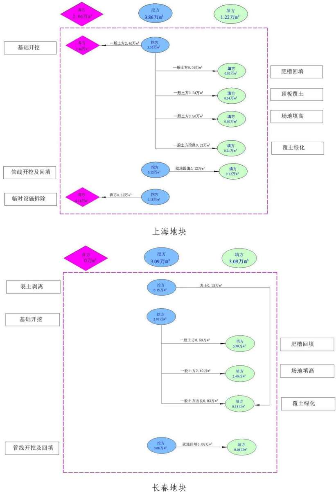

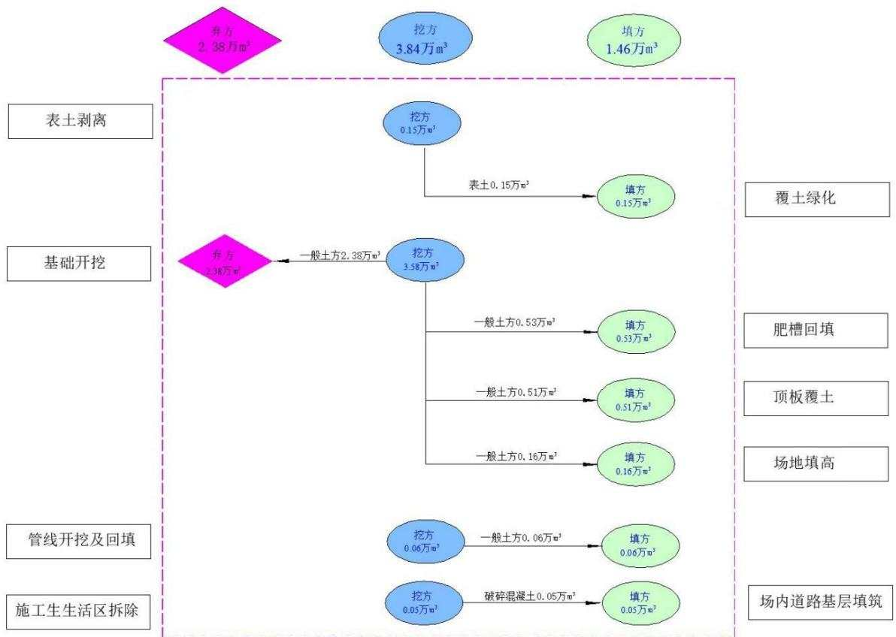  
兰州地块  
图2.4-4土方平衡流向图（单位：万m³）

## 2.5拆迁（移民）安置与专项设施改建

本项目上海地块、长春地块为净地出让，不涉及拆迁（移民）及安置、专项设施改（迁）建、林地搬迁等内容。兰州地块为现有中科院兰州分院院内景观绿化及广场用地，场地内乔木数量约80株，后续由建设单位出资委托所在地所属专业市政管理部门负责苗木搬迁工作。

另据调查，项目各地块范围内不存在重要矿产资源，地上、地下均未发现有文物古迹，也不在自然保护区范围内，附近无重要的通讯及市政设施。

## 2.6 施工进度

施工单位计划于2025年12月进场进行施工准备，2029年7月竣工，总建设工期44个月（包括施工准备期）。

项目施工进度详见表2.6-1\~2.6-3。

表 2.6-1 上海地块施工进度安排表
<table><tr><td rowspan=2 colspan=1>项目</td><td rowspan=2 colspan=1>项目</td><td></td><td rowspan=1 colspan=1></td><td rowspan=1 colspan=1></td><td rowspan=1 colspan=1></td><td rowspan=1 colspan=1></td><td rowspan=1 colspan=1></td><td rowspan=1 colspan=1>202</td><td rowspan=1 colspan=1>6</td><td rowspan=1 colspan=1></td><td rowspan=1 colspan=1></td><td rowspan=1 colspan=1></td><td rowspan=1 colspan=1></td><td rowspan=1 colspan=1></td><td rowspan=1 colspan=1></td><td rowspan=1 colspan=1></td><td rowspan=1 colspan=1></td><td rowspan=1 colspan=1></td><td rowspan=1 colspan=1></td><td rowspan=1 colspan=1>202</td><td rowspan=1 colspan=1>7</td><td rowspan=1 colspan=1></td><td rowspan=1 colspan=1></td><td rowspan=1 colspan=1></td><td rowspan=1 colspan=1></td><td rowspan=1 colspan=1></td><td rowspan=1 colspan=1></td><td rowspan=1 colspan=1></td><td rowspan=1 colspan=1></td><td rowspan=1 colspan=1></td><td rowspan=1 colspan=1></td><td rowspan=1 colspan=1>202</td><td rowspan=1 colspan=1>8</td><td rowspan=1 colspan=1></td><td rowspan=1 colspan=1></td><td rowspan=1 colspan=1></td><td rowspan=1 colspan=1></td><td rowspan=1 colspan=1></td><td rowspan=1 colspan=1></td><td rowspan=1 colspan=1></td><td rowspan=1 colspan=1></td><td rowspan=1 colspan=1>02</td><td rowspan=1 colspan=1>)</td><td rowspan=1 colspan=1></td><td rowspan=1 colspan=1></td></tr><tr><td rowspan=1 colspan=1>12</td><td rowspan=1 colspan=1>1</td><td rowspan=1 colspan=1>2</td><td rowspan=1 colspan=1>3</td><td rowspan=1 colspan=1>4</td><td rowspan=1 colspan=1>5</td><td rowspan=1 colspan=1>6</td><td rowspan=1 colspan=1>7</td><td rowspan=1 colspan=1>8</td><td rowspan=1 colspan=1>9</td><td rowspan=1 colspan=1>10</td><td rowspan=1 colspan=1>11</td><td rowspan=1 colspan=1>12</td><td rowspan=1 colspan=1>1</td><td rowspan=1 colspan=1>2</td><td rowspan=1 colspan=1>3</td><td rowspan=1 colspan=1>4</td><td rowspan=1 colspan=1>5</td><td rowspan=1 colspan=1>6</td><td rowspan=1 colspan=1>7</td><td rowspan=1 colspan=1>8</td><td rowspan=1 colspan=1>9</td><td rowspan=1 colspan=1>10</td><td rowspan=1 colspan=1>11</td><td rowspan=1 colspan=1>12</td><td rowspan=1 colspan=1>1</td><td rowspan=1 colspan=1>2</td><td rowspan=1 colspan=1>3</td><td rowspan=1 colspan=1>4</td><td rowspan=1 colspan=1>5</td><td rowspan=1 colspan=1>6</td><td rowspan=1 colspan=1>7</td><td rowspan=1 colspan=1>8</td><td rowspan=1 colspan=1>9</td><td rowspan=1 colspan=1>10</td><td rowspan=1 colspan=1>11</td><td rowspan=1 colspan=1>12</td><td rowspan=1 colspan=1>1</td><td rowspan=1 colspan=1>2</td><td rowspan=1 colspan=1>3</td><td rowspan=1 colspan=1>4</td><td rowspan=1 colspan=1>5</td><td rowspan=1 colspan=1>6</td><td rowspan=1 colspan=1>7</td></tr><tr><td rowspan=1 colspan=1>场地整理</td><td rowspan=1 colspan=1>施工准备、场地整理</td><td rowspan=1 colspan=1></td><td rowspan=1 colspan=1></td><td rowspan=1 colspan=1></td><td rowspan=1 colspan=1></td><td rowspan=1 colspan=1></td><td rowspan=1 colspan=1></td><td rowspan=1 colspan=1></td><td rowspan=1 colspan=1></td><td rowspan=1 colspan=1></td><td rowspan=1 colspan=1></td><td rowspan=1 colspan=1></td><td rowspan=1 colspan=1></td><td rowspan=1 colspan=1></td><td rowspan=1 colspan=1></td><td rowspan=1 colspan=1></td><td rowspan=1 colspan=1></td><td rowspan=1 colspan=1></td><td rowspan=1 colspan=1></td><td rowspan=1 colspan=1></td><td rowspan=1 colspan=1></td><td rowspan=1 colspan=1></td><td rowspan=1 colspan=1></td><td rowspan=1 colspan=1></td><td rowspan=1 colspan=1></td><td rowspan=1 colspan=1></td><td rowspan=1 colspan=1></td><td rowspan=1 colspan=1></td><td rowspan=1 colspan=1></td><td rowspan=1 colspan=1></td><td rowspan=1 colspan=1></td><td rowspan=1 colspan=1></td><td rowspan=1 colspan=1></td><td rowspan=1 colspan=1></td><td rowspan=1 colspan=1></td><td rowspan=1 colspan=1></td><td rowspan=1 colspan=1></td><td rowspan=1 colspan=1></td><td rowspan=1 colspan=1></td><td rowspan=1 colspan=1></td><td rowspan=1 colspan=1></td><td rowspan=1 colspan=1></td><td rowspan=1 colspan=1></td><td rowspan=1 colspan=1></td><td rowspan=1 colspan=1></td></tr><tr><td rowspan=5 colspan=1>主体工程区</td><td rowspan=3 colspan=1>试桩、桩基工程、基础开挖</td><td rowspan=1 colspan=1></td><td rowspan=1 colspan=1></td><td rowspan=1 colspan=1></td><td rowspan=1 colspan=1></td><td rowspan=1 colspan=1></td><td rowspan=1 colspan=1></td><td rowspan=1 colspan=1></td><td rowspan=1 colspan=1>+</td><td></td><td></td><td></td><td></td><td></td><td></td><td></td><td></td><td></td><td></td><td></td><td></td><td></td><td></td><td></td><td></td><td></td><td></td><td></td><td></td><td></td><td></td><td></td><td></td><td></td><td></td><td></td><td></td><td></td><td></td><td></td><td></td><td></td><td></td><td></td><td></td></tr><tr><td rowspan=2 colspan=1></td><td rowspan=2 colspan=1></td><td rowspan=2 colspan=1></td><td rowspan=2 colspan=1></td><td rowspan=2 colspan=1></td><td rowspan=2 colspan=1></td><td rowspan=2 colspan=1></td><td rowspan=2 colspan=1></td><td></td><td></td><td></td><td></td><td></td><td></td><td></td><td></td><td></td><td></td><td></td><td></td><td></td><td></td><td></td><td></td><td></td><td></td><td></td><td></td><td></td><td></td><td></td><td></td><td></td><td></td><td></td><td></td><td></td><td></td><td></td><td></td><td></td><td></td><td></td><td></td></tr><tr><td rowspan=1 colspan=1></td><td rowspan=1 colspan=1></td><td rowspan=1 colspan=1></td><td rowspan=1 colspan=1></td><td rowspan=1 colspan=1></td><td rowspan=1 colspan=1></td><td rowspan=1 colspan=1></td><td rowspan=1 colspan=1></td><td rowspan=1 colspan=1></td><td rowspan=1 colspan=1></td><td rowspan=1 colspan=1></td><td rowspan=1 colspan=1></td><td rowspan=1 colspan=1></td><td rowspan=1 colspan=1></td><td rowspan=1 colspan=1></td><td rowspan=1 colspan=1></td><td rowspan=1 colspan=1></td><td rowspan=1 colspan=1></td><td rowspan=1 colspan=1></td><td rowspan=1 colspan=1></td><td rowspan=1 colspan=1></td><td rowspan=1 colspan=1></td><td rowspan=1 colspan=1></td><td rowspan=1 colspan=1></td><td rowspan=1 colspan=1></td><td rowspan=1 colspan=1></td><td rowspan=1 colspan=1></td><td rowspan=1 colspan=1></td><td rowspan=1 colspan=1></td><td rowspan=1 colspan=1></td><td rowspan=1 colspan=1></td><td rowspan=1 colspan=1></td><td rowspan=1 colspan=1></td><td rowspan=1 colspan=1></td><td rowspan=1 colspan=1></td><td rowspan=1 colspan=1></td></tr><tr><td rowspan=1 colspan=1>建筑工程</td><td rowspan=1 colspan=1></td><td rowspan=1 colspan=1></td><td rowspan=1 colspan=1></td><td rowspan=1 colspan=1></td><td rowspan=1 colspan=1></td><td rowspan=1 colspan=1></td><td rowspan=1 colspan=1></td><td rowspan=1 colspan=1></td><td rowspan=1 colspan=1></td><td rowspan=1 colspan=1></td><td rowspan=1 colspan=1></td><td rowspan=1 colspan=1></td><td rowspan=1 colspan=1></td><td rowspan=1 colspan=1></td><td rowspan=1 colspan=1></td><td rowspan=1 colspan=1></td><td rowspan=1 colspan=1></td><td rowspan=1 colspan=1></td><td rowspan=1 colspan=1></td><td rowspan=1 colspan=1></td><td rowspan=1 colspan=1></td><td rowspan=1 colspan=1></td><td rowspan=1 colspan=1></td><td rowspan=1 colspan=1></td><td rowspan=1 colspan=1></td><td rowspan=1 colspan=1></td><td rowspan=1 colspan=1></td><td rowspan=1 colspan=1></td><td rowspan=1 colspan=1></td><td rowspan=1 colspan=1></td><td rowspan=1 colspan=1></td><td rowspan=1 colspan=1></td><td rowspan=1 colspan=1></td><td rowspan=1 colspan=1></td><td rowspan=1 colspan=1></td><td rowspan=1 colspan=1></td><td rowspan=1 colspan=1>→</td><td rowspan=1 colspan=1></td><td rowspan=1 colspan=1></td><td rowspan=1 colspan=1></td><td rowspan=1 colspan=1></td><td rowspan=1 colspan=1></td><td rowspan=1 colspan=1></td><td rowspan=1 colspan=1></td></tr><tr><td rowspan=1 colspan=1>场地绿化</td><td rowspan=1 colspan=1></td><td rowspan=1 colspan=1></td><td rowspan=1 colspan=1></td><td rowspan=1 colspan=1></td><td rowspan=1 colspan=1></td><td rowspan=1 colspan=1></td><td rowspan=1 colspan=1></td><td rowspan=1 colspan=1></td><td rowspan=1 colspan=1></td><td rowspan=1 colspan=1></td><td rowspan=1 colspan=1></td><td rowspan=1 colspan=1></td><td rowspan=1 colspan=1></td><td rowspan=1 colspan=1></td><td rowspan=1 colspan=1></td><td rowspan=1 colspan=1></td><td rowspan=1 colspan=1></td><td rowspan=1 colspan=1></td><td rowspan=1 colspan=1></td><td rowspan=1 colspan=1></td><td rowspan=1 colspan=1></td><td rowspan=1 colspan=1></td><td rowspan=1 colspan=1></td><td rowspan=1 colspan=1></td><td rowspan=1 colspan=1></td><td rowspan=1 colspan=1></td><td rowspan=1 colspan=1></td><td rowspan=1 colspan=1></td><td rowspan=1 colspan=1></td><td rowspan=1 colspan=1></td><td rowspan=1 colspan=1></td><td rowspan=1 colspan=1></td><td rowspan=1 colspan=1></td><td rowspan=1 colspan=1></td><td rowspan=1 colspan=1></td><td rowspan=1 colspan=1></td><td rowspan=1 colspan=1></td><td rowspan=1 colspan=1></td><td rowspan=1 colspan=1></td><td></td><td></td><td></td><td rowspan=1 colspan=1></td><td rowspan=1 colspan=1></td></tr><tr><td rowspan=1 colspan=1>临时堆土区</td><td rowspan=1 colspan=1>恢复</td><td rowspan=1 colspan=1></td><td rowspan=1 colspan=1></td><td rowspan=1 colspan=1></td><td rowspan=1 colspan=1></td><td rowspan=1 colspan=1></td><td rowspan=1 colspan=1></td><td rowspan=1 colspan=1></td><td rowspan=1 colspan=1></td><td rowspan=1 colspan=1></td><td rowspan=1 colspan=1></td><td rowspan=1 colspan=1></td><td rowspan=1 colspan=1></td><td rowspan=1 colspan=1></td><td rowspan=1 colspan=1></td><td rowspan=1 colspan=1></td><td rowspan=1 colspan=1></td><td rowspan=1 colspan=1></td><td rowspan=1 colspan=1></td><td rowspan=1 colspan=1></td><td rowspan=1 colspan=1></td><td rowspan=1 colspan=1></td><td rowspan=1 colspan=1></td><td rowspan=1 colspan=1></td><td rowspan=1 colspan=1></td><td rowspan=1 colspan=1></td><td rowspan=1 colspan=1></td><td rowspan=1 colspan=1></td><td rowspan=1 colspan=1></td><td rowspan=1 colspan=1></td><td rowspan=1 colspan=1></td><td rowspan=1 colspan=1></td><td rowspan=1 colspan=1></td><td rowspan=1 colspan=1></td><td rowspan=1 colspan=1></td><td rowspan=1 colspan=1></td><td rowspan=1 colspan=1></td><td rowspan=1 colspan=1></td><td rowspan=1 colspan=1></td><td rowspan=1 colspan=1>→</td><td rowspan=1 colspan=1></td><td rowspan=1 colspan=1></td><td rowspan=1 colspan=1></td><td rowspan=1 colspan=1></td><td rowspan=1 colspan=1></td></tr></table>

表 2.6-2 长春地块施工进度安排表
<table><tr><td rowspan=2 colspan=1>项目</td><td rowspan=2 colspan=1>项目</td><td rowspan=1 colspan=1></td><td rowspan=1 colspan=1></td><td rowspan=1 colspan=1></td><td rowspan=1 colspan=1></td><td rowspan=1 colspan=1></td><td rowspan=1 colspan=1></td><td rowspan=1 colspan=3>2026</td><td rowspan=1 colspan=1></td><td rowspan=1 colspan=1></td><td rowspan=1 colspan=1></td><td rowspan=1 colspan=1></td><td rowspan=1 colspan=1></td><td rowspan=1 colspan=1></td><td rowspan=1 colspan=2></td><td rowspan=1 colspan=1></td><td rowspan=1 colspan=4>2027</td><td rowspan=1 colspan=1></td><td rowspan=1 colspan=1></td><td rowspan=1 colspan=1></td><td rowspan=1 colspan=1></td><td rowspan=1 colspan=1></td><td rowspan=1 colspan=1></td><td rowspan=1 colspan=1></td><td rowspan=1 colspan=4>2028</td><td rowspan=1 colspan=1></td><td rowspan=1 colspan=1></td><td rowspan=1 colspan=2></td><td rowspan=1 colspan=1></td><td rowspan=1 colspan=1></td><td rowspan=1 colspan=1></td><td rowspan=1 colspan=4>2029</td></tr><tr><td rowspan=1 colspan=1>12</td><td rowspan=1 colspan=1>1</td><td rowspan=1 colspan=1>2</td><td rowspan=1 colspan=1>3</td><td rowspan=1 colspan=1>4</td><td rowspan=1 colspan=1>5</td><td rowspan=1 colspan=1>6</td><td rowspan=1 colspan=1>7</td><td rowspan=1 colspan=1>8</td><td rowspan=1 colspan=1>9</td><td rowspan=1 colspan=1>10</td><td rowspan=1 colspan=1>11</td><td rowspan=1 colspan=1>12</td><td rowspan=1 colspan=1>1</td><td rowspan=1 colspan=1>2</td><td rowspan=1 colspan=1>3</td><td rowspan=1 colspan=1>4</td><td rowspan=1 colspan=1>5</td><td rowspan=1 colspan=1>6</td><td rowspan=1 colspan=1>7</td><td rowspan=1 colspan=1>8</td><td rowspan=1 colspan=1>9</td><td rowspan=1 colspan=1>10</td><td rowspan=1 colspan=1>11</td><td rowspan=1 colspan=1>12</td><td rowspan=1 colspan=1>1</td><td rowspan=1 colspan=1>2</td><td rowspan=1 colspan=1>3</td><td rowspan=1 colspan=1>4</td><td rowspan=1 colspan=1>5</td><td rowspan=1 colspan=1>6</td><td rowspan=1 colspan=1>7</td><td rowspan=1 colspan=1>8</td><td rowspan=1 colspan=1>9</td><td rowspan=1 colspan=1>10</td><td rowspan=1 colspan=1>11</td><td rowspan=1 colspan=1>12</td><td rowspan=1 colspan=1>1</td><td rowspan=1 colspan=1>2</td><td rowspan=1 colspan=1>3</td><td rowspan=1 colspan=1>4</td><td rowspan=1 colspan=1>5</td><td rowspan=1 colspan=1>6</td><td rowspan=1 colspan=1>7</td></tr><tr><td rowspan=1 colspan=1>场地整理</td><td rowspan=1 colspan=1>施工准备、场地整理</td><td rowspan=1 colspan=1></td><td rowspan=1 colspan=1></td><td rowspan=1 colspan=1></td><td rowspan=1 colspan=1></td><td rowspan=1 colspan=1></td><td rowspan=1 colspan=1></td><td rowspan=1 colspan=1></td><td rowspan=1 colspan=1></td><td rowspan=1 colspan=1></td><td rowspan=1 colspan=1></td><td rowspan=1 colspan=1></td><td rowspan=1 colspan=1></td><td rowspan=1 colspan=1></td><td rowspan=1 colspan=1></td><td rowspan=1 colspan=1></td><td rowspan=1 colspan=1></td><td rowspan=1 colspan=1></td><td rowspan=1 colspan=1></td><td rowspan=1 colspan=1></td><td rowspan=1 colspan=1></td><td rowspan=1 colspan=1></td><td rowspan=1 colspan=1></td><td rowspan=1 colspan=1></td><td rowspan=1 colspan=1></td><td rowspan=1 colspan=1></td><td rowspan=1 colspan=1></td><td rowspan=1 colspan=1></td><td rowspan=1 colspan=1></td><td rowspan=1 colspan=1></td><td rowspan=1 colspan=1></td><td rowspan=1 colspan=1></td><td rowspan=1 colspan=1></td><td rowspan=1 colspan=1></td><td rowspan=1 colspan=1></td><td rowspan=1 colspan=1></td><td rowspan=1 colspan=1></td><td rowspan=1 colspan=1></td><td rowspan=1 colspan=1></td><td rowspan=1 colspan=1></td><td rowspan=1 colspan=1></td><td rowspan=1 colspan=1></td><td rowspan=1 colspan=1></td><td rowspan=1 colspan=1></td><td rowspan=1 colspan=1></td></tr><tr><td rowspan=5 colspan=1>主体工程区</td><td rowspan=2 colspan=1>试桩、桩基工程、基础开挖</td><td rowspan=2 colspan=1></td><td rowspan=2 colspan=1></td><td rowspan=2 colspan=1></td><td rowspan=1 colspan=1></td><td rowspan=1 colspan=1></td><td rowspan=1 colspan=1></td><td rowspan=1 colspan=1></td><td rowspan=1 colspan=1></td><td rowspan=1 colspan=1></td><td rowspan=1 colspan=1></td><td rowspan=1 colspan=1></td><td rowspan=1 colspan=1></td><td rowspan=2 colspan=1></td><td rowspan=2 colspan=1></td><td rowspan=2 colspan=1></td><td rowspan=2 colspan=1></td><td rowspan=2 colspan=1></td><td rowspan=2 colspan=1></td><td rowspan=2 colspan=1></td><td rowspan=2 colspan=1></td><td rowspan=2 colspan=1></td><td rowspan=2 colspan=1></td><td rowspan=2 colspan=1></td><td rowspan=2 colspan=1></td><td rowspan=2 colspan=1></td><td rowspan=2 colspan=1></td><td rowspan=2 colspan=1></td><td rowspan=2 colspan=1></td><td rowspan=2 colspan=1></td><td rowspan=2 colspan=1></td><td rowspan=2 colspan=1></td><td rowspan=2 colspan=1></td><td rowspan=2 colspan=1></td><td rowspan=2 colspan=1></td><td rowspan=2 colspan=1></td><td rowspan=2 colspan=1></td><td rowspan=2 colspan=1></td><td rowspan=2 colspan=1></td><td rowspan=2 colspan=1></td><td rowspan=2 colspan=1></td><td rowspan=2 colspan=1></td><td rowspan=2 colspan=1></td><td rowspan=2 colspan=1></td><td rowspan=2 colspan=1></td></tr><tr><td rowspan=1 colspan=1></td><td rowspan=1 colspan=1></td><td rowspan=1 colspan=1></td><td rowspan=1 colspan=1></td><td rowspan=1 colspan=1></td><td rowspan=1 colspan=1></td><td rowspan=1 colspan=1></td><td rowspan=1 colspan=1></td><td rowspan=1 colspan=1></td></tr><tr><td rowspan=1 colspan=1>建筑工程</td><td rowspan=1 colspan=1></td><td rowspan=1 colspan=1></td><td rowspan=1 colspan=1></td><td rowspan=1 colspan=1></td><td rowspan=1 colspan=1></td><td rowspan=1 colspan=1></td><td rowspan=1 colspan=1></td><td rowspan=1 colspan=1></td><td rowspan=1 colspan=1></td><td rowspan=1 colspan=1></td><td rowspan=1 colspan=1></td><td rowspan=1 colspan=1></td><td rowspan=1 colspan=1></td><td rowspan=1 colspan=1></td><td rowspan=1 colspan=1></td><td rowspan=1 colspan=1></td><td rowspan=1 colspan=1></td><td rowspan=1 colspan=1></td><td rowspan=1 colspan=1></td><td rowspan=1 colspan=1></td><td rowspan=1 colspan=1></td><td rowspan=1 colspan=1></td><td rowspan=1 colspan=1></td><td rowspan=1 colspan=1></td><td rowspan=1 colspan=1></td><td rowspan=1 colspan=1></td><td rowspan=1 colspan=1></td><td rowspan=1 colspan=1></td><td rowspan=1 colspan=1></td><td rowspan=1 colspan=1></td><td rowspan=1 colspan=1></td><td rowspan=1 colspan=1></td><td rowspan=1 colspan=1></td><td rowspan=1 colspan=1></td><td rowspan=1 colspan=1></td><td rowspan=1 colspan=1></td><td rowspan=1 colspan=1>+</td><td rowspan=1 colspan=1></td><td rowspan=1 colspan=1></td><td rowspan=1 colspan=1></td><td rowspan=1 colspan=1></td><td rowspan=1 colspan=1></td><td rowspan=1 colspan=1></td><td rowspan=1 colspan=1></td></tr><tr><td rowspan=1 colspan=1>安装工程</td><td rowspan=1 colspan=1></td><td rowspan=1 colspan=1></td><td rowspan=1 colspan=1></td><td rowspan=1 colspan=1></td><td rowspan=1 colspan=1></td><td rowspan=1 colspan=1></td><td rowspan=1 colspan=1></td><td rowspan=1 colspan=1></td><td rowspan=1 colspan=1></td><td rowspan=1 colspan=1></td><td rowspan=1 colspan=1></td><td rowspan=1 colspan=1></td><td rowspan=1 colspan=1></td><td rowspan=1 colspan=1></td><td rowspan=1 colspan=1></td><td rowspan=1 colspan=1></td><td rowspan=1 colspan=1></td><td rowspan=1 colspan=1></td><td rowspan=1 colspan=1></td><td rowspan=1 colspan=1></td><td rowspan=1 colspan=1></td><td rowspan=1 colspan=1></td><td rowspan=1 colspan=1></td><td rowspan=1 colspan=1></td><td rowspan=1 colspan=1></td><td></td><td></td><td></td><td></td><td></td><td></td><td></td><td></td><td></td><td></td><td></td><td rowspan=1 colspan=1>→</td><td rowspan=1 colspan=1></td><td rowspan=1 colspan=1></td><td rowspan=1 colspan=1></td><td rowspan=1 colspan=1></td><td rowspan=1 colspan=1></td><td rowspan=1 colspan=1></td><td rowspan=1 colspan=1></td></tr><tr><td rowspan=1 colspan=1>场地绿化</td><td rowspan=1 colspan=1></td><td rowspan=1 colspan=1></td><td rowspan=1 colspan=1></td><td rowspan=1 colspan=1></td><td rowspan=1 colspan=1></td><td rowspan=1 colspan=1></td><td rowspan=1 colspan=1></td><td rowspan=1 colspan=1></td><td rowspan=1 colspan=1></td><td rowspan=1 colspan=1></td><td rowspan=1 colspan=1></td><td rowspan=1 colspan=1></td><td rowspan=1 colspan=1></td><td rowspan=1 colspan=1></td><td rowspan=1 colspan=1></td><td rowspan=1 colspan=1></td><td rowspan=1 colspan=1></td><td rowspan=1 colspan=1></td><td rowspan=1 colspan=1></td><td rowspan=1 colspan=1></td><td rowspan=1 colspan=1></td><td rowspan=1 colspan=1></td><td rowspan=1 colspan=1></td><td rowspan=1 colspan=1></td><td rowspan=1 colspan=1></td><td rowspan=1 colspan=1></td><td rowspan=1 colspan=1></td><td rowspan=1 colspan=1></td><td rowspan=1 colspan=1></td><td rowspan=1 colspan=1></td><td rowspan=1 colspan=1></td><td rowspan=1 colspan=1></td><td rowspan=1 colspan=1></td><td rowspan=1 colspan=1></td><td rowspan=1 colspan=1></td><td rowspan=1 colspan=1></td><td rowspan=1 colspan=1></td><td rowspan=1 colspan=1></td><td rowspan=1 colspan=1></td><td rowspan=1 colspan=1></td><td rowspan=1 colspan=1></td><td rowspan=1 colspan=1>→</td><td rowspan=1 colspan=1></td><td rowspan=1 colspan=1></td></tr><tr><td rowspan=1 colspan=1>施工生产生活区</td><td rowspan=1 colspan=1>临建设施搭建及拆除</td><td rowspan=1 colspan=1></td><td rowspan=1 colspan=1></td><td rowspan=1 colspan=1></td><td rowspan=1 colspan=1></td><td rowspan=1 colspan=1></td><td rowspan=1 colspan=1></td><td rowspan=1 colspan=1></td><td rowspan=1 colspan=1></td><td rowspan=1 colspan=1></td><td rowspan=1 colspan=1></td><td rowspan=1 colspan=1></td><td rowspan=1 colspan=1></td><td rowspan=1 colspan=1></td><td rowspan=1 colspan=1></td><td rowspan=1 colspan=1></td><td rowspan=1 colspan=1></td><td rowspan=1 colspan=1></td><td rowspan=1 colspan=1></td><td rowspan=1 colspan=1></td><td rowspan=1 colspan=1></td><td rowspan=1 colspan=1></td><td rowspan=1 colspan=1></td><td rowspan=1 colspan=1></td><td rowspan=1 colspan=1></td><td rowspan=1 colspan=1></td><td rowspan=1 colspan=1></td><td rowspan=1 colspan=1></td><td rowspan=1 colspan=1></td><td rowspan=1 colspan=1></td><td rowspan=1 colspan=1></td><td rowspan=1 colspan=1></td><td rowspan=1 colspan=1></td><td rowspan=1 colspan=1></td><td rowspan=1 colspan=1></td><td rowspan=1 colspan=1></td><td rowspan=1 colspan=1></td><td rowspan=1 colspan=1></td><td rowspan=1 colspan=1></td><td rowspan=1 colspan=1></td><td rowspan=1 colspan=1></td><td rowspan=1 colspan=1></td><td rowspan=1 colspan=1></td><td rowspan=1 colspan=1></td><td rowspan=1 colspan=1></td></tr><tr><td rowspan=1 colspan=1>临时堆土区</td><td rowspan=1 colspan=1></td><td rowspan=1 colspan=1></td><td rowspan=1 colspan=1></td><td rowspan=1 colspan=1></td><td rowspan=1 colspan=1>1</td><td rowspan=1 colspan=1></td><td rowspan=1 colspan=1></td><td rowspan=1 colspan=1></td><td rowspan=1 colspan=1></td><td rowspan=1 colspan=1></td><td rowspan=1 colspan=1></td><td rowspan=1 colspan=1></td><td rowspan=1 colspan=1></td><td rowspan=1 colspan=1></td><td rowspan=1 colspan=1></td><td rowspan=1 colspan=1></td><td rowspan=1 colspan=1></td><td rowspan=1 colspan=1></td><td rowspan=1 colspan=1></td><td rowspan=1 colspan=1></td><td rowspan=1 colspan=1></td><td rowspan=1 colspan=1></td><td rowspan=1 colspan=1></td><td rowspan=1 colspan=1></td><td rowspan=1 colspan=1></td><td rowspan=1 colspan=1></td><td rowspan=1 colspan=1></td><td rowspan=1 colspan=1></td><td rowspan=1 colspan=1></td><td rowspan=1 colspan=1></td><td rowspan=1 colspan=1></td><td rowspan=1 colspan=1></td><td rowspan=1 colspan=1></td><td rowspan=1 colspan=1></td><td rowspan=1 colspan=1></td><td rowspan=1 colspan=1></td><td rowspan=1 colspan=1></td><td rowspan=1 colspan=1></td><td rowspan=1 colspan=1>→</td><td rowspan=1 colspan=1></td><td rowspan=1 colspan=1></td><td rowspan=1 colspan=1></td><td rowspan=1 colspan=1></td><td rowspan=1 colspan=1></td><td rowspan=1 colspan=1></td></tr></table>

表 2.6-3 兰州地块施工进度安排表
<table><tr><td rowspan=2 colspan=1>项目</td><td rowspan=2 colspan=1>项目</td><td rowspan=1 colspan=1></td><td rowspan=1 colspan=5></td><td rowspan=1 colspan=6>2026</td><td rowspan=1 colspan=1></td><td rowspan=1 colspan=1></td><td rowspan=1 colspan=2></td><td rowspan=1 colspan=1></td><td rowspan=1 colspan=1></td><td rowspan=1 colspan=4>2027</td><td rowspan=1 colspan=1></td><td rowspan=1 colspan=1></td><td rowspan=1 colspan=1></td><td rowspan=1 colspan=1></td><td rowspan=1 colspan=1></td><td rowspan=1 colspan=1></td><td rowspan=1 colspan=1></td><td rowspan=1 colspan=1></td><td rowspan=1 colspan=1>202</td><td rowspan=1 colspan=1>8</td><td rowspan=1 colspan=1></td><td rowspan=1 colspan=1></td><td rowspan=1 colspan=1></td><td rowspan=1 colspan=1></td><td rowspan=1 colspan=1></td><td rowspan=1 colspan=1></td><td rowspan=1 colspan=1></td><td rowspan=1 colspan=1></td><td rowspan=1 colspan=1>02</td><td rowspan=1 colspan=1>)</td><td rowspan=1 colspan=1></td><td rowspan=1 colspan=1></td></tr><tr><td rowspan=1 colspan=1>12</td><td rowspan=1 colspan=1>1</td><td rowspan=1 colspan=1>2</td><td rowspan=1 colspan=1>3</td><td rowspan=1 colspan=1>4</td><td rowspan=1 colspan=1>5</td><td rowspan=1 colspan=1>6</td><td rowspan=1 colspan=1>7</td><td rowspan=1 colspan=1>89</td><td rowspan=1 colspan=1>10</td><td rowspan=1 colspan=1>1</td><td rowspan=1 colspan=1>1</td><td rowspan=1 colspan=1>12</td><td rowspan=1 colspan=1>1</td><td rowspan=1 colspan=1>2</td><td rowspan=1 colspan=1>3</td><td rowspan=1 colspan=1>4</td><td rowspan=1 colspan=1>5</td><td rowspan=1 colspan=1>6</td><td rowspan=1 colspan=1>7</td><td rowspan=1 colspan=1>8</td><td rowspan=1 colspan=1>9</td><td rowspan=1 colspan=1>10</td><td rowspan=1 colspan=1>11</td><td rowspan=1 colspan=1>12</td><td rowspan=1 colspan=1>1</td><td rowspan=1 colspan=1>2</td><td rowspan=1 colspan=1>3</td><td rowspan=1 colspan=1>4</td><td rowspan=1 colspan=1>5</td><td rowspan=1 colspan=1>6</td><td rowspan=1 colspan=1>7</td><td rowspan=1 colspan=1>8</td><td rowspan=1 colspan=1>9</td><td rowspan=1 colspan=1>10</td><td rowspan=1 colspan=1>11</td><td rowspan=1 colspan=1>12</td><td rowspan=1 colspan=1>1</td><td rowspan=1 colspan=1>2</td><td rowspan=1 colspan=1>3</td><td rowspan=1 colspan=1>4</td><td rowspan=1 colspan=1>5</td><td rowspan=1 colspan=1>6</td><td rowspan=1 colspan=1>7</td></tr><tr><td rowspan=1 colspan=1>场地整理</td><td rowspan=1 colspan=1>施工准备、场地整理</td><td rowspan=1 colspan=1></td><td rowspan=1 colspan=1></td><td rowspan=1 colspan=1></td><td rowspan=1 colspan=1></td><td rowspan=1 colspan=1></td><td rowspan=1 colspan=1></td><td rowspan=1 colspan=1></td><td rowspan=1 colspan=1></td><td rowspan=1 colspan=1></td><td rowspan=1 colspan=1></td><td rowspan=1 colspan=1></td><td rowspan=1 colspan=1></td><td rowspan=1 colspan=1></td><td rowspan=1 colspan=1></td><td rowspan=1 colspan=1></td><td rowspan=1 colspan=1></td><td rowspan=1 colspan=1></td><td rowspan=1 colspan=1></td><td rowspan=1 colspan=1></td><td rowspan=1 colspan=1></td><td rowspan=1 colspan=1></td><td rowspan=1 colspan=1></td><td rowspan=1 colspan=1></td><td rowspan=1 colspan=1></td><td rowspan=1 colspan=1></td><td rowspan=1 colspan=1></td><td rowspan=1 colspan=1></td><td rowspan=1 colspan=1></td><td rowspan=1 colspan=1></td><td rowspan=1 colspan=1></td><td rowspan=1 colspan=1></td><td rowspan=1 colspan=1></td><td rowspan=1 colspan=1></td><td rowspan=1 colspan=1></td><td rowspan=1 colspan=1></td><td rowspan=1 colspan=1></td><td rowspan=1 colspan=1></td><td rowspan=1 colspan=1></td><td rowspan=1 colspan=1></td><td rowspan=1 colspan=1></td><td rowspan=1 colspan=1></td><td rowspan=1 colspan=1></td><td rowspan=1 colspan=1></td><td rowspan=1 colspan=1></td></tr><tr><td rowspan=4 colspan=1>主体工程区</td><td rowspan=2 colspan=1>试桩、桩基工程、基础开挖</td><td rowspan=2 colspan=1></td><td rowspan=2 colspan=1></td><td rowspan=2 colspan=1></td><td rowspan=2 colspan=1></td><td rowspan=2 colspan=1></td><td rowspan=1 colspan=1></td><td rowspan=1 colspan=1></td><td rowspan=1 colspan=1></td><td rowspan=1 colspan=1></td><td rowspan=1 colspan=1></td><td rowspan=1 colspan=1></td><td rowspan=2 colspan=1></td><td rowspan=2 colspan=1></td><td rowspan=2 colspan=1></td><td rowspan=2 colspan=1></td><td rowspan=2 colspan=1></td><td rowspan=2 colspan=1></td><td rowspan=2 colspan=1></td><td rowspan=2 colspan=1></td><td rowspan=2 colspan=1></td><td rowspan=2 colspan=1></td><td rowspan=2 colspan=1></td><td rowspan=2 colspan=1></td><td rowspan=2 colspan=1></td><td rowspan=2 colspan=1></td><td rowspan=2 colspan=1></td><td rowspan=2 colspan=1></td><td rowspan=2 colspan=1></td><td rowspan=2 colspan=1></td><td rowspan=2 colspan=1></td><td rowspan=2 colspan=1></td><td rowspan=2 colspan=1></td><td rowspan=2 colspan=1></td><td rowspan=2 colspan=1></td><td rowspan=2 colspan=1></td><td rowspan=2 colspan=1></td><td rowspan=2 colspan=1></td><td rowspan=2 colspan=1></td><td rowspan=2 colspan=1></td><td rowspan=2 colspan=1></td><td rowspan=2 colspan=1></td><td rowspan=2 colspan=1></td><td rowspan=2 colspan=1></td><td rowspan=2 colspan=1></td></tr><tr><td rowspan=1 colspan=1></td><td rowspan=1 colspan=1></td><td rowspan=1 colspan=1></td><td rowspan=1 colspan=1></td><td rowspan=1 colspan=1></td><td rowspan=1 colspan=1></td></tr><tr><td rowspan=1 colspan=1>建筑工程</td><td rowspan=1 colspan=1></td><td rowspan=1 colspan=1></td><td rowspan=1 colspan=1></td><td rowspan=1 colspan=1></td><td rowspan=1 colspan=1></td><td rowspan=1 colspan=1></td><td rowspan=1 colspan=1></td><td rowspan=1 colspan=1></td><td rowspan=1 colspan=1></td><td rowspan=1 colspan=1></td><td rowspan=1 colspan=1></td><td rowspan=1 colspan=1></td><td rowspan=1 colspan=1></td><td rowspan=1 colspan=1></td><td rowspan=1 colspan=1></td><td rowspan=1 colspan=1></td><td rowspan=1 colspan=1></td><td rowspan=1 colspan=1></td><td rowspan=1 colspan=1></td><td rowspan=1 colspan=1></td><td rowspan=1 colspan=1></td><td rowspan=1 colspan=1></td><td rowspan=1 colspan=1></td><td rowspan=1 colspan=1></td><td rowspan=1 colspan=1></td><td rowspan=1 colspan=1></td><td rowspan=1 colspan=1></td><td rowspan=1 colspan=1></td><td rowspan=1 colspan=1></td><td rowspan=1 colspan=1></td><td rowspan=1 colspan=1></td><td rowspan=1 colspan=1></td><td rowspan=1 colspan=1></td><td rowspan=1 colspan=1></td><td rowspan=1 colspan=1></td><td rowspan=1 colspan=1></td><td rowspan=1 colspan=1>→</td><td rowspan=1 colspan=1></td><td rowspan=1 colspan=1></td><td rowspan=1 colspan=1></td><td rowspan=1 colspan=1></td><td rowspan=1 colspan=1></td><td rowspan=1 colspan=1></td><td rowspan=1 colspan=1></td></tr><tr><td rowspan=1 colspan=1>场地绿化</td><td rowspan=1 colspan=1></td><td rowspan=1 colspan=1></td><td rowspan=1 colspan=1></td><td rowspan=1 colspan=1></td><td rowspan=1 colspan=1></td><td rowspan=1 colspan=1></td><td rowspan=1 colspan=1></td><td rowspan=1 colspan=1></td><td rowspan=1 colspan=1></td><td rowspan=1 colspan=1></td><td rowspan=1 colspan=1></td><td rowspan=1 colspan=1></td><td rowspan=1 colspan=1></td><td rowspan=1 colspan=1></td><td rowspan=1 colspan=1></td><td rowspan=1 colspan=1></td><td rowspan=1 colspan=1></td><td rowspan=1 colspan=1></td><td rowspan=1 colspan=1></td><td rowspan=1 colspan=1></td><td rowspan=1 colspan=1></td><td rowspan=1 colspan=1></td><td rowspan=1 colspan=1></td><td rowspan=1 colspan=1></td><td rowspan=1 colspan=1></td><td rowspan=1 colspan=1></td><td rowspan=1 colspan=1></td><td rowspan=1 colspan=1></td><td rowspan=1 colspan=1></td><td rowspan=1 colspan=1></td><td rowspan=1 colspan=1></td><td rowspan=1 colspan=1></td><td rowspan=1 colspan=1></td><td rowspan=1 colspan=1></td><td rowspan=1 colspan=1></td><td rowspan=1 colspan=1></td><td rowspan=1 colspan=1></td><td rowspan=1 colspan=1></td><td rowspan=1 colspan=1></td><td rowspan=1 colspan=1></td><td rowspan=1 colspan=1></td><td rowspan=1 colspan=1></td><td rowspan=1 colspan=1></td><td rowspan=1 colspan=1></td></tr><tr><td rowspan=1 colspan=1>施工生产生活区</td><td rowspan=1 colspan=1>临建设施搭建及拆除</td><td rowspan=1 colspan=1></td><td rowspan=1 colspan=1></td><td rowspan=1 colspan=1></td><td rowspan=1 colspan=1></td><td rowspan=1 colspan=1></td><td rowspan=1 colspan=1></td><td rowspan=1 colspan=1></td><td rowspan=1 colspan=1></td><td rowspan=1 colspan=1></td><td rowspan=1 colspan=1></td><td rowspan=1 colspan=1></td><td rowspan=1 colspan=1></td><td rowspan=1 colspan=1></td><td rowspan=1 colspan=1></td><td rowspan=1 colspan=1></td><td rowspan=1 colspan=1></td><td rowspan=1 colspan=1></td><td rowspan=1 colspan=1></td><td rowspan=1 colspan=1></td><td rowspan=1 colspan=1></td><td rowspan=1 colspan=1></td><td rowspan=1 colspan=1></td><td rowspan=1 colspan=1></td><td rowspan=1 colspan=1></td><td rowspan=1 colspan=1></td><td rowspan=1 colspan=1></td><td rowspan=1 colspan=1></td><td rowspan=1 colspan=1></td><td rowspan=1 colspan=1></td><td rowspan=1 colspan=1></td><td rowspan=1 colspan=1></td><td rowspan=1 colspan=1></td><td rowspan=1 colspan=1></td><td rowspan=1 colspan=1></td><td rowspan=1 colspan=1></td><td rowspan=1 colspan=1></td><td rowspan=1 colspan=1></td><td rowspan=1 colspan=1></td><td rowspan=1 colspan=1></td><td rowspan=1 colspan=1></td><td rowspan=1 colspan=1></td><td rowspan=1 colspan=1></td><td rowspan=1 colspan=1></td><td rowspan=1 colspan=1></td></tr><tr><td rowspan=1 colspan=1>临时堆土区</td><td rowspan=1 colspan=1>防护及恢复</td><td rowspan=1 colspan=1></td><td rowspan=1 colspan=1></td><td rowspan=1 colspan=1></td><td rowspan=1 colspan=1></td><td rowspan=1 colspan=1>→</td><td rowspan=1 colspan=1></td><td rowspan=1 colspan=1></td><td rowspan=1 colspan=1></td><td rowspan=1 colspan=1></td><td rowspan=1 colspan=1></td><td rowspan=1 colspan=1></td><td rowspan=1 colspan=1></td><td rowspan=1 colspan=1></td><td rowspan=1 colspan=1></td><td rowspan=1 colspan=1></td><td rowspan=1 colspan=1></td><td rowspan=1 colspan=1></td><td rowspan=1 colspan=1></td><td rowspan=1 colspan=1></td><td rowspan=1 colspan=1></td><td rowspan=1 colspan=1></td><td rowspan=1 colspan=1></td><td rowspan=1 colspan=1></td><td rowspan=1 colspan=1></td><td rowspan=1 colspan=1></td><td rowspan=1 colspan=1></td><td rowspan=1 colspan=1></td><td rowspan=1 colspan=1></td><td rowspan=1 colspan=1></td><td rowspan=1 colspan=1></td><td rowspan=1 colspan=1></td><td rowspan=1 colspan=1></td><td rowspan=1 colspan=1></td><td rowspan=1 colspan=1></td><td rowspan=1 colspan=1></td><td rowspan=1 colspan=1></td><td rowspan=1 colspan=1></td><td rowspan=1 colspan=1></td><td rowspan=1 colspan=1></td><td rowspan=1 colspan=1></td><td rowspan=1 colspan=1></td><td rowspan=1 colspan=1></td><td rowspan=1 colspan=1></td><td rowspan=1 colspan=1></td></tr></table>

上海地块内场地南侧及西侧现状为本项目一期施工现场，西南角有钢筋棚，南侧为水泥道路，场地东侧、北侧为三期预留用地及一期既有施工生产生活区，场地周边环境相对简单。长春地块现状为空地，北侧为规划道路（未建），南侧为在建长春新区产业配套项目应化所成果转换中心一标段项目，东侧为市政道路和安街，西侧为空地及已建成果转化中心，周边为规划道路及科研用地，整体环境较简单；兰州地块拟建场地西侧为创新文化广场，北侧为近物所1号楼，西南角及南侧为近物所5号楼、文献情报中心1号楼，东侧与东南角均为办公楼，场地周边环境相对复杂。

## 2.7.3 地质

## 2.7.3.1 工程占地范围内地质情况

根据地勘报告，上海地块大地构造单元属于扬子准地台浙西-皖南台褶带和下扬子台褶带的北东延伸部分。拟建场地沿线未发现有断裂分布，从目前的调查成果分析，拟建场地及附近断裂自全新世以来无活动迹象。

长春地块根据区域地质资料及《长春市活断层探测与地震危险性评价报告》，本场区无全新活动断裂。本场地无滑坡、崩塌、泥石流、危岩、采空区等不良地质作用。综上，场地是稳定的，作为建筑的场地是适宜的。

兰州地块场地内拟建物基础整体位于同一地貌单元及工程地质单元，地基土物理力学性质相近，拟建场地地基为均匀性地基。拟建场地邻近地带无全新活动断裂、岩溶、滑坡、崩塌等不良地质作用，无暗埋沟浜、墓穴、孤石等不利埋藏物，适宜建筑。

## 2.7.3.2地下水类型及水位

上海地块根据勘探孔揭露，地下水埋深一般为地表下0.30m～1.5m，水位受降雨、潮汛、地表水及地面蒸发的影响有所变化，年平均水位埋深一般为0.50m～0.70m。

长春地块勘察深度内地下水为孔隙潜水，主要埋藏于第②～④层土体中，勘察钻孔中实测地下水初见水位4.60～7.20m；稳定水位3.90～6.20m，稳定水位标高186.69～188.36m。

兰州地块拟建场地内地下水埋深3.90\~4.60m，层面高程为1510.69\~1511.37m之间，卵石层渗透系数为40～45m/d。地下水类型为潜水，主要含水层为黄土状粉土层和卵石层，第三系砂岩层为相对隔水底板。

## 2.7.3.3 不良地质情况

上海地块根据勘察结果，场地中部以北区域有厚层填土，填土厚度约3.0\~5.7m。经了解，场地土质松散，零星杂乱，含碎石、砖块等建筑垃圾，本项目设计、施工时应进

行清除。

长春地块和兰州地块无不良地质情况。

## 2.7.4 气象

上海地块属亚热带季风湿润气候区，参考就近奉贤区近30年（1990～2020年）的气象资料，项目区多年平均气温 $1 6 \mathrm { { ^ \circ C } } .$ ，最大冻土深度0cm；多年平均降水量1103.2mm，多年平均蒸发量1257.9mm，常年的主导风向是东南风，多年平均风速为3.0m/s左右，无霜期215d。年内雨量分布不均，4～9月降水量约占全年的69%，6～7月为梅雨季节，7\~9月受台风影响较多，容易形成灾害性气候。

表 2.7-1 上海奉贤区气象特征值一览表
<table><tr><td rowspan=1 colspan=1>气象要素</td><td rowspan=1 colspan=1>数值</td></tr><tr><td rowspan=1 colspan=1>多年平均气温（℃）</td><td rowspan=1 colspan=1>16.0</td></tr><tr><td rowspan=1 colspan=1>≥10℃积温</td><td rowspan=1 colspan=1>4919.5</td></tr><tr><td rowspan=1 colspan=1>雨季长度</td><td rowspan=1 colspan=1>4个月（6月~9月）</td></tr><tr><td rowspan=1 colspan=1>多年平均降水量（mm）</td><td rowspan=1 colspan=1>1103.2</td></tr><tr><td rowspan=1 colspan=1>多年平均蒸发量（mm）</td><td rowspan=1 colspan=1>1257.9</td></tr><tr><td rowspan=1 colspan=1>平均相对湿度（%）</td><td rowspan=1 colspan=1>80</td></tr><tr><td rowspan=1 colspan=1>24h最大降水量（mm）</td><td rowspan=1 colspan=1>323.3</td></tr><tr><td rowspan=1 colspan=1>1h最大降水量（mm）</td><td rowspan=1 colspan=1>117.5</td></tr><tr><td rowspan=1 colspan=1>全年无霜期（d）</td><td rowspan=1 colspan=1>215</td></tr><tr><td rowspan=1 colspan=1>全年主导风向</td><td rowspan=1 colspan=1>东南风频率 10%</td></tr><tr><td rowspan=1 colspan=1>年平均风速（m/s）</td><td rowspan=1 colspan=1>3.0</td></tr><tr><td rowspan=1 colspan=1>大风天数（d）</td><td rowspan=1 colspan=1>17</td></tr><tr><td rowspan=1 colspan=1>最大冻土深度（cm）</td><td rowspan=1 colspan=1>–</td></tr></table>

长春地块所在长春市属温带大陆性半湿润季风气候区，根据长春市气象站1993\~2022年常规气象资料统计结果：项目区多年平均气温6.5℃，最大冻土深度170cm；多年平均降水量587.6mm，多年平均蒸发量1251mm，常年的主导风向是西南风，多年平均风速为3.2m/s左右，无霜期152d。年内雨量分布不均，6～8月为雨季。

表 2.7-2 吉林长春气象特征值一览表
<table><tr><td rowspan=1 colspan=1>气象要素</td><td rowspan=1 colspan=1>数值</td></tr><tr><td rowspan=1 colspan=1>多年平均气温（℃）</td><td rowspan=1 colspan=1>6.5</td></tr><tr><td rowspan=1 colspan=1>≥10℃积温</td><td rowspan=1 colspan=1>3131.9</td></tr><tr><td rowspan=1 colspan=1>雨季长度</td><td rowspan=1 colspan=1>3个月（6月~8月）</td></tr><tr><td rowspan=1 colspan=1>多年平均降水量（mm）</td><td rowspan=1 colspan=1>587.6</td></tr><tr><td rowspan=1 colspan=1>多年平均蒸发量（mm）</td><td rowspan=1 colspan=1>1251</td></tr><tr><td rowspan=1 colspan=1>平均相对湿度（%）</td><td rowspan=1 colspan=1>69</td></tr><tr><td rowspan=1 colspan=1>24h最大降水量（mm）</td><td rowspan=1 colspan=1>130.4</td></tr><tr><td rowspan=1 colspan=1>1h最大降水量（mm）</td><td rowspan=1 colspan=1>117.5</td></tr><tr><td rowspan=1 colspan=1>全年无霜期（d）</td><td rowspan=1 colspan=1>152</td></tr><tr><td rowspan=1 colspan=1>全年主导风向</td><td rowspan=1 colspan=1>西南风</td></tr><tr><td rowspan=1 colspan=1>年平均风速（m/s）</td><td rowspan=1 colspan=1>3.2</td></tr><tr><td rowspan=1 colspan=1>大风天数（d）</td><td rowspan=1 colspan=1>23.2</td></tr><tr><td rowspan=1 colspan=1>最大冻土深度（cm）</td><td rowspan=1 colspan=1>170</td></tr></table>

兰州地块所在兰州市属温带大陆性半干旱气候区，根据兰州市气象站1989-2019年资料统计，城关区多年平均气温9.8℃，年均降水量327mm，雨季为6～9月，年均蒸发量1450mm，年日照时数2446h， ${ \ge } 1 0 ^ { \circ } \mathrm { C }$ 的有效积温 $2 4 0 0 ^ { \circ } \mathrm { C }$ ，最大冻土深118cm，无霜期148d，冻土期11月上旬至次年3月，常年的主导风向是西北风偏西，多年平均风速为0.9m/s左右，年内雨量分布不均，6～9月为雨季。

表 2.7-3 甘肃省兰州市气象特征值一览表
<table><tr><td rowspan=1 colspan=1>气象要素</td><td rowspan=1 colspan=1>数值</td></tr><tr><td rowspan=1 colspan=1>多年平均气温（℃）</td><td rowspan=1 colspan=1>9.8</td></tr><tr><td rowspan=1 colspan=1>≥10℃积温</td><td rowspan=1 colspan=1>2400</td></tr><tr><td rowspan=1 colspan=1>雨季长度</td><td rowspan=1 colspan=1>4个月（6月~9月）</td></tr><tr><td rowspan=1 colspan=1>多年平均降水量（mm）</td><td rowspan=1 colspan=1>327</td></tr><tr><td rowspan=1 colspan=1>多年平均蒸发量（mm）</td><td rowspan=1 colspan=1>1450</td></tr><tr><td rowspan=1 colspan=1>平均相对湿度（%）</td><td rowspan=1 colspan=1>/</td></tr><tr><td rowspan=1 colspan=1>24h最大降水量（mm）</td><td rowspan=1 colspan=1>96.8</td></tr><tr><td rowspan=1 colspan=1>1h最大降水量（mm）</td><td rowspan=1 colspan=1>52</td></tr><tr><td rowspan=1 colspan=1>全年无霜期（d）</td><td rowspan=1 colspan=1>148</td></tr><tr><td rowspan=1 colspan=1>全年主导风向</td><td rowspan=1 colspan=1>西北风偏西</td></tr><tr><td rowspan=1 colspan=1>年平均风速（m/s）</td><td rowspan=1 colspan=1>0.9</td></tr><tr><td rowspan=1 colspan=1>大风天数（d）</td><td rowspan=1 colspan=1>15</td></tr><tr><td rowspan=1 colspan=1>最大冻土深度（cm）</td><td rowspan=1 colspan=1>118</td></tr></table>

## 2.7.5 水文

上海地块所属为流域属太湖流域，项目所在地属杭州湾水域，杭州湾为强潮海湾，潮流属非规浅海半日潮。潮位受气象潮的影响十分明显，夏季台风侵袭，潮位明显抬高，冬季冷风频吹，潮水明显下降。平均涨潮历时5小时24分钟，落潮历时7小时2分钟。潮位特征值以85高程计，历年最高潮位为4.85m，历年最低潮位为-3.44m，多年平均高潮位为2.04m，多年平均低潮位为-1.92m。

长春地块所属为松辽流域，本项目区域范围内发育有饮马河、伊通河等河流水系，是本区的两条最大型河流，饮马河上游建有石头口门水库，伊通河上游建有新立城水库。饮马河是全河流域面积18247km²，河道长度386.8km，饮马河石头口门水库以下至伊通河口的流域面积为8267km²，主河槽河长152.5km，河道平均坡度为0.16%，伊通河河道全长342.5km，流域总面积 8440km²，长春境内流长286.9km，流域面积 4011km²。

兰州地块所属为黄河流域，兰州地区深居内陆，地处温带半于旱气候区。黄河是流经兰州市区的主要河流，除此以外还有一些间歇性流水的沟谷，如韩家河、黄峪沟等，黄河由西向东流经市区40余km，丰水年平均流量为1612m³/s，枯水年平均流量为681m3/s，多年平均流量为1064m³/s。

项目建设范围内及周边均不涉及河道。

## 2.7.6 土壤

项目所在上海市土壤类型主要为水稻土，有机质含量较高，可蚀性中等。地块内建设区为已平整及扰动的建设用地，场地内为杂填土及石块，雨热条件较好，场地内有杂草，无可剥离表土。

项目所在长春市土壤类型包括黑土、草甸土和黑钙土等，黑土层深厚、肥力高，集中分布在主城区及周边平原地区，草甸土和黑钙土则分布在台地、低洼地带及丘陵地带。长春地块位于北湖科技开发区，经现场调查及对照，地块不涉及黑土，地块内建设区为接收的净地，场地内为大部分为含碎石的杂填土，并伴有杂草丛生，场地西侧有局部尚可剥离的表土，表土厚度约30\~40cm，可剥离面积0.38hm²。

项目所在兰州市土壤类型主要为黄土，黄土具有黄色和棕色两种类型，兰州所在区域黄土土层深厚，质地松散，易于飞扬，是草原向荒漠化过渡地带性土壤，剖面风化很弱，发生层次不明显，黄土土壤较为贫瘠，抗冲蚀能力差，水土流失较严重。项目所在地块内表土厚度约10\~20cm，20cm以下土壤中夹杂较多碎石，可剥离面积约1.0hm²。

条、枸杞等。经济树种主要有：桃、苹果、梨、杏、大枣等。兰州地块内现有乔木主要为柳树、杨树和水杉，草皮为高羊茅。兰州城区区域林草植被覆盖率约为32%。

## 2.7.8水土保持敏感区调查

根据《水利部办公厅关于印发<全国水土保持区划（试行)>的通知》（办水保〔2012)512号）、《全国水土保持规划（2015-2030年）》、《水利部办公厅关于做好国家级水土流失重点预防区和重点治理区落地上图成果应用的通知》（办水保〔2025）170号）、《上海市水土保持规划修编（2021-2035年）》、《吉林省水土保持规划（2016\~2030年）》、《长春市水土保持规划（2018\~2030年）》、《甘肃省水土保持规划2016\~2030》等文件：

上海地块属于“南方红壤区-江淮丘陵及下游平原区-浙沪平原人居环境维护水质维护区”，所在区域不属于国家级水土流失重点预防区和治理区，不涉及上海市水土流失重点预防区和治理区，但属于上海市水土流失易发区。

长春地块项目区一级水土保持区为东北黑土区，二级分区为东北漫川漫岗区，三级分区为东北漫川漫岗土壤保持区；项目区不涉及国家级水土流失重点治理区；项目不涉及吉林省、长春市水土流失重点防治区。不涉及其它水土保持敏感区。

兰州地块一级分区为西北黄土高原区，二级分区为甘宁青山地丘陵沟壑区，三级分区为陇中丘陵沟壑蓄水保土区，涉及黄河黄土梁昴市级水土流失重点治理区，不涉及其它水土保持敏感区。

除此之外，项目各地块未处于重要江河、湖泊的水功能一级区的保护区和保留区，也不涉及饮用水源保护区、自然保护区、世界文化和自然遗产地、风景名胜区、地质公园、重要湿地等水土保持敏感区。

## 3 项目水土保持评价

## 3.1主体工程选址（线）水土保持评价

本项目选址位于上海市临港新片区、吉林省长春市北湖科技开发区、甘肃省兰州市城关区。

项目所属兰州地块属西北黄土高原区-甘宁青山地丘陵沟壑区-陇中丘陵沟壑蓄水保土区，属黄河黄土梁峁市级水土流失重点治理区。长春地块属于东北黑土区-东北漫川漫岗区-东北漫川漫岗土壤保持区，不涉及国家级、省级水土保持重点防治区域；上海地块属南方红壤区-江淮丘陵及下游平原区-浙沪平原人居环境维护水质维护区，不涉及国家级、省级水土保持重点防治区域。

除此之外，项目不涉及全国水土保持监测网络中的水土保持监测站点、重点试验区或水土保持长期定位观测站。

根据《中华人民共和国水土保持法》和《生产建设项目水土保持技术标准》（GB50433-2018）及相关规范性文件对本项目选址进行评价，主体工程选址的水土保持制约性因素分析评价内容见表3.1-1。

表3.1-1主体工程选址水土保持制约性因素分析与评价表
<table><tr><td colspan="1" rowspan="1">类型</td><td colspan="1" rowspan="1">要求内容或约束条件</td><td colspan="1" rowspan="1">本项目情况</td><td colspan="1" rowspan="1">分析评价意见</td></tr><tr><td colspan="1" rowspan="6">中华人民共和国水土保持法</td><td colspan="1" rowspan="1">第十七条禁止在崩塌、滑坡危险区和泥石流易发区从事取土、挖砂、采石等可能造成水土流失的活动。</td><td colspan="1" rowspan="1">不涉及</td><td colspan="1" rowspan="1">符合要求</td></tr><tr><td colspan="1" rowspan="1">第十八条水土流失严重、生态脆弱的地区，应当限制或者禁止可能造成水土流失的生产建设活动，严格保护植物、沙壳、结皮、地衣等。</td><td colspan="1" rowspan="1">不涉及</td><td colspan="1" rowspan="1">符合要求</td></tr><tr><td colspan="1" rowspan="1">第二十四条生产建设项目选址、选线应当避让水土流失重点预防区和重点治理区；无法避让的，应当提高防治标准，优化施工工艺，减少地表扰动和植被损坏范围，有效控制可能造成的水土流失。</td><td colspan="1" rowspan="1">兰州地块涉及黄河黄土梁峁市级水土流失重点治理区</td><td colspan="1" rowspan="1">经分析，本项目选址无法避让。主要措施：1、本项目水土流失执行西北黄土高原区一级标准。2、布设苫盖、沉沙池等设施。3、严格限制施工范围，优化施工工艺，减少对原地貌、地表植被、水系的扰动和损毁，减少对水、土资源的占用，提高利用效率。</td></tr><tr><td colspan="1" rowspan="1">第二十五条在山区、丘陵区、风沙区以及水土保持规划确定的容易发生水土流失的其他区域开办可能造成水土流失的生产建设项目，生产建设单位应当编制水土保持方案，报县级以上人民政府水行政主管部门审批，并按照经批准的水土保持方案，采取水土流失预防和治理措施。没有能力编制水土保持方案的，应当委托具备相应技术条件的机构编制。</td><td colspan="1" rowspan="1">该项目建设单位已经委托我公司编制水土保持方案</td><td colspan="1" rowspan="1">符合要求</td></tr><tr><td colspan="1" rowspan="1">第二十八条建设活动中排弃的砂、石、土、矸石、尾矿、废渣等应当综合利用；不能综合利用的，确需废弃的，应当堆放在水土保持方案确定的专门存放地，并采取措施保证不产生新的危害</td><td colspan="1" rowspan="1">项目建设产生的弃方已提前沟通征询政府指定消纳场（上海）或综合利用（兰州）去向，得到了合理处置，满足项目水土保持要求</td><td colspan="1" rowspan="1">符合要求</td></tr><tr><td colspan="1" rowspan="1">第三十二条在山区、丘陵区、风沙区以及水土保持规划确定的容易发生水土流失的其他区域开办生产建设项目或者从事其他生产建设活动，损坏水土保持设施、地貌植被，不能恢复原有水土保持功能的，应当缴纳水土保持补偿费，专项用于水土流失预防和治理。</td><td colspan="1" rowspan="1">已计列补偿费</td><td colspan="1" rowspan="1">符合要求</td></tr><tr><td colspan="1" rowspan="1"></td><td colspan="1" rowspan="1">第三十八条对生产建设活动所占用土地的地表土应当进行分层剥离、保存和利用，做到土石方挖填平衡，减少地表扰动范围。</td><td colspan="1" rowspan="1">已对具有表土资源区域进行表土剥离、保存和利用，表土全部用于绿化工程覆土，挖填平衡。</td><td colspan="1" rowspan="1">符合要求</td></tr><tr><td colspan="1" rowspan="5">中华人民共和国黄河保护法</td><td colspan="1" rowspan="1">第二十五条，禁止违反国家有关规定、未经国务院批准，占用永久基本农田。禁止擅自占用耕地进行非农业建设，严格控制耕地转为林地、草地、园地等其他农用地</td><td colspan="1" rowspan="1">本项目未占用基本农田</td><td colspan="1" rowspan="1">符合要求</td></tr><tr><td colspan="1" rowspan="1">第二十六条，禁止在黄河干支流岸线管控范围内新建、扩建化工园区和化工项目。禁止在黄河干流岸线和重要支流岸线的管控范围内新建、改建、扩建尾矿库；但是以提升安全水平、生态环境保护水平为目的的改建除外</td><td colspan="1" rowspan="1">本项目不属于化工园区和化工项目。</td><td colspan="1" rowspan="1">符合要求</td></tr><tr><td colspan="1" rowspan="1">第三十二条，国家加强对黄河流域子午岭—六盘山、秦岭北麓、贺兰山、白于山、陇中等水土流失重点预防区、治理区和渭河、洮河、汾河、伊洛河等重要支流源头区的水土流失防治。水土流失防治应当根据实际情况，科学采取生物措施和工程措施。禁止在二十五度以上陡坡地开垦种植农作物</td><td colspan="1" rowspan="1">本项目兰州地块涉及黄河黄土梁郧市级水土流失重点治理区，本方案设计施工过程中布设苫盖、沉沙等临时措施，本项目不涉及在二十五度以上陡坡地开垦种植农作物。</td><td colspan="1" rowspan="1">符合要求</td></tr><tr><td colspan="1" rowspan="1">第三十三条，国务院水行政主管部门应当会同国务院有关部门加强黄河流域砒砂岩区、多沙粗沙区、水蚀风蚀交错区和沙漠入河区等生态脆弱区域保护和治理，开展土壤侵蚀和水土流失状况评估，实施重点防治工程活动。确因国家发展战略和国计民生需要建设的，应当进行科学论证，并依法办理审批手续</td><td colspan="1" rowspan="1">项目区属黄河黄土梁郧市级水土流失重点治理区，选址无法避让，本方案设计施工过程中采取临时沉沙、防尘网苫盖等措施控制水土流失，施工结束后采取绿化或硬化措施</td><td colspan="1" rowspan="1">符合要求</td></tr><tr><td colspan="1" rowspan="1">第三十五条，禁止在黄河流域水土流失严重、生态脆弱区域开展可能造成水土流失的生产建设活动。确因国家发展战略和国计民生需要建设的，应当进行科学论证，并依法办理审批手续</td><td colspan="1" rowspan="1">本项目所在区域不属于水土流失严重、生态脆弱区。建设单位已委托我公司编制水土保持方案</td><td colspan="1" rowspan="1">符合要求</td></tr><tr><td colspan="1" rowspan="1">中华人民共</td><td colspan="1" rowspan="1">第二十一条，建设项目不得占用黑土地；确需占用</td><td colspan="1" rowspan="1">本项目不占用黑土地</td><td colspan="1" rowspan="1">符合要求</td></tr><tr><td colspan="1" rowspan="1">和国黑土地保护法</td><td colspan="1" rowspan="1">的，应当依法严格审批，并补充数量和质量相当的耕地；建设项目占用黑土地的，应当按照规定的标准对耕作层的土壤进行剥离。</td><td colspan="1" rowspan="1"></td><td colspan="1" rowspan="1"></td></tr><tr><td colspan="1" rowspan="3">生产建设项目水土保持技术标准</td><td colspan="1" rowspan="1">3.2.1 主体工程选址（线）应避让下列区域：1 水土流失重点防治区和重点治理区。对于无法避让水土流失重点预防区和重点治理区的生产建设项目应符合4项规定</td><td colspan="1" rowspan="1">兰州地块涉及黄河黄土梁郧市级水土流失重点治理区</td><td colspan="1" rowspan="1">经分析，本项目选址无法避让。主要措施：1、本项目水土流失执行西北黄土高原区水土流失一级防治标准。2、布设苫盖、沉沙池等设施。3、严格限制施工范围，优化施工工艺，减少对原地貌、地表植被、水系的扰动和损毁，减少对水、土资源的占用，提高利用效率。</td></tr><tr><td colspan="1" rowspan="1">3.2.1 主体工程选址（线）应避让下列区域：2 河流两岸、湖泊和水库周边的植物保护带。</td><td colspan="1" rowspan="1">本项目不涉及植被保护带</td><td colspan="1" rowspan="1">符合要求</td></tr><tr><td colspan="1" rowspan="1">3.2.1 主体工程选址（线）应避让下列区域：3 全国水土保持监测网络中的水土保持监测站点、重点实验区及国家确定的水土保持长期定位观测站。</td><td colspan="1" rowspan="1">不涉及</td><td colspan="1" rowspan="1">符合要求</td></tr><tr><td colspan="1" rowspan="1">上海市水土保持管理办法</td><td colspan="1" rowspan="1">水土流失易发区开办可能造成水土流失的生产建设项目，生产建设单位应当编制水土保持方案，报市水务局或者区水务局审批，并按照经批准的水土保持方案，采取水土流失预防和治理措施。</td><td colspan="1" rowspan="1">本项目上海地块不涉及上海市水土流失重点预防区，涉及水土流失易发区</td><td colspan="1" rowspan="1">本项目在开工前编制水土保持方案，并在开工前报水行政主管部门审批。</td></tr><tr><td colspan="1" rowspan="4">吉林省水土保持条例</td><td colspan="1" rowspan="1">第十九条，禁止在崩塌、滑坡危险区和泥石流易发区从事取土、挖砂、采石等可能造成水土流失的活动。</td><td colspan="1" rowspan="1">不涉及</td><td colspan="1" rowspan="1">符合要求</td></tr><tr><td colspan="1" rowspan="1">第二十条，水土流失严重、生态脆弱的地区，应当限制或者禁止可能造成水土流失的生产建设活动，严格保护植物、沙壳、结皮、地衣等。</td><td colspan="1" rowspan="1">不涉及</td><td colspan="1" rowspan="1">符合要求</td></tr><tr><td colspan="1" rowspan="1">第二十六条，生产建设项目选址、选线应当避让水土流失重点预防区和重点治理区；无法避让的，应当提高防治标准，优化施工工艺，减少地表扰动和植被损坏范围，有效控制可能造成的水土流失</td><td colspan="1" rowspan="1">不涉及</td><td colspan="1" rowspan="1">符合要求</td></tr><tr><td colspan="1" rowspan="1">第二十七条，凡开办扰动地表、损坏地貌植被并进行土石方开挖、填筑、转运、堆存的生产建设项目</td><td colspan="1" rowspan="1">本项目已委托编制水土保持方案</td><td colspan="1" rowspan="1">符合要求</td></tr><tr><td colspan="1" rowspan="4"></td><td colspan="1" rowspan="1">(含城镇基础设施建设、公共服务设施建设、房地产开发、使用采伐迹地种植人参等），生产建设单位和个人应当编制水土保持方案，报县级以上人民政府水行政主管部门审批。</td><td colspan="1" rowspan="1"></td><td colspan="1" rowspan="1"></td></tr><tr><td colspan="1" rowspan="1">第三十二条，生产建设项目在生产建设活动中排弃的砂、石、土以及矸石、尾矿、废渣等应当综合利用；不能综合利用，确需废弃的，应当堆放在水土保持方案确定的专门存放地，并采取措施保证不产生新的危害</td><td colspan="1" rowspan="1">本项目长春地块挖方全部用于自身回填利用，无弃方产生</td><td colspan="1" rowspan="1">符合要求</td></tr><tr><td colspan="1" rowspan="1">第四十一条，凡开办生产建设项目或者从事其他生产建设活动，损坏水土保持设施、地貌植被，不能恢复原有水土保持功能的，应当缴纳水土保持补偿费，专项用于水土流失的预防和治理。</td><td colspan="1" rowspan="1">已计列补偿费</td><td colspan="1" rowspan="1">符合要求</td></tr><tr><td colspan="1" rowspan="1">第四十二条，生产建设单位和个人对生产建设活动中所占用土地的地表土应当进行分层剥离、保存和利用。生产建设活动结束后，应当及时在取土场、开挖面和存放地的裸露土地上植树种草、恢复植被，对闭库的尾矿库进行复垦，对施工生产生活区、临时道路进行恢复治理。</td><td colspan="1" rowspan="1">本项目长春地块内为净地交付，场地内已基本无可剥离的表土资源，根据现场实际调查，场地西侧局部剩余部分可剥离的原状表土，方案已设计进行剥离保存利用；施工生产生活区位于红线范围内，永临结合。不设取土场。</td><td colspan="1" rowspan="1">符合要求</td></tr><tr><td colspan="1" rowspan="2">甘肃省水土保持条例</td><td colspan="1" rowspan="1">第二十三条，生产建设项目选址、选线应当避让水土流失重点预防区和重点治理区；确实无法避让的，应当进行分析论证，提高水土流失防治标准，并根据项目特点，采取优化施工工艺、加强工程管理等措施，减少地表扰动和植被损坏范。禁止在水土流失严重、生态脆弱区域开展可能造成水土流失的生产建设活动。</td><td colspan="1" rowspan="1">兰州地块涉及黄河黄土梁昴市级水土流失重点治理区</td><td colspan="1" rowspan="1">经分析，本项目选址无法避让。主要措施：1、本项目水土流失执行西北黄土高原区水土流失一级防治标准。2、布设苫盖、沉沙池等设施。3、严格限制施工范围，优化施工工艺，减少对原地貌、地表植被、水系的扰动和损毁，减少对水、土资源的占用，提高利用效率。</td></tr><tr><td colspan="1" rowspan="1">第二十四条，在山区、丘陵区、风沙区以及水土保持规划确定的容易发生水土流失的其他区域，开办挖填土石方、扰动地表、损坏植被等可能造成水土</td><td colspan="1" rowspan="1">本项目已委托编制水土保持方案</td><td colspan="1" rowspan="1">符合要求</td></tr><tr><td colspan="1" rowspan="3"></td><td colspan="1" rowspan="1">流失的生产建设项目，生产建设单位应当自行编制或者委托具备相应技术条件和能力的单位编制水土保持方案，报县级以上人民政府水行政主管部门审批，并按照批准的水土保持方案，采取水土流失预防和治理措施。</td><td colspan="1" rowspan="1"></td><td colspan="1" rowspan="1"></td></tr><tr><td colspan="1" rowspan="1">第三十一条，在山区、丘陵区、风沙区以及水土保持规划确定的容易发生水土流失的其他区域开办生产建设项目或者从事其他生产建设活动，损坏水土保持设施、地貌植被，不能恢复原有水土保持功能的，应当缴纳水土保持补偿费，专项用于水土流失预防和治理。缴纳义务人缴纳水土保持补偿费，不免除其水土流失防治责任。</td><td colspan="1" rowspan="1">已计列补偿费</td><td colspan="1" rowspan="1">符合要求</td></tr><tr><td colspan="1" rowspan="1">第三十三条，对生产建设活动所占用土地的地表土应当进行分层剥离、保存和利用，减少地表扰动范围；对废弃的砂、石、土、矸石、尾矿、废渣等，应当采取拦挡、坡面防护、防洪排导等措施。生产建设活动结束后，应当将取土场、开挖面和存放地的裸露土地以及闭库的尾矿库复垦，防止水土流失。</td><td colspan="1" rowspan="1">本项目兰州地块内已考虑表土剥离措施，对表土进行保护和利用；对剩余的土方进行综合；利用。</td><td colspan="1" rowspan="1">符合要求</td></tr></table>

通过表3.1-1分析，项目选址的水土保持制约性因素分析评价如下：

（1）项目建设区域上海地块、长春地块不涉及国家级、省级水土流失重点治理区和重点预防区，兰州地块涉及黄河黄土梁昴市级水土流失重点治理区，工程选址无法避让：工程在建设过程将严格控制扰动地表和植被损坏范围，尽可能永临结合用地，减少工程占地，优化施工工艺，施工期对场地进行硬化，后期设置绿化措施，有效减少水土流失；在方案编制时根据各地块具体情况将防治目标相应提高标准：兰州地块本方案要求执行黄土高原区水土流失防治一级标准；上海地块位于县级以上城市区域，本方案要求采用南方红壤区一级防治标准；长春地块属于东北黑土区，位于县级以上城市区域内，本方案要求执行东北黑土区水土流失防治一级标准。各地块同时通过提高水土保持措施标准减少对周边环境的影响，可满足水土保持相关要求；综合以上分析，本项目占地中的兰州地块虽然存在水土保持制约性因素，通过执行西北黄土高原区一级防治标准，提高林草覆盖率等措施减少影响，项目可行。

（2）项目选址不涉及河道，不涉及水文站等水文监测设施，不涉及崩塌滑坡危险区、泥石流易发区、国家确定的监测站点、重点试验区和定位观测站。

（3）项目不涉及水功能保护区和保留区、自然保护区、世界文化和自然遗产地、风景名胜区、地质公园、森林公园、国家公园、饮用水源保护区、湿地公园、水产种质资源保护区、公益林、生态保护红线、河湖管理范围以及重要湿地等其他敏感区。

综上所述，本项目兰州地块虽然存在水土保持制约性因素，通过执行西北黄土高原区一级防治标准，提高林草覆盖率及措施标准等措施减少影响，基本符合水土保持要求，在选址方面满足法律法规、规程规范的约束性规定，同时也满足所属流域、上海市、吉林省、甘肃省的特殊规定。

## 3.2建设方案与布局水土保持评价

## 3.2.1 建设方案评价

本项目各地块主体工程按建设内容可分为建构筑物工程、道路广场及配套设施工程、景观绿化工程等。各地块主体工程的竖向设计充分考虑了与周边规划道路或现有路面的衔接等因素。建构筑物四周布设道路，建构筑物四周及道路两侧、广场布设绿化，注重景观绿化，根据当地降水条件布局垂向绿化层次。项目建成后除建构筑物、硬地、道路等区域外的其余部位基本进行绿化，整体绿化指标较高，平面布局合适、密度合理、容积率满足功能要求，整体建设方案布局合理，符合水土保持节约用地、减少挖填总量等相关要求。

项目主体设计在注重景观绿化的同时，并配套了完善的室外雨水排水系统、雨水蓄水池等措施，包括透水铺装、下凹式绿地等设施，主体工程采取景观综合绿化，符合绿色设计要求，符合《生产建设项目水土保持技术标准》3.2.2小节中“无法避让水土流失重点预防区应提高植被建设标准”的要求。

项目涉及国家级水土流失重点防治区或位于县级以上城镇区域，本水保方案要求项目执行水土流失防治一级标准，设计中提高了设计标准和林草覆盖率防治目标值2\~4个百分点，施工中设置围墙及完善的排水措施，优化施工工艺，尽可能减少施工临时占地，基本满足水土保持要求。

主体工程本着节约用地的原则，对项目布局进行了优化，布局相对紧凑合理。上海地块施工生产生活区依托一期工程既有设施，减少扰动范围，临时堆土区域综合考虑基坑开挖范围等因素，在红线外建设单位自有三期地块内布置，容量满足要求，避免长距离运输，将土方扰动控制在园区内；长春地块内有大块区域为绿地或广场，可作为施工期间施工生产生活区、临时堆土区临时生产用地；两个地块红线内道路也采取永临结合形式利用，在工程后期逐步退场并进行绿地及广场、道路建设，大大减少了工程总占地；兰州地块位于既有中科院兰州分院院内，综合考虑降低对院内正常工作及人员往来等的影响，将临时堆土区设置在地块北侧家属院区内现状空闲地（已腾退的空地）内，距离较近，且可与院内北侧出入口相连接，少量临时施工区域布置在红线内，可满足施工场地和临时办公需求，施工道路主要为周边院内既有道路与外部道路相连通，无需另外增设施工便道；项目施工设计了专门的施工方案，在时序安排上充分考虑了土石方的挖填时序，为充分利用开挖方提供了条件，开挖阶段即挖即运，回填阶段优先就近土方回填，即运即填，且均不需要长距离运输。施工场地充分考虑施工需求，既紧邻本项目施工区，又与既有交通道路相通，方便了材料及土石方的运输。

因此，本方案认为中国科学院“十四五”科教基础设施“卡脖子”材料制备攻关能力提升项目总体布局与建设方案基本满足水土保持的要求。

## 3.2.2 工程占地评价

项目总占地面积6.28hm²，其中永久占地4.51hm²，临时占地1.77hm²。

## （1）项目占地是否漏项分析

本项目充分考虑施工期的给排水、供电、对外交通、施工办公、生活区域、施工道路、施工用水用电、临时堆土等占地的需求，施工设施红线内布设，生活设施租用民房，项目不设取土场、弃渣场，主体工程确定的永久布局总体上合理，对施工临建设施区、施工道路、施工力能等占地考虑较周全，不存在缺、漏项。

从占地类型分析，项目占地主要以公共管理与公共服务用地中的科研用地，其他土地中的空闲地为主，不占用耕地或植被较好区域，不会对当地农业生产及生态环境造成影响，且通过工程的绿化恢复措施，部分损失的植被将得到恢复甚至提高。占地类型及数量符合水土保持要求。

## （2）从临时占地是否合理分析

在满足施工需求的情况下，经方案优化，项目优先考虑将施工生产生活区设置在红线范围内或利用既有临时设施，减少红线外临时占地；施工生产生活区布置依托既有设施或布置在红线范围内，对应各地块主体建筑进行合理布置。尽可能减少临时占地的情况下施工临建设施能满足施工组织及施工期的要求，临时占地合理。

本项目上海地块主要利用其他工程既有的临建设施，不占用植被较好土地，进一步减小工程占地对当地生态环境的影响；长春地块不涉及耕地或植被较好土地，符合相关水土保持要求；兰州地块绿化范围内的大中型苗木由专业市政管理部门统一搬迁管理，苗木得到异地保护，最大程度减少对植被和其生态功能的影响。

上海地块红线外设1处临时堆土区，距离较近，现场条件较好；长春地块临时堆土区沿主体工程区与基坑开挖边线保持安全距离布置，位于项目红线用地范围内，且四周交通运输条件较好，通过充分优化施工时序及土方调度等措施，实现了临时堆土场不新增红线外临时占地的目标，符合节约用地的要求。兰州地块临时堆土区设置在中科院兰州分院北侧家属区内已拆迁腾退的一处现状空地内，现状为其他用地（空闲地），不占用植被较好区域或耕地，运距较近，布局及占地合理。

除红线内便道外，项目不在红线外另设施工便道，场内施工便道采取永临结合方式布设，现有道路及红线内临时道路可满足施工要求。施工生产生活区布局基本符合水土保持要求，严格控制施工场地的面积，减少施工便道占地，场内施工便道永临结合，不设其他长距离运输便道，尽量少占地，满足节约用地、减少扰动要求。

综上，经过方案优化，项目临时占地符合水土保持要求。

## （3）永久占地分析

永久占地均已取得用地规划许可，项目所在地块已明确为建设用地（科研用地），项目永久占地数量、位置及四至范围与用地规划文件相符，永久占地数量、用地性质及用途符合当地土地利用规划、国土空间规划等相关要求。

## 3.2.3 土石方平衡评价

本项目各地块均设地下一层，土方主要为基坑开挖，方案结合工程设计和施工方案情况对本项目土石方进行综合分析评价。

## 3.2.3.1 土石方平衡原则

项目土石方平衡应按以下原则进行：

①项目开挖方应按一般土石方、表土、建筑垃圾等分项计列。

②施工时序上考虑土石方挖、填、弃的衔接，外运土方应考虑消纳场地或综合利用场地的施工顺序。

③考虑土方周转过程中运输、调运的可行性。

## 3.2.3.2主体工程土石方平衡不足

方案认为主体工程总体而言对土石方调运合理，与现场实际情况及施工时序紧密结合，但仍存在一定不足，主要包括：

1)未考虑对项目占地植被较好区域进行表土剥离。长春地块存在局部可剥离的表士范围，兰州地块项目用地范围内包括较多的现状绿化用地，有可剥离的表土资源，可用于后续工程绿化覆土：本方案将长春、兰州地块完善表土剥离设计。

②缺项漏项。主体工程未对施工生产生活区等区域的土石方进行平衡，需本方案完善。

表3.2-1 对土石方挖填平衡的水土保持分析评价
<table><tr><td rowspan=1 colspan=1>限制性行为性质</td><td rowspan=1 colspan=1>要求内容</td><td rowspan=1 colspan=1>分析意见</td><td rowspan=1 colspan=1>解决办法</td></tr><tr><td rowspan=4 colspan=1>严格限制行为与要求</td><td rowspan=1 colspan=1>充分考虑弃土、石的综合利用，尽量就地利用，减少排弃量</td><td rowspan=1 colspan=1>本项目充分利用了主体工程自身开挖方的回填利用，符合要求</td><td rowspan=1 colspan=1>1</td></tr><tr><td rowspan=1 colspan=1>应充分利用取料场（坑）作为弃土（石、渣）场，减少弃土（石、渣）占地和水土流失</td><td rowspan=1 colspan=1>工程不涉及取料场（坑）</td><td rowspan=1 colspan=1>/</td></tr><tr><td rowspan=1 colspan=1>开挖、排弃和堆垫场地应采取拦挡、护坡、截排水等防治措施</td><td rowspan=1 colspan=1>主体设计对工程基坑开挖周边设计有临时排水措施</td><td rowspan=1 colspan=1>方案补充临时堆土的临时拦挡、排水沉沙等防护措施</td></tr><tr><td rowspan=1 colspan=1>施工时序应做到先拦后弃</td><td rowspan=1 colspan=1>工程不涉及弃渣场</td><td rowspan=1 colspan=1>/</td></tr><tr><td rowspan=2 colspan=1>普遍要求行为</td><td rowspan=1 colspan=1>挖、填方时段尽量避开雨季、风季</td><td rowspan=1 colspan=1>本项目土方开挖与填筑不可避免跨雨季施工，不能避开部分均设施了临时排水沉沙、苫盖等拦挡防护措施</td><td rowspan=1 colspan=1>/</td></tr><tr><td rowspan=1 colspan=1>尽量缩短调运距离，减少调运程序</td><td rowspan=1 colspan=1>在利用开挖方时充分考虑了运距</td><td rowspan=1 colspan=1>1</td></tr></table>

## 3.2.3.3方案完善后土石方平衡结果

本项目土石方总挖方量为10.86万 $\mathrm { m } ^ { 3 }$ ；填方共计5.84万 $\mathrm { m } ^ { 3 }$ ；弃方5.02万 $\mathrm { m } ^ { 3 }$ ，其中上海地块弃方约2.64万 $\mathrm { m } ^ { 3 }$ ，兰州地块弃方2.38万 $\mathrm { m } ^ { 3 }$ ，长春地块无弃方。

经方案补充完善后，主体工程土石方平衡基本无缺项漏项，弃方去向明确、合理，表土资源得到有效保护和利用，施工期按方案要求落实临时措施及管理措施后，可基本符合水土保持要求。

## 3.2.3.4 土石方平衡评价

## （1）表土剥离的分析与评价

主体工程未考虑对占地区域内的表土进行剥离，本方案对其进行了补充。方案对长春、兰州地块内现有绿化区域进行表土剥离，共计1.38hm²，通过现场调查及表土取样，长春剥离厚度约30\~40cm，兰州表土剥离厚度约10\~20cm，表土剥离量共计0.30万m³，剥离的表土用于后续绿化。

考虑项目特点，将项目区剥离的表土运至设置的临时堆土场，与一般回填土方分开堆置及防护，在堆存期间表土进行全苫盖，并在堆坡四周设置填土编织袋拦挡以及布设完善排水沉沙、临时绿化措施，中间设置彩钢板相隔开，便于后期进行利用，本项目长春地块利用剥离表土0.15万m³，兰州地块绿化利用的表土量0.15万m³，景观绿化覆土厚度30\~50cm。项目表土剥离数量合理、运距合适、表土堆置及利用方案合理可行。

## （2）土石方挖填评价

项目土石方挖填总量16.70万m³；挖方量10.86万m³；填方量5.84万 $\mathrm { m } ^ { 3 }$ ；无外借方；弃方5.02万 m³。

根据调查，本项目各地块内需进行不同程度场地填高，以满足设计标高要求，对部分土方改良后用于覆土绿化，同时需考虑肥槽回填及顶板覆土，充分利用了开挖方，尽可能减少弃方，符合水土保持要求。项目在满足工程自身施工时序和质量要求的基础上，最大限度的利用自身开挖方用于场地填高、改良土方覆土绿化、肥槽回填及顶板覆土，已最大程度利用自身开挖方，减少弃方，利用自身开挖量5.84万m³，项目无外借方，满足弃方减量化原则，满足水土保持要求。

## （3）土方调运评价

根据土石方平衡规划，本项目开挖的一般土方需经临时堆土场临时堆放后进行调运回填，主要用于主体工程区场地填高及回填；剥离的表土也需经临时堆土场临时堆放后进行调配回覆至各绿化区域。土方调运的运输线路及流向详见图3.2-1\~3.2-3。

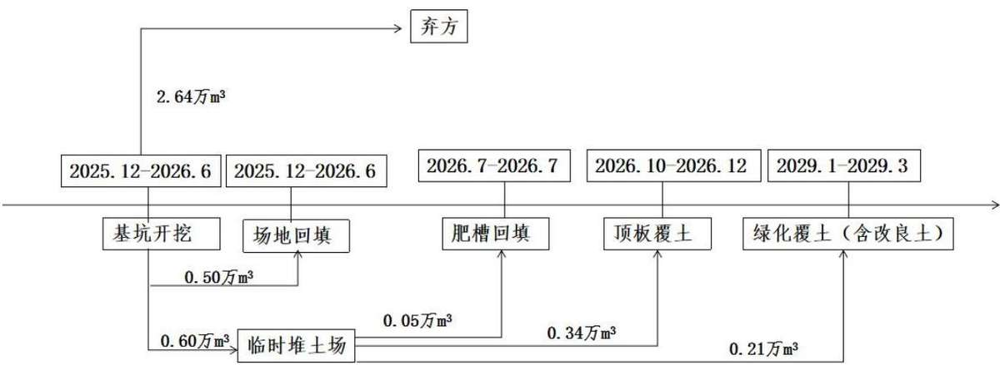  
图 3.2-1 上海地块回填方调运图

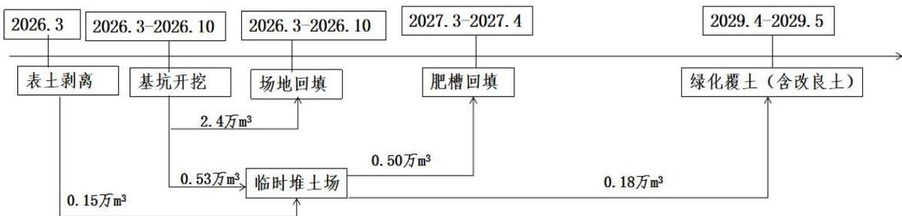

图 3.2-2 长春地块回填方调运图  
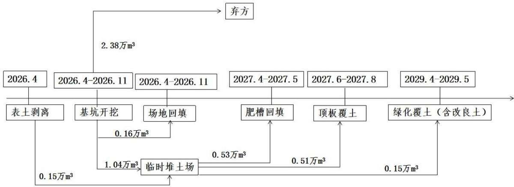  
图 3.2-3 兰州地块回填方调运图

从施工时序上看，各地块需中转存放的回填方量较少，其中上海地块临时堆土容量需求0.60万m³，长春地块临时堆土容量需求0.68万m³，兰州地块临时堆土容量需求量1.19万m³，并实施临时排水沉沙及苫盖、临时绿化等措施；项目土方调运时，主体设计在施工时序满足要求前提下，尽量综合利用自身开挖方，将土方合理调运至临时堆土场进行中转，管线铺设随挖随填，满足水土保持要求。从运距上看，表土及其他回填土方调运距离短，不存在长距离调运土石方情况，符合项目实际及水土保持要求。表土回覆及土方回填在中转时序、容量等时空条件上满足要求，可实现开挖方的有序利用，有利于减少工程弃方，有利于水土保持。

## (4)土石方借方评价

本项目无外借土方。

## （5）土石方弃渣外弃评价

本项目弃方5.02万m³，其中一般土方4.84万m³，破碎混凝土0.18万m³。由于目前尚未开工，建设单位已明确弃方去向。

上海地块共计弃方2.64万m³，根据《上海市建筑垃圾处理管理规定》及《关于“南汇东滩生态造林建设项目”市级应急消纳场所物流调配与申报审批的工作提示》，建设单位已就本项目测算的弃方情况向上海市重大办、临港新片区管委会高新产业和科技创新处等部门进行沟通请示，支持项目弃方外弃至政府指定上海市南汇东滩生态造林建设项目前期地形整理消纳场进行统一消纳处置，消纳场水土流失责任由其管理方负责，并在正式出土前办理完成相关渣土处置行政许可。消纳场不纳入本项目防治责任范围（附件4）。

兰州地块弃方明确用于兰州雁滩GG2406号地块项目进行综合利用。土方综合利用协议见附件（附件5）。

从水土保持角度分析，本项目弃方明确了具体去向，符合水土保持要求。

综上所述，经方案补充完善后，本项目进行了表土剥离、充分利用自身开挖土方、土方来源明确，土石方平衡符合水土保持要求。但由于施工时段跨越雨季，应加强施工过程中的临时排水和苫盖措施。

## （6）弃渣减量化、资源化利用分析评价

原主体设计土方处置方案以施工时间及资金成本为原则，计划工程开挖土方全部外运，经本方案初步论证后，建设单位组织主体设计单位开展了弃渣减量化、资源化利用方案研究，采取了以下具体措施：

## ①减少开挖方产生

主体设计通过优化工程基坑围护桩基形式开展弃渣减量化工作，在初设阶段，本项目基础相对较浅，均采用工法桩（SWM）作为围护桩，避免使用钻孔灌注桩带来的泥浆钻渣问题，避免了泥浆钻渣的产生；经方案结构优化，现初步设计阶段，使用预制桩预估可直接减少到0.65万m³泥浆的产生。

## ②增加开挖方的自身利用

主体设计针对工程涉及的开挖土方主要为基坑开挖的一般土方，土方基本能够满足项目自身顶板覆土、肥槽回填的需求；除此之外，经过对地勘报告及场地设计标高的对比分析，方案建议采用即挖即填的形式对需要填高的场地利用本项目基础开挖方进行填高，实现本项目各地块回填方的最大化利用回填，减少弃方的产生；对兰州地块的破碎混凝土利用至场地内道路基底层填筑，经与设计沟通可行性后，减少了0.05万 $\mathrm { m } ^ { 3 }$ 混凝土建筑垃圾的产生。

同时，长春地块考虑到地面停车和道路广场硬化区域较多，可永临结合实现对混凝土硬化停车场的利用，减少长春地块建筑垃圾的产生；主体设计通过充分优化施工时序，充分考虑开挖时序及调运，实现了开挖方最大利用的同时，减少了土方调运及土方周转产生的水土流失风险，减少建筑垃圾及一般土方弃方共计约0.03万 $\mathrm { m } ^ { 3 }$

## ③开挖土方改良利用

项目所在上海地块现状无可剥离表土，为满足后续绿化覆土需求，同时减少弃方，增加自身开挖方的利用，方案与主体设计沟通后，考虑到覆土整体量较少，市场调查改良成本相对较低，对有机质相对较好的土方进行改良利用，用于绿化覆土。其中，上海地块改良土方0.21万 $\mathrm { m } ^ { 3 }$ ，长春地块改良土方0.03万 $\mathrm { m } ^ { 3 }$ ，通过改良手段后，可实现弃方减少 0.24万 $\mathrm { m } ^ { 3 }$

经减量化、资源化分析论证后，本项目优化弃方减量化共计0.97万 $\mathrm { m } ^ { 3 }$ 。后续施工时，建设单位将及时与施工单位做好周转场地及现场施工时序的协调，做好挖方的减量化利用，对剩余弃方接弃方接收单位，做好土石方数量与去向的动态台账管理。

## （7）弃方处置可行性、合理性分析

本项目共计产生弃方5.02万 $\mathrm { m } ^ { 3 }$ ，其中一般土方4.84万 $\mathrm { m } ^ { 3 }$ ，破碎混凝土0.18万 $\mathrm { m } ^ { 3 }$ 按地块分，上海地块共计弃方2.64万 $\mathrm { m } ^ { 3 }$ ，其中一般土方2.46万 $\mathrm { m } ^ { 3 }$ ，建筑垃圾0.18万$\mathrm { m } ^ { 3 }$ ，兰州地块共计弃方2.38万 $\mathrm { m } ^ { 3 }$ ，均为一般土方。本项目尚未开工，根据地块地方渣土管理要求，结合项目地块周边渣土消纳实际，本项目明确了弃方消纳或利用去向，并由相应的渣土主管部门出具了相应的弃方消纳去向说明文件或利用协议（附件4、附件5）。

本项目上海地块弃方运至上海市指定的上海市南汇东滩生态造林建设项目前期地形整理消纳场进。本项目上海地块共计弃方2.48万 $\mathrm { m } ^ { 3 }$ ，根据《上海市建筑垃圾处理管理规定》及《关于“南汇东滩生态造林建设项目”市级应急消纳场所物流调配与申报审批的工作提示》，建设单位已就本项目测算的弃方情况向上海市重大办、临港新片区管委

## （8）临时堆土区堆土评价

本项目设3处临时堆土场地，其中1处位于红线用地范围内，占地面积0.30hm²，2处为红线外临时占地，占地面积 $0 . 8 7 \mathrm { h m } ^ { 2 }$ ，临时堆土场周边（2H）范围内无居民点、重大基础设施、河道等敏感点，堆场总占地面积1.17hm²，总容量约3.59万m³，按照最大堆土高度不超过3.5m，结合施工时序及土方调配，堆场容量及运距合理，满足项目剥离表土以及后期基坑回填土方（结合土方调运时序，最大堆方量合计3.09万m³）堆放需求。

## 3.2.4取土（石、砂场）设置评价

工程建设不自设取土（石、砂）场，建筑材料以商购方式解决，不设置取土场，减少临时占地，符合水土保持要求。

## 3.2.5弃土（石、渣）场设置评价

项目不设置弃渣场。经本方案复核后本项目共产生弃方5.02万m³，目前尚未出土。其中上海地块弃方约2.64万m³，兰州地块弃方2.38万m³，长春地块无弃方。征询当地相关部门意见后，明确支持去往上海市南汇东滩生态造林建设项目前期地形整理消纳场进行统一消纳处置，后续取得施工许可后按规定办理正式渣土手续；兰州地块弃方去往其他工程进行综合利用，已签订利用意向协议。由于本项目开挖方中部分有用方和表土的回覆利用，长春地块实现场地内自平衡，最大程度上减少了工程的弃方总量。

后续实施阶段，建议建设单位加强协调，督促施工单位按本方案要求对弃方进行手续办理，并运输至指定利用地点。弃方运送过程中应做好水土保持管理工作，弃渣土采用封闭式车辆运输，出入工地时均冲洗车辆车轮，避免发生水土流失危害；运输途中需加强管理，避免造成水土流失。

## 3.2.6施工方法与工艺评价

本项目施工过程中采用先进的施工方法与工艺，加强施工组织管理。施工过程中采用机械施工与人工施工相结合的方法，统筹、合理、科学安排施工工序，避免重复施工和土方乱流，施工单位严格按照施工组织大纲施工。工程施工方法（工艺）分析评价见表3.2-1。

## （1）施工布置

从施工布置分析，主体工程根据工程现状和周边地形地貌等实际情况，项目施工场地采取集约布置的原则，永临结合，避免了分散布置大规模扰动地表，依托现有临时设施或布置位于红线内，减少扰动、减少临时占地；项目施工便道充分利用既有道路，场

内施工便道做到永临结合，不另设征地红线外施工便道，减少了征占地。

总体来看，主体工程施工场地、施工道路等布置较为紧凑，充分考虑了当地地形地貌等实际情况，尽可能避免施工过程中占用临时占地引起的水土流失，基本符合水土保持要求。

## (2) 施工时序

本方案设计项目施工前先进行清基，剥离表层土并分类集中堆放，然后进行土方开挖、围护、预制桩桩基等，整个项目施工时序安排合理紧凑，有利于减轻施工过程造成的水土流失。项目建设中尽量做到移挖作填，施工过程中应随挖、随填、随运、随夯，工序安排合理，减少临时土方中转数量，尽量缩短施工周期，同时避免倒运或二次占压；合理安排施工时间，尽量避开雨季和汛期。另外，本项目组与建设单位、主设人员就绿化工程进行沟通，下阶段设计中将明确绿化工程根据施工进度分块实施，避免长时间裸露引发的水力侵蚀，整体来说，施工时序合理，符合水土保持要求。

## （3） 施工工艺

对于具备表土剥离条件地块，施工前进行表土剥离，分开保存，用于后期绿化或植被恢复，有利于表土资源保护，改善植物生长环境，增加植物成活率，使其尽快发挥水土保持作用。

本项目场地开挖和土石方填筑主要采用机械化施工，主体工程对建筑物基坑进行围护施工，坑内设置有组织排水，并由集水井抽排至周边排水沟统一进入沉淀池沉淀后排入周边市政道路雨水管网，水土保持效果较好。

项目开挖土方中用于回填土方集中堆放于临时堆土区，适当压实，用于后期回填，填筑采用水平分层填筑法施工，回填区域及时冲击碾压，即运即填，可以有效的减少土壤侵蚀蚀，有利于水土保持；项目区内道路填筑施工采用分层填筑压实的方法，以机械施工为主，适当配合人工，同时在道路两侧布设排水管道，排水管道在路基施工前期开挖完成，能有效减少土壤侵蚀，有助于水土保持；弃方及时外运，即挖即运，开挖土方得到有效处置，避免了土方的乱堆乱弃可能引发的水土流失危害，同时也避免了项目填筑所需土方的外购，减少了土方工程量。

项目配套管线施工过程中基本做到了随挖随填，临时堆置的土方也设计临时苫盖措施，减少了水土流失量。

主体设计中对集中绿化区域采用了下凹式绿地等海绵城市设计，引导雨水汇流，提高了地面的下渗能力，减少水土流失，符合水土保持要求。

因此，从施工流程、时序和施工工艺来看，各分项工程分步进行，互不影响，挖填衔接合理紧凑，最大程度地缩短了大规模挖填施工时间，减少了发生大量水土流失的可能。主体工程采用的施工工艺、工序是合理的。

表 3.2-2 本项目施工方法（工艺）水土保持分析与评价
<table><tr><td colspan="1" rowspan="1">序号</td><td colspan="1" rowspan="1">内容</td><td colspan="1" rowspan="1">本项目水土保持分析与评价</td></tr><tr><td colspan="1" rowspan="1">1)</td><td colspan="1" rowspan="1">施工方法是否符合减少水土流失的要求</td><td colspan="1" rowspan="1">1、本项目建筑物桩基采用混凝土预制管桩，有效避免了泥浆钻渣造成的水土流失、市政管网及河道污染，符合水土保持要求。2、本项目为地下一层，建构筑物基础开挖深度不大，基础开挖施工将采用机械和人工结合的施工方法，机械化施工便于加快工程进度，减少土面裸露时间，从而可以减少水土流失量。3、项目区内道路填筑施工采用分层填筑压实的方法，以机械施工为主，适当配合人工，管线敷设时开挖的土料暂时堆放于管线开挖区一侧，作为回填土方，堆土高度不超过1.0m，距沟槽不小于1.0m，既有利于施工方便又保证了沟槽稳定性安全。施工结束后对施工区场地平整，施工工艺符合水土保持要求。4、项目设置临时堆土区，有利于减少回填土方的长距离运输和调运，同时采取拦挡措施，减少水土流失，符合水土保持要求。</td></tr><tr><td colspan="1" rowspan="1">2)</td><td colspan="1" rowspan="1">施工场地是否避开植被相对良好的区域和基本农田区。</td><td colspan="1" rowspan="1">5、施工生产生活区场地避开植被相对良好的区域和基本农田区，符合水土保持要求。</td></tr><tr><td colspan="1" rowspan="1">3)</td><td colspan="1" rowspan="1">在河岸陡坡开挖土石方，以及开挖边坡下方有河渠、公路、铁路、居民点和其它重要基础设施时，是否设计渣石渡槽、溜渣洞等专门导渣或防护措施。</td><td colspan="1" rowspan="1">6、本项目不涉及在河岸陡坡开挖土石方。</td></tr><tr><td colspan="1" rowspan="1">4)</td><td colspan="1" rowspan="1">大型料场宜分台阶开采，控制开挖深度。爆破开挖应控制装药量和爆破范围。</td><td colspan="1" rowspan="1">7、本项目不涉及大型料场。</td></tr><tr><td colspan="1" rowspan="1">5)</td><td colspan="1" rowspan="1">土石方在运输是否采取防止岩土散溢等保护措施。</td><td colspan="1" rowspan="1">8、土石方运输过程中将根据水土保持要求，采取防止沿途散溢保护措施。</td></tr><tr><td colspan="1" rowspan="1">6)</td><td colspan="1" rowspan="1">是否采取表土剥离或保护措施及具体施工方法。</td><td colspan="1" rowspan="1">9、施工方法及施工工艺中缺少表土剥离措施及其施工方法，本方案进行了表土剥离措施补充，施工方法符合要求，就地保护表土措施也符合要求。</td></tr><tr><td colspan="1" rowspan="1">7)</td><td colspan="1" rowspan="1">裸露地表是否及时采取防护措施，填筑土方是否做到随挖、随运、随填、随压。</td><td colspan="1" rowspan="1">10、开挖土方填筑做到随挖、随运；填筑方做到随运、随填、随压，裸露土方方案补充采取密目网苫盖，符合水土保持要求。11、本项目主体将委托专业单位对绿化进行专业设计，制定严格的施工方案，种植的树木草皮外购，可避免树木在项目区内倒移，避免新增扰动面积，定植后灌水支护，提高植物成活率，尽快发挥保持水土、涵养水源效益，符合水土保持要求。12、管线工程施工期间，根据水土保持要求，将裸露地表及时采取密目网防护措施。</td></tr><tr><td colspan="1" rowspan="1">8)</td><td colspan="1" rowspan="1">临时堆土应集中堆放，并采取临时拦挡、苫盖、排水、沉沙等措施。</td><td colspan="1" rowspan="1">13、本项目开挖后可利用的一般土方及表土均集中在临时堆土区临时堆放，施工组织设计未考虑临时堆土区的临时拦挡、苫盖、排水沉沙等措施，方案予以补充完善，补充完善后临时堆土区的临时堆土及保护措施符合水土保持要求。</td></tr><tr><td colspan="1" rowspan="1">9)</td><td colspan="1" rowspan="1">施工产生的泥浆是否设置泥浆沉</td><td colspan="1" rowspan="1">14、本项目不产生泥浆。</td></tr><tr><td colspan="1" rowspan="1"></td><td colspan="1" rowspan="1">淀池，泥浆沉淀池后的处置措施是否明确。</td><td colspan="1" rowspan="1"></td></tr><tr><td colspan="1" rowspan="1">10)</td><td colspan="1" rowspan="1">围堰填筑、拆除是否采取减少流失的有效措施。</td><td colspan="1" rowspan="1">15、本项目不涉及围堰施工。</td></tr><tr><td colspan="1" rowspan="1">11)</td><td colspan="1" rowspan="1">弃渣场是否满足“先拦后弃”原则。</td><td colspan="1" rowspan="1">16、本项目不涉及弃渣场。</td></tr><tr><td colspan="1" rowspan="1">12)</td><td colspan="1" rowspan="1">取土场开挖前是否按要求设置截（排、挡）水、沉沙等措施。</td><td colspan="1" rowspan="1">17、本项目不涉及取土场。</td></tr></table>

## 3.2.7主体工程设计中具有水土保持功能的评价

主体工程从自身功能和安全角度考虑，布置了具有水土保持功能的设施，在充分发挥主体工程自身作用的同时，有效地防治了水土流失。本方案将从全面防治水土流失的角度出发，对主体工程设计中具有水土保持功能的各项工程进行分析论证，对不能满足水土保持要求的，本方案将进行补充设计。

## 1、主体工程设计措施量

## （1） 主体工程区

## ①雨水排水系统

本项目沿道路及配套设施工程布设了较为完善的雨水排水系统，使集中径流受到拦截，分散排放，有效引导项目区雨水排放，上海地块雨水排水管管径DN400（重现期5年），总长1350m；长春地块雨水排水管管径DN400（重现期5年），总长860m；兰州地块雨水排水管管径DN300（重现期5年），总长共计750m。

雨水排水系统按照《室外排水设计标准》（GB50014-2021）设计。雨水排水系统可系统收集场地内雨水，减少了水流冲刷导致的水土流失。

## ②降水蓄渗工程

本项目上海、长春、兰州地块设有海绵设施调蓄地块内雨水径流。上海地块设置总蓄水量为375m³的雨水蓄水池1座，调蓄容积240m³；长春地块设置地下总蓄水量为300m³的雨水蓄水池1座，调蓄容积210m³；上海地块设下凹式绿地380m²，调蓄水池内雨水；兰州地块设置下凹式绿地的面积为537m²，下凹式绿地的有效调蓄深度为200mm。

雨水经初期弃流后进入蓄水池，蓄水池兼具沉淀功能，蓄水池内设有排泥装置，避免过量沉淀。蓄水池雨水经过滤提升泵送至雨水处理系统，经处理后用于景观水系、绿化浇洒、道路冲洗等补水。

此外，上海、长春、兰州地块分别设有480m³、600m³、330m³透水铺装路面，能使雨水迅速渗入地下，补充地下水，保持土壤湿度，维护地下水和土壤的生态平衡，改善城市生态条件，具有良好的水土保持功能。

## ③土地整治

在绿化措施实施之前，对绿化区域用地进行土地整治，主要包括场地平整和覆土等工程措施，上海、长春、兰州地块场地平整面积分别为0.40hm²、0.60hm²、0.42hm²，覆土（含土壤改良）分别为0.21万m³、0.18万m³、0.15万m³。土地整治能够为绿化营造良好的土壤环境，提高植物的成活率。

## ④景观绿化及抚育管理

项目区占地范围内，采用简洁、现代的景观处理手法，在建设场地范围内，充分利用区内的空隙，穿插绿化，绿化主要采用铺设草皮及灌木带，局部种植乔木。根据主体设计，本项目地面景观绿化工程面积总计为1.33hm²（不含下凹式绿地），其中上海地块绿化面积约0.36hm²，长春地块绿化面积约0.60hm²，兰州地块绿化面积约0.37hm²，绿化措施能起到保护环境、对于防止降雨引起的裸露地表的击溅侵蚀和面蚀也有着很好效果，具有良好的水土保持功能。

项目区内绿化措施实施后，对其采取抚育管理措施，抚育管理时间为2\~3年，其中上海地块2年，长春地块3年，兰州地块3年，均配置1套灌溉设施。

## ⑤土壤改良

项目区长春地块表土较少，拟对地块内部分土方进行改良用于覆土绿化利用，采用改良剂+有机肥+整地措施的方式，场区平整土地后，利用剥离的土方覆土后，每亩施用专用改良剂50kg，有机肥料（粪尿肥）300kg，或商品有机肥200kg，每亩再施用微生物肥料50kg作基肥，撒施均匀。用机械深翻20\~30cm，达到地面平整，土块细碎，土肥相融。上海、长春地块土壤改良分别为0.21万m³、0.03万m³。

## ⑥临时排水沉沙措施

本项目上海地块在主体工程区基坑四周设置临时排水沟，砖砌矩形断面，40cm×40cm（宽×深），坡度3%。雨水经排水沟排向沉沙池内，沉沙池设计尺寸3.0m×2.0m×1.5m（长×宽×深）：3m×2m×1.5m，砖砌，砂浆抹面，经沉淀后排入市政管网，共设沉沙池1座。

长春地块在主体工程区基坑四周和施工临时场地设置临时砖砌排水沟，排水沟为矩形断面，40cm×40cm（宽×深），坡度3%。雨水经排水沟排向沉沙池内，沉沙池设计尺寸3.0m×2.0m×1.5m（长×宽×深）：3m×2m×1.5m，砖砌，砂浆抹面，经沉淀后排入市政管网，共设沉沙池1座。

兰州地块在主体工程区基坑四周和施工临时场地设置临时砖砌排水沟，临时排水沟采用矩形断面，40cm×40cm（宽×深），共计布设临时排水沟约为358m。雨水经排水沟排向沉沙池内，三级沉沙池设计尺寸3.0m×2.0m×1.5m（长×宽×深）：3m×2m×1.5m，砖砌，砂浆抹面，经沉淀后排入市政管网，共设沉沙池1座。

## ⑥洒水降尘

兰州地块遇大风天气扬尘较大，主体考虑在施工围挡顶部布置洒水降尘管道装置，对现场四周进行洒水降尘，共计布置降尘管道装置约300m，同步配置喷头。

## (2） 施工生产生活区

## ①临时排水沟沉沙

根据主体设计，在施工生产生活区内部生活区及生产区周边设置临时排水沟，砖砌矩形断面，临时排水沟可系统收集场地内雨水，减少了水流冲刷导致的水土流失，经沉沙池沉淀后的径流不携带泥沙，减少水土流失量。

## 2、分析评价

根据设计资料分析及施工组织初步安排，主体工程的水土保持措施的设计基本合理，从水土保持角度看，主体工程设计的雨水管网、土地整治、绿化、雨水回用设施等措施，措施设计基本满足《水土保持工程设计规范》（GB51018-2014）设计标准要求，总体可行。主体工程设计中，凡涉及到主体工程生产运行安全的防护工程设计标准较高，能达到水土保持要求。

但就整个项目区而言，主体工程只注重了本体防护，而对水土流失对周边环境的影响面考虑的较少（如建设过程中的临时防护、临时堆土区防护等），不能形成有效的防护体系。因此，本需本方案补充措施：①表土剥离保护以及临时堆土区的临时堆土区的防护措施；②裸露区域布设密目网临时苫盖；③主体工程区基础开挖期间，开挖坡面的临时防护措施，管线开挖临时裸露面的防护措施，绿化区覆土期间的临时防护措施。

表3.2-2项目主体工程水保措施评价表
<table><tr><td colspan="1" rowspan="1">序号</td><td colspan="2" rowspan="1">分区及措施</td><td colspan="1" rowspan="1">主体已有</td><td colspan="1" rowspan="1">存在问题及不足</td><td colspan="1" rowspan="1">需要方案新增</td></tr><tr><td colspan="1" rowspan="1">1</td><td colspan="1" rowspan="1">主体工程区</td><td colspan="1" rowspan="1">工程措施</td><td colspan="1" rowspan="1">排水设施工程透水铺装（上海、兰州地块）场地平整覆土</td><td colspan="1" rowspan="1">未考虑表土资源保护</td><td colspan="1" rowspan="1">表土剥离（长春、兰州地块）</td></tr><tr><td colspan="1" rowspan="3"></td><td colspan="1" rowspan="3"></td><td colspan="1" rowspan="1"></td><td colspan="1" rowspan="1">土壤改良（上海、长春地块）雨水蓄水池（上海、长春地块）下凹式绿地</td><td colspan="1" rowspan="1"></td><td colspan="1" rowspan="1"></td></tr><tr><td colspan="1" rowspan="1">植物措施</td><td colspan="1" rowspan="1">景观绿化、抚育管理、灌溉设施</td><td colspan="1" rowspan="1">1</td><td colspan="1" rowspan="1">1</td></tr><tr><td colspan="1" rowspan="1">临时措施</td><td colspan="1" rowspan="1">临时排水沟、沉沙池、洒水降尘（兰州地块）旁</td><td colspan="1" rowspan="1">未考虑开挖边坡填筑防护、管线边临时堆土防护</td><td colspan="1" rowspan="1">密目网苫盖</td></tr><tr><td colspan="1" rowspan="3">2</td><td colspan="1" rowspan="3">施工生产生活区</td><td colspan="1" rowspan="1">工程措施</td><td colspan="1" rowspan="1">1</td><td colspan="1" rowspan="1">1</td><td colspan="1" rowspan="1">/</td></tr><tr><td colspan="1" rowspan="1">植物措施</td><td colspan="1" rowspan="1">1</td><td colspan="1" rowspan="1">未考虑上海地块撒场地恢复</td><td colspan="1" rowspan="1">播草籽绿化（上海地块）</td></tr><tr><td colspan="1" rowspan="1">临时措施</td><td colspan="1" rowspan="1">临时排水沟、沉沙池(长春、兰州地块)</td><td colspan="1" rowspan="1">未考虑上海地块场地恢复期间苫盖</td><td colspan="1" rowspan="1">密目网苫盖</td></tr><tr><td colspan="1" rowspan="2">3</td><td colspan="1" rowspan="2">临时堆土区</td><td colspan="1" rowspan="1">临时措施</td><td colspan="1" rowspan="1">/</td><td colspan="1" rowspan="1">未考虑临时排水沉沙、拦挡、临时绿化等措施</td><td colspan="1" rowspan="1">临时排水沟、沉沙池、苫盖、袋装土拦挡及拆除、临时绿化（上海、长春地块）</td></tr><tr><td colspan="1" rowspan="1">植物措施</td><td colspan="1" rowspan="1"></td><td colspan="1" rowspan="1"></td><td colspan="1" rowspan="1">撒播草籽绿化（上海、兰州地块）</td></tr></table>

注：未标明地块的为三个地块共有措施。

## 3.3主体工程设计中水土保持措施界定

根据《生产建设项目水土保持技术标准》（GB50433-2018）中相关规定，纳入水土流失防治措施体系水土保持工程的界定原则为：

（1）以防治水土流失为主要目标的防护工程，应界定为水土保持工程。以主体工程设计功能为主、同时兼有水土保持工程功能，不纳入水土流失防治措施体系，仅对其进行水土保持分析与评价；当不能满足水土保持要求时，可要求主体设计修改完善，也可提出新的补充措施纳入水土流失防治措施体系。

（2）对建设过程中的临时占地，建设过程中采取一些水土保持措施予以防治水土流失，因此各项防护措施均应界定为水土保持工程，纳入水土流失防治措施体系。

（3）对永久占地区内主体设计功能和水土保持功能难以直观区分的防护措施，可按破坏性试验的原则进行确定。假定没有这项防护措施，主体设计功能仍旧可以发挥作用，但会产生较大的水土流失，该项防护措施应界定为水土保持工程，纳入水土流失防治措施体系。

根据以上界定原则，将雨水排水系统、雨水蓄水池、透水铺装、下凹式绿地、场地平整、景观绿化、临时排水沉沙等措施界定为水土保持措施，其投资纳入本方案投资估算中。

主体工程水土保持措施投资为745.27万元，其中上海地块主体工程水土保持措施投资为284.71万元，长春地块主体工程水土保持措施投资为277.25万元，兰州地块主体工程水土保持措施投资为183.31元。具有水土保持功能的工程量及投资详见表3.3-1\~3.3-3。

表3.3-1上海地块主体工程中具有水土保持功能工程的工程量及投资一览表
<table><tr><td rowspan=1 colspan=1>序号</td><td rowspan=1 colspan=1>防治措施类型及名称</td><td rowspan=1 colspan=1>单位</td><td rowspan=1 colspan=1>数量</td><td rowspan=1 colspan=1>单价（元）</td><td rowspan=1 colspan=1>投资（万元）</td></tr><tr><td rowspan=1 colspan=1></td><td rowspan=1 colspan=1>措施费用合计</td><td rowspan=1 colspan=1></td><td rowspan=1 colspan=1></td><td rowspan=1 colspan=1></td><td rowspan=1 colspan=1>284.71</td></tr><tr><td rowspan=1 colspan=1></td><td rowspan=1 colspan=1>工程措施合计</td><td rowspan=1 colspan=1></td><td rowspan=1 colspan=1></td><td rowspan=1 colspan=1></td><td rowspan=1 colspan=1>169.14</td></tr><tr><td rowspan=1 colspan=1>一</td><td rowspan=1 colspan=1>主体工程区</td><td rowspan=1 colspan=1></td><td rowspan=1 colspan=1></td><td rowspan=1 colspan=1></td><td rowspan=1 colspan=1>169.14</td></tr><tr><td rowspan=1 colspan=1>1</td><td rowspan=1 colspan=1>土地整治工程</td><td rowspan=1 colspan=1></td><td rowspan=1 colspan=1></td><td rowspan=1 colspan=1></td><td rowspan=1 colspan=1>3.69</td></tr><tr><td rowspan=1 colspan=1>1.1</td><td rowspan=1 colspan=1>场地平整</td><td rowspan=1 colspan=1></td><td rowspan=1 colspan=1></td><td rowspan=1 colspan=1></td><td rowspan=1 colspan=1>0.37</td></tr><tr><td rowspan=1 colspan=1>1.1.1</td><td rowspan=1 colspan=1>整地</td><td rowspan=1 colspan=1>hm²</td><td rowspan=1 colspan=1>0.40</td><td rowspan=1 colspan=1>9367.00</td><td rowspan=1 colspan=1>0.37</td></tr><tr><td rowspan=1 colspan=1>1.2</td><td rowspan=1 colspan=1>土地改良</td><td rowspan=1 colspan=1></td><td rowspan=1 colspan=1></td><td rowspan=1 colspan=1></td><td rowspan=1 colspan=1>3.32</td></tr><tr><td rowspan=1 colspan=1>1.2.1</td><td rowspan=1 colspan=1>土壤改良</td><td rowspan=1 colspan=1>万m³</td><td rowspan=1 colspan=1>0.21</td><td rowspan=1 colspan=1>158241.00</td><td rowspan=1 colspan=1>3.32</td></tr><tr><td rowspan=1 colspan=1>2</td><td rowspan=1 colspan=1>排水设施工程</td><td rowspan=1 colspan=1></td><td rowspan=1 colspan=1></td><td rowspan=1 colspan=1></td><td rowspan=1 colspan=1>124.02</td></tr><tr><td rowspan=1 colspan=1>2.1</td><td rowspan=1 colspan=1>雨水管道</td><td rowspan=1 colspan=1>m</td><td rowspan=1 colspan=1>1350</td><td rowspan=1 colspan=1>866.70</td><td rowspan=1 colspan=1>117.00</td></tr><tr><td rowspan=1 colspan=1>2.2</td><td rowspan=1 colspan=1>安装费</td><td rowspan=1 colspan=1>%</td><td rowspan=1 colspan=1>6</td><td rowspan=1 colspan=1>117.00</td><td rowspan=1 colspan=1>7.02</td></tr><tr><td rowspan=1 colspan=1>3</td><td rowspan=1 colspan=1>降水蓄渗工程</td><td rowspan=1 colspan=1></td><td rowspan=1 colspan=1></td><td rowspan=1 colspan=1></td><td rowspan=1 colspan=1>41.43</td></tr><tr><td rowspan=1 colspan=1>3.1</td><td rowspan=1 colspan=1>雨水调蓄池</td><td rowspan=1 colspan=1>座</td><td rowspan=1 colspan=1>1</td><td rowspan=1 colspan=1>9.50</td><td rowspan=1 colspan=1>9.50</td></tr><tr><td rowspan=1 colspan=1>3.2</td><td rowspan=1 colspan=1>透水铺装</td><td rowspan=1 colspan=1>m³</td><td rowspan=1 colspan=1>480</td><td rowspan=1 colspan=1>110.98</td><td rowspan=1 colspan=1>5.33</td></tr><tr><td rowspan=1 colspan=1>3.3</td><td rowspan=1 colspan=1>下凹式绿地</td><td rowspan=1 colspan=1>m²</td><td rowspan=1 colspan=1>380</td><td rowspan=1 colspan=1>700.00</td><td rowspan=1 colspan=1>26.60</td></tr><tr><td rowspan=1 colspan=1></td><td rowspan=1 colspan=1>植物措施合计</td><td rowspan=1 colspan=1></td><td rowspan=1 colspan=1></td><td rowspan=1 colspan=1></td><td rowspan=1 colspan=1>112.82</td></tr><tr><td rowspan=1 colspan=1>一</td><td rowspan=1 colspan=1>主体工程区</td><td rowspan=1 colspan=1></td><td rowspan=1 colspan=1></td><td rowspan=1 colspan=1></td><td rowspan=1 colspan=1>112.82</td></tr><tr><td rowspan=1 colspan=1>1</td><td rowspan=1 colspan=1>景观绿化</td><td rowspan=1 colspan=1>m2</td><td rowspan=1 colspan=1>4030</td><td rowspan=1 colspan=1>205.00</td><td rowspan=1 colspan=1>82.62</td></tr><tr><td rowspan=1 colspan=1>2</td><td rowspan=1 colspan=1>抚育管理</td><td rowspan=1 colspan=1>年</td><td rowspan=1 colspan=1>2</td><td rowspan=1 colspan=1>13.35</td><td rowspan=1 colspan=1>26.70</td></tr><tr><td rowspan=1 colspan=1>3</td><td rowspan=1 colspan=1>灌溉设施</td><td rowspan=1 colspan=1>套</td><td rowspan=1 colspan=1>1</td><td rowspan=1 colspan=1>35000</td><td rowspan=1 colspan=1>3.50</td></tr><tr><td rowspan=1 colspan=1></td><td rowspan=1 colspan=1>施工临时工程合计</td><td rowspan=1 colspan=1></td><td rowspan=1 colspan=1></td><td rowspan=1 colspan=1></td><td rowspan=1 colspan=1>2.75</td></tr><tr><td rowspan=1 colspan=1>一</td><td rowspan=1 colspan=1>主体工程区</td><td rowspan=1 colspan=1></td><td rowspan=1 colspan=1></td><td rowspan=1 colspan=1></td><td rowspan=1 colspan=1>2.75</td></tr><tr><td rowspan=1 colspan=1>1</td><td rowspan=1 colspan=1>临时排水沟</td><td rowspan=1 colspan=1></td><td rowspan=1 colspan=1></td><td rowspan=1 colspan=1></td><td rowspan=1 colspan=1>2.60</td></tr><tr><td rowspan=1 colspan=1>1.1</td><td rowspan=1 colspan=1>土方开挖</td><td rowspan=1 colspan=1> $\mathrm { m } ^ { 3 }$ </td><td rowspan=1 colspan=1>96</td><td rowspan=1 colspan=1>65.31</td><td rowspan=1 colspan=1>0.63</td></tr><tr><td rowspan=1 colspan=1>1.2</td><td rowspan=1 colspan=1>砖砌</td><td rowspan=1 colspan=1> $\mathrm { m } ^ { 3 }$ </td><td rowspan=1 colspan=1>36</td><td rowspan=1 colspan=1>498.20</td><td rowspan=1 colspan=1>1.79</td></tr><tr><td rowspan=1 colspan=1>1.3</td><td rowspan=1 colspan=1>砂浆抹面</td><td rowspan=1 colspan=1>m²</td><td rowspan=1 colspan=1>24</td><td rowspan=1 colspan=1>76.77</td><td rowspan=1 colspan=1>0.18</td></tr><tr><td rowspan=1 colspan=1>2</td><td rowspan=1 colspan=1>沉沙池</td><td rowspan=1 colspan=1></td><td rowspan=1 colspan=1></td><td rowspan=1 colspan=1></td><td rowspan=1 colspan=1>0.15</td></tr><tr><td rowspan=1 colspan=1>2.1</td><td rowspan=1 colspan=1>土方开挖</td><td rowspan=1 colspan=1>m³</td><td rowspan=1 colspan=1>9.45</td><td rowspan=1 colspan=1>111.73</td><td rowspan=1 colspan=1>0.11</td></tr><tr><td rowspan=1 colspan=1>2.2</td><td rowspan=1 colspan=1>砖砌</td><td rowspan=1 colspan=1>m³</td><td rowspan=1 colspan=1>0.54</td><td rowspan=1 colspan=1>498.20</td><td rowspan=1 colspan=1>0.03</td></tr><tr><td rowspan=1 colspan=1>2.3</td><td rowspan=1 colspan=1>砂浆抹面</td><td rowspan=1 colspan=1> $\mathrm { m } ^ { 2 }$ </td><td rowspan=1 colspan=1>0.12</td><td rowspan=1 colspan=1>76.77</td><td rowspan=1 colspan=1>0.01</td></tr></table>

表3.3-2长春地块主体工程中具有水土保持功能工程的工程量及投资一览表
<table><tr><td rowspan=1 colspan=1>序号</td><td rowspan=1 colspan=1>防治措施类型及名称</td><td rowspan=1 colspan=1>单位</td><td rowspan=1 colspan=1>数量</td><td rowspan=1 colspan=1>单价（元）</td><td rowspan=1 colspan=1>投资（万元）</td></tr><tr><td rowspan=1 colspan=1></td><td rowspan=1 colspan=1>措施费用合计</td><td rowspan=1 colspan=1></td><td rowspan=1 colspan=1></td><td rowspan=1 colspan=1></td><td rowspan=1 colspan=1>277.25</td></tr><tr><td rowspan=1 colspan=1></td><td rowspan=1 colspan=1>工程措施合计</td><td rowspan=1 colspan=1></td><td rowspan=1 colspan=1></td><td rowspan=1 colspan=1></td><td rowspan=1 colspan=1>115.45</td></tr><tr><td rowspan=1 colspan=1>一</td><td rowspan=1 colspan=1>主体工程区</td><td rowspan=1 colspan=1></td><td rowspan=1 colspan=1></td><td rowspan=1 colspan=1></td><td rowspan=1 colspan=1>115.45</td></tr><tr><td rowspan=1 colspan=1>1</td><td rowspan=1 colspan=1>表土保护工程</td><td rowspan=1 colspan=1></td><td rowspan=1 colspan=1></td><td rowspan=1 colspan=1></td><td rowspan=1 colspan=1>0.27</td></tr><tr><td rowspan=1 colspan=1>1.1</td><td rowspan=1 colspan=1>表土回覆</td><td rowspan=1 colspan=1>万m³</td><td rowspan=1 colspan=1>0.15</td><td rowspan=1 colspan=1>38998.00</td><td rowspan=1 colspan=1>0.27</td></tr><tr><td rowspan=1 colspan=1>1</td><td rowspan=1 colspan=1>土地整治工程</td><td rowspan=1 colspan=1></td><td rowspan=1 colspan=1></td><td rowspan=1 colspan=1></td><td rowspan=1 colspan=1>0.97</td></tr><tr><td rowspan=1 colspan=1>1.1</td><td rowspan=1 colspan=1>场地平整</td><td rowspan=1 colspan=1></td><td rowspan=1 colspan=1></td><td rowspan=1 colspan=1></td><td rowspan=1 colspan=1>0.55</td></tr><tr><td rowspan=1 colspan=1>1.1.1</td><td rowspan=1 colspan=1>整地</td><td rowspan=1 colspan=1>hm²</td><td rowspan=1 colspan=1>0.60</td><td rowspan=1 colspan=1>9137</td><td rowspan=1 colspan=1>0.55</td></tr><tr><td rowspan=1 colspan=1>1.2</td><td rowspan=1 colspan=1>土壤改良</td><td rowspan=1 colspan=1></td><td rowspan=1 colspan=1></td><td rowspan=1 colspan=1></td><td rowspan=1 colspan=1>0.42</td></tr><tr><td rowspan=1 colspan=1>1.2.1</td><td rowspan=1 colspan=1>土壤改良</td><td rowspan=1 colspan=1>万m³</td><td rowspan=1 colspan=1>0.03</td><td rowspan=1 colspan=1>140348</td><td rowspan=1 colspan=1>0.42</td></tr><tr><td rowspan=1 colspan=1>2</td><td rowspan=1 colspan=1>排水设施工程</td><td rowspan=1 colspan=1></td><td rowspan=1 colspan=1></td><td rowspan=1 colspan=1></td><td rowspan=1 colspan=1>68.40</td></tr><tr><td rowspan=1 colspan=1>2.1</td><td rowspan=1 colspan=1>雨水管道</td><td rowspan=1 colspan=1>m</td><td rowspan=1 colspan=1>860</td><td rowspan=1 colspan=1>750.30</td><td rowspan=1 colspan=1>64.53</td></tr><tr><td rowspan=1 colspan=1>2.2</td><td rowspan=1 colspan=1>安装费</td><td rowspan=1 colspan=1>%</td><td rowspan=1 colspan=1>6</td><td rowspan=1 colspan=1>64.53</td><td rowspan=1 colspan=1>3.87</td></tr><tr><td rowspan=1 colspan=1>3</td><td rowspan=1 colspan=1>降水蓄渗工程</td><td rowspan=1 colspan=1></td><td rowspan=1 colspan=1></td><td rowspan=1 colspan=1></td><td rowspan=1 colspan=1>45.50</td></tr><tr><td rowspan=1 colspan=1>3.1</td><td rowspan=1 colspan=1>雨水调蓄池</td><td rowspan=1 colspan=1>座</td><td rowspan=1 colspan=1>1</td><td rowspan=1 colspan=1>8.95</td><td rowspan=1 colspan=1>8.95</td></tr><tr><td rowspan=1 colspan=1>3.2</td><td rowspan=1 colspan=1>透水铺装</td><td rowspan=1 colspan=1>m³</td><td rowspan=1 colspan=1>600</td><td rowspan=1 colspan=1>609.15</td><td rowspan=1 colspan=1>36.55</td></tr><tr><td rowspan=1 colspan=1></td><td rowspan=1 colspan=1>植物措施合计</td><td rowspan=1 colspan=1></td><td rowspan=1 colspan=1></td><td rowspan=1 colspan=1></td><td rowspan=1 colspan=1>156.65</td></tr><tr><td rowspan=1 colspan=1>一</td><td rowspan=1 colspan=1>主体工程区</td><td rowspan=1 colspan=1></td><td rowspan=1 colspan=1></td><td rowspan=1 colspan=1></td><td rowspan=1 colspan=1>156.65</td></tr><tr><td rowspan=1 colspan=1>1</td><td rowspan=1 colspan=1>景观绿化</td><td rowspan=1 colspan=1>m²</td><td rowspan=1 colspan=1>6016</td><td rowspan=1 colspan=1>201.50</td><td rowspan=1 colspan=1>121.22</td></tr><tr><td rowspan=1 colspan=1>2</td><td rowspan=1 colspan=1>抚育管理</td><td rowspan=1 colspan=1>年</td><td rowspan=1 colspan=1>3</td><td rowspan=1 colspan=1>10.81</td><td rowspan=1 colspan=1>32.43</td></tr><tr><td rowspan=1 colspan=1>3</td><td rowspan=1 colspan=1>灌溉设施</td><td rowspan=1 colspan=1>套</td><td rowspan=1 colspan=1>1</td><td rowspan=1 colspan=1>30000.00</td><td rowspan=1 colspan=1>3.00</td></tr><tr><td rowspan=1 colspan=1></td><td rowspan=1 colspan=1>施工临时工程合计</td><td rowspan=1 colspan=1></td><td rowspan=1 colspan=1></td><td rowspan=1 colspan=1></td><td rowspan=1 colspan=1>5.15</td></tr><tr><td rowspan=1 colspan=1>一</td><td rowspan=1 colspan=1>主体工程区</td><td rowspan=1 colspan=1></td><td rowspan=1 colspan=1></td><td rowspan=1 colspan=1></td><td rowspan=1 colspan=1>3.71</td></tr><tr><td rowspan=1 colspan=1>1</td><td rowspan=1 colspan=1>临时排水沟</td><td rowspan=1 colspan=1></td><td rowspan=1 colspan=1></td><td rowspan=1 colspan=1></td><td rowspan=1 colspan=1>3.35</td></tr><tr><td rowspan=1 colspan=1>1.1</td><td rowspan=1 colspan=1>土方开挖</td><td rowspan=1 colspan=1>m³</td><td rowspan=1 colspan=1>131.84</td><td rowspan=1 colspan=1>61.82</td><td rowspan=1 colspan=1>0.82</td></tr><tr><td rowspan=1 colspan=1>1.2</td><td rowspan=1 colspan=1>砖砌</td><td rowspan=1 colspan=1>m³</td><td rowspan=1 colspan=1>49.44</td><td rowspan=1 colspan=1>461.53</td><td rowspan=1 colspan=1>2.28</td></tr><tr><td rowspan=1 colspan=1>1.3</td><td rowspan=1 colspan=1>砂浆抹面</td><td rowspan=1 colspan=1>m²</td><td rowspan=1 colspan=1>32.96</td><td rowspan=1 colspan=1>74.47</td><td rowspan=1 colspan=1>0.25</td></tr><tr><td rowspan=1 colspan=1>2</td><td rowspan=1 colspan=1>沉沙池</td><td rowspan=1 colspan=1></td><td rowspan=1 colspan=1></td><td rowspan=1 colspan=1></td><td rowspan=1 colspan=1>0.36</td></tr><tr><td rowspan=1 colspan=1>2.1</td><td rowspan=1 colspan=1>土方开挖</td><td rowspan=1 colspan=1>m³</td><td rowspan=1 colspan=1>9</td><td rowspan=1 colspan=1>105.77</td><td rowspan=1 colspan=1>0.10</td></tr><tr><td rowspan=1 colspan=1>2.2</td><td rowspan=1 colspan=1>砖砌</td><td rowspan=1 colspan=1>m³</td><td rowspan=1 colspan=1>2.97</td><td rowspan=1 colspan=1>461.53</td><td rowspan=1 colspan=1>0.14</td></tr><tr><td rowspan=1 colspan=1>2.3</td><td rowspan=1 colspan=1>砂浆抹面</td><td rowspan=1 colspan=1>m²</td><td rowspan=1 colspan=1>15.75</td><td rowspan=1 colspan=1>74.47</td><td rowspan=1 colspan=1>0.12</td></tr><tr><td rowspan=1 colspan=1>二</td><td rowspan=1 colspan=1>施工生产生活区</td><td rowspan=1 colspan=1></td><td rowspan=1 colspan=1></td><td rowspan=1 colspan=1></td><td rowspan=1 colspan=1>1.44</td></tr><tr><td rowspan=1 colspan=1>1</td><td rowspan=1 colspan=1>临时排水沟</td><td rowspan=1 colspan=1></td><td rowspan=1 colspan=1></td><td rowspan=1 colspan=1></td><td rowspan=1 colspan=1>1.31</td></tr><tr><td rowspan=1 colspan=1>1.1</td><td rowspan=1 colspan=1>土方开挖</td><td rowspan=1 colspan=1>m³</td><td rowspan=1 colspan=1>51.2</td><td rowspan=1 colspan=1>61.82</td><td rowspan=1 colspan=1>0.32</td></tr><tr><td rowspan=1 colspan=1>1.2</td><td rowspan=1 colspan=1>砖砌</td><td rowspan=1 colspan=1>m³</td><td rowspan=1 colspan=1>19.2</td><td rowspan=1 colspan=1>461.53</td><td rowspan=1 colspan=1>0.89</td></tr><tr><td rowspan=1 colspan=1>1.3</td><td rowspan=1 colspan=1>砂浆抹面</td><td rowspan=1 colspan=1>m²</td><td rowspan=1 colspan=1>12.8</td><td rowspan=1 colspan=1>74.47</td><td rowspan=1 colspan=1>0.10</td></tr><tr><td rowspan=1 colspan=1>2</td><td rowspan=1 colspan=1>沉沙池</td><td rowspan=1 colspan=1></td><td rowspan=1 colspan=1></td><td rowspan=1 colspan=1></td><td rowspan=1 colspan=1>0.13</td></tr><tr><td rowspan=1 colspan=1>2.1</td><td rowspan=1 colspan=1>土方开挖</td><td rowspan=1 colspan=1>m³</td><td rowspan=1 colspan=1>9.45</td><td rowspan=1 colspan=1>105.77</td><td rowspan=1 colspan=1>0.10</td></tr><tr><td rowspan=1 colspan=1>2.2</td><td rowspan=1 colspan=1>砖砌</td><td rowspan=1 colspan=1>m³</td><td rowspan=1 colspan=1>0.54</td><td rowspan=1 colspan=1>461.53</td><td rowspan=1 colspan=1>0.02</td></tr><tr><td rowspan=1 colspan=1>2.3</td><td rowspan=1 colspan=1>砂浆抹面</td><td rowspan=1 colspan=1>m²</td><td rowspan=1 colspan=1>0.12</td><td rowspan=1 colspan=1>74.47</td><td rowspan=1 colspan=1>0.01</td></tr></table>

表3.3-3兰州地块主体工程中具有水土保持功能工程的工程量及投资一览表
<table><tr><td rowspan=1 colspan=1>序号</td><td rowspan=1 colspan=1>防治措施类型及名称</td><td rowspan=1 colspan=1>单位</td><td rowspan=1 colspan=1>数量</td><td rowspan=1 colspan=1>单价（元）</td><td rowspan=1 colspan=1>投资（万元）</td></tr><tr><td rowspan=1 colspan=1></td><td rowspan=1 colspan=1>措施费用合计</td><td rowspan=1 colspan=1></td><td rowspan=1 colspan=1></td><td rowspan=1 colspan=1></td><td rowspan=1 colspan=1>183.31</td></tr><tr><td rowspan=1 colspan=1></td><td rowspan=1 colspan=1>工程措施合计</td><td rowspan=1 colspan=1></td><td rowspan=1 colspan=1></td><td rowspan=1 colspan=1></td><td rowspan=1 colspan=1>57.92</td></tr><tr><td rowspan=1 colspan=1>一</td><td rowspan=1 colspan=1>主体工程区</td><td rowspan=1 colspan=1></td><td rowspan=1 colspan=1></td><td rowspan=1 colspan=1></td><td rowspan=1 colspan=1>57.92</td></tr><tr><td rowspan=1 colspan=1>1</td><td rowspan=1 colspan=1>土地整治工程</td><td rowspan=1 colspan=1></td><td rowspan=1 colspan=1></td><td rowspan=1 colspan=1></td><td rowspan=1 colspan=1>0.37</td></tr><tr><td rowspan=1 colspan=1>1.1</td><td rowspan=1 colspan=1>场地平整</td><td rowspan=1 colspan=1></td><td rowspan=1 colspan=1></td><td rowspan=1 colspan=1></td><td rowspan=1 colspan=1>0.37</td></tr><tr><td rowspan=1 colspan=1>1.1.1</td><td rowspan=1 colspan=1>整地</td><td rowspan=1 colspan=1> $\mathrm { h m } ^ { 2 }$ </td><td rowspan=1 colspan=1>0.42</td><td rowspan=1 colspan=1>8834</td><td rowspan=1 colspan=1>0.37</td></tr><tr><td rowspan=1 colspan=1>2</td><td rowspan=1 colspan=1>排水设施工程</td><td rowspan=1 colspan=1></td><td rowspan=1 colspan=1></td><td rowspan=1 colspan=1></td><td rowspan=1 colspan=1>50.98</td></tr><tr><td rowspan=1 colspan=1>2.1</td><td rowspan=1 colspan=1>雨水管道</td><td rowspan=1 colspan=1>m</td><td rowspan=1 colspan=1>750</td><td rowspan=1 colspan=1>641.20</td><td rowspan=1 colspan=1>48.09</td></tr><tr><td rowspan=1 colspan=1>2.2</td><td rowspan=1 colspan=1>安装费</td><td rowspan=1 colspan=1> $\%$ </td><td rowspan=1 colspan=1>6</td><td rowspan=1 colspan=1>48.09</td><td rowspan=1 colspan=1>2.89</td></tr><tr><td rowspan=1 colspan=1>3</td><td rowspan=1 colspan=1>降水蓄渗工程</td><td rowspan=1 colspan=1></td><td rowspan=1 colspan=1></td><td rowspan=1 colspan=1></td><td rowspan=1 colspan=1>6.57</td></tr><tr><td rowspan=1 colspan=1>3.1</td><td rowspan=1 colspan=1>下凹式绿地</td><td rowspan=1 colspan=1> $\mathrm { m } ^ { 2 }$ </td><td rowspan=1 colspan=1>537</td><td rowspan=1 colspan=1>98.71</td><td rowspan=1 colspan=1>1.59</td></tr><tr><td rowspan=1 colspan=1>3.2</td><td rowspan=1 colspan=1>透水铺装</td><td rowspan=1 colspan=1> $\mathrm { m } ^ { 3 }$ </td><td rowspan=1 colspan=1>330</td><td rowspan=1 colspan=1>503.30</td><td rowspan=1 colspan=1>4.98</td></tr><tr><td rowspan=1 colspan=1></td><td rowspan=1 colspan=1>植物措施合计</td><td rowspan=1 colspan=1></td><td rowspan=1 colspan=1></td><td rowspan=1 colspan=1></td><td rowspan=1 colspan=1>117.48</td></tr><tr><td rowspan=1 colspan=1>一</td><td rowspan=1 colspan=1>主体工程区</td><td rowspan=1 colspan=1></td><td rowspan=1 colspan=1></td><td rowspan=1 colspan=1></td><td rowspan=1 colspan=1>117.48</td></tr><tr><td rowspan=1 colspan=1>1</td><td rowspan=1 colspan=1>景观绿化</td><td rowspan=1 colspan=1> $\mathrm { m } ^ { 2 }$ </td><td rowspan=1 colspan=1>4223.7</td><td rowspan=1 colspan=1>190.15</td><td rowspan=1 colspan=1>80.31</td></tr><tr><td rowspan=1 colspan=1>2</td><td rowspan=1 colspan=1>抚育管理</td><td rowspan=1 colspan=1> $\ncong$ </td><td rowspan=1 colspan=1>3</td><td rowspan=1 colspan=1>11.89</td><td rowspan=1 colspan=1>35.67</td></tr><tr><td rowspan=1 colspan=1>3</td><td rowspan=1 colspan=1>灌溉设施</td><td rowspan=1 colspan=1>套</td><td rowspan=1 colspan=1>1</td><td rowspan=1 colspan=1>15000.00</td><td rowspan=1 colspan=1>1.50</td></tr><tr><td rowspan=1 colspan=1></td><td rowspan=1 colspan=1>施工临时工程合计</td><td rowspan=1 colspan=1></td><td rowspan=1 colspan=1></td><td rowspan=1 colspan=1></td><td rowspan=1 colspan=1>7.91</td></tr><tr><td rowspan=1 colspan=1>一</td><td rowspan=1 colspan=1>主体工程区</td><td rowspan=1 colspan=1></td><td rowspan=1 colspan=1></td><td rowspan=1 colspan=1></td><td rowspan=1 colspan=1>6.99</td></tr><tr><td rowspan=1 colspan=1>1</td><td rowspan=1 colspan=1>临时排水沟</td><td rowspan=1 colspan=1></td><td rowspan=1 colspan=1></td><td rowspan=1 colspan=1></td><td rowspan=1 colspan=1>2.16</td></tr><tr><td rowspan=1 colspan=1>1.1</td><td rowspan=1 colspan=1>土方开挖</td><td rowspan=1 colspan=1> $\mathrm { m } ^ { 3 }$ </td><td rowspan=1 colspan=1>89.6</td><td rowspan=1 colspan=1>57.70</td><td rowspan=1 colspan=1>0.52</td></tr><tr><td rowspan=1 colspan=1>1.2</td><td rowspan=1 colspan=1>砖砌</td><td rowspan=1 colspan=1> $\mathrm { m } ^ { 3 }$ </td><td rowspan=1 colspan=1>33.6</td><td rowspan=1 colspan=1>440.45</td><td rowspan=1 colspan=1>1.48</td></tr><tr><td rowspan=1 colspan=1>1.3</td><td rowspan=1 colspan=1>砂浆抹面</td><td rowspan=1 colspan=1> $\mathrm { m } ^ { 2 }$ </td><td rowspan=1 colspan=1>22.4</td><td rowspan=1 colspan=1>72.66</td><td rowspan=1 colspan=1>0.16</td></tr><tr><td rowspan=1 colspan=1>2</td><td rowspan=1 colspan=1>沉沙池</td><td rowspan=1 colspan=1></td><td rowspan=1 colspan=1></td><td rowspan=1 colspan=1></td><td rowspan=1 colspan=1>0.33</td></tr><tr><td rowspan=1 colspan=1>2.1</td><td rowspan=1 colspan=1>土方开挖</td><td rowspan=1 colspan=1> $\mathrm { m } ^ { 3 }$ </td><td rowspan=1 colspan=1>9</td><td rowspan=1 colspan=1>98.71</td><td rowspan=1 colspan=1>0.09</td></tr><tr><td rowspan=1 colspan=1>2.2</td><td rowspan=1 colspan=1>砖砌</td><td rowspan=1 colspan=1> $\mathrm { m } ^ { 3 }$ </td><td rowspan=1 colspan=1>2.97</td><td rowspan=1 colspan=1>440.45</td><td rowspan=1 colspan=1>0.13</td></tr><tr><td rowspan=1 colspan=1>2.3</td><td rowspan=1 colspan=1>砂浆抹面</td><td rowspan=1 colspan=1> $\mathrm { m } ^ { 2 }$ </td><td rowspan=1 colspan=1>15.75</td><td rowspan=1 colspan=1>72.66</td><td rowspan=1 colspan=1>0.11</td></tr><tr><td rowspan=1 colspan=1>3</td><td rowspan=1 colspan=1>洒水降尘</td><td rowspan=1 colspan=1>m</td><td rowspan=1 colspan=1>300</td><td rowspan=1 colspan=1>150</td><td rowspan=1 colspan=1>4.50</td></tr><tr><td rowspan=1 colspan=1>二</td><td rowspan=1 colspan=1>施工生产生活区</td><td rowspan=1 colspan=1></td><td rowspan=1 colspan=1></td><td rowspan=1 colspan=1></td><td rowspan=1 colspan=1>0.92</td></tr><tr><td rowspan=1 colspan=1>1</td><td rowspan=1 colspan=1>临时排水沟</td><td rowspan=1 colspan=1></td><td rowspan=1 colspan=1></td><td rowspan=1 colspan=1></td><td rowspan=1 colspan=1>0.80</td></tr><tr><td rowspan=1 colspan=1>1.1</td><td rowspan=1 colspan=1>土方开挖</td><td rowspan=1 colspan=1> $\mathrm { m } ^ { 3 }$ </td><td rowspan=1 colspan=1>33.6</td><td rowspan=1 colspan=1>57.70</td><td rowspan=1 colspan=1>0.19</td></tr><tr><td rowspan=1 colspan=1>1.2</td><td rowspan=1 colspan=1>砖砌</td><td rowspan=1 colspan=1> $\mathrm { m } ^ { 3 }$ </td><td rowspan=1 colspan=1>12.6</td><td rowspan=1 colspan=1>440.45</td><td rowspan=1 colspan=1>0.55</td></tr><tr><td rowspan=1 colspan=1>1.3</td><td rowspan=1 colspan=1>砂浆抹面</td><td rowspan=1 colspan=1> $\mathrm { m } ^ { 2 }$ </td><td rowspan=1 colspan=1>8.4</td><td rowspan=1 colspan=1>72.66</td><td rowspan=1 colspan=1>0.06</td></tr><tr><td rowspan=1 colspan=1>2</td><td rowspan=1 colspan=1>沉沙池</td><td rowspan=1 colspan=1></td><td rowspan=1 colspan=1></td><td rowspan=1 colspan=1></td><td rowspan=1 colspan=1>0.12</td></tr><tr><td rowspan=1 colspan=1>2.1</td><td rowspan=1 colspan=1>土方开挖</td><td rowspan=1 colspan=1> $\mathrm { m } ^ { 3 }$ </td><td rowspan=1 colspan=1>9.45</td><td rowspan=1 colspan=1>98.71</td><td rowspan=1 colspan=1>0.09</td></tr><tr><td rowspan=1 colspan=1>2.2</td><td rowspan=1 colspan=1>砖砌</td><td rowspan=1 colspan=1> $\mathrm { m } ^ { 3 }$ </td><td rowspan=1 colspan=1>0.54</td><td rowspan=1 colspan=1>440.45</td><td rowspan=1 colspan=1>0.02</td></tr><tr><td rowspan=1 colspan=1>2.3</td><td rowspan=1 colspan=1>砂浆抹面</td><td rowspan=1 colspan=1> $\mathrm { m } ^ { 2 }$ </td><td rowspan=1 colspan=1>0.12</td><td rowspan=1 colspan=1>72.66</td><td rowspan=1 colspan=1>0.01</td></tr></table>

## 4 水土流失分析与预测

## 4.1 水土流失现状

## 4.1.1 水土保持区划

根据《水利部办公厅关于做好国家级水土流失重点预防区和重点治理区落地上图成果应用的通知》（办水保（2025）170号）及《兰州市黄河流域生态保护和高质量发展水土保持专项规划（2021\~2035年）》，项目兰州地块属西北黄土高原区-甘宁青山地丘陵沟壑区-陇中丘陵沟壑蓄水保土区，涉及黄河黄土梁昴市级水土流失重点治理区；长春地块属于东北黑土区-东北漫川漫岗区-东北漫川漫岗土壤保持区，不涉及国家级、省级水土流失重点治理区；上海地块属南方红壤区-江淮丘陵及下游平原区-浙沪平原人居环境维护水质维护区，不涉及国家级、省级水土保持重点防治区域。

## 4.1.2 水土流失现状

根据《土壤侵蚀分类分级标准》，项目区上海地块一级区属南方红壤区，容许土壤流失量为 $5 0 0 \mathrm { t } / \ \left( \mathrm { k m } ^ { 2 } { \cdot } \mathbf { a } \right)$ 。项目区土壤侵蚀强度为微度，土壤侵蚀类型属于微度水力侵蚀。项目区背景土壤侵蚀模数约为 $3 0 0 \mathrm { t / ( k m } ^ { 2 } { \cdot } \mathbf { a } )$ ；根据《吉林省水土保持规划(2016—2030年）》，项目区长春地块所在区域属东北黑土区，土壤侵蚀类型为水力侵蚀，以轻度侵蚀为主，据项目区内的土地利用现状、林草覆盖率、降雨、地形地貌、土壤、人类活动（施工）等影响因素，结合土壤侵蚀分类分级标准进行评判，确定项目区原生土壤侵蚀模数为 $4 0 0 \mathrm { t } / \ \left( \mathrm { k m } ^ { 2 } { \cdot } \mathbf { a } \right)$ ，容许土壤流失量为 $2 0 0 \mathrm { t } / \ \left( \mathrm { k m } ^ { 2 } { \cdot } \mathbf { a } \right)$ ；项目区兰州地块水土流失类型为水力侵蚀，根据地方土壤侵蚀分布图，参照项目所在区域水土流失公报，确定项目区原生土壤侵蚀模数为 $3 0 0 \mathrm { t } / \ \left( \mathrm { k m } ^ { 2 } { \cdot } \mathbf { a } \right)$ ，项目区容许土壤流失量为 $1 0 0 0 \mathrm { t / \Omega \ ( k m ^ { 2 } { \cdot } a ) }$ 属于微度侵蚀区。

## 4.2 水土流失影响因素分析

## 4.2.1 工程可能造成的水土流失因素分析

项目建设中大规模的土石方开挖和地表扰动，会影响甚至破坏项目区内土壤、植被及地形条件，造成新的水土流失。自然恢复期随着植物措施的防护，人为活动对地表的扰动很小，项目建设区内土壤流失量将大大减小。

## 4.2.1.1 施工期水土流失影响因素分析

经过现场查勘，工程建设过程中可能造成水土流失的环节，主要表现在以下几个方面：

（1）主体工程区：①施工准备期：场地平整、开挖回填、表土剥离、表土临时堆放等，使地面裸露，易产生水土流失。②施工期：基坑开挖、临时堆土，使地面裸露，破坏原地貌，易产生水土流失。

（2）临时堆土区：①施工准备期：人员活动扰动地表、破坏原有植被、表土临时堆放等，使地面裸露，易产生水土流失。②施工期：地面扰动、开挖回填、扰动地表，土石方临时堆存及转运，易产生水土流失。

（3）施工生产生活区：①施工准备期：场地平整，破坏地表植被，扰动地表，易产生水土流失。

## 4.2.1.2 自然恢复期水土流失影响因素分析

本项目建成后，大部分区域被永久道路、建筑物、构筑物所占压，绿化区植被逐渐丰富，松散裸露地面逐渐趋于稳定，土壤侵蚀强度减弱。自然恢复期人为活动对地表扰动很小，工程建设范围内水土流失将大大减小，水土流失因素将以自然因素为主。

项目施工期及自然恢复期可能产生的水土流失影响因素详见表4.2-1。

表4.2-1 水土流失影响因素分析表
<table><tr><td rowspan=1 colspan=1>预测单元</td><td rowspan=1 colspan=1>时期</td><td rowspan=1 colspan=1>产生水土流失因素分析表</td></tr><tr><td rowspan=2 colspan=1>主体工程区</td><td rowspan=1 colspan=1>施工期</td><td rowspan=1 colspan=1>施工期表土剥离、建筑物基础开挖、顶板填筑覆土、临时堆土，破坏原地貌，易使地面出现裸露，产生水土流失。</td></tr><tr><td rowspan=1 colspan=1>恢复期</td><td rowspan=1 colspan=1>土地整治后，植被尚未恢复，地面裸露，产生水土流失。</td></tr><tr><td rowspan=2 colspan=1>临时堆土区</td><td rowspan=1 colspan=1>施工期</td><td rowspan=1 colspan=1>表土破损，开挖回填和场地平整活动扰动地表、破坏原有植被、表土临时堆放等，易产生水土流失。</td></tr><tr><td rowspan=1 colspan=1>恢复期</td><td rowspan=1 colspan=1>临时堆土区使用完毕后，进行撒播草籽恢复，植被尚未恢复，地面裸露，产生水土流失。</td></tr><tr><td rowspan=2 colspan=1>施工生产生活区</td><td rowspan=1 colspan=1>施工期</td><td rowspan=1 colspan=1>场地平整和施工期间，破坏地表植被，扰动地表，产生水土流失。</td></tr><tr><td rowspan=1 colspan=1>恢复期</td><td rowspan=1 colspan=1></td></tr></table>

## 4.2.2 扰动地表及损坏植被面积

根据主体工程设计成果，对项目区各土地类型面积进行量算和统计，项目施工期扰动地表和损毁植被的情况如下：扰动地表面积 $6 . 2 8 \mathrm { h m } ^ { 2 }$ ，损毁植被覆盖面积 $1 . 1 8 \mathrm { h m } ^ { 2 }$ o

项目区扰动地表情况详见表2.3-1。

## 4.2.3 废弃土（石、渣）量

项目土石方开挖总量10.86万m³，填筑总量5.84万m³，无外借方，弃方5.02万m³，弃方已明确去向（附件4、附件5）。

## 4.3 土壤流失量预测

## 4.3.1 预测单元

根据点型施工建设项目的特点，结合规范的相关规定，按各单元工程及占地利用情况，将项目区水土流失预测单元划分为①主体工程防治区；②施工生产生活防治区；③临时堆土防治区。根据每个预测单元在工程施工期（含施工准备期）和自然恢复期土壤侵蚀模数的变化情况，分别预测施工期（含施工准备期）和自然恢复期的土壤侵蚀总量。临时堆土区在自然恢复期已使用完毕，且无堆存土方，但考虑到撒播草籽措施在自然恢复期内尚未完全恢复，故纳入自然恢复期水土流失量预测范围。

各单元工程预测单元划分详见表4.3-1。

## 4.3.2 预测时段

本项目为建设类项目，根据工程特点，结合建设过程中可能产生水土流失的要素与环节分析，各预测单元的预测时段根据主体工程进度安排，同时结合产生水土流失的季节，以最不利的时段进行预测，超过雨季（上海雨为6～9月，长春6\~8月，兰州6\~9月）长度的按全年计算，未超过雨季长度的按占雨季长度的比例计算。工程建设可能产生的土壤流失量按施工期（含施工准备期）、自然恢复期两个时段进行水土流失预测。

据据施工进度安排，项目总工期44个月（2025年12月～2026年7月）。本项目施工扰动时段从施工准备期开始至施工期结束。

施工准备期及施工期的地表扰动强度大，破坏了原有地表结构，使原生地面土壤抗蚀力急剧下降，一遇暴雨，将造成严重的水土流失。进入自然恢复期后，随着天然植被的逐渐恢复，水土流失将有所降低，上海地块项目区年降水量较多，植被恢复较容易，自然恢复期水土流失预测时段可确定为2年，其余两个地块降水相对较少，自然恢复期水土流失预测时段可确定为3年。

4.3-1 水土流失预测单元划分及预测时段情况表
<table><tr><td rowspan=2 colspan=1>预测区间</td><td rowspan=2 colspan=1>预测单元</td><td rowspan=2 colspan=1>扰动单元序号</td><td rowspan=1 colspan=3>施工期（含施工准备期）</td><td rowspan=1 colspan=3>自然恢复期</td></tr><tr><td rowspan=1 colspan=1>土壤流失类型</td><td rowspan=1 colspan=1>预测范围(hm²)</td><td rowspan=1 colspan=1>预测时段(a)</td><td rowspan=1 colspan=1>土壤流失类型</td><td rowspan=1 colspan=1>预测范围(hm²)</td><td rowspan=1 colspan=1>预测时段(a)</td></tr><tr><td rowspan=3 colspan=1>主体工程区</td><td rowspan=1 colspan=1>上海地块</td><td rowspan=1 colspan=1>扰动单元1</td><td rowspan=1 colspan=1>上方无来水工程开挖面</td><td rowspan=1 colspan=1>1.10</td><td rowspan=1 colspan=1>4.00</td><td rowspan=1 colspan=1>地表翻扰型一般扰动地表</td><td rowspan=1 colspan=1>0.40</td><td rowspan=1 colspan=1>2.00</td></tr><tr><td rowspan=1 colspan=1>长春地块</td><td rowspan=1 colspan=1>扰动单元2</td><td rowspan=1 colspan=1>上方无来水工程开挖面</td><td rowspan=1 colspan=1>1.60</td><td rowspan=1 colspan=1>4.00</td><td rowspan=1 colspan=1>地表翻扰型一般扰动地表</td><td rowspan=1 colspan=1>0.60</td><td rowspan=1 colspan=1>3.00</td></tr><tr><td rowspan=1 colspan=1>兰州地块</td><td rowspan=1 colspan=1>扰动单元3</td><td rowspan=1 colspan=1>上方无来水工程开挖面</td><td rowspan=1 colspan=1>1.29</td><td rowspan=1 colspan=1>4.00</td><td rowspan=1 colspan=1>地表翻扰型一般扰动地表</td><td rowspan=1 colspan=1>0.42</td><td rowspan=1 colspan=1>3.00</td></tr><tr><td rowspan=3 colspan=1>施工生产生活区</td><td rowspan=1 colspan=1>上海地块</td><td rowspan=1 colspan=1>扰动单元4</td><td rowspan=1 colspan=1>地表翻扰型一般扰动地表</td><td rowspan=1 colspan=1>0.90</td><td rowspan=1 colspan=1>2.00</td><td rowspan=1 colspan=1>地表翻扰型一般扰动地表</td><td rowspan=1 colspan=1>0.90</td><td rowspan=1 colspan=1>2.00</td></tr><tr><td rowspan=1 colspan=1>长春地块</td><td rowspan=1 colspan=1>扰动单元5</td><td rowspan=1 colspan=1>地表翻扰型一般扰动地表</td><td rowspan=1 colspan=1>0.10</td><td rowspan=1 colspan=1>2.00</td><td rowspan=1 colspan=1>地表翻扰型一般扰动地表</td><td rowspan=1 colspan=1></td><td rowspan=1 colspan=1></td></tr><tr><td rowspan=1 colspan=1>兰州地块</td><td rowspan=1 colspan=1>扰动单元6</td><td rowspan=1 colspan=1>地表翻扰型一般扰动地表</td><td rowspan=1 colspan=1>0.12</td><td rowspan=1 colspan=1>2.00</td><td rowspan=1 colspan=1>地表翻扰型一般扰动地表</td><td rowspan=1 colspan=1></td><td rowspan=1 colspan=1></td></tr><tr><td rowspan=3 colspan=1>临时堆土区</td><td rowspan=1 colspan=1>上海地块</td><td rowspan=1 colspan=1>扰动单元7</td><td rowspan=1 colspan=1>上方无来水工程堆积体</td><td rowspan=1 colspan=1>0.36</td><td rowspan=1 colspan=1>4.00</td><td rowspan=1 colspan=1>地表翻扰型一般扰动地表</td><td rowspan=1 colspan=1>0.36</td><td rowspan=1 colspan=1>2.00</td></tr><tr><td rowspan=1 colspan=1>长春地块</td><td rowspan=1 colspan=1>扰动单元8</td><td rowspan=1 colspan=1>上方无来水工程堆积体</td><td rowspan=1 colspan=1>0.30</td><td rowspan=1 colspan=1>4.00</td><td rowspan=1 colspan=1>地表翻扰型一般扰动地表</td><td rowspan=1 colspan=1></td><td rowspan=1 colspan=1></td></tr><tr><td rowspan=1 colspan=1>兰州地块</td><td rowspan=1 colspan=1>扰动单元9</td><td rowspan=1 colspan=1>上方无来水工程堆积体</td><td rowspan=1 colspan=1>0.51</td><td rowspan=1 colspan=1>4.00</td><td rowspan=1 colspan=1>地表翻扰型一般扰动地表</td><td rowspan=1 colspan=1>0.51</td><td rowspan=1 colspan=1>3.00</td></tr><tr><td rowspan=1 colspan=3>合计</td><td rowspan=1 colspan=1></td><td rowspan=1 colspan=1>6.28</td><td rowspan=1 colspan=1></td><td rowspan=1 colspan=1></td><td rowspan=1 colspan=1>3.19</td><td rowspan=1 colspan=1></td></tr></table>

## 4.3.3 土壤侵蚀模数

## 4.3.3.1 原生土壤侵蚀模数

根据《土壤侵蚀分类分级标准》，项目区上海地块一级区属南方红壤区，容许土壤流失量为 $5 0 0 \mathrm { t } / \ \left( \mathrm { k m } ^ { 2 } { \cdot } \mathbf { a } \right)$ 。项目区土壤侵蚀强度为微度，土壤侵蚀类型属于微度水力侵蚀。项目区背景土壤侵蚀模数约为 $3 0 0 \mathrm { t / ( k m } ^ { 2 } { \cdot } \mathbf { a } )$ ；根据《吉林省水土保持规划(2016—2030年）》，项目区长春地块所在区域属东北黑土区，土壤侵蚀类型为水力侵蚀，以轻度侵蚀为主，据项目区内的土地利用现状、林草覆盖率、降雨、地形地貌、土壤、人类活动（施工）等影响因素，结合土壤侵蚀分类分级标准进行评判，确定项目区原生土壤侵蚀模数为 $4 0 0 \mathrm { t } / \ \left( \mathrm { k m } ^ { 2 } { \cdot } \mathbf { a } \right)$ ，容许土壤流失量为 $2 0 0 \mathrm { t } / \ \left( \mathrm { k m } ^ { 2 } { \cdot } \mathbf { a } \right)$ ；项目区兰州地块水土流失类型为水力侵蚀，根据地方土壤侵蚀分布图，参照《土壤侵蚀分类分级标准》（SL190-2007），项目区平均土壤侵蚀模数背景值为 $3 0 0 \mathrm { t } / \ \left( \mathrm { k m } ^ { 2 } { \cdot } \mathbf { a } \right)$ ，容许土壤流失量为 $1 0 0 0 \mathrm { t / \Omega \ ( k m ^ { 2 } { \cdot } a ) }$ ，属于微度侵蚀区。

## 4.3.3.2 扰动后土壤侵蚀模数

项目施工建设将扰动原有地形地貌和损毁植被，增加土壤的可蚀性；另一方面，由于场地平整时，挖、填土方不仅造成大面积的裸露地面，而且会改变原地形，增大侵蚀扰动表面积。施工期土壤流失量根据《生产建设项目土壤流失量测算导则》(SL773-2018)推荐公式计算，扰动后的土壤侵蚀因子可根据项目区地形地貌、气候（降雨、风速等）、土地利用、植被情况等实际情况结合工程特点，参照《生产建设项目土壤流失量测算导则》（SL773-2018）确定取值，根据设计文件、前期现场查勘情况、项目实施施工特点和已有水土保持监测经验，对已划分的9个扰动单元计算典型扰动单元的土壤流失量。

扰动后土壤流失预测计算公式见表4.3-3，各扰动单元土壤侵蚀模数计算见表4.3-4～表 4.3-7。

表4.3-3 扰动后土壤流失预测计算公式表
<table><tr><td rowspan=1 colspan=1>土壤流失类型(水力作用）</td><td rowspan=1 colspan=1>土壤流失量计算公式</td><td rowspan=1 colspan=1>备注</td></tr><tr><td rowspan=1 colspan=1>地表翻扰型一般扰动地表土壤流失</td><td rowspan=1 colspan=1> $\mathrm { M _ { y d } { = } R K _ { y d } L _ { Y } S _ { Y } B E T A }$ </td><td rowspan=1 colspan=1>式中 $\mathrm { K _ { y d } = N K }$    $\mathrm { M _ { y d } }$ 为地表翻扰型一般扰动地表计算单元土壤流失量（t）， $\mathrm { K _ { y d } }$ 为地表翻扰后土壤可蚀性因子，N为地表翻扰后土壤可蚀性因子增大系数，可取2.13，其他同上。</td></tr><tr><td rowspan=1 colspan=1>上方无来水工程开挖面</td><td rowspan=1 colspan=1> $\scriptstyle \mathrm { M _ { k w } = R G _ { k w } L _ { k w } S _ { k w } A }$ </td><td rowspan=1 colspan=1>式中 $\mathrm { M } _ { \mathrm { k w } }$ 上方无来水工程开挖面计算单元土壤流失量（t）， $\mathrm { G } _ { \mathrm { k w } }$ 为上方无来水工程开挖面土质因子  $( \mathrm { t } { \cdot } \mathrm { h m } ^ { 2 } { \cdot } \mathrm { h } /$  $\left( \mathrm { h m } ^ { 2 } { \cdot } \mathrm { M J } { \cdot } \mathrm { m m } \right) \ \mathrm { ~ } )$     $\mathrm { L } _ { \mathrm { k w } }$ 为坡长因子， $\mathbf { S } _ { \mathrm { k w } }$ 为坡度因子。</td></tr><tr><td rowspan=1 colspan=1>上方无来水工程堆积体</td><td rowspan=1 colspan=1> $\scriptstyle \mathrm { M _ { d w } = X R G _ { d w } L _ { d w } S _ { d w } A }$ </td><td rowspan=1 colspan=1>式中 $\mathrm { M } _ { \mathrm { d w } }$ 为上方无来水工程堆积体计算单位土壤流失量（t），X为工程堆积体形态因子，R为降雨侵蚀力因子， $\mathrm { G } _ { \mathrm { d w } }$ 上方无来水工程堆积体土石质因子  $( \mathrm { t } \cdot \mathrm { h m } ^ { 2 } \cdot \mathrm { h } /$   $\left( \mathrm { h m } ^ { 2 } { \cdot } \mathrm { M J } { \cdot } \mathrm { m m } \right)$ )， $\mathrm { L } _ { \mathrm { d w } }$ 为坡长因子， $\mathrm { S _ { d w } }$ 为坡度因子。</td></tr><tr><td rowspan=1 colspan=1>上方有来水工程堆积体</td><td rowspan=1 colspan=1> $\mathrm { M _ { d y } { = } F _ { d y } G _ { d y } L _ { d y } S _ { d y } A { + } M _ { d y } }$ </td><td rowspan=1 colspan=1>式中 $\mathbf { M } _ { \mathrm { d y } }$ 为上方有来水工程堆积体计算单位土壤流失量 $\mathrm { ( t ) \ F _ { d y } }$ 为上方有来水径流冲蚀力因子， $\mathrm { G _ { d y } }$ 上方有来水工程堆积体土石质因子  $( \mathrm { t } { \cdot } \mathrm { h m } ^ { 2 } { \cdot } \mathrm { h } / \mathrm {  { \mathrm { ~ ( } } \mathrm { h m } ^ { 2 } { \cdot } \mathrm { M J } { \cdot } \mathrm { m m } } \mathrm { ) } \mathrm {  { \mathrm { ~ ) ~ } } }$     $\mathrm { L } _ { \mathrm { d y } }$ 为坡长因子，S为坡度因子。</td></tr></table>

表4.3-4 扰动单元土壤侵蚀模数计算（地表翻扰型一般扰动）
<table><tr><td rowspan=2 colspan=2>一般扰动</td><td rowspan=1 colspan=1>扰动单元</td><td rowspan=1 colspan=1>Myd</td><td rowspan=1 colspan=1>R</td><td rowspan=1 colspan=1>Kyd</td><td rowspan=1 colspan=1></td><td rowspan=1 colspan=1></td><td rowspan=1 colspan=1></td><td rowspan=1 colspan=1></td><td rowspan=1 colspan=1></td><td rowspan=1 colspan=1></td><td rowspan=1 colspan=1>Mji</td></tr><tr><td rowspan=1 colspan=1>序号</td><td rowspan=1 colspan=1>(t)</td><td rowspan=1 colspan=1>MJ·mm/(hm²·h)</td><td rowspan=1 colspan=1>t•hm²•h/(hm²•MJ·mm)</td><td rowspan=1 colspan=1>Ly</td><td rowspan=1 colspan=1>Sy</td><td rowspan=1 colspan=1>B</td><td rowspan=1 colspan=1>E</td><td rowspan=1 colspan=1>T</td><td rowspan=1 colspan=1>A</td><td rowspan=1 colspan=1>(t/hm²·a)</td></tr><tr><td rowspan=3 colspan=1>施工生产生活区</td><td rowspan=1 colspan=1>上海地块</td><td rowspan=1 colspan=1>扰动单元4</td><td rowspan=1 colspan=1>3.23</td><td rowspan=1 colspan=1>4885.9</td><td rowspan=1 colspan=1>0.00852</td><td rowspan=1 colspan=1>2.235685</td><td rowspan=1 colspan=1>2.9667</td><td rowspan=1 colspan=1>0.013</td><td rowspan=1 colspan=1>1</td><td rowspan=1 colspan=1>1</td><td rowspan=1 colspan=1>0.90</td><td rowspan=1 colspan=1>3.59</td></tr><tr><td rowspan=1 colspan=1>长春地块</td><td rowspan=1 colspan=1>扰动单元5</td><td rowspan=1 colspan=1>0.96</td><td rowspan=1 colspan=1>2126.5</td><td rowspan=1 colspan=1>0.07455</td><td rowspan=1 colspan=1>0.94408</td><td rowspan=1 colspan=1>0.12360</td><td rowspan=1 colspan=1>0.516</td><td rowspan=1 colspan=1>1</td><td rowspan=1 colspan=1>1</td><td rowspan=1 colspan=1>0.10</td><td rowspan=1 colspan=1>9.55</td></tr><tr><td rowspan=1 colspan=1>兰州地块</td><td rowspan=1 colspan=1>扰动单元6</td><td rowspan=1 colspan=1>0.93</td><td rowspan=1 colspan=1>761.2</td><td rowspan=1 colspan=1>0.03400</td><td rowspan=1 colspan=1>0.99500</td><td rowspan=1 colspan=1>0.75910</td><td rowspan=1 colspan=1>0.395</td><td rowspan=1 colspan=1>1</td><td rowspan=1 colspan=1>1</td><td rowspan=1 colspan=1>0.12</td><td rowspan=1 colspan=1>7.72</td></tr></table>

表4.3-5 扰动单元土壤侵蚀模数计算（上方无来水工程堆积体）
<table><tr><td rowspan=2 colspan=2>堆积体</td><td rowspan=1 colspan=1>扰动单元</td><td rowspan=1 colspan=1>Mdw</td><td rowspan=2 colspan=1>X</td><td rowspan=1 colspan=1>R</td><td rowspan=1 colspan=1>Gdw</td><td rowspan=2 colspan=1>Ldw</td><td rowspan=2 colspan=1>Sdw</td><td rowspan=2 colspan=1>A</td><td rowspan=1 colspan=1>Mji</td></tr><tr><td rowspan=1 colspan=1>序号</td><td rowspan=1 colspan=1>(t)</td><td rowspan=1 colspan=1>MJ·mm/(hm²·h)</td><td rowspan=1 colspan=1>t•hm²•h/(hm²•MJ·mm)</td><td rowspan=1 colspan=1>(t/hm²·a)</td></tr><tr><td rowspan=3 colspan=1>临时堆土区</td><td rowspan=1 colspan=1>上海地块</td><td rowspan=1 colspan=1>扰动单元7</td><td rowspan=1 colspan=1>32.15</td><td rowspan=1 colspan=1>1</td><td rowspan=1 colspan=1>4885.9</td><td rowspan=1 colspan=1>0.018279756</td><td rowspan=1 colspan=1>1.00000</td><td rowspan=1 colspan=1>1.00000</td><td rowspan=1 colspan=1>0.36</td><td rowspan=1 colspan=1>89.31</td></tr><tr><td rowspan=1 colspan=1>长春地块</td><td rowspan=1 colspan=1>扰动单元8</td><td rowspan=1 colspan=1>11.66</td><td rowspan=1 colspan=1>1</td><td rowspan=1 colspan=1>2126.5</td><td rowspan=1 colspan=1>0.018279756</td><td rowspan=1 colspan=1>1.00000</td><td rowspan=1 colspan=1>1.00000</td><td rowspan=1 colspan=1>0.30</td><td rowspan=1 colspan=1>38.87</td></tr><tr><td rowspan=1 colspan=1>兰州地块</td><td rowspan=1 colspan=1>扰动单元9</td><td rowspan=1 colspan=1>7.09</td><td rowspan=1 colspan=1>1</td><td rowspan=1 colspan=1>761.2</td><td rowspan=1 colspan=1>0.018279756</td><td rowspan=1 colspan=1>1.00000</td><td rowspan=1 colspan=1>1.00000</td><td rowspan=1 colspan=1>0.51</td><td rowspan=1 colspan=1>13.91</td></tr></table>

表4.3-6 扰动单元土壤侵蚀模数计算（上方无来水工程开挖面）
<table><tr><td rowspan=2 colspan=2>开挖面</td><td rowspan=1 colspan=1>扰动单元</td><td rowspan=1 colspan=1>Mkw</td><td rowspan=1 colspan=1>R</td><td rowspan=1 colspan=1>Gkw</td><td rowspan=2 colspan=1>Lkw</td><td rowspan=2 colspan=1>Skw</td><td rowspan=2 colspan=1>A</td><td rowspan=1 colspan=1>Mji</td></tr><tr><td rowspan=1 colspan=1>序号</td><td rowspan=1 colspan=1>(t)</td><td rowspan=1 colspan=1>MJ·mm/(hm²·h)</td><td rowspan=1 colspan=1>t•hm²•h/(hm²•MJ·mm)</td><td rowspan=1 colspan=1>(t/hm²·a)</td></tr><tr><td rowspan=3 colspan=1>主体工程区</td><td rowspan=1 colspan=1>上海地块</td><td rowspan=1 colspan=1>扰动单元1</td><td rowspan=1 colspan=1>15.70</td><td rowspan=1 colspan=1>4885.9</td><td rowspan=1 colspan=1>0.007604</td><td rowspan=1 colspan=1>0.49253</td><td rowspan=1 colspan=1>0.78000</td><td rowspan=1 colspan=1>1.10</td><td rowspan=1 colspan=1>14.27</td></tr><tr><td rowspan=1 colspan=1>长春地块</td><td rowspan=1 colspan=1>扰动单元2</td><td rowspan=1 colspan=1>8.82</td><td rowspan=1 colspan=1>2126.5</td><td rowspan=1 colspan=1>0.006918</td><td rowspan=1 colspan=1>0.47993</td><td rowspan=1 colspan=1>0.78000</td><td rowspan=1 colspan=1>1.60</td><td rowspan=1 colspan=1>5.51</td></tr><tr><td rowspan=1 colspan=1>兰州地块</td><td rowspan=1 colspan=1>扰动单元3</td><td rowspan=1 colspan=1>5.39</td><td rowspan=1 colspan=1>761.2</td><td rowspan=1 colspan=1>0.016228</td><td rowspan=1 colspan=1>0.43371</td><td rowspan=1 colspan=1>0.78000</td><td rowspan=1 colspan=1>1.29</td><td rowspan=1 colspan=1>4.18</td></tr></table>

表4.3-7 扰动单元土壤侵蚀模数计算（自然恢复期）
<table><tr><td rowspan=2 colspan=2>一般扰动</td><td rowspan=1 colspan=1>扰动单元</td><td rowspan=1 colspan=1>Myd</td><td rowspan=1 colspan=1>R</td><td rowspan=1 colspan=1>Kyd</td><td rowspan=1 colspan=1></td><td rowspan=1 colspan=1></td><td rowspan=1 colspan=1></td><td rowspan=1 colspan=1></td><td rowspan=1 colspan=1></td><td rowspan=1 colspan=1></td><td rowspan=1 colspan=1>Mji</td></tr><tr><td rowspan=1 colspan=1>序号</td><td rowspan=1 colspan=1>(t)</td><td rowspan=1 colspan=1>MJ·mm/(hm²•h)</td><td rowspan=1 colspan=1> $\mathrm { t } \bullet \mathrm { h m } ^ { 2 } \bullet \mathrm { h } /$  $\left( \mathrm { h m ^ { 2 } \bullet M J \bullet m m } \right)$ </td><td rowspan=1 colspan=1>Ly</td><td rowspan=1 colspan=1>Sy</td><td rowspan=1 colspan=1>B</td><td rowspan=1 colspan=1>E</td><td rowspan=1 colspan=1>T</td><td rowspan=1 colspan=1>A</td><td rowspan=1 colspan=1>(t/hm²·a)</td></tr><tr><td rowspan=3 colspan=1>主体工程区</td><td rowspan=1 colspan=1>上海地块</td><td rowspan=1 colspan=1>扰动单元1</td><td rowspan=1 colspan=1>1.44</td><td rowspan=1 colspan=1>4885.9</td><td rowspan=1 colspan=1>0.008520</td><td rowspan=1 colspan=1>2.235685</td><td rowspan=1 colspan=1>2.96670</td><td rowspan=1 colspan=1>0.013</td><td rowspan=1 colspan=1>1</td><td rowspan=1 colspan=1>1</td><td rowspan=1 colspan=1>0.40</td><td rowspan=1 colspan=1>3.59</td></tr><tr><td rowspan=1 colspan=1>长春地块</td><td rowspan=1 colspan=1>扰动单元2</td><td rowspan=1 colspan=1>2.84</td><td rowspan=1 colspan=1>2126.5</td><td rowspan=1 colspan=1>0.07455</td><td rowspan=1 colspan=1>1.620490</td><td rowspan=1 colspan=1>0.65927</td><td rowspan=1 colspan=1>0.028</td><td rowspan=1 colspan=1>1</td><td rowspan=1 colspan=1>1</td><td rowspan=1 colspan=1>0.60</td><td rowspan=1 colspan=1>4.74</td></tr><tr><td rowspan=1 colspan=1>兰州地块</td><td rowspan=1 colspan=1>扰动单元3</td><td rowspan=1 colspan=1>1.46</td><td rowspan=1 colspan=1>761.2</td><td rowspan=1 colspan=1>0.03400</td><td rowspan=1 colspan=1>1.379635</td><td rowspan=1 colspan=1>2.31320</td><td rowspan=1 colspan=1>0.042</td><td rowspan=1 colspan=1>1</td><td rowspan=1 colspan=1>1</td><td rowspan=1 colspan=1>0.42</td><td rowspan=1 colspan=1>3.47</td></tr><tr><td rowspan=1 colspan=1>施工生产生活区</td><td rowspan=1 colspan=1>上海地块</td><td rowspan=1 colspan=1>扰动单元4</td><td rowspan=1 colspan=1>3.23</td><td rowspan=1 colspan=1>4885.9</td><td rowspan=1 colspan=1>0.00852</td><td rowspan=1 colspan=1>2.235685</td><td rowspan=1 colspan=1>2.96670</td><td rowspan=1 colspan=1>0.013</td><td rowspan=1 colspan=1>1</td><td rowspan=1 colspan=1>1</td><td rowspan=1 colspan=1>0.90</td><td rowspan=1 colspan=1>3.59</td></tr><tr><td rowspan=2 colspan=1>临时堆土区</td><td rowspan=1 colspan=1>上海地块</td><td rowspan=1 colspan=1>扰动单元7</td><td rowspan=1 colspan=1>1.29</td><td rowspan=1 colspan=1>4885.9</td><td rowspan=1 colspan=1>0.00852</td><td rowspan=1 colspan=1>2.235685</td><td rowspan=1 colspan=1>2.96670</td><td rowspan=1 colspan=1>0.013</td><td rowspan=1 colspan=1>1</td><td rowspan=1 colspan=1>1</td><td rowspan=1 colspan=1>0.36</td><td rowspan=1 colspan=1>3.59</td></tr><tr><td rowspan=1 colspan=1>兰州地块</td><td rowspan=1 colspan=1>扰动单元8</td><td rowspan=1 colspan=1>2.27</td><td rowspan=1 colspan=1>761.2</td><td rowspan=1 colspan=1>0.034</td><td rowspan=1 colspan=1>1.379635</td><td rowspan=1 colspan=1>2.96670</td><td rowspan=1 colspan=1>0.042</td><td rowspan=1 colspan=1>1</td><td rowspan=1 colspan=1>1</td><td rowspan=1 colspan=1>0.51</td><td rowspan=1 colspan=1>4.45</td></tr></table>

## 4.3.4 预测结果

## 4.3.4.1 计算公式土壤流失量计算公式

项目区水土流失类型是以降水和地表径流冲刷为主的水力侵蚀，水土流失主要形式为面蚀。工程建设造成的土壤流失量，拟采用如下公式预测，具体公式如下：

$$
\textbf { \textit { w } } = \ \sum _ { j \ = 1 } ^ { 2 } \ \sum _ { i \ = 1 } ^ { n } \ ( \boldsymbol { F } _ { j i } \ \times \ \boldsymbol { M } _ { \ j i } \ \times \ \boldsymbol { T } _ { j i } \ )
$$

式中：W—土壤流失量，t;

j预测时段，j=1、2，指施工期（含施工准备期、土建施工期）和自然恢复期；

i预测单元，i=1、2、3……n;

$\mathrm { F _ { j i } }$ 某时段某单元的预测面积， $\mathrm { k m } ^ { 2 }$

$\mathbf { M } _ { \mathrm { j i } }$ 某时段某单元的土壤侵蚀模数， $\mathbf { t } / \mathbf { \Gamma } ( \mathbf { k } \mathbf { m } ^ { 2 } { \cdot } \mathbf { a } )$

$\mathrm { T _ { j i } }$ 某时段某单元的预测时间，a。

## 4.3.4.2 土壤流失量预测结果预测结果

## （1）土壤流失量预测结果

根据前述可能造成的土壤流失量预测方法、确定的预测参数以及各预测单元水土流失面积，对本项目建设过程中可能造成的土壤流失量进行预测。预测成果详见表4.3-8\~4.3-9。

从预测结果可知，在项目预测期中，项目区范围内可能造成的土壤流失量为365.09t（其中上海地块209.77t，长春地块92.34t，兰州地块62.98t），新增土壤流失量263.12t（其中上海地块176.89t，长春地块53.94t，兰州地块32.29t），占总流失量的72.07%。其中：施工期可能造成土壤流失量为333.47t（其中上海地块197.86t，长春地块83.81t，兰州地块51.80t），占总流失量的91.33%，施工期新增土壤流失量为257.03t（其中上海地块174.94t，长春地块52.61t，兰州地块29.48t)；自然恢复期内可能造成土壤流失量为31.62t(其中上海地块11.91t，长春地块8.53t，兰州地块11.18t），自然恢复期新增土壤流失量为6.09t（其中上海地块1.95t，长春地块1.33t，兰州地块2.81t）。

表4.3-8 项目施工期土壤流失量预测结果统计表
<table><tr><td rowspan=2 colspan=1>预测区间</td><td rowspan=2 colspan=1>预测单元</td><td rowspan=2 colspan=1>扰动单元序号</td><td rowspan=1 colspan=2>施工期</td><td rowspan=1 colspan=2>土壤侵蚀模数（t/km²a）</td><td rowspan=1 colspan=3>施工期土壤流失量（t）</td></tr><tr><td rowspan=1 colspan=1>预测范围（hm²）</td><td rowspan=1 colspan=1>预测时段（a）</td><td rowspan=1 colspan=1>原生侵蚀模数</td><td rowspan=1 colspan=1>施工期</td><td rowspan=1 colspan=1>背景土壤流失量</td><td rowspan=1 colspan=1>施工期土壤流失总量</td><td rowspan=1 colspan=1>新增土壤流失量</td></tr><tr><td rowspan=3 colspan=1>主体工程区</td><td rowspan=1 colspan=1>上海地块</td><td rowspan=1 colspan=1>扰动单元1</td><td rowspan=1 colspan=1>1.10</td><td rowspan=1 colspan=1>4.00</td><td rowspan=1 colspan=1>300</td><td rowspan=1 colspan=1>1427</td><td rowspan=1 colspan=1>13.20</td><td rowspan=1 colspan=1>62.79</td><td rowspan=1 colspan=1>49.59</td></tr><tr><td rowspan=1 colspan=1>长春地块</td><td rowspan=1 colspan=1>扰动单元2</td><td rowspan=1 colspan=1>1.60</td><td rowspan=1 colspan=1>4.00</td><td rowspan=1 colspan=1>400</td><td rowspan=1 colspan=1>551</td><td rowspan=1 colspan=1>25.60</td><td rowspan=1 colspan=1>35.26</td><td rowspan=1 colspan=1>9.66</td></tr><tr><td rowspan=1 colspan=1>兰州地块</td><td rowspan=1 colspan=1>扰动单元3</td><td rowspan=1 colspan=1>1.29</td><td rowspan=1 colspan=1>4.00</td><td rowspan=1 colspan=1>300</td><td rowspan=1 colspan=1>418</td><td rowspan=1 colspan=1>15.48</td><td rowspan=1 colspan=1>21.57</td><td rowspan=1 colspan=1>6.09</td></tr><tr><td rowspan=3 colspan=1>施工生产生活区</td><td rowspan=1 colspan=1>上海地块</td><td rowspan=1 colspan=1>扰动单元4</td><td rowspan=1 colspan=1>0.90</td><td rowspan=1 colspan=1>2.00</td><td rowspan=1 colspan=1>300</td><td rowspan=1 colspan=1>359</td><td rowspan=1 colspan=1>5.40</td><td rowspan=1 colspan=1>6.46</td><td rowspan=1 colspan=1>1.06</td></tr><tr><td rowspan=1 colspan=1>长春地块</td><td rowspan=1 colspan=1>扰动单元5</td><td rowspan=1 colspan=1>0.10</td><td rowspan=1 colspan=1>2.00</td><td rowspan=1 colspan=1>400</td><td rowspan=1 colspan=1>955</td><td rowspan=1 colspan=1>0.80</td><td rowspan=1 colspan=1>1.91</td><td rowspan=1 colspan=1>1.11</td></tr><tr><td rowspan=1 colspan=1>兰州地块</td><td rowspan=1 colspan=1>扰动单元6</td><td rowspan=1 colspan=1>0.12</td><td rowspan=1 colspan=1>2.00</td><td rowspan=1 colspan=1>300</td><td rowspan=1 colspan=1>772</td><td rowspan=1 colspan=1>0.72</td><td rowspan=1 colspan=1>1.85</td><td rowspan=1 colspan=1>1.13</td></tr><tr><td rowspan=3 colspan=1>临时堆土区</td><td rowspan=1 colspan=1>上海地块</td><td rowspan=1 colspan=1>扰动单元7</td><td rowspan=1 colspan=1>0.36</td><td rowspan=1 colspan=1>4.00</td><td rowspan=1 colspan=1>300</td><td rowspan=1 colspan=1>8931</td><td rowspan=1 colspan=1>4.32</td><td rowspan=1 colspan=1>128.61</td><td rowspan=1 colspan=1>124.29</td></tr><tr><td rowspan=1 colspan=1>长春地块</td><td rowspan=1 colspan=1>扰动单元8</td><td rowspan=1 colspan=1>0.30</td><td rowspan=1 colspan=1>4.00</td><td rowspan=1 colspan=1>400</td><td rowspan=1 colspan=1>3887</td><td rowspan=1 colspan=1>4.80</td><td rowspan=1 colspan=1>46.64</td><td rowspan=1 colspan=1>41.84</td></tr><tr><td rowspan=1 colspan=1>兰州地块</td><td rowspan=1 colspan=1>扰动单元9</td><td rowspan=1 colspan=1>0.51</td><td rowspan=1 colspan=1>4.00</td><td rowspan=1 colspan=1>300</td><td rowspan=1 colspan=1>1391</td><td rowspan=1 colspan=1>6.12</td><td rowspan=1 colspan=1>28.38</td><td rowspan=1 colspan=1>22.26</td></tr><tr><td rowspan=1 colspan=5>合计</td><td rowspan=1 colspan=1></td><td rowspan=1 colspan=1></td><td rowspan=1 colspan=1>76.44</td><td rowspan=1 colspan=1>333.47</td><td rowspan=1 colspan=1>257.03</td></tr></table>

表4.3-9 项目自然恢复期土壤流失量预测结果统计表
<table><tr><td rowspan=2 colspan=2>预测单元</td><td rowspan=2 colspan=1>扰动单元序号</td><td rowspan=1 colspan=2>自然恢复期</td><td rowspan=1 colspan=2>土壤侵蚀模数  $\left( { \bf t } / { \bf k m } ^ { 2 . } { \bf a } \right)$ </td><td rowspan=1 colspan=3>自然恢复期土壤流失量（t）</td></tr><tr><td rowspan=1 colspan=1>预测范围 $( \mathrm { h m } ^ { 2 } )$ </td><td rowspan=1 colspan=1>预测时段(a)</td><td rowspan=1 colspan=1>原生侵蚀模数</td><td rowspan=1 colspan=1>自然恢复期</td><td rowspan=1 colspan=1>背景土壤流失量</td><td rowspan=1 colspan=1>恢复期土壤流失总量</td><td rowspan=1 colspan=1>新增土壤流失量</td></tr><tr><td rowspan=3 colspan=1>主体工程区</td><td rowspan=1 colspan=1>上海地块</td><td rowspan=1 colspan=1>扰动单元1</td><td rowspan=1 colspan=1>0.40</td><td rowspan=1 colspan=1>2.00</td><td rowspan=1 colspan=1>300</td><td rowspan=1 colspan=1>359.00</td><td rowspan=1 colspan=1>2.40</td><td rowspan=1 colspan=1>2.87</td><td rowspan=1 colspan=1>0.47</td></tr><tr><td rowspan=1 colspan=1>长春地块</td><td rowspan=1 colspan=1>扰动单元2</td><td rowspan=1 colspan=1>0.60</td><td rowspan=1 colspan=1>3.00</td><td rowspan=1 colspan=1>400</td><td rowspan=1 colspan=1>474.00</td><td rowspan=1 colspan=1>7.20</td><td rowspan=1 colspan=1>8.53</td><td rowspan=1 colspan=1>1.33</td></tr><tr><td rowspan=1 colspan=1>兰州地块</td><td rowspan=1 colspan=1>扰动单元3</td><td rowspan=1 colspan=1>0.42</td><td rowspan=1 colspan=1>3.00</td><td rowspan=1 colspan=1>300</td><td rowspan=1 colspan=1>347.00</td><td rowspan=1 colspan=1>3.78</td><td rowspan=1 colspan=1>4.37</td><td rowspan=1 colspan=1>0.59</td></tr><tr><td rowspan=1 colspan=1>施工生产生活区</td><td rowspan=1 colspan=1>上海地块</td><td rowspan=1 colspan=1>扰动单元4</td><td rowspan=1 colspan=1>0.90</td><td rowspan=1 colspan=1>2.00</td><td rowspan=1 colspan=1>300</td><td rowspan=1 colspan=1>359.00</td><td rowspan=1 colspan=1>5.40</td><td rowspan=1 colspan=1>6.46</td><td rowspan=1 colspan=1>1.06</td></tr><tr><td rowspan=2 colspan=1>临时堆土区</td><td rowspan=1 colspan=1>上海地块</td><td rowspan=1 colspan=1>扰动单元7</td><td rowspan=1 colspan=1>0.36</td><td rowspan=1 colspan=1>2.00</td><td rowspan=1 colspan=1>300</td><td rowspan=1 colspan=1>359.00</td><td rowspan=1 colspan=1>2.16</td><td rowspan=1 colspan=1>2.58</td><td rowspan=1 colspan=1>0.42</td></tr><tr><td rowspan=1 colspan=1>兰州地块</td><td rowspan=1 colspan=1>扰动单元9</td><td rowspan=1 colspan=1>0.51</td><td rowspan=1 colspan=1>3.00</td><td rowspan=1 colspan=1>300</td><td rowspan=1 colspan=1>445.00</td><td rowspan=1 colspan=1>4.59</td><td rowspan=1 colspan=1>6.81</td><td rowspan=1 colspan=1>2.22</td></tr><tr><td rowspan=1 colspan=3>合计</td><td rowspan=1 colspan=1></td><td rowspan=1 colspan=1></td><td rowspan=1 colspan=1></td><td rowspan=1 colspan=1></td><td rowspan=1 colspan=1>25.53</td><td rowspan=1 colspan=1>31.62</td><td rowspan=1 colspan=1>6.09</td></tr></table>

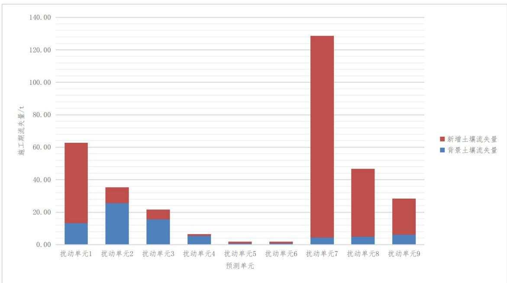

图4.3-1 项目施工期土壤流失量预测统计图  
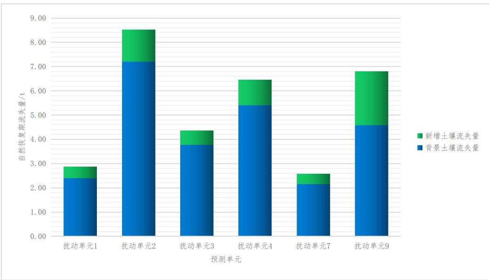  
图4.3-2 项目自然恢复期土壤流失量预测统计图

## 4.4 水土流失危害分析

项目在施工过程中，地表植被可能遭到不同程度的破坏，导致水土保持功能降低。因此，施工期（含筹建期）地表扰动和破坏原生植被，加剧了水土流失，如不采取有效的水土保持措施，将对项目区当地的水土资源和生态环境带来不利影响。

## （1）对土地资源的破坏

本项目施工扰动地表面积 $6 . 2 8 \mathrm { h m } ^ { 2 }$ ，涉及部分原状景观绿化区域，大范围的扰动，破坏了原地表土壤和植被，形成裸露地表，如不采取相应的水土保持措施进行治理，将

加剧土地退化，造成土地生产力降低甚至丧失。同时开挖的弃方如果不进行防护，也会造成水土流失，并影响周边植被及耕地立地条件。

## (2) 对生态环境的影响

工程建设破坏了原有的地表植被，区域植物种类和数量减少，植被覆盖度降低，增加了水土流失，也破坏了原有稳定的生态环境系统。工程开挖和占压在一定程度上干扰了陆地和水域生态环境，对当地生态环境造成影响。

## （3）对河道行洪的影响

工程施工临河布置，施工开挖、覆盖层剥离和临时堆渣时，如果不采取水土保持措施防护，工程弃方将随雨洪径流进入周边河道，导致河床淤积，影响行洪能力。

## （4）对项目施工安全和运行的影响

本项目基础开挖、临时堆土弃土等施工形成较大范围的裸露面和边坡，项目区年平均降水量较大，暴雨频繁发生，降雨强度大。裸露坡面在降雨因子的作用下，极易发生水土流失，诱发滑坡，直接危及工程安全、人民生命财产并影响工程工期。

## (5)临时堆土场可能造成的影响

临时堆土场在施工期间形成的边坡是造成水土流失的主要环节和部位。若不做好临时拦挡，周边截排水措施及坡面防护，在雨水冲刷下，流失土壤若进入施工区内，严重的将影响临时堆场的坡面稳定。

## （6）对周边水质的影响

项目开挖回填的松散土方容易在降雨因子作用下随地表径流进入周边河道，如不进行防护，雨洪水携带松散土壤流入周边河道内，可能增加水体浊度，增大含沙量，将对河道水质产生不良影响。

## (7）扬尘对周边环境的影响

扬尘不仅影响施工现场和周边环境的美观，还会对人体健康和大气质量造成严重危害。扬尘中含有大量的细颗粒物（PM2.5），这些颗粒物可以对人群健康造成影响，扬尘还会与其他污染物如二氧化硫、氮氧化物等发生化学反应，形成光化学烟雾和酸雨，加剧大气污染和温室效应，影响生态平衡和气候变化。

## 4.5 指导性意见

（1）拟建项目施工期是水土流失重点防治阶段，主体工程区、临时堆土区是产生水土流失的重点区域，水土流失强度较大，应以工程措施、植物措施和临时措施相结合的方式进行综合防治，临时堆土场应以临时排水、拦挡为主，加强表土堆存防护及利用。

（2）施工期水土流失以水力侵蚀为主，因此在主体工程施工时序安排时，应尽量避开雨季，对在雨季不得不实施的工程必须做好防护措施，施工前必须修筑排导工程，表土堆存前首先进行拦挡措施的布置。同时要使水土保持工程与主体工程在施工时相互配套，特别做好临时防护工程，减少施工过程中的水土流失。

（3）为防治项目建设产生大量新增水土流失，控制和减少可能造成的水土流失及危害，应加强项目区的水土流失和水土保持监测。主体工程区、临时堆土区为本项目水土保持监测的重点区域，应加强监测；施工期为重点监测时段，水土流失主要发生在雨季，对雨季应增加监测频次。

（4）为防治扬尘，需对施工现场实行封闭管理，建议设置高度不低于2.5m的围挡或遮网，遮挡裸露地面和堆放物料，防止风力吹散。围挡或遮网应坚固稳定，定期清洗更换。施工现场出入口应设置车辆冲洗设备，并对驶出车辆进行清洗。同步注重降尘作业：施工现场土方作业应采取洒水、固化、覆盖等防尘措施，减少扬尘产生。

## 5 水土保持措施

## 5.1 防治区划分

## 5.1.1 分区依据

根据实地调查（勘测）结果，在确定的防治责任范围内，依据工程布局、施工扰动特点、建设时序、地貌特征、自然属性、水土流失影响等进行分区。

## 5.1.2 分区原则

（1）各区之间应具有显著差异性；

（2）同一区内造成水土流失的主导因子和防治措施应相近或相似；

（3）根据项目的繁简程度和项目区自然情况，防治区可划分为一级或多级；

（4）一级区应具有控制性、整体性、全局性，应按土壤侵蚀类型、地形地貌、气候类型等因素划分一级区，二级区及其以下分区应结合工程布局、项目组成、占地性质和扰动特点进行逐级分区；

（5）各级分区应层次分明，具有关联性和系统性。

## 5.1.3 防治分区

方案根据本项目的地形地貌、平面布局、施工扰动特点、建设时序、自然属性、不同场地的功能布置和水土流失条件、拟采取水土保持措施不同等因素，并遵循一级分区应有控制性、整体性和全局性的原则，将本项目水土流失防治分区划分为上海地块（南方红壤区）、长春地块（东北黑土区）、兰州地块（西北黄土高原区）共三个一级防治区，各一级分区下进一步划分为主体工程区、施工生产生活区、临时堆土区三个二级分区。

各二级防治分区及汇总面积统计见表5.1-1。防治分区详见附图7。

## （1）主体工程防治区（I）

包括各建筑物、道路及配套设施、给排水及管网工程、景观绿化工程的建设区域，共计3.99hm²（其中上海地块主体工程区1.10hm²，长春地块主体工程区 $1 . 6 0 \mathrm { h m } ^ { 2 }$ ，兰州地块主体工程区1.29hm²）。

## （2）施工生产生活防治区（I）

本项目办公场所、生产及物料堆放等区域，共计1.12hm²（其中上海地块0.90hm²，长春地块0.10hm²，兰州地块0.12hm²）。

## （3）临时堆土防治区（II）

包括临时堆土区域，用于堆放剥离的表土以及回填暂存土方等区域，共计1.17hm²，其中上海地块0.36hm²，长春地块0.30hm²（红线范围内），兰州地块 $0 . 5 1 \mathrm { h m } ^ { 2 }$ o

防治责任范围表见表5.1-1。防治责任范围图见附图7。

表 5.1-1 防治责任范围表 单位：hm²
<table><tr><td rowspan=2 colspan=1>行政区</td><td rowspan=2 colspan=1>一级分区</td><td rowspan=2 colspan=1>二级分区</td><td rowspan=1 colspan=2>占地性质</td><td rowspan=1 colspan=1>合计</td></tr><tr><td rowspan=1 colspan=1>永久占地</td><td rowspan=1 colspan=1>临时占地</td><td rowspan=1 colspan=1></td></tr><tr><td rowspan=3 colspan=1>上海</td><td rowspan=3 colspan=1>上海地块</td><td rowspan=1 colspan=1>主体工程区</td><td rowspan=1 colspan=1>1.10</td><td rowspan=1 colspan=1></td><td rowspan=1 colspan=1>1.10</td></tr><tr><td rowspan=1 colspan=1>施工生产生活区</td><td rowspan=1 colspan=1></td><td rowspan=1 colspan=1>0.90</td><td rowspan=1 colspan=1>0.90</td></tr><tr><td rowspan=1 colspan=1>临时堆土区</td><td rowspan=1 colspan=1></td><td rowspan=1 colspan=1>0.36</td><td rowspan=1 colspan=1>0.36</td></tr><tr><td rowspan=3 colspan=1>长春</td><td rowspan=3 colspan=1>长春地块</td><td rowspan=1 colspan=1>主体工程区</td><td rowspan=1 colspan=1>2.00</td><td rowspan=1 colspan=1></td><td rowspan=1 colspan=1>2.00</td></tr><tr><td rowspan=1 colspan=1>施工生产生活区</td><td rowspan=1 colspan=1>(0.10)</td><td rowspan=1 colspan=1></td><td rowspan=1 colspan=1>(0.10)</td></tr><tr><td rowspan=1 colspan=1>临时堆土区</td><td rowspan=1 colspan=1>(0.30)</td><td rowspan=1 colspan=1></td><td rowspan=1 colspan=1>(0.30)</td></tr><tr><td rowspan=3 colspan=1>兰州</td><td rowspan=3 colspan=1>兰州地块</td><td rowspan=1 colspan=1>主体工程区</td><td rowspan=1 colspan=1>1.41</td><td rowspan=1 colspan=1></td><td rowspan=1 colspan=1>1.41</td></tr><tr><td rowspan=1 colspan=1>施工生产生活区</td><td rowspan=1 colspan=1>(0.12)</td><td rowspan=1 colspan=1></td><td rowspan=1 colspan=1>(0.12)</td></tr><tr><td rowspan=1 colspan=1>临时堆土区</td><td rowspan=1 colspan=1></td><td rowspan=1 colspan=1>0.51</td><td rowspan=1 colspan=1>0.51</td></tr><tr><td rowspan=1 colspan=3>总计</td><td rowspan=1 colspan=1>4.51</td><td rowspan=1 colspan=1>1.77</td><td rowspan=1 colspan=1>6.28</td></tr></table>

## 5.2 措施总体布局

## 5.2.1 水土流失防治措施布设原则

水土保持措施总体布局思路是：以防治水土流失、恢复植被、改善项目水土保持责任范围内生态环境、保证项目安全为最终目的；以对周边环境和安全不造成负面影响为出发点；根据主体工程设计的水土保持分析评价与水土流失预测成果，项目施工期以主体工程区为重点，同时配合主体工程设计中已有的水土保持设施，综合规划，对施工生产生活区、建（构）筑物开挖面、临时堆土区周边设置防护、排水沉沙等措施，使施工出现的开挖面产生的水土流失在“点”上集中拦蓄；同时对临时场地设置临时排水、沉沙、拦挡等措施；施工结束后对项目临时占地进行撒播草籽覆盖，形成“点”、“面”的防治。通过防治措施有机结合、相互作用，形成立体的综合防治体系，达到保护地表，改善生态环境，防治水土流失的目的，实现水土流失由被动控制到综合开发治理的转变。

## 5.2.2 设计标准

根据《生产建设项目水土保持技术标准》（GB50433-2018）、《水土保持工程设计规范》（GB51018-2014）、《防洪标准》（GB50201-2014）、《室外排水设计标准》（GB50014-2021）中相关规定执行。

## （1）工程措施

1）截排水工程：参照《室外排水设计标准》（GB50014-2021）、《水土保持工程设计规范》（GB51018-2014）及主体已列临时排水措施，排水管设计重现期为5年。

2）土地整治工程：参照《水土保持工程设计规范》（GB51018-2014），根据原占地类型、立地条件及环境绿化等需要，土地平整后主体工程集中绿化区域表土回覆厚度按30\~50cm的标准考虑。

## (2）植物措施

1）参照《水土保持工程设计规范》（GB51018-2014），2级植被建设工程结合工程所在地区的园林绿化标准。3级植被建设工程应根据生态保护和环境保护要求，按生态公益林绿化标准执行；降水量为250mm\~400mm的区域，应以灌草为主；降水量在250mm以下的区域，应以封禁为主并辅以人工抚育。本项目主体工程景观绿化执行2级植被建设标准，临时场地恢复执行3级植被恢复与建设标准。

## 2）立地条件分析

上海地块地处亚热带季风湿润气候区，地形为滨海平原，植被类型为亚热带常绿阔叶林，多年平均降水量1136.8mm，多年平均蒸发量1336.6mm，光热资源丰富，降水充足，土层相对较厚，立地条件适宜乔木、灌木等植物生长。

长春地块地处温带大陆性半湿润季风气候区，地形为台地平原，植被类型为温带落叶阔叶林，年平均气温6.5℃，多年平均降水量587.6mm，土壤以黑土为主，土层相对较厚，立地条件适宜乔木、灌木等植物生长。

兰州地块属温带大陆性半干旱气候区，具有具有山地、丘陵、山间盆地、河谷四种地貌单元，植被类型属温带草原化荒漠类型，天然植被以干草原和荒漠草原类型为主，多年平均气温9.8℃，年均降水量327mm，雨季为6～9月，年均蒸发量1450mm，降水较少，蒸发量大，土壤以黄土为主，保水性能相对较差，立地条件一般，适合灌木及草被植物，需加强幼林抚育管理。

## （3）临时措施

根据项目经验，临时排水沟设计标准一般均按当地降雨公式，采用5年一遇15min的降雨强度计算。沉沙池的设计施工应符合《水土保持工程设计规范》（GB51018-2014）相关要求。

## 5.2.3防治措施体系和总体布局

在主体工程中具有水保功能工程的基础上，本方案根据各防治分区地形、地质、水土流失特点等，采用相应措施，做好水土流失防治工作。措施配置中，工程措施控制施工期大面积、高强度水土流失；植物措施与工程措施配套，提高水保效果，减少工程投

资，改善生态环境。本方案在主体工程设计的水土保持分析评价与水土流失预测等成果基础上，对各防治分区措施布局分述如下。

水土流失防治措施体系见表5.2-1，水土流失防治措施总体布局见图5.2-1。防治措施布局图见附图8，水土保持措施典型设计图见附图10。

表 5.2-1 水土流失防治措施体系表
<table><tr><td rowspan=2 colspan=1>防治分区</td><td rowspan=1 colspan=3>水土保持措施体系</td></tr><tr><td rowspan=1 colspan=1>工程措施</td><td rowspan=1 colspan=1>植物措施</td><td rowspan=1 colspan=1>临时措施</td></tr><tr><td rowspan=1 colspan=1>主体工程防治区（I）</td><td rowspan=1 colspan=1>①表土剥离（长春地块、兰州地块新增）②排水设施工程*③雨水调蓄池*（上海、长春地块）④透水铺装*⑤覆土*⑥场地平整*⑦下凹式绿地*（上海地块、兰州地块）⑧土壤改良（上海地块、长春地块）</td><td rowspan=1 colspan=1>①景观绿化*②抚育管理*</td><td rowspan=1 colspan=1>①密目网苫盖（新增）②临时排水沟*③沉沙池*④洒水降尘*（兰州地块）</td></tr><tr><td rowspan=1 colspan=1>施工生产生活防治区(II)</td><td rowspan=1 colspan=1>/</td><td rowspan=1 colspan=1>①撒播草籽绿化（上海地块新增）②密目网苫盖(上海地块新增）</td><td rowspan=1 colspan=1>①临时排水沟*②沉沙池*</td></tr><tr><td rowspan=1 colspan=1>临时堆土防治区（II）</td><td rowspan=1 colspan=1>1</td><td rowspan=1 colspan=1>①撒播草籽绿化（上海、兰州地块新增）</td><td rowspan=1 colspan=1>①密目网（土工布）苫盖（新增）②沉沙池（新增）③袋装土拦挡及拆除（新增）④临时排水沟（新增）⑤临时绿化（上海、长春地块新增）</td></tr></table>

注：\*为主体已列措施。

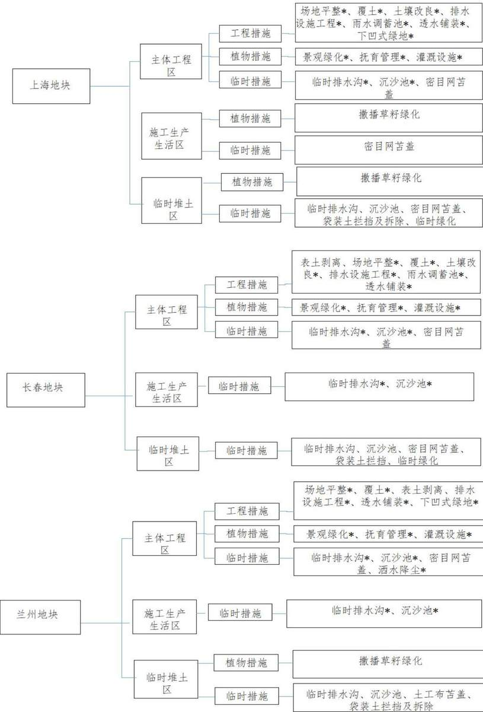  
注：图中带\*号为主体已列水土保持措施

图 5.2-1 工程水土保持措施体系图

## 5.3 分区措施布设

## 5.3.1 主体工程防治区

本区防治责任范围面积3.99hm²，其中上海地块主体工程区1.10hm²，长春地块主体工程区1.60hm²，兰州地块主体工程区 $1 . 2 9 \mathrm { h m } ^ { 2 }$ ，根据水土流失防治措施体系，提出以下工程措施、植物措施及临时措施。

## （1）工程措施

①表土剥离（方案新增）

长春地块剥离表土0.15万m³；兰州地块现状土地有景观绿化，工程基础施工前对本区景观绿化部分进行表土剥离，剥离面积1.00hm²，剥离平均厚度10\~20cm，剥离量0.15万m³。

②室外雨水排水设施（主体设计）

主体设计在主体工程区内布设了完善的雨水排水系统，屋面雨水先经雨水斗排除雨水，通过立管、埋地管排至室外雨水管网；室外道路雨水主要通过雨水口收集，经管道排至市政雨水管网。

上海地块雨水排水管管径DN400（2个排放口），长度约1350m，长春地块雨水排水管管径DN600（1个排放口），长度约860m，兰州地块雨水排水管管径DN400（1个排放口），长度约750m，具体排放口布置见表5.3-1。

上海地块采用暴雨强度公式5-1：

$$
\mathrm { q } = { \frac { 1 6 0 0 \ { \left( 1 + 0 . 8 4 6 l g P \right) } } { \left( t + 7 . 0 \right) } }
$$

(公式 5-1)

q—降雨强度，L/s·hm²；

P—重现期，取5年；

t—降水时间，地块取 15min。

雨水流量公式 Q=qFΨ，式中：

Q—雨水设计流量（L/s）

q—设计暴雨强度

F—汇水面积（取1.1hm²）

Ψ—综合径流系数（本方案直接引用主体设计指标，取0.58）

经计算本地块设计雨水流量 $Q { = } 2 1 3 . 8 3 \mathrm { L } / \mathrm { s }$

长春地块采用暴雨强度公式5-2:

$$
\mathrm { q } = \frac { 1 9 5 4 \ \left( 1 + 0 . 7 \mathrm { l g P } \right) } { \left( \mathrm { t } + 1 0 . 0 \right) }
$$

(公式 5-2)

q—降雨强度， $\mathrm { L } / \mathrm { s } { \cdot } \mathrm { h m } ^ { 2 }$

P—重现期，取5年；

t—降水时间，地块取 15min。

雨水流量公式 $Q { = } { \mathsf { q F } } { \boldsymbol { \Psi } }$ ，式中：

Q—雨水设计流量（L/s）

q—设计暴雨强度

F—汇水面积（取 2.0hm²）

Ψ—综合径流系数（本方案直接引用主体设计指标，取0.45）

经计算本地块设计雨水流量Q=229.77L/s。

兰州地块采用暴雨强度公式5-3:

$$
\mathrm { q } = \frac { 8 5 6 . 8 9 9 \ \left( 1 + 3 . 0 5 7 \mathrm { l g P } \right) } { \left( \mathrm { t } + 1 2 . 6 3 5 \right) }
$$

(公式 5-3)

q—降雨强度， $\mathrm { L } / \mathrm { s } { \cdot } \mathrm { h m } ^ { 2 }$

P—重现期，取5年；

t—降水时间，地块取15min。

雨水流量公式 $\scriptstyle { \mathrm { Q } } = { \mathrm { q F } } \Psi$ ，式中：

Q—雨水设计流量（L/s）

q—设计暴雨强度

F—汇水面积（取1.41hm²）

Ψ—综合径流系数（本方案直接引用主体设计指标，取0.65）

经计算本地块设计雨水流量Q=144.72L/s。

排水管渠的流量，按下列公式计算：

Q=AV

式中：Q—设计流量 $\mathrm { ( m } ^ { 3 } / \mathrm { s ) }$

A—水流有效断面面积 $( \mathbf { m } ^ { 2 } )$

V—流速（m/s）；

$$
\scriptstyle \mathrm { V } = 1 / \mathrm { n } \times R ^ { 2 / 3 } \times i ^ { 1 / 2 }
$$

式中：R——水力半径（m）；

i——水力坡度；

n——粗糙系数。

根据公式计算，本项目雨水管排放能力如下。

表 5.3-1 雨水排放能力
<table><tr><td rowspan=1 colspan=1>地块区域</td><td rowspan=1 colspan=1>系统名称</td><td rowspan=1 colspan=1>数量</td><td rowspan=1 colspan=1>管径</td><td rowspan=1 colspan=1>坡度</td><td rowspan=1 colspan=1>排放能力（L/s）</td><td rowspan=1 colspan=1>场地暴雨（洪峰）流量(L/s)</td></tr><tr><td rowspan=1 colspan=1>上海地块</td><td rowspan=1 colspan=1>雨水</td><td rowspan=1 colspan=1>2</td><td rowspan=1 colspan=1>DN400</td><td rowspan=1 colspan=1>3.0%</td><td rowspan=1 colspan=1>296.6</td><td rowspan=1 colspan=1>213.83</td></tr><tr><td rowspan=1 colspan=1>长春地块</td><td rowspan=1 colspan=1>雨水</td><td rowspan=1 colspan=1>1</td><td rowspan=1 colspan=1>DN600</td><td rowspan=1 colspan=1>3.0%0</td><td rowspan=1 colspan=1>436.9</td><td rowspan=1 colspan=1>229.77</td></tr><tr><td rowspan=1 colspan=1>兰州地块</td><td rowspan=1 colspan=1>雨水</td><td rowspan=1 colspan=1>1</td><td rowspan=1 colspan=1>DN400</td><td rowspan=1 colspan=1>3.0%0</td><td rowspan=1 colspan=1>148.3</td><td rowspan=1 colspan=1>144.72</td></tr></table>

本项目各地块雨水排水能力满足要求。

## ③透水铺装（主体设计）

透水路面能使雨水迅速渗入地下，补充地下水，保持土壤湿度，维护地下水和土壤的生态平衡，改善城市生态条件，具有良好的水土保持功能。根据海绵城市建设要求，主体设计分别在上海、长春、兰州两个地块内部建设透水铺装480m³、 $6 0 0 \mathrm { m } ^ { 3 }$ 、330m³，透水铺装采用80mm厚6mm粒径彩色强固透水砼以及150mm厚级配碎石压实或砂砾石垫层压实。

## ④场地平整（主体设计）

土建施工结束后需要对绿化区进行场地平整，平整翻土深度40cm，为覆土绿化做准备，上海、长春、兰州地块场地平整面积分别为0.40hm²、 $0 . 6 0 \mathrm { h m } ^ { 2 }$ 、0.42hm²，覆土（含土壤改良)分别为0.21万m³、0.18万m³、0.15万m³。地面绿化平均绿化覆土厚度30\~50cm。

## ⑤土壤改良（主体设计）

项目区上海地块内无可剥离表土资源，长春地块表土量较少，土壤改良是针对土壤的不良质地和结构，采取相应的物理、生物或化学措施，改善土壤性状，提高土壤肥力，改善土壤性能，增加作物产量的过程。土壤改良要因地制宜，选择合适的方法进行，常用的土壤改良方法有物理、化学、生物改良方法。本方案采用改良剂+有机肥+整地措施，场区平整土地后，利用剥离的土方覆土后，每亩施用专用改良剂50kg，有机肥料（粪尿肥）300kg，或商品有机肥200kg，每亩再施用微生物肥料50kg作基肥，撒施均匀。用机械深翻20\~30cm，达到地面平整，土块细碎，土肥相融。上海、长春地块土壤改良分别为0.21万m³、0.03万m³。

## ⑥降水蓄渗工程（主体设计）

根据主体海绵城市设计，本项目上海、长春、兰州地块设有海绵设施调蓄地块内雨水径流。上海地块设置总蓄水量为 $3 7 5 \mathrm { m } ^ { 3 }$ 的雨水蓄水池1座，调蓄容积 $2 4 0 \mathrm { m } ^ { 3 }$ ，回用容积 $1 3 5 \mathrm { m } ^ { 3 }$ ；设下凹式绿地 $3 8 0 \mathrm { m } ^ { 2 }$ ，调蓄水池内雨水；长春地块设置地下总蓄水量为 $3 0 0 \mathrm { m } ^ { 3 }$ 的雨水蓄水池1座，调蓄容积 $2 1 0 \mathrm { m } ^ { 3 }$ ；兰州地块设置下凹式绿地的面积为 $5 3 7 \mathrm { m } ^ { 2 }$ ，下凹式绿地的有效调蓄深度为200mm。

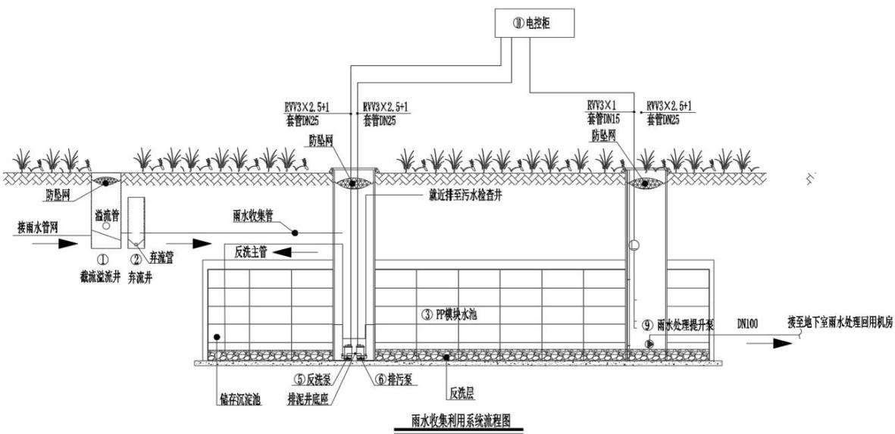  
图 5.3-1 雨水调蓄池示意图

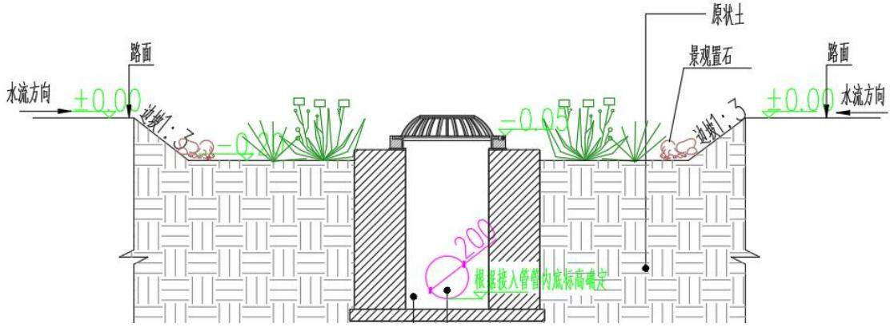  
图5.3-2下凹式绿地（距离建筑物大于3m)示意图

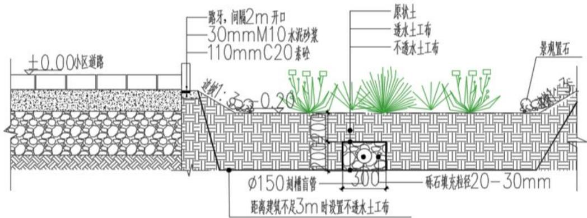  
图5.3-3下凹式绿地（距离建筑物小于3m）示意图

## （2）植物措施（主体设计）

①景观绿化（主体设计）

主体设计在项目区内布设了永久绿化工程并计列了投资，尚未进行具体设计。建议项目区内绿化采用“点、线、面”相结合的绿地景观体系，绿化以大规模草坪绿化为主，局部建造休憩与观赏功能叠加的景观绿化场景，绿化设计体现整体性，结合下凹式绿地进行设计，其中上海地块绿化面积约0.40hm²，长春地块绿化面积约0.60hm²，兰州地块绿化面积约 0.42hm²。

为保证整个项目区内绿化的整体性，植物种类选择和配置方式优先选用周边地区生长情况良好、景观效果佳、经济合理的乔灌草种类，线状带片与绿地形成贯穿项目区绿色走廊，充分发挥园林植物的生态景观效果，施工完工后，绿化施工单位定期进行养护管理，期限2\~3年。

由于目前景观设计尚未深化，本方案参照同类型项目苗木配置表，绿化种类、规格及栽植方式可参见表5.3-2\~5.3-4。本方案仅提出了设计原则供建设单位参考，后续主体设计单位应委托专业单位进行深化设计。

表 5.3-2 上海地块绿化种类统计表
<table><tr><td colspan="1" rowspan="1">绿化区域</td><td colspan="2" rowspan="1">乔灌草种类</td><td colspan="1" rowspan="1">规格</td><td colspan="1" rowspan="1">栽植方式</td></tr><tr><td colspan="1" rowspan="19">建筑物四周、围墙道路外侧</td><td colspan="1" rowspan="10">乔木</td><td colspan="1" rowspan="1">香樟</td><td colspan="1" rowspan="1">胸径 4cm</td><td colspan="1" rowspan="10">①道路两侧、边界按株距3m单排种植②建筑物四周及其他景观绿化区域孤植、对植③共需乔木约360株</td></tr><tr><td colspan="1" rowspan="1">银杏</td><td colspan="1" rowspan="1">胸径 4cm</td></tr><tr><td colspan="1" rowspan="1">广玉兰</td><td colspan="1" rowspan="1">胸径 4cm</td></tr><tr><td colspan="1" rowspan="1">国槐</td><td colspan="1" rowspan="1">胸径 4cm</td></tr><tr><td colspan="1" rowspan="1">紫薇</td><td colspan="1" rowspan="1">胸径 2-3cm</td></tr><tr><td colspan="1" rowspan="1">桂花</td><td colspan="1" rowspan="1">胸径 2-3cm</td></tr><tr><td colspan="1" rowspan="1">棕榈</td><td colspan="1" rowspan="1">胸径 2-3cm</td></tr><tr><td colspan="1" rowspan="1">红叶李</td><td colspan="1" rowspan="1">胸径 2-3cm</td></tr><tr><td colspan="1" rowspan="1">枫香</td><td colspan="1" rowspan="1">胸径 2-3cm</td></tr><tr><td colspan="1" rowspan="1">木荷</td><td colspan="1" rowspan="1">胸径 2-3cm</td></tr><tr><td colspan="1" rowspan="8">灌木、花卉</td><td colspan="1" rowspan="1">大叶黄杨</td><td colspan="1" rowspan="1">灌丛高30cm</td><td colspan="1" rowspan="8">①在乔木间配置②共需灌木、花卉约485株</td></tr><tr><td colspan="1" rowspan="1">海桐</td><td colspan="1" rowspan="1">灌丛高30cm</td></tr><tr><td colspan="1" rowspan="1">夹竹桃</td><td colspan="1" rowspan="1">灌丛高 30cm</td></tr><tr><td colspan="1" rowspan="1">红叶小檗</td><td colspan="1" rowspan="1">灌丛高 30cm</td></tr><tr><td colspan="1" rowspan="1">红叶石楠</td><td colspan="1" rowspan="1">灌丛高 30cm</td></tr><tr><td colspan="1" rowspan="1">杜鹃</td><td colspan="1" rowspan="1">灌丛高 30cm</td></tr><tr><td colspan="1" rowspan="1">月季</td><td colspan="1" rowspan="1">灌丛高30cm</td></tr><tr><td colspan="1" rowspan="1">矮牵牛</td><td colspan="1" rowspan="1">灌丛高30cm</td></tr><tr><td colspan="1" rowspan="1">草坪</td><td colspan="1" rowspan="1">结缕草草皮</td><td colspan="1" rowspan="1">发芽率&gt;98%、纯</td><td colspan="1" rowspan="1">满铺</td></tr><tr><td colspan="1" rowspan="1"></td><td colspan="1" rowspan="1"></td><td colspan="1" rowspan="1"></td><td colspan="1" rowspan="1">度&gt;99%</td><td colspan="1" rowspan="1"></td></tr></table>

表 5.3-3 长春地块绿化种类统计表
<table><tr><td rowspan=1 colspan=1>绿化区域</td><td rowspan=1 colspan=2>乔灌草种类</td><td rowspan=1 colspan=1>规格</td><td rowspan=1 colspan=1>栽植方式</td></tr><tr><td rowspan=7 colspan=1>建筑物四周、围墙道路外侧</td><td rowspan=3 colspan=1>乔木</td><td rowspan=1 colspan=1>樟子松</td><td rowspan=1 colspan=1>胸径 4cm</td><td rowspan=3 colspan=1>①道路两侧、边界按株距3m单排种植②建筑物四周及其他景观绿化区域孤植、对植③共需乔木约170株</td></tr><tr><td rowspan=1 colspan=1>银杏</td><td rowspan=1 colspan=1>胸径4cm</td></tr><tr><td rowspan=1 colspan=1>枫树</td><td rowspan=1 colspan=1>胸径 4cm</td></tr><tr><td rowspan=3 colspan=1>灌木、花卉</td><td rowspan=1 colspan=1>大叶黄杨</td><td rowspan=1 colspan=1>灌丛高 30cm</td><td rowspan=3 colspan=1>①在乔木间配置②共需灌木、花卉约550株</td></tr><tr><td rowspan=1 colspan=1>月季</td><td rowspan=1 colspan=1>灌丛高 30cm</td></tr><tr><td rowspan=1 colspan=1>紫丁香</td><td rowspan=1 colspan=1>灌丛高30cm</td></tr><tr><td rowspan=1 colspan=1>草坪</td><td rowspan=1 colspan=1>高羊茅</td><td rowspan=1 colspan=1>发芽率&gt;98%、纯度&gt;99%</td><td rowspan=1 colspan=1>满铺</td></tr></table>

表 5.3-4 兰州地块绿化种类统计表
<table><tr><td rowspan=1 colspan=1>绿化区域</td><td rowspan=1 colspan=2>乔灌草种类</td><td rowspan=1 colspan=1>规格</td><td rowspan=1 colspan=1>栽植方式</td></tr><tr><td rowspan=7 colspan=1>建筑物四周、围墙道路外侧</td><td rowspan=3 colspan=1>乔木</td><td rowspan=1 colspan=1>樟子松</td><td rowspan=1 colspan=1>胸径 4cm</td><td rowspan=3 colspan=1>①道路两侧、边界按株距3m单排种植②建筑物四周及其他景观绿化区域孤植、对植③共需乔木约 50株</td></tr><tr><td rowspan=1 colspan=1>国槐</td><td rowspan=1 colspan=1>胸径4cm</td></tr><tr><td rowspan=1 colspan=1>雪松</td><td rowspan=1 colspan=1>胸径 4cm</td></tr><tr><td rowspan=3 colspan=1>灌木、花卉</td><td rowspan=1 colspan=1>红叶石楠</td><td rowspan=1 colspan=1>灌丛高 30cm</td><td rowspan=3 colspan=1>①在乔木间配置②共需灌木、花卉约350株</td></tr><tr><td rowspan=1 colspan=1>金银花</td><td rowspan=1 colspan=1>灌丛高 30cm</td></tr><tr><td rowspan=1 colspan=1>月季</td><td rowspan=1 colspan=1>灌丛高30cm</td></tr><tr><td rowspan=1 colspan=1>草坪</td><td rowspan=1 colspan=1>高羊茅</td><td rowspan=1 colspan=1>发芽率&gt;98%、纯度&gt;99%</td><td rowspan=1 colspan=1>满铺</td></tr></table>

②抚育管理（主体设计）

项目区内绿化措施实施后，对其采取抚育管理措施，抚育管理时间为2\~3年，其中上海地块2年，抚育管理面积为0.40hm²，长春地块3年，抚育管理面积为0.60hm²，兰州地块3年，抚育管理面积为0.42hm²。

## ③灌溉设施（主体设计）

项目区内绿化措施实施后，对其采取抚育管理措施，需配套灌溉设施，每个地块均配套1套灌溉设施（常规喷灌）。其中上海、长春地块灌溉水源来源于雨水蓄水池，兰州地块灌溉水源来源于院内既有自来水灌溉管道接口。

## （3）临时措施

## ①密目网苫盖（方案新增）

项目所在上海地块年降雨量大，强降雨较多，其余两个地块也以水力侵蚀为主，施工期间，对建构筑物开挖施工裸露区域进行密目网临时苫盖，控制降水及大风造成的水土流失强度，上海、长春、兰州三个地块分别设置密目网苫盖5000m²、9500m²、5450m²，规格为1000目/10cm²。

②临时排水沟（主体设计）

本项目施工场地周边设置临时排水沟、施工现场布设了横向、纵向临时砖砌排水沟，上海、长春、兰州三个地块临时排水沟矩形断面，深0.4m，底宽0.4m，坡度均为3%。最终场地雨水排入三级沉淀池后，排入周边规划市政管网。

本方案对主体设计的排水沟排水能力复核如下：

参考《水土保持工程设计规范》（GB51018-2014）等相关规范确定水土保持工程等，主体工程以外的临时排水工程设计标准按5a一遇最大雨强设计，临时排水沟宜采用梯形或短形断面，深度不宜小于0.20m，梯形排水沟底宽不宜小于0.20m，矩形排水沟沟底宽度不宜小于0.30m。因此，各地块临时排水设计洪水标准为5a一遇15min短历时设计并复核暴雨。雨水设计流量均采用暴雨强度公式（公式5-1\~5-3），雨水量计算公式采用：

Q=0.278KiF

式中：Q，雨水设计流量，m³/s；

K，径流系数；

i，降雨强度

q，设计重现期和降雨历时下平均降雨强度。

F，集水面积，hm²。洪峰流量计算结果如下：

表 5.3-5 最大洪峰流量计算表
<table><tr><td rowspan=1 colspan=1>名称</td><td rowspan=1 colspan=1>最大洪峰流量Q（m³/s）</td><td rowspan=1 colspan=1>径流系数K</td><td rowspan=1 colspan=1>集水面积F(hm²)</td><td rowspan=1 colspan=1>5年一遇15min 降雨强度（L/s·hm²）</td></tr><tr><td rowspan=1 colspan=1>上海地块砖砌矩形排水沟</td><td rowspan=1 colspan=1>0.059</td><td rowspan=1 colspan=1>0.58</td><td rowspan=1 colspan=1>1.10</td><td rowspan=1 colspan=1>335.159</td></tr><tr><td rowspan=1 colspan=1>长春地块砖砌矩形排水沟</td><td rowspan=1 colspan=1>0.064</td><td rowspan=1 colspan=1>0.45</td><td rowspan=1 colspan=1>2.00</td><td rowspan=1 colspan=1>255.304</td></tr><tr><td rowspan=1 colspan=1>兰州地块砖砌矩形排水沟</td><td rowspan=1 colspan=1>0.028</td><td rowspan=1 colspan=1>0.65</td><td rowspan=1 colspan=1>1.41</td><td rowspan=1 colspan=1>157.908</td></tr></table>

明渠均匀流公式如下：Q=A·C

式中：A，排水沟设计断面面积，m²；

C，谢才系数；

R，水力半径，m;

i，排水沟比降，取 0.3%；

n，沟道粗糙系数，取0.014

谢才系数C的计算公式如下：

$$
\mathrm { C } { = } 1 / \mathrm { n } { \cdot } \mathrm { R } ^ { 1 / 6 }
$$

复核结果如下：

表 5.3-6 最大洪峰流量计算表
<table><tr><td rowspan=1 colspan=1>名称</td><td rowspan=1 colspan=1>最大洪峰流量Q（m³/s）</td><td rowspan=1 colspan=1>排水沟设计流量  $\mathrm { ( m } ^ { 3 } / \mathrm { s ) }$ </td><td rowspan=1 colspan=1>是否满足</td></tr><tr><td rowspan=1 colspan=1>上海地块砖砌矩形排水沟</td><td rowspan=1 colspan=1>0.059</td><td rowspan=1 colspan=1>0.163</td><td rowspan=1 colspan=1>满足</td></tr><tr><td rowspan=1 colspan=1>长春地块砖砌矩形排水沟</td><td rowspan=1 colspan=1>0.064</td><td rowspan=1 colspan=1>0.163</td><td rowspan=1 colspan=1>满足</td></tr><tr><td rowspan=1 colspan=1>兰州地块砖砌矩形排水沟</td><td rowspan=1 colspan=1>0.028</td><td rowspan=1 colspan=1>0.163</td><td rowspan=1 colspan=1>满足</td></tr></table>

经复核，排水沟设计排水能力均满足要求。

## ③沉淀池（主体设计）

主体设计在洗车平台旁边布置沉淀池，共3座（三个地块各1座），洗车水经沉淀后汇入附近排水系统。沉淀池设计尺寸 $3 . 0 \mathrm { m } { \times } 2 . 0 \mathrm { m } { \times } 1 . 5 \mathrm { m }$ （长×宽×深），底部采用20cm厚的混凝土浇筑，四周采用24cm的砖护砌，表面采用2cm厚度水泥砂浆抹面。经现场勘察，该区地形平坦，上海、长春、兰州三个地块最大汇水面积分别为 $1 . 1 \mathrm { h m } ^ { 2 } , \ 2 . 0 \mathrm { h m } ^ { 2 }$ 1.41hm²。根据计算公式，得出三个地块集水流量 $\mathrm { Q } _ { \mathrm { m a x } }$ 为分别为 $0 . 0 5 9 \mathrm { { m ^ { 3 } / s } , ~ 0 . 0 6 4 \mathrm { { m ^ { 3 } / s } } }$ 0.028m³/s。沉沙池设计沉淀时间60s，因此沉沙池最小容量分别为 $3 . 5 4 \mathrm { { m } ^ { 3 } , 3 . 8 4 \mathrm { { m } ^ { 3 } , 1 . 6 8 \mathrm { { m } ^ { 3 } } } }$ 主体布置的沉沙池容积V $\mathrm { \ i } \frac { \pi } { \chi } { = } 9 . 0 \mathrm { m } ^ { 3 }$ ，满足沉沙要求。

## ④洒水降尘（主体设计）

兰州地块遇大风天气扬尘较大，主体考虑在施工围挡顶部布置洒水降尘管道装置，对现场四周进行洒水降尘，共计布置降尘管道装置约300m，同步配置喷头。

表5.3-7上海地块主体工程防治区水土保持措施工程量汇总表
<table><tr><td rowspan=1 colspan=1>序号</td><td rowspan=1 colspan=1>防治措施类型及名称</td><td rowspan=1 colspan=1>单位</td><td rowspan=1 colspan=1>数量</td></tr><tr><td rowspan=1 colspan=1>第一部分</td><td rowspan=1 colspan=1>工程措施</td><td rowspan=1 colspan=1></td><td rowspan=1 colspan=1></td></tr><tr><td rowspan=1 colspan=1>一</td><td rowspan=1 colspan=1>主体工程区</td><td rowspan=1 colspan=1></td><td rowspan=1 colspan=1></td></tr><tr><td rowspan=1 colspan=1>1</td><td rowspan=1 colspan=1>土地整治工程</td><td rowspan=1 colspan=1></td><td rowspan=1 colspan=1></td></tr><tr><td rowspan=1 colspan=1>1.1</td><td rowspan=1 colspan=1>场地平整</td><td rowspan=1 colspan=1></td><td rowspan=1 colspan=1></td></tr><tr><td rowspan=1 colspan=1>1.1.1</td><td rowspan=1 colspan=1>整地</td><td rowspan=1 colspan=1> $\mathrm { h m } ^ { 2 }$ </td><td rowspan=1 colspan=1>0.40</td></tr><tr><td rowspan=1 colspan=1>1.2</td><td rowspan=1 colspan=1>土地改良</td><td rowspan=1 colspan=1></td><td rowspan=1 colspan=1></td></tr><tr><td rowspan=1 colspan=1>1.2.1</td><td rowspan=1 colspan=1>土壤改良</td><td rowspan=1 colspan=1> $\mathrm { m } ^ { 3 }$ </td><td rowspan=1 colspan=1>0.21</td></tr><tr><td rowspan=1 colspan=1>2</td><td rowspan=1 colspan=1>排水设施工程</td><td rowspan=1 colspan=1></td><td rowspan=1 colspan=1></td></tr><tr><td rowspan=1 colspan=1>2.1</td><td rowspan=1 colspan=1>雨水管道</td><td rowspan=1 colspan=1> $\mathbf { m }$ </td><td rowspan=1 colspan=1>1350</td></tr><tr><td rowspan=1 colspan=1>2.2</td><td rowspan=1 colspan=1>安装费</td><td rowspan=1 colspan=1> $\%$ </td><td rowspan=1 colspan=1>6</td></tr><tr><td rowspan=1 colspan=1>3</td><td rowspan=1 colspan=1>降水蓄渗工程</td><td rowspan=1 colspan=1></td><td rowspan=1 colspan=1></td></tr><tr><td rowspan=1 colspan=1>3.1</td><td rowspan=1 colspan=1>雨水调蓄池</td><td rowspan=1 colspan=1> $| \widecheck { \underline { { \mu } } } | | _ { \widehat { \mathbf { \Sigma } } }$ </td><td rowspan=1 colspan=1>1</td></tr><tr><td rowspan=1 colspan=1>3.2</td><td rowspan=1 colspan=1>透水铺装</td><td rowspan=1 colspan=1> $\mathrm { m } ^ { 3 }$ </td><td rowspan=1 colspan=1>480</td></tr><tr><td rowspan=1 colspan=1>3.3</td><td rowspan=1 colspan=1>下凹式绿地</td><td rowspan=1 colspan=1> $\mathrm { m } ^ { 2 }$ </td><td rowspan=1 colspan=1>380</td></tr><tr><td rowspan=1 colspan=1>第二部分</td><td rowspan=1 colspan=1>植物措施</td><td rowspan=1 colspan=1></td><td rowspan=1 colspan=1></td></tr><tr><td rowspan=1 colspan=1>一</td><td rowspan=1 colspan=1>主体工程区</td><td rowspan=1 colspan=1></td><td rowspan=1 colspan=1></td></tr><tr><td rowspan=1 colspan=1>1</td><td rowspan=1 colspan=1>景观绿化工程</td><td rowspan=1 colspan=1> $\mathrm { m } ^ { 2 }$ </td><td rowspan=1 colspan=1>4030</td></tr><tr><td rowspan=1 colspan=1>2</td><td rowspan=1 colspan=1>抚育管理</td><td rowspan=1 colspan=1> $\ncong$ </td><td rowspan=1 colspan=1>2</td></tr><tr><td rowspan=1 colspan=1>3</td><td rowspan=1 colspan=1>灌溉设施</td><td rowspan=1 colspan=1> $\nexists$ </td><td rowspan=1 colspan=1>1</td></tr><tr><td rowspan=1 colspan=1>第三部分</td><td rowspan=1 colspan=1>施工临时工程</td><td rowspan=1 colspan=1></td><td rowspan=1 colspan=1></td></tr><tr><td rowspan=1 colspan=1>一</td><td rowspan=1 colspan=1>主体工程区</td><td rowspan=1 colspan=1></td><td rowspan=1 colspan=1></td></tr><tr><td rowspan=1 colspan=1>1</td><td rowspan=1 colspan=1>临时排水沟</td><td rowspan=1 colspan=1></td><td rowspan=1 colspan=1></td></tr><tr><td rowspan=1 colspan=1>1.1</td><td rowspan=1 colspan=1>土方开挖</td><td rowspan=1 colspan=1> $\mathrm { m } ^ { 3 }$ </td><td rowspan=1 colspan=1>96</td></tr><tr><td rowspan=1 colspan=1>1.2</td><td rowspan=1 colspan=1>砖砌</td><td rowspan=1 colspan=1> $\mathrm { m } ^ { 3 }$ </td><td rowspan=1 colspan=1>36</td></tr><tr><td rowspan=1 colspan=1>1.3</td><td rowspan=1 colspan=1>砂浆抹面</td><td rowspan=1 colspan=1> $\mathrm { m } ^ { 2 }$ </td><td rowspan=1 colspan=1>24</td></tr><tr><td rowspan=1 colspan=1>2</td><td rowspan=1 colspan=1>临时防护工程</td><td rowspan=1 colspan=1></td><td rowspan=1 colspan=1></td></tr><tr><td rowspan=1 colspan=1>2.1</td><td rowspan=1 colspan=1>密目网</td><td rowspan=1 colspan=1> $\mathrm { m } ^ { 2 }$ </td><td rowspan=1 colspan=1>5000</td></tr><tr><td rowspan=1 colspan=1>3</td><td rowspan=1 colspan=1>沉沙池</td><td rowspan=1 colspan=1></td><td rowspan=1 colspan=1></td></tr><tr><td rowspan=1 colspan=1>3.1</td><td rowspan=1 colspan=1>土方开挖</td><td rowspan=1 colspan=1> $\mathrm { m } ^ { 3 }$ </td><td rowspan=1 colspan=1>9.45</td></tr><tr><td rowspan=1 colspan=1>3.2</td><td rowspan=1 colspan=1>砖砌</td><td rowspan=1 colspan=1> $\mathrm { m } ^ { 3 }$ </td><td rowspan=1 colspan=1>0.54</td></tr><tr><td rowspan=1 colspan=1>3.3</td><td rowspan=1 colspan=1>砂浆抹面</td><td rowspan=1 colspan=1> $\mathrm { m } ^ { 2 }$ </td><td rowspan=1 colspan=1>0.12</td></tr></table>

表5.3-8 长春地块主体工程防治区水土保持措施工程量汇总表
<table><tr><td rowspan=1 colspan=1>序号</td><td rowspan=1 colspan=1>防治措施类型及名称</td><td rowspan=1 colspan=1>单位</td><td rowspan=1 colspan=1>数量</td></tr><tr><td rowspan=1 colspan=1>第一部分</td><td rowspan=1 colspan=1>工程措施</td><td rowspan=1 colspan=1></td><td rowspan=1 colspan=1></td></tr><tr><td rowspan=1 colspan=1>一</td><td rowspan=1 colspan=1>主体工程区</td><td rowspan=1 colspan=1></td><td rowspan=1 colspan=1></td></tr><tr><td rowspan=1 colspan=1>1</td><td rowspan=1 colspan=1>表土保护工程</td><td rowspan=1 colspan=1></td><td rowspan=1 colspan=1></td></tr><tr><td rowspan=1 colspan=1>1.1</td><td rowspan=1 colspan=1>表土回覆</td><td rowspan=1 colspan=1>万 $\mathrm { m } ^ { 3 }$ </td><td rowspan=1 colspan=1>0.15</td></tr><tr><td rowspan=1 colspan=1>2</td><td rowspan=1 colspan=1>土地整治工程</td><td rowspan=1 colspan=1></td><td rowspan=1 colspan=1></td></tr><tr><td rowspan=1 colspan=1>2.1</td><td rowspan=1 colspan=1>场地平整</td><td rowspan=1 colspan=1></td><td rowspan=1 colspan=1></td></tr><tr><td rowspan=1 colspan=1>2.1.1</td><td rowspan=1 colspan=1>整地</td><td rowspan=1 colspan=1> $\mathrm { h m } ^ { 2 }$ </td><td rowspan=1 colspan=1>0.60</td></tr><tr><td rowspan=1 colspan=1>2.2</td><td rowspan=1 colspan=1>土壤改良</td><td rowspan=1 colspan=1></td><td rowspan=1 colspan=1></td></tr><tr><td rowspan=1 colspan=1>2.2.1</td><td rowspan=1 colspan=1>土壤改良</td><td rowspan=1 colspan=1> $\mathrm { m } ^ { 3 }$ </td><td rowspan=1 colspan=1>0.03</td></tr><tr><td rowspan=1 colspan=1>3</td><td rowspan=1 colspan=1>排水设施工程</td><td rowspan=1 colspan=1></td><td rowspan=1 colspan=1></td></tr><tr><td rowspan=1 colspan=1>3.1</td><td rowspan=1 colspan=1>雨水管道</td><td rowspan=1 colspan=1>m</td><td rowspan=1 colspan=1>860</td></tr><tr><td rowspan=1 colspan=1>3.2</td><td rowspan=1 colspan=1>安装费</td><td rowspan=1 colspan=1> $\%$ </td><td rowspan=1 colspan=1>6</td></tr><tr><td rowspan=1 colspan=1>4</td><td rowspan=1 colspan=1>降水蓄渗工程</td><td rowspan=1 colspan=1></td><td rowspan=1 colspan=1></td></tr><tr><td rowspan=1 colspan=1>4.1</td><td rowspan=1 colspan=1>雨水调蓄池</td><td rowspan=1 colspan=1>座</td><td rowspan=1 colspan=1>1</td></tr><tr><td rowspan=1 colspan=1>4.2</td><td rowspan=1 colspan=1>透水铺装</td><td rowspan=1 colspan=1> $\mathrm { m } ^ { 3 }$ </td><td rowspan=1 colspan=1>600</td></tr><tr><td rowspan=1 colspan=1>第二部分</td><td rowspan=1 colspan=1>植物措施</td><td rowspan=1 colspan=1></td><td rowspan=1 colspan=1></td></tr><tr><td rowspan=1 colspan=1>一</td><td rowspan=1 colspan=1>主体工程区</td><td rowspan=1 colspan=1></td><td rowspan=1 colspan=1></td></tr><tr><td rowspan=1 colspan=1>1</td><td rowspan=1 colspan=1>景观绿化</td><td rowspan=1 colspan=1> $\mathrm { m } ^ { 2 }$ </td><td rowspan=1 colspan=1>6016</td></tr><tr><td rowspan=1 colspan=1>2</td><td rowspan=1 colspan=1>抚育管理</td><td rowspan=1 colspan=1> $\ncong$ </td><td rowspan=1 colspan=1>3</td></tr><tr><td rowspan=1 colspan=1>3</td><td rowspan=1 colspan=1>灌溉设施</td><td rowspan=1 colspan=1> $\nexists$ </td><td rowspan=1 colspan=1>1</td></tr><tr><td rowspan=1 colspan=1>第三部分</td><td rowspan=1 colspan=1>施工临时工程</td><td rowspan=1 colspan=1></td><td rowspan=1 colspan=1></td></tr><tr><td rowspan=1 colspan=1>一</td><td rowspan=1 colspan=1>主体工程区</td><td rowspan=1 colspan=1></td><td rowspan=1 colspan=1></td></tr><tr><td rowspan=1 colspan=1>1</td><td rowspan=1 colspan=1>临时排水沟</td><td rowspan=1 colspan=1></td><td rowspan=1 colspan=1></td></tr><tr><td rowspan=1 colspan=1>1.1</td><td rowspan=1 colspan=1>土方开挖</td><td rowspan=1 colspan=1> $\mathrm { m } ^ { 3 }$ </td><td rowspan=1 colspan=1>131.84</td></tr><tr><td rowspan=1 colspan=1>1.2</td><td rowspan=1 colspan=1>砖砌</td><td rowspan=1 colspan=1> $\mathrm { m } ^ { 3 }$ </td><td rowspan=1 colspan=1>49.44</td></tr><tr><td rowspan=1 colspan=1>1.3</td><td rowspan=1 colspan=1>砂浆抹面</td><td rowspan=1 colspan=1> $\mathrm { m } ^ { 2 }$ </td><td rowspan=1 colspan=1>32.96</td></tr><tr><td rowspan=1 colspan=1>2</td><td rowspan=1 colspan=1>沉沙池</td><td rowspan=1 colspan=1></td><td rowspan=1 colspan=1></td></tr><tr><td rowspan=1 colspan=1>2.1</td><td rowspan=1 colspan=1>土方开挖</td><td rowspan=1 colspan=1> $\mathrm { m } ^ { 3 }$ </td><td rowspan=1 colspan=1>9</td></tr><tr><td rowspan=1 colspan=1>2.2</td><td rowspan=1 colspan=1>砖砌</td><td rowspan=1 colspan=1> $\mathrm { m } ^ { 3 }$ </td><td rowspan=1 colspan=1>2.97</td></tr><tr><td rowspan=1 colspan=1>2.3</td><td rowspan=1 colspan=1>砂浆抹面</td><td rowspan=1 colspan=1> $\mathrm { m } ^ { 2 }$ </td><td rowspan=1 colspan=1>15.75</td></tr><tr><td rowspan=1 colspan=1>3</td><td rowspan=1 colspan=1>临时防护工程</td><td rowspan=1 colspan=1></td><td rowspan=1 colspan=1></td></tr><tr><td rowspan=1 colspan=1>3.1</td><td rowspan=1 colspan=1>密目网</td><td rowspan=1 colspan=1> $\mathrm { m } ^ { 2 }$ </td><td rowspan=1 colspan=1>9500</td></tr></table>

表5.3-9 兰州地块主体工程防治区水土保持措施工程量汇总表
<table><tr><td rowspan=1 colspan=1>序号</td><td rowspan=1 colspan=1>防治措施类型及名称</td><td rowspan=1 colspan=1>单位</td><td rowspan=1 colspan=1>数量</td></tr><tr><td rowspan=1 colspan=1>第一部分</td><td rowspan=1 colspan=1>工程措施</td><td rowspan=1 colspan=1></td><td rowspan=1 colspan=1></td></tr><tr><td rowspan=1 colspan=1>一</td><td rowspan=1 colspan=1>主体工程区</td><td rowspan=1 colspan=1></td><td rowspan=1 colspan=1></td></tr><tr><td rowspan=1 colspan=1>1</td><td rowspan=1 colspan=1>表土保护工程</td><td rowspan=1 colspan=1></td><td rowspan=1 colspan=1></td></tr><tr><td rowspan=1 colspan=1>1.1</td><td rowspan=1 colspan=1>表土剥离</td><td rowspan=1 colspan=1>万 $\mathrm { m } ^ { 3 }$ </td><td rowspan=1 colspan=1>0.15</td></tr><tr><td rowspan=1 colspan=1>1.2</td><td rowspan=1 colspan=1>覆土</td><td rowspan=1 colspan=1> $\mathcal { F } \mathrm { ~ m } ^ { 3 }$ </td><td rowspan=1 colspan=1>0.15</td></tr><tr><td rowspan=1 colspan=1>2</td><td rowspan=1 colspan=1>土地整治工程</td><td rowspan=1 colspan=1></td><td rowspan=1 colspan=1></td></tr><tr><td rowspan=1 colspan=1>2.1</td><td rowspan=1 colspan=1>场地平整</td><td rowspan=1 colspan=1></td><td rowspan=1 colspan=1></td></tr><tr><td rowspan=1 colspan=1>2.1.2</td><td rowspan=1 colspan=1>整地</td><td rowspan=1 colspan=1> $\mathrm { h m } ^ { 2 }$ </td><td rowspan=1 colspan=1>0.42</td></tr><tr><td rowspan=1 colspan=1>3</td><td rowspan=1 colspan=1>排水设施工程</td><td rowspan=1 colspan=1></td><td rowspan=1 colspan=1></td></tr><tr><td rowspan=1 colspan=1>3.1</td><td rowspan=1 colspan=1>雨水管道</td><td rowspan=1 colspan=1>m</td><td rowspan=1 colspan=1>750</td></tr><tr><td rowspan=1 colspan=1>3.2</td><td rowspan=1 colspan=1>安装费</td><td rowspan=1 colspan=1> $\%$ </td><td rowspan=1 colspan=1>6</td></tr><tr><td rowspan=1 colspan=1>4</td><td rowspan=1 colspan=1>降水蓄渗工程</td><td rowspan=1 colspan=1></td><td rowspan=1 colspan=1></td></tr><tr><td rowspan=1 colspan=1>4.1</td><td rowspan=1 colspan=1>下凹式绿地</td><td rowspan=1 colspan=1> $\mathrm { m } ^ { 2 }$ </td><td rowspan=1 colspan=1>537</td></tr><tr><td rowspan=1 colspan=1>4.2</td><td rowspan=1 colspan=1>透水铺装</td><td rowspan=1 colspan=1> $\mathrm { m } ^ { 3 }$ </td><td rowspan=1 colspan=1>330</td></tr><tr><td rowspan=1 colspan=1>第二部分</td><td rowspan=1 colspan=1>植物措施</td><td rowspan=1 colspan=1></td><td rowspan=1 colspan=1></td></tr><tr><td rowspan=1 colspan=1>一</td><td rowspan=1 colspan=1>主体工程区</td><td rowspan=1 colspan=1></td><td rowspan=1 colspan=1></td></tr><tr><td rowspan=1 colspan=1>1</td><td rowspan=1 colspan=1>景观绿化</td><td rowspan=1 colspan=1> $\mathrm { m } ^ { 2 }$ </td><td rowspan=1 colspan=1>4223.7</td></tr><tr><td rowspan=1 colspan=1>2</td><td rowspan=1 colspan=1>抚育管理</td><td rowspan=1 colspan=1> $\ncong$ </td><td rowspan=1 colspan=1>3</td></tr><tr><td rowspan=1 colspan=1>3</td><td rowspan=1 colspan=1>灌溉设施</td><td rowspan=1 colspan=1> $\nexists$ </td><td rowspan=1 colspan=1>1</td></tr><tr><td rowspan=1 colspan=1>第三部分</td><td rowspan=1 colspan=1>施工临时工程</td><td rowspan=1 colspan=1></td><td rowspan=1 colspan=1></td></tr><tr><td rowspan=1 colspan=1>一</td><td rowspan=1 colspan=1>主体工程区</td><td rowspan=1 colspan=1></td><td rowspan=1 colspan=1></td></tr><tr><td rowspan=1 colspan=1>1</td><td rowspan=1 colspan=1>临时排水沟</td><td rowspan=1 colspan=1></td><td rowspan=1 colspan=1></td></tr><tr><td rowspan=1 colspan=1>1.1</td><td rowspan=1 colspan=1>土方开挖</td><td rowspan=1 colspan=1> $\mathrm { m } ^ { 3 }$ </td><td rowspan=1 colspan=1>89.6</td></tr><tr><td rowspan=1 colspan=1>1.2</td><td rowspan=1 colspan=1>砖砌</td><td rowspan=1 colspan=1> $\mathrm { m } ^ { 3 }$ </td><td rowspan=1 colspan=1>33.6</td></tr><tr><td rowspan=1 colspan=1>1.3</td><td rowspan=1 colspan=1>砂浆抹面</td><td rowspan=1 colspan=1> $\mathrm { m } ^ { 2 }$ </td><td rowspan=1 colspan=1>22.4</td></tr><tr><td rowspan=1 colspan=1>2</td><td rowspan=1 colspan=1>沉沙池</td><td rowspan=1 colspan=1></td><td rowspan=1 colspan=1></td></tr><tr><td rowspan=1 colspan=1>2.1</td><td rowspan=1 colspan=1>土方开挖</td><td rowspan=1 colspan=1> $\mathrm { m } ^ { 3 }$ </td><td rowspan=1 colspan=1>9</td></tr><tr><td rowspan=1 colspan=1>2.2</td><td rowspan=1 colspan=1>砖砌</td><td rowspan=1 colspan=1> $\mathrm { m } ^ { 3 }$ </td><td rowspan=1 colspan=1>2.97</td></tr><tr><td rowspan=1 colspan=1>2.3</td><td rowspan=1 colspan=1>砂浆抹面</td><td rowspan=1 colspan=1> $\mathrm { m } ^ { 2 }$ </td><td rowspan=1 colspan=1>15.75</td></tr><tr><td rowspan=1 colspan=1>3</td><td rowspan=1 colspan=1>临时防护工程</td><td rowspan=1 colspan=1></td><td rowspan=1 colspan=1></td></tr><tr><td rowspan=1 colspan=1>3.1</td><td rowspan=1 colspan=1>密目网</td><td rowspan=1 colspan=1> $\mathrm { m } ^ { 2 }$ </td><td rowspan=1 colspan=1>5450</td></tr><tr><td rowspan=1 colspan=1>4</td><td rowspan=1 colspan=1>洒水降尘</td><td rowspan=1 colspan=1>m</td><td rowspan=1 colspan=1>300</td></tr></table>

## 5.3.2 施工生产生活防治区

长春地块和兰州地块分别在红线内设置1处施工生产生活区，占地面积分别为$0 . 1 0 \mathrm { h m } ^ { 2 }$ 和 $0 . 1 2 \mathrm { h m } ^ { 2 }$ ，上海地块依托一期工程在红线外设1处施工生产生活区，占地面积$0 . 9 0 \mathrm { h m } ^ { 2 }$

## （1）植物措施

①撒播草籽绿化（方案新增）

上海地块场地使用完毕后拆除并撒播草籽覆盖，避免裸露，高羊茅、黑麦草按照1:1

比例混合撒播，播种密度为100kg/hm²。

## (2) 临时措施

## ①临时排水沟（主体设计）

施工组织设计在施工生产生活区周边设置临时排水沟，其中上海地块一期工程已设置排水沉沙等措施，本方案不再重复补充，长春地块施工生产生活区临时排水沟长度为160m，兰州地块施工生产生活区临时排水沟长度为105m，砖砌矩形断面，深0.4m，底宽0.4m，坡度均为3%。最终场地雨水排入三级沉淀池后，长春地块排入西侧低洼芦苇地，兰州地块排入院内既有雨水管网。

本方案对施工生产生活区的排水沟排水能力复核同5.3.1主体工程区临时排水沟，经复核满足排放能力要求。

## ②沉沙池（主体设计）

主体设计在长春、兰州地块施工生产生活区雨水出口内均布置沉沙池1座，施工生产生活区雨水经沉淀后汇入附近排水系统。沉沙池设计尺寸3.0m×2.0m×1.5m（长×宽×深），底部采用20cm厚的混凝土浇筑，四周采用24cm的砖护砌，表面采用2cm厚度水泥砂浆抹面。经现场勘察，该区地形平坦，长春、兰州两个地块施工生产生活区最大汇水面积分别为0.10hm²、0.12hm²。根据5.3.1计算公式，得出两处施工生产生活区集水流量满足沉沙要求。

## ③密目网苫盖（方案新增）

上海地块场地恢复期间，植被尚未覆盖，需进行密目网苫盖9000m²。

表5.3-10 上海地块施工生产生活防治区水土保持措施工程量汇总表
<table><tr><td rowspan=1 colspan=1>序号</td><td rowspan=1 colspan=1>防治措施类型及名称</td><td rowspan=1 colspan=1>单位</td><td rowspan=1 colspan=1>数量</td></tr><tr><td rowspan=1 colspan=1></td><td rowspan=1 colspan=1>施工生产生活区</td><td rowspan=1 colspan=1></td><td rowspan=1 colspan=1></td></tr><tr><td rowspan=1 colspan=1></td><td rowspan=1 colspan=1>植物措施</td><td rowspan=1 colspan=1></td><td rowspan=1 colspan=1></td></tr><tr><td rowspan=1 colspan=1>1</td><td rowspan=1 colspan=1>撒播草籽绿化</td><td rowspan=1 colspan=1> $\mathrm { h m } ^ { 2 }$ </td><td rowspan=1 colspan=1>0.90</td></tr><tr><td rowspan=1 colspan=1></td><td rowspan=1 colspan=1>临时措施</td><td rowspan=1 colspan=1></td><td rowspan=1 colspan=1></td></tr><tr><td rowspan=1 colspan=1>1</td><td rowspan=1 colspan=1>临时防护工程</td><td rowspan=1 colspan=1></td><td rowspan=1 colspan=1></td></tr><tr><td rowspan=1 colspan=1>1.1</td><td rowspan=1 colspan=1>密目网</td><td rowspan=1 colspan=1> $\mathrm { m } ^ { 2 }$ </td><td rowspan=1 colspan=1>9000</td></tr></table>

表5.3-11 长春地块施工生产生活防治区水土保持措施工程量汇总表
<table><tr><td rowspan=1 colspan=1>序号</td><td rowspan=1 colspan=1>防治措施类型及名称</td><td rowspan=1 colspan=1>单位</td><td rowspan=1 colspan=1>数量</td></tr><tr><td rowspan=1 colspan=1></td><td rowspan=1 colspan=1>施工生产生活区</td><td rowspan=1 colspan=1></td><td rowspan=1 colspan=1></td></tr><tr><td rowspan=1 colspan=1></td><td rowspan=1 colspan=1>临时措施</td><td rowspan=1 colspan=1></td><td rowspan=1 colspan=1></td></tr><tr><td rowspan=1 colspan=1>1</td><td rowspan=1 colspan=1>临时排水沟</td><td rowspan=1 colspan=1></td><td rowspan=1 colspan=1></td></tr><tr><td rowspan=1 colspan=1>1.1</td><td rowspan=1 colspan=1>土方开挖</td><td rowspan=1 colspan=1> $\mathrm { m } ^ { 3 }$ </td><td rowspan=1 colspan=1>51.2</td></tr><tr><td rowspan=1 colspan=1>1.2</td><td rowspan=1 colspan=1>砖砌</td><td rowspan=1 colspan=1> $\mathrm { m } ^ { 3 }$ </td><td rowspan=1 colspan=1>19.2</td></tr><tr><td rowspan=1 colspan=1>1.3</td><td rowspan=1 colspan=1>砂浆抹面</td><td rowspan=1 colspan=1> $\mathrm { m } ^ { 2 }$ </td><td rowspan=1 colspan=1>12.8</td></tr><tr><td rowspan=1 colspan=1>2</td><td rowspan=1 colspan=1>沉沙池</td><td rowspan=1 colspan=1></td><td rowspan=1 colspan=1></td></tr><tr><td rowspan=1 colspan=1>2.1</td><td rowspan=1 colspan=1>土方开挖</td><td rowspan=1 colspan=1> $\mathrm { m } ^ { 3 }$ </td><td rowspan=1 colspan=1>9.45</td></tr><tr><td rowspan=1 colspan=1>2.2</td><td rowspan=1 colspan=1>砖砌</td><td rowspan=1 colspan=1> $\mathrm { m } ^ { 3 }$ </td><td rowspan=1 colspan=1>0.54</td></tr><tr><td rowspan=1 colspan=1>2.3</td><td rowspan=1 colspan=1>砂浆抹面</td><td rowspan=1 colspan=1> $\mathrm { m } ^ { 2 }$ </td><td rowspan=1 colspan=1>0.12</td></tr></table>

表5.3-12兰州地块施工生产生活防治区水土保持措施工程量汇总表
<table><tr><td rowspan=1 colspan=1>序号</td><td rowspan=1 colspan=1>防治措施类型及名称</td><td rowspan=1 colspan=1>单位</td><td rowspan=1 colspan=1>数量</td></tr><tr><td rowspan=1 colspan=1></td><td rowspan=1 colspan=1>施工生产生活区</td><td rowspan=1 colspan=1></td><td rowspan=1 colspan=1></td></tr><tr><td rowspan=1 colspan=1></td><td rowspan=1 colspan=1>临时措施</td><td rowspan=1 colspan=1></td><td rowspan=1 colspan=1></td></tr><tr><td rowspan=1 colspan=1>1</td><td rowspan=1 colspan=1>临时排水沟</td><td rowspan=1 colspan=1></td><td rowspan=1 colspan=1></td></tr><tr><td rowspan=1 colspan=1>1.1</td><td rowspan=1 colspan=1>土方开挖</td><td rowspan=1 colspan=1> $\mathrm { m } ^ { 3 }$ </td><td rowspan=1 colspan=1>33.6</td></tr><tr><td rowspan=1 colspan=1>1.2</td><td rowspan=1 colspan=1>砖砌</td><td rowspan=1 colspan=1> $\mathrm { m } ^ { 3 }$ </td><td rowspan=1 colspan=1>12.6</td></tr><tr><td rowspan=1 colspan=1>1.3</td><td rowspan=1 colspan=1>砂浆抹面</td><td rowspan=1 colspan=1> $\mathrm { m } ^ { 2 }$ </td><td rowspan=1 colspan=1>8.4</td></tr><tr><td rowspan=1 colspan=1>2</td><td rowspan=1 colspan=1>沉沙池</td><td rowspan=1 colspan=1></td><td rowspan=1 colspan=1></td></tr><tr><td rowspan=1 colspan=1>2.1</td><td rowspan=1 colspan=1>土方开挖</td><td rowspan=1 colspan=1> $\mathrm { m } ^ { 3 }$ </td><td rowspan=1 colspan=1>9.45</td></tr><tr><td rowspan=1 colspan=1>2.2</td><td rowspan=1 colspan=1>砖砌</td><td rowspan=1 colspan=1> $\mathrm { m } ^ { 3 }$ </td><td rowspan=1 colspan=1>0.54</td></tr><tr><td rowspan=1 colspan=1>2.3</td><td rowspan=1 colspan=1>砂浆抹面</td><td rowspan=1 colspan=1> $\mathrm { m } ^ { 2 }$ </td><td rowspan=1 colspan=1>0.12</td></tr></table>

## 5.3.3 临时堆土防治区

根据《水土保持工程设计规范》（GB51018-2014），结合本项目堆存量、最大堆高、堆场失事对主体工程或环境造成的危害程度等方面，综合分析确定临时堆土场规模及级别。本项目表土堆场场级别分析详见表5.3-13。

表 5.3-13 工程临时堆土场级别分析表
<table><tr><td rowspan=1 colspan=1>名称</td><td rowspan=1 colspan=1>位置</td><td rowspan=1 colspan=1>堆存量（万 $\mathbf { m } ^ { 3 } )$ </td><td rowspan=1 colspan=1>容量（万 $\mathbf { m } ^ { 3 } )$ </td><td rowspan=1 colspan=1>最大堆高(m)</td><td rowspan=1 colspan=1>堆场失事对主体工程或环境的危害程度</td><td rowspan=1 colspan=1>堆场规模</td><td rowspan=1 colspan=1>堆场级别</td></tr><tr><td rowspan=3 colspan=1>临时堆土场</td><td rowspan=1 colspan=1>上海有机化学研究所临港园区地块（C07-05地块）内三期建设范围</td><td rowspan=1 colspan=1>0.75</td><td rowspan=1 colspan=1>1.11</td><td rowspan=1 colspan=1>3.5</td><td rowspan=1 colspan=1>无危害</td><td rowspan=1 colspan=1>小（2）型</td><td rowspan=1 colspan=1>5</td></tr><tr><td rowspan=1 colspan=1>长春地块规划红线内停车场范围</td><td rowspan=1 colspan=1>0.85</td><td rowspan=1 colspan=1>0.94</td><td rowspan=1 colspan=1>3.5</td><td rowspan=1 colspan=1>无危害</td><td rowspan=1 colspan=1>小（2）型</td><td rowspan=1 colspan=1>5</td></tr><tr><td rowspan=1 colspan=1>中科院兰州分院北侧家属区内已拆迁腾退的一处现状空地内</td><td rowspan=1 colspan=1>1.49</td><td rowspan=1 colspan=1>1.54</td><td rowspan=1 colspan=1>3.5</td><td rowspan=1 colspan=1>无危害</td><td rowspan=1 colspan=1>小（2）型</td><td rowspan=1 colspan=1>5</td></tr></table>

## 5.3.4.1 堆土场边坡稳定分析

## a）计算假定

堆渣体的成分中大部分为土方，渣体粘聚力较高，稳定计算时，渣体粘聚力C值，取值一般为红壤25kPa、黄绵土10kPa，黑土27kPa。

## b）计算公式

堆场边坡稳定性分析采用不计条块间作用力的瑞典圆弧滑动法进行计算。

瑞典圆弧滑动法计算公式如下：

$$
K = { \frac { \sum \left\{ \left[ ( W \pm V ) \mathrm { c o s } \alpha - u b \mathrm { s e c } \alpha - Q \mathrm { s i n } \alpha \right] \mathrm { t a n } \varphi ^ { \cdot } + { \dot { c } } b \mathrm { s e c } \alpha \right\} } { \sum \left[ ( W \pm V ) \mathrm { s i n } \alpha + M _ { c } / R \right] } }
$$

式中b—条块宽度（m）；

W—条块重力（kN）；

$\mathrm { W } _ { 1 } .$ —在外坡外水位上的条块重力（kN）；

$\mathrm { W } _ { 2 } .$ —在外坡外水位下的条块重力（kN）；

Q、V—水平和垂直地震惯性力（kN）；

u—作用于土条底面的孔隙压力（kPa）；

$\alpha$ —条块的重力线与通过此条块底面中点的半径之间的夹角（0）；

c、 $\varphi ^ { \cdot }$ —土条底面的有效应力抗剪强度指标；

$\mathrm { M } _ { \mathrm { c } }$ —水平地震惯性力对圆心的力矩（kN.m）；

## R—圆弧半径（m）

## c）计算参数

材料的物理力学计算参数参照地质建议值，并结合同类工程确定。本项目设计的计算参数详见表5.3-13。

表5.3-14堆存场岩（土）体物理力学参数一览表
<table><tr><td rowspan=2 colspan=1>名称</td><td rowspan=1 colspan=1>天然容重γ</td><td rowspan=1 colspan=1>饱和容重γsat</td><td rowspan=1 colspan=2>抗剪断强度</td><td rowspan=2 colspan=1>渗透系数（cm/s）</td></tr><tr><td rowspan=1 colspan=1> $\left( \mathbf { k N } / \mathbf { m } ^ { 3 } \right)$ </td><td rowspan=1 colspan=1>(kN/m³)</td><td rowspan=1 colspan=1>粘聚力 KPa</td><td rowspan=1 colspan=1>内摩擦角（°）</td></tr><tr><td rowspan=1 colspan=1>表土</td><td rowspan=1 colspan=1>15.28</td><td rowspan=1 colspan=1>15.6</td><td rowspan=1 colspan=1>19.2</td><td rowspan=1 colspan=1>15.68</td><td rowspan=1 colspan=1>1.0×10-⁵~1.0×10-4</td></tr><tr><td rowspan=1 colspan=1>堆渣体</td><td rowspan=1 colspan=1>22</td><td rowspan=1 colspan=1>/</td><td rowspan=1 colspan=1>0</td><td rowspan=1 colspan=1>30</td><td rowspan=1 colspan=1>1×10-2</td></tr><tr><td rowspan=1 colspan=1>覆盖层</td><td rowspan=1 colspan=1>19.1</td><td rowspan=1 colspan=1>19.5</td><td rowspan=1 colspan=1>24</td><td rowspan=1 colspan=1>19.6</td><td rowspan=1 colspan=1>1.0×10-⁵~1.0×10-4</td></tr><tr><td rowspan=1 colspan=1>强溶蚀风化岩体</td><td rowspan=1 colspan=1>24.0</td><td rowspan=1 colspan=1>24.3</td><td rowspan=1 colspan=1>600</td><td rowspan=1 colspan=1>36</td><td rowspan=1 colspan=1>1×10-⁵</td></tr><tr><td rowspan=1 colspan=1>弱溶蚀风化岩体</td><td rowspan=1 colspan=1>26.0</td><td rowspan=1 colspan=1>26.3</td><td rowspan=1 colspan=1>800</td><td rowspan=1 colspan=1>40</td><td rowspan=1 colspan=1>1×10-⁵</td></tr></table>

## d）安全系数标准、计算方法和结果

根据堆场物质组成、堆渣高度、堆放坡度，同时参考堆场地质参数，计算出堆场相应的最小安全系数(采用 GEO-SLOPE 公司开发的 GeoStudio 软件中的 SLOPE/W模块计算），计算结果见表5.3-15。

表 5.3-15 堆场边坡稳定计算结果一览表
<table><tr><td rowspan=2 colspan=1>名称</td><td rowspan=1 colspan=3>堆场防护设计</td><td rowspan=1 colspan=2>计算值</td><td rowspan=1 colspan=2>规范值(瑞典圆弧滑动法)</td></tr><tr><td rowspan=1 colspan=1>堆土底部（m）</td><td rowspan=1 colspan=1>顶高程(m)</td><td rowspan=1 colspan=1>堆土边坡</td><td rowspan=1 colspan=1>持久状况(堆土结束）</td><td rowspan=1 colspan=1>短暂状况(暴雨工况）</td><td rowspan=1 colspan=1>持久状况(堆渣结束）</td><td rowspan=1 colspan=1>短暂状况(暴雨工况）</td></tr><tr><td rowspan=1 colspan=1>上海地块临时堆土场</td><td rowspan=1 colspan=1>4.4</td><td rowspan=1 colspan=1>7.9</td><td rowspan=1 colspan=1>1:1.5</td><td rowspan=1 colspan=1>1.343</td><td rowspan=1 colspan=1>1.255</td><td rowspan=1 colspan=1>1.20</td><td rowspan=1 colspan=1>1.10</td></tr><tr><td rowspan=1 colspan=1>长春地块临时堆土场</td><td rowspan=1 colspan=1>192.2</td><td rowspan=1 colspan=1>195.7</td><td rowspan=1 colspan=1>1:1.5</td><td rowspan=1 colspan=1>1.213</td><td rowspan=1 colspan=1>1.115</td><td rowspan=1 colspan=1>1.20</td><td rowspan=1 colspan=1>1.10</td></tr><tr><td rowspan=1 colspan=1>兰州地块临时堆土场</td><td rowspan=1 colspan=1>1513.84</td><td rowspan=1 colspan=1>1517.34</td><td rowspan=1 colspan=1>1:1.5</td><td rowspan=1 colspan=1>1.351</td><td rowspan=1 colspan=1>1.259</td><td rowspan=1 colspan=1>1.20</td><td rowspan=1 colspan=1>1.10</td></tr></table>

根据以上计算结果可知，堆存场堆土边坡稳定安全系数在各种工况下均达到规范要求，堆土在拟定堆放坡度下能满足稳定要求。

## 5.3.4.2 措施布设

本区防治责任范围面积1.17hm²，其中上海地块0.36hm²，长春地块0.30hm²（红线范围内），兰州地块0.51hm²，根据水土流失防治措施体系，提出以下工程措施及临时措施。

## （1）植物措施

①撒播草籽绿化（方案新增）

水土保持植物措施主要为临时堆土区使用完毕后，为避免场地裸露，对场地进行撒播草籽覆盖。上海地块场地使用完毕后拆除并撒播草籽覆盖，避免裸露，高羊茅、黑麦

草按照1:1比例混合撒播，恢复面积0.36hm²，播种密度为100kg/hm²；兰州地块临时绿化采用兰州地块野牛草、早熟禾按照1:1比例混合撒播，播种密度为100kg/hm²。

## (2) 临时措施

## ①编织土袋拦挡及拆除（方案新增）

方案考虑在临时堆土四周设置编织装土袋进行拦挡，后期对其清理、拆除，袋装土顶宽0.5m，高1.0m，底宽1.5m，设计上海地块袋装土总量250m³，长春地块袋装土总量220m³，兰州地块袋装土总量290m³。

## ②密目网（土工布）苫盖（方案新增）

表土及一般土方存放期间，需要对临时堆土区边坡及顶部采取苫盖措施，上海地块苫盖面积 042hm²，长春地块0.35hm²，兰州地块0.65hm²（土工布苫盖）。

## ③临时排水沟（方案新增）

施工前期对临时堆土场四周布置临时排水沟，通过沉沙池沉淀后再进行外排，方案考虑布设上海地块本区排水沟总长250m，长春地块本区排水沟总长220m，兰州地块本区排水沟总长290m，均采用矩形断面，深0.4m，底宽0.4m。排水复核能力参照5.3.1主体工程区（重现期5年一遇），经复核，排水沟过流能力满足要求。

## ④沉沙池（方案新增）

排水沟出口处做局部拓宽挖深设置沉沙池，沉沙池尺寸为3.0m×2.0m×1.5m（长×宽×深），边坡比1:1，上海地块所设排水沟经沉沙池沉淀后就近接入附近施工生产生活区沟渠，长春地块接入西侧低洼芦苇地，兰州地块接入周边已有市政雨水管网。

施工期间沉沙池旁需设置明显的安全警示标志，并加强施工期间的管理，消除安全隐患。施工结束后，沉沙池拆除平整即可。

## ⑤临时绿化（方案新增）

考虑到施工临时堆土周期较长，且考虑降雨条件等下垫面因素，上海、长春地块临时堆土堆存期间，采取撒播草籽临时防护措施，上海地块临时绿化0.42hm²，长春地块0.35hm²。

经现场勘察，该区地形平坦。根据计算公式，可以满足沉沙要求。

表5.3-16上海地块临时堆土防治区水土保持措施工程量汇总表
<table><tr><td rowspan=1 colspan=1>序号</td><td rowspan=1 colspan=1>防治措施类型及名称</td><td rowspan=1 colspan=1>单位</td><td rowspan=1 colspan=1>数量</td></tr><tr><td rowspan=1 colspan=1></td><td rowspan=1 colspan=1>临时堆土区</td><td rowspan=1 colspan=1></td><td rowspan=1 colspan=1></td></tr><tr><td rowspan=1 colspan=1>第二部分</td><td rowspan=1 colspan=1>植物措施</td><td rowspan=1 colspan=1></td><td rowspan=1 colspan=1></td></tr><tr><td rowspan=1 colspan=1>1</td><td rowspan=1 colspan=1>撒播草籽绿化</td><td rowspan=1 colspan=1> $\mathrm { h m } ^ { 2 }$ </td><td rowspan=1 colspan=1>0.36</td></tr><tr><td rowspan=1 colspan=1>第三部分</td><td rowspan=1 colspan=1>施工临时工程</td><td rowspan=1 colspan=1></td><td rowspan=1 colspan=1></td></tr><tr><td rowspan=1 colspan=1>1</td><td rowspan=1 colspan=1>临时防护工程</td><td rowspan=1 colspan=1></td><td rowspan=1 colspan=1></td></tr><tr><td rowspan=1 colspan=1>1.1</td><td rowspan=1 colspan=1>密目网</td><td rowspan=1 colspan=1> $\mathrm { h m } ^ { 2 }$ </td><td rowspan=1 colspan=1>0.42</td></tr><tr><td rowspan=1 colspan=1>1.2</td><td rowspan=1 colspan=1>袋装土拦挡及拆除</td><td rowspan=1 colspan=1> $\mathrm { m } ^ { 3 }$ </td><td rowspan=1 colspan=1>250</td></tr><tr><td rowspan=1 colspan=1>2</td><td rowspan=1 colspan=1>临时排水沟</td><td rowspan=1 colspan=1></td><td rowspan=1 colspan=1></td></tr><tr><td rowspan=1 colspan=1>2.1</td><td rowspan=1 colspan=1>土方开挖</td><td rowspan=1 colspan=1> $\mathrm { m } ^ { 3 }$ </td><td rowspan=1 colspan=1>70.4</td></tr><tr><td rowspan=1 colspan=1>2.2.</td><td rowspan=1 colspan=1>砖砌</td><td rowspan=1 colspan=1> $\mathrm { m } ^ { 3 }$ </td><td rowspan=1 colspan=1>26.4</td></tr><tr><td rowspan=1 colspan=1>2.3</td><td rowspan=1 colspan=1>砂浆抹面</td><td rowspan=1 colspan=1> $\mathrm { m } ^ { 2 }$ </td><td rowspan=1 colspan=1>17.6</td></tr><tr><td rowspan=1 colspan=1>3</td><td rowspan=1 colspan=1>沉沙池</td><td rowspan=1 colspan=1> $\ntrianglerighteq$ </td><td rowspan=1 colspan=1>2</td></tr><tr><td rowspan=1 colspan=1>3.1</td><td rowspan=1 colspan=1>土方开挖</td><td rowspan=1 colspan=1> $\mathrm { m } ^ { 3 }$ </td><td rowspan=1 colspan=1>18.9</td></tr><tr><td rowspan=1 colspan=1>3.2</td><td rowspan=1 colspan=1>砖砌</td><td rowspan=1 colspan=1> $\mathrm { m } ^ { 3 }$ </td><td rowspan=1 colspan=1>1.08</td></tr><tr><td rowspan=1 colspan=1>3.3</td><td rowspan=1 colspan=1>砂浆抹面</td><td rowspan=1 colspan=1> $\mathrm { m } ^ { 2 }$ </td><td rowspan=1 colspan=1>0.24</td></tr><tr><td rowspan=1 colspan=1>4</td><td rowspan=1 colspan=1>临时绿化</td><td rowspan=1 colspan=1> $\mathrm { h m } ^ { 2 }$ </td><td rowspan=1 colspan=1>0.42</td></tr></table>

表5.3-17长春地块临时堆土防治区水土保持措施工程量汇总表

<table><tr><td rowspan=1 colspan=1>序号</td><td rowspan=1 colspan=1>防治措施类型及名称</td><td rowspan=1 colspan=1>单位</td><td rowspan=1 colspan=1>数量</td></tr><tr><td rowspan=1 colspan=1></td><td rowspan=1 colspan=1>临时堆土区</td><td rowspan=1 colspan=1></td><td rowspan=1 colspan=1></td></tr><tr><td rowspan=1 colspan=1>1</td><td rowspan=1 colspan=1>临时防护工程</td><td rowspan=1 colspan=1></td><td rowspan=1 colspan=1></td></tr><tr><td rowspan=1 colspan=1>1.1</td><td rowspan=1 colspan=1>密目网</td><td rowspan=1 colspan=1> $\mathrm { h m } ^ { 2 }$ </td><td rowspan=1 colspan=1>0.35</td></tr><tr><td rowspan=1 colspan=1>1.2</td><td rowspan=1 colspan=1>袋装土拦挡及拆除</td><td rowspan=1 colspan=1> $\mathrm { m } ^ { 3 }$ </td><td rowspan=1 colspan=1>220</td></tr><tr><td rowspan=1 colspan=1>2</td><td rowspan=1 colspan=1>临时排水沟</td><td rowspan=1 colspan=1></td><td rowspan=1 colspan=1></td></tr><tr><td rowspan=1 colspan=1>2.1</td><td rowspan=1 colspan=1>土方开挖</td><td rowspan=1 colspan=1> $\mathrm { m } ^ { 3 }$ </td><td rowspan=1 colspan=1>51.2</td></tr><tr><td rowspan=1 colspan=1>2.2</td><td rowspan=1 colspan=1>砖砌</td><td rowspan=1 colspan=1> $\mathrm { m } ^ { 3 }$ </td><td rowspan=1 colspan=1>19.2</td></tr><tr><td rowspan=1 colspan=1>2.3</td><td rowspan=1 colspan=1>砂浆抹面</td><td rowspan=1 colspan=1> $\mathrm { m } ^ { 2 }$ </td><td rowspan=1 colspan=1>12.8</td></tr><tr><td rowspan=1 colspan=1>3</td><td rowspan=1 colspan=1>沉沙池</td><td rowspan=1 colspan=1> $\ntrianglerighteq$ </td><td rowspan=1 colspan=1>2</td></tr><tr><td rowspan=1 colspan=1>3.1</td><td rowspan=1 colspan=1>土方开挖</td><td rowspan=1 colspan=1> $\mathrm { m } ^ { 3 }$ </td><td rowspan=1 colspan=1>18.9</td></tr><tr><td rowspan=1 colspan=1>3.2</td><td rowspan=1 colspan=1>砖砌</td><td rowspan=1 colspan=1> $\mathrm { m } ^ { 3 }$ </td><td rowspan=1 colspan=1>1.08</td></tr><tr><td rowspan=1 colspan=1>3.3</td><td rowspan=1 colspan=1>砂浆抹面</td><td rowspan=1 colspan=1> $\mathrm { m } ^ { 2 }$ </td><td rowspan=1 colspan=1>0.24</td></tr><tr><td rowspan=1 colspan=1>4</td><td rowspan=1 colspan=1>临时绿化</td><td rowspan=1 colspan=1> $\mathrm { h m } ^ { 2 }$ </td><td rowspan=1 colspan=1>0.35</td></tr></table>

表5.3-18兰州地块临时堆土防治区水土保持措施工程量汇总表
<table><tr><td colspan="1" rowspan="1">序号</td><td colspan="1" rowspan="1">防治措施类型及名称</td><td colspan="1" rowspan="1">单位</td><td colspan="1" rowspan="1">数量</td></tr><tr><td colspan="1" rowspan="1"></td><td colspan="1" rowspan="1">临时堆土区</td><td colspan="1" rowspan="1"></td><td colspan="1" rowspan="1"></td></tr><tr><td colspan="1" rowspan="1">第二部分</td><td colspan="1" rowspan="1">植物措施</td><td colspan="1" rowspan="1"></td><td colspan="1" rowspan="1"></td></tr><tr><td colspan="1" rowspan="1">1</td><td colspan="1" rowspan="1">撒播草籽绿化</td><td colspan="1" rowspan="1"> $\mathrm { h m } ^ { 2 }$ </td><td colspan="1" rowspan="1">0.51</td></tr><tr><td colspan="1" rowspan="1">第三部分</td><td colspan="1" rowspan="1">施工临时工程</td><td colspan="1" rowspan="1"></td><td colspan="1" rowspan="1"></td></tr><tr><td colspan="1" rowspan="1">1</td><td colspan="1" rowspan="1">临时防护工程</td><td colspan="1" rowspan="1"></td><td colspan="1" rowspan="1"></td></tr><tr><td colspan="1" rowspan="1">1.1</td><td colspan="1" rowspan="1">密目网</td><td colspan="1" rowspan="1"> $\mathrm { h m } ^ { 2 }$ </td><td colspan="1" rowspan="1">0.65</td></tr><tr><td colspan="1" rowspan="1">1.2</td><td colspan="1" rowspan="1">袋装土拦挡及拆除</td><td colspan="1" rowspan="1"> $\mathrm { m } ^ { 3 }$ </td><td colspan="1" rowspan="1">290</td></tr><tr><td colspan="1" rowspan="1">2</td><td colspan="1" rowspan="1">临时排水沟</td><td colspan="1" rowspan="1"></td><td colspan="1" rowspan="1"></td></tr><tr><td colspan="1" rowspan="1">2.1</td><td colspan="1" rowspan="1">土方开挖</td><td colspan="1" rowspan="1"> $\mathrm { m } ^ { 3 }$ </td><td colspan="1" rowspan="1">80</td></tr><tr><td colspan="1" rowspan="1">2.2</td><td colspan="1" rowspan="1">砖砌</td><td colspan="1" rowspan="1"> $\mathrm { m } ^ { 3 }$ </td><td colspan="1" rowspan="1">30</td></tr><tr><td colspan="1" rowspan="1">2.3</td><td colspan="1" rowspan="1">砂浆抹面</td><td colspan="1" rowspan="1"> $\mathrm { m } ^ { 2 }$ </td><td colspan="1" rowspan="1">20</td></tr><tr><td colspan="1" rowspan="1">3</td><td colspan="1" rowspan="1">沉沙池</td><td colspan="1" rowspan="1">座</td><td colspan="1" rowspan="1">2</td></tr><tr><td colspan="1" rowspan="1">3.1</td><td colspan="1" rowspan="1">土方开挖</td><td colspan="1" rowspan="1"> $\mathrm { m } ^ { 3 }$ </td><td colspan="1" rowspan="1">18.9</td></tr><tr><td colspan="1" rowspan="1">3.2</td><td colspan="1" rowspan="1">砖砌</td><td colspan="1" rowspan="1"> $\mathrm { m } ^ { 3 }$ </td><td colspan="1" rowspan="1">1.08</td></tr><tr><td colspan="1" rowspan="1">3.3</td><td colspan="1" rowspan="1">砂浆抹面</td><td colspan="1" rowspan="1"> $\mathrm { m } ^ { 2 }$ </td><td colspan="1" rowspan="1">0.24</td></tr></table>

## 5.3.5水土保持措施工程量汇总

各防治分区水土保持措施工程量汇总见表5.3-19\~5.3-21。

表5.3-19 上海地块各防治区水土保持措施工程量汇总表
<table><tr><td colspan="1" rowspan="1">序号</td><td colspan="1" rowspan="1">防治措施类型及名称</td><td colspan="1" rowspan="1">单位</td><td colspan="1" rowspan="1">数量</td><td colspan="1" rowspan="1">备注</td></tr><tr><td colspan="1" rowspan="1">第一部分</td><td colspan="1" rowspan="1">工程措施</td><td colspan="1" rowspan="1"></td><td colspan="1" rowspan="1"></td><td colspan="1" rowspan="1"></td></tr><tr><td colspan="1" rowspan="1">一</td><td colspan="1" rowspan="1">主体工程区</td><td colspan="1" rowspan="1"></td><td colspan="1" rowspan="1"></td><td colspan="1" rowspan="1"></td></tr><tr><td colspan="1" rowspan="1">1</td><td colspan="1" rowspan="1">土地整治工程</td><td colspan="1" rowspan="1"></td><td colspan="1" rowspan="1"></td><td colspan="1" rowspan="1">主体设计</td></tr><tr><td colspan="1" rowspan="1">1.1</td><td colspan="1" rowspan="1">场地平整</td><td colspan="1" rowspan="1"></td><td colspan="1" rowspan="1"></td><td colspan="1" rowspan="1"></td></tr><tr><td colspan="1" rowspan="1">1.1.1</td><td colspan="1" rowspan="1">整地</td><td colspan="1" rowspan="1"> $\mathrm { h m } ^ { 2 }$ </td><td colspan="1" rowspan="1">0.40</td><td colspan="1" rowspan="1"></td></tr><tr><td colspan="1" rowspan="1">1.2</td><td colspan="1" rowspan="1">土地改良</td><td colspan="1" rowspan="1"></td><td colspan="1" rowspan="1"></td><td colspan="1" rowspan="1"></td></tr><tr><td colspan="1" rowspan="1">1.2.1</td><td colspan="1" rowspan="1">土壤改良</td><td colspan="1" rowspan="1"> $\mathrm { m } ^ { 3 }$ </td><td colspan="1" rowspan="1">0.21</td><td colspan="1" rowspan="1"></td></tr><tr><td colspan="1" rowspan="1">2</td><td colspan="1" rowspan="1">排水设施工程</td><td colspan="1" rowspan="1"></td><td colspan="1" rowspan="1"></td><td colspan="1" rowspan="1">主体设计</td></tr><tr><td colspan="1" rowspan="1">2.1</td><td colspan="1" rowspan="1">雨水管道</td><td colspan="1" rowspan="1">m</td><td colspan="1" rowspan="1">1350</td><td colspan="1" rowspan="1"></td></tr><tr><td colspan="1" rowspan="1">2.2</td><td colspan="1" rowspan="1">安装费</td><td colspan="1" rowspan="1"> $\%$ </td><td colspan="1" rowspan="1">6</td><td colspan="1" rowspan="1"></td></tr><tr><td colspan="1" rowspan="1">3</td><td colspan="1" rowspan="1">降水蓄渗工程</td><td colspan="1" rowspan="1"></td><td colspan="1" rowspan="1"></td><td colspan="1" rowspan="1">主体设计</td></tr><tr><td colspan="1" rowspan="1">3.1</td><td colspan="1" rowspan="1">雨水调蓄池</td><td colspan="1" rowspan="1">座</td><td colspan="1" rowspan="1">1</td><td colspan="1" rowspan="1"></td></tr><tr><td colspan="1" rowspan="1">3.2</td><td colspan="1" rowspan="1">透水铺装</td><td colspan="1" rowspan="1"> $\mathrm { m } ^ { 3 }$ </td><td colspan="1" rowspan="1">480</td><td colspan="1" rowspan="1"></td></tr><tr><td colspan="1" rowspan="1">3.3</td><td colspan="1" rowspan="1">下凹式绿地</td><td colspan="1" rowspan="1"> $\mathrm { m } ^ { 2 }$ </td><td colspan="1" rowspan="1">380</td><td colspan="1" rowspan="1"></td></tr><tr><td colspan="1" rowspan="1">第二部分</td><td colspan="1" rowspan="1">植物措施</td><td colspan="1" rowspan="1"></td><td colspan="1" rowspan="1"></td><td colspan="1" rowspan="1"></td></tr><tr><td colspan="1" rowspan="1">一</td><td colspan="1" rowspan="1">主体工程区</td><td colspan="1" rowspan="1"></td><td colspan="1" rowspan="1"></td><td colspan="1" rowspan="1"></td></tr><tr><td colspan="1" rowspan="1">1</td><td colspan="1" rowspan="1">景观绿化</td><td colspan="1" rowspan="1"> $\mathrm { m } ^ { 2 }$ </td><td colspan="1" rowspan="1">4030</td><td colspan="1" rowspan="1">主体设计</td></tr><tr><td colspan="1" rowspan="1">2</td><td colspan="1" rowspan="1">抚育管理</td><td colspan="1" rowspan="1">年</td><td colspan="1" rowspan="1">2</td><td colspan="1" rowspan="1">主体设计</td></tr><tr><td colspan="1" rowspan="1">3</td><td colspan="1" rowspan="1">灌溉设施</td><td colspan="1" rowspan="1">套</td><td colspan="1" rowspan="1">1</td><td colspan="1" rowspan="1">主体设计</td></tr><tr><td colspan="1" rowspan="1">二</td><td colspan="1" rowspan="1">施工生产生活区</td><td colspan="1" rowspan="1"></td><td colspan="1" rowspan="1"></td><td colspan="1" rowspan="1"></td></tr><tr><td colspan="1" rowspan="1">1</td><td colspan="1" rowspan="1">撒播草籽绿化</td><td colspan="1" rowspan="1"> $\mathrm { h m } ^ { 2 }$ </td><td colspan="1" rowspan="1">0.9</td><td colspan="1" rowspan="1">方案新增</td></tr><tr><td colspan="1" rowspan="1">三</td><td colspan="1" rowspan="1">临时堆土区</td><td colspan="1" rowspan="1"></td><td colspan="1" rowspan="1"></td><td colspan="1" rowspan="1"></td></tr><tr><td colspan="1" rowspan="1">1</td><td colspan="1" rowspan="1">撒播草籽绿化</td><td colspan="1" rowspan="1"> $\mathrm { h m } ^ { 2 }$ </td><td colspan="1" rowspan="1">0.36</td><td colspan="1" rowspan="1">方案新增</td></tr><tr><td colspan="1" rowspan="1">第三部分</td><td colspan="1" rowspan="1">施工临时工程</td><td colspan="1" rowspan="1"></td><td colspan="1" rowspan="1"></td><td colspan="1" rowspan="1"></td></tr><tr><td colspan="1" rowspan="1">一</td><td colspan="1" rowspan="1">主体工程区</td><td colspan="1" rowspan="1"></td><td colspan="1" rowspan="1"></td><td colspan="1" rowspan="1"></td></tr><tr><td colspan="1" rowspan="1">1</td><td colspan="1" rowspan="1">临时排水沟</td><td colspan="1" rowspan="1"></td><td colspan="1" rowspan="1"></td><td colspan="1" rowspan="1">主体设计</td></tr><tr><td colspan="1" rowspan="1">1.1</td><td colspan="1" rowspan="1">土方开挖</td><td colspan="1" rowspan="1"> $\mathrm { m } ^ { 3 }$ </td><td colspan="1" rowspan="1">96</td><td colspan="1" rowspan="1"></td></tr><tr><td colspan="1" rowspan="1">1.2</td><td colspan="1" rowspan="1">砖砌</td><td colspan="1" rowspan="1"> $\mathbf { m } 3$ </td><td colspan="1" rowspan="1">36</td><td colspan="1" rowspan="1"></td></tr><tr><td colspan="1" rowspan="1">1.3</td><td colspan="1" rowspan="1">砂浆抹面</td><td colspan="1" rowspan="1"> $\mathrm { m } ^ { 2 }$ </td><td colspan="1" rowspan="1">24</td><td colspan="1" rowspan="1"></td></tr><tr><td colspan="1" rowspan="1">2</td><td colspan="1" rowspan="1">临时防护工程</td><td colspan="1" rowspan="1"></td><td colspan="1" rowspan="1"></td><td colspan="1" rowspan="1">主体设计</td></tr><tr><td colspan="1" rowspan="1">2.1</td><td colspan="1" rowspan="1">密目网</td><td colspan="1" rowspan="1"> $\mathrm { m } ^ { 2 }$ </td><td colspan="1" rowspan="1">5000</td><td colspan="1" rowspan="1"></td></tr><tr><td colspan="1" rowspan="1">3</td><td colspan="1" rowspan="1">沉沙池</td><td colspan="1" rowspan="1"></td><td colspan="1" rowspan="1"></td><td colspan="1" rowspan="1">主体设计</td></tr><tr><td colspan="1" rowspan="1">3.1</td><td colspan="1" rowspan="1">土方开挖</td><td colspan="1" rowspan="1"> $\mathrm { m } ^ { 3 }$ </td><td colspan="1" rowspan="1">9.45</td><td colspan="1" rowspan="1"></td></tr><tr><td colspan="1" rowspan="1">3.2</td><td colspan="1" rowspan="1">砖砌</td><td colspan="1" rowspan="1"> $\mathrm { m } ^ { 3 }$ </td><td colspan="1" rowspan="1">0.54</td><td colspan="1" rowspan="1"></td></tr><tr><td colspan="1" rowspan="1">3.3</td><td colspan="1" rowspan="1">砂浆抹面</td><td colspan="1" rowspan="1"> $\mathrm { m } ^ { 2 }$ </td><td colspan="1" rowspan="1">0.12</td><td colspan="1" rowspan="1"></td></tr><tr><td colspan="1" rowspan="1">二</td><td colspan="1" rowspan="1">施工生产生活区</td><td colspan="1" rowspan="1"></td><td colspan="1" rowspan="1"></td><td colspan="1" rowspan="1"></td></tr><tr><td colspan="1" rowspan="1">1</td><td colspan="1" rowspan="1">临时防护工程</td><td colspan="1" rowspan="1"></td><td colspan="1" rowspan="1"></td><td colspan="1" rowspan="1">方案新增</td></tr><tr><td colspan="1" rowspan="1">1.1</td><td colspan="1" rowspan="1">密目网</td><td colspan="1" rowspan="1"> $\mathrm { m } ^ { 2 }$ </td><td colspan="1" rowspan="1">9000</td><td colspan="1" rowspan="1"></td></tr><tr><td colspan="1" rowspan="1">三</td><td colspan="1" rowspan="1">临时堆土区</td><td colspan="1" rowspan="1"></td><td colspan="1" rowspan="1"></td><td colspan="1" rowspan="1"></td></tr><tr><td colspan="1" rowspan="1">1</td><td colspan="1" rowspan="1">临时防护工程</td><td colspan="1" rowspan="1"></td><td colspan="1" rowspan="1"></td><td colspan="1" rowspan="1">方案新增</td></tr><tr><td colspan="1" rowspan="1">1.1</td><td colspan="1" rowspan="1">密目网</td><td colspan="1" rowspan="1"> $\mathrm { h m } ^ { 2 }$ </td><td colspan="1" rowspan="1">0.42</td><td colspan="1" rowspan="1"></td></tr><tr><td colspan="1" rowspan="1">1.2</td><td colspan="1" rowspan="1">袋装土拦挡及拆除</td><td colspan="1" rowspan="1"> $\mathrm { m } ^ { 3 }$ </td><td colspan="1" rowspan="1">250</td><td colspan="1" rowspan="1"></td></tr><tr><td colspan="1" rowspan="1">2</td><td colspan="1" rowspan="1">临时排水沟</td><td colspan="1" rowspan="1"></td><td colspan="1" rowspan="1"></td><td colspan="1" rowspan="1">方案新增</td></tr><tr><td colspan="1" rowspan="1">2.1</td><td colspan="1" rowspan="1">土方开挖</td><td colspan="1" rowspan="1"> $\mathrm { m } ^ { 3 }$ </td><td colspan="1" rowspan="1">80</td><td colspan="1" rowspan="1"></td></tr><tr><td colspan="1" rowspan="1">2.2.</td><td colspan="1" rowspan="1">砖砌</td><td colspan="1" rowspan="1"> $\mathrm { m } ^ { 3 }$ </td><td colspan="1" rowspan="1">26.4</td><td colspan="1" rowspan="1"></td></tr><tr><td colspan="1" rowspan="1">2.3</td><td colspan="1" rowspan="1">砂浆抹面</td><td colspan="1" rowspan="1"> $\mathrm { m } ^ { 2 }$ </td><td colspan="1" rowspan="1">17.6</td><td colspan="1" rowspan="1"></td></tr><tr><td colspan="1" rowspan="1">3</td><td colspan="1" rowspan="1">沉沙池</td><td colspan="1" rowspan="1"> $\ntrianglerighteq$ </td><td colspan="1" rowspan="1">2</td><td colspan="1" rowspan="1">方案新增</td></tr><tr><td colspan="1" rowspan="1">3.1</td><td colspan="1" rowspan="1">土方开挖</td><td colspan="1" rowspan="1"> $\mathrm { m } ^ { 3 }$ </td><td colspan="1" rowspan="1">18.9</td><td colspan="1" rowspan="1"></td></tr><tr><td colspan="1" rowspan="1">3.2</td><td colspan="1" rowspan="1">砖砌</td><td colspan="1" rowspan="1"> $\mathrm { m } ^ { 3 }$ </td><td colspan="1" rowspan="1">1.08</td><td colspan="1" rowspan="1"></td></tr><tr><td colspan="1" rowspan="1">3.3</td><td colspan="1" rowspan="1">砂浆抹面</td><td colspan="1" rowspan="1"> $\mathrm { m } ^ { 2 }$ </td><td colspan="1" rowspan="1">0.24</td><td colspan="1" rowspan="1"></td></tr><tr><td colspan="1" rowspan="1">4</td><td colspan="1" rowspan="1">临时绿化</td><td colspan="1" rowspan="1"> $\mathrm { h m } ^ { 2 }$ </td><td colspan="1" rowspan="1">0.42</td><td colspan="1" rowspan="1">方案新增</td></tr></table>

表5.3-20长春地块各防治区水土保持措施工程量汇总表

<table><tr><td colspan="1" rowspan="1">序号</td><td colspan="1" rowspan="1">防治措施类型及名称</td><td colspan="1" rowspan="1">单位</td><td colspan="1" rowspan="1">数量</td><td colspan="1" rowspan="1">备注</td></tr><tr><td colspan="1" rowspan="1">第一部分</td><td colspan="1" rowspan="1">工程措施</td><td colspan="1" rowspan="1"></td><td colspan="1" rowspan="1"></td><td colspan="1" rowspan="1"></td></tr><tr><td colspan="1" rowspan="1">一</td><td colspan="1" rowspan="1">主体工程区</td><td colspan="1" rowspan="1"></td><td colspan="1" rowspan="1"></td><td colspan="1" rowspan="1"></td></tr><tr><td colspan="1" rowspan="1">1</td><td colspan="1" rowspan="1">表土保护工程</td><td colspan="1" rowspan="1"></td><td colspan="1" rowspan="1"></td><td colspan="1" rowspan="1">方案新增</td></tr><tr><td colspan="1" rowspan="1">1.1</td><td colspan="1" rowspan="1">表土剥离</td><td colspan="1" rowspan="1">万 $\mathrm { m } ^ { 3 }$ </td><td colspan="1" rowspan="1">0.15</td><td colspan="1" rowspan="1"></td></tr><tr><td colspan="1" rowspan="1">1.2</td><td colspan="1" rowspan="1">表土回覆</td><td colspan="1" rowspan="1">万 $\mathrm { m } ^ { 3 }$ </td><td colspan="1" rowspan="1">0.15</td><td colspan="1" rowspan="1"></td></tr><tr><td colspan="1" rowspan="1">2</td><td colspan="1" rowspan="1">土地整治工程</td><td colspan="1" rowspan="1"></td><td colspan="1" rowspan="1"></td><td colspan="1" rowspan="1">主体设计</td></tr><tr><td colspan="1" rowspan="1">2.1</td><td colspan="1" rowspan="1">场地平整</td><td colspan="1" rowspan="1"></td><td colspan="1" rowspan="1"></td><td colspan="1" rowspan="1"></td></tr><tr><td colspan="1" rowspan="1">2.1.1</td><td colspan="1" rowspan="1">整地</td><td colspan="1" rowspan="1"> $\mathrm { h m } ^ { 2 }$ </td><td colspan="1" rowspan="1">0.60</td><td colspan="1" rowspan="1"></td></tr><tr><td colspan="1" rowspan="1">2.2</td><td colspan="1" rowspan="1">土壤改良</td><td colspan="1" rowspan="1"></td><td colspan="1" rowspan="1"></td><td colspan="1" rowspan="1"></td></tr><tr><td colspan="1" rowspan="1">2.2.1</td><td colspan="1" rowspan="1">土壤改良</td><td colspan="1" rowspan="1"> $\mathrm { m } ^ { 3 }$ </td><td colspan="1" rowspan="1">0.03</td><td colspan="1" rowspan="1"></td></tr><tr><td colspan="1" rowspan="1">3</td><td colspan="1" rowspan="1">排水设施工程</td><td colspan="1" rowspan="1"></td><td colspan="1" rowspan="1"></td><td colspan="1" rowspan="1">主体设计</td></tr><tr><td colspan="1" rowspan="1">3.1</td><td colspan="1" rowspan="1">雨水管道</td><td colspan="1" rowspan="1">m</td><td colspan="1" rowspan="1">860</td><td colspan="1" rowspan="1"></td></tr><tr><td colspan="1" rowspan="1">3.2</td><td colspan="1" rowspan="1">安装费</td><td colspan="1" rowspan="1"> $\%$ </td><td colspan="1" rowspan="1">6</td><td colspan="1" rowspan="1"></td></tr><tr><td colspan="1" rowspan="1">4</td><td colspan="1" rowspan="1">降水蓄渗工程</td><td colspan="1" rowspan="1"></td><td colspan="1" rowspan="1"></td><td colspan="1" rowspan="1">主体设计</td></tr><tr><td colspan="1" rowspan="1">4.1</td><td colspan="1" rowspan="1">雨水调蓄池</td><td colspan="1" rowspan="1">座</td><td colspan="1" rowspan="1">1</td><td colspan="1" rowspan="1"></td></tr><tr><td colspan="1" rowspan="1">4.2</td><td colspan="1" rowspan="1">透水铺装</td><td colspan="1" rowspan="1"> $\mathrm { m } ^ { 3 }$ </td><td colspan="1" rowspan="1">600</td><td colspan="1" rowspan="1"></td></tr><tr><td colspan="1" rowspan="1">第二部分</td><td colspan="1" rowspan="1">植物措施</td><td colspan="1" rowspan="1"></td><td colspan="1" rowspan="1"></td><td colspan="1" rowspan="1"></td></tr><tr><td colspan="1" rowspan="1">一</td><td colspan="1" rowspan="1">主体工程区</td><td colspan="1" rowspan="1"></td><td colspan="1" rowspan="1"></td><td colspan="1" rowspan="1"></td></tr><tr><td colspan="1" rowspan="1">1</td><td colspan="1" rowspan="1">景观绿化</td><td colspan="1" rowspan="1"> $\mathrm { m } ^ { 2 }$ </td><td colspan="1" rowspan="1">6016</td><td colspan="1" rowspan="1">主体设计</td></tr><tr><td colspan="1" rowspan="1">2</td><td colspan="1" rowspan="1">抚育管理</td><td colspan="1" rowspan="1"> $\ncong$ </td><td colspan="1" rowspan="1">3</td><td colspan="1" rowspan="1">主体设计</td></tr><tr><td colspan="1" rowspan="1">3</td><td colspan="1" rowspan="1">灌溉设施</td><td colspan="1" rowspan="1">套</td><td colspan="1" rowspan="1">1</td><td colspan="1" rowspan="1">主体设计</td></tr><tr><td colspan="1" rowspan="1">第三部分</td><td colspan="1" rowspan="1">施工临时工程</td><td colspan="1" rowspan="1"></td><td colspan="1" rowspan="1"></td><td colspan="1" rowspan="1"></td></tr><tr><td colspan="1" rowspan="1">一</td><td colspan="1" rowspan="1">主体工程区</td><td colspan="1" rowspan="1"></td><td colspan="1" rowspan="1"></td><td colspan="1" rowspan="1"></td></tr><tr><td colspan="1" rowspan="1">1</td><td colspan="1" rowspan="1">临时排水沟</td><td colspan="1" rowspan="1"></td><td colspan="1" rowspan="1"></td><td colspan="1" rowspan="1">主体设计</td></tr><tr><td colspan="1" rowspan="1">1.1</td><td colspan="1" rowspan="1">土方开挖</td><td colspan="1" rowspan="1"> $\mathrm { m } ^ { 3 }$ </td><td colspan="1" rowspan="1">131.84</td><td colspan="1" rowspan="1"></td></tr><tr><td colspan="1" rowspan="1">1.2</td><td colspan="1" rowspan="1">砖砌</td><td colspan="1" rowspan="1"> $\mathrm { m } ^ { 3 }$ </td><td colspan="1" rowspan="1">49.44</td><td colspan="1" rowspan="1"></td></tr><tr><td colspan="1" rowspan="1">1.3</td><td colspan="1" rowspan="1">砂浆抹面</td><td colspan="1" rowspan="1"> $\mathrm { m } ^ { 2 }$ </td><td colspan="1" rowspan="1">32.96</td><td colspan="1" rowspan="1"></td></tr><tr><td colspan="1" rowspan="1">2</td><td colspan="1" rowspan="1">沉沙池</td><td colspan="1" rowspan="1"></td><td colspan="1" rowspan="1"></td><td colspan="1" rowspan="1">主体设计</td></tr><tr><td colspan="1" rowspan="1">2.1</td><td colspan="1" rowspan="1">土方开挖</td><td colspan="1" rowspan="1"> $\mathrm { m } ^ { 3 }$ </td><td colspan="1" rowspan="1">9</td><td colspan="1" rowspan="1"></td></tr><tr><td colspan="1" rowspan="1">2.2</td><td colspan="1" rowspan="1">砖砌</td><td colspan="1" rowspan="1"> $\mathrm { m } ^ { 3 }$ </td><td colspan="1" rowspan="1">2.97</td><td colspan="1" rowspan="1"></td></tr><tr><td colspan="1" rowspan="1">2.3</td><td colspan="1" rowspan="1">砂浆抹面</td><td colspan="1" rowspan="1"> $\mathrm { m } ^ { 2 }$ </td><td colspan="1" rowspan="1">15.75</td><td colspan="1" rowspan="1"></td></tr><tr><td colspan="1" rowspan="1">3</td><td colspan="1" rowspan="1">临时防护工程</td><td colspan="1" rowspan="1"></td><td colspan="1" rowspan="1"></td><td colspan="1" rowspan="1">方案新增</td></tr><tr><td colspan="1" rowspan="1">3.1</td><td colspan="1" rowspan="1">密目网</td><td colspan="1" rowspan="1"> $\mathrm { m } ^ { 2 }$ </td><td colspan="1" rowspan="1">9500</td><td colspan="1" rowspan="1"></td></tr><tr><td colspan="1" rowspan="1">二</td><td colspan="1" rowspan="1">施工生产生活区</td><td colspan="1" rowspan="1"></td><td colspan="1" rowspan="1"></td><td colspan="1" rowspan="1"></td></tr><tr><td colspan="1" rowspan="1">1</td><td colspan="1" rowspan="1">临时排水沟</td><td colspan="1" rowspan="1"></td><td colspan="1" rowspan="1"></td><td colspan="1" rowspan="1">主体设计</td></tr><tr><td colspan="1" rowspan="1">1.1</td><td colspan="1" rowspan="1">土方开挖</td><td colspan="1" rowspan="1"> $\mathrm { m } ^ { 3 }$ </td><td colspan="1" rowspan="1">51.2</td><td colspan="1" rowspan="1"></td></tr><tr><td colspan="1" rowspan="1">1.2</td><td colspan="1" rowspan="1">砖砌</td><td colspan="1" rowspan="1"> $\mathrm { m } ^ { 3 }$ </td><td colspan="1" rowspan="1">19.2</td><td colspan="1" rowspan="1"></td></tr><tr><td colspan="1" rowspan="1">1.3</td><td colspan="1" rowspan="1">砂浆抹面</td><td colspan="1" rowspan="1"> $\mathrm { m } ^ { 2 }$ </td><td colspan="1" rowspan="1">12.8</td><td colspan="1" rowspan="1"></td></tr><tr><td colspan="1" rowspan="1">2</td><td colspan="1" rowspan="1">沉沙池</td><td colspan="1" rowspan="1"></td><td colspan="1" rowspan="1"></td><td colspan="1" rowspan="1">主体设计</td></tr><tr><td colspan="1" rowspan="1">2.1</td><td colspan="1" rowspan="1">土方开挖</td><td colspan="1" rowspan="1"> $\mathrm { m } ^ { 3 }$ </td><td colspan="1" rowspan="1">9.45</td><td colspan="1" rowspan="1"></td></tr><tr><td colspan="1" rowspan="1">2.2</td><td colspan="1" rowspan="1">砖砌</td><td colspan="1" rowspan="1"> $\mathrm { m } ^ { 3 }$ </td><td colspan="1" rowspan="1">0.54</td><td colspan="1" rowspan="1"></td></tr><tr><td colspan="1" rowspan="1">2.3</td><td colspan="1" rowspan="1">砂浆抹面</td><td colspan="1" rowspan="1"> $\mathrm { m } ^ { 2 }$ </td><td colspan="1" rowspan="1">0.12</td><td colspan="1" rowspan="1"></td></tr><tr><td colspan="1" rowspan="1">三</td><td colspan="1" rowspan="1">临时堆土区</td><td colspan="1" rowspan="1"></td><td colspan="1" rowspan="1"></td><td colspan="1" rowspan="1"></td></tr><tr><td colspan="1" rowspan="1">1</td><td colspan="1" rowspan="1">临时防护工程</td><td colspan="1" rowspan="1"></td><td colspan="1" rowspan="1"></td><td colspan="1" rowspan="1">方案新增</td></tr><tr><td colspan="1" rowspan="1">1.1</td><td colspan="1" rowspan="1">密目网</td><td colspan="1" rowspan="1"> $\mathrm { h m } ^ { 2 }$ </td><td colspan="1" rowspan="1">0.35</td><td colspan="1" rowspan="1"></td></tr><tr><td colspan="1" rowspan="1">1.2</td><td colspan="1" rowspan="1">袋装土拦挡及拆除</td><td colspan="1" rowspan="1"> $\mathrm { m } ^ { 3 }$ </td><td colspan="1" rowspan="1">220</td><td colspan="1" rowspan="1"></td></tr><tr><td colspan="1" rowspan="1">2</td><td colspan="1" rowspan="1">临时排水沟</td><td colspan="1" rowspan="1"></td><td colspan="1" rowspan="1"></td><td colspan="1" rowspan="1">方案新增</td></tr><tr><td colspan="1" rowspan="1">2.1</td><td colspan="1" rowspan="1">土方开挖</td><td colspan="1" rowspan="1"> $\mathrm { m } ^ { 3 }$ </td><td colspan="1" rowspan="1">70.4</td><td colspan="1" rowspan="1"></td></tr><tr><td colspan="1" rowspan="1">2.2</td><td colspan="1" rowspan="1">砖砌</td><td colspan="1" rowspan="1"> $\mathrm { m } ^ { 3 }$ </td><td colspan="1" rowspan="1">26.4</td><td colspan="1" rowspan="1"></td></tr><tr><td colspan="1" rowspan="1">2.3</td><td colspan="1" rowspan="1">砂浆抹面</td><td colspan="1" rowspan="1"> $\mathrm { m } ^ { 2 }$ </td><td colspan="1" rowspan="1">17.6</td><td colspan="1" rowspan="1"></td></tr><tr><td colspan="1" rowspan="1">3</td><td colspan="1" rowspan="1">沉沙池</td><td colspan="1" rowspan="1"> $| \widecheck { \underline { { \mu } } } | | _ { \widehat { \mathbf { \Sigma } } }$ </td><td colspan="1" rowspan="1">2</td><td colspan="1" rowspan="1">方案新增</td></tr><tr><td colspan="1" rowspan="1">3.1</td><td colspan="1" rowspan="1">土方开挖</td><td colspan="1" rowspan="1"> $\mathrm { m } ^ { 3 }$ </td><td colspan="1" rowspan="1">18.9</td><td colspan="1" rowspan="1"></td></tr><tr><td colspan="1" rowspan="1">3.2</td><td colspan="1" rowspan="1">砖砌</td><td colspan="1" rowspan="1"> $\mathrm { m } ^ { 3 }$ </td><td colspan="1" rowspan="1">1.08</td><td colspan="1" rowspan="1"></td></tr><tr><td colspan="1" rowspan="1">3.3</td><td colspan="1" rowspan="1">砂浆抹面</td><td colspan="1" rowspan="1"> $\mathrm { m } ^ { 2 }$ </td><td colspan="1" rowspan="1">0.24</td><td colspan="1" rowspan="1"></td></tr><tr><td colspan="1" rowspan="1">4</td><td colspan="1" rowspan="1">临时绿化</td><td colspan="1" rowspan="1"> $\mathrm { h m } ^ { 2 }$ </td><td colspan="1" rowspan="1">0.35</td><td colspan="1" rowspan="1">方案新增</td></tr></table>

表5.3-21 兰州地块各防治区水土保持措施工程量汇总表

<table><tr><td colspan="1" rowspan="1">序号</td><td colspan="1" rowspan="1">防治措施类型及名称</td><td colspan="1" rowspan="1">单位</td><td colspan="1" rowspan="1">数量</td><td colspan="1" rowspan="1">备注</td></tr><tr><td colspan="1" rowspan="1">第一部分</td><td colspan="1" rowspan="1">工程措施</td><td colspan="1" rowspan="1"></td><td colspan="1" rowspan="1"></td><td colspan="1" rowspan="1"></td></tr><tr><td colspan="1" rowspan="1">一</td><td colspan="1" rowspan="1">主体工程区</td><td colspan="1" rowspan="1"></td><td colspan="1" rowspan="1"></td><td colspan="1" rowspan="1"></td></tr><tr><td colspan="1" rowspan="1">1</td><td colspan="1" rowspan="1">表土保护工程</td><td colspan="1" rowspan="1"></td><td colspan="1" rowspan="1"></td><td colspan="1" rowspan="1">方案新增</td></tr><tr><td colspan="1" rowspan="1">1.1</td><td colspan="1" rowspan="1">表土剥离</td><td colspan="1" rowspan="1"> $\mathcal { F } \mathrm { ~ m } ^ { 3 }$ </td><td colspan="1" rowspan="1">0.15</td><td colspan="1" rowspan="1"></td></tr><tr><td colspan="1" rowspan="1">1.2</td><td colspan="1" rowspan="1">表土回覆</td><td colspan="1" rowspan="1"> $\mathcal { F } \mathrm { ~ m } ^ { 3 }$ </td><td colspan="1" rowspan="1">0.15</td><td colspan="1" rowspan="1"></td></tr><tr><td colspan="1" rowspan="1">2</td><td colspan="1" rowspan="1">土地整治工程</td><td colspan="1" rowspan="1"></td><td colspan="1" rowspan="1"></td><td colspan="1" rowspan="1">主体设计</td></tr><tr><td colspan="1" rowspan="1">2.1</td><td colspan="1" rowspan="1">场地平整</td><td colspan="1" rowspan="1"></td><td colspan="1" rowspan="1"></td><td colspan="1" rowspan="1"></td></tr><tr><td colspan="1" rowspan="1">2.1.2</td><td colspan="1" rowspan="1">整地</td><td colspan="1" rowspan="1"> $\mathrm { h m } ^ { 2 }$ </td><td colspan="1" rowspan="1">0.42</td><td colspan="1" rowspan="1"></td></tr><tr><td colspan="1" rowspan="1">3</td><td colspan="1" rowspan="1">排水设施工程</td><td colspan="1" rowspan="1"></td><td colspan="1" rowspan="1"></td><td colspan="1" rowspan="1">主体设计</td></tr><tr><td colspan="1" rowspan="1">3.1</td><td colspan="1" rowspan="1">雨水管道</td><td colspan="1" rowspan="1">m</td><td colspan="1" rowspan="1">750</td><td colspan="1" rowspan="1"></td></tr><tr><td colspan="1" rowspan="1">3.2</td><td colspan="1" rowspan="1">安装费</td><td colspan="1" rowspan="1"> $\%$ </td><td colspan="1" rowspan="1">6</td><td colspan="1" rowspan="1"></td></tr><tr><td colspan="1" rowspan="1">4</td><td colspan="1" rowspan="1">降水蓄渗工程</td><td colspan="1" rowspan="1"></td><td colspan="1" rowspan="1"></td><td colspan="1" rowspan="1">主体设计</td></tr><tr><td colspan="1" rowspan="1">4.1</td><td colspan="1" rowspan="1">下凹式绿地</td><td colspan="1" rowspan="1"> $\mathrm { m } ^ { 2 }$ </td><td colspan="1" rowspan="1">537</td><td colspan="1" rowspan="1"></td></tr><tr><td colspan="1" rowspan="1">4.2</td><td colspan="1" rowspan="1">透水铺装</td><td colspan="1" rowspan="1"> $\mathrm { m } ^ { 3 }$ </td><td colspan="1" rowspan="1">330</td><td colspan="1" rowspan="1"></td></tr><tr><td colspan="1" rowspan="1">第二部分</td><td colspan="1" rowspan="1">植物措施</td><td colspan="1" rowspan="1"></td><td colspan="1" rowspan="1"></td><td colspan="1" rowspan="1"></td></tr><tr><td colspan="1" rowspan="1">一</td><td colspan="1" rowspan="1">主体工程区</td><td colspan="1" rowspan="1"></td><td colspan="1" rowspan="1"></td><td colspan="1" rowspan="1"></td></tr><tr><td colspan="1" rowspan="1">1</td><td colspan="1" rowspan="1">景观绿化</td><td colspan="1" rowspan="1"> $\mathrm { m } ^ { 2 }$ </td><td colspan="1" rowspan="1">4223.7</td><td colspan="1" rowspan="1">主体设计</td></tr><tr><td colspan="1" rowspan="1">2</td><td colspan="1" rowspan="1">抚育管理</td><td colspan="1" rowspan="1"> $\overleftarrow { \# }$ </td><td colspan="1" rowspan="1">3</td><td colspan="1" rowspan="1">主体设计</td></tr><tr><td colspan="1" rowspan="1">3</td><td colspan="1" rowspan="1">灌溉设施</td><td colspan="1" rowspan="1"> $\sharp$ </td><td colspan="1" rowspan="1">1</td><td colspan="1" rowspan="1">主体设计</td></tr><tr><td colspan="1" rowspan="1"> $\underline { { \underline { { \mathbf { \delta \pi } } } } }$ </td><td colspan="1" rowspan="1">临时堆土区</td><td colspan="1" rowspan="1"></td><td colspan="1" rowspan="1"></td><td colspan="1" rowspan="1"></td></tr><tr><td colspan="1" rowspan="1">1</td><td colspan="1" rowspan="1">撒播草籽绿化</td><td colspan="1" rowspan="1"> $\mathrm { m } ^ { 2 }$ </td><td colspan="1" rowspan="1">0.65</td><td colspan="1" rowspan="1">方案新增</td></tr><tr><td colspan="1" rowspan="1">第四部分</td><td colspan="1" rowspan="1">施工临时工程</td><td colspan="1" rowspan="1"></td><td colspan="1" rowspan="1"></td><td colspan="1" rowspan="1"></td></tr><tr><td colspan="1" rowspan="1">一</td><td colspan="1" rowspan="1">主体工程区</td><td colspan="1" rowspan="1"></td><td colspan="1" rowspan="1"></td><td colspan="1" rowspan="1"></td></tr><tr><td colspan="1" rowspan="1">1</td><td colspan="1" rowspan="1">临时排水沟</td><td colspan="1" rowspan="1"></td><td colspan="1" rowspan="1"></td><td colspan="1" rowspan="1">主体设计</td></tr><tr><td colspan="1" rowspan="1">1.1</td><td colspan="1" rowspan="1">土方开挖</td><td colspan="1" rowspan="1"> $\mathrm { m } ^ { 3 }$ </td><td colspan="1" rowspan="1">89.6</td><td colspan="1" rowspan="1"></td></tr><tr><td colspan="1" rowspan="1">1.2</td><td colspan="1" rowspan="1">砖砌</td><td colspan="1" rowspan="1"> $\mathrm { m } ^ { 3 }$ </td><td colspan="1" rowspan="1">33.6</td><td colspan="1" rowspan="1"></td></tr><tr><td colspan="1" rowspan="1">1.3</td><td colspan="1" rowspan="1">砂浆抹面</td><td colspan="1" rowspan="1"> $\mathrm { m } ^ { 2 }$ </td><td colspan="1" rowspan="1">22.4</td><td colspan="1" rowspan="1"></td></tr><tr><td colspan="1" rowspan="1">2</td><td colspan="1" rowspan="1">沉沙池</td><td colspan="1" rowspan="1"></td><td colspan="1" rowspan="1"></td><td colspan="1" rowspan="1">主体设计</td></tr><tr><td colspan="1" rowspan="1">2.1</td><td colspan="1" rowspan="1">土方开挖</td><td colspan="1" rowspan="1"> $\mathrm { m } ^ { 3 }$ </td><td colspan="1" rowspan="1">9</td><td colspan="1" rowspan="1"></td></tr><tr><td colspan="1" rowspan="1">2.2</td><td colspan="1" rowspan="1">砖砌</td><td colspan="1" rowspan="1"> $\mathrm { m } ^ { 3 }$ </td><td colspan="1" rowspan="1">2.97</td><td colspan="1" rowspan="1"></td></tr><tr><td colspan="1" rowspan="1">2.3</td><td colspan="1" rowspan="1">砂浆抹面</td><td colspan="1" rowspan="1"> $\mathrm { m } ^ { 2 }$ </td><td colspan="1" rowspan="1">15.75</td><td colspan="1" rowspan="1"></td></tr><tr><td colspan="1" rowspan="1">3</td><td colspan="1" rowspan="1">洗车平台</td><td colspan="1" rowspan="1"> $\ntrianglerighteq$ </td><td colspan="1" rowspan="1">1</td><td colspan="1" rowspan="1">主体设计</td></tr><tr><td colspan="1" rowspan="1">4</td><td colspan="1" rowspan="1">临时防护工程</td><td colspan="1" rowspan="1"></td><td colspan="1" rowspan="1"></td><td colspan="1" rowspan="1">方案新增</td></tr><tr><td colspan="1" rowspan="1">4.1</td><td colspan="1" rowspan="1">密目网</td><td colspan="1" rowspan="1"> $\mathrm { m } ^ { 2 }$ </td><td colspan="1" rowspan="1">5450</td><td colspan="1" rowspan="1"></td></tr><tr><td colspan="1" rowspan="1">5</td><td colspan="1" rowspan="1">洒水降尘</td><td colspan="1" rowspan="1">m</td><td colspan="1" rowspan="1">300</td><td colspan="1" rowspan="1">主体设计</td></tr><tr><td colspan="1" rowspan="1"> $\underline { { \underline { { \mathbf { \delta \pi } } } } }$ </td><td colspan="1" rowspan="1">施工生产生活区</td><td colspan="1" rowspan="1"></td><td colspan="1" rowspan="1"></td><td colspan="1" rowspan="1"></td></tr><tr><td colspan="1" rowspan="1">1</td><td colspan="1" rowspan="1">临时排水沟</td><td colspan="1" rowspan="1"></td><td colspan="1" rowspan="1"></td><td colspan="1" rowspan="1">主体设计</td></tr><tr><td colspan="1" rowspan="1">1.1</td><td colspan="1" rowspan="1">土方开挖</td><td colspan="1" rowspan="1"> $\mathrm { m } ^ { 3 }$ </td><td colspan="1" rowspan="1">33.6</td><td colspan="1" rowspan="1"></td></tr><tr><td colspan="1" rowspan="1">1.2</td><td colspan="1" rowspan="1">砖砌</td><td colspan="1" rowspan="1"> $\mathrm { m } ^ { 3 }$ </td><td colspan="1" rowspan="1">12.6</td><td colspan="1" rowspan="1"></td></tr><tr><td colspan="1" rowspan="1">1.3</td><td colspan="1" rowspan="1">砂浆抹面</td><td colspan="1" rowspan="1"> $\mathrm { m } ^ { 2 }$ </td><td colspan="1" rowspan="1">8.4</td><td colspan="1" rowspan="1"></td></tr><tr><td colspan="1" rowspan="1">2</td><td colspan="1" rowspan="1">沉沙池</td><td colspan="1" rowspan="1"></td><td colspan="1" rowspan="1"></td><td colspan="1" rowspan="1">主体设计</td></tr><tr><td colspan="1" rowspan="1">2.1</td><td colspan="1" rowspan="1">土方开挖</td><td colspan="1" rowspan="1"> $\mathrm { m } ^ { 3 }$ </td><td colspan="1" rowspan="1">9.45</td><td colspan="1" rowspan="1"></td></tr><tr><td colspan="1" rowspan="1">2.2</td><td colspan="1" rowspan="1">砖砌</td><td colspan="1" rowspan="1"> $\mathrm { m } ^ { 3 }$ </td><td colspan="1" rowspan="1">0.54</td><td colspan="1" rowspan="1"></td></tr><tr><td colspan="1" rowspan="1">2.3</td><td colspan="1" rowspan="1">砂浆抹面</td><td colspan="1" rowspan="1"> $\mathrm { m } ^ { 2 }$ </td><td colspan="1" rowspan="1">0.12</td><td colspan="1" rowspan="1"></td></tr><tr><td colspan="1" rowspan="1">三</td><td colspan="1" rowspan="1">临时堆土区</td><td colspan="1" rowspan="1"></td><td colspan="1" rowspan="1"></td><td colspan="1" rowspan="1"></td></tr><tr><td colspan="1" rowspan="1">1</td><td colspan="1" rowspan="1">临时防护工程</td><td colspan="1" rowspan="1"></td><td colspan="1" rowspan="1"></td><td colspan="1" rowspan="1">方案新增</td></tr><tr><td colspan="1" rowspan="1">1.1</td><td colspan="1" rowspan="1">土工布</td><td colspan="1" rowspan="1"> $\mathrm { h m } ^ { 2 }$ </td><td colspan="1" rowspan="1">0.65</td><td colspan="1" rowspan="1"></td></tr><tr><td colspan="1" rowspan="1">1.2</td><td colspan="1" rowspan="1">袋装土拦挡及拆除</td><td colspan="1" rowspan="1"> $\mathrm { m } ^ { 3 }$ </td><td colspan="1" rowspan="1">290</td><td colspan="1" rowspan="1"></td></tr><tr><td colspan="1" rowspan="1">2</td><td colspan="1" rowspan="1">临时排水沟</td><td colspan="1" rowspan="1"></td><td colspan="1" rowspan="1"></td><td colspan="1" rowspan="1">方案新增</td></tr><tr><td colspan="1" rowspan="1">2.1</td><td colspan="1" rowspan="1">土方开挖</td><td colspan="1" rowspan="1"> $\mathrm { m } ^ { 3 }$ </td><td colspan="1" rowspan="1">92.8</td><td colspan="1" rowspan="1"></td></tr><tr><td colspan="1" rowspan="1">2.2</td><td colspan="1" rowspan="1">砖砌</td><td colspan="1" rowspan="1"> $\mathrm { m } ^ { 3 }$ </td><td colspan="1" rowspan="1">34.8</td><td colspan="1" rowspan="1"></td></tr><tr><td colspan="1" rowspan="1">2.3</td><td colspan="1" rowspan="1">砂浆抹面</td><td colspan="1" rowspan="1"> $\mathrm { m } ^ { 2 }$ </td><td colspan="1" rowspan="1">23.2</td><td colspan="1" rowspan="1"></td></tr><tr><td colspan="1" rowspan="1">3</td><td colspan="1" rowspan="1">沉沙池</td><td colspan="1" rowspan="1">座</td><td colspan="1" rowspan="1">2</td><td colspan="1" rowspan="1">方案新增</td></tr><tr><td colspan="1" rowspan="1">3.1</td><td colspan="1" rowspan="1">土方开挖</td><td colspan="1" rowspan="1"> $\mathrm { m } ^ { 3 }$ </td><td colspan="1" rowspan="1">18.9</td><td colspan="1" rowspan="1"></td></tr><tr><td colspan="1" rowspan="1">3.2</td><td colspan="1" rowspan="1">砖砌</td><td colspan="1" rowspan="1"> $\mathrm { m } ^ { 3 }$ </td><td colspan="1" rowspan="1">1.08</td><td colspan="1" rowspan="1"></td></tr><tr><td colspan="1" rowspan="1">3.3</td><td colspan="1" rowspan="1">砂浆抹面</td><td colspan="1" rowspan="1"> $\mathrm { m } ^ { 2 }$ </td><td colspan="1" rowspan="1">0.24</td><td colspan="1" rowspan="1"></td></tr></table>

## 5.4 施工要求

## 5.4.1 施工组织原则

工程措施与主体工程同步安排，排水系统优先布设。植物措施待地面整理完成后及时布设，避免裸露期超过一年。临时防护措施在施工前或施工过程中布置安排。

水土保持施工可依托主体工程的交通、水电、道路、机械等施工条件。建筑材料纳入主体工程材料供应体系，苗木、种子在当地采购。工程措施无法避开主汛期，植物措施应在次年春季实施。

本项目水土保持应纳入主体工程施工内容，按国家基本建设管理程序进行施工和管理。为了及时有效防止工程运行过程中的水土流失，水土保持措施的实施必须有计划、有组织、有步骤地对项目区水土流失进行治理。本项目水土保持按国家基本建设管理程序进行施工和管理。

## 5.4.2 施工条件

项目区周边现有的交通运输条件较为便利，可以满足施工材料运输需要。水土保持工程施工用水和用电量相对较小，施工用水用电可由主体工程供水供电系统统一供应。

## （1）交通、水、电供应条件

## ①交通条件

施工交通应本着尽量利用主体工程施工便道以及施工区附近的道路的原则。项目区上海地块现有园区内外及周边道路交通条件较好，施工场地外，无需另外布设施工便道；长春地块位于新规划的开发区，周边在建工程较多，市政部门同意并开设通往和安接出入口后，周边路网可满足施工交通需求；兰州地块主出入口主要为日常工作人员通行出入口，为不影响人员正常通行，地块施工主要依托院内既有水泥道路通往北侧南昌路，从南昌路出入口进出，南昌路可通往周边主干道。利用已有道路即可满足施工期间运输要求，不需要再另行设置临时道路。

## ②水源条件

本项目施工用水直接接入市政自来水管网。

## ③用电条件

水土保持工程施工用电量较小，项目采用接入市政电网的方式供电。

## （2）建筑材料供应条件

为保证水土保持工程措施的质量，采用与主体工程同样的建筑材料，周边地区砂石料、水泥等建筑材料供应便利。

## 5.4.3 施工方法

## （1）工程措施

## 1）表土剥离

表土剥离以74kw推土机将表土从地表剥离后，由8t自卸式翻斗车运输至附近堆土点临时堆放，对其进行临时防护，施工结束装载机装运，推土机平整后用于恢复植被。

表土剥离时应先清理土壤层上部植被，对于根系较深的林木应清至新鲜土层下，兰州地块表土剥离应避开冻期（11月\~次年3月）实施表土剥离。然后根据土壤厚度分布情况及所需覆土量进行掘取，为防止水土流失和土壤风化，堆置的表土应适当压实，并采取防护措施，长春地块剥离厚度30\~40cm，兰州地块剥离厚度10\~20cm。

## 2）覆土

对需绿化覆土区场地进行平整后按设计覆土厚度均匀地铺垫剥离表土。覆土时应充分考虑到表土的沉降量，形成的地表坡度不超过2°为宜，以保证大气降水不积聚而是均匀的分布，能快速流去多余的雨水，同时又不至于出现新的水土流失现象。覆表土采用机械施工，以74kw推土机挖装土后，直接推至覆土点卸载并推平表面。

## 3）土壤改良

项目区上海地块内无可剥离表土资源，长春地块表土资源紧缺，本方案采用改良剂+有机肥+整地措施，场区平整土地后，利用剥离的土方覆土后，每亩施用专用改良剂50kg，有机肥料（粪尿肥）300kg，或商品有机肥200kg，每亩再施用微生物肥料50kg作基肥，撒施均匀。用机械深翻20\~30cm，达到地面平整，土块细碎，土肥相融。上海、长春地块土壤改良分别为0.21万m³、0.03万m³。

## 4）场地平整

主要采用74kW推土机平整土地表面，范围较窄的区域可采用人工平整。平整后的场地布置植物措施，部分区域还需布置排水、道路等配套设施。

## 5）雨水调蓄池

上海地块位于地块南侧停车场附近地下，长春地块位于建筑物西侧停车场区域，兰州地块位于建筑西侧广场区域，均为砖砌砂浆抹面雨水池，使用机械与人工开挖结合方式进行基坑开挖，铺设水泥基础及底部保护层，铺设断水层，采用机械臂将模块吊装搬入，码放模块至准确位置，表面摆放连接板。水池上部完成断水层及保护层铺设，回填土层，人工夯实。施工期间应及时做好对开挖土方的清理外运，以免造成更多的水土流失。

## 6）雨水排水系统

雨水排水管线、排水沟、雨水检查井施工前，要由测量人员进行放线，施工材料及机具准备完毕后，才可进行沟槽开挖。施工开挖时采用人工结合机械开挖，开挖时要严格控制好宽度及标高，禁止出现超挖，对超挖的部分必须采用粘土回填或采用与相同的材料进行砌补，回填粘土时必须采用打夯机夯实。管线、排水沟施工时要严格挂线进行施工，并按设计要求控制好沟道纵向坡度，确保排水顺畅，防止冲刷和淤积。

## 7）透水铺装

透水砖基层路基开挖需根据设计要求，开挖路基，清理土方，达到设计标高；同时检查纵坡、横坡和边线是否符合设计要求；修整路基，平整压实，压实系数达到95%以上，再进行垫层铺设，铺设60mm厚中砂。透水砖铺设于地下室顶板上时，附图深度应满足园林绿化部门要求且不小于600mm，并在地下室顶板设疏水板及导水管等可将渗透雨水导入与地下室顶板接壤的实土。砌筑时应轻轻平放，并用橡皮锤锤击以稳固，但不应损伤砖的边角。

## 8）下凹式绿地

上海下凹深度为8\~20cm，兰州下凹深度一般为10\~20cm，主体典型设计均按10\~20cm考虑。根据设计位置放出下凹式绿地两侧边线，直线段每20m放一点，曲线段每10m放一点。放完后做好控制桩的保护工作，必要时做好引桩。根据设计沟槽底标高做好开挖深度交底工作。基槽开挖、基底整平沟槽开挖采用人工配合机械。在设计沟槽底标高以上预留5～10cm土层不挖，采用人工挖至设计沟槽底标高，避免出现超挖。挖至设计深度后，构造从上到下依次为种植土、中粗砂垫层和防渗膜，雨水溢流口内需设置截污挂篮，防止树叶、树枝、杂草等进入雨水管网系统。

## (2）植物措施

## 1）施工准备

现场踏勘，了解施工部位或现场环境条件，包括土壤、水源、运输和天然肥源等，熟悉各施工生产生活施工状况，按部就班进入施工作业面。

对工程中使用的各类苗木，应进行实地考察，了解苗木数量、质量和运输条件，做好挖掘、包装和运输的最佳方案。

落实苗木种植过程中所需的土基、绑扎材料以及劳动力、设备和材料的工作。种植前，对土壤肥力、pH值等指标进行检测，以指导土壤改良，确保植物生长。

## 2）整地

整地前进行杂物清理，捡除石块、石砾和建筑垃圾，并进行粗平，填平坑洼，然后将剥离的表土进行覆土回填以改善立地条件、增强土地肥力，对绿化区进行土壤翻松、碎土，再进行细平，形成种植面。整平后，按设计要求人工用石灰标出单棵树的位置和片状分布的不同树草的区域分界线，对带土球的乔灌木，采用挖穴方式种植，根据树种的类型、根系的大小，确定挖穴的尺寸及间距，穴状采用圆形。

## 3）种苗选择

①考虑到绿化的整体性，植物种类选择和配置方式优先选用周边生长情况良好、景观效果佳、经济合理的乔灌草种类。

②选用的乔灌木应根系发达，生长茁壮，无病虫害，规格及形态应符合泵站平面布置、绿化设计等要求。

③铺栽草坪用的草块及草卷应规格一致，边缘平直，杂草不得超过5%，草块土层厚度宜为3\~5cm，草卷土层厚度宜为1\~3cm。

④草坪尽可能覆盖整个地面，以降低土壤表面水分蒸发。

## 4）栽植方法

①种植应按设计要求核对苗木品种、规格及种植位置，规则式种植应保持对称平衡。相邻植株规格应合理搭配，高度、干径、树形近似，种植的树木应保持直立，不得倾斜，应注意观赏面的合理朝向。

②树木置入种植穴前，应先检查种植穴大小及深度，不符合根系要求时，应修整种植穴。

③对排水不良的种植穴，可在穴底铺10～15cm砂砾或敷设渗水管、盲沟，以利排 水。粘性土壤，宜适量浇水，根系不发达树种，浇水量宜较多；肉质根系树种，浇水量 宜少。

## 5）种植季节

造林季节尽量选在春季或秋季以提高成活率，不能避免时应考虑高温遮阳和低温防冻措施。

## 6）抚育管理

采用人工进行，主要内容包括：松土、培土、浇水、施肥、补植树苗及必要的修枝和病虫害防治等，时间一般在杂草丛生、枝叶生长旺盛的6月份进行，8月下旬至9月上旬进行第二次。管理分2年或3年进行，第一年2次，第二年1次，第三年1次。第一年定植后应及时浇水，保证苗木成活及正常生长，对缺苗、稀疏或成活率没有达到要求的地方，应在第二年春季及时进行补植或补播，成活率低于40%的需重新栽植，以后根据其生长情况应及时浇水、松土、除草、追肥、修枝、防治病虫害等。植物措施建植后，由施工单位进行养护。

## 7）灌溉设施

项目雨水回收处理后水质应达到《城市污水再生利用城市杂用水水质标准》中道路清扫、城市绿化用水水质的要求。灌溉设施的实际使用中维护保养至关重要。建议项目建成运行后加强灌溉设施的维护保养工作，对灌溉设施利用雨水的雨水收集口、管沟、蓄水池等设施定期进行清淤，维持系统的正常运行。

## （3）临时措施

## 1）密目网苫盖

采用人工进行铺设、搭接和压实，密目网边角用砖块压紧。土工布苫盖施工前需确保地基平整、无尖锐异物（如石块、树根），坡面纵横向斜度应≥2%，并清理深度2.5cm内的瓦砾、石子等杂物，沿施工方向平稳展开土工布，避免褶皱和堆积，预留1.5%松弛度以适应地基沉降，采用砂袋压载或锚固沟锚固，未回填前需用沙袋临时固定，确保土工布与地基紧密接触，竖向铺设时，相邻两幅纵向接头需错开≥1m，水平接缝间距坝脚、弯脚处≥1.5m。

## 2）排水沟沉沙池施工

排水沟与沉沙池开挖以人工施工为主，施工前要由测量人员进行放线，施工材料及机具准备完毕后，才可进行沟槽开挖。开挖时要严格控制好宽度及标高，禁止出现超挖，对超挖的部分必须采用粘土回填或采用与水沟相同的材料进行砌补，回填粘土时必须采用打夯机夯实。各项截排水设施及消能设施均应按设计要求控制好沟道纵向坡度，确保排水顺畅，防止冲刷和淤积。

## 3）袋装土施工

填土草袋等措施以人工施工为主，机械施工为辅。填土草袋用土全部取用现场的开挖土，临时堆土场填土草袋用土全部利用堆置土方，拆除后土料全部用于工程回填用土。

## 5.4.4 施工组织形式

本项目防治措施主要有工程措施、植物措施和临时措施，不同的措施其施工组织形式不同，应区别对待。

施工时应根据各防治区域具体的工程措施合理安排各施工工序，减少或避免各工序间的相互干扰，与主体工程施工一并进行。

植物措施设计以经济实用、方便施工和美观大方为原则。植物措施施工要选择雨季或雨季即将来临进行，以防恶劣天气造成的不必要的损失，造成新的水土流失。铺植草坪前，在种草的区域内铺填一定厚度的表土。

场地平整应按植被恢复要求对地形进行整理。注意将埋在土壤内的杂物等清除。同时要考虑林草地的排水状况，过于过湿润不利于植物的生长。

## 5.4.5 施工质量要求

水土保持工程实施后，各项治理措施必须符合规定的质量要求，并经规定的质量测定方法确定后，才能作为治理成果进行数量统计。

根据《水土保持综合治理验收规范》（GB/T15773-2008）等的相关规定：水保各项治理措施的基本要求是总体布局合理，各项措施位置符合规划要求，规格、尺寸、质量、使用材料、施工方法符合施工和设计标准经暴雨考验后基本完好。

水土保持种草的位置应符合各类草种所需要的立地条件，种草密度达到设计要求。采用经济价值高、保土保水能力强、抗污染性能好的优良草种，当年出苗与成活率在90%以上，3年后保存率在85%以上。

## 5.4.6水土保持措施实施进度

## （1）实施进度安排原则

为充分发挥各种水土保持工程的水保作用，施工中应对水保工程的实施进行合理安排。密目网苫盖、临时排水沟、雨水排水工程等根据工程进度同步施工，植物措施等防治措施则要滞后于主体。水土保持措施安排先采取临时性措施，其次为工程措施，最后是植物措施，以确保工程建设过程中的水土流失得到及时防治。

## (2）方案实施进度安排

根据主体设计，本项目施工期（含施工准备）为44个月。本项目施工进度安排见表5.4-1\~5.4-3。

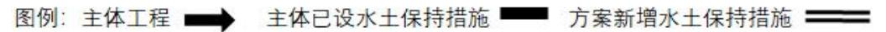

表5.4-1 上海地块水土保持措施实施进度控制计划表
<table><tr><td rowspan=2 colspan=4>分项内容</td><td rowspan=1 colspan=1>2025年</td><td rowspan=1 colspan=1></td><td rowspan=1 colspan=1></td><td rowspan=1 colspan=1></td><td rowspan=1 colspan=1></td><td rowspan=1 colspan=1></td><td rowspan=1 colspan=1>2026</td><td rowspan=1 colspan=1>年</td><td rowspan=1 colspan=1></td><td rowspan=1 colspan=2></td><td rowspan=1 colspan=2></td><td rowspan=1 colspan=4></td><td rowspan=1 colspan=1></td><td rowspan=1 colspan=1>2027</td><td rowspan=1 colspan=2>年</td><td rowspan=1 colspan=4></td><td rowspan=1 colspan=4></td><td rowspan=1 colspan=1>2028</td><td rowspan=1 colspan=7>年</td><td rowspan=1 colspan=1></td><td rowspan=1 colspan=1></td><td rowspan=1 colspan=1>2029</td><td rowspan=1 colspan=1>年</td><td rowspan=1 colspan=1></td><td rowspan=1 colspan=2></td></tr><tr><td rowspan=1 colspan=1>12</td><td rowspan=1 colspan=1>1</td><td rowspan=1 colspan=1>2</td><td rowspan=1 colspan=1>3</td><td rowspan=1 colspan=1>4</td><td rowspan=1 colspan=1>5</td><td rowspan=1 colspan=1>6</td><td rowspan=1 colspan=1>7</td><td rowspan=1 colspan=1>8</td><td rowspan=1 colspan=1>9</td><td rowspan=1 colspan=1>10</td><td rowspan=1 colspan=1>11</td><td rowspan=1 colspan=1>12</td><td rowspan=1 colspan=1>1</td><td rowspan=1 colspan=1>2</td><td rowspan=1 colspan=1>3</td><td rowspan=1 colspan=1>4</td><td rowspan=1 colspan=1>5</td><td rowspan=1 colspan=1>6</td><td rowspan=1 colspan=1>7</td><td rowspan=1 colspan=1>8</td><td rowspan=1 colspan=1>9</td><td rowspan=1 colspan=1>10</td><td rowspan=1 colspan=1>11</td><td rowspan=1 colspan=1>12</td><td rowspan=1 colspan=1>1</td><td rowspan=1 colspan=1>2</td><td rowspan=1 colspan=1>3</td><td rowspan=1 colspan=1>4</td><td rowspan=1 colspan=1>5</td><td rowspan=1 colspan=1>6</td><td rowspan=1 colspan=1>7</td><td rowspan=1 colspan=1>8</td><td rowspan=1 colspan=1>9</td><td rowspan=1 colspan=1>10</td><td rowspan=1 colspan=1>11</td><td rowspan=1 colspan=1>12</td><td rowspan=1 colspan=1>1</td><td rowspan=1 colspan=1>2</td><td rowspan=1 colspan=1>3</td><td rowspan=1 colspan=1>4</td><td rowspan=1 colspan=1>5</td><td rowspan=1 colspan=1>6</td><td rowspan=1 colspan=1>7</td></tr><tr><td rowspan=12 colspan=1>主体工程防治区</td><td rowspan=3 colspan=2>主体工程</td><td rowspan=3 colspan=1>建构筑物基础、道路及管线、顶板覆土等施工</td><td rowspan=1 colspan=1></td><td rowspan=1 colspan=1></td><td rowspan=1 colspan=1></td><td rowspan=1 colspan=1></td><td rowspan=1 colspan=1></td><td rowspan=1 colspan=1></td><td rowspan=1 colspan=1></td><td rowspan=1 colspan=1></td><td rowspan=1 colspan=1></td><td rowspan=1 colspan=1></td><td rowspan=1 colspan=1></td><td rowspan=1 colspan=1></td><td rowspan=1 colspan=1></td><td rowspan=1 colspan=1></td><td rowspan=1 colspan=1></td><td rowspan=1 colspan=1></td><td rowspan=1 colspan=1></td><td rowspan=1 colspan=1></td><td rowspan=1 colspan=1></td><td rowspan=1 colspan=1></td><td rowspan=1 colspan=1></td><td rowspan=1 colspan=1></td><td rowspan=1 colspan=1></td><td rowspan=1 colspan=1></td><td rowspan=1 colspan=1></td><td rowspan=1 colspan=1></td><td rowspan=1 colspan=1></td><td rowspan=1 colspan=1></td><td rowspan=1 colspan=1></td><td rowspan=1 colspan=1></td><td rowspan=1 colspan=1></td><td rowspan=1 colspan=1></td><td rowspan=3 colspan=1></td><td rowspan=3 colspan=1></td><td rowspan=3 colspan=1></td><td rowspan=3 colspan=1></td><td rowspan=3 colspan=1></td><td rowspan=3 colspan=1></td><td rowspan=3 colspan=1></td><td rowspan=3 colspan=1></td><td rowspan=3 colspan=1></td><td rowspan=3 colspan=1></td><td rowspan=3 colspan=1></td><td rowspan=3 colspan=1></td></tr><tr><td rowspan=2 colspan=1></td><td rowspan=2 colspan=1></td><td rowspan=2 colspan=1></td><td rowspan=2 colspan=1></td><td rowspan=2 colspan=1></td><td rowspan=2 colspan=1></td><td rowspan=2 colspan=1></td><td rowspan=2 colspan=1></td><td rowspan=2 colspan=1></td><td rowspan=2 colspan=1></td><td rowspan=2 colspan=1></td><td rowspan=2 colspan=1></td><td rowspan=2 colspan=1></td><td rowspan=2 colspan=1></td><td rowspan=2 colspan=1></td><td rowspan=2 colspan=1></td><td rowspan=2 colspan=1></td><td rowspan=2 colspan=1></td><td rowspan=2 colspan=1></td><td rowspan=2 colspan=1></td><td rowspan=2 colspan=1></td><td rowspan=2 colspan=1></td><td rowspan=2 colspan=1></td><td rowspan=2 colspan=1></td><td rowspan=2 colspan=1></td><td rowspan=2 colspan=1></td><td rowspan=2 colspan=1></td><td rowspan=2 colspan=1></td><td rowspan=2 colspan=1></td><td rowspan=2 colspan=1></td><td rowspan=2 colspan=1></td><td></td></tr><tr><td rowspan=1 colspan=1>7</td></tr><tr><td rowspan=9 colspan=1>水保措施</td><td rowspan=6 colspan=1>工程措施</td><td rowspan=1 colspan=1>排水设施工程</td><td rowspan=1 colspan=1></td><td rowspan=1 colspan=1></td><td rowspan=1 colspan=1></td><td rowspan=1 colspan=1></td><td rowspan=1 colspan=1></td><td rowspan=1 colspan=1></td><td rowspan=1 colspan=1></td><td rowspan=1 colspan=1></td><td rowspan=1 colspan=1></td><td rowspan=1 colspan=1></td><td rowspan=1 colspan=1></td><td rowspan=1 colspan=1></td><td rowspan=1 colspan=1></td><td rowspan=1 colspan=1></td><td rowspan=1 colspan=1></td><td rowspan=1 colspan=1></td><td rowspan=1 colspan=1></td><td rowspan=1 colspan=1></td><td rowspan=1 colspan=1></td><td rowspan=1 colspan=1></td><td rowspan=1 colspan=1></td><td rowspan=1 colspan=1></td><td rowspan=1 colspan=1></td><td rowspan=1 colspan=1></td><td rowspan=1 colspan=1></td><td rowspan=1 colspan=1></td><td rowspan=1 colspan=1></td><td rowspan=1 colspan=1></td><td rowspan=1 colspan=1></td><td rowspan=1 colspan=1></td><td rowspan=1 colspan=1></td><td rowspan=1 colspan=1></td><td rowspan=1 colspan=1></td><td rowspan=1 colspan=1></td><td rowspan=1 colspan=1></td><td rowspan=1 colspan=1></td><td rowspan=1 colspan=1></td><td rowspan=1 colspan=1></td><td rowspan=1 colspan=1></td><td rowspan=1 colspan=1></td><td rowspan=1 colspan=1></td><td rowspan=1 colspan=1></td><td rowspan=1 colspan=1></td><td rowspan=1 colspan=1></td></tr><tr><td rowspan=1 colspan=1>雨水蓄水池</td><td rowspan=1 colspan=1></td><td rowspan=1 colspan=1></td><td rowspan=1 colspan=1></td><td rowspan=1 colspan=1></td><td rowspan=1 colspan=1></td><td rowspan=1 colspan=1></td><td rowspan=1 colspan=1></td><td rowspan=1 colspan=1></td><td rowspan=1 colspan=1></td><td rowspan=1 colspan=1></td><td rowspan=1 colspan=1></td><td rowspan=1 colspan=1></td><td rowspan=1 colspan=1></td><td rowspan=1 colspan=1></td><td rowspan=1 colspan=1></td><td rowspan=1 colspan=1></td><td rowspan=1 colspan=1></td><td rowspan=1 colspan=1></td><td rowspan=1 colspan=1></td><td rowspan=1 colspan=1></td><td rowspan=1 colspan=1></td><td rowspan=1 colspan=1></td><td rowspan=1 colspan=1></td><td rowspan=1 colspan=1></td><td rowspan=1 colspan=1></td><td rowspan=1 colspan=1></td><td rowspan=1 colspan=1></td><td rowspan=1 colspan=1></td><td rowspan=1 colspan=1></td><td rowspan=1 colspan=1></td><td rowspan=1 colspan=1></td><td rowspan=1 colspan=1></td><td rowspan=1 colspan=1></td><td rowspan=1 colspan=1></td><td rowspan=1 colspan=1></td><td rowspan=1 colspan=1></td><td rowspan=1 colspan=1></td><td rowspan=1 colspan=1></td><td rowspan=1 colspan=1></td><td rowspan=1 colspan=1></td><td rowspan=1 colspan=1></td><td rowspan=1 colspan=1></td><td rowspan=1 colspan=1></td><td rowspan=1 colspan=1></td></tr><tr><td rowspan=1 colspan=1>透水铺装</td><td rowspan=1 colspan=1></td><td rowspan=1 colspan=1></td><td rowspan=1 colspan=1></td><td rowspan=1 colspan=1></td><td rowspan=1 colspan=1></td><td rowspan=1 colspan=1></td><td rowspan=1 colspan=1></td><td rowspan=1 colspan=1></td><td rowspan=1 colspan=1></td><td rowspan=1 colspan=1></td><td rowspan=1 colspan=1></td><td rowspan=1 colspan=1></td><td rowspan=1 colspan=1></td><td rowspan=1 colspan=1></td><td rowspan=1 colspan=1></td><td rowspan=1 colspan=1></td><td rowspan=1 colspan=1></td><td rowspan=1 colspan=1></td><td rowspan=1 colspan=1></td><td rowspan=1 colspan=1></td><td rowspan=1 colspan=1></td><td rowspan=1 colspan=1></td><td rowspan=1 colspan=1></td><td rowspan=1 colspan=1></td><td rowspan=1 colspan=1></td><td rowspan=1 colspan=1></td><td rowspan=1 colspan=1></td><td rowspan=1 colspan=1></td><td rowspan=1 colspan=1></td><td rowspan=1 colspan=1></td><td rowspan=1 colspan=1></td><td rowspan=1 colspan=1></td><td rowspan=1 colspan=1></td><td rowspan=1 colspan=1></td><td rowspan=1 colspan=1></td><td rowspan=1 colspan=1></td><td rowspan=1 colspan=1></td><td rowspan=1 colspan=1></td><td rowspan=1 colspan=1></td><td rowspan=1 colspan=1></td><td rowspan=1 colspan=1></td><td rowspan=1 colspan=1></td><td rowspan=1 colspan=1></td><td rowspan=1 colspan=1></td></tr><tr><td rowspan=1 colspan=1>下凹式绿地</td><td rowspan=1 colspan=1></td><td rowspan=1 colspan=1></td><td rowspan=1 colspan=1></td><td rowspan=1 colspan=1></td><td rowspan=1 colspan=1></td><td rowspan=1 colspan=1></td><td rowspan=1 colspan=1></td><td rowspan=1 colspan=1></td><td rowspan=1 colspan=1></td><td rowspan=1 colspan=1></td><td rowspan=1 colspan=1></td><td rowspan=1 colspan=1></td><td rowspan=1 colspan=1></td><td rowspan=1 colspan=1></td><td rowspan=1 colspan=1></td><td rowspan=1 colspan=1></td><td rowspan=1 colspan=1></td><td rowspan=1 colspan=1></td><td rowspan=1 colspan=1></td><td rowspan=1 colspan=1></td><td rowspan=1 colspan=1></td><td rowspan=1 colspan=1></td><td rowspan=1 colspan=1></td><td rowspan=1 colspan=1></td><td rowspan=1 colspan=1></td><td rowspan=1 colspan=1></td><td rowspan=1 colspan=1></td><td rowspan=1 colspan=1></td><td rowspan=1 colspan=1></td><td rowspan=1 colspan=1></td><td rowspan=1 colspan=1></td><td rowspan=1 colspan=1></td><td rowspan=1 colspan=1></td><td rowspan=1 colspan=1></td><td rowspan=1 colspan=1></td><td rowspan=1 colspan=1></td><td rowspan=1 colspan=1></td><td rowspan=1 colspan=1></td><td rowspan=1 colspan=1></td><td rowspan=1 colspan=1></td><td rowspan=1 colspan=1></td><td rowspan=1 colspan=1></td><td rowspan=1 colspan=1></td><td rowspan=1 colspan=1></td></tr><tr><td rowspan=1 colspan=1>场地平整</td><td rowspan=1 colspan=1></td><td rowspan=1 colspan=1></td><td rowspan=1 colspan=1></td><td rowspan=1 colspan=1></td><td rowspan=1 colspan=1></td><td rowspan=1 colspan=1></td><td rowspan=1 colspan=1></td><td rowspan=1 colspan=1></td><td rowspan=1 colspan=1></td><td rowspan=1 colspan=1></td><td rowspan=1 colspan=1></td><td rowspan=1 colspan=1></td><td rowspan=1 colspan=1></td><td rowspan=1 colspan=1></td><td rowspan=1 colspan=1></td><td rowspan=1 colspan=1></td><td rowspan=1 colspan=1></td><td rowspan=1 colspan=1></td><td rowspan=1 colspan=1></td><td rowspan=1 colspan=1></td><td rowspan=1 colspan=1></td><td rowspan=1 colspan=1></td><td rowspan=1 colspan=1></td><td rowspan=1 colspan=1></td><td rowspan=1 colspan=1></td><td rowspan=1 colspan=1></td><td rowspan=1 colspan=1></td><td rowspan=1 colspan=1></td><td rowspan=1 colspan=1></td><td rowspan=1 colspan=1></td><td rowspan=1 colspan=1></td><td rowspan=1 colspan=1></td><td rowspan=1 colspan=1></td><td rowspan=1 colspan=1></td><td rowspan=1 colspan=1></td><td rowspan=1 colspan=1></td><td rowspan=1 colspan=1></td><td rowspan=1 colspan=1></td><td rowspan=1 colspan=1></td><td rowspan=1 colspan=1></td><td rowspan=1 colspan=1></td><td rowspan=1 colspan=1></td><td rowspan=1 colspan=1></td><td rowspan=1 colspan=1></td></tr><tr><td rowspan=1 colspan=1>土壤改良及绿化覆土</td><td rowspan=1 colspan=1></td><td rowspan=1 colspan=1></td><td rowspan=1 colspan=1></td><td rowspan=1 colspan=1></td><td rowspan=1 colspan=1></td><td rowspan=1 colspan=1></td><td rowspan=1 colspan=1></td><td rowspan=1 colspan=1></td><td rowspan=1 colspan=1></td><td rowspan=1 colspan=1></td><td rowspan=1 colspan=1></td><td rowspan=1 colspan=1></td><td rowspan=1 colspan=1></td><td rowspan=1 colspan=1></td><td rowspan=1 colspan=1></td><td rowspan=1 colspan=1></td><td rowspan=1 colspan=1></td><td rowspan=1 colspan=1></td><td rowspan=1 colspan=1></td><td rowspan=1 colspan=1></td><td rowspan=1 colspan=1></td><td rowspan=1 colspan=1></td><td rowspan=1 colspan=1></td><td rowspan=1 colspan=1></td><td rowspan=1 colspan=1></td><td rowspan=1 colspan=1></td><td rowspan=1 colspan=1></td><td rowspan=1 colspan=1></td><td rowspan=1 colspan=1></td><td rowspan=1 colspan=1></td><td rowspan=1 colspan=1></td><td rowspan=1 colspan=1></td><td rowspan=1 colspan=1></td><td rowspan=1 colspan=1></td><td rowspan=1 colspan=1></td><td rowspan=1 colspan=1></td><td rowspan=1 colspan=1></td><td rowspan=1 colspan=1></td><td rowspan=1 colspan=1></td><td rowspan=1 colspan=1></td><td rowspan=1 colspan=1></td><td rowspan=1 colspan=1></td><td rowspan=1 colspan=1></td><td rowspan=1 colspan=1></td></tr><tr><td rowspan=1 colspan=1>植物措施</td><td rowspan=1 colspan=1>景观绿化</td><td rowspan=1 colspan=1></td><td rowspan=1 colspan=1></td><td rowspan=1 colspan=1></td><td rowspan=1 colspan=1></td><td rowspan=1 colspan=1></td><td rowspan=1 colspan=1></td><td rowspan=1 colspan=1></td><td rowspan=1 colspan=1></td><td rowspan=1 colspan=1></td><td rowspan=1 colspan=1></td><td rowspan=1 colspan=1></td><td rowspan=1 colspan=1></td><td rowspan=1 colspan=1></td><td rowspan=1 colspan=1></td><td rowspan=1 colspan=1></td><td rowspan=1 colspan=1></td><td rowspan=1 colspan=1></td><td rowspan=1 colspan=1></td><td rowspan=1 colspan=1></td><td rowspan=1 colspan=1></td><td rowspan=1 colspan=1></td><td rowspan=1 colspan=1></td><td rowspan=1 colspan=1></td><td rowspan=1 colspan=1></td><td rowspan=1 colspan=1></td><td rowspan=1 colspan=1></td><td rowspan=1 colspan=1></td><td rowspan=1 colspan=1></td><td rowspan=1 colspan=1></td><td rowspan=1 colspan=1></td><td rowspan=1 colspan=1></td><td rowspan=1 colspan=1></td><td rowspan=1 colspan=1></td><td rowspan=1 colspan=1></td><td rowspan=1 colspan=1></td><td rowspan=1 colspan=1></td><td rowspan=1 colspan=1></td><td rowspan=1 colspan=1></td><td rowspan=1 colspan=1></td><td rowspan=1 colspan=1></td><td rowspan=1 colspan=1></td><td rowspan=1 colspan=1></td><td rowspan=1 colspan=1></td><td rowspan=1 colspan=1></td></tr><tr><td rowspan=2 colspan=1>临时措施</td><td rowspan=1 colspan=1>临时排水沉沙措施</td><td rowspan=1 colspan=1>_</td><td rowspan=1 colspan=1></td><td rowspan=1 colspan=1></td><td rowspan=1 colspan=1></td><td rowspan=1 colspan=1></td><td rowspan=1 colspan=1></td><td rowspan=1 colspan=1></td><td rowspan=1 colspan=1></td><td rowspan=1 colspan=1></td><td rowspan=1 colspan=1></td><td rowspan=1 colspan=1></td><td rowspan=1 colspan=1></td><td rowspan=1 colspan=1></td><td rowspan=1 colspan=1></td><td rowspan=1 colspan=1></td><td rowspan=1 colspan=1></td><td rowspan=1 colspan=1></td><td rowspan=1 colspan=1></td><td rowspan=1 colspan=1></td><td rowspan=1 colspan=1></td><td rowspan=1 colspan=1></td><td rowspan=1 colspan=1></td><td rowspan=1 colspan=1></td><td rowspan=1 colspan=1></td><td rowspan=1 colspan=1></td><td rowspan=1 colspan=1></td><td rowspan=1 colspan=1></td><td rowspan=1 colspan=1></td><td rowspan=1 colspan=1></td><td rowspan=1 colspan=1></td><td rowspan=1 colspan=1></td><td rowspan=1 colspan=1></td><td rowspan=1 colspan=1></td><td rowspan=1 colspan=1></td><td rowspan=1 colspan=1></td><td rowspan=1 colspan=1></td><td rowspan=1 colspan=1></td><td rowspan=1 colspan=1></td><td rowspan=1 colspan=1></td><td rowspan=1 colspan=1></td><td rowspan=1 colspan=1></td><td rowspan=1 colspan=1></td><td rowspan=1 colspan=1></td><td rowspan=1 colspan=1></td></tr><tr><td rowspan=1 colspan=1>密目网苦盖</td><td rowspan=1 colspan=1>_</td><td rowspan=1 colspan=1></td><td rowspan=1 colspan=1></td><td rowspan=1 colspan=1></td><td rowspan=1 colspan=1></td><td rowspan=1 colspan=1></td><td rowspan=1 colspan=1></td><td rowspan=1 colspan=1></td><td rowspan=1 colspan=1></td><td rowspan=1 colspan=1></td><td rowspan=1 colspan=1></td><td rowspan=1 colspan=1></td><td rowspan=1 colspan=1></td><td rowspan=1 colspan=1></td><td rowspan=1 colspan=1></td><td rowspan=1 colspan=1></td><td rowspan=1 colspan=1></td><td rowspan=1 colspan=1></td><td rowspan=1 colspan=1></td><td rowspan=1 colspan=1></td><td rowspan=1 colspan=1></td><td rowspan=1 colspan=1></td><td rowspan=1 colspan=1></td><td rowspan=1 colspan=1></td><td rowspan=1 colspan=1></td><td rowspan=1 colspan=1></td><td rowspan=1 colspan=1></td><td rowspan=1 colspan=1></td><td rowspan=1 colspan=1></td><td rowspan=1 colspan=1></td><td rowspan=1 colspan=1></td><td rowspan=1 colspan=1></td><td rowspan=1 colspan=1></td><td rowspan=1 colspan=1></td><td rowspan=1 colspan=1></td><td rowspan=1 colspan=1></td><td rowspan=1 colspan=1></td><td rowspan=1 colspan=1></td><td rowspan=1 colspan=1></td><td rowspan=1 colspan=1></td><td rowspan=1 colspan=1></td><td rowspan=1 colspan=1></td><td rowspan=1 colspan=1></td><td rowspan=1 colspan=1></td></tr><tr><td rowspan=3 colspan=1>施工生产生活防治区</td><td rowspan=1 colspan=1>施工</td><td rowspan=1 colspan=1>场地建设</td><td rowspan=1 colspan=1>、场地清理</td><td rowspan=1 colspan=1></td><td rowspan=1 colspan=1></td><td rowspan=1 colspan=1></td><td rowspan=1 colspan=1></td><td rowspan=1 colspan=1></td><td rowspan=1 colspan=1></td><td rowspan=1 colspan=1></td><td rowspan=1 colspan=1></td><td rowspan=1 colspan=1></td><td rowspan=1 colspan=1></td><td rowspan=1 colspan=1></td><td rowspan=1 colspan=1></td><td rowspan=1 colspan=1></td><td rowspan=1 colspan=1></td><td rowspan=1 colspan=1></td><td rowspan=1 colspan=1></td><td rowspan=1 colspan=1></td><td rowspan=1 colspan=1></td><td rowspan=1 colspan=1></td><td rowspan=1 colspan=1></td><td rowspan=1 colspan=1></td><td rowspan=1 colspan=1></td><td rowspan=1 colspan=1></td><td rowspan=1 colspan=1></td><td rowspan=1 colspan=1></td><td rowspan=1 colspan=1></td><td rowspan=1 colspan=1></td><td rowspan=1 colspan=1></td><td rowspan=1 colspan=1></td><td rowspan=1 colspan=1></td><td rowspan=1 colspan=1></td><td rowspan=1 colspan=1></td><td rowspan=1 colspan=1></td><td rowspan=1 colspan=1></td><td rowspan=1 colspan=1></td><td rowspan=1 colspan=1></td><td rowspan=1 colspan=1></td><td rowspan=1 colspan=1></td><td rowspan=1 colspan=1></td><td rowspan=1 colspan=1></td><td rowspan=1 colspan=1></td><td rowspan=1 colspan=1></td><td rowspan=1 colspan=1></td><td rowspan=1 colspan=1></td></tr><tr><td rowspan=2 colspan=1>水保措施</td><td rowspan=1 colspan=1>植物措施</td><td rowspan=1 colspan=1>撒播草籽绿化</td><td rowspan=1 colspan=1></td><td rowspan=1 colspan=1></td><td rowspan=1 colspan=1></td><td rowspan=1 colspan=1></td><td rowspan=1 colspan=1></td><td rowspan=1 colspan=1></td><td rowspan=1 colspan=1></td><td rowspan=1 colspan=1></td><td rowspan=1 colspan=1></td><td rowspan=1 colspan=1></td><td rowspan=1 colspan=1></td><td rowspan=1 colspan=1></td><td rowspan=1 colspan=1></td><td rowspan=1 colspan=1></td><td rowspan=1 colspan=1></td><td rowspan=1 colspan=1></td><td rowspan=1 colspan=1></td><td rowspan=1 colspan=1></td><td rowspan=1 colspan=1></td><td rowspan=1 colspan=1></td><td rowspan=1 colspan=1></td><td rowspan=1 colspan=1></td><td rowspan=1 colspan=1></td><td rowspan=1 colspan=1></td><td rowspan=1 colspan=1></td><td rowspan=1 colspan=1></td><td rowspan=1 colspan=1></td><td rowspan=1 colspan=1></td><td rowspan=1 colspan=1></td><td rowspan=1 colspan=1></td><td rowspan=1 colspan=1></td><td rowspan=1 colspan=1></td><td rowspan=1 colspan=1></td><td rowspan=1 colspan=1></td><td rowspan=1 colspan=1></td><td rowspan=1 colspan=1></td><td rowspan=1 colspan=1></td><td rowspan=1 colspan=1></td><td rowspan=1 colspan=1></td><td rowspan=1 colspan=1></td><td rowspan=1 colspan=1></td><td rowspan=1 colspan=1></td><td rowspan=1 colspan=1></td><td rowspan=1 colspan=1></td></tr><tr><td rowspan=1 colspan=1>临时措施</td><td rowspan=1 colspan=1>临时排水沉沙措施</td><td rowspan=1 colspan=1></td><td rowspan=1 colspan=1></td><td rowspan=1 colspan=1></td><td rowspan=1 colspan=1></td><td rowspan=1 colspan=1></td><td rowspan=1 colspan=1></td><td rowspan=1 colspan=1></td><td rowspan=1 colspan=1></td><td rowspan=1 colspan=1></td><td rowspan=1 colspan=1></td><td rowspan=1 colspan=1></td><td rowspan=1 colspan=1></td><td rowspan=1 colspan=1></td><td rowspan=1 colspan=1></td><td rowspan=1 colspan=1></td><td rowspan=1 colspan=1></td><td rowspan=1 colspan=1></td><td rowspan=1 colspan=1></td><td rowspan=1 colspan=1></td><td rowspan=1 colspan=1></td><td rowspan=1 colspan=1></td><td rowspan=1 colspan=1></td><td rowspan=1 colspan=1></td><td rowspan=1 colspan=1></td><td rowspan=1 colspan=1></td><td rowspan=1 colspan=1></td><td rowspan=1 colspan=1></td><td rowspan=1 colspan=1></td><td rowspan=1 colspan=1></td><td rowspan=1 colspan=1></td><td rowspan=1 colspan=1></td><td rowspan=1 colspan=1></td><td rowspan=1 colspan=1></td><td rowspan=1 colspan=1></td><td rowspan=1 colspan=1></td><td rowspan=1 colspan=1></td><td rowspan=1 colspan=1></td><td rowspan=1 colspan=1></td><td rowspan=1 colspan=1></td><td rowspan=1 colspan=1></td><td rowspan=1 colspan=1></td><td rowspan=1 colspan=1></td><td rowspan=1 colspan=1></td><td rowspan=1 colspan=1></td></tr><tr><td rowspan=5 colspan=1>临时堆土防治区</td><td rowspan=5 colspan=1>水保措施</td><td rowspan=1 colspan=1>植物措施</td><td rowspan=1 colspan=1>撒播草籽绿化</td><td rowspan=1 colspan=1></td><td rowspan=1 colspan=1></td><td rowspan=1 colspan=1></td><td rowspan=1 colspan=1></td><td rowspan=1 colspan=1></td><td rowspan=1 colspan=1></td><td rowspan=1 colspan=1></td><td rowspan=1 colspan=1></td><td rowspan=1 colspan=1></td><td rowspan=1 colspan=1></td><td rowspan=1 colspan=1></td><td rowspan=1 colspan=1></td><td rowspan=1 colspan=1></td><td rowspan=1 colspan=1></td><td rowspan=1 colspan=1></td><td rowspan=1 colspan=1></td><td rowspan=1 colspan=1></td><td rowspan=1 colspan=1></td><td rowspan=1 colspan=1></td><td rowspan=1 colspan=1></td><td rowspan=1 colspan=1></td><td rowspan=1 colspan=1></td><td rowspan=1 colspan=1></td><td rowspan=1 colspan=1></td><td rowspan=1 colspan=1></td><td rowspan=1 colspan=1></td><td rowspan=1 colspan=1></td><td rowspan=1 colspan=1></td><td rowspan=1 colspan=1></td><td rowspan=1 colspan=1></td><td rowspan=1 colspan=1></td><td rowspan=1 colspan=1></td><td rowspan=1 colspan=1></td><td rowspan=1 colspan=1></td><td rowspan=1 colspan=1></td><td rowspan=1 colspan=1></td><td rowspan=1 colspan=1></td><td rowspan=1 colspan=1></td><td rowspan=1 colspan=1></td><td rowspan=1 colspan=1></td><td rowspan=1 colspan=1></td><td rowspan=1 colspan=1></td><td rowspan=1 colspan=1></td><td rowspan=1 colspan=1></td></tr><tr><td rowspan=4 colspan=1>临时措施</td><td rowspan=1 colspan=1>编织袋拦挡及拆除</td><td rowspan=1 colspan=1></td><td rowspan=1 colspan=1></td><td rowspan=1 colspan=1></td><td rowspan=1 colspan=1></td><td rowspan=1 colspan=1></td><td rowspan=1 colspan=1></td><td rowspan=1 colspan=1></td><td rowspan=1 colspan=1></td><td rowspan=1 colspan=1></td><td rowspan=1 colspan=1></td><td rowspan=1 colspan=1></td><td rowspan=1 colspan=1></td><td rowspan=1 colspan=1></td><td rowspan=1 colspan=1></td><td rowspan=1 colspan=1></td><td rowspan=1 colspan=1></td><td rowspan=1 colspan=1></td><td rowspan=1 colspan=1></td><td rowspan=1 colspan=1></td><td rowspan=1 colspan=1></td><td rowspan=1 colspan=1></td><td rowspan=1 colspan=1></td><td rowspan=1 colspan=1></td><td rowspan=1 colspan=1></td><td rowspan=1 colspan=1></td><td rowspan=1 colspan=1></td><td rowspan=1 colspan=1></td><td rowspan=1 colspan=1></td><td rowspan=1 colspan=1></td><td rowspan=1 colspan=1></td><td rowspan=1 colspan=1></td><td rowspan=1 colspan=1></td><td rowspan=1 colspan=1></td><td rowspan=1 colspan=1></td><td rowspan=1 colspan=1></td><td rowspan=1 colspan=1></td><td rowspan=1 colspan=1></td><td rowspan=1 colspan=1>_</td><td rowspan=1 colspan=1></td><td rowspan=1 colspan=1></td><td rowspan=1 colspan=1></td><td rowspan=1 colspan=1></td><td rowspan=1 colspan=1></td><td rowspan=1 colspan=1></td></tr><tr><td rowspan=1 colspan=1>排水沉沙措施</td><td rowspan=1 colspan=1></td><td rowspan=1 colspan=1></td><td rowspan=1 colspan=1></td><td rowspan=1 colspan=1></td><td rowspan=1 colspan=1></td><td rowspan=1 colspan=1></td><td rowspan=1 colspan=1></td><td rowspan=1 colspan=1></td><td rowspan=1 colspan=1></td><td rowspan=1 colspan=1></td><td rowspan=1 colspan=1></td><td rowspan=1 colspan=1></td><td rowspan=1 colspan=1></td><td rowspan=1 colspan=1></td><td rowspan=1 colspan=1></td><td rowspan=1 colspan=1></td><td rowspan=1 colspan=1></td><td rowspan=1 colspan=1></td><td rowspan=1 colspan=1></td><td rowspan=1 colspan=1></td><td rowspan=1 colspan=1></td><td rowspan=1 colspan=1></td><td rowspan=1 colspan=1></td><td rowspan=1 colspan=1></td><td rowspan=1 colspan=1></td><td rowspan=1 colspan=1></td><td rowspan=1 colspan=1></td><td rowspan=1 colspan=1></td><td rowspan=1 colspan=1></td><td rowspan=1 colspan=1></td><td rowspan=1 colspan=1></td><td rowspan=1 colspan=1></td><td rowspan=1 colspan=1></td><td rowspan=1 colspan=1></td><td rowspan=1 colspan=1></td><td rowspan=1 colspan=1></td><td rowspan=1 colspan=1></td><td rowspan=1 colspan=1></td><td rowspan=1 colspan=1></td><td rowspan=1 colspan=1></td><td rowspan=1 colspan=1></td><td rowspan=1 colspan=1></td><td rowspan=1 colspan=1></td><td rowspan=1 colspan=1></td></tr><tr><td rowspan=1 colspan=1>临时绿化</td><td rowspan=1 colspan=1></td><td rowspan=1 colspan=1></td><td rowspan=1 colspan=1></td><td rowspan=1 colspan=1></td><td rowspan=1 colspan=1></td><td rowspan=1 colspan=1></td><td rowspan=1 colspan=1></td><td rowspan=1 colspan=1></td><td rowspan=1 colspan=1></td><td rowspan=1 colspan=1></td><td rowspan=1 colspan=1></td><td rowspan=1 colspan=1></td><td rowspan=1 colspan=1></td><td rowspan=1 colspan=1></td><td rowspan=1 colspan=1></td><td rowspan=1 colspan=1></td><td rowspan=1 colspan=1></td><td rowspan=1 colspan=1></td><td rowspan=1 colspan=1></td><td rowspan=1 colspan=1></td><td rowspan=1 colspan=1></td><td rowspan=1 colspan=1></td><td rowspan=1 colspan=1></td><td rowspan=1 colspan=1></td><td rowspan=1 colspan=1></td><td rowspan=1 colspan=1></td><td rowspan=1 colspan=1></td><td rowspan=1 colspan=1></td><td rowspan=1 colspan=1></td><td rowspan=1 colspan=1></td><td rowspan=1 colspan=1></td><td rowspan=1 colspan=1></td><td rowspan=1 colspan=1></td><td rowspan=1 colspan=1></td><td rowspan=1 colspan=1></td><td rowspan=1 colspan=1></td><td rowspan=1 colspan=1></td><td rowspan=1 colspan=1></td><td rowspan=1 colspan=1></td><td rowspan=1 colspan=1></td><td rowspan=1 colspan=1></td><td rowspan=1 colspan=1></td><td rowspan=1 colspan=1></td><td rowspan=1 colspan=1></td></tr><tr><td rowspan=1 colspan=1>密目网苦盖</td><td rowspan=1 colspan=1></td><td rowspan=1 colspan=1></td><td rowspan=1 colspan=1></td><td rowspan=1 colspan=1></td><td rowspan=1 colspan=1></td><td rowspan=1 colspan=1></td><td rowspan=1 colspan=1></td><td rowspan=1 colspan=1></td><td rowspan=1 colspan=1></td><td rowspan=1 colspan=1></td><td rowspan=1 colspan=1></td><td rowspan=1 colspan=1></td><td rowspan=1 colspan=1></td><td rowspan=1 colspan=1></td><td rowspan=1 colspan=1></td><td rowspan=1 colspan=1></td><td rowspan=1 colspan=1></td><td rowspan=1 colspan=1></td><td rowspan=1 colspan=1></td><td rowspan=1 colspan=1></td><td rowspan=1 colspan=1></td><td rowspan=1 colspan=1></td><td rowspan=1 colspan=1></td><td rowspan=1 colspan=1></td><td rowspan=1 colspan=1></td><td rowspan=1 colspan=1></td><td rowspan=1 colspan=1></td><td rowspan=1 colspan=1></td><td rowspan=1 colspan=1></td><td rowspan=1 colspan=1></td><td rowspan=1 colspan=1></td><td rowspan=1 colspan=1></td><td rowspan=1 colspan=1></td><td rowspan=1 colspan=1></td><td rowspan=1 colspan=1></td><td rowspan=1 colspan=1></td><td rowspan=1 colspan=1></td><td rowspan=1 colspan=1></td><td rowspan=1 colspan=1></td><td rowspan=1 colspan=1></td><td rowspan=1 colspan=1></td><td rowspan=1 colspan=1></td><td rowspan=1 colspan=1></td><td rowspan=1 colspan=1></td></tr></table>

表5.4-2 长春地块水土保持措施实施进度控制计划表
<table><tr><td rowspan=2 colspan=4>分项内容</td><td rowspan=1 colspan=1>2025年</td><td rowspan=1 colspan=2></td><td rowspan=1 colspan=2></td><td rowspan=1 colspan=3>2026年</td><td rowspan=1 colspan=1></td><td rowspan=1 colspan=1></td><td rowspan=1 colspan=1></td><td rowspan=1 colspan=1></td><td rowspan=1 colspan=1></td><td rowspan=1 colspan=1></td><td rowspan=1 colspan=1></td><td rowspan=1 colspan=1></td><td rowspan=1 colspan=1></td><td rowspan=1 colspan=1></td><td rowspan=1 colspan=3>2027年</td><td rowspan=1 colspan=4></td><td rowspan=1 colspan=2></td><td rowspan=1 colspan=1></td><td rowspan=1 colspan=1></td><td rowspan=1 colspan=1></td><td rowspan=1 colspan=1>2028</td><td rowspan=1 colspan=4>年</td><td rowspan=1 colspan=2></td><td rowspan=1 colspan=1></td><td rowspan=1 colspan=1></td><td rowspan=1 colspan=1>2029</td><td rowspan=1 colspan=1>年</td><td rowspan=1 colspan=1></td><td rowspan=1 colspan=1></td><td rowspan=1 colspan=1></td></tr><tr><td rowspan=1 colspan=1>12</td><td rowspan=1 colspan=1>1</td><td rowspan=1 colspan=1>2</td><td rowspan=1 colspan=1>3</td><td rowspan=1 colspan=1>4</td><td rowspan=1 colspan=1>5</td><td rowspan=1 colspan=1>67</td><td rowspan=1 colspan=1>8</td><td rowspan=1 colspan=1>9</td><td rowspan=1 colspan=1>10</td><td rowspan=1 colspan=1>1</td><td rowspan=1 colspan=1>11</td><td rowspan=1 colspan=1>2</td><td rowspan=1 colspan=1>1</td><td rowspan=1 colspan=1>2</td><td rowspan=1 colspan=1>3</td><td rowspan=1 colspan=1>4</td><td rowspan=1 colspan=1>5</td><td rowspan=1 colspan=1>6</td><td rowspan=1 colspan=1>7</td><td rowspan=1 colspan=1>8</td><td rowspan=1 colspan=1>9</td><td rowspan=1 colspan=1>10</td><td rowspan=1 colspan=1>11</td><td rowspan=1 colspan=1>12</td><td rowspan=1 colspan=1></td><td rowspan=1 colspan=1>2</td><td rowspan=1 colspan=1>3</td><td rowspan=1 colspan=1>4</td><td rowspan=1 colspan=1>5</td><td rowspan=1 colspan=1>6</td><td rowspan=1 colspan=1>7</td><td rowspan=1 colspan=1>8</td><td rowspan=1 colspan=1>9</td><td rowspan=1 colspan=1>10</td><td rowspan=1 colspan=1>11</td><td rowspan=1 colspan=1>12</td><td rowspan=1 colspan=1></td><td rowspan=1 colspan=1>2</td><td rowspan=1 colspan=1>3</td><td rowspan=1 colspan=1>4</td><td rowspan=1 colspan=1>5</td><td rowspan=1 colspan=1>6</td><td rowspan=1 colspan=1>7</td></tr><tr><td rowspan=11 colspan=1>主体工程防治区</td><td rowspan=2 colspan=2>主体工程</td><td rowspan=2 colspan=1>建构筑物基础、道路及管线、顶板覆土等施工</td><td rowspan=2 colspan=1></td><td rowspan=2 colspan=1></td><td rowspan=2 colspan=1></td><td rowspan=2 colspan=1></td><td rowspan=1 colspan=1></td><td rowspan=1 colspan=1></td><td rowspan=1 colspan=1></td><td rowspan=1 colspan=1></td><td rowspan=1 colspan=1></td><td rowspan=1 colspan=1></td><td rowspan=1 colspan=1></td><td rowspan=1 colspan=1></td><td rowspan=2 colspan=1></td><td rowspan=2 colspan=1></td><td rowspan=2 colspan=1></td><td rowspan=2 colspan=1></td><td rowspan=1 colspan=1></td><td rowspan=1 colspan=1></td><td rowspan=1 colspan=1></td><td rowspan=1 colspan=1></td><td rowspan=1 colspan=1></td><td rowspan=1 colspan=1></td><td rowspan=1 colspan=1></td><td rowspan=2 colspan=1></td><td rowspan=2 colspan=1></td><td rowspan=2 colspan=1></td><td rowspan=2 colspan=1></td><td rowspan=2 colspan=1></td><td rowspan=1 colspan=1></td><td rowspan=1 colspan=1></td><td rowspan=1 colspan=1></td><td rowspan=1 colspan=1></td><td rowspan=1 colspan=1></td><td rowspan=1 colspan=1></td><td rowspan=1 colspan=1></td><td rowspan=2 colspan=1></td><td rowspan=2 colspan=1></td><td rowspan=2 colspan=1></td><td rowspan=2 colspan=1></td><td rowspan=2 colspan=1></td><td rowspan=1 colspan=1></td><td rowspan=1 colspan=1></td><td rowspan=1 colspan=1></td><td rowspan=1 colspan=1></td></tr><tr><td rowspan=1 colspan=1></td><td rowspan=1 colspan=1></td><td rowspan=1 colspan=1></td><td rowspan=1 colspan=1></td><td rowspan=1 colspan=1></td><td rowspan=1 colspan=1></td><td rowspan=1 colspan=1></td><td rowspan=1 colspan=1></td><td rowspan=1 colspan=1></td><td rowspan=1 colspan=1></td><td rowspan=1 colspan=1></td><td rowspan=1 colspan=1></td><td rowspan=1 colspan=1></td><td rowspan=1 colspan=1></td><td rowspan=1 colspan=1></td><td rowspan=1 colspan=1></td><td rowspan=1 colspan=1></td><td rowspan=1 colspan=1></td><td rowspan=1 colspan=1></td><td rowspan=1 colspan=1></td><td rowspan=1 colspan=1></td><td rowspan=1 colspan=1></td><td rowspan=1 colspan=1></td><td rowspan=1 colspan=1></td><td rowspan=1 colspan=1></td><td rowspan=1 colspan=1></td></tr><tr><td rowspan=9 colspan=1>水保措施</td><td rowspan=6 colspan=1>工程措施</td><td rowspan=1 colspan=1>表土剥离</td><td rowspan=1 colspan=1></td><td rowspan=1 colspan=1></td><td rowspan=1 colspan=1></td><td rowspan=1 colspan=1></td><td rowspan=1 colspan=1></td><td rowspan=1 colspan=1></td><td rowspan=1 colspan=1></td><td rowspan=1 colspan=1></td><td rowspan=1 colspan=1></td><td rowspan=1 colspan=1></td><td rowspan=1 colspan=1></td><td rowspan=1 colspan=1></td><td rowspan=1 colspan=1></td><td rowspan=1 colspan=1></td><td rowspan=1 colspan=1></td><td rowspan=1 colspan=1></td><td rowspan=1 colspan=1></td><td rowspan=1 colspan=1></td><td rowspan=1 colspan=1></td><td rowspan=1 colspan=1></td><td rowspan=1 colspan=1></td><td rowspan=1 colspan=1></td><td rowspan=1 colspan=1></td><td rowspan=1 colspan=1></td><td rowspan=1 colspan=1></td><td rowspan=1 colspan=1></td><td rowspan=1 colspan=1></td><td rowspan=1 colspan=1></td><td rowspan=1 colspan=1></td><td rowspan=1 colspan=1></td><td rowspan=1 colspan=1></td><td rowspan=1 colspan=1></td><td rowspan=1 colspan=1></td><td rowspan=1 colspan=1></td><td rowspan=1 colspan=1></td><td rowspan=1 colspan=1></td><td rowspan=1 colspan=1></td><td rowspan=1 colspan=1></td><td rowspan=1 colspan=1></td><td rowspan=1 colspan=1></td><td rowspan=1 colspan=1></td><td rowspan=1 colspan=1></td><td rowspan=1 colspan=1></td><td rowspan=1 colspan=1></td></tr><tr><td rowspan=1 colspan=1>排水设施工程</td><td rowspan=1 colspan=1></td><td rowspan=1 colspan=1></td><td rowspan=1 colspan=1></td><td rowspan=1 colspan=1></td><td rowspan=1 colspan=1></td><td rowspan=1 colspan=1></td><td rowspan=1 colspan=1></td><td rowspan=1 colspan=1></td><td rowspan=1 colspan=1></td><td rowspan=1 colspan=1></td><td rowspan=1 colspan=1></td><td rowspan=1 colspan=1></td><td rowspan=1 colspan=1></td><td rowspan=1 colspan=1></td><td rowspan=1 colspan=1></td><td rowspan=1 colspan=1></td><td rowspan=1 colspan=1></td><td rowspan=1 colspan=1></td><td rowspan=1 colspan=1></td><td rowspan=1 colspan=1></td><td rowspan=1 colspan=1></td><td rowspan=1 colspan=1></td><td rowspan=1 colspan=1></td><td rowspan=1 colspan=1></td><td rowspan=1 colspan=1></td><td rowspan=1 colspan=1></td><td rowspan=1 colspan=1></td><td rowspan=1 colspan=1></td><td rowspan=1 colspan=1></td><td rowspan=1 colspan=1></td><td rowspan=1 colspan=1></td><td rowspan=1 colspan=1></td><td rowspan=1 colspan=1></td><td rowspan=1 colspan=1></td><td rowspan=1 colspan=1></td><td rowspan=1 colspan=1></td><td rowspan=1 colspan=1></td><td rowspan=1 colspan=1></td><td rowspan=1 colspan=1></td><td rowspan=1 colspan=1></td><td rowspan=1 colspan=1></td><td rowspan=1 colspan=1></td><td rowspan=1 colspan=1></td><td rowspan=1 colspan=1></td></tr><tr><td rowspan=1 colspan=1>雨水蓄水池</td><td rowspan=1 colspan=1></td><td rowspan=1 colspan=1></td><td rowspan=1 colspan=1></td><td rowspan=1 colspan=1></td><td rowspan=1 colspan=1></td><td rowspan=1 colspan=1></td><td rowspan=1 colspan=1></td><td rowspan=1 colspan=1></td><td rowspan=1 colspan=1></td><td rowspan=1 colspan=1></td><td rowspan=1 colspan=1></td><td rowspan=1 colspan=1></td><td rowspan=1 colspan=1></td><td rowspan=1 colspan=1></td><td rowspan=1 colspan=1></td><td rowspan=1 colspan=1></td><td rowspan=1 colspan=1></td><td rowspan=1 colspan=1></td><td rowspan=1 colspan=1></td><td rowspan=1 colspan=1></td><td rowspan=1 colspan=1></td><td rowspan=1 colspan=1></td><td rowspan=1 colspan=1></td><td rowspan=1 colspan=1></td><td rowspan=1 colspan=1></td><td rowspan=1 colspan=1></td><td rowspan=1 colspan=1></td><td rowspan=1 colspan=1></td><td rowspan=1 colspan=1></td><td rowspan=1 colspan=1></td><td rowspan=1 colspan=1></td><td rowspan=1 colspan=1></td><td rowspan=1 colspan=1></td><td rowspan=1 colspan=1></td><td rowspan=1 colspan=1></td><td rowspan=1 colspan=1></td><td rowspan=1 colspan=1></td><td rowspan=1 colspan=1></td><td rowspan=1 colspan=1></td><td rowspan=1 colspan=1></td><td rowspan=1 colspan=1></td><td rowspan=1 colspan=1></td><td rowspan=1 colspan=1></td><td rowspan=1 colspan=1></td></tr><tr><td rowspan=1 colspan=1>透水铺装</td><td rowspan=1 colspan=1></td><td rowspan=1 colspan=1></td><td rowspan=1 colspan=1></td><td rowspan=1 colspan=1></td><td rowspan=1 colspan=1></td><td rowspan=1 colspan=1></td><td rowspan=1 colspan=1></td><td rowspan=1 colspan=1></td><td rowspan=1 colspan=1></td><td rowspan=1 colspan=1></td><td rowspan=1 colspan=1></td><td rowspan=1 colspan=1></td><td rowspan=1 colspan=1></td><td rowspan=1 colspan=1></td><td rowspan=1 colspan=1></td><td rowspan=1 colspan=1></td><td rowspan=1 colspan=1></td><td rowspan=1 colspan=1></td><td rowspan=1 colspan=1></td><td rowspan=1 colspan=1></td><td rowspan=1 colspan=1></td><td rowspan=1 colspan=1></td><td rowspan=1 colspan=1></td><td rowspan=1 colspan=1></td><td rowspan=1 colspan=1></td><td rowspan=1 colspan=1></td><td rowspan=1 colspan=1></td><td rowspan=1 colspan=1></td><td rowspan=1 colspan=1></td><td rowspan=1 colspan=1></td><td rowspan=1 colspan=1></td><td rowspan=1 colspan=1></td><td rowspan=1 colspan=1></td><td rowspan=1 colspan=1></td><td rowspan=1 colspan=1></td><td rowspan=1 colspan=1></td><td rowspan=1 colspan=1></td><td rowspan=1 colspan=1></td><td rowspan=1 colspan=1></td><td rowspan=1 colspan=1></td><td rowspan=1 colspan=1></td><td rowspan=1 colspan=1></td><td rowspan=1 colspan=1></td><td rowspan=1 colspan=1></td></tr><tr><td rowspan=1 colspan=1>场地平整</td><td rowspan=1 colspan=1></td><td rowspan=1 colspan=1></td><td rowspan=1 colspan=1></td><td rowspan=1 colspan=1></td><td rowspan=1 colspan=1></td><td rowspan=1 colspan=1></td><td rowspan=1 colspan=1></td><td rowspan=1 colspan=1></td><td rowspan=1 colspan=1></td><td rowspan=1 colspan=1></td><td rowspan=1 colspan=1></td><td rowspan=1 colspan=1></td><td rowspan=1 colspan=1></td><td rowspan=1 colspan=1></td><td rowspan=1 colspan=1></td><td rowspan=1 colspan=1></td><td rowspan=1 colspan=1></td><td rowspan=1 colspan=1></td><td rowspan=1 colspan=1></td><td rowspan=1 colspan=1></td><td rowspan=1 colspan=1></td><td rowspan=1 colspan=1></td><td rowspan=1 colspan=1></td><td rowspan=1 colspan=1></td><td rowspan=1 colspan=1></td><td rowspan=1 colspan=1></td><td rowspan=1 colspan=1></td><td rowspan=1 colspan=1></td><td rowspan=1 colspan=1></td><td rowspan=1 colspan=1></td><td rowspan=1 colspan=1></td><td rowspan=1 colspan=1></td><td rowspan=1 colspan=1></td><td rowspan=1 colspan=1></td><td rowspan=1 colspan=1></td><td rowspan=1 colspan=1></td><td rowspan=1 colspan=1></td><td rowspan=1 colspan=1></td><td rowspan=1 colspan=1></td><td rowspan=1 colspan=1></td><td rowspan=1 colspan=1></td><td rowspan=1 colspan=1></td><td rowspan=1 colspan=1></td><td rowspan=1 colspan=1></td></tr><tr><td rowspan=1 colspan=1>土壤改良及绿化覆土</td><td rowspan=1 colspan=1></td><td rowspan=1 colspan=1></td><td rowspan=1 colspan=1></td><td rowspan=1 colspan=1></td><td rowspan=1 colspan=1></td><td rowspan=1 colspan=1></td><td rowspan=1 colspan=1></td><td rowspan=1 colspan=1></td><td rowspan=1 colspan=1></td><td rowspan=1 colspan=1></td><td rowspan=1 colspan=1></td><td rowspan=1 colspan=1></td><td rowspan=1 colspan=1></td><td rowspan=1 colspan=1></td><td rowspan=1 colspan=1></td><td rowspan=1 colspan=1></td><td rowspan=1 colspan=1></td><td rowspan=1 colspan=1></td><td rowspan=1 colspan=1></td><td rowspan=1 colspan=1></td><td rowspan=1 colspan=1></td><td rowspan=1 colspan=1></td><td rowspan=1 colspan=1></td><td rowspan=1 colspan=1></td><td rowspan=1 colspan=1></td><td rowspan=1 colspan=1></td><td rowspan=1 colspan=1></td><td rowspan=1 colspan=1></td><td rowspan=1 colspan=1></td><td rowspan=1 colspan=1></td><td rowspan=1 colspan=1></td><td rowspan=1 colspan=1></td><td rowspan=1 colspan=1></td><td rowspan=1 colspan=1></td><td rowspan=1 colspan=1></td><td rowspan=1 colspan=1></td><td rowspan=1 colspan=1></td><td rowspan=1 colspan=1></td><td rowspan=1 colspan=1></td><td rowspan=1 colspan=1></td><td rowspan=1 colspan=1></td><td rowspan=1 colspan=1></td><td rowspan=1 colspan=1></td><td rowspan=1 colspan=1></td></tr><tr><td rowspan=1 colspan=1>植物措施</td><td rowspan=1 colspan=1>景观绿化</td><td rowspan=1 colspan=1></td><td rowspan=1 colspan=1></td><td rowspan=1 colspan=1></td><td rowspan=1 colspan=1></td><td rowspan=1 colspan=1></td><td rowspan=1 colspan=1></td><td rowspan=1 colspan=1></td><td rowspan=1 colspan=1></td><td rowspan=1 colspan=1></td><td rowspan=1 colspan=1></td><td rowspan=1 colspan=1></td><td rowspan=1 colspan=1></td><td rowspan=1 colspan=1></td><td rowspan=1 colspan=1></td><td rowspan=1 colspan=1></td><td rowspan=1 colspan=1></td><td rowspan=1 colspan=1></td><td rowspan=1 colspan=1></td><td rowspan=1 colspan=1></td><td rowspan=1 colspan=1></td><td rowspan=1 colspan=1></td><td rowspan=1 colspan=1></td><td rowspan=1 colspan=1></td><td rowspan=1 colspan=1></td><td rowspan=1 colspan=1></td><td rowspan=1 colspan=1></td><td rowspan=1 colspan=1></td><td rowspan=1 colspan=1></td><td rowspan=1 colspan=1></td><td rowspan=1 colspan=1></td><td rowspan=1 colspan=1></td><td rowspan=1 colspan=1></td><td rowspan=1 colspan=1></td><td rowspan=1 colspan=1></td><td rowspan=1 colspan=1></td><td rowspan=1 colspan=1></td><td rowspan=1 colspan=1></td><td rowspan=1 colspan=1></td><td rowspan=1 colspan=1></td><td rowspan=1 colspan=1></td><td rowspan=1 colspan=1></td><td rowspan=1 colspan=1></td><td rowspan=1 colspan=1></td><td rowspan=1 colspan=1></td></tr><tr><td rowspan=2 colspan=1>临时措施</td><td rowspan=1 colspan=1>临时排水沉沙措施</td><td rowspan=1 colspan=1></td><td rowspan=1 colspan=1></td><td rowspan=1 colspan=1></td><td rowspan=1 colspan=1></td><td rowspan=1 colspan=1></td><td rowspan=1 colspan=1></td><td rowspan=1 colspan=1></td><td rowspan=1 colspan=1></td><td rowspan=1 colspan=1></td><td rowspan=1 colspan=1></td><td rowspan=1 colspan=1></td><td rowspan=1 colspan=1></td><td rowspan=1 colspan=1></td><td rowspan=1 colspan=1></td><td rowspan=1 colspan=1></td><td rowspan=1 colspan=1></td><td rowspan=1 colspan=1></td><td rowspan=1 colspan=1></td><td rowspan=1 colspan=1></td><td rowspan=1 colspan=1></td><td rowspan=1 colspan=1></td><td rowspan=1 colspan=1></td><td rowspan=1 colspan=1></td><td rowspan=1 colspan=1></td><td rowspan=1 colspan=1></td><td rowspan=1 colspan=1></td><td rowspan=1 colspan=1></td><td rowspan=1 colspan=1></td><td rowspan=1 colspan=1></td><td rowspan=1 colspan=1></td><td rowspan=1 colspan=1></td><td rowspan=1 colspan=1></td><td rowspan=1 colspan=1></td><td rowspan=1 colspan=1></td><td rowspan=1 colspan=1></td><td rowspan=1 colspan=1></td><td rowspan=1 colspan=1></td><td rowspan=1 colspan=1></td><td rowspan=1 colspan=1></td><td rowspan=1 colspan=1></td><td rowspan=1 colspan=1></td><td rowspan=1 colspan=1></td><td rowspan=1 colspan=1></td><td rowspan=1 colspan=1></td></tr><tr><td rowspan=1 colspan=1>密目网苦盖</td><td rowspan=1 colspan=1></td><td rowspan=1 colspan=1></td><td rowspan=1 colspan=1></td><td rowspan=1 colspan=1></td><td rowspan=1 colspan=1></td><td rowspan=1 colspan=1></td><td rowspan=1 colspan=1></td><td rowspan=1 colspan=1></td><td rowspan=1 colspan=1></td><td rowspan=1 colspan=1></td><td rowspan=1 colspan=1></td><td rowspan=1 colspan=1></td><td rowspan=1 colspan=1></td><td rowspan=1 colspan=1></td><td rowspan=1 colspan=1></td><td rowspan=1 colspan=1></td><td rowspan=1 colspan=1></td><td rowspan=1 colspan=1></td><td rowspan=1 colspan=1></td><td rowspan=1 colspan=1></td><td rowspan=1 colspan=1></td><td rowspan=1 colspan=1></td><td rowspan=1 colspan=1></td><td rowspan=1 colspan=1></td><td rowspan=1 colspan=1></td><td rowspan=1 colspan=1></td><td rowspan=1 colspan=1></td><td rowspan=1 colspan=1></td><td rowspan=1 colspan=1></td><td rowspan=1 colspan=1></td><td rowspan=1 colspan=1></td><td rowspan=1 colspan=1></td><td rowspan=1 colspan=1></td><td rowspan=1 colspan=1></td><td rowspan=1 colspan=1></td><td rowspan=1 colspan=1></td><td rowspan=1 colspan=1></td><td rowspan=1 colspan=1></td><td rowspan=1 colspan=1></td><td rowspan=1 colspan=1></td><td rowspan=1 colspan=1></td><td rowspan=1 colspan=1></td><td rowspan=1 colspan=1></td><td rowspan=1 colspan=1></td></tr><tr><td rowspan=2 colspan=1>施工生产生活</td><td rowspan=1 colspan=1></td><td rowspan=1 colspan=1>工场地建</td><td rowspan=1 colspan=1>场地法理</td><td rowspan=1 colspan=1></td><td rowspan=1 colspan=1></td><td rowspan=1 colspan=1></td><td rowspan=1 colspan=1></td><td rowspan=1 colspan=1></td><td rowspan=1 colspan=1></td><td rowspan=1 colspan=1></td><td rowspan=1 colspan=1></td><td rowspan=1 colspan=1></td><td rowspan=1 colspan=1></td><td rowspan=1 colspan=1></td><td rowspan=1 colspan=1></td><td rowspan=1 colspan=1></td><td rowspan=1 colspan=1></td><td rowspan=1 colspan=1></td><td rowspan=1 colspan=1></td><td rowspan=1 colspan=1></td><td rowspan=1 colspan=1></td><td rowspan=1 colspan=1></td><td rowspan=1 colspan=1></td><td rowspan=1 colspan=1></td><td rowspan=1 colspan=1></td><td rowspan=1 colspan=1></td><td rowspan=1 colspan=1></td><td rowspan=1 colspan=1></td><td rowspan=1 colspan=1></td><td rowspan=1 colspan=1></td><td rowspan=1 colspan=1></td><td rowspan=1 colspan=1></td><td rowspan=1 colspan=1></td><td rowspan=1 colspan=1></td><td rowspan=1 colspan=1></td><td rowspan=1 colspan=1></td><td rowspan=1 colspan=1></td><td rowspan=1 colspan=1></td><td rowspan=1 colspan=1></td><td rowspan=1 colspan=1></td><td rowspan=1 colspan=1></td><td rowspan=1 colspan=1></td><td rowspan=1 colspan=1></td><td rowspan=1 colspan=1></td><td rowspan=1 colspan=1></td><td rowspan=1 colspan=1></td><td rowspan=1 colspan=1></td></tr><tr><td rowspan=1 colspan=1>水保措施</td><td rowspan=1 colspan=1>临时措施</td><td rowspan=1 colspan=1>临时排水沉沙措施</td><td rowspan=1 colspan=1></td><td rowspan=1 colspan=1></td><td rowspan=1 colspan=1></td><td rowspan=1 colspan=1></td><td rowspan=1 colspan=1></td><td rowspan=1 colspan=1></td><td rowspan=1 colspan=1></td><td rowspan=1 colspan=1></td><td rowspan=1 colspan=1></td><td rowspan=1 colspan=1></td><td rowspan=1 colspan=1></td><td rowspan=1 colspan=1></td><td rowspan=1 colspan=1></td><td rowspan=1 colspan=1></td><td rowspan=1 colspan=1></td><td rowspan=1 colspan=1></td><td rowspan=1 colspan=1></td><td rowspan=1 colspan=1></td><td rowspan=1 colspan=1></td><td rowspan=1 colspan=1></td><td rowspan=1 colspan=1></td><td rowspan=1 colspan=1></td><td rowspan=1 colspan=1></td><td rowspan=1 colspan=1></td><td rowspan=1 colspan=1></td><td rowspan=1 colspan=1></td><td rowspan=1 colspan=1></td><td rowspan=1 colspan=1></td><td rowspan=1 colspan=1></td><td rowspan=1 colspan=1></td><td rowspan=1 colspan=1></td><td rowspan=1 colspan=1></td><td rowspan=1 colspan=1></td><td rowspan=1 colspan=1></td><td rowspan=1 colspan=1></td><td rowspan=1 colspan=1></td><td rowspan=1 colspan=1></td><td rowspan=1 colspan=1></td><td rowspan=1 colspan=1></td><td rowspan=1 colspan=1></td><td rowspan=1 colspan=1></td><td rowspan=1 colspan=1></td><td rowspan=1 colspan=1></td><td rowspan=1 colspan=1></td></tr><tr><td rowspan=4 colspan=1>临时堆土防治区</td><td rowspan=4 colspan=1>水保措施</td><td rowspan=4 colspan=1>临时措施</td><td rowspan=1 colspan=1>编织袋拦挡及拆除</td><td rowspan=1 colspan=1></td><td rowspan=1 colspan=1></td><td rowspan=1 colspan=1></td><td rowspan=1 colspan=1></td><td rowspan=1 colspan=1></td><td rowspan=1 colspan=1></td><td rowspan=1 colspan=1></td><td rowspan=1 colspan=1></td><td rowspan=1 colspan=1></td><td rowspan=1 colspan=1></td><td rowspan=1 colspan=1></td><td rowspan=1 colspan=1></td><td rowspan=1 colspan=1></td><td rowspan=1 colspan=1></td><td rowspan=1 colspan=1></td><td rowspan=1 colspan=1></td><td rowspan=1 colspan=1></td><td rowspan=1 colspan=1></td><td rowspan=1 colspan=1></td><td rowspan=1 colspan=1></td><td rowspan=1 colspan=1></td><td rowspan=1 colspan=1></td><td rowspan=1 colspan=1></td><td rowspan=1 colspan=1></td><td rowspan=1 colspan=1></td><td rowspan=1 colspan=1></td><td rowspan=1 colspan=1></td><td rowspan=1 colspan=1></td><td rowspan=1 colspan=1></td><td rowspan=1 colspan=1></td><td rowspan=1 colspan=1></td><td rowspan=1 colspan=1></td><td rowspan=1 colspan=1></td><td rowspan=1 colspan=1></td><td rowspan=1 colspan=1></td><td rowspan=1 colspan=1></td><td rowspan=1 colspan=1></td><td rowspan=1 colspan=1></td><td rowspan=1 colspan=1></td><td rowspan=1 colspan=1></td><td rowspan=1 colspan=1></td><td rowspan=1 colspan=1></td><td rowspan=1 colspan=1></td><td rowspan=1 colspan=1></td></tr><tr><td rowspan=1 colspan=1>排水沉沙措施</td><td rowspan=1 colspan=1></td><td rowspan=1 colspan=1></td><td rowspan=1 colspan=1></td><td rowspan=1 colspan=1></td><td rowspan=1 colspan=1></td><td rowspan=1 colspan=1></td><td rowspan=1 colspan=1></td><td rowspan=1 colspan=1></td><td rowspan=1 colspan=1></td><td rowspan=1 colspan=1></td><td rowspan=1 colspan=1></td><td rowspan=1 colspan=1></td><td rowspan=1 colspan=1></td><td rowspan=1 colspan=1></td><td rowspan=1 colspan=1></td><td rowspan=1 colspan=1></td><td rowspan=1 colspan=1></td><td rowspan=1 colspan=1></td><td rowspan=1 colspan=1></td><td rowspan=1 colspan=1></td><td rowspan=1 colspan=1></td><td rowspan=1 colspan=1></td><td rowspan=1 colspan=1></td><td rowspan=1 colspan=1></td><td rowspan=1 colspan=1></td><td rowspan=1 colspan=1></td><td rowspan=1 colspan=1></td><td rowspan=1 colspan=1></td><td rowspan=1 colspan=1></td><td rowspan=1 colspan=1></td><td rowspan=1 colspan=1></td><td rowspan=1 colspan=1></td><td rowspan=1 colspan=1></td><td rowspan=1 colspan=1></td><td rowspan=1 colspan=1></td><td rowspan=1 colspan=1></td><td rowspan=1 colspan=1></td><td rowspan=1 colspan=1></td><td rowspan=1 colspan=1></td><td rowspan=1 colspan=1></td><td rowspan=1 colspan=1></td><td rowspan=1 colspan=1></td><td rowspan=1 colspan=1></td><td rowspan=1 colspan=1></td></tr><tr><td rowspan=1 colspan=1>临时绿化</td><td rowspan=1 colspan=1></td><td rowspan=1 colspan=1></td><td rowspan=1 colspan=1></td><td rowspan=1 colspan=1></td><td rowspan=1 colspan=1></td><td rowspan=1 colspan=1></td><td rowspan=1 colspan=1></td><td rowspan=1 colspan=1></td><td rowspan=1 colspan=1></td><td rowspan=1 colspan=1></td><td rowspan=1 colspan=1></td><td rowspan=1 colspan=1></td><td rowspan=1 colspan=1></td><td rowspan=1 colspan=1></td><td rowspan=1 colspan=1></td><td rowspan=1 colspan=1></td><td rowspan=1 colspan=1></td><td rowspan=1 colspan=1></td><td rowspan=1 colspan=1></td><td rowspan=1 colspan=1></td><td rowspan=1 colspan=1></td><td rowspan=1 colspan=1></td><td rowspan=1 colspan=1></td><td rowspan=1 colspan=1></td><td rowspan=1 colspan=1></td><td rowspan=1 colspan=1></td><td rowspan=1 colspan=1></td><td rowspan=1 colspan=1></td><td rowspan=1 colspan=1></td><td rowspan=1 colspan=1></td><td rowspan=1 colspan=1></td><td rowspan=1 colspan=1></td><td rowspan=1 colspan=1></td><td rowspan=1 colspan=1></td><td rowspan=1 colspan=1></td><td rowspan=1 colspan=1></td><td rowspan=1 colspan=1></td><td rowspan=1 colspan=1></td><td rowspan=1 colspan=1></td><td rowspan=1 colspan=1></td><td rowspan=1 colspan=1></td><td rowspan=1 colspan=1></td><td rowspan=1 colspan=1></td><td rowspan=1 colspan=1></td></tr><tr><td rowspan=1 colspan=1>密目网苦盖</td><td rowspan=1 colspan=1></td><td rowspan=1 colspan=1></td><td rowspan=1 colspan=1></td><td rowspan=1 colspan=1></td><td rowspan=1 colspan=1></td><td rowspan=1 colspan=1></td><td rowspan=1 colspan=1></td><td rowspan=1 colspan=1></td><td rowspan=1 colspan=1></td><td rowspan=1 colspan=1></td><td rowspan=1 colspan=1></td><td rowspan=1 colspan=1></td><td rowspan=1 colspan=1></td><td rowspan=1 colspan=1></td><td rowspan=1 colspan=1></td><td rowspan=1 colspan=1></td><td rowspan=1 colspan=1></td><td rowspan=1 colspan=1></td><td rowspan=1 colspan=1></td><td rowspan=1 colspan=1></td><td rowspan=1 colspan=1></td><td rowspan=1 colspan=1></td><td rowspan=1 colspan=1></td><td rowspan=1 colspan=1></td><td rowspan=1 colspan=1></td><td rowspan=1 colspan=1></td><td rowspan=1 colspan=1></td><td rowspan=1 colspan=1></td><td rowspan=1 colspan=1></td><td rowspan=1 colspan=1></td><td rowspan=1 colspan=1></td><td rowspan=1 colspan=1></td><td rowspan=1 colspan=1></td><td rowspan=1 colspan=1></td><td rowspan=1 colspan=1></td><td rowspan=1 colspan=1></td><td rowspan=1 colspan=1></td><td rowspan=1 colspan=1></td><td rowspan=1 colspan=1></td><td rowspan=1 colspan=1></td><td rowspan=1 colspan=1></td><td rowspan=1 colspan=1></td><td rowspan=1 colspan=1></td><td rowspan=1 colspan=1></td></tr></table>

5 水土保持措施  
表5.4-3 兰州地块水土保持措施实施进度控制计划表
<table><tr><td rowspan=2 colspan=4>分项内容</td><td rowspan=1 colspan=1>2025年</td><td rowspan=1 colspan=1></td><td rowspan=1 colspan=1></td><td rowspan=1 colspan=1></td><td rowspan=1 colspan=1></td><td rowspan=1 colspan=3>2026年</td><td rowspan=1 colspan=1></td><td rowspan=1 colspan=1></td><td rowspan=1 colspan=1></td><td rowspan=1 colspan=1></td><td rowspan=1 colspan=1></td><td rowspan=1 colspan=1></td><td rowspan=1 colspan=2></td><td rowspan=1 colspan=1></td><td rowspan=1 colspan=1></td><td rowspan=1 colspan=2>2027年</td><td rowspan=1 colspan=1></td><td rowspan=1 colspan=4></td><td rowspan=1 colspan=4></td><td rowspan=1 colspan=1></td><td rowspan=1 colspan=3>2028年</td><td rowspan=1 colspan=2></td><td rowspan=1 colspan=2></td><td rowspan=1 colspan=1></td><td rowspan=1 colspan=1></td><td rowspan=1 colspan=1>2029</td><td rowspan=1 colspan=1>年</td><td rowspan=1 colspan=1></td><td rowspan=1 colspan=1></td><td rowspan=1 colspan=1></td></tr><tr><td rowspan=1 colspan=1>12</td><td rowspan=1 colspan=1>1</td><td rowspan=1 colspan=1>2</td><td rowspan=1 colspan=1>3</td><td rowspan=1 colspan=1>4</td><td rowspan=1 colspan=1>5</td><td rowspan=1 colspan=1>6</td><td rowspan=1 colspan=1>7</td><td rowspan=1 colspan=1>8</td><td rowspan=1 colspan=1>9</td><td rowspan=1 colspan=1>10</td><td rowspan=1 colspan=1>11</td><td rowspan=1 colspan=1>12</td><td rowspan=1 colspan=1>1</td><td rowspan=1 colspan=1>2</td><td rowspan=1 colspan=1>3</td><td rowspan=1 colspan=1>4</td><td rowspan=1 colspan=1>5</td><td rowspan=1 colspan=1>6</td><td rowspan=1 colspan=1>7</td><td rowspan=1 colspan=1>8 9</td><td rowspan=1 colspan=1>1</td><td rowspan=1 colspan=1>01</td><td rowspan=1 colspan=1>1</td><td rowspan=1 colspan=1>1</td><td rowspan=1 colspan=1>21</td><td rowspan=1 colspan=1>2</td><td rowspan=1 colspan=1>34</td><td rowspan=1 colspan=1>5</td><td rowspan=1 colspan=1>6</td><td rowspan=1 colspan=1>7</td><td rowspan=1 colspan=1>89</td><td rowspan=1 colspan=1>1</td><td rowspan=1 colspan=1>01</td><td rowspan=1 colspan=1>1</td><td rowspan=1 colspan=1>1</td><td rowspan=1 colspan=1>2</td><td rowspan=1 colspan=1>1</td><td rowspan=1 colspan=1>2</td><td rowspan=1 colspan=1>3</td><td rowspan=1 colspan=1>4</td><td rowspan=1 colspan=1>5</td><td rowspan=1 colspan=1>6</td><td rowspan=1 colspan=1>7</td></tr><tr><td rowspan=12 colspan=1>主体工程防治区</td><td rowspan=2 colspan=2>主体工程</td><td rowspan=2 colspan=1>建构筑物基础、道路及管线、顶板覆土等施工</td><td rowspan=2 colspan=1></td><td rowspan=2 colspan=1></td><td rowspan=2 colspan=1></td><td rowspan=2 colspan=1></td><td rowspan=1 colspan=1></td><td rowspan=1 colspan=1></td><td rowspan=1 colspan=1></td><td rowspan=1 colspan=1></td><td rowspan=1 colspan=1></td><td rowspan=1 colspan=1></td><td rowspan=1 colspan=1></td><td rowspan=1 colspan=1></td><td rowspan=2 colspan=1></td><td rowspan=2 colspan=1></td><td rowspan=2 colspan=1></td><td rowspan=2 colspan=1></td><td rowspan=2 colspan=1></td><td rowspan=1 colspan=1></td><td rowspan=1 colspan=1></td><td rowspan=1 colspan=1></td><td rowspan=1 colspan=1></td><td rowspan=1 colspan=1></td><td rowspan=1 colspan=1></td><td rowspan=2 colspan=1></td><td rowspan=2 colspan=1></td><td rowspan=2 colspan=1></td><td rowspan=2 colspan=1></td><td rowspan=2 colspan=1></td><td rowspan=1 colspan=1></td><td rowspan=1 colspan=1></td><td rowspan=1 colspan=1></td><td rowspan=1 colspan=1></td><td rowspan=1 colspan=1></td><td rowspan=1 colspan=1></td><td rowspan=1 colspan=1></td><td rowspan=2 colspan=1></td><td rowspan=2 colspan=1></td><td rowspan=2 colspan=1></td><td rowspan=2 colspan=1></td><td rowspan=2 colspan=1></td><td rowspan=1 colspan=1></td><td rowspan=1 colspan=1></td><td rowspan=1 colspan=1></td><td rowspan=1 colspan=1></td></tr><tr><td rowspan=1 colspan=1></td><td rowspan=1 colspan=1></td><td rowspan=1 colspan=1></td><td rowspan=1 colspan=1></td><td rowspan=1 colspan=1></td><td rowspan=1 colspan=1></td><td rowspan=1 colspan=1></td><td rowspan=1 colspan=1></td><td rowspan=1 colspan=1></td><td rowspan=1 colspan=1></td><td rowspan=1 colspan=1></td><td rowspan=1 colspan=1></td><td rowspan=1 colspan=1></td><td rowspan=1 colspan=1></td><td rowspan=1 colspan=1></td><td rowspan=1 colspan=1></td><td rowspan=1 colspan=1></td><td rowspan=1 colspan=1></td><td rowspan=1 colspan=1></td><td rowspan=1 colspan=1></td><td rowspan=1 colspan=1></td><td rowspan=1 colspan=1></td><td rowspan=1 colspan=1></td><td rowspan=1 colspan=1></td><td rowspan=1 colspan=1></td></tr><tr><td rowspan=10 colspan=1>水保措施</td><td rowspan=6 colspan=1>工程措施</td><td rowspan=1 colspan=1>表土剥离</td><td rowspan=1 colspan=1></td><td rowspan=1 colspan=1></td><td rowspan=1 colspan=1></td><td rowspan=1 colspan=1></td><td rowspan=1 colspan=1></td><td rowspan=1 colspan=1></td><td rowspan=1 colspan=1></td><td rowspan=1 colspan=1></td><td rowspan=1 colspan=1></td><td rowspan=1 colspan=1></td><td rowspan=1 colspan=1></td><td rowspan=1 colspan=1></td><td rowspan=1 colspan=1></td><td rowspan=1 colspan=1></td><td rowspan=1 colspan=1></td><td rowspan=1 colspan=1></td><td rowspan=1 colspan=1></td><td rowspan=1 colspan=1></td><td rowspan=1 colspan=1></td><td rowspan=1 colspan=1></td><td rowspan=1 colspan=1></td><td rowspan=1 colspan=1></td><td rowspan=1 colspan=1></td><td rowspan=1 colspan=1></td><td rowspan=1 colspan=1></td><td rowspan=1 colspan=1></td><td rowspan=1 colspan=1></td><td rowspan=1 colspan=1></td><td rowspan=1 colspan=1></td><td rowspan=1 colspan=1></td><td rowspan=1 colspan=1></td><td rowspan=1 colspan=1></td><td rowspan=1 colspan=1></td><td rowspan=1 colspan=1></td><td rowspan=1 colspan=1></td><td rowspan=1 colspan=1></td><td rowspan=1 colspan=1></td><td rowspan=1 colspan=1></td><td rowspan=1 colspan=1></td><td rowspan=1 colspan=1></td><td rowspan=1 colspan=1></td><td rowspan=1 colspan=1></td><td rowspan=1 colspan=1></td><td rowspan=1 colspan=1></td></tr><tr><td rowspan=1 colspan=1>排水设施工程</td><td rowspan=1 colspan=1></td><td rowspan=1 colspan=1></td><td rowspan=1 colspan=1></td><td rowspan=1 colspan=1></td><td rowspan=1 colspan=1></td><td rowspan=1 colspan=1></td><td rowspan=1 colspan=1></td><td rowspan=1 colspan=1></td><td rowspan=1 colspan=1></td><td rowspan=1 colspan=1></td><td rowspan=1 colspan=1></td><td rowspan=1 colspan=1></td><td rowspan=1 colspan=1></td><td rowspan=1 colspan=1></td><td rowspan=1 colspan=1></td><td rowspan=1 colspan=1></td><td rowspan=1 colspan=1></td><td rowspan=1 colspan=1></td><td rowspan=1 colspan=1></td><td rowspan=1 colspan=1></td><td rowspan=1 colspan=1></td><td rowspan=1 colspan=1></td><td rowspan=1 colspan=1></td><td rowspan=1 colspan=1></td><td rowspan=1 colspan=1></td><td rowspan=1 colspan=1></td><td rowspan=1 colspan=1></td><td rowspan=1 colspan=1></td><td rowspan=1 colspan=1></td><td rowspan=1 colspan=1></td><td rowspan=1 colspan=1></td><td rowspan=1 colspan=1></td><td rowspan=1 colspan=1></td><td rowspan=1 colspan=1></td><td rowspan=1 colspan=1></td><td rowspan=1 colspan=1></td><td rowspan=1 colspan=1></td><td rowspan=1 colspan=1></td><td rowspan=1 colspan=1></td><td rowspan=1 colspan=1></td><td rowspan=1 colspan=1></td><td rowspan=1 colspan=1></td><td rowspan=1 colspan=1></td><td rowspan=1 colspan=1></td></tr><tr><td rowspan=1 colspan=1>雨水蓄水池</td><td rowspan=1 colspan=1></td><td rowspan=1 colspan=1></td><td rowspan=1 colspan=1></td><td rowspan=1 colspan=1></td><td rowspan=1 colspan=1></td><td rowspan=1 colspan=1></td><td rowspan=1 colspan=1></td><td rowspan=1 colspan=1></td><td rowspan=1 colspan=1></td><td rowspan=1 colspan=1></td><td rowspan=1 colspan=1></td><td rowspan=1 colspan=1></td><td rowspan=1 colspan=1></td><td rowspan=1 colspan=1></td><td rowspan=1 colspan=1></td><td rowspan=1 colspan=1></td><td rowspan=1 colspan=1></td><td rowspan=1 colspan=1></td><td rowspan=1 colspan=1></td><td rowspan=1 colspan=1></td><td rowspan=1 colspan=1></td><td rowspan=1 colspan=1></td><td rowspan=1 colspan=1></td><td rowspan=1 colspan=1></td><td rowspan=1 colspan=1></td><td rowspan=1 colspan=1></td><td rowspan=1 colspan=1></td><td rowspan=1 colspan=1></td><td rowspan=1 colspan=1></td><td rowspan=1 colspan=1></td><td rowspan=1 colspan=1></td><td rowspan=1 colspan=1></td><td rowspan=1 colspan=1></td><td rowspan=1 colspan=1></td><td rowspan=1 colspan=1></td><td rowspan=1 colspan=1></td><td rowspan=1 colspan=1></td><td rowspan=1 colspan=1></td><td rowspan=1 colspan=1></td><td rowspan=1 colspan=1></td><td rowspan=1 colspan=1></td><td rowspan=1 colspan=1></td><td rowspan=1 colspan=1></td><td rowspan=1 colspan=1></td></tr><tr><td rowspan=1 colspan=1>下凹式绿地</td><td rowspan=1 colspan=1></td><td rowspan=1 colspan=1></td><td rowspan=1 colspan=1></td><td rowspan=1 colspan=1></td><td rowspan=1 colspan=1></td><td rowspan=1 colspan=1></td><td rowspan=1 colspan=1></td><td rowspan=1 colspan=1></td><td rowspan=1 colspan=1></td><td rowspan=1 colspan=1></td><td rowspan=1 colspan=1></td><td rowspan=1 colspan=1></td><td rowspan=1 colspan=1></td><td rowspan=1 colspan=1></td><td rowspan=1 colspan=1></td><td rowspan=1 colspan=1></td><td rowspan=1 colspan=1></td><td rowspan=1 colspan=1></td><td rowspan=1 colspan=1></td><td rowspan=1 colspan=1></td><td rowspan=1 colspan=1></td><td rowspan=1 colspan=1></td><td rowspan=1 colspan=1></td><td rowspan=1 colspan=1></td><td rowspan=1 colspan=1></td><td rowspan=1 colspan=1></td><td rowspan=1 colspan=1></td><td rowspan=1 colspan=1></td><td rowspan=1 colspan=1></td><td rowspan=1 colspan=1></td><td rowspan=1 colspan=1></td><td rowspan=1 colspan=1></td><td rowspan=1 colspan=1></td><td rowspan=1 colspan=1></td><td rowspan=1 colspan=1></td><td rowspan=1 colspan=1></td><td rowspan=1 colspan=1></td><td rowspan=1 colspan=1></td><td rowspan=1 colspan=1></td><td rowspan=1 colspan=1></td><td rowspan=1 colspan=1></td><td rowspan=1 colspan=1></td><td rowspan=1 colspan=1></td><td rowspan=1 colspan=1></td></tr><tr><td rowspan=1 colspan=1>场地平整</td><td rowspan=1 colspan=1></td><td rowspan=1 colspan=1></td><td rowspan=1 colspan=1></td><td rowspan=1 colspan=1></td><td rowspan=1 colspan=1></td><td rowspan=1 colspan=1></td><td rowspan=1 colspan=1></td><td rowspan=1 colspan=1></td><td rowspan=1 colspan=1></td><td rowspan=1 colspan=1></td><td rowspan=1 colspan=1></td><td rowspan=1 colspan=1></td><td rowspan=1 colspan=1></td><td rowspan=1 colspan=1></td><td rowspan=1 colspan=1></td><td rowspan=1 colspan=1></td><td rowspan=1 colspan=1></td><td rowspan=1 colspan=1></td><td rowspan=1 colspan=1></td><td rowspan=1 colspan=1></td><td rowspan=1 colspan=1></td><td rowspan=1 colspan=1></td><td rowspan=1 colspan=1></td><td rowspan=1 colspan=1></td><td rowspan=1 colspan=1></td><td rowspan=1 colspan=1></td><td rowspan=1 colspan=1></td><td rowspan=1 colspan=1></td><td rowspan=1 colspan=1></td><td rowspan=1 colspan=1></td><td rowspan=1 colspan=1></td><td rowspan=1 colspan=1></td><td rowspan=1 colspan=1></td><td rowspan=1 colspan=1></td><td rowspan=1 colspan=1></td><td rowspan=1 colspan=1></td><td rowspan=1 colspan=1></td><td rowspan=1 colspan=1></td><td rowspan=1 colspan=1></td><td rowspan=1 colspan=1></td><td rowspan=1 colspan=1></td><td rowspan=1 colspan=1></td><td rowspan=1 colspan=1></td><td rowspan=1 colspan=1></td></tr><tr><td rowspan=1 colspan=1>土壤改良及绿化覆土</td><td rowspan=1 colspan=1></td><td rowspan=1 colspan=1></td><td rowspan=1 colspan=1></td><td rowspan=1 colspan=1></td><td rowspan=1 colspan=1></td><td rowspan=1 colspan=1></td><td rowspan=1 colspan=1></td><td rowspan=1 colspan=1></td><td rowspan=1 colspan=1></td><td rowspan=1 colspan=1></td><td rowspan=1 colspan=1></td><td rowspan=1 colspan=1></td><td rowspan=1 colspan=1></td><td rowspan=1 colspan=1></td><td rowspan=1 colspan=1></td><td rowspan=1 colspan=1></td><td rowspan=1 colspan=1></td><td rowspan=1 colspan=1></td><td rowspan=1 colspan=1></td><td rowspan=1 colspan=1></td><td rowspan=1 colspan=1></td><td rowspan=1 colspan=1></td><td rowspan=1 colspan=1></td><td rowspan=1 colspan=1></td><td rowspan=1 colspan=1></td><td rowspan=1 colspan=1></td><td rowspan=1 colspan=1></td><td rowspan=1 colspan=1></td><td rowspan=1 colspan=1></td><td rowspan=1 colspan=1></td><td rowspan=1 colspan=1></td><td rowspan=1 colspan=1></td><td rowspan=1 colspan=1></td><td rowspan=1 colspan=1></td><td rowspan=1 colspan=1></td><td rowspan=1 colspan=1></td><td rowspan=1 colspan=1></td><td rowspan=1 colspan=1></td><td rowspan=1 colspan=1></td><td rowspan=1 colspan=1></td><td rowspan=1 colspan=1></td><td rowspan=1 colspan=1></td><td rowspan=1 colspan=1></td><td rowspan=1 colspan=1></td></tr><tr><td rowspan=1 colspan=1>植物措施</td><td rowspan=1 colspan=1>景观绿化</td><td rowspan=1 colspan=1></td><td rowspan=1 colspan=1></td><td rowspan=1 colspan=1></td><td rowspan=1 colspan=1></td><td rowspan=1 colspan=1></td><td rowspan=1 colspan=1></td><td rowspan=1 colspan=1></td><td rowspan=1 colspan=1></td><td rowspan=1 colspan=1></td><td rowspan=1 colspan=1></td><td rowspan=1 colspan=1></td><td rowspan=1 colspan=1></td><td rowspan=1 colspan=1></td><td rowspan=1 colspan=1></td><td rowspan=1 colspan=1></td><td rowspan=1 colspan=1></td><td rowspan=1 colspan=1></td><td rowspan=1 colspan=1></td><td rowspan=1 colspan=1></td><td rowspan=1 colspan=1></td><td rowspan=1 colspan=1></td><td rowspan=1 colspan=1></td><td rowspan=1 colspan=1></td><td rowspan=1 colspan=1></td><td rowspan=1 colspan=1></td><td rowspan=1 colspan=1></td><td rowspan=1 colspan=1></td><td rowspan=1 colspan=1></td><td rowspan=1 colspan=1></td><td rowspan=1 colspan=1></td><td rowspan=1 colspan=1></td><td rowspan=1 colspan=1></td><td rowspan=1 colspan=1></td><td rowspan=1 colspan=1></td><td rowspan=1 colspan=1></td><td rowspan=1 colspan=1></td><td rowspan=1 colspan=1></td><td rowspan=1 colspan=1></td><td rowspan=1 colspan=1></td><td rowspan=1 colspan=1></td><td rowspan=1 colspan=1></td><td rowspan=1 colspan=1></td><td rowspan=1 colspan=1>_</td><td rowspan=1 colspan=1></td></tr><tr><td rowspan=1 colspan=1></td><td rowspan=1 colspan=1>临时排水沉沙措施</td><td rowspan=1 colspan=1></td><td rowspan=1 colspan=1></td><td rowspan=1 colspan=1></td><td rowspan=1 colspan=1></td><td rowspan=1 colspan=1></td><td rowspan=1 colspan=1></td><td rowspan=1 colspan=1></td><td rowspan=1 colspan=1></td><td rowspan=1 colspan=1></td><td rowspan=1 colspan=1></td><td rowspan=1 colspan=1></td><td rowspan=1 colspan=1></td><td rowspan=1 colspan=1></td><td rowspan=1 colspan=1></td><td rowspan=1 colspan=1></td><td rowspan=1 colspan=1></td><td rowspan=1 colspan=1></td><td rowspan=1 colspan=1></td><td rowspan=1 colspan=1></td><td rowspan=1 colspan=1></td><td rowspan=1 colspan=1></td><td rowspan=1 colspan=1></td><td rowspan=1 colspan=1></td><td rowspan=1 colspan=1></td><td rowspan=1 colspan=1></td><td rowspan=1 colspan=1></td><td rowspan=1 colspan=1></td><td rowspan=1 colspan=1></td><td rowspan=1 colspan=1></td><td rowspan=1 colspan=1></td><td rowspan=1 colspan=1></td><td rowspan=1 colspan=1></td><td rowspan=1 colspan=1></td><td rowspan=1 colspan=1></td><td rowspan=1 colspan=1></td><td rowspan=1 colspan=1></td><td rowspan=1 colspan=1></td><td rowspan=1 colspan=1></td><td rowspan=1 colspan=1></td><td rowspan=1 colspan=1></td><td rowspan=1 colspan=1></td><td rowspan=1 colspan=1></td><td rowspan=1 colspan=1></td><td rowspan=1 colspan=1></td></tr><tr><td rowspan=2 colspan=1>临时措施</td><td rowspan=1 colspan=1>密目网苦盖</td><td rowspan=1 colspan=1></td><td rowspan=1 colspan=1></td><td rowspan=1 colspan=1></td><td rowspan=1 colspan=1></td><td rowspan=1 colspan=1></td><td rowspan=1 colspan=1></td><td rowspan=1 colspan=1></td><td rowspan=1 colspan=1></td><td rowspan=1 colspan=1></td><td rowspan=1 colspan=1></td><td rowspan=1 colspan=1></td><td rowspan=1 colspan=1></td><td rowspan=1 colspan=1></td><td rowspan=1 colspan=1></td><td rowspan=1 colspan=1></td><td rowspan=1 colspan=1></td><td rowspan=1 colspan=1></td><td rowspan=1 colspan=1></td><td rowspan=1 colspan=1></td><td rowspan=1 colspan=1></td><td rowspan=1 colspan=1></td><td rowspan=1 colspan=1></td><td rowspan=1 colspan=1></td><td rowspan=1 colspan=1></td><td rowspan=1 colspan=1></td><td rowspan=1 colspan=1></td><td rowspan=1 colspan=1></td><td rowspan=1 colspan=1></td><td rowspan=1 colspan=1></td><td rowspan=1 colspan=1></td><td rowspan=1 colspan=1></td><td rowspan=1 colspan=1></td><td rowspan=1 colspan=1></td><td rowspan=1 colspan=1></td><td rowspan=1 colspan=1></td><td rowspan=1 colspan=1></td><td rowspan=1 colspan=1></td><td rowspan=1 colspan=1></td><td rowspan=1 colspan=1></td><td rowspan=1 colspan=1></td><td rowspan=1 colspan=1></td><td rowspan=1 colspan=1></td><td rowspan=1 colspan=1></td><td rowspan=1 colspan=1></td></tr><tr><td rowspan=1 colspan=1>喷淋降尘系统</td><td rowspan=1 colspan=1></td><td rowspan=1 colspan=1></td><td rowspan=1 colspan=1></td><td rowspan=1 colspan=1></td><td rowspan=1 colspan=1></td><td rowspan=1 colspan=1></td><td rowspan=1 colspan=1></td><td rowspan=1 colspan=1></td><td rowspan=1 colspan=1></td><td rowspan=1 colspan=1></td><td rowspan=1 colspan=1></td><td rowspan=1 colspan=1></td><td rowspan=1 colspan=1></td><td rowspan=1 colspan=1></td><td rowspan=1 colspan=1></td><td rowspan=1 colspan=1></td><td rowspan=1 colspan=1></td><td rowspan=1 colspan=1></td><td rowspan=1 colspan=1></td><td rowspan=1 colspan=1></td><td rowspan=1 colspan=1></td><td rowspan=1 colspan=1></td><td rowspan=1 colspan=1></td><td rowspan=1 colspan=1></td><td rowspan=1 colspan=1></td><td rowspan=1 colspan=1></td><td rowspan=1 colspan=1></td><td rowspan=1 colspan=1></td><td rowspan=1 colspan=1></td><td rowspan=1 colspan=1></td><td rowspan=1 colspan=1></td><td rowspan=1 colspan=1></td><td rowspan=1 colspan=1></td><td rowspan=1 colspan=1></td><td rowspan=1 colspan=1></td><td rowspan=1 colspan=1></td><td rowspan=1 colspan=1></td><td rowspan=1 colspan=1></td><td rowspan=1 colspan=1></td><td rowspan=1 colspan=1></td><td rowspan=1 colspan=1></td><td rowspan=1 colspan=1></td><td rowspan=1 colspan=1></td><td rowspan=1 colspan=1></td></tr><tr><td rowspan=2 colspan=1>施工生产生活</td><td rowspan=1 colspan=1>施工</td><td rowspan=1 colspan=1>场地建设</td><td rowspan=1 colspan=1>、场地清理</td><td rowspan=1 colspan=1></td><td rowspan=1 colspan=1></td><td rowspan=1 colspan=1></td><td rowspan=1 colspan=1></td><td rowspan=1 colspan=1></td><td rowspan=1 colspan=1></td><td rowspan=1 colspan=1></td><td rowspan=1 colspan=1></td><td rowspan=1 colspan=1></td><td rowspan=1 colspan=1></td><td rowspan=1 colspan=1></td><td rowspan=1 colspan=1></td><td rowspan=1 colspan=1></td><td rowspan=1 colspan=1></td><td rowspan=1 colspan=1></td><td rowspan=1 colspan=1></td><td rowspan=1 colspan=1></td><td rowspan=1 colspan=1></td><td rowspan=1 colspan=1></td><td rowspan=1 colspan=1></td><td rowspan=1 colspan=1></td><td rowspan=1 colspan=1></td><td rowspan=1 colspan=1></td><td rowspan=1 colspan=1></td><td rowspan=1 colspan=1></td><td rowspan=1 colspan=1></td><td rowspan=1 colspan=1></td><td rowspan=1 colspan=1></td><td rowspan=1 colspan=1></td><td rowspan=1 colspan=1></td><td rowspan=1 colspan=1></td><td rowspan=1 colspan=1></td><td rowspan=1 colspan=1></td><td rowspan=1 colspan=1></td><td rowspan=1 colspan=1></td><td rowspan=1 colspan=1></td><td rowspan=1 colspan=1></td><td rowspan=1 colspan=1></td><td rowspan=1 colspan=1></td><td rowspan=1 colspan=1></td><td rowspan=1 colspan=1></td><td rowspan=1 colspan=1></td><td rowspan=1 colspan=1></td><td rowspan=1 colspan=1></td></tr><tr><td rowspan=1 colspan=1>水保措施</td><td rowspan=1 colspan=1>临时措施</td><td rowspan=1 colspan=1>临时排水沉沙措施</td><td rowspan=1 colspan=1></td><td rowspan=1 colspan=1></td><td rowspan=1 colspan=1></td><td rowspan=1 colspan=1></td><td rowspan=1 colspan=1></td><td rowspan=1 colspan=1></td><td rowspan=1 colspan=1></td><td rowspan=1 colspan=1></td><td rowspan=1 colspan=1></td><td rowspan=1 colspan=1></td><td rowspan=1 colspan=1></td><td rowspan=1 colspan=1></td><td rowspan=1 colspan=1></td><td rowspan=1 colspan=1></td><td rowspan=1 colspan=1></td><td rowspan=1 colspan=1></td><td rowspan=1 colspan=1></td><td rowspan=1 colspan=1></td><td rowspan=1 colspan=1></td><td rowspan=1 colspan=1></td><td rowspan=1 colspan=1></td><td rowspan=1 colspan=1></td><td rowspan=1 colspan=1></td><td rowspan=1 colspan=1></td><td rowspan=1 colspan=1></td><td rowspan=1 colspan=1></td><td rowspan=1 colspan=1></td><td rowspan=1 colspan=1></td><td rowspan=1 colspan=1></td><td rowspan=1 colspan=1></td><td rowspan=1 colspan=1></td><td rowspan=1 colspan=1></td><td rowspan=1 colspan=1></td><td rowspan=1 colspan=1></td><td rowspan=1 colspan=1></td><td rowspan=1 colspan=1></td><td rowspan=1 colspan=1></td><td rowspan=1 colspan=1></td><td rowspan=1 colspan=1></td><td rowspan=1 colspan=1></td><td rowspan=1 colspan=1></td><td rowspan=1 colspan=1></td><td rowspan=1 colspan=1></td><td rowspan=1 colspan=1></td></tr><tr><td rowspan=4 colspan=1>临时堆土防治区</td><td rowspan=4 colspan=1></td><td rowspan=1 colspan=1>植物措施</td><td rowspan=1 colspan=1>撒播草籽绿化</td><td rowspan=1 colspan=1></td><td rowspan=1 colspan=1></td><td rowspan=1 colspan=1></td><td rowspan=1 colspan=1></td><td rowspan=1 colspan=1></td><td rowspan=1 colspan=1></td><td rowspan=1 colspan=1></td><td rowspan=1 colspan=1></td><td rowspan=1 colspan=1></td><td rowspan=1 colspan=1></td><td rowspan=1 colspan=1></td><td rowspan=1 colspan=1></td><td rowspan=1 colspan=1></td><td rowspan=1 colspan=1></td><td rowspan=1 colspan=1></td><td rowspan=1 colspan=1></td><td rowspan=1 colspan=1></td><td rowspan=1 colspan=1></td><td rowspan=1 colspan=1></td><td rowspan=1 colspan=1></td><td rowspan=1 colspan=1></td><td rowspan=1 colspan=1></td><td rowspan=1 colspan=1></td><td rowspan=1 colspan=1></td><td rowspan=1 colspan=1></td><td rowspan=1 colspan=1></td><td rowspan=1 colspan=1></td><td rowspan=1 colspan=1></td><td rowspan=1 colspan=1></td><td rowspan=1 colspan=1></td><td rowspan=1 colspan=1></td><td rowspan=1 colspan=1></td><td rowspan=1 colspan=1></td><td rowspan=1 colspan=1></td><td rowspan=1 colspan=1></td><td rowspan=1 colspan=1></td><td rowspan=1 colspan=1></td><td rowspan=1 colspan=1></td><td rowspan=1 colspan=1></td><td rowspan=1 colspan=1></td><td rowspan=1 colspan=1></td><td rowspan=1 colspan=1></td><td rowspan=1 colspan=1></td><td rowspan=1 colspan=1></td></tr><tr><td rowspan=3 colspan=1>临时措施</td><td rowspan=1 colspan=1>编织袋拦挡及拆除</td><td rowspan=1 colspan=1></td><td rowspan=1 colspan=1></td><td rowspan=1 colspan=1></td><td rowspan=1 colspan=1></td><td rowspan=1 colspan=1></td><td rowspan=1 colspan=1></td><td rowspan=1 colspan=1></td><td rowspan=1 colspan=1></td><td rowspan=1 colspan=1></td><td rowspan=1 colspan=1></td><td rowspan=1 colspan=1></td><td rowspan=1 colspan=1></td><td rowspan=1 colspan=1></td><td rowspan=1 colspan=1></td><td rowspan=1 colspan=1></td><td rowspan=1 colspan=1></td><td rowspan=1 colspan=1></td><td rowspan=1 colspan=1></td><td rowspan=1 colspan=1></td><td rowspan=1 colspan=1></td><td rowspan=1 colspan=1></td><td rowspan=1 colspan=1></td><td rowspan=1 colspan=1></td><td rowspan=1 colspan=1></td><td rowspan=1 colspan=1></td><td rowspan=1 colspan=1></td><td rowspan=1 colspan=1></td><td rowspan=1 colspan=1></td><td rowspan=1 colspan=1></td><td rowspan=1 colspan=1></td><td rowspan=1 colspan=1></td><td rowspan=1 colspan=1></td><td rowspan=1 colspan=1></td><td rowspan=1 colspan=1></td><td rowspan=1 colspan=1></td><td rowspan=1 colspan=1></td><td rowspan=1 colspan=1></td><td rowspan=1 colspan=1>_</td><td rowspan=1 colspan=1></td><td rowspan=1 colspan=1></td><td rowspan=1 colspan=1></td><td rowspan=1 colspan=1></td><td rowspan=1 colspan=1></td><td rowspan=1 colspan=1></td></tr><tr><td rowspan=1 colspan=1>排水沉沙措施</td><td rowspan=1 colspan=1></td><td rowspan=1 colspan=1></td><td rowspan=1 colspan=1></td><td rowspan=1 colspan=1></td><td rowspan=1 colspan=1></td><td rowspan=1 colspan=1></td><td rowspan=1 colspan=1></td><td rowspan=1 colspan=1></td><td rowspan=1 colspan=1></td><td rowspan=1 colspan=1></td><td rowspan=1 colspan=1></td><td rowspan=1 colspan=1></td><td rowspan=1 colspan=1></td><td rowspan=1 colspan=1></td><td rowspan=1 colspan=1></td><td rowspan=1 colspan=1></td><td rowspan=1 colspan=1></td><td rowspan=1 colspan=1></td><td rowspan=1 colspan=1></td><td rowspan=1 colspan=1></td><td rowspan=1 colspan=1></td><td rowspan=1 colspan=1></td><td rowspan=1 colspan=1></td><td rowspan=1 colspan=1></td><td rowspan=1 colspan=1></td><td rowspan=1 colspan=1></td><td rowspan=1 colspan=1></td><td rowspan=1 colspan=1></td><td rowspan=1 colspan=1></td><td rowspan=1 colspan=1></td><td rowspan=1 colspan=1></td><td rowspan=1 colspan=1></td><td rowspan=1 colspan=1></td><td rowspan=1 colspan=1></td><td rowspan=1 colspan=1></td><td rowspan=1 colspan=1></td><td rowspan=1 colspan=1></td><td rowspan=1 colspan=1></td><td rowspan=1 colspan=1></td><td rowspan=1 colspan=1></td><td rowspan=1 colspan=1></td><td rowspan=1 colspan=1></td><td rowspan=1 colspan=1></td><td rowspan=1 colspan=1></td></tr><tr><td rowspan=1 colspan=1>密目网苦盖</td><td rowspan=1 colspan=1></td><td rowspan=1 colspan=1></td><td rowspan=1 colspan=1></td><td rowspan=1 colspan=1></td><td rowspan=1 colspan=1></td><td rowspan=1 colspan=1></td><td rowspan=1 colspan=1></td><td rowspan=1 colspan=1></td><td rowspan=1 colspan=1></td><td rowspan=1 colspan=1></td><td rowspan=1 colspan=1></td><td rowspan=1 colspan=1></td><td rowspan=1 colspan=1></td><td rowspan=1 colspan=1></td><td rowspan=1 colspan=1></td><td rowspan=1 colspan=1></td><td rowspan=1 colspan=1></td><td rowspan=1 colspan=1></td><td rowspan=1 colspan=1></td><td rowspan=1 colspan=1></td><td rowspan=1 colspan=1></td><td rowspan=1 colspan=1></td><td rowspan=1 colspan=1></td><td rowspan=1 colspan=1></td><td rowspan=1 colspan=1></td><td rowspan=1 colspan=1></td><td rowspan=1 colspan=1></td><td rowspan=1 colspan=1></td><td rowspan=1 colspan=1></td><td rowspan=1 colspan=1></td><td rowspan=1 colspan=1></td><td rowspan=1 colspan=1></td><td rowspan=1 colspan=1></td><td rowspan=1 colspan=1></td><td rowspan=1 colspan=1></td><td rowspan=1 colspan=1></td><td rowspan=1 colspan=1></td><td rowspan=1 colspan=1></td><td rowspan=1 colspan=1></td><td rowspan=1 colspan=1></td><td rowspan=1 colspan=1></td><td rowspan=1 colspan=1></td><td rowspan=1 colspan=1></td><td rowspan=1 colspan=1></td></tr></table>

## 6 水土保持监测

## 6.1 范围和时段

根据工程建设特点及其对水土流失影响的分析，工程施工期水土保持监测范围为水土保持方案确定的水土流失防治责任范围，以及项目建设过程中扰动与危害的其他区域，共6.28hm²。

本项目属建设类项目，其水土保持监测时段应从施工准备期开始，至设计水平年结束，监测时段可分为施工准备期、施工期和试运行期，即监测时段应从2025年10月开始，至2030年。

## 6.2 内容和方法

## 6.2.1 监测内容

依据“关于印发《生产建设项目水土保持监测规程（试行)》的通知”(办水保〔2015)年139号）《生产建设项目水土保持监测与评价标准》（GB/T51240-2018）《水利部办公厅关于进一步加强生产建设项目水土保持监测工作的通知》（办水保（2020）161号）的规定，确定水土保持监测的主要内容为：水土流失影响因素、扰动土地情况、水土流失状况、水土流失危害和水土保持措施等。

1、本项目水土流失影响因素监测应包括下列内容：

（1）气象水文、地形地貌、地表组成物质（或土壤）和土地利用、植被等自然影响因素；

（2）项目建设对原地表、水土保持设施、植被的占压和损毁情况；

（3）项目征占地和水土流失防治责任范围变化情况。

2、扰动土地情况应重点监测下列内容：

项目征占地和水土流失防治责任范围变化情况；实际发生的永久占地；扰动地表植被面积；永久和临时弃方量及变化情况等。

3、水土流失状况监测应包括下列内容：

水土流失的类型、形式、面积、分布及强度；各监测分区及其重点对象的土壤流失量及变化情况。

4、水土流失状况监测应包括下列内容：

（1）水土流失的类型、形式、面积、分布和强度；

（2）各监测分区及其重点对象的土壤流失量。

5、水土流失危害监测应包括下列内容：

水土流失对主体工程造成危害的方式、数量和程度；对周边重要设施造成的影响及危害等。

主要包括：水土流失对主体工程造成危害的方式、数量和程度。

6、水土保持措施监测应包括下列内容：

（1）植物措施的种类、面积、分布、生长情况、成活率、保存率和林草覆盖率；

（2）工程措施的类型、数量、分布和完好程度；

（3）临时措施的类型、数量和分布；

（4）主体工程和各项水土保持措施的实施进展情况；

（5）水土保持措施对主体工程安全建设和运行发挥的作用；

（6）水土保持措施对周边生态环境发挥的作用。

## 6.2.2 监测方法

本项目主要采用的监测方法有卫星遥感、无人机、地面观测、实地调查量测等。

## 6.2.2.1 水土流失影响因素监测

（1）降雨和风力等气象资料通过监测范围内或附近条件类似的气象站、水文站收集，或设置相关设施设备观测，统计每月的降水量、平均风速和风向。日降水量超过25mm或1小时降水量超过8mm的降水应统计降水量和历时，风速大于5m/s时应统计风速、风向、出现的次数或频率。

（2）地形地貌状况采用实地调查和查阅资料等方法获取。整个监测期监测1次。

（3）地表组成物质采用实地调查的方法获取。施工准备期前和试运行期各监测1次。

（4）植被状况采用实地调查的方法获取，主要确定植被类型和优势种。按植被类型选择3～5个有代表性的样地，测定林地郁闭度和灌草地盖度，计算平均值作为植被郁闭度（或盖度）。郁闭度采用样线法和照相法测定。盖度采用网格法测定。

（5）地表扰动情况和水土流失防治责任范围采用实地调查并结合查阅资料的方法进行监测。调查中，采用地面实测法、无人机低空遥感监测法和高空遥感监测法。实测法采用测绳、测尺、全站仪、GPS、无人机或其他设备量测，点型项目每月监测1次。

## 6.2.2.2水土流失状况监测

（1）水土流失类型及形式应在综合分析相关资料的基础上，实地调查确定。每年不少于1次。

（2）水土流失面积监测应采用普查法，每季度不应少于1次。

（3）土壤侵蚀强度应根据现行行业标准《土壤侵蚀分类分级标准》SL190按照监测分区分别确定，施工准备期前和监测期末1次，施工期每年不少于1次。

(4）重点区域和重点对象不同时段的土壤流失量通过监测点观测获得，水土流失量监测采用集沙池法及测钎法。

集沙池法监测：集沙池法可适用于径流冲刷物颗粒较大、汇水面积不大、有集中出口汇水区的土壤流失量监测。按照设计频次观测集沙池中的泥沙厚度。宜在集沙池的四个角及中心点分别量测泥沙厚度，并测算泥沙密度。土壤流失量可采用下式计算：

$$
S _ { T } \ : = \ : \frac { h _ { 1 } + h _ { 2 } + h _ { 3 } + h _ { 4 } + h _ { 5 } } { 5 } \ : s \rho _ { s } \times 1 0 ^ { 4 }
$$

式中： $S _ { T }$ 为汇水区土壤流失量（g）； $h _ { i }$ 为集沙池四角和中心点的泥沙厚度（cm）；S为集沙池地面面积 $( \mathbf { m } ^ { 2 } )$ ; $p _ { S }$ 泥沙密度 $\mathrm { ( g / c m ^ { 3 } ) }$

测钎法：测钎法可适用于开挖、填筑和堆弃形成的、以土质为主的稳定坡面土壤流失量简易监测。按照设计频次观测钉帽距地面的高度变化，土壤流失量可采用如下公式：

$$
S _ { \textup { T } } = \gamma _ { s } S L \cos \theta \times 1 0 ^ { 3 }
$$

式中： $S _ { T }$ 为土壤侵蚀量（g）； $r _ { s }$ 为土壤容重 $\mathrm { ( g / c m ^ { 3 } ) }$ ；S为观测区坡面面积 $( \mathbf { m } ^ { 2 } )$ ; L为评价土壤流失厚度（mm）；θ为观测区破面坡度值，度。

## 6.2.2.3 水土保持措施监测

## （1）植物措施监测符合下列规定：

①植物类型及面积在综合分析相关技术资料的基础上，实地调查确定。每季度调查1次。

②成活率、保存率及生长状况采用抽样调查的方法确定。在栽植6个月后调查成活率，且每年调查1次保存率及生长状况。乔木的成活率与保存率采用样地或样线调查法。灌木的成活率与保存率应采用样地调查法。

对项目区的水土保持植物措施应设立固定标准地，每年定期对标准地进行调查，植被调查的主要内容的：树高、胸径、冠幅、生物量、盖度、郁闭度、覆盖度、成活率及植物种类等。

③郁闭度与盖度监测采用实地调查的方法获取。每年在植被生长最茂盛的季节监测1次。

④林草覆盖率应在统计林草地面积的基础上分析计算获得。

（2）工程措施监测应符合下列规定：

①措施的数量、分布和运行状况在查阅工程设计、监理、施工等资料的基础上，结合实地勘测与全面巡查确定。

②重点区域应每月监测1次，整体状况应每季度1次。

③对于措施运行状况，设立监测点进行定期观测。

（3）临时措施在查阅工程施工、监理等资料的基础上，实地调查，并拍摄照片或录像等影像资料。

（4）措施实施情况在查阅工程施工、监理等资料的基础上，结合调查询问与实地调查确定。每季度统计1次。

（5）水土保持措施对主体工程安全建设和运行发挥的作用，以巡查为主。每年汛期前后及大风、暴雨后进行调查。

（6）水土保持措施对周边水土保持生态环境发挥的作用，以巡查为主。每年汛期前后及大风、暴雨后应进行调查。

水土保持监测内容及方法详见表6.2-1。

表6.2-1水土保持监测内容及监测方法
<table><tr><td colspan="1" rowspan="1">时段</td><td colspan="2" rowspan="1">监测内容</td><td colspan="1" rowspan="1">监测方法</td></tr><tr><td colspan="1" rowspan="2">施工准备期</td><td colspan="1" rowspan="2">本底情况监测</td><td colspan="1" rowspan="1">工程建设区地形、地貌、植被等情况</td><td colspan="1" rowspan="1">实地调查</td></tr><tr><td colspan="1" rowspan="1">原地貌的侵蚀模数</td><td colspan="1" rowspan="1">调查与实测</td></tr><tr><td colspan="1" rowspan="16">施工期</td><td colspan="1" rowspan="9">水土流失状况监测</td><td colspan="1" rowspan="1">各建设区域地形、地貌变化情况</td><td colspan="1" rowspan="1">实地调查</td></tr><tr><td colspan="1" rowspan="1">各建设区域土壤组成及退化情况</td><td colspan="1" rowspan="1">实地调查</td></tr><tr><td colspan="1" rowspan="1">工程建设占用土地面积、扰动土地面积</td><td colspan="1" rowspan="1">实地调查及图上量测</td></tr><tr><td colspan="1" rowspan="1">水土流失类型、面积、分布等</td><td colspan="1" rowspan="1">资料查阅及实地调查</td></tr><tr><td colspan="1" rowspan="1">各区侵蚀模数</td><td colspan="1" rowspan="1">定位观测</td></tr><tr><td colspan="1" rowspan="1">各建设区域植被覆盖变化情况</td><td colspan="1" rowspan="1">实地调查</td></tr><tr><td colspan="1" rowspan="1">各建设区域挖方、填方量，堆放、运移情况</td><td colspan="1" rowspan="1">实地调查</td></tr><tr><td colspan="1" rowspan="1">回填、堆放场面积及体积形态变化情况</td><td colspan="1" rowspan="1">实地调查</td></tr><tr><td colspan="1" rowspan="1">损坏水土保持设施数量</td><td colspan="1" rowspan="1">实地调查</td></tr><tr><td colspan="1" rowspan="3">水土流失危害监测</td><td colspan="1" rowspan="1">降雨及有风天气对建设区域及周边情况影响</td><td colspan="1" rowspan="1">调查及定点监测</td></tr><tr><td colspan="1" rowspan="1">项目区周边植被生长状况</td><td colspan="1" rowspan="1">调查</td></tr><tr><td colspan="1" rowspan="1">建设区地貌改变情况</td><td colspan="1" rowspan="1">实地调查</td></tr><tr><td colspan="1" rowspan="4">水土保持效果监测</td><td colspan="1" rowspan="1">临时防护实施情况及防治效果</td><td colspan="1" rowspan="1">调查及定点监测</td></tr><tr><td colspan="1" rowspan="1">主体工程具有水土保持功能数量及防治效果</td><td colspan="1" rowspan="1">实地调查</td></tr><tr><td colspan="1" rowspan="1">水土保持措施数量及防治效果</td><td colspan="1" rowspan="1">调查及定点监测</td></tr><tr><td colspan="1" rowspan="1">地形、地貌、植被恢复情况</td><td colspan="1" rowspan="1">普查</td></tr><tr><td colspan="1" rowspan="1"></td><td colspan="1" rowspan="1"></td><td colspan="1" rowspan="1">植物措施的成活率、保存率、覆盖率</td><td colspan="1" rowspan="1">样方调查</td></tr><tr><td colspan="1" rowspan="3">设计水平年</td><td colspan="1" rowspan="2">水土流失防治效果监测</td><td colspan="1" rowspan="1">植物措施和管护情况</td><td colspan="1" rowspan="1">实地调查</td></tr><tr><td colspan="1" rowspan="1">工程防护措施监测</td><td colspan="1" rowspan="1">实地调查</td></tr><tr><td colspan="1" rowspan="1">水土流失状况监测</td><td colspan="1" rowspan="1">各区侵蚀模数监测</td><td colspan="1" rowspan="1">定位监测</td></tr></table>

## 6.2.3 监测频次

根据《生产建设项目水土保持监测与评价标准》（GBT51240-2018），地表扰动情况应采用实地调查并结合查阅资料的方法进行监测，点型项目每月监测1次。弃土弃渣应在查阅资料的基础上，以实地量测为主。水土流失类型及形式应在综合分析相关资料的基础上实地调查确定，每年不应少于1次。点型项目水土流失面积监测应采用普查法，每季度不应少于1次。土壤侵蚀强度应根据现行行业标准《土壤侵蚀分类分级标准》>SL190按照监测分区分别确定，施工准备期前和监测期末各1次，施工期每年不应少于1次。水土流失危害的其他指标和危害程度可采用实地调查、量测和询问等方法进行监测，水土流失危害事件发生后1周内应完成监测工作。植物措施的植物类型及面积应每季度调查1次，成活率、保存率及生长状况宜采用抽样调查的方法确定，应在栽植6个月后调查成活率，且每年调查1次保存率及生长状况。乔木的成活率与保存率应采用样地或样线调查法。郁闭度与盖度应每年在植被生长最茂盛的季节监测1次。措施的数量、分布和运行状况重点区域应每月监测1次，整体状况应每季度1次。措施实施情况可在查阅工程施工、监理等资料的基础上，应每季度统计1次。水土保持措施对主体工程安全建设和运行发挥的作用每年汛期前后及大风、暴雨后进行调查。水土保持措施对周边水土保持生态环境发挥的作用每年汛期前后及大风、暴雨后应进行调查。

## 6.2.4 监测程序

本项目水土保持监测程序大致分为前期准备、监测实施和监测成果分析评价3个阶段。监测程序见图6.2-1。

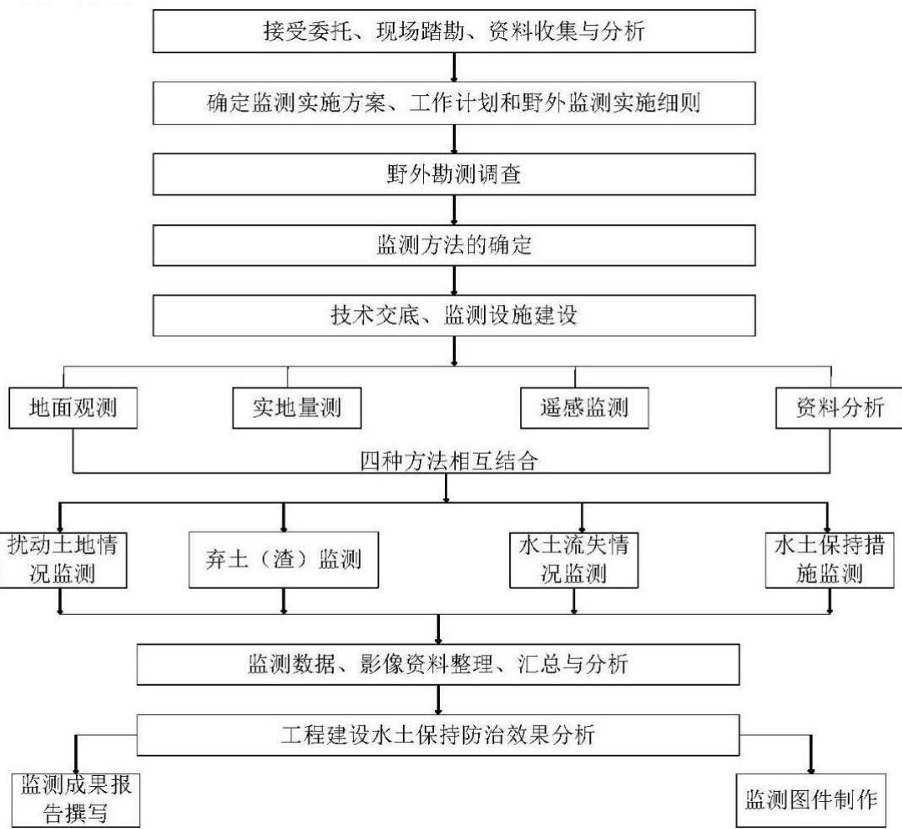  
图 6.2-1 项目水土保持监测工作程序

## 6.3 点位布设

根据水土流失影响分析和工程布局，结合工程建设水土流失预测结果及实际工程进展情况，水土保持监测的重点时段是施工期。施工期间水土保持监测的重点区域为主体工程区、临时堆土区，在可能造成严重水土流失的区域布设水土保持监测点，进行定点、定位监测。因此确定本项目共设置13个监测点位。

本项目水土保持监测点位见表6.3-1。监测点位布置图见附图8。

表 6.3-1 水土保持监测点位布置表
<table><tr><td rowspan=1 colspan=1>序号</td><td rowspan=1 colspan=1>地块</td><td rowspan=1 colspan=1>监测区域</td><td rowspan=1 colspan=1>监测点位</td><td rowspan=1 colspan=1>监测时段</td><td rowspan=1 colspan=1>监测方法</td></tr><tr><td rowspan=1 colspan=1>1</td><td rowspan=4 colspan=1>上海地块</td><td rowspan=1 colspan=1>主体工程区</td><td rowspan=1 colspan=1>主体工程区排水沟末端</td><td rowspan=1 colspan=1>施工期</td><td rowspan=1 colspan=1>集沙池法</td></tr><tr><td rowspan=1 colspan=1>2</td><td rowspan=1 colspan=1>主体工程区</td><td rowspan=1 colspan=1>景观绿化区域</td><td rowspan=1 colspan=1>自然恢复期</td><td rowspan=1 colspan=1>样方法</td></tr><tr><td rowspan=1 colspan=1>3</td><td rowspan=1 colspan=1>施工生产生活区</td><td rowspan=1 colspan=1>施工临时场地区域</td><td rowspan=1 colspan=1>施工期、自然恢复期</td><td rowspan=1 colspan=1>无人机调查巡查法、样方法</td></tr><tr><td rowspan=1 colspan=1>4</td><td rowspan=1 colspan=1>临时堆土区</td><td rowspan=1 colspan=1>临时堆土边坡</td><td rowspan=1 colspan=1>施工期</td><td rowspan=1 colspan=1>测钎法</td></tr><tr><td rowspan=1 colspan=1>5</td><td rowspan=4 colspan=1>长春地块</td><td rowspan=1 colspan=1>主体工程区</td><td rowspan=1 colspan=1>主体工程区排水沟末端</td><td rowspan=1 colspan=1>施工期</td><td rowspan=1 colspan=1>集沙池法</td></tr><tr><td rowspan=1 colspan=1>6</td><td rowspan=1 colspan=1>主体工程区</td><td rowspan=1 colspan=1>景观绿化区域</td><td rowspan=1 colspan=1>自然恢复期</td><td rowspan=1 colspan=1>样方法</td></tr><tr><td rowspan=1 colspan=1>7</td><td rowspan=1 colspan=1>施工生产生活区</td><td rowspan=1 colspan=1>施工临时场地区域</td><td rowspan=1 colspan=1>施工期</td><td rowspan=1 colspan=1>无人机调查巡查法</td></tr><tr><td rowspan=1 colspan=1>8</td><td rowspan=1 colspan=1>临时堆土区</td><td rowspan=1 colspan=1>临时堆土边坡</td><td rowspan=1 colspan=1>施工期</td><td rowspan=1 colspan=1>测钎法</td></tr><tr><td rowspan=1 colspan=1>9</td><td rowspan=5 colspan=1>兰州地块</td><td rowspan=1 colspan=1>主体工程区</td><td rowspan=1 colspan=1>主体工程区排水沟末端</td><td rowspan=1 colspan=1>施工期</td><td rowspan=1 colspan=1>集沙池法</td></tr><tr><td rowspan=1 colspan=1>10</td><td rowspan=1 colspan=1>主体工程区</td><td rowspan=1 colspan=1>景观绿化区域</td><td rowspan=1 colspan=1>自然恢复期</td><td rowspan=1 colspan=1>样方法</td></tr><tr><td rowspan=1 colspan=1>11</td><td rowspan=1 colspan=1>施工生产生活区</td><td rowspan=1 colspan=1>施工临时场地区域</td><td rowspan=1 colspan=1>施工期</td><td rowspan=1 colspan=1>无人机调查巡查法</td></tr><tr><td rowspan=1 colspan=1>12</td><td rowspan=1 colspan=1>临时堆土区</td><td rowspan=1 colspan=1>临时堆土边坡</td><td rowspan=1 colspan=1>施工期</td><td rowspan=1 colspan=1>测钎法</td></tr><tr><td rowspan=1 colspan=1>13</td><td rowspan=1 colspan=1>临时堆土区</td><td rowspan=1 colspan=1>撒播草籽区域</td><td rowspan=1 colspan=1>自然恢复期</td><td rowspan=1 colspan=1>样方法</td></tr></table>

## 6.4 实施条件和成果

## 6.4.1 实施条件

为准确获取各项地面观测及调查数据，水土保持监测必须采用现代技术与传统手段相结合的方法，借助一定的先进仪器设备，使监测方法更科学，监测结论更合理。如用高分辨率遥感影像对防治责任范围、扰动土地面积、水土流失面积、扰动土地整治面积等进行解译测量；用便携式植被覆盖度测量仪测量植被恢复面积：用水样、土样分析仪器分析典型区域含沙量以及土方养分等。监测仪器设备主要由监测单位提供，监测及巡查采用主要监测设备见表6.4-1。

表 6.4-1 监测设施一览表
<table><tr><td colspan="1" rowspan="1">序号</td><td colspan="2" rowspan="1">项目</td><td colspan="1" rowspan="1">单位</td><td colspan="1" rowspan="1">数量</td></tr><tr><td colspan="1" rowspan="9">1</td><td colspan="1" rowspan="9">设施设备费</td><td colspan="1" rowspan="1">经纬仪</td><td colspan="1" rowspan="1">台</td><td colspan="1" rowspan="1">3</td></tr><tr><td colspan="1" rowspan="1">无人机</td><td colspan="1" rowspan="1">台</td><td colspan="1" rowspan="1">1</td></tr><tr><td colspan="1" rowspan="1">遥感影像购置解译费</td><td colspan="1" rowspan="1">次</td><td colspan="1" rowspan="1">3</td></tr><tr><td colspan="1" rowspan="1">GPS 全球定位仪</td><td colspan="1" rowspan="1">台</td><td colspan="1" rowspan="1">3</td></tr><tr><td colspan="1" rowspan="1">数码相机</td><td colspan="1" rowspan="1">台</td><td colspan="1" rowspan="1">3</td></tr><tr><td colspan="1" rowspan="1">便携式植被覆盖度测量仪</td><td colspan="1" rowspan="1">台</td><td colspan="1" rowspan="1">3</td></tr><tr><td colspan="1" rowspan="1">泥沙分析器</td><td colspan="1" rowspan="1">个</td><td colspan="1" rowspan="1">3</td></tr><tr><td colspan="1" rowspan="1">测钎</td><td colspan="1" rowspan="1">个</td><td colspan="1" rowspan="1">40</td></tr><tr><td colspan="1" rowspan="1">磅秤</td><td colspan="1" rowspan="1">台</td><td colspan="1" rowspan="1">1</td></tr><tr><td colspan="1" rowspan="4"></td><td colspan="1" rowspan="4"></td><td colspan="1" rowspan="1">天平</td><td colspan="1" rowspan="1">台</td><td colspan="1" rowspan="1">1</td></tr><tr><td colspan="1" rowspan="1">烘箱</td><td colspan="1" rowspan="1">台</td><td colspan="1" rowspan="1">1</td></tr><tr><td colspan="1" rowspan="1">简易土工试验仪器</td><td colspan="1" rowspan="1">组</td><td colspan="1" rowspan="1">4</td></tr><tr><td colspan="1" rowspan="1">小计</td><td colspan="1" rowspan="1"></td><td colspan="1" rowspan="1"></td></tr><tr><td colspan="1" rowspan="1">2</td><td colspan="2" rowspan="1">车辆交通费</td><td colspan="1" rowspan="1">辆</td><td colspan="1" rowspan="1">3</td></tr></table>

## 6.4.2 监测成果

监测报告根据工程进展阶段主要包括四项成果，分别为《中国科学院“十四五”科教基础设施“卡脖子”材料制备攻关能力提升项目水土保持监测实施方案》、《中国科学院“十四五”科教基础设施“卡脖子”材料制备攻关能力提升项目水土保持监测季度报告表》和《中国科学院“十四五”科教基础设施“卡脖子”材料制备攻关能力提升项目水土保持监测总结报告》和《水土流失事件报告》。

本项目暂未开工，建设单位应在本方案批复后尽快开展水土保持监测委托工作，开工后及时向水利部太湖流域管理局、水利部黄河水利委员会、水利部松辽水利委员会及地方水行政主管部门上报《中国科学院“十四五”科教基础设施“卡脖子”材料制备攻关能力提升项目水土保持监测实施方案》。水土保持监测在每次监测时必须做好原始调查记录（包括调查时间、人员、地点、调查基本数据及存在的主要问题等），注重积累并整理水土保持资料，特别是临时防护措施的影像资料和质量评定的原始资料，并有调查人员、记录人员及校核、审查签字，做到手续完备。工程建设期间，应于每个季度的第一个月内报送上季度的《中国科学院“十四五”科教基础设施“卡脖子”材料制备攻关能力提升项目水土保持监测季度报告》，同时提供相关影像资料。因降雨、大风或人为原因发生严重水土流失及危害事件的，应于事件发生后1周内报告有关情况。水土保持监测任务完成后，对监测结果作出最后分析和评价，内容包括项目概况、水保监测时间、地点、监测项目和方法、监测结果及分析等，应于3个月内报送《中国科学院“十四五”科教基础设施“卡脖子”材料制备攻关能力提升项目水土保持监测总报告》。由于本项目工期超过3年，故需要编制《中国科学院“十四五”科教基础设施“卡脖子”材料制备攻关能力提升项目水土保持监测年度报告》。

在报送上述报告和图表时，报告和图表需由水土保持监测项目的负责人签字。本项目的所有监测成果：包括水土保持监测实施方案、水土保持监测季报和水土保持监测总报告，均应加盖监测单位和建设单位公章。

根据《水利部关于进一步深化“放管服”改革全面加强水土保持监管的意见》（水保（2019）160号），《水利部办公厅关于进一步加强生产建设项目水土保持监测工作的通知》（办水保（2020）161号）等相关要求指出水土保持监测单位应根据监测情况，在监测季报和总结报告等监测成果中提出“绿黄红”三色评价结论。三色评价结论是生产建设单位落实参建单位责任、控制施工过程水土流失的重要依据，也是各流域管理机构和地方各级水行政主管部门实施监管的重要依据。

三色评价以水土保持方案确定的防治目标为基础，以监测获取的实际数据为依据，针对不同的监测内容，采取定量评价和定性分析相结合方式进行量化打分。三色评价采用评分法，满分为100分；得分80分及以上的为“绿”色，60分及以上不足80分的为“黄”色，不足60分的为“红”色。监测季报三色评价得分为本季度实际得分，监测总结报告三色评价得分为全部监测季报得分的平均值。监测成果应当公开，生产建设单位应当在工程建设期间将水土保持监测季报在其官方网站公开，同时在业主项目部和施工项目部公开。

## 7水土保持投资估算及效益分析

## 7.1 投资估算

本项目的水土保持工程为主体工程的配套工程，主要由工程措施、植物措施和临时工程措施组成。本方案的水土保持投资计入工程总投资中。

## 7.1.1 编制原则及依据

## 7.1.1.1 编制原则

（1）本方案水土保持投资包括主体工程设计中具有水土保持功能的措施投资和水土保持专项投资。主体工程设计中具有水土保持功能的措施投资已列入主体工程投资估算中，本方案按主体工程已列投资计列。

（2）本方案采用的价格水平年、人工单价、主要材料价格、施工机械台时费、概算定额、取费项目及费率与主体工程一致，主体工程不足部分采用水土保持或相关行业定额和市场价格确定。

（3）水土保持投资估算的项目划分、费用构成、编制方法、估算表格等依据《水利工程设计概（估）算编制规定（水利部水总（2024）323号）》编写。

（4）主体工程概（估）算依据主体采用的人工预算单价、主要工程单价及施工机械台时（班）费利用主体工程投资概（估）算中已计算的单价，若主体工程概（估）算中未明确的单价则采用水利部水总（2024）323号定额计算。

（5）本方案与主体工程价格水平年一致，即2025年第1季度。

（6）本项目水土保持措施设计投资为估算阶段。

## 7.1.1.2 编制依据

（1）水利部水总（2024）323号颁布的《水利工程设计概（估）算编制规定》、《水土保持工程概算定额》以及《水利工程施工机械台时费定额》；

（2）国家计委、建设部计价格〔2002）10号文《工程勘察设计收费管理规定》；

（3）《住房和城乡建设部办公厅关于重新调整建设工程计价依据增值税税率的通知》（建办标函〔2019）193号）；

（4）《水利工程营业税改征增值税计价依据调整办法》（办水总（2023）132号）

(5）《水利部办公厅关于调整水利工程计价依据增值税计算标准的通知》（办财务函（2019）448号）；

（6）其它类似工程估算指标；

（7）国家、行业主管部门和福建省颁发的有关政策、标准及规定等。

## 7.1.2 编制说明与估算成果

## 7.1.2.1 基础单价编制

## （1）人工预算单价

本方案工程措施人工预算单价参照主体工程，上海地块192元/工日，合24元/工时，长春地块180元/工日，22.5元/工时，兰州地块168元/工日，合21元/工时。

（2）材料预算单价材料预算单价与主体工程保持一致，对于主体工程中没有明确的材料单价，按照当地2025年第1季度价格水平计算，详见表7.1-1。

按照施工组织设计对外交通方案，主要材料的运输方式采用公路运输至工地。

材料预算价格由材料原价、运杂费、运输保险费及采购保管费等组成。材料运输保险费按中国人民保险公司的《货物运输保险条款》规定计算。根据《水利工程营业税改征增值税计价依据调整办法》，材料运输采购及保管费费率为2.3%。

根据主体工程编制规定及费用标准，预算价超出规定的最高限额价格，按最高限额价格计算工程直接费、间接费和利润，超出最高限额价格部分以价差形式计入相应工程单价，并计取税金。

## （3）施工电风水价格

施工用电、风、水价格与主体工程投资保持一致。

(4) 砂石料价格

块石、砂砾石等材料为外购。

## （5）混凝土及水泥砂浆价格

本阶段根据设计确定的不同部位混凝土强度等级、级配和龄期等要求，参考类似工程混凝土配合比，分析计算混凝土材料单价。

## （6）施工机械使用费

施工机械使用费采用水电工程施工机械台时费定额及有关规定计算。根据《水利部办公厅关于调整水利工程计价依据增值税计算标准的通知》，施工机械台时费定额的折旧费除以1.13调整系数，修理及替换设备费除以1.09调整系数，安装拆卸费不变。

## 7.1.2.2 取费标准和计算方法

措施单价根据实际情况及有关设计资料，与主体单价保持一致，在主体定额缺项的情况下，根据水土保持定额类似工程单价分析计算。植物措施单价与栽植有关的单价按

建筑、园林等相关行业的定额进行编制。

采用水土保持定额及取费标准计算的工程措施和植物措施单价由直接工程费、间接费、企业利润、材料补差、税金和扩大费组成，取费标准按照水利部办公厅关于印发《水利工程营业税改征增值税计价依据调整办法》的通知计取，见下表。

表7.1-2 水土保持工程取费费率标准表
<table><tr><td rowspan=1 colspan=1>序号</td><td rowspan=1 colspan=1>取费名称</td><td rowspan=1 colspan=1>其他直接费</td><td rowspan=1 colspan=1>间接费</td><td rowspan=1 colspan=1>企业利润</td><td rowspan=1 colspan=1>税金</td></tr><tr><td rowspan=1 colspan=1>1</td><td rowspan=1 colspan=1>土方工程（不含土地整治）</td><td rowspan=1 colspan=1>3.6</td><td rowspan=1 colspan=1>5</td><td rowspan=1 colspan=1>7</td><td rowspan=1 colspan=1>9</td></tr><tr><td rowspan=1 colspan=1>2</td><td rowspan=1 colspan=1>石方工程</td><td rowspan=1 colspan=1>3.6</td><td rowspan=1 colspan=1>8</td><td rowspan=1 colspan=1></td><td rowspan=1 colspan=1></td></tr><tr><td rowspan=1 colspan=1>3</td><td rowspan=1 colspan=1>混凝土工程</td><td rowspan=1 colspan=1>3.6</td><td rowspan=1 colspan=1>7</td><td rowspan=1 colspan=1>7</td><td rowspan=1 colspan=1>9</td></tr><tr><td rowspan=1 colspan=1>4</td><td rowspan=1 colspan=1>其他工程</td><td rowspan=1 colspan=1>3.6</td><td rowspan=1 colspan=1>7</td><td rowspan=1 colspan=1>7</td><td rowspan=1 colspan=1>9</td></tr><tr><td rowspan=1 colspan=1>5</td><td rowspan=1 colspan=1>植物措施以及土地整治</td><td rowspan=1 colspan=1>2</td><td rowspan=1 colspan=1>6</td><td rowspan=1 colspan=1>7</td><td rowspan=1 colspan=1>9</td></tr></table>

## 7.1.2.3 主体工程单价编制

工程措施、植物措施和临时措施单价：由直接费、间接费、企业利润和税金组成。

（1）直接费：直接费包括直接工程费和措施费。其中直接工程费指人工费、材料费和机械使用费三项组成。

人工费=定额劳动量×人工预算单价；

材料费=装置性材料消耗量×装置性材料预算价格；

施工机械使用费=定额机械使用量×施工机械台班费；

（2）间接费：施工企业为工程施工而进行组织与经营管理所发生的各项费用。由企业管理费、财务费用、其他费用构成。

（3）企业利润：按规定应计入工程措施及植物措施费用中的费用。企业利润=（直接费+间接费）×企业利润率，利润率与主体工程一致。

（4）税金：计算基础为直接费、间接费与企业利润，费率与主体工程一致。

## 7.1.2.4方案新增措施单价编制

工程措施、植物措施、临时措施单价由直接工程费、间接费、企业利润、材料补差、税金和扩大费用组成，其中直接工程费由直接费、其它直接费组成，直接费由人工费、材料费和机械使用费组成。各项费用的取费基础及费率根据水利部水总（2024）323号颁布的《水利工程设计概（估）算编制规定》确定。

人工费=定额劳动量×人工预算单价

材料费=定额材料消耗量×材料预算价格

施工机械使用费=定额机械使用量×施工机械台班费

其它直接费=直接费×其它直接费费率

## 7.1.2.5 编制方法

## （1）工程措施

工程措施费按设计工程量乘以工程单价进行编制，本项目水土保持措施设计投资为估算阶段，工程措施单价应乘以10%扩大系数。

## (2） 植物措施

植物措施费按本方案设计苗木、草、种子等植物措施量乘以植物措施单价进行编制，本项目水土保持措施设计投资为估算阶段，植物措施单价应乘以10%扩大系数。

## （3）监测措施费

土建设施及设备按设计工程量或设备清单乘以单价编制，弃渣场稳定监测费按弃渣场稳定监测有关监测内容、设施设备等进行编制，建设期观测费参考水利部水总（2024）323号颁布的《水利工程设计概（估）算编制规定》，并参照实际工程量计列。

## (4) 临时工程费

临时防护工程按设计工程量乘以单价编制，其它临时工程按第一部分新增工程措施、第二部分植物措施和第三部分监测措施投资的2.0%计取，施工安全生产专项按一至四部分建安工作量（不含设备购置费）之和的2.5%计算。

## （5） 独立费用

## 1）建设管理费

## ①项目经常费

项目管理费按工程措施、植物措施、监测措施、临时措施之和扣除主体已列投资的2%计列。

水土保持设施验收费结合市场同类工程及规模，水土保持设施验收费按45万元计列。

## ②技术咨询费

勘测设计成果咨询评审费根据工作内容，按一至四部分投资合计的1.5%计算。

## 2）工程建设监理费

根据《水利部关于进一步深化“放管服”改革全面加强水土保持监管的意见》（水保（2019）160号），本项目水土保持施工监理可由主体监理担任，不另行计算监理费用。

## 3）科研勘测设计费

勘测设计费根据实际工程量并参照国家计委、建设部计价格（2002）10号文计列。

水土保持方案编制费参考水利部水总〔2024）323号颁布的《水利工程设计概（估）算编制规定》，并参照实际工程量计列。

## （6）水土保持补偿费

上海地块按照《上海市水土保持补偿费征收管理办法》（沪水务〔2021）550号）相关要求中第五条：“对一般性生产建设项目，按照征占用地面积一次性计征，每平方米1元（不足1平方米的按1平方米计）”。

长春地块根据国家税务总局吉林省税务局吉林省财政厅吉林省水利厅关于印发《吉林省水土保持补偿费、地方水库移民扶持基金征管职责划转工作实施方案》的通知（吉税发〔2020）67号）、《关于印发〈吉林省水土保持补偿费征收使用管理办法〉的通知》（吉财税〔2022）952号）、《吉林省发展改革委吉林省财政厅吉林省水利厅关于核定吉林省水土保持补偿费收费标准有关问题的通知》（吉林省发展改革委、财政厅、水利厅吉发改收费联（2022）670号）、《吉林省水利厅关于进一步做好全省水土保持补偿费征收使用有关工作的通知》（吉水保函（2023）1号）收取水土保持补偿费，根据国家及吉林省的相关规定，该项目为一般性生产建设项目，按照征占用土地面积一次性计征，每平方米0.45元（不足1平方米的按1平方米计）计征水土流失补偿费。

兰州地块根据《甘肃省发展和改革委员会甘肃省财政厅甘肃省水利厅关于印发〈甘肃省水土保持补偿费收费标准〉的通知》（甘肃省发展和改革委员会甘肃省财政厅甘肃省水利厅，甘发改收费（2017）590号），本项目属于建设类项目，按征占地面积1.40元/m²征收。

## (7) 基本预备费

基本预备费按新增水土保持的工程措施、植物措施、监测措施、临时工程措施和独立费用之和的10%计取。

## 7.1.2.6 估算成果

本项目建设期水土保持投资为1196.64万元（主体已列745.27万元），其中工程措施投资347.09万元（上海地块工程措施投资为169.14万元，长春地块工程措施投资为116.29万元，兰州地块工程措施投资为61.66万元），植物措施投资为387.74万元（上海地块植物措施投资为112.91万元，长春地块植物措施投资为156.65万元，兰州地块植物措施投资为118.18万元），施工安全生产专项费用24.79万元，监测措施费155万元，临时工程投资为102.09万元（上海地块临时措施投资为34.04万元，长春地块临时措施投资为31.41万元，兰州地块临时措施投资为36.64元），独立费用为133.50万元，水土保持补偿费59412.00元（其中上海地块23560.00元，长春地块9000.00元，兰州地块26852.00元），基本预备费为40.49万元。

本项目建设期水土保持投资估算详见表7.1-3\~7.1-17。

表 7.1-4 水土保持投资总估算表 单位：万元  
表 7.1-3 水土保持工程投资汇总表  
单位：万元
<table><tr><td rowspan=1 colspan=1>编号</td><td rowspan=1 colspan=1>工程项目</td><td rowspan=1 colspan=1>投资（万元）</td><td rowspan=1 colspan=1>备注</td></tr><tr><td rowspan=1 colspan=1>1</td><td rowspan=1 colspan=1>主体工程中具有水土保持功能工程投资</td><td rowspan=1 colspan=1>745.27</td><td rowspan=1 colspan=1>上海地块主体工程水土保持措施投资为284.71万元，长春地块主体工程水土保持措施投资为277.25万元，兰州地块主体工程水土保持措施投资为183.31万元</td></tr><tr><td rowspan=1 colspan=1>2</td><td rowspan=1 colspan=1>新增水土保持专项投资</td><td rowspan=1 colspan=1>451.37</td><td rowspan=1 colspan=1></td></tr><tr><td rowspan=1 colspan=1>3</td><td rowspan=1 colspan=1>水土保持静态总投资</td><td rowspan=1 colspan=1>1196.64</td><td rowspan=1 colspan=1></td></tr></table>

<table><tr><td colspan="1" rowspan="1">编号</td><td colspan="1" rowspan="1">工程或费用名称</td><td colspan="1" rowspan="1">建安工程费</td><td colspan="1" rowspan="1">设备费</td><td colspan="1" rowspan="1">植物措施费</td><td colspan="1" rowspan="1">独立费用</td><td colspan="1" rowspan="1">水保新增投资</td><td colspan="1" rowspan="1">主体已列投资</td><td colspan="1" rowspan="1">水保总投资</td></tr><tr><td colspan="1" rowspan="1"></td><td colspan="1" rowspan="1">第一部分工程措施</td><td colspan="1" rowspan="1">347.09</td><td colspan="1" rowspan="1"></td><td colspan="1" rowspan="1"></td><td colspan="1" rowspan="1"></td><td colspan="1" rowspan="1">3.74</td><td colspan="1" rowspan="1">343.35</td><td colspan="1" rowspan="1">347.09</td></tr><tr><td colspan="1" rowspan="1">一</td><td colspan="1" rowspan="1">上海地块</td><td colspan="1" rowspan="1">169.14</td><td colspan="1" rowspan="1"></td><td colspan="1" rowspan="1"></td><td colspan="1" rowspan="1"></td><td colspan="1" rowspan="1"></td><td colspan="1" rowspan="1">169.14</td><td colspan="1" rowspan="1">169.14</td></tr><tr><td colspan="1" rowspan="1">(一)</td><td colspan="1" rowspan="1">主体工程防治区</td><td colspan="1" rowspan="1">169.14</td><td colspan="1" rowspan="1"></td><td colspan="1" rowspan="1"></td><td colspan="1" rowspan="1"></td><td colspan="1" rowspan="1"></td><td colspan="1" rowspan="1">169.14</td><td colspan="1" rowspan="1">169.14</td></tr><tr><td colspan="1" rowspan="1">二</td><td colspan="1" rowspan="1">长春地块</td><td colspan="1" rowspan="1">116.29</td><td colspan="1" rowspan="1"></td><td colspan="1" rowspan="1"></td><td colspan="1" rowspan="1"></td><td colspan="1" rowspan="1"></td><td colspan="1" rowspan="1">116.29</td><td colspan="1" rowspan="1">116.29</td></tr><tr><td colspan="1" rowspan="1">(一)</td><td colspan="1" rowspan="1">主体工程防治区</td><td colspan="1" rowspan="1">116.29</td><td colspan="1" rowspan="1"></td><td colspan="1" rowspan="1"></td><td colspan="1" rowspan="1"></td><td colspan="1" rowspan="1"></td><td colspan="1" rowspan="1">116.29</td><td colspan="1" rowspan="1">116.29</td></tr><tr><td colspan="1" rowspan="1">三</td><td colspan="1" rowspan="1">兰州地块</td><td colspan="1" rowspan="1">61.66</td><td colspan="1" rowspan="1"></td><td colspan="1" rowspan="1"></td><td colspan="1" rowspan="1"></td><td colspan="1" rowspan="1">3.74</td><td colspan="1" rowspan="1">57.92</td><td colspan="1" rowspan="1">61.66</td></tr><tr><td colspan="1" rowspan="1">(一)</td><td colspan="1" rowspan="1">主体工程防治区</td><td colspan="1" rowspan="1">61.66</td><td colspan="1" rowspan="1"></td><td colspan="1" rowspan="1"></td><td colspan="1" rowspan="1"></td><td colspan="1" rowspan="1">3.74</td><td colspan="1" rowspan="1">57.92</td><td colspan="1" rowspan="1">61.66</td></tr><tr><td colspan="1" rowspan="1"></td><td colspan="1" rowspan="1">第二部分 植物措施</td><td colspan="1" rowspan="1"></td><td colspan="1" rowspan="1"></td><td colspan="1" rowspan="1">387.04</td><td colspan="1" rowspan="1"></td><td colspan="1" rowspan="1">0.79</td><td colspan="1" rowspan="1">386.95</td><td colspan="1" rowspan="1">387.74</td></tr><tr><td colspan="1" rowspan="1">一</td><td colspan="1" rowspan="1">上海地块</td><td colspan="1" rowspan="1"></td><td colspan="1" rowspan="1"></td><td colspan="1" rowspan="1">112.91</td><td colspan="1" rowspan="1"></td><td colspan="1" rowspan="1">0.09</td><td colspan="1" rowspan="1">112.82</td><td colspan="1" rowspan="1">112.91</td></tr><tr><td colspan="1" rowspan="1">(一)</td><td colspan="1" rowspan="1">主体工程防治区</td><td colspan="1" rowspan="1"></td><td colspan="1" rowspan="1"></td><td colspan="1" rowspan="1">112.82</td><td colspan="1" rowspan="1"></td><td colspan="1" rowspan="1"></td><td colspan="1" rowspan="1">112.82</td><td colspan="1" rowspan="1">112.82</td></tr><tr><td colspan="1" rowspan="1">(二)</td><td colspan="1" rowspan="1">施工生产生活防治区</td><td colspan="1" rowspan="1"></td><td colspan="1" rowspan="1"></td><td colspan="1" rowspan="1">0.06</td><td colspan="1" rowspan="1"></td><td colspan="1" rowspan="1">0.06</td><td colspan="1" rowspan="1"></td><td colspan="1" rowspan="1">0.06</td></tr><tr><td colspan="1" rowspan="1">(三)</td><td colspan="1" rowspan="1">临时堆土防治区</td><td colspan="1" rowspan="1"></td><td colspan="1" rowspan="1"></td><td colspan="1" rowspan="1">0.03</td><td colspan="1" rowspan="1"></td><td colspan="1" rowspan="1">0.03</td><td colspan="1" rowspan="1"></td><td colspan="1" rowspan="1">0.03</td></tr><tr><td colspan="1" rowspan="1">二</td><td colspan="1" rowspan="1">长春地块</td><td colspan="1" rowspan="1"></td><td colspan="1" rowspan="1"></td><td colspan="1" rowspan="1">156.65</td><td colspan="1" rowspan="1"></td><td colspan="1" rowspan="1"></td><td colspan="1" rowspan="1">156.65</td><td colspan="1" rowspan="1">156.65</td></tr><tr><td colspan="1" rowspan="1">(一)</td><td colspan="1" rowspan="1">主体工程防治区</td><td colspan="1" rowspan="1"></td><td colspan="1" rowspan="1"></td><td colspan="1" rowspan="1">156.65</td><td colspan="1" rowspan="1"></td><td colspan="1" rowspan="1"></td><td colspan="1" rowspan="1">156.65</td><td colspan="1" rowspan="1">156.65</td></tr><tr><td colspan="1" rowspan="1">三</td><td colspan="1" rowspan="1">兰州地块</td><td colspan="1" rowspan="1"></td><td colspan="1" rowspan="1"></td><td colspan="1" rowspan="1">117.48</td><td colspan="1" rowspan="1"></td><td colspan="1" rowspan="1">0.70</td><td colspan="1" rowspan="1">117.48</td><td colspan="1" rowspan="1">118.18</td></tr><tr><td colspan="1" rowspan="1">(一)</td><td colspan="1" rowspan="1">主体工程防治区</td><td colspan="1" rowspan="1"></td><td colspan="1" rowspan="1"></td><td colspan="1" rowspan="1">117.48</td><td colspan="1" rowspan="1"></td><td colspan="1" rowspan="1"></td><td colspan="1" rowspan="1">117.48</td><td colspan="1" rowspan="1">117.48</td></tr><tr><td colspan="1" rowspan="1">(二)</td><td colspan="1" rowspan="1">临时堆土防治区</td><td colspan="1" rowspan="1"></td><td colspan="1" rowspan="1"></td><td colspan="1" rowspan="1">0.70</td><td colspan="1" rowspan="1"></td><td colspan="1" rowspan="1">0.70</td><td colspan="1" rowspan="1"></td><td colspan="1" rowspan="1">0.70</td></tr><tr><td colspan="1" rowspan="1"></td><td colspan="1" rowspan="1">第三部分 监测措施</td><td colspan="1" rowspan="1">49.00</td><td colspan="1" rowspan="1">106</td><td colspan="1" rowspan="1"></td><td colspan="1" rowspan="1"></td><td colspan="1" rowspan="1">155</td><td colspan="1" rowspan="1"></td><td colspan="1" rowspan="1">155.00</td></tr><tr><td colspan="1" rowspan="1">一</td><td colspan="1" rowspan="1">上海地块</td><td colspan="1" rowspan="1">40.00</td><td colspan="1" rowspan="1">6.00</td><td colspan="1" rowspan="1"></td><td colspan="1" rowspan="1"></td><td colspan="1" rowspan="1">46</td><td colspan="1" rowspan="1"></td><td colspan="1" rowspan="1">46.00</td></tr><tr><td colspan="1" rowspan="1">(一)</td><td colspan="1" rowspan="1">水土保持监测</td><td colspan="1" rowspan="1"></td><td colspan="1" rowspan="1">6</td><td colspan="1" rowspan="1"></td><td colspan="1" rowspan="1"></td><td colspan="1" rowspan="1">6</td><td colspan="1" rowspan="1"></td><td colspan="1" rowspan="1">6.00</td></tr><tr><td colspan="1" rowspan="1">(二)</td><td colspan="1" rowspan="1">建设期观测费</td><td colspan="1" rowspan="1">40.00</td><td colspan="1" rowspan="1"></td><td colspan="1" rowspan="1"></td><td colspan="1" rowspan="1"></td><td colspan="1" rowspan="1">40</td><td colspan="1" rowspan="1"></td><td colspan="1" rowspan="1">40.00</td></tr><tr><td colspan="1" rowspan="1">二</td><td colspan="1" rowspan="1">长春地块</td><td colspan="1" rowspan="1">5.00</td><td colspan="1" rowspan="1">60.00</td><td colspan="1" rowspan="1"></td><td colspan="1" rowspan="1"></td><td colspan="1" rowspan="1">65</td><td colspan="1" rowspan="1"></td><td colspan="1" rowspan="1">65.00</td></tr><tr><td colspan="1" rowspan="1">(一)</td><td colspan="1" rowspan="1">水土保持监测</td><td colspan="1" rowspan="1"></td><td colspan="1" rowspan="1">60</td><td colspan="1" rowspan="1"></td><td colspan="1" rowspan="1"></td><td colspan="1" rowspan="1">60</td><td colspan="1" rowspan="1"></td><td colspan="1" rowspan="1">60.00</td></tr><tr><td colspan="1" rowspan="1">(二)</td><td colspan="1" rowspan="1">建设期观测费</td><td colspan="1" rowspan="1">5.00</td><td colspan="1" rowspan="1"></td><td colspan="1" rowspan="1"></td><td colspan="1" rowspan="1"></td><td colspan="1" rowspan="1">5</td><td colspan="1" rowspan="1"></td><td colspan="1" rowspan="1">5.00</td></tr><tr><td colspan="1" rowspan="1">三</td><td colspan="1" rowspan="1">兰州地块</td><td colspan="1" rowspan="1">4.00</td><td colspan="1" rowspan="1">40.00</td><td colspan="1" rowspan="1"></td><td colspan="1" rowspan="1"></td><td colspan="1" rowspan="1">44</td><td colspan="1" rowspan="1"></td><td colspan="1" rowspan="1">44.00</td></tr><tr><td colspan="1" rowspan="1">(一)</td><td colspan="1" rowspan="1">水土保持监测</td><td colspan="1" rowspan="1"></td><td colspan="1" rowspan="1">40</td><td colspan="1" rowspan="1"></td><td colspan="1" rowspan="1"></td><td colspan="1" rowspan="1">40</td><td colspan="1" rowspan="1"></td><td colspan="1" rowspan="1">40.00</td></tr><tr><td colspan="1" rowspan="1">(二)</td><td colspan="1" rowspan="1">建设期观测费</td><td colspan="1" rowspan="1">4.00</td><td colspan="1" rowspan="1"></td><td colspan="1" rowspan="1"></td><td colspan="1" rowspan="1"></td><td colspan="1" rowspan="1">4</td><td colspan="1" rowspan="1"></td><td colspan="1" rowspan="1">4.00</td></tr><tr><td colspan="1" rowspan="1"></td><td colspan="1" rowspan="1">第四部分 施工临时工程</td><td colspan="1" rowspan="1">102.09</td><td colspan="1" rowspan="1"></td><td colspan="1" rowspan="1"></td><td colspan="1" rowspan="1"></td><td colspan="1" rowspan="1">86.28</td><td colspan="1" rowspan="1">15.81</td><td colspan="1" rowspan="1">102.09</td></tr><tr><td colspan="1" rowspan="1"></td><td colspan="1" rowspan="1">上海地块</td><td colspan="1" rowspan="1">34.04</td><td colspan="1" rowspan="1"></td><td colspan="1" rowspan="1"></td><td colspan="1" rowspan="1"></td><td colspan="1" rowspan="1">31.29</td><td colspan="1" rowspan="1">2.75</td><td colspan="1" rowspan="1">34.04</td></tr><tr><td colspan="1" rowspan="1">(一)</td><td colspan="1" rowspan="1">主体工程防治区</td><td colspan="1" rowspan="1">5.74</td><td colspan="1" rowspan="1"></td><td colspan="1" rowspan="1"></td><td colspan="1" rowspan="1"></td><td colspan="1" rowspan="1">2.99</td><td colspan="1" rowspan="1">2.75</td><td colspan="1" rowspan="1">5.74</td></tr><tr><td colspan="1" rowspan="1">(二)</td><td colspan="1" rowspan="1">施工生产生活防治区</td><td colspan="1" rowspan="1">5.37</td><td colspan="1" rowspan="1"></td><td colspan="1" rowspan="1"></td><td colspan="1" rowspan="1"></td><td colspan="1" rowspan="1">5.37</td><td colspan="1" rowspan="1"></td><td colspan="1" rowspan="1">5.37</td></tr><tr><td colspan="1" rowspan="1">(二)</td><td colspan="1" rowspan="1">临时堆土防治区</td><td colspan="1" rowspan="1">16.37</td><td colspan="1" rowspan="1"></td><td colspan="1" rowspan="1"></td><td colspan="1" rowspan="1"></td><td colspan="1" rowspan="1">16.37</td><td colspan="1" rowspan="1"></td><td colspan="1" rowspan="1">16.37</td></tr><tr><td colspan="1" rowspan="1">(三)</td><td colspan="1" rowspan="1">其他临时措施</td><td colspan="1" rowspan="1">6.56</td><td colspan="1" rowspan="1"></td><td colspan="1" rowspan="1"></td><td colspan="1" rowspan="1"></td><td colspan="1" rowspan="1">6.56</td><td colspan="1" rowspan="1"></td><td colspan="1" rowspan="1">6.56</td></tr><tr><td colspan="1" rowspan="1">二</td><td colspan="1" rowspan="1">长春地块</td><td colspan="1" rowspan="1">31.41</td><td colspan="1" rowspan="1"></td><td colspan="1" rowspan="1"></td><td colspan="1" rowspan="1"></td><td colspan="1" rowspan="1">26.26</td><td colspan="1" rowspan="1">5.15</td><td colspan="1" rowspan="1">31.41</td></tr><tr><td colspan="1" rowspan="1">(一)</td><td colspan="1" rowspan="1">主体工程防治区</td><td colspan="1" rowspan="1">9.30</td><td colspan="1" rowspan="1"></td><td colspan="1" rowspan="1"></td><td colspan="1" rowspan="1"></td><td colspan="1" rowspan="1">5.59</td><td colspan="1" rowspan="1">3.71</td><td colspan="1" rowspan="1">9.30</td></tr><tr><td colspan="1" rowspan="1">(二)</td><td colspan="1" rowspan="1">施工生产生活防治区</td><td colspan="1" rowspan="1">1.44</td><td colspan="1" rowspan="1"></td><td colspan="1" rowspan="1"></td><td colspan="1" rowspan="1"></td><td colspan="1" rowspan="1"></td><td colspan="1" rowspan="1">1.44</td><td colspan="1" rowspan="1">1.44</td></tr><tr><td colspan="1" rowspan="1">(三)</td><td colspan="1" rowspan="1">临时堆土放防治区</td><td colspan="1" rowspan="1">13.91</td><td colspan="1" rowspan="1"></td><td colspan="1" rowspan="1"></td><td colspan="1" rowspan="1"></td><td colspan="1" rowspan="1">13.91</td><td colspan="1" rowspan="1"></td><td colspan="1" rowspan="1">13.91</td></tr><tr><td colspan="1" rowspan="1">(四)</td><td colspan="1" rowspan="1">其他临时措施</td><td colspan="1" rowspan="1">6.76</td><td colspan="1" rowspan="1"></td><td colspan="1" rowspan="1"></td><td colspan="1" rowspan="1"></td><td colspan="1" rowspan="1">6.76</td><td colspan="1" rowspan="1"></td><td colspan="1" rowspan="1">6.76</td></tr><tr><td colspan="1" rowspan="1">三</td><td colspan="1" rowspan="1">兰州地块</td><td colspan="1" rowspan="1">36.64</td><td colspan="1" rowspan="1"></td><td colspan="1" rowspan="1"></td><td colspan="1" rowspan="1"></td><td colspan="1" rowspan="1">28.73</td><td colspan="1" rowspan="1">7.91</td><td colspan="1" rowspan="1">36.64</td></tr><tr><td colspan="1" rowspan="1">(一)</td><td colspan="1" rowspan="1">主体工程防治区</td><td colspan="1" rowspan="1">10.07</td><td colspan="1" rowspan="1"></td><td colspan="1" rowspan="1"></td><td colspan="1" rowspan="1"></td><td colspan="1" rowspan="1">3.08</td><td colspan="1" rowspan="1">6.99</td><td colspan="1" rowspan="1">10.07</td></tr><tr><td colspan="1" rowspan="1">(二)</td><td colspan="1" rowspan="1">施工生产生活防治区</td><td colspan="1" rowspan="1">0.92</td><td colspan="1" rowspan="1"></td><td colspan="1" rowspan="1"></td><td colspan="1" rowspan="1"></td><td colspan="1" rowspan="1"></td><td colspan="1" rowspan="1">0.92</td><td colspan="1" rowspan="1">0.92</td></tr><tr><td colspan="1" rowspan="1">(三)</td><td colspan="1" rowspan="1">临时堆土放防治区</td><td colspan="1" rowspan="1">21.17</td><td colspan="1" rowspan="1"></td><td colspan="1" rowspan="1"></td><td colspan="1" rowspan="1"></td><td colspan="1" rowspan="1">21.17</td><td colspan="1" rowspan="1"></td><td colspan="1" rowspan="1">21.17</td></tr><tr><td colspan="1" rowspan="1">(四)</td><td colspan="1" rowspan="1">其他临时措施</td><td colspan="1" rowspan="1">4.48</td><td colspan="1" rowspan="1"></td><td colspan="1" rowspan="1"></td><td colspan="1" rowspan="1"></td><td colspan="1" rowspan="1">4.48</td><td colspan="1" rowspan="1"></td><td colspan="1" rowspan="1">4.48</td></tr><tr><td colspan="1" rowspan="1"></td><td colspan="1" rowspan="1">第五部分 施工安全生产专项</td><td colspan="1" rowspan="1">24.79</td><td colspan="1" rowspan="1"></td><td colspan="1" rowspan="1"></td><td colspan="1" rowspan="1"></td><td colspan="1" rowspan="1">24.79</td><td colspan="1" rowspan="1"></td><td colspan="1" rowspan="1">24.79</td></tr><tr><td colspan="1" rowspan="1">一</td><td colspan="1" rowspan="1">上海地块</td><td colspan="1" rowspan="1">9.05</td><td colspan="1" rowspan="1"></td><td colspan="1" rowspan="1"></td><td colspan="1" rowspan="1"></td><td colspan="1" rowspan="1">9.05</td><td colspan="1" rowspan="1"></td><td colspan="1" rowspan="1">9.05</td></tr><tr><td colspan="1" rowspan="1">二</td><td colspan="1" rowspan="1">长春地块</td><td colspan="1" rowspan="1">9.23</td><td colspan="1" rowspan="1"></td><td colspan="1" rowspan="1"></td><td colspan="1" rowspan="1"></td><td colspan="1" rowspan="1">9.23</td><td colspan="1" rowspan="1"></td><td colspan="1" rowspan="1">9.23</td></tr><tr><td colspan="1" rowspan="1">三</td><td colspan="1" rowspan="1">兰州地块</td><td colspan="1" rowspan="1">6.51</td><td colspan="1" rowspan="1"></td><td colspan="1" rowspan="1"></td><td colspan="1" rowspan="1"></td><td colspan="1" rowspan="1">6.51</td><td colspan="1" rowspan="1"></td><td colspan="1" rowspan="1">6.51</td></tr><tr><td colspan="1" rowspan="1"></td><td colspan="1" rowspan="1">第六部分独立费用</td><td colspan="1" rowspan="1"></td><td colspan="1" rowspan="1"></td><td colspan="1" rowspan="1"></td><td colspan="1" rowspan="1">133.50</td><td colspan="1" rowspan="1">133.50</td><td colspan="1" rowspan="1"></td><td colspan="1" rowspan="1">133.50</td></tr><tr><td colspan="1" rowspan="1">1</td><td colspan="1" rowspan="1">建设管理费</td><td colspan="1" rowspan="1"></td><td colspan="1" rowspan="1"></td><td colspan="1" rowspan="1"></td><td colspan="1" rowspan="1">54.50</td><td colspan="1" rowspan="1">54.50</td><td colspan="1" rowspan="1"></td><td colspan="1" rowspan="1">54.50</td></tr><tr><td colspan="1" rowspan="1">2</td><td colspan="1" rowspan="1">工程建设监理费</td><td colspan="1" rowspan="1"></td><td colspan="1" rowspan="1"></td><td colspan="1" rowspan="1"></td><td colspan="1" rowspan="1">23.00</td><td colspan="1" rowspan="1">23.00</td><td colspan="1" rowspan="1"></td><td colspan="1" rowspan="1">23.00</td></tr><tr><td colspan="1" rowspan="1">3</td><td colspan="1" rowspan="1">科研勘测设计费</td><td colspan="1" rowspan="1"></td><td colspan="1" rowspan="1"></td><td colspan="1" rowspan="1"></td><td colspan="1" rowspan="1">56.00</td><td colspan="1" rowspan="1">56.00</td><td colspan="1" rowspan="1"></td><td colspan="1" rowspan="1">56.00</td></tr><tr><td colspan="1" rowspan="1">I</td><td colspan="1" rowspan="1">第一部分至第六部分合计</td><td colspan="1" rowspan="1"></td><td colspan="1" rowspan="1"></td><td colspan="1" rowspan="1"></td><td colspan="1" rowspan="1"></td><td colspan="1" rowspan="1">404.94</td><td colspan="1" rowspan="1">745.27</td><td colspan="1" rowspan="1">1150.21</td></tr><tr><td colspan="1" rowspan="1">ⅡI</td><td colspan="1" rowspan="1">基本预备费 10%</td><td colspan="1" rowspan="1"></td><td colspan="1" rowspan="1"></td><td colspan="1" rowspan="1"></td><td colspan="1" rowspan="1"></td><td colspan="1" rowspan="1">40.41</td><td colspan="1" rowspan="1"></td><td colspan="1" rowspan="1">40.41</td></tr><tr><td colspan="1" rowspan="1">Ⅲ</td><td colspan="1" rowspan="1">水土保持补偿费</td><td colspan="1" rowspan="1"></td><td colspan="1" rowspan="1"></td><td colspan="1" rowspan="1"></td><td colspan="1" rowspan="1">5.9412</td><td colspan="1" rowspan="1">5.94</td><td colspan="1" rowspan="1"></td><td colspan="1" rowspan="1">5.94</td></tr><tr><td colspan="1" rowspan="1">一</td><td colspan="1" rowspan="1">上海地块</td><td colspan="1" rowspan="1"></td><td colspan="1" rowspan="1"></td><td colspan="1" rowspan="1"></td><td colspan="1" rowspan="1">2.356</td><td colspan="1" rowspan="1">2.36</td><td colspan="1" rowspan="1"></td><td colspan="1" rowspan="1">2.36</td></tr><tr><td colspan="1" rowspan="1">二</td><td colspan="1" rowspan="1">长春地块</td><td colspan="1" rowspan="1"></td><td colspan="1" rowspan="1"></td><td colspan="1" rowspan="1"></td><td colspan="1" rowspan="1">0.9000</td><td colspan="1" rowspan="1">0.90</td><td colspan="1" rowspan="1"></td><td colspan="1" rowspan="1">0.90</td></tr><tr><td colspan="1" rowspan="1">三</td><td colspan="1" rowspan="1">兰州地块</td><td colspan="1" rowspan="1"></td><td colspan="1" rowspan="1"></td><td colspan="1" rowspan="1"></td><td colspan="1" rowspan="1">2.6852</td><td colspan="1" rowspan="1">2.69</td><td colspan="1" rowspan="1"></td><td colspan="1" rowspan="1">2.69</td></tr><tr><td colspan="1" rowspan="1">IV</td><td colspan="1" rowspan="1">静态总投资</td><td colspan="1" rowspan="1"></td><td colspan="1" rowspan="1"></td><td colspan="1" rowspan="1"></td><td colspan="1" rowspan="1">5.9412</td><td colspan="1" rowspan="1">451.37</td><td colspan="1" rowspan="1">745.27</td><td colspan="1" rowspan="1">1196.64</td></tr></table>

表 7.1-5 工程措施投资估算表单位：万元
<table><tr><td colspan="1" rowspan="1">序号</td><td colspan="1" rowspan="1">防治措施类型及名称</td><td colspan="1" rowspan="1">单位</td><td colspan="1" rowspan="1">数量</td><td colspan="1" rowspan="1">单价（元）</td><td colspan="1" rowspan="1">投资（万元）</td></tr><tr><td colspan="1" rowspan="1"></td><td colspan="1" rowspan="1">工程措施费用合计</td><td colspan="1" rowspan="1"></td><td colspan="1" rowspan="1"></td><td colspan="1" rowspan="1"></td><td colspan="1" rowspan="1">347.09</td></tr><tr><td colspan="1" rowspan="1"></td><td colspan="1" rowspan="1">上海地块</td><td colspan="1" rowspan="1"></td><td colspan="1" rowspan="1"></td><td colspan="1" rowspan="1"></td><td colspan="1" rowspan="1">169.14</td></tr><tr><td colspan="1" rowspan="1">一</td><td colspan="1" rowspan="1">主体工程区</td><td colspan="1" rowspan="1"></td><td colspan="1" rowspan="1"></td><td colspan="1" rowspan="1"></td><td colspan="1" rowspan="1">169.14</td></tr><tr><td colspan="1" rowspan="1">1</td><td colspan="1" rowspan="1">土地整治工程</td><td colspan="1" rowspan="1"></td><td colspan="1" rowspan="1"></td><td colspan="1" rowspan="1"></td><td colspan="1" rowspan="1">3.69</td></tr><tr><td colspan="1" rowspan="1">1.1</td><td colspan="1" rowspan="1">场地平整</td><td colspan="1" rowspan="1"></td><td colspan="1" rowspan="1"></td><td colspan="1" rowspan="1"></td><td colspan="1" rowspan="1">0.37</td></tr><tr><td colspan="1" rowspan="1">1.1.1</td><td colspan="1" rowspan="1">整地</td><td colspan="1" rowspan="1"> $\mathrm { h m } ^ { 2 }$ </td><td colspan="1" rowspan="1">0.40</td><td colspan="1" rowspan="1">9367.00</td><td colspan="1" rowspan="1">0.37</td></tr><tr><td colspan="1" rowspan="1">1.2</td><td colspan="1" rowspan="1">土地改良</td><td colspan="1" rowspan="1"></td><td colspan="1" rowspan="1"></td><td colspan="1" rowspan="1"></td><td colspan="1" rowspan="1">3.32</td></tr><tr><td colspan="1" rowspan="1">1.2.1</td><td colspan="1" rowspan="1">土壤改良</td><td colspan="1" rowspan="1"> $\mathrm { m } ^ { 3 }$ </td><td colspan="1" rowspan="1">0.21</td><td colspan="1" rowspan="1">158241.00</td><td colspan="1" rowspan="1">3.32</td></tr><tr><td colspan="1" rowspan="1">2</td><td colspan="1" rowspan="1">排水设施工程</td><td colspan="1" rowspan="1"></td><td colspan="1" rowspan="1"></td><td colspan="1" rowspan="1"></td><td colspan="1" rowspan="1">124.02</td></tr><tr><td colspan="1" rowspan="1">2.1</td><td colspan="1" rowspan="1">雨水管道</td><td colspan="1" rowspan="1">m</td><td colspan="1" rowspan="1">1350</td><td colspan="1" rowspan="1">866.70</td><td colspan="1" rowspan="1">117.00</td></tr><tr><td colspan="1" rowspan="1">2.2</td><td colspan="1" rowspan="1">安装费</td><td colspan="1" rowspan="1"> $\%$ </td><td colspan="1" rowspan="1">6</td><td colspan="1" rowspan="1">117.00</td><td colspan="1" rowspan="1">7.02</td></tr><tr><td colspan="1" rowspan="1">3</td><td colspan="1" rowspan="1">降水蓄渗工程</td><td colspan="1" rowspan="1"></td><td colspan="1" rowspan="1"></td><td colspan="1" rowspan="1"></td><td colspan="1" rowspan="1">41.43</td></tr><tr><td colspan="1" rowspan="1">3.1</td><td colspan="1" rowspan="1">雨水调蓄池</td><td colspan="1" rowspan="1"> $\ntrianglerighteq$ </td><td colspan="1" rowspan="1">1</td><td colspan="1" rowspan="1">9.50</td><td colspan="1" rowspan="1">9.50</td></tr><tr><td colspan="1" rowspan="1">3.2</td><td colspan="1" rowspan="1">透水铺装</td><td colspan="1" rowspan="1"> $\mathrm { m } ^ { 3 }$ </td><td colspan="1" rowspan="1">480</td><td colspan="1" rowspan="1">110.98</td><td colspan="1" rowspan="1">5.33</td></tr><tr><td colspan="1" rowspan="1">3.3</td><td colspan="1" rowspan="1">下凹式绿地</td><td colspan="1" rowspan="1"> $\mathrm { m } ^ { 2 }$ </td><td colspan="1" rowspan="1">380</td><td colspan="1" rowspan="1">700</td><td colspan="1" rowspan="1">26.6</td></tr><tr><td colspan="1" rowspan="1"></td><td colspan="1" rowspan="1">长春地块</td><td colspan="1" rowspan="1"></td><td colspan="1" rowspan="1"></td><td colspan="1" rowspan="1"></td><td colspan="1" rowspan="1">116.29</td></tr><tr><td colspan="1" rowspan="1">一</td><td colspan="1" rowspan="1">主体工程区</td><td colspan="1" rowspan="1"></td><td colspan="1" rowspan="1"></td><td colspan="1" rowspan="1"></td><td colspan="1" rowspan="1">116.29</td></tr><tr><td colspan="1" rowspan="1">1</td><td colspan="1" rowspan="1">表土保护工程</td><td colspan="1" rowspan="1"></td><td colspan="1" rowspan="1"></td><td colspan="1" rowspan="1"></td><td colspan="1" rowspan="1">1.42</td></tr><tr><td colspan="1" rowspan="1">1.1</td><td colspan="1" rowspan="1">表土剥离</td><td colspan="1" rowspan="1">万m³</td><td colspan="1" rowspan="1">0.15</td><td colspan="1" rowspan="1">56024.00</td><td colspan="1" rowspan="1">0.84</td></tr><tr><td colspan="1" rowspan="1">1.2</td><td colspan="1" rowspan="1">表土回覆</td><td colspan="1" rowspan="1">万 $\mathrm { m } ^ { 3 }$ </td><td colspan="1" rowspan="1">0.15</td><td colspan="1" rowspan="1">38998.00</td><td colspan="1" rowspan="1">0.58</td></tr><tr><td colspan="1" rowspan="1">2</td><td colspan="1" rowspan="1">土地整治工程</td><td colspan="1" rowspan="1"></td><td colspan="1" rowspan="1"></td><td colspan="1" rowspan="1"></td><td colspan="1" rowspan="1">3.08</td></tr><tr><td colspan="1" rowspan="1">2.1</td><td colspan="1" rowspan="1">场地平整</td><td colspan="1" rowspan="1"></td><td colspan="1" rowspan="1"></td><td colspan="1" rowspan="1"></td><td colspan="1" rowspan="1">0.55</td></tr><tr><td colspan="1" rowspan="1">2.1.1</td><td colspan="1" rowspan="1">整地</td><td colspan="1" rowspan="1"> $\mathrm { h m } ^ { 2 }$ </td><td colspan="1" rowspan="1">0.60</td><td colspan="1" rowspan="1">9137</td><td colspan="1" rowspan="1">0.55</td></tr><tr><td colspan="1" rowspan="1">2.2</td><td colspan="1" rowspan="1">土壤改良</td><td colspan="1" rowspan="1"></td><td colspan="1" rowspan="1"></td><td colspan="1" rowspan="1"></td><td colspan="1" rowspan="1">0.42</td></tr><tr><td colspan="1" rowspan="1">2.2.1</td><td colspan="1" rowspan="1">土壤改良</td><td colspan="1" rowspan="1"> $\mathrm { m } ^ { 3 }$ </td><td colspan="1" rowspan="1">0.03</td><td colspan="1" rowspan="1">140348</td><td colspan="1" rowspan="1">0.42</td></tr><tr><td colspan="1" rowspan="1">3</td><td colspan="1" rowspan="1">排水设施工程</td><td colspan="1" rowspan="1"></td><td colspan="1" rowspan="1"></td><td colspan="1" rowspan="1"></td><td colspan="1" rowspan="1">68.40</td></tr><tr><td colspan="1" rowspan="1">3.1</td><td colspan="1" rowspan="1">雨水管道</td><td colspan="1" rowspan="1">m</td><td colspan="1" rowspan="1">860</td><td colspan="1" rowspan="1">750.3</td><td colspan="1" rowspan="1">64.53</td></tr><tr><td colspan="1" rowspan="1">3.2</td><td colspan="1" rowspan="1">安装费</td><td colspan="1" rowspan="1">%</td><td colspan="1" rowspan="1">6</td><td colspan="1" rowspan="1">64.53</td><td colspan="1" rowspan="1">3.87</td></tr><tr><td colspan="1" rowspan="1">4</td><td colspan="1" rowspan="1">降水蓄渗工程</td><td colspan="1" rowspan="1"></td><td colspan="1" rowspan="1"></td><td colspan="1" rowspan="1"></td><td colspan="1" rowspan="1">8.95</td></tr><tr><td colspan="1" rowspan="1">4.1</td><td colspan="1" rowspan="1">雨水调蓄池</td><td colspan="1" rowspan="1">座</td><td colspan="1" rowspan="1">1</td><td colspan="1" rowspan="1">8.95</td><td colspan="1" rowspan="1">8.95</td></tr><tr><td colspan="1" rowspan="1">4.2</td><td colspan="1" rowspan="1">透水铺装</td><td colspan="1" rowspan="1"> $\mathrm { m } ^ { 3 }$ </td><td colspan="1" rowspan="1">600</td><td colspan="1" rowspan="1">609.15</td><td colspan="1" rowspan="1">36.55</td></tr><tr><td colspan="1" rowspan="1"></td><td colspan="1" rowspan="1">兰州地块</td><td colspan="1" rowspan="1"></td><td colspan="1" rowspan="1"></td><td colspan="1" rowspan="1"></td><td colspan="1" rowspan="1">61.66</td></tr><tr><td colspan="1" rowspan="1">一</td><td colspan="1" rowspan="1">主体工程区</td><td colspan="1" rowspan="1"></td><td colspan="1" rowspan="1"></td><td colspan="1" rowspan="1"></td><td colspan="1" rowspan="1">61.66</td></tr><tr><td colspan="1" rowspan="1">1</td><td colspan="1" rowspan="1">表土保护工程</td><td colspan="1" rowspan="1"></td><td colspan="1" rowspan="1"></td><td colspan="1" rowspan="1"></td><td colspan="1" rowspan="1">3.74</td></tr><tr><td colspan="1" rowspan="1">1.1</td><td colspan="1" rowspan="1">表土剥离</td><td colspan="1" rowspan="1">万 $\mathrm { m } ^ { 3 }$ </td><td colspan="1" rowspan="1">0.15</td><td colspan="1" rowspan="1">13.83</td><td colspan="1" rowspan="1">2.07</td></tr><tr><td colspan="1" rowspan="1">1.2</td><td colspan="1" rowspan="1">表土回覆</td><td colspan="1" rowspan="1">万m³</td><td colspan="1" rowspan="1">0.15</td><td colspan="1" rowspan="1">11.12</td><td colspan="1" rowspan="1">1.67</td></tr><tr><td colspan="1" rowspan="1">2</td><td colspan="1" rowspan="1">土地整治工程</td><td colspan="1" rowspan="1"></td><td colspan="1" rowspan="1"></td><td colspan="1" rowspan="1"></td><td colspan="1" rowspan="1">0.37</td></tr><tr><td colspan="1" rowspan="1">2.1</td><td colspan="1" rowspan="1">场地平整</td><td colspan="1" rowspan="1"></td><td colspan="1" rowspan="1"></td><td colspan="1" rowspan="1"></td><td colspan="1" rowspan="1">0.37</td></tr><tr><td colspan="1" rowspan="1">2.1.2</td><td colspan="1" rowspan="1">整地</td><td colspan="1" rowspan="1"> $\mathrm { h m } ^ { 2 }$ </td><td colspan="1" rowspan="1">0.42</td><td colspan="1" rowspan="1">8834</td><td colspan="1" rowspan="1">0.37</td></tr><tr><td colspan="1" rowspan="1">3</td><td colspan="1" rowspan="1">排水设施工程</td><td colspan="1" rowspan="1"></td><td colspan="1" rowspan="1"></td><td colspan="1" rowspan="1"></td><td colspan="1" rowspan="1">50.98</td></tr><tr><td colspan="1" rowspan="1">3.1</td><td colspan="1" rowspan="1">雨水管道</td><td colspan="1" rowspan="1">m</td><td colspan="1" rowspan="1">750</td><td colspan="1" rowspan="1">641.2</td><td colspan="1" rowspan="1">48.09</td></tr><tr><td colspan="1" rowspan="1">3.2</td><td colspan="1" rowspan="1">安装费</td><td colspan="1" rowspan="1"> $\%$ </td><td colspan="1" rowspan="1">6</td><td colspan="1" rowspan="1">48.09</td><td colspan="1" rowspan="1">2.89</td></tr><tr><td colspan="1" rowspan="1">4</td><td colspan="1" rowspan="1">降水蓄渗工程</td><td colspan="1" rowspan="1"></td><td colspan="1" rowspan="1"></td><td colspan="1" rowspan="1"></td><td colspan="1" rowspan="1">6.57</td></tr><tr><td colspan="1" rowspan="1">4.1</td><td colspan="1" rowspan="1">下凹式绿地</td><td colspan="1" rowspan="1"> $\mathrm { m } ^ { 2 }$ </td><td colspan="1" rowspan="1">537</td><td colspan="1" rowspan="1">68.03</td><td colspan="1" rowspan="1">1.10</td></tr><tr><td colspan="1" rowspan="1">4.2</td><td colspan="1" rowspan="1">透水铺装</td><td colspan="1" rowspan="1"> $\mathrm { m } ^ { 3 }$ </td><td colspan="1" rowspan="1">330</td><td colspan="1" rowspan="1">503.3</td><td colspan="1" rowspan="1">4.98</td></tr></table>

表7.1-6 植物措施投资估算表单位：万元
<table><tr><td rowspan=1 colspan=1>序号</td><td rowspan=1 colspan=1>防治措施类型及名称</td><td rowspan=1 colspan=1>单位</td><td rowspan=1 colspan=1>数量</td><td rowspan=1 colspan=1>单价（元）</td><td rowspan=1 colspan=1>投资（万元）</td></tr><tr><td rowspan=1 colspan=1></td><td rowspan=1 colspan=1>植物措施费用合计</td><td rowspan=1 colspan=1></td><td rowspan=1 colspan=1></td><td rowspan=1 colspan=1></td><td rowspan=1 colspan=1>387.74</td></tr><tr><td rowspan=1 colspan=1></td><td rowspan=1 colspan=1>上海地块</td><td rowspan=1 colspan=1></td><td rowspan=1 colspan=1></td><td rowspan=1 colspan=1></td><td rowspan=1 colspan=1>112.91</td></tr><tr><td rowspan=1 colspan=1> $-$ </td><td rowspan=1 colspan=1>主体工程区</td><td rowspan=1 colspan=1></td><td rowspan=1 colspan=1></td><td rowspan=1 colspan=1></td><td rowspan=1 colspan=1>112.82</td></tr><tr><td rowspan=1 colspan=1>1</td><td rowspan=1 colspan=1>景观绿化</td><td rowspan=1 colspan=1> $\mathrm { m } ^ { 2 }$ </td><td rowspan=1 colspan=1>4030</td><td rowspan=1 colspan=1>205.00</td><td rowspan=1 colspan=1>82.62</td></tr><tr><td rowspan=1 colspan=1>2</td><td rowspan=1 colspan=1>抚育管理</td><td rowspan=1 colspan=1>年</td><td rowspan=1 colspan=1>2</td><td rowspan=1 colspan=1>13.35</td><td rowspan=1 colspan=1>26.70</td></tr><tr><td rowspan=1 colspan=1>3</td><td rowspan=1 colspan=1>灌溉设施</td><td rowspan=1 colspan=1>套</td><td rowspan=1 colspan=1>1</td><td rowspan=1 colspan=1>35000</td><td rowspan=1 colspan=1>3.5</td></tr><tr><td rowspan=1 colspan=1>二</td><td rowspan=1 colspan=1>施工生产生活区</td><td rowspan=1 colspan=1></td><td rowspan=1 colspan=1></td><td rowspan=1 colspan=1></td><td rowspan=1 colspan=1>0.06</td></tr><tr><td rowspan=1 colspan=1>1</td><td rowspan=1 colspan=1>撒播草籽绿化</td><td rowspan=1 colspan=1> $\mathrm { h m } ^ { 2 }$ </td><td rowspan=1 colspan=1>0.9</td><td rowspan=1 colspan=1>712.42</td><td rowspan=1 colspan=1>0.06</td></tr><tr><td rowspan=1 colspan=1>二</td><td rowspan=1 colspan=1>临时堆土区</td><td rowspan=1 colspan=1></td><td rowspan=1 colspan=1></td><td rowspan=1 colspan=1></td><td rowspan=1 colspan=1>0.03</td></tr><tr><td rowspan=1 colspan=1>1</td><td rowspan=1 colspan=1>撒播草籽绿化</td><td rowspan=1 colspan=1> $\mathrm { h m } ^ { 2 }$ </td><td rowspan=1 colspan=1>0.36</td><td rowspan=1 colspan=1>712.42</td><td rowspan=1 colspan=1>0.03</td></tr><tr><td rowspan=1 colspan=1></td><td rowspan=1 colspan=1>长春地块</td><td rowspan=1 colspan=1></td><td rowspan=1 colspan=1></td><td rowspan=1 colspan=1></td><td rowspan=1 colspan=1>156.65</td></tr><tr><td rowspan=1 colspan=1>一</td><td rowspan=1 colspan=1>主体工程区</td><td rowspan=1 colspan=1></td><td rowspan=1 colspan=1></td><td rowspan=1 colspan=1></td><td rowspan=1 colspan=1>156.65</td></tr><tr><td rowspan=1 colspan=1>1</td><td rowspan=1 colspan=1>景观绿化</td><td rowspan=1 colspan=1> $\mathrm { m } ^ { 2 }$ </td><td rowspan=1 colspan=1>6016.00</td><td rowspan=1 colspan=1>201.50</td><td rowspan=1 colspan=1>121.22</td></tr><tr><td rowspan=1 colspan=1>2</td><td rowspan=1 colspan=1>抚育管理</td><td rowspan=1 colspan=1>年</td><td rowspan=1 colspan=1>3</td><td rowspan=1 colspan=1>10.81</td><td rowspan=1 colspan=1>32.43</td></tr><tr><td rowspan=1 colspan=1>3</td><td rowspan=1 colspan=1>灌溉设施</td><td rowspan=1 colspan=1>套</td><td rowspan=1 colspan=1>1</td><td rowspan=1 colspan=1>30000</td><td rowspan=1 colspan=1>3.0</td></tr><tr><td rowspan=1 colspan=1></td><td rowspan=1 colspan=1>兰州地块</td><td rowspan=1 colspan=1></td><td rowspan=1 colspan=1></td><td rowspan=1 colspan=1></td><td rowspan=1 colspan=1>118.18</td></tr><tr><td rowspan=1 colspan=1>一</td><td rowspan=1 colspan=1>主体工程区</td><td rowspan=1 colspan=1></td><td rowspan=1 colspan=1></td><td rowspan=1 colspan=1></td><td rowspan=1 colspan=1>117.48</td></tr><tr><td rowspan=1 colspan=1>1</td><td rowspan=1 colspan=1>景观绿化</td><td rowspan=1 colspan=1> $\mathrm { m } ^ { 2 }$ </td><td rowspan=1 colspan=1>4223.7</td><td rowspan=1 colspan=1>190.15</td><td rowspan=1 colspan=1>80.31</td></tr><tr><td rowspan=1 colspan=1>2</td><td rowspan=1 colspan=1>抚育管理</td><td rowspan=1 colspan=1>年</td><td rowspan=1 colspan=1>3</td><td rowspan=1 colspan=1>11.89</td><td rowspan=1 colspan=1>35.67</td></tr><tr><td rowspan=1 colspan=1>3</td><td rowspan=1 colspan=1>灌溉设施</td><td rowspan=1 colspan=1>套</td><td rowspan=1 colspan=1>1</td><td rowspan=1 colspan=1>15000</td><td rowspan=1 colspan=1>1.5</td></tr><tr><td rowspan=1 colspan=1>二</td><td rowspan=1 colspan=1>临时堆土区</td><td rowspan=1 colspan=1></td><td rowspan=1 colspan=1></td><td rowspan=1 colspan=1></td><td rowspan=1 colspan=1>0.70</td></tr><tr><td rowspan=1 colspan=1>1</td><td rowspan=1 colspan=1>撒播草籽绿化</td><td rowspan=1 colspan=1>hm²</td><td rowspan=1 colspan=1>0.51</td><td rowspan=1 colspan=1>13628.52</td><td rowspan=1 colspan=1>0.70</td></tr></table>

表7.1-7 临时措施投资估算表单位：万元

<table><tr><td colspan="1" rowspan="1">序号</td><td colspan="1" rowspan="1">防治措施类型及名称</td><td colspan="1" rowspan="1">单位</td><td colspan="1" rowspan="1">数量</td><td colspan="1" rowspan="1">单价（元）</td><td colspan="1" rowspan="1">投资（万元）</td></tr><tr><td colspan="1" rowspan="1"></td><td colspan="1" rowspan="1">临时措施费用合计</td><td colspan="1" rowspan="1"></td><td colspan="1" rowspan="1"></td><td colspan="1" rowspan="1"></td><td colspan="1" rowspan="1">103.59</td></tr><tr><td colspan="1" rowspan="1"></td><td colspan="1" rowspan="1">上海地块</td><td colspan="1" rowspan="1"></td><td colspan="1" rowspan="1"></td><td colspan="1" rowspan="1"></td><td colspan="1" rowspan="1">35.54</td></tr><tr><td colspan="1" rowspan="1">一</td><td colspan="1" rowspan="1">主体工程区</td><td colspan="1" rowspan="1"></td><td colspan="1" rowspan="1"></td><td colspan="1" rowspan="1"></td><td colspan="1" rowspan="1">7.24</td></tr><tr><td colspan="1" rowspan="1">1</td><td colspan="1" rowspan="1">临时排水沟</td><td colspan="1" rowspan="1"></td><td colspan="1" rowspan="1"></td><td colspan="1" rowspan="1"></td><td colspan="1" rowspan="1">2.60</td></tr><tr><td colspan="1" rowspan="1">1.1</td><td colspan="1" rowspan="1">土方开挖</td><td colspan="1" rowspan="1"> $\mathrm { m } ^ { 3 }$ </td><td colspan="1" rowspan="1">96.00</td><td colspan="1" rowspan="1">65.31</td><td colspan="1" rowspan="1">0.63</td></tr><tr><td colspan="1" rowspan="1">1.2</td><td colspan="1" rowspan="1">砖砌</td><td colspan="1" rowspan="1"> $\mathrm { m } ^ { 3 }$ </td><td colspan="1" rowspan="1">36.00</td><td colspan="1" rowspan="1">498.20</td><td colspan="1" rowspan="1">1.79</td></tr><tr><td colspan="1" rowspan="1">1.3</td><td colspan="1" rowspan="1">砂浆抹面</td><td colspan="1" rowspan="1"> $\mathrm { m } ^ { 2 }$ </td><td colspan="1" rowspan="1">24</td><td colspan="1" rowspan="1">76.77</td><td colspan="1" rowspan="1">0.18</td></tr><tr><td colspan="1" rowspan="1">2</td><td colspan="1" rowspan="1">洗车平台</td><td colspan="1" rowspan="1">座</td><td colspan="1" rowspan="1">1</td><td colspan="1" rowspan="1">15000.00</td><td colspan="1" rowspan="1">1.50</td></tr><tr><td colspan="1" rowspan="1">3</td><td colspan="1" rowspan="1">临时防护工程</td><td colspan="1" rowspan="1"></td><td colspan="1" rowspan="1"></td><td colspan="1" rowspan="1"></td><td colspan="1" rowspan="1">2.99</td></tr><tr><td colspan="1" rowspan="1">3.1</td><td colspan="1" rowspan="1">密目网</td><td colspan="1" rowspan="1"> $\mathrm { m } ^ { 2 }$ </td><td colspan="1" rowspan="1">5000</td><td colspan="1" rowspan="1">5.97</td><td colspan="1" rowspan="1">2.99</td></tr><tr><td colspan="1" rowspan="1">4</td><td colspan="1" rowspan="1">沉沙池</td><td colspan="1" rowspan="1"></td><td colspan="1" rowspan="1"></td><td colspan="1" rowspan="1"></td><td colspan="1" rowspan="1">0.15</td></tr><tr><td colspan="1" rowspan="1">4.1</td><td colspan="1" rowspan="1">土方开挖</td><td colspan="1" rowspan="1"> $\mathrm { m } ^ { 3 }$ </td><td colspan="1" rowspan="1">9.45</td><td colspan="1" rowspan="1">111.73</td><td colspan="1" rowspan="1">0.11</td></tr><tr><td colspan="1" rowspan="1">4.2</td><td colspan="1" rowspan="1">砖砌</td><td colspan="1" rowspan="1"> $\mathrm { m } ^ { 3 }$ </td><td colspan="1" rowspan="1">0.54</td><td colspan="1" rowspan="1">498.2</td><td colspan="1" rowspan="1">0.03</td></tr><tr><td colspan="1" rowspan="1">4.3</td><td colspan="1" rowspan="1">砂浆抹面</td><td colspan="1" rowspan="1"> $\mathrm { m } ^ { 2 }$ </td><td colspan="1" rowspan="1">0.12</td><td colspan="1" rowspan="1">76.77</td><td colspan="1" rowspan="1">0.01</td></tr><tr><td colspan="1" rowspan="1">二</td><td colspan="1" rowspan="1">施工生产生活区</td><td colspan="1" rowspan="1"></td><td colspan="1" rowspan="1"></td><td colspan="1" rowspan="1"></td><td colspan="1" rowspan="1">5.37</td></tr><tr><td colspan="1" rowspan="1">1</td><td colspan="1" rowspan="1">临时防护工程</td><td colspan="1" rowspan="1"></td><td colspan="1" rowspan="1"></td><td colspan="1" rowspan="1"></td><td colspan="1" rowspan="1">5.37</td></tr><tr><td colspan="1" rowspan="1">1.1</td><td colspan="1" rowspan="1">密目网</td><td colspan="1" rowspan="1"> $\mathrm { m } ^ { 2 }$ </td><td colspan="1" rowspan="1">9000</td><td colspan="1" rowspan="1">5.97</td><td colspan="1" rowspan="1">5.37</td></tr><tr><td colspan="1" rowspan="1">三</td><td colspan="1" rowspan="1">临时堆土区</td><td colspan="1" rowspan="1"></td><td colspan="1" rowspan="1"></td><td colspan="1" rowspan="1"></td><td colspan="1" rowspan="1">16.37</td></tr><tr><td colspan="1" rowspan="1">1</td><td colspan="1" rowspan="1">临时防护工程</td><td colspan="1" rowspan="1"></td><td colspan="1" rowspan="1"></td><td colspan="1" rowspan="1"></td><td colspan="1" rowspan="1">13.58</td></tr><tr><td colspan="1" rowspan="1">1.1</td><td colspan="1" rowspan="1">密目网</td><td colspan="1" rowspan="1"> $\mathrm { h m } ^ { 2 }$ </td><td colspan="1" rowspan="1">0.42</td><td colspan="1" rowspan="1">59700</td><td colspan="1" rowspan="1">2.51</td></tr><tr><td colspan="1" rowspan="1">1.2</td><td colspan="1" rowspan="1">袋装土拦挡及拆除</td><td colspan="1" rowspan="1"> $\mathrm { m } ^ { 3 }$ </td><td colspan="1" rowspan="1">250</td><td colspan="1" rowspan="1">442.85</td><td colspan="1" rowspan="1">11.07</td></tr><tr><td colspan="1" rowspan="1">2</td><td colspan="1" rowspan="1">临时排水沟</td><td colspan="1" rowspan="1"></td><td colspan="1" rowspan="1"></td><td colspan="1" rowspan="1"></td><td colspan="1" rowspan="1">1.98</td></tr><tr><td colspan="1" rowspan="1">2.1</td><td colspan="1" rowspan="1">土方开挖</td><td colspan="1" rowspan="1"> $\mathrm { m } ^ { 3 }$ </td><td colspan="1" rowspan="1">80</td><td colspan="1" rowspan="1">65.31</td><td colspan="1" rowspan="1">0.52</td></tr><tr><td colspan="1" rowspan="1">2.2.</td><td colspan="1" rowspan="1">砖砌</td><td colspan="1" rowspan="1"> $\mathrm { m } ^ { 3 }$ </td><td colspan="1" rowspan="1">26.4</td><td colspan="1" rowspan="1">498.2</td><td colspan="1" rowspan="1">1.32</td></tr><tr><td colspan="1" rowspan="1">2.3</td><td colspan="1" rowspan="1">砂浆抹面</td><td colspan="1" rowspan="1"> $\mathrm { m } ^ { 2 }$ </td><td colspan="1" rowspan="1">17.6</td><td colspan="1" rowspan="1">76.77</td><td colspan="1" rowspan="1">0.14</td></tr><tr><td colspan="1" rowspan="1">3</td><td colspan="1" rowspan="1">沉沙池</td><td colspan="1" rowspan="1"> $\ntrianglerighteq$ </td><td colspan="1" rowspan="1">2</td><td colspan="1" rowspan="1">0</td><td colspan="1" rowspan="1">0.25</td></tr><tr><td colspan="1" rowspan="1">3.1</td><td colspan="1" rowspan="1">土方开挖</td><td colspan="1" rowspan="1"> $\mathrm { m } ^ { 3 }$ </td><td colspan="1" rowspan="1">18.9</td><td colspan="1" rowspan="1">111.73</td><td colspan="1" rowspan="1">0.21</td></tr><tr><td colspan="1" rowspan="1">3.2</td><td colspan="1" rowspan="1">砖砌</td><td colspan="1" rowspan="1"> $\mathrm { m } ^ { 3 }$ </td><td colspan="1" rowspan="1">1.08</td><td colspan="1" rowspan="1">498.2</td><td colspan="1" rowspan="1">0.03</td></tr><tr><td colspan="1" rowspan="1">3.3</td><td colspan="1" rowspan="1">砂浆抹面</td><td colspan="1" rowspan="1"> $\mathrm { m } ^ { 2 }$ </td><td colspan="1" rowspan="1">0.24</td><td colspan="1" rowspan="1">76.77</td><td colspan="1" rowspan="1">0.01</td></tr><tr><td colspan="1" rowspan="1">4</td><td colspan="1" rowspan="1">临时绿化</td><td colspan="1" rowspan="1"> $\mathrm { h m } ^ { 2 }$ </td><td colspan="1" rowspan="1">0.42</td><td colspan="1" rowspan="1">13336.95</td><td colspan="1" rowspan="1">0.56</td></tr><tr><td colspan="1" rowspan="1">四</td><td colspan="1" rowspan="1">其他临时措施</td><td colspan="1" rowspan="1">（工程措施</td><td colspan="1" rowspan="1">+植物措施+监</td><td colspan="1" rowspan="1">测措施）*2%</td><td colspan="1" rowspan="1">6.56</td></tr><tr><td colspan="1" rowspan="1"></td><td colspan="1" rowspan="1">长春地块</td><td colspan="1" rowspan="1"></td><td colspan="1" rowspan="1"></td><td colspan="1" rowspan="1"></td><td colspan="1" rowspan="1">31.41</td></tr><tr><td colspan="1" rowspan="1">一</td><td colspan="1" rowspan="1">主体工程区</td><td colspan="1" rowspan="1"></td><td colspan="1" rowspan="1"></td><td colspan="1" rowspan="1"></td><td colspan="1" rowspan="1">9.30</td></tr><tr><td colspan="1" rowspan="1">1</td><td colspan="1" rowspan="1">临时排水沟</td><td colspan="1" rowspan="1"></td><td colspan="1" rowspan="1"></td><td colspan="1" rowspan="1"></td><td colspan="1" rowspan="1">3.35</td></tr><tr><td colspan="1" rowspan="1">1.1</td><td colspan="1" rowspan="1">土方开挖</td><td colspan="1" rowspan="1"> $\mathrm { m } ^ { 3 }$ </td><td colspan="1" rowspan="1">131.84</td><td colspan="1" rowspan="1">61.82</td><td colspan="1" rowspan="1">0.82</td></tr><tr><td colspan="1" rowspan="1">1.2</td><td colspan="1" rowspan="1">砖砌</td><td colspan="1" rowspan="1"> $\mathrm { m } ^ { 3 }$ </td><td colspan="1" rowspan="1">49.44</td><td colspan="1" rowspan="1">461.53</td><td colspan="1" rowspan="1">2.28</td></tr><tr><td colspan="1" rowspan="1">1.3</td><td colspan="1" rowspan="1">砂浆抹面</td><td colspan="1" rowspan="1"> $\mathrm { m } ^ { 2 }$ </td><td colspan="1" rowspan="1">32.96</td><td colspan="1" rowspan="1">74.47</td><td colspan="1" rowspan="1">0.25</td></tr><tr><td colspan="1" rowspan="1">2</td><td colspan="1" rowspan="1">沉沙池</td><td colspan="1" rowspan="1"></td><td colspan="1" rowspan="1"></td><td colspan="1" rowspan="1"></td><td colspan="1" rowspan="1">0.36</td></tr><tr><td colspan="1" rowspan="1">2.1</td><td colspan="1" rowspan="1">土方开挖</td><td colspan="1" rowspan="1"> $\mathrm { m } ^ { 3 }$ </td><td colspan="1" rowspan="1">9</td><td colspan="1" rowspan="1">105.77</td><td colspan="1" rowspan="1">0.1</td></tr><tr><td colspan="1" rowspan="1">2.2</td><td colspan="1" rowspan="1">砖砌</td><td colspan="1" rowspan="1"> $\mathrm { m } ^ { 3 }$ </td><td colspan="1" rowspan="1">2.97</td><td colspan="1" rowspan="1">461.53</td><td colspan="1" rowspan="1">0.14</td></tr><tr><td colspan="1" rowspan="1">2.3</td><td colspan="1" rowspan="1">砂浆抹面</td><td colspan="1" rowspan="1"> $\mathrm { m } ^ { 2 }$ </td><td colspan="1" rowspan="1">15.75</td><td colspan="1" rowspan="1">74.47</td><td colspan="1" rowspan="1">0.12</td></tr><tr><td colspan="1" rowspan="1">3</td><td colspan="1" rowspan="1">洗车平台</td><td colspan="1" rowspan="1"> $\ntrianglerighteq$ </td><td colspan="1" rowspan="1">0</td><td colspan="1" rowspan="1">0</td><td colspan="1" rowspan="1">0</td></tr><tr><td colspan="1" rowspan="1">4</td><td colspan="1" rowspan="1">临时防护工程</td><td colspan="1" rowspan="1"></td><td colspan="1" rowspan="1"></td><td colspan="1" rowspan="1"></td><td colspan="1" rowspan="1">5.59</td></tr><tr><td colspan="1" rowspan="1">4.1</td><td colspan="1" rowspan="1">密目网</td><td colspan="1" rowspan="1"> $\mathrm { m } ^ { 2 }$ </td><td colspan="1" rowspan="1">9500</td><td colspan="1" rowspan="1">5.88</td><td colspan="1" rowspan="1">5.59</td></tr><tr><td colspan="1" rowspan="1">二</td><td colspan="1" rowspan="1">施工生产生活区</td><td colspan="1" rowspan="1"></td><td colspan="1" rowspan="1"></td><td colspan="1" rowspan="1"></td><td colspan="1" rowspan="1">1.44</td></tr><tr><td colspan="1" rowspan="1">1</td><td colspan="1" rowspan="1">临时排水沟</td><td colspan="1" rowspan="1"></td><td colspan="1" rowspan="1"></td><td colspan="1" rowspan="1"></td><td colspan="1" rowspan="1">1.31</td></tr><tr><td colspan="1" rowspan="1">1.1</td><td colspan="1" rowspan="1">土方开挖</td><td colspan="1" rowspan="1"> $\mathrm { m } ^ { 3 }$ </td><td colspan="1" rowspan="1">51.2</td><td colspan="1" rowspan="1">61.82</td><td colspan="1" rowspan="1">0.32</td></tr><tr><td colspan="1" rowspan="1">1.2</td><td colspan="1" rowspan="1">砖砌</td><td colspan="1" rowspan="1"> $\mathrm { m } ^ { 3 }$ </td><td colspan="1" rowspan="1">19.2</td><td colspan="1" rowspan="1">461.53</td><td colspan="1" rowspan="1">0.89</td></tr><tr><td colspan="1" rowspan="1">1.3</td><td colspan="1" rowspan="1">砂浆抹面</td><td colspan="1" rowspan="1"> $\mathrm { m } ^ { 2 }$ </td><td colspan="1" rowspan="1">12.8</td><td colspan="1" rowspan="1">74.47</td><td colspan="1" rowspan="1">0.10</td></tr><tr><td colspan="1" rowspan="1">2</td><td colspan="1" rowspan="1">沉沙池</td><td colspan="1" rowspan="1"></td><td colspan="1" rowspan="1"></td><td colspan="1" rowspan="1"></td><td colspan="1" rowspan="1">0.13</td></tr><tr><td colspan="1" rowspan="1">2.1</td><td colspan="1" rowspan="1">土方开挖</td><td colspan="1" rowspan="1"> $\overline { { { \bf m } ^ { 3 } } }$ </td><td colspan="1" rowspan="1">9.45</td><td colspan="1" rowspan="1">105.77</td><td colspan="1" rowspan="1">0.10</td></tr><tr><td colspan="1" rowspan="1">2.2</td><td colspan="1" rowspan="1">砖砌</td><td colspan="1" rowspan="1"> $\mathrm { m } ^ { 3 }$ </td><td colspan="1" rowspan="1">0.54</td><td colspan="1" rowspan="1">461.53</td><td colspan="1" rowspan="1">0.02</td></tr><tr><td colspan="1" rowspan="1">2.3</td><td colspan="1" rowspan="1">砂浆抹面</td><td colspan="1" rowspan="1"> $\mathrm { m } ^ { 2 }$ </td><td colspan="1" rowspan="1">0.12</td><td colspan="1" rowspan="1">74.47</td><td colspan="1" rowspan="1">0.01</td></tr><tr><td colspan="1" rowspan="1">三</td><td colspan="1" rowspan="1">临时堆土区</td><td colspan="1" rowspan="1"></td><td colspan="1" rowspan="1"></td><td colspan="1" rowspan="1"></td><td colspan="1" rowspan="1">13.91</td></tr><tr><td colspan="1" rowspan="1">1</td><td colspan="1" rowspan="1">临时防护工程</td><td colspan="1" rowspan="1"></td><td colspan="1" rowspan="1"></td><td colspan="1" rowspan="1"></td><td colspan="1" rowspan="1">11.38</td></tr><tr><td colspan="1" rowspan="1">1.1</td><td colspan="1" rowspan="1">密目网</td><td colspan="1" rowspan="1"> $\mathrm { m } ^ { 2 }$ </td><td colspan="1" rowspan="1">0.35</td><td colspan="1" rowspan="1">58800</td><td colspan="1" rowspan="1">2.06</td></tr><tr><td colspan="1" rowspan="1">1.2</td><td colspan="1" rowspan="1">袋装土拦挡及拆除</td><td colspan="1" rowspan="1"> $\mathrm { m } ^ { 3 }$ </td><td colspan="1" rowspan="1">220</td><td colspan="1" rowspan="1">423.41</td><td colspan="1" rowspan="1">9.32</td></tr><tr><td colspan="1" rowspan="1">2</td><td colspan="1" rowspan="1">临时排水沟</td><td colspan="1" rowspan="1"></td><td colspan="1" rowspan="1"></td><td colspan="1" rowspan="1"></td><td colspan="1" rowspan="1">1.79</td></tr><tr><td colspan="1" rowspan="1">2.1</td><td colspan="1" rowspan="1">土方开挖</td><td colspan="1" rowspan="1"> $\mathrm { m } ^ { 3 }$ </td><td colspan="1" rowspan="1">70.4</td><td colspan="1" rowspan="1">61.82</td><td colspan="1" rowspan="1">0.44</td></tr><tr><td colspan="1" rowspan="1">2.2</td><td colspan="1" rowspan="1">砖砌</td><td colspan="1" rowspan="1"> $\mathrm { m } ^ { 3 }$ </td><td colspan="1" rowspan="1">26.4</td><td colspan="1" rowspan="1">461.53</td><td colspan="1" rowspan="1">1.22</td></tr><tr><td colspan="1" rowspan="1">2.3</td><td colspan="1" rowspan="1">砂浆抹面</td><td colspan="1" rowspan="1"> $\mathrm { m } ^ { 2 }$ </td><td colspan="1" rowspan="1">17.6</td><td colspan="1" rowspan="1">74.47</td><td colspan="1" rowspan="1">0.13</td></tr><tr><td colspan="1" rowspan="1">3</td><td colspan="1" rowspan="1">沉沙池</td><td colspan="1" rowspan="1">座</td><td colspan="1" rowspan="1">2</td><td colspan="1" rowspan="1"></td><td colspan="1" rowspan="1">0.26</td></tr><tr><td colspan="1" rowspan="1">3.1</td><td colspan="1" rowspan="1">土方开挖</td><td colspan="1" rowspan="1"> $\mathrm { m } ^ { 3 }$ </td><td colspan="1" rowspan="1">18.9</td><td colspan="1" rowspan="1">105.77</td><td colspan="1" rowspan="1">0.20</td></tr><tr><td colspan="1" rowspan="1">3.2</td><td colspan="1" rowspan="1">砖砌</td><td colspan="1" rowspan="1"> $\mathrm { m } ^ { 3 }$ </td><td colspan="1" rowspan="1">1.08</td><td colspan="1" rowspan="1">461.53</td><td colspan="1" rowspan="1">0.05</td></tr><tr><td colspan="1" rowspan="1">3.3</td><td colspan="1" rowspan="1">砂浆抹面</td><td colspan="1" rowspan="1"> $\mathrm { m } ^ { 2 }$ </td><td colspan="1" rowspan="1">0.24</td><td colspan="1" rowspan="1">74.47</td><td colspan="1" rowspan="1">0.01</td></tr><tr><td colspan="1" rowspan="1">4</td><td colspan="1" rowspan="1">临时绿化</td><td colspan="1" rowspan="1"> $\mathrm { h m } ^ { 2 }$ </td><td colspan="1" rowspan="1">0.35</td><td colspan="1" rowspan="1">13591.14</td><td colspan="1" rowspan="1">0.48</td></tr><tr><td colspan="1" rowspan="1">四</td><td colspan="1" rowspan="1">其他临时措施</td><td colspan="3" rowspan="1">(工程措施+植物措施+监测措施)  $\ast 2 \%$ </td><td colspan="1" rowspan="1">6.76</td></tr><tr><td colspan="1" rowspan="1"></td><td colspan="1" rowspan="1">兰州地块</td><td colspan="1" rowspan="1"></td><td colspan="1" rowspan="1"></td><td colspan="1" rowspan="1"></td><td colspan="1" rowspan="1">36.64</td></tr><tr><td colspan="1" rowspan="1"></td><td colspan="1" rowspan="1">主体工程区</td><td colspan="1" rowspan="1"></td><td colspan="1" rowspan="1"></td><td colspan="1" rowspan="1"></td><td colspan="1" rowspan="1">10.07</td></tr><tr><td colspan="1" rowspan="1">1</td><td colspan="1" rowspan="1">临时排水沟</td><td colspan="1" rowspan="1"></td><td colspan="1" rowspan="1"></td><td colspan="1" rowspan="1"></td><td colspan="1" rowspan="1">2.00</td></tr><tr><td colspan="1" rowspan="1">1.1</td><td colspan="1" rowspan="1">土方开挖</td><td colspan="1" rowspan="1"> $\mathrm { m } ^ { 3 }$ </td><td colspan="1" rowspan="1">89.6</td><td colspan="1" rowspan="1">57.7</td><td colspan="1" rowspan="1">0.52</td></tr><tr><td colspan="1" rowspan="1">1.2</td><td colspan="1" rowspan="1">砖砌</td><td colspan="1" rowspan="1"> $\mathrm { m } ^ { 3 }$ </td><td colspan="1" rowspan="1">33.6</td><td colspan="1" rowspan="1">440.45</td><td colspan="1" rowspan="1">1.48</td></tr><tr><td colspan="1" rowspan="1">1.3</td><td colspan="1" rowspan="1">砂浆抹面</td><td colspan="1" rowspan="1"> $\mathrm { m } ^ { 2 }$ </td><td colspan="1" rowspan="1">22.4</td><td colspan="1" rowspan="1">72.66</td><td colspan="1" rowspan="1">0.16</td></tr><tr><td colspan="1" rowspan="1">2</td><td colspan="1" rowspan="1">沉沙池</td><td colspan="1" rowspan="1"></td><td colspan="1" rowspan="1">0</td><td colspan="1" rowspan="1">0</td><td colspan="1" rowspan="1">0.33</td></tr><tr><td colspan="1" rowspan="1">2.1</td><td colspan="1" rowspan="1">土方开挖</td><td colspan="1" rowspan="1"> $\mathrm { m } ^ { 3 }$ </td><td colspan="1" rowspan="1">9</td><td colspan="1" rowspan="1">98.71</td><td colspan="1" rowspan="1">0.09</td></tr><tr><td colspan="1" rowspan="1">2.2</td><td colspan="1" rowspan="1">砖砌</td><td colspan="1" rowspan="1"> $\mathrm { m } ^ { 3 }$ </td><td colspan="1" rowspan="1">2.97</td><td colspan="1" rowspan="1">440.45</td><td colspan="1" rowspan="1">0.13</td></tr><tr><td colspan="1" rowspan="1">2.3</td><td colspan="1" rowspan="1">砂浆抹面</td><td colspan="1" rowspan="1"> $\mathrm { m } ^ { 2 }$ </td><td colspan="1" rowspan="1">15.75</td><td colspan="1" rowspan="1">72.66</td><td colspan="1" rowspan="1">0.11</td></tr><tr><td colspan="1" rowspan="1">3</td><td colspan="1" rowspan="1">洗车平台</td><td colspan="1" rowspan="1"> $\ntrianglerighteq$ </td><td colspan="1" rowspan="1">0</td><td colspan="1" rowspan="1">0</td><td colspan="1" rowspan="1">0</td></tr><tr><td colspan="1" rowspan="1">4</td><td colspan="1" rowspan="1">临时防护工程</td><td colspan="1" rowspan="1"></td><td colspan="1" rowspan="1">0</td><td colspan="1" rowspan="1">0</td><td colspan="1" rowspan="1">3.08</td></tr><tr><td colspan="1" rowspan="1">4.1</td><td colspan="1" rowspan="1">密目网</td><td colspan="1" rowspan="1"> $\mathrm { m } ^ { 2 }$ </td><td colspan="1" rowspan="1">5450</td><td colspan="1" rowspan="1">5.66</td><td colspan="1" rowspan="1">3.08</td></tr><tr><td colspan="1" rowspan="1">5</td><td colspan="1" rowspan="1">喷淋降尘</td><td colspan="1" rowspan="1"> $\mathbf { m }$ </td><td colspan="1" rowspan="1">300</td><td colspan="1" rowspan="1">150</td><td colspan="1" rowspan="1">4.5</td></tr><tr><td colspan="1" rowspan="1">二</td><td colspan="1" rowspan="1">施工生产生活区</td><td colspan="1" rowspan="1"></td><td colspan="1" rowspan="1">0</td><td colspan="1" rowspan="1">0</td><td colspan="1" rowspan="1">0.92</td></tr><tr><td colspan="1" rowspan="1">1</td><td colspan="1" rowspan="1">临时排水沟</td><td colspan="1" rowspan="1"></td><td colspan="1" rowspan="1">0</td><td colspan="1" rowspan="1">0</td><td colspan="1" rowspan="1">0.8</td></tr><tr><td colspan="1" rowspan="1">1.1</td><td colspan="1" rowspan="1">土方开挖</td><td colspan="1" rowspan="1"> $\mathrm { m } ^ { 3 }$ </td><td colspan="1" rowspan="1">33.6</td><td colspan="1" rowspan="1">57.7</td><td colspan="1" rowspan="1">0.19</td></tr><tr><td colspan="1" rowspan="1">1.2</td><td colspan="1" rowspan="1">砖砌</td><td colspan="1" rowspan="1"> $\mathrm { m } ^ { 3 }$ </td><td colspan="1" rowspan="1">12.6</td><td colspan="1" rowspan="1">440.45</td><td colspan="1" rowspan="1">0.55</td></tr><tr><td colspan="1" rowspan="1">1.3</td><td colspan="1" rowspan="1">砂浆抹面</td><td colspan="1" rowspan="1"> $\mathrm { m } ^ { 2 }$ </td><td colspan="1" rowspan="1">8.4</td><td colspan="1" rowspan="1">72.66</td><td colspan="1" rowspan="1">0.06</td></tr><tr><td colspan="1" rowspan="1">2</td><td colspan="1" rowspan="1">沉沙池</td><td colspan="1" rowspan="1"></td><td colspan="1" rowspan="1">0</td><td colspan="1" rowspan="1">0</td><td colspan="1" rowspan="1">0.12</td></tr><tr><td colspan="1" rowspan="1">2.1</td><td colspan="1" rowspan="1">土方开挖</td><td colspan="1" rowspan="1"> $\mathrm { m } ^ { 3 }$ </td><td colspan="1" rowspan="1">9.45</td><td colspan="1" rowspan="1">98.71</td><td colspan="1" rowspan="1">0.09</td></tr><tr><td colspan="1" rowspan="1">2.2</td><td colspan="1" rowspan="1">砖砌</td><td colspan="1" rowspan="1"> $\mathrm { m } ^ { 3 }$ </td><td colspan="1" rowspan="1">0.54</td><td colspan="1" rowspan="1">440.45</td><td colspan="1" rowspan="1">0.02</td></tr><tr><td colspan="1" rowspan="1">2.3</td><td colspan="1" rowspan="1">砂浆抹面</td><td colspan="1" rowspan="1"> $\mathrm { m } ^ { 2 }$ </td><td colspan="1" rowspan="1">0.12</td><td colspan="1" rowspan="1">72.66</td><td colspan="1" rowspan="1">0.01</td></tr><tr><td colspan="1" rowspan="1">三</td><td colspan="1" rowspan="1">临时堆土区</td><td colspan="1" rowspan="1"></td><td colspan="1" rowspan="1">0</td><td colspan="1" rowspan="1">0</td><td colspan="1" rowspan="1">21.17</td></tr><tr><td colspan="1" rowspan="1">1</td><td colspan="1" rowspan="1">临时防护工程</td><td colspan="1" rowspan="1"></td><td colspan="1" rowspan="1">0</td><td colspan="1" rowspan="1">0</td><td colspan="1" rowspan="1">18.67</td></tr><tr><td colspan="1" rowspan="1">1.1</td><td colspan="1" rowspan="1">密目网</td><td colspan="1" rowspan="1"> $\mathrm { m } ^ { 2 }$ </td><td colspan="1" rowspan="1">0.65</td><td colspan="1" rowspan="1">110963</td><td colspan="1" rowspan="1">7.21</td></tr><tr><td colspan="1" rowspan="1">1.2</td><td colspan="1" rowspan="1">袋装土拦挡及拆除</td><td colspan="1" rowspan="1"> $\mathrm { m } ^ { 3 }$ </td><td colspan="1" rowspan="1">290</td><td colspan="1" rowspan="1">395.2</td><td colspan="1" rowspan="1">11.46</td></tr><tr><td colspan="1" rowspan="1">2</td><td colspan="1" rowspan="1">临时排水沟</td><td colspan="1" rowspan="1"></td><td colspan="1" rowspan="1">0</td><td colspan="1" rowspan="1">0</td><td colspan="1" rowspan="1">2.27</td></tr><tr><td colspan="1" rowspan="1">2.1</td><td colspan="1" rowspan="1">土方开挖</td><td colspan="1" rowspan="1"> $\mathrm { m } ^ { 3 }$ </td><td colspan="1" rowspan="1">92.8</td><td colspan="1" rowspan="1">61.82</td><td colspan="1" rowspan="1">0.57</td></tr><tr><td colspan="1" rowspan="1">2.2</td><td colspan="1" rowspan="1">砖砌</td><td colspan="1" rowspan="1"> $\mathrm { m } ^ { 3 }$ </td><td colspan="1" rowspan="1">34.8</td><td colspan="1" rowspan="1">440.45</td><td colspan="1" rowspan="1">1.53</td></tr><tr><td colspan="1" rowspan="1">2.3</td><td colspan="1" rowspan="1">砂浆抹面</td><td colspan="1" rowspan="1"> $\mathrm { m } ^ { 2 }$ </td><td colspan="1" rowspan="1">23.2</td><td colspan="1" rowspan="1">72.66</td><td colspan="1" rowspan="1">0.17</td></tr><tr><td colspan="1" rowspan="1">3</td><td colspan="1" rowspan="1">沉沙池</td><td colspan="1" rowspan="1"> $\ntrianglerighteq$ </td><td colspan="1" rowspan="1">2</td><td colspan="1" rowspan="1">0</td><td colspan="1" rowspan="1">0.23</td></tr><tr><td colspan="1" rowspan="1">3.1</td><td colspan="1" rowspan="1">土方开挖</td><td colspan="1" rowspan="1"> $\mathrm { m } ^ { 3 }$ </td><td colspan="1" rowspan="1">18.9</td><td colspan="1" rowspan="1">105.77</td><td colspan="1" rowspan="1">0.2</td></tr><tr><td colspan="1" rowspan="1">3.2</td><td colspan="1" rowspan="1">砖砌</td><td colspan="1" rowspan="1"> $\mathrm { m } ^ { 3 }$ </td><td colspan="1" rowspan="1">1.08</td><td colspan="1" rowspan="1">440.45</td><td colspan="1" rowspan="1">0.02</td></tr><tr><td colspan="1" rowspan="1">3.3</td><td colspan="1" rowspan="1">砂浆抹面</td><td colspan="1" rowspan="1"> $\mathrm { m } ^ { 2 }$ </td><td colspan="1" rowspan="1">0.24</td><td colspan="1" rowspan="1">72.66</td><td colspan="1" rowspan="1">0.01</td></tr><tr><td colspan="1" rowspan="1">四</td><td colspan="1" rowspan="1">其他临时措施</td><td colspan="3" rowspan="1">（工程措施+植物措施+监测措施）*2%</td><td colspan="1" rowspan="1">4.48</td></tr></table>

表7.1-8 上海地块措施投资估算表单位：万元
<table><tr><td colspan="1" rowspan="1">序号</td><td colspan="1" rowspan="1">防治措施类型及名称</td><td colspan="1" rowspan="1">单位</td><td colspan="1" rowspan="1">数量</td><td colspan="1" rowspan="1">单价（元）</td><td colspan="1" rowspan="1">投资（万元）</td></tr><tr><td colspan="1" rowspan="1"></td><td colspan="1" rowspan="1">措施费用合计</td><td colspan="1" rowspan="1"></td><td colspan="1" rowspan="1"></td><td colspan="1" rowspan="1"></td><td colspan="1" rowspan="1">371.14</td></tr><tr><td colspan="1" rowspan="1">第一部分</td><td colspan="1" rowspan="1">工程措施合计</td><td colspan="1" rowspan="1"></td><td colspan="1" rowspan="1"></td><td colspan="1" rowspan="1"></td><td colspan="1" rowspan="1">169.14</td></tr><tr><td colspan="1" rowspan="1">一</td><td colspan="1" rowspan="1">主体工程区</td><td colspan="1" rowspan="1"></td><td colspan="1" rowspan="1"></td><td colspan="1" rowspan="1"></td><td colspan="1" rowspan="1">169.14</td></tr><tr><td colspan="1" rowspan="1">1</td><td colspan="1" rowspan="1">土地整治工程</td><td colspan="1" rowspan="1"></td><td colspan="1" rowspan="1"></td><td colspan="1" rowspan="1"></td><td colspan="1" rowspan="1">3.69</td></tr><tr><td colspan="1" rowspan="1">1.1</td><td colspan="1" rowspan="1">场地平整</td><td colspan="1" rowspan="1"></td><td colspan="1" rowspan="1"></td><td colspan="1" rowspan="1"></td><td colspan="1" rowspan="1">0.37</td></tr><tr><td colspan="1" rowspan="1">1.1.1</td><td colspan="1" rowspan="1">整地</td><td colspan="1" rowspan="1"> $\mathrm { h m } ^ { 2 }$ </td><td colspan="1" rowspan="1">0.4</td><td colspan="1" rowspan="1">9367.00</td><td colspan="1" rowspan="1">0.37</td></tr><tr><td colspan="1" rowspan="1">1.2</td><td colspan="1" rowspan="1">土地改良</td><td colspan="1" rowspan="1"></td><td colspan="1" rowspan="1"></td><td colspan="1" rowspan="1"></td><td colspan="1" rowspan="1">3.32</td></tr><tr><td colspan="1" rowspan="1">1.2.1</td><td colspan="1" rowspan="1">土壤改良</td><td colspan="1" rowspan="1"> $\mathrm { m } ^ { 3 }$ </td><td colspan="1" rowspan="1">0.21</td><td colspan="1" rowspan="1">158241.00</td><td colspan="1" rowspan="1">3.32</td></tr><tr><td colspan="1" rowspan="1">2</td><td colspan="1" rowspan="1">排水设施工程</td><td colspan="1" rowspan="1"></td><td colspan="1" rowspan="1"></td><td colspan="1" rowspan="1"></td><td colspan="1" rowspan="1">124.02</td></tr><tr><td colspan="1" rowspan="1">2.1</td><td colspan="1" rowspan="1">雨水管道</td><td colspan="1" rowspan="1">m</td><td colspan="1" rowspan="1">1350</td><td colspan="1" rowspan="1">866.70</td><td colspan="1" rowspan="1">117.00</td></tr><tr><td colspan="1" rowspan="1">2.2</td><td colspan="1" rowspan="1">安装费</td><td colspan="1" rowspan="1"> $\%$ </td><td colspan="1" rowspan="1">6</td><td colspan="1" rowspan="1">117.00</td><td colspan="1" rowspan="1">7.02</td></tr><tr><td colspan="1" rowspan="1">3</td><td colspan="1" rowspan="1">降水蓄渗工程</td><td colspan="1" rowspan="1"></td><td colspan="1" rowspan="1"></td><td colspan="1" rowspan="1"></td><td colspan="1" rowspan="1">41.43</td></tr><tr><td colspan="1" rowspan="1">3.1</td><td colspan="1" rowspan="1">雨水调蓄池</td><td colspan="1" rowspan="1">座</td><td colspan="1" rowspan="1">1</td><td colspan="1" rowspan="1">9.50</td><td colspan="1" rowspan="1">9.50</td></tr><tr><td colspan="1" rowspan="1">3.2</td><td colspan="1" rowspan="1">透水铺装</td><td colspan="1" rowspan="1"> $\mathrm { m } ^ { 3 }$ </td><td colspan="1" rowspan="1">480</td><td colspan="1" rowspan="1">110.98</td><td colspan="1" rowspan="1">5.33</td></tr><tr><td colspan="1" rowspan="1">3.3</td><td colspan="1" rowspan="1">下凹式绿地</td><td colspan="1" rowspan="1"> $\mathrm { m } ^ { 2 }$ </td><td colspan="1" rowspan="1">380</td><td colspan="1" rowspan="1">700</td><td colspan="1" rowspan="1">26.6</td></tr><tr><td colspan="1" rowspan="1">第二部分</td><td colspan="1" rowspan="1">植物措施合计</td><td colspan="1" rowspan="1"></td><td colspan="1" rowspan="1"></td><td colspan="1" rowspan="1"></td><td colspan="1" rowspan="1">112.91</td></tr><tr><td colspan="1" rowspan="1">一</td><td colspan="1" rowspan="1">主体工程区</td><td colspan="1" rowspan="1"></td><td colspan="1" rowspan="1"></td><td colspan="1" rowspan="1"></td><td colspan="1" rowspan="1">112.82</td></tr><tr><td colspan="1" rowspan="1">1</td><td colspan="1" rowspan="1">景观绿化</td><td colspan="1" rowspan="1"> $\mathrm { m } ^ { 2 }$ </td><td colspan="1" rowspan="1">4030</td><td colspan="1" rowspan="1">205.0</td><td colspan="1" rowspan="1">82.62</td></tr><tr><td colspan="1" rowspan="1">2</td><td colspan="1" rowspan="1">抚育管理</td><td colspan="1" rowspan="1"> $\ncong$ </td><td colspan="1" rowspan="1">2</td><td colspan="1" rowspan="1">13.35</td><td colspan="1" rowspan="1">26.70</td></tr><tr><td colspan="1" rowspan="1">3</td><td colspan="1" rowspan="1">灌溉设施</td><td colspan="1" rowspan="1"> $\nexists$ </td><td colspan="1" rowspan="1">1</td><td colspan="1" rowspan="1">35000</td><td colspan="1" rowspan="1">3.5</td></tr><tr><td colspan="1" rowspan="1">二</td><td colspan="1" rowspan="1">施工生产生活区</td><td colspan="1" rowspan="1"></td><td colspan="1" rowspan="1"></td><td colspan="1" rowspan="1"></td><td colspan="1" rowspan="1">0.06</td></tr><tr><td colspan="1" rowspan="1">1</td><td colspan="1" rowspan="1">撒播草籽绿化</td><td colspan="1" rowspan="1"> $\mathrm { h m } ^ { 2 }$ </td><td colspan="1" rowspan="1">0.90</td><td colspan="1" rowspan="1">712.42</td><td colspan="1" rowspan="1">0.06</td></tr><tr><td colspan="1" rowspan="1">三</td><td colspan="1" rowspan="1">临时堆土区</td><td colspan="1" rowspan="1"></td><td colspan="1" rowspan="1"></td><td colspan="1" rowspan="1"></td><td colspan="1" rowspan="1">0.03</td></tr><tr><td colspan="1" rowspan="1">1</td><td colspan="1" rowspan="1">撒播草籽绿化</td><td colspan="1" rowspan="1"> $\mathrm { h m } ^ { 2 }$ </td><td colspan="1" rowspan="1">0.36</td><td colspan="1" rowspan="1">712.42</td><td colspan="1" rowspan="1">0.03</td></tr><tr><td colspan="1" rowspan="1">第三部分</td><td colspan="1" rowspan="1">监测措施费</td><td colspan="1" rowspan="1"></td><td colspan="1" rowspan="1"></td><td colspan="1" rowspan="1"></td><td colspan="1" rowspan="1">46.00</td></tr><tr><td colspan="1" rowspan="1">一</td><td colspan="1" rowspan="1">水土保持监测</td><td colspan="1" rowspan="1"></td><td colspan="1" rowspan="1"></td><td colspan="1" rowspan="1"></td><td colspan="1" rowspan="1">6.00</td></tr><tr><td colspan="1" rowspan="1">二</td><td colspan="1" rowspan="1">建设期观测费</td><td colspan="1" rowspan="1"></td><td colspan="1" rowspan="1"></td><td colspan="1" rowspan="1"></td><td colspan="1" rowspan="1">40.00</td></tr><tr><td colspan="1" rowspan="1">第四部分</td><td colspan="1" rowspan="1">施工临时工程合计</td><td colspan="1" rowspan="1"></td><td colspan="1" rowspan="1"></td><td colspan="1" rowspan="1"></td><td colspan="1" rowspan="1">34.04</td></tr><tr><td colspan="1" rowspan="1">一</td><td colspan="1" rowspan="1">主体工程区</td><td colspan="1" rowspan="1"></td><td colspan="1" rowspan="1"></td><td colspan="1" rowspan="1"></td><td colspan="1" rowspan="1">5.74</td></tr><tr><td colspan="1" rowspan="1">1</td><td colspan="1" rowspan="1">临时排水沟</td><td colspan="1" rowspan="1"></td><td colspan="1" rowspan="1"></td><td colspan="1" rowspan="1"></td><td colspan="1" rowspan="1">2.60</td></tr><tr><td colspan="1" rowspan="1">1.1</td><td colspan="1" rowspan="1">土方开挖</td><td colspan="1" rowspan="1"> $\mathrm { m } ^ { 3 }$ </td><td colspan="1" rowspan="1">96</td><td colspan="1" rowspan="1">65.31</td><td colspan="1" rowspan="1">0.63</td></tr><tr><td colspan="1" rowspan="1">1.2</td><td colspan="1" rowspan="1">砖砌</td><td colspan="1" rowspan="1"> $\mathbf { m } 3$ </td><td colspan="1" rowspan="1">36</td><td colspan="1" rowspan="1">498.2</td><td colspan="1" rowspan="1">1.79</td></tr><tr><td colspan="1" rowspan="1">1.3</td><td colspan="1" rowspan="1">砂浆抹面</td><td colspan="1" rowspan="1"> $\mathrm { m } 2$ </td><td colspan="1" rowspan="1">24</td><td colspan="1" rowspan="1">76.77</td><td colspan="1" rowspan="1">0.18</td></tr><tr><td colspan="1" rowspan="1">2</td><td colspan="1" rowspan="1">临时防护工程</td><td colspan="1" rowspan="1"></td><td colspan="1" rowspan="1"></td><td colspan="1" rowspan="1"></td><td colspan="1" rowspan="1">2.99</td></tr><tr><td colspan="1" rowspan="1">2.1</td><td colspan="1" rowspan="1">密目网</td><td colspan="1" rowspan="1"> $\mathrm { m } ^ { 2 }$ </td><td colspan="1" rowspan="1">5000</td><td colspan="1" rowspan="1">5.97</td><td colspan="1" rowspan="1">2.99</td></tr><tr><td colspan="1" rowspan="1">3</td><td colspan="1" rowspan="1">临时沉沙池</td><td colspan="1" rowspan="1"></td><td colspan="1" rowspan="1"></td><td colspan="1" rowspan="1"></td><td colspan="1" rowspan="1">0.15</td></tr><tr><td colspan="1" rowspan="1">3.1</td><td colspan="1" rowspan="1">土方开挖</td><td colspan="1" rowspan="1"> $\mathrm { m } ^ { 3 }$ </td><td colspan="1" rowspan="1">9.45</td><td colspan="1" rowspan="1">111.73</td><td colspan="1" rowspan="1">0.11</td></tr><tr><td colspan="1" rowspan="1">3.2</td><td colspan="1" rowspan="1">砖砌</td><td colspan="1" rowspan="1"> $\mathrm { m } ^ { 3 }$ </td><td colspan="1" rowspan="1">0.54</td><td colspan="1" rowspan="1">498.2</td><td colspan="1" rowspan="1">0.03</td></tr><tr><td colspan="1" rowspan="1">3.3</td><td colspan="1" rowspan="1">砂浆抹面</td><td colspan="1" rowspan="1"> $\mathrm { m } ^ { 2 }$ </td><td colspan="1" rowspan="1">0.12</td><td colspan="1" rowspan="1">76.77</td><td colspan="1" rowspan="1">0.01</td></tr><tr><td colspan="1" rowspan="1">二</td><td colspan="1" rowspan="1">施工生产生活区</td><td colspan="1" rowspan="1"></td><td colspan="1" rowspan="1"></td><td colspan="1" rowspan="1"></td><td colspan="1" rowspan="1">5.37</td></tr><tr><td colspan="1" rowspan="1">1</td><td colspan="1" rowspan="1">临时防护工程</td><td colspan="1" rowspan="1"></td><td colspan="1" rowspan="1"></td><td colspan="1" rowspan="1"></td><td colspan="1" rowspan="1">5.37</td></tr><tr><td colspan="1" rowspan="1">1.1</td><td colspan="1" rowspan="1">密目网</td><td colspan="1" rowspan="1"> $\mathrm { m } ^ { 2 }$ </td><td colspan="1" rowspan="1">9000</td><td colspan="1" rowspan="1">5.97</td><td colspan="1" rowspan="1">5.37</td></tr><tr><td colspan="1" rowspan="1">三</td><td colspan="1" rowspan="1">临时堆土区</td><td colspan="1" rowspan="1"></td><td colspan="1" rowspan="1"></td><td colspan="1" rowspan="1"></td><td colspan="1" rowspan="1">16.37</td></tr><tr><td colspan="1" rowspan="1">1</td><td colspan="1" rowspan="1">临时防护工程</td><td colspan="1" rowspan="1"></td><td colspan="1" rowspan="1"></td><td colspan="1" rowspan="1"></td><td colspan="1" rowspan="1">13.58</td></tr><tr><td colspan="1" rowspan="1">1.1</td><td colspan="1" rowspan="1">密目网</td><td colspan="1" rowspan="1"> $\mathrm { h m } ^ { 2 }$ </td><td colspan="1" rowspan="1">0.42</td><td colspan="1" rowspan="1">59700</td><td colspan="1" rowspan="1">2.51</td></tr><tr><td colspan="1" rowspan="1">1.2</td><td colspan="1" rowspan="1">袋装土拦挡及拆除</td><td colspan="1" rowspan="1"> $\mathrm { m } ^ { 3 }$ </td><td colspan="1" rowspan="1">250</td><td colspan="1" rowspan="1">442.8471</td><td colspan="1" rowspan="1">11.07</td></tr><tr><td colspan="1" rowspan="1">2</td><td colspan="1" rowspan="1">临时排水沟</td><td colspan="1" rowspan="1"></td><td colspan="1" rowspan="1"></td><td colspan="1" rowspan="1"></td><td colspan="1" rowspan="1">1.98</td></tr><tr><td colspan="1" rowspan="1">2.1</td><td colspan="1" rowspan="1">土方开挖</td><td colspan="1" rowspan="1"> $\mathrm { m } ^ { 3 }$ </td><td colspan="1" rowspan="1">80</td><td colspan="1" rowspan="1">65.31</td><td colspan="1" rowspan="1">0.52</td></tr><tr><td colspan="1" rowspan="1">2.2.</td><td colspan="1" rowspan="1">砖砌</td><td colspan="1" rowspan="1"> $\mathrm { m } ^ { 3 }$ </td><td colspan="1" rowspan="1">26.4</td><td colspan="1" rowspan="1">498.2</td><td colspan="1" rowspan="1">1.32</td></tr><tr><td colspan="1" rowspan="1">2.3</td><td colspan="1" rowspan="1">砂浆抹面</td><td colspan="1" rowspan="1"> $\mathrm { m } ^ { 2 }$ </td><td colspan="1" rowspan="1">17.6</td><td colspan="1" rowspan="1">76.77</td><td colspan="1" rowspan="1">0.14</td></tr><tr><td colspan="1" rowspan="1">3</td><td colspan="1" rowspan="1">沉沙池</td><td colspan="1" rowspan="1"> $\ntrianglerighteq$ </td><td colspan="1" rowspan="1">2</td><td colspan="1" rowspan="1"></td><td colspan="1" rowspan="1">0.25</td></tr><tr><td colspan="1" rowspan="1">3.1</td><td colspan="1" rowspan="1">土方开挖</td><td colspan="1" rowspan="1"> $\mathrm { m } ^ { 3 }$ </td><td colspan="1" rowspan="1">18.9</td><td colspan="1" rowspan="1">111.73</td><td colspan="1" rowspan="1">0.21</td></tr><tr><td colspan="1" rowspan="1">3.2</td><td colspan="1" rowspan="1">砖砌</td><td colspan="1" rowspan="1"> $\mathrm { m } ^ { 3 }$ </td><td colspan="1" rowspan="1">1.08</td><td colspan="1" rowspan="1">498.2</td><td colspan="1" rowspan="1">0.03</td></tr><tr><td colspan="1" rowspan="1">3.3</td><td colspan="1" rowspan="1">砂浆抹面</td><td colspan="1" rowspan="1"> $\mathrm { m } ^ { 2 }$ </td><td colspan="1" rowspan="1">0.24</td><td colspan="1" rowspan="1">76.77</td><td colspan="1" rowspan="1">0.01</td></tr><tr><td colspan="1" rowspan="1">4</td><td colspan="1" rowspan="1">临时绿化</td><td colspan="1" rowspan="1"> $\mathrm { h m } ^ { 2 }$ </td><td colspan="1" rowspan="1">0.42</td><td colspan="1" rowspan="1">13336.95</td><td colspan="1" rowspan="1">0.56</td></tr><tr><td colspan="1" rowspan="1">三</td><td colspan="1" rowspan="1">其他临时措施</td><td colspan="3" rowspan="1">（工程措施+植物措施+监测措施）*2%</td><td colspan="1" rowspan="1">6.56</td></tr><tr><td colspan="1" rowspan="1">第五部分</td><td colspan="1" rowspan="1">施工安全生产专项</td><td colspan="3" rowspan="1">一至四部分建安工作量之和的2.5%</td><td colspan="1" rowspan="1">9.05</td></tr></table>

表 7.1-9 长春地块措施投资估算表 单位：万元
<table><tr><td colspan="1" rowspan="1">序号</td><td colspan="1" rowspan="1">防治措施类型及名称</td><td colspan="1" rowspan="1">单位</td><td colspan="1" rowspan="1">数量</td><td colspan="1" rowspan="1">单价（元）</td><td colspan="1" rowspan="1">投资（万元）</td></tr><tr><td colspan="1" rowspan="1"></td><td colspan="1" rowspan="1">措施费用合计</td><td colspan="1" rowspan="1"></td><td colspan="1" rowspan="1"></td><td colspan="1" rowspan="1"></td><td colspan="1" rowspan="1">378.58</td></tr><tr><td colspan="1" rowspan="1">第一部分</td><td colspan="1" rowspan="1">工程措施合计</td><td colspan="1" rowspan="1"></td><td colspan="1" rowspan="1"></td><td colspan="1" rowspan="1"></td><td colspan="1" rowspan="1">116.29</td></tr><tr><td colspan="1" rowspan="1">一</td><td colspan="1" rowspan="1">主体工程区</td><td colspan="1" rowspan="1"></td><td colspan="1" rowspan="1"></td><td colspan="1" rowspan="1"></td><td colspan="1" rowspan="1">116.29</td></tr><tr><td colspan="1" rowspan="1">1</td><td colspan="1" rowspan="1">表土保护工程</td><td colspan="1" rowspan="1"></td><td colspan="1" rowspan="1"></td><td colspan="1" rowspan="1"></td><td colspan="1" rowspan="1">1.42</td></tr><tr><td colspan="1" rowspan="1">1.1</td><td colspan="1" rowspan="1">表土剥离</td><td colspan="1" rowspan="1"> $\mathcal { F } \mathrm { ~ m } ^ { 3 }$ </td><td colspan="1" rowspan="1">0.15</td><td colspan="1" rowspan="1">56024.00</td><td colspan="1" rowspan="1">0.84</td></tr><tr><td colspan="1" rowspan="1">1.2</td><td colspan="1" rowspan="1"> $\frac { \pm } { \pi } \pm \boxed { \Xi } \frac { \overline { { \pi } } } { \mathcal { R } }$ </td><td colspan="1" rowspan="1">万 $\mathrm { m } ^ { 3 }$ </td><td colspan="1" rowspan="1">0.15</td><td colspan="1" rowspan="1">38998.00</td><td colspan="1" rowspan="1">0.58</td></tr><tr><td colspan="1" rowspan="1">2</td><td colspan="1" rowspan="1">土地整治工程</td><td colspan="1" rowspan="1"></td><td colspan="1" rowspan="1"></td><td colspan="1" rowspan="1"></td><td colspan="1" rowspan="1">0.97</td></tr><tr><td colspan="1" rowspan="1">2.1</td><td colspan="1" rowspan="1">场地平整</td><td colspan="1" rowspan="1"></td><td colspan="1" rowspan="1"></td><td colspan="1" rowspan="1"></td><td colspan="1" rowspan="1">0.55</td></tr><tr><td colspan="1" rowspan="1">2.1.1</td><td colspan="1" rowspan="1">整地</td><td colspan="1" rowspan="1"> $\mathrm { h m } ^ { 2 }$ </td><td colspan="1" rowspan="1">0.60</td><td colspan="1" rowspan="1">9137.00</td><td colspan="1" rowspan="1">0.55</td></tr><tr><td colspan="1" rowspan="1">2.2</td><td colspan="1" rowspan="1">土壤改良</td><td colspan="1" rowspan="1"></td><td colspan="1" rowspan="1"></td><td colspan="1" rowspan="1"></td><td colspan="1" rowspan="1">0.42</td></tr><tr><td colspan="1" rowspan="1">2.2.1</td><td colspan="1" rowspan="1">土壤改良</td><td colspan="1" rowspan="1"> $\mathrm { m } ^ { 3 }$ </td><td colspan="1" rowspan="1">0.03</td><td colspan="1" rowspan="1">140348.00</td><td colspan="1" rowspan="1">0.42</td></tr><tr><td colspan="1" rowspan="1">3</td><td colspan="1" rowspan="1">排水设施工程</td><td colspan="1" rowspan="1"></td><td colspan="1" rowspan="1"></td><td colspan="1" rowspan="1"></td><td colspan="1" rowspan="1">68.40</td></tr><tr><td colspan="1" rowspan="1">3.1</td><td colspan="1" rowspan="1">雨水管道</td><td colspan="1" rowspan="1">m</td><td colspan="1" rowspan="1">860</td><td colspan="1" rowspan="1">750.30</td><td colspan="1" rowspan="1">64.53</td></tr><tr><td colspan="1" rowspan="1">3.2</td><td colspan="1" rowspan="1">安装费</td><td colspan="1" rowspan="1"> $\%$ </td><td colspan="1" rowspan="1">6</td><td colspan="1" rowspan="1">64.53</td><td colspan="1" rowspan="1">3.87</td></tr><tr><td colspan="1" rowspan="1">4</td><td colspan="1" rowspan="1">降水蓄渗工程</td><td colspan="1" rowspan="1"></td><td colspan="1" rowspan="1"></td><td colspan="1" rowspan="1"></td><td colspan="1" rowspan="1">45.5</td></tr><tr><td colspan="1" rowspan="1">4.1</td><td colspan="1" rowspan="1">雨水调蓄池</td><td colspan="1" rowspan="1"></td><td colspan="1" rowspan="1">1</td><td colspan="1" rowspan="1">8.95</td><td colspan="1" rowspan="1">8.95</td></tr><tr><td colspan="1" rowspan="1">4.2</td><td colspan="1" rowspan="1">透水铺装</td><td colspan="1" rowspan="1"></td><td colspan="1" rowspan="1">600</td><td colspan="1" rowspan="1">609.15</td><td colspan="1" rowspan="1">36.55</td></tr><tr><td colspan="1" rowspan="1">第二部分</td><td colspan="1" rowspan="1">植物措施合计</td><td colspan="1" rowspan="1"></td><td colspan="1" rowspan="1"></td><td colspan="1" rowspan="1"></td><td colspan="1" rowspan="1">156.65</td></tr><tr><td colspan="1" rowspan="1"></td><td colspan="1" rowspan="1">主体工程区</td><td colspan="1" rowspan="1"></td><td colspan="1" rowspan="1"></td><td colspan="1" rowspan="1"></td><td colspan="1" rowspan="1">156.65</td></tr><tr><td colspan="1" rowspan="1">1</td><td colspan="1" rowspan="1">景观绿化</td><td colspan="1" rowspan="1"> $\mathrm { m } ^ { 2 }$ </td><td colspan="1" rowspan="1">6016</td><td colspan="1" rowspan="1">201.5</td><td colspan="1" rowspan="1">121.22</td></tr><tr><td colspan="1" rowspan="1">2</td><td colspan="1" rowspan="1">抚育管理</td><td colspan="1" rowspan="1"> $\ncong$ </td><td colspan="1" rowspan="1">3</td><td colspan="1" rowspan="1">10.81</td><td colspan="1" rowspan="1">32.43</td></tr><tr><td colspan="1" rowspan="1">3</td><td colspan="1" rowspan="1">灌溉设施</td><td colspan="1" rowspan="1"> $\nexists$ </td><td colspan="1" rowspan="1">1</td><td colspan="1" rowspan="1">30000</td><td colspan="1" rowspan="1">3</td></tr><tr><td colspan="1" rowspan="1">第三部分</td><td colspan="1" rowspan="1">监测措施费</td><td colspan="1" rowspan="1"></td><td colspan="1" rowspan="1"></td><td colspan="1" rowspan="1"></td><td colspan="1" rowspan="1">65.00</td></tr><tr><td colspan="1" rowspan="1"></td><td colspan="1" rowspan="1">水土保持监测</td><td colspan="1" rowspan="1"></td><td colspan="1" rowspan="1"></td><td colspan="1" rowspan="1"></td><td colspan="1" rowspan="1">60</td></tr><tr><td colspan="1" rowspan="1">二</td><td colspan="1" rowspan="1">建设期观测费</td><td colspan="1" rowspan="1"></td><td colspan="1" rowspan="1"></td><td colspan="1" rowspan="1"></td><td colspan="1" rowspan="1">5.00</td></tr><tr><td colspan="1" rowspan="1">第四部分</td><td colspan="1" rowspan="1">施工临时工程合计</td><td colspan="1" rowspan="1"></td><td colspan="1" rowspan="1"></td><td colspan="1" rowspan="1"></td><td colspan="1" rowspan="1">31.41</td></tr><tr><td colspan="1" rowspan="1"></td><td colspan="1" rowspan="1">主体工程区</td><td colspan="1" rowspan="1"></td><td colspan="1" rowspan="1"></td><td colspan="1" rowspan="1"></td><td colspan="1" rowspan="1">9.30</td></tr><tr><td colspan="1" rowspan="1">1</td><td colspan="1" rowspan="1">临时排水沟</td><td colspan="1" rowspan="1"></td><td colspan="1" rowspan="1"></td><td colspan="1" rowspan="1"></td><td colspan="1" rowspan="1">3.35</td></tr><tr><td colspan="1" rowspan="1">1.1</td><td colspan="1" rowspan="1">土方开挖</td><td colspan="1" rowspan="1"> $\mathrm { m } ^ { 3 }$ </td><td colspan="1" rowspan="1">131.84</td><td colspan="1" rowspan="1">61.82</td><td colspan="1" rowspan="1">0.82</td></tr><tr><td colspan="1" rowspan="1">1.2</td><td colspan="1" rowspan="1">砖砌</td><td colspan="1" rowspan="1"> $\mathrm { m } ^ { 3 }$ </td><td colspan="1" rowspan="1">49.44</td><td colspan="1" rowspan="1">461.53</td><td colspan="1" rowspan="1">2.28</td></tr><tr><td colspan="1" rowspan="1">1.3</td><td colspan="1" rowspan="1">砂浆抹面</td><td colspan="1" rowspan="1"> $\mathrm { m } ^ { 2 }$ </td><td colspan="1" rowspan="1">32.96</td><td colspan="1" rowspan="1">74.47</td><td colspan="1" rowspan="1">0.25</td></tr><tr><td colspan="1" rowspan="1">2</td><td colspan="1" rowspan="1">沉沙池</td><td colspan="1" rowspan="1"></td><td colspan="1" rowspan="1"></td><td colspan="1" rowspan="1"></td><td colspan="1" rowspan="1">0.36</td></tr><tr><td colspan="1" rowspan="1">2.1</td><td colspan="1" rowspan="1">土方开挖</td><td colspan="1" rowspan="1"> $\mathrm { m } ^ { 3 }$ </td><td colspan="1" rowspan="1">9</td><td colspan="1" rowspan="1">105.77</td><td colspan="1" rowspan="1">0.10</td></tr><tr><td colspan="1" rowspan="1">2.2</td><td colspan="1" rowspan="1">砖砌</td><td colspan="1" rowspan="1"></td><td colspan="1" rowspan="1">2.97</td><td colspan="1" rowspan="1">461.53</td><td colspan="1" rowspan="1">0.14</td></tr><tr><td colspan="1" rowspan="1">2.3</td><td colspan="1" rowspan="1">砂浆抹面</td><td colspan="1" rowspan="1"></td><td colspan="1" rowspan="1">15.75</td><td colspan="1" rowspan="1">74.47</td><td colspan="1" rowspan="1">0.12</td></tr><tr><td colspan="1" rowspan="1">3</td><td colspan="1" rowspan="1">临时防护工程</td><td colspan="1" rowspan="1"></td><td colspan="1" rowspan="1"></td><td colspan="1" rowspan="1"></td><td colspan="1" rowspan="1">5.59</td></tr><tr><td colspan="1" rowspan="1">3.1</td><td colspan="1" rowspan="1">密目网</td><td colspan="1" rowspan="1"> $\mathrm { m } ^ { 2 }$ </td><td colspan="1" rowspan="1">9500</td><td colspan="1" rowspan="1">5.88</td><td colspan="1" rowspan="1">5.59</td></tr><tr><td colspan="1" rowspan="1">二</td><td colspan="1" rowspan="1">施工生产生活区</td><td colspan="1" rowspan="1"></td><td colspan="1" rowspan="1"></td><td colspan="1" rowspan="1"></td><td colspan="1" rowspan="1">1.44</td></tr><tr><td colspan="1" rowspan="1">1</td><td colspan="1" rowspan="1">临时排水沟</td><td colspan="1" rowspan="1"></td><td colspan="1" rowspan="1"></td><td colspan="1" rowspan="1"></td><td colspan="1" rowspan="1">1.31</td></tr><tr><td colspan="1" rowspan="1">1.1</td><td colspan="1" rowspan="1">土方开挖</td><td colspan="1" rowspan="1"> $\mathrm { m } ^ { 3 }$ </td><td colspan="1" rowspan="1">51.2</td><td colspan="1" rowspan="1">61.82</td><td colspan="1" rowspan="1">0.32</td></tr><tr><td colspan="1" rowspan="1">1.2</td><td colspan="1" rowspan="1">砖砌</td><td colspan="1" rowspan="1"> $\mathrm { m } ^ { 3 }$ </td><td colspan="1" rowspan="1">19.2</td><td colspan="1" rowspan="1">461.53</td><td colspan="1" rowspan="1">0.89</td></tr><tr><td colspan="1" rowspan="1">1.3</td><td colspan="1" rowspan="1">砂浆抹面</td><td colspan="1" rowspan="1"> $\mathrm { m } ^ { 2 }$ </td><td colspan="1" rowspan="1">12.8</td><td colspan="1" rowspan="1">74.47</td><td colspan="1" rowspan="1">0.10</td></tr><tr><td colspan="1" rowspan="1">2</td><td colspan="1" rowspan="1">沉沙池</td><td colspan="1" rowspan="1"></td><td colspan="1" rowspan="1"></td><td colspan="1" rowspan="1"></td><td colspan="1" rowspan="1">0.13</td></tr><tr><td colspan="1" rowspan="1">2.1</td><td colspan="1" rowspan="1">土方开挖</td><td colspan="1" rowspan="1"> $\mathrm { m } ^ { 3 }$ </td><td colspan="1" rowspan="1">9.45</td><td colspan="1" rowspan="1">105.77</td><td colspan="1" rowspan="1">0.10</td></tr><tr><td colspan="1" rowspan="1">2.2</td><td colspan="1" rowspan="1">砖砌</td><td colspan="1" rowspan="1"> $\mathrm { m } ^ { 3 }$ </td><td colspan="1" rowspan="1">0.54</td><td colspan="1" rowspan="1">461.53</td><td colspan="1" rowspan="1">0.02</td></tr><tr><td colspan="1" rowspan="1">2.3</td><td colspan="1" rowspan="1">砂浆抹面</td><td colspan="1" rowspan="1"> $\mathrm { m } ^ { 2 }$ </td><td colspan="1" rowspan="1">0.12</td><td colspan="1" rowspan="1">74.47</td><td colspan="1" rowspan="1">0.01</td></tr><tr><td colspan="1" rowspan="1">三</td><td colspan="1" rowspan="1">临时堆土区</td><td colspan="1" rowspan="1"></td><td colspan="1" rowspan="1"></td><td colspan="1" rowspan="1"></td><td colspan="1" rowspan="1">13.91</td></tr><tr><td colspan="1" rowspan="1">1</td><td colspan="1" rowspan="1">临时防护工程</td><td colspan="1" rowspan="1"></td><td colspan="1" rowspan="1"></td><td colspan="1" rowspan="1"></td><td colspan="1" rowspan="1">11.38</td></tr><tr><td colspan="1" rowspan="1">1.1</td><td colspan="1" rowspan="1">密目网</td><td colspan="1" rowspan="1"> $\mathrm { h m } ^ { 2 }$ </td><td colspan="1" rowspan="1">0.35</td><td colspan="1" rowspan="1">58800.00</td><td colspan="1" rowspan="1">2.06</td></tr><tr><td colspan="1" rowspan="1">1.2</td><td colspan="1" rowspan="1">袋装土拦挡及拆除</td><td colspan="1" rowspan="1"> $\mathrm { m } ^ { 3 }$ </td><td colspan="1" rowspan="1">220</td><td colspan="1" rowspan="1">423.41</td><td colspan="1" rowspan="1">9.32</td></tr><tr><td colspan="1" rowspan="1">2</td><td colspan="1" rowspan="1">临时排水沟</td><td colspan="1" rowspan="1"></td><td colspan="1" rowspan="1"></td><td colspan="1" rowspan="1"></td><td colspan="1" rowspan="1">1.79</td></tr><tr><td colspan="1" rowspan="1">2.1</td><td colspan="1" rowspan="1">土方开挖</td><td colspan="1" rowspan="1"> $\mathrm { m } ^ { 3 }$ </td><td colspan="1" rowspan="1">70.4</td><td colspan="1" rowspan="1">61.82</td><td colspan="1" rowspan="1">0.44</td></tr><tr><td colspan="1" rowspan="1">2.2</td><td colspan="1" rowspan="1">砖砌</td><td colspan="1" rowspan="1"> $\mathrm { m } ^ { 3 }$ </td><td colspan="1" rowspan="1">26.4</td><td colspan="1" rowspan="1">461.53</td><td colspan="1" rowspan="1">1.22</td></tr><tr><td colspan="1" rowspan="1">2.3</td><td colspan="1" rowspan="1">砂浆抹面</td><td colspan="1" rowspan="1"> $\mathrm { m } ^ { 2 }$ </td><td colspan="1" rowspan="1">17.6</td><td colspan="1" rowspan="1">74.47</td><td colspan="1" rowspan="1">0.13</td></tr><tr><td colspan="1" rowspan="1">3</td><td colspan="1" rowspan="1">临时沉沙池</td><td colspan="1" rowspan="1"> $\ntrianglerighteq$ </td><td colspan="1" rowspan="1">2</td><td colspan="1" rowspan="1"></td><td colspan="1" rowspan="1">0.26</td></tr><tr><td colspan="1" rowspan="1">3.1</td><td colspan="1" rowspan="1">土方开挖</td><td colspan="1" rowspan="1"> $\mathrm { m } ^ { 3 }$ </td><td colspan="1" rowspan="1">18.9</td><td colspan="1" rowspan="1">105.77</td><td colspan="1" rowspan="1">0.20</td></tr><tr><td colspan="1" rowspan="1">3.2</td><td colspan="1" rowspan="1">砖砌</td><td colspan="1" rowspan="1"> $\mathrm { m } ^ { 3 }$ </td><td colspan="1" rowspan="1">1.08</td><td colspan="1" rowspan="1">461.53</td><td colspan="1" rowspan="1">0.05</td></tr><tr><td colspan="1" rowspan="1">3.3</td><td colspan="1" rowspan="1">砂浆抹面</td><td colspan="1" rowspan="1"> $\mathrm { m } ^ { 2 }$ </td><td colspan="1" rowspan="1">0.24</td><td colspan="1" rowspan="1">74.47</td><td colspan="1" rowspan="1">0.01</td></tr><tr><td colspan="1" rowspan="1">4</td><td colspan="1" rowspan="1">临时绿化</td><td colspan="1" rowspan="1"> $\mathrm { h m } ^ { 2 }$ </td><td colspan="1" rowspan="1">0.35</td><td colspan="1" rowspan="1">13591.14</td><td colspan="1" rowspan="1">0.48</td></tr><tr><td colspan="1" rowspan="1">四</td><td colspan="1" rowspan="1">其他临时措施</td><td colspan="3" rowspan="1">(工程措施+植物措施+监测措施) $\ast 2 \%$ </td><td colspan="1" rowspan="1">6.76</td></tr><tr><td colspan="1" rowspan="1">第五部分</td><td colspan="1" rowspan="1">施工安全生产专项</td><td colspan="3" rowspan="1">一至四部分建安工作量之和的2.5%</td><td colspan="1" rowspan="1">9.23</td></tr></table>

表7.1-10 兰州地块措施投资估算表单位：万元
<table><tr><td colspan="1" rowspan="1">序号</td><td colspan="1" rowspan="1">防治措施类型及名称</td><td colspan="1" rowspan="1">单位</td><td colspan="1" rowspan="1">数量</td><td colspan="1" rowspan="1">单价（元）</td><td colspan="1" rowspan="1">投资（万元）</td></tr><tr><td colspan="1" rowspan="1"></td><td colspan="1" rowspan="1">措施费用合计</td><td colspan="1" rowspan="1"></td><td colspan="1" rowspan="1"></td><td colspan="1" rowspan="1"></td><td colspan="1" rowspan="1">266.99</td></tr><tr><td colspan="1" rowspan="1">第一部分</td><td colspan="1" rowspan="1">工程措施合计</td><td colspan="1" rowspan="1"></td><td colspan="1" rowspan="1"></td><td colspan="1" rowspan="1"></td><td colspan="1" rowspan="1">61.66</td></tr><tr><td colspan="1" rowspan="1">一</td><td colspan="1" rowspan="1">主体工程区</td><td colspan="1" rowspan="1"></td><td colspan="1" rowspan="1"></td><td colspan="1" rowspan="1"></td><td colspan="1" rowspan="1">61.66</td></tr><tr><td colspan="1" rowspan="1">1</td><td colspan="1" rowspan="1">表土保护工程</td><td colspan="1" rowspan="1"></td><td colspan="1" rowspan="1"></td><td colspan="1" rowspan="1"></td><td colspan="1" rowspan="1">3.74</td></tr><tr><td colspan="1" rowspan="1">1.1</td><td colspan="1" rowspan="1">表土剥离</td><td colspan="1" rowspan="1">万 $\mathrm { m } ^ { 3 }$ </td><td colspan="1" rowspan="1">0.15</td><td colspan="1" rowspan="1">13.83</td><td colspan="1" rowspan="1">2.07</td></tr><tr><td colspan="1" rowspan="1">1.2</td><td colspan="1" rowspan="1">表土回覆</td><td colspan="1" rowspan="1">万 $\mathrm { m } ^ { 3 }$ </td><td colspan="1" rowspan="1">0.15</td><td colspan="1" rowspan="1">11.12</td><td colspan="1" rowspan="1">1.67</td></tr><tr><td colspan="1" rowspan="1">2</td><td colspan="1" rowspan="1">土地整治工程</td><td colspan="1" rowspan="1"></td><td colspan="1" rowspan="1"></td><td colspan="1" rowspan="1"></td><td colspan="1" rowspan="1">0.37</td></tr><tr><td colspan="1" rowspan="1">2.1</td><td colspan="1" rowspan="1">场地平整</td><td colspan="1" rowspan="1"></td><td colspan="1" rowspan="1"></td><td colspan="1" rowspan="1"></td><td colspan="1" rowspan="1">0.37</td></tr><tr><td colspan="1" rowspan="1">2.1.2</td><td colspan="1" rowspan="1">整地</td><td colspan="1" rowspan="1"> $\mathrm { h m } ^ { 2 }$ </td><td colspan="1" rowspan="1">0.42</td><td colspan="1" rowspan="1">8834</td><td colspan="1" rowspan="1">0.37</td></tr><tr><td colspan="1" rowspan="1">3</td><td colspan="1" rowspan="1">排水设施工程</td><td colspan="1" rowspan="1"></td><td colspan="1" rowspan="1"></td><td colspan="1" rowspan="1"></td><td colspan="1" rowspan="1">50.98</td></tr><tr><td colspan="1" rowspan="1">3.1</td><td colspan="1" rowspan="1">雨水管道</td><td colspan="1" rowspan="1">m</td><td colspan="1" rowspan="1">750</td><td colspan="1" rowspan="1">641.2</td><td colspan="1" rowspan="1">48.09</td></tr><tr><td colspan="1" rowspan="1">3.2</td><td colspan="1" rowspan="1">安装费</td><td colspan="1" rowspan="1"> $\%$ </td><td colspan="1" rowspan="1">6</td><td colspan="1" rowspan="1">48.09</td><td colspan="1" rowspan="1">2.89</td></tr><tr><td colspan="1" rowspan="1">4</td><td colspan="1" rowspan="1">降水蓄渗工程</td><td colspan="1" rowspan="1"></td><td colspan="1" rowspan="1"></td><td colspan="1" rowspan="1"></td><td colspan="1" rowspan="1">6.57</td></tr><tr><td colspan="1" rowspan="1">4.1</td><td colspan="1" rowspan="1">下凹式绿地</td><td colspan="1" rowspan="1"> $\mathrm { m } ^ { 2 }$ </td><td colspan="1" rowspan="1">537</td><td colspan="1" rowspan="1">98.71</td><td colspan="1" rowspan="1">1.59</td></tr><tr><td colspan="1" rowspan="1">4.2</td><td colspan="1" rowspan="1">透水铺装</td><td colspan="1" rowspan="1"> $\mathrm { m } ^ { 3 }$ </td><td colspan="1" rowspan="1">330</td><td colspan="1" rowspan="1">503.3</td><td colspan="1" rowspan="1">4.98</td></tr><tr><td colspan="1" rowspan="1">第二部分</td><td colspan="1" rowspan="1">植物措施合计</td><td colspan="1" rowspan="1"></td><td colspan="1" rowspan="1"></td><td colspan="1" rowspan="1"></td><td colspan="1" rowspan="1">118.18</td></tr><tr><td colspan="1" rowspan="1">一</td><td colspan="1" rowspan="1">主体工程区</td><td colspan="1" rowspan="1"></td><td colspan="1" rowspan="1"></td><td colspan="1" rowspan="1"></td><td colspan="1" rowspan="1">117.48</td></tr><tr><td colspan="1" rowspan="1">1</td><td colspan="1" rowspan="1">景观绿化</td><td colspan="1" rowspan="1"> $\mathrm { m } ^ { 2 }$ </td><td colspan="1" rowspan="1">4223.7</td><td colspan="1" rowspan="1">190.15</td><td colspan="1" rowspan="1">80.31</td></tr><tr><td colspan="1" rowspan="1">2</td><td colspan="1" rowspan="1">抚育管理</td><td colspan="1" rowspan="1"> $\ncong$ </td><td colspan="1" rowspan="1">3</td><td colspan="1" rowspan="1">11.89</td><td colspan="1" rowspan="1">35.67</td></tr><tr><td colspan="1" rowspan="1">3</td><td colspan="1" rowspan="1">灌溉设施</td><td colspan="1" rowspan="1">套</td><td colspan="1" rowspan="1">1</td><td colspan="1" rowspan="1">15000</td><td colspan="1" rowspan="1">1.5</td></tr><tr><td colspan="1" rowspan="1">二</td><td colspan="1" rowspan="1">临时堆土区</td><td colspan="1" rowspan="1"></td><td colspan="1" rowspan="1"></td><td colspan="1" rowspan="1"></td><td colspan="1" rowspan="1">0.7</td></tr><tr><td colspan="1" rowspan="1">1</td><td colspan="1" rowspan="1">撒播草籽绿化</td><td colspan="1" rowspan="1"> $\mathrm { m } ^ { 2 }$ </td><td colspan="1" rowspan="1">0.51</td><td colspan="1" rowspan="1">13628.52</td><td colspan="1" rowspan="1">0.70</td></tr><tr><td colspan="1" rowspan="1">第三部分</td><td colspan="1" rowspan="1">监测措施费</td><td colspan="1" rowspan="1"></td><td colspan="1" rowspan="1"></td><td colspan="1" rowspan="1"></td><td colspan="1" rowspan="1">44.00</td></tr><tr><td colspan="1" rowspan="1">一</td><td colspan="1" rowspan="1">水土保持监测</td><td colspan="1" rowspan="1"></td><td colspan="1" rowspan="1"></td><td colspan="1" rowspan="1"></td><td colspan="1" rowspan="1">40.0</td></tr><tr><td colspan="1" rowspan="1">二</td><td colspan="1" rowspan="1">建设期观测费</td><td colspan="1" rowspan="1"></td><td colspan="1" rowspan="1"></td><td colspan="1" rowspan="1"></td><td colspan="1" rowspan="1">4.00</td></tr><tr><td colspan="1" rowspan="1">第四部分</td><td colspan="1" rowspan="1">施工临时工程合计</td><td colspan="1" rowspan="1"></td><td colspan="1" rowspan="1"></td><td colspan="1" rowspan="1"></td><td colspan="1" rowspan="1">36.64</td></tr><tr><td colspan="1" rowspan="1">一</td><td colspan="1" rowspan="1">主体工程区</td><td colspan="1" rowspan="1"></td><td colspan="1" rowspan="1"></td><td colspan="1" rowspan="1"></td><td colspan="1" rowspan="1">10.07</td></tr><tr><td colspan="1" rowspan="1">1</td><td colspan="1" rowspan="1">临时排水沟</td><td colspan="1" rowspan="1"></td><td colspan="1" rowspan="1"></td><td colspan="1" rowspan="1"></td><td colspan="1" rowspan="1">2.16</td></tr><tr><td colspan="1" rowspan="1">1.1</td><td colspan="1" rowspan="1">土方开挖</td><td colspan="1" rowspan="1"> $\mathrm { m } ^ { 3 }$ </td><td colspan="1" rowspan="1">89.6</td><td colspan="1" rowspan="1">57.7</td><td colspan="1" rowspan="1">0.52</td></tr><tr><td colspan="1" rowspan="1">1.2</td><td colspan="1" rowspan="1">砖砌</td><td colspan="1" rowspan="1"> $\mathrm { m } ^ { 3 }$ </td><td colspan="1" rowspan="1">33.6</td><td colspan="1" rowspan="1">440.45</td><td colspan="1" rowspan="1">1.48</td></tr><tr><td colspan="1" rowspan="1">1.3</td><td colspan="1" rowspan="1">砂浆抹面</td><td colspan="1" rowspan="1"> $\mathrm { m } ^ { 2 }$ </td><td colspan="1" rowspan="1">22.4</td><td colspan="1" rowspan="1">72.66</td><td colspan="1" rowspan="1">0.16</td></tr><tr><td colspan="1" rowspan="1">2</td><td colspan="1" rowspan="1">沉沙池</td><td colspan="1" rowspan="1"></td><td colspan="1" rowspan="1"></td><td colspan="1" rowspan="1"></td><td colspan="1" rowspan="1">0.33</td></tr><tr><td colspan="1" rowspan="1">2.1</td><td colspan="1" rowspan="1">土方开挖</td><td colspan="1" rowspan="1"> $\mathrm { m } ^ { 3 }$ </td><td colspan="1" rowspan="1">9</td><td colspan="1" rowspan="1">98.71</td><td colspan="1" rowspan="1">0.09</td></tr><tr><td colspan="1" rowspan="1">2.2</td><td colspan="1" rowspan="1">砖砌</td><td colspan="1" rowspan="1"> $\mathrm { m } ^ { 3 }$ </td><td colspan="1" rowspan="1">2.97</td><td colspan="1" rowspan="1">440.45</td><td colspan="1" rowspan="1">0.13</td></tr><tr><td colspan="1" rowspan="1">2.3</td><td colspan="1" rowspan="1">砂浆抹面</td><td colspan="1" rowspan="1"> $\mathrm { m } ^ { 2 }$ </td><td colspan="1" rowspan="1">15.75</td><td colspan="1" rowspan="1">72.66</td><td colspan="1" rowspan="1">0.11</td></tr><tr><td colspan="1" rowspan="1">3</td><td colspan="1" rowspan="1">临时防护工程</td><td colspan="1" rowspan="1"></td><td colspan="1" rowspan="1"></td><td colspan="1" rowspan="1"></td><td colspan="1" rowspan="1">3.08</td></tr><tr><td colspan="1" rowspan="1">3.1</td><td colspan="1" rowspan="1">密目网</td><td colspan="1" rowspan="1"> $\mathrm { m } ^ { 2 }$ </td><td colspan="1" rowspan="1">5450</td><td colspan="1" rowspan="1">5.66</td><td colspan="1" rowspan="1">3.08</td></tr><tr><td colspan="1" rowspan="1">4</td><td colspan="1" rowspan="1">喷淋降尘</td><td colspan="1" rowspan="1"> $\mathbf { m }$ </td><td colspan="1" rowspan="1">300</td><td colspan="1" rowspan="1">150.00</td><td colspan="1" rowspan="1">4.50</td></tr><tr><td colspan="1" rowspan="1">二</td><td colspan="1" rowspan="1">施工生产生活区</td><td colspan="1" rowspan="1"></td><td colspan="1" rowspan="1"></td><td colspan="1" rowspan="1"></td><td colspan="1" rowspan="1">0.92</td></tr><tr><td colspan="1" rowspan="1">1</td><td colspan="1" rowspan="1">临时排水沟</td><td colspan="1" rowspan="1"></td><td colspan="1" rowspan="1"></td><td colspan="1" rowspan="1"></td><td colspan="1" rowspan="1">0.80</td></tr><tr><td colspan="1" rowspan="1">1.1</td><td colspan="1" rowspan="1">土方开挖</td><td colspan="1" rowspan="1"> $\mathrm { m } ^ { 3 }$ </td><td colspan="1" rowspan="1">33.6</td><td colspan="1" rowspan="1">57.7</td><td colspan="1" rowspan="1">0.19</td></tr><tr><td colspan="1" rowspan="1">1.2</td><td colspan="1" rowspan="1">砖砌</td><td colspan="1" rowspan="1"> $\mathrm { m } ^ { 3 }$ </td><td colspan="1" rowspan="1">12.6</td><td colspan="1" rowspan="1">440.45</td><td colspan="1" rowspan="1">0.55</td></tr><tr><td colspan="1" rowspan="1">1.3</td><td colspan="1" rowspan="1">砂浆抹面</td><td colspan="1" rowspan="1"> $\mathrm { m } ^ { 2 }$ </td><td colspan="1" rowspan="1">8.4</td><td colspan="1" rowspan="1">72.66</td><td colspan="1" rowspan="1">0.06</td></tr><tr><td colspan="1" rowspan="1">2</td><td colspan="1" rowspan="1">临时沉沙池</td><td colspan="1" rowspan="1"></td><td colspan="1" rowspan="1"></td><td colspan="1" rowspan="1"></td><td colspan="1" rowspan="1">0.12</td></tr><tr><td colspan="1" rowspan="1">2.1</td><td colspan="1" rowspan="1">土方开挖</td><td colspan="1" rowspan="1"> $\mathrm { m } ^ { 3 }$ </td><td colspan="1" rowspan="1">9.45</td><td colspan="1" rowspan="1">98.71</td><td colspan="1" rowspan="1">0.09</td></tr><tr><td colspan="1" rowspan="1">2.2</td><td colspan="1" rowspan="1">砖砌</td><td colspan="1" rowspan="1"> $\mathrm { m } ^ { 3 }$ </td><td colspan="1" rowspan="1">0.54</td><td colspan="1" rowspan="1">440.45</td><td colspan="1" rowspan="1">0.02</td></tr><tr><td colspan="1" rowspan="1">2.3</td><td colspan="1" rowspan="1">砂浆抹面</td><td colspan="1" rowspan="1"> $\mathrm { m } ^ { 2 }$ </td><td colspan="1" rowspan="1">0.12</td><td colspan="1" rowspan="1">72.66</td><td colspan="1" rowspan="1">0.01</td></tr><tr><td colspan="1" rowspan="1">三</td><td colspan="1" rowspan="1">临时堆土区</td><td colspan="1" rowspan="1"></td><td colspan="1" rowspan="1"></td><td colspan="1" rowspan="1"></td><td colspan="1" rowspan="1">21.17</td></tr><tr><td colspan="1" rowspan="1">1</td><td colspan="1" rowspan="1">临时防护工程</td><td colspan="1" rowspan="1"></td><td colspan="1" rowspan="1"></td><td colspan="1" rowspan="1"></td><td colspan="1" rowspan="1">18.67</td></tr><tr><td colspan="1" rowspan="1">1.1</td><td colspan="1" rowspan="1">土工布</td><td colspan="1" rowspan="1"> $\mathrm { h m } ^ { 2 }$ </td><td colspan="1" rowspan="1">0.65</td><td colspan="1" rowspan="1">110963</td><td colspan="1" rowspan="1">7.21</td></tr><tr><td colspan="1" rowspan="1">1.2</td><td colspan="1" rowspan="1">袋装土拦挡及拆除</td><td colspan="1" rowspan="1"> $\mathrm { m } ^ { 3 }$ </td><td colspan="1" rowspan="1">290</td><td colspan="1" rowspan="1">395.20</td><td colspan="1" rowspan="1">11.46</td></tr><tr><td colspan="1" rowspan="1">2</td><td colspan="1" rowspan="1">临时排水沟</td><td colspan="1" rowspan="1"></td><td colspan="1" rowspan="1"></td><td colspan="1" rowspan="1"></td><td colspan="1" rowspan="1">2.27</td></tr><tr><td colspan="1" rowspan="1">2.1</td><td colspan="1" rowspan="1">土方开挖</td><td colspan="1" rowspan="1"> $\mathrm { m } ^ { 3 }$ </td><td colspan="1" rowspan="1">92.8</td><td colspan="1" rowspan="1">61.82</td><td colspan="1" rowspan="1">0.57</td></tr><tr><td colspan="1" rowspan="1">2.2</td><td colspan="1" rowspan="1">砖砌</td><td colspan="1" rowspan="1"> $\mathrm { m } ^ { 3 }$ </td><td colspan="1" rowspan="1">34.8</td><td colspan="1" rowspan="1">440.45</td><td colspan="1" rowspan="1">1.53</td></tr><tr><td colspan="1" rowspan="1">2.3</td><td colspan="1" rowspan="1">砂浆抹面</td><td colspan="1" rowspan="1"> $\mathrm { m } ^ { 2 }$ </td><td colspan="1" rowspan="1">23.2</td><td colspan="1" rowspan="1">72.66</td><td colspan="1" rowspan="1">0.17</td></tr><tr><td colspan="1" rowspan="1">3</td><td colspan="1" rowspan="1">临时沉沙池</td><td colspan="1" rowspan="1"> $\ntrianglerighteq$ </td><td colspan="1" rowspan="1">2</td><td colspan="1" rowspan="1"></td><td colspan="1" rowspan="1">0.23</td></tr><tr><td colspan="1" rowspan="1">3.1</td><td colspan="1" rowspan="1">土方开挖</td><td colspan="1" rowspan="1"> $\mathrm { m } ^ { 3 }$ </td><td colspan="1" rowspan="1">18.9</td><td colspan="1" rowspan="1">105.77</td><td colspan="1" rowspan="1">0.20</td></tr><tr><td colspan="1" rowspan="1">3.2</td><td colspan="1" rowspan="1">砖砌</td><td colspan="1" rowspan="1"> $\mathrm { m } ^ { 3 }$ </td><td colspan="1" rowspan="1">1.08</td><td colspan="1" rowspan="1">440.45</td><td colspan="1" rowspan="1">0.02</td></tr><tr><td colspan="1" rowspan="1">3.3</td><td colspan="1" rowspan="1">砂浆抹面</td><td colspan="1" rowspan="1"> $\mathrm { m } ^ { 2 }$ </td><td colspan="1" rowspan="1">0.24</td><td colspan="1" rowspan="1">72.66</td><td colspan="1" rowspan="1">0.01</td></tr><tr><td colspan="1" rowspan="1">四</td><td colspan="1" rowspan="1">其他临时措施</td><td colspan="3" rowspan="1">(工程措施+植物措施+监测措施) $\ast 2 \%$ </td><td colspan="1" rowspan="1">4.48</td></tr><tr><td colspan="1" rowspan="1">第五部分</td><td colspan="1" rowspan="1">施工安全生产专项</td><td colspan="3" rowspan="1">一至四部分建安工作量之和的2.5%</td><td colspan="1" rowspan="1">6.51</td></tr></table>

表 7.1-11 独立费用估算表
<table><tr><td rowspan=1 colspan=1>序号</td><td rowspan=1 colspan=1>工程费用名称</td><td rowspan=1 colspan=1>估算依据</td><td rowspan=1 colspan=1>合计（万元）</td></tr><tr><td rowspan=1 colspan=1>第四部分</td><td rowspan=1 colspan=1>独立费用</td><td rowspan=1 colspan=1></td><td rowspan=1 colspan=1>133.50</td></tr><tr><td rowspan=1 colspan=1>1</td><td rowspan=1 colspan=1>建设管理费</td><td rowspan=1 colspan=1></td><td rowspan=1 colspan=1>54.50</td></tr><tr><td rowspan=1 colspan=1>1.1</td><td rowspan=1 colspan=1>项目经常费</td><td rowspan=1 colspan=1></td><td rowspan=1 colspan=1>50.41</td></tr><tr><td rowspan=1 colspan=1>(1)</td><td rowspan=1 colspan=1>项目管理费</td><td rowspan=1 colspan=1>按工程措施、植物措施、监测措施、临时措施之和扣除主体已列投资的2%计列</td><td rowspan=1 colspan=1>5.41</td></tr><tr><td rowspan=1 colspan=1>(2)</td><td rowspan=1 colspan=1>水土保持竣工验收费</td><td rowspan=1 colspan=1>按照市场调节价计列</td><td rowspan=1 colspan=1>45</td></tr><tr><td rowspan=1 colspan=1>1.2</td><td rowspan=1 colspan=1>技术咨询费</td><td rowspan=1 colspan=1></td><td rowspan=1 colspan=1>4.06</td></tr><tr><td rowspan=1 colspan=1>(1)</td><td rowspan=1 colspan=1>勘测设计成果咨询评审费</td><td rowspan=1 colspan=1>按工程措施、植物措施、监测措施、临时措施之和扣除主体已列投资的1.5%计列</td><td rowspan=1 colspan=1>4.06</td></tr><tr><td rowspan=1 colspan=1>2</td><td rowspan=1 colspan=1>工程建设监理费</td><td rowspan=1 colspan=1>水土保持施工监理可由主体监理担任</td><td rowspan=1 colspan=1>23</td></tr><tr><td rowspan=1 colspan=1>3</td><td rowspan=1 colspan=1>科研勘测设计费</td><td rowspan=1 colspan=1>包含勘测费、设计费、水土保持方案编制费</td><td rowspan=1 colspan=1>56</td></tr></table>

表 7.1-12 上海地块材料预算价格表
<table><tr><td rowspan=1 colspan=1>编号</td><td rowspan=1 colspan=1>名称</td><td rowspan=1 colspan=1>单位</td><td rowspan=1 colspan=1>计算用单价</td></tr><tr><td rowspan=1 colspan=1>1</td><td rowspan=1 colspan=1>人工</td><td rowspan=1 colspan=1> $I _ { A } f$ </td><td rowspan=1 colspan=1>24</td></tr><tr><td rowspan=1 colspan=1>2</td><td rowspan=1 colspan=1>水</td><td rowspan=1 colspan=1> $\mathrm { m } ^ { 3 }$ </td><td rowspan=1 colspan=1>5.34</td></tr><tr><td rowspan=1 colspan=1>3</td><td rowspan=1 colspan=1>电</td><td rowspan=1 colspan=1> $\operatorname { k W h }$ </td><td rowspan=1 colspan=1>1.11</td></tr><tr><td rowspan=1 colspan=1>4</td><td rowspan=1 colspan=1> $\textstyle { \sqrt { x } }$ </td><td rowspan=1 colspan=1> $\mathrm { m } ^ { 3 }$ </td><td rowspan=1 colspan=1>0.18</td></tr><tr><td rowspan=1 colspan=1>5</td><td rowspan=1 colspan=1>柴油</td><td rowspan=1 colspan=1> $\mathrm { k g }$ </td><td rowspan=1 colspan=1>7.21</td></tr><tr><td rowspan=1 colspan=1>6</td><td rowspan=1 colspan=1>砂石料</td><td rowspan=1 colspan=1> $\mathrm { m } ^ { 3 }$ </td><td rowspan=1 colspan=1>70</td></tr><tr><td rowspan=1 colspan=1>7</td><td rowspan=1 colspan=1>水泥</td><td rowspan=1 colspan=1> $\mathrm { k g }$ </td><td rowspan=1 colspan=1>60</td></tr><tr><td rowspan=1 colspan=1>8</td><td rowspan=1 colspan=1>钢筋</td><td rowspan=1 colspan=1> $\mathrm { k g }$ </td><td rowspan=1 colspan=1>4.3</td></tr><tr><td rowspan=1 colspan=1>9</td><td rowspan=1 colspan=1>乔木</td><td rowspan=1 colspan=1>株</td><td rowspan=1 colspan=1>100</td></tr><tr><td rowspan=1 colspan=1>10</td><td rowspan=1 colspan=1>灌木</td><td rowspan=1 colspan=1> $^ { \# }$ </td><td rowspan=1 colspan=1>25</td></tr><tr><td rowspan=1 colspan=1>11</td><td rowspan=1 colspan=1>草皮</td><td rowspan=1 colspan=1> $\mathrm { m } ^ { 2 }$ </td><td rowspan=1 colspan=1>13.05</td></tr><tr><td rowspan=1 colspan=1>12</td><td rowspan=1 colspan=1>种子</td><td rowspan=1 colspan=1> $\mathrm { k g }$ </td><td rowspan=1 colspan=1>80</td></tr><tr><td rowspan=1 colspan=1>13</td><td rowspan=1 colspan=1>农家肥</td><td rowspan=1 colspan=1> $\mathrm { m } ^ { 3 }$ </td><td rowspan=1 colspan=1>0.49</td></tr><tr><td rowspan=1 colspan=1>14</td><td rowspan=1 colspan=1>密目网</td><td rowspan=1 colspan=1> $\mathrm { m } ^ { 2 }$ </td><td rowspan=1 colspan=1>1.85</td></tr><tr><td rowspan=1 colspan=1>15</td><td rowspan=1 colspan=1>编织袋</td><td rowspan=1 colspan=1> $\uparrow$ </td><td rowspan=1 colspan=1>0.6</td></tr><tr><td rowspan=1 colspan=1>16</td><td rowspan=1 colspan=1>砖</td><td rowspan=1 colspan=1> $\mp \#$ </td><td rowspan=1 colspan=1>300</td></tr><tr><td rowspan=1 colspan=1>17</td><td rowspan=1 colspan=1>砂浆 M7.5</td><td rowspan=1 colspan=1> $\mathrm { m } ^ { 3 }$ </td><td rowspan=1 colspan=1>388</td></tr><tr><td rowspan=1 colspan=1>18</td><td rowspan=1 colspan=1>透水砖</td><td rowspan=1 colspan=1> $\mathrm { m } ^ { 2 }$ </td><td rowspan=1 colspan=1>20</td></tr></table>

表 7.1-13 长春地块材料预算价格表
<table><tr><td rowspan=1 colspan=1>编号</td><td rowspan=1 colspan=1>名称</td><td rowspan=1 colspan=1>单位</td><td rowspan=1 colspan=1>计算用单价</td></tr><tr><td rowspan=1 colspan=1>1</td><td rowspan=1 colspan=1>人工</td><td rowspan=1 colspan=1> $I _ { A } f$ </td><td rowspan=1 colspan=1>22.5</td></tr><tr><td rowspan=1 colspan=1>2</td><td rowspan=1 colspan=1>水</td><td rowspan=1 colspan=1> $\mathrm { m } ^ { 3 }$ </td><td rowspan=1 colspan=1>6.8</td></tr><tr><td rowspan=1 colspan=1>3</td><td rowspan=1 colspan=1>电</td><td rowspan=1 colspan=1> $\operatorname { k W h }$ </td><td rowspan=1 colspan=1>0.72</td></tr><tr><td rowspan=1 colspan=1>4</td><td rowspan=1 colspan=1>汽油</td><td rowspan=1 colspan=1> $\mathrm { k g }$ </td><td rowspan=1 colspan=1>8.21</td></tr><tr><td rowspan=1 colspan=1>5</td><td rowspan=1 colspan=1>柴油</td><td rowspan=1 colspan=1> $\mathrm { k g }$ </td><td rowspan=1 colspan=1>7.02</td></tr><tr><td rowspan=1 colspan=1>6</td><td rowspan=1 colspan=1>砂石料</td><td rowspan=1 colspan=1> $\mathrm { m } ^ { 3 }$ </td><td rowspan=1 colspan=1>140.78</td></tr><tr><td rowspan=1 colspan=1>7</td><td rowspan=1 colspan=1>水泥</td><td rowspan=1 colspan=1> $\mathrm { k g }$ </td><td rowspan=1 colspan=1>362.83</td></tr><tr><td rowspan=1 colspan=1>8</td><td rowspan=1 colspan=1>钢筋</td><td rowspan=1 colspan=1> $\mathrm { k g }$ </td><td rowspan=1 colspan=1>5</td></tr><tr><td rowspan=1 colspan=1>13</td><td rowspan=1 colspan=1>农家肥</td><td rowspan=1 colspan=1> $\mathrm { m } ^ { 3 }$ </td><td rowspan=1 colspan=1>0.6</td></tr><tr><td rowspan=1 colspan=1>14</td><td rowspan=1 colspan=1>密目网</td><td rowspan=1 colspan=1> $\mathrm { m } ^ { 2 }$ </td><td rowspan=1 colspan=1>2</td></tr><tr><td rowspan=1 colspan=1>15</td><td rowspan=1 colspan=1>编织袋</td><td rowspan=1 colspan=1> $\uparrow$ </td><td rowspan=1 colspan=1>1.33</td></tr><tr><td rowspan=1 colspan=1>16</td><td rowspan=1 colspan=1>砖</td><td rowspan=1 colspan=1> $\mp \#$ </td><td rowspan=1 colspan=1>390</td></tr><tr><td rowspan=1 colspan=1>17</td><td rowspan=1 colspan=1>砂浆 M7.5</td><td rowspan=1 colspan=1> $\mathrm { m } ^ { 3 }$ </td><td rowspan=1 colspan=1>247.28</td></tr></table>

<table><tr><td rowspan=1 colspan=1>编号</td><td rowspan=1 colspan=1>名称</td><td rowspan=1 colspan=1>单位</td><td rowspan=1 colspan=1>计算用单价</td></tr><tr><td rowspan=1 colspan=1>1</td><td rowspan=1 colspan=1>人工</td><td rowspan=1 colspan=1>工时</td><td rowspan=1 colspan=1>21</td></tr><tr><td rowspan=1 colspan=1>2</td><td rowspan=1 colspan=1>水</td><td rowspan=1 colspan=1> $\mathrm { m } ^ { 3 }$ </td><td rowspan=1 colspan=1>2.1</td></tr><tr><td rowspan=1 colspan=1>3</td><td rowspan=1 colspan=1>电</td><td rowspan=1 colspan=1> $\operatorname { k W h }$ </td><td rowspan=1 colspan=1>1.03</td></tr><tr><td rowspan=1 colspan=1>4</td><td rowspan=1 colspan=1>柴油</td><td rowspan=1 colspan=1> $\mathrm { k g }$ </td><td rowspan=1 colspan=1>7.01</td></tr><tr><td rowspan=1 colspan=1>5</td><td rowspan=1 colspan=1>汽油</td><td rowspan=1 colspan=1> $\mathrm { k g }$ </td><td rowspan=1 colspan=1>7.88</td></tr><tr><td rowspan=1 colspan=1>6</td><td rowspan=1 colspan=1>砂石料</td><td rowspan=1 colspan=1> $\mathrm { m } ^ { 3 }$ </td><td rowspan=1 colspan=1>65</td></tr><tr><td rowspan=1 colspan=1>7</td><td rowspan=1 colspan=1>水泥</td><td rowspan=1 colspan=1> $\mathrm { k g }$ </td><td rowspan=1 colspan=1>58</td></tr><tr><td rowspan=1 colspan=1>8</td><td rowspan=1 colspan=1>钢筋</td><td rowspan=1 colspan=1> $\mathrm { k g }$ </td><td rowspan=1 colspan=1>4.1</td></tr><tr><td rowspan=1 colspan=1>9</td><td rowspan=1 colspan=1>农家肥</td><td rowspan=1 colspan=1> $\mathrm { m } ^ { 3 }$ </td><td rowspan=1 colspan=1>0.3</td></tr><tr><td rowspan=1 colspan=1>10</td><td rowspan=1 colspan=1>密目网</td><td rowspan=1 colspan=1> $\mathrm { m } ^ { 2 }$ </td><td rowspan=1 colspan=1>3.1</td></tr><tr><td rowspan=1 colspan=1>11</td><td rowspan=1 colspan=1>编织袋</td><td rowspan=1 colspan=1> $\uparrow$ </td><td rowspan=1 colspan=1>0.53</td></tr><tr><td rowspan=1 colspan=1>12</td><td rowspan=1 colspan=1>砖</td><td rowspan=1 colspan=1> $\mp \#$ </td><td rowspan=1 colspan=1>288</td></tr><tr><td rowspan=1 colspan=1>13</td><td rowspan=1 colspan=1>砂浆 M7.5</td><td rowspan=1 colspan=1> $\mathrm { m } ^ { 3 }$ </td><td rowspan=1 colspan=1>316</td></tr><tr><td rowspan=1 colspan=1>14</td><td rowspan=1 colspan=1>透水砖</td><td rowspan=1 colspan=1> $\mathrm { m } ^ { 2 }$ </td><td rowspan=1 colspan=1>15.8</td></tr></table>

表 7.1-14 兰州地块材料预算价格表

表 7.1-15 施工机械台时费  
上海地块
<table><tr><td rowspan=2 colspan=1>编号</td><td rowspan=2 colspan=1>名称及规格</td><td rowspan=2 colspan=1>台时费</td><td rowspan=1 colspan=5>其中</td></tr><tr><td rowspan=1 colspan=1>折旧费</td><td rowspan=1 colspan=1>修理及替换设备费</td><td rowspan=1 colspan=1>安装拆卸费</td><td rowspan=1 colspan=1>人工费</td><td rowspan=1 colspan=1>动力燃料费</td></tr><tr><td rowspan=1 colspan=1>01053</td><td rowspan=1 colspan=1>推土机 59kW</td><td rowspan=1 colspan=1>93.24</td><td rowspan=1 colspan=1>9.17</td><td rowspan=1 colspan=1>12.36</td><td rowspan=1 colspan=1>0.47</td><td rowspan=1 colspan=1>50.40</td><td rowspan=1 colspan=1>20.84</td></tr><tr><td rowspan=1 colspan=1>01054</td><td rowspan=1 colspan=1>推土机74kW</td><td rowspan=1 colspan=1>114.96</td><td rowspan=1 colspan=1>16.81</td><td rowspan=1 colspan=1>20.92</td><td rowspan=1 colspan=1>0.86</td><td rowspan=1 colspan=1>50.40</td><td rowspan=1 colspan=1>25.97</td></tr><tr><td rowspan=1 colspan=1>01072</td><td rowspan=1 colspan=1>拖拉机轮式 37kW</td><td rowspan=1 colspan=1>48.26</td><td rowspan=1 colspan=1>3.19</td><td rowspan=1 colspan=1>2.78</td><td rowspan=1 colspan=1>0.20</td><td rowspan=1 colspan=1>28.80</td><td rowspan=1 colspan=1>13.29</td></tr><tr><td rowspan=1 colspan=1>01083</td><td rowspan=1 colspan=1>铲运机自行式9～12m³</td><td rowspan=1 colspan=1>162.51</td><td rowspan=1 colspan=1>33.29</td><td rowspan=1 colspan=1>36.24</td><td rowspan=1 colspan=1></td><td rowspan=1 colspan=1>50.40</td><td rowspan=1 colspan=1>42.58</td></tr><tr><td rowspan=1 colspan=1>11008</td><td rowspan=1 colspan=1>压路机内燃8～10t</td><td rowspan=1 colspan=1>87.59</td><td rowspan=1 colspan=1>5.85</td><td rowspan=1 colspan=1>10.55</td><td rowspan=1 colspan=1></td><td rowspan=1 colspan=1>57.60</td><td rowspan=1 colspan=1>13.59</td></tr><tr><td rowspan=1 colspan=1>01002</td><td rowspan=1 colspan=1>挖掘机1.0m³</td><td rowspan=1 colspan=1>154.92</td><td rowspan=1 colspan=1>28.37</td><td rowspan=1 colspan=1>30.29</td><td rowspan=1 colspan=1></td><td rowspan=1 colspan=1>57.60</td><td rowspan=1 colspan=1>38.66</td></tr><tr><td rowspan=1 colspan=1>02002</td><td rowspan=1 colspan=1>混凝土搅拌机0.4m³</td><td rowspan=1 colspan=1>19.79</td><td rowspan=1 colspan=1>2.65</td><td rowspan=1 colspan=1>4.46</td><td rowspan=1 colspan=1>0.97</td><td rowspan=1 colspan=1>6.38</td><td rowspan=1 colspan=1>5.33</td></tr><tr><td rowspan=1 colspan=1>03076</td><td rowspan=1 colspan=1>胶轮车</td><td rowspan=1 colspan=1>0.68</td><td rowspan=1 colspan=1>0.19</td><td rowspan=1 colspan=1>0.49</td><td rowspan=1 colspan=1></td><td rowspan=1 colspan=1></td><td rowspan=1 colspan=1></td></tr></table>

长春地块
<table><tr><td rowspan=2 colspan=1>编号</td><td rowspan=2 colspan=1>名称及规格</td><td rowspan=2 colspan=1>台时费</td><td rowspan=1 colspan=5>其中</td></tr><tr><td rowspan=1 colspan=1>折旧费</td><td rowspan=1 colspan=1>修理及替换设备费</td><td rowspan=1 colspan=1>安装拆卸费</td><td rowspan=1 colspan=1>人工费</td><td rowspan=1 colspan=1>动力燃料费</td></tr><tr><td rowspan=1 colspan=1>01053</td><td rowspan=1 colspan=1>推土机 59kW</td><td rowspan=1 colspan=1>90.09</td><td rowspan=1 colspan=1>9.17</td><td rowspan=1 colspan=1>12.36</td><td rowspan=1 colspan=1>0.47</td><td rowspan=1 colspan=1>47.25</td><td rowspan=1 colspan=1>20.84</td></tr><tr><td rowspan=1 colspan=1>01054</td><td rowspan=1 colspan=1>推土机 74kW</td><td rowspan=1 colspan=1>111.81</td><td rowspan=1 colspan=1>16.81</td><td rowspan=1 colspan=1>20.92</td><td rowspan=1 colspan=1>0.86</td><td rowspan=1 colspan=1>47.25</td><td rowspan=1 colspan=1>25.97</td></tr><tr><td rowspan=1 colspan=1>01072</td><td rowspan=1 colspan=1>拖拉机 轮式 37kW</td><td rowspan=1 colspan=1>46.46</td><td rowspan=1 colspan=1>3.19</td><td rowspan=1 colspan=1>2.78</td><td rowspan=1 colspan=1>0.20</td><td rowspan=1 colspan=1>27.00</td><td rowspan=1 colspan=1>13.29</td></tr><tr><td rowspan=1 colspan=1>01083</td><td rowspan=1 colspan=1>铲运机自行式9～12m³</td><td rowspan=1 colspan=1>159.36</td><td rowspan=1 colspan=1>33.29</td><td rowspan=1 colspan=1>36.24</td><td rowspan=1 colspan=1></td><td rowspan=1 colspan=1>47.25</td><td rowspan=1 colspan=1>42.58</td></tr><tr><td rowspan=1 colspan=1>11008</td><td rowspan=1 colspan=1>压路机 内燃8～10t</td><td rowspan=1 colspan=1>83.99</td><td rowspan=1 colspan=1>5.85</td><td rowspan=1 colspan=1>10.55</td><td rowspan=1 colspan=1></td><td rowspan=1 colspan=1>54.00</td><td rowspan=1 colspan=1>13.59</td></tr><tr><td rowspan=1 colspan=1>01002</td><td rowspan=1 colspan=1>挖掘机1.0m³</td><td rowspan=1 colspan=1>151.32</td><td rowspan=1 colspan=1>28.37</td><td rowspan=1 colspan=1>30.29</td><td rowspan=1 colspan=1></td><td rowspan=1 colspan=1>54.00</td><td rowspan=1 colspan=1>38.66</td></tr><tr><td rowspan=1 colspan=1>02002</td><td rowspan=1 colspan=1>混凝土搅拌机0.4m³</td><td rowspan=1 colspan=1>19.79</td><td rowspan=1 colspan=1>2.65</td><td rowspan=1 colspan=1>4.46</td><td rowspan=1 colspan=1>0.97</td><td rowspan=1 colspan=1>6.38</td><td rowspan=1 colspan=1>5.33</td></tr><tr><td rowspan=1 colspan=1>03076</td><td rowspan=1 colspan=1>胶轮车</td><td rowspan=1 colspan=1>0.68</td><td rowspan=1 colspan=1>0.19</td><td rowspan=1 colspan=1>0.49</td><td rowspan=1 colspan=1></td><td rowspan=1 colspan=1></td><td rowspan=1 colspan=1></td></tr></table>

兰州地块
<table><tr><td rowspan=2 colspan=1>编号</td><td rowspan=2 colspan=1>名称及规格</td><td rowspan=2 colspan=1>台时费</td><td rowspan=1 colspan=5>其中</td></tr><tr><td rowspan=1 colspan=1>折旧费</td><td rowspan=1 colspan=1>修理及替换设备费</td><td rowspan=1 colspan=1>安装拆卸费</td><td rowspan=1 colspan=1>人工费</td><td rowspan=1 colspan=1>动力燃料费</td></tr><tr><td rowspan=1 colspan=1>01053</td><td rowspan=1 colspan=1>推土机 59kW</td><td rowspan=1 colspan=1>60.27</td><td rowspan=1 colspan=1>9.17</td><td rowspan=1 colspan=1>12.36</td><td rowspan=1 colspan=1>0.47</td><td rowspan=1 colspan=1>17.43</td><td rowspan=1 colspan=1>20.84</td></tr><tr><td rowspan=1 colspan=1>01054</td><td rowspan=1 colspan=1>推土机74kW</td><td rowspan=1 colspan=1>81.99</td><td rowspan=1 colspan=1>16.81</td><td rowspan=1 colspan=1>20.92</td><td rowspan=1 colspan=1>0.86</td><td rowspan=1 colspan=1>17.43</td><td rowspan=1 colspan=1>25.97</td></tr><tr><td rowspan=1 colspan=1>01072</td><td rowspan=1 colspan=1>拖拉机轮式 37kW</td><td rowspan=1 colspan=1>29.42</td><td rowspan=1 colspan=1>3.19</td><td rowspan=1 colspan=1>2.78</td><td rowspan=1 colspan=1>0.20</td><td rowspan=1 colspan=1>9.96</td><td rowspan=1 colspan=1>13.29</td></tr><tr><td rowspan=1 colspan=1>01083</td><td rowspan=1 colspan=1>铲运机 自行式9～12m³</td><td rowspan=1 colspan=1>129.54</td><td rowspan=1 colspan=1>33.29</td><td rowspan=1 colspan=1>36.24</td><td rowspan=1 colspan=1></td><td rowspan=1 colspan=1>17.43</td><td rowspan=1 colspan=1>42.58</td></tr><tr><td rowspan=1 colspan=1>11008</td><td rowspan=1 colspan=1>压路机 内燃 8～10t</td><td rowspan=1 colspan=1>49.91</td><td rowspan=1 colspan=1>5.85</td><td rowspan=1 colspan=1>10.55</td><td rowspan=1 colspan=1></td><td rowspan=1 colspan=1>19.92</td><td rowspan=1 colspan=1>13.59</td></tr><tr><td rowspan=1 colspan=1>01002</td><td rowspan=1 colspan=1>挖掘机1.0m3</td><td rowspan=1 colspan=1>117.24</td><td rowspan=1 colspan=1>28.37</td><td rowspan=1 colspan=1>30.29</td><td rowspan=1 colspan=1></td><td rowspan=1 colspan=1>19.92</td><td rowspan=1 colspan=1>38.66</td></tr><tr><td rowspan=1 colspan=1>02002</td><td rowspan=1 colspan=1>混凝土搅拌机0.4m3</td><td rowspan=1 colspan=1>19.79</td><td rowspan=1 colspan=1>2.65</td><td rowspan=1 colspan=1>4.46</td><td rowspan=1 colspan=1>0.97</td><td rowspan=1 colspan=1>6.38</td><td rowspan=1 colspan=1>5.33</td></tr><tr><td rowspan=1 colspan=1>03076</td><td rowspan=1 colspan=1>胶轮车</td><td rowspan=1 colspan=1>0.68</td><td rowspan=1 colspan=1>0.19</td><td rowspan=1 colspan=1>0.49</td><td rowspan=1 colspan=1></td><td rowspan=1 colspan=1></td><td rowspan=1 colspan=1></td></tr><tr><td rowspan=1 colspan=1>03013</td><td rowspan=1 colspan=1>自卸汽车 8t</td><td rowspan=1 colspan=1>85.37</td><td rowspan=1 colspan=1>22.59</td><td rowspan=1 colspan=1>13.55</td><td rowspan=1 colspan=1></td><td rowspan=1 colspan=1>3.46</td><td rowspan=1 colspan=1>45.77</td></tr></table>

表 7.1-16 水土保持措施分年度投资计划表单位：万元
<table><tr><td colspan="1" rowspan="2">编号</td><td colspan="1" rowspan="2">项目</td><td colspan="1" rowspan="2">合计（万元）</td><td colspan="5" rowspan="1">建设工期（年）</td></tr><tr><td colspan="1" rowspan="1">2025年</td><td colspan="1" rowspan="1">2026年</td><td colspan="1" rowspan="1">2027年</td><td colspan="1" rowspan="1">2028年</td><td colspan="1" rowspan="1">2029年</td></tr><tr><td colspan="1" rowspan="1"></td><td colspan="1" rowspan="1">第一部分 工程措施</td><td colspan="1" rowspan="1">347.09</td><td colspan="1" rowspan="1"></td><td colspan="1" rowspan="1"></td><td colspan="1" rowspan="1"></td><td colspan="1" rowspan="1">342.06</td><td colspan="1" rowspan="1">5.03</td></tr><tr><td colspan="1" rowspan="1"></td><td colspan="1" rowspan="1">上海地块</td><td colspan="1" rowspan="1">169.14</td><td colspan="1" rowspan="1"></td><td colspan="1" rowspan="1"></td><td colspan="1" rowspan="1"></td><td colspan="1" rowspan="1">165.45</td><td colspan="1" rowspan="1">3.69</td></tr><tr><td colspan="1" rowspan="1">(一)</td><td colspan="1" rowspan="1">主体工程防治区</td><td colspan="1" rowspan="1">169.14</td><td colspan="1" rowspan="1"></td><td colspan="1" rowspan="1"></td><td colspan="1" rowspan="1"></td><td colspan="1" rowspan="1">165.45</td><td colspan="1" rowspan="1">3.69</td></tr><tr><td colspan="1" rowspan="1">二</td><td colspan="1" rowspan="1">长春地块</td><td colspan="1" rowspan="1">116.29</td><td colspan="1" rowspan="1"></td><td colspan="1" rowspan="1"></td><td colspan="1" rowspan="1"></td><td colspan="1" rowspan="1">115.32</td><td colspan="1" rowspan="1">0.97</td></tr><tr><td colspan="1" rowspan="1">(一)</td><td colspan="1" rowspan="1">主体工程防治区</td><td colspan="1" rowspan="1">116.29</td><td colspan="1" rowspan="1"></td><td colspan="1" rowspan="1"></td><td colspan="1" rowspan="1"></td><td colspan="1" rowspan="1">115.32</td><td colspan="1" rowspan="1">0.97</td></tr><tr><td colspan="1" rowspan="1">三</td><td colspan="1" rowspan="1">兰州地块</td><td colspan="1" rowspan="1">61.66</td><td colspan="1" rowspan="1"></td><td colspan="1" rowspan="1"></td><td colspan="1" rowspan="1"></td><td colspan="1" rowspan="1">61.29</td><td colspan="1" rowspan="1">0.37</td></tr><tr><td colspan="1" rowspan="1">(一)</td><td colspan="1" rowspan="1">主体工程防治区</td><td colspan="1" rowspan="1">61.66</td><td colspan="1" rowspan="1"></td><td colspan="1" rowspan="1"></td><td colspan="1" rowspan="1"></td><td colspan="1" rowspan="1">61.29</td><td colspan="1" rowspan="1">0.37</td></tr><tr><td colspan="1" rowspan="1"></td><td colspan="1" rowspan="1">第二部分 植物措施</td><td colspan="1" rowspan="1">387.74</td><td colspan="1" rowspan="1"></td><td colspan="1" rowspan="1"></td><td colspan="1" rowspan="1"></td><td colspan="1" rowspan="1"></td><td colspan="1" rowspan="1">387.74</td></tr><tr><td colspan="1" rowspan="1">一</td><td colspan="1" rowspan="1">上海地块</td><td colspan="1" rowspan="1">112.91</td><td colspan="1" rowspan="1"></td><td colspan="1" rowspan="1"></td><td colspan="1" rowspan="1"></td><td colspan="1" rowspan="1"></td><td colspan="1" rowspan="1">112.91</td></tr><tr><td colspan="1" rowspan="1">(一)</td><td colspan="1" rowspan="1">主体工程防治区</td><td colspan="1" rowspan="1">112.82</td><td colspan="1" rowspan="1"></td><td colspan="1" rowspan="1"></td><td colspan="1" rowspan="1"></td><td colspan="1" rowspan="1"></td><td colspan="1" rowspan="1">112.82</td></tr><tr><td colspan="1" rowspan="1">(二)</td><td colspan="1" rowspan="1">施工生产生活防治区</td><td colspan="1" rowspan="1">0.06</td><td colspan="1" rowspan="1"></td><td colspan="1" rowspan="1"></td><td colspan="1" rowspan="1"></td><td colspan="1" rowspan="1"></td><td colspan="1" rowspan="1">112.82</td></tr><tr><td colspan="1" rowspan="1">(三)</td><td colspan="1" rowspan="1">临时堆土放防治区</td><td colspan="1" rowspan="1">0.03</td><td colspan="1" rowspan="1"></td><td colspan="1" rowspan="1"></td><td colspan="1" rowspan="1"></td><td colspan="1" rowspan="1"></td><td colspan="1" rowspan="1">82.62</td></tr><tr><td colspan="1" rowspan="1">二</td><td colspan="1" rowspan="1">长春地块</td><td colspan="1" rowspan="1">156.65</td><td colspan="1" rowspan="1"></td><td colspan="1" rowspan="1"></td><td colspan="1" rowspan="1"></td><td colspan="1" rowspan="1"></td><td colspan="1" rowspan="1">156.65</td></tr><tr><td colspan="1" rowspan="1">(一)</td><td colspan="1" rowspan="1">主体工程防治区</td><td colspan="1" rowspan="1">156.65</td><td colspan="1" rowspan="1"></td><td colspan="1" rowspan="1"></td><td colspan="1" rowspan="1"></td><td colspan="1" rowspan="1"></td><td colspan="1" rowspan="1">156.65</td></tr><tr><td colspan="1" rowspan="1">三</td><td colspan="1" rowspan="1">兰州地块</td><td colspan="1" rowspan="1">118.18</td><td colspan="1" rowspan="1"></td><td colspan="1" rowspan="1"></td><td colspan="1" rowspan="1"></td><td colspan="1" rowspan="1"></td><td colspan="1" rowspan="1">118.18</td></tr><tr><td colspan="1" rowspan="1">(一)</td><td colspan="1" rowspan="1">主体工程防治区</td><td colspan="1" rowspan="1">117.48</td><td colspan="1" rowspan="1"></td><td colspan="1" rowspan="1"></td><td colspan="1" rowspan="1"></td><td colspan="1" rowspan="1"></td><td colspan="1" rowspan="1">117.48</td></tr><tr><td colspan="1" rowspan="1">(二)</td><td colspan="1" rowspan="1">临时堆土放防治区</td><td colspan="1" rowspan="1">0.70</td><td colspan="1" rowspan="1"></td><td colspan="1" rowspan="1"></td><td colspan="1" rowspan="1"></td><td colspan="1" rowspan="1"></td><td colspan="1" rowspan="1">0.7</td></tr><tr><td colspan="1" rowspan="1"></td><td colspan="1" rowspan="1">第三部分 监测措施</td><td colspan="1" rowspan="1">155.00</td><td colspan="1" rowspan="1">31.00</td><td colspan="1" rowspan="1">31.00</td><td colspan="1" rowspan="1">31.00</td><td colspan="1" rowspan="1">31.00</td><td colspan="1" rowspan="1">31.00</td></tr><tr><td colspan="1" rowspan="1">一</td><td colspan="1" rowspan="1">上海地块</td><td colspan="1" rowspan="1">46.00</td><td colspan="1" rowspan="1">9.20</td><td colspan="1" rowspan="1">9.20</td><td colspan="1" rowspan="1">9.20</td><td colspan="1" rowspan="1">9.20</td><td colspan="1" rowspan="1">9.20</td></tr><tr><td colspan="1" rowspan="1">(一)</td><td colspan="1" rowspan="1">水土保持监测</td><td colspan="1" rowspan="1">6.00</td><td colspan="1" rowspan="1">1.20</td><td colspan="1" rowspan="1">1.20</td><td colspan="1" rowspan="1">1.20</td><td colspan="1" rowspan="1">1.20</td><td colspan="1" rowspan="1">1.20</td></tr><tr><td colspan="1" rowspan="1">(二)</td><td colspan="1" rowspan="1">建设期观测费</td><td colspan="1" rowspan="1">40.00</td><td colspan="1" rowspan="1">8.00</td><td colspan="1" rowspan="1">8.00</td><td colspan="1" rowspan="1">8.00</td><td colspan="1" rowspan="1">8.00</td><td colspan="1" rowspan="1">8.00</td></tr><tr><td colspan="1" rowspan="1">二</td><td colspan="1" rowspan="1">长春地块</td><td colspan="1" rowspan="1">65.00</td><td colspan="1" rowspan="1">13.00</td><td colspan="1" rowspan="1">13.00</td><td colspan="1" rowspan="1">13.00</td><td colspan="1" rowspan="1">13.00</td><td colspan="1" rowspan="1">13.00</td></tr><tr><td colspan="1" rowspan="1">(一)</td><td colspan="1" rowspan="1">水土保持监测</td><td colspan="1" rowspan="1">60.00</td><td colspan="1" rowspan="1">12.00</td><td colspan="1" rowspan="1">12.00</td><td colspan="1" rowspan="1">12.00</td><td colspan="1" rowspan="1">12.00</td><td colspan="1" rowspan="1">12.00</td></tr><tr><td colspan="1" rowspan="1">(二)</td><td colspan="1" rowspan="1">建设期观测费</td><td colspan="1" rowspan="1">5.00</td><td colspan="1" rowspan="1">1.00</td><td colspan="1" rowspan="1">1.00</td><td colspan="1" rowspan="1">1.00</td><td colspan="1" rowspan="1">1.00</td><td colspan="1" rowspan="1">1.00</td></tr><tr><td colspan="1" rowspan="1">三</td><td colspan="1" rowspan="1">兰州地块</td><td colspan="1" rowspan="1">44.00</td><td colspan="1" rowspan="1">8.80</td><td colspan="1" rowspan="1">8.80</td><td colspan="1" rowspan="1">8.80</td><td colspan="1" rowspan="1">8.80</td><td colspan="1" rowspan="1">8.80</td></tr><tr><td colspan="1" rowspan="1">(一)</td><td colspan="1" rowspan="1">水土保持监测</td><td colspan="1" rowspan="1">40.00</td><td colspan="1" rowspan="1">8.00</td><td colspan="1" rowspan="1">8.00</td><td colspan="1" rowspan="1">8.00</td><td colspan="1" rowspan="1">8.00</td><td colspan="1" rowspan="1">8.00</td></tr><tr><td colspan="1" rowspan="1">(二)</td><td colspan="1" rowspan="1">建设期观测费</td><td colspan="1" rowspan="1">4.00</td><td colspan="1" rowspan="1">0.80</td><td colspan="1" rowspan="1">0.80</td><td colspan="1" rowspan="1">0.80</td><td colspan="1" rowspan="1">0.80</td><td colspan="1" rowspan="1">0.80</td></tr><tr><td colspan="1" rowspan="1"></td><td colspan="1" rowspan="1">第四部分 施工临时工程</td><td colspan="1" rowspan="1">102.09</td><td colspan="1" rowspan="1">102.09</td><td colspan="1" rowspan="1">0.00</td><td colspan="1" rowspan="1">0.00</td><td colspan="1" rowspan="1">0.00</td><td colspan="1" rowspan="1">0.00</td></tr><tr><td colspan="1" rowspan="1">一</td><td colspan="1" rowspan="1">上海地块</td><td colspan="1" rowspan="1">34.04</td><td colspan="1" rowspan="1">34.04</td><td colspan="1" rowspan="1"></td><td colspan="1" rowspan="1"></td><td colspan="1" rowspan="1"></td><td colspan="1" rowspan="1"></td></tr><tr><td colspan="1" rowspan="1">(一)</td><td colspan="1" rowspan="1">主体工程防治区</td><td colspan="1" rowspan="1">5.74</td><td colspan="1" rowspan="1">5.74</td><td colspan="1" rowspan="1"></td><td colspan="1" rowspan="1"></td><td colspan="1" rowspan="1"></td><td colspan="1" rowspan="1"></td></tr><tr><td colspan="1" rowspan="1">(二)</td><td colspan="1" rowspan="1">临时堆土放防治区</td><td colspan="1" rowspan="1">16.37</td><td colspan="1" rowspan="1">16.37</td><td colspan="1" rowspan="1"></td><td colspan="1" rowspan="1"></td><td colspan="1" rowspan="1"></td><td colspan="1" rowspan="1"></td></tr><tr><td colspan="1" rowspan="1">二</td><td colspan="1" rowspan="1">长春地块</td><td colspan="1" rowspan="1">31.41</td><td colspan="1" rowspan="1">31.41</td><td colspan="1" rowspan="1"></td><td colspan="1" rowspan="1"></td><td colspan="1" rowspan="1"></td><td colspan="1" rowspan="1"></td></tr><tr><td colspan="1" rowspan="1">(一)</td><td colspan="1" rowspan="1">主体工程防治区</td><td colspan="1" rowspan="1">9.30</td><td colspan="1" rowspan="1">9.30</td><td colspan="1" rowspan="1"></td><td colspan="1" rowspan="1"></td><td colspan="1" rowspan="1"></td><td colspan="1" rowspan="1"></td></tr><tr><td colspan="1" rowspan="1">(二)</td><td colspan="1" rowspan="1">施工生产生活防治区</td><td colspan="1" rowspan="1">1.44</td><td colspan="1" rowspan="1">1.44</td><td colspan="1" rowspan="1"></td><td colspan="1" rowspan="1"></td><td colspan="1" rowspan="1"></td><td colspan="1" rowspan="1"></td></tr><tr><td colspan="1" rowspan="1">(三)</td><td colspan="1" rowspan="1">临时堆土放防治区</td><td colspan="1" rowspan="1">13.91</td><td colspan="1" rowspan="1">13.91</td><td colspan="1" rowspan="1"></td><td colspan="1" rowspan="1"></td><td colspan="1" rowspan="1"></td><td colspan="1" rowspan="1"></td></tr><tr><td colspan="1" rowspan="1">三</td><td colspan="1" rowspan="1">兰州地块</td><td colspan="1" rowspan="1">36.64</td><td colspan="1" rowspan="1">36.64</td><td colspan="1" rowspan="1"></td><td colspan="1" rowspan="1"></td><td colspan="1" rowspan="1"></td><td colspan="1" rowspan="1"></td></tr><tr><td colspan="1" rowspan="1">(一)</td><td colspan="1" rowspan="1">主体工程防治区</td><td colspan="1" rowspan="1">10.07</td><td colspan="1" rowspan="1">10.07</td><td colspan="1" rowspan="1"></td><td colspan="1" rowspan="1"></td><td colspan="1" rowspan="1"></td><td colspan="1" rowspan="1"></td></tr><tr><td colspan="1" rowspan="1">(二)</td><td colspan="1" rowspan="1">施工生产生活防治区</td><td colspan="1" rowspan="1">0.92</td><td colspan="1" rowspan="1">0.92</td><td colspan="1" rowspan="1"></td><td colspan="1" rowspan="1"></td><td colspan="1" rowspan="1"></td><td colspan="1" rowspan="1"></td></tr><tr><td colspan="1" rowspan="1">(三)</td><td colspan="1" rowspan="1">临时堆土放防治区</td><td colspan="1" rowspan="1">21.17</td><td colspan="1" rowspan="1">21.17</td><td colspan="1" rowspan="1"></td><td colspan="1" rowspan="1"></td><td colspan="1" rowspan="1"></td><td colspan="1" rowspan="1"></td></tr><tr><td colspan="1" rowspan="1">(四)</td><td colspan="1" rowspan="1">其他临时工程</td><td colspan="1" rowspan="1">4.48</td><td colspan="1" rowspan="1">4.48</td><td colspan="1" rowspan="1"></td><td colspan="1" rowspan="1"></td><td colspan="1" rowspan="1"></td><td colspan="1" rowspan="1"></td></tr><tr><td colspan="1" rowspan="1"></td><td colspan="1" rowspan="1">第五部分施工安全生产专项</td><td colspan="1" rowspan="1">24.79</td><td colspan="1" rowspan="1">4.96</td><td colspan="1" rowspan="1">4.96</td><td colspan="1" rowspan="1">4.96</td><td colspan="1" rowspan="1">4.96</td><td colspan="1" rowspan="1">4.95</td></tr><tr><td colspan="1" rowspan="1"></td><td colspan="1" rowspan="1">上海地块</td><td colspan="1" rowspan="1">9.05</td><td colspan="1" rowspan="1">1.81</td><td colspan="1" rowspan="1">1.81</td><td colspan="1" rowspan="1">1.81</td><td colspan="1" rowspan="1">1.81</td><td colspan="1" rowspan="1">1.81</td></tr><tr><td colspan="1" rowspan="1">二</td><td colspan="1" rowspan="1">长春地块</td><td colspan="1" rowspan="1">9.23</td><td colspan="1" rowspan="1">1.85</td><td colspan="1" rowspan="1">1.85</td><td colspan="1" rowspan="1">1.85</td><td colspan="1" rowspan="1">1.85</td><td colspan="1" rowspan="1">1.83</td></tr><tr><td colspan="1" rowspan="1">三</td><td colspan="1" rowspan="1">兰州地块</td><td colspan="1" rowspan="1">6.51</td><td colspan="1" rowspan="1">1.30</td><td colspan="1" rowspan="1">1.30</td><td colspan="1" rowspan="1">1.3</td><td colspan="1" rowspan="1">1.3</td><td colspan="1" rowspan="1">1.31</td></tr><tr><td colspan="1" rowspan="1"></td><td colspan="1" rowspan="1">第六部分 独立费用</td><td colspan="1" rowspan="1">133.50</td><td colspan="1" rowspan="1">71.5</td><td colspan="1" rowspan="1">15.5</td><td colspan="1" rowspan="1">15.5</td><td colspan="1" rowspan="1">15.5</td><td colspan="1" rowspan="1">15.5</td></tr><tr><td colspan="1" rowspan="1">1</td><td colspan="1" rowspan="1">建设管理费</td><td colspan="1" rowspan="1">54.50</td><td colspan="1" rowspan="1">10.90</td><td colspan="1" rowspan="1">10.90</td><td colspan="1" rowspan="1">10.90</td><td colspan="1" rowspan="1">10.90</td><td colspan="1" rowspan="1">10.90</td></tr><tr><td colspan="1" rowspan="1">2</td><td colspan="1" rowspan="1">工程建设监理费</td><td colspan="1" rowspan="1">23.00</td><td colspan="1" rowspan="1">4.60</td><td colspan="1" rowspan="1">4.60</td><td colspan="1" rowspan="1">4.60</td><td colspan="1" rowspan="1">4.60</td><td colspan="1" rowspan="1">4.60</td></tr><tr><td colspan="1" rowspan="1">3</td><td colspan="1" rowspan="1">科研勘测设计费</td><td colspan="1" rowspan="1">56.00</td><td colspan="1" rowspan="1">56.00</td><td colspan="1" rowspan="1"></td><td colspan="1" rowspan="1"></td><td colspan="1" rowspan="1"></td><td colspan="1" rowspan="1"></td></tr><tr><td colspan="1" rowspan="1">I</td><td colspan="1" rowspan="1">第一部分至第六部分合计</td><td colspan="1" rowspan="1">1150.21</td><td colspan="1" rowspan="1">209.55</td><td colspan="1" rowspan="1">51.46</td><td colspan="1" rowspan="1">51.46</td><td colspan="1" rowspan="1">393.52</td><td colspan="1" rowspan="1">444.22</td></tr><tr><td colspan="1" rowspan="1">ⅡI</td><td colspan="1" rowspan="1">基本预备费 10%</td><td colspan="1" rowspan="1">40.49</td><td colspan="1" rowspan="1">8.10</td><td colspan="1" rowspan="1">8.10</td><td colspan="1" rowspan="1">8.10</td><td colspan="1" rowspan="1">8.10</td><td colspan="1" rowspan="1">8.09</td></tr><tr><td colspan="1" rowspan="1">ⅢI</td><td colspan="1" rowspan="1">水土保持补偿费</td><td colspan="1" rowspan="1">5.94</td><td colspan="1" rowspan="1">5.94</td><td colspan="1" rowspan="1"></td><td colspan="1" rowspan="1"></td><td colspan="1" rowspan="1"></td><td colspan="1" rowspan="1"></td></tr><tr><td colspan="1" rowspan="1">二</td><td colspan="1" rowspan="1">上海地块</td><td colspan="1" rowspan="1">2.36</td><td colspan="1" rowspan="1">2.36</td><td colspan="1" rowspan="1"></td><td colspan="1" rowspan="1"></td><td colspan="1" rowspan="1"></td><td colspan="1" rowspan="1"></td></tr><tr><td colspan="1" rowspan="1">二</td><td colspan="1" rowspan="1">长春地块</td><td colspan="1" rowspan="1">0.90</td><td colspan="1" rowspan="1">0.90</td><td colspan="1" rowspan="1"></td><td colspan="1" rowspan="1"></td><td colspan="1" rowspan="1"></td><td colspan="1" rowspan="1"></td></tr><tr><td colspan="1" rowspan="1">三</td><td colspan="1" rowspan="1">兰州地块</td><td colspan="1" rowspan="1">2.69</td><td colspan="1" rowspan="1">2.69</td><td colspan="1" rowspan="1"></td><td colspan="1" rowspan="1"></td><td colspan="1" rowspan="1"></td><td colspan="1" rowspan="1"></td></tr><tr><td colspan="1" rowspan="1">IV</td><td colspan="1" rowspan="1">静态总投资</td><td colspan="1" rowspan="1">1196.64</td><td colspan="1" rowspan="1">223.59</td><td colspan="1" rowspan="1">59.56</td><td colspan="1" rowspan="1">59.56</td><td colspan="1" rowspan="1">401.62</td><td colspan="1" rowspan="1">452.31</td></tr></table>

## 7.2 效益分析

## 7.2.1 防治效果预测

水土保持工程措施和植物措施的目的在于控制工程建设造成的新增水土流失，防治扰动面的土壤大量流失和堆土、边坡等的冲刷与垮塌，维护工程的安全运行；绿化、美化环境，恢复改善工程占地区因占压、挖损、扰动破坏的土地及植被资源。水土保持工程防治效果可以由本方案确定的不同阶段的各项水土流失防治目标来实现。

## （1）水土流失治理度

随着工程中具有水土保持功能工程的完工，以及本水土保持方案的实施，造成水土流失面积得到相应的治理，因项目建设带来的水土流失将会得到有效控制；随着水土保持综合效益的逐渐发挥，到设计水平年，上海地块水土流失治理度大于98%，达到98%的防治目标，长春地块水土流失治理度大于97%，达到97%的防治目标，兰州地块水土流失治理度大于93%，达到93%的防治目标。

## （2）土壤流失控制比

采取工程措施和植物措施后，裸露面得到治理，增加土壤入渗，减少地表径流，减轻土壤侵蚀，有效地控制项目建设区的水土流失，使项目区土壤侵蚀模数下降到容许值以下，上海地块、长春、兰州地块均达到1.0的防治目标。

## (3） 渣土防护率

本方案设计了完善的排水沉沙设施、苫盖与拦挡措施，弃方运输至政府指定消纳场（上海）或综合利用（兰州），去向明确；工程所需回填土方，均利用自身开挖土方。施工期兰州地块将表土临时堆放于临时堆土区，其地块采用自身开挖土方改良土，后期用于本项目绿化覆土。方案采取了有效的防护拦挡措施，措施实施后，上海地块、长春地块渣土防护率可达到99%的防治目标，兰州地块渣土防护率可达到94%的防治目标。

## (4) 表土保护率

工程在施工前对长春、兰州地块景观绿化区域内表土进行表土剥离，表土剥离后堆置于临时堆土场，在堆置时堆土坡脚采用填土编织袋进行防护，表面采用撒播草籽进行防护，后期用于本项目绿化覆土。项目区的表土资源得到了良好的防护和有效的利用，长春地块表土保护率大于98%，兰州地块表土保护率大于90%。

## (5) 林草覆盖率

工程布设了地面集中绿化以及方案考虑了临时占地的绿化恢复措施，至设计水平年，上海地块、长春地块可以满足方案设定的27%目标值，兰州地块可以满足方案设定的26%目标值。

## (6) 林草植被恢复率

通过主体工程和水土保持方案实施植物措施，至设计水平年，上海地块林草植被恢复率可达到98%的防治目标，长春地块林草植被恢复率可达到97%的防治目标，兰州地块林草植被恢复率可达到95%的防治目标。

本方案实施后，控制和减轻工程建设所造成的水土流失效果显著，并减少水土流失对工程建设和运行的危害。综上，经过水土流失综合防治效果的评估，本项目各项水土保持措施实施后，至设计水平年项目区内各项防治指标均达到预定目标。

## 7.2.2 减少水土流失预测

在未实施水土保持相关防治措施的前提下，工程施工可能造成的水土流失危害主要集中在以下几个方面：工程土方开挖和填筑，施工机械、运输车辆的碾压，土石料临时堆放扰动原地形地貌，造成原有水土保持设施的损坏，使其截留降水、涵蓄水分、滞缓径流、固土拦泥的作用减弱，原有的水土保持功能降低或丧失，加剧水土资源的流失；工程开挖、填筑形成大范围的裸露面和边坡，如不及时采取防治措施，可能失稳滑塌，加剧水土流失，并直接危及工程安全、人民生命财产和影响工程工期：工程使原有的自然植被景观被施工现场和工程景观所替代，水土流失将随地表径流进入附近水域，增加临近水域局部水体浊度，增大含沙量，将对临近河道水质产生负面影响；土石方经雨水冲刷流失的土石将会淤塞河道，造成洪涝灾害。

工程实施的表土剥离和回覆、地面硬化、绿化工程等措施，使地表得到覆盖和挡护，能减少和阻滞径流对地表的冲刷，分散侵蚀力；边坡挡护和截排水工程使地表径流经拦截沉淀泥沙后排入周边河道沟渠，使雨、洪水被有序排出，雨后通过及时清理沉积泥沙，从而减轻土壤侵蚀，达到减少水土流失的目的。如未实施水土保持措施，预测土壤侵蚀总量约为365.09t，实施水保措施后，各区块累计减蚀量约207t，其中上海地块减蚀量约112t，长春地块减蚀量约62t，兰州地块减蚀量约33t，控制和减轻工程建设所造成的水土流失效果显著。

## 8 水土保持管理

为贯彻落实《中华人民共和国水土保持法》，确保水土保持方案落到实处，在本方案实施过程中，项目建设单位应切落实水土保持工程的设计、施工、监理、监测工作，要求项目施工单位具有相应的专业资质，尤其要注意在承包合同中明确水土流失防治责任，并依法成立水土保持方案实施领导小组，配合水行政主管部门做好水土保持工程的竣工验收工作。

## 8.1 组织管理

## （1）组织管理机构

1）为保证水土保持方案、措施的顺利实施，建设单位须积极配合各级水行政主管部门，建立强有力的组织领导体系，并接受水利部太湖流域管理局、水利部黄河水利委员会、水利部松辽水利委员会及地方水行政主管部门的监督检查。

2）根据国家有关法律法规，水土保持方案报水行政主管部门批准后，由建设单位负责组织实施。因此在工程筹建期，建设单位即须成立专职或兼职水土保持管理机构（办公室），负责水土保持方案的委托编制、报批和方案实施工作。

3）水土保持管理机构（办公室）可根据工程的具体实践，推行建管结合、建管并重的建设（代建）单位和管理单位二合一的体制，并接受当地水行政主管部门的指导。

## (2) 人员编制

水土保持管理机构（办公室）由建设单位安全或环保分管负责人担任领导（兼职），有关技术人员参加。机构应设专人负责水土保持工作，或由环境保护管理人员兼管，协调好本方案与主体工程的关系，保证本项目水土保持工作按计划顺利进行。

## （3）管理制度措施

①工程施工期间，负责与设计、施工、监理单位保持联系，协调好水土保持方案与主体工程的关系，确保水保工程的正常开展和顺利进行，并按时竣工，最大限度减少人为造成的水土流失和生态环境的破坏。

②建立水土保持目标责任制，把水土保持列为工程进度、质量考核内容之一，按要求向水行政主管部门报告水土流失治理情况，制定水土保持方案详细实施计划。

③深入工程现场进行检查和观测，掌握工程施工和自然恢复期间的水土流失状况及其防治措施落实状况，为有关部门决策提供基础资料。

④建立、健全各项档案，积累、分析整编资料，做好水土保持施工记录和其它资料的管理、存档，以备监督检查和验收时查阅。

⑤配合水行政主管部门的监督检查，接受社会和群众监督，与水利部流域机构及地方水行政主管部门保持密切联系。

⑥水土保持工程验收后，应由建设单位负责对项目建设区的水土保持设施后续管护与维修，运行管护维修费用从生产成本中列支。

## 8.2 后续设计

（1）本方案经相关部门批复后，建设单位应委托设计单位完成水土保持工程招标设计和施工图设计。

（2）水土保持方案批复后，为指导后续水土保持工作，有序地落实工程建设过程中水土流失防治工作，在水土保持方案报告书及其批复文件的基础上，制定水土保持工程分期实施规划，统筹后续各项水土保持工作的安排。

（3）在施工图阶段应复核水土保持方案报告书的结论性意见、水土流失防治责任范围、水土流失防治分区、水土保持措施总体布局及工程设计标准。按照初步设计深度，对各防治分区的水土保持工程措施、植物措施和临时措施进行设计；根据主体工程施工组织设计进度安排水土保持施工进度；提出水土保持监测、管理方案及水土保持投资。

（4）在施工图设计阶段，应根据施工详图供图计划，提供各防治区的施工详图并进行技术交底，并按照水土保持施工要求提供施工现场服务。按照工程进度和供图计划，完成水土保持专业施工详图设计。

（5）水土保持方案经批复后，项目地点、规模发生重大变化的，应当补充或者修改水土保持方案并报原审批机关批准。水土保持方案实施过程中，水土保持措施需要做出重大变更的，应当经原审批机关批准。

（6）水土保持方案确定的各项水土流失防治措施均应在工程后续设计阶段予以落实，编制单册或专章。水土保持后续设计是水土保持方案的延续，是水土保持工程落到实处的保证。

## 8.3 水土保持监测

根据《国务院关于第一批清理规范89项国务院部门行政审批中介服务事项的决定》以及《水利部办公厅关于进一步加强生产建设项目水土保持监测工作的通知》的要求，申请人可按要求自行编制水土保持监测报告，也可委托有关机构编制，按水土保持方案报告书的监测要求，由监测单位编制监测实施方案，并予以实施。同时，建设单位应将监测成果定期向水行政主管部门报告，并对监测成果进行综合分析，验证水土保持措施的合理性、科学性，水土保持设施竣工验收时提交水土保持监测总结报告。

项目区以水力侵蚀为主，本项目除日常常规监测外，还需对于特殊灾害后，如特大暴雨及洪灾事件后对工程占地内存在潜在严重侵蚀危害的地段进行水土流失状况监测。

《水利部关于进一步深化“放管服”改革全面加强水土保持监管的意见》（水保（2019〕160号）和水利部办公厅关于《进一步加强生产建设项目水土保持监测工作的通知》（办水保[2020]161号）指出编制水土保持方案报告书的项目，应当依法开展水土保持监测工作。实行水土保持监测“绿黄红”三色评价，水土保持监测单位根据监测情况，在监测季报和总结报告等检测成果中提出“绿黄红”三色评价结论。监测结果应当公开，生产建设单位应当在工程建设期间将水土保持监测季报在其官方网站公示，同时在业主项目部和施工项目部公示。水行政主管部门对监测评价结论为“红”色的项目，纳入重点监管对象。

水土保持监测总结报告是水土保持工程验收的依据之一。

## 8.4 水土保持监理

根据《水利部关于进一步深化“放管服”改革全面加强水土保持监管的意见》（水保（2019）160号），凡主体工程开展监理工作的项目，应当按照水土保持监理标准和规范开展水土保持工程施工监理。其中，征占地面积在 $2 0 \mathrm { h m } ^ { 2 }$ 以上或者挖填土石方总量在20万m³以上的项目，应当配备具有水土保持专业监理资格的工程师。本项目占地小于20hm²，且挖填土石方总量小于 $2 0 \mathrm { ~ \mathscr ~ { ~ H ~ } ~ m ~ } ^ { 3 }$ ，因此水土保持施工监理可由主体监理担任。水土保持工程必须纳入监理制度，形成以项目法人（业主）、承包商、监理工程师三方相互制约，以监理工程师为依托的合同管理模式，以期达到资金投入合理有效、施工进度得到保证，水土保持工程质量得到提高的目的。

水土保持工程必须纳入监理制度，监理单位在具体监理工作中，一要对水土保持工程建设的全过程进行投资控制、质量控制、进度控制；二要及时了解、掌握水土保持工程建设的各类信息，并对其进行管理，达到资金投入合理有效、施工进度得到保证，水土保持工程质量得到提高的目的。

本项目计划12月施工，建议尽快开展水土保持监理工作，监理单位对水土保持工程从质量、进度和投资等方面实行全方位、全过程控制，切实把水土保持方案落到实处。水土保持监理报告是水土保持工程验收的依据之一。

## 8.5 水土保持施工

按照减少扰动地表面积、减少扰动裸露时间、先拦后弃、先工程措施再植物措施的原则安排水土保持措施的实施。施工进度应能保证各水土保持措施施工的组织性、计划性、有序性；材料、资金、设备等资源的有效配置；还应考虑施工顺序、施工季节、施工质量和分期实施；确保各水土保持措施与主体工程协调、按防治分区并按期完成防治任务。

工程措施宜安排在非主汛期、大的土方工程宜避开雨天及大风季节、植物措施应以春季和秋季为主，临时措施应伴随施工的全过程。

主体工程的招标中，项目建设单位根据批准的水土保持方案，与施工单位、监理单位签订合同，提出落实水土保持方案的具体要求，明确施工单位、监理单位防治水土流失的具体责任和义务；施工承包商在投标文件中要对防治水土流失，落实水土保持方案做出明确承诺。水土保持监理单位应监督施工单位落实水土流失防治责任。

（1）发包标书中提出水土保持要求、列入招标合同。

（2）明确施工单位防治水土流失的责任。

在北方地区冬季进行水土保持施工时，防寒防冻需重点关注以下要点：

## （1）材料与工艺防冻措施

骨料需清除冰雪，混凝土施工采用早强型水泥，降低水灰比，添加防冻剂提升抗冻 性能。

## (2）现场防护

及时清除积雪结冰，设置防滑警示标识，临时设施加固以防风雪破坏。

## （3）特殊部位防护

做好排水防冻，通过设置排水沟、硬化地面减少水分下渗，避免土壤冻结膨胀。

## 8.6 水土保持变更

建设单位应根据《生产建设项目水土保持方案管理办法》（水利部令第53号）及相关规定，对照水土保持方案变更情形，在发生变更情形后及时履行变更手续：

（1）工程扰动范围调整：涉及国家级或省级水土流失重点预防区/治理区的；水土流失防治责任范围或土石方总量增加30%以上；线型工程山区/丘陵区部分线路横向位移超过300米且累计达该部分线路长度的30%以上。

（2）措施变更：表土剥离量或植物措施总面积减少30%以上；水土保持重要单位工程措施体系发生变化，可能导致功能显著降低或丧失。

（3）弃渣场调整：在原弃渣场外新设弃渣场，或因弃渣量增加导致弃渣场等级提升。

## 8.7 水土保持设施验收

## 8.7.1 检查

为防止水土保持方案流于形式，在工程实施过程中，建设单位应与地方水行政主管部门积极配合，成立专门管理机构，负责对工程水土保持方案的实施进度、质量、资金落实等情况进行监督，保证水土保持方案高标准、高质量、按进度完成。强化责任，加强检查力度，杜绝施工过程中各种不规范、不文明的行为发生，严防对当地生态环境造成严重破坏。

## 8.7.2水土保持设施竣工验收

根据《水利部关于加强事中事后监管规范生产建设项目水土保持设施自主验收的通知》（水保〔2017）365号）以及《生产建设项目水土保持设施自主验收规程（试行）》（办水保（2018）133号）：落实生产建设单位主体责任，规范生产建设项目水土保持设施自主验收工作。

（1）组织第三方机构编制水土保持设施验收报告。依法编制水土保持方案报告书的生产建设项目投产使用前，生产建设单位应根据水土保持方案及其审批决定等，组织第三方机构编制水土保持设施验收报告。

（2）明确验收结论。水土保持设施验收报告编制完成后，生产建设单位应当按照水土保持法律法规、标准规范、水土保持方案及其审批决定、水土保持后续设计等，组织水土保持设施验收工作，验收组中应当至少一名省级水行政主管部门水土保持方案专家库专家参加并签署意见，形成水土保持设施验收鉴定书，明确水土保持设施验收合格的结论。水土保持设施验收合格后，生产建设项目方可通过竣工验收和投产使用。

（3）公开验收情况。除按照国家规定需要保密的情形外，生产建设单位应当在水土保持设施验收合格后，通过其官方网站或者其他便于公众知悉的方式向社会公开水土保持设施验收鉴定书、水土保持设施验收报告和水土保持监测总结报告。对于公众反映的主要问题和意见，生产建设单位应当及时给予处理或者回应。

（4）报备验收材料。生产建设单位应在向社会公开水土保持设施验收材料后、生产建设项目投产使用前，向水土保持方案审批机关报备水土保持设施验收材料。报备材料包括水土保持设施验收鉴定书、水土保持设施验收报告和水土保持监测总结报告。生产建设单位、第三方机构和水土保持监测机构分别对水土保持设施验收鉴定书、水土保持设施验收报告和水土保持监测总结报告等材料的真实性负责。

表

附表1 防治责任范围表
<table><tr><td rowspan=1 colspan=1>行政区</td><td rowspan=1 colspan=1>一级分区</td><td rowspan=1 colspan=1>二级分区</td><td rowspan=1 colspan=1>防治范围（hm²）</td></tr><tr><td rowspan=3 colspan=1>上海</td><td rowspan=3 colspan=1>上海地块</td><td rowspan=1 colspan=1>主体工程区</td><td rowspan=1 colspan=1>1.10</td></tr><tr><td rowspan=1 colspan=1>施工生产生活区</td><td rowspan=1 colspan=1>0.90</td></tr><tr><td rowspan=1 colspan=1>临时堆土区</td><td rowspan=1 colspan=1>0.36</td></tr><tr><td rowspan=3 colspan=1>长春</td><td rowspan=3 colspan=1>长春地块</td><td rowspan=1 colspan=1>主体工程区</td><td rowspan=1 colspan=1>2.00</td></tr><tr><td rowspan=1 colspan=1>施工生产生活区</td><td rowspan=1 colspan=1>(0.10)</td></tr><tr><td rowspan=1 colspan=1>临时堆土区</td><td rowspan=1 colspan=1>(0.30)</td></tr><tr><td rowspan=3 colspan=1>兰州</td><td rowspan=3 colspan=1>兰州地块</td><td rowspan=1 colspan=1>主体工程区</td><td rowspan=1 colspan=1>1.41</td></tr><tr><td rowspan=1 colspan=1>施工生产生活区</td><td rowspan=1 colspan=1>(0.12)</td></tr><tr><td rowspan=1 colspan=1>临时堆土区</td><td rowspan=1 colspan=1>0.51</td></tr><tr><td rowspan=1 colspan=3>合计</td><td rowspan=1 colspan=1>6.28</td></tr></table>

## 附表2 工程单价分析表

上海地块单价分析表
<table><tr><td rowspan=1 colspan=1>工程名称</td><td rowspan=1 colspan=3>场地平整</td><td rowspan=1 colspan=1>单价编号</td><td rowspan=1 colspan=1></td></tr><tr><td rowspan=1 colspan=1>定额编号</td><td rowspan=1 colspan=3>01167</td><td rowspan=1 colspan=1>定额单位</td><td rowspan=1 colspan=1>100m²</td></tr><tr><td rowspan=1 colspan=6>施工方法：深耕 0.2-0.3mI～Ⅱ</td></tr><tr><td rowspan=1 colspan=1>序号</td><td rowspan=1 colspan=1>名称及规格</td><td rowspan=1 colspan=1>单位</td><td rowspan=1 colspan=1>数量</td><td rowspan=1 colspan=1>单价（元）</td><td rowspan=1 colspan=1>合价（元）</td></tr><tr><td rowspan=1 colspan=1>一</td><td rowspan=1 colspan=1>直接费</td><td rowspan=1 colspan=1>元</td><td rowspan=1 colspan=1></td><td rowspan=1 colspan=1></td><td rowspan=1 colspan=1>54.75</td></tr><tr><td rowspan=1 colspan=1>(一)</td><td rowspan=1 colspan=1>基本直接费</td><td rowspan=1 colspan=1>元</td><td rowspan=1 colspan=1></td><td rowspan=1 colspan=1></td><td rowspan=1 colspan=1>53.00</td></tr><tr><td rowspan=1 colspan=1>1</td><td rowspan=1 colspan=1>人工费</td><td rowspan=1 colspan=1>元</td><td rowspan=1 colspan=1></td><td rowspan=1 colspan=1></td><td rowspan=1 colspan=1>16.80</td></tr><tr><td rowspan=1 colspan=1></td><td rowspan=1 colspan=1>人工</td><td rowspan=1 colspan=1>工时</td><td rowspan=1 colspan=1>0.70</td><td rowspan=1 colspan=1>24.00</td><td rowspan=1 colspan=1>16.80</td></tr><tr><td rowspan=1 colspan=1>2</td><td rowspan=1 colspan=1>材料费</td><td rowspan=1 colspan=1>元</td><td rowspan=1 colspan=1></td><td rowspan=1 colspan=1></td><td rowspan=1 colspan=1>2.86</td></tr><tr><td rowspan=1 colspan=1></td><td rowspan=1 colspan=1>零星材料费</td><td rowspan=1 colspan=1>%</td><td rowspan=1 colspan=1>17.00</td><td rowspan=1 colspan=1>16.80</td><td rowspan=1 colspan=1>2.86</td></tr><tr><td rowspan=1 colspan=1>3</td><td rowspan=1 colspan=1>机械使用费</td><td rowspan=1 colspan=1>元</td><td rowspan=1 colspan=1></td><td rowspan=1 colspan=1></td><td rowspan=1 colspan=1>33.34</td></tr><tr><td rowspan=1 colspan=1></td><td rowspan=1 colspan=1>推土机 74kW</td><td rowspan=1 colspan=1>台时</td><td rowspan=1 colspan=1>0.29</td><td rowspan=1 colspan=1>114.96</td><td rowspan=1 colspan=1>33.34</td></tr><tr><td rowspan=1 colspan=1>(二)</td><td rowspan=1 colspan=1>其他直接费</td><td rowspan=1 colspan=1>%</td><td rowspan=1 colspan=1>3.30</td><td rowspan=1 colspan=1>53.00</td><td rowspan=1 colspan=1>1.75</td></tr><tr><td rowspan=1 colspan=1>二</td><td rowspan=1 colspan=1>间接费</td><td rowspan=1 colspan=1>%</td><td rowspan=1 colspan=1>5.00</td><td rowspan=1 colspan=1>54.75</td><td rowspan=1 colspan=1>2.74</td></tr><tr><td rowspan=1 colspan=1>三</td><td rowspan=1 colspan=1>利润</td><td rowspan=1 colspan=1>%</td><td rowspan=1 colspan=1>7.00</td><td rowspan=1 colspan=1>57.49</td><td rowspan=1 colspan=1>4.02</td></tr><tr><td rowspan=1 colspan=1>四</td><td rowspan=1 colspan=1>材料补差</td><td rowspan=1 colspan=1>元</td><td rowspan=1 colspan=1></td><td rowspan=1 colspan=1></td><td rowspan=1 colspan=1>16.61</td></tr><tr><td rowspan=1 colspan=1></td><td rowspan=1 colspan=1>柴油</td><td rowspan=1 colspan=1>kg</td><td rowspan=1 colspan=1>2.92</td><td rowspan=1 colspan=1>5.69</td><td rowspan=1 colspan=1>16.61</td></tr><tr><td rowspan=1 colspan=1>五</td><td rowspan=1 colspan=1>税金</td><td rowspan=1 colspan=1>%</td><td rowspan=1 colspan=1>9.00</td><td rowspan=1 colspan=1>78.12</td><td rowspan=1 colspan=1>7.03</td></tr><tr><td rowspan=1 colspan=1>六</td><td rowspan=1 colspan=1>大扩大</td><td rowspan=1 colspan=1>%</td><td rowspan=1 colspan=1>10.00</td><td rowspan=1 colspan=1>85.15</td><td rowspan=1 colspan=1>8.52</td></tr><tr><td rowspan=1 colspan=1></td><td rowspan=1 colspan=1>合计</td><td rowspan=1 colspan=1></td><td rowspan=1 colspan=1></td><td rowspan=1 colspan=1></td><td rowspan=1 colspan=1>93.67</td></tr></table>

<table><tr><td colspan="1" rowspan="1">工程名称</td><td colspan="3" rowspan="1">密目网苫盖</td><td colspan="1" rowspan="1">单价编号</td><td colspan="1" rowspan="1"></td></tr><tr><td colspan="1" rowspan="1">定额编号</td><td colspan="3" rowspan="1">03005</td><td colspan="1" rowspan="1">定额单位</td><td colspan="1" rowspan="1">100m²</td></tr><tr><td colspan="6" rowspan="1">施工方法：场内运输、铺设、搭接</td></tr><tr><td colspan="1" rowspan="1">序号</td><td colspan="1" rowspan="1">名称及规格</td><td colspan="1" rowspan="1">单位</td><td colspan="1" rowspan="1">数量</td><td colspan="1" rowspan="1">单价（元）</td><td colspan="1" rowspan="1">合价（元）</td></tr><tr><td colspan="1" rowspan="1">一</td><td colspan="1" rowspan="1">直接费</td><td colspan="1" rowspan="1">元</td><td colspan="1" rowspan="1"></td><td colspan="1" rowspan="1"></td><td colspan="1" rowspan="1">434.90</td></tr><tr><td colspan="1" rowspan="1">(一)</td><td colspan="1" rowspan="1">基本直接费</td><td colspan="1" rowspan="1">元</td><td colspan="1" rowspan="1"></td><td colspan="1" rowspan="1"></td><td colspan="1" rowspan="1">430.59</td></tr><tr><td colspan="1" rowspan="1">1</td><td colspan="1" rowspan="1">人工费</td><td colspan="1" rowspan="1">元</td><td colspan="1" rowspan="1"></td><td colspan="1" rowspan="1"></td><td colspan="1" rowspan="1">240.00</td></tr><tr><td colspan="1" rowspan="1"></td><td colspan="1" rowspan="1">人工</td><td colspan="1" rowspan="1">工时</td><td colspan="1" rowspan="1">10.00</td><td colspan="1" rowspan="1">24.00</td><td colspan="1" rowspan="1">240.00</td></tr><tr><td colspan="1" rowspan="1">2</td><td colspan="1" rowspan="1">材料费</td><td colspan="1" rowspan="1">元</td><td colspan="1" rowspan="1"></td><td colspan="1" rowspan="1"></td><td colspan="1" rowspan="1">190.59</td></tr><tr><td colspan="1" rowspan="1"></td><td colspan="1" rowspan="1">密目网</td><td colspan="1" rowspan="1">m²</td><td colspan="1" rowspan="1">102.00</td><td colspan="1" rowspan="1">1.85</td><td colspan="1" rowspan="1">188.70</td></tr><tr><td colspan="1" rowspan="1"></td><td colspan="1" rowspan="1">其他材料费</td><td colspan="1" rowspan="1">%</td><td colspan="1" rowspan="1">1.00</td><td colspan="1" rowspan="1">188.70</td><td colspan="1" rowspan="1">1.89</td></tr><tr><td colspan="1" rowspan="1"></td><td colspan="1" rowspan="1"></td><td colspan="1" rowspan="1"></td><td colspan="1" rowspan="1"></td><td colspan="1" rowspan="1"></td><td colspan="1" rowspan="1"></td></tr><tr><td colspan="1" rowspan="1">(二)</td><td colspan="1" rowspan="1">其他直接费</td><td colspan="1" rowspan="1">%</td><td colspan="1" rowspan="1">1.00</td><td colspan="1" rowspan="1">430.59</td><td colspan="1" rowspan="1">4.31</td></tr><tr><td colspan="1" rowspan="1">二</td><td colspan="1" rowspan="1">间接费</td><td colspan="1" rowspan="1">%</td><td colspan="1" rowspan="1">7.00</td><td colspan="1" rowspan="1">434.90</td><td colspan="1" rowspan="1">30.44</td></tr><tr><td colspan="1" rowspan="1">三</td><td colspan="1" rowspan="1">利润</td><td colspan="1" rowspan="1">%</td><td colspan="1" rowspan="1">7.00</td><td colspan="1" rowspan="1">465.34</td><td colspan="1" rowspan="1">32.57</td></tr><tr><td colspan="1" rowspan="1">四</td><td colspan="1" rowspan="1">材料补差</td><td colspan="1" rowspan="1">元</td><td colspan="1" rowspan="1"></td><td colspan="1" rowspan="1"></td><td colspan="1" rowspan="1">0.00</td></tr><tr><td colspan="1" rowspan="1"></td><td colspan="1" rowspan="1">密目网</td><td colspan="1" rowspan="1">m2</td><td colspan="1" rowspan="1">102.00</td><td colspan="1" rowspan="1">0.00</td><td colspan="1" rowspan="1">0.00</td></tr><tr><td colspan="1" rowspan="1">五</td><td colspan="1" rowspan="1">税金</td><td colspan="1" rowspan="1">%</td><td colspan="1" rowspan="1">9.00</td><td colspan="1" rowspan="1">497.91</td><td colspan="1" rowspan="1">44.81</td></tr><tr><td colspan="1" rowspan="1">六</td><td colspan="1" rowspan="1">扩大</td><td colspan="1" rowspan="1">%</td><td colspan="1" rowspan="1">10.00</td><td colspan="1" rowspan="1">542.72</td><td colspan="1" rowspan="1">54.27</td></tr><tr><td colspan="1" rowspan="1"></td><td colspan="1" rowspan="1">合计</td><td colspan="1" rowspan="1"></td><td colspan="1" rowspan="1"></td><td colspan="1" rowspan="1"></td><td colspan="1" rowspan="1">596.99</td></tr><tr><td colspan="1" rowspan="1">工程名称</td><td colspan="1" rowspan="1">直播种草（覆土）</td><td colspan="2" rowspan="1">单价编号</td><td colspan="2" rowspan="1"></td></tr><tr><td colspan="1" rowspan="1">定额编号：</td><td colspan="1" rowspan="1">08081</td><td colspan="2" rowspan="1">定额单位</td><td colspan="2" rowspan="1">1hm²</td></tr><tr><td colspan="6" rowspan="1">施工方法:种子处理、人工撒播草籽、覆土</td></tr><tr><td colspan="1" rowspan="1">编号</td><td colspan="1" rowspan="1">名称</td><td colspan="1" rowspan="1">单位</td><td colspan="1" rowspan="1">数量</td><td colspan="1" rowspan="1">单价(元)</td><td colspan="1" rowspan="1">合计(元)</td></tr><tr><td colspan="1" rowspan="1">一</td><td colspan="1" rowspan="1">直接工程费</td><td colspan="1" rowspan="1"></td><td colspan="1" rowspan="1"></td><td colspan="1" rowspan="1"></td><td colspan="1" rowspan="1">7956.64</td></tr><tr><td colspan="1" rowspan="1">(一)</td><td colspan="1" rowspan="1">直接费</td><td colspan="1" rowspan="1"></td><td colspan="1" rowspan="1"></td><td colspan="1" rowspan="1"></td><td colspan="1" rowspan="1">7914.09</td></tr><tr><td colspan="1" rowspan="1">1</td><td colspan="1" rowspan="1">人工费</td><td colspan="1" rowspan="1"></td><td colspan="1" rowspan="1"></td><td colspan="1" rowspan="1"></td><td colspan="1" rowspan="1">354.09</td></tr><tr><td colspan="1" rowspan="1"></td><td colspan="1" rowspan="1">植物人工</td><td colspan="1" rowspan="1">工时</td><td colspan="1" rowspan="1">55.50</td><td colspan="1" rowspan="1">6.38</td><td colspan="1" rowspan="1">354.09</td></tr><tr><td colspan="1" rowspan="1">2</td><td colspan="1" rowspan="1">材料费</td><td colspan="1" rowspan="1">元</td><td colspan="1" rowspan="1"></td><td colspan="1" rowspan="1"></td><td colspan="1" rowspan="1">7560.00</td></tr><tr><td colspan="1" rowspan="1"></td><td colspan="1" rowspan="1">草籽</td><td colspan="1" rowspan="1">kg</td><td colspan="1" rowspan="1">120.00</td><td colspan="1" rowspan="1">60.00</td><td colspan="1" rowspan="1">7200.00</td></tr><tr><td colspan="1" rowspan="1"></td><td colspan="1" rowspan="1">其他材料费</td><td colspan="1" rowspan="1">%</td><td colspan="1" rowspan="1">5.00</td><td colspan="1" rowspan="1">7200.00</td><td colspan="1" rowspan="1">360.00</td></tr><tr><td colspan="1" rowspan="1">3</td><td colspan="1" rowspan="1">机械使用费</td><td colspan="1" rowspan="1"></td><td colspan="1" rowspan="1"></td><td colspan="1" rowspan="1"></td><td colspan="1" rowspan="1">0.00</td></tr><tr><td colspan="1" rowspan="1">(二)</td><td colspan="1" rowspan="1">其他直接费</td><td colspan="1" rowspan="1">%</td><td colspan="1" rowspan="1">2.00</td><td colspan="1" rowspan="1">7914.09</td><td colspan="1" rowspan="1">42.55</td></tr><tr><td colspan="1" rowspan="1">(三)</td><td colspan="1" rowspan="1">现场经费</td><td colspan="1" rowspan="1">%</td><td colspan="1" rowspan="1"></td><td colspan="1" rowspan="1"></td><td colspan="1" rowspan="1">0.00</td></tr><tr><td colspan="1" rowspan="1">二</td><td colspan="1" rowspan="1">间接费</td><td colspan="1" rowspan="1">%</td><td colspan="1" rowspan="1">6.00</td><td colspan="1" rowspan="1">7956.64</td><td colspan="1" rowspan="1">477.40</td></tr><tr><td colspan="1" rowspan="1">三</td><td colspan="1" rowspan="1">企业利润</td><td colspan="1" rowspan="1">%</td><td colspan="1" rowspan="1">7.00</td><td colspan="1" rowspan="1">8434.04</td><td colspan="1" rowspan="1">590.38</td></tr><tr><td colspan="1" rowspan="1">四</td><td colspan="1" rowspan="1">材料价差</td><td colspan="1" rowspan="1">元</td><td colspan="1" rowspan="1"></td><td colspan="1" rowspan="1"></td><td colspan="1" rowspan="1">2400.00</td></tr><tr><td colspan="1" rowspan="1"></td><td colspan="1" rowspan="1">草籽</td><td colspan="1" rowspan="1">kg</td><td colspan="1" rowspan="1">120.00</td><td colspan="1" rowspan="1">20.00</td><td colspan="1" rowspan="1">2400.00</td></tr><tr><td colspan="1" rowspan="1">五</td><td colspan="1" rowspan="1">税金</td><td colspan="1" rowspan="1">%</td><td colspan="1" rowspan="1">9.00</td><td colspan="1" rowspan="1">11424.42</td><td colspan="1" rowspan="1">1028.20</td></tr><tr><td colspan="1" rowspan="1">六</td><td colspan="1" rowspan="1">扩大</td><td colspan="1" rowspan="1">%</td><td colspan="1" rowspan="1">10.00</td><td colspan="1" rowspan="1">12452.62</td><td colspan="1" rowspan="1">1245.26</td></tr><tr><td colspan="1" rowspan="1"></td><td colspan="1" rowspan="1">合计</td><td colspan="1" rowspan="1">元</td><td colspan="1" rowspan="1"></td><td colspan="1" rowspan="1"></td><td colspan="1" rowspan="1">13697.88</td></tr></table>

<table><tr><td colspan="1" rowspan="1">工程名称</td><td colspan="3" rowspan="1">填土编织袋拦挡（填充、拆除）</td><td colspan="1" rowspan="1">单价编号</td><td colspan="1" rowspan="1"></td></tr><tr><td colspan="1" rowspan="1">定额编号</td><td colspan="3" rowspan="1">03056、03057</td><td colspan="1" rowspan="1">定额单位</td><td colspan="1" rowspan="1">100m²</td></tr><tr><td colspan="6" rowspan="1">施工方法：场内运输、铺设、搭接</td></tr><tr><td colspan="1" rowspan="1">序号</td><td colspan="1" rowspan="1">名称及规格</td><td colspan="1" rowspan="1">单位</td><td colspan="1" rowspan="1">数量</td><td colspan="1" rowspan="1">单价（元）</td><td colspan="1" rowspan="1">合价（元）</td></tr><tr><td colspan="1" rowspan="1">一</td><td colspan="1" rowspan="1">直接费</td><td colspan="1" rowspan="1">元</td><td colspan="1" rowspan="1"></td><td colspan="1" rowspan="1"></td><td colspan="1" rowspan="1">32260.21</td></tr><tr><td colspan="1" rowspan="1">(一)</td><td colspan="1" rowspan="1">基本直接费</td><td colspan="1" rowspan="1">元</td><td colspan="1" rowspan="1"></td><td colspan="1" rowspan="1"></td><td colspan="1" rowspan="1">31940.80</td></tr><tr><td colspan="1" rowspan="1">1</td><td colspan="1" rowspan="1">人工费</td><td colspan="1" rowspan="1">元</td><td colspan="1" rowspan="1"></td><td colspan="1" rowspan="1"></td><td colspan="1" rowspan="1">31920.00</td></tr><tr><td colspan="1" rowspan="1"></td><td colspan="1" rowspan="1">人工</td><td colspan="1" rowspan="1">工时</td><td colspan="1" rowspan="1">1330.00</td><td colspan="1" rowspan="1">24.00</td><td colspan="1" rowspan="1">31920.00</td></tr><tr><td colspan="1" rowspan="1">2</td><td colspan="1" rowspan="1">材料费</td><td colspan="1" rowspan="1">元</td><td colspan="1" rowspan="1"></td><td colspan="1" rowspan="1"></td><td colspan="1" rowspan="1">20.60</td></tr><tr><td colspan="1" rowspan="1"></td><td colspan="1" rowspan="1">黏土</td><td colspan="1" rowspan="1">m2</td><td colspan="1" rowspan="1">118.00</td><td colspan="1" rowspan="1">0.00</td><td colspan="1" rowspan="1">0.00</td></tr><tr><td colspan="1" rowspan="1"></td><td colspan="1" rowspan="1">编织袋</td><td colspan="1" rowspan="1">个</td><td colspan="1" rowspan="1">3300.00</td><td colspan="1" rowspan="1">0.60</td><td colspan="1" rowspan="1">19.80</td></tr><tr><td colspan="1" rowspan="1"></td><td colspan="1" rowspan="1">其他材料费</td><td colspan="1" rowspan="1">%</td><td colspan="1" rowspan="1">1.00</td><td colspan="1" rowspan="1">19.80</td><td colspan="1" rowspan="1">0.20</td></tr><tr><td colspan="1" rowspan="1"></td><td colspan="1" rowspan="1">零星材料费</td><td colspan="1" rowspan="1">%</td><td colspan="1" rowspan="1">3.00</td><td colspan="1" rowspan="1">20.00</td><td colspan="1" rowspan="1">0.60</td></tr><tr><td colspan="1" rowspan="1">(二)</td><td colspan="1" rowspan="1">其他直接费</td><td colspan="1" rowspan="1">%</td><td colspan="1" rowspan="1">1.00</td><td colspan="1" rowspan="1">31940.80</td><td colspan="1" rowspan="1">319.41</td></tr><tr><td colspan="1" rowspan="1">二</td><td colspan="1" rowspan="1">间接费</td><td colspan="1" rowspan="1">%</td><td colspan="1" rowspan="1">7.00</td><td colspan="1" rowspan="1">32260.21</td><td colspan="1" rowspan="1">2258.21</td></tr><tr><td colspan="1" rowspan="1">三</td><td colspan="1" rowspan="1">利润</td><td colspan="1" rowspan="1">%</td><td colspan="1" rowspan="1">7.00</td><td colspan="1" rowspan="1">34518.42</td><td colspan="1" rowspan="1">2416.29</td></tr><tr><td colspan="1" rowspan="1">四</td><td colspan="1" rowspan="1">材料补差</td><td colspan="1" rowspan="1">元</td><td colspan="1" rowspan="1"></td><td colspan="1" rowspan="1"></td><td colspan="1" rowspan="1">0.00</td></tr><tr><td colspan="1" rowspan="1"></td><td colspan="1" rowspan="1">密目网</td><td colspan="1" rowspan="1">m2</td><td colspan="1" rowspan="1">118.00</td><td colspan="1" rowspan="1">0.00</td><td colspan="1" rowspan="1">0.00</td></tr><tr><td colspan="1" rowspan="1">五</td><td colspan="1" rowspan="1">税金</td><td colspan="1" rowspan="1">%</td><td colspan="1" rowspan="1">9.00</td><td colspan="1" rowspan="1">36934.71</td><td colspan="1" rowspan="1">3324.12</td></tr><tr><td colspan="1" rowspan="1">六</td><td colspan="1" rowspan="1">扩大</td><td colspan="1" rowspan="1">%</td><td colspan="1" rowspan="1">10.00</td><td colspan="1" rowspan="1">40258.83</td><td colspan="1" rowspan="1">4025.88</td></tr><tr><td colspan="1" rowspan="1"></td><td colspan="1" rowspan="1">合计</td><td colspan="1" rowspan="1"></td><td colspan="1" rowspan="1"></td><td colspan="1" rowspan="1"></td><td colspan="1" rowspan="1">44284.71</td></tr><tr><td colspan="1" rowspan="1">工程名称</td><td colspan="3" rowspan="1">砖砌</td><td colspan="1" rowspan="1">单价编号</td><td colspan="1" rowspan="1"></td></tr><tr><td colspan="1" rowspan="1">定额编号</td><td colspan="3" rowspan="1">03007</td><td colspan="1" rowspan="1">定额单位</td><td colspan="1" rowspan="1">100m3</td></tr><tr><td colspan="6" rowspan="1">施工方法：拌浆、洒水、砌筑、勾缝</td></tr><tr><td colspan="1" rowspan="1">序号</td><td colspan="1" rowspan="1">名称及规格</td><td colspan="1" rowspan="1">单位</td><td colspan="1" rowspan="1">数量</td><td colspan="1" rowspan="1">单价（元）</td><td colspan="1" rowspan="1">合价（元）</td></tr><tr><td colspan="1" rowspan="1">一</td><td colspan="1" rowspan="1">直接费</td><td colspan="1" rowspan="1">元</td><td colspan="1" rowspan="1"></td><td colspan="1" rowspan="1"></td><td colspan="1" rowspan="1">31925.59</td></tr><tr><td colspan="1" rowspan="1">(一)</td><td colspan="1" rowspan="1">基本直接费</td><td colspan="1" rowspan="1">元</td><td colspan="1" rowspan="1"></td><td colspan="1" rowspan="1"></td><td colspan="1" rowspan="1">31299.60</td></tr><tr><td colspan="1" rowspan="1">1</td><td colspan="1" rowspan="1">人工费</td><td colspan="1" rowspan="1">元</td><td colspan="1" rowspan="1"></td><td colspan="1" rowspan="1"></td><td colspan="1" rowspan="1">21340.80</td></tr><tr><td colspan="1" rowspan="1"></td><td colspan="1" rowspan="1">人工</td><td colspan="1" rowspan="1">工时</td><td colspan="1" rowspan="1">889.20</td><td colspan="1" rowspan="1">24.00</td><td colspan="1" rowspan="1">21340.80</td></tr><tr><td colspan="1" rowspan="1">2</td><td colspan="1" rowspan="1">材料费</td><td colspan="1" rowspan="1">元</td><td colspan="1" rowspan="1"></td><td colspan="1" rowspan="1"></td><td colspan="1" rowspan="1">9909.50</td></tr><tr><td colspan="1" rowspan="1"></td><td colspan="1" rowspan="1">预拌砌筑砂浆 M7.5</td><td colspan="1" rowspan="1">m²</td><td colspan="1" rowspan="1">25.00</td><td colspan="1" rowspan="1">388.00</td><td colspan="1" rowspan="1">9700.00</td></tr><tr><td colspan="1" rowspan="1"></td><td colspan="1" rowspan="1">砖</td><td colspan="1" rowspan="1">千块</td><td colspan="1" rowspan="1">53.40</td><td colspan="1" rowspan="1">300.00</td><td colspan="1" rowspan="1">160.20</td></tr><tr><td colspan="1" rowspan="1"></td><td colspan="1" rowspan="1">其他材料费</td><td colspan="1" rowspan="1">%</td><td colspan="1" rowspan="1">0.50</td><td colspan="1" rowspan="1">9860.20</td><td colspan="1" rowspan="1">49.30</td></tr><tr><td colspan="1" rowspan="1">3</td><td colspan="1" rowspan="1">机械使用费</td><td colspan="1" rowspan="1"></td><td colspan="1" rowspan="1"></td><td colspan="1" rowspan="1"></td><td colspan="1" rowspan="1">0.00</td></tr><tr><td colspan="1" rowspan="1"></td><td colspan="1" rowspan="1">混凝土搅拌机0.4m3</td><td colspan="1" rowspan="1">台时</td><td colspan="1" rowspan="1">4.50</td><td colspan="1" rowspan="1">19.79</td><td colspan="1" rowspan="1"></td></tr><tr><td colspan="1" rowspan="1"></td><td colspan="1" rowspan="1">胶轮车</td><td colspan="1" rowspan="1">台时</td><td colspan="1" rowspan="1">59.02</td><td colspan="1" rowspan="1">0.68</td><td colspan="1" rowspan="1"></td></tr><tr><td colspan="1" rowspan="1">(二)</td><td colspan="1" rowspan="1">其他直接费</td><td colspan="1" rowspan="1">%</td><td colspan="1" rowspan="1">2.00</td><td colspan="1" rowspan="1">31299.60</td><td colspan="1" rowspan="1">625.99</td></tr><tr><td colspan="1" rowspan="1">二</td><td colspan="1" rowspan="1">间接费</td><td colspan="1" rowspan="1">%</td><td colspan="1" rowspan="1">7.00</td><td colspan="1" rowspan="1">31925.59</td><td colspan="1" rowspan="1">2234.79</td></tr><tr><td colspan="1" rowspan="1">三</td><td colspan="1" rowspan="1">利润</td><td colspan="1" rowspan="1">%</td><td colspan="1" rowspan="1">7.00</td><td colspan="1" rowspan="1">34160.38</td><td colspan="1" rowspan="1">2391.23</td></tr><tr><td colspan="1" rowspan="1">四</td><td colspan="1" rowspan="1">材料补差</td><td colspan="1" rowspan="1">元</td><td colspan="1" rowspan="1"></td><td colspan="1" rowspan="1"></td><td colspan="1" rowspan="1">5000.00</td></tr><tr><td colspan="1" rowspan="1"></td><td colspan="1" rowspan="1">实体砖</td><td colspan="1" rowspan="1">千块</td><td colspan="1" rowspan="1">25.00</td><td colspan="1" rowspan="1">200.00</td><td colspan="1" rowspan="1">5000.00</td></tr><tr><td colspan="1" rowspan="1">五</td><td colspan="1" rowspan="1">税金</td><td colspan="1" rowspan="1">%</td><td colspan="1" rowspan="1">9.00</td><td colspan="1" rowspan="1">41551.61</td><td colspan="1" rowspan="1">3739.64</td></tr><tr><td colspan="1" rowspan="1">六</td><td colspan="1" rowspan="1">大扩大</td><td colspan="1" rowspan="1">%</td><td colspan="1" rowspan="1">10.00</td><td colspan="1" rowspan="1">45291.25</td><td colspan="1" rowspan="1">4529.13</td></tr><tr><td colspan="1" rowspan="1"></td><td colspan="1" rowspan="1">合计</td><td colspan="1" rowspan="1"></td><td colspan="1" rowspan="1"></td><td colspan="1" rowspan="1"></td><td colspan="1" rowspan="1">49820.38</td></tr><tr><td colspan="1" rowspan="1">工程名称</td><td colspan="3" rowspan="1">砂浆抹面</td><td colspan="1" rowspan="1">单价编号</td><td colspan="1" rowspan="1"></td></tr><tr><td colspan="1" rowspan="1">定额编号</td><td colspan="3" rowspan="1">03091</td><td colspan="1" rowspan="1">定额单位</td><td colspan="1" rowspan="1">100m3</td></tr><tr><td colspan="6" rowspan="1">施工方法：冲洗、制浆、抹平、压光</td></tr><tr><td colspan="1" rowspan="1">序号</td><td colspan="1" rowspan="1">名称及规格</td><td colspan="1" rowspan="1">单位</td><td colspan="1" rowspan="1">数量</td><td colspan="1" rowspan="1">单价（元）</td><td colspan="1" rowspan="1">合价（元）</td></tr><tr><td colspan="1" rowspan="1">一</td><td colspan="1" rowspan="1">直接费</td><td colspan="1" rowspan="1">元</td><td colspan="1" rowspan="1"></td><td colspan="1" rowspan="1"></td><td colspan="1" rowspan="1">5562.65</td></tr><tr><td colspan="1" rowspan="1">(一)</td><td colspan="1" rowspan="1">基本直接费</td><td colspan="1" rowspan="1">元</td><td colspan="1" rowspan="1"></td><td colspan="1" rowspan="1"></td><td colspan="1" rowspan="1">5453.58</td></tr><tr><td colspan="1" rowspan="1">1</td><td colspan="1" rowspan="1">人工费</td><td colspan="1" rowspan="1">元</td><td colspan="1" rowspan="1"></td><td colspan="1" rowspan="1"></td><td colspan="1" rowspan="1">4418.40</td></tr><tr><td colspan="1" rowspan="1"></td><td colspan="1" rowspan="1">人工</td><td colspan="1" rowspan="1">工时</td><td colspan="1" rowspan="1">184.10</td><td colspan="1" rowspan="1">24.00</td><td colspan="1" rowspan="1">4418.40</td></tr><tr><td colspan="1" rowspan="1">2</td><td colspan="1" rowspan="1">材料费</td><td colspan="1" rowspan="1">元</td><td colspan="1" rowspan="1"></td><td colspan="1" rowspan="1"></td><td colspan="1" rowspan="1">963.79</td></tr><tr><td colspan="1" rowspan="1"></td><td colspan="1" rowspan="1">预拌砌筑砂浆 M7.5</td><td colspan="1" rowspan="1">m2</td><td colspan="1" rowspan="1">2.30</td><td colspan="1" rowspan="1">388.00</td><td colspan="1" rowspan="1">892.40</td></tr><tr><td colspan="1" rowspan="1"></td><td colspan="1" rowspan="1">其他材料费</td><td colspan="1" rowspan="1">%</td><td colspan="1" rowspan="1">8.00</td><td colspan="1" rowspan="1">892.40</td><td colspan="1" rowspan="1">71.39</td></tr><tr><td colspan="1" rowspan="1">3</td><td colspan="1" rowspan="1">机械使用费</td><td colspan="1" rowspan="1"></td><td colspan="1" rowspan="1"></td><td colspan="1" rowspan="1"></td><td colspan="1" rowspan="1">11.43</td></tr><tr><td colspan="1" rowspan="1"></td><td colspan="1" rowspan="1">混凝土搅拌机0.4m3</td><td colspan="1" rowspan="1">台时</td><td colspan="1" rowspan="1">0.40</td><td colspan="1" rowspan="1">19.79</td><td colspan="1" rowspan="1">7.92</td></tr><tr><td colspan="1" rowspan="1"></td><td colspan="1" rowspan="1">胶轮车</td><td colspan="1" rowspan="1">台时</td><td colspan="1" rowspan="1">5.00</td><td colspan="1" rowspan="1">0.68</td><td colspan="1" rowspan="1">3.40</td></tr><tr><td colspan="1" rowspan="1"></td><td colspan="1" rowspan="1">其他机械费</td><td colspan="1" rowspan="1">%</td><td colspan="1" rowspan="1">1.00</td><td colspan="1" rowspan="1">11.32</td><td colspan="1" rowspan="1">0.11</td></tr><tr><td colspan="1" rowspan="1">(二)</td><td colspan="1" rowspan="1">其他直接费</td><td colspan="1" rowspan="1">%</td><td colspan="1" rowspan="1">2.00</td><td colspan="1" rowspan="1">5453.58</td><td colspan="1" rowspan="1">109.07</td></tr><tr><td colspan="1" rowspan="1">二</td><td colspan="1" rowspan="1">间接费</td><td colspan="1" rowspan="1">%</td><td colspan="1" rowspan="1">7.00</td><td colspan="1" rowspan="1">5562.65</td><td colspan="1" rowspan="1">389.39</td></tr><tr><td colspan="1" rowspan="1">三</td><td colspan="1" rowspan="1">利润</td><td colspan="1" rowspan="1">%</td><td colspan="1" rowspan="1">7.00</td><td colspan="1" rowspan="1">5952.04</td><td colspan="1" rowspan="1">416.64</td></tr><tr><td colspan="1" rowspan="1">四</td><td colspan="1" rowspan="1">材料补差</td><td colspan="1" rowspan="1">元</td><td colspan="1" rowspan="1"></td><td colspan="1" rowspan="1"></td><td colspan="1" rowspan="1">34.50</td></tr><tr><td colspan="1" rowspan="1"></td><td colspan="1" rowspan="1">预拌砌筑砂浆 M7.5</td><td colspan="1" rowspan="1">m2</td><td colspan="1" rowspan="1">2.30</td><td colspan="1" rowspan="1">15.00</td><td colspan="1" rowspan="1">34.50</td></tr><tr><td colspan="1" rowspan="1">五</td><td colspan="1" rowspan="1">税金</td><td colspan="1" rowspan="1">%</td><td colspan="1" rowspan="1">9.00</td><td colspan="1" rowspan="1">6403.18</td><td colspan="1" rowspan="1">576.29</td></tr><tr><td colspan="1" rowspan="1">六</td><td colspan="1" rowspan="1">大扩大</td><td colspan="1" rowspan="1">%</td><td colspan="1" rowspan="1">10.00</td><td colspan="1" rowspan="1">6979.47</td><td colspan="1" rowspan="1">697.95</td></tr><tr><td colspan="1" rowspan="1"></td><td colspan="1" rowspan="1">合计</td><td colspan="1" rowspan="1"></td><td colspan="1" rowspan="1"></td><td colspan="1" rowspan="1"></td><td colspan="1" rowspan="1">7677.42</td></tr></table>

<table><tr><td colspan="1" rowspan="1">工程名称</td><td colspan="3" rowspan="1">人工挖排水沟、截水沟</td><td colspan="1" rowspan="1">单价编号</td><td colspan="1" rowspan="1"></td></tr><tr><td colspan="1" rowspan="1">定额编号</td><td colspan="3" rowspan="1">03091</td><td colspan="1" rowspan="1">定额单位</td><td colspan="1" rowspan="1">100m³</td></tr><tr><td colspan="6" rowspan="1">施工方法：冲洗、制浆、抹平、压光</td></tr><tr><td colspan="1" rowspan="1">序号</td><td colspan="1" rowspan="1">名称及规格</td><td colspan="1" rowspan="1">单位</td><td colspan="1" rowspan="1">数量</td><td colspan="1" rowspan="1">单价（元）</td><td colspan="1" rowspan="1">合价（元）</td></tr><tr><td colspan="1" rowspan="1">一</td><td colspan="1" rowspan="1">直接费</td><td colspan="1" rowspan="1">元</td><td colspan="1" rowspan="1"></td><td colspan="1" rowspan="1"></td><td colspan="1" rowspan="1">4848.57</td></tr><tr><td colspan="1" rowspan="1">(一)</td><td colspan="1" rowspan="1">基本直接费</td><td colspan="1" rowspan="1">元</td><td colspan="1" rowspan="1"></td><td colspan="1" rowspan="1"></td><td colspan="1" rowspan="1">4693.68</td></tr><tr><td colspan="1" rowspan="1">1</td><td colspan="1" rowspan="1">人工费</td><td colspan="1" rowspan="1">元</td><td colspan="1" rowspan="1"></td><td colspan="1" rowspan="1"></td><td colspan="1" rowspan="1">4428.00</td></tr><tr><td colspan="1" rowspan="1"></td><td colspan="1" rowspan="1">人工</td><td colspan="1" rowspan="1">工时</td><td colspan="1" rowspan="1">184.50</td><td colspan="1" rowspan="1">24.00</td><td colspan="1" rowspan="1">4428.00</td></tr><tr><td colspan="1" rowspan="1">2</td><td colspan="1" rowspan="1">材料费</td><td colspan="1" rowspan="1">元</td><td colspan="1" rowspan="1"></td><td colspan="1" rowspan="1"></td><td colspan="1" rowspan="1">132.84</td></tr><tr><td colspan="1" rowspan="1"></td><td colspan="1" rowspan="1">零星材料费</td><td colspan="1" rowspan="1">%</td><td colspan="1" rowspan="1">3.00</td><td colspan="1" rowspan="1">4428.00</td><td colspan="1" rowspan="1">132.84</td></tr><tr><td colspan="1" rowspan="1">(二)</td><td colspan="1" rowspan="1">其他直接费</td><td colspan="1" rowspan="1">%</td><td colspan="1" rowspan="1">3.30</td><td colspan="1" rowspan="1">4693.68</td><td colspan="1" rowspan="1">154.89</td></tr><tr><td colspan="1" rowspan="1">二</td><td colspan="1" rowspan="1">间接费</td><td colspan="1" rowspan="1">%</td><td colspan="1" rowspan="1">5.00</td><td colspan="1" rowspan="1">4848.57</td><td colspan="1" rowspan="1">242.43</td></tr><tr><td colspan="1" rowspan="1">三</td><td colspan="1" rowspan="1">利润</td><td colspan="1" rowspan="1">%</td><td colspan="1" rowspan="1">7.00</td><td colspan="1" rowspan="1">5091.00</td><td colspan="1" rowspan="1">356.37</td></tr><tr><td colspan="1" rowspan="1">四</td><td colspan="1" rowspan="1">税金</td><td colspan="1" rowspan="1">%</td><td colspan="1" rowspan="1">9.00</td><td colspan="1" rowspan="1">5447.37</td><td colspan="1" rowspan="1">490.26</td></tr><tr><td colspan="1" rowspan="1">五</td><td colspan="1" rowspan="1">扩大</td><td colspan="1" rowspan="1">%</td><td colspan="1" rowspan="1">10.00</td><td colspan="1" rowspan="1">5937.63</td><td colspan="1" rowspan="1">593.76</td></tr><tr><td colspan="1" rowspan="1"></td><td colspan="1" rowspan="1">合计</td><td colspan="1" rowspan="1"></td><td colspan="1" rowspan="1"></td><td colspan="1" rowspan="1"></td><td colspan="1" rowspan="1">6531.39</td></tr><tr><td colspan="1" rowspan="1">工程名称</td><td colspan="3" rowspan="1">沉砂池土方开挖</td><td colspan="1" rowspan="1">单价编号</td><td colspan="1" rowspan="1"></td></tr><tr><td colspan="1" rowspan="1">定额编号</td><td colspan="3" rowspan="1">081047</td><td colspan="1" rowspan="1">定额单位</td><td colspan="1" rowspan="1">100m3</td></tr><tr><td colspan="6" rowspan="1">施工方法:挖坑、抛土并倒运到坑边0.5m以外，修整底、边</td></tr><tr><td colspan="1" rowspan="1">序号</td><td colspan="1" rowspan="1">名称及规格</td><td colspan="1" rowspan="1">单位</td><td colspan="1" rowspan="1">数量</td><td colspan="1" rowspan="1">单价（元）</td><td colspan="1" rowspan="1">合价（元）</td></tr><tr><td colspan="1" rowspan="1">一</td><td colspan="1" rowspan="1">直接费</td><td colspan="1" rowspan="1">元</td><td colspan="1" rowspan="1"></td><td colspan="1" rowspan="1"></td><td colspan="1" rowspan="1">8294.62</td></tr><tr><td colspan="1" rowspan="1">(一)</td><td colspan="1" rowspan="1">基本直接费</td><td colspan="1" rowspan="1">元</td><td colspan="1" rowspan="1"></td><td colspan="1" rowspan="1"></td><td colspan="1" rowspan="1">8029.64</td></tr><tr><td colspan="1" rowspan="1">1</td><td colspan="1" rowspan="1">人工费</td><td colspan="1" rowspan="1">元</td><td colspan="1" rowspan="1"></td><td colspan="1" rowspan="1"></td><td colspan="1" rowspan="1">7720.80</td></tr><tr><td colspan="1" rowspan="1"></td><td colspan="1" rowspan="1">人工</td><td colspan="1" rowspan="1">工时</td><td colspan="1" rowspan="1">321.70</td><td colspan="1" rowspan="1">24.00</td><td colspan="1" rowspan="1">7720.80</td></tr><tr><td colspan="1" rowspan="1">2</td><td colspan="1" rowspan="1">材料费</td><td colspan="1" rowspan="1">元</td><td colspan="1" rowspan="1"></td><td colspan="1" rowspan="1"></td><td colspan="1" rowspan="1">154.42</td></tr><tr><td colspan="1" rowspan="1"></td><td colspan="1" rowspan="1">零星材料费</td><td colspan="1" rowspan="1">%</td><td colspan="1" rowspan="1">2.00</td><td colspan="1" rowspan="1">7720.80</td><td colspan="1" rowspan="1">154.42</td></tr><tr><td colspan="1" rowspan="1">(二)</td><td colspan="1" rowspan="1">其他直接费</td><td colspan="1" rowspan="1">%</td><td colspan="1" rowspan="1">3.30</td><td colspan="1" rowspan="1">8029.64</td><td colspan="1" rowspan="1">264.98</td></tr><tr><td colspan="1" rowspan="1">二</td><td colspan="1" rowspan="1">间接费</td><td colspan="1" rowspan="1">%</td><td colspan="1" rowspan="1">5.00</td><td colspan="1" rowspan="1">8294.62</td><td colspan="1" rowspan="1">414.73</td></tr><tr><td colspan="1" rowspan="1">三</td><td colspan="1" rowspan="1">利润</td><td colspan="1" rowspan="1">%</td><td colspan="1" rowspan="1">7.00</td><td colspan="1" rowspan="1">8709.35</td><td colspan="1" rowspan="1">609.65</td></tr><tr><td colspan="1" rowspan="1">四</td><td colspan="1" rowspan="1">税金</td><td colspan="1" rowspan="1">%</td><td colspan="1" rowspan="1">9.00</td><td colspan="1" rowspan="1">9319.00</td><td colspan="1" rowspan="1">838.71</td></tr><tr><td colspan="1" rowspan="1">五</td><td colspan="1" rowspan="1">扩大</td><td colspan="1" rowspan="1">%</td><td colspan="1" rowspan="1">10.00</td><td colspan="1" rowspan="1">10157.71</td><td colspan="1" rowspan="1">1015.77</td></tr><tr><td colspan="1" rowspan="1"></td><td colspan="1" rowspan="1">合计</td><td colspan="1" rowspan="1"></td><td colspan="1" rowspan="1"></td><td colspan="1" rowspan="1"></td><td colspan="1" rowspan="1">11173.48</td></tr></table>

长春地块单价分析表
<table><tr><td rowspan=1 colspan=1>工程名称</td><td rowspan=1 colspan=3>表土剥离</td><td rowspan=1 colspan=1>单价编号</td><td rowspan=1 colspan=1></td></tr><tr><td rowspan=1 colspan=1>定额编号</td><td rowspan=1 colspan=3>01162</td><td rowspan=1 colspan=1>定额单位</td><td rowspan=1 colspan=1>100m²</td></tr><tr><td rowspan=1 colspan=1></td><td rowspan=1 colspan=5>施工方法：表层土剥离</td></tr><tr><td rowspan=1 colspan=1>序号</td><td rowspan=1 colspan=1>名称及规格</td><td rowspan=1 colspan=1>单位</td><td rowspan=1 colspan=1>数量</td><td rowspan=1 colspan=1>单价（元）</td><td rowspan=1 colspan=1>合价（元）</td></tr><tr><td rowspan=1 colspan=1>一</td><td rowspan=1 colspan=1>直接费</td><td rowspan=1 colspan=1>元</td><td rowspan=1 colspan=1></td><td rowspan=1 colspan=1></td><td rowspan=1 colspan=1>355.37</td></tr><tr><td rowspan=1 colspan=1>(一)</td><td rowspan=1 colspan=1>基本直接费</td><td rowspan=1 colspan=1>元</td><td rowspan=1 colspan=1></td><td rowspan=1 colspan=1></td><td rowspan=1 colspan=1>340.72</td></tr><tr><td rowspan=1 colspan=1>1</td><td rowspan=1 colspan=1>人工费</td><td rowspan=1 colspan=1>元</td><td rowspan=1 colspan=1></td><td rowspan=1 colspan=1></td><td rowspan=1 colspan=1>15.75</td></tr><tr><td rowspan=1 colspan=1></td><td rowspan=1 colspan=1>人工</td><td rowspan=1 colspan=1>工时</td><td rowspan=1 colspan=1>0.70</td><td rowspan=1 colspan=1>22.50</td><td rowspan=1 colspan=1>15.75</td></tr><tr><td rowspan=1 colspan=1>2</td><td rowspan=1 colspan=1>材料费</td><td rowspan=1 colspan=1>元</td><td rowspan=1 colspan=1></td><td rowspan=1 colspan=1></td><td rowspan=1 colspan=1>63.71</td></tr><tr><td rowspan=1 colspan=1></td><td rowspan=1 colspan=1>零星材料费</td><td rowspan=1 colspan=1>%</td><td rowspan=1 colspan=1>23.00</td><td rowspan=1 colspan=1>277.01</td><td rowspan=1 colspan=1>63.71</td></tr><tr><td rowspan=1 colspan=1>3</td><td rowspan=1 colspan=1>机械使用费</td><td rowspan=1 colspan=1>元</td><td rowspan=1 colspan=1></td><td rowspan=1 colspan=1></td><td rowspan=1 colspan=1>261.26</td></tr><tr><td rowspan=1 colspan=1></td><td rowspan=1 colspan=1>推土机 59kW</td><td rowspan=1 colspan=1>台时</td><td rowspan=1 colspan=1>2.90</td><td rowspan=1 colspan=1>90.09</td><td rowspan=1 colspan=1>261.26</td></tr><tr><td rowspan=1 colspan=1>(二)</td><td rowspan=1 colspan=1>其他直接费</td><td rowspan=1 colspan=1>%</td><td rowspan=1 colspan=1>4.30</td><td rowspan=1 colspan=1>340.72</td><td rowspan=1 colspan=1>14.65</td></tr><tr><td rowspan=1 colspan=1>二</td><td rowspan=1 colspan=1>间接费</td><td rowspan=1 colspan=1>%</td><td rowspan=1 colspan=1>5.00</td><td rowspan=1 colspan=1>355.37</td><td rowspan=1 colspan=1>17.77</td></tr><tr><td rowspan=1 colspan=1>三</td><td rowspan=1 colspan=1>利润</td><td rowspan=1 colspan=1>%</td><td rowspan=1 colspan=1>7.00</td><td rowspan=1 colspan=1>373.14</td><td rowspan=1 colspan=1>26.12</td></tr><tr><td rowspan=1 colspan=1>四</td><td rowspan=1 colspan=1>材料补差</td><td rowspan=1 colspan=1>元</td><td rowspan=1 colspan=1></td><td rowspan=1 colspan=1></td><td rowspan=1 colspan=1>68.00</td></tr><tr><td rowspan=1 colspan=1></td><td rowspan=1 colspan=1>柴油</td><td rowspan=1 colspan=1>kg</td><td rowspan=1 colspan=1>11.95</td><td rowspan=1 colspan=1>5.69</td><td rowspan=1 colspan=1>68.00</td></tr><tr><td rowspan=1 colspan=1>五</td><td rowspan=1 colspan=1>税金</td><td rowspan=1 colspan=1>%</td><td rowspan=1 colspan=1>9.00</td><td rowspan=1 colspan=1>467.26</td><td rowspan=1 colspan=1>42.05</td></tr><tr><td rowspan=1 colspan=1>六</td><td rowspan=1 colspan=1>扩大</td><td rowspan=1 colspan=1>%</td><td rowspan=1 colspan=1>10.00</td><td rowspan=1 colspan=1>509.31</td><td rowspan=1 colspan=1>50.93</td></tr><tr><td rowspan=1 colspan=1></td><td rowspan=1 colspan=1>合计</td><td rowspan=1 colspan=1></td><td rowspan=1 colspan=1></td><td rowspan=1 colspan=1></td><td rowspan=1 colspan=1>560.24</td></tr></table>

<table><tr><td colspan="1" rowspan="1">工程名称</td><td colspan="3" rowspan="1">表土回覆</td><td colspan="1" rowspan="1">单价编号</td><td colspan="1" rowspan="1"></td></tr><tr><td colspan="1" rowspan="1">定额编号</td><td colspan="3" rowspan="1">01220</td><td colspan="1" rowspan="1">定额单位</td><td colspan="1" rowspan="1">100m³</td></tr><tr><td colspan="1" rowspan="1"></td><td colspan="5" rowspan="1">施工方法：&lt;12m3 自行式铲运机铲运土铲运距离≤100mI～Ⅱ</td></tr><tr><td colspan="1" rowspan="1">序号</td><td colspan="1" rowspan="1">名称及规格</td><td colspan="1" rowspan="1">单位</td><td colspan="1" rowspan="1">数量</td><td colspan="1" rowspan="1">单价（元）</td><td colspan="1" rowspan="1">合价（元）</td></tr><tr><td colspan="1" rowspan="1">一</td><td colspan="1" rowspan="1">直接费</td><td colspan="1" rowspan="1">元</td><td colspan="1" rowspan="1"></td><td colspan="1" rowspan="1"></td><td colspan="1" rowspan="1">213.79</td></tr><tr><td colspan="1" rowspan="1">(一)</td><td colspan="1" rowspan="1">基本直接费</td><td colspan="1" rowspan="1">元</td><td colspan="1" rowspan="1"></td><td colspan="1" rowspan="1"></td><td colspan="1" rowspan="1">204.98</td></tr><tr><td colspan="1" rowspan="1">1</td><td colspan="1" rowspan="1">人工费</td><td colspan="1" rowspan="1">元</td><td colspan="1" rowspan="1"></td><td colspan="1" rowspan="1"></td><td colspan="1" rowspan="1">15.75</td></tr><tr><td colspan="1" rowspan="1"></td><td colspan="1" rowspan="1">人工</td><td colspan="1" rowspan="1">工时</td><td colspan="1" rowspan="1">0.70</td><td colspan="1" rowspan="1">22.50</td><td colspan="1" rowspan="1">15.75</td></tr><tr><td colspan="1" rowspan="1">2</td><td colspan="1" rowspan="1">材料费</td><td colspan="1" rowspan="1">元</td><td colspan="1" rowspan="1"></td><td colspan="1" rowspan="1"></td><td colspan="1" rowspan="1">20.31</td></tr><tr><td colspan="1" rowspan="1"></td><td colspan="1" rowspan="1">零星材料费</td><td colspan="1" rowspan="1">%</td><td colspan="1" rowspan="1">11.00</td><td colspan="1" rowspan="1">184.67</td><td colspan="1" rowspan="1">20.31</td></tr><tr><td colspan="1" rowspan="1">3</td><td colspan="1" rowspan="1">机械使用费</td><td colspan="1" rowspan="1">元</td><td colspan="1" rowspan="1"></td><td colspan="1" rowspan="1"></td><td colspan="1" rowspan="1">168.92</td></tr><tr><td colspan="1" rowspan="1"></td><td colspan="1" rowspan="1">铲运机9~12m³</td><td colspan="1" rowspan="1">台时</td><td colspan="1" rowspan="1">1.06</td><td colspan="1" rowspan="1">159.36</td><td colspan="1" rowspan="1">168.92</td></tr><tr><td colspan="1" rowspan="1">(二)</td><td colspan="1" rowspan="1">其他直接费</td><td colspan="1" rowspan="1">%</td><td colspan="1" rowspan="1">4.30</td><td colspan="1" rowspan="1">204.98</td><td colspan="1" rowspan="1">8.81</td></tr><tr><td colspan="1" rowspan="1">二</td><td colspan="1" rowspan="1">间接费</td><td colspan="1" rowspan="1">%</td><td colspan="1" rowspan="1">5.00</td><td colspan="1" rowspan="1">213.79</td><td colspan="1" rowspan="1">10.69</td></tr><tr><td colspan="1" rowspan="1">三</td><td colspan="1" rowspan="1">利润</td><td colspan="1" rowspan="1">%</td><td colspan="1" rowspan="1">7.00</td><td colspan="1" rowspan="1">224.48</td><td colspan="1" rowspan="1">15.71</td></tr><tr><td colspan="1" rowspan="1">四</td><td colspan="1" rowspan="1">材料补差</td><td colspan="1" rowspan="1">元</td><td colspan="1" rowspan="1"></td><td colspan="1" rowspan="1"></td><td colspan="1" rowspan="1">85.07</td></tr><tr><td colspan="1" rowspan="1"></td><td colspan="1" rowspan="1">柴油</td><td colspan="1" rowspan="1">kg</td><td colspan="1" rowspan="1">14.95</td><td colspan="1" rowspan="1">5.69</td><td colspan="1" rowspan="1">85.07</td></tr><tr><td colspan="1" rowspan="1">五</td><td colspan="1" rowspan="1">税金</td><td colspan="1" rowspan="1">%</td><td colspan="1" rowspan="1">9.00</td><td colspan="1" rowspan="1">325.26</td><td colspan="1" rowspan="1">29.27</td></tr><tr><td colspan="1" rowspan="1">六</td><td colspan="1" rowspan="1">扩大</td><td colspan="1" rowspan="1">%</td><td colspan="1" rowspan="1">10.00</td><td colspan="1" rowspan="1">354.53</td><td colspan="1" rowspan="1">35.45</td></tr><tr><td colspan="1" rowspan="1"></td><td colspan="1" rowspan="1">合计</td><td colspan="1" rowspan="1"></td><td colspan="1" rowspan="1"></td><td colspan="1" rowspan="1"></td><td colspan="1" rowspan="1">389.98</td></tr><tr><td colspan="1" rowspan="1">工程名称</td><td colspan="3" rowspan="1">场地平整</td><td colspan="1" rowspan="1">单价编号</td><td colspan="1" rowspan="1"></td></tr><tr><td colspan="1" rowspan="1">定额编号</td><td colspan="3" rowspan="1">01167</td><td colspan="1" rowspan="1">定额单位</td><td colspan="1" rowspan="1">100m²</td></tr><tr><td colspan="6" rowspan="1">施工方法：深耕 0.2-0.3mI～ⅡI</td></tr><tr><td colspan="1" rowspan="1">序号</td><td colspan="1" rowspan="1">名称及规格</td><td colspan="1" rowspan="1">单位</td><td colspan="1" rowspan="1">数量</td><td colspan="1" rowspan="1">单价（元）</td><td colspan="1" rowspan="1">合价（元）</td></tr><tr><td colspan="1" rowspan="1">一</td><td colspan="1" rowspan="1">直接费</td><td colspan="1" rowspan="1">元</td><td colspan="1" rowspan="1"></td><td colspan="1" rowspan="1"></td><td colspan="1" rowspan="1">53.04</td></tr><tr><td colspan="1" rowspan="1">(一)</td><td colspan="1" rowspan="1">基本直接费</td><td colspan="1" rowspan="1">元</td><td colspan="1" rowspan="1"></td><td colspan="1" rowspan="1"></td><td colspan="1" rowspan="1">50.85</td></tr><tr><td colspan="1" rowspan="1">1</td><td colspan="1" rowspan="1">人工费</td><td colspan="1" rowspan="1">元</td><td colspan="1" rowspan="1"></td><td colspan="1" rowspan="1"></td><td colspan="1" rowspan="1">15.75</td></tr><tr><td colspan="1" rowspan="1"></td><td colspan="1" rowspan="1">人工</td><td colspan="1" rowspan="1">工时</td><td colspan="1" rowspan="1">0.70</td><td colspan="1" rowspan="1">22.50</td><td colspan="1" rowspan="1">15.75</td></tr><tr><td colspan="1" rowspan="1">2</td><td colspan="1" rowspan="1">材料费</td><td colspan="1" rowspan="1">元</td><td colspan="1" rowspan="1"></td><td colspan="1" rowspan="1"></td><td colspan="1" rowspan="1">2.68</td></tr><tr><td colspan="1" rowspan="1"></td><td colspan="1" rowspan="1">零星材料费</td><td colspan="1" rowspan="1">%</td><td colspan="1" rowspan="1">17.00</td><td colspan="1" rowspan="1">15.75</td><td colspan="1" rowspan="1">2.68</td></tr><tr><td colspan="1" rowspan="1">3</td><td colspan="1" rowspan="1">机械使用费</td><td colspan="1" rowspan="1">元</td><td colspan="1" rowspan="1"></td><td colspan="1" rowspan="1"></td><td colspan="1" rowspan="1">32.42</td></tr><tr><td colspan="1" rowspan="1"></td><td colspan="1" rowspan="1">推土机74kW</td><td colspan="1" rowspan="1">台时</td><td colspan="1" rowspan="1">0.29</td><td colspan="1" rowspan="1">111.81</td><td colspan="1" rowspan="1">32.42</td></tr><tr><td colspan="1" rowspan="1">(二)</td><td colspan="1" rowspan="1">其他直接费</td><td colspan="1" rowspan="1">%</td><td colspan="1" rowspan="1">4.30</td><td colspan="1" rowspan="1">50.85</td><td colspan="1" rowspan="1">2.19</td></tr><tr><td colspan="1" rowspan="1">二</td><td colspan="1" rowspan="1">间接费</td><td colspan="1" rowspan="1">%</td><td colspan="1" rowspan="1">5.00</td><td colspan="1" rowspan="1">53.04</td><td colspan="1" rowspan="1">2.65</td></tr><tr><td colspan="1" rowspan="1">三</td><td colspan="1" rowspan="1">利润</td><td colspan="1" rowspan="1">%</td><td colspan="1" rowspan="1">7.00</td><td colspan="1" rowspan="1">55.69</td><td colspan="1" rowspan="1">3.90</td></tr><tr><td colspan="1" rowspan="1">四</td><td colspan="1" rowspan="1">材料补差</td><td colspan="1" rowspan="1">元</td><td colspan="1" rowspan="1"></td><td colspan="1" rowspan="1"></td><td colspan="1" rowspan="1">16.61</td></tr><tr><td colspan="1" rowspan="1"></td><td colspan="1" rowspan="1">柴油</td><td colspan="1" rowspan="1">kg</td><td colspan="1" rowspan="1">2.92</td><td colspan="1" rowspan="1">5.69</td><td colspan="1" rowspan="1">16.61</td></tr><tr><td colspan="1" rowspan="1">五</td><td colspan="1" rowspan="1">税金</td><td colspan="1" rowspan="1">%</td><td colspan="1" rowspan="1">9.00</td><td colspan="1" rowspan="1">76.20</td><td colspan="1" rowspan="1">6.86</td></tr><tr><td colspan="1" rowspan="1">六</td><td colspan="1" rowspan="1">大扩大</td><td colspan="1" rowspan="1">%</td><td colspan="1" rowspan="1">10.00</td><td colspan="1" rowspan="1">83.06</td><td colspan="1" rowspan="1">8.31</td></tr><tr><td colspan="1" rowspan="1"></td><td colspan="1" rowspan="1">合计</td><td colspan="1" rowspan="1"></td><td colspan="1" rowspan="1"></td><td colspan="1" rowspan="1"></td><td colspan="1" rowspan="1">91.37</td></tr></table>

<table><tr><td colspan="1" rowspan="1">工程名称</td><td colspan="3" rowspan="1">密目网苫盖</td><td colspan="1" rowspan="1">单价编号</td><td colspan="1" rowspan="1"></td></tr><tr><td colspan="1" rowspan="1">定额编号</td><td colspan="3" rowspan="1">03005</td><td colspan="1" rowspan="1">定额单位</td><td colspan="1" rowspan="1">100m²</td></tr><tr><td colspan="6" rowspan="1">施工方法：场内运输、铺设、搭接</td></tr><tr><td colspan="1" rowspan="1">序号</td><td colspan="1" rowspan="1">名称及规格</td><td colspan="1" rowspan="1">单位</td><td colspan="1" rowspan="1">数量</td><td colspan="1" rowspan="1">单价（元）</td><td colspan="1" rowspan="1">合价（元）</td></tr><tr><td colspan="1" rowspan="1">一</td><td colspan="1" rowspan="1">直接费</td><td colspan="1" rowspan="1">元</td><td colspan="1" rowspan="1"></td><td colspan="1" rowspan="1"></td><td colspan="1" rowspan="1">428.06</td></tr><tr><td colspan="1" rowspan="1">(一)</td><td colspan="1" rowspan="1">基本直接费</td><td colspan="1" rowspan="1">元</td><td colspan="1" rowspan="1"></td><td colspan="1" rowspan="1"></td><td colspan="1" rowspan="1">415.59</td></tr><tr><td colspan="1" rowspan="1">1</td><td colspan="1" rowspan="1">人工费</td><td colspan="1" rowspan="1">元</td><td colspan="1" rowspan="1"></td><td colspan="1" rowspan="1"></td><td colspan="1" rowspan="1">225.00</td></tr><tr><td colspan="1" rowspan="1"></td><td colspan="1" rowspan="1">人工</td><td colspan="1" rowspan="1">工时</td><td colspan="1" rowspan="1">10.00</td><td colspan="1" rowspan="1">22.50</td><td colspan="1" rowspan="1">225.00</td></tr><tr><td colspan="1" rowspan="1">2</td><td colspan="1" rowspan="1">材料费</td><td colspan="1" rowspan="1">元</td><td colspan="1" rowspan="1"></td><td colspan="1" rowspan="1"></td><td colspan="1" rowspan="1">190.59</td></tr><tr><td colspan="1" rowspan="1"></td><td colspan="1" rowspan="1">密目网</td><td colspan="1" rowspan="1">m2</td><td colspan="1" rowspan="1">102.00</td><td colspan="1" rowspan="1">1.85</td><td colspan="1" rowspan="1">188.70</td></tr><tr><td colspan="1" rowspan="1"></td><td colspan="1" rowspan="1">其他材料费</td><td colspan="1" rowspan="1">%</td><td colspan="1" rowspan="1">1.00</td><td colspan="1" rowspan="1">188.70</td><td colspan="1" rowspan="1">1.89</td></tr><tr><td colspan="1" rowspan="1"></td><td colspan="1" rowspan="1"></td><td colspan="1" rowspan="1"></td><td colspan="1" rowspan="1"></td><td colspan="1" rowspan="1"></td><td colspan="1" rowspan="1"></td></tr><tr><td colspan="1" rowspan="1">(二)</td><td colspan="1" rowspan="1">其他直接费</td><td colspan="1" rowspan="1">%</td><td colspan="1" rowspan="1">3.00</td><td colspan="1" rowspan="1">415.59</td><td colspan="1" rowspan="1">12.47</td></tr><tr><td colspan="1" rowspan="1">二</td><td colspan="1" rowspan="1">间接费</td><td colspan="1" rowspan="1">%</td><td colspan="1" rowspan="1">7.00</td><td colspan="1" rowspan="1">428.06</td><td colspan="1" rowspan="1">29.96</td></tr><tr><td colspan="1" rowspan="1">三</td><td colspan="1" rowspan="1">利润</td><td colspan="1" rowspan="1">%</td><td colspan="1" rowspan="1">7.00</td><td colspan="1" rowspan="1">458.02</td><td colspan="1" rowspan="1">32.06</td></tr><tr><td colspan="1" rowspan="1">四</td><td colspan="1" rowspan="1">材料补差</td><td colspan="1" rowspan="1">元</td><td colspan="1" rowspan="1"></td><td colspan="1" rowspan="1"></td><td colspan="1" rowspan="1">0.00</td></tr><tr><td colspan="1" rowspan="1"></td><td colspan="1" rowspan="1">密目网</td><td colspan="1" rowspan="1">m²</td><td colspan="1" rowspan="1">102.00</td><td colspan="1" rowspan="1">0.00</td><td colspan="1" rowspan="1">0.00</td></tr><tr><td colspan="1" rowspan="1">五</td><td colspan="1" rowspan="1">税金</td><td colspan="1" rowspan="1">%</td><td colspan="1" rowspan="1">9.00</td><td colspan="1" rowspan="1">490.08</td><td colspan="1" rowspan="1">44.11</td></tr><tr><td colspan="1" rowspan="1">六</td><td colspan="1" rowspan="1">扩大</td><td colspan="1" rowspan="1">%</td><td colspan="1" rowspan="1">10.00</td><td colspan="1" rowspan="1">534.19</td><td colspan="1" rowspan="1">53.42</td></tr><tr><td colspan="1" rowspan="1"></td><td colspan="1" rowspan="1">合计</td><td colspan="1" rowspan="1"></td><td colspan="1" rowspan="1"></td><td colspan="1" rowspan="1"></td><td colspan="1" rowspan="1">587.61</td></tr><tr><td colspan="1" rowspan="1">工程名称</td><td colspan="1" rowspan="1">直播种草（不覆土）</td><td colspan="2" rowspan="1">单价编号</td><td colspan="2" rowspan="1"></td></tr><tr><td colspan="1" rowspan="1">定额编号：</td><td colspan="1" rowspan="1">08080</td><td colspan="2" rowspan="1">定额单位</td><td colspan="2" rowspan="1">1hm²</td></tr><tr><td colspan="2" rowspan="1">施工方法:种子处理、人工撒播草籽、覆土</td><td colspan="4" rowspan="1"></td></tr><tr><td colspan="1" rowspan="1">编号</td><td colspan="1" rowspan="1">名称</td><td colspan="1" rowspan="1">单位</td><td colspan="1" rowspan="1">数量</td><td colspan="1" rowspan="1">单价(元)</td><td colspan="1" rowspan="1">合计(元)</td></tr><tr><td colspan="1" rowspan="1">一</td><td colspan="1" rowspan="1">直接工程费</td><td colspan="1" rowspan="1"></td><td colspan="1" rowspan="1"></td><td colspan="1" rowspan="1"></td><td colspan="1" rowspan="1">7878.14</td></tr><tr><td colspan="1" rowspan="1">(一)</td><td colspan="1" rowspan="1">直接费</td><td colspan="1" rowspan="1"></td><td colspan="1" rowspan="1"></td><td colspan="1" rowspan="1"></td><td colspan="1" rowspan="1">7648.68</td></tr><tr><td colspan="1" rowspan="1">1</td><td colspan="1" rowspan="1">人工费</td><td colspan="1" rowspan="1"></td><td colspan="1" rowspan="1"></td><td colspan="1" rowspan="1"></td><td colspan="1" rowspan="1">88.68</td></tr><tr><td colspan="1" rowspan="1"></td><td colspan="1" rowspan="1">植物人工</td><td colspan="1" rowspan="1">工时</td><td colspan="1" rowspan="1">13.90</td><td colspan="1" rowspan="1">6.38</td><td colspan="1" rowspan="1">88.68</td></tr><tr><td colspan="1" rowspan="1">2</td><td colspan="1" rowspan="1">材料费</td><td colspan="1" rowspan="1">元</td><td colspan="1" rowspan="1"></td><td colspan="1" rowspan="1"></td><td colspan="1" rowspan="1">7560.00</td></tr><tr><td colspan="1" rowspan="1"></td><td colspan="1" rowspan="1">草籽</td><td colspan="1" rowspan="1">kg</td><td colspan="1" rowspan="1">120.00</td><td colspan="1" rowspan="1">60.00</td><td colspan="1" rowspan="1">7200.00</td></tr><tr><td colspan="1" rowspan="1"></td><td colspan="1" rowspan="1">其他材料费</td><td colspan="1" rowspan="1">%</td><td colspan="1" rowspan="1">5.00</td><td colspan="1" rowspan="1">7200.00</td><td colspan="1" rowspan="1">360.00</td></tr><tr><td colspan="1" rowspan="1">3</td><td colspan="1" rowspan="1">机械使用费</td><td colspan="1" rowspan="1"></td><td colspan="1" rowspan="1"></td><td colspan="1" rowspan="1"></td><td colspan="1" rowspan="1">0.00</td></tr><tr><td colspan="1" rowspan="1">(二)</td><td colspan="1" rowspan="1">其他直接费</td><td colspan="1" rowspan="1">%</td><td colspan="1" rowspan="1">3.00</td><td colspan="1" rowspan="1">7648.68</td><td colspan="1" rowspan="1">229.46</td></tr><tr><td colspan="1" rowspan="1">(三)</td><td colspan="1" rowspan="1">现场经费</td><td colspan="1" rowspan="1">%</td><td colspan="1" rowspan="1"></td><td colspan="1" rowspan="1"></td><td colspan="1" rowspan="1">0.00</td></tr><tr><td colspan="1" rowspan="1">二</td><td colspan="1" rowspan="1">间接费</td><td colspan="1" rowspan="1">%</td><td colspan="1" rowspan="1">6.00</td><td colspan="1" rowspan="1">7878.14</td><td colspan="1" rowspan="1">472.69</td></tr><tr><td colspan="1" rowspan="1">三</td><td colspan="1" rowspan="1">企业利润</td><td colspan="1" rowspan="1">%</td><td colspan="1" rowspan="1">7.00</td><td colspan="1" rowspan="1">8350.83</td><td colspan="1" rowspan="1">584.56</td></tr><tr><td colspan="1" rowspan="1">四</td><td colspan="1" rowspan="1">材料价差</td><td colspan="1" rowspan="1">元</td><td colspan="1" rowspan="1"></td><td colspan="1" rowspan="1"></td><td colspan="1" rowspan="1">2400.00</td></tr><tr><td colspan="1" rowspan="1"></td><td colspan="1" rowspan="1">草籽</td><td colspan="1" rowspan="1">kg</td><td colspan="1" rowspan="1">120.00</td><td colspan="1" rowspan="1">20.00</td><td colspan="1" rowspan="1">2400.00</td></tr><tr><td colspan="1" rowspan="1">五</td><td colspan="1" rowspan="1">税金</td><td colspan="1" rowspan="1">%</td><td colspan="1" rowspan="1">9.00</td><td colspan="1" rowspan="1">11335.39</td><td colspan="1" rowspan="1">1020.19</td></tr><tr><td colspan="1" rowspan="1">六</td><td colspan="1" rowspan="1">扩大</td><td colspan="1" rowspan="1">%</td><td colspan="1" rowspan="1">10.00</td><td colspan="1" rowspan="1">12355.58</td><td colspan="1" rowspan="1">1235.56</td></tr><tr><td colspan="1" rowspan="1"></td><td colspan="1" rowspan="1">合计</td><td colspan="1" rowspan="1">元</td><td colspan="1" rowspan="1"></td><td colspan="1" rowspan="1"></td><td colspan="1" rowspan="1">13591.14</td></tr><tr><td colspan="1" rowspan="1">工程名称</td><td colspan="3" rowspan="1">填土编织袋拦挡（填充、拆除）</td><td colspan="1" rowspan="1">单价编号</td><td colspan="1" rowspan="1"></td></tr><tr><td colspan="1" rowspan="1">定额编号</td><td colspan="3" rowspan="1">03056、03057</td><td colspan="1" rowspan="1">定额单位</td><td colspan="1" rowspan="1">100m²</td></tr><tr><td colspan="6" rowspan="1">施工方法：场内运输、铺设、搭接</td></tr><tr><td colspan="1" rowspan="1">序号</td><td colspan="1" rowspan="1">名称及规格</td><td colspan="1" rowspan="1">单位</td><td colspan="1" rowspan="1">数量</td><td colspan="1" rowspan="1">单价（元）</td><td colspan="1" rowspan="1">合价（元）</td></tr><tr><td colspan="1" rowspan="1">一</td><td colspan="1" rowspan="1">直接费</td><td colspan="1" rowspan="1">元</td><td colspan="1" rowspan="1"></td><td colspan="1" rowspan="1"></td><td colspan="1" rowspan="1">30844.17</td></tr><tr><td colspan="1" rowspan="1">(一)</td><td colspan="1" rowspan="1">基本直接费</td><td colspan="1" rowspan="1">元</td><td colspan="1" rowspan="1"></td><td colspan="1" rowspan="1"></td><td colspan="1" rowspan="1">29945.80</td></tr><tr><td colspan="1" rowspan="1">1</td><td colspan="1" rowspan="1">人工费</td><td colspan="1" rowspan="1">元</td><td colspan="1" rowspan="1"></td><td colspan="1" rowspan="1"></td><td colspan="1" rowspan="1">29925.00</td></tr><tr><td colspan="1" rowspan="1"></td><td colspan="1" rowspan="1">人工</td><td colspan="1" rowspan="1">工时</td><td colspan="1" rowspan="1">1330.00</td><td colspan="1" rowspan="1">22.50</td><td colspan="1" rowspan="1">29925.00</td></tr><tr><td colspan="1" rowspan="1">2</td><td colspan="1" rowspan="1">材料费</td><td colspan="1" rowspan="1">元</td><td colspan="1" rowspan="1"></td><td colspan="1" rowspan="1"></td><td colspan="1" rowspan="1">20.60</td></tr><tr><td colspan="1" rowspan="1"></td><td colspan="1" rowspan="1">黏土</td><td colspan="1" rowspan="1">m²</td><td colspan="1" rowspan="1">118.00</td><td colspan="1" rowspan="1">0.00</td><td colspan="1" rowspan="1">0.00</td></tr><tr><td colspan="1" rowspan="1"></td><td colspan="1" rowspan="1">编织袋</td><td colspan="1" rowspan="1">个</td><td colspan="1" rowspan="1">3300.00</td><td colspan="1" rowspan="1">0.60</td><td colspan="1" rowspan="1">19.80</td></tr><tr><td colspan="1" rowspan="1"></td><td colspan="1" rowspan="1">其他材料费</td><td colspan="1" rowspan="1">%</td><td colspan="1" rowspan="1">1.00</td><td colspan="1" rowspan="1">19.80</td><td colspan="1" rowspan="1">0.20</td></tr><tr><td colspan="1" rowspan="1"></td><td colspan="1" rowspan="1">零星材料费</td><td colspan="1" rowspan="1">%</td><td colspan="1" rowspan="1">3.00</td><td colspan="1" rowspan="1">20.00</td><td colspan="1" rowspan="1">0.60</td></tr><tr><td colspan="1" rowspan="1">(二)</td><td colspan="1" rowspan="1">其他直接费</td><td colspan="1" rowspan="1">%</td><td colspan="1" rowspan="1">3.00</td><td colspan="1" rowspan="1">29945.80</td><td colspan="1" rowspan="1">898.37</td></tr><tr><td colspan="1" rowspan="1">二</td><td colspan="1" rowspan="1">间接费</td><td colspan="1" rowspan="1">%</td><td colspan="1" rowspan="1">7.00</td><td colspan="1" rowspan="1">30844.17</td><td colspan="1" rowspan="1">2159.09</td></tr><tr><td colspan="1" rowspan="1">三</td><td colspan="1" rowspan="1">利润</td><td colspan="1" rowspan="1">%</td><td colspan="1" rowspan="1">7.00</td><td colspan="1" rowspan="1">33003.26</td><td colspan="1" rowspan="1">2310.23</td></tr><tr><td colspan="1" rowspan="1">四</td><td colspan="1" rowspan="1">材料补差</td><td colspan="1" rowspan="1">元</td><td colspan="1" rowspan="1"></td><td colspan="1" rowspan="1"></td><td colspan="1" rowspan="1">0.00</td></tr><tr><td colspan="1" rowspan="1"></td><td colspan="1" rowspan="1">密目网</td><td colspan="1" rowspan="1">m2</td><td colspan="1" rowspan="1">118.00</td><td colspan="1" rowspan="1">0.00</td><td colspan="1" rowspan="1">0.00</td></tr><tr><td colspan="1" rowspan="1">五</td><td colspan="1" rowspan="1">税金</td><td colspan="1" rowspan="1">%</td><td colspan="1" rowspan="1">9.00</td><td colspan="1" rowspan="1">35313.49</td><td colspan="1" rowspan="1">3178.21</td></tr><tr><td colspan="1" rowspan="1">六</td><td colspan="1" rowspan="1">扩大</td><td colspan="1" rowspan="1">%</td><td colspan="1" rowspan="1">10.00</td><td colspan="1" rowspan="1">38491.70</td><td colspan="1" rowspan="1">3849.17</td></tr><tr><td colspan="1" rowspan="1"></td><td colspan="1" rowspan="1">合计</td><td colspan="1" rowspan="1"></td><td colspan="1" rowspan="1"></td><td colspan="1" rowspan="1"></td><td colspan="1" rowspan="1">42340.87</td></tr></table>

<table><tr><td colspan="1" rowspan="1">工程名称</td><td colspan="3" rowspan="1">砖砌</td><td colspan="1" rowspan="1">单价编号</td><td colspan="1" rowspan="1"></td></tr><tr><td colspan="1" rowspan="1">定额编号</td><td colspan="3" rowspan="1">03007</td><td colspan="1" rowspan="1">定额单位</td><td colspan="1" rowspan="1">100m³</td></tr><tr><td colspan="6" rowspan="1">施工方法:拌浆、洒水、砌筑、勾缝</td></tr><tr><td colspan="1" rowspan="1">序号</td><td colspan="1" rowspan="1">名称及规格</td><td colspan="1" rowspan="1">单位</td><td colspan="1" rowspan="1">数量</td><td colspan="1" rowspan="1">单价（元）</td><td colspan="1" rowspan="1">合价（元）</td></tr><tr><td colspan="1" rowspan="1">一</td><td colspan="1" rowspan="1">直接费</td><td colspan="1" rowspan="1">元</td><td colspan="1" rowspan="1"></td><td colspan="1" rowspan="1"></td><td colspan="1" rowspan="1">31254.33</td></tr><tr><td colspan="1" rowspan="1">(一)</td><td colspan="1" rowspan="1">基本直接费</td><td colspan="1" rowspan="1">元</td><td colspan="1" rowspan="1"></td><td colspan="1" rowspan="1"></td><td colspan="1" rowspan="1">29965.80</td></tr><tr><td colspan="1" rowspan="1">1</td><td colspan="1" rowspan="1">人工费</td><td colspan="1" rowspan="1">元</td><td colspan="1" rowspan="1"></td><td colspan="1" rowspan="1"></td><td colspan="1" rowspan="1">20007.00</td></tr><tr><td colspan="1" rowspan="1"></td><td colspan="1" rowspan="1">人工</td><td colspan="1" rowspan="1">工时</td><td colspan="1" rowspan="1">889.20</td><td colspan="1" rowspan="1">22.50</td><td colspan="1" rowspan="1">20007.00</td></tr><tr><td colspan="1" rowspan="1">2</td><td colspan="1" rowspan="1">材料费</td><td colspan="1" rowspan="1">元</td><td colspan="1" rowspan="1"></td><td colspan="1" rowspan="1"></td><td colspan="1" rowspan="1">9909.50</td></tr><tr><td colspan="1" rowspan="1"></td><td colspan="1" rowspan="1">预拌砌筑砂浆 M7.5</td><td colspan="1" rowspan="1">m2</td><td colspan="1" rowspan="1">25.00</td><td colspan="1" rowspan="1">388.00</td><td colspan="1" rowspan="1">9700.00</td></tr><tr><td colspan="1" rowspan="1"></td><td colspan="1" rowspan="1">砖</td><td colspan="1" rowspan="1">千块</td><td colspan="1" rowspan="1">53.40</td><td colspan="1" rowspan="1">300.00</td><td colspan="1" rowspan="1">160.20</td></tr><tr><td colspan="1" rowspan="1"></td><td colspan="1" rowspan="1">其他材料费</td><td colspan="1" rowspan="1">%</td><td colspan="1" rowspan="1">0.50</td><td colspan="1" rowspan="1">9860.20</td><td colspan="1" rowspan="1">49.30</td></tr><tr><td colspan="1" rowspan="1">3</td><td colspan="1" rowspan="1">机械使用费</td><td colspan="1" rowspan="1"></td><td colspan="1" rowspan="1"></td><td colspan="1" rowspan="1"></td><td colspan="1" rowspan="1">0.00</td></tr><tr><td colspan="1" rowspan="1"></td><td colspan="1" rowspan="1">混凝土搅拌机0.4m3</td><td colspan="1" rowspan="1">台时</td><td colspan="1" rowspan="1">4.50</td><td colspan="1" rowspan="1">19.79</td><td colspan="1" rowspan="1"></td></tr><tr><td colspan="1" rowspan="1"></td><td colspan="1" rowspan="1">胶轮车</td><td colspan="1" rowspan="1">台时</td><td colspan="1" rowspan="1">59.02</td><td colspan="1" rowspan="1">0.68</td><td colspan="1" rowspan="1"></td></tr><tr><td colspan="1" rowspan="1">(二)</td><td colspan="1" rowspan="1">其他直接费</td><td colspan="1" rowspan="1">%</td><td colspan="1" rowspan="1">4.30</td><td colspan="1" rowspan="1">29965.80</td><td colspan="1" rowspan="1">1288.53</td></tr><tr><td colspan="1" rowspan="1">二</td><td colspan="1" rowspan="1">间接费</td><td colspan="1" rowspan="1">%</td><td colspan="1" rowspan="1">8.00</td><td colspan="1" rowspan="1">31254.33</td><td colspan="1" rowspan="1">2500.35</td></tr><tr><td colspan="1" rowspan="1">三</td><td colspan="1" rowspan="1">利润</td><td colspan="1" rowspan="1">%</td><td colspan="1" rowspan="1">7.00</td><td colspan="1" rowspan="1">33754.68</td><td colspan="1" rowspan="1">2362.83</td></tr><tr><td colspan="1" rowspan="1">四</td><td colspan="1" rowspan="1">材料补差</td><td colspan="1" rowspan="1">元</td><td colspan="1" rowspan="1"></td><td colspan="1" rowspan="1"></td><td colspan="1" rowspan="1">2375.00</td></tr><tr><td colspan="1" rowspan="1"></td><td colspan="1" rowspan="1">实体砖</td><td colspan="1" rowspan="1">千块</td><td colspan="1" rowspan="1">25.00</td><td colspan="1" rowspan="1">95.00</td><td colspan="1" rowspan="1">2375.00</td></tr><tr><td colspan="1" rowspan="1">五</td><td colspan="1" rowspan="1">税金</td><td colspan="1" rowspan="1">%</td><td colspan="1" rowspan="1">9.00</td><td colspan="1" rowspan="1">38492.51</td><td colspan="1" rowspan="1">3464.33</td></tr><tr><td colspan="1" rowspan="1">六</td><td colspan="1" rowspan="1">扩大</td><td colspan="1" rowspan="1">%</td><td colspan="1" rowspan="1">10.00</td><td colspan="1" rowspan="1">41956.84</td><td colspan="1" rowspan="1">4195.68</td></tr><tr><td colspan="1" rowspan="1"></td><td colspan="1" rowspan="1">合计</td><td colspan="1" rowspan="1"></td><td colspan="1" rowspan="1"></td><td colspan="1" rowspan="1"></td><td colspan="1" rowspan="1">46152.52</td></tr><tr><td colspan="1" rowspan="1">工程名称</td><td colspan="3" rowspan="1">砂浆抹面</td><td colspan="1" rowspan="1">单价编号</td><td colspan="1" rowspan="1"></td></tr><tr><td colspan="1" rowspan="1">定额编号</td><td colspan="3" rowspan="1">03091</td><td colspan="1" rowspan="1">定额单位</td><td colspan="1" rowspan="1">100m³</td></tr><tr><td colspan="6" rowspan="1">施工方法：冲洗、制浆、抹平、压光</td></tr><tr><td colspan="1" rowspan="1">序号</td><td colspan="1" rowspan="1">名称及规格</td><td colspan="1" rowspan="1">单位</td><td colspan="1" rowspan="1">数量</td><td colspan="1" rowspan="1">单价（元）</td><td colspan="1" rowspan="1">合价（元）</td></tr><tr><td colspan="1" rowspan="1">一</td><td colspan="1" rowspan="1">直接费</td><td colspan="1" rowspan="1">元</td><td colspan="1" rowspan="1"></td><td colspan="1" rowspan="1"></td><td colspan="1" rowspan="1">5400.06</td></tr><tr><td colspan="1" rowspan="1">(一)</td><td colspan="1" rowspan="1">基本直接费</td><td colspan="1" rowspan="1">元</td><td colspan="1" rowspan="1"></td><td colspan="1" rowspan="1"></td><td colspan="1" rowspan="1">5177.43</td></tr><tr><td colspan="1" rowspan="1">1</td><td colspan="1" rowspan="1">人工费</td><td colspan="1" rowspan="1">元</td><td colspan="1" rowspan="1"></td><td colspan="1" rowspan="1"></td><td colspan="1" rowspan="1">4142.25</td></tr><tr><td colspan="1" rowspan="1"></td><td colspan="1" rowspan="1">人工</td><td colspan="1" rowspan="1">工时</td><td colspan="1" rowspan="1">184.10</td><td colspan="1" rowspan="1">22.50</td><td colspan="1" rowspan="1">4142.25</td></tr><tr><td colspan="1" rowspan="1">2</td><td colspan="1" rowspan="1">材料费</td><td colspan="1" rowspan="1">元</td><td colspan="1" rowspan="1"></td><td colspan="1" rowspan="1"></td><td colspan="1" rowspan="1">963.79</td></tr><tr><td colspan="1" rowspan="1"></td><td colspan="1" rowspan="1">预拌砌筑砂浆 M7.5</td><td colspan="1" rowspan="1">m²</td><td colspan="1" rowspan="1">2.30</td><td colspan="1" rowspan="1">388.00</td><td colspan="1" rowspan="1">892.40</td></tr><tr><td colspan="1" rowspan="1"></td><td colspan="1" rowspan="1">其他材料费</td><td colspan="1" rowspan="1">%</td><td colspan="1" rowspan="1">8.00</td><td colspan="1" rowspan="1">892.40</td><td colspan="1" rowspan="1">71.39</td></tr><tr><td colspan="1" rowspan="1">3</td><td colspan="1" rowspan="1">机械使用费</td><td colspan="1" rowspan="1"></td><td colspan="1" rowspan="1"></td><td colspan="1" rowspan="1"></td><td colspan="1" rowspan="1">11.43</td></tr><tr><td colspan="1" rowspan="1"></td><td colspan="1" rowspan="1">混凝土搅拌机0.4m3</td><td colspan="1" rowspan="1">台时</td><td colspan="1" rowspan="1">0.40</td><td colspan="1" rowspan="1">19.79</td><td colspan="1" rowspan="1">7.92</td></tr><tr><td colspan="1" rowspan="1"></td><td colspan="1" rowspan="1">胶轮车</td><td colspan="1" rowspan="1">台时</td><td colspan="1" rowspan="1">5.00</td><td colspan="1" rowspan="1">0.68</td><td colspan="1" rowspan="1">3.40</td></tr><tr><td colspan="1" rowspan="1"></td><td colspan="1" rowspan="1">其他机械费</td><td colspan="1" rowspan="1">%</td><td colspan="1" rowspan="1">1.00</td><td colspan="1" rowspan="1">11.32</td><td colspan="1" rowspan="1">0.11</td></tr><tr><td colspan="1" rowspan="1">(二)</td><td colspan="1" rowspan="1">其他直接费</td><td colspan="1" rowspan="1">%</td><td colspan="1" rowspan="1">4.30</td><td colspan="1" rowspan="1">5177.43</td><td colspan="1" rowspan="1">222.63</td></tr><tr><td colspan="1" rowspan="1">二</td><td colspan="1" rowspan="1">间接费</td><td colspan="1" rowspan="1">%</td><td colspan="1" rowspan="1">7.00</td><td colspan="1" rowspan="1">5400.06</td><td colspan="1" rowspan="1">378.00</td></tr><tr><td colspan="1" rowspan="1">三</td><td colspan="1" rowspan="1">利润</td><td colspan="1" rowspan="1">%</td><td colspan="1" rowspan="1">7.00</td><td colspan="1" rowspan="1">5778.06</td><td colspan="1" rowspan="1">404.46</td></tr><tr><td colspan="1" rowspan="1">四</td><td colspan="1" rowspan="1">材料补差</td><td colspan="1" rowspan="1">元</td><td colspan="1" rowspan="1"></td><td colspan="1" rowspan="1"></td><td colspan="1" rowspan="1">28.75</td></tr><tr><td colspan="1" rowspan="1"></td><td colspan="1" rowspan="1">预拌砌筑砂浆 M7.5</td><td colspan="1" rowspan="1">m2</td><td colspan="1" rowspan="1">2.30</td><td colspan="1" rowspan="1">12.50</td><td colspan="1" rowspan="1">28.75</td></tr><tr><td colspan="1" rowspan="1">五</td><td colspan="1" rowspan="1">税金</td><td colspan="1" rowspan="1">%</td><td colspan="1" rowspan="1">9.00</td><td colspan="1" rowspan="1">6211.27</td><td colspan="1" rowspan="1">559.01</td></tr><tr><td colspan="1" rowspan="1">六</td><td colspan="1" rowspan="1">扩大</td><td colspan="1" rowspan="1">%</td><td colspan="1" rowspan="1">10.00</td><td colspan="1" rowspan="1">6770.28</td><td colspan="1" rowspan="1">677.03</td></tr><tr><td colspan="1" rowspan="1"></td><td colspan="1" rowspan="1">合计</td><td colspan="1" rowspan="1"></td><td colspan="1" rowspan="1"></td><td colspan="1" rowspan="1"></td><td colspan="1" rowspan="1">7447.31</td></tr></table>

<table><tr><td colspan="1" rowspan="1">工程名称</td><td colspan="3" rowspan="1">人工挖排水沟、截水沟</td><td colspan="1" rowspan="1">单价编号</td><td colspan="1" rowspan="1"></td></tr><tr><td colspan="1" rowspan="1">定额编号</td><td colspan="3" rowspan="1">03091</td><td colspan="1" rowspan="1">定额单位</td><td colspan="1" rowspan="1">100m³</td></tr><tr><td colspan="6" rowspan="1">施工方法：冲洗、制浆、抹平、压光</td></tr><tr><td colspan="1" rowspan="1">序号</td><td colspan="1" rowspan="1">名称及规格</td><td colspan="1" rowspan="1">单位</td><td colspan="1" rowspan="1">数量</td><td colspan="1" rowspan="1">单价（元）</td><td colspan="1" rowspan="1">合价（元）</td></tr><tr><td colspan="1" rowspan="1">一</td><td colspan="1" rowspan="1">直接费</td><td colspan="1" rowspan="1">元</td><td colspan="1" rowspan="1"></td><td colspan="1" rowspan="1"></td><td colspan="1" rowspan="1">4589.54</td></tr><tr><td colspan="1" rowspan="1">(一)</td><td colspan="1" rowspan="1">基本直接费</td><td colspan="1" rowspan="1">元</td><td colspan="1" rowspan="1"></td><td colspan="1" rowspan="1"></td><td colspan="1" rowspan="1">4400.33</td></tr><tr><td colspan="1" rowspan="1">1</td><td colspan="1" rowspan="1">人工费</td><td colspan="1" rowspan="1">元</td><td colspan="1" rowspan="1"></td><td colspan="1" rowspan="1"></td><td colspan="1" rowspan="1">4151.25</td></tr><tr><td colspan="1" rowspan="1"></td><td colspan="1" rowspan="1">人工</td><td colspan="1" rowspan="1">工时</td><td colspan="1" rowspan="1">184.50</td><td colspan="1" rowspan="1">22.50</td><td colspan="1" rowspan="1">4151.25</td></tr><tr><td colspan="1" rowspan="1">2</td><td colspan="1" rowspan="1">材料费</td><td colspan="1" rowspan="1">元</td><td colspan="1" rowspan="1"></td><td colspan="1" rowspan="1"></td><td colspan="1" rowspan="1">124.54</td></tr><tr><td colspan="1" rowspan="1"></td><td colspan="1" rowspan="1">零星材料费</td><td colspan="1" rowspan="1">%</td><td colspan="1" rowspan="1">3.00</td><td colspan="1" rowspan="1">4151.25</td><td colspan="1" rowspan="1">124.54</td></tr><tr><td colspan="1" rowspan="1">(二)</td><td colspan="1" rowspan="1">其他直接费</td><td colspan="1" rowspan="1">%</td><td colspan="1" rowspan="1">4.30</td><td colspan="1" rowspan="1">4400.33</td><td colspan="1" rowspan="1">189.21</td></tr><tr><td colspan="1" rowspan="1">二</td><td colspan="1" rowspan="1">间接费</td><td colspan="1" rowspan="1">%</td><td colspan="1" rowspan="1">5.00</td><td colspan="1" rowspan="1">4589.54</td><td colspan="1" rowspan="1">229.48</td></tr><tr><td colspan="1" rowspan="1">三</td><td colspan="1" rowspan="1">利润</td><td colspan="1" rowspan="1">%</td><td colspan="1" rowspan="1">7.00</td><td colspan="1" rowspan="1">4819.02</td><td colspan="1" rowspan="1">337.33</td></tr><tr><td colspan="1" rowspan="1">四</td><td colspan="1" rowspan="1">税金</td><td colspan="1" rowspan="1">%</td><td colspan="1" rowspan="1">9.00</td><td colspan="1" rowspan="1">5156.35</td><td colspan="1" rowspan="1">464.07</td></tr><tr><td colspan="1" rowspan="1">五</td><td colspan="1" rowspan="1">扩大</td><td colspan="1" rowspan="1">%</td><td colspan="1" rowspan="1">10.00</td><td colspan="1" rowspan="1">5620.42</td><td colspan="1" rowspan="1">562.04</td></tr><tr><td colspan="1" rowspan="1"></td><td colspan="1" rowspan="1">合计</td><td colspan="1" rowspan="1"></td><td colspan="1" rowspan="1"></td><td colspan="1" rowspan="1"></td><td colspan="1" rowspan="1">6182.46</td></tr><tr><td colspan="1" rowspan="1">工程名称</td><td colspan="3" rowspan="1">沉砂池土方开挖</td><td colspan="1" rowspan="1">单价编号</td><td colspan="1" rowspan="1"></td></tr><tr><td colspan="1" rowspan="1">定额编号</td><td colspan="3" rowspan="1">081047</td><td colspan="1" rowspan="1">定额单位</td><td colspan="1" rowspan="1">100m³</td></tr><tr><td colspan="6" rowspan="1">施工方法:挖坑、抛土并倒运到坑边0.5m以外，修整底、边</td></tr><tr><td colspan="1" rowspan="1">序号</td><td colspan="1" rowspan="1">名称及规格</td><td colspan="1" rowspan="1">单位</td><td colspan="1" rowspan="1">数量</td><td colspan="1" rowspan="1">单价（元）</td><td colspan="1" rowspan="1">合价（元）</td></tr><tr><td colspan="1" rowspan="1">一</td><td colspan="1" rowspan="1">直接费</td><td colspan="1" rowspan="1">元</td><td colspan="1" rowspan="1"></td><td colspan="1" rowspan="1"></td><td colspan="1" rowspan="1">7851.48</td></tr><tr><td colspan="1" rowspan="1">(一)</td><td colspan="1" rowspan="1">基本直接费</td><td colspan="1" rowspan="1">元</td><td colspan="1" rowspan="1"></td><td colspan="1" rowspan="1"></td><td colspan="1" rowspan="1">7527.79</td></tr><tr><td colspan="1" rowspan="1">1</td><td colspan="1" rowspan="1">人工费</td><td colspan="1" rowspan="1">元</td><td colspan="1" rowspan="1"></td><td colspan="1" rowspan="1"></td><td colspan="1" rowspan="1">7238.25</td></tr><tr><td colspan="1" rowspan="1"></td><td colspan="1" rowspan="1">人工</td><td colspan="1" rowspan="1">工时</td><td colspan="1" rowspan="1">321.70</td><td colspan="1" rowspan="1">22.50</td><td colspan="1" rowspan="1">7238.25</td></tr><tr><td colspan="1" rowspan="1">2</td><td colspan="1" rowspan="1">材料费</td><td colspan="1" rowspan="1">元</td><td colspan="1" rowspan="1"></td><td colspan="1" rowspan="1"></td><td colspan="1" rowspan="1">144.77</td></tr><tr><td colspan="1" rowspan="1"></td><td colspan="1" rowspan="1">零星材料费</td><td colspan="1" rowspan="1">%</td><td colspan="1" rowspan="1">2.00</td><td colspan="1" rowspan="1">7238.25</td><td colspan="1" rowspan="1">144.77</td></tr><tr><td colspan="1" rowspan="1">(二)</td><td colspan="1" rowspan="1">其他直接费</td><td colspan="1" rowspan="1">%</td><td colspan="1" rowspan="1">4.30</td><td colspan="1" rowspan="1">7527.79</td><td colspan="1" rowspan="1">323.69</td></tr><tr><td colspan="1" rowspan="1">二</td><td colspan="1" rowspan="1">间接费</td><td colspan="1" rowspan="1">%</td><td colspan="1" rowspan="1">5.00</td><td colspan="1" rowspan="1">7851.48</td><td colspan="1" rowspan="1">392.57</td></tr><tr><td colspan="1" rowspan="1">三</td><td colspan="1" rowspan="1">利润</td><td colspan="1" rowspan="1">%</td><td colspan="1" rowspan="1">7.00</td><td colspan="1" rowspan="1">8244.05</td><td colspan="1" rowspan="1">577.08</td></tr><tr><td colspan="1" rowspan="1">四</td><td colspan="1" rowspan="1">税金</td><td colspan="1" rowspan="1">%</td><td colspan="1" rowspan="1">9.00</td><td colspan="1" rowspan="1">8821.13</td><td colspan="1" rowspan="1">793.90</td></tr><tr><td colspan="1" rowspan="1">五</td><td colspan="1" rowspan="1">扩大</td><td colspan="1" rowspan="1">%</td><td colspan="1" rowspan="1">10.00</td><td colspan="1" rowspan="1">9615.03</td><td colspan="1" rowspan="1">961.50</td></tr><tr><td colspan="1" rowspan="1"></td><td colspan="1" rowspan="1">合计</td><td colspan="1" rowspan="1"></td><td colspan="1" rowspan="1"></td><td colspan="1" rowspan="1"></td><td colspan="1" rowspan="1">10576.53</td></tr></table>

## 兰州地块单价分析表

<table><tr><td rowspan=1 colspan=1>工程名称</td><td rowspan=1 colspan=3>表土剥离</td><td rowspan=1 colspan=1>单价编号</td><td rowspan=1 colspan=1></td></tr><tr><td rowspan=1 colspan=1>定额编号</td><td rowspan=1 colspan=3>01162</td><td rowspan=1 colspan=1>定额单位</td><td rowspan=1 colspan=1>100m²</td></tr><tr><td rowspan=1 colspan=4>施工方法：表层土剥离</td><td rowspan=1 colspan=2></td></tr><tr><td rowspan=1 colspan=1>序号</td><td rowspan=1 colspan=1>名称及规格</td><td rowspan=1 colspan=1>单位</td><td rowspan=1 colspan=1>数量</td><td rowspan=1 colspan=1>单价（元）</td><td rowspan=1 colspan=1>合价（元）</td></tr><tr><td rowspan=1 colspan=1>一</td><td rowspan=1 colspan=1>直接费</td><td rowspan=1 colspan=1>元</td><td rowspan=1 colspan=1></td><td rowspan=1 colspan=1></td><td rowspan=1 colspan=1>966.44</td></tr><tr><td rowspan=1 colspan=1>(一)</td><td rowspan=1 colspan=1>基本直接费</td><td rowspan=1 colspan=1>元</td><td rowspan=1 colspan=1></td><td rowspan=1 colspan=1></td><td rowspan=1 colspan=1>926.60</td></tr><tr><td rowspan=1 colspan=1>1</td><td rowspan=1 colspan=1>人工费</td><td rowspan=1 colspan=1>元</td><td rowspan=1 colspan=1></td><td rowspan=1 colspan=1></td><td rowspan=1 colspan=1>224.70</td></tr><tr><td rowspan=1 colspan=1></td><td rowspan=1 colspan=1>人工</td><td rowspan=1 colspan=1>工时</td><td rowspan=1 colspan=1>10.70</td><td rowspan=1 colspan=1>21.00</td><td rowspan=1 colspan=1>224.70</td></tr><tr><td rowspan=1 colspan=1>2</td><td rowspan=1 colspan=1>材料费</td><td rowspan=1 colspan=1>元</td><td rowspan=1 colspan=1></td><td rowspan=1 colspan=1></td><td rowspan=1 colspan=1>81.48</td></tr><tr><td rowspan=1 colspan=1></td><td rowspan=1 colspan=1>零星材料费</td><td rowspan=1 colspan=1>%</td><td rowspan=1 colspan=1>23.00</td><td rowspan=1 colspan=1>354.24</td><td rowspan=1 colspan=1>81.48</td></tr><tr><td rowspan=1 colspan=1>3</td><td rowspan=1 colspan=1>机械使用费</td><td rowspan=1 colspan=1>元</td><td rowspan=1 colspan=1></td><td rowspan=1 colspan=1></td><td rowspan=1 colspan=1>620.42</td></tr><tr><td rowspan=1 colspan=1></td><td rowspan=1 colspan=1>推土机 59kW</td><td rowspan=1 colspan=1>台时</td><td rowspan=1 colspan=1>1.49</td><td rowspan=1 colspan=1>86.94</td><td rowspan=1 colspan=1>129.54</td></tr><tr><td rowspan=1 colspan=1></td><td rowspan=1 colspan=1>自卸汽车 8t</td><td rowspan=1 colspan=1>台时</td><td rowspan=1 colspan=1>5.75</td><td rowspan=1 colspan=1>85.37</td><td rowspan=1 colspan=1>490.88</td></tr><tr><td rowspan=1 colspan=1>(二)</td><td rowspan=1 colspan=1>其他直接费</td><td rowspan=1 colspan=1>%</td><td rowspan=1 colspan=1>4.30</td><td rowspan=1 colspan=1>926.60</td><td rowspan=1 colspan=1>39.84</td></tr><tr><td rowspan=1 colspan=1>二</td><td rowspan=1 colspan=1>间接费</td><td rowspan=1 colspan=1>%</td><td rowspan=1 colspan=1>5.00</td><td rowspan=1 colspan=1>966.44</td><td rowspan=1 colspan=1>48.32</td></tr><tr><td rowspan=1 colspan=1>三</td><td rowspan=1 colspan=1>利润</td><td rowspan=1 colspan=1>%</td><td rowspan=1 colspan=1>7.00</td><td rowspan=1 colspan=1>1014.76</td><td rowspan=1 colspan=1>71.03</td></tr><tr><td rowspan=1 colspan=1>四</td><td rowspan=1 colspan=1>材料补差</td><td rowspan=1 colspan=1>元</td><td rowspan=1 colspan=1></td><td rowspan=1 colspan=1></td><td rowspan=1 colspan=1>68.00</td></tr><tr><td rowspan=1 colspan=1></td><td rowspan=1 colspan=1>柴油</td><td rowspan=1 colspan=1>kg</td><td rowspan=1 colspan=1>11.95</td><td rowspan=1 colspan=1>5.69</td><td rowspan=1 colspan=1>68.00</td></tr><tr><td rowspan=1 colspan=1>五</td><td rowspan=1 colspan=1>税金</td><td rowspan=1 colspan=1>%</td><td rowspan=1 colspan=1>9.00</td><td rowspan=1 colspan=1>1153.79</td><td rowspan=1 colspan=1>103.84</td></tr><tr><td rowspan=1 colspan=1>六</td><td rowspan=1 colspan=1>扩大</td><td rowspan=1 colspan=1>%</td><td rowspan=1 colspan=1>10.00</td><td rowspan=1 colspan=1>1257.63</td><td rowspan=1 colspan=1>125.76</td></tr><tr><td rowspan=1 colspan=1></td><td rowspan=1 colspan=1>合计</td><td rowspan=1 colspan=1></td><td rowspan=1 colspan=1></td><td rowspan=1 colspan=1></td><td rowspan=1 colspan=1>1383.39</td></tr></table>

<table><tr><td colspan="1" rowspan="1">工程名称</td><td colspan="3" rowspan="1">表土回覆</td><td colspan="1" rowspan="1">单价编号</td><td colspan="1" rowspan="1"></td></tr><tr><td colspan="1" rowspan="1">定额编号</td><td colspan="3" rowspan="1">01220</td><td colspan="1" rowspan="1">定额单位</td><td colspan="1" rowspan="1">100m³</td></tr><tr><td colspan="1" rowspan="1">施工方法：&lt;</td><td colspan="5" rowspan="1">;12m3自行式铲运机铲土，自卸式翻斗车运输，运距离大于100m，</td></tr><tr><td colspan="1" rowspan="1">序号</td><td colspan="1" rowspan="1">名称及规格</td><td colspan="1" rowspan="1">单位</td><td colspan="1" rowspan="1">数量</td><td colspan="1" rowspan="1">单价（元）</td><td colspan="1" rowspan="1">合价（元）</td></tr><tr><td colspan="1" rowspan="1">一</td><td colspan="1" rowspan="1">直接费</td><td colspan="1" rowspan="1">元</td><td colspan="1" rowspan="1"></td><td colspan="1" rowspan="1"></td><td colspan="1" rowspan="1">750.08</td></tr><tr><td colspan="1" rowspan="1">(一)</td><td colspan="1" rowspan="1">基本直接费</td><td colspan="1" rowspan="1">元</td><td colspan="1" rowspan="1"></td><td colspan="1" rowspan="1"></td><td colspan="1" rowspan="1">719.16</td></tr><tr><td colspan="1" rowspan="1">1</td><td colspan="1" rowspan="1">人工费</td><td colspan="1" rowspan="1">元</td><td colspan="1" rowspan="1"></td><td colspan="1" rowspan="1"></td><td colspan="1" rowspan="1">14.70</td></tr><tr><td colspan="1" rowspan="1"></td><td colspan="1" rowspan="1">人工</td><td colspan="1" rowspan="1">工时</td><td colspan="1" rowspan="1">0.70</td><td colspan="1" rowspan="1">21.00</td><td colspan="1" rowspan="1">14.70</td></tr><tr><td colspan="1" rowspan="1">2</td><td colspan="1" rowspan="1">材料费</td><td colspan="1" rowspan="1">元</td><td colspan="1" rowspan="1"></td><td colspan="1" rowspan="1"></td><td colspan="1" rowspan="1">19.83</td></tr><tr><td colspan="1" rowspan="1"></td><td colspan="1" rowspan="1">零星材料费</td><td colspan="1" rowspan="1">%</td><td colspan="1" rowspan="1">11.00</td><td colspan="1" rowspan="1">180.28</td><td colspan="1" rowspan="1">19.83</td></tr><tr><td colspan="1" rowspan="1">3</td><td colspan="1" rowspan="1">机械使用费</td><td colspan="1" rowspan="1">元</td><td colspan="1" rowspan="1"></td><td colspan="1" rowspan="1"></td><td colspan="1" rowspan="1">684.63</td></tr><tr><td colspan="1" rowspan="1"></td><td colspan="1" rowspan="1">铲运机9～12m³</td><td colspan="1" rowspan="1">台时</td><td colspan="1" rowspan="1">1.06</td><td colspan="1" rowspan="1">156.21</td><td colspan="1" rowspan="1">165.58</td></tr><tr><td colspan="1" rowspan="1"></td><td colspan="1" rowspan="1">自卸汽车 8t</td><td colspan="1" rowspan="1">台时</td><td colspan="1" rowspan="1">6.08</td><td colspan="1" rowspan="1">85.37</td><td colspan="1" rowspan="1">519.05</td></tr><tr><td colspan="1" rowspan="1">(二)</td><td colspan="1" rowspan="1">其他直接费</td><td colspan="1" rowspan="1">%</td><td colspan="1" rowspan="1">4.30</td><td colspan="1" rowspan="1">719.16</td><td colspan="1" rowspan="1">30.92</td></tr><tr><td colspan="1" rowspan="1">二</td><td colspan="1" rowspan="1">间接费</td><td colspan="1" rowspan="1">%</td><td colspan="1" rowspan="1">5.00</td><td colspan="1" rowspan="1">750.08</td><td colspan="1" rowspan="1">37.50</td></tr><tr><td colspan="1" rowspan="1">三</td><td colspan="1" rowspan="1">利润</td><td colspan="1" rowspan="1">%</td><td colspan="1" rowspan="1">7.00</td><td colspan="1" rowspan="1">787.58</td><td colspan="1" rowspan="1">55.13</td></tr><tr><td colspan="1" rowspan="1">四</td><td colspan="1" rowspan="1">材料补差</td><td colspan="1" rowspan="1">元</td><td colspan="1" rowspan="1"></td><td colspan="1" rowspan="1"></td><td colspan="1" rowspan="1">85.07</td></tr><tr><td colspan="1" rowspan="1"></td><td colspan="1" rowspan="1">柴油</td><td colspan="1" rowspan="1">kg</td><td colspan="1" rowspan="1">14.95</td><td colspan="1" rowspan="1">5.69</td><td colspan="1" rowspan="1">85.07</td></tr><tr><td colspan="1" rowspan="1">五</td><td colspan="1" rowspan="1">税金</td><td colspan="1" rowspan="1">%</td><td colspan="1" rowspan="1">9.00</td><td colspan="1" rowspan="1">927.78</td><td colspan="1" rowspan="1">83.50</td></tr><tr><td colspan="1" rowspan="1">六</td><td colspan="1" rowspan="1">扩大</td><td colspan="1" rowspan="1">%</td><td colspan="1" rowspan="1">10.00</td><td colspan="1" rowspan="1">1011.28</td><td colspan="1" rowspan="1">101.13</td></tr><tr><td colspan="1" rowspan="1"></td><td colspan="1" rowspan="1">合计</td><td colspan="1" rowspan="1"></td><td colspan="1" rowspan="1"></td><td colspan="1" rowspan="1"></td><td colspan="1" rowspan="1">1112.41</td></tr><tr><td colspan="1" rowspan="1">工程名称</td><td colspan="3" rowspan="1">密目网苫盖</td><td colspan="1" rowspan="1">单价编号</td><td colspan="1" rowspan="1"></td></tr><tr><td colspan="1" rowspan="1">定额编号</td><td colspan="3" rowspan="1">03005</td><td colspan="1" rowspan="1">定额单位</td><td colspan="1" rowspan="1">100m²</td></tr><tr><td colspan="6" rowspan="1">施工方法：场内运输、铺设、搭接</td></tr><tr><td colspan="1" rowspan="1">序号</td><td colspan="1" rowspan="1">名称及规格</td><td colspan="1" rowspan="1">单位</td><td colspan="1" rowspan="1">数量</td><td colspan="1" rowspan="1">单价（元）</td><td colspan="1" rowspan="1">合价（元）</td></tr><tr><td colspan="1" rowspan="1">一</td><td colspan="1" rowspan="1">直接费</td><td colspan="1" rowspan="1">元</td><td colspan="1" rowspan="1"></td><td colspan="1" rowspan="1"></td><td colspan="1" rowspan="1">412.61</td></tr><tr><td colspan="1" rowspan="1">(一)</td><td colspan="1" rowspan="1">基本直接费</td><td colspan="1" rowspan="1">元</td><td colspan="1" rowspan="1"></td><td colspan="1" rowspan="1"></td><td colspan="1" rowspan="1">400.59</td></tr><tr><td colspan="1" rowspan="1">1</td><td colspan="1" rowspan="1">人工费</td><td colspan="1" rowspan="1">元</td><td colspan="1" rowspan="1"></td><td colspan="1" rowspan="1"></td><td colspan="1" rowspan="1">210.00</td></tr><tr><td colspan="1" rowspan="1"></td><td colspan="1" rowspan="1">人工</td><td colspan="1" rowspan="1">工时</td><td colspan="1" rowspan="1">10.00</td><td colspan="1" rowspan="1">21.00</td><td colspan="1" rowspan="1">210.00</td></tr><tr><td colspan="1" rowspan="1">2</td><td colspan="1" rowspan="1">材料费</td><td colspan="1" rowspan="1">元</td><td colspan="1" rowspan="1"></td><td colspan="1" rowspan="1"></td><td colspan="1" rowspan="1">190.59</td></tr><tr><td colspan="1" rowspan="1"></td><td colspan="1" rowspan="1">密目网</td><td colspan="1" rowspan="1">m2</td><td colspan="1" rowspan="1">102.00</td><td colspan="1" rowspan="1">1.85</td><td colspan="1" rowspan="1">188.70</td></tr><tr><td colspan="1" rowspan="1"></td><td colspan="1" rowspan="1">其他材料费</td><td colspan="1" rowspan="1">%</td><td colspan="1" rowspan="1">1.00</td><td colspan="1" rowspan="1">188.70</td><td colspan="1" rowspan="1">1.89</td></tr><tr><td colspan="1" rowspan="1"></td><td colspan="1" rowspan="1"></td><td colspan="1" rowspan="1"></td><td colspan="1" rowspan="1"></td><td colspan="1" rowspan="1"></td><td colspan="1" rowspan="1"></td></tr><tr><td colspan="1" rowspan="1">(二)</td><td colspan="1" rowspan="1">其他直接费</td><td colspan="1" rowspan="1">%</td><td colspan="1" rowspan="1">3.00</td><td colspan="1" rowspan="1">400.59</td><td colspan="1" rowspan="1">12.02</td></tr><tr><td colspan="1" rowspan="1">二</td><td colspan="1" rowspan="1">间接费</td><td colspan="1" rowspan="1">%</td><td colspan="1" rowspan="1">7.00</td><td colspan="1" rowspan="1">412.61</td><td colspan="1" rowspan="1">28.88</td></tr><tr><td colspan="1" rowspan="1">三</td><td colspan="1" rowspan="1">利润</td><td colspan="1" rowspan="1">%</td><td colspan="1" rowspan="1">7.00</td><td colspan="1" rowspan="1">441.49</td><td colspan="1" rowspan="1">30.90</td></tr><tr><td colspan="1" rowspan="1">四</td><td colspan="1" rowspan="1">材料补差</td><td colspan="1" rowspan="1">元</td><td colspan="1" rowspan="1"></td><td colspan="1" rowspan="1"></td><td colspan="1" rowspan="1">0.00</td></tr><tr><td colspan="1" rowspan="1"></td><td colspan="1" rowspan="1">密目网</td><td colspan="1" rowspan="1">m²</td><td colspan="1" rowspan="1">102.00</td><td colspan="1" rowspan="1">0.00</td><td colspan="1" rowspan="1">0.00</td></tr><tr><td colspan="1" rowspan="1">五</td><td colspan="1" rowspan="1">税金</td><td colspan="1" rowspan="1">%</td><td colspan="1" rowspan="1">9.00</td><td colspan="1" rowspan="1">472.39</td><td colspan="1" rowspan="1">42.52</td></tr><tr><td colspan="1" rowspan="1">六</td><td colspan="1" rowspan="1">扩大</td><td colspan="1" rowspan="1">%</td><td colspan="1" rowspan="1">10.00</td><td colspan="1" rowspan="1">514.91</td><td colspan="1" rowspan="1">51.49</td></tr><tr><td colspan="1" rowspan="1"></td><td colspan="1" rowspan="1">合计</td><td colspan="1" rowspan="1"></td><td colspan="1" rowspan="1"></td><td colspan="1" rowspan="1"></td><td colspan="1" rowspan="1">566.40</td></tr></table>

<table><tr><td colspan="1" rowspan="1">工程名称</td><td colspan="1" rowspan="1">直播种草（不覆土）</td><td colspan="2" rowspan="1">单价编号</td><td colspan="2" rowspan="1"></td></tr><tr><td colspan="1" rowspan="1">定额编号：</td><td colspan="1" rowspan="1">08080</td><td colspan="2" rowspan="1">定额单位</td><td colspan="2" rowspan="1">1hm²</td></tr><tr><td colspan="2" rowspan="1">施工方法:种子处理、人工撒播草籽、覆土</td><td colspan="4" rowspan="1"></td></tr><tr><td colspan="1" rowspan="1">编号</td><td colspan="1" rowspan="1">名称</td><td colspan="1" rowspan="1">单位</td><td colspan="1" rowspan="1">数量</td><td colspan="1" rowspan="1">单价(元)</td><td colspan="1" rowspan="1">合计(元)</td></tr><tr><td colspan="1" rowspan="1">一</td><td colspan="1" rowspan="1">直接工程费</td><td colspan="1" rowspan="1"></td><td colspan="1" rowspan="1"></td><td colspan="1" rowspan="1"></td><td colspan="1" rowspan="1">7905.63</td></tr><tr><td colspan="1" rowspan="1">(一)</td><td colspan="1" rowspan="1">直接费</td><td colspan="1" rowspan="1"></td><td colspan="1" rowspan="1"></td><td colspan="1" rowspan="1"></td><td colspan="1" rowspan="1">7675.37</td></tr><tr><td colspan="1" rowspan="1">1</td><td colspan="1" rowspan="1">人工费</td><td colspan="1" rowspan="1"></td><td colspan="1" rowspan="1"></td><td colspan="1" rowspan="1"></td><td colspan="1" rowspan="1">115.37</td></tr><tr><td colspan="1" rowspan="1"></td><td colspan="1" rowspan="1">植物人工</td><td colspan="1" rowspan="1">工时</td><td colspan="1" rowspan="1">13.90</td><td colspan="1" rowspan="1">8.30</td><td colspan="1" rowspan="1">115.37</td></tr><tr><td colspan="1" rowspan="1">2</td><td colspan="1" rowspan="1">材料费</td><td colspan="1" rowspan="1">元</td><td colspan="1" rowspan="1"></td><td colspan="1" rowspan="1"></td><td colspan="1" rowspan="1">7560.00</td></tr><tr><td colspan="1" rowspan="1"></td><td colspan="1" rowspan="1">草籽</td><td colspan="1" rowspan="1">kg</td><td colspan="1" rowspan="1">120.00</td><td colspan="1" rowspan="1">60.00</td><td colspan="1" rowspan="1">7200.00</td></tr><tr><td colspan="1" rowspan="1"></td><td colspan="1" rowspan="1">其他材料费</td><td colspan="1" rowspan="1">%</td><td colspan="1" rowspan="1">5.00</td><td colspan="1" rowspan="1">7200.00</td><td colspan="1" rowspan="1">360.00</td></tr><tr><td colspan="1" rowspan="1">3</td><td colspan="1" rowspan="1">机械使用费</td><td colspan="1" rowspan="1"></td><td colspan="1" rowspan="1"></td><td colspan="1" rowspan="1"></td><td colspan="1" rowspan="1">0.00</td></tr><tr><td colspan="1" rowspan="1">(二)</td><td colspan="1" rowspan="1">其他直接费</td><td colspan="1" rowspan="1">%</td><td colspan="1" rowspan="1">3.00</td><td colspan="1" rowspan="1">7675.37</td><td colspan="1" rowspan="1">230.26</td></tr><tr><td colspan="1" rowspan="1">(三)</td><td colspan="1" rowspan="1">现场经费</td><td colspan="1" rowspan="1">%</td><td colspan="1" rowspan="1"></td><td colspan="1" rowspan="1"></td><td colspan="1" rowspan="1">0.00</td></tr><tr><td colspan="1" rowspan="1">二</td><td colspan="1" rowspan="1">间接费</td><td colspan="1" rowspan="1">%</td><td colspan="1" rowspan="1">6.00</td><td colspan="1" rowspan="1">7905.63</td><td colspan="1" rowspan="1">474.34</td></tr><tr><td colspan="1" rowspan="1">三</td><td colspan="1" rowspan="1">企业利润</td><td colspan="1" rowspan="1">%</td><td colspan="1" rowspan="1">7.00</td><td colspan="1" rowspan="1">8379.97</td><td colspan="1" rowspan="1">586.60</td></tr><tr><td colspan="1" rowspan="1">四</td><td colspan="1" rowspan="1">材料价差</td><td colspan="1" rowspan="1">元</td><td colspan="1" rowspan="1"></td><td colspan="1" rowspan="1"></td><td colspan="1" rowspan="1">2400.00</td></tr><tr><td colspan="1" rowspan="1"></td><td colspan="1" rowspan="1">草籽</td><td colspan="1" rowspan="1">kg</td><td colspan="1" rowspan="1">120.00</td><td colspan="1" rowspan="1">20.00</td><td colspan="1" rowspan="1">2400.00</td></tr><tr><td colspan="1" rowspan="1">五</td><td colspan="1" rowspan="1">税金</td><td colspan="1" rowspan="1">%</td><td colspan="1" rowspan="1">9.00</td><td colspan="1" rowspan="1">11366.57</td><td colspan="1" rowspan="1">1022.99</td></tr><tr><td colspan="1" rowspan="1">六</td><td colspan="1" rowspan="1">大扩大</td><td colspan="1" rowspan="1">%</td><td colspan="1" rowspan="1">10.00</td><td colspan="1" rowspan="1">12389.56</td><td colspan="1" rowspan="1">1238.96</td></tr><tr><td colspan="1" rowspan="1"></td><td colspan="1" rowspan="1">合计</td><td colspan="1" rowspan="1">元</td><td colspan="1" rowspan="1"></td><td colspan="1" rowspan="1"></td><td colspan="1" rowspan="1">13628.52</td></tr><tr><td colspan="1" rowspan="1">工程名称</td><td colspan="3" rowspan="1">填土编织袋拦挡（填充、拆除）</td><td colspan="1" rowspan="1">单价编号</td><td colspan="1" rowspan="1"></td></tr><tr><td colspan="1" rowspan="1">定额编号</td><td colspan="3" rowspan="1">03056、03057</td><td colspan="1" rowspan="1">定额单位</td><td colspan="1" rowspan="1">100m²</td></tr><tr><td colspan="4" rowspan="1">施工方法：场内运输、铺设、搭接</td><td colspan="2" rowspan="1"></td></tr><tr><td colspan="1" rowspan="1">序号</td><td colspan="1" rowspan="1">名称及规格</td><td colspan="1" rowspan="1">单位</td><td colspan="1" rowspan="1">数量</td><td colspan="1" rowspan="1">单价（元）</td><td colspan="1" rowspan="1">合价（元）</td></tr><tr><td colspan="1" rowspan="1">一</td><td colspan="1" rowspan="1">直接费</td><td colspan="1" rowspan="1">元</td><td colspan="1" rowspan="1"></td><td colspan="1" rowspan="1"></td><td colspan="1" rowspan="1">28789.32</td></tr><tr><td colspan="1" rowspan="1">(一)</td><td colspan="1" rowspan="1">基本直接费</td><td colspan="1" rowspan="1">元</td><td colspan="1" rowspan="1"></td><td colspan="1" rowspan="1"></td><td colspan="1" rowspan="1">27950.80</td></tr><tr><td colspan="1" rowspan="1">1</td><td colspan="1" rowspan="1">人工费</td><td colspan="1" rowspan="1">元</td><td colspan="1" rowspan="1"></td><td colspan="1" rowspan="1"></td><td colspan="1" rowspan="1">27930.00</td></tr><tr><td colspan="1" rowspan="1"></td><td colspan="1" rowspan="1">人工</td><td colspan="1" rowspan="1">工时</td><td colspan="1" rowspan="1">1330.00</td><td colspan="1" rowspan="1">21.00</td><td colspan="1" rowspan="1">27930.00</td></tr><tr><td colspan="1" rowspan="1">2</td><td colspan="1" rowspan="1">材料费</td><td colspan="1" rowspan="1">元</td><td colspan="1" rowspan="1"></td><td colspan="1" rowspan="1"></td><td colspan="1" rowspan="1">20.60</td></tr><tr><td colspan="1" rowspan="1"></td><td colspan="1" rowspan="1">黏土</td><td colspan="1" rowspan="1">m²</td><td colspan="1" rowspan="1">118.00</td><td colspan="1" rowspan="1">0.00</td><td colspan="1" rowspan="1">0.00</td></tr><tr><td colspan="1" rowspan="1"></td><td colspan="1" rowspan="1">编织袋</td><td colspan="1" rowspan="1">个</td><td colspan="1" rowspan="1">3300.00</td><td colspan="1" rowspan="1">0.60</td><td colspan="1" rowspan="1">19.80</td></tr><tr><td colspan="1" rowspan="1"></td><td colspan="1" rowspan="1">其他材料费</td><td colspan="1" rowspan="1">%</td><td colspan="1" rowspan="1">1.00</td><td colspan="1" rowspan="1">19.80</td><td colspan="1" rowspan="1">0.20</td></tr><tr><td colspan="1" rowspan="1"></td><td colspan="1" rowspan="1">零星材料费</td><td colspan="1" rowspan="1">%</td><td colspan="1" rowspan="1">3.00</td><td colspan="1" rowspan="1">20.00</td><td colspan="1" rowspan="1">0.60</td></tr><tr><td colspan="1" rowspan="1">(二)</td><td colspan="1" rowspan="1">其他直接费</td><td colspan="1" rowspan="1">%</td><td colspan="1" rowspan="1">3.00</td><td colspan="1" rowspan="1">27950.80</td><td colspan="1" rowspan="1">838.52</td></tr><tr><td colspan="1" rowspan="1">二</td><td colspan="1" rowspan="1">间接费</td><td colspan="1" rowspan="1">%</td><td colspan="1" rowspan="1">7.00</td><td colspan="1" rowspan="1">28789.32</td><td colspan="1" rowspan="1">2015.25</td></tr><tr><td colspan="1" rowspan="1">三</td><td colspan="1" rowspan="1">利润</td><td colspan="1" rowspan="1">%</td><td colspan="1" rowspan="1">7.00</td><td colspan="1" rowspan="1">30804.57</td><td colspan="1" rowspan="1">2156.32</td></tr><tr><td colspan="1" rowspan="1">四</td><td colspan="1" rowspan="1">材料补差</td><td colspan="1" rowspan="1">元</td><td colspan="1" rowspan="1"></td><td colspan="1" rowspan="1"></td><td colspan="1" rowspan="1">0.00</td></tr><tr><td colspan="1" rowspan="1"></td><td colspan="1" rowspan="1">密目网</td><td colspan="1" rowspan="1">m2</td><td colspan="1" rowspan="1">118.00</td><td colspan="1" rowspan="1">0.00</td><td colspan="1" rowspan="1">0.00</td></tr><tr><td colspan="1" rowspan="1">五</td><td colspan="1" rowspan="1">税金</td><td colspan="1" rowspan="1">%</td><td colspan="1" rowspan="1">9.00</td><td colspan="1" rowspan="1">32960.89</td><td colspan="1" rowspan="1">2966.48</td></tr><tr><td colspan="1" rowspan="1">六</td><td colspan="1" rowspan="1">扩大</td><td colspan="1" rowspan="1">%</td><td colspan="1" rowspan="1">10.00</td><td colspan="1" rowspan="1">35927.37</td><td colspan="1" rowspan="1">3592.74</td></tr><tr><td colspan="1" rowspan="1"></td><td colspan="1" rowspan="1">合计</td><td colspan="1" rowspan="1"></td><td colspan="1" rowspan="1"></td><td colspan="1" rowspan="1"></td><td colspan="1" rowspan="1">39520.11</td></tr></table>

<table><tr><td colspan="1" rowspan="1">工程名称</td><td colspan="3" rowspan="1">砖砌</td><td colspan="1" rowspan="1">单价编号</td><td colspan="1" rowspan="1"></td></tr><tr><td colspan="1" rowspan="1">定额编号</td><td colspan="3" rowspan="1">03007</td><td colspan="1" rowspan="1">定额单位</td><td colspan="1" rowspan="1">100m³</td></tr><tr><td colspan="6" rowspan="1">施工方法：拌浆、洒水、砌筑、勾缝</td></tr><tr><td colspan="1" rowspan="1">序号</td><td colspan="1" rowspan="1">名称及规格</td><td colspan="1" rowspan="1">单位</td><td colspan="1" rowspan="1">数量</td><td colspan="1" rowspan="1">单价（元）</td><td colspan="1" rowspan="1">合价（元）</td></tr><tr><td colspan="1" rowspan="1">一</td><td colspan="1" rowspan="1">直接费</td><td colspan="1" rowspan="1">元</td><td colspan="1" rowspan="1"></td><td colspan="1" rowspan="1"></td><td colspan="1" rowspan="1">29863.18</td></tr><tr><td colspan="1" rowspan="1">(一)</td><td colspan="1" rowspan="1">基本直接费</td><td colspan="1" rowspan="1">元</td><td colspan="1" rowspan="1"></td><td colspan="1" rowspan="1"></td><td colspan="1" rowspan="1">28632.00</td></tr><tr><td colspan="1" rowspan="1">1</td><td colspan="1" rowspan="1">人工费</td><td colspan="1" rowspan="1">元</td><td colspan="1" rowspan="1"></td><td colspan="1" rowspan="1"></td><td colspan="1" rowspan="1">18673.20</td></tr><tr><td colspan="1" rowspan="1"></td><td colspan="1" rowspan="1">人工</td><td colspan="1" rowspan="1">工时</td><td colspan="1" rowspan="1">889.20</td><td colspan="1" rowspan="1">21.00</td><td colspan="1" rowspan="1">18673.20</td></tr><tr><td colspan="1" rowspan="1">2</td><td colspan="1" rowspan="1">材料费</td><td colspan="1" rowspan="1">元</td><td colspan="1" rowspan="1"></td><td colspan="1" rowspan="1"></td><td colspan="1" rowspan="1">9909.50</td></tr><tr><td colspan="1" rowspan="1"></td><td colspan="1" rowspan="1">预拌砌筑砂浆 M7.5</td><td colspan="1" rowspan="1">m²</td><td colspan="1" rowspan="1">25.00</td><td colspan="1" rowspan="1">388.00</td><td colspan="1" rowspan="1">9700.00</td></tr><tr><td colspan="1" rowspan="1"></td><td colspan="1" rowspan="1">砖</td><td colspan="1" rowspan="1">千块</td><td colspan="1" rowspan="1">53.40</td><td colspan="1" rowspan="1">300.00</td><td colspan="1" rowspan="1">160.20</td></tr><tr><td colspan="1" rowspan="1"></td><td colspan="1" rowspan="1">其他材料费</td><td colspan="1" rowspan="1">%</td><td colspan="1" rowspan="1">0.50</td><td colspan="1" rowspan="1">9860.20</td><td colspan="1" rowspan="1">49.30</td></tr><tr><td colspan="1" rowspan="1">3</td><td colspan="1" rowspan="1">机械使用费</td><td colspan="1" rowspan="1"></td><td colspan="1" rowspan="1"></td><td colspan="1" rowspan="1"></td><td colspan="1" rowspan="1">0.00</td></tr><tr><td colspan="1" rowspan="1"></td><td colspan="1" rowspan="1">混凝土搅拌机0.4m3</td><td colspan="1" rowspan="1">台时</td><td colspan="1" rowspan="1">4.50</td><td colspan="1" rowspan="1">19.79</td><td colspan="1" rowspan="1"></td></tr><tr><td colspan="1" rowspan="1"></td><td colspan="1" rowspan="1">胶轮车</td><td colspan="1" rowspan="1">台时</td><td colspan="1" rowspan="1">59.02</td><td colspan="1" rowspan="1">0.68</td><td colspan="1" rowspan="1"></td></tr><tr><td colspan="1" rowspan="1">(二)</td><td colspan="1" rowspan="1">其他直接费</td><td colspan="1" rowspan="1">%</td><td colspan="1" rowspan="1">4.30</td><td colspan="1" rowspan="1">28632.00</td><td colspan="1" rowspan="1">1231.18</td></tr><tr><td colspan="1" rowspan="1">二</td><td colspan="1" rowspan="1">间接费</td><td colspan="1" rowspan="1">%</td><td colspan="1" rowspan="1">8.00</td><td colspan="1" rowspan="1">29863.18</td><td colspan="1" rowspan="1">2389.05</td></tr><tr><td colspan="1" rowspan="1">三</td><td colspan="1" rowspan="1">利润</td><td colspan="1" rowspan="1">%</td><td colspan="1" rowspan="1">7.00</td><td colspan="1" rowspan="1">32252.23</td><td colspan="1" rowspan="1">2257.66</td></tr><tr><td colspan="1" rowspan="1">四</td><td colspan="1" rowspan="1">材料补差</td><td colspan="1" rowspan="1">元</td><td colspan="1" rowspan="1"></td><td colspan="1" rowspan="1"></td><td colspan="1" rowspan="1">2225.00</td></tr><tr><td colspan="1" rowspan="1"></td><td colspan="1" rowspan="1">实体砖</td><td colspan="1" rowspan="1">千块</td><td colspan="1" rowspan="1">25.00</td><td colspan="1" rowspan="1">89.00</td><td colspan="1" rowspan="1">2225.00</td></tr><tr><td colspan="1" rowspan="1">五</td><td colspan="1" rowspan="1">税金</td><td colspan="1" rowspan="1">%</td><td colspan="1" rowspan="1">9.00</td><td colspan="1" rowspan="1">36734.89</td><td colspan="1" rowspan="1">3306.14</td></tr><tr><td colspan="1" rowspan="1">六</td><td colspan="1" rowspan="1">大扩大</td><td colspan="1" rowspan="1">%</td><td colspan="1" rowspan="1">10.00</td><td colspan="1" rowspan="1">40041.03</td><td colspan="1" rowspan="1">4004.10</td></tr><tr><td colspan="1" rowspan="1"></td><td colspan="1" rowspan="1">合计</td><td colspan="1" rowspan="1"></td><td colspan="1" rowspan="1"></td><td colspan="1" rowspan="1"></td><td colspan="1" rowspan="1">44045.13</td></tr><tr><td colspan="1" rowspan="1">工程名称</td><td colspan="3" rowspan="1">砂浆抹面</td><td colspan="1" rowspan="1">单价编号</td><td colspan="1" rowspan="1"></td></tr><tr><td colspan="1" rowspan="1">定额编号</td><td colspan="3" rowspan="1">03091</td><td colspan="1" rowspan="1">定额单位</td><td colspan="1" rowspan="1">100m³</td></tr><tr><td colspan="1" rowspan="1">施工方法：冲洗、</td><td colspan="5" rowspan="1">制浆、抹平、压光</td></tr><tr><td colspan="1" rowspan="1">序号</td><td colspan="1" rowspan="1">名称及规格</td><td colspan="1" rowspan="1">单位</td><td colspan="1" rowspan="1">数量</td><td colspan="1" rowspan="1">单价（元）</td><td colspan="1" rowspan="1">合价（元）</td></tr><tr><td colspan="1" rowspan="1">一</td><td colspan="1" rowspan="1">直接费</td><td colspan="1" rowspan="1">元</td><td colspan="1" rowspan="1"></td><td colspan="1" rowspan="1"></td><td colspan="1" rowspan="1">5112.04</td></tr><tr><td colspan="1" rowspan="1">(一)</td><td colspan="1" rowspan="1">基本直接费</td><td colspan="1" rowspan="1">元</td><td colspan="1" rowspan="1"></td><td colspan="1" rowspan="1"></td><td colspan="1" rowspan="1">4901.28</td></tr><tr><td colspan="1" rowspan="1">1</td><td colspan="1" rowspan="1">人工费</td><td colspan="1" rowspan="1">元</td><td colspan="1" rowspan="1"></td><td colspan="1" rowspan="1"></td><td colspan="1" rowspan="1">3866.10</td></tr><tr><td colspan="1" rowspan="1"></td><td colspan="1" rowspan="1">人工</td><td colspan="1" rowspan="1">工时</td><td colspan="1" rowspan="1">184.10</td><td colspan="1" rowspan="1">21.00</td><td colspan="1" rowspan="1">3866.10</td></tr><tr><td colspan="1" rowspan="1">2</td><td colspan="1" rowspan="1">材料费</td><td colspan="1" rowspan="1">元</td><td colspan="1" rowspan="1"></td><td colspan="1" rowspan="1"></td><td colspan="1" rowspan="1">963.79</td></tr><tr><td colspan="1" rowspan="1"></td><td colspan="1" rowspan="1">预拌砌筑砂浆 M7.5</td><td colspan="1" rowspan="1">m²</td><td colspan="1" rowspan="1">2.30</td><td colspan="1" rowspan="1">388.00</td><td colspan="1" rowspan="1">892.40</td></tr><tr><td colspan="1" rowspan="1"></td><td colspan="1" rowspan="1">其他材料费</td><td colspan="1" rowspan="1">%</td><td colspan="1" rowspan="1">8.00</td><td colspan="1" rowspan="1">892.40</td><td colspan="1" rowspan="1">71.39</td></tr><tr><td colspan="1" rowspan="1">3</td><td colspan="1" rowspan="1">机械使用费</td><td colspan="1" rowspan="1"></td><td colspan="1" rowspan="1"></td><td colspan="1" rowspan="1"></td><td colspan="1" rowspan="1">11.43</td></tr><tr><td colspan="1" rowspan="1"></td><td colspan="1" rowspan="1">混凝土搅拌机0.4m3</td><td colspan="1" rowspan="1">台时</td><td colspan="1" rowspan="1">0.40</td><td colspan="1" rowspan="1">19.79</td><td colspan="1" rowspan="1">7.92</td></tr><tr><td colspan="1" rowspan="1"></td><td colspan="1" rowspan="1">胶轮车</td><td colspan="1" rowspan="1">台时</td><td colspan="1" rowspan="1">5.00</td><td colspan="1" rowspan="1">0.68</td><td colspan="1" rowspan="1">3.40</td></tr><tr><td colspan="1" rowspan="1"></td><td colspan="1" rowspan="1">其他机械费</td><td colspan="1" rowspan="1">%</td><td colspan="1" rowspan="1">1.00</td><td colspan="1" rowspan="1">11.32</td><td colspan="1" rowspan="1">0.11</td></tr><tr><td colspan="1" rowspan="1">(二)</td><td colspan="1" rowspan="1">其他直接费</td><td colspan="1" rowspan="1">%</td><td colspan="1" rowspan="1">4.30</td><td colspan="1" rowspan="1">4901.28</td><td colspan="1" rowspan="1">210.76</td></tr><tr><td colspan="1" rowspan="1">二</td><td colspan="1" rowspan="1">间接费</td><td colspan="1" rowspan="1">%</td><td colspan="1" rowspan="1">7.00</td><td colspan="1" rowspan="1">5112.04</td><td colspan="1" rowspan="1">357.84</td></tr><tr><td colspan="1" rowspan="1">三</td><td colspan="1" rowspan="1">利润</td><td colspan="1" rowspan="1">%</td><td colspan="1" rowspan="1">7.00</td><td colspan="1" rowspan="1">5469.88</td><td colspan="1" rowspan="1">382.89</td></tr><tr><td colspan="1" rowspan="1">四</td><td colspan="1" rowspan="1">材料补差</td><td colspan="1" rowspan="1">元</td><td colspan="1" rowspan="1"></td><td colspan="1" rowspan="1"></td><td colspan="1" rowspan="1">207.00</td></tr><tr><td colspan="1" rowspan="1"></td><td colspan="1" rowspan="1">预拌砌筑砂浆 M7.5</td><td colspan="1" rowspan="1">m2</td><td colspan="1" rowspan="1">2.30</td><td colspan="1" rowspan="1">90.00</td><td colspan="1" rowspan="1">207.00</td></tr><tr><td colspan="1" rowspan="1">五</td><td colspan="1" rowspan="1">税金</td><td colspan="1" rowspan="1">%</td><td colspan="1" rowspan="1">9.00</td><td colspan="1" rowspan="1">6059.77</td><td colspan="1" rowspan="1">545.38</td></tr><tr><td colspan="1" rowspan="1">六</td><td colspan="1" rowspan="1">扩大</td><td colspan="1" rowspan="1">%</td><td colspan="1" rowspan="1">10.00</td><td colspan="1" rowspan="1">6605.15</td><td colspan="1" rowspan="1">660.52</td></tr><tr><td colspan="1" rowspan="1"></td><td colspan="1" rowspan="1">合计</td><td colspan="1" rowspan="1"></td><td colspan="1" rowspan="1"></td><td colspan="1" rowspan="1"></td><td colspan="1" rowspan="1">7265.67</td></tr></table>

<table><tr><td colspan="1" rowspan="1">工程名称</td><td colspan="3" rowspan="1">人工挖排水沟、截水沟</td><td colspan="1" rowspan="1">单价编号</td><td colspan="1" rowspan="1"></td></tr><tr><td colspan="1" rowspan="1">定额编号</td><td colspan="3" rowspan="1">03091</td><td colspan="1" rowspan="1">定额单位</td><td colspan="1" rowspan="1">100m³</td></tr><tr><td colspan="6" rowspan="1">施工方法：冲洗、制浆、抹平、压光</td></tr><tr><td colspan="1" rowspan="1">序号</td><td colspan="1" rowspan="1">名称及规格</td><td colspan="1" rowspan="1">单位</td><td colspan="1" rowspan="1">数量</td><td colspan="1" rowspan="1">单价（元）</td><td colspan="1" rowspan="1">合价（元）</td></tr><tr><td colspan="1" rowspan="1">一</td><td colspan="1" rowspan="1">直接费</td><td colspan="1" rowspan="1">元</td><td colspan="1" rowspan="1"></td><td colspan="1" rowspan="1"></td><td colspan="1" rowspan="1">4283.58</td></tr><tr><td colspan="1" rowspan="1">(一)</td><td colspan="1" rowspan="1">基本直接费</td><td colspan="1" rowspan="1">元</td><td colspan="1" rowspan="1"></td><td colspan="1" rowspan="1"></td><td colspan="1" rowspan="1">4106.98</td></tr><tr><td colspan="1" rowspan="1">1</td><td colspan="1" rowspan="1">人工费</td><td colspan="1" rowspan="1">元</td><td colspan="1" rowspan="1"></td><td colspan="1" rowspan="1"></td><td colspan="1" rowspan="1">3874.50</td></tr><tr><td colspan="1" rowspan="1"></td><td colspan="1" rowspan="1">人工</td><td colspan="1" rowspan="1">工时</td><td colspan="1" rowspan="1">184.50</td><td colspan="1" rowspan="1">21.00</td><td colspan="1" rowspan="1">3874.50</td></tr><tr><td colspan="1" rowspan="1">2</td><td colspan="1" rowspan="1">材料费</td><td colspan="1" rowspan="1">元</td><td colspan="1" rowspan="1"></td><td colspan="1" rowspan="1"></td><td colspan="1" rowspan="1">116.24</td></tr><tr><td colspan="1" rowspan="1"></td><td colspan="1" rowspan="1">零星材料费</td><td colspan="1" rowspan="1">%</td><td colspan="1" rowspan="1">3.00</td><td colspan="1" rowspan="1">3874.50</td><td colspan="1" rowspan="1">116.24</td></tr><tr><td colspan="1" rowspan="1">(二)</td><td colspan="1" rowspan="1">其他直接费</td><td colspan="1" rowspan="1">%</td><td colspan="1" rowspan="1">4.30</td><td colspan="1" rowspan="1">4106.98</td><td colspan="1" rowspan="1">176.60</td></tr><tr><td colspan="1" rowspan="1">二</td><td colspan="1" rowspan="1">间接费</td><td colspan="1" rowspan="1">%</td><td colspan="1" rowspan="1">5.00</td><td colspan="1" rowspan="1">4283.58</td><td colspan="1" rowspan="1">214.18</td></tr><tr><td colspan="1" rowspan="1">三</td><td colspan="1" rowspan="1">利润</td><td colspan="1" rowspan="1">%</td><td colspan="1" rowspan="1">7.00</td><td colspan="1" rowspan="1">4497.76</td><td colspan="1" rowspan="1">314.84</td></tr><tr><td colspan="1" rowspan="1">四</td><td colspan="1" rowspan="1">税金</td><td colspan="1" rowspan="1">%</td><td colspan="1" rowspan="1">9.00</td><td colspan="1" rowspan="1">4812.60</td><td colspan="1" rowspan="1">433.13</td></tr><tr><td colspan="1" rowspan="1">五</td><td colspan="1" rowspan="1">扩大</td><td colspan="1" rowspan="1">%</td><td colspan="1" rowspan="1">10.00</td><td colspan="1" rowspan="1">5245.73</td><td colspan="1" rowspan="1">524.57</td></tr><tr><td colspan="1" rowspan="1"></td><td colspan="1" rowspan="1">合计</td><td colspan="1" rowspan="1"></td><td colspan="1" rowspan="1"></td><td colspan="1" rowspan="1"></td><td colspan="1" rowspan="1">5770.30</td></tr><tr><td colspan="1" rowspan="1">工程名称</td><td colspan="3" rowspan="1">沉砂池土方开挖</td><td colspan="1" rowspan="1">单价编号</td><td colspan="1" rowspan="1"></td></tr><tr><td colspan="1" rowspan="1">定额编号</td><td colspan="3" rowspan="1">081047</td><td colspan="1" rowspan="1">定额单位</td><td colspan="1" rowspan="1">100m³</td></tr><tr><td colspan="1" rowspan="1">施工方法:挖坑、</td><td colspan="5" rowspan="1">抛土并倒运到坑边0.5m以外，修整底、边</td></tr><tr><td colspan="1" rowspan="1">序号</td><td colspan="1" rowspan="1">名称及规格</td><td colspan="1" rowspan="1">单位</td><td colspan="1" rowspan="1">数量</td><td colspan="1" rowspan="1">单价（元）</td><td colspan="1" rowspan="1">合价（元）</td></tr><tr><td colspan="1" rowspan="1">一</td><td colspan="1" rowspan="1">直接费</td><td colspan="1" rowspan="1">元</td><td colspan="1" rowspan="1"></td><td colspan="1" rowspan="1"></td><td colspan="1" rowspan="1">7328.03</td></tr><tr><td colspan="1" rowspan="1">(一)</td><td colspan="1" rowspan="1">基本直接费</td><td colspan="1" rowspan="1">元</td><td colspan="1" rowspan="1"></td><td colspan="1" rowspan="1"></td><td colspan="1" rowspan="1">7025.92</td></tr><tr><td colspan="1" rowspan="1">1</td><td colspan="1" rowspan="1">人工费</td><td colspan="1" rowspan="1">元</td><td colspan="1" rowspan="1"></td><td colspan="1" rowspan="1"></td><td colspan="1" rowspan="1">6755.70</td></tr><tr><td colspan="1" rowspan="1"></td><td colspan="1" rowspan="1">人工</td><td colspan="1" rowspan="1">工时</td><td colspan="1" rowspan="1">321.70</td><td colspan="1" rowspan="1">21.00</td><td colspan="1" rowspan="1">6755.70</td></tr><tr><td colspan="1" rowspan="1">2</td><td colspan="1" rowspan="1">材料费</td><td colspan="1" rowspan="1">元</td><td colspan="1" rowspan="1"></td><td colspan="1" rowspan="1"></td><td colspan="1" rowspan="1">135.11</td></tr><tr><td colspan="1" rowspan="1"></td><td colspan="1" rowspan="1">零星材料费</td><td colspan="1" rowspan="1">%</td><td colspan="1" rowspan="1">2.00</td><td colspan="1" rowspan="1">6755.70</td><td colspan="1" rowspan="1">135.11</td></tr><tr><td colspan="1" rowspan="1">(二)</td><td colspan="1" rowspan="1">其他直接费</td><td colspan="1" rowspan="1">%</td><td colspan="1" rowspan="1">4.30</td><td colspan="1" rowspan="1">7025.92</td><td colspan="1" rowspan="1">302.11</td></tr><tr><td colspan="1" rowspan="1">二</td><td colspan="1" rowspan="1">间接费</td><td colspan="1" rowspan="1">%</td><td colspan="1" rowspan="1">5.00</td><td colspan="1" rowspan="1">7328.03</td><td colspan="1" rowspan="1">366.40</td></tr><tr><td colspan="1" rowspan="1">三</td><td colspan="1" rowspan="1">利润</td><td colspan="1" rowspan="1">%</td><td colspan="1" rowspan="1">7.00</td><td colspan="1" rowspan="1">7694.43</td><td colspan="1" rowspan="1">538.61</td></tr><tr><td colspan="1" rowspan="1">四</td><td colspan="1" rowspan="1">税金</td><td colspan="1" rowspan="1">%</td><td colspan="1" rowspan="1">9.00</td><td colspan="1" rowspan="1">8233.04</td><td colspan="1" rowspan="1">740.97</td></tr><tr><td colspan="1" rowspan="1">五</td><td colspan="1" rowspan="1">扩大</td><td colspan="1" rowspan="1">%</td><td colspan="1" rowspan="1">10.00</td><td colspan="1" rowspan="1">8974.01</td><td colspan="1" rowspan="1">897.40</td></tr><tr><td colspan="1" rowspan="1"></td><td colspan="1" rowspan="1">合计</td><td colspan="1" rowspan="1"></td><td colspan="1" rowspan="1"></td><td colspan="1" rowspan="1"></td><td colspan="1" rowspan="1">9871.41</td></tr></table>