> **Zone C（应用范例层）使用边界**——仅可用于**写作风格、章节展开方式、表达逻辑、表格设计**的参考。
> **不得**用于合规判断；**不得**引入其项目数据（名称／地点／数字／单位名）；
> **不得**因其"曾经通过审批"而推定其做法在当前标准下仍然合规。
> 与 Zone A 冲突时**一律以 Zone A 为准**；Zone A 未明确规定时输出
> 「**Zone A 未明确规定，以下为参考写法，需人工判断**」。
>
> **坐标系警告**：本范例为**老八章结构**（GB 50433—2018 附录B），与 2026 版 10 章模板**同号不同义**
> （老 `1.5`＝防治目标，新 `1.5`＝水土流失预测结果；老 4→新 6 …偏移 +2；新版第 4/5 章老结构无独立章）。
> 因此 **`chapter_mapping: pending`——不得按章节号挂载**，检索一律走 `topic_tags`。
>
> **待加工**：`topic_tags`（主题标签）、`approval_basis_list`（编制依据逐字清单）、
> `structure_summary`（只提取结构：章节展开顺序／段落功能／表格栏目结构／句式模板／论证链步骤）。

## 目 录

1综合说明..  
1.1 项目简况..  
1.2 编制依据... .. 5  
1.3 设计水平年.. . 7  
1.4水土流失防治责任范围.  
1.5 水土流失防治目标..... .... 8  
1.6项目水土保持评价结论..  
1.7水土流失预测结果... ..12  
1.8水土保持设施布设成果. ...13  
1.9 水土保持监测方案..... .... 15  
1.10水土保持投资及效益分析成果. ....16  
1.11 结论... ... 16  
2项目概况.. ... 20  
2.1项目组成及工程布置. ... 20  
2.2工程等别及防洪标准.. ... 28  
2.3工程布置及结构设计... ..29  
2.4 施工组织.. .. 42  
2.5 工程占地.. ... 53  
2.6 土石方平衡... .. 55  
2.7拆迁（移民）安置与专项设施改（迁）建..... .... 61  
2.8 施工进度. ... 61  
2.9 自然概况... .. 64  
3项目水土保持评价. .... 70  
3.1主体工程选址（线）水土保持评价... .... 70  
3.2建设方案与布局水土保持评价.... ....79  
3.3主体工程设计中水土保持措施的界定.. .... 96  
4水土流失分析与预测. .... 97  
4.1 水土流失现状...... ..... 97  
4.2水土流失影响因素分析.. ...99  
4.3水土流失量预测... .... 102  
4.4水土流失危害分析.. ...108  
4.5 指导性意见.... .... 109  
5水土保持措施.. .... 111  
5.1 防治区划分... ... 111  
5.2措施总体布局. .... 111  
5.3 分区措施布设... .... 114  
5.4 施工要求... ... 126  
6水土保持监测.. .... 130  
6.1监测范围与时段.. .... 130  
6.2 内容和方法.... ... 130  
6.3 点位布设... ... 136  
6.4实施条件和成果.. .... 137  
7水土保持投资概算及效益分析. ....141  
7.1 投资概算. .. 141  
7.2 效益分析.. ... 152  
8水土保持管理... ... 156  
8.1 组织管理... ... 156  
8.2 后续设计.... ... 157  
8.3 水土保持监测... ... 158  
8.4 水土保持监理... ... 158  
8.5水土保持施工. ... 159  
8.6水土保持设施验收... .... 161

## 1 综合说明

## 1.1项目简况

## 1.1.1项目建设必要性

涪江是长江水系嘉陵江右岸的最大支流，涪江遂宁至合川段 188 km规划为Ⅲ级航道，已纳入《全国港口与航道布局规划》。近年来，随着长江经济带发展战略的深入实施，成渝地区双城经济圈建设快速推进，涪江水路运输需求日益增长，原三星航电工程未同期建设通航建筑物，严重制约了涪江航运的发展。根据《四川省内河水运发展规划（2022-2035）》，涪江川境段遂宁吴家街至三星段 2035 年达到Ⅲ级航道标准。涪江三星船闸工程已纳入《四川省“十四五”综合交通运输发展规划》重点项目清单，对改善涪江航道条件，加快区域经济社会发展，带动沿江产业布局等具有重要意义。

涪江三星船闸工程（以下简称“本工程”）建设是推动成渝地区双城经济圈建设的重要支撑；是实现国家实施“一带一路”和加快推进长江经济带战略的需要；是推动运输结构调整，助力实现“双碳”战略目标的需要；是加快建成成渝地区重要现代化综合交通枢纽的需要；是区域经济协调发展的需要；是推动涪江复航建设的需要。

因此，工程的建设是必要的。

## 1.1.2 项目概况

本工程位于四川省遂宁市船山区、蓬溪县和重庆市潼南区交界处，本工程属于新建建设类，建设内容包括在既有三星梯级水电站左岸新建船闸1座，整治三星枢纽下游约 10km航道，配套建设航标工程、公用工程、过鱼设施工程及其他工程。三星船闸按Ⅲ级船闸建设，闸室有效尺度180m×23m×4.2m（长×宽×门槛水深），设计代表船型为 1000t级干散货船，船闸由上下闸首、闸室和上下引道等组成，全长 1005m。三星枢纽下游 10km航道按照内河Ⅲ级航道标准整治，航道尺度 2.8m×60m×480m（水深×直线段宽度×弯曲半径），采取疏浚、清礁、护岸等方式对船闸下游、菜棚子滩、毛杆子滩以及铁路桥附近进行整治。

三星梯级水电站于 1998年 5月 8日开工，2001年 4月竣工投产。根据初步设计，补建三星船闸拟布置于枢纽左岸，于非溢流坝中部穿坝布置，船闸轴线与坝轴线呈73.6°斜交，船闸轴线距离泄水闸左边墩151m。

根据建设需要，本工程设置施工生产生活区 2处/5.66hm2、表土堆场 2处/1.10hm2、临时堆料场 2 处/2.06hm2。

本工程总占地面积 41.72hm2，其中永久占地 32.90hm2（其中四川省遂宁市船山区占地 11.41hm2、四川省遂宁市蓬溪县占地 14.63hm2、重庆市潼南区占地 6.86hm2），临时占地 8.82hm2（均位于四川省遂宁市蓬溪县）。占地类型包括耕地、园地、林地、水域及水利设施用地、住宅用地以及其他土地。其中，永久占地为船闸工程、航道工程占地，临时占地为施工生产生活区、表土堆场区、临时堆料场区占地。

经水保方案复核，本项目土石方挖方总量170.82万m3（自然方、下同），其中表土 4.79万 $\mathrm { m } ^ { 3 }$ 、土方 15.81 万 m3、砂卵石 97.42 万 m3、石方 52.80 万 m3；土石方回填及利用115.76万m3，其中回填表土4.79万m3、土方10.00万m3、砂卵石 21.24 万 m3、石方 14.74 万 m3，骨料综合利用 64.99 万 m3；弃渣 55.06万 m3，弃渣全部综合利用：其中重庆潼荣建材有限公司加工处置砂卵石 11.19万 m3，四川省遂宁港大沙坝作业区（一期）工程综合回填利用43.87万m3 。

本工程建设单位为遂宁市交通建设投资有限公司，本工程总投资 71854万元，其中土建投资 43527万元，资金来源为中央补助资金及遂宁市人民政府财政资金。工程计划于2026年2月开工，2029年1月完工，总工期36个月。目前项目处于施工图设计阶段。

工程建设需拆迁拆除房屋 300m2，苗圃一处，取水口一座，水文站一座，10kV电线 6km，380V电线 5km，20km通讯线路、过江电缆一处，全部为一次性货币补偿，专项设施由权属单位负责改迁建并承担水土流失防治责任。

## 1.1.3项目前期工作情况

2023年5月，取得建设项目用地预审与选址意见书。

2023年 12月，四川省交通勘察设计研究院有限公司完成《涪江三星船闸工程可行性研究报告》（报批稿）。

2024年 8月 29日，四川省发展和改革委员会、重庆市发展和改革委员会《关于涪江三星船闸工程可行性研究报告的批复》（川发改基础〔2024〕431

号）批复项目可行性研究报告。

2025年 2月，四川省交通勘察设计研究院有限公司完成《涪江三星船闸工程初步设计报告》（报批稿）；2025年 4月，四川省交通运输厅、重庆市交通运输委员会《关于涪江三星船闸工程初步设计的批复》（川交许可建〔2025〕50 号）。

受建设单位委托，长江勘测规划设计研究有限责任公司于 2025年10月编制完成了《涪江三星船闸工程环境影响报告书》。项目于 2025年 11月 25日取得《关于涪江三星船闸工程环境影响报告书的批复》（环审〔2025〕117号），详见附件 5。根据上述报告，本工程不涉及自然保护区、风景名胜区、饮用水水源保护区、水产种质资源保护区等自然保护地及生态保护红线，不存在环境制约因素。

受建设单位委托，四川坤太工程管理服务有限公司于 2025年12月编制完成了《涪江三星船闸洪水影响评价报告》。项目于 2025 年 12 月 26日取得《水利部长江水利委员会关于涪江三星船闸工程洪水影响评价的行政许可决定》（长许可决〔2025〕375号），详见附件 6。根据上述洪水影响评价报告及行政许可决定，本工程的建设符合涪江流域的总体开发方案；项目的修建对现有河势影响较小；也不会影响已建泄洪冲沙闸泄洪能力和下游河道的正常行洪，不会对坝下游河段行洪安全造成不利影响，同意建设涪江三星船闸工程。

根据《中华人民共和国水土保持法》《生产建设项目水土保持方案管理办法》（水利部令第 53 号发布）等法律法规要求，2025年 3月建设单位委托四川金原工程勘察设计有限责任公司（以下简称我公司）承担本工程的水土保持方案编制工作。

接收委托后，我公司技术人员成立了水土保持专题项目组，对工程设计资料进行全面分析研究，对项目区自然环境、生态环境、水土流失现状等进行了现场调查，同时收集了项目建设区所在地的相关水土保持现状和规划资料，根据项目主体初步设计资料，于 2026年 1月编制完成了《涪江三星船闸工程水土保持方案报告书》。

## 1.1.4 自然概况

本工程位于四川省遂宁市船山区、蓬溪县和重庆市潼南区交界处，项目区地形地貌以河流侵蚀和堆积地貌为主。项目区属中亚热带湿润季风气候区，多年平均气温 $1 7 . 4 ^ { \circ } \mathrm { C } { \sim } 1 7 . 9 ^ { \circ } \mathrm { C }$ ，多年平均降雨量 993.3\~1082.4mm，多年平均蒸发量 860.5\~1059.8mm，年平均风速 0.8\~1.4m/s， ${ \ge } 1 0 ^ { \circ } \mathrm { C }$ 有效积温 5627\~5673℃，无霜期 286\~296天。项目区属于涪江流域。项目区土壤类型以紫色土和冲积土为主，植被类型属亚热带常绿针、阔叶林，现状林草覆盖率约为 9%，项目区原地貌土壤侵蚀模数均值为1044t/ $\left( \mathrm { { k m } } ^ { 2 } { \cdot } _ { \mathrm { { a } } } \right)$ ）。

根据《全国水土保持区划（试行）》，工程所在地四川省遂宁市、重庆市潼南区属于西南紫色土区；根据《土壤侵蚀分类分级标准》，项目区土壤侵蚀类型区为水力侵蚀区的西南土石山区，容许土壤流失量为 500t/km2·a，项目区土壤侵蚀表现为轻度水力侵蚀。

根据《全国水土保持规划国家级水土流失重点预防区和重点治理区复核划分成果》（办水保〔2013〕188号），遂宁市船山区、蓬溪县、重庆市潼南区不涉及国家级水土流失重点预防区和重点治理区；根据《水利部办公厅关于做好国家级水土流失重点预防区和重点治理区落地上图成果应用的通知》（办水保〔2025〕170号），经查询，本工程占地范围不涉及国家级水土流失重点预防区和重点治理区。根据四川省水利厅关于印发《四川省省级水土流失重点预防区和重点治理区划分成果的通知》（川水函〔2017〕482号），工程涉及的遂宁市船山区、蓬溪县属于嘉陵江下游省级水土流失重点治理区。根据《重庆市人民政府办公厅关于公布水土流失重点预防区和重点治理区复核划分成果的通知》（渝府办发〔2015〕197 号），工程涉及的重庆市潼南区米心镇属于重庆市水土流失重点治理区。

综上所述，本工程不涉及国家级水土流失重点治理区和重点预防区，涉及四川省省级水土流失重点治理区和重庆市水土流失重点治理区，不属于水土流失严重、生态脆弱的地区，未在县级以上地方人民政府划定的崩塌、滑坡危险区和泥石流易发区内，避开了全国水土保持监测网络中的水土保持监测站点、重点试验区、国家确定的水土保持长期定位观测站以及河流两岸、湖泊和水库周边的植物保护带。工程不涉及生态保护红线、饮用水水源保护区、水功能一级区的保护区和保留区、自然保护区、世界文化和自然遗产地、风景名胜区、地质公园、森林公园以及重要湿地等水土保持敏感区。

## 1.2编制依据

## 1.2.1 法律法规

(1)《中华人民共和国水土保持法》（全国人大常委会，1991年 6月 29日通过，2010年12月25日修订，2011年3月1日修订后施行）；

(2)《中华人民共和国长江保护法》（2020年 12月 26日通过，2021年 3月 1日起实施）；

(3)《重庆市实施<中华人民共和国水土保持法>办法》（2012 年9 月27 日经重庆市第三届人民代表大会常务委员会第三十六次通过，2013 年 1 月 1 日实施，2018 年 7 月 26日重庆市第五届人民代表大会常务委员会第四次会议第四次修正）。

## 1.2.2 部委规章及规范性文件

(1)《全国水土保持规划国家级水土流失重点预防区和重点治理区复核划分成果》（水利部办公厅，办水保〔2013〕188号）；

(2)《水利部办公厅关于印发生产建设项目水土保持技术文件编写和印制格式规定（试行）的通知》（办水保〔2018〕135号）；

(3)水利部办公厅《关于实施生产建设项目水土保持信用监管“两单”制度的通知》（办水保〔2020〕157号）；

(4)《生产建设项目水土保持方案管理办法》（水利部第 53号令 2023年 1月 17日发布，2023年 3月1日实施）；

(5)《水利部办公厅关于进一步加强生产建设项目水土保持监测工作的通知》（办水保〔2020〕161号）；

(6)《水利部办公厅关于印发生产建设项目水土保持问题分类和责任追究标准的通知》（办水保函〔2020〕564号）；

(7)《水利部办公厅关于印发生产建设项目水土保持方案审查要点的通知》（办水保〔2023〕177号）；

(8)《四川省省级水土流失重点预防区和重点治理区划分成果的通知》（川水函〔2017〕482号）；

(9)《重庆市人民政府办公厅关于公布水土流失重点预防区和重点治理区

复核划分成果的通知》（渝府办发〔2015〕197 号）；

(10)《四川省发展和改革委员会 四川省财政厅关于制定水土保持补偿费收费标准的通知》（川发改价格〔2017〕347号）；

(11)《重庆市物价局重庆市财政局重庆市水利局关于水土保持补偿费收费标准的通知》（渝价〔2017〕81号》；

(12)《水利部办公厅关于做好国家级水土流失重点预防区和重点治理区落地上图成果应用的通知》（办水保〔2025〕170号）。

## 1.2.3技术规范与标准

(1)《生产建设项目水土保持技术标准》（GB 50433-2018）；

(2)《生产建设项目水土流失防治标准》（GB/T50434-2018）；

(3)《生产建设项目水土保持监测与评价标准》（GB/T51240-2018）；

(4)《水土保持工程调查与勘测标准》（GB/T51297-2018）；

(5)《生产建设项目土壤流失量测算导则》（SL773-2018）；

(6)《水土保持监测技术规范》（SL/T 277-2024）；

(7)《土壤侵蚀分类分级标准》（SL190-2007）；

(8)《土地利用现状分类》（GB/T 21010-2017）；

(9)《水利水电工程水土保持技术规范》（SL575-2012）；

(10)《水土保持工程设计规范》（GB 51018-2014）；

(11)《防洪标准》（GB 50201-2014）；

(12)《水利水电工程制图 水土保持图》（SL73.6-2015）；

(13)《水土保持监理规范》（SL523-2024）；

(14)《航道工程设计规范》（JTJ181-2016）；

(15)《船闸总体设计规范》（JTJ305-2001）；

(16)《室外排水设计标准》（GB50014-2021）；

(17)《表土剥离及其再利用技术要求》（（GBT45107-2024）。

## 1.2.4 技术文件

(1)《涪江三星船闸工程可行性研究报告》（报批稿），四川省交通勘察设计研究院有限公司，2023年12月；

(2)《涪江三星船闸工程初步设计报告》（报批稿），四川省交通勘察设

计研究院有限公司，2025年2月；

(3)《四川省水土保持公报（2024）》（四川省水利厅，2025年）；

(4)《遂宁市水土保持规划》（2015～2030）；

(5)《重庆市水土保持公报（2024）》（重庆市水利局，2025年）。

## 1.3设计水平年

本工程计划 2026年 2月开工，2029年 1月建成，总工期 36个月。根据《生产建设项目水土保持技术标准》（GB 50433-2018）有关规定，水土保持方案设计水平年为水土保持措施实施完毕并初步发挥效益的年份，根据本工程工期安排结合项目区自然环境特点，本方案设计水平年确定为工程完工后当年，即 2029 年。

## 1.4水土流失防治责任范围

根据《生产建设项目水土保持技术标准》（GB 50433-2018）之规定，生产建设项目水土流失防治责任范围应包括项目永久征地、临时占地（含租赁土地）以及其他使用与管辖区域，是建设单位依法承担水土流失防治义务的区域；结合本工程实际情况，本工程水土流失防治责任范围面积共计 41.72hm2，详见表1.4-1；按照行政区分，遂宁市船山区 $1 1 . 4 1 \mathrm { h m } ^ { 2 }$ ，遂宁市蓬溪县 23.45hm2，重庆市潼南区 6.86hm2，详见表 1.4-2。

表 1.4- 1 项目水土流失防治责任范围及面积表（hm2）
<table><tr><td rowspan=1 colspan=1>序号</td><td rowspan=1 colspan=1>防治分区</td><td rowspan=1 colspan=1>防治责任范围</td><td rowspan=1 colspan=1>备注</td></tr><tr><td rowspan=1 colspan=1>1</td><td rowspan=1 colspan=1>船闸工程区</td><td rowspan=1 colspan=1>21.49</td><td rowspan=2 colspan=1>永久占地</td></tr><tr><td rowspan=1 colspan=1>2</td><td rowspan=1 colspan=1>航道工程区</td><td rowspan=1 colspan=1>11.41</td></tr><tr><td rowspan=1 colspan=1>3</td><td rowspan=1 colspan=1>施工生产生活区</td><td rowspan=1 colspan=1>5.66</td><td rowspan=3 colspan=1>临时占地</td></tr><tr><td rowspan=1 colspan=1>4</td><td rowspan=1 colspan=1>表土堆场区</td><td rowspan=1 colspan=1>1.10</td></tr><tr><td rowspan=1 colspan=1>5</td><td rowspan=1 colspan=1>临时堆料场区</td><td rowspan=1 colspan=1>2.06</td></tr><tr><td rowspan=1 colspan=2>合计</td><td rowspan=1 colspan=1>41.72</td><td rowspan=1 colspan=1></td></tr></table>

表1.4-2 项目分区县水土流失防治责任范围及面积表（hm2）
<table><tr><td rowspan=2 colspan=1>序号</td><td rowspan=2 colspan=2>涉及行政区</td><td rowspan=1 colspan=3>防治责任范围</td></tr><tr><td rowspan=1 colspan=1>永久占地</td><td rowspan=1 colspan=1>临时占地</td><td rowspan=1 colspan=1>合计</td></tr><tr><td rowspan=1 colspan=1>1</td><td rowspan=3 colspan=1>四川省</td><td rowspan=1 colspan=1>船山区</td><td rowspan=1 colspan=1>11.41</td><td rowspan=1 colspan=1></td><td rowspan=1 colspan=1>11.41</td></tr><tr><td rowspan=1 colspan=1>2</td><td rowspan=1 colspan=1>蓬溪县</td><td rowspan=1 colspan=1>14.63</td><td rowspan=1 colspan=1>8.82</td><td rowspan=1 colspan=1>23.45</td></tr><tr><td rowspan=1 colspan=1>3</td><td rowspan=1 colspan=1>小计</td><td rowspan=1 colspan=1>26.04</td><td rowspan=1 colspan=1>8.82</td><td rowspan=1 colspan=1>34.86</td></tr><tr><td rowspan=1 colspan=1>4</td><td rowspan=1 colspan=2>重庆市潼南区</td><td rowspan=1 colspan=1>6.86</td><td rowspan=1 colspan=1></td><td rowspan=1 colspan=1>6.86</td></tr><tr><td rowspan=1 colspan=3>合计</td><td rowspan=1 colspan=1>32.90</td><td rowspan=1 colspan=1>8.82</td><td rowspan=1 colspan=1>41.72</td></tr></table>

## 1.5水土流失防治目标

## 1.5.1执行标准等级

本工程属建设类项目，工程涉及四川省遂宁市船山区、蓬溪县，重庆市潼南区。

根据《全国水土保持规划国家级水土流失重点预防区和重点治理区复核划分成果》（办水保〔2013〕188号），遂宁市船山区、蓬溪县、重庆市潼南区不涉及国家级水土流失重点预防区和重点治理区；根据《水利部办公厅关于做好国家级水土流失重点预防区和重点治理区落地上图成果应用的通知》（办水保〔2025〕170号），经查询，本工程占地范围不涉及国家级水土流失重点预防区和重点治理区。

根据四川省水利厅关于印发《四川省省级水土流失重点预防区和重点治理区划分成果的通知》（川水函〔2017〕482号），工程涉及的遂宁市船山区、蓬溪县属于嘉陵江下游省级水土流失重点治理区。

根据《重庆市人民政府办公厅关于公布水土流失重点预防区和重点治理区复核划分成果的通知》（渝府办发〔2015〕197 号），工程涉及的重庆市潼南区米心镇属于重庆市水土流失重点治理区。

根据《生产建设项目水土流失防治标准》（GB/T 50434-2018）规定，本工程水土流失防治标准执行西南紫色土区一级防治标准。

## 1.5.2 防治目标

## 1、基本目标

项目建设范围内的新增水土流失应得到有效控制，原有水土流失得到治理；水土保持设施应安全有效；水土资源、林草植被应得到最大限度的保护与恢复。

## 2、六项指标

根据《生产建设项目水土流失防治标准》（GB/T 50434-2018）规定，水土流失防治标准中的六项指标包含水土流失治理度、土壤流失控制比、渣土防护率、表土保护率、林草植被恢复率、林草覆盖率。六项指标应根据干旱程度、原地貌土壤侵蚀强度、地形地貌、地理位置、林草植被是否有限制等因素进行调整。同时，工程位于嘉陵江下游省级水土流失重点治理区和重庆市水土流失

重点治理区。

（1）本工程不属于干旱或极干旱地区，无须据此修正水土流失治理度、林草植被恢复率和林草覆盖率；

（2）本工程区原地貌土壤侵蚀强度以轻度为主，土壤流失控制比调整为1.00；

（3）本工程位于嘉陵江下游省级水土流失重点治理区和重庆市水土流失重点治理区，林草覆盖率提高1%。

综合考虑，本工程设计水平年水土流失防治目标值确定为水土流失治理度97.0%、土壤流失控制比 1.00、渣土防护率 92.0%、表土保护率 92.0%、林草植被恢复率 97.0%、林草覆盖率 24.0%，修正后水土流失防治目标详见表1.5- 1。

表1.5- 1 水土流失防治目标值
<table><tr><td rowspan=2 colspan=1>指标</td><td rowspan=1 colspan=2>规范标准</td><td rowspan=1 colspan=2>按土壤侵蚀强度修正</td><td rowspan=1 colspan=2>按是否涉及两区修正</td><td rowspan=1 colspan=2>采用标准</td></tr><tr><td rowspan=1 colspan=1>施工期</td><td rowspan=1 colspan=1>设计水平年</td><td rowspan=1 colspan=1>施工期</td><td rowspan=1 colspan=1>设计水平年</td><td rowspan=1 colspan=1>施工期</td><td rowspan=1 colspan=1>设计水平年</td><td rowspan=1 colspan=1>施工期</td><td rowspan=1 colspan=1>设计水平年</td></tr><tr><td rowspan=1 colspan=1>水土流失治理度（%）</td><td rowspan=1 colspan=1></td><td rowspan=1 colspan=1>97</td><td rowspan=1 colspan=1></td><td rowspan=1 colspan=1></td><td rowspan=1 colspan=1></td><td rowspan=1 colspan=1></td><td rowspan=1 colspan=1>一</td><td rowspan=1 colspan=1>97.0</td></tr><tr><td rowspan=1 colspan=1>土壤流失控制比</td><td rowspan=1 colspan=1></td><td rowspan=1 colspan=1>0.85</td><td rowspan=1 colspan=1></td><td rowspan=1 colspan=1>+0.15</td><td rowspan=1 colspan=1></td><td rowspan=1 colspan=1></td><td rowspan=1 colspan=1></td><td rowspan=1 colspan=1>1.00</td></tr><tr><td rowspan=1 colspan=1>渣土防护率（%）</td><td rowspan=1 colspan=1>90</td><td rowspan=1 colspan=1>92</td><td rowspan=1 colspan=1></td><td rowspan=1 colspan=1></td><td rowspan=1 colspan=1></td><td rowspan=1 colspan=1></td><td rowspan=1 colspan=1>90.0</td><td rowspan=1 colspan=1>92.0</td></tr><tr><td rowspan=1 colspan=1>表土保护率（%）</td><td rowspan=1 colspan=1>92</td><td rowspan=1 colspan=1>92</td><td rowspan=1 colspan=1></td><td rowspan=1 colspan=1></td><td rowspan=1 colspan=1></td><td rowspan=1 colspan=1></td><td rowspan=1 colspan=1>92.0</td><td rowspan=1 colspan=1>92.0</td></tr><tr><td rowspan=1 colspan=1>林草植被恢复率（%）</td><td rowspan=1 colspan=1></td><td rowspan=1 colspan=1>97</td><td rowspan=1 colspan=1></td><td rowspan=1 colspan=1></td><td rowspan=1 colspan=1></td><td rowspan=1 colspan=1></td><td rowspan=1 colspan=1>二</td><td rowspan=1 colspan=1>97.0</td></tr><tr><td rowspan=1 colspan=1>林草覆盖率（%）</td><td rowspan=1 colspan=1></td><td rowspan=1 colspan=1>23</td><td rowspan=1 colspan=1></td><td rowspan=1 colspan=1></td><td rowspan=1 colspan=1></td><td rowspan=1 colspan=1>+1</td><td rowspan=1 colspan=1></td><td rowspan=1 colspan=1>24.0</td></tr></table>

## 1.6项目水土保持评价结论

## 1.6.1主体工程选址（线）评价

通过与《中华人民共和国水土保持法》以及《生产建设项目水土保持技术标准》（GB50433-2018）相关规定进行相符性分析，主体工程选址（线）未涉及崩塌和滑坡危险区、易引起严重水土流失和生态恶化地区，不涉及河流两岸、湖泊和水库周边的植物保护带，不占用全国水土保持监测网络中的水土保持监测站点、重点试验区及国家确定的水土保持长期定位观测站。本工程无法避让嘉陵江下游省级水土流失重点治理区和重庆市水土流失重点治理区，不存在其他水土保持制约性因素，通过提高防治标准与优化建设方案，可降低工程对周边环境的影响。因此，从水土保持角度分析，主体工程选址合理。

## 1.6.2建设方案与布局评价

## 1、建设方案评价

主体设计总平面布置经多方案比选，为尽量控制占地，船闸按照曲进直出布置型式，以船闸左侧下引航道口门区紧邻河道岸边布置为控制，船闸轴线基本与左侧河道平，与坝轴线呈 73.6°斜交，船闸轴线距离右侧泄水闸左边墩约151m布置。同时合理设置闸底高程，闸室旁侧回填区域设计高程，合理设置鱼道位置，减少开挖量，增加回填量，以控制余方产生，推荐方案整体布局紧凑合理；建设区设计有完善的雨水截排水措施，符合水土保持要求。施工临时设施布设合理，施工便道设置在永久占地及施工生产生活区范围内，减少了对地表的扰动范围，弃渣 55.06万 m3全部资源化综合利用：其中重庆潼荣建材有限公司加工处置砂卵石 11.19万 $\mathrm { m } ^ { 3 }$ ，四川省遂宁港大沙坝作业区（一期）工程综合回填利用43.87万m3，避免了因弃渣场设置而带来的新增临时占地，减少了对地表的扰动范围。

主体设计截排水措施的排水标准可达到水土保持设计标准，符合水土保持要求。本方案执行西南紫色土区一级标准。

综上分析，工程建设方案基本合理，符合《生产建设项目水土保持技术标准》（GB50433-2018）要求。

## 2、工程占地评价

本工程总占地面积 41.72hm2，其中永久占地 $3 2 . 9 0 \mathrm { h m } ^ { 2 }$ ，临时占地 8.82hm2，项目占用现状地类包括耕地、林地、园地、水域及水利设施用地、住宅用地、以及其他土地。永久占地为船闸工程、航道工程占地；临时占地为施工生产生活区、表土堆场区、临时堆料场区占地。永久占地面积可满足建设项目的用地要求；临时工程中施工便道设置在永久占地范围及施工生产生活区内，未新增临时占地，符合节约用地和较少扰动的水土保持要求。

临时占地中占用永久基本农田 $7 . 7 1 \mathrm { h m } ^ { 2 }$ ，本项目临时占地已取得《遂宁市自然资源和规划局关于涪江三星船闸工程临时用地的批复》（遂自然资规函〔2025〕427号，见附件9）。临时占地中占用的耕地在施工结束后进行恢复，对土地仅为短期影响，不会根本上改变土地利用类型，施工结束后可通过水土保持措施恢复其原有功能。

综上所述，本工程永久占地是实施涪江三星船闸工程的必然占地范围，临时占地是主体工程设计通过最优化方案确定施工最小占地范围。项目占地符合节约用地和较少扰动的水土保持要求。

因此，从水土保持角度分析，本工程占地是合理的。

## 3、土石方平衡及减量化、资源化评价

## （1）土石方平衡评价

根据主体工程初步设计方案，经本水土保持方案复核，本项目土石方挖方总量 170.82 万 $\mathrm { m } ^ { 3 }$ （自然方、下同），其中表土4.79万 $\mathbf { m } ^ { 3 } .$ 、土方 15.81 万 $\mathrm { m } ^ { 3 }$ 、砂卵石 97.42 万 $\mathrm { m } ^ { 3 }$ 、石方 52.80 万 $\mathrm { m } ^ { 3 }$ ；土石方回填及利用 115.76万 $\mathrm { m } ^ { 3 }$ （其中回填表土 4.79万 $\mathrm { m } ^ { 3 }$ 、土方 10.00 万 $\mathrm { m } ^ { 3 }$ 、砂卵石 21.24 万 $\mathrm { m } ^ { 3 }$ 、石方 14.74 万 $\mathrm { m } ^ { 3 }$ 骨料综合利用 64.99万 $\mathrm { m } ^ { 3 }$ ）；弃渣 55.06 万 $\mathrm { m } ^ { 3 }$ ，弃渣全部综合利用：其中重庆潼荣建材有限公司加工处置砂卵石 11.19万 $\mathrm { m } ^ { 3 }$ ，四川省遂宁港大沙坝作业区（一期）工程综合回填利用 43.87万 $\mathrm { m } ^ { 3 }$ （其中土方 5.81万 $\mathrm { m } ^ { 3 }$ 、石方 38.06万 $\mathbf { m } ^ { 3 } \mathbf { \Psi } ,$ ）。

项目施工过程中，将本工程剥离的表土堆放在表土堆场，以供后期绿化及临时占地复耕使用，符合项目施工时序和施工工艺，能做到工程建设和水土保持 “双赢”。工程剥离的表土采取拦挡、排水、临时苫盖及撒草等措施，符合水土保持要求。

## （2）弃渣减量化、资源化评价

根据主体工程初步设计方案，经本水土保持方案复核，本项目土石方挖方总量 170.82 万 $\mathrm { m } ^ { 3 }$ （自然方，下同），填方及骨料利用总量 115.76万 $\mathrm { m } ^ { 3 }$ （其中骨料综合利用64.99万 $\mathbf { m } ^ { 3 } \mathbf { \Psi } ,$ ），弃渣 55.06 万 $\mathrm { m } ^ { 3 }$ ，弃渣全部综合利用。

本方案复核后初设阶段与可研阶段相比（不计围堰及表土开挖填筑量），工程通过优化船闸工程布置、提高闸室左侧回填高程，将鱼道布置于船闸左侧滩地调整为闸室右侧减少开挖长度，优化航道工程设计，控制开挖断面减少航道工程疏浚、清礁工程量等减少挖方 33.24万 $\mathrm { m } ^ { 3 }$ ，填方增加 $6 . 2 7 \mathrm { ~ \mathscr ~ { ~ H ~ } ~ m ~ } ^ { 3 }$ ，增加骨料利用 64.99 万 $\mathrm { m } ^ { 3 }$ ，弃渣减量化减少弃方 104.5万 $\mathrm { m } ^ { 3 }$ 。落实弃渣综合利用量 55.06万 m3，其中重庆潼荣建材有限公司加工处置砂卵石 11.19万 m3，四川省遂宁港大沙坝作业区（一期）工程综合回填利用43.87万m3。

本项目通过弃渣减量化及资源化综合利用，共减少弃方159.56万m3。

从水土保持角度分析，本工程在建设中根据实际情况，最大程度的利用了开挖土石方，弃渣全部资源化综合利用，满足水土保持相关要求。本工程弃渣减量化、资源化方案合理可行。

## 4、取土（石、砂）场设置评价

本工程未设置取土场，开挖砂卵石料不均匀系数 Cu=3.84，小于 5曲率系数介于 1.29，属于 1＜Cc＜3。说明卵石大小不均匀且级配连续，级配良好，所有填筑料均为本工程施工开挖料，充分利用开挖料进行回填可充分减少工程建设带来的弃渣，符合水土保持要求。

## 5、弃土（石、渣、灰、矸石、尾矿）场设置评价

本工程土石方综合利用，无弃方，未设置弃渣场，符合水土保持要求。

## 6、施工方法与工艺评价

各项工程施工工艺除了有利于各项工序间的交叉衔接外，还满足工作建设进度要求，保证施工安全，减少地面重复开挖扰动，有利于水土保持。本工程施工方法、施工工序合理，减少了土石方量、减少了作业面、减少了土体裸露时间；施工过程中的水土流失防治措施完善，减少了施工过程中的水土流失。通过分析认为，本工程施工工艺对主体工程不存在限制性影响，从水土保持角度认为是可行的。

## 7、具有水土保持功能工程的评价

本工程主体设计了船闸工程区三维网植草护坡、景观绿化、截排水等措施。主体设计的水土保持功能措施较完善，本方案补充施工前的表土剥离措施，施工过程中的临时拦挡、临时苫盖、临时撒草、临时排水沟、沉沙池等措施，施工结束后临时占地区域的表土回覆、土地整治等措施，经方案补充完善后，可形成完整的水土流失防治体系。

从水土保持的角度分析，项目建设无制约性水土保持因素。

## 1.7水土流失预测结果

本工程扰动原地貌面积共计 41.72hm2。工程损毁植被面积 3.73hm2，其中

园地 3.24hm2，林地 0.49hm2。

经预测，本工程扰动后水土流失总量为 7209.58t，新增水土流失量5718.65t，施工期新增水土流失量为 5658.61t，占新增水土流失量 98.95%，施工期是本工程水土流失防治的重点时段。船闸工程区新增水土流失量为3086.01t，占新增水土流失总量的 53.96%。因此本工程水土流失防治和监测的重点区域为船闸工程区。

项目建设造成的水土流失主要发生在土石方工程和施工开挖、堆土过程中，本工程在建设期间会给建设区的地表植被带来较大的扰动，占用和损坏现有的水土保持设施，增加土壤侵蚀强度，如果不采取任何水土保持措施，盲目施工将会造成流失土石淤积河道，影响河道行洪及河道水质，局部生态环境的影响，加剧当地水土流失治理难度等危害。因此工程在施工过程中应加强临时拦挡、临时苫盖等措施。

## 1.8水土保持设施布设成果

本工程水土流失防治区划分为船闸工程区、航道工程区、施工生产生活区、表土堆场区及临时堆料场区5个一级水土流失防治分区。各防治区水土保持措施布设情况如下：

## （1）船闸工程区

主体设计施工后期闸室外侧采取永久截排水，溪沟沟顶一侧坡面采取三维网植草护坡，场内空地区域采取景观绿化措施。方案新增施工前对占用的耕地、园地、林地采取表土剥离；施工过程中对裸露地表采取苫盖措施，闸室外侧及溪沟上游侧采取临时排水措施、排水沟出口处采取沉沙池措施；施工后期对景观绿化区域采取表土回覆及土地整治措施。主要工程量如下：

## 工程措施：

主体设计：排水沟 230m（断面尺寸：底宽×深=0.3m×0.45m，壁厚0.2m，采用 C25 砼浇筑），截水沟 415m（断面尺寸：底宽×深=1.0m×1.0m，壁厚0.3m，采用M7.5浆砌块石砌筑）。

方案新增：表土剥离2.21万m3、表土回覆1.31万m3、土地整治2.44hm2。

## 植物措施：

主体设计：三维网植草护坡0.42hm2、景观绿化2.44hm2。

临时措施：

方案新增：临时排水沟 720m（断面尺寸：底宽×深=0.4m×0.4m，坡比1：1）、临时沉沙池 2 座（底长×底宽×深=2.0m×1.0m×1.0m，坡比 1：0.5）、临时苫盖 8900m2。

## （2）航道工程区

方案新增施工前对本区占用的园地、林地采取表土剥离；施工过程中对裸露边坡采取苫盖措施。主要工程量如下：

工程措施：

方案新增：表土剥离0.64万m3。

临时措施：

方案新增：临时苫盖22820m2。

## （3）施工生产生活区

方案新增施工前对占用的耕地采取表土剥离措施；施工过程中对施工生产生活区周边采取临时排水措施、临时沉沙池措施；施工后期对占地范围采取覆土整治措施，主要工程量如下：

## 工程措施：

方案新增：表土剥离1.42万m3、表土回覆2.55万m3、土地整治5.66hm2。

## 临时措施：

方案新增：临时砖砌排水沟 1782m（断面尺寸：底宽×深=0.5m×0.5m，壁厚 0.12m）、砖砌沉沙池 6 座（底长×底宽×深=3.0m×2.0m×1.0m）。

## （4）表土堆场区

方案新增施工过程中表土堆场坡脚钢筋石笼拦挡和周边临时排水措施，与施工生产生活区临时排水连成体系，表土表面采取撒播草籽临时绿化和密目网遮盖；施工后期对占地范围进行土地整治，主要工程量如下：

工程措施：

方案新增：土地整治1.07hm2。

## 临时措施：

方案新增：临时砖砌排水沟 406m（断面尺寸：底宽×深=0.4m×0.4m，壁厚 0.12m）、钢筋石笼挡墙 530m（断面采用：宽×高= 0.8m×1.0m）、临时撒播草籽 1.10hm2、临时苫盖 11000m2。

## （5）临时堆料场区

方案新增施工前期占地范围内耕地表土剥离，临时堆料坡脚设钢筋石笼拦挡和临时排水措施，与施工生产生活区临时排水连成体系，临时堆料表面采取临时苫盖措施；施工后期对占地范围采取表土 回覆及土地整治措施，主要工程量如下：

## 工程措施：

方案新增：表土剥离0.52万m3、表土回覆0.93万m3、土地整治2.06hm2。

## 临时措施：

方案新增：临时砖砌排水沟 395m（断面尺寸：底宽×深=0.4m×0.4m，壁厚 0.12m）、钢筋石笼拦挡 597m（断面采用：宽×高= 1.0m×1.2m）、临时苫盖 20600m2。

## 1.9水土保持监测方案

## （1）监测内容

监测内容包括项目施工全过程各阶段扰动土地情况、水土流失状况、防治成效及水土流失危害等方面，监测范围为本工程水土流失防治责任范围。

## （2）监测时段

监测时段确定为施工准备期开始至设计水平年结束，即从 2026年2月～2029年12月，并在施工准备期前进行本底值监测。水土保持监测以施工期为重点监测时段。

## （3）监测方法

监测方法包括地面观测、实地调查量测、遥感监测等。

水土保持监测频次为扰动土地情况每月监测1次；水土流失状况每月监测1次，发生强降水等情况及时进行加测；水土流失防治成效每季度监测1次，其中临时措施实施情况每月监测1次；水土流失危害结合上述监测内容一并开展。

## （4）监测点位布设

本工程水土保持监测点位共计布设7个，包括船闸工程区 3个、航道工程区 1个、施工生产生活区1个、表土堆场区1个、临时堆料场区1个。

## 1.10 水土保持投资及效益分析成果

## 1.10.1 投资概算

本工程水土保持静态总投资519.57万元，其中工程措施投资172.53万元，植物措施费 50.00万元，监测措施投资 50.47万元，施工临时工程投资 89.63万元，独立费用 83.91万元，基本预备费 18.11万元，水土保持补偿费 54.92万元。

## 1.10.2 水土保持效益

本工程实施主体工程和本方案布设的水土流失防治措施后，治理水土流失达标面积 11.26hm2（扣除复耕及水域面积），建设林草植被面积 2.86hm2，渣土防护量 27.51万 m3，表土保护量 4.93万 m3，减少土壤流失量 0.62万 t。水土流失治理度达到99.9%，土壤流失控制比达到1.11，渣土防护率达到96.9%，表土保护率达到97.4%，林草植被恢复率达到99.7%，林草覆盖率达到25.4%。本工程在水土流失治理度、土壤流失控制比、渣土防护率、表土保护率、林草植被恢复率和林草覆盖率等6项防治目标均能达到方案确定的防治目标。

## 1.11 结论

通过水土保持的分析论证，主体工程选址（线）避开了崩塌和滑坡危险区、泥石流易发区、易引起严重水土流失地区，避让了河流两岸和水库周边的植物保护带，避让了国家水土保持监测网络中的水土保持监测站点、重点试验区及国家确定的水土保持长期定位观测站，兼顾了水土保持要求。对于无法避让的水土保持重点治理区，项目建设符合相关规定的要求，主体设计严格控制施工范围，尽量减少地表扰动和植被损坏范围，本水土保持方案已相应提高防治标准指标值，符合水土保持法律法规、技术标准的相关规定。在工程建设过程中建设单位实施一系列的水土保持措施后，能有效的控制水土流失，达到方案所确定的防治目标及防治水土流失的目的，实现项目区环境的恢复和改善，从水土保持角度分析，本工程建设是可行的。

工程下阶段设计时进一步落实水土保持措施并优化设计，尽量减少施工临时占地面积，减少土石方挖填方量。施工单位应做好施工期间的水土流失防治措施，施工过程中加强表土剥离保护和回覆利用，加强临时堆土、堆料过程管护。建设单位招标时明确承包商承担防治水土流失的责任、义务，加强水土保持后续设计，在施工过程严格按照相应水行政主管部门要求执行，及时开展监理、监测等相关工作，项目完工后，建设单位组织第三方机构进行水土保持设施验收，验收合格后工程方可投产使用。监理单位应对水土保持措施进行全过程的监督管理。监测单位应依据监测结果和防治标准，及时向建设单位反馈，补充和完善相应的水土保持措施，达到方案要求的防治目标。

表1.11-1 水土保持方案特性表
<table><tr><td colspan="2" rowspan="1">项目名称</td><td colspan="2" rowspan="1">涪江三星船闸工程</td><td colspan="1" rowspan="1">流域管理机构</td><td colspan="3" rowspan="1">长江水利委员会</td></tr><tr><td colspan="2" rowspan="1">涉及省(市、区)</td><td colspan="1" rowspan="1">四川省、重庆市</td><td colspan="1" rowspan="1">涉及地市或个数</td><td colspan="1" rowspan="1">遂宁市、潼南区</td><td colspan="2" rowspan="1">涉及县或个数</td><td colspan="1" rowspan="1">船山区、蓬溪县、潼南区</td></tr><tr><td colspan="2" rowspan="1">项目规模</td><td colspan="1" rowspan="1">建设Ⅲ级船闸一座、按内河Ⅲ级标准整治约10km 航道</td><td colspan="1" rowspan="1">总投资(万元)</td><td colspan="1" rowspan="1">71854</td><td colspan="2" rowspan="1">土建投资(万元)</td><td colspan="1" rowspan="1">43527</td></tr><tr><td colspan="2" rowspan="1">动工时间</td><td colspan="1" rowspan="1">2026年2月</td><td colspan="1" rowspan="1">完工时间</td><td colspan="1" rowspan="1">2029年1月</td><td colspan="2" rowspan="1">设计水平年</td><td colspan="1" rowspan="1">2029年</td></tr><tr><td colspan="2" rowspan="1">工程占地(hm²)</td><td colspan="1" rowspan="1">41.72</td><td colspan="1" rowspan="1">永久占地（hm²）</td><td colspan="1" rowspan="1">32.90</td><td colspan="2" rowspan="1">临时占地(hm2)</td><td colspan="1" rowspan="1">8.82</td></tr><tr><td colspan="3" rowspan="2">土石方量（万m³）</td><td colspan="1" rowspan="1">挖方</td><td colspan="1" rowspan="1">填方及项目骨料利用</td><td colspan="2" rowspan="1">资源化综合利用</td><td colspan="1" rowspan="1">余（弃）方</td></tr><tr><td colspan="1" rowspan="1">170.82</td><td colspan="1" rowspan="1">115.76</td><td colspan="2" rowspan="1">55.06</td><td colspan="1" rowspan="1">1</td></tr><tr><td colspan="3" rowspan="1">重点防治区名称</td><td colspan="5" rowspan="1">嘉陵江下游省级水土流失重点治理区、重庆市水土流失重点治理区</td></tr><tr><td colspan="3" rowspan="1">地貌类型</td><td colspan="1" rowspan="1">河流侵蚀和堆积地貌</td><td colspan="2" rowspan="1">水土保持区划</td><td colspan="2" rowspan="1">西南紫色土区</td></tr><tr><td colspan="3" rowspan="1">土壤侵蚀类型</td><td colspan="1" rowspan="1">水力侵蚀</td><td colspan="2" rowspan="1">土壤侵蚀强度</td><td colspan="2" rowspan="1">轻度</td></tr><tr><td colspan="3" rowspan="1">防治责任范围面积（hm²）</td><td colspan="1" rowspan="1">41.72</td><td colspan="2" rowspan="1">容许土壤流失量[t/（km²•a）]</td><td colspan="2" rowspan="1">500</td></tr><tr><td colspan="3" rowspan="1">土壤流失预测总量（t）</td><td colspan="1" rowspan="1">7209.58</td><td colspan="2" rowspan="1">新增土壤流失量（t）</td><td colspan="2" rowspan="1">5718.65</td></tr><tr><td colspan="3" rowspan="1">水土流失防治标准执行等级</td><td colspan="1" rowspan="1"></td><td colspan="2" rowspan="1">西南紫色土区一级标准</td><td colspan="2" rowspan="1"></td></tr><tr><td colspan="1" rowspan="3">防治指标</td><td colspan="2" rowspan="1">水土流失治理度（%）</td><td colspan="1" rowspan="1">97.0</td><td colspan="2" rowspan="1">土壤流失控制比</td><td colspan="2" rowspan="1">1.00</td></tr><tr><td colspan="2" rowspan="1">渣土防护率（%）</td><td colspan="1" rowspan="1">92.0</td><td colspan="2" rowspan="1">表土保护率（%）</td><td colspan="2" rowspan="1">92.0</td></tr><tr><td colspan="2" rowspan="1">林草植被恢复率(%)</td><td colspan="1" rowspan="1">97.0</td><td colspan="2" rowspan="1">林草覆盖率（%）</td><td colspan="2" rowspan="1">24.0</td></tr><tr><td colspan="1" rowspan="6">防治措施及工程量</td><td colspan="2" rowspan="1">分区</td><td colspan="1" rowspan="1">工程措施</td><td colspan="2" rowspan="1">植物措施</td><td colspan="2" rowspan="1">临时措施</td></tr><tr><td colspan="2" rowspan="1">船闸工程区</td><td colspan="1" rowspan="1">主体设计：排水沟230m、截水沟415m。方案新增：表土剥离2.21万m³、表土回覆1.31万m³、土地整治2.44hm²</td><td colspan="2" rowspan="1">主体设计：三维网植草护坡 0.42hm²、景观绿化 2.44hm²</td><td colspan="2" rowspan="1">方案新增：临时排水沟720m、临时沉沙池2座、临时苫盖 8900m²</td></tr><tr><td colspan="2" rowspan="1">航道工程区</td><td colspan="1" rowspan="1">方案新增：表土剥离0.64万m3</td><td colspan="2" rowspan="1">/</td><td colspan="2" rowspan="1">方案新增：临时苫盖22820m2</td></tr><tr><td colspan="2" rowspan="1">施工生产生活区</td><td colspan="1" rowspan="1">方案新增：表土剥离1.42万m³、表土回覆2.55万m³、土地整治5.66hm²</td><td colspan="2" rowspan="1">/</td><td colspan="2" rowspan="1">方案新增：砖砌排水沟1782m、砖砌沉沙池6座</td></tr><tr><td colspan="2" rowspan="1">表土堆场区</td><td colspan="1" rowspan="1">方案新增：土地整治1.07hm²</td><td colspan="2" rowspan="1">/</td><td colspan="2" rowspan="1">方案新增：砖砌排水沟406m、钢筋石笼挡墙530m、撒播草籽1.10hm²、临时苫盖11000m²</td></tr><tr><td colspan="2" rowspan="1">临时堆料场区</td><td colspan="1" rowspan="1">方案新增：表土剥离0.52万m³、表土回覆0.93万m³、土地整治2.06hm²</td><td colspan="2" rowspan="1">/</td><td colspan="2" rowspan="1">方案新增：砖砌排水沟395m、钢筋石笼挡墙597m、临时苫盖20600m²</td></tr><tr><td colspan="3" rowspan="1">投资（万元）</td><td colspan="1" rowspan="1">172.53（新增138.23）</td><td colspan="2" rowspan="1">50.00</td><td colspan="2" rowspan="1">89.63（均为新增）</td></tr><tr><td colspan="3" rowspan="1">水土保持总投资（万元）</td><td colspan="1" rowspan="1">519.57（新增435.27）</td><td colspan="2" rowspan="1">独立费用（万元）</td><td colspan="2" rowspan="1">83.91</td></tr><tr><td colspan="1" rowspan="1">监理费(万元)</td><td colspan="1" rowspan="1">8.27</td><td colspan="1" rowspan="1">监测费(万元)</td><td colspan="1" rowspan="1">50.47</td><td colspan="1" rowspan="1">补偿费(万元)</td><td colspan="3" rowspan="1">54.92</td></tr><tr><td colspan="1" rowspan="1">四川省措施费（万元）</td><td colspan="2" rowspan="1">258.68</td><td colspan="1" rowspan="1">四川省补偿费(万元)</td><td colspan="4" rowspan="1">45.32</td></tr><tr><td colspan="1" rowspan="1">重庆市措施费（万元）</td><td colspan="2" rowspan="1">53.48</td><td colspan="1" rowspan="1">重庆市补偿费(万元)</td><td colspan="4" rowspan="1">9.60</td></tr><tr><td colspan="1" rowspan="1">方案编制单位</td><td colspan="2" rowspan="1">四川金原工程勘察设计有限责任公司</td><td colspan="1" rowspan="1">建设单位</td><td colspan="4" rowspan="1">遂宁市交通建设投资有限公司</td></tr><tr><td colspan="1" rowspan="1">法定代表人</td><td colspan="2" rowspan="1">陈文先</td><td colspan="1" rowspan="1">法定代表人</td><td colspan="4" rowspan="1">张永洪</td></tr><tr><td colspan="1" rowspan="1">地址</td><td colspan="2" rowspan="1">成都市高新区科园南路88号A2-9楼</td><td colspan="1" rowspan="1">地址</td><td colspan="4" rowspan="1">遂宁市经济技术开发区明月路561号</td></tr><tr><td colspan="1" rowspan="1">邮编</td><td colspan="2" rowspan="1">610000</td><td colspan="1" rowspan="1">邮编</td><td colspan="4" rowspan="1">629099</td></tr><tr><td colspan="1" rowspan="1">联系人及电话</td><td colspan="2" rowspan="1">联系人/【已脱敏】</td><td colspan="1" rowspan="1">联系人及电话</td><td colspan="4" rowspan="1">联系人/【已脱敏】</td></tr><tr><td colspan="1" rowspan="1">传真</td><td colspan="2" rowspan="1">/</td><td colspan="1" rowspan="1">传真</td><td colspan="4" rowspan="1">1</td></tr><tr><td colspan="1" rowspan="1">电子邮箱</td><td colspan="2" rowspan="1">【已脱敏邮箱】</td><td colspan="1" rowspan="1">电子信箱</td><td colspan="4" rowspan="1">【已脱敏邮箱】</td></tr></table>

## 2 项目概况

## 2.1项目组成及工程布置

## 2.1.1 基本情况

项目名称：涪江三星船闸工程（项目代码：2304-510000-04-01-207080）；

建设单位：遂宁市交通建设投资有限公司；

建设地点：四川省遂宁市船山区老池镇、蓬溪县荷叶乡和重庆市潼南区米心镇交界处；

工程性质：新建建设类；

所属流域：涪江流域；

建设内容及规模：本工程建设内容包括在既有三星梯级水电站左岸新建船闸 1座，整治三星枢纽下游约 10km航道，配套建设航标工程、公用工程、过鱼设施工程及其他工程。三星船闸按Ⅲ级船闸建设，船闸有效尺度180m×23m×4.2m（长×宽×门槛水深），船闸由上下闸首、闸室和上下引道等组成，全长1005m。三星枢纽下游 10km航道按照内河Ⅲ级航道标准建设，航道尺度 2.8×60×480m（水深×直线段宽度×弯曲半径），采取疏浚、清礁、护岸等方式对船闸下游、菜棚子滩、毛杆子滩以及薛家坝铁路桥附近进行整治。

建设投资：工程总投资 71854万元，其中土建投资 43527万元，资金来源为中央补助资金及遂宁市人民政府财政资金；

建设工期：总工期 36个月，计划于2026年2月动工，2029年1月完工。

涪江三星船闸工程特性见表2.1-1。

表2.1-1 工程特性表
<table><tr><td rowspan=1 colspan=2>一、项目基本情况</td></tr><tr><td rowspan=1 colspan=1>项目名称</td><td rowspan=1 colspan=1>涪江三星船闸工程</td></tr><tr><td rowspan=1 colspan=1>建设地点</td><td rowspan=1 colspan=1>四川省遂宁市船山区、蓬溪县和重庆市潼南区</td></tr><tr><td rowspan=1 colspan=1>建设性质</td><td rowspan=1 colspan=1>新建工程</td></tr><tr><td rowspan=1 colspan=1>所在流域</td><td rowspan=1 colspan=1>涪江流域</td></tr><tr><td rowspan=1 colspan=1>建设单位</td><td rowspan=1 colspan=1>遂宁市交通建设投资有限公司</td></tr><tr><td rowspan=1 colspan=1>工程投资</td><td rowspan=1 colspan=1>71854万元</td></tr><tr><td rowspan=1 colspan=1>建设工期</td><td rowspan=1 colspan=1>2026年2月～2029年1月，总工期36个月</td></tr><tr><td rowspan=1 colspan=2>二、项目组成</td></tr></table>

<table><tr><td rowspan=1 colspan=1>1</td><td rowspan=1 colspan=2>船闸主体工程</td><td rowspan=1 colspan=6>船闸工程采用单线、单级船闸，有效尺度180m×23m×4.2m（长×宽×门槛水深），设计代表船型为1000t级干散货船。</td></tr><tr><td rowspan=1 colspan=1>2</td><td rowspan=1 colspan=2>非溢流坝复建工程</td><td rowspan=1 colspan=6>拆除165m现三星水电站左岸非溢流坝，除38.5m被船闸翼墙占用外，左、右两侧分别恢复63.5m和63m。采用面板堆石坝结构，坝顶宽度5m，坝顶高程274.00m，坝顶设L形防浪墙，防浪墙高程为275.00m。</td></tr><tr><td rowspan=1 colspan=1>3</td><td rowspan=1 colspan=2>鱼道工程</td><td rowspan=1 colspan=6>鱼道布置于船闸右侧，采用竖缝式结构，池室宽度2.2m，由进口段、下游明渠段、船闸闸室墙段、穿闸首段、上引航道结合段及出口段等，全长约1282m。</td></tr><tr><td rowspan=1 colspan=1>4</td><td rowspan=1 colspan=2>跨闸交通桥工程</td><td rowspan=1 colspan=6>跨闸交通桥桥面尺寸为32×7m（长×宽），单肢为4×2m的矩形钢筋混凝土墩柱，桥塔置于船闸上引航道非溢流坝翼墙结构上方。</td></tr><tr><td rowspan=1 colspan=1>5</td><td rowspan=1 colspan=2>溪沟改造工程</td><td rowspan=1 colspan=6>改造溪沟全长483m，纵坡1~2%，采用“倒梯形”断面，底宽5m、沟深5m，坡比1:1，采用混凝土面板护坡。</td></tr><tr><td rowspan=1 colspan=1>6</td><td rowspan=1 colspan=1></td><td rowspan=1 colspan=1>疏浚工程</td><td rowspan=1 colspan=6>对船闸下引航道下游连接段、毛杆子滩共2段总长944.7m河段进行疏浚，航道疏浚挖槽深度2.8m，超深0.3m，挖槽底宽60m，两侧超宽2m，挖槽坡比1:3。</td></tr><tr><td rowspan=1 colspan=1>7</td><td rowspan=1 colspan=1>航道工程</td><td rowspan=1 colspan=1>清礁工程</td><td rowspan=1 colspan=6>对菜棚子滩、薛家坝铁路桥上游左岸边滩共2段总长2143.6m河段进行清礁，清礁航道底宽60m，航道水深2.8m，超深0.4m，两侧超宽1m，开挖坡比 1:0.5。</td></tr><tr><td rowspan=1 colspan=1>8</td><td rowspan=1 colspan=1></td><td rowspan=1 colspan=1>护岸工程</td><td rowspan=1 colspan=6>护岸工程总长1230m，护岸坡顶最大高程262.0m，坡脚高程为250.0m，坡比为 1:2。</td></tr><tr><td rowspan=1 colspan=1>9</td><td rowspan=1 colspan=1>配套工程</td><td rowspan=1 colspan=1>工作船码头</td><td rowspan=1 colspan=6>三星电站库区船闸上游引航道停泊段上游靠船墩后方设1座航标工作船码头，供工作船停靠。航标工作船码头长度42m，停泊水域宽度12m。</td></tr><tr><td rowspan=1 colspan=1>10</td><td rowspan=1 colspan=2>导流工程</td><td rowspan=1 colspan=6>新建土石围堰1456m，堰体采用土石堆筑，迎水面采用袋装土护坡，横向围堰顶宽均为8m，迎水面坡比1：1.5，背水面坡比1：2.0；纵向围堰顶宽均为8m，迎水面坡比1：1.5，背水面坡比1：1.5。</td></tr><tr><td rowspan=1 colspan=1>11</td><td rowspan=1 colspan=2>施工便道</td><td rowspan=1 colspan=6>新建长1.88km、道路宽7.5m的施工便道，占地1.41hm²，位于永久占地及施工生产生活区范围内，不新增占地。</td></tr><tr><td rowspan=1 colspan=1>12</td><td rowspan=1 colspan=2>施工生产生活区</td><td rowspan=1 colspan=6>施工生产生活区2处，主要为预制场地、机械设备停放场、拼装场地、木材、钢筋加工厂、综合加工厂等，占地面5.66hm²。</td></tr><tr><td rowspan=1 colspan=1>13</td><td rowspan=1 colspan=2>表土堆场区</td><td rowspan=1 colspan=6>表土堆场2处，主要为堆放剥离的表土，占地1.10hm²。</td></tr><tr><td rowspan=1 colspan=1>14</td><td rowspan=1 colspan=2>临时堆料场区</td><td rowspan=1 colspan=6>临时堆料场2处，主要用于堆放围堰料、一般土石方及砂卵石，占地2.06hm2</td></tr><tr><td rowspan=1 colspan=1>15</td><td rowspan=1 colspan=2>临时码头区</td><td rowspan=1 colspan=6>布置临时转运码头2处，均位于永久占地范围内，不新增占地。</td></tr><tr><td rowspan=1 colspan=3>三、工程用地情况</td><td rowspan=1 colspan=6></td></tr><tr><td rowspan=2 colspan=3>项目组成</td><td rowspan=1 colspan=3>占地面积（hm²）</td><td rowspan=2 colspan=3>主要技术指标</td></tr><tr><td rowspan=1 colspan=1>小计</td><td rowspan=1 colspan=1>永久占地</td><td rowspan=1 colspan=1>临时占地</td></tr><tr><td rowspan=1 colspan=1>1</td><td rowspan=1 colspan=2>船闸工程</td><td rowspan=1 colspan=1>21.49</td><td rowspan=1 colspan=1>21.49</td><td rowspan=1 colspan=1></td><td rowspan=1 colspan=2>设计标准</td><td rowspan=1 colspan=1>P=2%</td></tr><tr><td rowspan=1 colspan=1>2</td><td rowspan=1 colspan=2>航道工程</td><td rowspan=1 colspan=1>11.41</td><td rowspan=1 colspan=1>11.41</td><td rowspan=1 colspan=1></td><td rowspan=1 colspan=2>设计洪水流量(m³/s)</td><td rowspan=1 colspan=1>24100</td></tr><tr><td rowspan=1 colspan=1>3</td><td rowspan=1 colspan=2>施工生产生活区</td><td rowspan=1 colspan=1>5.66</td><td rowspan=1 colspan=1></td><td rowspan=1 colspan=1>5.66</td><td rowspan=1 colspan=2>通航建筑物等级</td><td rowspan=1 colspan=1>Ⅲ</td></tr><tr><td rowspan=1 colspan=1>4</td><td rowspan=1 colspan=2>表土堆场区</td><td rowspan=1 colspan=1>1.10</td><td rowspan=1 colspan=1></td><td rowspan=1 colspan=1>1.10</td><td rowspan=1 colspan=2>设计船舶、队尺度</td><td rowspan=1 colspan=1>63×11×2.6</td></tr><tr><td rowspan=1 colspan=1>5</td><td rowspan=1 colspan=2>临时堆料场区</td><td rowspan=1 colspan=1>2.06</td><td rowspan=1 colspan=1></td><td rowspan=1 colspan=1>2.06</td><td rowspan=1 colspan=2></td><td rowspan=1 colspan=1></td></tr><tr><td rowspan=1 colspan=1>6</td><td rowspan=1 colspan=2>合计</td><td rowspan=1 colspan=1>41.72</td><td rowspan=1 colspan=1>32.90</td><td rowspan=1 colspan=1>8.82</td><td rowspan=1 colspan=2></td><td rowspan=1 colspan=1></td></tr><tr><td rowspan=1 colspan=9>四、土石方平衡（万m³）</td></tr><tr><td rowspan=2 colspan=3>项目组成</td><td rowspan=1 colspan=1>挖方</td><td rowspan=1 colspan=1>填方及项目骨料利用</td><td rowspan=1 colspan=1>调入</td><td rowspan=1 colspan=1>调出</td><td rowspan=1 colspan=1>借方</td><td rowspan=1 colspan=1>弃渣（全部资源化综合利用）</td></tr><tr><td rowspan=1 colspan=1>170.82</td><td rowspan=1 colspan=1>115.76</td><td rowspan=1 colspan=1>48.55</td><td rowspan=1 colspan=1>48.55</td><td rowspan=1 colspan=1>/</td><td rowspan=1 colspan=1>55.06</td></tr></table>

## 2.1.2地理位置及交通条件

## （1）地理及交通位置

涪江属嘉陵江右岸一级支流，发源于岷山东麓三舍驿的红星岩。自西北向东南流经平武、江油、绵阳、三台、射洪、遂宁、潼南至合川汇入嘉陵江。涪江全流域集水面积36400km2，干流河长670km，平均坡降1.4‰。

涪江航道上起绵阳市东方红大桥，下至重庆合川汇入嘉陵江，全长372km。其中遂宁桐麻浩以上为川境段，长 236km，桐麻浩以下为重庆段长136kmm。川境段绵阳东方红大桥至三江枢纽 12km规划为五级航道，三江枢纽-遂宁吴家街 166km规划为四级航道，遂宁吴家街至三星 55km规划为三级航道，共规划 16级梯级渠化；重庆段桐麻浩至合川河口 136km规划为三级航道，共规划5级梯级渠化。

三星船闸工程位于四川省遂宁市和重庆市潼南区交界处，地理坐标为东经105°45′31″、北纬 30°23′20″，其所在三星梯级属涪江川境段航运梯级规划的第16 级，也是最后一级，下距重庆双江梯级 25km，上距遂宁过军渡梯级约21km，上游距遂宁市区约 33km，下游距重庆潼南县城约 23km。地理位置示意见图 2.1-1。

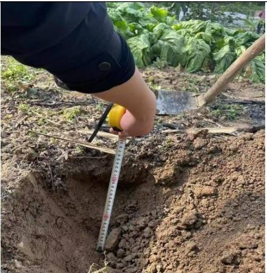  
图2.1-1 项目区地理交通位置示意图

## （2）项目涉及两省分布情况

本工程占地包括船闸工程、航道工程区、施工生产生活区、表土堆场区和临时堆料场区。其中船闸工程涉及四川省与重庆市，航道工程、施工生产生活区、表土堆场区和临时堆料场区征占地均位于四川省。

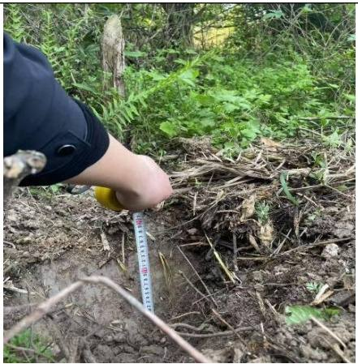  
图2.1-2 本工程区县位置示意图

## 2.1.3项目建设背景

## 2.1.4工程建设依托项目

## （1）三星梯级水电站（又名遂宁白禅寺电航工程）

本工程为三星梯级左岸新建船闸工程，三星梯级水电站由白禅寺电力有限公司负责建设，于 1998年 5月 8日开工，于 2001年 4月竣工投产。2000年11月遂宁市水利电力勘察设计队受白禅寺电力有限公司委托编制了《白禅寺电航工程水土保持方案初步设计报告》。2001年 3月 21日，四川省水土保持局下发了《关于对白禅寺电航工程水土保持方案初步设计报告的批复》（川水保发〔2021〕68）。三星梯级水电站为低坝挡水混合式开发，正常水位下的库容的6920 万m3，电站装机容量 48MW，船闸按Ⅵ级航道设计（未建）。根据四川省水利电力厅四川省计划委员会关于遂宁市白禅寺电航工程初步设计调整方案的批复（川水建管〔1998〕160 号）、四川省水利电力厅关于遂宁市白禅寺电航工程调整及优化设计报告的批复（川水建管〔2000〕355 号），闸坝枢纽工程等别为Ⅲ等，属于中型工程；电站厂房工程等别为Ⅳ等，属于小（1）型工程。闸坝及非溢流坝按 3 级建筑设计，设计洪水标准为 50 年一遇，相应流量 24100m3/s；校核洪水标准为 200 年一遇，相应流量 31200m3/s。

根据三星电站设计资料，三星枢纽正常蓄水位为 262.50m，死水位为262.00m，闸坝设计洪水位 269.01m（2%），校核洪水位 272.00m（0.5%），非溢流坝设计洪水位 269.01m（2%），校核洪水位 272.84m（0.33%）。三星电站主要工程特性见表 2.1-2。

根据《三星电站优化调度报告》，三星电站汛期安全运行方案：当流量小于等于 2000m3/s 时，水库维持正常蓄水位 262.50m 运行；当流量大于2000m3/s 小于等于 5000m3/s 时，水库降低至 262.30m 运行；当流量大于5000m3/s 小于等于 8000m3/s 时，水库降低至 262.00m 运行；当流量大于8000m3/s时，水库行洪，电站停机。

表 2.1-2三星梯级水电站工程特征水位表
<table><tr><td rowspan=1 colspan=1>序号</td><td rowspan=1 colspan=2>名称</td><td rowspan=1 colspan=1>单位</td><td rowspan=1 colspan=1>高程</td><td rowspan=1 colspan=1>备注</td></tr><tr><td rowspan=1 colspan=1>1</td><td rowspan=2 colspan=1>闸坝校核洪水位</td><td rowspan=1 colspan=1>上游</td><td rowspan=1 colspan=1>m</td><td rowspan=1 colspan=1>272.00</td><td rowspan=2 colspan=1>P=0.5%，Q=31200m³/s</td></tr><tr><td rowspan=1 colspan=1>2</td><td rowspan=1 colspan=1>下游</td><td rowspan=1 colspan=1>m</td><td rowspan=1 colspan=1>269.65</td></tr><tr><td rowspan=1 colspan=1>3</td><td rowspan=2 colspan=1>非溢流坝校核洪水位</td><td rowspan=1 colspan=1>上游</td><td rowspan=1 colspan=1>m</td><td rowspan=1 colspan=1>272.84</td><td rowspan=2 colspan=1>P=0.33%，Q=33200m³/s</td></tr><tr><td rowspan=1 colspan=1>4</td><td rowspan=1 colspan=1>下游</td><td rowspan=1 colspan=1>m</td><td rowspan=1 colspan=1>270.40</td></tr><tr><td rowspan=1 colspan=1>5</td><td rowspan=2 colspan=1>设计洪水位</td><td rowspan=1 colspan=1>上游</td><td rowspan=1 colspan=1>m</td><td rowspan=1 colspan=1>269.01</td><td rowspan=2 colspan=1>P=2%，Q=24100m³/s</td></tr><tr><td rowspan=1 colspan=1>6</td><td rowspan=1 colspan=1>下游</td><td rowspan=1 colspan=1>m</td><td rowspan=1 colspan=1>267.50</td></tr><tr><td rowspan=1 colspan=1>7</td><td rowspan=1 colspan=2>正常蓄水位</td><td rowspan=1 colspan=1>m</td><td rowspan=1 colspan=1>262.50</td><td rowspan=1 colspan=1></td></tr><tr><td rowspan=1 colspan=1>8</td><td rowspan=1 colspan=2>防洪高水位</td><td rowspan=1 colspan=1>m</td><td rowspan=1 colspan=1>262.30</td><td rowspan=1 colspan=1></td></tr><tr><td rowspan=1 colspan=1>9</td><td rowspan=1 colspan=2>死水位</td><td rowspan=1 colspan=1>m</td><td rowspan=1 colspan=1>262.00</td><td rowspan=1 colspan=1></td></tr></table>

## （2）涪江干流梯级渠化双江航电枢纽工程

涪江干流梯级渠化双江航电枢纽工程坝址位于重庆市潼南区境内的涪江干流上，开发任务是以航运为主，兼顾发电、河道生态修复等综合利用。枢纽工程建设区涉及重庆市潼南区桂林镇、双江镇，淹没区重庆市涉及桂林镇、双江镇、玉溪镇、米心镇，四川省涉及遂宁市船山区。枢纽工程等别为Ⅱ等工程，工程规模均为大（2）型，航道等级 IV 级，通航 500t 级船舶，工程正常蓄水位 249m，电站总装机 48MW，水库总库容 1.61 亿 m3。多年平均发电量1.8852亿 kW.h。枢纽主要建筑物由泄水闸、船闸、厂房、鱼道及混凝土接头坝等组成，沿坝轴线自左至右依次为：左岸防洪堤加高改建段（长 8.50m）、左岸储门槽坝段（长 20.00m）、泄水闸坝段（共 18孔，长 313.00m）、河床式厂房坝段（长 81.50m）、船闸上闸首坝段（长 49.20m）、右岸接头坝段（长 36.00m）。枢纽坝顶全长 508.20m，坝顶高程 259.90m。枢纽主要永久性水工建筑物泄水闸、电站厂房、船闸上下闸首及闸室、接头坝段等均为 3级建筑物，次要永久性建筑物导墙、拦砂坎等为 4级建筑物，临时性水工建筑物为5级。

双江航电枢纽工程的枢纽上游最高通航水位取为 249.00m。下游最高通航水位为最大通航流量相应的坝下水位为 243.53m，上游最低通航水位取死水位为 248.00m，下游最低通航水位取 235.50m。

双江航电枢纽工程运行方式为：当入库流量小于 2880m3/s 时，水位在正常蓄水位与死水位之间运行；当入库流量大于等于 2880m3/s 时，水库停机敞泄冲沙。

项目于 2020年 9月 28日印发了《重庆市潼南区发展和改革委员会 遂宁市发展和改革委员会关于涪江干流梯级渠化双江航电枢纽工程可行性研究报告的批复》（潼发改审〔2020〕442号），2021年 3月 23日，项目取得了《重庆市潼南区水利局关于涪江干流梯级渠化双江航电枢纽工程水土保持方案准予行政许可的决定》（潼水许可〔2021〕11号）。涪江干流梯级渠化双江航电枢纽工程主体工程于2020年12月开工，2025年1月船闸工程完成交工验收，3月机组投产发电。

## 2.1.5工程总体布置

本工程建设内容包括三星船闸工程、三星枢纽至重庆界约 10km 航道整治工程及配套建设航标工程、公用工程、过鱼设施工程及其他工程。

## 2.1.5.1 平面布置

## （1）船闸工程

三星船闸布置于左岸非溢流坝中部，三星枢纽泄水及发电建筑物以及大坝总长度维持不变，枢纽由左岸非溢流坝（左、右两段）、船闸、鱼道、泄洪冲沙闸、电站等组成，枢纽沿坝轴线从左至右依次为：左岸非溢流坝左段（234m）、船闸段（38.5m，含鱼道，坝轴线方向）、左岸非溢流坝右段（91.5m）、接头坝（36m）、泄洪闸（180m）、冲沙闸（34m）、引水渠进口（35m）。船闸下引左侧现存一溪沟，拟采用明渠进行顺船闸方向改造，改造溪沟长度约483m。

新建船闸布置于左岸非溢流坝中部，船闸轴线与坝轴线呈 73.6°斜交，右距泄水闸左边墩 151m，上闸首上距坝轴线 65m。船闸由上引航道（402.5m，含非溢流坝翼墙段 90m、进水口 25m）、上闸首（45m）、闸室（180m）、下闸首（40m）和下引航道（347.5m）等组成，全长1005m。

## （2）鱼道工程

鱼道紧邻船闸右侧布置于三星电站左岸非溢流坝中部，利用船闸上闸首右边墩及翼墙段右边墙穿越大坝。鱼道进口布置于闸坝左侧下游导墙末端附近，出口布置于船闸上引航道右侧辅导航墙外侧。由进口段、下游明渠段、船闸闸室墙段、穿闸首段、上引航道结合段及出口段等，全长约 1282m。鱼道采用竖缝式结构，池室宽度 2.2m。

## （3）非溢流坝复建

三星船闸建设需拆除 135m现三星水电站左岸非溢流坝，除38.5m被船闸翼墙占用外，左、右两侧需分别恢复 63.5m和 63m。恢复后，左岸非溢流坝左段总长 234m、右段长 91.5m。

## （4）溪沟改造

下引航道左侧现存一溪沟直冲涪江，拟采用明渠进行改造以避免水流影响通航安全。改造溪沟全长483m，纵坡1\~2%，采用“倒梯形”断面，底宽5m、沟深5m，坡比1:1，采用混凝土面板护坡。

## （5）跨闸交通桥

跨闸交通桥布置于原大坝坝轴线处，与现有左岸非溢流坝坝顶相接。交通桥轴线与船闸轴线呈 73.6°斜交，采用简支车行钢箱梁，桥面尺寸为 32×7m（长×宽），提升高度为7m，提升后桥底高程 279.70m。

## （6）航道工程

按照内河Ⅲ级航道标准整治三星枢纽下游约 10km航道。该河段位于双江

航电枢纽库区。航道尺度取 2.8×60×480m（水深×槽宽×弯曲半径），与下游重庆段航道建设标准一致。

根据航道平面设计，需对船闸下引航道下游连接段、毛杆子滩共2段总长944.7m 河段进行疏浚；对菜棚子滩、薛家坝铁路桥上游左岸边滩共 2 段总长2143.6m 河段进行清礁。

## 2.1.5.2 工程竖向布置

船闸各部位顶部高程，根据防洪和使用要求按规范确定，在防洪水位或最高通航水位的基础上加超高确定，底部高程在保证船闸具有最小通航水深后，另加富裕水深确定。

上引航道现状河床高程为 256.00m左右，考虑远期船舶大型化以及更好的适应水库运行水位变化，上引航道底及上闸首门槛高程取现状河床高程256.00m，相应最小水深 6m。上引航道非溢流坝翼墙段与进水口段考虑挡水要求，顶高程同坝顶。

下引航道顶部高程如按下游最大通航流量对应水位 258.52加 2.6m干舷高确定为 261.12m；本次设计考虑下引航道的防洪，同时考虑远期船舶的大型化及操作性能的改进等因素，因此船闸下引航道顶高程按 5年一遇防洪标准加0.5m 安全超高取为 263.10m。

船闸各部位高程见表2.1-3。

表 2.1-3船闸各部位高程表
<table><tr><td rowspan=1 colspan=2>部位</td><td rowspan=1 colspan=1>船闸高程（m）</td><td rowspan=1 colspan=1>备注</td></tr><tr><td rowspan=1 colspan=2>上引墙顶</td><td rowspan=1 colspan=1>265.10</td><td rowspan=1 colspan=1>上游最高通航水位+2.6m</td></tr><tr><td rowspan=1 colspan=2>上引航道底</td><td rowspan=1 colspan=1>256.00</td><td rowspan=1 colspan=1>同河床底高程，引航道水深6.0m</td></tr><tr><td rowspan=1 colspan=2>上引翼墙段、进水口、上闸首顶</td><td rowspan=1 colspan=1>274.00</td><td rowspan=1 colspan=1>与闸坝坝顶高程一致</td></tr><tr><td rowspan=1 colspan=2>上闸门顶</td><td rowspan=1 colspan=1>273.50</td><td rowspan=1 colspan=1>上游校核洪水位+0.66m</td></tr><tr><td rowspan=1 colspan=2>上门槛顶</td><td rowspan=1 colspan=1>256.00</td><td rowspan=1 colspan=1>同上引航道，门槛水深6m</td></tr><tr><td rowspan=1 colspan=2>闸墙顶</td><td rowspan=1 colspan=1>265.10</td><td rowspan=1 colspan=1>上游最高通航水位+2.6m</td></tr><tr><td rowspan=1 colspan=2>闸室底</td><td rowspan=1 colspan=1>243.80</td><td rowspan=1 colspan=1>下游最低通航水位-4.2m</td></tr><tr><td rowspan=1 colspan=2>下闸首顶</td><td rowspan=1 colspan=1>265.10</td><td rowspan=1 colspan=1>上游最高通航水位+2.6m</td></tr><tr><td rowspan=1 colspan=2>下闸门顶</td><td rowspan=1 colspan=1>263.00</td><td rowspan=1 colspan=1>上游最高通航水位+0.5m</td></tr><tr><td rowspan=1 colspan=2>下门槛顶</td><td rowspan=1 colspan=1>243.80</td><td rowspan=1 colspan=1>下游最低通航水位-4.2m</td></tr><tr><td rowspan=1 colspan=2>下引墙顶</td><td rowspan=1 colspan=1>263.10</td><td rowspan=1 colspan=1>下游5年一遇水位+0.5m超高</td></tr><tr><td rowspan=2 colspan=1>下引航道底</td><td rowspan=1 colspan=1>导航调顺段</td><td rowspan=1 colspan=1>243.80</td><td rowspan=1 colspan=1>下游最低通航水位-4.2m</td></tr><tr><td rowspan=1 colspan=1>停泊段至口门区</td><td rowspan=1 colspan=1>244.00</td><td rowspan=1 colspan=1>下游最低通航水位-4.0m</td></tr></table>

注：根据设计船型，在计算船闸各部位高程时，干舷高度取 2.6m。

## （1）上引航道

上引航道整体位于三星电站大坝上游、涪江左岸河床内，沿 144°方向展布。该段属涪江堆积岸，地形相对开阔平缓，整体坡向 242°，区内主要为河床。区内地面高程240.8～261m，设计底板高程约253.8m。

## （2）闸首

拟建闸首由上、下闸首组成，位置均位于涪江左岸Ⅰ级阶地上，沿 144°方向展布，穿过三星大坝。区内主要为农耕地，整体地形较平缓开阔，地面高程258\~262m（坝顶高程 274.4m），推荐船闸总平面方案的上闸首布置于非溢流坝的下游，上闸首左右边墩与人字门作为枢纽挡水线的一部分，顶高程由校核洪水位控制，与非溢流坝顶高程一致，为 274.00m。根据结构布置需要，结合地基软弱夹层分布高程，上闸首设计底板高程 239m，下闸首设计底板高程238.40m。

## （3）闸室

闸室位于涪江左岸Ⅰ级阶地上，沿 144°方向展布，地面高程 258\~262m，设计底板高程240.8m。

## （4）下引航道

下引航道一半位于河床内、一半位于Ⅰ级阶地之上，中部存在一高度8\~10m的护岸边坡，区内地面高程 249.1\~257.9m，设计底板高程 241.8m。

## （5）鱼道

鱼道起点位于三星电站大坝上游，顺接涪江，沿上引航道外边墙展布，穿越三星电站左侧非溢流坝后，在闸室右侧，与闸室平行迂回展布，最终止于三星电站左侧非溢流坝下游约 100m处，进口高程 246.5m，出口高程 261.0m，池室坡度约1.25%。

## （6）溪沟改造

溪沟改造全长 483m，纵坡 1\~2%，现状地形高程为 253.9-257m，设计沟底高程为 244-250m。

## 2.2工程等别及防洪标准

## 2.2.1 工程等别

本次三星枢纽工程建设内容包括左岸非溢流坝中部补建船闸、复建非溢流坝、鱼道等，未改变三星电站的装机、库容以及灌溉、防洪等工程功能和规模。本次三星船闸按Ⅲ级级航道上的船闸设计，根据《船闸总体设计规范》、《船闸水工建筑物设计规范》规定，闸首、闸室、上引航道非溢流坝翼墙段、进水口等建筑物按2级建筑筑物设计，其余引航道导航、靠船建筑物按 3级水工建筑设计，临时建筑物按 4级设计，复建非溢流坝按3级建筑物设计。

## 2.2.2建筑物级别和洪水标准

根据《水利水电工程等级划分及洪水标准》（SL252-2017）、《船闸水工建筑物设计规范》（JTJ307-2001），主要建筑物与复建非溢流坝设计洪水标准为 50 年一遇（对应流量 24100m3/s，上游水位 268.81m，下游 267.43m），校核洪水为 300 年一遇（对应流量 33200m3/s，上游水位 273.28m，下游270.41m）。

## 2.2.3 通航标准

根据《四川省发展和改革委员会重庆市发展和改革委员会关于涪江三星船闸工程可行性研究报告的批复》（川发改基础﹝2024﹞31号），三星船闸工程通航技术等级为内河Ⅲ级，建设单线单级Ⅲ级船闸 1座，通航 1000吨级船舶。

结合水库运行方式及模型试验研究结论，当上游来水量大于5224m3/s时，船闸下引航道口门区水流条件已无法满足船舶安全航行要求，船闸最大通航流量取电站满发且开启9孔泄洪闸时对应流量5224m3/s。

上游最高通航水位取水库正常蓄水位 262.50m，下游最高通航水位取最大通航流量 5224m3/s对应的下游水位 258.52m，上游最低通航水位取水库消落水位 262.00m，下游最低通航水位取下游双江梯级消落水位248.00m。

## 2.3工程布置及结构设计

三星船闸布置于三星电站左岸非溢流坝中部，船闸轴线与坝轴线呈 73.6°斜交，右距泄水闸左边墩 151m，上闸首上距坝轴线 65m。船闸由上引航道（含停泊段、导航调顺段、非溢流坝翼墙段、进水口）、上闸首、闸室、下闸首和下引航道等组成，船闸有效尺度 $1 8 0 { \times } 2 3 { \times } 4 . 2 \mathrm { m }$ （长×宽×门槛水深），船舶进、出闸采用曲线进闸、直线出闸的过闸方式。

详见表 2.3- 1。

表 2.3-1 涪江三星船闸工程特性表
<table><tr><td rowspan=1 colspan=1>序号和名称</td><td rowspan=1 colspan=1>单位</td><td rowspan=1 colspan=1>数量</td><td rowspan=1 colspan=1>备注</td></tr><tr><td rowspan=1 colspan=1>一、水文</td><td rowspan=1 colspan=1></td><td rowspan=1 colspan=1></td><td rowspan=1 colspan=1></td></tr><tr><td rowspan=1 colspan=1>1. 代表性流量</td><td rowspan=1 colspan=1></td><td rowspan=1 colspan=1></td><td rowspan=1 colspan=1></td></tr><tr><td rowspan=1 colspan=1>设计洪水流量</td><td rowspan=1 colspan=1>m³/s</td><td rowspan=1 colspan=1>24100</td><td rowspan=1 colspan=1>P=2%</td></tr><tr><td rowspan=1 colspan=1>对应上/下游水位</td><td rowspan=1 colspan=1>m</td><td rowspan=1 colspan=1>268.81/267.43</td><td rowspan=1 colspan=1></td></tr><tr><td rowspan=1 colspan=1>校核洪水流量</td><td rowspan=1 colspan=1>m³/s</td><td rowspan=1 colspan=1>33200</td><td rowspan=1 colspan=1>P=0.33%</td></tr><tr><td rowspan=1 colspan=1>对应上下游水位</td><td rowspan=1 colspan=1>m</td><td rowspan=1 colspan=1>273.28/270.41</td><td rowspan=1 colspan=1></td></tr><tr><td rowspan=1 colspan=1>2. 泥沙</td><td rowspan=1 colspan=1></td><td rowspan=1 colspan=1></td><td rowspan=1 colspan=1></td></tr><tr><td rowspan=1 colspan=1>多年平均悬移质年输沙量</td><td rowspan=1 colspan=1>万t</td><td rowspan=1 colspan=1>1392.1</td><td rowspan=1 colspan=1></td></tr><tr><td rowspan=1 colspan=1>多年平均推移质年输沙量</td><td rowspan=1 colspan=1>×104t</td><td rowspan=1 colspan=1>10.8</td><td rowspan=1 colspan=1></td></tr><tr><td rowspan=1 colspan=1>二、工程规模</td><td rowspan=1 colspan=1></td><td rowspan=1 colspan=1></td><td rowspan=1 colspan=1></td></tr><tr><td rowspan=1 colspan=1>1. 通航建筑物</td><td rowspan=1 colspan=1></td><td rowspan=1 colspan=1></td><td rowspan=1 colspan=1></td></tr><tr><td rowspan=1 colspan=1>航道等级</td><td rowspan=1 colspan=1>级</td><td rowspan=1 colspan=1>III</td><td rowspan=1 colspan=1></td></tr><tr><td rowspan=1 colspan=1>通航建筑物等级</td><td rowspan=1 colspan=1>级</td><td rowspan=1 colspan=1>III</td><td rowspan=1 colspan=1></td></tr><tr><td rowspan=1 colspan=1>最大过船吨位</td><td rowspan=1 colspan=1>t</td><td rowspan=1 colspan=1>1000</td><td rowspan=1 colspan=1></td></tr><tr><td rowspan=1 colspan=1>闸室有效尺度</td><td rowspan=1 colspan=1>m</td><td rowspan=1 colspan=1>180×23×4.2</td><td rowspan=1 colspan=1></td></tr><tr><td rowspan=1 colspan=1>年设计通过能力</td><td rowspan=1 colspan=1>万t/a</td><td rowspan=1 colspan=1>1467</td><td rowspan=1 colspan=1></td></tr><tr><td rowspan=1 colspan=1>2. 航道整治</td><td rowspan=1 colspan=1></td><td rowspan=1 colspan=1></td><td rowspan=1 colspan=1></td></tr><tr><td rowspan=1 colspan=1>航道等级</td><td rowspan=1 colspan=1>级</td><td rowspan=1 colspan=1>III</td><td rowspan=1 colspan=1></td></tr><tr><td rowspan=1 colspan=1>最大过船吨位</td><td rowspan=1 colspan=1>t</td><td rowspan=1 colspan=1>1000</td><td rowspan=1 colspan=1></td></tr><tr><td rowspan=1 colspan=1>航道尺度</td><td rowspan=1 colspan=1>m</td><td rowspan=1 colspan=1>2.8×60×480</td><td rowspan=1 colspan=1></td></tr><tr><td rowspan=1 colspan=1>年设计通过能力</td><td rowspan=1 colspan=1>万t/a</td><td rowspan=1 colspan=1>1721</td><td rowspan=1 colspan=1></td></tr><tr><td rowspan=1 colspan=1>三、主要建筑物及设备</td><td rowspan=1 colspan=1></td><td rowspan=1 colspan=1></td><td rowspan=1 colspan=1></td></tr><tr><td rowspan=1 colspan=1>1. 通航建筑物</td><td rowspan=1 colspan=1></td><td rowspan=1 colspan=1></td><td rowspan=1 colspan=1></td></tr><tr><td rowspan=1 colspan=1>型式</td><td rowspan=1 colspan=1></td><td rowspan=1 colspan=1>单级单线船闸</td><td rowspan=1 colspan=1></td></tr><tr><td rowspan=1 colspan=1>设计船舶、队尺度</td><td rowspan=1 colspan=1>m</td><td rowspan=1 colspan=1>63×11×2.6</td><td rowspan=1 colspan=1></td></tr><tr><td rowspan=1 colspan=1>设计水头</td><td rowspan=1 colspan=1>m</td><td rowspan=1 colspan=1>14.5</td><td rowspan=1 colspan=1></td></tr><tr><td rowspan=1 colspan=1>上游最高通航水位</td><td rowspan=1 colspan=1>m</td><td rowspan=1 colspan=1>262.50</td><td rowspan=1 colspan=1>正常蓄水位</td></tr><tr><td rowspan=1 colspan=1>上游最低通航水位</td><td rowspan=1 colspan=1>m</td><td rowspan=1 colspan=1>262.00</td><td rowspan=1 colspan=1>水库消落水位</td></tr><tr><td rowspan=1 colspan=1>下游最高通航水位</td><td rowspan=1 colspan=1>m</td><td rowspan=1 colspan=1>258.52</td><td rowspan=1 colspan=1>Qmax=5224m³/s</td></tr><tr><td rowspan=1 colspan=1>下游最低通航水位</td><td rowspan=1 colspan=1>m</td><td rowspan=1 colspan=1>248.00</td><td rowspan=1 colspan=1>双江消落水位</td></tr><tr><td rowspan=1 colspan=1>引航道长度（上游、下游）</td><td rowspan=1 colspan=1>m</td><td rowspan=1 colspan=1>402.5、347.5</td><td rowspan=1 colspan=1></td></tr></table>

## 2.3.1 船闸工程

## 2.3.1.1 船闸主体

## （1）船闸轴线确定

2017年～2019年，四川省交通勘察设计研究院有限公司在首次可行性研究阶段根据三星枢纽场地地形、地质、航道现状等条件，结合已建闸坝、电站、引水渠及尾水渠等实际情况，按照Ⅳ级航道标准对左岸方案和右岸方案两个船闸布置方案进行同精度比较，船闸有效尺度为 120×12×3.5m。综合分析比较后，推荐左岸方案。

后续研究过程中，三星船闸根据新规划航道等级按照Ⅲ级航道标准、通航1000吨级船舶设计，有效尺度 180×23×4.2m。由于三星枢纽为混合式布置，右岸为已建引水渠（宽度仅30m）、电站厂房和尾水渠，受泄洪闸、引水渠、右侧进厂公路和高陡边坡限制，右岸基本不具备布置Ⅲ级船闸的条件，且同时存在以下问题：

1）引水渠宽度仅 30m，不满足引航道最小宽度 3.5倍船宽（38.5m）的要求，仅基本满足直线段单线航道宽度30m要求。

2）引水渠进口紧邻泄洪闸，船舶进出引水渠较困难，同时引水渠外墙未考虑船舶撞击力，存在安全隐患。

3）运行期电站与通航存在干扰，电站非恒定流对船舶航行产生不利影响。

4）施工期对电站发电影响较大，施工场地布置条件受限。

5）需改建引水渠进口交通桥、拦漂排、进厂公路，改建尾水渠上两座交通桥。

6）工程投资较大。

基于上述原因，三星船闸拟布置于大坝左岸，与可行性研究阶段一致。

三星梯级水电站坝址处为一反曲线河段的中间顺直段，直线段长度约1.45km。大坝上游河道深泓线位于右侧凹岸，下游河道深泓线位于左岸凹岸。考虑到上游为库区，左、右岸水深条件及通航水流条件较好，船闸轴线确定主要受下游主航道控制。为便于尽量利用岸边低流速区水流条件，利于保证引航道口门区和连接段航道水流条件，同时减少对泄水闸泄流的影响和降低施工难度，船闸轴线宜尽量靠岸。但船闸过于靠岸则又导致左岸占地增加，不利于节约使用土地。

为尽量控制占地，船闸按照曲进直出布置型式，以船闸左侧下引航道口门区紧邻河道岸边布置为控制，船闸轴线基本与左侧河道平，与坝轴线呈 73.6°斜交，船闸轴线距离右侧泄水闸左边墩约 151m，上闸首上距坝轴线 65米。船闸全长 1005米，自上而下依次为:上引航道402.5米（含非溢流坝翼墙段90米、进水口段 25米）、上闸首 40米、闸室 180米、下闸首 35米、下引航道 347.5米（含出水口段15米）。

经过水工整体模型试验验证，以该船闸轴线布置的船闸总平面方案，船闸上、下游口门区及连接段航道水流条件较好，能与上、下游主航道平顺衔接，满足安全通航要求。

船闸轴线示意见下图。

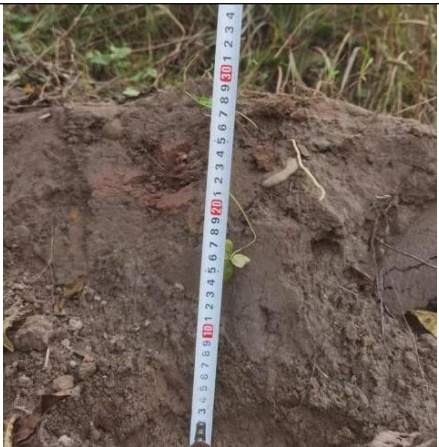  
图2.3-1 三星梯级工程区卫星图

## （2）主体结构尺度

## ①闸首尺度

三星船闸设计水头 14.5m，船闸口门宽度23m。根据三星水电站运行方式，当流量小于 8000m3/s 时，水库水位在 262.00\~262.50m 间运行，当流量超过8000m3/s，则全闸敞泄泄洪，河道恢复天然状态。三星船闸拟采用人字闸门作为工作闸门。闸首边墩宽度 18m，闸首总宽度 59m。上闸首长度 40m，下闸首长度 35m。

## a.上闸首结构设计

上闸首是枢纽重要的挡水建筑物，推荐船闸总平面方案的上闸首布置于非溢流坝的下游，上闸首左右边墩与人字门作为枢纽挡水线的一部分，顶高程由校核洪水位控制，与非溢流坝顶高程一致，为 274.00m。根据结构布置需要，结合地基软弱夹层分布高程，上闸首建基面宜布置于 239.00m附近，墙高约

35m，基础为粉砂质泥岩。上闸首设置有人字闸门、输水阀门、检修阀门及其启闭设备，是一个承受较大荷载的多向受力结构。

根据主体设计上闸首采用整体式，顶高程274.00m，建基面高程239.00m。

垂直于船闸轴线方向顶部总宽 59m，底部总宽 56m，其中口门宽 23m，两侧边墩宽 16.5m，边墩顶部各布置 1.5m宽的牛腿。两侧边墩各布置 6个空箱，空箱平面尺寸 5×5×14m（长×宽×高）。上闸首门前段、门库段底板顶高程采用上游门槛高程 256.0m，支持墙段的底板顶高程采用下游门槛高程243.80mm，底板厚 4.8m。

上闸首的上游布置 25m的进水口段，与非溢流坝相交，采用整体式结构。 进水口段布置有输水廊道的进水口，底板顶高程与廊道进口底高程一致，为 251.90m。

靠近闸首段的 6.5m范围因布置检修叠梁门槽，底板顶高程采用门坎高程256.00m。进水口段底板底高程根据中风化基岩高程确定为 245.00m；进水口段的边墩顶高程与上闸首齐平为 274.00m；边墩顶宽从检修角度考虑，布置为7m。

## b.下闸首结构设计

下闸首顶高程与闸室高程一致为 265.10m，门槛为 243.80m。下闸首长度为 35m，为一个结构段，其门前段、门龛段和支持墙段分别长 8m、15m 和12m。下闸首口门宽度为 23m，外边墩顶宽 15m，内边墩顶宽 12m（墙后满填）；墙底置于中风化粉砂质泥岩上。

根据主体设计下闸首采用分离式结构，左、右边墩为混合墙结构，根据岩面出露高程，确定上墙基面高程分别为 246.50m；而下墙和底板基面高程239.00m。下闸首左边墩墙后满填至墙顶形成约 69m的检修平台；右边墩则回填至原地面 250.00m后，采用 1m厚的雷诺护垫护底。下闸首门前段底板厚度为 5.8m，底部增加抗浮锚杆后，其底板抗浮满足规范要求。闸墩和底板均采用 C25砼。

## ②闸室尺度

根据船型预测和涪江货运需求分析，为满足远期货运需求，且结合船闸闸室利用率、综合投资等，本阶段三星船闸闸室尺度为 180m×23m×4.2m（闸室长度×闸室宽度×门槛最小水深），闸室总长 180m，共分为 12个结构段，各

结构段长度均为15m。

根据主体设计闸室采用分离式结构，左右闸墙和底板各自独立，右闸墙左、右闸墙均采用混合式结构。标准断面为左闸墙高 25.3m，顶宽 4.0m，墙顶高程 265.10m，墙底高程 239.80m，上墙背坡 1:0.6，台宽 5.4m，下墙背坡 1:0.2，底部为台阶式，墙底宽 11.0m，墙后回填至墙顶高程 265.10m；右闸墙结构1#\~11#结构段与鱼道结构相结合，12#结构段回填至原地面252.30m附近。

## （3）引航道尺寸

根据主体设计，三星船闸口门宽度23m，可取斜率为1:5。引航道内侧主导航段长度132.5m（船闸轴线方向的投影），引航道宽度50m。

停泊段长度按满足一闸次船舶停靠要求布置，本船闸闸室有效长度为180m，宽23m，可同时停靠2列船舶，因此停泊段同样按停靠 2列船舶设计，其长度同闸室有效长度取180m。

船闸上引航道和非溢流坝相交，相交段上引航道需兼做为非溢流坝翼墙，并与船闸进水口、上闸首段共同作为枢纽挡水线的一部分，顶高程由校核洪水位控制，与非溢流坝顶高程一致，为274.00m。

## 2.3.1.2 非溢流坝复建

三星船闸建设需拆除 165m现三星水电站左岸非溢流坝，除38.5m被船闸翼墙占用外，左、右两侧需分别恢复 63.5m和 63m。恢复后，左岸非溢流坝左段总长 234m、右段长 91.5m。

非溢流坝按原设计断面复建，采用面板堆石坝结构。坝顶宽度 5m，坝顶高程 274.00m，坝顶设 L形防浪墙，防浪墙高程为 275.00m，满足 300年一遇校核洪水防洪标准。坝体采用砂卵石填筑，上、下游边坡均为 1:1.6，上游采用 30cm混凝土面板防渗，并在底部基岩内设趾板，基岩采用帷幕灌浆防渗。坝下游设 50cm干砌卵石护坡。

建设单位委托四川大学工程设计研究院有限公司开展了本工程的安全稳定性影响评价，于 2025年 9月编制完成《涪江三星船闸工程安全稳定性影响评价报告》，2025年9月 4日组织专家进行了评审。2025年 12月 2日，遂宁市交通运输局、遂宁市水利局、遂宁市经济和信息化局联合下发了《关于涪江三星船闸工程安全稳定性影响评价报告的审核意见》（遂交函〔2025〕108号）。主要结论为：

（一）现状三星水电站非溢流坝段及溢流坝段稳定安全，电站能正常运行。

（二）施工期间采用二期围堰，利用溢流坝段过流，施工期间不影响电站安全运行。

（三）新建三星船闸对溢流坝段及非溢流坝段影响较小。

（四）三星船闸施工期间开挖现状非溢流坝段，在 250.00m、258.00m、266.00m高程分别设置 2m宽马道，采用1:1.6坡比进行开挖基本稳定。

（五）开挖方案对未开挖非溢流坝段整体影响较小。

（六）新建船闸后复建非溢流坝段，截面尺寸及参数，与现状一致，能保证安全稳定运行。

## 2.3.1.3 溪沟改造

拟建三星船闸左岸有一溪沟，起源于荷叶乡桅子村附近的山间汇水冲沟，全长约 4km左右，水源主要来源于山间地表水汇水，整体地形相对平缓，坡降约3‰-5‰，冲沟两侧植被茂盛，枯期流量较小，雨季流量会增大。

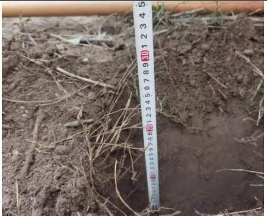  
图 2.3-2拟改造溪沟

因溪沟出口正对船闸下引航道，需将溪沟改道至并行引航道布置，出口位置改至下引航道左侧靠船墩墙末端下游 60m处，拟采用明渠进行改造以避免水流影响通航安全。改造溪沟全长483m，纵坡1\~2%，采用“倒梯形”断面，底宽 5m、沟深 5m，坡比 1:1，采用 50cm厚 C25混凝土面板护坡。沟顶外侧与船闸内引墙相接，衔接处采用撒播植草，沟顶内侧采用 1:2护坡与原地面相接，护坡采用三维网植草。

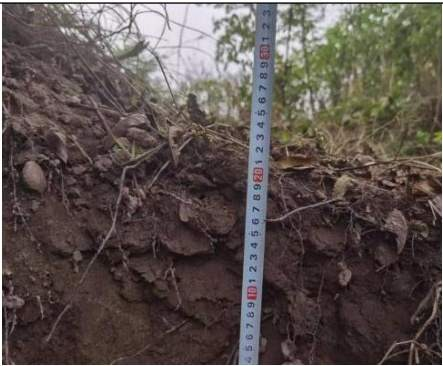

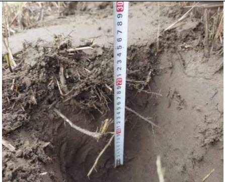  
图2.3-3 溪沟断面图

## 2.3.1.4 跨闸交通桥

## 1、技术标准

（1）道路等级：四级公路；

（2）设计速度：15km/h；

（3）桥面宽度：0.25m（护栏）+3.25m（车行道）+3.25m（车行道）+0.25m（护栏），桥面全宽7m；

（4）设计使用年限：主体结构50年；

（5）通航等级：Ⅲ级航道；

（6）设计荷载：公路-Ⅱ级；人行荷载：5kPa；

（7）设计洪水频率：本桥不受最高洪水位控制因素影响；

（8）地震设防：桥区地震基本烈度为Ⅵ度，地震动峰值加速度为0.05g，桥梁抗震设防类别为C类，抗震设计方法为3类，桥梁抗震措施等级为一级。

## 2、基本条件

（1）上游最高通航水位：262.50m；

（2）通行时桥面高程：274.00m；

（3）开启时桥面高程：281.00m；

（4）通航净空：16m。

跨闸交通桥布置于原大坝坝轴线处，与现有左岸非溢流坝坝顶相接。交通桥轴线与船闸轴线呈 73.6°斜交，采用简支车行钢箱梁，桥面尺寸为 32×7m（长×宽），提升高度为7m，提升后桥底高程 279.70m。

## 2.3.2 航道工程

航道工程建设内容为按照内河Ⅲ级航道标准整治三星枢纽下游约 10km航道。该河段位于双江航电枢纽库区。受三星枢纽未建船闸的影响，原该段航道仅能区间通航，主要通航船舶为砂石船，现状等级为Ⅵ级，航道维护尺度：航深 1.0\~1.1m，航宽 29～31m，弯曲半径 110.0～115.5m。目前，该段航道无航标配布。

本工程航道设计代表船型为 1000 吨级干散货船。航道尺度取2.8×60×480m（水深×槽宽×弯曲半径），与下游重庆段航道建设标准一致。根据《内河通航标准》（GB50139-2014），本工程河段航道设计最高通航水位应采用十年一遇洪水位，根据双江枢纽的运行方式和流量计算回水水面线约258.66\~265.60m，设计最低通航水位取下游双江枢纽死水位 248.00m。

工程河段河面较窄，大部分在150\~250m之间，弯道较多，根据船闸位置、河势及桥梁通航孔位置等，确定航道平面布置：船舶从船闸下游引航道出来后顺左岸弯道至弯道下游后，一直顺左岸至尾水渠出口附近时逐渐过渡到右岸弯道，至曾家湾后逐渐向左岸过渡，靠左岸通过薛家坝大桥，然后顺右岸深槽在白洋滩附近过渡至右岸庙基子弯道，然后顺弯道下游右岸主河槽行驶，航道弯曲半径根据河道弯道情况合理确定，最小弯曲半径不小于 480m，航道轴线节点坐标及弯曲半径详见下表。

根据主体设计，航道工程需对船闸下引航道下游连接段、毛杆子滩共2段总长 944.7m 河段进行疏浚；对菜棚子滩、薛家坝铁路桥上游左岸边滩共 2 段总长 2143.6m 河段进行清礁；对船闸下引航道下游右岸边滩长 1492.7m进行疏挖并新建雷诺护垫护岸1230m。

表2.3-2 航道节点坐标表
<table><tr><td rowspan=1 colspan=1>节点</td><td rowspan=1 colspan=1>坐标x</td><td rowspan=1 colspan=1>坐标y</td><td rowspan=1 colspan=1>转弯半径</td><td rowspan=1 colspan=1>航道底高程</td></tr><tr><td rowspan=1 colspan=1>JD0</td><td rowspan=1 colspan=1>3363181.755</td><td rowspan=1 colspan=1>573091.980</td><td rowspan=1 colspan=1></td><td rowspan=1 colspan=1>245.20m</td></tr><tr><td rowspan=1 colspan=1>JD1</td><td rowspan=1 colspan=1>3362523.779</td><td rowspan=1 colspan=1>573677.632</td><td rowspan=1 colspan=1>600</td><td rowspan=1 colspan=1>245.20m</td></tr><tr><td rowspan=1 colspan=1>JD2</td><td rowspan=1 colspan=1>3361337.205</td><td rowspan=1 colspan=1>572882.316</td><td rowspan=1 colspan=1>2000</td><td rowspan=1 colspan=1>245.20m</td></tr><tr><td rowspan=1 colspan=1>JD3</td><td rowspan=1 colspan=1>3360336.824</td><td rowspan=1 colspan=1>571825.317</td><td rowspan=1 colspan=1>480</td><td rowspan=1 colspan=1>245.20m</td></tr><tr><td rowspan=1 colspan=1>JD4</td><td rowspan=1 colspan=1>3358977.665</td><td rowspan=1 colspan=1>572419.212</td><td rowspan=1 colspan=1>480</td><td rowspan=1 colspan=1>245.20m</td></tr><tr><td rowspan=1 colspan=1>JD5</td><td rowspan=1 colspan=1>3358402.736</td><td rowspan=1 colspan=1>572031.451</td><td rowspan=1 colspan=1>480</td><td rowspan=1 colspan=1>245.20m</td></tr><tr><td rowspan=1 colspan=1>JD6</td><td rowspan=1 colspan=1>3358089.803</td><td rowspan=1 colspan=1>571086.443</td><td rowspan=1 colspan=1>480</td><td rowspan=1 colspan=1>245.20m</td></tr><tr><td rowspan=1 colspan=1>JD7</td><td rowspan=1 colspan=1>3356399.864</td><td rowspan=1 colspan=1>570790.898</td><td rowspan=1 colspan=1>480</td><td rowspan=1 colspan=1>245.20m</td></tr><tr><td rowspan=1 colspan=1>JD8</td><td rowspan=1 colspan=1>3356348.509</td><td rowspan=1 colspan=1>571103.542</td><td rowspan=1 colspan=1></td><td rowspan=1 colspan=1></td></tr></table>

注：航道平面布置节点详见“航道总体布置图”。

## 2.3.2.1 疏浚工程

主体设计根据低通航水位和设计水深要求，结合实测地形地质图，对船闸下引航道下游连接段（HK8+633.7\~HK8+977.8，长 344.1m）、毛杆子滩（HK3+961.8\~HK4+562.4，长 600.6m）共 2 段总长 944.7m 河段进行疏浚。设计航道疏浚挖槽深度 2.8m，超深 0.3m，挖槽底宽 60m，两侧超宽 2m，挖槽坡比 1:3，控制底高程按 245.20m（1985国家高程基准，下同）。计算总疏浚面积约 8 万m2，疏浚量约 18.7万m3。疏浚工程均为水下疏浚，不纳入防治责任范围。

疏浚设备为链斗挖泥船，泥驳运输疏浚砂卵石，疏浚料上岸处置。

表2.3-3船闸下引航道下游疏浚控制点坐标表
<table><tr><td rowspan=1 colspan=1>序号</td><td rowspan=1 colspan=1>X</td><td rowspan=1 colspan=1>y</td></tr><tr><td rowspan=1 colspan=1>CZ1</td><td rowspan=1 colspan=1>3363209.2260</td><td rowspan=1 colspan=1>573123.2343</td></tr><tr><td rowspan=1 colspan=1>CZ2</td><td rowspan=1 colspan=1>3362944.4508</td><td rowspan=1 colspan=1>573340.5003</td></tr><tr><td rowspan=1 colspan=1>CZ3</td><td rowspan=1 colspan=1>3362914.5775</td><td rowspan=1 colspan=1>573286.8751</td></tr><tr><td rowspan=1 colspan=1>CZ4</td><td rowspan=1 colspan=1>3363144.2752</td><td rowspan=1 colspan=1>573049.3387</td></tr></table>

表2.3-4毛杆子滩疏浚控制点坐标表
<table><tr><td rowspan=1 colspan=1>序号</td><td rowspan=1 colspan=1>X</td><td rowspan=1 colspan=1>y</td></tr><tr><td rowspan=1 colspan=1>M1</td><td rowspan=1 colspan=1>3359583.6053</td><td rowspan=1 colspan=1>572187.1802</td></tr><tr><td rowspan=1 colspan=1> $\mathrm { m } ^ { 2 }$ </td><td rowspan=1 colspan=1>3359018.7452</td><td rowspan=1 colspan=1>572386.1690</td></tr><tr><td rowspan=1 colspan=1> $\mathrm { m } ^ { 3 }$ </td><td rowspan=1 colspan=1>3358973.6684</td><td rowspan=1 colspan=1>572360.3603</td></tr><tr><td rowspan=1 colspan=1>M4</td><td rowspan=1 colspan=1>3358968.1707</td><td rowspan=1 colspan=1>572350.0540</td></tr><tr><td rowspan=1 colspan=1>M5</td><td rowspan=1 colspan=1>3359095.0611</td><td rowspan=1 colspan=1>572322.1444</td></tr><tr><td rowspan=1 colspan=1>M6</td><td rowspan=1 colspan=1>3359477.8294</td><td rowspan=1 colspan=1>572169.8810</td></tr><tr><td rowspan=1 colspan=1>M7</td><td rowspan=1 colspan=1>3359530.7405</td><td rowspan=1 colspan=1>572177.5409</td></tr></table>

## 2.3.2.2 清礁工程

主体设计根据低通航水位和设计水深要求，结合实测地形地质图，对菜棚子 滩（HK5+517.3\~HK7+502.5，长 1985.2m）、薛家坝铁路桥上游左岸边滩（HK3+723.5\~HK3+881.9，长 158.4m）共 2 段总长 2143.6m 河段进行清礁。菜棚子滩设计清礁底宽 60m，薛家坝铁路桥上游左岸边滩清礁底宽 0\~10.6m，边坡均为 1:0.5，控制底高程按 245.20m（1985 国家高程基准，下同）。计算超宽Δb=1.0m、计算超深 $\Delta \mathrm { h } = 0 . 4 \mathrm { m }$ ，计算总清礁面积约 17.5万 $\mathrm { m } ^ { 2 }$ ，水下爆破工程量约 25.9万 $\mathrm { m } ^ { 3 }$ ，水下凿岩工程量约0.27万 $\mathrm { m } ^ { 3 }$

根据施工场地周边边界条件及对铁路桥的影响，菜棚子滩采用水下炸礁施工方案，薛家坝铁路桥附近区域岩石采用水下凿岩施工方案。菜棚子滩地面高程 245m\~249m，菜棚子滩正常蓄水位为 249m，均位于常水位下，不纳入防治责任范围。

水下炸礁主要采用潜孔钻机炸礁船及反铲挖泥船，水下凿岩施工设备主有钻孔船、水下液压破碎机械船舶及反铲挖泥船。

水下爆破工程量约 25.9万 $\mathrm { m } ^ { 3 }$ ，水下凿岩工程量约0.27万 $\mathrm { m } ^ { 3 }$ 。

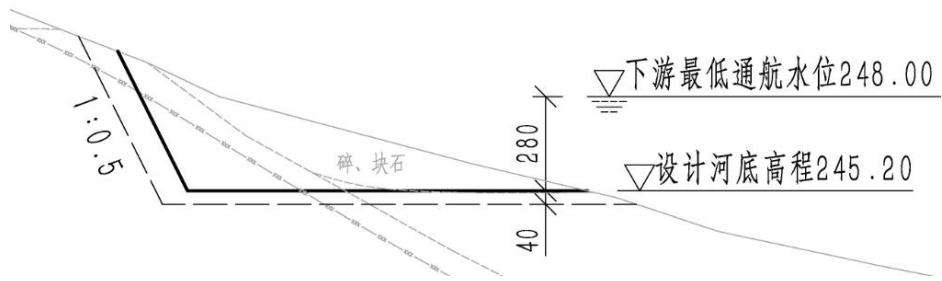  
图2.3- 4 水下凿岩断面图

表2.3-5 菜棚子滩清礁控制点坐标表
<table><tr><td rowspan=1 colspan=1>序号</td><td rowspan=1 colspan=1>X</td><td rowspan=1 colspan=1>y</td></tr><tr><td rowspan=1 colspan=1>CP1</td><td rowspan=1 colspan=1>3361466.4974</td><td rowspan=1 colspan=1>573004.4397</td></tr><tr><td rowspan=1 colspan=1>CP2</td><td rowspan=1 colspan=1>3361337.2046</td><td rowspan=1 colspan=1>572882.3163</td></tr><tr><td rowspan=1 colspan=1>CP3</td><td rowspan=1 colspan=1>3360427.6453</td><td rowspan=1 colspan=1>571967.4186</td></tr><tr><td rowspan=1 colspan=1>CP4</td><td rowspan=1 colspan=1>3360457.4203</td><td rowspan=1 colspan=1>571953.0500</td></tr><tr><td rowspan=1 colspan=1>CP5</td><td rowspan=1 colspan=1>3361498.1747</td><td rowspan=1 colspan=1>572953.0732</td></tr><tr><td rowspan=1 colspan=1>CP6</td><td rowspan=1 colspan=1>3361522.7304</td><td rowspan=1 colspan=1>573006.6672</td></tr></table>

表2.3-6薛家坝铁路桥上游左岸边滩控制点坐标表
<table><tr><td rowspan=1 colspan=1>序号</td><td rowspan=1 colspan=1>X</td><td rowspan=1 colspan=1>y</td></tr><tr><td rowspan=1 colspan=1>X1</td><td rowspan=1 colspan=1>3358867.3630</td><td rowspan=1 colspan=1>572355.0512</td></tr><tr><td rowspan=1 colspan=1>X2</td><td rowspan=1 colspan=1>3358738.2837</td><td rowspan=1 colspan=1>572290.5906</td></tr></table>

## 2.3.2.3船闸下引航道下游右岸边滩疏挖及护岸工程

根据水工模型试验和船模试验，为有效调整河道断面流速分布，减弱航道内的斜流强度，保证船闸下游口门区、连接段及下游弯道通航安全，对船闸下引航道下游右岸边滩（HK7+502.5\~HK8+995.2）总长 1492.7m（按航道中心线计算长度）进行疏挖，开挖底高程 250.00m，为防止泄水闸泄水对岸坡稳定的冲刷影响，开挖后的河岸新建护岸。护岸工程坡脚线总长 1230m，顺三星电站下游尾水渠江侧布置，其中上游段长 326m，下游段长 338m，中间段曲线段弧长 566m，转角 54.01°。护岸坡顶最大高程 262.0m，坡脚高程为 250.0m，护岸采用 50cm雷诺护垫结构，坡比 1:2，坡面顶部与地面平顺衔接，根据计算，边坡的安全系数为 1.25，满足安全稳定的要求。为保障边坡的防冲刷要求，护岸底部采用1m厚4m宽格宾石笼护脚。

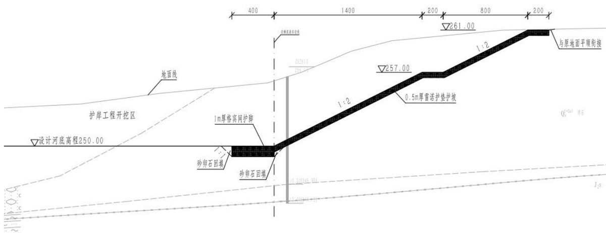  
图2.3-5护岸大样图

表2.3-7 护岸工程控制点坐标表
<table><tr><td rowspan=1 colspan=1>序号</td><td rowspan=1 colspan=1>X</td><td rowspan=1 colspan=1>y</td></tr><tr><td rowspan=1 colspan=1>A3</td><td rowspan=1 colspan=1>3363050.3452</td><td rowspan=1 colspan=1>572916.0998</td></tr><tr><td rowspan=1 colspan=1>A4</td><td rowspan=1 colspan=1>3362315.8907</td><td rowspan=1 colspan=1>573230.7333</td></tr><tr><td rowspan=1 colspan=1>A5</td><td rowspan=1 colspan=1>3361987.8305</td><td rowspan=1 colspan=1>573156.8279</td></tr><tr><td rowspan=1 colspan=1>Y1</td><td rowspan=1 colspan=1>3362808.8522</td><td rowspan=1 colspan=1>573142.9483</td></tr><tr><td rowspan=1 colspan=1>Y2</td><td rowspan=1 colspan=1>3362809.4046</td><td rowspan=1 colspan=1>573094.775</td></tr><tr><td rowspan=1 colspan=1>Y3</td><td rowspan=1 colspan=1>3362343.8853</td><td rowspan=1 colspan=1>573359.9442</td></tr></table>

## 2.3.3 配套工程

## 2.3.3.1 航标工程

航标按一类航标配布，主要包括侧面标、进出闸信号标、鸣笛标、界限标、节制闸标、航道信息标、通行信号标及水尺等。

## 2.3.3.2 公用工程

公用工程主要为船闸运行控制必须的控制和值班室等，设置于上闸首顶部。

## 2.3.3.3 鱼道工程

鱼道布置于船闸右侧，采用竖缝式结构，池室宽度 2.2m。进口布置于闸坝左侧下游导墙末端附近，出口布置于船闸上引航道右侧辅导航墙外侧。由进口段、下游明渠段、船闸闸室墙段、穿闸首段、上引航道结合段及出口段等，全长约 1282m。

鱼道入口采用整体式结构，尺寸为 4.5×5m，入口宽 2.2m，入口底高程246.50m，顶高程 250.00m。鱼道池室沿船闸外侧滩地及闸室墙背展线布置，纵坡 1.25%，竖缝宽度 0.35m，池室宽度 2.2m。其中边滩段长 78.6m，池身壁厚 0.6m，池身总宽 3.2m；闸墙背展线段池身平行布置，其间隔墙厚度 0.6m，6道鱼道结构总宽17.7m长180m，展线后鱼道长度，闸室墙 180m长度范围内展线993m。鱼道穿船闸闸首、进水口及非溢流坝翼墙段于墙体内设廊道布置，全长 145.5m，该段鱼道孔口尺寸 3.5×2.2m，并于上闸首右边墩内设防洪门。鱼道出口段布置于上引航道右侧辅导航墙墙身，尺寸为 4.5×4.2m，出口宽2.2m，出口墙顶高程 264.50m，出口鱼道底高程 261.00m。

按照总体布置，鱼道于上游出口共布置 1扇工作门，于穿船闸上闸首处布置 1扇防洪门，工作闸门兼作鱼道检修闸门使用。

## 2.3.3.4 检修通道

沿非溢流坝下游修筑一条检修通道与大坝左岸坝肩相接，供来往车辆使用，主入口设门卫和挂理清标志，主入口宽7m，最大纵坡 4%，道路全长 132m。

## 2.3.3.5 工作船码头

三星船闸工程及下游航道建成后，涪江航道等级提升至Ⅲ级，航道和航标维护与保养工作量较大。

为了保障航道的畅通，按照满足日常航道、航标检查工作和日常执法、管理工作需要的原则，在三星电站库区船闸上游引航道停泊段上游靠船墩后方设1座航标工作船码头，供工作船停靠。航标工作船码头长度 42m，停泊水域宽度 12m。

日常航标维护时，工作船在船闸闸室内停靠并在左闸墙顶进行航标装卸船作业。

## 2.4 施工组织

## 2.4.1 施工布置

## 2.4.1.1 料场规划

工程所需的水泥、木材、钢筋、钢材、油料及粉煤灰等建筑材料在遂宁市范围内均有生产，各种物资可经由公路直接运抵工地。水泥、粉煤灰从遂宁市船山区采购；钢材从遂宁市主城区采购；木材、油料可由船山区当地市场采购。

## 2.4-1沿线建筑材料料场一览表

<table><tr><td rowspan=1 colspan=1>序号</td><td rowspan=1 colspan=1>产地</td><td rowspan=1 colspan=1>材料名称</td><td rowspan=1 colspan=1>运距km</td><td rowspan=1 colspan=1>料场说明</td><td rowspan=1 colspan=1>储量万m³</td><td rowspan=1 colspan=1>运输方式</td><td rowspan=1 colspan=1>道路情况</td></tr><tr><td rowspan=1 colspan=1>1</td><td rowspan=1 colspan=1>恒源砂石有限公司</td><td rowspan=1 colspan=1>碎石机制砂</td><td rowspan=1 colspan=1>5.1</td><td rowspan=1 colspan=1>该料场位于遂宁市船山区老池乡涪江右岸，距离铁路桥约1.3km。该料场材料来源主要来自涪江河道内的开采，为第四系全新统冲积堆积层，呈次圆状，分选一般，卵石成分主要为砂岩、灰岩、石英岩等，有道路直接通往料场，交通运输便利。</td><td rowspan=1 colspan=1>15</td><td rowspan=1 colspan=1>汽车</td><td rowspan=1 colspan=1>料场临近当地公路，交通便利</td></tr><tr><td rowspan=1 colspan=1>2</td><td rowspan=1 colspan=1>遂宁市嘉弘砂石有限公司</td><td rowspan=1 colspan=1>碎石机制砂</td><td rowspan=1 colspan=1>12.2</td><td rowspan=1 colspan=1>该料场位于遂宁市船山区老池乡熊家院子。该料场材料来源主要来自涪江河道内的开采，为第四系全新统冲积堆积层，呈次圆状，分选一般，卵石成分主要为砂岩、灰岩、石英岩等，有道路直接通往料场，交通运输便利。</td><td rowspan=1 colspan=1>60</td><td rowspan=1 colspan=1>汽车</td><td rowspan=1 colspan=1>料场临近当地公路，交通便利</td></tr><tr><td rowspan=1 colspan=1>3</td><td rowspan=1 colspan=1>万顺华源砂石有限公司</td><td rowspan=1 colspan=1>碎石机制砂</td><td rowspan=1 colspan=1>14.9</td><td rowspan=1 colspan=1>该料场位于遂宁市船山区南强涪江右岸。该料场材料来源主要来自涪江河道内的开采，为第四系全新统冲积堆积层，呈次圆状，分选一般，卵石成分主要为砂岩、灰岩、石英岩等，有道路直接通往料场，交通运输便利。</td><td rowspan=1 colspan=1>25</td><td rowspan=1 colspan=1>汽车</td><td rowspan=1 colspan=1>料场临近当地公路，交通便利</td></tr><tr><td rowspan=1 colspan=1>4</td><td rowspan=1 colspan=1>天泰鸿涪建材有限公司</td><td rowspan=1 colspan=1>碎石机制砂</td><td rowspan=1 colspan=1>15.1</td><td rowspan=1 colspan=1>该料场位于遂宁市船山区南强涪江右岸。该料场材料来源主要来自涪江河道内的开采，为第四系全新统冲积堆积层，呈次圆状，分选一般，卵石成分主要为砂岩、灰岩、石英岩等，有道路直接通往料场，交通运输便利。</td><td rowspan=1 colspan=1>5</td><td rowspan=1 colspan=1>汽车</td><td rowspan=1 colspan=1>料场临近当地公路，交通便利</td></tr></table>

工区内砂砾石料料源丰富，涪江两岸河漫滩广泛分布，本工程砼骨料来源主要为项目船闸工程和航道整治工程开挖料利用，商业料场外购可作为补充，砂砾石粗骨料各项指标满足混凝土粗骨料质量指标。

## 2.4.1.2 施工导流

## （1）导流标准

三星船闸工程属Ⅲ级船闸，永久主要建筑物为 2级建筑物，次要建筑物为3级建筑物，根据《水利水电工程等级划分及洪水标准》（SL252-2017）规定，相应导流建筑物等级为 4级，其土石类围堰设计洪水标准为 20～10年一遇，混凝土类围堰设计洪水标准为10～5年一遇，流量Q=1615m3/s（P=5%）。

本工程导流标准采用20年一遇洪水标准，时段为11月\~翌年4月。

## （2）导流时段

为尽可能减少对已建电站发电的影响时间，工程施工均安排在枯期进行。

选择导流时段为11月～翌年4月。

## （3）导流方式

新建三星船闸位于原三星枢纽左岸非溢流坝，根据船闸水工布置，船闸上闸首、上游引航道导墙等建筑物均在三星电站库区内，大部分结构位于水下，需修建围堰进行干地施工，围堰高程与电站的运行方式有关。闸室、下闸首、下游引航道导墙和鱼道位于三星枢纽下游，围堰高程与枢纽的下泄流量有关。

考虑到三星电站原土石坝承担防洪挡水的重要功能，能够抵御300年一遇的洪水，同时三星水电站坝址区河床相对宽阔，已建泄洪闸具备导流条件，在确保施工期间对电站影响最小化的前提下，结合船闸水工建筑物的布置特点，主体初步设计拟定了导流方案如下：

一期（第一年 2月至 4月）：第一年 2月开始下游枯水期围堰填筑，上游利用非溢流坝进行挡水，同步进行闸室远河侧、鱼道初步开挖。围堰填筑后，开始上下闸首土石方大规模开挖及基础处理，到4月中旬浇筑上下闸首和闸室砼至高程 254.00m以上，4月底拆除枯水期围堰。第一年 5月至 10月全河段过流。

二期（第一年11月至第二年4月）：第一年11月，堆砌上游枯水期围堰，填筑下游枯期围堰挡水，堆砌下游引航道围堰。第一年 12月开始拆除非溢流坝，修建上游引航道左、右导航墙，随着导墙混凝土结构的逐步升高，同步进行墙后非溢流坝体的填筑作业，此后，按序进行垫层料坡面修整与碾压、趾板混凝土浇筑，并分两期完成面板混凝土的浇筑、养护及止水系统的修复与安装；在二枯工程中，继续施工上下闸首和闸室高程 254.00m以上部分和下游引航道开挖、浇筑，于第二年 4月底拆除上下游枯水期围堰。第二年 5月至 10月全河段过流。

三期（第二年11月至第三年4月）：第二年11月，上下游检修闸门挡水，进行船闸人字门和附属设施的安装以及船闸上游引航道内停泊段施工，第三年4月全部施工完毕。

坝上：导流时段为 11月～4月，导流标准为 20年一遇洪水，相应的导流流量为 1615m3/s，挡水高程为 262.50m，利用已建泄洪冲沙闸过流，修建导流枯期围堰进行上闸首引航道左、右导航墙的施工。

坝下：导流时段为 11月～4月，导流标准为 20年一遇洪水，相应的导流流量为 1615m3/s，挡水高程为 254.93m，利用已建泄洪冲沙闸过流，修建导流围堰进行上闸首、闸室和下闸首高程254.00以下部分和下游引航道施工。

推荐方案各期施工导流特性表成果见表2.4-2。

表2.4-2导流特性表
<table><tr><td rowspan=1 colspan=1>导流时段</td><td rowspan=1 colspan=1>一枯</td><td rowspan=1 colspan=1>二枯</td><td rowspan=1 colspan=1>三枯</td></tr><tr><td rowspan=1 colspan=1>导流时段</td><td rowspan=1 colspan=1>第一年2月～第一年4月</td><td rowspan=1 colspan=1>第二年11月~第二年4月</td><td rowspan=1 colspan=1>第二年11月～第三年4月</td></tr><tr><td rowspan=1 colspan=1>频率（%）</td><td rowspan=1 colspan=1>5%</td><td rowspan=1 colspan=1>5%</td><td rowspan=1 colspan=1>5%</td></tr><tr><td rowspan=1 colspan=1>设计流量(m³/s)</td><td rowspan=1 colspan=1>1615</td><td rowspan=1 colspan=1>1615</td><td rowspan=1 colspan=1>1615</td></tr><tr><td rowspan=1 colspan=1>挡水建筑物</td><td rowspan=1 colspan=1>上游：非溢流坝纵向：下游枯水纵向围堰下游：下游枯水横向围堰</td><td rowspan=1 colspan=1>上游：上游枯水横向围堰纵向：下游枯水纵向围堰下游：下游枯水引航道围堰</td><td rowspan=1 colspan=1>上游：上游检修闸门纵向：闸室墙下游：下游检修闸门</td></tr><tr><td rowspan=1 colspan=1>泄水建筑物</td><td rowspan=1 colspan=1>已建泄水闸</td><td rowspan=1 colspan=1>已建泄水闸</td><td rowspan=1 colspan=1>已建泄水闸</td></tr><tr><td rowspan=1 colspan=1>上游水位(m)</td><td rowspan=1 colspan=1>262.50</td><td rowspan=1 colspan=1>262.50</td><td rowspan=1 colspan=1>262.50</td></tr><tr><td rowspan=1 colspan=1>下游水位(m)</td><td rowspan=1 colspan=1>254.93</td><td rowspan=1 colspan=1>254.93</td><td rowspan=1 colspan=1>254.93</td></tr><tr><td rowspan=1 colspan=1>上游堰顶高程(m)</td><td rowspan=1 colspan=1></td><td rowspan=1 colspan=1>263.50</td><td rowspan=1 colspan=1></td></tr><tr><td rowspan=1 colspan=1>下游堰顶高程(m)</td><td rowspan=1 colspan=1>256.00</td><td rowspan=1 colspan=1>256.00</td><td rowspan=1 colspan=1></td></tr><tr><td rowspan=1 colspan=1>施工内容</td><td rowspan=1 colspan=1>①上下闸首、闸室基础开挖，混凝土浇筑至高程254.00m以上。②鱼道初步开挖。</td><td rowspan=1 colspan=1>①上下闸首、闸室上部高程254.00m浇筑；②非溢流坝拆除和恢复；③浇筑船闸上游引航道左、右导墙、下游引航道、溪沟改道施工；④同步建设鱼道工程；⑤检修闸门制造。</td><td rowspan=1 colspan=1>①上游引航道内停泊段施工。②人字门及附属设施安装等。</td></tr></table>

## （4）导流建筑物设计

本工程导流建筑物包括上游枯水期围堰、下游枯水期围堰和下游引航道枯期围堰。围堰均采用土石围堰形式，横向围堰顶宽均为 8m，迎水面坡比 1：

1.5，背水面坡比 1：2.0，堰体采用土石堆筑，迎水面采用袋装土护坡。纵向围堰顶宽均为 8m，迎水面坡比 1：1.5，背水面坡比 1：1.5，堰体采用土石堆筑，迎水面采用 1.0m厚块石护坡。围堰堰体与基础覆盖层均采用高喷灌浆防渗，孔距 1.3m。

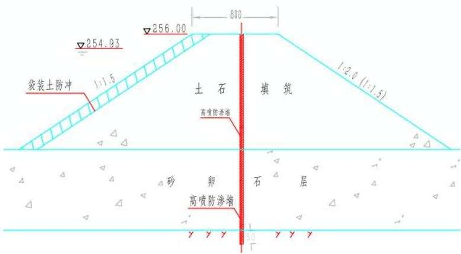  
图2.4-1 施工围堰典型断面图

## （5）基坑排水

基坑排水分初期排水和经常性排水。初期排水由围堰闭气后的基坑积水量、抽水过程中围堰及基础渗水量、绕堰渗水量、堰身及基坑覆盖层中的含水量，以及降水量等组成；经常性排水由围堰及基础渗水、绕堰渗水、施工弃水及降雨等组成。

本工程围堰基坑初期排水初拟 4天排干，选用 16SA-9JB型水泵 3台。经常性排水利用初期排水设备，抽水泵站布设于上、下游围堰堰脚处。

表2.4-3 导流围堰工程量表
<table><tr><td rowspan=2 colspan=1>围堰</td><td rowspan=1 colspan=1>围堰填筑</td><td rowspan=1 colspan=1>围堰拆除</td></tr><tr><td rowspan=1 colspan=1> $( \mathbf { m } ^ { 3 } )$ </td><td rowspan=1 colspan=1> $( \mathbf { m } ^ { 3 } )$ </td></tr><tr><td rowspan=1 colspan=1>下游横向闸首围堰（一枯）</td><td rowspan=1 colspan=1>8034</td><td rowspan=1 colspan=1>8034</td></tr><tr><td rowspan=1 colspan=1>下游纵向围堰（一枯）</td><td rowspan=1 colspan=1>50067</td><td rowspan=1 colspan=1>50067</td></tr><tr><td rowspan=1 colspan=1>上游横向围堰（二枯）</td><td rowspan=1 colspan=1>12150</td><td rowspan=1 colspan=1>12150</td></tr><tr><td rowspan=1 colspan=1>上游纵向围堰（二枯）</td><td rowspan=1 colspan=1>17854</td><td rowspan=1 colspan=1>17854</td></tr><tr><td rowspan=1 colspan=1>下游纵向围堰（二枯）</td><td rowspan=1 colspan=1>14823</td><td rowspan=1 colspan=1>14823</td></tr><tr><td rowspan=1 colspan=1>下游横向引航道围堰（二枯）</td><td rowspan=1 colspan=1>3613</td><td rowspan=1 colspan=1>3613</td></tr><tr><td rowspan=1 colspan=1>合计</td><td rowspan=1 colspan=1>106541</td><td rowspan=1 colspan=1>106541</td></tr></table>

注：表中数据为自然方。

## 7、施工期通航

三星船闸地处涪江通航河段的下游，由于三星电站建设未同期建设通航建筑物， 已断航二十余年，目前航运仅限于已建成库区内的矿建材料短途运输、对江渡运和旅游客运，船舶吨位小，航运发展缓慢。

鉴于目前情况，三星船闸建设采取断航施工的方案，对本航段的航运影响较小虽然本船闸采用断航施工，对当地航运影响较小，但施工期建设单位和施工单位仍应在航道、海事等主管部门的配合下，切实贯彻相关规范和法规要求，

因地制宜的采取措施，严禁上下游船舶进入施工影响水域范围内。

## 2.4.1.3 施工生产生活区

本工程布置施工生产生活区 2处，布置于左岸大坝上游岸边Ⅰ级阶地、大坝下游与溪沟之间Ⅰ级阶地，主要布置预制场地、机械设备停放场、拼装场地、加工厂等。经统计，施工生产生活区共计新增占地5.66hm2。

表2.4-4施工生产生活区占地统计表
<table><tr><td rowspan=1 colspan=1>名称</td><td rowspan=1 colspan=1>面积(hm2)</td><td rowspan=1 colspan=1>耕地(hm2)</td><td rowspan=1 colspan=1>备注</td></tr><tr><td rowspan=1 colspan=1>1#施工生产生活区</td><td rowspan=1 colspan=1>3.14</td><td rowspan=1 colspan=1>3.14</td><td rowspan=1 colspan=1>位于左岸大坝上游岸边I级阶地、包括预制场地、机械设备停放场、拼装场地等</td></tr><tr><td rowspan=1 colspan=1>2#施工生产生活区</td><td rowspan=1 colspan=1>2.52</td><td rowspan=1 colspan=1>2.52</td><td rowspan=1 colspan=1>位于大坝下游与溪沟之间I级阶地，包括综合加工厂，木材、钢筋加工厂，机械设备停放场等</td></tr><tr><td rowspan=1 colspan=1>合计</td><td rowspan=1 colspan=1>5.66</td><td rowspan=1 colspan=1>5.66</td><td rowspan=1 colspan=1></td></tr></table>

## 2.4.1.4表土堆场及临时堆料场

## （1）表土堆场

本工程共计剥离表土 4.79万m3，剥离表土集中堆放于 1#、2#表土堆场，表土堆放最大堆高5.2m，堆放坡比1:2，经统计，新增占地1.10hm2。

两个表土堆场均设置于河道管理范围线之外，其中 1#表土堆场场区设计洪水位为 264.3-264.6m，现状地形高程为 264.8-264.9m，场区高于设计洪水高程，不受设计洪水影响。2#表土堆场场区设计洪水位为 259.5-261m，现状地形高程为 264-267.5m，场区高于设计洪水高程，不受设计洪水影响。表土堆场特性详见下表2.4-5。

表2.4-5表土堆场特性统计表
<table><tr><td rowspan=2 colspan=1>名称</td><td rowspan=2 colspan=1>位置</td><td rowspan=2 colspan=1>最大堆高(m)</td><td rowspan=2 colspan=1>堆放坡比</td><td rowspan=1 colspan=3>面积（hm²）</td><td rowspan=2 colspan=1>规划堆存量(万³)</td><td rowspan=2 colspan=1>堆存时间</td><td rowspan=2 colspan=1>选址意见</td></tr><tr><td rowspan=1 colspan=1>小计</td><td rowspan=1 colspan=1>耕地</td><td rowspan=1 colspan=1>住宅用地</td></tr><tr><td rowspan=1 colspan=1>1#表土堆场</td><td rowspan=1 colspan=1>大坝上游左岸</td><td rowspan=1 colspan=1>5.2</td><td rowspan=1 colspan=1>1:2</td><td rowspan=1 colspan=1>0.53</td><td rowspan=1 colspan=1>0.50</td><td rowspan=1 colspan=1>0.03</td><td rowspan=1 colspan=1>2.31</td><td rowspan=1 colspan=1>2026年2月~2026年4月；2026年11月~2027年4月；</td><td rowspan=1 colspan=1>不涉及河道管理范围，地形较平坦，选址基本可行。</td></tr><tr><td rowspan=1 colspan=1>2#表土堆场</td><td rowspan=1 colspan=1>大坝下游左岸</td><td rowspan=1 colspan=1>52</td><td rowspan=1 colspan=1>1:2</td><td rowspan=1 colspan=1>0.57</td><td rowspan=1 colspan=1>0.57</td><td rowspan=1 colspan=1></td><td rowspan=1 colspan=1>2.48</td><td rowspan=1 colspan=1>2026年2月~2026年4月；2026年11月~2027年4月；</td><td rowspan=1 colspan=1>不涉及河道管理范围，地形较平坦，选址基本可行。</td></tr><tr><td rowspan=1 colspan=2>合计</td><td rowspan=1 colspan=1></td><td rowspan=1 colspan=1></td><td rowspan=1 colspan=1>1.10</td><td rowspan=1 colspan=1>1.07</td><td rowspan=1 colspan=1>0.03</td><td rowspan=1 colspan=1>4.79</td><td rowspan=1 colspan=1></td><td rowspan=1 colspan=1></td></tr></table>

注：为保障汛期防洪安全，汛期进行清运。

## （2）临时堆料场

本项目设置两处临时堆料场。

1#临时堆料场，设置于大坝上游左岸河道管理范围线之外的区域，占地

0.96hm2，最大堆存高度 8.5m，可堆存 6.35万 m3。主要用于一般土石方、围堰料堆放，经土石方调度分析，1#临时堆料场规划最大堆存量 6.35万 m3（松方），1#临时堆料场容量满足要求。场区设计洪水位为 264.6-264.7m，本区域现状地形高程为264.8-264.9m，高于设计洪水高程，不受设计洪水影响。

2#临时堆料场，设置于大坝下游左岸河道管理范围线之外的区域，占地1.10hm2，最大堆存高度 8.5m，可堆存 6.97万 m3。主要用于一般土石方、砂卵石、围堰料堆放，经土石方调度分析，2#临时堆料场规划最大堆存量为6.97万 m3（松方），2#临时堆料场容量满足要求。场区设计洪水位为 259-259.5m，本区域现状地形高程为 264-267.1m，高于设计洪水高程，不受设计洪水影响。

表2.4-6 临时堆料场特性统计表
<table><tr><td rowspan=2 colspan=1>名称</td><td rowspan=2 colspan=1>位置</td><td rowspan=2 colspan=1>最 高度(m)</td><td rowspan=2 colspan=1>堆放坡比</td><td rowspan=1 colspan=2>面积(hm2)</td><td rowspan=2 colspan=1>设计最大堆存量（万m³)</td><td rowspan=2 colspan=1>堆存时间</td><td rowspan=2 colspan=1>选址意见</td></tr><tr><td rowspan=1 colspan=1>小计</td><td rowspan=1 colspan=1>耕地</td></tr><tr><td rowspan=1 colspan=1>1#临物</td><td rowspan=1 colspan=1>大左岸</td><td rowspan=1 colspan=1>8.5</td><td rowspan=1 colspan=1>1:2</td><td rowspan=1 colspan=1>0.96</td><td rowspan=1 colspan=1>0.96</td><td rowspan=1 colspan=1>6.35</td><td rowspan=1 colspan=1>2026年2月-2026年4月；2026年11月-2027年2月</td><td rowspan=1 colspan=1>不涉及河道管理范围，地形较平坦，选址基本可行。</td></tr><tr><td rowspan=1 colspan=1>2#临4物</td><td rowspan=1 colspan=1>成会拼</td><td rowspan=1 colspan=1>8.5</td><td rowspan=1 colspan=1>1:2</td><td rowspan=1 colspan=1>1.10</td><td rowspan=1 colspan=1>1.10</td><td rowspan=1 colspan=1>6.97</td><td rowspan=1 colspan=1>2026年2月-2026年4月；2026年11月-2027年2月</td><td rowspan=1 colspan=1>不涉及河道管理范围，地形较平坦，选址基本可行。</td></tr><tr><td rowspan=1 colspan=2>合计</td><td rowspan=1 colspan=1></td><td rowspan=1 colspan=1></td><td rowspan=1 colspan=1>2.06</td><td rowspan=1 colspan=1>2.06</td><td rowspan=1 colspan=1>13.32</td><td rowspan=1 colspan=1></td><td rowspan=1 colspan=1></td></tr></table>

注：为保障汛期防洪安全，汛期进行清运。

生产建设单位承诺，汛前将表土堆场及临时堆料场堆土（料）全部清理完毕，保证汛期各表土堆场及临时堆料场不堆土（料），空置度汛。生产建设单位承诺，对项目土石方挖填、堆放等造成的周边及下游基础设施、人身及生命财产、防洪等安全责任全面负责。

## 2.4.1.5 施工便道

本工程场内交通运输主要为天然建筑材料块石料、土料和砂石骨料的运输以及土石方开挖、土石方回填、混凝土浇筑等运输。

根据本工程施工进度要求和施工场内交通规划，结合现场安全文明施工要求，左岸需新建施工临时道路1.88km，均采用混凝土路面，道路路基宽7.5m。

经统计，施工便道长度约 1.88km，占地 1.41hm2，占地位于永久占地及施

工生产生活区范围内，不新增占地。

表2.4-7 场内临时交通道路表
<table><tr><td rowspan=1 colspan=1>道路编号</td><td rowspan=1 colspan=1>路面宽度(m)</td><td rowspan=1 colspan=1>长度(m)</td><td rowspan=1 colspan=1>占地(hm²)</td><td rowspan=1 colspan=1>位置</td><td rowspan=1 colspan=1>备注</td></tr><tr><td rowspan=1 colspan=1>左R1</td><td rowspan=1 colspan=1>7.5</td><td rowspan=1 colspan=1>880</td><td rowspan=1 colspan=1>0.66</td><td rowspan=1 colspan=1>施工区~上引航道基坑</td><td rowspan=2 colspan=1>永久占地及施工生产生活区范围内</td></tr><tr><td rowspan=1 colspan=1>左R2</td><td rowspan=1 colspan=1>7.5</td><td rowspan=1 colspan=1>1000</td><td rowspan=1 colspan=1>0.75</td><td rowspan=1 colspan=1>施工区~下引航道基坑/下闸首</td></tr><tr><td rowspan=1 colspan=2>合计</td><td rowspan=1 colspan=1>1880</td><td rowspan=1 colspan=1>1.41</td><td rowspan=1 colspan=1></td><td rowspan=1 colspan=1></td></tr></table>

## 2.4.1.6 临时转运码头

由于三星枢纽坝顶无法承受重车碾压，运往遂宁港大沙坝作业区（一期）工程土石方采用船运，同时为方便疏浚料上岸，施工期在大坝上下游左岸布置2个临时转运码头，根据地形条件，1#临时转运码头位于上游左岸坝轴线上游侧，距离坝轴线约0.1km处，2#临时转运码头位于下游引航道外侧处。

经统计，2处临时转运码头占地 0.11hm2，临时转运码头位于本项目永久占地范围内，不新增占地。

表2.4-8临时转运码头表
<table><tr><td rowspan=1 colspan=2>名称</td><td rowspan=1 colspan=1>占地类型</td><td rowspan=1 colspan=1>面积（hm²）</td><td rowspan=1 colspan=1>备注</td></tr><tr><td rowspan=2 colspan=1>临时转运码头</td><td rowspan=1 colspan=1>1#</td><td rowspan=1 colspan=1>水域及水利设施用地</td><td rowspan=1 colspan=1>0.06</td><td rowspan=1 colspan=1>上游左岸坝轴线上游侧、位于永久占地范围内，面积不重复计列。</td></tr><tr><td rowspan=1 colspan=1>2#</td><td rowspan=1 colspan=1>水域及水利设施用地</td><td rowspan=1 colspan=1>0.05</td><td rowspan=1 colspan=1>下游引航道外侧处、位于永久占地范围内，面积不重复计列</td></tr><tr><td rowspan=1 colspan=3>合计</td><td rowspan=1 colspan=1>0.11</td><td rowspan=1 colspan=1></td></tr></table>

## 2.4.2 施工条件

## （1）对外交通条件

公路：附近有 G93、S11、S205等通过，至现场有乡道通过，可满足材料进出场的运输要求。

铁路：距坝址较近的铁路货运站为遂宁火车站，金结等大件设备可铁路运输至遂宁站后转公路运输，遂宁火车站至三星坝址公路运输距离35km。

水运：涪江遂宁市境内航道现状等级为 V级，水路运输以砂石等矿建材料区间短途运输为主。

## （2）外来材料和物资供应

本工程主要外来材料包括水泥、木材、钢筋、钢材、油料、火工产品及粉

煤灰等建筑材料在遂宁市范围内均有生产，各种物资可经由公路直接运抵工地，外来材料采用就近购买的原则购买解决。

## （2）水电供应及施工通信

施工用水：本工程生产用水可从涪江河道抽取，涪江河水对混凝土无侵蚀性，可直接用于生产；生活用水可接荷叶乡城镇居民用水。

施工用电：三星枢纽现有电站厂房变电站可提供 10kV线路接口供本工程施工期用电。

施工通讯：工程区现有有线和无线通讯较发达，施工通信采用有线通信和无线通信相结合的方式，可满足施工通讯要求。

## （3）附近城镇的修配加工能力

本工程所在地四川省遂宁市郊区，具有较强的修配加工能力，可承担大型施工机械及汽车的大修任务。

## 2.4.3 施工方法

本工程施工主要包括原非溢流坝段拆除与修复、船闸工程、鱼道工程、航道工程以及配套工程施工等。各单项施工方法不尽相同，但总体以机械施工为主，人工为辅。

## 2.4.3.1原非溢流坝段拆除与修复

## 1、非溢流坝面板拆除

面板拆除主要采用人工持风镐或液压破碎机进行凿除，针对难以利用常规方式实施切割的部位，可采用 WS-15金刚线锯有效切割，把混凝土切割成 5t的块状，以方便运输。从上至下逐步拆除钢筋砼面板和干砌卵石层护坡；注意拆除砼面板时，在开挖线边沿以外的面板应保留其完整性，其周边的止水不得破坏；止水上的拆除砼块，须人工小心清除。

## 2、混凝土垂直防渗墙拆除

采用施工机械+人工凿出的施工方法，不得施工爆破拆除方式。

## 3、坝体拆除

采用 2.0m3反铲挖掘机装车，15t自卸汽车运输，逐层向下、向内开挖。挖出后相应回填料就近堆放，以利回填和修复。

## 4、混凝土面板的修复

施工之前修复和涂刷存在隐患的防渗，并补强处理新溢流坝与原钢筋砼面板之间的接触面，同时，还将一道止水铜片布置在新老面板接缝处。施工过程中合理安排新浇混凝土施工分缝缝块，加强新浇混凝土温度控制及防裂措施，减小混凝土温度应力和提高混凝土裂缝能力。

## 5、混凝土垂直防渗墙的修复

对原有防渗墙外露混凝土碳化层凿除，利用酚酞乙醇进行检测，可利用风镐对碳化层进行人工凿除并冲洗干净，凿除后的混凝土表面应显露石子，涂刷界面剂，增加粘结强度，结合面埋设测缝针、应变计等检测仪器。

## 6、坝体施工工艺

土石坝填筑采用 2.0m3反铲挖掘机从左岸弃渣场或存料堆场挖装，15t自卸汽车运输入仓，振动碾压实，施工过程中应按照碾压试验确定的铺料厚度、碾压遍数进行填筑。碾压应平行坝轴线方向碾压，严禁振动碾横向、斜向无序行驶碾压。碾压过程中注意新旧砂卵石交接带碾迹重迭要求，注意与船闸混凝土接头部位的衔接工作和层间结合质量，边角部位应加强压实，保证紧密连接。

## 2.4.3.2 船闸工程

主要施工项目包括基础土石方开挖、基础处理、混凝土浇筑与金属结构安装等。

## 1、土石方开挖

土方开挖采用 2.0m3反铲挖掘机装车，15t自卸汽车运输。开挖土方料主要用于自身回填，砂卵石料主要用于船闸墙后及鱼道填筑，剩余砂卵石料用于砂石骨料。

为减少爆破对原坝体的影响，石方开挖采用带爆裂臂挖掘机（俗称钩机）破碎，出渣采用 $2 . 0 \mathrm { m } ^ { 3 }$ 反铲挖掘机挖装，15t自卸汽车运输。全部开挖料余方运至临时堆土场，砂驳运输到下游右岸码头，转 15t自卸汽车运输至临时堆料场。

## 2、基础处理

基础处理主要包括固结灌浆及帷幕灌浆。

随开挖分层下降，基础完成开挖后，固结灌浆在基础混凝土浇筑到一定厚度满足压重要求后进行，采用埋管法进行有压重固结灌浆。为减少固结灌浆对混凝土浇筑工期的过多影响，拟采取埋管法灌浆，即将固结灌浆孔用管道引至仓外部位，待基础浇筑到一定高程后，再进行固结补强灌浆施工。

固结灌浆施工过程：根据孔位布置图，先钻周边孔，后钻中间孔，采用孔口封闭、孔底循环法灌浆，灌浆分次序、一孔一泵灌注，钻孔用 XU—100型地质钻机钻孔，材料采用 425#普通硅酸盐水泥；灌浆结束，采用机械封孔，排除孔内稀浆，用稠水泥砂浆将孔封填密实。

船闸帷幕灌浆和排水系统的施工分两期施工，按滞后固结灌浆一个月进行。采用埋管和钻孔相结合的方法加快施工进程、缩短施工时间，排水系统滞后帷幕灌浆施工。帷幕灌浆：采用“小口径钻孔，孔口封闭，自下而上分段灌浆”的施工工艺。 灌浆孔采用 XU—100型地质钻机钻孔造孔，每个灌浆段均进行孔壁冲洗和裂隙冲洗，对先导孔和检查孔的各段均进行正规压水试验；施工程序由低部位向高部位分段进行；灌浆采用 BW200/40型灌浆泵灌浆，灌浆浆液采用稳定性浆液；灌浆结束标准执行拒浆标准，在灌浆过程中，当灌浆压力和注入率达到规定值后即结束。

## 3、混凝土浇筑

船闸混凝土由左岸拌和楼供料，15t自卸汽车运至各工作面，卸入 3.0m3卧罐，由布置在船闸中心线上下游的 MQ600/30型高架门座式起重机吊运 3m3卧罐入仓，另配置25t履带式起重机和长臂反铲等设备辅助入仓，平铺法铺料，4.5kw变频振捣器平仓、密实。

钢筋、模板、埋件等的吊装，均依靠沿船闸轴线布置的 MQ600/30型门机和 25t履带式起重机吊运，模板以组合钢模板为主。

## 4、土石方回填

船闸工程回填料主要利用船闸土石方开挖料，采用 2.0m3反铲挖掘机从堆存区挖装，15t自卸汽车运输入仓，74kw推土机平整，13.5t振动碾压实，运距 0.3km。

## 2.4.3.3 鱼道工程

土方开挖采用 2.0m3反铲挖掘机装车，15t自卸汽车运输，砂卵石开挖料用于砂石骨料加工。

砂卵石填筑直接利用自身船闸开挖料，15t自卸汽车运输卸料，88kw推土机平料，振动碾压实。

## 2.4.3.4 航道工程

四川金原工程勘察设计有限责任公司 52

## （1）疏浚工程

疏挖及疏浚砂卵石可在枯水期采用 1.6m3液压挖掘机开挖水上部分；水下疏浚选用斗容为 0.75m3的链斗挖泥船进行施工。河道疏浚布置 $1 . 6 \mathrm { m } ^ { 3 }$ 液压挖掘机及0.75m3的链斗挖泥船。

## （2）清礁工程

菜棚子滩采用水下炸礁施工方案，薛家坝铁路桥附近区域岩石采用水下凿岩施工方案，水下炸礁施工时，采用潜孔钻机炸礁船，布孔方式采用梅花形布孔方式，纵横间距2.5m。钻孔完成后安装炸药，完成爆破。水下凿岩施工时，采用安装钻机的船舶对礁石区域进行密集孔施工，以便液压破碎时能够更顺利的将礁石破碎。凿岩时，根据地形、地质情况确定凿岩布点的间距，选择有临空面或岩层较薄的一侧开始凿岩，以便提高凿岩质量及效率。凿岩采取分层循环施工，直至达到设计底标高。

水下清礁施工采用反铲挖泥船的施工工艺，采用顺流开挖，分条分段的施工方法。一次开挖至设计标高，当一次开挖不能满足所需挖深时，可分层开挖。

## 2.4.3.5 配套工程

本工程除船闸外，还包括检修通道等配套工程，其主要施工内容包括土石方开挖、土石方填筑、混凝土浇筑、路基路面施工、边坡防护等。

土方开挖采用 2.0m3反铲挖掘机装车，15t自卸汽车运输，开挖料用于自身回填等。

配套工程混凝土由 10t自卸汽车运至现场，道路工程可直接卸料入仓，4.5kw变频振捣器平仓、密实。

## 2.5工程占地

根据项目施工总体布置及建设内容分析，本工程占地包括船闸工程、航道工程区、施工生产生活区、表土堆场区、临时堆料场区占地。

经统计，本工程总占面积 41.72hm2，其中永久占地 32.90hm2，临时占地$8 . 8 2 \mathrm { h m } ^ { 2 }$ ，永久占地为船闸工程、航道工程占地；临时占地为施工生产生活区、表土堆场区、临时堆料场区占地；根据现场调查，项目占用现状地类包括耕地、园地、林地、水域及水利设施用地、其他土地、住宅用地，工程占地情况详见表 2.5-1、表 2.5-2。

表 2.5-1项目占地面积统计表（单位：hm2）
<table><tr><td rowspan=1 colspan=1>项目组成</td><td rowspan=1 colspan=1>耕地</td><td rowspan=1 colspan=1>园地</td><td rowspan=1 colspan=1>林地</td><td rowspan=1 colspan=1>水域及水利设施用地</td><td rowspan=1 colspan=1>其他土地</td><td rowspan=1 colspan=1>住宅用地</td><td rowspan=1 colspan=1>合计</td><td rowspan=1 colspan=1>永久占地</td><td rowspan=1 colspan=1>临时占地</td></tr><tr><td rowspan=1 colspan=1>船闸工程</td><td rowspan=1 colspan=1>8.40</td><td rowspan=1 colspan=1>0.45</td><td rowspan=1 colspan=1>0.10</td><td rowspan=1 colspan=1>11.48</td><td rowspan=1 colspan=1>1.06</td><td rowspan=1 colspan=1></td><td rowspan=1 colspan=1>21.49</td><td rowspan=1 colspan=1>21.49</td><td rowspan=1 colspan=1></td></tr><tr><td rowspan=1 colspan=1>航道工程</td><td rowspan=1 colspan=1></td><td rowspan=1 colspan=1>2.79</td><td rowspan=1 colspan=1>0.39</td><td rowspan=1 colspan=1>0.00</td><td rowspan=1 colspan=1>8.23</td><td rowspan=1 colspan=1></td><td rowspan=1 colspan=1>11.41</td><td rowspan=1 colspan=1>11.41</td><td rowspan=1 colspan=1></td></tr><tr><td rowspan=1 colspan=1>施工生产生活区</td><td rowspan=1 colspan=1>5.66</td><td rowspan=1 colspan=1></td><td rowspan=1 colspan=1></td><td rowspan=1 colspan=1></td><td rowspan=1 colspan=1></td><td rowspan=1 colspan=1></td><td rowspan=1 colspan=1>5.66</td><td rowspan=1 colspan=1></td><td rowspan=1 colspan=1>5.66</td></tr><tr><td rowspan=1 colspan=1>表土堆场区</td><td rowspan=1 colspan=1>1.07</td><td rowspan=1 colspan=1></td><td rowspan=1 colspan=1></td><td rowspan=1 colspan=1></td><td rowspan=1 colspan=1></td><td rowspan=1 colspan=1>0.03</td><td rowspan=1 colspan=1>1.10</td><td rowspan=1 colspan=1></td><td rowspan=1 colspan=1>1.10</td></tr><tr><td rowspan=1 colspan=1>临时堆料场区</td><td rowspan=1 colspan=1>2.06</td><td rowspan=1 colspan=1></td><td rowspan=1 colspan=1></td><td rowspan=1 colspan=1></td><td rowspan=1 colspan=1></td><td rowspan=1 colspan=1></td><td rowspan=1 colspan=1>2.06</td><td rowspan=1 colspan=1></td><td rowspan=1 colspan=1>2.06</td></tr><tr><td rowspan=1 colspan=1>合计</td><td rowspan=1 colspan=1>17.19</td><td rowspan=1 colspan=1>3.24</td><td rowspan=1 colspan=1>0.49</td><td rowspan=1 colspan=1>11.48</td><td rowspan=1 colspan=1>9.29</td><td rowspan=1 colspan=1>0.03</td><td rowspan=1 colspan=1>41.72</td><td rowspan=1 colspan=1>32.90</td><td rowspan=1 colspan=1>8.82</td></tr></table>

表2.5-2 分区县占地统计（单位：hm2）
<table><tr><td rowspan=1 colspan=1>行政区</td><td rowspan=1 colspan=1>分区</td><td rowspan=1 colspan=1>耕地</td><td rowspan=1 colspan=1>园地</td><td rowspan=1 colspan=1>林地</td><td rowspan=1 colspan=1>水域及水利设施用地</td><td rowspan=1 colspan=1>其他土地</td><td rowspan=1 colspan=1>住宅用地</td><td rowspan=1 colspan=1>合计</td><td rowspan=1 colspan=1>永久占地</td><td rowspan=1 colspan=1>临时占地</td></tr><tr><td rowspan=1 colspan=1>遂宁市船山区</td><td rowspan=1 colspan=1>航道工程区</td><td rowspan=1 colspan=1></td><td rowspan=1 colspan=1>2.79</td><td rowspan=1 colspan=1>0.39</td><td rowspan=1 colspan=1></td><td rowspan=1 colspan=1>8.23</td><td rowspan=1 colspan=1></td><td rowspan=1 colspan=1>11.41</td><td rowspan=1 colspan=1>11.41</td><td rowspan=1 colspan=1></td></tr><tr><td rowspan=5 colspan=1>遂宁市蓬溪县</td><td rowspan=1 colspan=1>船闸工程</td><td rowspan=1 colspan=1>6.01</td><td rowspan=1 colspan=1>0.45</td><td rowspan=1 colspan=1>0.09</td><td rowspan=1 colspan=1>7.43</td><td rowspan=1 colspan=1>0.65</td><td rowspan=1 colspan=1></td><td rowspan=1 colspan=1>14.63</td><td rowspan=1 colspan=1>14.63</td><td rowspan=1 colspan=1></td></tr><tr><td rowspan=1 colspan=1>施工生产生活区</td><td rowspan=1 colspan=1>5.66</td><td rowspan=1 colspan=1></td><td rowspan=1 colspan=1></td><td rowspan=1 colspan=1></td><td rowspan=1 colspan=1></td><td rowspan=1 colspan=1></td><td rowspan=1 colspan=1>5.66</td><td rowspan=1 colspan=1></td><td rowspan=1 colspan=1>5.66</td></tr><tr><td rowspan=1 colspan=1>表土堆场区</td><td rowspan=1 colspan=1>1.07</td><td rowspan=1 colspan=1></td><td rowspan=1 colspan=1></td><td rowspan=1 colspan=1></td><td rowspan=1 colspan=1></td><td rowspan=1 colspan=1>0.03</td><td rowspan=1 colspan=1>1.10</td><td rowspan=1 colspan=1></td><td rowspan=1 colspan=1>1.10</td></tr><tr><td rowspan=1 colspan=1>临时堆料场区</td><td rowspan=1 colspan=1>2.06</td><td rowspan=1 colspan=1></td><td rowspan=1 colspan=1></td><td rowspan=1 colspan=1></td><td rowspan=1 colspan=1></td><td rowspan=1 colspan=1></td><td rowspan=1 colspan=1>2.06</td><td rowspan=1 colspan=1></td><td rowspan=1 colspan=1>2.06</td></tr><tr><td rowspan=1 colspan=1>小计</td><td rowspan=1 colspan=1>14.8</td><td rowspan=1 colspan=1>0.45</td><td rowspan=1 colspan=1>0.09</td><td rowspan=1 colspan=1>7.43</td><td rowspan=1 colspan=1>0.65</td><td rowspan=1 colspan=1>0.03</td><td rowspan=1 colspan=1>23.45</td><td rowspan=1 colspan=1>14.63</td><td rowspan=1 colspan=1>8.82</td></tr><tr><td rowspan=1 colspan=1>重庆市潼南区</td><td rowspan=1 colspan=1>船闸工程</td><td rowspan=1 colspan=1>2.39</td><td rowspan=1 colspan=1></td><td rowspan=1 colspan=1>0.01</td><td rowspan=1 colspan=1>4.05</td><td rowspan=1 colspan=1>0.41</td><td rowspan=1 colspan=1></td><td rowspan=1 colspan=1>6.86</td><td rowspan=1 colspan=1>6.86</td><td rowspan=1 colspan=1></td></tr><tr><td rowspan=1 colspan=2>合计</td><td rowspan=1 colspan=1>17.19</td><td rowspan=1 colspan=1>3.24</td><td rowspan=1 colspan=1>0.49</td><td rowspan=1 colspan=1>11.48</td><td rowspan=1 colspan=1>9.29</td><td rowspan=1 colspan=1>0.03</td><td rowspan=1 colspan=1>41.72</td><td rowspan=1 colspan=1>32.90</td><td rowspan=1 colspan=1>8.82</td></tr></table>

## 2.6土石方平衡

## 2.6.1表土资源调查

根据《生产建设项目水土流失防治标准》（GB/T 50434—2018）规定：可剥离表土总量是指根据地形条件、施工方法、表土层厚度，综合考虑目前技术经济条件下可以剥离表土的总量。

通过现场调查，本工程赋存表土范围主要为船闸工程区、航道工程区、施工生产生活区、临时堆料场区、表土堆场区所占耕地、园地和林地区域，项目占地范围耕地表土厚度约 20-30cm，平均厚度约 25cm；园地约 20cm，林地约20cm，项目区赋存表土资源量、表土层厚度调查详见表2.6-1、表2.6-2。

表 2.6-1 表土分布范围、厚度及赋存表土量统计表
<table><tr><td rowspan=4 colspan=1>序号</td><td rowspan=4 colspan=1>项目组成</td><td rowspan=1 colspan=6>占地类型及面积</td><td rowspan=4 colspan=1>赋存表土量(万)</td></tr><tr><td rowspan=1 colspan=2>耕地</td><td rowspan=1 colspan=2>园地</td><td rowspan=1 colspan=2>林地</td></tr><tr><td rowspan=1 colspan=1>面积</td><td rowspan=2 colspan=1>厚度(cm)</td><td rowspan=1 colspan=1>面积</td><td rowspan=2 colspan=1>厚度(cm)</td><td rowspan=1 colspan=1>面积</td><td rowspan=2 colspan=1>厚度(cm)</td></tr><tr><td rowspan=1 colspan=1>(hm²)</td><td rowspan=1 colspan=1>(hm²)</td><td rowspan=1 colspan=1>(hm²)</td></tr><tr><td rowspan=1 colspan=1>①</td><td rowspan=1 colspan=1>船闸工程区</td><td rowspan=1 colspan=1>8.40</td><td rowspan=5 colspan=1>20-30，平均25cm</td><td rowspan=1 colspan=1>0.45</td><td rowspan=5 colspan=1>20</td><td rowspan=1 colspan=1>0.10</td><td rowspan=5 colspan=1>20</td><td rowspan=1 colspan=1>2.21</td></tr><tr><td rowspan=1 colspan=1>②</td><td rowspan=1 colspan=1>航道工程区</td><td rowspan=1 colspan=1></td><td rowspan=1 colspan=1>2.79</td><td rowspan=1 colspan=1>0.39</td><td rowspan=1 colspan=1>0.64</td></tr><tr><td rowspan=1 colspan=1>③</td><td rowspan=1 colspan=1>施工生产生活区</td><td rowspan=1 colspan=1>5.66</td><td rowspan=1 colspan=1></td><td rowspan=1 colspan=1></td><td rowspan=1 colspan=1>1.42</td></tr><tr><td rowspan=1 colspan=1>④</td><td rowspan=1 colspan=1>临时堆料场区</td><td rowspan=1 colspan=1>2.06</td><td rowspan=1 colspan=1></td><td rowspan=1 colspan=1></td><td rowspan=1 colspan=1>0.52</td></tr><tr><td rowspan=1 colspan=1>⑤</td><td rowspan=1 colspan=1>表土堆场区</td><td rowspan=1 colspan=1>1.07</td><td rowspan=1 colspan=1></td><td rowspan=1 colspan=1></td><td rowspan=1 colspan=1>0.27</td></tr><tr><td rowspan=1 colspan=1></td><td rowspan=1 colspan=1>合计</td><td rowspan=1 colspan=1>17.19</td><td rowspan=1 colspan=1></td><td rowspan=1 colspan=1>3.24</td><td rowspan=1 colspan=1></td><td rowspan=1 colspan=1>0.49</td><td rowspan=1 colspan=1></td><td rowspan=1 colspan=1>5.06</td></tr></table>

表2.6-2 表土资源调查
<table><tr><td>耕地</td><td>林地</td><td>园地</td></tr><tr><td></td><td></td><td></td></tr><tr><td></td><td></td><td></td></tr></table>

## 2.6.2 表土平衡

为保护表土资源，同时为后期复耕及绿化提供覆土，对本项目赋存表土进行剥离，因表土堆场以占压为主，故不对表土堆场表土进行剥离，剥离区域包括船闸工程区、航道工程区、施工生产生活区和临时堆料场区，占地 $1 9 . 8 5 \mathrm { h m } ^ { 2 }$ ，合计剥离表土 4.79万 m3，剥离表土集中堆存于表土堆场，后期全部用于本工程绿化及复耕覆土使用。船闸工程区三维网植草护坡平均覆土厚度0.2m，船闸工程区景观绿化区域覆土0.5m，施工生产生活区及临时堆料场区覆土0.45m，共需覆土4.79万m3，本工程表土平衡。

表2.6- 3 表土剥离量统计
<table><tr><td rowspan=4 colspan=1>序号</td><td rowspan=4 colspan=1>项目组成</td><td rowspan=1 colspan=6>占地类型及面积</td><td rowspan=4 colspan=1>赋存表土量 $( \mathcal { F } \mathrm { ~ m } ^ { 3 } )$ </td></tr><tr><td rowspan=1 colspan=2>耕地</td><td rowspan=1 colspan=2>园地</td><td rowspan=1 colspan=2>林地</td></tr><tr><td rowspan=1 colspan=1>面积</td><td rowspan=1 colspan=1>剥离</td><td rowspan=1 colspan=1>面积</td><td rowspan=2 colspan=1>剥离(cm)</td><td rowspan=1 colspan=1>面积</td><td rowspan=2 colspan=1>剥离(cm)</td></tr><tr><td rowspan=1 colspan=1> $\left( \mathrm { h m } ^ { 2 } \right)$ </td><td rowspan=1 colspan=1>(cm)</td><td rowspan=1 colspan=1> $\left( \mathrm { h m } ^ { 2 } \right)$ </td><td rowspan=1 colspan=1> $\left( \mathrm { h m } ^ { 2 } \right)$ </td></tr><tr><td rowspan=1 colspan=1>①</td><td rowspan=1 colspan=1>船闸工程区</td><td rowspan=1 colspan=1>8.4</td><td rowspan=4 colspan=1>25</td><td rowspan=1 colspan=1>0.45</td><td rowspan=4 colspan=1>20</td><td rowspan=1 colspan=1>0.1</td><td rowspan=4 colspan=1>20</td><td rowspan=1 colspan=1>2.21</td></tr><tr><td rowspan=1 colspan=1>②</td><td rowspan=1 colspan=1>航道工程区</td><td rowspan=1 colspan=1></td><td rowspan=1 colspan=1>2.79</td><td rowspan=1 colspan=1>0.39</td><td rowspan=1 colspan=1>0.64</td></tr><tr><td rowspan=1 colspan=1>③</td><td rowspan=1 colspan=1>施工生产生活区</td><td rowspan=1 colspan=1>5.66</td><td rowspan=1 colspan=1></td><td rowspan=1 colspan=1></td><td rowspan=1 colspan=1>1.42</td></tr><tr><td rowspan=1 colspan=1>④</td><td rowspan=1 colspan=1>临时堆料场区</td><td rowspan=1 colspan=1>2.06</td><td rowspan=1 colspan=1></td><td rowspan=1 colspan=1></td><td rowspan=1 colspan=1>0.52</td></tr><tr><td rowspan=1 colspan=1></td><td rowspan=1 colspan=1>合计</td><td rowspan=1 colspan=1>16.12</td><td rowspan=1 colspan=1></td><td rowspan=1 colspan=1>3.24</td><td rowspan=1 colspan=1></td><td rowspan=1 colspan=1>0.49</td><td rowspan=1 colspan=1></td><td rowspan=1 colspan=1>4.79</td></tr></table>

表2.6- 4 表土回覆量统计表
<table><tr><td rowspan=1 colspan=1>序号</td><td rowspan=1 colspan=1>项目组成</td><td rowspan=1 colspan=2>措施</td><td rowspan=1 colspan=1>措施量 $\left( \mathrm { ~ h m } ^ { 2 } \right)$ </td><td rowspan=1 colspan=1>覆土厚度(m)</td><td rowspan=1 colspan=1>覆土量(万m³)</td></tr><tr><td rowspan=2 colspan=1>①</td><td rowspan=2 colspan=1>船闸工程区</td><td rowspan=2 colspan=1>绿化</td><td rowspan=1 colspan=1>三维网植草护坡</td><td rowspan=1 colspan=1>0.42</td><td rowspan=1 colspan=1>0.2</td><td rowspan=1 colspan=1>0.09</td></tr><tr><td rowspan=1 colspan=1>景观绿化</td><td rowspan=1 colspan=1>2.44</td><td rowspan=1 colspan=1>0.5</td><td rowspan=1 colspan=1>1.22</td></tr><tr><td rowspan=1 colspan=1>②</td><td rowspan=1 colspan=1>施工生产生活区</td><td rowspan=1 colspan=2>复耕</td><td rowspan=1 colspan=1>5.66</td><td rowspan=1 colspan=1>0.45</td><td rowspan=1 colspan=1>2.55</td></tr><tr><td rowspan=1 colspan=1>③</td><td rowspan=1 colspan=1>临时堆料场区</td><td rowspan=1 colspan=2>复耕</td><td rowspan=1 colspan=1>2.06</td><td rowspan=1 colspan=1>0.45</td><td rowspan=1 colspan=1>0.93</td></tr><tr><td rowspan=1 colspan=4>合计</td><td rowspan=1 colspan=1></td><td rowspan=1 colspan=1></td><td rowspan=1 colspan=1>4.79</td></tr></table>

表2.6- 5 表土平衡分析表
<table><tr><td rowspan=2 colspan=1>序号</td><td rowspan=2 colspan=1>项目组成</td><td rowspan=1 colspan=1>表土剥离</td><td rowspan=1 colspan=1>表土回填</td><td rowspan=1 colspan=2>调入（万m³）</td><td rowspan=1 colspan=2>调出（万m³）</td></tr><tr><td rowspan=1 colspan=1> $( \mathrm { \mathcal { F } } \mathrm { \mathfrak { m } } ^ { 3 } )$ </td><td rowspan=1 colspan=1> $( \mathrm { \mathcal { F } } \mathrm { \mathfrak { m } } ^ { 3 } )$ </td><td rowspan=1 colspan=1>数量</td><td rowspan=1 colspan=1>来源</td><td rowspan=1 colspan=1>数量</td><td rowspan=1 colspan=1>去向</td></tr><tr><td rowspan=1 colspan=1>①</td><td rowspan=1 colspan=1>船闸工程区</td><td rowspan=1 colspan=1>2.21</td><td rowspan=1 colspan=1>1.31</td><td rowspan=1 colspan=1></td><td rowspan=1 colspan=1></td><td rowspan=1 colspan=1>0.9</td><td rowspan=1 colspan=1>③0.49④0.41</td></tr><tr><td rowspan=1 colspan=1>②</td><td rowspan=1 colspan=1>航道工程区</td><td rowspan=1 colspan=1>0.64</td><td rowspan=1 colspan=1></td><td rowspan=1 colspan=1></td><td rowspan=1 colspan=1></td><td rowspan=1 colspan=1>0.64</td><td rowspan=1 colspan=1>③</td></tr><tr><td rowspan=1 colspan=1>③</td><td rowspan=1 colspan=1>施工生产生活区</td><td rowspan=1 colspan=1>1.42</td><td rowspan=1 colspan=1>2.55</td><td rowspan=1 colspan=1>1.13</td><td rowspan=1 colspan=1>①0.49②0.64</td><td rowspan=1 colspan=1></td><td rowspan=1 colspan=1></td></tr><tr><td rowspan=1 colspan=1>④</td><td rowspan=1 colspan=1>临时堆料场区</td><td rowspan=1 colspan=1>0.52</td><td rowspan=1 colspan=1>0.93</td><td rowspan=1 colspan=1>0.41</td><td rowspan=1 colspan=1>①</td><td rowspan=1 colspan=1></td><td rowspan=1 colspan=1></td></tr><tr><td rowspan=1 colspan=2>合计</td><td rowspan=1 colspan=1>4.79</td><td rowspan=1 colspan=1>4.79</td><td rowspan=1 colspan=1>1.54</td><td rowspan=1 colspan=1></td><td rowspan=1 colspan=1>1.54</td><td rowspan=1 colspan=1></td></tr></table>

## 2.6.3土石方平衡情况

本项目初步设计中未计算施工生产生活区场平土石方工程量及表土剥离开挖及回填量，本方案将予以补充。根据主体初步设计资料并经水保方案复核，本项目土石方挖方总量 170.82 万 $\mathrm { m } ^ { 3 }$ （自然方、下同），其中表土 $4 . 7 9 \mathrm { ~ ‰ ~ }$ 、土方 $1 5 . 8 1 \ \overline { { \mathcal { H } } } \ \mathrm { m } ^ { 3 }$ 砂卵石 97.42 万 $\mathrm { m } ^ { 3 }$ 、石方 52.80 万 $\mathbf { m } ^ { 3 } \mathbf { ; }$ ；土石方回填及利用 $1 1 5 . 7 6 \mathrm { ~ \mathscr { H } ~ m ^ { 3 } }$ ，其中回填表土 4.79 万 $\mathbf { m } ^ { 3 } .$ 、土方 $1 0 . 0 0 \mathrm { ~ \mathscr { H } ~ m ^ { 3 } }$ 、砂卵石 21.24 万 $\mathrm { m } ^ { 3 }$ 、石方 14.74 万 $\mathrm { m } ^ { 3 }$ ，骨料综合利用 64.99 万 $\mathrm { m } ^ { 3 }$ ；弃渣 55.06 万 $\mathrm { m } ^ { 3 }$ ，弃渣全部综合利用：其中重庆潼荣建材有限公司加工处置砂卵石 11.19万 $\mathrm { m } ^ { 3 }$ ，四川省遂宁港大沙坝作业区（一期）工程综合回填利用 43.87 万 $\mathrm { m } ^ { 3 }$ （其中土方5.81万 $\mathrm { m } ^ { 3 }$ 、石方 38.06 万 $\mathrm { m } ^ { 3 }$ ）。

一枯围堰拟使用船闸工程上下闸首及闸室、鱼道开挖土方共 5.81万 $\mathrm { m } ^ { 3 }$ ，二枯围堰来源于一枯围堰拆除料5.81万 $\mathrm { m } ^ { 3 }$ 及船闸工程开挖石方4.84万 $\mathrm { m } ^ { 3 }$

本工程土石方平衡分析见表2.6-6，土石方流向框图见图 2.6-1。

表2.6- 6土石方平衡分析表  
（单位：万m3，自然方）
<table><tr><td rowspan=2 colspan=2>项目组成</td><td rowspan=1 colspan=1></td><td rowspan=1 colspan=1></td><td rowspan=1 colspan=1></td><td rowspan=1 colspan=1>挖方</td><td rowspan=1 colspan=2></td><td rowspan=1 colspan=1></td><td rowspan=1 colspan=1></td><td rowspan=1 colspan=1>填</td><td rowspan=1 colspan=1>方</td><td rowspan=1 colspan=2></td><td rowspan=1 colspan=2></td><td rowspan=1 colspan=3>调入</td><td rowspan=1 colspan=5>调出</td><td rowspan=1 colspan=2>弃渣（全部</td><td rowspan=1 colspan=1>资源化</td><td rowspan=1 colspan=1>综合利用</td><td rowspan=1 colspan=1>）</td></tr><tr><td rowspan=1 colspan=1>序号</td><td rowspan=1 colspan=1>小计</td><td rowspan=1 colspan=1>表土</td><td rowspan=1 colspan=1>土方</td><td rowspan=1 colspan=1>石方</td><td rowspan=1 colspan=1>砂卵石</td><td rowspan=1 colspan=1>小计</td><td rowspan=1 colspan=1>表土</td><td rowspan=1 colspan=1>土方</td><td rowspan=1 colspan=1>石方</td><td rowspan=1 colspan=1>砂卵石</td><td rowspan=1 colspan=1>本项目骨料综合利用</td><td rowspan=1 colspan=1>小计</td><td rowspan=1 colspan=1>表土</td><td rowspan=1 colspan=1>来源</td><td rowspan=1 colspan=1>砂卵石</td><td rowspan=1 colspan=1>来源</td><td rowspan=1 colspan=1>小计</td><td rowspan=1 colspan=1>表土</td><td rowspan=1 colspan=1>去向</td><td rowspan=1 colspan=1>砂卵石</td><td rowspan=1 colspan=1>去向</td><td rowspan=1 colspan=1>小计</td><td rowspan=1 colspan=1>土方</td><td rowspan=1 colspan=1>石方</td><td rowspan=1 colspan=1>砂卵石</td><td rowspan=1 colspan=1>去向</td></tr><tr><td rowspan=2 colspan=1>船闸工程</td><td rowspan=1 colspan=1>船闸主体工程</td><td rowspan=1 colspan=1>①</td><td rowspan=1 colspan=1>71.98</td><td rowspan=1 colspan=1>2.21</td><td rowspan=1 colspan=1>12.63</td><td rowspan=1 colspan=1>25.17</td><td rowspan=1 colspan=1>31.97</td><td rowspan=1 colspan=1>97.82</td><td rowspan=1 colspan=1>1.31</td><td rowspan=1 colspan=1>9.40</td><td rowspan=1 colspan=1>13.49</td><td rowspan=1 colspan=1>11.79</td><td rowspan=1 colspan=1>61.83</td><td rowspan=1 colspan=1>41.65</td><td rowspan=1 colspan=1></td><td rowspan=1 colspan=1></td><td rowspan=1 colspan=1>41.65</td><td rowspan=1 colspan=1>④2.14;⑦39.51</td><td rowspan=1 colspan=1>0.90</td><td rowspan=1 colspan=1>0.90</td><td rowspan=1 colspan=1>⑧0.41;⑨0.49</td><td rowspan=1 colspan=1></td><td rowspan=1 colspan=1></td><td rowspan=1 colspan=1>14.91</td><td rowspan=1 colspan=1>3.23</td><td rowspan=1 colspan=1>11.68</td><td rowspan=1 colspan=1></td><td rowspan=3 colspan=1>土方石方共43.87</td></tr><tr><td rowspan=1 colspan=1>非溢流坝</td><td rowspan=1 colspan=1>②</td><td rowspan=1 colspan=1>4.53</td><td rowspan=1 colspan=1></td><td rowspan=1 colspan=1>0.00</td><td rowspan=1 colspan=1>0.00</td><td rowspan=1 colspan=1>4.53</td><td rowspan=1 colspan=1>6.74</td><td rowspan=1 colspan=1></td><td rowspan=1 colspan=1>0.00</td><td rowspan=1 colspan=1>0.00</td><td rowspan=1 colspan=1>6.42</td><td rowspan=1 colspan=1>0.32</td><td rowspan=1 colspan=1>2.21</td><td rowspan=1 colspan=1></td><td rowspan=1 colspan=1></td><td rowspan=1 colspan=1>2.21</td><td rowspan=1 colspan=1>④</td><td rowspan=1 colspan=1>0.00</td><td rowspan=1 colspan=1></td><td rowspan=1 colspan=1></td><td rowspan=1 colspan=1></td><td rowspan=1 colspan=1></td><td rowspan=1 colspan=1></td><td rowspan=1 colspan=1></td><td rowspan=1 colspan=1></td><td rowspan=1 colspan=1></td></tr><tr><td rowspan=2 colspan=1>程</td><td rowspan=1 colspan=1>法程</td><td rowspan=1 colspan=1>③</td><td rowspan=1 colspan=1>5.37</td><td rowspan=1 colspan=1></td><td rowspan=1 colspan=1>2.58</td><td rowspan=1 colspan=1>0.21</td><td rowspan=1 colspan=1>2.58</td><td rowspan=1 colspan=1>5.73</td><td rowspan=1 colspan=1></td><td rowspan=1 colspan=1>0.00</td><td rowspan=1 colspan=1>0.00</td><td rowspan=1 colspan=1>2.89</td><td rowspan=1 colspan=1>2.84</td><td rowspan=1 colspan=1>3.15</td><td rowspan=1 colspan=1></td><td rowspan=1 colspan=1></td><td rowspan=1 colspan=1>3.15</td><td rowspan=1 colspan=1>④</td><td rowspan=1 colspan=1>0.00</td><td rowspan=1 colspan=1></td><td rowspan=1 colspan=1></td><td rowspan=1 colspan=1></td><td rowspan=1 colspan=1></td><td rowspan=1 colspan=1>2.79</td><td rowspan=1 colspan=1>2.58</td><td rowspan=1 colspan=1>0.21</td><td rowspan=1 colspan=1></td></tr><tr><td rowspan=1 colspan=1>小计</td><td rowspan=1 colspan=1></td><td rowspan=1 colspan=1>81.88</td><td rowspan=1 colspan=1>2.21</td><td rowspan=1 colspan=1>15.21</td><td rowspan=1 colspan=1>25.38</td><td rowspan=1 colspan=1>39.08</td><td rowspan=1 colspan=1>110.29</td><td rowspan=1 colspan=1>1.31</td><td rowspan=1 colspan=1>9.40</td><td rowspan=1 colspan=1>13.49</td><td rowspan=1 colspan=1>21.10</td><td rowspan=1 colspan=1>64.99</td><td rowspan=1 colspan=1>47.01</td><td rowspan=1 colspan=1></td><td rowspan=1 colspan=1></td><td rowspan=1 colspan=1>47.01</td><td rowspan=1 colspan=1></td><td rowspan=1 colspan=1>0.90</td><td rowspan=1 colspan=1>0.90</td><td rowspan=1 colspan=1></td><td rowspan=1 colspan=1></td><td rowspan=1 colspan=1></td><td rowspan=1 colspan=1>17.70</td><td rowspan=1 colspan=1>5.81</td><td rowspan=1 colspan=1>11.89</td><td rowspan=1 colspan=1></td><td rowspan=9 colspan=1>万m³运往遂宁港大沙坝作业区一期工程综合回填利用，重庆潼荣建材有限公司加工处置砂卵石11.19万m³。</td></tr><tr><td rowspan=5 colspan=1>航道工程</td><td rowspan=1 colspan=1>航道疏浚(四川）</td><td rowspan=1 colspan=1>④</td><td rowspan=1 colspan=1>7.50</td><td rowspan=1 colspan=1></td><td rowspan=1 colspan=1></td><td rowspan=1 colspan=1></td><td rowspan=1 colspan=1>7.50</td><td rowspan=1 colspan=1>0.00</td><td rowspan=1 colspan=1></td><td rowspan=1 colspan=1></td><td rowspan=1 colspan=1></td><td rowspan=1 colspan=1></td><td rowspan=1 colspan=1></td><td rowspan=1 colspan=1></td><td rowspan=1 colspan=1></td><td rowspan=1 colspan=1></td><td rowspan=1 colspan=1></td><td rowspan=1 colspan=1></td><td rowspan=1 colspan=1>7.50</td><td rowspan=1 colspan=1></td><td rowspan=1 colspan=1></td><td rowspan=1 colspan=1>7.50</td><td rowspan=1 colspan=1>①2.14;②2.21;③3.15</td><td rowspan=1 colspan=1></td><td rowspan=1 colspan=1></td><td rowspan=1 colspan=1></td><td rowspan=1 colspan=1></td></tr><tr><td rowspan=1 colspan=1>航道疏浚(重庆）</td><td rowspan=1 colspan=1>⑤</td><td rowspan=1 colspan=1>11.19</td><td rowspan=1 colspan=1></td><td rowspan=1 colspan=1></td><td rowspan=1 colspan=1></td><td rowspan=1 colspan=1>11.19</td><td rowspan=1 colspan=1>0.00</td><td rowspan=1 colspan=1></td><td rowspan=1 colspan=1></td><td rowspan=1 colspan=1></td><td rowspan=1 colspan=1></td><td rowspan=1 colspan=1></td><td rowspan=1 colspan=1></td><td rowspan=1 colspan=1></td><td rowspan=1 colspan=1></td><td rowspan=1 colspan=1></td><td rowspan=1 colspan=1></td><td rowspan=1 colspan=1></td><td rowspan=1 colspan=1></td><td rowspan=1 colspan=1></td><td rowspan=1 colspan=1></td><td rowspan=1 colspan=1></td><td rowspan=1 colspan=1>11.19</td><td rowspan=1 colspan=1></td><td rowspan=1 colspan=1></td><td rowspan=1 colspan=1>11.19</td></tr><tr><td rowspan=1 colspan=1>清礁</td><td rowspan=1 colspan=1>6</td><td rowspan=1 colspan=1>26.17</td><td rowspan=1 colspan=1></td><td rowspan=1 colspan=1></td><td rowspan=1 colspan=1>26.17</td><td rowspan=1 colspan=1></td><td rowspan=1 colspan=1>0.00</td><td rowspan=1 colspan=1></td><td rowspan=1 colspan=1></td><td rowspan=1 colspan=1></td><td rowspan=1 colspan=1></td><td rowspan=1 colspan=1></td><td rowspan=1 colspan=1></td><td rowspan=1 colspan=1></td><td rowspan=1 colspan=1></td><td rowspan=1 colspan=1></td><td rowspan=1 colspan=1></td><td rowspan=1 colspan=1></td><td rowspan=1 colspan=1></td><td rowspan=1 colspan=1></td><td rowspan=1 colspan=1></td><td rowspan=1 colspan=1></td><td rowspan=1 colspan=1>26.17</td><td rowspan=1 colspan=1></td><td rowspan=1 colspan=1>26.17</td><td rowspan=1 colspan=1></td></tr><tr><td rowspan=1 colspan=1>护岸</td><td rowspan=1 colspan=1>⑦</td><td rowspan=1 colspan=1>40.29</td><td rowspan=1 colspan=1>0.64</td><td rowspan=1 colspan=1></td><td rowspan=1 colspan=1></td><td rowspan=1 colspan=1>39.65</td><td rowspan=1 colspan=1>0.14</td><td rowspan=1 colspan=1></td><td rowspan=1 colspan=1></td><td rowspan=1 colspan=1></td><td rowspan=1 colspan=1>0.14</td><td rowspan=1 colspan=1></td><td rowspan=1 colspan=1></td><td rowspan=1 colspan=1></td><td rowspan=1 colspan=1></td><td rowspan=1 colspan=1></td><td rowspan=1 colspan=1></td><td rowspan=1 colspan=1>40.15</td><td rowspan=1 colspan=1>0.64</td><td rowspan=1 colspan=1>9</td><td rowspan=1 colspan=1>39.51</td><td rowspan=1 colspan=1>①</td><td rowspan=1 colspan=1>0.00</td><td rowspan=1 colspan=1></td><td rowspan=1 colspan=1></td><td rowspan=1 colspan=1></td></tr><tr><td rowspan=1 colspan=1>小计</td><td rowspan=1 colspan=1></td><td rowspan=1 colspan=1>85.15</td><td rowspan=1 colspan=1>0.64</td><td rowspan=1 colspan=1></td><td rowspan=1 colspan=1>26.17</td><td rowspan=1 colspan=1>58.34</td><td rowspan=1 colspan=1>0.14</td><td rowspan=1 colspan=1></td><td rowspan=1 colspan=1></td><td rowspan=1 colspan=1></td><td rowspan=1 colspan=1>0.14</td><td rowspan=1 colspan=1></td><td rowspan=1 colspan=1></td><td rowspan=1 colspan=1></td><td rowspan=1 colspan=1></td><td rowspan=1 colspan=1></td><td rowspan=1 colspan=1></td><td rowspan=1 colspan=1>47.65</td><td rowspan=1 colspan=1>0.64</td><td rowspan=1 colspan=1></td><td rowspan=1 colspan=1>47.01</td><td rowspan=1 colspan=1></td><td rowspan=1 colspan=1>37.36</td><td rowspan=1 colspan=1></td><td rowspan=1 colspan=1>26.17</td><td rowspan=1 colspan=1>11.19</td></tr><tr><td rowspan=1 colspan=1>临时</td><td rowspan=1 colspan=1>堆料场区</td><td rowspan=1 colspan=1>⑧</td><td rowspan=1 colspan=1>0.52</td><td rowspan=1 colspan=1>0.52</td><td rowspan=1 colspan=1></td><td rowspan=1 colspan=1></td><td rowspan=1 colspan=1></td><td rowspan=1 colspan=1>0.93</td><td rowspan=1 colspan=1>0.93</td><td rowspan=1 colspan=1></td><td rowspan=1 colspan=1></td><td rowspan=1 colspan=1></td><td rowspan=1 colspan=1></td><td rowspan=1 colspan=1>0.41</td><td rowspan=1 colspan=1>0.41</td><td rowspan=1 colspan=1>①</td><td rowspan=1 colspan=1></td><td rowspan=1 colspan=1></td><td rowspan=1 colspan=1></td><td rowspan=1 colspan=1></td><td rowspan=1 colspan=1></td><td rowspan=1 colspan=1></td><td rowspan=1 colspan=1></td><td rowspan=1 colspan=1></td><td rowspan=1 colspan=1></td><td rowspan=1 colspan=1></td><td rowspan=1 colspan=1></td></tr><tr><td rowspan=1 colspan=2>施工生产生活区</td><td rowspan=1 colspan=1>⑨</td><td rowspan=1 colspan=1>3.27</td><td rowspan=1 colspan=1>1.42</td><td rowspan=1 colspan=1>0.60</td><td rowspan=1 colspan=1>1.25</td><td rowspan=1 colspan=1></td><td rowspan=1 colspan=1>4.40</td><td rowspan=1 colspan=1>2.55</td><td rowspan=1 colspan=1>0.60</td><td rowspan=1 colspan=1>1.25</td><td rowspan=1 colspan=1></td><td rowspan=1 colspan=1></td><td rowspan=1 colspan=1>1.13</td><td rowspan=1 colspan=1>1.13</td><td rowspan=1 colspan=1>①0.49、⑦0.64</td><td rowspan=1 colspan=1></td><td rowspan=1 colspan=1></td><td rowspan=1 colspan=1></td><td rowspan=1 colspan=1></td><td rowspan=1 colspan=1></td><td rowspan=1 colspan=1></td><td rowspan=1 colspan=1></td><td rowspan=1 colspan=1></td><td rowspan=1 colspan=1></td><td rowspan=1 colspan=1></td><td rowspan=1 colspan=1></td></tr><tr><td rowspan=1 colspan=3>合计</td><td rowspan=1 colspan=1>170.82</td><td rowspan=1 colspan=1>4.79</td><td rowspan=1 colspan=1>15.81</td><td rowspan=1 colspan=1>52.80</td><td rowspan=1 colspan=1>97.42</td><td rowspan=1 colspan=1>115.76</td><td rowspan=1 colspan=1>4.79</td><td rowspan=1 colspan=1>10.00</td><td rowspan=1 colspan=1>14.74</td><td rowspan=1 colspan=1>21.24</td><td rowspan=1 colspan=1>64.99</td><td rowspan=1 colspan=1>48.55</td><td rowspan=1 colspan=1>1.54</td><td rowspan=1 colspan=1></td><td rowspan=1 colspan=1>47.01</td><td rowspan=1 colspan=1></td><td rowspan=1 colspan=1>48.55</td><td rowspan=1 colspan=1>1.54</td><td rowspan=1 colspan=1></td><td rowspan=1 colspan=1>47.01</td><td rowspan=1 colspan=1></td><td rowspan=1 colspan=1>55.06</td><td rowspan=1 colspan=1>5.81</td><td rowspan=1 colspan=1>38.06</td><td rowspan=1 colspan=1>11.19</td></tr></table>

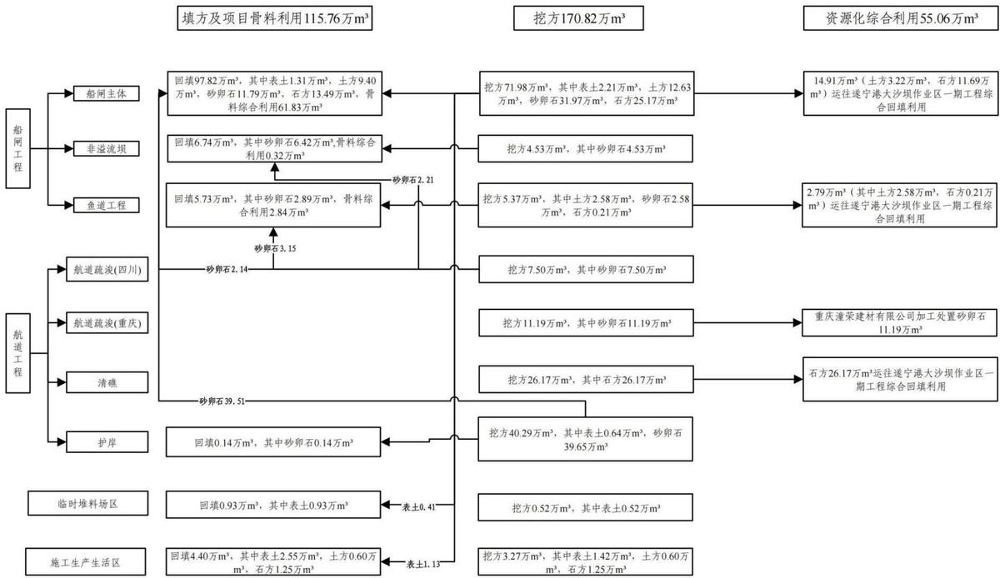  
注：图中土石方数据均为自然方。

图2.6-1土石方流向框图

## 2.7 拆迁（移民）安置与专项设施改（迁）建

## 2.7.1移民生产安置

本工程征收一般耕地126亩，生产安置人口142人，涉及拆除房屋300m2，苗圃一处，全部为一次性货币补偿安置。在拆迁补偿过程中需坚持公平、公开、公正、透明原则。

## 2.7.2其他专项设施改（迁）建

工程影响主要专业项目有取水口一座，水文站一座，10kV 电线 6km，380V电线5km，20km通讯线路、过江电缆一处，全部采用货币化一次性补偿，各专项设施改迁建由权属单位负责实施并承担水土流失防治责任。

## 2.8施工进度

本工程计划于 2026年 2月动工，2029年 1月完工，土建工程施工期为 36个月，其中5月至10月全河段过流。

（1）工程准备期及主体工程施工期

施工期安排 32个月，即 2026年 2月至 2028年 9月，工程准备期主要完成场内道路、施工用风、水、电系统，机修汽修车间及木材、钢筋、钢材等综合加工系统，生产设施等。后续主要完成船闸工程、支沟改造、鱼道工程，航道工程等主体工程施工。

一期（第一年 2月至 4月）：第一年 2月开始下游枯水期围堰填筑，上游利用非溢流坝进行挡水，同步进行闸室远河侧、鱼道初步开挖。围堰填筑后，开始上下闸首土石方大规模开挖及基础处理，到4月中旬浇筑上下闸首和闸室砼至高程 254.00m以上，4月底拆除枯水期围堰。第一年 5月至 10月全河段过流。

二期（第一年11月至第二年4月）：第一年11月，堆砌上游枯水期围堰，填筑下游枯期围堰挡水，堆砌下游引航道围堰。第一年 12月开始拆除非溢流坝，修建上游引航道左、右导航墙，随着导墙混凝土结构的逐步升高，同步进行墙后非溢流坝体的填筑作业，此后，按序进行垫层料坡面修整与碾压、趾板混凝土浇筑，并分两期完成面板混凝土的浇筑、养护及止水系统的修复与安装；在二枯工程中，继续施工上下闸首和闸室高程 254.00m以上部分和下游引航道开挖、浇筑，于第二年 4月底拆除上下游枯水期围堰。第二年 5月至 10月全河段过流。

三期（第二年 11月至第三年 9月）：上下游检修闸门挡水，进行船闸人字门和附属设施的安装以及船闸上游引航道内停泊段施工。

## （3）工程完建期

即 2028年 10月\~2029年 1月，完成安排机电设备的后续调试、施工辅助设施的拆除、场地平整恢复，竣工验收、资料整理等工程的扫尾工作，主体工程计划施工进度横道图详见表2.8-1。

表2.8-1 主体工程施工进度横道图表
<table><tr><td rowspan=2 colspan=2>项目名称</td><td rowspan=1 colspan=4>2026年</td><td rowspan=1 colspan=4>2027年</td><td rowspan=1 colspan=4>2028年</td><td rowspan=1 colspan=1>2029年</td></tr><tr><td rowspan=1 colspan=1>1</td><td rowspan=1 colspan=1>2</td><td rowspan=1 colspan=1>3</td><td rowspan=1 colspan=1>4</td><td rowspan=1 colspan=1>1</td><td rowspan=1 colspan=1>2</td><td rowspan=1 colspan=1>3</td><td rowspan=1 colspan=1>4</td><td rowspan=1 colspan=1>1</td><td rowspan=1 colspan=1>2</td><td rowspan=1 colspan=1>3</td><td rowspan=1 colspan=1>4</td><td rowspan=1 colspan=1>1</td></tr><tr><td rowspan=1 colspan=2>施工准备</td><td rowspan=1 colspan=1></td><td rowspan=1 colspan=1></td><td rowspan=1 colspan=1></td><td rowspan=1 colspan=1></td><td rowspan=1 colspan=1></td><td rowspan=1 colspan=1></td><td rowspan=1 colspan=1></td><td rowspan=1 colspan=1></td><td rowspan=1 colspan=1></td><td rowspan=1 colspan=1></td><td rowspan=1 colspan=1></td><td rowspan=1 colspan=1></td><td rowspan=1 colspan=1></td></tr><tr><td rowspan=1 colspan=2>围堰填/折</td><td rowspan=1 colspan=1>一</td><td rowspan=1 colspan=1></td><td rowspan=1 colspan=1></td><td rowspan=1 colspan=1></td><td rowspan=1 colspan=1></td><td rowspan=1 colspan=1></td><td rowspan=1 colspan=1></td><td rowspan=1 colspan=1></td><td rowspan=1 colspan=1></td><td rowspan=1 colspan=1></td><td rowspan=1 colspan=1></td><td rowspan=1 colspan=1></td><td rowspan=1 colspan=1></td></tr><tr><td rowspan=5 colspan=1>上游引航道</td><td rowspan=1 colspan=1>土石方开挖</td><td rowspan=1 colspan=1></td><td rowspan=1 colspan=1></td><td rowspan=1 colspan=1></td><td rowspan=1 colspan=1>_</td><td rowspan=1 colspan=1></td><td rowspan=1 colspan=1></td><td rowspan=1 colspan=1></td><td rowspan=1 colspan=1>_</td><td rowspan=1 colspan=1></td><td rowspan=1 colspan=1></td><td rowspan=1 colspan=1></td><td rowspan=1 colspan=1></td><td rowspan=1 colspan=1></td></tr><tr><td rowspan=1 colspan=1>土石方回填</td><td rowspan=1 colspan=1></td><td rowspan=1 colspan=1></td><td rowspan=1 colspan=1></td><td rowspan=1 colspan=1></td><td rowspan=1 colspan=1>_</td><td rowspan=1 colspan=1></td><td rowspan=1 colspan=1></td><td rowspan=1 colspan=1></td><td rowspan=1 colspan=1></td><td rowspan=1 colspan=1></td><td rowspan=1 colspan=1></td><td rowspan=1 colspan=1></td><td rowspan=1 colspan=1></td></tr><tr><td rowspan=1 colspan=1>混凝土浇筑</td><td rowspan=1 colspan=1></td><td rowspan=1 colspan=1></td><td rowspan=1 colspan=1></td><td rowspan=1 colspan=1></td><td rowspan=1 colspan=1></td><td rowspan=1 colspan=1></td><td rowspan=1 colspan=1></td><td rowspan=1 colspan=1></td><td rowspan=1 colspan=1></td><td rowspan=1 colspan=1></td><td rowspan=1 colspan=1></td><td rowspan=1 colspan=1></td><td rowspan=1 colspan=1></td></tr><tr><td rowspan=1 colspan=1>帷幕灌浆</td><td rowspan=1 colspan=1></td><td rowspan=1 colspan=1></td><td rowspan=1 colspan=1></td><td rowspan=1 colspan=1></td><td rowspan=1 colspan=1></td><td rowspan=1 colspan=1></td><td rowspan=1 colspan=1></td><td rowspan=1 colspan=1></td><td rowspan=1 colspan=1></td><td rowspan=1 colspan=1></td><td rowspan=1 colspan=1></td><td rowspan=1 colspan=1></td><td rowspan=1 colspan=1></td></tr><tr><td rowspan=1 colspan=1>固结灌浆</td><td rowspan=1 colspan=1></td><td rowspan=1 colspan=1></td><td rowspan=1 colspan=1></td><td rowspan=1 colspan=1></td><td rowspan=1 colspan=1></td><td rowspan=1 colspan=1></td><td rowspan=1 colspan=1></td><td rowspan=1 colspan=1></td><td rowspan=1 colspan=1></td><td rowspan=1 colspan=1></td><td rowspan=1 colspan=1></td><td rowspan=1 colspan=1></td><td rowspan=1 colspan=1></td></tr><tr><td rowspan=1 colspan=1>溪沟</td><td rowspan=1 colspan=1>改造</td><td rowspan=1 colspan=1>_</td><td rowspan=1 colspan=1></td><td rowspan=1 colspan=1></td><td rowspan=1 colspan=1></td><td rowspan=1 colspan=1></td><td rowspan=1 colspan=1></td><td rowspan=1 colspan=1></td><td rowspan=1 colspan=1></td><td rowspan=1 colspan=1></td><td rowspan=1 colspan=1></td><td rowspan=1 colspan=1></td><td rowspan=1 colspan=1></td><td rowspan=1 colspan=1></td></tr><tr><td rowspan=5 colspan=1>上下闸首及闸室</td><td rowspan=1 colspan=1>土石方开挖</td><td rowspan=1 colspan=1>_</td><td rowspan=1 colspan=1></td><td rowspan=1 colspan=1></td><td rowspan=1 colspan=1></td><td rowspan=1 colspan=1></td><td rowspan=1 colspan=1></td><td rowspan=1 colspan=1></td><td rowspan=1 colspan=1></td><td rowspan=1 colspan=1></td><td rowspan=1 colspan=1></td><td rowspan=1 colspan=1></td><td rowspan=1 colspan=1></td><td rowspan=1 colspan=1></td></tr><tr><td rowspan=1 colspan=1>土石方回填</td><td rowspan=1 colspan=1>_</td><td rowspan=1 colspan=1></td><td rowspan=1 colspan=1></td><td rowspan=1 colspan=1></td><td rowspan=1 colspan=1>_</td><td rowspan=1 colspan=1></td><td rowspan=1 colspan=1></td><td rowspan=1 colspan=1></td><td rowspan=1 colspan=1></td><td rowspan=1 colspan=1></td><td rowspan=1 colspan=1></td><td rowspan=1 colspan=1></td><td rowspan=1 colspan=1></td></tr><tr><td rowspan=1 colspan=1>混凝土浇筑</td><td rowspan=1 colspan=1>_</td><td rowspan=1 colspan=1></td><td rowspan=1 colspan=1></td><td rowspan=1 colspan=1></td><td rowspan=1 colspan=1></td><td rowspan=1 colspan=1></td><td rowspan=1 colspan=1></td><td rowspan=1 colspan=1></td><td rowspan=1 colspan=1></td><td rowspan=1 colspan=1></td><td rowspan=1 colspan=1></td><td rowspan=1 colspan=1></td><td rowspan=1 colspan=1></td></tr><tr><td rowspan=1 colspan=1>钢交通桥</td><td rowspan=1 colspan=1></td><td rowspan=1 colspan=1></td><td rowspan=1 colspan=1></td><td rowspan=1 colspan=1></td><td rowspan=1 colspan=1></td><td rowspan=1 colspan=1></td><td rowspan=1 colspan=1></td><td rowspan=1 colspan=1></td><td rowspan=1 colspan=1></td><td rowspan=1 colspan=1></td><td rowspan=1 colspan=1></td><td rowspan=1 colspan=1></td><td rowspan=1 colspan=1></td></tr><tr><td rowspan=1 colspan=1>固结灌浆</td><td rowspan=1 colspan=1></td><td rowspan=1 colspan=1></td><td rowspan=1 colspan=1></td><td rowspan=1 colspan=1></td><td rowspan=1 colspan=1></td><td rowspan=1 colspan=1></td><td rowspan=1 colspan=1></td><td rowspan=1 colspan=1></td><td rowspan=1 colspan=1></td><td rowspan=1 colspan=1></td><td rowspan=1 colspan=1></td><td rowspan=1 colspan=1></td><td rowspan=1 colspan=1></td></tr><tr><td rowspan=3 colspan=1>下游引航道</td><td rowspan=1 colspan=1>土石方开挖</td><td rowspan=1 colspan=1></td><td rowspan=1 colspan=1></td><td rowspan=1 colspan=1></td><td rowspan=1 colspan=1>_</td><td rowspan=1 colspan=1>_</td><td rowspan=1 colspan=1></td><td rowspan=1 colspan=1></td><td rowspan=1 colspan=1></td><td rowspan=1 colspan=1></td><td rowspan=1 colspan=1></td><td rowspan=1 colspan=1></td><td rowspan=1 colspan=1></td><td rowspan=1 colspan=1></td></tr><tr><td rowspan=1 colspan=1>土石方回填</td><td rowspan=1 colspan=1></td><td rowspan=1 colspan=1></td><td rowspan=1 colspan=1></td><td rowspan=1 colspan=1></td><td rowspan=1 colspan=1>_</td><td rowspan=1 colspan=1></td><td rowspan=1 colspan=1></td><td rowspan=1 colspan=1></td><td rowspan=1 colspan=1></td><td rowspan=1 colspan=1></td><td rowspan=1 colspan=1></td><td rowspan=1 colspan=1></td><td rowspan=1 colspan=1></td></tr><tr><td rowspan=1 colspan=1>混凝土浇筑</td><td rowspan=1 colspan=1></td><td rowspan=1 colspan=1></td><td rowspan=1 colspan=1></td><td rowspan=1 colspan=1></td><td rowspan=1 colspan=1></td><td rowspan=1 colspan=1></td><td rowspan=1 colspan=1></td><td rowspan=1 colspan=1></td><td rowspan=1 colspan=1></td><td rowspan=1 colspan=1></td><td rowspan=1 colspan=1></td><td rowspan=1 colspan=1></td><td rowspan=1 colspan=1></td></tr><tr><td rowspan=3 colspan=1>鱼道工程</td><td rowspan=1 colspan=1>土石方开挖</td><td rowspan=1 colspan=1>_</td><td rowspan=1 colspan=1></td><td rowspan=1 colspan=1></td><td rowspan=1 colspan=1></td><td rowspan=1 colspan=1></td><td rowspan=1 colspan=1></td><td rowspan=1 colspan=1></td><td rowspan=1 colspan=1></td><td rowspan=1 colspan=1></td><td rowspan=1 colspan=1></td><td rowspan=1 colspan=1></td><td rowspan=1 colspan=1></td><td rowspan=1 colspan=1></td></tr><tr><td rowspan=1 colspan=1>土石方回填</td><td rowspan=1 colspan=1></td><td rowspan=1 colspan=1></td><td rowspan=1 colspan=1></td><td rowspan=1 colspan=1></td><td rowspan=1 colspan=1></td><td rowspan=1 colspan=1></td><td rowspan=1 colspan=1></td><td rowspan=1 colspan=1></td><td rowspan=1 colspan=1></td><td rowspan=1 colspan=1></td><td rowspan=1 colspan=1></td><td rowspan=1 colspan=1></td><td rowspan=1 colspan=1></td></tr><tr><td rowspan=1 colspan=1>混凝土浇筑</td><td rowspan=1 colspan=1></td><td rowspan=1 colspan=1></td><td rowspan=1 colspan=1></td><td rowspan=1 colspan=1>_</td><td rowspan=1 colspan=1></td><td rowspan=1 colspan=1></td><td rowspan=1 colspan=1></td><td rowspan=1 colspan=1></td><td rowspan=1 colspan=1></td><td rowspan=1 colspan=1></td><td rowspan=1 colspan=1></td><td rowspan=1 colspan=1></td><td rowspan=1 colspan=1></td></tr><tr><td rowspan=3 colspan=1>土石坝修复</td><td rowspan=1 colspan=1>土石方开挖</td><td rowspan=1 colspan=1></td><td rowspan=1 colspan=1></td><td rowspan=1 colspan=1></td><td rowspan=1 colspan=1></td><td rowspan=1 colspan=1></td><td rowspan=1 colspan=1></td><td rowspan=1 colspan=1></td><td rowspan=1 colspan=1></td><td rowspan=1 colspan=1></td><td rowspan=1 colspan=1></td><td rowspan=1 colspan=1></td><td rowspan=1 colspan=1></td><td rowspan=1 colspan=1></td></tr><tr><td rowspan=1 colspan=1>土石方回填</td><td rowspan=1 colspan=1></td><td rowspan=1 colspan=1></td><td rowspan=1 colspan=1></td><td rowspan=1 colspan=1></td><td rowspan=1 colspan=1>_</td><td rowspan=1 colspan=1></td><td rowspan=1 colspan=1></td><td rowspan=1 colspan=1></td><td rowspan=1 colspan=1></td><td rowspan=1 colspan=1></td><td rowspan=1 colspan=1></td><td rowspan=1 colspan=1></td><td rowspan=1 colspan=1></td></tr><tr><td rowspan=1 colspan=1>混凝土浇筑</td><td rowspan=1 colspan=1></td><td rowspan=1 colspan=1></td><td rowspan=1 colspan=1></td><td rowspan=1 colspan=1></td><td rowspan=1 colspan=1>_</td><td rowspan=1 colspan=1></td><td rowspan=1 colspan=1></td><td rowspan=1 colspan=1></td><td rowspan=1 colspan=1></td><td rowspan=1 colspan=1></td><td rowspan=1 colspan=1></td><td rowspan=1 colspan=1></td><td rowspan=1 colspan=1></td></tr><tr><td rowspan=3 colspan=1>航道工程</td><td rowspan=3 colspan=1>土石方开挖</td><td rowspan=3 colspan=1>_</td><td rowspan=3 colspan=1></td><td rowspan=3 colspan=1></td><td rowspan=3 colspan=1>_</td><td></td><td></td><td></td><td></td><td></td><td></td><td></td><td></td><td></td></tr><tr><td rowspan=2 colspan=1></td><td></td><td></td><td></td><td></td><td></td><td></td><td></td><td></td></tr><tr><td rowspan=1 colspan=1></td><td rowspan=1 colspan=1></td><td rowspan=1 colspan=1></td><td rowspan=1 colspan=1></td><td rowspan=1 colspan=1></td><td rowspan=1 colspan=1></td><td rowspan=1 colspan=1></td><td rowspan=1 colspan=1></td></tr><tr><td rowspan=3 colspan=1>机电调</td><td rowspan=3 colspan=1>试工程</td><td rowspan=3 colspan=1></td><td rowspan=3 colspan=1></td><td rowspan=3 colspan=1></td><td rowspan=3 colspan=1></td><td rowspan=3 colspan=1></td><td rowspan=3 colspan=1></td><td rowspan=3 colspan=1></td><td rowspan=3 colspan=1></td><td rowspan=3 colspan=1></td><td rowspan=3 colspan=1>_</td><td></td><td></td><td></td></tr><tr><td rowspan=2 colspan=1></td><td rowspan=2 colspan=1></td><td></td></tr><tr><td rowspan=1 colspan=1></td></tr><tr><td rowspan=1 colspan=2>竣工验收</td><td rowspan=1 colspan=1></td><td rowspan=1 colspan=1></td><td rowspan=1 colspan=1></td><td rowspan=1 colspan=1></td><td rowspan=1 colspan=1></td><td rowspan=1 colspan=1></td><td rowspan=1 colspan=1></td><td rowspan=1 colspan=1></td><td rowspan=1 colspan=1></td><td rowspan=1 colspan=1></td><td rowspan=1 colspan=1></td><td rowspan=1 colspan=1>_</td><td rowspan=1 colspan=1></td></tr></table>

## 2.9自然概况

## 2.9.1 地形地貌

项目所属河段地貌类型主要为河流侵蚀堆积地貌。主要分布工程区内河流两岸，主要由河床、漫滩及阶地组成，出露高程 260m～280m，其中河床宽度200～300m，大部分被水流浸没，局部河心滩呈长条状在河道中分布，一般长度约 200～400m，出露地层主要为卵石，局部有少量砂层分布。河漫滩一般分布于河床两岸，高出河床 2～5m，宽度约 30～200m不等。阶地一般高出河床 10～15m，延迟长度1～5km不等，主要为第四系。

## 2.9.2地质构造与地震

## 2.9.2.1 四川省遂宁市

## 1、地质构造

项目区在大地构造单元上属扬子准地台四川台拗之川中台拱，区域构造格架上位于龙门山断裂带、华莹山断裂带和北侧的大巴山断裂带所围限的断块内。

项目区属新华夏系第三沉降带川中褶皱带内，龙女寺半环状构造中部--龙女寺背斜北西翼，主要构造行迹为进东西向展布，没有大的断裂，褶皱宽阔平缓，地质构造简单，岩层平缓，无全新世活动断裂构造通过，挽近时期表现为大面积间歇上升，仅形成了平缓的褶皱构造，地层倾角小于 $5 ^ { \circ }$ ，第四纪大地构造运动呈大面积缓慢间歇性上升，形成涪江沿岸1～5级阶地。岩层倾角小，以侏罗系紫红色岩石居多，多为中低丘地貌类型。

## 2、地层岩性

工程区内发育的地表覆盖层主要为第四系全新统冲积堆积层 $\left( \mathrm { Q } _ { 4 } ^ { 3 \mathrm { a l } } \right)$ 和Ⅰ级阶地 $\big ( \mathrm { Q } _ { 4 } ^ { 1 + 2 \mathrm { a l } } \big )$ 之卵石、粉土层，广泛分布于涪江河床、漫滩及两岸阶地；下伏基岩主要为侏罗系中统上沙溪庙组 $\left( \begin{array} { l } { \mathbf { J } _ { 2 } \mathbf { s } } \end{array} \right)$ 砂岩与粉砂质泥岩不等厚互层。

（1）第四系全新统冲积层 $\left( \mathrm { { \ Q } } _ { 4 } ^ { 3 \mathrm { { a l } } } \right)$ ：该层主要分布于涪江河床内，厚度一般 2.0～14.6m。

①粉土：三星电站上游长期处于地下水位以下，表层粉土呈流塑状，下部呈软塑和可塑状，夹少量圆砾和卵石，含量约 3%～5%，局部夹有粉细砂，用手揉搓有砂质感，干强度一般，韧性差，稍光泽反应。三星电站下游，呈灰褐色，可塑，夹少量植物根系和圆砾，含量约3%，用手揉搓有砂质感。②卵石：

灰白～灰褐色，结构松散～稍密，石质成分以灰岩为主，次为变质砂岩、石英岩等，粒径一般 2～12cm，含量一般介于 65～70％，呈次圆状，充填细砂、粉土和少量圆砾。

（2）第四系全新统冲积层Ⅰ级阶地 $\big ( \mathrm { Q } _ { 4 } ^ { 1 + 2 \mathrm { a l } } \big )$ ：该层主要分布于涪江两岸Ⅰ级阶地之上，厚度一般 7.7～12.8m不等。

①粉土：灰褐色，夹少量植物根系和圆砾，含量约 3%，用手揉搓有砂质感。该层在Ⅰ级阶地表层和卵石与基岩之间均有分布，一般Ⅰ级阶地表层呈可塑状，卵石与基岩之间一般呈软～可塑状。

②卵石：灰白～灰褐色，结构松散～稍密，石质成分以灰岩为主，次为变质砂岩、石英岩等，粒径一般 2～12cm，含量一般介于 50～65％，磨圆度一般，多呈次圆状，偶见粒径较大（20～30cm）的漂石。充填细砂和少量圆砾。

## （3）侏罗系中统上沙溪庙组（J2s）

砂岩：紫灰色、紫褐色，细粒结构，中厚～厚层状构造，泥钙质胶结，主要矿物成分为长石、石英等，岩质较软，岩体较完整～完整，裂隙发育程度低，以层面裂隙为主。强风化厚度一般0.1～0.5m，在工程区广泛分布。

粉砂质泥岩：紫红色，泥质结构，中厚层状构造，泥质胶结，主要矿物成分为黏土矿物，岩质软，敲击声闷，岩体较完整，局部较破碎，裂隙稍发育，岩芯主要呈柱状和少量碎块状。强风化厚度一般 0.3～4.0m，中风化未揭穿，在工程区广泛分布。该层具有吸水易软化，失水易干裂的特性。

## 3、地震

根据《建筑抗震设计规范》（GB50011-2016）2016 年版附录 A.0.23 的划定，抗震设防烈度 6度，设计基本地震加速度值为 0.05g；根据《中国地震动参数区划图》（GB18306-2015），工程区基本地震动峰值加速度为 0.05g，基本地震反应谱特征周期为0.35s，相应地震基本烈度为Ⅵ度。

## 4、水文地质

工程区水文地质条件较为简单，地下水按含水层性质及埋藏条件，分为第四系松散地层中的孔隙潜水和基岩裂隙水两大类型。

## （1）松散地层孔隙潜水

主要赋存于阶地及河漫滩等松散堆积层孔隙中，其中以河漫滩卵石土含水量较丰富。孔隙潜水主要受大气降水、地表水补给，水量随季节性变幅较大，

排泄于冲沟及河流中。第四系覆盖层中，河床、漫滩、Ⅰ级阶地为卵石土层，富水性强，为强透水。

## （2）基岩裂隙水

埋藏于基岩裂隙中，其含水透水性受岩性、裂隙发育程度及风化程度等影响。由于粉砂质泥岩透水性差，所以含水微弱，可视为相对隔水层；裂隙发育的砂岩透水性相对较好，为地下水的储存和运移创造了条件，可视为相对透水层。基岩裂隙水受大气降水及上覆堆积层孔隙水补给，排泄于沟谷及河流中，地下水动态随季节性变化。

## 5、不良地质

通过地面调查，各险滩处无断层通过，无滑坡、岩溶、泥石流、地下洞室等不良地质现象。

## 2.9.2.2 重庆市潼南区

## 1、地质构造

潼南区域内构造以川东隔档式构造为框架，形成具有明显特征的“重庆褶皱束”，重庆褶皱束由一系列平行雁行排列的隔挡式梳状褶皱构造和走向压性断裂组成，在川东隔档式褶皱中，华蓥山背斜、铜锣山背斜和明月山背斜延伸最长，而华銮山复式背斜构造南端在合川区三汇镇撤开，形成向北东收敛的华銮山帚状构造带，包括鼻峡、温塘峡和观音峡背斜。大地构造上属扬子准地台川中台拗，在区域构造上属新华夏系四川盆地沉降带川中坳陷构造区，少部分属川东华蓥山、方斗山褶皱带。地质构造简单，形态单一，褶皱宽缓，区域稳定性较好。

## 2、地层岩性

根据 1：20 万区域地质图和现场调查结果，线路区域覆盖层以残坡积层粉质黏土为主，基岩地层为侏罗系中统沙溪庙组（J2s）砂岩，三叠系上统须家河组（T3xj）石英砂岩，三叠系中下统雷口坡组、嘉陵江组（ $\mathrm { \Delta T _ { 2 } l + T _ { 1 } j }$ ）灰岩，现将各岩土层工程地质基本特征及分布范围按由新到老顺序描述如下：

第四系 $\left( \ \mathbf { Q } _ { 4 } \ \right)$ 残坡积粉质黏土 $\left( \ \mathrm { Q } _ { 4 } ^ { \mathrm { e l + d l } } \ \right.$ ）：棕黄色-棕红色，稍湿-湿、可塑-硬塑状，主要为砂泥岩风化后形成，该层土分布不均，厚度变化较大，丘顶、脊背上常呈硬塑状，厚度较薄，一般厚0.5\~1米，在地形低洼处厚度较大，

可达4\~7米。

侏罗系（J）上沙溪庙组 $\left( \begin{array} { l } { \mathbf { J } _ { 2 } \mathbf { s } } \end{array} \right)$ ：紫红色粉砂质泥岩、含粉砂质水云母泥岩，含大量钙质结核，与浅灰色长石砂岩互层。

三叠系（T）须家河组（T3xj）：青灰-灰白色长石石英砂岩。雷口坡组、嘉陵江组 $\mathrm { ~ ( ~ T _ { 2 } l + T _ { 1 } j ~ ) ~ }$ ：浅灰色-灰色石灰岩、白云岩。

## 3、地震

根据《建筑抗震设计规范》（GB50011-2016）2016 年版附录 A.0.23 的划定，抗震设防烈度 6度，设计基本地震加速度值为 0.05g；根据《中国地震动参数区划图》（GB18306-2015），工程区基本地震动峰值加速度为 0.05g，基本地震反应谱特征周期为0.35s，相应地震基本烈度为Ⅵ度。

## 2.9.3 气象

## 2.9.3.1 四川省遂宁市

项目区位于遂宁市境内，项目区气候属中亚热带湿润季风气候区，气候温和，雨量充沛，四季分明，季风气候特征显著，具有冬暖春早、夏热秋凉、云雾多、日照少、无霜期长等特点。

遂宁市多年平均气温17.4℃，极端最高气温 $3 9 . 3 ^ { \circ } \mathrm { C } .$ ，极端最低气温-3.8℃，${ \ge } 1 0 ^ { \circ } \mathrm { C }$ 积温 $5 6 2 7 . 1 ^ { \circ } \mathrm { C }$ 。多年平均降水量 993.3mm，最大年降水量 1371.4mm（1956年），最小年降水量 736.7mm（1976年）。多年平均蒸发量 860.5mm。多年平均相对湿度79%，多年平均无霜日296日。多年平均风速 0.8m/s；最大风速21.9m/s，最多风向NNE。遂宁市气象特征值表见表2.9-1。

表 2.9- 1 主要气象资料统计表（四川省遂宁市）
<table><tr><td rowspan=1 colspan=1>序号</td><td rowspan=1 colspan=1>项目</td><td rowspan=1 colspan=1>单位</td><td rowspan=1 colspan=1>数值</td><td rowspan=1 colspan=1>备注</td></tr><tr><td rowspan=1 colspan=1>1</td><td rowspan=1 colspan=1>年平均气温</td><td rowspan=1 colspan=1> $^ \circ \mathrm { C }$ </td><td rowspan=1 colspan=1>17.4</td><td rowspan=1 colspan=1></td></tr><tr><td rowspan=1 colspan=1>2</td><td rowspan=1 colspan=1>极端最高气温</td><td rowspan=1 colspan=1> $^ \circ \mathrm { C }$ </td><td rowspan=1 colspan=1>39.3</td><td rowspan=1 colspan=1></td></tr><tr><td rowspan=1 colspan=1>3</td><td rowspan=1 colspan=1>极端最低气温</td><td rowspan=1 colspan=1> $^ \circ \mathrm { C }$ </td><td rowspan=1 colspan=1>-3.8</td><td rowspan=1 colspan=1></td></tr><tr><td rowspan=1 colspan=1>4</td><td rowspan=1 colspan=1>≥10℃积温</td><td rowspan=1 colspan=1> $^ \circ \mathrm { C }$ </td><td rowspan=1 colspan=1>5627</td><td rowspan=1 colspan=1></td></tr><tr><td rowspan=1 colspan=1>5</td><td rowspan=1 colspan=1>年平均降水量</td><td rowspan=1 colspan=1>mm</td><td rowspan=1 colspan=1>993.3</td><td rowspan=1 colspan=1></td></tr><tr><td rowspan=1 colspan=1>6</td><td rowspan=1 colspan=1>年蒸发量</td><td rowspan=1 colspan=1>mm</td><td rowspan=1 colspan=1>860.5</td><td rowspan=1 colspan=1></td></tr><tr><td rowspan=1 colspan=1>7</td><td rowspan=1 colspan=1>无霜期</td><td rowspan=1 colspan=1> $\mathrm { d }$ </td><td rowspan=1 colspan=1>296</td><td rowspan=1 colspan=1></td></tr><tr><td rowspan=1 colspan=1>8</td><td rowspan=1 colspan=1>年平均风速</td><td rowspan=1 colspan=1> $\mathrm { m } / \mathrm { s }$ </td><td rowspan=1 colspan=1>0.8</td><td rowspan=1 colspan=1></td></tr><tr><td rowspan=1 colspan=1>9</td><td rowspan=1 colspan=1>主导风向</td><td rowspan=1 colspan=1></td><td rowspan=1 colspan=1>NNE</td><td rowspan=1 colspan=1></td></tr></table>

## 2.9.3.2 重庆市潼南区

潼南区属亚热带湿润性季风气候区，多年平均气温 17.9℃，极端最高气温 44.1℃，极端最低气温-2.5℃， ${ \ge } 1 0 ^ { \circ } \mathrm { C }$ 积温 $5 6 7 3 \mathrm { { } ^ { \circ } C }$ 。多年平均降水量1082.4mm，多年平均蒸发量 1059.8mm。多年平均相对湿度 79%，多年平均无霜日 286日。多年平均风速 1.4m/s；最大风速 21m/s。潼南区气象特征值表见表 2.9- 2。

表 2.9- 2 主要气象资料统计表（重庆市潼南区）
<table><tr><td rowspan=1 colspan=1>序号</td><td rowspan=1 colspan=1>项目</td><td rowspan=1 colspan=1>单位</td><td rowspan=1 colspan=1>数值</td><td rowspan=1 colspan=1>备注</td></tr><tr><td rowspan=1 colspan=1>1</td><td rowspan=1 colspan=1>年平均气温</td><td rowspan=1 colspan=1> $^ \circ \mathrm { C }$ </td><td rowspan=1 colspan=1>17.9</td><td rowspan=1 colspan=1></td></tr><tr><td rowspan=1 colspan=1>2</td><td rowspan=1 colspan=1>极端最高气温</td><td rowspan=1 colspan=1> $^ \circ \mathrm { C }$ </td><td rowspan=1 colspan=1>44.1</td><td rowspan=1 colspan=1></td></tr><tr><td rowspan=1 colspan=1>3</td><td rowspan=1 colspan=1>极端最低气温</td><td rowspan=1 colspan=1> $^ \circ \mathrm { C }$ </td><td rowspan=1 colspan=1>-2.5</td><td rowspan=1 colspan=1></td></tr><tr><td rowspan=1 colspan=1>4</td><td rowspan=1 colspan=1>≥10℃积温</td><td rowspan=1 colspan=1> $^ \circ \mathrm { C }$ </td><td rowspan=1 colspan=1>5673</td><td rowspan=1 colspan=1></td></tr><tr><td rowspan=1 colspan=1>5</td><td rowspan=1 colspan=1>年平均降水量</td><td rowspan=1 colspan=1>mm</td><td rowspan=1 colspan=1>1082.4</td><td rowspan=1 colspan=1></td></tr><tr><td rowspan=1 colspan=1>6</td><td rowspan=1 colspan=1>年蒸发量</td><td rowspan=1 colspan=1>mm</td><td rowspan=1 colspan=1>1059.8</td><td rowspan=1 colspan=1></td></tr><tr><td rowspan=1 colspan=1>7</td><td rowspan=1 colspan=1>无霜期</td><td rowspan=1 colspan=1>d</td><td rowspan=1 colspan=1>286</td><td rowspan=1 colspan=1></td></tr><tr><td rowspan=1 colspan=1>8</td><td rowspan=1 colspan=1>年平均风速</td><td rowspan=1 colspan=1>m/s</td><td rowspan=1 colspan=1>1.4</td><td rowspan=1 colspan=1></td></tr></table>

## 2.9.4 水文

涪江是遂宁市最大河流，发源于松潘县黄龙乡雪宝顶，于重庆市合川区汇入嘉陵江，遂宁境内航道里程 160km（包括 10km与重庆界河），实测涪江射洪水文站断面年均流量 432 m3/s（据《遂宁市政区大典》），平均坡降 0.4‰；全市多年平均径流的年内分配是春季占全年比例的 8.3％，夏季占 61％，秋季占 26.6％，冬季占 4.1％。丰水年或偏丰水年占统计总年数的 41％，枯或偏枯水年占 37％，平水年占22％。

工程河段位于三星水电站枢纽左岸船闸区及下游 10km范围内，水位变化主要受降雨及大坝泄洪调节影响，勘察期间工程河段水位在 246.6～249.0m之间，平均约248.0m，基本与设计最低通航水位持平。

## 2.9.5 土壤

## 2.9.5.1 区域土壤类型

项目区主要土壤类型为紫色土和冲积土。紫色土包括灰棕紫泥土、红棕紫泥土及棕紫泥土，冲积土包括冲积黄土和冲积潮土。项目区土壤类型以紫色土为主，船闸前沿部分为冲击土。

## 2.9.5.2项目区表层土情况

通过现场调查，本工程赋存表土范围主要为船闸工程区、航道工程区、施工生产生活区、临时堆料场区、表土堆场区所占耕地、园地和林地区域，项目占地范围耕地表土厚度约 20-30cm，平均厚度约 25cm、园地约 20cm，林地约20cm，经统计及分析，本工程赋存表土量为5.06万m3，详见表2.6-1。

## 2.9.6 植被

该项目区属于亚热带常绿针、阔叶林。植被主要是现状分布次生植被及林草地。项目区生态环境良好，雨量充沛，光照充足，遂宁市林草覆盖率35%。根据现场调查，本工程占地范围以耕地为主，仅部分区域分布少量林草，林草覆盖率 9%。

## 2.9.7与水土保持敏感区的关系

本工程涉及四川省遂宁市和重庆市潼南区，根据《全国水土保持规划国家级水土流失重点预防区和重点治理区复核划分成果》（办水保〔2013〕188号），遂宁市船山区、蓬溪县、重庆市潼南区不涉及国家级水土流失重点预防区和重点治理区；根据《水利部办公厅关于做好国家级水土流失重点预防区和重点治理区落地上图成果应用的通知》（办水保〔2025〕170号），经查询，本工程占地范围不涉及国家级水土流失重点预防区和重点治理区。根据《四川省省级水土流失重点预防区和重点治理区划分成果的通知》（川水函〔2017〕482号）和《重庆市人民政府办公厅关于公布水土流失重点预防区和重点治理区复核划分成果的通知》（渝府办发〔2015〕197 号），项目区位于嘉陵江下游省级水土流失重点治理区和重庆市水土流失重点治理区内，无法避让，本工程水土流失执行一级防治标准，符合水土保持要求；本工程建设区域不涉及饮用水水源保护区、水功能一级区的保护区和保留区、自然保护区、世界文化和自然遗产地、风景名胜区、地质公园、森林公园以及重要湿地等水土保持敏感区；未在县级以上地方人民政府划定的崩塌、滑坡危险区和泥石流易发区内；不属于水土流失严重、生态脆弱的地区。

## 3 项目水土保持评价

## 3.1主体工程选址（线）水土保持评价

## 3.1.1水土保持制约性因素分析与评价

（1）与水土保持法规定的符合性分析与评价

根据《中华人民共和国水土保持法》（2011年 3月 1日实施）规定，对照分析本工程与水土保持法规定的符合性，由表 3.1-1可见，本工程符合《中华人民共和国水土保持法》的相关规定，不属于禁止开发的活动，符合批准条件。

## 表3.1-1 《中华人民共和国水土保持法》选址（线）

水土保持制约性因素分析
<table><tr><td rowspan=1 colspan=1>序号</td><td rowspan=1 colspan=1>《水土保持法》相关内容</td><td rowspan=1 colspan=1>本工程情况</td><td rowspan=1 colspan=1>符合性分析</td></tr><tr><td rowspan=1 colspan=1>1</td><td rowspan=1 colspan=1>第十七条禁止在崩塌、滑坡危险区和泥石流易发区从事取土、挖砂、采石等可能造成水土流失的活动。</td><td rowspan=1 colspan=1>不涉及</td><td rowspan=1 colspan=1>符合</td></tr><tr><td rowspan=1 colspan=1>2</td><td rowspan=1 colspan=1>第十八条水土流失严重、生态脆弱的地区，应当限制或者禁止可能造成水土流失的生产建设活动，严格保护植物、沙壳、结皮、地衣等。</td><td rowspan=1 colspan=1>不涉及</td><td rowspan=1 colspan=1>符合</td></tr><tr><td rowspan=1 colspan=1>3</td><td rowspan=1 colspan=1>第二十四条生产建设项目选址、选线应当避让水土流失重点预防区和重点治理区；无法避让的，应当提高防治标准，优化施工工艺，减少地表扰动和植被损坏范围，有效控制可能造成的水土流失。</td><td rowspan=1 colspan=1>项目不可避免的位于嘉陵江下游省级水土流失重点治理区、重庆市水土流失重点治理区范围，水土流失执行西南紫色土区一级防治标准，并优化施工工艺，减少地表扰动和植被破坏，加强防护、治理措施以减小因工程建设带来的不利影响</td><td rowspan=1 colspan=1>符合</td></tr><tr><td rowspan=1 colspan=1>4</td><td rowspan=1 colspan=1>第二十八条依法应当编制水土保持方案的生产建设项目，其生产建设活动中排弃的砂、石、土、矸石、尾矿、废渣等应当综合利用；不能综合利用，确需废弃的，应当堆放在水土保持方案确定的专门存放地，并采取措施保证不产生新的危害。</td><td rowspan=1 colspan=1>本项目弃渣55.06万m³全部资源化综合利用，符合水土保持要求</td><td rowspan=1 colspan=1>符合</td></tr><tr><td rowspan=1 colspan=1>5</td><td rowspan=1 colspan=1>第三十八条对生产建设活动所占用土地的地表土应当进行分层剥离、保存和利用，做到土石方挖填平衡，减少地表扰动范围；对废弃的砂、石、土、矸石、尾矿、废渣等存放地，应当采取拦挡、坡面防护、防洪排导等措施。生产建设活动结束后，应当及时在取土场、开挖面和存放地的裸露土地上植树种草、恢复植被，对闭库的尾矿库进行复垦。</td><td rowspan=1 colspan=1>本方案新增对具备剥离条件的区域进行表土剥离，剥离表土用于项目后期复耕和绿化。</td><td rowspan=1 colspan=1>符合</td></tr></table>

## （2）与 GB 50433-2018 规定的符合性分析与评价

根据《生产建设项目水土保持技术标准》（GB 50433-2018）中规定，生产建设项目应满足规范要求的约束性规定。本工程与GB 50433-2018规定的符合性分析见表3.1-2。

由表 3.1-2可见，本工程建设满足规范要求的约束性规定，本工程的建设不涉及全国水土保持监测网络中的水土保持监测站点、重点试验区；项目区位于嘉陵江下游省级水土流失重点治理区和重庆市水土流失重点治理区，无法避让，本工程水土流失执行西南紫色土区一级防治标准，符合水土保持要求；未占用国家确定的水土保持长期定位观测站，工程建设不单独设置取土（石、料）场，本工程无重大水土保持限制性因素，符合生产建设项目水土保持技术规范要求。

水土保持制约性因素分析  
表3.1-2 《生产建设项目水土保持技术标准》（GB50433-2018 ）
<table><tr><td rowspan=1 colspan=1>序号</td><td rowspan=1 colspan=1>规范所列约束性规定</td><td rowspan=1 colspan=1>本工程情况</td><td rowspan=1 colspan=1>分析评价</td></tr><tr><td rowspan=4 colspan=1>3.2.1</td><td rowspan=1 colspan=1>主体工程选址（线）应避让：</td><td rowspan=4 colspan=1>1、无法避让嘉陵江下游省级水土流失重点治理区、重庆市水土流失重点治理区；2、不涉及河流两岸、湖泊和水库周边的植物保护带；3、不涉及全国水土保持监测网络中的水土保持监测站点、重点试验区及国家确定的水土保持长期定位观测站。</td><td rowspan=4 colspan=1>存在约束性因素，通过优化场地布局、竖向布置和施工工艺，施工过程中严格控制工程占地和土石方量，同时本方案采用西南紫色土区一级防治标准，林草覆盖率提高一个点，符合规定。</td></tr><tr><td rowspan=1 colspan=1>1、水土流失重点预防区和重点治理区；</td></tr><tr><td rowspan=1 colspan=1>2、河流两岸、湖泊和水库周边的植物保护带；</td></tr><tr><td rowspan=1 colspan=1>3、全国水土保持监测网络中的水土保持监测站点、重点试验区及国家确定的水土保持长期定位观测站</td></tr></table>

表 3.1-3 西南紫色土区特殊规定分析表
<table><tr><td rowspan=1 colspan=1>序号</td><td rowspan=1 colspan=1>规范所列约束性规定</td><td rowspan=1 colspan=1>本工程情况</td><td rowspan=1 colspan=1>分析评价</td></tr><tr><td rowspan=3 colspan=1>3.3.6</td><td rowspan=1 colspan=1>西南紫色土区应符合下列规定：</td><td rowspan=3 colspan=1>①不涉及弃土（石、渣）场；②不涉及江河上游水源涵养区。</td><td rowspan=3 colspan=1>满足约束性规定要求</td></tr><tr><td rowspan=1 colspan=1>①弃土（石、渣）场应注重防洪排水、拦挡措施；</td></tr><tr><td rowspan=1 colspan=1>②江河上游水源涵养区应采取水源涵养措施。</td></tr></table>

## （3）主体工程选址的水土保持制约性因素综合评价

通过逐条对照《中华人民共和国水土保持法》（2011年3月1日实施）、《生产建设项目水土保持技术标准》（GB 50433-2018）的分析评价，本工程属于国家《产业结构调整指导目录（2019年本）》（国家发展和改革委员会第 29号令）中的鼓励类建设项目。本工程不涉及国家级水土流失重点治理区和重点预防区，不属于水土流失严重、生态脆弱的地区，未在县级以上地方人民政府划定的崩塌、滑坡危险区和泥石流易发区内，避开了全国水土保持监测网络中的水土保持监测站点、重点试验区、国家确定的水土保持长期定位观测站以及河流两岸、湖泊和水库周边的植物保护带。工程不涉及生态保护红线、饮用水水源保护区、水功能一级区的保护区和保留区、自然保护区、世界文化和自然遗产地、风景名胜区、地质公园、森林公园以及重要湿地等水土保持敏感区。本工程所在地位于嘉陵江下游省级水土流失重点治理区和重庆市水土流失重点治理区内，采取了以下措施：①主体设计项目场地总体布局结合现状地形，尽量避免大挖大填，以减少土石方量；②施工中严格控制扰动范围，合理安排施工时序尽量避免土方二次调运；③主体设计排水沟的排水标准采用5年一遇短历时暴雨；④本方案执行西南紫色土区一级防治标准，林草覆盖率提高1%。⑤加强工程管理，优化施工工艺，将工程施工对水土流失的影响降到最低程度。

经过采取上述措施，主体工程选址基本符合水土保持要求。

## 3.1.2主体工程设计方案比选水土保持分析与评价

## 3.1.2.1船闸总平面布置比选

## （1）主体比选方案

主体初设阶段考虑船闸挡水结构在穿越三星大坝左岸非溢流坝时的衔接要求，以及船闸施工期对三星大坝挡水发电和度汛的影响，按照船闸上闸首分别布置于大坝坝轴线处和非溢流坝下游，提出了两种船闸总平面布置方案。

## 1）方案一（闸首接坝）

方案一（闸首接坝）总平面布置基本与可行性研究阶段一致，将上闸首布置于三星大坝左岸非溢流坝处，船闸轴线与坝轴线呈 $7 3 . 6 ^ { \circ }$ 斜交，右距泄水闸左边墩 151m，上闸首下距坝轴线 11m。船闸由上引航道、非溢流坝翼墙段、上闸首、闸室、下闸首和下引航道等组成，全长950m。鱼道布置于船闸右侧，全长1282m。溪沟改造布置于下引航道左侧主导航墙后侧，全长428m。

大坝由非溢流坝与船闸上闸首形成挡水线。闸首施工需拆除约 195m非溢流坝并恢复约 136m。非溢流坝按照原结构断面进行恢复。该方案船闸整个施工期需降低水库水位，直至船闸施工完成、恢复左岸非溢流坝。

## 2）方案二（上引接坝）

本方案船闸坝轴线与方案一相同，船闸轴线与坝轴线呈73.6°斜交，右距泄水闸左边墩151m。但上闸首下移55m，上距坝轴线65m。船闸由上引航道、非溢流坝翼墙段、进水口、上闸首、闸室、下闸首和下引航道等组成，全长1005m。鱼道布置于船闸右侧，全长 1282m。溪沟改造布置于下引航道左侧主导航墙后侧，全长483m。

由于采用独立翼墙段接三星电站左岸非溢流坝，船闸施工需拆除约 165m非溢流坝并恢复约126.5m。非溢流坝按照原结构断面进行恢复。

该方案将船闸上闸首及进水口基坑调整至非溢流坝下游，可在不影响非溢流坝正常挡水发电的情况下先行施工船闸主体结构、下游引航道与库区部分上引航道，最后施工船闸上引航道占压非溢流坝段，其余时间三星电站可正常蓄水发电。

## （2）主体工程方案比选及结论

主体初步设计对两个船闸总平面布置方案从地形地质、通航条件、工程布置、施工条件、工程量及投资等方面进行综合比较。

## 1）地形地质

根据现场地形与地质条件，三星船闸上引航道布置于三星电站库区，受蓄水浸泡影响，覆盖层粉土成软～可塑状；闸首闸室等主体结构布置于左岸258\~262m高程Ⅰ级阶地上，下伏基岩高程 250.00m，其中非钻孔显示溢流坝下游坡脚处 233\~245m高程发育有 5条软弱夹层，其下游 50m于 244m高程左右发育有 2条软弱夹层，下游 180m处 238\~240m高程发育有 2条软弱夹层，上述软弱夹层均为岩块岩屑型，对结构抗滑稳定有一定影响，需进行处理。

船闸平面布置方案一与方案二船闸轴线相同，上引航道布置基本相同，区别在方案二船闸上闸首等主体结构及下引航道较方案一下移约 55m。船闸主体结构下移后，可避开非溢流坝下游坡脚处软弱夹层较多部位，上闸首下方软弱夹层数量由5条减少为 2条。其余上引航道、下引航道等建筑物地形与地质条件方案一与方案二基本一致。故从地形地质条件看，船闸总平面布置方案二略优于方案一。

## 2）通航条件

船闸总平面布置方案一与方案二上、下引航道均采用曲进直出布置型式，主导航墙采用斜率 1:5折线型墙。上引航道停泊段靠岸顺接主导航墙布置，与上游航道采用曲线连接；下引航道停泊段靠岸平行于船闸轴线布置，与下游航道采用直线连接，船闸引航道外侧均设置有隔流墙与导流墩。方案二较方案一船闸上引航道增加约 55m非溢流坝翼墙段，船舶进、出闸时间略微增加，但总体而言影响较小。

故从通航条件分析，方案一与方案二基本相当。

## 3）工程布置条件

方案二将上闸首下移 55m，增加了非溢流坝翼墙段长度，导致船闸总长度较方案一长55m。从工程布置条件比较，方案一较方案二略优。

## 4）施工组织

方案一采用上闸首接非溢流坝，非溢流坝需拆除约 195m。由于非溢流坝拆除范围大，且上闸首施工工期长，拟采用全年围堰围护上游库区施工。为降低施工围堰填筑和施工期防渗难度，上闸首施工期 24个月内，需降低三星水电站水库水位运行。

方案二将上闸首下移，采用上引航道导墙作为翼墙接非溢流坝，由于翼墙建基面底高程仅 245.00m，且结构总宽度仅 33m，仅需拆除非溢流坝 165m。由于船闸主体结构位于非溢流坝下游，可在大坝下游采用枯水围堰围护施工船闸主体结构，第二个枯期降低上游水库水位施工非溢流坝翼墙段，并于汛前恢复非溢流坝形成挡水，第三个枯期继续施工主体结构直至完工。本方案施工总工期36个月，其中有 6个月需降低水库水位。

经过分析可知，方案一在上闸首施工的2年时间需长期使用临时围堰挡水，非溢流坝拆除和恢复工程量大，施工导流建筑投资大，施工期降低水位暂停发电时间长，施工期遇超标洪水时一旦围堰过流将造成整个左岸非溢流坝过水的严重后果，施工风险较大。方案二虽然施工总工期达 36个月，但由于先施工非溢流坝下游主体结构，仅利用第2个枯期 6个月填筑降低水位填筑枯水围堰施工翼墙段并恢复非溢流坝，对电站发电影响小、施工导流建筑物工程量少、不存在汛期利用临时围堰挡水情况施工风险小。从施工组织方面分析，方案二优于方案一。

## 5）工程量及投资

方案一工程总投资为 73599.40万元，方案二工程静态总投资为 71854万元，方案二比方案一投资少1745.4万元。

经比选分析，主体设计推荐方案二（上引接坝）。详见表 3.1-4。

表 3.1-4 船闸总平面布置方案比选分析
<table><tr><td rowspan=1 colspan=2>项目</td><td rowspan=1 colspan=1>方案一（闸首接坝）</td><td rowspan=1 colspan=1>方案二（上引接坝）</td><td rowspan=1 colspan=1>方案比较</td></tr><tr><td rowspan=1 colspan=2>地形地质</td><td rowspan=1 colspan=1>上引位于库区，上闸首下方5条软弱夹层</td><td rowspan=1 colspan=1>上引位于库区，上闸首下方2条软弱夹层</td><td rowspan=1 colspan=1>方案二略优</td></tr><tr><td rowspan=1 colspan=2>通航条件</td><td rowspan=1 colspan=1>上游引航道长350.5m，与上游航道曲线连接；下游引航道与下游航道直接连接。</td><td rowspan=1 colspan=1>上游引航道长402.5m，与上游航道曲线连接；下游引航道与下游航道直接连接。</td><td rowspan=1 colspan=1>方案一略优</td></tr><tr><td rowspan=4 colspan=1>工程确件</td><td rowspan=1 colspan=1>船闸</td><td rowspan=1 colspan=1>船闸上闸首接非溢流坝，非溢流坝翼墙段长40m，船闸全长950m。</td><td rowspan=1 colspan=1>船闸上闸首下移55m，上引航道接非溢流坝，非溢流坝翼墙段长90m，船闸全长1005m。</td><td rowspan=1 colspan=1>方案一略优</td></tr><tr><td rowspan=1 colspan=1>非溢流坝</td><td rowspan=1 colspan=1>非溢流坝拆除195m，恢复136m。</td><td rowspan=1 colspan=1>非溢流坝拆除165m，恢复126.5m。</td><td rowspan=1 colspan=1>方案二较优</td></tr><tr><td rowspan=1 colspan=1>鱼道</td><td rowspan=1 colspan=1>鱼道采用竖缝式，布置于船闸右侧，全长1282m。</td><td rowspan=1 colspan=1>鱼道采用竖缝式，布置于船闸右侧，全长1282m。</td><td rowspan=1 colspan=1>两方案相当</td></tr><tr><td rowspan=1 colspan=1>溪沟改造</td><td rowspan=1 colspan=1>布置于船闸下引航道左侧主导航墙墙后，全长428m。</td><td rowspan=1 colspan=1>布置于船闸下引航道左侧主导航墙墙后，全长483m。</td><td rowspan=1 colspan=1>方案一略优</td></tr><tr><td rowspan=3 colspan=1>施工条件</td><td rowspan=1 colspan=1>施工导流方案</td><td rowspan=1 colspan=1>采用岸边一期一段导流方案，用全年围堰围护上游非溢流坝及上闸首。</td><td rowspan=1 colspan=1>采用岸边一期三段导流方案，用枯期围堰分别围护上游非溢流坝和上闸首。</td><td rowspan=1 colspan=1>方案二较优</td></tr><tr><td rowspan=1 colspan=1>施工风险</td><td rowspan=1 colspan=1>全年围堰挡水发电，并经历2个汛期，非溢流坝汛期施工存在遭遇超标洪水风险。</td><td rowspan=1 colspan=1>枯期围堰挡水施工，一个枯期完成非溢流坝复建，不经历汛期施工。</td><td rowspan=1 colspan=1>方案二较优</td></tr><tr><td rowspan=1 colspan=1>施工进度</td><td rowspan=1 colspan=1>总工期24个月。</td><td rowspan=1 colspan=1>总工期36个月。</td><td rowspan=1 colspan=1>方案一较优</td></tr><tr><td rowspan=1 colspan=2>投资</td><td rowspan=1 colspan=1>73599.40</td><td rowspan=1 colspan=1>71854</td><td rowspan=1 colspan=1>方案二较优</td></tr></table>

## （3）水土保持比选评价

本方案从水土保持角度，对船闸总平面布置比选方案从工程占地、土石方挖填方数量，扰动原地貌面积、可能造成的土壤流失量、对生态环境影响程度等因素进行分析比较，两方案在占地面积、损毁植被面积等方面相差不大，方案二在土石方开挖量优于方案一，土石方开挖量小，可以有效控制项目施工过程中的临时堆土量，减少水土流失，故同意主体工程推荐的方案二，具体比较分析见表 3.1-5。

表3.1- 5 船闸总平面布置方案水保比选分析
<table><tr><td rowspan=1 colspan=1>序号</td><td rowspan=1 colspan=1>项目</td><td rowspan=1 colspan=1>方案一（闸首接坝）</td><td rowspan=1 colspan=1>方案二（上引接坝）</td><td rowspan=1 colspan=1>方案比较结论</td></tr><tr><td rowspan=1 colspan=1>1</td><td rowspan=1 colspan=1>船闸工程占地及扰动原地貌 $\left( \mathrm { h m } ^ { 2 } \right)$ </td><td rowspan=1 colspan=1>20.94</td><td rowspan=1 colspan=1>21.49</td><td rowspan=1 colspan=1>方案一略优</td></tr><tr><td rowspan=1 colspan=1>2</td><td rowspan=1 colspan=1>船闸工程损毁植被面积（hm²）</td><td rowspan=1 colspan=1>0.55</td><td rowspan=1 colspan=1>0.55</td><td rowspan=1 colspan=1>两方案相当</td></tr><tr><td rowspan=1 colspan=1>3</td><td rowspan=1 colspan=1>船闸工程土石方开挖量（万m³）</td><td rowspan=1 colspan=1>84.91</td><td rowspan=1 colspan=1>81.88</td><td rowspan=1 colspan=1>方案二优</td></tr><tr><td rowspan=1 colspan=1>4</td><td rowspan=1 colspan=1>水土流失影响因子</td><td rowspan=1 colspan=1>工程建设期间的影响主要是土石方开挖、回填等活动。主体工程占地、施工生产生活区的场地平整、工程土石方临时堆放等活动对地表的扰动、再塑，使表层植被受到破坏，失去原有固土防冲的能力，造成水土流失。</td><td rowspan=1 colspan=1>同方案一</td><td rowspan=1 colspan=1>两方案相当</td></tr><tr><td rowspan=1 colspan=1>5</td><td rowspan=1 colspan=1>工程建设生态环境影响程度</td><td rowspan=1 colspan=1>工程开挖等活动均会对区域地表造成扰动，破坏地表植被，造成一定程度的水土流失，影响生态环境。</td><td rowspan=1 colspan=1>同方案一</td><td rowspan=1 colspan=1>两方案相当</td></tr><tr><td rowspan=1 colspan=2>综合结论</td><td rowspan=1 colspan=3>两方案在占地面积、损毁植被面积等方面相差不大，方案二在土石方开挖量、新增土壤流失量方案优于方案一，故同意主体工程推荐的方案二。</td></tr></table>

## 3.1.2.2边滩疏浚比选分析

## （1）主体比选方案

三星水电站坝址处为一反曲线河段的中间顺直段，直线段长度约1.45km。大坝上游河道深泓线位于右侧凹岸，下游河道深泓线位于左岸凹岸。考虑到上游为库区，左、右岸水深条件及通航水流条件较好，船闸轴线确定主要受下游主航道控制。为便于尽量利用岸边低流速区水流条件，利于保证引航道口门区和连接段航道水流条件，同时减少对泄水闸泄流的影响和降低施工难度，船闸轴线宜尽量靠岸。但船闸过于靠岸则又导致左岸占地增加，不利于节约使用土地。

为解决船闸引航道口门区、连接段及船闸下游引航道、口门区及连接段泥沙淤积问题，确保船舶（队）航运安全、工程经济合理，遂宁市交通建设投资有限公司委托交通运输部天津水运工程科学研究所开展“遂宁三星船闸改建工程水工模型试验”。根据《遂宁三星船闸改建工程水工模型试验研究报告》共提出了 4种方案进行比选和分析评价。

方案一：右侧导堤 210m，导堤下游布置 4个导流墩，同时在弯道段左侧布置一条长160米的丁坝。

方案二：右侧导堤 210m，导堤下游布置 4个导流墩，对泄水闸下游右岸及凸岸进行开挖，从坝下 960m 开挖，开挖范围约 7.06hm2，开挖底高程250.0m。

方案三：右侧导堤 210m，导堤下游布置 4个导流墩，对泄水闸下游右岸及凸岸进行开挖，从坝下 730m 开挖，开挖范围约 11.41hm2，开挖底高程250.0m。

方案四：右侧导堤 210m，导堤下游布置 4个导流墩，对泄水闸下游右岸及凸岸进行开挖，从坝下 400m 开挖，开挖范围约 13.22hm2，开挖底高程250.0m。

## （2）主体工程方案比选及结论

主体设计对四个方案从最大通航流量进行了比选，方案一和二均不满足船闸通航标准最低要求，方案三和方案四满足船闸通航标准最低要求，方案三与

方案四相比，开挖疏浚量小，主体设计推荐方案三。

表3.1-6 航道工程边滩疏挖比选分析
<table><tr><td rowspan=1 colspan=1>方案</td><td rowspan=1 colspan=1>工程措施</td><td rowspan=1 colspan=1>最大通航流量(m³/s)</td><td rowspan=1 colspan=1>分析及结论</td></tr><tr><td rowspan=1 colspan=1>方案</td><td rowspan=1 colspan=1>右侧导堤210m，导堤下游布置4个导流墩，同时在弯道段左侧布置一条长160米的丁坝</td><td rowspan=1 colspan=1>2030</td><td rowspan=2 colspan=1>口门区水流条件明显改善，但受限于连接段和下游弯道段航道的不利水流条件，其最大通航流量与设计方案相差不大</td></tr><tr><td rowspan=1 colspan=1>方案二</td><td rowspan=1 colspan=1>右侧导堤210m，导堤下游布置4个导流墩，对泄水闸下游右岸及凸岸进行开挖，从坝下960m开挖，开挖范围约7.06hm²，开挖底高程 250.0m。</td><td rowspan=1 colspan=1>2030</td></tr><tr><td rowspan=1 colspan=1>方案三</td><td rowspan=1 colspan=1>右侧导堤210m，导堤下游布置4个导流墩，对泄水闸下游右岸及凸岸进行开挖，从坝下730m开挖，开挖范围约11.41hm²，开挖底高程 250.0m。</td><td rowspan=1 colspan=1>5224</td><td rowspan=1 colspan=1>通过对连接段和下游弯道河段右侧岸线及河床进行开挖，有效调整了河道断面流速分布，减弱了航道内的斜流强度，其最大通航流量由设计方案的 2030m³/s提升到5224m³/s。推荐此方案。</td></tr><tr><td rowspan=1 colspan=1>方案四</td><td rowspan=1 colspan=1>右侧导堤210m，导堤下游布置4个导流墩，对泄水闸下游右岸及凸岸进行开挖，从坝下400m开挖，开挖范围约13.22hm²，开挖底高程 250.0m。</td><td rowspan=1 colspan=1>7390</td><td rowspan=1 colspan=1>通过加大连接段和下游弯道河段右侧岸线及河床进行开挖范围，能够使得船闸下游的最大通航流量达到7390m³/s，与船闸上游一致。</td></tr></table>

## （3）水土保持比选评价

由于航道工程边滩疏挖比选方案一和方案二不满足船闸通航标准最低要求，因此，对上述两方案不进行水保比选分析。本方案从水土保持角度对方案三和方案四从工程占地、土石方挖填方数量，扰动原地貌面积、可能造成的新增土壤流失量、对生态环境影响程度等因素进行分析比较，方案三在占地面积、损毁植被面积、土石方开挖量方面均优于方案四，土石方开挖量小，可以有效控制项目施工过程中的临时堆量，减少水土流失，故同意主体工程推荐的方案三，

具体比较分析见表3.1-7。

表3.1-7 航道工程边滩疏挖水保比选分析
<table><tr><td rowspan=1 colspan=1>序号</td><td rowspan=1 colspan=1>项目</td><td rowspan=1 colspan=1>方案三</td><td rowspan=1 colspan=1>方案四</td><td rowspan=1 colspan=1>方案比较结论</td></tr><tr><td rowspan=1 colspan=1>1</td><td rowspan=1 colspan=1>疏挖及护岸工程占地及扰动原地貌(hm²)</td><td rowspan=1 colspan=1>11.41</td><td rowspan=1 colspan=1>13.22</td><td rowspan=1 colspan=1>方案三略优</td></tr><tr><td rowspan=1 colspan=1>2</td><td rowspan=1 colspan=1>疏挖及护岸工程损毁植被面积（hm²）</td><td rowspan=1 colspan=1>3.18</td><td rowspan=1 colspan=1>3.3</td><td rowspan=1 colspan=1>方案三略优</td></tr><tr><td rowspan=1 colspan=1>3</td><td rowspan=1 colspan=1>疏挖及护岸工程土石方开挖量（万m³）</td><td rowspan=1 colspan=1>40.29</td><td rowspan=1 colspan=1>48.76</td><td rowspan=1 colspan=1>方案三优</td></tr><tr><td rowspan=1 colspan=1>4</td><td rowspan=1 colspan=1>水土流失影响因子</td><td rowspan=1 colspan=1>工程建设期间的影响主要是土石方开挖、回填等活动。使表层植被受到破坏，失去原有固土防冲的能力，造成水土流失</td><td rowspan=1 colspan=1>同方案三</td><td rowspan=1 colspan=1>两方案相当</td></tr><tr><td rowspan=1 colspan=1>5</td><td rowspan=1 colspan=1>工程建设生态环境影响程度</td><td rowspan=1 colspan=1>工程开挖等活动均会对区域地表造成扰动，破坏地表植被，造成一定程度的水土流失，影响生态环境</td><td rowspan=1 colspan=1>同方案三</td><td rowspan=1 colspan=1>两方案相当</td></tr><tr><td rowspan=1 colspan=2>综合结论</td><td rowspan=1 colspan=3>方案三在占地面积、损毁植被面积、土石方开挖量、新增土壤流失量方面均优于方案四，故同意主体工程推荐的方案三。</td></tr></table>

## 3.2建设方案与布局水土保持评价

## 3.2.1建设方案评价

本方案对照《生产建设项目水土保持技术标准》（GB50433-2018）中关于工程建设方案与布局的相关规定进行水土保持分析与评价，并提出相应要求，详 见表 3.2-1。

表3.2-1工程建设方案评价分析表
<table><tr><td colspan="1" rowspan="1">序号</td><td colspan="2" rowspan="1">建设方案约束性规定</td><td colspan="1" rowspan="1">本工程情况</td><td colspan="1" rowspan="1">符合性分析</td></tr><tr><td colspan="1" rowspan="2">1</td><td colspan="1" rowspan="2">对无法避让水土流失重点预防区和重点治理区的生产建设项目，建设方案</td><td colspan="1" rowspan="1">1）应优化方案，减少工程占地和土石方量；公路、铁路等项目填高大于8m宜采用桥梁方案；管道工程穿越宜采用隧道、定向钻、顶管等方式；山丘区工业场地宜优先采取阶梯式布置。</td><td colspan="1" rowspan="1">1）主体设计总平面布置经多方案比选，推荐方案整体布局紧凑合理；施工便道位于永久占地及施工生产生活区范围内，减少新增占地；弃渣全部综合利用。</td><td colspan="1" rowspan="1">符合要求</td></tr><tr><td colspan="1" rowspan="1">2）截排水工程、拦挡工程的工程等级和防洪标准应提高一级。</td><td colspan="1" rowspan="1">2）截（排）水工程提高一级，按5年一遇10min暴雨标准设计。</td><td colspan="1" rowspan="1">符合要求</td></tr><tr><td colspan="1" rowspan="2"></td><td colspan="1" rowspan="2">应符合下列规定：</td><td colspan="1" rowspan="1">3）宜布设雨洪集蓄、沉沙设施。</td><td colspan="1" rowspan="1">3）整个工程建设区设计有完善的雨水排水措施。</td><td colspan="1" rowspan="1">符合要求</td></tr><tr><td colspan="1" rowspan="1">4）提高植物措施标准，林草覆盖率应提高1~2个百分点；</td><td colspan="1" rowspan="1">4）本方案执行西南紫色土区一级防治标准，主体工程植物措施采用一级标准，林草覆盖率提高1个百分点。</td><td colspan="1" rowspan="1">符合要求</td></tr></table>

根据上述分析，经主体设计优化方案，优化施工工艺，尽量减少地表扰动和植被损坏范围，同时本方案通过提高防治标准指标值，工程区周边防洪、排水功能较齐备，从而减少对水土流失重点治理区的影响，有利于水土保持，本工程建设方案总体合理，符合水土保持相关规定与要求。

## 3.2.2工程占地评价

## 3.2.2.1占地面积分析与评价

## （1）永久占地评价

根据项目施工总体布置及建设内容分析，本工程永久占地 $3 2 . 9 0 \mathrm { h m } ^ { 2 }$ ，包括船闸工程、航道工程占地，永久占地符合工程实际建设需要，不存在多占用土地的情况，永久占地不涉及占用永久基本农田。

## （2）临时占地评价

本工程临时工程包括施工生产生活区、临时堆料场、表土堆场，临时占地面积8.82hm2，项目施工便道位于本工程永久占地范围及施工生产生活区内，有效减少了新增占地，控制了新增扰动地表。临时占地中占用永久基本农田7.71hm2。本项目临时占地已取得《遂宁市自然资源和规划局关于涪江三星船闸工程临时用地的批复》（遂自然资规函〔2025〕427号）。

综上所述，经水保复核，本工程永久占地是实施涪江三星船闸工程的必然占地范围，临时占地是主体工程设计通过最优化方案确定施工最小占地范围。项目占地无漏项，项目占地符合节约用地和较少扰动的水土保持要求。

因此，从水土保持角度分析，本工程占地是合理的。

## 3.2.2.2占地类型、性质分析与评价

本工程总占地面积为41.72hm2，其中占用耕地 $1 7 . 1 9 \mathrm { h m } ^ { 2 }$ ，园地 $3 . 2 4 \mathrm { h m } ^ { 2 }$ 林地0.49hm2，水域及水利设施用地 $1 1 . 4 8 \mathrm { h m } ^ { 2 }$ ，其他土地 $9 . 2 9 \mathrm { h m } ^ { 2 }$ ，住宅用地$0 . 0 3 \mathrm { h m } ^ { 2 }$

本工程布局本着节约用地的原则，严格执行国家规定的土地使用审批程序。本工程船闸工程、航道工程为永久占地，施工生产生活区、临时堆料场、表土堆场为临时占地，占地类型为耕地、林地、园地、水域及水利设施用地、住宅用地以及其他土地等，工程建设不涉及占用公益林，永久占地尽量避免占用高生产力耕地，临时占用耕地后期进行复耕。从水土保持角度分析，工程占地类型、性质无限制因素，基本符合水土保持要求。

综上所述，本工程的永久占地面积控制严格，临时占地在使用后恢复迹地，在实施中加强监督和管理，经分析，工程占地类型、面积及占地性质控制严谨，总体符合水土保持要求。

## 3.2.3土石方平衡评价及减量化、资源化评价

## 3.2.3.1土石方平衡分析评价

本工程属于建设类项目，土石方量均产生于项目建设期。项目土石方产生部位包括船闸工程的船闸主体工程、非溢流坝、鱼道工程，航道工程、施工生产生活区和临时堆料场区。

本项目初步设计中未计算施工生产生活区场平土石方工程量及表土剥离开挖及回填量，经水保方案复核，本项目土石方挖方总量170.82万 $\mathrm { m } ^ { 3 }$ （自然方、下同），其中表土 $4 . 7 9 \mathrm { ~ ‰ ~ }$ 、土方 $1 5 . 8 1 \mathrm { ~ \mathscr ~ { ~ H ~ } ~ m ~ } ^ { 3 }$ 、砂卵石 $9 7 . 4 2 \mathrm { ~ } \overline { { \mathrm { ~ \mathscr { H } ~ } } } \mathrm { ~ m } ^ { 3 }$ 、石方52.80 万 $\mathbf { m } ^ { 3 } \mathbf { ; }$ ；土石方回填及利用 115.76万 $\mathrm { m } ^ { 3 }$ ，其中回填表土 4.79万 $\mathrm { m } ^ { 3 }$ 、土方10.00 万 $\mathrm { m } ^ { 3 }$ 、砂卵石 $2 1 . 2 4 \mathrm { ~ \mathscr { H } ~ m ^ { 3 } }$ 、石方 $1 4 . 7 4 \mathrm { ~ \mathscr ~ { ~ H ~ } ~ m ~ } ^ { 3 }$ ，骨料综合利用64.99万 $\mathbf { m } ^ { 3 } \mathbf { ; }$ 弃渣 $5 5 . 0 6 \mathrm { ~ \mathscr ~ { ~ H ~ } ~ m ~ } ^ { 3 }$ ，弃渣全部综合利用：其中重庆潼荣建材有限公司加工处置砂卵石 $1 1 . 1 9 \mathrm { ~ \mathscr { H } ~ m ^ { 3 } }$ ，四川省遂宁港大沙坝作业区（一期）工程综合回填利用43.87 万 $\mathrm { m } ^ { 3 }$ （其中土方 $5 . 8 1 \mathrm { ~ \mathscr ~ { ~ H ~ } ~ m ~ } ^ { 3 }$ 、石方 38.06 万 $\mathrm { m } ^ { 3 }$ ），详见表3.2-2。

本工程通过经济技术比较，对占地范围内满足耕植要求的表层土进行了剥离，并全部用于项目实施后期绿化表土回覆，表土无剩余。本工程土石方开挖后，充分考虑用于自身回填利用，弃渣 $5 5 . 0 6 \mathrm { ~ \mathscr ~ { ~ H ~ } ~ m ~ } ^ { 3 }$ 全部资源化综合利用：其中重庆潼荣建材有限公司加工处置砂卵石 11.19万 $\mathrm { m } ^ { 3 }$ ，四川省遂宁港大沙坝作业区（一期）工程综合回填利用 43.87万 $\mathrm { m } ^ { 3 }$ 。本项目实现了弃渣的全部综合利用，避免了本工程设置弃渣场新增占地扰动，同时利用了资源，减少了遂宁港大沙坝作业区（一期）工程借土规模，有利于水土保持，符合水土保持要求。

综上所述：从水土保持角度分析，本工程土石方平衡是合理的。

## 3.2.3.2表土剥离、利用与保护分析与评价

根据《生产建设项目水土流失防治标准》（GB/T 50434-2018）规定：可剥离表土总量是指根据地形条件、施工方法、表土层厚度，综合考虑目前技术经济条件下可以剥离表土的总量。通过现场查勘，本工程可剥离表土范围包括船闸工程、航道工程区、施工生产生活区，临时堆料场区耕地、林地和园地占地，根据表土赋存厚度，表土剥离厚度按耕地25cm，园地、林地20cm考虑，表土堆场主要为占压，扰动较轻微，不进行表土剥离，剥离表土全部用于项目后期绿化及临时占地复耕用土。经统计及分析，本工程共拟剥离表土19.85hm2，表土剥离量 4.79 万 $\mathrm { m } ^ { 3 }$ ，表土回覆量 $4 . 7 9 \mathrm { ~ \mathscr ~ { ~ H ~ } ~ m ~ } ^ { 3 }$ ，剥离与回覆平衡。

剥离表土集中堆放并采取拦挡，临时排水沉沙、临时苫盖、临时撒播草籽等防护措施，有效保护了表土资源，后期用于本工程复耕或绿化区域的覆土，避免了后期外购或外借种植土造成的地表扰动，有利于水土保持，本工程表土剥离、利用规划合理，符合水土保持要求。

## 3.2.3.3弃渣减量化、资源化

## （1）弃渣减量化设计及评价

主体设计可研阶段主体工程土石方挖方总量为 197.42万 $\mathrm { m } ^ { 3 }$ （自然方，下同），回填土石方37.86万 $\mathrm { m } ^ { 3 }$ ，弃渣 159.56 万 $\mathrm { m } ^ { 3 }$ 。

经水保方案复核，本项目土石方挖方总量170.82万 $\mathrm { m } ^ { 3 }$ （自然方、下同），其中表土 4.79万 $\mathrm { m } ^ { 3 }$ 、土方 $1 5 . 8 1 \ \overline { { \mathcal { H } } } \ \mathrm { m } ^ { 3 } .$ 、砂卵石 97.42 万 $\mathrm { m } ^ { 3 }$ 、石方 52.80 万 $\mathbf { m } ^ { 3 } \mathbf { ; }$ ；土石方回填及利用115.76万 $\mathrm { m } ^ { 3 }$ （其中回填表土4.79万 $\mathrm { m } ^ { 3 }$ 、土方 10.00 万 $\mathbf { m } ^ { 3 } .$ 砂卵石 21.24 万 $\mathrm { m } ^ { 3 }$ 、石方 $1 4 . 7 4 \mathrm { ~ ‰ ~ }$ ，骨料综合利用 $6 4 . 9 9 \mathrm { ~ \mathcal ~ { ~ H ~ } ~ m ~ } ^ { 3 } $ ；弃渣55.06 万 $\mathrm { m } ^ { 3 }$ ，弃渣全部综合利用：其中重庆潼荣建材有限公司加工处置砂卵石11.19 万 $\mathrm { m } ^ { 3 }$ ，四川省遂宁港大沙坝作业区（一期）工程综合回填利用 43.87万$\mathrm { m } ^ { 3 }$ （其中土方 $5 . 8 1 \mathrm { ~ \mathscr ~ { ~ H ~ } ~ m ~ } ^ { 3 }$ 、石方 $3 8 . 0 6 \mathcal { F } \mathrm { ~ m } ^ { 3 } )$

初步设计阶段针对主体设计在可研阶段基础上进行了优化调整：

（1）初步设计时，通过船闸布置优化，减少挖方 5.19万 $\mathrm { m } ^ { 3 }$ ；优化鱼道工程设计，工程可行性研究阶段，鱼道布置于船闸左侧滩地，需进行长范围开挖。初步设计阶段，结合模型试验成果，将鱼道位置调整至船闸闸室右侧，结合船闸右侧水工建筑物墙背及右侧滩地布置，以减少开挖长度，共减少挖方3.97 万 $\mathrm { m } ^ { 3 }$

（2）优化航道工程设计，控制开挖断面减少航道工程疏浚、清礁工程量等共 24.08 万 $\mathrm { m } ^ { 3 }$ 。

（3）优化闸室左侧回填高程至 265.1m，既增加了项目填方同时便于后期检修，从而增加填方量 6.27万 $\mathrm { m } ^ { 3 }$ ，从而减少了项目弃渣量。

（4）本工程余方部分为砂卵石，最大粒径为 60mm，其中的灰岩、花岗岩等卵石，物理力学性质较好，可用于混凝土骨料使用等使用，可研阶段未考虑本项目骨料综合利用，初设阶段考虑骨料综合利用 64.99万 $\mathrm { m } ^ { 3 }$ ，利用量增加，进一步控制了弃渣的产生。

本方案复核后初设阶段与可研阶段相比（不计围堰及表土开挖填筑量），挖方减少 $3 3 . 2 4 \mathrm { ~ \mathscr ~ { ~ H ~ } ~ m ~ } ^ { 3 }$ ，填方增加 $6 . 2 7 \mathrm { ~ \mathscr ~ { ~ H ~ } ~ m ~ } ^ { 3 }$ ，增加骨料利用 $6 4 . 9 9 \mathrm { ~ \mathscr { H } ~ m ^ { 3 } }$ ，弃渣减量化减少弃方104.5万 $\mathrm { m } ^ { 3 }$ ，详见表 3.2-3。

表3.2-2 土石方平衡分析表  
（单位：万 m3，自然方）
<table><tr><td rowspan=2 colspan=2>项目组成</td><td rowspan=2 colspan=1>序号</td><td rowspan=1 colspan=5>挖方</td><td rowspan=1 colspan=6>填方</td><td rowspan=1 colspan=5>调入</td><td rowspan=1 colspan=5>调出</td><td rowspan=1 colspan=4>资源化综合利用</td></tr><tr><td rowspan=1 colspan=1>小计</td><td rowspan=1 colspan=1>表土</td><td rowspan=1 colspan=1>土方</td><td rowspan=1 colspan=1>石方</td><td rowspan=1 colspan=1>砂卵石</td><td rowspan=1 colspan=1>小计</td><td rowspan=1 colspan=1>表土</td><td rowspan=1 colspan=1>土方石</td><td rowspan=1 colspan=1>方</td><td rowspan=1 colspan=1>砂卵石</td><td rowspan=1 colspan=1>本项目骨料综合利用</td><td rowspan=1 colspan=2>小计 表土</td><td rowspan=1 colspan=1>来源</td><td rowspan=1 colspan=1>砂卵石</td><td rowspan=1 colspan=1>来源</td><td rowspan=1 colspan=1>小计</td><td rowspan=1 colspan=1>表土</td><td rowspan=1 colspan=2>砂卵去向  石</td><td rowspan=1 colspan=1>去向</td><td rowspan=1 colspan=1>小计</td><td rowspan=1 colspan=1>土方</td><td rowspan=1 colspan=1>石方</td><td rowspan=1 colspan=1>去向</td></tr><tr><td rowspan=1 colspan=2>船闸工程</td><td rowspan=1 colspan=1>①</td><td rowspan=1 colspan=1>81.88</td><td rowspan=1 colspan=1>2.21</td><td rowspan=1 colspan=1>15.21</td><td rowspan=1 colspan=1>25.38</td><td rowspan=1 colspan=1>39.08</td><td rowspan=1 colspan=1>110.29</td><td rowspan=1 colspan=1>1.31</td><td rowspan=1 colspan=1>9.40</td><td rowspan=1 colspan=1>13.49</td><td rowspan=1 colspan=1>21.10</td><td rowspan=1 colspan=1>64.99</td><td rowspan=1 colspan=2>47.01</td><td rowspan=1 colspan=1></td><td rowspan=1 colspan=1>47.01</td><td rowspan=1 colspan=1></td><td rowspan=1 colspan=1>0.90</td><td rowspan=1 colspan=1>0.90</td><td rowspan=1 colspan=2></td><td rowspan=1 colspan=1></td><td rowspan=1 colspan=1>17.7</td><td rowspan=1 colspan=1>5.81</td><td rowspan=1 colspan=1>11.89</td><td rowspan=1 colspan=1></td></tr><tr><td rowspan=5 colspan=1>航道工程</td><td rowspan=1 colspan=1>疏浚（四川）</td><td rowspan=1 colspan=1>②</td><td rowspan=1 colspan=1>7.50</td><td rowspan=1 colspan=1></td><td rowspan=1 colspan=1></td><td rowspan=1 colspan=1></td><td rowspan=1 colspan=1>7.50</td><td rowspan=1 colspan=1></td><td rowspan=1 colspan=1></td><td rowspan=1 colspan=1></td><td rowspan=1 colspan=1></td><td rowspan=1 colspan=1></td><td rowspan=1 colspan=1></td><td rowspan=1 colspan=1></td><td rowspan=1 colspan=1></td><td rowspan=1 colspan=1></td><td rowspan=1 colspan=1></td><td rowspan=1 colspan=1></td><td rowspan=1 colspan=1>7.50</td><td rowspan=1 colspan=1></td><td rowspan=1 colspan=1></td><td rowspan=1 colspan=1>7.5</td><td rowspan=1 colspan=1>①</td><td rowspan=1 colspan=1></td><td rowspan=1 colspan=1></td><td rowspan=1 colspan=1></td><td rowspan=1 colspan=1></td></tr><tr><td rowspan=1 colspan=1>疏浚(重庆)</td><td rowspan=1 colspan=1>③</td><td rowspan=1 colspan=1>11.19</td><td rowspan=1 colspan=1></td><td rowspan=1 colspan=1></td><td rowspan=1 colspan=1></td><td rowspan=1 colspan=1>11.19</td><td rowspan=1 colspan=1></td><td rowspan=1 colspan=1></td><td rowspan=1 colspan=1></td><td rowspan=1 colspan=1></td><td rowspan=1 colspan=1></td><td rowspan=1 colspan=1></td><td rowspan=1 colspan=1></td><td rowspan=1 colspan=1></td><td rowspan=1 colspan=1></td><td rowspan=1 colspan=1></td><td rowspan=1 colspan=1></td><td rowspan=1 colspan=1></td><td rowspan=1 colspan=1></td><td rowspan=1 colspan=1></td><td rowspan=1 colspan=1></td><td rowspan=1 colspan=1></td><td rowspan=1 colspan=1>11.19</td><td rowspan=1 colspan=1></td><td rowspan=1 colspan=1></td><td rowspan=1 colspan=1>11.19</td></tr><tr><td rowspan=1 colspan=1>清礁</td><td rowspan=1 colspan=1>④</td><td rowspan=1 colspan=1>26.17</td><td rowspan=1 colspan=1></td><td rowspan=1 colspan=1></td><td rowspan=1 colspan=1>26.17</td><td rowspan=1 colspan=1></td><td rowspan=1 colspan=1></td><td rowspan=1 colspan=1></td><td rowspan=1 colspan=1></td><td rowspan=1 colspan=1></td><td rowspan=1 colspan=1></td><td rowspan=1 colspan=1></td><td rowspan=1 colspan=1></td><td rowspan=1 colspan=1></td><td rowspan=1 colspan=1></td><td rowspan=1 colspan=1></td><td rowspan=1 colspan=1></td><td rowspan=1 colspan=1></td><td rowspan=1 colspan=1></td><td rowspan=1 colspan=2></td><td rowspan=1 colspan=1></td><td rowspan=1 colspan=1>26.17</td><td rowspan=1 colspan=1></td><td rowspan=1 colspan=1>26.17</td><td rowspan=1 colspan=1></td></tr><tr><td rowspan=1 colspan=1>护岸</td><td rowspan=1 colspan=1>⑤</td><td rowspan=1 colspan=1>40.29</td><td rowspan=1 colspan=1>0.64</td><td rowspan=1 colspan=1></td><td rowspan=1 colspan=1></td><td rowspan=1 colspan=1>39.65</td><td rowspan=1 colspan=1>0.14</td><td rowspan=1 colspan=1></td><td rowspan=1 colspan=1></td><td rowspan=1 colspan=1></td><td rowspan=1 colspan=1>0.14</td><td rowspan=1 colspan=1></td><td rowspan=1 colspan=2></td><td rowspan=1 colspan=1></td><td rowspan=1 colspan=1></td><td rowspan=1 colspan=1></td><td rowspan=1 colspan=1>40.15</td><td rowspan=1 colspan=1>0.64</td><td rowspan=1 colspan=2>⑦  39.51</td><td rowspan=1 colspan=1>①</td><td rowspan=1 colspan=1></td><td rowspan=1 colspan=1></td><td rowspan=1 colspan=1></td><td rowspan=1 colspan=1></td></tr><tr><td rowspan=1 colspan=1>小计</td><td rowspan=1 colspan=1></td><td rowspan=1 colspan=1>85.15</td><td rowspan=1 colspan=1>0.64</td><td rowspan=1 colspan=1></td><td rowspan=1 colspan=1>26.17</td><td rowspan=1 colspan=1>58.34</td><td rowspan=1 colspan=1>0.14</td><td rowspan=1 colspan=1></td><td rowspan=1 colspan=1></td><td rowspan=1 colspan=1></td><td rowspan=1 colspan=1>0.14</td><td rowspan=1 colspan=1></td><td rowspan=1 colspan=2></td><td rowspan=1 colspan=1></td><td rowspan=1 colspan=1></td><td rowspan=1 colspan=1></td><td rowspan=1 colspan=1>47.65</td><td rowspan=1 colspan=1>0.64</td><td rowspan=1 colspan=2>47.01</td><td rowspan=1 colspan=1></td><td rowspan=1 colspan=1>37.36</td><td rowspan=1 colspan=1></td><td rowspan=1 colspan=1>26.17</td><td rowspan=1 colspan=1>11.19</td></tr><tr><td rowspan=1 colspan=2>临时堆料场区</td><td rowspan=1 colspan=1>⑥</td><td rowspan=1 colspan=1>0.52</td><td rowspan=1 colspan=1>0.52</td><td rowspan=1 colspan=1></td><td rowspan=1 colspan=1></td><td rowspan=1 colspan=1></td><td rowspan=1 colspan=1>0.93</td><td rowspan=1 colspan=1>0.93</td><td rowspan=1 colspan=1></td><td rowspan=1 colspan=1></td><td rowspan=1 colspan=1></td><td rowspan=1 colspan=1></td><td rowspan=1 colspan=2>0.41 0.41</td><td rowspan=1 colspan=1>①</td><td rowspan=1 colspan=1></td><td rowspan=1 colspan=1></td><td rowspan=1 colspan=1></td><td rowspan=1 colspan=1></td><td rowspan=1 colspan=2></td><td rowspan=1 colspan=1></td><td rowspan=1 colspan=1></td><td rowspan=1 colspan=1></td><td rowspan=1 colspan=1></td><td rowspan=1 colspan=1></td></tr><tr><td rowspan=1 colspan=2>施工生产生活区</td><td rowspan=1 colspan=1>⑦</td><td rowspan=1 colspan=1>3.27</td><td rowspan=1 colspan=1>1.42</td><td rowspan=1 colspan=1>0.60</td><td rowspan=1 colspan=1>1.25</td><td rowspan=1 colspan=1></td><td rowspan=1 colspan=1>4.40</td><td rowspan=1 colspan=1>2.55</td><td rowspan=1 colspan=1>0.60</td><td rowspan=1 colspan=1>1.25</td><td rowspan=1 colspan=1></td><td rowspan=1 colspan=1></td><td rowspan=1 colspan=2>1.131.13</td><td rowspan=1 colspan=1>①0.49、⑤0.64</td><td rowspan=1 colspan=1></td><td rowspan=1 colspan=1></td><td rowspan=1 colspan=1></td><td rowspan=1 colspan=1></td><td rowspan=1 colspan=1></td><td rowspan=1 colspan=1></td><td rowspan=1 colspan=1></td><td rowspan=1 colspan=1></td><td rowspan=1 colspan=1></td><td rowspan=1 colspan=1></td><td rowspan=1 colspan=1></td></tr><tr><td rowspan=1 colspan=3>合计</td><td rowspan=1 colspan=1>170.82</td><td rowspan=1 colspan=1>4.79</td><td rowspan=1 colspan=1>15.81</td><td rowspan=1 colspan=1>52.80</td><td rowspan=1 colspan=1>97.42</td><td rowspan=1 colspan=1>115.76</td><td rowspan=1 colspan=1>4.79</td><td rowspan=1 colspan=1>10.00</td><td rowspan=1 colspan=1>14.74</td><td rowspan=1 colspan=1>21.24</td><td rowspan=1 colspan=1>64.99</td><td rowspan=1 colspan=2>48.55 1.54</td><td rowspan=1 colspan=1></td><td rowspan=1 colspan=1>47.01</td><td rowspan=1 colspan=1></td><td rowspan=1 colspan=1>48.55</td><td rowspan=1 colspan=1>1.54</td><td rowspan=1 colspan=2>47.01</td><td rowspan=1 colspan=1></td><td rowspan=1 colspan=1>55.06</td><td rowspan=1 colspan=1>5.81</td><td rowspan=1 colspan=1>38.06</td><td rowspan=1 colspan=1>11.19</td></tr></table>

表3.2-3土石方可研、水保方案复核后对比统计表
<table><tr><td rowspan=1 colspan=2>项目</td><td rowspan=1 colspan=1>可研</td><td rowspan=1 colspan=1>初设（水保方案复核后）</td><td rowspan=1 colspan=1>变化（+、-）</td></tr><tr><td rowspan=4 colspan=1>开挖</td><td rowspan=1 colspan=1>船闸工程</td><td rowspan=1 colspan=1>79.49</td><td rowspan=1 colspan=1>74.30</td><td rowspan=1 colspan=1>-5.19</td></tr><tr><td rowspan=1 colspan=1>航道工程</td><td rowspan=1 colspan=1>108.59</td><td rowspan=1 colspan=1>84.51</td><td rowspan=1 colspan=1>-24.08</td></tr><tr><td rowspan=1 colspan=1>鱼道工程</td><td rowspan=1 colspan=1>9.34</td><td rowspan=1 colspan=1>5.37</td><td rowspan=1 colspan=1>-3.97</td></tr><tr><td rowspan=1 colspan=1>小计</td><td rowspan=1 colspan=1>197.42</td><td rowspan=1 colspan=1>164.18</td><td rowspan=1 colspan=1>-33.24</td></tr><tr><td rowspan=4 colspan=1>回填</td><td rowspan=1 colspan=1>船闸工程</td><td rowspan=1 colspan=1>28.06</td><td rowspan=1 colspan=1>41.1</td><td rowspan=1 colspan=1>13.04</td></tr><tr><td rowspan=1 colspan=1>航道工程</td><td rowspan=1 colspan=1>2.44</td><td rowspan=1 colspan=1>0.14</td><td rowspan=1 colspan=1>-2.3</td></tr><tr><td rowspan=1 colspan=1>鱼道工程</td><td rowspan=1 colspan=1>7.36</td><td rowspan=1 colspan=1>2.89</td><td rowspan=1 colspan=1>-4.47</td></tr><tr><td rowspan=1 colspan=1>小计</td><td rowspan=1 colspan=1>37.86</td><td rowspan=1 colspan=1>44.13</td><td rowspan=1 colspan=1>6.27</td></tr><tr><td rowspan=1 colspan=2>项目骨料利用</td><td rowspan=1 colspan=1>0.00</td><td rowspan=1 colspan=1>64.99</td><td rowspan=1 colspan=1>64.99</td></tr></table>

注：表中数据未计列围堰及表土挖填量。

## （2）资源化综合利用及评价

本项目弃渣 55.06万 m3，弃渣全部综合利用：其中重庆潼荣建材有限公司加工处置砂卵石 11.19万 m3，四川省遂宁港大沙坝作业区（一期）工程综合回填利用 43.87 万 m3（其中土方 5.80 万 m3、石方 38.07 万 m3） 。

## 1）重庆潼材有限公司加工处置砂卵石 11.19万 m3

根据《重庆市潼南区人民政府、四川省遂宁市人民政府共同推进涪江干流双江航电枢纽工程、三星船闸工程和武胜至潼南至安居高速公路工程合作协议》（见附件 7-1）约定：“下游 10公里航道所涉疏浚、清礁、护岸工程由四川省遂宁市人民政府组织实施，航道工程产生的可利用资源由属地自行处置”。为规范处置流程，2025年 8月 5日，重庆市潼南区交通运输委员会向潼南区政府提交了《重庆市潼南区交通运输委员会 关于三星船闸建设工程项目航道疏浚砂石处置的请示》（见附件 7-2），建议由区城发集团作为潼南区具体实施主体，与遂宁市交通建设投资有限公司签订《航道疏浚砂石接管协议》。潼南区政府领导进行了批示同意（见附件 7-3）。根据领导批复，区城发集团三级企业重庆市潼荣建材有限公司（甲方）与遂宁市交通建设投资有限公司（乙方）签订了《涪江三星船闸工程航道疏浚砂接管协议》（见附件 7-4），约定乙方施工单位实施航道整治工程过程中，潼南境内产生的疏浚砂由甲方接管与处置，其余土石方由乙方自行处置。经调查了解重庆市潼荣建材有限公司2024-2025 年砂卵石销售情况，该公司 2024-2025 年年平均销售量约 480 万 t，月平均销售量约40万 t，远大于本项目三星船闸在重庆境内疏浚砂量，后续综合利用有保障。重庆市潼南区城市发展（集团）有限公司出具了《关于接管涪江三星船闸工程潼南区境内疏浚砂的说明》（详见附件 7-6），重庆市潼荣建材有限公司具备接收加工处置能力。重庆市潼荣建材有限公司正在根据渝水河〔2023〕8号印发的《重庆市河道采砂管理工作手册（试行）》编制《疏浚砂综合利用实施方案》。

因此本项目潼南区航道工程疏浚产生的砂卵石 11.19万 $\mathrm { m } ^ { 3 }$ 由重庆市潼荣建材有限公司进行接管加工处置，合理可行，符合水土保持要求。

## 2）四川省遂宁港大沙坝作业区（一期）工程场地回填利用 43.87万 $\mathbf { m } ^ { 3 }$

2025年 11月，遂宁市发展和改革委员会下发了《关于遂宁港大沙坝作业区一期工程（涪江公铁水多式联运物流枢纽中心项目一期工程）可行性研究报告（代项目建议书）的批复》（遂发改审批〔2025〕41号，附件8-1）。

2025年 11月 25日，遂宁市水利局下发了《遂宁港大沙坝作业区一期工程（涪江公铁水多式联运物流枢纽中心项目一期工程）水土保持方案审批准予行政许可决定书》（遂水许可决〔2025〕9号，附件8-2）。

该项目位于遂宁市船山区老池镇。建设规模及内容：码头类别二类河港，3个 1000t级泊位（2个多用途泊位，1个散货进口泊位），吞吐量：150万 t/年（2035年），其中件杂货 55万 t年、散货 95万 t/年，设计通过能力 160万t/年，其中件杂货及集装箱 63 万 t/年，散货 97 万 t/年，配套建设一条长1.760km（其中桥梁长 1.096km）进港道路，按一级公路兼市政功能建设，设计时速 60km/h，双向四车道，路基宽度为 21m（桥梁同宽）。

该工程占地 $2 3 . 3 2 \mathrm { h m } ^ { 2 }$ ， 其中永久占地 17.99hm2 、临时占地 $5 . 3 3 \mathrm { h m } ^ { 2 }$ 。该工程土石方开挖总量为 12.07 万 $\mathrm { m } ^ { 3 }$ （其中剥离表土 3.51万 m3），回填土石方总量 63.71 万 $\mathrm { m } ^ { 3 }$ （其中表土回覆 3.51万 $\mathrm { m } ^ { 3 }$ ），借方 59.68 万 $\mathrm { m } ^ { 3 }$ （其中 43.87万 $\mathrm { m } ^ { 3 }$ 来源涪江三星船闸工程、15.81万 $\mathrm { m } ^ { 3 }$ 来源遂宁市船山区临港产业园基础设施建设项目），余方 8.04 万 $\mathrm { m } ^ { 3 }$ 由老池镇龙港社区土地整治项目接收，无弃

方。

上述项目建设过程中将需要借方 59.68万 m3。本工程余方 43.87万 m3，遂宁港大沙坝作业区（一期）工程与本工程运距约 9km，本工程余方运至该项目回填综合利用，可以减少遂宁港大沙坝作业区（一期）工程借方量，减少新增取料场面积，同时可以避免本工程新增占地设置弃渣场，有利于水土保持。

根据主体设计资料及前期手续情况，遂宁港大沙坝作业区（一期）工程计划于2026年2月开工，2028年7月完工，本工程计划于2026年2月开工建设，施工时序上满足要求。

建设单位分别向重庆市潼南规划和自然资源局和遂宁市自然资源、遂宁市自然资源和规划局提交了关于征求涪江三星船闸工程一般土石方综合利用于遂宁港大沙坝作业区一期工程的请示，取得了上述政府部门复函同意意见，详见附件 8-3\~附件 8-6）

上述两项目均由遂宁市交通建设投资有限公司负责建设（详见附件8-7），将涪江三星船闸工程余方全部调运至四川省遂宁港大沙坝作业区（一期）工程综合回填利用，项目管理、施工调度方便可行，促进了土石方节约集约利用，保障项目建设质效、保护了生态环境，控制了弃（取）土，合理可行，符合水土保持要求。

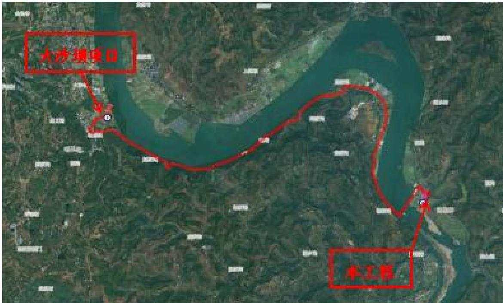  
图3.2-1 本工程与遂宁港大沙坝作业区（一期）工程位置关系  
四川金原工程勘察设计有限责任公司

## 3）利用率

本项目土石方挖方总量 170.82万 $\mathrm { m } ^ { 3 }$ （自然方、下同），土石方回填及利用 115.76 万 $\mathrm { m } ^ { 3 }$ ；弃渣 55.06 万 $\mathrm { m } ^ { 3 }$ 全部资源化综合利用：其中重庆潼荣建材有限公司加工处置砂卵石 11.19万 $\mathrm { m } ^ { 3 }$ ，四川省遂宁港大沙坝作业区（一期）工程综合回填利用43.87万 $\mathrm { m } ^ { 3 }$ ，利用率 100%。

## 3.2.4取土场设置评价

本工程未设置取土场，符合水土保持要求。

## 3.2.5弃渣场设置评价

本项目弃渣 55.06万 $\mathrm { m } ^ { 3 }$ 全部资源化综合利用：其中重庆潼荣建材有限公司加工处置砂卵石 11.19万 $\mathrm { m } ^ { 3 }$ ，四川省遂宁港大沙坝作业区（一期）工程综合回填利用43.87万 $\mathrm { m } ^ { 3 }$ ，不设置永久弃渣场，符合水土保持要求。

## 3.2.6表土堆场设置评价

本项目共规划 2处表土堆场，均设置于河道管理范围线之外，堆存量分别为 2.31 万 $\mathrm { m } ^ { 3 }$ 、2.48 万 $\mathrm { m } ^ { 3 }$ ，最大堆存高度 5.2m，均采用 1级边坡堆置方案，堆土坡比 1:2。

1#表土堆场场区设计洪水位为 264.3-264.6m，现状地形高程为 264.8-264.9m，地形较平坦，方案拟在 1#表土堆场坡脚（堆场四周）设置钢筋石笼挡墙，规格为0.8m×1.0m（宽×高），钢筋石笼挡墙顶高程为265.8-265.9m，高于设计洪水高程，不受设计洪水影响。

2#表土堆场场区设计洪水位为 259.5-261m，现状地形高程为 264-267.5m，地形较平坦，方案拟在 2#表土堆场坡脚（堆场四周）设置钢筋石笼挡墙，规格为 0.8m×1.0m（宽×高），钢筋石笼挡墙顶高程为 265-268.5m，高于设计洪水高程，不受设计洪水影响。

1#表土堆场距离最近房屋约 42m，2#表土堆场距离最近房屋约 40m，根据主体工程地质勘察资料，场地未见滑坡、泥石流等不良地质现象，表土堆场设置合理，选址基本可行。

为保障汛期防洪安全，汛期进行清运。堆置期间应严格按照方案设计控制

堆土高度，加强表土堆场措施实施和维护，不得对居民房及涪江河道造成影响。

## 3.2.7临时堆料场设置评价

本项目共规划2处临时堆料场，最大堆存量分别为6.35万m3、6.97万m3，最大堆存高度8.5米，均采用1级边坡堆置方案，堆料坡比1:2。

1#临时堆料场设置于河道管理范围线之外，场区设计洪水位为 264.6-264.7m，场区现状地形高程为 264.8-264.9m，方案拟在临时堆料场坡脚（堆料场四周）设置钢筋石笼挡墙，规格为 1.0m×1.2m（宽×高），钢筋石笼挡墙顶高程为 266-266.1m，高于设计洪水高程，不受设计洪水影响。

2#临时堆料场位于河道管理范围线之外，场区设计洪水位为259-259.5m，本区域现状地形高程为 264-267.1m。方案拟在临时堆料场坡脚（堆料场四周）设置钢筋石笼挡墙，规格为 1.0m×1.2m（宽×高），钢筋石笼挡墙顶高程为265.2-268.3m，高于设计洪水高程，不受设计洪水影响。

1#临时堆料场距离最近房屋约118m，2#临时堆料场距离最近房屋约90m，根据主体工程地质勘察资料，场地未见滑坡、泥石流等不良地质现象，临时堆料场设置合理。

为保障汛期防洪安全，汛期进行清运。堆置期间应严格按照方案设计控制堆料高度，加强临时堆料场措施实施和维护，不得对居民房及涪江河道造成影响。

## 3.2.8施工方法与工艺评价

## （1）交通运输

公路：本工程场外交通有 G93、S11、S205等通过，至现场有乡道通过，场内新建施工便道1.88km，以满足材料进出场的运输要求。

水运：涪江遂宁市境内航道现状等级为 V级，水路运输以砂石等矿建材料区间短途运输为主。

通过公路与水路相结合初步形成了连续的交通路网体系，工程所需物资、材料和设备设施均可运输至施工现场，对外交通方便。

## （2）施工布置分析评价

本工程施工生产生活区主要包括预制场地、机械设备停放场、拼装场地、

加工厂等，布置紧凑，尽量节约占地，后期进行复耕，符合水土保持要求。

本工程施工交通主要利用现有道路解决，仅设置施工区至上引航道基坑，及施工区至下引航道基坑/下闸首施工便道共 1.88km，均采用混凝土路面，道路宽 7.5m，以确保工程运输要求。施工便道设置于施工生产生活区及永久占地范围内，不新增占地，符合水土保持要求。

施工用水可从涪江河道抽取、生活用水可接荷叶乡城镇居民用水，施工用电可从现有三星电站厂房变电站 10kV线路接口接入，主要土建施工时段避开了雨季且施工期较短，有利于降低水土流失，符合水土保持要求。

总体上来看，施工总体布置结合工程建设特点而设，工程在施工布置上，遵循因地、因时制宜、有利生产、方便生活、易于管理、安全可靠、经济合理的原则，综上所述，工程施工布置较为合理、符合水土保持要求。

（3）根据《生产建设项目水土保持技术标准》（GB50433-2018），施工组织设计评价见表3.2-4。

表3.2-4施工组织设计水土保持评价表
<table><tr><td colspan="1" rowspan="1">序号</td><td colspan="1" rowspan="1">约束性规定</td><td colspan="1" rowspan="1">本工程情况</td><td colspan="1" rowspan="1">评价意见或处理措施</td></tr><tr><td colspan="1" rowspan="1">1</td><td colspan="1" rowspan="1">应控制施工场地占地，避开植被相对良好的区域和基本农田区</td><td colspan="1" rowspan="1">已避开植被相对良好的区域、临时占地占用永久基本农田，已取得临时用地批复，后期复耕。</td><td colspan="1" rowspan="1">符合要求</td></tr><tr><td colspan="1" rowspan="1">2</td><td colspan="1" rowspan="1">应合理安排施工，防止重复开挖和多次倒运，减少裸露时间和范围</td><td colspan="1" rowspan="1">资源化综合利用土石方不在场内临时堆存，直接运往综合利用方综合利用，避免了土石方二次转运过程中产生水土流失</td><td colspan="1" rowspan="1">符合要求</td></tr><tr><td colspan="1" rowspan="1">3</td><td colspan="1" rowspan="1">在河岸陡坡开挖土石方，以及开挖边坡下方有河渠、公路、铁路、居民点和其他重要基础设施时，应设计渣石渡槽、溜渣洞等专门设施，将开挖的土石导出</td><td colspan="1" rowspan="1">不涉及</td><td colspan="1" rowspan="1"></td></tr><tr><td colspan="1" rowspan="1">4</td><td colspan="1" rowspan="1">弃土、弃石、弃渣应分类堆放</td><td colspan="1" rowspan="1">弃渣55.06万m³全部资源化综合利用。</td><td colspan="1" rowspan="1">符合要求</td></tr><tr><td colspan="1" rowspan="1">5</td><td colspan="1" rowspan="1">外借土石方应优先考虑利用其他工程废弃的土（石、渣），外购土（石、料）应选择合规的料场</td><td colspan="1" rowspan="1">不涉及</td><td colspan="1" rowspan="1"></td></tr><tr><td colspan="1" rowspan="1">6</td><td colspan="1" rowspan="1">大型料场应分台阶开采，控制开挖深度。爆破开挖应控制装药量和爆破范围</td><td colspan="1" rowspan="1">不涉及</td><td colspan="1" rowspan="1"></td></tr><tr><td colspan="1" rowspan="1">7</td><td colspan="1" rowspan="1">工程标段划分应考虑合理调配土石方，减少取土（石）方、弃土（石、渣）方和临时占地数量</td><td colspan="1" rowspan="1">不涉及</td><td colspan="1" rowspan="1">1</td></tr></table>

（4）根据《生产建设项目水土保持技术标准》（GB50433-2018），工程施工评价见表3.2-5。

表3.2-5工程施工水土保持评价表
<table><tr><td rowspan=1 colspan=1>序号</td><td rowspan=1 colspan=1>约束性规定</td><td rowspan=1 colspan=1>本工程情况</td><td rowspan=1 colspan=1>评价意见或处理措施</td></tr><tr><td rowspan=1 colspan=1>1</td><td rowspan=1 colspan=1>施工活动应控制在设计的施工道路、施工场地内</td><td rowspan=1 colspan=1>本工程划定了永久占地和临时占地，施工活动都在占地范围内</td><td rowspan=1 colspan=1>符合要求</td></tr><tr><td rowspan=1 colspan=1>2</td><td rowspan=1 colspan=1>施工开始时应首先对表土进行剥离或保护，剥离的表土应集中堆放，并采取防护措施</td><td rowspan=1 colspan=1>主体工程没有相关要求</td><td rowspan=1 colspan=1>方案补充，施工前对占地范围内具备表土剥离条件的区域剥离表土并集中堆放，采取临时措施进行防护</td></tr><tr><td rowspan=1 colspan=1>3</td><td rowspan=1 colspan=1>裸露地表应及时防护，减少裸露时间，填筑土方时应随挖、随运、随填、随压</td><td rowspan=1 colspan=1>主体工程没有相关要求</td><td rowspan=1 colspan=1>方案建议加强裸露地表管理，減少裸露时间，补充裸露地表临时苫盖；建议施工中合理调整工序，填筑土方尽量做到随挖、随运、随填、随压</td></tr><tr><td rowspan=1 colspan=1>4</td><td rowspan=1 colspan=1>临时堆土（石、渣）应集中堆放，并采取临时拦挡、苫盖、排水、沉沙等措施</td><td rowspan=1 colspan=1>主体工程没有相关要求</td><td rowspan=1 colspan=1>方案补充表土及临时堆料临时堆存期间的临时拦挡、临时苫盖、临时排水、沉沙等措施，施工后期的表土回覆、土地整治等迹地措施</td></tr><tr><td rowspan=1 colspan=1>5</td><td rowspan=1 colspan=1>围堰填筑、拆除应采取减少流失的有效措失</td><td rowspan=1 colspan=1>方案对围堰填筑、拆除时间、施工方法提出要求，从而减少填筑和拆除过程中的水土流失</td><td rowspan=1 colspan=1>符合要求</td></tr><tr><td rowspan=1 colspan=1>6</td><td rowspan=1 colspan=1>弃土（石、渣）场地应事先设置拦挡措施，弃土（石、渣）应有序堆放</td><td rowspan=1 colspan=1>弃渣全部外运综合利用，不涉及弃渣场。</td><td rowspan=1 colspan=1>符合要求</td></tr><tr><td rowspan=1 colspan=1>7</td><td rowspan=1 colspan=1>土（石、料、渣、矸石）方在运输过程中应采取保护措施，防止沿途散溢</td><td rowspan=1 colspan=1>主体工程没有相关要求</td><td rowspan=1 colspan=1>建议主体设计完善土石方运输保护措施，避免沿途散溢</td></tr></table>

（5）施工工艺评价

主体工程施工以机械为主、人工为辅进行，采用的施工工艺和技术方法成熟、规范，缩短了施工作业周期，防止重复开挖和多次倒运，减少裸露时间和

范围。

本工程场地占用的耕地、林地和园地具备表土剥离条件，因而将进行表土剥离，施工以机械为主、人工为辅进行，加快了施工进度，并且保护了表土。

对裸露地表及时进行苫盖，减少裸露时间；填筑土方时尽最大可能做到随挖、随运、随填、随压。

本工程施工工艺基本满足水土保持要求，但在施工过程中应根据实际情况进一步采取相应的临时措施以最大限度的减少新增水土流失。

## 3.2.9主体工程设计中具有水土保持功能工程的评价

## 3.2.9.1主体工程设计水土保持措施评价

## （1）船闸工程区

## ①景观绿化

主体设计船闸工程区溪沟沟顶与船闸内引墙相接处、闸室旁侧空地进行景观绿化，绿化 2.44hm2。

水土保持评价：植物措施能有效地拦截地表径流，加快降水入渗，减少冲刷，具有较好的水土保持功能，应纳入水土流失防治体系。

## ②三维网植草护坡

船闸工程设计溪沟沟顶外侧边坡坡比 1：2，采取三维网植草护坡，面积4171m2。

水土保持评价：植物措施能有效地拦截地表径流，加快降水入渗，减少冲刷，具有较好的水土保持功能，应纳入水土流失防治体系。

## ③施工围堰

本工程需配套实施施工期临时施工围堰。虽然施工围堰对船闸工程施工起到很好的拦挡作用，有效减少了施工期水土流失，但其主要作用为主体工程施工服务，不界定为水土保持工程。

## ④排水沟

主体设计在船闸工程闸室旁侧设置排水沟，采用 30cm\*45cm矩形断面，采用现浇 C25砼，沟壁均采用 20cm厚，经统计共设置C25砼排水沟230m。

由于项目区位于嘉陵江下游省级水土流失重点治理区和重庆市水土流失重

点治理区内，根据《水土保持工程设计规范》（GB 51018-2014）相关规定，对主体设计排水沟按照 5年一遇10min短历时暴雨进行过水能力校核。

排水沟设计流量计算公式如下：

$$
\begin{array} { r l r } { Q m = 1 6 . 6 7 \varphi q F } & { { } } & { ( \mathrm { ~ \AE ~ } \ddagger \beta 3 \ – 1 \ ) } \end{array}
$$

式中：

Qm—设计排水流量， $\mathbf { m } ^ { 3 } / \mathbf { s } ;$

—径流系数，根据《水土保持工程设计规范》，考虑工程区平面布置情况，径流系数取值0.6；

q—设计重现期和降雨历时内的平均降雨强度，mm/min，经查询中国5年一遇 10min 降雨强度等值线图为 2.10mm/min；

F—汇水面积， $\mathrm { k m } ^ { 2 } .$ 。汇水面积在总平图上量测得出，为0.006km2。

排水沟设计排水流量见表3.2-6。

表3.2-6 排水沟设计排水流量计算表
<table><tr><td rowspan=1 colspan=1>项目区</td><td rowspan=1 colspan=1>最大清水流量(m³/s)</td><td rowspan=1 colspan=1>径流系数</td><td rowspan=1 colspan=1>5年重现期和10min降雨历时内的平均降雨强度(mm/min)</td><td rowspan=1 colspan=1>汇水面积 $\left( \mathrm { k m } ^ { 2 } \right)$ </td></tr><tr><td rowspan=1 colspan=1>排水沟汇流区</td><td rowspan=1 colspan=1>0.126</td><td rowspan=1 colspan=1>0.6</td><td rowspan=1 colspan=1>2.10</td><td rowspan=1 colspan=1>0.006</td></tr></table>

排水沟过流能力按均匀流计算，计算公式如下：

$$
\mathrm { Q { = } } \frac { 1 } { \mathrm { n } } \mathrm { A i } ^ { \frac { 1 } { 2 } } \mathrm { R } ^ { \frac { 2 } { 3 } }
$$

（公式 3-2）

式中：n—粗糙系数；

A—过流面积， $\mathrm { m } ^ { 2 } ;$

i—底坡；

R—水力半径。

排水沟水力参数统计及过流能力计算结果见表3.2-7。

表3.2-7 排水沟水力参数及过流能力计算结果表
<table><tr><td rowspan=1 colspan=1>底宽B(m)</td><td rowspan=1 colspan=1>净深h(m)</td><td rowspan=1 colspan=1>安全超高(m)</td><td rowspan=1 colspan=1>边坡系数m</td><td rowspan=1 colspan=1>过流面积A(m²)</td><td rowspan=1 colspan=1>湿周X(m)</td><td rowspan=1 colspan=1>糙率（n）</td><td rowspan=1 colspan=1>水力半径(R)</td><td rowspan=1 colspan=1>底坡(i)</td><td rowspan=1 colspan=1>过流能力Q(m3 /s)</td></tr><tr><td rowspan=1 colspan=1>0.3</td><td rowspan=1 colspan=1>0.25</td><td rowspan=1 colspan=1>0.2</td><td rowspan=1 colspan=1>0</td><td rowspan=1 colspan=1>0.075</td><td rowspan=1 colspan=1>0.8</td><td rowspan=1 colspan=1>0.016</td><td rowspan=1 colspan=1>0.094</td><td rowspan=1 colspan=1>0.020</td><td rowspan=1 colspan=1>0.14</td></tr></table>

经计算，主体设计排水沟过流能力为 0.14m3/s，大于设计排水流量0.126m3/s，排水沟满足排水要求。

水土保持评价：主体设计排水沟具有水土保持功能，排水沟过流能力满足水土保持要求，纳入水土流失防治体系。

## ⑤截水沟

根据主体设计在船闸工程区与施工生产生活区之间设置了截水沟，截水沟底宽1.0m、深1.0m，采用M7.5浆砌块石衬砌，沟壁均采用30cm厚，经统计，共设置截水沟415m，拦截场周雨水排出。

本方案对主体设计截水沟按照5年一遇10min短历时暴雨进行过水能力校核。

设计排水流量计算公式如下：

$$
Q m = 1 6 . 6 7 \varphi q F
$$

式中：

Qm—设计排水流量，m3/s；

—径流系数，根据《水土保持工程设计规范》，考虑工程区平面布置情况，径流系数取值0.6；

q—设计重现期和降雨历时内的平均降雨强度，mm/min。经查询中国5年一遇 10min 降雨强度等值线图为 2.1mm/min；

F—汇水面积，km2。汇水面积在总平图上量测得出。

截水沟设计排水流量详见表3.2-8。

表 3.2-8 截水沟设计排水流量表
<table><tr><td rowspan=1 colspan=1>项目区</td><td rowspan=1 colspan=1>最大清水流量(m³/s)</td><td rowspan=1 colspan=1>径流系数</td><td rowspan=1 colspan=1>5年重现期和10min降雨历时内的平均降雨强度(mm/min)</td><td rowspan=1 colspan=1>汇水面积 $\left( \mathrm { k m } ^ { 2 } \right)$ </td></tr><tr><td rowspan=1 colspan=1>截水沟汇流区</td><td rowspan=1 colspan=1>1.47</td><td rowspan=1 colspan=1>0.6</td><td rowspan=1 colspan=1>2.1</td><td rowspan=1 colspan=1>0.07</td></tr></table>

截水沟水力参数统计及过流能力计算结果见表3.2-9。

表 3.2-9 主体设计截水沟水力参数及过流能力计算结果表
<table><tr><td rowspan=1 colspan=1>底宽B(m)</td><td rowspan=1 colspan=1>净深h(m)</td><td rowspan=1 colspan=1>安全超高（m）</td><td rowspan=1 colspan=1>边坡系数m</td><td rowspan=1 colspan=1>过流面积 A(m²)</td><td rowspan=1 colspan=1>湿周X(m)</td><td rowspan=1 colspan=1>糙率(n)</td><td rowspan=1 colspan=1>水力半径(R)</td><td rowspan=1 colspan=1>底坡(i)</td><td rowspan=1 colspan=1>过流能力Q(m³/s)</td></tr><tr><td rowspan=1 colspan=1>1</td><td rowspan=1 colspan=1>0.8</td><td rowspan=1 colspan=1>0.2</td><td rowspan=1 colspan=1>0</td><td rowspan=1 colspan=1>0.8</td><td rowspan=1 colspan=1>2.6</td><td rowspan=1 colspan=1>0.0225</td><td rowspan=1 colspan=1>0.308</td><td rowspan=1 colspan=1>0.020</td><td rowspan=1 colspan=1>2.29</td></tr></table>

经水文计算，截水沟过流能力为 2.29m3/s，大于设计排水流量 1.47m3/s，截水沟满足排水要求。

水土保持评价：主体设计截水沟具有水土保持功能，截水沟过流能力满足水土保持要求，纳入水土流失防治体系。

## 3.2.9.2主体设计水保措施设计标准评价

主体设计本工程水保措施主要为排水工程和林草绿化工程，经校核，主体设计截排水工程过流能力满足5年一遇10min短历时暴雨标准，满足《水土保持工程设计规范》（GB51018-2014）的要求；绿化工程设计标准 1级植被建设标准，满足《水土保持工程设计规范》（GB51018-2014）的要求。 综上，主体设计水保措施设计标准满足水土保持相关规范要求。

## 3.2.9.3主体工程设计的水土保持措施综合分析评价

主体工程从自身功能和安全角度考虑，布置了一系列具有水土保持功能的设施，在充分发挥主体工程自身作用的同时，有效地防治了水土流失。本方案将从全面防治水土流失的角度出发，对主体工程设计中具有水土保持功能的各项工程进行分析论证，对不能满足水土保持要求的，本方案将进行补充设计。为更好地防治施工中产生的水土流失，方案需完善补充施工前的表土剥离措施，施工中的临时排水、临时拦挡、临时绿化、临时苫盖等临时措施，施工后的表土回覆、土地整治等工程措施。

本工程水土保持措施补充完善意见见表3.2-6。

表3.2-6 水土保持措施补充完善意见表
<table><tr><td colspan="1" rowspan="2">防治分区</td><td colspan="1" rowspan="2">措施类型</td><td colspan="1" rowspan="2">措施部位</td><td colspan="2" rowspan="1">水土保持措施内容</td></tr><tr><td colspan="1" rowspan="1">主体工程设计具有</td><td colspan="1" rowspan="1">水土保持方案补充完善</td></tr><tr><td colspan="1" rowspan="7">船闸工程区</td><td colspan="1" rowspan="3">工程措施</td><td colspan="1" rowspan="1">占地范围可剥离区域</td><td colspan="1" rowspan="1"></td><td colspan="1" rowspan="1">表土剥离</td></tr><tr><td colspan="1" rowspan="1">绿化区域</td><td colspan="1" rowspan="1"></td><td colspan="1" rowspan="1">表土回覆、土地整治</td></tr><tr><td colspan="1" rowspan="1">闸室旁侧</td><td colspan="1" rowspan="1">排水沟、截水沟</td><td colspan="1" rowspan="1"></td></tr><tr><td colspan="1" rowspan="2">植物措施</td><td colspan="1" rowspan="1">溪沟沟顶与船闸内引墙衔接处、闸室旁侧空地</td><td colspan="1" rowspan="1">绿化</td><td colspan="1" rowspan="1"></td></tr><tr><td colspan="1" rowspan="1">溪沟沟顶外侧边坡</td><td colspan="1" rowspan="1">三维网植草护坡</td><td colspan="1" rowspan="1"></td></tr><tr><td colspan="1" rowspan="2">临时措施</td><td colspan="1" rowspan="1">场周</td><td colspan="1" rowspan="1"></td><td colspan="1" rowspan="1">临时排水沟、临时沉沙池</td></tr><tr><td colspan="1" rowspan="1">裸露地表</td><td colspan="1" rowspan="1"></td><td colspan="1" rowspan="1">防雨布苫盖</td></tr><tr><td colspan="1" rowspan="2">航道工程区</td><td colspan="1" rowspan="1">工程措施</td><td colspan="1" rowspan="1">占地范围可剥离区域</td><td colspan="1" rowspan="1"></td><td colspan="1" rowspan="1">表土剥离</td></tr><tr><td colspan="1" rowspan="1">临时措施</td><td colspan="1" rowspan="1">边坡裸露面</td><td colspan="1" rowspan="1"></td><td colspan="1" rowspan="1">防雨布苫盖</td></tr><tr><td colspan="1" rowspan="4">施工生产生活区</td><td colspan="1" rowspan="3">工程措施</td><td colspan="1" rowspan="1">占用耕地区域</td><td colspan="1" rowspan="1"></td><td colspan="1" rowspan="1">表土剥离</td></tr><tr><td colspan="1" rowspan="1">扰动区域</td><td colspan="1" rowspan="1"></td><td colspan="1" rowspan="1">表土回覆</td></tr><tr><td colspan="1" rowspan="1">扰动区域</td><td colspan="1" rowspan="1"></td><td colspan="1" rowspan="1">土地整治</td></tr><tr><td colspan="1" rowspan="1">临时措施</td><td colspan="1" rowspan="1">场周</td><td colspan="1" rowspan="1"></td><td colspan="1" rowspan="1">临时排水沟、沉沙池</td></tr><tr><td colspan="1" rowspan="4">表土堆场区</td><td colspan="1" rowspan="1">工程措施</td><td colspan="1" rowspan="1">复耕区域</td><td colspan="1" rowspan="1"></td><td colspan="1" rowspan="1">土地整治</td></tr><tr><td colspan="1" rowspan="3">临时措施</td><td colspan="1" rowspan="1">表土堆场坡脚</td><td colspan="1" rowspan="1"></td><td colspan="1" rowspan="1">临时排水沟、临时拦挡</td></tr><tr><td colspan="1" rowspan="1">临时堆放表土表面</td><td colspan="1" rowspan="1"></td><td colspan="1" rowspan="1">临时撒播草籽</td></tr><tr><td colspan="1" rowspan="1">临时堆放表土表面</td><td colspan="1" rowspan="1"></td><td colspan="1" rowspan="1">密目网苫盖</td></tr><tr><td colspan="1" rowspan="5">临时堆料场区</td><td colspan="1" rowspan="3">工程措施</td><td colspan="1" rowspan="1">扰动区域</td><td colspan="1" rowspan="1"></td><td colspan="1" rowspan="1">表土剥离</td></tr><tr><td colspan="1" rowspan="1">扰动区域</td><td colspan="1" rowspan="1"></td><td colspan="1" rowspan="1">表土回覆</td></tr><tr><td colspan="1" rowspan="1">扰动区域</td><td colspan="1" rowspan="1"></td><td colspan="1" rowspan="1">土地整治</td></tr><tr><td colspan="1" rowspan="2">临时措施</td><td colspan="1" rowspan="1">临时堆料坡脚</td><td colspan="1" rowspan="1"></td><td colspan="1" rowspan="1">临时排水沟、临时拦挡</td></tr><tr><td colspan="1" rowspan="1">临时堆料表面</td><td colspan="1" rowspan="1"></td><td colspan="1" rowspan="1">防雨布苫盖</td></tr></table>

## 3.3主体工程设计中水土保持措施的界定

根据主体工程设计中具有水土保持措施功能工程的评价，主体工程设计中界定为水土保持措施的包括船闸工程区排水沟、截水沟工程措施、三维网植草护坡、景观绿化等植物措施。

主体工程设计中界定为水土保持措施工程量及投资见下表 3.3-1。

表 3.3-1 主体设计已有水土保持措施工程量汇总表
<table><tr><td rowspan=2 colspan=1>防治责任分区</td><td rowspan=2 colspan=1>措施类型</td><td rowspan=1 colspan=3>措施规模</td><td rowspan=1 colspan=1>单价</td><td rowspan=1 colspan=1>合价</td></tr><tr><td rowspan=1 colspan=1>名称</td><td rowspan=1 colspan=1>单位</td><td rowspan=1 colspan=1>规模</td><td rowspan=1 colspan=1>(元)</td><td rowspan=1 colspan=1>(万元)</td></tr><tr><td rowspan=4 colspan=1>船闸工程区</td><td rowspan=2 colspan=1>工程措施</td><td rowspan=1 colspan=1>排水沟</td><td rowspan=1 colspan=1>m</td><td rowspan=1 colspan=1>230</td><td rowspan=1 colspan=1>175.56</td><td rowspan=1 colspan=1>4.04</td></tr><tr><td rowspan=1 colspan=1>截水沟</td><td rowspan=1 colspan=1>m</td><td rowspan=1 colspan=1>415</td><td rowspan=1 colspan=1>729.25</td><td rowspan=1 colspan=1>30.26</td></tr><tr><td rowspan=2 colspan=1>植物措施</td><td rowspan=1 colspan=1>三维网植草护坡</td><td rowspan=1 colspan=1>m²</td><td rowspan=1 colspan=1>4171</td><td rowspan=1 colspan=1>26.85</td><td rowspan=1 colspan=1>11.28</td></tr><tr><td rowspan=1 colspan=1>景观绿化</td><td rowspan=1 colspan=1>hm²</td><td rowspan=1 colspan=1>2.44</td><td rowspan=1 colspan=1>158689</td><td rowspan=1 colspan=1>38.72</td></tr><tr><td rowspan=1 colspan=3>合计</td><td rowspan=1 colspan=1></td><td rowspan=1 colspan=1></td><td rowspan=1 colspan=1></td><td rowspan=1 colspan=1>84.30</td></tr></table>

## 4 水土流失分析与预测

## 4.1水土流失现状

## 4.1.1遂宁市船山区水土流失现状

根据四川省水土保持公报（2024 年），遂宁市船山区水土流失面积$2 5 5 . 8 7 \mathrm { k m } ^ { 2 }$ 。其中轻度侵蚀面积为 $1 9 5 . 7 8 \mathrm { k m } ^ { 2 }$ ，中度侵蚀面积为 $3 0 . 2 4 \mathrm { k m } ^ { 2 }$ ，强烈侵蚀面积为 $1 8 . 4 1 \mathrm { k m } ^ { 2 }$ ，极强烈侵蚀面积为 $9 . 9 9 \mathrm { k m } ^ { 2 }$ ，剧烈侵蚀面积为$1 . 4 5 \mathrm { k m } ^ { 2 } .$ 。遂宁市船山区水土流失现状见表4.1-1。

表4.1-1 遂宁市船山区土壤侵蚀分布统计
<table><tr><td rowspan=1 colspan=1>项目</td><td rowspan=1 colspan=1>流失面积</td><td rowspan=1 colspan=1>轻度</td><td rowspan=1 colspan=1>中度</td><td rowspan=1 colspan=1>强烈</td><td rowspan=1 colspan=1>极强烈</td><td rowspan=1 colspan=1>剧烈</td></tr><tr><td rowspan=1 colspan=1>面积 $\left( \mathrm { k m } ^ { 2 } \right)$ </td><td rowspan=1 colspan=1>255.87</td><td rowspan=1 colspan=1>195.78</td><td rowspan=1 colspan=1>30.24</td><td rowspan=1 colspan=1>18.41</td><td rowspan=1 colspan=1>9.99</td><td rowspan=1 colspan=1>1.45</td></tr><tr><td rowspan=1 colspan=1>占比（%）</td><td rowspan=1 colspan=1>100</td><td rowspan=1 colspan=1>76.52</td><td rowspan=1 colspan=1>11.82</td><td rowspan=1 colspan=1>7.20</td><td rowspan=1 colspan=1>3.90</td><td rowspan=1 colspan=1>0.57</td></tr></table>

## 4.1.2遂宁市蓬溪县

根据四川省水土保持公报（2024 年），遂宁市蓬溪县水土流失面积$4 4 0 . 8 1 \mathrm { k m } ^ { 2 }$ 。其中轻度侵蚀面积为 $2 9 7 . 8 8 \mathrm { k m } ^ { 2 }$ ，中度侵蚀面积为 $5 8 . 6 6 \mathrm { k m } ^ { 2 }$ ，强烈侵蚀面积为 $5 6 . 2 6 \mathrm { k m } ^ { 2 }$ ，极强烈侵蚀面积为 $2 5 . 5 6 \mathrm { k m } ^ { 2 }$ ，剧烈侵蚀面积为$2 . 4 5 \mathrm { k m } ^ { 2 }$ 。遂宁市船山区水土流失现状见表4.1-2。

表4.1- 2 遂宁市蓬溪县土壤侵蚀分布统计
<table><tr><td rowspan=1 colspan=1>项目</td><td rowspan=1 colspan=1>流失面积</td><td rowspan=1 colspan=1>轻度</td><td rowspan=1 colspan=1>中度</td><td rowspan=1 colspan=1>强烈</td><td rowspan=1 colspan=1>极强烈</td><td rowspan=1 colspan=1>剧烈</td></tr><tr><td rowspan=1 colspan=1>面积 $\left( \mathrm { { k m } } ^ { 2 } \right)$ </td><td rowspan=1 colspan=1>440.81</td><td rowspan=1 colspan=1>297.88</td><td rowspan=1 colspan=1>58.66</td><td rowspan=1 colspan=1>56.26</td><td rowspan=1 colspan=1>25.56</td><td rowspan=1 colspan=1>2.45</td></tr><tr><td rowspan=1 colspan=1>占比（%）</td><td rowspan=1 colspan=1>100</td><td rowspan=1 colspan=1>67.58</td><td rowspan=1 colspan=1>13.30</td><td rowspan=1 colspan=1>12.76</td><td rowspan=1 colspan=1>5.8</td><td rowspan=1 colspan=1>0.56</td></tr></table>

## 4.1.3重庆市潼南区

根据重庆市水土保持公报（2024 年），重庆市潼南区水土流失面积$3 1 4 . 3 4 \mathrm { k m } ^ { 2 }$ 。其中轻度侵蚀面积为 $1 7 2 . 4 3 \mathrm { k m } ^ { 2 }$ ，中度侵蚀面积为 $1 1 9 . 5 2 \mathrm { k m } ^ { 2 }$ ，强烈侵蚀面积为 $2 2 . 2 1 \mathrm { k m } ^ { 2 }$ ，极强烈侵蚀面积为 $0 . 1 3 \mathrm { k m } ^ { 2 }$ ，剧烈侵蚀面积为$0 . 0 5 \mathrm { k m } ^ { 2 }$ 。重庆市潼南区水土流失现状见表4.1-3。

表4.1-3 重庆市潼南区土壤侵蚀分布统计
<table><tr><td rowspan=1 colspan=1>项目</td><td rowspan=1 colspan=1>流失面积</td><td rowspan=1 colspan=1>轻度</td><td rowspan=1 colspan=1>中度</td><td rowspan=1 colspan=1>强烈</td><td rowspan=1 colspan=1>极强烈</td><td rowspan=1 colspan=1>剧烈</td></tr><tr><td rowspan=1 colspan=1>面积 $\left( \mathrm { { k m } } ^ { 2 } \right)$ </td><td rowspan=1 colspan=1>314.34</td><td rowspan=1 colspan=1>172.43</td><td rowspan=1 colspan=1>119.52</td><td rowspan=1 colspan=1>22.21</td><td rowspan=1 colspan=1>0.13</td><td rowspan=1 colspan=1>0.05</td></tr><tr><td rowspan=1 colspan=1>占比（%）</td><td rowspan=1 colspan=1>100</td><td rowspan=1 colspan=1>54.85</td><td rowspan=1 colspan=1>38.02</td><td rowspan=1 colspan=1>7.07</td><td rowspan=1 colspan=1>0.04</td><td rowspan=1 colspan=1>0.02</td></tr></table>

## 4.1.4项目区水土流失现状

本工程位于遂宁市船山区、蓬溪县以及重庆市潼南区范围内，工程区地形整体较为平坦，占地类型为耕地、园地、林地、水域及水利设施用地、住宅用地和其他土地。工程区水土流失类型以水力侵蚀为主，流失形式主要是面蚀、沟蚀，水土流失强度为轻度。项目区现状林草植被覆盖率约9%。

## 4.1.5水土流失重点防治区划分

项目位于遂宁市船山区、蓬溪县以及重庆市潼南区，根据《全国水土保持规划国家级水土流失重点预防区和重点治理区复核划分成果》（办水保〔2013〕188号），遂宁市船山区、蓬溪县、重庆市潼南区不涉及国家级水土流失重点预防区和重点治理区；根据《水利部办公厅关于做好国家级水土流失重点预防区和重点治理区落地上图成果应用的通知》（办水保〔2025〕170号），经查询，本工程占地范围不涉及国家级水土流失重点预防区和重点治理区；根据四川省水利厅关于印发《四川省省级水土流失重点预防区和重点治理区划分成果的通知》（川水函〔2017〕482号）以及《重庆市人民政府办公厅关于公布水土流失重点预防区和重点治理区复核划分成果的通知》（渝府办发〔2015〕197 号），项目区位于嘉陵江下游省级水土流失重点治理区和重庆市水土流失重点治理区范围内。根据《全国水土保持区划》，项目区地处西南紫色土区，区域容许土壤流失量为 500t/km2.a。

## 4.1.6水土流失背景值

本工程占地范围水土流失主要以轻度水力侵蚀为主。依据工程所在地水土保持规划及遥感数据，结合工程地区原生的土壤、土地利用类型、植被覆盖度及地表坡度，经过实地调查测算，参照《土壤侵蚀分类分级标准》（SL190—2007）确定土壤侵蚀强度，最终估算水土流失背景值。经计算，工程占地区内水土流失背景值为1044t/km2•a，为轻度侵蚀，详见下表4.1-4。

表4.1-4 项目占地范围内水土流失现状表
<table><tr><td rowspan=1 colspan=1>项目组成</td><td rowspan=1 colspan=1>土地类型</td><td rowspan=1 colspan=1>面积(hm²)</td><td rowspan=1 colspan=1>坡度(°)</td><td rowspan=1 colspan=1>侵蚀强度</td><td rowspan=1 colspan=1>林草覆盖度(%)</td><td rowspan=1 colspan=1>平均土壤侵蚀模数(t/km²·a)</td></tr><tr><td rowspan=6 colspan=1>船闸工程区</td><td rowspan=1 colspan=1>耕地</td><td rowspan=1 colspan=1>8.4</td><td rowspan=1 colspan=1>5~8</td><td rowspan=1 colspan=1>轻度</td><td rowspan=1 colspan=1>1</td><td rowspan=1 colspan=1>1250</td></tr><tr><td rowspan=1 colspan=1>园地</td><td rowspan=1 colspan=1>0.45</td><td rowspan=1 colspan=1>8~15</td><td rowspan=1 colspan=1>轻度</td><td rowspan=1 colspan=1>45-60</td><td rowspan=1 colspan=1>1250</td></tr><tr><td rowspan=1 colspan=1>林地</td><td rowspan=1 colspan=1>0.1</td><td rowspan=1 colspan=1>8~15</td><td rowspan=1 colspan=1>轻度</td><td rowspan=1 colspan=1>45-60</td><td rowspan=1 colspan=1>1320</td></tr><tr><td rowspan=1 colspan=1>水域及水利设施用地</td><td rowspan=1 colspan=1>11.48</td><td rowspan=1 colspan=1></td><td rowspan=1 colspan=1>微度</td><td rowspan=1 colspan=1>1</td><td rowspan=1 colspan=1>300</td></tr><tr><td rowspan=1 colspan=1>其他土地</td><td rowspan=1 colspan=1>1.06</td><td rowspan=1 colspan=1>5~8</td><td rowspan=1 colspan=1>轻度</td><td rowspan=1 colspan=1>&lt;30</td><td rowspan=1 colspan=1>1500</td></tr><tr><td rowspan=1 colspan=1>小计</td><td rowspan=1 colspan=1>21.49</td><td rowspan=1 colspan=1></td><td rowspan=1 colspan=1></td><td rowspan=1 colspan=1></td><td rowspan=1 colspan=1>755</td></tr><tr><td rowspan=4 colspan=1>航道工程区</td><td rowspan=1 colspan=1>园地</td><td rowspan=1 colspan=1>2.79</td><td rowspan=1 colspan=1></td><td rowspan=1 colspan=1></td><td rowspan=1 colspan=1></td><td rowspan=1 colspan=1></td></tr><tr><td rowspan=1 colspan=1>林地</td><td rowspan=1 colspan=1>0.39</td><td rowspan=1 colspan=1>8~15</td><td rowspan=1 colspan=1>轻度</td><td rowspan=1 colspan=1>45-60</td><td rowspan=1 colspan=1>1320</td></tr><tr><td rowspan=1 colspan=1>其他土地</td><td rowspan=1 colspan=1>8.23</td><td rowspan=1 colspan=1>5~8</td><td rowspan=1 colspan=1>轻度</td><td rowspan=1 colspan=1>&lt;30</td><td rowspan=1 colspan=1>1500</td></tr><tr><td rowspan=1 colspan=1>小计</td><td rowspan=1 colspan=1>11.41</td><td rowspan=1 colspan=1></td><td rowspan=1 colspan=1></td><td rowspan=1 colspan=1></td><td rowspan=1 colspan=1>1433</td></tr><tr><td rowspan=1 colspan=1>施工生产生活区</td><td rowspan=1 colspan=1>耕地</td><td rowspan=1 colspan=1>5.66</td><td rowspan=1 colspan=1>5~8</td><td rowspan=1 colspan=1>轻度</td><td rowspan=1 colspan=1>1</td><td rowspan=1 colspan=1>1250</td></tr><tr><td rowspan=3 colspan=1>表土堆场区</td><td rowspan=1 colspan=1>耕地</td><td rowspan=1 colspan=1>1.07</td><td rowspan=1 colspan=1>5~8</td><td rowspan=1 colspan=1>轻度</td><td rowspan=1 colspan=1>1</td><td rowspan=1 colspan=1>1250</td></tr><tr><td rowspan=1 colspan=1>住宅用地</td><td rowspan=1 colspan=1>0.03</td><td rowspan=1 colspan=1>&lt;5</td><td rowspan=1 colspan=1>微度</td><td rowspan=1 colspan=1>1</td><td rowspan=1 colspan=1>300</td></tr><tr><td rowspan=1 colspan=1>小计</td><td rowspan=1 colspan=1>1.10</td><td rowspan=1 colspan=1></td><td rowspan=1 colspan=1></td><td rowspan=1 colspan=1></td><td rowspan=1 colspan=1>1203</td></tr><tr><td rowspan=1 colspan=1>临时堆料场区</td><td rowspan=1 colspan=1>耕地</td><td rowspan=1 colspan=1>2.06</td><td rowspan=1 colspan=1>5~8</td><td rowspan=1 colspan=1>轻度</td><td rowspan=1 colspan=1>1</td><td rowspan=1 colspan=1>1250</td></tr><tr><td rowspan=1 colspan=2>合计</td><td rowspan=1 colspan=1>41.72</td><td rowspan=1 colspan=1></td><td rowspan=1 colspan=1></td><td rowspan=1 colspan=1></td><td rowspan=1 colspan=1>1044</td></tr></table>

## 4.2水土流失影响因素分析

## 4.2.1水土流失成因

水土流失是在自然因素和人为因素共同作用下，使外界破坏力大于土壤侵蚀力而产生的。

## 4.2.1.1 自然因素

地形因素：地形对水土流失的影响，主要取决于地面坡度、长度、坡形和坡向，其中坡度和坡长是影响径流侵蚀的两个主要因素。项目区内地形地平，高差较小，缺乏水土流失的地形条件，决定了项目区自然因素造成的土壤侵蚀微弱。

降水因素：降雨是造成水土流失的主要动力因素，项目区所降雨量分布在5～10月份，在人工地表扰动条件下，降雨对水土流失的影响将随之加大，成为项目区影响工程施工新增水土流失的主要自然因素。

土壤因素：土壤是被侵蚀的主要对象，水土流失的大小亦决定于土壤的特征，尤其是土壤的透水性、抗蚀性和抗冲性。一般情况下，土壤结构差、透水性和持水量都小的土壤，水土流失越大；土壤越干燥越容易遇水崩解，更容易造成透水性小、分散系数高，膨胀系数大、抗蚀、抗冲性都很弱，易被侵蚀。项目区年内降雨不均匀，汛期前久晴后的土壤具备上述特质，易被侵蚀。

植被因素：项目植被覆盖度偏低，在雨水的冲刷下，极易引起水土流失。

## 4.2.1.2 人为因素

本工程人为水土流失主要表现在工程建设对原地表土壤、植被造成破坏，产生新增水土流失。在工程建设过程中，土石方开挖、回填、搬运及散落是造成破坏原地表土壤、植被等水土保持设施的主要因素，在外力作用下，原地表水土流失量增加，加大工程建设过程中的新增水土流失量和水土流失危害；在工程运行期，各项施工破坏活动停止，在不采取水土保持防护措施的前提下，工程建设过程中的新增水土流失将继续发生。同时土方的堆放，若不采取措施，在降雨的冲刷下，易产生严重的水土流失。

## 4.2.1.3 施工扰动

## （1）土石方挖填

工程存在大面积土石方挖填，挖填过程中填筑料滚落是扩大建设区影响范围的主要原因；同时挖填方表面为松散层，受降水及人为影响，容易发生面蚀、溅蚀等水土流失形式。

## （2）土石方临时堆放

施工过程中开挖土石方不能及时回填的需在场内临时堆放，土石方在集中堆放过程中受降水和人为因素影响，作为松散堆积体，降水入渗量大，土壤持水量多，在自然沉降过程中临时堆土表面容易发生溅蚀、面蚀等水土流失形式。

## （3）自然恢复期水土流失影响分析

本工程船闸工程建成后已硬化或为水域，其余施工扰动区进行植被恢复。工程完工后，工程施工破坏面将基本无裸露面。

工程投入运行后，其防护工程也完成并发挥作用，可以有效地控制由工程建设引起的水土流失。但是项目区采用的植物生态措施，一般在 2～3年内才能逐步稳定，达到较好的水土保持效果，因此在自然恢复期还有一定程度的水土流失。

## 4.2.2扰动地表分析

根据项目组成及扰动特点，本工程扰动地表部位包括船闸工程、航道工程区、施工生产生活区、表土堆场区和临时堆料场区，项目共计扰动地表面积41.72hm2，统计结果见表 4.2- 1。

表4.2-1 扰动地表面积统计表
<table><tr><td rowspan=1 colspan=1>序号</td><td rowspan=1 colspan=1>项目组成</td><td rowspan=1 colspan=1>扰动地表范围 $\left( \mathbf { h } \mathbf { m } ^ { 2 } \right)$ </td><td rowspan=1 colspan=1>备注</td></tr><tr><td rowspan=1 colspan=1>1</td><td rowspan=1 colspan=1>船闸工程区</td><td rowspan=1 colspan=1>21.49</td><td rowspan=2 colspan=1>永久占地</td></tr><tr><td rowspan=1 colspan=1>2</td><td rowspan=1 colspan=1>航道工程区</td><td rowspan=1 colspan=1>11.41</td></tr><tr><td rowspan=1 colspan=1>3</td><td rowspan=1 colspan=1>施工生产生活区</td><td rowspan=1 colspan=1>5.66</td><td rowspan=3 colspan=1>临时占地</td></tr><tr><td rowspan=1 colspan=1>4</td><td rowspan=1 colspan=1>表土堆场区</td><td rowspan=1 colspan=1>1.10</td></tr><tr><td rowspan=1 colspan=1>5</td><td rowspan=1 colspan=1>临时堆料场区</td><td rowspan=1 colspan=1>2.06</td></tr><tr><td rowspan=1 colspan=2>合计</td><td rowspan=1 colspan=1>41.72</td><td rowspan=1 colspan=1></td></tr></table>

## 4.2.3损毁植被分析

根据项目占地类型及扰动破坏原地表情况统计，本工程损毁植被部位主要为船闸工程区和航道工程区，项目共计损毁植被面积 $3 . 7 3 \mathrm { h m } ^ { 2 }$ ，统计结果见表4.2- 2。

表4.2-2 损毁植被面积统计表
<table><tr><td rowspan=2 colspan=1>序号</td><td rowspan=2 colspan=1>项目组成</td><td rowspan=1 colspan=3>损毁植被类型及面积 $\left( \mathbf { h } \mathbf { m } ^ { 2 } \right)$ </td></tr><tr><td rowspan=1 colspan=1>园地</td><td rowspan=1 colspan=1>林地</td><td rowspan=1 colspan=1>小计</td></tr><tr><td rowspan=1 colspan=1>1</td><td rowspan=1 colspan=1>船闸工程区</td><td rowspan=1 colspan=1>0.45</td><td rowspan=1 colspan=1>0.10</td><td rowspan=1 colspan=1>0.55</td></tr><tr><td rowspan=1 colspan=1>2</td><td rowspan=1 colspan=1>航道工程区</td><td rowspan=1 colspan=1>2.79</td><td rowspan=1 colspan=1>0.39</td><td rowspan=1 colspan=1>3.18</td></tr><tr><td rowspan=1 colspan=2>小计</td><td rowspan=1 colspan=1>3.24</td><td rowspan=1 colspan=1>0.49</td><td rowspan=1 colspan=1>3.73</td></tr></table>

## 4.2.4弃土弃渣量分析

经水保方案复核，本项目土石方挖方总量170.82万 $\mathrm { m } ^ { 3 }$ （自然方、下同），其中表土 4.79万 $\mathrm { m } ^ { 3 }$ 、土方 15.81 万 $\mathrm { m } ^ { 3 }$ 、砂卵石 97.42 万 $\mathrm { m } ^ { 3 }$ 、石方 52.80 万 $\mathrm { m } ^ { 3 }$ ；土石方回填及利用115.76万 $\mathrm { m } ^ { 3 }$ （其中回填表土4.79万 $\mathbf { m } ^ { 3 } .$ 、土方 $1 0 . 0 0 \mathrm { ~ \mathscr { F } ~ m ^ { 3 } } .$ 砂卵石 21.24 万 $\mathrm { m } ^ { 3 }$ 、石方 $1 4 . 7 4 \mathrm { ~ ‰ ~ }$ ，骨料综合利用 $6 4 . 9 9 \mathrm { ~ \mathcal ~ { ~ H ~ } ~ m ~ } ^ { 3 } $ ；弃渣55.06 万 $\mathrm { m } ^ { 3 }$ ，弃渣全部综合利用：其中重庆潼荣建材有限公司加工处置砂卵石11.19 万 $\mathrm { m } ^ { 3 }$ ，四川省遂宁港大沙坝作业区（一期）工程综合回填利用 43.87万$\mathrm { m } ^ { 3 }$ （其中土方5.81万 $\mathrm { m } ^ { 3 }$ 、石方 38.06 万 $\mathbf { m } ^ { 3 } )$ ）。

## 4.3水土流失量预测

## 4.3.1 预测单元

根据《生产建设项目水土保持技术标准》（GB 50433—2018）规定，土壤流失量预测范围应为项目水土流失防治责任范围。

土壤流失量预测单元按地形地貌、扰动方式、扰功后地表的物质组成、气象特征等相近的原则划分。经分析，本工程土壤流失量预测单元划分为船闸工程、航道工程区、施工生产生活区、表土堆场区和临时堆料场区。

水土流失面积包括永久占地和临时占地，总面积为 41.72hm2。项目施工期水土流失面积为各预测单元扰动地表面积，自然恢复期预测面积为扣除硬化面积和水面面积外的各预测单元扰动地表面积，各预测单元不同预测时段的预测面积详见表4.3-1。

表4.3-1 各预测单元不同预测时段的预测面积表（单位：hm2）
<table><tr><td rowspan=1 colspan=1>扰动单元</td><td rowspan=1 colspan=1>土壤流失单元</td><td rowspan=1 colspan=1>施工期面积</td><td rowspan=1 colspan=1>自然恢复期面积</td></tr><tr><td rowspan=2 colspan=1>船闸工程区</td><td rowspan=1 colspan=1>上方无来水工程开挖面</td><td rowspan=1 colspan=1>21.49</td><td rowspan=1 colspan=1></td></tr><tr><td rowspan=1 colspan=1>植被破坏型-一般扰动地表</td><td rowspan=1 colspan=1></td><td rowspan=1 colspan=1>2.86</td></tr><tr><td rowspan=1 colspan=1>航道工程区</td><td rowspan=1 colspan=1>上方有来水工程开挖面</td><td rowspan=1 colspan=1>11.41</td><td rowspan=1 colspan=1></td></tr><tr><td rowspan=2 colspan=1>施工生产生活区</td><td rowspan=1 colspan=1>上方无来水工程开挖面</td><td rowspan=1 colspan=1>5.66</td><td rowspan=1 colspan=1></td></tr><tr><td rowspan=1 colspan=1>植被破坏型-一般扰动地表</td><td rowspan=1 colspan=1></td><td rowspan=1 colspan=1>5.66</td></tr><tr><td rowspan=2 colspan=1>表土堆场区</td><td rowspan=1 colspan=1>上方无来水工程堆积体</td><td rowspan=1 colspan=1>1.10</td><td rowspan=1 colspan=1></td></tr><tr><td rowspan=1 colspan=1>植被破坏型-一般扰动地表</td><td rowspan=1 colspan=1></td><td rowspan=1 colspan=1>1.07</td></tr><tr><td rowspan=2 colspan=1>临时堆料场区</td><td rowspan=1 colspan=1>上方无来水工程堆积体</td><td rowspan=1 colspan=1>2.06</td><td rowspan=1 colspan=1></td></tr><tr><td rowspan=1 colspan=1>植被破坏型-一般扰动地表</td><td rowspan=1 colspan=1></td><td rowspan=1 colspan=1>2.06</td></tr><tr><td rowspan=1 colspan=2>合计</td><td rowspan=1 colspan=1>41.72</td><td rowspan=1 colspan=1>11.65</td></tr></table>

## 4.3.2 预测时段

结合工程特点，本工程土壤流失量预测时段划分为施工期（含施工准备期）和自然恢复期。

各预测单元施工期和自然恢复期应根据施工进度分别确定；施工期为实际扰功地表时间；自然恢复期为施工扰动结束后，不采取水土保持措施的情况下，土壤侵蚀强度自然恢复到扰动前土壤侵蚀强度所需要的时间，根据项目区自然条件确定为2年。

另外，施工期预测时间应按连续 12个月为一年计；不足 12个月，但达到一个雨（风）季长度的，接一年计；不足一个雨（风）季长度的．按占雨（风）季长度的比例计算。

## （1）施工期

施工期为实际扰动地表时间，应按连续12个月为一年计，不足12个月但达到一个雨（风）季长度的按一年计，不足一个雨（风）季长度的，按占雨（风）季长度的比例计算。

本工程土壤流失量预测时段见表4.3-2。

表 4.3-2 土壤流失量预测单元、范围及时段划分表
<table><tr><td rowspan=2 colspan=1>防治分区</td><td rowspan=1 colspan=2>预测范围  $\left( \mathbf { h } \mathbf { m } ^ { 2 } \right)$ </td><td rowspan=1 colspan=2>预测时段（a）</td></tr><tr><td rowspan=1 colspan=1>施工期</td><td rowspan=1 colspan=1>自然恢复期</td><td rowspan=1 colspan=1>施工期</td><td rowspan=1 colspan=1>自然恢复期</td></tr><tr><td rowspan=1 colspan=1>船闸工程区</td><td rowspan=1 colspan=1>21.49</td><td rowspan=1 colspan=1>2.86</td><td rowspan=1 colspan=1>3</td><td rowspan=1 colspan=1>2</td></tr><tr><td rowspan=1 colspan=1>航道工程区</td><td rowspan=1 colspan=1>11.41</td><td rowspan=1 colspan=1>1</td><td rowspan=1 colspan=1>3</td><td rowspan=1 colspan=1>/</td></tr><tr><td rowspan=1 colspan=1>施工生产生活区</td><td rowspan=1 colspan=1>5.66</td><td rowspan=1 colspan=1>5.66</td><td rowspan=1 colspan=1>3</td><td rowspan=1 colspan=1>2</td></tr><tr><td rowspan=1 colspan=1>表土堆场区</td><td rowspan=1 colspan=1>1.10</td><td rowspan=1 colspan=1>1.07</td><td rowspan=1 colspan=1>3</td><td rowspan=1 colspan=1>2</td></tr><tr><td rowspan=1 colspan=1>临时堆料场区</td><td rowspan=1 colspan=1>2.06</td><td rowspan=1 colspan=1>2.06</td><td rowspan=1 colspan=1>3</td><td rowspan=1 colspan=1>2</td></tr><tr><td rowspan=1 colspan=1>合计</td><td rowspan=1 colspan=1>41.72</td><td rowspan=1 colspan=1>11.65</td><td rowspan=1 colspan=1></td><td rowspan=1 colspan=1></td></tr></table>

## 4.3.3土壤侵蚀模数

## 4.3.3.1土壤流失类型划分

根据《生产建设项目土壤流失量测算导则》（SL773-2018），各预测单元依据侵蚀外营力、下垫面工程扰动形态、扰动程度及上方有无来水等因素，进行土壤流失类型划分，见表4.3-3。

表4.3-3 预测单元土壤流失类型划分表
<table><tr><td rowspan=1 colspan=1>扰动单元</td><td rowspan=1 colspan=1>土壤流失单元</td><td rowspan=1 colspan=1>说明</td></tr><tr><td rowspan=3 colspan=1>水力作用下的土壤流失</td><td rowspan=1 colspan=1>植被破坏型一般扰动地表</td><td rowspan=1 colspan=1>含自然恢复期船闸工程区绿化区域，施工生产生活区、表土堆场区和临时堆料场区复耕区域</td></tr><tr><td rowspan=1 colspan=1>上方无来水工程开挖面</td><td rowspan=1 colspan=1>含施工期船闸工程区、航道工程区和施工生产生活区</td></tr><tr><td rowspan=1 colspan=1>上方无来水工程堆积体</td><td rowspan=1 colspan=1>含施工期表土堆场区、临时堆料场区</td></tr></table>

## 4.3.3.2原地貌土壤侵蚀模数

根据水土流失调查成果，参照《土壤侵蚀分类分级标准》（SL190-2007），结合现场调查项目区占地类型、地形坡度、植被盖度等自然条件，经加权平均计算，工程扰动范围内水土流失平均侵蚀模数为 $1 0 4 4 \mathrm { { t } / \Omega ( \ k m ^ { 2 } { \bullet } a ) }$ ，平均侵蚀强度表现为轻度，各预测单元原地貌土壤侵蚀模数及年土壤流失量详见表

4.1- 2。

## 4.3.3.3扰动后土壤侵蚀模数

## 1、上方无来水工程开挖面扰动后土壤侵蚀模数

根据各预测单元土壤流失类型划分，上方无来水工程开挖面扰动后土壤侵蚀模数推求涉及的预测单元包括施工期船闸工程区、航道工程区、施工生产生活区。各预测单元扰动后土壤侵蚀模数以上方无来水工程开挖面土壤流失量公式为基础，按照时间尺度进行推求。上方无来水工程开挖面计算单元土壤流失量测算公式如下：

$$
\scriptstyle \mathrm { M _ { k w } = R G _ { k w } L _ { k w } S _ { k w } A }
$$

式中：

$\mathrm { M } _ { \mathrm { k w } }$ —上方无来水工程开挖面计算单元土壤流失量，t；

R—降雨侵蚀力因子， $\mathbf { M J \cdot m m } / \ ( \mathbf { \ h m ^ { 2 } \cdot h } )$

$\mathrm { G } _ { \mathrm { k w } }$ —上方无来水工程开挖面土质因子， $\mathbf { t \cdot h m } ^ { 2 } \mathbf { \cdot h } / \textrm { ( h m } ^ { 2 } \mathbf { \cdot M J \cdot m m ) }$

$\operatorname { L } _ { \mathrm { k w } }$ —上方无来水工程开挖面坡长因子，无量纲；

$\mathbf { S } _ { \mathrm { k w } }$ —上方无来水工程开挖面坡度因子，无量纲；

A—计算单元的水平投影面积， $\mathrm { h m } ^ { 2 }$

各预测单元均按照多年平均这一时间尺度计算上方无来水工程开挖面土壤流失量，经整理分析，扰动后土壤侵蚀模数计算成果见表4.3-4。

表4.3-4 上方无来水工程开挖面扰动后土壤侵蚀模数计算成果表
<table><tr><td rowspan=2 colspan=1>预测单元</td><td rowspan=1 colspan=6>上方无来水工程开挖面土壤流失量测算过程</td><td rowspan=2 colspan=1>扰动后土壤侵蚀模数</td></tr><tr><td rowspan=1 colspan=1>R</td><td rowspan=1 colspan=1> $\mathrm { G } _ { \mathrm { k w } }$ </td><td rowspan=1 colspan=1> $\mathrm { L } _ { \mathrm { k w } }$ </td><td rowspan=1 colspan=1> $\mathrm { S _ { k w } }$ </td><td rowspan=1 colspan=1>A</td><td rowspan=1 colspan=1> $\mathrm { M } _ { \mathrm { k w } }$ </td></tr><tr><td rowspan=1 colspan=1>船闸工程区</td><td rowspan=1 colspan=1>4954.53</td><td rowspan=1 colspan=1>0.0247</td><td rowspan=1 colspan=1>1.155</td><td rowspan=1 colspan=1>0.389</td><td rowspan=1 colspan=1>21.49</td><td rowspan=1 colspan=1>1181.59</td><td rowspan=1 colspan=1>5498</td></tr><tr><td rowspan=1 colspan=1>航道工程区</td><td rowspan=1 colspan=1>4940.1</td><td rowspan=1 colspan=1>0.0247</td><td rowspan=1 colspan=1>1.143</td><td rowspan=1 colspan=1>0.382</td><td rowspan=1 colspan=1>11.41</td><td rowspan=1 colspan=1>607.89</td><td rowspan=1 colspan=1>5328</td></tr><tr><td rowspan=1 colspan=1>施工生产生活区</td><td rowspan=1 colspan=1>4940.1</td><td rowspan=1 colspan=1>0.0247</td><td rowspan=1 colspan=1>1.125</td><td rowspan=1 colspan=1>0.376</td><td rowspan=1 colspan=1>5.66</td><td rowspan=1 colspan=1>292.14</td><td rowspan=1 colspan=1>5161</td></tr></table>

注：（1）四川省遂宁市 R取值 4940.1，重庆市 R取值 4985.3。

（2）船闸工程区涉及四川省遂宁市和重庆市，加权平均后 R取值为 4954.53。

（3）航道工程区和施工生产生活区位于四川省遂宁市，R取值 4940.1。

## 2、上方无来水工程堆积体扰动后土壤侵蚀模数

根据各预测单元土壤流失类型划分，上方无来水工程堆积体扰动后土壤侵蚀模数推求涉及的预测单元包括施工期表土堆场区和临时堆料场区。各预测单元扰动后土壤侵蚀模数以上方无来水工程堆积体土壤流失量公式为基础，按照

时间尺度进行推求。上方无来水工程堆积体土壤流失量按公式如下：

$$
\mathrm { M _ { d w } { = } X R G _ { d w } L _ { d w } S _ { d w } A }
$$

式中：

$\mathrm { M } _ { \mathrm { d w } }$ —上方无来水工程堆积体计算单元土壤流失量，t；

X—工程堆积体形态因子，无量纲；

R—降雨侵蚀力因子， $\mathbf { M J \cdot m m } / \ ( \mathbf { \ h m ^ { 2 } \cdot h } )$ ；

$\mathrm { G } _ { \mathrm { d w } }$ —上方无来水工程堆积体土石质因子， $\mathbf { t \cdot h m } ^ { 2 } \mathbf { \cdot h } / \textrm { ( h m } ^ { 2 } \mathbf { \cdot M J \cdot m m ) }$

$\mathrm { L } _ { \mathrm { d w } }$ —上方无来水工程堆积体坡长因子，无量纲；

$\mathbf { S } _ { \mathrm { d w } }$ —上方无来水工程堆积体坡度因子，无量纲；

A—计算单元的水平投影面积， $\mathrm { h m } ^ { 2 }$

各预测单元均按照多年平均这一时间尺度计算上方无来水工程堆积体土壤流失量，经整理分析，扰动后土壤侵蚀模数计算成果见表4.3-5。

表4.3-5 上方无来水工程堆积体扰动后土壤侵蚀模数计算成果表
<table><tr><td rowspan=2 colspan=1>预测单元</td><td rowspan=1 colspan=6>上方无来水工程堆积体土壤流失量测算过程</td><td rowspan=2 colspan=1>扰动后土壤侵蚀模数</td></tr><tr><td rowspan=1 colspan=1>R</td><td rowspan=1 colspan=1> $G _ { d w }$ </td><td rowspan=1 colspan=1> $L _ { d w }$ </td><td rowspan=1 colspan=1> $S _ { d w }$ </td><td rowspan=1 colspan=1>A</td><td rowspan=1 colspan=1> $M _ { d y }$ </td></tr><tr><td rowspan=1 colspan=1>表土堆场区</td><td rowspan=1 colspan=1>4940.1</td><td rowspan=1 colspan=1>0.0627</td><td rowspan=1 colspan=1>8.836</td><td rowspan=1 colspan=1>0.0262</td><td rowspan=1 colspan=1>1.10</td><td rowspan=1 colspan=1>78.88</td><td rowspan=1 colspan=1>7171</td></tr><tr><td rowspan=1 colspan=1>临时堆料场区</td><td rowspan=1 colspan=1>4940.1</td><td rowspan=1 colspan=1>0.0627</td><td rowspan=1 colspan=1>8.836</td><td rowspan=1 colspan=1>0.0286</td><td rowspan=1 colspan=1>2.06</td><td rowspan=1 colspan=1>161.25</td><td rowspan=1 colspan=1>7828</td></tr></table>

## 3、植被破坏型一般扰动地表扰动后土壤侵蚀模数

根据各预测单元土壤流失类型划分，植被破坏型一般扰动地表扰动后土壤侵蚀模数推求涉及的预测单元包括自然恢复期船闸工程区、施工生产生活区、表土堆场区和临时堆料场区绿化及复耕区域。各预测单元扰动后土壤侵蚀模数以地表翻扰型一般扰动地表计算单元土壤流失量公式为基础，按照时间尺度进行推求。植被破坏型一般扰动地表计算单元土壤流失量公式如下：

$$
\scriptstyle \mathrm { M y z = R K L y S y B E T A }
$$

式中：

Myz—植被破坏型一般扰动地表计算单元土壤流失量，t；

R—降雨侵蚀力因子， $\mathbf { M J \cdot m m } / \ ( \mathbf { \ h m ^ { 2 } \cdot h } )$ ；

K—土壤可蚀性因子， $\mathbf { t \cdot h m } ^ { 2 } \mathbf { \cdot h } / \textrm { ( h m } ^ { 2 } \mathbf { \cdot M J \cdot m m ) }$ ；

Ly—坡长因子，无量纲；

Sy—坡度因子，无量纲；

B—植被覆盖因子，无量纲；

E—工程措施因子，无量纲；

T—耕作措施因子，无量纲；

A—计算单元的水平投影面积，hm2。

各预测单元均按照多年平均这一时间尺度计算植被破坏型一般扰动地表计算单元土壤流失量，经整理分析，扰动后土壤侵蚀模数计算成果见表4.3-6。

表4.3-6 植被破坏型一般扰动地表扰动后土壤侵蚀模数计算成果表
<table><tr><td rowspan=2 colspan=2>预测单元</td><td rowspan=1 colspan=9>植被破坏型一般扰动地表土壤流失量测算过程</td><td rowspan=2 colspan=1>扰动后土壤侵蚀模数</td></tr><tr><td rowspan=1 colspan=1>R</td><td rowspan=1 colspan=1>K</td><td rowspan=1 colspan=1> $L _ { y }$ </td><td rowspan=1 colspan=1> $S _ { y }$ </td><td rowspan=1 colspan=1>B</td><td rowspan=1 colspan=1>E</td><td rowspan=1 colspan=1>T</td><td rowspan=1 colspan=1> $A$ </td><td rowspan=1 colspan=1> $M _ { y d }$ </td></tr><tr><td rowspan=2 colspan=1>船闸工程区</td><td rowspan=1 colspan=1>第一年</td><td rowspan=1 colspan=1>4954.53</td><td rowspan=1 colspan=1>0.0069</td><td rowspan=1 colspan=1>1.34</td><td rowspan=1 colspan=1>1.52</td><td rowspan=1 colspan=1>0.25</td><td rowspan=1 colspan=1>1</td><td rowspan=1 colspan=1>1</td><td rowspan=1 colspan=1>2.86</td><td rowspan=1 colspan=1>49.79</td><td rowspan=1 colspan=1>1741</td></tr><tr><td rowspan=1 colspan=1>第二年</td><td rowspan=1 colspan=1>4954.53</td><td rowspan=1 colspan=1>0.0069</td><td rowspan=1 colspan=1>1.34</td><td rowspan=1 colspan=1>1.52</td><td rowspan=1 colspan=1>0.07</td><td rowspan=1 colspan=1>1</td><td rowspan=1 colspan=1>1</td><td rowspan=1 colspan=1>2.86</td><td rowspan=1 colspan=1>13.94</td><td rowspan=1 colspan=1>487</td></tr><tr><td rowspan=2 colspan=1>施工生产生活区</td><td rowspan=1 colspan=1>第一年</td><td rowspan=1 colspan=1>4940.1</td><td rowspan=1 colspan=1>0.0069</td><td rowspan=1 colspan=1>1.32</td><td rowspan=1 colspan=1>1.44</td><td rowspan=1 colspan=1>0.25</td><td rowspan=1 colspan=1>1</td><td rowspan=1 colspan=1>1</td><td rowspan=1 colspan=1>5.66</td><td rowspan=1 colspan=1>91.68</td><td rowspan=1 colspan=1>1620</td></tr><tr><td rowspan=1 colspan=1>第二年</td><td rowspan=1 colspan=1>4940.1</td><td rowspan=1 colspan=1>0.0069</td><td rowspan=1 colspan=1>1.32</td><td rowspan=1 colspan=1>1.44</td><td rowspan=1 colspan=1>0.07</td><td rowspan=1 colspan=1>1</td><td rowspan=1 colspan=1>1</td><td rowspan=1 colspan=1>5.66</td><td rowspan=1 colspan=1>25.67</td><td rowspan=1 colspan=1>454</td></tr><tr><td rowspan=2 colspan=1>表土堆场区</td><td rowspan=1 colspan=1>第一年</td><td rowspan=1 colspan=1>4940.1</td><td rowspan=1 colspan=1>0.0069</td><td rowspan=1 colspan=1>1.32</td><td rowspan=1 colspan=1>1.40</td><td rowspan=1 colspan=1>0.25</td><td rowspan=1 colspan=1>1</td><td rowspan=1 colspan=1>1</td><td rowspan=1 colspan=1>1.07</td><td rowspan=1 colspan=1>16.85</td><td rowspan=1 colspan=1>1575</td></tr><tr><td rowspan=1 colspan=1>第二年</td><td rowspan=1 colspan=1>4940.1</td><td rowspan=1 colspan=1>0.0069</td><td rowspan=1 colspan=1>1.32</td><td rowspan=1 colspan=1>1.40</td><td rowspan=1 colspan=1>0.07</td><td rowspan=1 colspan=1>1</td><td rowspan=1 colspan=1>1</td><td rowspan=1 colspan=1>1.07</td><td rowspan=1 colspan=1>4.72</td><td rowspan=1 colspan=1>441</td></tr><tr><td rowspan=2 colspan=1>临时堆料场区</td><td rowspan=1 colspan=1>第一年</td><td rowspan=1 colspan=1>4940.1</td><td rowspan=1 colspan=1>0.0069</td><td rowspan=1 colspan=1>1.32</td><td rowspan=1 colspan=1>1.41</td><td rowspan=1 colspan=1>0.25</td><td rowspan=1 colspan=1>1</td><td rowspan=1 colspan=1>1</td><td rowspan=1 colspan=1>2.06</td><td rowspan=1 colspan=1>32.67</td><td rowspan=1 colspan=1>1586</td></tr><tr><td rowspan=1 colspan=1>第二年</td><td rowspan=1 colspan=1>4940.1</td><td rowspan=1 colspan=1>0.0069</td><td rowspan=1 colspan=1>1.32</td><td rowspan=1 colspan=1>1.41</td><td rowspan=1 colspan=1>0.07</td><td rowspan=1 colspan=1>1</td><td rowspan=1 colspan=1>1</td><td rowspan=1 colspan=1>2.06</td><td rowspan=1 colspan=1>9.15</td><td rowspan=1 colspan=1>444</td></tr></table>

## 4.3.4 预测结果

根据预测时段、各单元年土壤流失量、水土流失面积等，对施工期、自然恢复期土壤流失量分别进行定量计算，计算结果见表4.3-2\~4.3-8。

本工程扰动后水土流失总量为 7209.58t，新增水土流失量 5718.65t，施工期新增水土流失量为 5658.61t，占新增水土流失量 98.95%，施工期是本工程水土流失防治的重点时段。新增水土流失中船闸工程区新增水土流失量为3086.01t，占新增水土流失总量的 53.96%。因此本工程水土流失防治和监测的重点区域为船闸工程区。

本工程各预测单元土壤流失总量、新增土壤流失量及比重见表 4.3-7\~表4.3-8。

表4.3-7 土壤流失量预测表
<table><tr><td rowspan=1 colspan=1>预测时段</td><td rowspan=1 colspan=2>预测单元</td><td rowspan=1 colspan=1>侵蚀面积(hm²)</td><td rowspan=1 colspan=1>土壤侵蚀模数背景值t/(km²·a)</td><td rowspan=1 colspan=1>扰动后侵蚀模数t/(km²·a)</td><td rowspan=1 colspan=1>侵蚀时间(a)</td><td rowspan=1 colspan=1>原地貌流失量(t)</td><td rowspan=1 colspan=1>预测流失量(t)</td><td rowspan=1 colspan=1>新增流失量(t)</td></tr><tr><td rowspan=6 colspan=1>施工期</td><td rowspan=1 colspan=1>船闸工程区</td><td rowspan=1 colspan=1>上方无来水工程开挖面</td><td rowspan=1 colspan=1>21.49</td><td rowspan=1 colspan=1>755</td><td rowspan=1 colspan=1>5498</td><td rowspan=1 colspan=1>3</td><td rowspan=1 colspan=1>486.75</td><td rowspan=1 colspan=1>3544.56</td><td rowspan=1 colspan=1>3057.81</td></tr><tr><td rowspan=1 colspan=1>航道工程区</td><td rowspan=1 colspan=1>上方无来水工程开挖面</td><td rowspan=1 colspan=1>11.41</td><td rowspan=1 colspan=1>1433</td><td rowspan=1 colspan=1>5328</td><td rowspan=1 colspan=1>3</td><td rowspan=1 colspan=1>490.52</td><td rowspan=1 colspan=1>1823.77</td><td rowspan=1 colspan=1>1333.25</td></tr><tr><td rowspan=1 colspan=1>施工生产生活区</td><td rowspan=1 colspan=1>上方无来水工程开挖面</td><td rowspan=1 colspan=1>5.66</td><td rowspan=1 colspan=1>1250</td><td rowspan=1 colspan=1>5161</td><td rowspan=1 colspan=1>3</td><td rowspan=1 colspan=1>212.25</td><td rowspan=1 colspan=1>876.34</td><td rowspan=1 colspan=1>664.09</td></tr><tr><td rowspan=1 colspan=1>表土堆场区</td><td rowspan=1 colspan=1>上方无来水工程堆积体</td><td rowspan=1 colspan=1>1.1</td><td rowspan=1 colspan=1>1203</td><td rowspan=1 colspan=1>7171</td><td rowspan=1 colspan=1>3</td><td rowspan=1 colspan=1>39.70</td><td rowspan=1 colspan=1>236.64</td><td rowspan=1 colspan=1>196.94</td></tr><tr><td rowspan=1 colspan=1>临时堆料场区</td><td rowspan=1 colspan=1>上方无来水工程堆积体</td><td rowspan=1 colspan=1>2.06</td><td rowspan=1 colspan=1>1250</td><td rowspan=1 colspan=1>7828</td><td rowspan=1 colspan=1>3</td><td rowspan=1 colspan=1>77.25</td><td rowspan=1 colspan=1>483.77</td><td rowspan=1 colspan=1>406.52</td></tr><tr><td rowspan=1 colspan=2>小计</td><td rowspan=1 colspan=1>41.72</td><td rowspan=1 colspan=1></td><td rowspan=1 colspan=1></td><td rowspan=1 colspan=1></td><td rowspan=1 colspan=1>1306.47</td><td rowspan=1 colspan=1>6965.08</td><td rowspan=1 colspan=1>5658.61</td></tr><tr><td rowspan=13 colspan=1>自然恢复期</td><td rowspan=3 colspan=1>船闸工程区</td><td rowspan=1 colspan=1>第一年</td><td rowspan=1 colspan=1>2.86</td><td rowspan=1 colspan=1>755</td><td rowspan=1 colspan=1>1741</td><td rowspan=1 colspan=1>1</td><td rowspan=1 colspan=1>21.59</td><td rowspan=1 colspan=1>49.79</td><td rowspan=1 colspan=1>28.20</td></tr><tr><td rowspan=1 colspan=1>第二年</td><td rowspan=1 colspan=1>2.86</td><td rowspan=1 colspan=1>755</td><td rowspan=1 colspan=1>487</td><td rowspan=1 colspan=1>1</td><td rowspan=1 colspan=1>21.59</td><td rowspan=1 colspan=1>13.93</td><td rowspan=1 colspan=1></td></tr><tr><td rowspan=1 colspan=1>小计</td><td rowspan=1 colspan=1></td><td rowspan=1 colspan=1></td><td rowspan=1 colspan=1></td><td rowspan=1 colspan=1></td><td rowspan=1 colspan=1>43.18</td><td rowspan=1 colspan=1>63.72</td><td rowspan=1 colspan=1>28.20</td></tr><tr><td rowspan=3 colspan=1>施工生产生活区</td><td rowspan=1 colspan=1>第一年</td><td rowspan=1 colspan=1>5.66</td><td rowspan=1 colspan=1>1250</td><td rowspan=1 colspan=1>1620</td><td rowspan=1 colspan=1>1</td><td rowspan=1 colspan=1>70.75</td><td rowspan=1 colspan=1>91.69</td><td rowspan=1 colspan=1>20.94</td></tr><tr><td rowspan=1 colspan=1>第二年</td><td rowspan=1 colspan=1>5.66</td><td rowspan=1 colspan=1>1250</td><td rowspan=1 colspan=1>454</td><td rowspan=1 colspan=1>1</td><td rowspan=1 colspan=1>70.75</td><td rowspan=1 colspan=1>25.70</td><td rowspan=1 colspan=1></td></tr><tr><td rowspan=1 colspan=1>小计</td><td rowspan=1 colspan=1></td><td rowspan=1 colspan=1></td><td rowspan=1 colspan=1></td><td rowspan=1 colspan=1></td><td rowspan=1 colspan=1>141.50</td><td rowspan=1 colspan=1>117.39</td><td rowspan=1 colspan=1>20.94</td></tr><tr><td rowspan=3 colspan=1>表土堆场区</td><td rowspan=1 colspan=1>第一年</td><td rowspan=1 colspan=1>1.07</td><td rowspan=1 colspan=1>1203</td><td rowspan=1 colspan=1>1575</td><td rowspan=1 colspan=1>1</td><td rowspan=1 colspan=1>12.87</td><td rowspan=1 colspan=1>16.85</td><td rowspan=1 colspan=1>3.98</td></tr><tr><td rowspan=1 colspan=1>第二年</td><td rowspan=1 colspan=1>1.07</td><td rowspan=1 colspan=1>1203</td><td rowspan=1 colspan=1>441</td><td rowspan=1 colspan=1>1</td><td rowspan=1 colspan=1>12.87</td><td rowspan=1 colspan=1>4.72</td><td rowspan=1 colspan=1></td></tr><tr><td rowspan=1 colspan=1>小计</td><td rowspan=1 colspan=1></td><td rowspan=1 colspan=1></td><td rowspan=1 colspan=1></td><td rowspan=1 colspan=1></td><td rowspan=1 colspan=1>25.74</td><td rowspan=1 colspan=1>21.57</td><td rowspan=1 colspan=1>3.98</td></tr><tr><td rowspan=3 colspan=1>临时堆料场区</td><td rowspan=1 colspan=1>第一年</td><td rowspan=1 colspan=1>2.06</td><td rowspan=1 colspan=1>1250</td><td rowspan=1 colspan=1>1586</td><td rowspan=1 colspan=1>1</td><td rowspan=1 colspan=1>25.75</td><td rowspan=1 colspan=1>32.67</td><td rowspan=1 colspan=1>6.92</td></tr><tr><td rowspan=1 colspan=1>第二年</td><td rowspan=1 colspan=1>2.06</td><td rowspan=1 colspan=1>1250</td><td rowspan=1 colspan=1>444</td><td rowspan=1 colspan=1>1</td><td rowspan=1 colspan=1>25.75</td><td rowspan=1 colspan=1>9.15</td><td rowspan=1 colspan=1></td></tr><tr><td rowspan=1 colspan=1>小计</td><td rowspan=1 colspan=1></td><td rowspan=1 colspan=1></td><td rowspan=1 colspan=1></td><td rowspan=1 colspan=1></td><td rowspan=1 colspan=1>51.50</td><td rowspan=1 colspan=1>41.82</td><td rowspan=1 colspan=1>6.92</td></tr><tr><td rowspan=1 colspan=2>小计</td><td rowspan=1 colspan=1></td><td rowspan=1 colspan=1></td><td rowspan=1 colspan=1></td><td rowspan=1 colspan=1></td><td rowspan=1 colspan=1>261.92</td><td rowspan=1 colspan=1>244.50</td><td rowspan=1 colspan=1>60.04</td></tr><tr><td rowspan=1 colspan=3>合计</td><td rowspan=1 colspan=1></td><td rowspan=1 colspan=1></td><td rowspan=1 colspan=1></td><td rowspan=1 colspan=1></td><td rowspan=1 colspan=1>1568.39</td><td rowspan=1 colspan=1>7209.58</td><td rowspan=1 colspan=1>5718.65</td></tr></table>

表4.3-8分区水土流失预测汇总表
<table><tr><td rowspan=1 colspan=1>预测单元</td><td rowspan=1 colspan=1>预测时期</td><td rowspan=1 colspan=1>原地貌流失量(t)</td><td rowspan=1 colspan=1>预测流失量(t)</td><td rowspan=1 colspan=1>新增流失量(t)</td><td rowspan=1 colspan=1>新增占比(%)</td></tr><tr><td rowspan=3 colspan=1>船闸工程区</td><td rowspan=1 colspan=1>施工期</td><td rowspan=1 colspan=1>486.75</td><td rowspan=1 colspan=1>3544.56</td><td rowspan=1 colspan=1>3057.81</td><td rowspan=1 colspan=1>53.47</td></tr><tr><td rowspan=1 colspan=1>自然恢复期</td><td rowspan=1 colspan=1>43.18</td><td rowspan=1 colspan=1>63.72</td><td rowspan=1 colspan=1>28.20</td><td rowspan=1 colspan=1>0.49</td></tr><tr><td rowspan=1 colspan=1>小计</td><td rowspan=1 colspan=1>529.93</td><td rowspan=1 colspan=1>3608.28</td><td rowspan=1 colspan=1>3086.01</td><td rowspan=1 colspan=1>53.96</td></tr><tr><td rowspan=1 colspan=1>航道工程区</td><td rowspan=1 colspan=1>施工期</td><td rowspan=1 colspan=1>490.52</td><td rowspan=1 colspan=1>1823.77</td><td rowspan=1 colspan=1>1333.25</td><td rowspan=1 colspan=1>23.31</td></tr><tr><td rowspan=3 colspan=1>施工生产生活区</td><td rowspan=1 colspan=1>施工期</td><td rowspan=1 colspan=1>212.25</td><td rowspan=1 colspan=1>876.34</td><td rowspan=1 colspan=1>664.09</td><td rowspan=1 colspan=1>11.62</td></tr><tr><td rowspan=1 colspan=1>自然恢复期</td><td rowspan=1 colspan=1>141.50</td><td rowspan=1 colspan=1>117.39</td><td rowspan=1 colspan=1>20.94</td><td rowspan=1 colspan=1>0.37</td></tr><tr><td rowspan=1 colspan=1>小计</td><td rowspan=1 colspan=1>353.75</td><td rowspan=1 colspan=1>993.73</td><td rowspan=1 colspan=1>685.03</td><td rowspan=1 colspan=1>11.99</td></tr><tr><td rowspan=3 colspan=1>表土堆场区</td><td rowspan=1 colspan=1>施工期</td><td rowspan=1 colspan=1>39.70</td><td rowspan=1 colspan=1>236.64</td><td rowspan=1 colspan=1>196.94</td><td rowspan=1 colspan=1>3.44</td></tr><tr><td rowspan=1 colspan=1>自然恢复期</td><td rowspan=1 colspan=1>25.74</td><td rowspan=1 colspan=1>21.57</td><td rowspan=1 colspan=1>3.98</td><td rowspan=1 colspan=1>0.07</td></tr><tr><td rowspan=1 colspan=1>小计</td><td rowspan=1 colspan=1>65.44</td><td rowspan=1 colspan=1>258.21</td><td rowspan=1 colspan=1>200.92</td><td rowspan=1 colspan=1>3.51</td></tr><tr><td rowspan=3 colspan=1>临时堆料场区</td><td rowspan=1 colspan=1>施工期</td><td rowspan=1 colspan=1>77.25</td><td rowspan=1 colspan=1>483.77</td><td rowspan=1 colspan=1>406.52</td><td rowspan=1 colspan=1>7.11</td></tr><tr><td rowspan=1 colspan=1>自然恢复期</td><td rowspan=1 colspan=1>51.50</td><td rowspan=1 colspan=1>41.82</td><td rowspan=1 colspan=1>6.92</td><td rowspan=1 colspan=1>0.12</td></tr><tr><td rowspan=1 colspan=1>小计</td><td rowspan=1 colspan=1>128.75</td><td rowspan=1 colspan=1>525.59</td><td rowspan=1 colspan=1>413.44</td><td rowspan=1 colspan=1>7.23</td></tr><tr><td rowspan=3 colspan=1>合计</td><td rowspan=1 colspan=1>施工期</td><td rowspan=1 colspan=1>1306.47</td><td rowspan=1 colspan=1>6965.08</td><td rowspan=1 colspan=1>5658.61</td><td rowspan=1 colspan=1>98.95</td></tr><tr><td rowspan=1 colspan=1>自然恢复期</td><td rowspan=1 colspan=1>261.92</td><td rowspan=1 colspan=1>244.50</td><td rowspan=1 colspan=1>60.04</td><td rowspan=1 colspan=1>1.05</td></tr><tr><td rowspan=1 colspan=1>小计</td><td rowspan=1 colspan=1>1568.39</td><td rowspan=1 colspan=1>7209.58</td><td rowspan=1 colspan=1>5718.65</td><td rowspan=1 colspan=1>100.00</td></tr></table>

## 4.4水土流失危害分析

项目建设造成的水土流失主要发生在土石方工程和临时堆土堆料过程中，本工程在建设期间会给建设区的地表植被带来较大的扰动，占用和损坏现有的水土保持设施，增加土壤侵蚀强度，如果不采取任何水土保持措施，盲目施工将会造成以下危害：

## （1）流失土石淤积河道，影响河道行洪及河道水质

工程建设中可能新增的水土流失量 5718.65t，若不采取水土保持措施，流失的土石渣进入沟道、河道内，导致河床淤积，抬高河床，减少河道行洪断面，不利于项目区的排水除涝；同时，因水土流失的时段和部位比较集中，大量泥沙进入河道，影响河道行洪，增加水体泥沙含量。

## （2）对项目区土地资源的破坏

工程建设将扰动、破坏大量耕地、园地和林地等，使原表层土剥离形成裸露地表，失去原有植被的防冲、固土能力。据统计，整个工程建设过程中扰动地表面积 41.72hm2，若不采取水土保持措施对其加以防护，表层耕植土或腐殖土将被剥离、冲刷殆尽；若对工程临时堆土不加防护，则其周围的地表可能被流失的土石渣淤埋覆盖，使土壤有机质流失、结构破坏，土壤中的氮、磷和有机物及无机盐含量迅速下降。同时土壤中生物、微生物及它们的衍生物数量也大大降低，从而使立地条件恶化，不仅影响农业生产，同时也给以后的植被恢复和土地复垦工作增加了难度。

## （3）对局部生态环境的影响

影响生态环境工程，现状水土流失轻微，在工程建设过程中，对现状水土保持设施将造成一定程度的损坏，同时工程建设产生的水土流失如不加以治理，会使工程区域内的水土流失加剧，直接影响工程区及航道两岸的景观，对当地生态环境带来不利影响。

## （4）加剧当地水土流失治理难度

工程扰动区域侵蚀强度以轻度为主，造成的土壤侵蚀侵蚀模数远远超过当地土壤侵蚀容许值（ $\mathbf { 5 0 0 t } / \mathrm { k m } ^ { 2 } { \cdot } \mathbf { a } \ ,$ ），若不采取水土保持措施，势必对当地生态环境造成不利影响，加大当地水土流失治理难度。

## 4.5指导性意见

预测结果是在未采取有效防护措施时可能的流失结果。产生水土流失的因素较多，其中地面坡度、降雨强度是造成水土流失的主要因素，而采取综合性的水土保持防护措施将对水土流失有较强的抑制作用。工程水土保持防护措施的布置应本着与施工进度同步为原则，减缓施工扰动引起的新增水土流失，及时恢复原地貌植被。

## （1）防治重点区域的指导性意见

根据预测结果，水土流失防治和监测重点区域为船闸工程区。

## （2）防治重点时段的指导性意见

根据预测结果，本工程的重点防治时段为施工期，因此，在措施体系防治方面，重点加强施工期间的临时防护措施体系，同时，结合工程措施和植物措施，确保施工结束后自然恢复期内施工扰动地面的水土流失得到有效治理。

## （3）防治措施的指导性意见

本工程防治措施应从截排水设施、临时拦挡等几个主要方面入手，并与必要的植物措施相结合，最大程度地减缓新增水土流失的发生。

施工期间人员活动比较频繁，扰动比较集中，待施工结束后将对各施工区

进行平整和原地貌恢复。施工期间主要的开挖和回填建设活动，所采取的防治措施应结合主体工程，植物措施宜结合季节适时及时开展，当主体工程建成投运时，工程措施和植物措施均应及时到位。

## （4）施工进度安排的指导性意见

根据预测结果，施工期是本工程水土流失量较大的时段，加强主体工程施工进度的紧凑安排，尽量避免大风和暴雨天气施工，可以有效地缩短强度水土流失时段。

## （5）水土保持监测工作安排的指导性意见

根据预测结果，工程施工期产生的水土流失量最大，自然恢复期水土流失量逐步减小。因此，本工程水土流失防治和监测的重点时段为主体工程施工期。船闸工程区是产生水土流失的重点区域，因此，水土保持监测应对上述区域作为水土流失重点监测对象，并兼顾其它水土流失区域。在监测过程中，要依据各区域水土流失特点，布置典型的监测设施，拟定具体的监测时段、频次和方法，通过水土保持监测为方案实施和工程施工、运行管理服务。

综上所述，工程建设对当地水土流失的影响主要为施工期活动改变、损坏、占压原有地貌，形成地表裸露面，降低土壤抗蚀能力，加剧水土流失。在工程建设过程中，要及时采取相应的水土保持措施，通过有效的防治，把建设过程中产生的水土流失降至最低程度。与此同时，也要做好工程的水土保持监理、监测工作，以便及时掌握水土流失状况及防治措施效果，并及时采取补充措施，从而更加有效地防治工程建设可能产生的水土流失。

## 5 水土保持措施

## 5.1防治区划分

## 5.1.1 分区原则

（1）各区之间应具有显著差异性；

（2）同一区内造成水土流失的主导因子和防治措施应相近或相似；

（3）根据项目的繁简程度和项目区自然情况，防治区可划分为一级或多级；

（4）一级区应具有控制性、整体性、全局性，线型工程应按土壤侵蚀类型、地形地貌、气候类型等因素划分一级区、二级区及其以下分区应结合工程布局、项目组成、占地性质和扰动特点进行逐级分区；

（5）各级分区应层次分明、具有关联性和系统性。

## 5.1.2 分区结果

根据实地调查（勘测）结果，在确定的防治责任范围内，依据工程布局、施工扰动特点、建设时序、地貌特征、自然属性、水土流失影响等，采取实地调查勘测、资料收集与数据分析相结合的方法，将本工程水土流失防治区划分为船闸工程区、航道工程区、施工生产生活区、表土堆场区以及临时堆料场区等 5个一级防治分区，本工程水土流失防治区划分结果见表5.1-1。

表5.1-1 水土流失防治区划分结果表
<table><tr><td rowspan=1 colspan=1>序号</td><td rowspan=1 colspan=1>防治分区</td><td rowspan=1 colspan=1>防治责任范围 $\left( \mathbf { h } \mathbf { m } ^ { 2 } \right)$ </td><td rowspan=1 colspan=1>备注</td></tr><tr><td rowspan=1 colspan=1>1</td><td rowspan=1 colspan=1>船闸工程区</td><td rowspan=1 colspan=1>21.49</td><td rowspan=1 colspan=1>包括船闸主体工程、鱼道工程、非溢流坝复建、溪沟改造、跨闸交通桥等</td></tr><tr><td rowspan=1 colspan=1>2</td><td rowspan=1 colspan=1>航道工程区</td><td rowspan=1 colspan=1>11.41</td><td rowspan=1 colspan=1>船闸下引航道下游右岸边滩疏挖及护岸工程</td></tr><tr><td rowspan=1 colspan=1>3</td><td rowspan=1 colspan=1>施工生产生活区</td><td rowspan=1 colspan=1>5.66</td><td rowspan=1 colspan=1>2 处施工生产生活区</td></tr><tr><td rowspan=1 colspan=1>4</td><td rowspan=1 colspan=1>表土堆场区</td><td rowspan=1 colspan=1>1.10</td><td rowspan=1 colspan=1>2处表土堆场</td></tr><tr><td rowspan=1 colspan=1>5</td><td rowspan=1 colspan=1>临时堆料场区</td><td rowspan=1 colspan=1>2.06</td><td rowspan=1 colspan=1>2 处临时堆料场</td></tr><tr><td rowspan=1 colspan=2>合计</td><td rowspan=1 colspan=1>41.72</td><td rowspan=1 colspan=1></td></tr></table>

## 5.2措施总体布局

结合工程实际和项目区水土流失特点，因地制宜、因害设防，本水土保持

方案提出水土流失总体防治思路，明确水土保持综合防治措施体系，使临时措施、工程措施及植物措施有机结合。

## （1）船闸工程区

主体设计施工后期闸室外侧采取永久截排水，溪沟沟顶一侧坡面采取三维网植草护坡，场内空地区域采取景观绿化措施。方案新增施工前对占用的耕地、园地、林地采取表土剥离；施工过程中对裸露地表采取苫盖措施，闸室外侧及溪沟上游侧采取临时排水措施、排水沟出口处采取沉沙池措施；施工后期对景观绿化区域采取表土回覆及土地整治措施。

## （2）航道工程区

方案新增施工前对本区占用的园地、林地采取表土剥离；施工过程中对裸露边坡采取苫盖措施。

## （3）施工生产生活区

方案新增施工前对占用的耕地采取表土剥离措施；施工过程中对施工生产生活区周边采取临时排水措施、排水沟中段及出口处设临时沉沙池；施工后期对占地范围采取覆土整治措施，原占地类型为耕地的进行复耕。

## （4）表土堆场区

方案新增施工过程中表土堆场坡脚钢筋石笼拦挡和临时排水措施，与施工生产生活区临时排水连成体系，表土表面采用撒播草籽临时绿化和密目网遮盖；施工后期对占地范围进行土地整治，原占地类型为耕地的进行复耕。

## （5）临时堆料场区

方案新增施工前期占地范围内耕地表土剥离，临时堆料坡脚设钢筋石笼拦挡和临时排水措施，与施工生产生活区临时排水连成体系，临时堆料表面采取防雨布临时苫盖；施工后期对占地范围采取覆土整治措施，原占地类型为耕地的进行复耕。

本工程水土流失防治措施总体布局见表5.2-1、图5.2-1。

表5.2-1 水土流失防治措施总体布局表
<table><tr><td rowspan=1 colspan=1>防治分区</td><td rowspan=1 colspan=1>措施类型</td><td rowspan=1 colspan=1>措施部位</td><td rowspan=1 colspan=1>措施内容</td><td rowspan=1 colspan=1>措施归属</td><td rowspan=1 colspan=1>实施时段</td></tr><tr><td rowspan=9 colspan=1>船闸工程区</td><td rowspan=5 colspan=1>工程措施</td><td rowspan=1 colspan=1>占地范围可剥离区域</td><td rowspan=1 colspan=1>表土剥离</td><td rowspan=1 colspan=1>方案新增</td><td rowspan=1 colspan=1>2026.2-3</td></tr><tr><td rowspan=1 colspan=1>绿化区域</td><td rowspan=1 colspan=1>表土回覆</td><td rowspan=1 colspan=1>方案新增</td><td rowspan=1 colspan=1>2028.3~2028.4</td></tr><tr><td rowspan=1 colspan=1>绿化区域</td><td rowspan=1 colspan=1>土地整治</td><td rowspan=1 colspan=1>方案新增</td><td rowspan=1 colspan=1>2028.3~2028.4</td></tr><tr><td rowspan=1 colspan=1>船闸工程区船闸外侧</td><td rowspan=1 colspan=1>排水沟</td><td rowspan=1 colspan=1>主体设计</td><td rowspan=1 colspan=1>2027.11~2027.12</td></tr><tr><td rowspan=1 colspan=1>船闸工程区与施工生产生活区之间</td><td rowspan=1 colspan=1>截水沟</td><td rowspan=1 colspan=1>主体设计</td><td rowspan=1 colspan=1>2027.11~2027.12</td></tr><tr><td rowspan=2 colspan=1>植物措施</td><td rowspan=1 colspan=1>溪沟沟顶与船闸内引墙衔接处以及其他绿化区域</td><td rowspan=1 colspan=1>景观绿化</td><td rowspan=1 colspan=1>主体设计</td><td rowspan=1 colspan=1>2028.3~2028.4</td></tr><tr><td rowspan=1 colspan=1>溪沟沟顶外侧</td><td rowspan=1 colspan=1>三维网植草护坡</td><td rowspan=1 colspan=1>主体设计</td><td rowspan=1 colspan=1>2028.3~2028.4</td></tr><tr><td rowspan=2 colspan=1>临时措施</td><td rowspan=1 colspan=1>场周</td><td rowspan=1 colspan=1>临时排水沟、沉沙池</td><td rowspan=1 colspan=1>方案新增</td><td rowspan=1 colspan=1>2026.3</td></tr><tr><td rowspan=1 colspan=1>裸露地表</td><td rowspan=1 colspan=1>临时苫盖</td><td rowspan=1 colspan=1>方案新增</td><td rowspan=1 colspan=1>2026.3</td></tr><tr><td rowspan=2 colspan=1>航道工程区</td><td rowspan=1 colspan=1>工程措施</td><td rowspan=1 colspan=1>占地范围可剥离区域</td><td rowspan=1 colspan=1>表土剥离</td><td rowspan=1 colspan=1>方案新增</td><td rowspan=1 colspan=1>2026.3</td></tr><tr><td rowspan=1 colspan=1>临时措施</td><td rowspan=1 colspan=1>边坡裸露面</td><td rowspan=1 colspan=1>临时苫盖</td><td rowspan=1 colspan=1>方案新增</td><td rowspan=1 colspan=1>2026.3~2026.4</td></tr><tr><td rowspan=4 colspan=1>施工生产生活区</td><td rowspan=3 colspan=1>工程措施</td><td rowspan=1 colspan=1>扰动区域</td><td rowspan=1 colspan=1>表土剥离</td><td rowspan=1 colspan=1>方案新增</td><td rowspan=1 colspan=1>2026.2</td></tr><tr><td rowspan=1 colspan=1>复耕及绿化恢复范围</td><td rowspan=1 colspan=1>土地整治</td><td rowspan=1 colspan=1>方案新增</td><td rowspan=1 colspan=1>2028.11~2028.12</td></tr><tr><td rowspan=1 colspan=1>复耕及绿化恢复范围</td><td rowspan=1 colspan=1>表土回覆</td><td rowspan=1 colspan=1>方案新增</td><td rowspan=1 colspan=1>2028.11~2028.12</td></tr><tr><td rowspan=1 colspan=1>临时措施</td><td rowspan=1 colspan=1>场周</td><td rowspan=1 colspan=1>砖砌排水沟、沉沙池</td><td rowspan=1 colspan=1>方案新增</td><td rowspan=1 colspan=1>2026.2~2026.3</td></tr><tr><td rowspan=4 colspan=1>表土堆场区</td><td rowspan=1 colspan=1>工程措施</td><td rowspan=1 colspan=1>复耕及绿化恢复范围</td><td rowspan=1 colspan=1>土地整治</td><td rowspan=1 colspan=1>方案新增</td><td rowspan=1 colspan=1>2028.11~2028.12</td></tr><tr><td rowspan=3 colspan=1>临时措施</td><td rowspan=1 colspan=1>临时堆土坡脚</td><td rowspan=1 colspan=1>临时排水沟、临时拦挡</td><td rowspan=1 colspan=1>方案新增</td><td rowspan=1 colspan=1>2026.2~2026.3</td></tr><tr><td rowspan=1 colspan=1>临时堆土表面</td><td rowspan=1 colspan=1>撒播草籽</td><td rowspan=1 colspan=1>方案新增</td><td rowspan=1 colspan=1>2026.2~2026.3</td></tr><tr><td rowspan=1 colspan=1>临时堆土表面</td><td rowspan=1 colspan=1>临时苫盖</td><td rowspan=1 colspan=1>方案新增</td><td rowspan=1 colspan=1>2026.2~2026.3</td></tr><tr><td rowspan=5 colspan=1>临时堆料场区</td><td rowspan=3 colspan=1>工程措施</td><td rowspan=1 colspan=1>扰动区域</td><td rowspan=1 colspan=1>表土剥离</td><td rowspan=1 colspan=1>方案新增</td><td rowspan=1 colspan=1>2026.2</td></tr><tr><td rowspan=1 colspan=1>复耕及绿化恢复范围</td><td rowspan=1 colspan=1>土地整治</td><td rowspan=1 colspan=1>方案新增</td><td rowspan=1 colspan=1>2028.11~2028.12</td></tr><tr><td rowspan=1 colspan=1>复耕及绿化恢复范围</td><td rowspan=1 colspan=1>表土回覆</td><td rowspan=1 colspan=1>方案新增</td><td rowspan=1 colspan=1>2028.11~2028.12</td></tr><tr><td rowspan=2 colspan=1>临时措施</td><td rowspan=1 colspan=1>临时堆料坡脚</td><td rowspan=1 colspan=1>临时排水沟、临时拦挡</td><td rowspan=1 colspan=1>方案新增</td><td rowspan=1 colspan=1>2026.2~2026.3</td></tr><tr><td rowspan=1 colspan=1>临时堆料表面</td><td rowspan=1 colspan=1>临时苫盖</td><td rowspan=1 colspan=1>方案新增</td><td rowspan=1 colspan=1>2026.2~2026.3</td></tr></table>

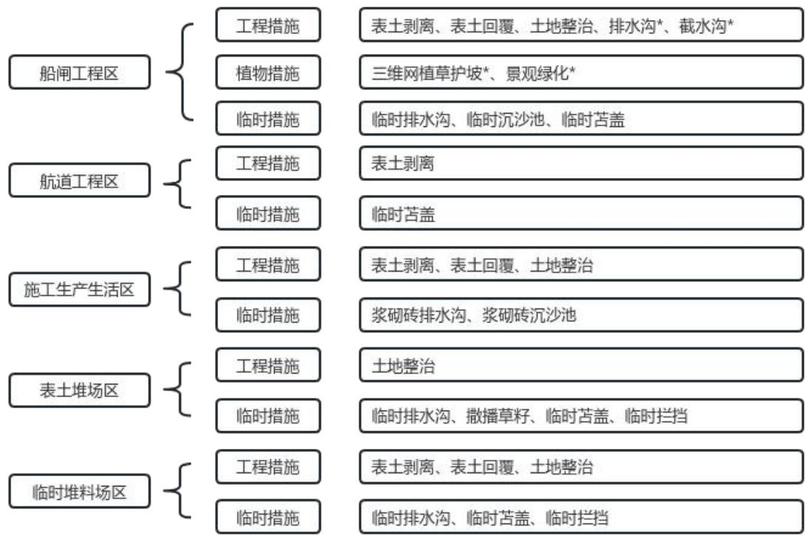  
注：图中\*为主体设计水土保持措施  
图5.2- 1 防护体系框图

## 5.3分区措施布设

## 5.3.1水土保持措施设计标准及等级

## （1）工程措施

1）设计原则

①以控制水力侵蚀为重点，构建或恢复护坡、拦挡、排水体系；

②与植物措施相结合；

③设计标准与主体工程相一致。

2）设计标准

截（排）水工程：工程建设区无法避让嘉陵江下游省级水土流失重点治理区和重庆市水土流失重点治理区，截（排）水工程提高一级，排水设施按 5年一遇10min暴雨标准设计。

土地整治：《水土保持工程设计规范》（GB51018-2014），西南土石山区覆土厚度：耕地 0.2\~0.5m，林地 0.2\~0.4m，草地≥0.1m。本工程三维网植草护坡覆土厚度0.2m，绿化覆土厚度0.5m，复耕覆土厚度0.45m。

## （2）植物措施

## 1）气象因素

项目地处亚热带季风气候区，多年平均气温 17.4℃\~17.9℃，多年平均降雨量 993.3\~1082.4mm，具有气候温和，雨量充沛，四季分明，季风气候特征显著，具有冬暖春早、夏热秋凉、云雾多、日照少、无霜期长等特点。

## 2）土壤因素

项目区土壤主要以紫色土和冲积土为主，本工程为保护表土将对占用耕地、林地和园地范围进行表土剥离，满足绿化工程覆土要求。

## 3）适生树（草）种的选择

根据当地自然条件、土壤条件及植被恢复的目标，同时考虑到工程建设特点，选择草种时，既要考虑草种的水土保持功能，又要兼顾绿化美化要求，选择黑麦草及狗牙根等。

## 4）植被恢复级别

根据《水土保持工程设计规范》（GB51018-2014），本工程植被恢复与建设工程采用 1级。用于水土保持植物措施的苗木及草种必须是一级苗或一级种，并且要具有“一签三证”，即要有标签、生产经营许可证、质量合格证和植物检疫证。

## （3）临时措施

1）构建临时排水及沉沙、拦挡措施体系。堆土临时拦挡、临时排水沟、临时沉沙池等临时防护工程，按照《生产建设项目水土保持技术标准》进行设计。

2）与主体工程紧密配合，以防治施工期的水土流失为重点。

3）临时措施设计以经济实用、可操作性强为原则。

4）表土堆放，需要对堆体使用拦挡、临时撒草及临时遮盖，减少土方堆放时产生的水土流失。

5）根据《水土保持工程设计规范》（GB51018-2014），临时排水沟排水设计标准由采用 3年一遇 10min短历时设计暴雨提高至 5年一遇10min短历时设计暴雨。

## 5.3.2 船闸工程区

## （1）工程措施

## ①表土剥离（方案新增）

方案新增船闸工程区施工前，对占用的耕地、园地和林地进行表土剥离保护，剥离表土集中堆放于表土堆场内用于后期绿化覆土，共计剥离表土 2.21万 m3。

## ②表土回覆、土地整治（方案新增）

方案新增后期植被恢复区域表土回覆及土地整治措施，场地景观绿化区域表土回覆并进行土地整治，覆土土厚度为 50cm，溪沟沟顶外侧边坡三维网植草护坡区域回覆表土 20cm。经统计，共计回覆表土 1.31 万 m3、土地整治2.44hm2。

## ③排水沟（主体设计）

主体设计在船闸工程区闸室外侧设置了 C25砼排水沟，排水沟采用净宽×净深=30cm×45cm 矩形断面，沟壁均采用 20cm 厚，经统计，共设置排水沟415m。

## ③截水沟（主体设计）

主体设计在船闸工程区与施工生产生活区之间设置浆砌石截水沟，截水沟底宽 1.0m、深 1.0m，M7.5浆砌块石衬砌，沟壁均采用 30cm厚，经统计，共设置截水沟415m。

## （2）植物措施

①三维网植草护坡（主体设计）

主体设计溪沟沟顶外侧对土质边坡按 1：2的坡比进行护坡处理，坡面采用三维网植草护坡，经统计绿化面积0.42hm2。

## ②景观绿化（主体设计）

主体设计船闸工程场地内空地以及溪沟沟顶与船闸内引墙衔接处景观绿化，面积 2.44hm2。

## （3）临时措施

①临时排水沟（方案新增）

船闸工程在施工期间，为防止降水及地面径流对开挖及回填面造成冲刷，方案新增在船闸工程外侧、溪沟上游侧设置临时排水沟，在临时排水沟出口处设置沉沙池使汇水在池中流速减缓、沉淀泥沙。

临时排水沟和沉沙池采用夯实土形式，采用人工开挖梯形断面，底宽0.40m，深 0.40m，边坡比 1:1，沟内采用土工布压实护底护坡，共需临时排水沟 720m，排水边沟内水体经出口沉沙池沉淀后最终排入周边自然沟道。

临时排水沟设计排水流量计算公式参见公式3-1，计算结果见表5.3-1。

表 5.3- 1 临时排水沟设计排水流量表
<table><tr><td rowspan=1 colspan=1>项目区</td><td rowspan=1 colspan=1>最大清水流量(m³/s)</td><td rowspan=1 colspan=1>径流系数</td><td rowspan=1 colspan=1>5年重现期和10min降雨历时内的平均降雨强度(mm/min)</td><td rowspan=1 colspan=1>汇水面积(km²)</td></tr><tr><td rowspan=1 colspan=1>临时排水沟汇流区</td><td rowspan=1 colspan=1>0.21</td><td rowspan=1 colspan=1>0.6</td><td rowspan=1 colspan=1>2.10</td><td rowspan=1 colspan=1>0.01</td></tr></table>

注：汇水面积按最不利情况，即分段截（排）水沟汇水面积最大情况考虑。  
临时排水沟水力参数及过流能力计算结果统计见表5.3-2。

表5.3-2 临时排水沟水力参数表
<table><tr><td rowspan=1 colspan=1>底宽B(m)</td><td rowspan=1 colspan=1>净深h(m)</td><td rowspan=1 colspan=1>安全超高(m)</td><td rowspan=1 colspan=1>边坡系数m</td><td rowspan=1 colspan=1>过流面积A(m²)</td><td rowspan=1 colspan=1>湿周X(m)</td><td rowspan=1 colspan=1>糙率（n）</td><td rowspan=1 colspan=1>水力半径(R)</td><td rowspan=1 colspan=1>底坡（i）</td><td rowspan=1 colspan=1>过流能力Q(m³ /s)</td></tr><tr><td rowspan=1 colspan=1>0.4</td><td rowspan=1 colspan=1>0.3</td><td rowspan=1 colspan=1>0.1</td><td rowspan=1 colspan=1>1:1</td><td rowspan=1 colspan=1>0.21</td><td rowspan=1 colspan=1>1.24</td><td rowspan=1 colspan=1>0.028</td><td rowspan=1 colspan=1>0.168</td><td rowspan=1 colspan=1>0.015</td><td rowspan=1 colspan=1>0.28</td></tr></table>

经水文计算，本区临时排水沟过流能力为 0.28m3/s，大于设计排水流量0.21m3/s，临时排水沟满足排水要求。

②临时沉沙池（方案新增）

方案新增临时排水沟出水口处土质沉沙池，拦截泥沙，沉沙池底宽2.0m，底长 1.0m，深 1.0m，沉沙池坡比 1：0.5，沉沙池内壁拍实，池内采用土工布压实护底护坡，共需沉沙池2座。

③临时苫盖（方案新增）

方案新增施工过程中裸露地表临时苫盖措施，以防治雨水冲刷产生的水土流失。结合建构筑物区开挖、回填的施工时序，本方案共采取防雨布遮盖$8 9 0 0 \mathrm { m } ^ { 2 }$

## （4）工程量统计

船闸工程区水土保持措施工程量统计详见表5.3-3。

表5.3-3 船闸工程区水土保持措施工程量统计表
<table><tr><td rowspan=2 colspan=1>措施类型</td><td rowspan=1 colspan=2>水保工程量</td><td rowspan=1 colspan=2>水保工程量</td><td rowspan=2 colspan=1>备注</td></tr><tr><td rowspan=1 colspan=1>措施名称</td><td rowspan=1 colspan=1>措施内容</td><td rowspan=1 colspan=1>单位</td><td rowspan=1 colspan=1>工程量</td></tr><tr><td rowspan=5 colspan=1>工程措施</td><td rowspan=1 colspan=1>表土剥离</td><td rowspan=1 colspan=1>表土剥离</td><td rowspan=1 colspan=1> $\mathcal { F } \mathrm { ~ m } ^ { 3 }$ </td><td rowspan=1 colspan=1>2.21</td><td rowspan=1 colspan=1>方案新增</td></tr><tr><td rowspan=1 colspan=1>表土回覆</td><td rowspan=1 colspan=1>表土回覆</td><td rowspan=1 colspan=1> $\mathcal { F } \mathrm { ~ m } ^ { 3 }$ </td><td rowspan=1 colspan=1>1.31</td><td rowspan=1 colspan=1>方案新增</td></tr><tr><td rowspan=1 colspan=1>土地整治</td><td rowspan=1 colspan=1>土地整治</td><td rowspan=1 colspan=1> $\mathrm { h m } ^ { 2 }$ </td><td rowspan=1 colspan=1>2.44</td><td rowspan=1 colspan=1>方案新增</td></tr><tr><td rowspan=1 colspan=1>排水沟</td><td rowspan=1 colspan=1>C25 砼排水沟</td><td rowspan=1 colspan=1>m</td><td rowspan=1 colspan=1>230</td><td rowspan=1 colspan=1>主体设计</td></tr><tr><td rowspan=1 colspan=1>截水沟</td><td rowspan=1 colspan=1>M7.5 浆砌截水沟</td><td rowspan=1 colspan=1>m</td><td rowspan=1 colspan=1>415</td><td rowspan=1 colspan=1>主体设计</td></tr><tr><td rowspan=2 colspan=1>植物措施</td><td rowspan=2 colspan=1>绿化</td><td rowspan=1 colspan=1>三维网植草护坡</td><td rowspan=1 colspan=1> $\mathrm { h m } ^ { 2 }$ </td><td rowspan=1 colspan=1>0.42</td><td rowspan=1 colspan=1>主体设计</td></tr><tr><td rowspan=1 colspan=1>景观绿化</td><td rowspan=1 colspan=1> $\mathrm { h m } ^ { 2 }$ </td><td rowspan=1 colspan=1>2.44</td><td rowspan=1 colspan=1>主体设计</td></tr><tr><td rowspan=3 colspan=1>临时措施</td><td rowspan=1 colspan=1>临时排水沟</td><td rowspan=1 colspan=1>临时土质排水沟</td><td rowspan=1 colspan=1>m</td><td rowspan=1 colspan=1>720</td><td rowspan=1 colspan=1>方案新增</td></tr><tr><td rowspan=1 colspan=1>临时沉沙池</td><td rowspan=1 colspan=1>临时土质沉沙池</td><td rowspan=1 colspan=1>座</td><td rowspan=1 colspan=1>2</td><td rowspan=1 colspan=1>方案新增</td></tr><tr><td rowspan=1 colspan=1>临时苫盖</td><td rowspan=1 colspan=1>防雨布苫盖</td><td rowspan=1 colspan=1> $\mathrm { m } ^ { 2 }$ </td><td rowspan=1 colspan=1>8900</td><td rowspan=1 colspan=1>方案新增</td></tr></table>

## 5.3.3 航道工程区

## （1）工程措施

## ①表土剥离（方案新增）

表土为珍贵资源，主体设计未考虑施工前表土剥离，方案予以补充。方案根据现场调查结果及复核，在施工前对本区现状林地和园地实施剥离表土措施，表土剥离后运至表土堆场进行集中堆放，表土后期用于绿化覆土。经统计，表土剥离 0.64 万 m3。

## （2）临时措施

## ①临时苫盖（方案新增）

根据对同类护岸工程的经验教训，在护岸施工过程中，遇大雨易发生水土流失，含有大量泥沙的水流直接流入河道，对区域水质、水生态环境产生影响，因此，方案考虑在护岸边坡修整完成后、未实施护坡措施前对坡面进行临时苫盖，以防治水土流失。经统计，共需防雨布22820m2。

## （3）工程量统计

航道工程区水土保持措施工程量统计详见表5.3-4。

表5.3-4 航道工程区水土保持措施工程量统计表
<table><tr><td rowspan=2 colspan=1>措施类型</td><td rowspan=1 colspan=2>水保工程量</td><td rowspan=1 colspan=2>水保工程量</td><td rowspan=2 colspan=1>备注</td></tr><tr><td rowspan=1 colspan=1>措施名称</td><td rowspan=1 colspan=1>措施内容</td><td rowspan=1 colspan=1>单位</td><td rowspan=1 colspan=1>工程量</td></tr><tr><td rowspan=1 colspan=1>工程措施</td><td rowspan=1 colspan=1>表土剥离</td><td rowspan=1 colspan=1>表土剥离</td><td rowspan=1 colspan=1>万m³</td><td rowspan=1 colspan=1>0.64</td><td rowspan=1 colspan=1>方案新增</td></tr><tr><td rowspan=1 colspan=1>临时措施</td><td rowspan=1 colspan=1>临时苫盖</td><td rowspan=1 colspan=1>防雨布苫盖</td><td rowspan=1 colspan=1>m²</td><td rowspan=1 colspan=1>22820</td><td rowspan=1 colspan=1>方案新增</td></tr></table>

## 5.3.4施工生产生活区

## （1）工程措施

①表土剥离（方案新增）

方案新增施工生产生活区使用前对占用的耕地表土剥离，剥离 0.25m，经统计，共需剥离表土1.42万m3。

②表土回覆及土地整治（方案新增）

施工生产生活区在后期迹地恢复时，方案新增表土回覆措施及土地整治措施，表土回覆厚度 0.45m，土地整治采取全面整地、机械施工方式进行，为植被生长创造立地条件，土地整治后对占用耕地实施复耕，经统计，共需回覆表土 2.55 万 m3，土地整治面积 5.66hm2。

## （2）临时措施

施工期间，为防止降水及地面径流对施工生产生活区造成影响，方案新增在其周边设置临时排水沉沙措施。临时排水沟采用砖砌，矩形断面，尺寸为0.5m×0.5m（宽×高），沟底 10cmC15 混凝土浇筑，沟壁 12cmM7.5 浆砌砖+砂浆抹面。临时排水沟每隔 300-400m及排水沟出口处设沉沙池，拦截泥沙，规格为长×宽×深＝3.0m×2.0m×1.2m，池壁采用 24cmM7.5 浆砌砖衬砌+砂浆抹面，池底现浇 10cmC15混凝土，经统计共设置砖砌排水沟 1782m，砖砌沉沙池 6座。

临时排水沟设计排水流量计算公式参见 3.2.9章节公式 3-1，计算结果如下表。

表5.3-5施工生产生活区临时排水沟设计排水流量表
<table><tr><td rowspan=1 colspan=1>项目区</td><td rowspan=1 colspan=1>最大清水流量(m³/s)</td><td rowspan=1 colspan=1>径流系数</td><td rowspan=1 colspan=1>5年重现期和10min降雨历时内的平均降雨强度(mm/min)</td><td rowspan=1 colspan=1>汇水面积 $\left( \mathrm { k m } ^ { 2 } \right)$ </td></tr><tr><td rowspan=1 colspan=1>施工生产生活区</td><td rowspan=1 colspan=1>0.378</td><td rowspan=1 colspan=1>0.6</td><td rowspan=1 colspan=1>2.1</td><td rowspan=1 colspan=1>0.018</td></tr></table>

注：汇水面积按最不利情况，即分段临时排水沟汇水面积最大情况考虑。

临时排水沟过流能力按均匀流计算，计算公式参见公式 3-2，计算结果如下：

表5.3-6施工生产生活区临时排水沟水力参数及过流能计算结果表
<table><tr><td rowspan=1 colspan=1>底宽B(m)</td><td rowspan=1 colspan=1>净深h(m)</td><td rowspan=1 colspan=1>安全超高(m)</td><td rowspan=1 colspan=1>边坡系数m</td><td rowspan=1 colspan=1>过流面积A(m²)</td><td rowspan=1 colspan=1>湿周X(m)</td><td rowspan=1 colspan=1>糙率（n）</td><td rowspan=1 colspan=1>水力半径(R)</td><td rowspan=1 colspan=1>底坡（i）</td><td rowspan=1 colspan=1>过流能力Q(m³/s)</td></tr><tr><td rowspan=1 colspan=1>0.5</td><td rowspan=1 colspan=1>0.4</td><td rowspan=1 colspan=1>0.1</td><td rowspan=1 colspan=1>0</td><td rowspan=1 colspan=1>0.2</td><td rowspan=1 colspan=1>1.3</td><td rowspan=1 colspan=1>0.020</td><td rowspan=1 colspan=1>0.154</td><td rowspan=1 colspan=1>0.020</td><td rowspan=1 colspan=1>0.41</td></tr></table>

经水文计算，临时排水沟过流能力为 0.41m3/s，大于设计排水流量0.378m3/s，临时排水沟满足排水要求。

## （3）工程量统计

施工生产生活区水保措施工程量统计详见表5.3-7。

表5.3-7施工生产生活区水土保持措施工程量表
<table><tr><td rowspan=2 colspan=1>措施类型</td><td rowspan=1 colspan=2>水保工程量</td><td rowspan=1 colspan=2>水保工程量</td><td rowspan=2 colspan=1>备注</td></tr><tr><td rowspan=1 colspan=1>措施名称</td><td rowspan=1 colspan=1>措施内容</td><td rowspan=1 colspan=1>单位</td><td rowspan=1 colspan=1>工程量</td></tr><tr><td rowspan=3 colspan=1>工程措施</td><td rowspan=1 colspan=1>表土剥离</td><td rowspan=1 colspan=1>表土剥离</td><td rowspan=1 colspan=1>万m³</td><td rowspan=1 colspan=1>1.42</td><td rowspan=1 colspan=1>方案新增</td></tr><tr><td rowspan=1 colspan=1>表土回覆</td><td rowspan=1 colspan=1>表土回覆</td><td rowspan=1 colspan=1>万m³</td><td rowspan=1 colspan=1>2.55</td><td rowspan=1 colspan=1>方案新增</td></tr><tr><td rowspan=1 colspan=1>土地整治</td><td rowspan=1 colspan=1>土地整治</td><td rowspan=1 colspan=1>hm²</td><td rowspan=1 colspan=1>5.66</td><td rowspan=1 colspan=1>方案新增</td></tr><tr><td rowspan=2 colspan=1>临时措施</td><td rowspan=1 colspan=1>临时排水沟</td><td rowspan=1 colspan=1>砖砌排水沟（0.5*0.5）</td><td rowspan=1 colspan=1>m</td><td rowspan=1 colspan=1>1782</td><td rowspan=1 colspan=1>方案新增</td></tr><tr><td rowspan=1 colspan=1>临时沉沙池</td><td rowspan=1 colspan=1>砖砌沉沙池</td><td rowspan=1 colspan=1>座</td><td rowspan=1 colspan=1>6</td><td rowspan=1 colspan=1>方案新增</td></tr></table>

## 5.3.5 表土堆场区

## （1）工程措施

## ①土地整治（方案新增）

由于表土堆场区主要以占压为主，扰动较为轻微，不进行表土剥离，方案新增施工后期对该区域进行土地整治，土地整治采取全面整地、机械施工方式进行，为复耕创造立地条件，经统计，土地整治面积1.07hm2。

## （2）临时措施

①临时排水沟（方案新增）

施工期间，为防止降水及地面径流对表土堆场区造成影响，方案新增表土坡脚设置临时排水沟，临时排水沟采用砖砌，矩形断面，尺寸为 0.4m×0.4m（宽×高），沟底 10cmC15混凝土浇筑，沟壁 12cmM7.5浆砌砖+砂浆抹面，经统计共需设置临时排水沟 406m，排水边沟末端接施工生产生活区沉沙池沉淀后最终排入周边自然水系。

临时排水沟设计排水流量计算参见公式 3-1，临时排水沟设计排水流量见下表 5.3- 8。

表5.3-8表土堆场临时排水沟设计排水流量表
<table><tr><td rowspan=1 colspan=1>项目区</td><td rowspan=1 colspan=1>最大清水流量(m³/s)</td><td rowspan=1 colspan=1>径流系数</td><td rowspan=1 colspan=1>5年重现期和10min降雨历时内的平均降雨强度(mm/min)</td><td rowspan=1 colspan=1>汇水面积(km²)</td></tr><tr><td rowspan=1 colspan=1>表土堆场</td><td rowspan=1 colspan=1>0.168</td><td rowspan=1 colspan=1>0.6</td><td rowspan=1 colspan=1>2.1</td><td rowspan=1 colspan=1>0.008</td></tr></table>

注：汇水面积按最不利情况，即分段临时排水沟汇水面积最大情况考虑。

临时排水沟过流能力按均匀流计算，计算公式参见公式 3-2。临时砖砌排水沟水力参数及过流能力计算结果见下表5.3-9。

表5.3-9表土堆场临时砖砌排水沟水力参数及过流能力计算结果表
<table><tr><td rowspan=1 colspan=1>底宽B(m)</td><td rowspan=1 colspan=1>净深h(m)</td><td rowspan=1 colspan=1>安全超高(m)</td><td rowspan=1 colspan=1>边坡系数 m</td><td rowspan=1 colspan=1>过流面积 A(m²)</td><td rowspan=1 colspan=1>湿周X(m)</td><td rowspan=1 colspan=1>糙率(n)</td><td rowspan=1 colspan=1>水力半径（R）</td><td rowspan=1 colspan=1>底坡（i）</td><td rowspan=1 colspan=1>过流能力Q(m³ /s)</td></tr><tr><td rowspan=1 colspan=1>0.4</td><td rowspan=1 colspan=1>0.3</td><td rowspan=1 colspan=1>0.1</td><td rowspan=1 colspan=1>0</td><td rowspan=1 colspan=1>0.12</td><td rowspan=1 colspan=1>1.0</td><td rowspan=1 colspan=1>0.02</td><td rowspan=1 colspan=1>0.120</td><td rowspan=1 colspan=1>0.020</td><td rowspan=1 colspan=1>0.21</td></tr></table>

经水文计算，本区临时排水沟过流能力为 0.21m3/s，大于设计排水流量0.168m3/s，临时排水沟满足排水要求。

②临时撒播草籽及密目网临时遮盖（方案新增）

表土堆置周期较长，为防止降雨冲刷及风吹扬尘，方案新增临时堆置表土临时撒播草籽+密目网临时苫盖措施，临时撒草采用黑麦草和狗牙根1:1混播，撒播密度为 60kg/hm2），经统计，撒播草籽面积 1.10hm2，密目网临时苫盖11000m2。

④临时拦挡及拆除（方案新增）

为防止滚落，方案新增表土堆场坡脚采用钢筋石笼挡墙拦挡，钢筋石笼挡墙断面采用 0.8m×1.0m（宽×高）的矩形断面。后期应将挡墙拆除，经统计，钢筋石笼挡墙 530m（424m3）。

根据《水土保持工程设计规范》（GB 51018-2014）的相关要求和现场实际情况，对表土堆场正常运用工况和非正常运用（连续降雨）工况下的边坡稳定性进行计算，计算出表土堆场断面模型在正常运用工况下和非正常运用工况下的边坡滑动安全系数。根据计算，规划设置表土堆场稳定，稳定性验算结果详见表 5.3-10。

表5.3-10 表土堆场稳定性验算一览表
<table><tr><td rowspan=3 colspan=1>表土堆场名称</td><td rowspan=3 colspan=1>堆放量(万m³)</td><td rowspan=3 colspan=1>最大堆高(m)</td><td rowspan=3 colspan=1>表土容重(KN/ $\mathbf { m } ^ { 3 } )$ </td><td rowspan=3 colspan=1>表土容重(KN/ $\mathbf { m } ^ { 3 } ,$ 饱和）</td><td rowspan=1 colspan=2>天然状态抗剪强度指标</td><td rowspan=1 colspan=2>饱和状态抗剪强度指标</td><td rowspan=1 colspan=4>弃渣场渣体抗滑稳定安全系数</td></tr><tr><td rowspan=1 colspan=1>C</td><td rowspan=1 colspan=1>φ</td><td rowspan=1 colspan=1>C</td><td rowspan=1 colspan=1>φ</td><td rowspan=1 colspan=2>正常工况</td><td rowspan=1 colspan=2>非正常工况</td></tr><tr><td rowspan=1 colspan=1> $\bf ( k P a )$ </td><td rowspan=1 colspan=1>(°)</td><td rowspan=1 colspan=1> $\bf ( k P a )$ </td><td rowspan=1 colspan=1>(°)</td><td rowspan=1 colspan=1>甘值</td><td rowspan=1 colspan=1>允许值</td><td rowspan=1 colspan=1>计算值</td><td rowspan=1 colspan=1>允许值</td></tr><tr><td rowspan=1 colspan=1>1#</td><td rowspan=1 colspan=1>2.31</td><td rowspan=1 colspan=1>5.2</td><td rowspan=1 colspan=1>20</td><td rowspan=1 colspan=1>21</td><td rowspan=1 colspan=1>8</td><td rowspan=1 colspan=1>28</td><td rowspan=1 colspan=1>5</td><td rowspan=1 colspan=1>25</td><td rowspan=1 colspan=1>2.402</td><td rowspan=1 colspan=1>1.15</td><td rowspan=1 colspan=1>1.804</td><td rowspan=1 colspan=1>1.05</td></tr><tr><td rowspan=1 colspan=1>2#</td><td rowspan=1 colspan=1>2.48</td><td rowspan=1 colspan=1>5.2</td><td rowspan=1 colspan=1>20</td><td rowspan=1 colspan=1>21</td><td rowspan=1 colspan=1>8</td><td rowspan=1 colspan=1>28</td><td rowspan=1 colspan=1>5</td><td rowspan=1 colspan=1>25</td><td rowspan=1 colspan=1>2.402</td><td rowspan=1 colspan=1>1.15</td><td rowspan=1 colspan=1>1.804</td><td rowspan=1 colspan=1>1.05</td></tr></table>

注：抗滑稳定安全系数参照弃渣场 5级取值，采用瑞典圆弧法进行计算。

## （4）工程量统计

表土堆场区水保措施工程量统计详见表5.3-11。

表5.3-11表土堆场区水土保持措施工程量表
<table><tr><td rowspan=2 colspan=1>措施类型</td><td rowspan=1 colspan=2>水保工程量</td><td rowspan=1 colspan=2>水保工程量</td><td rowspan=2 colspan=1>备注</td></tr><tr><td rowspan=1 colspan=1>措施名称</td><td rowspan=1 colspan=1>措施内容</td><td rowspan=1 colspan=1>单位</td><td rowspan=1 colspan=1>工程量</td></tr><tr><td rowspan=1 colspan=1>工程措施</td><td rowspan=1 colspan=1>土地整治</td><td rowspan=1 colspan=1>土地整治</td><td rowspan=1 colspan=1> $\mathrm { h m } ^ { 2 }$ </td><td rowspan=1 colspan=1>1.07</td><td rowspan=1 colspan=1>方案新增</td></tr><tr><td rowspan=4 colspan=1>临时措施</td><td rowspan=1 colspan=1>临时排水沟</td><td rowspan=1 colspan=1>砖砌排水沟 $( \ 0 . 4 ^ { * } 0 . 4 \ )$ </td><td rowspan=1 colspan=1>m</td><td rowspan=1 colspan=1>406</td><td rowspan=1 colspan=1>方案新增</td></tr><tr><td rowspan=1 colspan=1>临时拦挡</td><td rowspan=1 colspan=1>钢筋石笼挡墙（0.8*1.0）</td><td rowspan=1 colspan=1> $\mathrm { m } / \mathrm { m } ^ { 3 }$ </td><td rowspan=1 colspan=1>530/424</td><td rowspan=1 colspan=1>方案新增</td></tr><tr><td rowspan=1 colspan=1>临时植草</td><td rowspan=1 colspan=1>撒播草籽</td><td rowspan=1 colspan=1> $\mathrm { h m } ^ { 2 }$ </td><td rowspan=1 colspan=1>1.10</td><td rowspan=1 colspan=1>方案新增</td></tr><tr><td rowspan=1 colspan=1>临时苫盖</td><td rowspan=1 colspan=1>密目网苫盖</td><td rowspan=1 colspan=1> $\mathrm { m } ^ { 2 }$ </td><td rowspan=1 colspan=1>11000</td><td rowspan=1 colspan=1>方案新增</td></tr></table>

## 5.3.6临时堆料场区

## （1）工程措施

## ①表土剥离（方案新增）

方案新增临时堆料场区施工前对占用的耕地进行表土剥离，经统计，共需剥离表土 0.52万 m3。

②表土回覆及土地整治（方案新增）

临时堆料场区在后期迹地恢复时，方案新增表土回覆及土地整治措施，表土回覆厚度 0.45m，土地整治采取全面整地、机械施工方式进行，土地整治后

对占用耕地实施复耕，经统计，共需回覆表土 0.93 万 m3，土地整治面积$2 . 0 6 \mathrm { h m } ^ { 2 }$

## （2）临时措施

①临时排水沟（方案新增）

施工期间，为防止降水及地面径流对临时堆料场区造成影响，方案新增在其临时堆料坡脚设置临时排水沟，临时排水沟采用砖砌，矩形断面，尺寸为0.4m×0.4m（宽×高），沟底 10cmC15 混凝土浇筑，沟壁 12cmM7.5 浆砌砖+砂浆抹面，经统计共需设置临时砖砌排水沟 395m，排水边沟末端接施工生产生活区沉沙池沉淀后最终排入周边自然水系。

临时排水沟设计排水流量计算参见公式 3-1，临时排水沟设计排水流量见下表 5.3- 12。

表5.3-12 临时堆料场临时排水沟设计排水流量表
<table><tr><td rowspan=1 colspan=1>项目区</td><td rowspan=1 colspan=1>最大清水流量(m³/s)</td><td rowspan=1 colspan=1>径流系数</td><td rowspan=1 colspan=1>5年重现期和10min降雨历时内的平均降雨强度(mm/min)</td><td rowspan=1 colspan=1>汇水面积(km²)</td></tr><tr><td rowspan=1 colspan=1>临时堆料场</td><td rowspan=1 colspan=1>0.147</td><td rowspan=1 colspan=1>0.6</td><td rowspan=1 colspan=1>2.1</td><td rowspan=1 colspan=1>0.007</td></tr></table>

注：汇水面积按最不利情况，即分段临时排水沟汇水面积最大情况考虑。

临时排水沟过流能力按均匀流计算，临时排水沟水力参数及过流能力计算结果见下表 5.3-13。

表5.3-13 临时堆料场临时砖砌排水沟水力参数表
<table><tr><td rowspan=1 colspan=1>底宽B(m)</td><td rowspan=1 colspan=1>净深h(m)</td><td rowspan=1 colspan=1>安全超高(m)</td><td rowspan=1 colspan=1>边坡系数 m</td><td rowspan=1 colspan=1>过流面积 A(m²)</td><td rowspan=1 colspan=1>湿周X(m)</td><td rowspan=1 colspan=1>糙率(n)</td><td rowspan=1 colspan=1>水力半径（R）</td><td rowspan=1 colspan=1>底坡（i）</td><td rowspan=1 colspan=1>过流能力Q(m³/s)</td></tr><tr><td rowspan=1 colspan=1>0.4</td><td rowspan=1 colspan=1>0.3</td><td rowspan=1 colspan=1>0.1</td><td rowspan=1 colspan=1>0</td><td rowspan=1 colspan=1>0.12</td><td rowspan=1 colspan=1>1.0</td><td rowspan=1 colspan=1>0.020</td><td rowspan=1 colspan=1>0.120</td><td rowspan=1 colspan=1>0.020</td><td rowspan=1 colspan=1>0.21</td></tr></table>

经水文计算，临时堆料场临时排水沟过流能力为 0.21m3/s，大于设计排水流量0.147m3/s，临时排水沟满足排水要求。

## ②临时苫盖（方案新增）

为防止降雨冲刷及风吹扬尘，方案新增临时堆料表面防雨布遮盖，经统计，防雨布临时苫盖20600m2。

## ③临时拦挡（方案新增）

为防止滚落，方案新增临时堆料场坡脚采取钢筋石笼挡墙拦挡，钢筋石笼挡墙断面采用1.0m×1.2m（宽×高）的矩型断面。后期应将钢筋石笼挡墙拆除，经统计，钢筋石笼挡墙 597m（716.4m3）。

根据《水土保持工程设计规范》（GB 51018-2014）的相关要求和现场实际情况，对临时堆料场正常运用工况和非正常运用（连续降雨）工况下的边坡稳定性进行计算，计算出临时堆料场断面模型在正常运用工况下和非正常运用工况下的边坡滑动安全系数。根据计算，规划设置临时堆料场稳定，稳定性验算结果详见表5.3-14。

表5.3-14 临时堆料场稳定性验算一览表
<table><tr><td rowspan=3 colspan=1>临时堆料场名称</td><td rowspan=3 colspan=1>堆放量(万 $\mathbf { m } ^ { 3 } )$ </td><td rowspan=3 colspan=1>最大堆高(m)</td><td rowspan=3 colspan=1>堆料容重(KN1 $\mathbf { m } ^ { 3 } )$ </td><td rowspan=3 colspan=1>堆料容重 $( \mathbf { \delta K N } /$  $\mathbf { m } ^ { 3 } ,$ 饱和）</td><td rowspan=1 colspan=2>天然状态抗剪强度指标</td><td rowspan=1 colspan=2>饱和状态抗剪强度指标</td><td rowspan=1 colspan=4>弃渣场渣体抗滑稳定安全系数</td></tr><tr><td rowspan=1 colspan=1>C</td><td rowspan=1 colspan=1>φ</td><td rowspan=1 colspan=1>C</td><td rowspan=1 colspan=1>φ</td><td rowspan=1 colspan=2>正常工况</td><td rowspan=1 colspan=2>非正常工况</td></tr><tr><td rowspan=1 colspan=1>(kPa）</td><td rowspan=1 colspan=1>(°)</td><td rowspan=1 colspan=1> $\bf ( \ k P a )$ </td><td rowspan=1 colspan=1>(°)</td><td rowspan=1 colspan=1>计算值</td><td rowspan=1 colspan=1>允许值</td><td rowspan=1 colspan=1>计算值</td><td rowspan=1 colspan=1>允许值</td></tr><tr><td rowspan=1 colspan=1>1#</td><td rowspan=1 colspan=1>6.35</td><td rowspan=1 colspan=1>8.5</td><td rowspan=1 colspan=1>21</td><td rowspan=1 colspan=1>21.5</td><td rowspan=1 colspan=1>9</td><td rowspan=1 colspan=1>28</td><td rowspan=1 colspan=1>7</td><td rowspan=1 colspan=1>26</td><td rowspan=1 colspan=1>2.458</td><td rowspan=1 colspan=1>1.15</td><td rowspan=1 colspan=1>1.949</td><td rowspan=1 colspan=1>1.05</td></tr><tr><td rowspan=1 colspan=1>2#</td><td rowspan=1 colspan=1>6.97</td><td rowspan=1 colspan=1>8.5</td><td rowspan=1 colspan=1>21</td><td rowspan=1 colspan=1>21.5</td><td rowspan=1 colspan=1>9</td><td rowspan=1 colspan=1>28</td><td rowspan=1 colspan=1>7</td><td rowspan=1 colspan=1>26</td><td rowspan=1 colspan=1>2.458</td><td rowspan=1 colspan=1>1.15</td><td rowspan=1 colspan=1>1.949</td><td rowspan=1 colspan=1>1.05</td></tr></table>

注：抗滑稳定安全系数参照弃渣场 5级取值，采用瑞典圆弧法进行计算。

## （3）工程量统计

临时堆料场区水保措施工程量统计详见表5.3-15。

表5.3-15临时堆料场区水土保持措施工程量表
<table><tr><td rowspan=2 colspan=1>措施类型</td><td rowspan=1 colspan=2>水保工程量</td><td rowspan=1 colspan=2>水保工程量</td><td rowspan=2 colspan=1>备注</td></tr><tr><td rowspan=1 colspan=1>措施名称</td><td rowspan=1 colspan=1>措施内容</td><td rowspan=1 colspan=1>单位</td><td rowspan=1 colspan=1>工程量</td></tr><tr><td rowspan=3 colspan=1>工程措施</td><td rowspan=1 colspan=1>表土剥离</td><td rowspan=1 colspan=1>表土剥离</td><td rowspan=1 colspan=1> $\mathcal { F } \mathrm { ~ m } ^ { 3 }$ </td><td rowspan=1 colspan=1>0.52</td><td rowspan=1 colspan=1>方案新增</td></tr><tr><td rowspan=1 colspan=1>表土回覆</td><td rowspan=1 colspan=1>表土回覆</td><td rowspan=1 colspan=1> $\mathcal { F } \mathrm { ~ m } ^ { 3 }$ </td><td rowspan=1 colspan=1>0.93</td><td rowspan=1 colspan=1>方案新增</td></tr><tr><td rowspan=1 colspan=1>土地整治</td><td rowspan=1 colspan=1>土地整治</td><td rowspan=1 colspan=1> $\mathrm { h m } ^ { 2 }$ </td><td rowspan=1 colspan=1>2.06</td><td rowspan=1 colspan=1>方案新增</td></tr><tr><td rowspan=3 colspan=1>临时措施</td><td rowspan=1 colspan=1>临时排水沟</td><td rowspan=1 colspan=1>砖砌排水沟 $\left( \ 0 . 4 ^ { * } 0 . 4 \right)$ </td><td rowspan=1 colspan=1>m</td><td rowspan=1 colspan=1>395</td><td rowspan=1 colspan=1>方案新增</td></tr><tr><td rowspan=1 colspan=1>临时拦挡</td><td rowspan=1 colspan=1>钢筋石笼挡墙(1.0*1.2)</td><td rowspan=1 colspan=1> $\mathrm { m } / \mathrm { m } ^ { 3 }$ </td><td rowspan=1 colspan=1>597/716.4</td><td rowspan=1 colspan=1>方案新增</td></tr><tr><td rowspan=1 colspan=1>临时苫盖</td><td rowspan=1 colspan=1>防雨布苫盖</td><td rowspan=1 colspan=1> $\mathrm { m } ^ { 2 }$ </td><td rowspan=1 colspan=1>20600</td><td rowspan=1 colspan=1>方案新增</td></tr></table>

## 5.3.7水土保持措施汇总

水土保持措施应作为主体工程设计的重要组成部分，补充和完善本工程水土流失防治体系，按照分区防治的原则，对各防治区分别采取临时措施、工程

措施、植物措施结合的综合防治措施。

经统计，本工程水土保持措施类型及工程量见下表5.3-16。

表5.3-16 项目水土保持措施工程量汇总表
<table><tr><td rowspan=2 colspan=1>防治分区</td><td rowspan=2 colspan=1>措施类型</td><td rowspan=1 colspan=2>水保工程量</td><td rowspan=1 colspan=2>水保工程量</td><td rowspan=2 colspan=1>备注</td></tr><tr><td rowspan=1 colspan=1>措施名称</td><td rowspan=1 colspan=1>措施内容</td><td rowspan=1 colspan=1>单位</td><td rowspan=1 colspan=1>工程量</td></tr><tr><td rowspan=10 colspan=1>船闸工程区</td><td rowspan=5 colspan=1>工程措施</td><td rowspan=1 colspan=1>表土剥离</td><td rowspan=1 colspan=1>表土剥离</td><td rowspan=1 colspan=1>万m³</td><td rowspan=1 colspan=1>2.21</td><td rowspan=1 colspan=1>方案新增</td></tr><tr><td rowspan=1 colspan=1>表土回覆</td><td rowspan=1 colspan=1>表土回覆</td><td rowspan=1 colspan=1>万m³</td><td rowspan=1 colspan=1>1.31</td><td rowspan=1 colspan=1>方案新增</td></tr><tr><td rowspan=1 colspan=1>土地整治</td><td rowspan=1 colspan=1>土地整治</td><td rowspan=1 colspan=1> $\mathrm { h m } ^ { 2 }$ </td><td rowspan=1 colspan=1>2.44</td><td rowspan=1 colspan=1>方案新增</td></tr><tr><td rowspan=2 colspan=1>排水沟</td><td rowspan=1 colspan=1>C25 砼排水沟</td><td rowspan=1 colspan=1>m</td><td rowspan=1 colspan=1>230</td><td rowspan=1 colspan=1>主体设计</td></tr><tr><td rowspan=1 colspan=1>截水沟</td><td rowspan=1 colspan=1>m</td><td rowspan=1 colspan=1>415</td><td rowspan=1 colspan=1>主体设计</td></tr><tr><td rowspan=2 colspan=1>植物措施</td><td rowspan=2 colspan=1>绿化</td><td rowspan=1 colspan=1>三维网植草护坡</td><td rowspan=1 colspan=1> $\mathrm { h m } ^ { 2 }$ </td><td rowspan=1 colspan=1>0.42</td><td rowspan=1 colspan=1>主体设计</td></tr><tr><td rowspan=1 colspan=1>景观绿化</td><td rowspan=1 colspan=1> $\mathrm { h m } ^ { 2 }$ </td><td rowspan=1 colspan=1>2.44</td><td rowspan=1 colspan=1>主体设计</td></tr><tr><td rowspan=3 colspan=1>临时措施</td><td rowspan=1 colspan=1>临时排水沟</td><td rowspan=1 colspan=1>临时土质排水沟</td><td rowspan=1 colspan=1>m</td><td rowspan=1 colspan=1>720</td><td rowspan=1 colspan=1>方案新增</td></tr><tr><td rowspan=1 colspan=1>临时沉沙池</td><td rowspan=1 colspan=1>临时土质沉沙池</td><td rowspan=1 colspan=1>座</td><td rowspan=1 colspan=1>2</td><td rowspan=1 colspan=1>方案新增</td></tr><tr><td rowspan=1 colspan=1>临时苫盖</td><td rowspan=1 colspan=1>防雨布苫盖</td><td rowspan=1 colspan=1> $\mathrm { m } ^ { 2 }$ </td><td rowspan=1 colspan=1>8900</td><td rowspan=1 colspan=1>方案新增</td></tr><tr><td rowspan=2 colspan=1>航道工程区</td><td rowspan=1 colspan=1>工程措施</td><td rowspan=1 colspan=1>表土剥离</td><td rowspan=1 colspan=1>表土剥离</td><td rowspan=1 colspan=1>万m³</td><td rowspan=1 colspan=1>0.64</td><td rowspan=1 colspan=1>方案新增</td></tr><tr><td rowspan=1 colspan=1>临时措施</td><td rowspan=1 colspan=1>临时苫盖</td><td rowspan=1 colspan=1>防雨布苫盖</td><td rowspan=1 colspan=1> $\mathrm { m } ^ { 2 }$ </td><td rowspan=1 colspan=1>22820</td><td rowspan=1 colspan=1>方案新增</td></tr><tr><td rowspan=5 colspan=1>施工生产生活区</td><td rowspan=3 colspan=1>工程措施</td><td rowspan=1 colspan=1>表土剥离</td><td rowspan=1 colspan=1>表土剥离</td><td rowspan=1 colspan=1>万m³</td><td rowspan=1 colspan=1>1.42</td><td rowspan=1 colspan=1>方案新增</td></tr><tr><td rowspan=1 colspan=1>表土回覆</td><td rowspan=1 colspan=1>表土回覆</td><td rowspan=1 colspan=1>万m³</td><td rowspan=1 colspan=1>2.55</td><td rowspan=1 colspan=1>方案新增</td></tr><tr><td rowspan=1 colspan=1>土地整治</td><td rowspan=1 colspan=1>土地整治</td><td rowspan=1 colspan=1> $\mathrm { h m } ^ { 2 }$ </td><td rowspan=1 colspan=1>5.66</td><td rowspan=1 colspan=1>方案新增</td></tr><tr><td rowspan=2 colspan=1>临时措施</td><td rowspan=1 colspan=1>临时排水沟</td><td rowspan=1 colspan=1>砖砌排水沟(0.5*0.5)</td><td rowspan=1 colspan=1>m</td><td rowspan=1 colspan=1>1782</td><td rowspan=1 colspan=1>方案新增</td></tr><tr><td rowspan=1 colspan=1>临时沉沙池</td><td rowspan=1 colspan=1>砖砌沉沙池</td><td rowspan=1 colspan=1>座</td><td rowspan=1 colspan=1>6</td><td rowspan=1 colspan=1>方案新增</td></tr><tr><td rowspan=5 colspan=1>表土堆场区</td><td rowspan=1 colspan=1>工程措施</td><td rowspan=1 colspan=1>土地整治</td><td rowspan=1 colspan=1>土地整治</td><td rowspan=1 colspan=1> $\mathrm { h m } ^ { 2 }$ </td><td rowspan=1 colspan=1>1.07</td><td rowspan=1 colspan=1>方案新增</td></tr><tr><td rowspan=4 colspan=1>临时措施</td><td rowspan=1 colspan=1>临时排水沟</td><td rowspan=1 colspan=1>砖砌排水沟(0.4*0.4)</td><td rowspan=1 colspan=1>m</td><td rowspan=1 colspan=1>406</td><td rowspan=1 colspan=1>方案新增</td></tr><tr><td rowspan=1 colspan=1>临时拦挡</td><td rowspan=1 colspan=1>钢筋石笼挡墙(0.8*1.0)</td><td rowspan=1 colspan=1> $\mathrm { m } / \mathrm { m } ^ { 3 }$ </td><td rowspan=1 colspan=1>530/424</td><td rowspan=1 colspan=1>方案新增</td></tr><tr><td rowspan=1 colspan=1>临时植草</td><td rowspan=1 colspan=1>撒播草籽</td><td rowspan=1 colspan=1> $\mathrm { h m } ^ { 2 }$ </td><td rowspan=1 colspan=1>1.1</td><td rowspan=1 colspan=1>方案新增</td></tr><tr><td rowspan=1 colspan=1>临时苫盖</td><td rowspan=1 colspan=1>密目网苫盖</td><td rowspan=1 colspan=1> $\mathrm { m } ^ { 2 }$ </td><td rowspan=1 colspan=1>11000</td><td rowspan=1 colspan=1>方案新增</td></tr><tr><td rowspan=6 colspan=1>临时堆料场区</td><td rowspan=3 colspan=1>工程措施</td><td rowspan=1 colspan=1>表土剥离</td><td rowspan=1 colspan=1>表土剥离</td><td rowspan=1 colspan=1>万m³</td><td rowspan=1 colspan=1>0.52</td><td rowspan=1 colspan=1>方案新增</td></tr><tr><td rowspan=1 colspan=1>表土回覆</td><td rowspan=1 colspan=1>表土回覆</td><td rowspan=1 colspan=1>万m³</td><td rowspan=1 colspan=1>0.93</td><td rowspan=1 colspan=1>方案新增</td></tr><tr><td rowspan=1 colspan=1>土地整治</td><td rowspan=1 colspan=1>土地整治</td><td rowspan=1 colspan=1> $\mathrm { h m } ^ { 2 }$ </td><td rowspan=1 colspan=1>2.06</td><td rowspan=1 colspan=1>方案新增</td></tr><tr><td rowspan=3 colspan=1>临时措施</td><td rowspan=1 colspan=1>临时排水沟</td><td rowspan=1 colspan=1>砖砌排水沟(0.4*0.4)</td><td rowspan=1 colspan=1>m</td><td rowspan=1 colspan=1>395</td><td rowspan=1 colspan=1>方案新增</td></tr><tr><td rowspan=1 colspan=1>临时拦挡</td><td rowspan=1 colspan=1>钢筋石笼挡墙(1.0*1.2)</td><td rowspan=1 colspan=1> $\mathrm { m } / \mathrm { m } ^ { 3 }$ </td><td rowspan=1 colspan=1>597/716.4</td><td rowspan=1 colspan=1>方案新增</td></tr><tr><td rowspan=1 colspan=1>临时苫盖</td><td rowspan=1 colspan=1>防雨布苫盖</td><td rowspan=1 colspan=1> $\mathrm { m } ^ { 2 }$ </td><td rowspan=1 colspan=1>20600</td><td rowspan=1 colspan=1>方案新增</td></tr></table>

## 5.4施工要求

## 5.4.1 施工条件

## （1）施工用电

施工用电利用主体工程施工电网接线至各用电单元，同时应配备柴油发电机作为施工及生活备用电源。

## （2）施工用水

施工用水利用主体工程施工给水系统，并设置蓄水设施，供应水土保持工程施工用水及生活用水。

## （3）施工通信

施工通信利用场内对讲机系统，以及移动和联通网络信号。

## （4）建筑材料供应

水土保持工程施工所需柴油、水泥、砂石料、木材均可与主体工程协调，统一采购。

## （5）施工修配

施工修配系统可主要考虑利用当地地方修配力量解决。

## 5.4.2 施工布置

## （1）施工工区

根据水土保持措施分区布设情况，结合主体工程施工组织设计，水土保持工程不设施工工区。

## （2）临时生产生活设施

水土保持工程可利用主体设计布设的施工生产生活场地，不单独设置临时生产生活设施。

## 5.4.3 施工方法

## 1、工程措施施工方法

工程措施主要包括表土剥离、场地平整、绿化覆土、排水沟、沉沙池、挡墙等内容。

## （1）表土剥离与回覆

表土剥离采用 74.0KW推土机按设计剥离厚度，铲除剥离区域的表层土，并采用 10t自卸汽车运输至临时堆放点。回填时采用自卸汽车或胶轮架子车运输至覆土场地，前期采用74.0kW推土机推平或挖掘机找平，并人工配合平整。

## （2）土地整治

土地整治时先进行场地清理和平整，增施农家肥，并深耕，一方面使土壤与农家肥充分混合，另一方面旋松耕作层，改善经施工机械压实的路面。

## （3）排水沟

排水沟修建采用人工配合机械施工，挖基、放线、混凝土浇筑或浆砌石砌筑等。

## 2、植物措施施工方法

植物措施在具备条件后尽快实施，结合工程区气候条件，植物措施可在春、秋两季实施。在植苗及草种撒播前，需对迹地进行清理、翻松，促进土壤熟化，从而提高造林成活率。整地时应严格按照设计规格进行，改善立地条件和土壤理化性质，保证土壤墒情。

种植过程中，应严格按照水土保持造林规程规范，对起苗、运苗、栽植等环节进行严格控制，保证苗木质量，草种应对其进行筛选，以保证种子质量，并经过消毒、药物浸泡等处理措施后进行撒播。

## 3、临时措施

## （1）临时排水沟、沉沙池

按照设计尺寸，采用人工或机械进行开挖，然后夯实土质周边，沟内采用土工布压实护底护坡。

## （2）临时苫盖

将密目网铺在堆土（或堆料）表面，边角利用大块砖石压护，防止大风吹走，使用结束后对遮盖材料进行回收，重复利用。

## （3）钢筋石笼挡墙

主要用于临时堆土的防护，具体做法为：场地准备→网箱组装、安装→填充石料→封盖处理→加筋处理→质量检查。

选用粒径 10-30cm的硬质石料，从网箱一端向另一端逐步填充。填充过

程中需分层振捣，每层厚度不超过 30cm，确保石料密实度≥85%。填充至设计高度后，表面应平整无凹陷。

## 5.4.4水土保持工程进度安排

## 1、进度安排原则

（1）应与主体工程施工进度相协调；

（2）临时措施应与主体工程施工同步实施；

（3）施工裸露场地应及时采取防护措施，减少裸露时间；

（4）植物措施应根据生物学特性和气候条件合理安排。

## 2、实施进度安排

本工程各水土流失防治分区采取的水土保持措施包括临时措施、工程措施、植物措施等。根据项目特点，本水土保持方案确定的水土保持工程进度计划见表 5.4- 1。

表 5.4-1 水土保持措施实施进度计划表
<table><tr><td rowspan=2 colspan=1>防治分区</td><td rowspan=2 colspan=1>措施类型</td><td rowspan=2 colspan=1>措施规模名称</td><td rowspan=1 colspan=4>2026</td><td rowspan=1 colspan=4>2027</td><td rowspan=1 colspan=4>2028</td><td rowspan=1 colspan=1>2029</td></tr><tr><td rowspan=1 colspan=1>1</td><td rowspan=1 colspan=1>2</td><td rowspan=1 colspan=1>3</td><td rowspan=1 colspan=1>4</td><td rowspan=1 colspan=1>1</td><td rowspan=1 colspan=1>2</td><td rowspan=1 colspan=1>3</td><td rowspan=1 colspan=1>4</td><td rowspan=1 colspan=1>1</td><td rowspan=1 colspan=1>2</td><td rowspan=1 colspan=1>3</td><td rowspan=1 colspan=1>4</td><td rowspan=1 colspan=1>1</td></tr><tr><td rowspan=10 colspan=1>船闸工程区</td><td rowspan=1 colspan=1></td><td rowspan=1 colspan=1>主体工程</td><td rowspan=1 colspan=1></td><td rowspan=1 colspan=1></td><td rowspan=1 colspan=1></td><td rowspan=1 colspan=1>_</td><td rowspan=1 colspan=1></td><td rowspan=1 colspan=1></td><td rowspan=1 colspan=1></td><td rowspan=1 colspan=1></td><td rowspan=1 colspan=1></td><td rowspan=1 colspan=1></td><td rowspan=1 colspan=1></td><td rowspan=1 colspan=1></td><td rowspan=1 colspan=1>一</td></tr><tr><td rowspan=5 colspan=1>工程措施</td><td rowspan=1 colspan=1>表土剥离</td><td rowspan=1 colspan=1>一</td><td rowspan=1 colspan=1></td><td rowspan=1 colspan=1></td><td rowspan=1 colspan=1></td><td rowspan=1 colspan=1></td><td rowspan=1 colspan=1></td><td rowspan=1 colspan=1></td><td rowspan=1 colspan=1></td><td rowspan=1 colspan=1></td><td rowspan=1 colspan=1></td><td rowspan=1 colspan=1></td><td rowspan=1 colspan=1></td><td rowspan=1 colspan=1></td></tr><tr><td rowspan=1 colspan=1>表土回覆</td><td rowspan=1 colspan=1></td><td rowspan=1 colspan=1></td><td rowspan=1 colspan=1></td><td rowspan=1 colspan=1></td><td rowspan=1 colspan=1></td><td rowspan=1 colspan=1></td><td rowspan=1 colspan=1></td><td rowspan=1 colspan=1></td><td rowspan=1 colspan=1></td><td rowspan=1 colspan=1></td><td rowspan=1 colspan=1></td><td rowspan=1 colspan=1></td><td rowspan=1 colspan=1></td></tr><tr><td rowspan=1 colspan=1>土地整治</td><td rowspan=1 colspan=1></td><td rowspan=1 colspan=1></td><td rowspan=1 colspan=1></td><td rowspan=1 colspan=1></td><td rowspan=1 colspan=1></td><td rowspan=1 colspan=1></td><td rowspan=1 colspan=1></td><td rowspan=1 colspan=1></td><td rowspan=1 colspan=1></td><td rowspan=1 colspan=1></td><td rowspan=1 colspan=1></td><td rowspan=1 colspan=1></td><td rowspan=1 colspan=1></td></tr><tr><td rowspan=1 colspan=1>排水沟</td><td rowspan=1 colspan=1></td><td rowspan=1 colspan=1></td><td rowspan=1 colspan=1></td><td rowspan=1 colspan=1></td><td rowspan=1 colspan=1></td><td rowspan=1 colspan=1></td><td rowspan=1 colspan=1></td><td rowspan=1 colspan=1>-</td><td rowspan=1 colspan=1>-</td><td rowspan=1 colspan=1></td><td rowspan=1 colspan=1></td><td rowspan=1 colspan=1></td><td rowspan=1 colspan=1></td></tr><tr><td rowspan=1 colspan=1>截水沟</td><td rowspan=1 colspan=1></td><td rowspan=1 colspan=1></td><td rowspan=1 colspan=1></td><td rowspan=1 colspan=1></td><td rowspan=1 colspan=1></td><td rowspan=1 colspan=1></td><td rowspan=1 colspan=1></td><td rowspan=1 colspan=1>一</td><td rowspan=1 colspan=1>T1</td><td rowspan=1 colspan=1></td><td rowspan=1 colspan=1></td><td rowspan=1 colspan=1></td><td rowspan=1 colspan=1></td></tr><tr><td rowspan=2 colspan=1>植物措施</td><td rowspan=1 colspan=1>三维网植草护坡</td><td rowspan=1 colspan=1></td><td rowspan=1 colspan=1></td><td rowspan=1 colspan=1></td><td rowspan=1 colspan=1></td><td rowspan=1 colspan=1></td><td rowspan=1 colspan=1></td><td rowspan=1 colspan=1></td><td rowspan=1 colspan=1></td><td rowspan=1 colspan=1></td><td rowspan=1 colspan=1></td><td rowspan=1 colspan=1></td><td rowspan=1 colspan=1></td><td rowspan=1 colspan=1></td></tr><tr><td rowspan=1 colspan=1>撒播草籽</td><td rowspan=1 colspan=1></td><td rowspan=1 colspan=1></td><td rowspan=1 colspan=1></td><td rowspan=1 colspan=1></td><td rowspan=1 colspan=1></td><td rowspan=1 colspan=1></td><td rowspan=1 colspan=1></td><td rowspan=1 colspan=1></td><td rowspan=1 colspan=1>-</td><td rowspan=1 colspan=1>-</td><td rowspan=1 colspan=1></td><td rowspan=1 colspan=1></td><td rowspan=1 colspan=1></td></tr><tr><td rowspan=2 colspan=1>临时措施</td><td rowspan=1 colspan=1>临时排水沉沙</td><td rowspan=1 colspan=1>-</td><td rowspan=1 colspan=1>+</td><td rowspan=1 colspan=1></td><td rowspan=1 colspan=1></td><td rowspan=1 colspan=1></td><td rowspan=1 colspan=1></td><td rowspan=1 colspan=1></td><td rowspan=1 colspan=1></td><td rowspan=1 colspan=1></td><td rowspan=1 colspan=1></td><td rowspan=1 colspan=1></td><td rowspan=1 colspan=1></td><td rowspan=1 colspan=1></td></tr><tr><td rowspan=1 colspan=1>防雨布苫盖</td><td rowspan=1 colspan=1>- -</td><td rowspan=1 colspan=1></td><td rowspan=1 colspan=1></td><td rowspan=1 colspan=1></td><td rowspan=1 colspan=1></td><td rowspan=1 colspan=1></td><td rowspan=1 colspan=1></td><td rowspan=1 colspan=1></td><td rowspan=1 colspan=1></td><td rowspan=1 colspan=1></td><td rowspan=1 colspan=1></td><td rowspan=1 colspan=1></td><td rowspan=1 colspan=1></td></tr><tr><td rowspan=3 colspan=1>航道工程</td><td rowspan=1 colspan=2>主体工程</td><td rowspan=1 colspan=1>_</td><td rowspan=1 colspan=1></td><td rowspan=1 colspan=1></td><td rowspan=1 colspan=1></td><td rowspan=1 colspan=1>_</td><td rowspan=1 colspan=1></td><td rowspan=1 colspan=1></td><td rowspan=1 colspan=1></td><td rowspan=1 colspan=1></td><td rowspan=1 colspan=1></td><td rowspan=1 colspan=1></td><td rowspan=1 colspan=1></td><td rowspan=1 colspan=1></td></tr><tr><td rowspan=1 colspan=1>工程措施</td><td rowspan=1 colspan=1>表土剥离</td><td rowspan=1 colspan=1>- +</td><td rowspan=1 colspan=1></td><td rowspan=1 colspan=1></td><td rowspan=1 colspan=1></td><td rowspan=1 colspan=1></td><td rowspan=1 colspan=1></td><td rowspan=1 colspan=1></td><td rowspan=1 colspan=1></td><td rowspan=1 colspan=1></td><td rowspan=1 colspan=1></td><td rowspan=1 colspan=1></td><td rowspan=1 colspan=1></td><td rowspan=1 colspan=1></td></tr><tr><td rowspan=1 colspan=1>临时措施</td><td rowspan=1 colspan=1>防雨布苫盖</td><td rowspan=1 colspan=1>- -</td><td rowspan=1 colspan=1>-</td><td rowspan=1 colspan=1></td><td rowspan=1 colspan=1></td><td rowspan=1 colspan=1></td><td rowspan=1 colspan=1></td><td rowspan=1 colspan=1></td><td rowspan=1 colspan=1></td><td rowspan=1 colspan=1></td><td rowspan=1 colspan=1></td><td rowspan=1 colspan=1></td><td rowspan=1 colspan=1></td><td rowspan=1 colspan=1></td></tr><tr><td rowspan=4 colspan=1>施工生产生活区</td><td rowspan=3 colspan=1>工程措施</td><td rowspan=1 colspan=1>表土剥离</td><td rowspan=1 colspan=1>-</td><td rowspan=1 colspan=1></td><td rowspan=1 colspan=1></td><td rowspan=1 colspan=1></td><td rowspan=1 colspan=1></td><td rowspan=1 colspan=1></td><td rowspan=1 colspan=1></td><td rowspan=1 colspan=1></td><td rowspan=1 colspan=1></td><td rowspan=1 colspan=1></td><td rowspan=1 colspan=1></td><td rowspan=1 colspan=1></td><td rowspan=1 colspan=1></td></tr><tr><td rowspan=1 colspan=1>表土回覆</td><td rowspan=1 colspan=1></td><td rowspan=1 colspan=1></td><td rowspan=1 colspan=1></td><td rowspan=1 colspan=1></td><td rowspan=1 colspan=1></td><td rowspan=1 colspan=1></td><td rowspan=1 colspan=1></td><td rowspan=1 colspan=1></td><td rowspan=1 colspan=1></td><td rowspan=1 colspan=1></td><td rowspan=1 colspan=1></td><td rowspan=1 colspan=1>--</td><td rowspan=1 colspan=1></td></tr><tr><td rowspan=1 colspan=1>土地整治</td><td rowspan=1 colspan=1></td><td rowspan=1 colspan=1></td><td rowspan=1 colspan=1></td><td rowspan=1 colspan=1></td><td rowspan=1 colspan=1></td><td rowspan=1 colspan=1></td><td rowspan=1 colspan=1></td><td rowspan=1 colspan=1></td><td rowspan=1 colspan=1></td><td rowspan=1 colspan=1></td><td rowspan=1 colspan=1></td><td rowspan=1 colspan=1>--.</td><td rowspan=1 colspan=1></td></tr><tr><td rowspan=1 colspan=1>临时措施</td><td rowspan=1 colspan=1>临时排水沉沙</td><td rowspan=1 colspan=1>- -</td><td rowspan=1 colspan=1></td><td rowspan=1 colspan=1></td><td rowspan=1 colspan=1></td><td rowspan=1 colspan=1></td><td rowspan=1 colspan=1></td><td rowspan=1 colspan=1></td><td rowspan=1 colspan=1></td><td rowspan=1 colspan=1></td><td rowspan=1 colspan=1></td><td rowspan=1 colspan=1></td><td rowspan=1 colspan=1></td><td rowspan=1 colspan=1></td></tr><tr><td rowspan=5 colspan=1>表土堆场区</td><td rowspan=1 colspan=1>工程措施</td><td rowspan=1 colspan=1>土地整治</td><td rowspan=1 colspan=1></td><td rowspan=1 colspan=1></td><td rowspan=1 colspan=1></td><td rowspan=1 colspan=1></td><td rowspan=1 colspan=1></td><td rowspan=1 colspan=1></td><td rowspan=1 colspan=1></td><td rowspan=1 colspan=1></td><td rowspan=1 colspan=1></td><td rowspan=1 colspan=1></td><td rowspan=1 colspan=1></td><td rowspan=1 colspan=1>- -</td><td rowspan=1 colspan=1></td></tr><tr><td rowspan=4 colspan=1>临时措施</td><td rowspan=1 colspan=1>临时排水沟</td><td rowspan=1 colspan=1>-1</td><td rowspan=1 colspan=1></td><td rowspan=1 colspan=1></td><td rowspan=1 colspan=1></td><td rowspan=1 colspan=1></td><td rowspan=1 colspan=1></td><td rowspan=1 colspan=1></td><td rowspan=1 colspan=1></td><td rowspan=1 colspan=1></td><td rowspan=1 colspan=1></td><td rowspan=1 colspan=1></td><td rowspan=1 colspan=1></td><td rowspan=1 colspan=1></td></tr><tr><td rowspan=1 colspan=1>临时拦挡</td><td rowspan=1 colspan=1>- 1</td><td rowspan=1 colspan=1></td><td rowspan=1 colspan=1></td><td rowspan=1 colspan=1></td><td rowspan=1 colspan=1></td><td rowspan=1 colspan=1></td><td rowspan=1 colspan=1></td><td rowspan=1 colspan=1></td><td rowspan=1 colspan=1></td><td rowspan=1 colspan=1></td><td rowspan=1 colspan=1></td><td rowspan=1 colspan=1></td><td rowspan=1 colspan=1></td></tr><tr><td rowspan=1 colspan=1>撒播草籽</td><td rowspan=1 colspan=1>- +</td><td rowspan=1 colspan=1></td><td rowspan=1 colspan=1></td><td rowspan=1 colspan=1></td><td rowspan=1 colspan=1></td><td rowspan=1 colspan=1></td><td rowspan=1 colspan=1></td><td rowspan=1 colspan=1></td><td rowspan=1 colspan=1></td><td rowspan=1 colspan=1></td><td rowspan=1 colspan=1></td><td rowspan=1 colspan=1></td><td rowspan=1 colspan=1></td></tr><tr><td rowspan=1 colspan=1>密目网苫盖</td><td rowspan=1 colspan=1>- -</td><td rowspan=1 colspan=1></td><td rowspan=1 colspan=1></td><td rowspan=1 colspan=1></td><td rowspan=1 colspan=1></td><td rowspan=1 colspan=1></td><td rowspan=1 colspan=1></td><td rowspan=1 colspan=1></td><td rowspan=1 colspan=1></td><td rowspan=1 colspan=1></td><td rowspan=1 colspan=1></td><td rowspan=1 colspan=1></td><td rowspan=1 colspan=1></td></tr><tr><td rowspan=6 colspan=1>临时堆料场区</td><td rowspan=3 colspan=1>工程措施</td><td rowspan=1 colspan=1>表土剥离</td><td rowspan=1 colspan=1>- -</td><td rowspan=1 colspan=1></td><td rowspan=1 colspan=1></td><td rowspan=1 colspan=1></td><td rowspan=1 colspan=1></td><td rowspan=1 colspan=1></td><td rowspan=1 colspan=1></td><td rowspan=1 colspan=1></td><td rowspan=1 colspan=1></td><td rowspan=1 colspan=1></td><td rowspan=1 colspan=1></td><td rowspan=1 colspan=1></td><td rowspan=1 colspan=1></td></tr><tr><td rowspan=1 colspan=1>土地整治</td><td rowspan=1 colspan=1></td><td rowspan=1 colspan=1></td><td rowspan=1 colspan=1></td><td rowspan=1 colspan=1></td><td rowspan=1 colspan=1></td><td rowspan=1 colspan=1></td><td rowspan=1 colspan=1></td><td rowspan=1 colspan=1></td><td rowspan=1 colspan=1></td><td rowspan=1 colspan=1></td><td rowspan=1 colspan=1></td><td rowspan=1 colspan=1>- -</td><td rowspan=1 colspan=1></td></tr><tr><td rowspan=1 colspan=1>表土回覆</td><td rowspan=1 colspan=1></td><td rowspan=1 colspan=1></td><td rowspan=1 colspan=1></td><td rowspan=1 colspan=1></td><td rowspan=1 colspan=1></td><td rowspan=1 colspan=1></td><td rowspan=1 colspan=1></td><td rowspan=1 colspan=1></td><td rowspan=1 colspan=1></td><td rowspan=1 colspan=1></td><td rowspan=1 colspan=1></td><td rowspan=1 colspan=1>- -</td><td rowspan=1 colspan=1></td></tr><tr><td rowspan=3 colspan=1>临时措施</td><td rowspan=1 colspan=1>临时排水沟</td><td rowspan=1 colspan=1>- 1</td><td rowspan=1 colspan=1></td><td rowspan=1 colspan=1></td><td rowspan=1 colspan=1></td><td rowspan=1 colspan=1></td><td rowspan=1 colspan=1></td><td rowspan=1 colspan=1></td><td rowspan=1 colspan=1></td><td rowspan=1 colspan=1></td><td rowspan=1 colspan=1></td><td rowspan=1 colspan=1></td><td rowspan=1 colspan=1></td><td rowspan=1 colspan=1></td></tr><tr><td rowspan=1 colspan=1>临时拦挡</td><td rowspan=1 colspan=1>--</td><td rowspan=1 colspan=1></td><td rowspan=1 colspan=1></td><td rowspan=1 colspan=1></td><td rowspan=1 colspan=1></td><td rowspan=1 colspan=1></td><td rowspan=1 colspan=1></td><td rowspan=1 colspan=1></td><td rowspan=1 colspan=1></td><td rowspan=1 colspan=1></td><td rowspan=1 colspan=1></td><td rowspan=1 colspan=1></td><td rowspan=1 colspan=1></td></tr><tr><td rowspan=1 colspan=1>防雨布苫盖</td><td rowspan=1 colspan=1>--</td><td rowspan=1 colspan=1></td><td rowspan=1 colspan=1></td><td rowspan=1 colspan=1></td><td rowspan=1 colspan=1></td><td rowspan=1 colspan=1></td><td rowspan=1 colspan=1></td><td rowspan=1 colspan=1></td><td rowspan=1 colspan=1></td><td rowspan=1 colspan=1></td><td rowspan=1 colspan=1></td><td rowspan=1 colspan=1></td><td rowspan=1 colspan=1></td></tr></table>

## 6 水土保持监测

## 6.1监测范围与时段

## 6.1.1 监测范围

根据《生产建设项目水土保持技术标准》（GB50433-2018）和《生产建设项目水土保持监测与评价标准》（GB/T51240-2018）等有关技术规范要求，生产建设项目水土保持监测范围应包括水土保持方案确定的水土流失防治责任范围，以及项目建设与生产过程中扰动与危害的其他区域。本工程为建设类项目，结合项目特点，确定项目水土保持监测范围为水土流失防治责任范围，面积共计 41.72hm2，包括船闸工程、航道工程区、施工生产生活区、表土堆场区和临时堆料场区，水土保持监测的重点区域为船闸工程区。

## 6.1.2 监测时段

项目计划于2026年2月开工，预计2029年1月完工，建设工期36个月，项目建设产生水土流失的时间主要集中在施工期；工程完工后，施工活动引发水土流失的各种因素逐渐消失；在试运行期，各项水土保持措施的功能日益得到发挥，工程建设新增水土流失得到控制，并最终达到新的平衡。但在运行初期水土保持措施还不能充分发挥作用时，仍有水土流失发生。因此，为全面了解项目建设过程中产生的新增水土流失量及其危害、水土保持设施的运行情况和防治效果，确定本工程水土保持监测时段为施工准备期开始至设计水平年结束，即 2026年 2月～2029年 12月。监测时段分为施工准备期、施工期和试运行期。项目在施工准备期前，应进行本底值监测。

## 6.2内容和方法

## 6.2.1 监测内容

按照《生产建设项目水土保持监测与评价标准》（GB/T51240-2018）、《水利部办公厅关于进一步加强生产建设项目水土保持监测工作的通知》（办水保〔2020〕161号）等要求，结合项目的建设特点，监测内容主要包括水土流失影响因素监测、水土流失状况监测、水土流失危害和水土保持措施等。

## 1、水土流失自然影响因素

主要包括气象水文、地形地貌、地表组成物质、植被等自然影响因素。

## 2、扰动土地情况

项目建设对原地表、植被的占压和损毁情况，项目征占地和水土流失防治责任范围变化情况。

## 3、水土流失状况

重点监测水土流失面积、分布、土壤流失量及变化情况等。

## 4、水土流失防治成效

重点监测采取水土保持工程、植物和临时措施的位置、数量，以及实施水土保持措施前后的防治效果对比情况等。主要包括：

（1）植物措施的种类、面积、分布、生长状况、成活率、保存率和林草覆盖率。

（2）工程措施的类型、数量、分布和完好程度。

（3）临时措施的类型、数量和分布。

（4）主体工程和各项水土保持措施的实施进展情况。

（5）水土保持措施对主体工程安全建设和运行发挥的作用。

（6）水土保持措施对周边生态环境发挥的作用。

## 5、水土流失危害

应重点监测水土流失对主体工程、周边重要设施等造成的影响及危害等。主要包括：

（1）水土流失对主体工程造成危害的方式、数量和程度。

（2）水土流失掩埋冲毁农田、道路、居民点等的数量、程度。

（3）对水源地、生态保护区、江河湖泊、水库、塘坝、航道的危害，有可能直接进入江河湖泊或产生行洪安全影响的临时堆土（石、渣）情况。

## 6.2.2 监测方法

根据《水土保持监测技术规范》（SL/T277-2024），本工程主要采取地面观测、实地调查量测、遥感监测等。在各监测分区不同监测单元中选取监测点进行水土保持定位监测，在全区域采用遥感调查。

## 6.2.2.1 调查监测

调查监测是指定期采取全面调查的方式，通过现场实地勘测，采用 GPS定位仪结合 1：2000地形图、照相机、标杆、尺子等工具，测定不同工程的地表扰动类型和面积。采用实地勘测、线路调查等方法对地形、地貌、水系的变化进行监测；采用设计资料分析，结合实地调查对土地扰动面积和程度、林草覆盖度进行监测；采用查阅设计文件和实地量测，对沟道淤积、洪涝灾害及其对周边地区社会经济发展的影响进行分析，保证水土流失危害评价的准确性；采用查阅设计文件和实地量测，监测建设过程中的挖填方量。

## （1）面积监测

面积监测采用手持式 GPS定位仪结合实地测量进行，同时利用遥感监测项目进展、地貌变化等扰动情况。

首先对调查区按扰动类型进行分区，如堆土、开挖面等，同时记录调查点名称、工程名称、扰动类型和监测数据编号等，实地量测每个监测点的占地面积、扰动面积。

## （2）植被监测

每年 9月定期进行一次植被生长发育及覆盖率状况调查，主要调查植被类型和植被组成、地表粗糙度、植株高度、胸径、冠幅、生物量、盖度、郁闭度、成活率和保留率等。

在绿化区域设置固定标准样地，以便抽样调查造林成活率，未满足成活率标准的应补植。标准地面积为投影面积，要求乔木林10×10m、灌木林5×5m、草地 2×2m。采用标准地法进行观测并计算林地郁闭度、草地覆盖度和类型区林草植被覆盖度，其计算公式如下：

D=fd/fc （1）

C=f/F （2）

式中：D－林地郁闭度或草地盖度；

C－林草植被覆盖度，％；

fc－样方面积，平方米；

fd－样方内树冠桥底投影面积，平方米；

f－林草地面积，平方米；

F－类型区面积，平方米。

植物措施实施当年秋季（9月）调查造林成活率，未满足成活率标准的应补植。保存率于每年春季（5月）、秋季（9月）调查 2次，连续调查 2年。林木生长发育状况于每年春季、秋季调查2次，主要调查标准地内树高、胸径、地径、郁闭度及密度等。

## 6.2.2.2 定位监测

对水土流失量变化、水土流失强度变化，植被生长状况、覆盖度等采用定点观测的监测方法。地面定位观测法主要包括测钎法、集沙池法，具体监测方法如下：

## ①测钎法

适用于开挖、填筑形成的、以土质为主的稳定坡面土壤流失量简易监测。在每个选取的小区周围用 1.5m高围栏维护，沿主风方向布设 3行测钎，行间距和测钎间距均为 1.0m；测钎垂直打入，地面外面保留 20cm\~30cm，涂上油漆后编号登记入册。如地表平整或观测时易扰动地表，也可根据实际情况适当降低插钎密度。定期监测测钎露出地面的高度，记录下来，用后一次测量结果减去前一次测量结果，得出差值，采用算数平均法计算测钎的平均出露高度，通过计算得出侵蚀量。

$$
S _ { \scriptscriptstyle T } = \gamma _ { s } S L \cos \theta \times 1 0 ^ { 3 }
$$

式中： $S _ { T }$ —土壤流失量（克）；

s—土壤容重（克/立方cm）；

S—观测区坡面面积（平方m）；

L—平均土壤流失厚度（mm）；

—观测区坡面坡度（度）。

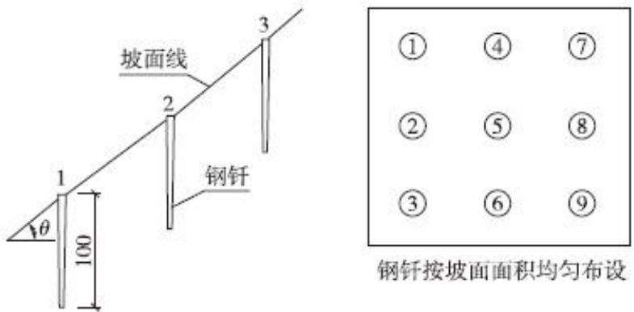  
图6.2-1 标桩法示意图

## ②集沙池法

集水池法可适用于径流冲刷物颗粒较大、汇水面积不大、有集中出口汇水区的土壤流失量监测，集沙池法利用各监测分区设置的沉沙池进行水土流失量的监测。按照设计频次观测沉沙池中的泥沙厚度。在沉沙池的四个角及中心点分别量测泥沙厚度，并测算泥沙密度，计算水土流失量。

$$
S _ { \mathrm { T } } = \frac { h _ { 1 } + h _ { 2 } + h _ { 3 } + h _ { 4 } + h _ { 5 } } { 5 } S \rho _ { \mathrm { S } } \times 1 0 ^ { 4 }
$$

式中： $S _ { \mathbb { T } }$ 汇水区土壤流失量 ${ \bf \Pi } ( \bf { \Pi } _ { g } )$

$h _ { i }$ —集沙池四角和中心点的泥沙厚度(cm);

S集沙池底面面积 $( \mathrm m ^ { 2 } )$

$\rho _ { \mathrm { { S } } }$ 泥沙密度 $( \mathrm { g } / \mathrm { c m } ^ { 3 } )$

## 6.2.2.3 遥感监测

通过对项目区高分辨率遥感影像的解译，能够及时、快速、客观、周期性地获取水土保持相关信息。本工程利用遥感技术监测建设项目地表扰动、水土保持措施布局、水土流失面积、水土流失强度及分布等内容。

卫星遥感监测主要通过收集卫星遥感卫片，利用图像判读和解译的方法，达到对项目水土流失进行监测的目的，监测精度应满足遥感监测流程、质量要求、成果汇总等满足《水土保持遥感监测技术规范（SL592-2012）》要求。

无人机遥感监测主要利用先进的无人驾驶飞行器技术、遥感传感器技术、遥测遥控技术、通讯技术、GPS差分定位技术和遥感应用技术，实现自动化、智能化、专用化快速获取空间遥感信息。监测方法是以监测区域地形、地貌设计航摄方案，利用无人机进行野外航摄，整理航摄范围内航片，通过遥感影像处理软件对影像进行拼接、纠正等处理，得到水土保持监测结果。

## 6.2.2.4 无人机监测

无人机遥感作为获取空间数据的重要手段之一，具有机动灵活、实时传输、影像分辨率高等特点，是卫星遥感的重要补充，适用于低空遥感数据的快速获取。项目监测中利用无人机监测获取的影像成果，可以达到以下效果：

1、扰动土地面积监测：将上库扰动面积图与防治责任范围专题图进行矢量叠加后，判断项目区人为扰动均是否超出防治责任范围。

2、水土流失监测：项目监测中利用无人机监测获取的影像成果，通过目视解译提取项目区各单元植被覆盖度及土地利用信息，并分析 DSM数据，获取坡度信息，结合土壤侵蚀分类分级标准，综合判别项目区土壤侵蚀强度。

3、水土保持措施监测：通过对利用无人机监测获取的影像成果，进行目视解译，可精确统计项目区各类水土保持措施面积。

综上，利用无人机遥感技术可以较精确完成生产建设项目扰动土地面积、水土流失、水土保持措施等监测工作，结合项目区工程资料，可完成项目区水土保持工程设计、防治指标落实情况等监测工作。无人机具有轻小、成本低、分辨率高、机动灵活等优点。

## 6.2.3 监测频次

根据项目工程特点，在施工前应对项目区进行一次全面调查，摸清工程建设前项目区域内影响水土流失因子的基本情况和水土流失背景状况。监测期内对应不同的监测内容具体监测频次如下：

## （1）水土流失自然影响因素

地形地貌状况：整个监测期监测1次；

地表物质：施工准备期和设计水平年各监测1次；

植被状况：施工准备期前测定1次；

气象因子：每月1次。

（2）扰动土地情况

地表扰动情况：全线巡查每季度不少于1次，典型地段每月1次。

（3）水土流失状况

水土流失状况应至少每月监测1次，发生强降水等情况后及时加测。

（4）水土流失防治成效

至少每季度监测1次，其中临时措施至少每月监测1次。

（5）水土流失危害

结合上述监测内容与水土流失状况一并开展，灾害事件发生后1周内完成监测。

本工程水土保持监测内容、监测方法及监测频次详见表6.2-1。

表 6.2-1 水土流失监测内容、监测方法及监测频次一览表
<table><tr><td rowspan=1 colspan=2>监测内容</td><td rowspan=1 colspan=1>监测方案</td><td rowspan=1 colspan=1>监测频次</td></tr><tr><td rowspan=4 colspan=1>水土流失影响因素监测</td><td rowspan=1 colspan=1>气象因子</td><td rowspan=1 colspan=1>气象站、水文站收集</td><td rowspan=1 colspan=1>每月监测一次</td></tr><tr><td rowspan=1 colspan=1>地形地貌</td><td rowspan=1 colspan=1>调查法</td><td rowspan=1 colspan=1>整个监测期应监测一次</td></tr><tr><td rowspan=1 colspan=1>地表组成物质</td><td rowspan=1 colspan=1>调查法</td><td rowspan=1 colspan=1>施工准备期和设计水平年各监测1次</td></tr><tr><td rowspan=1 colspan=1>植被状况</td><td rowspan=1 colspan=1>标准样地法</td><td rowspan=1 colspan=1>施工准备期前测定1次</td></tr><tr><td rowspan=4 colspan=1>扰动土地监测</td><td rowspan=1 colspan=1>扰动面积</td><td rowspan=1 colspan=1>无人机监测、调查法</td><td rowspan=3 colspan=1>每月监测一次</td></tr><tr><td rowspan=1 colspan=1>扰动范围</td><td rowspan=1 colspan=1>无人机监测、调查法</td></tr><tr><td rowspan=1 colspan=1>扰动土地类型</td><td rowspan=1 colspan=1>调查法</td></tr><tr><td rowspan=1 colspan=1>临时堆土/料区</td><td rowspan=1 colspan=1>实测法、无人机航测法、遥感监测法</td><td rowspan=1 colspan=1>正在使用的临时堆土/料区至少两周监测一次</td></tr><tr><td rowspan=4 colspan=1>水土流失状况监测</td><td rowspan=1 colspan=1>水土流失类型</td><td rowspan=1 colspan=1>实地调查</td><td rowspan=1 colspan=1>每年不应少于1次</td></tr><tr><td rowspan=1 colspan=1>水土流失面积</td><td rowspan=1 colspan=1>无人机监测、调查法</td><td rowspan=1 colspan=1>每月监测一次</td></tr><tr><td rowspan=1 colspan=1>土壤侵蚀强度</td><td rowspan=1 colspan=1>根据《土壤侵蚀分类分级标准》及现场调查确定</td><td rowspan=1 colspan=1>施工准备期前和监测期末各1次，施工期每年不应少于1次</td></tr><tr><td rowspan=1 colspan=1>各监测分区及重点对象土壤流失量</td><td rowspan=1 colspan=1>测钎法、集沙池法</td><td rowspan=1 colspan=1>施工期每年不应少于1次</td></tr><tr><td rowspan=7 colspan=1>水土流失防治成效</td><td rowspan=1 colspan=1>植物类型及面积</td><td rowspan=1 colspan=1>综合分析、实地调查</td><td rowspan=1 colspan=1>每个季度调查1次</td></tr><tr><td rowspan=1 colspan=1>成活率及生长情况</td><td rowspan=1 colspan=1>调查法+标准样地法</td><td rowspan=1 colspan=1>每年调查1次保存率及生长情况</td></tr><tr><td rowspan=1 colspan=1>郁闭度及林草覆盖率</td><td rowspan=1 colspan=1>标准样地法</td><td rowspan=1 colspan=1>每年调查1次林草覆盖率</td></tr><tr><td rowspan=1 colspan=1>工程措施的数量、分布、运行情况</td><td rowspan=1 colspan=1>查阅资料、实地勘测和全面巡查</td><td rowspan=1 colspan=1>重点区域应每月监测1次，整体状况应每季度1次</td></tr><tr><td rowspan=1 colspan=1>临时措施</td><td rowspan=1 colspan=1>无人机监测、调查法</td><td rowspan=1 colspan=1>每月监测一次</td></tr><tr><td rowspan=1 colspan=1>水土保持措施对主体工程安全建设和运行发挥的作用</td><td rowspan=1 colspan=1>巡查法、无人机航测</td><td rowspan=2 colspan=1>每年汛期前后及大风、暴雨后进行调查</td></tr><tr><td rowspan=1 colspan=1>水土保持措施对周边水土保持生态环境发挥的作用</td><td rowspan=1 colspan=1>巡查法、无人机航测</td></tr><tr><td rowspan=2 colspan=1>水土流失危害监测</td><td rowspan=1 colspan=1>水土流失危害的面积</td><td rowspan=1 colspan=1>实测法、无人机航测法</td><td rowspan=2 colspan=1>水土流失危害事件发生后1周内应完成监测工作</td></tr><tr><td rowspan=1 colspan=1>水土流失危害的其他指标和危害程度</td><td rowspan=1 colspan=1>实地调查、量测和询问等</td></tr></table>

## 6.3点位布设

## 6.3.1监测点位布设原则

项目水土保持监测计划应在主体工程筹建期就开始准备，在工程建设过程中及时进行监测，以便及时了解和掌握工程区水土流失情况。在确定项目建设中水土流失重点监测区域后，为便于水土保持监测工作的开展，本方案对各个内容的监测均采用定点、定时的地面监测与定期调查监测相结合的方法进行，布设点位要求能有效、完整监测水土流失状况、危害及各类防治措施效果为主，以典型水保工程监测为主，重点、一般结合，原则如下：

1、监测点的分布应反映项目所在区域的水土流失特征；

2、监测点应与项目构成和工程施工特性相适应；

3、监测点应按监测分区，根据监测重点布设；

4、监测点布设应统筹考虑监测内容，尽量布设综合监测点；

5、监测点应相对稳定，满足持续监测要求。

## 6.3.2监测点位布设

根据本工程建设项目扰动地表的面积、水土流失类型、扰动开挖和堆积形态、植被状况、水土保持设施及其布局等条件，依据《生产建设项目水土保持监测与评价标准》（GB/T51240-2018）的要求，结合工程建设特点与扰动地表特征，并考虑观测与管理的方便性，本工程水土保持监测点位共计布设7个，包括船闸工程区 3个监测点、航道工程区 1个监测点、施工生产生活区 1个监测点、表土堆场1个监测点、临时堆料场区1个监测点。

本工程水土保持监测点位布设情况见表6.3-1。

表 6.3- 1 水土保持监测点位布设表
<table><tr><td rowspan=1 colspan=1>序号</td><td rowspan=1 colspan=1>防治分区</td><td rowspan=1 colspan=1>监测点位置</td><td rowspan=1 colspan=1>监测方法</td><td rowspan=1 colspan=1>监测点</td></tr><tr><td rowspan=1 colspan=1>1</td><td rowspan=3 colspan=1>船闸工程区</td><td rowspan=1 colspan=1>排水沟出口沉沙池</td><td rowspan=1 colspan=1>集沙池法</td><td rowspan=1 colspan=1>1#监测点</td></tr><tr><td rowspan=1 colspan=1>2</td><td rowspan=1 colspan=1>开挖边坡</td><td rowspan=1 colspan=1>测钎法</td><td rowspan=1 colspan=1>2#监测点</td></tr><tr><td rowspan=1 colspan=1>3</td><td rowspan=1 colspan=1>绿化区域</td><td rowspan=1 colspan=1>调查监测</td><td rowspan=1 colspan=1>3#监测点</td></tr><tr><td rowspan=1 colspan=1>4</td><td rowspan=1 colspan=1>航道工程区</td><td rowspan=1 colspan=1>开挖裸露区域</td><td rowspan=1 colspan=1>调查监测、测钎法</td><td rowspan=1 colspan=1>4#监测点</td></tr><tr><td rowspan=1 colspan=1>5</td><td rowspan=1 colspan=1>施工生产生活区</td><td rowspan=1 colspan=1>排水沟出口沉沙池</td><td rowspan=1 colspan=1>集沙池法</td><td rowspan=1 colspan=1>5#监测点</td></tr><tr><td rowspan=1 colspan=1>6</td><td rowspan=1 colspan=1>表土堆场区</td><td rowspan=1 colspan=1>排水沟出口沉沙池</td><td rowspan=1 colspan=1>集沙池法</td><td rowspan=1 colspan=1>6#监测点</td></tr><tr><td rowspan=1 colspan=1>7</td><td rowspan=1 colspan=1>临时堆料场区</td><td rowspan=1 colspan=1>排水沟出口沉沙池</td><td rowspan=1 colspan=1>集沙池法</td><td rowspan=1 colspan=1>7#监测点</td></tr></table>

## 6.4实施条件和成果

## 6.4.1 监测人员、设施和设备

本工程水土保持监测需要监测技术人员 3名，其中总监测工程师 1名，监测工程师 1名，监测员 1名。

根据监测内容和方法等要求，本工程主要水土保持监测设施利用主体工程

及水土保持工程沉沙池等，主要监测设备包括必配设备和选择性设备。

本工程水土保持监测设施和设备配置见表6.4-1。

表6.4-1 水土保持监测设施及设备配置表
<table><tr><td rowspan=1 colspan=1>类型</td><td rowspan=1 colspan=1>名称</td><td rowspan=1 colspan=1>单位</td><td rowspan=1 colspan=1>数量</td><td rowspan=1 colspan=1>备注</td></tr><tr><td rowspan=15 colspan=1>设备</td><td rowspan=1 colspan=1>烘箱</td><td rowspan=1 colspan=1>台</td><td rowspan=1 colspan=1>1</td><td rowspan=1 colspan=1></td></tr><tr><td rowspan=1 colspan=1>温度计</td><td rowspan=1 colspan=1>只</td><td rowspan=1 colspan=1>5</td><td rowspan=1 colspan=1></td></tr><tr><td rowspan=1 colspan=1>比重瓶</td><td rowspan=1 colspan=1>件</td><td rowspan=1 colspan=1>5</td><td rowspan=1 colspan=1></td></tr><tr><td rowspan=1 colspan=1>天平</td><td rowspan=1 colspan=1>台</td><td rowspan=1 colspan=1>2</td><td rowspan=1 colspan=1></td></tr><tr><td rowspan=1 colspan=1>全站仪</td><td rowspan=1 colspan=1>台</td><td rowspan=1 colspan=1>1</td><td rowspan=1 colspan=1></td></tr><tr><td rowspan=1 colspan=1>无人机</td><td rowspan=1 colspan=1>架</td><td rowspan=1 colspan=1>1</td><td rowspan=1 colspan=1></td></tr><tr><td rowspan=1 colspan=1>计算机</td><td rowspan=1 colspan=1>台</td><td rowspan=1 colspan=1>1</td><td rowspan=1 colspan=1></td></tr><tr><td rowspan=1 colspan=1>打印机</td><td rowspan=1 colspan=1>台</td><td rowspan=1 colspan=1>1</td><td rowspan=1 colspan=1></td></tr><tr><td rowspan=1 colspan=1>数码摄象机</td><td rowspan=1 colspan=1>部</td><td rowspan=1 colspan=1>2</td><td rowspan=1 colspan=1></td></tr><tr><td rowspan=1 colspan=1>电话（传真）</td><td rowspan=1 colspan=1>部</td><td rowspan=1 colspan=1>3</td><td rowspan=1 colspan=1></td></tr><tr><td rowspan=1 colspan=1>干燥箱</td><td rowspan=1 colspan=1>台</td><td rowspan=1 colspan=1>1</td><td rowspan=1 colspan=1></td></tr><tr><td rowspan=1 colspan=1>自记雨量计</td><td rowspan=1 colspan=1>台</td><td rowspan=1 colspan=1>1</td><td rowspan=1 colspan=1></td></tr><tr><td rowspan=1 colspan=1>测距仪</td><td rowspan=1 colspan=1>台</td><td rowspan=1 colspan=1>2</td><td rowspan=1 colspan=1></td></tr><tr><td rowspan=1 colspan=1>手持式 GPS</td><td rowspan=1 colspan=1>台</td><td rowspan=1 colspan=1>2</td><td rowspan=1 colspan=1></td></tr><tr><td rowspan=1 colspan=1>沉沙池</td><td rowspan=1 colspan=1>个</td><td rowspan=1 colspan=1>4</td><td rowspan=1 colspan=1>利用水保工程沉沙池</td></tr><tr><td rowspan=10 colspan=1>消耗性材料</td><td rowspan=1 colspan=1>测尺</td><td rowspan=1 colspan=1>把</td><td rowspan=1 colspan=1>3</td><td rowspan=1 colspan=1></td></tr><tr><td rowspan=1 colspan=1>测绳</td><td rowspan=1 colspan=1>条</td><td rowspan=1 colspan=1>3</td><td rowspan=1 colspan=1></td></tr><tr><td rowspan=1 colspan=1>土样盒</td><td rowspan=1 colspan=1>个</td><td rowspan=1 colspan=1>30</td><td rowspan=1 colspan=1></td></tr><tr><td rowspan=1 colspan=1>烧杯</td><td rowspan=1 colspan=1>个</td><td rowspan=1 colspan=1>30</td><td rowspan=1 colspan=1></td></tr><tr><td rowspan=1 colspan=1>量杯</td><td rowspan=1 colspan=1>个</td><td rowspan=1 colspan=1>10</td><td rowspan=1 colspan=1></td></tr><tr><td rowspan=1 colspan=1>取土环刀</td><td rowspan=1 colspan=1>个</td><td rowspan=1 colspan=1>3</td><td rowspan=1 colspan=1></td></tr><tr><td rowspan=1 colspan=1>雨量筒</td><td rowspan=1 colspan=1>件</td><td rowspan=1 colspan=1>5</td><td rowspan=1 colspan=1></td></tr><tr><td rowspan=1 colspan=1>取土钻</td><td rowspan=1 colspan=1>件</td><td rowspan=1 colspan=1>2</td><td rowspan=1 colspan=1></td></tr><tr><td rowspan=1 colspan=1>监测标志牌</td><td rowspan=1 colspan=1>处</td><td rowspan=1 colspan=1>9</td><td rowspan=1 colspan=1></td></tr><tr><td rowspan=1 colspan=1>滤纸</td><td rowspan=1 colspan=1>盒</td><td rowspan=1 colspan=1>3</td><td rowspan=1 colspan=1></td></tr></table>

## 6.4.2 监测机构

监测单位应在现场设立监测项目部，并将项目部组成报送建设单位。监测项目部主要职责包括负责监测项目的组织、协调和实施；负责监测进度、质量、设备配置和项目管理；负责与施工单位日常联络，收集主体工程进度、施工报表等资料；负责日常监测数据采集，做好原始记录；负责监测资料汇总、复核、成果编制与报送；开展施工现场突发性水土流失事件应急监测。

## 6.4.3监测成果及要求

根据《水利部关于进一步深化“放管服”改革全面加强水土保持监管的意见》（水保［2019］160 号）、《水利部办公厅关于进一步加强生产建设项目水土保持监测工作的通知》（办水保〔2020〕161 号，2020 年 7 月 28 日），编制水土保持方案报告书的项目，应当依法开展水土保持监测工作。实行水土保持监测“绿黄红”三色评价，水土保持监测单位根据监测情况，在监测季报和总结报告等监测成果中提出“绿黄红”三色评价结论。监测成果应当公开，生产建设单位应当在工程建设期间将水土保持监测季报在其官方网站公开，同时在业主项目部和施工项目部公开。水行政主管部门要将监测评价结论为“红”色的项目，纳入重点监管对象。

## （1）水土保持监测实施方案

主体工程开工1个月内应向有关水行政主管部门报送《水土保持监测实施方案》。

## （2）水土保持监测季报及有关报表、重大情况报告

及时上报建设项目水土保持监测首次报告表，施工期间，根据监测实施方案定期开展水土保持监测工作，每月定期报告现场水土保持工作情况及现场需完善整改的情况；每季度第一个月上报上一季度水土保持监测季报，同时提供重要内容影像资料，并向有关水行政主管部门报告。因降雨、大风或人为原因发生严重水土流失及危害事件的，应于事件发生后1周内报告有关情况。

## （3）水土保持监测总结报告

水土保持监测报告包含季度报告表、专项报告和总结报告。本工程监测单位在进场后，按时进行了水土保持监测季度报告表及年度报告表的编制，并及时上报了水行政主管部门。在监测工作结束后，将进行水土保持监测总结报告的编制。水土保持监测总结报告主要内容有：

①建设项目及水土保持概况。包括：项目概况、水土流失防治工作情况和监测工作实施情况。

②监测内容和方法。包括：扰动土地情况、取土（石、料）、弃渣（石、料）情况、水土流失、水土保持措施。

③重点对象水土流失动态监测。包括：防治责任范围监测、取土（石、料）监测结果、弃土（石、渣）监测结果、土石方流向情况监测结果。

④水土流失防治措施监测结果。包括：工程措施监测结果、植物措施监测结果、临时防护措施监测结果、水土保持措施防治效果。

⑤土壤流失情况监测。包括：水土流失面积、土壤流失量、取土（石、料）、弃渣（石、料）潜在土壤流失量、水土流失危害。

⑥水土流失防治效果监测结果。包括：水土流失治理度、土壤流失控制比、渣土防护率、表土保护率、林草植被恢复率、林草覆盖率。

⑦水土流失防治评价。包括：水土流失情况评价、水土保持效果评价、存在问题及建议、综合结论。

⑧附件与附图。

## （3）水土保持监测图件

本工程水土保持监测图件包括水土保持监测图件包括项目区地理位置图、监测分区与监测点分布图，以及重点监测对象的扰动地表分布图、土壤侵蚀强度图、水土保持措施分布图等。

## （4）水土保持监测三色评价

生产建设项目水土保持监测三色评价是指监测单位依据扰动土地情况、水土流失状况、防治成效及水土流失危害等监测结果，对生产建设项目水土流失防治情况进行评价，在监测季报和总结报告中明确“绿黄红“三色评价结论。三色评价结论是生产建设单位落实参建单位责任、控制施工过程水土流失的重要依据，也是各流域管理机构和地方各级水行政主管部门实施监管的重要依据。

三色评价以水土保持方案确定的防治目标为基础，以监测获取的实际数据为依据，针对不同的监测内容，采取定量评价和定性分析相结合方式进行量化打分。三色评价采用评分法，满分为100分；得分80分及以上的为“绿”色，60分及以上不足 80分的为“黄”色，不足 60分的为“红”色。监测季报三色评价得分为本季度实际得分，监测总结报告三色评价得分为全部监测季报得分的平均值。

## （5）水土保持监测数据表（册）

包括原始记录表和汇总分析表。

## （6）水土保持监测影像资料

包括监测过程中拍摄的反映水土流失动态变化及其治理措施实施情况的照片、录像等。

## 7 水土保持投资概算及效益分析

## 7.1投资概算

## 7.1.1编制原则及依据

## 7.1.1.1 编制原则

（1）概（估）算编制的项目划分、费用构成、编制方法、概（估）算表格等依据《水利工程设计概（估）算编制规定水土保持工程》（水总〔2024〕323号）的规定编写；

（2）本工程水土保持方案作为工程建设的一个重要内容，其价格水平年与主体工程一致取2025年1季度；

（3）主要工程单价、材料价格及施工机械台时费与主体工程一致，不足部分参考相关规定；

（4）植物措施单价依据当地苗木价格确定。

## 7.1.1.2 编制依据

（1）《水利部发布《水利工程设计概（估）算编制规定》及水利工程系列定额（水总〔2024〕323号）；

（2）四川省水利厅《关于执行水利部《水利工程设计概（估）算编制规定》及水利工程系列定额工作的通知》（川水函〔2025〕512号）；

（3）四川省发展和改革委员会、四川省财政厅关于《关于制定水土保持补偿费收费标准的通知》（川发改价格〔2017〕347号）；

（4）《重庆市物价局重庆市财政局重庆市水利局关于水土保持补偿费收费标准的通知》（渝价〔2017〕81号》；

（5）交通运输部〔2019〕57号文颁布的《水运建设工程概算预算编制规定》（JTS/T116－2019）。

## 7.1.2 编制说明

## 7.1.2.1 基础单价

## （1）人工预算单价

根据编规本工程人工单价取6.38元/工时。

（2）主要材料预算单价

主要材料的单价与主体工程预算单价一致，绿化用的苗木、草籽、肥料等价格根据市场调查确定。本工程主要材料预算单价表7.1-1。

表 7.1-1 主要材料预算单价计算表
<table><tr><td rowspan=1 colspan=1>序号</td><td rowspan=1 colspan=1>名称及规格</td><td rowspan=1 colspan=1>单位</td><td rowspan=1 colspan=1>预算价格</td></tr><tr><td rowspan=1 colspan=1>1</td><td rowspan=1 colspan=1>防雨布</td><td rowspan=1 colspan=1> $\mathrm { m } ^ { 2 }$ </td><td rowspan=1 colspan=1>1.5</td></tr><tr><td rowspan=1 colspan=1>2</td><td rowspan=1 colspan=1>柴油</td><td rowspan=1 colspan=1> $\mathrm { k g }$ </td><td rowspan=1 colspan=1>7.71</td></tr><tr><td rowspan=1 colspan=1>3</td><td rowspan=1 colspan=1>汽油</td><td rowspan=1 colspan=1> $\mathrm { k g }$ </td><td rowspan=1 colspan=1>9.15</td></tr><tr><td rowspan=1 colspan=1>4</td><td rowspan=1 colspan=1>复合土工布</td><td rowspan=1 colspan=1> $\mathrm { m } ^ { 2 }$ </td><td rowspan=1 colspan=1>5.5</td></tr><tr><td rowspan=1 colspan=1>5</td><td rowspan=1 colspan=1>编织袋</td><td rowspan=1 colspan=1> $\Bbbk$ </td><td rowspan=1 colspan=1>2</td></tr><tr><td rowspan=1 colspan=1>6</td><td rowspan=1 colspan=1>农家土杂肥</td><td rowspan=1 colspan=1> $\mathrm { m } ^ { 3 }$ </td><td rowspan=1 colspan=1>225</td></tr><tr><td rowspan=1 colspan=1>7</td><td rowspan=1 colspan=1>密目网</td><td rowspan=1 colspan=1> $\mathrm { m } ^ { 2 }$ </td><td rowspan=1 colspan=1>1.5</td></tr><tr><td rowspan=1 colspan=1>8</td><td rowspan=1 colspan=1>电</td><td rowspan=1 colspan=1> $\mathrm { k w h }$ </td><td rowspan=1 colspan=1>0.7</td></tr><tr><td rowspan=1 colspan=1>9</td><td rowspan=1 colspan=1>风</td><td rowspan=1 colspan=1> $\mathrm { m } ^ { 3 }$ </td><td rowspan=1 colspan=1>0.22</td></tr><tr><td rowspan=1 colspan=1>10</td><td rowspan=1 colspan=1>水</td><td rowspan=1 colspan=1> $\mathrm { m } ^ { 3 }$ </td><td rowspan=1 colspan=1>1</td></tr><tr><td rowspan=1 colspan=1>11</td><td rowspan=1 colspan=1>水泥32.5</td><td rowspan=1 colspan=1>t</td><td rowspan=1 colspan=1>378.72</td></tr><tr><td rowspan=1 colspan=1>12</td><td rowspan=1 colspan=1>粗砂</td><td rowspan=1 colspan=1> $\mathrm { m } ^ { 3 }$ </td><td rowspan=1 colspan=1>80.25</td></tr><tr><td rowspan=1 colspan=1>13</td><td rowspan=1 colspan=1>卵石</td><td rowspan=1 colspan=1> $\mathrm { m } ^ { 3 }$ </td><td rowspan=1 colspan=1>164.47</td></tr><tr><td rowspan=1 colspan=1>14</td><td rowspan=1 colspan=1>水泥 42.5</td><td rowspan=1 colspan=1>t</td><td rowspan=1 colspan=1>401.91</td></tr><tr><td rowspan=1 colspan=1>15</td><td rowspan=1 colspan=1>黑麦草/狗牙根</td><td rowspan=1 colspan=1>kg</td><td rowspan=1 colspan=1>73.39</td></tr><tr><td rowspan=1 colspan=1>16</td><td rowspan=1 colspan=1>铁件</td><td rowspan=1 colspan=1>kg</td><td rowspan=1 colspan=1>4.5</td></tr><tr><td rowspan=1 colspan=1>17</td><td rowspan=1 colspan=1>钢筋</td><td rowspan=1 colspan=1>kg</td><td rowspan=1 colspan=1>3.34</td></tr><tr><td rowspan=1 colspan=1>18</td><td rowspan=1 colspan=1>钢模板</td><td rowspan=1 colspan=1>kg</td><td rowspan=1 colspan=1>3.97</td></tr><tr><td rowspan=1 colspan=1>19</td><td rowspan=1 colspan=1>砖</td><td rowspan=1 colspan=1>千块</td><td rowspan=1 colspan=1>460</td></tr></table>

## （3）施工机械台时费

根据水利部《水利工程施工机械台时费定额》及《水利工程设计概（估）算编制规定（水土保持工程）》进行编制。

表7.1-2 施工机械台时费汇总表
<table><tr><td colspan="1" rowspan="2">序号</td><td colspan="1" rowspan="2">名称及规格</td><td colspan="1" rowspan="2">台时费</td><td colspan="5" rowspan="1">其中</td></tr><tr><td colspan="1" rowspan="1">折旧费</td><td colspan="1" rowspan="1">修理及替换设备费</td><td colspan="1" rowspan="1">安拆费</td><td colspan="1" rowspan="1">人工费</td><td colspan="1" rowspan="1">动力燃料费</td></tr><tr><td colspan="1" rowspan="1">1</td><td colspan="1" rowspan="1">单斗挖掘机 油动 0.5m³</td><td colspan="1" rowspan="1">131.16</td><td colspan="1" rowspan="1">21.28</td><td colspan="1" rowspan="1">20.55</td><td colspan="1" rowspan="1"></td><td colspan="1" rowspan="1">15.31</td><td colspan="1" rowspan="1">74.02</td></tr><tr><td colspan="1" rowspan="1">2</td><td colspan="1" rowspan="1">推土机 59kW</td><td colspan="1" rowspan="1">88.60</td><td colspan="1" rowspan="1">9.17</td><td colspan="1" rowspan="1">12.36</td><td colspan="1" rowspan="1">0.47</td><td colspan="1" rowspan="1">13.40</td><td colspan="1" rowspan="1">53.20</td></tr><tr><td colspan="1" rowspan="1">3</td><td colspan="1" rowspan="1">拖拉机 轮胎式 37kW</td><td colspan="1" rowspan="1">47.75</td><td colspan="1" rowspan="1">3.19</td><td colspan="1" rowspan="1">2.78</td><td colspan="1" rowspan="1">0.20</td><td colspan="1" rowspan="1">7.66</td><td colspan="1" rowspan="1">33.92</td></tr><tr><td colspan="1" rowspan="1">4</td><td colspan="1" rowspan="1">混凝土搅拌机 自落式 0.4m³</td><td colspan="1" rowspan="1">20.48</td><td colspan="1" rowspan="1">2.65</td><td colspan="1" rowspan="1">4.46</td><td colspan="1" rowspan="1">0.97</td><td colspan="1" rowspan="1">6.38</td><td colspan="1" rowspan="1">6.02</td></tr><tr><td colspan="1" rowspan="1">5</td><td colspan="1" rowspan="1">振动器插入式1.1kW</td><td colspan="1" rowspan="1">1.50</td><td colspan="1" rowspan="1">0.25</td><td colspan="1" rowspan="1">0.69</td><td colspan="1" rowspan="1"></td><td colspan="1" rowspan="1"></td><td colspan="1" rowspan="1">0.56</td></tr><tr><td colspan="1" rowspan="1">6</td><td colspan="1" rowspan="1">风水(砂)枪 6.0m³/min</td><td colspan="1" rowspan="1">50.01</td><td colspan="1" rowspan="1">0.17</td><td colspan="1" rowspan="1">0.30</td><td colspan="1" rowspan="1"></td><td colspan="1" rowspan="1"></td><td colspan="1" rowspan="1">49.54</td></tr><tr><td colspan="1" rowspan="1">7</td><td colspan="1" rowspan="1">载重汽车 5t</td><td colspan="1" rowspan="1">71.08</td><td colspan="1" rowspan="1">6.47</td><td colspan="1" rowspan="1">9.37</td><td colspan="1" rowspan="1"></td><td colspan="1" rowspan="1">7.66</td><td colspan="1" rowspan="1">47.58</td></tr><tr><td colspan="1" rowspan="1">8</td><td colspan="1" rowspan="1">自卸汽车3.5t</td><td colspan="1" rowspan="1">72.58</td><td colspan="1" rowspan="1">6.60</td><td colspan="1" rowspan="1">3.42</td><td colspan="1" rowspan="1"></td><td colspan="1" rowspan="1">7.66</td><td colspan="1" rowspan="1">54.90</td></tr><tr><td colspan="1" rowspan="1">9</td><td colspan="1" rowspan="1">胶轮车</td><td colspan="1" rowspan="1">0.68</td><td colspan="1" rowspan="1">0.19</td><td colspan="1" rowspan="1">0.49</td><td colspan="1" rowspan="1"></td><td colspan="1" rowspan="1"></td><td colspan="1" rowspan="1"></td></tr><tr><td colspan="1" rowspan="1">10</td><td colspan="1" rowspan="1">汽车起重机 5t</td><td colspan="1" rowspan="1">86.15</td><td colspan="1" rowspan="1">12.41</td><td colspan="1" rowspan="1">9.93</td><td colspan="1" rowspan="1"></td><td colspan="1" rowspan="1">15.31</td><td colspan="1" rowspan="1">48.50</td></tr><tr><td colspan="1" rowspan="1">11</td><td colspan="1" rowspan="1">电焊机 直流 20kW</td><td colspan="1" rowspan="1">15.27</td><td colspan="1" rowspan="1">0.68</td><td colspan="1" rowspan="1">0.45</td><td colspan="1" rowspan="1">0.14</td><td colspan="1" rowspan="1"></td><td colspan="1" rowspan="1">14.00</td></tr><tr><td colspan="1" rowspan="1">12</td><td colspan="1" rowspan="1">钢筋切断机 20kW</td><td colspan="1" rowspan="1">22.30</td><td colspan="1" rowspan="1">0.94</td><td colspan="1" rowspan="1">1.41</td><td colspan="1" rowspan="1">0.25</td><td colspan="1" rowspan="1">7.66</td><td colspan="1" rowspan="1">12.04</td></tr></table>

## 7.1.2.2各项措施费用构成

## （1）工程措施

工程措施费=工程量×工程措施单价。

其中工程单价直接取用主体工程设计文件相应工程单价。

## （2）植物措施

植物措施费=工程量×植物措施单价。

其中植物单价根据市场调查价格确定，栽种费按《水土保持工程概（估）算定额》进行计算。

## （3）监测措施

本项目不涉及弃渣场，不单独布设径流小区等，监测措施费根据水总〔2024〕323号文发布的《水利工程设计概（估）算编制规定（水土保持工程）》相关要求，按主体工程土建投资为基数进行计算，经计算监测措施费为50.47 万元。

## （4）临时工程

临时防护措施费＝工程量×工程单价

其他临时工程费按一至三部分投资合计的2%计列。

施工安全生产专项按一至四部分建安工作量（不含设备购置费）之和的2.5%计算。

## 7.1.2.3各项费率的取值标准

水土保持工程单价费率、植物措施费率参考主体工程设计及本水土保持工

程实际情况取值，具体见下表。水土保持工程措施费率、植物措施费率参考主体工程设计并根据水利部发布《水利工程设计概（估）算编制规定（水土保持工程）》及水利工程系列定额调整，详见表7.1-3。

表7.1- 3 投资概算费率表 （单位：%）
<table><tr><td rowspan=1 colspan=1>序号</td><td rowspan=1 colspan=1>项目名称</td><td rowspan=1 colspan=1>其他直接费</td><td rowspan=1 colspan=1>间接费</td><td rowspan=1 colspan=1>利润</td><td rowspan=1 colspan=1>税金</td></tr><tr><td rowspan=1 colspan=1>1</td><td rowspan=1 colspan=1>土方工程</td><td rowspan=1 colspan=1>3.3</td><td rowspan=1 colspan=1>5</td><td rowspan=1 colspan=1>7</td><td rowspan=1 colspan=1>9</td></tr><tr><td rowspan=1 colspan=1>2</td><td rowspan=1 colspan=1>石方工程</td><td rowspan=1 colspan=1>3.3</td><td rowspan=1 colspan=1>8</td><td rowspan=1 colspan=1>7</td><td rowspan=1 colspan=1>9</td></tr><tr><td rowspan=1 colspan=1>3</td><td rowspan=1 colspan=1>混凝土工程</td><td rowspan=1 colspan=1>3.3</td><td rowspan=1 colspan=1>7</td><td rowspan=1 colspan=1>7</td><td rowspan=1 colspan=1>9</td></tr><tr><td rowspan=1 colspan=1>4</td><td rowspan=1 colspan=1>其他工程</td><td rowspan=1 colspan=1>3.3</td><td rowspan=1 colspan=1>7</td><td rowspan=1 colspan=1>7</td><td rowspan=1 colspan=1>9</td></tr><tr><td rowspan=1 colspan=1>5</td><td rowspan=1 colspan=1>植物措施工程</td><td rowspan=1 colspan=1>2</td><td rowspan=1 colspan=1>6</td><td rowspan=1 colspan=1>7</td><td rowspan=1 colspan=1>9</td></tr><tr><td rowspan=1 colspan=1>6</td><td rowspan=1 colspan=1>土地整治工程</td><td rowspan=1 colspan=1>2</td><td rowspan=1 colspan=1>/</td><td rowspan=1 colspan=1>7</td><td rowspan=1 colspan=1>9</td></tr></table>

## 7.1.2.4 独立费用

## （1）建设管理费

项目经常费：按一至四部分投资合计的2.5%计算。

技术咨询费：根据工作内容，按一至四部分投资合计的1.5%计算。

水土保持竣工验收费：根据调查类似项目市场行情，结合项目情况，本项目水土保持竣工验收费按照24.50万元计列。

## （2）工程建设监理费

根据发改价格〔2007〕670号文相关规定计算，本项目水土保持建设监理费为8.27万元。

## （3）科研勘测设计费

水土保持方案编制费根据实际合同价计取。

## 7.1.2.5 预备费

## （1）基本预备费

按工程一至五部分投资合计的5%计取。

## 7.1.2.6 水土保持补偿费

本工程涉及四川省与重庆市，根据《四川省发展和改革委员会 四川省财政厅关于制定水土保持补偿费收费标准的通知》（川发改价格〔2017〕347号），对一般性生产建设项目，水土保持补偿费按照征占用土地面积 1.3元/m2一次性计征；《重庆市物价局重庆市财政局重庆市水利局关于水土保持补偿费收费标准的通知》（渝价〔2017〕81号》，对一般性生产建设项目，水土保持补偿费按照征占用土地面积1.4元/m2一次性计征。

本工程征占地面积共 41.72hm2，其中 34.86hm2位于四川省，需缴纳水土保持补偿费 45.32万元；6.86hm2位于重庆市，需缴纳水土保持补偿费 9.60万元，合计需缴纳水土保持补偿费54.92万元。

## 7.1.3 概算成果

本工程水土保持静态总投资519.57万元，其中工程措施投资172.53万元，植物措施费 50.00万元，监测措施投资 50.47万元，施工临时工程投资 89.63万元，独立费用 83.91万元，基本预备费 18.11万元，水土保持补偿费 54.92万元。

表 7.1- 4 水土保持总投资表 （单位：万元）
<table><tr><td colspan="1" rowspan="1">序号</td><td colspan="1" rowspan="1">工程或费用名称</td><td colspan="1" rowspan="1">建筑安装工程费</td><td colspan="1" rowspan="1">设备购置费</td><td colspan="1" rowspan="1">独立费用</td><td colspan="1" rowspan="1">方案新增</td><td colspan="1" rowspan="1">主体已有</td><td colspan="1" rowspan="1">合计</td></tr><tr><td colspan="1" rowspan="1"></td><td colspan="1" rowspan="1">第一部分工程措施</td><td colspan="1" rowspan="1">138.23</td><td colspan="1" rowspan="1"></td><td colspan="1" rowspan="1"></td><td colspan="1" rowspan="1">138.23</td><td colspan="1" rowspan="1">34.30</td><td colspan="1" rowspan="1">172.53</td></tr><tr><td colspan="1" rowspan="1">二</td><td colspan="1" rowspan="1">船闸工程区</td><td colspan="1" rowspan="1">49.44</td><td colspan="1" rowspan="1"></td><td colspan="1" rowspan="1"></td><td colspan="1" rowspan="1">49.44</td><td colspan="1" rowspan="1">34.30</td><td colspan="1" rowspan="1">83.74</td></tr><tr><td colspan="1" rowspan="1">二</td><td colspan="1" rowspan="1">航道工程区</td><td colspan="1" rowspan="1">8.92</td><td colspan="1" rowspan="1"></td><td colspan="1" rowspan="1"></td><td colspan="1" rowspan="1">8.92</td><td colspan="1" rowspan="1"></td><td colspan="1" rowspan="1">8.92</td></tr><tr><td colspan="1" rowspan="1">三</td><td colspan="1" rowspan="1">施工生产生活区</td><td colspan="1" rowspan="1">57.39</td><td colspan="1" rowspan="1"></td><td colspan="1" rowspan="1"></td><td colspan="1" rowspan="1">57.39</td><td colspan="1" rowspan="1"></td><td colspan="1" rowspan="1">57.39</td></tr><tr><td colspan="1" rowspan="1">四</td><td colspan="1" rowspan="1">表土堆场区</td><td colspan="1" rowspan="1">1.53</td><td colspan="1" rowspan="1"></td><td colspan="1" rowspan="1"></td><td colspan="1" rowspan="1">1.53</td><td colspan="1" rowspan="1"></td><td colspan="1" rowspan="1">1.53</td></tr><tr><td colspan="1" rowspan="1">五</td><td colspan="1" rowspan="1">临时堆料场区</td><td colspan="1" rowspan="1">20.95</td><td colspan="1" rowspan="1"></td><td colspan="1" rowspan="1"></td><td colspan="1" rowspan="1">20.95</td><td colspan="1" rowspan="1"></td><td colspan="1" rowspan="1">20.95</td></tr><tr><td colspan="1" rowspan="1"></td><td colspan="1" rowspan="1">第二部分植物措施</td><td colspan="1" rowspan="1"></td><td colspan="1" rowspan="1"></td><td colspan="1" rowspan="1"></td><td colspan="1" rowspan="1"></td><td colspan="1" rowspan="1">50.00</td><td colspan="1" rowspan="1">50.00</td></tr><tr><td colspan="1" rowspan="1">一</td><td colspan="1" rowspan="1">船闸工程区</td><td colspan="1" rowspan="1"></td><td colspan="1" rowspan="1"></td><td colspan="1" rowspan="1"></td><td colspan="1" rowspan="1"></td><td colspan="1" rowspan="1">50.00</td><td colspan="1" rowspan="1">50.00</td></tr><tr><td colspan="1" rowspan="1"></td><td colspan="1" rowspan="1">第三部分监测措施</td><td colspan="1" rowspan="1">50.47</td><td colspan="1" rowspan="1"></td><td colspan="1" rowspan="1"></td><td colspan="1" rowspan="1">50.47</td><td colspan="1" rowspan="1"></td><td colspan="1" rowspan="1">50.47</td></tr><tr><td colspan="1" rowspan="1">一</td><td colspan="1" rowspan="1">建设期观测费</td><td colspan="1" rowspan="1">50.47</td><td colspan="1" rowspan="1"></td><td colspan="1" rowspan="1"></td><td colspan="1" rowspan="1">50.47</td><td colspan="1" rowspan="1"></td><td colspan="1" rowspan="1">50.47</td></tr><tr><td colspan="1" rowspan="1"></td><td colspan="1" rowspan="1">第四部分施工临时工程</td><td colspan="1" rowspan="1">89.63</td><td colspan="1" rowspan="1"></td><td colspan="1" rowspan="1"></td><td colspan="1" rowspan="1">89.63</td><td colspan="1" rowspan="1"></td><td colspan="1" rowspan="1">89.63</td></tr><tr><td colspan="1" rowspan="1">一</td><td colspan="1" rowspan="1">临时防护工程</td><td colspan="1" rowspan="1">77.52</td><td colspan="1" rowspan="1"></td><td colspan="1" rowspan="1"></td><td colspan="1" rowspan="1">77.52</td><td colspan="1" rowspan="1"></td><td colspan="1" rowspan="1">77.52</td></tr><tr><td colspan="1" rowspan="1">(一)</td><td colspan="1" rowspan="1">船闸工程区</td><td colspan="1" rowspan="1">4.25</td><td colspan="1" rowspan="1"></td><td colspan="1" rowspan="1"></td><td colspan="1" rowspan="1">4.25</td><td colspan="1" rowspan="1"></td><td colspan="1" rowspan="1">4.25</td></tr><tr><td colspan="1" rowspan="1">(二)</td><td colspan="1" rowspan="1">航道工程区</td><td colspan="1" rowspan="1">6.98</td><td colspan="1" rowspan="1"></td><td colspan="1" rowspan="1"></td><td colspan="1" rowspan="1">6.98</td><td colspan="1" rowspan="1"></td><td colspan="1" rowspan="1">6.98</td></tr><tr><td colspan="1" rowspan="1">（三）</td><td colspan="1" rowspan="1">施工生产生活区</td><td colspan="1" rowspan="1">22.10</td><td colspan="1" rowspan="1"></td><td colspan="1" rowspan="1"></td><td colspan="1" rowspan="1">22.10</td><td colspan="1" rowspan="1"></td><td colspan="1" rowspan="1">22.10</td></tr><tr><td colspan="1" rowspan="1">（四）</td><td colspan="1" rowspan="1">表土堆场区</td><td colspan="1" rowspan="1">17.64</td><td colspan="1" rowspan="1"></td><td colspan="1" rowspan="1"></td><td colspan="1" rowspan="1">17.64</td><td colspan="1" rowspan="1"></td><td colspan="1" rowspan="1">17.64</td></tr><tr><td colspan="1" rowspan="1">(五)</td><td colspan="1" rowspan="1">临时堆料场区</td><td colspan="1" rowspan="1">26.55</td><td colspan="1" rowspan="1"></td><td colspan="1" rowspan="1"></td><td colspan="1" rowspan="1">26.55</td><td colspan="1" rowspan="1"></td><td colspan="1" rowspan="1">26.55</td></tr><tr><td colspan="1" rowspan="1">二</td><td colspan="1" rowspan="1">其他临时工程</td><td colspan="1" rowspan="1">5.32</td><td colspan="1" rowspan="1"></td><td colspan="1" rowspan="1"></td><td colspan="1" rowspan="1">5.32</td><td colspan="1" rowspan="1"></td><td colspan="1" rowspan="1">5.32</td></tr><tr><td colspan="1" rowspan="1">三</td><td colspan="1" rowspan="1">施工安全生产专项</td><td colspan="1" rowspan="1">6.79</td><td colspan="1" rowspan="1"></td><td colspan="1" rowspan="1"></td><td colspan="1" rowspan="1">6.79</td><td colspan="1" rowspan="1"></td><td colspan="1" rowspan="1">6.79</td></tr><tr><td colspan="1" rowspan="1"></td><td colspan="1" rowspan="1">第五部分独立费用</td><td colspan="1" rowspan="1"></td><td colspan="1" rowspan="1"></td><td colspan="1" rowspan="1">83.91</td><td colspan="1" rowspan="1">83.91</td><td colspan="1" rowspan="1"></td><td colspan="1" rowspan="1">83.91</td></tr><tr><td colspan="1" rowspan="1">二</td><td colspan="1" rowspan="1">建设管理费</td><td colspan="1" rowspan="1"></td><td colspan="1" rowspan="1"></td><td colspan="1" rowspan="1">35.64</td><td colspan="1" rowspan="1">35.64</td><td colspan="1" rowspan="1"></td><td colspan="1" rowspan="1">35.64</td></tr><tr><td colspan="1" rowspan="1">1</td><td colspan="1" rowspan="1">项目经常费</td><td colspan="1" rowspan="1"></td><td colspan="1" rowspan="1"></td><td colspan="1" rowspan="1">6.96</td><td colspan="1" rowspan="1">6.96</td><td colspan="1" rowspan="1"></td><td colspan="1" rowspan="1">6.96</td></tr><tr><td colspan="1" rowspan="1">2</td><td colspan="1" rowspan="1">技术咨询费</td><td colspan="1" rowspan="1"></td><td colspan="1" rowspan="1"></td><td colspan="1" rowspan="1">4.18</td><td colspan="1" rowspan="1">4.18</td><td colspan="1" rowspan="1"></td><td colspan="1" rowspan="1">4.18</td></tr><tr><td colspan="1" rowspan="1">3</td><td colspan="1" rowspan="1">水土保持竣工验收费</td><td colspan="1" rowspan="1"></td><td colspan="1" rowspan="1"></td><td colspan="1" rowspan="1">24.50</td><td colspan="1" rowspan="1">24.50</td><td colspan="1" rowspan="1"></td><td colspan="1" rowspan="1">24.50</td></tr><tr><td colspan="1" rowspan="1">二</td><td colspan="1" rowspan="1">工程建设监理费</td><td colspan="1" rowspan="1"></td><td colspan="1" rowspan="1"></td><td colspan="1" rowspan="1">8.27</td><td colspan="1" rowspan="1">8.27</td><td colspan="1" rowspan="1"></td><td colspan="1" rowspan="1">8.27</td></tr><tr><td colspan="1" rowspan="1">三</td><td colspan="1" rowspan="1">科研勘测设计费</td><td colspan="1" rowspan="1"></td><td colspan="1" rowspan="1"></td><td colspan="1" rowspan="1">40.00</td><td colspan="1" rowspan="1">40.00</td><td colspan="1" rowspan="1"></td><td colspan="1" rowspan="1">40.00</td></tr><tr><td colspan="1" rowspan="1">1</td><td colspan="1" rowspan="1">水土保持方案编制费</td><td colspan="1" rowspan="1"></td><td colspan="1" rowspan="1"></td><td colspan="1" rowspan="1">40.00</td><td colspan="1" rowspan="1">40.00</td><td colspan="1" rowspan="1"></td><td colspan="1" rowspan="1">40.00</td></tr><tr><td colspan="1" rowspan="1">I</td><td colspan="1" rowspan="1">第一至五部分合计</td><td colspan="1" rowspan="1">278.33</td><td colspan="1" rowspan="1"></td><td colspan="1" rowspan="1">83.91</td><td colspan="1" rowspan="1">362.24</td><td colspan="1" rowspan="1">84.30</td><td colspan="1" rowspan="1">446.54</td></tr><tr><td colspan="1" rowspan="1">II</td><td colspan="1" rowspan="1">预备费</td><td colspan="1" rowspan="1"></td><td colspan="1" rowspan="1"></td><td colspan="1" rowspan="1"></td><td colspan="1" rowspan="1">18.11</td><td colspan="1" rowspan="1"></td><td colspan="1" rowspan="1">18.11</td></tr><tr><td colspan="1" rowspan="1">ⅢⅢ</td><td colspan="1" rowspan="1">水土保持补偿费</td><td colspan="1" rowspan="1"></td><td colspan="1" rowspan="1"></td><td colspan="1" rowspan="1"></td><td colspan="1" rowspan="1">54.92</td><td colspan="1" rowspan="1"></td><td colspan="1" rowspan="1">54.92</td></tr><tr><td colspan="1" rowspan="1"></td><td colspan="1" rowspan="1">水土保持总投资（I+Ⅱ+III)</td><td colspan="1" rowspan="1"></td><td colspan="1" rowspan="1"></td><td colspan="1" rowspan="1"></td><td colspan="1" rowspan="1">435.27</td><td colspan="1" rowspan="1">84.30</td><td colspan="1" rowspan="1">519.57</td></tr></table>

表7.1-5主体设计已有水土保持措施投资
<table><tr><td rowspan=2 colspan=1>防治责任分区</td><td rowspan=2 colspan=1>措施类型</td><td rowspan=1 colspan=3>措施规模</td><td rowspan=1 colspan=1>单价</td><td rowspan=1 colspan=1>合价</td></tr><tr><td rowspan=1 colspan=1>名称</td><td rowspan=1 colspan=1>单位</td><td rowspan=1 colspan=1>规模</td><td rowspan=1 colspan=1>(元)</td><td rowspan=1 colspan=1>(万元)</td></tr><tr><td rowspan=4 colspan=1>船闸工程区</td><td rowspan=2 colspan=1>工程措施</td><td rowspan=1 colspan=1>排水沟</td><td rowspan=1 colspan=1>m</td><td rowspan=1 colspan=1>230</td><td rowspan=1 colspan=1>175.56</td><td rowspan=1 colspan=1>4.04</td></tr><tr><td rowspan=1 colspan=1>截水沟</td><td rowspan=1 colspan=1>m</td><td rowspan=1 colspan=1>415</td><td rowspan=1 colspan=1>729.25</td><td rowspan=1 colspan=1>30.26</td></tr><tr><td rowspan=2 colspan=1>植物措施</td><td rowspan=1 colspan=1>三维网植草护坡</td><td rowspan=1 colspan=1> $\mathrm { m } ^ { 2 }$ </td><td rowspan=1 colspan=1>4171</td><td rowspan=1 colspan=1>26.85</td><td rowspan=1 colspan=1>11.28</td></tr><tr><td rowspan=1 colspan=1>景观绿化</td><td rowspan=1 colspan=1> $\mathrm { h m } ^ { 2 }$ </td><td rowspan=1 colspan=1>2.44</td><td rowspan=1 colspan=1>158689</td><td rowspan=1 colspan=1>38.72</td></tr><tr><td rowspan=1 colspan=3>合计</td><td rowspan=1 colspan=1></td><td rowspan=1 colspan=1></td><td rowspan=1 colspan=1></td><td rowspan=1 colspan=1>84.30</td></tr></table>

表 7.1-6 新增水土保持工程措施投资表
<table><tr><td rowspan=1 colspan=1>序号</td><td rowspan=1 colspan=1>工程或费用名称</td><td rowspan=1 colspan=1>单位</td><td rowspan=1 colspan=1>数量</td><td rowspan=1 colspan=1>单价（元）</td><td rowspan=1 colspan=1>合计（万元）</td></tr><tr><td rowspan=1 colspan=1></td><td rowspan=1 colspan=1>第一部分工程措施</td><td rowspan=1 colspan=1></td><td rowspan=1 colspan=1></td><td rowspan=1 colspan=1></td><td rowspan=1 colspan=1>138.23</td></tr><tr><td rowspan=1 colspan=1>一</td><td rowspan=1 colspan=1>船闸工程区</td><td rowspan=1 colspan=1></td><td rowspan=1 colspan=1></td><td rowspan=1 colspan=1></td><td rowspan=1 colspan=1>49.44</td></tr><tr><td rowspan=1 colspan=1>1</td><td rowspan=1 colspan=1>表土剥离</td><td rowspan=1 colspan=1> $\mathrm { m } ^ { 3 }$ </td><td rowspan=1 colspan=1>22100.00</td><td rowspan=1 colspan=1>13.93</td><td rowspan=1 colspan=1>30.79</td></tr><tr><td rowspan=1 colspan=1>2</td><td rowspan=1 colspan=1>表土回覆</td><td rowspan=1 colspan=1> $\mathrm { m } ^ { 3 }$ </td><td rowspan=1 colspan=1>13100.00</td><td rowspan=1 colspan=1>11.57</td><td rowspan=1 colspan=1>15.16</td></tr><tr><td rowspan=1 colspan=1>3</td><td rowspan=1 colspan=1>土地整治</td><td rowspan=1 colspan=1> $\mathrm { h m } ^ { 2 }$ </td><td rowspan=1 colspan=1>2.44</td><td rowspan=1 colspan=1>14323.06</td><td rowspan=1 colspan=1>3.49</td></tr><tr><td rowspan=1 colspan=1>二</td><td rowspan=1 colspan=1>航道工程区</td><td rowspan=1 colspan=1></td><td rowspan=1 colspan=1></td><td rowspan=1 colspan=1></td><td rowspan=1 colspan=1>8.92</td></tr><tr><td rowspan=1 colspan=1>1</td><td rowspan=1 colspan=1>表土剥离</td><td rowspan=1 colspan=1> $\mathrm { m } ^ { 3 }$ </td><td rowspan=1 colspan=1>6400.00</td><td rowspan=1 colspan=1>13.93</td><td rowspan=1 colspan=1>8.92</td></tr><tr><td rowspan=1 colspan=1>三</td><td rowspan=1 colspan=1>施工生产生活区</td><td rowspan=1 colspan=1></td><td rowspan=1 colspan=1></td><td rowspan=1 colspan=1></td><td rowspan=1 colspan=1>57.39</td></tr><tr><td rowspan=1 colspan=1>1</td><td rowspan=1 colspan=1>表土剥离</td><td rowspan=1 colspan=1> $\mathrm { m } ^ { 3 }$ </td><td rowspan=1 colspan=1>14200.00</td><td rowspan=1 colspan=1>13.93</td><td rowspan=1 colspan=1>19.78</td></tr><tr><td rowspan=1 colspan=1>2</td><td rowspan=1 colspan=1>表土回覆</td><td rowspan=1 colspan=1> $\mathrm { m } ^ { 3 }$ </td><td rowspan=1 colspan=1>25500.00</td><td rowspan=1 colspan=1>11.57</td><td rowspan=1 colspan=1>29.50</td></tr><tr><td rowspan=1 colspan=1>3</td><td rowspan=1 colspan=1>土地整治</td><td rowspan=1 colspan=1> $\mathrm { h m } ^ { 2 }$ </td><td rowspan=1 colspan=1>5.66</td><td rowspan=1 colspan=1>14323.06</td><td rowspan=1 colspan=1>8.11</td></tr><tr><td rowspan=1 colspan=1>四</td><td rowspan=1 colspan=1>表土堆场区</td><td rowspan=1 colspan=1></td><td rowspan=1 colspan=1></td><td rowspan=1 colspan=1></td><td rowspan=1 colspan=1>1.53</td></tr><tr><td rowspan=1 colspan=1>1</td><td rowspan=1 colspan=1>土地整治</td><td rowspan=1 colspan=1> $\mathrm { h m } ^ { 2 }$ </td><td rowspan=1 colspan=1>1.07</td><td rowspan=1 colspan=1>14323.06</td><td rowspan=1 colspan=1>1.53</td></tr><tr><td rowspan=1 colspan=1>五</td><td rowspan=1 colspan=1>临时堆料场区</td><td rowspan=1 colspan=1></td><td rowspan=1 colspan=1></td><td rowspan=1 colspan=1></td><td rowspan=1 colspan=1>20.95</td></tr><tr><td rowspan=1 colspan=1>1</td><td rowspan=1 colspan=1>表土剥离</td><td rowspan=1 colspan=1> $\mathrm { m } ^ { 3 }$ </td><td rowspan=1 colspan=1>5200.00</td><td rowspan=1 colspan=1>13.93</td><td rowspan=1 colspan=1>7.24</td></tr><tr><td rowspan=1 colspan=1>2</td><td rowspan=1 colspan=1>表土回覆</td><td rowspan=1 colspan=1> $\mathrm { m } ^ { 3 }$ </td><td rowspan=1 colspan=1>9300.00</td><td rowspan=1 colspan=1>11.57</td><td rowspan=1 colspan=1>10.76</td></tr><tr><td rowspan=1 colspan=1>3</td><td rowspan=1 colspan=1>土地整治</td><td rowspan=1 colspan=1> $\mathrm { h m } ^ { 2 }$ </td><td rowspan=1 colspan=1>2.06</td><td rowspan=1 colspan=1>14323.06</td><td rowspan=1 colspan=1>2.95</td></tr></table>

表7.1-7水土保持监测措施投资表
<table><tr><td rowspan=1 colspan=1>序号</td><td rowspan=1 colspan=1>工程或费用名称</td><td rowspan=1 colspan=1>单位</td><td rowspan=1 colspan=1>数量</td><td rowspan=1 colspan=1>单价（元）</td><td rowspan=1 colspan=1>合价（万元）</td></tr><tr><td rowspan=1 colspan=1></td><td rowspan=1 colspan=1>第三部分监测措施</td><td rowspan=1 colspan=1></td><td rowspan=1 colspan=1></td><td rowspan=1 colspan=1></td><td rowspan=1 colspan=1>50.47</td></tr><tr><td rowspan=1 colspan=1></td><td rowspan=1 colspan=1>建设期观测费</td><td rowspan=1 colspan=1>项</td><td rowspan=1 colspan=1>1</td><td rowspan=1 colspan=1>504700.00</td><td rowspan=1 colspan=1>50.47</td></tr></table>

表7.1-8新增水土保持施工临时工程措施投资表
<table><tr><td colspan="1" rowspan="1">序号</td><td colspan="1" rowspan="1">工程或费用名称</td><td colspan="1" rowspan="1">单位</td><td colspan="1" rowspan="1">数量</td><td colspan="1" rowspan="1">单价（元）</td><td colspan="1" rowspan="1">合计（万元）</td></tr><tr><td colspan="1" rowspan="1"></td><td colspan="1" rowspan="1">第四部分施工临时工程</td><td colspan="1" rowspan="1"></td><td colspan="1" rowspan="1"></td><td colspan="1" rowspan="1"></td><td colspan="1" rowspan="1">89.63</td></tr><tr><td colspan="1" rowspan="1">一</td><td colspan="1" rowspan="1">临时防护工程</td><td colspan="1" rowspan="1"></td><td colspan="1" rowspan="1"></td><td colspan="1" rowspan="1"></td><td colspan="1" rowspan="1">77.52</td></tr><tr><td colspan="1" rowspan="1">(一)</td><td colspan="1" rowspan="1">船闸工程区</td><td colspan="1" rowspan="1"></td><td colspan="1" rowspan="1"></td><td colspan="1" rowspan="1"></td><td colspan="1" rowspan="1">4.25</td></tr><tr><td colspan="1" rowspan="1">1</td><td colspan="1" rowspan="1">临时排水沟</td><td colspan="1" rowspan="1"> $\mathbf { m }$ </td><td colspan="1" rowspan="1">720.00</td><td colspan="1" rowspan="1">20.81</td><td colspan="1" rowspan="1">1.50</td></tr><tr><td colspan="1" rowspan="1">1.1</td><td colspan="1" rowspan="1">土石方开挖</td><td colspan="1" rowspan="1"> $\mathrm { m } ^ { 3 }$ </td><td colspan="1" rowspan="1">230.40</td><td colspan="1" rowspan="1">15.34</td><td colspan="1" rowspan="1">0.35</td></tr><tr><td colspan="1" rowspan="1">1.2</td><td colspan="1" rowspan="1">复合土工布</td><td colspan="1" rowspan="1"> $\mathrm { m } ^ { 2 }$ </td><td colspan="1" rowspan="1">1252.80</td><td colspan="1" rowspan="1">9.14</td><td colspan="1" rowspan="1">1.15</td></tr><tr><td colspan="1" rowspan="1">2</td><td colspan="1" rowspan="1">临时沉沙池</td><td colspan="1" rowspan="1">座</td><td colspan="1" rowspan="1">2.00</td><td colspan="1" rowspan="1">130.26</td><td colspan="1" rowspan="1">0.03</td></tr><tr><td colspan="1" rowspan="1">2.1</td><td colspan="1" rowspan="1">土石方开挖</td><td colspan="1" rowspan="1"> $\mathrm { m } ^ { 3 }$ </td><td colspan="1" rowspan="1">7.64</td><td colspan="1" rowspan="1">15.34</td><td colspan="1" rowspan="1">0.01</td></tr><tr><td colspan="1" rowspan="1">2.2</td><td colspan="1" rowspan="1">复合土工布</td><td colspan="1" rowspan="1"> $\mathrm { m } ^ { 2 }$ </td><td colspan="1" rowspan="1">15.68</td><td colspan="1" rowspan="1">9.14</td><td colspan="1" rowspan="1">0.01</td></tr><tr><td colspan="1" rowspan="1">3</td><td colspan="1" rowspan="1">防雨布苫盖</td><td colspan="1" rowspan="1"> $\mathrm { m } ^ { 2 }$ </td><td colspan="1" rowspan="1">8900.00</td><td colspan="1" rowspan="1">3.06</td><td colspan="1" rowspan="1">2.72</td></tr><tr><td colspan="1" rowspan="1">(二)</td><td colspan="1" rowspan="1">航道工程区</td><td colspan="1" rowspan="1"></td><td colspan="1" rowspan="1"></td><td colspan="1" rowspan="1"></td><td colspan="1" rowspan="1">6.98</td></tr><tr><td colspan="1" rowspan="1">1</td><td colspan="1" rowspan="1">防雨布苫盖</td><td colspan="1" rowspan="1"> $\mathrm { m } ^ { 2 }$ </td><td colspan="1" rowspan="1">22820.00</td><td colspan="1" rowspan="1">3.06</td><td colspan="1" rowspan="1">6.98</td></tr><tr><td colspan="1" rowspan="1">(三)</td><td colspan="1" rowspan="1">施工生产生活区</td><td colspan="1" rowspan="1"></td><td colspan="1" rowspan="1"></td><td colspan="1" rowspan="1"></td><td colspan="1" rowspan="1">22.10</td></tr><tr><td colspan="1" rowspan="1">1</td><td colspan="1" rowspan="1">砖砌排水沟（0.5×0.5）</td><td colspan="1" rowspan="1">m</td><td colspan="1" rowspan="1">1782.00</td><td colspan="1" rowspan="1">116.66</td><td colspan="1" rowspan="1">20.79</td></tr><tr><td colspan="1" rowspan="1">1.1</td><td colspan="1" rowspan="1">土石方开挖</td><td colspan="1" rowspan="1"> $\mathrm { m } ^ { 3 }$ </td><td colspan="1" rowspan="1">1111.97</td><td colspan="1" rowspan="1">15.34</td><td colspan="1" rowspan="1">1.71</td></tr><tr><td colspan="1" rowspan="1">1.2</td><td colspan="1" rowspan="1">土石方回填</td><td colspan="1" rowspan="1"> $\mathrm { m } ^ { 3 }$ </td><td colspan="1" rowspan="1">320.76</td><td colspan="1" rowspan="1">26.56</td><td colspan="1" rowspan="1">0.85</td></tr><tr><td colspan="1" rowspan="1">1.3</td><td colspan="1" rowspan="1">浆砌砖</td><td colspan="1" rowspan="1"> $\mathrm { m } ^ { 3 }$ </td><td colspan="1" rowspan="1">213.84</td><td colspan="1" rowspan="1">460.73</td><td colspan="1" rowspan="1">9.85</td></tr><tr><td colspan="1" rowspan="1">1.4</td><td colspan="1" rowspan="1">C15 砼底</td><td colspan="1" rowspan="1"> $\mathrm { m } ^ { 3 }$ </td><td colspan="1" rowspan="1">131.87</td><td colspan="1" rowspan="1">406.47</td><td colspan="1" rowspan="1">5.36</td></tr><tr><td colspan="1" rowspan="1">1.5</td><td colspan="1" rowspan="1">M10 砂浆抹面</td><td colspan="1" rowspan="1"> $\mathrm { m } ^ { 2 }$ </td><td colspan="1" rowspan="1">2209.68</td><td colspan="1" rowspan="1">13.66</td><td colspan="1" rowspan="1">3.02</td></tr><tr><td colspan="1" rowspan="1">2</td><td colspan="1" rowspan="1">砖砌沉沙池</td><td colspan="1" rowspan="1"> $\boxminus$ </td><td colspan="1" rowspan="1">6.00</td><td colspan="1" rowspan="1">2190.72</td><td colspan="1" rowspan="1">1.31</td></tr><tr><td colspan="1" rowspan="1">2.1</td><td colspan="1" rowspan="1">土石方开挖</td><td colspan="1" rowspan="1"> $\mathrm { m } ^ { 3 }$ </td><td colspan="1" rowspan="1">74.58</td><td colspan="1" rowspan="1">15.34</td><td colspan="1" rowspan="1">0.11</td></tr><tr><td colspan="1" rowspan="1">2.2</td><td colspan="1" rowspan="1">土石方回填</td><td colspan="1" rowspan="1"> $\mathrm { m } ^ { 3 }$ </td><td colspan="1" rowspan="1">12.42</td><td colspan="1" rowspan="1">26.56</td><td colspan="1" rowspan="1">0.03</td></tr><tr><td colspan="1" rowspan="1">2.3</td><td colspan="1" rowspan="1">浆砌砖</td><td colspan="1" rowspan="1"> $\mathrm { m } ^ { 3 }$ </td><td colspan="1" rowspan="1">19.20</td><td colspan="1" rowspan="1">460.73</td><td colspan="1" rowspan="1">0.88</td></tr><tr><td colspan="1" rowspan="1">2.4</td><td colspan="1" rowspan="1">C15 砼底</td><td colspan="1" rowspan="1"> $\mathrm { m } ^ { 3 }$ </td><td colspan="1" rowspan="1">5.16</td><td colspan="1" rowspan="1">406.47</td><td colspan="1" rowspan="1">0.21</td></tr><tr><td colspan="1" rowspan="1">2.5</td><td colspan="1" rowspan="1">M10 砂浆抹面</td><td colspan="1" rowspan="1"> $\mathrm { m } ^ { 2 }$ </td><td colspan="1" rowspan="1">53.22</td><td colspan="1" rowspan="1">13.66</td><td colspan="1" rowspan="1">0.07</td></tr><tr><td colspan="1" rowspan="1">（四）</td><td colspan="1" rowspan="1">表土堆场区</td><td colspan="1" rowspan="1"></td><td colspan="1" rowspan="1"></td><td colspan="1" rowspan="1"></td><td colspan="1" rowspan="1">17.64</td></tr><tr><td colspan="1" rowspan="1">1</td><td colspan="1" rowspan="1">砖砌排水沟（0.4×0.4）</td><td colspan="1" rowspan="1"> $\mathbf { m }$ </td><td colspan="1" rowspan="1">406.00</td><td colspan="1" rowspan="1">95.02</td><td colspan="1" rowspan="1">3.86</td></tr><tr><td colspan="1" rowspan="1">1.1</td><td colspan="1" rowspan="1">土石方开挖</td><td colspan="1" rowspan="1"> $\mathrm { m } ^ { 3 }$ </td><td colspan="1" rowspan="1">182.70</td><td colspan="1" rowspan="1">15.34</td><td colspan="1" rowspan="1">0.28</td></tr><tr><td colspan="1" rowspan="1">1.2</td><td colspan="1" rowspan="1">土石方回填</td><td colspan="1" rowspan="1"> $\mathrm { m } ^ { 3 }$ </td><td colspan="1" rowspan="1">52.78</td><td colspan="1" rowspan="1">26.56</td><td colspan="1" rowspan="1">0.14</td></tr><tr><td colspan="1" rowspan="1">1.3</td><td colspan="1" rowspan="1">浆砌砖</td><td colspan="1" rowspan="1"> $\mathrm { m } ^ { 3 }$ </td><td colspan="1" rowspan="1">40.60</td><td colspan="1" rowspan="1">460.73</td><td colspan="1" rowspan="1">1.87</td></tr><tr><td colspan="1" rowspan="1">1.4</td><td colspan="1" rowspan="1">C15 砼底</td><td colspan="1" rowspan="1"> $\mathrm { m } ^ { 3 }$ </td><td colspan="1" rowspan="1">24.36</td><td colspan="1" rowspan="1">406.47</td><td colspan="1" rowspan="1">0.99</td></tr><tr><td colspan="1" rowspan="1">1.5</td><td colspan="1" rowspan="1">M10 砂浆抹面</td><td colspan="1" rowspan="1"> $\mathrm { m } ^ { 2 }$ </td><td colspan="1" rowspan="1">422.24</td><td colspan="1" rowspan="1">13.66</td><td colspan="1" rowspan="1">0.58</td></tr><tr><td colspan="1" rowspan="1">2</td><td colspan="1" rowspan="1">钢筋石笼(0.8×1.0)</td><td colspan="1" rowspan="1"> $\mathrm { m } ^ { 3 }$ </td><td colspan="1" rowspan="1">424.00</td><td colspan="1" rowspan="1">230.33</td><td colspan="1" rowspan="1">9.77</td></tr><tr><td colspan="1" rowspan="1">3</td><td colspan="1" rowspan="1">密目网苫盖</td><td colspan="1" rowspan="1"> $\mathrm { m } ^ { 2 }$ </td><td colspan="1" rowspan="1">11000.00</td><td colspan="1" rowspan="1">3.06</td><td colspan="1" rowspan="1">3.37</td></tr><tr><td colspan="1" rowspan="1">4</td><td colspan="1" rowspan="1">撒播草籽</td><td colspan="1" rowspan="1"> $\mathrm { h m } ^ { 2 }$ </td><td colspan="1" rowspan="1">1.10</td><td colspan="1" rowspan="1">5831.11</td><td colspan="1" rowspan="1">0.64</td></tr><tr><td colspan="1" rowspan="1">(五)</td><td colspan="1" rowspan="1">临时堆料场区</td><td colspan="1" rowspan="1"></td><td colspan="1" rowspan="1"></td><td colspan="1" rowspan="1"></td><td colspan="1" rowspan="1">26.55</td></tr><tr><td colspan="1" rowspan="1">1</td><td colspan="1" rowspan="1">砖砌排水沟（0.4×0.4）</td><td colspan="1" rowspan="1"> $\mathbf { m }$ </td><td colspan="1" rowspan="1">395.00</td><td colspan="1" rowspan="1">95.02</td><td colspan="1" rowspan="1">3.75</td></tr><tr><td colspan="1" rowspan="1">1.1</td><td colspan="1" rowspan="1">土石方开挖</td><td colspan="1" rowspan="1"> $\mathrm { m } ^ { 3 }$ </td><td colspan="1" rowspan="1">177.75</td><td colspan="1" rowspan="1">15.34</td><td colspan="1" rowspan="1">0.27</td></tr><tr><td colspan="1" rowspan="1">1.2</td><td colspan="1" rowspan="1">土石方回填</td><td colspan="1" rowspan="1"> $\mathrm { m } ^ { 3 }$ </td><td colspan="1" rowspan="1">51.35</td><td colspan="1" rowspan="1">26.56</td><td colspan="1" rowspan="1">0.14</td></tr><tr><td colspan="1" rowspan="1">1.3</td><td colspan="1" rowspan="1">浆砌砖</td><td colspan="1" rowspan="1"> $\mathrm { m } ^ { 3 }$ </td><td colspan="1" rowspan="1">39.50</td><td colspan="1" rowspan="1">460.73</td><td colspan="1" rowspan="1">1.82</td></tr><tr><td colspan="1" rowspan="1">1.4</td><td colspan="1" rowspan="1">C15 砼底</td><td colspan="1" rowspan="1"> $\mathrm { m } ^ { 3 }$ </td><td colspan="1" rowspan="1">23.70</td><td colspan="1" rowspan="1">406.47</td><td colspan="1" rowspan="1">0.96</td></tr><tr><td colspan="1" rowspan="1">1.5</td><td colspan="1" rowspan="1">M10 砂浆抹面</td><td colspan="1" rowspan="1"> $\mathrm { m } ^ { 2 }$ </td><td colspan="1" rowspan="1">410.80</td><td colspan="1" rowspan="1">13.66</td><td colspan="1" rowspan="1">0.56</td></tr><tr><td colspan="1" rowspan="1">2</td><td colspan="1" rowspan="1">钢筋石笼(1.0×1.2)</td><td colspan="1" rowspan="1"> $\mathrm { m } ^ { 3 }$ </td><td colspan="1" rowspan="1">716.40</td><td colspan="1" rowspan="1">230.33</td><td colspan="1" rowspan="1">16.50</td></tr><tr><td colspan="1" rowspan="1">3</td><td colspan="1" rowspan="1">防雨布苫盖</td><td colspan="1" rowspan="1"> $\mathrm { m } ^ { 2 }$ </td><td colspan="1" rowspan="1">20600.00</td><td colspan="1" rowspan="1">3.06</td><td colspan="1" rowspan="1">6.30</td></tr><tr><td colspan="1" rowspan="1">二</td><td colspan="1" rowspan="1">其他临时工程</td><td colspan="1" rowspan="1"> $\%$ </td><td colspan="1" rowspan="1">2.00</td><td colspan="1" rowspan="1">26622.28</td><td colspan="1" rowspan="1">5.32</td></tr><tr><td colspan="1" rowspan="1">三</td><td colspan="1" rowspan="1">施工安全生产专项</td><td colspan="1" rowspan="1">%</td><td colspan="1" rowspan="1">2.50</td><td colspan="1" rowspan="1">27154.73</td><td colspan="1" rowspan="1">6.79</td></tr></table>

表7.1-9 独立费用投资表
<table><tr><td rowspan=1 colspan=1>序号</td><td rowspan=1 colspan=1>工程或费用名称</td><td rowspan=1 colspan=1>单位</td><td rowspan=1 colspan=1>数量</td><td rowspan=1 colspan=1>单价（元）</td><td rowspan=1 colspan=1>合计（万元）</td></tr><tr><td rowspan=1 colspan=1></td><td rowspan=1 colspan=1>第五部分 独立费用</td><td rowspan=1 colspan=1></td><td rowspan=1 colspan=1></td><td rowspan=1 colspan=1></td><td rowspan=1 colspan=1>83.91</td></tr><tr><td rowspan=1 colspan=1>二</td><td rowspan=1 colspan=1>建设管理费</td><td rowspan=1 colspan=1></td><td rowspan=1 colspan=1></td><td rowspan=1 colspan=1></td><td rowspan=1 colspan=1>35.64</td></tr><tr><td rowspan=1 colspan=1>1</td><td rowspan=1 colspan=1>项目经常费</td><td rowspan=1 colspan=1> $\%$ </td><td rowspan=1 colspan=1>2.50</td><td rowspan=1 colspan=1>2783359.59</td><td rowspan=1 colspan=1>6.96</td></tr><tr><td rowspan=1 colspan=1>2</td><td rowspan=1 colspan=1>技术咨询费</td><td rowspan=1 colspan=1> $\%$ </td><td rowspan=1 colspan=1>1.50</td><td rowspan=1 colspan=1>2783359.59</td><td rowspan=1 colspan=1>4.18</td></tr><tr><td rowspan=1 colspan=1>3</td><td rowspan=1 colspan=1>水土保持竣工验收费</td><td rowspan=1 colspan=1></td><td rowspan=1 colspan=1></td><td rowspan=1 colspan=1></td><td rowspan=1 colspan=1>24.50</td></tr><tr><td rowspan=1 colspan=1>二</td><td rowspan=1 colspan=1>工程建设监理费</td><td rowspan=1 colspan=1></td><td rowspan=1 colspan=1></td><td rowspan=1 colspan=1></td><td rowspan=1 colspan=1>8.27</td></tr><tr><td rowspan=1 colspan=1>三</td><td rowspan=1 colspan=1>科研勘测设计费</td><td rowspan=1 colspan=1></td><td rowspan=1 colspan=1></td><td rowspan=1 colspan=1></td><td rowspan=1 colspan=1>40.00</td></tr><tr><td rowspan=1 colspan=1>1</td><td rowspan=1 colspan=1>水土保持方案编制费</td><td rowspan=1 colspan=1></td><td rowspan=1 colspan=1></td><td rowspan=1 colspan=1></td><td rowspan=1 colspan=1>40.00</td></tr></table>

表 7.1-10 水土保持补偿费分区县统计
<table><tr><td rowspan=1 colspan=1>序号</td><td rowspan=1 colspan=2>行政区划</td><td rowspan=1 colspan=1>收费标准 $( \bar { \pi } / \mathbf { m } ^ { 2 } )$ </td><td rowspan=1 colspan=1>面积 $\left( \mathbf { h } \mathbf { m } ^ { 2 } \right)$ </td><td rowspan=1 colspan=1>补偿费（万元）</td></tr><tr><td rowspan=1 colspan=1>1</td><td rowspan=3 colspan=1>四川省遂宁市</td><td rowspan=1 colspan=1>船山区</td><td rowspan=1 colspan=1>1.3</td><td rowspan=1 colspan=1>11.41</td><td rowspan=1 colspan=1>14.83</td></tr><tr><td rowspan=1 colspan=1>2</td><td rowspan=1 colspan=1>蓬溪县</td><td rowspan=1 colspan=1>1.3</td><td rowspan=1 colspan=1>23.45</td><td rowspan=1 colspan=1>30.49</td></tr><tr><td rowspan=1 colspan=1>3</td><td rowspan=1 colspan=1>小计</td><td rowspan=1 colspan=1></td><td rowspan=1 colspan=1>34.86</td><td rowspan=1 colspan=1>45.32</td></tr><tr><td rowspan=1 colspan=1>4</td><td rowspan=1 colspan=1>重庆市</td><td rowspan=1 colspan=1>潼南区</td><td rowspan=1 colspan=1>1.4</td><td rowspan=1 colspan=1>6.86</td><td rowspan=1 colspan=1>9.60</td></tr><tr><td rowspan=1 colspan=3>合计</td><td rowspan=1 colspan=1></td><td rowspan=1 colspan=1>41.72</td><td rowspan=1 colspan=1>54.92</td></tr></table>

表 7.1- 11 分年度投资表 单位：万元
<table><tr><td colspan="1" rowspan="2">序号</td><td colspan="1" rowspan="2">工程或费用名称</td><td colspan="1" rowspan="2">总投资</td><td colspan="4" rowspan="1">分年度投资</td></tr><tr><td colspan="1" rowspan="1">2026</td><td colspan="1" rowspan="1">2027</td><td colspan="1" rowspan="1">2028</td><td colspan="1" rowspan="1">2029</td></tr><tr><td colspan="1" rowspan="1"></td><td colspan="1" rowspan="1">第一部分工程措施</td><td colspan="1" rowspan="1">172.53</td><td colspan="1" rowspan="1">68.26</td><td colspan="1" rowspan="1">34.30</td><td colspan="1" rowspan="1">69.97</td><td colspan="1" rowspan="1"></td></tr><tr><td colspan="1" rowspan="1">一</td><td colspan="1" rowspan="1">船闸工程区</td><td colspan="1" rowspan="1">83.74</td><td colspan="1" rowspan="1">30.79</td><td colspan="1" rowspan="1">34.30</td><td colspan="1" rowspan="1">18.65</td><td colspan="1" rowspan="1"></td></tr><tr><td colspan="1" rowspan="1">1</td><td colspan="1" rowspan="1">表土剥离</td><td colspan="1" rowspan="1">30.79</td><td colspan="1" rowspan="1">30.79</td><td colspan="1" rowspan="1"></td><td colspan="1" rowspan="1"></td><td colspan="1" rowspan="1"></td></tr><tr><td colspan="1" rowspan="1">2</td><td colspan="1" rowspan="1">表土回覆</td><td colspan="1" rowspan="1">15.16</td><td colspan="1" rowspan="1"></td><td colspan="1" rowspan="1"></td><td colspan="1" rowspan="1">15.16</td><td colspan="1" rowspan="1"></td></tr><tr><td colspan="1" rowspan="1">3</td><td colspan="1" rowspan="1">土地整治</td><td colspan="1" rowspan="1">3.49</td><td colspan="1" rowspan="1"></td><td colspan="1" rowspan="1"></td><td colspan="1" rowspan="1">3.49</td><td colspan="1" rowspan="1"></td></tr><tr><td colspan="1" rowspan="1">4</td><td colspan="1" rowspan="1">排水沟</td><td colspan="1" rowspan="1">4.04</td><td colspan="1" rowspan="1"></td><td colspan="1" rowspan="1">4.04</td><td colspan="1" rowspan="1"></td><td colspan="1" rowspan="1"></td></tr><tr><td colspan="1" rowspan="1">5</td><td colspan="1" rowspan="1">截水沟</td><td colspan="1" rowspan="1">30.26</td><td colspan="1" rowspan="1"></td><td colspan="1" rowspan="1">30.26</td><td colspan="1" rowspan="1"></td><td colspan="1" rowspan="1"></td></tr><tr><td colspan="1" rowspan="1">二</td><td colspan="1" rowspan="1">航道工程区</td><td colspan="1" rowspan="1">8.92</td><td colspan="1" rowspan="1">8.92</td><td colspan="1" rowspan="1"></td><td colspan="1" rowspan="1"></td><td colspan="1" rowspan="1"></td></tr><tr><td colspan="1" rowspan="1">1</td><td colspan="1" rowspan="1">表土剥离</td><td colspan="1" rowspan="1">8.92</td><td colspan="1" rowspan="1">8.92</td><td colspan="1" rowspan="1"></td><td colspan="1" rowspan="1"></td><td colspan="1" rowspan="1"></td></tr><tr><td colspan="1" rowspan="1">三</td><td colspan="1" rowspan="1">施工生产生活区</td><td colspan="1" rowspan="1">57.39</td><td colspan="1" rowspan="1">19.78</td><td colspan="1" rowspan="1"></td><td colspan="1" rowspan="1">37.61</td><td colspan="1" rowspan="1"></td></tr><tr><td colspan="1" rowspan="1">1</td><td colspan="1" rowspan="1">表土剥离</td><td colspan="1" rowspan="1">19.78</td><td colspan="1" rowspan="1">19.78</td><td colspan="1" rowspan="1"></td><td colspan="1" rowspan="1"></td><td colspan="1" rowspan="1"></td></tr><tr><td colspan="1" rowspan="1">2</td><td colspan="1" rowspan="1">表土回覆</td><td colspan="1" rowspan="1">29.50</td><td colspan="1" rowspan="1"></td><td colspan="1" rowspan="1"></td><td colspan="1" rowspan="1">29.50</td><td colspan="1" rowspan="1"></td></tr><tr><td colspan="1" rowspan="1">3</td><td colspan="1" rowspan="1">土地整治</td><td colspan="1" rowspan="1">8.11</td><td colspan="1" rowspan="1"></td><td colspan="1" rowspan="1"></td><td colspan="1" rowspan="1">8.11</td><td colspan="1" rowspan="1"></td></tr><tr><td colspan="1" rowspan="1">四</td><td colspan="1" rowspan="1">表土堆场区</td><td colspan="1" rowspan="1">1.53</td><td colspan="1" rowspan="1">1.53</td><td colspan="1" rowspan="1"></td><td colspan="1" rowspan="1"></td><td colspan="1" rowspan="1"></td></tr><tr><td colspan="1" rowspan="1">1</td><td colspan="1" rowspan="1">土地整治</td><td colspan="1" rowspan="1">1.53</td><td colspan="1" rowspan="1">1.53</td><td colspan="1" rowspan="1"></td><td colspan="1" rowspan="1"></td><td colspan="1" rowspan="1"></td></tr><tr><td colspan="1" rowspan="1">五</td><td colspan="1" rowspan="1">临时堆料场区</td><td colspan="1" rowspan="1">20.95</td><td colspan="1" rowspan="1">7.24</td><td colspan="1" rowspan="1"></td><td colspan="1" rowspan="1">13.71</td><td colspan="1" rowspan="1"></td></tr><tr><td colspan="1" rowspan="1">1</td><td colspan="1" rowspan="1">表土剥离</td><td colspan="1" rowspan="1">7.24</td><td colspan="1" rowspan="1">7.24</td><td colspan="1" rowspan="1"></td><td colspan="1" rowspan="1"></td><td colspan="1" rowspan="1"></td></tr><tr><td colspan="1" rowspan="1">2</td><td colspan="1" rowspan="1">表土回覆</td><td colspan="1" rowspan="1">10.76</td><td colspan="1" rowspan="1"></td><td colspan="1" rowspan="1"></td><td colspan="1" rowspan="1">10.76</td><td colspan="1" rowspan="1"></td></tr><tr><td colspan="1" rowspan="1">3</td><td colspan="1" rowspan="1">土地整治</td><td colspan="1" rowspan="1">2.95</td><td colspan="1" rowspan="1"></td><td colspan="1" rowspan="1"></td><td colspan="1" rowspan="1">2.95</td><td colspan="1" rowspan="1"></td></tr><tr><td colspan="1" rowspan="1"></td><td colspan="1" rowspan="1">第二部分植物措施</td><td colspan="1" rowspan="1">50.00</td><td colspan="1" rowspan="1"></td><td colspan="1" rowspan="1"></td><td colspan="1" rowspan="1">50.00</td><td colspan="1" rowspan="1"></td></tr><tr><td colspan="1" rowspan="1">一</td><td colspan="1" rowspan="1">船闸工程区</td><td colspan="1" rowspan="1">50.00</td><td colspan="1" rowspan="1"></td><td colspan="1" rowspan="1"></td><td colspan="1" rowspan="1">50.00</td><td colspan="1" rowspan="1"></td></tr><tr><td colspan="1" rowspan="1">1</td><td colspan="1" rowspan="1">三维网植草护坡</td><td colspan="1" rowspan="1">11.28</td><td colspan="1" rowspan="1"></td><td colspan="1" rowspan="1"></td><td colspan="1" rowspan="1">11.28</td><td colspan="1" rowspan="1"></td></tr><tr><td colspan="1" rowspan="1">2</td><td colspan="1" rowspan="1">景观绿化</td><td colspan="1" rowspan="1">38.72</td><td colspan="1" rowspan="1"></td><td colspan="1" rowspan="1"></td><td colspan="1" rowspan="1">38.72</td><td colspan="1" rowspan="1"></td></tr><tr><td colspan="1" rowspan="1"></td><td colspan="1" rowspan="1">第三部分监测措施</td><td colspan="1" rowspan="1">50.47</td><td colspan="1" rowspan="1">11.61</td><td colspan="1" rowspan="1">13.12</td><td colspan="1" rowspan="1">13.12</td><td colspan="1" rowspan="1">12.62</td></tr><tr><td colspan="1" rowspan="1">一</td><td colspan="1" rowspan="1">建设期观测费</td><td colspan="1" rowspan="1">50.47</td><td colspan="1" rowspan="1">11.61</td><td colspan="1" rowspan="1">13.12</td><td colspan="1" rowspan="1">13.12</td><td colspan="1" rowspan="1">12.62</td></tr><tr><td colspan="1" rowspan="1"></td><td colspan="1" rowspan="1">第四部分施工临时工程</td><td colspan="1" rowspan="1">89.63</td><td colspan="1" rowspan="1">81.15</td><td colspan="1" rowspan="1">4.24</td><td colspan="1" rowspan="1">4.24</td><td colspan="1" rowspan="1"></td></tr><tr><td colspan="1" rowspan="1">一</td><td colspan="1" rowspan="1">临时防护工程</td><td colspan="1" rowspan="1">77.52</td><td colspan="1" rowspan="1">77.52</td><td colspan="1" rowspan="1"></td><td colspan="1" rowspan="1"></td><td colspan="1" rowspan="1"></td></tr><tr><td colspan="1" rowspan="1">(一)</td><td colspan="1" rowspan="1">船闸工程区</td><td colspan="1" rowspan="1">4.25</td><td colspan="1" rowspan="1">4.25</td><td colspan="1" rowspan="1"></td><td colspan="1" rowspan="1"></td><td colspan="1" rowspan="1"></td></tr><tr><td colspan="1" rowspan="1">1</td><td colspan="1" rowspan="1">临时排水沟</td><td colspan="1" rowspan="1">1.50</td><td colspan="1" rowspan="1">1.50</td><td colspan="1" rowspan="1"></td><td colspan="1" rowspan="1"></td><td colspan="1" rowspan="1"></td></tr><tr><td colspan="1" rowspan="1">2</td><td colspan="1" rowspan="1">临时沉沙池</td><td colspan="1" rowspan="1">0.03</td><td colspan="1" rowspan="1">0.03</td><td colspan="1" rowspan="1"></td><td colspan="1" rowspan="1"></td><td colspan="1" rowspan="1"></td></tr><tr><td colspan="1" rowspan="1">3</td><td colspan="1" rowspan="1">防雨布苫盖</td><td colspan="1" rowspan="1">2.72</td><td colspan="1" rowspan="1">2.72</td><td colspan="1" rowspan="1"></td><td colspan="1" rowspan="1"></td><td colspan="1" rowspan="1"></td></tr><tr><td colspan="1" rowspan="1">(二)</td><td colspan="1" rowspan="1">航道工程区</td><td colspan="1" rowspan="1">6.98</td><td colspan="1" rowspan="1">6.98</td><td colspan="1" rowspan="1"></td><td colspan="1" rowspan="1"></td><td colspan="1" rowspan="1"></td></tr><tr><td colspan="1" rowspan="1">1</td><td colspan="1" rowspan="1">防雨布苫盖</td><td colspan="1" rowspan="1">6.98</td><td colspan="1" rowspan="1">6.98</td><td colspan="1" rowspan="1"></td><td colspan="1" rowspan="1"></td><td colspan="1" rowspan="1"></td></tr><tr><td colspan="1" rowspan="1">(三）</td><td colspan="1" rowspan="1">施工生产生活区</td><td colspan="1" rowspan="1">22.10</td><td colspan="1" rowspan="1">22.10</td><td colspan="1" rowspan="1"></td><td colspan="1" rowspan="1"></td><td colspan="1" rowspan="1"></td></tr><tr><td colspan="1" rowspan="1">1</td><td colspan="1" rowspan="1">砖砌排水沟（0.5×0.5）</td><td colspan="1" rowspan="1">20.79</td><td colspan="1" rowspan="1">20.79</td><td colspan="1" rowspan="1"></td><td colspan="1" rowspan="1"></td><td colspan="1" rowspan="1"></td></tr><tr><td colspan="1" rowspan="1">2</td><td colspan="1" rowspan="1">砖砌沉沙池</td><td colspan="1" rowspan="1">1.31</td><td colspan="1" rowspan="1">1.31</td><td colspan="1" rowspan="1"></td><td colspan="1" rowspan="1"></td><td colspan="1" rowspan="1"></td></tr><tr><td colspan="1" rowspan="1">（四）</td><td colspan="1" rowspan="1">表土堆场区</td><td colspan="1" rowspan="1">17.64</td><td colspan="1" rowspan="1">17.64</td><td colspan="1" rowspan="1"></td><td colspan="1" rowspan="1"></td><td colspan="1" rowspan="1"></td></tr><tr><td colspan="1" rowspan="1">1</td><td colspan="1" rowspan="1">砖砌排水沟（0.4×0.4）</td><td colspan="1" rowspan="1">3.86</td><td colspan="1" rowspan="1">3.86</td><td colspan="1" rowspan="1"></td><td colspan="1" rowspan="1"></td><td colspan="1" rowspan="1"></td></tr><tr><td colspan="1" rowspan="1">2</td><td colspan="1" rowspan="1">钢筋石笼(0.8×1.0)</td><td colspan="1" rowspan="1">9.77</td><td colspan="1" rowspan="1">9.77</td><td colspan="1" rowspan="1"></td><td colspan="1" rowspan="1"></td><td colspan="1" rowspan="1"></td></tr><tr><td colspan="1" rowspan="1">3</td><td colspan="1" rowspan="1">密目网苫盖</td><td colspan="1" rowspan="1">3.37</td><td colspan="1" rowspan="1">3.37</td><td colspan="1" rowspan="1"></td><td colspan="1" rowspan="1"></td><td colspan="1" rowspan="1"></td></tr><tr><td colspan="1" rowspan="1">4</td><td colspan="1" rowspan="1">撒播草籽</td><td colspan="1" rowspan="1">0.64</td><td colspan="1" rowspan="1">0.64</td><td colspan="1" rowspan="1"></td><td colspan="1" rowspan="1"></td><td colspan="1" rowspan="1"></td></tr><tr><td colspan="1" rowspan="1">(五)</td><td colspan="1" rowspan="1">临时堆料场区</td><td colspan="1" rowspan="1">26.55</td><td colspan="1" rowspan="1">26.55</td><td colspan="1" rowspan="1"></td><td colspan="1" rowspan="1"></td><td colspan="1" rowspan="1"></td></tr><tr><td colspan="1" rowspan="1">1</td><td colspan="1" rowspan="1">砖砌排水沟（0.4×0.4）</td><td colspan="1" rowspan="1">3.75</td><td colspan="1" rowspan="1">3.75</td><td colspan="1" rowspan="1"></td><td colspan="1" rowspan="1"></td><td colspan="1" rowspan="1"></td></tr><tr><td colspan="1" rowspan="1">2</td><td colspan="1" rowspan="1">钢筋石笼(1.0×1.2)</td><td colspan="1" rowspan="1">16.50</td><td colspan="1" rowspan="1">16.50</td><td colspan="1" rowspan="1"></td><td colspan="1" rowspan="1"></td><td colspan="1" rowspan="1"></td></tr><tr><td colspan="1" rowspan="1">3</td><td colspan="1" rowspan="1">防雨布苫盖</td><td colspan="1" rowspan="1">6.30</td><td colspan="1" rowspan="1">6.30</td><td colspan="1" rowspan="1"></td><td colspan="1" rowspan="1"></td><td colspan="1" rowspan="1"></td></tr><tr><td colspan="1" rowspan="1">二</td><td colspan="1" rowspan="1">其他临时工程</td><td colspan="1" rowspan="1">5.32</td><td colspan="1" rowspan="1">1.60</td><td colspan="1" rowspan="1">1.86</td><td colspan="1" rowspan="1">1.86</td><td colspan="1" rowspan="1"></td></tr><tr><td colspan="1" rowspan="1">三</td><td colspan="1" rowspan="1">施工安全生产专项</td><td colspan="1" rowspan="1">6.79</td><td colspan="1" rowspan="1">2.03</td><td colspan="1" rowspan="1">2.38</td><td colspan="1" rowspan="1">2.38</td><td colspan="1" rowspan="1"></td></tr><tr><td colspan="1" rowspan="1"></td><td colspan="1" rowspan="1">第五部分独立费用</td><td colspan="1" rowspan="1">83.91</td><td colspan="1" rowspan="1">45.85</td><td colspan="1" rowspan="1">6.79</td><td colspan="1" rowspan="1">6.77</td><td colspan="1" rowspan="1">24.50</td></tr><tr><td colspan="1" rowspan="1">一</td><td colspan="1" rowspan="1">建设管理费</td><td colspan="1" rowspan="1">35.64</td><td colspan="1" rowspan="1">3.36</td><td colspan="1" rowspan="1">3.90</td><td colspan="1" rowspan="1">3.88</td><td colspan="1" rowspan="1">24.50</td></tr><tr><td colspan="1" rowspan="1">1</td><td colspan="1" rowspan="1">项目经常费</td><td colspan="1" rowspan="1">6.96</td><td colspan="1" rowspan="1">2.10</td><td colspan="1" rowspan="1">2.44</td><td colspan="1" rowspan="1">2.42</td><td colspan="1" rowspan="1"></td></tr><tr><td colspan="1" rowspan="1">2</td><td colspan="1" rowspan="1">技术咨询费</td><td colspan="1" rowspan="1">4.18</td><td colspan="1" rowspan="1">1.26</td><td colspan="1" rowspan="1">1.46</td><td colspan="1" rowspan="1">1.46</td><td colspan="1" rowspan="1"></td></tr><tr><td colspan="1" rowspan="1">3</td><td colspan="1" rowspan="1">水土保持竣工验收费</td><td colspan="1" rowspan="1">24.50</td><td colspan="1" rowspan="1"></td><td colspan="1" rowspan="1"></td><td colspan="1" rowspan="1"></td><td colspan="1" rowspan="1">24.50</td></tr><tr><td colspan="1" rowspan="1">二</td><td colspan="1" rowspan="1">工程建设监理费</td><td colspan="1" rowspan="1">8.27</td><td colspan="1" rowspan="1">2.49</td><td colspan="1" rowspan="1">2.89</td><td colspan="1" rowspan="1">2.89</td><td colspan="1" rowspan="1"></td></tr><tr><td colspan="1" rowspan="1">三</td><td colspan="1" rowspan="1">科研勘测设计费</td><td colspan="1" rowspan="1">40.00</td><td colspan="1" rowspan="1">40.00</td><td colspan="1" rowspan="1"></td><td colspan="1" rowspan="1"></td><td colspan="1" rowspan="1"></td></tr><tr><td colspan="1" rowspan="1">1</td><td colspan="1" rowspan="1">水土保持方案编制费</td><td colspan="1" rowspan="1">40.00</td><td colspan="1" rowspan="1">40.00</td><td colspan="1" rowspan="1"></td><td colspan="1" rowspan="1"></td><td colspan="1" rowspan="1"></td></tr><tr><td colspan="1" rowspan="1">I</td><td colspan="1" rowspan="1">第一至五部分合计</td><td colspan="1" rowspan="1">446.54</td><td colspan="1" rowspan="1">206.87</td><td colspan="1" rowspan="1">58.45</td><td colspan="1" rowspan="1">144.10</td><td colspan="1" rowspan="1">37.12</td></tr><tr><td colspan="1" rowspan="1">ⅡI</td><td colspan="1" rowspan="1">预备费</td><td colspan="1" rowspan="1">18.11</td><td colspan="1" rowspan="1">5.43</td><td colspan="1" rowspan="1">6.34</td><td colspan="1" rowspan="1">6.34</td><td colspan="1" rowspan="1"></td></tr><tr><td colspan="1" rowspan="1">ⅢⅢ</td><td colspan="1" rowspan="1">水土保持补偿费</td><td colspan="1" rowspan="1">54.92</td><td colspan="1" rowspan="1">54.92</td><td colspan="1" rowspan="1"></td><td colspan="1" rowspan="1"></td><td colspan="1" rowspan="1"></td></tr><tr><td colspan="1" rowspan="1"></td><td colspan="1" rowspan="1">水土保持总投资（I+Ⅱ+ⅢI）</td><td colspan="1" rowspan="1">519.57</td><td colspan="1" rowspan="1">267.22</td><td colspan="1" rowspan="1">64.79</td><td colspan="1" rowspan="1">150.44</td><td colspan="1" rowspan="1">37.12</td></tr></table>

表 7.1-12 单价汇总表
<table><tr><td rowspan=2 colspan=1>序号</td><td rowspan=2 colspan=1>工程名称</td><td rowspan=2 colspan=1>单位</td><td rowspan=2 colspan=1>单价(元)</td><td rowspan=1 colspan=8>其中</td></tr><tr><td rowspan=1 colspan=1>人工费</td><td rowspan=1 colspan=1>材料费</td><td rowspan=1 colspan=1>机械使用费</td><td rowspan=1 colspan=1>其他直接费</td><td rowspan=1 colspan=1>间接费</td><td rowspan=1 colspan=1>利润</td><td rowspan=1 colspan=1>价差</td><td rowspan=1 colspan=1>税金</td></tr><tr><td rowspan=1 colspan=1>1</td><td rowspan=1 colspan=1>表土剥离</td><td rowspan=1 colspan=1> $\mathrm { m } ^ { 3 }$ </td><td rowspan=1 colspan=1>13.93</td><td rowspan=1 colspan=1>0.68</td><td rowspan=1 colspan=1>0.71</td><td rowspan=1 colspan=1>9.63</td><td rowspan=1 colspan=1>0.36</td><td rowspan=1 colspan=1>0.57</td><td rowspan=1 colspan=1>0.84</td><td rowspan=1 colspan=1></td><td rowspan=1 colspan=1>1.15</td></tr><tr><td rowspan=1 colspan=1>2</td><td rowspan=1 colspan=1>表土回覆</td><td rowspan=1 colspan=1> $\mathrm { m } ^ { 3 }$ </td><td rowspan=1 colspan=1>11.57</td><td rowspan=1 colspan=1>0.53</td><td rowspan=1 colspan=1>0.44</td><td rowspan=1 colspan=1>8.18</td><td rowspan=1 colspan=1>0.30</td><td rowspan=1 colspan=1>0.47</td><td rowspan=1 colspan=1>0.69</td><td rowspan=1 colspan=1></td><td rowspan=1 colspan=1>0.96</td></tr><tr><td rowspan=1 colspan=1>3</td><td rowspan=1 colspan=1>土地整治</td><td rowspan=1 colspan=1> $\mathrm { h m } ^ { 2 }$ </td><td rowspan=1 colspan=1>14323.06</td><td rowspan=1 colspan=1>121.22</td><td rowspan=1 colspan=1>11441.25</td><td rowspan=1 colspan=1>477.50</td><td rowspan=1 colspan=1>240.80</td><td rowspan=1 colspan=1></td><td rowspan=1 colspan=1>859.65</td><td rowspan=1 colspan=1></td><td rowspan=1 colspan=1>1182.64</td></tr><tr><td rowspan=1 colspan=1>4</td><td rowspan=1 colspan=1>土石方开挖</td><td rowspan=1 colspan=1> $\mathrm { m } ^ { 3 }$ </td><td rowspan=1 colspan=1>15.34</td><td rowspan=1 colspan=1>11.77</td><td rowspan=1 colspan=1>0.35</td><td rowspan=1 colspan=1></td><td rowspan=1 colspan=1>0.40</td><td rowspan=1 colspan=1>0.63</td><td rowspan=1 colspan=1>0.92</td><td rowspan=1 colspan=1></td><td rowspan=1 colspan=1>1.27</td></tr><tr><td rowspan=1 colspan=1>5</td><td rowspan=1 colspan=1>复合土工布</td><td rowspan=1 colspan=1> $\mathrm { m } ^ { 2 }$ </td><td rowspan=1 colspan=1>9.14</td><td rowspan=1 colspan=1>1.02</td><td rowspan=1 colspan=1>6.00</td><td rowspan=1 colspan=1></td><td rowspan=1 colspan=1>0.23</td><td rowspan=1 colspan=1>0.58</td><td rowspan=1 colspan=1>0.55</td><td rowspan=1 colspan=1></td><td rowspan=1 colspan=1>0.75</td></tr><tr><td rowspan=1 colspan=1>6</td><td rowspan=1 colspan=1>防雨布苫盖</td><td rowspan=1 colspan=1> $\mathrm { m } ^ { 2 }$ </td><td rowspan=1 colspan=1>3.06</td><td rowspan=1 colspan=1>0.64</td><td rowspan=1 colspan=1>1.71</td><td rowspan=1 colspan=1></td><td rowspan=1 colspan=1>0.08</td><td rowspan=1 colspan=1>0.19</td><td rowspan=1 colspan=1>0.18</td><td rowspan=1 colspan=1></td><td rowspan=1 colspan=1>0.25</td></tr><tr><td rowspan=1 colspan=1>7</td><td rowspan=1 colspan=1>土石方回填</td><td rowspan=1 colspan=1> $\mathrm { m } ^ { 3 }$ </td><td rowspan=1 colspan=1>26.56</td><td rowspan=1 colspan=1>20.38</td><td rowspan=1 colspan=1>0.61</td><td rowspan=1 colspan=1></td><td rowspan=1 colspan=1>0.69</td><td rowspan=1 colspan=1>1.08</td><td rowspan=1 colspan=1>1.59</td><td rowspan=1 colspan=1></td><td rowspan=1 colspan=1>2.19</td></tr><tr><td rowspan=1 colspan=1>8</td><td rowspan=1 colspan=1>浆砌砖</td><td rowspan=1 colspan=1> $\mathrm { m } ^ { 3 }$ </td><td rowspan=1 colspan=1>460.73</td><td rowspan=1 colspan=1>56.73</td><td rowspan=1 colspan=1>288.73</td><td rowspan=1 colspan=1>1.32</td><td rowspan=1 colspan=1>11.44</td><td rowspan=1 colspan=1>28.66</td><td rowspan=1 colspan=1>27.08</td><td rowspan=1 colspan=1>8.73</td><td rowspan=1 colspan=1>38.04</td></tr><tr><td rowspan=1 colspan=1>9</td><td rowspan=1 colspan=1>C15 砼底</td><td rowspan=1 colspan=1> $\mathrm { m } ^ { 3 }$ </td><td rowspan=1 colspan=1>406.47</td><td rowspan=1 colspan=1>46.98</td><td rowspan=1 colspan=1>162.32</td><td rowspan=1 colspan=1>7.66</td><td rowspan=1 colspan=1>7.16</td><td rowspan=1 colspan=1>15.69</td><td rowspan=1 colspan=1>16.79</td><td rowspan=1 colspan=1>116.31</td><td rowspan=1 colspan=1>33.56</td></tr><tr><td rowspan=1 colspan=1>10</td><td rowspan=1 colspan=1>M10 砂浆抹面</td><td rowspan=1 colspan=1> $\mathrm { m } ^ { 2 }$ </td><td rowspan=1 colspan=1>13.66</td><td rowspan=1 colspan=1>5.37</td><td rowspan=1 colspan=1>4.29</td><td rowspan=1 colspan=1>0.12</td><td rowspan=1 colspan=1>0.32</td><td rowspan=1 colspan=1>0.81</td><td rowspan=1 colspan=1>0.76</td><td rowspan=1 colspan=1>0.87</td><td rowspan=1 colspan=1>1.13</td></tr><tr><td rowspan=1 colspan=1>11</td><td rowspan=1 colspan=1>钢筋石笼(0.8×1.0)</td><td rowspan=1 colspan=1> $\mathrm { m } ^ { 3 }$ </td><td rowspan=1 colspan=1>230.33</td><td rowspan=1 colspan=1>32.72</td><td rowspan=1 colspan=1>139.96</td><td rowspan=1 colspan=1>4.34</td><td rowspan=1 colspan=1>5.84</td><td rowspan=1 colspan=1>14.63</td><td rowspan=1 colspan=1>13.82</td><td rowspan=1 colspan=1></td><td rowspan=1 colspan=1>19.02</td></tr><tr><td rowspan=1 colspan=1>12</td><td rowspan=1 colspan=1>密目网苫盖</td><td rowspan=1 colspan=1> $\mathrm { m } ^ { 2 }$ </td><td rowspan=1 colspan=1>3.06</td><td rowspan=1 colspan=1>0.64</td><td rowspan=1 colspan=1>1.71</td><td rowspan=1 colspan=1></td><td rowspan=1 colspan=1>0.08</td><td rowspan=1 colspan=1>0.19</td><td rowspan=1 colspan=1>0.18</td><td rowspan=1 colspan=1></td><td rowspan=1 colspan=1>0.25</td></tr><tr><td rowspan=1 colspan=1>13</td><td rowspan=1 colspan=1>撒播草籽（黑麦草+狗牙根 1:1 混播）</td><td rowspan=1 colspan=1> $\mathrm { h m } ^ { 2 }$ </td><td rowspan=1 colspan=1>5831.11</td><td rowspan=1 colspan=1>88.68</td><td rowspan=1 colspan=1>4535.50</td><td rowspan=1 colspan=1></td><td rowspan=1 colspan=1>92.48</td><td rowspan=1 colspan=1>283.00</td><td rowspan=1 colspan=1>349.98</td><td rowspan=1 colspan=1></td><td rowspan=1 colspan=1>481.47</td></tr></table>

## 7.2效益分析

## 7.2.1水土保持基础效益

水土流失防治效益分析主要是对照方案采取的水土流失防治措施，预测可能达到的防治效果。具体的量化指标为水土流失治理度、土壤流失控制比、表土保护率、渣土防护率、林草植被恢复率和林草覆盖率等6项控制性指标。根据方案设计的水土保持措施的数量，可明确水土保持方案实施后水土流失治理面积、林草植被建设面积、可减少水土流失量、渣土防护量、表土剥离及保护量，可列表给出各防治区工程措施面积、植物措施面积、永久建筑占地（包括场地、道路硬化面积和水面面积）、可绿化面积等，从面计算设计水平年六项防治指标的预期达到值。方案中对可绿化的占地全部实施了植被恢复措施，随着林草的逐渐成长，植物治理坡面的拦截径流、增加入渗、积蓄降雨、固坡保土、改善土壤结构的能力逐年增强，项目区内重塑坡面的新增土壤侵蚀及固有的自然侵蚀将从根本上得到控制。此外，随着项目区内植被覆盖及郁闭度的提高，对于项目周边地区的景观和小气候也会带来很多有益的作用。项目运行1\~2年后，施工期产生的水土流失影响将基本消除，并将发挥其综合环境效应。

1、水土流失治理度=（水土保持措施面积/建设区水土流失总面积）100%

2、土壤流失控制比=容许土壤流失量/治理后每平方公里年平均土壤流失量

3、渣土防护率=（采取措施实际挡护的永久弃渣+临时堆土）/（永久弃渣 +临时堆土）100%

4、表土保护率=（保护的表土数量/可剥离表土总量）100%

5、林草植被恢复率=（林草植被面积/可恢复的林草植被面积）100%

6、林草覆盖率=（林草植被面积/建设区总面积）100%

本工程实施主体工程和本方案布设的水土流失防治措施后，治理水土流失达标面积 $1 1 . 2 6 \mathrm { h m } ^ { 2 }$ （扣除复耕及水域面积），建设林草植被面积 $2 . 8 6 \mathrm { h m } ^ { 2 }$ ，渣土防护量 $2 7 . 5 1 \mathrm { ~ \textmu ~ } \mathrm { ~ m } ^ { 3 }$ ，表土保护量 $4 . 9 3 \ \overline { { \mathcal { H } } } \ \mathrm { m } ^ { 3 }$ 。水土流失治理度达到 99.9%，土壤流失控制比达到 1.11，渣土防护率达到 96.9%，表土保护率达到 97.4%，林草植被恢复率达到 99.7%，林草覆盖率达到 25.4%。本工程在水土流失治理度、土壤流失控制比、渣土防护率、表土保护率、林草植被恢复率和林草覆盖率等6项防治目标均能达到方案确定的防治目标。

表7.2-1 水土流失治理度、土壤流失控制比一览表
<table><tr><td rowspan=2 colspan=1>防治分区</td><td rowspan=1 colspan=1>扰动土地面积</td><td rowspan=1 colspan=1>建构筑物、硬化面积</td><td rowspan=1 colspan=1>复耕面积</td><td rowspan=1 colspan=1>水域面积</td><td rowspan=1 colspan=1>植物措施</td><td rowspan=1 colspan=1>工程措施</td><td rowspan=1 colspan=1>水土流失面积</td><td rowspan=1 colspan=1>水土流失治理达标面积</td><td rowspan=1 colspan=1>水土流失治理度</td><td rowspan=1 colspan=1>土壤侵蚀模数</td><td rowspan=1 colspan=1>土壤流失控制比</td></tr><tr><td rowspan=1 colspan=1>hm2</td><td rowspan=1 colspan=1>hm2</td><td rowspan=1 colspan=1>hm²</td><td rowspan=1 colspan=1>hm2</td><td rowspan=1 colspan=1>hm2</td><td rowspan=1 colspan=1>hm2</td><td rowspan=1 colspan=1>hm²</td><td rowspan=1 colspan=1>hm2</td><td rowspan=1 colspan=1>%</td><td rowspan=1 colspan=1>t/km²·a</td><td rowspan=1 colspan=1>1</td></tr><tr><td rowspan=1 colspan=1>船闸工程区</td><td rowspan=1 colspan=1>21.49</td><td rowspan=1 colspan=1>5.69</td><td rowspan=1 colspan=1>0.00</td><td rowspan=1 colspan=1>12.85</td><td rowspan=1 colspan=1>2.86</td><td rowspan=1 colspan=1>0.08</td><td rowspan=1 colspan=1>8.64</td><td rowspan=1 colspan=1>8.63</td><td rowspan=1 colspan=1>99.9%</td><td rowspan=1 colspan=1>450</td><td rowspan=1 colspan=1>1.11</td></tr><tr><td rowspan=1 colspan=1>航道工程区</td><td rowspan=1 colspan=1>11.41</td><td rowspan=1 colspan=1>2.60</td><td rowspan=1 colspan=1>0.00</td><td rowspan=1 colspan=1>8.81</td><td rowspan=1 colspan=1>0.00</td><td rowspan=1 colspan=1>0.00</td><td rowspan=1 colspan=1>2.60</td><td rowspan=1 colspan=1>2.60</td><td rowspan=1 colspan=1>100.0%</td><td rowspan=1 colspan=1>450</td><td rowspan=1 colspan=1>1.11</td></tr><tr><td rowspan=1 colspan=1>施工生产生活区</td><td rowspan=1 colspan=1>5.66</td><td rowspan=1 colspan=1>0.00</td><td rowspan=1 colspan=1>5.66</td><td rowspan=1 colspan=1>0.00</td><td rowspan=1 colspan=1>0.00</td><td rowspan=1 colspan=1>0.00</td><td rowspan=1 colspan=1>0.00</td><td rowspan=1 colspan=1>0.00</td><td rowspan=1 colspan=1>100.0%</td><td rowspan=1 colspan=1>450</td><td rowspan=1 colspan=1>1.11</td></tr><tr><td rowspan=1 colspan=1>表土堆场区</td><td rowspan=1 colspan=1>1.10</td><td rowspan=1 colspan=1>0.03</td><td rowspan=1 colspan=1>1.07</td><td rowspan=1 colspan=1>0.00</td><td rowspan=1 colspan=1>0.00</td><td rowspan=1 colspan=1>0.00</td><td rowspan=1 colspan=1>0.03</td><td rowspan=1 colspan=1>0.03</td><td rowspan=1 colspan=1>100.0%</td><td rowspan=1 colspan=1>450</td><td rowspan=1 colspan=1>1.11</td></tr><tr><td rowspan=1 colspan=1>临时堆料场区</td><td rowspan=1 colspan=1>2.06</td><td rowspan=1 colspan=1>0.00</td><td rowspan=1 colspan=1>2.06</td><td rowspan=1 colspan=1>0.00</td><td rowspan=1 colspan=1>0.00</td><td rowspan=1 colspan=1>0.00</td><td rowspan=1 colspan=1>0.00</td><td rowspan=1 colspan=1>0.00</td><td rowspan=1 colspan=1>100.0%</td><td rowspan=1 colspan=1>450</td><td rowspan=1 colspan=1>1.11</td></tr><tr><td rowspan=1 colspan=1>合计</td><td rowspan=1 colspan=1>41.72</td><td rowspan=1 colspan=1>8.32</td><td rowspan=1 colspan=1>8.79</td><td rowspan=1 colspan=1>21.66</td><td rowspan=1 colspan=1>2.86</td><td rowspan=1 colspan=1>0.08</td><td rowspan=1 colspan=1>11.27</td><td rowspan=1 colspan=1>11.26</td><td rowspan=1 colspan=1>99.9%</td><td rowspan=1 colspan=1>450</td><td rowspan=1 colspan=1>1.11</td></tr></table>

表7.2-2 林草植被恢复率、林草覆盖率、渣土防护率、表土保护率一览表
<table><tr><td rowspan=2 colspan=1>项目</td><td rowspan=1 colspan=1>扰动土地面积</td><td rowspan=1 colspan=1>植物措施面积</td><td rowspan=1 colspan=1>可恢复植被面积</td><td rowspan=1 colspan=1>林草植被恢复率</td><td rowspan=1 colspan=1>林草覆盖率</td><td rowspan=1 colspan=1>总弃渣量及临时堆土量</td><td rowspan=1 colspan=1>实际拦渣量</td><td rowspan=1 colspan=2>渣土防护率</td><td rowspan=1 colspan=1>赋存表土量</td><td rowspan=1 colspan=1>保护表土数量</td><td rowspan=1 colspan=1>表土保护率</td></tr><tr><td rowspan=1 colspan=1>hm2</td><td rowspan=1 colspan=1>hm2</td><td rowspan=1 colspan=1>hm2</td><td rowspan=1 colspan=1>%</td><td rowspan=1 colspan=1>%</td><td rowspan=1 colspan=1>万m³</td><td rowspan=1 colspan=1>万m³</td><td rowspan=1 colspan=2>%</td><td rowspan=1 colspan=1>万m³</td><td rowspan=1 colspan=1>万m³</td><td rowspan=1 colspan=1>%</td></tr><tr><td rowspan=1 colspan=1>船闸工程区</td><td rowspan=1 colspan=1>21.49</td><td rowspan=1 colspan=1>2.86</td><td rowspan=1 colspan=1>2.87</td><td rowspan=1 colspan=1>99.7</td><td rowspan=1 colspan=1>33.1%</td><td rowspan=3 colspan=1></td><td rowspan=3 colspan=1></td><td rowspan=3 colspan=2></td><td rowspan=1 colspan=1>2.21</td><td rowspan=1 colspan=1>2.15</td><td rowspan=1 colspan=1>97.3</td></tr><tr><td rowspan=1 colspan=1>航道工程区</td><td rowspan=1 colspan=1>11.41</td><td rowspan=1 colspan=1>0.00</td><td rowspan=1 colspan=1>0.00</td><td rowspan=1 colspan=1>1</td><td rowspan=1 colspan=1>0.0%</td><td rowspan=1 colspan=1>0.64</td><td rowspan=1 colspan=1>0.62</td><td rowspan=1 colspan=1>96.9</td></tr><tr><td rowspan=1 colspan=1>施工生产生活区</td><td rowspan=1 colspan=1>5.66</td><td rowspan=1 colspan=1>0.00</td><td rowspan=1 colspan=1>0.00</td><td rowspan=1 colspan=1>1</td><td rowspan=1 colspan=1>0.0%</td><td rowspan=1 colspan=1>1.42</td><td rowspan=1 colspan=1>1.38</td><td rowspan=1 colspan=1>97.2</td></tr><tr><td rowspan=1 colspan=1>表土堆场区</td><td rowspan=1 colspan=1>1.10</td><td rowspan=1 colspan=1>0.00</td><td rowspan=1 colspan=1>0.00</td><td rowspan=1 colspan=1>1</td><td rowspan=1 colspan=1>0.0%</td><td rowspan=3 colspan=1>28.39</td><td rowspan=3 colspan=1>27.51</td><td rowspan=3 colspan=2></td><td rowspan=1 colspan=1>96.9</td><td rowspan=1 colspan=1>0.52</td><td rowspan=1 colspan=1>0.51</td></tr><tr><td rowspan=1 colspan=1>临时堆料场区</td><td rowspan=1 colspan=1>2.06</td><td rowspan=1 colspan=1>0.00</td><td rowspan=1 colspan=1>0.00</td><td rowspan=1 colspan=1>1</td><td rowspan=1 colspan=1>0.0%</td><td rowspan=1 colspan=1>0.27</td><td rowspan=1 colspan=1>0.27</td><td rowspan=1 colspan=1>100.0</td></tr><tr><td rowspan=1 colspan=1>合计</td><td rowspan=1 colspan=1>41.72</td><td rowspan=1 colspan=1>2.86</td><td rowspan=1 colspan=1>2.87</td><td rowspan=1 colspan=1>99.7</td><td rowspan=1 colspan=1>25.4%</td><td rowspan=1 colspan=1>5.06</td><td rowspan=1 colspan=1>4.93</td><td rowspan=1 colspan=1>97.4</td></tr></table>

本水土保持方案实施后，施工期因项目建设造成的水土流失影响可以得到有效减少；设计水平年林草植被恢复并发挥作用后，项目区水土流失将得到有效控制，项目用地范围内的水土流失可控制在微度水平（土壤侵蚀模数＜500$\mathbf { t } / \mathrm { k m } ^ { 2 } { \cdot } \mathbf { a } \ ,$ ），并能有效恢复和改善当地的生态环境。

本工程各项水土保持治理指标均达到或超过防治目标要求，通过采取水土保持措施进行治理，能够满足水保方案报告提出的目标要求，水土保持基础效益良好。

表7.2-3 项目区水土保持目标实现情况统计表
<table><tr><td rowspan=1 colspan=1>序号</td><td rowspan=1 colspan=2>防治目标</td><td rowspan=1 colspan=1>目标值</td><td rowspan=1 colspan=1>方案实施后</td><td rowspan=1 colspan=1>达标情况</td></tr><tr><td rowspan=1 colspan=1>1</td><td rowspan=1 colspan=1>水土流失治理度</td><td rowspan=1 colspan=1>水土流失治理达标面积/水土流失总面积</td><td rowspan=1 colspan=1>97.0%</td><td rowspan=1 colspan=1>99.9%</td><td rowspan=1 colspan=1>达标</td></tr><tr><td rowspan=1 colspan=1>2</td><td rowspan=1 colspan=1>土壤流失控制比</td><td rowspan=1 colspan=1>容许土壤流失量/治理后每平方公里年平均土壤流失量</td><td rowspan=1 colspan=1>1.00</td><td rowspan=1 colspan=1>1.11</td><td rowspan=1 colspan=1>达标</td></tr><tr><td rowspan=1 colspan=1>3</td><td rowspan=1 colspan=1>渣土防护率</td><td rowspan=1 colspan=1>实际挡护的永久弃渣、临时堆土数量/永久弃渣和临时堆土总量</td><td rowspan=1 colspan=1>92.0%</td><td rowspan=1 colspan=1>96.9%</td><td rowspan=1 colspan=1>达标</td></tr><tr><td rowspan=1 colspan=1>4</td><td rowspan=1 colspan=1>表土保护率</td><td rowspan=1 colspan=1>保护的表土数量/可剥离表土总量</td><td rowspan=1 colspan=1>92.0%</td><td rowspan=1 colspan=1>97.4%</td><td rowspan=1 colspan=1>达标</td></tr><tr><td rowspan=1 colspan=1>5</td><td rowspan=1 colspan=1>林草植被恢复率</td><td rowspan=1 colspan=1>林草类植被面积/可恢复林草植被面积</td><td rowspan=1 colspan=1>97.0%</td><td rowspan=1 colspan=1>99.7%</td><td rowspan=1 colspan=1>达标</td></tr><tr><td rowspan=1 colspan=1>6</td><td rowspan=1 colspan=1>林草覆盖率</td><td rowspan=1 colspan=1>林草类植被面积/水土流失防治责任范围总面积</td><td rowspan=1 colspan=1>24.0%</td><td rowspan=1 colspan=1>25.4%</td><td rowspan=1 colspan=1>达标</td></tr></table>

## 7.2.2 生态效益

通过在建设期间采取必要的拦挡、排水、绿化、土地整治等水土保持综合防治措施体系，能够有效减少或基本遏制工程建设区的新增水土流失，可减少土壤流失量约 0.62万t，而且还能增加项目区的绿地面积，促进生态系统的良性循环。项目水土流失防治责任范围内的林草植被恢复率可达到 99.7%，林草覆盖率达到25.4%。

表7.2-4 减少水土流失量计算表
<table><tr><td rowspan=1 colspan=1>防治分区</td><td rowspan=1 colspan=1>面积(hm2)</td><td rowspan=1 colspan=1>水土流失预测总量(t)</td><td rowspan=1 colspan=1>采取措施施工期侵蚀模数(t/km²a)</td><td rowspan=1 colspan=1>采取措施施工期土壤侵蚀量(t)</td><td rowspan=1 colspan=1>采取措施设计水平年侵蚀模数(t/km²·a)</td><td rowspan=1 colspan=1>采取水保措施后设计水平年土壤侵蚀量（t）</td><td rowspan=1 colspan=1>减少土壤流失量（t)</td></tr><tr><td rowspan=1 colspan=1>船闸工程区</td><td rowspan=1 colspan=1>21.49</td><td rowspan=1 colspan=1>3608.28</td><td rowspan=1 colspan=1>750</td><td rowspan=1 colspan=1>483.53</td><td rowspan=1 colspan=1>450</td><td rowspan=1 colspan=1>25.74</td><td rowspan=1 colspan=1>3099.02</td></tr><tr><td rowspan=1 colspan=1>航道工程区</td><td rowspan=1 colspan=1>11.41</td><td rowspan=1 colspan=1>1823.77</td><td rowspan=1 colspan=1>750</td><td rowspan=1 colspan=1>256.73</td><td rowspan=1 colspan=1>450</td><td rowspan=1 colspan=1>0.00</td><td rowspan=1 colspan=1>1567.05</td></tr><tr><td rowspan=1 colspan=1>施工生产生活区</td><td rowspan=1 colspan=1>5.66</td><td rowspan=1 colspan=1>876.34</td><td rowspan=1 colspan=1>750</td><td rowspan=1 colspan=1>127.35</td><td rowspan=1 colspan=1>450</td><td rowspan=1 colspan=1>50.94</td><td rowspan=1 colspan=1>698.05</td></tr><tr><td rowspan=1 colspan=1>表土堆场区</td><td rowspan=1 colspan=1>1.1</td><td rowspan=1 colspan=1>236.64</td><td rowspan=1 colspan=1>750</td><td rowspan=1 colspan=1>24.75</td><td rowspan=1 colspan=1>450</td><td rowspan=1 colspan=1>9.63</td><td rowspan=1 colspan=1>202.26</td></tr><tr><td rowspan=1 colspan=1>临时堆料场区</td><td rowspan=1 colspan=1>2.06</td><td rowspan=1 colspan=1>236.64</td><td rowspan=1 colspan=1>750</td><td rowspan=1 colspan=1>46.35</td><td rowspan=1 colspan=1>450</td><td rowspan=1 colspan=1>18.54</td><td rowspan=1 colspan=1>171.75</td></tr><tr><td rowspan=1 colspan=1>合计</td><td rowspan=1 colspan=1>41.72</td><td rowspan=1 colspan=1>7209.58</td><td rowspan=1 colspan=1></td><td rowspan=1 colspan=1>938.7</td><td rowspan=1 colspan=1></td><td rowspan=1 colspan=1>104.85</td><td rowspan=1 colspan=1>6166.03</td></tr></table>

## 7.2.3 社会效益

通过认真贯彻水土保持法规，因地制宜的采取水土保持预防措施、治理措施、监督检查等管理措施，可使项目施工期、林草恢复期可能造成的水土流失及危害降到最低程度，从而确保本工程的建设顺利进行，有力保障项目区河道、沟谷行洪能力不受影响，水利工程正常运行，周边村庄、居民的生命财产安全得到保障。本工程建设与区域建设、产业发展相结合，不仅有利于项目区的社会经济发展，同时可以促进当地交通、旅游、水运等行业的可持续快速发展。通过实施水土保持方案，能有效控制水土流失，避免造成重大水土流失危害，保证项目沿线河流、溪沟、人工渠道畅通，从而促进项目区国民经济、社会事业稳步发展，实现项目建设带动项目区及其周边地区经济发展的目标，因此本工程建设将产生巨大的社会效益。

## 7.2.4 经济效益

通过实施本水土保持方案，能有效的预防和治理可能造成的水土流失，控制、减少、避免项目建设可能给项目区上下游造成的水土流失危害，保证项目安全、畅通运营，从而保障该项目发挥最佳的投资效益，以期获得最佳经济收益。宏观上实施本水土保持方案，不仅有持久的生态、社会效益，而且也可取得可观的经济效益。

## 7.2.5效益分析结论

通过以上分析可知，项目建设水土保持措施带来的综合效益较明显，基础效益能够满足方案设定的目标值，生态效益和社会效益相协调，对于防治项目区水土流失起着十分重要的作用，因此在项目实施的过程中，贯彻落实水保方案提出的临时防护措施、工程措施、植物措施是非常必要的，水保措施防治项目区的水土流失效果行之有效。

## 8 水土保持管理

## 8.1组织管理

生产建设单位是生产建设项目水土流失防治的责任主体，应当加强全过程水土保持管理，建设单位应配备数名技术人员负责水土保持组织管理，并组成专门机构。项目动工建设前，建设单位应成立水土保持组织管理专职机构，制定实施方案，指导各项水土流失防治措施的实施；工程建设工程中应积极落实水土保持措施，工程完工后，应积极完成水土保持设施自主验收。

项目建设时为保证水土保持措施顺利实施，建设单位按照《中华人民共和国水土保持法》的要求，成立了由总经理负责的水土保持领导小组，负责水土保持管理工作，即负责组织、协调和监督水土保持方案的实施。按照《工程建设管理办法》中环境保护与水土保持篇章的要求，制定了水土保持工作的规章制度。同时将水土保持工作纳入主体工程建设管理中，将其作为项目管理的重要内容之一，实现制度化和常态化。严格实行工程招标制，建立监理制度，开展水土保持监测、水土保持监理工作，对水土保持工程施工进行科学指导，实行建设单位负责、监理单位控制、监测单位监督、参建单位保证与政府监督相结合的水土保持质量管理体系，并设置专职人员负责水土保持日常监督与管理工作，做到层层抓管理，层层抓落实，管理出效益。同时积极配合各级水行政主管部门的监督检查，把项目建设的水土保持工作落到实处，严格按照“三同时”原则，做到水土保持方案实施的全过程管理的规范化和标准化。

机构的主要职责为：

（1）认真贯彻、执行“预防为主、保护优先、全面规划、综合治理、因地制宜、突出重点、科学管理、注重效益”的水土保持方针，确保水保工程安全，充分发挥水保工程效益。

（2）工程施工期间，负责与设计、施工、监测、监理单位保持联系，协调好水土保持方案与主体工程的关系，确保水保工程的正常开展和顺利进行，并按时竣工，最大限度减少人为造成的水土流失和生态环境的破坏。

（3）深入工程现场进行检查和观测，掌握工程施工和运行期间的水土流失状况及其防治措施落实状况，为有关部门决策提供基础资料。

（4）建立、健全各项档案，积累、分析整编资料，为水土保持工程验收

提供相关资料。

生产建设单位承诺，汛前将表土堆场及临时堆料场堆土（料）全部清理完毕，保证汛期各表土堆场及临时堆料场不堆土（料），空置度汛。生产建设单位承诺，对项目土石方挖填、堆放等造成的周边及下游基础设施、人身及生命财产、防洪等安全责任全面负责。

## 8.2后续设计

根据《水利部关于进一步深化“放管服”改革全面加强水土保持监管的意见》（水保〔2019〕160号）中要求，建设单位应当依据批准的水土保持方案与主体工程同步开展水土保持施工图设计，按程序与主体工程设计一并报经有关部门审核，作为水土保持措施实施的依据。无设计的水土保持措施，不得通过水土保持设施自主验收。

根据《生产建设项目水土保持方案管理办法》（2023年 1月 17日水利部令第 53号发布）第十六条“水土保持方案经批准后存在下列情形之一的，生产建设单位应当补充或者修改水土保持方案，报原审批部门审批：（一）工程扰动新涉及水土流失重点预防区或者重点治理区的；（二）水土流失防治责任范围或者开挖填筑土石方总量增加 30%以上的；（三）线型工程山区、丘陵区部分线路横向位移超过300米的长度累计达到该部分线路长度30%以上的；（四）表土剥离量或者植物措施总面积减少 30%以上的；（五）水土保持重要单位工程措施发生变化，可能导致水土保持功能显著降低或者丧失的。因工程扰动范围减少，相应表土剥离和植物措施数量减少的，不需要补充或者修改水土保持方案。

水土保持方案自批准之日起满3年，项目方开工建设的，应当报原审批机关重新审核。原审批机关应当自收到之日起10个工作日内将审核意见书面通知建设单位。经审核需要补充、修改水土保持方案的，报原审批机关重新审批。

水土保持方案实施过程中，部分水土保持措施需要变更的，生产建设单位应当做好变更设计，并办理报批或备案手续。

主体工程下阶段设计中，应当依据水土保持技术标准和经批准的水土保持方案，在编制水土保持篇章的同时，进一步落实水土流失防治措施。在主体工程招标设计、施工图设计阶段应包括水土保持内容。