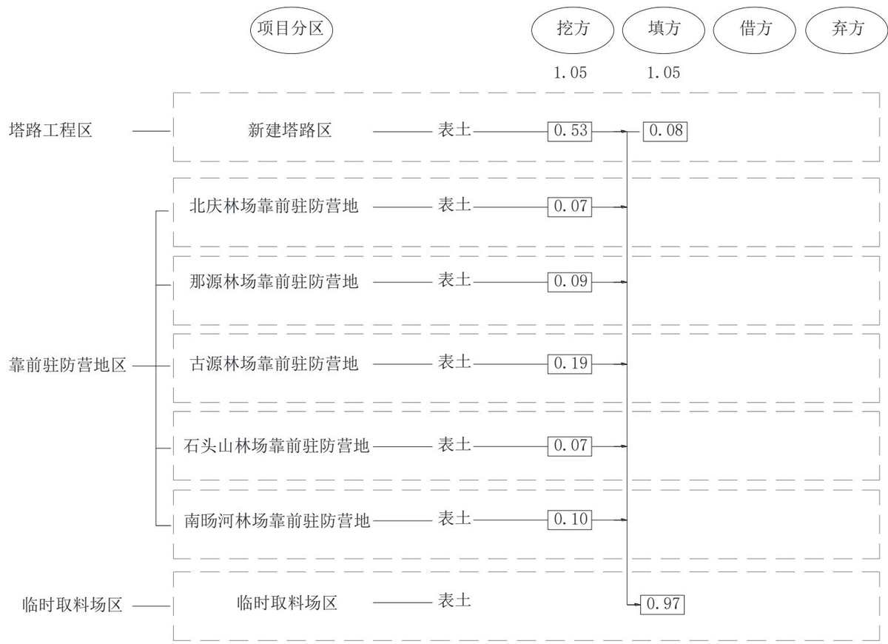
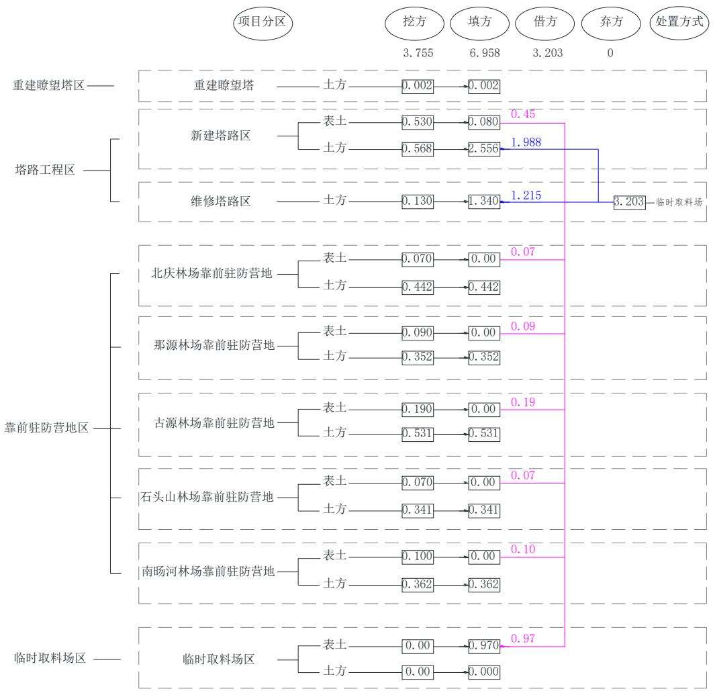
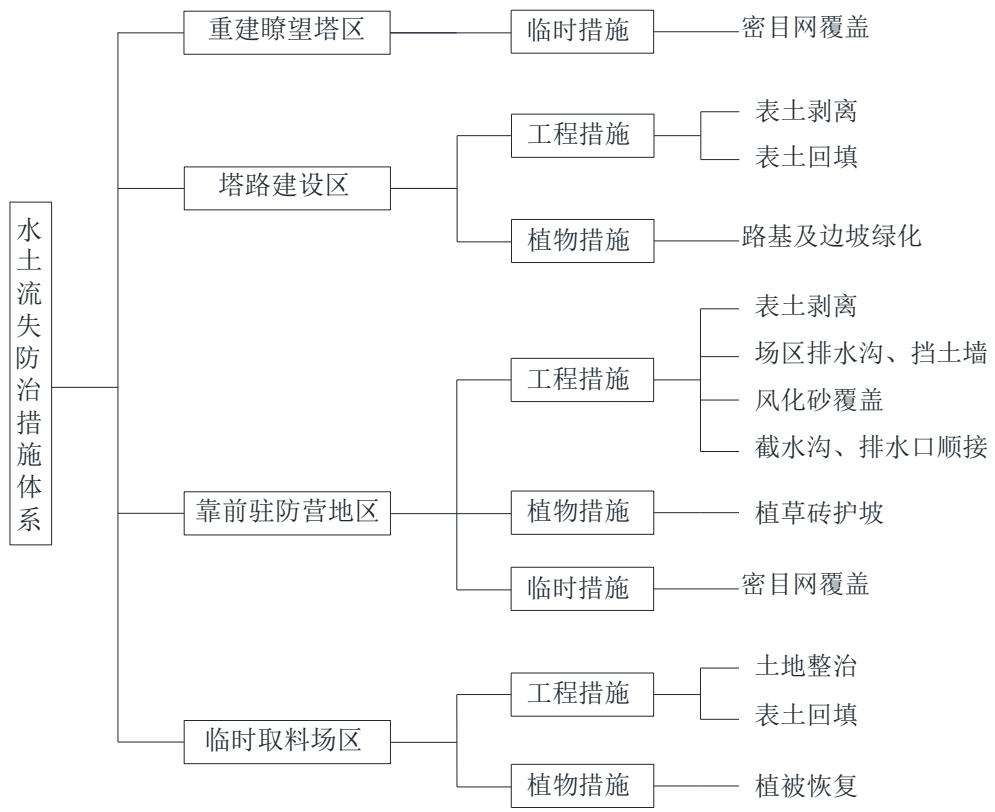

> **Zone C（应用范例层）使用边界**——仅可用于**写作风格、章节展开方式、表达逻辑、表格设计**的参考。
> **不得**用于合规判断；**不得**引入其项目数据（名称／地点／数字／单位名）；
> **不得**因其"曾经通过审批"而推定其做法在当前标准下仍然合规。
> 与 Zone A 冲突时**一律以 Zone A 为准**；Zone A 未明确规定时输出
> 「**Zone A 未明确规定，以下为参考写法，需人工判断**」。
>
> **坐标系警告**：本范例为**老八章结构**（GB 50433—2018 附录B），与 2026 版 10 章模板**同号不同义**
> （老 `1.5`＝防治目标，新 `1.5`＝水土流失预测结果；老 4→新 6 …偏移 +2；新版第 4/5 章老结构无独立章）。
> 因此 **`chapter_mapping: pending`——不得按章节号挂载**，检索一律走 `topic_tags`。
>
> **待加工**：`topic_tags`（主题标签）、`approval_basis_list`（编制依据逐字清单）、
> `structure_summary`（只提取结构：章节展开顺序／段落功能／表格栏目结构／句式模板／论证链步骤）。

## 目 录

1 综合说明..  
1.1 项目简况 ...  
1.2 编制依据 ......  
1.3 设计水平年 ..... 6  
1.4 水土流失防治责任范围..  
1.5 水土流失防治目标.... ..6  
1.6 项目水土保持评价结论...  
1.7 水土流失预测结果.... ...10  
1.8 水土保持措施布设成果... ....10  
1.9 水土保持监测方案.... ...13  
1.10 水土保持投资及效益分析成果...... .....14  
1.11 结论 ...... ....15  
2 项目概况.... ...17  
2.1 项目组成及工程布置. ....17  
2.2 施工组织 ...... ....27  
2.3 工程占地 ..... ....30  
2.4 土石方平衡 ..... ....32  
2.5 拆迁（移民）安置与专项设施改（迁）建.......... ....39  
2.6 施工进度 ... ...39  
2.7 自然概况 ... ...39  
3 项目水土保持评价.. ....42  
3.1 主体工程选址（线）水土保持评价.. ....42  
3.2 建设方案与布局水土保持评价.... ....45  
3.3 主体工程设计中水土保持措施界定.... ....51  
4 水土流失分析与预测... ...53  
4.1 水土流失现状 ..... ..53  
4.2 水土流失影响因素分析.. ...54  
4.3 土壤流失量预测 ..... ....56  
4.4 水土流失危害分析... ....62  
4.5 指导性意见 .... ...62  
5 水土保持措施..... ...64  
5.1 防治区划分 ... ...64  
5.2 措施总体布局... ....64  
5.3 分区措施布设 .... ...69  
5.4 施工要求 .. ....73  
6 水土保持监测.... .......77  
6.1 范围和时段 ... .....77  
6.2 内容和方法 .... ......77  
6.3 点位布设 .... .......79  
7 水土保持投资概算及效益分析..... ......82  
7.1 投资概算 ..... .....82  
7.2 效益分析 .... .....93  
8 水土保持管理..... .....96  
8.1 组织管理 ... ......96  
8.2 后续设计 ....... ......97  
8.3 水土保持施工 .....97  
8.4 水土保持监测 ..... ......98  
8.5 水土保持监理... ....99

## 1 综合说明

## 1.1 项目简况

## 1.1.1 项目基本情况

## 1.1.1.1 项目建设必要性

松岭林业局隶属于大兴安岭林业集团公司管辖，局址设在多布库尔河西岸、加格达奇以北嫩林铁路 56km、加漠公路 43km 处的小扬气镇，经营林场面积907028hm2，目前林区扑火营房数量较少、部分瞭望塔及塔路存在年久失修的情况。为加强火情监测及森林管理，同时进一步提高扑火队的工作效率，大兴安岭林业集团公司松岭林业局进行大兴安岭林业集团公司松岭林业局森林防火瞭望塔及扑火营房基础设施项目建设。

本次建设后能进一步完善松岭林区防火措施及森林管理功能，对于森林防火、保护国家林业资源具有重要意义，本工程的建设是十分必要的。

## 1.1.1.2 项目概况

地理位置：大兴安岭林业集团公司松岭林业局森林防火瞭望塔及扑火营房基础设施建设项目（以下简称“本工程”）场址主要位于黑龙江省大兴安岭松岭区，项目由防火基础设施和靠前驻防营地两部分组成，其中防火基础设施包括拆除重建 3 座瞭望塔、维修 18 座瞭望塔、维修 9 处塔房、新建塔路 10km 及维修塔路70km；靠前驻防营地包括新建 5处驻防营地及供水、供电等配套工程。

新建 60#塔塔道 4.534km，起点坐标（X=5662731.043，Y=617384.052），终点坐标（X=5662561.113，Y=620151.388）；新建 70#塔塔道 5.466km，起点坐标$( \mathrm { X } { = } 5 6 8 8 4 2 1 . 1 9 8 , \mathrm { Y } { = } 6 3 0 9 7 5 . 5 3 9 )$ ），终点坐标 $( \mathrm { X } { = } 5 6 9 2 9 5 0 . 0 0 6 , \mathrm { Y } { = } 6 3 1 2 9 5 . 6 6 2 )$ o

北庆驻防营地中心坐标为（X=5674264.867，Y=561855.588）；那源驻防营地中心坐标为（X=5644143.891，Y=638912.426）；古源驻防营地中心坐标为（X=5642187.481，Y=606223.561）；石头山驻防营地中心坐标为（X=5672184.474，Y=623912.446）；南旸河驻防营地中心坐标为（X=5686312.103，Y=619640.922）。

建设性质：新建、改建工程。

工程占地：本工程征占地面积 $4 1 . 4 3 \mathrm { h m } ^ { 2 }$ ，其中为永久占地 $3 9 . 9 7 \mathrm { h m } ^ { 2 }$ ，临时占地 $1 . 4 6 \mathrm { h m } ^ { 2 }$ 。其中重建瞭望塔区占地面积 $0 . 0 7 \mathrm { h m } ^ { 2 }$ ，塔路工程区占地面积为$3 6 . 6 8 \mathrm { h m } ^ { 2 }$ ，靠前驻防营地占地面积 $3 . 2 2 \mathrm { h m } ^ { 2 }$ ，临时取料场占地 $1 . 4 6 \mathrm { h m } ^ { 2 }$

工程土石方：工程建设期土方挖填总量为 10.72万 $\mathrm { m } ^ { 3 }$ （全部为自然方），其中挖方 3.76 万 $\mathrm { m } ^ { 3 }$ ，填方 6.96 万 $\mathrm { m } ^ { 3 }$ ，外借方3.20 万 $\mathrm { m } ^ { 3 }$ ，无弃方。

其中表土挖填总量为 2.10 万 $\mathrm { m } ^ { 3 }$ （全部为自然方），其中挖方 1.05 万 $\mathrm { m } ^ { 3 }$ ，填方 1.05 万 $\mathrm { m } ^ { 3 }$ ，表土全部利用，无弃方。

项目投资：工程总投资 2418 万元，土建投资 2070 万元，由中央投资安排。

建设工期：本工程已于2024 年05月开工，计划 2026年04月完工，总工期24个月。

拆迁（移民）安置与专项设施改（迁）建：本工程建设不涉及拆迁（移民）安置。

## 1.1.2 项目前期工作进展情况

1、《关于大兴安岭林业集团公司松岭林业局森林防火瞭望塔及扑火营房基础设施建设项目可行性研究报告的批复》林规批字【2022】20号，国家林业和草原局，2022 年 02 月 09 日；

2、《关于大兴安岭林业集团公司松岭林业局森林防火瞭望塔及扑火营房基础设施建设项目初步设计的批复》林规批字【2022】49号，国家林业和草原局，2022 年 07 月 01 日。

3、《大兴安岭林业集团公司松岭林业局森林防火瞭望塔及扑火营房基础设施建设项目可行性研究报告、初步设计及施工图设计》大兴安岭勘察设计院，2022年 02 月\~2023 年 07 月；

## 1.1.3 对水行政部门限期补办行政手续的措施

本项目于 2024 年 05 月开工建设，2025 年 05 月 15 日，建设单位大兴安岭松岭林业局收到松岭区水务局的关于本项目的《限期补办行政许可手续通知书》。接到补办通知书后，建设单位即刻成立督办小组，主要采取以下措施：

（1）对正在进行的施工作业立即停工，对可能造成水土流失的作业面进行覆盖。

（2）2025年05 月07日进行了《大兴安岭林业集团公司松岭林业局森林防火瞭望塔及扑火营房基础设施建设项目水土保持方案编制、水土保持验收》招标工作，确定哈尔滨庄屿环境技术有限公司为本项目的水土保持方案编制单位及水土保持验收工作，2025 年05月12日签订了方案编制合同。

（3）2025 年 05 月 12日\~2025 年 07 月 23 日，我单位哈尔滨庄屿环境技术有限公司接受水土保持方案编制任务后，立即成立了水土保持专题项目组，对工程设计资料进行全面分析研究，确定本项目为补报水土保持方案，按照内业分析外业的调查的两种方式开展本项目的水土保持方案工作，并于进行了现场踏勘，查阅了施工、监理等资料，并于相关负责人进行问询了解。按照《生产建设项目水土保持技术标准》（GB50433-2018）、《生产建设项目水土流失防治标准》（GB/T50434-2018）、《水土保持工程设计规范》（GB 51018-2014）以及水利部办公厅关于印发生产建设项目水土保持技术文件编写和印制格式规定（试行）的通知（办水保〔2018〕135 号文）的要求，于 2025 年 07 月 16 日编制完成了《大兴安岭林业集团公司松岭林业局森林防火瞭望塔及扑火营房基础设施建设项目水土保持方案报告书》，于 2025年07月23日上报至水利部。

（4）2025年09 月10日，水利部水土保持监测中心组织专家在黑龙江省大兴安岭地区加格达奇主持召开了《大兴安岭林业集团公司松岭林业局森林防火瞭望塔及扑火营房基础设施建设项目水土保持方案报告书》技术评审会，会上水利部松辽水利委员会提出因项目属于未批先建工程，水行政主管部门的责令整改程序未完成，建议建设单位大兴安岭松岭林业局完成水行政责令整改后进行上报。

（5）2025 年 10 月 13 日，松岭区农业农村局出具了《水行政处罚决定书》松水罚【2025】01号：对于建设单位建设项目《大兴安岭林业集团公司松岭林业局森林防火瞭望塔及扑火营房基础设施建设项目》未编制水土保持方案或者编制的水土保持方案未经批准而开工建设的行为给予人民币伍万元整（50000.00 元）行政处罚。

（6）2025年10 月28日，建设单位大兴安岭松岭林业局已完成水土保持的行政行政处罚。至此水行政主管部门的责令整改程序已完成，形成闭环。

（7）2025年11 月，我单位哈尔滨庄屿环境技术有限公司按照 2025年 09月的现场情况，重新复核了水土保持方案的建设进度，完成了《大兴安岭林业集团公司松岭林业局森林防火瞭望塔及扑火营房基础设施建设项目水土保持方案》。再次进行上报审批。

2025 年 10 月 24 日，水利部松辽水利委员会将大兴安岭松岭林业局列入水土保持“重点关注名单”的通告。经查，大兴安岭林业集团公司松岭林业局森林防火瞭望塔及扑火营房基础设施建设项目于 2024 年 4 月在未编报水土保持方案情况下开工建设，违反了《中华人民共和国水土保持法》第二十五条、第二十六条规定。依据《水利部办公厅关于实施生产建设项目水土保持信用监管“两单”制度的通知》（办水保〔2020〕157 号）规定，生产建设项目存在“未批先建”的，生产建设单位应当列入水土保持“重点关注名单”。现决定将你单位列入“重点关注名单”，并通过全国水利建设市场监管平台等向社会公开，公开期限为 1 年。”

我单位哈尔滨庄屿环境技术有限公司重新复核了水土保持方案的建设进度，完成了《大兴安岭林业集团公司松岭林业局森林防火瞭望塔及扑火营房基础设施建设项目水土保持方案》，后进行上报审批。

## 1.1.3 自然概况

松岭区位于大兴安岭林区南缘，伊勒呼里山东南坡，嫩江上游左岸。地理坐标为东经 123°29′23″-125°50′07″，北纬 50°09′16″-51°23′48″，东与呼玛、嫩江两县相望，北以伊勒呼里山与新林林业局为界，西与内蒙古自治区为邻，南与加格达奇林业局接壤。南北长 145km，东西宽75km。

松岭区属寒温带大陆性季风气候区，冬季酷寒期长，夏季炎热期短，春季来得迟缓，秋季降温迅速。年平均气温-1.1℃，年平均降水量 460mm，多集中在七、八月份，年均蒸发量 515.1mm；年无霜期为129 天；每年春、秋两季多大风，主风向西北风，平均风速 1.7m/s。

松岭区境内水系均为嫩江水系，主要河流有多布库尔河、古里河等 11 条主要河流。松岭区林业资源丰富，森林覆盖率达86.93%，活立木蓄积量4971万m3，区内有白桦、云杉、云杉等树种 20 余种；棕熊、麋鹿等动物 290 余种；红豆、兴安杜鹃等植物939 种。

松岭区土壤为寒温带森林土，境内基岩是以花岗岩为主，其次有片麻岩、砂岩和安岩等，经过长期的自然变化，形成土壤母质，近而形成棕色针叶林土、棕色森林土、草甸沼泽土。

根据《大兴安岭地区水土保持规划》（2015\~2030 年），项目区属于东北黑土区（一级区）的大小兴安岭山地区（二级区），三级区划为大兴安岭山地水源涵养生态维护区。依据 2024 年度黑龙江省水土流失动态监测成果可知，项目区水土流失类型主要以水力侵蚀及冻融侵蚀为主，侵蚀强度为微度，容许土壤流失量 200t/km²·a。

项目不涉及饮用水水源保护区、水功能一级区的保护区和保留区、自然保护区、世界文化和自然遗产地、风景名胜区、地质公园、森林公园以及重要湿地等

其他水土保持敏感区。

## 1.2 编制依据

## 1.2.1 法律法规

（1）《中华人民共和国水土保持法》（1991 年06月29日第七届全国人民代表大会常务委员会第二十次会议通过，自 2011 年03月01日实施）；

（2）《中华人民共和国黑土地保护法》（第十三届全国人民代表大会常务委员会第三十五次会议通过，自 2022年08月 01日起施行）；

（3）《黑龙江省水土保持条例》（2017 年 12 月 27 日通过，2018 年 03 月01日施行）。

## 1.2.2 部委规章及规范性文件

（1）《生产建设项目水土保持方案管理办法》（2023年01月17日水利部令第53 号）；

（2）《水利部办公厅关于印发生产建设项目水土保持技术文件编写和印制格式规定（试行）的通知》（办水保[2018]135 号，2018年07月12日）；

（3）《水利部办公厅关于印发生产建设项目水土保持方案技术审查要点的通知》（办水保[2023]177 号）。

## 1.2.3 技术标准

（1）《生产建设项目水土保持技术标准》（GB50433-2018）；

（2）《生产建设项目水土流失防治标准》（GB/T50434-2018）；

（3）《土壤侵蚀分类分级标准》（SL190-2007）；

（4）《生产建设项目水土保持监测与评价标准》（GB/T51240-2018）；

（5）《水土保持工程设计规范》（GB51018-2014）；

（6）《生产建设项目土壤流失量测算导则》（SL773-2018）；

（7）《水利水电工程制图标准水土保持图》（SL73.6-2015）；

（8）《水土保持工程概（估）算编制规定》（水利部水总[2024]232 号）；

（9）《土地利用现状分类》（GB/T 21010-2017）；

（10）《表土剥离及其再利用技术要求》（GBT45107-2024）；

## 1.2.4 技术资料

（1）《大兴安岭林业集团公司松岭林业局森林防火瞭望塔及扑火营房基础设施建设项目可行性研究报告、初步设计及施工图设计》大兴安岭勘察设计院，

2022 年 02 月\~2023 年 07 月；

（2）《大兴安岭地区水土保持规划（2015-2030年）》（大兴安岭地区水务局，2016 年 10 月）；

（3）主体施工、监理等资料；

（4）现场调查资料。

## 1.3 设计水平年

按照《生产建设项目水土保持技术标准》（GB50433-2018）第4.1.3条“项目的设计水平年应为主体工程完工后的当年或后一年”，本项目为建设类项目，计划于2026 年04月底完工，结合项目区实际情况分析，确定本方案设计水平年为2027 年。

## 1.4 水土流失防治责任范围

根据《生产建设项目水土保持技术标准》（GB50433-2018）的规定，本项目水土流失防治责任范围 41.43hm2。

## 1.5 水土流失防治目标

## 1.5.1 执行标准等级

根据《全国水土保持规划国家级水土流失重点预防区和重点治理区复核划分成果》（办水保〔2013〕188 号），项目区不涉及国家级水土流失重点防治区。根据《生产建设项目水土流失防治标准》（GB/T50434－2018）的有关规定，水土流失防治执行东北黑土区一级标准。根据《黑龙江省水土保持规划（2015—2030年）》，项目区属于北部大小兴安岭森林石质山地省级水土流失重点预防区。

## 1.5.2 防治目标

## （1）基本目标

生产建设项目水土流失防治应该达到下列基本目标：

1）项目建设范围内新增水土流失应得到有效控制，原有水土流失得到治理；

2）水土保持设施应安全有效；

3）水土资源、林草植被应得到最大限度的保护与恢复；

4）水土流失治理度、土壤流失控制比、渣土防护率、表土保护率、林草植被恢复率、林草覆盖率六项指标应符合现行国家标准《生产建设项目水土流失防治标准》（GB/T 50434-2018）的规定。

## （2）定量目标

根据《生产建设项目水土流失防治标准》（GB/T50434-2018），东北黑土区一级标准防治指标值项目区水土流失侵蚀强度为微度，土壤流失控制比不应小于1；水土流失治理度、林草植被恢复率、林草覆盖率可根据干旱程度进行调整；土壤流失控制比可根据侵蚀强度进行调整；渣土防护率可根据山区海拔高度进行调整；提高林草覆盖率 1%\~2%。

项目区无法避让水土流失省级重点预防区，林草覆盖率可提高 1%\~2%。

经土壤侵蚀强度和项目位置进行修正后，在方案设计水平年末防治目标应达到：水土流失治理度 95%，土壤流失控制比 1，渣土防护率 97%，表土保护率98%，林草植被恢复率 97%，林草覆盖率27%。

表 1-1 本工程水土流失防治指标表
<table><tr><td rowspan=2 colspan=1>序号</td><td rowspan=2 colspan=1>防治目标</td><td rowspan=1 colspan=2>一级标准</td><td rowspan=2 colspan=1>参数调整</td><td rowspan=1 colspan=2>水土流失防治目标值</td></tr><tr><td rowspan=1 colspan=1>施工期</td><td rowspan=1 colspan=1>设计水平年</td><td rowspan=1 colspan=1>施工期</td><td rowspan=1 colspan=1>设计水平年</td></tr><tr><td rowspan=1 colspan=1>1</td><td rowspan=1 colspan=1>水土流失治理度（%）</td><td rowspan=1 colspan=1>一</td><td rowspan=1 colspan=1>95</td><td rowspan=1 colspan=1>/</td><td rowspan=1 colspan=1>/</td><td rowspan=1 colspan=1>95</td></tr><tr><td rowspan=1 colspan=1>2</td><td rowspan=1 colspan=1>土壤流失控制比</td><td rowspan=1 colspan=1>一</td><td rowspan=1 colspan=1>0.90</td><td rowspan=1 colspan=1>提高到1.0</td><td rowspan=1 colspan=1>1</td><td rowspan=1 colspan=1>1.0</td></tr><tr><td rowspan=1 colspan=1>3</td><td rowspan=1 colspan=1>渣土防护率（%）</td><td rowspan=1 colspan=1>95</td><td rowspan=1 colspan=1>97</td><td rowspan=1 colspan=1>/</td><td rowspan=1 colspan=1>95</td><td rowspan=1 colspan=1>97</td></tr><tr><td rowspan=1 colspan=1>4</td><td rowspan=1 colspan=1>表土保护率（%）</td><td rowspan=1 colspan=1>95</td><td rowspan=1 colspan=1>98</td><td rowspan=1 colspan=1>/</td><td rowspan=1 colspan=1>98</td><td rowspan=1 colspan=1>98</td></tr><tr><td rowspan=1 colspan=1>5</td><td rowspan=1 colspan=1>林草植被恢复率（%）</td><td rowspan=1 colspan=1>二</td><td rowspan=1 colspan=1>97</td><td rowspan=1 colspan=1>/</td><td rowspan=1 colspan=1>/</td><td rowspan=1 colspan=1>97</td></tr><tr><td rowspan=1 colspan=1>6</td><td rowspan=1 colspan=1>林草覆盖率（%）</td><td rowspan=1 colspan=1></td><td rowspan=1 colspan=1>25</td><td rowspan=1 colspan=1>+2%</td><td rowspan=1 colspan=1>/</td><td rowspan=1 colspan=1>27</td></tr></table>

## 1.6 项目水土保持评价结论

## 1.6.1 主体工程选址（线）评价

本项目主体工程选址（线）符合《中华人民共和国水土保持法》、《生产建设项目水土保持技术标准》（GB50433—2018）的规定要求，本项目建设区不涉及水土流失严重和生态脆弱区，不涉及崩塌滑坡危险区和泥石流易发区。项目区不涉及全国水土保持监测网络中的水土保持监测站点、重点试验区、水土保持长期定位观测站。

本项目虽涉及松岭区生态保护红线，但项目为防灾减灾救灾设施修筑建设项目，属于《自然资源部 生态环境部 国家林业和草原局关于加强生态保护红线管理的通知（试行）》（〔2022〕142 号）第一项第 4 条规定，允许该类项目建设，因此本项目可以涉及生态保护红线。

项目区建设不涉及世界文化和自然遗产地，周边没有风景名胜区、地质公园、重要湿地等，项目建设不会对上述重要自然环境要素产生不利影响。本项目选址无法避让省级水土流失重点预防区，工程采用一级防治标准，提高林草覆盖率，并通过水土保持方案提出完善措施，提高防治标准，可以满足选址约束性规定要求。项目选址不存在水土保持方面的绝对和严格限制性因素，选址基本合理。

本项目选址无法避让省级水土流失重点预防区，工程采用一级防治标准，提高林草覆盖率，并通过水土保持方案提出完善措施，提高防治标准，可以满足选址约束性规定要求。因此，从水土保持角度分析，项目选址不存在水土保持方面的绝对和严格限制性因素，选址基本合理。

## 1.6.2 建设方案与布局评价

通过水土保持角度对建设方案、工程占地、土石方平衡、施工方法与工艺、具有水土保持功能工程的评价结论，得出结论如下：

## （1）建设方案评价

重建瞭望塔区、维修瞭望塔区及维修塔房区是在原有基础上进行建设，建筑面积较小，占地现状比较平整，无大挖大填区域，无大面积的场地开挖平整施工，不破坏绿色植被及原始地貌，符合水土保持要求。

新建塔路区结合与建设单位、设计单位及根据现场调查得知，新建塔路选线原则为尽量减少工程数量，减少对周边环境扰动，降低工程造价，尽可能的避让长势较好的林木地块，塔路两侧各 0.75m 宽路肩及边坡采用撒播草籽的方式进行植被恢复，符合水土保持要求。

维修塔路沿旧路进行布设，维持现有道路线形（维持原有旧路小曲线、小偏角），不新增占地，塔路两侧各 0.75m 宽路肩采用撒播草籽的方式进行植被恢复，符合水土保持要求。

本次建设的 5处驻防营地区营房均在缓坡上建设，营房均采用条形基础，竖向上按照顺地形布设，后侧挖土回填至前面缓坡处，整体避免了大面积的土方开挖，开挖的余土在营地进行场地平整，土方无外弃。营地内各种建、构筑物占地紧凑，占地现状比较平整，雨水采用排水沟的方式顺地势排入周边自然明渠。总体布置减少了土石方开挖量，满足雨水排水要求，符合水土保持要求。

## （2）工程占地评价

从土地利用类型看，本项目占地类型为乔木林地 $1 . 3 3 \mathrm { h m } ^ { 2 }$ 、其他林地 $1 . 3 1 \mathrm { h m } ^ { 2 }$ 裸土地 $6 . 7 3 \mathrm { h m } ^ { 2 }$ 及公路用地 $3 2 . 0 6 \mathrm { h m } ^ { 2 }$ 。占地中，现状的塔路占地高达 77.38%，现状塔路主要为路面维修，路基修补较小，路基已稳定，产生水土流失的因素减少，项目选址不占用永久基本农田和耕地。本工程占地符合土地利用规划要求，规模合理，符合因地制宜、集约用地的原则。

## （3）土石方平衡评价

本次施工过程中对项目占地可剥离表土区域进行了表土剥离，剥离的表土在已全部用于绿化覆土回填，作为植被恢复用土，保护了表土资源。驻防营地区营房采用条形基础，竖向上按照顺地形布设，避免了大面积的土方开挖，开挖的余土在营地进行场地平整，土方无外弃。截止目前 2025年06月，项目主要的土方工程己基本结束，本次根据项目的设计资料、施工监理资料，结合现场调查资料，土方开挖回填基本平衡，土方无外运，土方在倒运过程中采用了苫盖、洒水等措施防治运输过程中水土流失。

## （4）取土（石、料）场评价

项目施工前，大兴安岭地区行署批复了项目的取料场，共计 12 处，占地面积为2.39hm2。由于大兴安岭林区取料场审批原则以林班为单位并避开生态红线，导致批复的料场数量较多。施工时维修塔路部分实际用料少于设计的用量，实际使用的取料场4处能满足项目的路基填筑需求，共计扰动面积 1.46hm2，较批复的减少0.93hm2，符合减少扰动土地面积的水土保持要求。

批复的取料场选址均避开了耕地，且原始占地为老料场，本次取料结束后即进行土地恢复绿化，取料场不再产生新增人为水土流失，满足保护林地资源和水土保持的相关要求。

## （5）施工方法与工艺

本工程施工场地布置避让了植被相对良好的区域，进行了表土剥离与临时防护，裸露地表进行苫盖并及时恢复。采用机械施工为主，人工施工为辅的方式，缩短了建设工期，减少了土石方开挖、回填与地表扰动。从水土保持角度分析，施工组织设计、施工方法与施工工艺合理，有利于减少工程建设过程中水土流失。

## （6）主体工程设计中具有水土保持功能工程的评价

主体工程从自身功能和安全角度考虑，布置了表土剥离、表土回填、路肩绿化、场区排水沟、风化砂地面覆盖、土地整治及取料场植被恢复等具有水土保持功能的设施，在充分发挥主体工程自身作用的同时，有效地防治了水土流失。

综上所述，本方案从水土保持角度对建设方案、工程占地、土石方平衡、施工方法与工艺、主体设计水土保持工程界定等方面进行分析评价，基本符合《生产建设项目水土保持技术标准》（GB50433-2018）相关规定与要求。

## 1.7 水土流失预测结果

通过对项目工程建设中水土流失的分布、发生、发展和成因进行综合分析和预测评价，原地貌土壤流失量为 214.66t，项目建设所造成的土壤流失总量为943.35t，新增土壤流失量为 728.69t。

工程建设土石方开挖、回填，施工扰动等，将不可避免地改变原有地貌，破坏原生植被，导致土地生产力降低，加速土壤侵蚀程度，影响周边生态环境。若不做好工程建设过程中的施工管理，及时落实各项水土保持措施，势必会加剧工程区水土流失，对周边生态环境及当地的经济发展产生不利影响。

## 1.8 水土保持措施布设成果

方案根据项目平面布置、施工工艺、水土流失主导因子等，结合水土流失防治责任范围的划分，遵照治理措施布设合理、技术指标可行、方案实施后经济有效的原则，在全面勘察和分析的基础上，把本工程水土流失防治区划分为重建瞭望塔区、塔路工程区、靠前驻防营地区及临时取料场四个分区。主要的措施如下：

## （1）重建瞭望塔区

1、临时措施：密目网覆盖。

（2）塔路工程区

1、工程措施：表土剥离、表土回填。

2、植物措施：路肩及边坡绿化。

## （3）靠前驻防营地区

1、工程措施：表土剥离、场区排水沟、风化砂地面、截水沟、挡土墙、场区排水沟出水口顺接措施。

2、植物措施：植草砖护坡。

3、临时措施：密目网覆盖。

（4）临时取料场区

1、工程措施：表土回填、土地整治。

2、植物措施：植被恢复。

因项目已开工，本次按照已完成的水土保持措施及未完成的水土保持措施分开叙述项目的各水土保持总体布局。

## 1.8.1已完成的水土保持措施

## 1.8.1.1 重建瞭望塔区

密目网苫盖：瞭望塔塔基施工时，对于开挖的土方采用密目网覆盖，规格采用 2000 目 $/ 1 0 0 \mathrm { c m } ^ { 2 }$ ，共用密目网 $4 6 0 \mathrm m ^ { 2 }$ 。实施时段 2024 年 08 月\~2024 年 09 月。

## 1.8.1.2 塔路工程区

## （1）工程措施

1、表土剥离：施工时对新建塔路区路基开挖范围内的乔木林地及其他林地进行了表土剥离，项目共计剥离表土面积 $1 5 1 0 0 \mathrm { m } ^ { 2 }$ ，腐殖质土层厚度为30\~40cm，平均剥离的厚度为35cm，剥离表土量为 $5 2 8 5 \mathrm { m } ^ { 3 }$ 。实施时段2024年06月。

2、表土回填：新建塔路区路肩及边坡处的绿化进行表土回填，回填面积$5 2 0 0 \mathrm { m } ^ { 2 }$ ，回填量为 0.08 万 m3，平均回填厚度为 12\~16cm，实施时段 2024 年 06月。

## （2）植物措施

路肩及边坡绿化：剥离的表土已回用至新建塔路的路肩使用，路肩宽度为0.75m，两侧共计1.5m，加上填筑边坡绿化，共计绿化面积为 $1 2 . 5 2 \mathrm { h m } ^ { 2 }$ ，其中新建塔路区 $2 . 0 2 \mathrm { h m } ^ { 2 }$ ，维修塔路区 $1 0 . 5 0 \mathrm { h m } ^ { 2 }$ 。采用撒播草籽绿化，草种为早熟禾+羊草混播，实施规格为 1:1，撒播密度标准 $1 2 0 \mathrm { k g / h m } ^ { 2 }$ ，撒播草籽量为 1502.4kg，实施时段 2024 年 08 月\~2024 年 09 月。

## 1.8.1.3 靠前驻防营地区

## （1）工程措施

1、表土剥离：施工时对营地占地范围内的乔木林地及其他林地进行了表土剥离，项目共计剥离表土面积 $1 3 1 1 7 \mathrm { m } ^ { 2 }$ ，腐殖质土层厚度为 30\~60cm，剥离表土量为 $5 2 8 3 \mathrm { m } ^ { 3 }$ 。各营地的表土剥离措施如下：

①北庆林场驻防营地剥离表土面积 $2 0 6 3 \mathrm { m } ^ { 2 }$ ，腐殖质土层厚度为 30\~40cm，平均剥离的厚度为35cm，剥离表土量为 $7 2 2 \mathrm { m } ^ { 3 }$ ，实施时段2024年06月。

②那源林场驻防营地剥离表土面积 $1 9 2 5 \mathrm { m } ^ { 2 }$ ，腐殖质土层厚度为 40\~60cm，平均剥离的厚度为50cm，剥离表土量为 $9 6 2 \mathrm { m } ^ { 3 }$ ，实施时段2024年06月。

③古源林场驻防营地剥离表土面积 $3 4 4 4 \mathrm { m } ^ { 2 }$ ，腐殖质土层厚度为 50\~60cm，平均剥离的厚度为55cm，剥离表土量为 $1 8 9 4 \mathrm { m } ^ { 3 }$ ，实施时段2024年06月。

④石头山林场驻防营地剥离表土面积 $1 6 2 0 \mathrm { m } ^ { 2 }$ ，腐殖质土层厚度为40\~50cm，平均剥离的厚度为45cm，剥离表土量为 $7 2 9 \mathrm { m } ^ { 3 }$ ，实施时段2024年06月。

⑤南旸河林场驻防营地剥离表土面积 2171m2，腐殖质土层厚度为40\~60cm，平均剥离的厚度为45cm，剥离表土量为 $9 7 6 \mathrm m ^ { 3 }$ ，实施时段2024年06月。

2、风化砂地面：根据现场调查，驻防营地训练场及停车场风化砂地面的措施，对于雨水入渗、防止扬尘具有较好的作用，共计面积为 $2 6 4 0 1 \mathrm { m } ^ { 2 }$ 。各营地的风化砂地面覆盖措施如下：

①北庆林场驻防营地 $4 1 3 6 \mathrm { m } ^ { 2 }$ ，实施时段2025年03月。

②那源林场驻防营地 $4 3 8 8 \mathrm { m } ^ { 2 }$ ，实施时段2025年03月。

③古源林场驻防营地 $9 2 2 9 \mathrm { m } ^ { 2 }$ ，实施时段2025年03月。

④石头山林场驻防营地 $4 1 3 7 \mathrm { m } ^ { 2 }$ ，实施时段 2025年04月。

⑤南旸河林场驻防营地 $4 5 1 1 \mathrm { m } ^ { 2 }$ ，实施时段 2025年04月。

3、场区排水沟：场区排水沟采用预制砼结构，底宽 0.5m，高0.5m，共计长度 903m。其中北庆林场驻防营地 170m，那源林场驻防营地 150m，古源林场驻防营地206m，排水沟采用浆砌石结构，石头山林场驻防营地 203m，南旸河林场驻防营地 174m。汇流雨水后，排至林区周边排水沟道，实施时段 2025 年 07 月\~2025 年 08 月。

4、排水出口处护砌：场区排水沟出口与现状自然坡道交汇处采用 35cm 厚浆砌石护砌，底层铺设 10cm 的砂石料作为垫层，每处排水沟与自然沟道交汇处实施 5m，共计 25m，实施时段 2025 年 07 月\~2025 年 08 月。

5、挡土墙：古源场区边坡采用重力式浆砌石挡土墙，高 1.2m，长度为 206m，实施时段 2025 年 07 月\~2025 年 08 月。

## （2）植物措施

植草砖护坡：本次边坡采用植草砖护坡，边坡高度 1.5\~3.5m，坡比为 1:1。边坡面积共计1982m2，其中北庆驻防营地281m2，那源驻防营地 $3 9 1 \mathrm { m } ^ { 2 }$ ，古源驻防营地449m2，石头山驻防营地 317m2，南旸河驻防营地 544m2。

植草砖内铺设商品有机肥，使用器械（耙、耱等）使肥料埋入≥8cm 深的土层，确保与土壤充分混合，避免养分流失，最低用量为75m3（约 $6 0 \mathrm { t } ) / \mathrm { h m } ^ { 2 }$ ，共计需要外购有机肥14.86m3。

草籽采用早熟禾+羊草 1:1 混播，根据项目区水热条件的实际情况，撒播密度标准为 $1 2 0 \mathrm { k g / h m } ^ { 2 }$ ，共计需要草籽 23.78kg。

以上措施实施时间 2025 年 07 月\~2025 年 08 月。

## 1.8.1.4 临时取料场区

## （1）工程措施

1、土地整治：对塔路施工时的取料场通过对扰动的场地进行坑凹回填、平整压实等整治活动，恢复土地原有功能，共 $1 . 4 6 \mathrm { h m } ^ { 2 }$ 。实施时段 2024 年 07 月\~2024 年 08 月。

2、表土回填：根据现场调查及施工单位提供资料，塔路及营房施工前剥离的腐殖质土层运输至临时取料场进行堆存，取料结束后平铺至取料场，共计回填表土 0.97 万 $\mathrm { m } ^ { 3 }$ ，实施时段 2024 年 05 月\~2024 年 06 月。

## （2）植物措施

## 1、栽植乔木

土地整治结束后对临时取料场进行植被恢复，种植乔木为云杉，苗木规格为容器苗，地径 2cm，株行距 2m×2m，共计栽植云杉 2190 株，措施实施时间为2024 年 08 月。

## 2、撒播种草

表土回覆后采用撒播草籽的方式，草种选择早熟禾+羊草 1:1 混播，撒播草籽面积 1.35hm2，撒播密度标准为 $1 2 0 \mathrm { k g / h m } ^ { 2 }$ ，共计需要草种 162kg，实施时段2024 年 08 月。

## 1.8.2未完成的水土保持措施

## （1）工程措施

截水沟：本项目处于水力侵蚀与冻融侵蚀区，为保证项目外来水不影响边坡稳定及尽可能减少坡面雨水入渗，在挖方边坡上方设置了截水沟，截水沟为浅碟式结构，底宽0.3m，高 0.3m，共布设600m，需要有机肥 81.27m3，其中其中北庆驻防营地 123m，那源驻防营地 119m，古源驻防营地 119m，石头山驻防营地96m，南旸河驻防营地 143m。截水沟的计划实施时间 2026年04月。

## （2）临时措施

密目网苫盖：剩余工程实施时，对于未及时处理的裸露地表，采用密目网覆盖，规格采用2000目 $/ 1 0 0 \mathrm { c m } ^ { 2 }$ ，共用密目网 $2 0 0 0 \mathrm { m } ^ { 2 }$ 。实施时段2026年04 月。

## 1.9 水土保持监测方案

根据《生产建设项目水土保持技术标准》（GB50433-2018），水土保持监测时段从施工准备期开始，监测时段从 2024 年05 月开始\~2026 年 04月，累计 24个月。本项目已于 2024 年 05 月开工建设，已错过 2024 年 05 月\~2025 年 09 月的监测期，此段采用追溯法进行水土流失监测。

对于 2025 年 09 月\~施工期结束段，建设单位应根据工程的施工进度，及时开展水土保持监测工作，按照有关规定、规范对防治责任范围内的水土流失和水土保持防治情况进行监测，监测资料应及时进行分项整理分析，每年年底进行年度总结，编制监测报表和报告，向建设单位及相应水行政主管部门汇报监测成果。

根据各监测区水土流失程度和特点，各监测分区内布设具有代表性的监测点位，共布设监测点位 4个，其中塔路工程区布设 1处，主要监测塔路区的路肩边坡绿化措施恢复情况；选取古源林场靠前驻防营地布设 2个，其中1处设置在驻防营地训练场，监测驻防营地训练场的水土流失状况，1处布设在边坡处，监测边坡的施工情况及排水情况；临时取料场布设 1处，监测临时取料场的植被生长情况。

监测单位在监测期间，要做好监测记录和资料整编，按季度编制监测季报，并应于每季度的第一个月内向水行政主管部门报送上季度的监测季报，监测季报对项目水土流失防治情况进行评价，明确“绿黄红”三色评价结论，每年的第一个季度编制监测年度报告，报水行政主管部门。监测单位发现可能发生水土流失危害情况的，应随时向生产建设单位报告；因大风、暴雨或人为原因发生严重水土流失及危害事件要及时进行调查，一周内完成调查成果取证并上报。在水土保持设施验收前应编制监测总结报告。总结报告应对项目水土流失防治情况进行评价，明确“绿黄红”三色评价结论。

## 1.10 水土保持投资及效益分析成果

本项目水土保持方案总投资 328.48 万元，其中工程措施投资 137.25 万元，植物措施投资47.64万元，监测措施投资 15.65 万元，施工临时工程投资12.84 万元，独立费用 52.10 万元，基本预备费 13.27 万元，水土保持补偿费 49.71 万元（497145.60 元）。主体已完成水土保持投资 182.28 万元，未完成水土保持措施投资 146.20 万元。

通过水土保持措施布设后，水土流失治理度为 98.84%，土壤流失控制比为1，渣土防护率99.17%，表土保护率 100%，林草植被恢复率 98.75%，林草覆盖率 34.23%。

## 1.11 结论

按照《中华人民共和国水土保持法》、《生产建设项目水土保持技术标准》（GB 50433-2018）等相关规定进行相符性分析，对于无法避让的省级水土流失重点预防区，本方案提高防治标准指标值水土保持措施布设量，加强预防保护，优化施工工艺，尽量减少地表扰动和植被损坏范围，同时采取科学可行的水土流失防治措施，最大限度地保护现有土地和植被的水土保持功能，从水土保持角度分析，项目建设可行。

针对主体工程设计建设的实际情况，本方案提出以下建议：

（1）方案批复后，建设单位应尽快落实方案设计的相关水土保持措施，项目完工后尽快组织验收。

（2）及时开展水土保持监测工作，本项目的水土保持监测应对已开工发生的水土流失进行追溯监测，新开工区域的水土保持监测应建立、健全监测制度，保证水土保持监测的顺利实施，实行水土保持监测“绿黄红”三色评价。

大兴安岭林业集团公司松岭林业局森林防火瞭望塔及扑火营房基础设施建设项目水土保持方案特性表
<table><tr><td rowspan=1 colspan=1>项目名称</td><td rowspan=1 colspan=5>大兴安岭林业集团公司松岭林业局森林防火瞭望塔及扑火营房基础设施建设项目</td><td rowspan=1 colspan=3>流域管理机构</td><td rowspan=1 colspan=1>水利部松辽水利委员会</td></tr><tr><td rowspan=1 colspan=1>涉及省区</td><td rowspan=1 colspan=2>黑龙江省</td><td rowspan=1 colspan=2>涉及地市或个数</td><td rowspan=1 colspan=1>大兴安岭地区</td><td rowspan=1 colspan=3>涉及县或个数</td><td rowspan=1 colspan=1>松岭区</td></tr><tr><td rowspan=1 colspan=1>项目规模</td><td rowspan=1 colspan=2>小型</td><td rowspan=1 colspan=2>总投资（万元）</td><td rowspan=1 colspan=1>2418</td><td rowspan=1 colspan=3>土建投资(万元)</td><td rowspan=1 colspan=1>2070</td></tr><tr><td rowspan=1 colspan=1>动工时间</td><td rowspan=1 colspan=2>2024年05月</td><td rowspan=1 colspan=2>完工时间</td><td rowspan=1 colspan=1>2026年04月</td><td rowspan=1 colspan=3>设计水平年</td><td rowspan=1 colspan=1>2027年</td></tr><tr><td rowspan=1 colspan=1>工程占地(hm²)</td><td rowspan=1 colspan=2>41.43</td><td rowspan=1 colspan=2>永久占地(hm²)</td><td rowspan=1 colspan=1>39.97</td><td rowspan=1 colspan=3>临时占地(hm²)</td><td rowspan=1 colspan=1>1.46</td></tr><tr><td rowspan=1 colspan=3>土石方总量（万m³）</td><td rowspan=1 colspan=2>挖方</td><td rowspan=1 colspan=1>填方</td><td rowspan=1 colspan=3>借方</td><td rowspan=1 colspan=1>余方</td></tr><tr><td rowspan=1 colspan=3>10.72</td><td rowspan=1 colspan=2>3.76</td><td rowspan=1 colspan=1>6.96</td><td rowspan=1 colspan=3>3.20</td><td rowspan=1 colspan=1>0.00</td></tr><tr><td rowspan=1 colspan=3>重点防治区名称</td><td rowspan=1 colspan=7>黑龙江省水土流失重点预防区</td></tr><tr><td rowspan=1 colspan=3>地貌类型</td><td rowspan=1 colspan=2>低山丘陵区</td><td rowspan=1 colspan=2>水土保持区划</td><td rowspan=1 colspan=3>东北黑土区</td></tr><tr><td rowspan=1 colspan=3>土壤侵蚀类型</td><td rowspan=1 colspan=2>水力侵蚀、冻融侵蚀</td><td rowspan=1 colspan=2>土壤侵蚀强度</td><td rowspan=1 colspan=3>微度</td></tr><tr><td rowspan=1 colspan=3>防治责任范围面积（hm²）</td><td rowspan=1 colspan=2>41.43</td><td rowspan=1 colspan=2>容许土壤流失量</td><td rowspan=1 colspan=3>200</td></tr><tr><td rowspan=1 colspan=3>土壤流失预测总量（t）</td><td rowspan=1 colspan=2>943.35</td><td rowspan=1 colspan=2>新增土壤流失量（t）</td><td rowspan=1 colspan=3>728.69</td></tr><tr><td rowspan=1 colspan=3>水土流失防治标准执行等级</td><td rowspan=1 colspan=7>东北黑土区一级标准</td></tr><tr><td rowspan=3 colspan=1>防治指标</td><td rowspan=1 colspan=2>水土流失治理度</td><td rowspan=1 colspan=2>95</td><td rowspan=1 colspan=2>土壤流失控制比</td><td rowspan=1 colspan=3>1.0</td></tr><tr><td rowspan=1 colspan=2>渣土挡护率（%）</td><td rowspan=1 colspan=2>97</td><td rowspan=1 colspan=2>表土保护率（%）</td><td rowspan=1 colspan=3>98</td></tr><tr><td rowspan=1 colspan=2>林草植被恢复率</td><td rowspan=1 colspan=2>97</td><td rowspan=1 colspan=2>林草覆盖率（%）</td><td rowspan=1 colspan=3>27</td></tr><tr><td rowspan=2 colspan=1>防治措施及工程量</td><td rowspan=1 colspan=3>工程措施</td><td rowspan=1 colspan=2>植物措施</td><td rowspan=1 colspan=4>临时措施</td></tr><tr><td rowspan=1 colspan=3>表土剥离 2.63hm²，表土回填1.05万m³，场区浆砌石排水沟206m，场区砼排水沟697m，截水沟600m，风化砂地面2.64hm²，挡土墙 206m，雨水出口处护砌25m，土地整治1.46hm²。</td><td rowspan=1 colspan=2>共计绿化面积14.18hm²，撒播草籽 11701.60kg，外购有机肥226.47t。植草砖护坡 1982m²。</td><td rowspan=1 colspan=4>密目网苫盖2460m²。</td></tr><tr><td rowspan=1 colspan=1>投资（万元）</td><td rowspan=1 colspan=3>137.25</td><td rowspan=1 colspan=2>47.64</td><td rowspan=1 colspan=4>12.84</td></tr><tr><td rowspan=1 colspan=2>水土保持总投资(万元)</td><td rowspan=1 colspan=3>328.48</td><td rowspan=1 colspan=1>独立费用(万元)</td><td rowspan=1 colspan=4>52.05</td></tr><tr><td rowspan=1 colspan=2>监理费（万元）</td><td rowspan=1 colspan=1>15.63</td><td rowspan=1 colspan=2>建设期观测费（万元）</td><td rowspan=1 colspan=1>15.65</td><td rowspan=1 colspan=2>补偿费(万元)</td><td rowspan=1 colspan=2>49.71</td></tr><tr><td rowspan=1 colspan=2>方案编制单位</td><td rowspan=1 colspan=3>哈尔滨庄屿环境技术有限公司</td><td rowspan=1 colspan=1>建设单位</td><td rowspan=1 colspan=4>大兴安岭松岭林业局</td></tr><tr><td rowspan=1 colspan=2>法定代表人</td><td rowspan=1 colspan=3>董海军</td><td rowspan=1 colspan=1>法定代表人</td><td rowspan=1 colspan=4>周宏君</td></tr><tr><td rowspan=1 colspan=2>地址</td><td rowspan=1 colspan=3>黑龙江省哈尔滨市利民开发区滨才城翠锦居E栋</td><td rowspan=1 colspan=1>地址</td><td rowspan=1 colspan=4>黑龙江省大兴安岭地区松岭区小扬气镇</td></tr><tr><td rowspan=1 colspan=2>邮编</td><td rowspan=1 colspan=3>150025</td><td rowspan=1 colspan=1>邮编</td><td rowspan=1 colspan=4>165000</td></tr><tr><td rowspan=1 colspan=2>联系人及电话</td><td rowspan=1 colspan=3>朱兴杰 13836918921</td><td rowspan=1 colspan=1>联系人及电话</td><td rowspan=1 colspan=4>徐林生 1845797903</td></tr><tr><td rowspan=1 colspan=2>电子信箱</td><td rowspan=1 colspan=3>260071739@qq.com</td><td rowspan=1 colspan=1>电子信箱</td><td rowspan=1 colspan=4>sunliang19921025@163.com</td></tr></table>

## 2 项目概况

## 2.1 项目组成及工程布置

## 2.1.1 项目组成

本项目建设由瞭望塔及塔房工程、塔路工程、驻防营地及临时取料场 4部分组成。其中瞭望塔及塔房工程包括拆除重建 3 座瞭望塔、维修 18 座瞭望塔、维修 9 处塔房；塔路工程包括新建塔路 10km 及维修塔路 70km；靠前驻防营地包括新建5处驻防营地及供水、供电等配套工程；临时取料场共计 4处。

项目主要经济技术指标表见表 2-1。

表 2-1 主要经济技术指标表
<table><tr><td rowspan=1 colspan=1>序号</td><td rowspan=1 colspan=1>分项</td><td rowspan=1 colspan=1>数量</td><td rowspan=1 colspan=1>规格</td><td rowspan=1 colspan=1>备注</td></tr><tr><td rowspan=1 colspan=1>一</td><td rowspan=1 colspan=1>瞭望塔及塔房工程</td><td rowspan=1 colspan=1></td><td rowspan=1 colspan=1></td><td rowspan=1 colspan=1></td></tr><tr><td rowspan=1 colspan=1>1</td><td rowspan=1 colspan=1>重建瞭望塔</td><td rowspan=1 colspan=1>3座</td><td rowspan=1 colspan=1>塔底5×5m</td><td rowspan=1 colspan=1>那源林场65#、古源林场68#及南旸河林场 70#</td></tr><tr><td rowspan=1 colspan=1>2</td><td rowspan=1 colspan=1>维修瞭望塔</td><td rowspan=1 colspan=1>18座</td><td rowspan=1 colspan=1></td><td rowspan=1 colspan=1>主要为装修工程</td></tr><tr><td rowspan=1 colspan=1>3</td><td rowspan=1 colspan=1>塔房维修</td><td rowspan=1 colspan=1>9处</td><td rowspan=1 colspan=1></td><td rowspan=1 colspan=1>主要为装修工程</td></tr><tr><td rowspan=1 colspan=1>二</td><td rowspan=1 colspan=1>塔路工程</td><td rowspan=1 colspan=1></td><td rowspan=1 colspan=1></td><td rowspan=1 colspan=1></td></tr><tr><td rowspan=1 colspan=1>1</td><td rowspan=1 colspan=1>新建塔路</td><td rowspan=1 colspan=1>10km</td><td rowspan=1 colspan=1>路基采用4.5m，路面宽度3.0m</td><td rowspan=1 colspan=1>新建 60#塔塔道 4.5km，新建 70#塔塔道 5.5km</td></tr><tr><td rowspan=1 colspan=1>2</td><td rowspan=1 colspan=1>维修塔道</td><td rowspan=1 colspan=1>70km</td><td rowspan=1 colspan=1>路基采用4.5m，路面宽度3.0m</td><td rowspan=1 colspan=1>27处，原有路基上进行整修</td></tr><tr><td rowspan=1 colspan=1>三</td><td rowspan=1 colspan=1>靠前驻防营地</td><td rowspan=1 colspan=1></td><td rowspan=1 colspan=1></td><td rowspan=1 colspan=1></td></tr><tr><td rowspan=1 colspan=1>1</td><td rowspan=1 colspan=1>北庆林场靠前驻防营地</td><td rowspan=1 colspan=1>1处</td><td rowspan=1 colspan=1></td><td rowspan=5 colspan=1>营房、训练场、停车场及其供水供电设施</td></tr><tr><td rowspan=1 colspan=1>2</td><td rowspan=1 colspan=1>那源林场靠前驻防地地</td><td rowspan=1 colspan=1>1 处</td><td rowspan=1 colspan=1></td></tr><tr><td rowspan=1 colspan=1>3</td><td rowspan=1 colspan=1>古源林场靠前驻防营地</td><td rowspan=1 colspan=1>1 处</td><td rowspan=1 colspan=1></td></tr><tr><td rowspan=1 colspan=1>4</td><td rowspan=1 colspan=1>石头山林场靠前驻防营地</td><td rowspan=1 colspan=1>1 处</td><td rowspan=1 colspan=1></td></tr><tr><td rowspan=1 colspan=1>5</td><td rowspan=1 colspan=1>南旸河林场靠前驻防营地</td><td rowspan=1 colspan=1>1 处</td><td rowspan=1 colspan=1></td></tr><tr><td rowspan=1 colspan=1>四</td><td rowspan=1 colspan=1>临时取料场</td><td rowspan=1 colspan=1>4处</td><td rowspan=1 colspan=1></td><td rowspan=1 colspan=1>塔路工程筑路材料</td></tr></table>

本项目已于 2024 年05月开工建设，截止 2025年09月，项目大部分施工内容已完成。本次按照已完成内容及未完成内容两部分进行叙述。

## 2.1.2 已完成内容

根据 2025年09 月现场调查，施工共分为 6个标段，其中 1\~5标段为主体工程标段，6标段为生态环境标段。

1标段：建设内容包括重建瞭望塔、维修瞭望塔及维修塔房，开工时间为 2024年 05 月，施工结束时间为 2024 年 10 月，施工单位为大兴安岭宗信建筑工程有限责任公司。

2 标段：建设内容包括新建塔路及维修塔路两部分，开工时间为 2024 年 05

月，施工结束时间为 2024 年 10 月，施工单位为黑龙江省裕琪建设工程有限公司。

3 标段：建设内容包括那源林场靠前驻防地及古源林场靠前驻防地两部分，开工时间为2024年05 月，施工结束时间为2024 年10月，施工单位为黑龙江省新图建设工程有限公司。

4标段：建设内容包括石头山林场靠前驻防地及南旸河林场靠前驻防地两部分，开工时间为2024 年05月，施工结束时间为 2024年10月，施工单位为大兴安岭骏业建筑工程有限公司。

5标段：建设内容为北庆林场靠前驻防地，开工时间为 2024年05月，施工结束时间为2024年10 月，施工单位为黑龙江汇泽建筑工程有限公司。

监理单位（1\~5标段）：黑龙江鼎邑工程项目管理有限公司。

主体设计单位：大兴安岭勘察设计院。

6标段：建设内容为各营地的边坡防护、排水工程及边坡植草绿化。施工单位大兴安岭松岭林业局挚诚建筑维修队，施工时间为 2025 年 07 月\~2025 年 09月。

表 2-2 施工情况表
<table><tr><td rowspan=1 colspan=1>序号</td><td rowspan=1 colspan=1>分项</td><td rowspan=1 colspan=1>施工时间</td><td rowspan=1 colspan=1>施工单位</td><td rowspan=1 colspan=1>标段划分</td></tr><tr><td rowspan=1 colspan=1>一</td><td rowspan=1 colspan=4>瞭望塔及塔房工程</td></tr><tr><td rowspan=1 colspan=1>1</td><td rowspan=1 colspan=1>重建瞭望塔</td><td rowspan=1 colspan=1>2024年05月~2024年10月</td><td rowspan=3 colspan=1>大兴安岭宗信建筑工程有限责任公司</td><td rowspan=3 colspan=1>1 标段</td></tr><tr><td rowspan=1 colspan=1>2</td><td rowspan=1 colspan=1>瞭望塔维修</td><td rowspan=1 colspan=1>2024年05月~2024年10月</td></tr><tr><td rowspan=1 colspan=1>3</td><td rowspan=1 colspan=1>塔房维修</td><td rowspan=1 colspan=1>2024年05月~2024年10月</td></tr><tr><td rowspan=1 colspan=1>二</td><td rowspan=1 colspan=4>塔路工程</td></tr><tr><td rowspan=1 colspan=1>1</td><td rowspan=1 colspan=1>新建塔路</td><td rowspan=1 colspan=1>2024年05月~2024年10月</td><td rowspan=2 colspan=1>黑龙江省裕琪建设工程有限公司</td><td rowspan=2 colspan=1>2 标段</td></tr><tr><td rowspan=1 colspan=1>2</td><td rowspan=1 colspan=1>维修塔路</td><td rowspan=1 colspan=1>2024年05月~2024年10月</td></tr><tr><td rowspan=1 colspan=1>三</td><td rowspan=1 colspan=4>靠前驻防营地</td></tr><tr><td rowspan=1 colspan=1>1</td><td rowspan=1 colspan=1>北庆林场靠前驻防营地</td><td rowspan=1 colspan=1>2024年05月~2024年10月</td><td rowspan=1 colspan=1>黑龙江汇泽建筑工程有限公司</td><td rowspan=1 colspan=1>3 标段</td></tr><tr><td rowspan=1 colspan=1>2</td><td rowspan=1 colspan=1>那源林场靠前驻防地地</td><td rowspan=1 colspan=1>2024年05月~2024年10月</td><td rowspan=2 colspan=1>黑龙江省新图建设工程有限公司</td><td rowspan=2 colspan=1>4标段</td></tr><tr><td rowspan=1 colspan=1>3</td><td rowspan=1 colspan=1>古源林场靠前驻防营地</td><td rowspan=1 colspan=1>2024年05月~2024年10月</td></tr><tr><td rowspan=1 colspan=1>4</td><td rowspan=1 colspan=1>石头山林场靠前驻防营地</td><td rowspan=1 colspan=1>2024年05月~2024年10月</td><td rowspan=2 colspan=1>大兴安岭骏业建筑工程有限公司</td><td rowspan=2 colspan=1>5 标段</td></tr><tr><td rowspan=1 colspan=1>5</td><td rowspan=1 colspan=1>南旸河林场靠前驻防营地</td><td rowspan=1 colspan=1>2024年05月~2024年10月</td></tr><tr><td rowspan=1 colspan=1>6</td><td rowspan=1 colspan=1>5 处靠前驻防营地</td><td rowspan=1 colspan=1>2025年07月~2025年09月</td><td rowspan=1 colspan=1>大兴安岭松岭林业局挚诚建筑维修队</td><td rowspan=1 colspan=1>6标段</td></tr></table>

以下内容将展开叙述已完成部分的具体内容。

## 2.1.2.1 瞭望塔及塔房工程

## （1）瞭望塔工程

1、拆除重建瞭望塔

平面布置：瞭望塔包括拆除重建 3 座，分别为那源林场 65#、古源林场 68#及南旸河林场70#。塔基为正方形布设，尺寸为 8.2m×8.2m。瞭望塔塔基采用钢筋混凝土柱下独立基础，基础埋深按 2.80m，开挖坡比为 1:1.5，基础持力层承载力为 400\~800Kpa，塔体材质采用 Q355B。每处产地土方 13.3m3，3 处共计产生土方 39.9m3。

竖向布置：本次建设的瞭望塔高 24m，塔基埋深 2.8m，建设完成后塔基±0与原地面一致。

表 2-3 重建瞭望塔基础深度表
<table><tr><td rowspan=1 colspan=1>塔号</td><td rowspan=1 colspan=1>基础持力层</td><td rowspan=1 colspan=1>持力层承载力</td><td rowspan=1 colspan=1>基础深度</td></tr><tr><td rowspan=1 colspan=1>65#</td><td rowspan=1 colspan=1>碎石</td><td rowspan=1 colspan=1>800KPa</td><td rowspan=1 colspan=1>2.80m</td></tr><tr><td rowspan=1 colspan=1>68#</td><td rowspan=1 colspan=1>碎石</td><td rowspan=1 colspan=1>400KPa</td><td rowspan=1 colspan=1>2.80m</td></tr><tr><td rowspan=1 colspan=1>70#</td><td rowspan=1 colspan=1>碎石</td><td rowspan=1 colspan=1>400KPa</td><td rowspan=1 colspan=1>2.80m</td></tr></table>

## 2、瞭望塔维修

瞭望塔维修共计 18座，包括绿水林场43#、古源林场 44#、大扬气林场 45#、北庆林场46#、新天林场 47#、古源林场50#、南旸河林场 51#、南旸河林场 53#、南旸河林场54#、砍都河林场 55#、砍都河林场 56#、壮志林场58#、大扬气林场59#、大扬气林场 62#、砍都河林场 63#、那源林场 64#、大扬气林场 66#及壮志林场 67#。

主要对现状瞭望塔的安全绳、塔柱的角钢支撑更换等材料的维修，不涉及占地及土方工程。

## （2）塔房维修

涉及 9 处塔房维修，包括那源林场 830 高地塔房、绿水林场 592 高地塔房、古源林场 1026 高地塔房、大扬气林场 629 高地塔房、新天林场 969 高地高地塔房、绿水林场1025高地塔房、壮志林场 1029高地塔房、古源林场 672高地塔房及壮志林场913高地塔房塔房维修。

本次塔房维修只进行装饰装修等主体结构内容，不涉及新增占地及土方工程。

## 2.1.2.2 塔路工程

塔路工程包括新建塔路 10km 及维修塔路 70km。

## （1）新建塔路

塔路建设参照《林区公路设计规范》（LY/T 5005-2014），采用四级林区公路标准，设计行车速度 15km/h，路基宽为 4.50m，路面宽为 3.0m，共计 10km，其中60 塔路4.5km，70塔路5.5km。新建塔路由林业局及各林场林区道路接入，

用作防火期瞭望点基建及瞭望人员生活供给通路，冬季塔道进行封闭管理。

## 1、平面设计

平面设计原则上是在满足技术标准的前提下，结合沿线地形、地质条件，尽量减少工程数量，降低工程造价的情况下布线。

本次新建 60#塔塔道 4.534km，起点坐标（X=5662731.043，Y=617384.052），终点坐标（X=5662561.113，Y=620151.388）；新建 70#塔塔道 5.466km，起点坐标（X=5688421.198，Y=630975.539），终点坐标（X=5692950.006，Y=631295.662）。

表 2-4 新建塔路主要技术指标表
<table><tr><td rowspan=1 colspan=1>序号</td><td rowspan=1 colspan=1>指标名称</td><td rowspan=1 colspan=1>单位</td><td rowspan=1 colspan=1>数量</td><td rowspan=1 colspan=1>数量</td></tr><tr><td rowspan=1 colspan=2>道路名称</td><td rowspan=1 colspan=1></td><td rowspan=1 colspan=1>60 塔</td><td rowspan=1 colspan=1>70 塔</td></tr><tr><td rowspan=1 colspan=1></td><td rowspan=1 colspan=2>一、基本指标</td><td rowspan=1 colspan=1></td><td rowspan=1 colspan=1></td></tr><tr><td rowspan=1 colspan=1>1</td><td rowspan=1 colspan=1>公路等级</td><td rowspan=1 colspan=1>级</td><td rowspan=1 colspan=1>四级林区道路</td><td rowspan=1 colspan=1>四级林区道路</td></tr><tr><td rowspan=1 colspan=1>2</td><td rowspan=1 colspan=1>设计速度</td><td rowspan=1 colspan=1></td><td rowspan=1 colspan=1></td><td rowspan=1 colspan=1></td></tr><tr><td rowspan=1 colspan=1></td><td rowspan=1 colspan=1>(1) 山岭重丘区</td><td rowspan=1 colspan=1>km/h</td><td rowspan=1 colspan=1>15</td><td rowspan=1 colspan=1>15</td></tr><tr><td rowspan=1 colspan=1></td><td rowspan=1 colspan=2>二、路线</td><td rowspan=1 colspan=1></td><td rowspan=1 colspan=1></td></tr><tr><td rowspan=1 colspan=1>3</td><td rowspan=1 colspan=1>路线总长</td><td rowspan=1 colspan=1>km</td><td rowspan=1 colspan=1>4.534</td><td rowspan=1 colspan=1>5.466</td></tr><tr><td rowspan=1 colspan=1>4</td><td rowspan=1 colspan=1>路线增长系数</td><td rowspan=1 colspan=1>%</td><td rowspan=1 colspan=1>1.635</td><td rowspan=1 colspan=1>1.204</td></tr><tr><td rowspan=1 colspan=1>5</td><td rowspan=1 colspan=1>平均每公里交点个数</td><td rowspan=1 colspan=1>个</td><td rowspan=1 colspan=1>5.514</td><td rowspan=1 colspan=1>6.586</td></tr><tr><td rowspan=1 colspan=1>6</td><td rowspan=1 colspan=1>平曲线最小半径</td><td rowspan=1 colspan=1>m/个</td><td rowspan=1 colspan=1>251</td><td rowspan=1 colspan=1>201</td></tr><tr><td rowspan=1 colspan=1>7</td><td rowspan=1 colspan=1>平曲线占路线总长</td><td rowspan=1 colspan=1>%</td><td rowspan=1 colspan=1>48.419</td><td rowspan=1 colspan=1>51.297</td></tr><tr><td rowspan=1 colspan=1>8</td><td rowspan=1 colspan=1>直线最大长度</td><td rowspan=1 colspan=1>m</td><td rowspan=1 colspan=1>207.57</td><td rowspan=1 colspan=1>259.43</td></tr><tr><td rowspan=1 colspan=1>9</td><td rowspan=1 colspan=1>最大纵坡</td><td rowspan=1 colspan=1>%/处</td><td rowspan=1 colspan=1>13.98/1</td><td rowspan=1 colspan=1>143/1</td></tr><tr><td rowspan=1 colspan=1>10</td><td rowspan=1 colspan=1>最短坡长</td><td rowspan=1 colspan=1>m</td><td rowspan=1 colspan=1>50</td><td rowspan=1 colspan=1>50</td></tr><tr><td rowspan=1 colspan=1>11</td><td rowspan=1 colspan=1>竖曲线占线路总长</td><td rowspan=1 colspan=1>%</td><td rowspan=1 colspan=1>35.42</td><td rowspan=1 colspan=1>40.1</td></tr><tr><td rowspan=1 colspan=1>12</td><td rowspan=1 colspan=1>平均每公里纵坡变坡次数</td><td rowspan=1 colspan=1>次</td><td rowspan=1 colspan=1>4.852</td><td rowspan=1 colspan=1>4.574</td></tr><tr><td rowspan=1 colspan=1>13</td><td rowspan=1 colspan=1>竖曲线最小半径</td><td rowspan=1 colspan=1>m/个</td><td rowspan=1 colspan=1></td><td rowspan=1 colspan=1></td></tr><tr><td rowspan=1 colspan=1></td><td rowspan=1 colspan=1>凸型</td><td rowspan=1 colspan=1>m/个</td><td rowspan=1 colspan=1>450/1</td><td rowspan=1 colspan=1>400/1</td></tr><tr><td rowspan=1 colspan=1></td><td rowspan=1 colspan=1>凹型</td><td rowspan=1 colspan=1>m/个</td><td rowspan=1 colspan=1>547.359/1</td><td rowspan=1 colspan=1>500/1</td></tr><tr><td rowspan=1 colspan=1></td><td rowspan=1 colspan=2>三、路基、路面、排水</td><td rowspan=1 colspan=1></td><td rowspan=1 colspan=1></td></tr><tr><td rowspan=1 colspan=1>14</td><td rowspan=1 colspan=1>路基宽度</td><td rowspan=1 colspan=1>m</td><td rowspan=1 colspan=1>4.5</td><td rowspan=1 colspan=1>4.5</td></tr><tr><td rowspan=1 colspan=1>15</td><td rowspan=1 colspan=1>土石方数量</td><td rowspan=1 colspan=1></td><td rowspan=1 colspan=1></td><td rowspan=1 colspan=1></td></tr><tr><td rowspan=1 colspan=1></td><td rowspan=1 colspan=1>（1） 土方</td><td rowspan=1 colspan=1>m³</td><td rowspan=1 colspan=1>11457</td><td rowspan=1 colspan=1>14135</td></tr><tr><td rowspan=1 colspan=1>16</td><td rowspan=1 colspan=1>平均每公里土石方</td><td rowspan=1 colspan=1>m³</td><td rowspan=1 colspan=1>2526.91</td><td rowspan=1 colspan=1>2585.99</td></tr><tr><td rowspan=1 colspan=1>17</td><td rowspan=1 colspan=1>清表土</td><td rowspan=1 colspan=1></td><td rowspan=1 colspan=1></td><td rowspan=1 colspan=1></td></tr><tr><td rowspan=1 colspan=1></td><td rowspan=1 colspan=1>（1）清表土面积</td><td rowspan=1 colspan=1>hm²</td><td rowspan=1 colspan=1>0.65</td><td rowspan=1 colspan=1>0.86</td></tr><tr><td rowspan=1 colspan=1>18</td><td rowspan=1 colspan=1>错车道</td><td rowspan=1 colspan=1>个</td><td rowspan=1 colspan=1>1</td><td rowspan=1 colspan=1>1</td></tr><tr><td rowspan=1 colspan=1></td><td rowspan=1 colspan=2>四、桥梁、涵洞</td><td rowspan=1 colspan=1></td><td rowspan=1 colspan=1></td></tr><tr><td rowspan=1 colspan=1>19</td><td rowspan=1 colspan=1>涵洞</td><td rowspan=1 colspan=1>道</td><td rowspan=1 colspan=1>2</td><td rowspan=1 colspan=1>4</td></tr><tr><td rowspan=1 colspan=1></td><td rowspan=1 colspan=1>平均每公里涵洞道数</td><td rowspan=1 colspan=1>道</td><td rowspan=1 colspan=1>0.44</td><td rowspan=1 colspan=1>0.73</td></tr><tr><td rowspan=1 colspan=1></td><td rowspan=1 colspan=2>五、沿线设施及其它工程</td><td rowspan=1 colspan=1></td><td rowspan=1 colspan=1></td></tr><tr><td rowspan=1 colspan=1>20</td><td rowspan=1 colspan=1>里程碑</td><td rowspan=1 colspan=1>块</td><td rowspan=1 colspan=1>5</td><td rowspan=1 colspan=1>6</td></tr></table>

## 2、纵断面设计

新建塔路的设计时速 15km/h，道路最大纵坡为 13.98%，最小坡长为 50m，

6 最小凸曲线半径为 R=450m，最小凹曲线半径为 R=547m，最小竖曲线长度为40m。纵断面设计考虑与周围环境相协调，本着减少占地，满足使用功能为前提，避免大填大挖，节约造价为原则。本次新建塔路沿现状地形布设，整体较现状高程填高 0.3m\~0.5m，形成的填方及挖方边坡在 1.5m 以内，道路的排水为重力流自然散排。

## 3、横断面设计

新建塔路均采用四级林区公路标准，设计行车速度 15km/h，路基宽为 4.5m，路面宽为3.0m。根据现场调查，新建塔路大部分为一般路基，挖方边坡较小，大多数为填方边坡。

挖方段：60 塔路 k1+500\~k1+800 处，70 塔路 k0+200\~k0+560，挖方边坡面积 850m2，坡高 0.3\~0.5m，坡比为 1:1.5。

填方段：60 塔路 k2+100\~k4+500 处，70 塔路 k0+800\~k3+880，填方边坡面积 4350m2，坡高 0.3\~0.5m，坡比为 1:1.5。

剩余其他段为一般路基工程。

## 4、路面结构

根据设计交通量，使用要求及气候、水文、土质等自然条件，结合道路所在地路面材料情况特点，并遵循因地制宜、合理选材、方便施工的原则，进行路面结构的组合设计。结合当地盛产碎石、风化砂和砂砾等筑路材料，最终确定本项目路面维修方案。

路面结构：3cm 风化砂

20cm 碎石土

路基整平压实。

## （2）塔路维修

本次设计沿旧路路中进行布设，维持现有道路线形（维持原有旧路小曲线、小偏角），不新增占地，旧路利用率为 100%。旧路面维修共计 70km，包括维修40#塔塔道 2.4km，维修 42#塔塔道 2.5km，维修 43#塔塔道 2.5km，维修 44#塔塔道 2.5km，维修 45#塔塔道 2.5km，维修 46#塔塔道 2.5km，维修 47#塔塔道 2.5km，维修 48#塔塔道 2.5km，维修 49#塔塔道 2.4km，维修 50#塔塔道 1km，维修 51#塔塔道3km，维修52#塔塔道2km，维修53#塔塔道 3km，维修54#塔塔道 3km，维修55#塔塔道 1km，维修 56#塔塔道 1km，维修 57#塔塔道 1km，维修 58#塔塔道 3km，维修 59#塔塔道 3km，维修 61#塔塔道 3km，维修 62#塔塔道 4km，维修 63#塔塔道 2km，维修 65#塔塔道 2.4km，维修 66#塔塔道 2.3km，维修 67#塔塔道 4km，维修 68#塔塔道 4km，维修 71#塔塔道 5km。

塔路维修主要对年久失修出现路面破损地块进行修补平整，无新增占地。

## 2.1.2.3 靠前驻防营地

靠前驻防营地包括北庆林场、那源林场、古源林场、石头山林场及南旸河林场5处驻防营地及供水、供电等配套工程。

## （1）营地建设工程

## 1、北庆林场靠前驻防营地

北庆林场靠前驻防营地占地面积为 $4 9 0 2 \mathrm { m } ^ { 2 }$ ，建设包括营房 $7 6 5 . 9 9 \mathrm { m } ^ { 2 }$ 、训练场及停车场 $4 1 3 6 . 0 1 \mathrm { m } ^ { 2 }$ ，并配备太阳能供电、供水由锅炉间内的深井作为水源。营房功能包括活动室、宿舍、食堂、餐厅、设备间、锅炉间等，营房层高3.6m，室内外高差0.45m，外墙涂料颜色为白色，屋面彩钢板颜色为蓝色。室外场地为风化砂硬化地面和混凝土硬化地面，无绿化设计。

## 2、那源林场靠前驻防营地

那源林场靠前驻防营地占地面积为 $5 1 5 4 \mathrm { m } ^ { 2 }$ ，建设包括营房 $7 6 5 . 9 9 \mathrm { m } ^ { 2 }$ 、训练场及停车场 $4 3 8 8 . 0 1 \mathrm { m } ^ { 2 }$ ，并配备太阳能供电、供水由锅炉间内的深井作为水源。营房功能包括活动室、宿舍、食堂、餐厅、设备间、锅炉间等，营房层高3.6m，室内外高差0.45m，外墙涂料颜色为白色，屋面彩钢板颜色为蓝色。室外场地为风化砂硬化地面和混凝土硬化地面，无绿化设计。

## 3、古源林场靠前驻防营地

古源河林场靠前驻防营地占地面积为 $9 9 9 5 \mathrm { m } ^ { 2 }$ ，建设包括营房 $7 6 5 . 9 9 \mathrm { m } ^ { 2 }$ 、训练场及停车场 $9 2 2 9 . 0 1 \mathrm { m } ^ { 2 }$ ，并配备太阳能供电、供水由锅炉间内的深井作为水源。营房功能包括活动室、宿舍、食堂、餐厅、设备间、锅炉间等，营房层高3.6m，室内外高差0.45m，外墙涂料颜色为白色，屋面彩钢板颜色为蓝色。室外场地为风化砂硬化地面和混凝土硬化地面，无绿化设计。

## 4、石头山林场靠前驻防营地

石头山林场靠前驻防营地占地面积为 $4 9 0 3 \mathrm { m } ^ { 2 }$ ，建设包括营房 $7 6 5 . 9 9 \mathrm { m } ^ { 2 }$ 、训练场及停车场 $4 1 3 7 . 0 1 \mathrm { m } ^ { 2 }$ ，并配备太阳能供电、供水由锅炉间内的深井作为水源。营房功能包括活动室、宿舍、食堂、餐厅、设备间、锅炉间等，营房层高

3.6m，室内外高差0.45m，外墙涂料颜色为白色，屋面彩钢板颜色为蓝色。室外场地为风化砂硬化地面和混凝土硬化地面，无绿化设计。

## 5、南旸河林场靠前驻防营地

南旸河林场靠前驻防营地占地面积为 5277m2，建设包括营房765.99m2、训练场及停车场4511.01m2，并配备太阳能供电、供水由锅炉间内的深井作为水源。营房功能包括活动室、宿舍、食堂、餐厅、设备间、锅炉间等，营房层高3.6m，室内外高差0.45m，外墙涂料颜色为白色，屋面彩钢板颜色为蓝色。室外场地为风化砂硬化地面和混凝土硬化地面，无绿化设计。

## （2）竖向布置

根据施工签证了解到本次建设的 5处靠前驻防营地，均在现状植被生长较弱的地块内建设，整体从坡后挖土回填至坡前，形成的小边坡采取植草砖进行护坡，土方场地内平衡消化完成，无外运。场区竖向先进行腐殖质土层清理，清理厚度为0.50m，清理后的腐殖质土运至临时取料场；然后进行挖方区域开挖，平均挖深0.45m。挖土回填至坡前区域，平均回填厚度 0.80m。

## （3）边坡防护及排水措施

## 1、营地排水沟

截水沟采用预制砼矩形结构（其中古源林场驻防营地排水沟采用浆砌石结构），底宽0.5m，高 0.5m，收集雨水后，排至林区自然排水沟。

表 2-5 营地排水沟数量表
<table><tr><td rowspan=1 colspan=1>序号</td><td rowspan=1 colspan=1>营地名称</td><td rowspan=1 colspan=1>长度(m)</td><td rowspan=1 colspan=1>材质</td><td rowspan=1 colspan=1>底宽(m)</td><td rowspan=1 colspan=1>高(m)</td></tr><tr><td rowspan=1 colspan=1>1</td><td rowspan=1 colspan=1>北庆林场靠前驻防营地</td><td rowspan=1 colspan=1>170</td><td rowspan=1 colspan=1>预制砼</td><td rowspan=1 colspan=1>0.5</td><td rowspan=1 colspan=1>0.5</td></tr><tr><td rowspan=1 colspan=1>2</td><td rowspan=1 colspan=1>那源林场靠前驻防地地</td><td rowspan=1 colspan=1>150</td><td rowspan=1 colspan=1>预制砼</td><td rowspan=1 colspan=1>0.5</td><td rowspan=1 colspan=1>0.5</td></tr><tr><td rowspan=1 colspan=1>3</td><td rowspan=1 colspan=1>古源林场靠前驻防营地</td><td rowspan=1 colspan=1>206</td><td rowspan=1 colspan=1>浆砌石</td><td rowspan=1 colspan=1>0.5</td><td rowspan=1 colspan=1>0.5</td></tr><tr><td rowspan=1 colspan=1>4</td><td rowspan=1 colspan=1>石头山林场靠前驻防营地</td><td rowspan=1 colspan=1>203</td><td rowspan=1 colspan=1>预制砼</td><td rowspan=1 colspan=1>0.5</td><td rowspan=1 colspan=1>0.5</td></tr><tr><td rowspan=1 colspan=1>5</td><td rowspan=1 colspan=1>南旸河林场靠前驻防营地</td><td rowspan=1 colspan=1>174</td><td rowspan=1 colspan=1>预制砼</td><td rowspan=1 colspan=1>0.5</td><td rowspan=1 colspan=1>0.5</td></tr></table>

## 2、营地边坡

根据现场调查，驻防营地是在缓坡上修建，形成的 1.5m\~3.5m 的边坡目前无治理措施，5处驻防营地边坡采用六棱砖进行护砌。

## （4）配套附属工程

本次建设营地硬化地面分为混凝土硬化及风化砂硬化，目前已实施完成。混凝土硬化结构为素土夯实，压实度 0.93，上覆 40cm 砂砾垫层，上覆厚 20cm6%水泥稳定砂砾，路面为 20cmC30 混凝土。风化砂硬化为素土夯实，压实度 0.93，

上覆40cm 砂砾垫层，路面为 5cm 厚6%风化砂磨耗层。

根据以上统计未完成的内容统计如下：

场区排水沟共计 903m，其中北庆驻防营地 170m，那源驻防营地 150m，古源驻防营地206m，石头山驻防营地 203m，南旸河驻防营地 174m。

边坡面积共计 $1 9 8 2 \mathrm { m } ^ { 2 }$ ，其中北庆驻防营地 $2 8 1 \mathrm { m } ^ { 2 }$ ，那源驻防营地 $3 9 1 \mathrm { m } ^ { 2 }$ ，古源驻防营地 $4 4 9 \mathrm m ^ { 2 }$ ，石头山驻防营地 $3 1 7 \mathrm { m } ^ { 2 }$ ，南旸河驻防营地 $5 4 4 \mathrm { m } ^ { 2 }$

根据建设单位安排，本次的各营地边坡建设由大兴安岭松岭林业局挚诚建筑维修队负责实施，计划实施时间为 2025年07月\~2025年09月。

表 2-6 边坡防护内容统计表
<table><tr><td rowspan=1 colspan=1>项目</td><td rowspan=1 colspan=2>分项</td><td rowspan=1 colspan=1>单位</td><td rowspan=1 colspan=1>数量</td></tr><tr><td rowspan=10 colspan=1>靠前驻防营地</td><td rowspan=2 colspan=1>北庆驻防营地区</td><td rowspan=1 colspan=1>场区排水沟</td><td rowspan=1 colspan=1>m</td><td rowspan=1 colspan=1>170</td></tr><tr><td rowspan=1 colspan=1>边坡区</td><td rowspan=1 colspan=1> $\mathrm { m } ^ { 2 }$ </td><td rowspan=1 colspan=1>281</td></tr><tr><td rowspan=2 colspan=1>那源驻防营地区</td><td rowspan=1 colspan=1>场区排水沟</td><td rowspan=1 colspan=1>m</td><td rowspan=1 colspan=1>150</td></tr><tr><td rowspan=1 colspan=1>边坡区</td><td rowspan=1 colspan=1> $\mathrm { m } ^ { 2 }$ </td><td rowspan=1 colspan=1>391</td></tr><tr><td rowspan=2 colspan=1>古源驻防营地区</td><td rowspan=1 colspan=1>场区排水沟</td><td rowspan=1 colspan=1>m</td><td rowspan=1 colspan=1>206</td></tr><tr><td rowspan=1 colspan=1>边坡区</td><td rowspan=1 colspan=1> $\mathrm { m } ^ { 2 }$ </td><td rowspan=1 colspan=1>449</td></tr><tr><td rowspan=2 colspan=1>石头山驻防营地区</td><td rowspan=1 colspan=1>场区排水沟</td><td rowspan=1 colspan=1>m</td><td rowspan=1 colspan=1>203</td></tr><tr><td rowspan=1 colspan=1>边坡区</td><td rowspan=1 colspan=1> $\mathrm { m } ^ { 2 }$ </td><td rowspan=1 colspan=1>317</td></tr><tr><td rowspan=2 colspan=1>南旸河驻防营地区</td><td rowspan=1 colspan=1>场区排水沟</td><td rowspan=1 colspan=1>m</td><td rowspan=1 colspan=1>174</td></tr><tr><td rowspan=1 colspan=1>边坡区</td><td rowspan=1 colspan=1> $\mathrm { m } ^ { 2 }$ </td><td rowspan=1 colspan=1>544</td></tr></table>

## 2.1.2.4 临时取料场

本次塔路施工时，共计使用了 4处临时取料场，取料场的情况如下：

1、地质情况：本次使用的 4处临时取料场区域地质稳定区域，避开滑坡体、断层带及高地震风险区，确保了边坡稳定性并预防次生灾害。

2、运输经济性：4 处取料场距离新建 60#塔路及 70#塔路运距小于 15km，周边均有现状道路直通，减少了新修便道投入。

3、生态敏感性：本次使用的 4 处临时取料场不在生态红线区、水源保护区及生物栖息地，利用的地类为荒山、贫瘠土地，周边 20km 范围内无居民区。

4、取料场特性：塔路建设使用的 4 处取料场取料为土质多为森林沼泽土，土壤酸性强、有效养分少，本次总计可取土量 6.50 万 $\mathrm { m } ^ { 3 }$ ，共计 $\mathbb { H } \mathbb { X } \pm 3 . 2 0 \mathrm { ~ } \mathcal { T } \mathrm { ~ m } ^ { 3 } .$ 采用宽浅式取土方式，全宽挖掘法，分层开挖深度控制在 1-2m，边界处的边坡坡比为 1:1.5。

5、支撑性材料：大兴安岭地区行署批复了《关于松岭林业局森林防火瞭望塔及扑火营房基础设施建设项目延期使用林地的行政许可决定》大署林草许续【2024】007号，共计批复取料场 12处，批复临时取料场面积 $2 . 3 9 \mathrm { h m } ^ { 2 }$ 。实际施工时共用 4 处，共计占地面积 $1 . 4 6 \mathrm { h m } ^ { 2 }$ ，其中取料场占地 $1 . 2 1 \mathrm { h m } ^ { 2 }$ ，施工便道占地 $0 . 2 5 \mathrm { h m } ^ { 2 }$ 。截止 2025 年 06 月，临时取料已完成，共计取料 3.20 万 $\mathrm { m } ^ { 3 }$ ，临时的取料场的植被恢复采用云杉+撒播草籽的措施，共计栽植云杉 2190株，撒播草籽面积 $1 . 3 5 \mathrm { h m } ^ { 2 }$

表 2-7 临时取料场批复表
<table><tr><td rowspan=1 colspan=1>林业局</td><td rowspan=1 colspan=1>林场</td><td rowspan=1 colspan=1>小班</td><td rowspan=1 colspan=1>三班二</td><td rowspan=1 colspan=1>面积(hm²)</td><td rowspan=1 colspan=1>地类</td><td rowspan=1 colspan=1>地1</td><td rowspan=1 colspan=1>上级</td><td rowspan=1 colspan=1>森林类别</td><td rowspan=1 colspan=1>使用林地类型</td><td rowspan=1 colspan=1>林种</td><td rowspan=1 colspan=1>起源</td><td rowspan=1 colspan=1>里点生态区城</td><td rowspan=1 colspan=1>优势类</td><td rowspan=1 colspan=1>龄组</td><td rowspan=1 colspan=1>平均树高</td><td rowspan=1 colspan=1>均胸径</td><td rowspan=1 colspan=1>郁赁</td><td rowspan=1 colspan=1>蓄积</td><td rowspan=1 colspan=1>会云助上</td><td rowspan=1 colspan=1>4数区</td><td rowspan=1 colspan=1>建设内容</td><td rowspan=1 colspan=1>使用機顶</td><td rowspan=1 colspan=1>备注</td></tr><tr><td rowspan=1 colspan=1>松岭</td><td rowspan=1 colspan=1>大书</td><td rowspan=1 colspan=1>3</td><td rowspan=1 colspan=1>1</td><td rowspan=1 colspan=1>0.12</td><td rowspan=1 colspan=1>其他林地</td><td rowspan=1 colspan=1>国有</td><td rowspan=1 colspan=1>IV</td><td rowspan=1 colspan=1>重点商品林</td><td rowspan=1 colspan=1>其他林地</td><td rowspan=1 colspan=1></td><td rowspan=1 colspan=1></td><td rowspan=1 colspan=1></td><td rowspan=1 colspan=1></td><td rowspan=1 colspan=1></td><td rowspan=1 colspan=1></td><td rowspan=1 colspan=1></td><td rowspan=1 colspan=1></td><td rowspan=1 colspan=1></td><td rowspan=1 colspan=1></td><td rowspan=1 colspan=1></td><td rowspan=1 colspan=1>取料场</td><td rowspan=1 colspan=1>临时</td><td rowspan=1 colspan=1></td></tr><tr><td rowspan=1 colspan=1>松岭</td><td rowspan=1 colspan=1>大</td><td rowspan=1 colspan=1>56</td><td rowspan=1 colspan=1>1</td><td rowspan=1 colspan=1>0.34</td><td rowspan=1 colspan=1>其他林地</td><td rowspan=1 colspan=1>国有</td><td rowspan=1 colspan=1>IV</td><td rowspan=1 colspan=1>重点商品林</td><td rowspan=1 colspan=1>其他林地</td><td rowspan=1 colspan=1></td><td rowspan=1 colspan=1></td><td rowspan=1 colspan=1></td><td rowspan=1 colspan=1></td><td rowspan=1 colspan=1></td><td rowspan=1 colspan=1></td><td rowspan=1 colspan=1></td><td rowspan=1 colspan=1></td><td rowspan=1 colspan=1></td><td rowspan=1 colspan=1></td><td rowspan=1 colspan=1></td><td rowspan=1 colspan=1>取料场</td><td rowspan=1 colspan=1>临时</td><td rowspan=1 colspan=1>本次使用</td></tr><tr><td rowspan=1 colspan=1>松岭</td><td rowspan=1 colspan=1>古源</td><td rowspan=1 colspan=1>21</td><td rowspan=1 colspan=1>1</td><td rowspan=1 colspan=1>0.12</td><td rowspan=1 colspan=1>其他林地</td><td rowspan=1 colspan=1>国有</td><td rowspan=1 colspan=1>IV</td><td rowspan=1 colspan=1>重点商品林</td><td rowspan=1 colspan=1>其他林地</td><td rowspan=1 colspan=1></td><td rowspan=1 colspan=1></td><td rowspan=1 colspan=1></td><td rowspan=1 colspan=1></td><td rowspan=1 colspan=1></td><td rowspan=1 colspan=1></td><td rowspan=1 colspan=1></td><td rowspan=1 colspan=1></td><td rowspan=1 colspan=1></td><td rowspan=1 colspan=1></td><td rowspan=1 colspan=1></td><td rowspan=1 colspan=1>取料场</td><td rowspan=1 colspan=1>临时</td><td rowspan=1 colspan=1></td></tr><tr><td rowspan=1 colspan=1>松岭</td><td rowspan=1 colspan=1>古源</td><td rowspan=1 colspan=1>18</td><td rowspan=1 colspan=1>2</td><td rowspan=1 colspan=1>0.42</td><td rowspan=1 colspan=1>其他林地</td><td rowspan=1 colspan=1>国有</td><td rowspan=1 colspan=1>IV</td><td rowspan=1 colspan=1>重点商品林</td><td rowspan=1 colspan=1>其他林地</td><td rowspan=1 colspan=1></td><td rowspan=1 colspan=1></td><td rowspan=1 colspan=1></td><td rowspan=1 colspan=1></td><td rowspan=1 colspan=1></td><td rowspan=1 colspan=1></td><td rowspan=1 colspan=1></td><td rowspan=1 colspan=1></td><td rowspan=1 colspan=1></td><td rowspan=1 colspan=1></td><td rowspan=1 colspan=1></td><td rowspan=1 colspan=1>取料场</td><td rowspan=1 colspan=1>临时</td><td rowspan=1 colspan=1>本次使用</td></tr><tr><td rowspan=1 colspan=1>松岭</td><td rowspan=1 colspan=1>古源</td><td rowspan=1 colspan=1>19</td><td rowspan=1 colspan=1>3</td><td rowspan=1 colspan=1>0.11</td><td rowspan=1 colspan=1>其他林地</td><td rowspan=1 colspan=1>国有</td><td rowspan=1 colspan=1>IN</td><td rowspan=1 colspan=1>重点商品林</td><td rowspan=1 colspan=1>其他林地</td><td rowspan=1 colspan=1></td><td rowspan=1 colspan=1></td><td rowspan=1 colspan=1></td><td rowspan=1 colspan=1></td><td rowspan=1 colspan=1></td><td rowspan=1 colspan=1></td><td rowspan=1 colspan=1></td><td rowspan=1 colspan=1></td><td rowspan=1 colspan=1></td><td rowspan=1 colspan=1></td><td rowspan=1 colspan=1></td><td rowspan=1 colspan=1>取料场</td><td rowspan=1 colspan=1>临时</td><td rowspan=1 colspan=1></td></tr><tr><td rowspan=1 colspan=1>松岭</td><td rowspan=1 colspan=1>古源</td><td rowspan=1 colspan=1>30</td><td rowspan=1 colspan=1>4</td><td rowspan=1 colspan=1>0.48</td><td rowspan=1 colspan=1>其他林地</td><td rowspan=1 colspan=1>国有</td><td rowspan=1 colspan=1>IV</td><td rowspan=1 colspan=1>重点商品林</td><td rowspan=1 colspan=1>其他林地</td><td rowspan=1 colspan=1></td><td rowspan=1 colspan=1></td><td rowspan=1 colspan=1></td><td rowspan=1 colspan=1></td><td rowspan=1 colspan=1></td><td rowspan=1 colspan=1></td><td rowspan=1 colspan=1></td><td rowspan=1 colspan=1></td><td rowspan=1 colspan=1></td><td rowspan=1 colspan=1></td><td rowspan=1 colspan=1></td><td rowspan=1 colspan=1>取料场</td><td rowspan=1 colspan=1>临时</td><td rowspan=1 colspan=1>本次使用</td></tr><tr><td rowspan=1 colspan=1>松岭</td><td rowspan=1 colspan=1>古源</td><td rowspan=1 colspan=1>37</td><td rowspan=1 colspan=1>2</td><td rowspan=1 colspan=1>0.17</td><td rowspan=1 colspan=1>其他林地</td><td rowspan=1 colspan=1>国有</td><td rowspan=1 colspan=1>IV</td><td rowspan=1 colspan=1>一般商品林</td><td rowspan=1 colspan=1>其他林地</td><td rowspan=1 colspan=1></td><td rowspan=1 colspan=1></td><td rowspan=1 colspan=1></td><td rowspan=1 colspan=1></td><td rowspan=1 colspan=1></td><td rowspan=1 colspan=1></td><td rowspan=1 colspan=1></td><td rowspan=1 colspan=1></td><td rowspan=1 colspan=1></td><td rowspan=1 colspan=1></td><td rowspan=1 colspan=1></td><td rowspan=1 colspan=1>取料场</td><td rowspan=1 colspan=1>临时</td><td rowspan=1 colspan=1></td></tr><tr><td rowspan=1 colspan=1>松岭</td><td rowspan=1 colspan=1>古源</td><td rowspan=1 colspan=1>39</td><td rowspan=1 colspan=1>3</td><td rowspan=1 colspan=1>0.13</td><td rowspan=1 colspan=1>其他林地</td><td rowspan=1 colspan=1>国有</td><td rowspan=1 colspan=1>IV</td><td rowspan=1 colspan=1>一般商品林</td><td rowspan=1 colspan=1>其他林地</td><td rowspan=1 colspan=1></td><td rowspan=1 colspan=1></td><td rowspan=1 colspan=1></td><td rowspan=1 colspan=1></td><td rowspan=1 colspan=1></td><td rowspan=1 colspan=1></td><td rowspan=1 colspan=1></td><td rowspan=1 colspan=1></td><td rowspan=1 colspan=1></td><td rowspan=1 colspan=1></td><td rowspan=1 colspan=1></td><td rowspan=1 colspan=1>取料场</td><td rowspan=1 colspan=1>临时</td><td rowspan=1 colspan=1></td></tr><tr><td rowspan=1 colspan=1>松岭</td><td rowspan=1 colspan=1>古源</td><td rowspan=1 colspan=1>43</td><td rowspan=1 colspan=1>4</td><td rowspan=1 colspan=1>0.12</td><td rowspan=1 colspan=1>其他林地</td><td rowspan=1 colspan=1>国有</td><td rowspan=1 colspan=1>IV</td><td rowspan=1 colspan=1>一般商品林</td><td rowspan=1 colspan=1>其他林地</td><td rowspan=1 colspan=1></td><td rowspan=1 colspan=1></td><td rowspan=1 colspan=1></td><td rowspan=1 colspan=1></td><td rowspan=1 colspan=1></td><td rowspan=1 colspan=1></td><td rowspan=1 colspan=1></td><td rowspan=1 colspan=1></td><td rowspan=1 colspan=1></td><td rowspan=1 colspan=1></td><td rowspan=1 colspan=1></td><td rowspan=1 colspan=1>取料场</td><td rowspan=1 colspan=1>临时</td><td rowspan=1 colspan=1></td></tr><tr><td rowspan=1 colspan=1>松岭</td><td rowspan=1 colspan=1>古源</td><td rowspan=1 colspan=1>132</td><td rowspan=1 colspan=1>1</td><td rowspan=1 colspan=1>0.05</td><td rowspan=1 colspan=1>其他林地</td><td rowspan=1 colspan=1>国有</td><td rowspan=1 colspan=1>IV</td><td rowspan=1 colspan=1>一般商品林</td><td rowspan=1 colspan=1>其他林地</td><td rowspan=1 colspan=1></td><td rowspan=1 colspan=1></td><td rowspan=1 colspan=1></td><td rowspan=1 colspan=1></td><td rowspan=1 colspan=1></td><td rowspan=1 colspan=1></td><td rowspan=1 colspan=1></td><td rowspan=1 colspan=1></td><td rowspan=1 colspan=1></td><td rowspan=1 colspan=1></td><td rowspan=1 colspan=1></td><td rowspan=1 colspan=1>取料场</td><td rowspan=1 colspan=1>临时</td><td rowspan=1 colspan=1></td></tr><tr><td rowspan=1 colspan=1>松岭</td><td rowspan=1 colspan=1>古源</td><td rowspan=1 colspan=1>136</td><td rowspan=1 colspan=1>2</td><td rowspan=1 colspan=1>0.11</td><td rowspan=1 colspan=1>其他林地</td><td rowspan=1 colspan=1>国有</td><td rowspan=1 colspan=1>Ⅲ</td><td rowspan=1 colspan=1>其他公益林</td><td rowspan=1 colspan=1>其他林地</td><td rowspan=1 colspan=1></td><td rowspan=1 colspan=1></td><td rowspan=1 colspan=1></td><td rowspan=1 colspan=1></td><td rowspan=1 colspan=1></td><td rowspan=1 colspan=1></td><td rowspan=1 colspan=1></td><td rowspan=1 colspan=1></td><td rowspan=1 colspan=1></td><td rowspan=1 colspan=1></td><td rowspan=1 colspan=1></td><td rowspan=1 colspan=1>取料场</td><td rowspan=1 colspan=1>临时</td><td rowspan=1 colspan=1></td></tr><tr><td rowspan=1 colspan=1>松岭</td><td rowspan=1 colspan=1>都</td><td rowspan=1 colspan=1>17</td><td rowspan=1 colspan=1>2</td><td rowspan=1 colspan=1>0.22</td><td rowspan=1 colspan=1>其他林地</td><td rowspan=1 colspan=1>国有</td><td rowspan=1 colspan=1>V</td><td rowspan=1 colspan=1>一般商品林</td><td rowspan=1 colspan=1>其他林地</td><td rowspan=1 colspan=1></td><td rowspan=1 colspan=1></td><td rowspan=1 colspan=1></td><td rowspan=1 colspan=1></td><td rowspan=1 colspan=1></td><td rowspan=1 colspan=1></td><td rowspan=1 colspan=1></td><td rowspan=1 colspan=1></td><td rowspan=1 colspan=1></td><td rowspan=1 colspan=1></td><td rowspan=1 colspan=1></td><td rowspan=1 colspan=1>取料场</td><td rowspan=1 colspan=1>临时</td><td rowspan=1 colspan=1>本次使用</td></tr><tr><td rowspan=1 colspan=2>合计</td><td rowspan=1 colspan=2></td><td rowspan=1 colspan=1>2.39</td><td rowspan=1 colspan=1></td><td rowspan=1 colspan=1></td><td rowspan=1 colspan=1></td><td rowspan=1 colspan=1></td><td rowspan=1 colspan=1></td><td rowspan=1 colspan=1></td><td rowspan=1 colspan=1></td><td rowspan=1 colspan=1></td><td rowspan=1 colspan=1></td><td rowspan=1 colspan=1></td><td rowspan=1 colspan=1></td><td rowspan=1 colspan=1></td><td rowspan=1 colspan=1></td><td rowspan=1 colspan=1></td><td rowspan=1 colspan=1></td><td rowspan=1 colspan=1></td><td rowspan=1 colspan=1></td><td rowspan=1 colspan=1></td><td rowspan=1 colspan=1></td></tr></table>

表 2-8 临时取料场特性表
<table><tr><td rowspan=2 colspan=1>序号</td><td rowspan=2 colspan=1>取料场名称</td><td rowspan=1 colspan=2>中心点经纬度</td><td rowspan=2 colspan=1>取料场类型</td><td rowspan=1 colspan=2>占地面积(hm²)</td><td rowspan=2 colspan=1>取料量(万m³)</td><td rowspan=2 colspan=1>备注</td></tr><tr><td rowspan=1 colspan=1>纬度</td><td rowspan=1 colspan=1>经度</td><td rowspan=1 colspan=1>取料场</td><td rowspan=1 colspan=1>施工便道</td></tr><tr><td rowspan=1 colspan=1>1</td><td rowspan=1 colspan=1>大扬气56号小班</td><td rowspan=1 colspan=1>50°.33′11″</td><td rowspan=1 colspan=1>124°.32&#x27;31″</td><td rowspan=1 colspan=1>缓坡型</td><td rowspan=1 colspan=1>0.31</td><td rowspan=1 colspan=1>0.03</td><td rowspan=1 colspan=1>0.81</td><td rowspan=1 colspan=1>主要为维修塔路使用</td></tr><tr><td rowspan=1 colspan=1>2</td><td rowspan=1 colspan=1>古源18号小班</td><td rowspan=1 colspan=1>51°.08&#x27;54″</td><td rowspan=1 colspan=1>124°.37&#x27;36″</td><td rowspan=1 colspan=1>平地型</td><td rowspan=1 colspan=1>0.36</td><td rowspan=1 colspan=1>0.06</td><td rowspan=1 colspan=1>0.97</td><td rowspan=1 colspan=1>主要为新建60塔路使用</td></tr><tr><td rowspan=1 colspan=1>3</td><td rowspan=1 colspan=1>古源30号小班</td><td rowspan=1 colspan=1>51°.20&#x27;21″</td><td rowspan=1 colspan=1>124°.32&#x27;39″</td><td rowspan=1 colspan=1>缓坡型</td><td rowspan=1 colspan=1>0.37</td><td rowspan=1 colspan=1>0.11</td><td rowspan=1 colspan=1>0.96</td><td rowspan=1 colspan=1>主要为新建60塔路使用</td></tr><tr><td rowspan=1 colspan=1>4</td><td rowspan=1 colspan=1>砍都河17号小班</td><td rowspan=1 colspan=1>50°.29′31″</td><td rowspan=1 colspan=1>124°.13&#x27;23″</td><td rowspan=1 colspan=1>缓坡型</td><td rowspan=1 colspan=1>0.17</td><td rowspan=1 colspan=1>0.05</td><td rowspan=1 colspan=1>0.46</td><td rowspan=1 colspan=1>主要为新建70塔路使用</td></tr><tr><td rowspan=1 colspan=5>合计</td><td rowspan=1 colspan=1>1.21</td><td rowspan=1 colspan=1>0.25</td><td rowspan=1 colspan=1>3.20</td><td rowspan=1 colspan=1></td></tr></table>

## 2.1.3 未完成内容

根据现场调查，截止 2025年09月，瞭望塔及塔房工程、塔路工程及临时取料场均已施工完毕。本次建设的 5 处靠前驻防营地的建筑工程及室外工程已完成，剩余未完成部分为 6标段营地场区截水措施。

按照设计方案，在形成挖方边坡上方设置截水沟，截水沟采用截水沟为浅碟式结构，底宽0.3m，高 0.3m，共布设600m。

根据建设单位安排，未完成的内容由大兴安岭松岭林业局挚诚建筑维修队负责实施，计划实施时间为 2026年04月。

## 2.2 施工组织

## 2.2.1 施工布置

## （1）施工生产区

根据施工及监理资料，结合现场踏勘，本次建设过程中的施工场地布设如下，全部位于占地红线内，无红线外占地。

## 1、重建瞭望塔区

设置了 3 处施工生产区，每处占地面积为 $2 0 0 \mathrm { m } ^ { 2 }$ ，总占地面积 0.06hm2，占地类型为其他土地，布置于瞭望塔建设占地红线内。

## 2、塔路工程区

1）新建塔路区设置了 5 处施工生产区，每处占地面积为 $5 0 0 \mathrm { m } ^ { 2 }$ ，总占地面积0.25hm2，占地类型为其他土地，布置于塔路建设占地红线内。

2）维修塔路区设置了 27 处施工生产区，每处占地面积为 300hm2，总占地面积0.81hm2，占地类型为其他土地，布置于现状塔路占地红线内。

## 3、靠前驻防营地区

共计 5处靠前驻防营地，每处布设 1个施工生产区，主要用于临时堆土、堆料、施工生产等，每处占地面积 $1 5 0 0 { \sim } 2 5 0 0 \mathrm { m } ^ { 2 }$ ，共计 $0 . 9 3 \mathrm { h m } ^ { 2 }$ ，布置于占地红线内。

表 2-9 施工生产区占地统计表
<table><tr><td rowspan=1 colspan=2>位置</td><td rowspan=1 colspan=1>数量</td><td rowspan=1 colspan=1>每项面积 $( \mathbf { m } ^ { 2 } )$ </td><td rowspan=1 colspan=1>总面积 $( \mathbf { m } ^ { 2 } )$ </td><td rowspan=1 colspan=1>备注</td></tr><tr><td rowspan=1 colspan=2>重建瞭望塔区</td><td rowspan=1 colspan=1>3</td><td rowspan=1 colspan=1>200</td><td rowspan=1 colspan=1>600</td><td rowspan=1 colspan=1>占地红线内</td></tr><tr><td rowspan=2 colspan=1>塔路工程</td><td rowspan=1 colspan=1>新建塔路</td><td rowspan=1 colspan=1>5</td><td rowspan=1 colspan=1>500</td><td rowspan=1 colspan=1>2500</td><td rowspan=1 colspan=1>占地红线内</td></tr><tr><td rowspan=1 colspan=1>维修塔路</td><td rowspan=1 colspan=1>27</td><td rowspan=1 colspan=1>300</td><td rowspan=1 colspan=1>8100</td><td rowspan=1 colspan=1>占地红线内</td></tr><tr><td rowspan=1 colspan=4>小计</td><td rowspan=1 colspan=1>11200</td><td rowspan=1 colspan=1></td></tr><tr><td rowspan=5 colspan=1>靠前驻防营地</td><td rowspan=1 colspan=1>北庆林场靠前驻防营地</td><td rowspan=1 colspan=1>1</td><td rowspan=1 colspan=1>1500</td><td rowspan=1 colspan=1>1500</td><td rowspan=1 colspan=1>占地红线内</td></tr><tr><td rowspan=1 colspan=1>那源林场靠前驻防地地</td><td rowspan=1 colspan=1>1</td><td rowspan=1 colspan=1>1500</td><td rowspan=1 colspan=1>1500</td><td rowspan=1 colspan=1>占地红线内</td></tr><tr><td rowspan=1 colspan=1>古源林场靠前驻防营地</td><td rowspan=1 colspan=1>1</td><td rowspan=1 colspan=1>2500</td><td rowspan=1 colspan=1>2500</td><td rowspan=1 colspan=1>占地红线内</td></tr><tr><td rowspan=1 colspan=1>石头山林场靠前驻防营地</td><td rowspan=1 colspan=1>1</td><td rowspan=1 colspan=1>2000</td><td rowspan=1 colspan=1>2000</td><td rowspan=1 colspan=1>占地红线内</td></tr><tr><td rowspan=1 colspan=1>南旸河林场靠前驻防营地</td><td rowspan=1 colspan=1>1</td><td rowspan=1 colspan=1>1800</td><td rowspan=1 colspan=1>1800</td><td rowspan=1 colspan=1>占地红线内</td></tr><tr><td rowspan=1 colspan=4>小计</td><td rowspan=1 colspan=1>9300</td><td rowspan=1 colspan=1></td></tr><tr><td rowspan=1 colspan=4>合计</td><td rowspan=1 colspan=1>20500</td><td rowspan=1 colspan=1></td></tr></table>

## （2）临时堆土区

重建瞭望塔区占地较小，塔基开挖土方后 3 天内回填，无集中临时堆土区；

塔路工程中的主要为路基回填，土方来自 4处临时取料场，运来即回填至路基处，无集中临时堆土区；

本项目 5处靠前驻防营地建设时，建筑基础开挖会产生土方，驻防营地为地上一层，无地下建设内容，采用的条形基础，土方工程较小，项目建设时临时土方转运时间较短，开挖的土方即进行转运至训练场及停车场进行场区平整使用，土方场地内平衡，无外运，项目建设过程中无集中临时堆土区。

## （3）施工生活区

本工程建设地块较分散，施工工人大部分为林区职工，不单独设置施工生活区。

## （4）施工便道

本次建设的塔路及驻防营地可直通现状林区道路，施工时无临时便道修建；临时料场的施工便道宽度在 3\~4m，土路面，现已施工便道进行土地整治，并进行植草恢复，恢复面积 0.25hm2。

## （5）对外交通

项目位于大兴安岭松岭林区，区域内各林地之间有加漠线、林区公里、塔路

等相互连接，可直达区域内的各城镇，交通条件较为便利。

## 2.2.2 施工力能

## （1）施工用水、电

## 1）施工用水

瞭望塔、塔路建设等用水，包括建筑施工用水、施工机械用水、生活用水等，采用就近水源点水车运水的方式；靠前驻防营地建设采用打井的方式。

## 2）施工用电

施工现场用电采用 50kW柴油发电车来满足生产施工用电。

## 3）通信

本工程施工现场的对外通信，采用手机通信方式。

## （2）施工建筑材料

本工程施工所需的商品混凝土、水泥、木材、钢材、砂石骨料、油料等建筑材料就近在购买。筑路所需的土方、风化砂等材料由附近料场提供。

## 2.2.3 施工工艺

## （1）防火基础设施

## 1、重建瞭望塔施工工艺

塔基为正方形布设，尺寸为 8.2m×8.2m，瞭望塔塔基采用钢筋混凝土柱下独立基础，基础埋深按2.80m，开挖坡比为1:1.5，基础持力层承载力为 400\~800Kpa。防火瞭望塔主要用于林区森林防火，瞭望塔采用单件组合结构，上部设有八角形瞭望室，室内可安放定向、定位测距仪和其他观测通信仪器等。

## 2、维修瞭望塔施工工艺

主要对现状瞭望塔的安全绳、塔柱的角钢支撑更换等内容，不涉及占地及土方工程。

## 3、塔房维修施工工艺

本项目为大兴安岭林业集团公司松岭林业局森林防火瞭望塔及扑火营房基础设施建设项目，不涉及主体结构变动，只进行装饰装修进行改造。

## 4、新建塔路施工工艺

新建塔路采用分段施工，分段推进，各段路基利用自然地势移挖作填，尽量减少土方开挖回填量。施工前进行施工区场地清理（分类清理地表植被、腐殖土、垃圾以及其它有碍物），场地清理采用推土机推土。土质路基用人工或机械刮土

或补土的方法修整成型，路基表面做到设计标高后应采用平地机或推土机刮平。

## 5、塔路维修施工工艺

本次塔路维修范围内维持现有道路线形，不新增占地，旧路利用率为 100%。旧路面主要对年久失修出现排水不畅、路面破损地块进行修补，其余无作业内容。

## （2）靠前驻防营地

## 1、营地场地整平施工工艺

施工前首先进行场平，采用 132kW 推土机配合人工清理，然后用 10t 振动碾，将场地碾平，达到设计要求。

## 2、营房施工工艺

本工程营房功能主要为宿舍、活动室、厨房、食堂等，基础首先采用小型挖掘机进行基础开挖和回填，并辅以人工修整基坑边坡，开挖完工后将基坑清理干净，然后进行垫层及基础混凝土的浇筑。

## 3、营地排水施工工艺

根据设计方案确定的尺寸在地面上进行标注，并使用铲子、平板等工具进行开挖。开挖时要注意保持排水沟的坡度，确保水流能够顺利流出。开挖完成后，需要处理排水沟的底部。首先，检查排水沟底部是否平整，如有凹凸不平的情况需进行修整。然后，铺设一层砂子或石子以增加排水沟的稳定性。

## 2.3 工程占地

本工程征占地面积 $4 1 . 4 3 \mathrm { h m } ^ { 2 }$ ，其中为永久占地 $3 9 . 9 7 \mathrm { h m } ^ { 2 } .$ ，临时占地 $1 . 4 6 \mathrm { h m } ^ { 2 }$ 其中重建瞭望塔区占地面积 $0 . 0 7 \mathrm { h m } ^ { 2 }$ ，塔路工程区占地面积为 $3 6 . 6 8 \mathrm { h m } ^ { 2 }$ ，靠前驻防营地占地面积 $3 . 2 2 \mathrm { h m } ^ { 2 }$ ，临时取料场占地 $1 . 4 6 \mathrm { h m } ^ { 2 }$ 。工程占地类型为乔木林地$1 . 3 3 \mathrm { h m } ^ { 2 }$ 、其他林地 $1 . 3 1 \mathrm { h m } ^ { 2 }$ 、裸土地 $6 . 7 3 \mathrm { h m } ^ { 2 }$ 及公路用地 $3 2 . 0 6 \mathrm { h m } ^ { 2 }$

表 2-11 工程占地情况表 单位：m2
<table><tr><td rowspan=2 colspan=1>序号</td><td rowspan=2 colspan=3>项目区</td><td rowspan=1 colspan=2>占地性质</td><td rowspan=1 colspan=4>占地类型</td><td rowspan=2 colspan=1>合计</td></tr><tr><td rowspan=1 colspan=1>永久</td><td rowspan=1 colspan=1>临时</td><td rowspan=1 colspan=1>有林地</td><td rowspan=1 colspan=1>其他林地</td><td rowspan=1 colspan=1>裸土地</td><td rowspan=1 colspan=1>公路用地</td></tr><tr><td rowspan=1 colspan=1>1</td><td rowspan=1 colspan=2>重建瞭望塔区</td><td rowspan=1 colspan=1>塔基建设区</td><td rowspan=1 colspan=1>675</td><td rowspan=1 colspan=1></td><td rowspan=1 colspan=1></td><td rowspan=1 colspan=1></td><td rowspan=1 colspan=1>675</td><td rowspan=1 colspan=1></td><td rowspan=1 colspan=1>675</td></tr><tr><td rowspan=4 colspan=1>2</td><td rowspan=4 colspan=1>塔路工程区</td><td rowspan=2 colspan=1>新建塔路</td><td rowspan=1 colspan=1>塔路建设区</td><td rowspan=1 colspan=1>45500</td><td rowspan=1 colspan=1></td><td rowspan=1 colspan=1>5100</td><td rowspan=1 colspan=1>4800</td><td rowspan=1 colspan=1>31050</td><td rowspan=1 colspan=1>4550</td><td rowspan=1 colspan=1>45500</td></tr><tr><td rowspan=1 colspan=1>边坡区</td><td rowspan=1 colspan=1>5200</td><td rowspan=1 colspan=1></td><td rowspan=1 colspan=1>3500</td><td rowspan=1 colspan=1>1700</td><td rowspan=1 colspan=1></td><td rowspan=1 colspan=1></td><td rowspan=1 colspan=1>5200</td></tr><tr><td rowspan=1 colspan=1>维修塔路</td><td rowspan=1 colspan=1>塔路建设区</td><td rowspan=1 colspan=1>316100</td><td rowspan=1 colspan=1></td><td rowspan=1 colspan=1></td><td rowspan=1 colspan=1></td><td rowspan=1 colspan=1></td><td rowspan=1 colspan=1>316100</td><td rowspan=1 colspan=1>316100</td></tr><tr><td rowspan=1 colspan=1>小计</td><td rowspan=1 colspan=1></td><td rowspan=1 colspan=1>366800</td><td rowspan=1 colspan=1></td><td rowspan=1 colspan=1>8600</td><td rowspan=1 colspan=1>6500</td><td rowspan=1 colspan=1>31050</td><td rowspan=1 colspan=1>320650</td><td rowspan=1 colspan=1>366800</td></tr><tr><td rowspan=11 colspan=1>3</td><td rowspan=11 colspan=1>靠前驻防营地区</td><td rowspan=2 colspan=1>北庆驻防营地区</td><td rowspan=1 colspan=1>场地建设区</td><td rowspan=1 colspan=1>4902</td><td rowspan=1 colspan=1></td><td rowspan=1 colspan=1>360</td><td rowspan=1 colspan=1>1422</td><td rowspan=1 colspan=1>3120</td><td rowspan=1 colspan=1></td><td rowspan=1 colspan=1>4902</td></tr><tr><td rowspan=1 colspan=1>边坡区</td><td rowspan=1 colspan=1>281</td><td rowspan=1 colspan=1></td><td rowspan=1 colspan=1>56</td><td rowspan=1 colspan=1>225</td><td rowspan=1 colspan=1></td><td rowspan=1 colspan=1></td><td rowspan=1 colspan=1>281</td></tr><tr><td rowspan=2 colspan=1>那源驻防营地区</td><td rowspan=1 colspan=1>场地建设区</td><td rowspan=1 colspan=1>5154</td><td rowspan=1 colspan=1></td><td rowspan=1 colspan=1>480</td><td rowspan=1 colspan=1>1054</td><td rowspan=1 colspan=1>3620</td><td rowspan=1 colspan=1></td><td rowspan=1 colspan=1>5154</td></tr><tr><td rowspan=1 colspan=1>边坡区</td><td rowspan=1 colspan=1>391</td><td rowspan=1 colspan=1></td><td rowspan=1 colspan=1>91</td><td rowspan=1 colspan=1>300</td><td rowspan=1 colspan=1></td><td rowspan=1 colspan=1></td><td rowspan=1 colspan=1>391</td></tr><tr><td rowspan=2 colspan=1>古源驻防营地区</td><td rowspan=1 colspan=1>场地建设区</td><td rowspan=1 colspan=1>9995</td><td rowspan=1 colspan=1></td><td rowspan=1 colspan=1>2540</td><td rowspan=1 colspan=1>455</td><td rowspan=1 colspan=1>7000</td><td rowspan=1 colspan=1></td><td rowspan=1 colspan=1>9995</td></tr><tr><td rowspan=1 colspan=1>边坡区</td><td rowspan=1 colspan=1>449</td><td rowspan=1 colspan=1></td><td rowspan=1 colspan=1>59</td><td rowspan=1 colspan=1>390</td><td rowspan=1 colspan=1></td><td rowspan=1 colspan=1></td><td rowspan=1 colspan=1>449</td></tr><tr><td rowspan=2 colspan=1>石头山驻防营地区</td><td rowspan=1 colspan=1>场地建设区</td><td rowspan=1 colspan=1>4903</td><td rowspan=1 colspan=1></td><td rowspan=1 colspan=1>501</td><td rowspan=1 colspan=1>802</td><td rowspan=1 colspan=1>3600</td><td rowspan=1 colspan=1></td><td rowspan=1 colspan=1>4903</td></tr><tr><td rowspan=1 colspan=1>边坡区</td><td rowspan=1 colspan=1>317</td><td rowspan=1 colspan=1></td><td rowspan=1 colspan=1>53</td><td rowspan=1 colspan=1>264</td><td rowspan=1 colspan=1></td><td rowspan=1 colspan=1></td><td rowspan=1 colspan=1>317</td></tr><tr><td rowspan=2 colspan=1>南旸河驻防营地区</td><td rowspan=1 colspan=1>场地建设区</td><td rowspan=1 colspan=1>5277</td><td rowspan=1 colspan=1></td><td rowspan=1 colspan=1>420</td><td rowspan=1 colspan=1>1207</td><td rowspan=1 colspan=1>3650</td><td rowspan=1 colspan=1></td><td rowspan=1 colspan=1>5277</td></tr><tr><td rowspan=1 colspan=1>边坡区</td><td rowspan=1 colspan=1>544</td><td rowspan=1 colspan=1></td><td rowspan=1 colspan=1>45</td><td rowspan=1 colspan=1>499</td><td rowspan=1 colspan=1></td><td rowspan=1 colspan=1></td><td rowspan=1 colspan=1>544</td></tr><tr><td rowspan=1 colspan=1>小计</td><td rowspan=1 colspan=1></td><td rowspan=1 colspan=1>32213</td><td rowspan=1 colspan=1></td><td rowspan=1 colspan=1>4605</td><td rowspan=1 colspan=1>6618</td><td rowspan=1 colspan=1>20990</td><td rowspan=1 colspan=1></td><td rowspan=1 colspan=1>32213</td></tr><tr><td rowspan=3 colspan=1>4</td><td rowspan=3 colspan=1>临时取料场</td><td rowspan=1 colspan=2>取料场</td><td rowspan=1 colspan=1></td><td rowspan=1 colspan=1>12100</td><td rowspan=1 colspan=1></td><td rowspan=1 colspan=1></td><td rowspan=1 colspan=1>12100</td><td rowspan=1 colspan=1></td><td rowspan=1 colspan=1>12100</td></tr><tr><td rowspan=1 colspan=2>施工便道</td><td rowspan=1 colspan=1></td><td rowspan=1 colspan=1>2500</td><td rowspan=1 colspan=1></td><td rowspan=1 colspan=1></td><td rowspan=1 colspan=1>2500</td><td rowspan=1 colspan=1></td><td rowspan=1 colspan=1>2500</td></tr><tr><td rowspan=1 colspan=2>小计</td><td rowspan=1 colspan=1></td><td rowspan=1 colspan=1>14600</td><td rowspan=1 colspan=1></td><td rowspan=1 colspan=1></td><td rowspan=1 colspan=1>14600</td><td rowspan=1 colspan=1></td><td rowspan=1 colspan=1>14600</td></tr><tr><td rowspan=1 colspan=4>合计</td><td rowspan=1 colspan=1>399688</td><td rowspan=1 colspan=1>14600</td><td rowspan=1 colspan=1>13205</td><td rowspan=1 colspan=1>13118</td><td rowspan=1 colspan=1>67315</td><td rowspan=1 colspan=1>320650</td><td rowspan=1 colspan=1>414288</td></tr></table>

备注：根据《土地利用现状分类 GB/T 21010-2017》，本项目占地类型为乔木林地、其他林地、裸土地和公路用地。  
乔木林地：乔木郁闭度≥0.2 的林地，不包括森林沼泽；  
其他林地：包括疏林地（林淼郁闭度 、＜ 的临时）、未成林地、迹地、苗圃等林地。  
裸土地：指表层为土质，基本无指标覆盖的土地  
公路用地：指用于国道、省道、县道和乡道的用地。包括征地范围内的路堤、路 堑、道沟、桥梁、汽车停靠站、林木及直接为其服务的附属用地。

## 2.4 土石方平衡

工程建设期土方挖填总量为 10.72万 $\mathrm { m } ^ { 3 }$ （全部为自然方），其中挖方 3.76万$\mathrm { m } ^ { 3 }$ ，填方 6.96 万 $\mathrm { m } ^ { 3 }$ ，外借方 3.20万 $\mathrm { m } ^ { 3 }$ ，无弃方。其中表土挖填总量为 2.10万$\mathrm { m } ^ { 3 }$ （全部为自然方），其中挖方 1.05 万 $\mathrm { m } ^ { 3 }$ ，填方 1.05 万 $\mathrm { m } ^ { 3 }$ ，表土全部利用，无弃方。

## 2.4.1 表土平衡

根据建设地块的地质勘察资料及施工时的记录，各地块的表土剥离情况如下：

## （1）重建瞭望塔区

重建瞭望塔区，在原有的地面基础上进行建设，占地类型统计多为裸土地地，建设前占地内基本为砂石覆盖，地块内无表土剥离。

## （2）塔路工程区

1、新建塔路区占地类型为乔木林地、其他林地、裸土地和公路用地，根据2022年 4月齐齐哈尔兴政岩土工程有限责任公司出具的《岩土工程勘察报告（详勘）》，占地内乔木林地及其他有林地有腐殖质土资源，有表土剥离条件，根据黑龙江省裕琪建设工程有限公司（二标段）施工资料，在施工过程中进行了腐殖质层土剥离。

该区共计剥离表土面积 $1 5 1 0 0 \mathrm { m } ^ { 2 }$ ，腐殖质土层厚度为 30\~40cm，平均剥离的厚度为35cm，剥离表土量为 $5 2 8 5 \mathrm { m } ^ { 3 }$

2、维修塔路区占地类型为公路用地，占地范围内为风化砂硬化地表，本次建设只对路基进行补修，无表土剥离。

## （3）靠前驻防营地区

靠前驻防营地区包括北庆林场靠前驻防营地、那源林场靠前驻防营地、古源林场靠前驻防营地、石头山林场靠前驻防营地及南旸河林场靠前驻防营地，共计5处驻防营地。

根据与建设单位问询，松岭林区多数为人工林，林木种类以桦树及落叶松为主，原始林占比较小。本次建设的驻防营地选址原则为尽可能的避让长势较好的林木资源，建设的5处防火驻防营地内多为疏林地及裸土地地，施工前对有腐殖质的地块进行了单独剥离。

根据岩土勘察报告及施工资料（三、四、五标），建设过程中对有表土剥离的区域进行了剥离。

## 1、北庆驻防营地

项目共计剥离表土面积 $2 0 6 3 \mathrm { m } ^ { 2 }$ ，腐殖质土层厚度为 30\~40cm，平均剥离的厚度为35cm，剥离表土量为 $7 2 2 \mathrm { m } ^ { 3 }$

## 2、那源驻防营地

项目共计剥离表土面积 $1 9 2 5 \mathrm { m } ^ { 2 }$ ，腐殖质土层厚度为 40\~60cm，平均剥离的厚度为50cm，剥离表土量为 $9 6 2 \mathrm { m } ^ { 3 }$

## 3、古源驻防营地

项目共计剥离表土面积 $3 4 4 4 \mathrm { m } ^ { 2 }$ ，腐殖质土层厚度为 50\~60cm，平均剥离的厚度为55cm，剥离表土量为 $1 8 9 4 \mathrm { m } ^ { 3 }$

## 4、石头山驻防营地

项目共计剥离表土面积 $1 6 2 0 \mathrm { m } ^ { 2 }$ ，腐殖质土层厚度为 40\~50cm，平均剥离的厚度为45cm，剥离表土量为 $7 2 9 \mathrm { m } ^ { 3 }$

## 5、南旸河驻防营地

项目共计剥离表土面积 $2 1 7 1 \mathrm { m } ^ { 2 }$ ，腐殖质土层厚度为 40\~60cm，平均剥离的厚度为45cm，剥离表土量为 $9 7 6 \mathrm m ^ { 3 }$

表 2-12 表土剥离统计表
<table><tr><td rowspan=2 colspan=1>序号</td><td rowspan=2 colspan=2>项目区</td><td rowspan=1 colspan=3>剥离表土区域</td></tr><tr><td rowspan=1 colspan=1>剥离面积 $( \mathbf { m } ^ { 2 } )$ </td><td rowspan=1 colspan=1>剥离厚度(cm)</td><td rowspan=1 colspan=1>剥离表土量 $( \mathbf { m } ^ { 3 } )$ </td></tr><tr><td rowspan=1 colspan=1>1</td><td rowspan=1 colspan=2>重建瞭望塔区</td><td rowspan=1 colspan=1>0</td><td rowspan=1 colspan=1>0</td><td rowspan=1 colspan=1>0</td></tr><tr><td rowspan=2 colspan=1>2</td><td rowspan=2 colspan=1>塔路工程区</td><td rowspan=1 colspan=1>新建塔路</td><td rowspan=1 colspan=1>15100</td><td rowspan=1 colspan=1>35</td><td rowspan=1 colspan=1>5285</td></tr><tr><td rowspan=1 colspan=1>维修塔路</td><td rowspan=1 colspan=1>0</td><td rowspan=1 colspan=1>0</td><td rowspan=1 colspan=1>0</td></tr><tr><td rowspan=5 colspan=1>3</td><td rowspan=5 colspan=1>靠前驻防营地区</td><td rowspan=1 colspan=1>北庆林场靠前驻防营地</td><td rowspan=1 colspan=1>2063</td><td rowspan=1 colspan=1>35</td><td rowspan=1 colspan=1>722</td></tr><tr><td rowspan=1 colspan=1>那源林场靠前驻防地地</td><td rowspan=1 colspan=1>1925</td><td rowspan=1 colspan=1>50</td><td rowspan=1 colspan=1>963</td></tr><tr><td rowspan=1 colspan=1>古源林场靠前驻防营地</td><td rowspan=1 colspan=1>3444</td><td rowspan=1 colspan=1>55</td><td rowspan=1 colspan=1>1894</td></tr><tr><td rowspan=1 colspan=1>石头山林场靠前驻防营地</td><td rowspan=1 colspan=1>1620</td><td rowspan=1 colspan=1>45</td><td rowspan=1 colspan=1>729</td></tr><tr><td rowspan=1 colspan=1>南旸河林场靠前驻防营地</td><td rowspan=1 colspan=1>2171</td><td rowspan=1 colspan=1>45</td><td rowspan=1 colspan=1>977</td></tr><tr><td rowspan=1 colspan=3>合计</td><td rowspan=1 colspan=1>26323</td><td rowspan=1 colspan=1>35~55</td><td rowspan=1 colspan=1>10570</td></tr></table>

根据地勘资料、施工资料及现场调查，表土剥离量为 1.05 万 $\mathrm { m } ^ { 3 }$ ，0.08 万$\mathrm { m } ^ { 3 }$ 用于新建塔路路肩及边坡绿化使用，其余 0.97 万 $\mathrm { m } ^ { 3 }$ 用于临时取料场的植被恢复利用。

表 2-13 表土平衡表 单位：万 m3
<table><tr><td rowspan=2 colspan=1>序号</td><td rowspan=2 colspan=2>分区</td><td rowspan=2 colspan=1>表剥离</td><td rowspan=1 colspan=1>表</td><td rowspan=1 colspan=2>调入</td><td rowspan=1 colspan=2>调出</td><td rowspan=1 colspan=2>外借</td><td rowspan=1 colspan=2>方弃方</td></tr><tr><td rowspan=1 colspan=1>回填</td><td rowspan=1 colspan=1>数量</td><td rowspan=1 colspan=1>来源</td><td rowspan=1 colspan=1>数量</td><td rowspan=1 colspan=1>去向</td><td rowspan=1 colspan=1>数量</td><td rowspan=1 colspan=1>来源</td><td rowspan=1 colspan=1>数量</td><td rowspan=1 colspan=1>去向</td></tr><tr><td rowspan=1 colspan=1>①</td><td rowspan=1 colspan=1>塔路工程区</td><td rowspan=1 colspan=1>新建塔路</td><td rowspan=1 colspan=1>0.53</td><td rowspan=1 colspan=1>0.08</td><td rowspan=1 colspan=1></td><td rowspan=1 colspan=1></td><td rowspan=1 colspan=1>0.45</td><td rowspan=1 colspan=1>③</td><td rowspan=1 colspan=1></td><td rowspan=1 colspan=1></td><td rowspan=1 colspan=1>0.00</td><td rowspan=1 colspan=1></td></tr><tr><td rowspan=5 colspan=1>②</td><td rowspan=5 colspan=1>靠前驻防营地区</td><td rowspan=1 colspan=1>北庆林场靠前驻防营地</td><td rowspan=1 colspan=1>0.07</td><td rowspan=1 colspan=1></td><td rowspan=1 colspan=1></td><td rowspan=1 colspan=1></td><td rowspan=1 colspan=1>0.07</td><td rowspan=1 colspan=1>③</td><td rowspan=1 colspan=1></td><td rowspan=1 colspan=1></td><td rowspan=1 colspan=1>0.00</td><td rowspan=1 colspan=1></td></tr><tr><td rowspan=1 colspan=1>那源林场靠前驻防地地</td><td rowspan=1 colspan=1>0.09</td><td rowspan=1 colspan=1></td><td rowspan=1 colspan=1></td><td rowspan=1 colspan=1></td><td rowspan=1 colspan=1>0.09</td><td rowspan=1 colspan=1>③</td><td rowspan=1 colspan=1></td><td rowspan=1 colspan=1></td><td rowspan=1 colspan=1>0.00</td><td rowspan=1 colspan=1></td></tr><tr><td rowspan=1 colspan=1>古源林场靠前驻防营地</td><td rowspan=1 colspan=1>0.19</td><td rowspan=1 colspan=1></td><td rowspan=1 colspan=1></td><td rowspan=1 colspan=1></td><td rowspan=1 colspan=1>0.19</td><td rowspan=1 colspan=1>③</td><td rowspan=1 colspan=1></td><td rowspan=1 colspan=1></td><td rowspan=1 colspan=1>0.00</td><td rowspan=1 colspan=1></td></tr><tr><td rowspan=1 colspan=1>石头山林场靠前驻防营地</td><td rowspan=1 colspan=1>0.07</td><td rowspan=1 colspan=1></td><td rowspan=1 colspan=1></td><td rowspan=1 colspan=1></td><td rowspan=1 colspan=1>0.07</td><td rowspan=1 colspan=1>③</td><td rowspan=1 colspan=1></td><td rowspan=1 colspan=1></td><td rowspan=1 colspan=1>0.00</td><td rowspan=1 colspan=1></td></tr><tr><td rowspan=1 colspan=1>南旸河林场靠前驻防营地</td><td rowspan=1 colspan=1>0.10</td><td rowspan=1 colspan=1></td><td rowspan=1 colspan=1></td><td rowspan=1 colspan=1></td><td rowspan=1 colspan=1>0.10</td><td rowspan=1 colspan=1>③</td><td rowspan=1 colspan=1></td><td rowspan=1 colspan=1></td><td rowspan=1 colspan=1>0.00</td><td rowspan=1 colspan=1></td></tr><tr><td rowspan=1 colspan=1>③</td><td rowspan=1 colspan=2>临时取料场区</td><td rowspan=1 colspan=1></td><td rowspan=1 colspan=1>0.97</td><td rowspan=1 colspan=1>0.97</td><td rowspan=1 colspan=1>①+②</td><td rowspan=1 colspan=1></td><td rowspan=1 colspan=1></td><td rowspan=1 colspan=1></td><td rowspan=1 colspan=1></td><td rowspan=1 colspan=1>0.00</td><td rowspan=1 colspan=1></td></tr><tr><td rowspan=1 colspan=3>合计</td><td rowspan=1 colspan=1>1.05</td><td rowspan=1 colspan=1>1.05</td><td rowspan=1 colspan=1>0.97</td><td rowspan=1 colspan=1></td><td rowspan=1 colspan=1>0.97</td><td rowspan=1 colspan=1></td><td rowspan=1 colspan=1>0.00</td><td rowspan=1 colspan=1>0.00</td><td rowspan=1 colspan=1>0.00</td><td rowspan=1 colspan=1></td></tr></table>

工程建设期表土挖填总量为2.10 万m3（全部为自然方），其中挖方 1.05万m3，填方 1.05万m3，表土全部利用，无弃方。

  
图 2-25 表土平衡流向框图

## 2.4.2 土石方平衡

## （1）已完成土方

截止目前 2025年 09月，项目主要的土方工程己结束，本次根据项目的设计资料、施工及监理资料，结合现场调查资料，土方工程如下：

## 1、重建瞭望塔区

拆除重建瞭望塔：共计产生土方 $2 4 0 \mathrm m ^ { 3 }$ ，填方 $2 4 0 \mathrm m ^ { 3 }$

维修瞭望塔：无土方产生。

维修塔房：无土方产生。

## 2、塔路工程区

新建塔路：共计产生土方 $5 4 6 1 \mathrm { m } ^ { 3 }$ ，填方 $2 5 3 4 1 \mathrm { m } ^ { 3 }$ ，借方 $1 9 8 8 0 \mathrm { m } ^ { 3 }$ o

维修塔路：共计产生土方 $1 0 6 5 \mathrm { m } ^ { 3 }$ ，填方 $1 3 2 2 0 \mathrm { m } ^ { 3 }$ ，借方 $1 2 1 5 5 \mathrm { m } ^ { 3 }$ o

## 3、靠前驻防营地区

靠前驻防营地的土方包括生活用水井开挖的土方，每个营区各 1处生活用水井，井深为120\~135m，井口为300mm，每处井产生的土方为 $8 . 9 \mathrm { m } ^ { 3 } \mathrm { \sim } 1 0 \mathrm { m } ^ { 3 }$ ，其中淤泥 $2 . 5 \mathrm { m } ^ { 3 }$ 左右，已晾晒完成后进行各场区场平工程。

驻防营地场区排水沟：共计长度为 903m，每延米土方开挖量为 $0 . 5 0 \mathrm { m } ^ { 3 }$ ，共计产生土方 $4 5 1 . 5 0 \mathrm { m } ^ { 3 }$ 。驻防营地边坡：边坡面积共计 $1 9 8 2 \mathrm { m } ^ { 2 }$ ，按照 1:1放坡，坡高 1.5m\~3.5m 共计产生土方 $2 1 8 . 2 \mathrm { m } ^ { 3 }$ o

北庆林场靠前驻防营地：共计产生土方 $3 3 9 0 \mathrm { m } ^ { 3 }$ ，填方 $3 3 9 0 \mathrm { m } ^ { 3 }$ o

那源林场靠前驻防营地：共计产生土方 $3 5 2 0 \mathrm { m } ^ { 3 }$ ，填方 $3 5 2 0 \mathrm { m } ^ { 3 }$

古源林场靠前驻防营地：共计产生土方 $5 3 1 0 \mathrm { m } ^ { 3 }$ ，填方 $5 3 1 0 \mathrm { m } ^ { 3 } .$

石头山林场靠前驻防营地：共计产生土方 $3 4 1 0 \mathrm { m } ^ { 3 }$ ，填方 $3 4 1 0 \mathrm { m } ^ { 3 }$

南旸河林场靠前驻防营地：共计产生土方 $3 6 2 0 \mathrm { m } ^ { 3 }$ ，填方 $3 6 2 0 \mathrm { m } ^ { 3 }$

## （2）后续未完成的土方

根据项目施工进展，后续的土方主要为截水沟施工产生的土方。驻防营地截水沟共计长度为600m，每延米土方开挖量为 $0 . 2 5 \mathrm { m } ^ { 3 }$ ，共计产生土方 $1 5 0 \mathrm m ^ { 3 }$ C

综上所述，工程建设期土方挖填总量为 10.713 万 $\mathrm { m } ^ { 3 }$ （全部为自然方），其中挖方 3.755 万 $\mathrm { m } ^ { 3 }$ ，填方 6.958 万 $\mathrm { m } ^ { 3 }$ ，外借方 3.203 万 $\mathrm { m } ^ { 3 }$ ，无弃方。

表 2-14 土石方平衡总表 单位：万 m3
<table><tr><td rowspan=2 colspan=1>序号</td><td rowspan=2 colspan=2>分区</td><td rowspan=2 colspan=1>土方类型</td><td rowspan=2 colspan=1>开挖</td><td rowspan=2 colspan=1>回填</td><td rowspan=1 colspan=2>调入</td><td rowspan=1 colspan=2>调出</td><td rowspan=1 colspan=2>外借</td><td rowspan=1 colspan=2>方弃方</td></tr><tr><td rowspan=1 colspan=1>数量</td><td rowspan=1 colspan=1>来源</td><td rowspan=1 colspan=1>数量</td><td rowspan=1 colspan=1>去向</td><td rowspan=1 colspan=1>数量</td><td rowspan=1 colspan=1>来源</td><td rowspan=1 colspan=1>数量</td><td rowspan=1 colspan=1>去向</td></tr><tr><td rowspan=1 colspan=1>1</td><td rowspan=1 colspan=2>重建瞭望塔区</td><td rowspan=1 colspan=1>土方</td><td rowspan=1 colspan=1>0.002</td><td rowspan=1 colspan=1>0.002</td><td rowspan=1 colspan=1></td><td rowspan=1 colspan=1></td><td rowspan=1 colspan=1></td><td rowspan=1 colspan=1></td><td rowspan=1 colspan=1></td><td rowspan=1 colspan=1></td><td rowspan=1 colspan=1>0.000</td><td rowspan=1 colspan=1></td></tr><tr><td rowspan=3 colspan=1>2</td><td rowspan=3 colspan=1>塔路工程区</td><td rowspan=2 colspan=1>新建塔路</td><td rowspan=1 colspan=1>表土</td><td rowspan=1 colspan=1>0.530</td><td rowspan=1 colspan=1>0.080</td><td rowspan=1 colspan=1></td><td rowspan=1 colspan=1></td><td rowspan=1 colspan=1>0.450</td><td rowspan=1 colspan=1>临时取料场</td><td rowspan=1 colspan=1></td><td rowspan=1 colspan=1></td><td rowspan=1 colspan=1>0.000</td><td rowspan=1 colspan=1></td></tr><tr><td rowspan=1 colspan=1>土方</td><td rowspan=1 colspan=1>0.568</td><td rowspan=1 colspan=1>2.556</td><td rowspan=1 colspan=1></td><td rowspan=1 colspan=1></td><td rowspan=1 colspan=1></td><td rowspan=1 colspan=1></td><td rowspan=1 colspan=1>1.988</td><td rowspan=1 colspan=1>临时取料场</td><td rowspan=1 colspan=1>0.000</td><td rowspan=1 colspan=1></td></tr><tr><td rowspan=1 colspan=1>维修塔路</td><td rowspan=1 colspan=1>土方</td><td rowspan=1 colspan=1>0.107</td><td rowspan=1 colspan=1>1.322</td><td rowspan=1 colspan=1></td><td rowspan=1 colspan=1></td><td rowspan=1 colspan=1></td><td rowspan=1 colspan=1></td><td rowspan=1 colspan=1>1.215</td><td rowspan=1 colspan=1>临时取料场</td><td rowspan=1 colspan=1>0.000</td><td rowspan=1 colspan=1></td></tr><tr><td rowspan=10 colspan=1>3</td><td rowspan=10 colspan=1>靠前驻防营地区</td><td rowspan=2 colspan=1>北庆林场靠前驻防营地</td><td rowspan=1 colspan=1>表土</td><td rowspan=1 colspan=1>0.070</td><td rowspan=1 colspan=1>0.000</td><td rowspan=1 colspan=1></td><td rowspan=1 colspan=1></td><td rowspan=1 colspan=1>0.070</td><td rowspan=1 colspan=1>临时取料场</td><td rowspan=1 colspan=1></td><td rowspan=1 colspan=1></td><td rowspan=1 colspan=1>0.000</td><td rowspan=1 colspan=1></td></tr><tr><td rowspan=1 colspan=1>土方</td><td rowspan=1 colspan=1>0.442</td><td rowspan=1 colspan=1>0.442</td><td rowspan=1 colspan=1></td><td rowspan=1 colspan=1></td><td rowspan=1 colspan=1></td><td rowspan=1 colspan=1></td><td rowspan=1 colspan=1></td><td rowspan=1 colspan=1></td><td rowspan=1 colspan=1>0.000</td><td rowspan=1 colspan=1></td></tr><tr><td rowspan=2 colspan=1>那源林场靠前驻防地地</td><td rowspan=1 colspan=1>表土</td><td rowspan=1 colspan=1>0.090</td><td rowspan=1 colspan=1>0.000</td><td rowspan=1 colspan=1></td><td rowspan=1 colspan=1></td><td rowspan=1 colspan=1>0.090</td><td rowspan=1 colspan=1>临时取料场</td><td rowspan=1 colspan=1></td><td rowspan=1 colspan=1></td><td rowspan=1 colspan=1>0.000</td><td rowspan=1 colspan=1></td></tr><tr><td rowspan=1 colspan=1>土方</td><td rowspan=1 colspan=1>0.352</td><td rowspan=1 colspan=1>0.352</td><td rowspan=1 colspan=1></td><td rowspan=1 colspan=1></td><td rowspan=1 colspan=1></td><td rowspan=1 colspan=1></td><td rowspan=1 colspan=1></td><td rowspan=1 colspan=1></td><td rowspan=1 colspan=1>0.000</td><td rowspan=1 colspan=1></td></tr><tr><td rowspan=2 colspan=1>古源林场靠前驻防营地</td><td rowspan=1 colspan=1>表土</td><td rowspan=1 colspan=1>0.190</td><td rowspan=1 colspan=1>0.000</td><td rowspan=1 colspan=1></td><td rowspan=1 colspan=1></td><td rowspan=1 colspan=1>0.190</td><td rowspan=1 colspan=1>临时取料场</td><td rowspan=1 colspan=1></td><td rowspan=1 colspan=1></td><td rowspan=1 colspan=1>0.000</td><td rowspan=1 colspan=1></td></tr><tr><td rowspan=1 colspan=1>土方</td><td rowspan=1 colspan=1>0.531</td><td rowspan=1 colspan=1>0.531</td><td rowspan=1 colspan=1></td><td rowspan=1 colspan=1></td><td rowspan=1 colspan=1></td><td rowspan=1 colspan=1></td><td rowspan=1 colspan=1></td><td rowspan=1 colspan=1></td><td rowspan=1 colspan=1>0.000</td><td rowspan=1 colspan=1></td></tr><tr><td rowspan=2 colspan=1>石头山林场靠前驻防营地</td><td rowspan=1 colspan=1>表</td><td rowspan=1 colspan=1>0.070</td><td rowspan=1 colspan=1>0.000</td><td rowspan=1 colspan=1></td><td rowspan=1 colspan=1></td><td rowspan=1 colspan=1>0.070</td><td rowspan=1 colspan=1>临时取料场</td><td rowspan=1 colspan=1></td><td rowspan=1 colspan=1></td><td rowspan=1 colspan=1>0.000</td><td rowspan=1 colspan=1></td></tr><tr><td rowspan=1 colspan=1>土方</td><td rowspan=1 colspan=1>0.341</td><td rowspan=1 colspan=1>0.341</td><td rowspan=1 colspan=1></td><td rowspan=1 colspan=1></td><td rowspan=1 colspan=1></td><td rowspan=1 colspan=1></td><td rowspan=1 colspan=1></td><td rowspan=1 colspan=1></td><td rowspan=1 colspan=1>0.000</td><td rowspan=1 colspan=1></td></tr><tr><td rowspan=2 colspan=1>南旸河林场靠前驻防营地</td><td rowspan=1 colspan=1>表</td><td rowspan=1 colspan=1>0.100</td><td rowspan=1 colspan=1>0.000</td><td rowspan=1 colspan=1></td><td rowspan=1 colspan=1></td><td rowspan=1 colspan=1>0.100</td><td rowspan=1 colspan=1>临时取料场</td><td rowspan=1 colspan=1></td><td rowspan=1 colspan=1></td><td rowspan=1 colspan=1>0.000</td><td rowspan=1 colspan=1></td></tr><tr><td rowspan=1 colspan=1>土方</td><td rowspan=1 colspan=1>0.362</td><td rowspan=1 colspan=1>0.362</td><td rowspan=1 colspan=1></td><td rowspan=1 colspan=1></td><td rowspan=1 colspan=1></td><td rowspan=1 colspan=1></td><td rowspan=1 colspan=1></td><td rowspan=1 colspan=1></td><td rowspan=1 colspan=1>0.000</td><td rowspan=1 colspan=1></td></tr><tr><td rowspan=2 colspan=1>4</td><td rowspan=2 colspan=2>临时取料场区</td><td rowspan=1 colspan=1>表土</td><td rowspan=1 colspan=1>0.000</td><td rowspan=1 colspan=1>0.970</td><td rowspan=1 colspan=1>0.970</td><td rowspan=1 colspan=1>项目区剥离的表土</td><td rowspan=1 colspan=1></td><td rowspan=1 colspan=1></td><td rowspan=1 colspan=1></td><td rowspan=1 colspan=1></td><td rowspan=1 colspan=1>0.000</td><td rowspan=1 colspan=1></td></tr><tr><td rowspan=1 colspan=1>土方</td><td rowspan=1 colspan=1>0.000</td><td rowspan=1 colspan=1>0.000</td><td rowspan=1 colspan=1></td><td rowspan=1 colspan=1></td><td rowspan=1 colspan=1></td><td rowspan=1 colspan=1></td><td rowspan=1 colspan=1></td><td rowspan=1 colspan=1></td><td rowspan=1 colspan=1></td><td rowspan=1 colspan=1></td></tr><tr><td rowspan=1 colspan=1>5</td><td rowspan=2 colspan=2>小计</td><td rowspan=1 colspan=1>表</td><td rowspan=1 colspan=1>1.050</td><td rowspan=1 colspan=1>1.050</td><td rowspan=1 colspan=1>0.970</td><td rowspan=1 colspan=1></td><td rowspan=1 colspan=1>0.970</td><td rowspan=1 colspan=1></td><td rowspan=1 colspan=1></td><td rowspan=1 colspan=1></td><td rowspan=1 colspan=1>0.000</td><td rowspan=1 colspan=1></td></tr><tr><td rowspan=1 colspan=1>6</td><td rowspan=1 colspan=1>土方</td><td rowspan=1 colspan=1>2.705</td><td rowspan=1 colspan=1>5.908</td><td rowspan=1 colspan=1></td><td rowspan=1 colspan=1></td><td rowspan=1 colspan=1></td><td rowspan=1 colspan=1></td><td rowspan=1 colspan=1>3.203</td><td rowspan=1 colspan=1></td><td rowspan=1 colspan=1>0.000</td><td rowspan=1 colspan=1></td></tr><tr><td rowspan=1 colspan=1>7</td><td rowspan=1 colspan=3>合计</td><td rowspan=1 colspan=1>3.755</td><td rowspan=1 colspan=1>6.958</td><td rowspan=1 colspan=1>0.970</td><td rowspan=1 colspan=1></td><td rowspan=1 colspan=1>0.970</td><td rowspan=1 colspan=1></td><td rowspan=1 colspan=1>3.203</td><td rowspan=1 colspan=1></td><td rowspan=1 colspan=1>0.000</td><td rowspan=1 colspan=1></td></tr></table>

备注：开挖+调入+外借=回填+调出+弃方

  
图 2-26 土石方平衡流向框图

## 2.5 拆迁（移民）安置与专项设施改（迁）建

本工程建设不涉及拆迁（移民）安置。

## 2.6 施工进度

本工程施工期自 2024 年 05 月至 2026 年 04 月，总工期 24 个月。主体施工进度安排见表2-15。

表 2-15 主体工程施工进度安排表
<table><tr><td rowspan=2 colspan=1>序号</td><td rowspan=2 colspan=2>项目</td><td rowspan=2 colspan=1>分项</td><td rowspan=1 colspan=4>2024年</td><td rowspan=1 colspan=4>2025年</td><td rowspan=1 colspan=2>2026年</td></tr><tr><td rowspan=1 colspan=1>一季度</td><td rowspan=1 colspan=1>二季度</td><td rowspan=1 colspan=1>三季度</td><td rowspan=1 colspan=1>四季度</td><td rowspan=1 colspan=1>一季度</td><td rowspan=1 colspan=1>二季度</td><td rowspan=1 colspan=1>三季度</td><td rowspan=1 colspan=1>四季度</td><td rowspan=1 colspan=1>一季度</td><td rowspan=1 colspan=1>二季度</td></tr><tr><td rowspan=1 colspan=1>1</td><td rowspan=1 colspan=3>施工准备：水、电、场地平整及临时设</td><td rowspan=1 colspan=1></td><td rowspan=1 colspan=1></td><td rowspan=1 colspan=1></td><td rowspan=1 colspan=1></td><td rowspan=1 colspan=1></td><td rowspan=1 colspan=1></td><td rowspan=1 colspan=1></td><td rowspan=1 colspan=1></td><td rowspan=1 colspan=1></td><td rowspan=1 colspan=1></td></tr><tr><td rowspan=1 colspan=1>2</td><td rowspan=1 colspan=3>重建瞭望塔区</td><td rowspan=1 colspan=1></td><td rowspan=1 colspan=1></td><td rowspan=1 colspan=1></td><td rowspan=1 colspan=1></td><td rowspan=1 colspan=1></td><td rowspan=1 colspan=1></td><td rowspan=1 colspan=1></td><td rowspan=1 colspan=1></td><td rowspan=1 colspan=1></td><td rowspan=1 colspan=1></td></tr><tr><td rowspan=1 colspan=1>3</td><td rowspan=1 colspan=3>维修瞭望塔</td><td rowspan=1 colspan=1></td><td rowspan=1 colspan=1></td><td rowspan=1 colspan=1></td><td rowspan=1 colspan=1></td><td rowspan=1 colspan=1></td><td rowspan=1 colspan=1></td><td rowspan=1 colspan=1></td><td rowspan=1 colspan=1></td><td rowspan=1 colspan=1></td><td rowspan=1 colspan=1></td></tr><tr><td rowspan=1 colspan=1>4</td><td rowspan=1 colspan=3>维修塔房</td><td rowspan=1 colspan=1></td><td rowspan=1 colspan=1></td><td rowspan=1 colspan=1>_</td><td rowspan=1 colspan=1></td><td rowspan=1 colspan=1></td><td rowspan=1 colspan=1></td><td rowspan=1 colspan=1></td><td rowspan=1 colspan=1></td><td rowspan=1 colspan=1></td><td rowspan=1 colspan=1></td></tr><tr><td rowspan=2 colspan=1>5</td><td rowspan=2 colspan=1>塔路工程区</td><td rowspan=1 colspan=2>新建塔路</td><td rowspan=1 colspan=1></td><td rowspan=1 colspan=1></td><td rowspan=1 colspan=1></td><td rowspan=1 colspan=1></td><td rowspan=1 colspan=1></td><td rowspan=1 colspan=1></td><td rowspan=1 colspan=1></td><td rowspan=1 colspan=1></td><td rowspan=1 colspan=1></td><td rowspan=1 colspan=1></td></tr><tr><td rowspan=1 colspan=2>维修塔路</td><td rowspan=1 colspan=1></td><td rowspan=1 colspan=1></td><td rowspan=1 colspan=1></td><td rowspan=1 colspan=1>_</td><td rowspan=1 colspan=1></td><td rowspan=1 colspan=1></td><td rowspan=1 colspan=1></td><td rowspan=1 colspan=1></td><td rowspan=1 colspan=1></td><td rowspan=1 colspan=1></td></tr><tr><td rowspan=15 colspan=1>6</td><td rowspan=15 colspan=1>靠前驻防营地</td><td rowspan=3 colspan=1>北庆林场靠前驻防营地</td><td rowspan=1 colspan=1>营房工程</td><td rowspan=1 colspan=1></td><td rowspan=1 colspan=1></td><td rowspan=1 colspan=1></td><td rowspan=1 colspan=1></td><td rowspan=1 colspan=1></td><td rowspan=1 colspan=1></td><td rowspan=1 colspan=1></td><td rowspan=1 colspan=1></td><td rowspan=1 colspan=1></td><td rowspan=1 colspan=1></td></tr><tr><td rowspan=1 colspan=1>室外工程</td><td rowspan=1 colspan=1></td><td rowspan=1 colspan=1></td><td rowspan=1 colspan=1>_</td><td rowspan=1 colspan=1></td><td rowspan=1 colspan=1></td><td rowspan=1 colspan=1>_</td><td rowspan=1 colspan=1></td><td rowspan=1 colspan=1></td><td rowspan=1 colspan=1></td><td rowspan=1 colspan=1></td></tr><tr><td rowspan=1 colspan=1>小边坡防护</td><td rowspan=1 colspan=1></td><td rowspan=1 colspan=1></td><td rowspan=1 colspan=1></td><td rowspan=1 colspan=1></td><td rowspan=1 colspan=1></td><td rowspan=1 colspan=1></td><td rowspan=1 colspan=1>_</td><td rowspan=1 colspan=1></td><td rowspan=1 colspan=1></td><td rowspan=1 colspan=1></td></tr><tr><td rowspan=3 colspan=1>那源林场靠前驻防地地</td><td rowspan=1 colspan=1>营房工程</td><td rowspan=1 colspan=1></td><td rowspan=1 colspan=1></td><td rowspan=1 colspan=1></td><td rowspan=1 colspan=1>_</td><td rowspan=1 colspan=1></td><td rowspan=1 colspan=1></td><td rowspan=1 colspan=1></td><td rowspan=1 colspan=1></td><td rowspan=1 colspan=1></td><td rowspan=1 colspan=1></td></tr><tr><td rowspan=1 colspan=1>室外工程</td><td rowspan=1 colspan=1></td><td rowspan=1 colspan=1></td><td></td><td rowspan=1 colspan=1></td><td rowspan=1 colspan=1></td><td rowspan=1 colspan=1>_</td><td rowspan=1 colspan=1></td><td rowspan=1 colspan=1></td><td rowspan=1 colspan=1></td><td rowspan=1 colspan=1></td></tr><tr><td rowspan=1 colspan=1>小边坡防护</td><td rowspan=1 colspan=1></td><td rowspan=1 colspan=1></td><td rowspan=1 colspan=1></td><td rowspan=1 colspan=1></td><td rowspan=1 colspan=1></td><td rowspan=1 colspan=1></td><td rowspan=1 colspan=1>_</td><td rowspan=1 colspan=1></td><td rowspan=1 colspan=1></td><td rowspan=1 colspan=1></td></tr><tr><td rowspan=3 colspan=1>古源林场靠前驻防营地</td><td rowspan=1 colspan=1>营房工程</td><td rowspan=1 colspan=1></td><td rowspan=1 colspan=1></td><td rowspan=1 colspan=1></td><td rowspan=1 colspan=1></td><td rowspan=1 colspan=1></td><td rowspan=1 colspan=1></td><td rowspan=1 colspan=1></td><td rowspan=1 colspan=1></td><td rowspan=1 colspan=1></td><td rowspan=1 colspan=1></td></tr><tr><td rowspan=1 colspan=1>室外工程</td><td rowspan=1 colspan=1></td><td rowspan=1 colspan=1></td><td rowspan=1 colspan=1></td><td rowspan=1 colspan=1></td><td rowspan=1 colspan=1></td><td rowspan=1 colspan=1>_</td><td rowspan=1 colspan=1></td><td rowspan=1 colspan=1></td><td rowspan=1 colspan=1></td><td rowspan=1 colspan=1></td></tr><tr><td rowspan=1 colspan=1>小边坡防护</td><td rowspan=1 colspan=1></td><td rowspan=1 colspan=1></td><td rowspan=1 colspan=1></td><td rowspan=1 colspan=1></td><td rowspan=1 colspan=1></td><td rowspan=1 colspan=1></td><td rowspan=1 colspan=1>_</td><td rowspan=1 colspan=1></td><td rowspan=1 colspan=1></td><td rowspan=1 colspan=1></td></tr><tr><td rowspan=3 colspan=1>石头山林场靠前驻防营地</td><td rowspan=1 colspan=1>营房工程</td><td rowspan=1 colspan=1></td><td rowspan=1 colspan=1></td><td rowspan=1 colspan=1></td><td rowspan=1 colspan=1></td><td rowspan=1 colspan=1></td><td rowspan=1 colspan=1></td><td rowspan=1 colspan=1></td><td rowspan=1 colspan=1></td><td rowspan=1 colspan=1></td><td rowspan=1 colspan=1></td></tr><tr><td rowspan=1 colspan=1>室外工程</td><td rowspan=1 colspan=1></td><td rowspan=1 colspan=1></td><td rowspan=1 colspan=1>_</td><td rowspan=1 colspan=1></td><td rowspan=1 colspan=1></td><td rowspan=1 colspan=1>_</td><td rowspan=1 colspan=1></td><td rowspan=1 colspan=1></td><td rowspan=1 colspan=1></td><td rowspan=1 colspan=1></td></tr><tr><td rowspan=1 colspan=1>小边坡防护</td><td rowspan=1 colspan=1></td><td rowspan=1 colspan=1></td><td rowspan=1 colspan=1></td><td rowspan=1 colspan=1></td><td rowspan=1 colspan=1></td><td rowspan=1 colspan=1></td><td rowspan=1 colspan=1>_</td><td rowspan=1 colspan=1></td><td rowspan=1 colspan=1></td><td rowspan=1 colspan=1></td></tr><tr><td rowspan=3 colspan=1>南旸河林场靠前驻防营地</td><td rowspan=1 colspan=1>营房工程</td><td rowspan=1 colspan=1></td><td rowspan=1 colspan=1></td><td rowspan=1 colspan=1>_</td><td rowspan=1 colspan=1>_</td><td rowspan=1 colspan=1></td><td rowspan=1 colspan=1></td><td rowspan=1 colspan=1></td><td rowspan=1 colspan=1></td><td rowspan=1 colspan=1></td><td rowspan=1 colspan=1></td></tr><tr><td rowspan=1 colspan=1>室外工程</td><td rowspan=1 colspan=1></td><td rowspan=1 colspan=1></td><td rowspan=1 colspan=1></td><td rowspan=1 colspan=1></td><td rowspan=1 colspan=1></td><td rowspan=1 colspan=1>_</td><td rowspan=1 colspan=1></td><td rowspan=1 colspan=1></td><td rowspan=1 colspan=1></td><td rowspan=1 colspan=1></td></tr><tr><td rowspan=1 colspan=1>小边坡防护</td><td rowspan=1 colspan=1></td><td rowspan=1 colspan=1></td><td rowspan=1 colspan=1></td><td rowspan=1 colspan=1></td><td rowspan=1 colspan=1></td><td rowspan=1 colspan=1></td><td rowspan=1 colspan=1></td><td rowspan=1 colspan=1></td><td rowspan=1 colspan=1></td><td rowspan=1 colspan=1></td></tr><tr><td rowspan=1 colspan=1>7</td><td rowspan=1 colspan=3>临时取料场</td><td rowspan=1 colspan=1></td><td rowspan=1 colspan=1></td><td rowspan=1 colspan=1></td><td rowspan=1 colspan=1></td><td rowspan=1 colspan=1></td><td rowspan=1 colspan=1></td><td rowspan=1 colspan=1></td><td rowspan=1 colspan=1></td><td rowspan=1 colspan=1></td><td rowspan=1 colspan=1></td></tr><tr><td rowspan=1 colspan=1>8</td><td rowspan=1 colspan=3>总体验收</td><td rowspan=1 colspan=1></td><td rowspan=1 colspan=1></td><td rowspan=1 colspan=1></td><td rowspan=1 colspan=1></td><td rowspan=1 colspan=1></td><td rowspan=1 colspan=1></td><td rowspan=1 colspan=1></td><td rowspan=1 colspan=1></td><td rowspan=1 colspan=1></td><td rowspan=1 colspan=1>_</td></tr></table>

## 2.7 自然概况

## 2.7.1 地形地貌

松岭区位于大兴安岭林区南缘，伊勒呼里山东南坡，嫩江上游左岸。地理坐标为东经 123°29′23″-125°50′07″，北纬 $5 0 ^ { \circ } 0 9 ^ { \prime } 1 6 ^ { \prime \prime } { - } 5 1 ^ { \circ } 2 3 ^ { \prime } 4 8 ^ { \prime \prime }$ ，东与呼玛、嫩江两县相望，北以伊勒呼里山与新林林业局为界，西与内蒙古自治区为邻，南与加格达奇林业局接壤。南北长 145km，东西宽75km。

松岭区境内主要由伊勒呼里山绵延南伸的两条低山丘陵组成，西北高，东南低，海拔高度一般为 400\~800m，平均海拔556m。山阳坡坡陡而短，山阴坡坡缓而长，平均起伏在194m，坡度级分布为0°\~5°占 43.2%， $6 ^ { \circ } { \sim } 1 5 ^ { \circ }$ 占 47.4%，16°\~25°占8.4%，26°以上占 1.0%，平均坡度为10.3%。区域内最古老成土基岩是以花岗岩为主，其次有玄武岩、石英粗面岩、片麻岩、砂岩、安山斑岩及酸性岩等构成，个别地区还有小面积蛇蚊岩，是由杆栏岩和辉杆栏岩变质而成。

## 2.7.2 工程地质

根据地质勘察报告，在钻孔揭露的深度范围内，根据土的成因、岩性及物理力学指标，将地基土由上至下共分三层：

第①层 杂填土(Q4ml)：分布普遍，厚度 0.40\~1.50m，杂色，由杂土、碎石构成，含植物根系，松散。

第②层 碎石：分布普遍，厚度 4.90\~6.0m，黄色，密实，稍湿，呈碎块状、棱角状，分选差，块径 5-6cm，安山岩强风化产物，节理裂隙发育，孔隙裂隙中充填全风化形成粘土。

第③层 安山岩：分布普遍，揭露厚度 3.70\~3.90m，黄色，中等风化，块状构造，岩心呈短柱状、柱状，锤击声脆，不易断裂，节理裂隙不发育，属硬质岩石，局部微风化。

第四纪以来附近断裂无活动迹象，区域稳定性较好，不存在滑坡、崩塌、液化、震陷等现象，属于基本稳定区。

## 2.7.3 气象

松岭区属寒温带大陆性季风气候区，冬季酷寒期长，夏季炎热期短，春季来得迟缓，秋季降温迅速。年平均气温-1.1℃，年平均降水量 460mm，多集中在七、八月份，年均蒸发量 515.1mm；年无霜期为129 天；每年春、秋两季多大风，主风向西北风，平均风速 1.7m/s。

## 2.7.4 水文

松岭区境内水系均为嫩江水系，主要河流有多布库尔河、古里河等 11 条主要河流。多布库尔河发源于伊勒呼里山南麓，向南流经松岭林业局注入嫩江。河宽 40\~80m，水深 1\~3m，全长 329m，流域面积 5490km2，年流量为 104 亿 m3。

本项目建设距离河道较远，不涉及河道管理范围内建设内容。

## 2.7.5 土壤植被

松岭区林业资源丰富，森林覆盖率达 86.93%，活立木蓄积量4971万 m3，区内有白桦、落叶松、云杉等树种 20 余种；棕熊、麋鹿等动物 290 余种；红豆、兴安杜鹃等植物939 种。

松岭区土壤为寒温带森林土，境内基岩是以花岗岩为主，其次有片麻岩、砂岩和安岩等，经过长期的自然变化，形成土壤母质，近而形成棕色针叶林土、棕色森林土、草甸沼泽土、属殖质沼泽土。

## 2.7.6 社会经济

松岭区行政区划总面积 1.68 万 $\mathrm { k m } ^ { 2 }$ ，户籍人口 2.61 万人，截止 2024 年 12月，全区常住人口11298人，2024年末地区生产总值11.32亿元，同比增长4.1%。

农林牧渔业 11.76 亿元，同比增长 4.9%。规模以上工业增加值同比增长 14.5%。社会消费品零售总额 2.30亿元，同比增长3.1%。固定资产投资2.86 亿元，同比增长 23.2%。

## 3 项目水土保持评价

## 3.1 主体工程选址（线）水土保持评价

根据《中华人民共和国水土保持法》、《黑龙江省水土保持条例》及《生产建设项目水土保持技术标准》（GB50433-2018）的相关规定，对项目选址进行水土保持制约因素分析与评价。

1、项目选址不涉及和影响饮水安全、水资源安全，主体工程选址位于省级水土流失重点预防区，存在一定的限制性因素，工程建设过程中须加强水土保持治理工作，严格按照扰动地表范围和植被破坏范围，合理规划工程占地，加强管理，优化施工工艺，防止产生新增水土流失、破坏已有治理成果。具体措施如下：

➢ 水土流失防治为一级防治标准；

➢ 排水标准提升至 5年一遇；

➢ 临时土质排水沟改为植草沟；

➢ 坡顶设置截水沟，减少坡面含水率，减少冻融侵蚀。

2、主体工程选址不涉及全国水土保持监测网络中的水土保持监测站点、重点试验区，也未占用国家确定的水土保持长期定点观测站。

3、本项目建设地点不涉及重要江河、湖泊以及跨省（自治区、直辖市）的其他江河、湖泊的水功能的保护区和保留区。

4、本项目选址本项目不涉及国家级水土流失重点治理区和水土流失重点预防区。处于省级水土流失重点预防区，选址已确定，无比选方案，确实无法避让，本次按照东北黑土区一级标准，提高截水和拦挡工程标准，优化施工工艺，加强工程管理措施，增加排水措施。

表 3-1 根据《中华人民共和国水土保持法》进行制约性因素分析
<table><tr><td rowspan=1 colspan=1>序号</td><td rowspan=1 colspan=1>水土保持要求</td><td rowspan=1 colspan=1>本项目情况</td><td rowspan=1 colspan=1>分析结论</td></tr><tr><td rowspan=1 colspan=1>1</td><td rowspan=1 colspan=1>第十七条：禁止在崩塌、滑坡危险区和泥石流易发区从事取土、挖砂、采石等可能造成水土流失的活动。崩塌、滑坡危险区和泥石流易发区的范围，由县级以上地方人民政府划定并公告。崩塌、滑坡危险区和泥石流易发区的划定应当与地质灾害防治规划确定的地质灾害易发区、重点防治区相衔接。</td><td rowspan=1 colspan=1>工程不涉及上述区域</td><td rowspan=1 colspan=1>符合要求</td></tr><tr><td rowspan=1 colspan=1>2</td><td rowspan=1 colspan=1>第十八条：水土流失严重、生态脆弱的地区，应当限制或者禁止可能造成水土流失的生产建设活动，严格保护植物、沙壳、结皮、地衣等。在侵蚀沟的沟坡和沟岸、河流的两岸以及湖泊和水库的周边，土地所有权人、使用权人或者有关管理单位应当营造植物保护带。禁止开垦、开发植物保护带。</td><td rowspan=1 colspan=1>不涉及水土流失严重、生态脆弱的地区。</td><td rowspan=1 colspan=1>符合要求</td></tr></table>

表 3-2 根据《黑龙江省水土保持条例》进行制约性因素分析
<table><tr><td rowspan=1 colspan=1>序号</td><td rowspan=1 colspan=1>水土保持要求</td><td rowspan=1 colspan=1>本项目情况</td><td rowspan=1 colspan=1>分析结论</td></tr><tr><td rowspan=1 colspan=1>1</td><td rowspan=1 colspan=1>第二十三条生产建设项目选址、选线应当避让水土流失重点预防区和重点治理区；无法避让的，应当提高防治标准，严格控制工程占地面积，优化施工工艺，减少地表扰动和植被损坏范围，缩短地表裸露时间，有效控制可能造成的水土流失。</td><td rowspan=1 colspan=1>本项目属于省级水土流失重点预防区，本方案要求在工程实施过程中，严格控制扰动地表，加强工程管理，提高防治标准。本项目施工场地布设在红线内，无新增占地。</td><td rowspan=1 colspan=1>符合要求</td></tr><tr><td rowspan=1 colspan=1>2</td><td rowspan=1 colspan=1>第三十六条 生产建设活动需要临时占用土地的，对地表土应当采取覆盖、隔离等保护措施，减少地表扰动范围；永久占用土地的，对地表土应当分层剥离、保存和利用。工程土石方应当做到挖填平衡，禁止乱挖滥弃。</td><td rowspan=1 colspan=1>本项目建设范围内的表土资源已利用。</td><td rowspan=1 colspan=1>符合要求</td></tr></table>

表 3-3 根据《生产建设项目水土保持技术标准》进行制约性因素分析
<table><tr><td rowspan=1 colspan=1>序号</td><td rowspan=1 colspan=1>生产建设项目水土保持技术标准</td><td rowspan=1 colspan=1>本项目情况</td><td rowspan=1 colspan=1>分析结论</td></tr><tr><td rowspan=1 colspan=1>1</td><td rowspan=1 colspan=1>主体工程选址（线）应避让下列区域：1、水土流失重点预防区和重点治理区；2、河流两岸、湖泊和水避库周边的植物保护带；3、全国水土保持监测网络中失的水土保持监测站点、重点试验区及国家确定的水土保持长期定位观测站。</td><td rowspan=1 colspan=1>1、本工程无法让省级水土流重点预防区；2、不涉及；3、不涉及。</td><td rowspan=1 colspan=1>1、本方案提高防治标准采用东北黑土区一级标准，林草覆盖率在防治标准的基础上提高2%，同时采取科学可行的水土流失防治措施，可满足水保要求。2、符合。3、符合。</td></tr></table>

表 3-4 根据《中华人民共和国黑土地保护法》进行制约性因素分析
<table><tr><td rowspan=1 colspan=1>序号</td><td rowspan=1 colspan=1>水土保持要求</td><td rowspan=1 colspan=1>本项目情况</td><td rowspan=1 colspan=1>分析结论</td></tr><tr><td rowspan=1 colspan=1>1</td><td rowspan=1 colspan=1>第十五条 县级以上人民政府应当加强黑土地生态保护和黑土地周边林地、草原、湿地的保护修复，推动荒山荒坡治理，提升自然生态系统涵养水源、保持水土、防风固沙、维护生物多样性等生态功能，维持有利于黑土地保护的自然生态环境。</td><td rowspan=1 colspan=1>本次建设的塔路、驻防营地选址大多位于林木生长条件较差的裸土地地，并布置了相应的截水沟、风化砂地面覆盖、植草砖护坡、沉沙池等措施，以达到涵养水源、保持水土的目的。</td><td rowspan=1 colspan=1>符合要求</td></tr><tr><td rowspan=1 colspan=1>2</td><td rowspan=1 colspan=1>第二十一条 建设项目不得占用黑土地；确需占用的，应当依法严格审批，并补充数量和质量相当的耕地。</td><td rowspan=1 colspan=1>本项目占地类型为林地，不占用耕地，无补充置换耕地需求。</td><td rowspan=1 colspan=1>符合要求</td></tr></table>

由以上分析可知，本项目主体工程选址（线）符合《中华人民共和国水土保持法》（2011年3月 1日）、《生产建设项目水土保持技术标准》（GB50433—2018）等法律法规的要求，本项目主体工程选址（线）符合《中华人民共和国水土保持法》、《生产建设项目水土保持技术标准》（GB50433—2018）的规定要求，本项目建设区不涉及水土流失严重和生态脆弱区，不涉及崩塌滑坡危险区和泥石流易发区。

本项目虽涉及松岭区生态保护红线，但项目为防灾减灾救灾设施修筑建设项目，属于《自然资源部 生态环境部 国家林业和草原局关于加强生态保护红线管理的通知（试行）》（〔2022〕142 号）第一项第 4 条规定，允许该类项目建设，因此本项目可以涉及生态保护红线。

项目区建设不涉及世界文化和自然遗产地，周边没有风景名胜区、地质公园、重要湿地等，项目建设不会对上述重要自然环境要素产生不利影响。本项目选址无法避让省级水土流失重点预防区，工程采用一级防治标准，提高林草覆盖率，并通过水土保持方案提出完善措施，提高防治标准，可以满足选址约束性规定要求。项目选址不存在水土保持方面的绝对和严格限制性因素，选址基本合理。

项目区不涉及全国水土保持监测网络中的水土保持监测站点、重点试验区、水土保持长期定位观测站。项目区建设不涉及世界文化和自然遗产地，周边没有风景名胜区、地质公园、重要湿地等，项目建设不会对上述重要自然环境要素产生不利影响。

本项目选址无法避让省级水土流失重点预防区，工程采用一级防治标准，提高林草覆盖率，并通过水土保持方案提出完善措施，提高防治标准，可以满足选址约束性规定要求。

因此，从水土保持角度分析，项目选址不存在水土保持方面的绝对和严格限制性因素，选址基本合理。

## 3.2 建设方案与布局水土保持评价

## 3.2.1 建设方案评价

## （1）重建瞭望塔区

重建瞭望塔区、维修瞭望塔区及维修塔房区是在原有基础上进行建设，建筑面积较小，占地现状比较平整，无大挖大填区域，无大面积的场地开挖平整施工，不破坏绿色植被及原始地貌，符合水土保持要求。

## （2）塔路工程区

1、根据现场调查并结合与建设单位、设计单位得知，新建塔路选线原则为尽量减少工程数量，减少对周边环境扰动，降低工程造价，尽可能的避让长势较好的林木地块，塔路两侧各 0.75m 宽路肩及边坡采用撒播草籽的方式进行植被恢复，符合水土保持要求。

2、维修塔路区沿旧路进行布设，维持现有道路线形（维持原有旧路小曲线、小偏角），不扩大原有塔路的占地范围，符合水土保持要求。

## （3）靠前驻防营地区

本次建设的 5处驻防营地区营房均在缓坡上建设，营房均采用条形基础，竖向上按照顺地形布设，后侧挖土回填至前面缓坡处，整体避免了大面积的土方开挖，开挖的余土在营地进行场地平整，土方无外弃。营地内各种建、构筑物占地紧凑，占地现状比较平整，雨水采用排水沟的方式顺地势入排入周边自然明渠。总体布置减少了土石方开挖量，满足雨水排水要求，符合水土保持要求。

## 3.2.2 工程占地评价

## （1）占地类型的分析评价

从土地利用类型看，项目乔木林地 1.33hm2、其他林地 1.31hm2、裸土地6.73hm2 及公路用地32.06hm2。占地中，现状的塔路占地高达 77.38%，现状塔路主要为路面维修，路基修补较小，路基已稳定，大的土石方挖填基本没有，产生水土流失的因素减少，项目选址不占用永久基本农田和耕地。本工程占地符合土地利用规划要求，规模合理，符合因地制宜、集约用地的原则。

## （2）占地面积、性质的分析与评价

根据调查，塔路区及驻防营地内充分利用土地资源，采用永临结合、临临结合的方式，临时施工生产区及临时堆土区布设在红线内，红线外无新增临时占地，减少了施工扰动范围。本项目施工工人基本为林业局工人，不单独设置施工生活区，减少施工生活区的占地扰动。根据现场调查，驻防营地是在缓坡上修建，形成的 1.5m\~3.5m 的边坡目前无治理措施，本次需要完善增加 5 处驻防营地边坡占地面积及相应的水土保持防治措施。

因此从占地类型、面积及性质分析，本方案基本可行。

## 3.2.3 土石方平衡评价

## （1）表土平衡评价

1、重建瞭望塔区、塔路维修区及塔房维修无表土剥离。

2、新建塔路区在施工过程中进行了腐殖质层土剥离，剥离的表土已回用至新建塔路的路肩使用。

3、北庆林场靠前驻防营地、那源林场靠前驻防营地、古源林场靠前驻防营地、石头山林场靠前驻防营地及南旸河林场靠前驻防营地，共计 5处靠前驻防营地区在施工前对有腐殖质的地块进行了表土剥离。

根据地勘资料、施工资料及现场调查，项目在施工前建设单位编制了《林地恢复林业生产条件和恢复植被的方案》提到表土保护利用的情况，在施工过程中施工单位进行了腐殖质层土剥离，剥离的腐殖质土（表土）共计 1.05万 $\mathrm { m } ^ { 3 }$ ，其中 0.08 万 $\mathrm { m } ^ { 3 }$ 用于新建塔路路肩及边坡绿化使用，其余 0.97 万 $\mathrm { m } ^ { 3 }$ 用于林区临时取料场植被恢复利用。剥离表土时间为 2024 年 06 月，回填时间为 2024 年 06月，剥离的表土及时回填使用，表土转运时间不超过 3天，调查中未发现表土的苫盖拦挡措施。

## （2）土方平衡评价

截止目前 2025年 06月，项目主要的土方工程己结束，本次根据项目的设计资料、施工监理资料，结合现场调查资料，土方开挖回填基本平衡，土方无外运，土方在倒运过程中采用了苫盖、洒水等措施防治运输过程中水土流失。

## 1、重建瞭望塔区

维修瞭望塔及维修塔房无土方工程；拆除重建瞭望塔区占地面积较小，基础开挖采用钢筋混凝土柱下独立基础，土方较小，共计产生土方 $2 4 0 \mathrm m ^ { 3 }$ ，产生的土方回填至塔基周边利用，无外弃。

## 2、塔路工程区

1）新建塔路路基宽 4.5m，路线长度为 10km，根据设计资料及施工过程资料，路基填筑材料来源为取土场，该段土方工程已结束，路线周围环境较好，未发现有废料、弃方情况。

2）维修塔路沿旧路路中进行布设，维持现有道路线形，不新增占地，旧路利用率为100%。旧路面主要对年久失修出现排水不畅、路面破损地块进行修补，土方工程较小。

## 3、靠前驻防营地区

驻防营地区营房采用条形基础，竖向上按照顺地形分台阶布设，避免了大面积的土方开挖，开挖的余土在营地进行场地平整，土方无外弃。

项目外借的主要为路基填筑材料，共计 3.20 万 $\mathrm { m } ^ { 3 }$ ，来源为4处临时取料场；剥离的表土共计1.05万 $\mathrm { m } ^ { 3 }$ ，其中 0.08 万 $\mathrm { m } ^ { 3 }$ 用于新建塔路路肩及边坡绿化使用，剩余 0.97 万 $\mathrm { m } ^ { 3 }$ 用于临时取料场的土地恢复绿化使用。

## 4、后续施工土方平衡分析

根据施工进度，后续的土方工程为驻防营地边坡防护、截水沟及场地排水沟施工产生的土方。靠前驻防营地的截水沟、场区排水沟及营地边坡共计产生土方0.08 万 $\mathrm { m } ^ { 3 }$ ，每个营地产生的土方约为 0.02万 $\mathrm { m } ^ { 3 } { \sim } 0 . 0 3$ 万 $\mathrm { m } ^ { 3 }$ 。各营地产生的土方较少，为避免二次倒运产生的水土流失，就近回用至营地内的场地平整。

经水土保持分析评价，工程各阶段土石方数量合格、去向明确，无缺项漏项，符合水土保持要求。

## 3.2.4 取土（石、料）场设置评价

项目施工前，大兴安岭地区行署批复了项目的取料场，共计 12 处，占地面积为 $2 . 3 9 \mathrm { h m } ^ { 2 } .$ 。由于大兴安岭林区取料场审批原则以林班为单位并避开生态红线，导致批复的料场数量较多。施工时维修塔路部分实际用料少于设计的用量，实际使用的取料场4处能满足项目的路基填筑需求，共计扰动面积 $1 . 4 6 \mathrm { h m } ^ { 2 }$ ，较批复的减少 $0 . 9 3 \mathrm { h m } ^ { 2 }$ ，符合减少扰动土地面积的水土保持要求。

批复的取料场选址均避开了耕地，且原始占地为老料场，本次取料结束后即进行土地恢复绿化，取料场不再产生新增人为水土流失，满足保护林地资源和水土保持的相关要求。

表 3-5 取料场评价
<table><tr><td rowspan=2 colspan=1>序号</td><td rowspan=2 colspan=1>取料场名称</td><td rowspan=2 colspan=1>取料场类型</td><td rowspan=1 colspan=1>占地面积</td><td rowspan=1 colspan=1>（hm²）</td><td rowspan=2 colspan=1>储存量(万m³)</td><td rowspan=2 colspan=1>取用量(万m³)</td><td rowspan=2 colspan=1>取料土后与周边地形高差（m）</td><td rowspan=1 colspan=3>恢复措施</td><td rowspan=2 colspan=1>取料场环境敏感性</td></tr><tr><td rowspan=1 colspan=1>取料场</td><td rowspan=1 colspan=1>施工便道</td><td rowspan=1 colspan=1>土地整治(hm²)</td><td rowspan=1 colspan=1>栽植云杉(株)</td><td rowspan=1 colspan=1>撒播草籽(hm²)</td></tr><tr><td rowspan=1 colspan=1>1</td><td rowspan=1 colspan=1>大扬气12号小班</td><td rowspan=1 colspan=1>缓坡型</td><td rowspan=1 colspan=1>0.31</td><td rowspan=1 colspan=1>0.03</td><td rowspan=1 colspan=1>2.11</td><td rowspan=1 colspan=1>0.81</td><td rowspan=1 colspan=1>-0.65</td><td rowspan=1 colspan=1>0.34</td><td rowspan=1 colspan=1>510</td><td rowspan=1 colspan=1>0.34</td><td rowspan=4 colspan=1>1、项目涉及的4处取料场，周围25km范围内无公共设施、工业企业，与最近居民点距离超过25km，满足安全距离；2、取料场距离南瓮河湿地公园最近处超过15km，取料场不涉及自然保护区、风景名胜区、地质公园、饮用水源保护区等环境敏感区域；3、取料场不属于不良地质条件地段、崩塌、滑坡危险区和泥石流易发区，不涉及河道防洪行洪安全，没有在河道、湖泊管理范围。</td></tr><tr><td rowspan=1 colspan=1>2</td><td rowspan=1 colspan=1>古源17号小班</td><td rowspan=1 colspan=1>平地型</td><td rowspan=1 colspan=1>0.36</td><td rowspan=1 colspan=1>0.06</td><td rowspan=1 colspan=1>3.52</td><td rowspan=1 colspan=1>0.97</td><td rowspan=1 colspan=1>-0.89</td><td rowspan=1 colspan=1>0.42</td><td rowspan=1 colspan=1>630</td><td rowspan=1 colspan=1>0.42</td></tr><tr><td rowspan=1 colspan=1>3</td><td rowspan=1 colspan=1>古源55号小班</td><td rowspan=1 colspan=1>缓坡型</td><td rowspan=1 colspan=1>0.37</td><td rowspan=1 colspan=1>0.11</td><td rowspan=1 colspan=1>3.69</td><td rowspan=1 colspan=1>0.96</td><td rowspan=1 colspan=1>-0.36</td><td rowspan=1 colspan=1>0.48</td><td rowspan=1 colspan=1>720</td><td rowspan=1 colspan=1>0.48</td></tr><tr><td rowspan=1 colspan=1>4</td><td rowspan=1 colspan=1>砍都河17号小班</td><td rowspan=1 colspan=1>缓坡型</td><td rowspan=1 colspan=1>0.17</td><td rowspan=1 colspan=1>0.05</td><td rowspan=1 colspan=1>1.32</td><td rowspan=1 colspan=1>0.46</td><td rowspan=1 colspan=1>-0.26</td><td rowspan=1 colspan=1>0.22</td><td rowspan=1 colspan=1>330</td><td rowspan=1 colspan=1>0.22</td></tr><tr><td rowspan=1 colspan=3>合计</td><td rowspan=1 colspan=1>1.21</td><td rowspan=1 colspan=1>0.25</td><td rowspan=1 colspan=1>10.64</td><td rowspan=1 colspan=1>3.20</td><td rowspan=1 colspan=1></td><td rowspan=1 colspan=1>1.46</td><td rowspan=1 colspan=1>2190.00</td><td rowspan=1 colspan=1>1.46</td><td rowspan=1 colspan=1></td></tr></table>

## 3.2.5 弃渣（砂、石、土、矸石、尾矿、废渣）场设置评价

本项目无永久弃土（渣）场。

## 3.2.6 施工方法与工艺评价

根据《生产建设项目水土保持技术标准》（GB50433-2018），针对本工程施工过程中采用的施工方法与工艺进行评价。

表 3-6 本项目施工方法（工艺）水土保持分析与评价
<table><tr><td rowspan=1 colspan=1>序号</td><td rowspan=1 colspan=1>评价内容</td><td rowspan=1 colspan=1>项目情况</td><td rowspan=1 colspan=1>项目情况</td><td rowspan=1 colspan=1>水土保持分析与评价结论</td></tr><tr><td rowspan=4 colspan=1>1</td><td rowspan=4 colspan=1>施工方法是否符合减少水土流失的要求</td><td rowspan=1 colspan=1>重建瞭望塔</td><td rowspan=1 colspan=1>采用机械及人工结合开挖，挖深2.8m，开挖的土方集中堆存，并在7天后进行回填，堆存时间段。</td><td rowspan=1 colspan=1>土方量小，堆存时间短，符合水土保持要求。</td></tr><tr><td rowspan=1 colspan=1>新建塔路</td><td rowspan=1 colspan=1>分段施工，采用机械及人工结合进行路基作业，施工过程中严格控制施工作业范围，施工机械及临时堆料均安排在施工红线内，无新增临时占地。</td><td rowspan=1 colspan=1>施工无新增额外占地，符合水土保持要求。</td></tr><tr><td rowspan=1 colspan=1>维修塔路</td><td rowspan=1 colspan=1>在原有路基上进行路面材料重新置换，土方量小，无新增临时占地</td><td rowspan=1 colspan=1>施工无新增额外占地，符合水土保持要求。</td></tr><tr><td rowspan=1 colspan=1>靠前驻防营地</td><td rowspan=1 colspan=1>场地按设计进行填方平整，挖方区按设计标高进行开挖，开挖从上到下分层分段依次进行，随时作一定的坡度以利排水，土方集中堆放并采用密目网覆盖，施工机械及材料集中在场地角落，无新增红线外占地。</td><td rowspan=1 colspan=1>符合要求。</td></tr><tr><td rowspan=1 colspan=1>2</td><td rowspan=1 colspan=2>施工场地是否避让植被相对良好的区域和基本农田</td><td rowspan=1 colspan=1>本项目的设计原则有避让植被相对较好的区域，无占用基本农田</td><td rowspan=1 colspan=1>符合要求。</td></tr><tr><td rowspan=1 colspan=1>3</td><td rowspan=1 colspan=2>土石方在运输是否采取防止沿途散溢等保护措施。</td><td rowspan=1 colspan=1>土方运输过程中采取了加盖及洒水措施</td><td rowspan=1 colspan=1>符合要求。</td></tr><tr><td rowspan=1 colspan=1>4</td><td rowspan=1 colspan=2>是否采取表土剥离或保护措施及具体施工方法。</td><td rowspan=1 colspan=1>新建塔路及靠前驻防营地采取了腐殖土的剥离措施</td><td rowspan=1 colspan=1>符合要求。</td></tr><tr><td rowspan=1 colspan=1>5</td><td rowspan=1 colspan=2>裸露地表是否及时采取防护措施，填筑土方是否做到随挖、随运、随填、随压。</td><td rowspan=1 colspan=1>裸露地表及时苫盖，避免产生扬尘等。填筑土方及时挖运填压，做好防护措施。</td><td rowspan=1 colspan=1>符合要求。</td></tr></table>

施工施分段施工，缩短土方临时堆置时间，主体工程施工以机械施工为主，人力施工为辅，缩短了施工工期。工程建设时合理调配土方资源，减少水土流失，符合水土保持要求。

## 3.2.7 主体工程设计中具有水土保持功能工程的评价

根据工程建设特点及施工中可能产生水土流失的情况，依照《生产建设项目水土保持技术标准》（GB50433-2018）的要求，确定工程建设过程中，各区域水土保持措施进行分析与评价，具体如下：

## （1）重建瞭望塔区

施工时，对重建瞭望塔塔基区进行了土方集中堆放，并进行了密目网苫盖措施，密目网覆盖措施界定为水土保持工程。

## （2）塔路工程区

## 1、新建塔路区

施工前进行了表土剥离，保护了表土资源；路基施工结束后对路肩及边坡进行了撒播草籽绿化，绿化前进行了表土回填；并在塔路边坡设置了排水沟。

## 2、维修塔路区

在原有路基上进行路面材料置换、修补，路基修补结束后对路肩进行了撒播草籽绿化。

## （3）靠前驻防营地区

施工前对 5处驻防营地区进行了表土剥离，保护了表土资源；土方集中堆存，并在堆土体表面进行密目网覆盖；驻防营地四周设置了场区排水沟；驻防营地训练场及停车场风化砂地面的措施，对于雨水入渗、扬尘具有较好的作用；边坡区设置了浆砌石挡墙，并在场区排水沟接入处设置了自然沟道的护砌措施。

## （4）临时取料场

本项目涉及临时取料场 4处，根据施工及现场调查资料，新建塔路剥离的腐殖质土壤堆存于料场，4处料场在植被恢复前进行了土地整治，土地整治结束后剥离的腐殖土进行了全部利用，植被恢复采用云杉+撒播草籽的方式，草籽选用羊草+早熟禾 1:1 混播的形式。

## （4）整体评价

## 1、重建瞭望塔区

本项目涉及拆除重建瞭望塔 3处，根据施工及现场调查资料，瞭望塔占地及土方较小，施工期段，塔基施工完成后即进行回填，现状 3处瞭望塔周边环境较好。

## 2、塔路工程区

新建塔路区施工前进行了表土剥离、路肩及边坡采用了表土回填后进行撒播草籽绿化，取消塔路路基的集中排水，避免集中排水对路基的冲蚀，塔路排水沿现状地形进行散排至周边林内。以上措施能较好满足表土剥离、排水及绿化措施。

## 3、靠前驻防营地区

满足部分：5处靠前驻防营地的占地及建筑规模基本一致，施工前进行了表土剥离、剥离的表土运至临时取料场进行综合利用；施工时土方即挖即运走，土方转运过程不超过3 天，避免了长时间堆放造成的水土流失。场区停车场及训练场采用风化砂地面地面，本项目处于大兴安岭山地水源涵养生态维护区，风化砂地面能较好的入渗雨水，符合水源涵养地的定位，以上措施均符合水土保持要求。

不足部分：经过现场调查，目前驻防营地场区截水沟为土质排水沟，无沉沙入渗措施，本次方案补充设计截水沟由土质改为植草沟。

驻防营地是在缓坡上修建，形成的 1.5m\~3.5m 的边坡目前无治理措施，本次增加截水沟、植草砖护坡措施以满足排水入渗的要求，根据现状情况在古源林场驻防营地场区排水沟改为浆砌石排水沟，并在坡底设置挡土墙。

## 4、临时取料场

满足部分：料场 4处临时取料场已完成的水土保持措施有土地整治，表土回填，并进行了乔木+草本的种植方式的植被恢复。以上措施基本能满足临时取料场的水土流失防治要求。

不足部分：经过现场调查，目前临时取料的植被长势较弱，需后期加强植被的管护和抚育工作。

表 3-7 主体工程水保措施分析与评价表
<table><tr><td rowspan=1 colspan=1>分区</td><td rowspan=1 colspan=1>主体已有</td><td rowspan=1 colspan=1>评价分析</td><td rowspan=1 colspan=1>本次补充完善</td></tr><tr><td rowspan=1 colspan=1>重建瞭望塔区</td><td rowspan=1 colspan=1>土方量小、施工扰动小，对临时堆土进行了密目网覆盖；土方及时回填，无外运</td><td rowspan=1 colspan=1>基本满足水土保持要求</td><td rowspan=1 colspan=1>/</td></tr><tr><td rowspan=1 colspan=1>塔路工程区</td><td rowspan=1 colspan=1>表土剥离、表土回填、路肩及边坡绿化</td><td rowspan=1 colspan=1>基本满足水土保持要求</td><td rowspan=1 colspan=1>取消路基的集中排水，采用自然散排</td></tr><tr><td rowspan=1 colspan=1>靠前驻防营地区</td><td rowspan=1 colspan=1>表土剥离、浆砌石挡墙、排水出口处护砌。</td><td rowspan=1 colspan=1>坡顶无雨水截留措施，边坡防护未考虑</td><td rowspan=1 colspan=1>植草砖护坡、坡顶植草沟、场区排水沟</td></tr><tr><td rowspan=1 colspan=1>临时取料场</td><td rowspan=1 colspan=1>表土回填、土地整治、栽植云杉、撒播草籽</td><td rowspan=1 colspan=1>植被长势较弱</td><td rowspan=1 colspan=1>加强植被的管护和抚育工作</td></tr></table>

## 3.3 主体工程设计中水土保持措施界定

## （1）水土保持工程界定原则

根据《生产建设项目水土保持技术标准》（GB50433-2018），水土保持工程界定的原则主要为：

1）应将主体工程设计中以水土保持功能为主的工程界定为水土保持措施；

2）难以区分是否以水土保持功能为主的工程，可按破坏性试验的原则进行界定；即假定没有这些工程，主体设计功能仍然可以发挥作用，但会产生较大的水土流失，此类工程应界定为水土保持措施；

3）标准中附录 D 的相关规定。

## （2）水保措施的界定

根据《生产建设项目水土保持技术标准》（GB 50433-2018）的界定原则，将主体设计布设有表土剥离、表土回填、塔路路肩绿化、排水措施、风化砂地面等措施，这些措施在满足主体工程正常运行的同时，能够起到较好的保持水土、保护环境的作用，本方案不再另设，纳入到本方案水土保持措施投资中，见表3-8。

表 3-8 主体工程设计中界定为水土保持措施工程量表
<table><tr><td rowspan=1 colspan=1>分区</td><td rowspan=1 colspan=1>措施类型</td><td rowspan=1 colspan=1>措施名称</td><td rowspan=1 colspan=1>单位</td><td rowspan=1 colspan=1>工程量</td><td rowspan=1 colspan=1>投资（元）</td></tr><tr><td rowspan=1 colspan=1>重建瞭望塔区</td><td rowspan=1 colspan=1>临时措施</td><td rowspan=1 colspan=1>密目网覆盖</td><td rowspan=1 colspan=1> $\mathrm { m } ^ { 2 }$ </td><td rowspan=1 colspan=1>460</td><td rowspan=1 colspan=1>6969.63</td></tr><tr><td rowspan=4 colspan=1>塔路工程区</td><td rowspan=2 colspan=1>工程措施</td><td rowspan=1 colspan=1>表土剥离</td><td rowspan=1 colspan=1> $\mathrm { m } ^ { 2 }$ </td><td rowspan=1 colspan=1>15100</td><td rowspan=1 colspan=1>386560.00</td></tr><tr><td rowspan=1 colspan=1>表土回填</td><td rowspan=1 colspan=1> $\overline { { \mathcal { H } } } \mathrm { ~ m } ^ { 3 }$ </td><td rowspan=1 colspan=1>0.08</td><td rowspan=1 colspan=1>17200.00</td></tr><tr><td rowspan=2 colspan=1>植物措施</td><td rowspan=1 colspan=1>路肩及边坡绿化</td><td rowspan=1 colspan=1> $\mathrm { h m } ^ { 2 }$ </td><td rowspan=1 colspan=1>12.52</td><td rowspan=1 colspan=1>104806.05</td></tr><tr><td rowspan=1 colspan=1>早熟禾+羊草</td><td rowspan=1 colspan=1> $\underline { { \mathrm { k g } } }$ </td><td rowspan=1 colspan=1>1502.4</td><td rowspan=1 colspan=1>78124.80</td></tr><tr><td rowspan=2 colspan=1>靠前驻防营地区</td><td rowspan=2 colspan=1>工程措施</td><td rowspan=1 colspan=1>表土剥离</td><td rowspan=1 colspan=1> $\mathrm { m } ^ { 2 }$ </td><td rowspan=1 colspan=1>13117</td><td rowspan=1 colspan=1>52812.80</td></tr><tr><td rowspan=1 colspan=1>风化砂覆盖</td><td rowspan=1 colspan=1> $\mathrm { m } ^ { 2 }$ </td><td rowspan=1 colspan=1>26401</td><td rowspan=1 colspan=1>201967.65</td></tr><tr><td rowspan=4 colspan=1>临时取料场区</td><td rowspan=2 colspan=1>工程措施</td><td rowspan=1 colspan=1>土地整治</td><td rowspan=1 colspan=1> $\mathrm { m } ^ { 2 }$ </td><td rowspan=1 colspan=1>14600</td><td rowspan=1 colspan=1>325580.00</td></tr><tr><td rowspan=1 colspan=1>表土回填</td><td rowspan=1 colspan=1> $\mathrm { m } ^ { 3 }$ </td><td rowspan=1 colspan=1>9700</td><td rowspan=1 colspan=1>208550.00</td></tr><tr><td rowspan=2 colspan=1>植物措施</td><td rowspan=1 colspan=1>栽植乔木</td><td rowspan=1 colspan=1> $^ { \ddag \sharp }$ </td><td rowspan=1 colspan=1>2190</td><td rowspan=1 colspan=1>2628.00</td></tr><tr><td rowspan=1 colspan=1>早熟禾+羊草</td><td rowspan=1 colspan=1> $\underline { { \mathrm { k g } } }$ </td><td rowspan=1 colspan=1>162</td><td rowspan=1 colspan=1>8424.00</td></tr><tr><td rowspan=1 colspan=5>合计</td><td rowspan=1 colspan=1>1393622.93</td></tr></table>

## 4 水土流失分析与预测

## 4.1 水土流失现状

根据黑龙江省水利厅发布的《黑龙江省水土保持公报（2024年）》，查询黑龙江省 2024 年土壤侵蚀强度分布图可知，项目区水土流失类型主要以水力侵蚀及冻融侵蚀为主，侵蚀强度为微度，容许土壤流失量 200t/km²·a。项目区水土流失现状调查采用遥感结合现场调查的方法，确定水土流失类型以水力侵蚀为主，现状侵蚀强度为微度；通过对地形地貌、土地利用现状的综合分析，本项目原始占地类型为乔木林地、其他林地、裸土地和公路用地。

## （1）重建瞭望塔区

重建瞭望塔占地较小，根据施工及监理资料，项目的塔基挖深为 2.8m，塔基开挖的土方堆存在塔坑外，塔基土方开挖及回填不超过 3天，查询资料过程中未发现土方乱弃乱倒现象，现状瞭望塔周边环境较好。

## （2）塔路工程区

新建塔路已于 2024 年10月建设完成，线路较长，施工过程中采用机械与人工相结合方式施工，新建塔路起点与现状林区道路顺接，施工时剥离的腐殖土清理后即运至临时取料场进行回填，由临时取料场运来的筑路材料即刻回填至路基区碾压推平，土方无长时间堆存，从现状的调查来看，新建塔路区周边生态环境良好，未发现因修建塔路而存在的弃土弃渣现象。

维修塔路本次虽然占地范围广，线路长，但主要的建设内容为对现状路基进行补坑整平，整体的土方工程较小，路基修补填平后即刻进行碾压推平，施工期为2024年 05月\~2024年 06月，未处于雨季，水土流失轻微。

## （3）靠前驻防营地区

本次建设的 5处驻防营地区营房均在缓坡上建设，营房均采用条形基础，竖向上按照顺地形布设，后侧挖土回填至前面缓坡处，整体避免了大面积的土方开挖，开挖的余土在营地进行场地平整，土方无外弃。通过现场调查，各营地的训练场及停车场占地面积较大，且本次采用的风化砂覆盖，该处存在水土流失现象，需对该处的自然恢复期进行水土流失预测，且需要对风化砂覆盖地表进行压实整平。

## （4）临时取料场区

本次使用的临时取料场为大兴安岭地区行署批复的取料场，共计批复 12 处。

实际施工时维修塔路部分实际用料少于设计的总填方量，实际使用4处取料场就能满足项目的路基填筑需求。批复的取料场选址均为平地及缓坡型，占地均小于$0 . 5 0 \mathrm { h m } ^ { 2 }$ ，取料结束后即进行土地恢复绿化，通过对现状的取料场进行调查，植被恢复较好，取料场需加强人工管理，对于种植的云杉需要加强养护工作。

基于以上的调查分析，确定项目区原地貌平均土壤侵蚀模数为 $3 8 2 \mathrm { t / k m } ^ { 2 } { \cdot } \mathbf { a }$ （加权平均，见下表4-1）。

表 4-1 项目区原地貌平均土壤侵蚀模数表
<table><tr><td rowspan=1 colspan=1>序号</td><td rowspan=1 colspan=1>下垫面类型</td><td rowspan=1 colspan=1>原地貌土壤侵蚀模数 $\left( { \bf t } / { \bf k } { \bf m } ^ { 2 . } { \bf a } \right)$ </td><td rowspan=1 colspan=1>占地面积 $( \mathrm { h m } ^ { 2 } )$ </td><td rowspan=1 colspan=1>备注</td></tr><tr><td rowspan=1 colspan=1>1</td><td rowspan=1 colspan=1>乔木林地</td><td rowspan=1 colspan=1>100</td><td rowspan=1 colspan=1>1.33</td><td rowspan=1 colspan=1>微度侵蚀（不计入侵蚀面积）</td></tr><tr><td rowspan=1 colspan=1>2</td><td rowspan=1 colspan=1>其他林地</td><td rowspan=1 colspan=1>120</td><td rowspan=1 colspan=1>1.31</td><td rowspan=1 colspan=1>微度侵蚀（不计入侵蚀面积）</td></tr><tr><td rowspan=1 colspan=1>3</td><td rowspan=1 colspan=1>裸土地</td><td rowspan=1 colspan=1>1200</td><td rowspan=1 colspan=1>6.73</td><td rowspan=1 colspan=1>易发生水土流失</td></tr><tr><td rowspan=1 colspan=1>4</td><td rowspan=1 colspan=1>公路用地</td><td rowspan=1 colspan=1>210</td><td rowspan=1 colspan=1>32.06</td><td rowspan=1 colspan=1>砂石路面</td></tr><tr><td rowspan=1 colspan=2>加权平均</td><td rowspan=1 colspan=1>382</td><td rowspan=1 colspan=1>38.79</td><td rowspan=1 colspan=1></td></tr></table>

## 4.2 水土流失影响因素分析

## 4.2.1水土流失影响因素

项目区水土流失主要由内、外两个因素共同作用，其外因是大雨、温差的交替变化为项目区的土壤侵蚀提供了较强的侵蚀动力，而项目施工对表土层的破坏，对地表原有植被的占压等导致了地表抗侵蚀能力的下降才是土壤侵蚀量增加的根本原因。分析水土流失成因主要有自然因素和人为因素两个方面。

## （1）自然因素

包括降雨、地形地貌、坡度、坡向、土壤、风、地表植被覆盖度、地质条件、温度变化及冻融胀缩等。

## 1、降雨

降雨是产生水蚀最主要的外营力，雨水由坡面汇流，成为产流、产沙的重要部位和来源。除了雨滴击溅对地表破坏外，降雨在地表汇集产生超渗径流，随地表径流冲刷疏松土壤也会产生水土流失。

项目区多年平均降水量为 460mm，从降水量的年内分配看，全年降水量集中在汛期7\~8月。短历时、大强度的降雨容易使工程施工期裸露地表及临时堆土产生极强的水力侵蚀。

## 2、土壤

土壤既是抗蚀因子也是侵蚀因子。当其它侵蚀外营力如风力、降雨等情况一定

时，土壤的抗蚀能力主要取决于土壤的质地和结构。土壤颗粒质量越小、地表松动性越大、有机质含量越低，其抗侵蚀的能力越小，反之则越大。

项目区内土壤类型主要为褐土，土壤粘粒含量低、胶结力弱，易于产生土壤侵蚀，再加上项目建设过程中的场地平整、路基和管线开挖等施工活动，破坏土壤结构，使土壤抗蚀能力进一步降低。

## 3、植被

植被具有固定土体、涵养水源及防风抗蚀作用，良好的植被可使土壤侵蚀在一定程度上得到有效控制。工程施工过程中不可避免地会占压和破坏原地表植被，使地表暴露出来，失去原有蓄水、保土功能，当受到雨滴打击、水流冲刷或风力吹袭时，将加速土壤的侵蚀。

## 4、温度变化

温度的周期性变化是导致冻融侵蚀的主要原因。在寒冷地区，气温昼夜变化剧烈，日均温度可能从负数下降到零下数十度，并在白天回升到零上。这种温度变化引发了岩石和土壤中的冻融循环，导致地表侵蚀。

## 5、冻融胀缩

冰融化时膨胀，冰冻时收缩，这种周期性的胀缩也是产生冻融侵蚀的重要原因。当地表上的水进入岩石和土壤中后，随着温度下降，水分先发生膨胀，然后转化为冰，导致周围的松散物质也发生胀缩，增加了地表的破坏和侵蚀。

## （2）人为因素

建设过程中将产生大量的土方，使原地形、地表植被和土壤结构遭受人为干扰和破坏，从而使地表的抗蚀力下降，引发和加速水土流失。人为因素造成的地表抗侵蚀力降低主要体现在以下几方面：

## 1、工程占地造成的水土流失影响

工程建设过程中塔路及营地建设改变原有地貌，损坏或压埋原有植被，对原有水土保持设施造成破坏，使地表土层抗蚀能力减弱，降低其水土保持功效。

## 2、基础开挖带来的水土流失影响

工程建设期间需要进行建构筑物地基和瞭望塔基开挖与回填，存在土石方倒运。在土石方开挖、倒运、回填和堆放过程中，松散土体及开挖裸露面在水力的侵蚀作用下将产生水蚀。若不采取有效预防措施，土石方工程施工中产生的水土流失是造成水土流失的主要因素。

## 3、临时堆土水土流失影响

由于堆土体是一个相对松散的堆积体，如不采取防护措施，遇雨水作用，易产生大量的水蚀，并造成 $\bar { j } ^ { \overline { { \| \zeta } } }$ 重的危害。

## 4、临时工程水土流失影响

临时施工场地内临时堆料、施工机械碾压等将对占地范围内的植被和土壤结构造成一定程度的破坏，为水土流失的发生和加剧创造条件。

## 4.2.2 工程建设扰动地表面积

工程建设过程中，各项工程的实施都会不同程度、不同形式的扰动了原地貌形态，损坏了地表土体结构和地面林草植被。根据施工工艺、施工特点可知，本工程建设扰动面积共计 41.43hm²。

## 4.2.3 损坏植被面积

通过分析项目设计文件、技术资料，结合现场调查，本项目损毁植被面积为项目占地内的乔木林地和其他林地，共计面积 2.64hm2。

## 4.2.4 弃土（渣）量预测

工程建设期土方挖填总量为 10.72 万 $\mathrm { m } ^ { 3 }$ （全部为自然方），其中挖方 3.76 万$\mathrm { m } ^ { 3 }$ ，填方 6.96 万 $\mathrm { m } ^ { 3 }$ ，外借方 3.20万 $\mathrm { m } ^ { 3 }$ ，无弃方。

## 4.3 土壤流失量预测

## 4.3.1 已完成内容水土流失量

2024 年05月项目已开工，截至 2025年09 月，塔路、塔房、驻防营地及临时取料场已基本施工完毕，对于已完成的区域水土流失预测量主要采取追溯调查及查阅施工监理资料进行评价。通过调查开工区域主要的施工现场，结合施工监理资料，分析周边的生态环境，结合以往的同类项目经验，追溯调查项目已完成区域产生水土流失情况。

表 4-2 已完成施工区域占地表
<table><tr><td rowspan=1 colspan=1>序号</td><td rowspan=1 colspan=2>分区</td><td rowspan=1 colspan=1>预测面积 $( \mathbf { m } ^ { 2 } )$ </td><td rowspan=1 colspan=1>自然恢复期面积 $( \mathbf { m } ^ { 2 } )$ </td></tr><tr><td rowspan=1 colspan=1>1</td><td rowspan=1 colspan=2>重建瞭望塔</td><td rowspan=1 colspan=1>675</td><td rowspan=1 colspan=1></td></tr><tr><td rowspan=2 colspan=1>2</td><td rowspan=2 colspan=1>塔路工程区</td><td rowspan=1 colspan=1>新建塔路</td><td rowspan=1 colspan=1>49490</td><td rowspan=1 colspan=1>20200</td></tr><tr><td rowspan=1 colspan=1>维修塔路</td><td rowspan=1 colspan=1>316100</td><td rowspan=1 colspan=1>105000</td></tr><tr><td rowspan=5 colspan=1>2</td><td rowspan=5 colspan=1>靠前驻防营地</td><td rowspan=1 colspan=1>北庆林场靠前驻防营地</td><td rowspan=1 colspan=1>5603</td><td rowspan=1 colspan=1>5603</td></tr><tr><td rowspan=1 colspan=1>那源林场靠前驻防地地</td><td rowspan=1 colspan=1>5609</td><td rowspan=1 colspan=1>5609</td></tr><tr><td rowspan=1 colspan=1>古源林场靠前驻防营地</td><td rowspan=1 colspan=1>10280</td><td rowspan=1 colspan=1>10280</td></tr><tr><td rowspan=1 colspan=1>石头山林场靠前驻防营地</td><td rowspan=1 colspan=1>5623</td><td rowspan=1 colspan=1>5623</td></tr><tr><td rowspan=1 colspan=1>南旸河林场靠前驻防营地</td><td rowspan=1 colspan=1>5698</td><td rowspan=1 colspan=1>5698</td></tr><tr><td rowspan=2 colspan=1>4</td><td rowspan=2 colspan=1>临时取料场</td><td rowspan=1 colspan=1>取料场</td><td rowspan=1 colspan=1>12100</td><td rowspan=1 colspan=1>12100</td></tr><tr><td rowspan=1 colspan=1>施工便道</td><td rowspan=1 colspan=1>2500</td><td rowspan=1 colspan=1>2500</td></tr><tr><td rowspan=1 colspan=3>合计</td><td rowspan=1 colspan=1>413678</td><td rowspan=1 colspan=1>172613</td></tr></table>

截至目前，塔路、塔房、驻防营地及临时取料场已基本施工完毕，已完成施工面积约 $4 1 . 3 7 \mathrm { h m } ^ { 2 }$ ，自然恢复区面积 $1 7 . 2 6 \mathrm { h m } ^ { 2 }$ 。通过追溯调查并类比同类项目已产生的水土流失总量为 809.97t，原地貌水土流失量为 189.01t，新增水土流失量 620.96t。

已完成区域水土保持监测评价：通过现场调查，项目已完成区域无零散堆土堆料，土方运输路线上无遗撒，土方无乱弃乱堆现象；现状施工区域周边生态环境较好。

## 4.3.2 未完成内容的水土保持监测

## 4.3.2.1 预测单元

剩余未完成部分为靠前驻防营地场区截排水措施。未完成区域施工期预测面积共计 $0 . 0 6 1 \mathrm { h m } ^ { 2 }$ ，自然恢复期预测面积 $1 6 . 8 2 \mathrm { h m } ^ { 2 }$ 。根据项目组成的功能不同将预测单元划分为塔路工程区、靠前驻防营地区及临时取料场 3个预测单元；根据扰动方式、扰动后地表的物质组成、气象特征等相近的原则划分为一般扰动地表、植被破坏型和工程开挖面-上方无来水 3个侵蚀类型。

表 4-3 剩余施工预测单元情况表
<table><tr><td rowspan=2 colspan=1>序号</td><td rowspan=2 colspan=1>分区</td><td rowspan=1 colspan=2>施工期</td><td rowspan=1 colspan=2>自然恢复期</td></tr><tr><td rowspan=1 colspan=1>侵蚀类型</td><td rowspan=1 colspan=1>预测面积 $( \mathbf { m } ^ { 2 } )$ </td><td rowspan=1 colspan=1>侵蚀类型</td><td rowspan=1 colspan=1>自然恢复期面积 $( \mathbf { m } ^ { 2 } )$ </td></tr><tr><td rowspan=1 colspan=1>1</td><td rowspan=1 colspan=1>塔路工程区</td><td rowspan=1 colspan=1></td><td rowspan=1 colspan=1></td><td rowspan=1 colspan=1>植被破坏型一般扰动地表</td><td rowspan=1 colspan=1>125200</td></tr><tr><td rowspan=1 colspan=1>2</td><td rowspan=1 colspan=1>靠前驻防营地区</td><td rowspan=1 colspan=1>工程开挖面-上方无来水</td><td rowspan=1 colspan=1>610</td><td rowspan=1 colspan=1>植被破坏型一般扰动地表</td><td rowspan=1 colspan=1>33423</td></tr><tr><td rowspan=1 colspan=1>3</td><td rowspan=1 colspan=1>临时取料场</td><td rowspan=1 colspan=1></td><td rowspan=1 colspan=1></td><td rowspan=1 colspan=1>植被破坏型一般扰动地表</td><td rowspan=1 colspan=1>14600</td></tr><tr><td rowspan=1 colspan=2>合计</td><td rowspan=1 colspan=1></td><td rowspan=1 colspan=1>610</td><td rowspan=1 colspan=1></td><td rowspan=1 colspan=1>173223</td></tr></table>

## 4.3.2.2 预测时段

未完成区域：剩余目前未实施区域预测面积共计 $0 . 0 6 \mathrm { h m } ^ { 2 }$ ，预计 2026 年 04 月施工完成，施工期为 2个月，且跨越半个雨季，按照 0.5年进行预测。依据本工程的施工进度安排及雨季的时段分布，确定水土流失预测时段。

自然恢复期：塔路工程区和临时取料场已完成植被恢复，预测时间取 1年；靠前驻防营地的植被恢复取 2年。

表 4-4 预测单元情况表
<table><tr><td rowspan=2 colspan=1>序号</td><td rowspan=2 colspan=1>预测单元</td><td rowspan=1 colspan=2>施工期</td><td rowspan=1 colspan=2>自然恢复期</td></tr><tr><td rowspan=1 colspan=1>实施时间</td><td rowspan=1 colspan=1>预测时间 $\mathbf { \eta } ( \mathbf { a } )$ </td><td rowspan=1 colspan=1>实施时间</td><td rowspan=1 colspan=1>预测时间(a)</td></tr><tr><td rowspan=1 colspan=1>1</td><td rowspan=1 colspan=1>塔路建设区</td><td rowspan=1 colspan=1></td><td rowspan=1 colspan=1></td><td rowspan=1 colspan=1>2025.10~2027.9</td><td rowspan=1 colspan=1>1</td></tr><tr><td rowspan=1 colspan=1>2</td><td rowspan=1 colspan=1>靠前驻防营地-截水沟</td><td rowspan=1 colspan=1>2026.4</td><td rowspan=1 colspan=1>0.5</td><td rowspan=1 colspan=1>2026.4~2028.3</td><td rowspan=1 colspan=1>2</td></tr><tr><td rowspan=1 colspan=1>3</td><td rowspan=1 colspan=1>临时取料场</td><td rowspan=1 colspan=1></td><td rowspan=1 colspan=1></td><td rowspan=1 colspan=1>2025.10~2027.5</td><td rowspan=1 colspan=1>1</td></tr></table>

## 4.3.2.3 土壤侵蚀模数

项目施工期和自然恢复期土壤流失量根据《生产建设项目土壤流失量测算导则》（SL773-2018）推荐公式计算，扰动前后各土壤侵蚀因子可根据项目区地形地貌、气候（降雨、风速等）、土地利用、植被情况等实际情况结合工程施工特点，参照《生产建设项目土壤流失量测算导则》（SL773-2018）确定取值，详见下表。

表 4-5 土壤流失预测计算公式表
<table><tr><td rowspan=1 colspan=2>生产建设项目土壤流失类型</td><td rowspan=1 colspan=1>土壤流失量计算公式</td><td rowspan=1 colspan=1>备注</td></tr><tr><td rowspan=4 colspan=1>水力作用</td><td rowspan=1 colspan=1>植被破坏型一般扰动地表土壤流失</td><td rowspan=1 colspan=1> $\scriptstyle \mathrm { M y z = R K L , S y B E T A }$ </td><td rowspan=1 colspan=1>式中 $\mathbf { M } _ { \mathrm { y z } }$ 为植被破坏型一般扰动地表计算单元土壤流失量（t），R为降雨侵蚀力因子，K为土壤可蚀性因子，Ly为坡长因子，Sy为坡度因子，B为植被覆盖因子，E为工程措施因子，T为耕作措施因子，A为计算单元的水平投影面积。</td></tr><tr><td rowspan=1 colspan=1>地表翻扰型一般扰动地表土壤流失</td><td rowspan=1 colspan=1> $\mathrm { M y d { = } R K _ { y } d L _ { y } S _ { y } B E T A }$  $\mathrm { K y d = N K }$ </td><td rowspan=1 colspan=1>式中 $\mathrm { K y d ^ { = } N K }$ ，Myd为地表翻扰型一般扰动地表计算单元土壤流失量（t）， $\mathrm { K _ { y d } }$ 为地表翻扰后土壤可蚀性因子，N为地表翻扰后土壤可蚀性因子增大系数，可取2.13，其他同上。</td></tr><tr><td rowspan=1 colspan=1>上方无来水工程开挖面土壤侵蚀模数</td><td rowspan=1 colspan=1> $\scriptstyle \mathrm { M k w = R G } _ { \mathrm { k w L k w } } \displaystyle \mathrm { S _ { k w } }$ </td><td rowspan=1 colspan=1> $\mathbf { M } _ { \mathrm { k w } }$ 上方无来水工程开挖面计算单元土壤侵蚀模数，t; $\mathrm { G } _ { \mathrm { k w } }$ 上方无来水工程开挖面土质因子，  $\mathrm { t } { \cdot } \mathrm { h m } ^ { 2 } { \cdot } \mathrm { h } /$  $\left( \mathrm { h m } ^ { 2 } { \cdot } \mathrm { M J } { \cdot } \mathrm { m m } \right)$  $\operatorname { L } _ { \mathrm { k w } }$ 开挖面坡长因子，无量纲； $\mathrm { S } _ { \mathrm { k w } }$ 开挖面坡度因子，无量纲。</td></tr><tr><td rowspan=1 colspan=1>上方无来水工程堆积体土壤流失量</td><td rowspan=1 colspan=1> $\mathrm { M d w } { = } \mathrm { X R G d w L d w S d w A }$ </td><td rowspan=1 colspan=1> $\mathrm { M } _ { \mathrm { d w } }$ 为上方无来水工程堆积体土壤流失量（t），X为上方无来水堆积体形态因子， $\mathrm { G } _ { \mathrm { d w } }$ 为上方无来水堆积体土质因子， $\mathrm { L d w }$ 为上方无来水堆积体坡长因子， $\mathrm { S d w }$ 为堆积体坡度因子。</td></tr></table>

表 4-6 各计算单元土壤流失因子取值表
<table><tr><td rowspan=1 colspan=1>土壤流失因子</td><td rowspan=1 colspan=1>松岭区</td></tr><tr><td rowspan=1 colspan=1>降雨侵蚀力因子Rd=0.067Pd1.627</td><td rowspan=1 colspan=1>松岭区多年平均降雨量为 460mm，Rd为1414.68。</td></tr><tr><td rowspan=1 colspan=1>土壤可蚀性因子K</td><td rowspan=1 colspan=1>0.0359，翻扰后乘以2.13。</td></tr><tr><td rowspan=1 colspan=1>坡长因子Ly=（λ/20）m</td><td rowspan=1 colspan=1>投影坡长λ：塔路排水沟取25m，驻防营地取5m，临时取料场取50m。</td></tr><tr><td rowspan=1 colspan=1>坡度因子Sy=-1.5+17/[1+e(2.3-6.1sinθ)]</td><td rowspan=1 colspan=1>坡度θ取0~5°。</td></tr><tr><td rowspan=3 colspan=1>植被覆盖因子B</td><td rowspan=1 colspan=1>原地貌植被覆盖因子：林地、草地根据实际情况取值，耕地、园地取1。</td></tr><tr><td rowspan=1 colspan=1>施工期：取1。</td></tr><tr><td rowspan=1 colspan=1>自然恢复期：根据现场调查的情况按照植被郁闭度进行赋值。</td></tr><tr><td rowspan=1 colspan=1>工程措施因子E</td><td rowspan=1 colspan=1>E均取1。</td></tr><tr><td rowspan=1 colspan=1>耕作措施因子 T=T1×T2</td><td rowspan=1 colspan=1>非农地 T 取 1</td></tr><tr><td rowspan=1 colspan=1>地表植被覆盖度和砾石覆盖度v</td><td rowspan=1 colspan=1>根据实际情况取值。</td></tr><tr><td rowspan=1 colspan=1>地表物质紧实程度系数J</td><td rowspan=1 colspan=1>J均取 1.33。</td></tr><tr><td rowspan=1 colspan=1>计算单元水平投影面积A=104ωλcosθ</td><td rowspan=1 colspan=1>各防治分区 A 值按表 4-7~4-9 计取。</td></tr><tr><td rowspan=1 colspan=1>上方无来水开挖面土质因子Gkw=0.004e (4.28SIL (1-CLA))/ρ</td><td rowspan=1 colspan=1>粉粒 SIL 取 2.5，黏粒 CLA 取 0.1，土体密度取 2.65。</td></tr><tr><td rowspan=1 colspan=1>上方无来水开挖面坡长因子Lkw=(λ/5)-0.57</td><td rowspan=1 colspan=1>防火营地边坡取 2.5~2.8m。</td></tr><tr><td rowspan=1 colspan=1>上方无来水开挖面坡度因子Skw=0.80sinθ+0.38</td><td rowspan=1 colspan=1>防火营地边坡取 45°，Skw 取 0.95。</td></tr></table>

## 4.3.2.4 计算结果

根据土壤侵蚀量的预测模式，项目区建设过程中在施工期（含施工准备期）和自然恢复期内不同区域的土壤流失量。

表 4-7 上方无来水工程开挖面土壤流失量计算表
<table><tr><td rowspan=1 colspan=1>分区</td><td rowspan=1 colspan=1>R</td><td rowspan=1 colspan=1>Gkw</td><td rowspan=1 colspan=1>Lkw</td><td rowspan=1 colspan=1>Skw</td><td rowspan=1 colspan=1>A</td><td rowspan=1 colspan=1>侵蚀模数 $\left( { \bf t } / { \bf k m } ^ { 2 . } { \bf a } \right)$ </td></tr><tr><td rowspan=1 colspan=1>靠前驻防营地区</td><td rowspan=1 colspan=1>1414.68</td><td rowspan=1 colspan=1>0.36</td><td rowspan=1 colspan=1>0.43</td><td rowspan=1 colspan=1>0.95</td><td rowspan=1 colspan=1>0.20</td><td rowspan=1 colspan=1>4153</td></tr></table>

表 4-8 自然恢复期一般扰动地表单元土壤流失量计算表
<table><tr><td rowspan=1 colspan=2>分区</td><td rowspan=1 colspan=1>R</td><td rowspan=1 colspan=1>K</td><td rowspan=1 colspan=1>Ly</td><td rowspan=1 colspan=1>Sy</td><td rowspan=1 colspan=1>B</td><td rowspan=1 colspan=1>E</td><td rowspan=1 colspan=1>T</td><td rowspan=1 colspan=1>A</td><td rowspan=1 colspan=1>侵蚀模数(t/km²·a)</td></tr><tr><td rowspan=1 colspan=1>塔路工程区</td><td rowspan=1 colspan=1>第二年</td><td rowspan=1 colspan=1>1414.68</td><td rowspan=1 colspan=1>0.03</td><td rowspan=1 colspan=1>1.07</td><td rowspan=1 colspan=1>2.25</td><td rowspan=1 colspan=1>0.07</td><td rowspan=1 colspan=1>1.00</td><td rowspan=1 colspan=1>1.00</td><td rowspan=1 colspan=1>1.25</td><td rowspan=1 colspan=1>818</td></tr><tr><td rowspan=1 colspan=1>临时取料场</td><td rowspan=1 colspan=1>第二年</td><td rowspan=1 colspan=1>1414.68</td><td rowspan=1 colspan=1>0.03</td><td rowspan=1 colspan=1>1.07</td><td rowspan=1 colspan=1>2.25</td><td rowspan=1 colspan=1>0.10</td><td rowspan=1 colspan=1>1.00</td><td rowspan=1 colspan=1>1.00</td><td rowspan=1 colspan=1>1.21</td><td rowspan=1 colspan=1>1085</td></tr><tr><td rowspan=2 colspan=1>靠前驻防营地区</td><td rowspan=1 colspan=1>第一年</td><td rowspan=1 colspan=1>1414.68</td><td rowspan=1 colspan=1>0.03</td><td rowspan=1 colspan=1>1.07</td><td rowspan=1 colspan=1>2.25</td><td rowspan=1 colspan=1>0.35</td><td rowspan=1 colspan=1>1.00</td><td rowspan=1 colspan=1>1.00</td><td rowspan=1 colspan=1>0.20</td><td rowspan=1 colspan=1>619</td></tr><tr><td rowspan=1 colspan=1>第二年</td><td rowspan=1 colspan=1>1414.68</td><td rowspan=1 colspan=1>0.03</td><td rowspan=1 colspan=1>1.07</td><td rowspan=1 colspan=1>2.25</td><td rowspan=1 colspan=1>0.15</td><td rowspan=1 colspan=1>1.00</td><td rowspan=1 colspan=1>1.00</td><td rowspan=1 colspan=1>0.20</td><td rowspan=1 colspan=1>269</td></tr></table>

## 4.3.3 预测结果

## 4.3.3.1 预测方法

本方案对于工程可能造成的水土流失的预测采用实地调查和资料引用结合的预测方法。

## （1）实地调查与资料调查法

对于工程建设过程中扰动原地貌面积，损坏水土保持设施面积、临时堆土量预测，原地貌土壤侵蚀模数的确定，采用实地调查、查阅设计资料和参考当地资料相结合的方法。

## （2）建设期土壤流失量采用经验公式法预测，经验公式为：

在确定水土流失背景值、水土流失预测强度值和水土流失面积的基础上，求得水土流失总量和新增水土流失量。采用下式计算：

$$
W { = } \mathrm { { } } { \sum _ { i { = 1 } } ^ { n } } \mathrm { { } } _ { \mathrm { { k = 1 } } } ^ { 3 } \ ( F _ { i } { \times } M _ { i { \mathrm { k } } } { \times } T _ { i { \mathrm { k } } } )
$$

$$
\Delta W = \sum _ { \mathrm { i = 1 } } ^ { \mathrm { n } } \sum _ { \mathrm { k = 1 } } ^ { 3 } \ F _ { i } \times \Delta M _ { i \mathrm { k } } \times T _ { i \mathrm { k } }
$$

$$
\Delta \mathbf { M } _ { \mathrm { i k } } = { \frac { ( \mathbf { M } _ { \mathrm { i k } } - \mathbf { M } _ { \mathrm { i 0 } } ) + \left| \mathbf { M } _ { \mathrm { i k } } - \mathbf { M } _ { \mathrm { i 0 } } \right| } { 2 } }
$$

式中：W—扰动地表土壤流失量，t；

$\triangle \mathrm { W } .$ —扰动地表新增土壤流失量，t；

i—预测单元， $\mathbf { i } = 1 , \ 2 , \ 3 \ldots \ldots \mathtt { n }$

k—预测时段，j =1、2，指施工期和自然恢复期。

Fi—某时段某单元的预测面积， $\mathrm { k m } ^ { 2 }$

Mik——扰动后不同预测单元不同时段的土壤侵蚀模数， $\mathrm { t } / \mathrm { k m } ^ { 2 } . \mathrm { a }$

$\triangle \mathrm { M i k } .$ —不同单元各时段新增土壤侵蚀模数， $\mathrm { t } / \mathrm { k m } ^ { 2 } . \mathrm { a }$

Mi0—扰动前不同预测单元土壤侵蚀模数， $\mathrm { t } / ( \mathrm { k m } ^ { 2 } \cdot \mathrm { a } )$

Tik——预测时段（扰动时段）， $\scriptstyle { \mathrm { a } } _ { \circ }$

## 4.3.4.2 预测结果

## （1）施工期（含已完成工程）土壤流失量

工程施工期（含已完成工程）若不采取水土保持措施，可能造成的土壤流失量为 495.83t，新增土壤流失量为 376.55t，原地貌水土流失量 119.28t。

## （2）自然恢复期土壤流失量

随着工程施工期的结束，扰动地表的施工活动基本终止，同时采取了有效的水土流失防治措施后，水土流失得到有效控制，但地表植被需要一定时期才能恢复，在植被未能全部覆盖地表以前，仍存在一定的水土流失。自然恢复期预测时段为1\~2年，预测产生土壤流失总量为 143.49t，新增土壤流失量为 68.44t，原地貌水土流失量 75.05t。

表 4-9 未完工项目施工期土壤流失量预测表
<table><tr><td rowspan=1 colspan=1>分区</td><td rowspan=1 colspan=1>施工期侵蚀面积（hm²）</td><td rowspan=1 colspan=1>原地貌侵蚀模数[t/(km².a)]</td><td rowspan=1 colspan=1>施工期侵蚀模数[t/(km².a)]</td><td rowspan=1 colspan=1>施工期侵蚀时间（a）</td><td rowspan=1 colspan=1>背景流失量(t)</td><td rowspan=1 colspan=1>施工期预测流失量（t）</td><td rowspan=1 colspan=1>施工期新增流失量(t)</td></tr><tr><td rowspan=1 colspan=1>靠前驻防营地-截排水沟</td><td rowspan=1 colspan=1>0.061</td><td rowspan=1 colspan=1>382</td><td rowspan=1 colspan=1>4153</td><td rowspan=1 colspan=1>0.5</td><td rowspan=1 colspan=1>0.12</td><td rowspan=1 colspan=1>1.27</td><td rowspan=1 colspan=1>1.15</td></tr><tr><td rowspan=1 colspan=1>合计</td><td rowspan=1 colspan=1>0.061</td><td rowspan=1 colspan=1></td><td rowspan=1 colspan=1></td><td rowspan=1 colspan=1></td><td rowspan=1 colspan=1>0.12</td><td rowspan=1 colspan=1>1.27</td><td rowspan=1 colspan=1>1.15</td></tr></table>

表 4-10 自然恢复期土壤流失量预测表
<table><tr><td rowspan=2 colspan=1>分区</td><td rowspan=2 colspan=1>自然恢复期侵蚀面积（hm²）</td><td rowspan=2 colspan=1>原地貌侵蚀模数[t/(km².a)]</td><td rowspan=2 colspan=1>原地貌侵蚀时间（a）</td><td rowspan=2 colspan=1>背景流失量（t)</td><td rowspan=1 colspan=2>自然恢复期侵蚀模数[t/(km².a)]</td><td rowspan=1 colspan=2>自然恢复期预测流失量(t)</td></tr><tr><td rowspan=1 colspan=1>第一年</td><td rowspan=1 colspan=1>第二年</td><td rowspan=1 colspan=1>第一年</td><td rowspan=1 colspan=1>第二年</td></tr><tr><td rowspan=1 colspan=1>塔路建设区</td><td rowspan=1 colspan=1>12.52</td><td rowspan=1 colspan=1>382</td><td rowspan=1 colspan=1>1</td><td rowspan=1 colspan=1>47.79</td><td rowspan=1 colspan=1></td><td rowspan=1 colspan=1>818</td><td rowspan=1 colspan=1></td><td rowspan=1 colspan=1>102.45</td></tr><tr><td rowspan=1 colspan=1>靠前驻防营地</td><td rowspan=1 colspan=1>3.34</td><td rowspan=1 colspan=1>382</td><td rowspan=1 colspan=1>2</td><td rowspan=1 colspan=1>25.54</td><td rowspan=1 colspan=1>619</td><td rowspan=1 colspan=1>269</td><td rowspan=1 colspan=1>20.68</td><td rowspan=1 colspan=1>8.99</td></tr><tr><td rowspan=1 colspan=1>临时取料场</td><td rowspan=1 colspan=1>1.46</td><td rowspan=1 colspan=1>382</td><td rowspan=1 colspan=1>1</td><td rowspan=1 colspan=1>5.58</td><td rowspan=1 colspan=1></td><td rowspan=1 colspan=1>1085</td><td rowspan=1 colspan=1></td><td rowspan=1 colspan=1>15.84</td></tr><tr><td rowspan=1 colspan=1>合计</td><td rowspan=1 colspan=1>17.32</td><td rowspan=1 colspan=1></td><td rowspan=1 colspan=1></td><td rowspan=1 colspan=1>73.33</td><td rowspan=1 colspan=1></td><td rowspan=1 colspan=1></td><td rowspan=1 colspan=1>20.68</td><td rowspan=1 colspan=1>111.44</td></tr></table>

表 4-11 项目区土壤流失量汇总表
<table><tr><td rowspan=1 colspan=2>预测时段</td><td rowspan=1 colspan=1>原地貌土壤流失量（t)</td><td rowspan=1 colspan=1>预测土壤流失量(t)</td><td rowspan=1 colspan=1>新增土壤流失量（t)</td></tr><tr><td rowspan=2 colspan=1>已完工</td><td rowspan=1 colspan=1>施工期追溯估算</td><td rowspan=1 colspan=1>157.90</td><td rowspan=1 colspan=1>691.68</td><td rowspan=1 colspan=1>533.78</td></tr><tr><td rowspan=1 colspan=1>自然恢复期</td><td rowspan=1 colspan=1>31.11</td><td rowspan=1 colspan=1>118.29</td><td rowspan=1 colspan=1>87.17</td></tr><tr><td rowspan=2 colspan=1>未完工</td><td rowspan=1 colspan=1>施工期</td><td rowspan=1 colspan=1>0.12</td><td rowspan=1 colspan=1>1.27</td><td rowspan=1 colspan=1>1.15</td></tr><tr><td rowspan=1 colspan=1>自然恢复期</td><td rowspan=1 colspan=1>25.54</td><td rowspan=1 colspan=1>132.12</td><td rowspan=1 colspan=1>106.58</td></tr><tr><td rowspan=1 colspan=2>合计</td><td rowspan=1 colspan=1>214.66</td><td rowspan=1 colspan=1>943.35</td><td rowspan=1 colspan=1>728.69</td></tr></table>

## （3）项目建设土壤流失总量预测

原地貌土壤流失量为214.66t，项目建设所造成的土壤流失总量为 943.35t，新增土壤流失量为728.69t。

## 4.4 水土流失危害分析

本工程建设会扰动破坏原地表、植被，并砍伐一定数量的林木，如不采取有效的水土保持措施，将对建设区的水土资源和经济发展带来不利影响，主要表现在：

## （1）对生态环境的影响

在工程施工过程中，人为活动不可避免地破坏原地貌植被，使地表土壤疏松，导致土体抗蚀能力降低，土壤侵蚀量加大，加剧项目区水土流失。

在项目建设过程中和施工结束后如不采取有效的综合防治措施，可能使建设区域的土壤失去了固土防风能力，将导致水土流失，造成土地沙化，给当地生态环境带来不良影响。

## （2）对土地资源的影响

在施工过程中，因扰动地表造成的大量的水土流失，使疏松的土壤裸露于地表，土壤中营养元素随着水、风作用而流失，造成土壤生产力减退。项目建设导致项目区下垫面改变，如遇暴雨，将对地表产生冲刷，造成水土流失。

## （3）对工程本身的影响

项目建设过程中开挖土方，形成松散临时堆土等，破坏了土壤结构，这些都是造成水土流失的因素。如果对这些区域不进行有效防护，遇到适当的降雨条件，便会产生较大的径流，造成施工场地内泥水横流，影响施工进度和施工安全。

（4）项目建设期间，虽然不可能造成大规模的区域性破坏，但其周围生态环境会受到一定影响。因施工开挖扰动地表和土石料运输等，都增大了地表冲刷的可能性，同时施工过程及临时松散堆积土方在风力作用下会产生扬尘，将影响周围空气质量，并且尘落在周围地表植被表面，影响植物光合和呼吸作用，植物气孔堵塞，无法进行正常体内水的流动，植物会因缺水而逐渐枯萎死亡，降低原地类水土保持功能。

## 4.5 指导性意见

预测结果是在未采取有效防护措施时可能的流失结果。产生水土流失的因素较多，其中地面坡度、降雨强度、风速等是造成水土流失的主要因素，而采取综合性的水土保持防护措施将对水土流失有较强的抑制作用。工程水土保持防护措施的布置应本着与施工进度同步为原则，减缓施工扰动引起的新增水土流失，及时恢复原地貌植被。

## （1）水土流失防治重点

由预测结果可知施工期间驻防营地建设、瞭望塔基础开挖与回填、新建塔路的路基开挖与回填等，是造成水土流失的重点区域。

后续施工内容较少，主要的水土流失发生在自然恢复期。重点区域为靠前驻防营地的边坡防护区。

## （2）水土流失防治的指导性意见

针对项目建设的特点，施工过程中应加强管理，施工活动要严格限制在征地范围内，减少土石方倒运次数，水土保持工程要和主体工程同时施工，施工区内要保持清洁，施工场地及道路需及时洒水，植被措施要加强后期的抚育工作，以保证其成活率，及时发挥水土保持作用。

水土保持方案要求在工程建设施工过程中，充分考虑水土资源的合理利用与保护，在促进一方经济发展的同时，力求保护、恢复和重建项目区生态环境。因此，在工程建设施工和生产运行过程中认真搞好水土保持工作，是减轻项目区新增水土流失危害及各方面负面影响的根本保证。

## 5 水土保持措施

## 5.1 防治区划分

## 5.5.1 分区原则

本方案按照《生产建设项目水土保持技术标准》（GB 50433-2018）的规定，根据工程布局、施工扰动特点、建设时序、地貌特征、自然属性、水土流失影响等因素，结合项目区域自然环境状况进行水土流失防治分区。

（1）各区之间应具有显著差异性；

（2）同一区内造成水土流失的主导因子和防治措施应相近或相似；

（3）根据项目的繁简程度和项目区自然情况，防治区可划分为一级或多级；

（4）防治分区应结合工程布局、项目组成、占地性质和扰动特点进行逐级分区；

（5）各级分区应层次分明，具有关联性和系统性。

## 5.5.2 防治分区

方案根据项目平面布置、施工工艺、水土流失主导因子等，结合水土流失防治责任范围的划分，遵照治理措施布设合理、技术指标可行、方案实施后经济有效的原则，在全面勘察和分析的基础上，把本工程水土流失防治区划分为重建瞭望塔区、塔路工程区、靠前驻防营地及临时取料场四个分区，本项目的防治责任范围面积为 $4 1 . 4 3 \mathrm { h m } ^ { 2 }$ ，水土流失防治分区见表 5-1。

表 5-1 项目水土流失防治分区及防治责任范围面积表
<table><tr><td rowspan=1 colspan=1>序号</td><td rowspan=1 colspan=2>分区</td><td rowspan=1 colspan=1>占地面积  $( \mathbf { m } ^ { 2 } )$ </td></tr><tr><td rowspan=1 colspan=1>1</td><td rowspan=1 colspan=2>重建瞭望塔区</td><td rowspan=1 colspan=1>675</td></tr><tr><td rowspan=2 colspan=1>2</td><td rowspan=2 colspan=1>塔路工程区</td><td rowspan=1 colspan=1>新建塔路区</td><td rowspan=1 colspan=1>50700</td></tr><tr><td rowspan=1 colspan=1>维修塔路区</td><td rowspan=1 colspan=1>316100</td></tr><tr><td rowspan=5 colspan=1>3</td><td rowspan=5 colspan=1>靠前驻防营地</td><td rowspan=1 colspan=1>北庆驻防营地区</td><td rowspan=1 colspan=1>5183</td></tr><tr><td rowspan=1 colspan=1>那源驻防营地区</td><td rowspan=1 colspan=1>5545</td></tr><tr><td rowspan=1 colspan=1>古源驻防营地区</td><td rowspan=1 colspan=1>10444</td></tr><tr><td rowspan=1 colspan=1>石头山驻防营地区</td><td rowspan=1 colspan=1>5220</td></tr><tr><td rowspan=1 colspan=1>南旸河驻防营地区</td><td rowspan=1 colspan=1>5821</td></tr><tr><td rowspan=1 colspan=1>4</td><td rowspan=1 colspan=2>临时取料场</td><td rowspan=1 colspan=1>14600</td></tr><tr><td rowspan=1 colspan=3>合计</td><td rowspan=1 colspan=1>414288</td></tr></table>

## 5.2 措施总体布局

## 5.2.1 水土保持措施布局

根据工程建设特点及水土流失防治目标的要求，结合本项目实际和项目区水

土流失现状，因地制宜、总体设计、全面布局、科学配置。在水土流失防治分区的基础上，统筹布置水土保持措施，以全局的观点来考虑，做到主体工程设计与水土保持方案相结合，工程措施、植物措施与临时措施相结合。主要措施有：

## （1）重建瞭望塔区

1、临时措施：密目网覆盖。

（2）塔路工程区

1、工程措施：表土剥离、表土回填。

2、植物措施：路肩及边坡绿化。

## （3）靠前驻防营地区

1、工程措施：表土剥离、场区排水沟、风化砂地面、截水沟、挡土墙、场区排水沟出水口顺接措施。

2、植物措施：植草砖护坡。

3、临时措施：密目网覆盖。

（4）临时取料场区

1、工程措施：表土回填、土地整治。

2、植物措施：植被恢复。

  
图 5-1 水土保持措施体系框图

## 5.2.2 水土保持措施体系

在施工过程中存在基础挖、填方，会对地表植被产生一定程度的破坏，植被破坏后不易恢复，对项目区的原地貌和自然环境造成破坏，产生新的水土流失。水土保持防治措施主要有治理措施和预防保护措施，其中防治措施包括工程措施、植物措施和临时措施。

表 5-2 水土流失防治措施体系表
<table><tr><td rowspan=1 colspan=1>类别</td><td rowspan=1 colspan=1>分区</td><td rowspan=1 colspan=1>措施类型</td><td rowspan=1 colspan=1>措施名称</td></tr><tr><td rowspan=12 colspan=1>已完成水土保持措施</td><td rowspan=1 colspan=1>重建瞭望塔区</td><td rowspan=1 colspan=1>临时措施</td><td rowspan=1 colspan=1>密目网覆盖</td></tr><tr><td rowspan=2 colspan=1>塔路工程区</td><td rowspan=1 colspan=1>工程措施</td><td rowspan=1 colspan=1>表土剥离</td></tr><tr><td rowspan=1 colspan=1>植物措施</td><td rowspan=1 colspan=1>路肩及边坡绿化</td></tr><tr><td rowspan=6 colspan=1>靠前驻防营地区</td><td rowspan=4 colspan=1>工程措施</td><td rowspan=1 colspan=1>植草砖护坡</td></tr><tr><td rowspan=1 colspan=1>场区排水沟</td></tr><tr><td rowspan=1 colspan=1>表土剥离</td></tr><tr><td rowspan=1 colspan=1>风化石覆盖</td></tr><tr><td rowspan=1 colspan=1>植物措施</td><td rowspan=1 colspan=1>植草护坡</td></tr><tr><td rowspan=1 colspan=1>临时措施</td><td rowspan=1 colspan=1>密目网覆盖</td></tr><tr><td rowspan=3 colspan=1>临时取料场区</td><td rowspan=2 colspan=1>工程措施</td><td rowspan=1 colspan=1>土地整治</td></tr><tr><td rowspan=1 colspan=1>表土回填</td></tr><tr><td rowspan=1 colspan=1>植物措施</td><td rowspan=1 colspan=1>植被恢复</td></tr><tr><td rowspan=2 colspan=1>未完成水土保持措施</td><td rowspan=2 colspan=1>靠前驻防营地</td><td rowspan=1 colspan=1>工程措施</td><td rowspan=1 colspan=1>截水沟</td></tr><tr><td rowspan=1 colspan=1>临时措施</td><td rowspan=1 colspan=1>密目网覆盖</td></tr></table>

5.2.3 水土保持措施工程等级与设计标准

## （1）工程措施

1）场区排水沟：根据《水土保持工程设计规范》（GB51018-2014）场区排水沟按3级标准5 年一遇短历时暴雨进行校核。场区排水断面为0.5m×0.5m，预制砼结构（古源驻防营地场区排水沟采用浆砌石结构），壁厚100mm，截排水沟的雨水最终排至林区现状自然排水沟。

2）截水沟：根据《水土保持工程设计规范》（GB51018-2014）截水沟按 3级标准5年一遇短历时暴雨进行校核。坡顶设置截水植草沟，浅碟式结构，上口宽0.3m，高0.3m，收集雨水后，排至场区排水沟。

各营地选址均位于缓坡地带，古源林场驻防营地占地面积最大，汇水面积也最大，截水沟与营地排水沟尺寸一致。古源林场驻防营地截水沟汇水面积为2.42hm2，场区占地面积为 0.99hm2，场区排水沟的汇水面积为 3.41hm2。

根据《水土保持工程设计规范》（GB51018-2014），排水沟按3级标准进行设计，采用5年一遇短历时暴雨对排水沟进行校核。

坡面设计排水流量计算见公式：

$$
\scriptstyle \mathrm { Q } _ { \mathrm { m } } = 1 6 . 6 7 \phi q F
$$

式中： $\mathrm { Q } _ { \mathrm { m } } .$ ——设计排水流量， $\mathrm { m } ^ { 3 } / \mathrm { s }$

ϕ——径流系数，取 0.65；

q——设计重现期和降雨历时内的平均降雨强度，

$$
\mathsf { q } { = } \mathbf { C } _ { P } \mathbf { C } _ { t } \mathbf { q } _ { 5 } , \mathbf { \Lambda } _ { I 0 }
$$

q5 10——5 年重现期和 10min 降雨历时的标准降雨强度(mm/min)，可按工程所在地区，查中国 5 年一遇 10min 降雨强度 q5 10 等值线图，查询黑龙江省大兴安岭地区为1.65mm/min；

$\mathrm { C } _ { p ^ { - } }$ ——重现期转换系数，取 0.83；

Ct——降雨历时转换系数，取 0.33。

F——汇水面积， $\mathrm { k m } ^ { 2 }$

表 5-3 设计流量统计表
<table><tr><td rowspan=1 colspan=2>分区</td><td rowspan=1 colspan=1> $F \ ( \mathrm { k m } ^ { 2 } )$ </td><td rowspan=1 colspan=1> $\phi$ </td><td rowspan=1 colspan=1> $C _ { P }$ </td><td rowspan=1 colspan=1> $C _ { t }$ </td><td rowspan=1 colspan=1> ${ q } s , { l } 0$ </td><td rowspan=1 colspan=1>q</td><td rowspan=1 colspan=1> $\mathrm { Q } _ { \mathrm { m } }$ </td></tr><tr><td rowspan=5 colspan=1>驻防营地排水沟</td><td rowspan=1 colspan=1>北庆营地</td><td rowspan=1 colspan=1>0.034</td><td rowspan=1 colspan=1>0.65</td><td rowspan=1 colspan=1>0.83</td><td rowspan=1 colspan=1>0.33</td><td rowspan=1 colspan=1>1.65</td><td rowspan=1 colspan=1>0.45</td><td rowspan=1 colspan=1>0.17</td></tr><tr><td rowspan=1 colspan=1>那源营地</td><td rowspan=1 colspan=1>0.016</td><td rowspan=1 colspan=1>0.65</td><td rowspan=1 colspan=1>0.83</td><td rowspan=1 colspan=1>0.33</td><td rowspan=1 colspan=1>1.65</td><td rowspan=1 colspan=1>0.45</td><td rowspan=1 colspan=1>0.08</td></tr><tr><td rowspan=1 colspan=1>古源营地</td><td rowspan=1 colspan=1>0.031</td><td rowspan=1 colspan=1>0.65</td><td rowspan=1 colspan=1>0.83</td><td rowspan=1 colspan=1>0.33</td><td rowspan=1 colspan=1>1.65</td><td rowspan=1 colspan=1>0.45</td><td rowspan=1 colspan=1>0.15</td></tr><tr><td rowspan=1 colspan=1>石头山营地</td><td rowspan=1 colspan=1>0.021</td><td rowspan=1 colspan=1>0.65</td><td rowspan=1 colspan=1>0.83</td><td rowspan=1 colspan=1>0.33</td><td rowspan=1 colspan=1>1.65</td><td rowspan=1 colspan=1>0.45</td><td rowspan=1 colspan=1>0.10</td></tr><tr><td rowspan=1 colspan=1>南旸河营地</td><td rowspan=1 colspan=1>0.022</td><td rowspan=1 colspan=1>0.65</td><td rowspan=1 colspan=1>0.83</td><td rowspan=1 colspan=1>0.33</td><td rowspan=1 colspan=1>1.65</td><td rowspan=1 colspan=1>0.45</td><td rowspan=1 colspan=1>0.11</td></tr><tr><td rowspan=5 colspan=1>驻防营地截水沟</td><td rowspan=1 colspan=1>北庆营地</td><td rowspan=1 colspan=1>0.018</td><td rowspan=1 colspan=1>0.65</td><td rowspan=1 colspan=1>0.83</td><td rowspan=1 colspan=1>0.33</td><td rowspan=1 colspan=1>1.65</td><td rowspan=1 colspan=1>0.45</td><td rowspan=1 colspan=1>0.09</td></tr><tr><td rowspan=1 colspan=1>那源营地</td><td rowspan=1 colspan=1>0.012</td><td rowspan=1 colspan=1>0.65</td><td rowspan=1 colspan=1>0.83</td><td rowspan=1 colspan=1>0.33</td><td rowspan=1 colspan=1>1.65</td><td rowspan=1 colspan=1>0.45</td><td rowspan=1 colspan=1>0.06</td></tr><tr><td rowspan=1 colspan=1>古源营地</td><td rowspan=1 colspan=1>0.021</td><td rowspan=1 colspan=1>0.65</td><td rowspan=1 colspan=1>0.83</td><td rowspan=1 colspan=1>0.33</td><td rowspan=1 colspan=1>1.65</td><td rowspan=1 colspan=1>0.45</td><td rowspan=1 colspan=1>0.10</td></tr><tr><td rowspan=1 colspan=1>石头山营地</td><td rowspan=1 colspan=1>0.016</td><td rowspan=1 colspan=1>0.65</td><td rowspan=1 colspan=1>0.83</td><td rowspan=1 colspan=1>0.33</td><td rowspan=1 colspan=1>1.65</td><td rowspan=1 colspan=1>0.45</td><td rowspan=1 colspan=1>0.08</td></tr><tr><td rowspan=1 colspan=1>南旸河营地</td><td rowspan=1 colspan=1>0.018</td><td rowspan=1 colspan=1>0.65</td><td rowspan=1 colspan=1>0.83</td><td rowspan=1 colspan=1>0.33</td><td rowspan=1 colspan=1>1.65</td><td rowspan=1 colspan=1>0.45</td><td rowspan=1 colspan=1>0.09</td></tr></table>

利用谢才公式对排水边沟断面进行校核。谢才公式计算方法步骤如下：

$$
\scriptstyle { \begin{array} { c } { { \nu = C { \sqrt { R i } } } } \\ { { } } \\ { { Q = C A { \sqrt { R i } } = K { \sqrt { i } } } } \end{array} }
$$

应用曼宁公式 $\textstyle \mathrm { C } = { \frac { 1 } { n } } R ^ { 1 / 6 }$ 计算谢才系数C，公式可写为

$$
\nu = \frac { 1 } { n } R ^ { 2 / 3 } i ^ { 1 / 2 } = \frac { A ^ { 2 / 3 } i ^ { 1 / 2 } } { n \chi ^ { 2 / 3 } }
$$

式中断面面积 A、湿周、水力半径R，都是水深 h的函数，n为糙率，i 为沟道纵坡。

$$
\pm \sqrt { \pm 1 } \equiv \pm \frac { 1 } { 2 } \pm \pm \frac { 1 } { 2 } \times \pm \frac { 1 } { 2 } ( \bf { b } + \bf { m h } ) \frac { 1 } { 2 } \alpha .
$$

$$
y = \frac { 1 } { 1 4 } ) ^ { \frac { 1 } { 1 2 } } x = b + 2 m h
$$

$$
\operatorname { \arg \frac { \mu } { \hbar } } \varkappa \varkappa \varkappa \overset { \llangle } { \underset { \array} { \longrightarrow } } \operatorname { \mathbb { R } } = \frac { \mathtt { A } } { \chi } = \frac { \operatorname { \mu } _ { \operatorname { \mu } } } { 2 \operatorname { h } + \operatorname { \mathrm { L } } }
$$

表 5-4 过流能力校核表
<table><tr><td rowspan=1 colspan=2>分区</td><td rowspan=1 colspan=1>底宽b(m)</td><td rowspan=1 colspan=1>高h(m)</td><td rowspan=1 colspan=1>m</td><td rowspan=1 colspan=1>断面面积(A)</td><td rowspan=1 colspan=1>糙率n</td><td rowspan=1 colspan=1>纵坡i</td><td rowspan=1 colspan=1>湿周X</td><td rowspan=1 colspan=1>水力半径(R)</td><td rowspan=1 colspan=1>过流能力 $\mathrm { ( m } ^ { 3 } / \mathrm { s ) }$ </td><td rowspan=1 colspan=1>3年一遇流量 $\mathrm { ( m } ^ { 3 } / \mathrm { s } )$ </td></tr><tr><td rowspan=5 colspan=1>驻防营地排水沟</td><td rowspan=1 colspan=1>北庆营地</td><td rowspan=1 colspan=1>0.50</td><td rowspan=1 colspan=1>0.50</td><td rowspan=1 colspan=1>1.00</td><td rowspan=1 colspan=1>0.50</td><td rowspan=1 colspan=1>0.035</td><td rowspan=1 colspan=1>0.0006</td><td rowspan=1 colspan=1>1.50</td><td rowspan=1 colspan=1>0.33</td><td rowspan=1 colspan=1>0.34</td><td rowspan=1 colspan=1>0.17</td></tr><tr><td rowspan=1 colspan=1>那源营地</td><td rowspan=1 colspan=1>0.50</td><td rowspan=1 colspan=1>0.50</td><td rowspan=1 colspan=1>1.00</td><td rowspan=1 colspan=1>0.50</td><td rowspan=1 colspan=1>0.035</td><td rowspan=1 colspan=1>0.0007</td><td rowspan=1 colspan=1>1.50</td><td rowspan=1 colspan=1>0.33</td><td rowspan=1 colspan=1>0.36</td><td rowspan=1 colspan=1>0.08</td></tr><tr><td rowspan=1 colspan=1>古源营地</td><td rowspan=1 colspan=1>0.50</td><td rowspan=1 colspan=1>0.50</td><td rowspan=1 colspan=1>1.00</td><td rowspan=1 colspan=1>0.50</td><td rowspan=1 colspan=1>0.035</td><td rowspan=1 colspan=1>0.0006</td><td rowspan=1 colspan=1>1.50</td><td rowspan=1 colspan=1>0.33</td><td rowspan=1 colspan=1>0.34</td><td rowspan=1 colspan=1>0.15</td></tr><tr><td rowspan=1 colspan=1>石头山营地</td><td rowspan=1 colspan=1>0.50</td><td rowspan=1 colspan=1>0.50</td><td rowspan=1 colspan=1>1.00</td><td rowspan=1 colspan=1>0.50</td><td rowspan=1 colspan=1>0.035</td><td rowspan=1 colspan=1>0.0008</td><td rowspan=1 colspan=1>1.50</td><td rowspan=1 colspan=1>0.33</td><td rowspan=1 colspan=1>0.39</td><td rowspan=1 colspan=1>0.10</td></tr><tr><td rowspan=1 colspan=1>南旸河营地</td><td rowspan=1 colspan=1>0.50</td><td rowspan=1 colspan=1>0.50</td><td rowspan=1 colspan=1>1.00</td><td rowspan=1 colspan=1>0.50</td><td rowspan=1 colspan=1>0.035</td><td rowspan=1 colspan=1>0.0006</td><td rowspan=1 colspan=1>1.50</td><td rowspan=1 colspan=1>0.33</td><td rowspan=1 colspan=1>0.34</td><td rowspan=1 colspan=1>0.11</td></tr><tr><td rowspan=5 colspan=1>驻防营地截水沟</td><td rowspan=1 colspan=1>北庆营地</td><td rowspan=1 colspan=1>0.30</td><td rowspan=1 colspan=1>0.30</td><td rowspan=1 colspan=1>1.00</td><td rowspan=1 colspan=1>0.18</td><td rowspan=1 colspan=1>0.035</td><td rowspan=1 colspan=1>0.0002</td><td rowspan=1 colspan=1>1.50</td><td rowspan=1 colspan=1>0.12</td><td rowspan=1 colspan=1>0.10</td><td rowspan=1 colspan=1>0.09</td></tr><tr><td rowspan=1 colspan=1>那源营地</td><td rowspan=1 colspan=1>0.30</td><td rowspan=1 colspan=1>0.30</td><td rowspan=1 colspan=1>1.00</td><td rowspan=1 colspan=1>0.18</td><td rowspan=1 colspan=1>0.035</td><td rowspan=1 colspan=1>0.0003</td><td rowspan=1 colspan=1>1.50</td><td rowspan=1 colspan=1>0.12</td><td rowspan=1 colspan=1>0.12</td><td rowspan=1 colspan=1>0.06</td></tr><tr><td rowspan=1 colspan=1>古源营地</td><td rowspan=1 colspan=1>0.30</td><td rowspan=1 colspan=1>0.30</td><td rowspan=1 colspan=1>1.00</td><td rowspan=1 colspan=1>0.18</td><td rowspan=1 colspan=1>0.035</td><td rowspan=1 colspan=1>0.0003</td><td rowspan=1 colspan=1>1.50</td><td rowspan=1 colspan=1>0.12</td><td rowspan=1 colspan=1>0.12</td><td rowspan=1 colspan=1>0.10</td></tr><tr><td rowspan=1 colspan=1>石头山营地</td><td rowspan=1 colspan=1>0.30</td><td rowspan=1 colspan=1>0.30</td><td rowspan=1 colspan=1>1.00</td><td rowspan=1 colspan=1>0.18</td><td rowspan=1 colspan=1>0.035</td><td rowspan=1 colspan=1>0.0002</td><td rowspan=1 colspan=1>1.50</td><td rowspan=1 colspan=1>0.12</td><td rowspan=1 colspan=1>0.10</td><td rowspan=1 colspan=1>0.08</td></tr><tr><td rowspan=1 colspan=1>南旸河营地</td><td rowspan=1 colspan=1>0.30</td><td rowspan=1 colspan=1>0.30</td><td rowspan=1 colspan=1>1.00</td><td rowspan=1 colspan=1>0.18</td><td rowspan=1 colspan=1>0.035</td><td rowspan=1 colspan=1>0.0003</td><td rowspan=1 colspan=1>1.50</td><td rowspan=1 colspan=1>0.12</td><td rowspan=1 colspan=1>0.12</td><td rowspan=1 colspan=1>0.09</td></tr></table>

经过校核，本次设计的截水沟、排水沟均满足过流能力的要求。

4）护坡工程：参照《建筑边坡工程技术规范》（GB50330-2013），本项目组成边坡的岩土体种类少，强度变化小，均匀性好，土质边坡潜在滑面少，岩质边坡受外倾结构面或外倾不同结构面组合控制，水文地质条件简单。

本项目为碎石土质边坡，土质均匀良好、无不良地质作用且地质环境条件简单，本工程护坡级别执行3级标准，总体边坡高度在 3.5m 以下，坡比为 1:1，满足稳定性的要求。

表 5-5 土质边坡坡率允许值
<table><tr><td rowspan=2 colspan=1>边坡土体类别</td><td rowspan=2 colspan=1>状态</td><td rowspan=1 colspan=2>坡率允许值（高宽比）</td></tr><tr><td rowspan=1 colspan=1>坡高小于5m</td><td rowspan=1 colspan=1>披高 5m-10m</td></tr><tr><td rowspan=3 colspan=1>碎石土</td><td rowspan=1 colspan=1>密实</td><td rowspan=1 colspan=1>1:0.35~1:0.50</td><td rowspan=1 colspan=1>1:0.50~1:0.75</td></tr><tr><td rowspan=1 colspan=1>中密</td><td rowspan=1 colspan=1>1:0.50~1:0.75</td><td rowspan=1 colspan=1>1:0.75~1:1.00</td></tr><tr><td rowspan=1 colspan=1>稍密</td><td rowspan=1 colspan=1>1:0.75~1:1.00</td><td rowspan=1 colspan=1>1:1.00~1:1.25</td></tr><tr><td rowspan=2 colspan=1>黏性土</td><td rowspan=1 colspan=1>坚硬</td><td rowspan=1 colspan=1>1:0.75~1:1.00</td><td rowspan=1 colspan=1>1:1.00~1:1.25</td></tr><tr><td rowspan=1 colspan=1>硬塑</td><td rowspan=1 colspan=1>1:1.00~1:1.25</td><td rowspan=1 colspan=1>1:1.25~1:1.50</td></tr></table>

注：1.碎石土的充填物为坚硬或硬塑状态的秸性土；  
2 .对于砂土或充填物为砂土的碎石土，其边坡坡率允许值应按砂土或碎石土的自然休止角确定。

5）撒播商品有机肥：边坡绿化采用商品有机肥，腐熟有机肥均匀铺撒后，使用器械（耙、耱等）使肥料埋入≥8cm 深的土层，确保与土壤充分混合，避免养分流失，最低用量为75m3（约60t）/hm2。

## （2）植物措施

1）参照《水土保持工程设计规范》（GB 51018-2014），本工程植被恢复与建设工程级别为3级，按生态公益林绿化标准执行。

播撒草籽：草籽采用早熟禾+羊草 1:1 混播，根据项目区水热条件的实际情况，撒播密度标准为 120kg/hm2。

## 2）立地条件类型

植物措施布设根据项目区立地条件类型进行树种选择。项目区立地条件的划分主要是以项目区所在原地貌土壤类型作为主导因子，根据不同的土壤特性进行分类。根据适地适树，因地制宜的原则，编制人员通过现场调查、咨询当地水土保持部门并结合工程沿线气候带，对当地乡土树种和草种的生长情况、生态学和生物学特性进行了分析和比选，选择并确定了适宜于本项目区立地条件的树种和草种。

本工程所在地为大兴安岭林区，气候类型属寒温带大陆性季风气候区，冬季酷寒期长，夏季炎热期短，春季来得迟缓，秋季降温迅速。年平均气温-1.1℃，年平均降水量460mm，年均蒸发量515.1mm；土壤为寒温带森林土。

## 3）植物种类选择

本项目后期植被恢复区的主要为驻防营地边坡绿化和临时取料场的植被恢复，树种选择以乔木+草本为主。

表 5-6 主要适宜树（草）种的生物学和生态学特性表
<table><tr><td rowspan=1 colspan=1>类型</td><td rowspan=1 colspan=1>名称</td><td rowspan=1 colspan=1>科属</td><td rowspan=1 colspan=1>特性</td><td rowspan=1 colspan=1>抗性</td><td rowspan=1 colspan=1>主要用途</td></tr><tr><td rowspan=3 colspan=1>草种</td><td rowspan=1 colspan=1>云杉</td><td rowspan=1 colspan=1>松科云杉属的乔木植物</td><td rowspan=1 colspan=1>小枝有疏生或密生的短柔毛，或无毛，一年生时淡褐黄色、褐黄色、淡黄褐色或淡红褐色，叶枕有白粉，或白粉不明显，二、三年生时灰褐色，褐色或淡褐灰色；冬芽圆锥形，有树脂，基部膨大，上部芽鳞的先端微反曲或不反曲，小枝基部宿存芽鳞的先端多少向外反卷。</td><td rowspan=1 colspan=1>稍耐荫，耐干、耐寒，适生在气候凉润、土层深厚、排水良好的微酸性棕色森林土地。</td><td rowspan=1 colspan=1>固土绿化、用材</td></tr><tr><td rowspan=1 colspan=1>早熟禾</td><td rowspan=1 colspan=1>禾本科早熟禾属</td><td rowspan=1 colspan=1>一年生或冬性禾草，杆直立且平滑无毛；叶片扁平或对折，质地柔软，边缘微粗糙；圆锥花序宽卵形，小穗呈卵形；颖果纺锤形；花期4-5月；果期6-7月。熟禾分布于中国内蒙古、山西、河北、辽宁、吉林、黑龙江等地。繁殖方式一般为种子繁殖。根系发达，有较强的繁殖能力和较强的再生能力。</td><td rowspan=1 colspan=1>喜温暖干燥的环境，耐旱、耐阴、耐寒性较强；喜微酸性至中性土壤；低温下能顺利越冬，抗热性较差。</td><td rowspan=1 colspan=1>固土绿化</td></tr><tr><td rowspan=1 colspan=1>羊草</td><td rowspan=1 colspan=1>禾本科赖草属</td><td rowspan=1 colspan=1>多年生植物，具下伸或横走根茎；须根具沙套，杆疏丛生或单生，直立，高40-90厘米，具4-5节。叶鞘光滑，叶平展或内卷，基部残留叶鞘呈纤维状，枯黄色；叶舌截平，顶具裂齿，纸质，长0.5-1毫米；叶片长7-18厘米，宽3-6mm，扁平或内卷，上面及边缘粗糙，下面较平滑。羊草中国东北、俄罗斯及蒙古等寒冷地区，现已在中国东北、西北华北及内蒙地区广泛栽培。</td><td rowspan=1 colspan=1>抗寒、抗旱、耐碱，耐瘠薄，耐风沙，不耐水淹</td><td rowspan=1 colspan=1>固土绿化</td></tr></table>

## （3）临时措施

本方案临时措施设计主要依据《水土保持工程设计规范》（GB51018-2014）的相关规定执行。

## 5.3 分区措施布设

因项目已开工，本次按照已完成的水土保持措施及未完成的水土保持措施分开叙述项目的各水土保持总体布局。

## 5.3.1已完成的水土保持措施

## 5.3.1.1 重建瞭望塔区

密目网苫盖：瞭望塔塔基施工时，对于开挖的土方采用密目网覆盖，规格采用 2000 目 $/ 1 0 0 \mathrm { c m } ^ { 2 }$ ，共用密目网 $4 6 0 \mathrm m ^ { 2 }$ 。实施时段 2024 年 08 月\~2024 年 09 月。

## 5.3.1.2 塔路工程区

## （1）工程措施

1、表土剥离：施工时对新建塔路区路基开挖范围内的乔木林地及其他林地进行了表土剥离，项目共计剥离表土面积 $1 5 1 0 0 \mathrm { m } ^ { 2 }$ ，腐殖质土层厚度为30\~40cm，平均剥离的厚度为35cm，剥离表土量为 $5 2 8 5 \mathrm { m } ^ { 3 }$ 。实施时段2024年06月。

2、表土回填：新建塔路区路肩及边坡处的绿化进行表土回填，回填面积$5 2 0 0 \mathrm { m } ^ { 2 }$ ，回填量为 0.08 万 $\mathrm { m } ^ { 3 }$ ，平均回填厚度为 12\~16cm，实施时段 2024 年 06月。

## （2）植物措施

路肩及边坡绿化：剥离的表土已回用至新建塔路的路肩使用，路肩宽度为0.75m，两侧共计1.5m，加上填筑边坡绿化，共计绿化面积为 $1 2 . 5 2 \mathrm { h m } ^ { 2 }$ ，其中新建塔路区 $2 . 0 2 \mathrm { h m } ^ { 2 }$ ，维修塔路区 $1 0 . 5 0 \mathrm { h m } ^ { 2 }$ 。采用撒播草籽绿化，草种为早熟禾+羊草混播，实施规格为 1:1，撒播密度标准 $1 2 0 \mathrm { k g / h m } ^ { 2 }$ ，撒播草籽量为 1502.4kg，实施时段 2024 年 08 月\~2024 年 09 月。

## 5.3.1.3 靠前驻防营地区

## （1）工程措施

1、表土剥离：施工时对营地占地范围内的乔木林地及其他林地进行了表土剥离，项目共计剥离表土面积 $1 3 1 1 7 \mathrm { m } ^ { 2 }$ ，腐殖质土层厚度为 30\~60cm，剥离表土量为 $5 2 8 3 \mathrm { m } ^ { 3 }$ 。各营地的表土剥离措施如下：

①北庆林场驻防营地剥离表土面积 $2 0 6 3 \mathrm { m } ^ { 2 }$ ，腐殖质土层厚度为 30\~40cm，平均剥离的厚度为35cm，剥离表土量为 $7 2 2 \mathrm { m } ^ { 3 }$ ，实施时段2024年06月。

②那源林场驻防营地剥离表土面积 $1 9 2 5 \mathrm { m } ^ { 2 }$ ，腐殖质土层厚度为 40\~60cm，平均剥离的厚度为50cm，剥离表土量为 $9 6 2 \mathrm { m } ^ { 3 }$ ，实施时段2024年06月。

③古源林场驻防营地剥离表土面积 $3 4 4 4 \mathrm { m } ^ { 2 }$ ，腐殖质土层厚度为 50\~60cm，

平均剥离的厚度为55cm，剥离表土量为 $1 8 9 4 \mathrm { m } ^ { 3 }$ ，实施时段2024年06月。

④石头山林场驻防营地剥离表土面积 $1 6 2 0 \mathrm { m } ^ { 2 }$ ，腐殖质土层厚度为40\~50cm，平均剥离的厚度为45cm，剥离表土量为 $7 2 9 \mathrm { m } ^ { 3 }$ ，实施时段2024年06月。

⑤南旸河林场驻防营地剥离表土面积 $2 1 7 1 \mathrm { m } ^ { 2 }$ ，腐殖质土层厚度为40\~60cm，平均剥离的厚度为45cm，剥离表土量为 $9 7 6 \mathrm m ^ { 3 }$ ，实施时段2024年06月。

2、风化砂地面：根据现场调查，驻防营地训练场及停车场风化砂地面的措施，对于雨水入渗、防止扬尘具有较好的作用，共计面积为 $2 6 4 0 1 \mathrm { m } ^ { 2 }$ 。各营地的风化砂地面覆盖措施如下：

①北庆林场驻防营地 $4 1 3 6 \mathrm { m } ^ { 2 }$ ，实施时段2025年03月。

②那源林场驻防营地 $4 3 8 8 \mathrm { m } ^ { 2 }$ ，实施时段2025年03月。

③古源林场驻防营地 $9 2 2 9 \mathrm { m } ^ { 2 }$ ，实施时段 2025 年 03 月。

④石头山林场驻防营地 $4 1 3 7 \mathrm { m } ^ { 2 }$ ，实施时段 2025年04月。

⑤南旸河林场驻防营地 $4 5 1 1 \mathrm { m } ^ { 2 }$ ，实施时段 2025年04月。

3、场区排水沟：场区排水沟采用预制砼结构，底宽 0.5m，高0.5m，共计长度 903m。其中北庆林场驻防营地 170m，那源林场驻防营地 150m，古源林场驻防营地206m，排水沟采用浆砌石结构，石头山林场驻防营地 203m，南旸河林场驻防营地 174m。汇流雨水后，排至林区周边排水沟道，实施时段 2025 年 07 月\~2025 年 08 月。

4、排水出口处护砌：场区排水沟出口与现状自然坡道交汇处采用 35cm 厚浆砌石护砌，底层铺设 10cm 的砂石料作为垫层，每处排水沟与自然沟道交汇处实施 5m，共计 25m，实施时段 2025 年 07 月\~2025 年 08 月。

5、挡土墙：古源场区边坡采用重力式浆砌石挡土墙，高 1.2m，长度为 206m，实施时段 2025 年 07 月\~2025 年 08 月。

## （2）植物措施

植草砖护坡：本次边坡采用植草砖护坡，边坡高度 1.5\~3.5m，坡比为 1:1。边坡面积共计 $1 9 8 2 \mathrm { m } ^ { 2 }$ ，其中北庆驻防营地 $2 8 1 \mathrm { m } ^ { 2 }$ ，那源驻防营地 $3 9 1 \mathrm { m } ^ { 2 }$ ，古源驻防营地 $4 4 9 \mathrm m ^ { 2 }$ ，石头山驻防营地 $3 1 7 \mathrm { m } ^ { 2 }$ ，南旸河驻防营地 $5 4 4 \mathrm { m } ^ { 2 }$

植草砖内铺设商品有机肥，使用器械（耙、耱等）使肥料埋入≥8cm 深的土层，确保与土壤充分混合，避免养分流失，最低用量为 $7 5 \mathrm { m } ^ { 3 }$ （约 $6 0 \mathrm { t } ) / \mathrm { h m } ^ { 2 }$ ，共计需要外购有机肥 $1 4 . 8 6 \mathrm { m } ^ { 3 }$ o

草籽采用早熟禾+羊草 1:1 混播，根据项目区水热条件的实际情况，撒播密度标准为 $1 2 0 \mathrm { k g / h m } ^ { 2 }$ ，共计需要草籽 23.78kg。实施时段 2025 年 07 月\~2025 年 08月。

## 5.3.1.4 临时取料场区

## （1）工程措施

1、土地整治：对塔路施工时的取料场通过对扰动的场地进行坑凹回填、平整压实等整治活动，恢复土地原有功能，共 $1 . 4 6 \mathrm { h m } ^ { 2 }$ 。实施时段 2024 年 07 月\~2024 年 08 月。

2、表土回填：根据现场调查及施工单位提供资料，塔路及营房施工前剥离的腐殖质土层运输至临时取料场进行堆存，取料结束后平铺至取料场，共计回填表土 0.97 万 $\mathrm { m } ^ { 3 }$ ，实施时段 2024 年 05 月\~2024 年 06 月。

## （2）植物措施

## 1、栽植乔木

土地整治结束后对临时取料场进行植被恢复，种植乔木为云杉，苗木规格为容器苗，地径 2cm，株行距 2m×2m，共计栽植云杉 2190 株，措施实施时间为2024 年 08 月。

## 2、撒播种草

表土回覆后采用撒播草籽的方式，草种选择早熟禾+羊草 1:1 混播，撒播草籽面积 1.35hm2，撒播密度标准为 $1 2 0 \mathrm { k g / h m } ^ { 2 }$ ，共计需要草种 162kg，实施时段2024 年 08 月。

## 5.3.2未完成的水土保持措施

## （1）工程措施

截水沟：本项目处于水力侵蚀与冻融侵蚀区，为保证项目外来水不影响边坡稳定及尽可能减少坡面雨水入渗，在挖方边坡上方设置了截水沟，截水沟为浅碟式结构，底宽0.3m，高 0.3m，共布设600m，需要有机肥 $8 1 . 2 7 \mathrm { m } ^ { 3 }$ ，其中其中北庆驻防营地 123m，那源驻防营地 119m，古源驻防营地 119m，石头山驻防营地96m，南旸河驻防营地 143m。截水沟的计划实施时间 2026年04月。

## （2）临时措施

密目网苫盖：剩余工程实施时，对于未及时处理的裸露地表，采用密目网覆盖，规格采用2000目 $/ 1 0 0 \mathrm { c m } ^ { 2 }$ ，共用密目网 $2 0 0 0 \mathrm { m } ^ { 2 } .$ 。实施时段 2025 年 09 月\~2026

年 04 月。

## 5.3.3 水土保持工程量

水保措施工程量汇总详见表 5-7。

表 5-7 水土保持措施工程量汇总表
<table><tr><td rowspan=1 colspan=1>分类</td><td rowspan=1 colspan=1>分区</td><td rowspan=1 colspan=1>措施类型</td><td rowspan=1 colspan=1>措施名称</td><td rowspan=1 colspan=1>单位</td><td rowspan=1 colspan=1>工程量</td><td rowspan=1 colspan=1>水保措施类型</td></tr><tr><td rowspan=17 colspan=1>已完成</td><td rowspan=1 colspan=1>重建瞭望塔区</td><td rowspan=1 colspan=1>临时措施</td><td rowspan=1 colspan=1>密目网苫盖</td><td rowspan=1 colspan=1> $\mathrm { m } ^ { 2 }$ </td><td rowspan=1 colspan=1>460</td><td rowspan=1 colspan=1>临时防护措施</td></tr><tr><td rowspan=3 colspan=1>塔路工程区</td><td rowspan=1 colspan=1>工程措施</td><td rowspan=1 colspan=1>表土剥离</td><td rowspan=1 colspan=1> $\mathrm { m } ^ { 2 }$ </td><td rowspan=1 colspan=1>15100</td><td rowspan=1 colspan=1>土地整治措施</td></tr><tr><td rowspan=2 colspan=1>植物措施</td><td rowspan=1 colspan=1>路肩及边坡绿化</td><td rowspan=1 colspan=1> $\mathrm { h m } ^ { 2 }$ </td><td rowspan=1 colspan=1>12.52</td><td rowspan=1 colspan=1>植被种植措施</td></tr><tr><td rowspan=1 colspan=1>早熟禾+羊草</td><td rowspan=1 colspan=1> $\mathrm { k g }$ </td><td rowspan=1 colspan=1>1502.4</td><td rowspan=1 colspan=1>植被种植措施</td></tr><tr><td rowspan=8 colspan=1>靠前驻防营地</td><td rowspan=6 colspan=1>工程措施</td><td rowspan=1 colspan=1>表土剥离</td><td rowspan=1 colspan=1> $\mathrm { m } ^ { 2 }$ </td><td rowspan=1 colspan=1>13117</td><td rowspan=1 colspan=1>土地整治措施</td></tr><tr><td rowspan=1 colspan=1>场区排水沟（浆砌石）</td><td rowspan=1 colspan=1>m</td><td rowspan=1 colspan=1>206</td><td rowspan=1 colspan=1>降水蓄水措施</td></tr><tr><td rowspan=1 colspan=1>场区排水沟（预制砼）</td><td rowspan=1 colspan=1>m</td><td rowspan=1 colspan=1>697</td><td rowspan=1 colspan=1>降水蓄水措施</td></tr><tr><td rowspan=1 colspan=1>有机肥</td><td rowspan=1 colspan=1> $\mathrm { m } ^ { 3 }$ </td><td rowspan=1 colspan=1>81.27</td><td rowspan=1 colspan=1>植被种植措施</td></tr><tr><td rowspan=1 colspan=1>植草砖护坡</td><td rowspan=1 colspan=1> $\mathrm { m } ^ { 2 }$ </td><td rowspan=1 colspan=1>1982</td><td rowspan=1 colspan=1>植被种植措施</td></tr><tr><td rowspan=1 colspan=1>风化砂覆盖</td><td rowspan=1 colspan=1> $\mathrm { m } ^ { 2 }$ </td><td rowspan=1 colspan=1>26401</td><td rowspan=1 colspan=1>降水蓄水措施</td></tr><tr><td rowspan=2 colspan=1>植物措施</td><td rowspan=1 colspan=1>有机肥</td><td rowspan=1 colspan=1> $\mathrm { m } ^ { 3 }$ </td><td rowspan=1 colspan=1>14.86</td><td rowspan=1 colspan=1>植被种植措施</td></tr><tr><td rowspan=1 colspan=1>早熟禾+羊草</td><td rowspan=1 colspan=1> $\mathrm { k g }$ </td><td rowspan=1 colspan=1>23.78</td><td rowspan=1 colspan=1>植被种植措施</td></tr><tr><td rowspan=5 colspan=1>临时取料场区</td><td rowspan=2 colspan=1>工程措施</td><td rowspan=1 colspan=1>土地整治</td><td rowspan=1 colspan=1> $\mathrm { h m } ^ { 2 }$ </td><td rowspan=1 colspan=1>1.46</td><td rowspan=1 colspan=1>土地整治措施</td></tr><tr><td rowspan=1 colspan=1>表土回填</td><td rowspan=1 colspan=1> $\mathcal { F } \mathrm { ~ m } ^ { 3 }$ </td><td rowspan=1 colspan=1>0.97</td><td rowspan=1 colspan=1>土地整治措施</td></tr><tr><td rowspan=3 colspan=1>植物措施</td><td rowspan=1 colspan=1>乔木栽植</td><td rowspan=1 colspan=1>株</td><td rowspan=1 colspan=1>2190</td><td rowspan=1 colspan=1>植被种植措施</td></tr><tr><td rowspan=1 colspan=1>撒播草籽</td><td rowspan=1 colspan=1> $\mathrm { h m } ^ { 2 }$ </td><td rowspan=1 colspan=1>1.35</td><td rowspan=1 colspan=1>植被种植措施</td></tr><tr><td rowspan=1 colspan=1>早熟禾+羊草</td><td rowspan=1 colspan=1>kg</td><td rowspan=1 colspan=1>162</td><td rowspan=1 colspan=1>植被种植措施</td></tr><tr><td rowspan=2 colspan=1>未完成</td><td rowspan=2 colspan=1>靠前驻防营地区</td><td rowspan=1 colspan=1>工程措施</td><td rowspan=1 colspan=1>截水沟（植草沟）</td><td rowspan=1 colspan=1>m</td><td rowspan=1 colspan=1>600</td><td rowspan=1 colspan=1>降水蓄水措施</td></tr><tr><td rowspan=1 colspan=1>临时措施</td><td rowspan=1 colspan=1>密目网苫盖</td><td rowspan=1 colspan=1> $\mathbf { m } ^ { 2 }$ </td><td rowspan=1 colspan=1>2000</td><td rowspan=1 colspan=1>临时防护措施</td></tr></table>

5.4 施工要求

## 5.4.1 设计原则

（1）水土保持工程施工组织尽可能与主体工程施工相结合；

（2）施工场地、施工设施等利用主体工程设置的施工临时设施；

（3）水土保持工程相对主体工程量较小，且大多采用常规施工方法，其施工用水、用电及建筑材料等由主体工程一并供应；

（4）生产建设项目的水土保持措施与主体工程同时设计、同时施工、同时投入使用。

## 5.4.2 施工组织

施工场地布置和材料来源水土保持工程施工集中在工程项目建设区范围内，且工程量相对较小，所需的施工场地面积较小，为避免施工设施重复建设，施工场地利用主体工程施工场地。水土保持工程的主要材料与主体工程基本相同，施工所用砂、石和水来源与主体工程一样，砂石料等材料，供应方应由建设单位在施工招标中确定，并要求供应方承担相应的水土流失防治责任。植物措施所需苗木可在当地购买。

## 5.4.3 水土保持措施施工工艺

本项目为森林防火瞭望塔及扑火营房基础设施建设项目，本项目实施水土保持措施主要包括植草砖护坡、植草沟及密目网覆盖，主要施工方法如下。

## （1）植草砖护坡

按设计标高开挖基土，清除杂物并压实，植草砖规格为 400×400mm，厚度60-80mm，覆盖 3-5cm 中粗砂，刮平压实，确保透水性与平整度；从边缘开始，采用人字形或工字型排列，砖缝预留 1-1.5cm 热胀缝，边角处用专用砖裁剪拼接。轻放砖体并用橡胶锤敲实，避免边角破损，坡顶设截水沟，坡面每 10m 设泄水孔，防止积水侵蚀，砖孔内填疏松营养土（含有机质），略低于砖面，均匀撒播草种，每日浇水保持湿润，7-10天发芽期禁止碾压。

## （2）植草沟

清除杂草、建筑垃圾等杂物，翻松表层土壤 30cm 深度，确保无直径＞5cm的石块，草种选择羊草等耐寒草种，结构层为自上而下 10cm 种植土，20cm 砂石垫层。初期 45天内每日浇水 1次。

## （3）苗木抚育及管护

栽植后要对幼林进行抚育管护，管护主要包括补植、土、肥、水管理、防治病、虫、杂草、修剪及保护管理更新复壮等。绿化管理工作分为重点管护和一般管护两个阶段。重点管护阶段是指栽植验收之后至 3～5 年，草地为 1 年之内，其管护目标应以保证成活、恢复生长为主。一般管护是指重点管护之后，成活生长已经稳定后的长时间管护阶段。主要工作是整形修剪、土、肥、水管理及病、虫、杂草防治等。

## （4）密目网苫盖

密目网需选用阻燃型材料，网目密度≥2000 目/100cm²，断裂强力≥196KN，清除裸土区域杂草、石块等杂物，地面平整度偏差≤50mm，软土地段需压实（密实度≥90%）施工期间裸露区域，应及时进行苫盖。苫盖时，将密目网铺平，尽量贴住裸露面，周边或者接缝处用重物进行镇压，防治被风吹开或吹跑，降低防护功能；防护结束之后，收集密目网，集中处理，不能随意丢弃。

## 5.4.4 施工进度

根据水土保持技术规范要求，水土保持措施实施计划安排原则如下：

（1）永久性占地区工程措施坚持“先防护、后施工”的原则，及时控制施工过程中的水土流失。

（2）临时占地区使用完毕后需及时拆除并进行场地清理整治。

（3）植物措施应根据季节及时实施。

本工程水土保持的实施进度，本着预防为主、及时防治的原则，根据工程进度进行安排，尽可能减少施工过程中的水土流失。

表 5-8 水土保持工程实施进度安排
<table><tr><td rowspan=2 colspan=1>分类</td><td rowspan=2 colspan=1>分区</td><td rowspan=2 colspan=1>措施类型</td><td rowspan=2 colspan=1>措施名称</td><td rowspan=1 colspan=3>2024年</td><td rowspan=1 colspan=4>2025年</td><td rowspan=1 colspan=2>2026年</td></tr><tr><td rowspan=1 colspan=1>二季度三</td><td rowspan=1 colspan=1>季度</td><td rowspan=1 colspan=1>四季度</td><td rowspan=1 colspan=1>一季度二</td><td rowspan=1 colspan=1>季度三</td><td rowspan=1 colspan=1>季度</td><td rowspan=1 colspan=1>四季度</td><td rowspan=1 colspan=1>一季度二</td><td rowspan=1 colspan=1>季度</td></tr><tr><td rowspan=1 colspan=1></td><td rowspan=1 colspan=3>主体工程</td><td rowspan=1 colspan=1></td><td rowspan=1 colspan=1></td><td rowspan=1 colspan=1></td><td rowspan=1 colspan=1></td><td rowspan=1 colspan=1></td><td rowspan=1 colspan=1></td><td rowspan=1 colspan=1></td><td rowspan=1 colspan=1></td><td rowspan=1 colspan=1></td></tr><tr><td rowspan=15 colspan=1>已完成</td><td rowspan=1 colspan=1>重建瞭望塔区</td><td rowspan=1 colspan=1>临时措施</td><td rowspan=1 colspan=1>密目网苫盖</td><td rowspan=1 colspan=1></td><td rowspan=1 colspan=1></td><td rowspan=1 colspan=1></td><td rowspan=1 colspan=1></td><td rowspan=1 colspan=1></td><td rowspan=1 colspan=1></td><td rowspan=1 colspan=1></td><td rowspan=1 colspan=1></td><td rowspan=1 colspan=1></td></tr><tr><td rowspan=4 colspan=1>塔路工程区</td><td rowspan=2 colspan=1>工程措施</td><td rowspan=1 colspan=1>表土剥离</td><td rowspan=1 colspan=1></td><td rowspan=1 colspan=1></td><td rowspan=1 colspan=1></td><td rowspan=1 colspan=1></td><td rowspan=1 colspan=1></td><td rowspan=1 colspan=1></td><td rowspan=1 colspan=1></td><td rowspan=1 colspan=1></td><td rowspan=1 colspan=1></td></tr><tr><td rowspan=1 colspan=1>表土回填</td><td rowspan=1 colspan=1></td><td rowspan=1 colspan=1></td><td rowspan=1 colspan=1></td><td rowspan=1 colspan=1></td><td rowspan=1 colspan=1></td><td rowspan=1 colspan=1></td><td rowspan=1 colspan=1></td><td rowspan=1 colspan=1></td><td rowspan=1 colspan=1></td></tr><tr><td rowspan=2 colspan=1>植物措施</td><td rowspan=1 colspan=1>路肩及边坡绿化</td><td rowspan=1 colspan=1></td><td rowspan=1 colspan=1></td><td rowspan=1 colspan=1></td><td rowspan=1 colspan=1></td><td rowspan=1 colspan=1></td><td rowspan=1 colspan=1></td><td rowspan=1 colspan=1></td><td rowspan=1 colspan=1></td><td rowspan=1 colspan=1></td></tr><tr><td rowspan=1 colspan=1>早熟禾+羊草</td><td rowspan=1 colspan=1></td><td rowspan=1 colspan=1></td><td rowspan=1 colspan=1></td><td rowspan=1 colspan=1></td><td rowspan=1 colspan=1></td><td rowspan=1 colspan=1></td><td rowspan=1 colspan=1></td><td rowspan=1 colspan=1></td><td rowspan=1 colspan=1></td></tr><tr><td rowspan=7 colspan=1>靠前驻防营地</td><td rowspan=5 colspan=1>工程措施</td><td rowspan=1 colspan=1>表土剥离</td><td rowspan=1 colspan=1></td><td rowspan=1 colspan=1></td><td rowspan=1 colspan=1></td><td rowspan=1 colspan=1></td><td rowspan=1 colspan=1></td><td rowspan=1 colspan=1></td><td rowspan=1 colspan=1></td><td rowspan=1 colspan=1></td><td rowspan=1 colspan=1></td></tr><tr><td rowspan=1 colspan=1>场区植草沟</td><td rowspan=1 colspan=1></td><td rowspan=1 colspan=1></td><td rowspan=1 colspan=1></td><td rowspan=1 colspan=1></td><td rowspan=1 colspan=1></td><td rowspan=1 colspan=1></td><td rowspan=1 colspan=1></td><td rowspan=1 colspan=1></td><td rowspan=1 colspan=1></td></tr><tr><td rowspan=1 colspan=1>有机肥</td><td rowspan=1 colspan=1></td><td rowspan=1 colspan=1></td><td rowspan=1 colspan=1></td><td rowspan=1 colspan=1></td><td rowspan=1 colspan=1></td><td rowspan=1 colspan=1></td><td rowspan=1 colspan=1></td><td rowspan=1 colspan=1></td><td rowspan=1 colspan=1></td></tr><tr><td rowspan=1 colspan=1>植草砖护坡</td><td rowspan=1 colspan=1></td><td rowspan=1 colspan=1></td><td rowspan=1 colspan=1></td><td rowspan=1 colspan=1></td><td rowspan=1 colspan=1></td><td rowspan=1 colspan=1></td><td rowspan=1 colspan=1></td><td rowspan=1 colspan=1></td><td rowspan=1 colspan=1></td></tr><tr><td rowspan=1 colspan=1>风化砂覆盖</td><td rowspan=1 colspan=1></td><td rowspan=1 colspan=1></td><td rowspan=1 colspan=1></td><td rowspan=1 colspan=1></td><td rowspan=1 colspan=1></td><td rowspan=1 colspan=1></td><td rowspan=1 colspan=1></td><td rowspan=1 colspan=1></td><td rowspan=1 colspan=1></td></tr><tr><td rowspan=2 colspan=1>植物措施</td><td rowspan=1 colspan=1>有机肥</td><td rowspan=1 colspan=1></td><td rowspan=1 colspan=1></td><td rowspan=1 colspan=1></td><td rowspan=1 colspan=1></td><td rowspan=1 colspan=1></td><td rowspan=1 colspan=1></td><td rowspan=1 colspan=1></td><td rowspan=1 colspan=1></td><td rowspan=1 colspan=1></td></tr><tr><td rowspan=1 colspan=1>早熟禾+羊草</td><td rowspan=1 colspan=1></td><td rowspan=1 colspan=1></td><td rowspan=1 colspan=1></td><td rowspan=1 colspan=1></td><td rowspan=1 colspan=1></td><td rowspan=1 colspan=1></td><td rowspan=1 colspan=1></td><td rowspan=1 colspan=1></td><td rowspan=1 colspan=1></td></tr><tr><td rowspan=3 colspan=1>临时取料场</td><td rowspan=2 colspan=1>工程措施</td><td rowspan=1 colspan=1>土地整治</td><td rowspan=1 colspan=1></td><td rowspan=1 colspan=1></td><td rowspan=1 colspan=1></td><td rowspan=1 colspan=1></td><td rowspan=1 colspan=1></td><td rowspan=1 colspan=1></td><td rowspan=1 colspan=1></td><td rowspan=1 colspan=1></td><td rowspan=1 colspan=1></td></tr><tr><td rowspan=1 colspan=1>表土回填</td><td rowspan=1 colspan=1></td><td rowspan=1 colspan=1></td><td rowspan=1 colspan=1></td><td rowspan=1 colspan=1></td><td rowspan=1 colspan=1></td><td rowspan=1 colspan=1></td><td rowspan=1 colspan=1></td><td rowspan=1 colspan=1></td><td rowspan=1 colspan=1></td></tr><tr><td rowspan=1 colspan=1>植物措施</td><td rowspan=1 colspan=1>植被恢复</td><td rowspan=1 colspan=1></td><td rowspan=1 colspan=1></td><td rowspan=1 colspan=1></td><td rowspan=1 colspan=1></td><td rowspan=1 colspan=1></td><td rowspan=1 colspan=1></td><td rowspan=1 colspan=1></td><td rowspan=1 colspan=1></td><td rowspan=1 colspan=1></td></tr><tr><td rowspan=2 colspan=1>未完成</td><td rowspan=2 colspan=1>靠前驻防营地区</td><td rowspan=1 colspan=1>工程措施</td><td rowspan=1 colspan=1>截水沟</td><td rowspan=1 colspan=1></td><td rowspan=1 colspan=1></td><td rowspan=1 colspan=1></td><td rowspan=1 colspan=1></td><td rowspan=1 colspan=1></td><td rowspan=1 colspan=1></td><td rowspan=1 colspan=1></td><td rowspan=1 colspan=1></td><td rowspan=1 colspan=1></td></tr><tr><td rowspan=1 colspan=1>临时措施</td><td rowspan=1 colspan=1>密目网苫盖</td><td rowspan=1 colspan=1></td><td rowspan=1 colspan=1></td><td rowspan=1 colspan=1></td><td rowspan=1 colspan=1></td><td rowspan=1 colspan=1></td><td rowspan=1 colspan=1></td><td rowspan=1 colspan=1></td><td rowspan=1 colspan=1></td><td rowspan=1 colspan=1></td></tr><tr><td rowspan=1 colspan=13>主体工程            工程措施             植物措施 临时措施</td></tr></table>

## 6 水土保持监测

## 6.1 范围和时段

本项目水土保持监测的主要任务是及时、准确掌握项目防治责任范围内水土流失状况和防治效果；落实水土保持方案，加强水土保持设计和施工管理，优化水土流失防治措施；及时发现重大水土流失危害隐患，提出防治对策建议；提供水土保持监督管理技术依据和公众监督基础信息。

## 6.1.1 监测范围

根据《生产建设项目水土保持技术标准》（GB50433-2018），水土保持监测范围应为水土流失防治责任范围，则本项目水土保持监测范围为 41.43hm2。

## 6.1.2 监测时段

根据《生产建设项目水土保持技术标准》（GB50433-2018），水土保持监测时段从施工准备期开始，监测时段从 2024 年05 月开始\~2026 年 04月，累计 24个月。本项目已于 2024 年 05 月开工建设，已错过 2024 年 05 月\~2025 年 09 月的监测期，此段采用追溯法进行水土流失监测。

对于 2025 年 09 月\~施工期结束段，建设单位应根据工程的施工进度，及时开展水土保持监测工作，按照有关规定、规范对防治责任范围内的水土流失和水土保持防治情况进行监测，监测资料应及时进行分项整理分析，每年年底进行年度总结，编制监测报表和报告，向建设单位及相应水行政主管部门汇报监测成果。

## 6.2 内容和方法

## 6.2.1 监测内容

根据《生产建设项目水土保持监测与评价标准》（GB/T51240-2018）和水利部办公厅关于进一步加强生产建设项目水土保持监测工作的通知（办水保[2020]161 号），本工程水土保持监测的主要内容包括项目施工过程各阶段扰动土地情况、水土流失状况、水土流失危害和防治成效等。具体包括以下几个方面：

（1）施工过程中各阶段扰动土地情况

包括项目建设对原地表、水土保持设施、植被的占压和损毁情况；项目征占地和水土流失防治责任范围变化情况。

## （2）水土流失状况监测

包括水土流失的类型、形式、面积、分布及强度；各监测分区及其重点对象

的土壤流失量。

## （3）水土流失危害监测

包括水土流失对主体工程造成危害的方式、数量和程度；水土流失掩埋冲毁农田、道路等的数量和程度；生产建设项目造成的崩塌、滑坡、泥石流等灾害。

## （4）水土流失防治成效

包括植物措施的种类、面积、分布、生长状况、成活率、保存率和林草覆盖率；工程措施的类型、数量、分布和完好程度；临时措施的类型、数量和分布；主体工程和各项水土保持措施的实施进展情况；水土保持措施对主体工程安全建设和运行发挥的作用；水土保持措施对周边生态环境发挥的作用。

## 6.2.2 监测方法

根据《生产建设项目水土保持监测与评价标准》（GB/T51240-2018）和水利部办公厅关于进一步加强生产建设项目水土保持监测工作的通知（办水保[2020]161号），结合项目建设过程中水土流失情况，采用现场调查、场地巡查、资料分析、定位监测、无人机法、遥感卫星影像等相结合的方法进行现状监测。

## （1）现场调查

在现场踏勘的基础上，通过查阅、询问、收集项目主体设计资料，了解和掌握水土保持设施的稳定性、完好程度和运营情况。

## （2）场地巡查

在实地调查监测的同时，要加强施工场地巡查，对施工占压范围等重点区域要不定期进行巡查，以便能够及时发现问题并采取相应的措施，从而能够更加有效地防治可能产生的水土流失。

## （3）资料分析法

对项目区气象、水文、土壤、现状土地利用情况、植被采购的规格等采用资料分析法。

## （4）定位监测

根据各监测区水土流失程度和特点，各监测分区内布设具有代表性的监测点位进行定位监测，共布设计固定监测点位 4个。

## （5）无人机监测

由于项目区占地较大，采用无人机进行监测，收集项目区水保设施实施情况、植被覆盖及生长情况等。

## （6）遥感卫星影像

通过查阅项目区的卫星影像，得到项目所在地的植被覆盖情况、土地利用情况等，结合其他资料进行综合分析，提高了监测的准确性。

## 6.2.3 监测频次

根据《生产建设项目水土保持技术标准》(GB50433-2018)和水利部办公厅关于进一步加强生产建设项目水土保持监测工作的通知（办水保[2020]161 号），调查监测应根据监测内容和工程进度确定监测频次：正在实施的水土保持措施建设情况、扰动地表面积等至少每月调查记录 1 次；工程措施至少每月监测 1 次，表土剥离不超过 10 天监测一次；施工进度、水土保持植物措施生长情况等至少每季度调查记录1次，临时措施至少每月监测 1次；水土流失灾害事件发生后 1周内完成监测。如遇重大水土流失事件，水土流失灾害事件发生后 1周内完成监测，并编制完成重大水土流失事件的监测报告。

## 6.3 点位布设

根据各监测区水土流失程度和特点，各监测分区内布设具有代表性的监测点位，共布设监测点位 4个，其中塔路工程区布设 1处，主要监测塔路区的路肩边坡绿化措施恢复情况；选取古源林场靠前驻防营地布设 2个，其中1处设置在驻防营地训练场，监测驻防营地训练场的水土流失状况，1处布设在边坡处，监测边坡的施工情况及排水情况；临时取料场布设 1处，监测临时取料场的植被生长情况。

表 6-1 监测点位布设表
<table><tr><td rowspan=1 colspan=1>监测区域</td><td rowspan=1 colspan=1>监测点位</td></tr><tr><td rowspan=1 colspan=1>塔路工程区</td><td rowspan=1 colspan=1>布设1个监测点位</td></tr><tr><td rowspan=1 colspan=1>靠前驻防营地区</td><td rowspan=1 colspan=1>布设2个监测点位</td></tr><tr><td rowspan=1 colspan=1>临时取料场区</td><td rowspan=1 colspan=1>布设1个监测点位</td></tr><tr><td rowspan=1 colspan=1>合计</td><td rowspan=1 colspan=1>4</td></tr></table>

表 6-2 水土保持监测内容、监测方法及监测频次
<table><tr><td rowspan=1 colspan=1>监测时段</td><td rowspan=1 colspan=1>监测分区</td><td rowspan=1 colspan=1>监测位置</td><td rowspan=1 colspan=1>点位个数</td><td rowspan=1 colspan=1>监测内容</td><td rowspan=1 colspan=1>监测方法</td><td rowspan=1 colspan=1>监测频次</td></tr><tr><td rowspan=1 colspan=1>施工期</td><td rowspan=1 colspan=1>靠前驻防营地区</td><td rowspan=1 colspan=1>边坡区</td><td rowspan=1 colspan=1>1</td><td rowspan=1 colspan=1>扰动土地情况监测；水土流失情况监测；水土保持措施监测。</td><td rowspan=1 colspan=1>实地调查、定位监测</td><td rowspan=1 colspan=1>土壤流失面积监测应不少于每季度1次；土壤流失量应不少于每月1次；临时措施不少于每月监测记录1次。</td></tr><tr><td rowspan=2 colspan=1>自然恢复期</td><td rowspan=1 colspan=1>靠前驻防营地区</td><td rowspan=1 colspan=1>边坡区、训练场</td><td rowspan=1 colspan=1>2</td><td rowspan=1 colspan=1>水土保持植物措施实施情况</td><td rowspan=1 colspan=1>实地调查、定位监测</td><td rowspan=1 colspan=1>植物措施生长情况每3个月记录一次；对既有水土保持措施首次进现场时监测1次，当年秋季和翌年春季各监测1次</td></tr><tr><td rowspan=1 colspan=1>临时取料场区</td><td rowspan=1 colspan=1>植被恢复</td><td rowspan=1 colspan=1>1</td><td rowspan=1 colspan=1>水土保持植物措施实施情况</td><td rowspan=1 colspan=1>实地调查、定位监测</td><td rowspan=1 colspan=1>植物措施生长情况每3个月记录一次；对既有水土保持措施首次进现场时监测1次，当年秋季和翌年春季各监测1次</td></tr></table>

## 6.4 实施条件和成果

## 6.4.1 实施条件

监测单位应配备专业技术人员开展水土保持监测工作，根据本工程监测内容、方法和工作量分析，应安排至少 3人进行本工程水土保持监测工作。监测单位应配备必要的设施、设备开展水土保持监测工作，每次监测前，需对监测仪器、设备进行检验，合格后方可投入使用，监测设备与仪器汇总见表 6-3。

表 6-3 监测仪器设备汇总表
<table><tr><td rowspan=1 colspan=1>序号</td><td rowspan=1 colspan=1>项目名称</td><td rowspan=1 colspan=1>单位</td><td rowspan=1 colspan=1>数量</td></tr><tr><td rowspan=1 colspan=1>1</td><td rowspan=1 colspan=1>风向风速自记仪</td><td rowspan=1 colspan=1>台</td><td rowspan=1 colspan=1>1</td></tr><tr><td rowspan=1 colspan=1>2</td><td rowspan=1 colspan=1>GPS 全球定位仪</td><td rowspan=1 colspan=1>台</td><td rowspan=1 colspan=1>1</td></tr><tr><td rowspan=1 colspan=1>3</td><td rowspan=1 colspan=1>植物盖度观测仪</td><td rowspan=1 colspan=1>台</td><td rowspan=1 colspan=1>1</td></tr><tr><td rowspan=1 colspan=1>4</td><td rowspan=1 colspan=1>激光测距仪</td><td rowspan=1 colspan=1>台</td><td rowspan=1 colspan=1>1</td></tr><tr><td rowspan=1 colspan=1>5</td><td rowspan=1 colspan=1>无人机</td><td rowspan=1 colspan=1>套</td><td rowspan=1 colspan=1>1</td></tr><tr><td rowspan=1 colspan=1>6</td><td rowspan=1 colspan=1>烘箱</td><td rowspan=1 colspan=1>台</td><td rowspan=1 colspan=1>1</td></tr><tr><td rowspan=1 colspan=1>8</td><td rowspan=1 colspan=1>数码摄像机</td><td rowspan=1 colspan=1>台</td><td rowspan=1 colspan=1>1</td></tr><tr><td rowspan=1 colspan=1>9</td><td rowspan=1 colspan=1>蒸发皿</td><td rowspan=1 colspan=1>套</td><td rowspan=1 colspan=1>1</td></tr><tr><td rowspan=1 colspan=1>10</td><td rowspan=1 colspan=1>温度计</td><td rowspan=1 colspan=1>个</td><td rowspan=1 colspan=1>1</td></tr><tr><td rowspan=1 colspan=1>11</td><td rowspan=1 colspan=1>量筒</td><td rowspan=1 colspan=1>个</td><td rowspan=1 colspan=1>5</td></tr><tr><td rowspan=1 colspan=1>12</td><td rowspan=1 colspan=1>皮尺</td><td rowspan=1 colspan=1>个</td><td rowspan=1 colspan=1>2</td></tr><tr><td rowspan=1 colspan=1>13</td><td rowspan=1 colspan=1>摄像头</td><td rowspan=1 colspan=1>个</td><td rowspan=1 colspan=1>2</td></tr><tr><td rowspan=1 colspan=1>14</td><td rowspan=1 colspan=1>雨量计</td><td rowspan=1 colspan=1>台</td><td rowspan=1 colspan=1>1</td></tr><tr><td rowspan=1 colspan=1>15</td><td rowspan=1 colspan=1>钢钎</td><td rowspan=1 colspan=1>个</td><td rowspan=1 colspan=1>50</td></tr><tr><td rowspan=1 colspan=1>16</td><td rowspan=1 colspan=1>遥感影像</td><td rowspan=1 colspan=1>景</td><td rowspan=1 colspan=1>1</td></tr></table>

## 6.4.2 监测成果要求

建设生产单位应自行或委托相应专业机构按照有关规定、规范对防治责任范

围内的水土流失和水土保持防治情况进行监测，监测资料应及时进行分项整理分析，建立监测档案，定期进行总结，编制监测报表和报告，向建设生产单位及相应水行政主管部门汇报监测成果。

本项目的水土保持监测应对已开工发生的水土流失进行追溯监测，新开工区域的水土保持监测应建立、健全监测制度，保证水土保持监测的顺利实施。

监测制度主要内容如下所示：

## （1）档案资料管理制度

监测时应建立专项档案，并有专人负责管理，对监测数据应按照相应规定，做好数据的整编、分析、评价、归档和保密工作。

## （2）监测通报制度

项目建设期间，应在每季度的第一个月内向建设单位和水行政主管部门报送上季度的《生产建设项目水土保持监测季度报告表》；因降雨、大风或认为原因发生严重水土流失及危害事件的，应在事发 1周内汇报有关情况。

## （3）编制监测总结报告制度

监测任务结束后，应及时向建设单位报送《生产建设项目水土保持监测总结报告》。

## （4）“三色评价”

监测单位依据扰动土地情况、水土流失状况、防治成效及水土流失危害等监测成果，对生产建设项目水土流失防治情况进行评价，在监测季报和总结报告中明确“绿黄红”三色评价结论。

三色评价以水土保持方案确定的防治目标为基础，以监测获取的实际数据为依据，针对不同的监测内容，采取定量评价和定性分析相结合方式进行量化打分。三色评价采用评分法，满分为 100分；得分80 分及以上的为“绿”色，60 分及以上不足80分的为“黄”色，不足60 分的为“红”色。

生产建设单位要根据水土保持监测成果和三色评价结论，不断优化水土保持设计，加强组织管理，对监测发现的问题建立台账，及时组织有关参建单位采取整改措施，有效控制新增水土流失。对监测总结报告三色评价结论为“红”色的，务必整改措施到位并发挥效益后，方可通过水土保持设施自主验收。

## 7 水土保持投资概算及效益分析

## 7.1 投资概算

## 7.1.1 编制原则及依据

## 7.1.1.1 编制原则

（1）方案水土保持投资概算的编制依据、编制定额、价格水平年与基础单价、主要工程单价中的相关费率等与主体工程相一致；主体工程中没有明确规定的，采用根据水利部[2024]323 号文《水土保持工程概算定额》或其他行业、地方标准和当地现行市场价格（不含增值税的基础价格）计算。

（2）遵循国家和地方已颁布的水土保持政策、法规。

（3）凡因工程建设活动对水土流失造成影响的，采取相应措施所需费用均列入工程水土保持投资中。

（4）主要材料价格及建筑物工程单价与主体工程一致。

（5）植物措施苗木及草皮单价依据《黑龙江省工程建设造价信息》（2025年03月）确定。

## 7.1.1.2 编制依据

（1）水利部关于发布《水利工程设计概(估)算编制规定》及水利工程系列定额的通知，（水总[2024]323 号，2024 年 12 月 09 日）；

（2）《黑龙江省工程建设造价信息》（2025 年05月）；

（3）《黑龙江省水利厅转发省物价监督管理局省财政厅关于降低水土保持补偿费收费标准的通知》（黑水函〔2017〕217 号）；

（3）主体工程投资概算资料。

## 7.1.2 编制说明与概算成果

## 7.1.2.1 编制说明

根据《水利工程设计概（估）算编制规定水土保持工程》（水总〔2024〕323号），生产建设项目水土保持投资估算分为工程措施费、植物措施费、监测措施费、施工临时工程费、独立费用、预备费及水土保持补偿费等。水土保持独立费用包括建设单位管理费、工程建设监理费、科研勘测设计费等。

## 7.1.2.2 编制方法

（1）定额及采用指标

①《水利工程设计概（估）算编制规定水土保持工程》（水总〔2024〕323号）；

②《水土保持工程概算定额（2025年版）》；

③《水利工程设计概（估）算编制规定水土保持工程》(2025 版)；

④《水利工程施工机械台时费定额》(2025 版)。

## （3）基础单价

①人工预算单价：本项目位于黑龙江省大兴安岭地区松岭区，按地区类型划分属于三类区，人工单价采用三类工单价，人工单价上调为 84.50元/工日（折算约 10.56 元/工时）。

②主要材料预算价格：主要建筑工程材料、植物工程苗木及水电等采用当地现行价格。

③价格水平年：价格水平年采用 2025年第三季度市场物价水平。

## （4）费用标准

## 1）定额及采用指标

主体定额中没有的植物措施和临时措施部分，工程量定额执行水利部水总2024〕323号文《水土保持工程概算定额》。

## 2）取费费率

主体工程已有措施的工程量全部利用主体工程已有单价，不足部分根据水利部水总〔2024〕323号补充。

表 7-1 水土保持措施费率表
<table><tr><td rowspan=1 colspan=1>项目</td><td rowspan=1 colspan=1>土方工程</td><td rowspan=1 colspan=1>石方工程</td><td rowspan=1 colspan=1>基础处理工程</td><td rowspan=1 colspan=1>其他工程</td><td rowspan=1 colspan=1>植物措施</td></tr><tr><td rowspan=1 colspan=1>间接费（%）</td><td rowspan=1 colspan=1>5</td><td rowspan=1 colspan=1>8</td><td rowspan=1 colspan=1>10</td><td rowspan=1 colspan=1>7</td><td rowspan=1 colspan=1>6</td></tr><tr><td rowspan=1 colspan=1>利润（%）</td><td rowspan=1 colspan=1>7</td><td rowspan=1 colspan=1>7</td><td rowspan=1 colspan=1>7</td><td rowspan=1 colspan=1>7</td><td rowspan=1 colspan=1>7</td></tr><tr><td rowspan=1 colspan=1>税金（%）</td><td rowspan=1 colspan=1>9</td><td rowspan=1 colspan=1>9</td><td rowspan=1 colspan=1>9</td><td rowspan=1 colspan=1>9</td><td rowspan=1 colspan=1>9</td></tr></table>

①其他直接费：工程措施其他直接费费率为 5.3%，植物措施其他直接费费率为3.0%，土地整治其他直接费费率 3.0%；

②间接费：土石方工程间接费费率为 5%，混凝土工程间接费费率为 7%，植物措施间接费费率为 6%，土地整治工程间接费费率为 7%；

④利润：工程措施与主体一致为 7%；

⑤税金：按直接工程费、间接费和利润三项之和的 9%计算。

## （4）工程分项投资编制

根据水利部《水土保持工程概(估)算编制规定》的要求，本方案水土保持投

资划分为工程措施费、植物措施费、监测措施费、临时措施费、独立费用、基本预备费及水土保持补偿费，各部分费用组成和计算方法如下。

## 1）工程措施

工程措施的投资按设计工程量乘以工程单价进行编制。

## 2）植物措施

植物措施费由苗木和种子等材料及种植费组成。材料费由苗木和种子的预算价格乘以数量进行编制：种植费按《水土保持工程概算定额》[2024]323 号编制。

## 3）监测措施

土建设施及设备按设计工程量或设备清单乘以工程(设备)单价进行编制；

安装费按设备费的 5%计算。

建设期观测费按照下表进行计算。

表 7-2 建设期观测费计算表
<table><tr><td rowspan=1 colspan=1>主体土建投资（亿元）</td><td rowspan=1 colspan=1>0</td><td rowspan=1 colspan=1>0.1</td><td rowspan=1 colspan=1>0.5</td><td rowspan=1 colspan=1>1</td><td rowspan=1 colspan=1>2</td><td rowspan=1 colspan=1>3</td></tr><tr><td rowspan=1 colspan=1>建设期观测费（万元）</td><td rowspan=1 colspan=1>0</td><td rowspan=1 colspan=1>14</td><td rowspan=1 colspan=1>20</td><td rowspan=1 colspan=1>30</td><td rowspan=1 colspan=1>35</td><td rowspan=1 colspan=1>42</td></tr><tr><td rowspan=1 colspan=1>主体土建投资（亿元）</td><td rowspan=1 colspan=1>4</td><td rowspan=1 colspan=1>5</td><td rowspan=1 colspan=1>6</td><td rowspan=1 colspan=1>7</td><td rowspan=1 colspan=1>8</td><td rowspan=1 colspan=1>9</td></tr><tr><td rowspan=1 colspan=1>建设期观测费（万元）</td><td rowspan=1 colspan=1>48</td><td rowspan=1 colspan=1>55</td><td rowspan=1 colspan=1>63</td><td rowspan=1 colspan=1>68</td><td rowspan=1 colspan=1>73</td><td rowspan=1 colspan=1>79</td></tr><tr><td rowspan=1 colspan=1>主体土建投资（亿元）</td><td rowspan=1 colspan=1>10</td><td rowspan=1 colspan=1>11</td><td rowspan=1 colspan=1>12</td><td rowspan=1 colspan=1>13</td><td rowspan=1 colspan=1>14</td><td rowspan=1 colspan=1>15</td></tr><tr><td rowspan=1 colspan=1>建设期观测费（万元）</td><td rowspan=1 colspan=1>85</td><td rowspan=1 colspan=1>90</td><td rowspan=1 colspan=1>98</td><td rowspan=1 colspan=1>106</td><td rowspan=1 colspan=1>113</td><td rowspan=1 colspan=1>119</td></tr><tr><td rowspan=1 colspan=1>主体土建投资（亿元）</td><td rowspan=1 colspan=1>16</td><td rowspan=1 colspan=1>17</td><td rowspan=1 colspan=1>18</td><td rowspan=1 colspan=1>19</td><td rowspan=1 colspan=1>20</td><td rowspan=1 colspan=1>25</td></tr><tr><td rowspan=1 colspan=1>建设期观测费（万元）</td><td rowspan=1 colspan=1>126</td><td rowspan=1 colspan=1>133</td><td rowspan=1 colspan=1>140</td><td rowspan=1 colspan=1>147</td><td rowspan=1 colspan=1>153</td><td rowspan=1 colspan=1>185</td></tr><tr><td rowspan=1 colspan=1>主体土建投资（亿元）</td><td rowspan=1 colspan=1>30</td><td rowspan=1 colspan=1>40</td><td rowspan=1 colspan=1>50</td><td rowspan=1 colspan=1>65</td><td rowspan=1 colspan=1>80</td><td rowspan=1 colspan=1>100</td></tr><tr><td rowspan=1 colspan=1>建设期观测费（万元）</td><td rowspan=1 colspan=1>210</td><td rowspan=1 colspan=1>260</td><td rowspan=1 colspan=1>300</td><td rowspan=1 colspan=1>357</td><td rowspan=1 colspan=1>400</td><td rowspan=1 colspan=1>450</td></tr></table>

（1）监测期大于 4 年的项目，建设期观测费在表列标准基础上乘 1.1 的系数；  
（2）主体工程土建投资介于两数之间的，建设期观测费按照内插法计列；  
（3）主体工程土建投资超出 100 亿元的，建设期观测费按0.045%计列；

（4）按线路长度 L 进行调整。50km<L≤200km 时，建设期观测费在表列标准基础上乘 1.05 的系数；200km<Ls600km 时，建设期观测费在表列标准基础上乘 1.1的系数；线性工程取 L>600km时，建设期观测费在表列标准基础上乘 1.2 的系数。

## 4）临时工程

临时防护工程：主体工程已经实施的临时措施按主体工程具体投资计列；

其它临时工程：按第一至第三部分新增投资之和的 2%计算；

施工安全生产专项：按第一至第四部分新增投资之和的 2.5%计算。

## （5）独立费用

包括建设管理费、工程建设监理费及科研勘测设计费。

①建设管理费：包括项目经常费、水土保持竣工验收费及技术咨询费。项目经常费按一至四部分投资合计的 0.6%\~2.5%计算；水土保持竣工验收费：可按市

场调节价计列或根据实际计算；技术咨询费根据工作内容，按一至四部分投资合计的 0.4%\~1.5%计算(弃渣场稳定安全评估费可按市场调节价计列或根据实际计算，不涉及此项费用的不计列)。

②科研勘测设计费：包括工程科学研究试验费和工程勘测费。

## （6）预备费

基本预备费：按第一至第五部分新增投资之和的 5.0%计取。

## （7）水土保持补偿费

水土保持补偿费计算方法按《黑龙江省物价监督管理局和黑龙江省财政厅印发关于转发〈国家发展改革委财政部关于降低电信网码号资源占用费等部分行政事业性收费标准的通知〉的通知》（黑价联〔2017〕23号）计算，对一般性生产建设项目，建设期按照征占用土地面积一次性计征，按照 1.2元 $\cdot / \mathbf { m } ^ { 2 }$ （不足 $1 \mathrm m ^ { 2 }$ 的按 $1 \mathrm m ^ { 2 }$ 计）。本项目占地面积为 $4 1 4 2 8 8 \mathrm { m } ^ { 2 }$ ，水土保持补偿费为 497145.60 元。

## 7.1.3 投资概算

本项目水土保持方案总投资 328.48 万元，其中工程措施投资 137.25 万元，植物措施投资47.64万元，监测措施投资 15.65 万元，施工临时工程投资12.84万元，独立费用 52.10 万元，基本预备费 13.27 万元，水土保持补偿费 49.71 万元（497145.60 元）。主体已完成水土保持投资 182.28万元，未完成水土保持措施投资 146.20 万元。

表 7-3 水土保持投资概算总表 单位：万元
<table><tr><td rowspan=1 colspan=1>序号</td><td rowspan=1 colspan=1>工程或费用名称</td><td rowspan=1 colspan=1>建筑安装工程费</td><td rowspan=1 colspan=1>设备购置费</td><td rowspan=1 colspan=1>独立费</td><td rowspan=1 colspan=1>合计</td></tr><tr><td rowspan=1 colspan=2>第一部分 工程措施</td><td rowspan=1 colspan=1>137.25</td><td rowspan=1 colspan=1></td><td rowspan=1 colspan=1></td><td rowspan=1 colspan=1>137.25</td></tr><tr><td rowspan=1 colspan=1>(一)</td><td rowspan=1 colspan=1>已完成工程措施投资</td><td rowspan=1 colspan=1>133.94</td><td rowspan=1 colspan=1></td><td rowspan=1 colspan=1></td><td rowspan=1 colspan=1>133.94</td></tr><tr><td rowspan=1 colspan=1>1</td><td rowspan=1 colspan=1>塔路工程区</td><td rowspan=1 colspan=1>40.38</td><td rowspan=1 colspan=1></td><td rowspan=1 colspan=1></td><td rowspan=1 colspan=1>40.38</td></tr><tr><td rowspan=1 colspan=1>2</td><td rowspan=1 colspan=1>靠前驻防营地</td><td rowspan=1 colspan=1>40.15</td><td rowspan=1 colspan=1></td><td rowspan=1 colspan=1></td><td rowspan=1 colspan=1>40.15</td></tr><tr><td rowspan=1 colspan=1>3</td><td rowspan=1 colspan=1>临时取料场区</td><td rowspan=1 colspan=1>53.41</td><td rowspan=1 colspan=1></td><td rowspan=1 colspan=1></td><td rowspan=1 colspan=1>53.41</td></tr><tr><td rowspan=1 colspan=1>(二)</td><td rowspan=1 colspan=1>未完成工程措施投资</td><td rowspan=1 colspan=1>3.32</td><td rowspan=1 colspan=1></td><td rowspan=1 colspan=1></td><td rowspan=1 colspan=1>3.32</td></tr><tr><td rowspan=1 colspan=1>1</td><td rowspan=1 colspan=1>靠前驻防营地</td><td rowspan=1 colspan=1>3.32</td><td rowspan=1 colspan=1></td><td rowspan=1 colspan=1></td><td rowspan=1 colspan=1>3.32</td></tr><tr><td rowspan=1 colspan=2>第二部分 植物措施</td><td rowspan=1 colspan=1>47.64</td><td rowspan=1 colspan=1></td><td rowspan=1 colspan=1></td><td rowspan=1 colspan=1>47.64</td></tr><tr><td rowspan=1 colspan=1>(一)</td><td rowspan=1 colspan=1>已完成植物措施投资</td><td rowspan=1 colspan=1>47.64</td><td rowspan=1 colspan=1></td><td rowspan=1 colspan=1></td><td rowspan=1 colspan=1>47.64</td></tr><tr><td rowspan=1 colspan=1>1</td><td rowspan=1 colspan=1>塔路工程区</td><td rowspan=1 colspan=1>18.29</td><td rowspan=1 colspan=1></td><td rowspan=1 colspan=1></td><td rowspan=1 colspan=1>18.29</td></tr><tr><td rowspan=1 colspan=1>2</td><td rowspan=1 colspan=1>临时取料场区</td><td rowspan=1 colspan=1>1.11</td><td rowspan=1 colspan=1></td><td rowspan=1 colspan=1></td><td rowspan=1 colspan=1>1.11</td></tr><tr><td rowspan=1 colspan=1>3</td><td rowspan=1 colspan=1>靠前驻防营地</td><td rowspan=1 colspan=1>28.24</td><td rowspan=1 colspan=1></td><td rowspan=1 colspan=1></td><td rowspan=1 colspan=1>28.24</td></tr><tr><td rowspan=1 colspan=2>第三部分 监测措施</td><td rowspan=1 colspan=1>15.65</td><td rowspan=1 colspan=1></td><td rowspan=1 colspan=1></td><td rowspan=1 colspan=1>15.65</td></tr><tr><td rowspan=1 colspan=1>1</td><td rowspan=1 colspan=1>建设期观测费</td><td rowspan=1 colspan=1>15.65</td><td rowspan=1 colspan=1></td><td rowspan=1 colspan=1></td><td rowspan=1 colspan=1>15.65</td></tr><tr><td rowspan=1 colspan=2>第四部分 临时措施</td><td rowspan=1 colspan=1>12.84</td><td rowspan=1 colspan=1></td><td rowspan=1 colspan=1></td><td rowspan=1 colspan=1>12.84</td></tr><tr><td rowspan=1 colspan=1>(一)</td><td rowspan=1 colspan=1>临时防护工程</td><td rowspan=1 colspan=1>3.73</td><td rowspan=1 colspan=1></td><td rowspan=1 colspan=1></td><td rowspan=1 colspan=1>3.73</td></tr><tr><td rowspan=1 colspan=1>1</td><td rowspan=1 colspan=1>已完成临时措施投资</td><td rowspan=1 colspan=1>0.70</td><td rowspan=1 colspan=1></td><td rowspan=1 colspan=1></td><td rowspan=1 colspan=1>0.70</td></tr><tr><td rowspan=1 colspan=1>2</td><td rowspan=1 colspan=1>未完成临时措施投资</td><td rowspan=1 colspan=1>3.03</td><td rowspan=1 colspan=1></td><td rowspan=1 colspan=1></td><td rowspan=1 colspan=1>3.03</td></tr><tr><td rowspan=1 colspan=1>(二)</td><td rowspan=1 colspan=1>其他临时工程</td><td rowspan=1 colspan=1>4.01</td><td rowspan=1 colspan=1></td><td rowspan=1 colspan=1></td><td rowspan=1 colspan=1>4.01</td></tr><tr><td rowspan=1 colspan=1>(三)</td><td rowspan=1 colspan=1>施工安全生产专项</td><td rowspan=1 colspan=1>5.11</td><td rowspan=1 colspan=1></td><td rowspan=1 colspan=1></td><td rowspan=1 colspan=1>5.11</td></tr><tr><td rowspan=1 colspan=2>一至四部分合计</td><td rowspan=1 colspan=1>213.39</td><td rowspan=1 colspan=1></td><td rowspan=1 colspan=1></td><td rowspan=1 colspan=1>213.39</td></tr><tr><td rowspan=1 colspan=2>第五部分 独立费用</td><td rowspan=1 colspan=1>52.10</td><td rowspan=1 colspan=1></td><td rowspan=1 colspan=1></td><td rowspan=1 colspan=1>52.10</td></tr><tr><td rowspan=1 colspan=1>1</td><td rowspan=1 colspan=1>建设管理费</td><td rowspan=1 colspan=1>22.47</td><td rowspan=1 colspan=1></td><td rowspan=1 colspan=1></td><td rowspan=1 colspan=1>22.47</td></tr><tr><td rowspan=1 colspan=1>2</td><td rowspan=1 colspan=1>工程建设监理费</td><td rowspan=1 colspan=1>15.63</td><td rowspan=1 colspan=1></td><td rowspan=1 colspan=1></td><td rowspan=1 colspan=1>15.63</td></tr><tr><td rowspan=1 colspan=1>3</td><td rowspan=1 colspan=1>科研勘测设计费</td><td rowspan=1 colspan=1>14.00</td><td rowspan=1 colspan=1></td><td rowspan=1 colspan=1></td><td rowspan=1 colspan=1>14.00</td></tr><tr><td rowspan=1 colspan=1>I</td><td rowspan=1 colspan=1>一至五部分合计</td><td rowspan=1 colspan=3></td><td rowspan=1 colspan=1>265.49</td></tr><tr><td rowspan=1 colspan=1>II</td><td rowspan=1 colspan=1>基本预备费</td><td rowspan=1 colspan=3></td><td rowspan=1 colspan=1>13.27</td></tr><tr><td rowspan=1 colspan=1>III</td><td rowspan=1 colspan=1>水土保持补偿费</td><td rowspan=1 colspan=3></td><td rowspan=1 colspan=1>49.71</td></tr><tr><td rowspan=1 colspan=1></td><td rowspan=1 colspan=1>工程总投资（I+II+III)</td><td rowspan=1 colspan=3></td><td rowspan=1 colspan=1>328.48</td></tr></table>

表 7-4 已完成的水土保持投资表 单位：万元
<table><tr><td rowspan=1 colspan=1>序号</td><td rowspan=1 colspan=1>工程或费用名称</td><td rowspan=1 colspan=1>建筑安装工程费</td><td rowspan=1 colspan=1>设备购置费</td><td rowspan=1 colspan=1>独立费</td><td rowspan=1 colspan=1>合计</td></tr><tr><td rowspan=1 colspan=5>第一部分 工程措施</td><td rowspan=1 colspan=1>133.94</td></tr><tr><td rowspan=1 colspan=1>1</td><td rowspan=1 colspan=1>塔路工程区</td><td rowspan=1 colspan=1>40.38</td><td rowspan=1 colspan=1></td><td rowspan=1 colspan=1></td><td rowspan=1 colspan=1>40.38</td></tr><tr><td rowspan=1 colspan=1>2</td><td rowspan=1 colspan=1>靠前驻防营地</td><td rowspan=1 colspan=1>40.15</td><td rowspan=1 colspan=1></td><td rowspan=1 colspan=1></td><td rowspan=1 colspan=1>40.15</td></tr><tr><td rowspan=1 colspan=1>3</td><td rowspan=1 colspan=1>临时取料场区</td><td rowspan=1 colspan=1>53.41</td><td rowspan=1 colspan=1></td><td rowspan=1 colspan=1></td><td rowspan=1 colspan=1>53.41</td></tr><tr><td rowspan=1 colspan=1></td><td rowspan=1 colspan=1>第二部分</td><td rowspan=1 colspan=2>植物措施</td><td rowspan=1 colspan=1></td><td rowspan=1 colspan=1>47.64</td></tr><tr><td rowspan=1 colspan=1>1</td><td rowspan=1 colspan=1>塔路工程区</td><td rowspan=1 colspan=1>18.29</td><td rowspan=1 colspan=1></td><td rowspan=1 colspan=1></td><td rowspan=1 colspan=1>18.29</td></tr><tr><td rowspan=1 colspan=1>2</td><td rowspan=1 colspan=1>临时取料场区</td><td rowspan=1 colspan=1>1.11</td><td rowspan=1 colspan=1></td><td rowspan=1 colspan=1></td><td rowspan=1 colspan=1>1.11</td></tr><tr><td rowspan=1 colspan=1>3</td><td rowspan=1 colspan=1>靠前驻防营地</td><td rowspan=1 colspan=1>28.24</td><td rowspan=1 colspan=1></td><td rowspan=1 colspan=1></td><td rowspan=1 colspan=1>28.24</td></tr><tr><td rowspan=1 colspan=5>第三部分1临时措施</td><td rowspan=1 colspan=1></td></tr><tr><td rowspan=1 colspan=1>1</td><td rowspan=1 colspan=1>重建瞭望塔区</td><td rowspan=1 colspan=1>0.70</td><td rowspan=1 colspan=1></td><td rowspan=1 colspan=1></td><td rowspan=1 colspan=1>0.70</td></tr><tr><td rowspan=1 colspan=5>合计</td><td rowspan=1 colspan=1>182.28</td></tr></table>

表 7-5 未完成的水土保持投资表 单位：万元
<table><tr><td rowspan=1 colspan=1>序号</td><td rowspan=1 colspan=1>工程或费用名称</td><td rowspan=1 colspan=1>建筑安装工程费</td><td rowspan=1 colspan=1>设备购置费</td><td rowspan=1 colspan=1>独立费</td><td rowspan=1 colspan=1>合计</td></tr><tr><td rowspan=1 colspan=5>第一部分 工程措施</td><td rowspan=1 colspan=1>3.32</td></tr><tr><td rowspan=1 colspan=1>1</td><td rowspan=1 colspan=1>靠前驻防营地</td><td rowspan=1 colspan=1>3.32</td><td rowspan=1 colspan=1></td><td rowspan=1 colspan=1></td><td rowspan=1 colspan=1>3.32</td></tr><tr><td rowspan=1 colspan=5>第二部分 监测措施</td><td rowspan=1 colspan=1>15.65</td></tr><tr><td rowspan=1 colspan=1>1</td><td rowspan=1 colspan=1>建设期观测费</td><td rowspan=1 colspan=1>15.65</td><td rowspan=1 colspan=1></td><td rowspan=1 colspan=1></td><td rowspan=1 colspan=1>15.65</td></tr><tr><td rowspan=1 colspan=2>第三部分</td><td rowspan=1 colspan=3>临时措施</td><td rowspan=1 colspan=1>12.15</td></tr><tr><td rowspan=1 colspan=1>(一)</td><td rowspan=1 colspan=1>临时防护工程</td><td rowspan=1 colspan=1>3.03</td><td rowspan=1 colspan=1></td><td rowspan=1 colspan=1></td><td rowspan=1 colspan=1>3.03</td></tr><tr><td rowspan=1 colspan=1>(二)</td><td rowspan=1 colspan=1>其他临时工程</td><td rowspan=1 colspan=1>4.01</td><td rowspan=1 colspan=1></td><td rowspan=1 colspan=1></td><td rowspan=1 colspan=1>4.01</td></tr><tr><td rowspan=1 colspan=1>(三)</td><td rowspan=1 colspan=1>施工安全生产专项</td><td rowspan=1 colspan=1>5.11</td><td rowspan=1 colspan=1></td><td rowspan=1 colspan=1></td><td rowspan=1 colspan=1>5.11</td></tr><tr><td rowspan=1 colspan=2>一至三部分</td><td rowspan=1 colspan=3>合计</td><td rowspan=1 colspan=1>31.12</td></tr><tr><td rowspan=1 colspan=2>第四部分</td><td rowspan=1 colspan=3>独立费用</td><td rowspan=1 colspan=1>52.10</td></tr><tr><td rowspan=1 colspan=1>1</td><td rowspan=1 colspan=1>建设管理费</td><td rowspan=1 colspan=1>22.47</td><td rowspan=1 colspan=1></td><td rowspan=1 colspan=1></td><td rowspan=1 colspan=1>22.47</td></tr><tr><td rowspan=1 colspan=1>2</td><td rowspan=1 colspan=1>工程建设监理费</td><td rowspan=1 colspan=1>15.63</td><td rowspan=1 colspan=1></td><td rowspan=1 colspan=1></td><td rowspan=1 colspan=1>15.63</td></tr><tr><td rowspan=1 colspan=1>3</td><td rowspan=1 colspan=1>科研勘测设计费</td><td rowspan=1 colspan=1>14.00</td><td rowspan=1 colspan=1></td><td rowspan=1 colspan=1></td><td rowspan=1 colspan=1>14.00</td></tr><tr><td rowspan=1 colspan=1>I</td><td rowspan=1 colspan=1>一至五部分合计</td><td rowspan=1 colspan=1></td><td rowspan=1 colspan=1></td><td rowspan=1 colspan=1></td><td rowspan=1 colspan=1>83.21</td></tr><tr><td rowspan=1 colspan=1>ⅡI</td><td rowspan=1 colspan=1>基本预备费</td><td rowspan=1 colspan=1></td><td rowspan=1 colspan=1></td><td rowspan=1 colspan=1></td><td rowspan=1 colspan=1>13.27</td></tr><tr><td rowspan=1 colspan=1>III</td><td rowspan=1 colspan=1>水土保持补偿费</td><td rowspan=1 colspan=1></td><td rowspan=1 colspan=1></td><td rowspan=1 colspan=1></td><td rowspan=1 colspan=1>49.71</td></tr><tr><td rowspan=1 colspan=1></td><td rowspan=1 colspan=1>工程总投资（I+II+III）</td><td rowspan=1 colspan=1></td><td rowspan=1 colspan=1></td><td rowspan=1 colspan=1></td><td rowspan=1 colspan=1>146.20</td></tr></table>

表 7-6 水土保持工程措施概算表
<table><tr><td rowspan=1 colspan=1>序号</td><td rowspan=1 colspan=1>工程或费用名称</td><td rowspan=1 colspan=1>单位</td><td rowspan=1 colspan=1>数量</td><td rowspan=1 colspan=1>单价(元)</td><td rowspan=1 colspan=1>合计（元）</td></tr><tr><td rowspan=1 colspan=2>第一部分 工程措施</td><td rowspan=1 colspan=1></td><td rowspan=1 colspan=1></td><td rowspan=1 colspan=1></td><td rowspan=1 colspan=1>1372566.19</td></tr><tr><td rowspan=1 colspan=1></td><td rowspan=1 colspan=1>已完成工程措施投资</td><td rowspan=1 colspan=1></td><td rowspan=1 colspan=1></td><td rowspan=1 colspan=1></td><td rowspan=1 colspan=1>1339386.65</td></tr><tr><td rowspan=1 colspan=1>一</td><td rowspan=1 colspan=1>塔路工程区</td><td rowspan=1 colspan=1></td><td rowspan=1 colspan=1></td><td rowspan=1 colspan=1></td><td rowspan=1 colspan=1>403760.00</td></tr><tr><td rowspan=1 colspan=1>1</td><td rowspan=1 colspan=1>表土剥离（主体单价）</td><td rowspan=1 colspan=1> $\mathrm { m } ^ { 2 }$ </td><td rowspan=1 colspan=1>15100</td><td rowspan=1 colspan=1>25.60</td><td rowspan=1 colspan=1>386560.00</td></tr><tr><td rowspan=1 colspan=1>2</td><td rowspan=1 colspan=1>表土回填（主体单价）</td><td rowspan=1 colspan=1> $\mathrm { m } ^ { 3 }$ </td><td rowspan=1 colspan=1>800</td><td rowspan=1 colspan=1>21.50</td><td rowspan=1 colspan=1>17200.00</td></tr><tr><td rowspan=1 colspan=1>二</td><td rowspan=1 colspan=1>靠前驻防营地</td><td rowspan=1 colspan=1></td><td rowspan=1 colspan=1></td><td rowspan=1 colspan=1></td><td rowspan=1 colspan=1>401496.65</td></tr><tr><td rowspan=1 colspan=1>1</td><td rowspan=1 colspan=1>表土剥离（主体单价）</td><td rowspan=1 colspan=1> $\mathrm { m } ^ { 2 }$ </td><td rowspan=1 colspan=1>2063</td><td rowspan=1 colspan=1>25.60</td><td rowspan=1 colspan=1>52812.80</td></tr><tr><td rowspan=1 colspan=1>2</td><td rowspan=1 colspan=1>风化砂覆盖（主体单价）</td><td rowspan=1 colspan=1> $\mathrm { m } ^ { 3 }$ </td><td rowspan=1 colspan=1>11880.45</td><td rowspan=1 colspan=1>17.00</td><td rowspan=1 colspan=1>201967.65</td></tr><tr><td rowspan=1 colspan=1>3</td><td rowspan=1 colspan=1>场区排水沟（主体单价）</td><td rowspan=1 colspan=1>m</td><td rowspan=1 colspan=1>903</td><td rowspan=1 colspan=1>113.50</td><td rowspan=1 colspan=1>102490.50</td></tr><tr><td rowspan=1 colspan=1>4</td><td rowspan=1 colspan=1>浆砌石挡墙（主体单价）</td><td rowspan=1 colspan=1>m</td><td rowspan=1 colspan=1>206</td><td rowspan=1 colspan=1>190.95</td><td rowspan=1 colspan=1>39335.70</td></tr><tr><td rowspan=1 colspan=1>5</td><td rowspan=1 colspan=1>排水出口处护砌（主体单价）</td><td rowspan=1 colspan=1>m</td><td rowspan=1 colspan=1>25</td><td rowspan=1 colspan=1>195.60</td><td rowspan=1 colspan=1>4890.00</td></tr><tr><td rowspan=1 colspan=1>三</td><td rowspan=1 colspan=1>临时取料场区</td><td rowspan=1 colspan=1></td><td rowspan=1 colspan=1></td><td rowspan=1 colspan=1></td><td rowspan=1 colspan=1>534130.00</td></tr><tr><td rowspan=1 colspan=1>1</td><td rowspan=1 colspan=1>土地整治（主体单价）</td><td rowspan=1 colspan=1> $\mathrm { m } ^ { 2 }$ </td><td rowspan=1 colspan=1>14600</td><td rowspan=1 colspan=1>22.30</td><td rowspan=1 colspan=1>325580.00</td></tr><tr><td rowspan=1 colspan=1>2</td><td rowspan=1 colspan=1>表土回填（主体单价）</td><td rowspan=1 colspan=1> $\mathrm { m } ^ { 3 }$ </td><td rowspan=1 colspan=1>9700</td><td rowspan=1 colspan=1>21.50</td><td rowspan=1 colspan=1>208550.00</td></tr><tr><td rowspan=1 colspan=1></td><td rowspan=1 colspan=1>未完成工程措施投资</td><td rowspan=1 colspan=1></td><td rowspan=1 colspan=1></td><td rowspan=1 colspan=1></td><td rowspan=1 colspan=1>33179.54</td></tr><tr><td rowspan=1 colspan=1>一</td><td rowspan=1 colspan=1>靠前驻防营地</td><td rowspan=1 colspan=1></td><td rowspan=1 colspan=1></td><td rowspan=1 colspan=1></td><td rowspan=1 colspan=1>33179.54</td></tr><tr><td rowspan=1 colspan=1>1</td><td rowspan=1 colspan=1>截水沟</td><td rowspan=1 colspan=1>600</td><td rowspan=1 colspan=1></td><td rowspan=1 colspan=1></td><td rowspan=1 colspan=1>33179.54</td></tr><tr><td rowspan=1 colspan=1>1)</td><td rowspan=1 colspan=1>人工挖沟、槽</td><td rowspan=1 colspan=1> $1 0 0 \mathrm m ^ { 3 }$ </td><td rowspan=1 colspan=1>1.86</td><td rowspan=1 colspan=1>1660.66</td><td rowspan=1 colspan=1>3088.83</td></tr><tr><td rowspan=1 colspan=1>2)</td><td rowspan=1 colspan=1>有机肥</td><td rowspan=1 colspan=1> $\mathbf { m } ^ { 3 }$ </td><td rowspan=1 colspan=1>81.27</td><td rowspan=1 colspan=1>360.00</td><td rowspan=1 colspan=1>29257.20</td></tr><tr><td rowspan=1 colspan=1>3)</td><td rowspan=1 colspan=1>人工夯实土方</td><td rowspan=1 colspan=1> $1 0 0 \mathrm m ^ { 3 }$ </td><td rowspan=1 colspan=1>0.19</td><td rowspan=1 colspan=1>4481.26</td><td rowspan=1 colspan=1>833.51</td></tr></table>

表 7-7 水土保持植物措施概算表
<table><tr><td rowspan=1 colspan=1>序号</td><td rowspan=1 colspan=1>工程或费用名称</td><td rowspan=1 colspan=1>单位</td><td rowspan=1 colspan=1>数量</td><td rowspan=1 colspan=1>单价（元）</td><td rowspan=1 colspan=1>合计 $( \overleftarrow { \pi } )$ </td></tr><tr><td rowspan=1 colspan=2>第二部分 植物措施</td><td rowspan=1 colspan=1></td><td rowspan=1 colspan=1></td><td rowspan=1 colspan=1></td><td rowspan=1 colspan=1>476362.67</td></tr><tr><td rowspan=1 colspan=2>已完成植物措施投资</td><td rowspan=1 colspan=1></td><td rowspan=1 colspan=1></td><td rowspan=1 colspan=1></td><td rowspan=1 colspan=1>476362.67</td></tr><tr><td rowspan=1 colspan=1>一</td><td rowspan=1 colspan=1>塔路工程区</td><td rowspan=1 colspan=1></td><td rowspan=1 colspan=1></td><td rowspan=1 colspan=1></td><td rowspan=1 colspan=1>182930.85</td></tr><tr><td rowspan=1 colspan=1>1</td><td rowspan=1 colspan=1>路肩及边坡绿化（主体单价）</td><td rowspan=1 colspan=1> $\mathrm { h m } ^ { 2 }$ </td><td rowspan=1 colspan=1>12.52</td><td rowspan=1 colspan=1>8371.09</td><td rowspan=1 colspan=1>104806.05</td></tr><tr><td rowspan=1 colspan=1>2</td><td rowspan=1 colspan=1>早熟禾+羊草（主体单价）</td><td rowspan=1 colspan=1> $\mathrm { k g }$ </td><td rowspan=1 colspan=1>1502.40</td><td rowspan=1 colspan=1>52.00</td><td rowspan=1 colspan=1>78124.80</td></tr><tr><td rowspan=1 colspan=1>二</td><td rowspan=1 colspan=1>临时取料场区</td><td rowspan=1 colspan=1></td><td rowspan=1 colspan=1></td><td rowspan=1 colspan=1></td><td rowspan=1 colspan=1>11052.00</td></tr><tr><td rowspan=1 colspan=1>1</td><td rowspan=1 colspan=1>栽植乔木（主体单价）</td><td rowspan=1 colspan=1>株</td><td rowspan=1 colspan=1>2190.00</td><td rowspan=1 colspan=1>1.20</td><td rowspan=1 colspan=1>2628.00</td></tr><tr><td rowspan=1 colspan=1>2</td><td rowspan=1 colspan=1>早熟禾+羊草（主体单价）</td><td rowspan=1 colspan=1> $\mathrm { k g }$ </td><td rowspan=1 colspan=1>162.00</td><td rowspan=1 colspan=1>52.00</td><td rowspan=1 colspan=1>8424.00</td></tr><tr><td rowspan=1 colspan=1>三</td><td rowspan=1 colspan=1>靠前驻防营地区</td><td rowspan=1 colspan=1></td><td rowspan=1 colspan=1></td><td rowspan=1 colspan=1></td><td rowspan=1 colspan=1>282379.82</td></tr><tr><td rowspan=1 colspan=1>1</td><td rowspan=1 colspan=1>植草砖</td><td rowspan=1 colspan=1> $\mathrm { m } ^ { 2 }$ </td><td rowspan=1 colspan=1>1982.00</td><td rowspan=1 colspan=1>135.00</td><td rowspan=1 colspan=1>267570.00</td></tr><tr><td rowspan=1 colspan=1>2</td><td rowspan=1 colspan=1>外购有机肥</td><td rowspan=1 colspan=1> $\mathrm { m } ^ { 3 }$ </td><td rowspan=1 colspan=1>14.860</td><td rowspan=1 colspan=1>360.00</td><td rowspan=1 colspan=1>5349.60</td></tr><tr><td rowspan=1 colspan=1>3</td><td rowspan=1 colspan=1>撒播草籽</td><td rowspan=1 colspan=1> $1 0 0 \mathrm { m } ^ { 2 }$ </td><td rowspan=1 colspan=1>19.800</td><td rowspan=1 colspan=1>415.34</td><td rowspan=1 colspan=1>8223.66</td></tr><tr><td rowspan=1 colspan=1>4</td><td rowspan=1 colspan=1>早熟禾+羊草</td><td rowspan=1 colspan=1>kg</td><td rowspan=1 colspan=1>23.78</td><td rowspan=1 colspan=1>52.00</td><td rowspan=1 colspan=1>1236.56</td></tr></table>

表 7-8 水土监测措施概算表
<table><tr><td rowspan=1 colspan=1>序号</td><td rowspan=1 colspan=1>工程或费用名称</td><td rowspan=1 colspan=1>单位</td><td rowspan=1 colspan=1>工程量</td><td rowspan=1 colspan=1>单价(元)</td><td rowspan=1 colspan=1>合计（元）</td></tr><tr><td rowspan=1 colspan=5>第三部分 监测措施</td><td rowspan=1 colspan=1>156500.00</td></tr><tr><td rowspan=1 colspan=1>一</td><td rowspan=1 colspan=1>水土保持监测</td><td rowspan=1 colspan=1></td><td rowspan=1 colspan=1></td><td rowspan=1 colspan=1></td><td rowspan=1 colspan=1>156500.00</td></tr><tr><td rowspan=1 colspan=1>二</td><td rowspan=1 colspan=1>弃渣场稳定监测</td><td rowspan=1 colspan=3>不涉及</td><td rowspan=1 colspan=1></td></tr><tr><td rowspan=1 colspan=1>三</td><td rowspan=1 colspan=1>建设期观测费</td><td rowspan=1 colspan=1>项</td><td rowspan=1 colspan=1>1.00</td><td rowspan=1 colspan=1>156500.00</td><td rowspan=1 colspan=1>156500.00</td></tr><tr><td rowspan=1 colspan=1>1</td><td rowspan=1 colspan=1>调整系数</td><td rowspan=1 colspan=1></td><td rowspan=1 colspan=1>1.05</td><td rowspan=1 colspan=1></td><td rowspan=1 colspan=1></td></tr></table>

注：  
1、本项目监测期2 年≤4年，建设期观测费调整系数为1.0；  
2、本项目涉及线性工程80km，长度介于50km<L≤200km 时，建设期观测费在表列标准基础上乘1.05的系数。

表 7-9 水土保持临时措施概算表
<table><tr><td rowspan=1 colspan=1>序号</td><td rowspan=1 colspan=1>工程或费用名称</td><td rowspan=1 colspan=1>单位</td><td rowspan=1 colspan=1>工程量</td><td rowspan=1 colspan=1>单价（元）</td><td rowspan=1 colspan=1>合计（元）</td></tr><tr><td rowspan=1 colspan=2>第四部分 临时措施</td><td rowspan=1 colspan=1></td><td rowspan=1 colspan=1></td><td rowspan=1 colspan=1></td><td rowspan=1 colspan=1>128448.50</td></tr><tr><td rowspan=1 colspan=1>一</td><td rowspan=1 colspan=1>临时防护工程</td><td rowspan=1 colspan=1></td><td rowspan=1 colspan=1></td><td rowspan=1 colspan=1></td><td rowspan=1 colspan=1>37272.39</td></tr><tr><td rowspan=1 colspan=1>1</td><td rowspan=1 colspan=1>重建瞭望塔区（已完成）</td><td rowspan=1 colspan=1></td><td rowspan=1 colspan=1></td><td rowspan=1 colspan=1></td><td rowspan=1 colspan=1>6969.63</td></tr><tr><td rowspan=1 colspan=1></td><td rowspan=1 colspan=1>密目网覆盖</td><td rowspan=1 colspan=1> $1 0 0 \mathrm { m } ^ { 2 }$ </td><td rowspan=1 colspan=1>4.60</td><td rowspan=1 colspan=1>1515.14</td><td rowspan=1 colspan=1>6969.63</td></tr><tr><td rowspan=1 colspan=1>2</td><td rowspan=1 colspan=1>靠前驻防营地区（未完成）</td><td rowspan=1 colspan=1></td><td rowspan=1 colspan=1></td><td rowspan=1 colspan=1></td><td rowspan=1 colspan=1>30302.76</td></tr><tr><td rowspan=1 colspan=1></td><td rowspan=1 colspan=1>密目网覆盖</td><td rowspan=1 colspan=1> $1 0 0 \mathrm { m } ^ { 2 }$ </td><td rowspan=1 colspan=1>20.00</td><td rowspan=1 colspan=1>1515.14</td><td rowspan=1 colspan=1>30302.76</td></tr><tr><td rowspan=1 colspan=1>二</td><td rowspan=1 colspan=1>其他临时工程</td><td rowspan=1 colspan=1>%</td><td rowspan=1 colspan=1>2.00</td><td rowspan=1 colspan=1>2005428.86</td><td rowspan=1 colspan=1>40108.58</td></tr><tr><td rowspan=1 colspan=1>三</td><td rowspan=1 colspan=1>施工安全生产专项</td><td rowspan=1 colspan=1>%</td><td rowspan=1 colspan=1>2.50</td><td rowspan=1 colspan=1>2042701.25</td><td rowspan=1 colspan=1>51067.53</td></tr></table>

表 7-10 水土保持独立费用投资表
<table><tr><td rowspan=1 colspan=1>序号</td><td rowspan=1 colspan=1>工程或费用名称</td><td rowspan=1 colspan=1>编制依据及计算公式</td><td rowspan=1 colspan=1>数量</td><td rowspan=1 colspan=1>单价(元)</td><td rowspan=1 colspan=1>费用金额(元)</td></tr><tr><td rowspan=1 colspan=1>二</td><td rowspan=1 colspan=1>建设管理费</td><td rowspan=1 colspan=1></td><td rowspan=1 colspan=1></td><td rowspan=1 colspan=1></td><td rowspan=1 colspan=1>224685.71</td></tr><tr><td rowspan=1 colspan=1>1</td><td rowspan=1 colspan=1>项目经费</td><td rowspan=1 colspan=1>(工程措施费+植物措施费+监测措施费+临时工程费）×2%</td><td rowspan=1 colspan=1>2133877.36</td><td rowspan=1 colspan=1>2.00%</td><td rowspan=1 colspan=1>42677.55</td></tr><tr><td rowspan=1 colspan=1></td><td rowspan=1 colspan=1>水保专项验收</td><td rowspan=1 colspan=1>市场价</td><td rowspan=1 colspan=1>1.00</td><td rowspan=1 colspan=1>150000</td><td rowspan=1 colspan=1>150000.00</td></tr><tr><td rowspan=1 colspan=1>2</td><td rowspan=1 colspan=1>技术咨询费</td><td rowspan=1 colspan=1>(工程措施费+植物措施费+监测措施费+临时工程费）×1.5%</td><td rowspan=1 colspan=1>2133877.36</td><td rowspan=1 colspan=1>1.50%</td><td rowspan=1 colspan=1>32008.16</td></tr><tr><td rowspan=1 colspan=1>二</td><td rowspan=1 colspan=1>工程建设监理费</td><td rowspan=1 colspan=1></td><td rowspan=1 colspan=1></td><td rowspan=1 colspan=1></td><td rowspan=1 colspan=1>156300.00</td></tr><tr><td rowspan=1 colspan=1>1</td><td rowspan=1 colspan=1>主体建设监理费分摊</td><td rowspan=1 colspan=1>国家发展改革委、建设部以发改价格(2007)671号印发的《建设工程监理与相关服务收费管理规定》计算</td><td rowspan=1 colspan=1>1563000</td><td rowspan=1 colspan=1>10%</td><td rowspan=1 colspan=1>156300.00</td></tr><tr><td rowspan=1 colspan=1>三</td><td rowspan=1 colspan=1>科研勘测设计费</td><td rowspan=1 colspan=1></td><td rowspan=1 colspan=1></td><td rowspan=1 colspan=1></td><td rowspan=1 colspan=1>140000.00</td></tr><tr><td rowspan=1 colspan=1>1</td><td rowspan=1 colspan=1>工程科学研究试验费</td><td rowspan=1 colspan=1>按实际需要计列，本次不记列</td><td rowspan=1 colspan=1></td><td rowspan=1 colspan=1></td><td rowspan=1 colspan=1></td></tr><tr><td rowspan=1 colspan=1>2</td><td rowspan=1 colspan=1>工程勘测设计费</td><td rowspan=1 colspan=1>根据实际情况计列</td><td rowspan=1 colspan=1>1</td><td rowspan=1 colspan=1>140000</td><td rowspan=1 colspan=1>140000.00</td></tr><tr><td rowspan=1 colspan=1></td><td rowspan=1 colspan=1>合计</td><td rowspan=1 colspan=1></td><td rowspan=1 colspan=1></td><td rowspan=1 colspan=1></td><td rowspan=1 colspan=1>520985.71</td></tr></table>

表 7-11 水土保持补偿费计算表
<table><tr><td rowspan=1 colspan=2>项目组成</td><td rowspan=1 colspan=1>数量</td><td rowspan=1 colspan=1>单位</td><td rowspan=1 colspan=1>单价（元 $\mathbf { \nabla } / \mathbf { m } ^ { 2 } )$ </td><td rowspan=1 colspan=1>合计（元）</td></tr><tr><td rowspan=1 colspan=1>占地</td><td rowspan=1 colspan=1>永久占地</td><td rowspan=1 colspan=1>414288</td><td rowspan=1 colspan=1> $\mathrm { m } ^ { 2 }$ </td><td rowspan=1 colspan=1>1.2</td><td rowspan=1 colspan=1>497145.60</td></tr><tr><td rowspan=1 colspan=2>小计</td><td rowspan=1 colspan=1>414288</td><td rowspan=1 colspan=1></td><td rowspan=1 colspan=1></td><td rowspan=1 colspan=1>497145.60</td></tr></table>

表 7-12 水土保持分年度投资表
<table><tr><td rowspan=1 colspan=1>序号</td><td rowspan=1 colspan=1>工程或费用名称</td><td rowspan=1 colspan=1>建筑安装工程费</td><td rowspan=1 colspan=1>2024年</td><td rowspan=1 colspan=1>2025年</td><td rowspan=1 colspan=1>2026年</td></tr><tr><td rowspan=1 colspan=2>第一部分 工程措施</td><td rowspan=1 colspan=1>137.25</td><td rowspan=1 colspan=1>133.94</td><td rowspan=1 colspan=1>0.00</td><td rowspan=1 colspan=1>0.00</td></tr><tr><td rowspan=1 colspan=1>(一)</td><td rowspan=1 colspan=1>已完成工程措施投资</td><td rowspan=1 colspan=1>133.94</td><td rowspan=1 colspan=1>133.94</td><td rowspan=1 colspan=1>0.00</td><td rowspan=1 colspan=1>0.00</td></tr><tr><td rowspan=1 colspan=1>1</td><td rowspan=1 colspan=1>塔路工程区</td><td rowspan=1 colspan=1>40.38</td><td rowspan=1 colspan=1>40.38</td><td rowspan=1 colspan=1>0.00</td><td rowspan=1 colspan=1>0.00</td></tr><tr><td rowspan=1 colspan=1>2</td><td rowspan=1 colspan=1>靠前驻防营地</td><td rowspan=1 colspan=1>40.15</td><td rowspan=1 colspan=1>40.15</td><td rowspan=1 colspan=1>0.00</td><td rowspan=1 colspan=1>0.00</td></tr><tr><td rowspan=1 colspan=1>3</td><td rowspan=1 colspan=1>临时取料场区</td><td rowspan=1 colspan=1>53.41</td><td rowspan=1 colspan=1>53.41</td><td rowspan=1 colspan=1>0.00</td><td rowspan=1 colspan=1>0.00</td></tr><tr><td rowspan=1 colspan=1>(二)</td><td rowspan=1 colspan=1>未完成工程措施投资</td><td rowspan=1 colspan=1>3.32</td><td rowspan=1 colspan=1>0.00</td><td rowspan=1 colspan=1>0.00</td><td rowspan=1 colspan=1>3.32</td></tr><tr><td rowspan=1 colspan=1>1</td><td rowspan=1 colspan=1>靠前驻防营地</td><td rowspan=1 colspan=1>3.32</td><td rowspan=1 colspan=1>0.00</td><td rowspan=1 colspan=1>0.00</td><td rowspan=1 colspan=1>3.32</td></tr><tr><td rowspan=1 colspan=1></td><td rowspan=1 colspan=1>第二部分 植物措施</td><td rowspan=1 colspan=1>47.64</td><td rowspan=1 colspan=1>19.40</td><td rowspan=1 colspan=1>28.24</td><td rowspan=1 colspan=1>0.00</td></tr><tr><td rowspan=1 colspan=1>(一)</td><td rowspan=1 colspan=1>已完成植物措施投资</td><td rowspan=1 colspan=1>47.64</td><td rowspan=1 colspan=1>19.40</td><td rowspan=1 colspan=1>0.00</td><td rowspan=1 colspan=1>0.00</td></tr><tr><td rowspan=1 colspan=1>1</td><td rowspan=1 colspan=1>塔路工程区</td><td rowspan=1 colspan=1>18.29</td><td rowspan=1 colspan=1>18.29</td><td rowspan=1 colspan=1>0.00</td><td rowspan=1 colspan=1>0.00</td></tr><tr><td rowspan=1 colspan=1>2</td><td rowspan=1 colspan=1>临时取料场区</td><td rowspan=1 colspan=1>1.11</td><td rowspan=1 colspan=1>1.11</td><td rowspan=1 colspan=1>0.00</td><td rowspan=1 colspan=1>0.00</td></tr><tr><td rowspan=1 colspan=1>3</td><td rowspan=1 colspan=1>靠前驻防营地</td><td rowspan=1 colspan=1>28.24</td><td rowspan=1 colspan=1>0.00</td><td rowspan=1 colspan=1>28.24</td><td rowspan=1 colspan=1>0.00</td></tr><tr><td rowspan=1 colspan=1></td><td rowspan=1 colspan=1>第三部分 监测措施</td><td rowspan=1 colspan=1>15.65</td><td rowspan=1 colspan=1>0.00</td><td rowspan=1 colspan=1>15.65</td><td rowspan=1 colspan=1>0.00</td></tr><tr><td rowspan=1 colspan=1>1</td><td rowspan=1 colspan=1>建设期观测费</td><td rowspan=1 colspan=1>15.65</td><td rowspan=1 colspan=1>0.00</td><td rowspan=1 colspan=1>15.65</td><td rowspan=1 colspan=1>0.00</td></tr><tr><td rowspan=1 colspan=1></td><td rowspan=1 colspan=1>第四部分 临时措施</td><td rowspan=1 colspan=1>12.84</td><td rowspan=1 colspan=1>0.70</td><td rowspan=1 colspan=1>12.15</td><td rowspan=1 colspan=1>0.00</td></tr><tr><td rowspan=1 colspan=1>(一)</td><td rowspan=1 colspan=1>临时防护工程</td><td rowspan=1 colspan=1>3.73</td><td rowspan=1 colspan=1>0.00</td><td rowspan=1 colspan=1>3.03</td><td rowspan=1 colspan=1>0.00</td></tr><tr><td rowspan=1 colspan=1>1</td><td rowspan=1 colspan=1>已完成临时措施投资</td><td rowspan=1 colspan=1>0.70</td><td rowspan=1 colspan=1>0.70</td><td rowspan=1 colspan=1>0.00</td><td rowspan=1 colspan=1>0.00</td></tr><tr><td rowspan=1 colspan=1>2</td><td rowspan=1 colspan=1>未完成临时措施投资</td><td rowspan=1 colspan=1>3.03</td><td rowspan=1 colspan=1>0.00</td><td rowspan=1 colspan=1>3.03</td><td rowspan=1 colspan=1>0.00</td></tr><tr><td rowspan=1 colspan=1>(二)</td><td rowspan=1 colspan=1>其他临时工程</td><td rowspan=1 colspan=1>4.01</td><td rowspan=1 colspan=1>0.00</td><td rowspan=1 colspan=1>4.01</td><td rowspan=1 colspan=1>0.00</td></tr><tr><td rowspan=1 colspan=1>(三)</td><td rowspan=1 colspan=1>施工安全生产专项</td><td rowspan=1 colspan=1>5.11</td><td rowspan=1 colspan=1>0.00</td><td rowspan=1 colspan=1>5.11</td><td rowspan=1 colspan=1>0.00</td></tr><tr><td rowspan=1 colspan=1></td><td rowspan=1 colspan=1>一至四部分合计</td><td rowspan=1 colspan=1>213.39</td><td rowspan=1 colspan=1>154.04</td><td rowspan=1 colspan=1>56.04</td><td rowspan=1 colspan=1>3.32</td></tr><tr><td rowspan=1 colspan=1></td><td rowspan=1 colspan=1>第五部分 独立费用</td><td rowspan=1 colspan=1>52.10</td><td rowspan=1 colspan=1>26.67</td><td rowspan=1 colspan=1>25.43</td><td rowspan=1 colspan=1>0.00</td></tr><tr><td rowspan=1 colspan=1>1</td><td rowspan=1 colspan=1>建设管理费</td><td rowspan=1 colspan=1>22.47</td><td rowspan=1 colspan=1>15.73</td><td rowspan=1 colspan=1>6.74</td><td rowspan=1 colspan=1>0.00</td></tr><tr><td rowspan=1 colspan=1>2</td><td rowspan=1 colspan=1>工程建设监理费</td><td rowspan=1 colspan=1>15.63</td><td rowspan=1 colspan=1>10.94</td><td rowspan=1 colspan=1>4.69</td><td rowspan=1 colspan=1>0.00</td></tr><tr><td rowspan=1 colspan=1>3</td><td rowspan=1 colspan=1>科研勘测设计费</td><td rowspan=1 colspan=1>14.00</td><td rowspan=1 colspan=1>0.00</td><td rowspan=1 colspan=1>14.00</td><td rowspan=1 colspan=1>0.00</td></tr><tr><td rowspan=1 colspan=1>I</td><td rowspan=1 colspan=1>一至五部分合计</td><td rowspan=1 colspan=1>265.49</td><td rowspan=1 colspan=1>180.71</td><td rowspan=1 colspan=1>81.47</td><td rowspan=1 colspan=1>0.00</td></tr><tr><td rowspan=1 colspan=1>II</td><td rowspan=1 colspan=1>基本预备费</td><td rowspan=1 colspan=1>13.27</td><td rowspan=1 colspan=1>10.62</td><td rowspan=1 colspan=1>2.65</td><td rowspan=1 colspan=1>0.00</td></tr><tr><td rowspan=1 colspan=1>III</td><td rowspan=1 colspan=1>水土保持补偿费</td><td rowspan=1 colspan=1>49.71</td><td rowspan=1 colspan=1>0.00</td><td rowspan=1 colspan=1>49.71</td><td rowspan=1 colspan=1>0.00</td></tr><tr><td rowspan=1 colspan=2>工程总投资（I+II+III）</td><td rowspan=1 colspan=1>328.47</td><td rowspan=1 colspan=1>191.33</td><td rowspan=1 colspan=1>133.83</td><td rowspan=1 colspan=1>3.32</td></tr></table>

表 7-13 主要材料预算价格计算表 单位：元
<table><tr><td rowspan=1 colspan=1>序号</td><td rowspan=1 colspan=1>名称及规格</td><td rowspan=1 colspan=1>单位</td><td rowspan=1 colspan=1>单价</td></tr><tr><td rowspan=1 colspan=1>1</td><td rowspan=1 colspan=1>人工单价</td><td rowspan=1 colspan=1>工时</td><td rowspan=1 colspan=1>10.56</td></tr><tr><td rowspan=1 colspan=1>2</td><td rowspan=1 colspan=1>水泥</td><td rowspan=1 colspan=1>t</td><td rowspan=1 colspan=1>380.00</td></tr><tr><td rowspan=1 colspan=1>3</td><td rowspan=1 colspan=1>砂子</td><td rowspan=1 colspan=1> $\mathrm { m } ^ { 3 }$ </td><td rowspan=1 colspan=1>67.00</td></tr><tr><td rowspan=1 colspan=1>4</td><td rowspan=1 colspan=1>有机肥</td><td rowspan=1 colspan=1> $\mathbf { m } ^ { 3 }$ </td><td rowspan=1 colspan=1>360.00</td></tr><tr><td rowspan=1 colspan=1>5</td><td rowspan=1 colspan=1>表土剥离</td><td rowspan=1 colspan=1> $\mathrm { m } ^ { 2 }$ </td><td rowspan=1 colspan=1>25.60</td></tr><tr><td rowspan=1 colspan=1>6</td><td rowspan=1 colspan=1>表土回填</td><td rowspan=1 colspan=1> $\mathbf { m } ^ { 3 }$ </td><td rowspan=1 colspan=1>21.50</td></tr><tr><td rowspan=1 colspan=1>7</td><td rowspan=1 colspan=1>风化砂</td><td rowspan=1 colspan=1> $\mathbf { m } ^ { 3 }$ </td><td rowspan=1 colspan=1>17.00</td></tr><tr><td rowspan=1 colspan=1>8</td><td rowspan=1 colspan=1>浆砌石挡墙</td><td rowspan=1 colspan=1> $\sharp \mathbb { E } _ { \mathrm { ~ m ~ } }$ </td><td rowspan=1 colspan=1>190.95</td></tr><tr><td rowspan=1 colspan=1>9</td><td rowspan=1 colspan=1>排水出口处护砌</td><td rowspan=1 colspan=1>延m</td><td rowspan=1 colspan=1>195.60</td></tr><tr><td rowspan=1 colspan=1>10</td><td rowspan=1 colspan=1>预制砼排水沟</td><td rowspan=1 colspan=1>延m</td><td rowspan=1 colspan=1>113.50</td></tr><tr><td rowspan=1 colspan=1>11</td><td rowspan=1 colspan=1>砂砾石</td><td rowspan=1 colspan=1> $\mathrm { m } ^ { 3 }$ </td><td rowspan=1 colspan=1>65.70</td></tr><tr><td rowspan=1 colspan=1>12</td><td rowspan=1 colspan=1>砾石</td><td rowspan=1 colspan=1> $\mathbf { m } ^ { 3 }$ </td><td rowspan=1 colspan=1>32.10</td></tr><tr><td rowspan=1 colspan=1>13</td><td rowspan=1 colspan=1>云杉</td><td rowspan=1 colspan=1>株</td><td rowspan=1 colspan=1>2.20</td></tr><tr><td rowspan=1 colspan=1>14</td><td rowspan=1 colspan=1>水</td><td rowspan=1 colspan=1> $\mathbf { m } ^ { 3 }$ </td><td rowspan=1 colspan=1>9.00</td></tr><tr><td rowspan=1 colspan=1>15</td><td rowspan=1 colspan=1>电</td><td rowspan=1 colspan=1> $\operatorname { k w h }$ </td><td rowspan=1 colspan=1>1.30</td></tr><tr><td rowspan=1 colspan=1>16</td><td rowspan=1 colspan=1>柴油</td><td rowspan=1 colspan=1>升</td><td rowspan=1 colspan=1>7.50</td></tr><tr><td rowspan=1 colspan=1>17</td><td rowspan=1 colspan=1>植草砖</td><td rowspan=1 colspan=1> $\mathrm { m } ^ { 2 }$ </td><td rowspan=1 colspan=1>135.00</td></tr><tr><td rowspan=1 colspan=1>18</td><td rowspan=1 colspan=1>密目网（2000目/100cm²）</td><td rowspan=1 colspan=1> $1 0 0 \mathrm { m } ^ { 2 }$ </td><td rowspan=1 colspan=1>1012.00</td></tr><tr><td rowspan=1 colspan=1>19</td><td rowspan=1 colspan=1>羊草+早熟禾</td><td rowspan=1 colspan=1> $\underline { { \mathrm { k g } } }$ </td><td rowspan=1 colspan=1>52.00</td></tr></table>

表 7-14 施工机械台时费汇总表 单位：元
<table><tr><td rowspan=3 colspan=1>编号</td><td rowspan=3 colspan=1>名称及规格</td><td rowspan=3 colspan=1>台时费(元)</td><td rowspan=1 colspan=5>其中</td></tr><tr><td rowspan=2 colspan=1>折旧费</td><td rowspan=2 colspan=1>修理及替换设备费</td><td rowspan=2 colspan=1>安拆费</td><td rowspan=2 colspan=1>人工费</td><td rowspan=1 colspan=1>动力</td></tr><tr><td rowspan=1 colspan=1>燃料费</td></tr><tr><td rowspan=1 colspan=1>1072</td><td rowspan=1 colspan=1>光轮压路机8~10t</td><td rowspan=1 colspan=1>102.43</td><td rowspan=1 colspan=1>5.18</td><td rowspan=1 colspan=1>9.34</td><td rowspan=1 colspan=1></td><td rowspan=1 colspan=1>30.9</td><td rowspan=1 colspan=1>57.01</td></tr><tr><td rowspan=1 colspan=1>6020</td><td rowspan=1 colspan=1>砂浆搅拌机0.4cm³</td><td rowspan=1 colspan=1>95.30</td><td rowspan=1 colspan=1>3.29</td><td rowspan=1 colspan=1>5.34</td><td rowspan=1 colspan=1>1.07</td><td rowspan=1 colspan=1>21.10</td><td rowspan=1 colspan=1>64.5</td></tr><tr><td rowspan=1 colspan=1>3059</td><td rowspan=1 colspan=1>胶轮车架子车</td><td rowspan=1 colspan=1>0.90</td><td rowspan=1 colspan=1>0.26</td><td rowspan=1 colspan=1>0.64</td><td rowspan=1 colspan=1></td><td rowspan=1 colspan=1></td><td rowspan=1 colspan=1></td></tr><tr><td rowspan=1 colspan=1>1031</td><td rowspan=1 colspan=1>推土机 74kW</td><td rowspan=1 colspan=1>161.12</td><td rowspan=1 colspan=1>19</td><td rowspan=1 colspan=1>22.81</td><td rowspan=1 colspan=1>0.86</td><td rowspan=1 colspan=1>38.95</td><td rowspan=1 colspan=1>79.5</td></tr></table>

表 7-15 单价汇总表 单位：元
<table><tr><td rowspan=2 colspan=1>序号</td><td rowspan=2 colspan=1>定额编号</td><td rowspan=2 colspan=1>工程名称</td><td rowspan=2 colspan=1>单位</td><td rowspan=2 colspan=1>单价</td><td rowspan=1 colspan=7>其         中</td></tr><tr><td rowspan=1 colspan=1>人工费</td><td rowspan=1 colspan=1>材料费</td><td rowspan=1 colspan=1>机械使用费</td><td rowspan=1 colspan=1>其它直接费</td><td rowspan=1 colspan=1>间接费</td><td rowspan=1 colspan=1>企业利润</td><td rowspan=1 colspan=1>税金</td></tr><tr><td rowspan=1 colspan=1>1</td><td rowspan=1 colspan=1>01007</td><td rowspan=1 colspan=1>人工挖沟、槽</td><td rowspan=1 colspan=1>100m³</td><td rowspan=1 colspan=1>1660.66</td><td rowspan=1 colspan=1>1250.30</td><td rowspan=1 colspan=1>37.51</td><td rowspan=1 colspan=1>37.51</td><td rowspan=1 colspan=1>68.25</td><td rowspan=1 colspan=1>67.80</td><td rowspan=1 colspan=1>99.67</td><td rowspan=1 colspan=1>137.12</td></tr><tr><td rowspan=1 colspan=1>2</td><td rowspan=1 colspan=1>01091</td><td rowspan=1 colspan=1>人工夯实土方</td><td rowspan=1 colspan=1>100m³</td><td rowspan=1 colspan=1>4481.26</td><td rowspan=1 colspan=1>3373.92</td><td rowspan=1 colspan=1>101.22</td><td rowspan=1 colspan=1></td><td rowspan=1 colspan=1>184.18</td><td rowspan=1 colspan=1>182.97</td><td rowspan=1 colspan=1>268.96</td><td rowspan=1 colspan=1>370.01</td></tr><tr><td rowspan=1 colspan=1>3</td><td rowspan=1 colspan=1>08080</td><td rowspan=1 colspan=1>撒播草籽</td><td rowspan=1 colspan=1>1.00hm²</td><td rowspan=1 colspan=1>8371.09</td><td rowspan=1 colspan=1>146.78</td><td rowspan=1 colspan=1>6427.20</td><td rowspan=1 colspan=1></td><td rowspan=1 colspan=1>197.22</td><td rowspan=1 colspan=1>406.27</td><td rowspan=1 colspan=1>502.42</td><td rowspan=1 colspan=1>691.19</td></tr><tr><td rowspan=1 colspan=1>4</td><td rowspan=1 colspan=1>10016</td><td rowspan=1 colspan=1>护坡撒草籽</td><td rowspan=1 colspan=1>100m²</td><td rowspan=1 colspan=1>415.34</td><td rowspan=1 colspan=1>266.11</td><td rowspan=1 colspan=1>60.06</td><td rowspan=1 colspan=1></td><td rowspan=1 colspan=1>9.79</td><td rowspan=1 colspan=1>20.16</td><td rowspan=1 colspan=1>24.93</td><td rowspan=1 colspan=1>34.29</td></tr><tr><td rowspan=1 colspan=1>5</td><td rowspan=1 colspan=1>03003 改</td><td rowspan=1 colspan=1>密目网覆盖</td><td rowspan=1 colspan=1>100m²</td><td rowspan=1 colspan=1>1515.14</td><td rowspan=1 colspan=1>168.96</td><td rowspan=1 colspan=1>1032.24</td><td rowspan=1 colspan=1></td><td rowspan=1 colspan=1>36.04</td><td rowspan=1 colspan=1>61.86</td><td rowspan=1 colspan=1>90.94</td><td rowspan=1 colspan=1>125.10</td></tr></table>

## 7.2 效益分析

## 7.2.1 防治效益分析

本方案水土保持综合治理措施效益计算与评价，根据《生产建设项目水土保持技术标准》和《生产建设项目水土流失防治标准》，对照方案确定的水土流失防治目标进行防治效果预测。

## （1）水土流失治理度

根据《生产建设项目水土流失防治标准》（GB/T50434-2018），水土流失治理度是项目水土流失防治责任范围内水土流失治理达标面积占水土流失总面积的百分比。其中，水土流失面积包括因生产建设活动导致或诱发的水土流失面积，以及防治责任范围内尚未达到容许土壤流失量的未扰动地表面积。

本项目水土流失防治责任范围 $4 1 . 4 3 \mathrm { h m } ^ { 2 }$ ，对工程建设所涉及扰动部位均采取相应的防治措施，水土流失治理面积约 40.95hm2，至设计水平年水土流失治理度为98.84%，能达到防治目标 95%的要求。

表 7-16 水土流失治理度计算表
<table><tr><td rowspan=2 colspan=1>水土流失总面积(hm²)</td><td rowspan=1 colspan=2>水土保持防治面积（hm²）</td><td rowspan=2 colspan=1>建构筑物占压及固化面积(hm²)</td><td rowspan=2 colspan=1>水土流失治理达标面积(hm²)</td><td rowspan=2 colspan=1>水土流失治理度(%)</td></tr><tr><td rowspan=1 colspan=1>风化砂地面</td><td rowspan=1 colspan=1>植物措施</td></tr><tr><td rowspan=1 colspan=1>41.43</td><td rowspan=1 colspan=1>2.64</td><td rowspan=1 colspan=1>14.18</td><td rowspan=1 colspan=1>24.13</td><td rowspan=1 colspan=1>40.95</td><td rowspan=1 colspan=1>98.84</td></tr></table>

## （2）土壤流失控制比

根据《生产建设项目水土流失防治标准》（GB/T50434-2018），土壤流失控制是项目防治责任范围内容许土壤流失量与治理后每平方公里年平均土壤流失量之比。项目区容许土壤侵蚀模数为 $2 0 0 \mathrm { t / k m } ^ { 2 } { \cdot } \mathbf { a }$ 。根据施工期和设计水平年各防治分区内布设的水土流失防治措施为参考依据，确定相应的土壤侵蚀模数，并以面积加权计算项目区设计水平年内的平均土壤侵蚀模数为 $2 0 0 \mathrm { t / k m } ^ { 2 } { \cdot } \mathbf { a }$ ，至设计水平年土壤流失控制能达到防治目标 1.0的要求。

## （3）渣土防护率

项目水土流失防治责任范围内采取措施实际挡护的永久弃渣、临时堆土数量占永久弃渣和临时堆土总量的百分比。

本项目工程无弃方；施工期间临时堆土总量约 3.63万 $\mathrm { m } ^ { 3 }$ 。施工单位对剥离的表土、塔路及驻防营地土方进行了苫盖措施，实施拦护堆土量约 3.60 万 $\mathrm { m } ^ { 3 }$ 渣土防护率为99.17%，能达到防治目标97%的要求。

## （4）表土保护率

表土保护率为项目水土流失防治责任范围内保护的表土数量占可剥离表土总量的百分比。本项目对水土流失防治责任范围内占用的林地区域进行表土剥离保护，剥离量为1.05 万m3；剥离后全部利用，表土保护率为 100%，满足防治目标98%的要求。

## （5）林草植被恢复率

林草植被恢复率为项目水土流失防治责任范围内林草类植被面积占可恢复林草植被面积的百分比。根据主体设计文件和施工监理文件及现场调查，区域可恢复林草植被 $1 4 . 1 8 \mathrm { h m } ^ { 2 }$ ，项目水土流失防治责任范围内林草植被面积14.36hm2，林草植被恢复率为98.75%，能达到防治目标97%的要求。

## （6）林草覆盖率

林草覆盖率为项目水土流失防治责任范围内林草类植被面积占总面积的百分比。本项目水土流失防治责任范围 $4 1 . 4 3 \mathrm { h m } ^ { 2 }$ ，根据现已实施的绿化面积和方案补充的边坡绿化面积，本工程水土流失防治责任范围内林草类植被面积共计14.18hm2，包括新建塔路绿化面积 $2 . 0 2 \mathrm { h m } ^ { 2 }$ ，维修塔路路肩绿化面积 10.50hm2，驻防营地边坡绿化面积 $0 . 2 0 \mathrm { h m } ^ { 2 }$ ，临时取料场恢复绿化 $1 . 4 6 \mathrm { h m } ^ { 2 }$ ，林草覆盖率为34.23%，能达到防治目标 27%的要求。

表 7-17 生产建设项目水土保持效益计算表
<table><tr><td rowspan=1 colspan=1>序号</td><td rowspan=1 colspan=2>防治目标</td><td rowspan=1 colspan=1>单位</td><td rowspan=1 colspan=1>数量</td><td rowspan=1 colspan=1>设计达到值</td></tr><tr><td rowspan=2 colspan=1>1</td><td rowspan=2 colspan=1>水土流失治理度（%）</td><td rowspan=1 colspan=1>水土流失治理达标面积</td><td rowspan=1 colspan=1> $\mathrm { h m } ^ { 2 }$ </td><td rowspan=1 colspan=1>40.95</td><td rowspan=2 colspan=1>98.84</td></tr><tr><td rowspan=1 colspan=1>水土流失总面积</td><td rowspan=1 colspan=1> $\mathrm { h m } ^ { 2 }$ </td><td rowspan=1 colspan=1>41.43</td></tr><tr><td rowspan=2 colspan=1>2</td><td rowspan=2 colspan=1>土壤流失控制比</td><td rowspan=1 colspan=1>容许土壤流失量</td><td rowspan=1 colspan=1> $\mathrm { t } / \mathrm { k m } ^ { 2 } \cdot \mathbf { a }$ </td><td rowspan=1 colspan=1>200.00</td><td rowspan=2 colspan=1>1.00</td></tr><tr><td rowspan=1 colspan=1>治理后的平均土壤流失量</td><td rowspan=1 colspan=1> $\mathrm { t } / \mathrm { k m } ^ { 2 } \cdot \mathbf { a }$ </td><td rowspan=1 colspan=1>200.00</td></tr><tr><td rowspan=2 colspan=1>3</td><td rowspan=2 colspan=1>渣土防护率(%)</td><td rowspan=1 colspan=1>实际挡护弃渣量</td><td rowspan=1 colspan=1>万 $\mathrm { m } ^ { 3 }$ </td><td rowspan=1 colspan=1>3.60</td><td rowspan=2 colspan=1>99.17</td></tr><tr><td rowspan=1 colspan=1>弃渣总量</td><td rowspan=1 colspan=1>万 $\mathrm { m } ^ { 3 }$ </td><td rowspan=1 colspan=1>3.63</td></tr><tr><td rowspan=2 colspan=1>4</td><td rowspan=2 colspan=1>表土保护率(%)</td><td rowspan=1 colspan=1>表土利用总量</td><td rowspan=1 colspan=1>万 $\mathrm { m } ^ { 3 }$ </td><td rowspan=1 colspan=1>1.05</td><td rowspan=2 colspan=1>100.00</td></tr><tr><td rowspan=1 colspan=1>实际剥离表土量</td><td rowspan=1 colspan=1>万 $\mathrm { m } ^ { 3 }$ </td><td rowspan=1 colspan=1>1.05</td></tr><tr><td rowspan=2 colspan=1>5</td><td rowspan=2 colspan=1>林草植被恢复率（%）</td><td rowspan=1 colspan=1>林草类植被面积</td><td rowspan=1 colspan=1> $\mathrm { h m } ^ { 2 }$ </td><td rowspan=1 colspan=1>14.18</td><td rowspan=2 colspan=1>98.75</td></tr><tr><td rowspan=1 colspan=1>可恢复林草植被面积</td><td rowspan=1 colspan=1> $\mathrm { h m } ^ { 2 }$ </td><td rowspan=1 colspan=1>14.36</td></tr><tr><td rowspan=2 colspan=1>6</td><td rowspan=2 colspan=1>林草覆盖率(%)</td><td rowspan=1 colspan=1>林草类植被面积</td><td rowspan=1 colspan=1> $\mathrm { h m } ^ { 2 }$ </td><td rowspan=1 colspan=1>14.18</td><td rowspan=2 colspan=1>34.23</td></tr><tr><td rowspan=1 colspan=1>防治责任面积</td><td rowspan=1 colspan=1> $\mathrm { h m } ^ { 2 }$ </td><td rowspan=1 colspan=1>41.43</td></tr></table>

通过以上分析计算，最终水土流失治理度为 98.84%，土壤流失控制比为 1，渣土防护率 99.17%，表土保护率 100%，林草植被恢复率 98.75%，林草覆盖率34.23%。

以上计算结果说明，通过水土保持综合治理，项目区水土流失得到控制，可

达到方案提出的防治目标。

## 7.2.2 生态效益

本方案实施后，各项水土保持工程措施、植物措施落实到位，项目区植被覆盖率的增加，使扰动地貌的水蚀得到很大程度上的缓解，原有的土壤侵蚀也得到一定程度的控制。项目治理水土流失面积 $4 0 . 9 5 \mathrm { h m } ^ { 2 }$ ，林草植被建设面积 $1 4 . 1 8 \mathrm { h m } ^ { 2 }$ 土壤流失控制在容许值 $( { 2 0 0 } \mathrm { t / k m } ^ { 2 } { \cdot } \mathbf { a } )$ 之内，减少土壤流失量 745.29t。

## 7.2.3 社会效益

水土保持方案实施后，对确保项目区的安全运行、提高当地土地利用率、改善局部地区生态环境将起到积极作用。

## 8 水土保持管理

## 8.1 组织管理

## 8.1.1 组织领导

## （1）组织机构

根据《中华人民共和国水土保持法》和《黑龙江省水土保持条例》等法律、法规的规定和要求，水土保持方案报审批部门批准后，由建设单位负责组织实施。本项目已开工，为保证水土保持方案的顺利实施，建设单位应尽快建立强有力的水土保持组织机构，落实管理机构人员，统一负责本项目水土保持方案的实施；管理机构应及时制定相应的实施、检查、验收的管理办法和制度，建立水土保持工程档案，做到有机构、有人员、组织健全、人员固定，保证水土保持方案落实设计、施工和投产使用。在项目建设过程中，配合当地水行政主管部门的监督检查工作，及时汇报项目建设信息和水土保持工程情况等。

## （2）工作职责

1）认真贯彻、执行“预防为主、全面规划、综合防治、因地制宜、加强管理、注重效益”的水土保持方针，确保水土保持工程安全，充分发挥水土保持工程效益。

2）加强施工单位管理，明确施工单位的水土保持责任，规范施工行为，把水土保持列为工程进度、质量考核的内容之一，认真执行水土保持各项法律法规和技术标准，制定水土保持方案详细实施计划，及时向水行政主管部门通报监测工作开展情况，按年度报告水土流失治理情况。

3）工程施工期间，建设单位制定水土保持方案的实施计划协调好水土保持方案与主体工程的关系，确保水土保持工程的正常开展和顺利进行，并按时竣工，最大限度减少人为造成的水土流失和生态环境的破坏。

4）深入工程现场进行检查和观测，掌握工程施工和运行期间的水土流失状况及其防治措施落实状况，负责合理安排使用水土保持资金，为有关部门决策提供基础资料。

5）建立、健全各项档案，积累、分析整编资料，为水土保持工程验收提供相关资料。

## 8.1.2 管理措施

在日常管理工作中，建设单位主要采取以下管理措施：

（1）切实加强领导，真正做到责任、措施和投入，认真组织方案的实施和管理，定期检查，接受社会监督。

（2）加强水土保持的宣传、教育工作，提高施工人员和各级管理人员以及工程周边群众的水土保持意识。

（3）制定详细的水土保持方案实施进度，加强计划管理，以确保各项水土保持措施与主体工程同步实施，同期完成，同时验收。

## 8.2 后续设计

对于水土保持方案确定的各项水土流失防治措施均应在施工阶段予以落实，编制专篇或专章。在水土保持后续设计施工过程中，如果水土保持工程设计发生新增内容或设计的位置、工程数量发生较大变更时，应进行变更设计根据《生产建设项目水土保持方案管理办法》的规定办理水土保持方案变更手续。

## 8.3 水土保持施工

根据《生产建设项目水土保持方案管理办法》，生产建设单位应当将水土保持工作任务和内容纳入施工合同，落实施工单位水土保持责任，在建设过程中同步实施水土保持方案提出的水土保持措施，保证水土保持措施的质量、实施进度和资金投入。

根据《水利部关于进一步深化“放管服”改革全面加强水土保持监管的意见》（水保[2019]160 号）中要求，施工单位要严格按照水土保持方案和设计要求施工，开展土方堆存点、施工生活场地等临时工程设计，规范施工行为，优化施工工艺，与主体工程同步实施各项水土流失防治措施。施工过程中应严格控制施工扰动范围，禁止随意占压破坏地表植被，生产建设单位将加强对施工单位的管理，在招投标文件和施工合同中明确施工单位的水土保持责任，强化奖惩制度。施工管理应满足下列要求：

（1）施工期应严格控制和管理车辆机械的运行范围，防止扩大对地表的扰动。

（2）设立保护地表及植被的警示牌，施工过程中应注重保护表土与植被。

（3）文明施工，防止项目建设时产生的水土流失现象。

（4）建成的水土保持工作应有明确的管理维护要求。

（5）建设单位成立专门机构负责水土保持措施的实施与管理，并加强对施工单位的水土保持宣传教育。

## 8.4 水土保持监测

根据《水利部关于进一步深化“放管服”改革全面加强水土保持监管的意见》（水保[2019]160 号）的要求，本项目应当依法开展水土保持监测工作，建设单位应自行监测或委托具有水土保持监测能力的水土保持监测单位开展工程水土保持监测工作。监测工作应按照水土保持相关技术标准和已批复的水土保持方案中的要求，结合项目建设特点，明确本工程的监测内容、方法和频次，调查获取项目区水土流失背景值，定量分析评价项目水土流失状况和防治效果，及时向生产建设单位提出控制施工过程中水土流失的意见建议，并按规定向水行政主管部门定期报送监测情况。

根据《水利部办公厅关于进一步加强生产建设项目水土保持监测工作的通知》（办水保[2020]161 号）要求，监测单位在监测工作开展前制定监测实施方案，在监测期间做好监测记录和数据整编，按季度编制监测季报，在水土保持设施验收前编制监测总结报告，监测实施方案、日常监测记录和数据、监测意见、监测季报和总结报告，及时提交生产建设单位和上传系统。监测单位发现可能发生水土流失危害情况的，随时向生产建设单位报告；水土保持监测单位根据工程扰动土地情况、水土流失状况、防治效果及水土流失危害等监测结果，在监测季报和总结报告中对水土流失防治情况进行三色评价指标和赋分方法评价，并明确“绿黄红”三色评价结论，生产建设单位根据评价结论，优化水土保持设计，加强施工组织管理，及时组织参建单位采取整改措施，有效控制新增水土流失，若监测总结报告三色评价结论为“红”色，务必整改措施到位并发挥效益后，方可通过水土保持设施自主验收。监测成果应当公开，生产建设单位应当在工程建设期间将水土保持监测季报在其官方网站公开，同时在业主项目部和施工项目部公开。水行政主管部门对监测评价结论为“红”色的项目，纳入重点监管对象。

根据施工进度建立施工过程中水土保持监测的影像、遥感、照片等档案资料，发生水土流失危害事件的，应现场通知建设单位，并展开监测，填写记录表，一周内编制水土流失危害监测报告并提交建设单位。在水土保持监测过程中，对水土保持措施不足、存在水土流失隐患的情况向建设单位提出整改意见。建设单位应根据整改意见，督促施工单位进行整改，完善水土保持措施，减少工程建设造成的新增水土流失量。水土保持监测任务完成后，整理、分析监测报告，分析评价土壤流失情况和水土流失防治效果，水土保持设施验收前完成客观、翔实的水土保持监测总结报告，作为水土保持设施竣工验收的依据。

## 8.5 水土保持监理

水土保持工程监理应尽快落实，水保监理人员采取跟踪、旁站等监理方法，对水土保持工程的质量、进度及投资等进行控制，并建立施工过程中水保措施影像等档案资料，确保工程如期完成。工程竣工后，监理公司应提供水土保持工程监理报告。根据《水利部关于进一步深化“放管服”改革全面加强水土保持监管的意见》（水保[2019]160 号），本项目征占地面积 41.43hm2，本项目水土保持工程监理应当应当配备具有水土保持专业监理资格的工程师承担监理任务。

在工程水土保持专项措施实施过程中，根据《水土保持工程施工监理规范》（SL/T523-2024）的要求，形成以水土保持监理工程师为依托的合同管理模式，以期达到降低造价，保证进度，提高水土保持工程施工质量的目的。

在施工过程中，建立工程材料检验和复验制度，建立工序质量检查和技术复核制定。对施工组织实施情况，监理工程师以监理日记、月报和年报的形式进行记录说明施工进度、施工质量、资金使用以及存在的问题、处理意见、有价值的经验等，全面控制水土保持工程的实施。

监理过程中，现场水土保持监理人员按照国家和地方政府有关水土保持法规，受业主委托监督、检查工程及影响区域的各项水土保持工作；以巡视方式定期对各施工区域的各项水土保持措施的落实情况，存在的水土保持问题和解决情况进行检查，并填写监理日记和巡视记录，对巡视过程中发现的水土保持问题，应以通知单的形式要求施工单位在限期内处理，并在处理过程中进行检查，完工后进行验收，在业主授权范围内发布有关指令，签认所监理的水土保持工程项目有关支付凭证。

日常工作中及时整理、归档有关水土保持资料，并设立水土保持专项档案管理，定期向水土保持监理单位和业主报告现场水土保持工作情况，按要求编报水土保持监理月度、年度报告。水土保持竣工验收时提交《工程水土保持监理总结报告》和工程质量评定的原始资料和监理过程的影像资料。

## 8.6 水土保持设施验收

根据《水利部关于加强事中事后监管规范生产建设项目水土保持设施自主验收的通知》、《生产建设项目水土保持方案管理办法》规定，建设单位应配合水行政主管部门对水土保持方案实施情况的跟踪检查，并按照有关要求自主开展水土保持设施验收。

（1）组织第三方机构编制水土保持设施验收报告，承担生产建设项目水土保持方案技术评审、水土保持监测、水土保持监理工作的单位不得作为该生产建设项目水土保持设施验收报告编制的第三方机构。

（2）水土保持设施验收报告编制完成后，建设单位按照水土保持法律法规、标准规范、水土保持方案及其审批决定等，组织水土保持设施验收工作。竣工验收成立验收组，验收组由项目法人和水土保持设施验收报告编制、水土保持监测、监理、方案编制、施工等有关单位代表组成，并邀请水土保持专家参加，验收组应对验收资料进行重点抽查，并对抽查资料的完整性、合规性提出意见。水土保持设施竣工验收应组织验收会议，形成验收意见和结论。

（3）明确验收结论。水土保持设施验收报告编制完成后，生产建设单位应当按照水土保持法律法规、标准规范、水土保持方案及其审批决定、水土保持后续设计等，组织水土保持设施验收工作，形成水土保持设施验收鉴定书，明确水土保持设施验收合格的结论。水土保持设施验收合格后，生产建设项目方可通过竣工验收和投产使用。

（4）公开验收情况。除按照国家规定需要保密的情形外，生产建设单位应当在水土保持设施验收合格后，通过其官方网站或者其他便于公众知悉的方式向社会公开水土保持设施验收鉴定书、水土保持设施验收报告和水土保持监测总结报告，公示时间至少为 20 个工作日。对于公众反映的主要问题和意见，生产建设单位应当及时给予处理或者回应。

报备验收材料。生产建设单位应在向社会公开水土保持设施验收材料后、生产建设项目投产使用前，三个月内向项目区水行政主管部门报备水土保持设施验收材料。报备材料包括水土保持设施验收鉴定书、水土保持设施验收报告和水土保持监测总结报告。生产建设单位、第三方机构和水土保持监测机构分别对水土保持设施验收鉴定书、水土保持设施验收报告和水土保持监测总结报告等材料的真实性负责。